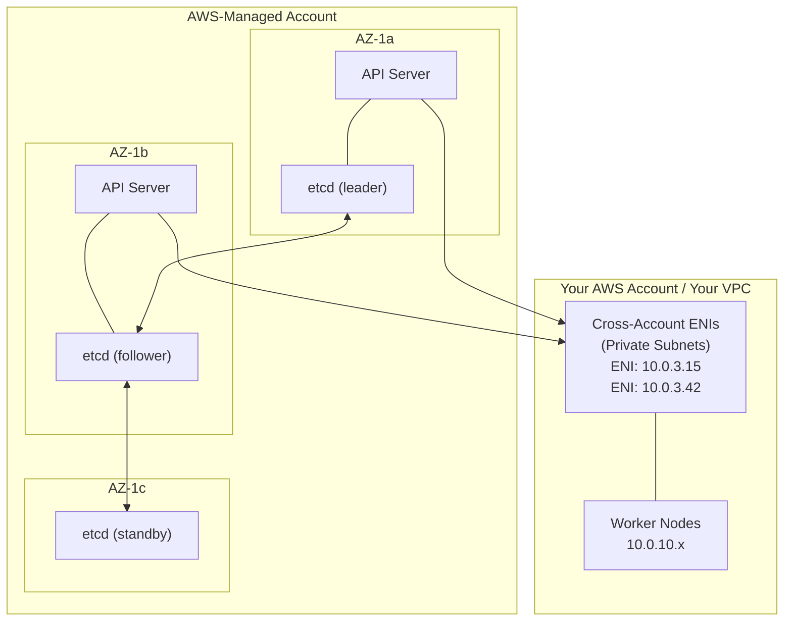
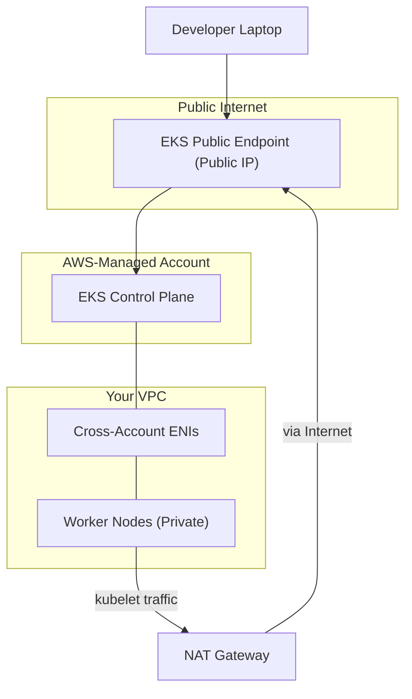
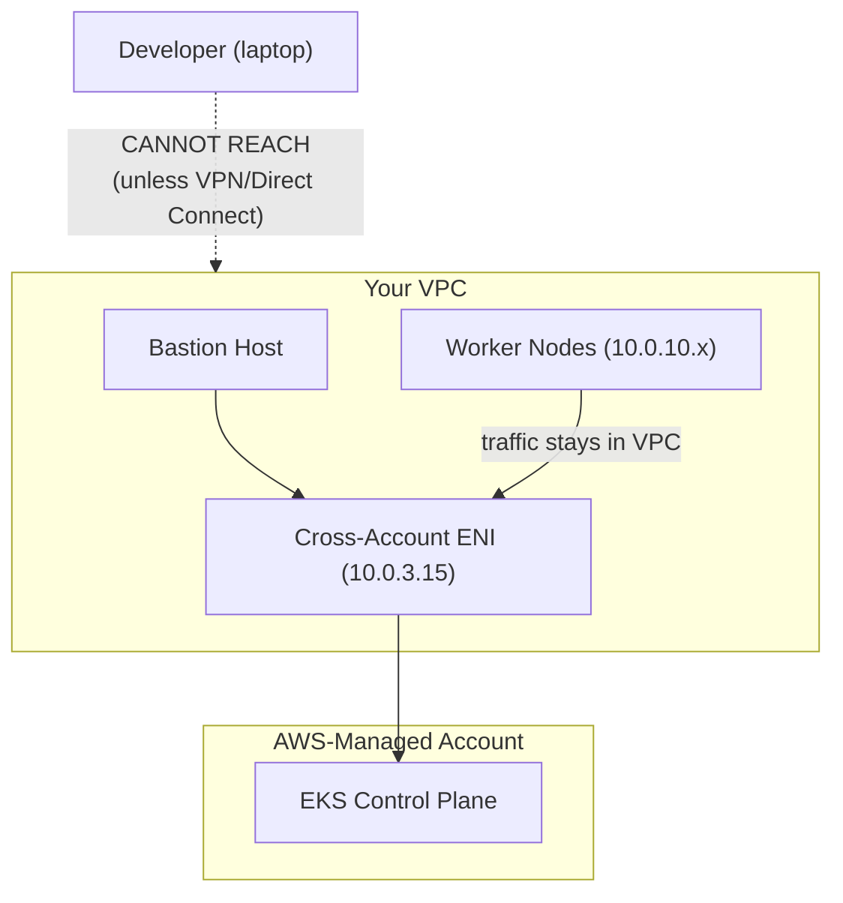
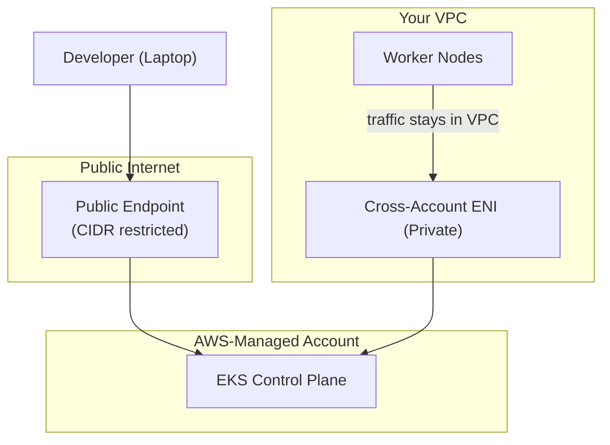
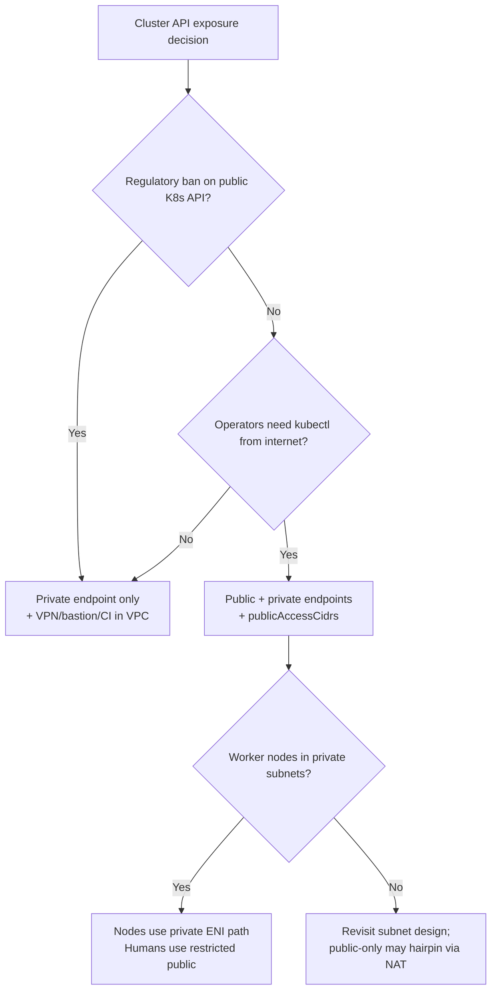
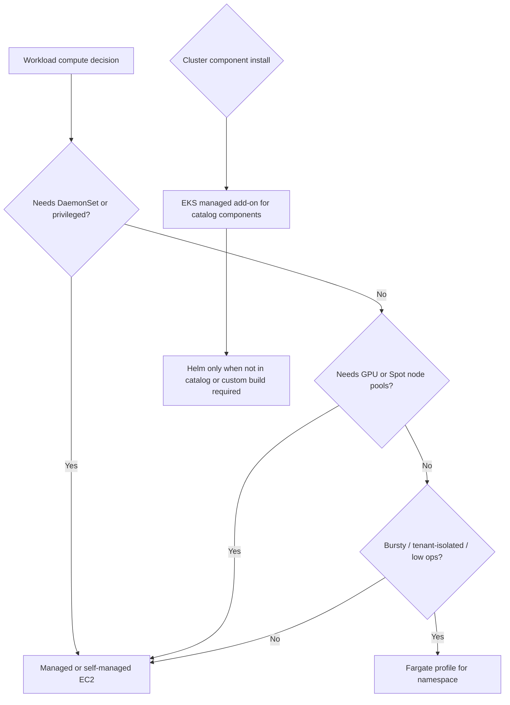
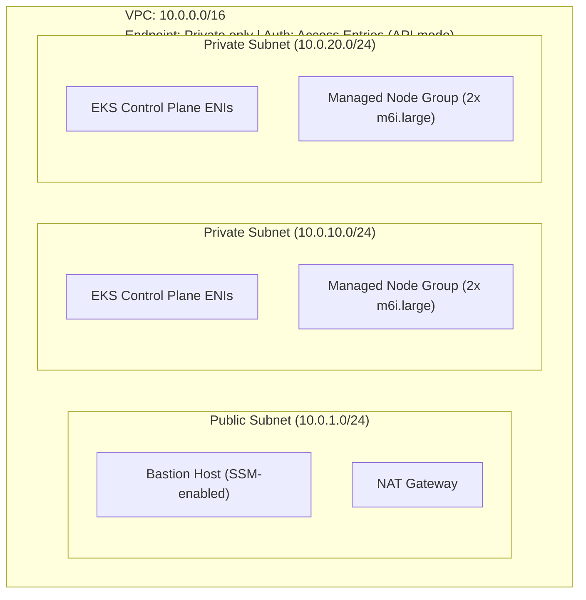

**Complexity**: `[MEDIUM]` | **Time to Complete**: ~2.5h | **Prerequisites**: [AWS Essentials](../../aws-essentials/) networking and IAM basics; [Cloud Architecture Patterns](../../architecture-patterns/) recommended.

## What You'll Be Able to Do

You should be comfortable with [AWS Essentials](../../aws-essentials/) networking and IAM basics before diving into EKS control-plane design. [Cloud Architecture Patterns](../../architecture-patterns/) is a recommended companion, not required first. After completing the module, you will be able to:

- **Configure EKS clusters with private API endpoints, managed node groups, and Fargate profiles for production workloads**
- **Design EKS control plane connectivity (public, private, dual-stack) based on security and availability requirements**
- **Implement EKS Access Entries to replace the legacy aws-auth ConfigMap for cluster authentication**
- **Evaluate Managed Node Groups vs self-managed nodes vs Fargate for different workload isolation and cost profiles**

---

## Why This Module Matters

Hypothetical scenario: A platform team runs a production EKS cluster with only the public Kubernetes API endpoint enabled. Worker nodes live in private subnets and reach the API server through a NAT gateway. During a traffic spike on an unrelated data pipeline, NAT connection tracking saturates. Nodes lose steady contact with the control plane even though application pods still serve traffic locally. Deployments stall, new pods never schedule, and on-call engineers spend hours debugging application code when the failure mode is architectural connectivity. The remediation is not bigger NAT instances alone — it is enabling private endpoint access so kubelet traffic stops competing with arbitrary outbound internet flows on the NAT path.

That pattern illustrates a fundamental truth about EKS: AWS operates the control plane, but you own how clients and nodes reach it, how compute registers, and how IAM principals map to Kubernetes RBAC. The managed control plane removes etcd backups and API server patching from your runbook, yet endpoint mode, subnet sizing, add-on versions, and authentication mode remain decisions with blast radius across every namespace. Getting them wrong does not produce a gentle degradation curve; it produces hard outages that look like mysterious application bugs until someone traces the request path to the API server.

In this module, you will learn how the EKS control plane is structured across Availability Zones, how cross-account ENIs bridge the managed plane to your VPC, how to choose public, private, or dual endpoint access with realistic kubectl and CI/CD paths, when Managed Node Groups, self-managed nodes, or Fargate fit different isolation and cost profiles, how EKS managed add-ons track control plane versions, and how to migrate from the legacy `aws-auth` ConfigMap to EKS Access Entries without locking out operators.

---

## EKS Control Plane Architecture

When you create an EKS cluster, AWS provisions a highly available Kubernetes control plane that you never directly see or SSH into. Understanding what happens behind the curtain is essential for making informed architectural decisions.

### What AWS Manages For You

The EKS control plane consists of [at least two API server instances and three etcd nodes, spread across three Availability Zones](https://docs.aws.amazon.com/eks/latest/userguide/eks-architecture.html) in the AWS-owned account. You do not pay for those API servers or etcd members as separate line items during [standard Kubernetes version support](https://aws.amazon.com/eks/pricing/) — that capacity is bundled into the per-cluster hourly fee while your worker compute is billed separately.

AWS owns patching, scaling, and failure recovery for those control plane components. You cannot SSH to an API server, snapshot etcd yourself, or pin a custom `kube-apiserver` build. What you do control is the Kubernetes version on the cluster (within the EKS support calendar), optional [upgrade policies](https://docs.aws.amazon.com/eks/latest/userguide/view-kubernetes-versions.html) that determine whether you enter extended support or auto-upgrade at end of standard support, and the VPC configuration that determines how nodes and humans reach the API. Treat the boundary clearly in design reviews: anything involving ENIs, security groups, endpoint flags, or authentication mode is your operational contract even when the control plane itself is invisible.

### etcd, API availability, and what you still operate

etcd holds cluster state — objects, leases, and coordination data — and EKS runs it in the managed account with replication across three zones. You do not take etcd backups manually or restore from a volume you mount; disaster recovery for the control plane is AWS’s responsibility within the EKS SLA model. Your backup strategy instead targets application data, etcd-independent configuration in Git, and the ability to recreate node groups and add-ons against a fresh cluster if needed.

From a troubleshooting perspective, “the cluster is down” often means clients cannot reach the API server endpoint you configured, not that AWS lost etcd. Symptoms include `kubectl` timeouts, nodes showing `NotReady` when the kubelet cannot renew leases, and controllers that stop reconciling while long-running pods continue serving until they need scheduling changes. When incidents strike, split the path: verify endpoint accessibility from the caller’s network, verify cross-account ENIs and security groups on the data plane path, then inspect Kubernetes events — before assuming the managed plane failed.



### Cross-Account ENIs: The Bridge

The most important architectural detail in EKS is the **cross-account Elastic Network Interface (ENI)**. When you create an EKS cluster, [AWS places ENIs from the managed control plane account into the subnets you specify in your VPC. These ENIs are how the control plane communicates with your worker nodes.](https://docs.aws.amazon.com/eks/latest/userguide/network-reqs.html)

The cross-account ENI design has critical implications for subnet sizing, security groups, and change management. The subnets you provide during cluster creation must have enough free IP addresses for these ENIs, and treating those ENIs like ordinary unused elastic network interfaces is a common outage pattern during over-eager VPC cleanups.

- The subnets you provide during cluster creation must have enough free IP addresses for these ENIs
- Security Groups attached to these ENIs control traffic between the control plane and your nodes
- If you delete or modify these ENIs, your cluster will lose control plane connectivity
- The ENIs appear in your account with description `Amazon EKS <cluster-name>` (the legacy `kubernetes.io/cluster/<name>=owned` tag applied only on clusters running Kubernetes 1.14 or earlier)

```bash
# View the cross-account ENIs in your VPC
aws ec2 describe-network-interfaces \
  --filters "Name=description,Values=Amazon EKS my-cluster" \
  --query 'NetworkInterfaces[*].{ENI:NetworkInterfaceId, SubnetId:SubnetId, PrivateIp:PrivateIpAddress, SG:Groups[0].GroupId}' \
  --output table
```

### The Cluster Security Group

EKS automatically creates a **cluster security group** that is [attached to both the cross-account ENIs and your managed node groups. This security group allows unrestricted communication between the control plane and your nodes](https://docs.aws.amazon.com/eks/latest/userguide/sec-group-reqs.html). Think of it as the deliberately permissive bridge AWS requires so kubelets, webhooks, and CNI components can function without micromanaging thousands of port rules per cluster. You can find it in the cluster details:

Understanding the split between cluster security groups and additional security groups prevents a common audit failure mode: teams tighten the cluster security group and break nodes, or they open the public endpoint wide while believing an additional group alone provides protection. The correct pattern keeps the cluster security group intact for node traffic and uses additional groups plus `publicAccessCidrs` for human and CI entry paths.

```bash
# Retrieve the cluster security group
aws eks describe-cluster --name my-cluster \
  --query 'cluster.resourcesVpcConfig.clusterSecurityGroupId' \
  --output text
```

Do not remove or restrict this security group unless you fully understand the consequences. Misconfiguring it is one of the fastest ways to make your nodes unable to join the cluster.

**Reflective checkpoint:** If a security group rule blocks worker nodes from reaching cross-account ENIs, pods already running on those nodes typically keep executing because the local kubelet continues managing containers until an operation requires the API server — scheduling changes, eviction, certificate rotation, or scale events. The cluster looks “half alive,” which is why ENI and security group regressions are so painful to diagnose under pressure.

### Subnet IP planning beyond the ENI headline

Each cluster subnet you register consumes control plane ENI addresses from your CIDR. AWS [requires sufficient free addresses](https://docs.aws.amazon.com/eks/latest/userguide/network-reqs.html) in those subnets and recommends planning for growth because the same subnets later host nodes and, with the VPC CNI, pod IPs. A `/28` subnet that barely fits two nodes can fail silently during control plane upgrades or node group expansions when ENI placement competes with pod density. Platform teams routinely standardize on `/24` or larger private subnets per AZ for production EKS precisely because the control plane footprint is small but non-negotiable.

---

## Cluster Endpoint Access: Public, Private, or Both

The single most consequential architectural decision you make when creating an EKS cluster is how the Kubernetes API server endpoint is exposed. There are three configurations, and each has dramatically different security and connectivity characteristics.

### Public Endpoint Only (Default)

When you create an EKS cluster, [the default configuration exposes a public endpoint](https://docs.aws.amazon.com/eks/latest/userguide/cluster-endpoint.html). The API server gets a public DNS name (e.g., `https://ABCDEF1234.gr7.us-east-1.eks.amazonaws.com`) that resolves to public IP addresses.



**The problem**: Your worker nodes in private subnets must reach the API server through the public endpoint, which sends that traffic out of the VPC. This adds latency, costs money (NAT data processing fees), and creates a dependency on the NAT Gateway. If your NAT Gateway is overwhelmed or fails, your nodes lose contact with the control plane.

When only `endpointPublicAccess` is true, the Kubernetes API DNS name resolves to public addresses from the internet. Nodes in private subnets without a route that prefers the private ENI path will hairpin through NAT to those public IPs — the classic “public-only” footgun. Operators sometimes restrict administrative access with `publicAccessCidrs` while leaving node traffic on the expensive path, which improves security for human `kubectl` but does not fix node-to-API reliability.

You can restrict the public endpoint using CIDR allowlists:

```bash
aws eks update-cluster-config --name my-cluster \
  --resources-vpc-config \
    endpointPublicAccess=true,\
    publicAccessCidrs='["203.0.113.0/24","198.51.100.0/24"]'
```

### Private Endpoint Only

With a private endpoint, the API server DNS resolves to the private IP addresses of the cross-account ENIs inside your VPC. No public endpoint exists.



**Advantages**: Node-to-control-plane traffic stays entirely within the VPC. No NAT Gateway dependency for Kubernetes operations. No public attack surface.

**Challenge**: [You cannot run `kubectl` from your laptop unless you are connected to the VPC via VPN, Direct Connect, or a bastion host](https://docs.aws.amazon.com/eks/latest/userguide/cluster-endpoint.html). CI/CD pipelines must also run inside the VPC or have network connectivity to it.

Private-only mode is the right choice when regulatory or threat models forbid any internet-reachable Kubernetes API surface. The trade is operational: every actor that calls the API — humans, GitHub Actions runners, Terraform Cloud agents, emergency break-glass tooling — needs a network path into the VPC. Teams often standardize on SSM Session Manager bastions, VPN concentrators, or CI runners in the same account/region so access patterns mirror production traffic rather than bolting on one-off SSH keys.

```bash
aws eks update-cluster-config --name my-cluster \
  --resources-vpc-config \
    endpointPublicAccess=false,\
    endpointPrivateAccess=true
```

### Public + Private (Recommended for Production)

[The best-practice configuration enables both endpoints](https://docs.aws.amazon.com/eks/latest/best-practices/subnets.html). Nodes use the private endpoint (traffic stays in VPC), while developers and CI/CD pipelines can use the public endpoint (optionally restricted by CIDR).

With both endpoints enabled, [EKS uses split-horizon DNS](https://docs.aws.amazon.com/eks/latest/userguide/cluster-endpoint.html): the same cluster hostname resolves to private ENI addresses inside the VPC and to public addresses from the broader internet. Nodes and in-VPC automation should therefore hit the private path automatically, while operators on corporate networks reach the public endpoint only if their source IP is within `publicAccessCidrs`. Document which path each tool uses during onboarding so security reviews do not confuse “public endpoint exists” with “the API is open to the world.”



```bash
aws eks update-cluster-config --name my-cluster \
  --resources-vpc-config \
    endpointPublicAccess=true,\
    endpointPrivateAccess=true,\
    publicAccessCidrs='["203.0.113.0/24"]'
```

### Endpoint Decision Matrix

| Configuration | Node Traffic Path | kubectl Access | Security | NAT Dependency |
| :--- | :--- | :--- | :--- | :--- |
| Public only | Node -> NAT -> Internet -> API | Anywhere | Lowest | Yes (critical path) |
| Private only | Node -> ENI -> API (VPC internal) | VPN/bastion only | Highest | No |
| Public + Private | Node -> ENI -> API (VPC internal) | Anywhere (CIDR restrict) | High | No |

### How kubectl and the kubelet choose an endpoint

Both the Kubernetes CLI and node kubelets ultimately open HTTPS connections to the same logical API server, but they may traverse different network paths depending on where they run and which endpoint flags you enabled. When `endpointPrivateAccess` is true and the client resolves DNS from inside the VPC, the cluster’s public hostname should map to private addresses on the cross-account ENIs, keeping kubelet heartbeats off the public internet. When the client resolves from outside the VPC without connectivity to those addresses, `kubectl` fails even if the public endpoint is technically enabled but restricted by CIDR.

This is why split-horizon DNS is not an obscure detail — it is the mechanism that makes dual-endpoint designs work. Operators who tunnel into the VPC but inherit public DNS resolvers still hit the public IPs and wonder why “private endpoint is on” yet latency and NAT metrics look wrong. Standardize an internal resolver or `/etc/hosts` testing procedure during incidents so you know which path is in play before tweaking security groups.

Additional security groups attached at cluster creation apply only to control plane ENIs, not worker instances. They are the right place to allow corporate CIDR blocks to TCP 443 while keeping the cluster security group focused on node-to-control-plane chatter. Confusing the two groups leads to either overly open public exposure or accidental blocks on node traffic — both show up as flaky `NotReady` nodes rather than clear “security group denied” messages in the EKS console.

Hypothetical scenario: A team running public-only endpoints suffers repeated deployment freezes whenever NAT saturates during batch jobs. After enabling public and private endpoints together and tightening `publicAccessCidrs` to corporate egress ranges, node kubelets keep using the private ENI path while engineers still reach the API from approved networks. The next NAT spike affects outbound internet for pods that need it, but control plane heartbeats no longer compete for NAT capacity — an outcome that is invisible in the EKS console yet decisive for platform stability.

**Reflective checkpoint:** A developer on a corporate VPN with routes into the VPC runs `kubectl get pods` against a private-only cluster. The command succeeds only if DNS resolution inside that VPN path returns the private ENI addresses (or the client uses an endpoint configuration that targets them). VPN without VPC DNS forwarding often fails even when “VPN is connected,” which is why bastion-based `aws eks update-kubeconfig` workflows remain common in private-only designs.

---

## Compute Options: Managed Node Groups vs. Self-Managed vs. Fargate

EKS gives you three fundamentally different ways to run your workloads. Each maps to a different point on the control-vs-flexibility spectrum.

### Managed Node Groups

Managed Node Groups (MNGs) are the default and most common choice. [AWS manages the EC2 instances lifecycle -- provisioning, AMI updates, draining, and termination](https://docs.aws.amazon.com/eks/latest/userguide/managed-node-groups.html) -- while you control the instance type, scaling parameters, and labels.

```bash
# Create a managed node group
aws eks create-nodegroup \
  --cluster-name my-cluster \
  --nodegroup-name standard-workers \
  --node-role arn:aws:iam::123456789012:role/EKSNodeRole \
  --subnets subnet-aaa111 subnet-bbb222 \
  --instance-types m6i.xlarge m6a.xlarge m5.xlarge \
  --scaling-config minSize=2,maxSize=10,desiredSize=3 \
  --capacity-type ON_DEMAND \
  --ami-type AL2023_x86_64_STANDARD \
  --labels environment=production,team=platform
```

Managed node groups bundle several operational features that matter at scale: graceful rolling updates, multi-instance-type capacity pools, integration with cluster autoscalers, and launch-template extensibility for custom bootstrap logic.

- **Graceful updates**: When you update the AMI or instance type, MNGs cordon and drain nodes one by one, respecting PodDisruptionBudgets
- **Multiple instance types**: Specify multiple instance types to widen available capacity pools; On-Demand groups use the order you provide, and Spot groups use AWS allocation strategies such as price-capacity-optimized.
- **Automatic scaling**: Integrates with Cluster Autoscaler or Karpenter
- **Launch templates**: Customize with user data, additional security groups, or custom AMIs via launch templates

Managed node groups attach the cluster security group automatically and register nodes with IAM roles you supply. For most stateful and stateless application tiers, they are the default because AWS owns AMI refresh mechanics while you retain instance size, capacity type, labels, and taints. The cost model is pure EC2 (plus EBS and data transfer): you pay for instances whether pods fill them or not, which makes rightsizing and autoscaling policies the main cost levers rather than a separate Kubernetes compute tax.

### Self-Managed Node Groups

Self-managed nodes are EC2 instances you provision yourself (usually via an Auto Scaling Group and a Launch Template) and register with the EKS cluster using the bootstrap script.

```bash
#!/bin/bash
# User data script for self-managed nodes
/etc/eks/bootstrap.sh my-cluster \
  --kubelet-extra-args '--node-labels=workload=gpu --register-with-taints=nvidia.com/gpu=:NoSchedule' \
  --container-runtime containerd
```

Self-managed nodes remain appropriate when you need a custom AMI with pre-baked software (GPU drivers, compliance agents), instance types not yet available through MNG APIs, specialized Windows images, or bespoke drain orchestration tied to legacy Auto Scaling Group automation.

- You need a custom AMI with pre-baked software (e.g., GPU drivers, compliance agents)
- You require instance types not yet supported by MNGs
- You need Windows nodes with specific configurations
- You want full control over the update/drain process

The trade-off is clear: you own the entire lifecycle, including security patches, AMI updates, and drain orchestration.

Self-managed nodes still require the same IAM node role and bootstrap contract (`/etc/eks/bootstrap.sh`) so kubelet registers against your API endpoint mode. Teams choose this path when they must bake compliance agents into AMIs, coordinate GPU driver versions with ML frameworks, or integrate with existing Auto Scaling Group automation that predates EKS MNG APIs. You gain maximum flexibility at the price of runbooks: during every Kubernetes minor upgrade, you validate bootstrap scripts, CNI compatibility, and drain ordering yourself instead of clicking through a managed node group release channel.

### AWS Fargate

Fargate provides serverless compute for Kubernetes pods. You define a **Fargate Profile** that specifies which pods (by namespace and labels) should run on Fargate. When a matching pod is scheduled, AWS provisions a dedicated microVM for it.

```bash
# Create a Fargate profile
aws eks create-fargate-profile \
  --cluster-name my-cluster \
  --fargate-profile-name backend-services \
  --pod-execution-role-arn arn:aws:iam::123456789012:role/EKSFargatePodRole \
  --subnets subnet-aaa111 subnet-bbb222 \
  --selectors '[{"namespace":"backend","labels":{"compute":"fargate"}}]'
```

Fargate-backed pods trade node operations for per-pod isolation with the following constraints and behaviors that platform teams review before approving Fargate profiles:

- **No nodes to manage**: No patching, no AMI updates, no SSH access
- **Per-pod isolation**: Each pod runs in its own Firecracker microVM
- **Cold start**: Pods on Fargate generally take noticeably longer to become ready than pods scheduled onto already-running EC2 nodes
- **Limitations**: [No DaemonSets, no privileged containers, no GPUs](https://docs.aws.amazon.com/eks/latest/userguide/fargate.html), no persistent local storage
- **Cost**: [AWS Fargate bills per vCPU and memory from image pull start until pod termination](https://aws.amazon.com/fargate/pricing/) with a one-minute minimum; EKS does not charge a separate Fargate tax beyond the cluster control plane fee

Fargate schedules one pod per Firecracker microVM, which is excellent for hard multi-tenant isolation but expensive for steady, dense services. It cannot run DaemonSets, so node-level log agents, security sensors, or mesh init containers that depend on host access must move to sidecar patterns or stay on EC2-backed compute. [AWS documents](https://docs.aws.amazon.com/eks/latest/userguide/fargate.html) that only one pod runs on each Fargate task — there is no bin-packing multiple pods onto the same microVM. Cold starts routinely land in the tens of seconds, so bursty batch namespaces benefit more than latency-sensitive synchronous APIs unless you keep warm capacity elsewhere.

### Compute Decision Matrix

| Feature | Managed Node Groups | Self-Managed Nodes | Fargate |
| :--- | :--- | :--- | :--- |
| **AMI updates** | AWS-managed (rolling) | You manage | N/A (serverless) |
| **DaemonSets** | Yes | Yes | No |
| **GPU support** | Yes | Yes | No |
| **Spot instances** | Yes | Yes | No |
| **Startup time** | Seconds (node exists) | Seconds (node exists) | 30-90s cold start |
| **SSH access** | Optional | Yes | No |
| **Cost model** | EC2 pricing | EC2 pricing | Per-pod vCPU+memory/sec |
| **Best for** | Most workloads | Custom/GPU/special | Batch, burstable, low-ops |

Most production clusters use a hybrid approach: Managed Node Groups for the core workload, with Fargate profiles for specific namespaces that benefit from serverless isolation (like batch jobs or tenant-isolated services). Capacity planning for hybrid fleets means maintaining two scheduling grammars: node selectors and taints for EC2 pools, and namespace/label selectors for Fargate profiles. Autoscaling policies differ as well — Cluster Autoscaler or Karpenter for EC2, while Fargate scales per pod without a node intermediary. During incidents, confirm which profile owns a failing pod before chasing node health metrics that do not exist for Fargate.

**Reflective checkpoint:** If a mission-critical log shipper runs as a DaemonSet on EC2 nodes, moving bursty web tiers to Fargate splits observability: Fargate pods need sidecar or remote logging patterns because the DaemonSet cannot mount on the microVM host. Budget engineering time for that redesign before chasing Fargate savings on over-provisioned node pools.

---

## EKS Add-ons: Managed Component Lifecycle

Every Kubernetes cluster needs certain components to function beyond the API server itself: a Container Network Interface to assign pod addresses, DNS for service discovery, and kube-proxy (or equivalent datapath rules) to implement Service IPs. On EKS these components are not optional extras — they are part of the data plane contract between AWS networking and Kubernetes scheduling. Treating them as “day-two Helm installs” is how teams end up with clusters that upgrade cleanly on paper yet fail the first time a new node group launches during a promotion window.

### Version skew and the upgrade calendar

EKS publishes a [Kubernetes version calendar](https://docs.aws.amazon.com/eks/latest/userguide/kubernetes-versions.html) tying each minor release to standard and extended support end dates. Control plane upgrades do not automatically move add-ons; you must select compatible builds from `describe-addon-versions` and roll them cluster-wide. A practical runbook sequences: upgrade control plane, upgrade `vpc-cni` before scaling nodes, upgrade `coredns` and `kube-proxy`, then install optional drivers (EBS/EFS) if storage classes changed defaults. Skipping steps shows up as flaky DNS or IP exhaustion only under load, which is why load tests after upgrades matter as much as API version bumps.

Default clusters created without explicit add-on APIs still run `vpc-cni`, `coredns`, and `kube-proxy` as self-managed workloads in `kube-system`. Migrating those components to EKS-managed add-ons is a common modernization task because it centralizes version visibility in the same console pane as the control plane version. The migration itself requires planning: capture existing environment variables and ConfigMaps, choose `PRESERVE` on first adoption, and validate pod networking in a staging cluster before touching production.

[EKS Add-ons](https://docs.aws.amazon.com/eks/latest/userguide/eks-add-ons.html) provide a managed way to install, configure, and update these components instead of hand-rolling Helm releases for every cluster.

### Why Add-ons Matter

Before EKS Add-ons, teams installed these components using Helm charts or raw manifests. This led to version drift, forgotten upgrades, and configuration inconsistencies. EKS Add-ons solve this by:

- Tracking compatible versions for your cluster's Kubernetes version
- Providing one-click (or one-API-call) upgrades
- Preserving your custom configuration during updates
- Surfacing health status in the EKS console and API

When you create a cluster, EKS can install a default set of self-managed add-ons (`vpc-cni`, `coredns`, `kube-proxy`) or you can adopt [EKS-managed add-on APIs](https://docs.aws.amazon.com/eks/latest/userguide/eks-add-ons.html) that tie lifecycle to the control plane version matrix. The critical operational rule is version skew: upgrading Kubernetes without moving compatible add-on builds leaves you with networking or DNS failures that surface only when new nodes join. Platform runbooks therefore pair every control plane upgrade with `describe-addon-versions` checks and staged `update-addon` calls, using `PRESERVE` when custom CNI settings must survive.

### Core Add-ons

```bash
# List available add-ons and their versions
aws eks describe-addon-versions \
  --kubernetes-version 1.35 \
  --query 'addons[*].{Name:addonName, Latest:addonVersions[0].addonVersion}' \
  --output table
```

Every EKS cluster depends on a small set of platform add-ons; the table below lists the components you will install or upgrade on nearly every production cluster, including optional drivers and observability agents that become mandatory once applications rely on them.

| Add-on | Purpose | Default? |
| :--- | :--- | :--- |
| `vpc-cni` | Pod networking (assigns VPC IPs to pods) | Yes |
| `coredns` | Cluster DNS resolution | Yes |
| `kube-proxy` | Kubernetes Service routing rules | Yes |
| `eks-pod-identity-agent` | Pod Identity credential injection | No (but recommended) |
| `aws-ebs-csi-driver` | EBS volume provisioning | No (required for EBS PVs) |
| `aws-efs-csi-driver` | EFS volume provisioning | No (required for EFS PVs) |
| `aws-mountpoint-s3-csi-driver` | S3 mount as filesystem | No |
| `adot` | AWS Distro for OpenTelemetry | No |
| `amazon-cloudwatch-observability` | Container Insights | No |

The `eks-pod-identity-agent` add-on is increasingly part of modern baselines because it enables [EKS Pod Identity](https://docs.aws.amazon.com/eks/latest/userguide/pod-identities.html) without per-cluster OIDC provider plumbing. This module focuses on cluster architecture and authentication entries; [Module 5.3](../module-5.3-eks-identity/) covers IRSA versus Pod Identity migration in depth, and [AWS Essentials Module 1.1 (IAM)](../../aws-essentials/module-1.1-iam/) explains the underlying IAM role trust models you will attach to service accounts.

### Managed add-ons versus self-managed manifests

| Approach | When it fits | Risk profile |
| :--- | :--- | :--- |
| EKS managed add-on | You want AWS-tested version matrices and API-driven upgrades | Lower drift; still requires post-upgrade validation |
| Self-managed Helm/manifest | You need bleeding-edge CNI features or non-catalog components | Higher drift; you own compatibility testing |
| Hybrid | Core networking on managed add-ons, observability via Helm | Document who owns upgrades for each component |

### Installing and Updating Add-ons

```bash
# Install the EBS CSI driver add-on
aws eks create-addon \
  --cluster-name my-cluster \
  --addon-name aws-ebs-csi-driver \
  --addon-version v1.38.1-eksbuild.2 \
  --service-account-role-arn arn:aws:iam::123456789012:role/EBS-CSI-DriverRole \
  --resolve-conflicts OVERWRITE

# Check add-on status
aws eks describe-addon \
  --cluster-name my-cluster \
  --addon-name aws-ebs-csi-driver \
  --query 'addon.{Name:addonName, Version:addonVersion, Status:status, Health:health.issues}'

# Update an add-on
aws eks update-addon \
  --cluster-name my-cluster \
  --addon-name vpc-cni \
  --addon-version v1.19.2-eksbuild.1 \
  --resolve-conflicts PRESERVE
```

The `--resolve-conflicts` flag determines whether EKS overwrites custom configuration during add-on updates, and production clusters usually standardize on one policy per add-on after testing:

- `NONE`: Fail if your custom configuration conflicts with the add-on defaults
- `OVERWRITE`: Replace any custom configuration with add-on defaults
- [`PRESERVE`: Keep your custom configuration and only update what the add-on manages](https://docs.aws.amazon.com/eks/latest/userguide/updating-an-add-on.html)

For production, always use `PRESERVE` unless you specifically want to reset to defaults.

**Reflective checkpoint:** After a control plane upgrade to Kubernetes 1.35, leaving `vpc-cni` on a build tested only for 1.34 often breaks IP allocation on new nodes while older nodes appear fine. The failure shows up weeks later during scale-out, which is why add-on upgrades belong on the same change ticket as the Kubernetes version bump, not as optional cleanup.

---

## Authentication: From aws-auth to EKS Access Entries

How do humans and services authenticate to an EKS cluster? This is one of the most confusing aspects of EKS, and it has undergone a major transformation. Understanding both the legacy and modern systems is essential because you will encounter both in production.

### The Legacy System: aws-auth ConfigMap

For years, EKS used a ConfigMap called `aws-auth` in the `kube-system` namespace to map AWS IAM principals (users, roles) to Kubernetes RBAC identities. This was generally a fragile arrangement.

```yaml
# The legacy aws-auth ConfigMap
apiVersion: v1
kind: ConfigMap
metadata:
  name: aws-auth
  namespace: kube-system
data:
  mapRoles: |
    - rolearn: arn:aws:iam::123456789012:role/EKSNodeRole
      username: system:node:{{EC2PrivateDNSName}}
      groups:
        - system:bootstrappers
        - system:nodes
    - rolearn: arn:aws:iam::123456789012:role/DevTeamRole
      username: dev-user
      groups:
        - dev-namespace-admin
  mapUsers: |
    - userarn: arn:aws:iam::123456789012:user/admin
      username: cluster-admin
      groups:
        - system:masters
```

The legacy `aws-auth` ConfigMap created recurring operational risk because a single YAML mistake could revoke API access for every IAM principal except the original cluster creator, and because changes were invisible to AWS audit tooling.

1. **Single point of failure**: One YAML syntax error in this ConfigMap [locks everyone out of the cluster (except the cluster creator)](https://docs.aws.amazon.com/eks/latest/userguide/auth-configmap.html)
2. **No audit trail**: Changes to a ConfigMap are not logged in AWS CloudTrail
3. **Race conditions**: Multiple engineers editing simultaneously can overwrite each other's changes
4. **No API management**: You cannot manage it through the AWS API -- only through `kubectl`
5. **Easy to break**: A misplaced space in YAML can corrupt the entire mapping

Directly editing `aws-auth` is risky: a bad change can break IAM-to-RBAC mappings and leave teams scrambling to recover access. Moving to access entries reduces that operational risk.

Node IAM roles still need Kubernetes identity, but managed node groups and Access Entries can create the node entry automatically in modern flows. Human and CI principals should never require `system:masters` in `mapUsers` when scoped access policies exist. Workload AWS API access is a separate concern: pods assume IAM roles via IRSA or Pod Identity ([Module 5.3](../module-5.3-eks-identity/)), while Access Entries answer “which IAM principal can call the Kubernetes API and with which RBAC.” Keeping that separation explicit prevents copying admin cluster roles into application task roles.

### The Modern System: EKS Access Entries

[Introduced in late 2023, EKS Access Entries](https://aws.amazon.com/about-aws/whats-new/2023/12/amazon-eks-controls-iam-cluster-access-management/) move authentication configuration out of a fragile ConfigMap and into the EKS API itself. This means you manage access using AWS API calls, with CloudTrail logging, IAM policy guardrails, and no risk of YAML-induced lockouts.

```bash
# Create an access entry for an IAM role
aws eks create-access-entry \
  --cluster-name my-cluster \
  --principal-arn arn:aws:iam::123456789012:role/DevTeamRole \
  --type STANDARD

# Associate an access policy (predefined RBAC)
aws eks associate-access-policy \
  --cluster-name my-cluster \
  --principal-arn arn:aws:iam::123456789012:role/DevTeamRole \
  --policy-arn arn:aws:eks::aws:cluster-access-policy/AmazonEKSViewPolicy \
  --access-scope type=namespace,namespaces=dev,staging
```

### Access Policy Types

EKS provides [several predefined access policies](https://docs.aws.amazon.com/eks/latest/userguide/access-policies.html) that map to common Kubernetes RBAC configurations:

| Access Policy | Equivalent RBAC | Scope |
| :--- | :--- | :--- |
| `AmazonEKSClusterAdminPolicy` | `cluster-admin` ClusterRole | Cluster-wide |
| `AmazonEKSAdminPolicy` | `admin` ClusterRole | Namespace or cluster |
| `AmazonEKSEditPolicy` | `edit` ClusterRole | Namespace or cluster |
| `AmazonEKSViewPolicy` | `view` ClusterRole | Namespace or cluster |

Access policy ARNs always use the `arn:aws:eks::aws:cluster-access-policy/` prefix shown in the CLI examples above. When designing least-privilege roles, start with view or edit scoped to namespaces, escalate to admin only for platform break-glass roles, and reserve cluster-admin equivalents for automated controllers that genuinely require cluster-wide object management. Document each principal’s entry type (`STANDARD` versus `EC2_LINUX`, `FARGATE_LINUX`, or `EC2_WINDOWS` for compute) so audits can trace node identity separately from human operators.

### Authentication Modes

EKS clusters support three authentication modes that define whether `aws-auth`, Access Entries, or both are authoritative during migration.

```bash
# Check current authentication mode
aws eks describe-cluster --name my-cluster \
  --query 'cluster.accessConfig.authenticationMode'
```

| Mode | aws-auth | Access Entries | Migration Path |
| :--- | :--- | :--- | :--- |
| `CONFIG_MAP` | Active | Disabled | Legacy only |
| `API_AND_CONFIG_MAP` | Active | Active | Transitional (recommended first step) |
| `API` | Disabled | Active | Target state |

### Migration Path: aws-auth to Access Entries

The migration from `aws-auth` to Access Entries is non-destructive when you follow the phased API sequence below, validating each principal before removing the ConfigMap.

```bash
# Step 1: Switch to API_AND_CONFIG_MAP mode (both systems active)
aws eks update-cluster-config --name my-cluster \
  --access-config authenticationMode=API_AND_CONFIG_MAP

# Step 2: Create access entries for all existing aws-auth mappings
# For each role in your aws-auth ConfigMap:
aws eks create-access-entry \
  --cluster-name my-cluster \
  --principal-arn arn:aws:iam::123456789012:role/DevTeamRole \
  --type STANDARD

aws eks associate-access-policy \
  --cluster-name my-cluster \
  --principal-arn arn:aws:iam::123456789012:role/DevTeamRole \
  --policy-arn arn:aws:eks::aws:cluster-access-policy/AmazonEKSEditPolicy \
  --access-scope type=namespace,namespaces=dev

# Step 3: Test that access works through the new system
# (Users should be able to authenticate without aws-auth)

# Step 4: Once verified, switch to API-only mode
aws eks update-cluster-config --name my-cluster \
  --access-config authenticationMode=API

# Step 5: Clean up the aws-auth ConfigMap
kubectl delete configmap aws-auth -n kube-system
```

> **Important**: [You cannot go backwards. Once you switch from `API_AND_CONFIG_MAP` to `API`, you cannot re-enable the ConfigMap.](https://docs.aws.amazon.com/eks/latest/userguide/setting-up-access-entries.html) Test thoroughly in the transitional mode before making the final switch.

**Reflective checkpoint:** In `API_AND_CONFIG_MAP` mode, deleting `aws-auth` early removes legacy mappings but leaves Access Entries authoritative. Principals with entries and associated policies keep working; everyone else loses API access even if they previously relied on `mapRoles`. That is why migration runbooks duplicate mappings before cleanup and why the final `API` switch is one-way.

---

## Platform Readiness: What to Validate Before Production

Architecture diagrams are only useful if they translate into checks operators can run during cluster launch and quarterly audits. The following readiness themes consolidate the control-plane topics above into a practical gate you can embed in Terraform review or a platform onboarding checklist.

**Endpoint and network path verification** should confirm both the intended endpoint flags and the actual paths clients use. From a node in each private subnet, ensure the Kubernetes API hostname resolves to RFC1918 addresses and that security groups allow TCP 443 to cross-account ENIs. From an operator workstation on the approved corporate network, confirm `publicAccessCidrs` still matches egress ranges after IT changes proxy vendors. Document whether CI runners live inside the VPC; if not, record the VPN or PrivateLink mechanism that will replace “kubectl from laptop” assumptions.

**Compute baseline documentation** should list every node group and Fargate profile with instance families, capacity types, taints, labels, and owners. New services should declare which pool they target before merge, preventing silent scheduling onto default pools that lack GPU, Arm, or high-memory shapes. For Fargate profiles, capture namespace/label selectors and note observability gaps relative to DaemonSet-based logging on EC2.

**Add-on and version matrix hygiene** means maintaining a table that pairs cluster Kubernetes versions with tested `vpc-cni`, `coredns`, `kube-proxy`, and identity agent builds. During upgrades, block the change if any add-on lacks a compatible row in `describe-addon-versions`. Capture whether each add-on uses `PRESERVE` or `OVERWRITE` so on-call engineers know if an update might reset custom CNI environment variables.

**Authentication migration state** must be visible in infrastructure repositories: current `authenticationMode`, roster of Access Entries, associated policies, and scopes. Teams still in `API_AND_CONFIG_MAP` should carry a dated ticket to finish migration, because dual modes confuse incident response (“which mapping failed?”). Avoid granting `AmazonEKSClusterAdminPolicy` to CI roles; scope edit/view policies per namespace and use break-glass roles with MFA for cluster-admin.

**Cost and lifecycle guardrails** belong in the same review. Tag clusters with environment, owner, and expected lifetime; alert when Kubernetes versions approach end of standard support. For non-production clusters, automate shutdown schedules or consolidate sandboxes — three extended-support dev clusters cost more in control-plane fees alone than many teams expect.

Hypothetical scenario: During a production readiness review, an auditor asks for proof that nodes do not depend on NAT for API connectivity. You demonstrate `describe-cluster` showing private access enabled, `dig` from a worker showing private ENI targets, and security group rules allowing node SG to cluster SG on 443. The review passes because evidence maps directly to architectural decisions instead of hand-waving “EKS is managed.”

---

## Cost Lens: Control Plane, Versions, and Compute

EKS billing splits cleanly into **cluster hours** (Kubernetes version support tier), **worker infrastructure** (EC2, Fargate, EBS, load balancers), and **data-plane networking** (NAT, cross-AZ traffic, public IPv4 charges). Architecture choices in this module move the middle two buckets more than the first, except when version policy triggers extended support.

### Control plane and version support

During [standard Kubernetes version support](https://aws.amazon.com/eks/pricing/) — the first 14 months after a version is available in EKS — each cluster costs **$0.10 per hour** (~$73 per 730-hour month) regardless of node count. After standard support ends, clusters on that minor version enter **extended support** at **$0.60 per hour** (~$438/month) for up to 12 additional months unless you upgrade. That sixfold jump is pure policy: identical APIs, different support tier. IaC defaults sometimes enable extended support automatically; aligning `upgradePolicy` with your tested upgrade cadence avoids silent invoice surprises.

| Cost driver | Typical monthly impact | Knobs that reduce it |
| :--- | :--- | :--- |
| Standard support control plane | ~$73 per cluster | Consolidate dev clusters; delete unused sandboxes |
| Extended support surcharge | +~$365 per cluster vs standard | Upgrade Kubernetes before end of standard window |
| NAT-heavy public-only endpoints | Variable data processing | Enable private endpoint so node/API traffic stays in VPC |
| Over-provisioned MNG capacity | EC2 hours for idle nodes | Cluster Autoscaler, Karpenter, rightsizing, Spot where safe |
| Fargate for steady dense services | Per-pod vCPU/memory seconds | Move baseline traffic to MNG; reserve Fargate for burst/isolation |

### Node versus Fargate at moderate scale

Hypothetical scenario: A namespace runs twenty pods averaging 0.25 vCPU and 0.5 GiB requests on `m6i.large` nodes that are 40% utilized. Moving all twenty pods to Fargate removes EC2 operations but often raises compute spend because each pod pays for its own microVM envelope without bin-packing. Conversely, three large batch jobs per day that need isolation but not DaemonSets may cost less on Fargate than keeping three half-empty nodes online 24/7. Model both sides with the [Fargate pricing page](https://aws.amazon.com/fargate/pricing/) and your real request/limit profiles before platform mandates.

Unexpected cost spikes usually come from **multiplied control planes** (many environment clusters), **extended support drift**, **NAT data processing** on chatty public-only designs, and **IP charges** when the VPC CNI consumes large subnet space — topics covered further in [Module 5.2](../module-5.2-eks-networking/).

### Control plane observability and support boundaries

AWS monitors the managed control plane components and publishes cluster health in the EKS API, but you still need application-level SLOs on top. CloudWatch metrics for the control plane surface API server request rates and etcd health indicators where enabled; pair them with audit logging (`audit` policy in `kube-apiserver`) forwarded to your SIEM when compliance requires who changed what object. Remember that worker node CPU metrics do not tell you whether the API server is throttling LIST calls — watch Kubernetes API latency from controllers and CI pipelines.

When opening AWS Support cases, distinguish data-plane symptoms (nodes, CNI, add-ons) from true control-plane issues (global `kubectl` failure across networks). Providing endpoint configuration, recent authentication mode changes, and timestamps of ENI modifications accelerates triage. AWS can replace managed control plane capacity, but it cannot fix a customer security group that blocks ENIs — another reason architecture reviews focus on customer-owned networking.

For multi-cluster fleets, chargeback should include the flat $0.10/hour (or $0.60/hour) line item explicitly. Application teams often model only EC2 in their budgets and are surprised that ten microservice clusters mean ten control-plane bills before any pod schedules. Consolidating non-production workloads into namespace-isolated shared clusters reduces that tax but increases RBAC and noisy-neighbor governance work — a trade platforms should document rather than hide.

---

## Patterns & Anti-Patterns

Production EKS platforms converge on a small set of architectural patterns because the managed control plane is uniform — differentiation is endpoint mode, compute mix, add-on hygiene, and authentication APIs.

| Pattern | When to Use | Why It Works | Scaling Note |
| :--- | :--- | :--- | :--- |
| Dual endpoint + CIDR-restricted public | Humans/CI outside VPC; nodes in private subnets | Nodes use private ENIs; operators use audited public path | Revisit CIDR lists when corporate egress changes |
| Managed node groups per workload class | General services, GPU, memory tiers | AWS handles AMI rollouts; you steer with labels/taints | Add node groups instead of one oversized pool |
| EKS managed core add-ons | `vpc-cni`, `coredns`, `kube-proxy`, identity agent | Version matrix tracks Kubernetes releases | Automate add-on upgrades in the same change window as CP |
| Access Entries with scoped policies | Multi-team clusters | CloudTrail auditable; avoids `aws-auth` YAML lockouts | Start in `API_AND_CONFIG_MAP`, validate, then `API` |
| Hybrid EC2 + Fargate profiles | Batch/tenant namespaces needing isolation | Keeps DaemonSets on EC2, bursty work on Fargate | Document logging/mesh differences per compute type |

| Anti-Pattern | What Goes Wrong | Better Alternative |
| :--- | :--- | :--- |
| Public-only API for private nodes | NAT becomes control-plane choke point | Enable private endpoint; restrict public CIDRs |
| Treating Fargate as “cheaper Kubernetes” | Steady workloads pay per-pod microVM tax | Rightsize MNG; Fargate for burst/isolation only |
| Skipping add-on upgrades after CP bump | New nodes fail CNI/DNS while old nodes look fine | Gate cluster upgrades on compatible add-on versions |
| Editing `aws-auth` under pressure | Typo locks out all IAM principals | Access Entries + infrastructure-as-code for auth |
| Tiny `/28` subnets for EKS | ENI + node + pod IP exhaustion | Standardize `/24+` private subnets per AZ |
| One `system:masters` IAM role for CI | Compromised pipeline owns entire cluster | Scoped `AmazonEKSEditPolicy` per namespace |

---

## Decision Framework

Use the flows below during design reviews when stakeholders ask “which endpoint?” or “which compute?” — they encode the tradeoffs this module teaches.

### Endpoint access choice



| Requirement | Prefer | Primary tradeoff |
| :--- | :--- | :--- |
| Zero public API surface | Private only | Operational complexity for CI/CD paths |
| Private nodes + remote engineers | Public + private + CIDRs | Must maintain accurate egress lists |
| Lab cluster, single engineer | Public only (temporary) | Accept NAT dependency; migrate before prod |
| GitHub-hosted CI without VPC runners | Not private-only | Add self-hosted runners or connectivity |

### Compute and add-on choice



| Signal | Lean toward | Reason |
| :--- | :--- | :--- |
| Service mesh with init containers needing `CAP_NET_ADMIN` | MNG / self-managed | Fargate blocks privileged init patterns |
| Nightly batch namespace, no DaemonSets | Fargate profile | Pay per run; no idle nodes |
| Custom GPU AMI | Self-managed ASG | Full image pipeline control |
| Standard CNI/DNS after upgrade | Managed add-ons with `PRESERVE` | Reduces version skew incidents |

### Authentication decision supplement

When choosing between legacy `aws-auth` and Access Entries, treat it as a risk-management decision rather than a feature toggle. If your organization still edits `aws-auth` by hand, measure mean time to recovery the last time a YAML indent error blocked deploys. Access Entries move those changes into versioned Terraform or CloudFormation with IAM condition keys, which is especially valuable when dozens of microservices teams need scoped namespace access.

For machine principals, prefer IAM roles over IAM users mapped through `mapUsers`. Roles rotate through federation and instance profiles; users encourage long-lived access keys on CI machines. Pair `AmazonEKSEditPolicy` or `AmazonEKSViewPolicy` with namespace scopes instead of cluster-admin unless break-glass procedures require otherwise. Document the cluster creator’s hidden admin path during migration so you do not accidentally rely on it as the only recovery lever after deleting `aws-auth`.

Pod-level AWS permissions remain separate: workloads should use IRSA or Pod Identity ([Module 5.3](../module-5.3-eks-identity/)) rather than widening node instance profiles. Wide node policies violate least privilege because every pod on the node inherits the instance role unless you implement fine-grained IMDS controls. Architecture reviews should list three IAM layers explicitly — human access via Access Entries, node role for kubelet/AWS CNI, and pod identity for application AWS API calls — so new hires do not conflate them.

---

## Did You Know?

1. The EKS control plane runs in an AWS-owned account, not yours. [The $0.10/hour cluster fee](https://aws.amazon.com/eks/pricing/) covers at least two API server instances and three etcd nodes spread across three Availability Zones. AWS auto-scales the control plane based on the number of nodes and API request rate -- you generally do not need to "right-size" the control plane yourself. A cluster with 5 nodes and one with 5,000 nodes both cost $0.10/hour for the control plane itself.

2. The cross-account ENIs that EKS places in your VPC use IP addresses from your subnet CIDR range. Each ENI consumes one IP address per subnet. If you create a cluster with 2 subnets, you lose 2 IPs to control plane ENIs. In tightly sized subnets (like a `/28` with only 11 usable IPs), this can matter. AWS requires each cluster subnet to have at least six free IP addresses and recommends at least 16; plan larger subnets when your node and Pod density require them.

3. When you enable the private endpoint, [EKS creates a Route 53 private hosted zone associated with your VPC](https://docs.aws.amazon.com/eks/latest/userguide/cluster-endpoint.html). The cluster's DNS name (e.g., `ABCDEF1234.gr7.us-east-1.eks.amazonaws.com`) resolves to the private ENI IP addresses when queried from within the VPC, and to the public IP addresses when queried from the internet. This split-horizon DNS is automatic and invisible to most users.

4. The `aws-auth` ConfigMap shipped with early EKS releases and remained the primary IAM-to-RBAC integration mechanism until AWS introduced access entries in December 2023. The lesson: temporary solutions in infrastructure have a habit of becoming permanent.

When you connect these facts, the EKS value proposition becomes clearer: AWS absorbs etcd and API server toil, but you still engineer the VPC paths, compute pools, and IAM bindings that make Kubernetes usable for your organization. Teams that invest in those customer-owned layers — rather than fighting them — get clusters that survive NAT storms, version upgrades, and personnel changes without heroic on-call pages. That division of responsibility is the architectural through-line for every section that follows, from endpoint access through authentication migration and cost governance.

---

## Common Mistakes

| Mistake | Why It Happens | How to Fix It |
| :--- | :--- | :--- |
| **Public endpoint only with no CIDR restriction** | It is the default configuration and "just works" for getting started. | Enable the private endpoint and add CIDR allowlists to the public endpoint. At minimum, restrict to your corporate IP ranges. |
| **Deleting or modifying cross-account ENIs** | Engineers see unfamiliar ENIs in their VPC and clean them up. | Tag-based policies to prevent deletion. Educate the team that ENIs tagged `kubernetes.io/cluster/<name>` are critical infrastructure. |
| **Editing aws-auth ConfigMap without backup** | Quick changes under pressure. One typo and the entire cluster is inaccessible. | Migrate to Access Entries. If still using aws-auth, make a backup such as `kubectl get configmap aws-auth -n kube-system -o yaml > aws-auth-backup.yaml` before editing. |
| **Using a single node group for all workloads** | Simplicity bias. One size fits all seems easier to manage. | Create purpose-specific node groups: general (m-type), memory-optimized (r-type), compute (c-type). Use node selectors and taints to route pods correctly. |
| **Fargate for DaemonSet-dependent workloads** | Not understanding Fargate limitations before choosing it. | Check if your workloads need DaemonSets (logging agents, monitoring, service mesh sidecars). If yes, use MNGs or self-managed nodes for those workloads. |
| **Not setting up the EKS Pod Identity agent** | Assuming IRSA is sufficient, not knowing the newer option exists. | Install the `eks-pod-identity-agent` add-on. [Pod Identity is simpler to configure and eliminates OIDC provider management.](https://docs.aws.amazon.com/eks/latest/best-practices/identity-and-access-management.html) See Module 5.3 for the full migration. |
| **Forgetting to update add-ons after cluster upgrade** | Upgrading the Kubernetes version but leaving add-ons on old versions. | [After every cluster version upgrade, check and update all add-ons to compatible versions.](https://docs.aws.amazon.com/eks/latest/userguide/updating-an-add-on.html) Incompatible add-on versions can cause networking or DNS failures. |
| **Cluster subnets too small** | Using `/28` or `/27` subnets for EKS without accounting for ENI consumption. | Use at least `/24` subnets for EKS clusters. Account for cross-account ENIs, pod IPs (VPC CNI), and node IPs. |

---

## Quiz

<details>
<summary>Question 1: Your EKS cluster has both public and private endpoints enabled. A worker node in a private subnet needs to communicate with the Kubernetes API server. Which endpoint does it use, and why does this matter for cost?</summary>

The worker node uses the **private endpoint** via the cross-account ENIs inside the VPC. The cluster DNS name resolves to the private ENI IP addresses when queried from within the VPC (split-horizon DNS). This matters for cost because the traffic stays entirely within the VPC and does not traverse the NAT Gateway. With a public-only endpoint, the same traffic would go through the NAT Gateway, incurring data processing charges ($0.045/GB) and creating a dependency on NAT Gateway availability.
</details>

<details>
<summary>Question 2: Your platform team is under a tight deadline to deprecate legacy infrastructure. An engineer proposes updating the EKS cluster directly from `CONFIG_MAP` mode to `API` mode to save time and immediately delete the `aws-auth` ConfigMap. Should you approve this plan?</summary>

**No, you should not approve this plan.** You must first transition the cluster to `API_AND_CONFIG_MAP` mode, which enables both authentication systems simultaneously. In this transitional mode, your team must create Access Entries for all existing IAM-to-Kubernetes mappings and verify they function correctly alongside the legacy system. Only after thorough testing confirms that users and CI/CD pipelines can authenticate via the API should you switch to `API` mode. This is a one-way migration; once you move to `API` mode, you cannot re-enable the ConfigMap, meaning a premature switch risks locking all users out of the cluster permanently.
</details>

<details>
<summary>Question 3: An automated cleanup script in your AWS account identifies several ENIs without attached EC2 instances and deletes them. These ENIs were tagged with `kubernetes.io/cluster/production`. What is the immediate impact on your production EKS cluster?</summary>

Deleting these cross-account ENIs immediately severs the network connection between the EKS control plane (in the AWS-managed account) and your worker nodes. Nodes will be unable to reach the API server, meaning the kubelet will stop receiving pod scheduling instructions and cannot report node health. Existing pods will continue running and serving traffic as long as they do not require control plane interaction, but the cluster cannot be managed or scaled. The cluster will appear healthy in the EKS console because the control plane itself is unharmed, but `kubectl` commands executing through the private endpoint will time out. AWS will eventually recreate the missing ENIs automatically, but the disruption can last several minutes and severely impact deployment pipelines.
</details>

<details>
<summary>Question 4: A team wants zero-operational-overhead Kubernetes. They plan to run their entire application (15 microservices) on Fargate. Their architecture includes a Datadog agent DaemonSet, Istio service mesh, and a Redis StatefulSet with local SSD storage. Will this work?</summary>

**No, this architecture will not work on Fargate.** Fargate operates as a serverless compute engine and fundamentally does not support DaemonSets, meaning the Datadog agent cannot be deployed as a node-level background process. Furthermore, Fargate does not support privileged containers, which are strictly required by some Istio service mesh init components to configure iptables routing rules. Finally, Fargate does not provide local persistent storage options, making a Redis StatefulSet dependent on local SSDs impossible to deploy. The team must redesign their architecture to use Managed Node Groups for these specific workloads, or adopt a sidecar-based approach for logging and routing if they insist on a purely serverless environment.
</details>

<details>
<summary>Question 5: After successfully upgrading your production EKS cluster's control plane from Kubernetes v1.34 to v1.35, the application teams report that their newly scheduled pods are crashing with `CrashLoopBackOff`. Upon inspection, you find that the pods are unable to resolve internal service names. What is the most likely cause of this specific failure?</summary>

The most likely cause is that the CoreDNS add-on was not updated after the cluster control plane upgrade. When you upgrade the Kubernetes version of an EKS cluster, managed add-ons like CoreDNS, VPC CNI, and kube-proxy are not automatically upgraded alongside the control plane. If the running CoreDNS version becomes deprecated or strictly incompatible with the new Kubernetes API version, DNS resolution within the cluster can fail or silently degrade. To resolve this issue, you should promptly update the CoreDNS add-on to a version explicitly tested and compatible with Kubernetes 1.35. As a best practice, review and update EKS add-ons to their compatible versions soon after any cluster version upgrade.
</details>

<details>
<summary>Question 6: A security auditor notices two different types of security groups attached to your EKS cluster configuration: the "cluster security group" and several "additional security groups." The auditor demands to know why the cluster security group has rules allowing all traffic between nodes and the control plane, and asks you to lock it down. How do you explain the architectural difference and defend the configuration?</summary>

The **cluster security group** is a foundational networking component automatically created and managed by EKS, explicitly designed to be attached to both the cross-account ENIs and your managed node groups. It contains default rules allowing unrestricted communication between the control plane and nodes, and modifying or restricting these rules is highly dangerous as it can easily break node registration and pod networking. In contrast, **additional security groups** are custom groups you optionally specify during cluster creation that are attached *only* to the cross-account ENIs, not to the worker nodes. You use these additional security groups to provide granular, restrictive control over what non-node external traffic (such as requests from a bastion host or corporate VPN) is allowed to reach the Kubernetes API server endpoints. Therefore, the cluster security group must remain open to facilitate internal cluster operations, while the additional security groups are the correct mechanism for satisfying the auditor's request to restrict administrative access.
</details>

<details>
<summary>Question 7: Your company requires that the Kubernetes API server is never accessible from the public internet. However, your CI/CD pipeline runs on GitHub Actions (outside your VPC). How can you satisfy both requirements?</summary>

To satisfy the security requirement, you must configure the EKS cluster with only the **private endpoint** enabled, completely removing the public attack surface. Because the API server DNS now resolves exclusively to internal VPC IP addresses, external CI/CD platforms like GitHub Actions cannot reach the cluster over the public internet. To bridge this gap, you must establish private connectivity by running self-hosted GitHub Actions runners directly on EC2 instances inside your VPC. Alternatively, you could utilize AWS PrivateLink or establish a site-to-site VPN connection between the external CI/CD network and your AWS environment. The critical architectural principle here is that securing the cluster behind a private endpoint shifts the burden of connectivity to the client, requiring you to bring your deployment tools into the private network boundary.
</details>

<details>
<summary>Question 8: Finance asks why three idle development EKS clusters on an older Kubernetes version each cost roughly $438/month for the control plane alone while production on the latest version costs ~$73/month. What architectural and lifecycle policy change addresses the gap?</summary>

The development clusters are almost certainly on a Kubernetes minor version in **extended support**, billed at [$0.60 per cluster hour](https://aws.amazon.com/eks/pricing/) versus $0.10 during standard support. Extended support exists so teams can defer upgrades, but it is intentionally expensive to encourage movement to supported versions. The fix is operational, not rightsizing nodes: upgrade dev clusters to a standard-support version (or delete them), and set `upgradePolicy` / IaC defaults so sandboxes do not silently remain on extended tiers. Production’s lower fee reflects a current version, not fewer nodes — control plane pricing is per cluster, not per node.
</details>

---

## Hands-On Exercise: Private Endpoint Cluster with Bastion and Access Entries Migration

In this exercise, you will create a production-grade EKS cluster with a private endpoint, set up a bastion host for access, and migrate authentication from `aws-auth` to EKS Access Entries. The lab walks through VPC foundations, private-only API configuration, SSM-based operator access without SSH keys, multi-team Access Entries, and a controlled switch to `API`-only authentication — mirroring how regulated environments separate data-plane connectivity from human break-glass paths.



### Task 1: Create the VPC Infrastructure

<details>
<summary>Solution</summary>

```bash
# Create VPC
VPC_ID=$(aws ec2 create-vpc --cidr-block 10.0.0.0/16 --query 'Vpc.VpcId' --output text)
aws ec2 create-tags --resources $VPC_ID --tags Key=Name,Value=EKS-Private-VPC
aws ec2 modify-vpc-attribute --vpc-id $VPC_ID --enable-dns-hostnames '{"Value":true}'
aws ec2 modify-vpc-attribute --vpc-id $VPC_ID --enable-dns-support '{"Value":true}'

# Create subnets
PUB_SUB=$(aws ec2 create-subnet --vpc-id $VPC_ID --cidr-block 10.0.1.0/24 \
  --availability-zone us-east-1a --query 'Subnet.SubnetId' --output text)
PRIV_SUB1=$(aws ec2 create-subnet --vpc-id $VPC_ID --cidr-block 10.0.10.0/24 \
  --availability-zone us-east-1a --query 'Subnet.SubnetId' --output text)
PRIV_SUB2=$(aws ec2 create-subnet --vpc-id $VPC_ID --cidr-block 10.0.20.0/24 \
  --availability-zone us-east-1b --query 'Subnet.SubnetId' --output text)

# Tag subnets for EKS
aws ec2 create-tags --resources $PUB_SUB --tags Key=Name,Value=Public-Subnet
aws ec2 create-tags --resources $PRIV_SUB1 --tags Key=Name,Value=Private-Subnet-AZ1 \
  Key=kubernetes.io/role/internal-elb,Value=1
aws ec2 create-tags --resources $PRIV_SUB2 --tags Key=Name,Value=Private-Subnet-AZ2 \
  Key=kubernetes.io/role/internal-elb,Value=1

# Internet Gateway for public subnet
IGW_ID=$(aws ec2 create-internet-gateway --query 'InternetGateway.InternetGatewayId' --output text)
aws ec2 attach-internet-gateway --vpc-id $VPC_ID --internet-gateway-id $IGW_ID

# Public route table
PUB_RT=$(aws ec2 create-route-table --vpc-id $VPC_ID --query 'RouteTable.RouteTableId' --output text)
aws ec2 create-route --route-table-id $PUB_RT --destination-cidr-block 0.0.0.0/0 --gateway-id $IGW_ID
aws ec2 associate-route-table --subnet-id $PUB_SUB --route-table-id $PUB_RT
aws ec2 modify-subnet-attribute --subnet-id $PUB_SUB --map-public-ip-on-launch

# NAT Gateway for private subnets
EIP_ALLOC=$(aws ec2 allocate-address --domain vpc --query 'AllocationId' --output text)
NAT_ID=$(aws ec2 create-nat-gateway --subnet-id $PUB_SUB --allocation-id $EIP_ALLOC \
  --query 'NatGateway.NatGatewayId' --output text)
aws ec2 wait nat-gateway-available --nat-gateway-ids $NAT_ID

# Private route table
PRIV_RT=$(aws ec2 create-route-table --vpc-id $VPC_ID --query 'RouteTable.RouteTableId' --output text)
aws ec2 create-route --route-table-id $PRIV_RT --destination-cidr-block 0.0.0.0/0 --nat-gateway-id $NAT_ID
aws ec2 associate-route-table --subnet-id $PRIV_SUB1 --route-table-id $PRIV_RT
aws ec2 associate-route-table --subnet-id $PRIV_SUB2 --route-table-id $PRIV_RT

# Checkpoint: Verify VPC is available
aws ec2 describe-vpcs --vpc-ids $VPC_ID --query 'Vpcs[0].State' --output text

echo "VPC: $VPC_ID | Public: $PUB_SUB | Private: $PRIV_SUB1, $PRIV_SUB2"
```

</details>

### Task 2: Create the EKS Cluster with Private Endpoint

<details>
<summary>Solution</summary>

```bash
# Create the EKS cluster role (if not already exists)
cat > /tmp/eks-trust-policy.json << 'POLICY'
{
  "Version": "2012-10-17",
  "Statement": [{
    "Effect": "Allow",
    "Principal": {"Service": "eks.amazonaws.com"},
    "Action": "sts:AssumeRole"
  }]
}
POLICY

EKS_ROLE_ARN=$(aws iam create-role \
  --role-name EKS-Cluster-Role \
  --assume-role-policy-document file:///tmp/eks-trust-policy.json \
  --query 'Role.Arn' --output text)
aws iam attach-role-policy --role-name EKS-Cluster-Role \
  --policy-arn arn:aws:iam::aws:policy/AmazonEKSClusterPolicy

# Create the EKS cluster with private endpoint
aws eks create-cluster \
  --name dojo-private-cluster \
  --role-arn $EKS_ROLE_ARN \
  --resources-vpc-config \
    subnetIds=$PRIV_SUB1,$PRIV_SUB2,\
endpointPublicAccess=false,\
endpointPrivateAccess=true \
  --kubernetes-version 1.35 \
  --access-config authenticationMode=API_AND_CONFIG_MAP

echo "Cluster creation initiated. This takes 10-15 minutes."
aws eks wait cluster-active --name dojo-private-cluster
echo "Cluster is active."

# Create the EKS node role
cat > /tmp/node-trust-policy.json << 'POLICY'
{
  "Version": "2012-10-17",
  "Statement": [{
    "Effect": "Allow",
    "Principal": {"Service": "ec2.amazonaws.com"},
    "Action": "sts:AssumeRole"
  }]
}
POLICY

NODE_ROLE_ARN=$(aws iam create-role \
  --role-name EKS-Node-Role \
  --assume-role-policy-document file:///tmp/node-trust-policy.json \
  --query 'Role.Arn' --output text)
aws iam attach-role-policy --role-name EKS-Node-Role --policy-arn arn:aws:iam::aws:policy/AmazonEKSWorkerNodePolicy
aws iam attach-role-policy --role-name EKS-Node-Role --policy-arn arn:aws:iam::aws:policy/AmazonEC2ContainerRegistryReadOnly
aws iam attach-role-policy --role-name EKS-Node-Role --policy-arn arn:aws:iam::aws:policy/AmazonEKS_CNI_Policy

# Create managed node group
aws eks create-nodegroup \
  --cluster-name dojo-private-cluster \
  --nodegroup-name standard-workers \
  --node-role $NODE_ROLE_ARN \
  --subnets $PRIV_SUB1 $PRIV_SUB2 \
  --instance-types m6i.large \
  --scaling-config minSize=2,maxSize=2,desiredSize=2

echo "Node group creation initiated. This takes 3-5 minutes."
aws eks wait nodegroup-active --cluster-name dojo-private-cluster --nodegroup-name standard-workers
echo "Node group is active."
```

</details>

### Task 3: Deploy a Bastion Host with SSM Access

<details>
<summary>Solution</summary>

```bash
# Create an IAM role for the bastion with SSM access
cat > /tmp/bastion-trust.json << 'POLICY'
{
  "Version": "2012-10-17",
  "Statement": [{
    "Effect": "Allow",
    "Principal": {"Service": "ec2.amazonaws.com"},
    "Action": "sts:AssumeRole"
  }]
}
POLICY

aws iam create-role --role-name EKS-Bastion-Role \
  --assume-role-policy-document file:///tmp/bastion-trust.json
aws iam attach-role-policy --role-name EKS-Bastion-Role \
  --policy-arn arn:aws:iam::aws:policy/AmazonSSMManagedInstanceCore
aws iam put-role-policy --role-name EKS-Bastion-Role \
  --policy-name EKSDescribeCluster \
  --policy-document '{"Version":"2012-10-17","Statement":[{"Effect":"Allow","Action":"eks:DescribeCluster","Resource":"*"}]}'
aws iam create-instance-profile --instance-profile-name EKS-Bastion-Profile
aws iam add-role-to-instance-profile \
  --instance-profile-name EKS-Bastion-Profile \
  --role-name EKS-Bastion-Role

# Create a security group for the bastion (no inbound SSH needed with SSM)
BASTION_SG=$(aws ec2 create-security-group \
  --group-name Bastion-SG \
  --description "Bastion host - SSM only, no SSH" \
  --vpc-id $VPC_ID \
  --query 'GroupId' --output text)

# Allow Bastion to access the EKS Control Plane
CLUSTER_SG=$(aws eks describe-cluster --name dojo-private-cluster --query 'cluster.resourcesVpcConfig.clusterSecurityGroupId' --output text)
aws ec2 authorize-security-group-ingress \
  --group-id $CLUSTER_SG \
  --protocol tcp \
  --port 443 \
  --source-group $BASTION_SG

# Launch the bastion in the public subnet
BASTION_ID=$(aws ec2 run-instances \
  --image-id resolve:ssm:/aws/service/ami-amazon-linux-latest/al2023-ami-kernel-6.1-x86_64 \
  --instance-type t3.small \
  --subnet-id $PUB_SUB \
  --security-group-ids $BASTION_SG \
  --iam-instance-profile Name=EKS-Bastion-Profile \
  --tag-specifications 'ResourceType=instance,Tags=[{Key=Name,Value=EKS-Bastion}]' \
  --user-data '#!/bin/bash
curl -LO "https://dl.k8s.io/release/$(curl -L -s https://dl.k8s.io/release/stable.txt)/bin/linux/amd64/kubectl"
chmod +x kubectl && mv kubectl /usr/local/bin/
curl -LO "https://github.com/weaveworks/eksctl/releases/latest/download/eksctl_Linux_amd64.tar.gz"
tar xzf eksctl_Linux_amd64.tar.gz && mv eksctl /usr/local/bin/
' \
  --query 'Instances[0].InstanceId' --output text)

echo "Waiting for bastion instance to be ready..."
aws ec2 wait instance-status-ok --instance-ids $BASTION_ID

# Checkpoint: Verify Bastion state
aws ec2 describe-instances --instance-ids $BASTION_ID --query 'Reservations[0].Instances[0].State.Name' --output text

echo "Bastion instance: $BASTION_ID"
echo "Connect via: aws ssm start-session --target $BASTION_ID"
```

</details>

### Task 4: Configure Access Entries for Multiple Teams

<details>
<summary>Solution</summary>

```bash
# Create IAM roles for the teams so the access entries have valid principals
cat > /tmp/team-trust.json << 'POLICY'
{
  "Version": "2012-10-17",
  "Statement": [{
    "Effect": "Allow",
    "Principal": {"Service": "ec2.amazonaws.com"},
    "Action": "sts:AssumeRole"
  }]
}
POLICY
aws iam create-role --role-name DevTeamRole --assume-role-policy-document file:///tmp/team-trust.json
aws iam create-role --role-name SecurityAuditRole --assume-role-policy-document file:///tmp/team-trust.json

CLUSTER_NAME="dojo-private-cluster"

# Grant the bastion role cluster-admin access
aws eks create-access-entry \
  --cluster-name $CLUSTER_NAME \
  --principal-arn arn:aws:iam::$(aws sts get-caller-identity --query Account --output text):role/EKS-Bastion-Role \
  --type STANDARD

aws eks associate-access-policy \
  --cluster-name $CLUSTER_NAME \
  --principal-arn arn:aws:iam::$(aws sts get-caller-identity --query Account --output text):role/EKS-Bastion-Role \
  --policy-arn arn:aws:eks::aws:cluster-access-policy/AmazonEKSClusterAdminPolicy \
  --access-scope type=cluster

# Create a dev team entry with namespace-scoped edit access
aws eks create-access-entry \
  --cluster-name $CLUSTER_NAME \
  --principal-arn arn:aws:iam::$(aws sts get-caller-identity --query Account --output text):role/DevTeamRole \
  --type STANDARD

aws eks associate-access-policy \
  --cluster-name $CLUSTER_NAME \
  --principal-arn arn:aws:iam::$(aws sts get-caller-identity --query Account --output text):role/DevTeamRole \
  --policy-arn arn:aws:eks::aws:cluster-access-policy/AmazonEKSEditPolicy \
  --access-scope type=namespace,namespaces=dev,staging

# Create a read-only entry for the security team
aws eks create-access-entry \
  --cluster-name $CLUSTER_NAME \
  --principal-arn arn:aws:iam::$(aws sts get-caller-identity --query Account --output text):role/SecurityAuditRole \
  --type STANDARD

aws eks associate-access-policy \
  --cluster-name $CLUSTER_NAME \
  --principal-arn arn:aws:iam::$(aws sts get-caller-identity --query Account --output text):role/SecurityAuditRole \
  --policy-arn arn:aws:eks::aws:cluster-access-policy/AmazonEKSViewPolicy \
  --access-scope type=cluster

# List all access entries
aws eks list-access-entries --cluster-name $CLUSTER_NAME --output table
```

</details>

### Task 5: Complete the Migration to API-Only Authentication

<details>
<summary>Solution</summary>

```bash
# Verify all access entries are working by connecting via bastion
aws ssm start-session --target $BASTION_ID

# (On the bastion host)
aws eks update-kubeconfig --name dojo-private-cluster --region us-east-1
kubectl get nodes  # Should return the managed node group nodes
kubectl auth whoami  # Should show the bastion role identity

# Exit the bastion session, then switch to API-only mode
UPDATE_ID=$(aws eks update-cluster-config \
  --name dojo-private-cluster \
  --access-config authenticationMode=API \
  --query 'update.id' --output text)

# Wait for the update to complete
echo "Waiting for authentication mode update (this takes a few minutes)..."
while aws eks describe-update --name dojo-private-cluster --update-id $UPDATE_ID --query 'update.status' --output text | grep -q 'InProgress'; do
  sleep 15
done

# Verify the authentication mode
aws eks describe-cluster --name dojo-private-cluster \
  --query 'cluster.accessConfig.authenticationMode'
# Expected output: "API"

echo "Migration complete. aws-auth ConfigMap is no longer used."
```

</details>

### Task 6: Verify and Audit the Configuration

<details>
<summary>Solution</summary>

```bash
CLUSTER_NAME="dojo-private-cluster"

# Verify endpoint configuration
aws eks describe-cluster --name $CLUSTER_NAME \
  --query 'cluster.resourcesVpcConfig.{PublicAccess:endpointPublicAccess, PrivateAccess:endpointPrivateAccess, SecurityGroupIds:securityGroupIds, SubnetIds:subnetIds}' \
  --output table

# Verify authentication mode
aws eks describe-cluster --name $CLUSTER_NAME \
  --query 'cluster.accessConfig'

# List all access entries with their policies
for arn in $(aws eks list-access-entries --cluster-name $CLUSTER_NAME --query 'accessEntries[]' --output text); do
  echo "=== $arn ==="
  aws eks list-associated-access-policies \
    --cluster-name $CLUSTER_NAME \
    --principal-arn "$arn" \
    --query 'associatedAccessPolicies[*].{Policy:policyArn, Scope:accessScope.type}' \
    --output table
done

# Check the cross-account ENIs
aws ec2 describe-network-interfaces \
  --filters "Name=description,Values=Amazon EKS $CLUSTER_NAME" \
  --query 'NetworkInterfaces[*].{ENI:NetworkInterfaceId, PrivateIp:PrivateIpAddress, Subnet:SubnetId}' \
  --output table
```

</details>

### Clean Up

```bash
# Delete in reverse order
aws eks delete-nodegroup --cluster-name dojo-private-cluster --nodegroup-name standard-workers
aws eks wait nodegroup-deleted --cluster-name dojo-private-cluster --nodegroup-name standard-workers
aws eks delete-cluster --name dojo-private-cluster
aws eks wait cluster-deleted --name dojo-private-cluster
aws ec2 terminate-instances --instance-ids $BASTION_ID
aws iam detach-role-policy --role-name EKS-Node-Role --policy-arn arn:aws:iam::aws:policy/AmazonEKSWorkerNodePolicy
aws iam detach-role-policy --role-name EKS-Node-Role --policy-arn arn:aws:iam::aws:policy/AmazonEC2ContainerRegistryReadOnly
aws iam detach-role-policy --role-name EKS-Node-Role --policy-arn arn:aws:iam::aws:policy/AmazonEKS_CNI_Policy
aws iam delete-role --role-name EKS-Node-Role
aws iam delete-role --role-name DevTeamRole
aws iam delete-role --role-name SecurityAuditRole
aws iam remove-role-from-instance-profile --instance-profile-name EKS-Bastion-Profile --role-name EKS-Bastion-Role
aws iam delete-instance-profile --instance-profile-name EKS-Bastion-Profile
aws iam detach-role-policy --role-name EKS-Bastion-Role --policy-arn arn:aws:iam::aws:policy/AmazonSSMManagedInstanceCore
aws iam delete-role-policy --role-name EKS-Bastion-Role --policy-name EKSDescribeCluster
aws iam delete-role --role-name EKS-Bastion-Role
aws iam detach-role-policy --role-name EKS-Cluster-Role --policy-arn arn:aws:iam::aws:policy/AmazonEKSClusterPolicy
aws iam delete-role --role-name EKS-Cluster-Role
# Then clean up VPC resources (NAT GW, subnets, IGW, VPC) as in the VPC module
```

### Success Criteria

- [ ] I created an EKS cluster with the private API endpoint only
- [ ] I deployed a bastion host with SSM access (no SSH key required)
- [ ] I connected to the cluster from the bastion using `kubectl`
- [ ] I created Access Entries for three different team roles with appropriate scope
- [ ] I migrated the cluster from `API_AND_CONFIG_MAP` to `API` authentication mode
- [ ] I verified the cross-account ENIs exist in my private subnets
- [ ] I can explain why private endpoint eliminates NAT Gateway dependency for control plane traffic

---

## Next Module

With the EKS architecture foundation in place, it is time to dive deep into how pods get their IP addresses and how traffic flows. Head to [Module 5.2: EKS Networking Deep Dive (VPC CNI)](../module-5.2-eks-networking/) to master prefix delegation, IP exhaustion solutions, and the AWS Load Balancer Controller.

## Sources

- [docs.aws.amazon.com: eks architecture.html](https://docs.aws.amazon.com/eks/latest/userguide/eks-architecture.html) — AWS documents this exact control-plane layout in the EKS architecture guide.
- [aws.amazon.com: pricing](https://aws.amazon.com/eks/pricing/) — AWS pricing currently lists standard Kubernetes version support at $0.10 per cluster per hour.
- [docs.aws.amazon.com: network reqs.html](https://docs.aws.amazon.com/eks/latest/userguide/network-reqs.html) — AWS explicitly documents the 2-4 interfaces and their communication role.
- [docs.aws.amazon.com: sec group reqs.html](https://docs.aws.amazon.com/eks/latest/userguide/sec-group-reqs.html) — The EKS security group requirements page states these associations and default rules directly.
- [docs.aws.amazon.com: cluster endpoint.html](https://docs.aws.amazon.com/eks/latest/userguide/cluster-endpoint.html) — AWS documents public endpoint access as the default and describes the public-only traffic path.
- [docs.aws.amazon.com: subnets.html](https://docs.aws.amazon.com/eks/latest/best-practices/subnets.html) — The EKS subnet best-practices guide recommends public-and-private mode with restricted public CIDRs.
- [docs.aws.amazon.com: managed node groups.html](https://docs.aws.amazon.com/eks/latest/userguide/managed-node-groups.html) — AWS documents automated lifecycle management, draining behavior, and PDB handling for managed node groups.
- [docs.aws.amazon.com: fargate.html](https://docs.aws.amazon.com/eks/latest/userguide/fargate.html) — AWS documents per-pod VM isolation and these specific Fargate limitations.
- [docs.aws.amazon.com: updating an add on.html](https://docs.aws.amazon.com/eks/latest/userguide/updating-an-add-on.html) — AWS says add-ons are not auto-updated and that compatibility should be verified before updating.
- [docs.aws.amazon.com: eks add ons.html](https://docs.aws.amazon.com/eks/latest/userguide/eks-add-ons.html) — AWS documents the default self-managed add-ons and the broader curated add-on catalog separately.
- [docs.aws.amazon.com: auth configmap.html](https://docs.aws.amazon.com/eks/latest/userguide/auth-configmap.html) — The aws-auth documentation states both the deprecation and the hidden cluster-creator access behavior.
- [aws.amazon.com: amazon eks controls iam cluster access management](https://aws.amazon.com/about-aws/whats-new/2023/12/amazon-eks-controls-iam-cluster-access-management/) — AWS's launch announcement gives the date and describes the API-based access-management feature.
- [docs.aws.amazon.com: access policies.html](https://docs.aws.amazon.com/eks/latest/userguide/access-policies.html) — The access-policies guide lists these predefined EKS access-policy names.
- [docs.aws.amazon.com: migrating access entries.html](https://docs.aws.amazon.com/eks/latest/userguide/migrating-access-entries.html) — AWS states this precedence rule explicitly in the migration guide.
- [docs.aws.amazon.com: setting up access entries.html](https://docs.aws.amazon.com/eks/latest/userguide/setting-up-access-entries.html) — AWS documents this one-way authentication-mode restriction directly.
- [docs.aws.amazon.com: identity and access management.html](https://docs.aws.amazon.com/eks/latest/best-practices/identity-and-access-management.html) — AWS best-practices documentation describes Pod Identity as an agent-based feature that removes per-cluster OIDC setup.
- [docs.aws.amazon.com: view kubernetes versions.html](https://docs.aws.amazon.com/eks/latest/userguide/view-kubernetes-versions.html) — Documents standard versus extended support windows and upgrade policy behavior.
- [docs.aws.amazon.com: pod identities.html](https://docs.aws.amazon.com/eks/latest/userguide/pod-identities.html) — Official Pod Identity user guide referenced for workload IAM (detailed in Module 5.3).
- [docs.aws.amazon.com: kubernetes versions.html](https://docs.aws.amazon.com/eks/latest/userguide/kubernetes-versions.html) — Kubernetes version lifecycle and support windows on EKS.
- [aws.amazon.com: fargate pricing](https://aws.amazon.com/fargate/pricing/) — Per-vCPU and per-GB memory rates for Fargate tasks backing EKS pods.
