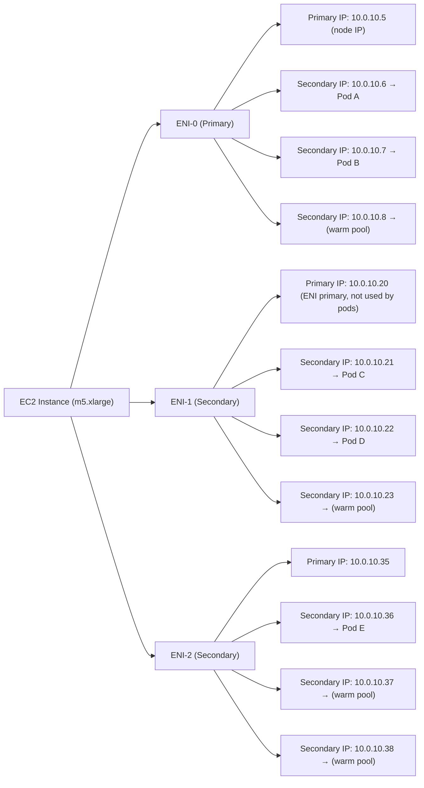
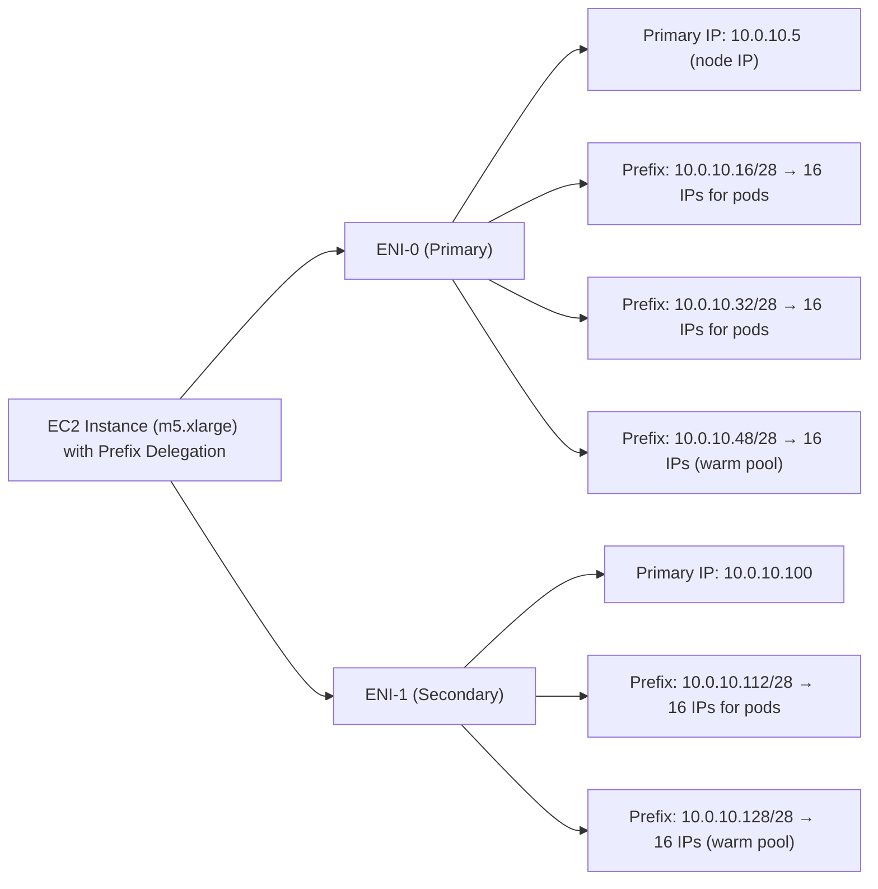
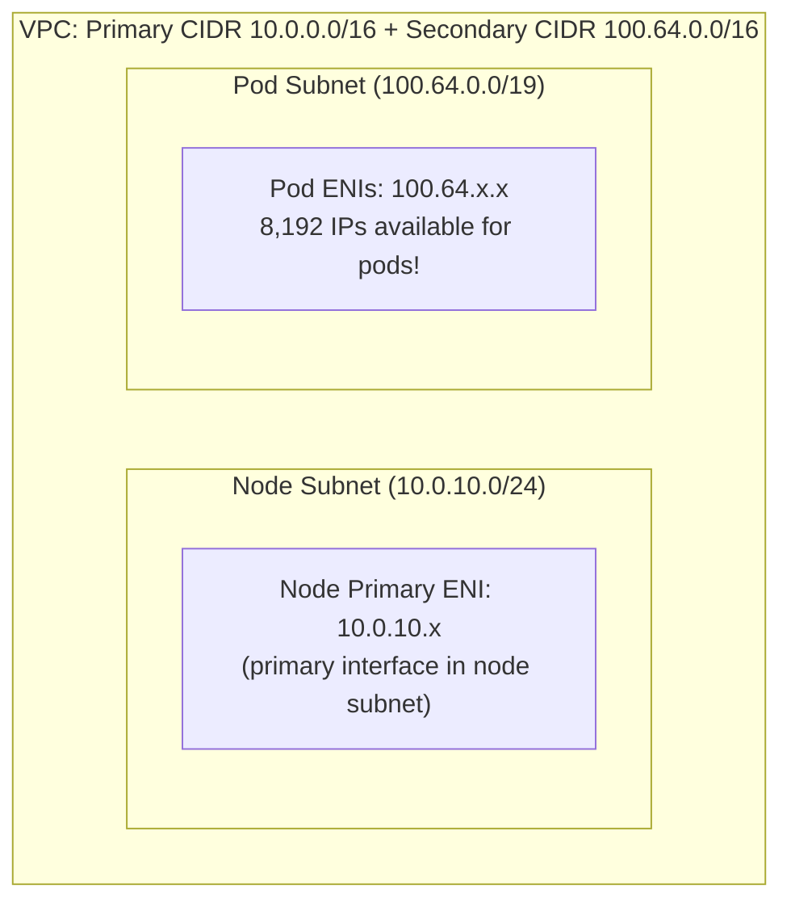
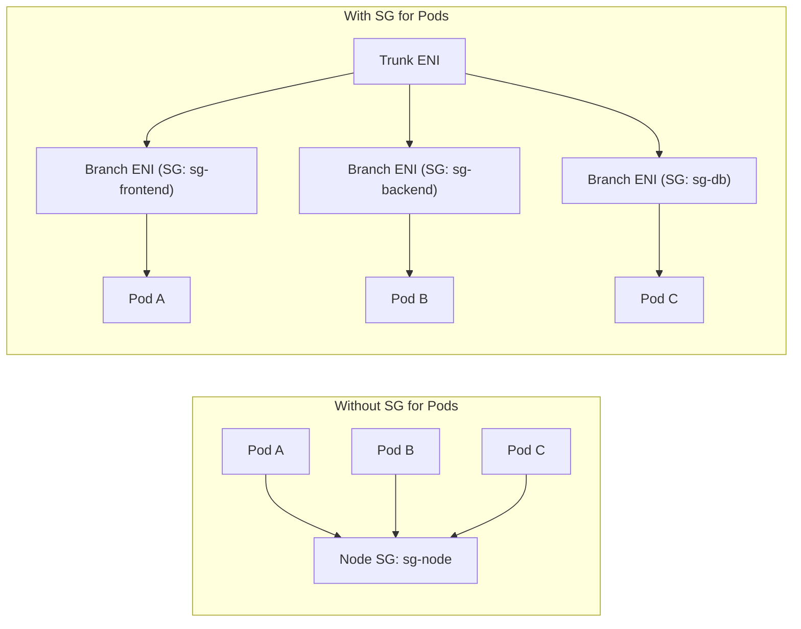
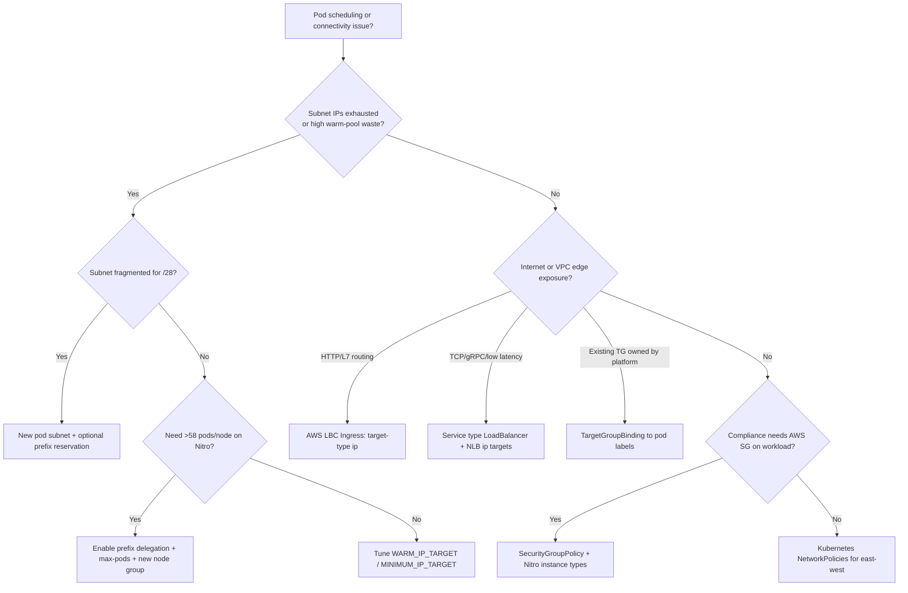
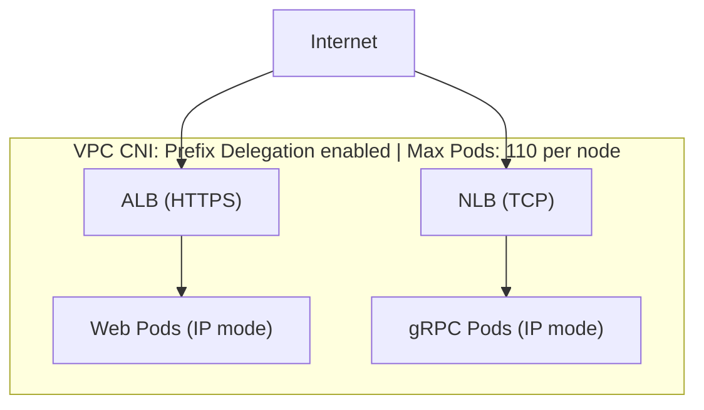

**Complexity**: `[COMPLEX]` | **Time to Complete**: 3.5h | **Prerequisites**: Module 5.1 (EKS Architecture & Control Plane)

## What You'll Be Able to Do

After completing this module, you will be able to:

- **Diagnose** pod networking failures related to IP exhaustion, ENI limits, and subnet routing misconfigurations within massive multi-tenant clusters.
- **Implement** the AWS VPC CNI plugin with custom networking, prefix delegation, and secondary CIDR ranges to ensure scalable IP allocation for large-scale deployments.
- **Design** EKS networking architectures that leverage security groups for pods, enabling granular pod-level traffic isolation without relying solely on network policies.
- **Evaluate** and deploy the AWS Load Balancer Controller to dynamically provision Application Load Balancers (ALB) and Network Load Balancers (NLB) using optimized IP target types.
- **Compare** secondary IP mode against Prefix Delegation mode to accurately calculate and optimize the maximum pod density across different EC2 instance types.

---

## Why This Module Matters

A common EKS failure mode is subnet IP exhaustion: when a cluster scales quickly and the VPC CNI fails to allocate more pod IPs, new pods can fail with `FailedCreatePodSandBox` errors until you free or add address space.

This scenario illustrates a high-impact EKS failure mode: subnet IP exhaustion can stop new pods from starting even when CPU and memory remain available. Unlike most other Kubernetes distributions that rely on overlay networks (where pod IPs are virtual, internal to the cluster, and practically unlimited), [EKS natively utilizes the Amazon VPC CNI plugin. This plugin guarantees that every pod receives a real, routable IP address directly from your VPC subnet.](https://docs.aws.amazon.com/eks/latest/best-practices/vpc-cni.html) This design is both a tremendous superpower—enabling native VPC networking, direct assignment of security groups to pods, and the elimination of overlay encapsulation overhead—and a dangerous trap. It creates a finite, physical constraint on your IP address space that can violently exhaust your network at the worst possible moment during auto-scaling events.

In this module, you will master the intricate mechanics of the VPC CNI. You will thoroughly understand IP allocation modes, specifically focusing on Prefix Delegation—a feature that can multiply your IP capacity per ENI slot by 16x. You will learn the definitive strategies for solving IP exhaustion by implementing Custom Networking paired with secondary CIDRs. Furthermore, you will configure Security Groups for Pods to achieve zero-trust network isolation, set up the AWS Load Balancer Controller for highly efficient ALB and NLB ingress routing, and explore the future of EKS networking through IPv6 adoption.

Platform engineers who treat pod IPs as unlimited because "Kubernetes abstracts networking" routinely learn otherwise on EKS. The VPC CNI makes IP planning visible: every replica, DaemonSet, and Job consumes a routable address from a finite subnet. That visibility is what enables direct ALB targeting, granular security groups, and clean flow logs—but only if you design warm pools, prefixes, and subnets before autoscaling writes the failure into production metrics.

---

## The Architecture of AWS VPC CNI

To understand EKS networking, you must first understand the fundamental architecture of the Amazon VPC CNI plugin. When a Pod is scheduled onto a node, the Kubelet must establish the pod's network before the application containers can start. It does this by invoking the CNI plugin.

The AWS VPC CNI consists of two primary components operating on every worker node:
1. **The CNI Binary**: This is the executable invoked by the Kubelet. It creates the Linux network namespace for the pod, sets up the `veth` (virtual ethernet) pairs connecting the pod to the host's networking stack, and configures the routing rules on the host.
2. **The IPAMD (IP Address Management Daemon)**: This is a long-running background process (running as the `aws-node` DaemonSet) that continuously monitors the node's IP usage. It proactively communicates with the AWS EC2 API to attach new Elastic Network Interfaces (ENIs) and allocate secondary IP addresses to those ENIs so that the CNI binary usually has a pool of IPs ready to assign to incoming pods.

Because EKS pods receive VPC-native IP addresses, they integrate directly with AWS networking and load-balancing constructs without an overlay network.

### How IPAMD reconciles capacity on each node

The IP Address Management Daemon (`ipamd`, packaged in the `aws-node` DaemonSet) runs a continuous reconciliation loop on every worker node. When the scheduler places a pod, the CNI binary asks ipamd for an address; ipamd either hands back a pre-warmed IP or prefix from local state or calls the EC2 API to attach capacity. That design trades a small amount of always-on IPv4 consumption for predictable pod startup, which matters during burst scale-outs when hundreds of pods land in the same minute.

Understanding ipamd behavior is the fastest path to diagnosing `FailedCreatePodSandBox` and `InsufficientFreeAddresses` errors. Check the `aws-node` pod logs on the affected node first, then correlate with subnet IP utilization in the VPC console and ENI attachment state on the EC2 instance. [Amazon's VPC CNI best-practices guide](https://docs.aws.amazon.com/eks/latest/best-practices/vpc-cni.html) documents the environment variables that control warm pools, prefix targets, and custom networking. When logs mention `InsufficientCidrBlocks`, the problem is often subnet fragmentation rather than a missing feature flag—you need contiguous `/28` space for prefix delegation, not merely a high theoretical CIDR size.

Nitro-based EC2 instances are required for prefix delegation and for security groups for pods; older Xen-based families lack the ENI prefix and branch-interface capabilities the modern CNI modes depend on. Managed node groups and Karpenter [calculate max-pods per node from each instance type's ENI capacity](https://docs.aws.amazon.com/eks/latest/userguide/cni-increase-ip-addresses.html). If you pin a uniform `--max-pods` for a mixed-type group, set it to the smallest instance type's value — otherwise a larger type can over-schedule and fail at sandbox creation.

---

## Secondary IP Mode (Default)

In its default configuration, known as Secondary IP Mode, the VPC CNI pre-allocates individual secondary IP addresses on each node's Elastic Network Interfaces (ENIs). When a new pod is scheduled by the Kubernetes scheduler, the CNI binary typically assigns it one of these pre-allocated IPs from the IPAMD's local pool.



The strict limitation in this mode is defined by the hardware capabilities of the EC2 instance type. The AWS Nitro hypervisor enforces a hard limit on the number of ENIs an instance can attach, as well as the number of secondary IP addresses each ENI can support. 

The number of pods a node can run is directly limited by the following physical formula:

```text
Max Pods = (Number of ENIs x (IPs per ENI - 1)) + 2

For m5.xlarge:
  ENIs: 4, IPs per ENI: 15
  Max Pods = (4 x (15 - 1)) + 2 = 58
```

In this formula, the `-1` accounts for the primary IP on each ENI, which is required for the ENI itself to function on the network and cannot be assigned to user pods. The `+2` accounts for the node's foundational host-networking pods (specifically `kube-proxy` and the `aws-node` DaemonSet), which share the host's primary IP and do not consume secondary VPC IPs.

### Diagnosing density and ENI limits in secondary IP mode

When pods stay Pending with sandbox errors, work top-down from the subnet to the node. At the VPC layer, confirm available addresses in the subnet the node uses (or the ENIConfig subnet if custom networking is on). At the node layer, describe the instance ENIs and count secondary IPs versus prefixes—secondary mode shows discrete `PrivateIpAddresses`, while prefix mode shows `Ipv4Prefixes` entries. At the CNI layer, inspect `aws-node` logs for `InsufficientFreeAddresses`, `InsufficientCidrBlocks`, or EC2 API throttling.

The EC2 instance type matrix is the hard ceiling. An `m5.large` allows fewer ENIs and addresses per ENI than an `m5.4xlarge`; with per-node auto-calculation, each node gets its own max-pods ceiling. If you hardcode a single `--max-pods` across mixed types, use the smallest type's limit for the whole group. Document expected pod capacity per instance in your internal standards so application teams do not request 110 pods on nodes that physically support fewer slots in secondary IP mode.

```bash
# Quick node-level IP capacity snapshot
NODE=<node-name>
kubectl describe node "$NODE" | grep -E 'pods:|vpc.amazonaws.com'
INSTANCE=$(kubectl get node "$NODE" -o jsonpath='{.spec.providerID}' | awk -F/ '{print $NF}')
aws ec2 describe-instances --instance-ids "$INSTANCE" \
  --query 'Reservations[0].Instances[0].NetworkInterfaces[*].{
    Id:NetworkInterfaceId,
    Subnet:SubnetId,
    Secondary:PrivateIpAddresses[?Primary==`false`].PrivateIpAddress,
    Prefixes:Ipv4Prefixes[*].Ipv4Prefix
  }' --output json
```

---

## The Warm Pool: WARM_ENI_TARGET and WARM_IP_TARGET

Why does the VPC CNI pre-allocate IPs instead of requesting them on-demand when a pod starts? The answer lies in AWS EC2 API latency and rate limiting. Allocating new IP capacity requires EC2 API calls, so an undersized warm pool can delay pod startup and increase the chance of API throttling during rapid scale-outs.

To prevent this, [the IPAMD maintains a "warm pool" of pre-allocated IPs. By default, it keeps an entire "warm" ENI attached to the node](https://docs.aws.amazon.com/eks/latest/best-practices/vpc-cni.html), with all of its secondary IPs fully allocated but unassigned to any pods.

```bash
# Check current VPC CNI configuration
kubectl get daemonset aws-node -n kube-system -o json | \
  jq '.spec.template.spec.containers[0].env[] | select(.name | startswith("WARM"))'
```

While this guarantees instant pod startup, it aggressively hoards IP addresses. A large cluster can consume a substantial number of IP addresses just to satisfy default warm-pool behavior. Tuning this warm pool is your first line of defense in IP-constrained environments.

| Variable | Default | Effect |
| :--- | :--- | :--- |
| `WARM_ENI_TARGET` | `1` | Number of warm (fully pre-allocated) ENIs to keep ready |
| `WARM_IP_TARGET` | Not set | Number of warm IPs to keep ready (overrides WARM_ENI_TARGET) |
| `MINIMUM_IP_TARGET` | Not set | Minimum IPs to keep allocated at all times |

If you are running dangerously low on IPs, you must instruct the IPAMD to maintain individual warm IPs rather than entire warm ENIs:

```bash
# Configure VPC CNI to keep only 2 warm IPs instead of an entire warm ENI
kubectl set env daemonset aws-node -n kube-system \
  WARM_IP_TARGET=2 \
  WARM_ENI_TARGET=0 \
  MINIMUM_IP_TARGET=4
```

This configuration forces the node to release excess IPs back to the VPC. Instead of wasting ~14 IPs per node on a dormant warm ENI, the node will only keep 2 unassigned IPs in reserve. The trade-off is clear: if you suddenly schedule 5 pods onto a node that only has 2 warm IPs, the 3rd, 4th, and 5th pods will experience a startup delay of a few seconds while IPAMD negotiates with the EC2 API for more addresses.

When you tune warm targets, treat `WARM_PREFIX_TARGET`, `WARM_IP_TARGET`, and `MINIMUM_IP_TARGET` as a single policy surface. [Prefix-mode guidance](https://docs.aws.amazon.com/eks/latest/best-practices/prefix-mode-linux.html) notes that `WARM_IP_TARGET` and `MINIMUM_IP_TARGET` override `WARM_PREFIX_TARGET` when set, which is how teams keep prefix delegation enabled while still avoiding an entire spare `/28` on every node. Document the chosen values in your platform runbook so on-call engineers know whether a few seconds of scheduling latency during spikes is expected behavior or a regression.

---

## Prefix Delegation Mode: The 16x Multiplier

To permanently resolve the severe density limitations of Secondary IP Mode without requiring massive subnets, AWS introduced Prefix Delegation. Prefix Delegation fundamentally transforms the IP assignment math. 

Instead of an ENI slot holding a single, discrete secondary IP address, Prefix Delegation allows that exact same ENI slot to hold [a contiguous `/28` IPv4 prefix. A `/28` prefix contains exactly 16 IP addresses.](https://docs.aws.amazon.com/eks/latest/best-practices/prefix-mode-linux.html) Because this is handled at the ENI attachment level, you effectively multiply your IP capacity by 16x without attaching a single additional ENI.

```text
Secondary IP Mode (default):           Prefix Delegation Mode:
ENI Slot → 1 IP address                ENI Slot → /28 prefix (16 IPs)

m5.xlarge:                              m5.xlarge:
  4 ENIs x 15 slots = 60 IPs max         4 ENIs x 15 slots x 16 = 960 IPs max
  Secondary IPs: up to 58                Prefix IPs: up to 960 theoretical
```

**Pause and predict:** When you enable Prefix Delegation on the Amazon VPC CNI to allocate `/28` IPv4 prefixes across your EC2 instances, does the node immediately schedule hundreds of additional pods up to its theoretical IP ceiling?

<details>
<summary>Check your prediction</summary>

While Prefix Delegation assigns a contiguous `/28` prefix containing 16 IPv4 addresses per available ENI slot, allocating additional IP prefixes does not automatically raise the kubelet's `max-pods` setting. The default maximum pod density on Amazon EKS nodes is 110 pods per node, and [you can change that number](https://docs.aws.amazon.com/eks/latest/userguide/cni-increase-ip-addresses.html). IP address availability is only one constraint on pod density; memory, CPU reservation, kernel process limits, and local ephemeral storage also bound how many containers a node can run sustainably.
</details>

Prefix math and kubelet scheduling are two different knobs. Platform teams should decide a safe per-node pod budget from compute, then confirm the CNI can actually assign that many addresses from the subnet.

Prefix delegation expands pod density across modern cloud infrastructure, but operational success requires platform engineers to look past pure IP arithmetic. Because container runtimes, system daemons, and operating system kernels all consume memory, file descriptors, and CPU time for every running container, cluster capacity planning must always align network interface capabilities with realistic compute limits.

Enabling Prefix Delegation is a two-step process. First, you configure the VPC CNI:

```bash
# Enable Prefix Delegation
kubectl set env daemonset aws-node -n kube-system \
  ENABLE_PREFIX_DELEGATION=true \
  WARM_PREFIX_TARGET=1

# IMPORTANT: Update your node group's max-pods setting
# For managed node groups, use a launch template with custom user data:
# --kubelet-extra-args '--max-pods=110'

# Verify prefix delegation is active
kubectl get ds aws-node -n kube-system -o json | \
  jq '.spec.template.spec.containers[0].env[] | select(.name=="ENABLE_PREFIX_DELEGATION")'
```

Crucially, after enabling Prefix Delegation in the CNI, the `kubelet` on your worker nodes must be restarted with a new `--max-pods` argument. If you do not update the node's user data, the `kubelet` will continue enforcing the old 58-pod limit, completely ignoring the thousands of new IP addresses made available by the CNI. Use the [EKS max-pods calculator script](https://docs.aws.amazon.com/eks/latest/userguide/cni-increase-ip-addresses.html) with `--cni-prefix-delegation-enabled` so the kubelet limit matches your instance type and CNI version rather than a copied example value.

Amazon recommends creating fresh node groups when transitioning to prefix mode instead of rolling existing nodes in place, because nodes that mix legacy secondary IPs and new prefixes can advertise inconsistent capacity to the scheduler. Plan a cordon-and-drain migration with Pod Disruption Budgets on critical workloads. If subnets are fragmented, create a dedicated pod subnet (or use [subnet CIDR reservations for prefixes](https://docs.aws.amazon.com/eks/latest/best-practices/prefix-mode-linux.html)) before flipping the cluster-wide flag—otherwise prefix attachment fails even though secondary IP mode still appears healthy on paper.

Once correctly provisioned, the IP allocation on the node transforms significantly:



---

## Solving IP Exhaustion: Secondary CIDRs and Custom Networking

Prefix Delegation dramatically increases how many pods you can fit on a single node, but it does not magically create more IP addresses in your VPC. If your entire VPC subnet only has 251 usable addresses (a `/24`), you will still run out of IPs as you add more nodes to the cluster.

When physical IP address exhaustion looms, the industry-standard architectural solution is to attach a massive, non-routable Secondary CIDR block exclusively for pod networking. [The `100.64.0.0/10` space (RFC 6598, originally intended for Carrier-Grade NAT)](https://www.rfc-editor.org/rfc/rfc6598) is frequently utilized because it does not conflict with traditional enterprise RFC 1918 ranges (like `10.x` or `192.168.x`).

```bash
# Add secondary CIDR to VPC
aws ec2 associate-vpc-cidr-block \
  --vpc-id $VPC_ID \
  --cidr-block 100.64.0.0/16

# Create new subnets in the secondary CIDR range
POD_SUB1=$(aws ec2 create-subnet \
  --vpc-id $VPC_ID \
  --cidr-block 100.64.0.0/19 \
  --availability-zone us-east-1a \
  --query 'Subnet.SubnetId' --output text)

POD_SUB2=$(aws ec2 create-subnet \
  --vpc-id $VPC_ID \
  --cidr-block 100.64.32.0/19 \
  --availability-zone us-east-1b \
  --query 'Subnet.SubnetId' --output text)

# Tag for EKS
aws ec2 create-tags --resources $POD_SUB1 $POD_SUB2 \
  --tags Key=Name,Value=EKS-Pod-Subnet
```

By default, the VPC CNI will pull pod IPs from the exact same subnet that the EC2 instance resides in. To force the VPC CNI to use [these newly created secondary subnets](https://docs.aws.amazon.com/eks/latest/best-practices/custom-networking.html), you must enable Custom Networking. 

```bash
# Enable custom networking on the VPC CNI
kubectl set env daemonset aws-node -n kube-system \
  AWS_VPC_K8S_CNI_CUSTOM_NETWORK_CFG=true \
  ENI_CONFIG_LABEL_DEF=topology.kubernetes.io/zone
```

With Custom Networking enabled, the IPAMD daemon looks for Custom Resource Definitions (CRDs) named `ENIConfig`. [The `ENIConfig` maps a specific Availability Zone to the new pod subnets and security groups.](https://docs.aws.amazon.com/eks/latest/best-practices/custom-networking.html) Because EKS clusters span multiple AZs, you must create one `ENIConfig` per AZ.

```yaml
# eniconfig-us-east-1a.yaml
apiVersion: crd.k8s.amazonaws.com/v1alpha1
kind: ENIConfig
metadata:
  name: us-east-1a
spec:
  subnet: subnet-aaa111    # Pod subnet in 100.64.0.0/19
  securityGroups:
    - sg-0abc123def456      # Security group for pods
```

```yaml
# eniconfig-us-east-1b.yaml
apiVersion: crd.k8s.amazonaws.com/v1alpha1
kind: ENIConfig
metadata:
  name: us-east-1b
spec:
  subnet: subnet-bbb222    # Pod subnet in 100.64.32.0/19
  securityGroups:
    - sg-0abc123def456
```

Apply these configurations to the cluster:

```bash
kubectl apply -f eniconfig-us-east-1a.yaml
kubectl apply -f eniconfig-us-east-1b.yaml
```

Once implemented, the architecture physically isolates the node's network traffic from the pod's network traffic. The primary ENI handles SSH, Kubelet-to-API-server communication, and internal OS networking on the `10.x` subnet. Meanwhile, all secondary ENIs are dynamically deployed into the `100.64.x` subnet to host the massive volume of pods.



**Pause and predict:** When you enable Custom Networking to assign pod IP addresses from dedicated secondary subnets, what happens to the ENI slot occupied by the worker node's primary network interface? Can regular application pods still receive IP addresses from that primary interface?

<details>
<summary>Check your prediction</summary>

Regular application pods cannot use the primary ENI under Custom Networking; that entire interface slot leaves the pod IP allocation pool. Because Custom Networking mandates that pod IP addresses originate exclusively from secondary ENIs attached to the subnets defined in your `ENIConfig` custom resources, the primary interface (which resides in the node subnet) is reserved strictly for host-level networking and control plane traffic. However, host-network pods (such as `kube-proxy` or node monitoring agents configured with `hostNetwork: true`) still use the primary ENI directly. Crucially, applying Custom Networking configurations to an active cluster leaves existing worker nodes unaffected; you must systematically drain, terminate, and replace existing nodes with fresh compute instances so the CNI daemon can provision secondary interfaces according to the new subnet layout.
</details>

Architecting multi-tier network boundaries between physical EC2 host interfaces and ephemeral application containers establishes rigorous blast-radius isolation while necessitating proactive capacity modeling across production availability zones.

Network architects routinely implement secondary VPC CIDRs to isolate pod traffic from restricted corporate data centers while conserving expensive RFC 1918 addresses. When combining secondary CIDR allocations with custom routing tables, each availability zone operates as an independent failure domain with dedicated subnet boundaries, preventing IP exhaustion from cascading into platform-wide deployment outages.

### Pod CIDR planning before you enable custom networking

Treat pod address planning as capacity engineering, not a one-line YAML change. Size the secondary CIDR so it survives three growth vectors at once: maximum nodes in the largest node group, max pods per node after prefix delegation, and warm-pool overhead while nodes are scaling. A `/16` in `100.64.0.0/10` is a common starting point for multi-AZ production because it keeps pod space logically separate from RFC 1918 node subnets that humans and bastions already use. Split that space into per-AZ `/19` or `/20` subnets so ENIConfig objects map cleanly to `topology.kubernetes.io/zone` and you never attach a pod ENI in the wrong Availability Zone.

Document which security groups attach to pod ENIs in ENIConfig versus the node primary ENI. Node SGs should cover kubelet, control-plane communication, and host-level egress; pod SGs belong on ENIConfig when you need database or internal API access scoped to workloads. Rolling custom networking onto existing nodes without replacing them is a frequent source of half-migrated clusters—plan new node groups, validate pod scheduling and Service endpoints, then drain legacy nodes.

---

## Pod-Level Isolation: Security Groups for Pods

Kubernetes Network Policies deliver software-defined Layer 3 and Layer 4 packet filtering within the cluster boundary, but enterprise compliance standards often mandate zero-trust isolation enforced by the cloud provider's native firewall layer. When containerized services communicate directly with managed cloud infrastructure such as Amazon RDS databases, OpenSearch clusters, or internal VPC endpoints, platform engineers must establish unambiguous security perimeters.

**Pause and predict:** If a single microservice deployed onto an EC2 worker node requires network access to an external RDS database, which AWS security group governs that pod's traffic when Security Groups for Pods is not enabled?

<details>
<summary>Check your prediction</summary>

Without Security Groups for Pods (SGPP), every pod running on a given worker node shares that node's EC2 security group. If you modify the node's security group rules to permit ingress or egress traffic to an Amazon RDS database for a single microservice, every other pod co-located on that same instance automatically inherits identical network reachability. To resolve this security exposure, Security Groups for Pods integrates directly with the AWS Nitro hypervisor to attach native AWS security groups to individual pods. The VPC CNI achieves this by attaching a dedicated trunk network interface to the EC2 host and dynamically provisioning lightweight branch ENIs associated with individual pod network namespaces.
</details>

Enterprise zero-trust architectures demand granular network enforcement that aligns cloud security policies with individual microservice identities rather than broad infrastructure host boundaries.

By decoupling container firewall rules from virtual machine host configurations, platform security teams can enforce least-privilege egress controls directly through AWS CloudWatch Flow Logs and AWS Network Firewall. Workloads that handle sensitive payment tokens or regulated customer data remain cryptographically isolated at the hypervisor boundary, even when co-located on shared compute nodes alongside general-purpose microservices.

Security Groups for Pods achieves this granular boundary by integrating directly with the AWS Nitro hypervisor to attach VPC Security Groups dynamically at the individual pod level. It achieves this utilizing [a "Trunk and Branch" ENI architecture](https://docs.aws.amazon.com/eks/latest/best-practices/sgpp.html).



The VPC CNI transforms one of the node's standard secondary ENIs into a massive "Trunk ENI". From this trunk, it spawns dozens of lightweight "Branch ENIs". Because each branch is recognized as an independent network interface by the AWS fabric, it can be assigned its own discrete Security Group.

To leverage this powerful feature, first enable it within the VPC CNI:

```bash
# Enable the feature on the VPC CNI
kubectl set env daemonset aws-node -n kube-system \
  ENABLE_POD_ENI=true \
  POD_SECURITY_GROUP_ENFORCING_MODE=standard
```

Then, deploy a `SecurityGroupPolicy` resource. This object uses standard label selectors to identify target pods and apply the required Security Groups transparently:

```yaml
apiVersion: vpcresources.k8s.aws/v1beta1
kind: SecurityGroupPolicy
metadata:
  name: backend-sgp
  namespace: production
spec:
  podSelector:
    matchLabels:
      app: payment-service
  securityGroups:
    groupIds:
      - sg-0abc123def456    # Allow only port 8080 from ALB
      - sg-0def789ghi012    # Allow only port 5432 to RDS
```

Whenever a pod matching `app: payment-service` is scheduled, the CNI provisions a dedicated branch ENI, applies the `sg-0abc123def456` and `sg-0def789ghi012` security groups, and attaches the interface to the pod's namespace. The pod is now isolated by AWS native firewalls. This functionality requires supported Nitro-based instance types, and you should review the current [security groups for Pods documentation](https://docs.aws.amazon.com/eks/latest/userguide/security-groups-for-pods.html) for enforcing mode (`standard` vs `strict`) and outbound traffic behavior.

Security groups for pods consume branch ENI capacity on the trunk interface, so dense node groups can hit branch limits before they hit CPU limits. That is one reason Amazon recommends prefix delegation even when custom networking removes the primary ENI from the pod pool—you still want efficient use of the remaining ENI slots. Pair SG-for-pods with explicit outbound rules for CoreDNS (UDP/TCP 53 to the cluster Service CIDR) and for any AWS API endpoints your workloads call; pods do not inherit the node's security groups when pod-level groups are attached, and a missing egress rule surfaces as DNS or metadata timeouts rather than a clear Kubernetes event.

Kubernetes NetworkPolicies remain valuable for east-west segmentation inside the cluster. SG-for-pods expresses cloud-provider firewall intent at the VPC boundary; NetworkPolicies express which pod labels may talk to which ports on the overlay-free pod network. Many regulated environments use both: NetworkPolicies for default-deny between namespaces, SG-for-pods where auditors require AWS-native enforcement on north-south paths to RDS, ElastiCache, or corporate CIDRs.

---

## AWS Load Balancer Controller: Ingress and Egress

Historically, Kubernetes created AWS Load Balancers via an in-tree cloud provider controller that was baked directly into the Kubernetes source code. This legacy approach is deprecated. Modern EKS networking dictates the use of [the out-of-tree AWS Load Balancer Controller (LBC)](https://docs.aws.amazon.com/eks/latest/best-practices/load-balancing.html).

The AWS LBC is an intelligent operator that watches for Kubernetes `Ingress` and `Service` resources and directly orchestrates AWS Application Load Balancers (ALBs) and Network Load Balancers (NLBs) to satisfy them. It replaces the deprecated in-tree cloud provider controller for AWS ELB integration and is the supported path for new EKS clusters. The controller needs IAM permissions to create and modify load balancers, target groups, listeners, and security groups; on EKS those permissions are typically delivered through IRSA (IAM Roles for Service Accounts) bound to the controller's Kubernetes service account.

Operationally, treat each Ingress or `LoadBalancer` Service as an infrastructure change. The controller creates real ELB objects in your account; typos in annotations can open public listeners or attach certificates to the wrong hostname. Use infrastructure-as-code review for annotation changes the same way you would review Terraform security group rules. Tag load balancers with cluster and team identifiers so cost allocation and orphan detection stay tractable when namespaces are deleted but ELBs linger.

```bash
# Install via Helm
helm repo add eks https://aws.github.io/eks-charts
helm repo update

helm install aws-load-balancer-controller eks/aws-load-balancer-controller \
  -n kube-system \
  --set clusterName=my-cluster \
  --set serviceAccount.create=true \
  --set serviceAccount.annotations."eks\.amazonaws\.com/role-arn"=arn:aws:iam::123456789012:role/AWSLoadBalancerControllerRole
```

### ALB for HTTP/HTTPS Traffic

When dealing with Layer 7 traffic (HTTP, HTTPS, or gRPC over HTTP/2), the ALB provides advanced routing capabilities including path-based routing, host-based routing, and native TLS termination via AWS Certificate Manager (ACM). 

```yaml
apiVersion: networking.k8s.io/v1
kind: Ingress
metadata:
  name: web-ingress
  namespace: production
  annotations:
    alb.ingress.kubernetes.io/scheme: internet-facing
    alb.ingress.kubernetes.io/target-type: ip
    alb.ingress.kubernetes.io/certificate-arn: arn:aws:acm:us-east-1:123456789012:certificate/abc-123
    alb.ingress.kubernetes.io/listen-ports: '[{"HTTPS":443}]'
    alb.ingress.kubernetes.io/ssl-redirect: "443"
    alb.ingress.kubernetes.io/healthcheck-path: /healthz
    alb.ingress.kubernetes.io/group.name: shared-alb
spec:
  ingressClassName: alb
  rules:
    - host: app.example.com
      http:
        paths:
          - path: /
            pathType: Prefix
            backend:
              service:
                name: web-service
                port:
                  number: 80
```

The annotations on this resource hold incredible power over the physical AWS infrastructure. 

| Annotation | Purpose |
| :--- | :--- |
| `scheme: internet-facing` | Public ALB (vs. `internal` for private) |
| `target-type: ip` | Route directly to pod IPs (vs. `instance` for NodePort) |
| `group.name` | Share one ALB across multiple Ingress resources (cost savings) |
| `ssl-redirect` | Automatic HTTP-to-HTTPS redirect |
| `certificate-arn` | ACM certificate for TLS termination |

The `target-type: ip` annotation is arguably the most critical setting in EKS ingress. In legacy `instance` mode, the load balancer targets a node and NodePort, adding an extra hop through the node proxy path and shifting health checks to the node-level target rather than the pod IP itself. [Because EKS pods have real VPC IP addresses, `target-type: ip` allows the ALB to route traffic *directly* to the pod's IP](https://docs.aws.amazon.com/eks/latest/best-practices/load-balancing.html), completely bypassing the node's proxy layer.

When you share an ALB across teams, listener rules become shared infrastructure. The `group.order` annotation controls rule precedence among Ingress objects in the same group; lower numbers evaluate first. Combine `group.name` with distinct hostnames or path prefixes so teams cannot accidentally capture each other's routes. During incidents, remember that deleting one Ingress in a group does not delete the shared ALB until the last member Ingress disappears—on-call runbooks should list all namespaces contributing to a grouped ALB.

Health checks should match application semantics. A `/healthz` that only returns 200 when the process is live—but not when dependencies are ready—prevents premature traffic during rollouts. Conversely, checking the database on every ALB probe can mark all targets unhealthy during a brief RDS failover. Align probe depth with what "ready" means for your SLO, and use Kubernetes readiness gates so the ALB only receives endpoints that passed your chosen bar.

### NLB for gRPC and TCP Traffic

For raw Layer 4 traffic, extreme low-latency requirements, or protocols that cannot be terminated by an ALB, EKS relies on the Network Load Balancer (NLB). You provision an NLB by creating a Kubernetes `Service` of type `LoadBalancer` and applying specific annotations.

```yaml
apiVersion: v1
kind: Service
metadata:
  name: grpc-service
  namespace: production
  annotations:
    service.beta.kubernetes.io/aws-load-balancer-type: external
    service.beta.kubernetes.io/aws-load-balancer-nlb-target-type: ip
    service.beta.kubernetes.io/aws-load-balancer-scheme: internet-facing
    service.beta.kubernetes.io/aws-load-balancer-healthcheck-protocol: HTTP
    service.beta.kubernetes.io/aws-load-balancer-healthcheck-path: /grpc.health.v1.Health/Check
    service.beta.kubernetes.io/aws-load-balancer-backend-protocol: tcp
    service.beta.kubernetes.io/aws-load-balancer-cross-zone-load-balancing-enabled: "true"
spec:
  type: LoadBalancer
  loadBalancerClass: service.k8s.aws/nlb
  selector:
    app: grpc-backend
  ports:
    - name: grpc
      port: 443
      targetPort: 8443
      protocol: TCP
```

The differences between ALB and NLB are distinct and determine your entire edge architecture.

| Feature | ALB (Application LB) | NLB (Network LB) |
| :--- | :--- | :--- |
| **OSI Layer** | Layer 7 (HTTP/HTTPS) | Layer 4 (TCP/UDP/TLS) |
| **Protocols** | HTTP, HTTPS, gRPC (HTTP/2) | TCP, UDP, TLS |
| **Path routing** | Yes (host, path, header) | No |
| **WebSocket** | Yes | Yes (TCP) |
| **Static IP** | No (use Global Accelerator) | Yes (Elastic IP per AZ) |
| **Latency** | ~1-5ms added | ~100us added |
| **gRPC** | ALB supports gRPC natively | NLB via TLS passthrough |
| **Cost** | $0.0225/hr + LCU | $0.0225/hr + NLCU |
| **Best for** | Web apps, REST APIs | gRPC, databases, gaming, IoT |

Those hourly figures come from the public [Elastic Load Balancing pricing](https://aws.amazon.com/elasticloadbalancing/pricing/) page for US East (N. Virginia); LCU and NLCU usage can dominate at high throughput, so load tests should include both components. Internal-facing LBs still incur hourly and capacity-unit charges even when no public IPv4 is attached, though you avoid the separate public IPv4 line item described in [VPC pricing](https://aws.amazon.com/vpc/pricing/).

Selecting between Layer 7 and Layer 4 load balancing requires evaluating protocol requirements alongside operational resilience during rolling application updates. Stateful connections and real-time streaming protocols introduce specific challenges when pods scale dynamically across node groups.

**Pause and predict:** When deploying a WebSocket-based application that maintains long-lived persistent TCP connections, which load balancer configuration prevents dropped client connections and routing errors during rolling pod deployments?

<details>
<summary>Check your prediction</summary>

Both Application Load Balancers (ALB) and Network Load Balancers (NLB) can reliably maintain long-lived TCP connections when health check intervals, keepalive probes, and idle timeouts are configured generously. ALB terminates HTTP and understands HTTP/2 and WebSocket upgrade handshakes natively, while NLB provides transparent Layer 4 TCP proxying with lower latency and optional static Elastic IPs per Availability Zone. The critical operational trap during Kubernetes rollouts is using **instance** (NodePort) targets. With instance targets, the load balancer evaluates health at the EC2 node level; the node remains healthy according to AWS while local `kube-proxy` iptables or IPVS rules may continue routing client traffic to a terminating or crashing pod. In contrast, **IP targets** register individual Pod IPs directly into the AWS Target Group. When a pod terminates, the AWS Load Balancer Controller deregisters the pod IP and drains active connections in lockstep with Kubernetes pod readiness endpoints.
</details>

Idle timeouts, health-check intervals, and connection draining belong in the same review as the Kubernetes rollout strategy. Long-lived clients make those settings visible as user-facing errors when a deployment replaces pods faster than the edge can forget them.

### TargetGroupBinding and services outside Ingress

Not every workload exposes HTTP through an `Ingress`. The [AWS Load Balancer Controller](https://kubernetes-sigs.github.io/aws-load-balancer-controller/v2.11/guide/targetgroupbinding/targetgroupbinding/) also supports `TargetGroupBinding`, which associates an existing ELB target group with pod IPs or node ports inside the cluster. Platform teams use this when a central networking team owns the load balancer while application teams own Kubernetes namespaces, or when you need to attach EKS pods to a target group created by Terraform outside the controller's Ingress reconciliation loop.

A typical pattern is: create the ALB/NLB and target group in infrastructure pipelines, grant the controller IAM permission to register targets, then deploy a `TargetGroupBinding` that selects pods by label. The controller keeps target health in sync with readiness probes, similar to `target-type: ip` on Ingress, but decouples DNS and listener ownership from application manifests. Validate security groups on both the load balancer and the pod (or node) ENIs—IP mode registers pod addresses directly, so security group rules must allow the load balancer subnets to reach pod IPs on application ports.

---

## Future-Proofing: IPv6 on EKS

The ultimate architectural solution to IPv4 exhaustion is completely bypassing it. EKS natively supports IPv6-only pods. By assigning Pods IPv6 addresses from the VPC's IPv6 allocation, you get a vastly larger address space than in IPv4-based designs and greatly reduce IPv4 exhaustion pressure.

```bash
# Create an IPv6 cluster
aws eks create-cluster \
  --name ipv6-cluster \
  --role-arn $EKS_ROLE_ARN \
  --kubernetes-network-config ipFamily=ipv6 \
  --resources-vpc-config subnetIds=$SUB1,$SUB2,endpointPublicAccess=true,endpointPrivateAccess=true \
  --kubernetes-version 1.35
```

In an IPv6 cluster:
- Pods are assigned exclusively IPv6 addresses.
- In EKS IPv6 clusters, Pods and Services use IPv6 addressing; Amazon EKS does not support dual-stacked Pods or Services.
- Internal node-to-node and pod-to-pod communication is entirely IPv6.
- IPv6 changes how Pod addressing works, but you should verify your egress and compatibility requirements against the current EKS IPv6 networking model.

However, [IPv6 must be designated during cluster creation—you cannot migrate a live IPv4 EKS cluster to IPv6.](https://docs.aws.amazon.com/eks/latest/userguide/cni-ipv6.html) Furthermore, verify that your add-ons and operators support IPv6 before rolling it out cluster-wide.

On IPv6-only EKS clusters, prefix delegation is enabled by default and assigns a `/80` IPv6 prefix per ENI slot, which removes the IPv4 exhaustion class of failures for pod addressing. Egress to the public IPv4 internet typically requires an [egress-only internet gateway or NAT64/DNS64 path](https://docs.aws.amazon.com/eks/latest/userguide/cni-ipv6.html) depending on your architecture—plan that before workloads silently fail to reach IPv4-only SaaS endpoints. Treat IPv6 as a greenfield cluster decision with a full dependency matrix (container images, third-party webhooks, legacy JDBC URLs, and observability agents), not as a runtime toggle on an existing IPv4 fleet.

---

## Networking Cost Lens

EKS networking choices show up on the AWS bill in four places that are easy to underestimate during design reviews: cross-AZ data transfer, idle and warm IPv4 addresses, load balancer fixed hourly charges plus capacity units, and public IPv4 charges on internet-facing load balancers.

**Cross-AZ traffic** is often the largest surprise after go-live. Pod IPs are real VPC addresses, so traffic between a pod in `us-east-1a` and a pod in `us-east-1b` is billed as inter-AZ data transfer even though both endpoints are "inside Kubernetes." Services with `externalTrafficPolicy: Cluster` and NLBs without cross-zone load balancing can amplify this by delivering client traffic to a node in one AZ while the backing pod lives in another. Mitigations include topology-aware hints, spreading replicas across AZs with pod anti-affinity, keeping stateful backends in the same AZ as their consumers when latency allows, and enabling cross-zone balancing on NLBs only when you accept the extra cross-AZ bytes as the price of even distribution.

**IPv4 efficiency** directly affects whether you pay for more nodes than you need. Default `WARM_ENI_TARGET=1` can reserve hundreds of addresses cluster-wide while pods are idle—those addresses are not billed like public IPs, but they force larger subnets and earlier exhaustion, which pushes teams toward more nodes or more VPCs. Prefix delegation reduces IPs consumed per pod slot; tuning `WARM_IP_TARGET` reduces hoarding. Custom networking with a dedicated `100.64.0.0/10` pod CIDR avoids expensive redesigns when application subnets are `/24` slivers tied to legacy data centers.

**Load balancers** bill a fixed hourly component plus usage-based capacity units. In US East (N. Virginia), [Application Load Balancers charge roughly $0.0225 per hour plus $0.008 per LCU-hour](https://aws.amazon.com/elasticloadbalancing/pricing/), and [Network Load Balancers use the same hourly rate with $0.006 per NLCU-hour](https://aws.amazon.com/elasticloadbalancing/pricing/). A single shared ALB via `group.name` replaces dozens of hourly charges—Quiz scenario six's ~45 ALBs × ~$16/month fixed cost is arithmetic on that hourly line item, before LCU growth from traffic. High rule counts on shared ALBs can increase LCU "rule evaluation" dimension cost; keep listener rules intentional.

**Public IPv4** on internet-facing ALBs and NLBs is billed separately from LCU charges per [VPC public IPv4 pricing](https://aws.amazon.com/vpc/pricing/). Internal schemes avoid that line item but still need private connectivity planning. When comparing `target-type: ip` vs `instance`, IP mode usually wins on operations and health-check precision; instance mode rarely saves meaningful money once you account for extra NodePort hops and uneven draining during rollouts.

| Cost driver | What makes it spike | Knobs that usually help |
| :--- | :--- | :--- |
| Cross-AZ pod traffic | Chatty microservices across AZs; NLB without cross-zone | Affinity/topology; fewer cross-AZ dependencies; right-size replicas per AZ |
| Subnet/IP exhaustion | Warm ENIs; small `/24` pod subnets | Prefix delegation; `WARM_IP_TARGET`; secondary CIDR + custom networking |
| ALB count | One Ingress per microservice | `alb.ingress.kubernetes.io/group.name` with host/path rules |
| LCU/NLCU | High RPS, TLS, long-lived connections, many rules | Right-size LB type; shared ALB with lean rules; NLB for raw TCP |
| Public IPv4 on edge LBs | Internet-facing scheme per service | Internal ALB + corporate ingress; consolidate public LBs |

Hypothetical scenario: a platform team runs 80 `m5.xlarge` nodes with default warm ENIs (~14 idle secondary IPs each) and twelve internet-facing ALBs for twelve teams. They fix scheduling stalls by adding a `/20` subnet instead of tuning the CNI, then wonder why cross-AZ charges rose 40% after enabling NLB gRPC ingress without cross-zone load balancing. The cheaper sequence is warm-IP tuning plus prefix delegation first, shared ALB grouping second, then NLB annotations reviewed against AZ topology—with monthly reviews of the VPC flow log sample and the ELB cost allocation tag.

---

## Patterns & Anti-Patterns

Mature EKS networking separates **address capacity**, **edge exposure**, and **policy enforcement** so each layer can evolve without breaking the others. The patterns below show up repeatedly in clusters that scale past a few dozen nodes without emergency subnet expansions.

| Pattern | When to use | Why it works | Scaling note |
| :--- | :--- | :--- | :--- |
| Prefix delegation on Nitro nodes | New clusters or node groups where pod density per node matters | Assigns `/28` prefixes per ENI slot, cutting EC2 API churn and multiplying usable addresses | Pair with calculated `--max-pods`; migrate via new node groups |
| Secondary pod CIDR + ENIConfig | Node subnets are small or shared with legacy VMs | Isolates pod IPs in `100.64.0.0/10` (or similar) while nodes stay on RFC 1918 | One ENIConfig per AZ; combine with prefix mode for density |
| `target-type: ip` + readiness probes | HTTP/gRPC services behind AWS LBC | ALB health-checks pods directly; faster drain on failures | Ensure pod SGs and ALB SGs allow pod CIDRs on app ports |
| Shared ALB via `group.name` | Many HTTP services, moderate rule count | One hourly ALB fee; host/path routing | Watch 100-rules-per-ALB quota and blast radius on misconfiguration |
| SG-for-pods for north-south compliance | Auditors require AWS SG evidence to data stores | Branch ENIs carry per-workload SGs independent of node SG | Model CoreDNS and egress explicitly in pod SG rules |
| NetworkPolicy default-deny in namespace | East-west zero trust between teams | Kubernetes-native segmentation on real pod IPs | Complements—not replaces—SG-for-pods for VPC boundaries |

Anti-patterns usually begin as copy-pasted manifests from pre-2020 guides and become expensive at scale.

| Anti-pattern | What goes wrong | Better alternative |
| :--- | :--- | :--- |
| `/24` node subnet with default warm ENI | Hundreds of IPs reserved idle; sudden `InsufficientFreeAddresses` | Dedicated pod subnets; `WARM_IP_TARGET`; prefix delegation |
| Enable prefix mode without new nodes | Mixed IP/prefix nodes confuse capacity; kubelet still at 58 max pods | New node group + max-pods calculator + cordon/drain migration |
| One ALB per Ingress for every microservice | Fixed hourly cost scales linearly with team count | Group Ingress resources; separate only critical blast-radius domains |
| SG-for-pods without DNS egress | Pods time out on external names; looks like app bug | Allow UDP/TCP 53 to CoreDNS Service CIDR in pod SG |
| NetworkPolicy-only for RDS compliance | Policies are not AWS SG audit artifacts auditors request | SG-for-pods or SG on ENIConfig for datastore paths |
| Fragmented subnet, forced prefix mode | `InsufficientCidrBlocks` in CNI logs; pods Pending | New subnet + prefix reservation; avoid rolling flags on bad subnets |

---

## Decision Framework

Use this flow when onboarding a new EKS cluster or refactoring a fleet that is hitting network limits. The goal is to pick the smallest change that restores scheduling and security without multiplying load balancers or subnets unnecessarily.



| Decision | Prefer | Tradeoff to accept |
| :--- | :--- | :--- |
| Secondary IP vs prefix delegation | Prefix on Nitro if density or API rate limits bite | Subnet must have contiguous `/28` space; kubelet max-pods must change |
| Same subnet vs custom networking | Custom when node subnets cannot grow | Lose one ENI worth of pod slots unless prefix mode compensates |
| ALB vs NLB | ALB for HTTP/S, host/path routing, ACM TLS | Not for arbitrary UDP; higher LCU sensitivity on complex rules |
| NLB vs ALB | NLB for TCP/TLS passthrough, static IPs per AZ | No path-based routing; cross-zone costs if enabled carelessly |
| SG-for-pods vs NetworkPolicy only | SG-for-pods when AWS-native perimeter required | Branch ENI limits; explicit DNS/egress rules; Nitro requirement |
| `target-type: ip` vs `instance` | IP for almost all EKS pod-backed services | Security groups must allow pod CIDRs; slightly more target churn on rollouts |

Revisit the matrix after the first production scale test. Metrics that matter: `FailedCreatePodSandBox` rate, free IPs per subnet, `aws-node` error lines, ALB/NLCU dashboards, cross-AZ bytes on the Cost Explorer **EC2-Other** and **ELB** rows, and target health flapping during deployments.

---

## Did You Know?

1. The default warm-pool behavior can consume a substantial amount of IPv4 address space on large clusters, and switching from whole warm ENIs to warm IP targets can reclaim addresses quickly.
2. Prefix Delegation was introduced in 2021 and is the newer VPC CNI mode for increasing Pod density by assigning `/28` prefixes instead of individual secondary IPv4 addresses.
3. The AWS Load Balancer Controller can share a single ALB across multiple Ingress resources, which can materially reduce fixed load balancer costs when host-based or path-based routing is acceptable.
4. Security Groups for Pods use Nitro trunk and branch ENI capabilities, and the amount of branch-interface capacity varies by instance type.

---

## Operational Runbook: IP Exhaustion on a Live Cluster

When new pods fail with sandbox errors during a scale event, time matters. Use this ordered checklist before opening a change request to add an entirely new VPC.

**Step 1 — Confirm the failure mode.** `kubectl describe pod` on a Pending workload should cite CNI or sandbox errors. If the message is `InsufficientFreeAddresses` or similar, you are in IP exhaustion, not image pull or quota limits.

**Step 2 — Measure subnet headroom.** In the VPC console, compare assigned versus available addresses in the subnet tied to the failing nodes (or ENIConfig subnets). If utilization is above roughly eighty percent during normal load, warm pools alone will not save you for long.

**Step 3 — Quantify warm-pool waste.** On three representative nodes, list ENI secondary addresses and prefixes. If each node holds a full warm ENI with many unassigned addresses, patch `WARM_IP_TARGET` and `WARM_ENI_TARGET` on `aws-node` and watch addresses return over the next reconciliation window.

**Step 4 — Decide prefix versus expansion.** If nodes are Nitro, subnets are not fragmented, and you need higher pod density, plan prefix delegation with new node groups and updated max-pods. If subnets are fragmented or tiny, add a secondary CIDR and ENIConfig first, then enable prefixes on the dedicated pod subnets.

**Step 5 — Validate edge paths after CNI changes.** After IP pressure drops, confirm existing Ingress and `LoadBalancer` Services still register healthy IP targets. CNI churn does not replace ELB misconfiguration, but incidents often stack—fix addressing first, then re-check target groups.

Document outcomes in your platform ticket: which knob freed how many addresses, how long pod scheduling latency increased, and whether a follow-up change (secondary CIDR, new node group, or load balancer consolidation) is scheduled. That paper trail prevents the next engineer from repeating an emergency subnet expansion that only bought weeks of runway.

Keep a dashboard that tracks free IPs per pod subnet, `aws-node` error log rate, and ELB target health in one place. Correlating those three signals during scale tests catches regressions before a marketing event turns them into customer-visible outages. Schedule a quarterly review of warm-pool environment variables and grouped ALB membership so drift from the original design does not silently recreate exhaustion or cost spikes.

---

## Common Mistakes

| Mistake | Why It Happens | How to Fix It |
| :--- | :--- | :--- |
| **Not enabling Prefix Delegation on new clusters** | Unaware it exists, or using default VPC CNI settings from older guides. | Enable `ENABLE_PREFIX_DELEGATION=true` and update `max-pods` in your node group launch template. This should be default for all new clusters. |
| **IP exhaustion from warm ENI pre-allocation** | Default `WARM_ENI_TARGET=1` wastes 14+ IPs per node on pre-allocated but unused ENIs. | Set `WARM_IP_TARGET=2` and `WARM_ENI_TARGET=0` in the `aws-node` DaemonSet environment variables. |
| **Using `target-type: instance` with ALB** | Copying old examples that pre-date the `ip` target type. Instance mode adds a NodePort hop and loses pod-level health checks. | In most EKS cases, use `target-type: ip` with the AWS Load Balancer Controller. It routes directly to pod IPs and enables pod-level health checking. |
| **Creating a separate ALB per Ingress** | Not knowing about the `group.name` annotation for ALB sharing. | Add `alb.ingress.kubernetes.io/group.name: shared-alb` to Ingress annotations. Multiple Ingress resources share one ALB. |
| **Forgetting max-pods after enabling Prefix Delegation** | Enabling PD on the VPC CNI but not updating the kubelet configuration on nodes. | Use a launch template with `--kubelet-extra-args '--max-pods=110'` or use the EKS-recommended max-pods calculator script. |
| **Custom Networking without new node groups** | Enabling `AWS_VPC_K8S_CNI_CUSTOM_NETWORK_CFG=true` on existing nodes that were not provisioned with ENIConfig. | Custom Networking requires rolling out new node groups. Existing nodes must be drained and replaced. |
| **NLB with missing cross-zone annotation** | Assuming NLB distributes evenly across AZs by default. NLB is zonal by default -- each AZ node gets equal share regardless of pod count. | Set `aws-load-balancer-cross-zone-load-balancing-enabled: "true"` for even distribution. |
| **Security Groups for Pods on non-Nitro instances** | Using t2 or m4 instance types that do not support trunk/branch ENIs. | Use Nitro-based instances (m5, m6i, c5, r5, t3, and newer). Check the [instance type compatibility matrix](https://docs.aws.amazon.com/AWSEC2/latest/UserGuide/instance-types.html). |

---

## Quiz

<details>
<summary>Question 1: Your EKS cluster runs on m5.xlarge nodes. In secondary IP mode, each node can run 58 pods. After enabling Prefix Delegation, you expect 110 pods per node, but nodes still cap at 58 pods. What did you miss?</summary>

You forgot to update the **max-pods setting** on the nodes. Prefix Delegation changes how the VPC CNI allocates IPs, but the kubelet enforces its own pod limit independently. You need to update the launch template's user data to include `--kubelet-extra-args '--max-pods=110'` and roll out new nodes. The VPC CNI can allocate hundreds of IPs via prefix delegation, but if the kubelet still thinks the max is 58, it will reject any scheduling beyond that limit.
</details>

<details>
<summary>Question 2: Your EKS cluster is running 50 nodes of `m5.xlarge`. You notice that even though you only have 100 pods deployed across the entire cluster, you have exhausted over 700 IPs from your VPC subnet. The cluster is using default VPC CNI settings. A colleague suggests changing `WARM_ENI_TARGET` to 0 and setting `WARM_IP_TARGET=2`. Will this resolve the IP exhaustion, and what trade-off are you making?</summary>

Yes, this will recover a massive number of IPs once the warm pool is reconciled. By default, `WARM_ENI_TARGET=1` keeps an entire ENI (up to 14 secondary IPs on an m5.xlarge) fully pre-allocated per node, which means 50 nodes waste about 700 IPs just sitting idle in the warm pool. By switching to `WARM_IP_TARGET=2`, you instruct the VPC CNI to only keep 2 IPs pre-allocated per node, returning the rest to the VPC. The trade-off is that when a node needs to schedule a 3rd pod rapidly, it must make an AWS API call to attach a new ENI or assign a new IP, introducing 1-2 seconds of pod startup latency.
</details>

<details>
<summary>Question 3: You just migrated your EKS cluster to use Custom Networking to solve IP exhaustion, mapping pod IPs to a massive `100.64.0.0/16` secondary CIDR. However, immediately after rolling out the new node groups, you get alerts that `m5.xlarge` nodes are failing to schedule more than 44 pods, even though they used to schedule 58 pods before the migration. What is causing this capacity reduction, and how can you fix it?</summary>

The reduction is happening because Custom Networking reserves the node's primary ENI exclusively for node-level communication in the primary subnet, completely removing it from the pod IP allocation pool. Previously, the primary ENI could host secondary IPs for pods, but now only the secondary ENIs (which are attached to the Custom Networking subnets) can host pods. For an m5.xlarge, this reduces the usable ENIs from 4 to 3, dropping max pods from 58 to 44. To restore density, enable Prefix Delegation alongside Custom Networking so remaining ENI slots receive `/28` prefixes, then raise kubelet `max-pods` explicitly if you want more than the default of 110. This combination keeps pods on dedicated IP space while you choose a pod budget the instance can actually run.
</details>

<details>
<summary>Question 4: During a busy traffic spike, you have a Kubernetes Ingress with the annotation `target-type: instance` routing to pods spread across 10 nodes in 3 Availability Zones. One of the application pods suddenly crashes and begins failing its readiness probe, yet users are reporting intermittent HTTP 502 errors when accessing the service. Why does instance mode struggle here, and how do you resolve it?</summary>

With `target-type: instance`, the ALB targets each node's NodePort, not individual pods. Kubernetes removes a failing pod from Service endpoints once its readiness probe fails, but the ALB health check only validates the NodePort — it cannot tell whether one unhealthy pod among several healthy pods on the same node is causing 502s. During the endpoint-update window, traffic still flows ALB → NodePort → kube-proxy, so users can hit the bad pod until convergence completes. With `target-type: ip`, the ALB health-checks each pod IP directly and drains failed pods in seconds. Switch to IP mode for precise per-pod health and faster drain behavior.
</details>

<details>
<summary>Question 5: Your team successfully implements Security Groups for Pods to isolate a sensitive payment service, attaching a dedicated security group that only allows inbound traffic on port 443. Immediately after the pods restart to apply the policy, the application begins throwing connection timeout errors because it cannot resolve the database's DNS hostname. What went wrong with the network configuration?</summary>

When you assign security groups to pods via SecurityGroupPolicy, those pods use the specified security groups **instead of** the node's security groups. By default, security groups deny all outbound traffic unless explicitly permitted. If the pod-specific security groups do not include an outbound rule allowing DNS traffic (UDP port 53 to the CoreDNS service IP, typically `10.100.0.10`), DNS resolution fails entirely. The fix is to add an outbound rule for UDP/TCP port 53 to the CoreDNS cluster IP CIDR (or the VPC CIDR) in the pod's security group. This ensures the pod can communicate with CoreDNS before attempting to reach external dependencies.
</details>

<details>
<summary>Question 6: Your platform hosts 45 different microservices, each with its own standard Kubernetes Ingress resource using the `alb` ingress class. Finance just flagged your AWS bill because you are spending over $700 per month just on Application Load Balancers. You need to reduce this cost immediately without changing the routing behavior for the clients. How can you architect this change using the AWS Load Balancer Controller, and what operational risk does it introduce?</summary>

You can consolidate all 45 microservices behind a single Application Load Balancer by adding the `alb.ingress.kubernetes.io/group.name: shared-alb` annotation to all 45 Ingress resources. The AWS Load Balancer Controller will merge these into a single ALB with path-based or host-based listener rules, reducing your fixed ALB hourly costs from 45 LBs down to just 1. However, this introduces a shared blast radius risk: if someone deploys a misconfigured Ingress that breaks the ALB listener rules, or if you exceed the AWS quota of 100 rules per ALB, all 45 microservices could experience routing failures simultaneously. It is best practice to group non-critical services together while keeping highly critical domains on dedicated ALBs. This balances cost efficiency with isolation and operational safety.
</details>

<details>
<summary>Question 7: During an unexpected traffic surge, your EKS cluster scales rapidly to handle the load, but new pods suddenly remain in a Pending state due to `FailedCreatePodSandBox: no available IP addresses`. Your VPC uses a `10.0.0.0/16` CIDR and you have exhausted all IPs in your EKS subnets. What are your two fastest options to restore scheduling capability without rebuilding the cluster?</summary>

**Option 1**: Tune the VPC CNI warm pool by setting `WARM_IP_TARGET=1` and `WARM_ENI_TARGET=0` on the `aws-node` DaemonSet. This immediately releases pre-allocated but unused IPs across all nodes, often recovering hundreds of IPs within minutes. **Option 2**: Enable Prefix Delegation (`ENABLE_PREFIX_DELEGATION=true`), which changes the allocation from individual IPs to `/28` prefixes, dramatically reducing the number of IPs consumed per ENI slot while increasing pod capacity. Both changes take effect within minutes as the aws-node DaemonSet rolls out, though Prefix Delegation requires updating max-pods on nodes (meaning a rolling restart). For a longer-term architectural fix, you should add a secondary CIDR (e.g., `100.64.0.0/16`) with Custom Networking to permanently expand the available address space.
</details>

<details>
<summary>Question 8: Your finance team asks whether to move internal microservices from three dedicated internal ALBs to one shared internal ALB with host-based rules. Traffic is moderate, but teams worry about blast radius. What cost and operational factors should guide the decision?</summary>

Consolidation removes two hourly ALB fixed charges—at roughly $0.0225 per hour each in US East, that is ≈ $16/month per load balancer (≈ $32/month for the two you remove) before LCU usage, per [Elastic Load Balancing pricing](https://aws.amazon.com/elasticloadbalancing/pricing/). The trade is operational coupling: a bad listener rule or certificate annotation on one Ingress can affect every hostname on the shared ALB, and LCU rule-evaluation cost rises with listener complexity. A practical compromise is grouping related non-production services together while keeping revenue-critical or PCI-scoped domains on dedicated ALBs with tighter change control. Require code review on `group.name` membership the same way you review shared security groups, and export per-ALB CloudWatch metrics so incidents show which team owns the failing rule.
</details>

---

## Hands-On Exercise: Prefix Delegation + ALB for Web + NLB for gRPC

In this comprehensive exercise, you will architect a highly scalable EKS networking foundation by configuring Prefix Delegation for maximum IP efficiency, deploying the AWS Load Balancer Controller, and exposing both a standard web application and a low-latency gRPC service to the internet. The sequence mirrors how platform teams roll out networking changes in production: tune the CNI first, prove prefix attachment on live ENIs, raise kubelet `max-pods` through a controlled node group replacement, then layer edge load balancers only after pod IPs and readiness probes behave predictably.

Before you begin, confirm your lab cluster uses Nitro instances (for example `m6i.large` or `m5.xlarge`), that the worker subnets have enough contiguous space for `/28` prefixes, and that your IAM role for the AWS Load Balancer Controller can create ELB resources. If you are on a shared sandbox account, tag every load balancer and target group with your username and delete them in the cleanup step—orphaned ALBs are a common source of surprise monthly charges because their hourly fee continues after the Kubernetes namespace is gone.

**What you will build:**



### Task 1: Enable Prefix Delegation on the VPC CNI

Configure the `aws-node` DaemonSet to allocate `/28` prefixes to EC2 ENIs rather than requesting individual secondary IP addresses.

<details>
<summary>Solution</summary>

```bash
# Enable Prefix Delegation
kubectl set env daemonset aws-node -n kube-system \
  ENABLE_PREFIX_DELEGATION=true \
  WARM_PREFIX_TARGET=1

# Wait for the DaemonSet to roll out
kubectl rollout status daemonset aws-node -n kube-system --timeout=120s

# Verify on a node (check that prefixes are assigned, not individual IPs)
NODE_NAME=$(kubectl get nodes -o jsonpath='{.items[0].metadata.name}')
kubectl get node $NODE_NAME -o json | jq '.status.allocatable.pods'

# Check ENI details via AWS CLI
INSTANCE_ID=$(kubectl get node $NODE_NAME -o json | jq -r '.spec.providerID' | cut -d'/' -f5)
aws ec2 describe-instances --instance-ids $INSTANCE_ID \
  --query 'Reservations[0].Instances[0].NetworkInterfaces[*].{ENI:NetworkInterfaceId, Ipv4Prefixes:Ipv4Prefixes[*].Ipv4Prefix}' \
  --output json

# You should see /28 prefixes instead of individual secondary IPs
```

</details>

### Task 2: Update Node Group Max-Pods

Update the physical nodes to inform the `kubelet` that it is now permitted to schedule up to 110 pods per node, fully utilizing the newly available Prefix Delegation IP space.

<details>
<summary>Solution</summary>

```bash
# Create a new launch template with updated max-pods
# This /etc/eks/bootstrap.sh form is AL2-specific; AL2023 (current default EKS-optimized AMI) uses nodeadm/NodeConfig.
cat > /tmp/eks-userdata.txt << 'USERDATA'
#!/bin/bash
/etc/eks/bootstrap.sh my-cluster \
  --use-max-pods false \
  --kubelet-extra-args '--max-pods=110'
USERDATA

USERDATA_B64=$(base64 -i /tmp/eks-userdata.txt)

# Create launch template
LT_ID=$(aws ec2 create-launch-template \
  --launch-template-name eks-prefix-delegation \
  --launch-template-data "{
    \"UserData\": \"$USERDATA_B64\",
    \"InstanceType\": \"m6i.large\"
  }" \
  --query 'LaunchTemplate.LaunchTemplateId' --output text)

# Update the node group to use the new launch template
aws eks update-nodegroup-config \
  --cluster-name my-cluster \
  --nodegroup-name standard-workers \
  --launch-template id=$LT_ID,version=1

# Wait for the update (this triggers a rolling replacement)
aws eks wait nodegroup-active \
  --cluster-name my-cluster \
  --nodegroup-name standard-workers

# Verify max-pods on a new node
kubectl get node -o json | jq '.items[0].status.allocatable.pods'
# Should show "110"
```

</details>

### Task 3: Install the AWS Load Balancer Controller

Provision the AWS LBC using Helm so the cluster can autonomously communicate with the AWS API to generate load balancers from manifest files.

<details>
<summary>Solution</summary>

```bash
# Add the EKS Helm repo
helm repo add eks https://aws.github.io/eks-charts
helm repo update

# Create the IAM policy for the controller
curl -o /tmp/iam_policy.json https://raw.githubusercontent.com/kubernetes-sigs/aws-load-balancer-controller/v2.11.0/docs/install/iam_policy.json

aws iam create-policy \
  --policy-name AWSLoadBalancerControllerIAMPolicy \
  --policy-document file:///tmp/iam_policy.json

# Create the IAM service account and role (OIDC trust) — prerequisite for the Helm role-arn below
eksctl create iamserviceaccount \
  --cluster=my-cluster \
  --namespace=kube-system \
  --name=aws-load-balancer-controller \
  --role-name AWSLoadBalancerControllerRole \
  --attach-policy-arn=arn:aws:iam::$(aws sts get-caller-identity --query Account --output text):policy/AWSLoadBalancerControllerIAMPolicy \
  --approve \
  --override-existing-serviceaccounts

# Install the controller
helm install aws-load-balancer-controller eks/aws-load-balancer-controller \
  -n kube-system \
  --set clusterName=my-cluster \
  --set serviceAccount.create=true \
  --set serviceAccount.name=aws-load-balancer-controller \
  --set serviceAccount.annotations."eks\.amazonaws\.com/role-arn"=arn:aws:iam::$(aws sts get-caller-identity --query Account --output text):role/AWSLoadBalancerControllerRole

# Verify the controller is running
kubectl get deployment aws-load-balancer-controller -n kube-system
kubectl get pods -n kube-system -l app.kubernetes.io/name=aws-load-balancer-controller
```

</details>

### Task 4: Deploy a Web Application Behind an ALB

Deploy an NGINX web application and expose it dynamically utilizing an Application Load Balancer functioning in direct-IP routing mode.

<details>
<summary>Solution</summary>

```bash
# Create namespace
kubectl create namespace web-demo

# Deploy the web application
cat <<'EOF' | kubectl apply -f -
apiVersion: apps/v1
kind: Deployment
metadata:
  name: web-app
  namespace: web-demo
spec:
  replicas: 3
  selector:
    matchLabels:
      app: web-app
  template:
    metadata:
      labels:
        app: web-app
    spec:
      containers:
        - name: nginx
          image: nginx:1.27
          ports:
            - containerPort: 80
          readinessProbe:
            httpGet:
              path: /
              port: 80
            initialDelaySeconds: 5
            periodSeconds: 10
          resources:
            requests:
              cpu: 100m
              memory: 128Mi
            limits:
              cpu: 200m
              memory: 256Mi
---
apiVersion: v1
kind: Service
metadata:
  name: web-app-svc
  namespace: web-demo
spec:
  selector:
    app: web-app
  ports:
    - port: 80
      targetPort: 80
  type: ClusterIP
---
apiVersion: networking.k8s.io/v1
kind: Ingress
metadata:
  name: web-app-ingress
  namespace: web-demo
  annotations:
    alb.ingress.kubernetes.io/scheme: internet-facing
    alb.ingress.kubernetes.io/target-type: ip
    alb.ingress.kubernetes.io/healthcheck-path: /
    alb.ingress.kubernetes.io/group.name: dojo-shared-alb
spec:
  ingressClassName: alb
  rules:
    - http:
        paths:
          - path: /
            pathType: Prefix
            backend:
              service:
                name: web-app-svc
                port:
                  number: 80
EOF

# Wait for ALB to provision (takes 2-3 minutes)
echo "Waiting for ALB to provision..."
sleep 30
ALB_URL=$(kubectl get ingress web-app-ingress -n web-demo -o jsonpath='{.status.loadBalancer.ingress[0].hostname}')
echo "ALB URL: http://$ALB_URL"

# Test (may take a minute for DNS propagation)
curl -s -o /dev/null -w "%{http_code}" http://$ALB_URL
```

</details>

### Task 5: Deploy a gRPC Service Behind an NLB

Implement a high-performance gRPC health-check service operating over TCP port 9000, exposed via an ultra-low latency Network Load Balancer.

<details>
<summary>Solution</summary>

```bash
# Deploy a gRPC health check service (using grpcbin as example)
cat <<'EOF' | kubectl apply -f -
apiVersion: apps/v1
kind: Deployment
metadata:
  name: grpc-service
  namespace: web-demo
spec:
  replicas: 2
  selector:
    matchLabels:
      app: grpc-service
  template:
    metadata:
      labels:
        app: grpc-service
    spec:
      containers:
        - name: grpcbin
          image: moul/grpcbin:latest
          ports:
            - containerPort: 9000
              name: grpc-insecure
            - containerPort: 9001
              name: grpc-tls
          resources:
            requests:
              cpu: 100m
              memory: 128Mi
            limits:
              cpu: 200m
              memory: 256Mi
---
apiVersion: v1
kind: Service
metadata:
  name: grpc-nlb
  namespace: web-demo
  annotations:
    service.beta.kubernetes.io/aws-load-balancer-type: external
    service.beta.kubernetes.io/aws-load-balancer-nlb-target-type: ip
    service.beta.kubernetes.io/aws-load-balancer-scheme: internet-facing
    service.beta.kubernetes.io/aws-load-balancer-cross-zone-load-balancing-enabled: "true"
spec:
  type: LoadBalancer
  loadBalancerClass: service.k8s.aws/nlb
  selector:
    app: grpc-service
  ports:
    - name: grpc
      port: 9000
      targetPort: 9000
      protocol: TCP
EOF

# Wait for NLB to provision
sleep 30
NLB_HOST=$(kubectl get svc grpc-nlb -n web-demo -o jsonpath='{.status.loadBalancer.ingress[0].hostname}')
echo "NLB hostname: $NLB_HOST"

# Verify NLB targets are healthy
NLB_ARN=$(aws elbv2 describe-load-balancers \
  --query "LoadBalancers[?DNSName=='$NLB_HOST'].LoadBalancerArn" --output text)
TG_ARN=$(aws elbv2 describe-target-groups \
  --load-balancer-arn $NLB_ARN \
  --query 'TargetGroups[0].TargetGroupArn' --output text)
aws elbv2 describe-target-health --target-group-arn $TG_ARN \
  --query 'TargetHealthDescriptions[*].{Target:Target.Id, Port:Target.Port, Health:TargetHealth.State}' \
  --output table
```

</details>

### Task 6: Verify Pod IP Allocation with Prefix Delegation

Probe the AWS EC2 sub-system directly to validate that your node ENIs are being assigned `/28` prefixes by the IPAMD layer, securing your cluster against IP exhaustion.

<details>
<summary>Solution</summary>

```bash
# Get pod IPs
kubectl get pods -n web-demo -o wide

# Pick a node and inspect its ENI prefixes
NODE=$(kubectl get pods -n web-demo -o jsonpath='{.items[0].spec.nodeName}')
INSTANCE_ID=$(kubectl get node $NODE -o json | jq -r '.spec.providerID' | cut -d'/' -f5)

# Show allocated prefixes on the instance
aws ec2 describe-instances --instance-ids $INSTANCE_ID \
  --query 'Reservations[0].Instances[0].NetworkInterfaces[*].{
    ENI: NetworkInterfaceId,
    Prefixes: Ipv4Prefixes[*].Ipv4Prefix,
    SecondaryIPs: PrivateIpAddresses[?Primary==`false`].PrivateIpAddress
  }' --output json

# You should see Prefixes populated and SecondaryIPs empty (or minimal)
# Each prefix is a /28 = 16 IPs

# Verify max-pods
kubectl get node $NODE -o json | jq '.status.allocatable.pods'
```

</details>

### Clean Up

Ensure you purge all resources, as unmanaged load balancers will continually accrue billing charges against your AWS account.

```bash
kubectl delete namespace web-demo
helm uninstall aws-load-balancer-controller -n kube-system
# Clean up ALB/NLB if they persist (check the AWS console)
```

Before committing an EKS networking architecture to production, platform architects must audit common cognitive traps regarding prefix delegation, custom networking interfaces, pod-level security groups, and load balancer target registration. Auditing these failure layers ensures engineering teams establish resilient data-plane baselines while avoiding dangerous assumptions about address allocation limits, interface availability, and connection stability during rolling updates.

**Card A: Enabling Prefix Delegation automatically raises kubelet `max-pods` to the theoretical 16× ENI count.** A platform team enables `ENABLE_PREFIX_DELEGATION=true` on the `aws-node` DaemonSet to solve IP exhaustion across their `m5.xlarge` worker node fleet. Seeing that each instance interface can now receive a `/28` IPv4 prefix containing 16 addresses, the team prepares to schedule hundreds of lightweight microservices onto each node. They expect the Kubernetes scheduler to automatically pack pods up to the new theoretical 960-IP network interface ceiling.

<details>
<summary>Check your prediction</summary>

Failure layer: Kubelet configuration boundaries versus CNI network interface address allocation. Next action: understand that allocating `/28` prefixes to EC2 ENIs does not alter the kubelet `--max-pods` parameter, which defaults to 110 on standard EKS AMIs; configure custom user data in your node launch template using the EKS `max-pods-calculator.sh` script to explicitly set a safe `--max-pods` value while verifying system memory and compute reservations.
</details>

**Card B: Custom networking still assigns regular Pod IPs from the node's primary ENI slot.** An infrastructure team configures Custom Networking with secondary CIDRs to preserve limited primary VPC address space. They create `ENIConfig` resources for secondary pod subnets and launch new worker nodes with 4 available ENIs each. When sizing their node pools, the lead engineer calculates pod density by multiplying all 4 interface slots by their prefix allocations, assuming the primary ENI in the node subnet will still assign IP addresses to regular application containers.

<details>
<summary>Check your prediction</summary>

Failure layer: Interface allocation mechanics under AWS VPC CNI Custom Networking. Next action: recognize that Custom Networking restricts regular pod IP assignment exclusively to secondary ENIs attached to subnets defined in `ENIConfig`, removing the primary ENI completely from the pod scheduling pool (though host-network pods still utilize it); budget instance density based on `ENI - 1` interfaces and combine custom networking with prefix delegation to maintain high pod density.
</details>

**Card C: Without Security Groups for Pods, only the one microservice that needs RDS inherits the node security group.** A development group deploys a multi-tenant payment processing service alongside public marketing web applications on the same EKS node group. To allow the payment worker to query a backend Amazon RDS PostgreSQL instance, an operations engineer modifies the worker node's shared security group to allow outbound traffic to port 5432. The team assumes AWS security group rules evaluate Kubernetes pod labels so that only the designated payment container inherits this database access.

<details>
<summary>Check your prediction</summary>

Failure layer: Shared-fate hypervisor security boundaries versus container-level identity isolation. Next action: understand that without Security Groups for Pods (SGPP), all containers running on an EC2 instance share the node's primary security group, allowing any compromised adjacent container to reach the database; deploy `SecurityGroupPolicy` resources on compatible Nitro instances to provision dedicated branch ENIs with pod-specific security groups.
</details>

**Card D: Instance/NodePort targets keep WebSocket clients on healthy Pods during a rollout because the node still passes the load balancer health check.** A platform team configures an Application Load Balancer using standard instance-mode target groups to expose a real-time WebSocket chat cluster. During a rolling deployment of the chat service, the team monitors the target group and observes that all EC2 worker nodes continuously pass ALB health checks. They assume that because the host nodes remain fully healthy in the target group, connected WebSocket users will transition smoothly without broken connections or 502 Bad Gateway errors.

<details>
<summary>Check your prediction</summary>

Failure layer: Load balancer target registration granularity during Kubernetes rolling updates. Next action: recognize that instance-mode targets evaluate node health rather than pod readiness, causing the load balancer to keep routing traffic to a node whose local `kube-proxy` is forwarding packets to a terminating pod; configure `service.beta.kubernetes.io/aws-load-balancer-nlb-target-type: ip` or Ingress `alb.ingress.kubernetes.io/target-type: ip` so the AWS Load Balancer Controller registers pod IPs directly and drains active sessions cleanly.
</details>

**Success Criteria**:

- [ ] I enabled Prefix Delegation on the VPC CNI and verified `/28` prefixes on node ENIs.
- [ ] I updated node max-pods to 110 to take advantage of Prefix Delegation.
- [ ] I installed the AWS Load Balancer Controller via Helm.
- [ ] I deployed a web application accessible through an ALB with `target-type: ip`.
- [ ] I deployed a gRPC service accessible through an NLB with cross-zone load balancing.
- [ ] I verified ALB/NLB target health shows pod IPs (not node IPs).
- [ ] I can explain why Prefix Delegation solves IP exhaustion for most clusters.

---

## Next Module

Your pods possess real, routable IP addresses directly connected to the VPC backbone, and your ingress architecture is highly available behind fully native AWS Load Balancers. However, networking is only one half of the security equation. How do these pods securely authenticate against internal AWS APIs like S3 buckets, DynamoDB tables, and SQS queues without relying on easily compromised static access keys? 

In the subsequent section, we tear down IAM complexities. Head to [Module 5.3: EKS Identity (IRSA vs Pod Identity)](../module-5.3-eks-identity/) to master the critical migration path from legacy IAM Roles for Service Accounts (IRSA) to the radically simpler AWS Pod Identity system.

## Sources

- [Amazon VPC CNI](https://docs.aws.amazon.com/eks/latest/best-practices/vpc-cni.html) — Primary AWS guide for EKS pod IP allocation, warm pools, and max-pods behavior.
- [Prefix Mode for Linux](https://docs.aws.amazon.com/eks/latest/best-practices/prefix-mode-linux.html) — Primary AWS guide for Prefix Delegation, /28 prefixes, warm prefixes, and prefix-mode caveats.
- [Custom Networking](https://docs.aws.amazon.com/eks/latest/best-practices/custom-networking.html) — Primary AWS guide for secondary CIDRs, ENIConfig, and the primary-ENI trade-off.
- [Security Groups Per Pod](https://docs.aws.amazon.com/eks/latest/best-practices/sgpp.html) — Primary AWS guide for trunk/branch ENIs, SecurityGroupPolicy, and compatibility limits.
- [Load Balancing](https://docs.aws.amazon.com/eks/latest/best-practices/load-balancing.html) — Primary AWS guide for AWS Load Balancer Controller, legacy controller status, and IP vs instance target types.
- [IPv6 Addresses to Clusters, Pods, and Services](https://docs.aws.amazon.com/eks/latest/userguide/cni-ipv6.html) — Primary AWS guide for EKS IPv6 behavior, immutability, and current dual-stack limitations.
- [Assign more IP addresses with prefixes](https://docs.aws.amazon.com/eks/latest/userguide/cni-increase-ip-addresses.html) — EKS user guide for prefix delegation compatibility, max-pods, and node-group transitions.
- [Security groups for Pods](https://docs.aws.amazon.com/eks/latest/userguide/security-groups-for-pods.html) — Enforcing modes, outbound behavior, and operational limits.
- [Elastic Load Balancing pricing](https://aws.amazon.com/elasticloadbalancing/pricing/) — ALB/NLB hourly and LCU/NLCU rates used in the cost lens.
- [Amazon VPC pricing](https://aws.amazon.com/vpc/pricing/) — Public IPv4 address charges relevant to internet-facing load balancers.
- [TargetGroupBinding](https://kubernetes-sigs.github.io/aws-load-balancer-controller/v2.11/guide/targetgroupbinding/targetgroupbinding/) — AWS Load Balancer Controller guide for binding existing target groups to pods.
- [RFC 6598 — Shared Address Space](https://www.rfc-editor.org/rfc/rfc6598) — Definition of `100.64.0.0/10` carrier-grade NAT space often used for pod CIDRs.
