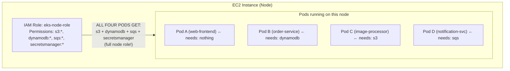
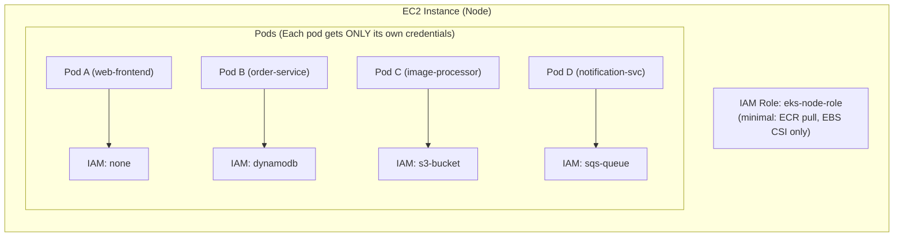
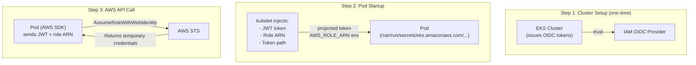
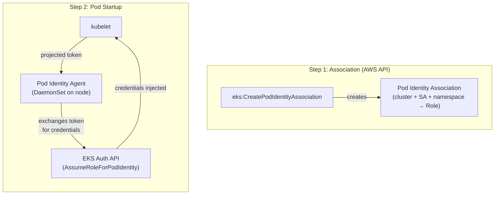
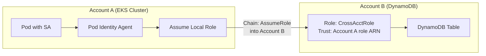
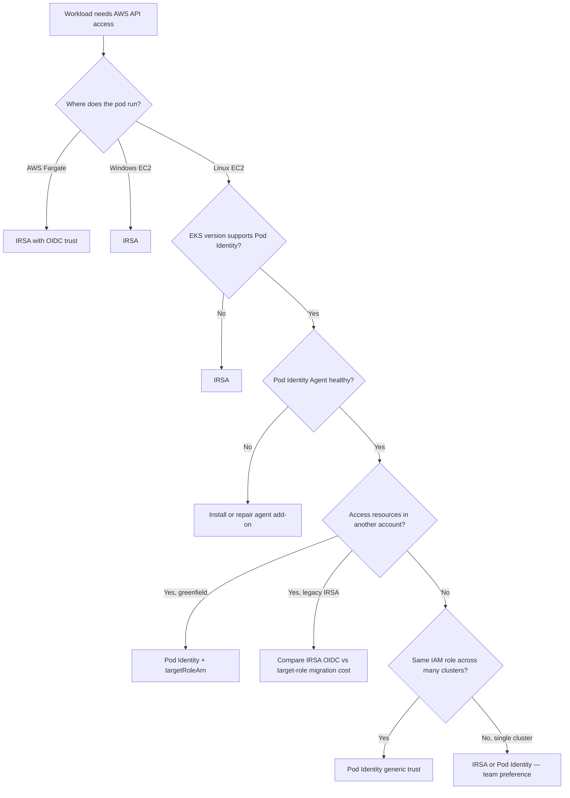
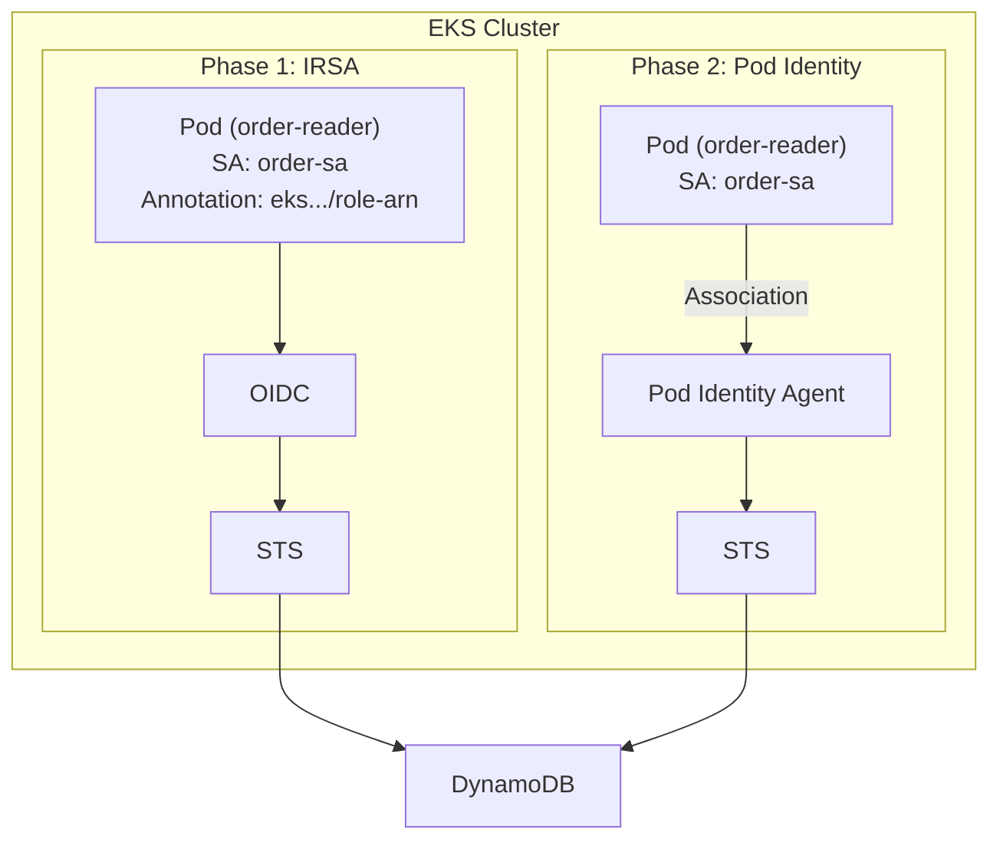

**Complexity**: `[MEDIUM]` | **Time to Complete**: 1.5h | **Prerequisites**: Module 5.1 (EKS Architecture & Control Plane). After completing this module, you will be able to:

## What You'll Be Able to Do

- **Configure IRSA (IAM Roles for Service Accounts) and EKS Pod Identity to grant pods least-privilege AWS access**
- **Implement OIDC provider trust relationships between EKS clusters and AWS IAM for workload authentication**
- **Design cross-account access patterns for EKS workloads that need to access resources in other AWS accounts**
- **Compare IRSA vs Pod Identity and migrate workloads from the legacy approach to the modern EKS Pod Identity model**

These outcomes assume you already understand IAM roles and policies from the AWS Essentials track. Here you apply that knowledge inside Kubernetes primitives — ServiceAccounts, projected volumes, DaemonSets, and EKS control-plane APIs — where a one-character typo in `system:serviceaccount:prod:api` blocks an entire deployment.

---

## Why This Module Matters

Hypothetical scenario: a platform team runs a multi-tenant EKS cluster where every node group shares one IAM instance profile scoped for “convenience” — broad S3, DynamoDB, and Secrets Manager access so application teams never open IAM tickets. During a routine penetration test, an attacker achieves code execution inside a low-privilege observability sidecar. Because the pod can reach the EC2 Instance Metadata Service (IMDS), the attacker obtains the node role’s temporary credentials and exfiltrates data from buckets the sidecar was never meant to touch. The blast radius is not one microservice; it is every permission aggregated onto that node.

This is the **node-level blast radius** problem. Without pod-level identity, every container scheduled on an EC2-backed node can potentially inherit whatever IAM permissions are attached to the underlying instance profile. A vulnerability in one pod does not stop at that pod’s business logic — it can become a lateral movement path into every AWS API the node role allows. The fix is **workload-scoped IAM**: map each Kubernetes ServiceAccount to a dedicated IAM role with least-privilege policies, and keep the node role stripped to cluster operations (image pull, CSI drivers, CNI, and similar node plumbing).

EKS ships two first-class mechanisms for that mapping. **[IAM Roles for Service Accounts (IRSA)](https://docs.aws.amazon.com/eks/latest/userguide/iam-roles-for-service-accounts.html)** federates Kubernetes OIDC tokens into `sts:AssumeRoleWithWebIdentity`. **[EKS Pod Identity](https://docs.aws.amazon.com/eks/latest/userguide/pod-identities.html)** uses a node agent plus EKS API associations and a stable `pods.eks.amazonaws.com` trust principal. If you completed [Module 1.1: IAM Identity & Access Management](../../aws-essentials/module-1.1-iam/), you already saw the comparison at essentials depth; this module is the EKS deep dive — trust policies, credential paths, cross-account topologies, migration runbooks, and STS debugging.

By the end, you will know how to choose IRSA versus Pod Identity for a given cluster, harden nodes against metadata credential theft, and migrate fleet-wide without taking outages.

---

## The Problem: Node-Level IAM Is Dangerous

Before IRSA and Pod Identity existed, the common way to give pods AWS access was through the node's IAM instance profile. This is still the default if you do nothing else.



**Pause and predict:** If Pod A only serves static frontend assets and needs no AWS access whatsoever, why does scheduling it on this worker node create an immediate vulnerability? Consider what happens if an attacker achieves remote code execution inside that container.

<details>
<summary>Check your prediction</summary>

If an attacker exploits a vulnerability in Pod A, they can query the instance metadata service at `169.254.169.254` to obtain temporary credentials for the node role, immediately gaining access to DynamoDB, S3, SQS, and Secrets Manager. Configuring EKS Pod Identity or IRSA does not automatically block access to IMDS. Securing the instance metadata boundary requires enforcing IMDSv2 and setting an HTTP response hop limit of 1 in the node launch template, which prevents bridged container network namespaces from querying metadata. Pods configured with `hostNetwork: true` always retain direct access to IMDS regardless of hop limit settings because they share the host network namespace. However, modern AWS SDKs continue to prioritize injected IRSA or Pod Identity credentials when those mechanisms are enabled for the workload.
</details>

Enforcing granular workload identity transforms multi-tenant container security from a shared node perimeter into cryptographically verifiable boundaries. By isolating credential issuance to explicit Kubernetes service accounts, platform teams eliminate environments where auxiliary microservices inherit broad cloud infrastructure privileges.

Node-role sprawl usually arrives as a ticket shortcut, not as an architecture decision. Treat every new AWS API on the instance profile as a production incident waiting for a sidecar exploit, and keep application data-plane permissions off the worker role from day one.

### Why instance profiles are still dangerous on “locked down” clusters

Even teams that enforce NetworkPolicies and read-only root filesystems often miss **IMDS exposure**. On EC2 worker nodes, the metadata endpoint at `169.254.169.254` answers HTTP requests from the host network namespace. Unless you enforce **IMDSv2** (session-oriented, `HttpTokens: required`) and a **hop limit of 1** on the launch template, containers that can reach the host network — or pods using `hostNetwork: true` — may still retrieve the **node instance profile** credentials. [AWS documents that both IRSA and Pod Identity assume you restrict IMDS so pods cannot bypass workload identity and read the node role.](https://docs.aws.amazon.com/eks/latest/userguide/iam-roles-for-service-accounts.html) Pod Identity improves the default SDK path, but it does not magically remove the node role; you still design node policies as **infrastructure-only**.

The operational mistake is treating the node role as a “shared service account” for dozens of microservices. That pattern was common before IRSA (2019) and before community tools like `kube2iam`/`kiam` attempted metadata interception — approaches that were fragile under iptables races and offered weaker audit trails than projected service account tokens. Modern EKS identity replaces that shortcut with cryptographically scoped tokens, yet many clusters still carry legacy `s3:*` on node roles because a one-off batch job needed it years ago.



---

## IRSA: IAM Roles for Service Accounts (The Legacy Approach)

IRSA was the first solution to pod-level identity on EKS. It works by leveraging OpenID Connect (OIDC) to establish a trust relationship between your EKS cluster and IAM. The flow involves four components: the EKS OIDC provider, IAM, the pod's service account, and the AWS SDK inside the pod.

When a pod starts with an annotated ServiceAccount, the kubelet mounts a **projected service account token** at `/var/run/secrets/eks.amazonaws.com/serviceaccount/token` and sets `AWS_ROLE_ARN` plus `AWS_WEB_IDENTITY_TOKEN_FILE`. The AWS SDK’s default credential chain reads those variables and calls **`sts:AssumeRoleWithWebIdentity`**, presenting the JWT to STS. STS validates the token’s **issuer** (`iss`), **subject** (`sub`, which must equal `system:serviceaccount:<namespace>:<name>`), and **audience** (`aud`, which must be `sts.amazonaws.com` for standard EKS IRSA). Only if the IAM role’s trust policy matches all three does the pod receive temporary access keys scoped to that role’s permission policies.

That design is powerful because IAM administrators can reason in Kubernetes nouns — namespace and service account — while security teams retain IAM as the authorization system of record. The tradeoff is **per-cluster OIDC plumbing**: each EKS cluster exposes a distinct issuer URL, so a role reused across ten clusters often needs ten `sub`/`aud` condition blocks or ten parallel roles unless you invest in automation.

### How IRSA Works



### Setting Up IRSA

**Step 1: Create the OIDC provider for your cluster.** Start by reading the issuer URL from the cluster and associating it so IAM can trust service-account token identity for that cluster.

```bash
# Get the OIDC issuer URL
OIDC_ISSUER=$(aws eks describe-cluster --name my-cluster \
  --query 'cluster.identity.oidc.issuer' --output text)

# Check if the provider already exists
aws iam list-open-id-connect-providers | grep $(echo $OIDC_ISSUER | cut -d'/' -f5)

# If not, create it
eksctl utils associate-iam-oidc-provider \
  --cluster my-cluster \
  --approve

# Or manually:
OIDC_ID=$(echo $OIDC_ISSUER | cut -d'/' -f5)
THUMBPRINT=$(openssl s_client -servername oidc.eks.us-east-1.amazonaws.com \
  -connect oidc.eks.us-east-1.amazonaws.com:443 2>/dev/null | \
  openssl x509 -fingerprint -noout | cut -d'=' -f2 | tr -d ':')

aws iam create-open-id-connect-provider \
  --url $OIDC_ISSUER \
  --client-id-list sts.amazonaws.com \
  --thumbprint-list $THUMBPRINT
```

**Step 2: Create an IAM role with a trust policy referencing the OIDC provider.** The role name, trust policy ARN, and condition fields must align with the service account so that only the intended namespace and service account can assume it.

```bash
ACCOUNT_ID=$(aws sts get-caller-identity --query Account --output text)
OIDC_ID=$(aws eks describe-cluster --name my-cluster \
  --query 'cluster.identity.oidc.issuer' --output text | cut -d'/' -f5)

cat > /tmp/irsa-trust-policy.json << EOF
{
  "Version": "2012-10-17",
  "Statement": [{
    "Effect": "Allow",
    "Principal": {
      "Federated": "arn:aws:iam::${ACCOUNT_ID}:oidc-provider/oidc.eks.us-east-1.amazonaws.com/id/${OIDC_ID}"
    },
    "Action": "sts:AssumeRoleWithWebIdentity",
    "Condition": {
      "StringEquals": {
        "oidc.eks.us-east-1.amazonaws.com/id/${OIDC_ID}:aud": "sts.amazonaws.com",
        "oidc.eks.us-east-1.amazonaws.com/id/${OIDC_ID}:sub": "system:serviceaccount:production:order-service-sa"
      }
    }
  }]
}
EOF

aws iam create-role \
  --role-name OrderServiceRole \
  --assume-role-policy-document file:///tmp/irsa-trust-policy.json

aws iam attach-role-policy \
  --role-name OrderServiceRole \
  --policy-arn arn:aws:iam::aws:policy/AmazonDynamoDBReadOnlyAccess
```

**Step 3: Annotate the Kubernetes ServiceAccount with the role ARN.** Add this annotation so the IRSA flow maps workload pods to `OrderServiceRole` through the service account identity.

```yaml
apiVersion: v1
kind: ServiceAccount
metadata:
  name: order-service-sa
  namespace: production
  annotations:
    eks.amazonaws.com/role-arn: arn:aws:iam::123456789012:role/OrderServiceRole
```

**Step 4: Use the ServiceAccount in your pod.** Attach this service account to the workload, and the pod-level AWS SDK uses those projected credentials automatically.

From a governance angle, IRSA ties identity changes to **Kubernetes RBAC**: whoever can edit ServiceAccounts or Deployments can redirect a workload to a different `role-arn` annotation. That is why mature platforms restrict `patch` on ServiceAccounts in production namespaces and require GitOps pull requests for annotation changes. IAM teams, meanwhile, only see the IAM role side unless you export Kubernetes audit logs. Pod Identity shifts the association object into **EKS APIs** so `CreatePodIdentityAssociation` appears in CloudTrail with an AWS principal — a better fit when IAM and platform are separate organizations.

```yaml
apiVersion: apps/v1
kind: Deployment
metadata:
  name: order-service
  namespace: production
spec:
  replicas: 3
  selector:
    matchLabels:
      app: order-service
  template:
    metadata:
      labels:
        app: order-service
    spec:
      serviceAccountName: order-service-sa
      containers:
        - name: app
          image: 123456789012.dkr.ecr.us-east-1.amazonaws.com/order-service:latest
          # AWS SDK automatically detects IRSA credentials
          # No AWS_ACCESS_KEY_ID needed!
```

### IRSA Pain Points

**Pause and predict:** If your organization manages 50 EKS clusters across 10 AWS accounts, and a backend microservice deployed in every cluster needs to read from a single centralized S3 bucket, what operational bottlenecks will you encounter when setting up IRSA for this service?

<details>
<summary>Check your prediction</summary>

Under IRSA, you must create and manage an IAM OIDC identity provider per cluster and per region across all ten accounts. Because each role's trust policy explicitly embeds the cluster-specific OIDC issuer URL, you cannot easily reuse a single IAM role across multiple clusters without ballooning trust policy documents toward IAM character quotas. Managing fleet-wide IRSA also requires monitoring TLS certificate thumbprint rotations and federating target accounts to trust multiple foreign cluster issuers. Furthermore, IRSA relationships exist only as Kubernetes ServiceAccount annotations rather than native AWS API resources, hiding workload bindings from central IAM inventory systems. In contrast, EKS Pod Identity replaces cluster-specific issuers with a single unified principal (`pods.eks.amazonaws.com`), allowing a single IAM role to be referenced across multiple clusters and scaling up to 5,000 associations per cluster.
</details>

Scaling identity management across enterprise multi-cluster environments demands architectural decoupling between compute infrastructure and access governance. When identity bindings rely on complex trust chains across independent control planes, operational maintenance overhead accelerates rapidly and introduces significant configuration drift across deployment environments.

### IRSA trust policy anatomy (what breaks in production)

Copy-pasted trust policies are the number-one source of `AccessDenied` on `AssumeRoleWithWebIdentity`. Treat the trust document as a **binding contract** between three strings:

| Field | Must match | Typical failure |
|-------|------------|-----------------|
| Federated principal ARN | `arn:aws:iam::<account>:oidc-provider/oidc.eks.<region>.amazonaws.com/id/<OIDC_ID>` for **this** cluster | Role created in staging reused in production without updating OIDC ID |
| `:aud` condition | `sts.amazonaws.com` | Custom audience or old tooling that mints non-standard JWTs |
| `:sub` condition | `system:serviceaccount:<ns>:<sa>` exactly | Deployment uses `order-sa` but trust says `orders-sa`; Helm chart renames SA |

Because STS evaluates JWT claims on every refresh, a mismatch fails closed — which is correct security behavior but frustrating during migrations. Use `kubectl exec` to decode the mounted token’s payload (see Troubleshooting) **before** you blame application IAM policies.

IRSA also multiplies **STS API volume**: each pod refresh can call STS independently. Large rolling deployments that restart thousands of pods at once can hit [STS request quotas](https://docs.aws.amazon.com/IAM/latest/UserGuide/reference_iam-quotas.html); symptoms look like intermittent `AccessDenied` or SDK timeouts even when trust policies are perfect. Pod Identity’s node agent caches credentials to amortize STS calls — one reason AWS positions it for dense node fleets.

---

## EKS Pod Identity: The Modern Approach

EKS Pod Identity, launched in November 2023, replaces IRSA with a simpler, AWS-native approach. Instead of OIDC federation, Pod Identity uses an agent running on each node to inject credentials directly into pods. As a result, Pod Identity does not require an OIDC provider, does not need role trust policy modifications with cluster-specific OIDC URLs, and is managed entirely through the AWS EKS API.

### How Pod Identity Works



### Setting Up Pod Identity

**Step 1: Install the Pod Identity Agent add-on.** This step deploys the node-level Pod Identity Agent so pods can request credentials through a managed AWS-native exchange path.

```bash
aws eks create-addon \
  --cluster-name my-cluster \
  --addon-name eks-pod-identity-agent \
  --addon-version v1.3.4-eksbuild.1

# Verify the agent is running
kubectl get daemonset eks-pod-identity-agent -n kube-system
kubectl get pods -n kube-system -l app.kubernetes.io/name=eks-pod-identity-agent
```

**Step 2: Create an IAM role with a Pod Identity trust policy.** Keep the service principal as `pods.eks.amazonaws.com` and include both role-assumption actions required by Pod Identity.

```bash
cat > /tmp/pod-identity-trust.json << 'EOF'
{
  "Version": "2012-10-17",
  "Statement": [{
    "Effect": "Allow",
    "Principal": {
      "Service": "pods.eks.amazonaws.com"
    },
    "Action": [
      "sts:AssumeRole",
      "sts:TagSession"
    ]
  }]
}
EOF

aws iam create-role \
  --role-name OrderServiceRole-PodIdentity \
  --assume-role-policy-document file:///tmp/pod-identity-trust.json

aws iam attach-role-policy \
  --role-name OrderServiceRole-PodIdentity \
  --policy-arn arn:aws:iam::aws:policy/AmazonDynamoDBReadOnlyAccess
```

Notice the trust policy: it trusts `pods.eks.amazonaws.com` as a service principal. There is no cluster-specific OIDC URL, and this means the same role can be used across any EKS cluster in the account without modifying the trust policy. That same role then becomes the one mapped by the Pod Identity Association for a namespace/service-account pair.

**Step 3: Create the Pod Identity Association.** This mapping ties the target namespace and service account to the role that was configured for Pod Identity trust.

```bash
aws eks create-pod-identity-association \
  --cluster-name my-cluster \
  --namespace production \
  --service-account order-service-sa \
  --role-arn arn:aws:iam::123456789012:role/OrderServiceRole-PodIdentity
```

**Step 4: Create the ServiceAccount (no annotation needed!).** Leave IRSA annotations out entirely here because Pod Identity relies on association mapping instead.

```yaml
apiVersion: v1
kind: ServiceAccount
metadata:
  name: order-service-sa
  namespace: production
  # No eks.amazonaws.com/role-arn annotation needed!
```

That is it. Any pod using this ServiceAccount in the `production` namespace will automatically receive credentials for the associated IAM role. No OIDC provider, no trust policy per cluster, and no annotation are required. In practice, that makes rollouts straightforward when you already have identity boundaries enforced at the service-account level.

### Pod Identity Agent mechanics and platform constraints

The **[Amazon EKS Pod Identity Agent](https://docs.aws.amazon.com/eks/latest/userguide/pod-id-agent-setup.html)** runs as a DaemonSet on **Linux Amazon EC2 worker nodes**. It binds link-local addresses documented by AWS (`169.254.170.23` for IPv4) and serves credentials to the AWS SDK via `AWS_CONTAINER_CREDENTIALS_FULL_URI`. The agent exchanges the pod’s Kubernetes service account identity for temporary credentials via the EKS Auth API **`AssumeRoleForPodIdentity`** (CloudTrail source `eks-auth.amazonaws.com`); EKS Auth then assumes the role via STS, applying **session tags** that carry cluster, namespace, and service account metadata — which is why the role trust policy must allow **`sts:TagSession`** in addition to **`sts:AssumeRole`**.

Platform restrictions matter for architecture reviews:

| Surface | Pod Identity | IRSA |
|---------|--------------|------|
| Linux EC2 nodes | Supported (agent DaemonSet required) | Supported |
| AWS Fargate | **Not supported** | Supported (projected token, no agent) |
| Windows EC2 nodes | **Not supported** | Supported where IRSA is supported |
| EKS Anywhere / self-managed K8s on EC2 | **Not supported** (components are EKS-only) | Possible with your own OIDC issuer |
| EKS Auto Mode | Agent setup differs; follow Auto Mode add-on guidance | Still available where OIDC issuer exists |

Associations are **eventually consistent** — AWS warns that changes may take seconds to propagate. Do not create associations in the same code path as a one-shot critical Job without a readiness check; platform teams usually manage associations in Terraform/CloudFormation and treat them like infrastructure, not app config.

Since **June 2025**, cross-account access can be configured at association time using a **target IAM role ARN**, with EKS performing **role chaining** so application code does not need manual `AssumeRole` calls for the common case. See [Access AWS resources using EKS Pod Identity target IAM roles](https://docs.aws.amazon.com/eks/latest/userguide/pod-id-assign-target-role.html) and the [cross-account announcement](https://aws.amazon.com/about-aws/whats-new/2025/06/amazon-eks-pod-identity-cross-account-access/).

### IRSA vs Pod Identity: Complete Comparison

| Feature | IRSA | Pod Identity |
| :--- | :--- | :--- |
| **Setup complexity** | OIDC provider + trust policy per cluster | Install agent add-on + one API call |
| **Trust policy** | Cluster-specific (contains OIDC URL) | Generic (`pods.eks.amazonaws.com` service principal) |
| **Cross-cluster reuse** | Requires trust policy update per cluster | Same role works across all clusters |
| **Cross-account** | OIDC provider in target account + federation | Simpler: trust policy + association |
| **Management API** | kubectl (annotations) | AWS EKS API (CloudTrail logged) |
| **Credential delivery** | STS `AssumeRoleWithWebIdentity` | Pod Identity Agent on node |
| **OIDC provider** | Required | Not required |
| **Audit trail** | Limited (ConfigMap + annotation changes) | Full CloudTrail logging |
| **Kubernetes version** | 1.14+ | 1.24+ |
| **Maturity** | Established (since 2019) | Newer (since 2023), rapidly adopted |

Read the table as **engineering tradeoffs**, not a scorecard where Pod Identity must win every row. IRSA remains the portability layer for Fargate and the escape hatch when you need the raw OIDC JWT. Pod Identity wins operational toil when the same IAM role must attach to many clusters without OIDC ARN churn, when IAM teams want EKS API/CloudTrail visibility, and when dense nodes need fewer STS calls during thundering herds of pod restarts.

### Hardening worker nodes alongside either model

Workload identity does not remove the node instance profile — it adds a **better default** for application SDKs. You should still:

1. **Scope the node role** to cluster infrastructure (ECR pull, `AmazonEKS_CNI_Policy`, CSI drivers, SSM if used).
2. **Require IMDSv2** on launch templates (`MetadataOptions.HttpTokens: required`, `HttpPutResponseHopLimit: 1`) per [IRSA security guidance](https://docs.aws.amazon.com/eks/latest/userguide/iam-roles-for-service-accounts.html).
3. **Avoid `hostNetwork: true`** unless necessary; such pods bypass many network policies and retain IMDS reachability.
4. **Alert on `AssumeRole` from unexpected principals** in CloudTrail — a spike from node instance profile session names inside application namespaces is a red flag.

```bash
# Example: enforce IMDSv2 on a launch template (adjust LT name/region)
aws ec2 modify-launch-template \
  --launch-template-id lt-0123456789abcdef0 \
  --launch-template-data '{
    "MetadataOptions": {
      "HttpTokens": "required",
      "HttpPutResponseHopLimit": 1,
      "HttpEndpoint": "enabled"
    }
  }'
```

Platform reviews should treat “we enabled Pod Identity” and “we restricted IMDS” as **paired requirements**, not substitutes.

### When to Still Use IRSA

Pod Identity is the recommended approach for new Linux EC2 node groups on supported EKS versions, but IRSA remains necessary or preferable in several scenarios:

- **AWS Fargate** — no DaemonSet surface for the Pod Identity Agent; IRSA’s projected token path is the supported mechanism.
- **Windows worker nodes** — Pod Identity is not available; IRSA (where supported) or other patterns apply.
- **Kubernetes versions / platform builds** below those listed in the [Pod Identity cluster versions table](https://docs.aws.amazon.com/eks/latest/userguide/pod-identities.html#pod-id-cluster-versions).
- **Self-managed Kubernetes on EC2** (not EKS) — you can operate IRSA-style federation with your own OIDC issuer; Pod Identity components are EKS-managed only.
- **OIDC token as the artifact** — if an workload must present the Kubernetes-issued JWT to a non-AWS system (custom federation, rare multi-cloud brokers), IRSA exposes that token on disk; Pod Identity optimizes for AWS STS credentials via the agent path.
- **Brownfield inertia** — fleets with mature IRSA automation may migrate incrementally; running both models during transition is normal.

### AWS SDK credential provider chain (both models)

Modern AWS SDKs (Boto3 1.24+, AWS SDK for Go v2, Java v2, JavaScript v3) walk a **default credential chain** at runtime. For IRSA, the chain picks up `AWS_WEB_IDENTITY_TOKEN_FILE` + `AWS_ROLE_ARN` and calls STS — this provider runs **before** the container credential provider in the standardized chain. For Pod Identity, the chain uses `AWS_CONTAINER_CREDENTIALS_FULL_URI` and `AWS_CONTAINER_AUTHORIZATION_TOKEN_FILE` (a path to the pod identity token file) injected by the EKS mutating webhook/agent path — the same class of mechanism used by App Runner and other container credential providers documented in [Grant Kubernetes workloads access to AWS](https://docs.aws.amazon.com/eks/latest/userguide/service-accounts.html).

If you run **custom credential wrappers** or pin ancient SDKs, you may bypass both paths and fall back to environment keys — a recurring source of “works in dev, fails in prod.” Standardize SDK versions in base images the same way you standardize base OS patches. For local `kubectl exec` debugging, `aws sts get-caller-identity` inside the pod is the fastest proof of which role the chain resolved.

> **Hypothetical scenario:** A team upgrades their Java base image but not the AWS SDK. Pods still mount IRSA tokens, yet the application uses a static `EnvironmentVariableCredentialsProvider` from a legacy Spring configuration. Incidents show “IRSA broken” when the real fix is deleting the static provider so the default chain can read web identity or container credentials. Identity migrations are therefore **application config + IAM** work, not only cluster add-ons.

---

## Cross-Account Access

Both IRSA and Pod Identity support cross-account IAM role assumption, but the setup differs significantly. The difference shows up in where trust anchors are defined and how role assumptions are delegated across namespaces, accounts, and associations.

Cross-account access is where pod identity work stops being “configure a role” and becomes **organizational IAM design**. The pod still obtains credentials in the cluster account first; reaching another account always implies **role chaining** or **resource policies** that trust a foreign principal. The difference between IRSA and Pod Identity is how much of that chain is **declarative in EKS** versus **implemented in application code**.

At a high level, **IRSA cross-account** usually means: (1) create an OIDC provider in the **resource account** that trusts the **workload account’s** cluster issuer, (2) create a role in the resource account whose trust policy constrains `sub`/`aud` to the service account, and (3) annotate the ServiceAccount with that role ARN (possibly in the resource account). Operators juggle **two OIDC providers** and cluster-specific issuer strings when many clusters consume the same datastore account.

**Pod Identity cross-account (2025+)** collapses the application path when you use **target roles**: the association in the cluster account references a **source role** (same account as the cluster, trusting `pods.eks.amazonaws.com`) and a **`targetRoleArn`** in the account that owns S3, DynamoDB, RDS, or other resources. EKS performs **sequential role assumption** — source role first, then target role — and hands the pod credentials scoped to the target role’s policies. The source role must live in the cluster account because of **IAM `PassRole`** constraints documented by AWS for Pod Identity associations.

### Cross-Account with Pod Identity (target role association)

**Pause and predict:** When configuring cross-account access for an EKS workload, what occurs if the target trust policy in Account B trusts Account A's root principal (`arn:aws:iam::111111111111:root`) without condition blocks? Furthermore, how does the Pod Identity local agent cache govern target role updates?

<details>
<summary>Check your prediction</summary>

Configuring a trust policy that trusts a naked Account A root principal (`arn:aws:iam::111111111111:root`) without condition keys delegates trust to Account A's IAM administrators, permitting any principal inside Account A that possesses `sts:AssumeRole` permissions to assume the role. While AWS documentation examples often reference the account root principal, they combine it with strict `Condition` blocks such as `ArnEquals` on `aws:PrincipalArn` and session tags (`aws:RequestTag/eks-cluster-arn`) to prevent unauthorized cross-account chaining. Under EKS Pod Identity target role chaining, the source role must always reside in the cluster's AWS account due to `iam:PassRole` authorization constraints, while the target role can reside in a foreign account. The local Pod Identity agent caches credentials for 6 hours when assuming a source role alone, but reduces the cache to 59 minutes when chaining into a target role; modifying an existing association's target role ARN does not immediately revoke active cached tokens, so operators must recreate or restart pods to apply association edits sooner. Furthermore, remember that EKS Pod Identity is supported strictly on Linux Amazon EC2 instances (not Fargate and not Windows EC2), and its trust policies must grant both `sts:AssumeRole` and `sts:TagSession` actions to `pods.eks.amazonaws.com`.
</details>

Establishing defense-in-depth across multi-account AWS architectures requires platform engineers to treat account boundaries as hard isolation walls. Coordinating sequential role assumption ensures that identity propagation remains auditable across organizational boundaries, preventing lateral privilege escalation while maintaining unified centralized access controls.



```bash
# In Account A: Create the pod's role with cross-account assume permission
cat > /tmp/pod-role-policy.json << 'EOF'
{
  "Version": "2012-10-17",
  "Statement": [{
    "Effect": "Allow",
    "Action": "sts:AssumeRole",
    "Resource": "arn:aws:iam::222222222222:role/CrossAccountDynamoDBRole"
  }]
}
EOF

aws iam put-role-policy \
  --role-name OrderServiceRole-PodIdentity \
  --policy-name CrossAccountAssume \
  --policy-document file:///tmp/pod-role-policy.json

# In Account B: Create the target role with trust back to Account A's pod role
cat > /tmp/cross-account-trust.json << 'EOF'
{
  "Version": "2012-10-17",
  "Statement": [{
    "Effect": "Allow",
    "Principal": {
      "AWS": "arn:aws:iam::111111111111:role/OrderServiceRole-PodIdentity"
    },
    "Action": "sts:AssumeRole"
  }]
}
EOF

aws iam create-role \
  --role-name CrossAccountDynamoDBRole \
  --assume-role-policy-document file:///tmp/cross-account-trust.json

aws iam attach-role-policy \
  --role-name CrossAccountDynamoDBRole \
  --policy-arn arn:aws:iam::aws:policy/AmazonDynamoDBReadOnlyAccess
```

When you **do not** use `targetRoleArn`, application code can still chain `sts:AssumeRole` manually — the pattern below remains valid for IRSA-only fleets or fine-grained session naming. With target roles, prefer the association API so pods keep using the default credential chain without custom STS code.

```bash
# Pod Identity association with target role (cluster account 111111111111, data account 222222222222)
aws eks create-pod-identity-association \
  --cluster-name my-cluster \
  --namespace production \
  --service-account order-service-sa \
  --role-arn arn:aws:iam::111111111111:role/EKSPodIdentitySourceRole \
  --target-role-arn arn:aws:iam::222222222222:role/CrossAccountDynamoDBRole
```

In the application code, you chain the role assumption only when needed. The workload starts with credentials from Pod Identity and then explicitly assumes the cross-account role before issuing AWS API calls that target the remote account.

```python
import boto3

# First, get credentials from Pod Identity (automatic)
sts_client = boto3.client('sts')

# Then, assume the cross-account role
response = sts_client.assume_role(
    RoleArn='arn:aws:iam::222222222222:role/CrossAccountDynamoDBRole',
    RoleSessionName='order-service-cross-account'
)

# Use the cross-account credentials
dynamodb = boto3.resource(
    'dynamodb',
    region_name='us-east-1',
    aws_access_key_id=response['Credentials']['AccessKeyId'],
    aws_secret_access_key=response['Credentials']['SecretAccessKey'],
    aws_session_token=response['Credentials']['SessionToken']
)

table = dynamodb.Table('orders')
```

### Cross-account with IRSA (OIDC in the resource account)

For Fargate-heavy estates or clusters not yet on Pod Identity, IRSA remains the portable choice. In the **resource account**, register an IAM OIDC provider whose URL matches the **workload cluster issuer**, then author a role trust policy with `AssumeRoleWithWebIdentity` and tight `sub`/`aud` conditions. The ServiceAccount annotation points at that cross-account role ARN. The operational cost is **N clusters × M roles** worth of trust-policy edits whenever you stand up a new cluster — which is why platform teams with centralized data accounts often schedule Pod Identity migrations.

**Resource-based policies** (S3 bucket policies, KMS key policies, Secrets Manager secrets) can alternatively trust the **pod role ARN directly** without a second assume call. That pattern works when the data plane supports resource policies and you want fewer STS hops. It does not replace Pod Identity or IRSA — the pod still needs initial credentials — but it can remove intermediate roles in the data account. Evaluate latency, policy size limits, and who owns bucket policy changes before choosing resource trust vs role chaining.

### Identity Center and human access (boundary clarity)

EKS Pod Identity and IRSA solve **workload → AWS API** authentication. They do not replace **human → cluster** access via `aws eks update-kubeconfig`, IAM Identity Center, or RBAC groups. Architecture diagrams should show two parallel lines: developers authenticate to the Kubernetes API through your chosen human path, while pods authenticate to AWS through IRSA/Pod Identity. Mixing them — for example, mounting long-lived IAM user keys as Kubernetes Secrets — reintroduces rotation toil and voids the point of this module.

---

## Cost Lens: IAM Is Cheap; Mistakes Are Not

**IAM and STS have no per-request charge** for standard `AssumeRole` / `AssumeRoleWithWebIdentity` / `AssumeRoleForPodIdentity` calls in the way data-plane services bill per GB. You do pay indirectly when:

- **STS throttling** during massive rollouts forces retries, lengthens pod startup, and triggers HPA/Karpenter scaling oscillations — engineer time and compute waste, not an STS line item.
- **Over-broad node roles** cause data exfiltration or compliance findings — audit remediation across dozens of microservices dominates cost.
- **CloudTrail and IAM Access Analyzer** ingest events when you operate Pod Identity through AWS APIs; that is observability spend you usually want anyway.

Cost **knobs** that actually move the needle:

1. **Pod Identity agent caching** — reduces duplicate STS calls per node versus per-pod IRSA refresh storms on dense nodes.
2. **Fewer roles via session policies** — [session policies for Pod Identity](https://aws.amazon.com/blogs/containers/session-policies-for-amazon-eks-pod-identity/) let one role serve multiple namespaces with different inline session caps instead of proliferating hundreds of near-duplicate roles (IAM role quota is 1000 per account by default per [IAM quotas](https://docs.aws.amazon.com/IAM/latest/UserGuide/reference_iam-quotas.html)).
3. **Least-privilege policies** — smaller blast radius lowers incident cost more than any IAM pricing tweak.
4. **Automated association management** — Terraform/CloudFormation avoids human misconfiguration rework.

What **spikes** cost unexpectedly is not STS dollars but **outages**: a broken trust policy blocks pod startup; a deployment freeze during Black Friday costs more than a year of IAM API calls. Invest in association readiness checks and staged rollouts.

---

## Troubleshooting STS Errors

Identity issues on EKS produce some of the most confusing error messages in all of AWS. The failure is rarely “S3 is down”; it is almost always **STS rejected the identity proof** or the **SDK never found credentials**. The fastest remediation path is to walk the chain from Kubernetes downward: ServiceAccount → pod spec → mounted files/env → STS → IAM policy → resource policy (S3/DynamoDB).

### Systematic triage order

| Step | IRSA check | Pod Identity check |
|------|------------|-------------------|
| 1 | `kubectl describe sa` shows `eks.amazonaws.com/role-arn` | `aws eks list-pod-identity-associations` lists expected tuple |
| 2 | Pod `serviceAccountName` matches trust `sub` | Namespace + SA names match association exactly |
| 3 | Token file exists under `/var/run/secrets/eks.amazonaws.com/` | `AWS_CONTAINER_CREDENTIALS_FULL_URI` present in `kubectl exec env` |
| 4 | Decoded JWT `iss/sub/aud` match trust policy | Agent DaemonSet pods healthy on **this node** |
| 5 | `aws iam simulate-principal-policy` on role | CloudTrail `AssumeRoleForPodIdentity` events appear |
| 6 | Resource policy / SCP not denying | Same — credentials may be valid but target denies |

When both IRSA annotation and Pod Identity association coexist, **IRSA sits earlier in the SDK chain and wins** — if you are debugging Pod Identity while the `eks.amazonaws.com/role-arn` annotation still exists, pods keep using IRSA credentials and you may be inspecting container-credential env vars that the chain never selects.

### Error: "An error occurred (AccessDenied) when calling the AssumeRoleWithWebIdentity"

This is the most common IRSA error. The OIDC provider, trust policy, or service account does not match. Work through the checks in order, because each step validates one link in the chain that must all align for AssumeRoleWithWebIdentity to succeed.

```bash
# 1. Verify the OIDC provider exists
aws iam list-open-id-connect-providers

# 2. Check the role's trust policy
aws iam get-role --role-name OrderServiceRole \
  --query 'Role.AssumeRolePolicyDocument' --output json

# 3. Verify the service account annotation
kubectl get sa order-service-sa -n production -o json | \
  jq '.metadata.annotations["eks.amazonaws.com/role-arn"]'

# 4. Check the projected token inside the pod
kubectl exec -it order-service-pod -n production -- \
  cat /var/run/secrets/eks.amazonaws.com/serviceaccount/token | \
  cut -d'.' -f2 | base64 -d 2>/dev/null | jq '.iss, .sub, .aud'
```

### Error: "No credentials provider found" or "Unable to locate credentials"

The AWS SDK is not detecting the injected credentials. In practice, that usually means either the expected credential provider environment variables are missing or the webhook injection path was not completed. Start from pod-level env inspection, then confirm the workload's service account mapping before moving to API-level checks.

```bash
# Check that the environment variables are set in the pod
kubectl exec -it order-service-pod -n production -- env | grep AWS

# For IRSA, you should see:
# AWS_ROLE_ARN=arn:aws:iam::123456789012:role/OrderServiceRole
# AWS_WEB_IDENTITY_TOKEN_FILE=/var/run/secrets/eks.amazonaws.com/serviceaccount/token

# For Pod Identity, you should see:
# AWS_CONTAINER_CREDENTIALS_FULL_URI=http://169.254.170.23/v1/credentials
# AWS_CONTAINER_AUTHORIZATION_TOKEN_FILE=/var/run/secrets/pods.eks.amazonaws.com/serviceaccount/eks-pod-identity-token
```

### Error: "ExpiredTokenException"

The service account token has expired. IRSA tokens have a default lifetime of 24 hours. If a pod holds stale credentials past that window, the SDK will fail to refresh unless you are using an SDK/runtime path that supports automatic token refresh.

### Error: Pod Identity association exists but credentials never arrive

Symptoms: `AWS_CONTAINER_CREDENTIALS_FULL_URI` is missing, or HTTP calls to the link-local agent time out. Common causes:

- **Agent not scheduled on the node** — taints, insufficient resources, or add-on version skew with the cluster Kubernetes version. Confirm the DaemonSet pod is `Running` on the same node as the workload (`kubectl get pod -o wide`).
- **Proxy environment variables** — corporate HTTP proxies must exempt `169.254.170.23` and `[fd00:ec2::23]` per AWS Pod Identity documentation, or the SDK cannot reach the agent.
- **Security Groups for Pods / ENI modes** — advanced VPC CNI modes can block link-local traffic if misconfigured; compare with a pod on a node without custom networking first.
- **Missing `sts:TagSession`** — trust policy allows `AssumeRole` only; the agent cannot complete session tagging.

### Aud mismatch and multi-cluster IRSA footguns

If `aud` in the decoded JWT is not `sts.amazonaws.com`, the `StringEquals` condition on `aud` fails even when `sub` is perfect. Custom audiences appear when operators experiment with non-standard issuers or legacy tooling — stick to the EKS-documented audience unless AWS support documents an exception.

When cloning a cluster, the **OIDC issuer ID changes**. Any IRSA role trust policy hard-codes the old `oidc.eks.<region>.amazonaws.com/id/<OIDC_ID>` fragment. Automation should parameterize `OIDC_ID` from `aws eks describe-cluster` during role creation, not from a wiki page copied last year.

```bash
# Check token expiry
kubectl exec -it order-service-pod -n production -- \
  cat /var/run/secrets/eks.amazonaws.com/serviceaccount/token | \
  cut -d'.' -f2 | base64 -d 2>/dev/null | jq '.exp' | \
  xargs -I{} date -d @{}

# If expired, ensure the pod is using a current SDK that supports token refresh
# AWS SDK v2 (Go), Boto3 1.24+, and AWS SDK for Java v2 all support auto-refresh
```

### Debugging Checklist

```text
IRSA Not Working? Check in this order:
 1. OIDC provider exists?          → aws iam list-open-id-connect-providers
 2. Trust policy OIDC URL matches? → Compare cluster OIDC issuer with trust policy
 3. SA namespace:name matches?     → Trust policy "sub" condition must match exactly
 4. SA annotation correct?         → eks.amazonaws.com/role-arn must be set
 5. Pod using the right SA?        → spec.serviceAccountName set correctly
 6. Token file mounted?            → ls /var/run/secrets/eks.amazonaws.com/
 7. AWS SDK version supports IRSA? → Needs SDK from 2019+ with web identity support

Pod Identity Not Working? Check in this order:
 1. Agent add-on installed?        → kubectl get ds eks-pod-identity-agent -n kube-system
 2. Agent pods running?            → kubectl get pods -n kube-system -l app...=eks-pod-identity-agent
 3. Association exists?            → aws eks list-pod-identity-associations --cluster-name X
 4. Trust policy correct?          → Must trust pods.eks.amazonaws.com with sts:TagSession
 5. SA name and namespace match?   → Association must match exactly
 6. Env vars injected?             → AWS_CONTAINER_CREDENTIALS_FULL_URI set in pod
```

---

## Migration: IRSA to Pod Identity

Migrating from IRSA to Pod Identity can be done incrementally, service by service, with zero downtime. In practice, you can complete one service at a time and validate traffic, so the migration risk stays bounded while you compare identity behavior across both models.

### What changes in the trust document

IRSA trust policies reference a **Federated** OIDC provider principal with `AssumeRoleWithWebIdentity` and JWT claim conditions. Pod Identity trust policies reference the **Service** principal `pods.eks.amazonaws.com` with `AssumeRole` + `TagSession`. You cannot simply delete the OIDC block on day one if Fargate services still need it — maintain **dual trust** during hybrid operation:

```json
{
  "Version": "2012-10-17",
  "Statement": [
    {
      "Effect": "Allow",
      "Principal": {"Service": "pods.eks.amazonaws.com"},
      "Action": ["sts:AssumeRole", "sts:TagSession"]
    },
    {
      "Effect": "Allow",
      "Principal": {
        "Federated": "arn:aws:iam::ACCOUNT:oidc-provider/oidc.eks.REGION.amazonaws.com/id/OIDC_ID"
      },
      "Action": "sts:AssumeRoleWithWebIdentity",
      "Condition": {
        "StringEquals": {
          "oidc.eks.REGION.amazonaws.com/id/OIDC_ID:aud": "sts.amazonaws.com",
          "oidc.eks.REGION.amazonaws.com/id/OIDC_ID:sub": "system:serviceaccount:production:order-service-sa"
        }
      }
    }
  ]
}
```

After the last IRSA consumer retires, remove the federated statement in a controlled change window and delete unused OIDC providers to reduce IAM clutter.

### Validation signals during cutover

| Signal | IRSA active | Pod Identity active |
|--------|-------------|---------------------|
| Pod env | `AWS_WEB_IDENTITY_TOKEN_FILE` set | `AWS_CONTAINER_CREDENTIALS_FULL_URI` set |
| CloudTrail event | `AssumeRoleWithWebIdentity` | `AssumeRoleForPodIdentity` |
| SA annotation | `eks.amazonaws.com/role-arn` present | annotation absent |
| EKS API object | none | association row in `list-pod-identity-associations` |

Run application integration tests that call **STS `get-caller-identity`** and the real data plane (DynamoDB `DescribeTable`, S3 `HeadObject`) after each rolling restart wave — not only health checks — because HTTP `/healthz` does not prove AWS credentials work.

### Migration Steps Per Service

```bash
# 1. Install the Pod Identity Agent (if not already)
aws eks create-addon --cluster-name my-cluster \
  --addon-name eks-pod-identity-agent

# 2. Create a new role with Pod Identity trust (or update existing)
cat > /tmp/pod-identity-trust.json << 'EOF'
{
  "Version": "2012-10-17",
  "Statement": [{
    "Effect": "Allow",
    "Principal": {"Service": "pods.eks.amazonaws.com"},
    "Action": ["sts:AssumeRole", "sts:TagSession"]
  }]
}
EOF

aws iam update-assume-role-policy \
  --role-name OrderServiceRole \
  --policy-document file:///tmp/pod-identity-trust.json

# 3. Create the Pod Identity Association
aws eks create-pod-identity-association \
  --cluster-name my-cluster \
  --namespace production \
  --service-account order-service-sa \
  --role-arn arn:aws:iam::123456789012:role/OrderServiceRole

# 4. Remove the IRSA annotation from the ServiceAccount
kubectl annotate sa order-service-sa -n production \
  eks.amazonaws.com/role-arn-

# 5. Restart pods to pick up new credential delivery
kubectl rollout restart deployment order-service -n production

# 6. Verify pods are using Pod Identity (not IRSA)
kubectl exec -it $(kubectl get pods -n production -l app=order-service -o name | head -1) \
  -n production -- env | grep AWS
# Should show AWS_CONTAINER_CREDENTIALS_FULL_URI (Pod Identity)
# Should NOT show AWS_WEB_IDENTITY_TOKEN_FILE (IRSA)
```

**Pause and predict:** If you configure an EKS Pod Identity association for a service account that already has an active IRSA annotation, which credential provider will the AWS SDK select when the application initializes? What exact operational sequence is required to switch traffic over to Pod Identity?

<details>
<summary>Check your prediction</summary>

Credentials located earlier in the standard AWS SDK default credential provider chain keep winning. In standard AWS SDKs, the `AssumeRoleWithWebIdentity` credential provider (governed by the `AWS_WEB_IDENTITY_TOKEN_FILE` environment variable injected by IRSA) is evaluated before the container credentials provider (governed by `AWS_CONTAINER_CREDENTIALS_FULL_URI` used by EKS Pod Identity). Consequently, creating a Pod Identity association does not switch the credential acquisition path while the IRSA annotation remains on the Kubernetes ServiceAccount. To execute a clean cutover, operators must first create the Pod Identity association, delete the `eks.amazonaws.com/role-arn` annotation from the ServiceAccount, and perform a rolling restart of the deployment so the mutating webhook omits the web identity token projection, allowing the SDK chain to fall through to Pod Identity. Additionally, remember that Pod Identity operates exclusively on Linux Amazon EC2 nodes (and requires both `sts:AssumeRole` and `sts:TagSession` in the trust policy); workloads running on Windows EC2 or EKS Fargate cannot use the local agent and must continue relying on IRSA.
</details>

Identity cutovers belong in the same change window as application rollouts because credential files and environment variables are captured when the pod starts. A successful AWS API call after the association exists is not proof that the new path is the one serving tokens.

### Fleet migration playbook (platform team view)

Treat IRSA → Pod Identity as a **capability rollout**, not a big-bang flag flip:

1. **Inventory** — export all ServiceAccounts with `eks.amazonaws.com/role-arn` annotations per cluster; map to IAM roles and downstream AWS resources.
2. **Agent baseline** — install `eks-pod-identity-agent` on Linux EC2 node groups; confirm DaemonSet health and link-local routing (watch for corporate HTTP proxies that block `169.254.170.23`).
3. **Trust policy wave** — add `pods.eks.amazonaws.com` trust alongside existing OIDC trust during transition, or create parallel roles if IAM teams require clean separation.
4. **Association wave** — create associations per `(cluster, namespace, serviceAccount)`; wait for eventual consistency before restarting Deployments.
5. **Annotation removal** — strip IRSA annotations only after CloudTrail shows `AssumeRoleForPodIdentity` for that workload.
6. **OIDC cleanup** — retire per-cluster OIDC providers only when no IRSA roles remain (Fargate workloads may keep IRSA indefinitely).

Document rollback: re-apply the annotation and delete the association if a service cannot use modern SDK credential providers.

### Pre-production security review checklist

Before marking a service “identity complete,” walk this checklist with the service owner and IAM team:

1. **Node role policy document** — confirm no application S3/DynamoDB/SQS actions remain on `eks-node-group` roles.
2. **IMDS settings** — launch template enforces IMDSv2 and hop limit 1 on all Linux node groups touched by the workload.
3. **ServiceAccount binding** — Deployment `serviceAccountName` matches association or IRSA annotation; no `default` SA in production namespaces.
4. **Trust policy least privilege** — IRSA `sub` is exact; Pod Identity trust includes `TagSession`; no `Principal: "*"` shortcuts.
5. **Permission policy** — resource ARNs scoped; no `Resource: "*"` unless justified and tagged in risk register.
6. **Cross-account path** — if using `targetRoleArn`, diagram source → target trust and PassRole owners.
7. **Break-glass** — documented steps to revoke association and force pod restart if credentials leak.
8. **Observability** — CloudTrail alert on `AssumeRole` from unexpected `userName` patterns for the service.

Passing the checklist matters more than picking IRSA or Pod Identity on ideology alone — both mechanisms fail open to human process gaps when annotations and associations drift untracked.

---

## Patterns & Anti-Patterns

Production EKS identity succeeds when **three boundaries** stay crisp: the **node role** owns infrastructure, the **workload role** owns application AWS APIs, and **human IAM users** never land in pods. Patterns below assume you have already restricted IMDS hop limits and monitor CloudTrail for `AssumeRole*` anomalies.

| Pattern | When to Use | Why It Works | Scaling Note |
|---------|-------------|--------------|--------------|
| **Minimal node role + Pod Identity associations** | New Linux EC2 clusters on supported EKS versions | Node compromise no longer equals application datastore access | Manage thousands of associations via IaC; up to 5000 associations per cluster per AWS limits |
| **IRSA on Fargate, Pod Identity on EC2** | Mixed compute (serverless + node groups) | Each compute type uses the supported mechanism | Document two runbooks; do not force one annotation model |
| **Target role associations for shared data accounts** | Central S3/DynamoDB/RDS in another account (2025+ API) | EKS chains roles; apps keep default credential chain | Source role must stay in cluster account; target trusts source |
| **Session policies on a shared platform role** | Many namespaces need slightly different S3 prefixes | One role + per-association session policy intersection | Requires understanding IAM policy evaluation order |
| **CloudTrail-driven least privilege** | Steady-state operations after burn-in | Access Analyzer + trail data replaces guessed `*` policies | Revisit quarterly as APIs evolve |

| Anti-Pattern | What Goes Wrong | Why Teams Fall Into It | Better Alternative |
|--------------|-----------------|------------------------|-------------------|
| **Application permissions on the node role** | Any pod exploit becomes datastore admin | Fastest demo path; “we will fix later” | Strip node role; enforce Pod Identity/IRSA per SA |
| **One IAM role per microservice without automation** | IAM quota pressure, drifted trust policies | Copy-paste from tutorial | Group by data domain; use session policies or path-scoped policies |
| **Pod Identity on Fargate** | Pods never receive agent credentials | Assuming one EKS feature covers all compute | IRSA with projected tokens on Fargate |
| **Trusting `account:root` in cross-account roles** | Any principal in source account can chain | Simpler trust JSON | Trust specific role ARNs from Pod Identity source roles |
| **Skipping pod restart after identity change** | Pods keep stale creds; false sense of revocation | Belief that K8s live-updates IAM | Rolling restart after association or annotation changes |
| **Disabling `sts:TagSession` on Pod Identity roles** | Silent credential failure at agent | Copied IRSA trust policies verbatim | Include `sts:TagSession` per AWS requirement |

---

## Decision Framework

Choosing IRSA versus Pod Identity is an **operational and compute-topology** decision, not a moral judgment about “legacy.” Start from constraints you cannot change this quarter: Kubernetes version, Fargate share, Windows nodes, multi-cluster count, and whether IAM changes require a separate team.



| Requirement | Prefer | Tradeoff |
|-------------|--------|----------|
| Linux EC2, multi-cluster fleet, IAM team owns AWS API | **Pod Identity** | Requires agent; associations eventually consistent |
| Fargate-only service | **IRSA** | Per-cluster OIDC provider in IAM |
| Need OIDC JWT for non-AWS IdP | **IRSA** (token is the artifact) | Pod Identity optimizes AWS creds, not external OIDC export |
| Cross-account without app code changes (2025+) | **Pod Identity + target role** | Source role must be cluster account |
| EKS Anywhere / self-managed K8s | **IRSA or custom OIDC** | Pod Identity components unavailable outside EKS |
| Strict “everything in Git” K8s-only ops | **IRSA** (annotation-driven) | Weaker CloudTrail story than EKS API associations |

AWS’s [EKS identity best practices](https://docs.aws.amazon.com/eks/latest/best-practices/identity-and-access-management.html) recommend evaluating Pod Identity for new Linux EC2 workloads while retaining IRSA where required. Your default for **new** node-group services should be Pod Identity unless Fargate/Windows forces IRSA — but keep IRSA runbooks until the last Fargate workload migrates or you accept dual models long term.

When facilitators run this module in a classroom, assign pairs to **draw two sequence diagrams** — IRSA and Pod Identity — on paper before touching the cluster. The team that can label where STS is called (pod vs node agent) and where trust is evaluated (OIDC JWT vs service principal) migrates faster in Task 3 because they already understand why the env vars swap. Timebox Task 2 to 45 minutes; if OIDC provider creation stalls on thumbprint issues, use `eksctl utils associate-iam-oidc-provider` rather than fighting OpenSSL fingerprints manually unless your security team mandates manual providers.

---

## Real-World Connection: Platform Engineering Ownership

In large enterprises, three teams touch EKS identity — **Kubernetes platform** (ServiceAccounts, namespaces, add-ons), **cloud security / IAM** (roles, trust, SCPs), and **application** (SDK versions, which AWS APIs are called). Successful fleets publish a **single internal standard**: default to Pod Identity on Linux EC2, document IRSA for Fargate, forbid node-role application permissions, and require Terraform modules that output both the role ARN and the association ID.

Ticket churn drops when the EKS association API is the contract between teams: application developers request `namespace + serviceAccount + policy intent`, platform engineers merge Terraform that calls `aws_eks_pod_identity_association`, and IAM reviewers only approve `pods.eks.amazonaws.com` trust roles in a dedicated OU. IRSA-heavy organizations instead see GitOps PRs that only change annotations — invisible to IAM reviewers until an audit exports Kubernetes resources.

Training application developers matters as much as configuring clusters. Developers should know that **long-lived access keys in Secrets** are an anti-pattern when Pod Identity/IRSA exists, that **local kubeconfig IAM users** are unrelated to pod credentials, and that **AssumeRole in application code** is only needed when chaining to a target role you did not model in the association API. Reducing bespoke STS code shrinks the support surface when credentials fail at 2 a.m.

---

## Did You Know?

1. IRSA uses the `sts:AssumeRoleWithWebIdentity` API call, which is subject to the same STS rate limits as all other AssumeRole calls. At large scale (thousands of pods restarting simultaneously during a deployment), IRSA can trigger STS throttling, causing pods to fail to obtain credentials. Pod Identity mitigates this with local credential caching on the agent, reducing STS API calls.

2. The Pod Identity Agent runs as a DaemonSet that listens on `169.254.170.23:80` and `169.254.170.23:2703` on each node. When the AWS SDK inside a pod makes a credential request, it is directed to this local agent endpoint via the injected env var instead of IMDS. The agent then exchanges the pod's service account token for temporary IAM credentials.

3. Before IRSA existed (2019), the community tools `kube2iam` (2016) and later `kiam` (2017) were the main options for pod-level IAM. They worked by intercepting metadata requests using iptables rules and a node-level daemon. These tools were notoriously fragile -- iptables race conditions could cause pods to receive the wrong role's credentials. IRSA eliminated this entire class of bugs by using projected service account tokens instead of metadata interception.

4. When you delete a Pod Identity association, existing pods keep their current credentials until those credentials expire (typically within an hour). New credential requests will usually fail shortly after the change propagates. This gives you a grace period during migrations, but it also means that removing an association does not instantly revoke access -- you must also restart the pods if immediate revocation is required.

---

## Summary: Credential Paths at a Glance

Before you leave this module, you should be able to narrate both credential paths without looking at notes. **IRSA** begins at the Kubernetes API server (projected SA token), flows through the pod’s filesystem and environment variables, hits **STS AssumeRoleWithWebIdentity** with JWT claim checks, and ends with IAM role session credentials used by the SDK. **Pod Identity** begins at the **EKS association API** (infrastructure intent), flows through the **node agent** (local credential server), hits the **EKS Auth API AssumeRoleForPodIdentity** (which assumes the role via STS with session tags), and ends with the same style of temporary keys — but with fewer per-pod STS calls and a trust policy that does not embed cluster OIDC IDs.

Neither path removes your obligation to **scope node IAM**, **patch SDKs**, and **write least-privilege policies**. They replace the anti-pattern of sharing the node instance profile across unrelated microservices. Choose Pod Identity for new Linux EC2 services when the agent is available; keep IRSA where AWS documents gaps; migrate deliberately with CloudTrail evidence; and treat cross-account access as IAM role design, not a kubectl annotation trick.

If you maintain internal runbooks, add links to this module next to your EKS cluster provisioning template — specifically the **Decision Framework** flowchart and the **Pre-production security review checklist** — so new node groups do not ship with bloated instance profiles “just until identity is configured.” That single process change prevents more incidents than any additional IAM action in a trust policy.

For exam and interview contexts (CKA/CKAD adjacent platform knowledge), remember: Kubernetes RBAC controls **who can call the Kubernetes API**; IRSA and Pod Identity control **which AWS principal a pod becomes** when it calls S3, DynamoDB, SQS, or other AWS APIs. Confusing the two leads to “we restricted RBAC, so we are secure” narratives that miss compromised pods still exfiltrating data through valid cloud credentials. NetworkPolicies may contain east-west movement, but they do not replace cloud IAM scoping when workloads legitimately reach AWS APIs. The next module on EKS storage assumes your pods can authenticate cleanly — fix identity first, then attach CSI drivers and data-plane policies. Re-run `verify_module.py` locally after edits if you contribute prose — density and word-floor gates catch regressions early. Maintainers target at least 5000 body words for deep-dive modules so exercises, troubleshooting, and decision frameworks stay on-page without relying on external wiki pages drifting over time.

---

## Common Mistakes

| Mistake | Why It Happens | How to Fix It |
| :--- | :--- | :--- |
| **Using node IAM role for application access** | Easiest path: attach policies to the node role. All pods inherit access. | Use Pod Identity (or IRSA) to assign per-pod IAM roles. Strip the node role down to only ECR pull, EBS CSI, and basic node operations. |
| **IRSA trust policy with wrong namespace or SA name** | Copy-pasting trust policies and forgetting to update the `sub` condition. | The `sub` field must exactly match `system:serviceaccount:<namespace>:<sa-name>`. Double-check with `kubectl get sa -n <namespace>`. |
| **Forgetting `sts:TagSession` in Pod Identity trust** | Copying IRSA trust policies that only have `sts:AssumeRoleWithWebIdentity`. | Pod Identity requires both `sts:AssumeRole` and `sts:TagSession` in the trust policy's Action array. Without `TagSession`, the association silently fails. |
| **Not restarting pods after migration** | Expecting IRSA-to-Pod-Identity switch to be live without pod restart. | Credential injection happens at pod start time. You must restart pods (rolling restart) to pick up new credential delivery. |
| **Using old AWS SDK that does not support IRSA/Pod Identity** | Running applications with SDK versions from before 2019 that do not understand web identity tokens. | Update to AWS SDK v2 (Go 1.17+), Boto3 1.24+, Java SDK v2.x, or Node.js SDK v3. All modern SDKs auto-detect both IRSA and Pod Identity. |
| **Pod Identity Agent not running on Fargate** | Assuming Pod Identity works everywhere. Fargate does not run DaemonSets. | Use IRSA for Fargate pods. Pod Identity requires the agent DaemonSet, which cannot run on Fargate. |
| **OIDC thumbprint not updated after certificate rotation** | The OIDC provider's TLS certificate changes and the thumbprint becomes stale. | AWS now automatically manages the thumbprint for EKS OIDC providers. If you created the provider manually, update the thumbprint using the AWS CLI. |
| **Overly broad IAM policies on pod roles** | "We will tighten it later." Later never comes. | Follow least privilege from day one. Use IAM Access Analyzer to generate minimum-required policies from CloudTrail logs after a burn-in period. |

### Session tags and ABAC-style controls (Pod Identity)

When the Pod Identity Agent assumes a role, AWS attaches **session tags** describing cluster, namespace, and service account (see [How EKS Pod Identity works](https://docs.aws.amazon.com/eks/latest/userguide/pod-id-how-it-works.html)). IAM administrators can write `aws:RequestTag` / `aws:PrincipalTag` conditions in resource policies — for example, allowing `s3:PutObject` only when `kubernetes-namespace` equals `production`. This is how you prevent a compromised `staging` workload from using the same IAM role name as production when teams insisted on sharing a role for cost reasons.

Session tags are not universally understood by every AWS service’s authorization engine; when a service does not evaluate tags, use **session policies** on the association (2024+ feature) to intersect permissions at assume time. The intersection model means you should avoid “`*` on S3” role policies paired with weak session policies — defense in depth only works when both layers are intentional.

---

## Quiz

<details>
<summary>Question 1: Your security team discovers a vulnerability in a third-party logging DaemonSet running on your EKS cluster. The nodes use an IAM instance profile with full S3 and DynamoDB access. The logging pods themselves have no explicit AWS IAM permissions assigned. What is the potential blast radius of this vulnerability, and why does this happen?</summary>

The blast radius includes full access to all S3 buckets and DynamoDB tables permitted by the node's IAM role. This happens because, by default, any pod scheduled on an EC2 node can access the EC2 instance metadata service (IMDS) at `169.254.169.254`. When the compromised logging pod queries IMDS, AWS STS returns temporary credentials for the node's IAM instance profile. Since all pods on the node share this underlying EC2 identity, an attacker gains the aggregate permissions of every workload running on that node, completely bypassing the principle of least privilege.
</details>

<details>
<summary>Question 2: You are migrating a cluster from IRSA to EKS Pod Identity. Your IAM team is concerned because they noticed you are no longer provisioning an IAM OIDC provider for the new cluster. How do you explain to the IAM team the architectural difference that makes the OIDC provider unnecessary in the new model?</summary>

IRSA relies on OpenID Connect (OIDC) federation to establish cryptographic trust between the Kubernetes API server (which issues tokens) and AWS STS, requiring an explicit OIDC provider configuration per cluster. EKS Pod Identity eliminates this requirement by introducing a trusted node-level component: the EKS Pod Identity Agent. This agent forwards credential requests to the EKS Auth API (`AssumeRoleForPodIdentity`), which then assumes the role via STS, relying on the built-in AWS service principal `pods.eks.amazonaws.com` rather than external OIDC federation. Because the trust is brokered by a managed AWS service rather than an external identity provider, the explicit OIDC setup is no longer necessary.
</details>

<details>
<summary>Question 3: A developer deploys a new inventory microservice and configures an EKS Pod Identity association for it. However, the application crashes on startup with an "Unable to locate credentials" error from the AWS SDK. The developer confirms the IAM role exists and has the correct permissions. What three specific components or configurations should you investigate to resolve this?</summary>

First, you must verify that the EKS Pod Identity Agent DaemonSet is actually running and healthy on the specific node where the pod is scheduled, as this agent is responsible for intercepting the credential requests. Second, inspect the pod's environment variables to ensure the mutating admission webhook successfully injected `AWS_CONTAINER_CREDENTIALS_FULL_URI`; if it is missing, the pod does not know where to request credentials. Finally, check the exact namespace and service account name in the Pod Identity Association, as a simple typo between the Kubernetes deployment and the AWS association will prevent the agent from validating the pod's identity.
</details>

<details>
<summary>Question 4: During a live migration of a high-traffic payment processing service, you configure a new EKS Pod Identity association for the service account. However, you forgot to remove the existing IRSA annotation (`eks.amazonaws.com/role-arn`) from that same service account. How will the AWS SDK inside the payment pods behave when requesting credentials, and will this cause an outage?</summary>

The service will not experience an outage, but pods will **keep using the IRSA role** while the `eks.amazonaws.com/role-arn` annotation remains. The standardized AWS SDK credential chain checks web identity (IRSA: `AWS_WEB_IDENTITY_TOKEN_FILE` + `AWS_ROLE_ARN`) **before** the container credential provider (Pod Identity: `AWS_CONTAINER_CREDENTIALS_FULL_URI`). Creating a Pod Identity association alone does not switch credential machinery — you must remove the IRSA annotation and restart pods so the chain falls through to Pod Identity. That sequence is AWS's recommended zero-downtime migration path.
</details>

<details>
<summary>Question 5: You are creating an IAM role for a new machine learning pod using EKS Pod Identity. You copy an existing trust policy from an old IRSA role, modifying the Principal to `pods.eks.amazonaws.com` and keeping the action as `sts:AssumeRole`. When the pod starts, it fails to obtain credentials. What critical permission is missing from the trust policy, and what architectural function does it serve?</summary>

The trust policy is missing the `sts:TagSession` permission, which is strictly required for EKS Pod Identity to function. When the Pod Identity Agent assumes the role on behalf of the pod, it automatically attaches session tags containing metadata like the cluster name, namespace, and service account name. These session tags are a core architectural feature that allows IAM administrators to write fine-grained resource policies (e.g., restricting S3 bucket access to a specific Kubernetes namespace). If the role's trust policy does not explicitly permit `sts:TagSession`, the initial assume role API call fails completely, preventing credential delivery.
</details>

<details>
<summary>Question 6: You are architecting a batch processing system that will run exclusively on EKS Fargate to minimize node management overhead. The batch pods require access to an SQS queue. A junior engineer suggests standardizing on EKS Pod Identity for all IAM roles. Why will this suggestion fail in a Fargate environment, and what alternative must you implement?</summary>

EKS Pod Identity relies on a node-level component, the Pod Identity Agent DaemonSet, which intercepts credential requests from pods on that node. Because EKS Fargate provisions isolated microVMs for each pod and does not support running Kubernetes DaemonSets, the required agent cannot be deployed to intercept these requests. Therefore, you must implement IAM Roles for Service Accounts (IRSA) for Fargate workloads. IRSA functions perfectly in Fargate because it relies on the Kubernetes API server injecting OIDC tokens directly into the pod's filesystem via projected volumes, completely removing the dependency on node-level agents.
</details>

<details>
<summary>Question 7: Your organization runs fifteen EKS clusters in one AWS account, all accessing the same centralized logging bucket. Today each cluster has its own OIDC provider and nearly identical IRSA roles differing only by issuer ID in the trust policy. The IAM team asks whether Pod Identity can reduce toil. What concrete benefits should you cite, and what limitation might keep IRSA on some clusters?</summary>

Pod Identity lets you use one **`pods.eks.amazonaws.com` trust** per IAM role and manage **EKS Pod Identity associations** per cluster through the EKS API (CloudTrail-auditable) instead of editing cluster-specific OIDC ARN strings in trust policies. That directly attacks OIDC sprawl when the permission set is identical across clusters. Limitations that preserve IRSA include **Fargate-only workloads** (no agent), **Windows nodes**, clusters below supported platform versions, or any workload that must consume the **OIDC JWT itself** for non-AWS federation. A realistic enterprise outcome is hybrid: Pod Identity on Linux EC2 node groups, IRSA where compute constraints require it.
</details>

<details>
<summary>Question 8: After creating a Pod Identity association with a target role in another account, pods still receive AccessDenied when writing to S3 in the target account. The source role trusts `pods.eks.amazonaws.com` and the target role trusts the source role ARN. What three misconfigurations should you verify before blaming S3 bucket policies?</summary>

First, confirm the association’s **`targetRoleArn`** matches the role you intend and that EKS finished propagating the association (eventual consistency). Second, verify the **source role** in the cluster account includes **`sts:AssumeRole`** permission to the target role ARN and that the **target role trust policy** lists the source role principal — not overly broad `root`. Third, ensure the **target role’s permission policy** (not just trust) actually allows the S3 actions on the bucket ARN; Pod Identity only delivers credentials — S3 resource policies and SCPs still apply. Session policies, if used, create an intersection that can silently remove `s3:PutObject` even when the role policy allows it.
</details>

---

## Hands-On Exercise: DynamoDB App -- IRSA to Pod Identity Migration

In this exercise, you will deploy a simple application that reads from a DynamoDB table using IRSA, then migrate it to Pod Identity with zero downtime. You will first establish a working IRSA baseline, then switch to Pod Identity and verify identical application behavior after each step.

**What you will build:** You will create a DynamoDB-backed workload, migrate it from IRSA to Pod Identity, and confirm data access remains intact after each cutover. The exercise is designed to keep verification close to the commands so you can reproduce the process reliably.

**Prerequisites:** An EKS cluster with Linux EC2 node groups, `kubectl` configured, AWS CLI v2, and permissions to create DynamoDB tables, IAM roles, EKS add-ons, and Pod Identity associations. Use a non-production account; DynamoDB on-demand for `dojo-orders` incurs small storage charges until you delete the table in Clean Up.

**Learning intent:** You are practicing the **same cutover sequence platform teams automate** — OIDC baseline → annotated SA → verify STS path → install agent → generic service principal trust → association → strip annotation → rolling restart → CloudTrail proof. Capture screenshots or CLI output of `AssumeRoleWithWebIdentity` vs `AssumeRoleForPodIdentity` events; they become audit evidence that the migration actually switched credential machinery, not merely restarted pods.

**Safety notes:** Do not attach application DynamoDB policies to the node instance profile “temporarily” — that recreates the blast-radius anti-pattern this module teaches. Keep node roles limited to what [EKS node IAM guidance](https://docs.aws.amazon.com/eks/latest/userguide/create-node-role.html) requires. If `aws eks create-addon` for the agent fails, fix the add-on before creating associations; associations without a healthy agent produce confusing “no credentials” errors that look like IAM policy bugs.



### Task 1: Create a DynamoDB Table

You begin with data plane resources so later identity failures are obvious — if DynamoDB calls fail after IRSA works, you know the regression is identity-specific, not table ARN typos. On-demand billing avoids capacity planning for a throwaway lab table.

<details>
<summary>Solution</summary>

```bash
# Create a simple DynamoDB table
aws dynamodb create-table \
  --table-name dojo-orders \
  --attribute-definitions AttributeName=orderId,AttributeType=S \
  --key-schema AttributeName=orderId,KeyType=HASH \
  --billing-mode PAY_PER_REQUEST

# Wait for the table to become active
aws dynamodb wait table-exists --table-name dojo-orders

# Insert test data
aws dynamodb put-item --table-name dojo-orders \
  --item '{"orderId":{"S":"ORD-001"},"customer":{"S":"Alice"},"amount":{"N":"99.95"}}'
aws dynamodb put-item --table-name dojo-orders \
  --item '{"orderId":{"S":"ORD-002"},"customer":{"S":"Bob"},"amount":{"N":"149.50"}}'
aws dynamodb put-item --table-name dojo-orders \
  --item '{"orderId":{"S":"ORD-003"},"customer":{"S":"Carol"},"amount":{"N":"75.00"}}'

# Verify
aws dynamodb scan --table-name dojo-orders --query 'Items[*].orderId.S'
```

</details>

### Task 2: Set Up IRSA (Legacy Approach)

Configure OIDC provider and create an IRSA-based role. You will then attach the role to a service account and verify the pod can reach DynamoDB before proceeding to migration.

Pay attention to **region consistency**: the OIDC provider host and `aws dynamodb` calls must use the same `REGION` variable. A trust policy built for `us-east-1` while the table lives in `us-west-2` produces AccessDenied on DynamoDB even when STS succeeds — a common false lead during IRSA debugging. After the pod scan succeeds, decode the web identity token once and confirm `sub` equals `system:serviceaccount:demo:order-sa` so you have a known-good baseline before tearing down OIDC trust in Task 3.

<details>
<summary>Solution</summary>

```bash
CLUSTER_NAME="my-cluster"
ACCOUNT_ID=$(aws sts get-caller-identity --query Account --output text)
REGION="us-east-1"

# Associate OIDC provider
eksctl utils associate-iam-oidc-provider --cluster $CLUSTER_NAME --approve

# Get OIDC ID
OIDC_ID=$(aws eks describe-cluster --name $CLUSTER_NAME \
  --query 'cluster.identity.oidc.issuer' --output text | rev | cut -d'/' -f1 | rev)

# Create IAM role with IRSA trust
cat > /tmp/irsa-trust.json << EOF
{
  "Version": "2012-10-17",
  "Statement": [{
    "Effect": "Allow",
    "Principal": {
      "Federated": "arn:aws:iam::${ACCOUNT_ID}:oidc-provider/oidc.eks.${REGION}.amazonaws.com/id/${OIDC_ID}"
    },
    "Action": "sts:AssumeRoleWithWebIdentity",
    "Condition": {
      "StringEquals": {
        "oidc.eks.${REGION}.amazonaws.com/id/${OIDC_ID}:aud": "sts.amazonaws.com",
        "oidc.eks.${REGION}.amazonaws.com/id/${OIDC_ID}:sub": "system:serviceaccount:demo:order-sa"
      }
    }
  }]
}
EOF

aws iam create-role --role-name DojoOrderReader \
  --assume-role-policy-document file:///tmp/irsa-trust.json

# Attach DynamoDB read policy
cat > /tmp/dynamo-policy.json << EOF
{
  "Version": "2012-10-17",
  "Statement": [{
    "Effect": "Allow",
    "Action": ["dynamodb:GetItem", "dynamodb:Scan", "dynamodb:Query"],
    "Resource": "arn:aws:dynamodb:${REGION}:${ACCOUNT_ID}:table/dojo-orders"
  }]
}
EOF

aws iam put-role-policy --role-name DojoOrderReader \
  --policy-name DynamoDBRead \
  --policy-document file:///tmp/dynamo-policy.json

# Create namespace and service account with IRSA annotation
kubectl create namespace demo

cat <<EOF | kubectl apply -f -
apiVersion: v1
kind: ServiceAccount
metadata:
  name: order-sa
  namespace: demo
  annotations:
    eks.amazonaws.com/role-arn: arn:aws:iam::${ACCOUNT_ID}:role/DojoOrderReader
EOF

# Deploy a test pod that reads from DynamoDB
cat <<'EOF' | kubectl apply -f -
apiVersion: v1
kind: Pod
metadata:
  name: order-reader
  namespace: demo
spec:
  serviceAccountName: order-sa
  containers:
    - name: aws-cli
      image: amazon/aws-cli:latest
      command: ["sleep", "3600"]
      resources:
        requests:
          cpu: 100m
          memory: 128Mi
EOF

# Wait and test
kubectl wait --for=condition=Ready pod/order-reader -n demo --timeout=60s
kubectl exec -n demo order-reader -- \
  aws dynamodb scan --table-name dojo-orders --region us-east-1 \
  --query 'Items[*].{Order:orderId.S, Customer:customer.S}' --output table
```

</details>

### Task 3: Migrate to Pod Identity

Switch from IRSA to Pod Identity without service disruption. You will update the role trust, create the association, remove annotation debt, and then verify that the same workload still performs reads using Pod Identity credentials.

**Order matters:** create the association while the IRSA annotation still exists if you want a safety net — IRSA keeps winning until you remove the annotation, so the old path remains a rollback lever. Update trust to include `pods.eks.amazonaws.com` **before** deleting OIDC statements if other workloads on the cluster still use IRSA. In shared lab clusters, coordinate with teammates so you do not remove an OIDC provider others rely on.

After restart, compare CloudTrail: you should see `AssumeRoleForPodIdentity` replacing `AssumeRoleWithWebIdentity` for the same role name. If both events appear, you may have two pods on different revisions — check ReplicaSet ages.

<details>
<summary>Solution</summary>

```bash
CLUSTER_NAME="my-cluster"
ACCOUNT_ID=$(aws sts get-caller-identity --query Account --output text)

# Step 1: Install Pod Identity Agent (if not already installed)
aws eks create-addon \
  --cluster-name $CLUSTER_NAME \
  --addon-name eks-pod-identity-agent

# Wait for agent to be running
kubectl rollout status daemonset eks-pod-identity-agent -n kube-system --timeout=120s

# Step 2: Update the role trust policy for Pod Identity
cat > /tmp/pod-identity-trust.json << 'EOF'
{
  "Version": "2012-10-17",
  "Statement": [{
    "Effect": "Allow",
    "Principal": {"Service": "pods.eks.amazonaws.com"},
    "Action": ["sts:AssumeRole", "sts:TagSession"]
  }]
}
EOF

aws iam update-assume-role-policy \
  --role-name DojoOrderReader \
  --policy-document file:///tmp/pod-identity-trust.json

# Step 3: Create Pod Identity Association
aws eks create-pod-identity-association \
  --cluster-name $CLUSTER_NAME \
  --namespace demo \
  --service-account order-sa \
  --role-arn arn:aws:iam::${ACCOUNT_ID}:role/DojoOrderReader

# Step 4: Remove the IRSA annotation
kubectl annotate sa order-sa -n demo eks.amazonaws.com/role-arn-

# Step 5: Restart the pod to pick up new credentials
kubectl delete pod order-reader -n demo
cat <<'EOF' | kubectl apply -f -
apiVersion: v1
kind: Pod
metadata:
  name: order-reader
  namespace: demo
spec:
  serviceAccountName: order-sa
  containers:
    - name: aws-cli
      image: amazon/aws-cli:latest
      command: ["sleep", "3600"]
      resources:
        requests:
          cpu: 100m
          memory: 128Mi
EOF

kubectl wait --for=condition=Ready pod/order-reader -n demo --timeout=60s

# Step 6: Verify Pod Identity is active
kubectl exec -n demo order-reader -- env | grep AWS
# Should show AWS_CONTAINER_CREDENTIALS_FULL_URI (Pod Identity)
# Should NOT show AWS_WEB_IDENTITY_TOKEN_FILE (IRSA)

# Step 7: Confirm DynamoDB access still works
kubectl exec -n demo order-reader -- \
  aws dynamodb scan --table-name dojo-orders --region us-east-1 \
  --query 'Items[*].{Order:orderId.S, Customer:customer.S}' --output table
```

</details>

### Task 4: Verify and Audit

Confirm the migration is complete and verify the audit trail. You will compare association state, SA annotations, and CloudTrail indicators so you can demonstrate both functional behavior and operational evidence for the identity mode change.

Auditors and security reviewers care about **evidence**, not kubectl anecdotes. Export the association list, a redacted trust policy JSON, and one CloudTrail event ID showing `AssumeRoleForPodIdentity`. Pair that with `kubectl get sa -o yaml` proving the IRSA annotation is gone. If your organization uses OPA/Gatekeeper, consider a constraint that forbids `eks.amazonaws.com/role-arn` in production namespaces once Pod Identity is standard — catching regressions before deploy.

<details>
<summary>Solution</summary>

```bash
# List all Pod Identity associations
aws eks list-pod-identity-associations \
  --cluster-name $CLUSTER_NAME \
  --query 'associations[*].{Namespace:namespace, SA:serviceAccount, RoleArn:associationArn}' \
  --output table

# Verify no IRSA annotation remains
kubectl get sa order-sa -n demo -o json | jq '.metadata.annotations'
# Should be empty or not contain eks.amazonaws.com/role-arn

# Check CloudTrail for the AssumeRoleForPodIdentity event
# (This confirms Pod Identity is being used, not IRSA)
aws cloudtrail lookup-events \
  --lookup-attributes AttributeKey=EventName,AttributeValue=AssumeRoleForPodIdentity \
  --max-results 5 \
  --query 'Events[*].{Time:EventTime, User:Username}' \
  --output table
```

</details>

### Clean Up

```bash
kubectl delete namespace demo
aws eks delete-pod-identity-association \
  --cluster-name my-cluster \
  --association-id $(aws eks list-pod-identity-associations \
    --cluster-name my-cluster --namespace demo --service-account order-sa \
    --query 'associations[0].associationId' --output text)
aws iam delete-role-policy --role-name DojoOrderReader --policy-name DynamoDBRead
aws iam delete-role --role-name DojoOrderReader
aws dynamodb delete-table --table-name dojo-orders
```

Before committing an EKS identity architecture to production, platform architects must audit common cognitive traps regarding instance metadata restrictions, credential provider evaluation order, serverless runtime constraints, and association cache invalidation. Auditing these failure layers ensures engineering teams establish resilient workload security baselines while avoiding dangerous assumptions about metadata boundaries, migration cutover semantics, and cross-account credential caching.

**Card A: Installing the Pod Identity Agent automatically blocks pods from reading the node instance profile.** A security engineering team installs the `eks-pod-identity-agent` DaemonSet across all EC2 worker node groups to modernize pod authentication. Because the agent manages link-local credential redirection, the engineers assume host metadata queries are intercepted. They expect containers querying `http://169.254.169.254/latest/meta-data/` to be blocked from retrieving the underlying EC2 host instance profile.

<details>
<summary>Check your prediction</summary>

Failure layer: Instance metadata service (IMDS) network reachability versus link-local agent redirection. Next action: recognize that installing the EKS Pod Identity Agent DaemonSet sets up link-local listeners on `169.254.170.23` via iptables but does not alter or block access to the standard EC2 metadata service at `169.254.169.254`; explicitly enforce IMDSv2 and configure an HTTP hop limit of 1 in the EC2 launch template to prevent bridged pod namespaces from querying the host node instance profile.
</details>

**Card B: Creating a Pod Identity association immediately switches the AWS SDK off IRSA for that service account.** A cloud operations team starts migrating an order processing workload from IRSA. An engineer configures an IAM trust policy for `pods.eks.amazonaws.com` and creates an association for the service account. Seeing the association active in the AWS console, the team assumes running pods immediately fetch credentials from the local agent.

<details>
<summary>Check your prediction</summary>

Failure layer: AWS SDK default credential provider evaluation order and mutable runtime environment variables. Next action: understand that AWS SDKs prioritize `AssumeRoleWithWebIdentity` (IRSA) ahead of container credentials in the default credential chain, so an existing `eks.amazonaws.com/role-arn` annotation keeps winning; delete the IRSA annotation from the ServiceAccount and perform a rolling deployment restart so newly scheduled pods mount without web identity environment variables and fall through to Pod Identity.
</details>

**Card C: EKS Fargate pods can use Pod Identity because AWS manages the compute.** An enterprise platform architect designs a serverless container architecture utilizing EKS Fargate profiles to eliminate EC2 management. To avoid managing per-cluster OIDC identity providers, the architect plans to bind Fargate microservices to IAM roles using Pod Identity associations. The team expects AWS to manage credential injection natively within the underlying serverless execution environment.

<details>
<summary>Check your prediction</summary>

Failure layer: Serverless hypervisor architecture versus host-level DaemonSet agent requirements. Next action: recognize that EKS Pod Identity requires the `eks-pod-identity-agent` DaemonSet listening on link-local address `169.254.170.23` on Linux EC2 instances, which is unsupported on serverless EKS Fargate microVMs and Windows nodes; maintain IRSA (IAM Roles for Service Accounts) with OIDC federation for all Fargate workloads.
</details>

**Card D: Changing a target-role ARN on an existing association is visible to running pods within a few seconds.** An infrastructure team updates an existing association's `targetRoleArn` parameter. Because the AWS CLI command succeeds immediately, engineers expect running application pods to authenticate against the new target role within several seconds. They assume the control plane update propagates instantaneously to active client containers without restarting workloads.

<details>
<summary>Check your prediction</summary>

Failure layer: Local agent credential caching TTLs versus control plane association state updates. Next action: recognize that the EKS Pod Identity Agent caches acquired credentials locally for up to 59 minutes when chaining into target roles (and up to 6 hours for source-only roles), continuing to serve cached tokens until expiration; trigger a rolling rollout (`kubectl rollout restart`) to replace application pods and force immediate credential re-negotiation against the updated target role.
</details>

**Success Criteria**:

- [ ] I created a DynamoDB table and populated it with test data
- [ ] I configured IRSA with an OIDC provider, trust policy, and ServiceAccount annotation
- [ ] I verified the pod could read from DynamoDB using IRSA credentials
- [ ] I installed the Pod Identity Agent add-on
- [ ] I migrated the role's trust policy from OIDC to `pods.eks.amazonaws.com`
- [ ] I created a Pod Identity association and removed the IRSA annotation
- [ ] I verified the pod uses Pod Identity (AWS_CONTAINER_CREDENTIALS_FULL_URI env var)
- [ ] I confirmed DynamoDB access works after migration with zero downtime

---

## Next Module

Your pods have identity and can authenticate to AWS services. But where do they store data? Head to [Module 5.4: EKS Storage & Data Management](../module-5.4-eks-storage/) to master EBS, EFS, and S3 CSI drivers for stateful workloads.

## Sources

- [Learn how EKS Pod Identity grants pods access to AWS services](https://docs.aws.amazon.com/eks/latest/userguide/pod-identities.html) — Pod Identity architecture, benefits, limits (5000 associations/cluster), and restrictions (Linux EC2 only; not Fargate/Windows).
- [IAM roles for service accounts](https://docs.aws.amazon.com/eks/latest/userguide/iam-roles-for-service-accounts.html) — IRSA setup, projected tokens, IMDS restriction guidance, and `AssumeRoleWithWebIdentity` flow.
- [Amazon EKS IAM best practices](https://docs.aws.amazon.com/eks/latest/best-practices/identity-and-access-management.html) — Choosing Pod Identity vs IRSA, operational guardrails, and migration considerations.
- [Create an EKS Pod Identity association](https://docs.aws.amazon.com/eks/latest/userguide/create-pod-id-association.html) — API steps to bind namespace + service account to an IAM role.
- [Access AWS resources using EKS Pod Identity target IAM roles](https://docs.aws.amazon.com/eks/latest/userguide/pod-id-assign-target-role.html) — Cross-account role chaining with `targetRoleArn` and PassRole constraints.
- [Set up the Amazon EKS Pod Identity Agent](https://docs.aws.amazon.com/eks/latest/userguide/pod-id-agent-setup.html) — Add-on installation, link-local endpoints, and IPv6 notes.
- [Grant Kubernetes workloads access to AWS using Kubernetes Service Accounts](https://docs.aws.amazon.com/eks/latest/userguide/service-accounts.html) — Overview comparing IRSA and Pod Identity credential chains.
- [Understand how EKS Pod Identity works](https://docs.aws.amazon.com/eks/latest/userguide/pod-id-how-it-works.html) — Agent, STS `AssumeRoleForPodIdentity`, and session tags.
- [IAM JSON policy elements: Condition](https://docs.aws.amazon.com/IAM/latest/UserGuide/reference_policies_elements_condition.html) — `StringEquals` on `sub`/`aud` for IRSA trust policies.
- [IAM quotas](https://docs.aws.amazon.com/IAM/latest/UserGuide/reference_iam-quotas.html) — STS request limits and IAM role counts relevant at fleet scale.
- [Actions, resources, and condition keys for Amazon STS](https://docs.aws.amazon.com/IAM/latest/UserGuide/list_sts.html) — `AssumeRoleWithWebIdentity`, `AssumeRole`, and `TagSession` actions used by both models.
- [Amazon EKS Pod Identity simplifies cross-account access (What's New, June 2025)](https://aws.amazon.com/about-aws/whats-new/2025/06/amazon-eks-pod-identity-cross-account-access/) — Target-role associations and role-chaining announcement.
