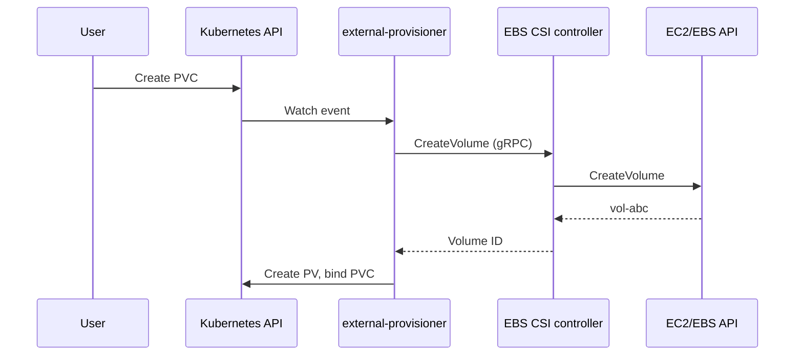
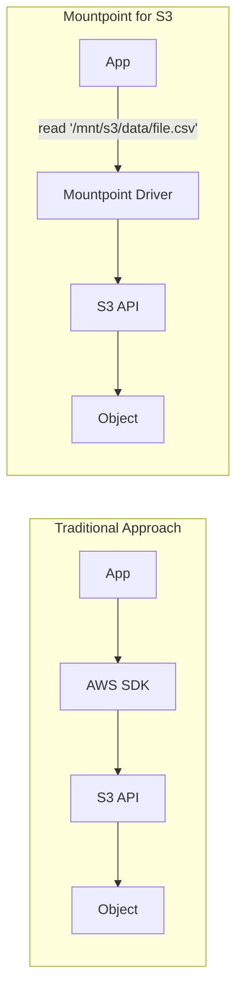
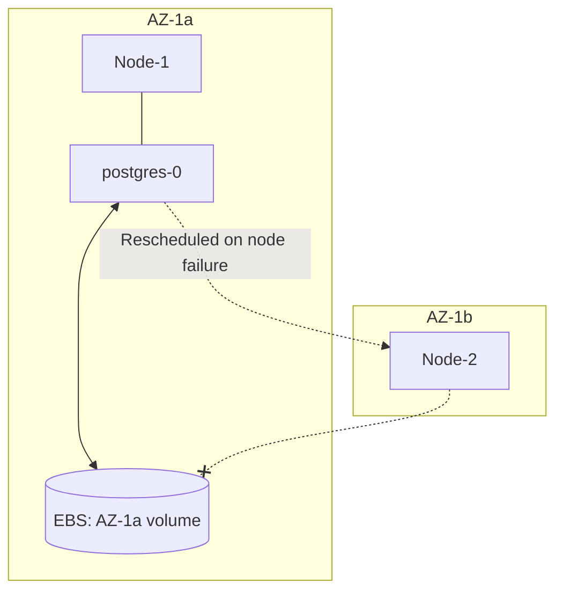
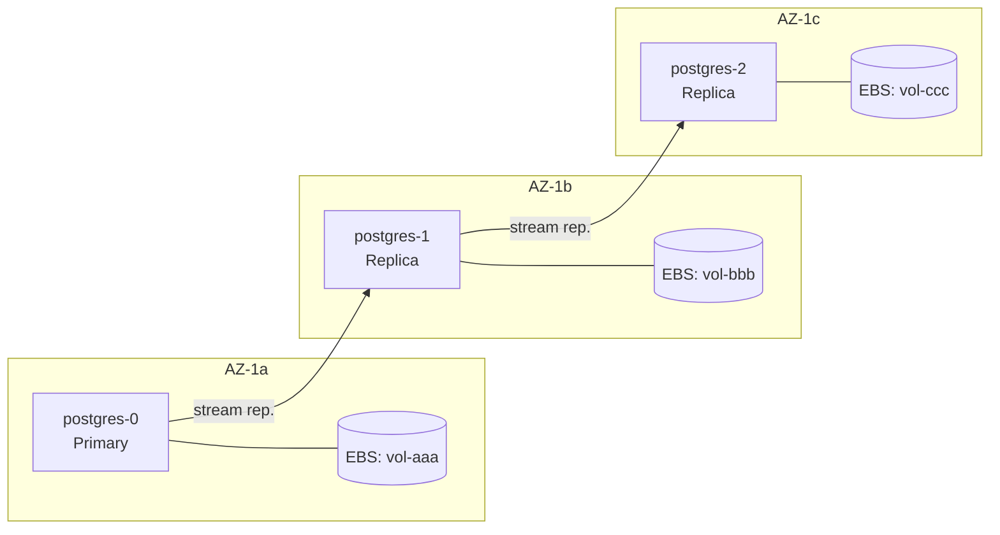
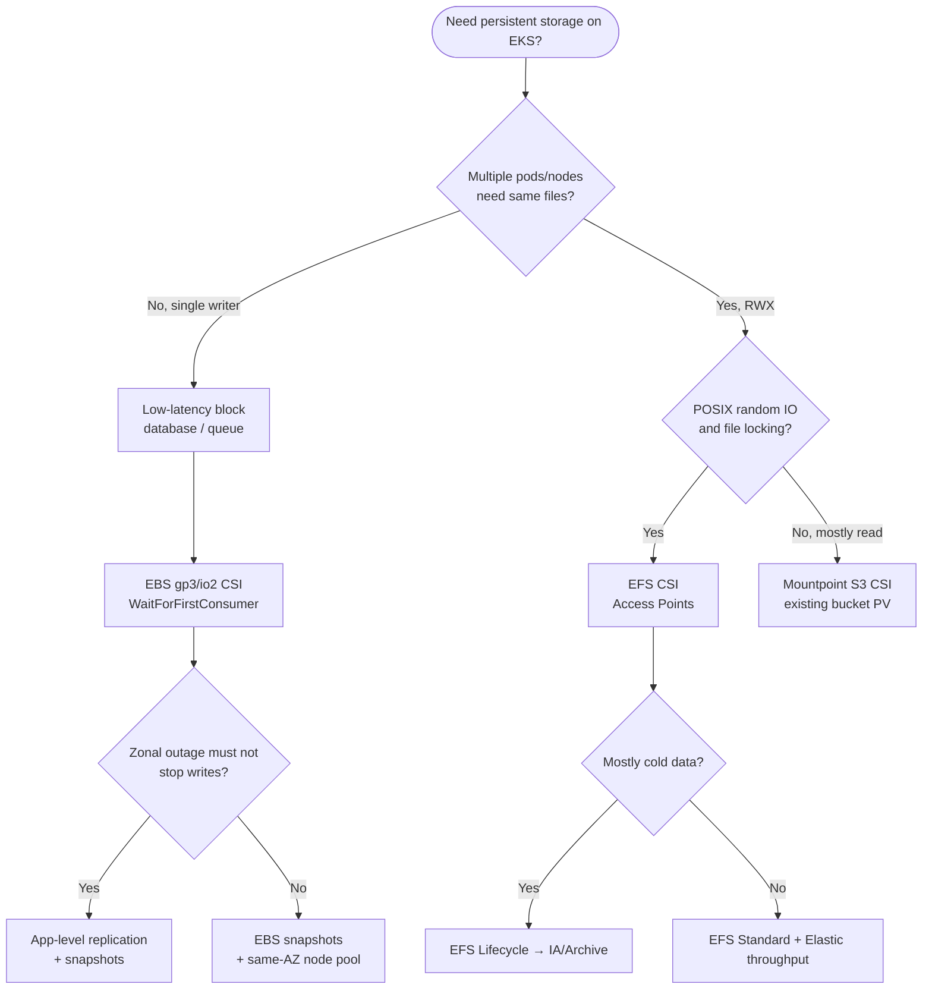
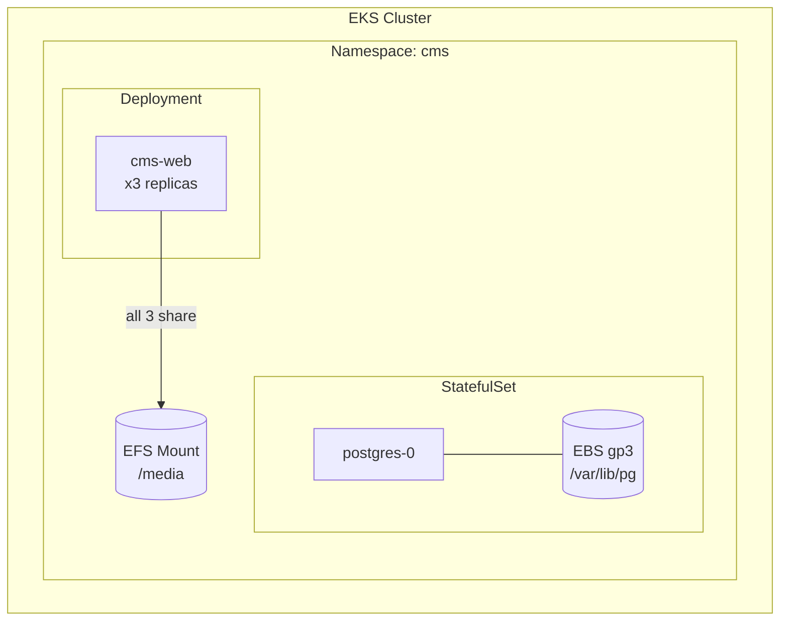

**Complexity**: `[MEDIUM]` | **Time to Complete**: 2h | **Prerequisites**: Module 5.1 (EKS Architecture & Control Plane)

## What You'll Be Able to Do

After completing this module, you will be able to:

- **Design** storage classes with topology-aware provisioning to bind volumes in the correct availability zone.
- **Implement** EBS and EFS CSI drivers for persistent storage in EKS with encryption and precise access modes.
- **Evaluate** EBS, EFS, and Mountpoint for S3 to select the right storage backend for various EKS workload profiles.
- **Diagnose** volume node affinity conflicts and unschedulable pod states during zonal outages.
- **Compare** application-level replication strategies against storage-level snapshots for stateful workload resilience.

---

## Why This Module Matters

A stateful workload on EKS can fail to restart after rescheduling if its EBS-backed volume is tied to a different Availability Zone, leaving the pod in `Pending` with a volume node affinity conflict. This happens when storage and pod placement drift apart, and it is often discovered only during recovery windows when time pressure is highest. A zonal storage mismatch can keep a critical service offline until operators restore data in a usable zone, so Kubernetes storage behavior and AWS zonal constraints matter for every stateful design. In traditional virtual-machine operations, you usually attach a disk and keep it unchanged, but Kubernetes pods move and are frequently rescheduled by design. If you do not understand StorageClass behavior, CSI mechanisms, and zone geography together, your "highly available" architecture quietly hides a one-AZ failure mode that only appears under pressure.

Hypothetical scenario: during a node drain, a payment ledger pod is evicted and rescheduled. The replacement pod stays `Pending` for hours because its 2 TiB EBS volume was created in `eu-west-1a` while the only free capacity is in `1c`. No application bug occurred—the scheduler and storage layer disagreed about geography. Incidents like this are avoided by designing StorageClasses, node pools, and replication together, not by treating PVCs as magic persistence.

In this module, you will master the EBS, EFS, and Mountpoint for S3 CSI drivers: how sidecars translate API objects into AWS calls, how to encrypt and resize block volumes, how to share files regionally with EFS, when S3-backed mounts are appropriate, and how to reason about cost and failure domains before production traffic arrives.

---

## The Container Storage Interface (CSI)

Historically, Kubernetes included storage drivers directly within its core source code, known as "in-tree" volume plugins. As the ecosystem grew, this approach became unsustainable. The Container Storage Interface (CSI) was introduced as a standard for exposing arbitrary block and file storage systems to containerized workloads. In Kubernetes v1.35, the in-tree `awsElasticBlockStore` plugin is already removed, and AWS-backed storage integrations such as EBS, EFS, and Mountpoint for S3 rely on CSI drivers. 

The CSI architecture consists of two primary components:
1. **The Controller Plugin**: Runs as a Deployment (usually in the `kube-system` namespace) and interacts with the AWS API to provision, attach, detach, and resize volumes.
2. **The Node Plugin**: Runs as a DaemonSet on every worker node and interacts with the Linux kernel to format, mount, and unmount the block devices or network filesystems into the pod's filesystem namespace.

### From in-tree plugins to out-of-tree drivers

Before CSI, Kubernetes bundled cloud storage logic inside the core kubelet and controller-manager as **in-tree** volume plugins. That coupling meant every new storage feature required a Kubernetes release, and cloud vendors could not ship fixes on their own cadence. CSI moved storage logic **out-of-tree**: the AWS EBS, EFS, and Mountpoint for S3 integrations you install on EKS are independent projects versioned as EKS add-ons or Helm charts, while Kubernetes exposes a stable gRPC contract (`CreateVolume`, `ControllerPublishVolume`, `NodeStageVolume`, and related RPCs). On modern clusters the legacy in-tree `kubernetes.io/aws-ebs` provisioner path is gone; manifests must reference CSI provisioners such as `ebs.csi.aws.com`, `efs.csi.aws.com`, and `s3.csi.aws.com`.

### CSI sidecars: who watches the API?

The driver binary does not talk to the Kubernetes API directly for most workflows. Instead, the [Kubernetes CSI community sidecars](https://kubernetes-csi.github.io/docs/sidecar-containers.html) run in the same controller pod and share a Unix domain socket with the driver container:

| Sidecar | Watches | CSI RPCs triggered |
| :--- | :--- | :--- |
| **external-provisioner** | `PersistentVolumeClaim` create/delete | `CreateVolume`, `DeleteVolume` |
| **external-attacher** | `VolumeAttachment` objects | `ControllerPublishVolume`, `ControllerUnpublishVolume` |
| **external-resizer** | PVC spec capacity increases | `ControllerExpandVolume` |
| **external-snapshotter** | `VolumeSnapshot` / `VolumeSnapshotContent` | `CreateSnapshot`, `DeleteSnapshot` |
| **csi-node-driver-registrar** (node DaemonSet) | Node object | Registers driver with kubelet |
| **livenessprobe** | Health endpoint | `Probe` for controller health |

Understanding this split explains day-two debugging: a PVC stuck in `Pending` with no PV often means the **provisioner** path (StorageClass name mismatch, IAM, or quota), while a bound PVC with a pod stuck in `ContainerCreating` often means **attacher** or **node** plugin issues (AZ mismatch, device busy, or SELinux/mount flags). Resize and snapshot operations each have their own sidecar loop, which is why enabling snapshots requires installing the [CSI snapshot controller CRDs](https://kubernetes.io/docs/concepts/storage/volume-snapshots/) in addition to the EBS driver add-on.



---

## EBS CSI Driver: High-Performance Block Storage

Amazon Elastic Block Store (EBS) provides persistent, high-performance block-level storage volumes specifically for EC2 instances. The EBS CSI driver enables Kubernetes to seamlessly manage these volumes through the `PersistentVolume` (PV) and `PersistentVolumeClaim` (PVC) abstractions.

### Installing the EBS CSI Driver

[The EBS CSI driver is managed as an EKS Add-on. To interact with the AWS API, the driver's controller pods require precise IAM permissions.](https://docs.aws.amazon.com/eks/latest/userguide/workloads-add-ons-available-eks.html) We use standard IAM Roles for Service Accounts (IRSA) or EKS Pod Identity to grant these privileges.

```bash
alias k=kubectl
# Create IAM role for the EBS CSI driver
cat > /tmp/ebs-trust.json << 'EOF'
{
  "Version": "2012-10-17",
  "Statement": [{
    "Effect": "Allow",
    "Principal": {"Service": "pods.eks.amazonaws.com"},
    "Action": ["sts:AssumeRole", "sts:TagSession"]
  }]
}
EOF

aws iam create-role --role-name AmazonEKS_EBS_CSI_DriverRole \
  --assume-role-policy-document file:///tmp/ebs-trust.json

aws iam attach-role-policy --role-name AmazonEKS_EBS_CSI_DriverRole \
  --policy-arn arn:aws:iam::aws:policy/service-role/AmazonEBSCSIDriverPolicy

EBS_ROLE_ARN=arn:aws:iam::$(aws sts get-caller-identity --query Account --output text):role/AmazonEKS_EBS_CSI_DriverRole

# Install the add-on (Pod Identity — do not pass --service-account-role-arn)
aws eks create-addon \
  --cluster-name my-cluster \
  --addon-name aws-ebs-csi-driver

# Bind the controller service account via EKS Pod Identity
aws eks create-pod-identity-association \
  --cluster-name my-cluster \
  --namespace kube-system \
  --service-account ebs-csi-controller-sa \
  --role-arn $EBS_ROLE_ARN

# Verify
k get pods -n kube-system -l app.kubernetes.io/name=aws-ebs-csi-driver
```

After installation, confirm the controller Deployment and node DaemonSet are healthy, and that the StorageClass you intend to use references `ebs.csi.aws.com` (or the EKS Auto Mode provisioner `ebs.csi.eks.amazonaws.com` if you run Auto Mode—those paths manage volumes separately per [EKS EBS CSI guidance](https://docs.aws.amazon.com/eks/latest/userguide/ebs-csi.html)). Fargate pods cannot mount EBS volumes; only EC2-backed nodes run the node plugin that performs `NodePublishVolume`.

### StorageClass: gp3 Configuration

To dictate how EBS volumes are provisioned dynamically, we define a `StorageClass`. The `gp3` volume type is a common default for many workloads. It provides a baseline of 3,000 IOPS and 125 MiB/s throughput, and AWS lets you provision IOPS and throughput independently of volume size.

```yaml
apiVersion: storage.k8s.io/v1
kind: StorageClass
metadata:
  name: ebs-gp3
  annotations:
    storageclass.kubernetes.io/is-default-class: "true"
provisioner: ebs.csi.aws.com
parameters:
  type: gp3
  fsType: ext4
  iops: "3000"       # baseline (free), up to 80000 (16000 on Outposts)
  throughput: "125"   # baseline (free), up to 2000 MiB/s (1000 on Outposts)
  encrypted: "true"
  kmsKeyId: alias/eks-ebs-key   # optional: customer-managed KMS key
reclaimPolicy: Delete
volumeBindingMode: WaitForFirstConsumer
allowVolumeExpansion: true
```

### Volume types: gp3 vs io2

Most EKS databases and stateful apps default to **gp3** because baseline 3,000 IOPS and 125 MiB/s throughput are included at every size, and you can raise IOPS and throughput independently of capacity. Choose **io2** (or io2 Block Express on supported instance families) when you need sustained, predictable IOPS beyond gp3 limits or sub-millisecond latency SLAs for mission-critical OLTP; io2 bills higher per GB and per provisioned IOPS, so it is a deliberate cost trade, not a default. For encryption, `encrypted: "true"` in the StorageClass enables EBS encryption at rest; pair with `kmsKeyId` when compliance requires a customer-managed KMS key and tighter key rotation policies ([EBS encryption](https://docs.aws.amazon.com/ebs/latest/userguide/ebs-encryption.html)).

Storage classes define how Kubernetes provisions block storage dynamically, but their volume binding timing directly influences how pods schedule across availability zones.

**Pause and predict:** If a custom EBS StorageClass omits the volume binding mode on a multi-AZ cluster, what scheduling failure occurs when a new stateful pod requests storage?

<details>
<summary>Check your prediction</summary>

[By default, Kubernetes StorageClasses use `Immediate` binding](https://kubernetes.io/docs/concepts/storage/storage-classes/), meaning the storage backend provisions the volume the millisecond the PVC is created before the scheduler places the pod. Because Amazon EBS is strictly a **zonal** service, an EBS volume created in AZ-A cannot attach to an EC2 node in AZ-B. If the scheduler subsequently places the pod on a node in a different Availability Zone due to resource constraints or affinity rules, the bound PV will not attach, leaving the pod unschedulable with a `volume node affinity conflict`. Setting `volumeBindingMode: WaitForFirstConsumer` delays `CreateVolume` until the pod is actively scheduled to a specific node, ensuring the physical volume is created in the exact same Availability Zone. Furthermore, platform teams running serverless workloads must note that you **cannot mount EBS to Fargate pods**; Fargate workloads requiring persistent storage must use network-attached EFS via static provisioning.
</details>

Aligning volume provisioning lifecycles with the Kubernetes scheduling queue establishes resilient stateful foundations across diverse cloud infrastructure. Platform engineers must enforce topology-aware storage classes cluster-wide so database workloads consistently schedule without manual zone pinning.

### Using EBS Volumes in Pods

Tracing one successful mount clarifies why configuration mistakes are so painful. Suppose a StatefulSet pod `postgres-0` starts in namespace `database` with a `volumeClaimTemplate` referencing `ebs-gp3`:

1. The StatefulSet controller creates PVC `data-postgres-0` if it does not exist.
2. With `WaitForFirstConsumer`, the external-provisioner **waits** until the scheduler assigns `postgres-0` to `node-a` in `us-east-1a`.
3. The provisioner calls `CreateVolume`; the EBS CSI controller creates a gp3 volume in `us-east-1a` and returns `vol-0abc`.
4. A `PersistentVolume` is created with `nodeAffinity` requiring `us-east-1a`; the PVC binds.
5. The external-attacher creates a `VolumeAttachment` for `node-a`; the controller calls `ControllerPublishVolume` to attach `vol-0abc` to the EC2 instance backing `node-a`.
6. On `node-a`, the node plugin runs `NodeStageVolume` (format if needed) and `NodePublishVolume` to expose the block device at a path kubelet understands.
7. Kubelet mounts the volume into the pod filesystem namespace at `/var/lib/postgresql/data`.

If step 2 used `Immediate` instead, step 3 might create the volume in `us-east-1c` while step 2 later picks `us-east-1a`—steps 5–7 never succeed. That ordering is why platform teams treat `WaitForFirstConsumer` as mandatory for multi-AZ EKS, not an optimization.

When consuming block storage, your application defines a `PersistentVolumeClaim`. For a database like PostgreSQL, the StatefulSet controller ensures each pod replica receives its own unique PVC generated from a `volumeClaimTemplate`.

```yaml
apiVersion: v1
kind: PersistentVolumeClaim
metadata:
  name: postgres-data
  namespace: database
spec:
  accessModes:
    - ReadWriteOnce    # EBS supports only RWO
  storageClassName: ebs-gp3
  resources:
    requests:
      storage: 100Gi
```

```yaml
apiVersion: apps/v1
kind: StatefulSet
metadata:
  name: postgres
  namespace: database
spec:
  serviceName: postgres
  replicas: 1
  selector:
    matchLabels:
      app: postgres
  template:
    metadata:
      labels:
        app: postgres
    spec:
      containers:
        - name: postgres
          image: postgres:16
          ports:
            - containerPort: 5432
          env:
            - name: POSTGRES_PASSWORD
              valueFrom:
                secretKeyRef:
                  name: postgres-secret
                  key: password
            - name: PGDATA
              value: /var/lib/postgresql/data/pgdata
          volumeMounts:
            - name: data
              mountPath: /var/lib/postgresql/data
          resources:
            requests:
              cpu: 500m
              memory: 1Gi
            limits:
              cpu: "2"
              memory: 4Gi
  volumeClaimTemplates:
    - metadata:
        name: data
      spec:
        accessModes:
          - ReadWriteOnce
        storageClassName: ebs-gp3
        resources:
          requests:
            storage: 100Gi
```

### EBS Snapshots

Data safety demands robust backup mechanisms. [The EBS CSI driver integrates natively with the Kubernetes Volume Snapshot API, allowing you to trigger AWS EBS snapshots directly via Kubernetes manifests.](https://github.com/kubernetes-sigs/aws-ebs-csi-driver)

First, you declare a `VolumeSnapshotClass` to define the driver and deletion policy.

```yaml
# Create a VolumeSnapshotClass
apiVersion: snapshot.storage.k8s.io/v1
kind: VolumeSnapshotClass
metadata:
  name: ebs-snapshot-class
driver: ebs.csi.aws.com
deletionPolicy: Retain
```

Then, you request a snapshot by referencing the target PVC.

```yaml
# Take a snapshot
apiVersion: snapshot.storage.k8s.io/v1
kind: VolumeSnapshot
metadata:
  name: postgres-snapshot-20240315
  namespace: database
spec:
  volumeSnapshotClassName: ebs-snapshot-class
  source:
    persistentVolumeClaimName: data-postgres-0
```

To restore the exact state of your volume, you reference the `VolumeSnapshot` in the `dataSource` field of a new PVC. The CSI driver interprets this and signals AWS to provision a fresh EBS volume heavily populated with the snapshot's binary data.

Snapshots are crash-consistent at the block layer unless you quiesce the application or use volume-level features your database vendor documents. For PostgreSQL that often means combining snapshots with replication or logical backups for point-in-time recovery. Cross-Region snapshot copy is a DR tool, not a substitute for same-Region `WaitForFirstConsumer` hygiene—restored volumes still land in one AZ and still require scheduling alignment.

```yaml
apiVersion: v1
kind: PersistentVolumeClaim
metadata:
  name: postgres-restored
  namespace: database
spec:
  accessModes:
    - ReadWriteOnce
  storageClassName: ebs-gp3
  resources:
    requests:
      storage: 100Gi
  dataSource:
    name: postgres-snapshot-20240315
    kind: VolumeSnapshot
    apiGroup: snapshot.storage.k8s.io
```

### Online Volume Resizing

Scaling storage is a common operational necessity. [Because our `StorageClass` includes `allowVolumeExpansion: true`, we can dynamically resize EBS volumes without terminating the pod or suffering downtime.](https://docs.aws.amazon.com/ebs/latest/userguide/ebs-modify-volume.html) 

```bash
alias k=kubectl
# Edit the PVC to request more storage
k patch pvc data-postgres-0 -n database \
  --type merge \
  -p '{"spec":{"resources":{"requests":{"storage":"200Gi"}}}}'

# Check resize progress
k get pvc data-postgres-0 -n database -o json | \
  jq '{requested: .spec.resources.requests.storage, actual: .status.capacity.storage, conditions: .status.conditions}'

# The resize happens in two phases:
# 1. AWS resizes the EBS volume (seconds)
# 2. The filesystem is expanded online (the CSI driver handles this)
```

The underlying orchestration is elegant: the EBS controller plugin commands the AWS API to expand the physical block device, while the PVC remains the stable contract for scheduling and attachment behavior. Once AWS confirms the new capacity, the CSI node plugin executing on the host runs standard Linux utilities (`resize2fs` or `xfs_growfs`) to grow the filesystem structure to fill the new boundaries. This two-phase workflow is what allows teams to resize databases without taking application maintenance windows.

Watch the PVC's `status.conditions` during resize: `Resizing` and `FileSystemResizeSuccessful` tell you whether AWS finished the block grow and whether the node plugin expanded the filesystem. If the condition stalls on `Resizing`, check EC2 volume modification state in the AWS console before restarting pods—forcing deletes mid-modification can lengthen recovery. Application teams should still monitor disk usage inside the container (`df`) because kubelet only reports what the filesystem exposes after step two completes.

**Pause and predict:** You expand an EBS volume from 100Gi to 200Gi for a temporary migration, but only need 50Gi long-term. Can you shrink the volume by editing the PVC storage request back down to 50Gi?

<details>
<summary>Check your prediction</summary>

AWS Elastic Volumes **cannot decrease** in size. The underlying AWS EBS modification API only supports expanding volume capacity, and the Kubernetes EBS CSI driver rejects any PVC update requesting a lower storage value than the current capacity. To downsize your storage footprint, you must migrate to a new smaller volume by provisioning a separate 50Gi PVC, syncing data between volumes using an intermediary pod or application backup and restore utility, and redirecting the workload claim. Furthermore, AWS imposes modification rate limits: once you modify an EBS volume, you must wait for the volume modification state to reach `completed` before initiating another change, and AWS allows a maximum of four modifications per rolling 24 hours for any single volume.
</details>

Managing storage lifecycle costs requires treating capacity expansion as a permanent architectural commitment across production stateful fleets. Engineering teams should pair conservative allocation buffers with proactive volume metrics before executing irreversible block expansion requests.

---

## EFS CSI Driver: Shared Network Filesystems

EBS has a fundamental architectural limitation: a single volume can only be mounted to a single EC2 instance at any given time. This strictly enforces the `ReadWriteOnce` access mode. But modern microservices often require a shared file repository—user uploaded media, shared application configuration, or machine learning datasets. When multiple pods across multiple distinct nodes require read and write access to the same files concurrently, Amazon Elastic File System (EFS) is the required backend.

[EFS implements the NFSv4 protocol and spans multiple Availability Zones natively, making it a regional resource rather than a zonal one.](https://docs.aws.amazon.com/efs/latest/ug/how-it-works.html)

### Setting Up EFS

Deploying EFS for EKS requires the EFS CSI driver, a dedicated IAM role, and crucially, an intricate web of security groups and subnet mount targets. Without all three in place, shared storage can remain technically installed but functionally inaccessible from production workloads. In practice, IAM grants the API permission, while security groups and mount targets determine whether pods can reach file paths consistently across all zones.

Unlike EBS, EFS does not pin a pod to a single AZ—NFS clients connect to the mount target in their own subnet/AZ. If you skip a mount target in `us-east-1c` but schedule pods there, mounts may fail or hairpin through another zone, adding latency and data-transfer cost. The security group must allow **TCP 2049** from the **node** security group (or cluster security group on newer EKS networking models), not merely from the control plane. When debugging `mount.nfs4: Connection timed out`, verify three layers in order: mount target exists in the pod's subnet, security group ingress, then route tables/NACLs for private subnets without NAT confusion.

EFS throughput feels “elastic” to developers, but it is not infinite: burst credits on older bursting file systems and Provisioned throughput reservations on steady high-write workloads still show up as throttling under load tests. Load-test shared filesystems the same way you load-test databases—synthetic `fio` or application-level writes from multiple pods—before declaring EFS the CMS backbone.

```bash
# Create IAM role for EFS CSI
aws iam create-role --role-name AmazonEKS_EFS_CSI_DriverRole \
  --assume-role-policy-document file:///tmp/ebs-trust.json  # Same Pod Identity trust

aws iam attach-role-policy --role-name AmazonEKS_EFS_CSI_DriverRole \
  --policy-arn arn:aws:iam::aws:policy/service-role/AmazonEFSCSIDriverPolicy

EFS_ROLE_ARN=arn:aws:iam::$(aws sts get-caller-identity --query Account --output text):role/AmazonEKS_EFS_CSI_DriverRole

# Install the EFS CSI add-on (Pod Identity — do not pass --service-account-role-arn)
aws eks create-addon \
  --cluster-name my-cluster \
  --addon-name aws-efs-csi-driver

aws eks create-pod-identity-association \
  --cluster-name my-cluster \
  --namespace kube-system \
  --service-account efs-csi-controller-sa \
  --role-arn $EFS_ROLE_ARN

# Create an EFS filesystem
EFS_ID=$(aws efs create-file-system \
  --performance-mode generalPurpose \
  --throughput-mode bursting \
  --encrypted \
  --tags Key=Name,Value=eks-shared-storage \
  --query 'FileSystemId' --output text)

# Create mount targets in each subnet (one per AZ)
# The security group must allow NFS (port 2049) from the node security group
EFS_SG=$(aws ec2 create-security-group \
  --group-name EFS-SG \
  --description "Allow NFS from EKS nodes" \
  --vpc-id $VPC_ID \
  --query 'GroupId' --output text)

# Get the cluster security group
CLUSTER_SG=$(aws eks describe-cluster --name my-cluster \
  --query 'cluster.resourcesVpcConfig.clusterSecurityGroupId' --output text)

aws ec2 authorize-security-group-ingress \
  --group-id $EFS_SG \
  --protocol tcp --port 2049 \
  --source-group $CLUSTER_SG

# Create mount targets
aws efs create-mount-target \
  --file-system-id $EFS_ID \
  --subnet-id $PRIV_SUB1 \
  --security-groups $EFS_SG

aws efs create-mount-target \
  --file-system-id $EFS_ID \
  --subnet-id $PRIV_SUB2 \
  --security-groups $EFS_SG

echo "EFS filesystem: $EFS_ID"
```

### Using EFS in Pods

EFS relies heavily on the concept of EFS Access Points for dynamic provisioning. [An Access Point is an application-specific entry point into an EFS file system that enforces POSIX identity and root directory paths](https://docs.aws.amazon.com/efs/latest/ug/efs-access-points.html), allowing different applications to safely share the same physical EFS filesystem securely. This avoids cross-tenant path conflicts and gives operations predictable ownership boundaries as workloads scale.

```yaml
apiVersion: storage.k8s.io/v1
kind: StorageClass
metadata:
  name: efs-sc
provisioner: efs.csi.aws.com
parameters:
  provisioningMode: efs-ap         # Use EFS Access Points
  fileSystemId: fs-0123456789abcdef
  directoryPerms: "700"
  gidRangeStart: "1000"
  gidRangeEnd: "2000"
  basePath: "/dynamic_provisioning"
```

```yaml
apiVersion: v1
kind: PersistentVolumeClaim
metadata:
  name: shared-media
  namespace: cms
spec:
  accessModes:
    - ReadWriteMany
  storageClassName: efs-sc
  resources:
    requests:
      storage: 50Gi    # EFS is elastic; this is a soft quota
```

```yaml
apiVersion: apps/v1
kind: Deployment
metadata:
  name: cms-web
  namespace: cms
spec:
  replicas: 5    # All 5 replicas share the same EFS volume!
  selector:
    matchLabels:
      app: cms-web
  template:
    metadata:
      labels:
        app: cms-web
    spec:
      containers:
        - name: nginx
          image: nginx:1.27
          volumeMounts:
            - name: media
              mountPath: /usr/share/nginx/html/media
          resources:
            requests:
              cpu: 100m
              memory: 128Mi
      volumes:
        - name: media
          persistentVolumeClaim:
            claimName: shared-media
```

Notice the critical distinction: the PVC leverages `ReadWriteMany`. All five replicas seamlessly mount the exact same file tree at `/usr/share/nginx/html/media`, and when any pod modifies an image or file, the changes are generally visible to the other replicas shortly afterward. This is why EFS is a natural fit for shared CMS workloads where consistency of shared assets matters as much as service parallelism.

### Static vs dynamic EFS provisioning

The EFS CSI driver supports two provisioning models ([EFS CSI on EKS](https://docs.aws.amazon.com/eks/latest/userguide/efs-csi.html)):

- **Dynamic provisioning** (shown above with `provisioningMode: efs-ap`) creates a new [EFS Access Point](https://docs.aws.amazon.com/efs/latest/ug/efs-access-points.html) per PVC, isolating POSIX root paths and UID/GID ranges per application. This is the right default for multi-tenant clusters where many teams share one filesystem ID but must not collide on paths.
- **Static provisioning** binds a manually created `PersistentVolume` to an existing access point or direct mount target path. Use static PVs when operations owns a fixed directory layout, when migrating legacy NFS paths, or when dynamic access-point churn would complicate backup policies.

### Performance and throughput modes

At filesystem creation time you choose a **performance mode** (`generalPurpose` for latency-sensitive POSIX workloads, `maxIO` for highly parallel metadata-heavy jobs). Throughput is governed separately ([EFS performance](https://docs.aws.amazon.com/efs/latest/ug/performance.html)):

- **Elastic throughput** (default on newer file systems) scales with activity and bills primarily on data read/written rather than a fixed MB/s reservation—good for bursty CMS or CI artifact shares.
- **Provisioned throughput** guarantees a minimum MB/s and bills for capacity you reserve above the storage-linked baseline—appropriate when average-to-peak ratio stays high and throttling would violate SLOs.
- **Bursting throughput** (legacy mode) ties baseline throughput to stored GiB; if sustained traffic exceeds burst credits, migrate to Elastic or Provisioned.

**EFS Infrequent Access (IA)** and **Archive** storage classes (with lifecycle policies) reduce $/GB for cold blobs at the cost of retrieval latency and per-GB read charges when data is accessed again—excellent for log archives and ML feature stores that are mostly idle.

**Pause and predict:** When pods across multiple Availability Zones connect to Amazon EFS, how does client DNS route NFS traffic? What performance and billing penalties occur if an Availability Zone lacks a mount target?

<details>
<summary>Check your prediction</summary>

When an NFS client resolves an EFS filesystem DNS name, DNS resolves to the **same-AZ** mount target IP address in that node's local subnet. AWS recommends maintaining a mount target in every Availability Zone containing cluster nodes to optimize throughput and avoid inter-zone networking overhead. If a pod runs in an AZ lacking a mount target, its NFS traffic hairpins across availability zone boundaries to reach a remote mount target, introducing network latency and incurring cross-AZ data transfer charges. Administrators must also recognize that EFS One Zone filesystems have a **single** mount target in one designated zone, preventing multi-zone resiliency. When deploying on serverless compute, note that EFS on AWS Fargate requires static provisioning using pre-created access points rather than dynamic provisioning, whereas EBS volumes cannot mount to Fargate pods at all.
</details>

Network topology verification must be incorporated directly into shared filesystem deployment checklists across multi-tenant environments. Verifying mount target reachability within local subnets prevents unexpected data transfer charges and latency spikes during horizontal pod autoscaling.

---

## Mountpoint for S3 CSI Driver: Object Storage as a Filesystem

The Mountpoint for S3 CSI driver is a highly specialized storage option that translates standard POSIX filesystem calls into native S3 API requests. This eliminates the need to rewrite legacy applications to use the AWS SDK while unlocking S3's unlimited scalability and unparalleled cost efficiency for **read-mostly** pipelines. It is not a general-purpose POSIX layer: anything that depends on rename-heavy workflows, fine-grained random writes, or POSIX advisory locks should remain on EBS or EFS.

Teams typically adopt Mountpoint when data already lives in S3 (data lake exports, model artifacts, genomics bundles) and many pods need a directory tree without copying terabytes into EFS. The CSI driver maps each `PersistentVolume` to a bucket name (and optional prefix) you pre-provision; dynamic bucket creation is out of scope, which keeps IAM boundaries explicit but requires a platform workflow to register buckets before namespaces request PVs.

### Architecture Comparison



### Setup and Configuration

[Mountpoint for S3 is not meant for dynamic provisioning; it is strictly designed to map existing S3 buckets into pods.](https://docs.aws.amazon.com/eks/latest/userguide/s3-csi.html) Thus, you must manually construct a `PersistentVolume` targeting the bucket so the driver has a concrete object to mount. In practice, this means you treat each existing bucket as a pre-provided data source and keep namespace and access controls explicit at the Kubernetes storage layer.

```bash
S3_ROLE_ARN=arn:aws:iam::$(aws sts get-caller-identity --query Account --output text):role/S3MountpointRole

# Install the Mountpoint for S3 CSI add-on (Pod Identity — do not pass --service-account-role-arn)
aws eks create-addon \
  --cluster-name my-cluster \
  --addon-name aws-mountpoint-s3-csi-driver

aws eks create-pod-identity-association \
  --cluster-name my-cluster \
  --namespace kube-system \
  --service-account s3-csi-driver-sa \
  --role-arn $S3_ROLE_ARN
```

```yaml
apiVersion: v1
kind: PersistentVolume
metadata:
  name: s3-training-data
spec:
  capacity:
    storage: 1Ti    # Informational only; S3 is unlimited
  accessModes:
    - ReadWriteMany
  csi:
    driver: s3.csi.aws.com
    volumeHandle: s3-csi-driver-volume
    volumeAttributes:
      bucketName: my-ml-training-data
```

```yaml
apiVersion: v1
kind: PersistentVolumeClaim
metadata:
  name: training-data-pvc
  namespace: ml
spec:
  accessModes:
    - ReadWriteMany
  storageClassName: ""    # Empty string for pre-provisioned PV
  resources:
    requests:
      storage: 1Ti
  volumeName: s3-training-data
```

```yaml
apiVersion: batch/v1
kind: Job
metadata:
  name: model-training
  namespace: ml
spec:
  template:
    spec:
      containers:
        - name: trainer
          image: 123456789012.dkr.ecr.us-east-1.amazonaws.com/model-trainer:latest
          command: ["python", "train.py", "--data-dir=/data"]
          volumeMounts:
            - name: training-data
              mountPath: /data
              readOnly: true
          resources:
            requests:
              cpu: "4"
              memory: 16Gi
      volumes:
        - name: training-data
          persistentVolumeClaim:
            claimName: training-data-pvc
      restartPolicy: Never
```

### Mount options and read-heavy tuning

Mountpoint exposes mount options through the CSI `volumeAttributes` (see [Mountpoint for S3 CSI](https://docs.aws.amazon.com/eks/latest/userguide/s3-csi.html) and [Mountpoint configuration](https://github.com/awslabs/mountpoint-s3/blob/main/doc/CONFIGURATION.md)). Common tunings for ML training include `read-only` mounts (enforced at pod `securityContext` as well), prefix restrictions to a bucket subpath, and allowing the driver to parallelize large sequential reads. Because objects are accessed over HTTPS, first-byte latency follows S3 regional RTT—fine for batch training, unacceptable for interactive OLTP.

### Mountpoint Limitations

**Pause and predict:** A platform team wants to mount an S3 bucket via Mountpoint for Amazon S3 as shared storage for a standard web application. Which POSIX file operations and provisioning models will immediately fail?

<details>
<summary>Check your prediction</summary>

Mountpoint for Amazon S3 translates POSIX file system calls to S3 REST APIs, which introduces strict operational constraints. Mountpoint supports sequential writes to **new** files only; it does not support random writes, in-place appends to existing files, directory renames, or hard links. Furthermore, Mountpoint provides no POSIX file locking (`flock` or `fcntl`), preventing applications that coordinate concurrent writers from running safely. The driver also enforces static provisioning only: administrators must manually create `PersistentVolume` objects referencing existing S3 buckets and IAM roles rather than relying on dynamic provisioning. Additionally, Mountpoint for Amazon S3 is not supported on AWS Fargate pods, Windows worker nodes, or Amazon EKS Hybrid Nodes.
</details>

Object-store mounts belong in a storage catalog with an explicit access-pattern label, not as a default PVC class. Review boards should ask what write shape the application actually issues before a bucket path appears in a Deployment.

Hypothetical scenario: a team picks the cheapest AWS storage API for a latency-sensitive database data directory because the bucket already exists. The incident review later shows the I/O profile never matched the driver contract, and the recovery was a backend change rather than a mount-option tweak.

---

## Diagnosing Volume Attachment and Scheduling Failures

When storage misbehaves, split symptoms into **provisioning** (no PV yet), **attachment** (PV bound, pod not running), and **mount** (container start errors).

```bash
# PVC stuck provisioning — check events and StorageClass
kubectl describe pvc <name> -n <namespace>
kubectl get storageclass
kubectl logs -n kube-system deploy/ebs-csi-controller -c csi-provisioner --tail=50

# Pod Pending with volume — check affinity and VolumeAttachment
kubectl describe pod <name> -n <namespace> | grep -A5 Affinity
kubectl get volumeattachment
kubectl describe volumeattachment <name>
```

Common event strings and meanings:

| Event / condition | Likely layer | Investigation |
| :--- | :--- | :--- |
| `ProvisioningFailed` / IAM errors | Controller + AWS API | IRSA/Pod Identity role, `AmazonEBSCSIDriverPolicy`, KMS key policy |
| `FailedAttachVolume` | Attacher | Volume still attached to terminated node; force detach only after confirming pod is gone |
| `volume node affinity conflict` | Scheduler + zonal PV | Wrong AZ; need new volume or same-AZ node |
| `Multi-Attach error` | RWO semantics | Two pods on different nodes; use RWOP or fix rollout strategy |
| Mount permission denied on EFS | Node + network | Security group port 2049, mount target in pod's AZ |

The external-attacher creates `VolumeAttachment` objects linking a PV to a node name; if a node is terminated abruptly, attachments can linger until the controller reconciles. Avoid manual `VolumeAttachment` edits unless you are following a runbook—prefer cordon/drain workflows that let kubelet detach cleanly.

---

## Stateful Workloads Across Availability Zones

Hypothetical scenario: a recurring failure pattern in ad-tech-style deployments is that high availability at the application layer means nothing if the storage layer acts as a strict geographical anchor. Application pods may reschedule freely across zones, yet recovery still stalls when an EBS volume cannot follow that movement. That failure path proves that resilience requires alignment between scheduler strategy and storage topology, not just pod-level replication.

### The Problem



### Instance store and ephemeral volumes (when not to use CSI)

Some workloads need the fastest local I/O on a node. **`emptyDir` with `medium: Memory`** provides a RAM-backed tmpfs scratch space—it is fast but counts against pod memory limits and disappears when the pod is removed. **Instance store** NVMe volumes are physically attached on many EC2 families (for example m6id, i4i, m5d, c5d, r5d, and bare-metal variants); expose them via supported `emptyDir` volume configurations or hostPath patterns on those instance types, not through the EBS CSI driver. Both tmpfs and instance store are ephemeral: data vanishes when the pod or instance goes away. Use them for scratch caches, shuffle-heavy Spark executors, or temporary sort buffers—not for state that must survive rescheduling. The decision framework above deliberately routes durable state to EBS/EFS/S3 CSI paths.

### Solution 1: Topology-Aware Scheduling

Use `WaitForFirstConsumer` for newly provisioned zonal volumes, and remember that already-bound EBS volumes carry node-affinity constraints that keep a pod schedulable only in the volume's zone. Topology rules can help spread replicas across zones, but they do not move an orphaned zonal volume to another AZ. This distinction is why delayed provisioning is useful for first-time scheduling, while remediation after mismatch still often depends on application architecture and relocation strategy.

```yaml
apiVersion: apps/v1
kind: StatefulSet
metadata:
  name: postgres
  namespace: database
spec:
  serviceName: postgres
  replicas: 3
  selector:
    matchLabels:
      app: postgres
  template:
    metadata:
      labels:
        app: postgres
    spec:
      topologySpreadConstraints:
        - maxSkew: 1
          topologyKey: topology.kubernetes.io/zone
          whenUnsatisfiable: DoNotSchedule
          labelSelector:
            matchLabels:
              app: postgres
      containers:
        - name: postgres
          image: postgres:16
          ports:
            - containerPort: 5432
          volumeMounts:
            - name: data
              mountPath: /var/lib/postgresql/data
          resources:
            requests:
              cpu: 500m
              memory: 1Gi
  volumeClaimTemplates:
    - metadata:
        name: data
      spec:
        accessModes:
          - ReadWriteOnce
        storageClassName: ebs-gp3    # WaitForFirstConsumer is key!
        resources:
          requests:
            storage: 100Gi
```

### Solution 2: Multiple Nodes Per AZ

You must ensure that your compute plane guarantees sufficient failover capacity within the *same* Availability Zone. If a zone is running stateful workloads and only has one node, a single node failure can turn a transient hardware incident into a broader availability issue by removing the only valid mount target for that zone’s EBS workload. Plan capacity in AZ slices, then confirm autoscaling keeps minimums healthy before declaring a workload production ready.

```bash
# Create a node group that spans multiple AZs with at least 2 nodes per AZ
aws eks create-nodegroup \
  --cluster-name my-cluster \
  --nodegroup-name stateful-workers \
  --node-role arn:aws:iam::123456789012:role/EKSNodeRole \
  --subnets subnet-az1a subnet-az1b subnet-az1c \
  --instance-types m6i.xlarge \
  --scaling-config minSize=6,maxSize=12,desiredSize=6 \
  --labels workload=stateful
```

By ensuring there are at least two nodes per Availability Zone, a single node crash allows the pod to simply reschedule to the surviving node located in the identical AZ, successfully reattaching the EBS volume.

Node group design should align with storage: if you run three AZs and rely on EBS for state, your minimum autoscaling floor is not “three nodes total” but “at least one schedulable node per AZ where PVCs exist,” and ideally two for maintenance windows. Managed node groups and Karpenter NodePools can express that with separate pools labeled by AZ or with topology spread on `eks.amazonaws.com/capacityType` combined with zone spread constraints on the workloads themselves.

### Solution 3: Application-Level Replication

For enterprise database tiers, completely abstracting resilience away from the Kubernetes storage layer is the gold standard. Storage can still fail, become saturated, or become misbound under stress, but application replication and promotion logic can keep data serviceable during regional disruption.



In this pattern, each StatefulSet replica is deployed with its own dedicated EBS volume pinned to its respective zone. PostgreSQL manages the asynchronous or synchronous block streaming between the primary and the replicas, depending on your recovery point objective. If an entire AWS Availability Zone burns down, the application logic detects the outage and promotes a replica in a surviving zone to assume the primary role.

### How Karpenter and Cluster Autoscaler interact with zonal EBS

Node autoscalers do not move EBS volumes—they only change where **empty** compute exists. **Cluster Autoscaler** scales node groups up/down based on pending pods and utilization; if it removes the last node in an AZ while a StatefulSet pod is down, the replacement pod may have nowhere to land with its existing PV. Mitigations include per-AZ minimum node counts, `topologySpreadConstraints`, and PodDisruptionBudgets that prevent draining the sole node hosting a single-replica database.

**Karpenter** provisions nodes in response to unschedulable pods and respects `topology.kubernetes.io/zone` requirements injected by the scheduler when a PVC already exists. For `WaitForFirstConsumer` **new** claims, Karpenter can launch a node in the AZ the scheduler selects first; for **existing** zonal PVs, Karpenter must provision into that PV's zone or the pod stays Pending. Treat Karpenter consolidation delays and aggressive scale-down as storage-risk events: a stateful pod evicted without a peer node in the same AZ is indistinguishable from an AZ outage from Kubernetes' perspective until compute returns.

Hypothetical scenario: Karpenter consolidates overnight and removes two underutilized nodes in `us-east-1b`, leaving zero workers there while a `ReadWriteOnce` PVC for `orders-db-0` remains in `1b`. The database pod reschedules after a node upgrade and stays Pending until operators either restore a `1b` node or fail over at the application layer—storage autoscaling did not fail; topology did.

### The multi-AZ EBS gotcha in one sentence

EBS is **zonal**: high availability across AZs for data on a single EBS volume is impossible without replication **above** the volume (application quorum, or copy to another backend). Snapshots help disaster recovery but do not make a live volume multi-AZ attachable.

---

## Storage Decision Framework

Selecting the proper backend boils down to access patterns, data semantics, recovery requirements, and cost at the scale you actually run. Use the flowchart when multiple options seem viable; use the matrix as a quick reference after you know access mode and latency needs.



| Use Case | Storage Type | Access Mode | Key Constraint |
| :--- | :--- | :--- | :--- |
| Database (single writer) | EBS gp3 | ReadWriteOnce | Single AZ per volume; plan same-AZ failover |
| High-IOPS database | EBS io2 | ReadWriteOnce | Higher $/GB and provisioned IOPS; verify instance EBS limits |
| Shared CMS media | EFS | ReadWriteMany | Cross-AZ NFS traffic has latency and data-transfer cost |
| ML training data (read-mostly) | Mountpoint S3 | ReadWriteMany | No random writes/renames; S3 request + transfer charges |
| ML checkpoints (random write) | EFS or EBS | RWX or RWO | Do not use Mountpoint for checkpoint files |
| Container scratch space | emptyDir / Instance Store | Ephemeral | Lost on pod restart; fastest local I/O |
| Log shipping buffer | EBS gp3 (small) | ReadWriteOnce | Size for burst, not multi-TiB retention |

**Tradeoff summary**: EBS wins single-writer latency and cost per GiB for databases; EFS wins true RWX and regional attachment at higher $/GB and NFS semantics; Mountpoint wins massive read-only datasets already in S3; instance store wins ephemeral throughput but forfeits portability across nodes.

When documenting decisions for stakeholders, capture four fields: **access mode** (RWO/RWX/RWOP), **latency target** (milliseconds vs tens of ms vs S3 RTT), **failure domain** (single AZ vs regional vs object durability), and **cost driver** (GiB-month vs IOPS vs requests). That template prevents teams from defaulting to “we always use gp3” without examining shared-file requirements.

---

## Patterns & Anti-Patterns

### Proven patterns

| Pattern | When to use | Why it works | Scaling note |
| :--- | :--- | :--- | :--- |
| **Topology-aware StorageClass** | Any dynamically provisioned EBS workload | `WaitForFirstConsumer` binds PV creation to the scheduler-selected AZ, eliminating the classic affinity conflict. | Combine with `topologySpreadConstraints` so replicas spread across zones *each with its own volume*. |
| **One EBS volume per StatefulSet replica** | Sharded databases, Kafka brokers, etcd | Each pod owns a zonal disk; failure domains align with AZ boundaries. | Scale replica count, not volume sharing; use app replication for HA. |
| **EFS Access Point per team/app** | Multi-tenant shared filesystem | Isolates root paths and POSIX identities without separate filesystem IDs. | Thousands of access points per filesystem; watch IAM and security group sprawl. |
| **Snapshot + restore drill** | RPO/RTO validation | VolumeSnapshot API automates crash-consistent EBS backups independent of app vendors. | Snapshot chains and cross-Region copy add cost—lifecycle them. |
| **Read-only Mountpoint for training** | Large immutable datasets in S3 | Avoids SDK refactors while preserving S3 economics for sequential reads. | Many parallel readers increase GET request charges—use prefix sharding. |
| **Encrypted StorageClass defaults** | Regulated environments | `encrypted: "true"` ensures new volumes never land unencrypted. | CMK per environment via `kmsKeyId`; audit key policies when cloning clusters. |

### Anti-patterns

| Anti-pattern | What goes wrong | Why teams fall into it | Better alternative |
| :--- | :--- | :--- | :--- |
| **Immediate binding on multi-AZ clusters** | PVC provisions in random AZ; pods Pending forever. | StorageClass copied from tutorials defaults. | Set `volumeBindingMode: WaitForFirstConsumer` on every EBS class. |
| **One replica StatefulSet without same-AZ spare node** | Node loss = outage until AZ recovers. | Cost optimization removes "extra" nodes per zone. | Minimum two nodes per AZ for stateful pools, or run N+1 replicas with replication. |
| **EFS for database primary storage** | Latency variance and NFS semantics break DB engines. | Desire for RWX on a single data directory. | EBS + `ReadWriteOncePod` for single-writer safety; EFS for exports only. |
| **Mountpoint for application logs** | Append-heavy writers fail or corrupt. | "We already have S3 buckets." | Ship logs with Fluent Bit to S3; keep local buffer on small EBS or emptyDir. |
| **Orphan PVCs with `Retain`** | Deleted workloads leave paid EBS volumes. | Fear of accidental data loss. | `Retain` only on prod classes; automate tagging and AWS Config rules. |
| **Snapshot sprawl without lifecycle** | Steady-state AWS bill grows while backups age. | Snapshots are "cheap insurance." | DLM policies, cross-Region only when compliance demands. |

---

## Cost at Moderate Scale

Storage economics on EKS are the sum of **provisioned GiB**, **performance purchases**, **API/snapshot churn**, and **data transfer**—not just the StorageClass name. List prices vary by AWS Region; the figures below use US East (N. Virginia) as a planning baseline ([EBS pricing](https://aws.amazon.com/ebs/pricing/), [EFS pricing](https://aws.amazon.com/efs/pricing/), [S3 pricing](https://aws.amazon.com/s3/pricing/)).

### EBS (gp3) — moderate database tier

Suppose three StatefulSet databases each hold 500 GiB gp3 with default 3,000 IOPS and 125 MiB/s (included). Storage alone is roughly **3 × 500 GiB × $0.08/GB-month ≈ $120/month** before snapshots. If one database is provisioned to 12,000 IOPS, you pay for **9,000 extra IOPS × $0.005/IOPS-month ≈ $45/month** on top of storage. Cost spikes when teams oversize IOPS/throughput “just in case,” leave **unattached volumes** after PVC deletes, or retain months of snapshots on high-churn dev clusters. Knobs that reduce cost: right-size gp3 before jumping to io2, migrate legacy gp2 to gp3, delete unused PVs, and use snapshot lifecycle policies.

### EFS — shared media at 2 TiB Standard

Two tebibytes on EFS Standard at about **$0.30/GB-month** is on the order of **$600/month** for capacity alone, plus Elastic throughput charges for data read/written. **Cross-AZ data transfer** ($0.01/GB in many Regions) applies when pods connect to a mount target outside their AZ—not when each AZ has a local mount target serving local reads from EFS's regional replication. Moving cold assets to **EFS IA** (roughly **$0.016/GB-month** in many Regions, plus per-GB read fees when accessed) can cut steady-state storage if lifecycle policies match real access patterns. Cost spikes when Provisioned Throughput is left pegged high after a one-time migration, or when IA objects are read continuously (paying retrieval surcharges).

### S3 + Mountpoint — 5 TiB training corpus

S3 Standard storage near **$0.023/GB-month** for 5 TiB is far below EFS for the same capacity, but **GET/LIST request charges** and cross-AZ egress dominate at scale when hundreds of pods start jobs simultaneously. Mountpoint does not eliminate request billing—it maps POSIX reads to object APIs. Cost spikes on massive parallel training without prefix partitioning or when workloads rewrite objects instead of reading sequentially.

### Idle and operational waste

The silent budget killers in EKS storage are **Released PVCs with `Retain`**, **snapshot chains nobody audits**, and **over-provisioned IOPS** on gp3 volumes that never exceed baseline. Tag volumes with `kubernetes.io/created-for/pvc/namespace` metadata, export cost by tag in Cost Explorer, and gate StorageClasses per environment (dev uses smaller default sizes and `Delete` reclaim).

### Putting cost next to reliability

Cheaper storage is not cheaper operationally if it violates access semantics. Mountpoint saves GiB-month dollars versus EFS but can cost more in engineer hours when an app expects POSIX rename semantics. Likewise, EFS saves replication code for shared files but adds cross-AZ traffic charges when replicas chat across zones. Document expected **$/GiB**, **$/IOPS**, **$/snapshot-month**, and **$/GB-cross-AZ** beside each StorageClass in your internal platform catalog so application teams choose with eyes open, not from habit.

---

## Reclaim policies and data lifecycle

`reclaimPolicy` on a StorageClass (`Delete` vs `Retain`) decides whether the AWS volume survives when the Kubernetes `PersistentVolume` object is released. Development clusters almost always use `Delete` to prevent orphaned EBS charges. Production databases sometimes use `Retain` on the PV while still snapshotting, so a mistaken `kubectl delete pvc` does not instantly destroy data—but Retain without automation becomes a graveyard of unattached volumes billing monthly. Pair Retain with tagging standards, AWS Backup plans, or Data Lifecycle Manager schedules, and run monthly reports comparing `kubectl get pv` to EC2 `describe-volumes` for drift.

For EFS, deleting a PVC backed by dynamic access points removes the access point but not necessarily the parent filesystem; operations teams own filesystem-level lifecycle. For Mountpoint static PVs, deleting the PVC leaves the S3 bucket untouched by design—only object lifecycle rules inside S3 govern retention.

---

## Platform engineering checklist before go-live

Before marking a StorageClass production-ready, walk this checklist with the team that owns the workload:

1. **Binding mode** — EBS classes use `WaitForFirstConsumer`; document any exception with a written risk acceptance.
2. **Encryption** — `encrypted: "true"` and KMS keys validated in a non-prod cluster clone.
3. **Snapshots** — VolumeSnapshotClass exists, snapshot controller installed, restore drill completed into a throwaway namespace.
4. **Capacity growth** — `allowVolumeExpansion: true` tested with a representative filesystem (ext4/xfs) and monitoring on PVC conditions.
5. **Zone capacity** — At least two schedulable nodes per AZ hosting stateful pods; PDBs prevent voluntary disruption from draining the last node.
6. **EFS networking** — Mount target per private subnet; security group verified with a pod `mount` test from each AZ.
7. **Cost tags** — AWS tags propagated from Kubernetes labels where your org supports it; orphaned volume alerts configured.
8. **Runbooks** — Events for `FailedAttachVolume`, `volume node affinity conflict`, and EFS mount timeouts linked to remediation steps in your internal docs.

This checklist does not replace application HA designs for databases—it ensures the Kubernetes/AWS storage contract you think you bought is the one you actually deployed.

---

## Security, compliance, and data residency

Encryption at rest for EBS and EFS is table stakes for regulated workloads. EBS encryption via StorageClass parameters uses AWS-managed or customer-managed KMS keys; the CSI driver needs `kms:CreateGrant` when volumes attach to instances. EFS encryption protects data at rest on the filesystem; combine with security groups so only cluster nodes reach NFS. Mountpoint inherits S3 bucket policies, block public access settings, and SSE-S3/SSE-KMS configurations—CSI does not bypass IAM: the driver's service account still needs `s3:ListBucket` and `s3:GetObject` (and selective `PutObject` if writes are enabled) scoped to approved prefixes.

Data residency is zonal for EBS: a volume never leaves its AZ while attached. Snapshots and AMIs copied to other Regions are separate compliance events you must track. EFS Regional file systems replicate metadata and data across AZs in the Region—understand that your bytes may physically span zones even when pods appear “regional.” S3 buckets have explicit Region placement; Mountpoint PVs should reference buckets in the same Region as the cluster to avoid cross-Region egress and sovereignty issues.

Pod Identity or IRSA for CSI controllers follows least privilege: use `AmazonEBSCSIDriverPolicy` / `AmazonEFSCSIDriverPolicy` managed policies in non-prod, then scope custom policies in prod if security mandates narrower `ec2:CreateVolume` resource ARNs. Audit logs from CloudTrail on `CreateVolume`, `CreateSnapshot`, and `CreateAccessPoint` complement Kubernetes audit logs for PVC creation—together they answer “who provisioned this disk?” during incidents.

Network policies inside the cluster do not replace security groups for EFS NFS; both layers matter. For Mountpoint, restrict which namespaces may reference S3 PVs via RBAC on PersistentVolume objects or OPA policies, because a static PV can point at sensitive buckets if misconfigured.

---

## Comparing resilience mechanisms

Teams often conflate three different tools; they solve different problems:

| Mechanism | Protects against | Does not protect against |
| :--- | :--- | :--- |
| **EBS snapshot** | Logical corruption if restored to new volume; AZ loss if copied/restored elsewhere | Live AZ outage without restore time |
| **Same-AZ spare node** | Single node failure within AZ | Full AZ outage |
| **App replication (Postgres, Kafka, etc.)** | AZ or node loss with RPO/RTO tradeoffs | Application bugs writing bad data (replication propagates errors) |
| **EFS Regional** | Loss of one AZ mount target if others healthy | Application-level corruption |
| **S3 versioning + Mountpoint read-only** | Accidental object overwrite (if versioned) | POSIX workloads needing random write |

Design conversations go smoother when you name the failure mode first (“AZ loss,” “node loss,” “operator error,” “ransomware”) and only then pick storage tooling. Storage classes and CSI drivers are enablers; they are not substitutes for replication when the business requires minutes-not-hours RTO across zones.

When you present options to product teams, translate technical constraints into service outcomes: “EBS gives us single-digit millisecond block IO in one zone,” “EFS lets every replica see the same upload directory,” “Mountpoint lets training jobs read yesterday’s export without a terabyte copy.” That framing prevents mismatched expectations and reduces the number of storage migrations you perform after go-live.

---

## Did You Know?

1. The `WaitForFirstConsumer` volume binding mode in a StorageClass was added specifically to solve the AZ mismatch problem. Before it existed, Kubernetes would create the EBS volume immediately when the PVC was created, often in a random AZ. Then the pod scheduler would pick a different AZ for the pod, and the volume could never be attached. This single StorageClass setting prevents the most common EKS storage failure mode.

2. EBS gp3 volumes provide 3,000 IOPS and 125 MiB/s of throughput for free at every volume size. In the gp2 era, you needed a 1,000 GB volume to get 3,000 IOPS (because gp2 scales IOPS linearly with size at 3 IOPS/GB). With gp3, even a 1 GB volume gets the full 3,000 IOPS baseline. This makes gp3 cheaper than gp2 for nearly every workload.

3. EFS Infrequent Access can be much cheaper than EFS Standard for cold data, and EFS Lifecycle Management can automatically transition files after configurable inactivity windows such as 7, 14, 30, 60, or 90 days.

4. Mountpoint for S3 is implemented in Rust and optimized for high-throughput sequential reads of large S3 datasets; `ReadWriteOncePod` (RWOP) on EBS prevents two pods on the same node from double-mounting a block volume during rollouts—a corruption mode that plain `ReadWriteOnce` still permits when the CSI driver advertises RWOP support (beta in Kubernetes 1.27, stable since 1.29).

---

## Common Mistakes

| Mistake | Why It Happens | How to Fix It |
| :--- | :--- | :--- |
| **Missing `WaitForFirstConsumer` in StorageClass** | Using default `Immediate` binding mode creates the volume before the pod is scheduled, often in the wrong AZ. | Set `volumeBindingMode: WaitForFirstConsumer` on every EBS StorageClass unless you have a documented exception. |
| **Running StatefulSet with no nodes in volume's AZ** | Auto Scaler scales down nodes in one AZ, leaving orphaned volumes. | Set minimum node counts per AZ. Configure Cluster Autoscaler or Karpenter to respect `topologySpreadConstraints`. |
| **Using EBS for shared storage between pods** | Not knowing EFS exists, or assuming EBS can be mounted RWX. | Use EFS when multiple pods across nodes need shared read/write storage. If you need strict single-pod attachment semantics, use `ReadWriteOncePod` on a Kubernetes version that supports it. |
| **Not encrypting EBS volumes** | Forgetting to add `encrypted: "true"` in the StorageClass parameters. | Add `encrypted: "true"` to your StorageClass. For compliance, use a customer-managed KMS key via `kmsKeyId`. |
| **EFS without mount target in node's AZ** | Creating EFS mount targets in only one AZ, but nodes run in multiple AZs. | Create a mount target in every AZ where your EKS nodes run. Without a local mount target, pods either fail to mount or route NFS through cross-AZ traffic. |
| **Using Mountpoint S3 for random writes** | Treating S3 like a filesystem. Attempting appends or overwrites. | Mountpoint S3 supports sequential writes to new files only. For read-modify-write patterns, use the S3 SDK directly or use EFS. |
| **Not setting resource requests on storage-heavy pods** | Database pods get OOM-killed or evicted because requests/limits were omitted; the scheduler treats them as BestEffort. | Set explicit memory (and CPU) requests on database pods; tune limits only after observing working-set metrics. |
| **Ignoring EBS modification timing or snapshot restore drills** | Assuming volumes can be shrunk, or that untested snapshots guarantee RTO. | Expand-only online; combine block snapshots with DB-native backup/restore tests in staging quarterly. |

---

## Quiz

<details>
<summary>Question 1: You are deploying a new stateful application. You create a PersistentVolumeClaim using a StorageClass with `volumeBindingMode: Immediate`. The PVC is created and bound, but when the pod using it is scheduled, the pod stays in Pending state with a "volume node affinity conflict" error. What happened?</summary>

With `Immediate` binding mode, Kubernetes provisions the EBS volume as soon as the PVC is created, completely independent of where the pod will eventually be scheduled. As a result, the volume might be created in one Availability Zone (e.g., AZ-1a), but when the scheduler later evaluates node resources to place the pod, it might select a node in a different zone (e.g., AZ-1b). Because EBS volumes are zonal resources and can only be attached to EC2 instances within the same AZ, the volume cannot be mounted to the chosen node. Consequently, the pod cannot start and remains stuck in a Pending state. The fix is to use `volumeBindingMode: WaitForFirstConsumer`, which delays volume creation until the pod is scheduled, ensuring the storage backend provisions the volume in the exact same AZ as the selected node.
</details>

<details>
<summary>Question 2: Your team is building a content management system. You need shared storage accessible by 10 pods across 3 nodes in different AZs. Which storage option should you use and why?</summary>

For this scenario, you must use **Amazon EFS** paired with the EFS CSI driver. EFS natively supports the `ReadWriteMany` (RWX) access mode, meaning multiple pods spread across multiple nodes can read and write to the shared filesystem simultaneously. Furthermore, EFS is a regional AWS service that spans all Availability Zones automatically, provided you create mount targets in each corresponding subnet. Conversely, EBS cannot be used here because it is restricted to the `ReadWriteOnce` access mode and is confined to a single Availability Zone. While Mountpoint for S3 could technically span AZs, it does not support the random writes or file modifications typically required by a content management system.
</details>

<details>
<summary>Question 3: You are managing a live database with a 50 GB EBS gp3 volume attached that needs to be resized to 200 GB. Can this be done without downtime? What about shrinking from 200 GB to 100 GB a month later?</summary>

Expanding the volume from 50 GB to 200 GB can be executed online without any downtime, provided the underlying StorageClass is configured with `allowVolumeExpansion: true`. You simply edit the PVC to request 200 GB, and the EBS CSI driver transparently handles the AWS block storage expansion and the host-level filesystem resize in the background. However, shrinking the volume from 200 GB to 100 GB is strictly impossible due to fundamental EBS limitations. EBS volumes can only be expanded, never shrunk. If you need a smaller volume, you must manually provision a new 100 GB volume, migrate the data at the application layer, and update your manifests to use the new PVC.
</details>

<details>
<summary>Question 4: Your data science team is running a machine learning training pipeline on EKS that needs to read a 5 TB dataset. When would you choose Mountpoint for S3 over EFS for this workload?</summary>

You should choose Mountpoint for S3 when the ML workload exclusively needs to read large, pre-existing datasets and expects standard POSIX filesystem semantics to access them. Since S3 storage costs are drastically lower than EFS (roughly $0.023/GB-month versus $0.30/GB-month), hosting a 5 TB dataset on S3 yields massive cost savings. Additionally, Mountpoint for S3 achieves exceptionally high sequential read throughput by automatically parallelizing multi-part downloads under the hood. You would only opt for EFS if the training pipeline needed to write intermediate checkpoints, modify files in-place, or required POSIX file locking mechanisms across parallel workers, which Mountpoint does not support.
</details>

<details>
<summary>Question 5: You are operating a PostgreSQL StatefulSet with 3 replicas spread evenly across 3 Availability Zones. AZ-1b suffers a complete hardware outage. What happens to the replica in AZ-1b, and can Kubernetes simply reschedule it to AZ-1a or AZ-1c?</summary>

When AZ-1b fails, the node hosting the replica becomes unreachable, and after the default 5-minute taint timeout, Kubernetes marks the pod for deletion. However, the Kubernetes scheduler cannot simply place a replacement pod in AZ-1a or AZ-1c because the pod is strictly bound to its specific EBS PersistentVolume. Since EBS volumes are isolated to the Availability Zone where they were created, the data physically trapped in AZ-1b cannot be attached to instances in surviving zones. The replacement pod will remain in an unschedulable `Pending` state until AZ-1b fully recovers. This scenario perfectly illustrates why application-level replication, such as PostgreSQL streaming replication across independent AZs, is absolutely essential for critical stateful workloads to survive zonal outages.
</details>

<details>
<summary>Question 6: During a rolling update of a critical database StatefulSet, you notice that two database pods briefly end up running on the exact same node and both attempt to mount the same EBS volume, leading to data corruption. How does the distinction between `ReadWriteOnce` and `ReadWriteOncePod` apply to this scenario?</summary>

The `ReadWriteOnce` (RWO) access mode guarantees that a volume is mounted as read-write by a single node, but it explicitly allows multiple pods on that specific node to mount the volume concurrently. In your scenario, the rolling update placed both the terminating pod and the new pod on the same physical host, allowing both to write to the data directory simultaneously and corrupting the database. To prevent this, you should use `ReadWriteOncePod` (RWOP), which reached GA in Kubernetes 1.29 (beta in 1.27). RWOP strictly limits volume access to a single pod across the entire cluster, regardless of node placement. By using RWOP, the new pod would be blocked from mounting the volume until the old pod had completely terminated and released its lock.
</details>

<details>
<summary>Question 7: Your platform team wants a single StorageClass for every workload to "simplify operations." The class uses EBS gp3 with Immediate binding and ReadWriteMany. Why will this fail, and what governance model works better?</summary>

A single StorageClass cannot satisfy contradictory access modes: EBS CSI only supports `ReadWriteOnce` (and `ReadWriteOncePod` where enabled)—never `ReadWriteMany`. Immediate binding on multi-AZ clusters reproduces zonal affinity conflicts for stateful pods. Governance that works in production is a **small catalog** of approved classes (`ebs-gp3-wffc`, `efs-ap`, optional static S3 PVs) selected by application owners via label policies, with OPA/Gatekeeper denying PVCs that request nonexistent modes. Simplicity comes from documentation and defaults, not one mythical universal class.
</details>

<details>
<summary>Question 8: Finance asks why the dev cluster's EBS spend rose 40% after no new services launched. Which storage-specific investigations do you run first?</summary>

Start with **unattached volumes and Released PVs** still retaining EBS disks, then **snapshot accumulation** without lifecycle rules, then **over-provisioned gp3 IOPS/throughput** on large dev databases cloned from production StorageClasses. In Kubernetes, list PVCs without pods (`kubectl get pvc -A`) and cross-check AWS `describe-volumes` for `available` state. Cost control is operational hygiene—right-size classes per environment and enforce `Delete` reclaim on non-prod tiers unless a ticketed exception requires `Retain`.
</details>

---

## Hands-On Exercise: CMS with EBS for DB + EFS for Shared Media

In this comprehensive exercise, you will architect a robust content management system by marrying PostgreSQL on high-performance EBS block storage with universally shared media storage backed by EFS. The exercise mirrors how production CMS platforms split concerns: transactional rows on low-latency block storage, blob assets on shared POSIX storage. Work through tasks in order—CSI drivers before StorageClasses, StorageClasses before StatefulSets—because later steps assume earlier IAM and mount-target wiring succeeded.

**Prerequisites**: An EKS cluster on EC2 nodes (not Fargate-only), `kubectl` configured, AWS CLI credentials with permissions to create IAM roles, EFS file systems, and EKS add-ons. Replace `my-cluster`, subnet IDs, and account IDs with your environment values.

**What you will build:**



### Task 1: Install EBS and EFS CSI Drivers
Your first step is to establish the fundamental storage integrations. Using standard AWS CLI tooling, map the required IAM permissions to Kubernetes service accounts, and then bolt the driver binaries directly into your EKS control plane. A deterministic order here reduces drift: if one driver is missing permissions or misconfigured, the second manifests you deploy later can fail in confusing ways.

<details>
<summary>Solution</summary>

```bash
alias k=kubectl
# Create IAM roles (using Pod Identity trust)
cat > /tmp/csi-trust.json << 'EOF'
{
  "Version": "2012-10-17",
  "Statement": [{
    "Effect": "Allow",
    "Principal": {"Service": "pods.eks.amazonaws.com"},
    "Action": ["sts:AssumeRole", "sts:TagSession"]
  }]
}
EOF

# EBS CSI Role
aws iam create-role --role-name EKS_EBS_CSI_Role \
  --assume-role-policy-document file:///tmp/csi-trust.json
aws iam attach-role-policy --role-name EKS_EBS_CSI_Role \
  --policy-arn arn:aws:iam::aws:policy/service-role/AmazonEBSCSIDriverPolicy

# EFS CSI Role
aws iam create-role --role-name EKS_EFS_CSI_Role \
  --assume-role-policy-document file:///tmp/csi-trust.json
aws iam attach-role-policy --role-name EKS_EFS_CSI_Role \
  --policy-arn arn:aws:iam::aws:policy/service-role/AmazonEFSCSIDriverPolicy

ACCOUNT_ID=$(aws sts get-caller-identity --query Account --output text)
EBS_ROLE_ARN=arn:aws:iam::${ACCOUNT_ID}:role/EKS_EBS_CSI_Role
EFS_ROLE_ARN=arn:aws:iam::${ACCOUNT_ID}:role/EKS_EFS_CSI_Role

# Install add-ons (Pod Identity — do not pass --service-account-role-arn)
aws eks create-addon --cluster-name my-cluster \
  --addon-name aws-ebs-csi-driver

aws eks create-addon --cluster-name my-cluster \
  --addon-name aws-efs-csi-driver

# Bind controller service accounts via EKS Pod Identity
aws eks create-pod-identity-association \
  --cluster-name my-cluster \
  --namespace kube-system \
  --service-account ebs-csi-controller-sa \
  --role-arn $EBS_ROLE_ARN

aws eks create-pod-identity-association \
  --cluster-name my-cluster \
  --namespace kube-system \
  --service-account efs-csi-controller-sa \
  --role-arn $EFS_ROLE_ARN

# Verify both drivers are running
k get pods -n kube-system -l 'app.kubernetes.io/name in (aws-ebs-csi-driver,aws-efs-csi-driver)'
```

</details>

### Task 2: Create StorageClasses and EFS Filesystem
Next, construct the `StorageClass` primitives in sequence. You must ensure `WaitForFirstConsumer` is implemented for EBS, and successfully expose EFS across all network subnets to prevent cross-AZ latency regressions. This preparation reduces operational surprises when you later add mixed-workload controllers and replicas that depend on both consistent block and shared filesystem behavior.

<details>
<summary>Solution</summary>

```bash
alias k=kubectl
# Create the EBS gp3 StorageClass
cat <<'EOF' | k apply -f -
apiVersion: storage.k8s.io/v1
kind: StorageClass
metadata:
  name: ebs-gp3
provisioner: ebs.csi.aws.com
parameters:
  type: gp3
  fsType: ext4
  encrypted: "true"
reclaimPolicy: Delete
volumeBindingMode: WaitForFirstConsumer
allowVolumeExpansion: true
EOF

# Create EFS filesystem
EFS_ID=$(aws efs create-file-system \
  --performance-mode generalPurpose \
  --throughput-mode bursting \
  --encrypted \
  --tags Key=Name,Value=cms-media-storage \
  --query 'FileSystemId' --output text)

# Get cluster VPC and subnets
VPC_ID=$(aws eks describe-cluster --name my-cluster \
  --query 'cluster.resourcesVpcConfig.vpcId' --output text)
CLUSTER_SG=$(aws eks describe-cluster --name my-cluster \
  --query 'cluster.resourcesVpcConfig.clusterSecurityGroupId' --output text)

# Create EFS security group
EFS_SG=$(aws ec2 create-security-group \
  --group-name CMS-EFS-SG --description "NFS for CMS" \
  --vpc-id $VPC_ID --query 'GroupId' --output text)
aws ec2 authorize-security-group-ingress \
  --group-id $EFS_SG --protocol tcp --port 2049 --source-group $CLUSTER_SG

# Create mount targets (get private subnet IDs from your cluster)
SUBNET_IDS=$(aws eks describe-cluster --name my-cluster \
  --query 'cluster.resourcesVpcConfig.subnetIds[]' --output text)
for SUBNET in $SUBNET_IDS; do
  aws efs create-mount-target \
    --file-system-id $EFS_ID \
    --subnet-id $SUBNET \
    --security-groups $EFS_SG 2>/dev/null || true
done

echo "EFS filesystem: $EFS_ID"

# Create EFS StorageClass
cat <<EOF | k apply -f -
apiVersion: storage.k8s.io/v1
kind: StorageClass
metadata:
  name: efs-sc
provisioner: efs.csi.aws.com
parameters:
  provisioningMode: efs-ap
  fileSystemId: ${EFS_ID}
  directoryPerms: "755"
  basePath: "/cms-media"
EOF
```

</details>

### Task 3: Deploy PostgreSQL with EBS Storage
Bind an EBS block device strictly to a stateful PostgreSQL database. This gives a predictable persistence model for single-writer workloads, where each write path remains tied to one volume identity. Notice how the headless service orchestrates identity management while block placement guarantees zero-loss persistence in the face of pod recreation.

<details>
<summary>Solution</summary>

```bash
alias k=kubectl
k create namespace cms

# Create database secret
k create secret generic postgres-secret -n cms \
  --from-literal=password='DojoSecurePass2024!'

# Deploy PostgreSQL StatefulSet
cat <<'EOF' | k apply -f -
apiVersion: apps/v1
kind: StatefulSet
metadata:
  name: postgres
  namespace: cms
spec:
  serviceName: postgres
  replicas: 1
  selector:
    matchLabels:
      app: postgres
  template:
    metadata:
      labels:
        app: postgres
    spec:
      containers:
        - name: postgres
          image: postgres:16
          ports:
            - containerPort: 5432
          env:
            - name: POSTGRES_DB
              value: cmsdb
            - name: POSTGRES_USER
              value: cmsadmin
            - name: POSTGRES_PASSWORD
              valueFrom:
                secretKeyRef:
                  name: postgres-secret
                  key: password
            - name: PGDATA
              value: /var/lib/postgresql/data/pgdata
          volumeMounts:
            - name: data
              mountPath: /var/lib/postgresql/data
          readinessProbe:
            exec:
              command: ["pg_isready", "-U", "cmsadmin", "-d", "cmsdb"]
            initialDelaySeconds: 10
            periodSeconds: 5
          resources:
            requests:
              cpu: 250m
              memory: 512Mi
            limits:
              cpu: "1"
              memory: 2Gi
  volumeClaimTemplates:
    - metadata:
        name: data
      spec:
        accessModes:
          - ReadWriteOnce
        storageClassName: ebs-gp3
        resources:
          requests:
            storage: 20Gi
---
apiVersion: v1
kind: Service
metadata:
  name: postgres
  namespace: cms
spec:
  selector:
    app: postgres
  ports:
    - port: 5432
  clusterIP: None    # Headless service for StatefulSet
EOF

# Wait for PostgreSQL to be ready
k wait --for=condition=Ready pod/postgres-0 -n cms --timeout=120s

# Verify
k exec -n cms postgres-0 -- pg_isready -U cmsadmin -d cmsdb
```

</details>

### Task 4: Deploy CMS Web Tier with EFS Shared Storage
Distribute a lightweight NGINX fleet across the cluster. The crucial capability here is the integration of the EFS network filesystem, which demonstrates when and why shared storage matters for horizontally scaled services. Confirm that data written by one pod instance is visible to the others globally, and then observe how the deployment stays functional when pods shift across node groups.

<details>
<summary>Solution</summary>

```bash
alias k=kubectl
cat <<'EOF' | k apply -f -
apiVersion: v1
kind: PersistentVolumeClaim
metadata:
  name: cms-media
  namespace: cms
spec:
  accessModes:
    - ReadWriteMany
  storageClassName: efs-sc
  resources:
    requests:
      storage: 10Gi
---
apiVersion: apps/v1
kind: Deployment
metadata:
  name: cms-web
  namespace: cms
spec:
  replicas: 3
  selector:
    matchLabels:
      app: cms-web
  template:
    metadata:
      labels:
        app: cms-web
    spec:
      containers:
        - name: nginx
          image: nginx:1.27
          ports:
            - containerPort: 80
          volumeMounts:
            - name: media
              mountPath: /usr/share/nginx/html/media
          readinessProbe:
            httpGet:
              path: /
              port: 80
            initialDelaySeconds: 5
            periodSeconds: 10
          resources:
            requests:
              cpu: 100m
              memory: 128Mi
            limits:
              cpu: 200m
              memory: 256Mi
      volumes:
        - name: media
          persistentVolumeClaim:
            claimName: cms-media
---
apiVersion: v1
kind: Service
metadata:
  name: cms-web
  namespace: cms
spec:
  selector:
    app: cms-web
  ports:
    - port: 80
  type: ClusterIP
EOF

# Wait for all pods to be ready
k wait --for=condition=Ready pods -l app=cms-web -n cms --timeout=120s

# Verify all 3 replicas share the same EFS volume
# Write a file from one pod
k exec -n cms $(k get pods -n cms -l app=cms-web -o name | head -1) -- \
  sh -c 'echo "Hello from pod 1" > /usr/share/nginx/html/media/test.txt'

# Read from another pod
k exec -n cms $(k get pods -n cms -l app=cms-web -o name | tail -1) -- \
  cat /usr/share/nginx/html/media/test.txt
# Should print: "Hello from pod 1"
```

</details>

### Task 5: Take an EBS Snapshot and Resize the Volume
Test disaster preparedness and operational scale together. First, freeze the block state of your database volume using an immutable snapshot so you maintain a known recovery point. Then, simulate an enterprise scaling event by inflating the backing EBS capacity dynamically while the pods maintain active IO, proving that expansion workflows can work without planned downtime.

<details>
<summary>Solution</summary>

```bash
alias k=kubectl
SNAPSHOTTER_VERSION=v8.2.0

# Install VolumeSnapshot CRDs (pin release tag — do not apply from master)
k apply -f https://raw.githubusercontent.com/kubernetes-csi/external-snapshotter/${SNAPSHOTTER_VERSION}/client/config/crd/snapshot.storage.k8s.io_volumesnapshotclasses.yaml
k apply -f https://raw.githubusercontent.com/kubernetes-csi/external-snapshotter/${SNAPSHOTTER_VERSION}/client/config/crd/snapshot.storage.k8s.io_volumesnapshotcontents.yaml
k apply -f https://raw.githubusercontent.com/kubernetes-csi/external-snapshotter/${SNAPSHOTTER_VERSION}/client/config/crd/snapshot.storage.k8s.io_volumesnapshots.yaml

# EKS aws-ebs-csi-driver bundles the csi-snapshotter sidecar, not the cluster controller
k apply -f https://raw.githubusercontent.com/kubernetes-csi/external-snapshotter/${SNAPSHOTTER_VERSION}/deploy/kubernetes/snapshot-controller/setup-snapshot-controller.yaml

# Create VolumeSnapshotClass
cat <<'EOF' | k apply -f -
apiVersion: snapshot.storage.k8s.io/v1
kind: VolumeSnapshotClass
metadata:
  name: ebs-snapshot-class
driver: ebs.csi.aws.com
deletionPolicy: Retain
EOF

# Take a snapshot of the PostgreSQL volume
cat <<'EOF' | k apply -f -
apiVersion: snapshot.storage.k8s.io/v1
kind: VolumeSnapshot
metadata:
  name: postgres-backup
  namespace: cms
spec:
  volumeSnapshotClassName: ebs-snapshot-class
  source:
    persistentVolumeClaimName: data-postgres-0
EOF

# Check snapshot status
k get volumesnapshot postgres-backup -n cms -o json | \
  jq '{ready: .status.readyToUse, size: .status.restoreSize}'

# Resize the PVC from 20Gi to 50Gi (online, no downtime)
k patch pvc data-postgres-0 -n cms \
  --type merge \
  -p '{"spec":{"resources":{"requests":{"storage":"50Gi"}}}}'

# Monitor the resize
k get pvc data-postgres-0 -n cms -w
# Wait until CAPACITY shows 50Gi

# Verify inside the pod
k exec -n cms postgres-0 -- df -h /var/lib/postgresql/data
```

</details>

### Task 6: Verify AZ Resilience
Ensure your system obeys strict geographical boundaries and that failures in one zone do not bleed into another zone’s assumptions. Use standard topology queries to correlate EC2 node placement with physical volume attachments, because this reveals exactly why a pod can stay `Pending` during an AZ mismatch. Run a sweeping loop verifying the integrity of the EFS network mount across isolated locations so shared file performance and availability remain observable under stress.

<details>
<summary>Solution</summary>

```bash
alias k=kubectl
# Check which AZ the PostgreSQL pod and volume are in
PG_NODE=$(k get pod postgres-0 -n cms -o jsonpath='{.spec.nodeName}')
PG_AZ=$(k get node $PG_NODE -o jsonpath='{.metadata.labels.topology\.kubernetes\.io/zone}')
echo "PostgreSQL pod is in AZ: $PG_AZ"

# Check the EBS volume's AZ
PV_NAME=$(k get pvc data-postgres-0 -n cms -o jsonpath='{.spec.volumeName}')
VOL_ID=$(k get pv $PV_NAME -o jsonpath='{.spec.csi.volumeHandle}')
VOL_AZ=$(aws ec2 describe-volumes --volume-ids $VOL_ID \
  --query 'Volumes[0].AvailabilityZone' --output text)
echo "EBS volume is in AZ: $VOL_AZ"

# Verify they match
if [ "$PG_AZ" = "$VOL_AZ" ]; then
  echo "PASS: Pod and volume are in the same AZ ($PG_AZ)"
else
  echo "FAIL: AZ mismatch! Pod=$PG_AZ, Volume=$VOL_AZ"
fi

# Verify EFS is accessible from all AZs
for POD in $(k get pods -n cms -l app=cms-web -o name); do
  POD_NODE=$(k get $POD -n cms -o jsonpath='{.spec.nodeName}')
  POD_AZ=$(k get node $POD_NODE -o jsonpath='{.metadata.labels.topology\.kubernetes\.io/zone}')
  echo "$POD on $POD_NODE in $POD_AZ"
  k exec -n cms $POD -- ls /usr/share/nginx/html/media/test.txt
done
```

</details>

### Clean Up

```bash
alias k=kubectl
k delete namespace cms
k delete volumesnapshotclass ebs-snapshot-class
k delete storageclass ebs-gp3 efs-sc

# Delete EFS mount targets, then the filesystem and security group
for MT in $(aws efs describe-mount-targets --file-system-id $EFS_ID \
  --query 'MountTargets[].MountTargetId' --output text); do
  aws efs delete-mount-target --mount-target-id $MT
done
sleep 30
aws efs delete-file-system --file-system-id $EFS_ID
aws ec2 delete-security-group --group-id $EFS_SG

# Detach policies and delete Task 1 IAM roles
aws iam detach-role-policy --role-name EKS_EBS_CSI_Role \
  --policy-arn arn:aws:iam::aws:policy/service-role/AmazonEBSCSIDriverPolicy
aws iam delete-role --role-name EKS_EBS_CSI_Role
aws iam detach-role-policy --role-name EKS_EFS_CSI_Role \
  --policy-arn arn:aws:iam::aws:policy/service-role/AmazonEFSCSIDriverPolicy
aws iam delete-role --role-name EKS_EFS_CSI_Role
```

Before committing an EKS storage architecture to production, platform architects must audit common cognitive traps regarding volume binding modes, capacity shrinkage limits, mount target network topology, and object storage filesystem emulation. Auditing these failure layers ensures engineering teams establish resilient data-plane baselines. This practice prevents dangerous assumptions about multi-zone failover, elastic resizing boundaries, and POSIX compliance during container lifecycles.

**Card A: Immediate binding is fine on a 3-AZ cluster because the scheduler will pick a node in the volume's zone.** An infrastructure team provisions an Amazon EKS cluster across three Availability Zones. They create a custom `StorageClass` without setting `volumeBindingMode`. When developers submit `PersistentVolumeClaim` manifests, the EBS CSI driver dynamically provisions the gp3 volumes immediately. The team assumes the Kubernetes scheduler will place each database pod onto an EC2 node located in whichever zone hosts that volume.

<details>
<summary>Check your prediction</summary>

Failure layer: StorageClass binding lifecycle versus Kubernetes scheduler placement. Next action: understand that default `Immediate` binding provisions zonal EBS volumes before pod scheduling begins, causing pods to become unschedulable with `volume node affinity conflict` when capacity or anti-affinity rules place the pod in another zone; set `volumeBindingMode: WaitForFirstConsumer` on all EBS StorageClasses so volume provisioning waits for scheduler placement, and note that EBS volumes cannot mount to AWS Fargate pods.
</details>

**Card B: After expanding an EBS PVC from 100Gi to 200Gi, you can shrink it back to 50Gi by editing the claim.** A database administrator temporarily increases an existing EBS `PersistentVolumeClaim` from 100Gi to 200Gi for a bulk data migration. After completing the migration, monitoring metrics show the table data consumes only 35Gi of disk space. To avoid ongoing cloud storage expenses, the administrator edits the PVC manifest to request `storage: 50Gi` and applies the updated manifest using `kubectl apply`.

<details>
<summary>Check your prediction</summary>

Failure layer: Cloud block device physical modification constraints and CSI expansion limits. Next action: recognize that AWS Elastic Volumes only support expanding storage capacity and strictly forbid volume shrinkage, causing the EBS CSI driver to reject the reduced request; provision a new 50Gi PVC, transfer data to the new volume using an intermediary pod or application utility, update the workload claim, and respect the AWS cooldown limit of up to four modifications per rolling 24 hours per volume.
</details>

**Card C: One EFS mount target in a single AZ is production-ready because EFS is a regional service.** A DevOps group configures an Amazon EFS filesystem for a multi-replica content management service distributed across three Availability Zones. Amazon EFS provides regional data redundancy across multiple zones automatically. To simplify network configuration, the cloud engineer provisions a single mount target in private subnet `us-east-1a` and points all application workloads to that filesystem.

<details>
<summary>Check your prediction</summary>

Failure layer: NFS client DNS resolution mechanics and cross-zone network routing. Next action: recognize that while EFS provides multi-AZ data redundancy, client DNS queries resolve to the local mount target in the node's availability zone; pods in zones without a mount target must hairpin traffic across zone boundaries, incurring elevated latency and cross-AZ data transfer fees; deploy an EFS mount target in every worker subnet, and note that EFS on AWS Fargate requires static provisioning.
</details>

**Card D: Mountpoint for S3 is a drop-in POSIX disk for a CMS that appends and renames files.** A web engineering team deploys a legacy PHP content management system on Amazon EKS. To eliminate file storage costs, the team installs the Mountpoint for Amazon S3 CSI driver and mounts an S3 bucket to `/var/www/html/uploads`. The team configures the CMS to append access logs to files on the mount while executing directory renames during publishing workflows.

<details>
<summary>Check your prediction</summary>

Failure layer: Object storage REST translation versus POSIX filesystem semantics. Next action: recognize that Mountpoint for Amazon S3 only supports sequential writes to new files, completely rejecting in-place appends, random writes, directory renames, and POSIX advisory locks; use Amazon EFS with access points for shared CMS workloads requiring standard POSIX operations, and reserve Mountpoint for immutable data lakes, model training datasets, and sequential export pipelines.
</details>

**Success Criteria**:

- [ ] I systematically installed EBS and EFS CSI drivers as native EKS add-ons.
- [ ] I architected an EBS gp3 StorageClass utilizing the mandatory `WaitForFirstConsumer` binding mode.
- [ ] I implemented PostgreSQL as a persistent StatefulSet securely leveraging EBS block architecture.
- [ ] I created a regional EFS filesystem with highly available mount targets across independent subnets.
- [ ] I proved that 3 distinct web replica pods can harmoniously write to an identical EFS namespace simultaneously.
- [ ] I successfully initiated an EBS volume snapshot and completed an aggressive online resize operation from 20Gi to 50Gi without impacting workload operations.
- [ ] I empirically confirmed the relational mapping guaranteeing the PostgreSQL pod is pinned to the precise availability zone of its paired EBS volume.
- [ ] I can articulate the rigid physical boundaries dictating why EBS volumes are incapable of migrating across multiple AZs automatically.

---

## Next Module

Your stateful workloads are properly anchored with robust, resilient persistent storage—but storage is only a single piece of the production puzzle. Carry forward the habit of tracing PVC events to CSI sidecars and AWS APIs whenever a pod sticks in `ContainerCreating`; that discipline saves hours during the next zone maintenance window and during node upgrades.

You can now explain why EBS is zonal, when EFS is worth the premium, and where Mountpoint fits without pretending S3 is a POSIX database—a skill set that separates clusters that merely run StatefulSets from clusters that survive real failures under zone pressure. How do you scale the underlying instances efficiently, continuously observe application behavior, and rigorously control your exploding compute costs for stateful workloads? Proceed directly to [Module 5.5: EKS Production -- Scaling, Observability & Cost](../module-5.5-eks-production/) to master Karpenter node provisioning, AWS Container Insights, and relentless production cost optimization using Kubecost.

## Sources

- [Amazon EKS add-ons](https://docs.aws.amazon.com/eks/latest/userguide/workloads-add-ons-available-eks.html) — AWS reference for storage-related add-ons that can be installed and managed in EKS clusters.
- [Kubernetes Storage Classes](https://kubernetes.io/docs/concepts/storage/storage-classes/) — Canonical Kubernetes reference for StorageClass behavior, including `Immediate` and `WaitForFirstConsumer` binding modes.
- [Kubernetes CSI sidecar containers](https://kubernetes-csi.github.io/docs/sidecar-containers.html) — Official documentation for external-provisioner, attacher, resizer, and snapshotter sidecars.
- [Volume Snapshots](https://kubernetes.io/docs/concepts/storage/volume-snapshots/) — Kubernetes snapshot API objects used by the EBS CSI snapshotter.
- [Amazon EBS CSI driver](https://github.com/kubernetes-sigs/aws-ebs-csi-driver) — Project documentation for EBS CSI driver features such as snapshots and other storage integrations.
- [Use Kubernetes volume storage with Amazon EBS](https://docs.aws.amazon.com/eks/latest/userguide/ebs-csi.html) — AWS EKS guide for EBS CSI installation, IAM, and snapshot prerequisites.
- [Modify an Amazon EBS volume](https://docs.aws.amazon.com/ebs/latest/userguide/ebs-modify-volume.html) — AWS guide for online EBS volume modification and expansion workflows.
- [Amazon EBS pricing](https://aws.amazon.com/ebs/pricing/) — Current gp3/io2 storage, IOPS, and throughput list prices (varies by Region).
- [Amazon EBS encryption](https://docs.aws.amazon.com/ebs/latest/userguide/ebs-encryption.html) — Encryption at rest defaults and KMS integration for EBS volumes.
- [Amazon EFS: How it works](https://docs.aws.amazon.com/efs/latest/ug/how-it-works.html) — AWS overview of EFS architecture, including NFSv4 semantics and regional multi-AZ access.
- [Amazon EFS performance](https://docs.aws.amazon.com/efs/latest/ug/performance.html) — Throughput modes (Elastic, Provisioned, Bursting) and storage-class latency characteristics.
- [Working with Amazon EFS Access Points](https://docs.aws.amazon.com/efs/latest/ug/efs-access-points.html) — AWS documentation for access points that scope application paths and enforce POSIX identities.
- [Use Amazon EFS with Amazon EKS](https://docs.aws.amazon.com/eks/latest/userguide/efs-csi.html) — EFS CSI installation, static/dynamic provisioning, and security-group requirements.
- [Amazon EFS pricing](https://aws.amazon.com/efs/pricing/) — Storage classes (Standard, IA, Archive) and throughput billing models.
- [Access Amazon S3 objects with Mountpoint for Amazon S3 CSI Driver](https://docs.aws.amazon.com/eks/latest/userguide/s3-csi.html) — AWS documentation for Mountpoint CSI driver provisioning model, bucket mapping, and operational constraints.
- [Amazon S3 pricing](https://aws.amazon.com/s3/pricing/) — Object storage and request charges relevant to Mountpoint workloads.
