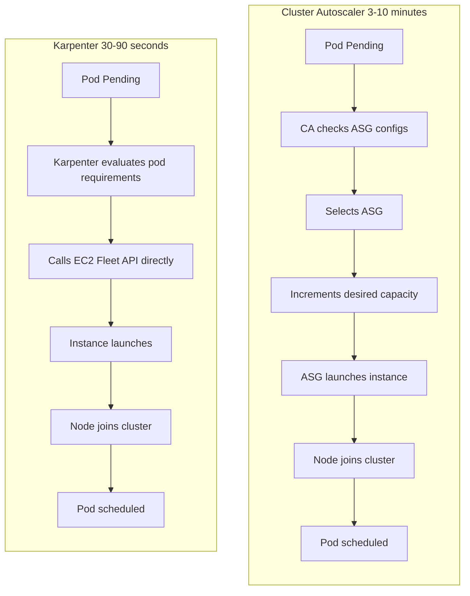
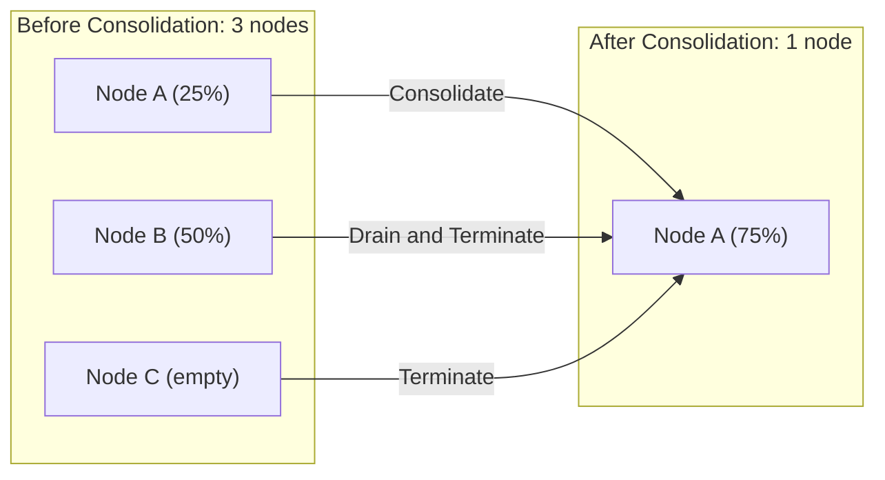
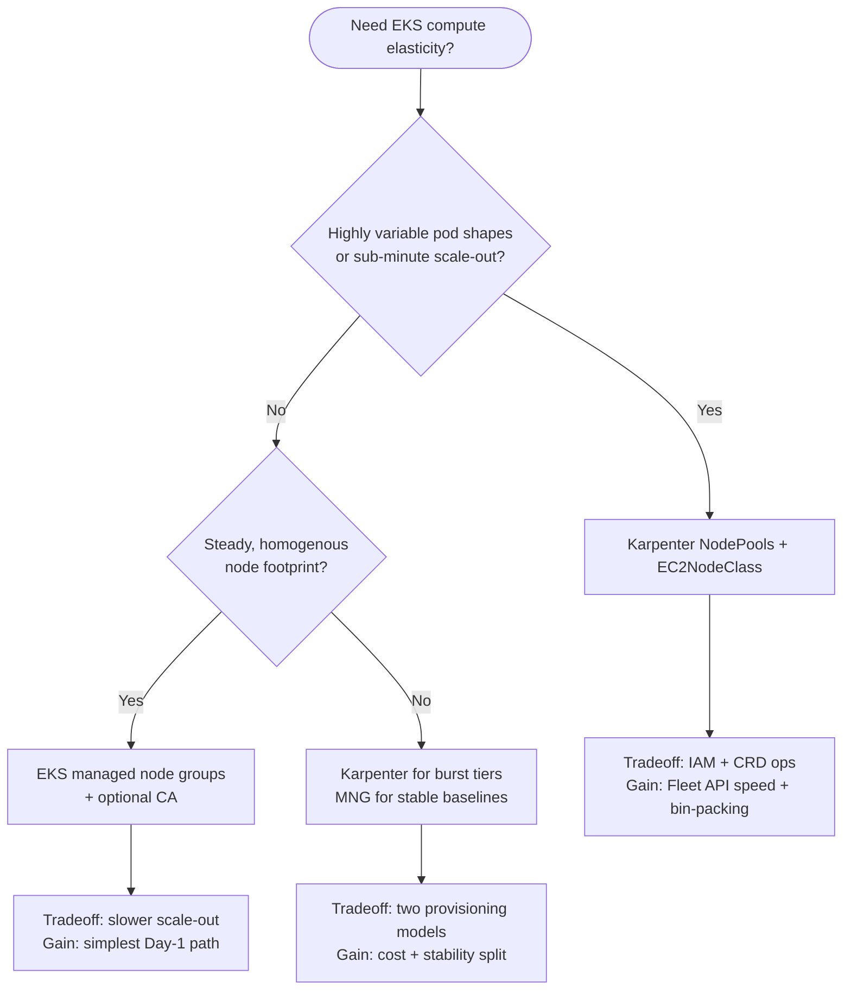
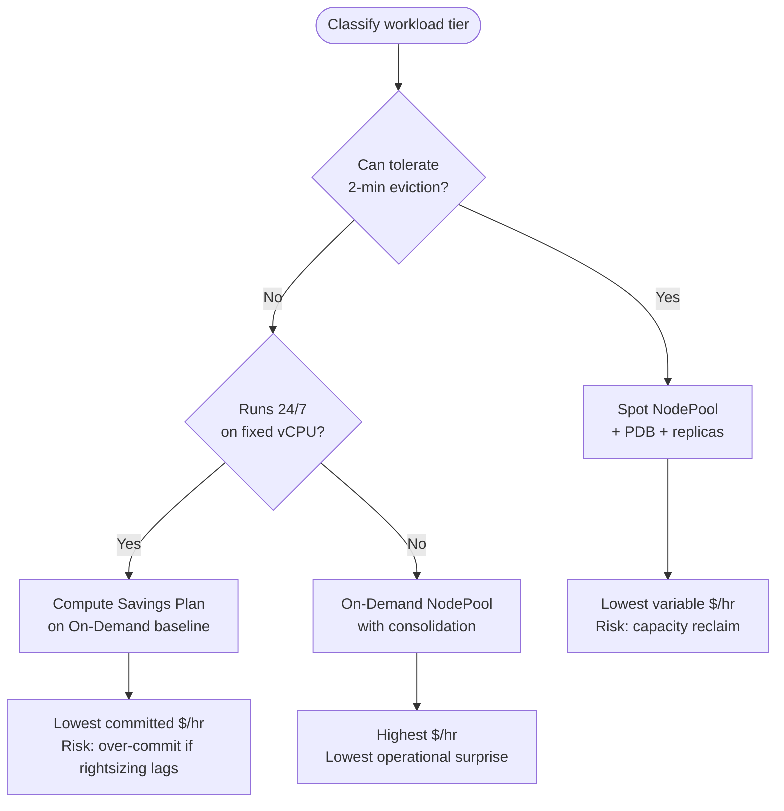
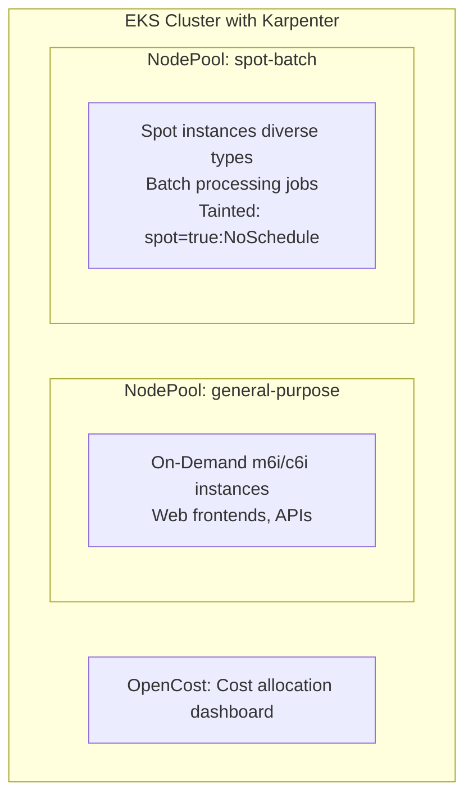

> **Complexity**: `[COMPLEX]`
>
> **Time to Complete**: 3 hours
>
> **Prerequisites**: [Module 5.1 (EKS Architecture)](../module-5.1-eks-architecture/) and [Module 5.2 (EKS Networking)](../module-5.2-eks-networking/)

## What You'll Be Able to Do

Running EKS in production means your cluster must scale compute faster than users notice, emit telemetry you can trust during incidents, and attribute spend to the teams that caused it. After completing this module, you will be able to:

- **Implement** Karpenter for intelligent, constraint-based node autoscaling that optimizes cost and bin-packing on EKS 1.35+.
- **Design** EKS observability pipelines with CloudWatch Container Insights, AWS Distro for OpenTelemetry, and Prometheus.
- **Deploy** cost optimization strategies combining Spot instances, Savings Plans, and right-sizing for Kubernetes workloads.
- **Evaluate** cluster telemetry to diagnose scaling bottlenecks and resolve node contention incidents.
- **Debug** complex scheduling and infrastructure cost allocation issues using OpenCost and Kubecost.

You will move back and forth among these outcomes during the module: autoscaling manifests establish capacity, observability tools explain whether capacity or configuration failed, and cost tooling proves whether the cluster grew for good reasons. Keep that loop in mind when a single section feels tool-heavy—the tools are facets of one production story.

---

## Why This Module Matters

**Hypothetical scenario:** A video streaming platform on EKS launches a viral series. Within twenty minutes, backend encoding and delivery services scale from 200 pods to 1,800 pods. The Horizontal Pod Autoscaler operates correctly: it emits scaling events, the scheduler creates objects, and the cluster state reflects the desired replica count. The bottleneck is not application autoscaling logic but infrastructure reaction time, because pending pods accumulate while the data plane cannot place them on nodes that do not exist yet.

The legacy Cluster Autoscaler fails to keep pace with that pod wall. It spends roughly eight minutes iterating across pending pods, three minutes deciding which Auto Scaling Group to grow, and another two minutes waiting for EC2 instances to boot and join the cluster. More than thirteen minutes elapse before additional schedulable capacity exists. During that window, users experience continuous playback degradation because encoders and edge caches cannot land on nodes with free CPU and memory.

By the time infrastructure capacity catches up to application demand, users have endured thirteen continuous minutes of degraded service, including widespread buffering and playback failures. The failure traces directly to legacy, group-based scaling architectures for a dynamic microservices payload. The financial sting follows immediately: when every burst node launches as On-Demand capacity, a 1,800-pod spike can burn a full day of compute budget while pods remain unschedulable.

After modernizing the cluster architecture—replacing Cluster Autoscaler with Karpenter, implementing native Spot orchestration, and deploying OpenCost for namespace attribution—the same traffic pattern plays out differently. Karpenter detects unschedulable pods, formulates an optimized instance mix, and invokes the EC2 Fleet API directly. Compute capacity becomes available in under 90 seconds, eliminating user-facing degradation. In this module, you will master that architecture alongside the observability and cost attribution frameworks required for production EKS at scale.

Production EKS operations converge on three reinforcing practices that the incident above violated in sequence. First, **compute elasticity** must track pending pods faster than users time out, which is why node provisioning architecture matters as much as Horizontal Pod Autoscaler configuration. Second, **telemetry** must separate control-plane audit trails from node and pod saturation signals so you can tell whether an outage is authorization, scheduling, or resource starvation. Third, **financial feedback loops** must tie CPU and memory requests to team labels; otherwise optimization debates stay abstract while idle nodes silently burn budget. The sections that follow walk through each practice with manifests and queries you can adapt without changing the underlying technical claims, using the same Helm, Karpenter, and EKS add-on versions already referenced in the code blocks throughout this module on Amazon EKS.

---

## Karpenter: Next-Generation Node Provisioning

Karpenter is an open-source, high-performance Kubernetes node provisioner built by AWS, and it replaces the traditional Cluster Autoscaler with a fundamentally different paradigm. Instead of scaling pre-defined Auto Scaling Groups whose instance types you chose weeks ago, Karpenter watches pending pods, sums their resource requests, and provisions individual nodes by calling the EC2 Fleet API with an instance type that fits that exact workload mix. Because it reasons about pods first and infrastructure second, you stop paying for empty headroom in oversized node groups and you stop waiting for ASG iteration loops during traffic spikes.

### Karpenter vs Cluster Autoscaler

To understand why Karpenter is transformative, consider an analogy. Cluster Autoscaler is like having to pre-purchase a fleet of identical delivery trucks and calling the depot for more of the exact same trucks whenever packages pile up, even when half the trucks return half empty. Karpenter, conversely, looks at the specific dimensions and weight of the pending packages and custom-builds a vehicle perfectly sized for that exact payload in under 60 seconds, so you pay for capacity that matches demand instead of capacity that matches yesterday's template. The comparison table below summarizes the operational differences you will feel in production: provisioning latency, bin-packing quality, and how Spot capacity is orchestrated.



| Feature | Cluster Autoscaler | Karpenter |
| :--- | :--- | :--- |
| **Provisioning speed** | 3-10 minutes | 30-90 seconds |
| **Instance selection** | Fixed per ASG (you pre-define) | Dynamic (evaluates pod needs per launch) |
| **Bin packing** | Limited (works within ASG constraints) | Optimized (selects exact instance type for pending pods) |
| **Scale-down** | Scans for underutilized nodes periodically | Continuous consolidation (TTL, empty node, and underutilization) |
| **Spot handling** | Via ASG mixed instances policy | Native Spot support with automatic fallback |
| **Node groups** | Required (one per instance type mix) | Not required (NodePools define constraints, not specific groups) |
| **Maintenance** | ASG + Launch Template management | NodePool + EC2NodeClass CRDs |

When you read this table during a design review, focus on the columns that change incident behavior rather than marketing language. Provisioning speed and bin-packing directly affect how long pods stay Pending during a spike, while scale-down behavior determines whether you pay for overnight idle after a deploy rolls back. Spot handling is another divider: ASG mixed-instance policies can use Spot, but Karpenter can pivot instance types per scheduling wave, which is why interruption diversity and fallback weights show up later in this module. Maintenance shifts from launch-template sprawl to two CRDs (`NodePool` plus `EC2NodeClass`), so platform engineers document constraints instead of maintaining one ASG per instance size.

### Installing Karpenter

Installing Karpenter requires specific IAM roles so the controller can create and terminate EC2 instances, pass instance profiles to nodes, and tag subnets and security groups for discovery. Those permissions are not optional shortcuts; without them the controller will loop on authorization errors while pods stay Pending. Once IAM is established, installation is handled natively via Helm targeting the modern OCI registry shown below, and you should treat the cluster name and API endpoint values as mandatory wiring so Karpenter can register nodes against the correct control plane.

```bash
# Install Karpenter using Helm
# Install Karpenter v1.x from OCI registry (charts.karpenter.sh is deprecated)
# Karpenter needs specific IAM roles and instance profiles
# (Simplified here -- see Karpenter docs for full IAM setup)
helm install karpenter oci://public.ecr.aws/karpenter/karpenter \
  --namespace kube-system \
  --set settings.clusterName=my-cluster \
  --set settings.clusterEndpoint=$(aws eks describe-cluster --name my-cluster --query 'cluster.endpoint' --output text) \
  --set settings.isolatedVPC=false \
  --version 1.1.0 \
  --wait
```

For production Spot workloads, also wire `settings.interruptionQueue` to an SQS queue fed by EventBridge interruption events so Karpenter can drain nodes before EC2 reclaims them.

After Helm reports a ready release, confirm the controller pod is running and watch its logs during a deliberate scale-up test. You should see reconciliation loops when unschedulable pods appear, followed by EC2 launch activity in CloudTrail or the EC2 console. If launches fail, the error is usually IAM-related (missing `ec2:CreateFleet`) or discovery-related (subnets missing `karpenter.sh/discovery`), and those failures surface in controller logs long before Kubernetes events explain the symptom.

### NodePool: Defining Constraints

A `NodePool` is a Custom Resource Definition (CRD) that defines the acceptable boundaries for the nodes Karpenter creates, and it acts as a set of constraints rather than a strict launch template. The `requirements` block is where you express architecture (`amd64`), capacity type (On-Demand versus Spot), instance families, generations, sizes, and zones; Karpenter intersects those constraints with live EC2 pricing and availability when it picks a concrete instance type. The `limits` section caps total fleet size so a scheduling storm cannot provision unbounded vCPU, while `disruption.consolidationPolicy` and `consolidateAfter` tell Karpenter how aggressively to pack workloads onto fewer nodes after demand drops. Setting `expireAfter` forces periodic node rotation so AMIs and kubelet versions do not drift for months on long-lived workers.

```yaml
apiVersion: karpenter.sh/v1
kind: NodePool
metadata:
  name: general-purpose
spec:
  template:
    metadata:
      labels:
        team: platform
        workload-type: general
    spec:
      nodeClassRef:
        group: karpenter.k8s.aws
        kind: EC2NodeClass
        name: default
      requirements:
        - key: kubernetes.io/arch
          operator: In
          values: ["amd64"]
        - key: karpenter.sh/capacity-type
          operator: In
          values: ["on-demand", "spot"]
        - key: karpenter.k8s.aws/instance-category
          operator: In
          values: ["m", "c", "r"]         # General, compute, memory
        - key: karpenter.k8s.aws/instance-generation
          operator: Gt
          values: ["5"]                    # Only 6th gen and newer
        - key: karpenter.k8s.aws/instance-size
          operator: In
          values: ["large", "xlarge", "2xlarge"]
        - key: topology.kubernetes.io/zone
          operator: In
          values: ["us-east-1a", "us-east-1b", "us-east-1c"]
      expireAfter: 720h                     # Force node rotation every 30 days
  limits:
    cpu: "1000"                             # Max 1000 vCPUs across all nodes
    memory: 4000Gi                          # Max 4 TiB memory
  disruption:
    consolidationPolicy: WhenEmptyOrUnderutilized
    consolidateAfter: 30s
  weight: 50                                # Priority vs other NodePools
```

### EC2NodeClass: AWS Infrastructure Binding

While the `NodePool` defines Kubernetes-native scheduling constraints, the `EC2NodeClass` maps those requests to specific AWS infrastructure parameters, including subnets, security groups, block devices, and IAM profiles. Subnet and security group selectors typically use the `karpenter.sh/discovery` tag so only network resources intended for the cluster are eligible, which prevents accidental launches into the wrong VPC slice. The `amiSelectorTerms` alias keeps worker AMIs current without manual launch-template edits each release, and `metadataOptions` with `httpTokens: required` enforces IMDSv2 so instance metadata is not exposed to legacy hop-limited clients. Block device mappings define root volume size and encryption defaults that apply to every node launched through this class.

```yaml
apiVersion: karpenter.k8s.aws/v1
kind: EC2NodeClass
metadata:
  name: default
spec:
  role: KarpenterNodeRole
  amiSelectorTerms:
    - alias: al2023@latest      # Amazon Linux 2023, auto-updated
  subnetSelectorTerms:
    - tags:
        karpenter.sh/discovery: my-cluster
  securityGroupSelectorTerms:
    - tags:
        karpenter.sh/discovery: my-cluster
  blockDeviceMappings:
    - deviceName: /dev/xvda
      ebs:
        volumeSize: 100Gi
        volumeType: gp3
        iops: 3000
        throughput: 125
        encrypted: true
        deleteOnTermination: true
  metadataOptions:
    httpEndpoint: enabled
    httpProtocolIPv6: disabled
    httpPutResponseHopLimit: 1     # IMDSv2 enforcement
    httpTokens: required           # Require IMDSv2
  tags:
    Environment: production
    ManagedBy: karpenter
```

### How Karpenter Selects Instance Types

When evaluating pending pods, Karpenter executes a rapid, multi-dimensional bin-packing algorithm that evaluates the collective CPU and memory requests together rather than scaling a fixed instance size. It simulates packing pending pods onto each compatible instance type allowed by the NodePool, estimates hourly cost from its pricing cache, and launches the cheapest option that still satisfies scheduling constraints including topology and taints. The worked example below is intentionally small so you can see why a single larger node can cost less than several smaller nodes when bin-packing efficiency improves.

```text
Pending Pods:
  Pod A: requests 2 CPU, 4Gi memory
  Pod B: requests 1 CPU, 8Gi memory
  Pod C: requests 4 CPU, 4Gi memory

Karpenter evaluates:
  Option 1: 3x m6i.large (2 CPU, 8Gi each) = $0.288/hr → cannot host Pod C (4 CPU); infeasible
  Option 2: 1x m6i.2xlarge (8 CPU, 32Gi) = $0.384/hr → all 3 pods fit
  Option 3: 1x c6i.2xlarge (8 CPU, 16Gi) = $0.34/hr → all 3 pods fit (12 GiB memory used)

Karpenter selects Option 3 (cheapest feasible option that satisfies all pod requirements)
```

In production you will rarely see only three pending pods, but the decision rule scales the same way: simulate feasible instance types, respect topology spread and affinity rules, then minimize cost among feasible options. When teams complain that Karpenter “always picks compute-optimized instances,” the fix is usually requirements that exclude memory-optimized families, not a bug in the provisioner.

### Karpenter Disruption and Consolidation

Continuous optimization is a hallmark of Karpenter because static node groups tend to leave clusters fragmented after deployments scale up and down. Karpenter monitors utilization continuously and, when policy allows, drains underutilized nodes so workloads reschedule onto a denser remainder, which is how you reclaim idle CPU and memory without manual node pruning scripts. Consolidation respects PodDisruptionBudgets and termination grace periods, so the controller will not yank capacity faster than your applications can evacuate. The diagram below shows the before-and-after shape: three partially used nodes become one adequately utilized node, and the emptied instances terminate automatically.



Tune consolidation carefully when you run stateful systems or Jobs with long shutdown paths. Aggressive `consolidateAfter` values save money on batch clusters but can churn nodes during rolling deploys if PDBs are missing or grace periods are too short. Start with consolidation enabled in non-production, watch eviction metrics, then tighten timing in production once you trust application `preStop` behavior.

---

## Spot Instance Orchestration

Spot instances represent excess AWS capacity available at steep discounts, often sixty to ninety percent below On-Demand pricing for the same instance families. The trade-off is explicit: AWS can reclaim capacity with a two-minute interruption notice, so your workloads must tolerate eviction and you must design redundancy at the pod level rather than assuming a node is permanent. Karpenter changes how organizations consume Spot because it can diversify instance types per launch, react to `InsufficientInstanceCapacity` by trying alternatives, and fall back to On-Demand NodePools without a separate operator-run playbook.

### Configuring Spot in Karpenter

By explicitly specifying `"spot"` in the capacity-type array, you signal to Karpenter that it should attempt to source from the Spot market first for any pod scheduled against that NodePool. Taints such as `spot=true:NoSchedule` isolate batch or fault-tolerant tiers so stateful systems do not land on interruptible hardware by accident, and pairing taints with tolerations in the Deployment or Job spec makes the contract obvious to application teams reviewing manifests in pull requests.

```yaml
apiVersion: karpenter.sh/v1
kind: NodePool
metadata:
  name: spot-batch
spec:
  template:
    spec:
      nodeClassRef:
        group: karpenter.k8s.aws
        kind: EC2NodeClass
        name: default
      requirements:
        - key: karpenter.sh/capacity-type
          operator: In
          values: ["spot"]
        - key: karpenter.k8s.aws/instance-category
          operator: In
          values: ["m", "c", "r"]
        - key: karpenter.k8s.aws/instance-size
          operator: In
          values: ["xlarge", "2xlarge", "4xlarge"]
        # Diversify across many types to reduce interruption risk
        - key: karpenter.k8s.aws/instance-generation
          operator: Gt
          values: ["4"]
      taints:
        - key: spot
          value: "true"
          effect: NoSchedule
  disruption:
    consolidationPolicy: WhenEmpty
    consolidateAfter: 30s
```

### Spot Best Practices

Tolerating Spot capacity requires a combined approach from both the infrastructure and application layers because either side alone leaves a gap. At the infrastructure layer you diversify instance families, generations, sizes, and Availability Zones so a reclaim event in one pool does not eliminate all capacity at once. At the application layer you use PodDisruptionBudgets so Kubernetes never drains more replicas than your service can lose, and you set `terminationGracePeriodSeconds` plus `preStop` hooks so in-flight work finishes before the kubelet sends SIGKILL.

```yaml
# PodDisruptionBudget for Spot workloads
apiVersion: policy/v1
kind: PodDisruptionBudget
metadata:
  name: batch-processor-pdb
  namespace: batch
spec:
  minAvailable: "50%"
  selector:
    matchLabels:
      app: batch-processor
```

```yaml
# Deployment tolerating Spot
apiVersion: apps/v1
kind: Deployment
metadata:
  name: batch-processor
  namespace: batch
spec:
  replicas: 10
  selector:
    matchLabels:
      app: batch-processor
  template:
    metadata:
      labels:
        app: batch-processor
    spec:
      tolerations:
        - key: spot
          operator: Equal
          value: "true"
          effect: NoSchedule
      nodeSelector:
        karpenter.sh/capacity-type: spot
      terminationGracePeriodSeconds: 120
      containers:
        - name: processor
          image: 123456789012.dkr.ecr.us-east-1.amazonaws.com/batch-processor:latest
          resources:
            requests:
              cpu: "2"
              memory: 4Gi
          lifecycle:
            preStop:
              exec:
                command: ["/bin/sh", "-c", "sleep 5 && /app/graceful-shutdown"]
```

### On-Demand Fallback Pattern

A critical production architecture pattern involves configuring Karpenter to prefer Spot capacity but to gracefully fall back to On-Demand instances if the requested Spot capacity pools are exhausted or heavily contested. You implement that preference with two NodePools that share the same `EC2NodeClass` but differ in `karpenter.sh/capacity-type` requirements and `weight`, so the scheduler tries the higher-weight Spot pool first and only provisions On-Demand when Spot APIs return capacity errors.

```yaml
# Primary: Spot (cheap)
apiVersion: karpenter.sh/v1
kind: NodePool
metadata:
  name: compute-spot
spec:
  template:
    spec:
      nodeClassRef:
        group: karpenter.k8s.aws
        kind: EC2NodeClass
        name: default
      requirements:
        - key: karpenter.sh/capacity-type
          operator: In
          values: ["spot"]
  weight: 100    # Higher weight = preferred
```

```yaml
# Fallback: On-Demand (reliable)
apiVersion: karpenter.sh/v1
kind: NodePool
metadata:
  name: compute-ondemand
spec:
  template:
    spec:
      nodeClassRef:
        group: karpenter.k8s.aws
        kind: EC2NodeClass
        name: default
      requirements:
        - key: karpenter.sh/capacity-type
          operator: In
          values: ["on-demand"]
  weight: 10     # Lower weight = fallback only
```

Karpenter evaluates `weight` strictly, so the primary `compute-spot` NodePool with weight 100 is always attempted before the `compute-ondemand` NodePool at weight 10. Only when EC2 returns `InsufficientInstanceCapacity` for the Spot constraints does Karpenter fall through to On-Demand. Weights are not merely documentation—they are ordering semantics for capacity negotiation.

**Pause and predict:** If Karpenter provisions a Spot instance for your workload and AWS issues an interruption warning, what mechanism protects your application from dropped requests before the node shuts down?

<details>
<summary>Check your prediction</summary>

Receiving a two-minute Spot interruption notice (or an earlier EC2 rebalance recommendation signal) provides advanced warning, but notice alone does not create high availability. The underlying instance will terminate unconditionally when the two minutes elapse regardless of running processes. Protecting user traffic requires defense-in-depth across Kubernetes primitives: running multiple replicas distributed across availability zones, configuring `PodDisruptionBudgets` to prevent concurrent evictions, implementing container `preStop` hooks for graceful connection draining, and properly handling operating system `SIGTERM` signals. During an interruption, the node lifecycle transitions through cordon, drain, and terminate phases while Kubernetes reschedules pods onto surviving capacity. Karpenter can launch replacement Spot nodes across alternative instance families if the NodePool defines sufficient instance diversity. Teams should validate graceful termination under simulated terminations in automated test suites because infrastructure can only grant a two-minute warning window before hard termination.
</details>

Treating compute instances as ephemeral entities shifts operational focus from individual node longevity to holistic capacity management across diverse instance families. When development teams build resilient services that accommodate node recycles, infrastructure engineers can safely adopt aggressive cost models. Automated consolidation policies can then reclaim underutilized capacity without risking customer-facing downtime.

---

## Control Plane Logging

Visibility into the Kubernetes control plane is non-negotiable for security forensics and debugging scheduling anomalies, because you cannot SSH into managed etcd or apiserver processes on EKS the way you might on self-managed clusters. AWS streams control plane component logs directly to CloudWatch Logs, which means your retention, encryption, and access policies follow the same tooling you already use for application telemetry. The operational discipline is selective enablement: turn on the log types that justify their ingestion cost continuously, and enable high-volume types temporarily while you are actively debugging.

### Enabling Control Plane Logs

Control plane logging is configured at the cluster object level, so treat enablement like any other infrastructure change with a change ticket and a rollback plan. Enabling all five types at once is convenient for a short proof of concept but expensive for a busy production API server; start with the minimal set in the table, expand during incidents, and document who disabled high-volume types when the incident closes.

```bash
aws eks update-cluster-config --name my-cluster \
  --logging '{"clusterLogging":[{"types":["api","audit","authenticator","controllerManager","scheduler"],"enabled":true}]}'
```

| Log Type | What It Contains | When to Use |
| :--- | :--- | :--- |
| `api` | API server request/response logs | Debugging API errors, rate limiting |
| `audit` | Who did what, when (all API calls) | Security compliance, forensics |
| `authenticator` | Authentication decisions (IAM → K8s RBAC) | Troubleshooting access denied errors |
| `controllerManager` | Controller loops (ReplicaSet, Deployment) | Why pods are not being created |
| `scheduler` | Scheduling decisions and failures | Why pods are Pending |

In practice, platform teams enable `audit` and `authenticator` continuously because security questions arrive months after an event. You cannot reconstruct auth decisions retroactively. `scheduler` logs earn a temporary enablement window when pods sit Pending despite apparently free capacity, because the scheduler records why a pod did not fit a node. `controllerManager` logs help when ReplicaSets exist but Deployments never materialize new pods. `api` logs are the noisiest: they shine when you are chasing a specific client spamming LIST calls, but they should not run unfiltered forever on large clusters.

After logging is enabled, querying is most efficient through CloudWatch Logs Insights because you can filter across `audit`, `api`, and `authenticator` streams with structured fields instead of grepping raw files on nodes that do not exist for you to access. The examples below show how to find clients receiving HTTP 400 responses and how to reconstruct who deleted a pod in a production namespace, patterns you will reuse during incident reviews.

```sql
-- Find all failed API calls in the last hour
fields @timestamp, verb, requestURI, responseStatus.code, user.username
| filter responseStatus.code >= 400
| sort @timestamp desc
| limit 50
```

```sql
-- Find who deleted a specific pod
fields @timestamp, verb, requestURI, user.username, sourceIPs.0
| filter verb = "delete" and requestURI like "/api/v1/namespaces/production/pods/"
| sort @timestamp desc
| limit 20
```

**Pause and predict:** When you provision an Amazon EKS cluster, which control-plane log types stream to CloudWatch Logs by default? Furthermore, how should teams manage ongoing logging expenses?

<details>
<summary>Check your prediction</summary>

By default, Amazon EKS sends **none** of the control-plane log streams to Amazon CloudWatch Logs; all five log types (`api`, `audit`, `authenticator`, `controllerManager`, and `scheduler`) remain disabled until explicitly activated. Once enabled, AWS delivers the selected log streams directly to a dedicated CloudWatch log group where standard ingestion and storage pricing applies to every gigabyte received. Because active clusters with high controller and reconciliation activity generate massive log volumes, enabling all streams permanently creates unnecessary telemetry expenses. A proven production default is to keep `audit` and `authenticator` enabled continuously to satisfy security governance, compliance mandates, and identity access forensics. The remaining verbose streams—`api`, `controllerManager`, and `scheduler`—are left disabled during routine operations and activated on-demand when actively investigating control-plane degradation, admission webhook stalls, or scheduling failures.
</details>

Structuring cluster logging around targeted telemetry streams establishes sustainable operational visibility across enterprise fleets. By enforcing disciplined ingestion boundaries, infrastructure teams avoid billing surprises while ensuring critical identity and governance records remain accessible during audits.

---

## Container Insights: Node and Pod Metrics

While control plane logs reveal *what* happened at the API layer, performance metrics reveal *why* nodes and pods behaved the way they did under load. Amazon CloudWatch Container Insights aggregates cluster, node, pod, and container utilization into dashboards and alarms without you operating a metrics database, which is attractive for platform teams that want a default observability baseline on day one. The trade-off appears at scale: custom metrics billing grows with cardinality, so you should know when Container Insights is the right default and when to graduate workloads to Prometheus-style pipelines described later in this module.

### Enabling Container Insights

Container Insights is not a separate daemon you install by hand on every node when you use the managed add-on path; AWS packages the agents and wires them to CloudWatch on your behalf. That reduces day-one friction but still requires an IAM role for the service account so agents can publish metrics. Plan a short validation window after enablement where you compare Container Insights node graphs with `kubectl top` and with Prometheus node exporters if both exist, so you know the signals agree before you wire alarms.

```bash
# Install via the EKS add-on
aws eks create-addon \
  --cluster-name my-cluster \
  --addon-name amazon-cloudwatch-observability \
  --service-account-role-arn arn:aws:iam::$(aws sts get-caller-identity --query Account --output text):role/CloudWatchObservabilityRole
```

### Key CloudWatch Metrics for EKS

| Metric | Namespace | What to Alert On |
| :--- | :--- | :--- |
| `node_cpu_utilization` | ContainerInsights | > 80% sustained |
| `node_memory_utilization` | ContainerInsights | > 85% sustained |
| `pod_cpu_utilization_over_pod_limit` | ContainerInsights | > 90% (throttling imminent) |
| `node_filesystem_utilization` | ContainerInsights | > 80% (disk pressure) |
| `cluster_failed_node_count` | ContainerInsights | > 0 |
| `pod_status_phase` (Pending) | ContainerInsights | > 0 for > 5 min |

Treat the metrics table as an on-call cheat sheet rather than a shopping list of alarms. Node CPU and memory utilization tell you whether Karpenter should add capacity or whether requests are mis-sized; pod CPU over limit warns that throttling is imminent even when the node looks healthy. Filesystem utilization catches log and emptyDir growth before kubelet evictions, while `cluster_failed_node_count` should always page because it signals registration or CNI failures, not application bugs. Pending pods longer than five minutes bridge back to the Karpenter sections: confirm whether unschedulable events exist, whether taints block Spot nodes, and whether IP or ENI limits from networking modules still apply.

The `amazon-cloudwatch-observability` EKS add-on bundles the agents needed for Container Insights and can also deploy AWS Distro for OpenTelemetry (ADOT) collectors when you standardize on OpenTelemetry pipelines. You do not have to choose between “CloudWatch only” and “Prometheus only” on day one. Many teams emit infrastructure metrics to Container Insights for baseline dashboards while exporting application traces and custom metrics through ADOT to AMP or a self-managed backend.

**Pause and predict:** You observe that `kube_pod_container_status_restarts_total` is increasing rapidly for your core API namespace, yet `node_cpu_utilization` remains completely normal. What underlying failure modes explain these container recycles?

<details>
<summary>Check your prediction</summary>

Healthy node CPU utilization does not prove that application workloads are running successfully. Containers frequently restart due to pod-level resource limits or internal application failures rather than host compute starvation. The most common cause is memory limit enforcement: when a container exceeds its configured `resources.limits.memory`, the Linux kernel cgroup out-of-memory killer terminates the process with an `OOMKilled` status (`ExitCode: 137`). Another frequent failure mode is failing liveness probes, where deadlocked threads or saturated event loops cause health checks to time out, triggering kubelet container restarts. In addition, unhandled application exceptions, segmentation faults, database connection pool exhaustion, and missing configuration secrets can cause application processes to exit repeatedly. Responders must run `kubectl describe pod` to inspect termination reasons and exit codes rather than relying solely on host infrastructure metrics.
</details>

Distinguishing between host hardware saturation and isolated container runtime failures represents a fundamental milestone in site reliability engineering. Relying entirely on host-level health indicators leaves critical visibility blind spots that obscure application-layer instability from site operators during major customer incidents.

---

## Prometheus Integration

While Container Insights offers a seamless zero-ops experience, high-cardinality clusters will inevitably encounter prohibitive cost scaling because every new label combination can become a billable custom metric. At scale, teams standardize on Prometheus-compatible scraping and PromQL because the data model is portable across clouds and because self-managed or managed backends charge per samples ingested rather than per named metric in the same way. EKS fits naturally into that model: node and kube-state metrics are well understood, and the `kube-prometheus-stack` chart gives you Grafana dashboards with modest operational overhead.

### Amazon Managed Prometheus (AMP)

Amazon Managed Prometheus (AMP) provides a serverless ingestion and query backend, allowing you to use PromQL without operating Cortex or Thanos storage clusters yourself. You still run collectors—typically Prometheus agents or the full stack in-cluster—but AMP absorbs long-term retention and federated query load, which is why many production EKS platforms remote-write from in-cluster Prometheus to AMP and keep Grafana as the visualization layer.

```bash
# Create a workspace
WORKSPACE_ID=$(aws amp create-workspace \
  --alias eks-production \
  --query 'workspaceId' --output text)

echo "Workspace: $WORKSPACE_ID"
echo "Endpoint: https://aps-workspaces.us-east-1.amazonaws.com/workspaces/$WORKSPACE_ID"
```

Treat AMP as the long-term store and Grafana as the lens, not as a replacement for in-cluster scraping discipline. You still need relabeling rules, scrape intervals, and cardinality controls on exporters, because remote-write only shifts retention costs—it does not magically drop high-cardinality labels created by misconfigured ServiceMonitors.

### Deploying Prometheus to Scrape EKS Metrics

Deploying Prometheus via the `kube-prometheus-stack` Helm chart configures ServiceMonitor-driven scraping of the Kubernetes control plane and kubelets. It ships Grafana dashboards and can remote-write samples to AMP when you set the `remoteWrite` URL and SigV4 region on the Prometheus custom resource. The first install block below is suitable for labs that keep metrics inside the cluster for fifteen days. The second block shows the minimal AMP wiring you would enable in production after creating a workspace.

```bash
# Install the Prometheus stack using Helm
helm repo add prometheus-community https://prometheus-community.github.io/helm-charts
helm repo update

# For self-managed Prometheus + Grafana:
helm install prometheus prometheus-community/kube-prometheus-stack \
  --namespace monitoring \
  --create-namespace \
  --set prometheus.prometheusSpec.retention=15d \
  --set prometheus.prometheusSpec.resources.requests.cpu=500m \
  --set prometheus.prometheusSpec.resources.requests.memory=2Gi \
  --set grafana.enabled=true \
  --set grafana.adminPassword=DojoGrafana2024

# For remote-write to Amazon Managed Prometheus:
helm install prometheus prometheus-community/kube-prometheus-stack \
  --namespace monitoring \
  --create-namespace \
  --set prometheus.prometheusSpec.remoteWrite[0].url="https://aps-workspaces.us-east-1.amazonaws.com/workspaces/$WORKSPACE_ID/api/v1/remote_write" \
  --set prometheus.prometheusSpec.remoteWrite[0].sigv4.region=us-east-1
```

### Essential PromQL Queries for EKS

Prometheus excels at cross-dimensional analysis because PromQL lets you ratio usage to requests, detect restart storms independent of node CPU charts, and observe Karpenter provisioning latency directly if you export its metrics. Build a small dashboard with the four queries below and annotate it with your cluster’s normal ranges during business hours; that baseline makes anomalies obvious when autoscaling misbehaves or when a single Namespace begins restart storms after a deploy.

When you later connect these panels to alerts, prefer multi-window burn rates for user-facing services and simple thresholds for infrastructure signals such as NotReady nodes or sustained Pending pods. The goal is fewer, clearer pages—not hundreds of graphs nobody opens during incidents—and that discipline keeps on-call cognitive load manageable. The queries below are starting points for capacity reviews: namespace CPU pressure relative to requests, memory working set versus limits, restart rates, NotReady nodes, and a p99 on Karpenter scheduling duration when that histogram is available in your scrape config.

```promql
# CPU usage by namespace (percentage of requests)
sum(rate(container_cpu_usage_seconds_total{container!=""}[5m])) by (namespace)
/ sum(kube_pod_container_resource_requests{resource="cpu"}) by (namespace)
* 100

# Memory usage vs limits (OOM risk indicator)
sum(container_memory_working_set_bytes{container!=""}) by (namespace, pod)
/ sum(kube_pod_container_resource_limits{resource="memory"}) by (namespace, pod)
* 100

# Pod restart rate (signals instability)
sum(rate(kube_pod_container_status_restarts_total[1h])) by (namespace, pod) > 0

# Node not Ready duration
sum(kube_node_status_condition{condition="Ready", status="true"} == 0) by (node)

# Karpenter provisioning latency (p99; v1 metric name)
histogram_quantile(0.99, sum(rate(karpenter_scheduler_scheduling_duration_seconds_bucket[5m])) by (le))
```

After you install scraping, validate each query in Grafana with a known load test. Namespace CPU ratios above one hundred percent usually mean requests are set too low, not that magic extra CPU exists. Memory working-set-over-limit ratios highlight OOM risk before Kubernetes kills containers. Restart rates decoupled from node utilization often point to misconfigured liveness probes or application panics, which matches the troubleshooting narrative in the pause-and-predict callout above. Karpenter latency histograms close the loop on autoscaling SLOs: if p99 provisioning drifts from under ninety seconds toward minutes, revisit NodePool constraints before blaming application code.

---

## Savings Plans, Spot, and Right-Sizing

Cost optimization on EKS is a portfolio decision, not a single knob. Spot and Karpenter consolidation attack **hourly waste** on interruptible or over-provisioned capacity, while **right-sizing** attacks inflated `requests` that cause Karpenter to launch larger nodes than workloads need. **Savings Plans** (and Reserved Instances where they still fit) attack the baseline On-Demand footprint that remains after you move batch tiers to Spot. Mature platforms combine all three: Spot for fault-tolerant compute, consolidation for stranded capacity, VPA or dashboard recommendations for request tuning, and Savings Plans on the steady On-Demand slice that Spot cannot absorb.

When you present this portfolio to finance stakeholders, translate Kubernetes actions into their language. Karpenter consolidation and Spot usage reduce **variable** hourly burn, Savings Plans reduce **committed** baseline rates on the remaining On-Demand footprint, and right-sizing reduces **requested** capacity that drives both node size and allocation reports. Without that framing, leaders may ask for “more Spot” while the cluster still looks expensive because requests remain inflated.

---

## Cost Allocation with Kubecost and OpenCost

Kubernetes abstractly pools resources, which creates a tragedy-of-the-commons dynamic: teams inflate CPU and memory requests because nobody sees a departmental invoice tied to a Deployment manifest. FinOps on EKS therefore requires two capabilities at once—accurate measurement of who consumed CPU, memory, and GPU time, and guardrails that stop unlabeled workloads from hiding in an "unallocated" bucket. OpenCost and Kubecost both sit on Prometheus-style metrics and cloud billing APIs; OpenCost is the open-source core many teams self-host, while Kubecost adds commercial allocation views and recommendations on top of a similar data model.

### OpenCost (Open Source)

OpenCost maps real-time AWS billing data—including Spot price feeds when configured—to pod usage telemetry so you can aggregate cost by namespace, label, or controller. The Helm values below enable the UI for exploratory reviews and wire Spot pricing buckets when you want interruption-aware amortization instead of assuming every node hour cost the same On-Demand rate.

```bash
# Install OpenCost
helm repo add opencost https://opencost.github.io/opencost-helm-chart
helm repo update

helm install opencost opencost/opencost \
  --namespace opencost \
  --create-namespace \
  --set opencost.exporter.defaultClusterId=my-cluster \
  --set opencost.exporter.aws.spot_data_region=us-east-1 \
  --set opencost.exporter.aws.spot_data_bucket=my-spot-pricing-bucket \
  --set opencost.ui.enabled=true
```

### Kubecost (Commercial + Free Tier)

A monthly FinOps review with either tool should follow the same agenda every time so results compound instead of becoming a one-off spreadsheet exercise. Start with idle and unallocated totals, then rank namespaces by growth week over week, then inspect the top ten Deployments by cost with the highest request-to-usage gap. Only after those three views should you change NodePool consolidation timings or Spot weights, because otherwise you risk optimizing nodes while applications still request double the CPU they need.

Kubecost packages the same class of allocation queries with opinionated dashboards, savings recommendations, and multi-cluster views that larger enterprises often standardize on. The install mirrors OpenCost in complexity: you point it at Prometheus metrics with a `cluster_id` label and let it correlate utilization to cloud bills. Teams frequently run OpenCost for transparency in platform namespaces and Kubecost where finance wants certified showback reports.

```bash
helm repo add kubecost https://kubecost.github.io/cost-analyzer
helm repo update

helm install kubecost kubecost/cost-analyzer \
  --namespace kubecost \
  --create-namespace \
  --set kubecostToken="" \
  --set prometheus.server.global.external_labels.cluster_id=my-cluster
```

### Cost Allocation Strategies

Without discipline, OpenCost will simply report massive unallocated spend, which means your optimization program argues over percentages of a chart that still lacks owners. Financial attribution requires consistent labels on Deployments and Namespaces—`team`, `environment`, and `cost-center` are the minimum viable set—and those labels must survive from CI templates into production manifests so chargeback queries stay stable quarter to quarter.

```yaml
# Enforce cost-tracking labels on all pods
apiVersion: apps/v1
kind: Deployment
metadata:
  name: payment-service
  namespace: payments
  labels:
    app: payment-service
    team: payments-team          # Who owns this?
    environment: production      # Prod vs staging vs dev
    cost-center: cc-1234         # Finance tracking code
spec:
  template:
    metadata:
      labels:
        app: payment-service
        team: payments-team
        environment: production
        cost-center: cc-1234
```

To prevent unallocated workloads from executing in the first place, leverage an admission controller like Kyverno so non-compliant objects never reach the scheduler; enforcement is cheaper than monthly cleanup meetings where platform engineers chase missing labels.

```yaml
# Kyverno policy to require cost labels
apiVersion: kyverno.io/v1
kind: ClusterPolicy
metadata:
  name: require-cost-labels
spec:
  rules:
    - name: check-cost-labels
      match:
        any:
          - resources:
              kinds:
                - Deployment
                - StatefulSet
                - DaemonSet
      validate:
        failureAction: Enforce
        message: "All workloads must have 'team' and 'cost-center' labels."
        pattern:
          metadata:
            labels:
              team: "?*"
              cost-center: "?*"
```

### Reading a Cost Report

| Team | Namespace | CPU Cost | Mem Cost | Total |
| :--- | :--- | :--- | :--- | :--- |
| payments | payments | $1,240 | $890 | $2,130 |
| search | search | $3,100 | $2,450 | $5,550 |
| data-pipeline | batch | $890 | $1,200 | $2,090 |
| platform | monitoring | $420 | $680 | $1,100 |
| (idle) | (unallocated) | $1,800 | $2,300 | $4,100 |
| **TOTAL CLUSTER** | | | | **$14,970** |

In this scenario, the idle and unallocated sum of $4,100 is not a rounding error—it is nearly thirty percent of total cluster spend with no owner accountable for rightsizing. That line item should trigger consolidation tuning on Karpenter, VPA recommendation reviews for over-requested pods, and a policy pass to ensure new Deployments cannot land without cost labels.

---

## EKS Upgrade Runbooks

Kubernetes issues minor releases routinely, and maintaining operational readiness requires rigid upgrade paths because version skew between the control plane and kubelets is enforced by policy, not by goodwill. For clusters on EKS 1.35 and later, treat upgrades as a sequenced runbook rather than a single button click. Validate API compatibility first, move the managed control plane, align add-ons, then rotate workers so no kubelet speaks a newer dialect than the apiserver allows.

**Pre-flight API checks** come first because Helm charts and operators often embed deprecated API versions long after upstream removal warnings appear in release notes. Tools such as Pluto scan rendered manifests and chart templates so you fix `batch/v1beta1` style leftovers before the upgrade window. That pre-work is far cheaper than discovering a failed apply during production maintenance.

**Control plane upgrades** are initiated through the EKS API or console and run on AWS-managed infrastructure, so your responsibility is sequencing and communication rather than etcd backups. The HA control plane should remain available, but you should still pause deploys that mutate CRDs until add-ons are verified.

**Core add-on upgrades**—VPC CNI, CoreDNS, kube-proxy, and any observability agents tied to kubelet versions—must match the target Kubernetes minor release matrix published for EKS. Skipping this step produces subtle failures such as DNS timeouts or IP allocation regressions that look like application bugs.

**Data plane rotation** is where Karpenter earns its keep: updating `amiSelectorTerms` to a newer Amazon Linux 2023 alias and letting `expireAfter` force replacement yields rolling nodes without maintaining multiple ASG launch templates. Drain behavior still honors PDBs, so you should watch pod disruption budgets during the rotation weekend the same way you would with managed node groups.

Document the upgrade sequence in your team wiki with explicit owners: who runs Pluto, who bumps the control plane version, who pins add-on versions, and who monitors Karpenter drains. Managed EKS removes etcd toil, but human coordination errors still cause outages. Application teams may deploy new CRDs mid-upgrade, or node rotation may outrun PDB budgets—either path produces preventable downtime.

**Pause and predict:** When executing an Amazon EKS cluster version upgrade, why does operational policy mandate upgrading the control plane before upgrading worker nodes and kubelet instances?

<details>
<summary>Check your prediction</summary>

Under the official Kubernetes version skew policy, worker node kubelets **must not be newer** than the control plane's `kube-apiserver`. A kubelet may be up to **three** minor versions older than the API server (allowing an n-3 skew window for gradual fleet maintenance), but running a kubelet version newer than the control plane is strictly unsupported and can cause schema validation failures, registration rejections, and node communication errors. Therefore, the control plane must always be upgraded first. On Amazon EKS, clusters must be upgraded sequentially one minor version at a time (such as 1.34 to 1.35). AWS includes an automated rollback mechanism that returns the control plane to its prior minor version if the upgrade fails before completion within a 7-day window. Once the managed control plane successfully finishes updating and core add-ons are verified, platform teams can safely proceed with worker node and Karpenter NodePool rotation.
</details>

Establishing strict lifecycle discipline around cluster version migrations safeguards workloads from unexpected API translation errors and scheduling incompatibilities. Engineering organizations that institutionalize these upgrade runbooks minimize customer disruption during routine platform maintenance while maintaining compliance with upstream Kubernetes support windows.

---

## Patterns & Anti-Patterns

Production EKS teams converge on a small set of patterns that survive traffic spikes, Spot reclaim events, and finance reviews. The table below captures proven approaches for autoscaling, observability spend, and upgrade hygiene. Pair each pattern with the cost lens from earlier sections: consolidation and Spot diversification reduce variable hourly burn, while scoped logging and right-sizing stop silent budget leaks.

### Proven Patterns

| Pattern | When to Use | Why It Works | Scaling Note |
| :--- | :--- | :--- | :--- |
| **Karpenter consolidation with PDB-aware drains** | Clusters with bursty Deployments and batch tiers that leave fragmented nodes overnight | Continuous packing reclaims idle vCPU without manual ASG tuning; PDBs cap eviction blast radius | Tune `consolidateAfter` per tier—aggressive on batch NodePools, conservative on latency-sensitive pools |
| **Spot diversification plus weighted On-Demand fallback** | Fault-tolerant web tiers, CI runners, and media batch pipelines | Multiple families, generations, sizes, and AZs spread interruption risk; weight ordering guarantees fallback when Spot pools exhaust | Monitor interruption rate per instance family; widen requirements before blaming application code |
| **Scoped control-plane logging** | Always-on security posture with incident-driven deep dives | `audit` and `authenticator` satisfy forensics without paying for full `api` LIST/WATCH volume | Enable `scheduler` and `controllerManager` temporarily during Pending-pod investigations, then disable |
| **Right-sizing requests with admission enforcement** | Any cluster where FinOps reports >20% idle or unallocated spend | Accurate requests let Karpenter bin-pack and let OpenCost attribute spend to teams | Run VPA in recommendation mode first; enforce labels and requests via Kyverno before hard limits |
| **Upgrade cadence with `expireAfter` rotation** | EKS clusters on quarterly minor upgrades | Control plane moves first per skew policy; node rotation via NodePool expiry avoids stale AMIs | Document add-on compatibility matrix before bumping control plane version |

### Anti-Patterns

| Anti-Pattern | What Goes Wrong | Why Teams Fall Into It | Better Alternative |
| :--- | :--- | :--- | :--- |
| **Cluster Autoscaler thrash alongside Karpenter** | Both controllers fight over node counts; scale-up latency worsens and nodes terminate unexpectedly | Incremental migration without removing legacy autoscaler | Remove Cluster Autoscaler entirely before Karpenter reaches production traffic |
| **Single Spot instance pool** | One family/AZ concentration means reclaim events drain most capacity at once | Copy-paste NodePool from a tutorial with one `instance-type` requirement | Allow 10–20 types across m/c/r families and three AZs; add weighted On-Demand fallback |
| **Logging everything permanently** | CloudWatch ingestion for all five control-plane types can exceed useful signal | "Enable now, filter later" during initial cluster bring-up | Keep `audit` + `authenticator`; enable `api`/`scheduler`/`controllerManager` only during active incidents |
| **Skipping EKS add-on version checks** | VPC CNI, CoreDNS, or kube-proxy skew causes DNS failures or IP exhaustion that mimic app bugs | Treating add-ons as independent of Kubernetes minor version | Pin add-ons to the EKS compatibility matrix before and after control plane upgrades |
| **FinOps dashboards without label enforcement** | 30%+ spend stays unallocated; optimization debates lack owners | Optional labels in Helm charts | Enforce `team` and `cost-center` at admission; reject non-compliant Deployments |

At moderate scale—roughly fifty to two hundred nodes—a well-run pattern stack typically cuts idle compute by double-digit percentages without sacrificing SLOs. Cost spikes unexpectedly when consolidation runs during deploy windows without PDB coverage, when Spot pools are too narrow during regional capacity crunches, or when Container Insights cardinality explodes because every pod label becomes a custom metric dimension.

---

## Decision Framework

Use the flowcharts below during architecture reviews when stakeholders ask for a single answer but the honest response is "it depends on workload shape and finance maturity."

### Node provisioning: Karpenter vs Cluster Autoscaler vs managed node groups



Choose **managed node groups** when your fleet is small, instance types are uniform, and scale-out measured in minutes is acceptable. Choose **Karpenter** when pending pods vary widely in CPU/memory shape, traffic spikes are sharp, or Spot diversification matters. Keep **Cluster Autoscaler** only as a bridge during migration—not as a permanent peer to Karpenter.

### Capacity pricing: Spot vs On-Demand vs Savings Plans



Run **Spot** for stateless, horizontally scaled, or checkpointed batch work. Cover the **On-Demand baseline** that Spot cannot absorb—databases, singleton controllers, latency-sensitive APIs—with **Compute Savings Plans** once utilization is stable for a year-ish horizon. Revisit the split monthly using OpenCost idle lines and Spot interruption metrics.

### Cost visibility: OpenCost vs Kubecost vs AWS CUR

| Need | OpenCost | Kubecost | AWS Cost & Usage Report (CUR) |
| :--- | :--- | :--- | :--- |
| **Open-source, in-cluster allocation** | Native fit; Prometheus + optional Spot pricing bucket | Commercial layer with free tier limits | Not a Kubernetes allocator—billing export only |
| **Multi-cluster enterprise showback** | Possible with federation; more DIY | Strong default for finance-ready dashboards | Requires Athena/Glue pipeline + label mapping work |
| **Invoice-grade AWS reconciliation** | Approximates from metrics + pricing APIs | Adds commercial CUR integration features | Source of truth for AWS line items |
| **Cost to operate** | Helm install + Prometheus you already run | License for advanced modules | Storage + query infrastructure for CUR tables |

Start with **OpenCost** when platform engineers need transparent namespace attribution quickly. Add **Kubecost** when finance requires certified showback across many clusters. Use **CUR** (with resource tags and Cost Allocation Tags enabled) to reconcile whether Kubernetes decisions actually moved the AWS bill.

---

## Did You Know?

The facts below are worth revisiting after you run the hands-on exercise, because they connect autoscaling math, logging bills, Spot statistics, and industry utilization benchmarks to the dashboards you will actually see.

1. Karpenter evaluates a large set of EC2 instance types (hundreds of SKUs across allowed families) when deciding what to launch. For each batch of pending pods, it simulates packing them onto compatible instance types, estimates hourly cost from its pricing cache, and selects a feasible low-cost option. That evaluation is fast because Karpenter maintains an in-memory instance catalog refreshed periodically from AWS pricing APIs (refresh cadence varies by version and configuration—check your controller metrics if cost decisions look stale).

2. EKS control plane audit logs can record API requests, including the request body and response at the most detailed audit level. For a cluster with 500 pods and active HPA/VPA controllers, the audit log volume can reach 10-15 GB per day. At CloudWatch's $0.50/GB ingestion rate, that is $5-7.50/day or $150-225/month just for audit log storage. Many teams filter audit logs to only capture write operations and authentication events, reducing volume by 80%.

3. Spot instance interruption rates vary dramatically by instance type and region. In 2024 data, the `m5.xlarge` in us-east-1 had a roughly 5% monthly interruption rate, while the `m6i.xlarge` in the same region was under 3%. By diversifying across 15-20 instance types and 3 AZs, you can achieve an effective interruption rate below 2% per node per month, making Spot viable even for user-facing services behind proper redundancy.

4. Kubecost analysis across thousands of Kubernetes clusters found that the average cluster utilization (actual CPU/memory usage vs provisioned) is only 20-35%. This means 65-80% of infrastructure spend is wasted on idle resources. The three highest-impact optimizations are: (1) right-sizing pod resource requests using VPA recommendations, (2) enabling Karpenter consolidation to remove underutilized nodes, and (3) using Spot instances for stateless and fault-tolerant workloads.

Taken together, these facts explain why production EKS is as much about telemetry and finance as it is about YAML. Karpenter’s instance database makes rapid cost-aware provisioning possible, audit logs make compliance possible, Spot diversification makes interruptible capacity viable, and utilization benchmarks remind you that autoscaling out without rightsizing in only moves waste faster.

---

## Common Mistakes

The table below collects failure modes platform teams rediscover during their first Karpenter and FinOps rollouts. Use it as a pre-production checklist: if you recognize your current design in the “Mistake” column, fix the root cause before a traffic spike proves it expensive.

| Mistake | Why It Happens | How to Fix It |
| :--- | :--- | :--- |
| **Running Cluster Autoscaler and Karpenter simultaneously** | Migrating incrementally but forgetting to remove the old autoscaler. Both fight over node lifecycle. | Remove Cluster Autoscaler completely before deploying Karpenter. They are mutually exclusive. |
| **Karpenter NodePool with only one instance type** | Over-constraining instance requirements, defeating Karpenter's instance flexibility advantage. | Allow at least 10-15 instance types across multiple families (m, c, r) and generations. More diversity means better availability and pricing. |
| **No `expireAfter` on NodePool** | Nodes run indefinitely with stale AMIs and potential security vulnerabilities. | Set `expireAfter: 720h` (30 days) to force rotation. Karpenter gracefully drains nodes before termination. |
| **Spot for stateful workloads without replication** | Assuming Spot interruption will not happen. A database on a Spot node loses its EBS volume attachment during interruption. | Use On-Demand for databases and single-point-of-failure workloads. Spot is for stateless, redundant, or batch workloads only. |
| **Enabling all 5 control plane log types permanently** | "We might need them someday." Meanwhile paying $200/month for logs nobody reads. | Enable `audit` and `authenticator` always. Enable `api`, `controllerManager`, and `scheduler` only when actively debugging. |
| **No resource requests on pods** | Developers skip requests "to keep it simple." Karpenter cannot bin-pack without knowing pod resource needs. | Require resource requests via admission controller (Kyverno/OPA). Use VPA recommendations to determine appropriate values. |
| **Cost allocation without label enforcement** | Labels are optional, most teams do not add them, and 60% of cost is "unallocated." | Enforce `team` and `cost-center` labels using admission policies. Reject deployments that lack required labels. |
| **Ignoring idle cost in Kubecost** | Focusing on per-team costs while ignoring the 30%+ of cluster spend that is idle. | Review idle cost weekly. Right-size pod requests, enable Karpenter consolidation, and set aggressive `consolidateAfter` values. |

If you are preparing for a production cutover, schedule a game day that combines three failures: a sudden Deployment scale-up, a Spot interruption during that scale-up, and an audit question about who changed a Namespace limit. Your runbooks should point to Karpenter metrics, scheduler logs, and audit queries from this module respectively. Passing that game day means the prose patterns here are operational habits, not checklist reading.

---

## Quiz

The questions below mirror the learning outcomes at the top of the module. Attempt each one before expanding the answer, then read the explanation to connect the concept back to the manifests and queries you practiced.

<details>
<summary>Question 1: During a massive traffic spike, your application needs 50 new nodes. With Cluster Autoscaler, this took 8 minutes, causing an outage. You switch to Karpenter and it takes 45 seconds. What architectural difference allows Karpenter to provision nodes so much faster in this scenario?</summary>

Cluster Autoscaler works by adjusting the desired capacity of existing Auto Scaling Groups. It must: (1) detect pending pods, (2) evaluate which ASG to scale, (3) increment the ASG desired count, (4) wait for the ASG to launch an instance. This involves multiple AWS API calls with propagation delays. Karpenter bypasses ASGs entirely and calls the **EC2 Fleet API directly**, requesting a specific instance type in a specific subnet. It also pre-calculates the optimal instance type based on pending pod requirements, eliminating the trial-and-error of ASG scaling. The result is 30-90 seconds vs 3-10 minutes.
</details>

<details>
<summary>Question 2: You configure a Karpenter NodePool for a batch processing job and include both `spot` and `on-demand` in the capacity-type requirements. When 100 pending batch pods appear, how does Karpenter decide whether to launch Spot or On-Demand instances to fulfill the request?</summary>

Karpenter evaluates the cost of both capacity types for each pending pod batch. It first attempts to provision **Spot instances** because they are cheaper. If Spot capacity is unavailable for the requested instance types (InsufficientInstanceCapacity error from EC2), Karpenter automatically falls back to **On-Demand**. You can influence this behavior using NodePool `weight` -- create a Spot-preferred NodePool with weight 100 and an On-Demand fallback NodePool with weight 10. Karpenter tries higher-weight NodePools first. Pods can also force On-Demand using `nodeSelector: {karpenter.sh/capacity-type: on-demand}`.
</details>

<details>
<summary>Question 3: Your cluster has 30% idle cost according to Kubecost. What three actions would have the highest impact on reducing this waste?</summary>

**(1) Right-size pod resource requests.** Use Vertical Pod Autoscaler (VPA) in recommendation mode to analyze actual usage and reduce over-provisioned requests. If a pod requests 2 CPU but only uses 0.3 CPU on average, reducing the request to 0.5 CPU frees 1.5 CPU of capacity. **(2) Enable Karpenter consolidation.** Set `consolidationPolicy: WhenEmptyOrUnderutilized` with a short `consolidateAfter` (30s). Karpenter will continuously pack pods onto fewer, better-utilized nodes and terminate empty or underutilized ones. **(3) Use Spot instances for stateless workloads.** Spot prices are 60-90% lower than On-Demand. Move all fault-tolerant workloads (web frontends, batch jobs, CI/CD runners) to Spot, keeping On-Demand only for databases and critical singletons.
</details>

<details>
<summary>Question 4: You enabled all 5 EKS control plane log types and your CloudWatch bill spiked by $300/month. Which log types should you keep enabled permanently, and which should be on-demand only?</summary>

Keep **audit** and **authenticator** logs enabled permanently. Audit logs are essential for security compliance -- they record who performed what action and when, and you cannot retroactively generate them. Authenticator logs help troubleshoot IAM-to-RBAC mapping issues. The **api**, **controllerManager**, and **scheduler** logs should be enabled only when actively debugging issues. API logs in particular are extremely high-volume (every GET, LIST, WATCH request is logged). Enable them temporarily, diagnose the issue, then disable them.
</details>

<details>
<summary>Question 5: A Spot instance running 8 pods receives a two-minute interruption notice. What happens to the pods, and how should your application handle this?</summary>

When a Spot interruption notice arrives, Karpenter (or the AWS Node Termination Handler if using Cluster Autoscaler) marks the node as unschedulable (cordons it) and begins draining pods. Kubernetes respects **PodDisruptionBudgets** during the drain, evicting pods gracefully. Each pod receives a SIGTERM signal and has until its `terminationGracePeriodSeconds` (default 30 seconds) to shut down cleanly. Applications should: (1) handle SIGTERM by finishing in-flight requests, (2) use a `preStop` lifecycle hook for cleanup, (3) have `terminationGracePeriodSeconds` set appropriately (no more than 90 seconds for Spot), and (4) be designed for redundancy so that losing one pod does not cause user-visible errors. This ensures the application layer manages its own state transition before the underlying infrastructure disappears. Spot instances will terminate exactly two minutes after the notice, regardless of whether your pods have finished shutting down.
</details>

<details>
<summary>Question 6: Your startup just launched and needs robust EKS monitoring. The platform team is debating between enabling CloudWatch Container Insights or deploying a self-managed Prometheus stack. What scenario or cluster characteristics would make Prometheus the better choice?</summary>

**Container Insights** sends metrics to CloudWatch as custom metrics. It provides pre-built dashboards, integrates with CloudWatch Alarms, and requires no infrastructure to run (just the agent DaemonSet). However, it charges per-metric ($0.30/metric/month) and can become expensive for large clusters ($1,500-3,000/month). **Prometheus** is an open-source metrics system that stores metrics locally (or in AMP) with powerful PromQL querying. Self-managed Prometheus is free to operate; **AMP** bills ingestion separately from storage—roughly **$0.90 per 10 million samples ingested** (first tier, Region-dependent) plus **~$0.03/GB-month** for long-term metric storage. Use Container Insights for small clusters (under 20 nodes) or teams that want zero-ops monitoring. Use Prometheus for larger clusters, teams that need custom metrics, or organizations with existing Grafana dashboards.
</details>

<details>
<summary>Question 7: A developer deploys a new memory-intensive application to your Karpenter-managed EKS cluster but forgets to define CPU and memory requests in the pod spec. What will happen when Karpenter attempts to provision capacity for these pods?</summary>

Karpenter uses pod **resource requests** (not limits) to determine what instance type to provision. If a pod has no CPU or memory request, Karpenter assumes it needs zero resources and may pack it onto an already-full node, leading to severe resource contention and OOM (Out of Memory) kills. Without accurate requests, Karpenter cannot effectively bin-pack pods—it might provision the wrong instance sizes, wasting money. Furthermore, the Kubernetes scheduler treats pods without requests as "BestEffort", making them the first to be evicted under node pressure. Always set resource requests that reflect actual usage. By enforcing these requests through admission controllers, you ensure the cluster scaler has accurate constraints to work with.
</details>

---

## Hands-On Exercise: Replace Cluster Autoscaler with Karpenter + Spot Batch Processing

In this exercise, you will deploy Karpenter, create NodePools for general and Spot workloads, run a batch processing job on Spot instances, and set up basic cost visibility so you can connect autoscaling behavior to dollars on a dashboard. You will build a small but realistic split cluster where On-Demand nodes carry general services, Spot nodes carry batch Jobs behind taints, and OpenCost attributes spend by namespace and team label as illustrated below.



Work through the tasks in order because each step assumes the previous artifacts exist: Karpenter cannot discover subnets without tags, NodePools reference the shared `EC2NodeClass`, and OpenCost needs running pods with labels to produce meaningful allocation output. If you are using a shared lab cluster, coordinate removals so you do not delete another learner’s autoscaler deployment.

### Task 1: Remove Cluster Autoscaler (If Present)

<details>
<summary>Solution</summary>

```bash
# Check if Cluster Autoscaler is running
kubectl get deployment cluster-autoscaler -n kube-system 2>/dev/null

# If present, remove it
helm uninstall cluster-autoscaler -n kube-system 2>/dev/null || \
  kubectl delete deployment cluster-autoscaler -n kube-system 2>/dev/null

# Verify it is gone
kubectl get pods -n kube-system | grep autoscaler
# Should return nothing
```

</details>

### Task 2: Install Karpenter

Tag discovery consistently across every subnet and security group the NodePool might use, including new subnets added later by network automation. Missing tags are the most common reason Karpenter logs show launch failures that look like mysterious Pending pods to application teams.

<details>
<summary>Solution</summary>

```bash
# Tag your subnets for Karpenter discovery
CLUSTER_NAME="my-cluster"
SUBNET_IDS=$(aws eks describe-cluster --name $CLUSTER_NAME \
  --query 'cluster.resourcesVpcConfig.subnetIds[]' --output text)

for SUBNET in $SUBNET_IDS; do
  aws ec2 create-tags --resources $SUBNET \
    --tags Key=karpenter.sh/discovery,Value=$CLUSTER_NAME
done

# Tag the cluster security group
CLUSTER_SG=$(aws eks describe-cluster --name $CLUSTER_NAME \
  --query 'cluster.resourcesVpcConfig.clusterSecurityGroupId' --output text)
aws ec2 create-tags --resources $CLUSTER_SG \
  --tags Key=karpenter.sh/discovery,Value=$CLUSTER_NAME

# Install Karpenter v1.x from OCI registry (charts.karpenter.sh is deprecated)
CLUSTER_ENDPOINT=$(aws eks describe-cluster --name $CLUSTER_NAME \
  --query 'cluster.endpoint' --output text)

helm install karpenter oci://public.ecr.aws/karpenter/karpenter \
  --namespace kube-system \
  --set settings.clusterName=$CLUSTER_NAME \
  --set settings.clusterEndpoint=$CLUSTER_ENDPOINT \
  --version 1.1.0 \
  --wait

# Production Spot clusters: set settings.interruptionQueue to your SQS queue for EC2 interruption events

# Verify Karpenter is running
kubectl get pods -n kube-system -l app.kubernetes.io/name=karpenter
kubectl logs -n kube-system -l app.kubernetes.io/name=karpenter --tail=20
```

</details>

### Task 3: Create the General Purpose NodePool

<details>
<summary>Solution</summary>

```bash
cat <<'EOF' | kubectl apply -f -
apiVersion: karpenter.k8s.aws/v1
kind: EC2NodeClass
metadata:
  name: default
spec:
  role: KarpenterNodeRole
  amiSelectorTerms:
    - alias: al2023@latest
  subnetSelectorTerms:
    - tags:
        karpenter.sh/discovery: my-cluster
  securityGroupSelectorTerms:
    - tags:
        karpenter.sh/discovery: my-cluster
  blockDeviceMappings:
    - deviceName: /dev/xvda
      ebs:
        volumeSize: 80Gi
        volumeType: gp3
        encrypted: true
        deleteOnTermination: true
  metadataOptions:
    httpEndpoint: enabled
    httpPutResponseHopLimit: 1
    httpTokens: required
  tags:
    ManagedBy: karpenter
---
apiVersion: karpenter.sh/v1
kind: NodePool
metadata:
  name: general-purpose
spec:
  template:
    metadata:
      labels:
        workload-type: general
    spec:
      nodeClassRef:
        group: karpenter.k8s.aws
        kind: EC2NodeClass
        name: default
      requirements:
        - key: kubernetes.io/arch
          operator: In
          values: ["amd64"]
        - key: karpenter.sh/capacity-type
          operator: In
          values: ["on-demand"]
        - key: karpenter.k8s.aws/instance-category
          operator: In
          values: ["m", "c", "r"]
        - key: karpenter.k8s.aws/instance-generation
          operator: Gt
          values: ["5"]
        - key: karpenter.k8s.aws/instance-size
          operator: In
          values: ["large", "xlarge", "2xlarge"]
      expireAfter: 720h
  limits:
    cpu: "200"
    memory: 800Gi
  disruption:
    consolidationPolicy: WhenEmptyOrUnderutilized
    consolidateAfter: 60s
  weight: 50
EOF

echo "General purpose NodePool created."
kubectl get nodepool general-purpose
```

</details>

### Task 4: Create the Spot Batch NodePool

<details>
<summary>Solution</summary>

```bash
cat <<'EOF' | kubectl apply -f -
apiVersion: karpenter.sh/v1
kind: NodePool
metadata:
  name: spot-batch
spec:
  template:
    metadata:
      labels:
        workload-type: batch
    spec:
      nodeClassRef:
        group: karpenter.k8s.aws
        kind: EC2NodeClass
        name: default
      requirements:
        - key: kubernetes.io/arch
          operator: In
          values: ["amd64"]
        - key: karpenter.sh/capacity-type
          operator: In
          values: ["spot"]
        - key: karpenter.k8s.aws/instance-category
          operator: In
          values: ["m", "c", "r"]
        - key: karpenter.k8s.aws/instance-generation
          operator: Gt
          values: ["4"]
        - key: karpenter.k8s.aws/instance-size
          operator: In
          values: ["xlarge", "2xlarge", "4xlarge"]
      taints:
        - key: spot
          value: "true"
          effect: NoSchedule
      expireAfter: 168h    # Rotate weekly for Spot
  limits:
    cpu: "500"
    memory: 2000Gi
  disruption:
    consolidationPolicy: WhenEmpty
    consolidateAfter: 30s
  weight: 100
EOF

echo "Spot batch NodePool created."
kubectl get nodepools
```

</details>

### Task 5: Run a Batch Processing Job on Spot

While the Job runs, watch for Spot nodes appearing with diversified instance types; if every node is the same size, widen the NodePool requirements. Compare Karpenter logs to Kubernetes events so you can narrate the timeline during a post-exercise review.

<details>
<summary>Solution</summary>

```bash
kubectl create namespace batch

cat <<'EOF' | kubectl apply -f -
apiVersion: batch/v1
kind: Job
metadata:
  name: video-encode-batch
  namespace: batch
  labels:
    team: media
    cost-center: cc-5678
spec:
  parallelism: 10
  completions: 50
  backoffLimit: 5
  template:
    metadata:
      labels:
        app: video-encoder
        team: media
        cost-center: cc-5678
    spec:
      tolerations:
        - key: spot
          operator: Equal
          value: "true"
          effect: NoSchedule
      nodeSelector:
        karpenter.sh/capacity-type: spot
      terminationGracePeriodSeconds: 90
      containers:
        - name: encoder
          image: busybox:latest
          command:
            - /bin/sh
            - -c
            - |
              echo "Starting video encoding job..."
              echo "Processing batch item $((RANDOM % 1000))"
              sleep $((30 + RANDOM % 60))
              echo "Encoding complete."
          resources:
            requests:
              cpu: "1"
              memory: 2Gi
            limits:
              cpu: "2"
              memory: 4Gi
          lifecycle:
            preStop:
              exec:
                command: ["/bin/sh", "-c", "echo 'Saving progress...' && sleep 5"]
      restartPolicy: OnFailure
EOF

# Watch Karpenter provision Spot nodes
echo "Watching Karpenter logs for node provisioning..."
kubectl logs -n kube-system -l app.kubernetes.io/name=karpenter -f --tail=5 &
LOG_PID=$!

# Watch pods scheduling
kubectl get pods -n batch -w &
POD_PID=$!

# Wait a moment then check what Karpenter provisioned
sleep 30
kubectl get nodes -l karpenter.sh/capacity-type=spot \
  -o custom-columns='NAME:.metadata.name,TYPE:.metadata.labels.node\.kubernetes\.io/instance-type,AZ:.metadata.labels.topology\.kubernetes\.io/zone,CAPACITY:karpenter\.sh/capacity-type'

# Clean up background processes
kill $LOG_PID $POD_PID 2>/dev/null
```

</details>

### Task 6: Install OpenCost and View Cost Allocation

OpenCost needs a few minutes of steady traffic before allocation APIs return stable totals, so run the batch Job long enough to generate pod-hours on Spot nodes. When you query by `team` label, confirm the batch namespace appears under the media team; if it lands in unallocated, revisit labels on the Job template rather than blaming the exporter.

<details>
<summary>Solution</summary>

```bash
# Install OpenCost
helm repo add opencost https://opencost.github.io/opencost-helm-chart
helm repo update

helm install opencost opencost/opencost \
  --namespace opencost \
  --create-namespace \
  --set opencost.exporter.defaultClusterId=my-cluster \
  --set opencost.ui.enabled=true

# Wait for OpenCost to be ready
kubectl wait --for=condition=Ready pods -l app.kubernetes.io/name=opencost -n opencost --timeout=120s

# Port-forward UI (9090) and allocation model API (9003 are separate listeners)
kubectl port-forward -n opencost svc/opencost 9090:9090 9003:9003 &

echo "OpenCost UI: http://127.0.0.1:9090"
echo "Allocation API: http://127.0.0.1:9003/allocation/compute"

# Query cost allocation via API (model port 9003, not the UI port)
curl -s http://127.0.0.1:9003/allocation/compute \
  -d window=1d \
  -d aggregate=namespace \
  -d accumulate=true | jq '.data[0] | to_entries[] | {namespace: .key, totalCost: .value.totalCost}'

# Check cost by team label
curl -s http://127.0.0.1:9003/allocation/compute \
  -d window=1d \
  -d aggregate=label:team \
  -d accumulate=true | jq '.data[0] | to_entries[] | {team: .key, totalCost: .value.totalCost}'
```

</details>

### Clean Up

Deleting NodePools before uninstalling Helm ensures Karpenter drains and terminates nodes it created, which is faster and safer than orphaning EC2 instances that still appear healthy in the AWS console but no longer match your desired cluster state.

```bash
kubectl delete namespace batch
kubectl delete job video-encode-batch -n batch 2>/dev/null
helm uninstall opencost -n opencost
kubectl delete namespace opencost
kubectl delete nodepool spot-batch general-purpose
kubectl delete ec2nodeclass default
helm uninstall karpenter -n kube-system
# Karpenter-managed nodes will be terminated automatically when NodePools are deleted
```

Before committing an EKS production architecture to production, platform architects must audit common cognitive traps across compute, telemetry, and lifecycle operations. Evaluating these operational boundaries ensures engineering teams establish resilient data-plane baselines while avoiding dangerous assumptions about Spot availability, log ingestion economics, health metrics, and upgrade skew policies.

**Card A: A two-minute Spot interruption notice plus a PodDisruptionBudget guarantees zero downtime for a single-replica API.** A platform engineering team migrates a critical internal API service to an Amazon EKS cluster running on EC2 Spot instances managed by Karpenter. To guard against unexpected capacity termination, the engineers configure a `PodDisruptionBudget` specifying `minAvailable: 1` for the deployment. Because AWS emits a two-minute interruption notice before reclaiming an instance, the team assumes the Kubernetes scheduler and eviction controllers will respect the disruption budget and prevent downtime for their single-replica workload.

<details>
<summary>Check your prediction</summary>

Failure layer: Voluntary eviction constraints versus involuntary infrastructure termination. Next action: recognize that PodDisruptionBudgets only constrain voluntary disruptions like cluster drains or Karpenter consolidation, whereas AWS Spot interruptions are involuntary terminations that execute unconditionally after two minutes regardless of PDB configurations; maintain at least two replicas across distinct availability zones and implement robust `preStop` lifecycle hooks with graceful connection draining so backup pods can absorb traffic before an interrupted node terminates.
</details>

**Card B: Enabling all five EKS control-plane log types is free because those logs already exist on the control plane.** An infrastructure operations team provisions a production Amazon EKS cluster and enables all five control-plane log streams in the cluster logging configuration. Because Amazon EKS operates the managed control plane, the vendor already generates these diagnostic logs to maintain cluster health. The team therefore assumes that streaming these existing records to Amazon CloudWatch Logs incurs no additional data ingestion or storage charges on their monthly AWS bill.

<details>
<summary>Check your prediction</summary>

Failure layer: Control-plane management boundaries versus CloudWatch Logs telemetry ingestion billing. Next action: understand that Amazon EKS control-plane logs are delivered to Amazon CloudWatch Logs, where standard CloudWatch ingestion and storage pricing applies to every ingested gigabyte; keep only `audit` and `authenticator` enabled by default to satisfy compliance and forensics requirements without inflating log expenses, and enable `api`, `scheduler`, or `controllerManager` selectively during active incident troubleshooting.
</details>

**Card C: If node CPU is normal, rising container restarts mean the Horizontal Pod Autoscaler is broken.** An on-call engineer investigates an incident where container restart counters are climbing rapidly across the core checkout service deployment. The engineer reviews node metrics and observes that host CPU utilization remains steady at twenty-five percent. Consequently, the engineer concludes that the Horizontal Pod Autoscaler failed to launch additional pods to relieve service pressure. Based on this assumption, the responder immediately escalates a ticket to reconfigure autoscaler scaling thresholds.

<details>
<summary>Check your prediction</summary>

Failure layer: Application runtime health indicators versus host-level compute utilization. Next action: recognize that normal node CPU utilization does not guarantee container application health, as pods frequently crash due to memory limit enforcement (OOMKilled with exit code 137), failing liveness probes, unhandled application exceptions, or exhausted database connection pools; use `kubectl describe pod` and inspect container termination reasons and exit statuses to identify the exact runtime failure before assuming an autoscaling defect.
</details>

**Card D: Upgrade worker nodes first so kubelets are never older than the API server.** During a scheduled platform upgrade from Kubernetes 1.34 to 1.35, a cluster administrator updates worker node launch templates and Karpenter NodePool AMIs before touching the EKS control plane. The administrator reasons that running newer kubelet software guarantees worker nodes will recognize all incoming API schemas before the API server starts using them. The team schedules the worker node rollout to finish before initiating the control plane upgrade.

<details>
<summary>Check your prediction</summary>

Failure layer: Kubernetes version skew policy and control-plane component hierarchy. Next action: recognize that the Kubernetes version skew policy strictly prohibits worker node kubelets from running a newer minor version than the control plane's `kube-apiserver`, though kubelets may be up to three minor versions older; always upgrade the EKS control plane first, verify add-on compatibility, and only then rotate worker nodes and Karpenter NodePools to the new target version.
</details>

**Success Criteria**:

- [ ] I removed Cluster Autoscaler (if present) before installing Karpenter.
- [ ] I installed Karpenter and created an EC2NodeClass with IMDSv2 enforcement.
- [ ] I created a general-purpose NodePool with On-Demand instances and consolidation policies.
- [ ] I created a Spot batch NodePool with taints to isolate batch workloads explicitly.
- [ ] I executed a batch Job with 10 parallel pods running successfully on Spot instances.
- [ ] I verified Karpenter provisioned Spot nodes natively within 90 seconds.
- [ ] I installed OpenCost and generated cost allocation reviews by namespace and label.
- [ ] I can articulate why Karpenter's direct API interaction accelerates provisioning over legacy ASG approaches.

Write a short post-exercise note comparing time-to-node for your batch Job against the thirteen-minute Cluster Autoscaler story in the introduction. Even rough timestamps help your team internalize why provisioning architecture belongs in service-level objectives next to application replica counts.

---

## Next Module

You have completed the EKS Deep Dive series. You now understand advanced EKS architecture, complex networking, identity integrations, and the production operations patterns—fast autoscaling, selective control-plane logging, metrics pipelines, and chargeback—that keep clusters both responsive and accountable. When you move to another hyperscaler, expect the same conceptual layers with different control planes: managed Kubernetes still needs node provisioning strategy, observability baselines, and FinOps labels, even if the autoscaler and monitoring products change names.

To continue scaling your cloud capabilities across different vendor philosophies, explore the [AKS Deep Dive](/cloud/aks-deep-dive/) or [GKE Deep Dive](/cloud/gke-deep-dive/) series, or compare the nuances of all three providers simultaneously with the [Hyperscaler Rosetta Stone](/cloud/hyperscaler-rosetta-stone/).

## Sources

The references below anchor the autoscaling, logging, observability, FinOps, and version-skew guidance in this module. When AWS updates EKS user guide pages, reconcile Helm chart versions and add-on compatibility matrices against those docs before you change production runbooks.

- [Scale cluster compute with Karpenter and Cluster Autoscaler](https://docs.aws.amazon.com/eks/latest/userguide/autoscaling.html) — Amazon EKS entry point for supported autoscaling options and Karpenter context.
- [Karpenter documentation](https://karpenter.sh/docs/) — Official open-source docs for NodePools, disruption, consolidation, and AWS provider behavior.
- [Karpenter NodeClasses (AWS)](https://karpenter.sh/docs/concepts/nodeclasses/) — EC2NodeClass fields for subnets, security groups, AMI selection, and block devices.
- [Send control plane logs to CloudWatch Logs](https://docs.aws.amazon.com/eks/latest/userguide/control-plane-logs.html) — Documents the five EKS control-plane log types, defaults, and operational caveats.
- [Amazon CloudWatch Container Insights for Amazon EKS and Kubernetes](https://docs.aws.amazon.com/AmazonCloudWatch/latest/monitoring/ContainerInsights.html) — Metrics, dashboards, and cardinality considerations for EKS clusters.
- [Amazon CloudWatch Observability EKS add-on](https://docs.aws.amazon.com/eks/latest/userguide/cloudwatch.html) — Managed add-on path for Container Insights and ADOT collectors on EKS.
- [What is Amazon Managed Service for Prometheus?](https://docs.aws.amazon.com/prometheus/latest/userguide/what-is-Amazon-Managed-Service-Prometheus.html) — AMP workspaces, remote write, and SigV4 ingestion.
- [Amazon EC2 Spot Instances](https://docs.aws.amazon.com/AWSEC2/latest/UserGuide/using-spot-instances.html) — Interruption notices, capacity pools, and Spot best practices.
- [What are Savings Plans?](https://docs.aws.amazon.com/savingsplans/latest/userguide/what-is-savings-plans.html) — Committed-use discounts for steady On-Demand compute baselines.
- [Update existing cluster to new Kubernetes version](https://docs.aws.amazon.com/eks/latest/userguide/update-cluster.html) — Control plane upgrade sequencing and add-on compatibility notes.
- [OpenCost documentation](https://opencost.io/docs/) — Open-source Kubernetes cost monitoring and allocation APIs.
- [Kubernetes Version Skew Policy](https://kubernetes.io/releases/version-skew-policy/) — Canonical reference for control-plane and kubelet upgrade order compatibility.
