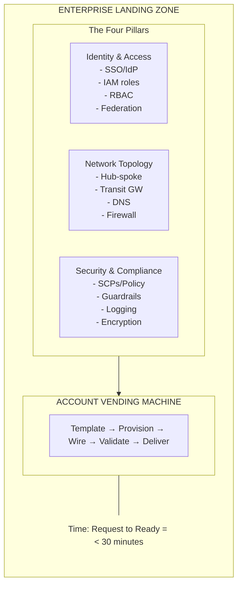
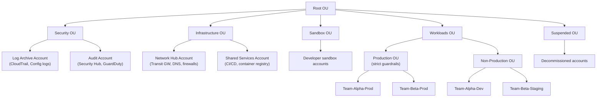
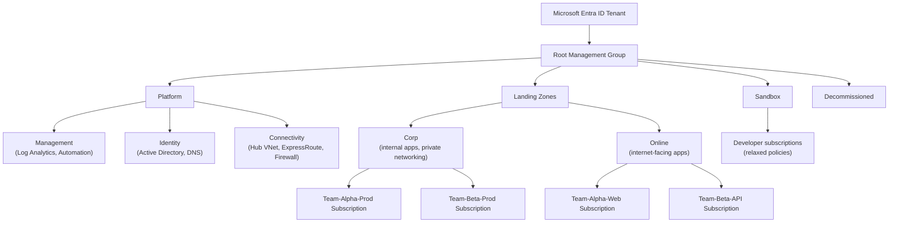
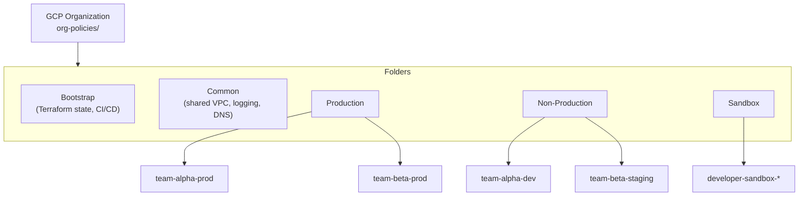
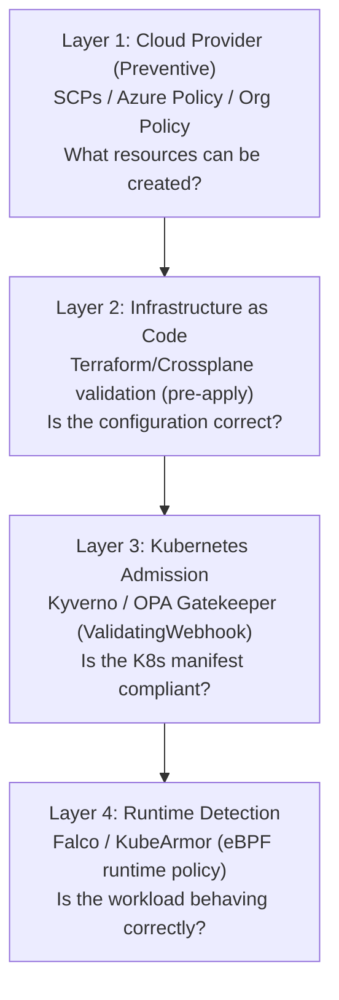
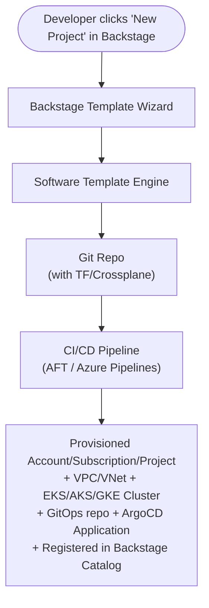
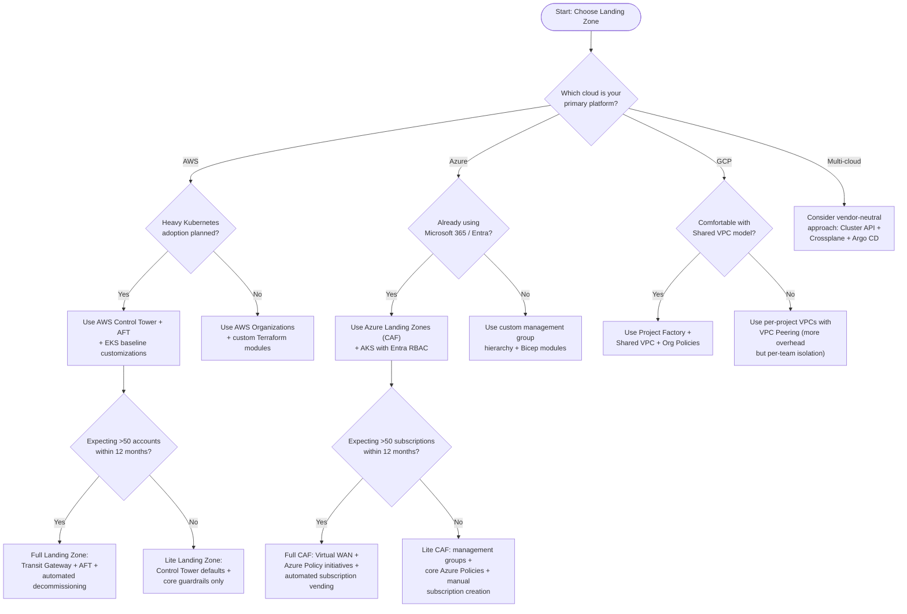
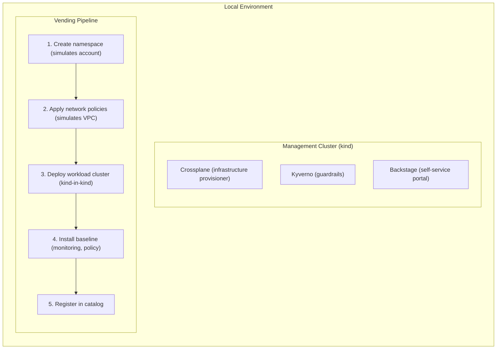

**Complexity**: `[COMPLEX]` | **Time to Complete**: ~3h | **Prerequisites**: Cloud Essentials across AWS, Azure, and GCP; Kubernetes basics; cloud architecture patterns.

## What You'll Be Able to Do

- **Design enterprise landing zones using AWS Control Tower, Azure Landing Zones, and GCP Organization Hierarchy**
- **Implement automated account vending machines that provision cloud accounts and Kubernetes platforms quickly through automation**
- **Configure guardrails (SCPs, Azure Policy, Organization Policies) that enforce security baselines across all accounts**
- **Deploy landing zone customizations that integrate Kubernetes cluster bootstrapping with GitOps from day zero**

---

## Why This Module Matters

A common failure mode in large enterprises is that environment provisioning stays manual, a small central team becomes a bottleneck, and application teams wait weeks or months for new cloud environments.

When production environment delivery is slow, launch schedules slip and the business impact can be substantial. The problem is usually manual provisioning and inconsistent handoffs, not a lack of cloud features.

Enterprise Landing Zones solve this exact problem. They are the foundational architecture that defines how an organization uses cloud at scale -- the account structure, the networking topology, the security guardrails, the identity model, and the automation that provisions all of it in minutes instead of weeks. When Kubernetes enters the picture, Landing Zones become even more critical: every cluster needs networking, identity, logging, and policy from day zero. In this module, you will learn how AWS Control Tower, Azure Landing Zones, and GCP Organization Hierarchy work, how to automate account vending with Kubernetes bootstrap included, and how to wire it all together so a team can go from "I need a cluster" to "I have a production-ready cluster" through a fast, automated provisioning flow.

The cost argument for Landing Zones is equally compelling, though often overlooked during the initial build phase. A single manually-provisioned production account with misconfigured guardrails can easily accumulate substantial unintended cloud spend each month, not counting the engineering time lost to troubleshooting drift. Multiply that by 50 accounts and you are looking at a recurring operational drain measured in engineer-months. Landing Zones with automated vending convert that variable, error-prone spend into a predictable baseline where every account starts with the same cost-optimized defaults: right-sized logging retention, centralized egress through a shared inspection VPC rather than per-account NAT Gateways, and guardrails that prevent the accidental deployment of expensive instance types in development environments. The governance angle is equally critical. Every hour a compliance audit takes to collect evidence across inconsistently configured accounts is an hour not spent on product work. Landing Zones with automated guardrail enforcement -- preventive controls that block violations before they happen and detective controls that surface drift immediately -- transform a reactive, audit-driven compliance posture into a continuously enforced one. For organizations operating in regulated industries, the difference between a Landing Zone designed for compliance from day zero and one retrofitted after an audit finding can mean the difference between launching a product on schedule and delaying it by a quarter.

---

## The Landing Zone Mental Model

Before diving into specific cloud implementations, you need to understand what a Landing Zone actually is. Think of it as the building code for a city: before anyone constructs a building, the city has already defined zoning regulations, sewer and electrical grid connections, fire code, and the permit process. A Landing Zone does the same thing for cloud infrastructure, and every enterprise Landing Zone—regardless of cloud provider—addresses the same four pillars described below.

### The Four Pillars



**Identity and Access**: Who can do what, across every account, with centralized SSO and federated identity. This must extend from cloud IAM into Kubernetes RBAC seamlessly.

**Network Topology**: How accounts connect to each other, to on-premises data centers, and to the internet. Every Kubernetes cluster needs a network that is already wired into this topology from birth.

**Security and Compliance**: The guardrails that prevent teams from doing dangerous things (like opening port 22 to the internet) while enabling them to move fast on everything else. These guardrails must cover both cloud resources and Kubernetes configurations.

**Account Vending**: The automation that provisions new accounts (or subscriptions, or projects) with all three pillars pre-configured. This is the factory line that eliminates prolonged multi-week manual provisioning delays.

These four pillars are not independent. A network topology without adequate identity integration creates orphaned subnets that nobody can access securely. Security guardrails without automated vending means every new account inherits the guardrail policy inconsistently, creating exactly the drift the Landing Zone was meant to prevent. The pillars must be designed together, implemented together, and tested together -- which is why Landing Zone implementations are always opinionated frameworks rather than pick-and-choose toolkits.

---

## AWS Control Tower and Account Factory

AWS Control Tower is Amazon's opinionated Landing Zone solution. It builds on top of AWS Organizations, AWS SSO (now IAM Identity Center), AWS Config, and AWS CloudTrail to create a multi-account environment with pre-configured guardrails.

### Architecture Overview



**Pause and predict:** Your enterprise acquires an unassessed software startup. Which AWS Organizational Unit should host their accounts during initial onboarding, and why are Workloads, Sandbox, or Suspended unsuitable?

<details>
<summary>Check your prediction</summary>

Newly acquired, high-risk accounts must reside in a dedicated quarantine or exceptions Organizational Unit (OU) rather than Production Workloads, Sandbox, or Suspended. Placing unvetted accounts in the Workloads OU exposes shared production networks and transit paths to unknown vulnerabilities. Moving them to the Sandbox OU provides inadequate protection because sandbox environments intentionally relax security guardrails to foster developer experimentation. Similarly, the Suspended OU is intended exclusively for decommissioned accounts undergoing retirement and denies all active operational access. An isolated quarantine or transitional OU applies strict, restrictive Service Control Policies that cut off transit connectivity, block external egress, and enforce baseline auditing until security teams complete a formal architectural and compliance assessment.
</details>

The next section is how platform administrators initialize Control Tower governance and query active preventive controls using the AWS command-line interface.

### Setting Up Control Tower

```bash
# Control Tower is set up via the AWS Console, but you can manage it via CLI after setup
# List enrolled accounts
aws controltower list-enabled-controls \
  --target-identifier "arn:aws:organizations::123456789012:ou/o-abc123/ou-xyz789"

# Check guardrail status
aws controltower list-enabled-controls \
  --target-identifier "arn:aws:organizations::123456789012:ou/o-abc123/ou-xyz789" \
  --query 'enabledControls[*].{Control:controlIdentifier, Status:statusSummary.status}'
```

### The Three Guardrail Types

Control Tower organizes guardrails into three categories that work at different stages of the resource lifecycle. Understanding the distinction is critical because each type solves a different governance problem, and relying on only one -- typically preventive SCPs -- leaves dangerous gaps.

**Preventive guardrails** block non-compliant actions before they execute. They are implemented as Service Control Policies (SCPs) attached to Organizational Units, and they operate at the AWS API authorization layer. When a principal attempts an API call, AWS evaluates the SCPs on the caller's account path and denies the call if any SCP forbids it. Preventive guardrails are the strongest form of governance because they make violations impossible, but they have a critical limitation: SCPs can only constrain actions that have corresponding IAM permissions. They cannot enforce configuration details like "every S3 bucket must have versioning enabled" because versioning is a resource property, not an IAM action. The SCP shown later in this module -- denying public EKS endpoints -- is a textbook preventive guardrail because `eks:endpointPublicAccess` is a condition key on the `eks:CreateCluster` API call itself.

**Detective guardrails** identify non-compliance after resources exist. They are implemented as AWS Config rules that evaluate resource configurations against desired states and flag violations. For example, a Config rule can detect an S3 bucket with public read access and surface it in the Control Tower dashboard even though no preventive SCP blocked it. Detective guardrails do not stop violations from happening -- they ensure you find out about them quickly. Organizations that deploy only preventive guardrails often discover months later that dozens of development accounts have drifted because Config rules were never enabled. Detective guardrails are also essential for compliance audits because they produce the evidence trail auditors need.

**Proactive guardrails** validate configurations before resource creation, but unlike preventive SCPs, they operate at the Infrastructure-as-Code level rather than the IAM layer. They are implemented as CloudFormation Hooks that run during stack operations and can reject a template that would create a non-compliant resource. Proactive guardrails are particularly powerful for Kubernetes-centric organizations because you can hook into the Terraform or CloudFormation pipeline that provisions EKS clusters and reject a configuration that, for example, specifies an unsupported Kubernetes version or a public endpoint before the API call ever reaches AWS. The limitation is that proactive guardrails only work for resources deployed through CloudFormation -- resources created through the Console or CLI bypass them entirely, which is why you still need preventive and detective guardrails as backstops.

### Account Factory for Terraform (AFT)

The real power comes from [Account Factory for Terraform (AFT), which turns account vending into a GitOps workflow](https://docs.aws.amazon.com/controltower/latest/userguide/taf-account-provisioning.html). You define an account in a Terraform file, push to a repo, and AFT provisions the account with all Landing Zone configurations.

```hcl
# account-requests/team-alpha-production.tf
module "team_alpha_prod" {
  source = "./modules/aft-account-request"

  control_tower_parameters = {
    AccountEmail              = "team-alpha-prod@company.com"
    AccountName               = "Team-Alpha-Production"
    ManagedOrganizationalUnit = "Workloads/Production"
    SSOUserEmail              = "team-alpha-lead@company.com"
    SSOUserFirstName          = "Platform"
    SSOUserLastName           = "Team"
  }

  account_tags = {
    team        = "alpha"
    environment = "production"
    cost-center = "CC-4521"
    data-class  = "confidential"
  }

  # Custom fields that trigger account customizations
  account_customizations_name = "k8s-production-baseline"

  change_management_parameters = {
    change_requested_by = "platform-team"
    change_reason       = "New production workload account for Team Alpha"
  }
}
```

The AFT pipeline operates in distinct stages that provide an auditable, repeatable workflow. When a new account request Terraform file lands on the main branch, AFT first validates the request against schema constraints and checks for naming conflicts with existing accounts. Next, it provisions the account through AWS Organizations and moves it into the target OU, which immediately applies the SCPs attached to that OU hierarchy. After the account exists, AFT runs the global customizations pipeline -- a set of Terraform modules that apply organization-wide baselines like VPC Flow Logs, CloudTrail configuration, and mandatory encryption settings. Finally, AFT executes the account-specific customizations referenced in the `account_customizations_name` field, such as the Kubernetes baseline shown below. Each stage produces a log entry, and if any stage fails, the account is flagged for remediation rather than left in a partially-provisioned state. This staged pipeline architecture is the key difference between AFT and a simple `terraform apply`: AFT bakes in the governance workflow alongside the infrastructure, so the audit trail is automatically generated as a byproduct of provisioning.

### Kubernetes Bootstrap in Account Vending

The critical extension for Kubernetes-centric organizations is wiring cluster provisioning into the account vending pipeline. When an account is created, the customization pipeline can automatically:

1. Create a VPC with the standard CIDR from the IPAM pool
2. Attach the VPC to the Transit Gateway
3. Provision an EKS cluster with the organization's baseline configuration
4. Install mandatory add-ons (logging, monitoring, policy enforcement)
5. Configure Access Entries for the team's IAM roles
6. Register the cluster with the central Backstage catalog

```bash
#!/bin/bash
# AFT account customization script: k8s-production-baseline
# This runs automatically after account creation

ACCOUNT_ID=$(aws sts get-caller-identity --query Account --output text)
REGION="us-east-1"

# Step 1: Create VPC from IPAM pool
VPC_CIDR=$(aws ec2 allocate-ipam-pool-cidr \
  --ipam-pool-id ipam-pool-0abc123 \
  --netmask-length 20 \
  --query 'IpamPoolAllocation.Cidr' --output text)

# Step 2: Deploy baseline infrastructure via Terraform
cd /opt/aft/customizations/k8s-baseline
terraform init
terraform apply -auto-approve \
  -var="account_id=${ACCOUNT_ID}" \
  -var="vpc_cidr=${VPC_CIDR}" \
  -var="cluster_name=eks-${ACCOUNT_ID}-prod" \
  -var="cluster_version=1.35"

# Step 3: Register cluster in Backstage catalog
CLUSTER_ENDPOINT=$(aws eks describe-cluster \
  --name "eks-${ACCOUNT_ID}-prod" \
  --query 'cluster.endpoint' --output text)

curl -X POST "https://backstage.internal.company.com/api/catalog/entities" \
  -H "Content-Type: application/json" \
  -d "{
    \"apiVersion\": \"backstage.io/v1alpha1\",
    \"kind\": \"Resource\",
    \"metadata\": {
      \"name\": \"eks-${ACCOUNT_ID}-prod\",
      \"annotations\": {
        \"kubernetes.io/cluster-name\": \"eks-${ACCOUNT_ID}-prod\"
      }
    },
    \"spec\": {
      \"type\": \"kubernetes-cluster\",
      \"owner\": \"team-alpha\",
      \"lifecycle\": \"production\"
    }
  }"

echo "Account ${ACCOUNT_ID} fully provisioned with EKS cluster"
```

---

## Azure Landing Zones and Subscription Vending

Azure takes a similar but structurally different approach. Instead of accounts, [Azure uses Subscriptions organized under Management Groups](https://learn.microsoft.com/en-us/azure/governance/management-groups/overview). Azure Landing Zones provide a reference architecture for organizing Azure environments at scale.

### Azure Landing Zone Architecture



The management-group hierarchy deserves deeper attention because it is the control plane for Azure governance. The root management group sits at the tenant level and every subscription is a child of exactly one management group. Azure Policy assignments and Azure RBAC role assignments applied at a management group inherit downward to all child management groups and subscriptions -- this inheritance model is what makes Landing Zones enforceable at scale. The Platform management group hosts shared infrastructure subscriptions that every workload depends on: a connectivity subscription containing the hub virtual network with ExpressRoute circuits, Azure Firewall, and VPN gateways; an identity subscription running domain controllers and DNS private zones; and a management subscription hosting Log Analytics workspaces, Azure Automation accounts, and the centralized monitoring and alerting stack. The Landing Zones management group branches into Corp (internal, private-networking applications) and Online (internet-facing applications) because the network egress patterns and security postures differ: Corp subscriptions typically route all traffic through the centralized firewall in the connectivity hub, while Online subscriptions may need direct internet egress through Azure Front Door or Application Gateway. The Sandbox management group typically has relaxed Azure Policy assignments -- no mandatory private endpoints, no forced firewall routing -- to allow rapid experimentation without the friction of production-grade guardrails. The Decommissioned management group holds subscriptions that are pending deletion, with a policy that denies all write operations to prevent accidental resource recreation during the 30-day retention period before permanent deletion.

### Subscription Vending with Bicep

```bicep
// subscription-vending/main.bicep
targetScope = 'managementGroup'

@description('Name of the workload team')
param teamName string

@description('Environment: dev, staging, production')
param environment string

@description('Whether to provision an AKS cluster')
param provisionAKS bool = true

// Create the subscription
module subscription 'modules/subscription.bicep' = {
  name: 'sub-${teamName}-${environment}'
  params: {
    subscriptionName: 'sub-${teamName}-${environment}'
    managementGroupId: environment == 'production' ? 'mg-landing-zones-corp' : 'mg-landing-zones-sandbox'
    billingScope: '/providers/Microsoft.Billing/billingAccounts/1234/enrollmentAccounts/5678'
    tags: {
      team: teamName
      environment: environment
      costCenter: 'CC-${teamName}'
    }
  }
}

// Deploy networking into the new subscription
module networking 'modules/spoke-vnet.bicep' = {
  name: 'net-${teamName}-${environment}'
  scope: subscription
  params: {
    vnetName: 'vnet-${teamName}-${environment}'
    vnetAddressSpace: '10.${uniqueOctet}.0.0/16'
    hubVnetId: '/subscriptions/hub-sub-id/resourceGroups/rg-hub/providers/Microsoft.Network/virtualNetworks/vnet-hub'
    firewallPrivateIp: '10.0.1.4'
  }
}

// Deploy AKS if requested
module aks 'modules/aks-baseline.bicep' = if (provisionAKS) {
  name: 'aks-${teamName}-${environment}'
  scope: subscription
  params: {
    clusterName: 'aks-${teamName}-${environment}'
    kubernetesVersion: '1.35'
    subnetId: networking.outputs.aksSubnetId
    aadAdminGroupId: '${teamName}-k8s-admins'  // Microsoft Entra ID group
    enableDefender: environment == 'production'
    enablePolicyAddon: true
  }
}
```

A critical architectural decision in Azure subscription vending is whether to place all subscriptions for a team under the same management group or to split them based on environment classification. Placing all team subscriptions together -- dev, staging, and production under a single team management group -- simplifies RBAC administration because you assign the team's identity at the team management group level and it inherits to all environments. The downside is that Azure Policy assignments at that group level apply uniformly: if you require private endpoints for production, development subscriptions inherit the same constraint and developers may find themselves unable to spin up quick test resources. The Cloud Adoption Framework recommends splitting by environment at the management group level (platform/corp/online for production, sandbox for everything else) and using Azure Policy exemptions scoped to specific subscriptions when a team needs a specific relaxation. The Bicep template above follows this model: production subscriptions land under the corp management group with full guardrails, and non-production subscriptions land under sandbox with relaxed policies.

### Identity Integration: Microsoft Entra ID to AKS

Azure's biggest advantage for enterprises already using Microsoft is [the seamless identity chain from Microsoft Entra ID through to Kubernetes RBAC](https://learn.microsoft.com/en-us/azure/aks/azure-ad-rbac):

```bash
# Microsoft Entra ID group → AKS RBAC (no aws-auth equivalent needed)
# The AKS cluster natively understands Microsoft Entra ID tokens

# Create a Microsoft Entra ID group for cluster admins
az ad group create --display-name "aks-team-alpha-admins" \
  --mail-nickname "aks-team-alpha-admins"

# Assign the group as AKS cluster admin
az role assignment create \
  --assignee-object-id $(az ad group show -g "aks-team-alpha-admins" --query id -o tsv) \
  --role "Azure Kubernetes Service Cluster Admin Role" \
  --scope "/subscriptions/$SUB_ID/resourceGroups/rg-alpha/providers/Microsoft.ContainerService/managedClusters/aks-alpha-prod"

# Developers get namespace-scoped access
az role assignment create \
  --assignee-object-id $(az ad group show -g "aks-team-alpha-devs" --query id -o tsv) \
  --role "Azure Kubernetes Service Cluster User Role" \
  --scope "/subscriptions/$SUB_ID/resourceGroups/rg-alpha/providers/Microsoft.ContainerService/managedClusters/aks-alpha-prod"
```

> **Stop and think**: Look at the Azure identity integration. If an engineer transfers from Team Alpha to Team Beta, how many Kubernetes role bindings need to be updated to revoke their old access and grant their new access?

---

## GCP Organization Hierarchy and Project Factory

[Google Cloud organizes resources under an Organization, with Folders providing the hierarchy and Projects serving as the account boundary](https://docs.cloud.google.com/resource-manager/docs/cloud-platform-resource-hierarchy). Google's Cloud Foundation Toolkit provides a [Project Factory module that automates project vending](https://github.com/terraform-google-modules/terraform-google-project-factory) with shared VPC attachment, API activation, and labels baked into the template so new projects land in the right folder with guardrails already applied.

### GCP Landing Zone Structure



The GCP Organization Policy Service is the counterpart to AWS SCPs and Azure Policy, but it operates on a fundamentally different model that is worth understanding deeply. Unlike SCPs, which deny at the IAM authorization boundary, Organization Policies are constraints evaluated by each GCP service independently at resource creation or update time. A constraint like `constraints/compute.restrictProtocolForwardingCreation` is enforced by the Compute Engine API itself, not by a centralized policy evaluation engine. This distributed enforcement model has practical consequences: Organization Policies apply to resources created through any mechanism -- Console, gcloud CLI, Terraform, or direct API calls -- because the resource's own service API checks the constraint at creation time. There is no equivalent of the CloudFormation Hook limitation in AWS. GCP provides two constraint types. Boolean constraints are simple on/off switches -- for example, `constraints/compute.disableSerialPortAccess` is either enforced or not, with no parameters. List constraints allow or deny specific values from a set -- `constraints/gcp.resourceLocations` accepts an `allowedValues` list of region names, and any resource creation outside those regions is rejected. Custom constraints let organizations define their own policies using Common Expression Language (CEL) against resource properties, enabling rules like "Cloud Storage buckets must have uniform bucket-level access enabled" that are specific to the organization's compliance requirements. The combination of built-in boolean constraints, list constraints, and custom CEL constraints gives GCP a uniquely flexible governance surface that covers both simple on/off decisions and deeply parameterized validation rules.

### Project Factory with Terraform

The following Terraform pattern shows how Project Factory and a private GKE cluster module compose in one vending workflow:

```hcl
# project-factory/team-alpha-prod.tf
module "team_alpha_prod" {
  source  = "terraform-google-modules/project-factory/google"
  version = "~> 15.0"

  name                    = "team-alpha-prod"
  org_id                  = "123456789"
  folder_id               = google_folder.production.id
  billing_account         = "AABBCC-112233-DDEEFF"
  default_service_account = "disable"

  activate_apis = [
    "container.googleapis.com",
    "compute.googleapis.com",
    "monitoring.googleapis.com",
    "logging.googleapis.com",
    "dns.googleapis.com",
  ]

  shared_vpc         = "vpc-host-project"
  shared_vpc_subnets = [
    "projects/vpc-host-project/regions/us-central1/subnetworks/team-alpha-prod-nodes",
    "projects/vpc-host-project/regions/us-central1/subnetworks/team-alpha-prod-pods",
    "projects/vpc-host-project/regions/us-central1/subnetworks/team-alpha-prod-services",
  ]

  labels = {
    team        = "alpha"
    environment = "production"
    cost_center = "cc_4521"
  }
}

# GKE cluster in the vended project
module "gke_alpha_prod" {
  source  = "terraform-google-modules/kubernetes-engine/google//modules/private-cluster"
  version = "~> 33.0"

  project_id        = module.team_alpha_prod.project_id
  name              = "gke-alpha-prod"
  region            = "us-central1"
  network           = "vpc-host-network"
  subnetwork        = "team-alpha-prod-nodes"
  ip_range_pods     = "team-alpha-prod-pods"
  ip_range_services = "team-alpha-prod-services"

  enable_private_nodes    = true
  enable_private_endpoint = false
  master_ipv4_cidr_block  = "172.16.0.0/28"

  release_channel = "REGULAR"

  node_pools = [
    {
      name         = "general"
      machine_type = "e2-standard-4"
      min_count    = 2
      max_count    = 10
      auto_upgrade = true
    }
  ]
}
```

The Shared VPC pattern used here is one of GCP's most powerful enterprise features and deserves careful study. In a Shared VPC architecture, a host project owns the VPC networks and subnets, and service projects (the workload projects created by Project Factory) attach to those subnets as consumers. The service project's GKE cluster gets its node IPs, pod IPs, and service IPs from subnets in the host project, which means the network security team manages firewall rules, Cloud NAT, and VPC Flow Logs in one place and every workload project inherits those controls automatically. This model sharply reduces the per-project networking overhead that plagues AWS multi-account architectures where every account must manage its own VPC, route tables, and NAT Gateways. The tradeoff is that Shared VPC introduces a dependency between the service project and the host project: if the host project's subnet runs out of IP space, every service project attached to that subnet is blocked from scaling until the subnet is expanded or a new one is provisioned. This is why the IP allocation strategy -- node subnets sized for the maximum expected node count plus headroom, pod subnets large enough for the maximum pods-per-node configuration, and service subnets with room for the service cluster IP range -- must be designed before the first project is vended.

---

## Guardrails: Preventive and Detective Controls

Landing Zones without guardrails are just organized chaos. In this module, we will focus on two broad guardrail categories: **preventive** controls that block risky actions and **detective** controls that identify policy drift or noncompliance after the fact.

### Preventive Guardrails Across Clouds

| Guardrail | AWS (SCP) | Azure (Policy) | GCP (Org Policy) |
| :--- | :--- | :--- | :--- |
| Deny public S3/Storage buckets | SCP on OU | `Deny` effect policy | `constraints/storage.publicAccessPrevention` |
| Require encryption at rest | Use organization-level controls that explicitly enforce approved encryption settings | Use Azure Policy effects that audit or remediate encryption settings based on policy design | Use organization policies or service-specific controls that explicitly govern encryption settings where supported |
| Restrict regions | SCP deny non-approved regions | `AllowedLocations` | `constraints/gcp.resourceLocations` |
| Limit high-risk privilege escalation paths | Restrict privileged IAM actions with narrowly scoped exceptions | Use policy definitions that block or tightly govern elevated permissions | Use organization policies and IAM controls that reduce risky credential and privilege patterns |
| Require tags/labels | SCP deny untagged resources | `Require tag` initiative | Custom org policy |
| Block public Kubernetes API | SCP deny public EKS endpoint | `Deny public AKS` | Custom org policy (CEL on `container.googleapis.com/Cluster`, e.g. require `privateClusterConfig.enablePrivateNodes`; or `constraints/compute.restrictPublicIp` for node IPs) |

The guardrail implementation differences across clouds are not just syntactic -- they reflect fundamentally different governance philosophies that shape how your Landing Zone operates day to day. AWS SCPs operate at the IAM authorization boundary, which means they are fast to evaluate and cannot be bypassed by any API mechanism, but they are inherently limited to actions that correspond to IAM permissions. Azure Policy evaluates at the resource provider level after API authorization succeeds, which allows it to enforce configuration properties (like requiring HTTPS-only on storage accounts) that SCPs cannot reach, but this post-authorization evaluation introduces a brief window where a non-compliant resource could be created before policy evaluation completes -- mitigated by the `EnforceRegoPolicy` deny effect in most scenarios. GCP Organization Policies are evaluated by each service's own API at resource creation time, which distributes the enforcement but also distributes the failure modes: a misconfigured constraint on the Compute Engine API has no effect on Cloud Storage, and vice versa. The practical implication for Landing Zone design is that no single cloud's guardrail mechanism is sufficient alone -- you need the layered approach described in the next section, with cloud guardrails forming the outer perimeter and in-cluster policy engines providing defense in depth inside each Kubernetes cluster.

**Pause and predict:** Security engineers draft an AWS Service Control Policy. Can this policy deny the creation of S3 buckets lacking object versioning, and what boundary separates SCPs from resource configuration governance?

<details>
<summary>Check your prediction</summary>

An SCP cannot enforce a resource-state property such as S3 bucket versioning at API creation time. Service Control Policies act as coarse guardrail filters that cap the maximum available IAM actions for principals within member accounts, but they never grant permissions, never evaluate resource-level state configurations, and do not apply to the management account or rewrite existing resource-based policies. Because bucket versioning is a configuration state set after bucket creation rather than an IAM request condition on the `s3:CreateBucket` call, an SCP cannot inspect or mandate it. Enforcing bucket versioning requires detective evaluation via AWS Config rules, proactive validation in Infrastructure-as-Code pipelines, or policy engines like Azure Policy and GCP Organization Policies that evaluate resource configuration properties directly.
</details>

The next section is how a concrete Service Control Policy defines condition keys to restrict public Kubernetes API endpoints across child organizational units.

### Example: AWS SCP for Kubernetes Guardrails

```json
{
  "Version": "2012-10-17",
  "Statement": [
    {
      "Sid": "DenyPublicEKSEndpoint",
      "Effect": "Deny",
      "Action": [
        "eks:CreateCluster",
        "eks:UpdateClusterConfig"
      ],
      "Resource": "*",
      "Condition": {
        "ForAnyValue:StringEquals": {
          "eks:endpointPublicAccess": "true"
        }
      }
    },
    {
      "Sid": "DenyEKSWithoutLogging",
      "Effect": "Deny",
      "Action": "eks:CreateCluster",
      "Resource": "*",
      "Condition": {
        "Null": {
          "eks:logging": "true"
        }
      }
    },
    {
      "Sid": "RequireEKSEncryption",
      "Effect": "Deny",
      "Action": "eks:CreateCluster",
      "Resource": "*",
      "Condition": {
        "Null": {
          "eks:encryptionConfig": "true"
        }
      }
    }
  ]
}
```

### Connecting Cloud Guardrails to Kubernetes Policy

The key insight that most organizations miss is that cloud guardrails and Kubernetes policy engines must work together as a unified system. Cloud guardrails can restrict some cluster-level settings, but you still need in-cluster policy to govern Kubernetes objects such as Services, Ingresses, and workloads. For that, you need an in-cluster policy engine.



This four-layer model is not theoretical -- it resolves the real operational tension between central governance and team autonomy. Layer 1 ensures that no team can create a cluster with a public endpoint or an unencrypted control plane, regardless of what their Terraform code says. Layer 2 catches misconfigurations in the Infrastructure-as-Code stage before they become running resources, shortening the feedback loop from minutes to seconds. Layer 3 enforces Kubernetes-native constraints like "containers must not run as root" and "all images must come from the internal registry" regardless of whether the cluster was provisioned by Terraform or created manually in a sandbox. Layer 4 provides the final backstop: if a workload is compromised and attempts unexpected behavior -- opening a reverse shell, modifying a system binary, reading a sensitive file -- eBPF-based runtime detection catches it in real time, producing an alert even when every preceding layer was bypassed. The Landing Zone's job is to bootstrap Layers 1 and 2 automatically for every new account, and to ensure that Layers 3 and 4 are installed as part of the cluster baseline so no production cluster ever starts without them.

---

## Network Topology: Hub-and-Spoke Patterns Across Clouds

Every Landing Zone must define how accounts connect to each other and to on-premises networks. The dominant pattern across all three clouds is hub-and-spoke, but the implementation details differ enough that choosing the wrong variant for your scale can cause cascading operational problems.

### The Hub-and-Spoke Model

In a hub-and-spoke topology, a central hub network handles all cross-account and external connectivity. Spoke accounts connect to the hub and route traffic through it, but spokes never connect directly to each other. This model centralizes network security inspection, egress control, and DNS resolution in one place, which simplifies operations at the cost of introducing a single point of architectural dependency.

**AWS Transit Gateway** is the hub-and-spoke implementation on AWS. A Transit Gateway in the network hub account acts as a cloud router: every spoke VPC attaches to it, and the Transit Gateway route tables determine which spokes can talk to each other. In a typical Landing Zone, the production OU spokes can route to the shared services hub (for CI/CD, container registry access) and to on-premises via the VPN or Direct Connect attachment, but production spokes cannot route to sandbox OU spokes, enforcing blast-radius isolation at the network layer. Transit Gateway scales to thousands of VPC attachments -- with AWS documenting scaling up to 5,000 VPC attachments per gateway under standard published limits -- but the cost scales linearly. You pay per attachment per hour plus per GB of data processed. A 200-account Landing Zone with two VPCs per account creates 400 attachments, and recurring transit charges can become a major monthly line item before data transfer fees. The cost optimization lever is route table design: default all spoke-to-spoke traffic to blackhole unless a specific route table entry allows it, which also improves security by making east-west traffic opt-in rather than opt-out.

**Azure Virtual WAN** provides the Microsoft-managed hub-and-spoke for Azure Landing Zones. Unlike AWS Transit Gateway, which you configure route tables explicitly, Virtual WAN automates branch-to-branch and spoke-to-spoke connectivity through a Microsoft-managed route propagation model. Spoke VNets connected to a Virtual WAN hub automatically learn routes for all other connected spokes, which simplifies operations but removes the explicit isolation that Transit Gateway route tables provide. For Landing Zones, this means you must use Azure Firewall in the hub to enforce network segmentation policies that Transit Gateway would handle at the route table level. Azure Virtual WAN hubs are regional -- a hub in East US does not automatically route traffic to a hub in West Europe, so multi-region Landing Zones require a hub in each region with inter-hub connectivity configured explicitly. The cost model differs from AWS and separates hub-router capacity from gateway capacity. The virtual hub router scales via Routing Infrastructure Units (RIUs) that you set at hub creation or edit time; Microsoft documents aggregate VNet-to-VNet routing throughput up to about 50 Gbps at maximum RIUs (verify current limits on [learn.microsoft.com](https://learn.microsoft.com/en-us/azure/virtual-wan/hub-settings)). Site-to-site VPN, ExpressRoute, and point-to-site gateways in the same hub scale independently via gateway scale units (~500 Mbps per VPN scale unit, with aggregate VPN throughput up to about 20 Gbps per hub per the Virtual WAN FAQ -- verify current numbers). Virtual WAN billing also includes hub and connection components distinct from per-VNet attachment models on AWS Transit Gateway, so large spoke counts can be more predictable but less granular than TGW per-attachment pricing.

**Pause and predict:** A platform team deploys an Azure Virtual WAN hub to connect spokes. Can default route propagation isolate spoke workloads from one another like an AWS Transit Gateway blackhole route?

<details>
<summary>Check your prediction</summary>

You cannot rely on default Virtual WAN behavior for spoke isolation. In standard Azure Virtual WAN, the central virtual hub router enables any-to-any VNet-to-VNet transit by default, allowing all connected spoke networks to communicate freely across the hub without manual route entries. Unlike AWS Transit Gateway, where unconfigured routes act as implicit blackholes that isolate spokes by default, Azure Virtual WAN requires explicit security controls to restrict lateral traffic. To achieve tenant isolation, platform teams must deploy an Azure Firewall within the virtual hub, configure routing intent policies to steer spoke-to-spoke traffic through firewall inspection, or associate spokes with custom virtual hub route tables that omit routes to neighboring workloads.
</details>

The next section is how Google Cloud avoids transit gateways altogether by attaching multiple service projects directly into a centralized host network.

**GCP Shared VPC** takes a fundamentally different approach: instead of a hub-and-spoke network of separate VPCs connected through a transit device, a single host VPC contains all subnets and service projects attach to those subnets as consumers. There is no Transit Gateway or Virtual WAN in the traditional sense because all traffic within the same VPC routes natively without an intermediary. Cross-region traffic between Shared VPC subnets in different regions stays within Google's backbone, and firewall rules are managed centrally in the host project. The operational simplicity of Shared VPC is unmatched -- there are no per-spoke route tables to manage and no per-attachment billing to monitor -- but the blast radius is larger: a misconfigured firewall rule in the host project affects every service project attached to that host VPC simultaneously. This is why large enterprises often split Shared VPCs by environment (production host project, non-production host project) rather than putting everything in one host VPC.

### Choosing Your Network Model

The choice between hub-and-spoke implementations is not primarily about feature checklists. It is about your organization's operational maturity. AWS Transit Gateway's explicit route tables reward organizations that invest in network automation. You can script route propagation based on OU membership and cost-center tags, creating a self-service network model where teams request connectivity through a PR that a Terraform pipeline validates and applies. Azure Virtual WAN's automated route propagation rewards organizations that prefer managed infrastructure and are willing to invest in Azure Firewall policy to achieve equivalent segmentation. GCP Shared VPC rewards organizations that want the simplest possible networking model and can accept the tradeoffs of coarser isolation boundaries. In all three cases, the Landing Zone must answer one question before any accounts are vended: what subnets should exist, and what routes should connect them? Changing the answer after 50 clusters are deployed is a multi-quarter migration project.

---

## Day-2 Operations: Drift Detection and Account Lifecycle

Provisioning a Landing Zone is a one-time project. Operating it over years is the real challenge. The operational patterns that keep a Landing Zone healthy as the organization grows from 5 accounts to 500 are fundamentally different from the patterns used to build it initially.

### Drift Detection

Configuration drift -- the slow accumulation of differences between the Landing Zone baseline and the actual state of individual accounts -- is the most common cause of Landing Zone failures at scale. A team manually opens a security group rule to debug a connectivity issue and forgets to close it. An autoscaling group is resized through the Console during an incident and the Terraform state diverges. A new cloud service is adopted by one team with its own IAM role that violates the principle of least privilege. Each individual drift event is small, but at 100 accounts, the cumulative effect is that no two accounts are actually configured the same way, defeating the entire purpose of the Landing Zone.

AWS Config rules deployed as part of Control Tower provide the detective layer for AWS drift detection. A Config rule like `vpc-sg-open-only-to-authorized-ports` continuously evaluates every security group in every enrolled account and surfaces non-compliant resources in the Control Tower dashboard. Azure Policy in audit mode -- deployed at the management group level and inherited by all subscriptions -- performs the same function for Azure resources, evaluating every resource against a library of built-in policy definitions and flagging drift in the regulatory compliance dashboard. GCP Security Command Center aggregates findings from Security Health Analytics, Event Threat Detection, and third-party integrations into a single pane that covers the entire organization hierarchy. The operational pattern is the same across all three clouds. Define the compliance baseline as code, let the cloud's detective mechanism evaluate continuously, and build a remediation workflow. Auto-remediate drift for low-risk items like mandatory resource tags. Route findings to the owning team's ticketing system for higher-risk items like publicly exposed storage.

### Account Lifecycle Management

Every vended account has a lifecycle: it is provisioned, it operates for months or years, and eventually it must be decommissioned. The Landing Zone must automate all three phases.

**Provision** is the phase this module has focused on: automated account creation with baseline infrastructure, guardrails, and cluster provisioning. Provisioning must produce an auditable artifact -- typically a Terraform state file committed to a versioned backend -- that reconstructs exactly what was created and how.

**Operate** is the longest phase and the one most organizations underinvest in. An operating account needs its baseline updated when the Landing Zone evolves: a new mandatory guardrail, a Kubernetes version upgrade enforced organization-wide, a new subnet added to the Shared VPC. The operating model for updates is identical to the vending model: changes to the baseline are proposed as pull requests to the Landing Zone repository, reviewed by the platform team, and rolled out through the same pipeline that created the accounts. The difference is that updates must respect running workloads -- you cannot destroy and recreate a production EKS cluster to apply a new security group rule. This means every baseline change must be designed for in-place application, tested on non-production accounts first, and rolled out progressively using a canary or blue-green deployment pattern across accounts.

**Decommission** is the phase most organizations neglect entirely. When a team disbands or a project ends, the account must transition from active to suspended to deleted. The Suspended OU (AWS), Decommissioned management group (Azure), or an archived folder (GCP) should have a policy that denies all resource creation and modification but preserves read access for a defined retention period -- typically 30 to 90 days -- so that forensic analysis is possible if a dependency is discovered after decommissioning begins. After the retention period, automated cleanup deletes all resources and finally the account itself. Without an automated decommissioning pipeline, zombie accounts accumulate: they continue to accrue costs for idle resources like unattached EBS volumes or unused static IPs, they remain in security scan scope, and they represent a growing audit surface that generates findings without any owner to remediate them. A mature Landing Zone treats decommissioning as a first-class workflow with the same rigor as provisioning.

---

## Backstage as the Enterprise Front Door

Backstage, [originally built by Spotify and now a CNCF incubating project](https://github.com/backstage/backstage), is one way to build an internal developer portal for platform teams. It serves as the self-service portal where teams request infrastructure without needing to understand the underlying automation.

### How Backstage Fits Into Account Vending



**Pause and predict:** A developer submits an automated cluster request through Backstage. Is the workflow complete once the cloud provider reports the Kubernetes API is Ready, and what steps remain before issuing credentials?

<details>
<summary>Check your prediction</summary>

A cluster request is not complete when the cloud provider API reports the control plane is Ready. At that initial stage, the cluster is merely raw, unconfigured compute. The automated provisioning pipeline must first vend or attach the dedicated account, connect spoke networking to the central hub, and deploy the base control plane. Once the API endpoint becomes responsive, the pipeline must configure enterprise identity federation, establish baseline GitOps controllers for continuous delivery, install mandatory telemetry and admission guardrails, and register the resource in the centralized Backstage software catalog. Only after all foundational platform integrations pass health validation should the automation safely generate and issue a kubeconfig or cluster access role to the requesting engineering team.
</details>

The next section is how a declarative Backstage software template collects developer inputs and dispatches parameters to underlying infrastructure automation pipelines.

### Backstage Software Template for K8s Environment

```yaml
# backstage-templates/new-k8s-environment.yaml
apiVersion: scaffolder.backstage.io/v1beta3
kind: Template
metadata:
  name: new-k8s-environment
  title: Request New Kubernetes Environment
  description: Provision a new cloud account with a production-ready K8s cluster
  tags:
    - kubernetes
    - infrastructure
spec:
  owner: platform-team
  type: environment

  parameters:
    - title: Team Information
      required:
        - teamName
        - costCenter
      properties:
        teamName:
          title: Team Name
          type: string
          pattern: '^[a-z][a-z0-9-]{2,20}$'
        costCenter:
          title: Cost Center
          type: string

    - title: Environment Configuration
      required:
        - environment
        - cloudProvider
        - region
      properties:
        environment:
          title: Environment
          type: string
          enum: ['development', 'staging', 'production']
        cloudProvider:
          title: Cloud Provider
          type: string
          enum: ['aws', 'azure', 'gcp']
        region:
          title: Region
          type: string
          enum: ['us-east-1', 'eu-west-1', 'ap-southeast-1']

    - title: Cluster Configuration
      properties:
        clusterSize:
          title: Cluster Size
          type: string
          enum: ['small', 'medium', 'large']
          default: 'medium'
          description: |
            small: 2-5 nodes, dev/test workloads
            medium: 3-20 nodes, production services
            large: 5-100 nodes, high-traffic production
        enableServiceMesh:
          title: Enable Istio Service Mesh
          type: boolean
          default: false
        enableGPU:
          title: Include GPU Node Pool
          type: boolean
          default: false

  steps:
    - id: generate-terraform
      name: Generate Infrastructure Code
      action: fetch:template
      input:
        url: ./skeleton
        values:
          teamName: ${{ parameters.teamName }}
          environment: ${{ parameters.environment }}
          cloudProvider: ${{ parameters.cloudProvider }}
          region: ${{ parameters.region }}
          clusterSize: ${{ parameters.clusterSize }}

    - id: create-repo
      name: Create Infrastructure Repository
      action: publish:github
      input:
        repoUrl: github.com?owner=company-infra&repo=env-${{ parameters.teamName }}-${{ parameters.environment }}
        defaultBranch: main

    - id: trigger-pipeline
      name: Trigger Provisioning Pipeline
      action: github:actions:dispatch
      input:
        repoUrl: github.com?owner=company-infra&repo=env-${{ parameters.teamName }}-${{ parameters.environment }}
        workflowId: provision.yml

    - id: register-catalog
      name: Register in Backstage Catalog
      action: catalog:register
      input:
        repoContentsUrl: ${{ steps['create-repo'].output.repoContentsUrl }}
        catalogInfoPath: /catalog-info.yaml

  output:
    links:
      - title: Infrastructure Repository
        url: ${{ steps['create-repo'].output.remoteUrl }}
      - title: Provisioning Pipeline
        url: ${{ steps['trigger-pipeline'].output.runUrl }}
```

*Hypothetical scenario: A platform team deploys Backstage with an account-vending template. Before the portal, teams averaged 6-8 weeks waiting for manually provisioned environments, each configured differently by the central operations team. After the portal goes live, the time drops to under 30 minutes because every cluster starts from the same pre-approved template and baseline. The key insight is not just speed — it is that automated vending eliminates the configuration drift that makes every manually-built environment a unique debugging challenge.*

---

## Patterns & Anti-Patterns

### Proven Patterns

**Pattern 1: Environment-Scoped Organizational Units.** Place production, staging, and development accounts in separate OUs (or management groups, or folders) with graduated guardrail strictness. Production OUs get full preventive SCPs, mandatory encryption, restricted region policies, and required private endpoints. Non-production OUs get the same detective guardrails but relaxed preventive controls -- for example, allowing public endpoints in development so engineers can iterate quickly. Sandbox OUs get only the minimum guardrails required for compliance (no open S3 buckets, no unencrypted volumes) and no preventive network restrictions. This graduated model balances security with developer velocity: the friction of guardrails scales with the blast radius of the environment. Teams that put all accounts in a single OU with uniform guardrails inevitably create shadow IT when developers circumvent restrictions they find unreasonable for non-production work.

**Pattern 2: GitOps-Driven Account Vending.** Every account request is a pull request to a dedicated repository containing Terraform or Bicep definitions. The PR triggers a plan-only pipeline run that shows exactly what resources will be created, including cost estimates derived from resource type and sizing. A designated approver -- typically the team lead or cost-center owner -- reviews the plan and merges the PR, which triggers the apply pipeline. This pattern gives you a complete audit trail of who requested what, who approved it, and exactly what was provisioned, mapped to a specific Git commit SHA. At 50+ accounts, this audit trail is the difference between a 2-hour compliance evidence collection exercise and a 2-week forensic scramble.

**Pattern 3: Progressive Rollout for Baseline Updates.** When the Landing Zone baseline changes -- a new guardrail, a Kubernetes version requirement, an updated VPC CIDR allocation scheme -- apply the change to a canary set of non-production accounts first, monitor for 24-48 hours of normal operation, then roll out to all non-production accounts, then to a canary production account, and finally to all production. The pipeline should report the deployment status per account and automatically halt if any account's update fails. This pattern prevents the "big bang" baseline update that simultaneously breaks every cluster in the organization, which is a real operational risk at scale because even a small Terraform provider version bump can change resource recreation behavior in unexpected ways.

### Anti-Patterns

| Anti-Pattern | Why Teams Fall Into It | Better Approach |
|:---|:---|:---|
| **Single account for everything** | Simplicity bias: "We only have 3 teams, multi-account is over-engineering." The organization grows to 30 teams, and now blast radius, IAM complexity, and quota exhaustion are daily operational issues. | Start with at least separate production and non-production accounts from day one. The overhead of a second account is near-zero with infrastructure as code, and adding it later requires a painful migration with downtime. |
| **Guardrails designed without developer input** | Security team defines guardrails in isolation based on compliance frameworks without consulting the teams who will work under those guardrails daily. | Co-design guardrails in a working session with security engineers and platform users. Start permissive and tighten based on actual incident data -- a guardrail that blocks 50% of legitimate developer workflows will be worked around, not complied with. |
| **No IPAM strategy before vending begins** | VPC CIDRs assigned ad-hoc: "We'll figure out addressing later." Later arrives when CIDR overlaps block peering and pod IP exhaustion takes down clusters. | Define a hierarchical IP addressing scheme before the first account is vended. Reserve large blocks for Kubernetes (at least /17 per cluster account to accommodate pod and service CIDRs alongside node subnets). Use cloud IPAM services (AWS IPAM, Azure IPAM) to automate allocation from a centrally managed pool. |
| **Manual baseline updates** | The Landing Zone is deployed once and then updates are applied manually, account by account, during maintenance windows. By the time the update reaches the 40th account, the first 10 accounts have already drifted. | Treat the Landing Zone as a product with a CI/CD pipeline. Every baseline change is a PR that the pipeline applies progressively across accounts, with automated drift detection running continuously to catch accounts that fell out of sync. |
| **No decommissioning workflow** | Accounts are forgotten after projects end. They continue to run idle resources, generate security findings, and consume quota -- costing thousands per month in aggregate without delivering any value. | Build a decommissioning pipeline with three stages: suspend (deny writes, preserve reads), retain (30-day hold for forensic access), and delete (automated resource cleanup and account closure). Run a monthly report of accounts with zero activity in the last 60 days and flag them for review. |
| **Mixing cloud-native and Kubernetes guardrails without a layered model** | Teams apply Kubernetes NetworkPolicies but leave cloud security groups wide open, or vice versa. Each layer assumes the other is handling security, creating gaps that neither layer closes. | Define explicit responsibility boundaries: cloud guardrails protect cloud resources (clusters, storage, IAM), Kubernetes admission policy protects in-cluster objects (pods, services, ingresses), and runtime detection catches anomalous behavior regardless of origin. Document which layer owns each control so there is no ambiguity. |

---

## Decision Framework: Choosing Your Landing Zone Implementation

The three cloud-native Landing Zone options -- AWS Control Tower, Azure Landing Zones, and GCP Organization with Project Factory -- are not interchangeable. Your choice depends on your organization's existing cloud commitments, operational maturity, and governance requirements. The decision matrix below maps the key tradeoffs.

| Factor | AWS Control Tower | Azure Landing Zones (CAF) | GCP Organization + Project Factory |
|:---|:---|:---|:---|
| **Setup complexity** | Medium -- Control Tower automates the initial Landing Zone creation but AFT requires Terraform expertise for account vending | Medium -- Bicep or Terraform modules available through the Cloud Adoption Framework reference implementations, but management group design requires upfront architecture decisions | Low to Medium -- Project Factory Terraform module is well-documented and Shared VPC simplifies networking, but Organization Policy Service requires understanding of constraint types |
| **Guardrail flexibility** | High -- SCPs for preventive, Config rules for detective, CloudFormation Hooks for proactive, covering all three stages of the resource lifecycle | High -- Azure Policy supports Deny, Audit, DeployIfNotExists, and Modify effects with parameterized initiatives that compose dozens of policies into a single assignment | High -- Boolean and list constraints cover common governance scenarios, and custom CEL constraints allow organization-specific rules, though the constraint authoring experience is more programmatic than Azure's GUI-based policy authoring |
| **Kubernetes integration maturity** | High -- Access Entries for IAM-to-RBAC mapping, EKS add-on management through the vending pipeline, VPC CNI integration with IPAM | Very High -- Native Entra ID to AKS RBAC without an intermediary ConfigMap, Azure Policy for AKS at the management group level, Defender for Containers integrated into the compliance dashboard | High -- Workload Identity Federation for service account to GCP IAM mapping, GKE Config Sync for policy, but fleet management requires GKE Fleets as a separate service |
| **Network model** | Hub-and-spoke via Transit Gateway with explicit route tables and per-attachment billing | Hub-and-spoke via Virtual WAN with automated route propagation and hub-scale-unit billing | Shared VPC with centralized subnets and Firewall rules in the host project -- simpler to operate but larger blast radius per host project |
| **Best for** | Organizations already on AWS with Terraform expertise and a need for granular network segmentation between accounts | Organizations on Microsoft 365/Entra ID that want the tightest Kubernetes-identity integration available and prefer managed hub-and-spoke networking | Organizations that value operational simplicity over granular segmentation and want the least per-account overhead of the three clouds |
| **Cost profile** | Per-account baseline: Control Tower has no additional charge -- you pay for the underlying services it orchestrates (CloudTrail organization trail, AWS Config recorder per account per region, Service Catalog for Account Factory). Transit Gateway: per attachment per hour + per GB processed. | Per-subscription baseline: Azure Policy evaluation (included at no additional cost for Azure commercial cloud) + Log Analytics ingestion costs (the primary variable at scale) + Microsoft Defender for Cloud per-resource pricing. No per-peering charge for VNet peering within the same region. | Per-project baseline: No organization-level management fee. Shared VPC eliminates per-project networking costs. The primary cost driver is log storage in Cloud Logging buckets and Security Command Center tier (Standard vs Premium). |

### Decision Flowchart



The flowchart captures the two critical decision points that determine your Landing Zone investment level: your primary cloud platform and your expected scale within the next year. Organizations building on a single cloud with fewer than 20 accounts can start with a lite Landing Zone -- the cloud-native defaults plus core guardrails -- and graduate to a full Landing Zone as account count grows. Organizations targeting multi-cloud from day one face a harder choice: either maintain separate Landing Zones per cloud (higher operational cost, deeper integration per cloud) or invest in a vendor-neutral abstraction layer via Cluster API and Crossplane (lower per-cloud overhead, shallower cloud feature integration). The vendor-neutral approach is covered in depth in Modules 10.5 (Fleet Management) and 10.6 (Cluster API) -- the Landing Zone decision here determines what those fleet management tools will manage.

---

## The Cost of Landing Zones at Enterprise Scale

Running a Landing Zone is not free, and the costs scale non-linearly with account count in ways that catch platform teams by surprise. A clear understanding of the cost model lets you design the Landing Zone to minimize the expensive dimensions.

**The per-account baseline** is the fixed cost every new account adds regardless of workload. On AWS, this includes the CloudTrail organization trail (one copy of every management event across all accounts, stored in a central S3 bucket) and AWS Config recorder evaluations (one evaluation per resource per rule per account). AWS Control Tower itself is provided at no additional charge; per-account baseline cost is driven by those underlying orchestration services (CloudTrail, Config, Service Catalog for Account Factory -- verify component pricing at [aws.amazon.com/controltower/pricing](https://aws.amazon.com/controltower/pricing/)). At 10 accounts the baseline is noise-level. At 200 accounts, CloudTrail alone can generate terabytes of log data monthly, and the S3 storage cost for the organization trail becomes a material line item. The optimization lever is log lifecycle management: transition CloudTrail logs to S3 Infrequent Access after 30 days and to Glacier after 90 days, and set aggressive retention policies on Config snapshots (you do not need 7 years of Config history for sandbox accounts).

**Cross-account egress** is the hidden cost that scales with account count squared. In a hub-and-spoke Transit Gateway topology, every byte flowing from a spoke VPC to the shared services hub (container images from the central registry, CI/CD artifacts, DNS queries) incurs Transit Gateway data processing charges. In a 100-account organization, the aggregate data processing charges can exceed the compute cost of the workloads themselves if the network topology is not designed for locality -- for example, routing all CI/CD traffic through a single-region hub when build agents are distributed globally. The optimization lever is regional hubs: deploy a Transit Gateway (or Virtual WAN hub, or Shared VPC host project) in each region where you have significant workload presence, and constrain spoke-to-hub traffic to stay within the region wherever possible.

**Idle fleet capacity** is the cost of over-provisioned management infrastructure. The shared services account often runs CI/CD runners, container registries, and monitoring infrastructure that must be sized for peak load. At small scale, over-provisioning is cheap. At enterprise scale, a monitoring stack sized for 500 clusters but currently serving 120 is burning money. The optimization lever is elastic scaling: use spot instances for CI/CD runners, scale monitoring components (Thanos receivers, Grafana instances) based on active time-series count rather than cluster count, and right-size the shared services fleet quarterly based on actual utilization data rather than projected growth.

**Governance drift and rework** is the cost that does not appear on a cloud bill but dominates total cost of ownership. Every hour an engineer spends manually remediating a non-compliant resource that a guardrail should have blocked is an hour of platform engineering capacity lost. At 200 accounts with weekly drift findings, even a 15-minute-per-finding remediation workflow consumes 50 engineering hours per month -- more than a full-time engineer. The optimization lever is automated remediation: detective guardrails should feed directly into remediation runbooks (AWS Systems Manager Automation documents, Azure Policy DeployIfNotExists effects, GCP Recommender auto-applied fixes) for low-risk configuration items like missing tags or disabled logging, so engineer time is reserved for drift events that require human judgment.

---

## Did You Know?

1. AWS Control Tower is built for governing large multi-account AWS environments, and AFT provides a Terraform-based workflow for automating account provisioning.

2. Azure landing zone guidance has evolved over time, and the current Cloud Adoption Framework approach is more opinionated about common platform decisions than earlier guidance, including pre-built policy initiatives for PCI-DSS, HIPAA, and ISO 27001 that map compliance controls directly to Azure Policy definitions.

3. The distinction between approval-heavy gates and automated guardrails is a useful way to think about cloud governance. Gates rely on human approval before proceeding, while guardrails encode policy in automation. In Kubernetes terms, automated policy enforcement acts like a guardrail, while manual manifest review acts like a gate. A mature Landing Zone aims for guardrails on the critical path and gates only on the business-decision path.

4. Backstage has a broad ecosystem around developer portals and software templates, which makes it a natural fit for self-service infrastructure patterns like account vending. The software template engine generates production-ready Terraform or Bicep code from a form, eliminating the "I know what I need but I don't know the exact resource definitions" gap that blocks developer self-service.

---

## Common Mistakes

| Mistake | Why It Happens | How to Fix It |
| :--- | :--- | :--- |
| **One giant account for everything** | Simplicity. "We only have 3 teams, we do not need multiple accounts." Then the organization grows to 30 teams. | Start with multi-account from day one. The overhead is minimal with automation, and retrofitting is extremely painful. |
| **Landing Zone without Kubernetes integration** | The Landing Zone team is a separate group from the Kubernetes platform team. They design the zone without considering K8s networking, identity, or policy needs. | Include Kubernetes architects in Landing Zone design. Every account template should include VPC sizing for pod CIDRs, IAM roles for cluster operations, and policy baseline for K8s. |
| **Manual account vending** | "We only create accounts once a quarter, automation is overkill." Then demand spikes and the queue grows to months. | Automate account vending from the start. Even if you provision one account per month, the automation ensures consistency and eliminates human error. |
| **Guardrails too restrictive** | Security team designs guardrails without developer input. Developers cannot deploy basic workloads. Shadow IT begins. | Co-design guardrails with developers. Start permissive and tighten based on actual incidents. Monitor guardrail denials to find legitimate use cases being blocked. |
| **No DNS strategy in the Landing Zone** | DNS is treated as an afterthought. Each account manages its own DNS, leading to naming conflicts and resolution failures across the hub-spoke network. | Design DNS delegation as part of the Landing Zone: a central Route53/Azure DNS/Cloud DNS zone with automatic subdomain delegation per account. |
| **Ignoring IPAM from the start** | VPC CIDR ranges assigned ad-hoc. Over time, overlapping CIDRs can block shared networking and leave too little address space for Kubernetes pods and services. | Use a centralized IPAM approach. Assign CIDRs from a pool that accounts for node IPs, pod IPs, and service IPs per cluster. Allocate at least a /17 per Kubernetes account to avoid IP exhaustion. |
| **Backstage template without validation** | Templates allow any input. Teams create clusters with names that violate DNS conventions or sizes that exceed their budget approval. | Add JSON Schema validation to Backstage templates. Implement approval workflows for production environments. Connect cost estimation to the template wizard. |
| **No Landing Zone lifecycle plan** | Landing Zone is deployed once and then rarely updated. Cloud providers release new capabilities, but the baseline never adopts them. Control Tower guardrails become stale as new services launch without corresponding SCP coverage. | Treat the Landing Zone as a product with a roadmap. Review provider changes regularly (quarterly at minimum) and test baseline updates before rollout. Automate drift detection so you know which accounts are out of compliance with the current baseline. Track a "baseline freshness" metric per account -- the delta between the account's applied configuration version and the current Landing Zone definition -- and set a target (e.g., 95% of accounts within 7 days of the latest baseline). |

---

## Quiz

<details>
<summary>Question 1: You are the lead architect for a retail company moving to Kubernetes. A colleague suggests saving time by creating a single AWS account containing one massive EKS cluster, and using Kubernetes namespaces to isolate the 15 different product teams. Why is this a dangerous architectural decision for an enterprise?</summary>

A single account creates an insurmountable blast radius problem and an IAM complexity nightmare. First, all teams share the same AWS service quotas (like EC2 instance limits, EBS volumes, and VPC IP addresses). One team's runaway autoscaling event can easily exhaust quotas, causing outages for all other teams sharing the account. Second, restricting AWS API access via IAM requires writing incredibly complex, error-prone resource-level conditions to ensure teams cannot modify each other's cloud resources outside the cluster. Finally, a security breach escaping one team's namespace or a compromised node could potentially expose the IAM credentials used by other teams, making the entire organization vulnerable to a single point of failure.
</details>

<details>
<summary>Question 2: Your security team discovers that several development clusters were accidentally provisioned with public API endpoints. They want to ensure this never happens again, but they also want to audit existing clusters. Which types of guardrails should you implement for each requirement, and how do they function differently?</summary>

To stop new public endpoints from being created, you must implement a preventive guardrail, such as an AWS Service Control Policy (SCP) or an Azure Policy with a Deny effect. Preventive guardrails actively intercept and block non-compliant API requests before the resource is ever provisioned, ensuring the problem cannot occur. To audit the existing clusters, you need a detective guardrail, such as AWS Config rules or Azure Policy in Audit mode. Detective guardrails scan already-provisioned resources, identify non-compliant configurations, and generate alerts without breaking existing workloads. Using both in tandem provides a comprehensive governance strategy.
</details>

<details>
<summary>Question 3: A new engineering team joins the company and urgently needs a staging environment. They log into the Backstage portal and submit a 'New Kubernetes Environment' request. Describe the exact automated sequence of events that translates this web form submission into a fully provisioned, registered Kubernetes cluster.</summary>

The process begins when Backstage takes the form inputs and uses its software template engine to generate infrastructure-as-code files tailored to the team's parameters. Next, Backstage creates a new Git repository and commits these generated files to it. The creation of this repository triggers a CI/CD pipeline (such as GitHub Actions or AFT) which acts as the vending machine. This pipeline executes the Terraform or Bicep code to provision the cloud account, establish the VPC network topology, deploy the Kubernetes cluster, and configure identity integrations. Finally, the pipeline concludes by making an API call back to Backstage to register the newly created cluster in the service catalog, completing the self-service loop.
</details>

<details>
<summary>Question 4: The networking team has assigned your new AWS account a /24 VPC CIDR block (256 IP addresses) because they assume you are only deploying a single EKS cluster with 10 worker nodes. Six weeks later, your cluster networking completely fails. What architectural reality of cloud-native Kubernetes did the networking team fail to account for?</summary>

The networking team failed to account for the fact that in cloud-native networking models like AWS VPC CNI, most Kubernetes pods are assigned a real, routable IP address directly from the VPC subnet. If a node runs 30 pods, that single node consumes 30+ IP addresses. A relatively small cluster of 10 nodes running standard microservices can easily consume 400 or more IP addresses, completely exhausting a /24 allocation. Enterprise landing zones must utilize centralized IP Address Management (IPAM) to assign large CIDR blocks (typically /16 or /17) to Kubernetes accounts to prevent this exact type of catastrophic IP exhaustion.
</details>

<details>
<summary>Question 5: You are designing the identity architecture for a multi-cloud landing zone spanning AWS and Azure. The security mandate requires that a user's corporate identity directly maps to their Kubernetes namespace permissions. Contrast how you will implement this identity propagation mechanism in AWS EKS versus Azure AKS.</summary>

In Azure AKS, the implementation is highly direct because AKS natively integrates with Microsoft Entra ID. You can directly reference Microsoft Entra ID group Object IDs inside your Kubernetes `RoleBinding` manifests, allowing AKS to natively validate Entra ID tokens passed by developers. In contrast, AWS EKS requires an intermediary translation layer to bridge AWS IAM and Kubernetes RBAC. You must configure EKS Access Entries (or the legacy aws-auth ConfigMap) to explicitly map an AWS IAM Role ARN to a Kubernetes username and group. Therefore, in Azure the identity flows seamlessly from tenant to cluster, whereas AWS requires your vending pipeline to explicitly build and maintain mapping configurations.
</details>

<details>
<summary>Question 6: The central IT department spent six months building a pristine GCP Landing Zone with strict organizational policies, centralized networking, and standardized service accounts. They hand it over to the Kubernetes platform team to deploy GKE. Within days, the platform team reports they are completely blocked. What is the most likely architectural cause of this failure?</summary>

The failure occurred because the Landing Zone was designed without accommodating the specific, complex infrastructure requirements of a Kubernetes control plane and its add-ons. Common blind spots include strict firewall policies that break webhook communication between the GKE control plane and worker nodes, or Shared VPC subnet allocations that are far too small for alias IP ranges required by pods. Furthermore, organization-level policies might inadvertently deny the creation of internal load balancers or restrict the service account permissions required by the cluster autoscaler to provision new nodes. To prevent this, enterprise landing zones must be co-designed with Kubernetes architects to ensure the foundation actually supports the intended workloads.
</details>

<details>
<summary>Question 7: A junior developer uses the Backstage portal to request a 100-node production Kubernetes cluster with expensive GPU instances, intended to process a massive new data pipeline. As the platform architect, how should you design the account vending workflow to handle this specific request safely while still maintaining automated self-service?</summary>

The workflow should process this request using an automated business approval gate rather than blocking it for a manual infrastructure code review. Because the Backstage template generates standardized, pre-approved infrastructure code with built-in guardrails, the technical correctness of the cluster is already guaranteed. However, because this request targets a production environment and incurs massive cost, the workflow should pause and automatically route an approval request to the team's cost center owner and the security lead. Once those stakeholders approve the business case and budget, the CI/CD pipeline should resume and automatically provision the cluster without any human engineer needing to touch the provisioning tools.
</details>

<details>
<summary>Question 8: Your organization has 80 AWS accounts provisioned through Control Tower. The security team publishes a new mandatory SCP that denies the creation of unencrypted EBS volumes, effective immediately for all accounts. Two weeks later, a developer reports that their Terraform pipeline has been failing for days because it tries to create a test volume without encryption. The SCP correctly blocks it, but the developer never received notice that the guardrail changed. What Landing Zone operational practice is missing, and how do you fix it?</summary>

The missing practice is a baseline update communication and progressive rollout workflow. When a new guardrail is added to the Landing Zone, the change should first be applied to non-production OUs with a notification sent to all team leads explaining what the guardrail does and what configuration changes are required to comply. After a defined notice period (typically 1-2 weeks), the guardrail should be applied to production OUs. During this notice period, detective guardrails (Config rules in audit mode) should run against all accounts to surface resources that would be blocked by the new preventive guardrail, giving teams a concrete list of what to fix before enforcement begins. The fix also requires a mechanism for guardrail versioning: each account should have a visible "guardrail profile version" label that developers can check to see which baseline is active, and a changelog published alongside each Landing Zone update that documents every guardrail change in plain language the application teams can understand.
</details>

---

## Hands-On Exercise: Build a Mini Landing Zone with Account Vending

In this exercise, you will simulate an enterprise Landing Zone using local tools on a kind management cluster. You will stand up Kyverno as a guardrail layer, write an account-vending script that provisions namespaces with baseline networking and RBAC, vend environments for two teams, prove that policies block non-compliant workloads, and generate a compliance audit across every vended namespace. The diagram below maps the management cluster components and the five-step vending pipeline you will implement end to end.



### Task 1: Create the Management Cluster

Start by creating a local kind cluster with a control plane and two workers so you have a realistic management plane that can host policy engines and later act as the anchor for simulated account vending.

<details>
<summary>Solution</summary>

```bash
# Create a kind cluster to act as the management cluster
cat <<'EOF' > /tmp/mgmt-cluster.yaml
kind: Cluster
apiVersion: kind.x-k8s.io/v1alpha4
name: landing-zone-mgmt
nodes:
  - role: control-plane
  - role: worker
  - role: worker
EOF

kind create cluster --config /tmp/mgmt-cluster.yaml

# Verify the cluster is running
kubectl get nodes
# NAME                               STATUS   ROLES           AGE   VERSION
# landing-zone-mgmt-control-plane    Ready    control-plane   45s   v1.35.0
# landing-zone-mgmt-worker           Ready    <none>          30s   v1.35.0
# landing-zone-mgmt-worker2          Ready    <none>          30s   v1.35.0
```

</details>

### Task 2: Install the Guardrail Layer

Install Kyverno on the management cluster and apply ClusterPolicies that mirror enterprise preventive controls: namespaces must carry a team label, privileged pods are denied, and every workload must declare CPU and memory limits before it can run.

<details>
<summary>Solution</summary>

```bash
# Install Kyverno
helm repo add kyverno https://kyverno.github.io/kyverno/
helm install kyverno kyverno/kyverno -n kyverno --create-namespace --wait

# Create enterprise guardrail policies
cat <<'EOF' | kubectl apply -f -
apiVersion: kyverno.io/v1
kind: ClusterPolicy
metadata:
  name: require-team-label
  annotations:
    policies.kyverno.io/description: "All namespaces must have a team label"
spec:
  validationFailureAction: Enforce
  rules:
    - name: check-team-label
      match:
        any:
          - resources:
              kinds:
                - Namespace
      exclude:
        any:
          - resources:
              namespaces:
                - kube-system
                - kube-public
                - kube-node-lease
                - kyverno
                - default
      validate:
        message: "Namespace must have a 'team' label. This is required by the Landing Zone policy."
        pattern:
          metadata:
            labels:
              team: "?*"
---
apiVersion: kyverno.io/v1
kind: ClusterPolicy
metadata:
  name: deny-privileged
spec:
  validationFailureAction: Enforce
  rules:
    - name: deny-privileged-containers
      match:
        any:
          - resources:
              kinds:
                - Pod
      exclude:
        any:
          - resources:
              namespaces:
                - kube-system
                - kyverno
      validate:
        message: "Privileged containers are not allowed by Landing Zone policy."
        pattern:
          spec:
            containers:
              - securityContext:
                  privileged: "!true"
---
apiVersion: kyverno.io/v1
kind: ClusterPolicy
metadata:
  name: require-resource-limits
spec:
  validationFailureAction: Enforce
  rules:
    - name: check-limits
      match:
        any:
          - resources:
              kinds:
                - Pod
      exclude:
        any:
          - resources:
              namespaces:
                - kube-system
                - kyverno
      validate:
        message: "All containers must have CPU and memory limits set."
        pattern:
          spec:
            containers:
              - resources:
                  limits:
                    memory: "?*"
                    cpu: "?*"
EOF

# Test the guardrails
echo "Testing: namespace without team label (should fail)"
kubectl create namespace bad-namespace 2>&1 || true

echo "Testing: namespace with team label (should succeed)"
kubectl create namespace good-namespace --dry-run=server -o yaml \
  | kubectl label --local -f - team=alpha --dry-run=client -o yaml \
  | kubectl apply -f - --dry-run=server
```

</details>

### Task 3: Create an Account Vending Script

Build a bash script that simulates account vending by creating a labeled namespace, applying default-deny network policies, setting resource quotas, wiring a team-scoped RBAC RoleBinding, and dropping a baseline ConfigMap so every "account" starts from the same template.

<details>
<summary>Solution</summary>

```bash
cat <<'SCRIPT' > /tmp/vend-account.sh
#!/bin/bash
set -euo pipefail

TEAM_NAME=$1
ENVIRONMENT=$2

NAMESPACE="${TEAM_NAME}-${ENVIRONMENT}"
echo "=== Vending account: ${NAMESPACE} ==="

# Step 1: Create namespace with required labels
echo "[1/5] Creating namespace with Landing Zone labels..."
cat <<EOF | kubectl apply -f -
apiVersion: v1
kind: Namespace
metadata:
  name: ${NAMESPACE}
  labels:
    team: ${TEAM_NAME}
    environment: ${ENVIRONMENT}
    managed-by: landing-zone
    cost-center: "cc-${TEAM_NAME}"
EOF

# Step 2: Apply network policies (simulates VPC isolation)
echo "[2/5] Applying network isolation policies..."
cat <<EOF | kubectl apply -f -
apiVersion: networking.k8s.io/v1
kind: NetworkPolicy
metadata:
  name: default-deny-ingress
  namespace: ${NAMESPACE}
spec:
  podSelector: {}
  policyTypes:
    - Ingress
---
apiVersion: networking.k8s.io/v1
kind: NetworkPolicy
metadata:
  name: allow-same-namespace
  namespace: ${NAMESPACE}
spec:
  podSelector: {}
  ingress:
    - from:
        - podSelector: {}
  policyTypes:
    - Ingress
EOF

# Step 3: Create resource quotas
echo "[3/5] Setting resource quotas..."
cat <<EOF | kubectl apply -f -
apiVersion: v1
kind: ResourceQuota
metadata:
  name: landing-zone-quota
  namespace: ${NAMESPACE}
spec:
  hard:
    requests.cpu: "8"
    requests.memory: 16Gi
    limits.cpu: "16"
    limits.memory: 32Gi
    pods: "50"
    services.loadbalancers: "2"
EOF

# Step 4: Create RBAC for the team
echo "[4/5] Configuring RBAC..."
cat <<EOF | kubectl apply -f -
apiVersion: rbac.authorization.k8s.io/v1
kind: Role
metadata:
  name: team-developer
  namespace: ${NAMESPACE}
rules:
  - apiGroups: ["", "apps", "batch"]
    resources: ["pods", "deployments", "services", "configmaps", "secrets", "jobs"]
    verbs: ["get", "list", "watch", "create", "update", "patch", "delete"]
  - apiGroups: [""]
    resources: ["pods/log", "pods/exec"]
    verbs: ["get", "create"]
---
apiVersion: rbac.authorization.k8s.io/v1
kind: RoleBinding
metadata:
  name: team-developer-binding
  namespace: ${NAMESPACE}
subjects:
  - kind: Group
    name: "team-${TEAM_NAME}-developers"
    apiGroup: rbac.authorization.k8s.io
roleRef:
  kind: Role
  name: team-developer
  apiGroup: rbac.authorization.k8s.io
EOF

# Step 5: Deploy baseline monitoring
echo "[5/5] Deploying baseline services..."
cat <<EOF | kubectl apply -f -
apiVersion: v1
kind: ConfigMap
metadata:
  name: landing-zone-config
  namespace: ${NAMESPACE}
data:
  team: "${TEAM_NAME}"
  environment: "${ENVIRONMENT}"
  provisioned-at: "$(date -u +%Y-%m-%dT%H:%M:%SZ)"
  landing-zone-version: "2.1.0"
EOF

echo ""
echo "=== Account vended successfully ==="
echo "Namespace:    ${NAMESPACE}"
echo "Team:         ${TEAM_NAME}"
echo "Environment:  ${ENVIRONMENT}"
echo "Quotas:       CPU 8/16 req/limit, Memory 16/32Gi req/limit"
echo "Network:      Default deny ingress, allow same-namespace"
echo "RBAC:         team-${TEAM_NAME}-developers -> team-developer role"
SCRIPT

chmod +x /tmp/vend-account.sh

# Vend accounts for two teams
/tmp/vend-account.sh alpha production
/tmp/vend-account.sh beta development

# Verify the vended accounts
kubectl get namespaces -l managed-by=landing-zone
kubectl get resourcequota -A -l managed-by=landing-zone 2>/dev/null || kubectl get resourcequota -n alpha-production
kubectl get networkpolicy -n alpha-production
```

</details>

### Task 4: Test Guardrail Enforcement

Deliberately attempt privileged pods and pods without resource limits in a vended namespace so you can confirm Kyverno enforces the Landing Zone baseline and only compliant workloads are admitted.

<details>
<summary>Solution</summary>

```bash
# Test 1: Try to create a privileged pod (should be denied)
echo "--- Test: Privileged pod (expect DENIED) ---"
cat <<'EOF' | kubectl apply -f - 2>&1 || true
apiVersion: v1
kind: Pod
metadata:
  name: bad-privileged-pod
  namespace: alpha-production
spec:
  containers:
    - name: evil
      image: nginx:1.27
      securityContext:
        privileged: true
      resources:
        limits:
          cpu: 100m
          memory: 128Mi
EOF

# Test 2: Try to create a pod without resource limits (should be denied)
echo "--- Test: Pod without limits (expect DENIED) ---"
cat <<'EOF' | kubectl apply -f - 2>&1 || true
apiVersion: v1
kind: Pod
metadata:
  name: no-limits-pod
  namespace: alpha-production
spec:
  containers:
    - name: wasteful
      image: nginx:1.27
EOF

# Test 3: Create a compliant pod (should succeed)
echo "--- Test: Compliant pod (expect SUCCESS) ---"
cat <<'EOF' | kubectl apply -f -
apiVersion: v1
kind: Pod
metadata:
  name: good-pod
  namespace: alpha-production
spec:
  containers:
    - name: web
      image: nginx:1.27
      securityContext:
        privileged: false
      resources:
        limits:
          cpu: 100m
          memory: 128Mi
        requests:
          cpu: 50m
          memory: 64Mi
EOF

# Verify the compliant pod is running
kubectl get pods -n alpha-production
```

</details>

### Task 5: Audit the Landing Zone

Run an audit script that walks every vended namespace and reports whether network policies, resource quotas, RBAC roles, and policy violation summaries are present so you can see detective-style governance in action.

<details>
<summary>Solution</summary>

```bash
cat <<'SCRIPT' > /tmp/audit-landing-zone.sh
#!/bin/bash
echo "========================================="
echo "  LANDING ZONE COMPLIANCE AUDIT REPORT"
echo "  Generated: $(date -u +%Y-%m-%dT%H:%M:%SZ)"
echo "========================================="
echo ""

# List all vended namespaces
NAMESPACES=$(kubectl get namespaces -l managed-by=landing-zone -o jsonpath='{.items[*].metadata.name}')

for NS in $NAMESPACES; do
  echo "--- Namespace: $NS ---"
  TEAM=$(kubectl get namespace $NS -o jsonpath='{.metadata.labels.team}')
  ENV=$(kubectl get namespace $NS -o jsonpath='{.metadata.labels.environment}')
  echo "  Team: $TEAM | Environment: $ENV"

  # Check network policies
  NP_COUNT=$(kubectl get networkpolicy -n $NS --no-headers 2>/dev/null | wc -l)
  if [ "$NP_COUNT" -ge 1 ]; then
    echo "  Network Policies: PASS ($NP_COUNT policies)"
  else
    echo "  Network Policies: FAIL (no policies found)"
  fi

  # Check resource quotas
  RQ_COUNT=$(kubectl get resourcequota -n $NS --no-headers 2>/dev/null | wc -l)
  if [ "$RQ_COUNT" -ge 1 ]; then
    echo "  Resource Quotas: PASS ($RQ_COUNT quotas)"
  else
    echo "  Resource Quotas: FAIL (no quotas found)"
  fi

  # Check RBAC
  ROLE_COUNT=$(kubectl get role -n $NS --no-headers 2>/dev/null | wc -l)
  if [ "$ROLE_COUNT" -ge 1 ]; then
    echo "  RBAC Roles: PASS ($ROLE_COUNT roles)"
  else
    echo "  RBAC Roles: FAIL (no roles found)"
  fi

  # Check Kyverno policy reports
  VIOLATIONS=$(kubectl get policyreport -n $NS -o jsonpath='{.items[*].summary.fail}' 2>/dev/null)
  if [ -z "$VIOLATIONS" ] || [ "$VIOLATIONS" = "0" ]; then
    echo "  Policy Violations: PASS (0 violations)"
  else
    echo "  Policy Violations: WARN ($VIOLATIONS violations)"
  fi

  echo ""
done

echo "========================================="
echo "  Guardrail Policy Summary"
echo "========================================="
kubectl get clusterpolicy -o custom-columns=NAME:.metadata.name,ACTION:.spec.validationFailureAction,READY:.status.ready
SCRIPT

chmod +x /tmp/audit-landing-zone.sh
bash /tmp/audit-landing-zone.sh
```

</details>

### Clean Up

```bash
kind delete cluster --name landing-zone-mgmt
rm /tmp/mgmt-cluster.yaml /tmp/vend-account.sh /tmp/audit-landing-zone.sh
```

Before closing the lab, audit four operational claims below. Each card states a plausible landing zone hypothesis. Treat each claim as an operational prediction. Open the solution details only after analyzing failure modes.

**Card A: Enroll the acquired high-risk startup accounts in the Production Workloads OU so they inherit prod networking on day one.** A company acquires an unvetted startup. Teams must onboard five legacy cloud accounts. The platform lead places them directly into Production Workloads. The lead expects them to inherit corporate transit routing and firewall inspection immediately. The team assumes that existing organizational guardrails will absorb any unknown security risks without further isolation.

<details>
<summary>Check your prediction</summary>

Failure layer: Organizational hierarchy boundary violation, unassessed blast radius, and lateral movement exposure. Next action: understand that unknown or high-risk accounts from mergers and acquisitions must never be enrolled directly into Production Workloads or developer Sandbox organizational units; placing unvetted legacy environments into Production Workloads exposes shared production routing and internal transit paths to unvetted software vulnerabilities, while placing them in Sandbox provides inadequate controls because sandboxes intentionally relax security guardrails for experimentation; similarly, the Suspended OU is reserved strictly for decommissioned accounts awaiting termination and denies all normal operations; instead, platform teams must isolate acquired accounts in a dedicated quarantine or exceptions OU governed by restrictive Service Control Policies that cut off hub transit routing and enforce baseline auditing until thorough security and compliance reviews are completed.
</details>

**Card B: Attach an SCP that denies any S3 bucket whose versioning property is off — that blocks unversioned buckets at API time.** Security engineers draft a baseline policy. They want to prevent unversioned data stores across member accounts. An engineer authors an AWS Service Control Policy intended to deny any S3 bucket creation if object versioning is disabled. The team attaches the policy to the root organizational unit. The developers expect AWS Organizations to evaluate the versioning property during the create-bucket API call and immediately reject unversioned buckets.

<details>
<summary>Check your prediction</summary>

Failure layer: IAM authorization boundary limits, resource-state evaluation misunderstanding, and policy engine mismatch. Next action: recognize that AWS Service Control Policies operate strictly at the IAM authorization layer to cap permissible actions in member accounts; SCPs never grant permissions, never evaluate resource-state properties, skip the management account entirely, and do not rewrite resource-based policies; because S3 object versioning is a resource configuration property rather than an IAM request condition on the `s3:CreateBucket` API call, an SCP cannot inspect or require versioning status; to enforce resource configuration baselines like S3 versioning, platform teams must use detective controls such as AWS Config rules (or proactive validation in IaC pipelines, or Azure Policy and GCP Organization Policies where resource-state inspection is supported) rather than relying on preventive SCPs.
</details>

**Card C: Rely on Azure Virtual WAN default spoke transit for isolation the same way Transit Gateway blackhole routes isolate spokes — no hub firewall needed.** Architects connect twenty application spokes. They deploy an Azure Virtual WAN hub for cross-region traffic. To isolate sensitive workload virtual networks, an engineer leaves route tables unconfigured, assuming spokes remain isolated from each other. The engineer argues that Virtual WAN behaves like an AWS Transit Gateway where missing route table entries act as implicit blackholes. The team concludes that deploying an expensive central Azure Firewall for spoke segmentation is unnecessary.

<details>
<summary>Check your prediction</summary>

Failure layer: Managed route propagation assumptions, implicit any-to-any hub routing, and network segmentation failure. Next action: realize that Azure Virtual WAN and AWS Transit Gateway implement opposite default routing behaviors; in standard Azure Virtual WAN, the virtual hub router enables VNet-to-VNet transit by default, automatically propagating routes so all connected spokes can communicate across the hub without manual configuration; unlike AWS Transit Gateway where route tables isolate spokes unless explicit propagation is configured, Virtual WAN requires intentional controls to prevent lateral spoke communication; to enforce spoke segmentation, platform teams must deploy an Azure Firewall within the virtual hub, configure routing intent to steer private traffic through firewall inspection, or associate spokes with custom virtual hub route tables that omit routes to neighboring workloads.
</details>

**Card D: Email the kubeconfig as soon as the cluster API reports Ready; GitOps, identity, and catalog registration can wait until day two.** Engineers build a self-service vending pipeline. They configure automated workflows to dispatch credentials quickly. As soon as the managed control plane API reports Ready, the pipeline extracts the cluster kubeconfig and emails it to the requesting developers. The engineer reasons that teams can start deploying services while operations finishes configuring identity federation, GitOps agents, and service catalog entries the following day. The team expects this split delivery to improve developer onboarding velocity.

<details>
<summary>Check your prediction</summary>

Failure layer: Platform bootstrapping lifecycle fragmentation, unmanaged cluster drift, and perimeter security bypass. Next action: understand that a Kubernetes cluster request is not fulfilled simply because the cloud control plane reaches API-Ready status; provisioning an enterprise cluster requires an end-to-end atomic pipeline that vends the dedicated account, attaches spoke networking to the central hub, provisions the managed cluster, wires enterprise identity federation, installs baseline GitOps controllers, applies admission guardrails, and registers the resource in the Backstage service catalog; handing a raw kubeconfig to developers before day-zero platform baselines are established creates unmanaged configuration drift, exposes the cluster without mandatory security policies, and violates landing zone governance; teams must release cluster access only after all automated platform components pass readiness verification.
</details>

**Success Criteria**:

- [ ] I created a management cluster with Kyverno guardrails installed
- [ ] I deployed three guardrail policies (team label, no privileged, resource limits)
- [ ] I built and ran an account vending script that provisions namespaces with full baseline
- [ ] I successfully vended accounts for two teams
- [ ] I verified that guardrails block non-compliant resources
- [ ] I generated a compliance audit report for all vended accounts
- [ ] I can explain the four pillars of an enterprise Landing Zone

---

## Next Module

With the Landing Zone foundation in place, it is time to go deeper into the policy layer. Head to [Module 10.2: Cloud Governance & Policy as Code](../module-10.2-governance/) to learn how AWS SCPs, Azure Policies, and GCP Organization Policies map to Kubernetes policy engines like Kyverno and OPA Gatekeeper, and how to build a unified governance model across cloud and cluster.

## Sources

- [AWS Control Tower Account Factory for Terraform provisioning](https://docs.aws.amazon.com/controltower/latest/userguide/taf-account-provisioning.html) — Explains how AFT handles account requests, provisioning, and customization workflows.
- [Azure management groups overview](https://learn.microsoft.com/en-us/azure/governance/management-groups/overview) — Defines the management-group hierarchy used to organize and govern Azure subscriptions.
- [Use Microsoft Entra ID to control access to AKS cluster resources with Azure RBAC](https://learn.microsoft.com/en-us/azure/aks/azure-ad-rbac) — Documents AKS authentication with Entra ID and authorization through Azure/Kubernetes RBAC mappings.
- [Google Cloud resource hierarchy](https://docs.cloud.google.com/resource-manager/docs/cloud-platform-resource-hierarchy) — Defines the organization-folder-project model that underpins GCP landing-zone structure.
- [Terraform Google Project Factory](https://github.com/terraform-google-modules/terraform-google-project-factory) — Official module repository for vending opinionated Google Cloud projects with shared services enabled.
- [Backstage](https://github.com/backstage/backstage) — Official project repository describing Backstage's origins and current CNCF-hosted status.
- [What Is AWS Control Tower?](https://docs.aws.amazon.com/controltower/latest/userguide/what-is-control-tower.html) — Authoritative overview of AWS Control Tower as a landing-zone and governance service.
- [What is an Azure landing zone?](https://learn.microsoft.com/en-us/azure/cloud-adoption-framework/ready/landing-zone/) — Microsoft's reference guidance for Azure landing-zone architecture and operating model.
- [AWS Transit Gateway](https://docs.aws.amazon.com/vpc/latest/tgw/what-is-transit-gateway.html) — Reference documentation for Transit Gateway architecture, route tables, attachments, and scaling limits.
- [Azure Virtual WAN](https://learn.microsoft.com/en-us/azure/virtual-wan/virtual-wan-about) — Microsoft's managed hub-and-spoke networking service for Azure Landing Zones.
- [GCP Shared VPC overview](https://cloud.google.com/vpc/docs/shared-vpc) — Google's documentation on Shared VPC architecture, host and service project configuration, and IAM roles for network administration.
- [AWS Organizations SCP syntax](https://docs.aws.amazon.com/organizations/latest/userguide/orgs_manage_policies_scps_syntax.html) — Reference for Service Control Policy structure including condition keys, operators, and best practices.
- [GCP Organization Policy constraints](https://cloud.google.com/resource-manager/docs/organization-policy/understanding-constraints) — Detailed explanation of boolean constraints, list constraints, and the Organization Policy Service enforcement model.
- [Azure Policy definition structure](https://learn.microsoft.com/en-us/azure/governance/policy/concepts/definition-structure) — Reference for Azure Policy definition structure including effects, parameters, and policy rules.
