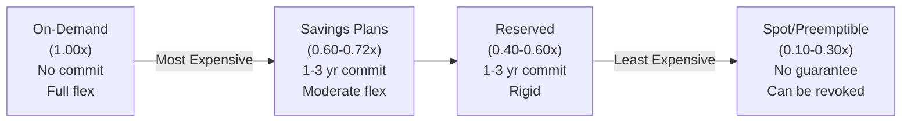
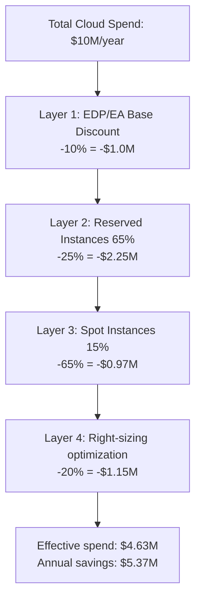
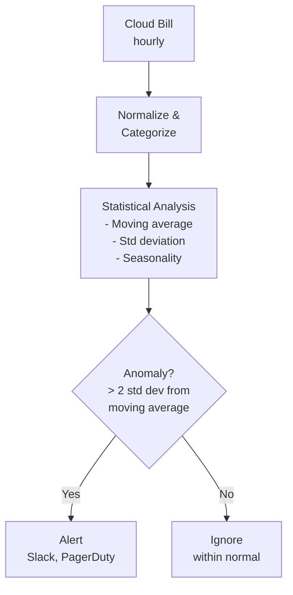
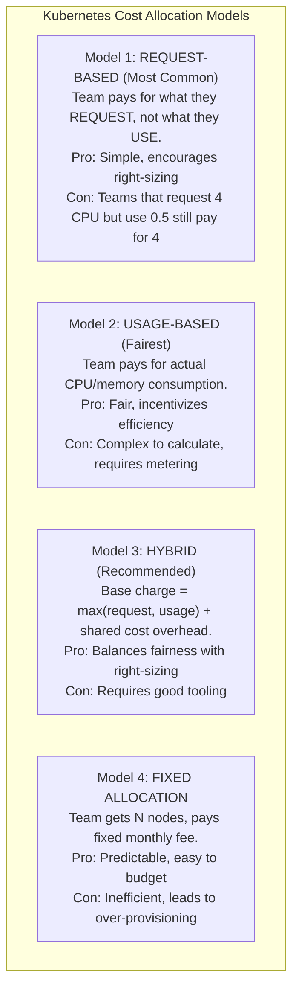
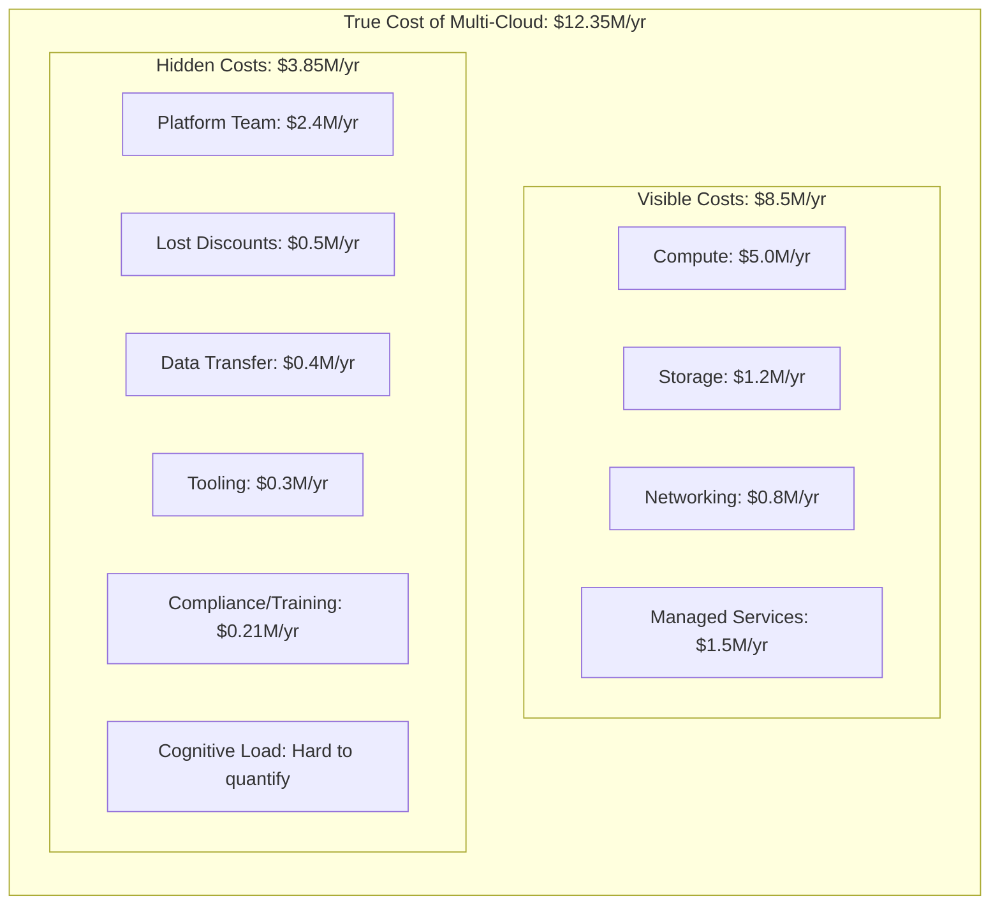
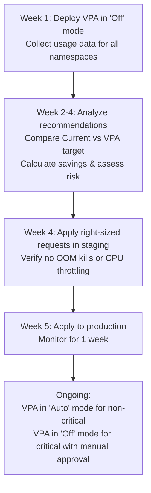
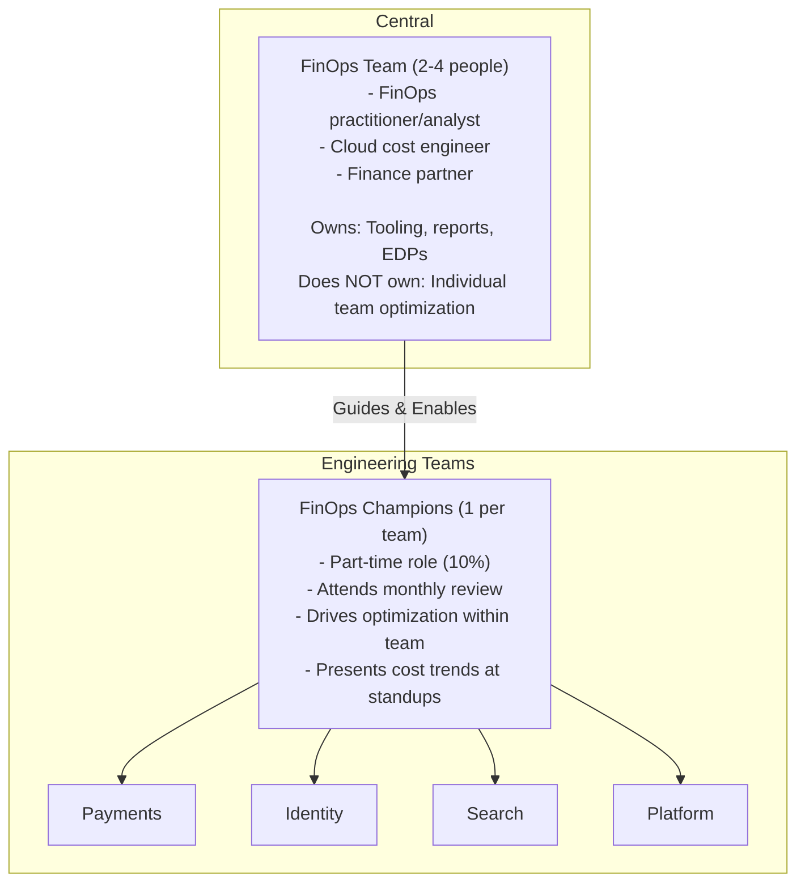
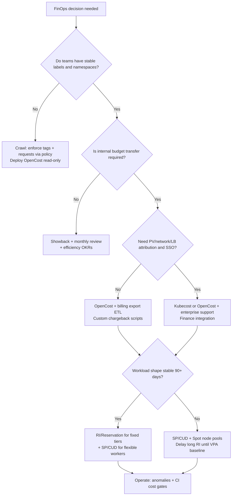

**Complexity**: `[COMPLEX]` | **Time to Complete**: 2h | **Prerequisites**: Cloud Essentials (AWS/Azure/GCP), Kubernetes Resource Management, Enterprise Landing Zones (Module 10.1)

## What You'll Be Able to Do

After completing this module, you will be able to implement enterprise FinOps practices with cloud billing integration and Kubernetes cost attribution, configure multi-cloud cost visibility with Kubecost or OpenCost, design chargeback and showback models that map namespace costs to business units, and deploy automated optimization pipelines for waste detection and right-sizing. The outcomes below summarize each capability in more detail:

- **Implement enterprise FinOps practices with cloud billing integration, team-level cost allocation, and Kubernetes cost attribution**
- **Configure multi-cloud cost visibility using Kubecost, OpenCost, or FOCUS-compliant tools across the fleet**
- **Design chargeback and showback models that map Kubernetes namespace and label costs to business units**
- **Deploy automated cost optimization pipelines that enforce resource quotas, right-size recommendations, and waste detection**

---

## Why This Module Matters

**Hypothetical scenario:** A platform organization runs shared Kubernetes clusters for dozens of product teams across AWS, GCP, and Azure. Finance sees aggregate spend rising faster than revenue, but no engineering leader can explain which namespaces, environments, or commitments drove the delta. Pods request CPU and memory using copy-paste values from old runbooks; cluster autoscalers add nodes because requests reserve capacity that actual metrics never consume; and procurement renews a three-year commitment against last quarter's peak instead of a right-sized baseline. Meanwhile, cross-zone service traffic and NAT-heavy egress quietly become a double-digit percentage of the bill — invisible in a dashboard that only charts EC2 and GKE node hours.

That pattern is common at enterprise scale because cloud economics are **distributed**: pricing layers stack (on-demand, commitments, enterprise discounts), Kubernetes scheduling decouples **requests** from **usage**, and multi-cloud portfolios fragment negotiation leverage. The [FinOps Foundation](https://www.finops.org/introduction/what-is-finops/) defines FinOps as an operational framework that maximizes business value from technology spend through collaboration between engineering, finance, and product — not a one-time cleanup project.

FinOps at enterprise scale is not about nickel-and-diming individual pod requests. It is about building the organizational capability to **inform** (allocate and forecast), **optimize** (rates and workload efficiency), and **operate** (continuous accountability) as a practice. In this module you will learn the FinOps Framework and maturity model, multi-cloud rate optimization, Kubernetes cost allocation with OpenCost and Kubecost, showback versus chargeback, unit economics, shared-cost splitting, workload optimization (VPA, consolidation, autoscaling), forecasting and anomaly detection, the true cost of multi-cloud, and how to sustain a FinOps culture.

---

## The FinOps Framework and Operating Model

Enterprise FinOps succeeds when capabilities are explicit, owned, and iterated — not when a central team publishes a spreadsheet once a quarter. The [FinOps Framework](https://www.finops.org/framework/) organizes practice into **domains** (outcomes), **capabilities** (how to achieve them), and **phases** (when teams focus). For Kubernetes-heavy organizations, treat each cluster fleet, landing-zone segment, or product line as a [FinOps Scope](https://www.finops.org/framework/scopes/) so allocation and accountability match how the business actually funds work.

### Inform → Optimize → Operate

The [three FinOps phases](https://www.finops.org/framework/phases/) cycle continuously; mature teams shorten the loop from monthly to weekly:

| Phase | Primary question | Kubernetes-relevant capabilities |
| :--- | :--- | :--- |
| **Inform** | Who spent what, on what, and why? | Data ingestion (CUR, Cost & Usage Reports, FOCUS exports), [allocation](https://www.finops.org/framework/capabilities/allocation/), reporting, [forecasting](https://www.finops.org/framework/capabilities/forecasting/), [anomaly management](https://www.finops.org/framework/capabilities/anomaly-management/) |
| **Optimize** | Where is waste, and which levers are safe? | [Usage optimization](https://www.finops.org/framework/capabilities/usage-optimization/) (right-sizing, bin-packing, off-hours scale), [rate optimization](https://www.finops.org/framework/capabilities/rate-optimization/) (Savings Plans, RIs, CUDs, Spot), architecting for placement |
| **Operate** | Did we implement changes and hold accountability? | [Invoicing & chargeback](https://www.finops.org/framework/capabilities/invoicing-chargeback/), FinOps education, automation in CI/CD, executive alignment |

**Inform** without allocation is vanity: a $12M/month bill with no `team`, `cost-center`, or `environment` labels cannot drive behavior. **Optimize** without Inform buys the wrong commitments — finance celebrates a 30% discount on capacity you are about to delete after VPA recommendations land. **Operate** without showback or chargeback leaves optimization as optional volunteer work for platform engineers.

### Crawl, Walk, Run maturity

The [FinOps maturity model](https://www.finops.org/framework/maturity-model/) uses **Crawl → Walk → Run**: start with visibility and basic tagging, add team-level accountability and rate optimization, then embed cost in architecture reviews and automated guardrails. This module's culture section maps to that ladder; most enterprises stall in **Walk** because they ship dashboards but never attach budgets, exceptions, or celebrations to the numbers.

### Centralized vs federated FinOps

| Model | Central team owns | Engineering teams own | Best when |
| :--- | :--- | :--- | :--- |
| **Centralized** | Tooling, EDP negotiation, standards, executive reporting | Little — teams are consumers of reports | Early Crawl stage, small fleet |
| **Federated** | Platform patterns, allocation rules, training, anomaly playbooks | Namespace efficiency, right-sizing PRs, label hygiene | Walk/Run with strong platform engineering |
| **Hybrid (typical at scale)** | Billing integration, commitment strategy, shared-cost policy | Workload optimization inside each product scope | Multi-cluster, multi-cloud enterprises |

A central FinOps team of two to four practitioners should **enable**, not become the bottleneck for every rightsizing change. Embedded [FinOps champions](https://www.finops.org/framework/personas/) (often 10% of a senior engineer's time per product team) translate standards into backlog items: fix labels, adopt VPA recommendations, and explain monthly deltas at standup.

### FOCUS and multi-cloud billing normalization

When AWS, Azure, and GCP exports use different column names and charge categories, comparing spend requires a common schema. The [FinOps Open Cost and Usage Specification (FOCUS)](https://focus.finops.org/) defines vendor-neutral cost and usage fields so allocation tools, data warehouses, and OpenCost/Kubecost integrations ingest comparable records. At enterprise scale, plan for a billing data pipeline (object storage + ETL) **before** you promise unified chargeback — raw console CSVs do not scale to hundreds of accounts and clusters.

---

## Cloud Economics at Scale

Enterprise FinOps starts with understanding how cloud providers price resources and how those prices compound when you run Kubernetes at scale. Discounts stack in layers, but each layer trades flexibility for savings, so the economics of your fleet depend as much on workload shape as on negotiated rates.

Think of cloud spend as three interacting flows: **metered usage** (what ran), **commercial rates** (what you pay per unit after discounts), and **allocation** (who owns each dollar). Kubernetes shifts usage meters from VMs you consciously launch to pods scheduled by a control plane — which is why FinOps without allocation is just a central IT mystery. Platform engineers who understand all three flows can explain a bill spike as "more Spot interruption causing on-demand fallback" instead of "AWS got expensive."

### Inform-phase economics checklist

Before optimizing rates or rightsizing pods, validate Inform data quality:

1. **Billing export latency** — CUR and FOCUS files often lag 24–48 hours; do not compare live Prometheus to yesterday's invoice without alignment.
2. **Credit and refund lines** — exclude or tag so month-over-month charts do not show fake savings.
3. **Shared accounts** — map payer accounts to business units; SCPs may block tags on legacy resources.
4. **Kubernetes cluster ID** — tie cloud tags (`eks:cluster-name`, GKE cluster labels) to OpenCost `clusterId` for reconciliation.

Only after those checks should you model Savings Plan coverage or publish chargeback — otherwise you optimize against incomplete truth.

### The Cloud Pricing Model

Cloud providers price compute, storage, and networking differently, but they share a common pattern: the more you commit upfront, the less you pay per unit. On-demand capacity is the most flexible and most expensive baseline; Savings Plans and Reserved Instances trade commitment for predictable discounts; Spot and preemptible instances offer the deepest discounts when you can tolerate interruption. Before you commit to a three-year Savings Plan, pause and predict what happens if your application architecture changes and you need half as much compute before the term expires — you may be locked into paying for capacity you no longer need.



> **Note:** Multipliers on the diagram are **typical conservative planning factors**, not maximum advertised discounts. Compute Savings Plans can reach higher savings on some instance families; Standard RIs and Spot can exceed the ranges shown when usage and interruption tolerance align — model with your CUR before committing.

### Enterprise Discount Programs (EDPs)

**Pause and predict:** Why does securing an Enterprise Discount Program agreement fail to solve cloud cost inefficiency if workload containers remain poorly tuned?

<details>
<summary>Check your prediction</summary>

A negotiated Enterprise Discount Program reduces aggregate unit rates across contract tiers, but a custom discount does not remove underlying compute waste. If an organization signs an annual spend commitment against bloated workload requests, it agrees to pay for unneeded capacity regardless of discount percentages. Financial commitments must follow disciplined workload rightsizing, guaranteeing that enterprise contract baselines cover genuine steady-state demand rather than idle over-provisioning.
</details>

The next section is a strategic negotiation framework detailing how platform engineering roadmaps and cluster growth models inform enterprise discount commitments.

Negotiations should include **Kubernetes growth curves**: if GKE and EKS node hours grow 40% year-over-year but the EA commit assumes 15%, you either breach commit (penalties) or leave discount on the table. Bring platform roadmaps — new regions, GPU tiers, data platforms — to procurement QBRs. EDP discounts often apply **after** RI/SP/CUD on AWS; on GCP negotiated CUDs may interact differently — verify contract language instead of assuming stack order from blog posts.

| Negotiation input | Owner | Why engineering must supply it |
| :--- | :--- | :--- |
| Steady-state vCPU/RAM after rightsizing | Platform + FinOps | Commits tied to peak waste strand spend |
| Spot/preemptible share cap | SRE | Commit coverage excludes interruptible tiers |
| Control-plane growth | Platform | New clusters add fixed fee per month |
| Egress forecast | Network/platform | Data planes drive transfer-heavy spend |
| Multi-cloud split | Finance + CTO | Split commits reduce per-vendor leverage |

At enterprise scale ($1M+/year spend), cloud providers offer negotiated discounts through Enterprise Discount Programs that sit on top of service-level commitments. An EDP is not a substitute for right-sizing or Reserved Instance coverage; it is a commercial layer that reduces the bill you still generate after operational discipline. Finance teams often anchor negotiations on total annual commit, while engineering teams must ensure that commit reflects steady-state usage rather than peak waste.

### Enterprise FinOps KPIs

Executives distrust one-off savings stories; they trust **repeatable KPIs** tied to the [FinOps domains](https://www.finops.org/framework/domains/). Publish a small scorecard monthly:

| KPI | Definition | Healthy direction |
| :--- | :--- | :--- |
| **Allocation coverage** | % of spend with `team` / `cost-center` tags | ↑ toward 95%+ |
| **Cluster efficiency** | Used CPU or memory / requested or allocatable | ↑ without SLO regression |
| **Commitment utilization** | Consumed commit hours / purchased commit hours | ↑ into 80–95% band |
| **Unit cost** | Fully loaded infra cost / business unit (requests, tenants) | ↓ or flat with feature growth |
| **Anomaly MTTR** | Hours from alert to owner acknowledged | ↓ |
| **Waste backlog** | Open rightsizing or idle-resource tickets | ↓ |

Avoid vanity metrics like "number of dashboards" or "FinOps workshops held." Each KPI should link to a capability — allocation, rate optimization, anomaly management — so Crawl/Walk/Run progress is measurable.

| Provider | Program | Typical Discount | Commitment |
| :--- | :--- | :--- | :--- |
| **AWS** | Enterprise Discount Program (EDP) | 5-15% on total spend | 1-5 year, minimum annual commit |
| **Azure** | Enterprise Agreement (EA) | 5-20% on consumption | 1-3 year, minimum annual commit |
| **GCP** | Committed Use Discounts (CUD) + Negotiated | 5-30% on specific services | 1-3 year per service |



The diagram above is illustrative: real savings depend on how much of your fleet can move to committed and interruptible capacity without breaking SLOs. Teams that buy RIs against peak requests rather than right-sized baselines often discover unused commitment when VPA recommendations land months later.

### Rate optimization across AWS, GCP, and Azure

Rate optimization pays for **predictable** baseline capacity; usage optimization (later sections) pays for **right-sized** demand. Each hyperscaler names commitments differently, but the tradeoff is the same: flexibility versus discount depth.

| Provider | Flexible commitment | Instance-locked commitment | Interruptible capacity | Enterprise commercial layer |
| :--- | :--- | :--- | :--- | :--- |
| **AWS** | [Compute Savings Plans](https://docs.aws.amazon.com/savingsplans/latest/userguide/what-is-savings-plans.html) (1–3 yr, $/hr commit) | [Reserved Instances](https://docs.aws.amazon.com/AWSEC2/latest/UserGuide/ec2-reserved-instances.html) (Standard = deepest discount, specific family/AZ) | [Spot Instances](https://docs.aws.amazon.com/AWSEC2/latest/UserGuide/using-spot-instances.html) | [Enterprise Discount Program](https://docs.aws.amazon.com/awsaccountbilling/latest/aboutv2/use-edp.html) on eligible spend |
| **GCP** | [Committed use discounts (CUDs)](https://cloud.google.com/compute/docs/instances/committed-use-discounts-overview) — resource-based or spend-based | Sustained use discounts (automatic for eligible Compute Engine) | [Spot VMs](https://cloud.google.com/compute/docs/instances/spot) / preemptible | Negotiated CUDs + enterprise agreements |
| **Azure** | [Azure savings plan for compute](https://learn.microsoft.com/en-us/azure/cost-management-billing/savings-plan/savings-plan-compute-overview) | [Azure Reservations](https://learn.microsoft.com/en-us/azure/cost-management-billing/reservations/save-compute-costs-reservations) | [Azure Spot Virtual Machines](https://learn.microsoft.com/en-us/azure/virtual-machines/spot-vms) | [Enterprise Agreement](https://learn.microsoft.com/en-us/azure/cost-management-billing/manage/understand-ea) consumption discounts |

**Coverage vs utilization:** commitment savings only materialize when consumed hours match what you bought. FinOps teams track **coverage** (what share of eligible usage is covered by SP/RI/CUD) separately from **utilization** (what share of purchased commitment is actually used). Low utilization after a rightsizing program is a classic failure mode — finance sees savings on paper while engineering shrinks the fleet.

**Kubernetes node groups:** treat control-plane fees (EKS per-cluster hour, GKE management fee, AKS control-plane charge) as **fixed overhead** in allocation models; they do not scale with pod count but dominate small clusters. For worker nodes, prefer **Compute Savings Plans** (AWS) or **spend-based CUDs** (GCP) when instance families change with Karpenter or cluster-autoscaler; use **Standard RIs** only for stable, long-lived node pools (for example a three-year database VMSS outside the cluster).

**Spot and preemptible in Kubernetes:** use interruption-tolerant node pools (Karpenter provisioners, GKE node auto-provisioning with spot, AKS spot node pools) for stateless Deployments with PodDisruptionBudgets — not for single-replica stateful systems. Combine Spot with on-demand baseline nodes so the scheduler has somewhere to land critical pods when capacity evaporates.

### Kubernetes-Specific Cost Drivers

Kubernetes introduces cost drivers that do not appear as clearly on a vanilla EC2 bill because scheduling, networking, and storage decisions are distributed across hundreds of teams. The table below maps common drivers to optimization levers; use it as a checklist during monthly FinOps reviews rather than as a one-time audit.

| Cost Driver | What It Is | Why It Grows | How to Optimize |
| :--- | :--- | :--- | :--- |
| **Over-provisioned pods** | Requests set too high, pods use fraction of allocated resources | Fear of OOM kills, copy-paste from examples | Right-size using VPA recommendations, Goldilocks |
| **Idle clusters** | Dev/test clusters running 24/7 but used only during business hours | Forgot to scale down, no automation | Auto-scaling to 0 nodes off-hours, cluster hibernation |
| **Cross-AZ traffic** | Pods talking to services in different AZs | Default round-robin load balancing ignores topology | Topology-aware routing, colocate communicating services |
| **Persistent volumes** | Over-sized PVs, snapshot retention too long | Provisioned "just in case," no lifecycle management | Right-size PVs, automate snapshot expiry, use dynamic provisioning |
| **NAT Gateway** | All outbound traffic from private subnets goes through NAT | Default architecture for private EKS | Use VPC endpoints for AWS services, reduce external calls |
| **Load Balancers** | One ALB/NLB per Service of type LoadBalancer | Developers create LoadBalancer Services by default | Use an Ingress Controller (one LB for many services) |
| **Data transfer** | Cross-region, cross-cloud, internet egress | Microservices sprawl, poor placement decisions | Place communicating services in the same region/AZ |

Cross-AZ traffic is often a hidden cost because default Service load balancing spreads endpoints across zones for availability, so a large share of east-west calls pay inter-AZ data transfer even when sender and receiver could have stayed in the same zone. Topology-aware routing and deliberate placement of chatty services reduce this tax without changing application code.

### Control-plane and licensing cost at fleet scale

EKS charges a per-cluster hourly control-plane fee; GKE and AKS have their own management and API costs (verify current pricing pages for your regions). A fleet of fifty small dev clusters can spend more on control planes than on worker nodes if each team insists on a dedicated cluster for isolation. **Fleet consolidation** — namespaces with policy isolation instead of cluster-per-team — is a FinOps architecture decision as much as a security decision. When consolidation is impossible (regulatory boundary, blast-radius), allocate control-plane cost explicitly in chargeback so product teams see the tax of extra clusters.

Licensing overlays add another layer: Windows node surcharges, commercial databases, and per-seat observability SaaS often exceed raw compute. Tag `license=billable` workloads so chargeback does not attribute Oracle or Windows premiums to Linux microservices that happen to share a node pool.

### Enterprise cost spikes to watch

| Spike driver | Why it accelerates | Mitigation |
| :--- | :--- | :--- |
| **Governance drift** | Untagged sprawl after M&A or fast launches | Policy-as-code + monthly untagged resource reports |
| **Log/metrics cardinality** | High-cardinality labels in Prometheus/Loki | Cardinality budgets; aggregate labels in agents |
| **Cross-cloud egress** | DR replication, multi-cloud mesh | Data placement; compress; private interconnect |
| **Idle GPU/ML** | Experiments without TTL | Owner tags; automated stop via Custodian or Kyverno TTL |
| **Per-seat tooling tax** | Duplicate APM/security per cloud console | Standardize on FOCUS-fed warehouse + one KPI stack |

---

## Forecasting and Anomaly Detection

Forecasting turns historical spend into a budget conversation engineering can act on, while anomaly detection catches the spikes that forecasts miss — new GPU fleets, forgotten environments, or mis-tagged resources. Together they give finance predictable planning and give platform teams early warning before a month-end surprise.

At enterprise scale, forecasting is not a single spreadsheet formula; it is a **pipeline** that joins cloud billing, Kubernetes allocation exports, and business drivers (headcount, tenant growth, feature launches). Finance needs **unblended** and **amortized** views: unblended for operational spikes, amortized for commitment-heavy quarters when RI/SP/CUD fees front-load accounting. Engineering needs **allocated** forecasts per namespace and cluster so a 15% AWS increase is decomposed into "Search added three GPU nodes" versus "data transfer anomaly in payments."

### Multi-cloud forecasting discipline

Each provider exposes forecasting APIs with different granularity:

| Provider | Service | Granularity | Kubernetes tip |
| :--- | :--- | :--- | :--- |
| **AWS** | [Cost Explorer GetCostForecast](https://docs.aws.amazon.com/aws-cost-management/latest/APIReference/API_GetCostForecast.html) | Daily/monthly, by dimension | Filter `SERVICE` + tag `kubernetes.io/cluster/<id>` when tags exist |
| **GCP** | [Billing budgets & forecasts](https://cloud.google.com/billing/docs/how-to/budgets) | Project/folder hierarchy | Align folder per environment; separate GKE prod vs dev projects |
| **Azure** | [Cost Management forecasts](https://learn.microsoft.com/en-us/azure/cost-management-billing/costs/cost-analysis-common-uses) | Subscription/management group | Tag AKS clusters at resource group scope |

Normalize exports to [FOCUS](https://focus.finops.org/) before blending providers — otherwise you double-count credits, mis-map tax lines, or compare gross AWS to net Azure. Platform teams should publish a **single internal "fully loaded K8s cost"** metric per cluster: worker nodes + control plane + attributed storage/network + shared observability split.

### Budget variance reviews

Run a monthly **variance bridge** with four buckets: (1) volume — more pods, tenants, or traffic; (2) rate — commitment expiry, list price change, currency; (3) efficiency — request/usage drift, failed rightsizing; (4) allocation — tagging fixes that moved dollars between teams without true savings. Without bucket (4), chargeback changes look like optimization wins and erode trust in FinOps data.

### Cost Forecasting Model

```bash
# AWS Cost Explorer: Forecast next 3 months
aws ce get-cost-forecast \
  --time-period Start=$(date -u +%Y-%m-01),End=$(date -u -d "+3 months" +%Y-%m-01) \
  --metric UNBLENDED_COST \
  --granularity MONTHLY \
  --query '{
    Forecast: ResultsByTime[*].{
      Period: TimePeriod.Start,
      Mean: MeanValue,
      Min: PredictionIntervalLowerBound,
      Max: PredictionIntervalUpperBound
    }
    }' --output table
```

> **macOS:** GNU `date -d` is not available by default; install `coreutils` and use `gdate` in place of `date` for the relative month window above.

AWS Cost Explorer forecasting uses your unblended cost history to project the next interval with confidence bounds; treat the lower bound as a planning floor and the upper bound as the threshold that triggers capacity or architecture review. The same API patterns exist on Azure Cost Management and GCP Billing, so multi-cloud shops should normalize exports before comparing forecasts across providers.

For Kubernetes-heavy accounts, add **allocation-aware monitors**: anomaly on `AmazonEC2` plus tag `team=unknown`, or on GKE project spend when node pool labels disappear after a migration. Root-cause templates in runbooks shorten time-to-fix — "delete orphaned LoadBalancer Service" and "scale down idle GPU node pool" are more actionable than "EC2 increased 40%."

### Anomaly Detection Pipeline

Statistical monitors work best when costs are categorized consistently (service, cluster, team label) so a spike in `AmazonEC2` for `k8s-prod-east` is attributed to a owner, not dismissed as “cloud went up.” The pipeline below ingests hourly billing, compares against a moving baseline, and routes material deviations to FinOps champions.

**Seasonality** matters: retail spikes in November, tax software in April, or batch ML on Sundays can look like anomalies if your baseline ignores calendars. Use at least eight weeks of history before alerting on weekly jobs, and separate **prod** from **dev** accounts so test environment churn does not page production on-call. For FinOps champions, pair each alert type with a runbook entry: orphaned volume, new NAT Gateway, replica count change, or Spot fleet replaced by on-demand after interruption storm.

**Feedback loop:** when an anomaly is benign (planned marketing campaign), tag the event in your warehouse so the model learns — otherwise teams mute channels and real leaks return unnoticed. Operate-phase maturity means anomalies become **tickets with owners**, not email threads.



```bash
# AWS Cost Anomaly Detection setup
aws ce create-anomaly-monitor \
  --anomaly-monitor '{
    "MonitorName": "k8s-cost-monitor",
    "MonitorType": "DIMENSIONAL",
    "MonitorDimension": "SERVICE"
  }'

aws ce create-anomaly-subscription \
  --anomaly-subscription '{
    "SubscriptionName": "k8s-cost-alerts",
    "MonitorArnList": ["arn:aws:ce::123456789012:anomalymonitor/abc-123"],
    "Subscribers": [
      {"Address": "finops-team@company.com", "Type": "EMAIL"},
      {"Address": "arn:aws:sns:us-east-1:123456789012:finops-alerts", "Type": "SNS"}
    ],
    "ThresholdExpression": {
      "Dimensions": {
        "Key": "ANOMALY_TOTAL_IMPACT_ABSOLUTE",
        "Values": ["100"],
        "MatchOptions": ["GREATER_THAN_OR_EQUAL"]
      }
    },
    "Frequency": "DAILY"
  }'
```

---

## Chargeback for Shared Kubernetes Clusters

The hardest FinOps problem in Kubernetes is attributing costs to teams when multiple teams share the same cluster and nodes. A node running pods from five different namespaces still bills as one line item in the cloud console, so fairness requires a model that splits node cost by requests, usage, or a hybrid rule — and a tool that applies that rule consistently every month.

### Showback vs chargeback

Both models require the same **allocation foundation** (labels, namespaces, billing tags, and a tool like OpenCost or Kubecost). They differ in whether money **moves** between cost centers.

| Model | What happens | Organizational effect | When it works |
| :--- | :--- | :--- | :--- |
| **Showback** | Teams receive reports; finance still centralizes the invoice | Builds awareness without budget friction; good for Crawl/Walk | Early maturity, strong central IT budget, cultural resistance to internal bills |
| **Chargeback** | Internal invoices transfer cost to team P&L or project codes | Strongest incentive to right-size; can create gaming if rules are opaque | Walk/Run maturity, product P&L ownership, stable allocation rules |
| **Hybrid** | Showback for dev/test; chargeback for production tenant namespaces | Balances education with accountability | Large enterprises with mixed ownership |

Showback fails when treated as wallpaper: if directors never discuss the report, requests stay inflated. Chargeback fails when rules change monthly or shared costs are dumped into "misc" — teams optimize against the invoice, not against efficiency. Publish the **allocation formula** alongside every report (for example max(request, usage) plus proportional shared overhead) so disputes reference mechanics, not politics.

### Tagging and labeling strategy

Allocation is only as good as metadata. Standardize required keys across clouds and clusters:

| Label / tag | Purpose | Example values |
| :--- | :--- | :--- |
| `team` / `cost-center` | Chargeback recipient | `payments`, `cc-4401` |
| `environment` | Separate prod vs non-prod economics | `prod`, `staging`, `dev` |
| `product` / `service` | Unit economics denominator | `checkout-api` |
| `tenant` | Multi-tenant SaaS isolation | `customer-tier-gold` |

Enforce labels at admission (Kyverno, Gatekeeper, or ValidatingAdmissionPolicy) for namespaces and workloads. Cloud-side tags on node groups, disks, and load balancers must **mirror** Kubernetes labels so CUR lines reconcile with namespace reports.

### Shared cost allocation

Not every dollar maps to a product pod. **Shared costs** must be split explicitly or teams will argue that platform overhead is "someone else's problem."

| Shared bucket | Typical components | Fair split strategies |
| :--- | :--- | :--- |
| **Cluster overhead** | Control plane fee, `kube-system`, CNI, DNS, metrics agents | Equal per namespace, or proportional to pod count / request share |
| **Idle node capacity** | Unschedulable slack reserved for bursts | Proportional to CPU/memory **requests** (incentivizes smaller requests) |
| **Observability** | Prometheus, logging agents, tracing collectors | Proportional to ingest volume or replica count per team |
| **Ingress / LB platform** | Shared ALB controller, Gateway API tier | Per Service/Ingress owned by team labels |
| **Network transfer** | Cross-AZ, NAT, internet egress | Per-namespace traffic metrics when available; else proportional to service count |

OpenCost and Kubecost expose **sharedCost** or idle allocation lines in their APIs — use them instead of hiding overhead in a single platform namespace charge. Document whether GPU nodes, Windows nodes, or ARM instance families use **separate rate cards** so ML teams do not subsidize generic web tiers.

### Chargeback Models

Chargeback is as much about incentives as about arithmetic: request-based models encourage right-sizing requests, usage-based models reward actual efficiency, and hybrid models charge the maximum of request and usage so teams cannot hoard capacity they never consume. Pick a model that your organization can explain to engineering managers in one slide, then automate reporting so disputes reference data instead of opinions.



If you use strict usage-based chargeback only, the platform team often subsidizes idle capacity that was reserved by requests but never consumed — which is why many enterprises adopt a hybrid rule or allocate shared overhead explicitly. Before you roll out showback, agree who pays for system namespaces, monitoring, and control-plane overhead so those costs do not disappear into “IT general.”

### Integrating allocation with finance systems

Production chargeback rarely ends at a shell script. Typical enterprise flow: OpenCost or Kubecost exports nightly Parquet to object storage → ETL joins cloud CUR/FOCUS on `resource_id` and `cluster_id` → warehouse computes fully loaded team cost → finance loads GL codes via ERP connector. Platform owns steps one and two; finance owns GL mapping. SLAs matter: if exports slip three days, engineering disputes invoices while deployments continue — automate freshness alerts on the pipeline, not only on cloud anomalies.

### OpenCost: Open-Source Kubernetes Cost Allocation

**Pause and predict:** Why is exporting a raw namespace cost aggregate from OpenCost insufficient to serve as a complete enterprise chargeback invoice?

<details>
<summary>Check your prediction</summary>

OpenCost allocates internal cluster compute and memory costs across workloads, but it is not the cloud provider invoice. An unadjusted namespace dollar total is not an explained chargeback bill because it omits external managed services, networking egress fees, and shared cluster overhead. Transparent financial chargeback requires combining cluster allocation metrics with enterprise billing line items and agreed business allocation rules.
</details>

The next section is a Helm deployment workflow and API query that installs the OpenCost allocation engine and extracts namespace-level cost metrics.

```bash
# Install OpenCost (CNCF Incubating project)
helm repo add opencost https://opencost.github.io/opencost-helm-chart
helm install opencost opencost/opencost \
  --namespace opencost --create-namespace \
  --set opencost.exporter.defaultClusterId=eks-prod-east \
  --set opencost.exporter.aws.spot_data_region=us-east-1 \
  --set opencost.exporter.aws.spot_data_bucket=company-spot-pricing \
  --set opencost.ui.enabled=true

# Query cost allocation by namespace
curl -s "http://localhost:9003/allocation/compute?window=7d&aggregate=namespace" | \
  jq '.data[0] | to_entries | sort_by(.value.totalCost) | reverse | .[:10] |
  .[] | {namespace: .key, totalCost: (.value.totalCost | . * 100 | round / 100),
  cpuCost: (.value.cpuCost | . * 100 | round / 100),
  memoryCost: (.value.ramCost | . * 100 | round / 100),
  cpuEfficiency: (.value.cpuEfficiency | . * 100 | round),
  memoryEfficiency: (.value.ramEfficiency | . * 100 | round)}'
```

The allocation query above ranks namespaces by total cost and efficiency percentages so you can spot teams that request far more CPU or memory than they use. Run it on a fixed window (7d or 30d) and archive results monthly for trend review.

[OpenCost](https://opencost.io/docs/) implements open Kubernetes cost monitoring and integrates with cloud billing APIs when you provide spot pricing buckets and cluster identity. The project is a [CNCF Incubating](https://www.cncf.io/projects/opencost/) project (moved from Sandbox in October 2024). It is a strong default when you need namespace-level allocation without a commercial license and you can operate the exporter and UI yourself.

Architecturally, OpenCost runs a **cost model** that combines:

1. **Kubernetes metrics** — pod resource requests, live usage (when metrics-server or Prometheus is available), PVs, and network estimates.
2. **Cloud price sheets** — on-demand rates from provider APIs or custom price tables; Spot/preemptible pricing from CUR or pricing dumps you control.
3. **Allocation rules** — distributes node RAM/CPU cost to pods using max(request, usage) per container, then rolls up to namespace, label, or custom aggregates.

The `/allocation/compute` API returns cost dimensions (`cpuCost`, `ramCost`, `pvCost`, `networkCost`, efficiency ratios) for arbitrary `window` and `aggregate` parameters — the foundation for chargeback pipelines that write to Snowflake, BigQuery, or internal finance systems.

### Kubecost: Enterprise Cost Management

[Kubecost](https://docs.kubecost.com/) extends the same allocation concepts as OpenCost with richer network and persistent-volume attribution, shared-cost breakdown, multi-cluster federation, and UI workflows aimed at platform teams supporting dozens of clusters. Many enterprises run **OpenCost at the cluster edge** for open APIs and **Kubecost Enterprise** for SSO, RBAC, and finance integrations — verify licensing for your deployment model rather than assuming one tool must win exclusively.

Enterprise chargeback reports typically expose:

- **CPU and RAM cost** — request-based, usage-based, and efficiency ratios per Deployment.
- **Network cost** — in-zone, cross-zone, and internet egress attribution when cloud integration is configured.
- **PV and storage class cost** — per namespace, critical for stateful FinOps reviews.
- **Shared cluster costs** — control plane, idle capacity, and system namespaces split by configurable weights.
- **Asset price overrides** — align internal transfer pricing with negotiated EDP/EA rates instead of public list prices.

The commented Helm values and API notes below show which dimensions appear in enterprise chargeback reports. When comparing Kubecost to DIY OpenCost + SQL, include **operator hours**: building chargeback ETL is cheap in license dollars and expensive in platform engineering time.

```yaml
# Kubecost deployment for detailed cost allocation
# helm install kubecost kubecost/cost-analyzer --namespace kubecost --create-namespace

# Kubecost cost allocation API
# GET /model/allocation?window=30d&aggregate=namespace,label:team
# Response includes:
# - CPU cost (request-based + usage-based)
# - Memory cost (request-based + usage-based)
# - Network cost (in-zone, cross-zone, internet)
# - PV cost (per namespace)
# - Shared cost (control plane, monitoring, system pods)
# - Efficiency score (usage / request ratio)
```

### Building a Chargeback Report

When OpenCost or Kubecost is not yet deployed, a shell-based chargeback report still teaches the mechanics: sum node cost, apportion by resource requests per namespace, and flag top over-provisioned pods. The script below is a teaching scaffold — replace static hourly rates with your CUR or billing export for production use.

```bash
#!/bin/bash
# chargeback-report.sh

echo "============================================="
echo "  KUBERNETES COST CHARGEBACK REPORT"
echo "  Period: $(date -d "-30 days" +%Y-%m-%d) to $(date +%Y-%m-%d)"  # macOS: use gdate from coreutils instead of date -d
echo "  Cluster: eks-prod-east"
echo "============================================="

# Get node costs (total cluster cost)
NODE_COUNT=$(kubectl get nodes --no-headers | wc -l | tr -d ' ')
# Assume m6i.xlarge at $0.192/hr on-demand
HOURLY_COST=$(echo "$NODE_COUNT * 0.192" | bc)
MONTHLY_COST=$(echo "$HOURLY_COST * 730" | bc)

echo ""
echo "--- Cluster Cost Summary ---"
echo "  Nodes: $NODE_COUNT"
echo "  Estimated Monthly Cost: \$$(printf '%.2f' $MONTHLY_COST)"

echo ""
echo "--- Cost Allocation by Namespace ---"
echo "  (Based on resource requests)"

TOTAL_CPU_REQ=0
for NS in $(kubectl get namespaces -o jsonpath='{.items[*].metadata.name}' | tr ' ' '\n' | grep -v '^kube-' | grep -v '^default$'); do
  # Sum CPU requests in millicores
  CPU_REQ=$(kubectl get pods -n $NS -o json 2>/dev/null | \
    jq '[.items[].spec.containers[].resources.requests.cpu // "0" |
    if endswith("m") then rtrimstr("m") | tonumber
    elif . == "0" then 0
    else (tonumber * 1000) end] | add // 0')

  MEM_REQ=$(kubectl get pods -n $NS -o json 2>/dev/null | \
    jq '[.items[].spec.containers[].resources.requests.memory // "0" |
    if endswith("Mi") then rtrimstr("Mi") | tonumber
    elif endswith("Gi") then rtrimstr("Gi") | tonumber * 1024
    elif . == "0" then 0
    else 0 end] | add // 0')

  if [ "$CPU_REQ" -gt 0 ] || [ "$MEM_REQ" -gt 0 ]; then
    echo "  $NS: CPU=${CPU_REQ}m, Memory=${MEM_REQ}Mi"
  fi
done

echo ""
echo "--- Optimization Recommendations ---"

# Check for over-provisioned pods
echo "  Top over-provisioned pods (requests >> usage):"
kubectl top pods -A --no-headers 2>/dev/null | while read NS NAME CPU MEM; do
  # Compare actual usage to requests
  REQ_CPU=$(kubectl get pod $NAME -n $NS -o jsonpath='{.spec.containers[0].resources.requests.cpu}' 2>/dev/null)
  if [ -n "$REQ_CPU" ]; then
    echo "    $NS/$NAME: using $CPU (requested $REQ_CPU)"
  fi
done | head -10

echo ""
echo "============================================="
```

---

## Unit Economics at Enterprise Scale

Finance asks "What did cloud cost this quarter?" Engineering should also answer "What did **one customer transaction** cost?" **Unit economics** ties infrastructure spend to business metrics so product and platform leaders optimize the same numerator.

### Defining the unit

Pick a unit that product managers already track:

| Business model | Example unit | Cloud + K8s signals |
| :--- | :--- | :--- |
| B2B SaaS | Cost per active tenant / per seat | Namespace per tenant tier, API request metrics |
| API platform | Cost per million requests | Ingress metrics, service mesh telemetry |
| Data platform | Cost per TB processed | Job labels, Spark/Flink operator annotations |
| Internal platforms | Cost per developer or per cluster | Shared cluster allocation by team |

The [FinOps unit economics capability](https://www.finops.org/framework/capabilities/unit-economics/) stresses **consistency**: the same unit definition in dashboards, OKRs, and architecture reviews. If "cost per request" excludes NAT egress, teams will route traffic patterns that look efficient on CPU charts but explode network line items.

### Building the formula

A practical unit-cost formula for Kubernetes-backed APIs:

```text
cost_per_request =
  (namespace_allocated_infra_cost + attributed_shared_cost + attributed_egress_cost)
  / request_count_in_window
```

Pull `namespace_allocated_infra_cost` from OpenCost/Kubecost monthly exports; pull `request_count` from Prometheus `http_requests_total` or vendor APM. Shared costs (idle, monitoring, control plane) should be **included** in the numerator with an documented split — otherwise product teams only optimize pod CPU while ignoring platform tax.

### Cost per namespace / team / tenant

For shared clusters, publish three views monthly:

1. **Direct cost** — sum of pod + PV + attributed network for labeled workloads.
2. **Fully loaded cost** — direct plus allocated shared overhead and control-plane share.
3. **Unit cost** — fully loaded divided by the business unit (requests, tenants, jobs).

When unit cost rises while traffic is flat, decompose the delta: rate change (commitment expiry), usage change (replica count), or efficiency change (request vs actual CPU). That decomposition prevents blaming "the cloud got expensive" when the real issue is a deployment replica bump or a dropped Savings Plan.

---

## Workload Optimization Beyond Right-Sizing

Right-sizing requests (VPA, Goldilocks) is high leverage but not the full **usage optimization** story. Enterprise fleets also need **bin-packing**, **autoscaling**, and **lifecycle** policies so nodes and pods exist only when they deliver value.

### Consolidation and autoscaling

| Mechanism | What it optimizes | Multi-cloud notes |
| :--- | :--- | :--- |
| **Cluster Autoscaler** | Node count vs pending pods | Works on all clouds; respects ASG/MIG/VMSS limits |
| **Karpenter** | Node shape, Spot mix, rapid provisioning | AWS-first; [GCP provider](https://karpenter.sh/docs/concepts/nodepools/) and Azure ecosystems evolving — verify current provider maturity for your version |
| **HPA + VPA together** | Replicas vs per-pod size | Coordinate policies so HPA scale-up is not fighting VPA memory recommendations |
| **Off-hours scale-down** | Dev/test cluster cost | Cron-based node pool min=0 or scheduled `kubectl scale` with guardrails |

Karpenter (and similar provisioners) improve **bin-packing** by selecting instance types that fit pending pod shapes instead of growing homogeneous node groups designed for the largest outlier pod.

### In-place pod resize (Kubernetes 1.33+)

For supported workloads, [in-place pod resize](https://kubernetes.io/docs/concepts/workloads/pods/pod-resize/) (beta in 1.33, evolving in 1.35) adjusts CPU/memory limits without recreating pods — reducing disruption compared to traditional VPA eviction cycles. Use it only where your CRI and workload controllers support resize; stateful systems may still prefer rolling updates with staged request changes.

### Anomaly detection tied to optimization

Forecasting (earlier section) sets expectations; **anomaly detection** flags when reality diverges. Connect anomaly subscriptions to FinOps champions, not only finance inboxes — engineering fixes root causes (new GPU namespace, orphaned LoadBalancer Service) faster when alerts include **allocation context** (team label, cluster ID, linked dashboard).

### Cost-aware CI/CD

At **Run** maturity, gate merges with estimated cost delta: tools that diff manifest requests, replica counts, and new cloud dependencies before apply. Pair with policy (OPA, Kyverno) that rejects namespaces without `team` labels or pods without requests. The goal is to catch a 200-replica load test manifest before it provisions $50k/month of nodes — not to block every deploy.

---

## The True Cost of Multi-Cloud

**Pause and predict:** An enterprise provisions a small footprint in a secondary cloud solely to maintain negotiating leverage. Why might this strategy increase overall corporate expenses?

<details>
<summary>Check your prediction</summary>

Compute and storage invoices are not the full cost of operating a second cloud environment. A small secondary cloud footprint maintained purely for negotiating leverage often costs far more than any discount it secures from the primary provider. Operating multiple clouds introduces duplicate tooling, distinct identity management systems, and specialized platform engineering headcount. Furthermore, splitting organizational workload spend weakens volume tiering and commitment discounts across both providers without creating credible migration leverage.
</details>

The next section is an architecture diagram of a multi-cloud cost model with separate boxes for infrastructure invoices and for other operating costs.

### Multi-Cloud Cost Model



Most enterprises underestimate the true cost of multi-cloud because they only count compute and storage on each provider’s invoice. Platform engineering headcount, duplicated tooling, fragmented discount leverage, and cross-cloud data transfer often exceed the visible infrastructure line items — which is why “we added Azure for leverage” can cost more than it saves if the secondary footprint stays small.

Multi-cloud strategies often dilute EDP negotiation leverage because spend is split across providers, so neither vendor sees a commitment large enough to justify top-tier discounts. Unless your secondary cloud footprint is credible — typically a meaningful share of total spend — the “we can walk away” story finance tells procurement may not match the operational bill you pay to run two control planes.

### Duplicated reserved capacity and skills tax

Reserved Instances, Savings Plans, CUDs, and Azure Reservations do not transfer across clouds. A multi-cloud baseline that needs 500 steady vCPUs on AWS **and** 200 on GCP may require **two commitment portfolios**, each with its own utilization risk. If either footprint shrinks after rightsizing, you face stranded commit on that provider while still paying list price on the other. FinOps models should include **stranded commit risk** alongside headline discount percentages.

The **skills tax** is equally real: separate IAM models, networking (Transit Gateway vs Cloud Router vs Azure vWAN), and Kubernetes fleet tools (EKS, GKE Fleet, Arc-enabled AKS) multiply platform headcount. Unless regulatory or M&A forces split, secondary-cloud operational overhead often consumes additional platform engineers per major provider — size that tax explicitly in TCO models rather than assuming multi-cloud is free leverage.

### Data transfer and observability duplication

Cross-cloud active-active designs pay egress twice: replication out of cloud A and ingress into cloud B. Service meshes spanning clusters (Istio multi-network, Cilium Cluster Mesh) add control-plane and gateway costs that do not appear on a single EC2 invoice. Observability stacks duplicated per cloud (separate Prometheus/Grafana/Loki) inflate storage and query charges; a FOCUS-backed data lake with federated queries is often cheaper than twin mega-stacks, but requires upfront pipeline investment.

### When Multi-Cloud Makes Financial Sense

| Scenario | Cost Justification |
| :--- | :--- |
| Best-of-breed services (GCP ML + AWS compute) | Productivity gains > multi-cloud overhead |
| Regulatory (data residency requiring specific provider) | Compliance cost of violation > multi-cloud cost |
| M&A (acquired company on different cloud) | Migration cost > ongoing multi-cloud cost (short-term) |
| Vendor negotiation leverage | Demonstrable multi-cloud capability reduces EDP rates |
| DR across providers (true zero-dependency) | Business continuity value > infrastructure duplication cost |

### When Multi-Cloud Rarely Pays Off

| Scenario | Cost Justification |
| :--- | :--- |
| "Avoiding vendor lock-in" (abstract fear) | No concrete savings, only added complexity |
| "Each team picks their own cloud" (no strategy) | Fragmentation without benefit |
| Political (CTO wants resume-building) | Cost center, not value driver |

### Hybrid and on-prem cost allocation

Enterprise & Hybrid portfolios often include [AWS Outposts](https://docs.aws.amazon.com/outposts/latest/userguide/what-is-outposts.html), [Google Distributed Cloud](https://cloud.google.com/distributed-cloud), or [Azure Arc-enabled Kubernetes](https://learn.microsoft.com/en-us/azure/azure-arc/kubernetes/overview) — capacity that bills like cloud but sits on premises. FinOps allocation must include **depreciation, power, cooling, and staff** for those footprints, not only metered CPU hours. OpenCost can run against on-prem clusters when cloud pricing tables are replaced with internal transfer rates; finance publishes those rates annually so engineering sees the same dollars finance uses for TCO.

---

## Right-Sizing Kubernetes Workloads

Right-sizing is the highest-leverage Kubernetes FinOps action because it attacks the gap between requested resources and actual usage without sacrificing availability — when you do it with measurement instead of blind cuts. Vertical Pod Autoscaler in recommendation mode collects utilization, Goldilocks surfaces the gap to engineers, and a staged rollout applies changes only after staging proves stability.

### ResourceQuota and LimitRange as FinOps guardrails

Before VPA changes requests, ensure **ResourceQuota** per namespace caps aggregate CPU/memory so one team's experiment cannot consume a whole cluster. **LimitRange** sets sensible defaults for pods without requests — preventing "invisible" best-effort pods that break allocation fairness. Pair quotas with **PriorityClass** so critical tiers can preempt batch work during contention without finance discovering batch jobs consumed prod headroom.

### Goldilocks and organizational rollout

Namespace labels like `goldilocks.fairwinds.com/enabled=true` should roll out team-by-team with office hours, not fleet-wide overnight. Platform publishes a **right-sizing playbook**: collect two weeks in `Off`, review top ten deployments by wasted core-hours, patch staging, watch OOM/throttle metrics, then promote. Critical tiers stay in `Off` permanently with quarterly human review; batch tiers can use `Auto` or `Recreate` modes where eviction is acceptable.

### Measuring savings without fantasy numbers

Document savings as **delta in allocated cost** from OpenCost/Kubecost, not theoretical CPU math. Compare the same 30-day window before/after request changes, holding replica counts and Spot mix constant. If node count drops via Cluster Autoscaler two weeks later, attribute node savings separately from pod request savings — finance audits appreciate honest bridges.

### Vertical Pod Autoscaler (VPA) for Recommendations

**Pause and predict:** What financial mistake happens if you purchase long-term compute commitments based on existing cluster requests before applying workload right-sizing recommendations?

<details>
<summary>Check your prediction</summary>

A Vertical Pod Autoscaler recommendation is not a Reserved Instance or Savings Plan commitment. If an organization purchases three-year compute commitments against currently oversized resource requests, it permanently locks in existing infrastructure waste. Workload requests must be right-sized across namespaces before finance locks in commitments. Long-term rate discounts should cover only the predictable steady-state floor of actual cluster demand.
</details>

The next section is a Kubernetes VerticalPodAutoscaler custom resource definition that monitors workload utilization and calculates rightsizing recommendations in non-disruptive observation mode.

```yaml
# Install VPA and use it in recommendation-only mode
# Validated for Kubernetes v1.35+
apiVersion: autoscaling.k8s.io/v1
kind: VerticalPodAutoscaler
metadata:
  name: payment-service-vpa
  namespace: payments
spec:
  targetRef:
    apiVersion: apps/v1
    kind: Deployment
    name: payment-service
  updatePolicy:
    updateMode: "Off"  # Recommendation only, no auto-update
  resourcePolicy:
    containerPolicies:
      - containerName: payment-service
        minAllowed:
          cpu: 50m
          memory: 64Mi
        maxAllowed:
          cpu: "4"
          memory: 8Gi
```

```bash
# Read VPA recommendations
kubectl get vpa payment-service-vpa -n payments -o jsonpath='{.status.recommendation.containerRecommendations[0]}' | jq .
# Output:
# {
#   "containerName": "payment-service",
#   "lowerBound": {"cpu": "100m", "memory": "128Mi"},
#   "target": {"cpu": "250m", "memory": "384Mi"},
#   "upperBound": {"cpu": "800m", "memory": "1Gi"},
#   "uncappedTarget": {"cpu": "250m", "memory": "384Mi"}
# }
#
# If current requests are cpu: 2, memory: 4Gi
# VPA recommends cpu: 250m, memory: 384Mi
# Savings: 87.5% CPU, 90.6% memory
```

### Goldilocks: Dashboard for Right-Sizing

Goldilocks lowers the friction of acting on VPA data by creating recommendation objects per Deployment and presenting request-versus-recommendation in a dashboard namespace owners already visit. Label namespaces explicitly so you do not accidentally auto-create VPAs in system tiers where automation is forbidden.

```bash
# Install Goldilocks (VPA-based right-sizing dashboard)
helm repo add fairwinds-stable https://charts.fairwinds.com/stable
helm install goldilocks fairwinds-stable/goldilocks \
  --namespace goldilocks --create-namespace

# Enable Goldilocks for a namespace
kubectl label namespace payments goldilocks.fairwinds.com/enabled=true

# Goldilocks creates VPA objects for every Deployment and provides
# a dashboard showing current requests vs recommended requests
# Dashboard: http://goldilocks-dashboard.goldilocks.svc:80
```

### Automated Right-Sizing Pipeline

Treat right-sizing as a pipeline, not a ticket: collect recommendations, analyze risk and savings, validate in staging, promote to production, then leave VPA in `Off` for critical tiers and `Auto` only where rollback is cheap. The timeline below is a common enterprise cadence; adjust week lengths to your change-management calendar.

**Capacity planning tie-in:** after requests shrink, revisit Cluster Autoscaler minimum node counts and Karpenter limits — otherwise savings stay on paper while nodes remain warm. Finance should see node-hour reduction two to four weeks after pod request changes, not the same day. Document that lag in monthly FinOps narratives so stakeholders do not declare failure prematurely.

**GPU and accelerator tiers** need separate pipelines: rightsizing CPU/memory does not address expensive accelerators left on after training jobs. Label `workload=ml-batch` and enforce TTL or Custodian-style stop policies; chargeback GPU namespaces at list or negotiated accelerator rates so product teams see the true cost of experiments.

**Windows and licensed images:** right-sizing Linux pods does not help if node pools run Windows Server or commercial ISV images billed per socket. Split those pools in allocation reports; mixing them with Linux microservices distorts efficiency scores and hides expensive VMs in averages.



---

## Building a FinOps Culture

Tools expose cost; culture changes behavior. Mature FinOps organizations pair dashboards with chargeback or showback, name FinOps champions inside each engineering team, and treat efficiency metrics with the same seriousness as latency and error rate. Without accountability, Kubecost installs become wallpaper — teams keep over-provisioning because nobody owns the monthly delta.

### Engineering-friendly FinOps rituals

Cost culture sticks when it mirrors existing engineering ceremonies rather than adding finance-only meetings:

- **Sprint planning:** include "cost delta" for manifest changes that add replicas, GPUs, or new regions.
- **Incident retros:** when latency fixes add replicas, record expected monthly cost impact — same rigor as blast radius.
- **Architecture review:** require unit economics for new multi-tenant features ("expected cost per tenant at 10k tenants").
- **Game days:** simulate Spot interruption **and** budget overrun alerts so on-call knows both playbooks.

Celebrate wins publicly: "Identity reduced namespace cost 38% after VPA without SLO regression" beats a generic "save money" mandate. Tie a small fraction of saved spend to team tooling budgets (with finance approval) so optimization is rewarded, not punished.

### Partnering with finance and procurement

FinOps practitioners sit between engineering velocity and commercial constraints. Bring finance into **commitment planning** early with scenario models: floor usage after rightsizing, Spot share, and sensitivity if traffic drops 20%. Procurement owns EA/EDP renewals — supply allocated Kubernetes trends, not only raw AWS totals, so commits reflect GKE/AKS growth too.

Document **exception process** for cost overruns (new product launch, Black Friday). Teams that can request temporary budget with labeled resources are less likely to hide spend in untagged sandboxes.

### Security and compliance as FinOps allies

Regulatory retention (long log storage, cross-region replicas) has real cost. Map controls from CIS/NIST programs to **priced guardrails**: "7-year audit logs in Glacier" vs "30-day hot logs." Security teams often accept cheaper architectures when FinOps quantifies tradeoffs instead of vetoing with vague "too expensive."

### The FinOps Maturity Model

| Stage | Characteristics | Actions |
| :--- | :--- | :--- |
| **Crawl** | No cost visibility. Teams do not know their spend. | Install OpenCost/Kubecost. Create basic dashboards. Tag resources with team/environment. |
| **Walk** | Teams see their costs. Basic optimization (Reserved Instances). | Implement chargeback reports. Set up anomaly alerts. Right-size top 20 workloads. |
| **Run** | Real-time cost awareness. Automated optimization. Cost is a design consideration. | Automated right-sizing. FinOps in CI/CD (cost estimate per PR). Cost goals per team. |

Most enterprises stall in **Walk** because they publish reports but never attach consequences or celebrations to the numbers. Moving to **Run** requires product managers to accept cost estimates in design reviews and SREs to block launches that blow error budgets *and* cost budgets without a documented exception.

### Cost in platform engineering OKRs

Platform teams already own cluster reliability; adding **efficiency OKRs** prevents FinOps from becoming an external audit. Examples that work in quarterly planning:

- Reduce median namespace CPU request efficiency gap (request minus actual p95) by 20% in top ten spenders.
- Increase Savings Plan utilization from 62% to 85% after rightsizing program completes.
- Cut cross-AZ transfer spend in the top three chatty service pairs via topology hints.
- Achieve 90% label coverage on workloads and node pools within six weeks of admission policy rollout.

Pair each OKR with guardrails: error rate, p99 latency, and eviction rates must not regress. FinOps wins that break SLOs are pyrrhic — leadership will deprioritize cost work instantly.

### Training and enablement

Engineers learn FinOps from **worked examples**, not finance vocabulary. Run 90-minute workshops: read one OpenCost namespace report, walk through one VPA recommendation PR, and replay one anomaly from alert to root cause. Maintain an internal glossary mapping finance terms (amortization, showback) to kubectl and Helm actions teams already perform. The [FinOps Foundation education capability](https://www.finops.org/framework/capabilities/finops-education-enablement/) emphasizes role-based learning — platform, product, and finance tracks should see different dashboards with the same underlying data.

### FinOps Team Structure

Central FinOps owns tooling, EDP relationships, and standards; embedded champions translate those standards into team backlogs. The central team should not own every right-sizing PR — it should enable teams to own their namespace efficiency with guardrails from platform engineering.



---

## Patterns & Anti-Patterns

Sustainable FinOps combines transparent allocation, safe optimization, and executive alignment. These patterns recur across AWS/GCP/Azure Kubernetes estates; anti-patterns explain why dashboards alone rarely change behavior.

| Pattern | When to use | Why it works | Scaling consideration |
| :--- | :--- | :--- | :--- |
| **Right-size before you commit** | Before RI/SP/CUD purchases | Commitments lock in waste if requests are inflated | Requires 4–8 weeks of VPA `Off` mode metrics per fleet |
| **Hybrid chargeback with published formula** | Shared production clusters | Aligns fairness (max of request/usage) with incentives | Needs FinOps champion per team to answer disputes |
| **FOCUS-normalized billing lake** | Multi-cloud + finance warehouse | One schema for allocation and executive KPIs | Invest in ETL before promising unified dashboards |
| **Topology-aware traffic routing** | Microservices with high east-west volume | Cuts cross-AZ transfer without app rewrites | Works with Service topology hints or mesh locality |
| **Spot + on-demand baseline pools** | Stateless, PDB-backed Deployments | Deep discount with survivable interruption | Requires Karpenter/CA discipline and pod spread rules |
| **Monthly Inform → Optimize loop** | All maturity stages | Prevents one-time "FinOps project" regression | Automate anomaly + allocation exports to reduce manual toil |

| Anti-pattern | What goes wrong | Why teams fall into it | Better alternative |
| :--- | :--- | :--- | :--- |
| **Buy commitments against peak requests** | Utilization collapses after rightsizing; wasted commit | Finance wants immediate savings | Measure floor usage; buy 60–70% coverage, keep flex on-demand/SP |
| **Chargeback without shared-cost rules** | Platform team subsidizes everyone; fights over "misc" | Easier to omit overhead | Document shared splits; show fully loaded cost |
| **OpenCost/Kubecost install without labels** | "Unknown" namespace dominates reports | Hope tooling invents ownership | Enforce `team`/`cost-center` at admission |
| **Multi-cloud for abstract lock-in fear** | Duplicated skills, lost EDP leverage | Executive narrative | Consolidate unless regulatory or M&A forces split |
| **GPU/ML sandboxes never torn down** | Silent six-figure monthly line | Experiment velocity celebrated, cleanup not | Tag `owner` + `expiry`; automate stop/delete policies |
| **FinOps as finance-only** | Engineering ignores reports | Central team owns bill, not workloads | Federated champions + SLO-style efficiency metrics |
| **Blind Spot for stateful tiers** | Database outage after aggressive Spot | Copy-paste "everything Spot" playbook | Spot for stateless; RI/ondemand for stateful baselines |
| **Ignore egress in unit economics** | "Efficient" CPU while NAT/transfer spikes | Dashboards show compute only | Include network in unit cost numerator |

The strongest FinOps pattern is **staged trust** — the same cadence as safe governance rollouts. Start with read-only allocation exports, review the top twenty namespaces with engineering leads, fix label gaps, republish, then introduce showback, and only later chargeback with finance-backed GL codes. Skipping stages produces FinOps theater: impressive dashboards that never change requests or commitments. Executive sponsors should hear unit economics and utilization in the same briefing — a 10% bill drop from EDP renewal is ephemeral if requests climb 30% next quarter. Pair every rate win with a usage metric (efficiency, Spot share, idle node hours) so the organization internalizes Inform → Optimize → Operate as a continuous loop rather than a one-time procurement event.

---

## Decision Framework

Use this flow when choosing showback vs chargeback, OpenCost vs Kubecost, and commitment strategy. It complements the chargeback model diagram earlier in the module.



### Decision matrix: cost tooling and accountability

| Question | Prefer OpenCost | Prefer Kubecost (or commercial) | Prefer showback | Prefer chargeback |
| :--- | :--- | :--- | :--- | :--- |
| License budget | Open source, self-hosted OK | Budget for support/SSO/features | Crawl/Walk culture | Run maturity with P&L owners |
| Multi-cluster UI | Accept DIY Grafana/exports | Need built-in fleet UI | Awareness-only goal | Budget transfers required |
| Network/PV detail | Basic; extend with exporters | Rich out-of-box attribution | Low political risk | Needs accurate shared splits |
| Finance ERP integration | Custom pipeline from API | Prebuilt connectors common | No GL entries | GL codes per team |

### Commitment strategy checklist

1. **Inform:** 90-day CUR + Kubernetes allocation aligned on `team` labels.
2. **Optimize usage:** VPA recommendations applied in staging; top namespaces improved.
3. **Optimize rate:** Model coverage at **floor** usage; simulate Spot interruption SLO impact.
4. **Operate:** Monthly review of utilization **and** unit economics; adjust commits quarterly, not only at renewal.

When two options tie on paper — for example OpenCost plus a data warehouse versus Kubecost Enterprise — estimate **three-year TCO** including engineer hours to maintain exporters, SSO integrations, and chargeback ETL. The cheaper license is not cheaper if it consumes a platform engineer quarter annually; conversely, commercial tools do not replace label discipline and FinOps champions. Tooling decisions should follow maturity: Crawl favors open read-only visibility, Walk adds showback automation, Run adds chargeback and CI gates regardless of vendor. Revisit the decision matrix after each major fleet migration so assumptions stay aligned with how clusters are actually billed, labeled, and charged back to product teams every quarter at minimum cadence.

---

## Did You Know?

1. Industry container utilization surveys (including vendor observability reports) routinely show CPU in the low teens and memory below 40% on production Kubernetes fleets — meaning many organizations fund far more requested capacity than workloads consume. The driver is rarely negligence: teams fear OOM kills and CPU throttling, lack time-series baselines per microservice, and copy-paste requests from outdated Helm charts. Vertical Pod Autoscaler and in-place resize (where supported) exist precisely to close that gap, yet adoption lags because changing requests feels riskier than paying extra — which is why FinOps culture and staged rollouts matter as much as tooling.

2. AWS data transfer pricing is the most complex cost category in cloud computing. There are more than a dozen distinct data-transfer pricing dimensions: intra-AZ, inter-AZ, inter-region, internet egress, VPN, Direct Connect, NAT Gateway, VPC peering, Transit Gateway, PrivateLink, CloudFront, S3 Transfer Acceleration, and more. **Same-Region S3 is not zonal:** S3 is regional, so "a bucket in another AZ" is not a meaningful framing — and [EC2/EKS-to-S3 data transfer within the same Region is free](https://aws.amazon.com/ec2/pricing/on-demand/#Data_Transfer) (use gateway endpoints to avoid NAT). A genuinely stacked example: an EKS pod in a **private subnet** calling an **external** API through a NAT gateway can incur NAT Gateway processing (about $0.045/GB in us-east-1) plus internet egress on bytes leaving AWS. For **pod-to-pod** traffic, a sender in `us-east-1a` hitting a receiver in `us-east-1b` pays in-Region inter-AZ data transfer (about $0.01/GB per direction per [VPC pricing](https://aws.amazon.com/vpc/pricing/)) — the FinOps lever is topology-aware routing, not S3 placement. AWS intentionally makes the full matrix complex because data transfer is one of their highest-margin services.

3. Enterprise Discount Programs (EDPs) with AWS often anchor on large annual commits — **illustrative** public anecdotes cite on the order of $1M/year minimums, starting around 5% for shorter/smaller deals and reaching low double digits on multi-year, nine-figure commits; **actual EDP terms are confidential and vary by customer.** Discount **stack order** also varies: EDP credits are **often** applied after service-level discounts (Reserved Instances, Savings Plans, Spot), but some enterprises negotiate all-upfront stacks — verify contract language instead of assuming blog-post ordering. EDP value is highest for on-demand spend that cannot be covered by other commitment mechanisms.

4. OpenCost, a [CNCF Incubating](https://www.cncf.io/projects/opencost/) project for Kubernetes cost allocation, was contributed by Kubecost and accepted into CNCF in June 2022; it graduated from Sandbox to Incubating in October 2024. Its allocation model distributes shared node costs using the maximum of (resource request, actual usage) per resource dimension — penalizing both over-requesting and over-consuming relative to declared requests. That algorithm aligns with the hybrid chargeback models many enterprises publish to engineering teams.

---

## Common Mistakes

| Mistake | Why It Happens | How to Fix It |
| :--- | :--- | :--- |
| **No resource requests on pods** | Developers do not set requests. All pods are "best effort." Cost allocation becomes much less accurate. | Enforce requests via Kyverno/Gatekeeper admission policy. Pods without requests should be rejected. |
| **Reserved Instances purchased without analysis** | Finance buys RIs based on current spend snapshot without understanding utilization patterns. RIs go unused when workloads are right-sized. | Analyze 90-day usage patterns before purchasing. Buy RIs for the FLOOR of usage, not the ceiling. Use Savings Plans for flexibility. |
| **Chargeback without context** | Teams receive a bill but cannot understand why it increased. No breakdown by service, workload, or time period. | Use OpenCost/Kubecost with per-service granularity. Show cost per deployment, not just per namespace. Include efficiency metrics alongside costs. |
| **Spot instances for stateful workloads** | Over-enthusiastic cost optimization. "Everything on Spot saves 70%." Then Spot reclamation takes down the database. | Use Spot only for stateless, fault-tolerant workloads (batch jobs, stateless web servers with multiple replicas). Generally avoid Spot for databases, single-replica services, or services with long startup times. |
| **Ignoring data transfer costs** | Compute dominates the bill, so data transfer is overlooked. Then it grows to 15-25% of total spend. | Monitor data transfer costs separately. Use VPC endpoints for AWS service communication. Colocate high-traffic services in the same AZ. Use S3 gateway endpoints (free). |
| **Cost optimization as a one-time project** | "We did a right-sizing exercise last quarter." But workloads change constantly. | Treat FinOps as a continuous practice, not a project. Monthly cost reviews. Automated anomaly detection. VPA running continuously. |
| **No team ownership of costs** | Cloud bill goes to "IT department." No team knows or cares about their cost contribution. | Implement chargeback or showback. Every team sees their monthly cost. Set cost efficiency goals alongside delivery goals. |
| **Multi-cloud for negotiation without tracking** | "We will use Azure to negotiate with AWS." But the Azure spend is often not large enough to matter, and the overhead of managing two clouds exceeds any discount gained. | If using multi-cloud for negotiation leverage, the secondary cloud spend must be credible (>20% of total). Otherwise, the leverage argument is hollow and the multi-cloud overhead is pure waste. |

---

## Quiz

These questions blend scenario judgment with multi-cloud and Kubernetes mechanics — practice explaining **why** a choice balances rate optimization, allocation fairness, and operational risk, not only which tool name applies.

<details>
<summary>Question 1: Your EKS cluster has 20 m6i.xlarge nodes running 24/7. Your monitoring shows the average CPU utilization is only 14%, but developers insist they need this capacity for traffic spikes. How would you calculate the monthly waste and implement a strategy to reduce it without risking application stability?</summary>

**Answer:**
Each m6i.xlarge costs $0.192/hr ($140/month). 20 nodes = $2,800/month. At 14% utilization, roughly 86% is wasted. However, you cannot simply cut 86% of nodes because memory utilization might be the binding constraint and you need spike headroom.

First, right-size pods using Vertical Pod Autoscaler (VPA) recommendations, which safely identifies the actual baseline and spike needs. This increases packing efficiency from 14% to ~40%, allowing you to reduce from 20 to 8 nodes. Then, apply Savings Plans to the remaining baseline nodes.

**Why:** You must use VPA rather than blind cuts because it continuously analyzes historical usage metrics to establish true baselines and peak demands. This ensures pods still have enough resources to handle their actual traffic spikes without facing OOM kills or CPU throttling, which maintains application stability. Once the workloads are operating at their optimally right-sized levels, you will have a much smaller, highly utilized node footprint. Furthermore, applying Savings Plans only after right-sizing ensures you do not financially commit to paying for capacity you are about to eliminate. By following this ordered approach, you maximize savings while entirely avoiding the risk of locking into a bloated baseline.
</details>

<details>
<summary>Question 2: Your finance team wants to charge the 'Search' team for their Kubernetes usage. The 'Search' team requested 40 CPUs but only used 5 CPUs on average last month. Which chargeback model (request-based, usage-based, or hybrid) should you implement, and why?</summary>

**Answer:**
You should implement a hybrid chargeback model.

If you use request-based, the team pays for 40 CPUs, which encourages them to reduce requests, but does not reflect actual consumption. If you use usage-based, they pay for 5 CPUs, which is fair to their actual load, but leaves the business paying for the 35 CPUs of reserved capacity that no other team could use. The hybrid model charges for the maximum of (request, usage) plus shared cluster overhead.

**Why:** The hybrid model is the most effective because it fundamentally aligns financial accountability with cluster mechanics. It holds teams responsible for the capacity they lock up through resource requests, preventing them from blindly over-provisioning "just in case." Simultaneously, it captures their actual consumption if it unexpectedly exceeds their baseline requests. This dual mechanism naturally incentivizes developers to tune their requests closely to their actual usage patterns, directly reducing overall cluster waste. Over time, this leads to higher packing density on nodes and fewer idle resources that central IT has to subsidize.
</details>

<details>
<summary>Question 3: Your company currently spends $5M/year on AWS and $2M/year on Azure. A consultant recommends migrating all Azure workloads to AWS to gain "negotiation leverage" for a better Enterprise Discount Program (EDP) tier. Under what circumstances would this migration be a financially poor decision?</summary>

**Answer:**
This would be a poor decision if the strategic value or the migration cost of the Azure workloads exceeds the additional EDP discount gained from AWS.

Consolidating to $7M on AWS might improve your EDP discount from 8% to 10% (saving roughly $140K/year). However, migrating applications between clouds typically costs hundreds of thousands of dollars in engineering time. If the Azure workloads rely heavily on proprietary Azure services (like Cosmos DB or Active Directory), the refactoring effort could far exceed the $140K/year savings.

**Why:** The true cost of multi-cloud goes far beyond the monthly compute bill; it includes massive hidden operational costs like platform team cognitive load, security compliance overhead, and tooling duplication. Conversely, the true cost of migration involves significant engineering capital, extended project timelines, and considerable operational risk. Negotiation leverage alone is rarely enough to justify such a migration unless the workloads are entirely cloud-agnostic and the secondary cloud's footprint is purely accidental. When refactoring proprietary managed services is required, the engineering labor costs will almost always dwarf the marginal gains from a slightly improved EDP discount tier.
</details>

<details>
<summary>Question 4: Your platform team manages a stable, stateful database cluster on 5 large EC2 instances that will definitely not change instance types for the next 3 years. Meanwhile, your Kubernetes node groups constantly scale up and down, cycling through various instance families depending on spot availability and workload demands. Should you purchase Savings Plans or Reserved Instances for these workloads?</summary>

**Answer:**
You should purchase Standard Reserved Instances (RIs) for the database cluster and Compute Savings Plans for the Kubernetes node groups.

The database cluster's infrastructure is static, so it can benefit from the highest possible discount (up to 60-72%) offered by standard RIs, which lock you into a specific instance type and region. The Kubernetes cluster requires flexibility because instance types and sizes change frequently; Compute Savings Plans provide a smaller discount (up to 66%) but apply automatically across instance families, sizes, and regions.

**Why:** Standard Reserved Instances offer the deepest possible financial discounts in exchange for rigid, long-term commitments to specific instance families and regions. This makes them the perfect financial instrument for immutable, long-lived infrastructure like stateful database clusters where the capacity needs are highly predictable. On the other hand, Compute Savings Plans offer slightly lower discounts but provide incredible operational flexibility across instance families, sizes, and even regions. This flexibility is absolutely essential for modern, autoscaling Kubernetes node groups where instance types dynamically shift based on spot availability, cluster autoscaler decisions, and evolving application demands.
</details>

<details>
<summary>Question 5: Your cluster has 200 microservices that generate a massive amount of inter-service traffic. During an audit, you discover your cross-AZ data transfer costs are $260,000/year. You cannot reduce the amount of data the services send. How do you reduce this cost without changing the application code?</summary>

**Answer:**
You must implement topology-aware routing in your Kubernetes cluster.

By default, Kubernetes Services use round-robin load balancing, meaning roughly 67% of traffic in a 3-AZ cluster will cross an AZ boundary, incurring a $0.01/GB charge. Use two mechanisms: **`topologySpreadConstraints`** (or dedicated node pools per AZ) so replicas exist in every AZ — that controls **scheduling spread**, not routing. Enable **Topology Aware Routing** (`service.kubernetes.io/topology-mode: Auto`, or legacy Service topology hints) so kube-proxy or the data plane prefers endpoints in the **same** Availability Zone as the client.

**Why:** Topology Aware Routing resolves the costly data transfer issue at the **traffic** layer by keeping requests on local endpoints before falling back to other zones. Spread constraints only ensure pods exist in each AZ; without topology-aware routing, Service load balancing can still send most traffic across AZ boundaries. When both are configured, the data plane routes to a same-AZ endpoint first, which eliminates the cross-AZ premium for most internal microservice calls without application code changes — and typically improves latency because requests stay in the same datacenter.
</details>

<details>
<summary>Question 6: You have installed Kubecost and created detailed dashboards, but engineering teams are still heavily over-provisioning their pods and ignoring the data. How do you shift the engineering culture so that teams actively participate in FinOps?</summary>

**Answer:**
You need to introduce accountability, incentives, and education, moving beyond just providing visibility.

Implement showback or chargeback models so each team receives a specific monthly bill for their namespace. Include cost-efficiency metrics alongside their standard reliability SLIs (like latency and error rates). Create a "FinOps Champion" program to embed cost awareness directly within the engineering teams, and offer incentives such as allowing teams to reinvest a percentage of their saved cloud spend into new tooling or offsites.

**Why:** Providing raw visibility into cloud costs rarely changes developer behavior if the engineers are not actively measured or rewarded on their efficiency. Without clear accountability, teams will continue to prioritize speed and reliability over cost, leading to persistent over-provisioning. By explicitly integrating cost metrics into the existing engineering health dashboards alongside latency and error rates, you make efficiency a core operational requirement. Furthermore, incentivizing these savings through budget reinvestment or recognition transforms cost optimization from an annoying central IT mandate into a localized, gamified goal. This cultural shift ensures that financial responsibility becomes an organic part of the daily engineering lifecycle.
</details>

---

## Hands-On Exercise: Build a Kubernetes Cost Dashboard

In this exercise, you will deploy a cost analysis environment on a local kind cluster, calculate resource efficiency across intentionally over-provisioned teams, build a chargeback report from live requests, draft a prioritized optimization plan, and apply right-sizing patches so you can measure before-and-after allocation. The lab uses static hourly rates for clarity; in production you would wire the same scripts to billing exports or OpenCost APIs.

The exercise mirrors the **Inform → Optimize → Operate** loop at lab scale: Task 1–2 establish visibility (Inform), Task 4–5 plan and apply rightsizing (Optimize), and the chargeback report simulates Operate accountability. After completing the lab, map each script to your organization's production equivalents — OpenCost `/allocation` queries, Cost Explorer forecasts, and monthly variance bridges — so you are not dependent on kind-only tooling in real fleets.

### Task 1: Create the Cost Lab Cluster with Workloads

<details>
<summary>Solution</summary>

```bash
# Validated for Kubernetes v1.35+
kind create cluster --name finops-lab --image kindest/node:v1.35.0

# Create team namespaces with cost labels
for TEAM in payments identity search platform; do
  cat <<EOF | kubectl apply -f -
apiVersion: v1
kind: Namespace
metadata:
  name: $TEAM
  labels:
    team: $TEAM
    cost-center: "cc-${TEAM}"
EOF
done

# Deploy workloads with varying resource requests (some over-provisioned)
cat <<'EOF' | kubectl apply -f -
# Payments: reasonably sized
apiVersion: apps/v1
kind: Deployment
metadata:
  name: payment-api
  namespace: payments
  labels:
    app: payment-api
spec:
  replicas: 3
  selector:
    matchLabels:
      app: payment-api
  template:
    metadata:
      labels:
        app: payment-api
    spec:
      containers:
        - name: api
          image: nginx:1.27.3
          resources:
            requests:
              cpu: 200m
              memory: 256Mi
            limits:
              cpu: 500m
              memory: 512Mi
---
# Identity: massively over-provisioned
apiVersion: apps/v1
kind: Deployment
metadata:
  name: auth-service
  namespace: identity
  labels:
    app: auth-service
spec:
  replicas: 5
  selector:
    matchLabels:
      app: auth-service
  template:
    metadata:
      labels:
        app: auth-service
    spec:
      containers:
        - name: auth
          image: nginx:1.27.3
          resources:
            requests:
              cpu: "2"
              memory: 4Gi
            limits:
              cpu: "4"
              memory: 8Gi
---
# Search: moderately over-provisioned
apiVersion: apps/v1
kind: Deployment
metadata:
  name: search-engine
  namespace: search
  labels:
    app: search-engine
spec:
  replicas: 2
  selector:
    matchLabels:
      app: search-engine
  template:
    metadata:
      labels:
        app: search-engine
    spec:
      containers:
        - name: search
          image: nginx:1.27.3
          resources:
            requests:
              cpu: 500m
              memory: 1Gi
            limits:
              cpu: "1"
              memory: 2Gi
---
# Platform: minimal
apiVersion: apps/v1
kind: Deployment
metadata:
  name: monitoring-agent
  namespace: platform
  labels:
    app: monitoring-agent
spec:
  replicas: 1
  selector:
    matchLabels:
      app: monitoring-agent
  template:
    metadata:
      labels:
        app: monitoring-agent
    spec:
      containers:
        - name: agent
          image: nginx:1.27.3
          resources:
            requests:
              cpu: 100m
              memory: 128Mi
            limits:
              cpu: 200m
              memory: 256Mi
EOF

# Wait for all pods to be ready
for NS in payments identity search platform; do
  kubectl wait --for=condition=ready pod -l app -n $NS --timeout=60s 2>/dev/null || true
done

echo "Workloads deployed. Some are intentionally over-provisioned for the exercise."
```

</details>

### Task 2: Analyze Resource Efficiency

<details>
<summary>Solution</summary>

```bash
cat <<'SCRIPT' > /tmp/efficiency-report.sh
#!/bin/bash
echo "============================================="
echo "  RESOURCE EFFICIENCY ANALYSIS"
echo "  $(date -u +%Y-%m-%dT%H:%M:%SZ)"
echo "============================================="

# Assume m6i.xlarge: 4 vCPU, 16GB RAM, $0.192/hr
NODE_CPU_MILLIS=4000
NODE_MEM_MI=16384
NODE_HOURLY_COST=0.192
NODE_MONTHLY_COST=$(echo "$NODE_HOURLY_COST * 730" | bc)
NODE_COUNT=$(kubectl get nodes --no-headers | wc -l | tr -d ' ')

echo ""
echo "--- Cluster Resources ---"
TOTAL_CPU=$((NODE_COUNT * NODE_CPU_MILLIS))
TOTAL_MEM=$((NODE_COUNT * NODE_MEM_MI))
echo "  Nodes: $NODE_COUNT"
echo "  Total CPU: ${TOTAL_CPU}m"
echo "  Total Memory: ${TOTAL_MEM}Mi"
echo "  Monthly Cost: \$$(echo "$NODE_COUNT * $NODE_MONTHLY_COST" | bc)"

echo ""
echo "--- Per-Namespace Resource Analysis ---"
printf "  %-15s %-10s %-12s %-10s %-12s\n" "NAMESPACE" "CPU_REQ" "MEM_REQ" "REPLICAS" "EST_MONTHLY"

TOTAL_NS_CPU=0
TOTAL_NS_MEM=0

for NS in payments identity search platform; do
  CPU_REQ=$(kubectl get pods -n $NS -o json | \
    jq '[.items[].spec.containers[].resources.requests.cpu // "0" |
    if endswith("m") then rtrimstr("m") | tonumber
    elif . == "0" then 0
    else (tonumber * 1000) end] | add // 0')

  MEM_REQ=$(kubectl get pods -n $NS -o json | \
    jq '[.items[].spec.containers[].resources.requests.memory // "0" |
    if endswith("Mi") then rtrimstr("Mi") | tonumber
    elif endswith("Gi") then rtrimstr("Gi") | tonumber * 1024
    elif . == "0" then 0
    else 0 end] | add // 0')

  REPLICAS=$(kubectl get pods -n $NS --no-headers | wc -l | tr -d ' ')

  # Estimate cost based on proportion of node resources
  CPU_FRACTION=$(echo "scale=4; $CPU_REQ / $TOTAL_CPU" | bc)
  MEM_FRACTION=$(echo "scale=4; $MEM_REQ / $TOTAL_MEM" | bc)
  # Use the larger fraction (the binding constraint)
  if [ "$(echo "$CPU_FRACTION > $MEM_FRACTION" | bc)" -eq 1 ]; then
    COST_FRACTION=$CPU_FRACTION
  else
    COST_FRACTION=$MEM_FRACTION
  fi
  MONTHLY=$(echo "scale=2; $COST_FRACTION * $NODE_COUNT * $NODE_MONTHLY_COST" | bc)

  printf "  %-15s %-10s %-12s %-10s \$%-11s\n" "$NS" "${CPU_REQ}m" "${MEM_REQ}Mi" "$REPLICAS" "$MONTHLY"

  TOTAL_NS_CPU=$((TOTAL_NS_CPU + CPU_REQ))
  TOTAL_NS_MEM=$((TOTAL_NS_MEM + MEM_REQ))
done

echo ""
echo "--- Cluster Efficiency ---"
CPU_UTIL=$(echo "scale=1; $TOTAL_NS_CPU * 100 / $TOTAL_CPU" | bc)
MEM_UTIL=$(echo "scale=1; $TOTAL_NS_MEM * 100 / $TOTAL_MEM" | bc)
echo "  CPU Request Utilization: ${CPU_UTIL}%"
echo "  Memory Request Utilization: ${MEM_UTIL}%"
echo "  (Note: This is request-based. Actual usage is likely much lower.)"

echo ""
echo "--- Optimization Recommendations ---"
# Identity team analysis
IDENTITY_CPU=$(kubectl get pods -n identity -o json | \
  jq '[.items[].spec.containers[].resources.requests.cpu // "0" |
  if endswith("m") then rtrimstr("m") | tonumber
  else (tonumber * 1000) end] | add // 0')

if [ "$IDENTITY_CPU" -gt 5000 ]; then
  echo "  [HIGH] identity namespace: ${IDENTITY_CPU}m CPU requested"
  echo "         5 replicas x 2000m = 10000m. Likely needs right-sizing."
  echo "         Recommendation: Deploy VPA, analyze for 2 weeks, likely reduce to 200-500m per pod."
  SAVINGS=$(echo "scale=0; ($IDENTITY_CPU - 2500) * $NODE_MONTHLY_COST / $NODE_CPU_MILLIS" | bc)
  echo "         Estimated savings: ~\$${SAVINGS}/month"
fi

echo ""
echo "============================================="
SCRIPT

chmod +x /tmp/efficiency-report.sh
bash /tmp/efficiency-report.sh
```

</details>

### Task 3: Build the Chargeback Report

<details>
<summary>Solution</summary>

```bash
cat <<'SCRIPT' > /tmp/chargeback-report.sh
#!/bin/bash
NODE_HOURLY=0.192
NODE_MONTHLY=$(echo "$NODE_HOURLY * 730" | bc)
NODE_COUNT=$(kubectl get nodes --no-headers | wc -l | tr -d ' ')
CLUSTER_MONTHLY=$(echo "$NODE_COUNT * $NODE_MONTHLY" | bc)
NODE_CPU=4000
NODE_MEM=16384
TOTAL_CPU=$((NODE_COUNT * NODE_CPU))
TOTAL_MEM=$((NODE_COUNT * NODE_MEM))

echo "============================================="
echo "  MONTHLY CHARGEBACK REPORT"
echo "  Cluster: finops-lab"
echo "  Period: $(date +%B' '%Y)"
echo "============================================="
echo ""
echo "  Total Cluster Cost: \$$CLUSTER_MONTHLY"
echo ""
printf "  %-15s | %-8s | %-10s | %-8s | %-10s | %-8s\n" \
  "TEAM" "CPU_REQ" "MEM_REQ" "CPU%" "MEM%" "CHARGE"
printf "  %-15s-+-%-8s-+-%-10s-+-%-8s-+-%-10s-+-%-8s\n" \
  "---------------" "--------" "----------" "--------" "----------" "--------"

TOTAL_CHARGE=0
for NS in payments identity search platform; do
  CPU_REQ=$(kubectl get pods -n $NS -o json | \
    jq '[.items[].spec.containers[].resources.requests.cpu // "0" |
    if endswith("m") then rtrimstr("m") | tonumber
    elif . == "0" then 0
    else (tonumber * 1000) end] | add // 0')

  MEM_REQ=$(kubectl get pods -n $NS -o json | \
    jq '[.items[].spec.containers[].resources.requests.memory // "0" |
    if endswith("Mi") then rtrimstr("Mi") | tonumber
    elif endswith("Gi") then rtrimstr("Gi") | tonumber * 1024
    elif . == "0" then 0
    else 0 end] | add // 0')

  CPU_PCT=$(echo "scale=1; $CPU_REQ * 100 / $TOTAL_CPU" | bc)
  MEM_PCT=$(echo "scale=1; $MEM_REQ * 100 / $TOTAL_MEM" | bc)

  # Charge based on max(CPU%, MEM%) of cluster cost
  if [ "$(echo "$CPU_PCT > $MEM_PCT" | bc)" -eq 1 ]; then
    MAX_PCT=$CPU_PCT
  else
    MAX_PCT=$MEM_PCT
  fi
  CHARGE=$(echo "scale=2; $MAX_PCT * $CLUSTER_MONTHLY / 100" | bc)
  TOTAL_CHARGE=$(echo "scale=2; $TOTAL_CHARGE + $CHARGE" | bc)

  printf "  %-15s | %-8s | %-10s | %-7s%% | %-9s%% | \$%-7s\n" \
    "$NS" "${CPU_REQ}m" "${MEM_REQ}Mi" "$CPU_PCT" "$MEM_PCT" "$CHARGE"
done

# Shared/unallocated costs
UNALLOCATED=$(echo "scale=2; $CLUSTER_MONTHLY - $TOTAL_CHARGE" | bc)
printf "  %-15s | %-8s | %-10s | %-8s | %-10s | \$%-7s\n" \
  "shared/system" "-" "-" "-" "-" "$UNALLOCATED"

echo ""
echo "  Total Allocated: \$$TOTAL_CHARGE"
echo "  Shared/System:   \$$UNALLOCATED"
echo "  Cluster Total:   \$$CLUSTER_MONTHLY"
echo ""
echo "============================================="
SCRIPT

chmod +x /tmp/chargeback-report.sh
bash /tmp/chargeback-report.sh
```

</details>

### Task 4: Create an Optimization Plan

<details>
<summary>Solution</summary>

```bash
cat <<'SCRIPT' > /tmp/optimization-plan.sh
#!/bin/bash
echo "============================================="
echo "  COST OPTIMIZATION PLAN"
echo "  Generated: $(date -u +%Y-%m-%dT%H:%M:%SZ)"
echo "============================================="

echo ""
echo "--- Priority 1: Right-Size Identity Namespace ---"
echo "  Current: 5 replicas x 2 CPU, 4Gi = 10 CPU, 20Gi total"
echo "  Nginx containers typically use <100m CPU, <128Mi memory"
echo "  Recommended: 3 replicas x 200m CPU, 256Mi"
echo "  Action: Deploy VPA in Off mode, collect 2 weeks data"
echo "  Estimated savings: ~80% of identity namespace cost"

echo ""
echo "--- Priority 2: Right-Size Search Namespace ---"
echo "  Current: 2 replicas x 500m CPU, 1Gi"
echo "  Recommended: 2 replicas x 200m CPU, 256Mi"
echo "  Action: Apply VPA recommendations"
echo "  Estimated savings: ~60% of search namespace cost"

echo ""
echo "--- Priority 3: Cluster Right-Sizing ---"
echo "  After pod right-sizing, total cluster resource requests will decrease"
echo "  This enables node count reduction via Cluster Autoscaler"
echo "  Current nodes: $(kubectl get nodes --no-headers | wc -l | tr -d ' ')"
echo "  Estimated nodes after optimization: 1-2 (for kind lab)"

echo ""
echo "--- Priority 4: Commitment Discounts ---"
echo "  After right-sizing stabilizes (4 weeks), purchase:"
echo "  - Compute Savings Plan for 60% of steady-state compute"
echo "  - Remaining 40% on-demand for flexibility"
echo "  Estimated additional savings: 25-37% on committed portion"

echo ""
echo "--- Implementation Timeline ---"
echo "  Week 1: Deploy VPA in Off mode for all namespaces"
echo "  Week 2-3: Collect usage data"
echo "  Week 4: Apply right-sized requests in staging"
echo "  Week 5: Apply to production, monitor"
echo "  Week 6: Reduce node count, verify stability"
echo "  Week 8: Purchase Savings Plans based on new baseline"
echo ""
echo "============================================="
SCRIPT

chmod +x /tmp/optimization-plan.sh
bash /tmp/optimization-plan.sh
```

</details>

### Task 5: Apply Right-Sizing and Measure Impact

<details>
<summary>Solution</summary>

```bash
echo "=== BEFORE OPTIMIZATION ==="
echo "Identity namespace resources:"
kubectl get pods -n identity -o custom-columns=\
NAME:.metadata.name,\
CPU_REQ:.spec.containers[0].resources.requests.cpu,\
MEM_REQ:.spec.containers[0].resources.requests.memory

# Apply right-sized resources
kubectl patch deployment auth-service -n identity --type=json \
  -p='[
    {"op":"replace","path":"/spec/replicas","value":3},
    {"op":"replace","path":"/spec/template/spec/containers/0/resources/requests/cpu","value":"200m"},
    {"op":"replace","path":"/spec/template/spec/containers/0/resources/requests/memory","value":"256Mi"},
    {"op":"replace","path":"/spec/template/spec/containers/0/resources/limits/cpu","value":"500m"},
    {"op":"replace","path":"/spec/template/spec/containers/0/resources/limits/memory","value":"512Mi"}
  ]'

kubectl patch deployment search-engine -n search --type=json \
  -p='[
    {"op":"replace","path":"/spec/template/spec/containers/0/resources/requests/cpu","value":"200m"},
    {"op":"replace","path":"/spec/template/spec/containers/0/resources/requests/memory","value":"256Mi"},
    {"op":"replace","path":"/spec/template/spec/containers/0/resources/limits/cpu","value":"500m"},
    {"op":"replace","path":"/spec/template/spec/containers/0/resources/limits/memory","value":"512Mi"}
  ]'

# Wait for rollout
kubectl rollout status deployment/auth-service -n identity --timeout=60s
kubectl rollout status deployment/search-engine -n search --timeout=60s

echo ""
echo "=== AFTER OPTIMIZATION ==="
echo "Identity namespace resources:"
kubectl get pods -n identity -o custom-columns=\
NAME:.metadata.name,\
CPU_REQ:.spec.containers[0].resources.requests.cpu,\
MEM_REQ:.spec.containers[0].resources.requests.memory

echo ""
echo "=== IMPACT: Re-running chargeback report ==="
bash /tmp/chargeback-report.sh
```

</details>

### Clean Up

```bash
kind delete cluster --name finops-lab
rm /tmp/efficiency-report.sh /tmp/chargeback-report.sh /tmp/optimization-plan.sh
```

**Card A: Buy Reserved Instances for today’s node count, then right-size. You keep both savings.** A platform manager observes high on-demand compute spending across an active Kubernetes fleet. To capture immediate pricing discounts, the manager purchases three-year Reserved Instances. The commitment matches the current total node count before analyzing container utilization. The team assumes that right-sizing workloads later will compound with the reservation discount to generate double savings. Under this assumption, early commitments safely protect the budget while teams optimize requests at their own pace.

<details>
<summary>Check your prediction</summary>

Failure layer: Compute reservation commitment sequencing versus workload rightsizing conflation. Next action: understand that purchasing Reserved Instances or Savings Plans against unoptimized node counts locks in existing waste; a VPA recommendation is not a Reserved Instance or Savings Plan, and committing early forces the organization to pay for unused compute capacity after workloads right-size; engineering teams must first right-size container requests using historical telemetry, observe scaled-down cluster node counts, and commit only to the stable baseline floor of compute demand; never purchase long-term reservations for unoptimized cluster capacity under the mistaken belief that both savings stack.
</details>

**Card B: An OpenCost namespace total is the invoice finance should send, because shared node cost needs no further split.** An operations engineer installs OpenCost to monitor resource allocation across shared application clusters. The engineer extracts raw namespace spending figures directly from the allocation API. These figures are sent to finance as monthly chargeback invoices. The team assumes that the raw namespace total represents complete cost attribution without further processing. Under this assumption, teams pay directly for their attributed pods while shared cluster overhead manages itself.

<details>
<summary>Check your prediction</summary>

Failure layer: Cluster-level resource allocation metrics versus enterprise chargeback invoicing conflation. Next action: understand that OpenCost calculates internal cluster allocation metrics based on container requests and usage, but OpenCost is not the cloud provider invoice; an unadjusted namespace sum omits shared cluster costs like system daemons, ingress controllers, monitoring infrastructure, and unallocated idle capacity; finance requires an explicit policy defining how shared infrastructure and idle capacity are apportioned across business units; platform teams must join allocation exports with cloud billing data in an enterprise warehouse to generate defensible chargeback statements.
</details>

**Card C: A small second cloud creates negotiating leverage even when it is only a token share of spend.** A leadership team deploys a small Kubernetes cluster on a secondary cloud provider to establish multi-cloud capability. The team maintains a minimal footprint representing a tiny fraction of overall infrastructure spend. They believe that an active secondary account provides leverage during contract negotiations with their primary vendor. Under this assumption, the mere existence of a second cloud presence forces the primary vendor to lower enterprise pricing.

<details>
<summary>Check your prediction</summary>

Failure layer: Token secondary cloud presence versus credible procurement leverage conflation. Next action: understand that cloud providers negotiate enterprise discounts based on committed spend volume and genuine migration alternatives; maintaining a token secondary cloud footprint incurs significant fixed overhead in duplicated networking, distinct IAM configurations, and platform engineering skills; a small second footprint kept for negotiating leverage frequently costs more in operational overhead than any marginal discount it yields; multi-cloud strategies only provide negotiation leverage when the secondary platform runs a substantial and portable workload share capable of absorbing core operations.
</details>

**Card D: An Enterprise Discount Program removes the need to right-size, because the discount covers the whole bill.** An enterprise negotiates an Enterprise Discount Program agreement that applies a percentage discount across their cloud invoice. The discount lowers the overall monthly infrastructure bill. Platform leadership therefore deprioritizes pod right-sizing and cluster efficiency programs. The team assumes that contractual billing discounts eliminate the financial benefits of tuning resource requests. Under this assumption, broad contract discounts render granular workload optimization unnecessary.

<details>
<summary>Check your prediction</summary>

Failure layer: Contractual billing discounts versus operational waste elimination conflation. Next action: understand that an Enterprise Discount Program lowers unit costs across billed infrastructure, but a negotiated discount does not remove operational waste; committing to long-term enterprise agreements based on oversized container requests forces the business to pay for unneeded capacity at scale; rightsizing container requests eliminates unnecessary virtual machines and reduces the baseline compute volume before discounts apply; commitment contracts should follow steady usage after rightsizing rather than subsidizing idle capacity.
</details>

**Success Criteria**:

- [ ] I deployed workloads with varying resource profiles (some intentionally over-provisioned)
- [ ] I analyzed resource efficiency and identified over-provisioned namespaces
- [ ] I built a chargeback report showing cost allocation per team
- [ ] I created a prioritized optimization plan with timeline
- [ ] I applied right-sizing to over-provisioned workloads and measured the impact
- [ ] I can explain the difference between request-based and usage-based chargeback
- [ ] I can describe the layered discount model (EDP + RI/SP + Spot + right-sizing)

---

## Next Module

You have covered FinOps at enterprise scale — discounts, forecasting, chargeback, multi-cloud economics, and cultural practices. Continue to [Module 10.11: Cloud Custodian — Policy-as-Code Governance Across Multi-Cloud](../module-10.11-cloud-custodian/) for declarative governance that complements cost controls with automated policy enforcement. You can also return to the [Enterprise & Hybrid index](../) to review the full phase roadmap.

## Sources

- [FinOps Framework Overview](https://www.finops.org/framework/) — Domains, capabilities, and operating model for Inform, Optimize, and Operate.
- [FinOps Phases: Inform, Optimize, Operate](https://www.finops.org/framework/phases/) — Phase definitions used throughout this module.
- [FinOps Maturity Model (Crawl, Walk, Run)](https://www.finops.org/framework/maturity-model/) — Maturity ladder for culture and tooling adoption.
- [FinOps Capability: Allocation](https://www.finops.org/framework/capabilities/allocation/) — Foundational practice for Kubernetes and cloud chargeback.
- [FinOps Capability: Unit Economics](https://www.finops.org/framework/capabilities/unit-economics/) — Tying spend to business units such as requests or tenants.
- [FOCUS Specification](https://focus.finops.org/) — Vendor-neutral cost and usage schema for multi-cloud billing pipelines.
- [OpenCost Documentation](https://opencost.io/docs/) — Architecture, APIs, and installation for Kubernetes cost monitoring.
- [OpenCost CNCF Project Page](https://www.cncf.io/projects/opencost/) — CNCF Incubating status and project scope.
- [Kubecost Documentation](https://docs.kubecost.com/) — Enterprise allocation, shared cost, and multi-cluster features.
- [Amazon EC2 Instance Purchasing Options](https://docs.aws.amazon.com/AWSEC2/latest/UserGuide/instance-purchasing-options.html) — On-Demand, Savings Plans, Reserved Instances, and Spot tradeoffs.
- [AWS Savings Plans User Guide](https://docs.aws.amazon.com/savingsplans/latest/userguide/what-is-savings-plans.html) — Flexible compute commitment model for EKS worker fleets.
- [AWS Cost Anomaly Detection](https://docs.aws.amazon.com/cost-management/latest/userguide/getting-started-ad.html) — Native anomaly monitors and subscriptions.
- [AWS Enterprise Discount Program](https://docs.aws.amazon.com/awsaccountbilling/latest/aboutv2/use-edp.html) — How EDP interacts with other discounts on AWS bills.
- [Azure Arc-enabled Kubernetes](https://learn.microsoft.com/en-us/azure/azure-arc/kubernetes/overview) — Hybrid fleet management and policy extension for AKS and attached clusters.
- [GCP Committed Use Discounts Overview](https://cloud.google.com/compute/docs/instances/committed-use-discounts-overview) — Resource- and spend-based CUD mechanics for GKE nodes.
- [Azure Reservations](https://learn.microsoft.com/en-us/azure/cost-management-billing/reservations/save-compute-costs-reservations) — VM reservation discounts for stable Azure node pools.
- [Azure Savings Plan for Compute](https://learn.microsoft.com/en-us/azure/cost-management-billing/savings-plan/savings-plan-compute-overview) — Flexible compute commitment across VM families.
- [Kubernetes Topology Aware Routing](https://kubernetes.io/docs/concepts/services-networking/topology-aware-routing/) — Reducing cross-zone traffic costs for microservices.
- [Kubernetes In-Place Pod Resize](https://kubernetes.io/docs/concepts/workloads/pods/pod-resize/) — Adjusting pod resources without full recreation (verify feature gates for your version).
- [Vertical Pod Autoscaler](https://github.com/kubernetes/autoscaler/tree/master/vertical-pod-autoscaler) — Recommendation and auto modes for workload right-sizing.
