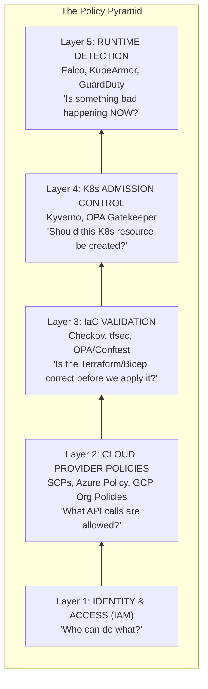
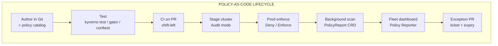
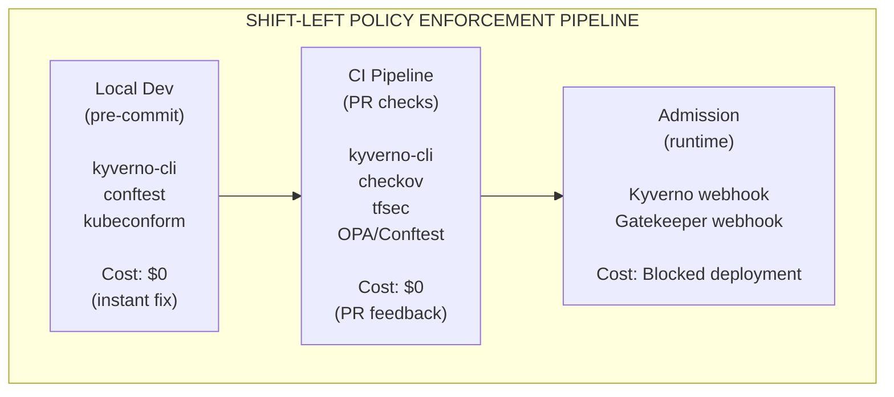
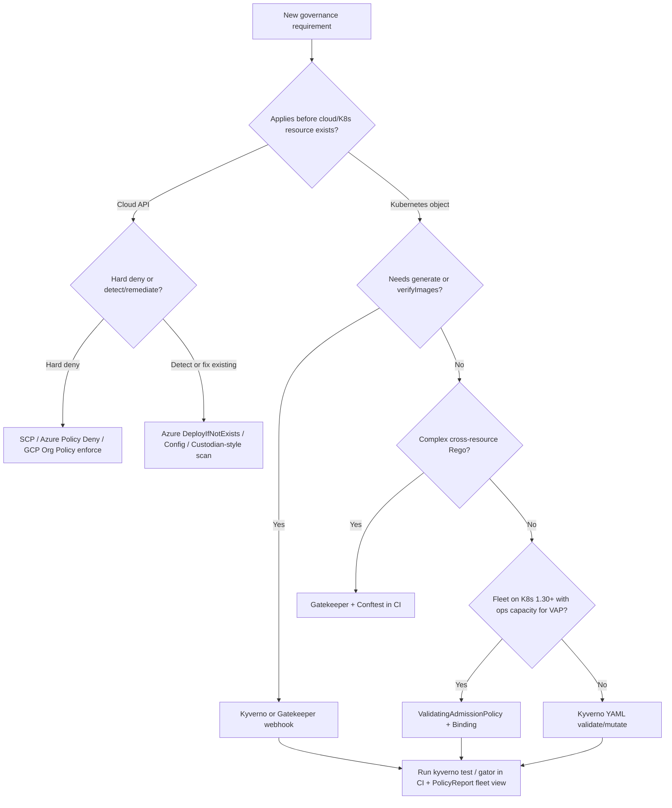
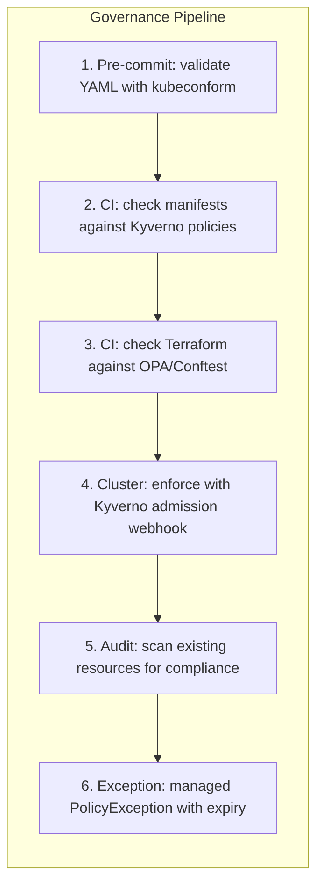

**Complexity**: `[COMPLEX]` | **Time to Complete**: 2.5h | **Prerequisites**: Enterprise Landing Zones (Module 10.1), Kubernetes RBAC basics, YAML/JSON fundamentals

## What You'll Be Able to Do

After completing this module, you will be able to:

- **Design** policy-as-code using OPA Gatekeeper, Kyverno, and cloud-native policy engines for Kubernetes governance
- **Implement** cloud governance frameworks (AWS Config Rules, Azure Policy, GCP Organization Policies) for Kubernetes infrastructure
- **Evaluate** tag-based governance strategies that enforce cost allocation, ownership, and compliance across clusters
- **Deploy** automated remediation workflows that detect and correct governance violations without human intervention

---

## Why This Module Matters

The 2019 Capital One metadata-service breach (see *Node Metadata Security*) <!-- incident-xref: capital-one-2019 --> shows why cloud governance and Kubernetes controls must be aligned; misaligned guardrails let SSRF-style pivots move from perimeter weakness to broad platform compromise.

This incident highlights a pattern that is alarmingly common across the industry: the cloud governance team and the Kubernetes platform team operating in completely separate, isolated silos. The cloud architecture team might not understand Kubernetes admission control intricacies, while the Kubernetes cluster administrators might lack visibility into overarching organizational SCPs. When these critical governance layers do not align, massive security gaps emerge. An attacker only needs one misconfigured ingress path or one overly permissive service account to compromise the entire system.

Policy as Code solves this systemic problem by treating governance rules exactly the same way you treat application code: version-controlled, continuously tested, peer-reviewed, and automatically enforced. In this comprehensive module, you will learn how cloud provider policy systems work in practice, how Kubernetes policy engines complement them effectively, how to build a unified governance model, and how to rigorously manage exceptions without creating security holes. You will design, implement, and evaluate comprehensive policy frameworks running on modern Kubernetes environments (targeting v1.35+).

Hypothetical scenario: Consider an enterprise running approximately 80 AWS accounts, 12 Azure subscriptions, and 40 GCP projects, with roughly 250 Kubernetes clusters spanning EKS, AKS, and GKE. A new regulation requires proof that **no production workload pulls images from unsigned registries** and that **no cluster API server is reachable from the public internet**. The compliance project is not a single tool purchase — it is a coordinated change to SCPs, org policies, ACR/GAR/ECR settings, Kyverno `verifyImages`, and VAP bindings on management clusters. Teams that treat the request as "turn on one admission controller" spend six months in audit findings because cloud objects and cluster objects drift independently. Teams that use the mapping approach in this module ship incremental enforcements per `control_id` and can show pass/fail evidence from both CSPM and PolicyReport in the same executive slide.

---

## The Policy Pyramid

Governance in a cloud-native enterprise is not a single, monolithic layer. It is a highly structured pyramid, with each distinct layer handling different concerns at different points in the resource lifecycle. Relying on just one layer is akin to having a bank vault with a thick, impenetrable door but no surrounding walls.



Each ascending layer catches potential issues that the layer below cannot possibly evaluate. Identity and Access Management (IAM) controls who can call specific cloud APIs, but it cannot intrinsically enforce that every single S3 bucket has KMS encryption enabled. Service Control Policies (SCPs) can enforce encryption globally at the account level, but they lack the context to inspect individual Kubernetes deployment manifests. Kubernetes admission control can reject improperly configured manifests at the API server level, but it cannot stop a running container from suddenly spawning a malicious reverse shell. Runtime detection acts as the final safety net to catch behavioral anomalies in real-time. A robust cloud governance posture requires active enforcement across every single tier of this pyramid.

Platform engineering teams sometimes ask whether the pyramid implies buying five separate products. It does not. It implies **five enforcement moments** that can share one Git repository and one control catalog. IAM and SCPs are native cloud controls. IaC validation reuses OPA/Rego or vendor scanners. Admission uses Kyverno, Gatekeeper, or VAP. Runtime uses Falco, KubeArmor, or cloud IDS — topics adjacent to Module 10.3 compliance automation. The architectural mistake is assigning each layer to a different team with different ticketing systems; the fix is a **governance council** (security architecture + cloud foundation + Kubernetes platform + FinOps) that owns the mapping table and reviews exceptions weekly.

> **Stop and think**: Why is an implicit deny strategy crucial for top-level organizational policies like SCPs?

---

## IaC Validation: Shift-Left Before the Cloud API

Layer 3 of the pyramid — Terraform, OpenTofu, Bicep, Pulumi, Crossplane, or Cluster API manifests — is where engineering teams validate declared configurations before cloud resources are provisioned. In an enterprise landing zone governed by organizational guardrails, teams must choose whether to enforce rules during continuous integration or defer enforcement to cloud provider control planes.

**Pause and predict:** An infrastructure engineering team manages Amazon EKS cluster provisioning through Terraform modules. The team omits static analysis scanning (such as Checkov or Conftest) from pull request checks. Instead, the team relies on an organizational Service Control Policy (SCP) that denies public cluster endpoint creation. At what point in the delivery lifecycle does the SCP evaluate the configuration, and what operational consequences arise from omitting shift-left validation?

<details>
<summary>Check your prediction</summary>

Service Control Policies evaluate permissions strictly at apply time when authenticated API calls reach cloud provider endpoints; they cannot inspect planned resources during pull request reviews or parse Terraform execution plans. Omitting pre-flight static analysis means pipelines must wait through planning phases and authentication workflows before failing with generic access denial errors from cloud APIs. Failing the pull request early with tools such as Checkov or Conftest catches misconfigurations directly inside developer workflows with precise line numbers before cloud credentials ever execute against provider control planes.
</details>

The next section is how static analysis tooling and policy scanners compare across diverse infrastructure as code formats and declarative frameworks.

| Tool | Typical input | Strength | Weakness |
| :--- | :--- | :--- | :--- |
| [Checkov](https://www.checkov.io/) | Terraform, CloudFormation, K8s YAML | Large rule packs (CIS-aligned) | False positives on valid custom patterns |
| tfsec / Trivy config | Terraform HCL | Fast PR feedback | Rule overlap with Checkov — pick one primary |
| [Conftest](https://www.conftest.dev/) | JSON plan, YAML, Helm output | Same Rego as Gatekeeper policies | Requires authors who maintain Rego |
| `terraform validate` + OPA | Plan JSON | Policy on **planned** values | Needs plan artifact in CI |

Hypothetical scenario: A platform team stores Kyverno policies in `policies/kubernetes/` and Gatekeeper ConstraintTemplates in `policies/gatekeeper/`, but Terraform for VPCs and node groups lives in another repo with no scanning. A developer opens `0.0.0.0/0` on the node security group in Terraform; `terraform apply` succeeds; only later does a network assessment flag the change. The fix is to run Checkov or Conftest on the same PR that changes Terraform modules that back EKS, AKS, or GKE — **especially** security groups, subnet routes, and IAM trust policies for cluster roles.

For multi-cloud landing zones, align IaC policy IDs with cloud org policies: if SCP `DENY-PUBLIC-EKS-ENDPOINT` exists, the Terraform module for `aws_eks_cluster` should fail CI when `endpoint_public_access = true` unless the module is tagged `exception-approved` with a ticket variable. That way developers see failures in GitHub/GitLab checks with line numbers, not opaque AWS API errors after a thirty-minute apply.

Crossplane and Cluster API blur the line between IaC and Kubernetes: manifests are YAML applied to a management cluster. Treat management-cluster applies with the same admission and CI stack as workload clusters — compromising the management plane is equivalent to compromising every child cluster the provider creates.

---

## Cloud Provider Policy Systems

Before traffic ever reaches your Kubernetes clusters, it must traverse the cloud provider's network and control plane. Cloud provider policies form the outermost perimeter of your governance strategy.

### AWS Config Rules and automated remediation (detective + corrective)

Outcomes in this module include **automated remediation** — on AWS that often means [AWS Config](https://docs.aws.amazon.com/config/latest/developerguide/WhatIsConfig.html) recording configuration items, evaluating rules, and triggering remediation via SSM Automation or Lambda when a resource drifts. Config does not replace SCPs: Config is predominantly **detective** (with optional remediation) whereas SCPs are **preventive** at API call time. Use Config for "S3 bucket must have versioning" when you need historical evidence; use SCP deny when the bucket must never exist without versioning.

Remediation documents should be idempotent and scoped: a rule that auto-deletes security groups can cause outages if it fires on a legitimate bastion pattern. Pair auto-remediation with Config rule **exclusion** tags the same way you use PolicyException in Kubernetes. For EKS-specific hygiene, managed Config rules exist for cluster endpoint public access and control plane logging — map each to the same `control_id` you use in Kyverno for in-cluster analogs.

### AWS Service Control Policies (SCPs)

SCPs are the top-level preventive control mechanism in AWS Organizations. They define the absolute maximum permissions available to any principal in a given AWS account. Think of them as an unbreakable ceiling. Even if an IAM policy explicitly grants `s3:*` to an administrator, an SCP that denies `s3:DeleteBucket` will absolutely override the IAM policy and block the deletion.

```json
{
  "Version": "2012-10-17",
  "Statement": [
    {
      "Sid": "DenyUnapprovedRegions",
      "Effect": "Deny",
      "Action": "*",
      "Resource": "*",
      "Condition": {
        "StringNotEquals": {
          "aws:RequestedRegion": [
            "us-east-1",
            "us-west-2",
            "eu-west-1"
          ]
        },
        "ArnNotLike": {
          "aws:PrincipalArn": [
            "arn:aws:iam::*:role/OrganizationAdmin"
          ]
        }
      }
    },
    {
      "Sid": "DenyPublicEKS",
      "Effect": "Deny",
      "Action": [
        "eks:CreateCluster",
        "eks:UpdateClusterConfig"
      ],
      "Resource": "*",
      "Condition": {
        "StringEquals": {
          "eks:endpointPublicAccess": "true"
        }
      }
    },
    {
      "Sid": "RequireIMDSv2",
      "Effect": "Deny",
      "Action": "ec2:RunInstances",
      "Resource": "arn:aws:ec2:*:*:instance/*",
      "Condition": {
        "StringNotEquals": {
          "ec2:MetadataHttpTokens": "required"
        }
      }
    },
    {
      "Sid": "DenyLeaveOrganization",
      "Effect": "Deny",
      "Action": "organizations:LeaveOrganization",
      "Resource": "*"
    }
  ]
}
```

There are several critical gotchas with AWS SCPs that trip up many platform teams. First, [SCPs do not actually grant any permissions; they only restrict them.](https://docs.aws.amazon.com/organizations/latest/userguide/orgs_manage_policies_scps.html) An SCP that explicitly allows `s3:*` does not give anyone S3 access -- it merely removes the restriction, leaving IAM to decide. Second, SCPs do not apply to the central management account of the organization, a common blindspot that requires separate governance. Third, SCPs are evaluated with an implicit deny posture; if an action is not explicitly allowed somewhere in the SCP hierarchy, it is automatically denied.

#### SCP evaluation logic and deny vs allow-list strategy

AWS evaluates every API call against the full chain of SCPs attached from the organization root down through organizational units (OUs) to the member account. [Each SCP in the chain must allow the action for it to proceed](https://docs.aws.amazon.com/organizations/latest/userguide/orgs_manage_policies_scps.html#scp-effects) — think of the effective SCP result as the intersection of all policies on the path. A single explicit `Deny` anywhere in that chain blocks the call, regardless of what IAM identity policies say. This is why mature enterprises usually adopt a **deny-by-default guardrail** model at the org level: block the handful of actions that create irreversible risk (leaving the organization, disabling security services, creating public cluster endpoints, running instances without IMDSv2), then let member accounts use normal IAM for day-to-day work.

An **allow-list SCP strategy** — where you enumerate every permitted action — rarely scales past a few hundred accounts because cloud APIs evolve weekly and teams legitimately need new services. Allow-list SCPs also fight AWS's own service-linked roles and control-plane automation. The compromise most landing-zone teams use is **guardrail denies plus permission boundaries on human roles**: SCPs cap what any principal in an account can ever do, while [IAM permission boundaries](https://docs.aws.amazon.com/IAM/latest/UserGuide/access_policies_boundaries.html) cap what a specific role can delegate. Permission boundaries are not SCPs; they apply inside the account and are essential when developers can create IAM roles (for example IRSA on EKS). Without a boundary, a compromised CI role could create a new admin role and bypass your intent even when SCPs are correct.

When designing SCPs for Kubernetes estates, separate **cluster lifecycle** denies (`eks:CreateCluster` with public endpoint conditions, as in the sample above) from **data-plane** denies (unencrypted volumes, open security groups on node pools). EKS control-plane API calls and EC2 node provisioning follow different IAM paths; a policy that only targets `eks:*` will not catch a team that launches unmanaged kubeadm on raw EC2. Pair SCPs with AWS Config rules or Security Hub controls on the management account, because that account is outside the SCP ceiling.

### Azure Policy

Azure Policy takes a conceptually different approach. Instead of a simple allow/deny mechanism, it supports multiple specialized "effects" that dynamically determine exactly what happens when a resource violates the organizational policy.

```json
{
  "properties": {
    "displayName": "AKS clusters must use Azure CNI with network policy",
    "policyType": "Custom",
    "mode": "Indexed",
    "description": "Ensures all AKS clusters use Azure CNI networking with Calico or Azure network policy enabled.",
    "parameters": {},
    "policyRule": {
      "if": {
        "allOf": [
          {
            "field": "type",
            "equals": "Microsoft.ContainerService/managedClusters"
          },
          {
            "anyOf": [
              {
                "field": "Microsoft.ContainerService/managedClusters/networkProfile.networkPlugin",
                "notEquals": "azure"
              },
              {
                "field": "Microsoft.ContainerService/managedClusters/networkProfile.networkPolicy",
                "exists": "false"
              }
            ]
          }
        ]
      },
      "then": {
        "effect": "Deny"
      }
    }
  }
}
```

[The various Azure Policy effects allow for nuanced governance architectures](https://learn.microsoft.com/en-us/azure/governance/policy/concepts/effect-basics):

| Effect | Behavior | Use Case |
| :--- | :--- | :--- |
| `Deny` | Block resource creation/update | Preventive: enforce hard requirements |
| `Audit` | Allow but log non-compliance | Detective: visibility without blocking |
| `DeployIfNotExists` | Auto-remediate by deploying a resource | Enforce logging, diagnostics, extensions |
| `Modify` | Alter resource properties during creation | Add tags, enable encryption automatically |
| `Disabled` | Policy exists but is not enforced | Testing or temporary exception |
| `DenyAction` | Block specific actions on existing resources | Prevent deletion of critical resources |
| `AuditIfNotExists` | Allow creation but flag missing related resources | Detect clusters without diagnostics, missing extensions |

[Policy initiatives (policy sets)](https://learn.microsoft.com/en-us/azure/governance/policy/concepts/initiative-definition-structure) bundle dozens of definitions into one assignable object — the Azure equivalent of attaching multiple SCPs to an OU. Initiatives are how regulated industries ship CIS or NIST mappings: each control ID links to one or more policy definitions, and compliance dashboards aggregate results at management-group scope. **Remediation tasks** turn `DeployIfNotExists` and `Modify` effects into scheduled or on-demand jobs that backfill non-compliant resources; treat them like batch controllers with their own failure modes (stale template versions, insufficient managed identity on the remediation task).

For Kubernetes specifically, Azure distinguishes **resource provider policies** (ARM resources such as `Microsoft.ContainerService/managedClusters`) from **in-cluster policies** delivered through the Azure Policy add-on. The add-on installs Gatekeeper and translates Azure Policy definitions into OPA constraints, which means your Azure portal compliance view and your cluster admission layer can share one definition — at the cost of coupling cluster upgrades to add-on compatibility. Test initiative rollouts in audit mode per subscription before switching production management groups to deny.

The `DeployIfNotExists` effect is powerful for managing AKS fleets at scale. On **managed AKS**, use the built-in **Azure Policy add-on** (`addonProfiles.azurepolicy`) — enable with `az aks enable-addons --addons azure-policy` or a policy such as [Deploy Azure Policy Add-on to AKS](https://learn.microsoft.com/en-us/azure/governance/policy/samples/built-in-policy#kubernetes). That add-on runs Gatekeeper and projects portal definitions into the cluster. The separate `Microsoft.PolicyInsights` **extension** on `managedClusters/extensions` is the **Azure Arc-enabled Kubernetes** path (on-prem or other clouds connected through Arc), not the same install surface as the native AKS add-on.

```json
{
  "if": {
    "field": "type",
    "equals": "Microsoft.ContainerService/managedClusters"
  },
  "then": {
    "effect": "DeployIfNotExists",
    "details": {
      "type": "Microsoft.ContainerService/managedClusters",
      "existenceCondition": {
        "field": "Microsoft.ContainerService/managedClusters/addonProfiles.azurepolicy.enabled",
        "equals": true
      },
      "roleDefinitionIds": [
        "/providers/Microsoft.Authorization/roleDefinitions/0e5e0b4d-9b02-4d98-8ba1-6d3e6b05e4b8"
      ],
      "deployment": {
        "properties": {
          "mode": "incremental",
          "template": {
            "resources": [
              {
                "type": "Microsoft.ContainerService/managedClusters",
                "apiVersion": "2024-01-01",
                "name": "[field('name')]",
                "location": "[field('location')]",
                "properties": {
                  "addonProfiles": {
                    "azurepolicy": {
                      "enabled": true
                    }
                  }
                }
              }
            ]
          }
        }
      }
    }
  }
}
```

### GCP Organization Policies

Google Cloud Platform (GCP) Organization Policies use constraints -- predefined or highly customized rules that restrict resource configurations across the entire hierarchical structure of folders and projects.

```yaml
# Custom constraint: deny public GKE clusters (no predefined org-policy constraint for this)
apiVersion: orgpolicy.googleapis.com/v2
kind: CustomConstraint
metadata:
  name: custom.gkeRequirePrivateCluster
spec:
  resourceTypes:
    - container.googleapis.com/Cluster
  methodTypes:
    - CREATE
    - UPDATE
  condition: >
    resource.privateClusterConfig.enablePrivateNodes == true &&
    resource.privateClusterConfig.enablePrivateEndpoint == true
  actionType: DENY
  displayName: "GKE clusters must use private nodes and a private control-plane endpoint"
  description: "Deny cluster create/update unless private nodes and private endpoint are enabled."
```

```yaml
# Restrict which regions can host GKE clusters
constraint: constraints/gcp.resourceLocations
listPolicy:
  allowedValues:
    - us-central1
    - us-east4
    - europe-west1
```

```yaml
# Require Shielded GKE Nodes
constraint: constraints/container.requireShieldedNodes
booleanPolicy:
  enforced: true
```

GCP also supports deeply custom organization policy constraints utilizing the Common Expression Language (CEL), offering fine-grained logical control over cluster provisioning:

```yaml
# Custom constraint: GKE clusters must have Binary Authorization enabled
apiVersion: orgpolicy.googleapis.com/v2
kind: CustomConstraint
metadata:
  name: custom.gkeRequireBinaryAuthorization
spec:
  resourceTypes:
    - container.googleapis.com/Cluster
  methodTypes:
    - CREATE
    - UPDATE
  condition: >
    resource.binaryAuthorization.evaluationMode == "PROJECT_SINGLETON_POLICY_ENFORCE"
  actionType: DENY
  displayName: "GKE clusters must enable Binary Authorization"
  description: "All GKE clusters must have Binary Authorization enabled to enforce container image signing."
```

GCP Organization Policy also supports **dry-run (preview) mode** on constraints: you can evaluate what would be denied without enforcing, which is invaluable when migrating hundreds of projects from permissive to enforced constraints. [Custom constraints use CEL against resource payloads](https://cloud.google.com/resource-manager/docs/organization-policy/creating-managing-custom-constraints) the same way Kubernetes ValidatingAdmissionPolicy does — the mental model transfers between cloud org policy and in-cluster admission. Predefined constraints such as `constraints/gcp.resourceLocations` and `constraints/container.requireShieldedNodes` should be your first line; custom constraints belong where you need fields the predefined catalog does not expose (private cluster configuration, Binary Authorization mode, specific node pool settings, service mesh annotations on GKE Enterprise fleets).

Folder hierarchy matters: a constraint enforced at the organization root flows to all folders and projects unless a child folder receives a **replace** policy that relaxes or tightens the rule. Platform teams often enforce hard denies at the org, delegate tag and label standards to folder-level custom constraints, and leave project factories to stamp project-level exceptions only through audited break-glass processes.

### Provider-specific Kubernetes integration paths

The three hyperscalers do not ship identical policy stories for managed Kubernetes — your unified catalog must document **which engine enforces which control** on each platform.

**Amazon EKS** has no first-party in-cluster policy operator equivalent to Azure Policy for Kubernetes. You install Kyverno or Gatekeeper via Helm (often GitOps-managed), scope the controller service account with [EKS Pod Identity](https://docs.aws.amazon.com/eks/latest/userguide/pod-identities.html) or [IRSA](https://docs.aws.amazon.com/eks/latest/userguide/iam-roles-for-service-accounts.html), and rely on SCPs plus AWS Config for cloud-side guardrails. Pod Identity simplifies granting the admission controller access to AWS APIs when policies need to read SSM parameters or Secrets Manager — still rare for basic validate rules, but common for image verification integrations. ACK (AWS Controllers for Kubernetes) resources are still cloud API calls; SCPs apply to the underlying IAM role.

**Azure AKS** can consume policies through **Azure Policy for Kubernetes** without a separate Gatekeeper install — the add-on is the bridge described earlier. Teams that need Kyverno **generate** rules or cosign verification often run Kyverno alongside the add-on, which requires clear ownership: portal compliance for ARM-level cluster settings, Kyverno for workload objects the add-on does not translate.

**Google GKE** couples org-policy constraints (public cluster deny, location restrictions, Shielded Nodes) with in-cluster options: Anthos Policy Controller (Gatekeeper-based) on GKE Enterprise fleets, or standalone Kyverno on standard GKE. [GKE Fleets](https://cloud.google.com/kubernetes-engine/docs/fleets-overview) propagate configuration including policy bundles — think fleet-wide policy as code similar to ApplicationSets in Argo CD (Module 10.5). Binary Authorization sits between registry and deploy; align it with Kyverno `verifyImages` so developers see consistent failure messages.

| Platform | Cloud guardrails | Typical in-cluster engine | Fleet-wide distribution |
| :--- | :--- | :--- | :--- |
| EKS | SCP + Config + IAM boundaries | Kyverno or Gatekeeper (self-managed) | Argo CD ApplicationSets, Rancher, or CAPI |
| AKS | Azure Policy + initiatives | Azure Policy add-on (Gatekeeper) ± Kyverno | Azure Arc + Policy for Kubernetes |
| GKE | Org Policy + Binary Authorization | Policy Controller or Kyverno | GKE Fleet config / Config Sync |

None of these paths removes the need for **vendor-neutral** skills: CEL in VAP, Rego in Gatekeeper, and YAML in Kyverno transfer when you adopt Cluster API (Module 10.6) to declare clusters on any cloud with the same admission stack inside.

---

## Tag-Based Governance and Cost Allocation

Cloud finance and security teams rarely disagree that resources need **owner**, **cost-center**, and **environment** metadata — they disagree on who enforces it. Tag-based governance at enterprise scale means the same keys appear on AWS resources (via SCP `RequestTag` conditions or Config rules), Azure resources (via `Modify` effects and required tags on resource groups), GCP labels on projects and GKE node pools, and Kubernetes labels that mirror those keys for chargeback tools.

| Layer | AWS | Azure | GCP | Kubernetes (vendor-neutral) |
| :--- | :--- | :--- | :--- | :--- |
| Prevent untagged creates | SCP condition keys `aws:RequestTag/owner` | Policy `Modify` or `Deny` on missing tags | Org policy + project labels | Kyverno validate on Namespace/Pod labels |
| Detect drift | AWS Config, Resource Groups Tagging API | Azure Policy compliance scan | Asset Inventory | Kyverno background scan + PolicyReport |
| Allocate spend | Cost Allocation Tags, CUR | Cost Management + tags | Billing export labels | OpenCost / Kubecost label mapping |

**Pause and predict:** An application team deploys an ingress controller and database workload into an EKS cluster. All Deployment and Namespace manifests carry mandatory `cost-center` and `owner` labels. Will underlying cloud infrastructure provisioned by cluster controllers (such as Application Load Balancers and EBS storage volumes) automatically inherit those workload labels? How does unified governance resolve any discrepancy?

<details>
<summary>Check your prediction</summary>

Kubernetes labels declared on Deployments and Namespaces exist solely within the Kubernetes control plane and etcd database; cloud infrastructure controllers, such as the AWS Load Balancer Controller or EBS CSI driver, do not automatically propagate application manifest labels to external cloud provider resources unless explicitly instructed through dedicated annotations or controller configuration. Without matching cloud provider tags, FinOps dashboards and Cost and Usage Reports (CUR) categorize expensive load balancers and block storage as unallocated cloud spend, obscuring thousands of dollars per month depending on deployment scale. Unified governance resolves this visibility gap by mapping a single control identifier (such as `GOV-TAG-001`) across both planes: enforcing cloud provider policies (such as SCP `RequestTag` checks or Azure Policy tag modifiers) on cloud resource creation, while applying Kubernetes admission rules to mandate identical metadata within cluster manifests.
</details>

The next section is how in-cluster policy engines govern workloads once cloud APIs have already admitted the cluster.

Hypothetical scenario: A product team deploys to EKS with correct Kubernetes labels but forgets to tag the underlying ALB and EBS volumes. FinOps shows the cluster compute allocation while the load balancer and storage sit in **unallocated** spend, obscuring thousands of dollars per month (or roughly $40,000 in larger environments) from direct team attribution. Unified governance maps **one control ID** (for example `GOV-TAG-001`) to an SCP deny on untagged `elasticloadbalancing:*` creates, an Azure Policy modify on resource groups, and a Kyverno rule requiring `cost-center` on Namespaces so in-cluster objects inherit allocation context. The point is not triple redundancy for annoyance — each layer catches leaks the others cannot see.

---

## Kubernetes Policy Engines: Kyverno vs OPA Gatekeeper

Cloud provider policies stop at the cloud API boundary. Once a functional Kubernetes cluster exists, you absolutely must deploy an in-cluster policy engine to govern the workloads and objects being deployed inside the cluster.

In-cluster policy engines intercept API requests at admission time, validating, mutating, or generating resources according to organizational policy rules before objects are persisted to etcd.

### Kyverno

[Kyverno is a policy engine designed specifically for Kubernetes.](https://github.com/kyverno/kyverno) It uses Kubernetes-native YAML to define comprehensive policies. The philosophy is straightforward: if you can write a standard Kubernetes manifest, you already possess the foundational knowledge to write a Kyverno policy. This represents its primary operational advantage, as the learning curve is minimal for teams already fluent in YAML logic.

> **Note (Kyverno 1.13+):** Top-level `spec.validationFailureAction` is deprecated; set `failureAction` on each rule (`rules[].validate.failureAction` for validate rules, or `rules[].failureAction` for `verifyImages` rules).

```yaml
# Kyverno: Deny containers running as root
apiVersion: kyverno.io/v1
kind: ClusterPolicy
metadata:
  name: deny-run-as-root
  annotations:
    policies.kyverno.io/title: Deny Running as Root
    policies.kyverno.io/severity: high
spec:
  background: true
  rules:
    - name: check-run-as-non-root
      match:
        any:
          - resources:
              kinds:
                - Pod
      validate:
        failureAction: Enforce
        message: >
          Running as root is not allowed. Set
          spec.securityContext.runAsNonRoot or
          spec.containers[*].securityContext.runAsNonRoot (and initContainers)
          to true.
        pattern:
          spec:
            =(securityContext):
              runAsNonRoot: true
            =(initContainers):
              - securityContext:
                  runAsNonRoot: true
            containers:
              - securityContext:
                  runAsNonRoot: true
```

```yaml
# Kyverno: Mutate to add default resource limits
apiVersion: kyverno.io/v1
kind: ClusterPolicy
metadata:
  name: add-default-resources
spec:
  rules:
    - name: add-default-limits
      match:
        any:
          - resources:
              kinds:
                - Pod
      mutate:
        patchStrategicMerge:
          spec:
            containers:
              - (name): "*"
                resources:
                  limits:
                    +(memory): "256Mi"
                    +(cpu): "200m"
                  requests:
                    +(memory): "128Mi"
                    +(cpu): "100m"
```

```yaml
# Kyverno: Generate NetworkPolicy for every new namespace
apiVersion: kyverno.io/v1
kind: ClusterPolicy
metadata:
  name: generate-default-networkpolicy
spec:
  rules:
    - name: default-deny-ingress
      match:
        any:
          - resources:
              kinds:
                - Namespace
      exclude:
        any:
          - resources:
              namespaces:
                - kube-system
                - kube-public
      generate:
        apiVersion: networking.k8s.io/v1
        kind: NetworkPolicy
        name: default-deny-ingress
        namespace: "{{request.object.metadata.name}}"
        synchronize: true
        data:
          spec:
            podSelector: {}
            policyTypes:
              - Ingress
```

### OPA Gatekeeper

Gatekeeper utilizes Rego, a highly robust, purpose-built policy language derived from the Open Policy Agent (OPA) project. Rego is considerably more powerful than YAML pattern matching but intrinsically demands a steeper learning curve. [Gatekeeper structurally separates the policy logic, known as the ConstraintTemplate, from the dynamic configuration, known as the Constraint.](https://github.com/open-policy-agent/gatekeeper)

```yaml
# Gatekeeper: ConstraintTemplate (the logic)
apiVersion: templates.gatekeeper.sh/v1
kind: ConstraintTemplate
metadata:
  name: k8sdenypublicloadbalancer
spec:
  crd:
    spec:
      names:
        kind: K8sDenyPublicLoadBalancer
      validation:
        openAPIV3Schema:
          type: object
          properties:
            allowedNamespaces:
              type: array
              items:
                type: string
  targets:
    - target: admission.k8s.gatekeeper.sh
      rego: |
        package k8sdenypublicloadbalancer

        violation[{"msg": msg}] {
          input.review.object.kind == "Service"
          input.review.object.spec.type == "LoadBalancer"
          not input.review.object.metadata.annotations["service.beta.kubernetes.io/aws-load-balancer-internal"]
          namespace := input.review.object.metadata.namespace
          not namespace_allowed(namespace)
          msg := sprintf("Public LoadBalancer services are not allowed in namespace '%v'. Add annotation 'service.beta.kubernetes.io/aws-load-balancer-internal: true' or use an allowed namespace.", [namespace])
        }

        namespace_allowed(namespace) {
          allowed := input.parameters.allowedNamespaces[_]
          namespace == allowed
        }
```

```yaml
# Gatekeeper: Constraint (the configuration)
apiVersion: constraints.gatekeeper.sh/v1beta1
kind: K8sDenyPublicLoadBalancer
metadata:
  name: deny-public-lb-except-ingress
spec:
  match:
    kinds:
      - apiGroups: [""]
        kinds: ["Service"]
  parameters:
    allowedNamespaces:
      - ingress-nginx
      - istio-system
```

The choice between Kyverno and Gatekeeper often comes down to organizational maturity and existing technology stacks.

Gatekeeper ships with a [constraint library](https://open-policy-agent.github.io/gatekeeper-library/) of community templates (public LoadBalancer, required labels, container limits) you can install without writing Rego from scratch. Enterprise teams fork the library into their policy repo, pin versions, and run `gator verify` in CI so template upgrades do not silently broaden matches. When you **do** write custom Rego, keep templates generic (`K8sRequiredLabels`) and push environment-specific values into Constraint `parameters` — the same split as Terraform modules vs tfvars.

OPA's strength outside Kubernetes is worth repeating: the same Rego package can validate a Terraform plan in Conftest, authorize a microservice API in an OPA sidecar, and enforce admission in Gatekeeper. If your organization already standardized on Rego for identity and API authorization, Gatekeeper is the consistent Kubernetes face of that investment. If your organization has no Rego bench and no plan to hire for it, the library plus Kyverno YAML usually delivers value faster.

| Feature | Kyverno | OPA Gatekeeper |
| :--- | :--- | :--- |
| **Policy language** | Kubernetes-native YAML | Rego (purpose-built) |
| **Learning curve** | Low (YAML knowledge sufficient) | High (Rego is a new language) |
| **Validation** | Yes | Yes |
| **Mutation** | Yes | Yes (via Gatekeeper mutator CRDs) |
| **Generation** | Yes (create resources from policies) | No |
| **Image verification** | Yes (cosign, Notary) | Via external data |
| **Background scanning** | Yes (audit existing resources) | Yes (audit existing resources) |
| **Policy exceptions** | PolicyException resource | Config constraint match exclusions |
| **Multi-tenancy** | Namespace-scoped policies | Namespace-scoped constraints |
| **CNCF status** | [CNCF Graduated (March 2026)](https://www.cncf.io/projects/kyverno/) | [OPA CNCF Graduated; Gatekeeper is the K8s admission integration](https://www.cncf.io/projects/open-policy-agent-opa/) |
| **Best for** | Teams wanting YAML-native validate/mutate/generate/verifyImages | Teams needing Rego across K8s + Conftest + APIs |

### Kubernetes-native admission: ValidatingAdmissionPolicy and MutatingAdmissionPolicy

Kubernetes 1.30+ clusters (including your **1.35** curriculum target) ship **in-tree** admission policies that use CEL instead of webhooks. [ValidatingAdmissionPolicy (VAP) is stable in Kubernetes v1.30](https://kubernetes.io/docs/reference/access-authn-authz/validating-admission-policy/) and provides a declarative alternative to ValidatingAdmissionWebhook for many guardrails. **MutatingAdmissionPolicy (MAP)** extends the same model for mutations without operating Kyverno or Gatekeeper pods.

```yaml
apiVersion: admissionregistration.k8s.io/v1
kind: ValidatingAdmissionPolicy
metadata:
  name: deny-public-loadbalancer-services.example.com
spec:
  failurePolicy: Fail
  matchConstraints:
    resourceRules:
      - apiGroups: [""]
        apiVersions: ["v1"]
        operations: ["CREATE", "UPDATE"]
        resources: ["services"]
  validations:
    - expression: >
        object.spec.type != "LoadBalancer" ||
        ("service.beta.kubernetes.io/aws-load-balancer-internal" in object.metadata.annotations)
      message: "Public LoadBalancer Services require internal load balancer annotation."
---
apiVersion: admissionregistration.k8s.io/v1
kind: ValidatingAdmissionPolicyBinding
metadata:
  name: deny-public-lb-binding-production
spec:
  policyName: deny-public-loadbalancer-services.example.com
  validationActions: [Deny]
  matchResources:
    namespaceSelector:
      matchLabels:
        environment: production
```

VAP bindings support `validationActions: [Warn, Audit]` for audit-first rollouts — the same progression teams use with Kyverno `validate.failureAction: Audit`. Type checking in `status.typeChecking` catches CEL mistakes at apply time, but CRD-heavy policies still need careful `matchConstraints` because wildcard resource rules skip deep schema checks.

**When VAP is enough:** simple field checks, label requirements, replica limits, and deny rules that do not need image signature verification or cross-object generation. **When you still need Kyverno or Gatekeeper:** `verifyImages` with cosign, generate rules that create NetworkPolicies, complex Rego that joins ConfigMaps and external data, or ecosystems already standardized on PolicyReport + Policy Reporter dashboards. Many enterprises run **VAP for baseline platform guardrails** (low operational cost, no webhook HA) and **Kyverno for supply-chain and generate policies** — not because one tool wins outright, but because webhook cost and blast radius differ by rule type.

Webhook engines add **latency and availability** dependencies: every Pod create waits on admission webhook round-trips. In-tree VAP executes inside the API server process (still CPU-bound, but no extra NetworkPolicy holes for webhook traffic). At hundreds of clusters, that difference shows up in P99 admission latency and in incident stories where a broken webhook takes down all deployments cluster-wide.

### MutatingAdmissionPolicy (MAP) and ordering with validation

[MutatingAdmissionPolicy](https://kubernetes.io/docs/reference/access-authn-authz/mutating-admission-policy/) (Kubernetes 1.32+ feature path; verify your distribution's feature gate chart for 1.35) brings CEL-based mutations in-tree — default labels, sidecar injection patterns, and resource defaults without external mutating webhook controllers. When designing an admission control architecture combining automated modifications with compliance rules, the sequencing of admission phases directly governs policy interactions.

**Pause and predict:** A Kubernetes cluster is configured with both mutating admission components (MutatingAdmissionPolicy or mutating webhooks) and validating admission components (ValidatingAdmissionPolicy or validating webhooks). What is the evaluation sequence between these components, and which representation of the resource does the validation phase inspect?

<details>
<summary>Check your prediction</summary>

The Kubernetes API server admission chain strictly evaluates mutating controllers before validating controllers; mutating webhooks and MutatingAdmissionPolicy (MAP) execute first, and validating webhooks and ValidatingAdmissionPolicy (VAP) evaluate the object afterward. Consequently, validation checks always evaluate the final mutated object rather than the raw manifest originally submitted by the client. Platform teams that hardcode static defaults (such as `env: dev`) in a mutation policy while a validating policy requires the `env` label to match namespace metadata will trigger admission rejections on the mutated object unless mutations dynamically read namespace context (`namespaceObject` in CEL) rather than injecting uncoordinated defaults.
</details>

The next section is how platform teams select between in-tree admission primitives and external webhook controllers when designing cluster policy architectures.

When both MAP and Kyverno mutate are available, avoid duplicating the same patch in two engines. Pick MAP for platform-owned defaults (cost allocation labels required on every Deployment) and Kyverno generate for **creating** sibling resources (NetworkPolicy, ResourceQuota) that MAP does not aim to replace.

---

## Policy-as-Code Lifecycle and Fleet Reporting

Treating policies like application code means more than storing YAML in Git. A mature lifecycle includes **authoring standards**, **automated tests**, **staged rollout**, **fleet visibility**, and **exception expiry** — the same disciplines you expect from microservice releases.



**Testing tools:** [Kyverno CLI `kyverno test`](https://kyverno.io/docs/testing-policies/) runs fixture resources against policies in CI. [Gatekeeper `gator test`](https://open-policy-agent.github.io/gatekeeper/website/docs/gator) validates ConstraintTemplates and Constraints. [Conftest](https://www.conftest.dev/) executes Rego against Terraform plans, Kubernetes manifests, and Helm output — the bridge when Gatekeeper authors already maintain Rego in OPA. [Chainsaw](https://kyverno.io/docs/testing-policies/chainsaw/) (Kubernetes-native e2e) helps when policies interact with controllers and CRDs beyond static YAML fixtures.

**Fleet reporting:** The Kubernetes [PolicyReport](https://kyverno.io/docs/policy-reports/) ecosystem (Kyverno and Gatekeeper both emit reports) aggregates pass/fail per namespace. Tools such as [Policy Reporter](https://kyverno.github.io/policy-reporter/) fan those CRDs into SIEM tickets and Grafana boards so auditors see cluster posture without `kubectl` access. Align report keys with your cloud CSPM exports (AWS Security Hub, Google Security Command Center, Microsoft Defender for Cloud) so the same control ID appears in cloud and cluster dashboards.

**Waiver workflow as code:** Exceptions should be pull requests against a `policy-exceptions/` directory (Kyverno `PolicyException`, Gatekeeper match exclusions, VAP bindings scoped to a single namespace) with mandatory `exception-ticket` and `exception-expires` labels — never Slack approval with no Git trail. A weekly CI job that fails when `exception-expires < today` is cheaper than a quarterly audit finding hundreds of "temporary" bypasses.

---

## Mapping Cloud Policies to Kubernetes Policies

The transformational power of Policy as Code shows up when you create a unified governance model where cloud policies and Kubernetes policies reinforce one another. Here is a mapping of common enterprise requirements across both layers:

| Requirement | Cloud Policy | Kubernetes Policy |
| :--- | :--- | :--- |
| No public endpoints | AWS SCP (`eks:endpointPublicAccess`); Azure Policy on AKS API/profile; GCP custom org constraint on private GKE | Kyverno: deny Service type LoadBalancer without internal annotation |
| Encryption at rest | SCP: deny unencrypted EBS/disks | Kyverno: require encrypted StorageClass |
| Image provenance | ECR/ACR/Artifact Registry policies | Kyverno: verify image signatures (cosign) |
| Resource tagging | SCP: deny untagged resources | Kyverno: require labels matching cloud tags |
| Network segmentation | SCP: deny public subnets in EKS VPCs | Kyverno: generate NetworkPolicy on namespace creation |
| Least privilege | IAM: minimal role permissions | Kyverno: deny privileged containers, deny hostNetwork |
| Logging | SCP: require CloudTrail/audit logs | Kyverno: require sidecar logging or FluentBit DaemonSet |
| Cost control | AWS Budgets / Azure Cost Alerts | Kyverno: enforce resource limits, deny unrestricted replicas |

### Defense in depth: one control, three layers (public load balancers)

Consider **no internet-facing load balancers in production** — a requirement that appears in PCI-DSS scoping conversations and in every well-run EKS/GKE/AKS security baseline. Express it three ways so a failure at one layer does not silently open exposure:

1. **AWS:** SCP deny on `eks:CreateCluster` / `eks:UpdateClusterConfig` when `eks:endpointPublicAccess` is true (control plane), plus IAM/SCP conditions on `elasticloadbalancing:CreateLoadBalancer` where applicable for classic ELB paths outside Kubernetes.
2. **Azure:** Policy `Deny` on AKS profiles that disable network policy, combined with in-cluster constraints via the Azure Policy add-on for `Service` type `LoadBalancer` without approved annotations.
3. **GCP:** Custom org constraint on `container.googleapis.com/Cluster` requiring `privateClusterConfig.enablePrivateNodes` and `enablePrivateEndpoint`, plus optional custom CEL on GKE Service definitions if you standardize on internal load balancers only.
4. **Kubernetes (vendor-neutral):** Kyverno or Gatekeeper deny `Service` `type: LoadBalancer` without internal annotation; **VAP** CEL on the same field for clusters where you want zero webhook moving parts.

If a platform engineer bypasses GitOps and `kubectl apply`s a public Service, cloud-layer denies may not exist (the object is valid Kubernetes). Admission is the choke point. If admission is misconfigured, runtime detection (Falco alerts on unexpected external connections) and CSPM (Module 10.3) provide detective backup — but never treat detection as equivalent to prevention for exposure classes.

### Example: Unified Policy for Image Provenance

This example shows how one governance requirement ("production images must be cryptographically signed") spans cloud and Kubernetes layers for defense-in-depth:

```bash
# Layer 1 (Cloud): ECR lifecycle policy — retention only, not signature enforcement
aws ecr put-lifecycle-policy --repository-name my-app \
  --lifecycle-policy-text '{
    "rules": [{
      "rulePriority": 1,
      "description": "Expire old tagged release images beyond 50",
      "selection": {
        "tagStatus": "tagged",
        "tagPrefixList": ["v"],
        "countType": "imageCountMoreThan",
        "countNumber": 50
      },
      "action": { "type": "expire" }
    }]
  }'
```

Provenance enforcement at the registry uses separate controls (for example ECR signing configuration or IAM conditions on `ecr:BatchGetImage`). The admission choke point below is Kyverno `verifyImages`.

```yaml
# Layer 2 (Kubernetes): Kyverno policy verifying cosign signatures
apiVersion: kyverno.io/v1
kind: ClusterPolicy
metadata:
  name: verify-image-signatures
spec:
  webhookTimeoutSeconds: 30
  rules:
    - name: verify-cosign-signature
      failureAction: Enforce
      match:
        any:
          - resources:
              kinds:
                - Pod
      verifyImages:
        - imageReferences:
            - "123456789012.dkr.ecr.*.amazonaws.com/*"
          attestors:
            - entries:
                - keyless:
                    subject: "https://github.com/my-org/*"
                    issuer: "https://token.actions.githubusercontent.com"
                    rekor:
                      url: "https://rekor.sigstore.dev"
          mutateDigest: true
          verifyDigest: true
```

On **Azure**, attach **Azure Container Registry** content trust or Microsoft Defender for Containers policies at the registry layer. On **GCP**, Binary Authorization enforces attestors before deploy — align cluster org constraints (custom CEL above) with attestor configuration so teams see one error message in CI (Conftest/Kyverno CLI) and another only if they bypass pipeline. The operational win is **one policy repo** with directories `cloud/aws/`, `cloud/azure/`, `cloud/gcp/`, and `kubernetes/` keyed by the same `control_id` label in YAML annotations.

---

## Exception Management

Every realistic enterprise governance system inherently requires a structured mechanism to handle legitimate, business-critical workload exceptions. The pivotal operational question is how exemptions are authorized, scoped, and lifecycle-managed without undermining platform security baselines.

**Pause and predict:** An application workload requires a temporary exemption from a strict organizational or cluster-wide guardrail. What failure mode occurs if administrators handle the request through chat approvals or temporary policy edits? What structural elements must every production policy exemption include?

<details>
<summary>Check your prediction</summary>

Handling exceptions through verbal agreements, Slack messages, or direct edits that disable global policies creates unmanaged configuration drift and blind spots; teams routinely forget to reinstate disabled rules, leaving permanent compliance and security vulnerabilities across the fleet. Robust governance requires defining exceptions as code with granular scoping—such as Kyverno `PolicyException` custom resources, Gatekeeper constraint exclusions, or cloud provider policy exemptions in Azure and AWS—rather than removing global denies. Every policy exemption must specify an identifiable owner, an associated tracking ticket reference, and an explicit expiration date that automated pipelines continuously monitor and enforce.
</details>

The next section is how manual exception anti-patterns contrast with declarative custom resource definitions and structured cloud exemption frameworks.

### The Exception Anti-Pattern

```text
BAD: Exception via email
  1. Developer emails security team: "I need public LB for 2 weeks"
  2. Security team discusses in Slack
  3. Someone says "ok" in a thread
  4. Developer manually edits the policy
  5. Exception is never removed
  6. Months later (such as during an annual audit), an auditor finds dozens of forgotten "temporary" exceptions
```

### The Policy Exception Pattern

By utilizing native Kubernetes Custom Resource Definitions (CRDs) precisely designed for exceptions, teams can programmatically track overrides, strictly assign accountability, and enforce definitive expiration dates.

At cloud scope, mirror the same pattern: **Azure Policy exemptions** (`Microsoft.Authorization/policyExemptions`) with expiration, **GCP organization policy overrides** with documented risk acceptance, and **AWS** combinations of smaller scoped SCP attachments on a break-glass OU rather than turning off org-wide denies. The anti-pattern is deleting a global deny policy "temporarily" — restoration never happens. Exemptions should be **narrower than the original rule** (one subscription, one project, one namespace) and visible in the same compliance dashboard as the parent policy.

Gatekeeper supports match exclusions in Constraint specs; VAP supports namespace-scoped bindings with `validationActions: [Warn]` during migration. Pick one exception mechanism per engine — mixing ad-hoc `kubectl label` bypasses with formal PolicyException CRDs confuses auditors.

```yaml
# Kyverno PolicyException (the right way)
apiVersion: kyverno.io/v2
kind: PolicyException
metadata:
  name: allow-public-lb-for-demo
  namespace: demo-team
  labels:
    exception-owner: security-team
    exception-ticket: SEC-4521
    exception-expires: "2026-09-15"
spec:
  exceptions:
    - policyName: deny-public-loadbalancer
      ruleNames:
        - check-internal-annotation
  match:
    any:
      - resources:
          kinds:
            - Service
          namespaces:
            - demo-team
          names:
            - demo-frontend-svc
  conditions:
    any:
      - key: "{{request.object.metadata.annotations.exception-approved-by}}"
        operator: Equals
        value: "security-team"
```

```bash
# Automated exception lifecycle with expiry checking
cat <<'SCRIPT' > /tmp/check-expired-exceptions.sh
#!/bin/bash
# Run this in CI/CD or as a CronJob
TODAY=$(date +%Y-%m-%d)

kubectl get policyexception -A -o json | jq -r \
  '.items[] |
   select(.metadata.labels."exception-expires" != null) |
   select(.metadata.labels."exception-expires" < "'$TODAY'") |
   "\(.metadata.namespace)/\(.metadata.name) expired on \(.metadata.labels."exception-expires")"'
SCRIPT
```

### Shift-Left: Catching Policy Violations Before Deployment

The most effective governance strategy catches violations as early as possible — ideally before code leaves the developer's workstation. This practice is commonly known as shifting security left.



By tightly integrating policy validation tools into pre-commit hooks and Continuous Integration pipelines, organizations save substantial debugging time and fundamentally prevent deployment failures.

### Enterprise cost lens: what governance costs and what violations cost

Governance is not free, but **ungoverned drift** is usually more expensive — just harder to attribute. At enterprise scale, budget these cost categories explicitly:

| Cost driver | What spikes spend | Mitigation knobs |
| :--- | :--- | :--- |
| **Violation rework** | Emergency retrofits after audit findings, tear-out of public endpoints, re-tagging thousands of resources | Shift-left CI, audit-then-enforce timelines, unified control IDs across cloud + cluster |
| **Webhook admission fleet** | Extra nodes for Kyverno/Gatekeeper HA, cross-AZ latency, incident time when webhooks fail closed | Baseline rules on VAP; shard policy engines per fleet; SLO monitoring on webhook latency |
| **Multi-account policy ops** | SCP/initiative sprawl, policy version drift between OUs, duplicate remediation tasks | Landing-zone factories (AFT, project-factory, subscription vending) with golden policy bundles |
| **Evidence and logging** | Centralized audit logs for denied API calls, PolicyReport storage, Config/Defender exports | Sampled audit for warn-only rules; retention tiers; tie reports to FinOps chargeback IDs |
| **Exception debt** | Permanent waivers → recurring audit findings and higher breach probability | Expiry automation, quarterly exception review, deny renewals without risk acceptance |
| **Idle guardrail gaps** | Orphan LoadBalancers, oversized node groups, untagged storage — FinOps "unallocated" bucket | Tag enforcement + cluster policies on `Service` type and resource limits |

Hypothetical scenario: In large multi-cluster topologies (for instance, a fleet of 200 clusters each running three admission webhook replicas for resilience, totaling roughly 600 controller pods), the cumulative resource footprint represents significant CPU and memory allocation **plus** the operational engineering cost to keep webhooks patched. Moving thirty baseline validations to VAP might remove one replica worth of capacity per cluster without weakening deny rules on privileged pods — savings show up in node bills and in fewer 3 a.m. pages when a webhook certificate expires.

Policy violations that reach production often trigger **cross-team rework**: platform rolls back GitOps commits, security opens incidents, FinOps re-allocates spend after manual tagging. A single public S3 bucket or `LoadBalancer` Service can dwarf a year of policy-engine infrastructure cost. That asymmetry is why defense in depth (SCP + admission + CI) is an economic strategy, not only a security slogan.

FinOps teams should participate in policy design reviews when rules affect **replica counts, resource requests, cluster autoscaling bounds, or storage classes** — not because FinOps writes Rego, but because deny policies on `spec.replicas` or CPU limits change unit economics per service. A Kyverno rule capping replicas at ten might save idle cost for one team and block legitimate batch traffic for another. Tagging policies (`cost-center`, `product`) are the glue between admission reports and OpenCost dashboards in Module 10.10; without aligned keys, cluster policy pass rates do not translate into allocatable spend.

```bash
# Pre-commit hook: validate K8s manifests against Kyverno policies
# .pre-commit-config.yaml entry:
# - repo: local
#   hooks:
#     - id: kyverno-validate
#       name: Kyverno Policy Check
#       entry: bash -c 'kyverno apply policies/ --resource $@' --
#       files: '\.ya?ml$'

# CI pipeline step: validate with kyverno-cli
kyverno apply policies/ \
  --resource deployment.yaml \
  --policy-report \
  --output /tmp/policy-report.json

# Check the report
cat /tmp/policy-report.json | jq '.summary'
# { "pass": 12, "fail": 0, "warn": 2, "error": 0 }

# CI pipeline step: validate Terraform with Checkov
checkov -d ./terraform \
  --framework terraform \
  --check CKV_AWS_39,CKV_AWS_58,CKV_AWS_337 \
  --output json

# CI pipeline step: validate with Conftest (OPA for config files)
conftest test deployment.yaml \
  --policy ./opa-policies/ \
  --output json
```

---

## Patterns & Anti-Patterns

| Pattern | When to use | Why it works | Scaling note |
| :--- | :--- | :--- | :--- |
| **Deny guardrails at org root, IAM for daily work** | Multi-account AWS Organizations, Azure management groups, GCP org | Blocks irreversible actions without unmaintainable allow-lists | Document management-account exceptions explicitly |
| **Same control ID on cloud + cluster** | Public endpoints, image signing, tag standards | Auditors and engineers speak one language | Maintain a mapping table in Git (see this module) |
| **Audit → enforce with calendar** | New Kyverno/Gatekeeper/VAP policies | Surfaces false positives before blocking deploys | 30-day audit is common; tie to CI shift-left |
| **VAP for baseline, webhooks for supply chain** | Large fleets on Kubernetes 1.30+ / 1.35 | Cuts webhook HA tax for simple rules | Track which rules still need verifyImages/generate |
| **PolicyException as PR with expiry** | Break-glass, migration windows | Accountability without disabling global policies | Automate expiry reports weekly |
| **Initiative/SCP bundles versioned in Git** | Regulated industries (SOC 2, PCI mappings) | Evidence that guardrails changed with change control | Pair with CSPM export from Module 10.3 |

| Anti-pattern | What goes wrong | Why teams adopt it | Better approach |
| :--- | :--- | :--- | :--- |
| **SCP allow-list everything** | Blocks new services; constant policy firefighting | Desire for maximum lockdown | Deny-list guardrails + permission boundaries |
| **Kubernetes-only governance** | Cloud resources leak around admission | Platform team owns only clusters | Map controls to SCP/Azure Policy/org constraints |
| **Audit mode forever** | Drift normalized; enforce never ships | Fear of breaking deploys | Time-boxed audit + CI validation |
| **One Rego policy for simple labels** | Slow reviews; Rego bugs block releases | "OPA is the standard" narrative | Kyverno or VAP for structural checks |
| **Shared cluster-admin webhook SA** | Compromise of engine = cluster takeover | Fast install guides | Dedicated namespace, IRSA/workload identity, minimal RBAC |
| **Exceptions via email** | Hundreds of stale bypasses | Incident pressure | PolicyException CRD + ticket + expiry in Git |
| **No webhook SLO monitoring** | Silent latency until all deploys fail | Assumes Kubernetes "just works" | Monitor admission latency and failurePolicy denials |

---

## Decision Framework

Use this flowchart when choosing **cloud policy engine vs admission engine vs in-tree VAP** for a new requirement.



### Comparison matrix: Kyverno vs Gatekeeper vs VAP

| Criterion | Kyverno | OPA Gatekeeper | ValidatingAdmissionPolicy (VAP) |
| :--- | :--- | :--- | :--- |
| Policy language | Kubernetes YAML | Rego in ConstraintTemplate | CEL in policy spec |
| Operate extra pods | Yes (admission + background) | Yes | No (in-tree) |
| Image signature verify | Built-in `verifyImages` | External data / separate tooling | Not built-in |
| Generate resources | Yes (`generate` rules) | Limited / no first-class generate | MAP evolving; validate is mature |
| Multi-cloud IaC reuse | K8s only | Rego portable to Conftest | K8s only |
| Azure Policy add-on alignment | Separate path | Native translation target | Separate path |
| Best default for | Platform teams preferring YAML + generate | Rego-heavy enterprises | Baseline denies at scale on 1.35 |

**Rollout rule of thumb:** implement the requirement in CI first (cheapest failure), then cluster audit mode, then enforce. For public exposure controls, also add the cloud-layer deny so a bypassed admission webhook cannot create an internet-facing load balancer in the account.

### Operating rhythm: governance council and policy catalog

Sustainable governance is a **cadence**, not a one-time policy dump. A lightweight operating model that works at 50–500 clusters:

| Cadence | Activity | Participants |
| :--- | :--- | :--- |
| Weekly | Review new PolicyExceptions / Azure exemptions / open Config remediations | Security + platform on-call delegate |
| Monthly | Promote audit policies to enforce; retire expired exceptions | Governance council |
| Quarterly | Re-map controls to framework updates (CIS, NIST revisions) | Security architecture + compliance |
| Per PR | CI policy tests + peer review for new ConstraintTemplates | Service team + platform reviewer |

Maintain a **policy catalog** table in Git (CSV or YAML) with columns: `control_id`, `description`, `aws_scp`, `azure_policy_id`, `gcp_constraint`, `kyverno_policy`, `vap_name`, `owner`, `severity`. New hires onboard from the catalog instead of hunting scattered repos. When Module 10.3 wires CSPM exports, the `control_id` column becomes the join key between cloud posture scores and cluster PolicyReport failures — essential for executives who want one compliance percentage, not three conflicting dashboards.

---

## Did You Know?

1. AWS Organizations currently enforces a 5,120-character maximum size for each SCP document, so large organizations often need to split broad guardrails across multiple policies.
2. [ValidatingAdmissionPolicy reached stable status in Kubernetes v1.30](https://kubernetes.io/docs/reference/access-authn-authz/validating-admission-policy/), giving platforms an in-tree CEL admission path that does not require operating separate webhook pods for many baseline guardrails.
3. [Kyverno moved to CNCF Graduated in March 2026](https://www.cncf.io/projects/kyverno/) after Incubating in 2022 — the same maturity tier as OPA, though the engines solve different admission problems.
4. Azure Policy's `DeployIfNotExists` effect can enable the **Azure Policy add-on** on AKS (`addonProfiles.azurepolicy`), projecting portal-defined constraints into Gatekeeper without each cluster team hand-installing OPA. The Arc `microsoft.policyinsights` extension is a separate path for Arc-connected clusters.

---

## Common Mistakes

| Mistake | Why It Happens | How to Fix It |
| :--- | :--- | :--- |
| **Cloud policies and K8s policies designed in silos** | Different teams own each layer. Cloud team does not understand K8s. Platform team does not understand SCPs. | Create a unified governance council. Map every compliance requirement across both layers. Use the mapping table approach from this module. |
| **Audit-only policies that stay in audit mode indefinitely** | Teams set policies to "audit" mode for testing and then delay flipping to "enforce" because they fear breaking things. | Set a timeline: 30 days audit, then enforce. Use CI/CD policy validation (shift-left) to catch violations before they hit the cluster. |
| **Exception without expiry** | Rushed exception granted to unblock a release. No one tracks the cleanup. | Every exception must have a ticket number, an owner, and an expiry date. Automate expiry checking with a CronJob or CI pipeline. |
| **Over-relying on cloud policies, ignoring K8s** | "Our SCPs are comprehensive, we do not need Kyverno." But SCPs cannot see inside a Kubernetes cluster. | Cloud policies protect cloud resources. K8s policies protect workloads. You need both. A Kubernetes Service of type `LoadBalancer` can expose workloads externally, so cloud-account guardrails alone are not sufficient without Kubernetes-level policy. |
| **Writing Rego when YAML would suffice** | Engineering team defaults to Gatekeeper because "OPA is the standard." But their policies are simple pattern matching. | Evaluate both Kyverno and Gatekeeper honestly. If your policies are mostly "require label X" or "deny privilege Y," Kyverno is simpler. Use Gatekeeper when you need cross-resource logic. |
| **Not testing policies before deployment** | Policy deployed directly to production cluster. A mutation policy with a typo adds invalid annotations to every pod. Cluster-wide outage. | Always test policies in a staging cluster first. Use `kyverno apply` or `gator test` in CI. Run in audit mode before enforce mode. |
| **SCP character limit workarounds using wildcards** | SCP too long, so engineer replaces specific actions with `*` wildcards. This makes the policy either too permissive or too restrictive. | Split complex SCPs into multiple policies. Use condition keys instead of action lists where possible. [AWS allows up to 5 SCPs per OU.](https://docs.aws.amazon.com/en_us/organizations/latest/userguide/orgs_reference_limits.html) |
| **Forgetting the management account** | SCPs do not apply to the management account. Critical governance gaps exist there. | Use the management account only for Organizations management. Move all workloads to member accounts. Apply detective controls (Config rules, GuardDuty) to the management account separately. |

---

## Quiz

<details>
<summary>Question 1: An AWS SCP denies all actions in region ap-southeast-1. A developer assumes an IAM role that has full S3 access (s3:*) and tries to create a bucket in ap-southeast-1. What happens and why?</summary>

The request is **denied**. SCPs define the maximum available permissions for all principals in an account. Even though the IAM policy grants `s3:*`, the SCP creates a ceiling that blocks all actions in ap-southeast-1. The effective permissions are the intersection of the IAM policy and all SCPs in the path from the organization root to the account. SCPs do not grant permissions -- they only restrict them. This is a fundamental difference from IAM policies and is the reason SCPs are so effective as guardrails: no one in the account, regardless of their IAM permissions, can bypass the SCP.
</details>

<details>
<summary>Question 2: Your company uses Azure Policy with a "Deny" effect to prevent AKS clusters without network policy enabled. A team creates an AKS cluster via Terraform and the deployment fails. They request an exception. How should you handle this?</summary>

Create a **policy exemption** in Azure Policy using the `Microsoft.Authorization/policyExemptions` resource. Azure Policy supports two exemption categories: `Waiver` (the resource is non-compliant but exempted) and `Mitigated` (the requirement is met through other means). The exemption should be scoped to the specific resource, have an expiration date, and reference a tracking ticket. This formalizes the exception within the platform itself, preventing drift and undocumented workarounds. Never disable the entire policy, as that impacts all other compliant deployments.
</details>

<details>
<summary>Question 3: A platform engineering team needs to ensure all newly created namespaces automatically receive a default-deny NetworkPolicy, and they want to block any Pod from running as root. They also want to transparently add a standard `company-managed: true` label to all Deployments. How would these three requirements map to Kyverno rule types?</summary>

These requirements map directly to Kyverno's core rule types: generate, validate, and mutate. To automatically create a NetworkPolicy when a namespace appears, you would use a **generate** rule, which creates secondary resources based on triggers. To block Pods from running as root, you would use a **validate** rule, which acts as a traditional admission gate that rejects non-compliant configurations. To transparently add the standard label to Deployments without failing the developer's request, you would use a **mutate** rule, which modifies the resource on the fly during admission.
</details>

<details>
<summary>Question 4: Your CI pipeline uses Checkov to validate Terraform and kyverno-cli to validate Kubernetes manifests. A developer's PR passes both checks, but the deployment is still rejected by the Kyverno webhook in the cluster. How is this possible?</summary>

Several scenarios can cause this. First, the cluster might have **newer policies** that the CI pipeline does not have, because the pipeline validates against a snapshot while the cluster is updated continuously. Second, the Kyverno webhook evaluates the **final rendered resource**, which may differ from the manifest file if Helm templating, Kustomize overlays, or ArgoCD sync modified it. Finally, the policy might use **external data** (like ConfigMap references or API calls) that produce different results in the cluster context than in the isolated CI environment. The fix is to validate the fully-rendered manifests and keep CI policy sets strictly synced with cluster policies via GitOps.
</details>

<details>
<summary>Question 5: An organization has 300 Kubernetes clusters across 3 cloud providers. They want a single policy set that works everywhere. Should they use Kyverno or OPA Gatekeeper? Justify your answer.</summary>

For **pure Kubernetes policy**, either can work since both run as admission webhooks and are cloud-agnostic. However, if the goal is a single policy language across the entire stack (cloud resources + Kubernetes + CI/CD + API authorization), **OPA Gatekeeper** has an advantage because Rego policies can be reused with standalone OPA for Terraform validation (Conftest), API authorization, and custom services. Kyverno is Kubernetes-specific and cannot validate Terraform or authorize API calls. That said, at 300 clusters, operational simplicity matters enormously. Kyverno's YAML-based policies are easier for platform teams to maintain across a large fleet without deep Rego expertise, so many organizations choose Kyverno for K8s and Conftest for IaC.
</details>

<details>
<summary>Question 6: A platform team deploys a Kyverno mutation policy that adds the label `env: dev` to all Pods missing an env label. Meanwhile, the security team deploys a validation policy that requires the `env` label to match the namespace's `environment` annotation. If a developer deploys an unlabelled Pod to a namespace annotated with `environment: prod`, what happens?</summary>

The Pod deployment will be rejected because Kyverno processes **mutations before validations** in a deterministic order. First, the mutation policy will apply the `env: dev` label to the Pod since it was missing. Next, the validation policy will compare the Pod's newly mutated `env: dev` label against the namespace's `environment: prod` annotation. Since the values do not match, the validation fails and blocks the deployment. This highlights a policy design flaw; mutations should read the desired value from context rather than hardcoding defaults to avoid conflicting with validations.
</details>

<details>
<summary>Question 7: Your security architect wants to replace all Kyverno webhooks with ValidatingAdmissionPolicy on Kubernetes 1.35 to eliminate operational cost. Which existing Kyverno capabilities would block a straight one-to-one migration?</summary>

You cannot migrate one-to-one if you rely on **verifyImages** with cosign/Sigstore attestations, **generate** rules that create NetworkPolicies or other companion objects, or policies that need **external data** lookups beyond what CEL and `params` provide in VAP. MAP may cover some mutations, but image signature verification and resource generation are the usual blockers. A phased plan keeps VAP for structural validation (labels, replicas, securityContext fields) and retains Kyverno for supply-chain and generate until upstream Kubernetes or separate controllers close the gap. Also confirm your distribution enables the same admission feature gates in managed control planes (EKS, AKS, GKE versions differ slightly in GA timelines).
</details>

<details>
<summary>Question 8: An Azure subscription shows "compliant" in the portal for an AKS network policy initiative, but kubectl still creates Pods with hostNetwork in the cluster. What architectural gap does this illustrate?</summary>

Azure Policy compliance on the **ARM resource** (cluster profile, add-on installed, diagnostic settings) does not guarantee every **in-cluster object** matches intent. The Policy for Kubernetes add-on translates some definitions to Gatekeeper constraints, but not every ARM-level check maps to Pod fields like `hostNetwork`. You need in-cluster admission (Gatekeeper via the add-on, Kyverno, or VAP) explicitly denying `hostNetwork` unless excepted. This is the cloud-vs-cluster boundary from the Policy Pyramid: portal green does not replace Layer 4 admission for workload objects.
</details>

---

## Hands-On Exercise: Build a Unified Cloud + K8s Governance Pipeline

In this exercise, you will create a multi-layer governance system that comprehensively validates both infrastructure code and Kubernetes manifests, effectively implements shift-left policy checking, and successfully manages exceptions properly.

The lab uses **kind** and **Kyverno** because they run on a laptop without cloud credentials; the patterns transfer directly to EKS (IRSA-scoped policy engine SA), AKS (Azure Policy add-on + optional Kyverno for generate rules Azure does not cover), and GKE (Workload Identity + org-policy-aligned constraints). Before Task 1, ensure Helm 3 and kind are installed. All shell blocks assume `alias k=kubectl` in that session (required for modules that use the `k` shorthand in runnable steps).



### Task 1: Set Up the Policy Test Environment

First, create an isolated Kubernetes environment running locally using kind. We will then install Kyverno to serve as our dynamic admission controller.

<details>
<summary>Solution</summary>

```bash
alias k=kubectl

# Create the governance lab cluster
kind create cluster --name governance-lab

# Install Kyverno
helm repo add kyverno https://kyverno.github.io/kyverno/
helm repo update
helm install kyverno kyverno/kyverno -n kyverno --create-namespace --wait

# Verify Kyverno is running
k get pods -n kyverno
```

</details>

### Task 2: Create a Comprehensive Policy Set

Next, apply a multi-faceted set of policies covering strict security boundaries, standard resource constraints, container provenance, metadata labeling, and automated network containment.

Read each manifest before applying: **GOV-001** blocks privileged containers (aligns with Pod Security Standards restricted intent), **GOV-002** enforces CPU/memory limits (FinOps and stability), **GOV-003** blocks `:latest` tags (reproducibility and rollback), **GOV-004** requires namespace labels for chargeback, **GOV-005** generates default-deny ingress NetworkPolicy (defense in depth when teams forget network policy), and **GOV-006** stamps governance metadata on Deployments for audit trails. In production you would store these in Git and sync via Flux or Argo CD ApplicationSets; the lab uses `kubectl apply` to focus on admission behavior rather than GitOps mechanics (Module 10.8 covers enterprise GitOps at scale).

<details>
<summary>Solution</summary>

```bash
cat <<'EOF' | k apply -f -
# Policy 1: Deny privileged containers
apiVersion: kyverno.io/v1
kind: ClusterPolicy
metadata:
  name: deny-privileged
spec:
  rules:
    - name: deny-privileged-containers
      match:
        any:
          - resources:
              kinds:
                - Pod
      exclude:
        any:
          - resources:
              namespaces:
                - kube-system
                - kyverno
      validate:
        failureAction: Enforce
        message: "Privileged containers are denied by governance policy GOV-001."
        pattern:
          spec:
            containers:
              - securityContext:
                  privileged: "!true"
---
# Policy 2: Require resource limits
apiVersion: kyverno.io/v1
kind: ClusterPolicy
metadata:
  name: require-resource-limits
spec:
  rules:
    - name: check-limits
      match:
        any:
          - resources:
              kinds:
                - Pod
      exclude:
        any:
          - resources:
              namespaces:
                - kube-system
                - kyverno
      validate:
        failureAction: Enforce
        message: "All containers must have CPU and memory limits (GOV-002)."
        pattern:
          spec:
            containers:
              - resources:
                  limits:
                    memory: "?*"
                    cpu: "?*"
---
# Policy 3: Deny latest tag
apiVersion: kyverno.io/v1
kind: ClusterPolicy
metadata:
  name: deny-latest-tag
spec:
  rules:
    - name: check-image-tag
      match:
        any:
          - resources:
              kinds:
                - Pod
      exclude:
        any:
          - resources:
              namespaces:
                - kube-system
                - kyverno
      validate:
        failureAction: Enforce
        message: "Images must use a specific tag, not ':latest' (GOV-003)."
        pattern:
          spec:
            containers:
              - image: "!*:latest"
---
# Policy 4: Require team and cost-center labels on namespaces
apiVersion: kyverno.io/v1
kind: ClusterPolicy
metadata:
  name: require-namespace-labels
spec:
  rules:
    - name: check-labels
      match:
        any:
          - resources:
              kinds:
                - Namespace
      exclude:
        any:
          - resources:
              names:
                - kube-*
                - default
                - kyverno
      validate:
        failureAction: Enforce
        message: "Namespaces must have 'team' and 'cost-center' labels (GOV-004)."
        pattern:
          metadata:
            labels:
              team: "?*"
              cost-center: "?*"
---
# Policy 5: Generate default NetworkPolicy on namespace creation
apiVersion: kyverno.io/v1
kind: ClusterPolicy
metadata:
  name: generate-network-policy
spec:
  rules:
    - name: default-deny-ingress
      match:
        any:
          - resources:
              kinds:
                - Namespace
      exclude:
        any:
          - resources:
              names:
                - kube-*
                - default
                - kyverno
      generate:
        apiVersion: networking.k8s.io/v1
        kind: NetworkPolicy
        name: default-deny-ingress
        namespace: "{{request.object.metadata.name}}"
        synchronize: true
        data:
          spec:
            podSelector: {}
            policyTypes:
              - Ingress
---
# Policy 6: Mutate to add standard labels
apiVersion: kyverno.io/v1
kind: ClusterPolicy
metadata:
  name: add-governance-labels
spec:
  rules:
    - name: add-managed-by-label
      match:
        any:
          - resources:
              kinds:
                - Deployment
                - StatefulSet
      mutate:
        patchStrategicMerge:
          metadata:
            labels:
              +(governance.company.com/policy-version): "2.1"
              +(governance.company.com/managed-by): "platform-team"
EOF

echo "Policies deployed:"
k get clusterpolicy
```

</details>

### Task 3: Shift-Left with kyverno-cli

To truly enact policy as code, validation must happen dynamically in the CI pipeline before manifests touch the API server. Install the kyverno-cli utility and validate good and bad local deployment manifests to observe the strict failure modes.

The CLI path exercises **Layer 3** of the Policy Pyramid: the same policies enforced at admission are evaluated against files on disk. In a real pipeline you would pin the Kyverno CLI version to match the cluster minor version, commit policies under `policies/`, and fail the job when `summary.fail > 0`. Pair with Conftest on Terraform in the same workflow so a PR cannot merge if either the cluster manifests or the VPC module violates guardrails. The cost of a failed PR is minutes of engineer time; the cost of a failed production admission during a Friday deploy is an incident bridge and executive attention.

<details>
<summary>Solution</summary>

```bash
# Install kyverno CLI
# On macOS:
brew install kyverno
# Or download directly:
# curl -LO https://github.com/kyverno/kyverno/releases/latest/download/kyverno-cli_v1.13.0_linux_amd64.tar.gz

# Create a sample set of manifests to validate
mkdir -p /tmp/governance-lab/manifests /tmp/governance-lab/policies

# Export cluster policies to local files for CLI validation
k get clusterpolicy deny-privileged -o yaml > /tmp/governance-lab/policies/deny-privileged.yaml
k get clusterpolicy require-resource-limits -o yaml > /tmp/governance-lab/policies/require-limits.yaml
k get clusterpolicy deny-latest-tag -o yaml > /tmp/governance-lab/policies/deny-latest.yaml

# Create a GOOD manifest
cat <<'EOF' > /tmp/governance-lab/manifests/good-deployment.yaml
apiVersion: apps/v1
kind: Deployment
metadata:
  name: web-app
  namespace: team-alpha
spec:
  replicas: 3
  selector:
    matchLabels:
      app: web-app
  template:
    metadata:
      labels:
        app: web-app
    spec:
      containers:
        - name: web
          image: nginx:1.27.3
          securityContext:
            privileged: false
            runAsNonRoot: true
            runAsUser: 1000
          resources:
            limits:
              cpu: 200m
              memory: 256Mi
            requests:
              cpu: 100m
              memory: 128Mi
EOF

# Create a BAD manifest (multiple violations)
cat <<'EOF' > /tmp/governance-lab/manifests/bad-deployment.yaml
apiVersion: apps/v1
kind: Deployment
metadata:
  name: yolo-app
  namespace: team-beta
spec:
  replicas: 1
  selector:
    matchLabels:
      app: yolo
  template:
    metadata:
      labels:
        app: yolo
    spec:
      containers:
        - name: danger
          image: nginx:latest
          securityContext:
            privileged: true
EOF

# Validate with kyverno-cli
echo "=== Validating GOOD manifest ==="
kyverno apply /tmp/governance-lab/policies/ \
  --resource /tmp/governance-lab/manifests/good-deployment.yaml 2>&1 || true

echo ""
echo "=== Validating BAD manifest ==="
kyverno apply /tmp/governance-lab/policies/ \
  --resource /tmp/governance-lab/manifests/bad-deployment.yaml 2>&1 || true
```

</details>

### Task 4: Test Policy Enforcement in the Cluster

We will systematically attempt to provision non-compliant Pods to witness Kyverno actively rejecting requests. Following that, we will successfully deploy compliant workloads.

<details>
<summary>Solution</summary>

```bash
# Create a compliant namespace
cat <<'EOF' | k apply -f -
apiVersion: v1
kind: Namespace
metadata:
  name: team-alpha
  labels:
    team: alpha
    cost-center: cc-4521
EOF

# Verify NetworkPolicy was auto-generated
echo "Auto-generated NetworkPolicy:"
k get networkpolicy -n team-alpha

# Test: Deploy a non-compliant pod (should fail)
echo "--- Testing non-compliant pod (expect failure) ---"
cat <<'EOF' | k apply -f - 2>&1 || true
apiVersion: v1
kind: Pod
metadata:
  name: bad-pod
  namespace: team-alpha
spec:
  containers:
    - name: bad
      image: nginx:latest
      securityContext:
        privileged: true
EOF

# Test: Deploy a compliant pod (should succeed)
echo "--- Testing compliant pod (expect success) ---"
cat <<'EOF' | k apply -f -
apiVersion: v1
kind: Pod
metadata:
  name: good-pod
  namespace: team-alpha
spec:
  containers:
    - name: web
      image: nginx:1.27.3
      securityContext:
        privileged: false
      resources:
        limits:
          cpu: 100m
          memory: 128Mi
        requests:
          cpu: 50m
          memory: 64Mi
EOF

k get pods -n team-alpha
```

</details>

### Task 5: Implement a Policy Exception

For scenarios requiring temporary leeway, formalize a tracked exception via a PolicyException Custom Resource, heavily scoped by conditions.

<details>
<summary>Solution</summary>

```bash
# Scenario: team-alpha needs a privileged init container for a volume
# permission fix (a common pattern with persistent volumes)

cat <<'EOF' | k apply -f -
apiVersion: kyverno.io/v2
kind: PolicyException
metadata:
  name: allow-init-privileged-alpha
  namespace: team-alpha
  labels:
    exception-owner: security-team
    exception-ticket: SEC-8823
    exception-expires: "2026-12-01"
spec:
  exceptions:
    - policyName: deny-privileged
      ruleNames:
        - deny-privileged-containers
  match:
    any:
      - resources:
          kinds:
            - Pod
          namespaces:
            - team-alpha
  conditions:
    any:
      - key: "{{request.object.metadata.labels.exception-approved}}"
        operator: Equals
        value: "SEC-8823"
EOF

# Now test: a pod with the exception label should be allowed
echo "--- Testing with exception label ---"
cat <<'EOF' | k apply -f -
apiVersion: v1
kind: Pod
metadata:
  name: volume-fix-pod
  namespace: team-alpha
  labels:
    exception-approved: "SEC-8823"
spec:
  containers:
    - name: app
      image: nginx:1.27.3
      securityContext:
        privileged: true
      resources:
        limits:
          cpu: 100m
          memory: 128Mi
EOF

# List all exceptions
echo "Active exceptions:"
k get policyexception -A
```

</details>

### Task 6: Generate a Governance Compliance Report

Policy engines seamlessly evaluate resources in the background. Construct a dynamic script to gather these results and synthesize an executive-level summary mapping compliance across namespaces.

Background scans populate **PolicyReport** and **ClusterPolicyReport** objects even when admission already enforced rules — useful for answering "what is still non-compliant among objects created before enforce mode?" In regulated environments, export those CRDs to your SIEM or data lake with the same `control_id` labels used in cloud CSPM exports. The script below is a teaching aid; production fleets typically deploy Policy Reporter or a custom controller that watches PolicyReport CRDs and opens tickets when `summary.fail` increases week-over-week. Treat rising warn counts as technical debt with the same visibility as failing deploy pipelines in production, not as optional noise for executives.

<details>
<summary>Solution</summary>

```bash
cat <<'SCRIPT' > /tmp/governance-report.sh
#!/bin/bash
echo "============================================="
echo "  GOVERNANCE COMPLIANCE REPORT"
echo "  Generated: $(date -u +%Y-%m-%dT%H:%M:%SZ)"
echo "============================================="

echo ""
echo "--- Cluster Policies ---"
kubectl get clusterpolicy -o custom-columns=\
NAME:.metadata.name,\
ACTION:.spec.rules[0].validate.failureAction,\
READY:.status.ready,\
RULES:.status.rulecount.validate

echo ""
echo "--- Policy Reports by Namespace ---"
for NS in $(kubectl get namespaces -o jsonpath='{.items[*].metadata.name}' | tr ' ' '\n' | grep -v kube- | grep -v default | grep -v kyverno); do
  PASS=$(kubectl get policyreport -n $NS -o jsonpath='{.items[*].summary.pass}' 2>/dev/null)
  FAIL=$(kubectl get policyreport -n $NS -o jsonpath='{.items[*].summary.fail}' 2>/dev/null)
  WARN=$(kubectl get policyreport -n $NS -o jsonpath='{.items[*].summary.warn}' 2>/dev/null)
  echo "  $NS: pass=${PASS:-0} fail=${FAIL:-0} warn=${WARN:-0}"
done

echo ""
echo "--- Active Exceptions ---"
kubectl get policyexception -A -o custom-columns=\
NAMESPACE:.metadata.namespace,\
NAME:.metadata.name,\
TICKET:.metadata.labels.exception-ticket,\
EXPIRES:.metadata.labels.exception-expires 2>/dev/null || echo "  No exceptions found"

echo ""
echo "--- Non-Compliant Resources (from background scan) ---"
kubectl get clusterpolicyreport -o json 2>/dev/null | \
  jq -r '.items[].results[] | select(.result == "fail") | "  \(.policy): \(.resources[0].namespace)/\(.resources[0].name) - \(.message)"' 2>/dev/null \
  || echo "  No violations found in background scan"

echo ""
echo "============================================="
SCRIPT

chmod +x /tmp/governance-report.sh
bash /tmp/governance-report.sh
```

</details>

### Clean Up

```bash
kind delete cluster --name governance-lab
rm -rf /tmp/governance-lab /tmp/governance-report.sh
```

### What you are proving in the lab

Successful completion means you can explain **where** each policy fired in the pyramid: CLI validation (Layer 3 shift-left), admission webhook (Layer 4), and background PolicyReport (detective within the cluster). You should also be able to describe what would change in AWS or Azure for the same controls — for example replacing the Kyverno deny on `LoadBalancer` with an SCP plus internal-only annotation standard on EKS, or using Azure Policy Deny on AKS creation profiles plus in-cluster Gatekeeper from the add-on.

If `kyverno apply` passes but the cluster rejects the manifest, practice the debugging sequence from Quiz 4: diff rendered manifests from Helm/Kustomize, compare cluster policy versions to CI policy snapshots, and check for external data or namespace labels present only in the cluster.

Before closing the lab, audit four operational claims below. Each card states a plausible governance hypothesis. Treat each claim as an operational prediction. Open the solution details only after analyzing failure modes.

**Card A: Skip Checkov on the EKS Terraform module because SCPs will reject a public cluster endpoint at apply time anyway.** A cloud infrastructure team manages EKS cluster provisioning through Terraform modules in Git. A developer submits a pull request that enables public endpoint access on a new cluster. The reviewer notices that Checkov scanning is omitted in the pull request pipeline. However, the reviewer approves the change because an AWS Service Control Policy denies public endpoint creation at the organizational root. The team assumes that relying on the downstream SCP avoids CI tool maintenance and provides sufficient enforcement.

<details>
<summary>Check your prediction</summary>

Failure layer: Shift-left validation omission, late-cycle feedback latency, and pipeline credential blast radius. Next action: understand that AWS Service Control Policies evaluate API calls at apply time rather than inspecting planned configuration state in pull requests; relying solely on SCPs means the pipeline must authenticate, plan, and attempt resource creation before failing with opaque permission errors, wasting deployment time and providing poor developer feedback; furthermore, SCPs cannot inspect Terraform variables, module logic, or plan output before execution; platform teams must run static analysis tools such as Checkov, tfsec, or Conftest directly in pull request workflows to catch misconfigurations with exact file and line references before cloud credentials execute against provider APIs.
</details>

**Card B: Kubernetes `cost-center` labels on the Deployment are enough — FinOps will see ALB and EBS spend under the same allocation.** A platform engineering team configures Kyverno admission policies to enforce mandatory `cost-center` labels on all Kubernetes Deployments and Namespaces. An application team deploys an internet-facing workload that provisions an AWS Application Load Balancer and multiple Elastic Block Store volumes via CSI drivers. The team lead assures finance that all infrastructure costs will be automatically attributed because the Deployment metadata is fully compliant. The team assumes that cloud cost management tools trace external load balancers and storage volumes back to the workload label without additional cloud configuration.

<details>
<summary>Check your prediction</summary>

Failure layer: Cross-plane metadata isolation, cloud provider tagging omission, and unallocated infrastructure spend. Next action: recognize that Kubernetes labels exist solely within the cluster control plane and etcd; cloud controllers such as the AWS Load Balancer Controller and EBS CSI driver do not automatically propagate pod or deployment labels to underlying AWS resources unless explicitly instructed through dedicated annotations or driver tagging arguments; without corresponding cloud tags, FinOps dashboards and Cost and Usage Reports (CUR) categorize expensive load balancers and block storage as untagged or unallocated spend, skewing unit economics; platform teams must establish unified governance that maps one control ID across both layers, enforcing cloud provider tagging policies on cloud resources while requiring matching labels on Kubernetes manifests.
</details>

**Card C: Run validating admission first, then mutate defaults, so validation inspects the original user spec.** A security architect designs an admission control pipeline using ValidatingAdmissionPolicy and MutatingAdmissionPolicy. The architect proposes executing validating policies before mutating policies in the admission chain. The architect argues that the cluster should evaluate developer manifests before injecting platform defaults such as sidecars and resource limits. The team configures the policies under the belief that validating the unmodified manifest prevents mutations from masking developer misconfigurations.

<details>
<summary>Check your prediction</summary>

Failure layer: Admission controller lifecycle misunderstanding, architectural ordering violation, and invalid final object state. Next action: realize that the Kubernetes admission control architecture strictly executes mutating webhooks and MutatingAdmissionPolicy before validating webhooks and ValidatingAdmissionPolicy by design; the API server always executes the mutation phase first so that injected platform defaults, sidecars, and required system labels are present on the object before the validation phase assesses final compliance; attempting to reverse this order is architecturally impossible in Kubernetes, and assuming validation sees the pre-mutated spec leads to policy defects where mutations introduce attributes that violate validation rules; platform teams must design validating policies to inspect the final post-mutation object and configure mutations to read namespace context dynamically.
</details>

**Card D: Approve a public LoadBalancer exception in Slack with no expiry — restore the deny later.** During a critical customer demonstration, an engineering team struggles with private ingress routing. The team asks the platform administrator to permit a public LoadBalancer Service in a restricted namespace. The administrator approves the request over Slack and temporarily comments out the Kyverno deny rule in the cluster to unblock the demo. The administrator plans to re-enable the policy rule manually once the demonstration concludes later in the week.

<details>
<summary>Check your prediction</summary>

Failure layer: Undocumented security exception, unmanaged drift, and global perimeter bypass. Next action: understand that disabling an admission policy directly on a cluster or approving waivers via Slack removes guardrails for every workload and leaves no auditable compliance trail; temporary bypasses made in chat channels are almost universally forgotten, leaving permanent public exposure in production environments; enterprise governance requires formalizing all exceptions as code using scoped custom resources (such as Kyverno `PolicyException` or cloud provider exemptions) committed via pull request; every policy exception must specify an explicit owner, a tracking issue ticket, and a strict expiration date that automated CI pipelines or background controllers monitor and automatically revoke.
</details>

**Success Criteria**:

- [ ] I deployed 6 Kyverno policies covering security, cost, and operational concerns
- [ ] I validated manifests locally with kyverno-cli (shift-left)
- [ ] I verified that non-compliant resources are blocked at admission
- [ ] I confirmed that compliant resources are admitted
- [ ] I verified that namespace creation auto-generates a NetworkPolicy
- [ ] I created a managed PolicyException with ticket tracking and an expiry date
- [ ] I generated a governance compliance report across cluster namespaces
- [ ] I can explain the five layers of the Policy Pyramid

---

## Next Module

Carry forward the **control catalog** mindset: every policy you wrote in this lab should have a stable ID that compliance teams can reference in SOC 2 control narratives, not an ad-hoc cluster policy name buried in Helm. When you open Module 10.3, you will attach evidence exporters (Security Hub, Defender for Cloud, Security Command Center) to those same IDs so audit week is a query, not a screenshot scavenger hunt.

Now that you understand how to mandate governance across cloud accounts and Kubernetes clusters, connect these policies to compliance frameworks. Head to [Module 10.3: Continuous Compliance & CSPM](../module-10.3-compliance/) to map internal rules to SOC 2, PCI-DSS, and HIPAA controls, automate evidence collection, and integrate Trivy and Falco with enterprise cloud security hubs.

## Sources

- [EKS IAM roles for service accounts (IRSA)](https://docs.aws.amazon.com/eks/latest/userguide/iam-roles-for-service-accounts.html) — Federated IAM roles for Kubernetes service accounts on EKS.
- [AWS Organizations Service Control Policies](https://docs.aws.amazon.com/organizations/latest/userguide/orgs_manage_policies_scps.html) — SCP behavior, evaluation chain, and deny semantics.
- [AWS Organizations SCP effects](https://docs.aws.amazon.com/organizations/latest/userguide/orgs_manage_policies_scps.html#scp-effects) — How multiple SCPs combine on the path from root to account.
- [IAM permission boundaries](https://docs.aws.amazon.com/IAM/latest/UserGuide/access_policies_boundaries.html) — Account-level caps on IAM role permissions complementing SCPs.
- [AWS Organizations quotas](https://docs.aws.amazon.com/organizations/latest/userguide/orgs_reference_limits.html) — SCP size and attachment limits per OU.
- [Azure Policy effect basics](https://learn.microsoft.com/en-us/azure/governance/policy/concepts/effect-basics) — Deny, Audit, DeployIfNotExists, Modify, and related effects.
- [Azure Policy for Kubernetes clusters](https://learn.microsoft.com/en-us/azure/governance/policy/concepts/policy-for-kubernetes) — Gatekeeper integration and AKS/Azure Arc enforcement path.
- [Azure Policy initiatives](https://learn.microsoft.com/en-us/azure/governance/policy/concepts/initiative-definition-structure) — Bundling definitions for compliance mappings.
- [Google Cloud organization policy constraints](https://cloud.google.com/resource-manager/docs/organization-policy/org-policy-constraints) — Predefined constraints across the resource hierarchy.
- [GCP custom organization policy constraints](https://cloud.google.com/resource-manager/docs/organization-policy/creating-managing-custom-constraints) — CEL-based custom constraints.
- [Kubernetes ValidatingAdmissionPolicy](https://kubernetes.io/docs/reference/access-authn-authz/validating-admission-policy/) — In-tree CEL admission (stable in v1.30+).
- [Kyverno documentation](https://kyverno.io/docs/) — Policy types, testing, and PolicyReport integration.
- [Kyverno CNCF project page](https://www.cncf.io/projects/kyverno/) — CNCF Graduated maturity (March 2026).
- [Open Policy Agent CNCF project page](https://www.cncf.io/projects/open-policy-agent-opa/) — OPA Graduated; ecosystem includes Gatekeeper.
- [Gatekeeper documentation](https://open-policy-agent.github.io/gatekeeper/website/docs/install/) — ConstraintTemplate and admission integration.
- [Conftest documentation](https://www.conftest.dev/) — Rego policy tests for IaC and manifests in CI.
- [AWS Config What Is AWS Config](https://docs.aws.amazon.com/config/latest/developerguide/WhatIsConfig.html) — Configuration recording and rule evaluation for detective governance.
- [MutatingAdmissionPolicy (Kubernetes)](https://kubernetes.io/docs/reference/access-authn-authz/mutating-admission-policy/) — In-tree CEL mutations; verify feature availability on your 1.35 distribution.
- [Gatekeeper policy library](https://open-policy-agent.github.io/gatekeeper-library/) — Community ConstraintTemplates for common Kubernetes guardrails.
