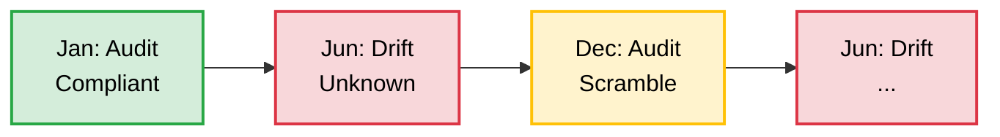
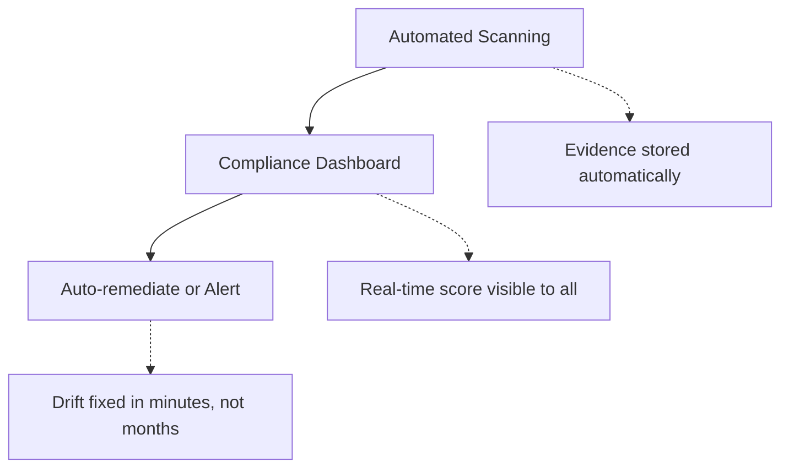
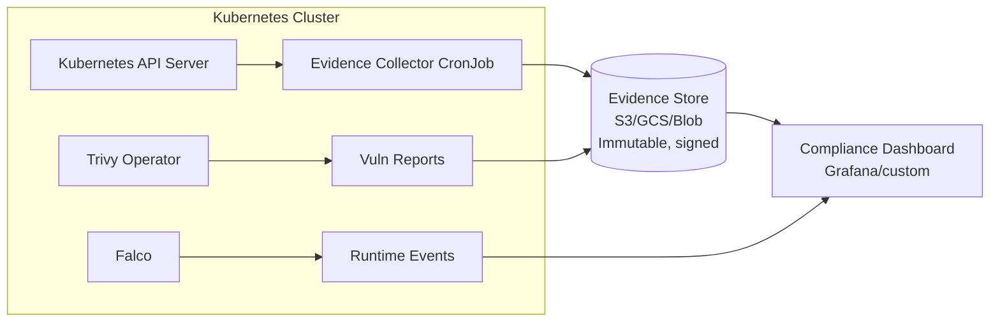
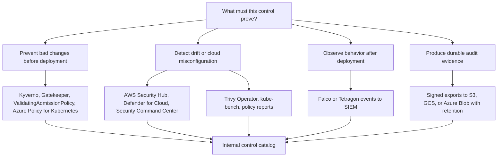
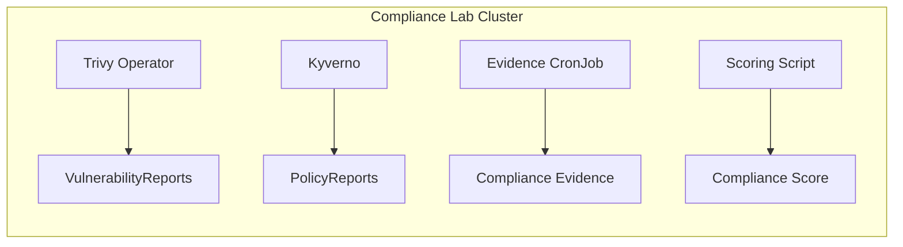

**Complexity**: `[COMPLEX]` | **Time to Complete**: 2h | **Prerequisites**: Cloud Governance & Policy as Code (Module 10.2), Kubernetes Security Basics, `jq` utility

## What You'll Be Able to Do

After completing this module, you will be able to:

- **Design** continuous compliance scanning architectures using CSPM tools for Kubernetes infrastructure.
- **Implement** automated evidence collection pipelines that capture and retain Kubernetes API server events.
- **Diagnose** compliance drift using CIS Kubernetes Benchmark scanning and automate the remediation process.
- **Evaluate** runtime vulnerabilities and network behaviors to satisfy SOC 2, HIPAA, PCI DSS, and ISO 27001 requirements.

## Why This Module Matters

Hypothetical scenario: a healthcare SaaS company passes its SOC 2 Type II audit with flying colors, and the certification unblocks several enterprise contracts that had been stalled in procurement. Three months later, an automated cloud security scanner deployed by a newly hired platform engineer discovers that a fleet of production EKS clusters has Kubernetes audit logging disabled. Several clusters are also running backend containers with known critical CVEs, and the primary database namespace has no network policies enforcing ingress restrictions. None of these issues existed during the audit snapshot. They accumulated silently after the auditor signed off. The company's CISO describes the situation as "compliance theater" because the environment was compliant on audit day, but materially non-compliant during ordinary operations.

This pattern is devastatingly common in modern cloud-native organizations. Traditional compliance operates on a point-in-time model: auditors arrive, review a static checklist, issue a certificate, and depart for twelve months. However, Kubernetes infrastructure changes continuously. A single misconfigured Terraform apply, a Helm chart upgrade that silently drops a secure `SecurityContext`, or a junior team deploying a new microservice without proper role-based guardrails can invalidate the entire compliance posture within hours of the audit ending. When infrastructure is treated as code, compliance must be treated as code.

Continuous compliance flips the traditional model entirely. Instead of scrambling to prove compliance once per year through manual artifact gathering, you prove it every minute of every day through automated evidence collection, real-time monitoring of compliance drift, and immediate algorithmic remediation of violations. In this module, you will learn how Cloud Security Posture Management (CSPM) tools operate, how to translate abstract compliance frameworks into concrete Kubernetes configurations, and how to automate evidence generation to ensure your clusters remain perpetually ready for audit.

## Section 1: From Point-in-Time to Continuous Compliance

### The Traditional Compliance Model (Broken)

Historically, infrastructure compliance relied on manual verification. Security teams would spend weeks gathering screenshots, running ad-hoc scripts, and exporting configuration files to prove that systems met regulatory standards. This approach, often termed the "compliance sprint," treats security as a milestone rather than a continuous state.

**Pause and predict:** An enterprise security team archives an extensive collection of configuration screenshots and exported manifests verifying that all production Kubernetes clusters satisfy security controls on the day of an annual SOC 2 audit. If the organization maintains these static artifacts, why does this point-in-time snapshot fail to guarantee that workloads remain compliant throughout the following operational year?

<details>
<summary>Check your prediction</summary>

A point-in-time audit snapshot captures configuration state only at a single frozen moment in time and does not survive subsequent configuration drift introduced by ongoing Terraform runs, Helm releases, or operator reconciliations. Throughout the operational year, development teams continuously merge pull requests, upgrade base charts, deploy hotfixes, and modify cluster settings, which can introduce unreviewed ingress routes, overly broad RBAC bindings, or exposed endpoints long before the next audit cycle. Relying exclusively on static annual snapshots leaves the platform operating in an unverified state for months between assessments. Continuous compliance addresses this failure mode by replacing manual screenshot gathering with automated, continuous posture evaluation that detects and reports drift across the entire delivery lifecycle as configuration changes occur.
</details>

The next section is how the annual audit calendar looks when verification is treated as a milestone instead of a continuous state.



**Reality Check:** 
- **"Compliance Sprint"**: 6 weeks of panic before an audit.
- **Actual Status**: Compliant ~2 months/year, non-compliant ~10 months.

Think of traditional compliance like a vehicle safety inspection. If you only check your brakes once a year, you might drive with failing brakes for eleven months without knowing it. In Kubernetes, "failing brakes" translates to exposed API servers, overly permissive RBAC roles, and unpatched container images deployed by automated pipelines.

### The Continuous Compliance Model (What You Want)

The continuous compliance model integrates security directly into the lifecycle of the cluster. Instead of humans querying the system to verify compliance, the system continuously evaluates itself and reports its state.



**Audit Day Reality:** "Here is the dashboard. Every control has 12 months of continuous, immutable evidence."

When an auditor requests proof that network segmentation is enforced, you don't need to manually run `kubectl get networkpolicy`. The automated pipeline has already been doing that every six hours, cryptographically signing the output, and storing it in a WORM (Write Once, Read Many) compliant storage bucket.

## Section 2: CSPM: Cloud Security Posture Management

CSPM tools continuously scan your cloud environment for misconfigurations, policy violations, and security risks. They act as the "detective controls" in a defense-in-depth strategy, operating at the cloud infrastructure layer to ensure that your Kubernetes clusters, worker nodes, and underlying network configurations remain secure.

Think of a CSPM as a building inspector who continuously walks through your office holding a rulebook. The moment someone props open a fire door (by disabling a network policy) or unplugs a smoke detector (by turning off audit logging), the inspector quickly flags it and alerts the security desk.

### Cloud-Native CSPM Tools

| Tool | Provider | Kubernetes Support | Key Differentiator |
| :--- | :--- | :--- | :--- |
| AWS Security Hub | AWS | EKS findings via GuardDuty, Inspector | Aggregates findings from AWS services and third-party products |
| Microsoft Defender for Cloud | Azure | AKS + Arc-enabled K8s | CWPP + CSPM in one, cross-cloud |
| Google Security Command Center | GCP | GKE Security Posture Dashboard | Built-in GKE workload vulnerability scanning |
| Prisma Cloud (Palo Alto) | Multi-cloud | Full K8s lifecycle | Broad commercial coverage across cloud and workload layers |
| Wiz | Multi-cloud | Agentless K8s scanning | Graph-based risk analysis, no agents needed |
| Aqua Security | Multi-cloud | Deep K8s + runtime | Commercial platform aligned with open-source projects such as Trivy |

The enterprise architecture mistake is treating this table as a shopping list instead of a control-plane design. CSPM is not one product that magically sees everything. It is a set of cloud-layer detectors, Kubernetes admission controls, workload scanners, runtime sensors, identity logs, and evidence stores that must be normalized into one operating model. AWS, Google Cloud, and Azure all provide native posture systems, but their scope differs. A finding about a public storage bucket, an over-permissive IAM binding, and a vulnerable container image might all appear in a single dashboard, but they are generated by different services, refreshed on different schedules, priced differently, and remediated by different teams.

At enterprise scale, the useful question is not "Which CSPM is best?" The useful question is "Which layer is this control proving?" A cloud CSPM proves that the account, project, or subscription is configured safely. Kubernetes admission policy proves that new objects cannot violate the baseline. Runtime security proves that running workloads are behaving within the allowed envelope. Supply-chain controls prove that the image and deployment artifact came from the approved build path. Evidence automation proves that all of those claims can be reconstructed for an auditor without asking every application team to stop shipping software.

### What CSPM Sees in Each Cloud

AWS Security Hub CSPM is strongest when the organization already centralizes findings across AWS accounts. Security Hub consumes findings from integrated AWS services and third-party products using the AWS Security Finding Format, so a platform team can normalize GuardDuty EKS audit-log findings, Amazon Inspector ECR vulnerability findings, and account-level control findings into one finding schema. For EKS, the important detail is that Security Hub is usually the aggregation layer, not the only detector. GuardDuty analyzes Kubernetes audit logs and runtime signals when EKS protection features are enabled, while Inspector focuses on vulnerability scanning for container images in ECR.

Microsoft Defender for Cloud takes a broader posture-and-workload-protection approach for Azure. Defender for Containers covers AKS and Azure Arc-enabled Kubernetes scenarios, which matters when an enterprise runs AKS in Azure, Arc-connected clusters outside Azure, and legacy clusters during a migration. Its regulatory compliance dashboard maps security recommendations to standards, so the security team can see whether a recommendation affects PCI DSS, ISO 27001, NIST-derived baselines, or other frameworks. Azure Policy for Kubernetes adds an admission-policy layer by projecting policy assignments into clusters, which means a subscription-level governance decision can become a Kubernetes admission decision instead of a wiki page.

Google Security Command Center is the native GCP aggregation and posture system. Security Command Center has Standard, Premium, and Enterprise service tiers, and the security posture service is available in Premium and Enterprise when activated at the organization level. For GKE, the security posture dashboard reports workload configuration concerns, vulnerability findings, and security bulletins into a GKE-native view, with integration into Security Command Center for organization-level triage. Google Cloud also treats posture as something you can deploy at organization, folder, or project scope, which aligns naturally with the GCP hierarchy used in enterprise landing zones.

Vendor-neutral Kubernetes controls still matter even when every cloud-native dashboard is enabled. OPA Gatekeeper and Kyverno enforce policy in clusters, Kubernetes ValidatingAdmissionPolicy provides a native CEL-based validation path that became generally available in Kubernetes 1.30, and runtime tools such as Falco or Tetragon observe behavior after admission. The cloud CSPM might know that an EKS control plane has private endpoints, but it cannot always prove that every namespace has a default-deny `NetworkPolicy`, that every workload image is signed, or that a compromised process did not start a shell in a production pod.

### Findings Are Not Evidence Until They Are Owned

The finding pipeline needs an ownership model before it needs another dashboard. A Security Hub finding in ASFF, a Defender recommendation, a Security Command Center finding, and a Trivy `VulnerabilityReport` all carry enough context to identify a resource, severity, and detector. They do not automatically tell you which product team owns the risk, which compliance control is affected, whether an exception is approved, or whether the remediation is blocked by a dependency. Without ownership metadata, enterprise CSPM becomes a large queue of "critical" items that everyone assumes someone else is handling.

The practical pattern is to enrich every finding with four pieces of context: environment, service owner, compliance scope, and remediation path. Environment tells you whether the risk sits in production, regulated staging, or a disposable lab. Service owner routes the work to the team that can fix it. Compliance scope tells the auditor why the finding matters, such as SOC 2 access control, PCI network segmentation, or HIPAA transmission security. Remediation path tells the platform team whether the fix is a GitOps change, an admission-policy change, a cloud configuration update, or an application rebuild.

### AWS Security Hub + EKS Integration

For organizations running EKS, AWS Security Hub acts as the centralized CSPM. By integrating it with Amazon GuardDuty and Amazon Inspector, you can consolidate cluster misconfigurations, runtime threats, and image vulnerabilities into a single pane of glass.

```bash
# Enable Security Hub
aws securityhub enable-security-hub \
  --enable-default-standards

# Enable EKS-related findings
# GuardDuty for EKS runtime threat detection
aws guardduty create-detector \
  --enable \
  --features '[
    {"Name": "EKS_AUDIT_LOGS", "Status": "ENABLED"},
    {"Name": "EKS_RUNTIME_MONITORING", "Status": "ENABLED",
     "AdditionalConfiguration": [
       {"Name": "EKS_ADDON_MANAGEMENT", "Status": "ENABLED"}
     ]}
  ]'

# AWS Inspector for container vulnerability scanning
aws inspector2 enable --resource-types ECR
# Inspector automatically scans ECR images and reports CVEs to Security Hub

# View EKS-related findings in Security Hub
aws securityhub get-findings \
  --filters '{
    "ProductName": [{"Value": "GuardDuty", "Comparison": "EQUALS"}],
    "ResourceType": [{"Value": "AwsEksCluster", "Comparison": "EQUALS"}],
    "SeverityLabel": [{"Value": "CRITICAL", "Comparison": "EQUALS"}]
  }' \
  --query 'Findings[*].{Title:Title, Severity:Severity.Label, Resource:Resources[0].Id}' \
  --output table
```

### Microsoft Defender for Cloud + AKS

In the Azure ecosystem, Microsoft Defender for Cloud provides comprehensive CSPM capabilities for AKS clusters. It actively assesses the cluster against security baselines and provides actionable remediation steps.

```bash
# Enable Defender for Containers (covers AKS)
az security pricing create \
  --name Containers \
  --tier Standard

# Enable Defender for AKS on a specific cluster
az aks update \
  --resource-group rg-production \
  --name aks-prod \
  --enable-defender

# View security recommendations for AKS
az security assessment list \
  --query "[?contains(resourceDetails.id, 'managedClusters')].{
    Name:displayName,
    Status:status.code,
    Severity:metadata.severity
  }" --output table

# Export Defender findings to Log Analytics for compliance dashboards
az monitor diagnostic-settings create \
  --name defender-to-la \
  --resource "/subscriptions/$SUB_ID/resourceGroups/rg-production/providers/Microsoft.ContainerService/managedClusters/aks-prod" \
  --workspace "/subscriptions/$SUB_ID/resourceGroups/rg-monitoring/providers/Microsoft.OperationalInsights/workspaces/la-security" \
  --logs '[{"category": "kube-audit-admin", "enabled": true, "retentionPolicy": {"enabled": true, "days": 365}}]'
```

### Google Security Command Center + GKE

For organizations running GKE, Security Command Center and the GKE security posture dashboard form the native starting point. Security Command Center watches cloud assets, IAM exposure, threat signals, posture drift, and vulnerability classes across the Google Cloud organization. The GKE security posture dashboard focuses the cluster administrator on GKE-specific concerns such as workload configuration auditing, container OS vulnerability scanning, language package vulnerability scanning when enabled, and actionable GKE security bulletins. In practice, the dashboard is useful for cluster-local remediation, while Security Command Center is useful for executive reporting, central triage, and cross-project risk ownership.

The GCP angle is especially important in folder-heavy enterprises. A posture can be deployed at organization, folder, or project scope, and lower-level posture choices can be more restrictive for regulated application groups. That lets a platform team keep a common baseline for all GKE projects while applying stricter controls to folders that handle cardholder data, healthcare data, or federal workloads. The same organizational hierarchy can drive evidence collection, because findings can be exported and grouped by folder, project, cluster, namespace, and workload owner. Use the current Security Command Center and GKE security posture documentation before writing rollout commands, because activation, service-tier behavior, and available findings are controlled at the organization and project level.

## Section 3: Mapping Kubernetes to Compliance Frameworks

The most challenging part of Kubernetes compliance is translating abstract framework requirements into concrete technical controls. Auditors speak in terms of "logical access" and "transmission security," while platform engineers speak in terms of `ClusterRoleBindings` and `PeerAuthentication`.

> **Stop and think**: If an auditor asks for proof that your cluster is secure, what technical artifacts could you realistically provide to them within an hour?

### SOC 2 Trust Services Criteria

SOC 2 focuses heavily on security, availability, processing integrity, confidentiality, and privacy. Here is how you map those abstract concepts to Kubernetes primitives:

| SOC 2 Control | Category | Kubernetes Implementation | Evidence Source |
| :--- | :--- | :--- | :--- |
| CC6.1 - Logical access controls | Security | RBAC roles scoped to namespaces, Microsoft Entra ID/OIDC integration, no cluster-admin for developers | `kubectl get clusterrolebindings`, RBAC audit logs |
| CC6.3 - Encryption of data at rest | Security | etcd encryption, encrypted PersistentVolumes (EBS with KMS / Azure Disk with customer-managed keys) | Cluster encryption config, StorageClass parameters |
| CC6.6 - Encryption in transit | Security | mTLS via service mesh, TLS on Ingress, Kubernetes API TLS | Istio PeerAuthentication, Ingress TLS config |
| CC7.1 - Detection of unauthorized changes | Security | Kubernetes audit logs, Falco runtime detection | Audit log exports, Falco alerts in SIEM |
| CC7.2 - Monitoring for anomalies | Security | Prometheus alerts, GuardDuty EKS findings, anomaly detection | Alert rules, Security Hub findings |
| CC8.1 - Change management | Availability | GitOps (ArgoCD), admission webhooks preventing direct `kubectl apply` | Git commit history, ArgoCD sync logs |
| A1.2 - Recovery mechanisms | Availability | Pod disruption budgets, multi-AZ deployments, Velero backups | PDB configs, node topology, backup logs |

### PCI-DSS v4.0 (for Payment Processing)

PCI-DSS has rigorous requirements for environments that store, process, or transmit cardholder data. In a Kubernetes context, isolation and strict boundary controls are paramount.

| PCI-DSS Requirement | Kubernetes Control | How to Evidence |
| :--- | :--- | :--- |
| 1.3.1 - Inbound traffic restricted | NetworkPolicy default-deny + explicit allow rules | `kubectl get networkpolicy -A -o yaml` |
| 2.2.1 - Only necessary services | Minimal base images, no unnecessary sidecar containers | Image scan showing package count, Dockerfile |
| 6.3.3 - Vulnerability management | Trivy scanning in CI/CD, admission control blocking critical CVEs | Trivy scan reports, Kyverno image verification |
| 7.2.1 - Access based on need-to-know | Namespace-scoped RBAC, no wildcard permissions | RBAC audit showing role bindings |
| 8.3.1 - MFA for administrative access | OIDC with MFA for kubectl, no static ServiceAccount tokens | IdP configuration, audit logs showing auth method |
| 10.2.1 - Audit logs for access | Kubernetes audit policy at RequestResponse level | Audit log samples, log retention proof |
| 11.5.1 - File integrity monitoring | Read-only root filesystems, Falco file access alerts | SecurityContext configs, Falco rule output |

### HIPAA (for Healthcare Data)

HIPAA focuses on safeguarding Protected Health Information (PHI). Encryption, audit trails, and strict access controls are the pillars of HIPAA compliance in Kubernetes.

| HIPAA Safeguard | Kubernetes Control | Evidence |
| :--- | :--- | :--- |
| Access Control (164.312(a)) | RBAC + OIDC, namespace isolation for PHI workloads | Role definitions, namespace labels |
| Audit Controls (164.312(b)) | Kubernetes audit logs retained 6+ years | Log retention policy, sample exports |
| Integrity (164.312(c)) | Image signing (cosign), read-only filesystems | Kyverno image verification policy, SecurityContext |
| Transmission Security (164.312(e)) | mTLS everywhere, encrypted Ingress | Service mesh config, TLS certificates |
| Encryption (164.312(a)(2)(iv)) | etcd encryption, PV encryption, in-transit encryption | Encryption configuration dumps |

### NIST, FedRAMP, and ISO 27001: The Control Family View

NIST SP 800-53 is useful because it teaches you to think in control families instead of product features. Access Control (AC) asks whether users, workloads, and administrators only have the permissions they need. Audit and Accountability (AU) asks whether meaningful activity is logged, protected, reviewed, and retained. System and Communications Protection (SC) asks whether traffic, boundaries, and cryptography are designed safely. System and Information Integrity (SI) asks whether vulnerabilities, malicious behavior, and configuration weaknesses are detected and corrected. Kubernetes maps cleanly to those families when you treat RBAC, audit policy, network policy, encryption, vulnerability scanning, and runtime detection as evidence-producing controls rather than isolated tools.

FedRAMP builds on NIST SP 800-53 for U.S. federal cloud systems, so the platform team usually needs a stronger evidence story than "the cluster is secure." A FedRAMP Moderate or High environment typically needs repeatable control implementation statements, continuous monitoring, vulnerability management records, incident-response evidence, configuration baselines, and a way to show that deviations were reviewed. In Kubernetes terms, that means the control owner must explain how an admission policy prevents privileged pods, how the audit pipeline preserves API activity, how image vulnerabilities are triaged, how exceptions are approved, and how the same control is applied across every regulated cluster.

ISO/IEC 27001 takes a management-system view instead of prescribing every technical setting. The standard asks whether the organization has a risk-managed information security management system and whether controls are selected, operated, reviewed, and improved. For Kubernetes, that makes the evidence chain just as important as the control itself. A Kyverno policy that blocks unsigned images is useful, but ISO auditors also care that the policy has an owner, change history, exception process, review cadence, and measurable effectiveness. A platform team can satisfy that expectation by storing policy in Git, requiring review for changes, exporting admission decisions, and linking exceptions to risk acceptance records.

### One Control, Many Frameworks: Encryption in Transit

The easiest way to avoid duplicative compliance work is to map one strong Kubernetes control to several frameworks. Consider "encryption in transit." SOC 2 treats encrypted transmission as part of confidentiality and security. PCI DSS requires strong cryptography when cardholder data traverses open or public networks, and teams usually extend that principle to internal service paths that carry payment data. HIPAA transmission security requires protection against unauthorized access to electronic protected health information during transmission. NIST SC controls cover boundary protection, transmission confidentiality, and cryptographic protection. ISO 27001 expects the organization to choose and operate controls that preserve confidentiality and integrity.

In Kubernetes, the control is not one checkbox. The Kubernetes API server already serves HTTPS, but application-to-application traffic might still be plaintext unless the team uses a service mesh, application TLS, or another enforced encryption pattern. An ingress controller can terminate TLS for north-south traffic, but east-west traffic between services needs its own policy. A mesh such as Istio can enforce mTLS with `PeerAuthentication`, Linkerd can provide mutual TLS for meshed workloads, and SPIFFE/SPIRE can issue workload identities for cross-cluster trust. `NetworkPolicy` does not encrypt traffic, but it reduces the set of peers that can communicate, which supports the same control objective by limiting the blast radius of a misconfiguration.

Evidence for this one control should come from several layers. The platform team can export mesh policy, ingress TLS configuration, certificate issuer configuration, service annotations, namespace labels, and network policy manifests. The cloud team can export load balancer TLS settings, private endpoint configuration, and KMS key usage for data stores that participate in the transaction path. The runtime team can alert on plaintext connections in regulated namespaces using eBPF telemetry, service mesh metrics, or application observability. The auditor receives one control narrative with multiple artifacts rather than five disconnected screenshots from five different teams.

### Framework Mapping at Enterprise Scale

The mapping tables above are helpful for a single cluster, but enterprise compliance usually fails at the fleet boundary. One team maps SOC 2 controls to EKS. Another maps PCI controls to AKS. A third team maps HIPAA controls to GKE. Six months later, the company has three different definitions of "privileged container," two different audit-log retention periods, and no common way to decide whether a waiver is acceptable. That is governance drift, and it creates real audit cost because every framework conversation becomes a fresh interpretation exercise.

The better model is a control catalog with provider-specific implementations. The catalog says "Workloads must not run privileged containers in production," then records how that control is implemented with Kyverno, Gatekeeper, Kubernetes-native ValidatingAdmissionPolicy, Azure Policy for Kubernetes, or provider-specific security recommendations. It also records how AWS Security Hub, Microsoft Defender for Cloud, Google Security Command Center, Trivy Operator, Falco, and kube-bench provide evidence. This turns compliance from a pile of standards into a reusable platform contract.

The catalog should separate preventive controls, detective controls, and corrective controls. Preventive controls block bad changes before they land, such as admission policy rejecting unsigned images. Detective controls identify drift after it appears, such as Security Command Center reporting a misconfigured GKE workload or GuardDuty producing an EKS audit-log finding. Corrective controls restore the desired state, such as GitOps reconciling a network policy or an automation runbook opening a pull request against the cluster baseline. Auditors understand this distinction because it mirrors how control design is evaluated: prevention is ideal, detection is necessary, and correction proves the organization can operate the control over time.

## Section 4: Automated Evidence Collection in Practice

The key to continuous compliance is automating evidence collection so that auditors rarely wait for manual data gathering. Every control should have a corresponding evidence pipeline that continuously dumps the state of the cluster to an immutable storage location. 

### Building an Evidence Collection Pipeline

By leveraging Kubernetes CronJobs, you can periodically extract the current state of RBAC, NetworkPolicies, and Vulnerability Reports. 



### Evidence Architecture for Multi-Cloud Fleets

**Pause and predict:** During a formal regulatory audit review meeting, an infrastructure engineer runs a live `kubectl get networkpolicy -A` command in a terminal to show that network isolation is currently active across all namespaces. Why does presenting raw, real-time command-line output fail to satisfy an auditor seeking historical operational evidence, and what core attributes must an enterprise evidence record contain?

<details>
<summary>Check your prediction</summary>

Executing `kubectl get` during an audit review only demonstrates cluster configuration at that single moment in time rather than proving continuous operational compliance over an extended evaluation period. An auditor cannot verify whether network policies were active months earlier, whether they were temporarily disabled during an incident, or which authorized identity modified them without tamper-evident historical audit records. A defensible evidence record requires an authoritative timestamp, unique cluster identity, cloud account context, explicit mapping to compliance control IDs, collector version metadata, and cryptographic integrity hashing stored within immutable, write-once object storage backed by Kubernetes API server audit logs.
</details>

The next section is how multi-cloud enterprise architectures ingest cluster-level artifacts alongside cloud provider security findings into unified, immutable compliance repositories.

A Kubernetes evidence pipeline has two jobs: collect the current state and preserve the story of how the state changed. The first job is easy to demonstrate with `kubectl get` exports, cloud API exports, and scanner reports. The second job is what separates continuous compliance from a pile of stale JSON files. Every evidence object needs a timestamp, cluster identity, cloud account or project, namespace or workload owner, control mapping, collector version, and integrity metadata. Without that context, an auditor can see a file, but they cannot reliably connect it to a control, a period of operation, or a remediation decision.

AWS, Azure, and Google Cloud each provide native evidence and compliance aggregation services, but none of them remove the need for Kubernetes-specific collection. AWS Audit Manager helps collect and organize evidence for AWS resources and frameworks, while Security Hub and GuardDuty provide security findings that can support control monitoring. Microsoft Defender for Cloud can export recommendations and security alerts continuously, and its regulatory compliance dashboard maps recommendations to standards for central review. Google Security Command Center can report posture drift, vulnerability findings, and GKE posture findings into the organization-level security workflow. These tools answer cloud-layer questions well, but they still need cluster-layer evidence for RBAC, admission policy, `NetworkPolicy`, workload vulnerability reports, and runtime events.

The vendor-neutral pattern is to run a collector in each cluster and ship normalized evidence to an immutable central store. The collector should not have broad mutation rights; it should read the resources required for evidence and write only to the evidence destination. For EKS, that destination might be an S3 bucket with Object Lock and KMS encryption. For GKE, it might be a locked-down Cloud Storage bucket with retention policy and Cloud KMS. For AKS, it might be an Azure Storage account with immutability policies and customer-managed keys. The implementation changes by provider, but the evidence schema should remain the same so auditors do not receive three different formats for the same control.

Evidence automation also needs a freshness policy. Some controls can be sampled daily, such as the list of `StorageClass` objects or namespace labels. Others should be collected every few hours, such as RBAC bindings, network policies, policy reports, and vulnerability summaries. Runtime security alerts should be streamed continuously to the SIEM because a delayed event can erase the forensic value of the signal. The platform team should publish the freshness target next to each control, then dashboard both compliance status and evidence freshness. A green control with stale evidence is not green; it is unknown.

### Designing the Evidence Schema

The most useful evidence schema is boring and consistent. Start with fields that every cloud and every cluster can provide: `provider`, `account_or_project`, `region`, `cluster`, `namespace`, `workload`, `control_id`, `frameworks`, `collector`, `collected_at`, `evidence_uri`, `hash`, `status`, and `owner`. This looks bureaucratic, but it prevents a common enterprise failure mode where security can find a failing control but cannot tell which team owns the remediation. The `frameworks` field should list mappings such as `SOC2-CC6.1`, `PCI-7.2.1`, `HIPAA-164.312(a)`, or `NIST-AC`, while `control_id` should reference the internal control catalog rather than a vendor-specific recommendation name.

You should version the schema exactly like an API. Auditors and compliance dashboards will depend on these fields, and changing them casually creates expensive rework. A new collector version should emit both the old and new fields during a transition period, and the central evidence pipeline should validate every submitted document before accepting it. This validation can be a JSON Schema check, an Open Policy Agent policy, or a small admission-like service that rejects incomplete evidence. The point is not the tool; the point is that evidence quality is enforced automatically before audit season.

### Cost Lens: Continuous Compliance Is Cheaper Than Rework, But Not Free

Continuous compliance introduces real operating cost. CSPM services may price by resource, account, workload, finding ingestion, or service tier. Vulnerability scanning consumes CPU and memory in clusters, and aggressive scan concurrency can compete with application workloads if it is not limited. Runtime sensors such as Falco or Tetragon run on nodes and generate events that must be filtered before they reach expensive SIEM storage. Audit logs can become a major storage line item when clusters are busy, especially if teams collect high-volume request bodies without a clear retention and sampling policy.

The cost knobs are mostly architectural. Scope regulated evidence to regulated namespaces instead of applying the most expensive collection level to every sandbox. Store raw high-volume audit logs in cheaper immutable object storage, then send summarized control results to the SIEM. Tune Trivy Operator concurrency so scanning does not create noisy CPU spikes during business hours. Use central policy templates so each cluster does not need a separate hand-built compliance stack. Most importantly, keep ownership metadata accurate. The hidden cost of compliance is not the scanner bill; it is the engineering time wasted rediscovering who owns a risk, why a waiver exists, and whether a control drifted because of a deliberate change or an accidental bypass.

### Evidence Collection CronJob

The following YAML configurations deploy a `Namespace`, `PersistentVolumeClaim`, and a `CronJob` that acts as an automated evidence collector. It gathers the necessary data every six hours. 

*(Note: To ensure structural integrity across different Kubernetes parsing engines, the configuration is provided as sequential blocks rather than a single multi-document stream.)*

```yaml
# compliance-evidence-collector-namespace.yaml
apiVersion: v1
kind: Namespace
metadata:
  name: compliance-system
```

```yaml
# compliance-evidence-collector-pvc.yaml
apiVersion: v1
kind: PersistentVolumeClaim
metadata:
  name: compliance-evidence-pvc
  namespace: compliance-system
spec:
  accessModes:
    - ReadWriteOnce
  resources:
    requests:
      storage: 10Gi
```

```yaml
# compliance-evidence-collector-cronjob.yaml
apiVersion: batch/v1
kind: CronJob
metadata:
  name: compliance-evidence-collector
  namespace: compliance-system
spec:
  schedule: "0 */6 * * *"  # Every 6 hours
  jobTemplate:
    spec:
      template:
        spec:
          serviceAccountName: evidence-collector
          containers:
            - name: collector
              image: docker.io/rancher/kubectl:v1.35.0
              command:
                - /bin/sh
                - -c
                - |
                  TIMESTAMP=$(date -u +%Y%m%dT%H%M%SZ)
                  EVIDENCE_DIR="/evidence/${TIMESTAMP}"
                  mkdir -p ${EVIDENCE_DIR}

                  echo "=== Collecting compliance evidence: ${TIMESTAMP} ==="

                  # CC6.1: RBAC Configuration
                  echo "Collecting RBAC evidence..."
                  kubectl get clusterrolebindings -o json > ${EVIDENCE_DIR}/clusterrolebindings.json
                  kubectl get rolebindings -A -o json > ${EVIDENCE_DIR}/rolebindings.json
                  kubectl get clusterroles -o json > ${EVIDENCE_DIR}/clusterroles.json

                  # CC6.3: Encryption configuration
                  echo "Collecting encryption evidence..."
                  kubectl get storageclass -o json > ${EVIDENCE_DIR}/storageclasses.json

                  # CC7.1: Network policies
                  echo "Collecting network policy evidence..."
                  kubectl get networkpolicy -A -o json > ${EVIDENCE_DIR}/networkpolicies.json

                  # CC8.1: Policy enforcement
                  echo "Collecting policy evidence..."
                  kubectl get clusterpolicy -o json > ${EVIDENCE_DIR}/kyverno-policies.json
                  kubectl get policyreport -A -o json > ${EVIDENCE_DIR}/policy-reports.json
                  kubectl get clusterpolicyreport -o json > ${EVIDENCE_DIR}/cluster-policy-reports.json

                  # PCI 6.3.3: Vulnerability status
                  echo "Collecting vulnerability evidence..."
                  kubectl get vulnerabilityreports -A -o json > ${EVIDENCE_DIR}/vulnerability-reports.json 2>/dev/null || echo '{}' > ${EVIDENCE_DIR}/vulnerability-reports.json

                  # A1.2: Availability controls
                  echo "Collecting availability evidence..."
                  kubectl get pdb -A -o json > ${EVIDENCE_DIR}/pdbs.json
                  kubectl get nodes -o json > ${EVIDENCE_DIR}/nodes.json

                  # Generate summary
                  CLUSTER_CONTEXT=$(kubectl config current-context | sed 's/\\/\\\\/g; s/"/\\"/g')
                  cat <<SUMMARY > ${EVIDENCE_DIR}/summary.json
                  {
                    "timestamp": "${TIMESTAMP}",
                    "cluster": "${CLUSTER_CONTEXT}",
                    "controls": {
                      "rbac_bindings": $(kubectl get clusterrolebindings --no-headers | wc -l | tr -d ' '),
                      "network_policies": $(kubectl get networkpolicy -A --no-headers | wc -l | tr -d ' '),
                      "kyverno_policies": $(kubectl get clusterpolicy --no-headers | wc -l | tr -d ' '),
                      "pdbs": $(kubectl get pdb -A --no-headers | wc -l | tr -d ' '),
                      "nodes": $(kubectl get nodes --no-headers | wc -l | tr -d ' ')
                    }
                  }
                  SUMMARY

                  echo "Evidence collected to ${EVIDENCE_DIR}"
                  ls -la ${EVIDENCE_DIR}
              volumeMounts:
                - name: evidence-volume
                  mountPath: /evidence
          volumes:
            - name: evidence-volume
              persistentVolumeClaim:
                claimName: compliance-evidence-pvc
          restartPolicy: OnFailure
```

### Compliance Score Dashboard

With evidence securely collected, you can build a system that evaluates this evidence and produces a quantifiable metric. The following script calculates a continuous compliance score by programmatically evaluating the cluster configuration.

```bash
# compliance-score.sh - Calculate a compliance score from collected evidence
#!/bin/bash

calculate_score() {
  local CHECKS_PASSED=0
  local CHECKS_TOTAL=0

  # Check 1: All namespaces have NetworkPolicies
  NAMESPACES_WITHOUT_NETPOL=$(kubectl get namespaces -o jsonpath='{.items[*].metadata.name}' | tr ' ' '\n' | while read ns; do
    if [ "$ns" != "kube-system" ] && [ "$ns" != "kube-public" ] && [ "$ns" != "kube-node-lease" ] && [ "$ns" != "default" ]; then
      COUNT=$(kubectl get networkpolicy -n "$ns" --no-headers 2>/dev/null | wc -l)
      if [ "$COUNT" -eq 0 ]; then echo "$ns"; fi
    fi
  done | wc -l)
  CHECKS_TOTAL=$((CHECKS_TOTAL + 1))
  if [ "$NAMESPACES_WITHOUT_NETPOL" -eq 0 ]; then
    CHECKS_PASSED=$((CHECKS_PASSED + 1))
    echo "  [PASS] All namespaces have NetworkPolicies"
  else
    echo "  [FAIL] $NAMESPACES_WITHOUT_NETPOL namespaces missing NetworkPolicies"
  fi

  # Check 2: No cluster-admin bindings for non-system users
  DANGEROUS_BINDINGS=$(kubectl get clusterrolebindings -o json | \
    jq '[.items[] | select(.roleRef.name == "cluster-admin") |
    select(.subjects[]? | .name != "system:masters" and (.name | startswith("system:") | not))] | length')
  CHECKS_TOTAL=$((CHECKS_TOTAL + 1))
  if [ "$DANGEROUS_BINDINGS" -eq 0 ]; then
    CHECKS_PASSED=$((CHECKS_PASSED + 1))
    echo "  [PASS] No non-system cluster-admin bindings"
  else
    echo "  [FAIL] $DANGEROUS_BINDINGS non-system cluster-admin bindings found"
  fi

  # Check 3: Kyverno policies are in Enforce mode
  AUDIT_ONLY=$(kubectl get clusterpolicy -o json | \
    jq '[.items[] | select(.spec.validationFailureAction == "Audit")] | length')
  CHECKS_TOTAL=$((CHECKS_TOTAL + 1))
  if [ "$AUDIT_ONLY" -eq 0 ]; then
    CHECKS_PASSED=$((CHECKS_PASSED + 1))
    echo "  [PASS] All policies in Enforce mode"
  else
    echo "  [WARN] $AUDIT_ONLY policies still in Audit mode"
  fi

  # Check 4: No critical vulnerabilities in running workloads
  CRITICAL_VULNS=$(kubectl get vulnerabilityreports -A -o json 2>/dev/null | \
    jq '[.items[].report.summary.criticalCount // 0] | add // 0')
  CHECKS_TOTAL=$((CHECKS_TOTAL + 1))
  if [ "$CRITICAL_VULNS" -eq 0 ]; then
    CHECKS_PASSED=$((CHECKS_PASSED + 1))
    echo "  [PASS] No critical vulnerabilities in running workloads"
  else
    echo "  [FAIL] $CRITICAL_VULNS critical vulnerabilities found"
  fi

  # Check 5: PodDisruptionBudgets exist for production workloads
  DEPLOYMENTS=$(kubectl get deployments -A --no-headers | wc -l | tr -d ' ')
  PDBS=$(kubectl get pdb -A --no-headers 2>/dev/null | wc -l | tr -d ' ')
  CHECKS_TOTAL=$((CHECKS_TOTAL + 1))
  if [ "$PDBS" -gt 0 ]; then
    CHECKS_PASSED=$((CHECKS_PASSED + 1))
    echo "  [PASS] PodDisruptionBudgets present ($PDBS PDBs for $DEPLOYMENTS deployments)"
  else
    echo "  [FAIL] No PodDisruptionBudgets found"
  fi

  # Calculate score
  SCORE=$(( (CHECKS_PASSED * 100) / CHECKS_TOTAL ))
  echo ""
  echo "  COMPLIANCE SCORE: ${SCORE}% (${CHECKS_PASSED}/${CHECKS_TOTAL} checks passed)"
}

echo "============================================="
echo "  CONTINUOUS COMPLIANCE SCORE"
echo "  $(date -u +%Y-%m-%dT%H:%M:%SZ)"
echo "============================================="
calculate_score
```

## Section 5: Vulnerability Lifecycle and Runtime Defense

Vulnerabilities in container images are a continuous compliance concern. The lifecycle from discovery to remediation must be automated. Scanning images in a CI/CD pipeline is only half the battle.

**Pause and predict:** A platform team implements automated container vulnerability scanning using Trivy inside continuous integration pipelines, blocking pull requests when newly built images contain critical vulnerabilities. If an application image passes all build-time checks and runs continuously in production, why is CI scanning alone insufficient to maintain vulnerability compliance over time?

<details>
<summary>Check your prediction</summary>

Scanning container images in continuous integration is strictly a promote-time gate that evaluates artifact security against vulnerability intelligence available at build execution. A CVE published after that build does not change the running digest, so CI never re-evaluates existing pods. In-cluster scanning (Trivy Operator) watches Kubernetes state and starts a scan when a workload changes; VulnerabilityReports refresh on a scanner report TTL (Aqua documents a 24-hour default), which is how newly published CVEs show up on already-running images without a new CI job.
</details>

The next section is how continuous vulnerability management establishes comprehensive defense in depth across build pipelines, artifact registries, running clusters, and runtime behavior.

The deeper lesson is that "vulnerability management" is not one control. CI scanning answers whether a proposed artifact is safe enough to promote. Registry scanning answers whether stored artifacts have newly discovered vulnerabilities. In-cluster scanning answers whether currently running workloads are affected by new vulnerability intelligence. Runtime detection answers whether a workload is behaving suspiciously after deployment. Provenance and signature verification answer whether the artifact came from the approved build path. A mature compliance program connects all five layers because each layer catches a different class of failure.

An enterprise platform should make this lifecycle visible to application teams. A critical CVE in a base image should create a finding with the affected image digest, running namespaces, service owner, first-seen timestamp, remediation SLA, and exception status. If the application owner rebuilds the image but GitOps has not rolled it out, the finding should remain open for the running workload. If the image is rebuilt and deployed but the old digest remains in a canary namespace, the exception should be explicit. Auditors do not only ask whether scanners exist; they ask whether the organization can prove timely detection and timely remediation.

### Trivy Operator for In-Cluster Scanning

By deploying the Trivy Operator inside your cluster, you enable continuous evaluation of running workloads. The operator watches Kubernetes for workload changes (for example a new Pod) and writes `VulnerabilityReport` objects. Reports expire on a TTL (Aqua documents a 24-hour default) so the same digest is scanned again against later vulnerability intelligence without waiting for a new CI build.

```bash
# Install Trivy Operator
helm repo add aqua https://aquasecurity.github.io/helm-charts/
helm install trivy-operator aqua/trivy-operator \
  --namespace trivy-system --create-namespace \
  --set trivy.ignoreUnfixed=true \
  --set operator.scanJobsConcurrentLimit=3 \
  --set operator.vulnerabilityScannerEnabled=true \
  --set operator.configAuditScannerEnabled=true \
  --set operator.rbacAssessmentEnabled=true

# View vulnerability reports
kubectl get vulnerabilityreports -A \
  -o custom-columns=\
NAMESPACE:.metadata.namespace,\
NAME:.metadata.name,\
CRITICAL:.report.summary.criticalCount,\
HIGH:.report.summary.highCount,\
MEDIUM:.report.summary.mediumCount

# Get detailed CVEs for a specific workload
kubectl get vulnerabilityreport -n production \
  -l trivy-operator.resource.name=my-app \
  -o json | jq -r '.items[].report.vulnerabilities[]
    | select(.severity == "CRITICAL")
    | "\(.vulnerabilityID) \(.title) \(.fixedVersion // "no fixed version")"'
```

> **Stop and think**: Why export Trivy findings to a central security hub rather than just viewing them with `kubectl` natively inside the cluster?

### Integrating Trivy with Cloud Security Hubs

A fundamental principle of enterprise security is visibility. If a finding only exists inside the cluster, the centralized security team may never see it. Exporting these findings to an aggregator like AWS Security Hub ensures that Kubernetes vulnerabilities are tracked alongside IAM misconfigurations and network firewall rule violations.

```yaml
# trivy-to-securityhub.yaml
# CronJob that exports Trivy findings to AWS Security Hub
apiVersion: batch/v1
kind: CronJob
metadata:
  name: trivy-to-securityhub
  namespace: trivy-system
spec:
  schedule: "0 */4 * * *"
  jobTemplate:
    spec:
      template:
        spec:
          serviceAccountName: trivy-exporter
          containers:
            - name: exporter
              # Note: Requires a custom image with aws-cli, kubectl, and jq installed
              image: myregistry/compliance-tools:latest
              env:
                - name: AWS_REGION
                  value: "us-east-1"
                - name: CLUSTER_NAME
                  valueFrom:
                    configMapKeyRef:
                      name: cluster-info
                      key: cluster-name
              command:
                - /bin/bash
                - -c
                - |
                  ACCOUNT_ID=$(aws sts get-caller-identity --query Account --output text)
                  FINDINGS='[]'

                  # Convert Trivy critical/high findings to ASFF format
                  kubectl get vulnerabilityreports -A -o json | \
                  jq -r --arg acct "$ACCOUNT_ID" --arg region "$AWS_REGION" --arg cluster "$CLUSTER_NAME" \
                  '[.items[] |
                    .report.vulnerabilities[] |
                    select(.severity == "CRITICAL" or .severity == "HIGH") |
                    {
                      "SchemaVersion": "2018-10-08",
                      "Id": .vulnerabilityID,
                      "ProductArn": "arn:aws:securityhub:\($region):\($acct):product/\($acct)/default",
                      "GeneratorId": "trivy-operator",
                      "AwsAccountId": $acct,
                      "Types": ["Software and Configuration Checks/Vulnerabilities/CVE"],
                      "CreatedAt": (now | strftime("%Y-%m-%dT%H:%M:%SZ")),
                      "UpdatedAt": (now | strftime("%Y-%m-%dT%H:%M:%SZ")),
                      "Severity": {"Label": .severity},
                      "Title": .title,
                      "Description": (.description // "No description"),
                      "Resources": [{
                        "Type": "Container",
                        "Id": "arn:aws:eks:\($region):\($acct):cluster/\($cluster)",
                        "Details": {"Other": {"image": .resource, "fixedVersion": (.fixedVersion // "none")}}
                      }]
                    }
                  ]' > /tmp/findings.json

                  # Import to Security Hub (batch of 100)
                  TOTAL=$(jq length /tmp/findings.json)
                  echo "Exporting $TOTAL findings to Security Hub"
                  jq -c '.[:100]' /tmp/findings.json | \
                    aws securityhub batch-import-findings --findings file:///dev/stdin
          restartPolicy: OnFailure
```

### Falco for Runtime Compliance

Falco detects runtime violations that no static scanner can catch. Consider a scenario where a legacy application is silently writing transaction logs to an unencrypted temporary directory inside a container, or a compromised pod attempts an unauthorized outbound connection. Falco's eBPF probes monitor these system calls in real-time.

```yaml
# falco-rules-compliance.yaml
# Custom Falco rules mapped to compliance controls
- rule: PCI-DSS 10.2 - Sensitive File Access
  desc: Detect read of sensitive files (credential files, private keys)
  condition: >
    open_read and
    (fd.name startswith /etc/shadow or
     fd.name startswith /etc/pam.d or
     fd.name contains id_rsa or
     fd.name contains .kube/config) and
    container and
    not proc.name in (sshd, su, sudo)
  output: >
    Sensitive file read in container
    (user=%user.name file=%fd.name container=%container.name
     image=%container.image.repository pod=%k8s.pod.name
     namespace=%k8s.ns.name)
  priority: WARNING
  tags: [pci-dss, soc2, filesystem]

- rule: HIPAA 164.312(e) - Sensitive-Port Outbound Connection from PHI Namespace
  desc: Detect outbound connections on commonly sensitive plaintext or database ports from PHI namespaces
  condition: >
    evt.type = connect and
    fd.typechar = 4 and
    fd.ip != "0.0.0.0" and
    fd.sport in (80, 8080, 3306, 5432, 27017) and
    k8s.ns.name startswith "phi-" and
    not fd.sip in (rfc_1918_addresses)
  output: >
    Sensitive-port outbound connection from PHI namespace
    (command=%proc.cmdline connection=%fd.name
     pod=%k8s.pod.name namespace=%k8s.ns.name)
  priority: CRITICAL
  tags: [hipaa, network]

- rule: SOC2 CC7.1 - Container Shell Access
  desc: Detect interactive shell access to containers
  condition: >
    spawned_process and
    container and
    proc.name in (bash, sh, zsh, dash) and
    proc.tty != 0 and
    not container.image.repository in (allowed_debug_images)
  output: >
    Shell spawned in container
    (user=%user.name shell=%proc.name container=%container.name
     image=%container.image.repository pod=%k8s.pod.name)
  priority: WARNING
  tags: [soc2, runtime]
```

Port-based Falco rules are heuristic signals, not cryptographic proof of whether traffic is encrypted. Treat this alert as a triage cue and pair it with service mesh mTLS telemetry, egress gateway logs, or application TLS metrics before using it as HIPAA transmission-security evidence.

### Tetragon, Falco, and Runtime Evidence

Falco and Tetragon both sit in the runtime evidence layer, but they serve slightly different operating styles. Falco is widely used for rule-driven runtime detection across hosts, containers, Kubernetes, and cloud environments, and it can emit alerts to downstream systems such as SIEMs or event routers. Tetragon focuses on eBPF-based security observability and enforcement, with policies that can observe process execution, file access, network activity, and Kubernetes-aware identity context. A compliance program can use either tool, but it should decide whether the primary need is broad rule-based alerting, detailed enforcement and observability, or a combination of both.

The compliance value of runtime telemetry is that it catches behavior that static controls cannot prove. An image can be fully patched and still be compromised by stolen credentials. A pod can pass admission and later spawn an interactive shell. A network policy can be correct while an application still sends sensitive data to an unexpected endpoint over an allowed path. Runtime alerts provide detective evidence for SOC 2 monitoring controls, PCI audit and file-integrity expectations, HIPAA activity review, and NIST SI-style integrity monitoring. They are not a substitute for prevention, but they are the proof that the organization watches production after deployment.

Runtime evidence also has a cost and noise problem. Every syscall-level sensor can generate more data than the security team can review, and every noisy rule increases the chance that engineers ignore important alerts. Start with high-value controls in regulated namespaces: shell spawned in a production container, sensitive file reads, privilege escalation, unexpected outbound connections, package-manager execution inside a running container, and changes to binaries or certificate files. Then tune rules with explicit exceptions rather than blanket disables. The goal is not maximum event volume; the goal is high-confidence evidence that maps to a control and can trigger a response.

### Supply-Chain Compliance: Signatures, SBOMs, and SLSA

Supply-chain compliance answers a different question: can you prove that the workload came from the approved process? Sigstore cosign can sign container images and other artifacts, including keyless signing flows that bind signatures to identities through OIDC and record events in transparency infrastructure. Kyverno `verifyImages` policies can require image signatures at admission time, which lets the cluster reject images that were not signed by the approved CI/CD identity. SLSA provides a framework for thinking about build integrity, provenance, and tamper resistance, while SBOMs help teams understand which packages and dependencies are present in an artifact.

The strongest enterprise pattern is to attach provenance to the image digest, not the mutable tag. A tag such as `web-app:prod` can move, but a digest identifies the exact artifact that was scanned, signed, and promoted. The CI system should build the image, generate an SBOM, run vulnerability and policy checks, sign the digest, and publish provenance that identifies the source repository, workflow identity, build parameters, and commit. Admission policy should then require the signature and, for regulated namespaces, require that the signature identity matches the approved build system. This turns "trust us, CI ran" into a verifiable control.

The supply-chain layer is where cloud and Kubernetes evidence meet. AWS, Azure, and Google Cloud can each provide registry logs, identity logs, and build-system logs for their native services. Kubernetes provides admission decisions, workload digests, and policy reports. The compliance dashboard should join those records so a workload row can answer four questions: which digest is running, who built it, which scanner checked it, and which admission control allowed it. If any answer is missing, the workload should be considered unproven even if it is currently vulnerability-free.

## Section 6: CIS Benchmark Scanning and Automated Remediation

The Center for Internet Security (CIS) Kubernetes Benchmark provides prescriptive guidance for establishing a secure configuration posture. While Trivy handles vulnerability scanning, you must also continuously evaluate your cluster infrastructure against CIS benchmarks. A single misconfigured API server flag can expose your entire control plane.

### Running kube-bench

```bash
# Run kube-bench as a Job to evaluate the cluster against CIS guidelines
kubectl apply -f https://raw.githubusercontent.com/aquasecurity/kube-bench/main/job.yaml

# Review the hardening findings
kubectl logs job.batch/kube-bench
```

**Pause and predict:** An operations team runs kube-bench as a Kubernetes Job immediately after bootstrapping a production cluster, successfully resolving all flagged control plane and worker node configuration warnings. If the team does not configure GitOps reconciliation or admission control policies, why is running the benchmark Job insufficient to guarantee long-term CIS compliance?

<details>
<summary>Check your prediction</summary>

A kube-bench Job operates strictly as a detective assessment tool that inspects cluster component configurations and system files at execution time, exiting immediately once its evaluation finishes. It possesses no continuous enforcement mechanism to block misconfigurations or detect subsequent configuration drift. If an administrator manually modifies node configuration files, disables API server flags, or deploys non-compliant workloads directly via kubectl, the cluster drifts out of CIS alignment without alerting the team. Maintaining a sustained CIS baseline requires pairing detective benchmark scans with preventive admission controls (such as Kyverno or Gatekeeper) and continuous GitOps reconciliation engines (such as ArgoCD or Flux) that automatically restore declared security configurations after the scanning Job exits.
</details>

The next section is how CIS findings become admission defaults and Git-backed reconciliation after the benchmark Job completes.

### Automated Remediation

Identifying CIS violations (e.g., exposed kubelet APIs, permissive RBAC) is only the first step. Automated remediation helps ensure drift is corrected quickly without human intervention:

1. **Admission Control**: Use Kyverno or Gatekeeper to automatically mutate incoming resources (e.g., dropping capabilities, injecting secure default `SecurityContexts`) so they align with CIS standards.
2. **GitOps Reconciliation**: When a cluster configuration drifts from the CIS baseline, a controller like ArgoCD or Flux automatically overwrites the manual change with the compliant state stored in Git, self-healing the infrastructure.

### Building a Compliance Dashboard

A compliance dashboard brings together findings from all layers into a single view that auditors, security teams, and engineering leadership can use. 

```mermaid
flowchart TD
    subgraph COMPLIANCE DASHBOARD
        Score[Overall Score: 94% | SOC2: 96% | PCI: 91% | HIPAA: 95%]
        
        Score --> Cloud[Cloud Layer: 12/12 pass, 0 crit]
        Score --> K8s[K8s Layer: 18/19 pass, 1 warn]
        Score --> Runtime[Runtime Layer: 3 alerts, 0 crit]
        
        Cloud --> Stats[Vulnerabilities: 0 Crit, 12 High, 89 Med<br/>Policy Violations: 3 blocked, 0 bypassed<br/>Exceptions Active: 2]
        K8s --> Stats
        Runtime --> Stats
    end
```

### Fleet Remediation Without Surprise Breakage

Automated remediation is powerful, but it can become a production risk if every violation triggers an immediate mutation or deletion. A safer enterprise pattern is progressive enforcement. New controls begin in observe mode, where findings are collected and owners are notified. The platform team then fixes the shared baseline, identifies application-specific exceptions, and publishes a deadline for enforcement. After the deadline, the policy moves to audit mode for low-risk environments and enforce mode for new deployments. Finally, the policy becomes enforce mode for regulated production, with an exception workflow that expires automatically.

This rollout pattern works across providers. AWS accounts can surface noncompliant EKS and ECR findings through Security Hub while the cluster policy starts in audit mode. Azure subscriptions can show Defender for Cloud and Azure Policy recommendations while AKS and Arc-connected clusters receive policy assignments. GCP folders can receive Security Command Center posture findings while GKE clusters adopt workload posture features and admission controls. The vendor-neutral layer, such as Kyverno, Gatekeeper, or Kubernetes ValidatingAdmissionPolicy, keeps the cluster policy consistent even when the cloud-native findings differ by provider.

Automated remediation should prefer pull requests over hidden changes when the desired state lives in Git. If a namespace lacks a default-deny `NetworkPolicy`, the automation can open a GitOps pull request that adds the policy and links to the failing control. If a cluster is missing an audit policy, the automation can patch the cluster lifecycle definition or Terraform module rather than editing the live system directly. Direct mutation is still useful for emergency guardrails, but routine compliance drift should be corrected in the source of truth so the fix survives reconciliation, cluster rebuilds, and future audits.

## Did You Know?

1. AWS Security Hub CSPM uses the AWS Security Finding Format to normalize findings from AWS services and third-party products. That format is why a Trivy exporter, GuardDuty EKS finding, Inspector ECR vulnerability, and account-level security control can be transformed into one triage workflow instead of four unrelated dashboards.
2. Google Cloud's Security Command Center security posture service is available in the Premium and Enterprise tiers with organization-level activation. Its posture model lets teams define policies, deploy them at organization, folder, or project scope, monitor drift, and export findings like other Security Command Center data.
3. Microsoft Defender for Cloud can map recommendations to regulatory standards in the regulatory compliance dashboard and can continuously export selected security alerts and recommendations. That combination is useful when auditors want both a framework-level view and durable evidence outside the portal.
4. Trivy Operator represents scan results as Kubernetes custom resources such as `VulnerabilityReport` and `ConfigAuditReport`, while Falco is a CNCF Graduated runtime security project. That split is useful because vulnerability evidence and runtime evidence answer different audit questions, even though both are needed for continuous compliance.

## Common Mistakes

| Mistake | Why It Happens | How to Fix It |
| :--- | :--- | :--- |
| **Treating compliance as a yearly event** | Traditional audit cycle mentality. "We passed the audit, we are good for 12 months." | Implement continuous scanning. Compliance score visible daily. Alert on drift within hours, not months. |
| **Manual evidence collection** | Small team, "we will automate later." Evidence is gathered by hand before each audit. | Deploy the evidence collection CronJob from this module. Automate from day one. Manual collection does not scale reliably across a fleet. |
| **Scanning images only in CI/CD, not runtime** | "We scan before deploy, so production is clean." But new CVEs are published daily against already-deployed images. | Install Trivy Operator for continuous in-cluster scanning. It watches workload changes and refreshes VulnerabilityReports on a TTL (Aqua documents a 24-hour default). |
| **Compliance controls without mapping** | Policies exist but no one can explain which compliance control they satisfy. Auditor asks "show me your access control evidence" and the team scrambles. | Create and maintain a control mapping table (like the ones in this module). Every policy should reference the compliance control it implements. |
| **Ignoring Kubernetes audit logs** | Audit logging costs money (storage) and adds latency. Teams disable it for cost savings. | Kubernetes audit logs provide practical evidence for SOC 2, PCI-DSS, and HIPAA activity controls. Tune retention and level carefully, but do not leave regulated clusters without audit evidence. |
| **No vulnerability remediation SLA** | Vulnerabilities are found but nobody owns the fix. Critical CVEs sit for weeks. | Define SLAs: Critical = 24 hours, High = 7 days, Medium = 30 days. Automate escalation. Block deployments with critical CVEs via admission control. |
| **Compliance dashboard only visible to security team** | Developers do not know their compliance status until something breaks. | Make the compliance dashboard visible to all engineering teams. Compliance is everyone's responsibility, not just security's. |
| **Over-classifying data** | Everything is labeled "PCI" or "HIPAA" out of caution. Every cluster gets the strictest controls, slowing everyone down. | Classify data properly. Only workloads handling cardholder data need PCI controls. Only workloads with PHI need HIPAA controls. Use namespace labels to scope compliance policies. |

## Patterns & Anti-Patterns

The patterns below are proven because they scale the operating model, not because they introduce more tools. Continuous compliance is easy to demonstrate for one cluster and one framework. It becomes difficult when the organization has hundreds of accounts, projects, subscriptions, and clusters, each with different owners and different data classifications. The winning patterns reduce interpretation drift, route work to the right team, and keep the evidence pipeline running when cloud services, Kubernetes versions, and compliance standards change.

| Pattern | When to Use | Why It Scales |
| :--- | :--- | :--- |
| **Control catalog with provider mappings** | Use when the same compliance objective applies across EKS, GKE, AKS, and on-prem clusters. | The internal control stays stable while implementation details vary by cloud, scanner, and admission engine. |
| **Progressive enforcement** | Use when a new policy could break existing workloads or reveal a large backlog. | Teams see findings first, fix shared baselines, approve exceptions, and only then move regulated scopes to enforce mode. |
| **Evidence-as-a-product** | Use when auditors repeatedly request the same artifacts or teams scramble before audits. | Evidence has an owner, schema, freshness target, retention policy, dashboard, and support path like any production platform feature. |
| **Finding enrichment at ingestion** | Use when CSPM dashboards produce high-volume findings with weak ownership. | Findings receive service owner, environment, compliance scope, and remediation path before they become tickets or audit evidence. |

The first pattern, a control catalog, prevents every cloud team from inventing its own compliance language. The catalog says what the organization means by "no privileged workloads," "encrypted transmission," "approved image provenance," or "auditable administrative access." AWS Security Hub, Microsoft Defender for Cloud, Google Security Command Center, Trivy Operator, Falco, Tetragon, Kyverno, Gatekeeper, and Kubernetes-native admission policy can then map to that shared language. When a control changes, the platform team updates one catalog and one set of implementation mappings instead of rewriting every audit workbook.

Progressive enforcement matters because compliance controls are only successful if the organization can adopt them without a revolt. A new image-signature requirement should usually start with reporting: which workloads are unsigned, which teams own them, and which build systems need support. Once the unsigned backlog is visible, the platform team can add signing to shared pipelines, publish migration guidance, and enforce the policy for new workloads first. Regulated production can move to enforcement later, after exceptions are documented and owners have had a fair remediation window.

Evidence-as-a-product is the pattern that turns compliance into platform engineering. The evidence pipeline has uptime requirements, data-quality checks, schema versioning, access controls, retention controls, and incident-response playbooks. A broken collector is a production issue because it can create an audit gap even when the cluster itself is healthy. Treating evidence as a product also improves developer experience because application teams can self-serve proof that their workloads satisfy controls instead of waiting for a security engineer to run manual exports.

| Anti-Pattern | What Goes Wrong | Better Alternative |
| :--- | :--- | :--- |
| **One giant CSPM dashboard with no ownership** | Findings accumulate, severity loses meaning, and auditors see a queue rather than a control system. | Enrich findings with owner, environment, compliance scope, and remediation workflow before creating tickets. |
| **Audit-only policy forever** | Teams feel safe because violations are visible, but nothing prevents drift from entering production. | Use a deadline-based promotion path from observe to audit to enforce, with expiring exceptions. |
| **Cloud-only compliance for Kubernetes workloads** | The account looks compliant while pods run unsigned images, permissive RBAC, or missing network policies. | Combine cloud CSPM, Kubernetes admission, runtime telemetry, vulnerability scanning, and GitOps reconciliation. |
| **Manual screenshot evidence** | Evidence becomes stale, hard to reproduce, and expensive to gather during every audit cycle. | Export structured evidence automatically, sign or hash it, store it immutably, and dashboard freshness. |

The most common anti-pattern is believing that a cloud provider dashboard is the same thing as a compliance program. A dashboard can show recommendations, but it does not own remediation, interpret exceptions, validate evidence freshness, or prove that Kubernetes controls exist inside every cluster. Teams fall into this trap because dashboards are visible and procurement-friendly. The better alternative is to use CSPM as one evidence source in a broader control system, then join it with Kubernetes-native evidence and ownership data.

Another dangerous anti-pattern is "audit-only forever." Audit mode is valuable during discovery because it shows the blast radius of a future control. If audit mode never graduates to enforcement, the organization has chosen to observe noncompliance rather than prevent it. The better model is explicit time-boxing. Low-risk environments can remain audit-first for learning, but regulated production should have a published path to enforcement, an exception process, and a recurring review of outstanding waivers.

Manual screenshot evidence is the anti-pattern that burns the most human time. It feels harmless when the company has two clusters and one auditor, but it collapses when the fleet grows. Screenshots are hard to validate, hard to diff, hard to retain immutably, and hard to connect to a control period. Structured exports are not glamorous, but they let the platform team answer repeat audit questions with durable evidence rather than emergency meetings.

## Decision Framework

Use this decision framework to choose the right compliance mechanism for the layer you are trying to prove. The key question is not whether AWS, GCP, Azure, or a CNCF tool is "better." The key question is whether the control must prevent a bad change, detect drift, prove historical operation, or explain ownership. Most enterprise architectures need one tool from several rows, because no single tool can prove every layer of Kubernetes compliance.

| Decision Point | Choose This When | Tradeoff |
| :--- | :--- | :--- |
| **Cloud-native CSPM** | You need account, project, subscription, IAM, registry, control-plane, and managed-service findings. | Strong provider context, but incomplete visibility into workload behavior and in-cluster policy unless integrated. |
| **Kubernetes admission policy** | You need to block noncompliant workloads before they run. | Strong prevention, but does not prove historical runtime behavior or cloud-layer configuration. |
| **In-cluster scanners** | You need vulnerability, config-audit, RBAC, and workload evidence from running clusters. | Excellent workload context, but scanner overhead and CRD retention need operational tuning. |
| **Runtime detection** | You need evidence of process, file, network, or privilege behavior after deployment. | Captures attacks and misuse, but noisy rules and SIEM costs require careful scope control. |
| **Evidence pipeline** | You need durable audit artifacts with retention, integrity, ownership, and freshness. | Essential for audit readiness, but it becomes a platform product that must be maintained. |



For a point-in-time audit with a small cluster footprint, a cloud-native dashboard plus targeted `kubectl` exports might be enough to pass, but it will not scale cleanly. For a regulated multi-cloud platform, choose continuous cloud CSPM for the provider layer, admission policy for prevention, Trivy Operator or equivalent scanning for workload state, Falco or Tetragon for runtime behavior, and a central evidence store for audit durability. The tradeoff is operational cost: more collectors, more data, and more dashboards. The payoff is lower audit panic, faster remediation, and a defensible explanation of how the organization stays compliant between formal audits.

Cost should be part of the decision, not an afterthought. If a namespace does not process regulated data, it may not need the same audit-log verbosity, runtime rule set, or evidence retention period as a payment namespace. If every cluster runs every scanner at maximum concurrency, teams will pay in compute, storage, alert fatigue, and application interference. If evidence is collected too rarely, the organization pays later in rework and auditor skepticism. The efficient design is risk-tiered: regulated production gets strict collection and enforcement, shared production gets baseline controls and important runtime alerts, and ephemeral development gets lightweight guardrails that catch obvious drift without pretending to be a regulated environment.

## Quiz

<details>
<summary>Question 1: Your SOC 2 auditor asks for evidence of access control (CC6.1) for your Kubernetes clusters. What specific evidence would you provide?</summary>

You must provide a combination of configuration artifacts and access logs to prove both the intended state and the actual behavior. Configuration artifacts, such as exported JSONs of `ClusterRoleBindings` and OIDC identity provider mappings, prove that the system is configured to restrict access appropriately. However, configuration alone does not prove that unauthorized access did not occur. Therefore, you must also provide Kubernetes audit logs showing successful and failed authentication events to prove that the controls are actively working. Providing both ensures the auditor sees that policies are not just defined, but also actively enforced.
</details>

<details>
<summary>Question 2: A new critical CVE is published affecting the base image used by 80% of your containers. Your current vulnerability scan runs weekly. Is this sufficient for PCI-DSS compliance?</summary>

No, a weekly scanning cadence is not sufficient. PCI-DSS v4.0 requirement 6.3.3 requires that vulnerabilities are identified and addressed in a timely manner. A weekly scan means your environment could be exposed to a known critical vulnerability for up to seven days before you even realize it exists. Continuous in-cluster scanning with tools like Trivy Operator reduces that detection delay for already-running workloads. The remediation process still needs owners, SLAs, and rollout verification; a scanner alone does not prove the vulnerability was fixed.
</details>

<details>
<summary>Question 3: During a compliance review, your security team discovers that a container deployed yesterday is actively making outbound connections to an unknown IP address on port 4444. The deployment pipeline had successfully run a Trivy scan before deploying, showing zero vulnerabilities. Your compliance manager asks how this could happen and what tool could have detected it. How do you explain the situation and the necessary architectural changes?</summary>

Trivy operates as a static scanner, meaning it examines container images and manifests for known vulnerabilities or misconfigurations before or after deployment. It cannot prove that a process behaves safely after the container starts running. In this scenario, the container might have been compromised at runtime through stolen credentials, application behavior, or an unknown vulnerability. To detect this behavior, you need a runtime security tool like Falco or Tetragon deployed in your cluster. Those tools monitor runtime activity and can alert on unexpected network connections, shell execution, sensitive file reads, or privilege escalation.
</details>

<details>
<summary>Question 4: Your e-commerce company recently acquired a telehealth startup, and engineering leadership wants to consolidate workloads into a single Kubernetes cluster to save costs. This means the cluster will process both PCI cardholder data and HIPAA PHI. The compliance team is worried about cross-contamination. How should you structure the cluster to satisfy the requirements of both frameworks without building separate clusters?</summary>

You must use namespace-based isolation with distinct compliance scopes to prevent cross-contamination and satisfy both frameworks. Separate namespaces for payment and healthcare workloads let you apply strict `NetworkPolicies` that block traffic between the applications. You can use Kyverno, Gatekeeper, or Kubernetes-native admission policy to enforce framework-specific settings based on namespace labels. You must also implement separate ServiceAccounts and strict RBAC so developers working on the PCI app cannot access the HIPAA namespace. Finally, evidence collection should preserve scope metadata so PCI and HIPAA auditors can review the relevant workload set without receiving unrelated data.
</details>

<details>
<summary>Question 5: During an ISO 27001 audit, the auditor notices that developers have permissions to push images directly to the production container registry. They issue a finding stating that a malicious developer could bypass CI/CD security checks and deploy a compromised image directly. How can you implement a Kubernetes-native mechanism to mathematically guarantee that only images built and verified by the official CI/CD pipeline can run in production?</summary>

You should implement container image signing using tools like cosign paired with an admission controller policy such as Kyverno `verifyImages`. In this architecture, the trusted CI/CD pipeline signs the image digest after it passes security scans and publishes provenance for the build. When Kubernetes attempts to create a pod, admission policy verifies the signature identity before allowing the workload. If a developer manually pushes an image that lacks the approved signature, the deployment is rejected. This does not remove the need for registry permissions, but it adds a cluster-level enforcement point that protects production even when the registry contains unapproved artifacts.
</details>

<details>
<summary>Question 6: Your organization recently purchased a Cloud Security Posture Management (CSPM) tool. The dashboard shows a perfect 100% score for your AWS environment, confirming that your EKS clusters have private endpoints and encrypted storage. However, a penetration tester was still able to compromise a pod and read sensitive data. Your CTO is confused why the CSPM tool did not catch the vulnerability. How do you explain the limitation of the current tooling and what is needed to fix it?</summary>

A CSPM tool primarily evaluates configuration and risk at the cloud infrastructure layer, such as account settings, managed service exposure, storage encryption, IAM, and control-plane posture. It might not see application dependencies, runtime process behavior, unsigned images, or overly broad Kubernetes permissions unless those signals are integrated. The penetration tester likely exploited a workload-level issue that a cloud-layer score did not measure. To fix the gap, you need in-cluster vulnerability scanning, admission controls, runtime detection, and Kubernetes evidence collection alongside the CSPM. The dashboard score should become one input into a broader control catalog, not the only proof of compliance.
</details>

## Hands-On Exercise: Build a Continuous Compliance Pipeline

In this exercise, you will set up Trivy Operator for vulnerability scanning, create compliance evidence collection, and build a compliance scoring system.

**What you will build:**



### Task 1: Create the Lab Cluster with Compliance Tools

<details>
<summary>Solution</summary>

```bash
# Create the cluster
kind create cluster --name compliance-lab

# Install Kyverno
helm repo add kyverno https://kyverno.github.io/kyverno/
helm install kyverno kyverno/kyverno -n kyverno --create-namespace --wait

# Install Trivy Operator
helm repo add aqua https://aquasecurity.github.io/helm-charts/
helm install trivy-operator aqua/trivy-operator \
  -n trivy-system --create-namespace \
  --set trivy.ignoreUnfixed=true \
  --set operator.vulnerabilityScannerEnabled=true \
  --set operator.configAuditScannerEnabled=true \
  --wait

# Verify installations
echo "=== Kyverno pods ==="
kubectl get pods -n kyverno
echo "=== Trivy Operator pods ==="
kubectl get pods -n trivy-system
```

</details>

### Task 2: Deploy Compliance Policies

<details>
<summary>Solution</summary>

```bash
# Deploy a comprehensive policy set
cat <<'EOF' | kubectl apply -f -
apiVersion: kyverno.io/v1
kind: ClusterPolicy
metadata:
  name: soc2-cc6-deny-privileged
  annotations:
    compliance/framework: "SOC2"
    compliance/control: "CC6.1"
spec:
  validationFailureAction: Enforce
  rules:
    - name: deny-privileged
      match:
        any:
          - resources:
              kinds:
                - Pod
      exclude:
        any:
          - resources:
              namespaces:
                - kube-system
                - kyverno
                - trivy-system
      validate:
        message: "[SOC2 CC6.1] Privileged containers violate access control policy."
        pattern:
          spec:
            containers:
              - securityContext:
                  privileged: "!true"
---
apiVersion: kyverno.io/v1
kind: ClusterPolicy
metadata:
  name: pci-req1-require-netpol
  annotations:
    compliance/framework: "PCI-DSS"
    compliance/control: "1.3.1"
spec:
  validationFailureAction: Audit
  background: true
  rules:
    - name: check-netpol-exists
      match:
        any:
          - resources:
              kinds:
                - Deployment
      exclude:
        any:
          - resources:
              namespaces:
                - kube-system
                - kyverno
                - trivy-system
      context:
        - name: networkPolicyCount
          apiCall:
            urlPath: "/apis/networking.k8s.io/v1/namespaces/{{ request.namespace }}/networkpolicies"
            jmesPath: "items | length(@)"
      validate:
        message: "[PCI-DSS 1.3.1] Namespace must have a NetworkPolicy before deploying workloads."
        deny:
          conditions:
            all:
              - key: "{{ networkPolicyCount }}"
                operator: Equals
                value: 0
---
apiVersion: kyverno.io/v1
kind: ClusterPolicy
metadata:
  name: pci-req6-deny-critical-cve
  annotations:
    compliance/framework: "PCI-DSS"
    compliance/control: "6.3.3"
spec:
  validationFailureAction: Enforce
  rules:
    - name: deny-latest-tag
      match:
        any:
          - resources:
              kinds:
                - Pod
      exclude:
        any:
          - resources:
              namespaces:
                - kube-system
                - kyverno
                - trivy-system
      validate:
        message: "[PCI-DSS 6.3.3] Container images must use specific version tags, not :latest."
        pattern:
          spec:
            containers:
              - image: "!*:latest"
EOF

echo "Compliance policies deployed:"
kubectl get clusterpolicy -o custom-columns=NAME:.metadata.name,FRAMEWORK:.metadata.annotations.compliance/framework,CONTROL:.metadata.annotations.compliance/control
```

</details>

### Task 3: Deploy Test Workloads and Observe Scanning

<details>
<summary>Solution</summary>

```bash
# Create a compliant namespace
cat <<'EOF' | kubectl apply -f -
apiVersion: v1
kind: Namespace
metadata:
  name: production
  labels:
    environment: production
    compliance: pci-soc2
EOF

# Deploy a workload that Trivy Operator will scan
cat <<'EOF' | kubectl apply -f -
apiVersion: apps/v1
kind: Deployment
metadata:
  name: web-app
  namespace: production
spec:
  replicas: 2
  selector:
    matchLabels:
      app: web-app
  template:
    metadata:
      labels:
        app: web-app
    spec:
      containers:
        - name: web
          image: nginx:1.27.3
          securityContext:
            privileged: false
          resources:
            limits:
              cpu: 100m
              memory: 128Mi
            requests:
              cpu: 50m
              memory: 64Mi
          ports:
            - containerPort: 80
EOF

# Wait for Trivy to scan
echo "Waiting for Trivy Operator to scan workloads (this may take 60-120 seconds)..."
sleep 30

# Check for vulnerability reports
echo "=== Vulnerability Reports ==="
kubectl get vulnerabilityreports -n production 2>/dev/null || echo "Reports still generating, try again in 30 seconds"

# Check for config audit reports
echo "=== Config Audit Reports ==="
kubectl get configauditreports -n production 2>/dev/null || echo "Reports still generating"
```

</details>

### Task 4: Build the Compliance Score Calculator

<details>
<summary>Solution</summary>

```bash
cat <<'SCRIPT' > /tmp/compliance-score.sh
#!/bin/bash
echo "============================================="
echo "  CONTINUOUS COMPLIANCE REPORT"
echo "  Cluster: $(kubectl config current-context)"
echo "  Time:    $(date -u +%Y-%m-%dT%H:%M:%SZ)"
echo "============================================="

PASS=0
FAIL=0
WARN=0

check() {
  local name=$1
  local status=$2
  local detail=$3
  if [ "$status" = "PASS" ]; then
    PASS=$((PASS + 1))
    echo "  [PASS] $name - $detail"
  elif [ "$status" = "WARN" ]; then
    WARN=$((WARN + 1))
    echo "  [WARN] $name - $detail"
  else
    FAIL=$((FAIL + 1))
    echo "  [FAIL] $name - $detail"
  fi
}

echo ""
echo "--- SOC 2 Controls ---"

# CC6.1: Access Control
CLUSTER_ADMIN_BINDINGS=$(kubectl get clusterrolebindings -o json | \
  jq '[.items[] | select(.roleRef.name == "cluster-admin") | select(.subjects != null) | .subjects[] | select(.name | startswith("system:") | not)] | length' 2>/dev/null || echo 0)
if [ "$CLUSTER_ADMIN_BINDINGS" -le 1 ]; then
  check "CC6.1 Access Control" "PASS" "cluster-admin bindings within limit ($CLUSTER_ADMIN_BINDINGS)"
else
  check "CC6.1 Access Control" "FAIL" "$CLUSTER_ADMIN_BINDINGS non-system cluster-admin bindings"
fi

# CC6.3: No privileged containers
PRIV_POLICY=$(kubectl get clusterpolicy soc2-cc6-deny-privileged -o jsonpath='{.spec.validationFailureAction}' 2>/dev/null)
if [ "$PRIV_POLICY" = "Enforce" ]; then
  check "CC6.3 Deny Privileged" "PASS" "Policy in Enforce mode"
else
  check "CC6.3 Deny Privileged" "FAIL" "Policy not enforced (mode: ${PRIV_POLICY:-missing})"
fi

echo ""
echo "--- PCI-DSS Controls ---"

# PCI 1.3.1: Network Policies
NS_WITHOUT_NETPOL=0
for NS in $(kubectl get namespaces -o jsonpath='{.items[*].metadata.name}' | tr ' ' '\n' | grep -v '^kube-' | grep -v '^default$' | grep -v '^kyverno$' | grep -v '^trivy-system$'); do
  NP=$(kubectl get networkpolicy -n "$NS" --no-headers 2>/dev/null | wc -l | tr -d ' ')
  if [ "$NP" -eq 0 ]; then
    NS_WITHOUT_NETPOL=$((NS_WITHOUT_NETPOL + 1))
  fi
done
if [ "$NS_WITHOUT_NETPOL" -eq 0 ]; then
  check "PCI 1.3.1 Network Segmentation" "PASS" "All namespaces have NetworkPolicies"
else
  check "PCI 1.3.1 Network Segmentation" "FAIL" "$NS_WITHOUT_NETPOL namespaces missing NetworkPolicies"
fi

# PCI 6.3.3: Vulnerability Management
CRIT_VULNS=$(kubectl get vulnerabilityreports -A -o json 2>/dev/null | jq '[.items[].report.summary.criticalCount // 0] | add // 0' 2>/dev/null || echo "N/A")
if [ "$CRIT_VULNS" = "0" ]; then
  check "PCI 6.3.3 Vulnerability Mgmt" "PASS" "No critical vulnerabilities"
elif [ "$CRIT_VULNS" = "N/A" ]; then
  check "PCI 6.3.3 Vulnerability Mgmt" "WARN" "Trivy reports not yet available"
else
  check "PCI 6.3.3 Vulnerability Mgmt" "FAIL" "$CRIT_VULNS critical vulnerabilities found"
fi

echo ""
echo "--- Infrastructure Controls ---"

# Kyverno health
KYVERNO_PODS=$(kubectl get pods -n kyverno --no-headers 2>/dev/null | grep Running | wc -l | tr -d ' ')
if [ "$KYVERNO_PODS" -ge 1 ]; then
  check "Policy Engine Health" "PASS" "$KYVERNO_PODS Kyverno pods running"
else
  check "Policy Engine Health" "FAIL" "Kyverno not running"
fi

# Trivy Operator health
TRIVY_PODS=$(kubectl get pods -n trivy-system --no-headers 2>/dev/null | grep Running | wc -l | tr -d ' ')
if [ "$TRIVY_PODS" -ge 1 ]; then
  check "Vulnerability Scanner Health" "PASS" "$TRIVY_PODS Trivy Operator pods running"
else
  check "Vulnerability Scanner Health" "FAIL" "Trivy Operator not running"
fi

echo ""
TOTAL=$((PASS + FAIL + WARN))
SCORE=0
if [ "$TOTAL" -gt 0 ]; then
  SCORE=$(( (PASS * 100) / TOTAL ))
fi
echo "============================================="
echo "  SCORE: ${SCORE}%  (${PASS} pass / ${WARN} warn / ${FAIL} fail)"
echo "============================================="
SCRIPT

chmod +x /tmp/compliance-score.sh
bash /tmp/compliance-score.sh
```

</details>

### Task 5: Fix Compliance Gaps and Re-score

<details>
<summary>Solution</summary>

```bash
# Fix: Add NetworkPolicy to the production namespace
cat <<'EOF' | kubectl apply -f -
apiVersion: networking.k8s.io/v1
kind: NetworkPolicy
metadata:
  name: default-deny-ingress
  namespace: production
spec:
  podSelector: {}
  policyTypes:
    - Ingress
---
apiVersion: networking.k8s.io/v1
kind: NetworkPolicy
metadata:
  name: allow-web-traffic
  namespace: production
spec:
  podSelector:
    matchLabels:
      app: web-app
  ingress:
    - from: []
      ports:
        - protocol: TCP
          port: 80
  policyTypes:
    - Ingress
EOF

echo "NetworkPolicies applied to production namespace"
kubectl get networkpolicy -n production

# Re-run compliance score
echo ""
echo "=== RE-SCORING AFTER REMEDIATION ==="
bash /tmp/compliance-score.sh
```

</details>

### Clean Up

```bash
kind delete cluster --name compliance-lab
rm /tmp/compliance-score.sh
```

Before closing the lab, audit the four operational claims presented below. Each card states a plausible compliance hypothesis that engineering teams frequently encounter in production environments. Treat each scenario as an operational prediction to evaluate against compliance principles. Open the solution details only after thoroughly analyzing the underlying architectural failure modes.

**Card A: Keep last year’s SOC 2 screenshot pack — the clusters were green on audit day so they stay green until next year.** An enterprise security compliance lead prepares for an upcoming SOC 2 Type II audit. The lead points to an archived directory containing extensive configuration screenshots and exported cluster reports gathered during the previous year's successful audit. Because all production clusters were demonstrably hardened and passed every security control on that audit day, the team assumes the infrastructure remains fully compliant. The team plans to present last year's screenshot pack to the auditors, arguing that cloud infrastructure configurations remain stable once established.

<details>
<summary>Check your prediction</summary>

Failure layer: Point-in-time snapshot fallacy, configuration drift blindness, and auditor evidence invalidation. Next action: recognize that static screenshots represent a single frozen instant in time and provide zero proof of operational security throughout the subsequent operational year; modern cloud environments experience continuous changes through Terraform runs, Helm chart upgrades, GitOps synchronization, and emergency hotfixes that can silently alter security contexts, open public network paths, or add permissive RBAC roles within weeks of an audit; SOC 2 Type II audits specifically evaluate operating effectiveness over a sustained observation period rather than point-in-time posture; platform teams must replace manual screenshot archives with automated, continuous evidence collection pipelines that capture periodic cryptographically verified snapshots of cluster state, store them in immutable storage, and track posture drift in real-time dashboards.
</details>

**Card B: Hand the auditor a live `kubectl get networkpolicy -A` during the meeting; that is twelve months of evidence.** A platform operations team meets with an external compliance auditor to demonstrate adherence to PCI DSS network segmentation and SOC 2 boundary protection controls. When the auditor asks for evidence demonstrating that multi-tenant network isolation was continuously enforced throughout the prior twelve months, the engineer opens a terminal and executes `kubectl get networkpolicy -A`, showing that default-deny network policies are currently present across all production namespaces. The team assumes that displaying active, running policies during the audit interview fulfills the requirement for historical compliance evidence.

<details>
<summary>Check your prediction</summary>

Failure layer: Point-in-time live query misuse, historical evidence void, and lack of non-repudiation. Next action: understand that executing live read-only commands like `kubectl get` during an audit meeting only proves what exists at that exact second; it provides absolutely no historical evidence that network policies existed six months ago, does not prove they were never disabled or modified during critical production incidents, and lacks necessary audit metadata; compliance frameworks require continuous evidence demonstrating control effectiveness across the entire audit window; platform teams must deploy automated evidence collectors via CronJobs that systematically record network policy definitions, attach cluster identity, namespace ownership, authoritative timestamps, and control IDs, and publish the records to tamper-evident, WORM-compliant cloud storage backed by API server audit logging.
</details>

**Card C: CI Trivy on the Dockerfile is enough — a CVE published next week cannot affect images already running.** A devops engineering team integrates Trivy vulnerability scanning into their continuous integration pipeline, gating pull requests against any Dockerfile or base image containing critical CVEs. The engineering manager argues that scanning images at build time is completely sufficient to maintain container vulnerability compliance across production clusters. The team assumes that because container images are immutable artifacts that never change once built and promoted, a clean CI scan guarantees that running workloads will remain secure and compliant indefinitely without requiring ongoing in-cluster re-evaluation.

<details>
<summary>Check your prediction</summary>

Failure layer: Promote-time scan limitation, zero-day vulnerability blindness, and runtime intelligence gap. Next action: realize that while container image layers are immutable, vulnerability intelligence is dynamic; hundreds of new Common Vulnerabilities and Exposures (CVEs) are publicly discovered and cataloged each week against existing software libraries, runtimes, and operating system packages; an image that was completely vulnerability-free when built and deployed last month may harbor critical vulnerabilities today; CI scanning functions only as a promote-time admission gate, leaving running workloads unmonitored; platform teams must deploy in-cluster scanners such as Trivy Operator that watch workload changes and refresh VulnerabilityReports on a TTL so later CVE intelligence applies to digests already running.
</details>

**Card D: Run kube-bench once after cluster create and skip GitOps reconciliation; CIS flags stay fixed.** A cloud infrastructure engineer deploys a suite of Amazon EKS, AKS, and GKE clusters. Immediately following provisioning, the engineer executes kube-bench as a batch Job across every cluster, methodically remediating all flagged CIS Kubernetes Benchmark findings by tuning kubelet arguments and restricting administrative permissions. The team concludes that because the CIS benchmark scored a perfect pass and all worker nodes were hardened, there is no need to maintain GitOps reconciliation loops or admission webhooks to enforce those settings. The team assumes that hardened cluster configurations stay fixed permanently once initially corrected.

<details>
<summary>Check your prediction</summary>

Failure layer: Detective scanner misinterpretation, unchecked administrative drift, and lack of continuous automated enforcement. Next action: understand that kube-bench is strictly a detective, point-in-time scanning tool that assesses host and cluster configurations against CIS recommendations and immediately exits; it cannot prevent subsequent human errors, manual kubectl edits, node pool upgrades, or ad-hoc debugging sessions from reverting hardened parameters; without automated enforcement, clusters inevitably suffer configuration drift that degrades the CIS baseline; platform teams must combine periodic detective scans with preventive admission controls (such as Kyverno, Gatekeeper, or ValidatingAdmissionPolicy) to reject non-compliant manifests, alongside GitOps controllers (such as ArgoCD or Flux) that continuously reconcile live cluster configurations back to hardened Git repositories.
</details>

**Success Criteria**:

- [ ] I deployed Trivy Operator and observed vulnerability reports for running workloads
- [ ] I created compliance-annotated Kyverno policies mapping to SOC 2 and PCI-DSS controls
- [ ] I built a compliance scoring script that checks multiple control categories
- [ ] I identified compliance gaps (missing NetworkPolicies) and remediated them
- [ ] I re-ran the compliance score and verified improvement
- [ ] I can explain the difference between point-in-time and continuous compliance
- [ ] I can map at least 3 SOC 2 controls to specific Kubernetes configurations

## Next Module

With continuous compliance deeply embedded into your infrastructure lifecycle, it is time to bridge the gap between your cloud deployments and on-premises infrastructure. Head to [Module 10.4: Hybrid Cloud Architecture (On-Prem to Cloud)](../module-10.4-hybrid/) to explore the differences between VPN and Direct Connect, learn how to extend cloud identity to on-premises Kubernetes, and discover how to build unified control planes with EKS Anywhere and Azure Arc.

## Sources

- [Kubernetes Auditing](https://kubernetes.io/docs/tasks/debug/debug-cluster/audit/) — Primary upstream reference for audit policy levels, audit logging behavior, and evidence-collection mechanics.
- [Kubernetes ValidatingAdmissionPolicy](https://kubernetes.io/docs/reference/access-authn-authz/validating-admission-policy/) — Kubernetes-native admission-policy reference for CEL-based validation in current Kubernetes versions.
- [Open Policy Agent](https://www.cncf.io/projects/open-policy-agent-opa/) — CNCF project reference for OPA maturity and policy-engine context.
- [GuardDuty EKS Protection](https://docs.aws.amazon.com/guardduty/latest/ug/kubernetes-protection.html) — Useful for the module's EKS-focused discussion of audit-log monitoring and threat findings.
- [AWS Security Finding Format](https://docs.aws.amazon.com/securityhub/latest/userguide/securityhub-findings-format.html) — Security Hub CSPM finding schema used for normalized AWS and third-party findings.
- [Amazon Inspector ECR Scanning](https://docs.aws.amazon.com/inspector/latest/user/scanning-ecr.html) — Official reference for container image vulnerability scanning in Amazon ECR.
- [AWS Audit Manager](https://docs.aws.amazon.com/audit-manager/latest/userguide/what-is.html) — Evidence collection and audit management reference for AWS environments.
- [Microsoft Defender for Containers](https://learn.microsoft.com/en-us/azure/defender-for-cloud/defender-for-containers-introduction) — Azure reference for AKS, Arc-enabled Kubernetes, registry, and runtime container security posture.
- [Microsoft Defender for Cloud Regulatory Compliance](https://learn.microsoft.com/en-us/azure/defender-for-cloud/regulatory-compliance-dashboard) — Official documentation for standards mapping in Defender for Cloud.
- [Microsoft Defender for Cloud Continuous Export](https://learn.microsoft.com/en-us/azure/defender-for-cloud/continuous-export) — Reference for exporting security alerts and recommendations to durable destinations.
- [Azure Policy for Kubernetes](https://learn.microsoft.com/en-us/azure/governance/policy/concepts/policy-for-kubernetes) — Admission-policy integration reference for Azure Policy on Kubernetes clusters.
- [Security Command Center Overview](https://cloud.google.com/security-command-center/docs/concepts-security-command-center-overview) — Google Cloud reference for SCC tiers, findings, posture, vulnerability, and threat capabilities.
- [Security Command Center Service Tiers](https://cloud.google.com/security-command-center/docs/service-tiers) — Official tier comparison for Standard, Premium, and Enterprise SCC capabilities.
- [Security Command Center Security Posture](https://cloud.google.com/security-command-center/docs/security-posture-overview) — Google Cloud posture management, deployment scope, drift, and export behavior.
- [GKE Security Posture Dashboard](https://cloud.google.com/kubernetes-engine/docs/concepts/about-security-posture-dashboard) — Directly covers GKE posture scanning and workload vulnerability features referenced in the CSPM section.
- [Trivy Operator CRDs](https://aquasecurity.github.io/trivy-operator/latest/docs/crds/) — Official CRD reference for `VulnerabilityReport`, `ConfigAuditReport`, and related in-cluster evidence resources.
- [Falco Documentation](https://falco.org/docs/) — Runtime security reference for Falco rules, event sources, outputs, and Kubernetes/cloud use cases.
- [Tetragon Documentation](https://tetragon.io/docs/) — Runtime observability and enforcement reference for eBPF-based process, file, and network telemetry.
- [kube-bench](https://github.com/aquasecurity/kube-bench) — Practical upstream tool reference for running CIS-oriented Kubernetes hardening checks.
- [Kyverno verifyImages](https://kyverno.io/docs/policy-types/cluster-policy/verify-images/) — Official policy reference for image signature verification at admission time.
- [Sigstore Cosign Signing Overview](https://docs.sigstore.dev/cosign/signing/overview/) — Official explanation of keyless signing, OIDC identity, and transparency-log-backed verification.
- [SLSA Security Levels](https://slsa.dev/spec/v1.1/levels) — Supply-chain integrity framework used to reason about provenance and build hardening.
- [NIST SP 800-53 Rev. 5](https://csrc.nist.gov/pubs/sp/800/53/r5/upd1/final) — Control-family reference for NIST-derived compliance mappings.
- [PCI SSC Document Library](https://www.pcisecuritystandards.org/document_library/) — Official source for PCI DSS documentation and framework materials.
- [HIPAA Security Rule Summary](https://www.hhs.gov/hipaa/for-professionals/security/laws-regulations/index.html) — HHS reference for HIPAA Security Rule safeguards.
- [FedRAMP Baselines](https://www.fedramp.gov/understanding-baselines-and-impact-levels/) — Official FedRAMP reference for baseline and impact-level framing.
- [ISO/IEC 27001](https://www.iso.org/standard/27001) — Official ISO overview of the information security management system standard.
