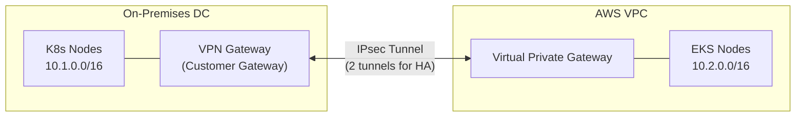
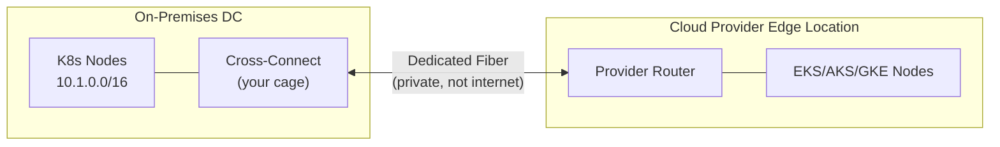
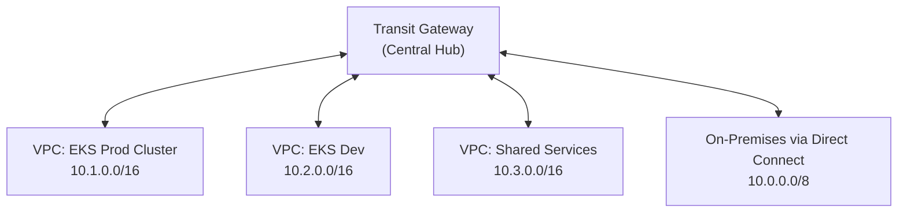
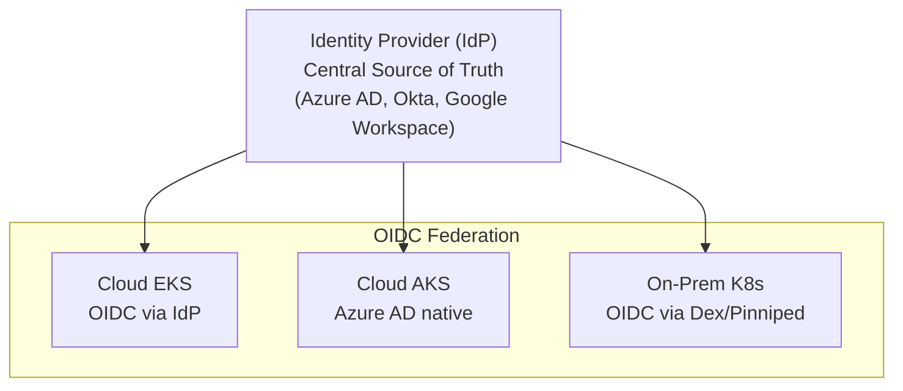
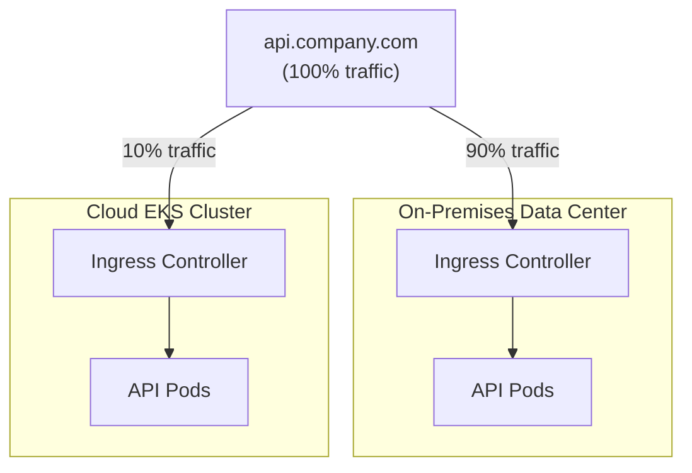
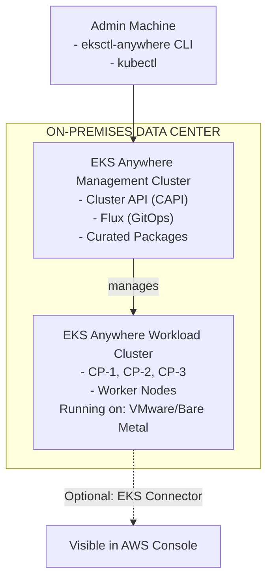
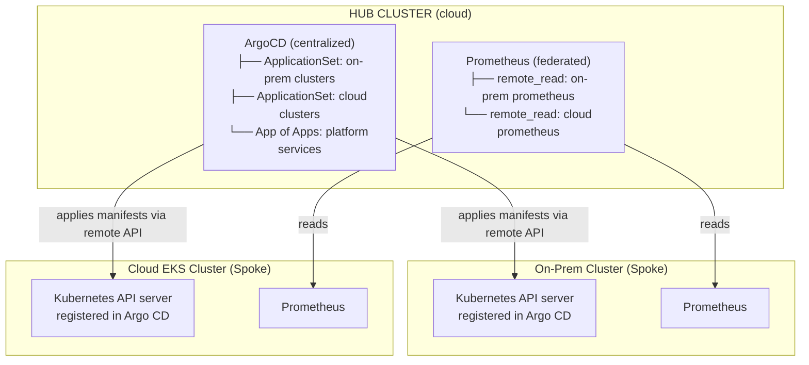
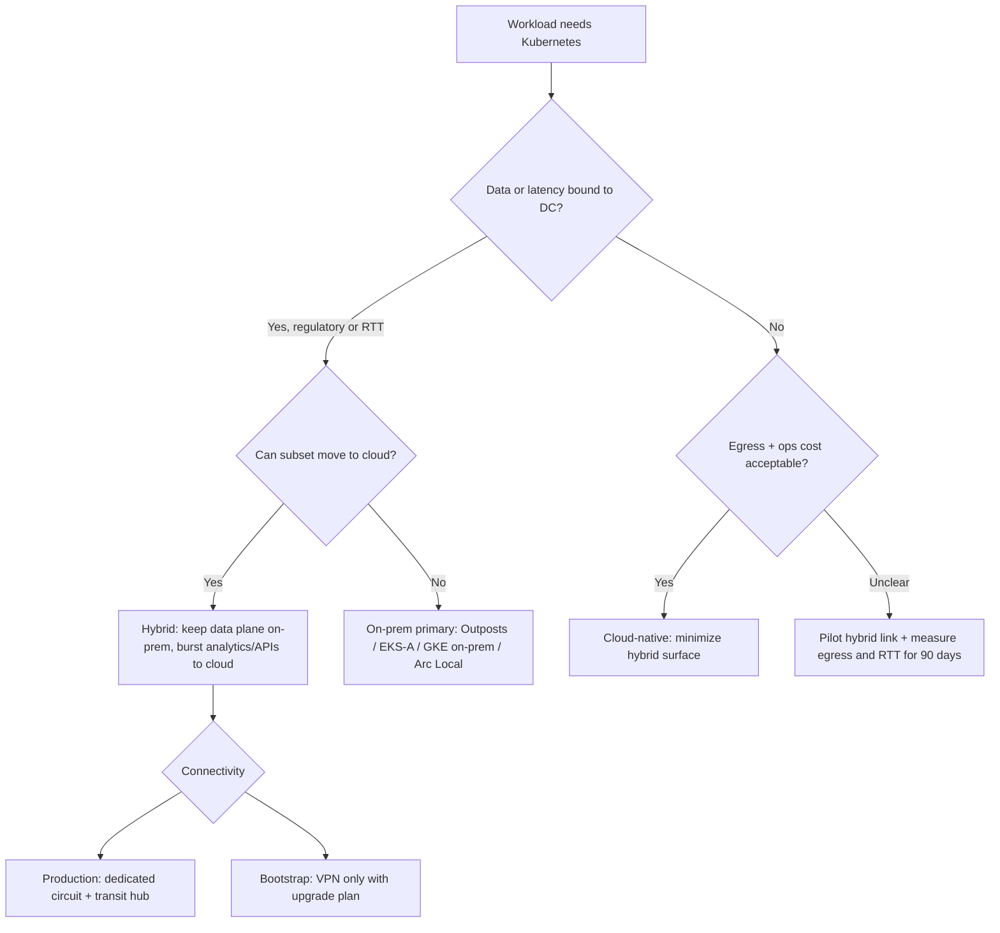
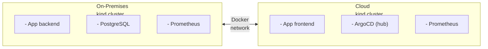

**Complexity**: `[COMPLEX]` | **Time to Complete**: 3h | **Prerequisites**: Enterprise Landing Zones (Module 10.1), Kubernetes networking basics

## What You'll Be Able to Do

After completing this module, you will be able to design secure hybrid architectures, choose the right connectivity approach, and apply common operational patterns across on-premises and cloud Kubernetes environments without guessing. You will also be able to explain **when hybrid is intentional** versus accidental complexity, and how AWS, Azure, Google, and vendor-neutral tooling split responsibilities across network, identity, data, and fleet operations.

- **Design** hybrid cloud architectures that securely connect on-premises Kubernetes clusters to cloud provider ecosystems.
- **Implement** site-to-site VPNs and dedicated connections (Direct Connect/ExpressRoute) to establish reliable hybrid network foundations.
- **Evaluate** unified identity federation mechanisms, such as Pinniped, to standardize authentication across disparate environments.
- **Implement** workload migration and data replication strategies that respect regulatory boundaries and latency constraints.
- **Compare** hybrid orchestration platforms like EKS Anywhere, Anthos, and Azure Arc for standardizing Kubernetes operations across infrastructure boundaries.

## Why This Module Matters

Hypothetical scenario: A regulated enterprise begins a "lift and shift" of a latency-sensitive trading stack from Frankfurt data centers to a public cloud region. Six months in, compliance review blocks the plan: certain market-data categories must remain on in-country hardware, and the exchange feed is delivered over dedicated fiber cross-connects with single-digit millisecond budgets. Moving the trading engine across a WAN adds measurable round-trip time that modeling teams treat as a material revenue risk, while a decades-old settlement system would require a multi-year rewrite before it could run cloud-native. Analytics, customer APIs, and new microservices still belong in the cloud—but only if the organization can connect environments safely, federate identity once, and replicate data without treating the hybrid link like a LAN extension.

> **Stop and think**: If the trading engine stays on-premises but analytics moves to the cloud, how might you keep data in sync without overwhelming the network or the budget?

That pivot—from "cloud only" to **deliberate hybrid**—is the normal end state for large Kubernetes estates, not a failed migration. AWS, Google Cloud, and Microsoft Azure each ship first-party hybrid paths (Outposts, Anthos/GKE Enterprise, Arc-enabled Kubernetes) because customers need the same operational model on both sides of the boundary. Vendor-neutral tools—Cluster API, Argo CD ApplicationSets, Flux, Pinniped, and SPIFFE-aware meshes—fill gaps where no single cloud owns the whole fleet. This module teaches the connectivity, identity, data, migration, platform, and cost patterns you need to design that architecture without accidental complexity. 

## Connectivity: The Physical Foundation

The absolute bedrock of any hybrid cloud architecture is the network link connecting your physical data center to the cloud provider's network edge. The mechanism you choose dictates your latency, bandwidth, reliability, and ultimately, which architectural patterns are viable. Platform engineers often underestimate this layer because Kubernetes abstracts compute—but **packets still leave the building**, and every cross-boundary hop is billed, monitored, and blamed during incidents.

Think of hybrid connectivity as three coupled decisions: **path** (internet VPN vs private fiber), **topology** (point-to-point vs hub-and-spoke), and **addressing** (whether pod CIDRs are globally unique in the routing domain). Skipping any one shows up later as flaky service mesh routes, replication stalls, or FinOps surprises when backup jobs double the circuit bill.

**Pause and predict:** An engineering team plans to rely on an AWS Site-to-Site VPN tunnel across the public internet for nightly 500GB database backup transfers. The tunnel supports up to 1.25 Gbps under standard settings. Theoretical line-rate calculations suggest that transferring 500GB over a 1.25 Gbps link requires roughly an hour under ideal conditions. Why is this internet IPsec path unsuitable as a production recovery data plane, and how do dedicated private connections alter those constraints?

<details>
<summary>Check your prediction</summary>

Standard AWS Site-to-Site VPN establishes IPsec tunnels over the public internet, providing up to 1.25 Gbps per tunnel (with two tunnels configured for high availability) or up to 5 Gbps per tunnel when using Large Bandwidth Tunnels attached to Transit Gateway or Cloud WAN. Sizing transfer times for a 500GB volume at theoretical line rates serves as a capacity planning baseline rather than a provider performance guarantee or SLA. Over the public internet, packets traverse multiple intermediary ISPs subject to variable latency, packet jitter, congestion, and cryptographic encapsulation overhead, which degrades effective sustained throughput well below theoretical limits. A multi-hour restore window during a site disaster directly violates aggressive Recovery Time Objectives (RTO). Consequently, Site-to-Site VPN functions primarily as a bootstrap mechanism, development link, or secondary failover path. Dedicated fiber connections, such as AWS Direct Connect, Azure ExpressRoute, or Google Cloud Interconnect, provide dedicated private physical ports (such as 1 Gbps, 10 Gbps, or 100 Gbps) that bypass the public internet entirely to deliver deterministic latency and high-throughput data transfer for production replication and recovery.
</details>

The next section is an examination of Site-to-Site VPN implementation mechanics, dual-tunnel high availability architectures, and Border Gateway Protocol route propagation across hybrid networking boundaries.

### Site-to-Site VPN

A Site-to-Site Virtual Private Network (VPN) creates a secure, IPsec-encrypted tunnel over the public internet. It connects your on-premises customer gateway router to the cloud provider's virtual private gateway. Because it traverses the public internet, it is subject to the unpredictable routing paths and congestion of global ISPs.



VPNs are exceptional for getting started quickly. They require no physical infrastructure provisioning and can be instantiated via APIs in minutes. AWS documents **two tunnels per Site-to-Site VPN connection** for redundancy, with traffic failing over when one tunnel is unavailable. Standard tunnels support up to **~1.25 Gbps per tunnel**; **Large Bandwidth Tunnels** (when attached to Transit Gateway or Cloud WAN) can reach **~5 Gbps per tunnel**—still internet-routed, but useful for backup paths or burst migrations. Azure VPN Gateway and Cloud VPN on Google Cloud follow the same IPsec-over-internet model with dual-tunnel HA patterns. BGP is the usual routing protocol on the cloud side so prefixes for VPC/VNet subnets, node CIDRs, data-center networks, and pod CIDRs where the CNI makes pod IPs routable can propagate dynamically. Kubernetes service CIDRs still belong in IPAM for overlap avoidance, but ClusterIP service addresses are cluster-scoped virtual IPs; expose services across the boundary through ingress, load balancers, Multi-Cluster Services, or mesh gateways instead of advertising the service CIDR as a WAN prefix.

However, variable latency and shared-internet congestion make VPNs a poor primary path for synchronous database replication, large image-registry sync, or latency-sensitive east-west service mesh traffic across the hybrid boundary. Treat VPN as **bootstrap, dev/test, and failover**, not the production data plane.

```bash
# AWS: Create a Site-to-Site VPN connection
# Step 1: Create a Customer Gateway (your on-premises router's public IP)
CGW_ID=$(aws ec2 create-customer-gateway \
  --type ipsec.1 \
  --public-ip 203.0.113.50 \
  --bgp-asn 65000 \
  --query 'CustomerGateway.CustomerGatewayId' --output text)

# Step 2: Create a Virtual Private Gateway and attach to VPC
VGW_ID=$(aws ec2 create-vpn-gateway \
  --type ipsec.1 \
  --amazon-side-asn 64512 \
  --query 'VpnGateway.VpnGatewayId' --output text)
aws ec2 attach-vpn-gateway --vpn-gateway-id $VGW_ID --vpc-id $VPC_ID

# Step 3: Create the VPN connection (2 tunnels automatically)
VPN_ID=$(aws ec2 create-vpn-connection \
  --type ipsec.1 \
  --customer-gateway-id $CGW_ID \
  --vpn-gateway-id $VGW_ID \
  --options '{"StaticRoutesOnly":false}' \
  --query 'VpnConnection.VpnConnectionId' --output text)

# Step 4: Download the configuration for your on-premises router
aws ec2 describe-vpn-connections \
  --vpn-connection-ids $VPN_ID \
  --query 'VpnConnections[0].CustomerGatewayConfiguration' \
  --output text > vpn-config.xml
```

### Dedicated Connections (Direct Connect / ExpressRoute / Cloud Interconnect)

For production workloads, enterprises utilize dedicated connections like AWS Direct Connect, Azure ExpressRoute, or Google Cloud Interconnect. These services provide a private, physical fiber-optic link from your data center (or colocation facility) directly into the cloud provider's edge routers.



Dedicated connections bypass the public internet for the provider-owned segment. They offer more predictable latency and bandwidth tiers sized for production hybrid and DR:

| Provider | Service | Typical bandwidth tiers | Routing / HA notes |
| :--- | :--- | :--- | :--- |
| **AWS** | [Direct Connect](https://docs.aws.amazon.com/directconnect/latest/UserGuide/Welcome.html) | 1 Gbps, 10 Gbps, 100 Gbps, 400 Gbps (location-dependent) | Private VIF to VPC; **transit VIF** to Transit Gateway; BGP + optional BFD |
| **Azure** | [ExpressRoute](https://learn.microsoft.com/en-us/azure/expressroute/expressroute-introduction) | 50 Mbps–10 Gbps circuits; higher via partner; ExpressRoute Direct offers 10/100 Gbps ports | Private peering to VNets; **ExpressRoute Global Reach** links ExpressRoute circuits for private on-premises-to-on-premises connectivity; integrates with Virtual WAN |
| **Google Cloud** | [Cloud Interconnect](https://cloud.google.com/network-connectivity/docs/interconnect/concepts/overview) | Dedicated (10/100 Gbps) or partner (50 Mbps–50 Gbps) | VLAN attachment to VPC; partner interconnect for faster procurement |

**Redundancy** is non-negotiable at enterprise scale: dual circuits to distinct provider edge locations (or diverse paths within a metro), separate customer routers, and documented failover drills. **Active/active** designs split traffic across paths; **active/passive** keeps a hot standby for DR. MACsec (where supported on high-speed AWS ports) adds link-layer encryption when regulatory policy requires encryption even on private fiber.

The trade-off is **cost and calendar time**: port-hour charges plus cross-connect fees in colocation, and lead times often measured in **weeks to months** while physical fiber is spliced. Budget for recurring monthly circuit fees **before** you promise synchronous cross-boundary replication to application teams.

### Connectivity Comparison Matrix

| Feature | Site-to-Site VPN | Dedicated Connection |
| :--- | :--- | :--- |
| **Bandwidth** | Up to 1.25 Gbps/tunnel | 1-100 Gbps |
| **Latency** | 20-100ms (variable) | 1-5ms (consistent) |
| **Reliability** | Internet-dependent | SLA-backed (99.9-99.99%) |
| **Encryption** | Built-in (IPsec) | Optional (MACsec on 10/100G) |
| **Cost** | Low ($36/month base) | High ($1,600+/month for 1Gbps) |
| **Setup time** | Hours | Weeks to months |
| **Use case** | Dev/test, failover, low bandwidth | Production, latency-sensitive, high bandwidth |
| **Kubernetes impact** | Acceptable for API calls, config sync | Required for data replication, cross-cluster traffic |

Cost figures in the table are order-of-magnitude planning aids—always reconcile against current AWS, Azure, and Google pricing pages and your colocation cross-connect quotes. A common FinOps mistake is budgeting only the cloud port fee while omitting **cross-connect NRC/MRC** in the cage and redundant router ports on-premises. For Kubernetes specifically, model **steady-state cloud data-transfer-out** (telemetry exports, registry pulls from cloud, result downloads) separately from **burst hybrid transfer** (Velero full backups, initial DB seed), because burst traffic drives circuit upgrades more often than average API traffic even when the cloud provider treats the upload direction as ingress.

### Provider-Specific Hybrid Connectivity Notes

**AWS:** Site-to-Site VPN terminates on a virtual private gateway (classic VPC) or on a **Transit Gateway** attachment (preferred for multi-VPC EKS estates). Direct Connect uses a **private VIF** for RFC1918 traffic into VPCs and a **transit VIF** when the destination is a Transit Gateway—design the attachment before you advertise pod CIDRs. Enable **BGP** on both tunnels; static routing is acceptable in labs but hides errors until failover. For encryption on dedicated fiber, evaluate **MACsec** on supported 10/100 Gbps ports per the Direct Connect documentation.

**Azure:** **VPN Gateway** (route-based IPsec) connects on-premises firewalls to hub or spoke VNets hosting AKS. **ExpressRoute** private peering carries production traffic; pair with **ExpressRoute Global Reach** when separate on-premises sites need private connectivity through their ExpressRoute circuits instead of public internet paths. Treat **ExpressRoute Direct** as the separate high-capacity 10/100 Gbps port option. **Azure Virtual WAN** collapses hub routing, optional secured internet egress, and multi-hub designs for multinational estates—useful when AKS clusters span regions and on-premises DCs alike.

**Google Cloud:** **HA VPN** (two tunnels) mirrors AWS/Azure redundancy. **Cloud Interconnect** attachments land on a **VLAN attachment** in a chosen region; routes propagate into VPCs hosting GKE. **Network Connectivity Center (NCC)** is Google's hub for spokes, VPN, and interconnect—analogous to Transit Gateway / Virtual WAN when GKE fleet count grows.

Across all three, the Kubernetes-specific design task is identical: enumerate **VPC/VNet subnet CIDRs**, **node CIDRs**, **pod CIDRs**, **service CIDRs**, and **load balancer SNAT ranges** for every cluster. Then prove the routable prefixes are unique in the hub route table while keeping service CIDRs non-overlapping in IPAM, because ClusterIP ranges are not WAN-routed service discovery.

### Routing the Hybrid Network: Hub-and-Spoke Transit

As your hybrid footprint grows, point-to-point VPNs and VIFs between every VPC and every data center become an operational nightmare—route tables conflict, security domains blur, and overlapping CIDR mistakes surface only under load. The standard enterprise pattern is **hub-and-spoke**: one logical hub carries inter-spoke and on-premises traffic; spokes remain isolated except through the hub.

| Provider | Hub service | Role in hybrid Kubernetes |
| :--- | :--- | :--- |
| **AWS** | [Transit Gateway](https://docs.aws.amazon.com/vpc/latest/tgw/what-is-transit-gateway.html) | Attach VPCs (EKS), Direct Connect gateway, and VPN; propagate VPC/node CIDRs and routable pod CIDRs via BGP |
| **Azure** | [Virtual WAN](https://learn.microsoft.com/en-us/azure/virtual-wan/virtual-wan-about) | Hub for ExpressRoute, VPN, and spoke VNets (AKS); optional secured hub with firewall |
| **Google Cloud** | [Network Connectivity Center](https://cloud.google.com/network-connectivity/docs/network-connectivity-center/concepts/overview) | Hub for Cloud Interconnect, VPN, and VPC spokes (GKE) |

**Mesh** topologies (full mesh of VPC peering or VNet peering) can reduce hop count for small estates but scale poorly: \(n(n-1)/2\) relationships explode as cluster count grows. Most platform teams standardize on a transit hub plus strict IPAM.



When implementing a transit hub, you must ensure that VPC/VNet subnet CIDRs, node CIDRs, and Kubernetes pod CIDR blocks are non-overlapping across all environments and are actively advertised via BGP where the network design expects direct pod reachability. Keep service CIDRs in the same IPAM registry for collision prevention, but reach ClusterIP-backed services through ingress, load balancers, Multi-Cluster Services, or mesh gateways rather than BGP advertisements.

```bash
# Create Transit Gateway
TGW_ID=$(aws ec2 create-transit-gateway \
  --description "Hybrid-Hub" \
  --options "AmazonSideAsn=64512,AutoAcceptSharedAttachments=disable,DefaultRouteTableAssociation=disable,DefaultRouteTablePropagation=disable,DnsSupport=enable" \
  --query 'TransitGateway.TransitGatewayId' --output text)

# Attach VPCs
aws ec2 create-transit-gateway-vpc-attachment \
  --transit-gateway-id $TGW_ID \
  --vpc-id $PROD_VPC_ID \
  --subnet-ids $PROD_SUBNET_1 $PROD_SUBNET_2

# Attach Direct Connect Gateway
aws directconnect create-direct-connect-gateway-association \
  --direct-connect-gateway-id $DX_GW_ID \
  --gateway-id $TGW_ID \
  --add-allowed-prefixes-to-direct-connect-gateway cidr=10.1.0.0/16 cidr=10.2.0.0/16 cidr=10.3.0.0/16

# Route on-prem traffic through Transit Gateway
aws ec2 create-transit-gateway-route \
  --transit-gateway-route-table-id $TGW_RT_ID \
  --destination-cidr-block 10.0.0.0/8 \
  --transit-gateway-attachment-id $DX_ATTACHMENT_ID
```

> **Hypothetical scenario:** A logistics platform connects twelve cloud VPCs and three on-premises data centers through a central transit hub. Each Kubernetes cluster works in isolation, but cross-cluster service mesh calls fail intermittently. After weeks of packet captures, engineers find duplicate **pod CIDR** ranges advertised from different VPC CNIs into the same route table—transit hubs cannot disambiguate overlapping destinations. Recovery requires IPAM redesign and controlled cluster rebuilds, not a mesh configuration tweak.

**Lesson:** Allocate non-overlapping VPC/VNet subnet, node, pod, service, and load balancer ranges in a central registry **before** the first production cluster attaches to the hub. Validate route advertisements for subnets, nodes, and routable pods with `traceroute` and controlled test pods, and validate service exposure separately through the ingress, load balancer, mesh, or Multi-Cluster Services path that owns the virtual service address.

### Security Perimeter and Traffic Policy at the Boundary

Hybrid networks rarely stop at "allow 10.0.0.0/8." Security architects layer **north-south inspection** (firewall or cloud NGFW between DC and cloud), **east-west policy inside clusters** (Kubernetes `NetworkPolicy` default-deny, service mesh mTLS), and **cloud network policy** (security groups, NSGs, VPC firewall rules). A workable enterprise pattern:

- **Default-deny** between on-premises server VLANs and cloud VPCs except explicitly opened ports (API server from bastion, replication ports, metrics scrape paths).
- **Private Kubernetes API** endpoints where the cloud provider supports it (EKS private endpoint, private GKE control plane, private AKS API) so hybrid admin traffic does not require public internet exposure.
- **Break-glass paths** documented and audited—temporary `0.0.0.0/0` rules during incidents become permanent unless governance removes them automatically.

Regulated industries often require **encryption in transit** on every hybrid flow. IPsec VPN satisfies that for internet paths; dedicated links may still need application TLS or MACsec depending on threat model. Do not assume "private fiber" equals "trusted network"—insider threat and cross-tenant colocation risks remain.

Compliance mappings ([Module 10.3: Continuous Compliance](../module-10.3-compliance/)) should list which controls apply **on-premises**, which apply **in cloud**, and which require **evidence from both** (backup tests, access reviews, vulnerability scans). Hybrid doubles the evidence collection surface unless automation is centralized.

## Unified Identity: Extending the Cloud Control Plane

Managing authentication separately for on-premises clusters and cloud clusters creates significant operational friction and security vulnerabilities. A true hybrid architecture requires a unified identity plane where a single set of credentials grants access everywhere based on centralized Role-Based Access Control (RBAC).

> **Stop and think**: If your corporate Identity Provider goes down, what happens to developers trying to access the on-premises Kubernetes cluster via Pinniped? How would break-glass access work?

### Identity Architecture Options

The goal is to federate identity from a central provider (IdP) to every Kubernetes cluster, regardless of its hosting location.



### Pinniped: Unified Kubernetes Authentication

Pinniped is an open-source project designed to provide identity federation for any Kubernetes cluster. It bridges the gap between modern OIDC providers and on-premises clusters that lack native integrations. Pinniped operates via a Supervisor that integrates with your IdP and a Concierge that sits on the target clusters to validate the tokens.

```yaml
# Install Pinniped Supervisor (on a management cluster)
# This acts as the OIDC bridge between your IdP and Kubernetes clusters

# pinniped-supervisor-config.yaml
apiVersion: config.supervisor.pinniped.dev/v1alpha1
kind: FederationDomain
metadata:
  name: company-federation
  namespace: pinniped-supervisor
spec:
  issuer: https://pinniped.internal.company.com
  tls:
    secretName: pinniped-tls-cert
```

```yaml
# Connect Pinniped to your corporate IdP (e.g., Okta)
apiVersion: idp.supervisor.pinniped.dev/v1alpha1
kind: OIDCIdentityProvider
metadata:
  name: okta-idp
  namespace: pinniped-supervisor
spec:
  issuer: https://company.okta.com/oauth2/default
  authorizationConfig:
    additionalScopes:
      - groups
      - email
    allowPasswordGrant: false
  claims:
    username: email
    groups: groups
  client:
    secretName: okta-client-secret
```

```yaml
# On each on-prem cluster, install Pinniped Concierge
# pinniped-concierge-config.yaml
apiVersion: authentication.concierge.pinniped.dev/v1alpha1
kind: JWTAuthenticator
metadata:
  name: company-jwt
spec:
  issuer: https://pinniped.internal.company.com
  audience: on-prem-cluster-1
  tls:
    certificateAuthorityData: <base64-encoded-ca-cert>
```

With Pinniped configured, developers utilize a standardized workflow to access any cluster using the Pinniped CLI plugin. This consistency is crucial in hybrid operations because teams move between environments throughout a day, and they need one dependable path for authentication rather than a collection of one-off kubeconfigs.

### Cloud-Native Identity on Managed Clusters

Managed cloud clusters already integrate with corporate IdPs, but the mechanism differs by provider:

| Provider | Kubernetes API authentication | Workload → cloud API identity |
| :--- | :--- | :--- |
| **AWS EKS** | [IAM access entries](https://docs.aws.amazon.com/eks/latest/userguide/access-entries.html) + OIDC for human SSO | [EKS Pod Identity](https://docs.aws.amazon.com/eks/latest/userguide/pod-identities.html) or IRSA (OIDC trust to IAM roles) |
| **GKE** | Google Groups + IAM; workforce identity for humans | [Workload Identity Federation](https://cloud.google.com/kubernetes-engine/docs/how-to/workload-identity) (Kubernetes SA → Google SA) |
| **AKS** | [Microsoft Entra ID](https://learn.microsoft.com/en-us/azure/aks/manage-azure-ad) integration | [Workload identity](https://learn.microsoft.com/en-us/azure/aks/workload-identity-overview) (federated credentials to Entra apps) |

On-premises clusters rarely expose the cloud control plane's native hooks. **Pinniped** (VMware Tanzu, [project docs](https://pinniped.dev/docs/)) standardizes human login via OIDC. For **machine** identity across hybrid, pair Kubernetes service accounts with cloud federation where possible, or adopt **SPIFFE/SPIRE** when workloads must authenticate across clusters without sharing long-lived cloud keys—see [Module 10.9: Zero Trust](../module-10.9-zero-trust/) for the full trust-domain model.

**Microsoft Entra Connect** (or cloud-only Entra) remains the directory bridge many enterprises use to sync on-premises Active Directory groups into Entra ID, which AKS and Pinniped-backed clusters then consume for RBAC group mapping. Plan **break-glass** local accounts and documented recovery when the IdP is unavailable; hybrid uptime is meaningless if operators cannot reach the API server during an identity outage.

### RBAC Consistency Across Clusters

Kubernetes RBAC should map **IdP groups** to `ClusterRoleBinding` names that mean the same thing in the data center and in every cloud region. A platform convention reduces audit findings and prevents "works in EKS, broken on-prem" surprises:

| IdP group | On-prem role | Cloud role | Notes |
| :--- | :--- | :--- | :--- |
| `k8s-platform-admin` | `cluster-admin` (break-glass only) | `cluster-admin` | Time-bound elevation |
| `k8s-developer` | `edit` in app namespaces | `edit` in app namespaces | No cluster-wide secrets |
| `k8s-viewer` | `view` | `view` | SRE dashboards |
| `k8s-cicd` | automation SA per cluster | IRSA / workload identity | No human users |

GitOps and CI should use **workload identity** per environment rather than long-lived kubeconfig files in pipeline secrets—hybrid estates multiply credential sprawl faster than single-cloud shops.

```bash
# Developer workflow (same for cloud and on-prem)
# Install the Pinniped CLI
brew install vmware-tanzu/pinniped/pinniped-cli

# Generate kubeconfig for an on-prem cluster
pinniped get kubeconfig \
  --kubeconfig-context on-prem-cluster-1 \
  > /tmp/on-prem-kubeconfig.yaml

# The kubeconfig triggers browser-based OIDC login
# Same Okta credentials work for cloud and on-prem clusters
kubectl --kubeconfig /tmp/on-prem-kubeconfig.yaml get nodes
```

## Data Gravity: Replicating State Across Boundaries

Stateless applications are trivial to move between environments. Data, however, has immense gravity. Moving terabytes of stateful data across a WAN link is slow, expensive, and technically complex. Synchronous replication is rarely feasible across long distances because round-trip time sets a floor on commit latency—hybrid architects should assume **async** paths unless both sites sit in the same metro with dedicated fiber and measured sub-5 ms RTT.

### The Hybrid Cost Driver: Egress and Data Transfer

At enterprise scale, **egress and cross-environment data transfer** often dominate hybrid TCO more than Kubernetes control-plane fees. Cloud providers bill outbound traffic from VPCs/VNets to on-premises prefixes (and cross-region replication) at published data-transfer rates—verify current pricing in each provider's data transfer pages before modeling FinOps dashboards. Kafka mirroring, Prometheus `remote_write`, Velero backups, and naive "pull everything from cloud ECR" behaviors can saturate a 1 Gbps circuit silently while CPU looks healthy.

| Cost knob | What it reduces | Tradeoff |
| :--- | :--- | :--- |
| **Local registry mirror** (Harbor, pull-through cache) | Image pull egress | Stale image risk without sync policy |
| **Async replication + read replicas in cloud** | Synchronous WAN commits | Replication lag visible to apps |
| **Compress / batch analytics pipelines** | Nightly warehouse sync size | Later insight latency |
| **Right-size dedicated circuit** | VPN thrash and retry storms | Up-front port fees |
| **Data residency partitioning** | Cross-border transfer + compliance rework | More application splits |

Chargeback should tag **hybrid transfer** separately from in-region cloud spend so product teams see the true price of cross-boundary calls.

### Data Replication Patterns

| Pattern | Use Case | Latency Tolerance | Tools |
| :--- | :--- | :--- | :--- |
| **Active-Passive** | DR, read replicas | Minutes | AWS DMS, Azure Database Migration Service, SQL availability groups, native PostgreSQL/MySQL replication; Azure Site Recovery only for VM/server DR |
| **Active-Active** | Multi-region writes | Sub-second | CockroachDB, YugabyteDB, Cassandra |
| **Event Streaming** | Real-time sync | Seconds | Kafka MirrorMaker, Confluent Replicator |
| **Batch Sync** | Analytics, reporting | Hours | AWS DataSync, Rclone, rsync |
| **Cache-Aside** | Read-heavy, latency-sensitive | Milliseconds | Redis Enterprise, Hazelcast |

### Cross-Environment Database Replication

To mitigate latency issues, implement **asynchronous** streaming replication unless both sites share a metro with measured RTT and the application explicitly tolerates synchronous commit delay. The on-premises database remains primary for writes governed by residency; the cloud hosts read replicas, analytics snapshots, or eventually consistent consumers. **Synchronous** replication across a hybrid WAN is a common outage amplifier: a blip on the circuit stalls commits on-premises even when the local data center is healthy.

**PostgreSQL** logical replication and physical streaming (shown below) differ in flexibility: logical replication can filter tables for partial cloud migration; physical replication clones the whole instance. **MySQL** async replica chains and **SQL Server** availability groups with async secondary to Azure follow the same latency rules—verify vendor guidance for supported RTT.

**Conflict handling:** active-active writes across hybrid without CRDT semantics require application-level idempotency keys and conflict resolution. Most enterprises standardize on **single-primary** across the boundary and treat cloud replicas as read-only until a controlled failover flips roles during DR.

### Object Storage and File Replication

Not all gravity is relational. Backup targets (S3, Azure Blob, GCS), Terraform state, and ML feature stores replicate with tools such as **AWS DataSync**, **Azure File Sync**, **Storage Transfer Service**, or `rclone` jobs scheduled off-peak. On-premises-to-cloud seeding is normally ingress to the cloud provider, so the cloud bill is not the same as cloud egress. You still pay for the on-premises carrier, circuit capacity, appliances, or migration tooling, and cloud data-transfer-out starts when those bytes later leave the cloud toward on-premises, another region, or the internet.

The StatefulSet example below shows physical streaming to a cloud read replica—the on-premises primary remains the writer of record:

```yaml
# PostgreSQL streaming replication across hybrid boundary
# On-prem primary → Cloud read replica

# On the on-prem primary (postgresql.conf)
# wal_level = replica
# max_wal_senders = 5
# wal_keep_size = 1GB

# On the cloud replica (Kubernetes StatefulSet)
apiVersion: apps/v1
kind: StatefulSet
metadata:
  name: postgres-replica
  namespace: database
spec:
  serviceName: postgres-replica
  replicas: 1
  selector:
    matchLabels:
      app: postgres-replica
  template:
    metadata:
      labels:
        app: postgres-replica
    spec:
      containers:
        - name: postgres
          image: postgres:16.2
          env:
            - name: PGDATA
              value: /var/lib/postgresql/data/pgdata
          command:
            - bash
            - -c
            - |
              # Initialize as a streaming replica of the on-prem primary
              if [ ! -f "$PGDATA/PG_VERSION" ]; then
                pg_basebackup -h 10.0.50.100 -U replicator \
                  -D $PGDATA -Fp -Xs -P -R
              fi
              exec postgres \
                -c primary_conninfo='host=10.0.50.100 port=5432 user=replicator password=secret' \
                -c primary_slot_name='cloud_replica'
          ports:
            - containerPort: 5432
          volumeMounts:
            - name: pgdata
              mountPath: /var/lib/postgresql/data
          resources:
            limits:
              cpu: "2"
              memory: 4Gi
  volumeClaimTemplates:
    - metadata:
        name: pgdata
      spec:
        accessModes: ["ReadWriteOnce"]
        storageClassName: gp3-encrypted
        resources:
          requests:
            storage: 500Gi
```

### Kafka for Cross-Environment Event Streaming

For modern microservices, event streaming using tools like Kafka MirrorMaker provides an elegant solution to data replication. Events generated on-premises are automatically mirrored to cloud clusters, enabling decoupled architectures where cloud consumers never need synchronous RPC to the trading floor.

Design topics deliberately: **replication factor** on both sides must survive zone loss; **ACL sync** may stay disabled when cloud and on-prem ACL models differ; **topic allowlists** prevent accidental mirroring of PII topics. Monitor **consumer lag** on the cloud side as a first-class SLO—lag spikes often predict circuit saturation before router SNMP does.

At enterprise scale, mirror traffic competes with database replication and backup jobs on the same circuit. Schedule bursty rebalances off-peak and cap bandwidth per MirrorMaker connector if the broker documentation supports throttling. When ordering a dedicated link, size for **peak mirror plus peak backup**, not average daily throughput.

```yaml
# Kafka MirrorMaker 2 for hybrid event streaming
# Replicates topics from on-prem Kafka to cloud Kafka
apiVersion: kafka.strimzi.io/v1beta2
kind: KafkaMirrorMaker2
metadata:
  name: hybrid-mirror
  namespace: kafka
spec:
  version: 3.7.0
  replicas: 3
  connectCluster: cloud-kafka
  clusters:
    - alias: onprem-kafka
      bootstrapServers: onprem-kafka-bootstrap.datacenter.internal:9093
      tls:
        trustedCertificates:
          - secretName: onprem-ca-cert
            certificate: ca.crt
      authentication:
        type: tls
        certificateAndKey:
          secretName: mirror-maker-cert
          certificate: tls.crt
          key: tls.key
    - alias: cloud-kafka
      bootstrapServers: kafka-bootstrap.kafka.svc:9092
      config:
        config.storage.replication.factor: 3
        offset.storage.replication.factor: 3
        status.storage.replication.factor: 3
  mirrors:
    - sourceCluster: onprem-kafka
      targetCluster: cloud-kafka
      sourceConnector:
        config:
          replication.factor: 3
          offset-syncs.topic.replication.factor: 3
          sync.topic.acls.enabled: false
          replication.policy.class: "org.apache.kafka.connect.mirror.IdentityReplicationPolicy"
      topicsPattern: "trading\\..*|settlement\\..*"
      groupsPattern: ".*"
```

## Workload Migration Strategies: Shifting the Traffic

When you are ready to begin moving applications to your hybrid cloud environment, a "big bang" switch is highly discouraged. Instead, employ progressive traffic shifting to iteratively test and validate your cloud clusters.

**Pause and predict:** A platform team uses weighted DNS routing to shift 1% of live production traffic to a newly deployed cloud Kubernetes cluster. They observe healthy latency and error rates over a 24-hour observation period. An unexpected database synchronization failure then occurs after increasing the DNS weight. Why does weighted DNS fail to provide an instantaneous rollback mechanism, and what architectural alternative addresses this limitation?

<details>
<summary>Check your prediction</summary>

Weighted DNS records (such as AWS Route 53 weighted sets) distribute traffic by altering the proportion of IP addresses returned in DNS query responses. However, DNS resolution relies on client-side and recursive resolver caching that frequently ignores or extends configured Time to Live (TTL) values. Even after reducing the record weight to zero or rolling back DNS configuration, public ISP resolvers, intermediate corporate caching proxies, and mobile network gateways continue routing cached client traffic to the cloud ingress for minutes or even hours. Consequently, observing a clean 24-hour canary run at 1% does not establish an immediate rollback guarantee during downstream failures. In contrast, multi-cluster ingress controllers, Anycast IP routing, and Layer 7 global load balancers maintain persistent upstream health checks and dynamically route traffic at the proxy layer, enabling near-instantaneous traffic draining and rollback without waiting for worldwide DNS cache expiration.
</details>

The next section is an operational analysis of weighted DNS traffic routing patterns, ExternalDNS controller configurations, and ingress manifest specifications for progressive hybrid migrations.

### Pattern 1: Weighted DNS Routing

DNS-level traffic shifting involves configuring multiple records for a single domain, weighting the responses so that only a fraction of users resolve to the new cloud ingress.

```yaml
# Example: AWS Route 53 Weighted Record via ExternalDNS annotation
apiVersion: networking.k8s.io/v1
kind: Ingress
metadata:
  name: api-gateway
  annotations:
    external-dns.alpha.kubernetes.io/hostname: api.company.com
    external-dns.alpha.kubernetes.io/aws-weight: "10" # 10% to cloud
    external-dns.alpha.kubernetes.io/set-identifier: "cloud-eks-cluster"
spec:
  rules:
    - host: api.company.com
      http:
        paths:
          - path: /
            pathType: Prefix
            backend:
              service:
                name: api-gateway
                port:
                  number: 80
```

While straightforward, DNS caching by ISPs and client browsers means traffic changes can be heavily delayed, making quick rollbacks difficult.

### Pattern 2: Multi-Cluster Ingress

A global load balancer or multi-cluster ingress gives faster rollback than DNS-only weighting. These tools terminate the connection centrally and distribute HTTP traffic deterministically based on dynamic rules.



This pattern eliminates the risks associated with DNS caching and allows for immediate, highly granular traffic shifting based on headers, paths, or geographic origins.

### Latency Budget and Cross-Boundary Service Calls

Treat hybrid service calls like a distributed system with a **latency budget**, not like in-VPC calls. Platform SLOs should include RTT over the dedicated link or VPN, TLS handshake cost, and retry policy. A practical gate before raising cloud traffic share: p95 end-to-end latency stays within product SLO, error rate does not climb when shifting weight, and database lag (if async) stays below business tolerance. **Blue/green across environments** keeps rollback instant—stand up the cloud slice, mirror config with GitOps, shift ingress weight, and retain on-premises capacity until burn-in completes.

### Disaster Recovery Across Hybrid

DR patterns mirror connectivity quality:

| Tier | RPO / RTO posture | Network requirement |
| :--- | :--- | :--- |
| **Backup + restore** | Hours / hours | VPN acceptable for nightly object storage sync |
| **Warm standby (async DB)** | Minutes–hours / tens of minutes | Dedicated fiber; monitor replication lag |
| **Active/passive compute** | Low RTO for stateless | GitOps + pre-pulled images on standby cluster |
| **Active/active data** | Lowest RPO | Same metro or CRDT/conflict-tolerant stores only |

Velero, cloud-native backup services, and database-native replication incur cloud data-transfer-out when bytes leave the cloud toward on-premises, another cloud, or the public internet. On-premises-to-cloud backup seeds are usually cloud ingress, but they still consume circuit capacity and may incur carrier or tooling charges—model both directions explicitly in DR drills, not only RTO slides.

## On-Premises Cloud Parity: AWS, GCP, Azure, and Vendor-Neutral Paths

To prevent operational silos, platform teams want on-premises Kubernetes to follow the same lifecycle, policy, and observability model as cloud clusters. Each hyperscaler packages a different answer—and **vendor-neutral** Cluster API plus GitOps (Flux/Argo CD) remains the escape hatch when no single cloud owns the estate.

### Hybrid Platform Comparison

| Feature | AWS Outposts / EKS Anywhere | GKE Enterprise (Anthos) | Azure Arc + AKS on Azure Local | Vendor-neutral (CAPI + GitOps) |
| :--- | :--- | :--- | :--- | :--- |
| **Control plane location** | Outposts: AWS-managed in rack; EKS-A: customer-managed on vSphere/bare metal | GDC/GKE on-prem control planes run in the customer environment; attached clusters keep their existing control plane; Connect gateway is an access path | Arc agents on existing K8s; AKS on Azure Local for HCI stack | Management cluster in your DC or cloud |
| **Disconnected operation** | Outposts limited without AWS link; EKS-A clusters run if management reachable | Config/policy may cache; verify feature-level offline matrix | Arc requires periodic Azure connectivity for some features | GitOps agents reconcile from local Git mirrors |
| **Cloud console visibility** | Outposts in AWS console; EKS-A optional EKS Connector | Fleet/Config Controller in GCP | Azure Portal Arc blade | Argo CD / Rancher / Grafana fleet views |
| **Typical GitOps** | Flux (EKS-A curated) | Config Sync / Config Controller | Flux extension for Arc | Flux or Argo CD ApplicationSets |
| **Licensing / cost** | Outposts capacity + support; EKS-A subscription optional | GKE Enterprise per-vCPU (verify current pricing) | Arc core often no charge; extensions priced separately; Azure Local infra + Windows/SQL licensing | Infra + engineer time; no hyperscaler tax |
| **Best fit** | AWS-primary regulated racks | Google-primary multi-cluster policy | Microsoft-primary estate with existing HCI | Multi-cloud hub with disciplined IPAM |

### AWS Outposts and EKS Anywhere

**[AWS Outposts](https://docs.aws.amazon.com/outposts/latest/userguide/what-is-outposts.html)** places AWS-designed infrastructure in your data center for workloads that need single-digit millisecond access to on-premises systems while still using AWS APIs. **EKS Anywhere** ([documentation](https://anywhere.eks.amazonaws.com/docs/)) is the complementary software distribution: you run EKS-compatible Kubernetes on VMware vSphere, bare metal, or Nutanix with Cluster API under the hood and curated packages (Cilium, Flux, etc.). Outposts suits "AWS hardware on-prem"; EKS Anywhere suits "your hardware, EKS semantics."

### Google GKE Enterprise (Anthos) and Connect

**[GKE Enterprise](https://cloud.google.com/kubernetes-engine/enterprise/docs/concepts/gke-enterprise)** (formerly marketed as Anthos) unifies fleet policy, config delivery, and multi-cluster operations. **[Connect gateway](https://cloud.google.com/kubernetes-engine/enterprise/docs/concepts/connect-gateway)** lets operators reach on-premises or other-cloud clusters through Google Cloud identity without opening the Kubernetes API server directly to the internet—a common hybrid security requirement. **[GKE on-prem](https://cloud.google.com/kubernetes-engine/distributed-cloud/bare-metal/docs/concepts/gke-on-prem)** (Distributed Cloud) runs the GKE control plane in your facility when cloud-adjacent clusters are insufficient.

Config Sync (policy and config from Git) and fleet-scoped features assume you have designed **hierarchy labels** on projects and clusters so policy can target `environment=prod` and `location=onprem-frankfurt` consistently. Google’s per-vCPU enterprise pricing means large on-prem node counts deserve a **TCO worksheet** next to self-managed CAPI—especially when workloads are bursty and nodes scale horizontally on weekends.

### Azure Arc and AKS on Azure Local

**[Azure Arc-enabled Kubernetes](https://learn.microsoft.com/en-us/azure/azure-arc/kubernetes/overview)** attaches any CNCF-conformant cluster to Azure Resource Manager for inventory, Azure Policy for Kubernetes, Defender integration, and GitOps (Flux) extensions—without replacing your existing distribution. Arc is attractive when you inherited RKE, OpenShift, or bare `kubeadm` clusters and need **central policy** faster than rebuilding on AKS. Extensions (monitoring, GitOps, custom features) may carry separate charges—verify current Azure pricing pages before promising unlimited fleet enroll.

**[AKS on Azure Local](https://learn.microsoft.com/en-us/azure/aks/aks-on-azure-local/overview)** (formerly Azure Stack HCI) delivers an Azure-managed Kubernetes experience on hyperconverged Windows Server infrastructure when you want AKS semantics on-prem rather than only attaching what you already built. Budget includes HCI licensing, hardware lifecycle, and Windows patch cadence—not only Kubernetes day-2. Connected operation expects periodic Azure connectivity for control-plane coordination; document offline behavior for your compliance tier.

Arc **does not** replace IPAM or hybrid circuits: it extends governance to clusters already reachable over your network design. Pair Arc policy with hub routing so attached clusters in the data center and in Azure regions share consistent `Namespace` labels and deny rules.

### When Hybrid Beats Full Cloud (and When It Does Not)

Choose hybrid when at least one constraint is non-negotiable: **data residency**, **latency to legacy systems**, **capitalized hardware you cannot retire this quarter**, or **regulated interfaces** (mainframe, trading feeds, manufacturing PLCs). Choose cloud-native when constraints are soft and the organization can absorb egress as part of product COGS rather than as a platform tax.

The failure mode to avoid is **default hybrid**: keeping on-premises because migration is scary, without documenting the constraint. That pattern duplicates firewalls, identity systems, backup products, and on-call rotations—each with its own license line. A written **architecture decision record** per workload (residency / latency / cost / skill) forces explicit tradeoffs and gives FinOps a defensible chargeback story.

### EKS Anywhere Architecture

EKS Anywhere brings the EKS control plane to your VMware vSphere environments or bare-metal servers. It heavily leverages Cluster API for declarative provisioning and Flux for built-in GitOps.

**Pause and predict:** An operations team runs Amazon EKS Anywhere in a management and workload cluster architecture on-premises. A network partition severs connectivity between the management cluster and a remote workload cluster. Do running applications on the workload cluster fail during this partition, and what specific cluster operations are blocked until reachability is restored?

<details>
<summary>Check your prediction</summary>

In the EKS Anywhere management and workload cluster architecture, the management cluster hosts Cluster API (CAPI) controllers, Flux GitOps engines, and curated package managers responsible strictly for cluster lifecycle management, including provisioning, rolling upgrades, and scaling worker nodes. The workload cluster operates as an independent Kubernetes deployment with its own dedicated etcd quorum, kube-apiserver, kube-scheduler, and container runtime where user applications execute. Severing network connectivity between the management and workload clusters does not interrupt running workloads, healthy pods, or local data plane traffic on the workload cluster. The workload cluster continues serving client traffic independently. However, lifecycle operations orchestrated by the management cluster, such as automated node scaling, control plane version upgrades, and management-driven GitOps reconciliation, remain blocked until network reachability is restored. This management-workload separation must not be confused with standalone clusters where management components run inside the same cluster, AWS Outposts which delivers AWS-owned and managed hardware racks, or AWS EKS Connector, which provides read-only console visibility into external clusters without managing cluster lifecycles.
</details>

The next section is a structural visualization of the EKS Anywhere management and workload topology and its declarative deployment workflows.



Deploying an EKS Anywhere cluster is entirely declarative. First, generate your target specifications. This approach is especially helpful in regulated environments because a single manifest can be reviewed, approved, and replayed by change-management teams before touching infrastructure.

```bash
# Create an EKS Anywhere cluster on VMware
# Step 1: Generate cluster configuration
eksctl anywhere generate clusterconfig hybrid-prod \
  --provider vsphere > cluster-config.yaml
```

The resulting configuration file contains all the necessary Cluster API definitions, defining network CIDRs, vCenter integration, and node pool sizes.

```yaml
# cluster-config.yaml (simplified)
apiVersion: anywhere.eks.amazonaws.com/v1alpha1
kind: Cluster
metadata:
  name: hybrid-prod
spec:
  clusterNetwork:
    cniConfig:
      cilium: {}
    pods:
      cidrBlocks:
        - 192.168.0.0/16
    services:
      cidrBlocks:
        - 10.96.0.0/12
  controlPlaneConfiguration:
    count: 3
    endpoint:
      host: 10.0.100.10
    machineGroupRef:
      kind: VSphereMachineConfig
      name: hybrid-prod-cp
  datacenterRef:
    kind: VSphereDatacenterConfig
    name: hybrid-prod-dc
  kubernetesVersion: "1.35"
  workerNodeGroupConfigurations:
    - count: 5
      machineGroupRef:
        kind: VSphereMachineConfig
        name: hybrid-prod-worker
      name: workers
  gitOpsRef:
    kind: FluxConfig
    name: hybrid-prod-flux
```

```yaml
apiVersion: anywhere.eks.amazonaws.com/v1alpha1
kind: VSphereDatacenterConfig
metadata:
  name: hybrid-prod-dc
spec:
  datacenter: dc-frankfurt
  server: vcenter.internal.company.com
  network: /dc-frankfurt/network/k8s-prod
  thumbprint: "AB:CD:EF:..."
  insecure: false
```

```yaml
apiVersion: anywhere.eks.amazonaws.com/v1alpha1
kind: VSphereMachineConfig
metadata:
  name: hybrid-prod-worker
spec:
  diskGiB: 100
  folder: /dc-frankfurt/vm/k8s
  memoryMiB: 16384
  numCPUs: 4
  osFamily: ubuntu
  resourcePool: /dc-frankfurt/host/cluster-1/Resources/k8s-pool
  template: /dc-frankfurt/vm/templates/ubuntu-2204-k8s-1.35
```

With the file modified to match your vSphere environment, the cluster creation takes place. In practice, this makes cluster provisioning deterministic, because the same definitions can be reused across environments and re-applied when you need a controlled rebuild after drift or compliance audits.

**Support and lifecycle:** EKS Anywhere versions track supported Kubernetes releases (curriculum target **1.35**). Enterprise subscription adds 24/7 support per cluster—model that line item when comparing to self-managed CAPI where your team owns CVE response. **EKS Connector** (optional registration) improves visibility in the AWS console but is not required for on-premises workloads to run; disconnected clusters continue serving pods if the data plane is healthy even when management connectivity blips.

**Hardware planning:** vSphere resource pools, storage policies, and anti-affinity rules matter as much as cloud node pools. Under-provisioned etcd disks or oversubscribed CPU on the management cluster manifest as mysterious API timeouts that look like application bugs in hybrid war rooms.

```bash
# Step 2: Create the cluster
eksctl anywhere create cluster -f cluster-config.yaml

# Step 3: (Optional) register with Amazon EKS Connector for console visibility
eksctl register cluster --name hybrid-prod \
  --provider EKS_ANYWHERE \
  --region us-east-1
kubectl apply -f eks-connector.yaml,eks-connector-clusterrole.yaml,eks-connector-console-dashboard-full-access-group.yaml

# Step 4: Generate and install curated package configuration
eksctl anywhere generate package harbor --cluster hybrid-prod > harbor.yaml
# Edit harbor.yaml for externalURL, TLS, storage class, and credentials.
eksctl anywhere create packages -f harbor.yaml
```

### Latency Budget For Hybrid Operations

When architecting hybrid systems, understanding latency tolerances is critical. Some operations fail spectacularly if network latency exceeds acceptable thresholds.

| Operation | VPN | Direct Connect |
| :--- | :--- | :--- |
| **kubectl get pods** | 50-150ms | 5-15ms |
| **ArgoCD sync check** | 50-150ms | 5-15ms |
| **Cross-cluster service call** | 40-120ms | 3-10ms |
| **Database replication (streaming)** | 40-120ms | 3-10ms |
| **Prometheus remote write** | 50-150ms | 5-15ms |
| **Container image pull (1GB)** | 8-25s | 0.8-2s |
| **Velero backup (100GB)** | 13-40min | 1.5-4min |

Use the table as a **gating checklist** during architecture review: if your design requires sub-10 ms cross-boundary database commits but only VPN is funded, the design fails before code is written—not after go-live.

### Cluster API as the Vendor-Neutral Lifecycle Layer

When no hyperscaler owns the whole estate, **[Cluster API](https://cluster-api.sigs.k8s.io/)** (Kubernetes SIG project) provisions workload clusters from a management cluster using provider-specific controllers (CAPA for AWS, CAPG for GCP, CAPZ for Azure, CAPD for Docker/dev). EKS Anywhere embeds CAPI; many Arc-attached clusters were originally built with CAPI or Terraform and later enrolled for policy. The hybrid benefit is identical **MachineDeployment** semantics whether nodes land in vSphere or EC2—see [Module 10.6: Cluster API](../module-10.6-cluster-api/) for ClusterClass and pivot patterns.

Pair CAPI with **Flux or Argo CD** so infrastructure lifecycle (nodes, Kubernetes version) and application lifecycle (Helm/Kustomize) stay in separate Git repos with separate approval paths—platform teams approve cluster bumps; product teams approve microservice releases.

## Unified Control Plane Patterns: Fleet Management

As your environment matures, managing dozens of hybrid clusters via independent scripts is a recipe for drift. Implementing a centralized GitOps and observability pipeline is the final piece of the hybrid architecture—this is where [Module 10.5: Multi-Cloud Fleet Management](../module-10.5-fleet-management/) picks up with Azure Arc, GKE Fleet, and vendor-neutral ApplicationSets in depth.

### Observability Across the Boundary

Metrics, logs, and traces should remain **available locally** during a partition, then **reconcile centrally** when the link returns. A practical three-layer model:

1. **Cluster-local Prometheus/Loki/Tempo** (or managed agents) with short retention for incident debugging on that site.
2. **Regional or cloud aggregation** (Thanos Receive, Cortex, Grafana Mimir, Azure Monitor, Google Cloud Monitoring) reached over the dedicated path with backoff and disk-backed queues.
3. **Global SLO dashboards** that join `cluster`, `environment`, and `connectivity_region` labels so on-call engineers see whether errors correlate with circuit degradation.

**Cardinality discipline** matters more in hybrid than in single-region cloud: cross-cluster `remote_write` during a misconfigured scrape loop can saturate a 1 Gbps circuit faster than user traffic. Cap label cardinality, sample high-volume debug metrics at the edge, and alert on **hybrid link latency** and **remote_write lag** alongside application SLOs.

### DNS and Service Discovery

Hybrid breaks naive in-cluster DNS assumptions. Patterns that scale:

- **Split-horizon DNS:** internal zones resolve on-premises service names inside the DC and cloud names inside VPCs/VNets, with conditional forwarders at the boundary.
- **CoreDNS forwarding** in each cluster to corporate DNS for `*.corp.example.com` while keeping `cluster.local` local.
- **Multi-cluster service mesh** (Istio multi-network, Cilium Cluster Mesh, Linkerd mirroring) only **after** IPAM and transit routing are proven—see [Module 10.7: Multi-Cloud Service Mesh](../module-10.7-multi-cloud-mesh/).

Document which hostnames are **global** versus **environment-local** so application teams do not hard-code IPs that change during migration. During migration windows, temporarily duplicate critical records in both DNS views with low TTLs, then cut over deliberately—never rely on stale ISP caches for rollback.

> **Stop and think**: In a Hub-Spoke GitOps architecture, what happens if the network link between the Cloud Hub and the On-Prem Spoke goes down for 4 hours while developers are merging code to the main branch?

### Pattern 1: Hub-Spoke with GitOps

A Hub-Spoke architecture centralizes GitOps operators (like Argo CD) and monitoring aggregators on a primary "Hub" cluster in the cloud. In the core Argo CD model, the hub stores registered remote-cluster credentials and talks directly to each spoke Kubernetes API server; a pull-based spoke-local Flux or Argo CD Agent design is a separate choice for sites that must keep reconciling through long hub partitions.

**Pause and predict:** An enterprise operates a centralized Hub-Spoke GitOps topology where a cloud-hosted Argo CD instance manages edge Kubernetes clusters across a WAN connection. A four-hour network disruption severs connectivity to an on-premises spoke. Developers continue merging code changes into the central Git repository during this outage. What happens to the synchronization status of the on-premises spoke, and how does a pull-based agent model behave differently?

<details>
<summary>Check your prediction</summary>

In a classic centralized Argo CD hub architecture, the central control plane holds cluster credentials for remote spoke clusters and pushes declarative manifests by directly contacting each spoke Kubernetes API server. When a WAN network partition severs connectivity between the cloud hub and an on-premises spoke, running application workloads on the spoke continue executing unaffected because existing pods and local control planes remain operational. However, the central Argo CD hub cannot contact the spoke API server to apply newly merged Git commits, marking the affected applications OutOfSync and queuing reconciliation until network connectivity returns. In contrast, an autonomous pull-based architecture—such as running a spoke-local Flux controller or an Argo CD Agent deployed directly inside the on-premises cluster—polls Git repositories or local Git mirrors independently. A pull-based spoke agent pulls and applies configuration changes whenever it can reach its source repository, continuing to reconcile local infrastructure even if connectivity to the central cloud management plane is entirely unavailable.
</details>

The next section is an architectural diagram illustrating centralized hub-and-spoke GitOps management alongside federated Prometheus metric scraping across cloud and on-premises boundaries.



Using Argo CD ApplicationSets, you dynamically target registered clusters based on labels rather than maintaining individual app configurations per environment.

**Partition behavior:** when the hub cannot reach a spoke for hours, central Argo CD syncs to that spoke stall while existing workloads continue running. If production sites must keep applying approved changes during a hub outage, run a spoke-local pull controller such as Flux or an Argo CD Agent deployment against a local Git mirror. Document that model explicitly, because it changes where credentials live and who owns drift during partitions.

**Blast radius:** a mis-synced `ApplicationSet` can push a broken `NetworkPolicy` to every cluster in the generator. Use Argo CD **projects**, resource exclusions, and staged rollouts (canary cluster label first). Pair with [Module 10.8: Enterprise GitOps](../module-10.8-enterprise-gitops/) for promotion and secrets patterns (SOPS, External Secrets).

```yaml
# ArgoCD ApplicationSet for hybrid fleet management
apiVersion: argoproj.io/v1alpha1
kind: ApplicationSet
metadata:
  name: platform-services
  namespace: argocd
spec:
  generators:
    - clusters:
        selector:
          matchLabels:
            environment: production
  template:
    metadata:
      name: 'platform-{{name}}'
    spec:
      project: platform
      source:
        repoURL: https://github.com/company/platform-services.git
        targetRevision: main
        path: 'overlays/{{metadata.labels.location}}'
      destination:
        server: '{{server}}'
        namespace: platform-system
      syncPolicy:
        automated:
          prune: true
          selfHeal: true
        syncOptions:
          - CreateNamespace=true
```

## Patterns & Anti-Patterns

| Pattern | When to use | Why it works | Scaling note |
| :--- | :--- | :--- | :--- |
| **Dedicated primary + VPN failover** | Production hybrid | Predictable latency with automated backup path | Monitor both paths; drill failover quarterly |
| **Central IPAM before cluster #2** | Any multi-cluster hybrid | Prevents overlapping pod CIDR advertisements | Integrate IPAM with Terraform/VNet/VPC modules |
| **Registry mirror on-premises** | Image-heavy workloads | Cuts egress and speeds deploys during blips | Sync schedule + vulnerability scanning |
| **GitOps hub with registered clusters** | Fleet >5 clusters | One promotion pipeline; hub targets remote API servers with ApplicationSets | Add spoke-local Flux or Argo CD Agent only when pull reconciliation is required |
| **Async data + sync apps in cloud** | Regulated data residency | Respects physics and compliance | Expose replication lag in dashboards |
| **Pinniped + cloud IdP everywhere** | Mixed EKS/AKS/GKE/on-prem | One login UX; centralized group RBAC | Document break-glass when IdP is down |

| Anti-pattern | What goes wrong | Why teams choose it | Better alternative |
| :--- | :--- | :--- | :--- |
| **"Hybrid" without a business driver** | Accidental complexity, dual runbooks | Cloud migration stall | Document residency/latency/cost trigger; else go cloud-native |
| **Synchronous DB across WAN** | Timeouts and split-brain risk | Familiar single-DC pattern | Async replica + idempotent consumers |
| **Mesh before IPAM** | Black-hole traffic, weeks of debug | Mesh feels modern | Unique pod CIDRs + transit hub validation |
| **Pull all images from cloud registry** | Egress bills, failed deploys on blip | Cloud registry is convenient | Harbor pull-through cache on-prem |
| **Separate kubeconfig cultures** | Shadow admin, cert sprawl | On-prem "special" | Pinniped/OIDC parity with cloud |
| **Ignore link monitoring** | Mystery outages blamed on apps | App metrics are louder | DC/cloud metrics on circuit latency/loss |

---

## Decision Framework

Use this flow when choosing **full cloud**, **deliberate hybrid**, or **on-premises primary**:



### Connectivity choice matrix

| Requirement | Start with | Upgrade when |
| :--- | :--- | :--- |
| Dev/test cross-cluster API | Site-to-Site VPN | Latency SLO missed or >~1 Gbps sustained |
| Production microservices east-west | Direct Connect / ExpressRoute / Interconnect | VPN saturates or jitter breaks SLO |
| DR backup sync | VPN or smaller dedicated | RPO requires faster sync |
| Multi-VPC + multi-DC hub | Transit Gateway / Virtual WAN / NCC | Spoke count >3 |

### Platform choice matrix

| Primary cloud relationship | Prefer | Add vendor-neutral when |
| :--- | :--- | :--- |
| AWS-heavy | Outposts or EKS Anywhere + optional EKS Connector | Second cloud or strict exit strategy |
| GCP-heavy | GKE Enterprise + Config Sync | Non-GKE clusters in same fleet |
| Azure-heavy | Arc + Policy + AKS on Azure Local | Existing RKE/OpenShift must stay |
| No dominant cloud | Cluster API + Flux/Argo CD + Pinniped | You own lifecycle engineering |

When two rows seem equally valid, prefer the option that minimizes **distinct control planes** your team must patch during CVE weeks. Two clouds plus on-premises already implies three networking teams—do not add a fourth Kubernetes distribution without headcount.

---

## Regulatory, Residency, and Data Classification

Hybrid architectures are often **mandated** by regulation rather than chosen for convenience. Common patterns:

- **Data localization:** primary store remains in-country on-premises; anonymized aggregates or derived features sync to cloud for ML. Tag datasets with `data_class` and block replication at the pipeline layer, not only in documentation.
- **Right to erasure:** if cloud replicas hold personal data, erasure workflows must reach every copy—including backups and Kafka compacted topics. Async replication without a deletion contract creates compliance debt.
- **Audit evidence:** cloud-native tools (AWS Audit Manager, Google Security Command Center, Microsoft Defender for Cloud regulatory compliance dashboards) extend to cloud resources; on-premises clusters still need Kubernetes audit logs, admission denials, and backup restore proofs. Plan a **single evidence warehouse** or GRC integration so auditors are not handed three portals.

**PCI-DSS** and **HIPAA** workloads frequently prohibit shared multi-tenant observability backends without BAA or equivalent contracts—sometimes the answer is on-premises Prometheus with encrypted remote_write to a contracted SaaS, not the default cloud monitoring tier.

**FedRAMP** and sovereign cloud regions add another split: the "cloud" side may be a government region while on-premises remains agency DC. Routing and identity must respect that boundary; do not assume one corporate IdP covers both without accreditation review.

Hypothetical scenario: A healthcare platform keeps PHI on-premises but runs de-identified analytics in a cloud VPC. Network policy allows only the analytics subnet to reach the replication port; admission controllers reject pods missing `data_class=deidentified` labels in cloud. Chargeback assigns on-premises carrier/circuit utilization for the upload and any later cloud data-transfer-out for result downloads to the analytics product, not the platform budget—making the cost of hybrid analytics visible to product owners.

---

## Enterprise Hybrid Cost Lens

Hybrid economics are **recurring infrastructure**, not a one-time migration line item:

| Line item | AWS (verify current pricing) | Azure | GCP | Hidden spike |
| :--- | :--- | :--- | :--- | :--- |
| **Dedicated port** | Direct Connect port hours | ExpressRoute circuit + peering | Interconnect attachment | Cross-connect in colo |
| **VPN backup** | VPN connection-hours + data processing | VPN Gateway + egress | Cloud VPN + egress | Treating VPN as primary |
| **Data transfer out** | Per-GB DTO to on-prem prefixes | Egress meters on peering | Egress via Interconnect | Telemetry, backups, registry pulls |
| **Hybrid K8s software** | EKS-A enterprise support | Arc extensions, Azure Local HCI | GKE Enterprise per-vCPU | Support contracts per cluster |
| **Operations** | NOC, IPAM, dual runbooks | Same | Same | Governance drift rework |

**FinOps discipline:** tag `environment`, `connectivity_path`, and `data_class` on resources that generate cross-boundary bytes; review monthly with network and platform owners. Savings come from **reducing bytes**, not from negotiating away physics. Showback dashboards that split **circuit**, **egress**, and **software license** lines make hybrid debates evidence-based instead of political. Tie those tags to product OKRs so engineers feel the tradeoff.

---

## Hybrid Operating Model: People, Process, and Runbooks

Technology choices are only half of hybrid success. Enterprises that treat hybrid as "cloud plus some servers" without updating the **operating model** accumulate silent debt: two change-advisory processes, two backup vendors, two incident bridges, and engineers who master one environment but avoid the other.

### Platform team responsibilities

A mature hybrid platform team typically owns **IPAM and routing advertisements** for every cluster CIDR (coordinated with network engineering before `cluster create`), **connectivity SLOs** published next to application SLOs, **golden cluster paths** (EKS Anywhere, Arc enroll, GKE Enterprise, or Cluster API) with the same baseline add-ons, **GitOps promotion pipelines** with environment overlays instead of forked YAML per site, and **DR drills** that test circuit failover plus data restore—not slide-deck RTO numbers alone.

### Application team responsibilities

Product teams document which services must stay on-premises, which tolerate async replication lag, and which APIs may call synchronously across the boundary. Architects maintain **allowed call graphs**: cloud frontends may call on-prem APIs only when measured p95 RTT fits the product SLO; batch and analytics paths must be async with idempotent consumers.

### Incident response

Runbooks must state whether link degradation triggers **fail static** (stale reads), **fail closed** (reject cross-boundary traffic), or **feature degradation** (disable optional cross-calls). Without an explicit policy, on-call engineers improvise. Include **circuit health** on the customer-facing status page, not only pod counts.

### FinOps and compliance interfaces

FinOps receives monthly **hybrid transfer** reports by team and data class. Compliance receives evidence that encryption, access reviews, and restore tests cover **both** sides of the boundary. Hybrid is not a waiver for cloud controls on-premises, nor for physical security reviews in regions that hold replicated data.

---

## Did You Know?

- AWS Direct Connect locations span many global metros (see the [locations page](https://aws.amazon.com/directconnect/locations/)), but new physical connections still often require **weeks** of colocation work—some enterprises keep standby cross-connect capacity to shorten activation time.
- Google lists GDC on vSphere and GDC on bare metal at **$0.03288 per vCPU-hour** pay-as-you-go for on-premises environments, excluding the admin cluster and control-plane nodes. A 400-vCPU user-cluster estate is roughly **$9,600/month before infrastructure, support, and discounts**, so the software line item deserves the same scrutiny as circuits and hardware.
- EKS Anywhere is available as open source software, while Amazon sells EKS Anywhere Enterprise Subscriptions for support, curated packages, and extended Kubernetes version support. The public AWS pricing page lists **$24,000 per cluster for a one-year term** or **$18,000 per cluster per year for a three-year term**, and AWS Enterprise Support or Enterprise On-Ramp support is also required.
- Flexera's 2024 State of the Cloud reporting found **89%** of respondents using multi-cloud and **73%** using hybrid cloud. The practical lesson is not that every enterprise has the same number of providers, but that platform teams should expect deliberate provider and site diversity instead of designing around a single-cloud future.

## Common Mistakes

| Mistake | Why It Happens | How to Fix It |
| :--- | :--- | :--- |
| **VPN as the sole production connection** | Quick to set up. "We will upgrade to Direct Connect later." Then production grows to depend on internet stability. | Use VPN for non-production and as a failover path. Direct Connect for production workloads. Design for this from day one. |
| **Overlapping IP ranges between on-prem and cloud** | On-prem uses 10.0.0.0/8 extensively. Cloud VPCs also default to 10.x. Pod CIDRs overlap because no one coordinated. | Centralized IPAM from the start. Reserve distinct ranges: on-prem 10.0-10.63, cloud 10.64-10.127, pods 10.128-10.191. Document and enforce. |
| **Separate identity systems for cloud and on-prem K8s** | Cloud K8s uses cloud-native auth. On-prem K8s uses static tokens or client certs. Different credentials, different RBAC, inconsistent access. | Deploy Pinniped or Dex as a unified OIDC bridge. One IdP, one login, consistent RBAC across all clusters. |
| **Trying to do active-active across the hybrid boundary** | Architect designs active-active database replication across 50ms VPN link. Application assumes single-digit-ms latency for distributed locks. | Be honest about latency constraints. Active-active across a WAN requires CRDT-based or conflict-free databases (CockroachDB, YugabyteDB). Not all workloads can tolerate this. |
| **No local container registry on-prem** | On-prem clusters pull images from cloud ECR/ACR/Artifact Registry across the WAN link. Slow pulls, failed deployments during network blips. | Deploy Harbor or a registry mirror on-prem. Pre-cache images. Set `imagePullPolicy: IfNotPresent` for on-prem workloads. |
| **Managing on-prem clusters with SSH and scripts** | "We have always managed servers this way." But Kubernetes clusters need declarative management, not imperative scripts. | Use GitOps (ArgoCD/Flux) for all clusters, including on-prem. Cluster API or EKS Anywhere for infrastructure lifecycle. No SSH management. |
| **Ignoring DNS split-horizon** | On-prem services use `.internal.company.com`. Cloud services use different domains. Cross-environment service discovery breaks. | Design a unified DNS strategy. Use CoreDNS forwarding, Route53 Resolver endpoints, or a service mesh for cross-environment service discovery. |
| **No monitoring for the connection itself** | Teams monitor applications but not the VPN/Direct Connect link. When the link degrades, everything breaks and no one knows why. | Monitor connection latency, packet loss, and bandwidth utilization. Alert when latency exceeds baseline by 2x. CloudWatch metrics for Direct Connect, custom probes for VPN. |

**Cross-cutting fix:** run a quarterly **hybrid game day** that degrades the link in a test environment (rate-limit or blackhole routes) while applications fail over according to runbooks. Findings feed back into IPAM, FinOps tagging, and the Decision Framework—not only into postmortem slides.

## Quiz

<details>
<summary>Question 1: Your on-premises Kubernetes cluster needs to pull container images from Amazon ECR. The cluster connects to AWS via a site-to-site VPN. Image pulls take 90 seconds for a 500MB image. How would you improve this?</summary>

Several approaches can significantly improve this process. First, deploy an on-premises registry mirror (Harbor pull-through cache or similar) so ECR is contacted once per image version and nodes pull from LAN speeds. Second, pre-pull images in CI/CD before scheduling critical deployments, pairing with `imagePullPolicy: IfNotPresent` on on-prem node pools. Third, shrink images with multi-stage builds and smaller bases so 500MB layers become 50–100MB where possible. Fourth, if pulls are continuous production traffic—not occasional deploys—fund Direct Connect or ExpressRoute and monitor circuit utilization; VPN is a cost-saving bootstrap, not a permanent registry path. Tag FinOps reports with `image_pull_egress` so teams see which namespaces drive bytes.
</details>

<details>
<summary>Question 2: Your network engineering team is allocating IP ranges for a new hybrid cloud expansion. They suggest reusing the 10.244.0.0/16 range for pods in both the on-premises and AWS EKS clusters, arguing that the clusters are separate. Why will this cause a major outage when you deploy a multi-cluster service mesh?</summary>

In a single-cloud or fully isolated deployment, pod CIDRs only need to be routable within their local VPC or cluster network. However, in a hybrid architecture with a multi-cluster service mesh, traffic may be routed directly between pods across the transit gateway or VPN when the CNI exposes routable pod IPs. If both the on-premises and cloud clusters use the exact same 10.244.0.0/16 pod CIDR, the underlying network routers will experience a conflict and cannot determine the correct destination for packets. Cross-cluster service calls, database connections initiated from pods, and centralized monitoring scrapes will typically fail once traffic hits that overlapping CIDR conflict. To prevent this, centralized IPAM must assign unique pod CIDRs for routable pod designs and record service CIDRs separately for overlap avoidance, because ClusterIP ranges are exposed across environments through ingress, load balancers, Multi-Cluster Services, or mesh gateways rather than WAN route advertisements.
</details>

<details>
<summary>Question 3: Your company's CTO has mandated a unified Kubernetes strategy across AWS and your VMware-based on-premises data centers. The platform team is debating between using `kubeadm` to build a custom distribution versus adopting EKS Anywhere. What are the operational trade-offs they must consider before making this decision?</summary>

Opting for EKS Anywhere provides significant operational advantages, including declarative lifecycle management via Cluster API and pre-integrated tools like Flux for GitOps. It also ensures strict version compatibility with cloud-based EKS and provides curated, heavily tested add-ons right out of the box. However, this convenience comes with strict trade-offs, primarily a deep vendor dependency on AWS's release cycles and limited support for underlying infrastructure (e.g., VMware or Bare Metal, but not Hyper-V). Conversely, using `kubeadm` offers complete architectural freedom and avoids vendor lock-in, but places the entire burden of engineering the cluster lifecycle, integrating add-ons, and building GitOps pipelines squarely on your platform team. Ultimately, the decision hinges on whether the organization prefers to buy a standardized operational model or build a highly customized one.
</details>

<details>
<summary>Question 4: Your company has a Direct Connect to AWS and an ExpressRoute to Azure. You want unified monitoring across all clusters. What architecture would you recommend?</summary>

The most robust approach is to implement a federated Prometheus architecture with a highly available central aggregation layer. You should deploy a local Prometheus instance on each cluster (on-premises, AWS, and Azure) to collect metrics and provide short-term buffering during network partitions. Because you have high-bandwidth dedicated connections available, you can reliably use Thanos or Prometheus `remote_write` to ship these metrics to a central storage tier without saturating the network links. This central store, handling long-term retention and global querying, should be placed in the cloud environment with the most reliable connectivity or in a managed service like Grafana Cloud. This design guarantees that if a network link drops, local Prometheus nodes will buffer the metrics, seamlessly backfilling the central dashboard once connectivity is restored.
</details>

<details>
<summary>Question 5: You have successfully connected your on-premises data center to AWS via Direct Connect. However, developers complain that they use their corporate Okta single sign-on for the EKS clusters, but must use static `kubeconfig` files with client certificates for the on-premises clusters. How does a tool like Pinniped solve this specific pain point?</summary>

Pinniped acts as a unified identity federation bridge that standardizes the authentication flow across any type of Kubernetes cluster. It features a Supervisor component that integrates directly with your corporate Identity Provider (like Okta) and a Concierge component installed on every target cluster to validate the resulting tokens. Instead of managing static certificates or setting up separate OIDC integrations for each on-premises cluster, administrators configure a single identity source. Developers can then use a single `pinniped login` command that triggers a familiar browser-based OIDC login flow. Ultimately, this ensures that the same corporate credentials and RBAC policies govern access across the entire hybrid fleet, dramatically reducing administrative overhead and improving security.
</details>

<details>
<summary>Question 6: Your startup is extending its on-premises development environment into the cloud to access specialized GPU nodes. The CTO wants to immediately order a 10Gbps Direct Connect circuit to link the environments. Under what specific conditions would you advise starting with a Site-to-Site VPN instead, and when would the Direct Connect become strictly necessary?</summary>

For an initial development environment expansion, a Site-to-Site VPN is generally the superior starting point because it can be provisioned in hours and costs a fraction of dedicated fiber. Because these are development workloads, occasional internet-induced latency spikes or minor packet loss will likely not cause business-impacting outages. You should advise starting with a VPN to rapidly unblock the engineering teams and validate the architectural patterns. A Direct Connect circuit becomes strictly necessary only when you transition to production workloads that require consistent single-digit millisecond latency, or when synchronous data replication and large-scale cross-cluster service mesh traffic saturate the VPN's bandwidth. Ultimately, most mature enterprises maintain both, using Direct Connect for heavy production data and keeping the VPN as an automatic failover path.
</details>

<details>
<summary>Question 7: Your platform team must choose between Azure Arc on existing on-prem OpenShift clusters and rebuilding on AKS on Azure Local. Compliance requires Azure Policy for Kubernetes and centralized GitOps within 90 days. What factors decide "attach" versus "rebuild"?</summary>

Arc wins when OpenShift must keep running contractual SLAs, when rebuild windows are shorter than hardware procurement, or when enrollment plus policy extensions meet the 90-day compliance deadline without re-platforming apps. AKS on Azure Local wins when the organization already standardized on Azure Stack HCI, wants AKS-native upgrades, and can fund hardware plus migration engineering. Compare total cost: Arc extension fees plus existing HCI versus new HCI nodes plus AKS Local licensing. If OpenShift skills are deep but Azure skills are thin, Arc reduces training risk; if the long-term strategy is uniform AKS everywhere, rebuilding may pay off after the first major upgrade cycle.
</details>

<details>
<summary>Question 8: During a hybrid game day, replication lag to the cloud Postgres replica jumps from 2 seconds to 8 minutes while VPN packet loss is 0%. Direct Connect utilization is 94%. What is the most likely root cause and first mitigation?</summary>

The circuit is saturated by competing bulk flows—backup jobs, image mirroring, or Kafka rebalances—not by VPN issues if production uses Direct Connect. First mitigation is throttle or reschedule non-critical bulk transfers and confirm no new full-table sync started without bandwidth caps. Longer term, add capacity or schedule windows, and alert on utilization above 80% sustained. Application teams should verify async replica lag SLOs and pause promotion of features that depend on near-real-time cloud reads until lag recovers.
</details>

## Hands-On Exercise: Simulate a Hybrid Cloud Architecture

In this intensive exercise, you synthesize connectivity, workload placement, observability labels, and inventory reporting using two `kind` clusters on a shared Docker network that simulates a VPN or Direct Connect path. The exercise is deliberately local so you can repeat it on a laptop; map each step to production equivalents (Transit Gateway route tables, ExpressRoute monitoring, registry mirrors, Pinniped login) in your design notes.

You will build a reproducible hybrid pattern from scratch: create two Kubernetes environments with **non-overlapping pod CIDRs** (mirroring real IPAM discipline), distribute backend and frontend workloads across the boundary, validate L3 reachability between control-plane nodes, configure Prometheus-style external labels per environment, and generate a dual-cluster inventory script you could adapt for compliance evidence or migration gates.



### Task 1: Create the Hybrid Clusters

First, establish distinct network environments and link them with a Docker bridge network that simulates your hybrid path. Start here because every later step assumes stable L2 connectivity; if Task 3 ping fails, rerun Task 1 before debugging application manifests. Notice the **different pod subnets** (`10.244.0.0/16` vs `10.245.0.0/16`)—in production you would register those prefixes with your transit hub; in this lab they prevent accidental overlap lessons from being masked by kind defaults.

<details>
<summary>Solution</summary>

```bash
# Create a shared Docker network (simulates VPN/Direct Connect)
docker network create hybrid-net 2>/dev/null || true

# Create the "on-premises" cluster
cat <<'EOF' > /tmp/onprem-cluster.yaml
kind: Cluster
apiVersion: kind.x-k8s.io/v1alpha4
name: onprem
networking:
  podSubnet: "10.244.0.0/16"
  serviceSubnet: "10.96.0.0/12"
nodes:
  - role: control-plane
  - role: worker
EOF

# Create the "cloud" cluster
cat <<'EOF' > /tmp/cloud-cluster.yaml
kind: Cluster
apiVersion: kind.x-k8s.io/v1alpha4
name: cloud
networking:
  podSubnet: "10.245.0.0/16"
  serviceSubnet: "10.112.0.0/12"
nodes:
  - role: control-plane
  - role: worker
EOF

kind create cluster --config /tmp/onprem-cluster.yaml
kind create cluster --config /tmp/cloud-cluster.yaml

# Connect both clusters to the shared network
docker network connect hybrid-net onprem-control-plane
docker network connect hybrid-net cloud-control-plane

echo "=== On-prem cluster ==="
kubectl --context kind-onprem get nodes
echo "=== Cloud cluster ==="
kubectl --context kind-cloud get nodes
```

</details>

### Task 2: Deploy Workloads Simulating Hybrid Architecture

Next, we disperse our microservices across the boundary, deploying backend systems locally and frontends in the cloud. This separation mirrors a common migration pattern where data-sensitive, latency-sensitive workloads remain near existing systems while customer-facing layers take advantage of cloud elasticity.

<details>
<summary>Solution</summary>

```bash
# Deploy a backend service on the "on-prem" cluster
kubectl --context kind-onprem create namespace backend
cat <<'EOF' | kubectl --context kind-onprem apply -f -
apiVersion: apps/v1
kind: Deployment
metadata:
  name: api-backend
  namespace: backend
spec:
  replicas: 2
  selector:
    matchLabels:
      app: api-backend
  template:
    metadata:
      labels:
        app: api-backend
    spec:
      containers:
        - name: api
          image: nginx:1.27.3
          ports:
            - containerPort: 80
          resources:
            limits:
              cpu: 100m
              memory: 128Mi
---
apiVersion: v1
kind: Service
metadata:
  name: api-backend
  namespace: backend
spec:
  selector:
    app: api-backend
  ports:
    - port: 80
      targetPort: 80
EOF

# Deploy a frontend service on the "cloud" cluster
kubectl --context kind-cloud create namespace frontend
cat <<'EOF' | kubectl --context kind-cloud apply -f -
apiVersion: apps/v1
kind: Deployment
metadata:
  name: web-frontend
  namespace: frontend
spec:
  replicas: 2
  selector:
    matchLabels:
      app: web-frontend
  template:
    metadata:
      labels:
        app: web-frontend
    spec:
      containers:
        - name: web
          image: nginx:1.27.3
          ports:
            - containerPort: 80
          resources:
            limits:
              cpu: 100m
              memory: 128Mi
---
apiVersion: v1
kind: Service
metadata:
  name: web-frontend
  namespace: frontend
spec:
  selector:
    app: web-frontend
  ports:
    - port: 80
      targetPort: 80
EOF

echo "=== On-prem workloads ==="
kubectl --context kind-onprem get pods -n backend
echo "=== Cloud workloads ==="
kubectl --context kind-cloud get pods -n frontend
```

</details>

### Task 3: Test Cross-Cluster Connectivity

Demonstrate the routing capabilities by pinging the opposite cluster from within the control plane container. Treat this as a pre-flight network check, because these checks should be part of your migration gate before routing any real production traffic through a new interconnect path.

<details>
<summary>Solution</summary>

```bash
# Get the on-prem cluster's internal IP (simulates the Direct Connect path)
ONPREM_IP=$(docker inspect onprem-control-plane --format '{{(index .NetworkSettings.Networks "hybrid-net").IPAddress}}')
CLOUD_IP=$(docker inspect cloud-control-plane --format '{{(index .NetworkSettings.Networks "hybrid-net").IPAddress}}')

echo "On-prem cluster IP: $ONPREM_IP"
echo "Cloud cluster IP: $CLOUD_IP"

# Verify connectivity between clusters (simulates VPN tunnel)
docker exec cloud-control-plane ping -c 3 $ONPREM_IP
docker exec onprem-control-plane ping -c 3 $CLOUD_IP

echo ""
echo "Cross-cluster connectivity verified."
echo "In a real hybrid setup, this path would go through:"
echo "  - Direct Connect (1-5ms latency)"
echo "  - or VPN tunnel (20-100ms latency)"
```

</details>

### Task 4: Implement Cross-Cluster Monitoring

Configure Prometheus definitions tailored for a multi-tenant, federated setup that pushes data upward. The idea is to establish a consistent observability contract across clusters, so failures in one environment are still visible in a single operating model.

<details>
<summary>Solution</summary>

```bash
# Deploy a simple monitoring ConfigMap on each cluster that
# simulates federated monitoring configuration

for CTX in kind-onprem kind-cloud; do
  CLUSTER_NAME=$(echo $CTX | sed 's/kind-//')
  kubectl --context $CTX create namespace monitoring 2>/dev/null || true

  cat <<EOF | kubectl --context $CTX apply -f -
apiVersion: v1
kind: ConfigMap
metadata:
  name: monitoring-config
  namespace: monitoring
data:
  cluster-name: "${CLUSTER_NAME}"
  cluster-type: "$([ $CLUSTER_NAME = 'onprem' ] && echo 'on-premises' || echo 'cloud')"
  prometheus-config: |
    global:
      scrape_interval: 30s
      external_labels:
        cluster: ${CLUSTER_NAME}
        environment: $([ $CLUSTER_NAME = 'onprem' ] && echo 'datacenter' || echo 'aws')
    remote_write:
      - url: http://thanos-receive.monitoring.svc:19291/api/v1/receive
    scrape_configs:
      - job_name: kubernetes-pods
        kubernetes_sd_configs:
          - role: pod
EOF
done

echo "=== On-prem monitoring config ==="
kubectl --context kind-onprem get configmap monitoring-config -n monitoring -o yaml | grep -A5 "external_labels"
echo "=== Cloud monitoring config ==="
kubectl --context kind-cloud get configmap monitoring-config -n monitoring -o yaml | grep -A5 "external_labels"
```

</details>

### Task 5: Build a Hybrid Inventory Report

Create a custom script that scrapes information from both Kubernetes environments simultaneously to prove they operate cohesively. Keep this script close to your platform repository so auditors and incident responders can rerun the exact check after any network, policy, or GitOps change.

<details>
<summary>Solution</summary>

```bash
cat <<'SCRIPT' > /tmp/hybrid-inventory.sh
#!/bin/bash
echo "========================================"
echo "  HYBRID CLOUD INVENTORY REPORT"
echo "  $(date -u +%Y-%m-%dT%H:%M:%SZ)"
echo "========================================"

for CTX in kind-onprem kind-cloud; do
  CLUSTER=$(echo $CTX | sed 's/kind-//')
  echo ""
  echo "--- Cluster: $CLUSTER ---"
  echo "  Nodes:       $(kubectl --context $CTX get nodes --no-headers | wc -l | tr -d ' ')"
  echo "  Namespaces:  $(kubectl --context $CTX get namespaces --no-headers | wc -l | tr -d ' ')"
  echo "  Pods:        $(kubectl --context $CTX get pods -A --no-headers | wc -l | tr -d ' ')"
  echo "  Services:    $(kubectl --context $CTX get services -A --no-headers | wc -l | tr -d ' ')"
  echo "  Deployments: $(kubectl --context $CTX get deployments -A --no-headers | wc -l | tr -d ' ')"

  echo "  Workload Namespaces:"
  for NS in $(kubectl --context $CTX get namespaces -o jsonpath='{.items[*].metadata.name}' | tr ' ' '\n' | grep -v '^kube-' | grep -v '^default$' | grep -v '^local-path-storage$'); do
    PODS=$(kubectl --context $CTX get pods -n $NS --no-headers 2>/dev/null | wc -l | tr -d ' ')
    if [ "$PODS" -gt 0 ]; then
      echo "    $NS: $PODS pods"
    fi
  done
done

echo ""
echo "========================================"
echo "  CONNECTIVITY STATUS"
echo "========================================"
ONPREM_IP=$(docker inspect onprem-control-plane --format '{{(index .NetworkSettings.Networks "hybrid-net").IPAddress}}')
CLOUD_IP=$(docker inspect cloud-control-plane --format '{{(index .NetworkSettings.Networks "hybrid-net").IPAddress}}')
echo "  On-prem IP: $ONPREM_IP"
echo "  Cloud IP:   $CLOUD_IP"

LATENCY=$(docker exec cloud-control-plane ping -c 3 -q $ONPREM_IP 2>/dev/null | tail -1 | awk -F'/' '{print $5}')
echo "  Cross-cluster latency: ${LATENCY}ms (Docker network, simulated)"
SCRIPT

chmod +x /tmp/hybrid-inventory.sh
bash /tmp/hybrid-inventory.sh
```

</details>

### Clean Up

Always tear down infrastructure to free up computational resources when your hybrid validation testing completes. This is not just housekeeping; it also prevents stale cluster state from masking future failures during follow-up experiments or team-based training sessions.

```bash
kind delete cluster --name onprem
kind delete cluster --name cloud
docker network rm hybrid-net 2>/dev/null || true
rm /tmp/onprem-cluster.yaml /tmp/cloud-cluster.yaml /tmp/hybrid-inventory.sh
```

Before closing the lab, audit the four operational claims presented below. Each card states a plausible hybrid cloud hypothesis that engineering teams frequently encounter in enterprise environments. Treat each scenario as an operational prediction to evaluate against hybrid networking, routing, and lifecycle principles. Open the solution details only after thoroughly analyzing the underlying architectural failure modes.

**Card A: Keep Site-to-Site VPN as the production data plane for synchronous database replication and full-cluster Velero restores — dedicated fiber is only for teams with extra budget.** A platform architecture team designs a hybrid disaster recovery strategy connecting an on-premises data center to a cloud region. To minimize operational expenses, the team provisions dual-tunnel AWS Site-to-Site VPN connections over the public internet. They choose to avoid contracting private dedicated fiber like AWS Direct Connect, Azure ExpressRoute, or Google Cloud Interconnect. The team intends to use this IPsec VPN tunnel as the production data plane for continuous synchronous database replication and full-cluster Velero disaster recovery backup restorations. They assume that a theoretical 1.25 Gbps tunnel provides sufficient throughput. In their view, dedicated private circuits represent an unnecessary luxury for teams with surplus budgets.

<details>
<summary>Check your prediction</summary>

Failure layer: Shared-internet transport unpredictability, throughput degradation under cryptographic encapsulation, and disaster recovery RTO violation. Next action: understand that standard Site-to-Site VPN operates over the public internet with IPsec tunnels delivering up to 1.25 Gbps per tunnel (or up to 5 Gbps with Large Bandwidth Tunnels on Transit Gateway or Cloud WAN), where transit across intermediary ISPs introduces variable latency, packet jitter, and packet loss that throttle synchronous database replication and stall distributed commits; transferring large storage volumes or multi-hundred-gigabyte cluster backups across an internet VPN takes hours during an actual disaster recovery event, easily blowing past organizational Recovery Time Objectives; platform architects must treat internet VPN strictly as a bootstrap mechanism, staging connectivity layer, or emergency failover route, while reserving dedicated private fiber connections (such as AWS Direct Connect, Azure ExpressRoute, or Cloud Interconnect) with deterministic port speeds, low-latency peering, and committed SLAs for the production data plane.
</details>

**Card B: After a 1% weighted-DNS canary looks clean for 24 hours, cut 100% of users to the new cloud ingress — ISP caches will follow in seconds.** An infrastructure team migrates a high-throughput customer portal to a hybrid environment. They configure AWS Route 53 weighted DNS records to route 1% of production traffic to a newly deployed cloud Kubernetes ingress. The team monitors application health metrics, error rates, and response latency for 24 hours without encountering issues. Convinced the migration is safe, they immediately modify the DNS weight to route 100% of user traffic to the cloud cluster. They assume that because the canary ran cleanly and DNS record TTLs were configured to 60 seconds, recursive ISP resolvers worldwide will adopt the new routing targets within seconds. This assumption leads them to believe they can execute an instant rollback if the database tier struggles under full load.

<details>
<summary>Check your prediction</summary>

Failure layer: Recursive resolver cache non-compliance, DNS propagation delay, and lack of instantaneous traffic control. Next action: recognize that weighted DNS is fundamentally decoupled from real-time Layer 7 application routing; public recursive resolvers, mobile carrier gateways, and enterprise corporate proxies routinely disregard low DNS TTL values, caching record responses for hours and continuing to send traffic to deprecated endpoints; cutting 100% of production traffic across DNS means that if the cloud data layer fails under full production load, an emergency rollback via DNS will take hours to propagate across global ISP caches; engineering teams must pair canary testing with Layer 7 multi-cluster ingress or global Anycast load balancers that dynamically evaluate backend cluster health and provide deterministic, sub-second traffic draining and instant rollback without waiting for worldwide DNS cache expiration.
</details>

**Card C: If the EKS Anywhere management cluster loses connectivity, applications on the workload cluster stop because the management cluster is the control plane.** A systems engineering group operates an on-premises enterprise Kubernetes environment using Amazon EKS Anywhere deployed on bare-metal infrastructure. The architecture consists of an administrative management cluster and multiple separate workload clusters running containerized business microservices. During scheduled data center network maintenance, the management cluster experiences an unannounced switch port isolation event that completely severs its network connectivity to all workload clusters. An on-call engineer escalates a critical severity incident immediately. The engineer believes that because the management cluster orchestrates the environment, all running applications across the workload clusters will immediately stop processing user transactions.

<details>
<summary>Check your prediction</summary>

Failure layer: Management-plane versus data-plane conflation and misunderstanding of Cluster API lifecycle boundaries. Next action: recognize that in an Amazon EKS Anywhere management and workload cluster architecture, the management cluster runs Cluster API (CAPI) controllers and Flux GitOps operators exclusively responsible for cluster lifecycle management, such as rolling out node upgrades, scaling machine pools, and provisioning new clusters; each workload cluster operates its own completely independent control plane (including etcd quorum, kube-apiserver, and scheduler) and local data plane; severing network connectivity to the management cluster has zero impact on running application pods, service routing, or workload cluster API responsiveness; operational teams must differentiate management cluster lifecycle disruptions from local control plane outages, while ensuring not to confuse EKS Anywhere architectures with standalone deployments, AWS Outposts hardware installations, or AWS EKS Connector console visibility agents.
</details>

**Card D: During a 4-hour WAN outage, keep reconciling on-prem spokes from the cloud Argo CD hub the same way you do in-region — the hub already has the Git SHA.** An enterprise GitOps operations team maintains a centralized Hub-Spoke deployment model. An Argo CD instance hosted in a cloud Kubernetes cluster manages deployments across remote on-premises factory floor clusters. A severed terrestrial fiber line causes a four-hour WAN outage that isolates the on-premises spokes from the cloud VPC. During this outage, developers continue merging critical configuration updates and hotfix commits into the Git repository. The platform team triggers repeated automated reconciliation cycles from the cloud Argo CD hub. They expect the hub to successfully synchronize the on-premises clusters because the hub has already fetched the latest Git commit SHA.

<details>
<summary>Check your prediction</summary>

Failure layer: Hub-push network dependency, remote API reachability failure, and WAN partition vulnerability. Next action: realize that in a classic centralized Argo CD hub architecture, the hub must actively connect to the remote spoke's Kubernetes API server over the network to push and apply manifests; when a WAN partition cuts off connectivity between the cloud hub and on-premises spokes, the hub cannot reach the spoke API endpoints, causing synchronization attempts to fail and reporting workloads as OutOfSync regardless of whether the hub holds the latest Git SHA; while running applications on the spoke continue executing on their existing state, no configuration updates can land; platform teams requiring continuous local reconciliation during network partitions must deploy an autonomous, pull-based architecture—such as spoke-local Flux controllers or Argo CD Agents—that pull manifests directly from local Git mirrors or reconcile independently whenever repository connectivity exists.
</details>

**Success Criteria**:

- [ ] I implemented two interconnected `kind` clusters validating a hybrid scenario.
- [ ] I deployed workload resources across both simulated local and cloud endpoints.
- [ ] I validated Docker network reachability between the two control-plane container IPs.
- [ ] I built a simulated monitoring profile with environment-aware Prometheus tags.
- [ ] I authored an aggregated inventory report capturing state from dual control planes.
- [ ] I evaluated Direct Connect routing constraints against VPN variability metrics.
- [ ] I comprehend how identity federation services operate across hybrid architectures.

## Next Module

With hybrid connectivity firmly established, it is time to manage multiple clusters at scale using advanced administrative controls. Head to [Module 10.5: Multi-Cloud Fleet Management (Azure Arc / GKE Fleet)](../module-10.5-fleet-management/) to learn how powerful tooling permits unified oversight, fleet policy deployments, and unified lifecycle tracking across disparate cloud boundaries.

## Sources

- [AWS Site-to-Site VPN Tunnel Options](https://docs.aws.amazon.com/vpn/latest/s2svpn/VPNTunnels.html) — Tunnel bandwidth (standard and large), dual-tunnel HA, and Transit Gateway attachment requirements.
- [What Is AWS Direct Connect?](https://docs.aws.amazon.com/directconnect/latest/UserGuide/Welcome.html) — Dedicated connection components, VIF types, BGP requirements, and pricing elements (port hours + data transfer).
- [AWS CLI `create-direct-connect-gateway-association`](https://docs.aws.amazon.com/cli/latest/reference/directconnect/create-direct-connect-gateway-association.html) — Current allowed-prefix flag syntax for Direct Connect gateway associations.
- [AWS Direct Connect Pricing](https://aws.amazon.com/directconnect/pricing/) — Port-hour and data-transfer model for hybrid FinOps estimates (verify current rates).
- [What Is a Transit Gateway?](https://docs.aws.amazon.com/vpc/latest/tgw/what-is-transit-gateway.html) — Hub-and-spoke routing for VPC, VPN, and Direct Connect attachments.
- [ExpressRoute Overview](https://learn.microsoft.com/en-us/azure/expressroute/expressroute-introduction) — Private connectivity to Azure, peering types, and Virtual WAN integration.
- [About Azure Virtual WAN](https://learn.microsoft.com/en-us/azure/virtual-wan/virtual-wan-about) — Central hub for hybrid and multi-spoke Azure networking.
- [Cloud Interconnect Overview](https://cloud.google.com/network-connectivity/docs/interconnect/concepts/overview) — Dedicated and partner interconnect attachment to Google Cloud VPCs.
- [Network Connectivity Center Overview](https://cloud.google.com/network-connectivity/docs/network-connectivity-center/concepts/overview) — Google Cloud hub for spokes, VPN, and interconnect.
- [GKE Enterprise Documentation](https://cloud.google.com/kubernetes-engine/enterprise/docs/concepts/gke-enterprise) — Fleet, policy, and multi-environment Kubernetes operations.
- [Connect Gateway](https://cloud.google.com/kubernetes-engine/enterprise/docs/concepts/connect-gateway) — Secure cluster API access without exposing on-prem endpoints to the public internet.
- [What Is Azure Arc-enabled Kubernetes?](https://learn.microsoft.com/en-us/azure/azure-arc/kubernetes/overview) — Attach clusters for policy, monitoring, and GitOps extensions.
- [AKS on Azure Local Overview](https://learn.microsoft.com/en-us/azure/aks/aks-on-azure-local/overview) — Azure-managed Kubernetes on hyperconverged infrastructure.
- [What Is AWS Outposts?](https://docs.aws.amazon.com/outposts/latest/userguide/what-is-outposts.html) — AWS-managed infrastructure in customer data centers.
- [Amazon EKS Anywhere Documentation](https://anywhere.eks.amazonaws.com/docs/) — On-premises EKS-compatible clusters with Cluster API and curated packages.
- [Amazon EKS Connector](https://docs.aws.amazon.com/eks/latest/userguide/eks-connector.html) — Console visibility for external Kubernetes clusters without making AWS the control plane.
- [EKS Anywhere Harbor Package](https://anywhere.eks.amazonaws.com/docs/packages/harbor/addharbor/) — Current `generate package` and `create packages` curated-package flow.
- [Amazon EKS Anywhere Pricing](https://aws.amazon.com/eks/eks-anywhere/pricing/) — Public enterprise subscription pricing for support and curated package access.
- [EKS Pod Identity](https://docs.aws.amazon.com/eks/latest/userguide/pod-identities.html) — Workload identity from pods to AWS IAM without long-lived keys.
- [GKE Workload Identity](https://cloud.google.com/kubernetes-engine/docs/how-to/workload-identity) — Kubernetes service account to Google service account federation.
- [AKS Workload Identity](https://learn.microsoft.com/en-us/azure/aks/workload-identity-overview) — Federated credentials for pods to Entra-protected Azure APIs.
- [Pinniped Documentation](https://pinniped.dev/docs/) — OIDC federation for consistent human authentication to any cluster.
- [Cluster API Book](https://cluster-api.sigs.k8s.io/user/quick-start.html) — Vendor-neutral workload cluster lifecycle used by EKS Anywhere and many multi-cloud platforms.
- [AWS Data Transfer Pricing](https://aws.amazon.com/ec2/pricing/on-demand/#Data_Transfer) — Hybrid FinOps baseline for egress modeling (verify current rates).
- [Google Kubernetes Engine Pricing](https://cloud.google.com/kubernetes-engine/pricing) — GKE/GDC hybrid and multi-cloud per-vCPU pricing references.
- [Flexera 2024 State of the Cloud Report](https://www.flexera.com/about-us/press-center/flexera-2024-state-of-the-cloud-managing-spending-top-challenge) — Multi-cloud adoption and report context.
- [Flexera 2024 State of the Cloud Report summary](https://www.flexera.com/about-us/press-center/flexera-2024-state-of-the-cloud-managing-spending-top-challenge-de) — Official Flexera summary that includes the hybrid-cloud share.
