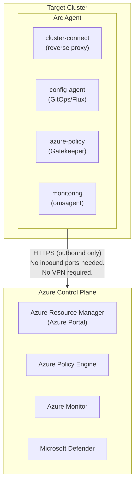
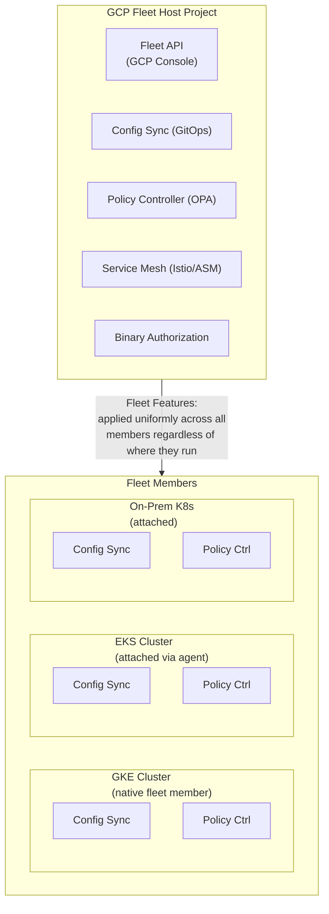
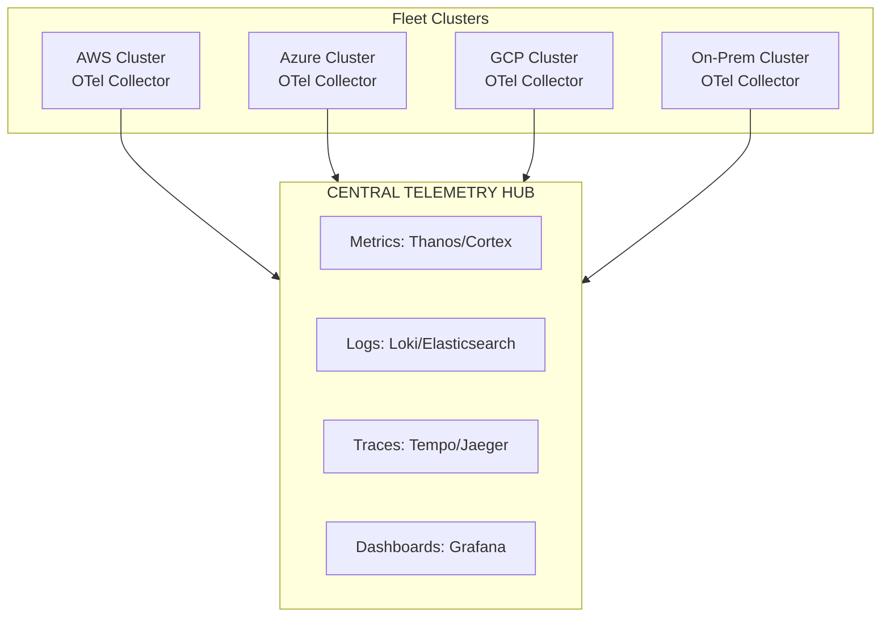
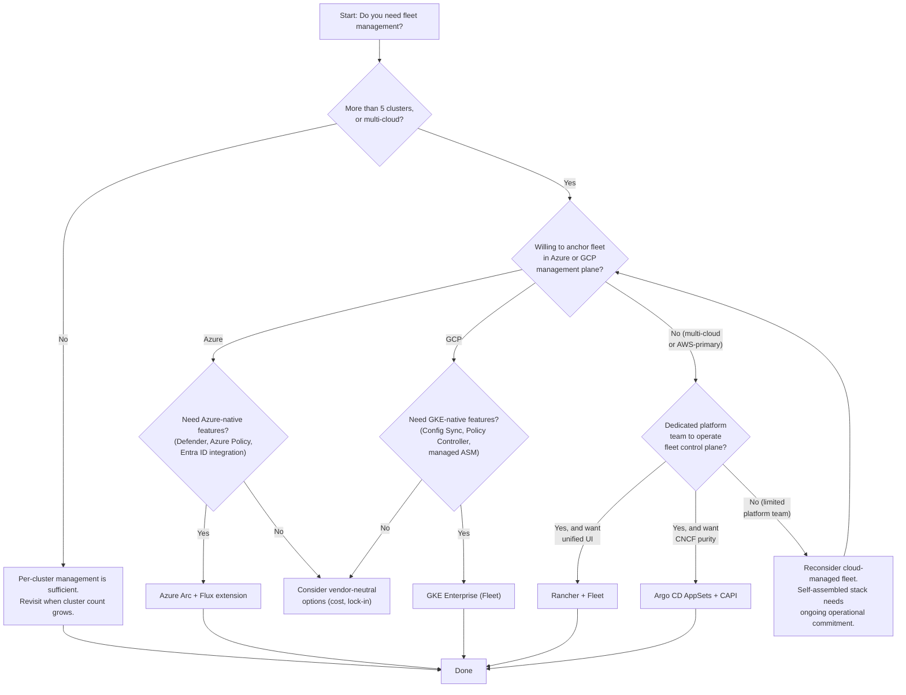
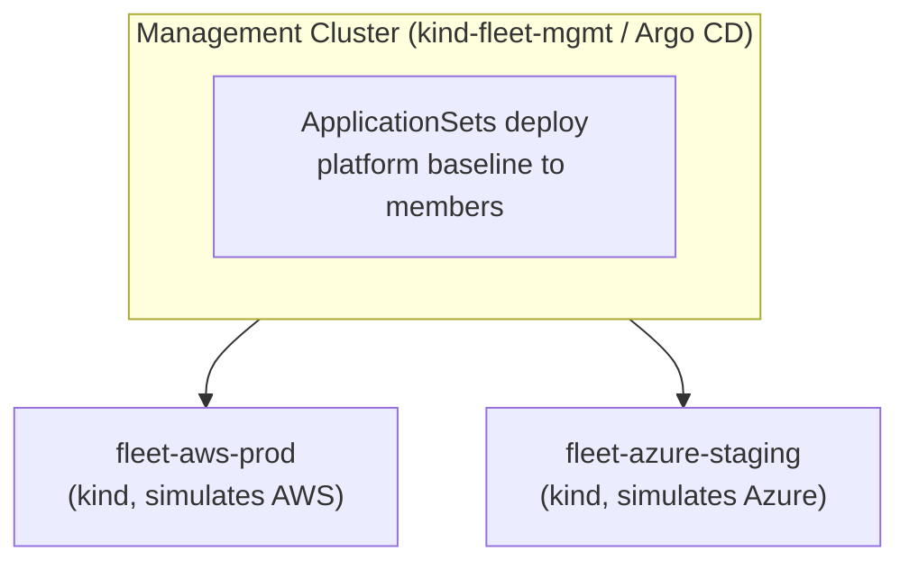

**Complexity**: `[COMPLEX]` | **Time to Complete**: 2.5h | **Prerequisites**: Hybrid Cloud Architecture (Module 10.4), GitOps Basics (ArgoCD/Flux)

## What You'll Be Able to Do

After completing this module, you will be able to:

- **Design** fleet topology strategies that balance centralized governance with individual team autonomy in massive multi-cluster, multi-cloud environments.
- **Implement** fleet-wide GitOps delivery pipelines using ArgoCD ApplicationSets and Kustomize base/overlay patterns to distribute baseline platform services.
- **Compare** and **evaluate** the architectural tradeoffs between Azure Arc-enabled Kubernetes and Google Kubernetes Engine (GKE) Fleet management paradigms.
- **Diagnose** configuration drift and policy violations across disparate clusters using centralized telemetry and Open Policy Agent (OPA) Gatekeeper.
- **Debug** cross-cluster connectivity, synchronization, and authentication issues within a distributed Kubernetes fleet.

---

## Why This Module Matters

Hypothetical scenario: Large enterprises can accumulate dozens or hundreds of clusters across clouds and data centers, turning security response into a coordination problem when each cluster is managed as its own silo. 

Without fleet-wide inventory and standardized lifecycle management, vulnerability discovery and patching can take far longer than security teams expect, and undocumented legacy clusters can remain out of support.

The underlying lesson is organizational and architectural: a company can have many clusters without having a coherent fleet. Each cluster was managed as a fragile pet, individually configured through ad-hoc scripts. The organization had no centralized infrastructure inventory, no mechanism to push critical configuration changes to all clusters simultaneously, and no unified dashboard to monitor compliance, security, or operational health. Fleet management tools are engineered specifically to solve this exact problem. By treating your entire collection of Kubernetes clusters as a single, logically unified manageable entity, tools like Azure Arc, GKE Fleet, and robust GitOps controllers provide centralized inventory, deterministic policy distribution, scalable configuration management, and comprehensive observability across clusters, regardless of their physical or cloud location. In this module, you will learn the operational realities of multi-cloud fleet management, how Azure Arc and Google Fleet architectures function, how to successfully centralize telemetry and security policies, and how to implement deterministic multi-cloud GitOps at an enterprise scale.

---

## The Multi-Cloud Reality Check

Before diving into the specific configuration commands and architectural diagrams of fleet management tools, it is crucial to conduct an honest, objective assessment of why enterprises end up in a multi-cloud posture and what that architectural decision actually costs the business. Multi-cloud is rarely a deliberate Day 1 strategy; it is usually an evolutionary accident.

### Why Enterprises End Up in a Multi-Cloud Posture

Most enterprises do not select a multi-cloud architecture because it is inherently superior for greenfield development. Instead, they find themselves operating across multiple cloud service providers (CSPs) through the following common vectors:

1. **Corporate Acquisitions and Mergers**: Company A is heavily invested in AWS and acquires Company B, which runs its entire platform on Azure. The initial acquisition plan outlines a consolidation strategy estimated to take three years, but due to shifting business priorities, the migration is permanently paused, leaving the parent company operating in both clouds indefinitely.
2. **Best-of-Breed Service Selection**: The machine learning and data science teams demand Google Cloud Platform (GCP) to leverage Vertex AI and BigQuery. Simultaneously, the core platform engineering team standardizes on AWS for Elastic Kubernetes Service (EKS) due to existing expertise, while the enterprise IT department mandates Microsoft Azure for Active Directory integration and legacy Windows workloads.
3. **Strict Regulatory and Data Sovereignty Requirements**: Certain European Union data must remain within a highly specific geographic region that only one particular cloud provider supports with the required compliance certifications, forcing the company to deploy a subset of its infrastructure to a secondary CSP.
4. **Vendor Negotiation and Lock-in Mitigation**: Executives believe that maintaining a multi-cloud footprint provides leverage during contract renewals. The threat of moving workloads from AWS to Azure is only credible if the organization has proven it can successfully operate production workloads in Azure.
5. **Shadow IT and Decentralized Budgeting**: An isolated product team begins experimenting with a secondary cloud provider using a departmental credit card. By the time central IT security discovers the rogue accounts, critical production workloads are already serving customer traffic and cannot be easily migrated.

### The Real Cost of Multi-Cloud Architecture

Operating across multiple clouds introduces massive operational complexity. You are not simply duplicating your infrastructure; you are multiplying your operational burden, training requirements, and tooling costs.

| Category | Single Cloud | Multi-Cloud (3 CSPs) |
| :--- | :--- | :--- |
| **Platform team size** | Smaller, more centralized team | Larger team with broader cross-cloud specialization |
| **Training budget** | Lower training overhead | Higher training overhead across multiple cloud ecosystems |
| **Tooling licenses** | Fewer overlapping platform tools | Higher tooling spend from duplicated or provider-specific tooling |
| **Data transfer costs** | Mostly internal or intra-provider patterns | Higher risk of inter-environment and cross-provider transfer costs |
| **Compliance audits** | Narrower scope | Broader scope across more environments and control sets |
| **Incident complexity** | Low | High (finger-pointing) |
| **Negotiation leverage** | Low | Medium |

The net effect of a multi-cloud strategy is usually materially higher operational cost and coordination overhead unless the business is deliberately capturing differentiated value from multiple providers. The singular exception is when an organization genuinely leverages the absolute "best-of-breed" proprietary services unique to each provider, rather than simply running commoditized Kubernetes clusters on disparate infrastructure.

> **Stop and think**: Look at the table above. If your organization is operating in multiple clouds purely due to an un-merged acquisition, are you extracting any of the "best-of-breed" benefits, or are you just paying the multi-cloud operational tax?

---

## Azure Arc for Kubernetes

Azure Arc is Microsoft's strategic solution for hybrid and multi-cloud management. It effectively [extends the Azure management plane (specifically the Azure Resource Manager, or ARM) to any conformant Kubernetes cluster](https://learn.microsoft.com/en-us/azure/azure-arc/kubernetes/overview), regardless of its physical location or underlying infrastructure. With Azure Arc, you can securely connect an AWS EKS cluster, a Google GKE cluster, a sprawling on-premises kubeadm bare-metal cluster, or even a constrained edge-computing device cluster directly to the Azure portal. Once connected, these disparate clusters are treated as Azure resources for inventory, tagging, governance, and selected management features, though the exact control surface varies by cluster type and capability.

### How Azure Arc Works Under the Hood

Azure Arc relies on an intelligent, lightweight agent architecture deployed within the target Kubernetes cluster. This agent establishes a persistent, secure outbound connection to the Azure control plane.



The Arc agent architecture circumvents traditional networking headaches. Because the connection is outbound over standard HTTPS, Azure Arc can often work without inbound firewall changes; whether you still need private connectivity such as VPN or ExpressRoute depends on your network and security design. [The `cluster-connect` component acts as a reverse proxy, allowing Azure services to securely interrogate the cluster's local API server.](https://learn.microsoft.com/en-us/azure/azure-arc/kubernetes/conceptual-cluster-connect)

### Connecting a Cluster to Azure Arc

To bring a cluster under Azure Arc's management umbrella, you utilize the Azure CLI. The process deploys the necessary Arc agents into the `azure-arc` namespace on your target cluster.

```bash
# Prerequisites: Azure CLI with connectedk8s extension
az extension add --name connectedk8s
az extension add --name k8s-configuration

# Connect an EKS cluster to Azure Arc
# First, ensure your kubeconfig points to the target cluster
export KUBECONFIG=~/.kube/eks-production-config

az connectedk8s connect \
  --name eks-prod-us-east-1 \
  --resource-group rg-arc-fleet \
  --location eastus \
  --tags "provider=aws" "environment=production" "team=platform" \
  --distribution eks \
  --infrastructure aws

# Verify the connection
az connectedk8s show \
  --name eks-prod-us-east-1 \
  --resource-group rg-arc-fleet \
  --query '{Name:name, Status:connectivityStatus, Distribution:distribution, Infrastructure:infrastructure}'

# List all Arc-connected clusters
az connectedk8s list \
  --resource-group rg-arc-fleet \
  --query '[].{Name:name, Status:connectivityStatus, Provider:infrastructure, K8sVersion:kubernetesVersion}' \
  --output table
```

### Enforcing Azure Policy for Arc-Connected Clusters

One of the most powerful capabilities of Azure Arc is the ability to project Azure Policies directly into your Kubernetes clusters. Behind the scenes, [Azure Arc translates your Azure Policy definitions into Open Policy Agent (OPA) Gatekeeper constraints.](https://learn.microsoft.com/en-us/azure/governance/policy/concepts/policy-for-kubernetes) The Arc agent automatically installs the Gatekeeper admission controller on the target cluster and continuously synchronizes policy states between the cluster and the Azure Policy engine.

**Pause and predict:** An enterprise platform team assigns an Azure Policy definition to deny privileged containers across their entire fleet of Arc-connected clusters. Several mission-critical workloads were already deployed as privileged pods prior to this assignment. When the policy assignment synchronizes to the clusters, what happens to those running privileged pods? Do they get evicted immediately, or do they continue to operate?

<details>
<summary>Check your prediction</summary>

Azure Policy for Kubernetes extends open-source OPA Gatekeeper v3 to enforce guardrails across Arc-connected clusters. Gatekeeper operates strictly as an admission webhook that evaluates Kubernetes API requests during object creation or update operations. A policy assignment with a deny effect intercepts subsequent pod submissions, but it never automatically evicts or terminates workloads that are already running on the cluster. The Azure Policy engine and Gatekeeper audit controller record existing non-compliant pods as audit violations in compliance dashboards. Those workloads continue serving traffic uninterrupted until an operator deletes them or a deployment rollout recreates the pods against the active admission webhook.
</details>

The next section is an operational walkthrough for governance policies. It demonstrates how to assign policy definitions using the Azure CLI and inspect compliance status across member clusters.

```bash
# Assign a policy to enforce no privileged containers across ALL Arc clusters
az policy assignment create \
  --name deny-privileged-containers \
  --display-name "Deny privileged containers on all Arc clusters" \
  --policy "/providers/Microsoft.Authorization/policyDefinitions/95edb821-ddaf-4404-9732-666045e056b4" \
  --scope "/subscriptions/$SUB_ID/resourceGroups/rg-arc-fleet" \
  --params '{"effect": {"value": "deny"}}'

# This installs OPA Gatekeeper on every Arc-connected cluster
# and deploys the constraint automatically

# Check compliance across the fleet
az policy state list \
  --resource-group rg-arc-fleet \
  --filter "policyDefinitionName eq '95edb821-ddaf-4404-9732-666045e056b4'" \
  --query '[].{Resource:resourceId, Compliance:complianceState}' \
  --output table
```

### Implementing GitOps with Arc (Powered by Flux)

Azure Arc includes native support for GitOps configuration management, [leveraging the open-source Flux continuous delivery tool under the hood](https://learn.microsoft.com/en-us/azure/azure-arc/kubernetes/conceptual-configurations). You can define a Git repository containing your Kubernetes manifests, Helm releases, or Kustomize overlays, and instruct Azure Arc to continuously synchronize that desired state to your cluster fleet.

**Pause and predict:** An engineering team configures Azure Arc GitOps using the Flux extension across distributed production environments. An upstream network provider disruption makes the central Git repository unreachable for four consecutive hours. Do the Arc-connected clusters experience service interruptions or enter a frozen state while the repository remains offline?

<details>
<summary>Check your prediction</summary>

Azure Arc GitOps relies on the in-cluster `microsoft.flux` extension running Flux v2 controllers rather than an external push-based management plane. When the remote Git repository becomes unreachable, local Flux controllers simply fail their periodic reconciliation loops and log transient fetch errors. The local Kubernetes API server and existing workload pods continue running the last successfully applied desired state without disruption. This pull-based architecture differs fundamentally from an external Argo CD hub that must actively connect to spoke API servers over the network to push manifests. Workloads remain resilient against control plane network partitions because the spoke cluster does not depend on continuous Git access to execute current containers.
</details>

The next section is a practical guide to GitOps configurations. It demonstrates how to deploy multi-path Kustomizations across fleet clusters with automated pruning enabled.

```bash
# Deploy a GitOps configuration to all Arc clusters with a specific tag
az k8s-configuration flux create \
  --name platform-baseline \
  --cluster-name eks-prod-us-east-1 \
  --resource-group rg-arc-fleet \
  --cluster-type connectedClusters \
  --namespace flux-system \
  --scope cluster \
  --url https://github.com/company/fleet-config.git \
  --branch main \
  --kustomization name=platform path=./platform/base prune=true \
  --kustomization name=monitoring path=./monitoring/overlays/production prune=true \
  --kustomization name=policies path=./policies/production prune=true
```

---

## Google Fleet (GKE Enterprise)

Google Cloud approaches fleet management through the architectural concept of a "Fleet"—a logical, strictly enforced grouping of both GKE and external (non-GKE) Kubernetes clusters that share normalized configurations, identities, and policies. While Azure Arc focuses heavily on projecting individual cloud services down to independent clusters, Google Fleet emphasizes defining a homogenous, unified platform layer that stretches seamlessly across all member clusters.

### GKE Fleet Architecture

In Google Fleet, [a central GCP "Host Project" acts as the authoritative control plane](https://cloud.google.com/kubernetes-engine/docs/fleets-overview). This project houses the Fleet API, enabling cross-cluster features such as Config Sync, Policy Controller, and unified Service Mesh.

**Pause and predict:** An enterprise architect evaluates standardizing multi-cluster governance across Microsoft Azure and Google Cloud. The architecture team evaluates attaching an external cluster to Azure Arc. They ask whether it establishes identical management boundaries to enrolling that cluster into a Google Cloud GKE Fleet. How do the fundamental abstraction models and control plane structures differ between these two fleet management paradigms?

<details>
<summary>Check your prediction</summary>

Azure Arc and GKE Fleet use fundamentally distinct architectural models and control plane abstractions. Azure Arc attaches CNCF-certified Kubernetes clusters as individual Azure Resource Manager resources. It projects Azure RBAC, Azure Policy, and management extensions into external clusters without requiring a separate fleet boundary. In contrast, GKE Fleet organizes member clusters into a centralized Google Cloud host project boundary. This fleet membership enables shared platform services like Config Sync for GitOps, Policy Controller for OPA constraints, and fleet-wide Workload Identity Federation. Treating GKE Fleet as merely a Google equivalent of Azure Arc overlooks these foundational structural distinctions. Furthermore, neither platform should be conflated with hyperconverged hardware offerings like AKS on Azure Local or console view tools like AWS EKS Connector.
</details>

The next section is an architectural topology diagram of Google Fleet. It illustrates how the central Google Cloud host project orchestrates services across member clusters.



### Registering Clusters in a Google Fleet

GKE clusters residing within the same GCP project can be registered automatically or with minimal friction. For external clusters such as AWS EKS, Azure AKS, or on-premises deployments, [Google Fleet utilizes a Connect agent](https://cloud.google.com/kubernetes-engine/fleet-management/docs/connect-agent) (similar to Azure Arc's reverse proxy) combined with sophisticated [Workload Identity federation](https://cloud.google.com/kubernetes-engine/fleet-management/docs/about-fleet-workload-identity-federation) to ensure secure, passwordless authentication back to the GCP control plane.

```bash
# Register a GKE cluster (automatic for GKE clusters in the fleet project)
gcloud container fleet memberships register gke-prod-us \
  --gke-cluster us-central1/gke-prod-us \
  --enable-workload-identity

# Register an external cluster (EKS, AKS, on-prem)
# --context is the kubeconfig context name (kubectl config current-context), not the EKS ARN
gcloud container fleet memberships register eks-prod-east \
  --context=eks-prod-east \
  --kubeconfig=/path/to/eks-kubeconfig \
  --enable-workload-identity \
  --public-issuer-url=https://oidc.eks.us-east-1.amazonaws.com/id/ABC123

# List fleet members
gcloud container fleet memberships list \
  --format="table(name, uniqueId, authority.workloadIdentityPool, state.code)"
```

### Fleet-Wide Configuration with Config Sync

Google's proprietary GitOps engine, Config Sync, is fundamentally integrated with the Fleet architecture. Config Sync can be installed and managed as a fleet-level feature, letting teams standardize rollout and defaults across fleet members from a central source of truth. You define the synchronization parameters centrally at the Fleet level, and Google Cloud handles deploying, upgrading, and monitoring the synchronization agents across all registered clusters.

```yaml
# config-sync-config.yaml
# Applied once, syncs to all fleet members
apiVersion: configmanagement.gke.io/v1
kind: ConfigManagement
metadata:
  name: config-management
spec:
  sourceFormat: unstructured
  git:
    syncRepo: https://github.com/company/fleet-config.git
    syncBranch: main
    secretType: token
    policyDir: fleet-policies
  policyController:
    enabled: true
    templateLibraryInstalled: true
    referentialRulesEnabled: true
    logDeniesEnabled: true
    mutationEnabled: true
```

Applying this configuration enables GitOps simultaneously across every cluster in the fleet:

```bash
# Enable Config Management once for the fleet host project (fleet-wide capability)
gcloud beta container fleet config-management enable

# Apply the root repo to each membership (one apply per member; repeat for every enrolled cluster)
for MEMBERSHIP in gke-prod-us eks-prod-east; do
  gcloud beta container fleet config-management apply \
    --membership="$MEMBERSHIP" \
    --config=config-sync-config.yaml
done

# Status aggregates sync health across all fleet memberships
gcloud beta container fleet config-management status \
  --format="table(Name, Status, Last_Synced_Token, Sync_Errors)"
```

> **Stop and think**: If you apply a Config Sync configuration that accidentally deletes a critical namespace across your entire fleet, how quickly will that change propagate, and what guardrails should you have in place to prevent it?

### Fleet-Wide Policy with Policy Controller

GKE's Policy Controller is a managed instance of OPA Gatekeeper. It enforces compliance and security guardrails across the entire fleet. Constraint templates define the logic (written in Rego), while constraints apply that logic to specific Kubernetes resources.

**Constraint Template Definition:**

```yaml
# fleet-policies/constraint-templates/require-labels.yaml
apiVersion: templates.gatekeeper.sh/v1
kind: ConstraintTemplate
metadata:
  name: k8srequiredlabels
spec:
  crd:
    spec:
      names:
        kind: K8sRequiredLabels
      validation:
        openAPIV3Schema:
          type: object
          properties:
            labels:
              type: array
              items:
                type: string
  targets:
    - target: admission.k8s.gatekeeper.sh
      rego: |
        package k8srequiredlabels
        violation[{"msg": msg}] {
          provided := {l | input.review.object.metadata.labels[l]}
          required := {l | l := input.parameters.labels[_]}
          missing := required - provided
          count(missing) > 0
          msg := sprintf("Missing required labels: %v", [missing])
        }
```

**Constraint Application:**

```yaml
# fleet-policies/constraints/require-team-label.yaml
apiVersion: constraints.gatekeeper.sh/v1beta1
kind: K8sRequiredLabels
metadata:
  name: require-team-label
spec:
  enforcementAction: deny
  match:
    kinds:
      - apiGroups: ["apps"]
        kinds: ["Deployment", "StatefulSet"]
  parameters:
    labels:
      - "team"
      - "cost-center"
```

---

## Centralized Telemetry for Multi-Cloud Fleets

A multi-cluster fleet without centralized observability is a massive liability. Operating independently isolated Prometheus and Grafana instances per cluster leads to alert fatigue, disjointed incident response, and a complete lack of global situational awareness. You must construct a unified hub to consolidate metrics, logs, and distributed traces from every cluster.

### Telemetry Architecture

To achieve this, the industry standard approach relies on deploying lightweight OpenTelemetry (OTel) Collectors on every cluster. These agents scrape local cluster metrics, enrich the data with critical cluster-identifying labels (e.g., `cluster_name`, `provider`, `region`), and securely forward the payload to a robust central telemetry hub backed by scalable data stores like Thanos, Loki, or Tempo.



### OpenTelemetry Collector for Fleet Telemetry

Configuring the OTel Collector requires defining a pipeline consisting of receivers (how data enters the collector), processors (how data is transformed or enriched), and exporters (where the data is sent). It is vital to inject global metadata identifiers during the processing phase so that data can be filtered and aggregated accurately at the central hub.

```yaml
# otel-collector-fleet.yaml
# Deploy on each cluster with cluster-specific labels
apiVersion: v1
kind: ConfigMap
metadata:
  name: otel-collector-config
  namespace: monitoring
data:
  config.yaml: |
    receivers:
      prometheus:
        config:
          scrape_configs:
            - job_name: kubernetes-pods
              kubernetes_sd_configs:
                - role: pod
              relabel_configs:
                - source_labels: [__meta_kubernetes_pod_annotation_prometheus_io_scrape]
                  action: keep
                  regex: true
      otlp:
        protocols:
          grpc:
            endpoint: 0.0.0.0:4317

    processors:
      resource:
        attributes:
          - key: cluster.name
            value: "${CLUSTER_NAME}"
            action: upsert
          - key: cluster.provider
            value: "${CLOUD_PROVIDER}"
            action: upsert
          - key: cluster.region
            value: "${CLUSTER_REGION}"
            action: upsert
          - key: cluster.environment
            value: "${ENVIRONMENT}"
            action: upsert
      batch:
        timeout: 30s
        send_batch_size: 1024

    exporters:
      otlphttp/metrics:
        endpoint: https://telemetry-hub.company.com/api/v1/push
        headers:
          Authorization: "Bearer ${TELEMETRY_TOKEN}"
      otlphttp/traces:
        endpoint: https://telemetry-hub.company.com/api/v1/traces
        headers:
          Authorization: "Bearer ${TELEMETRY_TOKEN}"

    service:
      pipelines:
        metrics:
          receivers: [prometheus]
          processors: [resource, batch]
          exporters: [otlphttp/metrics]
        traces:
          receivers: [otlp]
          processors: [resource, batch]
          exporters: [otlphttp/traces]
```

> **Stop and think**: If your central telemetry hub goes down, what happens to the telemetry data generated by your 50 clusters? How should you configure your OTel Collectors to handle this scenario?

### Fleet Health Dashboard Query Examples

With centralized data appropriately labeled, creating powerful fleet-wide PromQL dashboards becomes straightforward. You can easily visualize cross-cluster performance and isolate localized anomalies.

**Pause and predict:** A platform operations team deploys OpenTelemetry Collectors across fifty clusters to export metrics and traces to a centralized monitoring hub. A storage failure at the central hub causes it to reject incoming OTLP connections for two hours. During this outage, what happens to the metrics generated on the member clusters, and does the outage impair running container workloads?

<details>
<summary>Check your prediction</summary>

A centralized telemetry hub outage does not impair cluster operations or stop running applications. Member clusters continue processing user workloads normally because monitoring data paths operate completely out-of-band from cluster control planes. However, OpenTelemetry collectors without local storage buffering will quickly exhaust their memory queues and drop incoming metric points. Configuring persistent queues or local file-based exporters enables collectors to buffer telemetry on local node storage during upstream outages and replay data once connectivity recovers. Implementing resilient local buffering is a completely different architectural concern from workload execution continuity.
</details>

The next section is a set of Prometheus query expressions designed for multi-cloud fleets. These queries monitor cluster health, API server latency, node conditions, and abnormal container restart rates.

```promql
# Cluster count by provider and status (adjust the job label to your scrape config)
count by (cluster_provider, cluster_environment) (
  up{job="kubernetes-apiservers"}
)

# API server latency P99 across the fleet
histogram_quantile(0.99,
  sum by (cluster_name, le) (
    rate(apiserver_request_duration_seconds_bucket{verb!="WATCH"}[5m])
  )
)

# Node readiness across the fleet
sum by (cluster_name) (kube_node_status_condition{condition="Ready", status="true"})
/
sum by (cluster_name) (kube_node_info)

# Pod restart rate by cluster (anomaly detection)
sum by (cluster_name) (
  increase(kube_pod_container_status_restarts_total[1h])
) > 50
```

### Managed Prometheus for Fleet-Wide Metrics

Running self-managed Prometheus clusters with Thanos for long-term storage across a 50-cluster fleet requires significant operational investment: you maintain the Thanos sidecars, compactors, store gateways, and queriers; you manage object storage lifecycle policies; you handle Thanos component upgrades. Each cloud provider now offers a managed Prometheus-compatible service that reduces this operational burden at the cost of usage-based pricing.

**Amazon Managed Service for Prometheus (AMP)** provides a Prometheus-compatible remote-write endpoint. Your cluster-level Prometheus instances (or an OTel Collector with the Prometheus receiver) remote-write directly to AMP, which handles storage, querying, and compaction. AMP charges per metric sample ingested and per sample queried, so cost is directly proportional to your fleet's active time-series count. AMP integrates with Amazon Managed Grafana for dashboarding, giving you a fully managed observability plane that is colocated with EKS-heavy fleets.

**Google Cloud Managed Service for Prometheus** takes a different architectural approach. Instead of remote-write, it uses a custom collection agent (gmp-collector) that scrapes metrics and writes them to Monarch, Google's internal time-series database, which also backs Cloud Monitoring. This avoids the remote-write bottleneck and means PromQL queries run against Monarch's distributed query engine. For GKE Fleet users, Managed Service for Prometheus integrates directly with the Fleet dashboard, so cluster health metrics appear alongside fleet configuration status in the same console.

**Azure Monitor Managed Prometheus** is part of the Azure Monitor container insights suite and is deployed as a managed Prometheus instance integrated with Azure Monitor workspaces. It uses the same Prometheus remote-write protocol as AMP and supports PromQL queries through Azure Monitor's query API and Azure Managed Grafana. For Arc-connected clusters, you can enable container insights (which includes Managed Prometheus) per cluster, with per-cluster-per-day pricing. The advantage for Azure-heavy fleets is that metrics, logs, and traces all route through Azure Monitor's unified data plane, simplifying access control and auditing.

**The cross-provider trade-off**: Managed Prometheus services eliminate the operational burden of running Thanos yourself, but they introduce per-metric-sample pricing that scales linearly with fleet size. A fleet-wide metric cardinality explosion — for example, a pod label with high cardinality that generates a separate time series per value — can increase your managed Prometheus bill by an order of magnitude overnight. The same cardinality explosion in a self-managed Thanos stack would increase object storage cost but not trigger a per-sample billing surge. This is the central tension of fleet observability: managed services trade predictable operational cost for variable usage-based cost. For small-to-medium fleets (10-30 clusters), managed services are usually cheaper than the engineering time to maintain Thanos. For very large fleets (100+ clusters), the usage-based costs often exceed the cost of a dedicated observability engineering team running Thanos on object storage.

### Fleet Health Dashboards: Beyond Cluster-by-Cluster Views

The most common failure mode of fleet observability is building dashboards that show every cluster as a separate row or panel. This works for 5 clusters. It fails at 50 clusters because the dashboard becomes impossible to scan, and it fails at 200 clusters because the dashboard becomes impossible to load. Fleet health dashboards need aggregation, ranking, and anomaly highlighting to be useful at scale.

**Aggregated health scores**: Rather than listing every cluster's status, compute a fleet-wide health score — the percentage of clusters with all nodes Ready, all control-plane components healthy, and no firing critical alerts. Display this as a single number at the top of the dashboard, with a drill-down to identify the unhealthy clusters. The score lets operators assess fleet health in one glance.

**Ranked anomaly tables**: Instead of showing every cluster's resource utilization, rank clusters by the metric you care about most — highest P99 API server latency, lowest node readiness percentage, highest pod restart rate. Show the top 10 offenders, not all 200. This turns the dashboard from a scroll-fest into a triage tool.

**Cross-cluster correlation**: When multiple clusters show the same anomaly simultaneously (e.g., all AWS clusters in us-east-1 spike in latency at the same time), the root cause is likely a shared dependency — the AWS control plane, a common authentication service, or a regional network issue — rather than a per-cluster problem. A fleet dashboard that groups clusters by provider and region, and highlights correlated anomalies, lets operators distinguish fleet-wide incidents from isolated cluster issues in seconds rather than hours.

```promql
# Fleet health score: percentage of clusters with all nodes Ready
count(
  count by (cluster) (kube_node_status_condition{condition="Ready", status="true"})
  ==
  count by (cluster) (kube_node_info)
) / count(count by (cluster) (kube_node_info))

# Top 10 clusters by pod restart rate
topk(10,
  sum by (cluster) (
    increase(kube_pod_container_status_restarts_total[1h])
  )
)
```

---

## Multi-Cloud GitOps at Scale

GitOps for a fleet of fifty or a hundred clusters requires significantly more sophisticated patterns than managing a single ArgoCD instance serving a handful of environments. You cannot afford to manually configure a new GitOps synchronization pipeline every time a cluster is provisioned. You need automation that scales gracefully.

### ArgoCD ApplicationSet for Fleet-Wide Deployment

ArgoCD addresses this scaling challenge through `ApplicationSets`. An ApplicationSet functions as a template factory. It monitors a source of truth—such as the list of clusters securely registered within ArgoCD's backend—and [automatically generates a dedicated ArgoCD `Application` resource for every cluster that matches a specific label selector.](https://argo-cd.readthedocs.io/en/latest/operator-manual/applicationset/Generators-Cluster/)

```yaml
# fleet-gitops/applicationset-platform.yaml
apiVersion: argoproj.io/v1alpha1
kind: ApplicationSet
metadata:
  name: fleet-platform-services
  namespace: argocd
spec:
  generators:
    # Generate an Application for every cluster registered in ArgoCD
    - clusters:
        selector:
          matchExpressions:
            - key: environment
              operator: In
              values:
                - production
                - staging
  template:
    metadata:
      name: 'platform-{{name}}'
      labels:
        fleet-component: platform
    spec:
      project: fleet-platform
      source:
        repoURL: https://github.com/company/fleet-platform.git
        targetRevision: main
        path: 'clusters/{{metadata.labels.provider}}/{{metadata.labels.environment}}'
      destination:
        server: '{{server}}'
        namespace: platform-system
      syncPolicy:
        automated:
          prune: true
          selfHeal: true
        retry:
          limit: 5
          backoff:
            duration: 5s
            factor: 2
            maxDuration: 3m
        syncOptions:
          - CreateNamespace=true
          - ServerSideApply=true
```

### Fleet Git Repository Structure

A scalable GitOps repository must intelligently separate shared, universal configurations from provider-specific overrides. By utilizing [Kustomize's base and overlay architecture](https://kubernetes.io/docs/tasks/manage-kubernetes-objects/kustomization), you ensure that core platform services (like monitoring and security tooling) remain consistent, while gracefully accommodating the unique networking plugins, storage classes, or image registry configurations required by different environments.

```text
fleet-platform/
├── base/                          # Shared across all clusters
│   ├── monitoring/
│   │   ├── prometheus.yaml
│   │   ├── otel-collector.yaml
│   │   └── kustomization.yaml
│   ├── policy/
│   │   ├── kyverno-policies.yaml
│   │   └── kustomization.yaml
│   └── security/
│       ├── falco.yaml
│       └── kustomization.yaml
│
├── clusters/
│   ├── aws/
│   │   ├── production/
│   │   │   ├── kustomization.yaml    # patches for AWS prod
│   │   │   └── values-override.yaml
│   │   └── staging/
│   │       └── kustomization.yaml
│   ├── azure/
│   │   ├── production/
│   │   │   └── kustomization.yaml    # patches for Azure prod
│   │   └── staging/
│   │       └── kustomization.yaml
│   └── onprem/
│       └── production/
│           └── kustomization.yaml    # patches for on-prem
│
└── fleet-sync.yaml                   # ApplicationSet definition
```

In the overlay directory for a specific provider, you construct Kustomize patches that dynamically mutate the base manifests before they are applied to the cluster API. For example, AWS clusters might require specific CloudWatch logging configurations and strict Elastic Container Registry (ECR) policies:

```yaml
# clusters/aws/production/kustomization.yaml
apiVersion: kustomize.config.k8s.io/v1beta1
kind: Kustomization
resources:
  - ../../../base/monitoring
  - ../../../base/policy
  - ../../../base/security
patches:
  - target:
      kind: ConfigMap
      name: otel-collector-config
    patch: |-
      - op: replace
        path: /data/config.yaml
        value: |
          # AWS-specific: export to CloudWatch as well
          exporters:
            awscloudwatchlogs:
              log_group_name: /eks/fleet-telemetry
              log_stream_name: ${CLUSTER_NAME}
  - target:
      kind: ClusterPolicy
      name: require-image-registry
    patch: |-
      - op: replace
        path: /spec/rules/0/validate/pattern/spec/containers/0/image
        value: "123456789012.dkr.ecr.*.amazonaws.com/*"
```

### Progressive Rollout Across the Fleet

Pushing a configuration change to all 50 clusters at once is a gamble. A single misconfigured network policy, a typo in a Prometheus alerting rule, or an incorrect image tag can impact every cluster simultaneously, triggering fleet-wide incidents that require manual rollback across dozens of clusters, each with its own context and credentials. Progressive rollout limits the blast radius and catches errors before they reach production.

The pattern works in waves: **canary** (1-2 low-risk, non-production clusters) → **staging wave** (all staging/development clusters, typically 10-20% of the fleet) → **production wave** (remaining clusters). Each wave includes a validation gate: after syncing the canary, you verify that cluster health is stable and critical alerts have not fired before proceeding to staging. After staging, you verify again before rolling to production.

Argo CD ApplicationSets support progressive rollout through the **Progressive Syncs** feature (`spec.strategy.type: RollingSync`), which updates Applications in labeled waves and waits for each wave to become Healthy before proceeding. Enable it on the ApplicationSet controller (`--enable-progressive-syncs` or `ARGOCD_APPLICATIONSET_CONTROLLER_ENABLE_PROGRESSIVE_SYNCS=true`). Tag each generated Application with an environment label on cluster secrets, then match waves with `rollingSync.steps`:

```yaml
# ApplicationSet: single top-level template + RollingSync waves (Argo CD 2.10+/v3.3+ beta)
apiVersion: argoproj.io/v1alpha1
kind: ApplicationSet
metadata:
  name: fleet-platform-progressive
  namespace: argocd
spec:
  generators:
    - clusters:
        selector:
          matchLabels:
            argocd.argoproj.io/secret-type: cluster
  strategy:
    type: RollingSync
    rollingSync:
      steps:
        - matchExpressions:
            - key: environment
              operator: In
              values:
                - canary
        - matchExpressions:
            - key: environment
              operator: In
              values:
                - staging
        - matchExpressions:
            - key: environment
              operator: In
              values:
                - production
          maxUpdate: 25%
  template:
    metadata:
      name: "{{name}}-platform-baseline"
      labels:
        environment: "{{metadata.labels.environment}}"
    spec:
      project: default
      source:
        repoURL: https://github.com/company/fleet-platform.git
        targetRevision: main
        path: baseline
      destination:
        server: "{{server}}"
        namespace: platform-system
      syncPolicy:
        syncOptions:
          - CreateNamespace=true
```

GKE Config Sync implements progressive rollout through **fleet team scopes**: you assign clusters to teams, apply the configuration to a canary team first, verify sync status with `gcloud beta container fleet config-management status`, and then expand the scope to include production teams. Rancher Fleet uses **cluster groups** for the same purpose — assign canary clusters to a `canary` group, target the bundle at that group first, validate, then expand to the `production` group.

The key operational discipline: every fleet-wide configuration change must have a canary wave. The canary wave should include at least one cluster that runs representative workloads — not an empty staging cluster with no traffic, because a configuration that works on an idle cluster can fail under real load. If your staging environment does not receive production-like traffic, designate one low-traffic production region (e.g., a single-AZ cluster in a secondary region) as your canary, accepting that if the configuration breaks, the blast radius is limited to that region.

### Secrets Management in Fleet GitOps

GitOps stores desired state in Git, but Git is not a secrets store. Storing Kubernetes Secrets in plaintext in a Git repository — even a private one — violates security best practices and most compliance frameworks (SOC 2, PCI-DSS, HIPAA). For fleet-scale GitOps, you need a secrets management strategy that works across all clusters without requiring per-cluster manual secret injection.

**Sealed Secrets** encrypt Kubernetes Secrets into `SealedSecret` custom resources that are safe to store in Git. Only the sealed-secrets controller running in the target cluster can decrypt them, using a private key that never leaves the cluster. At fleet scale, you generate a unique sealing key per cluster (or share a key across clusters in the same trust domain) and encrypt secrets once, store the SealedSecret in the fleet Git repository, and let each cluster's controller decrypt its own copy. The limitation: updating a secret requires re-encrypting it, and rotating the sealing key requires re-encrypting all secrets.

**External Secrets Operator (ESO)** takes a different approach: instead of storing encrypted secrets in Git, it stores references to secrets in an external secrets manager (AWS Secrets Manager, GCP Secret Manager, Azure Key Vault, HashiCorp Vault). An `ExternalSecret` resource in Git declares "I need a secret named `database-password` from AWS Secrets Manager" and ESO fetches it at runtime, creating a native Kubernetes Secret. At fleet scale this is powerful because you can store one secret reference in Git that resolves to different secret values per cluster: the `database-password` in AWS Secrets Manager for your EKS clusters is a different value than the `database-password` in GCP Secret Manager for your GKE clusters, but the GitOps configuration is identical.

**SOPS (Secrets OPerationS)** encrypts entire YAML files or specific fields using cloud KMS keys. The encrypted file is stored in Git; Argo CD or Flux decrypts it at sync time using the cloud KMS key that the cluster's workload identity has access to. SOPS integrates with Argo CD natively through the `argocd-vault-plugin` or built-in SOPS support, and with Flux through the Kustomization `spec.decryption.provider: sops` field (handled by kustomize-controller). At fleet scale, SOPS works well when all clusters share a KMS key in the same cloud provider, but cross-cloud SOPS with different KMS providers per cluster group requires careful key management.

**The fleet recommendation**: Use External Secrets Operator for secrets that differ per cluster or per environment (database credentials, API keys, TLS certificates) and SOPS or Sealed Secrets for secrets that are identical across the fleet (shared registry credentials, fleet-wide monitoring tokens). Do not store raw Kubernetes Secrets in Git — if your fleet GitOps pipeline currently does this, migrating to an encrypted or external-secrets approach is the highest-priority security improvement you can make to your fleet configuration pipeline.

### Config Inheritance and Override Hierarchies

At fleet scale, not all configuration should be applied identically to all clusters. Some settings are universal (the monitoring agent must exist on every cluster), some are provider-specific (AWS clusters use ECR, Azure clusters use ACR), some are environment-specific (staging uses shorter metric retention), and some are cluster-specific (a particular GPU cluster gets NVIDIA device-plugin configuration). Managing these layers with explicit per-cluster configuration files does not scale.

The solution is an **inheritance hierarchy** with well-defined override precedence. From lowest to highest priority:

1. **Fleet global base**: configuration applied to every cluster in the fleet (monitoring agent, policy engine, base network policies, security tooling).
2. **Provider-specific overrides**: differences driven by cloud provider (ECR vs ACR, AWS Load Balancer Controller vs Azure Application Gateway Ingress Controller, CSI driver selection).
3. **Environment-specific overrides**: differences driven by environment tier (production gets higher alerting thresholds and longer retention; staging gets lower resource limits; development gets relaxed network policies).
4. **Region-specific overrides**: differences driven by geography (data sovereignty rules, regional service endpoints, latency-optimized image registries).
5. **Cluster-specific overrides**: the narrowest, highest-priority layer for exceptional cases (GPU-specific drivers on one cluster, a different CNI plugin for a particular edge deployment).

Kustomize implements this natively: your `kustomization.yaml` lists resources and patches in order, and later patches override earlier ones. You can compose overlays that inherit from a provider overlay that inherits from a base, building the full hierarchy declaratively:

```text
clusters/aws/production/us-east-1/kustomization.yaml
  → inherits from ../../production/kustomization.yaml (environment)
    → inherits from ../base/kustomization.yaml (provider)
      → inherits from ../../../../base/kustomization.yaml (fleet global)
```

The rule of thumb: push configuration as low in the hierarchy as possible. If a setting applies to exactly one cluster, it belongs in a cluster-specific patch, not in the fleet global base with conditionals. If a setting applies to every cluster, it belongs in the fleet global base, not copied into every overlay. When you find yourself adding the same patch to multiple overlays, it is a signal that the patch belongs at a higher level in the hierarchy.

---

## The AWS Gap: Vendor-Neutral Fleet Management

Azure Arc and GKE Fleet both assume you are willing to anchor your fleet in a specific cloud provider's management plane. What happens when your organization is primarily on AWS, and leadership does not want to introduce a dependency on Microsoft's or Google's control plane for Kubernetes fleet management?

AWS does not offer a first-party fleet abstraction comparable to Azure Arc or GKE Fleet. You can attach EKS clusters to a central inventory view through AWS Organizations, AWS Resource Explorer, and AWS Config aggregators, but these provide resource visibility rather than active fleet-wide configuration delivery, policy enforcement, or GitOps orchestration. For those capabilities, the AWS ecosystem relies on vendor-neutral, CNCF-aligned tooling — and in many organizations the same tooling supplements or replaces cloud-provider fleet managers even on Azure and GCP, because platform teams value consistency across all three clouds.

### Rancher: The Self-Hosted Fleet Manager

Rancher, originally built by Rancher Labs and now maintained by SUSE, provides a vendor-neutral Kubernetes management platform. Its **Fleet** component — a separate open-source project — delivers GitOps-based multi-cluster configuration management that works identically whether your clusters run on EKS, AKS, GKE, or bare-metal kubeadm.

Fleet's architecture centers on a **manager** (deployed in the Rancher management cluster) and lightweight **agents** deployed to each downstream cluster. The manager watches Git repositories containing `fleet.yaml` bundles, renders them with configurable targeting rules, and pushes the resulting manifests to member clusters. Targeting uses cluster labels and cluster group membership, so you can define which configuration lands on which subset of your fleet declaratively.

```yaml
# fleet.yaml — a Fleet bundle targeting all production AWS clusters
defaultNamespace: monitoring
helm:
  releaseName: prometheus-stack
  chart: kube-prometheus-stack
  repo: https://prometheus-community.github.io/helm-charts
  version: "56.21.0"
targetCustomizations:
  - name: aws-prod
    clusterSelector:
      matchLabels:
        provider: aws
        environment: production
    helm:
      values:
        prometheus:
          prometheusSpec:
            externalLabels:
              provider: aws
  - name: azure-prod
    clusterSelector:
      matchLabels:
        provider: azure
        environment: production
    helm:
      values:
        prometheus:
          prometheusSpec:
            externalLabels:
              provider: azure
```

A key difference from Azure Arc and GKE Fleet is ownership: Rancher is self-hosted, so you own the control plane, its availability, its upgrades, and its security posture. This eliminates cloud-provider lock-in at the fleet-management layer but adds operational responsibility. Large organizations with dedicated platform teams often prefer this trade-off because it keeps their fleet tooling decoupled from any single cloud provider's roadmap and pricing changes.

Rancher's fleet-level capabilities include cluster provisioning (via node drivers or Cluster API integration), centralized RBAC (projects, roles, and cluster memberships defined once and pushed down), integrated monitoring (via the built-in Rancher Monitoring stack based on Prometheus and Grafana), and a single UI for cluster inventory and health across all infrastructure providers.

### Argo CD ApplicationSets with the Cluster Generator

When you have already adopted Argo CD as your GitOps engine, you can achieve fleet-wide deployment without introducing a separate fleet management platform. Argo CD's **ApplicationSet controller** includes a **cluster generator** that queries Argo CD's own registry of connected clusters and produces a separate `Application` resource for each cluster matching a label selector.

This approach is architecturally simpler than deploying a fleet manager: there is no additional control plane or agent to maintain beyond what you already run for Argo CD. The trade-off is that Argo CD's cluster generator handles configuration distribution (GitOps), but does not handle cluster provisioning, node management, centralized RBAC, or fleet-wide health dashboards. You need separate tooling for those concerns — typically Cluster API for lifecycle and a centralized observability stack for health.

```yaml
# ApplicationSet using cluster generator with progressive sync
apiVersion: argoproj.io/v1alpha1
kind: ApplicationSet
metadata:
  name: fleet-platform
  namespace: argocd
spec:
  generators:
    - clusters:
        selector:
          matchLabels:
            fleet-member: "true"
  template:
    metadata:
      name: 'platform-{{name}}'
    spec:
      project: fleet
      source:
        repoURL: https://github.com/company/fleet-config.git
        targetRevision: main
        path: 'platform'
      destination:
        server: '{{server}}'
        namespace: platform-system
      syncPolicy:
        automated:
          prune: true
          selfHeal: true
```

The cluster generator is a CNCF-native answer to the fleet-management problem. It works identically whether Argo CD itself runs on EKS, AKS, GKE, or on bare metal, and it does not couple your fleet operations to any single cloud provider's management plane. For organizations that have standardized on Argo CD and are comfortable managing cluster lifecycle separately, the cluster generator pattern can entirely replace a dedicated fleet management platform.

### Cluster API for Fleet Lifecycle

Fleet management tools handle what runs *inside* clusters. They do not provision the clusters themselves. For declarative cluster lifecycle management at fleet scale — creating, upgrading, scaling, and decommissioning Kubernetes clusters across multiple clouds — **Cluster API** (CAPI), a Kubernetes SIG Cluster Lifecycle project, provides a unified Kubernetes-native API.

CAPI defines a management cluster that hosts custom resources for workload clusters. Infrastructure providers — CAPA for AWS, CAPZ for Azure, CAPG for GCP, and CAPD for Docker-based development clusters — translate those abstract resources into provider-specific API calls. A `Cluster` resource represents the logical cluster and references provider-specific control-plane and infrastructure objects: for EKS managed mode, `AWSManagedControlPlane` plus `AWSManagedCluster`; for self-managed clusters, `KubeadmControlPlane` with provider infrastructure types. `MachineDeployment` or `MachinePool` resources define worker node pools. Together, these resources let you version, audit, and replicate cluster topologies across your fleet infrastructure.

The combination of **Cluster API for lifecycle** and **Argo CD ApplicationSets for configuration** gives you a fully vendor-neutral fleet platform with no dependence on Azure Arc or GKE Fleet. A growing number of enterprises take exactly this approach: CAPI provisions and upgrades the clusters, the cluster generator in Argo CD pushes baseline platform services, and fleet observability is handled by a centralized Prometheus/Thanos stack with OpenTelemetry collectors.

```yaml
# Example CAPA EKS managed cluster (management cluster) — explicit refs, no topology/class fusion
apiVersion: cluster.x-k8s.io/v1beta1
kind: Cluster
metadata:
  name: prod-us-east-1
  namespace: fleet-workloads
spec:
  clusterNetwork:
    pods:
      cidrBlocks: ["192.168.0.0/16"]
  controlPlaneRef:
    apiVersion: controlplane.cluster.x-k8s.io/v1beta2
    kind: AWSManagedControlPlane
    name: prod-us-east-1-cp
  infrastructureRef:
    apiVersion: infrastructure.cluster.x-k8s.io/v1beta2
    kind: AWSManagedCluster
    name: prod-us-east-1
---
apiVersion: controlplane.cluster.x-k8s.io/v1beta2
kind: AWSManagedControlPlane
metadata:
  name: prod-us-east-1-cp
  namespace: fleet-workloads
spec:
  region: us-east-1
  version: v1.35.0
  eksClusterName: prod-us-east-1
---
apiVersion: infrastructure.cluster.x-k8s.io/v1beta2
kind: AWSManagedCluster
metadata:
  name: prod-us-east-1
  namespace: fleet-workloads
```

### Comparing the Four Fleet-Management Approaches

| Dimension | Azure Arc | GKE Fleet | Rancher | Argo CD AppSets + CAPI |
|:---|:---|:---|:---|:---|
| **Cloud anchor** | Azure (ARM) | GCP (Fleet API) | None (self-hosted) | None (CNCF-native) |
| **Configuration delivery** | Flux extension | Config Sync (proprietary) | Fleet (GitOps) | Argo CD ApplicationSets |
| **Policy enforcement** | Azure Policy → Gatekeeper | Policy Controller (managed Gatekeeper) | Rancher + community policies | OPA/Gatekeeper or Kyverno (self-managed) |
| **Cluster lifecycle** | AKS + limited external | GKE + limited external | Node drivers, CAPI | Cluster API (CAPI) |
| **Centralized UI** | Azure portal | GCP console | Rancher UI | Argo CD UI + Grafana |
| **Observability** | Azure Monitor | Google Cloud Observability | Rancher Monitoring | Self-assembled (Thanos, Loki, Tempo) |
| **Operational overhead** | Low (SaaS control plane) | Low (SaaS control plane) | Medium (self-hosted control plane) | Medium-High (assemble from components) |
| **Vendor lock-in** | High (Azure ecosystem) | High (GCP ecosystem) | Low | Lowest |

---

## Enterprise Cost Lens for Fleet Management

Fleet management at enterprise scale is not free. Each approach — cloud-managed, self-hosted, and CNCF-assembled — carries different cost structures. Understanding them before committing prevents the awkward conversation where your platform team delivers operational consistency but the CFO sees an unexplainable spike in the cloud bill.

### Cloud-Managed Fleet Costs

**GKE Enterprise (Fleet) pricing** follows a per-vCPU model for clusters enrolled in the Enterprise tier. As of current pricing, GKE Enterprise adds a per-vCPU-per-hour charge on top of the standard GKE per-cluster management fee. For a fleet of 50 clusters averaging 40 vCPUs each, the Enterprise tier alone can add tens of thousands of dollars per month. Config Sync, Policy Controller, and managed Service Mesh are included in the Enterprise tier, so you are paying for the integrated suite rather than individually metered features. If your fleet includes non-GKE clusters (EKS, AKS, on-premises), you still pay the Enterprise per-vCPU rate for the workloads running on those attached clusters.

**Azure Arc** takes a different approach: connecting a Kubernetes cluster to Arc is free. There is no per-cluster or per-vCPU charge for the connection itself. However, every service you enable on top of the connection is metered. Azure Policy for Kubernetes, Microsoft Defender for Cloud, Azure Monitor container insights, and the GitOps (Flux) configuration extension each incur usage-based costs. A fully instrumented Arc-connected cluster with policy auditing, threat detection, container insights, and GitOps sync can cost $100-300 per cluster per month in enabled-service charges. The pricing model encourages precise, per-cluster decisions about which services to enable — but it also means that cost can drift upward silently as platform teams enable more services across the fleet without tracking the cumulative bill.

**The hidden cost of cloud-managed fleets** is the blast radius of billing. When you enable a fleet-level feature — say, Config Sync across all 50 GKE Fleet members — the per-vCPU cost multiplies instantly. When you assign an Azure Policy at the subscription scope, it evaluates against every Arc-connected cluster in that scope, and you pay for every evaluation cycle. Fleet-level decisions carry fleet-level cost consequences that are easy to overlook during the architecture phase.

### Self-Hosted and CNCF-Assembled Costs

**Rancher** is open-source and free to deploy. You pay for the infrastructure running the Rancher management cluster (compute, storage, networking) and the engineering time to maintain it. For a typical enterprise deployment, the Rancher management cluster needs 3-5 nodes of modest size, putting the infrastructure cost in the hundreds of dollars per month rather than the thousands you might pay for a cloud-managed fleet plane. Rancher's Fleet component is included at no additional license cost. The trade-off is operational: upgrading Rancher, ensuring its availability, and troubleshooting its components are your team's responsibility.

**Argo CD ApplicationSets + Cluster API** follows the same pattern: Argo CD (CNCF Graduated) and Cluster API (a Kubernetes SIG Cluster Lifecycle project) are both open-source with no license fees. You pay for the infrastructure running Argo CD (the management cluster) and the engineering time to integrate the components, build dashboards, and manage upgrades. The cost advantage over cloud-managed fleets grows with cluster count: per-vCPU pricing scales linearly with fleet size, while a self-assembled stack's infrastructure cost stays relatively flat as you add more workload clusters. However, the engineering investment is front-loaded — building a fleet-wide health dashboard, integrating Thanos for long-term metric storage, and wiring OPA Gatekeeper constraints to a central audit log all require dedicated platform-engineering effort.

### The Cost of NOT Having a Fleet Abstraction

The most important cost comparison is not between fleet management tools — it is between having a fleet abstraction and not having one. Organizations that operate Kubernetes clusters as individual snowflakes incur costs that rarely appear on a cloud bill but are visible in engineering velocity and audit outcomes.

**Snowflake remediation**: When each cluster has a one-off monitoring setup, updating a single Grafana dashboard across 30 clusters means 30 separate pull requests or manual edits. What takes minutes with a fleet manager — updating a Config Sync root-sync or an Argo CD ApplicationSet — takes days of coordinated engineering time. At a fully loaded cost of $150-200 per engineering hour, a single fleet-wide configuration change that saves 8 hours of manual work across the team pays for a significant portion of the fleet tooling for a month.

**Governance drift**: A security audit that discovers inconsistent pod-security policies across 50 clusters because no fleet-wide policy engine was in place can derail a compliance certification (SOC 2, PCI-DSS, FedRAMP) and delay product launches by weeks or months. The financial impact of delayed certification dwarfs any fleet-management license cost.

**Unmanaged cluster inventory**: Clusters that were provisioned for a project that ended two years ago, still running and accruing compute charges, because no fleet inventory flagged them for decommissioning. A single forgotten 10-node production cluster running in us-east-1 costs roughly $2,500 per month in compute alone. Fleet inventory pays for itself the first time you find and decommission one ghost cluster.

### Reducing Fleet Telemetry Costs

Centralized monitoring is essential for fleet operations, but it is also the most common source of cost surprise. A 50-cluster fleet can generate 5-10 million active metric time series per scrape interval and terabytes of log data per day. When ingested into a managed observability service charged per metric sample or per gigabyte ingested, the monthly bill can quickly exceed the compute cost of the clusters being monitored.

**Aggregate before shipping**: The OpenTelemetry Collector's processors pipeline — specifically the `filter`, `attributes`, and `transform` processors — lets you drop low-value metrics and aggregate per-pod metrics into per-deployment aggregates before they leave the cluster. For example, rather than shipping `container_cpu_usage_seconds_total` for every individual container across your fleet, you can aggregate to `sum by (namespace, deployment)` and ship a fraction of the original volume.

**Tiered retention**: Keep high-resolution data (15-second scrape intervals) for 7-14 days in a hot store like Thanos Sidecar + object storage. Downsample to 5-minute resolution for 90-day trend analysis, and to 1-hour resolution for year-over-year planning. Each tier costs an order of magnitude less than keeping everything at full resolution indefinitely.

**Sampling traces**: Distributed tracing generates enormous data volumes. At fleet scale, even a 10% sampling rate can produce terabytes per day. Use **tail-based sampling** in the OTel Collector: keep 100% of traces that contain errors or exceed latency thresholds, and apply a low sampling rate (1-5%) to healthy, fast traces. This preserves diagnostic signal for incidents while dramatically reducing the trace-ingestion bill.

**Managed Prometheus cost comparison**: Each cloud provider's managed Prometheus service has a different pricing model. Amazon Managed Service for Prometheus (AMP) charges per metric sample ingested and stored. Google Cloud Managed Service for Prometheus charges per sample ingested. Azure Monitor Managed Prometheus is included with Azure Monitor container insights, which charges per cluster per day. For a 50-cluster fleet, these differences alone can produce a 3-5x cost spread between providers for equivalent monitoring coverage. Factor this into your fleet architecture choice: if your fleet is predominantly on one cloud, its managed Prometheus pricing model is a significant ongoing cost driver.

---

## Patterns & Anti-Patterns

### Proven Patterns

**Pattern 1: Base/Overlay with Environment-Specific Patches**

Define a single source of truth for platform services (monitoring, policy, security tooling) in a `base/` directory, and use per-environment overlays to handle provider-specific differences. Kustomize overlays, Helm value overrides, and Fleet bundle `targetCustomizations` all implement this pattern. This is the foundation of scalable fleet management — without it, every configuration change requires touching N files for N clusters, and drift is inevitable.

*Why it works*: The base defines *what* gets deployed; the overlays define *how it differs* per environment. When you update a fleet-wide policy, you change one file in `base/` and the change propagates to every cluster. When you need a provider-specific storage class or image registry, you add a patch in the overlay for that provider, and it does not affect clusters on other providers.

*When to use*: Always. This is not optional at fleet scale. Every fleet-management tool — Azure Arc GitOps, GKE Config Sync, Rancher Fleet, Argo CD ApplicationSets — supports some form of base/overlay or target-customization model. The specific syntax varies, but the architectural principle is universal.

*Scaling*: As your fleet grows, add overlays for new environment-provider combinations (e.g., `aws/production`, `aws/staging`, `azure/production`, `gcp/production`) rather than copying entire configurations. The number of overlays grows linearly with your environment-provider matrix; the base stays singular.

**Pattern 2: Progressive Rollout Through Fleet Waves**

Instead of pushing a configuration change to all 50 clusters simultaneously, define rollout waves: canary (1-2 low-risk clusters) → staging/development fleet (5-10 clusters) → production fleet (remaining clusters). This limits the blast radius of a bad configuration change.

*Why it works*: Configuration errors are the most common cause of fleet-wide incidents. A typo in a Prometheus alerting rule or a misconfigured network policy that blocks monitoring traffic can impact every cluster in seconds. Progressive rollout catches these errors in the canary wave before they reach production. Argo CD ApplicationSets support this natively through sync windows and manual sync policies on specific generators. GKE Config Sync supports it through fleet team scopes. Rancher Fleet supports it through cluster group targeting.

*When to use*: Any time a configuration change touches more than one cluster. For single-cluster changes, the overhead of progressive rollout may not be justified. For changes affecting the entire fleet, progressive rollout is a hard requirement, not a nice-to-have. A canary wave that catches a bad change before it reaches production saves the entire recovery time — often hours of manual rollback across dozens of clusters.

*Scaling*: As fleet size grows, add more intermediate waves. A 200-cluster fleet might use: canary (2) → regional staging (10) → regional production (50) → remaining (138). Each wave provides a go/no-go gate based on health checks and automated canary analysis.

**Pattern 3: Fleet-Wide Labeling Taxonomy**

Define cluster labels (or tags, depending on the platform) that encode the dimensions your fleet tooling needs: `provider`, `environment`, `region`, `team`, `compliance-tier`, `data-classification`. Use these labels as the selectors for configuration targeting, policy assignment, and cost allocation. Without a consistent taxonomy, fleet tooling becomes guesswork — you are pushing configurations to clusters based on names that follow no convention, which breaks the moment someone provisions a cluster with a slightly different naming pattern.

*Why it works*: Labels are the indexing mechanism for fleet operations. Every fleet tool — Argo CD cluster generator, Fleet bundle selectors, Config Sync fleet team scopes — uses labels to decide which configuration reaches which cluster. A clean, enforced taxonomy means you can write a single selector (`environment: production, compliance-tier: pci`) and know exactly which clusters will receive the configuration.

*When to use*: Before connecting the first cluster to any fleet management platform. Defining the taxonomy retroactively is painful: you need to re-label every existing cluster, update every configuration selector, and validate that no cluster falls through the cracks during the migration. If you are already past that point, define the taxonomy now and apply it as you onboard new clusters, then backfill existing clusters incrementally.

*Scaling*: The taxonomy's dimensions should be stable across fleet growth. Adding new dimensions (e.g., `cost-center` for FinOps) requires updating all configuration selectors, so choose dimensions that map to genuinely distinct operational concerns rather than adding every conceivable metadata field.

**Pattern 4: Policy as Code, Validated in CI Before Deployment**

Write fleet-wide policies — Gatekeeper constraints, Kyverno policies, or cloud-level guardrails like SCPs and Azure Policies — as version-controlled code. Run them through a CI pipeline that validates syntax, tests them against representative clusters with `gator test` (Gatekeeper) or `kyverno test`, and deploys them through the same GitOps pipeline as your application configurations. Never hand-edit a policy on a live cluster; the policy you modify in production is the policy you lose in the next GitOps sync.

*Why it works*: Policy that is not version-controlled is policy that cannot be audited, rolled back, or deployed consistently across the fleet. A policy-as-code pipeline gives you an audit log of every policy change, the ability to roll back a bad policy by reverting a Git commit, and confidence that every cluster in the fleet is enforcing the same guardrails.

*When to use*: From the moment you deploy your first admission policy. Retrofitting hand-written policies into a policy-as-code pipeline is tedious: you need to extract the current state from every cluster, diff them to find inconsistencies, and reconcile them into a single source of truth.

*Scaling*: As your policy library grows, organize policies by domain (security, networking, cost, compliance) and use Kustomize or a templating layer to compose them for each environment. A production PCI-DSS cluster might pull in policies from `security/base`, `compliance/pci`, and `networking/production`, while a development cluster only pulls from `security/base`.

### Anti-Patterns

**Anti-Pattern 1: “Connect Everything, Figure It Out Later”**

Teams register every Kubernetes cluster they can find into Arc or Fleet without first defining a naming convention, labeling taxonomy, or configuration targeting strategy. The fleet dashboard fills with clusters named `cluster-1`, `eks-prod`, `aks-test-v2-old`, and `k3s-edge-garage-pi`. Configuration targeting becomes guesswork because no two clusters share a consistent label. The fleet tooling provides visibility but not manageability — every action requires manually selecting clusters by name from a list of hundreds.

*Why teams fall into it*: Connecting a cluster to Arc or Fleet is a single CLI command. It feels productive. Leadership sees the cluster count in the fleet dashboard and concludes that fleet management is "done." The hard work — taxonomy, policy design, configuration baselining — is deferred, and deferral becomes permanent.

*Better alternative*: Define the taxonomy first (`provider`, `environment`, `region`, `team`, `compliance-tier`). Create an onboarding script that validates required labels before running `az connectedk8s connect` or `gcloud container fleet memberships register`. Onboard clusters in batches by environment, validating that each batch's configuration selectors work before scaling to the next batch.

**Anti-Pattern 2: “Same Configuration Everywhere”**

Pushing the same monitoring stack, same security policies, and same network policies to development, staging, and production clusters without per-environment differentiation. Development clusters accumulate the same alerting rules as production, generating PagerDuty alerts when a developer's test Deployment exceeds CPU limits. Production clusters lack environment-specific hardening (stricter network policies, longer audit-log retention) because the configuration template was designed for the lowest common denominator.

*Why teams fall into it*: Uniformity feels like operational discipline. If every cluster is identical, reasoning about the fleet is simpler. The problem is that development and production clusters have fundamentally different requirements: development needs flexibility and cost efficiency, production needs security and reliability. Treating them identically means neither gets what it actually needs.

*Better alternative*: Use the base/overlay pattern. The base contains what is genuinely universal (core policy definitions, the monitoring agent's presence). Overlays add environment-specific behavior: higher alerting thresholds for development, stricter network policies and longer retention for production, GPU-specific configurations for ML environments. A production overlay is not "drift" — it is intentional, version-controlled differentiation for different risk profiles.

**Anti-Pattern 3: “Fleet Tool Replaces Per-Cluster Tools”**

An executive mandates that since the organization has adopted Arc or Fleet, all per-cluster tools — `eksctl`, `kubectl` plugins, node-management utilities — must be retired to "simplify the toolchain." Platform engineers immediately discover that fleet tools cannot resize PersistentVolumes, configure node auto-scaling, manage CSI drivers, or troubleshoot CNI issues on individual clusters. Fleet tools handle cross-cluster concerns; per-cluster concerns still need per-cluster tools.

*Why teams fall into it*: The mandate usually comes from a desire to reduce tooling sprawl and licensing costs, which is a legitimate goal. The error is assuming that fleet management tools are a superset of per-cluster tooling. They are not. They operate at a different layer of abstraction and have deliberately limited cluster-internal capabilities to avoid coupling fleet logic to provider-specific implementation details.

*Better alternative*: Define a clear boundary between fleet concerns (policy distribution, configuration sync, inventory, fleet-wide health dashboards) and cluster concerns (node management, storage, networking, provider-specific IAM integration). Use fleet tools for the first category and keep per-cluster tools for the second. Document this boundary explicitly so that future tooling consolidation proposals respect it.

**Anti-Pattern 4: “One Git Repo per Cluster”**

Each cluster gets its own Git repository containing its full configuration. Updating a fleet-wide monitoring configuration requires 50 separate pull requests against 50 repositories. A security policy change takes a week to propagate because every PR needs separate review and approval. The fleet has "GitOps" in name but not in practice — the configuration is version-controlled, but there is no fleet-wide source of truth.

*Why teams fall into it*: It starts organically. Cluster A is provisioned, its configuration goes in `repo-a`. Cluster B is provisioned months later by a different team, and they copy `repo-a`'s structure into `repo-b`. Nobody stops to ask whether the two repositories should share a common base. By the time anyone notices, there are 40 repositories with diverged configurations.

*Better alternative*: A single fleet-configuration repository with the base/overlay structure described throughout this module. Every cluster's configuration is a Kustomize overlay or Helm values file that inherits from a shared base. A fleet-wide change is a single commit to the base directory. Provider-specific or environment-specific differences live in overlay patches that are clearly scoped and do not duplicate the base.

**Anti-Pattern 5: “Monitoring Everything, Everywhere”**

Enabling every available metric, log stream, and trace exporter on every cluster in the fleet without first calculating the ingestion volume or storage cost. The observability bill arrives at $50,000 for the month, senior leadership freezes all monitoring spend, and the platform team loses the ability to add useful instrumentation for the next quarter.

*Why teams fall into it*: The default configuration for many monitoring agents — Prometheus `kube-prometheus-stack`, the OTel Collector demo configuration, cloud provider container insights — ships a broad set of metrics. "Enable fleet-wide monitoring" is a checkbox in most fleet management UIs. The team checks it, confirms that dashboards populate, and moves on. Nobody does the math on 50 clusters × 100,000 time series × per-sample pricing until the bill arrives.

*Better alternative*: Define a fleet monitoring profile with explicit scope: golden signals (latency, traffic, errors, saturation) for all clusters, full-resolution metrics for production only, sampled traces for staging, and log-based metrics (derived from structured logs rather than full log ingestion) for development environments. Calculate the projected cost for each tier before enabling it fleet-wide. Use the OTel Collector's processors to filter and aggregate at the source, shipping only what you have explicitly budgeted for.

---

## Decision Framework: Choosing Your Fleet Strategy

The fleet-management decision is not a single-axis comparison. It depends on your existing cloud investment, your team's expertise, your compliance requirements, and your tolerance for operational overhead versus vendor lock-in. Use the following decision flow to narrow your options, then apply the comparison table from the vendor-neutral section to evaluate the remaining candidates against your specific requirements.



### Decision Matrix

| Criterion | Azure Arc | GKE Fleet | Rancher | Argo CD AppSets + CAPI |
|:---|:---|:---|:---|:---|
| **Existing cloud investment** | Best if already on Azure | Best if already on GCP | Neutral | Neutral |
| **Team cloud expertise** | Azure (ARM, portal, CLI) | GCP (gcloud, console) | Kubernetes (broad) | Kubernetes + GitOps (deep) |
| **Operational overhead** | Lowest | Lowest | Medium (manage Rancher cluster) | Highest (assemble components) |
| **Vendor lock-in** | High | High | Low | Lowest |
| **Fleet size sweet spot** | 10-500+ | 10-500+ | 5-200 | 10-500+ |
| **Policy engine** | Azure Policy → Gatekeeper | Policy Controller (Gatekeeper) | Bring your own (OPA, Kyverno) | Bring your own (OPA, Kyverno) |
| **GitOps engine** | Flux (managed extension) | Config Sync (managed) | Fleet (GitOps) | Argo CD (self-managed) |
| **Service mesh integration** | Istio add-on (AKS) / bring your own (Istio, Cilium, Linkerd) | Managed ASM (Istio) | Istio (self-managed) | Istio / Linkerd / Cilium (self-managed) |
| **Cost model** | Free connection; pay per enabled service | Per-vCPU Enterprise fee | Infrastructure only | Infrastructure only |
| **Compliance ecosystem** | Azure Policy + Defender for Cloud | Security Command Center + Policy Controller | Self-assembled | Self-assembled |
| **Cluster lifecycle** | AKS native; limited external | GKE native; limited external | Node drivers + CAPI | Full CAPI (CAPA/CAPZ/CAPG) |
| **Multi-cloud strength** | Strong (any CNCF-conformant cluster) | Strong (any CNCF-conformant cluster) | Strong (any Kubernetes) | Strongest (provider-agnostic by design) |

### Decision Heuristics

**Choose Azure Arc** when your organization already uses Azure AD/Entra ID for identity, Azure Monitor for observability, and Azure DevOps or GitHub for CI/CD. The integration value compounds — single identity plane, unified audit logs, and policy compliance reporting in the same portal where your security team already works. The free connection model also makes Arc attractive for organizations that want to start small (connect 3-5 clusters) without committing to a per-vCPU pricing tier.

**Choose GKE Fleet** when GKE is your primary Kubernetes platform and you value a deeply integrated stack: Config Sync for GitOps, Policy Controller for governance, managed Anthos Service Mesh for cross-cluster networking, and Binary Authorization for supply-chain security, all managed from the same GCP console. The per-vCPU pricing is significant at scale, so if you are running non-GKE clusters (EKS, AKS) in your fleet, calculate the Enterprise-tier cost for those attached clusters before committing — the cost may favor a vendor-neutral approach for the non-GKE portion.

**Choose Rancher** when you need a single management pane across multiple clouds but do not want to anchor that pane in any one cloud provider. Rancher's integrated UI — cluster inventory, workload management, RBAC, monitoring — reduces the operational surface compared to assembling individual CNCF components. The trade-off is that Rancher itself is a production service you must operate, upgrade, and secure.

**Choose Argo CD ApplicationSets + Cluster API** when your organization has a strong GitOps culture, a dedicated platform engineering team, and a strategic commitment to CNCF-aligned tooling and minimal cloud-provider lock-in. This path demands the most engineering investment up front — integrating Thanos for long-term metrics, building fleet-wide health dashboards, wiring OPA Gatekeeper constraints to a central audit pipeline — but yields the most flexibility over time. The components are the same whether your fleet is 10 clusters or 500, and the cost structure is predictable infrastructure spend rather than usage-based per-vCPU or per-service charges.

**Hybrids are valid**: many organizations run GKE Fleet for their GCP-based footprint and Rancher or Argo CD for their AWS and on-premises clusters. The decision does not have to be all-or-nothing, but each additional fleet-management tool adds operational overhead (another control plane to maintain, another team to train, another integration to build). Cap the number of fleet-management paradigms at two unless you have a genuinely large and specialized platform team.

---

## Did You Know?

1. Azure Arc lets you connect Kubernetes clusters without a separate per-cluster connection charge, while add-on services such as GitOps, monitoring, and security can introduce additional usage-based costs.
2. Google introduced GKE Enterprise in late 2023 as an integrated enterprise container platform that combines GKE with capabilities previously marketed under Anthos. Fleet-oriented features such as Config Sync and Policy Controller remained central to the offer.
3. Enterprise Kubernetes estates often keep growing in cluster count, which makes standardized fleet management, policy distribution, and observability more important as operational scale increases.
4. Rancher is a vendor-neutral, self-hosted Kubernetes management platform, and its Fleet component provides GitOps-style multi-cluster delivery for downstream clusters.

---

## Common Mistakes

| Mistake | Why It Happens | How to Fix It |
| :--- | :--- | :--- |
| **Connecting clusters to Arc/Fleet without a strategy** | "Let us just connect everything and see what happens." Clusters flood in without naming conventions, tags, or ownership. | Define a fleet taxonomy first: naming conventions, required tags (provider, environment, team, region), grouping strategy. Then connect clusters. |
| **Using fleet management as the sole management layer** | "Arc/Fleet replaces our need for per-cluster tools." But fleet tools provide a subset of cluster management features. | Fleet tools handle cross-cluster concerns (policy, config sync, observability). Per-cluster concerns (node management, storage, networking) still need per-cluster tools. |
| **Same configuration for all clusters** | "One size fits all -- push the same policies and monitoring everywhere." But dev clusters do not need production-grade monitoring, and on-prem clusters have different storage classes. | Use the base/overlay pattern: shared base configurations with per-environment and per-provider patches. Kustomize overlays are ideal for this. |
| **Ignoring fleet telemetry costs** | Centralized monitoring across many clusters can generate large data volumes and unexpectedly high observability spend. | Set retention policies, use sampling for traces, aggregate metrics at the cluster level before shipping. Calculate telemetry costs per cluster before enabling fleet-wide collection. |
| **No cluster lifecycle management** | Fleet management connects existing clusters but nobody plans for cluster creation, upgrades, or decommissioning at fleet scale. | Combine fleet management with Cluster API or Crossplane for lifecycle. Fleet tools manage what runs in clusters; lifecycle tools manage the clusters themselves. |
| **Multi-cloud GitOps without abstractions** | Git repo contains provider-specific configs scattered everywhere. Changing a policy means editing 3 different files for 3 providers. | Use the base/overlay pattern shown in this module. Provider-specific differences go in overlay patches, not in the base configuration. |
| **Storing plaintext secrets in fleet Git repos** | "It's a private repo, and all engineers already have access." But Git is an audit log, not a secrets store — every clone, fork, and CI runner has a copy. | Use External Secrets Operator for environment-specific secrets, SOPS for fleet-wide encrypted values, or Sealed Secrets for cluster-scoped encryption. Never commit raw Kubernetes Secrets to any Git repository. |

---

## Quiz

<details>
<summary>Question 1: Your organization recently acquired a company that runs 15 EKS clusters. You currently manage 20 GKE clusters using Google Fleet. Your CTO asks if you should use Azure Arc or Google Fleet to unify management, noting they heard Arc requires inbound firewall ports. How do you evaluate the architectural differences to advise the CTO?</summary>

Azure Arc does not require inbound firewall ports; it uses an agent installed inside the target cluster that maintains an outbound HTTPS connection to the Azure Control Plane. This allows it to bypass inbound firewall restrictions safely. Google Fleet also uses an agent for non-GKE clusters, but it operates with a stronger concept of "fleet features"—capabilities like Config Sync and Policy Controller that are enabled at the fleet level and distributed to all members. Because you already use Google Fleet for 20 GKE clusters, attaching the 15 EKS clusters to your existing Fleet is likely the most seamless approach. Fleet excels in homogeneous configuration distribution, whereas Arc would be more suited if you were heavily invested in Azure management tools (like Azure Monitor or Defender) and needed a-la-carte extension selection per cluster.
</details>

<details>
<summary>Question 2: Your company has 40 clusters: 25 on AWS, 10 on Azure, and 5 on-premises. You are tasked with selecting a fleet management platform and need to choose between Azure Arc and Google Fleet. What factors should drive the decision for your specific environment?</summary>

You need to consider several key factors to make an informed decision. First, evaluate your existing cloud investment: if the company already uses Azure AD for identity, Azure Monitor for observability, and Azure DevOps for CI/CD, Arc integrates seamlessly with these tools. Second, assess team expertise; Arc requires Azure knowledge, while Fleet requires GCP knowledge, so you should lean towards the ecosystem your team already understands. Third, analyze your feature requirements, such as whether you need Fleet's built-in Istio service mesh or Arc's integration with Windows containers. Finally, compare the total cost for your fleet size and consider vendor neutrality, potentially evaluating self-hosted options like Rancher Fleet, Argo CD ApplicationSets with Cluster API, and a centralized observability stack if avoiding a third cloud dependency is a priority.
</details>

<details>
<summary>Question 3: Your platform team is struggling to manage GitOps deployments across 50 clusters spread across AWS, Azure, and on-premises environments. Engineers are currently copying and pasting entire configuration repositories for each cluster, leading to massive configuration drift. How should you restructure your GitOps approach to solve this multi-cloud configuration problem?</summary>

You should implement the base/overlay pattern using a tool like Kustomize to separate what you want to deploy from how it differs per environment. The base directory will contain configurations that are identical across all clusters, such as the standard monitoring stack, core policy definitions, and security tools. Overlay directories will contain patches specific to each cloud provider or environment, such as overriding the image registry URL for AWS (ECR) versus Azure (ACR). When you need to update a fleet-wide policy, you only change the base, and the change propagates to all clusters automatically. This completely eliminates the need to maintain multiple distinct copies of configuration files, ensuring consistency at scale while cleanly managing provider-specific deviations.
</details>

<details>
<summary>Question 4: A fleet-wide policy update is pushed via GitOps. It works on 39 out of 40 clusters. The 40th cluster (an on-premises kubeadm cluster running Kubernetes 1.32) rejects the policy. What happened and how do you handle it?</summary>

The most likely cause is API or CRD skew: the policy references an `apiVersion` or custom resource that the 1.32 cluster does not have installed (for example, a provider-specific policy pack or a Gatekeeper constraint template whose CRD exists only on newer clusters). Missing CRDs, admission webhook version mismatches, or provider-specific policy bundles applied fleet-wide without a compatibility matrix produce the same symptom. This highlights a common fleet management challenge where version and capability skew across clusters breaks unified deployments. To handle this, include version and capability gates in your GitOps configuration — for example, Argo CD ApplicationSets that filter sync targets using cluster version labels — and use Kustomize overlays or provider-specific policy packs for clusters that cannot accept the fleet default. Automated pre-flight checks (`kubectl apply --dry-run=server` or policy CI against each target API server) catch skew before a fleet-wide sync.
</details>

<details>
<summary>Question 5: The CFO noticed a massive spike in cloud spending after your team enabled centralized monitoring for a 50-cluster fleet. The observability platform bill is now $40,000 per month. What are the primary drivers of these telemetry costs at fleet scale, and how can you architect a solution to reduce them?</summary>

The primary drivers of telemetry costs at fleet scale are the sheer volume of active metric time series and log ingestion data. A single Kubernetes cluster can generate up to 100,000 active metric time series and gigabytes of logs per day, which scales linearly and becomes prohibitively expensive when using managed services charging per metric or gigabyte. To reduce these costs, you should implement filtering at the source, shipping only golden signals (latency, traffic, errors, saturation) to the central hub rather than all available metrics. You can also aggregate per-pod metrics into per-deployment metrics before shipping and apply strict sampling rates to distributed traces (e.g., 1% for normal traffic, 100% for errors). Finally, setting aggressive retention tiers—keeping data hot for only 7 days and moving the rest to cold storage like S3—will drastically cut the ongoing storage costs.
</details>

<details>
<summary>Question 6: An executive mandates that since the company has adopted Azure Arc for fleet management, you must uninstall all provider-specific tools like `eksctl` and Terraform AWS providers to "simplify tooling". Why will this mandate cause operational failures, and what specific examples should you provide to push back?</summary>

This mandate will cause operational failures because fleet management tools handle cross-cluster concerns, not the deep, provider-specific cluster-internal operations required for lifecycle management. Fleet tools act as a coordination layer for policy, configuration, and observability, but they lack the APIs to interact with the underlying cloud infrastructure. For example, while Azure Arc can push an OPA Gatekeeper policy to an EKS cluster, it cannot configure Karpenter provisioners or adjust EKS managed node group scaling parameters, which still require AWS-specific tools. Similarly, Arc can deploy a Kubernetes StorageClass manifest, but it cannot provision or resize the underlying AWS EBS volumes or Azure Disks, meaning per-cluster management tools remain absolutely essential.
</details>

---

## Hands-On Exercise: Build a Multi-Cluster Fleet with GitOps

In this exercise, you will actively engineer a robust fleet architecture spanning three `kind` clusters that simulate disparate cloud environments. You will implement centralized GitOps deployment workflows, enforce normalized configuration, and programmatically generate a comprehensive fleet inventory and health dashboard.

**What you will build:**



### Task 1: Create the Fleet Clusters

Initialize the underlying infrastructure by provisioning the local Kubernetes clusters required to simulate the distributed multi-cloud environment.

<details>
<summary>Solution</summary>

```bash
# Create three clusters
for CLUSTER in fleet-mgmt fleet-aws-prod fleet-azure-staging; do
  kind create cluster --name $CLUSTER
done

# Verify all clusters are running
for CLUSTER in fleet-mgmt fleet-aws-prod fleet-azure-staging; do
  echo "=== $CLUSTER ==="
  kubectl --context kind-$CLUSTER get nodes
done
```

</details>

### Task 2: Install ArgoCD on the Management Cluster

Deploy the core GitOps controller onto the designated management cluster to serve as the unified control plane for your entire fleet.

<details>
<summary>Solution</summary>

```bash
# Install ArgoCD on management cluster
kubectl --context kind-fleet-mgmt create namespace argocd
kubectl --context kind-fleet-mgmt apply -n argocd \
  -f https://raw.githubusercontent.com/argoproj/argo-cd/stable/manifests/install.yaml

# Wait for ArgoCD to be ready
kubectl --context kind-fleet-mgmt wait --for=condition=available \
  deployment/argocd-server -n argocd --timeout=120s

# Get the admin password
ARGOCD_PW=$(kubectl --context kind-fleet-mgmt -n argocd \
  get secret argocd-initial-admin-secret \
  -o jsonpath='{.data.password}' | base64 -d)
echo "ArgoCD admin password: $ARGOCD_PW"
```

</details>

### Task 3: Register Fleet Clusters in ArgoCD

Securely authenticate and register the downstream workload clusters with the central ArgoCD management cluster, defining critical metadata via labels.

<details>
<summary>Solution</summary>

```bash
# Get the API server URLs for each fleet cluster
AWS_SERVER=$(kubectl --context kind-fleet-aws-prod config view --minify -o jsonpath='{.clusters[0].cluster.server}')
AZURE_SERVER=$(kubectl --context kind-fleet-azure-staging config view --minify -o jsonpath='{.clusters[0].cluster.server}')

# Add fleet clusters to ArgoCD via CLI or Secrets
# Using the Secret method (no argocd CLI needed)
for CLUSTER_INFO in "fleet-aws-prod:aws:production:kind-fleet-aws-prod" "fleet-azure-staging:azure:staging:kind-fleet-azure-staging"; do
  NAME=$(echo $CLUSTER_INFO | cut -d: -f1)
  PROVIDER=$(echo $CLUSTER_INFO | cut -d: -f2)
  ENV=$(echo $CLUSTER_INFO | cut -d: -f3)
  CTX=$(echo $CLUSTER_INFO | cut -d: -f4)

  SERVER=$(kubectl --context $CTX config view --minify -o jsonpath='{.clusters[0].cluster.server}')
  CA_DATA=$(kubectl --context $CTX config view --minify --raw -o jsonpath='{.clusters[0].cluster.certificate-authority-data}')

  # Create a ServiceAccount for ArgoCD in the target cluster
  kubectl --context $CTX create serviceaccount argocd-manager -n kube-system 2>/dev/null || true
  kubectl --context $CTX create clusterrolebinding argocd-manager \
    --clusterrole=cluster-admin --serviceaccount=kube-system:argocd-manager 2>/dev/null || true

  # Create a long-lived token secret for the service account (Required in K8s 1.24+)
  cat <<EOF | kubectl --context $CTX apply -f -
apiVersion: v1
kind: Secret
metadata:
  name: argocd-manager-token
  namespace: kube-system
  annotations:
    kubernetes.io/service-account.name: argocd-manager
type: kubernetes.io/service-account-token
EOF

  # Wait for token controller to populate the secret
  sleep 2

  TOKEN=$(kubectl --context $CTX -n kube-system get secret argocd-manager-token -o jsonpath='{.data.token}' | base64 -d)

  cat <<EOF | kubectl --context kind-fleet-mgmt apply -f -
apiVersion: v1
kind: Secret
metadata:
  name: cluster-$NAME
  namespace: argocd
  labels:
    argocd.argoproj.io/secret-type: cluster
    provider: $PROVIDER
    environment: $ENV
type: Opaque
stringData:
  name: $NAME
  server: $SERVER
  config: |
    {
      "bearerToken": "$TOKEN",
      "tlsClientConfig": {
        "insecure": true
      }
    }
EOF

  echo "Registered cluster: $NAME (provider=$PROVIDER, env=$ENV)"
done

# Verify clusters are registered
kubectl --context kind-fleet-mgmt get secrets -n argocd -l argocd.argoproj.io/secret-type=cluster
```

</details>

### Task 4: Deploy platform baseline (target-state pattern; no Git repo wired)

Demonstrates the fleet target-state pattern with direct `kubectl apply` on each member — the same manifests an ApplicationSet would sync once a Git repository is connected.

<details>
<summary>Solution</summary>

```bash
# Create platform baseline configmaps on each cluster via ArgoCD Applications
# Since we don't have a Git repo, we'll use a direct approach to demonstrate the pattern

for CTX in kind-fleet-aws-prod kind-fleet-azure-staging; do
  CLUSTER_NAME=$(echo $CTX | sed 's/kind-//')

  # Create platform namespace
  kubectl --context $CTX create namespace platform-system 2>/dev/null || true

  # Deploy fleet-standard configuration
  cat <<EOF | kubectl --context $CTX apply -f -
apiVersion: v1
kind: ConfigMap
metadata:
  name: fleet-identity
  namespace: platform-system
  labels:
    managed-by: fleet-management
data:
  cluster-name: "$CLUSTER_NAME"
  fleet-version: "1.0.0"
  managed-by: "fleet-mgmt-cluster"
  registered-at: "$(date -u +%Y-%m-%dT%H:%M:%SZ)"
---
apiVersion: v1
kind: ConfigMap
metadata:
  name: fleet-monitoring-config
  namespace: platform-system
  labels:
    managed-by: fleet-management
data:
  scrape-interval: "30s"
  retention: "7d"
  external-labels: |
    cluster=$CLUSTER_NAME
    fleet=enterprise
---
apiVersion: networking.k8s.io/v1
kind: NetworkPolicy
metadata:
  name: fleet-default-deny
  namespace: platform-system
  labels:
    managed-by: fleet-management
spec:
  podSelector: {}
  policyTypes:
    - Ingress
    - Egress
  egress:
    - to: []
      ports:
        - protocol: TCP
          port: 443
        - protocol: TCP
          port: 53
        - protocol: UDP
          port: 53
EOF

  echo "Platform services deployed to $CLUSTER_NAME"
done
```

</details>

### Task 5: Build a Fleet Inventory and Health Report

Execute programmatic queries to collate global health indicators, configuration statuses, and node capacities into a centralized operations report.

<details>
<summary>Solution</summary>

```bash
cat <<'SCRIPT' > /tmp/fleet-report.sh
#!/bin/bash
echo "============================================="
echo "  FLEET INVENTORY & HEALTH REPORT"
echo "  $(date -u +%Y-%m-%dT%H:%M:%SZ)"
echo "============================================="

TOTAL_NODES=0
TOTAL_PODS=0
TOTAL_CLUSTERS=0
HEALTHY=0

for CTX in kind-fleet-aws-prod kind-fleet-azure-staging; do
  CLUSTER=$(echo $CTX | sed 's/kind-//')
  TOTAL_CLUSTERS=$((TOTAL_CLUSTERS + 1))

  echo ""
  echo "--- Cluster: $CLUSTER ---"

  # Get cluster info
  FLEET_ID=$(kubectl --context $CTX get configmap fleet-identity -n platform-system -o jsonpath='{.data.cluster-name}' 2>/dev/null || echo "NOT REGISTERED")
  echo "  Fleet ID: $FLEET_ID"

  # Node health
  NODES=$(kubectl --context $CTX get nodes --no-headers 2>/dev/null | wc -l | tr -d ' ')
  READY_NODES=$(kubectl --context $CTX get nodes --no-headers 2>/dev/null | grep " Ready" | wc -l | tr -d ' ')
  echo "  Nodes: $READY_NODES/$NODES ready"
  TOTAL_NODES=$((TOTAL_NODES + NODES))

  # Pod count
  PODS=$(kubectl --context $CTX get pods -A --no-headers --field-selector=status.phase=Running 2>/dev/null | wc -l | tr -d ' ')
  echo "  Running Pods: $PODS"
  TOTAL_PODS=$((TOTAL_PODS + PODS))

  # K8s version
  VERSION=$(kubectl --context $CTX get nodes -o jsonpath='{.items[0].status.nodeInfo.kubeletVersion}' 2>/dev/null)
  echo "  Kubernetes Version: $VERSION"

  # Fleet services check
  FLEET_CONFIGS=$(kubectl --context $CTX get configmap -n platform-system -l managed-by=fleet-management --no-headers 2>/dev/null | wc -l | tr -d ' ')
  NETPOLS=$(kubectl --context $CTX get networkpolicy -n platform-system -l managed-by=fleet-management --no-headers 2>/dev/null | wc -l | tr -d ' ')

  if [ "$FLEET_CONFIGS" -ge 2 ] && [ "$NETPOLS" -ge 1 ]; then
    echo "  Fleet Services: HEALTHY ($FLEET_CONFIGS configs, $NETPOLS netpols)"
    HEALTHY=$((HEALTHY + 1))
  else
    echo "  Fleet Services: DEGRADED (configs=$FLEET_CONFIGS, netpols=$NETPOLS)"
  fi
done

echo ""
echo "============================================="
echo "  FLEET SUMMARY"
echo "============================================="
echo "  Total Clusters: $TOTAL_CLUSTERS"
echo "  Healthy Clusters: $HEALTHY/$TOTAL_CLUSTERS"
echo "  Total Nodes: $TOTAL_NODES"
echo "  Total Running Pods: $TOTAL_PODS"
echo "  Fleet Health: $(( (HEALTHY * 100) / TOTAL_CLUSTERS ))%"
echo "============================================="
SCRIPT

chmod +x /tmp/fleet-report.sh
bash /tmp/fleet-report.sh
```

</details>

### Clean Up

Once the exercise is successfully validated, safely tear down the simulated multi-cluster infrastructure.

```bash
kind delete cluster --name fleet-mgmt
kind delete cluster --name fleet-aws-prod
kind delete cluster --name fleet-azure-staging
rm /tmp/fleet-report.sh
```

Before concluding the hands-on lab, audit the four operational claims presented below. Each card describes a plausible multi-cloud fleet hypothesis frequently encountered in enterprise architectures. Analyze each claim against governance, GitOps, abstraction boundaries, and telemetry pipeline mechanics before opening the solution details.

**Card A: Assign a fleet-wide deny-privileged policy and existing privileged pods are terminated immediately — admission always reconciles live workloads.** A platform security group assigns an Azure Policy definition across all Arc-connected Kubernetes clusters to deny privileged containers. The security team expects this admission policy to actively scan live node workloads and immediately evict all running privileged pods. They assume admission controllers operate as background reconciliation loops. Under this assumption, they expect the engine to terminate running resources whenever a new constraint takes effect.

<details>
<summary>Check your prediction</summary>

Failure layer: Admission controller interception boundary and conflation of admission webhooks with background pod eviction. Next action: understand that Azure Policy for Kubernetes deploys OPA Gatekeeper to intercept incoming API requests during object admission; when a deny policy lands on a cluster, Gatekeeper rejects subsequent CREATE and UPDATE calls for privileged pods; it never acts as a background reconciliation loop that terminates or evicts existing pods already executing on cluster nodes; running privileged containers remain active until an operator manually deletes them or a deployment rollout triggers a fresh admission check; platform teams must inspect Gatekeeper audit logs or Azure Policy compliance dashboards to identify existing non-compliant workloads and remediate them systematically.
</details>

**Card B: If the Git repo is unreachable, Arc-connected clusters freeze and applications stop because GitOps is the control plane.** An enterprise operations team configures Azure Arc GitOps using the Flux extension across distributed production environments. When an upstream network provider failure severs connectivity to the remote Git repository for several hours, an on-call engineer escalates a high-severity outage. The engineer assumes that Git serves as an operational runtime dependency. Under this assumption, they believe worker nodes freeze and running container workloads stop handling application traffic.

<details>
<summary>Check your prediction</summary>

Failure layer: GitOps deployment plane versus local workload execution plane conflation. Next action: recognize that Azure Arc GitOps installs the local `microsoft.flux` extension directly inside member clusters to pull manifests; when the central Git repository becomes unreachable, local Flux controllers fail reconciliation attempts and log transient network errors; the local Kubernetes control plane and container runtimes continue executing the last applied desired state without interruption; running microservices remain completely healthy and continue serving production network traffic; platform teams must also differentiate this pull-based Flux agent architecture from a centralized Argo CD hub model; in an external hub-push design, an orchestrator attempts to push manifests directly into remote spoke API servers across partitioned wide area networks.
</details>

**Card C: Azure Arc and GKE Fleet are interchangeable — attaching a cluster to Arc enrolls it as a GKE Fleet member.** A multi-cloud platform team attempts to unify governance across Azure and Google Cloud environments. An administrator attaches several on-premises Kubernetes clusters to Azure Arc as Azure Resource Manager resources. The team assumes attaching clusters to Azure Arc registers them as Google Cloud GKE Fleet members. They believe this happens automatically because both cloud offerings deliver hybrid fleet management.

<details>
<summary>Check your prediction</summary>

Failure layer: Cloud provider control plane conflation and fleet abstraction boundary misunderstanding. Next action: recognize that Azure Arc and GKE Fleet are distinct, non-interchangeable provider solutions with separate control planes; Azure Arc registers CNCF-certified clusters as individual ARM resources to project Azure RBAC, Azure Policy, and management extensions; GKE Fleet requires explicit registration into a Google Cloud host project to participate in fleet-wide capabilities like Config Sync, Policy Controller, and Workload Identity Federation; connecting a cluster to one cloud provider creates no presence or membership within the other; teams must also avoid confusing Arc-enabled Kubernetes with hardware-bound solutions like AKS on Azure Local, or mistaking GKE Fleet for console-only monitoring tools like AWS EKS Connector.
</details>

**Card D: If the central telemetry hub is down, the fifty clusters stop generating metrics, so there is nothing to buffer.** An operations lead monitors a fifty-cluster fleet configured with OpenTelemetry Collectors pushing data to a centralized observability hub. When the telemetry hub experiences a four-hour maintenance outage, an engineer assumes that member clusters automatically halt internal metric collection. The engineer claims that downstream Prometheus agents stop generating time series data entirely. Consequently, they believe local collector buffering configurations are completely unnecessary.

<details>
<summary>Check your prediction</summary>

Failure layer: Telemetry export pipeline failure versus local metric generation decoupling. Next action: understand that container runtimes, kubelets, and application workloads continuously emit telemetry data regardless of upstream hub availability; local OpenTelemetry collectors scrape endpoints and accumulate metrics continuously; if the central telemetry hub becomes unreachable and collectors lack local buffering, memory buffers quickly overflow and cause catastrophic telemetry data loss; platform engineers must configure persistent queues or local file-based exporters to stage metrics on disk during central outages; moreover, losing upstream telemetry ingestion has zero impact on workload execution or cluster control plane health.
</details>

**Success Criteria**:

- [ ] I actively engineered three distinct `kind` clusters accurately simulating a broad multi-cloud fleet topology.
- [ ] I successfully installed ArgoCD onto the designated management cluster to serve as the unified control plane.
- [ ] I properly registered downstream fleet clusters into ArgoCD, diligently applying strict provider and environment taxonomy labels.
- [ ] I deterministically deployed standardized platform configurations universally across all simulated fleet members.
- [ ] I programmatically assembled and generated an aggregated fleet-wide inventory and health metrics report.
- [ ] I can articulate and critically compare the primary architectural variations distinguishing Azure Arc from Google Fleet.
- [ ] I can explicitly describe the Kustomize base/overlay architectural pattern for managing complex multi-cloud GitOps pipelines.

---

## Next Module

Now that you have mastered the complex orchestration strategies necessary to govern a massive fleet of pre-existing clusters, it is time to shift your focus to how those clusters are instantiated in the first place. You need a mechanism to declaratively provision entire Kubernetes control planes as easily as you deploy simple application Pods. Head immediately to [Module 10.6: Multi-Cloud Provisioning with Cluster API](../module-10.6-cluster-api/) to learn how the powerful Cluster API framework, along with its specific infrastructure providers (such as CAPA, CAPZ, and CAPG), empowers you to predictably create, systematically upgrade, and elastically scale Kubernetes clusters across literally any infrastructure foundation by exclusively using native Kubernetes APIs.

## Sources

- [learn.microsoft.com: overview](https://learn.microsoft.com/en-us/azure/azure-arc/kubernetes/overview) — Microsoft's Arc overview directly states that Arc attaches CNCF-certified clusters from other clouds and on-prem, and represents each connected cluster as its own ARM resource.
- [learn.microsoft.com: conceptual cluster connect](https://learn.microsoft.com/en-us/azure/azure-arc/kubernetes/conceptual-cluster-connect) — Microsoft's cluster-connect documentation explicitly describes no inbound firewall port requirement and an outbound reverse-proxy session.
- [learn.microsoft.com: policy for kubernetes](https://learn.microsoft.com/en-us/azure/governance/policy/concepts/policy-for-kubernetes) — The Azure Policy for Kubernetes concept page directly states that it extends Gatekeeper v3 and applies to Arc through the Arc extension.
- [learn.microsoft.com: conceptual configurations](https://learn.microsoft.com/en-us/azure/azure-arc/kubernetes/conceptual-configurations) — Microsoft's GitOps documentation explicitly says GitOps for Arc-enabled Kubernetes uses the `microsoft.flux` extension and Flux v2.
- [cloud.google.com: fleets overview](https://cloud.google.com/kubernetes-engine/docs/fleets-overview) — Google's fleet-management overview explains that fleets are logical groupings managed by the Fleet service and rooted in a fleet host project.
- [cloud.google.com: connect agent](https://cloud.google.com/kubernetes-engine/fleet-management/docs/connect-agent) — Google's Connect Agent overview directly describes this behavior for clusters outside Google Cloud.
- [cloud.google.com: about fleet workload identity federation](https://cloud.google.com/kubernetes-engine/fleet-management/docs/about-fleet-workload-identity-federation) — Google's fleet Workload Identity Federation documentation explicitly states that the fleet host project's managed workload identity pool can be used across registered fleet members, including clusters outside Google Cloud.
- [argo-cd.readthedocs.io: Generators Cluster](https://argo-cd.readthedocs.io/en/latest/operator-manual/applicationset/Generators-Cluster/) — The Argo CD docs directly describe the cluster generator's use of cluster secrets and label selectors.
- [kubernetes.io: kustomization](https://kubernetes.io/docs/tasks/manage-kubernetes-objects/kustomization) — The Kubernetes Kustomize documentation covers resource composition and patch-based customization, which supports this repository pattern.
- [fleet.rancher.io: fleet overview](https://fleet.rancher.io/) — Rancher Fleet's project documentation describes the manager-agent architecture, bundle targeting with cluster labels, and GitOps-based multi-cluster delivery.
- [external-secrets.io: operator overview](https://external-secrets.io/latest/) — External Secrets Operator documentation covers synchronization of secrets from AWS Secrets Manager, GCP Secret Manager, Azure Key Vault, and HashiCorp Vault into Kubernetes Secrets, enabling fleet-wide GitOps without storing secrets in Git.
- [sigs.k8s.io: cluster-api overview](https://cluster-api.sigs.k8s.io/) — The Cluster API project documentation describes the management-cluster architecture, infrastructure providers (CAPA, CAPZ, CAPG), and the Cluster + MachineDeployment resource model for declarative fleet lifecycle.
