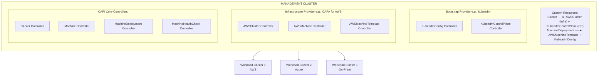
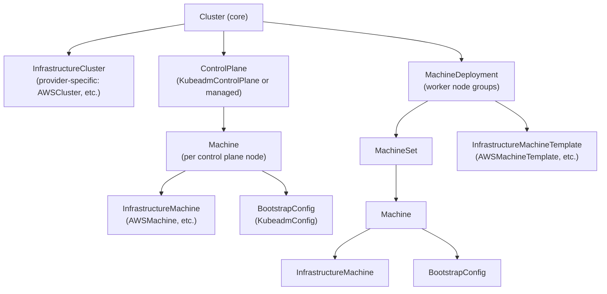
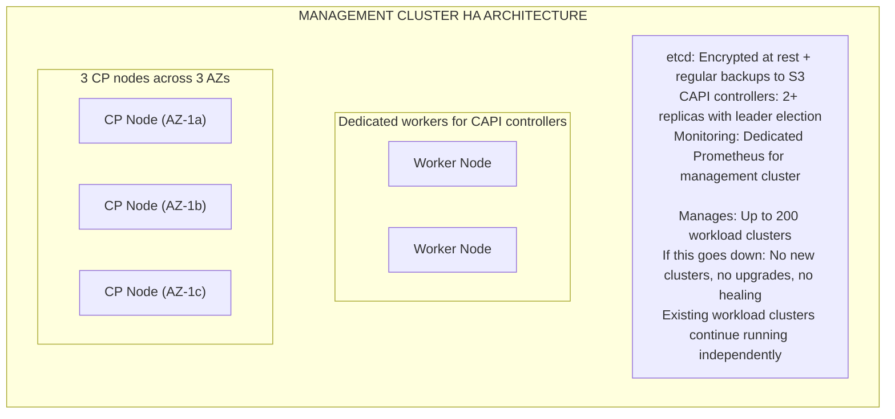
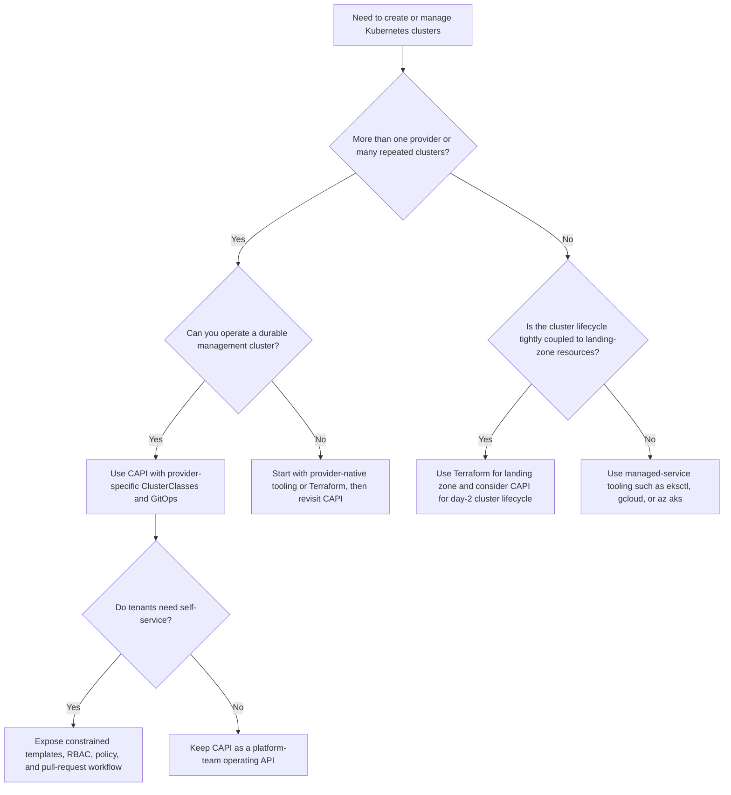
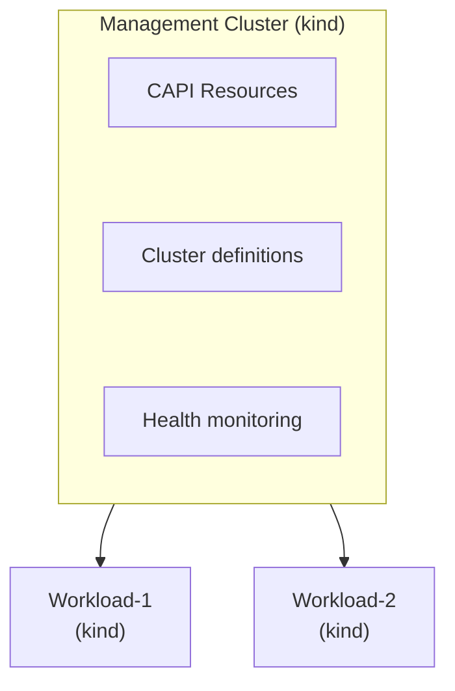

**Complexity**: `[COMPLEX]` | **Time to Complete**: 3h | **Prerequisites**: Multi-Cloud Fleet Management (Module 10.5), Kubernetes Custom Resources, Infrastructure as Code Basics

## What You'll Be Able to Do

After completing this extensive technical module, you will be equipped to:

- **Design** highly available Cluster API management cluster architectures to orchestrate Kubernetes fleets securely across multiple cloud providers.
- **Implement** declarative, multi-cloud cluster provisioning pipelines utilizing Cluster API providers (CAPA, CAPZ, CAPG) for AWS, Azure, and GCP environments.
- **Execute** zero-downtime, fleet-wide Kubernetes version upgrades by manipulating declarative Cluster API resource states and managing rollout strategies.
- **Diagnose** and **remediate** node-level infrastructure failures automatically by configuring advanced MachineHealthCheck and remediation templates.
- **Evaluate** custom machine image strategies (Bring Your Own Image) to enforce organizational compliance standards and embed security agents prior to node boot.

---

## Why This Module Matters

As organizations accumulate Kubernetes clusters across multiple clouds and provisioning stacks, version skew and inconsistent lifecycle tooling can turn routine upgrades into slow, high-risk operations.

When upgrade procedures diverge across clusters, urgent security patching can overwhelm a small platform team and leave older environments exposed longer than is acceptable.

Cluster API (CAPI) was engineered specifically by the Kubernetes Special Interest Group (SIG) Cluster Lifecycle to solve this exact enterprise scaling problem. Instead of forcing teams to juggle disparate infrastructure-as-code tools to manage clusters on varying cloud providers, [Cluster API provides a unified, Kubernetes-native API for creating, upgrading, configuring, and deleting clusters across any underlying infrastructure](https://github.com/kubernetes-sigs/cluster-api). By leveraging the declarative nature of Kubernetes, you describe your desired cluster state in standard YAML manifests, and the CAPI controllers autonomously reconcile the physical infrastructure to match that state. Upgrading twenty-eight clusters transforms from a multi-week ordeal of imperative scripting into a simple GitOps commit that updates twenty-eight YAML files, allowing the automated controllers to handle the complex choreography of rolling out nodes. In this module, you will completely master the internal mechanics of Cluster API, enabling you to orchestrate massive global fleets with minimal operational overhead.

At enterprise scale, the hard part is rarely "create one cluster." The hard part is making the hundredth cluster boring. AWS teams have accounts, VPCs, IAM boundaries, EKS add-ons, managed node groups, and regional service quotas. Google Cloud teams have organizations, folders, projects, Shared VPCs, GKE release channels, service accounts, and fleet registration decisions. Azure teams have management groups, subscriptions, resource groups, AKS tiers, Entra integration, node pools, and Azure Policy or extension requirements. On-premises teams add their own image factories, load balancers, IP address management, firewall rules, and maintenance windows. A platform team that treats each environment as a special snowflake eventually spends most of its time translating the same lifecycle decision into different cloud-native commands.

Cluster API is useful because it makes cluster lifecycle look like Kubernetes lifecycle. You still need provider expertise, but you express that expertise through API objects that can be reviewed, versioned, validated, reconciled, and rolled back through the same operating model you already use for applications. The contract is not "all clouds are identical." The contract is "a cluster has a desired topology, that topology references provider-specific infrastructure, and controllers keep moving reality toward the declaration." That difference matters because it lets the organization centralize the repeatable parts while leaving room for AWS, GCP, Azure, vSphere, bare metal, and lab providers to expose the knobs that actually differ.

Hypothetical scenario: a security team requires every production cluster to run Kubernetes 1.35, restrict control-plane access, encrypt Kubernetes secrets with provider-backed keys, use approved worker images, and expose evidence that unhealthy nodes are replaced automatically. Without CAPI, each cloud team might implement that requirement through separate Terraform modules, CLI scripts, service-console checklists, and wiki pages. With CAPI, the platform team can encode the fleet shape as `Cluster`, control-plane, machine, and template resources, then promote a versioned change through GitOps. The provider details do not disappear, but the work becomes auditable and repeatable instead of tribal.

---

## The Architecture of Cluster API

Cluster API elevates the core concepts of Kubernetes to the infrastructure level. Just as Kubernetes manages the lifecycle of Pods across worker nodes, Cluster API manages the lifecycle of entire Kubernetes clusters across physical or virtual infrastructure. To achieve this, CAPI introduces a strict separation of concerns between the **management cluster** and the **workload clusters**.

The management cluster is a dedicated Kubernetes cluster whose sole purpose is to run the CAPI controllers and store the Custom Resource Definitions (CRDs) that define your fleet. The workload clusters are the actual target environments where your business applications reside.

### The Separation of Lifecycle and Workload

The most critical architectural principle of Cluster API is the isolation of control planes. The management cluster operates out-of-band relative to the workload clusters. It continuously observes the declared state of the infrastructure (e.g., "I want an EKS cluster with five worker nodes") and makes API calls to the target cloud provider to ensure reality matches the declaration.

> **Stop and think**: If the management cluster goes down, what happens to the applications running on Workload Cluster 1? How does CAPI's architecture separate lifecycle management from the workload data plane?



Within the management cluster, the controller ecosystem is divided into three distinct layers:
1. **Core Providers**: These controllers manage the generic representations of infrastructure, such as `Cluster`, `Machine`, and `MachineDeployment` resources. They are entirely agnostic to the underlying cloud provider.
2. **Infrastructure Providers**: These specialized controllers translate the generic CAPI requests into specific API calls for a given cloud (e.g., translating a generic `Machine` request into an `AWSMachine` request that provisions an EC2 instance).
3. **Bootstrap Providers**: These controllers are responsible for transforming a raw, newly booted virtual machine or bare-metal server into a fully functioning Kubernetes node. The most common bootstrap provider utilizes `kubeadm` to join nodes to the cluster securely.

### The Resource Hierarchy

To fully grasp how CAPI operates, you must understand its Custom Resource hierarchy. CAPI brilliantly mirrors the standard Kubernetes workload hierarchy. Just as a `Deployment` manages `ReplicaSets`, which in turn manage individual `Pods`, CAPI utilizes a `MachineDeployment` to manage `MachineSets`, which in turn manage individual infrastructure `Machines`.



When you define a `Cluster` resource, you must provide references to an `InfrastructureCluster` (which dictates the provider-specific networking, VPCs, and load balancers) and a `ControlPlane` (which dictates how the API server and etcd components are constructed). Similarly, worker nodes are defined via a `MachineDeployment`, which references an `InfrastructureMachineTemplate` to define the compute instance size, and a `BootstrapConfig` to define how the node joins the cluster upon booting.

The important mental model is that CAPI does not provision by "running a script once." It provisions by reconciling an ownership graph. The `Cluster` object is the fleet-level anchor. The infrastructure cluster object, such as `AWSCluster`, `AzureCluster`, `GCPCluster`, or a managed equivalent, describes the provider resources that make the cluster reachable. The control-plane object, such as `KubeadmControlPlane` or a provider-managed control-plane type, describes who owns the API server lifecycle. Worker capacity then comes from `MachineDeployment` and `MachineSet` when CAPI manages individual machines, or from `MachinePool` when the provider owns a native pool abstraction such as an AWS Auto Scaling Group, Azure VMSS-backed pool, or GCP Managed Instance Group.

The `MachineDeployment` path feels familiar because it follows the Kubernetes `Deployment` pattern. A desired worker template produces a `MachineSet`; the `MachineSet` creates individual `Machine` objects; each `Machine` points to a bootstrap object and an infrastructure machine object; the infrastructure provider creates the VM or instance; the bootstrap provider prepares the node to join the workload cluster. When a template changes, CAPI creates a new `MachineSet`, scales it up, drains and deletes older machines, and reports progress through status conditions. That is why direct edits to generated `Machine` objects are usually the wrong place to make persistent changes.

`MachinePool` is different because CAPI is intentionally handing more responsibility to the provider. The core CAPI object still declares desired size and template information, but the infrastructure provider maps that declaration onto a cloud-native group. CAPA can map managed workers to EKS managed node groups, CAPZ maps managed AKS workers to AKS node pools, and GCP providers can map pools to GCP-managed groups where supported. This is attractive for managed Kubernetes because the provider already has mature pool-level replacement, surge, auto-repair, and scaling behavior. The tradeoff is that per-node control is less uniform across clouds, so you must validate drain behavior, remediation behavior, and upgrade strategy for the specific provider.

Current API-version reality also matters. Many production examples still use the `cluster.x-k8s.io/v1beta1` contract because providers adopted that line widely. The current Cluster API documentation now includes `v1beta2` examples and notes that CAPI v1.11 introduced the `v1beta2` contract while preserving temporary compatibility with deprecated `v1beta1` provider contracts. Treat that as a migration period, not as permission to mix versions casually. Pin CAPI core, bootstrap, control-plane, and infrastructure provider versions together, read each provider's compatibility matrix, and test conversion in a non-production management cluster before upgrading the controller stack that manages real fleet state.

### ClusterClass and Managed Topologies

ClusterClass is the feature that turns CAPI from "many declarative cluster manifests" into "a governed fleet product." A `ClusterClass` defines reusable templates for the cluster infrastructure, control plane, machine infrastructure, bootstrap configuration, and worker classes. A `Cluster` then references that class through `spec.topology`, supplies a Kubernetes version, chooses worker classes, and fills in variables. The ClusterTopology controller expands the class into the lower-level objects and keeps those generated objects aligned with the topology.

The enterprise value is standardization without copy-paste. Suppose the platform team supports a production class named `prod-regional-v1` and a development class named `dev-zonal-v1`. The production class can require three control-plane replicas for self-managed clusters, hardened image variables, required labels, approved instance families, and standard machine-health checks. The development class can use smaller pools and different patch defaults. A team creating a cluster selects a class, sets variables such as region, network name, image family, or node size, and avoids hand-editing dozens of provider-specific templates.

Variables and patches are the key extension mechanism. A variable can expose a controlled choice, such as `workerInstanceType`, `subnetSelector`, `imageRepository`, `httpProxy`, `controlPlaneEndpointType`, or `enableFipsMode`. A patch can then place that value into the correct field of an infrastructure template or bootstrap template. This is safer than giving every tenant full access to raw provider templates because the platform team decides which fields are configurable and which fields remain fixed guardrails. In practice, the class becomes the product API for cluster creation.

Managed topologies also change how upgrades work. With a class-based cluster, changing `spec.topology.version` on the `Cluster` gives CAPI a single desired Kubernetes version for the managed topology. The controllers then propagate that intent to the generated control-plane and worker objects. Scaling can work the same way: the operator changes the topology's control-plane replica count or worker replica count rather than editing generated children. That single point of control is a large operational improvement when you need to roll a baseline change across dozens of clusters and prove which clusters have converged.

ClusterClass is not a reason to skip provider testing. A patch that works for CAPD in a local development environment may not map cleanly to EKS, AKS, or GKE managed-control-plane APIs. Some providers support ClusterClass deeply for self-managed clusters while managed-control-plane support matures at a different pace. The right pattern is to publish a small number of provider-specific classes, version them deliberately, and promote class changes through canary clusters before rebasing production clusters to a new class version.

---

## Setting Up a Management Cluster

Before you can orchestrate a fleet, you must establish your central management cluster. A common paradox with Cluster API is the "chicken-and-egg" problem: you need a Kubernetes cluster to run the controllers that create Kubernetes clusters. 

To solve this, operators typically leverage an ephemeral bootstrap cluster using a lightweight tool like `kind` (Kubernetes IN Docker) running on an administrative workstation or a CI/CD runner. Once the ephemeral `kind` cluster is operational, you use the `clusterctl` CLI tool to inject the CAPI controllers into it. This temporary management cluster can then provision a highly available, permanent management cluster in the cloud. Once the permanent cluster exists, you use `clusterctl move` to migrate the controller state to the permanent home, and destroy the ephemeral bootstrap cluster.

Below, we detail the initial setup phase utilizing an AWS environment as our target infrastructure.

```bash
# Install clusterctl (the CAPI CLI)
curl -L https://github.com/kubernetes-sigs/cluster-api/releases/latest/download/clusterctl-$(uname -s | tr '[:upper:]' '[:lower:]')-amd64 -o clusterctl
chmod +x clusterctl && sudo mv clusterctl /usr/local/bin/

# Initialize CAPI with the AWS provider
# Prerequisites: AWS credentials configured, kind cluster running
export AWS_REGION=us-east-1
export AWS_ACCESS_KEY_ID=<your-access-key>
export AWS_SECRET_ACCESS_KEY=<your-secret-key>
export AWS_B64ENCODED_CREDENTIALS=$(clusterawsadm bootstrap credentials encode-as-profile)

# Bootstrap IAM resources in AWS (creates CloudFormation stack)
clusterawsadm bootstrap iam create-cloudformation-stack --config bootstrap-config.yaml

# Initialize the management cluster with multiple providers
clusterctl init \
  --infrastructure aws,azure \
  --bootstrap kubeadm \
  --control-plane kubeadm

# Verify providers are installed
clusterctl describe cluster --show-conditions all 2>/dev/null || true
kubectl get providers -A
```

The `clusterawsadm` command is a dedicated utility provided by the AWS CAPI community that idempotently configures the necessary Identity and Access Management (IAM) roles and policies in your AWS account. Without these roles, the controllers in your management cluster would lack the authorization required to spin up EC2 instances or configure Elastic Load Balancers.

For a production management cluster, treat the bootstrap sequence as a controlled migration rather than a one-time setup trick. A local `kind` bootstrap cluster is useful because it gives you a quick place to install CAPI controllers and create the first durable management cluster. It should not become the permanent control plane for a production fleet. The durable management cluster needs multiple control-plane nodes or a managed control plane, backup and restore procedures for etcd or the managed-cluster state, explicit provider version pinning, monitoring for controller queues and reconciliation errors, and a runbook for rotating cloud credentials.

`clusterctl init` is the installation boundary for providers. By default it installs selected providers into their target namespaces, and provider version pinning is available by appending a version tag to the provider name. In an enterprise environment, pinning matters because "latest available" is not a release strategy. You want a tested bill of materials that says which CAPI core version, kubeadm bootstrap provider, kubeadm control-plane provider, CAPA, CAPZ, CAPG, cert-manager, and GitOps controller versions are allowed in each management cluster. That bill of materials should be promoted just like an application release.

There is also a supply-chain angle. `clusterctl` discovers provider repositories and release artifacts, and provider installation can involve GitHub or Go proxy lookups. For regulated environments, mirror provider manifests and controller images into approved artifact repositories, document image digests, and test provider upgrades from those internal mirrors. That does not make CAPI less open; it makes the fleet lifecycle reproducible when the public internet, public rate limits, or upstream release timing are not acceptable dependencies.

---

## Multi-Cloud Infrastructure Providers

The true power of Cluster API lies in its modular provider ecosystem. While the core API remains consistent, the infrastructure providers handle the complex translation logic required to interact with AWS, Azure, GCP, VMware, and dozens of other environments. Modern enterprise architectures heavily favor utilizing Managed Kubernetes offerings (like EKS, AKS, and GKE) rather than building raw clusters from virtual machines. CAPI fully supports managed offerings, streamlining the definitions significantly.

### CAPA (Cluster API Provider AWS)

When provisioning an Amazon EKS cluster, you utilize CAPA in "managed mode." This mode delegates the control plane management to AWS, while CAPI handles the declarative desired state of the infrastructure. The configuration requires coordinating several distinct Custom Resources.

```yaml
# AWS EKS Cluster via CAPA (managed mode)
apiVersion: cluster.x-k8s.io/v1beta1
kind: Cluster
metadata:
  name: eks-prod-east
  namespace: fleet
spec:
  clusterNetwork:
    pods:
      cidrBlocks:
        - 10.120.0.0/16
    services:
      cidrBlocks:
        - 10.121.0.0/16
  controlPlaneRef:
    apiVersion: controlplane.cluster.x-k8s.io/v1beta2
    kind: AWSManagedControlPlane
    name: eks-prod-east-cp
  infrastructureRef:
    apiVersion: infrastructure.cluster.x-k8s.io/v1beta2
    kind: AWSManagedCluster
    name: eks-prod-east
```

The core `Cluster` resource bridges the generic networking definitions with the AWS-specific implementations. It explicitly references the `AWSManagedControlPlane` resource, which defines the EKS specific properties.

```yaml
apiVersion: controlplane.cluster.x-k8s.io/v1beta2
kind: AWSManagedControlPlane
metadata:
  name: eks-prod-east-cp
  namespace: fleet
spec:
  region: us-east-1
  version: v1.35.0
  sshKeyName: eks-key
  eksClusterName: eks-prod-east
  endpointAccess:
    public: true
    private: true
    publicCIDRs:
      - 203.0.113.0/24
  iamAuthenticatorConfig:
    mapRoles:
      - rolearn: arn:aws:iam::123456789012:role/PlatformTeam
        username: platform-admin
        groups:
          - system:masters
  logging:
    apiServer: true
    audit: true
    authenticator: true
    controllerManager: true
    scheduler: true
  encryptionConfig:
    provider: kms
    resources:
      - secrets
  addons:
    - name: vpc-cni
      version: v1.19.2-eksbuild.1
      conflictResolution: overwrite
    - name: coredns
      version: v1.11.4-eksbuild.2
    - name: kube-proxy
      version: v1.35.0-eksbuild.1
```

The `AWSManagedControlPlane` exposes critical enterprise security features directly through the declarative API. Notice how we enable comprehensive audit logging, mandate envelope encryption for Kubernetes secrets using AWS KMS, and restrict public endpoint access to a specific corporate CIDR block (`203.0.113.0/24`). Furthermore, we statically define the versions of essential EKS addons (VPC CNI, CoreDNS) to prevent unexpected drift.

```yaml
apiVersion: infrastructure.cluster.x-k8s.io/v1beta2
kind: AWSManagedCluster
metadata:
  name: eks-prod-east
  namespace: fleet
```

```yaml
# Worker nodes via MachinePool (maps to EKS Managed Node Group)
apiVersion: cluster.x-k8s.io/v1beta1
kind: MachinePool
metadata:
  name: eks-prod-east-workers
  namespace: fleet
spec:
  clusterName: eks-prod-east
  replicas: 5
  template:
    spec:
      clusterName: eks-prod-east
      bootstrap:
        dataSecretName: ""
      infrastructureRef:
        apiVersion: infrastructure.cluster.x-k8s.io/v1beta2
        kind: AWSManagedMachinePool
        name: eks-prod-east-workers
```

```yaml
apiVersion: infrastructure.cluster.x-k8s.io/v1beta2
kind: AWSManagedMachinePool
metadata:
  name: eks-prod-east-workers
  namespace: fleet
spec:
  eksNodegroupName: general-workers
  instanceType: m6i.xlarge
  scaling:
    minSize: 3
    maxSize: 20
  diskSize: 100
  amiType: AL2023_x86_64_STANDARD
  labels:
    workload-type: general
    environment: production
  updateConfig:
    maxUnavailable: 1
```

Instead of managing individual `Machine` resources for worker nodes, we utilize a `MachinePool`. A `MachinePool` lets CAPI delegate worker-node lifecycle to the cloud provider's native pool abstraction. Settings such as `maxUnavailable` bound rollout concurrency, but workload availability still depends on replica design, disruption budgets, and provider behavior.

### CAPZ (Cluster API Provider Azure)

The Azure provider follows the exact same architectural pattern, but targets Azure Kubernetes Service (AKS). The abstraction layer allows platform engineers to leverage their existing CAPI knowledge across completely different clouds.

```yaml
# Azure AKS Cluster via CAPZ (managed mode)
apiVersion: cluster.x-k8s.io/v1beta1
kind: Cluster
metadata:
  name: aks-prod-westeu
  namespace: fleet
spec:
  clusterNetwork:
    services:
      cidrBlocks:
        - 10.130.0.0/16
  controlPlaneRef:
    apiVersion: infrastructure.cluster.x-k8s.io/v1beta1
    kind: AzureManagedControlPlane
    name: aks-prod-westeu
  infrastructureRef:
    apiVersion: infrastructure.cluster.x-k8s.io/v1beta1
    kind: AzureManagedCluster
    name: aks-prod-westeu
```

```yaml
apiVersion: infrastructure.cluster.x-k8s.io/v1beta1
kind: AzureManagedControlPlane
metadata:
  name: aks-prod-westeu
  namespace: fleet
spec:
  subscriptionID: "00000000-0000-0000-0000-000000000000"
  resourceGroupName: rg-fleet-westeu
  location: westeurope
  version: v1.35.0
  networkPlugin: azure
  networkPolicy: calico
  dnsServiceIP: 10.130.0.10
  aadProfile:
    managed: true
    adminGroupObjectIDs:
      - "aaaaaaaa-bbbb-cccc-dddd-eeeeeeeeeeee"
  sku:
    tier: Standard
```

```yaml
apiVersion: infrastructure.cluster.x-k8s.io/v1beta1
kind: AzureManagedCluster
metadata:
  name: aks-prod-westeu
  namespace: fleet
```

```yaml
apiVersion: infrastructure.cluster.x-k8s.io/v1beta1
kind: AzureManagedMachinePool
metadata:
  name: aks-prod-westeu-pool1
  namespace: fleet
spec:
  mode: System
  sku: Standard_D4s_v5
  osDiskSizeGB: 128
  scaling:
    minSize: 3
    maxSize: 15
  enableAutoScaling: true
```

Notice the provider-specific differences in the `AzureManagedControlPlane`. We must define the `subscriptionID` and `resourceGroupName`. We also explicitly declare `networkPlugin: azure` and `networkPolicy: calico` directly within the manifest, ensuring the cluster networking is consistently enforced at provision time.

### CAPG (Cluster API Provider GCP)

Finally, the Google Cloud Platform provider targets Google Kubernetes Engine (GKE). The symmetry across the major clouds allows a platform team to build standard GitOps pipelines that can deploy uniformly regardless of the destination datacenter.

```yaml
# GCP GKE Cluster via CAPG (managed mode)
apiVersion: cluster.x-k8s.io/v1beta1
kind: Cluster
metadata:
  name: gke-prod-central
  namespace: fleet
spec:
  clusterNetwork:
    pods:
      cidrBlocks:
        - 10.140.0.0/14
    services:
      cidrBlocks:
        - 10.144.0.0/20
  controlPlaneRef:
    apiVersion: infrastructure.cluster.x-k8s.io/v1beta1
    kind: GCPManagedControlPlane
    name: gke-prod-central
  infrastructureRef:
    apiVersion: infrastructure.cluster.x-k8s.io/v1beta1
    kind: GCPManagedCluster
    name: gke-prod-central
```

```yaml
apiVersion: infrastructure.cluster.x-k8s.io/v1beta1
kind: GCPManagedControlPlane
metadata:
  name: gke-prod-central
  namespace: fleet
spec:
  project: company-prod
  location: us-central1
  clusterName: gke-prod-central
  releaseChannel: REGULAR
  enableAutopilot: false
```

```yaml
apiVersion: infrastructure.cluster.x-k8s.io/v1beta1
kind: GCPManagedCluster
metadata:
  name: gke-prod-central
  namespace: fleet
spec:
  project: company-prod
  region: us-central1
```

```yaml
apiVersion: infrastructure.cluster.x-k8s.io/v1beta1
kind: GCPManagedMachinePool
metadata:
  name: gke-prod-central-pool1
  namespace: fleet
spec:
  machineType: e2-standard-4
  diskSizeGb: 100
  diskType: pd-ssd
  scaling:
    minCount: 3
    maxCount: 15
  management:
    autoUpgrade: true
    autoRepair: true
```

In the CAPG configuration, we specify the [`releaseChannel: REGULAR` setting, allowing Google to manage the cadence of minor patch updates](https://cloud.google.com/kubernetes-engine/docs/concepts/release-channels) if desired, while we maintain declarative control over the major architecture and networking layout.

Provider choice is where the abstraction gets real. CAPA's EKS support exposes managed EKS clusters, EKS add-ons, IAM authenticator mapping, managed machine pools, and self-managed machine patterns. CAPZ supports both self-managed Kubernetes clusters on Azure infrastructure and managed AKS clusters through `AzureManagedControlPlane`, `AzureManagedCluster`, and `AzureManagedMachinePool`, with newer ASO-backed managed APIs for more complete Azure resource expression. CAPG supports self-managed clusters on Google Cloud and has managed GKE support that must be treated according to its documented maturity and provider guidance. CAPD, the Docker provider, is valuable for development and CI, but the Cluster API documentation is explicit that Docker provider clusters are not production infrastructure.

The managed-control-plane path and the self-managed path solve different problems. Managed EKS, AKS, and GKE let the cloud provider own the API server, etcd, patching mechanics, and large parts of availability engineering. CAPI then gives your platform team a declarative way to request, update, and observe those managed services. Self-managed CAPI clusters give you more direct control over the control plane, OS image, bootstrap configuration, network topology, and upgrade choreography, but they also make you responsible for more failure modes. The best enterprise answer is often mixed: managed control planes for standard application clusters, self-managed clusters only where control-plane access, custom infrastructure, disconnected environments, or provider gaps justify the operational cost.

| Provider path | Best fit | Enterprise caution |
| :--- | :--- | :--- |
| CAPA with EKS managed control plane | AWS fleets that want EKS support, EKS add-ons, managed node groups, and IAM integration expressed through CAPI. | Validate IAM bootstrapping, EKS version support, add-on conflict behavior, and whether worker changes should use managed pools or individual machines. |
| CAPZ with AKS managed control plane | Azure fleets that want AKS clusters, AKS node pools, Entra-oriented access patterns, extensions, and Azure resource governance. | Confirm AKS tier, subscription quota, network plugin, system node pool, and Azure Policy or extension interactions before publishing a class. |
| CAPG with GKE managed control plane | Google Cloud fleets that want GKE lifecycle expressed through CAPI and aligned with projects, networks, and release channels. | Treat managed GKE support according to CAPG's current feature status, and avoid assuming every GKE console option is exposed by the provider API. |
| Self-managed CAPI on cloud VMs | Custom control planes, custom images, strict bootstrap control, or features not available in managed Kubernetes. | You own etcd, API server availability, load balancers, machine images, CNI installation, and control-plane upgrades. |
| CAPD or local providers | Development, CI, examples, and validating CAPI workflows cheaply. | Do not use Docker-provider clusters as a production hosting model or as proof that a provider-specific cloud rollout is safe. |

The table also explains why ClusterClass should usually be provider-specific. A class called `prod-standard` sounds elegant, but a single universal class can hide provider differences that should be reviewed explicitly. A safer naming pattern is `aws-eks-prod-v1`, `azure-aks-prod-v1`, `gcp-gke-prod-v1`, and `onprem-kubeadm-prod-v1`, with a common policy layer around labels, owner metadata, cost tags, Kubernetes version, health checks, and admission controls.

---

## Declarative Cluster Lifecycle Operations

**Pause and predict:** If you manually edit a `Machine` object using `kubectl edit` to change its instance type directly, what will the CAPI controllers do during the next reconciliation loop?

<details>
<summary>Check your prediction</summary>

A one-off `kubectl edit` of a generated `Machine` object does not modify the declarative template or Git source of truth. The underlying MachineSet or MachineDeployment controller detects the discrepancy between the live object and the declared specification during the next reconciliation loop, reconciling the state back to the declaration. Furthermore, the instance type or VM sizing specification typically resides within the referenced infrastructure machine template (such as `AWSMachineTemplate` or `AzureMachineTemplate`) rather than directly on the core `Machine` resource, making ad-hoc object mutations ineffective.
</details>

The next section is how declarative cluster lifecycle operations execute version upgrades across control planes and worker pools without imperative drift.

### Upgrading a Cluster

Upgrading a fleet of clusters manually is a terrifying prospect fraught with the potential for control plane degradation and workload outages. With CAPI, upgrading an entire cluster is as simple as updating the version string in the YAML manifest and committing it to version control.

```bash
# Upgrade EKS cluster from 1.34 to 1.35
kubectl patch awsmanagedcontrolplane eks-prod-east-cp -n fleet \
  --type merge \
  -p '{"spec":{"version":"v1.35.0"}}'

# Watch the upgrade progress
kubectl get cluster eks-prod-east -n fleet -w

# Upgrade worker nodes (they follow after control plane)
kubectl patch awsmanagedmachinepool eks-prod-east-workers -n fleet \
  --type merge \
  -p '{"spec":{"updateConfig":{"maxUnavailable":2}}}'

# Monitor machine rollout
kubectl get machines -n fleet -l cluster.x-k8s.io/cluster-name=eks-prod-east
```

When the version string is modified, the CAPI controllers and underlying providers coordinate replacement and draining steps to minimize disruption during rollout. Actual downtime risk still depends on provider behavior, workload redundancy, readiness handling, and disruption-budget design.

### Fleet-Wide Upgrade Script

For enterprises managing dozens or hundreds of clusters, automation can interrogate the management cluster to assess the state of the fleet and trigger rolling upgrades programmatically. The following script illustrates how you can interact with the CAPI data plane to enforce a baseline version across all environments.

```bash
#!/bin/bash
# upgrade-fleet.sh - Upgrade all clusters to a target version
TARGET_VERSION="v1.35.0"
NAMESPACE="fleet"

echo "=== Fleet Upgrade Plan ==="
echo "Target version: $TARGET_VERSION"
echo ""

# List all clusters and their current versions
for CLUSTER in $(kubectl get clusters -n $NAMESPACE -o jsonpath='{.items[*].metadata.name}'); do
  CURRENT=$(kubectl get cluster $CLUSTER -n $NAMESPACE -o jsonpath='{.spec.topology.version}' 2>/dev/null)
  if [ -z "$CURRENT" ]; then
    # Try managed control plane
    CP_REF=$(kubectl get cluster $CLUSTER -n $NAMESPACE -o jsonpath='{.spec.controlPlaneRef.name}')
    CP_KIND=$(kubectl get cluster $CLUSTER -n $NAMESPACE -o jsonpath='{.spec.controlPlaneRef.kind}')
    CURRENT=$(kubectl get $CP_KIND $CP_REF -n $NAMESPACE -o jsonpath='{.spec.version}' 2>/dev/null)
  fi

  if [ "$CURRENT" != "$TARGET_VERSION" ]; then
    echo "  UPGRADE NEEDED: $CLUSTER ($CURRENT → $TARGET_VERSION)"
  else
    echo "  UP TO DATE: $CLUSTER ($CURRENT)"
  fi
done

echo ""
read -p "Proceed with upgrades? (y/n) " CONFIRM
if [ "$CONFIRM" != "y" ]; then exit 0; fi

# Execute upgrades
for CLUSTER in $(kubectl get clusters -n $NAMESPACE -o jsonpath='{.items[*].metadata.name}'); do
  CP_REF=$(kubectl get cluster $CLUSTER -n $NAMESPACE -o jsonpath='{.spec.controlPlaneRef.name}')
  CP_KIND=$(kubectl get cluster $CLUSTER -n $NAMESPACE -o jsonpath='{.spec.controlPlaneRef.kind}')
  CURRENT=$(kubectl get $CP_KIND $CP_REF -n $NAMESPACE -o jsonpath='{.spec.version}')

  if [ "$CURRENT" != "$TARGET_VERSION" ]; then
    echo "Upgrading $CLUSTER..."
    kubectl patch $CP_KIND $CP_REF -n $NAMESPACE \
      --type merge \
      -p "{\"spec\":{\"version\":\"$TARGET_VERSION\"}}"
    echo "  Upgrade initiated for $CLUSTER"
  fi
done
```

### MachineHealthCheck: Auto-Remediation

In a massive fleet, hardware failures, kernel panics, and hypervisor crashes are statistical guarantees. Instead of relying on manual intervention or external cloud provider tools to detect and replace degraded nodes, CAPI provides native auto-remediation via the `MachineHealthCheck` component.

**Pause and predict:** If a worker node in an Amazon EKS cluster becomes permanently NotReady due to an unrecoverable disk failure, will a Cluster API `MachineHealthCheck` automatically replace that node if it belongs to an `AWSManagedMachinePool`?

<details>
<summary>Check your prediction</summary>

A [`MachineHealthCheck`](https://cluster-api.sigs.k8s.io/tasks/automated-machine-management/healthchecking) controller remediates only `Machine` resources owned by either a `MachineSet` or a `KubeadmControlPlane` (and by extension `MachineDeployment`, which owns a `MachineSet`). It does not remediate or replace worker nodes in an EKS managed node group reconciled by an `AWSManagedMachinePool` because those instances are managed directly by AWS Auto Scaling groups. Verified 2026-09-21: the live Cluster API specification uses `spec.checks` and short-circuit protection via `remediation.triggerIf.unhealthyLessThanOrEqualTo`, where the default value of 100% means short-circuit protection is turned off.
</details>

The next section is how automated remediation manifests declare timeout thresholds and unhealthy node conditions to trigger automatic machine replacement.

Note that this illustration still uses the older `maxUnhealthy` and `unhealthyConditions` shape rather than the newer `spec.checks` and `remediation.triggerIf` specification structure.

```yaml
apiVersion: cluster.x-k8s.io/v1beta1
kind: MachineHealthCheck
metadata:
  name: eks-prod-east-health
  namespace: fleet
spec:
  clusterName: eks-prod-east
  maxUnhealthy: 40%
  nodeStartupTimeout: 10m
  selector:
    matchLabels:
      cluster.x-k8s.io/cluster-name: eks-prod-east
  unhealthyConditions:
    - type: Ready
      status: "False"
      timeout: 5m
    - type: Ready
      status: Unknown
      timeout: 5m
    - type: MemoryPressure
      status: "True"
      timeout: 3m
    - type: DiskPressure
      status: "True"
      timeout: 3m
```

`MachineHealthCheck` applies to `Machine`-backed workers (`MachineDeployment`, `MachineSet`, or `KubeadmControlPlane`), not to provider-managed `MachinePool` node groups such as an EKS managed node group reconciled by `AWSManagedMachinePool`.

The configuration above illustrates the intent of `MachineHealthCheck`: if a matched health condition persists past its timeout, remediation can be triggered, while short-circuit settings such as `maxUnhealthy` limit how much remediation happens during broader outages.

Machine health is where CAPI's reconciliation model either earns trust or causes expensive churn. A `MachineHealthCheck` is defined in the management cluster and scoped to machines in a workload cluster. When a node condition remains unhealthy beyond the configured timeout, CAPI can remediate the owning machine by deleting and replacing it, or a provider can integrate a more specific remediation path. That is powerful, but it should never be enabled with copy-pasted thresholds. If a network partition makes many nodes appear unreachable, a health check without conservative short-circuit settings can amplify an outage by replacing too much capacity at once.

For worker pools, align remediation policy with workload scheduling policy. A batch pool with interruption-tolerant jobs can accept faster replacement than a pool that hosts stateful services with strict disruption budgets. For self-managed control planes, remember that `MachineHealthCheck` support applies to machines owned by supported controllers such as `MachineSet` or `KubeadmControlPlane`, and control-plane remediation must preserve etcd quorum. The right test is not "does the YAML apply." The right test is "can we kill a node, observe the exact replacement path, and prove that the workload disruption stayed inside our budget."

Lifecycle operations also include CAPI provider upgrades, not just workload-cluster upgrades. `clusterctl upgrade plan` and `clusterctl upgrade apply` upgrade the CAPI providers installed in a management cluster; they do not upgrade all `Cluster`, `MachineDeployment`, or provider-specific workload objects for you. Those objects are reconciled by the controllers after their desired specs change. Keep those two upgrade tracks separate in your runbooks: first, the management-plane controller stack; second, the workload clusters and their node pools. Mixing those tracks during an incident is how teams lose the ability to tell whether a failure came from a provider-controller change or from a cluster-version change.

At large scale, reconciliation performance becomes an operational signal. CAPI controllers have runtime tuning options such as Kubernetes API QPS and burst settings, per-controller concurrency, and sync period. Those knobs can improve throughput when a management cluster is behind, but increasing them blindly can create more API pressure on the management cluster and on provider APIs. Watch queue depth, reconcile duration, client-side throttling logs, cloud-provider error rates, and condition transition times before changing concurrency. Then canary the new settings on a smaller management cluster or a subset of namespaces before applying them fleet-wide.

---

## Immutable Node Infrastructure and BYOI

Enterprise security postures often mandate that no compute instance may join a network unless it has been hardened according to strict Center for Internet Security (CIS) benchmarks and possesses all necessary security compliance agents pre-installed. While you *could* utilize Kubernetes DaemonSets to deploy these agents after a node boots, this creates an unacceptable window of vulnerability. Between the time the virtual machine boots and the time the DaemonSet successfully initializes the agent, malicious workloads could be scheduled onto the node. 

### Bring Your Own Image (BYOI)

> **Stop and think**: Why is baking agents into the custom machine image (BYOI) often preferred over using a DaemonSet for security tools like Falco?

To eliminate this vulnerability window, sophisticated platform teams utilize a Bring Your Own Image (BYOI) pipeline. By employing a tool like HashiCorp Packer, they statically bake the compliance agents, the hardened OS configurations, and even large container images directly into a custom cloud image.

```bash
# Build a custom AMI for EKS nodes using Packer
cat <<'EOF' > eks-node.pkr.hcl
packer {
  required_plugins {
    amazon = {
      version = ">= 1.3.0"
      source  = "github.com/hashicorp/amazon"
    }
  }
}

source "amazon-ebs" "eks-node" {
  ami_name      = "eks-node-custom-{{timestamp}}"
  instance_type = "m6i.large"
  region        = "us-east-1"

  source_ami_filter {
    filters = {
      name                = "amazon-eks-node-1.35-*"
      virtualization-type = "hvm"
      root-device-type    = "ebs"
    }
    owners      = ["602401143452"]  # Amazon EKS AMI account
    most_recent = true
  }

  ssh_username = "ec2-user"
}

build {
  sources = ["source.amazon-ebs.eks-node"]

  # Install compliance agents
  provisioner "shell" {
    inline = [
      "sudo yum install -y amazon-ssm-agent",
      "sudo systemctl enable amazon-ssm-agent",

      # Install Falco for runtime security
      "sudo rpm --import https://falco.org/repo/falcosecurity-packages.asc",
      "sudo curl -s -o /etc/yum.repos.d/falcosecurity.repo https://falco.org/repo/falcosecurity-rpm.repo",
      "sudo yum install -y falco",

      # CIS hardening
      "sudo sysctl -w net.ipv4.conf.all.send_redirects=0",
      "sudo sysctl -w net.ipv4.conf.default.send_redirects=0",
      "echo 'net.ipv4.conf.all.send_redirects = 0' | sudo tee -a /etc/sysctl.d/99-cis.conf",

      # Pre-pull common images to speed up pod startup (kubelet reads from the k8s.io namespace)
      "sudo ctr -n k8s.io images pull docker.io/library/nginx:1.27.3",
      "sudo ctr -n k8s.io images pull docker.io/library/redis:7.4"
    ]
  }
}
EOF

packer build eks-node.pkr.hcl
```

Once the custom Amazon Machine Image (AMI) is constructed and hardened, you simply update the CAPI `AWSMachineTemplate` to reference the new ID. Nodes provisioned from this template onward should inherit the same baseline security posture as they boot.

```yaml
# Reference the custom AMI in CAPI
apiVersion: infrastructure.cluster.x-k8s.io/v1beta2
kind: AWSMachineTemplate
metadata:
  name: custom-node-template
  namespace: fleet
spec:
  template:
    spec:
      instanceType: m6i.xlarge
      ami:
        id: ami-0abc123def456789  # Your custom AMI
      iamInstanceProfile: nodes.cluster-api-provider-aws.sigs.k8s.io
      sshKeyName: eks-key
      rootVolume:
        size: 100
        type: gp3
        encrypted: true
```

The cross-cloud version of BYOI is a golden-image product, not a one-off Packer file. AWS teams publish AMIs, Azure teams publish managed images or gallery versions, Google Cloud teams publish custom images, and on-premises teams publish templates for their virtualization platform. CAPI templates then reference the approved artifact for that provider. The image pipeline should record Kubernetes version, kubelet version, container runtime version, kernel baseline, CIS or organization-hardening evidence, vulnerability scan output, and the exact bootstrap assumptions expected by the selected CAPI provider.

This image discipline is especially important during Kubernetes minor upgrades. A worker image built for one Kubernetes version may not be appropriate for the next version, and provider documentation can require bootstrap changes. For example, AWS-side guidance around node images and bootstrap providers changes as Amazon Linux baselines evolve. The safe enterprise pattern is to promote cluster-version and image-version together: build the new image, validate it with a canary `MachineDeployment` or `MachinePool`, update the class or template, and only then roll it across the fleet.

BYOI also has a cost lens. Pre-pulling large images can reduce first-pod startup time, but it increases image build time, image storage, replication, and network transfer. Publishing a hardened image to every region and every account or subscription can create hidden storage and governance work. The right question is not "can we bake everything in." The right question is "which components must exist before the node can safely join the cluster, and which components are better managed by DaemonSets, admission policy, or runtime configuration after the node is already protected."

---

## Cost Lens: What CAPI Changes and What It Does Not

CAPI reduces coordination cost more than it reduces raw cloud cost. You still pay for the management cluster, provider-managed control planes or AKS tiers where applicable, worker nodes, load balancers, NAT gateways, private endpoints, logs, metrics, image storage, snapshots, and cross-region or cross-cloud network transfer. What CAPI can reduce is the human cost of drift: fewer hand-built clusters, fewer bespoke upgrade scripts, fewer undocumented node pools, and fewer emergency projects to rediscover how a cluster was created.

The management cluster has a real cost profile. A production-grade management cluster needs enough control-plane reliability, worker capacity, monitoring, backup, and security tooling to survive the failures it is expected to manage. Running it on a tiny single-node VM is cheap until it becomes the unavailable control plane for fleet remediation. Running it as a heavily overbuilt cluster is also wasteful, especially if it manages a small number of workload clusters. Size it from observed controller load, reconcile latency, number of managed objects, provider count, and availability requirements rather than from a universal "one management cluster per company" rule.

Managed Kubernetes pricing differs by provider and changes over time, so treat pricing pages as live operational inputs. Amazon EKS documents a per-cluster hourly fee based on Kubernetes version support tier, with standard and extended support behaving differently. Google Kubernetes Engine pricing documents cluster management fees alongside cluster operation mode, compute resources, and ingress-related costs. Azure AKS documents Free, Standard, and Premium pricing tiers for cluster management, with Standard and Premium including uptime SLA behavior. CAPI does not erase those provider economics; it makes them easier to inventory because the cluster objects and labels can become the source for allocation.

The largest fleet cost spikes often come from actions around the cluster rather than from CAPI itself. A mass rollout can temporarily double worker capacity while new nodes come up before old nodes drain. A poorly staged upgrade can create bursts of cloud API calls, queue depth in controllers, and provider throttling that stretches maintenance windows. A private-cluster topology can multiply NAT gateway, private endpoint, firewall, and DNS costs across accounts, projects, and subscriptions. Centralized audit logging can become expensive when every cluster sends verbose control-plane, audit, network, and admission logs to a single retention policy without environment-specific tuning.

Cost governance should therefore be part of the CAPI template. Require owner, environment, cost-center, data-classification, and expiration labels or tags in the `Cluster` topology and provider templates. Use smaller development classes with lower minimum replicas, no premium control-plane tiers unless justified, and shorter log retention. Use production classes that encode the resilience you actually need, then make the cost visible through showback. If teams can request clusters through Git, they should also see the expected monthly control-plane, worker, network, storage, and observability cost before the pull request is approved.

Savings come from standardization and staged automation. ClusterClass reduces repeated manifest maintenance. GitOps reduces manual rollout labor. MachineHealthCheck reduces time spent repairing obvious node failures. Image pipelines reduce post-boot configuration time. Managed control planes reduce the cost of running etcd and API servers yourself. Those savings are real, but they disappear if every team forks the templates, bypasses labels, creates permanent test clusters, or requests production-grade topology for temporary workloads. CAPI gives you a lever; governance decides whether the lever moves cost down or just creates clusters faster.

---

## Scaling CAPI for Enterprise Operations

The management cluster is the central nervous system of your entire multi-cloud infrastructure. If it fails, your workload clusters will continue to serve traffic independently, but your ability to provision new clusters, execute rolling upgrades, or remediate failed nodes largely ceases until the management cluster is restored.

### Management Cluster High Availability

**Pause and predict:** If the management cluster requires etcd to store all CAPI objects, what happens to existing workload clusters if management etcd experiences unrecoverable corruption without a functional backup?

<details>
<summary>Check your prediction</summary>

Losing the [management cluster's `etcd` database without a functional backup](https://kubernetes.io/docs/tasks/administer-cluster/configure-upgrade-etcd/) permanently destroys all Cluster API custom resource state and controller awareness. Platform operators lose the ability to safely provision new clusters, execute rolling upgrades, scale machine pools, or automatically remediate failed nodes until the management state is reconstructed. However, applications already running on the workload clusters keep running without interruption because their local control planes, kubelets, and container runtimes operate independently of the management cluster.
</details>

The next section is how highly available management cluster topologies distribute control plane nodes and controller replicas across availability zones.



### Management Cluster Lifecycle: Clusterctl Move

Inevitably, the management cluster itself will require infrastructure upgrades or migration to a more robust hosting environment. The `clusterctl move` command enables seamless transference of the CAPI custom resources and controller states from a source management cluster to a destination management cluster. During the move, the source controllers pause reconciliation, the state is safely transferred to the destination, and the new controllers resume management without the workload clusters ever being impacted.

**Pause and predict:** When executing `clusterctl move` to migrate cluster definitions between management clusters, does this operation upgrade workload cluster Kubernetes versions or restore previous runtime status fields?

<details>
<summary>Check your prediction</summary>

The [`clusterctl move`](https://cluster-api.sigs.k8s.io/clusterctl/commands/move) command pivots Cluster API objects to a target management cluster that has already executed `clusterctl init` with matching or newer provider versions. During this pivot, the source objects have `Cluster.spec.paused` set to prevent reconciliation conflicts while resources migrate. The operation is strictly an object pivot rather than a [`clusterctl upgrade`](https://cluster-api.sigs.k8s.io/clusterctl/commands/upgrade) or general backup-and-restore mechanism; runtime `.status` subresources are not restored, requiring target controllers to reconstruct status dynamically.
</details>

The next section is how operational migration commands initialize replacement control planes and pivot custom resource definitions between active clusters.

```bash
# Create a new management cluster
kind create cluster --name new-mgmt

# Initialize CAPI on the new cluster
clusterctl init --infrastructure aws,azure \
  --bootstrap kubeadm --control-plane kubeadm

# Move all CAPI objects from old to new management cluster
clusterctl move \
  --to-kubeconfig new-mgmt.kubeconfig \
  --namespace fleet

# Verify all clusters are now managed by the new management cluster
kubectl --kubeconfig new-mgmt.kubeconfig get clusters -n fleet
```

### Multi-Tenancy in CAPI

In sophisticated organizations, multiple development teams may require autonomous control over their own cluster fleets while sharing a single centralized management cluster. CAPI inherently supports standard Kubernetes Role-Based Access Control (RBAC) and Namespace isolation.

> **Stop and think**: How does namespace isolation in the management cluster translate to the workload clusters? Can Team Alpha manage Team Beta's clusters if they are in different namespaces?

By placing Team Alpha's CAPI resources inside the `team-alpha-clusters` namespace and enforcing strict RBAC policies, they are physically prevented from accidentally mutating or deleting Team Beta's infrastructure. The workload clusters themselves remain completely independent entities; the isolation solely governs the administrative APIs within the management cluster.

```yaml
# Namespace per team with RBAC
apiVersion: v1
kind: Namespace
metadata:
  name: team-alpha-clusters
  labels:
    team: alpha
```

```yaml
apiVersion: rbac.authorization.k8s.io/v1
kind: Role
metadata:
  name: cluster-operator
  namespace: team-alpha-clusters
rules:
  - apiGroups: ["cluster.x-k8s.io"]
    resources: ["clusters", "machinedeployments", "machinepools"]
    verbs: ["get", "list", "watch", "create", "update", "patch", "delete"]
  - apiGroups: ["infrastructure.cluster.x-k8s.io"]
    resources: ["awsmanagedclusters", "awsmanagedcontrolplanes", "awsmanagedmachinepools"]
    verbs: ["get", "list", "watch", "create", "update", "patch", "delete"]
  - apiGroups: ["controlplane.cluster.x-k8s.io"]
    resources: ["*"]
    verbs: ["get", "list", "watch", "create", "update", "patch", "delete"]
```

```yaml
apiVersion: rbac.authorization.k8s.io/v1
kind: RoleBinding
metadata:
  name: team-alpha-cluster-operators
  namespace: team-alpha-clusters
subjects:
  - kind: Group
    name: team-alpha-platform
    apiGroup: rbac.authorization.k8s.io
roleRef:
  kind: Role
  name: cluster-operator
  apiGroup: rbac.authorization.k8s.io
```

GitOps is the usual control surface for multi-tenant CAPI. Argo CD ApplicationSets can generate applications from cluster lists, Git directories, or matrices, which makes them useful for applying a standard set of cluster manifests or add-ons across many destinations. Flux can reconcile `Kustomization` and `HelmRelease` resources under Kubernetes RBAC, and its multi-tenancy model lets controllers impersonate service accounts specified on those resources. In both cases, the pattern is the same: tenants submit changes to Git, policy validates those changes, and a controller applies only the resources the tenant is authorized to manage.

Separate "cluster creation" rights from "cluster add-on" rights. A platform namespace that owns `ClusterClass`, infrastructure templates, provider credentials, and production cluster objects should be guarded tightly. A tenant namespace might be allowed to request clusters through a constrained custom repository or a higher-level internal platform API, but it should not receive direct access to mutate shared provider credentials or global classes. This separation keeps a tenant from accidentally changing the class that every production cluster depends on.

Multi-tenancy also affects provider credentials. CAPA can be restricted to reconcile objects in selected namespaces, and namespace grouping can map to accounts, environments, or provider instances. Azure and Google Cloud patterns have their own service principal, managed identity, workload identity, or service-account boundaries. The practical rule is to make credential scope match blast radius. A controller credential that can mutate every subscription, account, or project in the company is convenient, but it turns a bad template or compromised namespace into an organization-wide infrastructure incident.

---

## Patterns & Anti-Patterns

| Proven Pattern | When to Use It | Why It Scales |
| :--- | :--- | :--- |
| **Provider-specific ClusterClasses with shared policy labels** | Use this when the organization supports AWS, GCP, Azure, and on-premises clusters but wants a common review and ownership model. | The class keeps provider fields honest while common labels, tags, version policy, and health-check requirements make reporting and governance uniform. |
| **Bootstrap-and-pivot into a durable management cluster** | Use this when starting from `kind`, a temporary CI runner, or another short-lived bootstrap environment. | `clusterctl move` lets the team create the durable management cluster first, then transfer CAPI objects so the bootstrap cluster can be destroyed cleanly. |
| **Canary class and provider upgrades before fleet rollout** | Use this before changing CAPI core, CAPA, CAPZ, CAPG, bootstrap providers, image versions, or ClusterClass patches. | A small representative cluster set reveals conversion, provider, quota, and workload-drain issues before hundreds of clusters reconcile the same change. |
| **GitOps with admission policy on CAPI resources** | Use this when tenants request clusters or node pools through pull requests. | Git provides history and review, while admission policy prevents unsafe CIDRs, missing owner tags, unapproved images, unsupported versions, and excessive node counts. |

| Anti-Pattern | What Goes Wrong | Better Alternative |
| :--- | :--- | :--- |
| **One universal manifest copied across all providers** | The manifest hides cloud-specific behavior until a rollout breaks on networking, identity, add-ons, or managed-node semantics. Teams fall into it because copy-paste is fast for the first cluster. | Publish provider-specific classes and templates, then standardize only the fields that truly are common across providers. |
| **Management cluster hosted inside the fleet it must recover** | A regional or cluster-level failure can remove the controllers needed to create replacement clusters or remediate nodes. Teams do this to save money or avoid one more platform component. | Run the management plane in a separate failure domain with tested backup, restore, and credential-rotation procedures. |
| **Manual cloud-console fixes after CAPI creates a cluster** | Reconciliation can revert the change, or worse, CAPI state and provider state drift until deletes and upgrades become dangerous. Teams fall into it during incidents because the console feels faster. | Patch the source `Cluster`, topology, template, or provider object, and keep emergency manual changes documented until they are represented declaratively. |
| **Mass fleet upgrades with no rollout budget** | Provider APIs throttle, node pools surge unexpectedly, maintenance windows stretch, and workloads compete for replacement capacity. Teams fall into it when they treat declarative changes as automatically safe. | Stage upgrades by environment, region, provider, and tenant; monitor queue depth, cloud API errors, node readiness, and disruption budgets before advancing. |

---

## Decision Framework

Use CAPI when the main problem is cluster lifecycle consistency across a fleet. Use provider CLIs such as `eksctl`, `gcloud container clusters`, or `az aks` when the main problem is fast creation of a small number of managed clusters by a cloud-specific team. Use Terraform when the main problem is broader infrastructure composition around the cluster, especially landing-zone, network, IAM, DNS, and billing resources that are not best represented as Kubernetes objects. Many enterprises use Terraform for the landing zone and CAPI for cluster lifecycle inside that landing zone.

| Decision | Choose CAPI | Choose provider-native tooling | Choose Terraform-first lifecycle |
| :--- | :--- | :--- | :--- |
| Fleet size and diversity | Dozens of clusters, multiple providers, repeated lifecycle operations, and a need for Kubernetes-native review. | A few clusters in one cloud where the provider's managed-service workflow is the main interface. | Infrastructure teams already manage most cloud resources through Terraform and cluster lifecycle is tightly coupled to non-Kubernetes resources. |
| Upgrade model | Desired state, staged GitOps promotion, class rebases, and controller-observed rollout status. | Manual or pipeline-driven provider upgrades with cloud-specific runbooks. | Plan/apply workflows where drift detection is centered on Terraform state. |
| Tenant model | Namespaces, RBAC, admission policy, and constrained classes expose a platform API to teams. | Central platform team creates clusters for tenants without exposing lifecycle APIs. | Infrastructure team owns cluster modules and exposes variables through module interfaces. |
| Provider detail | You accept provider-specific CAPI resources and test provider maturity for each environment. | You need immediate access to every managed-service feature as soon as the provider CLI exposes it. | You need one graph that includes accounts, networks, DNS, IAM, service endpoints, and the cluster. |
| Cost posture | Standardization reduces manual rework and enables allocation labels at cluster birth. | Lowest setup overhead for small cloud-specific estates. | Strong central control over non-cluster cloud spend, but cluster upgrades can become module-heavy. |



ClusterClass has its own decision point. Use ClusterClass when several clusters share a shape and you want controlled variables, reusable templates, and topology-level upgrades. Use explicit per-cluster manifests when the provider feature is not yet cleanly expressible through a class, when a migration needs maximum transparency, or when you are still discovering the stable class shape. Avoid putting every possible option into one giant class. A class with twenty rarely tested variables is just a platform API without product discipline.

The final decision is operational maturity. CAPI is a controller system, so adopting it means running another Kubernetes control plane that can affect infrastructure. If the organization cannot yet monitor controllers, back up etcd, review CRD upgrades, manage RBAC, and test reconciliation behavior, start with a smaller CAPI scope. Use it for dev clusters, canary production clusters, or one provider first. Expand when the platform team can explain not just how to create clusters, but how to recover the management plane, rotate credentials, upgrade providers, and safely pause or move reconciliation.

---

## Did You Know?

- **Cluster API is a Kubernetes SIG Cluster Lifecycle subproject**: the official Cluster API book describes it as a Kubernetes sub-project that provides declarative APIs and tooling for provisioning, upgrading, and operating multiple clusters.
- **The API contract is in transition**: current Cluster API documentation includes `v1beta2` examples and migration notes, while many provider fleets still depend on `v1beta1` compatibility during the 2026 transition window.
- **MachinePool is no longer a niche-only idea**: Cluster API documentation says MachinePool has been enabled by default since CAPI v1.7, but provider support and per-machine remediation behavior still vary.
- **Docker-provider clusters are for development**: the Cluster API quick start explicitly warns that the Docker provider is intended for development environments and is not designed for production use.

---

## Common Mistakes

| Mistake | Why It Happens | How to Fix It |
| :--- | :--- | :--- |
| **Running the management cluster on the same infrastructure it manages** | Convenience. "Let us run the CAPI management cluster on EKS so it is managed." But if EKS has an outage, you cannot repair your EKS clusters. | Run the management cluster on a different infrastructure than your primary workload clusters. Use kind on a dedicated VM, or a different cloud provider. |
| **Not backing up the management cluster's etcd** | "It is just a management plane, the workload clusters run independently." True, but without etcd, you lose all cluster definitions and cannot upgrade or repair any cluster. | Automate etcd backups to durable storage and test restores regularly. |
| **Manually editing CAPI resources** | Engineer uses `kubectl edit` to change a machine spec instead of updating the template and rolling out. The next reconciliation reverts the change. | Treat CAPI resources as immutable templates. All changes go through the template/spec, not direct editing. Use GitOps for CAPI manifests. |
| **No MachineHealthCheck configured** | "Our nodes never fail." Until they do, and the unhealthy node sits there for days because nobody noticed. | Configure `MachineHealthCheck` with timeouts that match your failure-detection goals, and set short-circuit limits such as `maxUnhealthy` to avoid cascading remediation. |
| **Over-provisioning the management cluster** | "More resources means more reliable." But a management cluster managing 10 workload clusters does not need 16 nodes. | Size the management cluster based on actual controller load, reconciliation frequency, and etcd performance rather than relying on a single universal cluster-count rule of thumb. |
| **Mixing CAPI and manual cluster management** | Some clusters managed by CAPI, others by Terraform/eksctl. Different upgrade procedures, different state tracking, different failure modes. | Commit to CAPI for all clusters or none. Partial adoption creates the worst of both worlds -- you need expertise in both systems and neither covers everything. |
| **Ignoring API rate limits during massive scaling** | Large parallel rollouts can trigger cloud-provider throttling and slow or destabilize reconciliation. | Stage large rollouts and tune controller-side rate limiting according to the provider and controller guidance for your environment. |

---

## Quiz

<details>
<summary>Question 1: You are the platform lead for a financial services company. A critical network switch failure in your primary data center brings down the CAPI management cluster entirely. Your 15 workload clusters running on AWS and Azure are still online. The network team says the management cluster will be offline for 12 hours. What is the immediate impact on the applications running in your workload clusters?</summary>

**There is no immediate impact on the applications running in the workload clusters.**
The management cluster is only responsible for cluster lifecycle operations such as provisioning new clusters, executing rolling upgrades, and auto-remediating unhealthy nodes via the MachineHealthCheck controller. Because the CAPI controllers run out-of-band on the management cluster, their absence does not affect the data plane or control plane of the existing workload clusters. Your applications will continue to run, services will route traffic, and native Kubernetes features like Horizontal Pod Autoscalers within the workload clusters will function normally. However, during the 12-hour outage, you will be unable to provision new node groups, scale existing groups (if CAPI manages scaling), or automatically replace nodes that fail.
</details>

<details>
<summary>Question 2: Your team needs to provision a new set of worker nodes for an EKS cluster using CAPI. You require the cloud provider to handle the actual instance lifecycle, including rolling updates and health management, rather than having CAPI manage each node individually. Which CAPI resource should you configure for this scenario, and why?</summary>

**You should configure a MachinePool rather than a MachineDeployment.**
A MachineDeployment creates individual Machine objects that CAPI manages one by one, which gives you maximum control but bypasses the cloud provider's native scaling and lifecycle mechanisms. In contrast, a MachinePool delegates node management to the infrastructure provider's native services, such as EKS Managed Node Groups, AKS Node Pools, or GCP Managed Instance Groups. By using a MachinePool, CAPI simply specifies the desired node count and configuration, while the cloud provider handles the underlying instances. This approach is significantly more efficient for managed Kubernetes services because it leverages the provider's built-in optimizations for rolling updates and node health management.
</details>

<details>
<summary>Question 3: Your organization manages 28 Kubernetes clusters across multiple clouds. A critical CVE in Kubernetes 1.34 is announced, requiring an immediate upgrade to 1.35. Before adopting CAPI, this process took your team over 100 engineer-hours. Walk through how your team will execute this upgrade using CAPI, and explain why the effort is drastically reduced.</summary>

**You will update the `spec.version` field to `v1.35.0` in the control plane object for each cluster, typically by modifying the declarative YAML manifests in your Git repository.**
Once the manifests are updated and applied to the management cluster, the CAPI controllers automatically orchestrate the upgrade process. The controllers handle the complex choreography of replacing control plane nodes one by one (ensuring quorum is maintained) and then rolling out new worker nodes via MachineDeployments or MachinePools. The human effort is reduced to simply changing the version strings in the infrastructure-as-code repository and monitoring the rollout dashboards. This declarative approach eliminates the need to run bespoke, imperative upgrade scripts for different environments, reducing the required effort from hundreds of hours to just a few hours of monitoring.
</details>

<details>
<summary>Question 4: You are migrating your CAPI management cluster from an on-premises VM to a highly available EKS cluster to improve reliability. You have 50 production workload clusters currently managed by the on-premises cluster. How do you transfer control of these workload clusters to the new management cluster without causing downtime for the workloads?</summary>

**You will use the `clusterctl move` command to transfer the CAPI resources to the new management cluster.**
First, you initialize CAPI on the new EKS management cluster. Then, you execute `clusterctl move --to-kubeconfig new-mgmt.kubeconfig`, which pauses reconciliation on the old cluster and safely migrates all CAPI objects (such as Clusters, Machines, and provider-specific resources) to the new cluster. This operation is completely non-disruptive to the workload clusters because they operate independently of the management cluster's location. The migration ensures that state is preserved and prevents split-brain scenarios where two management clusters attempt to reconcile the same workload clusters simultaneously.
</details>

<details>
<summary>Question 5: Your security team mandates that every Kubernetes node must boot with a CIS-hardened OS, the corporate root CA, and a specific version of the Falco agent pre-installed. They reject the idea of using DaemonSets to install these post-boot due to the security window before the pods start. How do you implement this requirement using CAPI?</summary>

**You will implement a Bring Your Own Image (BYOI) pipeline using a tool like Packer to bake the required components into a custom machine image, then reference that image in your CAPI templates.**
By building a custom AMI or VM image that includes the CIS-hardened OS, the root CA, and the Falco agent, you ensure that nodes are fully compliant the moment they boot. Once the image is built, you update the infrastructure-specific machine template (e.g., `AWSMachineTemplate`) in your management cluster with the new image ID. CAPI will then use this custom image for all new nodes it provisions. When you need to update the agent or the OS, you simply build a new image, update the CAPI template, and the controllers will perform a rolling replacement of the nodes to apply the new image fleet-wide.
</details>

<details>
<summary>Question 6: To reduce infrastructure costs, a junior engineer suggests running the CAPI management cluster as a workload on your largest production EKS cluster. Explain why this architectural decision introduces an unacceptable operational risk.</summary>

**This architecture creates a circular dependency and a critical correlated failure risk.**
If the AWS region hosting your production EKS cluster experiences an outage, or if the EKS cluster itself goes down, you lose the management cluster at the exact moment you need it to repair or rebuild your infrastructure. Without the management cluster, you cannot provision new clusters in a different region, auto-remediate failed nodes via MachineHealthChecks, or perform lifecycle operations to recover the environment. By coupling the management plane to the data plane it manages, you create a scenario where a single failure domain can compromise your entire recovery strategy. Best practices dictate that the management cluster must be decoupled from the infrastructure it manages, typically by running it on a different cloud provider, a dedicated highly available VM (using `kind` or `k3s`), or an on-premises environment.
</details>

---

## Hands-On Exercise: Manage Cluster Lifecycle with CAPI (Simulated)

In this exercise, you will simulate CAPI operations using lightweight local `kind` clusters that represent the management and workload layers. You will actively practice cluster creation, upgrades, health monitoring scripts, and performing a management cluster migration.

**What you will build:**



### Task 1: Create the Management and Workload Clusters

Begin by establishing the physical nodes utilizing `kind`. This replicates the separation of concerns discussed earlier.

<details>
<summary>Solution</summary>

```bash
# Create management cluster
kind create cluster --name capi-mgmt

# Create workload clusters (simulating CAPI-provisioned clusters)
kind create cluster --name capi-workload-1
kind create cluster --name capi-workload-2

# Verify all clusters
for C in capi-mgmt capi-workload-1 capi-workload-2; do
  echo "=== $C ==="
  kubectl --context kind-$C get nodes -o wide
done
```

</details>

### Task 2: Create CAPI-Style Resource Definitions

Since we are simulating the ecosystem, we will utilize `ConfigMap` resources inside our management cluster to represent the declarative state of the workload clusters that CAPI would traditionally track via CRDs.

<details>
<summary>Solution</summary>

```bash
# Simulate CAPI by creating cluster inventory resources on the management cluster
for WL_CLUSTER in capi-workload-1 capi-workload-2; do
  VERSION=$(kubectl --context kind-$WL_CLUSTER get nodes -o jsonpath='{.items[0].status.nodeInfo.kubeletVersion}')

  cat <<EOF | kubectl --context kind-capi-mgmt apply -f -
apiVersion: v1
kind: ConfigMap
metadata:
  name: cluster-${WL_CLUSTER}
  namespace: default
  labels:
    cluster.x-k8s.io/cluster-name: ${WL_CLUSTER}
    cluster-type: workload
data:
  cluster-name: "${WL_CLUSTER}"
  kubernetes-version: "${VERSION}"
  desired-version: "v1.35.0"
  provider: "kind"
  region: "local"
  status: "provisioned"
  control-plane-nodes: "1"
  worker-nodes: "0"
  created-at: "$(date -u +%Y-%m-%dT%H:%M:%SZ)"
  health-check-interval: "60s"
  max-unhealthy-percentage: "40"
EOF

  echo "Registered cluster: $WL_CLUSTER (version: $VERSION)"
done

# View the cluster inventory
echo ""
echo "=== Cluster Inventory ==="
kubectl --context kind-capi-mgmt get configmaps -l cluster-type=workload \
  -o custom-columns=NAME:.metadata.name,VERSION:.data.kubernetes-version,STATUS:.data.status
```

</details>

### Task 3: Implement Health Monitoring

In this task, we will simulate the behavior of the `MachineHealthCheck` controller by actively polling the workload clusters from the context of our management cluster and updating their status.

<details>
<summary>Solution</summary>

```bash
cat <<'SCRIPT' > /tmp/capi-health-check.sh
#!/bin/bash
echo "=== CAPI Health Check ==="
echo "Time: $(date -u +%Y-%m-%dT%H:%M:%SZ)"
echo ""

MGMT_CTX="kind-capi-mgmt"

for CM in $(kubectl --context $MGMT_CTX get configmaps -l cluster-type=workload -o jsonpath='{.items[*].metadata.name}'); do
  CLUSTER_NAME=$(kubectl --context $MGMT_CTX get configmap $CM -o jsonpath='{.data.cluster-name}')
  CTX="kind-${CLUSTER_NAME}"

  echo "--- Cluster: $CLUSTER_NAME ---"

  # Check if cluster is reachable
  if kubectl --context $CTX get nodes &>/dev/null; then
    echo "  Connectivity: OK"

    # Check node health
    TOTAL_NODES=$(kubectl --context $CTX get nodes --no-headers | wc -l | tr -d ' ')
    READY_NODES=$(kubectl --context $CTX get nodes --no-headers | grep " Ready" | wc -l | tr -d ' ')
    NOT_READY=$((TOTAL_NODES - READY_NODES))

    if [ "$NOT_READY" -eq 0 ]; then
      echo "  Nodes: $READY_NODES/$TOTAL_NODES Ready [HEALTHY]"
      kubectl --context $MGMT_CTX patch configmap $CM \
        --type merge -p '{"data":{"status":"healthy","last-check":"'$(date -u +%Y-%m-%dT%H:%M:%SZ)'"}}'
    else
      echo "  Nodes: $READY_NODES/$TOTAL_NODES Ready [DEGRADED - $NOT_READY unhealthy]"
      kubectl --context $MGMT_CTX patch configmap $CM \
        --type merge -p '{"data":{"status":"degraded","last-check":"'$(date -u +%Y-%m-%dT%H:%M:%SZ)'"}}'
    fi

    # Check system pods
    SYSTEM_PODS=$(kubectl --context $CTX get pods -n kube-system --no-headers | wc -l | tr -d ' ')
    RUNNING_SYSTEM=$(kubectl --context $CTX get pods -n kube-system --no-headers --field-selector=status.phase=Running | wc -l | tr -d ' ')
    echo "  System Pods: $RUNNING_SYSTEM/$SYSTEM_PODS Running"

  else
    echo "  Connectivity: FAILED [UNREACHABLE]"
    kubectl --context $MGMT_CTX patch configmap $CM \
      --type merge -p '{"data":{"status":"unreachable","last-check":"'$(date -u +%Y-%m-%dT%H:%M:%SZ)'"}}'
  fi
  echo ""
done

# Summary
echo "=== Fleet Health Summary ==="
kubectl --context $MGMT_CTX get configmaps -l cluster-type=workload \
  -o custom-columns=CLUSTER:.data.cluster-name,STATUS:.data.status,VERSION:.data.kubernetes-version,LAST_CHECK:.data.last-check
SCRIPT

chmod +x /tmp/capi-health-check.sh
bash /tmp/capi-health-check.sh
```

</details>

### Task 4: Simulate a Cluster Upgrade

Update the declarative state within the management cluster to observe how the conceptual workflow triggers an upgrade state.

<details>
<summary>Solution</summary>

```bash
# Simulate updating the desired version (in real CAPI, this triggers an upgrade)
echo "=== Simulating Upgrade Request ==="
kubectl --context kind-capi-mgmt patch configmap cluster-capi-workload-1 \
  --type merge \
  -p '{"data":{"desired-version":"v1.35.0","status":"upgrading"}}'

echo "Upgrade request registered:"
kubectl --context kind-capi-mgmt get configmap cluster-capi-workload-1 \
  -o custom-columns=CLUSTER:.data.cluster-name,CURRENT:.data.kubernetes-version,DESIRED:.data.desired-version,STATUS:.data.status

# Simulate upgrade completion
sleep 3
echo ""
echo "=== Simulating Upgrade Completion ==="
kubectl --context kind-capi-mgmt patch configmap cluster-capi-workload-1 \
  --type merge \
  -p '{"data":{"kubernetes-version":"v1.35.0","status":"healthy"}}'

echo "Upgrade complete:"
kubectl --context kind-capi-mgmt get configmaps -l cluster-type=workload \
  -o custom-columns=CLUSTER:.data.cluster-name,VERSION:.data.kubernetes-version,STATUS:.data.status
```

</details>

### Task 5: Simulate Management Cluster Migration

Execute a manual state transfer, mirroring the behavior of the `clusterctl move` operation that enables you to safely migrate your control plane without dropping workload access.

<details>
<summary>Solution</summary>

```bash
# Create a "new" management cluster
kind create cluster --name capi-mgmt-new

echo "=== Migrating CAPI resources (simulated clusterctl move) ==="

# Export all cluster definitions from old management cluster
kubectl --context kind-capi-mgmt get configmaps -l cluster-type=workload -o yaml > /tmp/capi-export.yaml

# Import into new management cluster
kubectl --context kind-capi-mgmt-new apply -f /tmp/capi-export.yaml

echo ""
echo "=== Verification: Clusters on NEW management cluster ==="
kubectl --context kind-capi-mgmt-new get configmaps -l cluster-type=workload \
  -o custom-columns=CLUSTER:.data.cluster-name,VERSION:.data.kubernetes-version,STATUS:.data.status

echo ""
echo "=== Old management cluster (would be decommissioned) ==="
kubectl --context kind-capi-mgmt get configmaps -l cluster-type=workload \
  -o custom-columns=CLUSTER:.data.cluster-name,VERSION:.data.kubernetes-version,STATUS:.data.status

echo ""
echo "Migration complete. In real CAPI, 'clusterctl move' handles this."
```

</details>

### Clean Up

```bash
kind delete cluster --name capi-mgmt
kind delete cluster --name capi-mgmt-new
kind delete cluster --name capi-workload-1
kind delete cluster --name capi-workload-2
rm /tmp/capi-health-check.sh /tmp/capi-export.yaml
```

Before concluding the hands-on lab, audit the four operational claims presented below. Each card describes a plausible multi-cloud infrastructure hypothesis frequently encountered in enterprise Cluster API architectures. Analyze each claim against declarative reconciliation, control plane decoupling, remediation boundaries, and lifecycle tooling mechanics before opening the solution details.

**Card A: kubectl edit of a Machine permanently changes its instance type because kubectl is the source of truth.** An infrastructure engineer notices that a database worker node requires additional compute capacity to handle peak seasonal load. The engineer runs `kubectl edit machine` directly against the management cluster and modifies the VM instance type specification on the live object. The engineer assumes that because `kubectl` accepted the edit, the underlying cloud virtual machine will be resized and the modification will permanently persist across future reconciliation cycles.

<details>
<summary>Check your prediction</summary>

Failure layer: Declarative reconciliation loop versus imperative object mutation conflation. Next action: understand that in Cluster API, generated `Machine` objects are managed by higher-level controllers like `MachineSet` or `MachineDeployment`; imperatively altering a live `Machine` object via `kubectl edit` does not update the underlying `MachineTemplate` or Git source of truth; during the next reconciliation cycle, the controller detects drift from the declared specification and reverts the change; furthermore, instance sizing parameters reside within the provider-specific infrastructure template (such as `AWSMachineTemplate` or `AzureMachineTemplate`) rather than the generic core `Machine` resource; platform teams must modify the declarative infrastructure template in Git to trigger an immutable rolling machine replacement.
</details>

**Card B: If management-cluster etcd is corrupted and there is no backup, applications on the workload clusters stop.** A catastrophic storage failure corrupts the single etcd volume backing an enterprise Cluster API management cluster that lacks automated backup snapshots. A site reliability engineer assumes that because the central control plane is completely dead, running application pods across twenty downstream production workload clusters will immediately stop serving user traffic. Under this assumption, the engineer declares a Tier 1 customer-facing production outage.

<details>
<summary>Check your prediction</summary>

Failure layer: Management plane lifecycle control versus workload cluster data plane execution conflation. Next action: recognize that Cluster API strictly decouples the management cluster control plane from workload cluster operations; workload clusters maintain their own independent etcd datastores, API servers, kubelets, and networking runtimes; application pods continue executing and serving production network traffic without interruption; the loss of management-cluster etcd destroys Cluster API custom resource records, preventing platform teams from provisioning new clusters, performing rolling upgrades, or auto-remediating nodes until state is manually reconstructed; platform engineers must configure scheduled etcd snapshot backups to cloud object storage rather than treating management failure as an immediate workload data plane outage.
</details>

**Card C: A MachineHealthCheck replaces unhealthy nodes in an EKS managed node group the same way it replaces MachineDeployment machines.** A platform team configures a `MachineHealthCheck` resource targeting an Amazon EKS cluster deployed via CAPA with managed worker nodes. An EC2 instance within an `AWSManagedMachinePool` enters a NotReady condition due to an unrecoverable kernel panic. The team expects `MachineHealthCheck` to terminate the degraded instance and provision a replacement node identically to how it remediates standard `MachineDeployment` machines.

<details>
<summary>Check your prediction</summary>

Failure layer: CAPI-managed machine controller boundary versus cloud provider managed node group decoupling. Next action: understand that `MachineHealthCheck` triggers remediation only for `Machine` resources owned by a `MachineSet` or a `KubeadmControlPlane` (such as self-managed nodes created by a `MachineDeployment`); worker nodes managed under an `AWSManagedMachinePool` (EKS managed node groups) or `AzureManagedMachinePool` are backed and reconciled directly by cloud provider primitives like AWS Auto Scaling groups; because these nodes lack corresponding CAPI `Machine` owner references, `MachineHealthCheck` cannot remediate them; remediation and replacement for managed node groups must rely on cloud-native health checks and Auto Scaling replacement policies.
</details>

**Card D: clusterctl move upgrades every workload cluster to the next Kubernetes version.** A platform operator prepares to upgrade thirty production workload clusters to a new Kubernetes minor release. Having provisioned a new management cluster running updated CAPI components, the operator executes `clusterctl move` to migrate cluster definitions from the old management cluster to the new one. The operator assumes that migrating the custom resources automatically initiates sequential rolling Kubernetes version upgrades across all managed workload clusters.

<details>
<summary>Check your prediction</summary>

Failure layer: Management cluster migration tooling versus workload cluster version upgrade orchestration conflation. Next action: recognize that `clusterctl move` only pivots Cluster API custom resources from a source management cluster to a destination management cluster; it pauses source reconciliation and transfers declarative state without modifying workload cluster specifications; upgrading workload cluster Kubernetes versions requires either patching `spec.version` on the respective control plane and machine deployment objects or updating the shared `ClusterClass` definition; platform operators must also distinguish `clusterctl move` from `clusterctl upgrade` (which updates provider controller component versions on the management cluster) and from etcd backup and disaster recovery procedures.
</details>

**Success Criteria**:

- [ ] I actively deployed a simulated management cluster alongside two distinct workload clusters.
- [ ] I registered the individual workload clusters directly into the management cluster's central inventory.
- [ ] I implemented an automated health check script capable of monitoring node health across all downstream workload clusters.
- [ ] I seamlessly simulated a full cluster version upgrade orchestrated strictly through the management cluster's declarative state.
- [ ] I simulated a critical management cluster migration (replicating `clusterctl move`).
- [ ] I can definitively explain the overarching CAPI resource hierarchy mapping `Cluster`, `Machine`, and `MachineDeployment`.
- [ ] I understand and can describe the crucial distinctions between CAPI in managed modes versus unmanaged modes.

---

## Next Module

With multi-cloud infrastructure provisioning fully automated and declaratively managed, it is time to connect microservices safely across those disparate clusters. Head to [Module 10.7: Multi-Cloud Service Mesh (Istio Multi-Cluster)](../module-10.7-multi-cloud-mesh/) to learn how Istio's multi-cluster topologies enable seamless cross-cloud service discovery, automatic regional failover, and stringent mTLS networking powered by a unified root of trust.

## Sources

- [The Cluster API Book: Introduction](https://cluster-api.sigs.k8s.io/) — Official project overview describing Cluster API as a Kubernetes sub-project from SIG Cluster Lifecycle for declarative multi-cluster lifecycle management.
- [Kubernetes SIG Cluster Lifecycle](https://www.kubernetes.dev/community/community-groups/sigs/cluster-lifecycle/) — Official Kubernetes community page listing Cluster API as a SIG Cluster Lifecycle subproject.
- [Cluster API v1.10 to v1.11 migration notes](https://cluster-api.sigs.k8s.io/developer/providers/migrations/v1.10-to-v1.11) — Official migration guidance for the `v1beta2` contract and the temporary `v1beta1` compatibility period.
- [ClusterClass: Writing a ClusterClass](https://cluster-api.sigs.k8s.io/tasks/experimental-features/cluster-class/write-clusterclass) — Official ClusterClass documentation for templates, variables, patches, and worker definitions.
- [ClusterClass: Operating a managed Cluster](https://cluster-api.sigs.k8s.io/tasks/experimental-features/cluster-class/operate-cluster) — Official guidance for topology-driven upgrades, scaling, variables, and class rebasing.
- [ClusterTopology controller](https://cluster-api.sigs.k8s.io/developer/core/controllers/cluster-topology) — Official controller documentation for reconciling ClusterClass-managed topologies.
- [MachinePools](https://cluster-api.sigs.k8s.io/tasks/experimental-features/machine-pools) — Official CAPI documentation comparing MachinePools and MachineDeployments and listing provider implementation notes.
- [MachineHealthCheck](https://cluster-api.sigs.k8s.io/tasks/automated-machine-management/healthchecking) — Official CAPI documentation for health conditions, remediation behavior, and limitations.
- [clusterctl init](https://cluster-api.sigs.k8s.io/clusterctl/commands/init) — Official documentation for provider installation, version pinning, target namespaces, cert-manager handling, and provider repositories.
- [clusterctl move](https://cluster-api.sigs.k8s.io/clusterctl/commands/move) — Official documentation for pivoting CAPI objects between management clusters and the bootstrap workflow.
- [clusterctl upgrade](https://cluster-api.sigs.k8s.io/clusterctl/commands/upgrade) — Official documentation clarifying that provider upgrades are separate from workload-cluster object upgrades.
- [Cluster API controller tuning](https://cluster-api.sigs.k8s.io/developer/core/tuning) — Official guidance for queue depth, client-side throttling, API QPS, burst, concurrency, and sync-period tuning.
- [Cluster API Docker provider warning](https://cluster-api.sigs.k8s.io/user/quick-start.html) — Official quick-start warning that the Docker provider is intended for development environments and not production use.
- [CAPA EKS support](https://cluster-api-aws.sigs.k8s.io/topics/eks/index.html) — Official AWS provider documentation for EKS managed control planes, managed machine pools, EKS add-ons, Fargate profiles, and IAM authenticator configuration.
- [CAPA machine pools](https://cluster-api-aws.sigs.k8s.io/topics/machinepools) — Official AWS provider documentation for `AWSMachinePool` and `AWSManagedMachinePool` behavior.
- [CAPA EKS cluster upgrades](https://cluster-api-aws.sigs.k8s.io/topics/eks/cluster-upgrades) — Official AWS provider documentation for upgrading EKS clusters through `AWSManagedControlPlane`.
- [CAPA machine images](https://cluster-api-aws.sigs.k8s.io/topics/images/amis) — Official AWS provider documentation for AMI resolution and production guidance around custom images.
- [clusterawsadm IAM bootstrap](https://cluster-api-aws.sigs.k8s.io/clusterawsadm/clusterawsadm_bootstrap_iam_create-cloudformation-stack) — Official CAPA utility documentation for creating or updating the AWS CloudFormation stack used for Cluster API IAM permissions.
- [CAPZ managed AKS clusters](https://capz.sigs.k8s.io/managed/managedcluster) — Official Azure provider documentation for `AzureManagedControlPlane`, `AzureManagedCluster`, and `AzureManagedMachinePool`.
- [CAPZ ASO managed clusters](https://capz.sigs.k8s.io/managed/asomanagedcluster) — Official Azure provider documentation for ASO-backed AKS APIs and migration/adoption considerations.
- [CAPG managed GKE clusters](https://cluster-api-gcp.sigs.k8s.io/managed/) — Official Google Cloud provider documentation for GKE managed cluster support and current feature status.
- [GKE release channels](https://cloud.google.com/kubernetes-engine/docs/concepts/release-channels) — Official Google Cloud documentation for GKE release-channel behavior.
- [Amazon EKS pricing](https://aws.amazon.com/eks/pricing/) — Official AWS pricing page for EKS cluster and version-support pricing behavior.
- [GKE pricing](https://cloud.google.com/kubernetes-engine/pricing) — Official Google Cloud pricing page for GKE cluster management, operation mode, compute, and ingress-related pricing categories.
- [AKS pricing tiers](https://learn.microsoft.com/en-us/azure/aks/free-standard-pricing-tiers) — Official Microsoft Learn documentation for AKS Free, Standard, and Premium management tiers.
- [Kubernetes Image Builder](https://image-builder.sigs.k8s.io/introduction) — Official SIG Cluster Lifecycle documentation for building Kubernetes VM images intended for Cluster API.
- [Argo CD ApplicationSet](https://argo-cd.readthedocs.io/en/stable/user-guide/application-set/) — Official Argo CD documentation for ApplicationSet generators and multi-cluster application generation.
- [Flux multi-tenancy](https://fluxcd.io/flux/installation/configuration/multitenancy/) — Official Flux documentation for RBAC, namespace isolation, and controller impersonation in multi-tenant GitOps.
- [Kubernetes etcd operations](https://kubernetes.io/docs/tasks/administer-cluster/configure-upgrade-etcd/) — Official Kubernetes documentation emphasizing etcd backup and disaster-recovery procedures.
