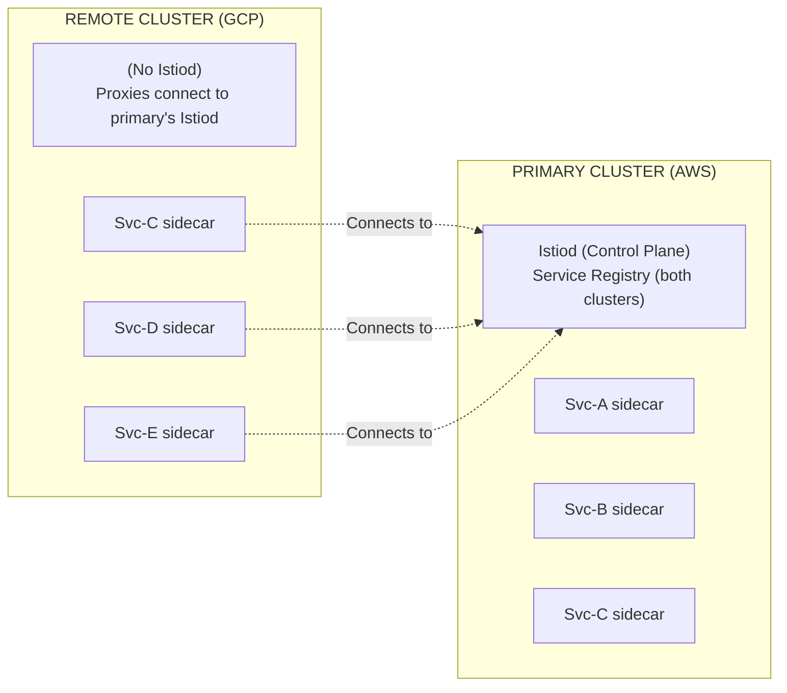
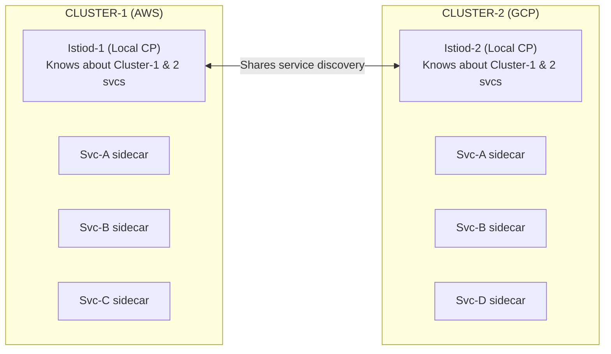
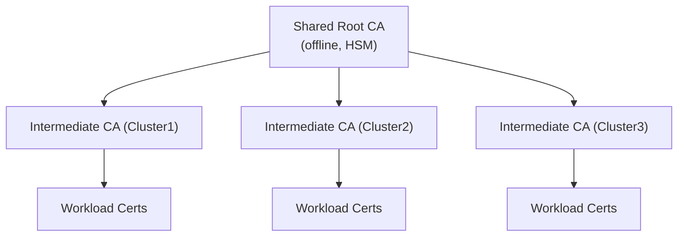
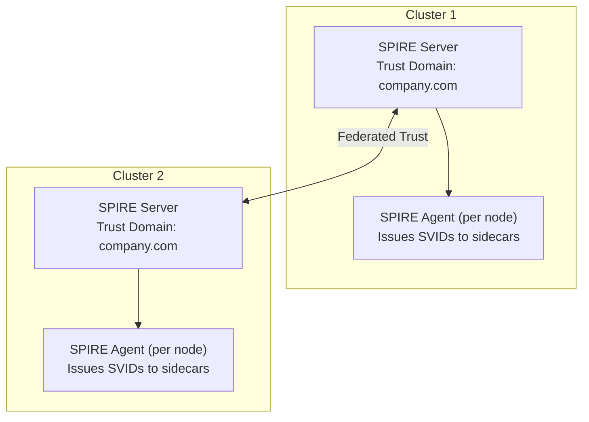
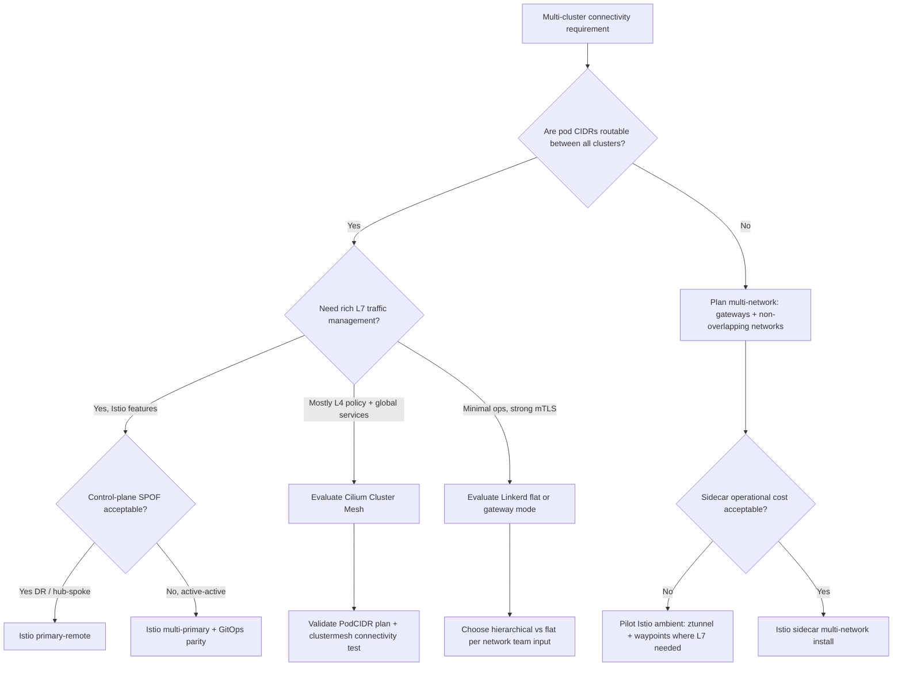
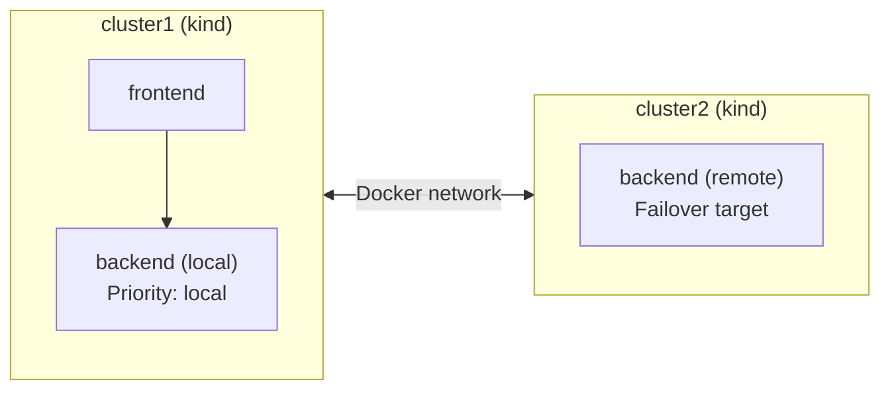

**Complexity**: `[COMPLEX]` | **Time to Complete**: 3h | **Prerequisites**: Kubernetes Networking, Service Mesh Basics, Hybrid Cloud Architecture (Module 10.4)

## What You'll Be Able to Do

Enterprise meshes span EKS, GKE, AKS, and on-prem Kubernetes with different networking constraints but the same identity and routing questions. The sections below walk through Istio multi-cluster models first because they are the most documented for multi-network cloud paths, then compare Cilium Cluster Mesh and Linkerd, and finish with cost, operations, and selection frameworks you can reuse in architecture reviews.

After completing this module, you will be able to:

- **Implement** Istio multi-cluster service mesh across diverse cloud providers (EKS, GKE, AKS) with seamless cross-cloud service discovery.
- **Design** multi-cloud mesh architectures by evaluating the strict trade-offs between Primary-Remote and Multi-Primary topologies.
- **Diagnose** and debug complex mTLS connection failures, cross-cluster routing issues, and certificate chain mismatches across strict network boundaries.
- **Configure** advanced traffic management policies including weighted cross-cluster traffic splitting and locality-aware automated failover.
- **Evaluate** enterprise identity trust models using federated SPIFFE/SPIRE to replace static shared Certificate Authorities.

---

## Why This Module Matters

Hypothetical scenario: a payments API runs active-active on AWS EKS and GCP GKE. A regional incident takes down one cloud's backend pods. If failover depends on a manual DNS or global load balancer change, application teams, network teams, and security teams often coordinate for tens of minutes while error budgets burn. A multi-cluster service mesh can shift east-west traffic between clusters using health signals, locality rules, and mTLS-aware routing—without asking every client to learn new DNS names.

That shift is not free. Mesh traffic between clouds usually rides private interconnects or VPNs, but cross-region and cross-cloud paths still bill for egress and gateway throughput. Sidecar proxies add steady CPU and memory per pod; ambient meshes trade sidecars for node-level `ztunnel` and optional waypoint proxies. At fleet scale, the dominant cost is often encrypted bytes crossing billing boundaries, not the control plane itself. This module covers Istio multi-cluster topologies, Cilium Cluster Mesh, Linkerd multi-cluster, identity federation, routing controls, observability, and the cost knobs platform teams use when mesh traffic becomes a line item.

---

## Istio Multi-Cluster Topologies

Operating a service mesh that spans multiple Kubernetes v1.35 clusters requires you to decide two things up front: where Istiod runs, and whether pod IPs are reachable across cluster networks. Istio documents distinct installation paths for [primary-remote](https://istio.io/latest/docs/setup/install/multicluster/primary-remote/), [multi-primary](https://istio.io/latest/docs/setup/install/multicluster/multi-primary/), [single-network](https://istio.io/latest/docs/setup/install/multicluster/single-network-models/), and [multi-network](https://istio.io/latest/docs/setup/install/multicluster/multi-network/) models. Your choices set blast radius for control-plane outages, how much cross-cloud latency affects configuration distribution, and whether east-west gateways sit on the critical path for every remote call.

Endpoint discovery is the hidden coupling between topologies. In multi-primary mode, each Istiod watches remote Kubernetes API servers via `remoteSecrets` created by `istioctl create-remote-secret`. The control plane learns pod IP addresses (or gateway-mediated addresses in multi-network mode) and publishes them to local Envoy proxies as additional endpoints for the same logical service hostname. When discovery breaks, applications still resolve DNS inside their cluster, but Envoy has nowhere healthy to send traffic—symptoms look like intermittent `503` errors even though pods are running locally.

### Topology 1: Primary-Remote

**Pause and predict:** When designing an Istio mesh across cloud providers in a primary-remote topology, which control plane components execute on each cluster? Why do the upstream east-west gateway exposure manifests require modification when the primary cluster runs on AWS EKS?

<details>
<summary>Check your prediction</summary>

In an Istio [primary-remote multicluster deployment](https://istio.io/latest/docs/setup/install/multicluster/primary-remote/), the primary cluster executes the complete Istiod control plane and manages service registry state. Remote member clusters deploy an externalIstiod remote profile containing only Envoy sidecar proxies that connect across the network to the primary control plane. This centralized architecture is fundamentally different from a multi-primary deployment where each cluster runs a sovereign Istiod instance. Additionally, the upstream primary-remote install guide's east-west exposure steps are not suitable for an AWS EKS primary, because those load balancers are FQDNs and ExternalName expects IP addresses.
</details>

The next section is an architectural topology diagram illustrating control plane connectivity and remote proxy registration between an AWS primary and a GCP remote cluster.



In the Primary-Remote model, [one cluster assumes the responsibility of running the full Istio control plane](https://istio.io/latest/docs/setup/install/multicluster/primary-remote/) (the "primary"), while other connected clusters act purely as data planes ("remotes"). The remote clusters do not run an Istiod instance; instead, their Envoy sidecar proxies reach across the network to connect directly to the primary cluster's Istiod for configuration and certificate signing.

Primary-remote is the lowest operational surface area: one Istiod HA deployment, one place to upgrade Istio revisions, and one set of mesh-wide `WasmPlugin` or telemetry configs. Remote clusters run data-plane proxies only; they dial the primary for xDS configuration and certificate signing. That hub-and-spoke control model fits disaster recovery where the standby cluster is not meant to evolve mesh policy independently, and it fits regulated environments that want a single configuration authority.

The tradeoff is control-plane coupling. Remote clusters need stable network paths to the primary Istiod webhook and discovery ports (often exposed via internal load balancers or private link). If the link fails, already-running proxies typically keep last-known config and certs until TTLs expire, but new pods, rotations, and policy updates stall. Capacity planning must include primary-cluster Istiod scale for **all** connected remotes, not just local pod count.

- **Pros**: One control plane to upgrade, monitor, and back up; simpler GitOps for mesh-wide settings.
- **Cons**: Primary outage or network partition blocks remote policy and cert updates; remote proxy config fetch adds RTT to the primary region.
- **Best for**: Active-passive DR, dev/test remotes, hub clusters on reliable private networks.

### Topology 2: Multi-Primary

In a Multi-Primary architecture, every participating cluster is treated as a sovereign entity. [Each cluster runs its own localized, fully independent Istio control plane](https://istio.io/latest/docs/setup/install/multicluster/multi-primary/). To achieve cross-cluster routing, the clusters are configured to share service discovery information securely, meaning Istiod in Cluster 1 watches the Kubernetes API server in Cluster 2, and vice versa.



Multi-primary treats every cluster as sovereign: local Istiod signs certs, pushes xDS, and watches peer API servers for remote endpoints. A network partition between AWS and GCP does not stop either control plane from managing its own fleet, which is why active-active payment or identity tiers often choose this model despite the extra moving parts.

Parity becomes the hard problem. If cluster1 enables `STRICT` mTLS and cluster2 remains `PERMISSIVE` during a partial rollout, cross-cluster calls fail in one direction only—painful to debug. GitOps repositories should version `IstioOperator` or `Helm` values per cluster with a shared baseline, and CI should run `istioctl analyze` against each cluster context before promotion. Upgrade windows multiply: N clusters means N coordinated Istio revision bumps unless you automate canary clusters.

- **Pros**: No single Istiod dependency; local operations continue through interconnect loss; fits active-active product requirements.
- **Cons**: N control planes to patch; config skew risk; more cross-cluster RBAC for remote secrets.
- **Best for**: Multi-region active-active, strong isolation between platform teams per cloud, large fleets that already operate Cluster API or fleet GitOps.

### Topology Decision Matrix

| Feature | Primary-Remote | Multi-Primary |
| :--- | :--- | :--- |
| **Control plane redundancy** | No (primary is SPOF) | Yes (each cluster has its own) |
| **Config distribution** | All proxies connect to primary | Each cluster's proxies connect locally |
| **Cross-cluster latency impact** | Remote proxies add latency for config | Only data plane cross-cluster calls add latency |
| **Complexity** | Lower | Higher |
| **Network requirement** | Remote must reach primary's Istiod | Cross-cluster pod connectivity (or east-west gateway) |
| **Best for** | DR, dev/test, hub-spoke | Active-active production, multi-region |

### Single-Network vs Multi-Network

**Pause and predict:** How does the placement of Istiod control planes relate to whether pod IP addresses are directly routable across cluster networks?

<details>
<summary>Check your prediction</summary>

The decision of where Istiod runs ([primary-remote versus multi-primary](https://istio.io/latest/docs/setup/install/multicluster/multi-primary/)) is completely decoupled from whether pod IP addresses can route directly between clusters ([single-network versus multi-network](https://istio.io/latest/docs/setup/install/multicluster/multi-network/)). A multi-primary service mesh can still be deployed across a multi-network foundation where cross-cluster pod CIDRs remain isolated and require east-west gateways. Platform teams must treat control plane distribution and network layer reachability as orthogonal architectural dimensions during multi-cloud planning.
</details>

The next section is a structured architectural comparison table contrasting direct pod-to-pod IP reachability against gateway-mediated multi-network cross-cluster connectivity.

| Dimension | Single-network | Multi-network |
| :--- | :--- | :--- |
| **Pod IP reachability** | Direct between clusters | Not assumed; gateway bridge |
| **Typical enterprise fit** | Same cloud, peered VPCs/VNets | Multi-cloud or strict segmentation |
| **Gateway requirement** | Often optional | East-west gateway per network |
| **Blast radius of network change** | Routing table mistakes affect pods directly | Misconfigured gateway SNI breaks cross-network only |
| **Cost sensitivity** | Still pays cross-AZ/region egress | Adds gateway LB + cross-cloud egress on mesh bytes |

Istio separates **control-plane topology** (primary-remote vs multi-primary) from **data-plane reachability** (single-network vs multi-network). In a [single-network deployment](https://istio.io/latest/docs/setup/install/multicluster/single-network-models/), pod IP addresses in one cluster are routable from pods in another—common when clusters share a flat VPC, extended VNet peering, or a full-mesh VPN. Endpoint discovery can use direct pod IPs, and you may not need an east-west gateway for every hop.

In a [multi-network deployment](https://istio.io/latest/docs/setup/install/multicluster/multi-network/), clusters sit on networks that do not expose pod CIDRs to each other. Istio assigns each cluster a `topology.istio.io/network` label and routes cross-network traffic through an **east-west gateway** using `AUTO_PASSTHROUGH` so mTLS stays end-to-end. This is the default shape for AWS, GCP, and Azure meshes where only load balancer IPs are reachable between clouds.

On EKS, GKE, and AKS, single-network is realistic inside one provider when you engineer non-overlapping Pod CIDRs and cloud routing. Multi-network is the safer default when legal, security, or operations teams forbid pod-CIDR leakage across cloud boundaries.

---

## Establishing Trust Across Clusters

The foundation of any zero-trust multi-cluster mesh is cryptographic identity. For mutual TLS (mTLS) to succeed across a network boundary, every Envoy sidecar proxy (or ztunnel in ambient mode) must trust certificates presented by peers in foreign clusters. Istio multi-cluster guides assume a **[shared root of trust](https://istio.io/latest/docs/setup/install/multicluster/before-you-begin/)** unless you integrate an external CA such as SPIRE.

Workloads identify themselves with SPIFFE IDs embedded in certificates. Clients verify server chains against the trusted root distributed to every cluster. If cluster A uses a self-signed Istio CA and cluster B uses a different self-signed CA, TLS fails before HTTP routing begins, regardless of correct Kubernetes Services and Endpoints.

> **Stop and think**: If Cluster 1 and Cluster 2 have completely different, self-signed root CAs, what exact error would a client sidecar proxy throw when attempting an mTLS handshake with a server proxy in the other cluster?

Without a shared trust anchor, the cross-cluster TLS handshake fails because the client proxy cannot validate the server's certificate chain.

### Root CA Distribution Architecture



When every workload certificate chains to the same offline root, proxies in cluster1 validate cluster2 peer certificates without custom `PeerAuthentication` exceptions. That property is what makes multi-network gateways compatible with zero-trust claims: the gateway never needs plaintext HTTP access to workload payloads if `AUTO_PASSTHROUGH` is configured correctly.

Trust domains appear in SPIFFE IDs (for example `spiffe://cluster.local/ns/production/sa/frontend`). Cross-cluster `AuthorizationPolicy` rules must reference principals that match **both** sides' trust domain conventions. During migrations, Istio supports aliasing `cluster.local` to the active trust domain so policies do not require a big-bang rewrite.

### Creating a Shared Root CA

In a robust production environment, your Root CA should be securely locked inside an air-gapped Hardware Security Module (HSM) or a managed cloud service like AWS KMS or HashiCorp Vault. For demonstration and conceptual understanding, we utilize OpenSSL to generate the shared root and derive cluster-specific intermediate CAs.

```bash
# Generate a root CA certificate (in production, use a hardware security module)
mkdir -p /tmp/istio-certs

# Root CA (shared across all clusters)
openssl req -new -newkey rsa:4096 -x509 -sha256 \
  -days 3650 -nodes \
  -subj "/O=Company Inc./CN=Root CA" \
  -keyout /tmp/istio-certs/root-key.pem \
  -out /tmp/istio-certs/root-cert.pem

# Intermediate CA for Cluster 1
openssl req -new -newkey rsa:4096 -nodes \
  -subj "/O=Company Inc./CN=Cluster-1 Intermediate CA" \
  -keyout /tmp/istio-certs/cluster1-ca-key.pem \
  -out /tmp/istio-certs/cluster1-ca-csr.pem

openssl x509 -req -sha256 -days 1825 \
  -CA /tmp/istio-certs/root-cert.pem \
  -CAkey /tmp/istio-certs/root-key.pem \
  -CAcreateserial \
  -in /tmp/istio-certs/cluster1-ca-csr.pem \
  -out /tmp/istio-certs/cluster1-ca-cert.pem \
  -extfile <(echo -e "basicConstraints=CA:TRUE\nkeyUsage=critical,keyCertSign,cRLSign")

# Create cert chain for Cluster 1
cat /tmp/istio-certs/cluster1-ca-cert.pem /tmp/istio-certs/root-cert.pem \
  > /tmp/istio-certs/cluster1-cert-chain.pem

# Repeat for Cluster 2 (different intermediate, same root)
openssl req -new -newkey rsa:4096 -nodes \
  -subj "/O=Company Inc./CN=Cluster-2 Intermediate CA" \
  -keyout /tmp/istio-certs/cluster2-ca-key.pem \
  -out /tmp/istio-certs/cluster2-ca-csr.pem

openssl x509 -req -sha256 -days 1825 \
  -CA /tmp/istio-certs/root-cert.pem \
  -CAkey /tmp/istio-certs/root-key.pem \
  -CAcreateserial \
  -in /tmp/istio-certs/cluster2-ca-csr.pem \
  -out /tmp/istio-certs/cluster2-ca-cert.pem \
  -extfile <(echo -e "basicConstraints=CA:TRUE\nkeyUsage=critical,keyCertSign,cRLSign")

cat /tmp/istio-certs/cluster2-ca-cert.pem /tmp/istio-certs/root-cert.pem \
  > /tmp/istio-certs/cluster2-cert-chain.pem

# Install certs as secrets in each cluster's istio-system namespace
kubectl --context cluster1 create namespace istio-system
kubectl --context cluster1 create secret generic cacerts -n istio-system \
  --from-file=ca-cert.pem=/tmp/istio-certs/cluster1-ca-cert.pem \
  --from-file=ca-key.pem=/tmp/istio-certs/cluster1-ca-key.pem \
  --from-file=root-cert.pem=/tmp/istio-certs/root-cert.pem \
  --from-file=cert-chain.pem=/tmp/istio-certs/cluster1-cert-chain.pem

kubectl --context cluster2 create namespace istio-system
kubectl --context cluster2 create secret generic cacerts -n istio-system \
  --from-file=ca-cert.pem=/tmp/istio-certs/cluster2-ca-cert.pem \
  --from-file=ca-key.pem=/tmp/istio-certs/cluster2-ca-key.pem \
  --from-file=root-cert.pem=/tmp/istio-certs/root-cert.pem \
  --from-file=cert-chain.pem=/tmp/istio-certs/cluster2-cert-chain.pem
```

When Istiod starts up, it automatically detects the [`cacerts` secret](https://istio.io/latest/docs/tasks/security/cert-management/plugin-ca-cert/) in the `istio-system` namespace. Instead of generating its own isolated, self-signed root, it seamlessly adopts this provided intermediate material to sign all workload certificates, successfully bridging the cryptographic gap between the two clouds.

### SPIFFE/SPIRE for Enterprise Identity

While distributing intermediate certificates manually is viable, massive enterprise environments increasingly lean on [SPIFFE (Secure Production Identity Framework For Everyone) and SPIRE (the SPIFFE Runtime Environment)](https://github.com/spiffe/spiffe). SPIRE provides a highly dynamic, federated identity system that fundamentally outscales manual PKI management.



In this architecture, SPIFFE/SPIRE can automate workload identity and trust-bundle management across clusters. [SPIRE federation](https://spiffe.io/docs/latest/spire/federation/) exchanges trust bundles between SPIRE servers so workloads in different trust domains validate each other's SVIDs without sharing long-lived private keys on every node. Istio can integrate with SPIRE as a CA plugin so Envoy proxies receive SPIFFE Verifiable Identity Documents (SVIDs) instead of only Istio-issued certs—useful when the same identity must be honored by non-Envoy systems (API gateways, VMs, batch jobs) under [NIST SP 800-207 zero-trust](https://csrc.nist.gov/publications/detail/sp/800-207/final) style policies.

Operational checklist for SPIRE-backed multi-cluster meshes:

- Align **trust domain names** with `AuthorizationPolicy` principal patterns and document aliases during migrations ([Istio trust-domain migration](https://istio.io/latest/docs/tasks/security/authorization/authz-td-migration/)).
- Automate **bundle rotation**; manual intermediate renewal does not scale past a handful of clusters.
- Separate **cluster signing keys** so one compromised intermediate does not force fleet-wide root re-issuance unless policy requires it.

---

## Multi-Primary Istio Installation

Executing a Multi-Primary installation requires disciplined labeling. Istio utilizes [cluster network and topology labels](https://istio.io/latest/docs/reference/config/labels/) to map the physical layout of your infrastructure. This mapping is what enables the control plane to make intelligent routing decisions rather than sending traffic randomly across expensive inter-region links.

### Installing Istio on Multiple Clusters

```bash
# Set cluster contexts
CTX_CLUSTER1=kind-mesh-cluster1
CTX_CLUSTER2=kind-mesh-cluster2

# Label clusters for Istio topology awareness
kubectl --context $CTX_CLUSTER1 label namespace istio-system topology.istio.io/network=network1
kubectl --context $CTX_CLUSTER2 label namespace istio-system topology.istio.io/network=network2

# Install Istio on Cluster 1 (IstioOperator is the manifest format for `istioctl install -f`, not the removed in-cluster operator)
cat <<'EOF' > /tmp/istio-cluster1.yaml
apiVersion: install.istio.io/v1alpha1
kind: IstioOperator
spec:
  values:
    global:
      meshID: company-mesh
      multiCluster:
        clusterName: cluster1
      network: network1
  meshConfig:
    defaultConfig:
      proxyMetadata:
        ISTIO_META_DNS_CAPTURE: "true"
        ISTIO_META_DNS_AUTO_ALLOCATE: "true"
  components:
    ingressGateways:
      - name: istio-eastwestgateway
        label:
          istio: eastwestgateway
          app: istio-eastwestgateway
          topology.istio.io/network: network1
        enabled: true
        k8s:
          env:
            - name: ISTIO_META_REQUESTED_NETWORK_VIEW
              value: network1
          service:
            ports:
              - name: status-port
                port: 15021
                targetPort: 15021
              - name: tls
                port: 15443
                targetPort: 15443
              - name: tls-istiod
                port: 15012
                targetPort: 15012
              - name: tls-webhook
                port: 15017
                targetPort: 15017
EOF

istioctl install --context $CTX_CLUSTER1 -f /tmp/istio-cluster1.yaml -y

# Install Istio on Cluster 2 (IstioOperator manifest for `istioctl install -f`; same format as cluster 1)
cat <<'EOF' > /tmp/istio-cluster2.yaml
apiVersion: install.istio.io/v1alpha1
kind: IstioOperator
spec:
  values:
    global:
      meshID: company-mesh
      multiCluster:
        clusterName: cluster2
      network: network2
  meshConfig:
    defaultConfig:
      proxyMetadata:
        ISTIO_META_DNS_CAPTURE: "true"
        ISTIO_META_DNS_AUTO_ALLOCATE: "true"
  components:
    ingressGateways:
      - name: istio-eastwestgateway
        label:
          istio: eastwestgateway
          app: istio-eastwestgateway
          topology.istio.io/network: network2
        enabled: true
        k8s:
          env:
            - name: ISTIO_META_REQUESTED_NETWORK_VIEW
              value: network2
          service:
            ports:
              - name: status-port
                port: 15021
                targetPort: 15021
              - name: tls
                port: 15443
                targetPort: 15443
              - name: tls-istiod
                port: 15012
                targetPort: 15012
              - name: tls-webhook
                port: 15017
                targetPort: 15017
EOF

istioctl install --context $CTX_CLUSTER2 -f /tmp/istio-cluster2.yaml -y

# Exchange remote secrets for cross-cluster discovery
istioctl create-remote-secret --context $CTX_CLUSTER1 --name=cluster1 | \
  kubectl apply -f - --context $CTX_CLUSTER2

istioctl create-remote-secret --context $CTX_CLUSTER2 --name=cluster2 | \
  kubectl apply -f - --context $CTX_CLUSTER1
```

By exchanging remote secrets, you [authorize the Istio control plane in Cluster 1 to query the Kubernetes API server in Cluster 2](https://istio.io/latest/docs/setup/install/multicluster/multi-primary/). It discovers the IP addresses of Cluster 2's pods and seamlessly adds them to the global internal registry.

### Implementing on AWS EKS, GCP GKE, and Microsoft AKS

Although Istio manifests are portable, the networking underneath differs enough that platform teams should document a reference architecture per cloud pair.

**AWS EKS** clusters often land in separate accounts connected by [AWS Transit Gateway](https://docs.aws.amazon.com/vpc/latest/tgw/what-is-transit-gateway.html) or VPC peering. Multi-network Istio installs expose `istio-eastwestgateway` as a Network Load Balancer; security groups must allow port **15443** (and Istiod ports if using primary-remote) from peer VPC CIDRs. Remote secrets embed kubeconfig API server endpoints—use private EKS endpoints reachable from peer networks, not public endpoints blocked by corporate egress policies. IRSA or EKS Pod Identity handles cloud API access for gateways and external-dns integrations; mesh mTLS remains separate from cloud IAM.

**GCP GKE** clusters in different projects connect via [VPC Network Peering](https://cloud.google.com/vpc/docs/vpc-peering) or [Cloud VPN / Interconnect](https://cloud.google.com/network-connectivity/docs/how-to). Firewall rules are deny-by-default: explicitly allow east-west gateway health checks on port 15021 and mesh traffic on 15443 between peer CIDRs. GKE Workload Identity Federation can mint GCP credentials for gateways that call Cloud DNS or certificate managers, while Istio still issues workload certificates for pod-to-pod mTLS.

**Azure AKS** clusters span subscriptions joined by [VNet peering](https://learn.microsoft.com/en-us/azure/virtual-network/virtual-network-peering-overview) or ExpressRoute. Internal Azure Load Balancers front east-west gateways; align NSGs on the gateway node pool subnet. Entra Workload ID integrates Kubernetes service accounts to Azure APIs, analogous to IRSA/Workload Identity, but does not replace mesh trust roots.

Across all three clouds, label nodes with region and zone so Istio locality keys match billing regions. A mismatch between Kubernetes topology labels and actual cloud region names causes locality routing to send traffic to the wrong cost tier even when pods are healthy.

### Exposing Services via East-West Gateway

The east-west gateway is a specialized ingress controller specifically tuned for cross-cluster mesh traffic. Unlike a standard internet-facing ingress gateway handling north-south traffic, the east-west gateway assumes all incoming traffic is already fully mTLS encrypted by the sending cluster's sidecar.

Operators sometimes ask whether east-west gateways should run WAF or HTTP routing. For mesh east-west traffic, HTTP routing belongs in client sidecars or waypoints, not on the gateway, because decrypting at the gateway would break the zero-trust property and double TLS overhead. North-south ingress gateways remain the right place for external client TLS termination and L7 routing policies aimed at Internet clients.

**Pause and predict:** Why do we configure AUTO_PASSTHROUGH for an east-west gateway TLS mode instead of SIMPLE or MUTUAL modes commonly used on ingress gateways?

<details>
<summary>Check your prediction</summary>

Configuring [`AUTO_PASSTHROUGH` instructs the Envoy gateway edge to evaluate the Server Name Indication header](https://istio.io/latest/docs/reference/config/networking/gateway/). Envoy selects the destination service and forwards ciphertext without terminating workload mTLS. Standard ingress `SIMPLE` and `MUTUAL` modes terminate TLS sessions at the perimeter rather than passing through encrypted workload packets. Using passthrough preserves end-to-end cryptographic mutual authentication between originating client sidecars and destination services across clusters.
</details>

The next section is a multi-cluster Gateway resource manifest that registers the cross-network gateway on port 15443 using AUTO_PASSTHROUGH TLS mode.

```bash
# Expose services through the east-west gateway on both clusters
for CTX in $CTX_CLUSTER1 $CTX_CLUSTER2; do
  kubectl --context $CTX apply -n istio-system -f - <<'EOF'
apiVersion: networking.istio.io/v1
kind: Gateway
metadata:
  name: cross-network-gateway
spec:
  selector:
    istio: eastwestgateway
  servers:
    - port:
        number: 15443
        name: tls
        protocol: TLS
      tls:
        mode: AUTO_PASSTHROUGH
      hosts:
        - "*.local"
EOF
done
```

---

## Cross-Cloud Routing and Failover

Connecting clusters is step one; controlling how traffic flows between them prevents latency spikes and avoidable cloud egress charges. Platform SLOs should include **cross-cluster success rate** and **p95 latency by locality** alongside application golden signals.

### Locality-Aware Load Balancing

Istio's locality-aware load balancing evaluates the [topology labels present on your Kubernetes v1.35 nodes](https://istio.io/latest/docs/tasks/traffic-management/locality-load-balancing/) to prioritize routing traffic to the geographically nearest healthy endpoint.

**Pause and predict:** You configure a locality failover policy from us-east-1 to us-central1 in a DestinationRule. If you omit the outlierDetection stanza, what behavior occurs when local us-east-1 endpoints return HTTP 500 errors?

<details>
<summary>Check your prediction</summary>

According to [Istio's locality failover task](https://istio.io/latest/docs/tasks/traffic-management/locality-load-balancing/failover/), outlier detection is required so proxies can tell endpoints are unhealthy. A failover list alone does not eject local HTTP 500 endpoints, because proxies continue considering them valid routing targets. Without consecutive error thresholds and base ejection timers, sidecars continue sending traffic to failing local instances instead of redirecting requests to healthy remote clusters.
</details>

The next section is a DestinationRule configuration manifest defining outlier detection ejection parameters alongside cross-region locality load balancing failover priorities.

```yaml
# DestinationRule with locality failover
apiVersion: networking.istio.io/v1
kind: DestinationRule
metadata:
  name: payment-service
  namespace: production
spec:
  host: payment-service.production.svc.cluster.local
  trafficPolicy:
    connectionPool:
      tcp:
        maxConnections: 100
      http:
        h2UpgradePolicy: DEFAULT
        maxRequestsPerConnection: 10
    outlierDetection:
      consecutive5xxErrors: 3
      interval: 10s
      baseEjectionTime: 30s
      maxEjectionPercent: 50
    loadBalancer:
      localityLbSetting:
        enabled: true
        failover:
          - from: us-east-1
            to: us-central1
          - from: us-central1
            to: us-east-1
      warmupDurationSecs: 30
```

### Weighted Cross-Cluster Traffic Splitting

In advanced deployment scenarios, you might test a new service version in a separate cluster while production traffic stays local. Combine `VirtualService` weights with `DestinationRule` subsets labeled by `topology.istio.io/cluster` to send a small percentage of requests to remote canary pods. Pair weights with request headers (for example `x-canary: true`) so internal testers hit the remote subset without exposing all users to cross-cluster latency.

Locality-aware routing and weighted splitting interact: locality preferences apply before weights unless you configure failover priorities explicitly. Document the order of operations in your platform runbook so SREs know whether a 10% remote weight applies only after local endpoints fail health checks or applies continuously during normal operation.

```yaml
# VirtualService for canary-style cross-cluster routing
apiVersion: networking.istio.io/v1
kind: VirtualService
metadata:
  name: payment-service
  namespace: production
spec:
  hosts:
    - payment-service.production.svc.cluster.local
  http:
    - match:
        - headers:
            x-canary:
              exact: "true"
      route:
        - destination:
            host: payment-service.production.svc.cluster.local
            subset: cluster2-canary
          weight: 100
    - route:
        - destination:
            host: payment-service.production.svc.cluster.local
            subset: cluster1-primary
          weight: 90
        - destination:
            host: payment-service.production.svc.cluster.local
            subset: cluster2-secondary
          weight: 10
```

```yaml
# DestinationRule defining cross-cluster subsets
apiVersion: networking.istio.io/v1
kind: DestinationRule
metadata:
  name: payment-service-subsets
  namespace: production
spec:
  host: payment-service.production.svc.cluster.local
  subsets:
    - name: cluster1-primary
      labels:
        topology.istio.io/cluster: cluster1
    - name: cluster2-secondary
      labels:
        topology.istio.io/cluster: cluster2
    - name: cluster2-canary
      labels:
        topology.istio.io/cluster: cluster2
        version: canary
```


### Provider-specific networking anchors

Multi-cluster meshes sit on top of cloud networking you already operate. The mesh does not remove the need for non-overlapping RFC1918 plans, security group rules, or private connectivity.

| Cloud | Typical private interconnect | Mesh implication |
| :--- | :--- | :--- |
| **AWS (EKS)** | [AWS Direct Connect](https://docs.aws.amazon.com/directconnect/latest/UserGuide/Welcome.html), Transit Gateway, VPC peering | East-west gateway often a Network Load Balancer in a shared services VPC; remote secrets must reach peer EKS API endpoints |
| **GCP (GKE)** | [Cloud VPN](https://cloud.google.com/network-connectivity/docs/vpn), [Cloud Interconnect](https://cloud.google.com/network-connectivity/docs/interconnect) | Multi-network common across projects; ensure firewall rules allow gateway ports between VPCs |
| **Azure (AKS)** | [ExpressRoute](https://learn.microsoft.com/en-us/azure/expressroute/), VNet peering | Internal LB for east-west gateway; align NSG rules on gateway subnet with Istio port 15443 |

On hybrid footprints (EKS Anywhere, GKE on-prem, AKS on Azure Local), treat on-prem clusters as separate `topology.istio.io/network` values even when DNS names look internal. Latency and packet loss on VPN paths affect outlier detection thresholds more than cloud-only paths.

### Weighted splitting and blast-radius control

Cross-cluster canaries should pair `VirtualService` weights with **subset labels** that include `topology.istio.io/cluster` so traffic does not accidentally land on unready remote pods during deploys. Combine weights with `DestinationRule` connection pools so a hot remote cluster cannot exhaust frontend connection tables. For financial or identity tiers, cap maximum remote weight below 50% until error budgets prove remote stability.

Document rollback: GitOps revert of weight changes should be faster than DNS TTL changes, but only if observability proves which cluster serves errors. Tag metrics and traces with cluster ID before raising remote weight in production.

---

## mTLS Troubleshooting in Multi-Cluster

Debugging multi-cluster meshes is difficult because network failures often appear as TLS handshake resets or generic `503` responses at the application layer. A repeatable workflow reduces mean time to recovery more than ad hoc packet captures.

### Common mTLS Failure Patterns

| Symptom | Likely Cause | Diagnostic Command |
| :--- | :--- | :--- |
| 503 between clusters | Root CA mismatch | `istioctl proxy-config secret <pod> -o json` |
| Connection reset | TLS version mismatch | `istioctl proxy-status` |
| Intermittent failures | Certificate expiry | `openssl s_client -connect <svc>:443` |
| "upstream connect error" | East-west gateway not reachable | `kubectl get svc istio-eastwestgateway -n istio-system` |
| RBAC denied | Authorization policy too restrictive | `istioctl analyze -n production` |

### Authorization policy failures across trust domains

Even when mTLS succeeds, `AuthorizationPolicy` can deny traffic if principals do not match remote identities. Multi-cluster SPIFFE IDs include trust domain and cluster identifiers. Policies written as `principals: ["cluster.local/ns/production/sa/frontend"]` work during migrations because Istio expands `cluster.local` to the active trust domain, but hard-coded legacy domains break when a cluster moves to a new trust domain name.

Test policies with `istioctl experimental authz check <pod>` from a client pod before rolling out `DENY` defaults fleet-wide. Pair L4 `AuthorizationPolicy` with explicit `operation.methods` and ports when east-west gateways expose only TLS passthrough. Document allowed source namespaces per destination service to prevent "allow all authenticated" rules that defeat zero-trust segmentation.

### Troubleshooting Workflow

A systematic approach prevents chasing false leads. Begin by verifying broad mesh configuration policies, inspect the underlying cryptographic roots, and then proceed directly to evaluating sidecar endpoint configurations.

```bash
# Step 1: Verify mesh-wide mTLS mode
kubectl get peerauthentication -A

# Step 2: Check if both clusters have the same root CA
for CTX in kind-mesh-cluster1 kind-mesh-cluster2; do
  echo "=== $CTX Root CA ==="
  kubectl --context $CTX get secret cacerts -n istio-system \
    -o jsonpath='{.data.root-cert\.pem}' | base64 -d | \
    openssl x509 -noout -subject -issuer -fingerprint
done

# Step 3: Verify cross-cluster service discovery
istioctl --context kind-mesh-cluster1 proxy-config endpoints \
  $(kubectl --context kind-mesh-cluster1 get pod -n production -l app=frontend -o jsonpath='{.items[0].metadata.name}') \
  --cluster "outbound|80||payment-service.production.svc.cluster.local"

# Step 4: Check proxy certificate chain
istioctl --context kind-mesh-cluster1 proxy-config secret \
  $(kubectl --context kind-mesh-cluster1 get pod -n production -l app=frontend -o jsonpath='{.items[0].metadata.name}') \
  -o json | jq '.dynamicActiveSecrets[0].secret.tlsCertificate.certificateChain'

# Step 5: Test cross-cluster connectivity
kubectl --context kind-mesh-cluster1 exec -n production deploy/frontend -- \
  curl -sI payment-service.production.svc.cluster.local:80

# Step 6: Check east-west gateway logs for errors
kubectl --context kind-mesh-cluster1 logs -n istio-system \
  -l istio=eastwestgateway --tail=50

# Step 7: Run Istio diagnostics
istioctl --context kind-mesh-cluster1 analyze --all-namespaces
```

---

## Beyond Istio: Cilium Cluster Mesh and Linkerd Multi-Cluster

Istio is not the only production path for multi-cluster Kubernetes networking. Two CNCF-ecosystem alternatives—**Cilium Cluster Mesh** and **Linkerd multi-cluster**—solve overlapping problems with different dataplanes and operational models. Platform teams often standardize on one mesh per fleet, but enterprise architecture reviews should compare all three against network reality, identity model, and cost.

### Cilium Cluster Mesh

[Cilium Cluster Mesh](https://docs.cilium.io/en/stable/network/clustermesh/clustermesh/) connects independent Kubernetes clusters so pods can reach pods across cluster boundaries with a unified identity and policy model. Cilium uses an eBPF dataplane on each node; Cluster Mesh runs a `clustermesh-apiserver` and synchronizes service/identity state between clusters. Prerequisites are strict: **non-overlapping PodCIDR ranges**, node `InternalIP` connectivity between clusters, and (for native-routed modes) a shared native routing CIDR that covers all pod networks.

Cluster Mesh supports **global services** that load-balance endpoints across clusters—similar in intent to Istio locality routing but implemented in the Cilium dataplane. Security policies written with CiliumNetworkPolicy can reference cluster-aware identities when Cluster Mesh is enabled. On AWS EKS, GCP GKE, and AKS, teams typically meet connectivity with VPC/VNet peering, Cloud VPN, Direct Connect/Interconnect/ExpressRoute, or private service connect paths documented in Cilium's cloud preparation guides.

Scaling limits matter at design time: by default Cluster Mesh supports up to **255** connected clusters (`maxConnectedClusters`), with an optional **511** mode that reduces the maximum cluster-local identity space—verify current docs before changing this on live clusters.

```bash
# Enable Cluster Mesh on two contexts (illustrative)
cilium clustermesh enable --context $CTX_CLUSTER1
cilium clustermesh enable --context $CTX_CLUSTER2
cilium clustermesh connect --context $CTX_CLUSTER1 --destination-context $CTX_CLUSTER2
cilium clustermesh status --context $CTX_CLUSTER1 --wait
```

Cilium fits teams that want **L3/L4 connectivity and identity-aware policy first**, with optional L7 features via Envoy where needed, and are willing to engineer flat or routed pod reachability rather than gateway-mediated SNI routing.

#### Global services and policy example

After clusters connect, you can expose a logical service across clusters with a global Service annotation (see current Cilium global service documentation). Clients in any cluster hit one ClusterIP that load-balances to backends in multiple clusters. Combine with CiliumNetworkPolicy that allows only identified workloads to reach global backends. This pattern reduces application-level failover code but requires disciplined PodCIDR planning and firewall rules that allow pod-to-pod traffic on all ports workloads use, not only port 443.

### Linkerd Multi-Cluster

[Linkerd multi-cluster](https://linkerd.io/2.18/features/multicluster/) connects services across clusters with the same mTLS and observability model as in-cluster traffic. A **service mirror** controller watches a target cluster and creates mirrored services on the source cluster, typically suffixed with the remote cluster name (for example `payment-service-west`). Applications call the local mirror; Linkerd routes to the remote cluster transparently.

Linkerd supports three communication shapes:

| Mode | Network requirement | Data path | Typical use |
| :--- | :--- | :--- | :--- |
| **Hierarchical (gateway)** | Source pods reach gateway IP on target | Through multi-cluster gateway | Different VPCs/VNets, multi-cloud |
| **Flat (pod-to-pod)** | Pod IPs routable across clusters (Linkerd 2.14+) | Direct pod-to-pod mTLS | Peered networks, on-prem + cloud |
| **Federated services** | Flat network; same name/namespace in each cluster | Load-balances across all replicas | Active-active same logical service |

Hierarchical mode resembles Istio's east-west gateway pattern: a gateway on the destination cluster receives traffic from sources. Flat mode removes the extra hop—lower latency and no per-gateway `LoadBalancer` charge on clouds that bill for LB hours and data processing. Federated services distribute traffic across homonymous services in multiple clusters when flat networking is available.

Linkerd emphasizes **minimal configuration surface** and a uniform trust domain. It is a strong fit when teams want lightweight mTLS meshing without Istio's full L7 rule surface, provided they accept Linkerd's proxy model and multi-cluster install lifecycle.

### Istio Ambient Mode in Multi-Cluster Context

[Istio ambient mode](https://istio.io/latest/docs/ambient/overview/) splits the dataplane into a per-node L4 **ztunnel** (secure overlay, mTLS, L4 auth, telemetry) and optional per-namespace L7 **waypoint** Envoy proxies for full `VirtualService` features. Workloads do not require sidecar injection to join the mesh, which changes multi-cluster cost math: you remove per-pod sidecar CPU/memory but add node-level `ztunnel` DaemonSet overhead and waypoints where L7 policy is required.

Ambient and sidecar modes can interoperate during migration. For multi-cluster, the same trust, network, and east-west gateway concepts apply; only the hop implementing mTLS moves from sidecar to ztunnel/waypoint. Teams pursuing ambient at scale should pilot cross-network paths early—gateway `AUTO_PASSTHROUGH` behavior and HBONE tunneling still apply, and waypoint placement affects which namespaces pay L7 proxy cost.

---

## Cross-Cluster Observability and Trace Correlation

A mesh that spans EKS, GKE, and AKS fails operationally if traces stop at cluster borders. Cross-cluster observability requires consistent **service naming**, **trace context propagation**, and **identity attributes** in metrics and logs.

### Trace and metric continuity

OpenTelemetry collectors on each cluster should export to a shared backend (vendor SaaS or self-hosted) with resource attributes for `k8s.cluster.name`, `cloud.provider`, and `topology.istio.io/cluster` (or Cilium/Linkerd equivalents). Mesh-generated spans should include upstream/downstream cluster tags so SREs can filter "503 from remote cluster" without guessing.

For Istio, enable mesh telemetry configs that record client/server spans across east-west gateways. For Linkerd, use the multi-cluster viz extensions and verify mirrored service names appear in golden metrics. For Cilium, Hubble can observe cross-cluster flows when Hubble Relay shares a CA across clusters—Cilium documents propagating the `cilium-ca` secret for that reason.

### Debugging workflow across clusters

When cross-cluster calls fail, work in this order:

1. **Network path**: Can a pod ping or `curl` the remote east-west gateway IP on port 15443 (Istio) or the Linkerd gateway Service?
2. **Discovery**: Does `istioctl proxy-config endpoints` (or Linkerd `linkerd diagnostics endpoints`) list remote pod IPs or gateway-mediated addresses?
3. **Trust**: Do root CA fingerprints match on both sides?
4. **Policy**: Do `AuthorizationPolicy` principals include the remote trust domain?
5. **Telemetry**: Do traces show TLS failure at client, gateway, or server?

```bash
# Compare trust bundles (Istio cacerts) — repeat per context
for CTX in kind-mesh-cluster1 kind-mesh-cluster2; do
  kubectl --context $CTX get secret cacerts -n istio-system \
    -o jsonpath='{.data.root-cert\.pem}' | base64 -d | openssl x509 -noout -fingerprint -sha256
done
```

Common mTLS failure modes—wrong trust domain in `AuthorizationPolicy`, expired workload certs, gateway unreachable—look identical to application developers as generic `503` or `upstream connect error`. Structured observability turns those into actionable dashboards instead of multi-hour bridge calls.

---

## Enterprise Cost Lens: Mesh Traffic at Scale

Service mesh economics are dominated by **where bytes travel**, not by Istiod CPU alone.

### Cross-cloud and cross-region egress

When Cluster A in `us-east-1` calls Cluster B in `europe-west1`, payload and metadata cross billing regions. AWS, GCP, and Azure all price inter-region and internet/peering egress differently; private interconnect (Direct Connect, Cloud Interconnect, ExpressRoute) reduces per-GB rates but adds fixed port/month charges. Mesh traffic is often **double-counted** in planning: client sidecar/ztunnel encrypts to gateway, gateway forwards to remote sidecar—each hop may traverse billed links.

**Cost reduction knobs:**

- Prefer **locality-aware routing** so steady-state traffic stays in-region; reserve cross-region for failover only.
- Use **private connectivity** when cross-cloud volume is steady; compare committed capacity vs pay-as-you-go egress.
- Right-size **east-west gateways** and Linkerd gateway `LoadBalancer` services—idle LB hours and cross-AZ LB traffic add up fleet-wide.
- Measure with cloud cost tools **and** Kubernetes allocation (OpenCost/Kubecost) tagged by `topology.istio.io/cluster` labels.

### Sidecar vs ambient resource overhead

Classic Istio sidecars reserve CPU/memory per pod (`istio-proxy` container). A fleet of 5,000 pods at 100m CPU request each is 500 cores of reservation before application containers. Ambient ztunnel shifts cost to per-node DaemonSets; waypoints add L7 cost only where needed. Linkerd's ultralight proxy has a different curve—lower per-pod overhead, still multiplied by replica count.

### Control-plane and operations cost

Primary-remote reduces Istiod footprint (one control plane) but concentrates upgrade risk. Multi-primary multiplies Istiod HA pairs per cluster. Cilium Cluster Mesh adds `clustermesh-apiserver` and etcd/kvstore components. Linkerd multi-cluster adds service-mirror and gateway controllers. FinOps should include **engineer time**: multi-primary upgrades, cert rotation, and federation debugging are recurring operational expenses, not one-time install costs.

### Governance drift and rework

Meshes without automated cert rotation or GitOps-managed mesh config accumulate emergency changes—temporary `STRICT` mTLS disabled, overly broad `AuthorizationPolicy` `allow` rules, manual gateway IP edits. Rework after audits is a hidden cost larger than any single LB line item. Treat mesh config like application code: versioned, reviewed, and tested in staging clusters that mirror production network topology.

---

## Endpoint Discovery and Service Naming at Fleet Scale

Multi-cluster meshes fail in subtle ways when service naming is ambiguous. Kubernetes DNS names are cluster-local (`payment.production.svc.cluster.local`). Istio makes remote endpoints appear as additional Envoy clusters on the same hostname, but operators still need conventions: export only stable services, document mirror suffixes for Linkerd, and avoid deploying two different applications under the same name in one namespace across clusters unless you intend federated load balancing.

`istioctl create-remote-secret` embeds credentials for cross-cluster API watch. Rotate these secrets on the same schedule as CI deploy keys. Leaked remote secrets let outsiders list pod IPs and labels—treat them as cluster-admin-adjacent credentials even if RBAC is scoped.

For global traffic management, combine:

- **ServiceEntry** objects when external SaaS APIs must appear in the mesh with explicit mTLS policies.
- **WorkloadEntry** when VMs or managed instance groups join the same trust domain.
- **Sidecar** resources to limit egress scope on frontend tiers that should only call approved backends.

Testing discovery after every cluster upgrade should be automated: a synthetic job in cluster A calls a known service in cluster B and asserts HTTP 200, cert chain validity, and trace span presence. Store results as release gates, not quarterly manual checks.

## Operating Multi-Cluster Meshes Over Time

Installing a mesh is a project; operating it is a product. Enterprise teams that succeed treat mesh configuration, certificates, and gateway IPs as versioned platform contracts with the same rigor as cluster upgrades.

### Upgrade and revision strategy

Istio revisions allow canary control planes per cluster. In multi-primary fleets, pick a **pilot cluster** per cloud, install the new revision there, run synthetic cross-cluster tests, then promote revision tags cluster-by-cluster. Primary-remote fleets upgrade the primary first because remotes depend on its webhooks and signing CA. Never skip validating `istioctl proxy-status` on remotes after primary upgrades; stale proxies are the most common post-upgrade incident.

Linkerd and Cilium have their own upgrade ordering (control plane before data plane, or CLI-driven rollouts). Document per-tool sequences in a single internal runbook so on-call engineers do not mix Istio steps with Linkerd steps during stressful pages.

### Certificate rotation without downtime

Shared-root architectures rotate intermediates per cluster while keeping the offline root in an HSM. Schedule rotation before intermediate expiry with overlap: install new intermediate into `cacerts`, wait for Istiod to sign new workload certs, then retire old intermediates after max cert TTL. SPIRE rotations push trust bundle updates to agents; verify federation endpoints pick up new bundles before removing old keys.

For east-west gateways, rotation of gateway TLS materials is separate from workload mTLS. AUTO_PASSTHROUGH gateways should not need application cert changes when gateway certs renew, but mis-timed gateway restarts during peak traffic look like cluster-wide outages. Use PodDisruptionBudgets on gateway deployments and maintain at least two replicas per network.

### Capacity and performance testing

Load-test cross-cluster paths with realistic payload sizes. Small JSON health checks underestimate egress costs for streaming or batch workloads. Measure CPU on gateways and ztunnel DaemonSets separately from application pods. Outlier detection thresholds tuned on lab traffic may be too aggressive for production variance; start conservative (higher consecutive error thresholds, longer intervals) and tighten as metrics prove stability.

### Security review cadence

Quarterly reviews should include: remote secret RBAC, `AuthorizationPolicy` defaults, whether `PERMISSIVE` mTLS still exists anywhere, gateway exposure (public vs internal LB), and mirror/export lists for Linkerd. Map findings to CIS Kubernetes benchmarks and organizational zero-trust standards. Evidence for auditors is stronger when Git history shows who approved mesh policy changes and which clusters received them.

### When to shrink the mesh scope

Not every service needs multi-cluster mesh membership. Egress gateways, batch jobs, and third-party SaaS clients often create unnecessary cross-cluster discovery noise. Use namespace-level injection labels (sidecar), ambient namespace labels, or Linkerd install selectors to keep only tiers that benefit from cross-cluster failover inside the mesh. Smaller mesh scope reduces cert churn, observability cardinality, and egress surprise bills.

## Patterns & Anti-Patterns

| Pattern | When to use | Why it works | Scaling note |
| :--- | :--- | :--- | :--- |
| **Shared root, per-cluster intermediate CA** | Any Istio/Linkerd multi-cluster mTLS | Limits blast radius of cluster compromise while preserving trust | Automate rotation via SPIRE or cloud PKI |
| **Multi-network + east-west gateway** | Multi-cloud with non-routable pod CIDRs | Matches real cloud segmentation | Document gateway IPs in GitOps; monitor LB health |
| **Locality-first, failover-second routing** | Active-active across regions | Keeps egress spend predictable | Pair with outlier detection to avoid sticky failures |
| **GitOps parity for mesh config** | Multi-primary Istio | Prevents config skew between Istiod instances | Use same revision tags/channels fleet-wide |
| **Cilium Cluster Mesh for L4 fleet** | Teams prioritizing network policy + global services | Single dataplane identity across clusters | Engineer PodCIDR and routing up front |
| **Linkerd flat network where possible** | Peered VPCs, on-prem + single cloud | Removes gateway hop and LB cost | Requires routable pod IPs |

| Anti-pattern | What goes wrong | Why teams choose it | Better approach |
| :--- | :--- | :--- | :--- |
| **Different self-signed CAs per cluster** | Immediate mTLS handshake failures | Fast PoC installs | Plan shared root before production traffic |
| **Cross-region steady-state traffic** | Egress bill dominates mesh TCO | Symmetric active-active without locality | Default local; failover remote |
| **Sidecars on every pod "by default"** | 20–40% node CPU reservation for proxies | Copy-paste Istio install guides | Pilot ambient or right-size sidecar resources |
| **No outlier detection with failover** | Traffic sticks to failing locality | Assumes kube readiness equals app health | Add `outlierDetection` thresholds |
| **Mirrored services without naming standards** | Broken DNS and surprise cross-cluster calls | Ad hoc Linkerd exports | Document mirror suffixes and federated names |
| **Treating mesh as security-only** | L7 policies missing; blind spots in observability | Procurement framed as "mTLS checkbox" | Pair mTLS with authz policy and tracing |

---

## Decision Framework

Use this flow when selecting mesh technology and topology for a new fleet connection.



### Comparison matrix (vendor-neutral anchors)

| Criterion | Istio multi-cluster | Cilium Cluster Mesh | Linkerd multi-cluster |
| :--- | :--- | :--- | :--- |
| **Primary strength** | L7 routing, authz, multi-network gateways | eBPF dataplane, global services, cluster-aware policy | Simple mTLS, low-touch multi-cluster |
| **Typical multi-cloud shape** | Multi-network + east-west gateway | Routed pod IPs or prepared cloud guides | Gateway or flat pod-to-pod |
| **Identity model** | SPIFFE IDs via Istio CA / SPIRE | Cilium security identities | Linkerd workload identities |
| **CNCF status** | Graduated (Istio project) | Graduated (Cilium) | Graduated (Linkerd) |
| **Cost hotspot** | Sidecars + cross-cloud egress | Cross-cluster pod routing volume | Gateway LB + egress (hierarchical mode) |

### Design review checklist

1. **Network**: Document PodCIDR, node reachability, and whether single-network is realistic per cloud pair (AWS and GCP often needs multi-network).
2. **Trust**: Choose shared root vs federated SPIRE trust bundles before enabling `STRICT` mTLS.
3. **Traffic policy**: Define locality priorities and failover regions; attach outlier detection.
4. **Observability**: Require cross-cluster trace tags and dashboards before production cutover.
5. **FinOps**: Model monthly egress at peak cross-region failover, not just happy-path local traffic.

### Sidecar vs ambient vs Linkerd proxy: operational comparison

| Dimension | Istio sidecar | Istio ambient | Linkerd proxy |
| :--- | :--- | :--- | :--- |
| **Per-pod overhead** | Sidecar container on every injected pod | ztunnel per node; waypoint per namespace needing L7 | Lightweight proxy per pod |
| **Upgrade blast radius** | Rolling restart all injected pods | DaemonSet + waypoint rollouts | Data plane upgrade per cluster |
| **Multi-network fit** | Mature east-west gateway docs | Same gateway model; HBONE tunnel between ztunnels | Gateway or flat pod-to-pod |
| **L7 feature depth** | Full VirtualService/Authz | Waypoint required for advanced L7 | Focused L7 subset |
| **Learning curve** | Highest | Medium (split L4/L7 components) | Lower for mTLS-first teams |

Use this table in architecture review meetings where stakeholders conflate "service mesh" with a single Istio sidecar deployment. The right answer depends on whether you need rich L7 traffic management everywhere or primarily mTLS, identity, and multi-cluster reachability with minimal config surface.

---

## Did You Know?

1. [Istio ambient mode](https://istio.io/latest/docs/ambient/overview/) uses a per-node ztunnel for L4 mTLS and optional waypoint Envoy proxies for full L7 features—workloads can join the mesh without sidecar injection.
2. [Cilium Cluster Mesh](https://docs.cilium.io/en/stable/network/clustermesh/clustermesh/) defaults to supporting up to 255 connected clusters; raising `maxConnectedClusters` to 511 trades off maximum cluster-local identity capacity.
3. [Linkerd 2.14+](https://linkerd.io/2.18/features/multicluster/) supports pod-to-pod multi-cluster communication on flat networks without a gateway hop when pod IPs are mutually routable.
4. Istio's east-west gateway `AUTO_PASSTHROUGH` mode forwards based on SNI without terminating workload mTLS, preserving end-to-end encryption across network boundaries.

---

## Common Mistakes

| Mistake | Why It Happens | How to Fix It |
| :--- | :--- | :--- |
| **Different root CAs per cluster** | Each cluster was set up independently, using Istio's self-signed CA. Cross-cluster mTLS fails because certificates are not trusted. | Generate a shared root CA before installing Istio. Distribute intermediate CAs per cluster. All must chain to the same root. |
| **East-west gateway not exposed** | Gateway is deployed but its LoadBalancer service is internal-only or blocked by security groups. Cross-cluster traffic cannot reach the gateway. | Verify the east-west gateway has a reachable external IP. Check security groups/NSGs allow port 15443 between clusters. |
| **No outlier detection configured** | Locality failover is enabled but there is no mechanism to detect unhealthy endpoints. Istio keeps sending traffic to a failing cluster. | Always configure outlierDetection in DestinationRules. Set appropriate thresholds (e.g., 3 consecutive 5xx errors) and ejection times. |
| **Remote secrets with unreachable API server endpoints** | The remote secret points to an API server address that the other cluster cannot reach. | Ensure the kubeconfig embedded in the remote secret uses an API server endpoint that is reachable across clusters. |
| **Strict mTLS without health-check planning** | Some health probes or external load balancer checks may fail if they are not compatible with the mesh's TLS expectations. | Use Istio's built-in probe rewriting where appropriate, and design gateway or load balancer health checks so they do not rely on unsupported mTLS behavior. |
| **Authorization policies blocking cross-cluster traffic** | AuthorizationPolicy specifies source principals using cluster-1 identities. Traffic from cluster-2 has different SPIFFE URIs and is denied. | Use trust-domain-aware principal patterns. In multi-cluster, use `principals: ["cluster.local/ns/*/sa/*"]` or specific trust domain aliases. |
| **Ignoring cross-cloud egress in architecture review** | Mesh designed symmetric active-active without locality priorities. Monthly cloud bills spike when traffic crosses regions unnecessarily. | Model egress at peak failover; default locality-aware routing; use private interconnect for steady cross-cloud volume. |
| **Ambient/sidecar mode mismatch during migration** | Mixed injection labels and ambient namespaces break mTLS paths unpredictably. | Document per-namespace dataplane mode; complete migration per cluster before enabling strict mTLS fleet-wide. |

---

## War Story Lesson: Failover Without Outlier Detection

Hypothetical scenario: a retailer runs checkout on dual-region Istio with locality failover configured but no `outlierDetection`. A partial outage in the primary region returns HTTP 500 for 30% of requests. Locality rules keep sending traffic to the unhealthy region because kube readiness probes still pass on pods that fail application health checks. Customer-visible error rate spikes until an operator manually shifts weights in a VirtualService. The lesson is that failover labels alone do not detect unhealthy endpoints; outlier detection or application-level health signals must eject bad hosts before locality preferences exhaust the local pool.

Platform engineers should add automated tests that inject 500 errors into a canary subset and assert Envoy ejects those endpoints within the configured `baseEjectionTime`. Without that test, failover configuration rots: it exists in Git but never proved under failure.

---

## Staged Rollout Checklist for Production

Use this checklist when moving from a single-cluster mesh to multi-cluster production:

1. **Single-cluster strict mTLS** enabled and verified with `istioctl experimental authz check <pod>` and synthetic workloads.
2. **Shared root or SPIRE federation** documented with rotation owners and calendar reminders.
3. **Network path validated** between clusters (gateway LB reachable, APIs reachable for remote secrets).
4. **One remote cluster** connected; cross-cluster synthetic tests green for 48 hours.
5. **Observability dashboards** show cluster ID on traces and success rate by locality.
6. **FinOps baseline** captured for cross-region mesh egress before enabling steady remote weights.
7. **Runbook published** for cert mismatch, gateway outage, and discovery failure scenarios.

Skipping steps 1-3 and jumping to fleet-wide multi-primary is a common source of multi-day incidents because teams debug application code while the root cause remains trust or discovery misconfiguration.

### GitOps and configuration drift

Mesh config drift across clusters is as risky as application drift. Store `IstioOperator`, `Gateway`, `DestinationRule`, and `PeerAuthentication` manifests in Git with environment overlays per cluster. Argo CD or Flux should reconcile each cluster context separately while sharing a common baseline chart. Pull requests should run `istioctl analyze` in CI against rendered manifests. For Linkerd, version the multi-cluster link manifests and service exports; for Cilium, version Cluster Mesh enablement values and firewall documentation alongside Helm releases.

When platform teams bypass Git during incidents, schedule follow-up commits within 24 hours. Temporary `PERMISSIVE` mTLS or `allow-all` authorization rules have a habit of becoming permanent because nobody remembers the incident bridge. Drift detection tools comparing live cluster state to Git help, but only if someone owns the dashboard weekly.

### Hybrid and on-premises clusters in the same mesh

Many enterprises connect EKS or GKE to on-premises Kubernetes using VPN or dedicated circuits. Treat on-prem as its own `topology.istio.io/network` even when RFC1918 addresses appear "internal." Latency jitter on VPN links causes false positives in outlier detection unless thresholds are relaxed for cross-network destinations. On-prem east-west gateways may live behind corporate firewalls; document allowed corporate source CIDRs and maintain tickets with network teams when gateway IPs change after hardware refresh.

Anthos, EKS Anywhere, and AKS on Azure Local introduce variation in load balancer and node networking behavior. Validate remote secret API endpoints from cloud clusters reach on-prem API servers through allowlisted paths. Cloud IAM integrations (IRSA, Workload Identity, Entra Workload ID) do not replace mesh identities; they solve cloud API access for controllers and DNS operators, not pod-to-pod mTLS between clouds and data centers. Record baseline RTT and packet loss for each hybrid link and attach those numbers to outlier detection runbooks so thresholds reflect measured networks rather than lab assumptions. Revisit the baselines after WAN upgrades, carrier changes, or data-center migrations because static thresholds silently rot in production when the underlying network improves or degrades over time without anyone noticing.

---

## Quiz

<details>
<summary>Question 1: Your organization is designing a multi-cluster mesh across two data centers (Active and Standby). The network team wants to minimize the number of control planes to manage, but the architecture board is concerned about single points of failure. How do Primary-Remote and Multi-Primary topologies differ in addressing these concerns, and which would you recommend for this specific Active/Standby scenario?</summary>

In the Primary-Remote topology, one cluster hosts the centralized control plane (Istiod), and the other cluster's Envoy proxies connect across the network to retrieve their configurations. This significantly reduces management overhead since there is only one control plane to maintain, but introduces a single point of failure if the primary cluster experiences an outage. Multi-Primary addresses this by running an independent Istiod in every cluster, ensuring that each environment can continue operating autonomously even if network connectivity between data centers is lost. For an Active/Standby architecture, Primary-Remote is often recommended because the Standby data center is inherently dependent on the Active one anyway, and managing a single control plane simplifies disaster recovery workflows without adding unnecessary complexity.
</details>

<details>
<summary>Question 2: Two development teams merge their independent Kubernetes clusters into a multi-cluster Istio mesh. They configure cross-cluster service discovery, but all cross-cluster traffic immediately fails with TLS handshake errors. Based on how mTLS establishes trust, what is the root cause of this failure, and how must they reconfigure their certificate authorities to fix it?</summary>

The root cause of the failure is that the two independent clusters are using different, unshared root Certificate Authorities (CAs). For mTLS to succeed, the Envoy proxy in the client cluster must be able to cryptographically verify the certificate presented by the server proxy in the destination cluster. This verification requires both proxies to share a common root of trust in their respective trust stores. To fix this, the teams must generate a single shared Root CA, use it to sign intermediate CA certificates for each specific cluster, and distribute those intermediate certificates to their respective Istio control planes. Once both clusters issue workload certificates derived from the same root, the TLS handshakes will successfully validate and cross-cluster traffic will flow securely.
</details>

<details>
<summary>Question 3: Your multi-cluster Istio setup uses locality-aware load balancing. Service-A in us-east-1 calls Service-B, which has endpoints in both us-east-1 and eu-west-1. Under normal conditions, where does the traffic go? What if all us-east-1 endpoints for Service-B fail?</summary>

Under normal conditions, traffic goes to us-east-1 endpoints because locality-aware load balancing prefers the closest endpoints. The preference order dictates that requests stay within the same zone first, then the same region, and finally a different region to minimize latency. When all us-east-1 endpoints fail—detected via outlier detection rules such as consecutive 5xx errors—Istio ejects those local endpoints from the load balancing pool. It then falls back to the next available locality defined in your failover configuration, shifting traffic to the eu-west-1 endpoints. This failover process occurs transparently to Service-A, ensuring high availability while automatically reverting back to local endpoints once the us-east-1 instances recover and pass health checks.
</details>

<details>
<summary>Question 4: A junior engineer is confused about why they need an east-west gateway when they already have an ingress gateway routing external traffic into the mesh. How would you explain a scenario where the east-west gateway is explicitly required, and how does its traffic handling differ from the standard ingress gateway?</summary>

The standard ingress gateway is designed for north-south traffic, meaning it typically terminates client-facing TLS connections, applies HTTP routing rules, and forwards the requests to internal mesh services. However, when services in Cluster A need to communicate with services in Cluster B across a network boundary, they require an east-west gateway to bridge the two environments. Unlike the ingress gateway, the east-west gateway uses AUTO_PASSTHROUGH mode, which means it does not terminate the mTLS connection established by the client sidecar. Instead, it inspects the Server Name Indication (SNI) in the TLS handshake to identify the target service and routes the encrypted connection directly to the destination pod. This preserves end-to-end encryption across clusters and prevents the gateway itself from becoming a point of TLS termination, thereby satisfying strict zero-trust security requirements.
</details>

<details>
<summary>Question 5: A developer reports that cross-cluster calls from Cluster-1 to Cluster-2 fail with "upstream connect error or disconnect/reset before headers." What is your troubleshooting process to isolate the cause of this connection failure?</summary>

This specific error indicates a connection-level failure between the Envoy proxy in Cluster-1 and the target in Cluster-2. Your first troubleshooting step should be verifying east-west gateway reachability to ensure Cluster-1 pods can successfully connect to Cluster-2's gateway IP on port 15443. If network paths are clear, you must verify the remote secrets by running `istioctl proxy-config endpoints` on the source pod to confirm it has correctly populated endpoints for the target service. If endpoints are present but connections still fail, you should compare the root CA fingerprints across both clusters to rule out an mTLS trust mismatch. Finally, enabling debug logging on the source proxy can reveal detailed TLS handshake errors that pinpoint whether the issue is related to certificate validation, network timeouts, or authorization policy rejections.
</details>

<details>
<summary>Question 6: Your infrastructure team wants to deploy a Multi-Primary Istio mesh stretching across an AWS EKS cluster and an on-premises Kubernetes cluster connected via a standard site-to-site VPN. What specific network and reliability challenges will this scenario introduce, and how should you adapt your Istio configuration to mitigate them?</summary>

Running a multi-cluster mesh across a standard VPN introduces significant latency and reliability challenges, as VPN tunnels over the public internet often experience variable ping times and occasional packet loss. This added network friction can cause Istio's outlier detection to falsely identify healthy on-premises endpoints as failing during temporary latency spikes, triggering unnecessary cross-cluster failovers. To mitigate this, you must carefully tune your outlier detection thresholds in your DestinationRules, using longer evaluation intervals and higher error count limits for cross-cluster traffic. Furthermore, the on-premises cluster must provide a stable, routable IP address for its east-west gateway that remains accessible through the VPN tunnel, which often requires complex NAT configuration. For true production reliability, migrating from a VPN to a dedicated private link like AWS Direct Connect or Google Cloud Interconnect is highly recommended to ensure consistent network performance.
</details>

<details>
<summary>Question 7: Your security team wants to stop copying root CA private keys into every cluster's `cacerts` secret and instead use SPIFFE/SPIRE federation. What changes in the trust model, and what Istio integration path should you plan?</summary>

SPIRE servers issue short-lived SVIDs to workloads and exchange federated trust bundles between trust domains, so clusters do not need identical long-lived intermediate keys stored in Kubernetes secrets. The trust model shifts from "shared static CA material replicated everywhere" to "dynamic workload identities validated against federated bundle endpoints." Plan SPIRE Server HA per cluster (or per region), node agents on every pool, federation between SPIRE servers that represent distinct trust domains, and Istio integration via a SPIRE CA plugin or custom CA that signs Envoy certificates from SVIDs. Authorization policies should move to SPIFFE ID patterns (`spiffe://...`) and you should run a trust-domain migration window where `cluster.local` aliases still work. Evaluate operational cost: SPIRE adds controllers and federation endpoints, but reduces manual openssl-style rotation toil and narrows blast radius when one cluster's signing key is compromised.
</details>

---

## Hands-On Exercise: Multi-Cluster Service Discovery with Simulated Mesh

This exercise builds two local `kind` clusters on Kubernetes v1.35, deploys overlapping services, and walks through discovery and failover concepts you later map to Istio, Linkerd, or Cilium installs. The kind environment uses a shared Docker network instead of cloud east-west gateways, but the service overlap map and failover simulation mirror what platform engineers validate before enabling mesh controllers in production.

**What you will build:**



### Task 1: Create Two Clusters

Create two isolated `kind` clusters and attach their control-plane containers to a shared Docker bridge. This simulates routable node networks without cloud load balancers. In production you would replace the Docker bridge with VPC/VNet peering or private interconnect, then label `topology.istio.io/network` per cloud footprint before installing Istio, Linkerd, or Cilium.

<details>
<summary>Solution</summary>

```bash
# Create two clusters
kind create cluster --name mesh-cluster1
kind create cluster --name mesh-cluster2

# Connect via Docker network for cross-cluster communication
docker network create mesh-net 2>/dev/null || true
docker network connect mesh-net mesh-cluster1-control-plane
docker network connect mesh-net mesh-cluster2-control-plane

echo "=== Cluster 1 ==="
kubectl --context kind-mesh-cluster1 get nodes
echo "=== Cluster 2 ==="
kubectl --context kind-mesh-cluster2 get nodes
```

</details>

### Task 2: Deploy Services Across Both Clusters

Deploy the same `backend` Deployment and Service to both clusters with a `cluster` label in the pod template so responses identify origin. Keep `frontend` only on cluster1 to mimic a regional entry tier calling a logical service name that could resolve locally or remotely once a mesh controller publishes cross-cluster endpoints.

<details>
<summary>Solution</summary>

```bash
# Deploy backend service on BOTH clusters (simulating multi-region)
for CTX in kind-mesh-cluster1 kind-mesh-cluster2; do
  CLUSTER=$(echo $CTX | sed 's/kind-mesh-//')
  kubectl --context $CTX create namespace production

  cat <<EOF | kubectl --context $CTX apply -f -
apiVersion: apps/v1
kind: Deployment
metadata:
  name: backend
  namespace: production
  labels:
    app: backend
spec:
  replicas: 2
  selector:
    matchLabels:
      app: backend
  template:
    metadata:
      labels:
        app: backend
        cluster: $CLUSTER
    spec:
      containers:
        - name: backend
          image: nginx:1.27.3
          ports:
            - containerPort: 80
          resources:
            limits:
              cpu: 100m
              memory: 128Mi
          # Custom response to identify which cluster served the request
          command: ["/bin/sh", "-c"]
          args:
            - |
              echo "server { listen 80; location / { return 200 'Response from $CLUSTER\n'; } }" > /etc/nginx/conf.d/default.conf
              nginx -g 'daemon off;'
---
apiVersion: v1
kind: Service
metadata:
  name: backend
  namespace: production
spec:
  selector:
    app: backend
  ports:
    - port: 80
      targetPort: 80
EOF

  echo "Backend deployed on $CLUSTER"
done

# Deploy frontend ONLY on cluster1
cat <<'EOF' | kubectl --context kind-mesh-cluster1 apply -f -
apiVersion: apps/v1
kind: Deployment
metadata:
  name: frontend
  namespace: production
spec:
  replicas: 1
  selector:
    matchLabels:
      app: frontend
  template:
    metadata:
      labels:
        app: frontend
    spec:
      containers:
        - name: frontend
          image: curlimages/curl:8.11.1
          command: ["sleep", "infinity"]
          resources:
            limits:
              cpu: 100m
              memory: 128Mi
EOF

kubectl --context kind-mesh-cluster1 wait --for=condition=ready \
  pod -l app=frontend -n production --timeout=60s
```

</details>

### Task 3: Test Local Service Communication

Confirm Kubernetes DNS and kube-proxy deliver traffic only to local endpoints before any mesh install. This baseline proves cluster DNS and Service routing work; later, if mesh-enabled calls fail, you can separate Kubernetes core networking issues from Istio/Linkerd configuration problems.

<details>
<summary>Solution</summary>

```bash
# From frontend on cluster1, call the local backend
echo "=== Testing local service call (cluster1 → cluster1 backend) ==="
kubectl --context kind-mesh-cluster1 exec -n production deploy/frontend -- \
  curl -s backend.production.svc.cluster.local

# Verify that only cluster1 backend responds (no mesh yet)
for i in 1 2 3 4 5; do
  RESPONSE=$(kubectl --context kind-mesh-cluster1 exec -n production deploy/frontend -- \
    curl -s backend.production.svc.cluster.local)
  echo "  Request $i: $RESPONSE"
done
```

</details>

### Task 4: Simulate Failover Behavior

Scale cluster1 `backend` to zero while cluster2 remains healthy. Without a mesh, calls from `frontend` fail because kube-proxy only sees local endpoints. Document which Istio objects you would add (`DestinationRule` locality failover, outlier detection, east-west gateway exposure) so the same curl would succeed via remote endpoints after install.

<details>
<summary>Solution</summary>

```bash
# Simulate "local backend failure" by scaling to 0
echo "=== Simulating local backend failure on cluster1 ==="
kubectl --context kind-mesh-cluster1 scale deployment backend \
  -n production --replicas=0

# Wait for pods to terminate
kubectl --context kind-mesh-cluster1 wait --for=delete \
  pod -l app=backend -n production --timeout=30s 2>/dev/null || true

# Verify backend is gone on cluster1
echo "Cluster1 backend pods: $(kubectl --context kind-mesh-cluster1 get pods -n production -l app=backend --no-headers 2>/dev/null | wc -l | tr -d ' ')"
echo "Cluster2 backend pods: $(kubectl --context kind-mesh-cluster2 get pods -n production -l app=backend --no-headers | wc -l | tr -d ' ')"

# In a real mesh, Istio would route to cluster2's backend
# For our simulation, let's demonstrate the concept
echo ""
echo "=== In a production Istio multi-cluster mesh: ==="
echo "  1. Frontend's Envoy proxy detects all cluster1 backend endpoints are gone"
echo "  2. Locality failover kicks in (configured via DestinationRule)"
echo "  3. Traffic automatically routes to cluster2's backend"
echo "  4. Frontend sees no errors -- just slightly higher latency"
echo "  5. When cluster1 backend recovers, traffic shifts back"

# Recover
echo ""
echo "=== Recovering cluster1 backend ==="
kubectl --context kind-mesh-cluster1 scale deployment backend \
  -n production --replicas=2
kubectl --context kind-mesh-cluster1 wait --for=condition=ready \
  pod -l app=backend -n production --timeout=60s

# Verify recovery
echo "Backend pods restored:"
kubectl --context kind-mesh-cluster1 get pods -n production -l app=backend
```

</details>

### Task 5: Build a Multi-Cluster Service Map

Run an audit script that lists Services and endpoint counts per cluster and highlights names present in both. Operations teams use the same inventory before enabling federated services or ApplicationSets that assume symmetric deployments. Treat the overlap report as a precondition checklist: mismatched ports, missing namespaces, or asymmetric selectors cause discovery to look healthy while traffic blackholes.

<details>
<summary>Solution</summary>

```bash
cat <<'SCRIPT' > /tmp/mesh-service-map.sh
#!/bin/bash
echo "============================================="
echo "  MULTI-CLUSTER SERVICE MAP"
echo "  $(date -u +%Y-%m-%dT%H:%M:%SZ)"
echo "============================================="

for CTX in kind-mesh-cluster1 kind-mesh-cluster2; do
  CLUSTER=$(echo $CTX | sed 's/kind-mesh-//')
  echo ""
  echo "--- Cluster: $CLUSTER ---"

  for NS in $(kubectl --context $CTX get namespaces -o jsonpath='{.items[*].metadata.name}' | tr ' ' '\n' | grep -v '^kube-' | grep -v '^default$' | grep -v '^local-path-storage$'); do
    SVCS=$(kubectl --context $CTX get services -n $NS --no-headers 2>/dev/null | wc -l | tr -d ' ')
    if [ "$SVCS" -gt 0 ]; then
      echo "  Namespace: $NS"
      kubectl --context $CTX get services -n $NS --no-headers 2>/dev/null | while read SVC_LINE; do
        SVC_NAME=$(echo $SVC_LINE | awk '{print $1}')
        SVC_TYPE=$(echo $SVC_LINE | awk '{print $2}')
        SVC_PORT=$(echo $SVC_LINE | awk '{print $5}')

        # Count endpoints
        ENDPOINTS=$(kubectl --context $CTX get endpoints $SVC_NAME -n $NS -o jsonpath='{.subsets[*].addresses[*].ip}' 2>/dev/null | wc -w | tr -d ' ')
        echo "    Service: $SVC_NAME (type=$SVC_TYPE, ports=$SVC_PORT, endpoints=$ENDPOINTS)"
      done
    fi
  done
done

echo ""
echo "============================================="
echo "  CROSS-CLUSTER SERVICE OVERLAP"
echo "============================================="
echo "  (Services that exist in multiple clusters)"

# Find services that exist in both clusters
C1_SVCS=$(kubectl --context kind-mesh-cluster1 get services -n production -o jsonpath='{.items[*].metadata.name}' 2>/dev/null)
C2_SVCS=$(kubectl --context kind-mesh-cluster2 get services -n production -o jsonpath='{.items[*].metadata.name}' 2>/dev/null)

for SVC in $C1_SVCS; do
  if echo "$C2_SVCS" | grep -qw "$SVC"; then
    C1_EP=$(kubectl --context kind-mesh-cluster1 get endpoints $SVC -n production -o jsonpath='{.subsets[*].addresses[*].ip}' 2>/dev/null | wc -w | tr -d ' ')
    C2_EP=$(kubectl --context kind-mesh-cluster2 get endpoints $SVC -n production -o jsonpath='{.subsets[*].addresses[*].ip}' 2>/dev/null | wc -w | tr -d ' ')
    echo "  $SVC: cluster1=$C1_EP endpoints, cluster2=$C2_EP endpoints"
  fi
done
SCRIPT

chmod +x /tmp/mesh-service-map.sh
bash /tmp/mesh-service-map.sh
```

</details>

### Clean Up

Delete kind clusters and the Docker network when finished so local resources are released. Capture the service map output in your runbook template for future multi-cluster cutovers.

```bash
kind delete cluster --name mesh-cluster1
kind delete cluster --name mesh-cluster2
docker network rm mesh-net 2>/dev/null || true
rm /tmp/mesh-service-map.sh /tmp/istio-cluster1.yaml /tmp/istio-cluster2.yaml 2>/dev/null
```

Before concluding the hands-on lab, audit the four operational claims presented below. Each card describes a plausible multi-cloud networking hypothesis frequently encountered in enterprise service mesh architectures. Analyze each claim against cryptographic trust models, gateway passthrough mechanics, and locality failover prerequisites. Evaluate control plane topologies carefully before inspecting the underlying technical explanations.

**Card A: AUTO_PASSTHROUGH terminates workload mTLS at the east-west gateway the same way SIMPLE terminates TLS on an ingress gateway.** A network security engineer reviews the Gateway resource for an east-west gateway handling cross-network traffic on port 15443. The engineer assumes that AUTO_PASSTHROUGH terminates incoming mutual TLS sessions at the gateway perimeter. Under this assumption, the engineer expects the gateway to decrypt traffic before creating a second connection to the backend pod.

<details>
<summary>Check your prediction</summary>

Failure layer: East-west gateway TLS passthrough mode versus edge ingress TLS termination mode conflation. Next action: recognize that `AUTO_PASSTHROUGH` does not terminate workload mutual TLS at the gateway edge; instead, Envoy inspects the Server Name Indication (SNI) header to select the target service cluster and forwards raw encrypted ciphertext without decrypting application data; in contrast, standard ingress `SIMPLE` mode terminates incoming TLS using a local certificate, while `MUTUAL` mode terminates and verifies client certificates at the perimeter; terminating workload mTLS at an intermediate gateway would break end-to-end cryptographic SPIFFE identity verification between client and server workloads; platform teams must configure `AUTO_PASSTHROUGH` on port 15443 so mutual authentication remains end-to-end between sidecar proxies.
</details>

**Card B: A locality failover list from us-east-1 to us-central1 ejects endpoints that return HTTP 500 even when outlierDetection is missing.** A site reliability engineer configures a multi-region DestinationRule with a locality failover policy to divert traffic from us-east-1 to us-central1 during regional disruptions. The engineer configures the failover mapping but omits the outlierDetection stanza. The engineer assumes that Envoy automatically detects application failures and fails over when local pods return persistent HTTP 500 internal server errors.

<details>
<summary>Check your prediction</summary>

Failure layer: Locality load balancing priority failover configuration versus statistical outlier detection policy conflation. Next action: understand that defining `localityLbSetting.failover` in a `DestinationRule` only establishes the geographic priority order for traffic routing when local endpoints become unavailable; it does not track application health or monitor HTTP error response codes; without an explicit `outlierDetection` stanza defining consecutive error thresholds and ejection durations, Envoy treats all endpoints that accept TCP connections as completely healthy; when local `us-east-1` endpoints return HTTP 500 errors, Envoy continues routing traffic to them rather than failing over to `us-central1`; platform engineers must configure both `outlierDetection` to eject degraded endpoints and `localityLbSetting` to govern regional failover.
</details>

**Card C: Primary-remote and multi-primary are the same topology because both clusters run Envoy.** An enterprise architect evaluates cross-cloud infrastructure proposals and concludes that primary-remote and multi-primary service mesh designs have identical operational characteristics. The architect assumes that because workloads in both topologies run standard Envoy sidecar proxies, the two architectures share the same control plane failure domain and management model.

<details>
<summary>Check your prediction</summary>

Failure layer: Control plane architectural topology versus data plane proxy uniformity conflation. Next action: understand that while Envoy sidecar proxies execute in workload pods across both architectures, primary-remote and multi-primary represent fundamentally different control plane models; in primary-remote, only the primary cluster runs an Istiod control plane, while remote clusters run an externalIstiod profile whose proxies reach across the network for configuration and certificates; if the primary cluster or interconnect fails, remote clusters cannot rotate certificates or update mesh policy; in multi-primary, each cluster runs an independent sovereign Istiod instance that watches peer Kubernetes API servers for cross-cluster endpoint discovery; furthermore, control-plane topology is completely decoupled from network reachability (single-network versus multi-network), meaning either topology can operate with or without east-west gateways.
</details>

**Card D: IRSA, GKE Workload Identity, or Entra Workload ID makes cross-cluster mTLS succeed when each cluster has its own self-signed Istio CA.** A cloud architect configures workload identity federation across AWS, GCP, and Azure to allow Kubernetes service accounts to access cloud provider APIs. The architect assumes that because cloud-native identity federation succeeds, cross-cluster service mesh mTLS handshakes will automatically succeed between workloads. Each cluster continues running with its own independent, self-signed Istio root certificate authority.

<details>
<summary>Check your prediction</summary>

Failure layer: Cloud provider IAM token federation versus service mesh cryptographic mutual TLS trust conflation. Next action: recognize that cloud workload identity mechanisms—such as AWS IAM Roles for Service Accounts (IRSA), Google Cloud GKE Workload Identity Federation, and Microsoft Entra Workload ID—federate Kubernetes service account tokens with cloud provider IAM systems to access cloud platform APIs; they do not issue service mesh certificates or establish cryptographic trust anchors for Envoy data plane proxies; cross-cluster service mesh mTLS requires a common root Certificate Authority, intermediate CAs signed by a shared root, or SPIRE federation exchanging trust bundles so Envoy proxies can validate peer SPIFFE X.509 certificates; cloud IAM federation does not resolve TLS certificate verification failures when clusters use disjoint self-signed roots.
</details>

**Success Criteria**:

- [ ] Two `kind` clusters exist on a shared Docker network with `backend` deployed in both and `frontend` only in cluster1.
- [ ] Local `curl` from `frontend` to `backend.production.svc.cluster.local` returns responses from cluster1 only before any mesh install.
- [ ] Scaling cluster1 `backend` to zero leaves cluster2 backends running; you can explain which Istio objects would trigger remote failover.
- [ ] `/tmp/mesh-service-map.sh` lists overlapping services and endpoint counts in both clusters.
- [ ] You can explain when to choose primary-remote vs multi-primary and single-network vs multi-network for your cloud pairs.
- [ ] You can describe how a shared root CA or SPIRE federation enables cross-cluster mTLS.

---

## Next Module

Continue to [Module 10.8: Enterprise GitOps & Platform Engineering](../module-10.8-enterprise-gitops/) for Backstage, Argo CD ApplicationSets, Flux multi-tenancy, and promotion workflows that keep multi-cluster mesh configuration auditable across environments.

## Sources

- [istio.io: primary remote](https://istio.io/latest/docs/setup/install/multicluster/primary-remote/) — Istio's Primary-Remote installation guide directly states that `cluster1` is primary and `cluster2` is configured to use the control plane in `cluster1`.
- [istio.io: multi primary](https://istio.io/latest/docs/setup/install/multicluster/multi-primary/) — The Multi-Primary guide directly states that both clusters are primary and each control plane observes both API servers for endpoints.
- [istio.io: before you begin](https://istio.io/latest/docs/setup/install/multicluster/before-you-begin/) — Istio's multicluster prerequisites explicitly assume a common root used to generate intermediate certificates for each primary cluster.
- [istio.io: plugin ca cert](https://istio.io/latest/docs/tasks/security/cert-management/plugin-ca-cert/) — The Plug in CA Certificates task explicitly documents creating the `cacerts` secret and states that Istio's CA reads certificate and key material from it.
- [github.com: spiffe](https://github.com/spiffe/spiffe) — The SPIFFE project repository defines SPIFFE and names SPIRE as the SPIFFE Runtime Environment.
- [istio.io: labels](https://istio.io/latest/docs/reference/config/labels/) — Istio's resource-label reference directly explains the meaning of `topology.istio.io/network` and notes that cross-network connectivity typically uses an Istio gateway.
- [istio.io: gateway](https://istio.io/latest/docs/reference/config/networking/gateway/) — Istio's Gateway reference defines `AUTO_PASSTHROUGH` as forwarding to the upstream cluster named by the SNI value and assumes mTLS-secured source and destination.
- [istio.io: failover](https://istio.io/latest/docs/tasks/traffic-management/locality-load-balancing/failover/) — Istio's locality failover task explicitly says outlier detection is required so proxies can identify unhealthy endpoints and trigger failover.
- [istio.io: locality load balancing](https://istio.io/latest/docs/tasks/traffic-management/locality-load-balancing/) — Istio's locality load balancing docs directly map locality to Kubernetes `topology.kubernetes.io/region` and `topology.kubernetes.io/zone`.
- [istio.io: authz td migration](https://istio.io/latest/docs/tasks/security/authorization/authz-td-migration/) — Istio's trust-domain migration docs explicitly recommend using `cluster.local` in authorization policies because it resolves to the current trust domain and aliases.
- [Istio Multicluster Installation Guide](https://istio.io/latest/docs/setup/install/multicluster/) — Covers the supported control-plane and network topology models for Istio across clusters.
- [SPIFFE Identity and SVID Specification](https://github.com/spiffe/spiffe/blob/main/standards/SPIFFE-ID.md) — Defines trust domains and SVIDs, which are the core identity concepts referenced in the module.
- [istio.io: single-network models](https://istio.io/latest/docs/setup/install/multicluster/single-network-models/) — Documents when pod IPs are directly reachable between clusters.
- [istio.io: multi-network](https://istio.io/latest/docs/setup/install/multicluster/multi-network/) — Describes east-west gateway requirements when networks are isolated.
- [istio.io: ambient overview](https://istio.io/latest/docs/ambient/overview/) — Explains ztunnel and waypoint architecture for sidecar-less meshes.
- [docs.cilium.io: Cluster Mesh](https://docs.cilium.io/en/stable/network/clustermesh/clustermesh/) — Official Cluster Mesh prerequisites, enablement, and connectivity testing.
- [linkerd.io: multicluster](https://linkerd.io/2.18/features/multicluster/) — Linkerd hierarchical, flat, and federated multi-cluster modes.
- [spiffe.io: SPIRE federation](https://spiffe.io/docs/latest/spire/federation/) — How SPIRE servers exchange trust bundles across domains.
- [NIST SP 800-207](https://csrc.nist.gov/publications/detail/sp/800-207/final) — Zero-trust architecture principles referenced for identity-first access.
- [cncf.io: Istio](https://www.cncf.io/projects/istio/) — CNCF Graduated status for the Istio project.
- [cncf.io: Cilium](https://www.cncf.io/projects/cilium/) — CNCF Graduated status for Cilium.
- [cncf.io: Linkerd](https://www.cncf.io/projects/linkerd/) — CNCF Graduated status for Linkerd.
