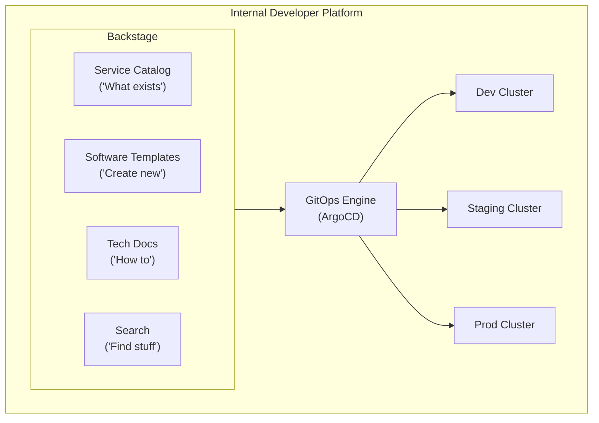

**Complexity**: `[COMPLEX]` | **Time to Complete**: 2.5h | **Prerequisites**: GitOps Basics (ArgoCD/Flux), Kubernetes RBAC, Multi-Cloud Fleet Management (Module 10.5)

## What You'll Be Able to Do

After completing this module, you will be able to:

- **Design enterprise GitOps architectures using Argo CD or Flux with multi-tenant repository structures**
- **Implement progressive delivery pipelines with Argo Rollouts for canary and blue/green deployments at scale**
- **Configure GitOps promotion workflows across dev, staging, and production environments with approval gates**
- **Deploy GitOps-based platform engineering patterns that enable self-service application deployment for development teams**

Those outcomes interlock: repository layout and Argo CD Projects define who may change what, promotion overlays define how change reaches customers, Rollouts define how risky change is exposed to traffic, and Backstage templates define how new services enter the system without reinventing wiring. You do not need to master every tool on day one, but you do need to see how centralized GitOps plus a portal plus progressive delivery forms a coherent operating model rather than three buzzwords stapled together. Each section below reinforces one layer of that model while keeping the same technical artifacts you would run in production. Read them in order the first time through.

---

## Why This Module Matters

At enterprise scale, letting each team run its own ArgoCD instance sounds like autonomy. In practice it creates patching delays, inconsistent configuration, and fragmented governance. Every instance must be upgraded, monitored, and audited on its own schedule. When a critical CVE lands in the Argo CD controller or repo-server, eighty-seven separate installs become eighty-seven mini-incidents. Drift between instances also makes it hard to answer which clusters still run a vulnerable image tag.

Meanwhile, developer experience was deteriorating in the same organizations that had “won” at Kubernetes adoption. New teams faced manual namespace requests and hand-edited GitOps configuration. Monitoring setup and secrets workflows were ad hoc and poorly documented. Onboarding to production slowed because every service needed a bespoke conversation with platform engineers. GitOps was declared the standard, yet developers still hit a ticket queue for cluster-boundary work. That pattern trains teams to route around the platform instead of through it.

Enterprise GitOps is not just "install ArgoCD." It is the discipline of building a self-service platform. Teams deploy, operate, and observe applications through Git workflows without learning every infrastructure detail on day one. The platform layers an Internal Developer Portal (often Backstage) on a centrally governed GitOps engine (Argo CD or Flux). Projects and repository layout enforce tenancy. Secrets stay external to plaintext YAML. In this module you will design that stack: Backstage templates, ApplicationSets, App of Apps bootstrapping, multi-tenant Git strategies, RBAC, and secrets patterns that keep Git auditable without leaking credentials.

---

## The Internal Developer Platform

An Internal Developer Platform (IDP) is the self-service layer that sits between developers and infrastructure, translating organizational standards into golden paths that teams can follow without re-learning the same platform decisions for every new service. Instead of emailing a platform engineer for a namespace, a monitoring scrape config, and an Argo CD Application manifest, a developer selects a vetted template, answers a short questionnaire, and receives a repository plus catalog entry plus deployment wiring that already matches security and operations policy. The IDP does not replace GitOps; it makes GitOps the default outcome of normal product development work rather than a specialist skill reserved for infra teams.

> **Stop and think**: If a developer has to ask a platform engineer to create a namespace, is it a platform or just a ticketing system? How does GitOps change this dynamic when the portal can register an Application in the same workflow that creates the repo?

Good IDPs encode guardrails directly in scaffolding. Protected default branches, required code owner reviews, allowed deployment targets, and Argo CD project names can all be derived from team identity. RBAC enforcement then begins at creation time rather than during an incident review. Platform engineering teams therefore invest in catalog metadata and software templates before they add yet another cluster operator. The portal is where developers discover what exists, how to extend it, and which pull requests count as supported workflows.

The mermaid diagram below is a logical view, not a deployment diagram. Backstage does not replace Argo CD; it registers services and triggers the GitOps steps that Argo CD already enforces. Dev, staging, and prod clusters remain separate destinations so blast radius stays bounded even when templates feel “one click” simple to application teams.

### What a Good IDP Provides



### Backstage for Platform Engineering

[Backstage provides four core capabilities](https://github.com/backstage/backstage) that transform GitOps from "YAML editing in Git" to a self-service platform, and each capability answers a different onboarding question that otherwise lands in Slack threads. The service catalog answers “what already runs in production and who owns it,” software templates answer “how do I create something new safely,” TechDocs answer “what is the supported runbook,” and search ties those artifacts together so engineers are not dependent on tribal knowledge spread across wikis. When Backstage triggers an Argo CD registration step after `publish:github`, the deployment contract becomes part of the same audited workflow as repository creation, which is the practical definition of platform self-service at enterprise scale.

The template below is representative rather than exhaustive. Real installations add policy checks, cost tags, and environment-specific overlays. The workflow shape stays stable because it mirrors how enterprises onboard services. Parameters constrain names and teams. Scaffold steps generate language-specific skeletons. Publishing steps create the Git remote with branch protection. Integration steps connect the new repo to the centralized GitOps controller and Backstage catalog entry. Observability and ownership stay linked from the first commit.

Catalog metadata matters as much as Kubernetes YAML. When `catalog-info.yaml` lands beside service code, TechDocs and ownership graphs stay accurate as teams grow. That metadata also feeds search and dependency graphs inside Backstage. GitOps then deploys what the catalog already advertises, which reduces “mystery microservices” during incidents.

Software templates should fail closed. If `argocd:create-resources` cannot register an Application, the scaffold should surface an error instead of leaving a half-provisioned repository. Operators learn to trust the portal only when failed runs are visible and retryable. Runbooks linked from template output teach developers what to do when integration steps break.

```yaml
# backstage-template: create-microservice.yaml
apiVersion: scaffolder.backstage.io/v1beta3
kind: Template
metadata:
  name: create-microservice
  title: Create a New Microservice
  description: |
    Provision a new microservice with CI/CD, monitoring,
    ArgoCD deployment, and Backstage catalog entry.
spec:
  owner: platform-team
  type: service

  parameters:
    - title: Service Details
      required:
        - serviceName
        - team
        - description
      properties:
        serviceName:
          title: Service Name
          type: string
          pattern: '^[a-z][a-z0-9-]{2,30}$'
          description: "Lowercase letters, numbers, hyphens. 3-31 characters."
        team:
          title: Owning Team
          type: string
          enum: ['payments', 'identity', 'notifications', 'search', 'platform']
        description:
          title: Description
          type: string
          maxLength: 200

    - title: Technical Configuration
      properties:
        language:
          title: Language
          type: string
          enum: ['go', 'python', 'typescript', 'java']
          default: 'go'
        deployTarget:
          title: Deployment Target
          type: string
          enum: ['eks-prod', 'aks-prod', 'gke-prod']
          default: 'eks-prod'
        requiresDatabase:
          title: Needs Database?
          type: boolean
          default: false
        publicFacing:
          title: Internet-Facing?
          type: boolean
          default: false

  steps:
    - id: scaffold
      name: Generate Service Scaffold
      action: fetch:template
      input:
        url: ./skeletons/${{ parameters.language }}
        values:
          serviceName: ${{ parameters.serviceName }}
          team: ${{ parameters.team }}
          deployTarget: ${{ parameters.deployTarget }}

    - id: create-repo
      name: Create GitHub Repository
      action: publish:github
      input:
        repoUrl: github.com?owner=company-services&repo=${{ parameters.serviceName }}
        defaultBranch: main
        protectDefaultBranch: true
        requireCodeOwnerReviews: true

    - id: create-argocd-app
      name: Register with ArgoCD
      action: argocd:create-resources
      input:
        appName: ${{ parameters.serviceName }}
        projectName: ${{ parameters.team }}
        repoURL: ${{ steps['create-repo'].output.remoteUrl }}
        path: k8s/overlays/production
        destServer: ${{ parameters.deployTarget }}
        destNamespace: ${{ parameters.team }}

    - id: register-catalog
      name: Register in Backstage Catalog
      action: catalog:register
      input:
        repoContentsUrl: ${{ steps['create-repo'].output.repoContentsUrl }}
        catalogInfoPath: /catalog-info.yaml

  output:
    links:
      - title: Repository
        url: ${{ steps['create-repo'].output.remoteUrl }}
      - title: ArgoCD Application
        url: https://argocd.company.com/applications/${{ parameters.serviceName }}
```

Read the template as a contract between platform and product teams: parameters are the only surface developers must understand, while steps encode everything security and SRE already decided. That separation is what reduces Slack questions without hiding power—teams still own service repos and overlays, but they inherit monitoring hooks, Argo CD project names, and catalog metadata that would be error-prone if copied from a wiki page. When you customize templates for your organization, resist adding twenty optional toggles on day one; narrow golden paths with five well-supported service types beat a generic wizard that recreates the old ticket queue in web form fields.

---

## Scaling ArgoCD for Enterprise

Centralizing Argo CD is an operational bet. The GitOps control plane becomes shared critical infrastructure. You gain uniform policy, faster patching, and a single pane of glass for application health across clusters. The trade-off is real. Misconfiguration in a root Application or an overly permissive AppProject can have broad blast radius. Enterprise designs therefore pair consolidation with Projects, signature enforcement, and sync windows. Culture and security still require ownership; tooling only encodes what leaders already agreed to enforce.

The patterns in this section bootstrap many cluster-scoped platform services and many team-scoped microservices. You should not copy YAML by hand for every new repository directory. App of Apps establishes the platform layer once. ApplicationSets attach team services as directories appear. Together they keep Git the source of truth while limiting toil for platform engineers who support dozens of product teams.

### The Problem with One ArgoCD Per Team

Sprawling controllers are attractive when teams want local admin keys and independent upgrade windows, but the aggregate cost shows up during CVE response and during executive questions about deployment posture.

```text
BAD: 87 ArgoCD instances
  - 87 separate upgrades when CVEs are announced
  - 87 different configurations to maintain
  - No cross-team visibility
  - Massive resource waste (each instance runs 3+ pods)

GOOD: 1-3 centralized ArgoCD instances
  - Centralized patching and configuration
  - Multi-tenant RBAC via ArgoCD Projects
  - Cross-team visibility and governance
  - Resource efficient
```

### App of Apps Pattern

The App of Apps pattern [uses a root ArgoCD Application that manages other Applications](https://argo-cd.readthedocs.io/en/latest/operator-manual/cluster-bootstrapping/). This creates a hierarchy where one top-level Application bootstraps the entire platform by pointing at a directory of child Application manifests, which means cluster bring-up becomes “install Argo CD, apply one root app, let the controller recurse.” Platform teams use the pattern to install monitoring, logging, cert-manager, policy engines, and team ApplicationSets from the same Git revision that human operators can diff in a pull request, so the bootstrap path is reviewable instead of a shell script that only one engineer remembers.

Operationally, App of Apps is best thought of as admin-only glue: it is powerful for platform bootstrapping but brittle if the root directory contains a syntax error that prevents reconciliation of every child. That is why mature estates combine a small, carefully reviewed root with ApplicationSets for dynamic membership, and why Argo CD’s own configuration is often kept in a separate Application with automation disabled, as noted later in Common Mistakes.

```yaml
# root-app/app-of-apps.yaml
apiVersion: argoproj.io/v1alpha1
kind: Application
metadata:
  name: platform-root
  namespace: argocd
spec:
  project: platform
  source:
    repoURL: https://github.com/company/platform-config.git
    targetRevision: main
    path: apps
  destination:
    server: https://kubernetes.default.svc
    namespace: argocd
  syncPolicy:
    automated:
      prune: true
      selfHeal: true
```

```text
platform-config/
├── apps/                      # Root Application points here
│   ├── monitoring.yaml        # Application for monitoring stack
│   ├── logging.yaml          # Application for logging stack
│   ├── cert-manager.yaml     # Application for cert-manager
│   ├── kyverno.yaml          # Application for policy engine
│   ├── team-payments.yaml    # ApplicationSet for payments team
│   ├── team-identity.yaml    # ApplicationSet for identity team
│   └── team-search.yaml      # ApplicationSet for search team
│
├── platform/                  # Platform services configs
│   ├── monitoring/
│   ├── logging/
│   ├── cert-manager/
│   └── kyverno/
│
└── teams/                     # Team-specific configs
    ├── payments/
    ├── identity/
    └── search/
```

When many Applications are created from one ApplicationSet, they often attempt to sync simultaneously during a platform upgrade, which races CRD installation against custom resources that depend on those CRDs. Argo CD sync waves and hooks order work so foundational resources reconcile first; skipping them produces cascading `OutOfSync` errors that look like application bugs but are actually ordering problems. Treat wave annotations as part of the platform chart, not as optional decoration.

### ApplicationSets: Dynamic Application Generation

[ApplicationSets generate ArgoCD Applications dynamically based on templates and generators.](https://argo-cd.readthedocs.io/en/release-2.14/operator-manual/applicationset/) They are the key to scaling from tens to hundreds of applications because the controller materializes Application objects from rules you declare once, which eliminates copy-paste drift when a new microservice directory appears in Git or when a new cluster label joins the fleet. Generators can walk Git directories, select clusters by label, or combine both in a matrix, so the same Helm chart path can roll to every production cluster that advertises `monitoring: enabled` without maintaining N nearly identical YAML files by hand.

**Pause and predict:** When managing hundreds of microservices across clusters, how does an ApplicationSet automate child Application creation, and what failure occurs when a generator selector is configured too broadly?

<details>
<summary>Check your prediction</summary>

[ApplicationSets](https://argo-cd.readthedocs.io/en/stable/operator-manual/applicationset/) generate Application objects dynamically from generators such as Git directories, cluster labels, or list elements. If a generator selector is configured too broadly, the controller creates child Applications you did not intend, potentially applying unreviewed manifests to clusters or overwhelming control planes. Conversely, a selector that is too narrow silently omits new clusters or microservices until configuration labels are updated. Platform teams should test generator expressions in staging environments to verify target scoping before applying them in production.
</details>

The next section is a set of ApplicationSet declarations demonstrating Git directory, cluster label, and matrix generators for automated multi-cluster application lifecycle management.

The three examples below progress from team-scoped Git discovery to fleet-wide platform services. Template fields like `{{path.basename}}`, `{{name}}`, and `{{server}}` bind each generated Application to a concrete repo path and destination cluster. Sync policies encode retry backoff and server-side apply options you would otherwise copy into every static manifest.

```yaml
# Generator: Create an Application for every directory in a Git repo
apiVersion: argoproj.io/v1alpha1
kind: ApplicationSet
metadata:
  name: team-payments-services
  namespace: argocd
spec:
  generators:
    - git:
        repoURL: https://github.com/company/payments-services.git
        revision: main
        directories:
          - path: services/*
  template:
    metadata:
      name: 'payments-{{path.basename}}'
      labels:
        team: payments
    spec:
      project: payments
      source:
        repoURL: https://github.com/company/payments-services.git
        targetRevision: main
        path: '{{path}}/k8s/overlays/production'
      destination:
        server: https://kubernetes.default.svc
        namespace: payments
      syncPolicy:
        automated:
          prune: true
          selfHeal: true
        syncOptions:
          - CreateNamespace=true
          - ServerSideApply=true
        retry:
          limit: 3
          backoff:
            duration: 5s
            factor: 2
            maxDuration: 3m
```

```yaml
# Generator: Deploy to every cluster with matching labels
apiVersion: argoproj.io/v1alpha1
kind: ApplicationSet
metadata:
  name: monitoring-fleet
  namespace: argocd
spec:
  generators:
    - clusters:
        selector:
          matchLabels:
            monitoring: enabled
  template:
    metadata:
      name: 'monitoring-{{name}}'
    spec:
      project: platform
      source:
        repoURL: https://github.com/company/platform-config.git
        targetRevision: main
        path: platform/monitoring
        helm:
          valueFiles:
            - 'values-{{metadata.labels.environment}}.yaml'
      destination:
        server: '{{server}}'
        namespace: monitoring
      syncPolicy:
        automated:
          prune: true
          selfHeal: true
```

```yaml
# Generator: Matrix - combine clusters with services
apiVersion: argoproj.io/v1alpha1
kind: ApplicationSet
metadata:
  name: platform-services-matrix
  namespace: argocd
spec:
  generators:
    - matrix:
        generators:
          - clusters:
              selector:
                matchLabels:
                  environment: production
          - list:
              elements:
                - service: kyverno
                  path: platform/kyverno
                - service: falco
                  path: platform/falco
                - service: otel-collector
                  path: platform/otel-collector
  template:
    metadata:
      name: '{{service}}-{{name}}'
    spec:
      project: platform
      source:
        repoURL: https://github.com/company/platform-config.git
        targetRevision: main
        path: '{{path}}'
      destination:
        server: '{{server}}'
        namespace: '{{service}}-system'
```

When you adopt ApplicationSets, invest time in generator boundaries. A selector that is too permissive creates Applications you did not intend. A selector that is too narrow silently omits new clusters until someone updates labels. Review generated Application names in a staging controller before enabling automation in production.

The Git generator suits team-owned mono-repos where each service is a top-level directory. The cluster generator suits platform bundles such as monitoring agents that must exist on every labeled cluster. The matrix generator combines both when a platform chart must land on many clusters without maintaining duplicate Application files per cluster.

---

## Multi-Tenant Git Repository Strategy

How you organize Git repositories determines how scalable and maintainable your GitOps platform is because Argo CD’s repo-server must fetch, parse, and diff whatever layout you choose on every reconciliation cycle. Repository strategy is therefore a coupling decision between developer velocity, access control, and controller performance: a mono-repo optimizes cross-cutting changes at the cost of merge contention and large clones, while repo-per-team optimizes autonomy at the cost of coordinated policy rollouts. Most enterprises land on a hybrid because platform standards and team application lifecycles change at different speeds and should not share the same approval graph.

> **Stop and think**: In a mono-repo, a syntax error in the root directory might break the platform. In a repo-per-team, how do you enforce a new security policy across 50 repositories without opening fifty identical pull requests by hand?

The diagrams below are intentionally schematic: real organizations add environment branches, promotion folders, and policy repos, but the ownership boundaries remain the lesson. Platform directories should be owned by the platform team, team subtrees or team repos should be owned by product engineering, and fleet configuration that lists ApplicationSets should be owned by the same group that operates the centralized Argo CD instance so tenancy rules stay coherent.

### Pattern 1: Mono-Repo

Mono-repos concentrate Kubernetes manifests for many teams in one Git history, which simplifies org-wide searches and lets platform engineers land sweeping policy updates in a single reviewed change. The layout below uses top-level `platform/` and `teams/` subtrees so CODEOWNERS can route payments changes to payments engineers while still allowing platform maintainers to own shared monitoring bundles.

```text
company-k8s/
├── platform/               # Platform team owns this
│   ├── monitoring/
│   ├── logging/
│   └── policy/
├── teams/
│   ├── payments/           # Payments team owns this subtree
│   │   ├── service-a/
│   │   ├── service-b/
│   │   └── service-c/
│   ├── identity/           # Identity team owns this subtree
│   │   ├── auth-service/
│   │   └── user-service/
│   └── search/
└── CODEOWNERS              # Enforce ownership via GitHub CODEOWNERS
```

A mono-repo shines when platform engineers need to change a shared Helm value and a team overlay in the same pull request, because reviewers see the full blast radius in one diff. The downside appears at scale: clone times grow, CODEOWNERS cannot fully substitute for fine-grained Git hosting permissions, and a broken YAML file in a shared path can block every team’s pipeline until it is reverted.

### Pattern 2: Repo Per Team

When each team owns a dedicated repository, Git permissions and CI pipelines align naturally with service ownership, and Argo CD Applications typically reference a single repo URL per team project. Fleet configuration still lives centrally so ApplicationSets can discover team repos without giving every developer admin access to the controller namespace.

```text
company/
├── platform-config/          # Platform team
├── payments-k8s/            # Payments team
├── identity-k8s/            # Identity team
├── search-k8s/             # Search team
└── fleet-config/            # ArgoCD configuration (platform team)
```

Repo-per-team layouts mirror how product engineering already thinks about ownership: each group merges on its own schedule, secrets and service metadata stay colocated, and Git hosting permissions map cleanly to team boundaries. The cost is coordination overhead whenever the platform changes a required label, sync option, or policy version, because those edits must propagate across many repositories unless you automate scaffolding updates from the central `platform-config` repo.

### Pattern 3: Hybrid (Recommended for Enterprise)

Hybrid layouts keep platform-wide Argo CD configuration, shared charts, and onboarding templates in a repo the platform team controls, while microservice manifests and environment overlays stay in team repos that merge independently. That split is how large organizations scale GitOps without forcing every product engineer to understand ApplicationSet generators on day one.

```text
# Central platform repo (platform team owns)
platform-config/
├── argocd/                   # App of Apps, ApplicationSets
├── platform-services/        # Monitoring, logging, policy
├── cluster-configs/          # Per-cluster configurations
└── team-onboarding/          # Templates for new team repos

# Per-team repos (teams own their own)
payments-k8s/
├── services/
│   ├── payment-processor/
│   │   ├── base/
│   │   └── overlays/
│   │       ├── dev/
│   │       ├── staging/
│   │       └── production/
│   └── invoice-service/
├── shared/
│   ├── network-policies/
│   └── resource-quotas/
└── catalog-info.yaml        # Backstage catalog entry
```

```yaml
# CODEOWNERS for team repo
# payments-k8s/.github/CODEOWNERS

# Platform team must approve changes to shared configs
/shared/ @company/platform-team

# Payments team owns their services
/services/ @company/payments-team

# Production overlays require senior review
/services/*/overlays/production/ @company/payments-leads @company/platform-team
```

---

## Environment Promotion and Approval Gates

Enterprise GitOps promotion moves the same service definition through dev, staging, and production. Only overlay inputs change: image tags, replica counts, ingress hosts, and feature flags. Base manifests stay stable. The hybrid repository layout uses `overlays/dev`, `overlays/staging`, and `overlays/production` per microservice. Argo CD Applications can point at different paths or Helm value files per environment without forking the entire chart.

Promotion becomes a pull request that updates staging first. Automated sync and policy checks run there. Production advances only after reviewers with production CODEOWNERS merge the change.

Approval gates show up in three complementary places. Git hosting enforces human review through branch protection and CODEOWNERS on production paths. Argo CD Projects add sync windows that deny automated sync during maintenance hours. Break-glass manual sync remains possible with justification. Progressive delivery adds metric-driven gates inside Rollouts. A green Git diff does not automatically mean a safe customer-facing release. Together these layers block “merge to main equals instant global prod” without returning to manual kubectl deploys.

A practical promotion flow looks like this in operation. Developers merge application changes to the team repo’s `main` branch. An Argo CD Application targeting `overlays/staging` syncs within minutes. Integration tests and synthetic checks run against staging. A separate promotion PR bumps only the image tag or Helm value file referenced by the production Application.

Platform teams often wire Git webhooks so Argo CD reconciles immediately on merge. Webhooks avoid waiting for the default three-minute poll interval. Staging feedback stays fast while production still requires explicit review. When staging fails, Git history shows which overlay commit never advanced. That audit trail beats a sequence of imperative deploy commands run from laptops.

Multi-cluster promotion extends the same idea. The payments project lists both `eks-staging` and `eks-prod` destinations. ApplicationSets or separate Applications bind each overlay path to the correct cluster server URL. Keep credentials and values environment-specific. Keep workload shape identical. A manifest that works in staging should be the same object applied in production. That symmetry makes rollback a Git revert instead of shell history reconstruction.

---

## RBAC for Enterprise GitOps

ArgoCD's RBAC system uses **Projects** to isolate teams and [control what they can deploy, where they can deploy it, and which Git repos they can use](https://argo-cd.readthedocs.io/en/latest/user-guide/projects/). Projects are the enforcement boundary that makes centralized Argo CD viable: even if a developer can push to their team repository, the application controller still evaluates destination namespaces, allowed cluster-scoped kinds, and optional signature keys before sync proceeds. Without Projects, “centralized GitOps” devolves into a shared admin console where any application owner can target any namespace.

RBAC inside Argo CD is expressed twice: AppProject resources declare what is allowed for a tenancy slice, and the `argocd-rbac-cm` ConfigMap maps SSO groups to roles that grant verbs on applications, logs, and exec sessions. The combination lets platform administrators grant sync rights to product engineers while denying cluster-wide object creation, which is the pattern you want when payments microservices should never create `ResourceQuota` objects owned by the platform team.

### ArgoCD Project per Team

Enterprise platform designs carefully evaluate how AppProject isolation boundaries limit team blast radius across shared infrastructure. Explicit `sourceRepos`, namespaced destinations on multiple clusters, whitelists for namespaced kinds, blacklists for quota objects owned centrally, optional GPG signature enforcement, and sync windows collectively block automated churn during maintenance hours.

**Pause and predict:** How does deploying a separate Argo CD instance for every development team compare to enforcing multi-tenancy using AppProjects and RBAC on a shared control plane?

<details>
<summary>Check your prediction</summary>

Deploying a separate Argo CD control plane for each team provides physical process isolation, but it multiplies operational overhead, upgrade maintenance, and compute footprint across clusters. In contrast, managing multi-tenancy through AppProjects and granular RBAC policies on a shared Argo CD instance delivers centralized governance, destination namespace controls, and repository whitelisting without duplicating controller fleets. A separate Argo CD per team is not the same as AppProjects and RBAC on a shared instance, and platform architects select between these models based on organizational compliance boundaries rather than rigid cluster count limits.
</details>

The next section is an Argo CD AppProject manifest illustrating multi-destination scoping, repository restrictions, and resource allowlists for a payments engineering team.

```yaml
apiVersion: argoproj.io/v1alpha1
kind: AppProject
metadata:
  name: payments
  namespace: argocd
spec:
  description: "Payments team services"

  # Which repos can this project use?
  sourceRepos:
    - 'https://github.com/company/payments-k8s.git'
    - 'https://github.com/company/shared-charts.git'

  # Where can this project deploy?
  destinations:
    - namespace: payments
      server: https://kubernetes.default.svc
    - namespace: payments
      server: https://eks-prod.company.internal
    - namespace: payments-staging
      server: https://eks-staging.company.internal

  # What cluster resources can this project create?
  clusterResourceWhitelist:
    - group: ''
      kind: Namespace

  # What namespaced resources are allowed?
  namespaceResourceWhitelist:
    - group: ''
      kind: '*'
    - group: apps
      kind: '*'
    - group: networking.k8s.io
      kind: '*'

  # What resources are DENIED?
  namespaceResourceBlacklist:
    - group: ''
      kind: ResourceQuota    # Only platform team sets quotas
    - group: ''
      kind: LimitRange        # Only platform team sets limits

  # Enforce signed commits
  signatureKeys:
    - keyID: "ABCDEF1234567890"

  # Sync windows (no deployments during maintenance)
  syncWindows:
    - kind: deny
      schedule: '0 2 * * *'    # Deny syncs between 2-6 AM
      duration: 4h
      applications:
        - '*'
    - kind: allow
      schedule: '0 6 * * 1-5'  # Allow during business hours M-F
      duration: 14h
      applications:
        - '*'
```

### RBAC Policy for ArgoCD

CSV policies read cryptically until you parse the tuple: role, resource, action, object scope, effect. Platform administrators receive broad verbs on all projects, team roles receive mutate rights only inside their project prefix, and viewers receive read-only access for transparency during incidents. Mapping SSO groups with `g, <group>, role:<name>` keeps authorization aligned with HR-driven group membership instead of long-lived local accounts in the Argo CD API.

```csv
# argocd-rbac-cm ConfigMap data
# Format: p, <role>, <resource>, <action>, <project>/<object>, <allow/deny>

# Platform admins: full access to everything
p, role:platform-admin, applications, *, */*, allow
p, role:platform-admin, clusters, *, *, allow
p, role:platform-admin, repositories, *, *, allow
p, role:platform-admin, projects, *, *, allow

# Payments team: manage their own apps, read-only on platform
p, role:payments-team, applications, get, payments/*, allow
p, role:payments-team, applications, sync, payments/*, allow
p, role:payments-team, applications, action/*, payments/*, allow
p, role:payments-team, applications, create, payments/*, allow
p, role:payments-team, applications, delete, payments/*, allow
p, role:payments-team, logs, get, payments/*, allow
p, role:payments-team, exec, create, payments/*, deny
p, role:payments-team, applications, get, platform/*, allow

# Read-only role for all teams (view platform apps)
p, role:viewer, applications, get, */*, allow
p, role:viewer, logs, get, */*, allow

# Map SSO groups to roles
g, company:platform-engineers, role:platform-admin
g, company:payments-developers, role:payments-team
g, company:all-engineers, role:viewer
```

Denying `exec` for application teams is a deliberate choice in the example policy. GitOps should make runtime changes traceable through Git and sync. Arbitrary `kubectl exec` into production bypasses review. Pair deny rules with break-glass roles granted only to platform administrators. Audit break-glass usage out-of-band when incidents require direct intervention.

Signature keys in AppProjects add another gate. Signed commits prove that merged Git content matches what Argo CD syncs. Combine signing with branch protection so unsigned commits never reach the branch Argo CD watches. When signing breaks, teams notice quickly because sync halts with a clear condition message rather than silently deploying tampered YAML.

Sync windows deserve explicit change management. Maintenance windows protect batch jobs and database migrations from automated prune operations. Business-hour allow windows still let teams merge freely while preventing unattended overnight syncs into production. Document override procedures so on-call engineers know how to request a manual sync when a hotfix cannot wait until morning.

---

## Secrets in Enterprise GitOps

The biggest challenge in GitOps is secrets: you cannot store plaintext secrets in Git, but GitOps requires everything to be in Git so that rollbacks and audits remain reproducible. [Several solutions exist, each with different trade-offs.](https://argo-cd.readthedocs.io/en/latest/operator-manual/secret-management/) Mature platforms pick a pattern early—External Secrets Operator, SOPS, Sealed Secrets, Vault injection, or an Argo CD plugin—and standardize it in templates so application teams never “temporarily” commit a cleartext `Secret` because a demo was due Friday afternoon.

The comparison table summarizes operational consequences, not marketing claims: some patterns keep ciphertext in Git, others keep only references in Git while materialized Secrets live in the cluster, and each approach shifts where rotation and outage risk concentrate. Enterprise teams usually prefer External Secrets Operator or SOPS because they preserve a clear source of truth and avoid baking Vault availability into every sync path unless they already run Vault as shared infrastructure.

### Secrets Management Comparison

| Solution | How It Works | Pros | Cons |
| :--- | :--- | :--- | :--- |
| **Sealed Secrets** | Encrypt secrets with a cluster-specific key. Only the cluster can decrypt. | Simple, no external dependencies | Key per cluster, rotation is manual |
| **External Secrets Operator (ESO)** | Syncs secrets from AWS Secrets Manager, Azure Key Vault, HashiCorp Vault | External source of truth, centralized management | Dependency on external service |
| **SOPS + age/KMS** | Encrypt YAML values in-place in Git. Decrypt at sync time. | Secrets versioned in Git (encrypted), audit trail | Key management complexity |
| **Vault Agent Injector** | HashiCorp Vault injects secrets via sidecar | Rich policy engine, dynamic secrets | Vault is complex to operate, sidecar overhead |
| **ArgoCD Vault Plugin** | Decrypt/fetch secrets during ArgoCD sync | No sidecar, centralized vault | Tight coupling between ArgoCD and Vault |

### External Secrets Operator (Recommended for Enterprise)

External Secrets Operator watches `ExternalSecret` objects and materializes native Kubernetes `Secret` resources by calling cloud provider APIs with credentials bound to a `ClusterSecretStore`. This architecture uses AWS Secrets Manager with JWT authentication via a Kubernetes service account, which aligns with identity patterns modern workloads use for cloud API access. Refresh intervals define how quickly rotated database passwords appear in pods, while `creationPolicy: Owner` makes garbage collection predictable when the ExternalSecret is deleted.

**Pause and predict:** Why is hosting Kubernetes manifests in a private Git repository insufficient for securing Secret data, and how does secret management software change this exposure?

<details>
<summary>Check your prediction</summary>

A private Git repository restricts read access through authentication, but it does not encrypt Secret contents stored within files. Plaintext credentials remain permanently recorded in the Git commit history even if a subsequent commit deletes the manifest or removes the secret values. Storing plaintext secrets in a private repository fails security audits because any engineer or CI agent with repository clone permissions can extract them. Dedicated tooling—such as SOPS encrypting values directly in Git or External Secrets Operator fetching credentials from cloud vaults at runtime—provides cryptographic protection and separation of duty that repository access controls cannot supply.
</details>

The next section is a set of Kubernetes manifests configuring an External Secrets Operator ClusterSecretStore and ExternalSecret for AWS Secrets Manager integration.

```yaml
# Install ESO
# helm install external-secrets external-secrets/external-secrets -n external-secrets --create-namespace

# Create a SecretStore that connects to AWS Secrets Manager
apiVersion: external-secrets.io/v1
kind: ClusterSecretStore
metadata:
  name: aws-secrets-manager
spec:
  provider:
    aws:
      service: SecretsManager
      region: us-east-1
      auth:
        jwt:
          serviceAccountRef:
            name: external-secrets-sa
            namespace: external-secrets

---
# Create an ExternalSecret that syncs a specific secret
apiVersion: external-secrets.io/v1
kind: ExternalSecret
metadata:
  name: database-credentials
  namespace: payments
spec:
  refreshInterval: 1h
  secretStoreRef:
    name: aws-secrets-manager
    kind: ClusterSecretStore
  target:
    name: database-credentials
    creationPolicy: Owner
  data:
    - secretKey: DB_HOST
      remoteRef:
        key: payments/production/database
        property: host
    - secretKey: DB_PASSWORD
      remoteRef:
        key: payments/production/database
        property: password
    - secretKey: DB_USERNAME
      remoteRef:
        key: payments/production/database
        property: username
```

ExternalSecret moved from `external-secrets.io/v1beta1` to `external-secrets.io/v1` in External Secrets Operator 0.10. Clusters running ESO 0.9.x still use `v1beta1` — replace the `apiVersion` field accordingly.

### [SOPS](https://github.com/getsops/sops) for Git-Native Secrets

SOPS encrypts only the sensitive fields inside YAML or JSON so reviewers can still see structure, namespaces, and key names in pull requests while ciphertext occupies `stringData` values. The workflow below shows how `creation_rules` in `.sops.yaml` pin encryption to a KMS key and regex-select which files are encrypted, which prevents accidental plaintext commits of similarly named manifests. After encryption, the file is safe to commit because Git history contains ciphertext, not cleartext passwords, though you must still rotate any secret that was ever pushed in plaintext before SOPS adoption.

```bash
# Encrypt a secret with SOPS + AWS KMS
# .sops.yaml in the repo root configures encryption rules

cat <<'EOF' > .sops.yaml
creation_rules:
  - path_regex: .*\.enc\.yaml$
    kms: arn:aws:kms:us-east-1:123456789012:key/abc-123-def-456
    encrypted_regex: ^(data|stringData)$
EOF

# Create a secret and encrypt it
cat <<'EOF' > database-secret.enc.yaml
apiVersion: v1
kind: Secret
metadata:
  name: database-credentials
  namespace: payments
type: Opaque
stringData:
  DB_HOST: prod-db.company.internal
  DB_PASSWORD: super-secret-password
  DB_USERNAME: payments_svc
EOF

# Encrypt the secret (only data/stringData fields are encrypted)
sops --encrypt --in-place database-secret.enc.yaml

# The encrypted file looks like:
# apiVersion: v1
# kind: Secret
# metadata:
#   name: database-credentials
#   namespace: payments
# type: Opaque
# stringData:
#   DB_HOST: ENC[AES256_GCM,data:abc123...]
#   DB_PASSWORD: ENC[AES256_GCM,data:def456...]
#   DB_USERNAME: ENC[AES256_GCM,data:ghi789...]

# Commit the encrypted file to Git (safe!)
git add database-secret.enc.yaml
git commit -m "feat: Add payments database credentials (encrypted)"
```

---

## Progressive Delivery with Argo Rollouts

While ArgoCD excels at syncing the desired state from Git to Kubernetes, it relies on standard Kubernetes deployment strategies (like `RollingUpdate`) which lack advanced traffic control beyond replica maxUnavailable settings. For enterprise applications where downtime or regression is costly, you need **progressive delivery**: deliberate traffic shifting, pauses for observation, and automated rollback when metrics disagree with the release note.

Blue/green and canary are not interchangeable labels. Blue/green swaps traffic between two full stacks and works well when you can afford double capacity for a short window. Canary shifts a slice of traffic while metrics prove the new build is safe. Many teams combine both: canary analysis during normal hours, blue/green for large schema migrations that cannot share endpoints with the old version.

Argo Rollouts is a Kubernetes controller and set of CRDs that provide advanced deployment capabilities such as blue/green, canary, canary analysis, and experimentation without replacing GitOps entirely. Teams still commit Rollout manifests to Git and let Argo CD sync them. Rollouts then orchestrate ReplicaSet generations and service mesh or ingress weights during the release. That separation keeps “what should run” in Git while “how traffic migrates” lives in the rollout strategy.

### The Rollout Resource

The `Rollout` custom resource [acts as a drop-in replacement for the standard Kubernetes `Deployment`](https://argoproj.github.io/argo-rollouts/features/analysis/). It manages the creation, scaling, and deletion of ReplicaSets based on a defined strategy, which means you can express canary steps as data instead of imperative kubectl scripts.

**Pause and predict:** If a microservice passes all CI tests but fails under real-world production load, how does progressive delivery limit blast radius, and why is an Argo CD sync distinct from a canary traffic shift?

<details>
<summary>Check your prediction</summary>

Passing CI tests does not prove production health under live user traffic and network latency. An Argo CD sync merely reconciles desired manifest state with the cluster; it does not progressively shift live traffic. In contrast, an [Argo Rollouts](https://argo-rollouts.readthedocs.io/en/stable/features/analysis/) controller shifts a controlled slice of traffic to canary pods and can roll back automatically when metric analysis fails. Furthermore, canary deployment is not blue/green deployment: canary shifts incremental traffic percentages to validate telemetry, whereas blue/green switches entire environment pools simultaneously.
</details>

The next section is an Argo Rollouts manifest defining progressive canary traffic weighting with observation pauses before full workload promotion.

```yaml
apiVersion: argoproj.io/v1alpha1
kind: Rollout
metadata:
  name: payments-processor
  namespace: payments
spec:
  replicas: 5
  selector:
    matchLabels:
      app: payments-processor
  template:
    metadata:
      labels:
        app: payments-processor
    spec:
      containers:
      - name: processor
        image: company/payments-processor:v2.1.0
  strategy:
    canary:
      steps:
      - setWeight: 10
      - pause: {duration: 10m} # Wait 10 minutes at 10% traffic
      - setWeight: 30
      - pause: {} # Wait indefinitely for manual approval
      - setWeight: 100
```

The canary manifest above starts at ten percent traffic for ten minutes, advances to thirty percent, then waits for manual approval before completing — a common enterprise compromise between safety and velocity when automated metrics are not yet wired.

### Automated Rollback with AnalysisRuns

To truly scale progressive delivery, human approval must be replaced with automated metrics analysis for the middle steps of a canary, while humans retain override authority for exceptional events. Argo Rollouts integrates with Prometheus, Datadog, or New Relic via an `AnalysisTemplate`, which defines queries, success conditions, and failure limits that apply during each canary step.

The template below measures HTTP success rate from Prometheus counters, requiring at least ninety-nine percent success over one-minute windows and allowing three consecutive failures before aborting. When you link this template to a Rollout, [the rollout is automatically aborted and traffic returns to the stable ReplicaSet if analysis fails](https://argoproj.github.io/argo-rollouts/features/analysis/), which shrinks customer impact to the small traffic slice that saw the canary version during the observation window.

```yaml
apiVersion: argoproj.io/v1alpha1
kind: AnalysisTemplate
metadata:
  name: success-rate
  namespace: payments
spec:
  args:
  - name: service-name
  metrics:
  - name: success-rate
    interval: 1m
    successCondition: result[0] >= 0.99
    failureLimit: 3
    provider:
      prometheus:
        address: http://prometheus.monitoring.svc.cluster.local:9090
        query: |
          sum(rate(http_requests_total{service="{{args.service-name}}",status=~"2.."}[1m])) 
          / 
          sum(rate(http_requests_total{service="{{args.service-name}}"}[1m]))
```

Linking the template to a Rollout step means Argo Rollouts runs the Prometheus query on the interval you configured and counts consecutive failures before aborting, so operators see a controlled rollback instead of a full promotion of a bad build. That behavior is why progressive delivery belongs in the same curriculum as GitOps: Git declares intent, but metrics validate whether the cluster should keep receiving traffic during the change.

---

## Operating Centralized Argo CD at Scale

When application counts climb into the hundreds, perceived slowness usually comes from reconciliation frequency, repo-server throughput, or UI timeouts rather than from Kubernetes itself. Increasing the application resync interval reduces how often each Application is re-evaluated when nothing changed, which lowers steady-state CPU at the cost of slightly slower detection of out-of-band drift unless webhooks notify the controller on every merge. [Git webhooks](https://argo-cd.readthedocs.io/en/stable/operator-manual/webhook/) exist precisely to remove the default polling delay after pushes, and they are worth enabling before you shard controllers.

[High-availability and sharding guidance](https://argo-cd.readthedocs.io/en/stable/operator-manual/high_availability/) documents running multiple application controller replicas with the `--shard` flag so each replica owns a subset of clusters or applications. Pair sharding with Server-Side Apply sync options where appropriate to reduce conflict noise on large resources, and size Redis plus repo-server memory based on peak concurrent manifest generation rather than idle usage. If a single centralized instance still struggles after tuning, splitting by environment often restores headroom. A non-production controller and a production controller still beat dozens of team-local installs. Document which instance owns which clusters so on-call engineers do not search two UIs during an incident.

### Flux as an Alternative GitOps Engine

This module focuses on Argo CD because its Application, Project, and ApplicationSet APIs are widely taught in enterprise courses. Flux controllers solve the same declarative sync problem with different CRDs and RBAC models. Repository layout, promotion overlays, and secrets patterns transfer with minimal changes. Platform teams should pick one engine per estate, document it, and avoid running two controllers against the same namespaces without clear ownership. Mixed engines create conflicting desired states and confuse developers about which UI is authoritative.

When you evaluate Flux versus Argo CD, compare multi-tenancy primitives, secrets integration, and how each tool handles mono-repo performance. The organizational work—CODEOWNERS, hybrid repos, ESO, and progressive delivery—is identical either way. Tool choice matters less than consistent guardrails applied after the choice is made.

---

## Did You Know?

- **Backstage adoption**: Backstage is widely used for internal developer portals, and large organizations such as Spotify use it to centralize catalogs, templates, documentation, and workflows. The portal becomes the front door, while Git remains the auditable control plane behind the button.

- **Argo CD at fleet scale**: Large Argo CD installations can manage thousands of applications and many clusters. They still require tuning of resync intervals, repo-server sizing, Redis, and optional controller sharding when sync latency grows.

- **External Secrets lineage**: External Secrets Operator emerged from community consolidation around Kubernetes external-secrets patterns. It supports many secret backends so platform teams can standardize on one CRD model across clouds.

- **SOPS in Git workflows**: SOPS encrypts structured secret files such as YAML and JSON in Git-based workflows. Teams still rotate any secret ever committed in plaintext, because Git history retains old blobs after deletion.

---

## Common Mistakes

The failure modes below appear repeatedly when enterprises adopt GitOps before they adopt platform guardrails. They are not tool limitations so much as missing constraints. Without Projects, sync waves, and secret patterns, GitOps replicates imperative chaos. The difference is that mistakes are now committed and auditable, which is good for forensics but painful for customers if guardrails never arrive.

Review this table during design reviews, not after an outage. Each row maps to a control you can implement in Git, Argo CD, or Backstage this sprint. Deferring controls converts GitOps into faster incident generation, which is the opposite of why teams adopted declarative delivery in the first place.

| Mistake | Why It Happens | How to Fix It |
| :--- | :--- | :--- |
| **One ArgoCD per team** | Teams want autonomy. Platform team does not want to manage multi-tenant ArgoCD. | Invest in multi-tenant ArgoCD with Projects and RBAC. One or two centralized instances are far easier to maintain than 50+ team instances. |
| **ApplicationSets without sync waves** | All applications in an ApplicationSet try to sync simultaneously. CRDs not installed before resources that depend on them. Sync failures cascade. | Use sync waves and sync hooks to control deployment order. Deploy CRDs before custom resources. Deploy namespaces before workloads. |
| **Git repo too large for ArgoCD** | A very large mono-repo can slow ArgoCD repository operations and lengthen sync times, especially if each application has to scan more content than it needs. | Use shallow clones (`--depth 1`), split large repos, or use ApplicationSets with directory generators to limit what ArgoCD syncs per Application. |
| **Storing plaintext secrets in Git** | Teams defer encryption because the repo is private or because a demo deadline is near. | Use External Secrets Operator or SOPS from day one. Add pre-commit hooks that detect secrets (`gitleaks`, `talisman`). Rotate any secrets found in Git history immediately. |
| **No ArgoCD sync windows** | Teams deploy at 3 AM on a Saturday, break production, and nobody is awake to respond. | Configure sync windows on ArgoCD Projects. Deny automatic syncs outside business hours for production. Allow manual overrides with justification. |
| **RBAC too permissive** | "Just give everyone admin to unblock them." ArgoCD becomes a free-for-all where anyone can deploy anything anywhere. | Design RBAC from the start. Projects per team. Source repo restrictions. Destination namespace restrictions. Deny cluster-scoped resources for non-platform teams. |
| **No Backstage templates for common tasks** | Developers still need to manually create repos, configure ArgoCD, set up monitoring. The platform exists but the self-service layer does not. | Invest in Backstage templates for the top 5 use cases: new service, new environment, new database, new team onboarding, debug session. |
| **ArgoCD managing its own configuration** | ArgoCD tries to sync its own ConfigMaps and Secrets. A bad configuration change locks ArgoCD out. | Keep ArgoCD self-management in a separate, manually-controlled Application with `automated: false`. Critical configs (RBAC, repos, clusters) require manual sync. |

---

## Putting the Platform Together

Enterprise GitOps maturity is visible in handoffs more than in logos. Application teams should open one catalog page, one repository, and one Argo CD Application per service without learning controller internals. Platform teams should upgrade one controller fleet, publish template changes once, and observe policy violations as denied syncs rather than surprise outages. Security teams should see signed commits, encrypted secrets, and denied cross-namespace syncs as default outcomes.

Start with tenancy before speed. Define Argo CD Projects, destinations, and repository allow lists before you onboard the tenth team. Retrofitting Projects after dozens of Applications exist forces painful migrations and emergency RBAC freezes. The exercise in this module enforces that order on purpose: namespaces and Projects precede Applications, and a deliberate misconfiguration attempt proves the boundary works.

Treat Git layout as a product decision. Mono-repo, per-team repo, and hybrid patterns each change how painful promotion and policy rollouts feel. None of the patterns removes the need for CODEOWNERS on production paths. Pick the layout that matches how your organization already merges code, then tune Argo CD generators so each Application reads the smallest subtree it needs.

Invest early in secrets workflow. External Secrets Operator and SOPS both keep plaintext out of Git history, but they require different operational skills. ESO shifts burden to cloud APIs and IAM roles. SOPS shifts burden to key management and encrypted pull requests. Either is acceptable if chosen consistently and scanned with pre-commit secret detection.

Add progressive delivery when rollback stories matter. Argo CD will sync a broken Deployment if Git says so. Rollouts add metric gates that stop traffic before every replica serves a bad build. Link AnalysisTemplates to canary steps gradually: manual pauses first, automated Prometheus checks second, full automation only after dashboards are trusted.

Finally, plan for controller scale before the UI feels slow. Webhooks, resync tuning, repo-server resources, and sharding are cheaper than explaining to forty teams why sync takes twenty minutes. Splitting production and non-production controllers is a compromise that preserves central governance without one binary holding every cluster hostage.

Incident response improves when dashboards aggregate Projects instead of individual developer kubectl contexts. The platform dashboard script in the exercise is a teaching stub. Production equivalents query Argo CD APIs or export metrics to the same observability stack application teams already use. Correlate sync failures with recent merges using Git SHA labels on Applications so rollback decisions take minutes, not hours.

Teach application teams what “synced” means. `Synced` and `Healthy` are related but not identical. A synced Application can still run a failing image if probes are misconfigured. Rollouts add another layer where Git is correct yet traffic must shift gradually. Platform office hours that walk through Argo CD conditions prevent mysticism and reduce privileged admin grants given only to unblock demos.

---

## Quiz

The scenarios below stress-test architecture decisions you will make when GitOps becomes shared infrastructure: tenancy boundaries, bootstrap patterns, secret provider outages, controller performance, repository strategy, cross-team blast radius, and automated rollback. Read each question as if you are advising a platform team that already runs Kubernetes at scale and now must standardize delivery without crushing team autonomy.

<details>
<summary>Question 1: Scenario: Your rapidly expanding enterprise just acquired three smaller companies, bringing the total number of engineering teams to 40. The CTO asks if you should provision a dedicated ArgoCD instance for each team to ensure isolation. Should you use one ArgoCD instance or one per team? Justify your architecture decision.</summary>

Use one centralized ArgoCD instance (or at most 2-3 for HA across regions) rather than one per team. With 40 teams, running 40 individual instances means maintaining 40 separate RBAC configurations and performing 40 isolated upgrades whenever a critical CVE is announced, which is operationally unsustainable. A centralized instance managed via ArgoCD Projects provides cross-team visibility, uniform governance, and drastically reduces resource overhead by eliminating redundant controller pods. The trade-off is that this centralized instance becomes critical platform infrastructure, requiring high availability, rigorous monitoring, and dedicated platform engineers to operate it reliably at scale.
</details>

<details>
<summary>Question 2: Scenario: Your platform team is provisioning a new Kubernetes cluster. They need to install monitoring, logging, cert-manager, and Kyverno immediately upon creation. Instead of running `kubectl apply` for each tool, they want the cluster to bootstrap itself. How does the App of Apps pattern solve this bootstrapping problem, and what are its operational limitations?</summary>

The App of Apps pattern solves the bootstrapping problem by utilizing a single root ArgoCD Application that points to a Git directory containing the manifests for all core platform tools. Once you apply this single root Application to the new cluster, ArgoCD automatically discovers, creates, and syncs all the child Applications, ensuring the entire platform is provisioned in a consistent, declarative state without manual intervention. However, a major operational limitation is that if the root Application's directory contains invalid YAML or an error occurs at the root level, the sync can fail globally, potentially cascading to all child applications. Additionally, relying solely on App of Apps makes dynamic cluster targeting difficult, which is why ApplicationSets are generally preferred for dynamic, multi-cluster environments.
</details>

<details>
<summary>Question 3: Scenario: A critical database is deployed in your production cluster, and the 'payments' team stores its credentials in AWS Secrets Manager. They use the External Secrets Operator to sync these credentials into Kubernetes. Suddenly, AWS Secrets Manager experiences a regional outage. What happens to the running applications, and what operational challenges might arise during the outage?</summary>

When AWS Secrets Manager experiences an outage, ESO cannot refresh the secrets, but the existing Kubernetes Secrets created during the last successful sync remain fully functional within the cluster. Pods that are currently running will continue to use the in-memory copy of the secrets, and newly scheduled pods can still mount the existing Kubernetes Secrets without issue. However, problems arise if a secret value needs to be rotated urgently or if a new ExternalSecret resource is created, as the initial sync cannot complete until the provider is back online. To mitigate the impact of temporary provider outages, you should configure a reasonable refresh interval (such as 1 hour) and ensure critical secrets are fully synced during the initial deployment phase.
</details>

<details>
<summary>Question 4: Scenario: Your centralized ArgoCD installation has grown to manage 500 Applications distributed across 20 distinct clusters. Recently, developers have started complaining that sync times are unacceptably slow and the ArgoCD user interface frequently times out. What specific tuning adjustments would you apply to stabilize the system under this load?</summary>

To optimize an ArgoCD instance at this scale, you should first increase the `--app-resync` interval from the default 180 seconds to a higher value like 300 or 600 seconds to reduce the frequency of application state evaluations. Next, enable controller sharding by configuring multiple application controller replicas with the `--shard` flag, allowing each controller to manage a dedicated subset of the 20 clusters. You can also improve performance by enabling Server-Side Apply to reduce apply conflicts and handle large resources that exceed the `last-applied-configuration` annotation limit, and by relying on Git webhooks instead of polling to handle repository changes more efficiently. Finally, ensure Redis and the repo-server are sized and observed appropriately for your workload, and consider splitting the instance by environment if a single centralized installation continues to struggle under the load.
</details>

<details>
<summary>Question 5: Scenario: A rapidly growing fintech startup has expanded from 2 to 15 engineering teams over the last year. They currently store all their Kubernetes manifests in a single mono-repo. Recently, deployment pipelines have slowed to a crawl, and teams are stepping on each other's changes. Why is the mono-repo failing them at this scale, and how would migrating to a hybrid repository strategy resolve these operational bottlenecks?</summary>

The mono-repo becomes a bottleneck at scale because as the number of teams and manifests grows, Git clone and fetch operations take significantly longer, delaying ArgoCD sync times and slowing down continuous integration pipelines. Furthermore, a single repository means that one team introducing a syntax error or triggering a complex merge conflict can block the deployment queue for the entire engineering organization. By migrating to a hybrid repository strategy, the platform team maintains a central repository for global configurations and standardized policies, ensuring strict governance. Concurrently, each engineering team receives their own repository for their specific microservices, granting them independent merge queues, isolated access controls, and true deployment autonomy without impacting the broader platform.
</details>

<details>
<summary>Question 6: Scenario: The 'payments' team and 'identity' team share a central ArgoCD instance. A developer on the 'payments' team accidentally modifies their Application manifest to target the `identity-prod` namespace. How does ArgoCD's architecture prevent the 'payments' team from overwriting the 'identity' team's workloads, even if they commit this change to their repository?</summary>

This cross-tenant deployment attempt is blocked by enforcing strict boundary restrictions using ArgoCD AppProjects. The platform team configures the 'payments' AppProject to explicitly define allowed destination namespaces, restricting them solely to the 'payments' environment. When the developer commits the invalid manifest targeting the 'identity' namespace, the ArgoCD application controller evaluates the target against the AppProject's destination whitelist and rejects the sync operation entirely because it is not permitted. The key enforcement point here is the AppProject destination restriction, which prevents the application from syncing to the unauthorized namespace.
</details>

<details>
<summary>Question 7: Scenario: Your team uses Argo Rollouts for progressive delivery with an AnalysisTemplate connected to Prometheus. During a canary deployment at 20% traffic, the background AnalysisRun queries the error rate metric and determines the failure threshold is breached. What sequence of automated actions does Argo Rollouts take immediately after the failure, and why is this critical for the user experience?</summary>

When an AnalysisRun breaches the defined failure limit, Argo Rollouts aborts the progressive delivery process and typically routes traffic back to the stable, known-good ReplicaSet. It then scales down the failing canary ReplicaSet to zero, halting any further exposure to the buggy version. This instantaneous, automated rollback is critical because it minimizes the blast radius of a bad release to only a fraction of users for a very short duration, preventing widespread outages or degraded user experiences without waiting for human intervention or manual Git reverts. Furthermore, this proactive approach frees developers from manually monitoring metrics during deployments, allowing them to focus on resolving the underlying issue identified by the rollout failure.
</details>

---

## Hands-On Exercise: Build an Enterprise GitOps Platform

In this exercise, you will set up a multi-tenant ArgoCD installation with Project-based RBAC, ApplicationSets, and External Secrets Operator patterns described earlier, but scaled down to a single kind cluster so you can see enforcement and dashboards without provisioning real cloud identities. The flow mirrors production order on purpose: install the controller, carve Projects and namespaces per team, register Applications that respect project boundaries, attempt a forbidden cross-namespace deploy, and finish with a readout script that aggregates sync and health state the way a platform engineer would during a weekly review.

Treat each task as an experiment with a hypothesis. Before Task 4, predict whether Argo CD will reject the Application at admission time or create the object and fail sync. Comparing your prediction to the observed condition message builds the debugging reflex you need when forty teams share one instance. The guestbook example apps are stand-ins for real microservices. The lesson is tenancy enforcement and visibility, not the sample image itself. Repeat the lab after changing RBAC rules to see how deny messages evolve when policies tighten.

### Task 1: Create the Lab Cluster and Install ArgoCD

<details>
<summary>Solution</summary>

```bash
kind create cluster --name enterprise-gitops

# Install ArgoCD
kubectl create namespace argocd
kubectl apply -n argocd -f https://raw.githubusercontent.com/argoproj/argo-cd/stable/manifests/install.yaml
kubectl wait --for=condition=available deployment/argocd-server -n argocd --timeout=120s

ARGOCD_PW=$(kubectl -n argocd get secret argocd-initial-admin-secret \
  -o jsonpath='{.data.password}' | base64 -d)
echo "ArgoCD admin password: $ARGOCD_PW"
```

</details>

### Task 2: Configure Multi-Tenant ArgoCD Projects

<details>
<summary>Solution</summary>

```bash
# Create team namespaces
for TEAM in payments identity search platform; do
  kubectl create namespace $TEAM
done

# Create ArgoCD Projects for each team
cat <<'EOF' | kubectl apply -f -
apiVersion: argoproj.io/v1alpha1
kind: AppProject
metadata:
  name: payments
  namespace: argocd
spec:
  description: "Payments team"
  sourceRepos:
    - '*'
  destinations:
    - namespace: payments
      server: https://kubernetes.default.svc
  clusterResourceWhitelist: []
  namespaceResourceWhitelist:
    - group: ''
      kind: '*'
    - group: apps
      kind: '*'
    - group: networking.k8s.io
      kind: '*'
---
apiVersion: argoproj.io/v1alpha1
kind: AppProject
metadata:
  name: identity
  namespace: argocd
spec:
  description: "Identity team"
  sourceRepos:
    - '*'
  destinations:
    - namespace: identity
      server: https://kubernetes.default.svc
  clusterResourceWhitelist: []
  namespaceResourceWhitelist:
    - group: ''
      kind: '*'
    - group: apps
      kind: '*'
---
apiVersion: argoproj.io/v1alpha1
kind: AppProject
metadata:
  name: platform
  namespace: argocd
spec:
  description: "Platform team - full access"
  sourceRepos:
    - '*'
  destinations:
    - namespace: '*'
      server: '*'
  clusterResourceWhitelist:
    - group: '*'
      kind: '*'
EOF

echo "ArgoCD Projects:"
kubectl get appprojects -n argocd
```

</details>

### Task 3: Deploy Applications with the App of Apps Pattern

<details>
<summary>Solution</summary>

```bash
# Create a simulated application for the payments team
cat <<'EOF' | kubectl apply -f -
apiVersion: argoproj.io/v1alpha1
kind: Application
metadata:
  name: payments-processor
  namespace: argocd
  labels:
    team: payments
spec:
  project: payments
  source:
    repoURL: https://github.com/argoproj/argocd-example-apps.git
    targetRevision: HEAD
    path: guestbook
  destination:
    server: https://kubernetes.default.svc
    namespace: payments
  syncPolicy:
    automated:
      prune: true
      selfHeal: true
    syncOptions:
      - CreateNamespace=true
---
apiVersion: argoproj.io/v1alpha1
kind: Application
metadata:
  name: identity-auth
  namespace: argocd
  labels:
    team: identity
spec:
  project: identity
  source:
    repoURL: https://github.com/argoproj/argocd-example-apps.git
    targetRevision: HEAD
    path: guestbook
  destination:
    server: https://kubernetes.default.svc
    namespace: identity
  syncPolicy:
    automated:
      prune: true
      selfHeal: true
    syncOptions:
      - CreateNamespace=true
EOF

# Wait for sync
sleep 15

echo "=== ArgoCD Applications ==="
kubectl get applications -n argocd -o custom-columns=\
NAME:.metadata.name,\
PROJECT:.spec.project,\
STATUS:.status.sync.status,\
HEALTH:.status.health.status,\
NAMESPACE:.spec.destination.namespace
```

</details>

### Task 4: Test RBAC Enforcement

<details>
<summary>Solution</summary>

```bash
# Test: Try to create an application in the payments project targeting the identity namespace
echo "=== Test: Cross-namespace deployment (should fail) ==="
cat <<'EOF' | kubectl apply -f - 2>&1 || true
apiVersion: argoproj.io/v1alpha1
kind: Application
metadata:
  name: payments-in-wrong-namespace
  namespace: argocd
spec:
  project: payments
  source:
    repoURL: https://github.com/argoproj/argocd-example-apps.git
    targetRevision: HEAD
    path: guestbook
  destination:
    server: https://kubernetes.default.svc
    namespace: identity
  syncPolicy:
    automated:
      prune: true
EOF

# The application might be created but sync should fail
echo ""
echo "=== Check if the cross-namespace app synced ==="
sleep 5
kubectl get application payments-in-wrong-namespace -n argocd \
  -o jsonpath='{.status.conditions[*].message}' 2>/dev/null || echo "Application rejected or sync failed as expected"

# Clean up the test
kubectl delete application payments-in-wrong-namespace -n argocd 2>/dev/null || true

echo ""
echo "=== Legitimate applications ==="
kubectl get applications -n argocd -o custom-columns=\
NAME:.metadata.name,PROJECT:.spec.project,SYNC:.status.sync.status
```

</details>

### Task 5: Build a Platform Dashboard

<details>
<summary>Solution</summary>

```bash
cat <<'SCRIPT' > /tmp/platform-dashboard.sh
#!/bin/bash
echo "============================================="
echo "  ENTERPRISE GITOPS PLATFORM DASHBOARD"
echo "  $(date -u +%Y-%m-%dT%H:%M:%SZ)"
echo "============================================="

echo ""
echo "--- ArgoCD Health ---"
ARGO_PODS=$(kubectl get pods -n argocd --no-headers | grep Running | wc -l | tr -d ' ')
echo "  ArgoCD Pods Running: $ARGO_PODS"

echo ""
echo "--- Projects ---"
kubectl get appprojects -n argocd --no-headers | while read LINE; do
  PROJECT=$(echo $LINE | awk '{print $1}')
  APP_COUNT=$(kubectl get applications -n argocd -o json | jq "[.items[] | select(.spec.project == \"$PROJECT\")] | length")
  echo "  $PROJECT: $APP_COUNT applications"
done

echo ""
echo "--- Applications by Sync Status ---"
SYNCED=$(kubectl get applications -n argocd -o json | jq '[.items[] | select(.status.sync.status == "Synced")] | length')
OUTOFSYNC=$(kubectl get applications -n argocd -o json | jq '[.items[] | select(.status.sync.status == "OutOfSync")] | length')
UNKNOWN=$(kubectl get applications -n argocd -o json | jq '[.items[] | select(.status.sync.status == "Unknown")] | length')
echo "  Synced: $SYNCED"
echo "  OutOfSync: $OUTOFSYNC"
echo "  Unknown: $UNKNOWN"

echo ""
echo "--- Applications by Health ---"
HEALTHY=$(kubectl get applications -n argocd -o json | jq '[.items[] | select(.status.health.status == "Healthy")] | length')
PROGRESSING=$(kubectl get applications -n argocd -o json | jq '[.items[] | select(.status.health.status == "Progressing")] | length')
DEGRADED=$(kubectl get applications -n argocd -o json | jq '[.items[] | select(.status.health.status == "Degraded")] | length')
echo "  Healthy: $HEALTHY"
echo "  Progressing: $PROGRESSING"
echo "  Degraded: $DEGRADED"

echo ""
echo "--- Team Namespace Resources ---"
for NS in payments identity search; do
  PODS=$(kubectl get pods -n $NS --no-headers 2>/dev/null | wc -l | tr -d ' ')
  SVCS=$(kubectl get services -n $NS --no-headers 2>/dev/null | wc -l | tr -d ' ')
  echo "  $NS: $PODS pods, $SVCS services"
done

echo ""
echo "============================================="
SCRIPT

chmod +x /tmp/platform-dashboard.sh
bash /tmp/platform-dashboard.sh
```

</details>

### Clean Up

```bash
kind delete cluster --name enterprise-gitops
rm /tmp/platform-dashboard.sh
```

Before concluding the hands-on lab, audit the four operational claims presented below for platform architectures. Each card describes a plausible enterprise GitOps hypothesis frequently encountered in production platform engineering designs. Analyze each claim against declarative generator mechanics, progressive traffic analysis, secret protection boundaries, and multi-tenant access controls. Evaluate controller reconciliation behaviors carefully before inspecting the underlying technical explanations.

**Card A: An ApplicationSet with a broad Git generator only creates the Applications an engineer listed by hand.** A platform engineer configures an ApplicationSet with a Git directory generator using a wildcard path pattern. The engineer assumes that Argo CD reconciles only the microservices explicitly registered by hand in a central deployment catalog. Under this assumption, unexpected subdirectories or experimental branches matching the directory pattern will not trigger automatic child Application generation.

<details>
<summary>Check your prediction</summary>

Failure layer: Declarative ApplicationSet generator automation versus hand-written Application manifest inventory conflation. Next action: understand that ApplicationSets generate standard child Application objects dynamically from generators rather than requiring manual registration; when a Git generator directory selector or cluster label query is configured too broadly, the controller automatically instantiates Applications for every matching path or cluster target without human confirmation; this behavior can deploy unreviewed manifests, create namespace collisions, or overwhelm control planes; platform engineers must constrain generator search paths, utilize strict directory filters, and preview generated Application resources in pre-production before deploying automated ApplicationSets.
</details>

**Card B: A canary that passed CI/CD cannot hurt production users, because analysis is optional decoration.** A release engineer prepares a progressive delivery pipeline using Argo Rollouts and determines that automated metric analysis is unnecessary. The engineer assumes that because the container image passed unit, integration, and end-to-end tests in CI pipelines, runtime production behavior is fully guaranteed. Under this assumption, shifting real-world traffic to canary pods without metric gates carries zero customer impact risk.

<details>
<summary>Check your prediction</summary>

Failure layer: Continuous integration test validation versus live progressive delivery analysis conflation. Next action: recognize that passing CI tests in simulated environments does not guarantee workload stability under production concurrency, latency, or downstream dependency strain; a Rollout shifts a discrete slice of production traffic to canary pods specifically to observe live behavior; metric analysis via AnalysisTemplates is not optional decoration but the essential safety control that measures error rates and automatically rolls back bad releases before traffic widens; furthermore, canary traffic shifting is not blue/green deployment, and an Argo CD GitOps sync only reconciles manifest state rather than managing real-time ingress traffic shifts.
</details>

**Card C: A private mono-repo makes plaintext Kubernetes Secrets safe to commit.** A developer commits unencrypted database credentials within a Kubernetes Secret manifest directly to an internal corporate Git repository. The developer assumes that repository privacy settings and employee access restrictions provide sufficient cryptographic security for production secrets. The developer believes that removing the credentials in a later commit effectively eliminates the exposure.

<details>
<summary>Check your prediction</summary>

Failure layer: Private repository access permissions versus cryptographic secret protection conflation. Next action: recognize that hosting Git repositories behind private authentication controls does not encrypt the contents of stored files; committing plaintext Kubernetes Secrets exposes sensitive credentials to anyone with repository clone access, CI runners, and backup archives; additionally, Git retains complete commit history, meaning deleted or updated cleartext values persist permanently in the repository object graph; platform teams must implement dedicated secret management mechanisms, such as encrypting YAML payloads in Git with SOPS or synchronizing credentials from external key vaults using External Secrets Operator.
</details>

**Card D: Giving every team its own Argo CD is the same control as one Argo CD with Projects and RBAC.** An infrastructure team decides to spin up a dedicated Argo CD instance inside each team namespace instead of configuring multi-tenant AppProjects on a central instance. The team assumes that independent controller installations deliver the same governance, security boundary, and operational characteristics as centralized role-based access control. They assume per-team instances simplify long-term fleet administration across enterprise clusters.

<details>
<summary>Check your prediction</summary>

Failure layer: Physical controller duplication versus logical multi-tenant AppProject isolation conflation. Next action: understand that deploying separate Argo CD instances for each team creates significant operational maintenance overhead, requiring decentralized upgrades, fragmented credential storage, and duplicated compute resources across clusters; in contrast, a centralized Argo CD instance utilizing AppProjects enforces granular namespace scoping, repository whitelisting, and SSO role mapping through unified RBAC configuration; platform architects choose between shared instances and dedicated control planes based on organizational autonomy requirements and blast radius boundaries, rather than treating instance duplication as an equivalent substitute for project RBAC.
</details>

**Success Criteria**:

- [ ] I installed ArgoCD with multi-tenant Projects for 3 teams
- [ ] I deployed applications scoped to team namespaces
- [ ] I verified that cross-namespace deployment is prevented by Project RBAC
- [ ] I built a platform dashboard showing application sync and health status
- [ ] I can explain the App of Apps pattern and when to use ApplicationSets
- [ ] I can describe at least 3 secrets management strategies for GitOps
- [ ] I can design a Git repository strategy for a 10+ team organization

---

## Next Module

With the GitOps platform in place, you have a declarative control plane for workloads and a portal-shaped front door for developers, but you still need an explicit security architecture for who may reach those APIs and cluster endpoints from corporate networks and the public internet. The next module applies Zero Trust principles to that problem space. Head to [Module 10.9: Zero Trust Architecture in Hybrid Cloud](../module-10.9-zero-trust/) to learn about BeyondCorp, Identity-Aware Proxies, micro-segmentation, and how to remove VPNs from your enterprise architecture without treating “inside the firewall” as a single trust zone.

## Sources

- [github.com: backstage](https://github.com/backstage/backstage) — The Backstage project README directly describes these core platform capabilities.
- [argo-cd.readthedocs.io: cluster bootstrapping](https://argo-cd.readthedocs.io/en/latest/operator-manual/cluster-bootstrapping/) — Argo CD's cluster bootstrapping documentation explicitly describes App of Apps and warns that it is admin-only.
- [argo-cd.readthedocs.io: applicationset](https://argo-cd.readthedocs.io/en/stable/operator-manual/applicationset/) — The ApplicationSet documentation describes generator-based creation of Applications from Git, clusters, and other sources.
- [argo-cd.readthedocs.io: projects](https://argo-cd.readthedocs.io/en/latest/user-guide/projects/) — The Projects documentation lists these exact project-scoping controls.
- [argo-cd.readthedocs.io: rbac](https://argo-cd.readthedocs.io/en/stable/operator-manual/rbac/) — The Argo CD RBAC documentation defines these application-specific resources and their scoping format.
- [argo-cd.readthedocs.io: gpg verification](https://argo-cd.readthedocs.io/en/stable/user-guide/gpg-verification/) — Argo CD's GnuPG verification documentation shows project-level enforcement and the `signatureKeys` field.
- [argo-cd.readthedocs.io: secret management](https://argo-cd.readthedocs.io/en/latest/operator-manual/secret-management/) — Argo CD's secret-management guidance explicitly recommends the destination-cluster pattern and names these tools.
- [github.com: sops](https://github.com/getsops/sops) — The SOPS README states the supported file formats and encryption backends directly.
- [argoproj.github.io: analysis](https://argoproj.github.io/argo-rollouts/features/analysis/) — The Argo Rollouts analysis overview explicitly describes `Rollout` as a drop-in `Deployment` replacement with analysis support.
- [argo-cd.readthedocs.io: webhook](https://argo-cd.readthedocs.io/en/stable/operator-manual/webhook/) — The webhook documentation states that Argo CD polls every three minutes and that webhooks are used to remove that delay.
- [argo-cd.readthedocs.io: high availability](https://argo-cd.readthedocs.io/en/stable/operator-manual/high_availability/) — The HA guide documents controller sharding and the required replica-count configuration.
