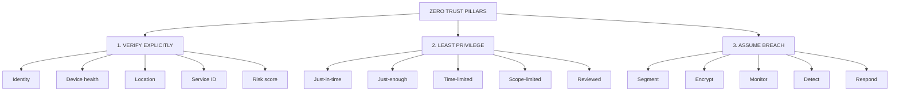
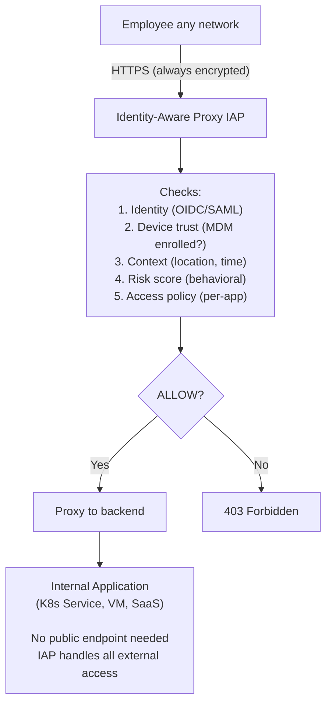
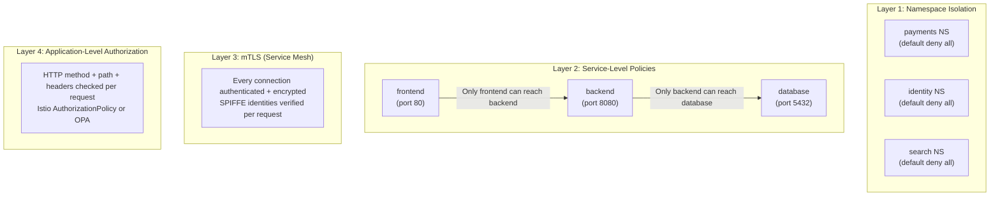
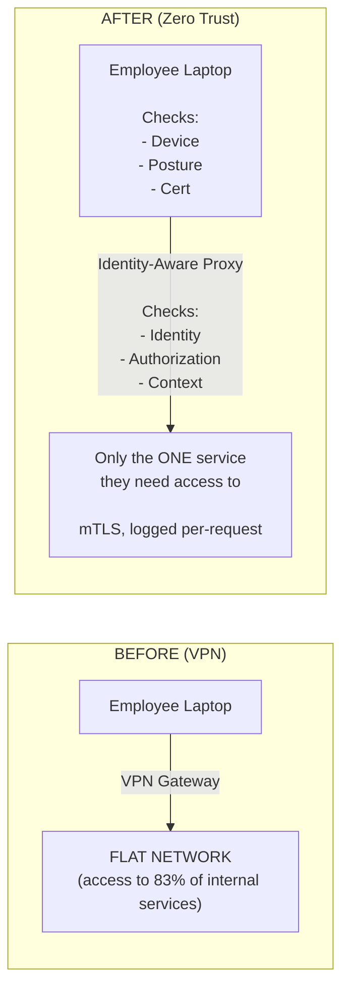

**Complexity**: `[COMPLEX]` | **Time to Complete**: 2.5h | **Prerequisites**: Kubernetes Networking, Identity & Access Management, Service Mesh Basics

In a hybrid cloud portfolio, zero trust is not a single feature you switch on after the fact; it is a design discipline that affects service boundaries, identity, policy evaluation, and operational workflows. In practice, the strongest teams apply these constraints before introducing new services, and the result is fewer emergency exceptions and clearer responsibility between platform, security, and application owners.

## What You'll Be Able to Do

After completing this module, you will be able to:

- **Design** zero trust network architectures for Kubernetes using service mesh mTLS, network policies, and SPIFFE identities.
- **Implement** workload identity verification with SPIFFE/SPIRE across multi-cluster and multi-cloud environments.
- **Evaluate** micro-segmentation policies that enforce least-privilege network access at the pod and service level.
- **Compare** traditional VPN-based perimeter security with Identity-Aware Proxies (IAP) for human-to-machine access.
- **Diagnose** unauthorized lateral movement attempts using default-deny network strategies and layer 7 authorization policies.

---

## Why This Module Matters

Organizations that rely on perimeter-based VPN access can suffer serious breaches when attackers reuse stolen credentials and then move laterally across broadly reachable internal services before detection. The lesson is that network location should not substitute for identity and authorization.

This is the fundamental flaw of perimeter security: it secures a boundary and then treats everything inside as implicitly trusted. A traditional VPN gives you a binary access state, so an authenticated session often turns into broad, hard-to-triage internal privilege. In a modern environment with contractors, remote staff, third-party services, and ephemeral Kubernetes clusters, that broad state is operationally brittle and creates exactly the kind of lateral movement attackers seek.

Zero Trust flips this model entirely. Each request should prove identity and authorization for a specific action, then be evaluated against policy before access is granted. The location of the requester still matters as context, but it is never the only trust signal. This module focuses on building that mindset in practical enterprise settings: Identity-Aware Proxies, service mesh controls, micro-segmentation, VPN replacement, and SLSA-based pipeline integrity for the software supply chain.

Think of the shift as a high-security research campus, not a fortress. A fortress protects the gate, while a research campus protects each lab, server room, and instrument access path independently. In zero trust, the perimeter still exists, but it is no longer the critical control.

---

## Zero Trust Principles

Zero trust is not a single product or tool you can buy off the shelf. It is an architectural mindset and a set of guiding principles designed to eliminate implicit trust from IT systems. Let us explore the foundational concepts that make zero trust effective in a hybrid cloud environment.

### The Three Pillars

The entire zero trust philosophy rests on [three major pillars](https://learn.microsoft.com/en-us/security/zero-trust/adopt/zero-trust-adoption-overview). Every architectural decision you make should map back to one of these core tenets.

In practice, teams that apply this model well repeatedly answer three operational questions: who is making the request, what context proves this request is legitimate right now, and why is this request allowed for this specific action. If those questions are not encoded in policy, they become human assumptions instead of enforceable controls.



Let us break down what these pillars mean in a practical Kubernetes context:
1. Verify Explicitly: Never rely on network location (like an internal IP address range) as a proxy for identity. A pod in the `payments` namespace must present a cryptographic identity (like a SPIFFE verifiable document) to prove it is the payment service, and its request must be evaluated against context such as device health or risk scores.
2. Least Privilege: Provide access only to the specific resources required, only for the duration needed, and only with the minimum necessary permissions. Just-in-time access and scope-limited tokens prevent long-lived credentials from being exploited if leaked.
3. Assume Breach: Design your architecture under the assumption that attackers are already inside your network. This forces you to segment networks aggressively, encrypt all data in transit (mTLS), and implement comprehensive monitoring to detect anomalies rapidly.

Think of traditional security like a medieval castle with a moat. Once you lower the drawbridge (VPN) and someone walks in, they can freely roam the courtyard, the armory, and the kitchen. Zero trust is like a modern high-security research facility. Having a badge gets you in the front door, but every single room, elevator, and filing cabinet requires you to swipe that badge again. Furthermore, the system checks if you are scheduled to be in that room at that specific time, and security cameras monitor your behavior while you are inside.

That analogy also shows why "continuous" checks are required. If a badge can open every room by default, then one compromised credential turns into a broad incident. If each room has separate policy enforcement, then a single compromise is contained to one narrow set of systems and can be revoked quickly.

### Zero Trust vs Perimeter Security

| Aspect | Perimeter Security | Zero Trust |
| :--- | :--- | :--- |
| **Trust model** | Inside network = trusted | Nothing trusted by default |
| **Network access** | VPN grants broad access | Per-resource access based on identity + context |
| **Lateral movement** | Easy once inside | Micro-segmented, each service independently secured |
| **Authentication** | Once at VPN login | Continuous, per-request |
| **Authorization** | Network-level (IP, VLAN) | Application-level (identity, role, context) |
| **Encryption** | At the perimeter (TLS termination) | Everywhere (mTLS between all services) |
| **Monitoring** | Perimeter logs (firewall) | Every transaction logged and analyzed |
| **Kubernetes impact** | Cluster accessible via VPN | Each pod/service independently authenticated |

---

## BeyondCorp: Google's Zero Trust Implementation

> **Stop and think**: If there is no VPN, how do employees securely access internal applications without exposing those applications to the public internet?

Google pioneered Zero Trust at enterprise scale with [BeyondCorp, their internal access model that eliminated the corporate VPN entirely](https://www.usenix.org/publications/login/dec14/ward). Every Google employee accesses internal applications the same way from any network. There is no concept of a "corporate network" that grants additional trust or privileges.

The practical effect is a consistent access model across work modalities: on a home Wi-Fi, in a branch office, or on a managed laptop, the authorization path is the same. That consistency is the opposite of a legacy perimeter mindset, where trust depends on where the packet entered your estate.

### BeyondCorp Architecture

The BeyondCorp architecture replaces the network perimeter with an identity and context-aware proxy. The proxy acts as the single gateway to internal applications. In a hybrid enterprise, this decouples access strategy from network topology, which is valuable when services run across managed clusters, clouds, and legacy VM estates.



In this model, the Identity-Aware Proxy (IAP) is the brain of the operation. It intercepts every request and performs a rigorous evaluation before forwarding traffic. The application itself can reside anywhere -- in a local data center, an AWS VPC, or a managed Kubernetes cluster -- and never needs to expose a public IP address or manage its own authentication logic.

### Identity-Aware Proxy Implementations

There are several ways to implement an IAP depending on your cloud provider and operational preferences. The decision is usually not only about what is easier to run; it is also about where auditability, operations burden, and device posture checks are centralized.

| Provider | Service | How It Works |
| :--- | :--- | :--- |
| **GCP** | Cloud IAP | [Built-in proxy for GCE, GKE, App Engine. Checks Google Identity + device trust via Endpoint Verification.](https://docs.cloud.google.com/iap/docs) |
| **AWS** | Verified Access | Evaluates identity (IAM Identity Center) + device posture (Jamf, CrowdStrike) per request. Runs at the VPC level. |
| **Azure** | Microsoft Entra application proxy | [Proxies requests to on-prem/cloud apps. Evaluates Conditional Access policies per request.](https://learn.microsoft.com/en-us/azure/active-directory/app-proxy/application-proxy-secure-api-access) |
| **Open Source** | Self-hosted identity-aware proxies | Self-hosted proxies can integrate with identity providers, but you must operate and secure the access layer yourself. |

### AWS Verified Access for Kubernetes

If you are operating in AWS, Verified Access provides a native way to implement Zero Trust without managing proxy infrastructure yourself. [Verified Access integrates directly with your Identity Provider (IdP) and your device management solutions to evaluate trust on every request.](https://docs.aws.amazon.com/verified-access/latest/ug/how-it-works.html)

The following script demonstrates how to configure AWS Verified Access to protect a Kubernetes Ingress endpoint. Use it as a migration baseline by first creating the trust provider, then the instance, and only then binding explicit endpoint policies for protected applications.

```bash
# Create a Verified Access trust provider (connects to your IdP)
VA_TRUST=$(aws ec2 create-verified-access-trust-provider \
  --trust-provider-type user \
  --user-trust-provider-type oidc \
  --oidc-options '{
    "Issuer": "https://company.okta.com/oauth2/default",
    "AuthorizationEndpoint": "https://company.okta.com/oauth2/default/v1/authorize",
    "TokenEndpoint": "https://company.okta.com/oauth2/default/v1/token",
    "UserInfoEndpoint": "https://company.okta.com/oauth2/default/v1/userinfo",
    "ClientId": "0oa1234567abcdefg",
    "ClientSecret": "secret123",
    "Scope": "openid profile email groups"
  }' \
  --query 'VerifiedAccessTrustProvider.VerifiedAccessTrustProviderId' --output text)

# Create a Verified Access instance
VA_INSTANCE=$(aws ec2 create-verified-access-instance \
  --query 'VerifiedAccessInstance.VerifiedAccessInstanceId' --output text)

# Attach the trust provider to the instance
aws ec2 attach-verified-access-trust-provider \
  --verified-access-instance-id $VA_INSTANCE \
  --verified-access-trust-provider-id $VA_TRUST

# Create an endpoint that points to your K8s ingress
VA_GROUP=$(aws ec2 create-verified-access-group \
  --verified-access-instance-id $VA_INSTANCE \
  --query 'VerifiedAccessGroup.VerifiedAccessGroupId' --output text)

aws ec2 create-verified-access-endpoint \
  --verified-access-group-id $VA_GROUP \
  --endpoint-type load-balancer \
  --attachment-type vpc \
  --domain-certificate-arn arn:aws:acm:us-east-1:123456789012:certificate/abc-123 \
  --application-domain dashboard.company.com \
  --endpoint-domain-prefix dashboard \
  --load-balancer-options '{
    "LoadBalancerArn": "arn:aws:elasticloadbalancing:us-east-1:123456789012:loadbalancer/app/k8s-ingress/abc123",
    "Port": 443,
    "Protocol": "https",
    "SubnetIds": ["subnet-aaa", "subnet-bbb"]
  }' \
  --policy-document '{
    "Version": "2012-10-17",
    "Statement": [{
      "Effect": "Allow",
      "Principal": "*",
      "Action": "ec2:*",
      "Resource": "*",
      "Condition": {
        "StringEquals": {
          "verified_access.groups": ["engineering"]
        }
      }
    }]
  }'
```

### Pomerium: Open-Source Identity-Aware Proxy for Kubernetes

For organizations that prefer open-source solutions or operate across multiple clouds, Pomerium is an excellent choice. It integrates seamlessly into Kubernetes and can route traffic based on OIDC claims, including device trust attributes.

Teams adopting open-source IAP should budget time for observability and policy drift management because every claim mapping and forwarding rule becomes part of your operational control plane. The upside is flexibility in mixed-provider environments; the trade-off is that your team now owns patch cadence, incident response, and scale testing of the proxy layer.

```yaml
# Deploy Pomerium as an IAP in front of Kubernetes services
apiVersion: v1
kind: ConfigMap
metadata:
  name: pomerium-config
  namespace: pomerium
data:
  config.yaml: |
    authenticate_service_url: https://authenticate.company.com
    identity_provider: oidc
    identity_provider_url: https://company.okta.com/oauth2/default
    identity_provider_client_id: 0oa1234567abcdefg
    identity_provider_client_secret_file: /secrets/idp-client-secret

    policy:
      # ArgoCD: only platform engineers
      - from: https://argocd.company.com
        to: http://argocd-server.argocd.svc.cluster.local:80
        allowed_groups:
          - platform-engineers
        cors_allow_preflight: true
        preserve_host_header: true

      # Grafana: all engineers, read-only for non-SRE
      - from: https://grafana.company.com
        to: http://grafana.monitoring.svc.cluster.local:3000
        allowed_groups:
          - all-engineers
        set_request_headers:
          X-Grafana-Role: |
            {{- if .Groups | has "sre-team" -}}Admin{{- else -}}Viewer{{- end -}}

      # Backstage: all engineers
      - from: https://backstage.company.com
        to: http://backstage.backstage.svc.cluster.local:7007
        allowed_groups:
          - all-engineers

      # Kubernetes Dashboard: platform team only, with device trust
      - from: https://k8s-dashboard.company.com
        to: http://kubernetes-dashboard.kubernetes-dashboard.svc.cluster.local:443
        tls_skip_verify: true
        allowed_groups:
          - platform-engineers
        allowed_idp_claims:
          device_trust:
            - "managed"
```

---

## Micro-Segmentation in Kubernetes

### Defense in Depth with Network Policies

A robust zero trust deployment requires multiple layers of policy enforcement. If one layer fails or is misconfigured, the next layer acts as a safety net. In Kubernetes, think of these as concentric controls: namespace policy, network policy, workload identity, then application-level authorization.

**Pause and predict:** If an attacker compromises a frontend pod in a default Kubernetes cluster, what prevents them from reaching the database pod directly?

<details>
<summary>Check your prediction</summary>

In a default Kubernetes cluster, nothing prevents that connection because the default networking model allows unrestricted pod-to-pod communication across all namespaces. A NetworkPolicy only stops unauthorized traffic when the underlying Container Network Interface (CNI) plugin actively enforces policy rules; without an enforcing CNI, policy objects are ignored. Micro-segmentation applies the Zero Trust principle of "assume breach" directly at the network level, restricting communication to only explicitly allowed paths so that compromised services cannot escalate laterally through permissive east-west routes.
</details>

The next section is an architecture diagram illustrating concentric defense-in-depth layers spanning namespace isolation, network policies, mutual TLS encryption, and application-level authorization.



### Comprehensive Network Policy Set

To build a true zero trust environment in Kubernetes, you must start with a default-deny posture. By explicitly denying all traffic, you ensure that no service can communicate unless a policy explicitly allows it. We separate the comprehensive network policy set into individual definitions to guarantee strict YAML compliance across all parsers and clear ownership of each business flow.

The first step is establishing the default-deny baseline for the namespace. This enforces an explicit trust boundary for each namespace and turns accidental reachability into an exception you must document.

**Pause and predict:** If you apply a default-deny NetworkPolicy to a namespace, what happens to the DNS resolution for the pods within that namespace?

<details>
<summary>Check your prediction</summary>

Applying a default-deny egress policy to a namespace immediately blocks all outbound network traffic, including DNS resolution queries directed to cluster DNS resolvers. Because Kubernetes does not exempt infrastructure services from network policies, [pods cannot even resolve DNS names until an allow policy explicitly permits egress to the cluster DNS provider](https://kubernetes.io/docs/concepts/services-networking/network-policies/). Default-deny egress blocks DNS until an allow policy permits egress to cluster DNS, making DNS egress a mandatory prerequisite rule for application functionality.
</details>

The next section is a Kubernetes NetworkPolicy manifest that establishes a default-deny security baseline for all ingress and egress traffic in the namespace.

```yaml
# Layer 1: Default deny all ingress and egress in every namespace
apiVersion: networking.k8s.io/v1
kind: NetworkPolicy
metadata:
  name: default-deny-all
  namespace: payments
spec:
  podSelector: {}
  policyTypes:
    - Ingress
    - Egress
```

DNS resolution serves as foundational infrastructure plumbing, but it is also a frequent production outage trigger during zero trust rollout, so platform teams must include an explicit egress permit in policy design from day one.

```yaml
# Layer 2: Allow DNS resolution (required for all pods)
apiVersion: networking.k8s.io/v1
kind: NetworkPolicy
metadata:
  name: allow-dns
  namespace: payments
spec:
  podSelector: {}
  policyTypes:
    - Egress
  egress:
    - to: []
      ports:
        - protocol: TCP
          port: 53
        - protocol: UDP
          port: 53
```

Next, we allow the ingress controller to send traffic to the frontend application. This keeps external ingress explicit and reviewable, and avoids accidental assumptions that "the network is already open."

```yaml
# Layer 2: Frontend can receive traffic from ingress controller
apiVersion: networking.k8s.io/v1
kind: NetworkPolicy
metadata:
  name: allow-ingress-to-frontend
  namespace: payments
spec:
  podSelector:
    matchLabels:
      app: payment-frontend
  ingress:
    - from:
        - namespaceSelector:
            matchLabels:
              kubernetes.io/metadata.name: ingress-nginx
          podSelector:
            matchLabels:
              app.kubernetes.io/name: ingress-nginx
      ports:
        - protocol: TCP
          port: 8080
```

We then allow the frontend application to communicate exclusively with the backend application. This ensures the frontend cannot perform direct data access actions that should remain behind the API layer.

```yaml
# Layer 2: Frontend can talk to backend API only
apiVersion: networking.k8s.io/v1
kind: NetworkPolicy
metadata:
  name: frontend-to-backend
  namespace: payments
spec:
  podSelector:
    matchLabels:
      app: payment-frontend
  policyTypes:
    - Egress
  egress:
    - to:
        - podSelector:
            matchLabels:
              app: payment-backend
      ports:
        - protocol: TCP
          port: 8080
```

The backend needs access to the database. We explicitly allow this path, ensuring the frontend cannot bypass the backend to access the data directly and creating an auditable communication graph.

```yaml
# Layer 2: Backend can talk to database only
apiVersion: networking.k8s.io/v1
kind: NetworkPolicy
metadata:
  name: backend-to-database
  namespace: payments
spec:
  podSelector:
    matchLabels:
      app: payment-backend
  policyTypes:
    - Egress
  egress:
    - to:
        - podSelector:
            matchLabels:
              app: payment-database
      ports:
        - protocol: TCP
          port: 5432
```

Finally, the backend requires access to an external third-party payment gateway. We restrict egress to the specific IP block of the external provider.

```yaml
# Layer 2: Backend can talk to external payment gateway
apiVersion: networking.k8s.io/v1
kind: NetworkPolicy
metadata:
  name: backend-to-payment-gateway
  namespace: payments
spec:
  podSelector:
    matchLabels:
      app: payment-backend
  policyTypes:
    - Egress
  egress:
    - to:
        - ipBlock:
            cidr: 203.0.113.0/24  # Payment gateway IP range
      ports:
        - protocol: TCP
          port: 443
```

### Istio Authorization Policies (Layer 4)

While Network Policies control traffic at the IP and port level, a service mesh like Istio allows you to enforce zero trust at the application layer. [Istio uses SPIFFE identities to authenticate services and Authorization Policies to determine if a specific request path and HTTP method are allowed.](https://istio.io/latest/docs/ops/best-practices/security/) In practice, this becomes the fine-grained control layer for APIs and methods.

First, we define an authorization policy that allows specific service accounts to perform exact HTTP methods on targeted paths.

```yaml
# Only the payment-frontend service account can call the payment-backend
apiVersion: security.istio.io/v1
kind: AuthorizationPolicy
metadata:
  name: payment-backend-authz
  namespace: payments
spec:
  selector:
    matchLabels:
      app: payment-backend
  action: ALLOW
  rules:
    - from:
        - source:
            principals:
              - "cluster.local/ns/payments/sa/payment-frontend"
      to:
        - operation:
            methods: ["GET", "POST"]
            paths: ["/api/v1/payments/*", "/api/v1/refunds/*"]
    - from:
        - source:
            principals:
              - "cluster.local/ns/monitoring/sa/prometheus"
      to:
        - operation:
            methods: ["GET"]
            paths: ["/metrics"]
```

To ensure comprehensive coverage, we must explicitly deny all other principals from accessing the backend service. This prevents lateral movement from compromised workloads.

```yaml
# Deny all other access to payment-backend
apiVersion: security.istio.io/v1
kind: AuthorizationPolicy
metadata:
  name: payment-backend-deny-all
  namespace: payments
spec:
  selector:
    matchLabels:
      app: payment-backend
  action: DENY
  rules:
    - from:
        - source:
            notPrincipals:
              - "cluster.local/ns/payments/sa/payment-frontend"
              - "cluster.local/ns/monitoring/sa/prometheus"
```

---

## Removing VPNs: The Path to Zero Trust Access

Legacy VPN solutions represent an architectural anti-pattern in modern cloud-native infrastructures because they grant broad network-level tunnel connectivity across shared subnets. The primary migration challenge involves balancing developer velocity against attack surface reduction, requiring operational infrastructure teams to establish replacement controls before disconnecting legacy access routes.

### The VPN Replacement Architecture

**Pause and predict:** What operational failure occurs if an enterprise decommissions its VPN gateways before deploying an identity-aware proxy, and why is VPN authentication distinct from zero-trust access?

<details>
<summary>Check your prediction</summary>

Deleting the VPN before an identity-aware proxy is running removes the access path entirely, preventing legitimate remote engineers from reaching protected internal services. Furthermore, traditional VPN connectivity grants broad, persistent network access based on initial perimeter authentication, but VPN access is not per-request identity verification; it fails to inspect workload context, device posture, and granular authorization rules on each individual transaction.
</details>

The next section is an architecture comparison diagram illustrating the workflow transition from legacy perimeter VPN tunneling to per-request identity-aware proxy verification.



The goal is to migrate users from broad network-level access to precise, application-level access mediated by Identity-Aware Proxies. The metric showing eighty-three percent access across internal services in legacy network diagrams serves as an illustrative conceptual example rather than a measured empirical fact. Teams must retain necessary productivity while reducing implicit trust, so a staged rollout with clear monitoring beats a full-day shutdown.

### kubectl Access Without VPN

Accessing the Kubernetes API server securely is often the most challenging aspect of removing the VPN. [Teleport acts as a Zero Trust proxy specifically designed for infrastructure access, eliminating the need for long-lived static kubeconfig files and VPN access to the control plane.](https://github.com/gravitational/teleport) We deploy the agent and its configuration separately.

In infrastructure workflows, this creates a direct operational benefit: identity and session context become the access boundary, and long-lived admin credentials stop becoming a standing liability.

First, we deploy the Teleport agent.

```yaml
# Teleport for Zero Trust Kubernetes access
# teleport-kube-agent.yaml
apiVersion: apps/v1
kind: Deployment
metadata:
  name: teleport-kube-agent
  namespace: teleport
spec:
  replicas: 2
  selector:
    matchLabels:
      app: teleport-kube-agent
  template:
    metadata:
      labels:
        app: teleport-kube-agent
    spec:
      serviceAccountName: teleport-kube-agent
      containers:
        - name: teleport
          image: public.ecr.aws/gravitational/teleport-distroless:16
          args:
            - "--config=/etc/teleport/teleport.yaml"
          volumeMounts:
            - name: config
              mountPath: /etc/teleport
      volumes:
        - name: config
          configMap:
            name: teleport-config
```

Next, we provide the ConfigMap required for Teleport to join the proxy server.

```yaml
apiVersion: v1
kind: ConfigMap
metadata:
  name: teleport-config
  namespace: teleport
data:
  teleport.yaml: |
    version: v3
    teleport:
      join_params:
        token_name: kube-agent-token
        method: kubernetes
      proxy_server: teleport.company.com:443
    kubernetes_service:
      enabled: true
      listen_addr: 0.0.0.0:3027
      kube_cluster_name: eks-prod-east
      labels:
        environment: production
        provider: aws
        region: us-east-1
```

Once the agent is running, developers can access the cluster using the command line tool without ever connecting to a VPN. The developer workflow becomes entirely driven by identity and context, and role scope is enforced through Kubernetes RBAC and Teleport policy.

```bash
# Developer workflow: access kubectl without VPN
# 1. Login via browser-based SSO
tsh login --proxy=teleport.company.com

# 2. List available clusters
tsh kube ls
# Cluster             Labels
# ------------------- ----------------------------------
# eks-prod-east       environment=production provider=aws
# aks-staging-west    environment=staging   provider=azure
# onprem-legacy       environment=production provider=onprem

# 3. Connect to a cluster
tsh kube login eks-prod-east

# 4. Use kubectl normally (proxied through Teleport)
kubectl get pods -n payments

# Every command is:
# - Authenticated via SSO (no static kubeconfig)
# - Authorized per Teleport RBAC (namespace/verb restrictions)
# - Logged with session recording
# - Time-limited (session expires after configured duration)
```

---

## SLSA in Enterprise CI/CD

> **Stop and think**: Even with perfect network security, how could an attacker compromise a workload before it is even deployed to Kubernetes?

Supply chain security is a critical component of a comprehensive Zero Trust strategy. If an attacker can inject malicious code into your container image during the build process, runtime network policies will not stop the compromised code from executing its primary function. SLSA (Supply-chain Levels for Software Artifacts) provides a rigorous framework for securing the CI/CD pipeline and ensuring the integrity of the software you deploy.

In this framing, SLSA proves software trust before deployment, not after the fact.

### SLSA Levels

| Level | Requirement | What It Prevents |
| :--- | :--- | :--- |
| **SLSA 1** | Build process documented | "How was this built?" is answerable |
| **SLSA 2** | Version-controlled build, authenticated provenance | Source tampering, build reproducibility |
| **SLSA 3** | Hardened build platform, non-falsifiable provenance | Compromised build system, forged attestations |
| **SLSA 4** | Two-person review, hermetic builds | Insider threats, dependency confusion |

### Implementing SLSA for Kubernetes Deployments

To implement SLSA effectively, you must integrate signing into your CI/CD pipeline and enforce verification at the Kubernetes admission controller level. The following GitHub Actions workflow demonstrates building an image, generating provenance, and signing it using keyless authentication with Sigstore.

The pattern is to secure the build origin, then make policy enforcement at deploy non-negotiable for production namespaces.

```yaml
# GitHub Actions pipeline with SLSA provenance
name: Build and Deploy with SLSA
on:
  push:
    branches: [main]

permissions:
  contents: read
  packages: write
  id-token: write    # Required for OIDC-based signing

jobs:
  build:
    runs-on: ubuntu-latest
    outputs:
      digest: ${{ steps.build.outputs.digest }}

    steps:
      - uses: actions/checkout@v4

      - name: Build container image
        id: build
        run: |
          docker build -t ghcr.io/company/payment-service:${{ github.sha }} .
          DIGEST=$(docker inspect --format='{{index .RepoDigests 0}}' ghcr.io/company/payment-service:${{ github.sha }} | cut -d@ -f2)
          echo "digest=$DIGEST" >> $GITHUB_OUTPUT

      - name: Push to registry
        run: |
          echo "${{ secrets.GITHUB_TOKEN }}" | docker login ghcr.io -u ${{ github.actor }} --password-stdin
          docker push ghcr.io/company/payment-service:${{ github.sha }}

      - name: Sign image with cosign (keyless)
        uses: sigstore/cosign-installer@v3
      - run: |
          cosign sign --yes \
            ghcr.io/company/payment-service@${{ steps.build.outputs.digest }}

      - name: Generate SLSA provenance
        uses: slsa-framework/slsa-github-generator/.github/workflows/generator_container_slsa3.yml@v2.0.0
        with:
          image: ghcr.io/company/payment-service
          digest: ${{ steps.build.outputs.digest }}

  deploy:
    needs: build
    runs-on: ubuntu-latest
    steps:
      - name: Verify signature before deploy
        run: |
          cosign verify \
            --certificate-identity-regexp='https://github.com/company/.*' \
            --certificate-oidc-issuer='https://token.actions.githubusercontent.com' \
            ghcr.io/company/payment-service@${{ needs.build.outputs.digest }}

      - name: Deploy to Kubernetes
        run: |
          kubectl set image deployment/payment-service \
            payment-service=ghcr.io/company/payment-service@${{ needs.build.outputs.digest }} \
            -n payments
```

Signing container images within continuous integration pipelines generates cryptographic attestations, but protecting production environments requires admission control inside the cluster. In hardened cloud architectures, platform teams evaluate container provenance at the API boundary so that signature verification occurs automatically before pods execute.

**Pause and predict:** If a continuous integration job successfully signs release images using cosign sign, what prevents a cluster from running an unsigned or tampered container image?

<details>
<summary>Check your prediction</summary>

Running cosign sign in CI attaches cryptographic signatures to the registry, but cosign sign without a verifying admission policy does not reject unsigned images at runtime. The Kubernetes API server accepts any standard pod manifest regardless of signature presence unless a validating admission controller intercepts the request and strictly blocks unsigned artifacts.
</details>

The next section is a Kyverno ClusterPolicy manifest that enforces cryptographic image signature verification and SLSA provenance checks during pod admission.

```yaml
# Kyverno policy: only allow signed images from our CI/CD
apiVersion: kyverno.io/v1
kind: ClusterPolicy
metadata:
  name: verify-slsa-provenance
spec:
  validationFailureAction: Enforce
  webhookTimeoutSeconds: 30
  rules:
    - name: verify-signature
      match:
        any:
          - resources:
              kinds:
                - Pod
      verifyImages:
        - imageReferences:
            - "ghcr.io/company/*"
          attestors:
            - entries:
                - keyless:
                    subject: "https://github.com/company/*"
                    issuer: "https://token.actions.githubusercontent.com"
                    rekor:
                      url: "https://rekor.sigstore.dev"
          mutateDigest: true
          verifyDigest: true
          required: true
```

---

## Did You Know?

- **BeyondCorp legacy shift**: Google described BeyondCorp as a long migration away from privileged network access and VPN-only trust for internal applications.
- **CNI-dependent policy enforcement**: [Network Policies are implemented by the cluster CNI plugin, not by Kubernetes alone.](https://kubernetes.io/docs/concepts/services-networking/network-policies/) If your CNI does not enforce them, policies are stored but may never block traffic.
- **Policy layering**: Human access and service-to-service trust are complementary. IAP covers user ingress paths, while mesh policies and workload identity govern service-to-service requests.
- **Signed provenance as access control**: SLSA and admission policies turn supply-chain integrity into an enforceable deployment gate instead of a compliance checkbox.

## Incident-Derived Migration Pattern: Staging Breach and Policy Hardening

Hypothetical scenario: An engineering team trusted a flat staging network because it moved fast and had low perceived risk. During a credential phishing incident, an attacker used valid user credentials to reach staging services, then moved laterally into a payment integration simulator and finally to shared CI artifacts. Security detected the problem only after unexpected jobs ran in the pipeline, which meant the attack had already exercised both access and supply-chain paths.

Post-incident, they did not simply revoke the user account and move on. They introduced default-deny network policies, migrated user access through IAP in parallel with existing VPN patterns, and enforced image signature checks before deployment. The result was twofold: lateral movement became much less likely, and compromised credentials no longer implied broad privilege without additional identity context and policy checks.

## Zero Trust Operations Framework

A mature zero trust migration in hybrid cloud begins with a shared operating model, not just a technical implementation. In practice, teams that succeed build a standard sequence: define the trust boundaries, codify policy intent, validate behavior in a reduced scope environment, then expand gradually with explicit checkpoints. This avoids the classic failure pattern where network teams harden one layer first and discover application and platform teams are still using legacy assumptions.

The first checkpoint is policy intent. Before touching CNI or mesh settings, document the business and technical reasons for each access relationship. For each service pair, capture a short intent sentence like "frontend can call payments for GET `/api/v1/payments/*` only." This is not bureaucracy; it is the first defense against hidden dependencies and policy sprawl. When intent exists at this level, policy design becomes a testable artifact, and every future rule can be traced to a specific business action.

Next, establish identity boundaries before network boundaries. A lot of zero trust work assumes network controls come first, but identity and context are what determine whether a request is evaluated correctly. If identity providers, device posture checks, and service identity issuance are unclear, your network hardening will likely create brittle exceptions. In this module, the identity boundary includes users, automation identities, service accounts, and SPIFFE identities, each with explicit lifetime and revocation behavior.

At namespace granularity, build a trust map for how namespaces are expected to interact. The core question is not which namespace exists, but which namespace should be allowed to initiate which kinds of traffic under which business conditions. Mapping this early makes later migration from legacy access easier because each namespace can be converted from permissive to restrictive with clear acceptance criteria. The outcome is fewer emergency firebreaks during rollout because every blocked path can be compared to intended behavior.

Operationally, the second checkpoint is connectivity design review. Teams often treat network policies as technical details, yet they are really business process controls. A useful review format is: source namespace and identity, destination namespace and service, protocol and ports, allowed HTTP verbs, and required context claims. If one of those fields is vague, stop and refine intent before applying policy. This one step prevents the common migration shock where secure policy breaks critical internal workflows.

The third checkpoint is enforcement consistency. Hybrid environments combine managed Kubernetes APIs, ingress layers, and service mesh controls, so controls must be evaluated in combination rather than isolation. Keep a consistent matrix that checks identity-only enforcement, namespace-to-namespace enforcement, L7 enforcement, and admission enforcement for the same deployment event. If one layer passes and another fails unpredictably, you likely have configuration drift or stale assumptions about which service runs in which control-plane path.

A fourth checkpoint is staged rollout design. A production-safe path usually starts with low-risk internal tools, then non-critical shared services, then critical and customer-facing systems. During each stage, keep a rollback note that explains exactly what to disable if the migration introduces operational friction. This is particularly important in teams that support both cloud-native and legacy services, because rollback paths differ across environments but should still remain documented.

The fifth checkpoint is observability alignment. You do not need one large monolith dashboard; you need consistency in answerability. Every control layer should emit clear signals for authorization decisions, request denials, rule matches, and attempted bypasses. If one layer logs too little detail, teams will spend incident time guessing. If another layer logs too much noise, teams will ignore real violations.

The sixth checkpoint is incident rehearsal cadence. Rehearse unauthorized path attempts across service and human access flows with a controlled exercise before business critical peaks. The rehearsal should include stale credentials, revoked kubeconfig tokens, and unexpected cross-namespace calls because these represent the most realistic pathways of attacker movement. Use the exercise output to add or tighten rules without waiting for a real compromise.

The final checkpoint is governance rhythm. Zero trust is not “set and forget.” Every quarter, review and prune policies that were introduced as temporary exceptions. Remove what is no longer needed, tighten expiration windows, and tighten identity scope when teams or services are restructured. The stronger your governance loop, the smaller your control surface becomes over time, even as platform complexity increases.

## Auditability and Readiness Controls

A good zero trust posture is measured by how quickly teams can diagnose both true positives and false positives. Your readiness controls should therefore include a weekly canary simulation that validates core policy assumptions across at least three namespaces, two identity classes, and both user and service traffic. If canary checks pass for these paths, you can assume baseline enforcement still reflects your intended state.

Your readiness checklist should include provenance readiness as well as network readiness. A secure image with correct signatures is only useful if the cluster admission check is actually enforcing those signatures in the namespaces where it matters. That means auditability across CI provenance and admission decisions must be linked, not siloed. If either side is missing, your security model has a silent blind spot.

Finally, add explicit documentation debt tracking in your project board. Every temporary policy exception should have an owner, an expected removal date, and a measurable risk if delayed. This turns zero trust from a stack of YAML files into an operating model that product, platform, and security teams can evolve together. It also makes onboarding easier because new engineers can inspect documented intent before editing enforcement-critical rules.

## Long-Term Control Cadence and Team Readiness

A strong zero trust program is sustained by rhythm. Teams often launch with energy, then lose precision six weeks later because the migration model was never repeated in predictable cycles. Build cadence for policy and readiness into a recurring calendar. For example, pair monthly architecture reviews with weekly operational readiness checks so exceptions are caught before they become stable paths.

Start with pre-defined change windows and a lightweight change proposal template. Every proposal should include a clear reason, expected user impact, impacted namespace or service graph, and an explicit test plan that spans both positive and negative cases. This structure reduces improvisation during peak periods, because teams can reason about consequences without reconstructing the entire policy model each time. Over time, you move from ad hoc decisions to governed security design.

Use layered acceptance criteria. A service path should be approved only if identity checks, network checks, and mesh checks all pass together. If one layer is not testable at review time, pause the rollout and tighten evidence collection. This prevents partial progress where one dimension passes while another remains unverified, which is exactly how implicit trust re-enters systems.

When an exception is required for business continuity, capture explicit guardrails around it. Define what that exception can do, how long it can exist, and what condition closes it. Without closure conditions, exceptions become permanent defaults. With closure conditions, exceptions become temporary operations tools that do not erode the security baseline.

Run periodic dependency audits alongside policy audits. A namespace boundary that looked correct when it was authored may become inaccurate after service migrations, new API versions, or changing role assignments. If your policy and dependency states drift apart, the first symptom is often confusing denial in one environment and over-permission in another. The fix is not merely another allow rule; it is synchronization between design assumptions and actual architecture state.

For teams with multiple clouds, include cloud-provider review checkpoints as part of your readiness cycle. Identity source signals, network enforcement semantics, and policy APIs can differ by provider and region, so cross-cloud parity should be validated explicitly. This is especially important when a workload pattern is copied from one provider environment into another.

Finally, treat training and pair reviews as security controls, not optional culture work. New hires and rotating team members should be able to follow the same playbook for adding and removing policies without waiting for senior-level intervention. That creates distributed security capability and makes your program resilient to staffing changes, which is where many mature programs fail despite strong technical foundations.

## Zero Trust Maturation Through Service Graph Review

Most teams underestimate a critical part of Zero Trust: policy quality is a function of topology clarity, not just control quantity. You can deploy dozens of NetworkPolicies and still remain vulnerable if the service graph itself is unclear. In practice, the better path is to evolve the system as a sequence of explicit graph transitions: baseline understanding, explicit restrictions, validation, then incremental release.

Start with a service graph hypothesis, not a policy bundle. For each namespace pair and namespace-to-external dependency, write the expected interaction in plain text before changing any YAML. If you cannot describe who talks to whom in one sentence, your policy intent is still hidden. The module's payment frontend-to-backend-to-database chain is a useful pattern because it gives a complete path with minimal nodes, then forces you to reason about every intermediate hop.

Once the intended graph is explicit, the policy authoring order matters more than the specific tooling. A common anti-pattern is to write an allow policy before proving that a default-deny posture is truly active in the same namespace. The default-deny rule becomes the guardrail: everything outside it is an exception, which makes each follow-up rule reviewable by design. If you reverse that order, teams create long-running exceptions that become indistinguishable from accidental open access.

A practical review pattern is to label controls by purpose and layer, then map those labels back to the original graph hypothesis. At the infrastructure layer you might keep labels for ingress allow, service egress, DNS allow, and external gateway allow; at the service layer you can use service allow and method allow; at the identity layer you separate user and workload decisions. When labels are missing or duplicated, policy intent starts to drift because reviewers are unable to answer, "What exact business action does this line permit?" and that is exactly when implicit trust slips back in.

This is not bureaucracy. Clear labels change how incidents are resolved. Suppose a rule unexpectedly blocks a legitimate `frontend -> backend` call after a release. If every policy carries an owner, a ticket reference, and a scope statement, responders can identify whether the policy was a deliberate security control or an operational shortcut that became stale. They can also compare the policy to the declared graph and restore it or replace it with a more precise condition. In this way, the same policy that caused the outage becomes the artifact that shortens recovery time.

In a hybrid setup, the graph review also has to include workload origin assumptions. A pod in a cloud-native namespace may still depend on managed services, legacy APIs, or on-prem integrations that were introduced before zero trust existed. If those dependencies are not represented in your service map, you will create an enforcement gap that appears as a random blocker. Better is to treat every external dependency as a node in the same graph, even if it is not managed by Kubernetes, so that egress policy, DNS exceptions, and proxy routing decisions are all aligned to the same intent.

The migration timeline should therefore combine policy and architecture review every sprint, not only security review days. During each sprint, choose one service interaction, validate intended reachability, and test the full stack of controls you already defined in this module: network baseline, identity checks, and application-layer policy. In the first iterations this usually means only low-impact services. That is not because low-impact services are easier to secure; it is because low-impact services provide the clearest signal when the controls are correct and the documentation is complete. If low-impact services are stable, you are more likely to avoid broad breakage when applying the pattern to critical production services.

One hidden source of churn comes from shared infrastructure components that look like single controls but have multiple dependency consumers. Ingress controllers, observability exporters, certificate managers, and DNS utilities often require explicit allow rules that cross namespace boundaries. Teams that treat these components as "platform plumbing" and exempt them from graph discipline eventually create exception sprawl. This is why governance checklists should distinguish platform-critical infrastructure paths from business service paths, while still preserving principle alignment and least privilege.

For each service migration candidate, ask three control questions before removing legacy access: Which network paths are business-essential? Which identity assertions are required to approve those paths? Which audit signals must prove that those assertions were evaluated? If you cannot answer all three with a deterministic document, the service should not move to zero trust enforcement yet. This one discipline prevents weekend migrations that create security theater without practical protection.

The answer should not be a single all-or-nothing gate either. Use conditional rollout controls that let teams validate that the new control plane is safe under production load. A common sequence is first to validate in one namespace, then to replicate in a second namespace that uses different tooling, then to scale to a third namespace with a stricter set of external dependencies. This mirrors resilience testing patterns while keeping the blast radius intentionally constrained by namespace boundaries and review checkpoints.

When policy and topology are both stable, teams often discover that the most valuable next step is simplifying controls, not adding more. If a namespace pair has multiple overlapping policies that all permit the same behavior, remove duplicates so intent is obvious. If a policy relies on too many conditions to explain one action, split it into one control per action. Simplicity reduces drift because fewer conditional branches are forgotten during incidents and revisions.

Your module has already shown two robust controls for this maturity path: default-deny and explicit allow patterns. They become easier to maintain when paired with strict ownership. Add names to policy owners, change-approvers, and reviewers, and then require every temporary exception to carry an owner and a closure condition. Ownership is what converts controls into operations, and operations is what keeps controls from rotting into unmanaged artifacts over time.

It is also worth treating the exercise paths in this module as policy contracts with a fixed acceptance surface. Every lab step should produce an observable before/after result and a log trail that proves why access was allowed or blocked. If you use the module's exercise with teams, avoid turning it into a one-time demonstration and instead run it as a recurring "contract test" that catches accidental regressions. The exercise value is highest when it reveals governance failure modes, not just transport-level behavior.

Finally, use your incident response playbook as a design artifact, not a post-incident artifact. When alerts indicate unexpected API requests, evaluate whether policy intent is incorrect, identity context is missing, or policy evaluation path changed unexpectedly due to topology drift. That triage structure often reveals that many production incidents are not due to attack, but to unmodeled change in environment assumptions. The faster you can classify and close those cases, the less incentive teams have to disable protections out of urgency.

By repeatedly applying this loop, zero trust changes from a migration project into an operating discipline. Teams stop asking, "Have we installed all the right tools?" and start asking, "Does this control still represent our current architecture and business intention?" That shift is precisely the gap between documentation and durable security posture.

## Operational Drift and Control Hygiene

Hybrid environments drift quickly because platforms, provider features, and team ownership change across months and quarters. Drift is not unusual; it is expected. The difference is whether drift becomes measurable and corrected or silent and dangerous. Without a maintenance process, even well-designed controls degrade because identity providers rotate claims, workloads move namespaces, and operational policies outlive their migration context.

Control hygiene starts with periodic drift mapping. Compare actual runtime relationships against policy intent for every namespace tier you touch. If the runtime shows a service calling another namespace directly, but policy documents only describe mesh-mediated calls, you found a mismatch before attackers do. If identity claims used for IAP or Teleport are no longer in policy because the IdP changed claim names, you should fix that before authentication behavior fails in production.

Your module emphasizes both user and service controls, so drift mapping should run at both levels. For users, drift appears when roles, teams, or device policies change and existing service bindings no longer match approval expectations. For workloads, drift appears when pod labels, service selectors, or namespace names change while existing NetworkPolicies still reference old selectors. Both cases produce "it used to work" symptoms, but the underlying causes differ enough that they need separate checks and separate owners.

A practical hygiene practice is to run a quarterly "policy-to-implementation diff" by section, not by file. For each namespace or service set, compare four dimensions: declared trust boundaries, selected enforcement mechanisms, verification commands or tests, and owner-owned documentation. If one dimension is missing, the system is already in a half-managed state and should be returned to full implementation before expanding zero trust to additional workloads. This diff can be done with existing repository reviews and does not require new tooling to begin, as long as owners agree to the format.

Another important maintenance pattern is dependency-aware exception review. Exceptions are often introduced for practical reasons, and some are valid for a period. Problems begin when they become permanent because no one tracks their expiry condition. Keep each temporary exception in a visible log with three minimum fields: condition that triggered it, evidence of temporary status, and explicit sunset date. This is not added complexity; it is the only way to prevent temporary convenience from becoming permanent privilege.

Training should include exception retirement rituals. When onboarding a new engineer, teach how to trace an exception from enforcement artifact to business justification and then to expiration. This lowers friction because engineers can act on their own maintenance needs without guessing who "owns" the rule. It also reduces the likelihood of shadow bypass: if teams know the correct retirement process, they are less likely to create unofficial, undocumented allowances.

Because this module already spans multiple layers, hygiene should include enforcement parity checks. A path that is intentionally blocked at one layer but accidentally allowed at another is not a stable state. You should be able to trace any observed allowance through identity policy, network policy, and service policy and explain why each layer permits it. If one layer is unknown, the result is either over-permission or false positives during audits. Either outcome increases operational cost and weakens confidence in the control framework.

Pair parity checks with environment-specific evidence so teams are not surprised by provider behavior differences. Even when services are functionally equivalent, managed clusters can differ in ingress behavior, CNI plugin defaults, and policy propagation timing. If your module is used across clouds, capture these differences in a short environment note so migration steps can be repeated without guesswork. That reduces repeated incidents where teams trust a tested pattern from one cluster but overlook context-specific behavior in another.

Do not postpone incident learnings. Every suspicious access or blocked transaction should enrich documentation within the same operational cycle, ideally before the next change window. If the response team repeatedly sees the same class of alert, that is a design signal, not a one-off alert fatigue problem. The design signal might be too broad role mappings, a missing device posture check, or an egress path forgotten during migration. Capture the design lesson directly in the rollout playbook so the fix becomes part of system behavior, not a memory-dependent tribal note.

In practice, teams that adopt this hygiene loop become much better at balancing security and velocity. They keep the same zero trust controls but reduce firefighting because drift events are anticipated and normalized. They still evolve, but evolution is deliberate: each new change should pass through the same gates you used at migration start. The program remains secure because controls stay synchronized with architecture, not because someone remembers to "just be careful."

---

## Common Mistakes

| Mistake | Why It Happens | How to Fix It |
| :--- | :--- | :--- |
| **Zero Trust without identity foundation** | Teams jump to micro-segmentation and IAP without first establishing strong identity (OIDC, device trust, service accounts). | Start with identity: deploy OIDC for humans, SPIFFE for services, device trust for endpoints. Then layer on micro-segmentation and IAP. |
| **Network Policies without default deny** | Teams add "allow" policies but never set the default deny baseline. Pods can still communicate freely on paths without explicit policies. | Always start with a default-deny NetworkPolicy in every namespace. Then add explicit allow policies for each legitimate communication path. |
| **mTLS in the mesh but plaintext sidecars** | [Service mesh provides mTLS between proxies, but the connection from the proxy to the application container inside the same pod is plaintext on localhost.](https://istio.io/latest/docs/ops/configuration/traffic-management/tls-configuration/) | This is expected behavior -- localhost traffic within a pod is considered trusted. If you need end-to-end encryption (e.g., for FIPS compliance), the application itself must implement TLS. |
| **VPN removal without alternative** | Security team removes the VPN before deploying IAP or Teleport. Developers cannot access anything. Shadow IT VPN tunnels appear. | Deploy the Zero Trust access layer first and run it alongside the VPN long enough to validate real access patterns before decommissioning the VPN. |
| **Image signing without admission enforcement** | CI/CD pipeline signs images with cosign, but no admission webhook verifies signatures. Unsigned images can still be deployed. | Deploy Kyverno or Gatekeeper with image verification policies. Signing without enforcement is security theater. |
| **Overly broad Istio AuthorizationPolicies** | Teams write policies with `action: ALLOW` that match too broadly, effectively allowing everything. The policy exists but does not restrict. | Use deny-by-default: start with an AuthorizationPolicy that denies all, then add specific allow rules for each legitimate path. Test with `istioctl analyze`. |

---

## Quiz

<details>
<summary>Question 1: A developer's laptop is stolen while logged into the corporate VPN with a valid kubeconfig file. Under a traditional perimeter security model, what happens next compared to a Zero Trust architecture using an Identity-Aware Proxy (IAP) like Teleport?</summary>

Under a **perimeter security model**, the attacker now has full network access to the corporate environment and the Kubernetes API server because the VPN provides a binary "inside/trusted" state. The valid kubeconfig file allows the attacker to authenticate to the cluster and execute commands with the developer's broad RBAC permissions, potentially compromising the entire environment. In a **Zero Trust architecture**, the stolen laptop and VPN connection are useless on their own. The IAP continuously verifies identity and context per request. Even if the attacker has the laptop, they would need the developer's SSO credentials and physical MFA token to establish a new session. Furthermore, the IAP enforces device health checks (which might fail if the device is reported stolen) and limits access strictly to the namespaces the developer needs, minimizing the blast radius. Trust is never binary; it is continuously evaluated.
</details>

<details>
<summary>Question 2: A team has deployed Network Policies with a default-deny rule, but pods can still communicate freely. What is the most likely cause?</summary>

The most likely cause is that **the CNI plugin does not support Network Policies**. NetworkPolicy resources are processed by the CNI plugin, not by the Kubernetes API server. If the cluster uses a CNI that does not implement the NetworkPolicy API (like Flannel without the Calico integration, or AWS VPC CNI without the network policy controller), the NetworkPolicy objects are stored in etcd but have no enforcement. The pods see no firewalling because there is no component enforcing the rules. To diagnose this issue, you should check which CNI is installed and verify its documentation for Network Policy support. For example, on EKS, you need to enable the VPC CNI network policy feature or install Calico alongside VPC CNI to achieve actual enforcement.
</details>

<details>
<summary>Question 3: A sophisticated attacker compromises your CI/CD worker node and injects malicious code during the build process of your payment service. How does SLSA Level 3 prevent this compromised container image from running in your production Kubernetes cluster?</summary>

SLSA Level 3 requires a **hardened build platform** and **non-falsifiable provenance**. The build platform is isolated so that individual builds cannot influence each other or tamper with the build process. Provenance is generated by the build platform itself (not by the build script), and it is cryptographically signed in a way that the build script cannot forge. If an attacker compromises a CI/CD worker, the provenance will either accurately reflect that the build used a modified source, or be absent entirely if the attacker attempts to bypass it. The admission webhook in the production cluster will then reject the artifact because it lacks valid, signed provenance from the trusted builder. The key insight is that at SLSA 3, provenance is a property of the build platform, not of the build, meaning the build cannot lie about its own origin.
</details>

<details>
<summary>Question 4: The CISO mandates the removal of the corporate VPN within 6 months in favor of a Zero Trust architecture. The infrastructure team proposes shutting down the VPN next weekend and routing all traffic through a newly installed Identity-Aware Proxy (IAP) to force adoption. Why is this approach likely to fail, and what sequence of steps should be taken instead?</summary>

This "rip and replace" approach is highly likely to fail and cause a massive business disruption because it assumes all applications and access patterns are immediately compatible with the IAP. Without a strong identity foundation already in place, users will be locked out of critical services, leading to shadow IT workarounds and halted productivity. Instead, the migration must be incremental and run in parallel to ensure continuous access. First, you must establish a strong identity foundation including SSO, MFA, and device MDM. Second, deploy the IAP alongside the existing VPN without disrupting current workflows. Third, incrementally migrate applications starting with low-risk internal tools before moving to production Kubernetes access. You must monitor access patterns over 3-6 months to ensure all legitimate traffic has shifted to the IAP before finally decommissioning the VPN.
</details>

<details>
<summary>Question 5: A security auditor reviews your cluster and notices you are using Istio Authorization Policies to restrict traffic between services, but you have no Kubernetes Network Policies. They flag this as a vulnerability. Why would they require both if Istio already controls access?</summary>

**Network Policies** operate at **Layer 3/4** (IP addresses and ports) and are enforced by the CNI plugin, meaning they work without a service mesh to control which pods can establish TCP/UDP connections. **Istio Authorization Policies** operate at **Layer 7** (HTTP methods, paths, headers, service identities) and require the Istio sidecar proxy to control what requests are allowed within an established connection. **You need both** for defense in depth because Network Policies prevent unauthorized network connections from being established at all, even if Istio is misconfigured or the sidecar is bypassed. Istio Authorization Policies provide fine-grained control that Network Policies cannot, such as allowing GET but denying DELETE. Network Policies act as the coarse guard at the door, while Istio policies provide the fine-grained access control inside the room.
</details>

<details>
<summary>Question 6: An engineer argues that implementing mTLS in your Istio service mesh makes Network Policies unnecessary because "mTLS already verifies identity and encrypts traffic." Why is this assertion dangerous in a Zero Trust environment?</summary>

While mTLS verifies the **identity** of the communicating parties via SPIFFE certificates and **encrypts** the traffic, it does not **restrict** which communications can happen. By default, Istio's mTLS allows any service with a valid mesh certificate to communicate with any other service. This means mTLS ensures that the caller is who they claim to be, but it does not ensure the caller is authorized for that specific action. You still need **AuthorizationPolicies** to restrict which identities can call which services at Layer 7. Furthermore, you need **Network Policies** as a fallback in case the Istio sidecar is bypassed by host-networked pods, init containers, or pods without sidecar injection. Relying solely on mTLS conflates authentication with authorization, which is a common and dangerous architectural mistake.
</details>

---

## Hands-On Exercise: Implement Zero Trust Micro-Segmentation

In this exercise, you will implement a multi-layered Zero Trust architecture in a kind cluster with Network Policies, RBAC, and simulated identity-aware access. The order mirrors production rollout: baseline cluster, baseline service graph, baseline reachability, policy hardening, then verification.

### Task 1: Create the Zero Trust Lab Cluster

First, provision a local Kubernetes environment configured with a CNI that respects network policies. The `disableDefaultCNI` flag keeps the lab deterministic, and installing Calico gives you a predictable policy behavior for policy-only debugging.

<details>
<summary>Solution</summary>

```bash
# Create a cluster with Calico CNI for Network Policy enforcement
cat <<'EOF' > /tmp/zero-trust-cluster.yaml
kind: Cluster
apiVersion: kind.x-k8s.io/v1alpha4
name: zero-trust-lab
networking:
  disableDefaultCNI: true
  podSubnet: 192.168.0.0/16
nodes:
  - role: control-plane
  - role: worker
  - role: worker
EOF

kind create cluster --config /tmp/zero-trust-cluster.yaml

# Install Calico for Network Policy enforcement
kubectl apply -f https://raw.githubusercontent.com/projectcalico/calico/v3.28.0/manifests/calico.yaml

# Wait for Calico to be ready
kubectl wait --for=condition=ready pod -l k8s-app=calico-node -n kube-system --timeout=120s
kubectl wait --for=condition=ready pod -l k8s-app=calico-kube-controllers -n kube-system --timeout=120s

echo "Cluster ready with Calico CNI (Network Policy support enabled)"
```

</details>

### Task 2: Deploy a Multi-Service Application

Deploy a simulated 3-tier application to test network flows. Keep this topology simple on purpose so that every allowed and denied path can be explained in terms of explicit graph edges rather than hidden dependencies.

<details>
<summary>Solution</summary>

```bash
# Create namespaces
kubectl create namespace payments
kubectl create namespace monitoring

# Deploy a 3-tier application
cat <<'EOF' | kubectl apply -f -
# Frontend
apiVersion: apps/v1
kind: Deployment
metadata:
  name: frontend
  namespace: payments
spec:
  replicas: 2
  selector:
    matchLabels:
      app: frontend
  template:
    metadata:
      labels:
        app: frontend
        tier: frontend
    spec:
      containers:
        - name: frontend
          image: wbitt/network-multitool:3.22.2
          ports:
            - containerPort: 80
          resources:
            limits:
              cpu: 100m
              memory: 128Mi
---
apiVersion: v1
kind: Service
metadata:
  name: frontend
  namespace: payments
spec:
  selector:
    app: frontend
  ports:
    - port: 80
---
# Backend API
apiVersion: apps/v1
kind: Deployment
metadata:
  name: backend
  namespace: payments
spec:
  replicas: 2
  selector:
    matchLabels:
      app: backend
  template:
    metadata:
      labels:
        app: backend
        tier: backend
    spec:
      containers:
        - name: backend
          image: wbitt/network-multitool:3.22.2
          ports:
            - containerPort: 80
          resources:
            limits:
              cpu: 100m
              memory: 128Mi
---
apiVersion: v1
kind: Service
metadata:
  name: backend
  namespace: payments
spec:
  selector:
    app: backend
  ports:
    - port: 80
---
# Database
apiVersion: apps/v1
kind: Deployment
metadata:
  name: database
  namespace: payments
spec:
  replicas: 1
  selector:
    matchLabels:
      app: database
  template:
    metadata:
      labels:
        app: database
        tier: database
    spec:
      containers:
        - name: database
          image: wbitt/network-multitool:3.22.2
          ports:
            - containerPort: 80
          resources:
            limits:
              cpu: 100m
              memory: 128Mi
---
apiVersion: v1
kind: Service
metadata:
  name: database
  namespace: payments
spec:
  selector:
    app: database
  ports:
    - port: 80
EOF

kubectl wait --for=condition=ready pod -l app=frontend -n payments --timeout=60s
kubectl wait --for=condition=ready pod -l app=backend -n payments --timeout=60s
kubectl wait --for=condition=ready pod -l app=database -n payments --timeout=60s
```

</details>

### Task 3: Verify Flat Network (Before Zero Trust)

Before applying policies, confirm that the network is flat and all pods can communicate without restriction. This highlights the vulnerability of default Kubernetes networking and gives you a clear before/after baseline for comparison.

Treat these checks as controlled tests, not assumptions. If anything fails here, you are looking at an environment issue before policy enforcement behavior can be meaningfully interpreted.

<details>
<summary>Solution</summary>

```bash
echo "=== BEFORE ZERO TRUST: Flat Network ==="
echo ""
# Service DNS may not resolve immediately after pods become Ready; retry or sleep 5s if curl fails with "Could not resolve host"
echo "Test: Frontend → Backend (should succeed - legitimate)"
kubectl exec -n payments deploy/frontend -- curl -s --max-time 3 backend.payments.svc.cluster.local || echo "FAILED"

echo ""
echo "Test: Frontend → Database (should succeed - PROBLEM: frontend should not access DB directly)"
kubectl exec -n payments deploy/frontend -- curl -s --max-time 3 database.payments.svc.cluster.local || echo "FAILED"

echo ""
echo "Test: Database → Frontend (should succeed - PROBLEM: DB should not call frontend)"
kubectl exec -n payments deploy/database -- curl -s --max-time 3 frontend.payments.svc.cluster.local || echo "FAILED"

echo ""
echo "CONCLUSION: Without Network Policies, every pod can talk to every other pod."
echo "This is the 'soft interior' problem of perimeter security."
```

</details>

### Task 4: Apply Zero Trust Network Policies

Secure the namespace by applying a default-deny posture and explicitly whitelisting required traffic paths. This step is where the design becomes policy-as-code: every allowed communication path is encoded explicitly, reviewed, and limited.

<details>
<summary>Solution</summary>

```bash
cat <<'EOF' | kubectl apply -f -
# Step 1: Default deny ALL traffic
apiVersion: networking.k8s.io/v1
kind: NetworkPolicy
metadata:
  name: default-deny-all
  namespace: payments
spec:
  podSelector: {}
  policyTypes:
    - Ingress
    - Egress
---
# Step 2: Allow DNS for all pods
apiVersion: networking.k8s.io/v1
kind: NetworkPolicy
metadata:
  name: allow-dns
  namespace: payments
spec:
  podSelector: {}
  policyTypes:
    - Egress
  egress:
    - ports:
        - protocol: TCP
          port: 53
        - protocol: UDP
          port: 53
---
# Step 3: Frontend can receive from outside and send to backend only
apiVersion: networking.k8s.io/v1
kind: NetworkPolicy
metadata:
  name: frontend-policy
  namespace: payments
spec:
  podSelector:
    matchLabels:
      app: frontend
  policyTypes:
    - Ingress
    - Egress
  ingress:
    - {}  # Accept from any source (simulates ingress controller)
  egress:
    - to:
        - podSelector:
            matchLabels:
              app: backend
      ports:
        - port: 80
    - ports:
        - protocol: TCP
          port: 53
        - protocol: UDP
          port: 53
---
# Step 4: Backend accepts from frontend, can reach database only
apiVersion: networking.k8s.io/v1
kind: NetworkPolicy
metadata:
  name: backend-policy
  namespace: payments
spec:
  podSelector:
    matchLabels:
      app: backend
  policyTypes:
    - Ingress
    - Egress
  ingress:
    - from:
        - podSelector:
            matchLabels:
              app: frontend
      ports:
        - port: 80
  egress:
    - to:
        - podSelector:
            matchLabels:
              app: database
      ports:
        - port: 80
    - ports:
        - protocol: TCP
          port: 53
        - protocol: UDP
          port: 53
---
# Step 5: Database accepts from backend only, no egress
apiVersion: networking.k8s.io/v1
kind: NetworkPolicy
metadata:
  name: database-policy
  namespace: payments
spec:
  podSelector:
    matchLabels:
      app: database
  policyTypes:
    - Ingress
    - Egress
  ingress:
    - from:
        - podSelector:
            matchLabels:
              app: backend
      ports:
        - port: 80
  egress:
    - ports:
        - protocol: TCP
          port: 53
        - protocol: UDP
          port: 53
EOF

echo "Network Policies applied:"
kubectl get networkpolicy -n payments
```

</details>

### Task 5: Verify Zero Trust Enforcement

Test the application flows to ensure policies are correctly evaluated and lateral movement is blocked. Run the checks in order and compare with the pre-policy baseline because interpretation comes from deltas.

<details>
<summary>Solution</summary>

```bash
echo "=== AFTER ZERO TRUST: Micro-Segmented Network ==="
echo ""

echo "Test 1: Frontend → Backend (SHOULD PASS - legitimate path)"
kubectl exec -n payments deploy/frontend -- curl -s --max-time 3 backend.payments.svc.cluster.local && echo "PASS" || echo "BLOCKED"

echo ""
echo "Test 2: Frontend → Database (SHOULD BLOCK - frontend must go through backend)"
kubectl exec -n payments deploy/frontend -- curl -s --max-time 3 database.payments.svc.cluster.local 2>&1 && echo "PASS (BAD!)" || echo "BLOCKED (GOOD!)"

echo ""
echo "Test 3: Backend → Database (SHOULD PASS - legitimate path)"
kubectl exec -n payments deploy/backend -- curl -s --max-time 3 database.payments.svc.cluster.local && echo "PASS" || echo "BLOCKED"

echo ""
echo "Test 4: Database → Frontend (SHOULD BLOCK - DB should not initiate connections)"
kubectl exec -n payments deploy/database -- curl -s --max-time 3 frontend.payments.svc.cluster.local 2>&1 && echo "PASS (BAD!)" || echo "BLOCKED (GOOD!)"

echo ""
echo "Test 5: Database → external internet (SHOULD BLOCK - DB must not reach internet)"
kubectl exec -n payments deploy/database -- curl -s --max-time 3 https://example.com 2>&1 && echo "PASS (BAD!)" || echo "BLOCKED (GOOD!)"

echo ""
echo "CONCLUSION: Only legitimate communication paths are allowed."
echo "Lateral movement is prevented. The blast radius of a compromise is contained."
```

</details>

### Clean Up

Remove the cluster to free up local resources.

```bash
kind delete cluster --name zero-trust-lab
rm /tmp/zero-trust-cluster.yaml
```

**Card A: A default Kubernetes cluster stops a compromised frontend pod from connecting to the database pod.** A security engineer assumes that Kubernetes automatically isolates workloads running in separate application tiers or namespaces. When deploying a frontend web service and a backend database inside the cluster, the engineer leaves network policies unconfigured under the belief that platform defaults prevent cross-tier lateral movement. Under this assumption, a compromised frontend container cannot initiate arbitrary TCP connections to the private database pod.

<details>
<summary>Check your prediction</summary>

Failure layer: Default pod network reachability versus enforced NetworkPolicy isolation conflation. Next action: understand that standard Kubernetes networking is completely flat and non-isolated by default, allowing any pod to establish network connections to any other pod across namespaces; a NetworkPolicy manifest only restricts traffic when the underlying Container Network Interface (CNI) plugin actively evaluates and enforces policy rules; platform engineers must deploy an enforcing CNI plugin, establish default-deny baselines, and configure explicit ingress rules permitting only designated service tiers to reach database ports; additionally, remember that service mesh mTLS encrypts transport between sidecar proxies but does not eliminate plaintext communication on the localhost loopback inside the pod container itself.
</details>

**Card B: Default-deny still allows cluster DNS, because DNS is infrastructure and is exempt.** A cluster administrator deploys an egress default-deny NetworkPolicy targeting an application namespace to enforce a strict zero-trust network baseline. The administrator assumes that core infrastructure services, such as CoreDNS or kube-dns resolvers running in kube-system, are automatically exempt from policy restrictions. Under this assumption, application pods in the namespace can resolve internal service domain names without additional egress configuration.

<details>
<summary>Check your prediction</summary>

Failure layer: Cluster infrastructure dependency assumptions versus explicit default-deny egress rule enforcement conflation. Next action: recognize that Kubernetes NetworkPolicy specifications do not include implicit exemptions for cluster infrastructure or DNS traffic; applying an egress default-deny rule immediately blocks outbound traffic on UDP and TCP port 53, causing all pod DNS resolution queries to fail; platform administrators must pair every default-deny policy with an explicit egress allowance rule targeting the cluster DNS service or CoreDNS pods in the kube-system namespace; default-deny means all egress is blocked until explicitly allowed, and DNS is never automatically exempt.
</details>

**Card C: Deleting the VPN finishes the zero-trust migration, because users can reach the same internal apps from the public internet.** An infrastructure team seeks to modernize enterprise access by decommissioning legacy corporate VPN gateways and pointing internal application hostnames to public load balancers. The team assumes that eliminating the VPN boundary instantly delivers a zero-trust architecture because remote employees no longer connect through a privileged internal network tunnel. Under this assumption, exposing internal dashboards directly to the internet completes the organization's zero-trust access transition.

<details>
<summary>Check your prediction</summary>

Failure layer: Legacy network perimeter removal versus identity-aware proxy and contextual access control conflation. Next action: understand that simply terminating a corporate VPN without deploying an Identity-Aware Proxy (IAP) or zero-trust access gateway such as Teleport either severs employee connectivity or dangerously exposes unprotected internal endpoints to the public internet; a VPN grants broad network-level tunnel access after initial login, but VPN access is not per-request identity verification; conversely, a true zero-trust access architecture evaluates identity, device posture, and granular authorization policies on every individual HTTP or TCP request; platform teams must deploy reverse proxies with single sign-on and short-lived credentials before decommissioning legacy VPN gateways.
</details>

**Card D: A CI job that runs cosign sign makes the cluster reject unsigned images.** A DevOps engineer adds a step to the continuous integration pipeline that executes `cosign sign` to generate cryptographic signatures for newly built container images. The engineer assumes that signing images in CI guarantees that Kubernetes will reject any unsigned, altered, or legacy images from running across production clusters. Under this assumption, the cluster automatically blocks deployment of unsigned images without requiring additional admission control configuration.

<details>
<summary>Check your prediction</summary>

Failure layer: CI build artifact cryptographic signing versus Kubernetes admission control verification conflation. Next action: understand that executing cosign sign in a CI pipeline merely attaches cryptographic signatures and SLSA provenance attestations to container registries, but cosign sign without a verifying admission policy does not reject unsigned images; the Kubernetes kube-apiserver has no native awareness of signature attestations and will accept and run any accessible container image; platform teams must deploy an admission policy controller such as Kyverno or validating admission webhooks configured with ClusterPolicy rules to actively verify signatures against trusted cryptographic keys or Rekor logs before allowing pods to be scheduled.
</details>

**Success Criteria**:

- [ ] I deployed a multi-tier application in a flat network and verified unrestricted access
- [ ] I applied default-deny Network Policies to enforce Zero Trust
- [ ] I verified that only legitimate communication paths (frontend->backend->database) work
- [ ] I confirmed that unauthorized paths (frontend->database, database->frontend) are blocked
- [ ] I can explain the four layers of micro-segmentation
- [ ] I can describe how an Identity-Aware Proxy replaces a VPN
- [ ] I can explain how SLSA protects the CI/CD supply chain

---

## Next Module

With Zero Trust securing your infrastructure, it is time to optimize costs at enterprise scale. Head to [Module 10.10: FinOps at Enterprise Scale](../module-10.10-enterprise-finops/) to learn cloud economics, Enterprise Discount Programs, forecasting, chargeback models for shared clusters, and the true cost of multi-cloud operations.

## Sources

- [Microsoft Zero Trust adoption overview](https://learn.microsoft.com/en-us/security/zero-trust/adopt/zero-trust-adoption-overview) — Overview of Microsoft’s zero trust model, including core principles such as explicit verification, least privilege, and breach assumption.
- [BeyondCorp: A New Approach to Enterprise Security](https://www.usenix.org/publications/login/dec14/ward) — Primary public paper describing BeyondCorp and the move away from privileged intranet and VPN-based trust.
- [Google Cloud Identity-Aware Proxy documentation](https://docs.cloud.google.com/iap/docs) — Product documentation for protecting applications with identity-aware and device-aware access controls on Google Cloud.
- [AWS Verified Access: How it works](https://docs.aws.amazon.com/verified-access/latest/ug/how-it-works.html) — Explains how Verified Access evaluates each request using trust providers, user identity, device context, and policy.
- [Microsoft Entra Application Proxy secure API access](https://learn.microsoft.com/en-us/azure/active-directory/app-proxy/application-proxy-secure-api-access) — Describes publishing private applications behind Entra Application Proxy with authentication, authorization, and Conditional Access controls.
- [Kubernetes Network Policies](https://kubernetes.io/docs/concepts/services-networking/network-policies/) — Authoritative reference for default-deny behavior, DNS exceptions, and the requirement for network-plugin enforcement.
- [Istio security best practices](https://istio.io/latest/docs/ops/best-practices/security/) — Covers how mutual TLS and AuthorizationPolicy work together for service-to-service security in Istio.
- [Teleport](https://github.com/gravitational/teleport) — Upstream project for identity-based infrastructure access with SSO, short-lived credentials, audit trails, and Kubernetes access.
- [Istio TLS configuration](https://istio.io/latest/docs/ops/configuration/traffic-management/tls-configuration/) — Explains where Istio originates or terminates TLS and how sidecar-to-application traffic is handled.
- [Cosign verification documentation](https://github.com/sigstore/cosign/blob/main/doc/cosign_verify.md) — Documents keyless signature verification using expected certificate identity and OIDC issuer checks.
- [NIST SP 800-207: Zero Trust Architecture](https://csrc.nist.gov/pubs/sp/800/207/final) — Canonical zero trust architecture reference for the model, terminology, and design goals.
- [SLSA Framework Repository](https://github.com/slsa-framework/slsa) — Upstream home for the SLSA specification and provenance framework referenced in the module.
- [Lessons From BeyondCorp](https://www.usenix.org/publications/login/summer2017/peck) — Experience report on rolling out BeyondCorp-style access controls and the operational lessons from gradual migration.
