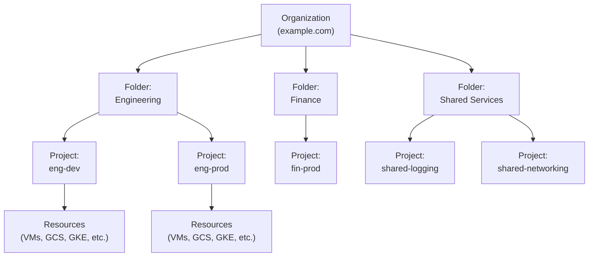
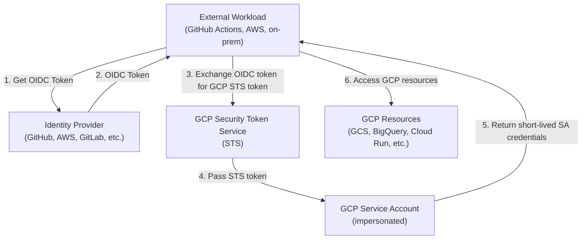
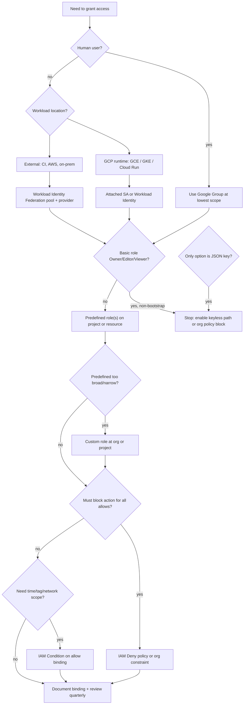

> **Complexity**: `[MEDIUM]` | **Time to Complete**: 2h | **Prerequisites**: Cloud Native 101

## What You'll Be Able to Do

When you finish this module, you will be able to configure IAM across the full resource hierarchy, run service accounts with Workload Identity Federation instead of exported keys, scope access with custom roles, and explain denials with Policy Troubleshooter and audit logs. The outcomes below are what you should be able to demonstrate in a real GCP organization:

- **Configure GCP IAM policies across the resource hierarchy (Organization, Folders, Projects) with proper inheritance**
- **Implement least-privilege service accounts with Workload Identity Federation to eliminate exported key files**
- **Design custom IAM roles that precisely scope permissions beyond predefined roles for production workloads**
- **Diagnose IAM policy evaluation failures using Policy Troubleshooter and audit log analysis**

---

## Why This Module Matters

**Hypothetical scenario:** A platform team grants a CI service account `roles/owner` on a production project to unblock a weekend deploy. Someone exports a JSON key into a pipeline secret store that later syncs to a public artifact bucket. Within hours, an automated scanner uses the key to list buckets, read objects, and create VMs in other regions. Cleanup costs balloon because billing, data egress, and incident response all run through the same compromised project. The breach was not a novel exploit; it was IAM design that treated convenience as temporary but left standing privileges in place.

That pattern is common because **the resource hierarchy is your blast radius, and IAM is the control plane for everything**. Unlike traditional on-premises networks where perimeter firewalls are the primary control, in GCP almost every action—creating a VM, reading a storage object, deploying Cloud Run—is authorized through IAM. Weak IAM makes other controls easier to bypass. An identity with `storage.objects.get` and `compute.instances.create` can exfiltrate data and burn budget even when VPC rules look strict on paper.

If you come from AWS, the mental model shift matters. AWS isolates accounts by default; cross-account access needs explicit trust. GCP stacks Organization → Folder → Project → resource, and **allow policies inherit downward** unless a deny policy or organization constraint blocks the action. You will learn that hierarchy, the difference between basic, predefined, and custom roles, and how to run workloads without long-lived service account keys—still the most common cloud identity failure mode in production reviews.

---

## The Resource Hierarchy: Your Organizational Blueprint

Before you can understand IAM in GCP, you must understand *where* IAM policies live. In GCP, resources are organized into a strict hierarchy, and IAM policies **inherit downward** through that hierarchy. This is fundamentally different from AWS, where each account is largely isolated and cross-account access requires explicit trust policies.

The Google Cloud console **Permissions** tab on a project shows bindings **on that resource**. It does not list every inherited binding from parent folders or the organization in one flat view. That UI gap causes false confidence: an engineer sees “no Owner on this project” while still inheriting Owner from a parent folder. Use `gcloud asset search-all-iam-policies`, Policy Analyzer, or the IAM “Policy Troubleshooter” and “Policy Analyzer” entries in the console to see effective access. Terraform and Config Controller plans should print binding changes at the correct resource name (`google_project_iam_member` vs `google_folder_iam_member`) so reviewers catch hierarchy mistakes in pull requests.

Billing accounts sit **outside** the resource hierarchy tree shown in Resource Manager, but they still interact with IAM: `roles/billing.admin` and project billing linkage are separate from `roles/owner` on a project. A finance team might manage budgets without holding data-plane access—model that with billing-level roles instead of handing out Editor on production projects.

### The Four Levels



At the top, the **Organization** is the root node: it is created when you set up Google Workspace or Cloud Identity for your domain, and IAM policies bound here apply to every resource underneath. **Folders** are optional groupings for teams, environments, or business units (you can nest them up to ten levels, though more than three or four usually signals over-engineering); they are how you apply environment-wide guardrails, such as denying external IPs on every VM in a Production folder. **Projects** are the fundamental unit of ownership—every VM, bucket, and Cloud Run service lives in exactly one project, which also defines billing, API enablement, and the default scope for most IAM operations. Each project exposes three identifiers you will see constantly in commands and audit logs:

| Identifier | Example | Mutable | Unique Across |
| :--- | :--- | :--- | :--- |
| **Project Name** | "Engineering Dev" | Yes | Not unique (display only) |
| **Project ID** | `eng-dev-382910` | No (set at creation) | Globally unique, forever |
| **Project Number** | `481726359042` | No (auto-assigned) | Globally unique, forever |

Below the project line, **resources** are the concrete services and objects you create—VMs, databases, buckets, Pub/Sub topics, and everything else you bill and secure day to day.

**Pause and predict:** If an infrastructure team moves an active GCP Project from an "Engineering" folder into a "Finance" folder, what happens to the effective permissions on that project, and which bindings change immediately?

<details>
<summary>Check your prediction</summary>

The project immediately stops inheriting permissions from the "Engineering" folder and begins inheriting permissions from the "Finance" folder after IAM propagation completes across the control plane. Any IAM policies applied directly to the Project itself remain completely unchanged. This dynamic inheritance is why moving projects across folders is an operation that carries significant security blast radius.

</details>

### Policy Inheritance: The Cascade Effect

Understanding how permissions flow through the resource hierarchy requires examining the rules of policy evaluation across parent and child containers. The `gcloud` commands below read the bindings attached at each Resource Manager level. Use them when you need to see what was granted on the organization, a folder, or a project itself, rather than guessing from the console Permissions tab.

```bash
# View the IAM policy at the organization level
gcloud organizations get-iam-policy ORGANIZATION_ID

# View the IAM policy at a folder level
gcloud resource-manager folders get-iam-policy FOLDER_ID

# View the IAM policy at a project level
gcloud projects get-iam-policy PROJECT_ID

# Check IAM bindings directly on this project
# (does NOT include inherited permissions from org/folders)
gcloud projects get-iam-policy PROJECT_ID \
  --flatten="bindings[].members" \
  --filter="bindings.members:user:alice@example.com" \
  --format="table(bindings.role)"
```

A practical analogy: think of the hierarchy like a building. The Organization is a master key—anyone holding it can open every door below. Folders are floor keys; projects are room keys. You can grant narrower access lower in the tree, but you **cannot subtract** an inherited allow binding at a child project. Security teams that expect AWS-style “deny at the child account” often get surprised until they adopt **IAM Deny policies** or organization policy constraints.

#### AWS vs GCP: inheritance and blast radius

| Dimension | AWS (typical enterprise) | GCP |
| :--- | :--- | :--- |
| **Isolation unit** | Account per environment or team | Project (folder groups projects) |
| **Default cross-env access** | Blocked unless trust policy allows | Inherited allows flow down the tree |
| **Subtracting access** | SCPs, permission boundaries, explicit denies | IAM Deny policies + org policy constraints |
| **Human access pattern** | IAM Identity Center / SSO roles per account | Groups at org/folder/project levels |
| **Machine identity** | IAM roles for workloads (IRSA on EKS) | Service accounts + Workload Identity Federation |

The AWS model encourages **many accounts** with guardrails at the org root. GCP encourages **fewer projects** with fine-grained IAM and deny guardrails. Neither is “more secure” by default—GCP rewards explicit deny design and least-privilege at the lowest attachment point.

#### Effective access: allow, deny, and constraints

When Policy Troubleshooter or audit logs explain a decision, they walk the same stack:

```text
1. Organization Policy Constraints  →  "May this configuration exist?"
2. IAM Deny Policies                →  "Is this API call explicitly denied?"
3. IAM Allow Policies (+ Conditions)→  "Is there a matching allow binding?"
4. Default: DENY                    →  "No matching allow → reject."
```

**Deny wins over allow.** A principal with `roles/owner` still cannot delete a project if an org-level deny policy blocks `cloudresourcemanager.googleapis.com/projects.delete` without an exception. **IAM Conditions** on allow bindings add a fourth dimension: the binding exists, but only when a CEL expression (time, resource name, tags) evaluates to true. Conditions do not replace deny policies; they narrow when an allow applies. Review condition expressions in pull requests the same way you review role names.

```bash
# Search IAM bindings for a user across the org (requires Cloud Asset Inventory API)
gcloud asset search-all-iam-policies \
  --scope=organizations/ORGANIZATION_ID \
  --query="policy:alice@example.com"

# Effective IAM policy for one resource (includes inherited allows)
gcloud asset get-effective-iam-policy \
  --scope=projects/PROJECT_ID \
  --full-resource-name=//storage.googleapis.com/projects/_/buckets/my-bucket
```

### Organization Policies vs IAM Policies

New GCP practitioners often confuse **Organization Policies** with **IAM policies**, but they solve different problems: IAM answers *who may act*, while organization policies answer *what may exist* regardless of who is signed in. The table below contrasts the two so you reach for the right control when designing guardrails versus granting access.

| Aspect | IAM Policy | Organization Policy |
| :--- | :--- | :--- |
| **What it controls** | Who can do what (identity-based) | What is allowed to exist (resource-based) |
| **Example** | "Alice can create VMs" | "No VM can have an external IP" |
| **Scope** | Org, Folder, Project, Resource | Org, Folder, Project |
| **Override behavior** | Additive (cannot revoke inherited) | Can override parent (with boolean constraints) |
| **Use case** | Access control | Guardrails, compliance enforcement |

```bash
# List available organization policy constraints
gcloud org-policies list --organization=ORGANIZATION_ID

# Set a constraint to deny external IPs on all VMs in a folder
gcloud org-policies set-policy policy.yaml
```

To block external IPs on every VM under a folder, you attach an organization policy document such as the following `policy.yaml` (v2 API shape—the folder is encoded in `name`, not a separate `--folder` flag):

```yaml
name: folders/FOLDER_ID/policies/compute.vmExternalIpAccess
spec:
  rules:
  - enforce: true
    denyAll: true
```

### Shared VPC and IAM (cross-project networking)

**Shared VPC** splits host and service projects. The host project owns subnets; service projects attach workloads. IAM is still evaluated per resource, but operators need roles in **both** projects to deploy: network admin on the host, workload deployer on the service project. A common mistake is granting `roles/compute.networkAdmin` only in the service project while VMs fail to pick subnets in the host.

Use groups such as `gcp-network-admins@` on the host project and `gcp-app-deployers@` on service projects. Document which predefined roles map to each duty (`roles/compute.networkUser` vs `roles/compute.instanceAdmin.v1`). Shared VPC does not bypass IAM inheritance—it adds a second project boundary you must model in access reviews.

### Tag-based access and organization policy tags

Organization **tags** (key/value pairs applied to projects, folders, or resources) integrate with IAM Conditions (`resource.matchTag`) and organization policies. Tags let you express “production” or “pci” once and enforce consistent conditions on bindings. They are not a replacement for deny policies on destructive APIs, but they reduce duplicated project-level bindings when many projects share the same compliance tier.

---

## Principals and IAM Roles: The Access Control Model

### Principals: Who Can Act?

A **principal** in GCP is any identity that can be authenticated and then authorized. Production environments mix several principal types, and the member string format in IAM bindings must match exactly what the policy engine expects:

| Principal Type | Format | Use Case |
| :--- | :--- | :--- |
| **Google Account** | `user:alice@example.com` | Human users with Google accounts |
| **Service Account** | `serviceAccount:sa@project.iam.gserviceaccount.com` | Applications, VMs, Cloud Run services |
| **Google Group** | `group:devs@example.com` | Teams of humans (recommended over individual grants) |
| **Google Workspace Domain** | `domain:example.com` | Everyone in the organization |
| **allAuthenticatedUsers** | `allAuthenticatedUsers` | Any Google account (dangerous) |
| **allUsers** | `allUsers` | Anyone on the internet (very dangerous) |

**Best Practice**: Use Google Groups for human access in most cases. Granting roles to individual users creates an audit nightmare and makes offboarding error-prone. When an engineer leaves, you remove them from the group. You do not need to hunt through dozens of IAM policies across projects.

**Cloud Identity / Google Workspace domain** principals (`domain:example.com`) grant every user in the directory a binding. That is convenient for sandboxes and dangerous for production; prefer groups with membership approval. **`allAuthenticatedUsers`** and **`allUsers`** are almost never correct on data-plane resources—if you need public read access to an object, use signed URLs or a front-end service with deliberate IAM, not a bucket ACL shortcut.

### The Three Types of Roles

GCP has three categories of IAM roles, and understanding the distinction is critical for both security and operations because the wrong category is how teams accidentally grant thousands of permissions at once.

#### 1. Basic Roles (Formerly "Primitive Roles")

**Basic roles** are the broadest grants in GCP: they predate fine-grained IAM and are considered **legacy roles** that should not appear on production projects except during initial bootstrap.

| Role | Permissions | When to Use |
| :--- | :--- | :--- |
| `roles/viewer` | Read-only access to all resources | Rarely in production; prefer narrower predefined roles |
| `roles/editor` | Read-write access to most resources | Never in production (can modify everything) |
| `roles/owner` | Full control including IAM and billing | Only for initial setup, then remove |

The `roles/editor` role is particularly dangerous because it grants write access to nearly everything *except* IAM policy modification. Many teams use it as a shortcut for developers, not realizing it allows deleting databases, modifying firewall rules, and reading secrets.

#### 2. Predefined Roles

**Predefined roles** are maintained by Google for each service and are the roles you should reach for day to day; they bundle permissions for realistic job functions without spanning the entire project.

```bash
# List all predefined roles (there are 1000+)
gcloud iam roles list --filter="name:roles/"

# View the permissions in a specific predefined role
gcloud iam roles describe roles/storage.objectViewer

# Search for roles related to a specific service
gcloud iam roles list --filter="name:roles/cloudsql"
```

The table below lists predefined roles you will reference constantly when wiring applications, operators, and auditors—notice how each name maps to a narrow API surface rather than a job title.

| Role | What It Grants |
| :--- | :--- |
| `roles/storage.objectViewer` | Read GCS objects (not list buckets) |
| `roles/storage.objectAdmin` | Full control over GCS objects |
| `roles/compute.instanceAdmin.v1` | Manage Compute Engine instances |
| `roles/run.invoker` | Invoke Cloud Run services |
| `roles/cloudsql.client` | Connect to Cloud SQL instances |
| `roles/logging.viewer` | Read Cloud Logging logs |
| `roles/monitoring.viewer` | Read Cloud Monitoring metrics |
| `roles/iam.serviceAccountUser` | Act as (impersonate) a service account |
**Pause and predict:** Your developers need to deploy Cloud Run services and connect them securely to Cloud SQL. Should you create a custom role combining both sets of permissions, or grant multiple predefined roles instead?

<details>
<summary>Check your prediction</summary>

You should grant multiple predefined roles (such as `roles/run.admin` and `roles/cloudsql.client`). Predefined roles are maintained by Google and automatically updated when new permissions are added to a service. Custom roles must be manually maintained, which quickly becomes an operational burden. Only use custom roles when predefined roles are explicitly too broad or too narrow.

</details>

When a regulated workload still cannot live inside the predefined catalog, you need a role you own and version yourself. The next section is how that YAML is authored and what Google will not auto-update for you.

#### 3. Custom Roles

When predefined roles are either too broad or too narrow for a regulated workload, you can create **custom roles** that include exactly the permission strings you want—and nothing else.

```bash
# Create a custom role from a YAML definition
gcloud iam roles create customStorageReader \
  --project=my-project \
  --file=role-definition.yaml

# role-definition.yaml
cat <<'YAML'
title: "Custom Storage Reader"
description: "Can read objects and list buckets, but not delete"
stage: "GA"
includedPermissions:
  - storage.buckets.list
  - storage.objects.get
  - storage.objects.list
YAML

# List custom roles in a project
gcloud iam roles list --project=my-project

# Update a custom role (add a permission)
gcloud iam roles update customStorageReader \
  --project=my-project \
  --add-permissions=storage.buckets.get
```

Custom roles trade precision for operational ownership: they can be created at the organization or project level (not on folders), support up to 3,000 permissions, and exclude some permissions whose launch stage is `TESTING` or `NOT_SUPPORTED` in the IAM catalog. Most importantly, Google does not auto-update your custom roles when a service ships new APIs—you must review release notes and patch roles yourself, unlike predefined roles that track service growth for you.

**Lifecycle discipline** keeps custom roles maintainable. Start from `gcloud iam roles describe roles/SIMILAR_ROLE` and subtract permissions in a staging project before promoting the role ID to production. Version custom roles (`--stage=GA` vs `BETA`) consciously—downstream audits treat GA bindings as production commitments. When a predefined role later covers your use case, migrate principals back to predefined and delete the custom role to avoid two sources of truth.

| Role type | Maintenance owner | AWS analogue (rough) | When it wins |
| :--- | :--- | :--- | :--- |
| Basic (Owner/Editor/Viewer) | Google (deprecated path) | PowerUser/Administrator style breadth | Bootstrap only |
| Predefined | Google adds permissions | AWS managed policies per service | Default for apps and operators |
| Custom | Your platform team | Customer-managed IAM policy with explicit actions | Regulated least-privilege |

Binding limits matter at scale: each policy has a maximum number of bindings (including conditional bindings). Large enterprises automate binding management with Terraform or Config Controller rather than console edits, so every change has a pull request and plan output.

### IAM Deny Policies

Introduced in 2022, **IAM Deny Policies** solve the inheritance problem that frustrates security teams: allow policies are additive, so you cannot subtract an inherited `roles/editor` at a child project, but a deny policy can block specific permissions for everyone except principals you list as exceptions.

Deny policies attach at organization, folder, or project levels using the `policies` API (`--kind=denypolicies`). They use **principal sets** (`principalSet://goog/public:all` or specific subjects) rather than only legacy `member:` strings. Exception principals are how break-glass admins retain delete access while the broader org cannot call `projects.delete`. Test denies in a sandbox folder before attaching at the organization root—a misconfigured deny can halt legitimate automation until you patch exceptions.

| Control | Stops what | Does not replace |
| :--- | :--- | :--- |
| **IAM Deny** | Specific API permissions for matching principals | Least-privilege allows—you still need narrow roles |
| **Org policy constraint** | Resource configurations (external IP, regions) | Application-level authorization |
| **VPC firewall** | Network packets | Data-plane IAM on Cloud Storage or BigQuery |
| **IAM Condition** | When an allow binding applies | A deny on the same permission |

AWS **Service Control Policies (SCPs)** resemble deny + guardrails at the org level. GCP splits the idea: SCP-like “what can exist” often lives in **organization policies**, while API-level denial uses **IAM Deny policies**. Many enterprises use both.

```bash
# Create a deny policy that prevents anyone from deleting projects
# (even if they have Owner role)
gcloud iam policies create prevent-project-deletion \
  --attachment-point="cloudresourcemanager.googleapis.com/organizations/ORGANIZATION_ID" \
  --kind=denypolicies \
  --policy-file=deny-policy.json
```

```json
{
  "displayName": "Prevent Project Deletion",
  "rules": [
    {
      "denyRule": {
        "deniedPrincipals": [
          "principalSet://goog/public:all"
        ],
        "exceptionPrincipals": [
          "principal://goog/subject/admin@example.com"
        ],
        "deniedPermissions": [
          "cloudresourcemanager.googleapis.com/projects.delete"
        ]
      }
    }
  ]
}
```

At evaluation time, deny policies run **before** allow policies, and organization policy constraints run even earlier. The full decision stack is worth memorizing because Policy Troubleshooter walks the same sequence when it explains a `403`:

```text
1. Organization Policy Constraints  →  "Is this action even allowed to exist?"
2. IAM Deny Policies                →  "Is this action explicitly denied?"
3. IAM Allow Policies               →  "Is this action explicitly allowed?"
4. Default: DENY                    →  "If no allow policy matches, deny."
```

---

## IAM Conditions: Attribute-Based Access on Allow Bindings

**IAM Conditions** attach a Common Expression Language (CEL) expression to a single role binding. The binding grants access only when the expression evaluates to `true` at request time—useful for time-bound contractor access, environment tags, or resource name prefixes without maintaining separate projects per rule.

Conditions apply to **allow policies** (version 3 when any binding uses a condition). They do not replace deny policies or organization constraints; they refine *when* an allow counts.

| Use case | Example CEL idea | Why teams use it |
| :--- | :--- | :--- |
| **Expiring access** | `request.time < timestamp("2026-12-31T23:59:59Z")` | On-call or vendor access auto-expires |
| **Business hours** | `request.time.getHours("America/Chicago") >= 9 && ... <= 17` | Sensitive admin only during local business day |
| **Resource scope** | `resource.name.startsWith("projects/.../buckets/prod-")` | Same role, different buckets by prefix |
| **Tagged resources** | `resource.matchTag("123456789012/env", "prod")` | Tag-based ABAC aligned with org policy tags |

```bash
# Grant Compute instance admin only until a fixed UTC timestamp
gcloud projects add-iam-policy-binding my-project \
  --member="user:contractor@example.com" \
  --role="roles/compute.instanceAdmin.v1" \
  --condition='expression=request.time < timestamp("2026-09-30T23:59:59Z"),title=contractor_expires,description=Access ends after engagement'

# Lint a condition expression before applying (alpha)
gcloud alpha iam policies lint-condition \
  --condition-from-file=condition.yaml \
  --resource-type=cloudresourcemanager.googleapis.com/Project \
  --resource-name=projects/my-project
```

Policy Troubleshooter and Policy Analyzer both surface condition text on bindings they report. If a user “has” a role in the console but still gets `403`, check whether the binding includes a condition that fails for the current `request.time` or resource attributes.

> **AWS contrast:** AWS IAM condition keys in trust and identity policies are the closest analogue. GCP conditions are per-binding on the same hierarchy as the role, not a separate policy document type—plan reviews around binding + condition pairs, not only role names.

---

## Service Accounts: Machine Identity Done Right

Service accounts are the most critical---and most frequently misconfigured---aspect of GCP IAM. They represent non-human identities used by applications, VMs, and services.

### Types of Service Accounts

| Type | Created By | Example | Managed By |
| :--- | :--- | :--- | :--- |
| **User-managed** | You | `my-app@my-project.iam.gserviceaccount.com` | You (full control) |
| **Default** | GCP (auto) | `PROJECT_NUMBER-compute@developer.gserviceaccount.com` | You (but auto-created) |
| **Google-managed** | GCP | `service-PROJECT_NUMBER@compute-system.iam.gserviceaccount.com` | Google (do not modify) |

**Hypothetical scenario:** A security scanner flags a VM that can list every secret in Secret Manager. The VM was created with default settings. Its identity is the default Compute Engine service account, which still holds broad legacy primitive access on many older projects. The fix is not “patch the VM”—it is replace the runtime identity, revoke excess primitive bindings from the default SA, and deny key creation org-wide.

The default Compute Engine service account (`PROJECT_NUMBER-compute@developer.gserviceaccount.com`) is created automatically by Google Cloud whenever you first enable the Compute Engine API within a project.

**Pause and predict:** What standing role did Google Cloud historically attach to this default service account upon API enablement, and what actions can any virtual machine using that identity execute inside a legacy project?

<details>
<summary>Check your prediction</summary>

Google historically granted the default Compute Engine service account the primitive `roles/editor` role so tutorials and developer quickstarts worked immediately. A virtual machine running with this identity inherits write and modification permissions across nearly every service in the project—including Cloud Storage, BigQuery, and Cloud SQL—excluding only project IAM policy modifications and billing administration.

</details>

New organizations and production environments should treat that default identity as something to replace, not something to keep because tutorials still mention it. Platform teams should create dedicated service accounts tailored for each specific workload class, such as batch pipelines or web APIs. Furthermore, organization policies should enforce constraints that block launching instances with default service accounts.

```bash
# Create a dedicated service account
gcloud iam service-accounts create gcs-reader \
  --display-name="GCS Reader for Data Pipeline" \
  --project=my-project

# Grant it only the permissions it needs
gcloud projects add-iam-policy-binding my-project \
  --member="serviceAccount:gcs-reader@my-project.iam.gserviceaccount.com" \
  --role="roles/storage.objectViewer"

# Create a VM using this dedicated service account
gcloud compute instances create data-worker \
  --service-account=gcs-reader@my-project.iam.gserviceaccount.com \
  --scopes=cloud-platform \
  --zone=us-central1-a
```

### Service Account Keys: The Danger Zone

**Service account keys** are JSON files containing long-lived credentials—the GCP equivalent of AWS access keys—and they are equally dangerous because they work from any network until someone deletes them.

```bash
# Creating a key (avoid this whenever possible)
gcloud iam service-accounts keys create key.json \
  --iam-account=my-sa@my-project.iam.gserviceaccount.com

# List existing keys for a service account
gcloud iam service-accounts keys list \
  --iam-account=my-sa@my-project.iam.gserviceaccount.com

# Delete a key
gcloud iam service-accounts keys delete KEY_ID \
  --iam-account=my-sa@my-project.iam.gserviceaccount.com
```

**Rule of thumb**: If you are creating a service account key, you are probably doing it wrong because modern cloud security architectures favor keyless short-lived authentication patterns over static secrets.

**Pause and predict:** An automated CI/CD pipeline in GitHub Actions must deploy container images to Cloud Run, but company security policy strictly forbids generating or storing service account JSON keys. What mechanism replaces the key file, and how does authentication succeed?

<details>
<summary>Check your prediction</summary>

Workload Identity Federation replaces the key file by allowing external identities to authenticate directly through OpenID Connect (OIDC). GitHub Actions requests an OIDC token from GitHub's token authority, exchanges it with the Google Cloud Security Token Service (STS) for a short-lived federated token, and impersonates a dedicated deployer service account without storing long-lived private key files anywhere.

</details>

The pattern table below is the menu of replacements teams actually ship instead of downloading a key file. Match the runtime location first, then pick the row that fits that location.

| Scenario | Instead of Keys, Use |
| :--- | :--- |
| Code running on GCE/GKE | Attached service account (metadata server) |
| Cloud Run / Cloud Functions | Attached service account (automatic) |
| CI/CD from GitHub Actions | Workload Identity Federation |
| CI/CD from GitLab | Workload Identity Federation |
| On-premises application | Workload Identity Federation |
| Local development | `gcloud auth application-default login` |

### Service Account Impersonation

Instead of downloading keys, you can **impersonate** a service account so the Security Token Service mints short-lived credentials for a single command or shell session, which means nothing sensitive lands on disk in a CI runner or laptop.

```bash
# Impersonate a service account for a single command
gcloud storage ls gs://my-bucket \
  --impersonate-service-account=gcs-reader@my-project.iam.gserviceaccount.com

# Set impersonation for all subsequent gcloud commands
gcloud config set auth/impersonate_service_account \
  gcs-reader@my-project.iam.gserviceaccount.com

# To stop impersonating
gcloud config unset auth/impersonate_service_account
```

Impersonation only succeeds when the human or service account calling `gcloud` already holds `roles/iam.serviceAccountTokenCreator` (or a broader role that includes `iam.serviceAccounts.getAccessToken`) on the target service account, because that permission is what authorizes the token exchange.

Grant **`roles/iam.serviceAccountUser`** when a principal should *run as* the SA (attach it to a VM or Cloud Run revision). Grant **`roles/iam.serviceAccountTokenCreator`** when a principal should mint short-lived tokens for impersonation (CI job, admin workstation). Confusing the two produces either “cannot deploy with this SA” or “CI can mint tokens for every SA in the project”—review both bindings during access audits.

Google-managed service accounts (names ending in `@gcp-sa-...` or system suffixes) back Google-managed services. Do not delete them or strip their bindings unless documentation explicitly tells you to; instead, isolate your application identities as user-managed SAs.

---

## Workload Identity Federation: Keyless Authentication

Workload Identity Federation allows external identities (from AWS, Azure, GitHub Actions, GitLab CI, or any OIDC/SAML provider) to access GCP resources **without service account keys**. This is the modern, recommended approach for any workload running outside of GCP.

Compared to AWS **IAM Roles for Service Accounts (IRSA)** on EKS, GCP external federation uses a **workload identity pool + provider** mapped to a GSA. The external JWT is exchanged at the Security Token Service (STS). Attribute mappings (for example `attribute.repository` on GitHub) restrict which external identities may impersonate which GSA—similar in spirit to trust policy `StringEquals` conditions on an AWS role, but configured on the provider resource in GCP.

### How It Works



### Setting Up Workload Identity Federation for GitHub Actions

The most common Workload Identity Federation pattern is deploying from **GitHub Actions** without storing a service account JSON key in GitHub Secrets: the workflow exchanges the GitHub OIDC token for a federated credential, then impersonates a dedicated deployer service account.

```bash
# Step 1: Create a Workload Identity Pool
gcloud iam workload-identity-pools create "github-pool" \
  --project="my-project" \
  --location="global" \
  --display-name="GitHub Actions Pool"

# Step 2: Create a Provider in the pool (for GitHub OIDC)
gcloud iam workload-identity-pools providers create-oidc "github-provider" \
  --project="my-project" \
  --location="global" \
  --workload-identity-pool="github-pool" \
  --display-name="GitHub Provider" \
  --attribute-mapping="google.subject=assertion.sub,attribute.actor=assertion.actor,attribute.repository=assertion.repository" \
  --issuer-uri="https://token.actions.githubusercontent.com"

# Step 3: Create a service account for GitHub Actions to impersonate
gcloud iam service-accounts create github-deployer \
  --display-name="GitHub Actions Deployer" \
  --project=my-project

# Step 4: Grant the service account permissions it needs
gcloud projects add-iam-policy-binding my-project \
  --member="serviceAccount:github-deployer@my-project.iam.gserviceaccount.com" \
  --role="roles/run.admin"

# Step 5: Allow the GitHub repo to impersonate the service account
gcloud iam service-accounts add-iam-policy-binding \
  github-deployer@my-project.iam.gserviceaccount.com \
  --project="my-project" \
  --role="roles/iam.workloadIdentityUser" \
  --member="principalSet://iam.googleapis.com/projects/PROJECT_NUMBER/locations/global/workloadIdentityPools/github-pool/attribute.repository/my-org/my-repo"
```

After the pool, provider, and `roles/iam.workloadIdentityUser` binding exist, your GitHub Actions workflow only needs the `google-github-actions/auth` step (with `id-token: write`) before deploy tools run:

```yaml
# .github/workflows/deploy.yaml
jobs:
  deploy:
    runs-on: ubuntu-latest
    permissions:
      contents: read
      id-token: write  # Required for OIDC
    steps:
      - uses: actions/checkout@v4

      - id: auth
        uses: google-github-actions/auth@v2
        with:
          workload_identity_provider: "projects/PROJECT_NUMBER/locations/global/workloadIdentityPools/github-pool/providers/github-provider"
          service_account: "github-deployer@my-project.iam.gserviceaccount.com"

      - name: Deploy to Cloud Run
        uses: google-github-actions/deploy-cloudrun@v2
        with:
          service: my-api
          region: us-central1
          image: us-central1-docker.pkg.dev/my-project/my-repo/my-api:latest
```

### Workload Identity Federation for GKE (keyless pods)

**Workload Identity Federation for GKE** links a Kubernetes service account (KSA) to a Google Cloud IAM service account (GSA). Pods receive short-lived credentials from the GKE metadata server—no JSON key mounted in the cluster. This is distinct from **external** Workload Identity Federation (GitHub, AWS, Azure OIDC) but uses the same `roles/iam.workloadIdentityUser` binding pattern on the GSA.

Autopilot and most new GKE clusters enable Workload Identity by default. The setup is two bindings plus one annotation:

```bash
# 1) Create a dedicated GSA with least-privilege roles on the project
gcloud iam service-accounts create gke-app \
  --display-name="GKE app identity" \
  --project=my-project

gcloud projects add-iam-policy-binding my-project \
  --member="serviceAccount:gke-app@my-project.iam.gserviceaccount.com" \
  --role="roles/cloudsql.client"

# 2) Let the KSA impersonate the GSA (member uses the GKE workload identity pool)
export PROJECT_ID=my-project
export KSA_NAMESPACE=default
export KSA_NAME=app-ksa
gcloud iam service-accounts add-iam-policy-binding \
  gke-app@${PROJECT_ID}.iam.gserviceaccount.com \
  --role="roles/iam.workloadIdentityUser" \
  --member="serviceAccount:${PROJECT_ID}.svc.id.goog[${KSA_NAMESPACE}/${KSA_NAME}]"

# 3) Annotate the KSA so the pod uses the GSA
kubectl annotate serviceaccount ${KSA_NAME} \
  --namespace=${KSA_NAMESPACE} \
  iam.gke.io/gcp-service-account=gke-app@${PROJECT_ID}.iam.gserviceaccount.com
```

Pods that use the Google client libraries then obtain tokens for `gke-app@...` automatically. **Do not** reuse the node’s default Compute Engine service account for application code—that account often still carries legacy `roles/editor` on the project.

| Authentication path | Keys on disk? | Best for |
| :--- | :--- | :--- |
| **Attached GSA on GCE VM / Cloud Run** | No (metadata server) | First-party GCP runtimes |
| **Workload Identity for GKE** | No (KSA → GSA) | In-cluster workloads |
| **External Workload Identity Federation** | No (OIDC/SAML exchange) | GitHub Actions, AWS, on-prem |
| **Service account JSON key** | Yes | Legacy only; org policy should block creation |
| **User ADC (`gcloud auth application-default login`)** | Local user creds | Developer laptops, not production |

---

## IAM Best Practices and Audit

### The IAM Recommender

The **IAM Recommender** is a built-in analyzer that inspects which permissions principals actually exercised and suggests narrower predefined roles, which is how you shrink standing access without guessing from job titles alone.

```bash
# List IAM recommendations for a project
gcloud recommender recommendations list \
  --project=my-project \
  --location=global \
  --recommender=google.iam.policy.Recommender \
  --format="table(content.operationGroups[0].operations[0].resource, content.operationGroups[0].operations[0].value.bindings[0].role)"

# Apply a specific recommendation (after human review)
gcloud recommender recommendations list \
  --project=my-project \
  --location=global \
  --recommender=google.iam.policy.Recommender \
  --filter="stateInfo.state=ACTIVE"
```

Treat recommender output as a **prioritized backlog**, not auto-remediation. Permissions used once during a migration may still be required next quarter; pair recommendations with change windows and Policy Analyzer queries that show who still holds the broad role.

### Policy Analyzer (org-wide allow visibility)

**Policy Analyzer** (Policy Intelligence) answers set questions across a scope: “Which principals have `storage.objects.delete` on this bucket?”, “What can this service account access in the org?”, “Who has `roles/owner` anywhere under this folder?” It walks inherited allow policies and reports bindings—including **conditions** attached to those bindings.

```bash
# Who can act as this service account? (impersonation graph)
gcloud asset analyze-iam-policy \
  --scope=projects/my-project \
  --identity="serviceAccount:data-pipeline@my-project.iam.gserviceaccount.com" \
  --permissions="iam.serviceAccounts.actAs" \
  --expand-groups

# Which principals have a role on a specific bucket resource?
gcloud asset analyze-iam-policy \
  --scope=projects/my-project \
  --full-resource-name="//storage.googleapis.com/projects/my-project/buckets/sensitive-data" \
  --roles="roles/storage.objectAdmin"
```

Required permissions include `cloudasset.assets.analyzeIamPolicy` and related Asset Inventory search roles. Large orgs export long-running analyses to BigQuery or Cloud Storage for compliance dashboards. Use Policy Analyzer for **periodic access reviews**; use Policy Troubleshooter for **one-off 403 debugging** on a single principal + permission + resource.

### Audit Logging

Every IAM change and most data-plane call leaves a trail in **Cloud Audit Logs**, which splits into three families you configure differently. **Admin Activity** logs are always on. They capture IAM policy updates and resource lifecycle events. **Data Access** logs are opt-in for most services. They record reads and writes of user data and can generate large volume. **System Event** logs are always on. They capture Google-managed operations such as live migration.

For investigations, Admin Activity is where `SetIamPolicy` appears. Enable Data Access when compliance requires proving who read a specific record. Viewing Data Access entries needs the **Private Logs Viewer** role (`roles/logging.privateLogViewer`), not just `roles/logging.viewer`.

```bash
# Export recent IAM admin changes to JSON for a ticket
gcloud logging read \
  'logName="projects/my-project/logs/cloudaudit.googleapis.com%2Factivity" AND protoPayload.methodName="SetIamPolicy"' \
  --project=my-project \
  --limit=20 \
  --format=json

# Sample auditConfigs snippet when enabling Storage DATA_READ (review cost first)
# Add under auditConfigs in project IAM policy:
# - service: storage.googleapis.com
#   auditLogConfigs:
#   - logType: ADMIN_READ
#   - logType: DATA_READ
```

**Denied** audit log entries (Policy Denied) help prove a deny policy or organization constraint blocked an action even when the principal holds a broad allow. Include denied logs in detection rules when testing new deny policies, so you see false positives before developers file tickets.

Pair audit logs with **Cloud Asset Inventory** history when investigating “when did this binding appear?” `gcloud asset get-history` and saved IAM policy analyses in BigQuery support quarterly access certifications required by SOC2 and ISO controls.

```bash
# Enable Data Access audit logs for Cloud Storage
gcloud projects get-iam-policy my-project --format=json > policy.json
# Edit policy.json to add auditConfigs, then set it back
gcloud projects set-iam-policy my-project policy.json

# Query audit logs for IAM changes
gcloud logging read 'logName="projects/my-project/logs/cloudaudit.googleapis.com%2Factivity" AND protoPayload.methodName="SetIamPolicy"' \
  --limit=10 \
  --format=json
```

---

## Diagnosing Access Issues: Policy Troubleshooter

When a user or service account hits `403 Permission Denied`, guessing which binding is missing wastes hours. **Policy Troubleshooter** answers a precise question: *why does (or doesn't) this principal have this permission on this resource?* It walks direct bindings on the resource, inherited bindings from parent folders and the organization, deny policies that override allows, and the expanded permission set inside each granted role so you see the exact API string under test.

```bash
# Check if a specific service account has permission to list objects in a bucket
gcloud policy-troubleshoot iam \
  //storage.googleapis.com/projects/_/buckets/my-bucket \
  --principal="serviceAccount:gcs-reader@my-project.iam.gserviceaccount.com" \
  --permission="storage.objects.list"
```

The output will clearly state whether access is `GRANTED` or `DENIED` and, crucially, it will show the exact binding (or lack thereof) that resulted in the decision. 

**Pro-tip for troubleshooting with Audit Logs**: If you don't know exactly which permission is missing, look at the Cloud Audit Logs first. Find the `403` error in the logs, look at the `protoPayload.authorizationInfo` field, and it will tell you exactly which permission was evaluated and returned false. Then, use the Policy Troubleshooter to determine *why* they don't have that permission.

### Operational playbooks teams reuse

**Onboarding a human engineer:** add them to a Google Group that already holds predefined roles on the dev folder; never clone a former employee’s direct bindings. Verify with Policy Analyzer that no `roles/owner` binding exists on production projects for that group.

**Onboarding a workload:** create a user-managed service account per application; grant predefined roles on the project; attach the SA to Cloud Run or link KSA→GSA on GKE; block key creation with org constraint `iam.disableServiceAccountKeyCreation` except in a break-glass project.

**Emergency break-glass:** time-bound Owner or a custom break-glass role with IAM Condition on `request.time`; log every `SetIamPolicy` to a security SIEM; run Policy Analyzer after the incident to remove stale bindings.

**Quarterly access review:** export Analyzer results for `roles/owner`, `roles/editor`, and `roles/iam.serviceAccountTokenCreator` across the org; reconcile with HR offboarding tickets; apply IAM Recommender suggestions in batches with change advisory board approval.

**Migrating from AWS:** map IAM Identity Center permission sets to Google Groups + predefined roles per GCP project; replace “account vending” with folder-per-environment + deny policies; replace IRSA with Workload Identity for GKE or external federation for CI.

---

## Patterns & Anti-Patterns

Mature GCP IAM designs treat the hierarchy, deny policies, and keyless workload identity as one system—not a checklist applied once at project creation. The patterns below show up repeatedly in organizations that pass external audits without slowing delivery; the anti-patterns are what incident responders see after keys leak or inherited `roles/editor` survives a reorg.

When you adopt a pattern, document **who approves binding changes** and **which tool owns steady state** (Terraform module path, folder ID, group email). Patterns fail in practice when engineering can still click “Grant access” in the console on production without a ticket. Many teams combine Google Group membership approval (Workspace) with mandatory IaC for project-level `google_project_iam_*` resources so the audit trail lives in Git and Cloud Audit Logs together.

| Pattern | When to use it | Why it works | Scaling note |
| :--- | :--- | :--- | :--- |
| **Grant at the lowest level** | Team owns one project or bucket | Limits blast radius; matches AWS “small account” instinct translated to GCP | Automate with Terraform modules per project |
| **Groups for humans, SAs for machines** | Any org with more than a handful of engineers | Offboarding removes one group membership; audit exports list group → role | Sync groups from Cloud Identity / Workspace |
| **Predefined roles first** | Standard app + operator duties | Google maintains permission sets as APIs evolve | Recommender shrinks over-provisioned bindings over time |
| **Deny guardrails at org/folder** | Must block delete/export regardless of Owner | Deny evaluated before allow; exceptions are explicit principals | Pair with `constraints/iam.disableServiceAccountKeyCreation` |
| **Workload Identity over keys** | CI/CD, GKE, hybrid IdP | Short-lived tokens; no secret rotation of JSON files | Separate pools/providers per environment |
| **IAM Conditions for temporary access** | Contractors, break-glass, migrations | Binding auto-stops without a second revoke ticket | Lint expressions; document timezone in title |

| Anti-pattern | What goes wrong | Why teams fall into it | Better alternative |
| :--- | :--- | :--- | :--- |
| **Owner/Editor for “speed”** | One compromised identity owns billing, IAM, data | Basic roles are familiar from early tutorials | Predefined roles + break-glass Owner with MFA + deny on delete |
| **Org-level group with Editor** | Entire company inherits write access | “Everyone needs GCP” during pilot | Folder-scoped groups; project-level roles per team |
| **Default Compute Engine SA on VMs** | Every VM inherits broad project write | Omitting `--service-account` on `gcloud compute instances create` | Dedicated SA per workload class; org policy to restrict default |
| **Exported SA keys in CI secrets** | Keys work from any IP until deleted | Vendor docs still show `keys create` | Workload Identity Federation + `workloadIdentityUser` binding |
| **`allUsers` on a bucket “temporarily”** | Public data exfiltration scanners | Confusing auth errors with IAM errors | Fix application auth; use signed URLs with short TTL |
| **Custom role copy-paste** | 3,000 permissions “just in case” | Fear of missing one API for a legacy script | Start from predefined; diff permissions with Policy Analyzer |
| **Ignoring inherited allows after folder moves** | Project inherits finance policies in eng folder | Reorgs treated as billing-only | Run `search-all-iam-policies` before and after moves |
| **Data Access logs everywhere** | Logging bill spikes on high-QPS services | Compliance asks for “full audit” without scoping | Enable per service; sample or exclude dev projects |

---

## Decision Framework

Use this framework when choosing role types, machine identity mechanisms, and guardrail layers. The goal is not maximal restriction—it is **observable, reversible** decisions that match how the workload authenticates and how far damage spreads if credentials leak.



| Decision | Prefer | Tradeoff |
| :--- | :--- | :--- |
| **Basic vs predefined** | Predefined service roles (`roles/run.admin`, `roles/storage.objectViewer`) | Basic roles bundle thousands of permissions; auditors flag them instantly |
| **Predefined vs custom** | Predefined unless a permission set is stable and unique | Custom roles need ongoing maintenance when APIs add permissions |
| **SA key vs federation** | Federation or metadata-based identity for every automated path | Keys are portable across networks—attackers love portable credentials |
| **Allow at org vs project** | Project (or resource) unless identity truly spans all children | Org-level allows are hard to see in the console and survive folder moves |
| **Deny policy vs org constraint** | Org constraint when the rule is about resource shape (no external IP) | Deny policies target API permissions; constraints target configuration existence |
| **Troubleshooter vs Analyzer** | Troubleshooter for one failed API call | Analyzer for “show me everyone with delete on prod buckets” |

Revisit decisions after the first production incident or access review. Federation pools, condition expressions, and deny exceptions that made sense during migration often need tightening once real principals and tags exist.

### Console, CLI, and infrastructure-as-code together

Teams argue about “console vs Terraform” for IAM, but the real requirement is **one source of truth**. Pick Terraform or Config Controller for steady-state bindings. Use the console or `gcloud` for break-glass and troubleshooting. Export console edits back into code within 24 hours or they will diverge.

When reviewing a Terraform plan, check four fields on every `google_*_iam_*` resource: `member` prefix (`user:`, `group:`, `serviceAccount:`), `role` string (prefer `roles/` over project Owner), `condition` block if present, and the target `project`/`folder`/`organization` ID. A plan that only touches the service project but grants `roles/compute.networkAdmin` may still be wrong for Shared VPC—the host project might be the correct attachment point.

For local development, `gcloud auth application-default login` binds credentials to your user identity. That is appropriate on a laptop. Production code should never ship user ADC files. Pair developer access with a sandbox project and group-based roles instead of handing production Editor to every engineer.

---

## Cost Lens: IAM Is Free; Mistakes Are Not

**IAM policy storage and evaluation have no per-request charge.** You pay indirectly through blast radius, operations toil, and observability choices—not through “per binding” pricing.

| Cost surface | What drives spend | Knobs that reduce it |
| :--- | :--- | :--- |
| **Over-permission blast radius** | Stolen Owner/Editor SA or key creates VMs, egress, crypto mining | Least-privilege roles, deny on `projects.delete`, key creation org constraint |
| **Service account key leakage** | Incident response, data breach notification, regulatory fines | Workload Identity Federation; rotate by deleting keys, not “extending” |
| **Data Access audit logs** | High-volume APIs (Bigtable, Spanner, Storage reads) logged at DATA_READ | Enable per service; exclude dev projects; use log exclusions after 30-day review |
| **Admin Activity logs** | Stored in `_Required` bucket ~400 days | No ingestion charge for Admin Activity in standard pricing model |
| **Policy Analyzer / Asset Inventory** | Large org exports to BigQuery | Scope queries to folder; schedule quarterly instead of continuous export |
| **Recommender + human remediation** | Engineer time applying role changes | Batch changes; test in staging project first |

Cloud Logging pricing is **volume-based** for logs in the `_Default` bucket and user-defined buckets. **Admin Activity** and **System Event** audit logs go to the `_Required` bucket where Logging does not charge for storage of those audit types per [Google Cloud Observability pricing](https://cloud.google.com/products/observability/pricing). **Data Access** audit logs are disabled by default for most services because volume can dominate bills—BigQuery is the common exception where teams enable them deliberately.

Hypothetical scenario: a security lead enables full Data Access logging on a high-QPS microservice project “for compliance.” Ingestion beyond the monthly free log allotment is billed per GiB ingested (see current Observability pricing page for rates). The fix is not to turn off auditing entirely—it is to log **admin** changes everywhere, enable **data access** only on regulated datasets, and route long-term retention through exclusions or shorter retention buckets.

**Cost spike you might not forecast:** a compromised `roles/editor` identity can create GPUs, multi-region buckets, and egress-heavy VMs faster than your FinOps dashboards update. The economic control is IAM at the project boundary, not waiting for the monthly invoice.

---

## Permission Strings, Testing, and Change Safety

IAM permissions use the format `service.resource.verb` (for example `storage.objects.get`). Roles are named bundles of those strings. When Policy Troubleshooter reports DENIED, it names the exact permission the API checked—not the role display name. Teach your team to copy that string into documentation and Terraform comments so fixes target the right binding.

```bash
# List permissions inside a predefined role (pipe to grep for one API)
gcloud iam roles describe roles/storage.objectViewer --format="value(includedPermissions)"

# Test whether your user can call an API (uses your current credentials)
gcloud storage ls gs://my-bucket/

# Impersonate the SA you are about to attach to a workload
gcloud storage ls gs://my-bucket/ \
  --impersonate-service-account=WORKLOAD_SA@PROJECT.iam.gserviceaccount.com
```

**Change safety** practices reduce outage risk when tightening IAM:

1. **Shadow period:** add a narrower role alongside the old role; monitor denials in audit logs; remove the broad role after a week.
2. **Staging project:** mirror production bindings on a staging project with test principals; run integration tests before touching prod.
3. **Deny validation:** attach deny policies to low-risk principals first; confirm Policy Denied audit entries; then enforce org-wide.
4. **Break-glass documentation:** record who holds time-bound Owner, how to page them, and how to revoke via group removal.

AWS practitioners often use IAM policy simulator. GCP combines **Policy Troubleshooter** (single check) and **Policy Analyzer** (set queries). Export Analyzer output when auditors require proof that inherited folder grants were reviewed—not only project-local console screenshots.

When APIs add new permissions, predefined roles update automatically. Custom roles do not. Quarterly, diff custom roles against the nearest predefined role and merge where possible. The IAM Recommender only sees permissions used in its observation window—do not delete permissions required by rare batch jobs.

---

## Did You Know?

1. **GCP has thousands of discrete IAM permissions** across hundreds of services. The `roles/editor` basic role still bundles a very large fraction of them. Narrow predefined roles exist so you do not grant six thousand permissions when you meant to grant six.

2. **Service account keys do not expire automatically**. Unlike short-lived OAuth user sessions, a downloaded JSON key remains valid until deleted. Google documents org constraint `constraints/iam.disableServiceAccountKeyCreation` to block new keys org-wide while you migrate to federation.

3. **The project number (not the project ID) appears in system service account emails**. Project IDs are human-chosen aliases; project numbers are numeric and stable for IAM principal sets like `PROJECT.svc.id.goog[...]` in Workload Identity bindings. Deleted project IDs cannot be reused globally.

4. **IAM Conditions use CEL on individual bindings** so access can expire or scope to resource name prefixes without a separate cron job to remove bindings. Policy Analyzer and Troubleshooter both display condition text when explaining access decisions.

---

## Common Mistakes

| Mistake | Why It Happens | How to Fix It |
| :--- | :--- | :--- |
| Using `roles/editor` for developers | It seems like a reasonable "developer" role | Use predefined roles like `roles/compute.instanceAdmin.v1` + `roles/storage.objectViewer` |
| Granting IAM at the Organization level | Convenience; applies everywhere at once | Grant at the lowest possible level (project or resource) |
| Using the default Compute Engine SA | It is automatic; you don't have to do anything | Always create dedicated service accounts per workload |
| Creating service account keys | External tools "require" a JSON key file | Use Workload Identity Federation or impersonation instead |
| Granting `allUsers` or `allAuthenticatedUsers` | Quick fix when auth is "not working" | Debug the actual auth issue; these grants expose data publicly |
| Not using Google Groups | Adding individual users is faster initially | Prefer creating groups; they simplify audits and offboarding |
| Ignoring IAM Recommender suggestions | Teams do not know the Recommender exists | Schedule monthly reviews of IAM Recommender output |
| Forgetting about inherited permissions | The hierarchy is invisible in the console by default | Use `gcloud asset search-all-iam-policies` to see the full picture |

---

## Quiz

<details>
<summary>1. Scenario: An engineer leaves the company. You remove them from the 'gcp-developers' Google Group. However, they are still able to modify instances in the 'sandbox' project. Why might this happen, and how do you find out?</summary>

They likely retain a **direct IAM binding** on the project or a resource, bypassing the group. Allow policies are additive down the hierarchy. Removing the user from the group only revokes group-based access. Direct bindings stay until you delete them. Run `gcloud asset search-all-iam-policies` scoped to the org with `policy:USER_EMAIL` to list every binding. Use Policy Troubleshooter when you already know which resource they can still modify.
</details>

<details>
<summary>2. Scenario: Your CI/CD pipeline in GitLab needs to deploy a container to Cloud Run. The security team has strictly forbidden the creation of long-lived service account JSON keys. How do you authenticate the pipeline?</summary>

Implement **Workload Identity Federation** with a pool and OIDC provider that trusts GitLab’s issuer. The pipeline presents its job JWT. STS returns a short-lived credential. The job impersonates a deployer service account with `roles/run.admin` (or narrower custom permissions). No JSON key is stored in GitLab. Attribute mappings should pin `attribute.repository` or equivalent so only approved repos can impersonate the GSA.
</details>

<details>
<summary>3. Scenario: You assign <code>roles/storage.objectAdmin</code> to a service account at the Folder level. You want to prevent this service account from deleting objects in one specific production project within that folder. Can you do this by removing the role in the project's IAM policy? Why or why not?</summary>

No. Inherited allows cannot be subtracted at the child project. Folder-level `objectAdmin` still applies in Prod. Create an **IAM Deny policy** on the Prod project that denies `storage.objects.delete` for that service account (or use a deny rule with a narrow exception list). Deny is evaluated before allow, so delete stays blocked while read/list may still work if granted separately.
</details>

<details>
<summary>4. Scenario: A developer complains they are getting a `403 Permission Denied` when trying to view Cloud SQL backups. They insist they have the `roles/editor` role on the project. How do you systematically identify the missing permission without blindly guessing?</summary>

Start in **Cloud Audit Logs** on the failed call. Open `protoPayload.authorizationInfo` to read the permission string (for example `cloudsql.backupRuns.get`). `roles/editor` does not include every API—Editor is broad but not complete. Feed the principal, full resource name, and permission into **Policy Troubleshooter**. The tool shows missing allows, failed conditions, or an overriding deny.
</details>

<details>
<summary>5. Scenario: A developer manually created a VM to run an internal script without explicitly specifying a service account. Two days later, a security scanner alerts that the VM has full read-write access to every resource in the project. Why did this happen?</summary>

When a Compute Engine VM is created without specifying a service account, GCP automatically assigns it the default Compute Engine service account. This default service account is inherently dangerous because it is automatically granted the legacy `roles/editor` role on the project when the Compute API is first enabled. Because the `roles/editor` role grants sweeping read-write access to almost all GCP services, the VM effectively inherited broad administrative power over the entire project. This design violates the principle of least privilege and serves as a common vector for privilege escalation. To prevent this, you should enforce the use of dedicated, least-privilege service accounts for every VM whenever practical.
</details>

<details>
<summary>6. Scenario: Your security architect wants contractors to have <code>roles/compute.instanceAdmin.v1</code> only during their two-week engagement, without a calendar reminder to revoke access. What GCP feature do you use, and what happens after the end date?</summary>

Use an **IAM Condition** on the role binding with a CEL expression comparing `request.time` to an expiration timestamp (for example `request.time < timestamp("2026-10-15T23:59:59Z")`). The binding remains in the policy document, but the IAM engine treats it as non-matching after the cutoff, so API calls fail with permission denied even though the console still shows the role name. This is safer than relying on a ticket to remove the binding, because automation does not forget. Pair with an audit log alert on `SetIamPolicy` if someone removes the condition while extending the contract.
</details>

<details>
<summary>7. Scenario: An auditor asks, “List every principal that can delete objects in any bucket under the Production folder.” Policy Troubleshooter on one bucket is too narrow. Which tool and scope do you choose?</summary>

Use **Policy Analyzer** via `gcloud asset analyze-iam-policy` (or the Policy Intelligence console) with scope set to the Production **folder** or organization, filtering for permission `storage.objects.delete` or role `roles/storage.objectAdmin` without restricting to a single bucket resource. Policy Analyzer evaluates inherited allow policies across descendants and returns bindings, including principals and any **conditions**. Policy Troubleshooter is the wrong tool here because it answers one principal + one resource + one permission, not a set query across a subtree.
</details>

<details>
<summary>8. Scenario: A GKE pod using the node’s default Compute Engine service account can write to every bucket in the project. You enable Workload Identity on the cluster. What two bindings/annotations must exist before the pod uses a least-privilege GSA?</summary>

Grant `roles/iam.workloadIdentityUser` on the target GSA to the member `serviceAccount:PROJECT_ID.svc.id.goog[NAMESPACE/KSA_NAME]`, which authorizes that Kubernetes service account to impersonate the GSA. Annotate the Kubernetes ServiceAccount with `iam.gke.io/gcp-service-account=GSA_NAME@PROJECT.iam.gserviceaccount.com` so the workload selects the correct identity. The pod must run as that KSA (via `serviceAccountName` in the Pod spec). Without both steps, the pod may still fall back to the node’s broader identity. Remove unused Editor grants from the default Compute Engine SA as a separate hardening step.
</details>

---

## Hands-On Exercise: Multi-Project IAM with Least Privilege

### Objective

You will stand up a realistic two-project lab (Dev and Prod) with dedicated service accounts, cross-project least-privilege grants, a Workload Identity Federation pool for GitHub-style deploys, a custom role, and Policy Troubleshooter checks—then tear everything down so no billable resources linger.

This lab mirrors how platform teams separate **build** (Dev) from **consume** (Prod) without sharing one service account identity. Cross-project `roles/storage.objectViewer` on the Dev project models artifact promotion: Prod reads build outputs but cannot deploy into Dev. Workload Identity Federation configuration is included even if you do not run GitHub Actions today, because the pool and provider resources are the same ones you would wire to `google-github-actions/auth` later. Policy Troubleshooter closes the loop between theory and a concrete DENIED result on `storage.objects.delete`.

Expect the exercise to take longer than the quick labs in Module 1. IAM propagation and project creation are eventually consistent. If a binding does not appear immediately, wait one minute and re-run `get-iam-policy`. Do not grant Editor “just to make it work”—fix the member string, role name, or project ID instead.

### Prerequisites

- `gcloud` CLI installed and authenticated
- Billing account linked (both projects will be within free tier)
- Organization access (or use two standalone projects if no org)

### Tasks

**Task 1: Create the Project Structure.** Create two projects that simulate a Dev/Prod split, link billing, and enable the Storage and IAM APIs so later tasks have a working foundation. Write down both project IDs and numbers—you will need the project number for Workload Identity Federation principal strings. If your organization restricts project creation, ask an admin for two sandbox projects instead of using `gcloud projects create`.

<details>
<summary>Solution</summary>

```bash
# Generate unique project IDs (project IDs must be globally unique)
export DEV_PROJECT="iam-lab-dev-$(date +%s | tail -c 7)"
export PROD_PROJECT="iam-lab-prod-$(date +%s | tail -c 7)"

# Create the dev project
gcloud projects create $DEV_PROJECT --name="IAM Lab Dev"

# Create the prod project
gcloud projects create $PROD_PROJECT --name="IAM Lab Prod"

# Get your active billing account ID and link it to the projects
export BILLING_ACCOUNT_ID=$(gcloud billing accounts list --format="value(name)" | head -n 1 | cut -d '/' -f 2)

gcloud billing projects link $DEV_PROJECT --billing-account=$BILLING_ACCOUNT_ID
gcloud billing projects link $PROD_PROJECT --billing-account=$BILLING_ACCOUNT_ID

# Enable required APIs in both projects
for PROJECT in $DEV_PROJECT $PROD_PROJECT; do
  gcloud services enable \
    storage.googleapis.com \
    iam.googleapis.com \
    --project=$PROJECT
done

echo "Dev Project: $DEV_PROJECT"
echo "Prod Project: $PROD_PROJECT"
```
</details>

**Task 2: Create Dedicated Service Accounts.** In the Dev project, create a data-pipeline service account that can read Cloud Storage objects and write logs—without using the default Compute Engine service account. Notice you grant `roles/logging.logWriter` at project scope: log sinks and agent behavior may also need `roles/monitoring.metricWriter` in real pipelines, but this lab keeps the binding set minimal so Policy Troubleshooter output stays easy to read.

<details>
<summary>Solution</summary>

```bash
# Create the service account in the dev project
gcloud iam service-accounts create data-pipeline \
  --display-name="Data Pipeline SA" \
  --project=$DEV_PROJECT

export DEV_SA="data-pipeline@${DEV_PROJECT}.iam.gserviceaccount.com"

# Grant minimal permissions: read GCS objects
gcloud projects add-iam-policy-binding $DEV_PROJECT \
  --member="serviceAccount:$DEV_SA" \
  --role="roles/storage.objectViewer"

# Grant permission to write logs
gcloud projects add-iam-policy-binding $DEV_PROJECT \
  --member="serviceAccount:$DEV_SA" \
  --role="roles/logging.logWriter"

# Verify the bindings
gcloud projects get-iam-policy $DEV_PROJECT \
  --flatten="bindings[].members" \
  --filter="bindings.members:serviceAccount:$DEV_SA" \
  --format="table(bindings.role)"
```
</details>

**Task 3: Create a Prod Service Account with Cross-Project Access.** Create a Prod service account that reads artifacts from a Dev bucket, which models a promotion pipeline where production workloads pull build outputs from a lower environment. Cross-project IAM is normal in GCP: the member is still `serviceAccount:...` but the binding attaches to the **Dev** project because that is where the bucket lives. This is the GCP equivalent of an S3 bucket policy trusting an IAM role ARN from another account—except the binding is a project IAM policy entry, not a separate bucket policy document.

<details>
<summary>Solution</summary>

```bash
# Create service account in prod
gcloud iam service-accounts create artifact-reader \
  --display-name="Artifact Reader for Prod" \
  --project=$PROD_PROJECT

export PROD_SA="artifact-reader@${PROD_PROJECT}.iam.gserviceaccount.com"

# Grant it read access to the DEV project's storage (cross-project)
gcloud projects add-iam-policy-binding $DEV_PROJECT \
  --member="serviceAccount:$PROD_SA" \
  --role="roles/storage.objectViewer"

# Create a test bucket in dev and upload a file
gcloud storage buckets create gs://${DEV_PROJECT}-artifacts \
  --project=$DEV_PROJECT \
  --location=us-central1

echo "build-v1.0.tar.gz" | gcloud storage cp - gs://${DEV_PROJECT}-artifacts/build-v1.0.tar.gz \
  --project=$DEV_PROJECT

# Verify the prod SA can read from the dev bucket using impersonation
gcloud storage ls gs://${DEV_PROJECT}-artifacts/ \
  --impersonate-service-account=$PROD_SA
```
</details>

**Task 4: Configure Workload Identity Federation for GitHub Actions.** Create a workload identity pool and OIDC provider, then bind a repository principal to the Dev service account so a GitHub workflow could deploy without JSON keys. The `principalSet://.../attribute.repository/...` member must match the repo slug GitHub puts in the OIDC token—typos here cause “permission denied” in CI with no obvious project IAM change. You are not required to run Actions in this lab; creating the pool proves you understand the binding model.

<details>
<summary>Solution</summary>

```bash
# Create a Workload Identity Pool
gcloud iam workload-identity-pools create "github-actions-pool" \
  --project=$DEV_PROJECT \
  --location="global" \
  --display-name="GitHub Actions Pool"

# Create an OIDC Provider in the pool
gcloud iam workload-identity-pools providers create-oidc "github-provider" \
  --project=$DEV_PROJECT \
  --location="global" \
  --workload-identity-pool="github-actions-pool" \
  --display-name="GitHub Provider" \
  --attribute-mapping="google.subject=assertion.sub,attribute.repository=assertion.repository" \
  --issuer-uri="https://token.actions.githubusercontent.com"

# Allow a specific GitHub repository to impersonate the dev service account
export PROJECT_NUM=$(gcloud projects describe $DEV_PROJECT --format="value(projectNumber)")
export REPO_NAME="my-org/my-repo"

gcloud iam service-accounts add-iam-policy-binding $DEV_SA \
  --project=$DEV_PROJECT \
  --role="roles/iam.workloadIdentityUser" \
  --member="principalSet://iam.googleapis.com/projects/${PROJECT_NUM}/locations/global/workloadIdentityPools/github-actions-pool/attribute.repository/${REPO_NAME}"
```
</details>

**Task 5: Diagnose Access with Policy Troubleshooter.** Use the troubleshooter to confirm the Dev service account is denied `storage.objects.delete` because you granted only `objectViewer`, not because of a mysterious org-wide deny. Save the troubleshooter JSON or screenshot for your runbook: it is the template you will paste into access-request tickets when developers ask “why denied?” in production.

<details>
<summary>Solution</summary>

```bash
# Attempt to check deletion permission using the troubleshooter
# (Remember we only granted roles/storage.objectViewer earlier)
gcloud policy-troubleshoot iam \
  //storage.googleapis.com/projects/_/buckets/${DEV_PROJECT}-artifacts \
  --principal="serviceAccount:$DEV_SA" \
  --permission="storage.objects.delete" \
  --project=$DEV_PROJECT

# The output should clearly indicate "DENIED" and show that no bindings grant this permission.
```
</details>

**Task 6: Audit the IAM Configuration.** Dump IAM bindings for both projects and flag any basic roles (`roles/editor`, `roles/owner`) still attached to humans or service accounts. If your org has Asset Inventory enabled, run `gcloud asset search-all-iam-policies` with scope set to your Dev project and search for `roles/editor`—you may find inherited bindings from a parent folder that do not appear in the project console summary table.

<details>
<summary>Solution</summary>

```bash
# Audit dev project IAM
echo "=== Dev Project IAM Bindings ==="
gcloud projects get-iam-policy $DEV_PROJECT \
  --format="table(bindings.role, bindings.members)"

# Audit prod project IAM
echo "=== Prod Project IAM Bindings ==="
gcloud projects get-iam-policy $PROD_PROJECT \
  --format="table(bindings.role, bindings.members)"

# Check for dangerous basic roles
echo "=== Checking for Basic Roles (should be minimal) ==="
for PROJECT in $DEV_PROJECT $PROD_PROJECT; do
  echo "Project: $PROJECT"
  gcloud projects get-iam-policy $PROJECT \
    --flatten="bindings[]" \
    --filter="bindings.role:(roles/editor OR roles/owner OR roles/viewer)" \
    --format="table(bindings.role, bindings.members)"
done

# List all service accounts and their keys
for PROJECT in $DEV_PROJECT $PROD_PROJECT; do
  echo "=== Service Accounts in $PROJECT ==="
  gcloud iam service-accounts list --project=$PROJECT \
    --format="table(email, displayName)"
done
```
</details>

**Task 7: Implement a Custom Role.** Define a project-level custom role that lists and reads GCS objects but omits delete permissions, then assign it to the Prod artifact reader. Compare your permission list to `roles/storage.objectViewer`—if they are identical, prefer the predefined role in real life and treat this task as practice for the times when you must omit one permission (for example `storage.objects.list` without `storage.buckets.list`).

<details>
<summary>Solution</summary>

```bash
# Create the custom role definition
cat > /tmp/custom-reader-role.yaml <<'YAML'
title: "Safe Storage Reader"
description: "Can list and read GCS objects but cannot delete or overwrite"
stage: "GA"
includedPermissions:
  - storage.buckets.get
  - storage.buckets.list
  - storage.objects.get
  - storage.objects.list
YAML

# Create the custom role in the prod project
gcloud iam roles create safeStorageReader \
  --project=$PROD_PROJECT \
  --file=/tmp/custom-reader-role.yaml

# Verify the custom role was created
gcloud iam roles describe safeStorageReader --project=$PROD_PROJECT

# Grant the custom role to the prod service account
gcloud projects add-iam-policy-binding $PROD_PROJECT \
  --member="serviceAccount:$PROD_SA" \
  --role="projects/${PROD_PROJECT}/roles/safeStorageReader"
```
</details>

**Task 8: Clean Up.** Delete buckets and projects so the lab does not incur ongoing storage or compute charges (projects enter a 30-day recovery window). Confirm no user-managed service account keys were created during the lab (`gcloud iam service-accounts keys list` on each SA). Keys left behind outlive the deleted project’s VMs and are a common post-lab finding in security scans.

<details>
<summary>Solution</summary>

```bash
# Delete the test bucket
gcloud storage rm -r gs://${DEV_PROJECT}-artifacts/

# Delete the projects (this deletes all resources inside them)
gcloud projects delete $DEV_PROJECT --quiet
gcloud projects delete $PROD_PROJECT --quiet

echo "Cleanup complete. Projects scheduled for deletion (30-day recovery window)."
```
</details>

**Card A: Moving a project to another folder leaves inherited folder IAM unchanged.** An infrastructure engineer reorganizes the resource hierarchy by moving an existing project from the Marketing folder to the Infrastructure folder. The team assumes that permissions inherited from the old folder remain bound to the project indefinitely. Engineers expect inherited access to persist without manual revocation.

<details>
<summary>Check your prediction</summary>

Failure layer: resource hierarchy inheritance dynamics. Next action: audit inherited grants in target folders before moving projects, because ancestral permissions re-evaluate dynamically while only direct project bindings persist.

</details>

**Card B: For Cloud Run + Cloud SQL you should always invent a custom role instead of composing predefined roles.** A platform engineer deploys an internal microservice running on Cloud Run that connects to Cloud SQL. To minimize permissions down to the exact API methods needed today, the engineer begins handwriting a single custom role combining both services. The team believes this bespoke role is superior to granting multiple predefined roles.

<details>
<summary>Check your prediction</summary>

Failure layer: role lifecycle management and maintenance overhead. Next action: grant multiple predefined roles such as `roles/run.admin` and `roles/cloudsql.client` unless existing roles are proven too broad, avoiding unmanaged custom role rot.

</details>

**Card C: Exporting a JSON key into GitHub Secrets is the recommended way to deploy from Actions.** A continuous delivery engineer configures GitHub Actions workflows to deploy container revisions to Cloud Run. Because the deployment runner executes outside Google Cloud, the engineer generates a service account JSON key file. The pipeline saves this private key directly into repository secrets for routine deployment authentication.

<details>
<summary>Check your prediction</summary>

Failure layer: long-lived credential exposure. Next action: configure Workload Identity Federation with OpenID Connect to exchange GitHub OIDC tokens for short-lived credentials, eliminating static JSON key files entirely.

</details>

**Card D: The default Compute Engine service account is a least-privilege identity safe for production VMs.** When provisioning backend virtual machines to host an internal billing API, a developer leaves the instance service account setting on default. The team trusts that Google-created default service accounts are pre-configured according to secure least-privilege standards. Operations deploys the instances directly into staging.

<details>
<summary>Check your prediction</summary>

Failure layer: legacy default credential over-privilege. Next action: attach a dedicated user-managed service account with minimal IAM roles to the VM, and enforce organization policies that disable the default Compute Engine service account.

</details>

**Success Criteria**:

- [ ] Two projects created with billing linked
- [ ] Dedicated service accounts created (not using default SA)
- [ ] Cross-project access configured using minimal roles
- [ ] Workload Identity Federation pool and provider configured
- [ ] IAM access diagnosed using Policy Troubleshooter
- [ ] Custom role created and assigned
- [ ] No basic roles (Editor/Owner) granted to service accounts
- [ ] All resources cleaned up
- [ ] No service account JSON keys created during the lab

After cleanup, skim Cloud Audit Logs for `SetIamPolicy` on the lab projects. You should see your own admin identity creating and removing bindings. That review habit transfers directly to every production IAM policy change and to security incident investigations.

---

## Next Module

Next up: **[Module 2.2: VPC Networking](../module-2.2-vpc/)** --- Learn how GCP's global VPC model differs from other clouds, configure firewall rules using service account targets, and build a Shared VPC connecting multiple projects through a single network.

## Sources

- [IAM Overview](https://cloud.google.com/iam/docs/overview) — Permissions, roles, principals, and allow policy inheritance on the resource hierarchy.
- [Resource hierarchy](https://cloud.google.com/resource-manager/docs/cloud-platform-resource-hierarchy) — Organization, folder, and project relationships.
- [IAM Deny policies](https://cloud.google.com/iam/docs/deny-overview) — How deny policies override allow bindings and evaluation order.
- [Overview of IAM Conditions](https://cloud.google.com/iam/docs/conditions-overview) — CEL expressions on role bindings for attribute-based access.
- [Manage conditional role bindings](https://cloud.google.com/iam/docs/managing-conditional-role-bindings) — Creating and updating version 3 allow policies with conditions.
- [Create and manage service accounts](https://cloud.google.com/iam/docs/service-accounts-create) — User-managed vs default service accounts and key guidance.
- [Workload Identity Federation](https://cloud.google.com/iam/docs/workload-identity-federation) — External OIDC/SAML workloads without service account keys.
- [Workload Identity Federation for deployment pipelines](https://cloud.google.com/iam/docs/workload-identity-federation-with-deployment-pipelines) — GitHub Actions and CI/CD keyless patterns.
- [Workload Identity Federation for GKE](https://cloud.google.com/kubernetes-engine/docs/how-to/workload-identity) — Linking Kubernetes service accounts to IAM service accounts.
- [Policy Analyzer overview](https://cloud.google.com/policy-intelligence/docs/policy-analyzer-overview) — Org-wide analysis of allow policies and inheritance.
- [Analyze IAM policies (gcloud)](https://cloud.google.com/policy-intelligence/docs/analyze-iam-policies) — CLI queries for principals, roles, and resources.
- [Troubleshoot access with Policy Troubleshooter](https://cloud.google.com/iam/docs/troubleshooting-access) — Single-request allow/deny/condition explanations.
- [Cloud Audit Logs overview](https://cloud.google.com/logging/docs/audit) — Admin Activity vs Data Access logs and enablement costs.
- [Google Cloud Observability pricing](https://cloud.google.com/products/observability/pricing) — Log ingestion and retention charges relevant to audit strategy.
- [Organization policy constraints](https://cloud.google.com/resource-manager/docs/organization-policy/overview) — Resource guardrails complementary to IAM allows.
