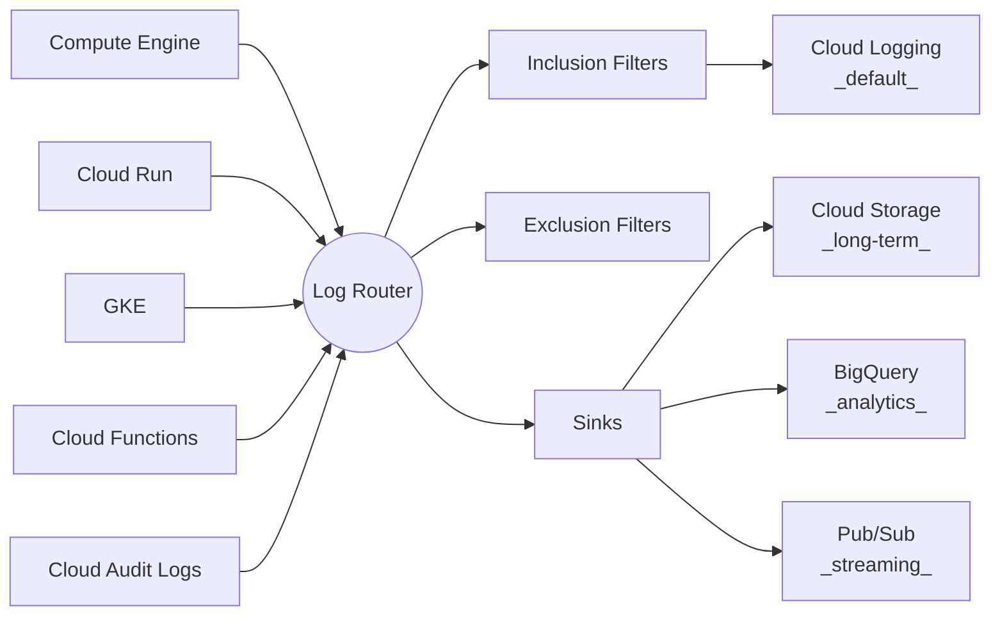
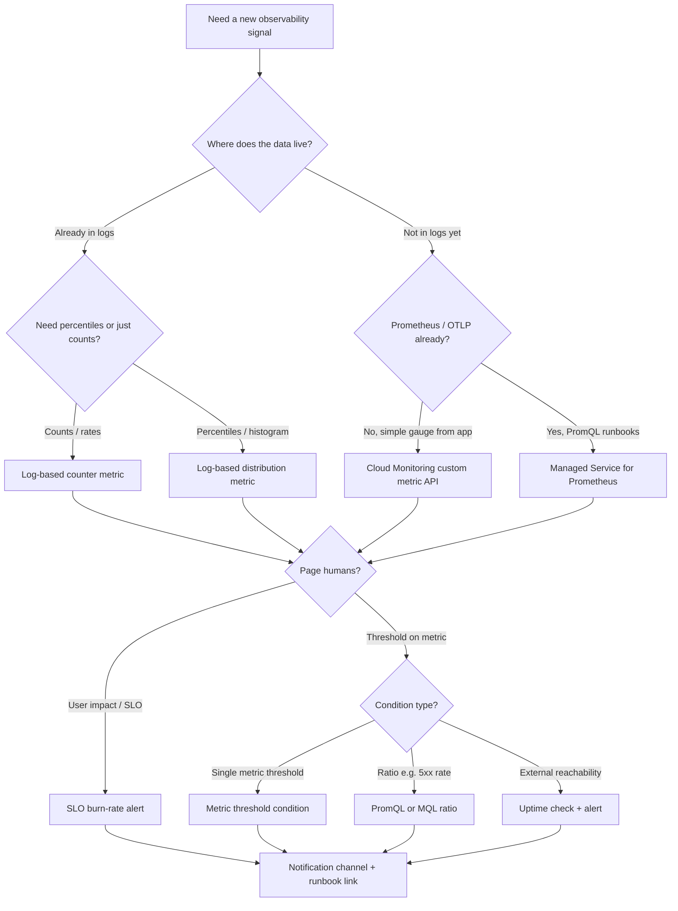

> **Complexity**: `[MEDIUM]` | **Time to Complete**: 2.5h | **Prerequisites**: Module 2.3 (Compute Engine), Module 2.7 (Cloud Run)

## What You'll Be Able to Do

By the end of this module, you will have practiced the observability patterns production teams use on GCP: turning noisy logs into alertable signals, wiring dashboards and policies that reflect user impact, and tracing latency across services instead of guessing from CPU graphs alone. Concretely, you will be able to:

- **Configure Cloud Monitoring dashboards with custom metrics, uptime checks, and alerting policies**
- **Implement structured logging with Cloud Logging and build log-based metrics for application-level observability**
- **Deploy Cloud Trace and Cloud Profiler to diagnose latency bottlenecks in distributed GCP applications**
- **Design multi-project monitoring with metrics scoping and centralized alerting across GCP organizations**

---

## Why This Module Matters

**Hypothetical scenario:** In November 2022, a fintech company's payment processing service began failing intermittently. Customers reported that approximately 5% of transactions were being declined with a generic "server error." The on-call engineer checked the Cloud Run dashboard and saw that CPU and memory utilization were normal. Request count looked steady. Everything appeared healthy from the infrastructure layer. The issue persisted for 4 hours before a senior engineer noticed an anomaly in the application logs: a third-party payment gateway was returning HTTP 429 (rate limit exceeded) for requests from a specific IP range. This log signal was buried in 2 million log lines per hour because the team had no log-based metrics, no alerting on error rates, and no structured logging. They were flying blind in a sea of unstructured text. The 4-hour delay in diagnosis cost them $340,000 in failed transactions and a significant hit to customer trust.

This incident demonstrates a truth that every platform engineer learns the hard way: **metrics tell you that something is wrong; logs tell you why.** You need both, and you need them working together. Cloud Operations (formerly Stackdriver) is GCP's integrated suite for monitoring, logging, and alerting. It is not a separate product you bolt on---it is deeply integrated into every GCP service. Cloud Logging automatically captures logs from managed services like Cloud Run, GKE, and Cloud Functions. Compute Engine instances require the Cloud Ops Agent for application and OS log collection. Cloud Monitoring automatically collects metrics from all GCP resources.

In this module, you will learn how Cloud Logging's architecture works (the log router, sinks, and exclusions), how to create log-based metrics that turn log patterns into alertable signals, how Cloud Monitoring dashboards and alerting policies work, and how to set up uptime checks for external monitoring of your services.

---

## The Cloud Operations Suite at a Glance

Google Cloud Observability bundles the services you use to answer three questions in production: **Is the system healthy?** **Why did it fail?** **Where is time being spent?** The suite is not a monolith you install once—it is a set of managed APIs and consoles that managed GCP services feed automatically, while Compute Engine and custom workloads connect through the [Ops Agent](https://cloud.google.com/monitoring/agent/ops-agent) or OpenTelemetry exporters.

| Service | Primary question | Typical data source |
| :--- | :--- | :--- |
| **Cloud Monitoring** | Are metrics within SLO? | Platform metrics, custom metrics, log-based metrics, uptime checks |
| **Cloud Logging** | What happened, in detail? | Platform logs, stdout/stderr, audit logs, Ops Agent file logs |
| **Cloud Trace** | Which hop added latency? | HTTP spans from managed runtimes, OpenTelemetry instrumentation |
| **Cloud Profiler** | Which function consumed CPU/heap? | Continuous sampling in Go, Java, Node.js, Python |
| **Error Reporting** | What new exceptions appeared? | Stack traces in logs or the Error Reporting API |
| **Managed Service for Prometheus (GMP)** | Can we keep PromQL and lose the Prometheus server? | Prometheus exporters, GKE managed collection, OTLP |

Managed services such as Cloud Run, GKE, Cloud Functions, and Cloud SQL emit platform logs and metrics without extra agents. That integration is why teams often discover observability gaps only after they deploy custom code on Compute Engine: without the Ops Agent or equivalent instrumentation, you get infrastructure metrics but miss application logs, Prometheus scrapes, and trace context propagation. The sections below walk through each layer with enough depth to design a production observability stack—not merely enable default dashboards.

---

## Cloud Logging Architecture

### The Log Router

Every log entry generated in GCP flows through the **Log Router**, which is the control plane for ingestion and routing rather than a storage tier you query directly. As entries arrive from Compute Engine, Cloud Run, GKE, Cloud Functions, and audit pipelines, the router evaluates each one against sinks (destinations), inclusion filters, and exclusion filters to decide whether it is stored in the default `_Default` bucket, copied to long-term storage, streamed to Pub/Sub, or dropped before billable ingestion. Thinking in terms of router rules first—and storage second—makes cost control and compliance much easier to reason about.



### Log Types

| Log Type | Auto-collected | Cost | Retention | Example |
| :--- | :--- | :--- | :--- | :--- |
| **Admin Activity** | Yes (always on) | Free | 400 days | IAM changes, resource creation |
| **Data Access** | Must enable | Paid | 30 days (default) | Who read what data |
| **System Event** | Yes (always on) | Free | 400 days | Live migration, auto-scaling |
| **Platform Logs** | Yes | Paid | 30 days (default) | Cloud Run requests, GKE events |
| **Application Logs** | Yes (stdout/stderr) | Paid | 30 days (default) | Your application output |

### Log Buckets, Views, and Log Analytics

Ingestion charges apply when log entries are **stored in a log bucket**, not when they merely pass through the Log Router. The `_Default` bucket in each project receives most platform and application logs; the `_Required` bucket stores Admin Activity and System Event logs that Google manages with fixed retention and **no storage charge** for the bucket itself. You can create **user-defined log buckets** with custom retention (for example 90 days for security review) and **log views** that restrict which entries analysts in a given role may read—useful when a central security team owns long-retention buckets but application teams need read-only access to their service logs.

[Log Analytics](https://cloud.google.com/logging/docs/analyze/query-link) lets you run SQL against linked log buckets through BigQuery's engine without exporting every line to a dataset first. That matters for ad hoc investigations ("show me distinct `error_type` values last Tuesday") where Log Explorer's line-by-line UI becomes tedious. Queries issued through Log Explorer and Log Analytics are not separately billed by Cloud Logging; you pay for the underlying log storage that makes the data available. When compliance requires multi-year retention, the usual pattern is a **sink to Cloud Storage** or BigQuery with lifecycle rules, not an infinitely growing `_Default` bucket—object storage and BigQuery long-term tiers are typically cheaper than retaining high-volume DEBUG traffic in Logging past 30 days.

```bash
# Create a user-defined log bucket with 90-day retention and Log Analytics enabled
gcloud logging buckets create security-audit \
  --location=global \
  --retention-days=90 \
  --enable-analytics \
  --description="Extended retention for security review"

# List buckets and their retention
gcloud logging buckets list --location=global \
  --format="table(name, retentionDays, lifecycleState)"

# Link a bucket to Log Analytics (enables SQL queries in console)
gcloud logging links create security-analytics-link \
  --location=global \
  --bucket=security-audit \
  --description="Analytics link for security bucket"
```

### Querying Logs

```bash
# Basic log query
gcloud logging read 'resource.type="cloud_run_revision"' \
  --limit=20 \
  --format=json

# Filter by severity
gcloud logging read 'severity>=ERROR AND resource.type="cloud_run_revision"' \
  --limit=10

# Filter by time range
gcloud logging read 'resource.type="gce_instance" AND timestamp>="2024-01-15T00:00:00Z" AND timestamp<"2024-01-16T00:00:00Z"' \
  --limit=50

# Search for specific text in log messages
gcloud logging read 'textPayload:"connection refused"' \
  --limit=10

# Structured log query (jsonPayload)
gcloud logging read 'jsonPayload.status>=500 AND resource.type="cloud_run_revision"' \
  --limit=20

# Query specific resource
gcloud logging read 'resource.type="cloud_run_revision" AND resource.labels.service_name="my-api"' \
  --limit=10 \
  --format="table(timestamp, severity, textPayload)"
```

### Log Explorer Query Language

The Log Explorer in the GCP console is where most engineers debug incidents interactively: you filter by resource type, severity, time window, and structured fields, then pivot from a chart of error volume to individual log lines. The same filter syntax powers `gcloud logging read`, so a query you prove in the shell can be saved as a shared link for the on-call rotation. The examples below show compound filters, negation, regex matching, and label-scoped searches you will reuse across Cloud Run and GCE workloads.

```text
# Compound queries
resource.type="cloud_run_revision"
AND resource.labels.service_name="my-api"
AND severity>=WARNING
AND jsonPayload.latency_ms>500
AND timestamp>="2024-01-15T10:00:00Z"

# NOT operator
resource.type="gce_instance"
AND NOT severity="DEBUG"

# Regex matching
textPayload=~"error.*timeout"

# Specific labels
labels."compute.googleapis.com/resource_name"="my-vm"
```

**Pause and predict:** If a log entry matches both an inclusion filter for BigQuery and an exclusion filter for the default Cloud Logging bucket, where does the log end up?

<details>
<summary>Check your prediction</summary>

The log still routes to BigQuery while the default bucket drops it. Sinks and bucket exclusions evaluate independently in the Log Router, so a matching inclusion sink still receives a copy when `_Default` drops the log.
</details>

The next section examines sink architecture and destinations. Parallel export pipes route telemetry to BigQuery, Cloud Storage, and Pub/Sub.

---

## Log Sinks: Routing Logs to Destinations

Sinks route copies of log entries to destinations outside the default Cloud Logging storage, which is essential for long-term retention, security analytics, and compliance archives that outlive the default 30-day platform retention. Each sink has its own filter and a **writer identity** service account that must be granted permission on the destination bucket, dataset, or topic—creating the sink is only half the job. Dedicated export pipes allow security, audit, and engineering teams to retain critical operational data downstream.

Think of sinks as **parallel export pipes** evaluated by the Log Router for every matching entry. A common enterprise pattern uses three sinks: (1) all Admin Activity and Data Access audit logs to a BigQuery dataset for SIEM queries; (2) `severity>=ERROR` platform logs to a Cloud Storage archive bucket with 7-year lifecycle; (3) a Pub/Sub topic streaming critical security events to a real-time processor. Each sink filter should be as narrow as compliance allows—exporting `severity>=INFO` from a busy GKE cluster to BigQuery can dwarf the cost of the cluster itself because BigQuery storage and analysis charges apply downstream.

When granting the sink writer identity, use least privilege: `roles/storage.objectCreator` on a prefix, `roles/bigquery.dataEditor` on a dataset, or `roles/pubsub.publisher` on a topic. Terraform and Deployment Manager templates should output the writer email (`serviceAccount:...`) so security teams can audit bindings. If logs stop appearing at the destination, the first check is almost always IAM on the destination—not the sink filter—because the router silently drops failed writes after retries.

```bash
# Create a sink to Cloud Storage (long-term archival)
gcloud logging sinks create archive-all-logs \
  storage.googleapis.com/my-log-archive-bucket \
  --log-filter='severity>=INFO'

# Create a sink to BigQuery (analytics)
gcloud logging sinks create errors-to-bigquery \
  bigquery.googleapis.com/projects/my-project/datasets/error_logs \
  --log-filter='severity>=ERROR'

# Create a sink to Pub/Sub (real-time streaming)
gcloud logging sinks create critical-to-pubsub \
  pubsub.googleapis.com/projects/my-project/topics/critical-logs \
  --log-filter='severity=CRITICAL'

# After creating a sink, grant the sink's writer identity access
# to the destination
WRITER_IDENTITY=$(gcloud logging sinks describe archive-all-logs \
  --format="value(writerIdentity)")

gcloud storage buckets add-iam-policy-binding gs://my-log-archive-bucket \
  --member="$WRITER_IDENTITY" \
  --role="roles/storage.objectCreator"

# List all sinks
gcloud logging sinks list

# Update a sink's filter
gcloud logging sinks update archive-all-logs \
  --log-filter='severity>=WARNING'

# Delete a sink
gcloud logging sinks delete archive-all-logs --quiet
```

### Log Exclusions (Reducing Cost)

Exclusion filters prevent matching log entries from being ingested into Cloud Logging's default `_Default` bucket, which is often the fastest lever for cutting ingestion spend when staging environments emit verbose DEBUG lines or health-check probes generate millions of low-value INFO entries. They do not automatically remove data already routed by a sink, so teams typically pair exclusions (protect the default bill) with selective sinks (retain audit-critical streams). The commands below show common exclusion patterns for Cloud Run noise and synthetic health endpoints.

```bash
# Exclude debug logs from Cloud Run (they are noisy and expensive)
gcloud logging exclusions create exclude-debug-logs \
  --description="Exclude debug-level Cloud Run logs" \
  --filter='resource.type="cloud_run_revision" AND severity="DEBUG"'

# Exclude health check logs (extremely noisy)
gcloud logging exclusions create exclude-health-checks \
  --description="Exclude health check logs" \
  --filter='httpRequest.requestUrl="/health" OR httpRequest.requestUrl="/healthz"'

# View exclusions
gcloud logging exclusions list
```

---

## Structured Logging

Writing structured (JSON) logs instead of plain text enables powerful querying and log-based metrics because Cloud Logging maps well-formed JSON objects into `jsonPayload` fields you can filter with the same precision as built-in `httpRequest` attributes. When you emit `latency_ms`, `user_id`, or `error_type` as top-level JSON keys, you can build distribution metrics and dashboards without fragile regex on `textPayload`, and you can alert on thresholds that reflect application semantics rather than substring matches. Plain `print()` output still lands in logs, but it forfeits that structured field model—so production services on Cloud Run should treat JSON logging as the default, not an optimization.

Cloud Logging recognizes several **severity** conventions automatically. For JSON logs, include a `severity` field with values such as `INFO`, `WARNING`, `ERROR`, and `CRITICAL` so Log Explorer color-codes entries and severity filters behave predictably. The special field `message` (or `msg`) populates the summary line in the console. For HTTP services behind Cloud Run or load balancers, Cloud Logging also captures **`httpRequest`** metadata—method, URL, status, latency—when the platform generates request logs; your application JSON should complement, not duplicate, those fields unless you need business context the platform cannot infer.

Design a **stable schema** per service: document required keys in your team's runbook (`service`, `trace_id`, `latency_ms`, `status_code`, `error_type`) and avoid renaming fields between releases without updating log-based metrics. Breaking renames silently starve dashboards because filters stop matching overnight. For correlation with Trace, log the trace ID from the incoming `X-Cloud-Trace-Context` header so Log Explorer queries can jump to the waterfall view for the same request.

```text
# Recommended jsonPayload shape for API services
{
  "severity": "ERROR",
  "message": "Payment authorization failed",
  "service": "checkout-api",
  "trace_id": "projects/my-proj/traces/abc123",
  "latency_ms": 842,
  "status_code": 502,
  "error_type": "GatewayTimeout",
  "order_id": "ord-9981"
}
```

When logs must never contain secrets, enforce redaction in the formatter—mask PAN fragments, tokens, and password fields before serialization. Structured logging makes redaction easier because you target known keys instead of regex over free-form strings.

### Python Structured Logging for Cloud Run

```python
import json
import logging
import sys

class JSONFormatter(logging.Formatter):
    def format(self, record):
        log_entry = {
            "severity": record.levelname,
            "message": record.getMessage(),
            "component": record.name,
        }

        # Add extra fields if present
        if hasattr(record, "request_id"):
            log_entry["request_id"] = record.request_id
        if hasattr(record, "user_id"):
            log_entry["user_id"] = record.user_id
        if hasattr(record, "latency_ms"):
            log_entry["latency_ms"] = record.latency_ms

        return json.dumps(log_entry)

# Configure logging
handler = logging.StreamHandler(sys.stdout)
handler.setFormatter(JSONFormatter())
logger = logging.getLogger("my-api")
logger.addHandler(handler)
logger.setLevel(logging.INFO)

# Usage
logger.info("Request processed",
            extra={"request_id": "abc-123", "latency_ms": 45, "user_id": "user-456"})
# Output: {"severity": "INFO", "message": "Request processed",
#          "request_id": "abc-123", "latency_ms": 45, "user_id": "user-456"}
```

After the Python example above runs on Cloud Run, Cloud Logging parses each line as `jsonPayload`, which unlocks field-scoped queries and metric extractors such as:

```text
jsonPayload.latency_ms > 200
jsonPayload.user_id = "user-456"
jsonPayload.severity = "ERROR"
```

Use these filters in Log Explorer during incidents, then promote the same expressions into log-based metrics when a pattern should page the team automatically.

**Pause and predict:** If you use standard `print()` statements in Python on Cloud Run, how does that output format limit alerting policies compared to structured logging?

<details>
<summary>Check your prediction</summary>

Standard print statements write to `textPayload`, which cannot drive field-based alert filters the way structured `jsonPayload.*` properties can. Substring matches cannot filter on nested attributes or evaluate numeric thresholds like latency values.
</details>

The next section introduces log-based metrics. We examine how filters convert streaming log entries into actionable time series.

---

## Log-Based Metrics: Turning Logs into Signals

Log-based metrics are the bridge between logging and monitoring: they evaluate filters as entries flow through the log router and expose matching traffic as Cloud Monitoring time series you can chart, combine with infrastructure metrics, and attach to alerting policies. **Counter** metrics increment when a filter matches (ideal for error counts and auth failures), while **distribution** metrics sample numeric fields such as latency so you can compute percentiles instead of only knowing that "something slow happened." The commands in the next two subsections show both patterns for Cloud Run workloads.

Plan metrics before launch for SLO-critical signals (5xx counts, payment failures, auth denials). Each log-based metric becomes a **chargeable custom metric** in Cloud Monitoring—budget for cardinality. User-defined log-based metrics share the custom-metric byte allotment (150 MiB free per billing account per month on the standard pricing page); high-volume broad filters can consume that allotment quickly.

Label extractors add dimensions—for example grouping error counts by `resource.labels.service_name` or a `jsonPayload.error_type` field—so one metric serves many services on a dashboard. Too many unique label combinations, however, explode time-series cardinality and cost the same way high-cardinality Prometheus labels do. Prefer a small set of business-meaningful labels (`error_type`, `region`) over per-user dimensions unless you truly page on individual users.

When a platform metric already exists (`run.googleapis.com/request_count` with `response_code_class`), use it instead of duplicating a log-based counter—the platform metric is non-chargeable and maintained by Google. Reach for log-based metrics when the signal lives only in application JSON (`jsonPayload.event="inventory_shortfall"`) or when you need a distribution from a field Cloud Run does not expose as a native histogram.

### Counter Metrics

```bash
# Create a metric that counts 5xx errors in Cloud Run
gcloud logging metrics create cloud_run_5xx_errors \
  --description="Count of 5xx errors in Cloud Run" \
  --log-filter='resource.type="cloud_run_revision" AND httpRequest.status>=500'

# Create a metric that counts authentication failures
gcloud logging metrics create auth_failures \
  --description="Authentication failures across all services" \
  --log-filter='jsonPayload.event="auth_failure" OR textPayload:"authentication failed"'

# List log-based metrics
gcloud logging metrics list

# View metric details
gcloud logging metrics describe cloud_run_5xx_errors
```

### Distribution Metrics

Distribution metrics capture how numeric values extracted from log fields are spread over time—response latency, payload sizes, or queue depth—so you can alert on P95/P99 behavior instead of merely counting how many log lines mentioned slowness. You define a value extractor (often `EXTRACT(httpRequest.latency)` or a `jsonPayload` field) and bucket boundaries; Cloud Monitoring then aggregates each matching log entry into histogram buckets. Choose distribution metrics when the *magnitude* of an event matters, not just its presence.

```bash
# Create a distribution metric for response latency
gcloud logging metrics create api_latency \
  --description="API response latency distribution" \
  --log-filter='resource.type="cloud_run_revision" AND httpRequest.latency!=""' \
  --bucket-options='linear-buckets={"numFiniteBuckets": 20, "width": 100, "offset": 0}' \
  --value-extractor='EXTRACT(httpRequest.latency)'
```

**Pause and predict:** You create a log-based counter metric for HTTP 500 errors. Will this metric retroactively count the errors that occurred yesterday, or only errors from creation onward?

<details>
<summary>Check your prediction</summary>

The metric only counts errors from the moment of creation onward. Evaluation happens exclusively at ingestion time, so creating a metric today does not backfill yesterday's errors.
</details>

The next section covers Cloud Monitoring dashboards and charts. We explore how teams combine infrastructure and application signals in a single pane.

---

## Cloud Monitoring: Dashboards and Metrics

Cloud Monitoring is the time-series layer where platform metrics, custom metrics, log-based metrics, uptime check results, and SLO burn rates converge. Dashboards are your incident "single pane"—but only if they chart **symptoms** (request latency percentiles, error rates, saturation) alongside **causes** you investigate after paging (CPU, memory, instance count). A dashboard that shows only infrastructure graphs reproduces the blind spot from the opening scenario: healthy CPU while customers fail checkout.

### Built-in Metrics

GCP automatically collects hundreds of metrics from every managed service—request counts, latencies, CPU, connections, API calls—without you installing agents or publishing custom time series first. These platform metrics are the fastest way to answer "is the service receiving traffic and staying within SLO?" before you dive into logs or traces. The table below lists representative metric families; use `gcloud monitoring metrics-descriptors list` when you need the exact type name for a dashboard tile or alert condition.

| Service | Example Metrics |
| :--- | :--- |
| **Compute Engine** | `compute.googleapis.com/instance/cpu/utilization`, `disk/read_bytes_count` |
| **Cloud Run** | `run.googleapis.com/request_count`, `request_latencies`, `container/cpu/utilization` |
| **Cloud SQL** | `cloudsql.googleapis.com/database/cpu/utilization`, `connections` |
| **Cloud Storage** | `storage.googleapis.com/api/request_count`, `total_bytes` |
| **Cloud Functions** | `cloudfunctions.googleapis.com/function/execution_count`, `execution_times` |

```bash
# List available metric types for a service
gcloud monitoring metrics-descriptors list \
  --filter='metric.type = starts_with("run.googleapis.com")' \
  --format="table(type, description)" \
  --limit=20

# Query a specific metric (requires Monitoring Query Language - MQL)
gcloud monitoring time-series list \
  --filter='metric.type="run.googleapis.com/request_count" AND resource.labels.service_name="my-api"' \
  --interval-start-time=$(date -u -v-1H +%Y-%m-%dT%H:%M:%SZ 2>/dev/null || date -u -d "1 hour ago" +%Y-%m-%dT%H:%M:%SZ) \
  --format=json
```

### Creating Dashboards

Dashboards group related charts—request rates colored by response class, saturation signals, and log-based error counters—so responders see correlated evidence on one screen during an incident. You can iterate visually in the Cloud Monitoring console, then export or author JSON definitions for review in Git and repeatable deployment across projects. The JSON example below builds a mosaic layout with request volume and P99 latency tiles for a single Cloud Run service; adapt the filters to your service name and add log-based metric charts once counters exist.

```bash
# Create a dashboard from a JSON definition
cat > /tmp/dashboard.json << 'EOF'
{
  "displayName": "Cloud Run API Dashboard",
  "mosaicLayout": {
    "tiles": [
      {
        "width": 6,
        "height": 4,
        "widget": {
          "title": "Request Count by Status",
          "xyChart": {
            "dataSets": [
              {
                "timeSeriesQuery": {
                  "timeSeriesFilter": {
                    "filter": "metric.type=\"run.googleapis.com/request_count\" AND resource.type=\"cloud_run_revision\" AND resource.labels.service_name=\"my-api\"",
                    "aggregation": {
                      "alignmentPeriod": "60s",
                      "perSeriesAligner": "ALIGN_RATE",
                      "crossSeriesReducer": "REDUCE_SUM",
                      "groupByFields": ["metric.labels.response_code_class"]
                    }
                  }
                }
              }
            ]
          }
        }
      },
      {
        "xPos": 6,
        "width": 6,
        "height": 4,
        "widget": {
          "title": "P99 Latency",
          "xyChart": {
            "dataSets": [
              {
                "timeSeriesQuery": {
                  "timeSeriesFilter": {
                    "filter": "metric.type=\"run.googleapis.com/request_latencies\" AND resource.type=\"cloud_run_revision\" AND resource.labels.service_name=\"my-api\"",
                    "aggregation": {
                      "alignmentPeriod": "60s",
                      "perSeriesAligner": "ALIGN_PERCENTILE_99"
                    }
                  }
                }
              }
            ]
          }
        }
      }
    ]
  }
}
EOF

gcloud monitoring dashboards create --config-from-file=/tmp/dashboard.json

# List dashboards
gcloud monitoring dashboards list --format="table(displayName, name)"
```

Treat dashboard JSON as infrastructure: store definitions in Git, review changes in PRs, and name dashboards after services or user journeys (`checkout-api prod`, `data pipeline batch`) rather than engineer names. During incidents, pin the top three charts—request rate by response class, p99 latency, and your primary log-based error metric—so new responders do not hunt for widgets.

### Notification Channels and On-Call Routing

Before alert policies fire into the void, wire **notification channels**—email, Slack, PagerDuty, SMS, webhooks—to the teams that can act. Channels are reusable objects; policies reference them by ID. Separate **page-worthy** channels from **informational** ones so backup-job CPU warnings land in Slack while SLO burn-rate violations wake an on-call rotation. Include runbook URLs in policy documentation fields; Cloud Monitoring surfaces that text in notifications and reduces mean time to remediate when the recipient is not the engineer who authored the alert six months ago.

```bash
# Create a PagerDuty channel (token stored as channel label — use Secret Manager in prod pipelines)
gcloud monitoring channels create \
  --display-name="Checkout On-Call PagerDuty" \
  --type=pagerduty \
  --channel-labels="service_key=YOUR_INTEGRATION_KEY"

# Verify channel before attaching to critical policies
gcloud monitoring channels describe CHANNEL_ID --format=json
```

Review channels when on-call rotations change—stale Slack webhooks are a common reason "the alert definitely fired but nobody saw it" during postmortems.

### PromQL in Cloud Monitoring

Cloud Monitoring natively supports PromQL for teams that already think in Prometheus rate/histogram queries, which lowers migration friction when you adopt GCP but keep Grafana-style mental models. Metric names are translated to the `*_googleapis_com:*` form, and you can express error rates as ratios of labeled request counters or pull latency quantiles from histogram buckets. PromQL is optional—MQL and console builders work too—but it is valuable when your runbooks already reference PromQL snippets from open-source stacks.

```text
# Request rate for a Cloud Run service
rate(run_googleapis_com:request_count{service_name="my-api"}[5m])

# Error rate (5xx responses)
rate(run_googleapis_com:request_count{service_name="my-api", response_code_class="5xx"}[5m])
  /
rate(run_googleapis_com:request_count{service_name="my-api"}[5m])
  * 100

# P95 latency
histogram_quantile(0.95, rate(run_googleapis_com:request_latencies_bucket{service_name="my-api"}[5m]))

# CPU utilization above 80%
compute_googleapis_com:instance_cpu_utilization{instance_name=~"web-.*"} > 0.8
```

---

## Alerting Policies

Alerting policies in Cloud Monitoring evaluate conditions on a schedule and open incidents when thresholds breach for a configured duration. Understanding **condition types** prevents mismatched alerts: a metric threshold on `run.googleapis.com/request_count` with `response_code_class="5xx"` measures error volume, while a PromQL ratio divides 5xx rate by total rate for a true error **percentage**. **SLO burn-rate conditions** (covered earlier) use `select_slo_burn_rate` and tie pages to error budgets. **Uptime check conditions** consume the `monitoring.googleapis.com/uptime_check/check_passed` metric. **Log-based metric conditions** behave like any custom metric once the log-based metric exists.

| Condition style | Best for | Caution |
| :--- | :--- | :--- |
| **Metric threshold** | Single metric vs static threshold (CPU, queue depth) | Noisy if metric is a cause not a symptom |
| **Metric absent** | Expected heartbeat metrics that stop arriving | False positives during deploys unless suppressed |
| **PromQL / MQL ratio** | Error rate %, saturation ratios | Query cost counts toward alerting policy billing |
| **SLO burn rate** | Customer-facing reliability | Requires upfront SLO definition |
| **Uptime check failure** | External availability | Regional flaps—require multi-region failure |

Policies also incur ongoing cost when they reference chargeable metrics: Google bills for **metric references active** in alerting policies and for **points returned** when conditions evaluate complex queries—another reason to delete orphaned policies during quarterly hygiene reviews.

### Creating Alert Policies

```bash
# Create an alert policy for high error rate
cat > /tmp/alert-policy.json << 'EOF'
{
  "displayName": "Cloud Run 5xx Error Rate > 5%",
  "combiner": "OR",
  "conditions": [
    {
      "displayName": "5xx error rate exceeds 5%",
      "conditionThreshold": {
        "filter": "metric.type=\"run.googleapis.com/request_count\" AND resource.type=\"cloud_run_revision\" AND metric.labels.response_code_class=\"5xx\"",
        "aggregations": [
          {
            "alignmentPeriod": "300s",
            "perSeriesAligner": "ALIGN_RATE",
            "crossSeriesReducer": "REDUCE_SUM",
            "groupByFields": ["resource.labels.service_name"]
          }
        ],
        "comparison": "COMPARISON_GT",
        "thresholdValue": 0.05,
        "duration": "300s",
        "trigger": {
          "count": 1
        }
      }
    }
  ],
  "notificationChannels": [],
  "alertStrategy": {
    "autoClose": "604800s"
  }
}
EOF

gcloud monitoring policies create --policy-from-file=/tmp/alert-policy.json

# List alert policies
gcloud monitoring policies list \
  --format="table(displayName, enabled, conditions[0].displayName)"
```

### Notification Channels

```bash
# Create an email notification channel
gcloud monitoring channels create \
  --display-name="Ops Team Email" \
  --type=email \
  --channel-labels="email_address=ops@example.com"

# Create a Slack notification channel
gcloud monitoring channels create \
  --display-name="Incidents Slack" \
  --type=slack \
  --channel-labels="channel_name=#incidents,auth_token=xoxb-..."

# List notification channels
gcloud monitoring channels list \
  --format="table(displayName, type, name)"

# Update an alert policy to use a notification channel
CHANNEL_ID=$(gcloud monitoring channels list --filter="displayName='Ops Team Email'" --format="value(name)")

gcloud monitoring policies update POLICY_ID \
  --add-notification-channels=$CHANNEL_ID
```

### Alert Policy Best Practices

| Practice | Why | Example |
| :--- | :--- | :--- |
| **Alert on symptoms, not causes** | Symptoms affect users; causes are for investigation | Alert on error rate, not CPU usage |
| **Use multi-condition alerts** | Reduce noise from transient spikes | Error rate > 5% AND request count > 100 |
| **Set appropriate windows** | Too short = noise; too long = late | 5-minute window for critical; 15-minute for warning |
| **Include runbook links** | Reduce MTTR by guiding responders | Link to troubleshooting playbook in alert description |
| **Avoid alert fatigue** | Too many alerts = ignored alerts | Only alert on actionable conditions |

**Pause and predict:** You configure an alert policy for CPU utilization above 80% with a 5-minute duration window. If CPU spikes to 99% for 4 minutes, drops to 30% for 30 seconds, and returns to 99% for 2 minutes, does the alert trigger?

<details>
<summary>Check your prediction</summary>

No, the alert does not trigger. The duration window requires the metric to violate the threshold continuously, so the 30-second dip resets the evaluation timer.
</details>

The next section introduces external uptime checks. We review how global probes verify public endpoint availability from outside GCP.

---

## Uptime Checks

Uptime checks monitor the availability of your public endpoints from Google's global probe network, which catches failures that internal metrics miss—expired TLS certificates, DNS misconfigurations, VPC egress rules blocking external clients, or regional routing issues that still leave instances "healthy" behind a load balancer. Probes run HTTP/HTTPS (or TCP) checks on a schedule you define, record per-region pass/fail time series, and integrate with alerting policies so pages fire when multiple regions agree a user-visible path is down.

Google operates probe checkers across multiple geographic regions worldwide. Uptime checks bill per execution according to the [Observability pricing page](https://cloud.google.com/products/observability/pricing)—consolidate checks on user-journey URLs (`/health` on the public API gateway) rather than creating one check per internal microservice that customers never call directly. **Public** uptime checks (the default checker type) cannot reach RFC 1918 addresses on the public internet; for internal endpoints, use **VPC uptime checks** (`VPC_CHECKERS`) or other **private synthetic monitoring** patterns (Cloud Run job with VPC egress, or third-party probes inside your network) instead of expecting public checkers to hit internal load balancers.

Authenticated endpoints require custom headers or OAuth tokens in advanced configurations; keep health endpoints unauthenticated but non-sensitive so probes stay simple. Pair uptime alerts with log-based error metrics: external "down" with flat error logs often implicates DNS or TLS, while uptime failure plus rising 5xx logs implicates application regression.

```bash
# Create an HTTP uptime check (DISPLAY_NAME is the positional arg; period is in minutes: 1, 5, 10, or 15)
gcloud monitoring uptime create my-api-uptime \
  --resource-type=uptime-url \
  --resource-labels="host=my-api-abc123-uc.a.run.app,project_id=my-project" \
  --path=/health \
  --protocol=https \
  --period=5 \
  --timeout=10

# List uptime checks
gcloud monitoring uptime list-configs \
  --format="table(displayName, httpCheck.path, period)"

# Create an alert policy for uptime check failure
# (alert if the check fails from 2+ regions)
cat > /tmp/uptime-alert.json << 'EOF'
{
  "displayName": "API Uptime Check Failed",
  "combiner": "OR",
  "conditions": [
    {
      "displayName": "Uptime check failing",
      "conditionThreshold": {
        "filter": "metric.type=\"monitoring.googleapis.com/uptime_check/check_passed\" AND resource.type=\"uptime_url\"",
        "aggregations": [
          {
            "alignmentPeriod": "300s",
            "perSeriesAligner": "ALIGN_NEXT_OLDER",
            "crossSeriesReducer": "REDUCE_COUNT_FALSE",
            "groupByFields": ["resource.labels.host"]
          }
        ],
        "comparison": "COMPARISON_GT",
        "thresholdValue": 2,
        "duration": "0s"
      }
    }
  ]
}
EOF

gcloud monitoring policies create --policy-from-file=/tmp/uptime-alert.json
```

**Pause and predict:** Why is it considered best practice to configure uptime checks to alert only when the check fails from multiple geographic regions rather than a single region?

<details>
<summary>Check your prediction</summary>

Requiring failures from two or more regions prevents false alarms from localized network hiccups or transient packet loss along a single probe path. Alert policies only trigger when multiple geographic vantage points confirm that the endpoint is unreachable.
</details>

The next section covers Cloud Trace and Cloud Profiler. We explore how latency analysis tools locate bottlenecks across microservice architectures.

---

## Diagnosing Latency: Cloud Trace and Cloud Profiler

While logs and metrics tell you *that* a service is slow or experiencing high load, they often do not tell you *exactly where* the time is being spent inside the code or across a distributed microservice architecture.

### Cloud Trace

[Cloud Trace](https://cloud.google.com/trace/docs) is a distributed tracing system that collects latency data from your applications and displays it in the GCP Console. When a request enters your system, Trace assigns it a unique trace ID; as the request crosses a load balancer, Cloud Run revision, Cloud SQL query, and external HTTP dependency, each hop emits a **span** with start time, duration, and parent/child relationships. That waterfall view answers *where* wall-clock time went, which is invaluable when p99 latency spikes but CPU stays flat because the service is waiting on I/O. Managed runtimes often capture baseline HTTP spans automatically, and you add OpenTelemetry instrumentation when you need custom spans around business logic or database calls.

Trace sampling is worth configuring deliberately: at very high QPS, storing every span can become expensive and noisy, while sampling too aggressively hides rare tail-latency paths. Cloud Run and GKE can propagate the `X-Cloud-Trace-Context` header so downstream services join the same trace without custom glue code. When you instrument manually, ensure outbound HTTP clients forward that header (or W3C `traceparent`) so a slow payment gateway appears as a child span instead of an unexplained gap.

```bash
# List recent traces for a Cloud Run service (REST via gcloud)
gcloud trace list-traces \
  --filter='rootSpanName:"GET /checkout"' \
  --limit=5 \
  --format="table(traceId, startTime, latency)"

# In application code (Python + OpenTelemetry), a custom span around DB work:
#   with tracer.start_as_current_span("fetch_inventory"):
#       rows = db.execute("SELECT ...")
# Cloud Trace picks up OTLP exports when the Ops Agent or collector is configured.
```

### Cloud Profiler

[Cloud Profiler](https://cloud.google.com/profiler/docs) provides continuous CPU and heap profiling for applications running on GCP with statistical sampling overhead typically under 1%, producing flame graphs that highlight hot functions rather than single slow requests. Continuous sampling helps teams analyze call trees and resource consumption across production workloads. Agents exist for Go, Java, Node.js, and Python; you import the library and start the profiler at process boot so production profiles accumulate without manual capture sessions.

Profiler complements distributed tracing by inspecting internal execution patterns within individual application processes. For Cloud Run, enable Profiler in the container image and ensure the service account has `roles/cloudprofiler.agent` (or the broader Monitoring agent role bundles that include it). Profiles appear in the console within minutes of traffic; compare profiles before and after a deploy to spot regressions in hot paths.

**Pause and predict:** If users report that clicking checkout takes 10 seconds while CPU utilization hovers at 20%, which tool should you reach for first: Cloud Trace or Cloud Profiler?

<details>
<summary>Check your prediction</summary>

Reach for Cloud Trace first. A 10-second checkout transaction with low CPU utilization indicates a request-path wait on I/O, database locks, or downstream RPCs. Cloud Trace isolates distributed latency across external hops, whereas Cloud Profiler analyzes hot CPU or memory churn inside a process.
</details>

The next object is the metrics scope model. After that section, Ops Agent collection on Compute Engine is a different telemetry path.

---

## Multi-Project Monitoring

In a real-world GCP organization, resources are rarely confined to a single project. You might have separate projects for networking, databases, frontend services, and backend APIs. Monitoring them individually leads to fragmented visibility.

### Metrics Scopes

A **Metrics Scope** allows you to view and manage monitoring data from multiple GCP projects through a single pane of glass. You designate one **scoping project**—often a shared observability or platform project—and attach **monitored projects** whose metrics become visible in that scope. Dashboards in the scoping project can chart resources from any attached project side by side, which gives platform teams cross-project visibility without console switching. IAM on that project can grant SREs read access to fleet health without Owner on every application project.

**Pause and predict:** If an organization maintains ten separate production microservice projects, how should the operations team organize alerting policies?

<details>
<summary>Check your prediction</summary>

Manage alerts centrally within a single metrics scoping project with monitored projects attached. Centralized alerting evaluates conditions across all workloads without duplicating policy definitions, notification channels, and silence windows in every separate project.
</details>

The next section introduces the Ops Agent on Compute Engine. We review how virtual machines configure unified logging and metrics collection.

---

## Ops Agent: Unified Collection on Compute Engine

Cloud Run and GKE collect stdout and platform metrics automatically, but **Compute Engine VMs** need an agent unless your application pushes telemetry directly to Cloud Logging and Cloud Monitoring APIs. The [Ops Agent](https://cloud.google.com/monitoring/agent/ops-agent) is the preferred replacement for the legacy separate Logging and Monitoring agents: one package, one YAML configuration file, Fluent Bit for high-throughput logs, and the OpenTelemetry Collector for metrics and traces.

By default the Ops Agent collects `/var/log/syslog` (or `/var/log/messages`) and host metrics such as CPU, memory, and disk without custom configuration. Production setups extend receivers to scrape **Prometheus endpoints** on localhost, tail application log files under `/var/log/myapp/`, and accept **OTLP** metrics and traces from in-process OpenTelemetry SDKs. Configuration merges user overrides from `/etc/google-cloud-ops-agent/config.yaml` with a built-in baseline at agent restart— you never edit the built-in file directly.

```bash
# Install Ops Agent on a Debian/Ubuntu VM (run on the instance)
curl -sSO https://dl.google.com/cloudagents/add-google-cloud-ops-agent-repo.sh
sudo bash add-google-cloud-ops-agent-repo.sh --also-install

# Verify agent status
sudo systemctl status google-cloud-ops-agent

# Example override: scrape a local Prometheus metrics endpoint
sudo tee /etc/google-cloud-ops-agent/config.yaml << 'EOF'
metrics:
  receivers:
    prometheus:
      type: prometheus
      config:
        scrape_configs:
          - job_name: 'my-app'
            scrape_interval: 60s
            static_configs:
              - targets: ['localhost:9090']
  service:
    pipelines:
      prometheus_pipeline:
        receivers: [prometheus]
EOF

sudo systemctl restart google-cloud-ops-agent
```

Grant the VM's service account `roles/logging.logWriter` and `roles/monitoring.metricWriter` (or a custom role bundle your platform team publishes). Without those bindings, the agent buffers locally and you lose data silently during incidents—the classic "we thought logs were flowing" failure mode. For Windows VMs, paths and service names differ, but the receivers/processors/pipelines model is the same.

---

## Managed Service for Prometheus (GMP)

Teams running Kubernetes often standardize on **Prometheus** for application metrics—histograms, RED metrics, custom business counters—but operating Prometheus at scale (retention, HA, remote write, cardinality explosions) consumes platform engineering time. [Google Cloud Managed Service for Prometheus (GMP)](https://cloud.google.com/managed-prometheus) is a fully managed, Prometheus-compatible backend built on the same Monarch datastore as Cloud Monitoring. You keep PromQL dashboards and alert rules; Google operates ingestion, retention (up to 24 months for Prometheus metrics), and global query fan-out.

GMP supports **managed collection** on GKE (horizontal pod autoscaling collectors), self-deployed collectors, and OpenTelemetry pipelines on Cloud Run. Because GMP and native Cloud Monitoring metrics share a backend, you can chart `run.googleapis.com/request_count` beside `prometheus.googleapis.com/.../http_requests_total` in one dashboard and query both with PromQL in the console or Grafana. **Metering differs**: most Cloud Monitoring custom metrics bill by **bytes ingested** (scalar points count as 8 bytes each), while GMP bills by **samples ingested**—aligning with upstream Prometheus cost models and making high-cardinality label sets easier to attribute per namespace.

```bash
# Enable GMP API (if not already enabled with Monitoring)
gcloud services enable monitoring.googleapis.com

# List Prometheus targets in a GKE cluster with managed collection (console is often easier)
# Metrics appear under prometheus.googleapis.com/* metric types in Metrics Explorer

# Example PromQL mixing GMP and Cloud Run platform metrics:
#   rate(run_googleapis_com:request_count{service_name="checkout"}[5m])
#     /
#   rate(prometheus.googleapis.com/.../http_requests_total{job="checkout"}[5m])
```

Use GMP when your organization already invested in Prometheus exporters and PromQL runbooks. Stay on native Cloud Monitoring custom metrics when you publish low-cardinality gauges from batch jobs via the Monitoring API and do not need PromQL portability. Many enterprises run both: platform metrics from GCP services, application RED metrics through GMP.

---

## Error Reporting

[Error Reporting](https://cloud.google.com/error-reporting/docs) aggregates exceptions so responders see **grouped error events** instead of scrolling duplicate stack traces in Log Explorer. It is automatically enabled for supported runtimes: uncaught exceptions written to `stderr` on Cloud Run, Cloud Functions, GKE, and App Engine are parsed when log entries contain recognizable stack traces or formatted `ReportedErrorEvent` payloads. The Error Groups page highlights new and frequent failures; you can wire notification channels when a fresh group appears.

Error Reporting itself has no separate per-event charge, but log entries that carry stack traces still incur **Cloud Logging ingestion** if they land in a chargeable bucket. The service samples up to 1,000 errors per hour for display; beyond that, counts are estimated so the UI remains responsive during storms. For explicit reporting from code, use language client libraries or the `events:report` REST method—those paths also generate structured log entries under `projects/PROJECT_ID/logs/clouderrorreporting.googleapis.com%2Freported_errors`.

```python
# Python: client library reports an handled exception with context
from google.cloud import error_reporting

client = error_reporting.Client()
try:
    process_payment(order_id)
except PaymentError as exc:
    client.report_exception(user=user_id, http_context={"url": "/checkout"})
    raise
```

Pair Error Reporting with log-based metrics on `severity>=ERROR` for paging, and with Trace for the request that triggered the exception. Error Reporting answers "what new bugs shipped?"; log-based metrics answer "how fast is the error rate rising?"

---

## SLO Monitoring and Burn-Rate Alerts

Infrastructure metrics and log counts are necessary but not sufficient for user-facing reliability. **Service-level objectives (SLOs)** translate "good enough" into measurable targets—99.9% of checkout requests succeed within 500 ms over a 30-day window, for example. Cloud Monitoring's [SLO monitoring](https://cloud.google.com/stackdriver/docs/solutions/slo-monitoring) lets you define a **service**, choose a **service-level indicator (SLI)** from platform metrics (Cloud Run request latency, load balancer availability, custom metrics), set a **performance goal**, and track **error budget** consumption over a compliance period.

An **error budget** is the allowed unreliability before you violate the SLO. If the objective is 99.9% availability in 30 days, the budget is roughly 43 minutes of bad events. **Burn rate** measures how fast you consume that budget relative to sustainable pace; a burn rate of 10 means you will exhaust the month's budget in three days if nothing changes. Google recommends **two alerting policies per critical SLO**: a **fast-burn** policy with a short lookback for sudden spikes, and a **slow-burn** policy with a longer lookback for gradual degradation—the same pattern described in the Google SRE Workbook.

Console-created SLO alerts use the `select_slo_burn_rate(SLO_NAME, LOOKBACK_PERIOD)` time-series selector. You set a burn-rate threshold and lookback duration; when consumption exceeds the threshold long enough, the policy fires. This is strictly more actionable than alerting on raw CPU because it ties pages to customer impact and pre-agreed budgets.

```bash
# SLOs are commonly created in console or Terraform; API sketch for burn-rate alert condition:
# filter: select_slo_burn_rate("projects/PROJECT_ID/services/SERVICE_ID/serviceLevelObjectives/SLO_ID", "3600s")
# comparison: COMPARISON_GT
# thresholdValue: 14.4   # example fast-burn multiplier — tune per SLO policy

# List services with SLOs in a project (Monitoring API)
gcloud monitoring services list --format="table(displayName, name)"
```

When error budget is nearly exhausted, the disciplined response is to freeze risky releases and focus on reliability work—not to raise the SLO target quietly. Dashboards in the microservice SLO view show remaining budget percentage, SLI current value, and firing alert ratio per service.

---

## Cost Lens: Observability Spend at Moderate Scale

Observability bills surprise teams when volume scales faster than attention. At moderate scale—a few Cloud Run services, a GKE cluster, several Compute Engine VMs, and audit logging enabled on sensitive buckets—the dominant costs are usually **log ingestion**, **custom metric cardinality**, and **retention**, not the console UI itself.

| Cost driver | What spikes spend | Knobs that reduce spend |
| :--- | :--- | :--- |
| **Log ingestion** | DEBUG in staging copied to prod projects, Data Access audit logs on hot buckets, VPC Flow Logs at full sampling | Exclusion filters on `_Default`; scope audit configs; sample flow logs; structured INFO default |
| **Log retention** | Keeping everything 90+ days in Logging buckets | Sink to Cloud Storage/BigQuery with lifecycle; shorten bucket retention for non-audit logs |
| **Log-based metrics** | Broad filters matching millions of entries | Tight filters; prefer platform metrics when available—they are non-chargeable |
| **Custom metrics (bytes)** | High-cardinality labels (`user_id`, `request_id`) on Monitoring API writes | Aggregate dimensions; use distributions sparingly |
| **GMP samples** | Unbounded label cardinality from auto-instrumentation | Drop labels in relabel configs; use managed collectors' defaults on GKE |
| **Uptime checks / alerting** | One check per microservice × many regions; alert conditions evaluating huge metric sets | Consolidate checks on user-facing URLs; delete orphaned policies |

Per [Google Cloud Observability pricing](https://cloud.google.com/products/observability/pricing) (verify current rates in your billing console before budgeting):

- **Logging storage** in `_Default` and user-defined buckets: **$0.50/GiB** ingested after the first **50 GiB free per project per month** (includes 30 days storage in the bucket).
- **Vended network logs** (VPC Flow, firewall, NAT): **$0.25/GiB** with **no** free tier—enabling flow logs on every subnet is a common bill shock.
- **Retention beyond 30 days** in log buckets: **$0.01/GiB/month** for stored volume.
- **Chargeable custom metrics** (including log-based metrics): billed by bytes after **150 MiB free per billing account per month**; distribution points cost more than scalars.
- **GMP**: billed by **samples ingested** (Prometheus-style metering), not the same byte model as generic custom metrics.

Hypothetical scenario: A platform team enables Data Access audit logs project-wide and turns on VPC Flow Logs for "visibility." Ingestion jumps from 60 GiB/month to 800 GiB/month. At roughly $0.50/GiB on application logs and $0.25/GiB on vended logs, monthly Logging spend moves from single digits to hundreds of dollars before any application growth. The fix is scoped audit policies, flow-log sampling, and exclusion filters—not disabling observability entirely.

Cloud Logging does **not** charge for routing copies via sinks to Pub/Sub, Cloud Storage, or BigQuery; downstream services bill separately. That makes **sink + exclude** patterns cost-effective: drop noise from `_Default` ingestion while archiving compliance streams cheaply in object storage.

---

## Patterns & Anti-Patterns

Production observability on GCP succeeds when teams treat logs, metrics, and traces as **product infrastructure** with owners, budgets, and review cadences—not as default toggles left on after a tutorial.

| Pattern | When to use it | Why it works | Scaling note |
| :--- | :--- | :--- | :--- |
| **Structured JSON logging from day one** | Any Cloud Run, GKE, or Functions service | Enables field filters, distribution metrics, and Log Analytics without regex fragility | Standardize field names (`severity`, `trace_id`, `latency_ms`) across services |
| **Symptom-based alerting (SLO + log-based error rates)** | User-facing APIs and batch SLAs | Pages correlate with customer pain and error budgets | Pair fast- and slow-burn SLO policies per critical path |
| **Log router exclusions + selective sinks** | High-volume staging or health-check noise | Cuts `_Default` ingestion while compliance logs still reach BigQuery/Storage | Review exclusions quarterly—services change |
| **Metrics scope hub project** | 5+ production projects | Central dashboards and IAM for SRE without Owner on every app project | Hub project becomes critical—back Terraform state and access reviews |
| **Ops Agent Prometheus receiver on VMs** | Legacy apps exposing `/metrics` | One agent for logs + scraped metrics; feeds GMP or Monitoring | Cap scrape frequency and label cardinality |

| Anti-pattern | What goes wrong | Why teams fall into it | Better alternative |
| :--- | :--- | :--- | :--- |
| **Alert on CPU alone** | Pages during backups; misses I/O latency | CPU graphs are easy in console | Alert on latency, error rate, SLO burn, or log-based 5xx counters |
| **Plain `print()` logging in production** | Cannot build precise metrics or Log Analytics SQL | Fastest local debug habit | JSON to stdout with stable field names |
| **Project-wide Data Access audit logs** | Massive ingestion on busy Storage buckets | Compliance checkbox without scoping | Audit specific resources; sink to cheap long-term storage |
| **Log-based metric with overly broad filter** | Expensive metric + alert noise | "Match anything with 'error' in text" | Narrow filters on `jsonPayload` fields and `severity` |
| **Self-hosted Prometheus on GKE without capacity planning** | Cardinality explosions, missed SLAs on the monitoring stack | Fear of managed pricing | GMP with managed collectors; keep runbooks in PromQL |
| **No uptime checks on public URLs** | Internal metrics green while users cannot connect | Assume load balancer health equals app health | HTTP checks on `/health` from multiple regions |
| **Ignoring trace context propagation** | Disjoint spans; mystery gaps in Trace | New service added without header forwarding | Propagate `X-Cloud-Trace-Context` or W3C traceparent |
| **Retention in `_Default` for years** | Retention surcharges and query slowdown | Simplest button in console | Sink to Storage; keep `_Default` at 30 days |

---

## Decision Framework

Use this framework when choosing among log-based metrics, Monitoring API custom metrics, alerting condition types, and GMP versus native Monitoring ingestion.



| Decision | Prefer | Tradeoff |
| :--- | :--- | :--- |
| **Log-based counter vs distribution** | Counter for "how many errors"; distribution when magnitude matters (latency ms) | Distributions cost more as chargeable custom metrics; require numeric fields in structured logs |
| **Log-based vs Monitoring API custom metric** | Log-based when event already logged; API when emitting real-time gauge without log line | Log-based metrics are not retroactive; API metrics need client library or agent |
| **GMP vs native custom metrics** | GMP for K8s/Prometheus ecosystems; native API for low-cardinality app gauges | Different metering (samples vs bytes); PromQL parity has minor differences from upstream |
| **Metric threshold vs SLO burn alert** | SLO for customer-facing reliability targets; raw threshold for capacity signals | SLO setup requires service definition and SLI choice upfront |
| **Uptime check vs internal health metric** | Uptime for user-visible URL; internal metric for dependency depth | Uptime checks bill per execution; catch DNS/TLS issues external probes see |
| **Exclude vs sink-only routing** | Exclude to drop `_Default` cost; sink when destination must retain copy | Exclusions do not block sinks—design both intentionally |

Revisit decisions after the first month of production traffic: log volume dashboards in the Logs Storage page, GMP ingestion by namespace (if enabled), and alert policy incident counts reveal whether your filters are too loose or too tight.

---

## Building an Observability Baseline for a New Service

When a team launches a new Cloud Run service or GKE deployment, observability should ship in the same PR as the Dockerfile—not as a follow-up ticket. A practical **baseline checklist** covers emission, aggregation, external proof, and cost guardrails without boiling the ocean on day one.

First, **emit structured logs** to stdout with severity, request identifiers, and latency fields your log-based metrics will need later. Second, confirm **platform metrics** appear in Metrics Explorer (`run.googleapis.com/request_count`, `request_latencies`) before writing custom instrumentation—many alerts need only platform data. Third, create at least one **log-based counter** for application-specific failures your platform metrics cannot see (for example `jsonPayload.error_type="RateLimitExceeded"`). Fourth, add an **uptime check** on the public health URL if the service has external consumers. Fifth, define an **SLO** if the service is on the critical path— even a simple availability SLI on HTTP 5xx rate beats debating whether 3% errors is "bad enough" during an outage.

For Compute Engine workloads, install the **Ops Agent** in the golden image, verify IAM roles on the VM service account, and test that logs appear in Log Explorer before autoscaling the fleet. For Kubernetes, decide early whether application metrics flow through **GMP managed collection** or a self-managed Prometheus sidecar; switching later is doable but rewrites dashboards and alert rules.

Hypothetical scenario: A team ships a new internal admin API with DEBUG logging enabled "temporarily" and no exclusion filter. Staging and production share a project; ingestion adds 200 GiB/month at $0.50/GiB after the free tier—roughly $75/month in logging alone for a low-traffic admin tool. The baseline fix is INFO default, DEBUG only via feature flag in non-prod, and an exclusion for known-noisy health probes—not removing logging entirely.

Document the baseline in the service README: dashboard link, primary alert policy names, SLO target, and which log fields are stable contracts for downstream metrics. The next engineer onboarding during a 2 AM incident will thank you.

---

## Did You Know?

1. **Cloud Logging operates at multi-petabyte scale** across GCP—enough volume that the Log Router, retention tiers, and query paths are engineered for massive throughput rather than single-tenant assumptions.

2. **Log-based metrics are evaluated in real-time as logs flow through the log router**, not after they are stored. This means you can create an alert based on a log-based metric and receive a notification within 60-90 seconds of the triggering log entry being written---even before you could find it manually in the Log Explorer.

3. **Cloud Monitoring's public uptime checks can run from multiple global checker regions** (for example USA-Oregon, USA-Iowa, USA-Virginia, Europe, South America, and Asia Pacific). A check is considered "failed" only when it fails from multiple regions, reducing false positives from network partitions. You can see the per-region results in the uptime check dashboard.

4. **The Ops Agent (successor to the legacy Monitoring and Logging agents) supports both Prometheus metric scraping and fluent-bit log collection** in a single agent. If you are running custom metrics in Prometheus format on your VMs, the Ops Agent can scrape them and send them to Cloud Monitoring without running a separate Prometheus server.

---

## Common Mistakes

| Mistake | Why It Happens | How to Fix It |
| :--- | :--- | :--- |
| Not creating log sinks for long-term retention | Default 30-day retention seems enough | Create sinks to Cloud Storage for compliance; 30 days passes quickly during incident investigation |
| Logging too much at DEBUG level | Verbose logging during development | Use INFO as default; enable DEBUG only in non-production; use exclusion filters |
| Not creating log-based metrics | Relying on manual log searching | Create metrics for key patterns (errors, auth failures, latency thresholds) |
| Setting alert thresholds too sensitive | Wanting to catch every issue | Use multi-condition alerts and appropriate duration windows (5-15 minutes) |
| Not using structured logging | Plain text seems simpler | JSON logs enable powerful filtering in Log Explorer; use structured logging from day one |
| Ignoring uptime checks | Internal monitoring seems sufficient | Uptime checks verify from external perspective; catches DNS, certificate, and network issues |
| Alert fatigue from too many alerts | Adding alerts without reviewing existing ones | Quarterly alert hygiene review; delete alerts that are never actionable |
| Not routing audit logs to BigQuery | Do not know about log sinks | Create a sink for audit logs to BigQuery for security analytics and compliance |

---

## Quiz

<details>
<summary>1. Your company wants to retain all access logs for 5 years for compliance, but the security team is complaining that their default Cloud Logging bill is astronomically high due to debug logs from the staging environment. How do you configure the Log Router to satisfy both requirements?</summary>

You should create a log sink that routes all access logs to a Cloud Storage bucket configured with a 5-year retention policy and a lifecycle rule for cost optimization. Simultaneously, you must create an exclusion filter in the Log Router for the staging environment's debug logs. The exclusion filter prevents the noisy debug logs from being ingested into the expensive default Cloud Logging storage, saving money. Because sinks and exclusions operate independently, the compliance sink will still capture the required access logs before any exclusions affect the default bucket.
</details>

<details>
<summary>2. An on-call engineer notices that the "Request Latency" log-based counter metric is firing alerts, but they cannot determine if the slow requests are taking 1 second or 30 seconds. What design flaw exists in their log-based metric, and how should it be redesigned?</summary>

The engineer created a log-based counter metric, which simply counts the number of log entries matching a filter (e.g., latency > 500ms) without capturing the actual latency value itself. To fix this, they need to recreate it as a log-based distribution metric. A distribution metric uses a value extractor to pull the specific numeric latency value from each structured JSON log entry. This allows Cloud Monitoring to calculate percentiles like P95 and P99, giving the engineer precise visibility into exactly how slow the requests actually are during an incident.
</details>

<details>
<summary>3. You created an exclusion filter to drop noisy HTTP 200 health check logs to save money on Cloud Logging ingestion. However, the security team complains that these logs are now missing from their custom BigQuery sink, which they use for historical audits. How does the Log Router handle this, and what went wrong?</summary>

In GCP, the Log Router processes log exclusions and log sinks completely independently of one another. Creating an exclusion filter prevents the logs from being ingested into the `_Default` Cloud Logging storage bucket, saving ingestion costs. It does not, however, prevent those same logs from being routed to a custom sink, such as BigQuery or Cloud Storage. If the security team is missing logs in their custom sink, the issue is with that specific sink's inclusion/exclusion filter, not the general exclusion filter you created for the default bucket.
</details>

<details>
<summary>4. Your team receives pager alerts every night at 3 AM because a database VM's CPU hits 95%. However, this coincides with a scheduled nightly backup, and customer-facing API latency remains completely normal during this time. How should you restructure this alerting strategy to prevent alert fatigue?</summary>

This alert is currently firing on a "cause" (high CPU) rather than a "symptom" (user impact). Because the high CPU does not degrade the customer experience during the backup, this alert is unactionable and causes severe alert fatigue. You should restructure the alerting strategy to trigger on symptoms, such as the API's P99 latency exceeding a certain threshold or the HTTP 5xx error rate spiking. If you still want to monitor the CPU for capacity planning, you should change the notification channel from a paging system to a low-priority email or Slack message that can be reviewed asynchronously during business hours.
</details>

<details>
<summary>5. A developer complains that their microservice is intermittently taking 4 seconds to respond instead of the usual 50ms. The service calls three other downstream GCP services and a Cloud SQL database. They ask you to check the CPU metrics on the Cloud Run instances to find the problem. Which GCP observability tool should you recommend they use instead, and why?</summary>

You should recommend using Cloud Trace rather than simply looking at CPU metrics. High latency in a distributed system is often caused by network waits, database locks, or slow downstream API calls, none of which will show up as high CPU utilization. Cloud Trace tracks a single request as it propagates through all the microservices and the database, creating a visual waterfall diagram of spans. This will usually show which downstream service or database operation is contributing to the 4-second delay, drastically reducing the time to resolution.
</details>

<details>
<summary>6. You are tasked with centralizing monitoring for 15 different GCP projects belonging to 3 different product teams. Currently, engineers have to switch between projects in the GCP console to view dashboards and alerts, leading to fragmented observability. How do you architect a solution in Cloud Monitoring to provide a "single pane of glass"?</summary>

You should implement a Metrics Scope hosted in a dedicated, centralized monitoring project. By attaching the 15 individual product projects to this single scoping project, Cloud Monitoring will aggregate all their metrics into one unified view. This allows you to build centralized dashboards and configure global alerting policies that evaluate resources across all 15 projects simultaneously. Furthermore, you can grant the engineering teams IAM access to the scoping project, giving them full visibility into the organization's health without needing to grant them permissions in every individual production project.
</details>

---

## Hands-On Exercise: Monitoring and Alerting for Cloud Run

### Objective

Deploy a Cloud Run service with structured logging, create log-based metrics, set up an uptime check, and query monitoring metrics so you experience the full path from application emission to alertable signals.

### Prerequisites

- `gcloud` CLI installed and authenticated
- A GCP project with billing enabled

### Tasks

Work through the six tasks in order: deploy the instrumented API, generate representative traffic (success, slow, and error paths), promote log patterns to metrics, prove external reachability with an uptime check, read back platform and user-defined time series, then tear everything down to avoid ongoing charges. Each task includes a collapsible solution with copy-paste commands.

### Task 1: Deploy a Cloud Run Service with Structured Logging

<details>
<summary>Solution</summary>

```bash
export PROJECT_ID=$(gcloud config get-value project)
export REGION=us-central1

# Enable APIs
gcloud services enable \
  run.googleapis.com \
  monitoring.googleapis.com \
  logging.googleapis.com \
  cloudbuild.googleapis.com \
  artifactregistry.googleapis.com

mkdir -p /tmp/ops-lab && cd /tmp/ops-lab

cat > main.py << 'PYEOF'
import json
import logging
import os
import random
import sys
import time
from flask import Flask, request, jsonify

app = Flask(__name__)

class JSONFormatter(logging.Formatter):
    def format(self, record):
        entry = {
            "severity": record.levelname,
            "message": record.getMessage(),
        }
        for key in ["latency_ms", "status_code", "path", "error_type"]:
            if hasattr(record, key):
                entry[key] = getattr(record, key)
        return json.dumps(entry)

handler = logging.StreamHandler(sys.stdout)
handler.setFormatter(JSONFormatter())
logger = logging.getLogger("ops-lab")
logger.addHandler(handler)
logger.setLevel(logging.INFO)

@app.route("/")
def home():
    start = time.time()
    latency_ms = int((time.time() - start) * 1000) + random.randint(5, 50)

    logger.info("Request processed",
                extra={"latency_ms": latency_ms, "status_code": 200, "path": "/"})
    return jsonify({"status": "ok", "latency_ms": latency_ms})

@app.route("/slow")
def slow():
    delay = random.uniform(0.5, 2.0)
    time.sleep(delay)
    latency_ms = int(delay * 1000)

    logger.warning("Slow request detected",
                   extra={"latency_ms": latency_ms, "status_code": 200, "path": "/slow"})
    return jsonify({"status": "ok", "latency_ms": latency_ms})

@app.route("/error")
def error():
    error_types = ["DatabaseTimeout", "AuthenticationFailed", "RateLimitExceeded"]
    error_type = random.choice(error_types)

    logger.error("Request failed",
                 extra={"latency_ms": 0, "status_code": 500, "path": "/error",
                        "error_type": error_type})
    return jsonify({"status": "error", "error": error_type}), 500

@app.route("/health")
def health():
    return jsonify({"status": "healthy"})

if __name__ == "__main__":
    port = int(os.environ.get("PORT", 8080))
    app.run(host="0.0.0.0", port=port)
PYEOF

cat > requirements.txt << 'EOF'
flask>=3.0.0
gunicorn>=21.2.0
EOF

cat > Dockerfile << 'DEOF'
FROM python:3.12-slim
WORKDIR /app
COPY requirements.txt .
RUN pip install --no-cache-dir -r requirements.txt
COPY main.py .
CMD ["gunicorn", "--bind", "0.0.0.0:8080", "--workers", "2", "main:app"]
DEOF

gcloud run deploy ops-lab-api \
  --source=. \
  --region=$REGION \
  --allow-unauthenticated \
  --memory=256Mi \
  --quiet

SERVICE_URL=$(gcloud run services describe ops-lab-api \
  --region=$REGION --format="value(status.url)")
echo "Service URL: $SERVICE_URL"

# Checkpoint: Verify the service is responsive
curl -s "$SERVICE_URL/health"
```
</details>

### Task 2: Generate Traffic and Logs

<details>
<summary>Solution</summary>

```bash
SERVICE_URL=$(gcloud run services describe ops-lab-api \
  --region=$REGION --format="value(status.url)")

# Generate normal traffic
for i in $(seq 1 15); do
  curl -s "$SERVICE_URL/" > /dev/null
done

# Generate slow requests
for i in $(seq 1 5); do
  curl -s "$SERVICE_URL/slow" > /dev/null
done

# Generate errors
for i in $(seq 1 8); do
  curl -s "$SERVICE_URL/error" > /dev/null
done

echo "Traffic generated. Waiting for logs to appear..."
sleep 15

# View logs
gcloud logging read 'resource.type="cloud_run_revision" AND resource.labels.service_name="ops-lab-api" AND jsonPayload.message!=""' \
  --limit=15 \
  --format="table(timestamp, jsonPayload.severity, jsonPayload.message, jsonPayload.status_code, jsonPayload.latency_ms)"
```
</details>

### Task 3: Create Log-Based Metrics

<details>
<summary>Solution</summary>

```bash
# Metric: Count of 500 errors
gcloud logging metrics create ops_lab_errors \
  --description="Count of 500 errors in ops-lab-api" \
  --log-filter='resource.type="cloud_run_revision" AND resource.labels.service_name="ops-lab-api" AND jsonPayload.status_code=500'

# Metric: Count of slow requests (latency > 500ms)
gcloud logging metrics create ops_lab_slow_requests \
  --description="Count of slow requests (>500ms) in ops-lab-api" \
  --log-filter='resource.type="cloud_run_revision" AND resource.labels.service_name="ops-lab-api" AND jsonPayload.latency_ms>500'

# List metrics
gcloud logging metrics list \
  --format="table(name, description, filter)"
```
</details>

### Task 4: Create an Uptime Check

<details>
<summary>Solution</summary>

```bash
# Get the Cloud Run hostname
SERVICE_HOST=$(echo $SERVICE_URL | sed 's|https://||')

# Create an uptime check (ops-lab-uptime is the display name; period is in minutes)
gcloud monitoring uptime create ops-lab-uptime \
  --resource-type=uptime-url \
  --resource-labels="host=$SERVICE_HOST,project_id=$PROJECT_ID" \
  --path=/health \
  --protocol=https \
  --period=5 \
  --timeout=10

# List uptime checks
gcloud monitoring uptime list-configs \
  --format="table(displayName, httpCheck.path, period)"

echo "Uptime check created. Results will appear in ~2 minutes."
```
</details>

### Task 5: Query Monitoring Metrics

<details>
<summary>Solution</summary>

```bash
# Generate more traffic for metrics to populate
for i in $(seq 1 20); do
  curl -s "$SERVICE_URL/" > /dev/null
  curl -s "$SERVICE_URL/error" > /dev/null 2>&1
done

sleep 30

# Query Cloud Run request count
gcloud monitoring time-series list \
  --filter='metric.type="run.googleapis.com/request_count" AND resource.labels.service_name="ops-lab-api"' \
  --interval-start-time=$(date -u -v-15M +%Y-%m-%dT%H:%M:%SZ 2>/dev/null || date -u -d "15 minutes ago" +%Y-%m-%dT%H:%M:%SZ) \
  --format="table(metric.labels.response_code, points[0].value.int64Value)" \
  --limit=10

# Query the log-based error metric
gcloud monitoring time-series list \
  --filter='metric.type="logging.googleapis.com/user/ops_lab_errors"' \
  --interval-start-time=$(date -u -v-15M +%Y-%m-%dT%H:%M:%SZ 2>/dev/null || date -u -d "15 minutes ago" +%Y-%m-%dT%H:%M:%SZ) \
  --format=json \
  --limit=5
```
</details>

### Task 6: Clean Up

<details>
<summary>Solution</summary>

```bash
# Delete Cloud Run service
gcloud run services delete ops-lab-api --region=$REGION --quiet

# Delete log-based metrics
gcloud logging metrics delete ops_lab_errors --quiet
gcloud logging metrics delete ops_lab_slow_requests --quiet

# Delete uptime check
UPTIME_ID=$(gcloud monitoring uptime list-configs \
  --filter="displayName='Ops Lab API Health'" --format="value(name)" | head -1)
gcloud monitoring uptime delete $UPTIME_ID --quiet 2>/dev/null || true

# Clean up local files
rm -rf /tmp/ops-lab

echo "Cleanup complete."
```
</details>

**Card A: A log that matches a BigQuery inclusion sink and a `_Default` exclusion is dropped everywhere.** An operations team adds an exclusion filter to the `_Default` log bucket to control storage costs. Because the filter drops high-volume HTTP logs, engineers assume those entries are discarded completely and never reach their BigQuery export sink.

<details>
<summary>Check your prediction</summary>

Failure layer: Log Router sink routing evaluation versus log bucket storage filtering. Next action: configure sink inclusion filters and bucket exclusion filters independently, recognizing that destination sinks receive matching entries regardless of bucket retention policies.
</details>

**Card B: A new log-based metric for HTTP 500s immediately charts yesterday’s errors.** After a major service outage, developers create a log-based counter metric for HTTP 500 response codes. When opening Cloud Monitoring, the team expects the new metric chart to display error counts from the previous day's incident.

<details>
<summary>Check your prediction</summary>

Failure layer: log ingestion stream processing versus historical log storage queries. Next action: define critical log-based metrics before production launches, or run BigQuery SQL queries and Log Analytics to analyze historical event data retroactively.
</details>

**Card C: CPU >80% for 4 minutes, 30 seconds at 30%, then 2 minutes at 99% still fires a 5-minute duration alert.** An engineer configures an alert policy requiring CPU utilization above 80% for a continuous 5-minute duration. During a load spike, CPU stays at 99% for 4 minutes and then dips to 30% for 30 seconds. The metric then returns to 99% for 2 minutes, leading the engineer to expect an immediate alert.

<details>
<summary>Check your prediction</summary>

Failure layer: continuous duration evaluation window versus cumulative threshold violation time. Next action: configure percentile or rolling aggregation alignment periods, or alert on symptom-driven metrics like response latency and error rates that do not reset during brief sub-threshold intervals.
</details>

**Card D: Checkout takes 10 seconds at 20% CPU, so start with Cloud Profiler.** Users report that completed checkout transactions take 10 seconds to finish. Monitoring graphs show CPU utilization hovers at 20%, prompting the on-call engineer to launch Cloud Profiler to inspect CPU flame graphs.

<details>
<summary>Check your prediction</summary>

Failure layer: in-process CPU execution bottlenecks versus distributed request latency waiting on I/O. Next action: inspect Cloud Trace waterfall spans first to locate external calls or slow database queries, reserving Cloud Profiler for methods that consume heavy CPU or memory cycles.
</details>

**Success Criteria**:

- [ ] Cloud Run service deployed with structured JSON logging
- [ ] Traffic generated (normal, slow, and error requests)
- [ ] Structured logs visible in Cloud Logging with queryable fields
- [ ] Log-based metrics created for errors and slow requests
- [ ] Uptime check configured and running
- [ ] All resources cleaned up

---

## Next Module

Next up: **[Module 2.11: Cloud Build & CI/CD](../module-2.11-cloud-build/)** --- Learn how to define build pipelines with `cloudbuild.yaml`, use built-in and custom builders, set up triggers from GitHub and GitLab, and orchestrate deployments with Cloud Deploy.

## Sources

- [Route Log Entries](https://cloud.google.com/logging/docs/routing/overview) — Best primary reference for the Log Router, sinks, exclusions, and routing behavior.
- [Log-Based Metrics Overview](https://cloud.google.com/logging/docs/logs-based-metrics) — Explains counter and distribution metrics, alerting integration, and non-retroactive behavior.
- [Log Analytics](https://cloud.google.com/logging/docs/analyze/query-link) — SQL analysis over linked log buckets without full BigQuery export.
- [Google Cloud Observability Pricing](https://cloud.google.com/products/observability/pricing) — Logging ingestion ($/GiB), retention, custom metrics, GMP samples, uptime checks.
- [Ops Agent Overview](https://cloud.google.com/monitoring/agent/ops-agent) — Unified logging, metrics, Prometheus scrape, and OTLP on Compute Engine.
- [Managed Service for Prometheus](https://cloud.google.com/managed-prometheus) — PromQL-compatible managed backend, GKE collection, sample-based metering.
- [PromQL for Cloud Monitoring](https://cloud.google.com/stackdriver/docs/managed-prometheus/promql) — Querying platform, custom, and GMP metrics with PromQL.
- [Error Reporting Overview](https://cloud.google.com/error-reporting/docs/grouping-errors) — Error grouping, sampling limits, and log-based detection.
- [SLO Monitoring](https://cloud.google.com/stackdriver/docs/solutions/slo-monitoring) — Services, SLIs, error budgets, and microservice dashboards.
- [Alerting on Burn Rate](https://cloud.google.com/stackdriver/docs/solutions/slo-monitoring/alerting-on-budget-burn-rate) — Fast-burn and slow-burn SLO alert patterns.
- [Cloud Trace Documentation](https://cloud.google.com/trace/docs) — Distributed tracing, span model, and instrumentation.
- [Cloud Profiler Documentation](https://cloud.google.com/profiler/docs) — Continuous CPU and heap profiling.
- [Metrics Scopes Overview](https://cloud.google.com/monitoring/settings) — Covers scoping projects, multi-project monitoring, and centralized dashboards and alerts.
- [Create Public Uptime Checks](https://cloud.google.com/monitoring/uptime-checks) — Authoritative guide for checker locations, regional behavior, and uptime-check configuration.
