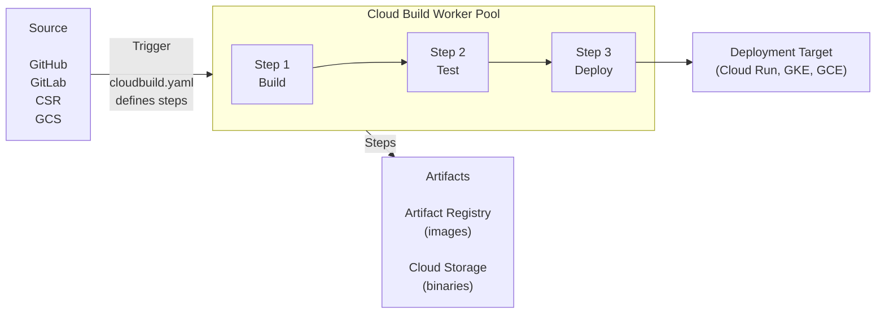
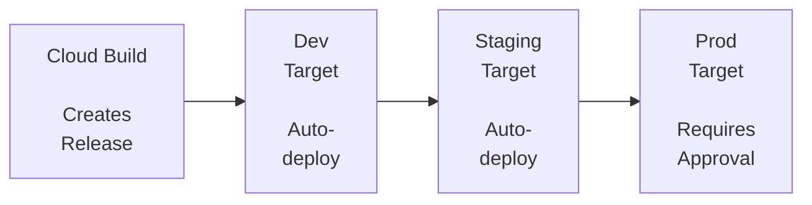
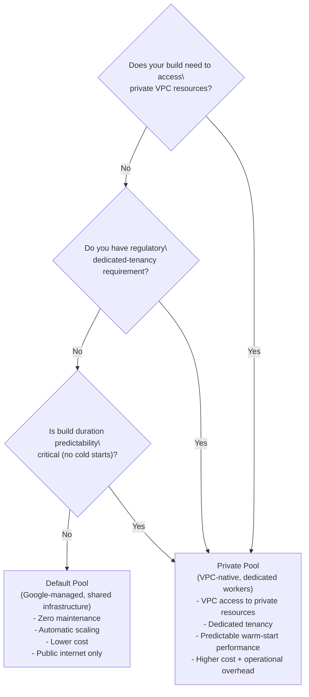

**Complexity**: `[COMPLEX]` | **Time to Complete**: 2.5h | **Prerequisites**: Module 2.6 (Artifact Registry), Module 2.7 (Cloud Run)

## What You'll Be Able to Do

After completing this module, you will be able to:

- **Design** sophisticated Cloud Build pipelines that orchestrate multi-step container image builds, execute parallel testing suites, and seamlessly integrate with Artifact Registry.
- **Implement** automated build triggers for GitHub, GitLab, and Cloud Source Repositories, utilizing advanced branch and tag filtering patterns to align with specific organizational release workflows.
- **Evaluate** and **diagnose** pipeline performance bottlenecks by analyzing build execution times, optimizing step parallelism, and implementing custom caching strategies.
- **Design** declarative Cloud Deploy continuous delivery pipelines that execute progressive canary rollouts, enforce manual approval gates for production environments, and enable automated rollbacks for Google Kubernetes Engine (GKE) and Cloud Run.
- **Debug** complex permission boundaries and secure CI/CD pipelines by enforcing the principle of least privilege through custom Workload Identity configurations and Secret Manager integrations.

## Why This Module Matters

Like the *Infrastructure as Code* module’s Knight Capital 2012 <!-- incident-xref: knight-capital-2012 --> case study, manual release steps can fail dramatically when rollout state is not enforced by automation; a small fleet mismatch is enough to create business-scale failure.

Manual deployments are inherently fragile, subject to fatigue, oversight, and inconsistent execution. As your infrastructure scales from a single monolithic application to dozens or hundreds of microservices deployed across multiple regions, the operational overhead of manual building, testing, and deploying usually becomes impractical to sustain. You need a system that treats your deployment process with the exact same rigor, reproducibility, and immutability as the source code itself. 

Continuous Integration and Continuous Delivery (CI/CD) is the engineering discipline that solves this existential threat. In the Google Cloud ecosystem, **Cloud Build** and **Cloud Deploy** represent the state-of-the-art managed toolchain for implementing these practices. Cloud Build operates as a serverless execution engine, pulling your code, running it through a gauntlet of automated tests, and packaging it into immutable container images. Cloud Deploy then takes the baton, orchestrating the progressive delivery of those images across your environments (Dev, Staging, Production) with built-in safety nets like canary deployments, traffic shifting, and one-click rollbacks. Mastering these tools is not merely an operational optimization; it is the absolute prerequisite for operating cloud-native applications safely at scale.

## Cloud Build Architecture

### How Cloud Build Works

At its core, Google Cloud Build is a fully managed, serverless continuous integration and continuous delivery platform that executes your builds on Google's global infrastructure. Unlike traditional CI servers (like a self-hosted Jenkins instance) where you must manage the underlying virtual machines, handle operating system patches, and scale the worker nodes to accommodate peak development hours, Cloud Build abstracts all of this infrastructure away. You simply declare a set of build steps, and Google provisions ephemeral, isolated virtual machines on demand to execute your instructions, tearing them down the moment the build completes.



The architecture relies heavily on containerization. Every single step in your build pipeline is executed within a brand new, ephemeral Docker container. You specify the Docker image (known as a "builder") that should be used for each step. When a build is triggered, Cloud Build provisions a virtual machine, pulls down your source code, and then sequentially or concurrently launches the specified Docker containers to perform the work.

A critical design feature of Cloud Build is the `/workspace` volume. Because each step runs in an entirely separate Docker container, you might assume that files generated in Step 1 would be lost before Step 2 begins. However, Cloud Build automatically mounts a shared network volume at `/workspace` into every container that participates in the build. The source code is initially cloned into this directory. When Step 1 compiles a binary or downloads node modules, those files reside on the `/workspace` volume. When Step 1 terminates and Step 2 spins up in a completely different container image (perhaps switching from a Java compilation image to a Docker build image), it mounts that exact same `/workspace` directory, inheriting all the compiled artifacts seamlessly.

**Pause and predict:** Cloud Build executes each step in an ephemeral Docker container. If Step 1 installs a custom software package globally using `apt-get install`, will Step 2 be able to use that software?

<details>
<summary>Check your prediction</summary>

No, Step 2 cannot access packages installed during Step 1. Cloud Build provisions a separate container for each build step. Any modifications made by `apt-get install` alter only that individual container's ephemeral root filesystem, which is discarded when the step finishes. Cross-step persistence is strictly limited to the shared `/workspace` volume, meaning tools must be copied to `/workspace` or built into a custom builder image.
</details>

The next object is the Cloud Build vocabulary table. After it, substitutions and triggers are how you name the same pipeline in every project.

### Key Concepts

To fully leverage the platform, you must internalize the vocabulary that Google Cloud uses to describe its CI/CD primitives:

| Concept | Description |
| :--- | :--- |
| **Build** | A single execution of your pipeline |
| **Step** | A Docker container that runs a command |
| **Builder** | The Docker image used for a step (e.g., `gcr.io/cloud-builders/docker`) |
| **Trigger** | Automation that starts a build (e.g., on git push) |
| **Substitution** | Variables you can pass into the build (e.g., `$SHORT_SHA`, `$BRANCH_NAME`) |
| **Worker Pool** | The infrastructure that runs your builds (default or private) |

Understanding the distinction between a Step and a Builder is paramount. A Builder is merely the environment (the Docker image) that contains the necessary toolchain—for example, the `npm` binary or the `kubectl` CLI. The Step is the actual execution of that Builder with a specific set of arguments against your source code. You might use the exact same Builder in multiple different Steps throughout your pipeline, passing different arguments each time.

## cloudbuild.yaml: The Build Configuration

### Basic Structure

The lifeblood of your pipeline is the `cloudbuild.yaml` file. This YAML document is typically committed directly into the root of your source code repository alongside your application code, adhering to the "Infrastructure as Code" philosophy. By defining the build instructions in version control, you ensure that any changes to the build process are subject to the same peer review, linting, and historical auditing as your application logic.

Let us examine a canonical, sequential pipeline that builds a container, pushes it to Artifact Registry, and deploys it to Cloud Run:

```yaml
# cloudbuild.yaml
steps:
  # Step 1: Build the Docker image
  - name: 'gcr.io/cloud-builders/docker'
    args: ['build', '-t', 'us-central1-docker.pkg.dev/$PROJECT_ID/docker-repo/my-api:$SHORT_SHA', '.']

  # Step 2: Push to Artifact Registry
  - name: 'gcr.io/cloud-builders/docker'
    args: ['push', 'us-central1-docker.pkg.dev/$PROJECT_ID/docker-repo/my-api:$SHORT_SHA']

  # Step 3: Deploy to Cloud Run
  - name: 'gcr.io/google.com/cloudsdktool/cloud-sdk'
    entrypoint: gcloud
    args:
      - 'run'
      - 'deploy'
      - 'my-api'
      - '--image=us-central1-docker.pkg.dev/$PROJECT_ID/docker-repo/my-api:$SHORT_SHA'
      - '--region=us-central1'

# Optional: Define images for automatic pushing
images:
  - 'us-central1-docker.pkg.dev/$PROJECT_ID/docker-repo/my-api:$SHORT_SHA'

# Optional: Build configuration
options:
  logging: CLOUD_LOGGING_ONLY
  machineType: 'E2_HIGHCPU_8'

# Optional: Build timeout
timeout: '1200s'
```

In this configuration, the `steps` array defines the sequential workflow. For each step, the `name` field dictates which Docker image to pull and run. The `args` array provides the command-line arguments that are passed to the container's entrypoint. Notice the use of the `images` field at the bottom. While we explicitly run a `docker push` in Step 2, defining the image in the `images` array instructs Cloud Build to automatically push the image upon successful completion of the build and, crucially, to generate proper build provenance metadata (Software Bill of Materials) which is vital for software supply chain security.

The `options` block allows you to request more powerful underlying hardware. By default, Cloud Build provisions standard virtual machines. If you are compiling a massive C++ application or building an intricate machine learning container, you can specify `machineType: 'E2_HIGHCPU_8'` to provision an 8-core machine, drastically reducing compilation times at the cost of higher per-minute billing.

### Built-in Substitution Variables

To make your `cloudbuild.yaml` dynamic and reusable across different environments, Google Cloud Build provides a suite of default substitution variables. These variables are automatically populated by the platform based on the Git context or the project environment when the build is triggered.

| Variable | Value | Example |
| :--- | :--- | :--- |
| `$PROJECT_ID` | GCP project ID | `my-project-123` |
| `$BUILD_ID` | Unique build ID | `b1234-5678-90ab` |
| `$COMMIT_SHA` | Full commit SHA | `a1b2c3d4e5f6...` |
| `$SHORT_SHA` | 7-char commit SHA | `a1b2c3d` |
| `$BRANCH_NAME` | Git branch name | `main`, `feature/auth` |
| `$TAG_NAME` | Git tag | `v1.2.0` |
| `$REPO_NAME` | Repository name | `my-repo` |
| `$REVISION_ID` | Revision ID | Same as `$COMMIT_SHA` for git |

Utilizing these variables prevents hardcoding environment-specific values. For instance, using `$PROJECT_ID` allows the exact same `cloudbuild.yaml` file to be tested in a developer sandbox project and subsequently run in a production project without requiring any modifications to the file itself. 

**Pause and predict:** You configure `$BRANCH_NAME` as part of your container image tag in Artifact Registry. If two developers push changes to the same branch concurrently, what race condition occurs during image tagging?

<details>
<summary>Check your prediction</summary>

Two concurrent commits on the same branch race to push to the identical image tag, allowing one build to overwrite the other unpredictably in Artifact Registry. In contrast, tagging with `$COMMIT_SHA` provides a globally unique, immutable identifier for every commit that guarantees build artifacts are never overwritten.
</details>

The next object is custom substitutions with an underscore prefix. After the YAML, those defaults are what you override at trigger time.

### Custom Substitutions

Beyond the built-in variables, you can define your own custom substitution variables. By convention, custom substitution variables must begin with an underscore `_` to distinguish them from the built-in variables. These act as default parameters that can be overridden at trigger time, providing immense flexibility for deploying to different regions or altering service names dynamically.

```yaml
# cloudbuild.yaml with custom substitutions
substitutions:
  _REGION: 'us-central1'
  _SERVICE_NAME: 'my-api'
  _REPO: 'docker-repo'

steps:
  - name: 'gcr.io/cloud-builders/docker'
    args:
      - 'build'
      - '-t'
      - '${_REGION}-docker.pkg.dev/$PROJECT_ID/${_REPO}/${_SERVICE_NAME}:$SHORT_SHA'
      - '.'

  - name: 'gcr.io/google.com/cloudsdktool/cloud-sdk'
    entrypoint: gcloud
    args:
      - 'run'
      - 'deploy'
      - '${_SERVICE_NAME}'
      - '--image=${_REGION}-docker.pkg.dev/$PROJECT_ID/${_REPO}/${_SERVICE_NAME}:$SHORT_SHA'
      - '--region=${_REGION}'
```

When invoking this build manually via the command line, you can pass the `--substitutions` flag to override the default values. This allows you to rapidly test deployments in alternative regions or deploy a completely separate instance of the application for integration testing:

```bash
# Override substitutions at build time
gcloud builds submit --config=cloudbuild.yaml \
  --substitutions=_REGION=europe-west1,_SERVICE_NAME=my-api-eu
```

### Step Orchestration & Build Options

The simplicity of the `cloudbuild.yaml` format conceals substantial orchestration depth. Understanding the runtime knobs at your disposal transforms Cloud Build from a basic script runner into a high-performance build executor that can shrink pipeline durations from tens of minutes to single-digit minutes.

**Parallelism via `waitFor`**: The `waitFor` field is not limited to the simple `['-']` (start immediately) pattern you have already seen. You can construct arbitrary directed acyclic graphs by referencing step `id` values. A step that specifies `waitFor: ['compile-go', 'compile-python']` will remain pending until both compilation steps complete successfully, enabling fan-in patterns where independent language builds converge before integration testing begins. Cloud Build enforces that no circular dependencies exist in your graph --- if you accidentally create a cycle (Step A waits for B, which waits for A), the build fails immediately at the scheduling stage rather than hanging indefinitely.

**Machine Types**: The default `e2-medium` machine (2 vCPUs, 4 GB RAM) is appropriate for lightweight builds such as simple `npm install && npm test` pipelines. For compute-intensive workloads, you can request larger machine types through the `options.machineType` field. The `E2_HIGHCPU_8` type (8 vCPUs) is a common sweet spot for Docker image builds with many layers. For Go monorepo compilation, C++ builds, or large Java/Kotlin projects with Gradle, stepping up to `E2_HIGHCPU_32` (32 vCPUs) can cut compilation time by 60-80% compared to the default. The cost scales proportionally with vCPU count, and you are billed per build-second on the selected machine type. A machine that is twice as fast but costs twice as much per minute produces the same total cost while delivering faster feedback to developers --- an almost always worthwhile tradeoff.

**Logging Modes**: The `options.logging` field controls where build output is stored. `CLOUD_LOGGING_ONLY` (the recommended default) streams live logs to Cloud Logging, making them searchable and available for alerting. `GCS_ONLY` writes logs to a Cloud Storage bucket, useful when you need long-term archival beyond Cloud Logging's retention period. The legacy `LEGACY` mode stores logs in Cloud Storage under a predefined bucket naming convention. Most teams standardize on `CLOUD_LOGGING_ONLY` and forward critical error patterns to monitoring dashboards.

**Build Timeouts**: The default build timeout is **60 minutes (3600 seconds)**. For larger projects, you can override this in the `timeout` field using Go duration syntax: `timeout: '1800s'` for 30 minutes, or up to the maximum of **24 hours (`'86400s'`)**. Set the timeout to a comfortable multiple of your observed build duration—at least 2x, ideally 3x—so normal growth does not fail the build, while still catching genuinely hung steps (infinite loops, stuck network calls) before they burn a full day of quota.

**Build Artifacts**: Beyond the `images` field for container images, Cloud Build can persist arbitrary build outputs to Cloud Storage using the `artifacts` field. This is essential when your pipeline produces binaries, test reports, or code coverage HTML that downstream systems need to consume. Artifacts are saved after all steps complete, and they support glob patterns to select files from the `/workspace` volume:

```yaml
artifacts:
  objects:
    location: 'gs://my-build-outputs/$BUILD_ID/'
    paths:
      - 'build/binaries/*'
      - 'test-reports/coverage.html'
```

The `$BUILD_ID` substitution in the path ensures every build writes to a unique location, preventing collisions between concurrent pipeline executions. This pattern is widely used to publish test result summaries that CI dashboards can aggregate across builds.

## Builders: The Tools in Your Pipeline

### Google-Provided Builders

Google maintains a highly optimized repository of standard builder images containing the most common toolchains required for software development. Because these images are often cached on the Cloud Build worker nodes, pulling them usually incurs very little network latency, helping your pipeline start executing your code quickly.

| Builder | Image | Use |
| :--- | :--- | :--- |
| **Docker** | `gcr.io/cloud-builders/docker` | Build/push Docker images |
| **gcloud** | `gcr.io/google.com/cloudsdktool/cloud-sdk` | Any gcloud command |
| **kubectl** | `gcr.io/cloud-builders/kubectl` | Kubernetes deployments |
| **npm** | `gcr.io/cloud-builders/npm` | Node.js builds |
| **go** | `gcr.io/cloud-builders/go` | Go builds |
| **mvn** | `gcr.io/cloud-builders/mvn` | Maven/Java builds |
| **gradle** | `gcr.io/cloud-builders/gradle` | Gradle/Java builds |
| **python** | `python` | Python scripts |
| **git** | `gcr.io/cloud-builders/git` | Git operations |

Using these standard builders simplifies your configuration. Instead of writing custom Dockerfiles that install Java, Maven, and all associated dependencies, you merely invoke the `mvn` builder and pass your testing arguments. 

### Using Any Docker Image as a Builder

One of the most powerful architectural decisions in Cloud Build is that there is absolutely nothing proprietary about a "builder." Any container image that can execute a shell command can function as a builder. This democratizes the pipeline, allowing you to seamlessly integrate third-party open-source tools, linting engines, security scanners, or infrastructure management CLI tools.

```yaml
steps:
  # Use Terraform
  - name: 'hashicorp/terraform:1.7'
    entrypoint: 'terraform'
    args: ['init']

  - name: 'hashicorp/terraform:1.7'
    entrypoint: 'terraform'
    args: ['apply', '-auto-approve']

  # Use a linting tool
  - name: 'golangci/golangci-lint:v1.55'
    args: ['golangci-lint', 'run', './...']

  # Use a custom security scanner
  - name: 'aquasec/trivy:latest'
    args: ['image', '--exit-code', '1', '--severity', 'CRITICAL', 'my-image:latest']
```

In this example, we pull official images directly from Docker Hub (like `hashicorp/terraform` or `aquasec/trivy`). The `entrypoint` directive overrides the container's default startup command, allowing us to explicitly call the desired binary. 

**Pause and predict:** You need to run a proprietary, custom-built testing binary in your pipeline, but Google does not provide an official builder image for it. How should you make this tool available to your Cloud Build steps?

<details>
<summary>Check your prediction</summary>

Bake the proprietary binary into a custom builder container image stored in your private Artifact Registry, or copy the compiled binary directly into `/workspace` during an initial setup step. Packaging tools into a private container image guarantees reproducible execution without repeating binary downloads on every build run.
</details>

The next object is the custom builder Dockerfile. After those commands, pinning the image in Artifact Registry is a supply-chain choice.

### Creating Custom Builders

While downloading public images is convenient, doing so heavily relies on the external registry's uptime and exposes your pipeline to potential upstream supply chain attacks if the public image is compromised. To guarantee deterministic execution and security compliance, enterprise pipelines isolate build environments within dedicated container images managed directly in Artifact Registry.

```bash
# Build and push a custom builder image
cat > Dockerfile.builder << 'EOF'
FROM ubuntu:22.04
RUN apt-get update && apt-get install -y \
    curl \
    jq \
    python3 \
    python3-pip \
    && pip3 install awscli boto3
EOF

docker build -t us-central1-docker.pkg.dev/my-project/builders/custom-tools:latest -f Dockerfile.builder .
docker push us-central1-docker.pkg.dev/my-project/builders/custom-tools:latest
```

Once this custom builder is pushed, you simply reference `us-central1-docker.pkg.dev/my-project/builders/custom-tools:latest` as the `name` attribute in your `cloudbuild.yaml` step. This ensures complete control over the execution environment and eliminates external dependencies during the critical build phase.

## Complete Pipeline Examples

### Build, Test, and Deploy to Cloud Run

To illustrate the orchestration capabilities of Cloud Build, consider a comprehensive pipeline for a Python application. This pipeline does not merely build a container; it runs unit tests, enforces code quality via linting, builds the artifact, tags it correctly, deploys it to a staging environment without exposing it to public traffic, runs integration tests against that staging instance, and finally promotes the traffic to production upon successful verification.

```yaml
# cloudbuild.yaml
steps:
  # Step 1: Run unit tests
  - name: 'python:3.12-slim'
    entrypoint: 'bash'
    args:
      - '-c'
      - |
        pip install -r requirements.txt
        pip install pytest
        pytest tests/ -v

  # Step 2: Run linting
  - name: 'python:3.12-slim'
    entrypoint: 'bash'
    args:
      - '-c'
      - |
        pip install ruff
        ruff check .

  # Step 3: Build Docker image
  - name: 'gcr.io/cloud-builders/docker'
    args:
      - 'build'
      - '-t'
      - 'us-central1-docker.pkg.dev/$PROJECT_ID/docker-repo/my-api:$SHORT_SHA'
      - '-t'
      - 'us-central1-docker.pkg.dev/$PROJECT_ID/docker-repo/my-api:latest'
      - '.'

  # Step 4: Push to Artifact Registry
  - name: 'gcr.io/cloud-builders/docker'
    args: ['push', '--all-tags', 'us-central1-docker.pkg.dev/$PROJECT_ID/docker-repo/my-api']

  # Step 5: Deploy to staging
  - name: 'gcr.io/google.com/cloudsdktool/cloud-sdk'
    entrypoint: gcloud
    args:
      - 'run'
      - 'deploy'
      - 'my-api-staging'
      - '--image=us-central1-docker.pkg.dev/$PROJECT_ID/docker-repo/my-api:$SHORT_SHA'
      - '--region=us-central1'
      - '--no-traffic'
      - '--tag=canary'

  # Step 6: Run integration tests against staging (cloud-sdk image includes gcloud)
  - name: 'gcr.io/google.com/cloudsdktool/cloud-sdk'
    entrypoint: 'bash'
    args:
      - '-c'
      - |
        CANARY_URL=$(gcloud run services describe my-api-staging --region=us-central1 --format='value(status.traffic[].url)' | grep canary)
        curl -f "$CANARY_URL/health" || exit 1
        echo "Health check passed"

  # Step 7: Promote to production traffic
  - name: 'gcr.io/google.com/cloudsdktool/cloud-sdk'
    entrypoint: gcloud
    args:
      - 'run'
      - 'services'
      - 'update-traffic'
      - 'my-api-staging'
      - '--region=us-central1'
      - '--to-latest'

images:
  - 'us-central1-docker.pkg.dev/$PROJECT_ID/docker-repo/my-api:$SHORT_SHA'
  - 'us-central1-docker.pkg.dev/$PROJECT_ID/docker-repo/my-api:latest'

options:
  logging: CLOUD_LOGGING_ONLY
  machineType: 'E2_HIGHCPU_8'

timeout: '1800s'
```

Notice the progressive safety checks woven into this pipeline. If the unit tests in Step 1 fail, the entire build halts immediately, preventing a broken application from ever being packaged into an image. Step 5 introduces a sophisticated Cloud Run feature: it deploys the new revision but assigns it zero percent of the active traffic, attaching a custom `canary` URL tag instead. Step 6 uses a simple `curl` command against this isolated canary URL to verify that the application is responding healthily in the actual staging environment. Only if this empirical check passes does Step 7 execute the final traffic promotion.

### Build with Parallel Steps

As your application grows, running rigorous test suites, complex linting rules, and heavy Docker builds sequentially will inevitably slow down your feedback loop. Developer velocity is directly correlated to pipeline speed. Fortunately, Cloud Build natively supports Directed Acyclic Graph (DAG) execution, allowing independent steps to execute in parallel.

By utilizing the `id` field to uniquely identify a step, and the `waitFor` array to declare dependencies, you can instruct the execution engine to orchestrate complex concurrent workflows. If a step defines `waitFor: ['-']`, it instructs Cloud Build to detach that step from the sequential order and schedule it as soon as the build starts.

```yaml
steps:
  # Build image (starts immediately)
  - id: 'build'
    name: 'gcr.io/cloud-builders/docker'
    args: ['build', '-t', 'my-image:$SHORT_SHA', '.']

  # Run unit tests (in parallel with build - different source)
  - id: 'unit-tests'
    name: 'python:3.12-slim'
    waitFor: ['-']  # Start immediately, do not wait for 'build'
    entrypoint: 'bash'
    args:
      - '-c'
      - 'pip install -r requirements.txt && pytest tests/unit/'

  # Run linting (in parallel with build and tests)
  - id: 'lint'
    name: 'python:3.12-slim'
    waitFor: ['-']
    entrypoint: 'bash'
    args:
      - '-c'
      - 'pip install ruff && ruff check .'

  # Push image (waits for build, tests, and lint to pass)
  - id: 'push'
    name: 'gcr.io/cloud-builders/docker'
    waitFor: ['build', 'unit-tests', 'lint']
    args: ['push', 'my-image:$SHORT_SHA']
```

In this optimized configuration, the Docker build, the Python unit tests, and the Ruff linting checks all launch simultaneously across separate containers. The final `push` step acts as the convergence point, remaining in a pending state until all preceding parallel steps complete successfully. If any individual step fails during execution, the coordinator aborts the downstream workflow immediately.

**Pause and predict:** If your unit tests take 5 minutes, linting takes 2 minutes, and building the image takes 4 minutes, what is the absolute minimum time your pipeline could take if you configure these steps to run in parallel using `waitFor: ['-']`?

<details>
<summary>Check your prediction</summary>

The minimum time is 5 minutes, determined by max(5, 2, 4). When steps run concurrently using `waitFor: ['-']`, the elapsed duration is governed by the single longest-running step rather than the 11-minute sequential sum of all steps.
</details>

The next object is build triggers. After that section, GitHub app install and filter rules are how a yaml file starts running on every push.

## Build Triggers

Writing a `cloudbuild.yaml` file is only the first half of the CI/CD equation; the second half is automating its execution. Build Triggers form the connective tissue between your version control system and the Cloud Build execution engine. Triggers constantly listen for webhook events originating from your source repositories and automatically spin up pipeline executions based on filtering rules.

### GitHub Trigger

For organizations utilizing GitHub, Cloud Build offers a deeply integrated, native application architecture. By installing the Google Cloud Build app in your GitHub organization, you can configure granular triggers that respond dynamically to different developer actions. A robust DevOps strategy generally utilizes multiple overlapping triggers to address different phases of the software development lifecycle.

```bash
# Connect GitHub repository first (one-time setup via console)
# Then create a trigger:

# Trigger on push to main branch
gcloud builds triggers create github \
  --name="deploy-on-push-to-main" \
  --repo-name="my-repo" \
  --repo-owner="my-org" \
  --branch-pattern="^main$" \
  --build-config="cloudbuild.yaml" \
  --description="Build and deploy on push to main"

# Trigger on pull request (for CI checks)
gcloud builds triggers create github \
  --name="ci-checks-on-pr" \
  --repo-name="my-repo" \
  --repo-owner="my-org" \
  --pull-request-pattern="^main$" \
  --build-config="cloudbuild-ci.yaml" \
  --description="Run CI checks on pull requests" \
  --comment-control=COMMENTS_ENABLED_FOR_EXTERNAL_CONTRIBUTORS_ONLY

# Trigger on Git tag (for releases)
gcloud builds triggers create github \
  --name="release-on-tag" \
  --repo-name="my-repo" \
  --repo-owner="my-org" \
  --tag-pattern="^v[0-9]+\\.[0-9]+\\.[0-9]+$" \
  --build-config="cloudbuild-release.yaml" \
  --description="Build and release on version tag" \
  --substitutions="_VERSION=$TAG_NAME"
```

In this setup, a Pull Request trigger runs a subset of tasks defined in a separate `cloudbuild-ci.yaml` (likely omitting the deployment steps) to validate the integrity of proposed changes before they are permitted to merge. A branch trigger listens exclusively to `main` for continuous delivery. The tag trigger utilizes regular expression parsing (`^v[0-9]+\.[0-9]+\.[0-9]+$`) to capture strict semantic versioning tags (like `v1.2.4`) and execute immutable release packaging.

### GitLab Trigger

For organizations operating enterprise instances of GitLab, Cloud Build facilitates seamless integration through the concept of "Connections." Rather than relying on a simple webhook, Cloud Build creates an authenticated, regional connection leveraging a Personal Access Token securely stored within Google Secret Manager.

```bash
# Create a GitLab connection (2nd-gen; three Secret Manager versions required)
gcloud builds connections create gitlab my-gitlab-conn \
  --region=us-central1 \
  --host-uri="https://gitlab.com" \
  --authorizer-token-secret-version="projects/my-project/secrets/gitlab-api-pat/versions/latest" \
  --read-authorizer-token-secret-version="projects/my-project/secrets/gitlab-read-pat/versions/latest" \
  --webhook-secret-secret-version="projects/my-project/secrets/gitlab-webhook-secret/versions/latest"

# Link a repository
gcloud builds repositories create my-gitlab-repo \
  --connection=my-gitlab-conn \
  --region=us-central1 \
  --remote-uri="https://gitlab.com/my-org/my-repo.git"

# Create a trigger on the linked repository
gcloud builds triggers create gitlab \
  --name="deploy-from-gitlab" \
  --region=us-central1 \
  --repository="projects/my-project/locations/us-central1/connections/my-gitlab-conn/repositories/my-gitlab-repo" \
  --branch-pattern="^main$" \
  --build-config="cloudbuild.yaml"
```

This configuration strategy anchors the repository metadata strictly within a designated Google Cloud region, ensuring compliance with data sovereignty and location requirements.

### Manual Triggers

While automated triggers drive the day-to-day continuous integration loop, manual triggers are indispensable for immediate debugging, disaster recovery, or executing ad-hoc operational tasks (like running database migrations). When you submit a build manually from your local terminal, the `gcloud` CLI packages your local directory into a compressed archive, uploads it to a temporary Cloud Storage bucket, and invokes the Cloud Build API to execute the pipeline using that uploaded artifact.

```bash
# Submit a build manually (from local source)
gcloud builds submit --config=cloudbuild.yaml .

# Submit with substitutions (use a custom _TAG; do not override built-in SHORT_SHA)
gcloud builds submit --config=cloudbuild.yaml \
  --substitutions=_ENV=staging,_TAG=local123 .

# Submit from a GCS archive
gcloud builds submit --config=cloudbuild.yaml \
  gs://my-bucket/source.tar.gz

# List builds
gcloud builds list --limit=10 \
  --format="table(id, status, createTime, source.repoSource.branchName)"

# View build logs
gcloud builds log BUILD_ID
```

### Trigger File Filtering

Not every source change warrants a full pipeline execution. A documentation update to `README.md` does not need to trigger a container build, and a change limited to the `frontend/` directory should not kick off the backend test suite. Cloud Build supports two complementary filtering directives on every trigger: `includedFiles` and `ignoredFiles`.

When you specify `includedFiles`, the trigger fires only if at least one changed file matches one of the patterns. The `ignoredFiles` directive inverts the logic: the trigger fires unless every changed file matches an ignore pattern. These patterns accept glob syntax (`**` for recursive directory matching, `*` for single-level wildcards) and are evaluated against the list of files modified in the triggering commit. This distinction matters:

```bash
# Trigger only when frontend source files change
gcloud builds triggers create github \
  --name="frontend-ci" \
  --repo-name="my-repo" \
  --repo-owner="my-org" \
  --branch-pattern="^main$" \
  --build-config="cloudbuild-frontend.yaml" \
  --included-files="frontend/**,package.json"

# Trigger on everything EXCEPT documentation changes
gcloud builds triggers create github \
  --name="skip-docs" \
  --repo-name="my-repo" \
  --repo-owner="my-org" \
  --branch-pattern="^main$" \
  --build-config="cloudbuild.yaml" \
  --ignored-files="docs/**,*.md,*.adoc"
```

The second example above is a common optimization in monorepos: it prevents the main pipeline from burning build minutes on pure documentation commits while still reacting to every source-code change. Teams that skip this optimization frequently discover, at the end of the month, that 30-40% of their build minutes went to verifying that README formatting is still correct.

### Pub/Sub Triggers

For event-driven workflows that extend beyond Git, Cloud Build can subscribe to Pub/Sub topics. A Pub/Sub trigger fires whenever a message is published to the specified topic, enabling pipelines that react to events such as: a new security vulnerability scan completing, a scheduled Cloud Scheduler job publishing a nightly-build message, or a BigQuery data pipeline signaling that fresh data is ready for model retraining.

```bash
# Create a Pub/Sub trigger
gcloud builds triggers create pubsub \
  --name="nightly-scan" \
  --topic="projects/my-project/topics/nightly-scan-trigger" \
  --build-config="cloudbuild-nightly-scan.yaml"
```

Bind fields from the Pub/Sub message on the trigger using **JSONPath substitution bindings** (not a built-in `$_PUBSUB_PAYLOAD` variable). For example, map `body.message.data` or attributes to custom substitutions such as `_DATA=$(body.message.data)` and `_EVENT=$(body.message.attributes.eventType)`, then reference `_DATA` and `_EVENT` in `cloudbuild.yaml` steps to route a comprehensive security audit versus a fast lint-only pass.

### Webhook Triggers

When neither the native GitHub/GitLab integrations nor Pub/Sub fit your workflow --- for example, when you use a self-hosted version control system, a custom internal tool, or a third-party service that fires generic HTTP callbacks --- Cloud Build provides webhook triggers. A webhook trigger exposes a unique HTTPS URL; the shared secret is passed as **query parameters** on that URL (`?key=API_KEY&secret=SECRET`, with the secret value stored in Secret Manager), not as an HMAC header:

```bash
# Create a webhook trigger with secret verification
gcloud builds triggers create webhook \
  --name="custom-callback" \
  --secret="projects/my-project/secrets/webhook-secret/versions/latest" \
  --build-config="cloudbuild.yaml"
```

The trigger URL is returned on creation (including the `key` and `secret` query parameters your caller must supply). External systems POST to that URL; Cloud Build validates the secret as a query parameter before executing the pipeline. This is the escape hatch that connects Cloud Build to essentially any automation system in your ecosystem.

### Second-Generation Repository Connections

The GitHub and GitLab trigger patterns earlier in this section use what Google calls "first-generation" connections. In 2023, Google introduced a second-generation integration model built on **Developer Connect**, a new service that establishes deeper, bidirectional links between Cloud Build and external repositories.

Second-generation connections offer several advantages over the first-generation approach: they support Bitbucket Cloud and Bitbucket Data Center in addition to GitHub and GitLab Enterprise, they use fine-grained access tokens instead of broad OAuth scopes, and they integrate with Cloud Build repositories --- a resource type that decouples the trigger configuration from the connection setup. With 2nd-gen, you first create a connection to your Git provider, then link individual repositories, and finally attach triggers to those repository resources:

```bash
# Create a 2nd-gen GitHub connection
gcloud builds connections create github my-github-conn \
  --region=us-central1

# Link a repository through the connection
gcloud builds repositories create my-repo \
  --connection=my-github-conn \
  --region=us-central1 \
  --remote-uri="https://github.com/my-org/my-repo.git"

# Create a trigger on the linked repository
gcloud builds triggers create github \
  --name="deploy-prod-2g" \
  --repository="projects/my-project/locations/us-central1/connections/my-github-conn/repositories/my-repo" \
  --branch-pattern="^main$" \
  --build-config="cloudbuild.yaml" \
  --region=us-central1
```

The second-generation model is the recommended path for new projects as of 2024, though first-generation triggers continue to function and are not deprecated. If your organization already has a working first-generation setup, migration to 2nd-gen offers incremental security improvements but is not an emergency --- prioritize the migration when you next restructure your trigger inventory.

## Cloud Build Service Account

A pipeline is fundamentally an automated process acting on behalf of your organization. When Cloud Build pushes an image to Artifact Registry or deploys a service to Cloud Run, it must authenticate and authorize those actions. It achieves this by assuming the identity of an IAM Service Account.

Since the 2024 default change, **new projects** run Cloud Build as the **Compute Engine default service account** (`[PROJECT_NUMBER]-compute@developer.gserviceaccount.com`) unless you opt in to the legacy Cloud Build service account (`[PROJECT_NUMBER]@cloudbuild.gserviceaccount.com`). Either default can be broader than a single pipeline needs. Relying on project-wide defaults without scoping violates least privilege—a compromised `cloudbuild.yaml` could reach resources far beyond one deployment.

Best practices dictate creating dedicated, custom service accounts explicitly tailored to the precise requirements of individual pipelines.

```bash
# View which service accounts Cloud Build-related triggers may use
gcloud projects get-iam-policy $PROJECT_ID \
  --flatten="bindings[].members" \
  --filter="bindings.members:compute@developer.gserviceaccount.com OR bindings.members:cloudbuild.gserviceaccount.com" \
  --format="table(bindings.role)"

# Use a custom service account (recommended for production)
gcloud iam service-accounts create cloud-build-sa \
  --display-name="Custom Cloud Build SA"

# Grant specific permissions
gcloud projects add-iam-policy-binding $PROJECT_ID \
  --member="serviceAccount:cloud-build-sa@${PROJECT_ID}.iam.gserviceaccount.com" \
  --role="roles/run.admin"

gcloud projects add-iam-policy-binding $PROJECT_ID \
  --member="serviceAccount:cloud-build-sa@${PROJECT_ID}.iam.gserviceaccount.com" \
  --role="roles/artifactregistry.writer"

# Use the custom SA in a trigger
gcloud builds triggers update my-trigger \
  --service-account="projects/$PROJECT_ID/serviceAccounts/cloud-build-sa@${PROJECT_ID}.iam.gserviceaccount.com"
```

By binding minimal permissions (like strictly `roles/run.admin` and `roles/artifactregistry.writer`) to a bespoke service account, and attaching that account directly to the trigger, you dramatically contain the blast radius. Even if malicious code were somehow injected into the execution phase, the pipeline simply lacks the IAM privileges to inflict structural damage on adjacent cloud resources.

## Cloud Deploy: Continuous Delivery Pipelines

While Cloud Build excels at continuous integration (compiling code and creating container artifacts), using it to handle complex, multi-environment deployments via raw bash scripts and `gcloud` commands quickly becomes unwieldy. The imperative "fire-and-forget" nature of running `kubectl apply` inside a build step lacks robust state tracking, visual representation of environments, and formal approval gates. 

To bridge this gap, Google introduced **Cloud Deploy**, a fully managed continuous delivery (CD) service specifically engineered to orchestrate declarative application deployments to Google Kubernetes Engine (GKE), Cloud Run, and Anthos. 



Cloud Deploy introduces a distinct ontological model. You define a **Delivery Pipeline** which outlines a sequential series of environments, known as **Targets**. When your CI tool (like Cloud Build) completes its work, it generates an immutable **Release** referencing specific container images. Cloud Deploy then assumes responsibility for orchestrating **Rollouts** of that release across your designated targets.

### Setting Up a Delivery Pipeline

**Pause and predict:** In a multi-stage delivery pipeline, you notice that deployments to `prod` are causing a bottleneck because the QA team is overwhelmed with manual approvals. How could you leverage Cloud Deploy's `strategy.canary` feature to reduce the risk of production deployments and potentially reduce the reliance on human approval gates?

<details>
<summary>Check your prediction</summary>

Configuring a canary deployment strategy automates progressive traffic shifting and verification phases across release targets. By routing small percentages of production traffic while evaluating system health metrics, canary deployments isolate blast radius and allow teams to reduce manual human gates on routine rollouts.
</details>

The next object is the Cloud Deploy KRM YAML. After those files, targets and approval gates are how a release moves from dev to prod.

A Cloud Deploy pipeline is defined using Kubernetes Resource Model (KRM) YAML syntax. The configuration distinctly separates the overarching pipeline definition from the individual environment targets. 

To resolve parsing complexities, it is critical to supply these as independent, well-formed YAML files rather than concatenating them in a single stream. The architectural approach maps the conceptual pipeline explicitly: 

```yaml
# deploy/pipeline.yaml
apiVersion: deploy.cloud.google.com/v1
kind: DeliveryPipeline
metadata:
  name: my-api-pipeline
description: "Delivery pipeline for my-api"
serialPipeline:
  stages:
    - targetId: dev
      profiles: [dev]
    - targetId: staging
      profiles: [staging]
    - targetId: prod
      profiles: [prod]
      strategy:
        canary:
          runtimeConfig:
            cloudRun:
              automaticTrafficControl: true
          canaryDeployment:
            percentages: [10, 50]
            verify: true
```

The pipeline configuration above maps out the promotional lifecycle: Dev -> Staging -> Prod. Crucially, the production stage incorporates an advanced `strategy.canary` block. Instead of abruptly shifting 100% of customer traffic to the newly released software, the canary strategy intelligently reroutes only 10% of traffic initially. It then pauses, performing an automated verification check against application metrics. If the error rates remain nominal, it progressively advances to 50% traffic before finally completing the rollout.

The environments themselves are defined individually as target definitions, stipulating the regional coordinates of the actual infrastructure:

```yaml
# deploy/dev-target.yaml
apiVersion: deploy.cloud.google.com/v1
kind: Target
metadata:
  name: dev
description: "Dev environment"
run:
  location: projects/my-project/locations/us-central1
```

```yaml
# deploy/staging-target.yaml
apiVersion: deploy.cloud.google.com/v1
kind: Target
metadata:
  name: staging
description: "Staging environment"
run:
  location: projects/my-project/locations/us-central1
```

The production target, holding the highest stakes, utilizes the `requireApproval: true` directive. This parameter natively halts the entire deployment machinery, suspending the release in a pending state until a designated administrator formally approves the rollout via the GCP Console or API.

```yaml
# deploy/prod-target.yaml
apiVersion: deploy.cloud.google.com/v1
kind: Target
metadata:
  name: prod
description: "Production environment"
requireApproval: true
run:
  location: projects/my-project/locations/us-central1
```

With the declarative configurations established, the operational lifecycle shifts to the command line, enabling the registration of these constructs and the execution of the release promotion lifecycle:

```bash
# Register the pipeline and targets
gcloud deploy apply --file=deploy/pipeline.yaml --region=us-central1
gcloud deploy apply --file=deploy/dev-target.yaml --region=us-central1
gcloud deploy apply --file=deploy/staging-target.yaml --region=us-central1
gcloud deploy apply --file=deploy/prod-target.yaml --region=us-central1

# Create a release (typically done by Cloud Build)
gcloud deploy releases create release-v1-0 \
  --delivery-pipeline=my-api-pipeline \
  --region=us-central1 \
  --images=my-api=us-central1-docker.pkg.dev/my-project/docker-repo/my-api:v1.0.0

# Promote a release to the next stage
gcloud deploy releases promote --release=release-v1-0 \
  --delivery-pipeline=my-api-pipeline \
  --region=us-central1

# Approve a release for production
gcloud deploy rollouts approve rollout-id \
  --delivery-pipeline=my-api-pipeline \
  --release=release-v1-0 \
  --region=us-central1

# Rollback
gcloud deploy targets rollback prod \
  --delivery-pipeline=my-api-pipeline \
  --region=us-central1
```

Cloud Deploy's true value proposition materializes during an incident. The `gcloud deploy targets rollback` command entirely bypasses the need to locate previous source code commits, revert git history, or rerun a lengthy pipeline build. It can quickly re-apply the known-good container image artifacts from the previous successful release back onto the targeted environment, often stabilizing production in seconds rather than minutes.

## Secrets in Cloud Build

Modern applications invariably interact with external dependencies—requiring API keys, private NPM tokens, database passwords, or third-party service credentials during the build or deployment phase. A catastrophic anti-pattern is attempting to inject these credentials using raw substitution variables or storing them as plaintext within the `cloudbuild.yaml` document. Cloud Build substitutions are thoroughly logged and visible in plain text throughout the build history and GCP console interface.

The recommended architecture for secret management involves a tight integration with Google Cloud Secret Manager. 

```yaml
# Accessing secrets from Secret Manager in Cloud Build
steps:
  - name: 'gcr.io/cloud-builders/docker'
    args:
      - 'build'
      - '--build-arg'
      - 'NPM_TOKEN=$$NPM_TOKEN'
      - '-t'
      - 'my-image:$SHORT_SHA'
      - '.'
    secretEnv: ['NPM_TOKEN']

availableSecrets:
  secretManager:
    - versionName: projects/$PROJECT_ID/secrets/npm-token/versions/latest
      env: 'NPM_TOKEN'
```

In this configuration, the `availableSecrets` block references the highly secure cryptographic payload stored within Secret Manager. During execution, the Cloud Build engine utilizes its service account identity to request the decrypted payload from the API. The secret is then injected dynamically into the runtime environment of the executing Docker container via the `secretEnv` array. Crucially, the double-dollar sign `$$NPM_TOKEN` escapes the variable, ensuring it evaluates directly as a shell parameter inside the container instead of attempting a premature Cloud Build substitution evaluation, completely obscuring the secret from the visible logs and build output.

## Private Worker Pools

The default Cloud Build worker pool runs on Google-managed infrastructure provisioned from a shared pool of virtual machines. This is the ideal configuration for most workloads: zero maintenance, automatic scaling, and builds that only communicate with public internet endpoints. However, when your pipeline must interact with resources inside a VPC --- a private Artifact Registry repository with no public ingress, an internal database that only accepts connections from RFC 1918 addresses, or a CI-driven integration test that validates a service behind an internal load balancer --- the default pool cannot reach those resources, because its workers live outside your VPC boundary.

Private worker pools solve this by running build workers inside your own VPC network. You define a `WorkerPool` resource that specifies the VPC network, subnet, and the machine configuration for the workers:

```bash
# Create a private worker pool
gcloud builds worker-pools create private-pool \
  --region=us-central1 \
  --peered-network=projects/my-project/global/networks/my-vpc \
  --worker-machine-type=e2-medium \
  --worker-disk-size=100
```

Once created, your `cloudbuild.yaml` references the private pool in the `options` block:

```yaml
options:
  pool:
    name: 'projects/my-project/locations/us-central1/workerPools/private-pool'
```

Private pool workers are dedicated to your project --- they are not shared with other GCP customers. This provides not only network isolation but also a hard guarantee that your builds run on infrastructure that has never executed another organization's code. The tradeoff is that you are responsible for the worker lifecycle: private pool workers that sit idle still consume capacity until they are scaled down or deleted, and you pay for the underlying Compute Engine resources. Private pools are the correct choice when network isolation or dedicated-tenancy requirements are non-negotiable, but they add operational surface area that the default pool eliminates entirely.

## SLSA Build Provenance & Binary Authorization

Software supply chain security has moved from an academic concern to a board-level priority. When your build pipeline produces a container image that eventually runs in production, how do you prove --- cryptographically --- that the image was built from a specific commit on a specific repository by a specific build service, and that no intermediate step could have tampered with the artifact?

Cloud Build addresses this through **SLSA Level 3 build provenance** (Supply-chain Levels for Software Artifacts). Whenever you use the `images` field in your `cloudbuild.yaml` to declare the output container images, Cloud Build automatically generates a signed provenance attestation that records the complete build metadata: the source repository, the commit SHA, the builder images used, the build steps executed, the substitution variables (except those marked as secrets), and the digest of every output image. This attestation is stored in the Artifact Analysis service alongside your container image.

The provenance is verifiable. A downstream system can cryptographically validate that the attestation was signed by Cloud Build's private key, establishing an auditable chain of custody from source commit to deployed artifact. This becomes operationally powerful when paired with **Binary Authorization**, a GCP service that enforces deploy-time policies. Binary Authorization can be configured to reject any container image that does not carry a valid Cloud Build provenance attestation, ensuring that only images built through your approved pipeline ever reach your GKE or Cloud Run production environment:

```
Source Repo → Cloud Build → Provenance Attestation → Binary Authorization Gate → GKE/Cloud Run
```

Setting up Binary Authorization requires configuring an attestor that validates Cloud Build provenance, and then enabling the Binary Authorization enforcement policy on your GKE cluster or Cloud Run service. The initial configuration involves several steps --- creating a KMS key for the attestor, configuring the Binary Authorization policy, and enabling the enforcement mode --- but once in place, it closes the gap between "we believe this image came from CI" and "we have cryptographic proof that this image came from CI."

This is especially important in regulated industries where auditors require evidence that production deployments follow an approved change management process. Rather than producing manual screenshots of CI dashboards, you point the auditor to the provenance attestation chain.

## Patterns & Anti-Patterns

Cloud Build's flexibility is both its greatest strength and the source of its most common failures. The patterns below represent proven configurations that teams converge on after operating Cloud Build in production for months or years. The anti-patterns are the mistakes those teams made on the way.

### Proven Patterns

**Pattern 1: Separate CI and CD Configurations**

Maintain distinct `cloudbuild-ci.yaml` (pull requests) and `cloudbuild-cd.yaml` (main branch / tags) files. The CI configuration runs tests, linting, and security scans but never deploys or pushes to production registries. The CD configuration assumes CI has already passed and focuses on building release artifacts and executing deployments. This separation prevents a misconfigured PR trigger from accidentally deploying to production, and it keeps each configuration file focused on a single responsibility.

*When to use*: Any project with more than one developer. The separation cost is zero --- two YAML files instead of one --- and the blast-radius reduction is substantial.

*Scaling note*: As your test suite grows, the CI configuration may become the bottleneck while the CD configuration remains fast. Monitoring CI and CD durations separately allows you to optimize each independently.

**Pattern 2: Immutable Tags via Commit SHA**

Always tag container images with the full or short commit SHA (`$COMMIT_SHA` or `$SHORT_SHA`) as the primary identifier. The `latest` tag is a convenience pointer for development environments only. In staging and production, every deployed image must be traceable to an exact commit. When a production incident requires a rollback, you are not guessing which version of the code was running --- you look at the running image tag, find the corresponding commit, and know exactly what changed.

*When to use*: Always. This is the single highest-leverage tagging discipline you can adopt.

*Scaling note*: Artifact Registry's garbage collection policies should exempt images tagged with commit SHAs that correspond to active deployments. Coordinate this with your release retention policy.

**Pattern 3: Pre-Built Custom Builder Images**

Instead of running `apt-get install` or `pip install` inside every build step --- which downloads packages from the internet on every pipeline execution --- pre-build custom builder images that contain your full toolchain and store them in Artifact Registry. A step that references `us-central1-docker.pkg.dev/my-project/builders/python-tools:latest` starts executing in seconds because all dependencies are already baked into the image. This pattern also eliminates the risk that a public package registry outage blocks your pipeline.

*When to use*: When any build step spends more than 30 seconds installing tools that change rarely (weekly or less). The upfront cost of maintaining a builder image CI pipeline pays for itself within a week of reduced build times.

*Scaling note*: Tag builder images with a version scheme (`python-tools:v2`, not `:latest`) and promote them through environments alongside your application images. An application pinned to builder image `v2` should not silently pick up `v3` which might have a breaking toolchain change.

**Pattern 4: Fan-Out Test Matrix**

For projects with multiple test suites that can run independently --- unit tests, integration tests, end-to-end tests, performance benchmarks --- use `waitFor: ['-']` to launch all test suites in parallel, with a final convergence step that aggregates results. This pattern reduces total CI time from the sum of all test durations to the duration of the longest individual suite.

*When to use*: When total sequential test time exceeds 10 minutes and test suites are truly independent (no shared mutable state).

*Scaling note*: The convergence step should fail the build if any parallel test suite failed. Use a shared artifact (a JSON status file written to `/workspace`) or rely on Cloud Build's native step dependency propagation.

### Anti-Patterns

**Anti-Pattern 1: The Monolithic cloudbuild.yaml**

A single `cloudbuild.yaml` that uses conditional logic (bash `if` statements checking `$BRANCH_NAME`) to decide whether to run tests, build, or deploy. This anti-pattern emerges when teams start with a simple pipeline and gradually bolt on behavior for different branches.

*What goes wrong*: The configuration becomes a tangle of imperative shell scripts masquerading as a declarative pipeline. Debugging a failed build requires mentally executing bash conditionals to determine which code path was taken. Worse, a logic error in a conditional can cause a pull request trigger to execute the production deployment path.

*Better approach*: Use separate trigger-specific configuration files (`cloudbuild-ci.yaml`, `cloudbuild-cd.yaml`, `cloudbuild-release.yaml`) and configure each trigger to point to the correct file. The branching logic moves from inside the YAML to the trigger configuration, where it is visible, auditable, and less error-prone.

**Anti-Pattern 2: Ignoring Build Timeouts**

Setting `timeout` far below your real pipeline duration—or never revisiting timeout after the test suite grows—while assuming the platform default will always fit.

*What goes wrong*: The default is **60 minutes (3600s)**, but an explicit `timeout: '600s'` in `cloudbuild.yaml` overrides it. Teams that copy a short timeout from a tutorial may see failures when integration tests expand, or they may set `timeout: '86400s'` everywhere and mask hung builds that burn quota for hours.

*Better approach*: Set `timeout` to a comfortable multiple of your observed build duration (at least 2x, ideally 3x) and monitor duration trends. If the 90th percentile build time consistently exceeds half your configured timeout, increase it proactively. A genuinely stuck build (infinite loop, hung network call) should still fail before 24 hours—the platform maximum.

**Anti-Pattern 3: Secrets in Substitutions**

Passing API tokens, database passwords, or private keys through the `--substitutions` flag or `substitutions` YAML block.

*What goes wrong*: Substitution values are stored in plaintext in the Cloud Build database. Any principal with `cloudbuild.builds.get` permission can view the full substitution payload for any build, including past builds. A developer who hardcodes a staging database password as a substitution variable has effectively published that password to everyone in the project who can view build history.

*Better approach*: Store all sensitive values in Secret Manager and reference them through `availableSecrets` with `secretEnv`. This keeps the plaintext value out of the build record entirely. The Secret Manager access log provides an independent audit trail of which build service account accessed which secret and when.

**Anti-Pattern 4: Default Service Account for Everything**

Using the default Cloud Build service account across all pipelines and environments.

*What goes wrong*: A junior developer's experimental pipeline, running on a feature branch with a hastily written `cloudbuild.yaml`, inherits the same IAM permissions as the production deployment pipeline. If that experimental build contains a misconfiguration --- or worse, if the feature branch is compromised --- the blast radius includes the ability to push images to production registries, modify GKE clusters, or delete Cloud Run services.

*Better approach*: Create dedicated service accounts per pipeline or per environment, granting only the exact roles each pipeline needs. A CI-only trigger that runs tests gets `roles/logging.logWriter` and nothing else. A CD trigger that deploys to staging gets `roles/run.admin` scoped to the staging project. The production deployer gets its own service account that is never used by any other trigger.

## Decision Framework

The choices you face when adopting Cloud Build are not purely technical --- they involve tradeoffs between operational simplicity, cost, security posture, and ecosystem fit. The following decision matrix and flowchart help you navigate the most common decision points.

### Cloud Build vs. GitHub Actions vs. GitLab CI

| Dimension | Cloud Build | GitHub Actions | GitLab CI |
|-----------|-------------|----------------|-----------|
| **Infrastructure** | Fully managed, serverless (default pool) or VPC-native (private pool) | GitHub-hosted runners or self-hosted | GitLab-hosted runners or self-hosted |
| **GCP integration** | Native IAM, Artifact Registry auth, Cloud Deploy hand-off, Cloud Logging | Requires Workload Identity Federation setup | Requires Workload Identity Federation setup |
| **Free tier** | 120 build-minutes/day (default machine) | 2,000 minutes/month (private repos), unlimited for public | 400 compute-minutes/month on **free tier** (paid tiers include substantially more) |
| **Pricing model** | Per build-minute by machine type | Per minute by runner tier (Linux/Windows/macOS) | Per minute by compute tier |
| **Configuration** | Single `cloudbuild.yaml`, build steps as containers | `.github/workflows/*.yml`, job matrix, reusable workflows | `.gitlab-ci.yml`, stages, includes |
| **Ecosystem** | Deepest GCP service integration, no third-party action marketplace | Largest marketplace (12,000+ actions), broadest third-party integration | Built-in container registry, Kubernetes integration |
| **Best for** | Organizations standardizing on GCP, regulated environments needing provenance + Binary Authorization | Mixed-cloud or SaaS-heavy stacks, open-source projects | Self-hosted GitLab organizations, integrated DevSecOps |

**Decision heuristic**: If your applications already run on GCP and your team manages infrastructure through GCP IAM, Cloud Build eliminates the complexity of federating external CI systems into your GCP identity model. If your stack spans AWS, Azure, and GCP equally, GitHub Actions' provider-agnostic marketplace may justify the additional identity federation setup. If you are a GitLab shop, GitLab CI's tight repository integration reduces the number of systems your team needs to context-switch between, and Cloud Build can still serve as the GCP-native deployment execution engine invoked from a GitLab CI pipeline.

### Default Worker Pool vs. Private Worker Pool



Most teams should start with the default pool and only migrate to a private pool when a concrete requirement (VPC access, dedicated tenancy, or predictable warm-start latency) makes the default pool insufficient. Private pools add operational surface area --- worker lifecycle management, capacity planning, and per-worker Compute Engine billing --- that the default pool absorbs on your behalf.

### When to Add Cloud Deploy

Cloud Deploy is not a replacement for Cloud Build; it is the CD half of the CI/CD pairing. Use Cloud Build alone when you are deploying to a single environment (or when your "staging" and "production" environments are separate projects with separate Cloud Build triggers). Introduce Cloud Deploy when:

- You need formal approval gates between environments (dev → staging → production with a human approval at the production boundary).
- You want canary deployments with automatic traffic splitting and metric-based verification, rather than all-at-once deployments.
- You need a single view of the rollout status across all environments, with the ability to promote or roll back releases from one control plane.
- Compliance requires an immutable audit trail of which release was deployed to which environment and when, with cryptographic provenance linking each deployment back to a specific build.

For a simple project deploying to a single Cloud Run service on push to `main`, Cloud Build alone is sufficient and Cloud Deploy adds complexity without proportionate benefit. As soon as you introduce a staging environment that must be validated before production, Cloud Deploy's value begins to materialize.

## Cost Lens: Build-Minute Economics

Cloud Build's pricing model is transparent: you pay for build minutes consumed, measured from the moment the build VM starts provisioning until it is torn down. The rate depends on the machine type you select.

The **free tier** provides 120 build-minutes per day on the default machine type (`e2-medium`), calculated per billing account. For a small team running 15 builds per day averaging 5 minutes each, this covers the first 75 minutes, leaving 45 minutes of buffer before any charges accrue. Many small-to-medium teams operate entirely within the free tier without ever receiving a Cloud Build invoice.

When you exceed the free tier or use larger machine types, pricing scales with vCPU count. The default `e2-medium` (2 vCPUs) is the cheapest option. Stepping up to `E2_HIGHCPU_8` (8 vCPUs, approximately 4x the per-minute rate) makes sense when the faster execution unblocks developers waiting for CI feedback. The economic calculation is not "how much does the build cost" but "how much does a developer waiting 15 minutes instead of 5 cost the organization." At typical engineering fully-loaded costs, the larger machine pays for itself if it saves even a few minutes per build across a team running dozens of builds daily.

**Cost optimization levers**:

- **File filtering on triggers**: The fastest build minute is the one you never consume. Use `ignoredFiles` to skip builds for documentation-only commits. For monorepos, use `includedFiles` to trigger only the relevant sub-pipeline.
- **Caching**: Use Kaniko with Artifact Registry layer caching for Docker builds. A cached build that skips 80% of its layers might complete in 90 seconds instead of 8 minutes.
- **Timeout discipline**: A build that hangs until timeout consumes billable minutes of zero-value execution. Set timeouts generous enough for normal operation but well below the 24-hour maximum so hung jobs fail in minutes, not hours.
- **Right-size machine types**: Run your build on the default machine and measure the wall-clock time. If it is acceptable, stay on the default. If developers complain about CI latency, benchmark on `E2_HIGHCPU_8` and compare the cost-per-build against the developer-productivity gain.

**What makes cost spike unexpectedly**:

- **High-frequency trigger loops**: A trigger configured on `push` to a branch where an automated process also pushes commits (such as a version-bumping bot) can create infinite build loops. Each iteration consumes build minutes. Always pair automated commit bots with a commit author filter or a trigger condition that breaks the loop.
- **Forked-repository abuse on public projects**: If you enable Cloud Build triggers for external contributors on a public repository, a malicious actor can submit pull requests that consume your build minutes by triggering builds in a loop. Mitigate this with `--comment-control=COMMENTS_ENABLED_FOR_EXTERNAL_CONTRIBUTORS_ONLY` or by requiring a maintainer to explicitly trigger CI on external PRs.
- **Large private pool clusters left idle**: Private pool workers that are provisioned but not building still consume Compute Engine resources. If you create a private pool with a minimum of 5 workers and your team only runs builds during business hours, those workers sit idle for 16 hours a day at full Compute Engine pricing. Schedule private pool scale-down during off-hours or use a minimum worker count of zero with autoscaling.

## Did You Know?

1. **Cloud Build's default worker pool runs on Google-managed infrastructure** with no minimum fees. You only pay for the build minutes consumed. The first 120 build-minutes per day are free for the `e2-medium` machine type. For a team doing 10 builds per day averaging 5 minutes each, the CI/CD platform costs literally nothing.

2. **Cloud Build steps share a `/workspace` volume** that persists across steps. This means step 1 can clone code, step 2 can compile it, and step 3 can test the compiled binaries---all without pushing/pulling artifacts between steps. The workspace is a mounted directory, not a Docker volume, so it performs at native filesystem speed.

3. **Private worker pools run inside your VPC**, allowing builds to access private resources (private Artifact Registry, internal APIs, databases) without exposing them to the internet. They also support custom machine types up to 32 vCPUs for faster builds. Private pools are essential for enterprises with strict network security requirements.

4. **Cloud Build supports build caching through `kaniko`**, a tool that builds Docker images without a Docker daemon. Kaniko can cache intermediate layers in Artifact Registry, so subsequent builds that share base layers skip the redundant steps. This can reduce build times by 50-80% for large Docker images with many dependencies.

## Common Mistakes

| Mistake | Why It Happens | How to Fix It |
| :--- | :--- | :--- |
| Using the default Cloud Build SA for everything | Convenience; it has broad permissions | Create a custom SA per pipeline with minimal permissions |
| Not using parallel steps | Steps run sequentially by default | Use `waitFor: ['-']` to run independent steps concurrently |
| Hardcoding project IDs in cloudbuild.yaml | Works during initial development | Use `$PROJECT_ID` substitution for portability |
| Not setting build timeouts | Relying on a copied short timeout while the pipeline outgrows it | Set `timeout` to 2–3× observed duration (default platform max is 3600s unless you raise it to 86400s) |
| Skipping tests in the CI pipeline | "We test locally" | Always run tests in CI; the pipeline is the source of truth |
| Not using `images:` field for Docker pushes | Pushing images manually in steps | Use the `images:` field for automatic pushing and provenance |
| Building everything on every commit | Simplest configuration | Use path filters in triggers to build only what changed |
| Not encrypting build secrets | Storing secrets as plain substitutions | Use `availableSecrets` with Secret Manager |

## Quiz

<details>
<summary>1. Your Cloud Build pipeline has three steps: a Node.js builder that runs `npm run build`, a custom security scanner builder, and a Docker builder that creates an image. You notice that the `dist` folder generated by the first step is accessible by the subsequent steps, even though they run in completely different container images. How is this possible without explicitly copying files between containers?</summary>

The `/workspace` directory is a shared volume that persists across all steps in a single Cloud Build execution. When a build starts, the source code is checked out into `/workspace`. Each subsequent step runs in a new, ephemeral Docker container, but the `/workspace` directory is seamlessly mounted into every single one of those containers. This architectural choice means step 1 can download dependencies or compile code, and step 2 can test or package that exact compiled output without needing to push or pull artifacts over the network between steps. The workspace acts as the common scratchpad for the entire pipeline lifecycle.
</details>

<details>
<summary>2. You are optimizing a pipeline that currently takes 15 minutes: 5 minutes for unit tests, 5 minutes for security scanning, and 5 minutes for building the Docker image. The security scan and the unit tests do not depend on each other, nor do they depend on the Docker build. How can you configure your `cloudbuild.yaml` to execute these three steps simultaneously and reduce the total build time to 5 minutes?</summary>

You can configure parallel execution by utilizing the `waitFor` property in your `cloudbuild.yaml` step definitions. By default, Cloud Build runs steps sequentially, waiting for the previous step to finish. To run steps concurrently, you assign an `id` to each step and set `waitFor: ['-']`, which instructs Cloud Build to start the step immediately without waiting for any prior steps. If you have a final step (like pushing an image) that needs all three parallel steps to finish first, you would configure that final step with `waitFor: ['test-id', 'scan-id', 'build-id']`. This dependency graph execution minimizes pipeline duration by running independent tasks at the same time.
</details>

<details>
<summary>3. Your engineering team wants to automatically deploy to the staging environment whenever a developer merges code into the `main` branch. However, they only want to trigger a production deployment when a specific release version (like `v2.1.0`) is cut. How would you configure Cloud Build triggers differently to satisfy both of these workflow requirements?</summary>

You would configure two separate Cloud Build triggers using different Git matching mechanisms: a branch pattern trigger and a tag pattern trigger. For the staging environment, you configure a branch pattern trigger matching `^main$`, which fires every time a commit is pushed or merged into that branch. This is ideal for continuous integration. For production, you create a tag pattern trigger matching a regex like `^v[0-9]+\.[0-9]+\.[0-9]+$`. This trigger will ignore regular branch commits and only execute when a developer creates and pushes a Git tag that matches semantic versioning. This creates a clear distinction between ongoing development builds and explicit, immutable release artifacts.
</details>

<details>
<summary>4. A junior developer creates a basic Cloud Build pipeline that just runs `npm test` on a React frontend and outputs the results. During a security audit, you notice this pipeline is using the default Cloud Build service account. You immediately recommend switching it to a custom service account. What is the security risk of leaving it as the default?</summary>

The risk lies in violating least privilege when triggers use a project-wide default identity with more permissions than the pipeline needs. On **new projects**, Cloud Build typically runs as the **Compute Engine default service account**; older projects may still use the legacy `PROJECT_NUMBER@cloudbuild.gserviceaccount.com` builder account if opted in—both can hold broad roles. If a malicious actor compromises the React repository and alters `cloudbuild.yaml` or a test script, they could abuse those credentials to push images, deploy services, or modify clusters. Create a dedicated service account per pipeline (or per environment) and grant only the roles that pipeline requires—for a CI-only job, logging and artifact read may be enough; omit deploy roles entirely.
</details>

<details>
<summary>5. Your team currently deploys to GKE by adding a final step in `cloudbuild.yaml` that runs `kubectl apply`. The CTO now requires that all deployments to production must be manually approved by the QA team, and there must be an automated way to roll back traffic if errors spike. Why is your current `kubectl` step insufficient, and how does Cloud Deploy solve this?</summary>

A simple `kubectl apply` or `gcloud run deploy` step inside Cloud Build is a "fire-and-forget" imperative command that lacks lifecycle management, approval gates, and environment awareness. Once Cloud Build executes the command, its job is done. Cloud Deploy, on the other hand, is a declarative continuous delivery (CD) platform that separates the deployment logic from the build process. It allows you to define a Delivery Pipeline with specific targets (dev, staging, prod). When Cloud Build finishes, it creates a "Release" in Cloud Deploy. Cloud Deploy then natively enforces `requireApproval: true` on the production target, pausing the rollout until QA clicks approve. Furthermore, it tracks the history of all releases, providing a native "Rollback" button that can quickly restore the previous working state without needing to rerun a build pipeline.
</details>

<details>
<summary>6. Your build pipeline needs to download a proprietary library from a third-party registry, which requires a private API token. A developer suggests simply adding the token as a substitution variable when triggering the build (`--substitutions=_API_TOKEN=xyz`). Why is this a severe security vulnerability, and what is the proper GCP-native way to handle this token?</summary>

Passing secrets as substitution variables is highly insecure because substitutions are stored in plain text and are fully visible in the Cloud Build UI, the build history logs, and the API responses for anyone with basic viewer access to the project. The proper, GCP-native approach is to store the API token in Google Secret Manager. In your `cloudbuild.yaml`, you define an `availableSecrets` block pointing to the specific Secret Manager version. You then inject it into the specific step using `secretEnv`. This securely pulls the secret at runtime directly into the container's environment variables, reducing the chance that the token is logged, persisted in the build configuration, or exposed to unauthorized users viewing the build history.
</details>

## Hands-On Exercise: Build and Deploy Pipeline

### Objective

Create a complete CI/CD pipeline that autonomously orchestrates the building of a Docker image, rigorously evaluates unit tests, pushes the resulting artifact to Artifact Registry, and securely deploys the containerized service directly to Google Cloud Run.

### Prerequisites

- `gcloud` CLI installed and authenticated locally against your development environment
- A GCP project with active billing enabled
- A local installation of Docker to verify components locally if necessary

### Tasks

**Task 1: Set Up the Application and Infrastructure**
Initialize your project environment and generate a simple Python Flask API wrapped securely in a Docker container, complete with pytest validation logic.

<details>
<summary>Solution</summary>

```bash
export PROJECT_ID=$(gcloud config get-value project)
export REGION=us-central1

# Enable APIs
gcloud services enable \
  cloudbuild.googleapis.com \
  artifactregistry.googleapis.com \
  run.googleapis.com \
  secretmanager.googleapis.com

# Create Artifact Registry repository
gcloud artifacts repositories create cicd-lab \
  --repository-format=docker \
  --location=$REGION \
  --description="CI/CD lab images"

# Create the application
mkdir -p /tmp/cicd-lab && cd /tmp/cicd-lab

cat > main.py << 'PYEOF'
import os
from flask import Flask, jsonify

app = Flask(__name__)
VERSION = os.environ.get("APP_VERSION", "unknown")

@app.route("/")
def home():
    return jsonify({"version": VERSION, "status": "running"})

@app.route("/health")
def health():
    return jsonify({"status": "healthy"})

if __name__ == "__main__":
    port = int(os.environ.get("PORT", 8080))
    app.run(host="0.0.0.0", port=port)
PYEOF

cat > requirements.txt << 'EOF'
flask>=3.0.0
gunicorn>=21.2.0
pytest>=8.0.0
EOF

cat > test_main.py << 'PYEOF'
from main import app

def test_home():
    client = app.test_client()
    response = client.get("/")
    assert response.status_code == 200
    data = response.get_json()
    assert "version" in data
    assert "status" in data

def test_health():
    client = app.test_client()
    response = client.get("/health")
    assert response.status_code == 200
    data = response.get_json()
    assert data["status"] == "healthy"
PYEOF

cat > Dockerfile << 'DEOF'
FROM python:3.12-slim
WORKDIR /app
COPY requirements.txt .
RUN pip install --no-cache-dir -r requirements.txt
COPY main.py .
CMD ["gunicorn", "--bind", "0.0.0.0:8080", "main:app"]
DEOF
```
</details>

**Task 2: Write the cloudbuild.yaml**
Construct the multi-step `cloudbuild.yaml` file leveraging directed dependencies. Ensure the deployment step strictly waits for the push step to complete, and incorporates proper dynamic substitutions.

<details>
<summary>Solution</summary>

```bash
cat > cloudbuild.yaml << 'EOF'
steps:
  # Step 1: Run unit tests
  - id: 'test'
    name: 'python:3.12-slim'
    entrypoint: 'bash'
    args:
      - '-c'
      - |
        pip install -r requirements.txt
        pytest test_main.py -v

  # Step 2: Build Docker image
  - id: 'build'
    name: 'gcr.io/cloud-builders/docker'
    waitFor: ['test']
    args:
      - 'build'
      - '-t'
      - '${_REGION}-docker.pkg.dev/$PROJECT_ID/${_REPO}/${_SERVICE}:${_TAG}'
      - '.'

  # Step 3: Push to Artifact Registry
  - id: 'push'
    name: 'gcr.io/cloud-builders/docker'
    waitFor: ['build']
    args:
      - 'push'
      - '${_REGION}-docker.pkg.dev/$PROJECT_ID/${_REPO}/${_SERVICE}:${_TAG}'

  # Step 4: Deploy to Cloud Run
  - id: 'deploy'
    name: 'gcr.io/google.com/cloudsdktool/cloud-sdk'
    waitFor: ['push']
    entrypoint: gcloud
    args:
      - 'run'
      - 'deploy'
      - '${_SERVICE}'
      - '--image=${_REGION}-docker.pkg.dev/$PROJECT_ID/${_REPO}/${_SERVICE}:${_TAG}'
      - '--region=${_REGION}'
      - '--allow-unauthenticated'
      - '--set-env-vars=APP_VERSION=${_TAG}'

substitutions:
  _REGION: 'us-central1'
  _REPO: 'cicd-lab'
  _SERVICE: 'cicd-lab-api'
  _TAG: 'local'

images:
  - '${_REGION}-docker.pkg.dev/$PROJECT_ID/${_REPO}/${_SERVICE}:${_TAG}'

options:
  logging: CLOUD_LOGGING_ONLY

timeout: '900s'
EOF

echo "cloudbuild.yaml created."
```
</details>

**Task 3: Run the Build Manually**
Invoke the `gcloud` command to execute the pipeline utilizing local files as the codebase snapshot, injecting an explicit commit short SHA variable.

<details>
<summary>Solution</summary>

```bash
cd /tmp/cicd-lab

# Submit the build
gcloud builds submit \
  --config=cloudbuild.yaml \
  --substitutions=_TAG=manual01 \
  .

# Check build status
gcloud builds list --limit=3 \
  --format="table(id, status, createTime, images[0])"

# Get the Cloud Run service URL
SERVICE_URL=$(gcloud run services describe cicd-lab-api \
  --region=$REGION --format="value(status.url)")
echo "Service URL: $SERVICE_URL"

# Test the deployment
curl -s $SERVICE_URL | python3 -m json.tool
```
</details>

**Task 4: Deploy a Second Version**
Mutate the Flask API application logic directly, then trigger a secondary pipeline execution to dynamically apply the update to the running Cloud Run service.

<details>
<summary>Solution</summary>

```bash
# Modify the application
cat > main.py << 'PYEOF'
import os
from flask import Flask, jsonify

app = Flask(__name__)
VERSION = os.environ.get("APP_VERSION", "unknown")

@app.route("/")
def home():
    return jsonify({
        "version": VERSION,
        "status": "running",
        "features": ["health-check", "version-api"]
    })

@app.route("/health")
def health():
    return jsonify({"status": "healthy"})

if __name__ == "__main__":
    port = int(os.environ.get("PORT", 8080))
    app.run(host="0.0.0.0", port=port)
PYEOF

# Build and deploy v2
gcloud builds submit \
  --config=cloudbuild.yaml \
  --substitutions=_TAG=manual02 \
  .

# Verify the new version
sleep 15
curl -s $SERVICE_URL | python3 -m json.tool
```
</details>

**Task 5: View Build History and Logs**
Audit your pipeline execution metadata locally using command-line filters to visualize execution parameters.

<details>
<summary>Solution</summary>

```bash
# List recent builds
gcloud builds list --limit=5 \
  --format="table(id, status, createTime, substitutions._TAG)"

# Get the latest build ID
BUILD_ID=$(gcloud builds list --limit=1 --format="value(id)")

# View build logs
gcloud builds log $BUILD_ID

# View build details
gcloud builds describe $BUILD_ID --format="yaml(steps, results, timing)"
```
</details>

**Task 6: Clean Up**
Systematically dismantle all the resources provisioned during this exercise, preserving the hygiene of the GCP environment and halting unnecessary billing accruals.

<details>
<summary>Solution</summary>

```bash
# Delete Cloud Run service
gcloud run services delete cicd-lab-api --region=$REGION --quiet

# Delete images from Artifact Registry
gcloud artifacts docker images delete \
  ${REGION}-docker.pkg.dev/${PROJECT_ID}/cicd-lab/cicd-lab-api:manual01 \
  --quiet --delete-tags 2>/dev/null || true
gcloud artifacts docker images delete \
  ${REGION}-docker.pkg.dev/${PROJECT_ID}/cicd-lab/cicd-lab-api:manual02 \
  --quiet --delete-tags 2>/dev/null || true

# Delete repository
gcloud artifacts repositories delete cicd-lab \
  --location=$REGION --quiet

# Clean up local files
rm -rf /tmp/cicd-lab

echo "Cleanup complete."
```
</details>

**Card A: Step 2 can use packages `apt-get install`’d in Step 1 because `/workspace` is shared.** An engineer installs debugging utilities via `apt-get` in an initial build container. The team expects subsequent steps to execute those binaries because Cloud Build automatically mounts `/workspace` across all steps.

<details>
<summary>Check your prediction</summary>

Failure layer: container root filesystem isolation versus shared volume persistence. Next action: bake required binaries into a custom builder image stored in Artifact Registry or copy compiled tools directly into the `/workspace` directory.
</details>

**Card B: Tagging images with `$BRANCH_NAME` is unique per build and cannot be overwritten.** A development team tags generated container artifacts with `$BRANCH_NAME` during CI runs. Engineers expect each build execution to maintain an isolated, immutable release history in Artifact Registry.

<details>
<summary>Check your prediction</summary>

Failure layer: mutable branch namespace tagging versus immutable commit identification. Next action: tag container images using `$COMMIT_SHA` to guarantee unique artifacts per build, reserving branch tags exclusively for floating development pointers.
</details>

**Card C: Parallel `waitFor: ['-']` for 5+2+4 minute steps makes the pipeline take 11 minutes.** A DevOps architect calculates pipeline execution duration by summing the runtimes of individual tasks. The pipeline configures parallel testing, linting, and container build steps using `waitFor: ['-']`.

<details>
<summary>Check your prediction</summary>

Failure layer: sequential aggregation assumptions versus concurrent execution ceilings. Next action: determine pipeline duration using `max(step_durations)` and focus latency optimization efforts on the single longest-running parallel step.
</details>

**Card D: A proprietary test binary must be `apt-get install`’d in every Cloud Build step; custom builders are not allowed.** A team executes package installation commands inside every step container. Engineers believe Cloud Build restricts execution environments strictly to Google-managed public builder images.

<details>
<summary>Check your prediction</summary>

Failure layer: builder runtime constraints versus private custom builder support. Next action: package proprietary binaries into a custom builder container image in Artifact Registry and reference its image path in the `name` field of build steps.
</details>

**Success Criteria**:

- [ ] Application with tests created locally securely using standardized frameworks
- [ ] `cloudbuild.yaml` with explicit test, build, push, and deploy steps fully implemented
- [ ] Build execution submitted manually and completed processing successfully
- [ ] Software reliability confirmed as tests pass fully in the CI pipeline execution layer
- [ ] Docker artifact securely compiled and definitively pushed to regional Artifact Registry
- [ ] Cloud Run service rapidly deployed and globally accessible via public HTTPS
- [ ] Application safely mutated and a subsequent second version deployed successfully
- [ ] All infrastructure components fully documented and completely cleaned up, zeroing cost implications

## Next Module

Now that you have established a reliable and immutable pathway for releasing code into production, you need an architectural blueprint to securely organize those applications at scale. Next up: **[Module 2.12: GCP Architectural Patterns](../module-2.12-patterns/)** --- Learn how to construct sophisticated project vending machines, design secure landing zones, configure Identity-Aware Proxy for zero-trust access, and survey Anthos and GKE for massive-scale container orchestration.

## Sources

- [Cloud Build Overview](https://cloud.google.com/build/docs/overview) — Covers the core execution model, build steps, pools, and security concepts behind Cloud Build.
- [Cloud Deploy Overview](https://cloud.google.com/deploy/docs/overview) — Explains delivery pipelines, targets, releases, promotions, approvals, and rollouts.
- [Use Secrets from Secret Manager](https://cloud.google.com/build/docs/securing-builds/use-secrets) — Shows the supported pattern for handling build-time secrets safely in Cloud Build.
- [Cloud Build Pricing](https://cloud.google.com/build/pricing) — Build-minute pricing by machine type, free tier details, and private pool cost model.
- [Build Configuration Schema](https://cloud.google.com/build/docs/build-config-file-schema) — Complete reference for the `cloudbuild.yaml` schema including `options`, `artifacts`, `timeout`, and `machineType`.
- [Configuring Build Triggers](https://cloud.google.com/build/docs/automating-builds/create-manage-triggers) — Trigger types, branch/tag patterns, file filtering, and comment control for external contributors.
- [Private Worker Pool Overview](https://cloud.google.com/build/docs/private-pools/private-pools-overview) — VPC-native build execution, worker pool lifecycle, and private pool configuration.
- [View Build Provenance](https://cloud.google.com/build/docs/securing-builds/view-build-provenance) — SLSA Level 3 build provenance generation, attestation verification, and supply chain integrity.
- [Binary Authorization Overview](https://cloud.google.com/binary-authorization/docs/overview) — Deploy-time security enforcement, attestor configuration, and policy setup for GKE and Cloud Run.
- [Cloud Build Service Account](https://cloud.google.com/build/docs/securing-builds/configure-build-sa) — Default and custom service account configuration, least-privilege patterns, and permission scoping.
- [Connecting a Host via Developer Connect](https://cloud.google.com/build/docs/automating-builds/github/connect-repo-github) — Second-generation repository connections for GitHub, GitLab, and Bitbucket.
- [Kaniko Cache in Cloud Build](https://cloud.google.com/build/docs/kaniko-cache) — Layer caching for Docker builds using Kaniko with Artifact Registry, reducing build times.
