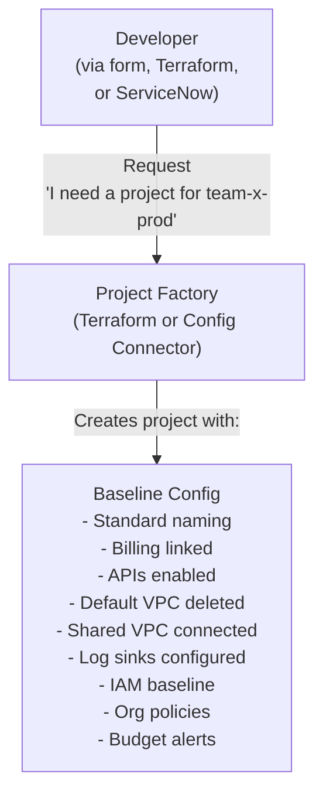
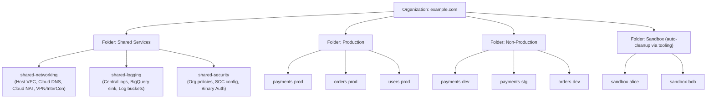
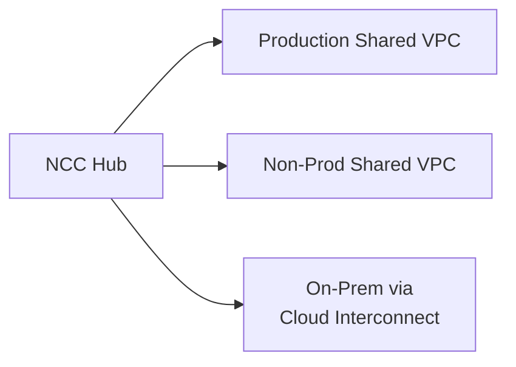
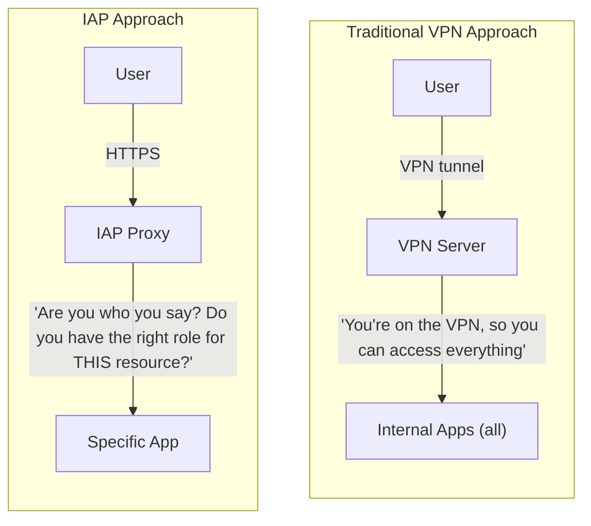
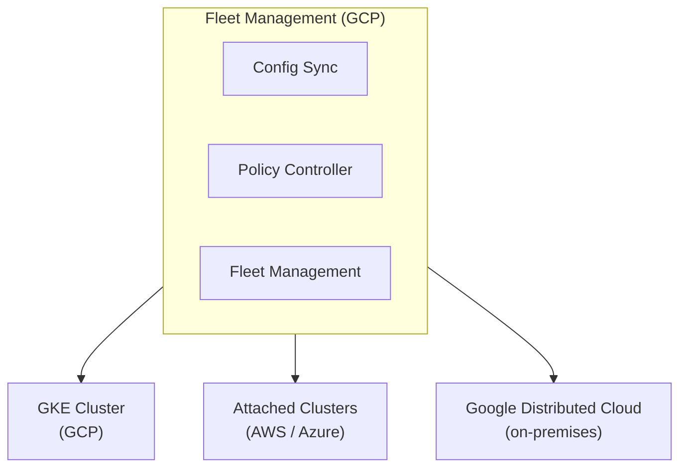
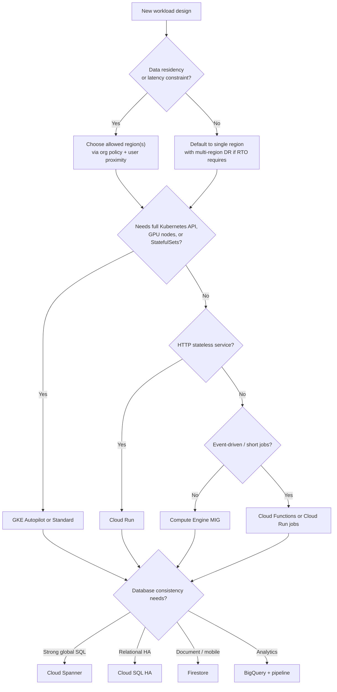

**Complexity**: `[COMPLEX]` | **Time to Complete**: 1.5 hours | **Prerequisites**: [Modules 2.1–2.11](../module-2.11-cloud-build/)

## What You'll Be Able to Do

This capstone module assumes you have completed the prior GCP DevOps Essentials modules. When you finish, you will be able to:

- **Design** GCP architectures using Shared VPC, Private Service Connect, and hub-spoke network topologies to ensure secure, isolated communication.
- **Evaluate** GCP-native patterns for microservices (Cloud Run, GKE, App Engine) and select the right compute tier based on workload requirements.
- **Implement** high-availability architectures with regional failover, global load balancing, and multi-region data replication to eliminate single points of failure.
- **Compare** GCP architectural patterns with AWS and Azure equivalents to inform multi-cloud design decisions and strategy.

---

## Why This Module Matters

**Hypothetical scenario:** A rapidly growing healthcare analytics company starts with six GCP projects. Within eighteen months, unchecked hiring and manual provisioning push that count past eighty. Each project was created by whichever engineer needed one, with no centralized naming convention, no consistent network configuration, and no centralized audit logging. When the security team prepares a mandatory HIPAA compliance review, they discover a fragmented environment: many projects still use the default VPC, several Cloud Storage buckets are publicly readable, and long-lived service account keys have not been rotated in over a year.

The security engineer responsible for the audit spends weeks manually checking each project using raw CLI commands and spreadsheets. The compliance review fails. Remediation halts new feature development, consumes substantial engineering time and consultant fees, and delays a major product launch. The failure is not a failure of individual GCP services. It is a complete absence of architectural discipline. Individual GCP services—IAM, VPCs, Compute Engine, Cloud Run—are merely raw building blocks. Architectural patterns are how you systematically assemble those blocks into a cohesive, governed system that scales, stays inherently secure, and remains manageable as your organization grows.

A project vending machine ensures every new project is born with an identical, secure configuration. A landing zone provides the organizational structure that actively prevents the chaos of ungoverned growth. In this module, you will master the foundational patterns that distinguish a robust, enterprise-grade GCP environment from an accidental, unmanageable one.

> **The Blueprint Analogy**
>
> Building a skyscraper from raw steel and concrete without architectural drawings produces a structure that might stand—for a while—but cannot pass inspection, cannot be expanded safely, and collapses under stress. GCP services are your steel and concrete. Landing zones, Shared VPC, organization policies, and reference patterns are the blueprints that turn raw materials into something you can operate at scale.

---

## Building Blocks from Prior Modules

This capstone stitches together concepts you already practiced in earlier modules. Treat the list below as a checklist: if any item feels unfamiliar, revisit that module before you design production architecture.

| Prior module | Capability you bring forward | Architectural role |
| :--- | :--- | :--- |
| [2.1 IAM](../module-2.1-iam/) | Organizations, folders, projects, IAM bindings, service accounts | Governance spine for landing zones and least-privilege access |
| [2.2 VPC](../module-2.2-vpc/) | Global VPC, subnets, firewall rules, Shared VPC, Cloud NAT | Network perimeter every pattern below attaches to |
| [2.3 Compute](../module-2.3-compute/) | MIGs, instance templates, autoscaling | Web and application tiers in classic three-tier designs |
| [2.4 Cloud Storage](../module-2.4-gcs/) | Bucket classes, dual-region and multi-region storage | Static assets, backups, and log archives |
| [2.5 Cloud DNS](../module-2.5-dns/) | Public and private zones, DNS policies | Name resolution for global load balancers and hybrid connectivity |
| [2.6 Artifact Registry](../module-2.6-artifact-registry/) | Container and package repositories | Supply chain for Cloud Run, GKE, and Cloud Build |
| [2.7 Cloud Run](../module-2.7-cloud-run/) | Serverless containers, VPC connectors | Default compute choice for stateless HTTP microservices |
| [2.8 Cloud Functions](../module-2.8-cloud-functions/) | Event-driven functions | Lightweight triggers in serverless and pipeline patterns |
| [2.9 Secret Manager](../module-2.9-secret-manager/) | Centralized secrets with audit trails | Credentials for CI/CD, databases, and runtime apps |
| [2.10 Operations](../module-2.10-operations/) | Cloud Monitoring, Logging, alerting, SLOs | Observability layer every landing zone routes into |
| [2.11 Cloud Build](../module-2.11-cloud-build/) | CI/CD pipelines, immutable artifacts | Delivery path from commit to running workload |

Architectural maturity means you stop treating each service in isolation. A landing zone wires IAM inheritance from folders into Shared VPC attachments, log sinks into a central observability project, and organization policies that block the misconfigurations you saw in the opening scenario.

When you sketch a new system, start from the outside in. Ask who must authenticate, which network segment the workload occupies, where logs must land for auditors, and how CI/CD from [Module 2.11](../module-2.11-cloud-build/) promotes artifacts into that segment. The capstone patterns below assume those prerequisites are already wired. Skipping them and jumping straight to a global load balancer produces the same compliance failure as the opening scenario—just with prettier diagrams.

Platform engineers often maintain a "golden path" document that links each prior module lab to the production pattern it supports. That document is not bureaucracy. It is how you prevent teams from rediscovering that Cloud Run needs a VPC connector to reach private Cloud SQL, or that firewall rules in a Shared VPC host project affect every attached service project simultaneously.

---

## Project Vending: Automated Project Creation

### The Problem of Manual Provisioning

Manually creating GCP projects leads to severe operational bottlenecks and security risks because every team improvises its own baseline. Naming conventions drift across environments. The default VPC often remains active instead of being deleted. New projects become network islands that never attach to a shared security perimeter. IAM is configured by hand in ways that grant overly broad roles while skipping centralized audit trails. None of these failures is exotic—they are the predictable outcome of scale without a factory.

**Pause and predict:** An engineering department provisions fifty GCP projects manually over the course of a year. What operational challenges and configuration risks accumulate when teams configure each project environment by hand?

<details>
<summary>Check your prediction</summary>

Each project repeats manual VPC provisioning, default-network deletion, API enablement, centralized log sink configuration, and IAM role binding. At fifty projects a year, repetitive manual execution introduces human error, security omissions, and drift across environments, whereas an automated project factory encodes that baseline once.
</details>

The next object is the project factory mermaid. After it, Terraform is how that factory becomes a reviewable contract instead of a one-off CLI session.

### The Solution: Project Factory

A project vending machine (or "project factory") is an automated, codified system that provisions new projects with all required baseline configurations already applied. By automating this process, you eliminate human error and ensure that security guardrails are embedded from the very first second a project exists.



At moderate scale—say twenty to forty new projects per year—the factory pays for itself in avoided audit rework alone. Each manually created project might skip budget alerts, forget to disable default service account keys, or attach to the wrong Shared VPC subnet. The factory makes those omissions impossible because the Terraform module or Config Connector manifest is the contract. Platform teams review that contract once; application teams consume it hundreds of times.

Cost control starts at provisioning time. Link every factory-created project to a billing account, apply resource labels for cost center and team, and set budget alerts at creation. Unexpected spend often traces back to projects that nobody knew existed because they were created outside the factory.

### Implementing a Terraform Project Factory

Using Infrastructure as Code to stamp out projects is an industry standard. Below is an implementation leveraging the Google-provided Terraform module for project generation. Notice how it explicitly handles API enablement, default network deletion, and centralized logging.

```hcl
# modules/project-factory/main.tf
module "project" {
  source  = "terraform-google-modules/project-factory/google"
  version = "~> 15.0"

  name                 = "${var.team}-${var.env}"
  org_id               = var.org_id
  folder_id            = var.folder_id
  billing_account      = var.billing_account
  default_service_account = "disable"

  # Network
  shared_vpc         = var.host_project_id
  shared_vpc_subnets = var.subnet_self_links

  # APIs to enable
  activate_apis = [
    "compute.googleapis.com",
    "container.googleapis.com",
    "run.googleapis.com",
    "cloudbuild.googleapis.com",
    "secretmanager.googleapis.com",
    "monitoring.googleapis.com",
    "logging.googleapis.com",
    "artifactregistry.googleapis.com",
  ]

  labels = {
    team        = var.team
    environment = var.env
    cost_center = var.cost_center
    managed_by  = "terraform"
  }

  budget_amount = var.budget_amount
}

# Default VPC: the project-factory module suppresses auto-created default networks
# (auto_create_network=false). Do not declare a google_compute_network named "default"
# here—that would create/manage a network instead of deleting the platform default.

# Configure log sinks (unique_writer_identity grants a dedicated writer SA per sink)
resource "google_logging_project_sink" "audit_to_central" {
  name                   = "audit-to-central-logging"
  project                = module.project.project_id
  destination            = "logging.googleapis.com/projects/${var.central_logging_project}/locations/global/buckets/audit-logs"
  filter                 = "logName:\"cloudaudit.googleapis.com\""
  unique_writer_identity = true
}
# Grant roles/logging.bucketWriter (or equivalent) on the destination bucket to the
# sink's writer_identity output—same IAM step as the gcloud lab in Task 4.

# IAM baseline
resource "google_project_iam_binding" "team_editors" {
  project = module.project.project_id
  role    = "roles/editor"
  members = [
    "group:${var.team}-devs@example.com",
  ]
}
```

### Using the Factory

When a team needs a new environment, platform engineers simply invoke the factory with variable inputs. The complexity is abstracted entirely away from the end user.

```bash
# Create a project for team-payments in production
terraform apply -var="team=payments" -var="env=prod" \
  -var="folder_id=123456" -var="budget_amount=5000"

# The factory creates:
# - Project: payments-prod (with proper naming)
# - Shared VPC connected to host project
# - All required APIs enabled
# - Default VPC deleted
# - Audit logs routing to central project
# - Team IAM configured
# - Budget alert at $5000
```

---

## Landing Zones: The Organizational Blueprint

**Pause and predict:** If a developer creates a project outside of a structured landing zone folder hierarchy, what critical security controls might they inadvertently bypass?

<details>
<summary>Check your prediction</summary>

Organization policies, Shared VPC attachments, centralized log export sinks, and folder-level IAM role bindings may not apply if the project sits directly under the organization root or inside an ungoverned folder. Without folder inheritance, the project operates in an administrative blind spot lacking perimeter defenses.
</details>

The next object is Organization → Folders → Projects. After that diagram, inheritance is why folder placement is a security control, not an org-chart decoration.

### Resource Hierarchy and Inheritance

The hierarchy flows Organization → Folders → Projects → Resources. IAM bindings and organization policies inherit downward unless explicitly overridden. That inheritance is the governance superpower: set `constraints/iam.disableServiceAccountKeyCreation` at the organization root and every descendant project inherits it. Place production workloads under a `Production` folder with stricter region constraints than your `Sandbox` folder. Shared services—networking, logging, security tooling—live in dedicated projects under a `Shared Services` folder where platform engineers retain control.

Folder design should mirror how your business thinks about risk, not how your org chart happens to look today. A common pattern separates `Shared Services`, `Production`, `Non-Production`, and `Sandbox`. Sandbox folders often pair **automated cleanup via tooling** (scheduled project deletion, budget caps) with tighter organization-policy constraints so experiments cannot accidentally become production dependencies—GCP has no native folder or project auto-expiry.

### The Three-Layer Architecture



Centralized logging deserves explicit mention because audit failures often start here. Route `cloudaudit.googleapis.com` logs from every service project to a `shared-logging` project with tamper-evident storage. Pair sinks with log-based metrics and alerting so public bucket changes or IAM policy edits surface within minutes, not during the next quarterly review.

### Organization Policies for the Landing Zone

Organization Policies are absolute, programmatic guardrails that cannot be overridden by individual developers, regardless of their local IAM roles. They enforce your security baseline across the entire organization or at specific folder levels.

```bash
# Organization policies use the v2 policy file schema (name + spec.rules) with set-policy

# Restrict which regions can be used (data residency)
cat > /tmp/region-policy.yaml << 'EOF'
name: organizations/ORG_ID/policies/gcp.resourceLocations
spec:
  rules:
  - values:
      allowedValues:
      - in:us-locations
      - in:eu-locations
      deniedValues:
      - in:asia-locations
EOF
gcloud org-policies set-policy /tmp/region-policy.yaml

# Disable service account key creation org-wide
cat > /tmp/no-sa-keys.yaml << 'EOF'
name: organizations/ORG_ID/policies/iam.disableServiceAccountKeyCreation
spec:
  rules:
  - enforce: true
EOF
gcloud org-policies set-policy /tmp/no-sa-keys.yaml

# Restrict external IP addresses on VMs (production folder)
cat > /tmp/no-ext-ip.yaml << 'EOF'
name: folders/PROD_FOLDER_ID/policies/compute.vmExternalIpAccess
spec:
  rules:
  - denyAll: true
EOF
gcloud org-policies set-policy /tmp/no-ext-ip.yaml

# Enforce uniform bucket-level access
cat > /tmp/uniform-access.yaml << 'EOF'
name: organizations/ORG_ID/policies/storage.uniformBucketLevelAccess
spec:
  rules:
  - enforce: true
EOF
gcloud org-policies set-policy /tmp/uniform-access.yaml

# Restrict which services can be used (sandbox folder)
cat > /tmp/allowed-services.yaml << 'EOF'
name: folders/SANDBOX_FOLDER_ID/policies/serviceuser.services
spec:
  rules:
  - values:
      allowedValues:
      - compute.googleapis.com
      - container.googleapis.com
      - run.googleapis.com
      - storage.googleapis.com
      - cloudbuild.googleapis.com
      - secretmanager.googleapis.com
EOF
gcloud org-policies set-policy /tmp/allowed-services.yaml
```

Combine `constraints/storage.publicAccessPrevention` with uniform bucket-level access for defense in depth. Public bucket incidents are among the most common audit findings, and organization policies block them at the API layer regardless of developer intent.

Identity onboarding belongs in the landing zone narrative as well. Most enterprises federate their corporate directory to Google Cloud through Cloud Identity or Workforce Identity Federation so human access inherits group membership used in IAM bindings. Service accounts created by the project factory should receive only the roles required for their workload, following the least-privilege patterns from [Module 2.1](../module-2.1-iam/). Long-lived JSON keys should remain disabled organization-wide; Workload Identity and attached service accounts cover machine authentication instead.

Hybrid connectivity—Cloud VPN, Dedicated Interconnect, or Partner Interconnect—also lands in the shared-networking project rather than in individual application projects. That placement keeps routing, BGP sessions, and encryption domains under network team ownership while application teams consume subnets through Shared VPC attachment. Cross-Cloud Interconnect extends the same model when you must reach other cloud providers without hairpinning traffic through on-premises data centers.

Google recommends building a landing zone before the first enterprise workload, but also acknowledges that landing zones are modular and evolve over time. Your first iteration might include folders, Shared VPC, centralized logging, and core organization policies while deferring VPC Service Controls perimeters until regulated data actually arrives. Document those deferrals explicitly so auditors understand what is planned versus what is missing.

### Google Cloud Foundation Toolkit

Google provides the **Cloud Foundation Toolkit** (CFT), a set of deeply vetted Terraform modules that implement landing zone best practices. Using these modules can accelerate deployment and align you with Google's published reference architectures and example foundations rather than reinventing folder hierarchies from scratch.

```bash
# The CFT includes these key modules:
# - terraform-google-modules/project-factory    → Project creation
# - terraform-google-modules/network           → VPC + subnets
# - terraform-google-modules/cloud-nat         → NAT gateways
# - terraform-google-modules/iam               → IAM bindings
# - terraform-google-modules/log-export        → Log sinks
# - terraform-google-modules/org-policy        → Organization policies
# - terraform-google-modules/slo               → SLO monitoring

# Example: Create a complete landing zone
git clone https://github.com/terraform-google-modules/terraform-example-foundation
cd terraform-example-foundation
# Follow the README for step-by-step deployment
```

---

## Network Architectures: Shared VPC, PSC, and Hub-Spoke

Google Cloud networking is globally scoped, which simplifies routing compared with regional-only VPC models on other clouds. At enterprise scale you still need deliberate topologies so connectivity stays governable. **Shared VPC** is the usual starting point: a host project owns subnets, routes, and firewall rules while service projects attach VMs, GKE clusters, and VPC-connected Cloud Run services into those segments. Network administrators retain the perimeter, and application teams cannot redefine it per project.

Shared VPC versus standalone VPC per project is one of the first landing-zone decisions. Standalone VPCs isolate teams completely but multiply NAT gateways, DNS zones, and firewall rule sets. Shared VPC centralizes those costs and policies while still giving each service project its own IAM boundary for compute resources. Most enterprises standardize on one Shared VPC per environment tier—production, non-production, sandbox—hosted in the shared-networking project from the landing zone diagram above.

### Hub-Spoke Network Topologies

As your footprint expands, you often need multiple Shared VPCs—for example, strict isolation between a regulated production VPC and an ephemeral sandbox VPC. When those VPCs must talk to one another, teams historically used VPC Network Peering, but peering is **non-transitive**: if VPC A peers with B and B peers with C, A cannot reach C through B. At enterprise scale, organizations can use a hub-spoke design with **Network Connectivity Center (NCC)** to centrally orchestrate connectivity among attached VPC and hybrid spokes, then combine NCC with firewall policies or other inspection controls where policy requires it.



NCC does not replace Shared VPC inside an environment tier. It connects tiers and hybrid endpoints after each tier already has a coherent internal design.

### Private Service Connect (PSC)

Exposing internal services or consuming third-party managed offerings used to mean fragile peering meshes or public endpoints. **Private Service Connect (PSC)** publishes a producer service as an internal endpoint that you consume inside your own VPC, so you avoid coordinating non-overlapping CIDRs across organizations. Traffic stays on Google's backbone, NATs through the localized endpoint, and never needs a broad "trust the whole peered network" model. PSC is how you integrate SaaS and shared platform services without punching holes in your landing zone.

Common PSC use cases include consuming managed services like Cloud SQL through private IP, publishing internal APIs to partner organizations, and accessing Google APIs through restricted VIP ranges when VPC Service Controls enforce a perimeter.

Firewall policy objects complement Shared VPC at scale. Instead of hundreds of per-network firewall rules duplicated across environments, hierarchical firewall policies attach at the organization or folder level and express consistent allow/deny semantics. Pair those policies with VPC Flow Logs sampled to Cloud Logging so security teams can prove which rules actually fired during an incident review.

DNS architecture also belongs in the network chapter because every reference pattern below assumes resolvable names. Private Cloud DNS zones attached to your Shared VPC resolve internal load balancer names for the application tier. Public Cloud DNS zones—or delegations from your registrar—point customer domains at global load balancer front ends. Split-horizon DNS mistakes are a frequent source of "works in staging, fails in prod" outages when private records leak or public records omit health-checked endpoints.

When comparing Shared VPC to a pure hub-spoke design, remember they solve different problems. Shared VPC centralizes subnets inside one environment tier. NCC connects multiple tiers or clouds after each tier already has internal coherence. Teams sometimes conflate the two and attempt to peer every project individually, recreating the non-transitive peering maze that NCC was meant to simplify.

---

## Reference Architecture Patterns

The patterns below are starting points, not copy-paste templates. Each maps landing-zone building blocks to a workload shape you will recognize from production systems.

### Three-Tier Web Application (LB + MIG + Cloud SQL)

The classic three-tier pattern separates web, application, and data layers behind distinct load balancers. Google's [External Application Load Balancer use cases](https://cloud.google.com/load-balancing/docs/https/use-cases) document how an external HTTPS load balancer fronts a web-tier Managed Instance Group, regional internal load balancers scale the application tier, and managed databases sit behind private connectivity.

```
                    Internet
                       │
                       ▼
         ┌─────────────────────────┐
         │ Global External HTTPS LB │
         └────────────┬────────────┘
                      │
         ┌────────────▼────────────┐
         │ Web tier (regional MIG)  │  ← autoscale on CPU/latency
         └────────────┬────────────┘
                      │
         ┌────────────▼────────────┐
         │ App tier (regional ILB)  │  ← business logic, no public IP
         └────────────┬────────────┘
                      │
         ┌────────────▼────────────┐
         │ Cloud SQL (HA primary)   │  ← synchronous standby in-region
         └─────────────────────────┘
```

Design choices that matter at moderate scale: use regional MIGs across three zones for the web tier, keep the app tier on private subnets with egress through Cloud NAT, and enable Cloud SQL high availability so failover does not require application connection-string changes. Static assets belong in Cloud Storage behind a CDN rather than on web VMs. Secrets for database credentials flow through Secret Manager, not startup scripts checked into source control.

Cost levers for this pattern include right-sizing MIG instance types, using committed use discounts on steady-state compute, choosing appropriate Cloud SQL tier and storage autoscaling limits, and fronting static content with Cloud CDN to reduce load balancer egress to origin.

Health checks deserve explicit design attention because global load balancers remove unhealthy backends only when probes fail consistently. Configure HTTP health checks that validate application readiness—not merely TCP port open—and set appropriate thresholds so brief GC pauses do not drain an entire region during a rolling deploy. Pair health checks with graceful shutdown hooks on your web tier so in-flight requests complete before instances terminate.

### Serverless Event-Driven (Cloud Run + Pub/Sub + Firestore)

For spiky HTTP APIs and asynchronous workflows, a serverless stack reduces idle cost. Cloud Run services handle synchronous HTTP traffic and scale to zero between requests. Pub/Sub decouples producers from consumers when events must survive traffic bursts. Firestore or Cloud SQL provides persistence depending on query complexity and consistency requirements.

```
  Client ──HTTPS──► Cloud Run (API)
                         │
                         ├──► Pub/Sub topic ──► Cloud Run (worker)
                         │
                         └──► Firestore / Cloud SQL
```

Connect Cloud Run to private databases using Serverless VPC Access connectors into your Shared VPC subnets—exactly the pattern described in the [DeployStack three-tier tutorial](https://cloud.google.com/shell/docs/cloud-shell-tutorials/deploystack/three-tier-app) for Cloud Run talking to Cloud SQL and Memorystore privately. Store connection strings in Secret Manager and inject them at deploy time through Cloud Build, building on [Module 2.11](../module-2.11-cloud-build/).

Serverless cost surprises usually come from always-on minimum instances, high Pub/Sub delivery volume, Firestore document read amplification, and VPC connector idle charges. Set min instances to zero for dev tiers, cap max instances in production, and monitor per-service billing labels.

### Data Pipeline (Pub/Sub + Dataflow + BigQuery)

Streaming analytics architectures ingest events through Pub/Sub, transform them in Dataflow, and land curated tables in BigQuery for dashboards and ML features. This pattern scales horizontally because each component is managed: Pub/Sub absorbs publish spikes, Dataflow autoscales workers within configured limits, and BigQuery separates storage from compute billing.

Batch alternatives exist—scheduled Cloud Functions triggering extract jobs—but Dataflow is the default when event volume exceeds sporadic batch windows or when you need Apache Beam portability. Landing-zone considerations include VPC-SC perimeters around BigQuery datasets, Private Google Access for Dataflow workers without public IPs, and centralized log sinks capturing pipeline failures.

Pipeline cost spikes when Dataflow max workers is unconstrained, when BigQuery on-demand scans full partitions repeatedly, or when raw events accumulate in Pub/Sub because downstream consumers lag. Apply BigQuery partitioning and clustering, use flex slots or reservations for predictable query load, and alert on Pub/Sub oldest-unacked-message age.

Dead-letter topics and replay procedures belong in every pipeline design document. When Dataflow fails a record after retries, you need a quarantine path that preserves the payload for inspection without blocking the main stream. Reprocessing from dead-letter storage should be idempotent so duplicate inserts do not corrupt analytics tables. Operations teams that skip this step discover data gaps only when executives ask why dashboards flatlined three Tuesdays ago.

Schema evolution is the other long-term pipeline cost. Pub/Sub messages are bytes until you enforce a contract. Use a schema registry or documented Avro/Protobuf definitions checked into the same repository as your Dataflow pipeline code. Breaking schema changes should trigger CI validation before deploy, the same way application API changes require contract tests.

### Multi-Region High Availability and Disaster Recovery

Highly available GCP architectures assume regions fail and design so users and batch jobs keep working anyway. The [multi-regional deployment guide](https://cloud.google.com/architecture/multiregional-vms) shows active-active stacks in two regions with regional MIGs behind a global load balancer.

The **global external HTTPS load balancer** advertises one Anycast IP worldwide. Clients hit the nearest Google edge PoP, and the control plane sends traffic to healthy backends in the nearest region. When a region drops out, new sessions fail over without waiting for DNS TTLs to expire. Regional backends behind the same front end are the pattern you pair with stateless compute.

**Regional failover** means running equivalent capacity in at least two regions—for example `us-central1` and `europe-west1`—behind that global front end, with Managed Instance Groups or GKE multi-cluster ingress shifting compute. The application tier must stay stateless or externalize session state so the surviving region can absorb a traffic spike without corrupting user data.

**Data** is harder than compute. **Cloud Spanner** provides globally distributed SQL with TrueTime-backed external consistency and replication features designed for regional resilience. **Cloud SQL** uses cross-region read replicas you promote during disaster recovery; high-availability configurations within a region use synchronous standby instances. **Cloud Storage** dual-region and multi-region buckets keep object data durable across geography without custom replication jobs.

DR testing is non-negotiable: run game days that fail over DNS-weighted backends, promote read replicas in a secondary region, and measure recovery time against business RTO targets. An architecture diagram that never gets exercised is a hypothesis, not a plan.

Backup strategy sits adjacent to DR but serves a different purpose. DR keeps the business running when a region disappears; backup recovers from logical errors—accidental table drops, ransomware encryption, or bad deploy scripts. Cloud Storage object versioning, Cloud SQL automated backups, and BigQuery snapshot schedules each protect against different failure modes. Your landing zone should document retention periods and encryption requirements so application teams inherit backup defaults instead of inventing ad hoc cron jobs on VMs.

Observability hooks belong in every reference pattern as well. Global load balancers export latency and error-rate metrics to Cloud Monitoring. MIG autoscalers consume those signals. Dataflow pipelines emit worker utilization and system lag metrics that predict pipeline backpressure before Pub/Sub backlogs explode. The [Operations module](../module-2.10-operations/) covered the tooling; this capstone shows where to attach it so on-call engineers see user-impacting degradation before customers open tickets.

---

## Compute & Microservices Evaluation

Choosing a compute tier is a trade among operational overhead, cost, and control. Start with the simplest managed option that still meets your workload constraints, and climb to Kubernetes only when you need APIs or scheduling features the simpler platforms cannot offer.

### App Engine

**App Engine** is Google's original serverless PaaS for HTTP-centric web and mobile backends. The **Standard** environment runs applications in a sandboxed environment with specific language runtimes and supports automatic or basic scaling depending on configuration. It suits spiky HTTP workloads when you stay within supported runtimes. The **Flexible** environment runs your container on Compute Engine VMs behind the App Engine API. It supports custom runtimes but carries VM-based operational tradeoffs compared with lighter-weight serverless platforms like Cloud Run.

For new designs, most teams default to Cloud Run unless they already operate App Engine Standard apps that benefit from its unique scaling profiles.

### Cloud Run

**Cloud Run** is Google's fully managed platform for stateless HTTP services. It accepts container images, can scale to zero, supports configurable request concurrency, and bills in 100-millisecond increments for billed instance time while instances are allocated. Cloud Run services also support multiple containers—an ingress container plus sidecars—though without the full Kubernetes Pod scheduling model.

Reach for Cloud Run when your service speaks HTTP, fits within request timeout limits, and does not need DaemonSets, arbitrary GPU node pools, or complex multi-pod scheduling.

### Google Kubernetes Engine (GKE)

Reach for **GKE** when you need StatefulSets, persistent volumes, DaemonSets, GPU node pools, multi-container pods with init containers, custom scheduling, or long-running jobs beyond Cloud Run's timeout—patterns that still belong in Kubernetes even if Autopilot hides the nodes from you.

| Need | Why GKE | Cloud Run Alternative |
| :--- | :--- | :--- |
| **Stateful workloads** | Persistent volumes, StatefulSets | Not supported (stateless only) |
| **Complex networking** | Service mesh, network policies | Limited compared with full Kubernetes |
| **Custom scheduling** | DaemonSets, node affinity, GPU scheduling | Not supported |
| **Multi-container pods** | Sidecar pattern, init containers | Multiple containers supported, without full Pod model |
| **Long-running processes** | Beyond request timeout limits | Configurable timeout with upper bounds |
| **Full Kubernetes API** | CRDs, operators, Helm charts | Knative subset only |

### GKE Modes

GKE ships in two operating modes that share the same control plane but differ in who owns the nodes:

| Mode | Control Plane | Nodes | Use Case |
| :--- | :--- | :--- | :--- |
| **Autopilot** | Google-managed | Google-managed infrastructure with pricing that varies by workload and hardware | Most workloads (recommended) |
| **Standard** | Google-managed | You manage node pools | Custom node configurations, GPUs |

```bash
# Create an Autopilot cluster (recommended)
gcloud container clusters create-auto my-cluster \
  --region=us-central1 \
  --network=prod-vpc \
  --subnetwork=gke-subnet \
  --enable-private-nodes \
  --enable-master-authorized-networks \
  --master-authorized-networks=10.0.0.0/8

# Create a Standard cluster (when you need node-level control)
gcloud container clusters create my-standard-cluster \
  --region=us-central1 \
  --num-nodes=3 \
  --machine-type=e2-standard-4 \
  --network=prod-vpc \
  --subnetwork=gke-subnet \
  --enable-private-nodes \
  --enable-ip-alias \
  --enable-autorepair \
  --enable-autoupgrade

# Deploy a workload
kubectl create deployment nginx --image=nginx:1.25
kubectl expose deployment nginx --port=80 --type=LoadBalancer
```

### GKE Workload Identity

Managing raw JSON service account keys is a severe security anti-pattern. Workload Identity securely maps a Kubernetes service account directly to a GCP service account, allowing pods to authenticate to GCP APIs via short-lived, auto-rotating credentials.

```bash
# Enable Workload Identity on the cluster
gcloud container clusters update my-cluster \
  --region=us-central1 \
  --workload-pool=my-project.svc.id.goog

# Create a Kubernetes service account
kubectl create serviceaccount my-app-ksa

# Create a GCP service account
gcloud iam service-accounts create my-app-gsa

# Bind them together
gcloud iam service-accounts add-iam-policy-binding my-app-gsa@my-project.iam.gserviceaccount.com \
  --role=roles/iam.workloadIdentityUser \
  --member="serviceAccount:my-project.svc.id.goog[default/my-app-ksa]"

# Annotate the Kubernetes SA
kubectl annotate serviceaccount my-app-ksa \
  iam.gke.io/gcp-service-account=my-app-gsa@my-project.iam.gserviceaccount.com

# Pods using my-app-ksa now automatically authenticate as my-app-gsa
```

Migration sequencing matters when you operate multiple compute tiers simultaneously. Teams often lift-and-shift VMs first, containerize into Cloud Run second, and extract only the services that truly need Kubernetes into GKE third. That staircase controls cost and operational load. Attempting to land every team on GKE on day one spreads thin cluster admin expertise and hides the reality that many internal CRUD APIs fit comfortably on Cloud Run with a VPC connector and Secret Manager credentials.

Binary Authorization and deploy-time policy checks integrate with the CI/CD patterns from [Module 2.11](../module-2.11-cloud-build/) to ensure only signed images from [Artifact Registry](../module-2.6-artifact-registry/) reach production clusters or Cloud Run services. Treat deploy gates as part of compute selection: serverless platforms still run your container bytes, and compromised build pipelines bypass whichever orchestrator sits at the end of the chain.

---

## Identity-Aware Proxy (IAP): Zero-Trust Access

**Pause and predict:** An engineer accesses internal infrastructure through a corporate VPN from a laptop that becomes infected with lateral-movement malware. How does that blast radius compare to accessing resources through Identity-Aware Proxy?

<details>
<summary>Check your prediction</summary>

VPN membership grants broad network trust, allowing malware on a compromised laptop to scan the entire connected subnet and reach adjacent private resources. In contrast, Identity-Aware Proxy implements BeyondCorp zero-trust architecture by intercepting and authenticating every individual request or tunnel against identity, IAM roles, and device context, so a compromised laptop cannot freely traverse the internal network.
</details>

The next object is the VPN versus IAP mermaid. After it, TCP forwarding and IAM conditions are how you apply the model to VMs and internal HTTP apps.



### Enabling IAP for Cloud Run

```bash
# IAP for Cloud Run (requires setting up OAuth consent)

# Step 1: Configure OAuth consent screen (one-time, via console)
# Go to: APIs & Services → OAuth consent screen

# Step 2: Create an OAuth client ID (via console)
# Go to: APIs & Services → Credentials → Create OAuth 2.0 Client ID

# Step 3: Deploy Cloud Run with authentication required
gcloud run deploy internal-dashboard \
  --image=us-central1-docker.pkg.dev/my-project/docker-repo/dashboard:latest \
  --region=us-central1 \
  --no-allow-unauthenticated

# Step 4: Enable IAP
gcloud iap web enable \
  --resource-type=cloud-run \
  --service=internal-dashboard

# Step 5: Grant access to specific users
gcloud iap web add-iam-policy-binding \
  --resource-type=cloud-run \
  --service=internal-dashboard \
  --member="user:alice@example.com" \
  --role="roles/iap.httpsResourceAccessor"

gcloud iap web add-iam-policy-binding \
  --resource-type=cloud-run \
  --service=internal-dashboard \
  --member="group:engineering@example.com" \
  --role="roles/iap.httpsResourceAccessor"
```

### IAP for SSH (Replacing Bastion Hosts)

```bash
# SSH to a VM through IAP (no external IP needed, no VPN needed)
gcloud compute ssh my-vm \
  --zone=us-central1-a \
  --tunnel-through-iap

# This works by:
# 1. Authenticating you via IAM
# 2. Creating an encrypted tunnel from your machine to the VM
# 3. Routing SSH through the tunnel (port 22 over HTTPS)
# 4. No external IP or public-facing port 22 required

# Allow IAP tunnel access via firewall rule
gcloud compute firewall-rules create allow-iap-ssh \
  --network=prod-vpc \
  --direction=INGRESS \
  --action=ALLOW \
  --rules=tcp:22 \
  --source-ranges=35.235.240.0/20 \
  --description="Allow SSH via IAP tunnel"

# Forward TCP traffic through IAP (useful for databases, RDP)
gcloud compute start-iap-tunnel my-vm 5432 \
  --local-host-port=localhost:5432 \
  --zone=us-central1-a

# Now connect to localhost:5432 as if you were on the VM's network
# psql -h localhost -p 5432 -U myuser mydb
```

### IAP Context-Aware Access

Beyond "is this user allowed," IAP can evaluate **context-aware access** policies that combine identity with device posture, source IP, and access levels defined in Google Cloud:

| Condition | Example | Use Case |
| :--- | :--- | :--- |
| **Device policy** | Require encrypted disk, screen lock | Accessing sensitive data |
| **IP address** | Only from corporate network | Restricting admin access |
| **Access level** | Combine multiple conditions | Production access requires corporate device from office network |

---

## Google Cloud Well-Architected Framework

Google publishes the [Well-Architected Framework](https://cloud.google.com/architecture/framework) to help teams design cloud topologies that are secure, efficient, resilient, high-performing, cost-effective, and sustainable. The framework organizes recommendations into pillars. Each pillar maps cleanly to decisions you make in this capstone.

| Pillar | What it asks you to optimize | GCP capabilities you already used |
| :--- | :--- | :--- |
| **Operational excellence** | Deploy, operate, monitor, and manage workloads efficiently | Centralized logging ([2.10](../module-2.10-operations/)), Cloud Build CI/CD ([2.11](../module-2.11-cloud-build/)), project factory automation |
| **Security, privacy, and compliance** | Protect data and meet regulatory obligations | Organization policies, IAP, Workload Identity, SCC, Secret Manager |
| **Reliability** | Design for failure at zone, region, and dependency level | Global load balancing, regional MIGs, Cloud SQL HA, multi-region storage |
| **Cost optimization** | Maximize business value per dollar spent | Budget alerts, labels, committed use discounts, serverless scale-to-zero |
| **Performance optimization** | Tune resources for latency and throughput | Global Anycast front ends, appropriate machine types, CDN for static assets |
| **Sustainability** | Reduce environmental impact of cloud consumption | Right-sizing, autoscaling, eliminating idle resources, region selection |

Use the framework as a review checklist before production launch. Walk each pillar with your architecture diagram in hand. Operational excellence fails when nobody owns runbooks for failover. Security fails when organization policies exist on paper but sandbox folders bypass them. Reliability fails when DR diagrams never get tested. Cost optimization fails when budgets alert finance but not the engineering team that can act on them.

Cross-pillar perspectives—such as AI/ML and financial services—layer industry-specific guidance on top of these pillars without replacing them.

Reliability pillar reviews should explicitly list dependencies and their failure modes: what happens when Cloud DNS is unavailable, when Identity Platform is degraded, or when a third-party SaaS accessed through PSC fails open versus closed. The framework does not replace architecture diagrams—it gives you vocabulary to stress-test them. Document accepted risks when you choose single-region deployment for a dev tier so stakeholders do not assume production-grade RTO where none was funded.

Security pillar reviews should trace human and machine identities end to end. Humans reach admin consoles through IAP or Google identity with MFA enforced by your IdP. Machines use service accounts, Workload Identity, or federated credentials—not exported keys sitting in CI variables. Every arrow on your diagram should answer "which identity proves this call is authorized."

---

## Cost Lens: Cross-Cutting Levers

Architecture choices compound billing effects. The table below summarizes cost knobs from prior modules and this capstone's reference patterns.

| Cost driver | What makes it spike | Mitigation |
| :--- | :--- | :--- |
| **Compute (MIG / GKE Standard)** | Over-provisioned instance types, unused node pools, missing autoscaling bounds | Right-size from metrics, use committed use discounts, prefer Autopilot or Cloud Run when ops overhead exceeds savings |
| **Cloud Run / Functions** | Min instances left on, high concurrency misconfiguration, egress to internet instead of Private Google Access | Scale to zero in non-prod, cap max instances, route Google API traffic privately |
| **Networking** | Multiple NAT gateways, inter-region egress, unused external IPs | Consolidate Shared VPC, keep workloads in same region as data, deny external IPs via org policy |
| **Cloud SQL / Spanner** | HA + cross-region replicas on dev tiers, storage autoscaling without caps | Match tier to environment, use read replicas only where RPO requires them |
| **Storage** | Multi-region buckets for dev assets, high-frequency small object operations | Use regional or nearline classes appropriately, lifecycle policies to archive |
| **Observability** | Unfiltered log sinks to BigQuery, high-cardinality custom metrics | Filter sinks at source, sample debug logs, aggregate metrics |
| **Security tooling** | SCC Premium on every sandbox project | Scope premium tiers to production folders |

FinOps maturity pairs technical controls with organizational ones. Require cost-center labels at project creation through the factory. Review top ten billing SKUs monthly. Treat unexpected spend as an architecture smell—often an orphaned MIG, forgotten Cloud Run min instance, or Dataflow job without a worker cap.

Reserved capacity and committed use discounts reward predictable baselines but punish over-commitment. Apply commitments only after six to twelve weeks of stable utilization data from Cloud Monitoring and billing export to BigQuery. For bursty analytics, flex slots or on-demand BigQuery may cost less than always-on reservations even at moderate query volume.

Egress economics deserve explicit architecture review because they are silent budget killers. Serving user traffic from the same region as your object storage and compute avoids cross-region bandwidth charges. Calling Google APIs through Private Google Access avoids routing API traffic over the public internet and may reduce NAT processing. Publishing static assets through Cloud CDN collapses repeated downloads into cache hits at the edge instead of repeated origin fetches from Cloud Storage.

Sandbox environments need cost guardrails too, not just production. Use **tooling** (scheduled project deletion scripts, budget alerts, factory TTL labels) to retire sandbox projects—GCP does not auto-delete folders or projects after a fixed calendar period—cap machine types through organization policy, and alert when any sandbox project exceeds a small weekly spend threshold. Experiments that linger become shadow production systems with none of the controls you built into the landing zone.

---

## Multi-Cloud and Hybrid Operations

**Pause and predict:** An organization runs distinct Kubernetes clusters across Google Cloud, AWS, and an on-premises data center simultaneously. What operational friction and security divergence emerge when maintaining regulatory standards across these environments?

<details>
<summary>Check your prediction</summary>

Operating three disconnected control planes causes configuration drift, siloed observability, and inconsistent policy enforcement across environments. In contrast, a GCP-hosted fleet plane uses GKE Multi-Cloud, GKE attached clusters, or Google Distributed Cloud alongside Config Sync and Policy Controller to enforce a single declarative policy pack across all clusters without maintaining separate operational playbooks.
</details>

The next object is the fleet-management mermaid. After it, Config Sync and Policy Controller appear as named products on the GCP side of the diagram.



Anthos branding still appears in older documentation, but new designs should follow current product names in Google's fleet management docs.

---

## Security Command Center

**Security Command Center (SCC)** aggregates asset inventory, vulnerability findings, and misconfiguration signals across your organization so security teams can query active critical issues and resource exposure from one API instead of polling every project by hand. It complements the preventive guardrails you set in organization policies and landing zones.

```bash
# List active findings (requires Security Command Center Premium)
gcloud scc findings list organizations/ORG_ID \
  --source="-" \
  --filter='state="ACTIVE" AND severity="CRITICAL"' \
  --format="table(finding.category, finding.resourceName, finding.severity)"

# List assets
gcloud scc assets list organizations/ORG_ID \
  --filter='securityCenterProperties.resourceType="google.compute.Instance"' \
  --format="table(asset.name, asset.securityCenterProperties.resourceType)"
```

Enable SCC where the cost of a missed misconfiguration exceeds the licensing fee—typically production organization folders, not every sandbox experiment.

---

## Multi-Cloud Perspectives: AWS and Azure Equivalents

If you already know AWS or Azure, map GCP patterns to familiar control planes so design reviews stay portable. **Hierarchy and governance**: Organizations, Folders, and Projects mirror AWS Organizations/OUs and Azure management groups/subscriptions. A CFT-driven landing zone plays a similar role as AWS Control Tower. **Networking**: a single global VPC simplifies cross-region routing compared with per-region AWS VPCs. AWS Transit Gateway plays a similar hub-and-spoke role to GCP Network Connectivity Center in many multi-VPC designs. AWS PrivateLink and GCP Private Service Connect serve similar private service-consumption use cases, though implementation details differ. **Compute and edge**: GCP Cloud Run and AWS App Runner are both managed ways to run containerized applications, while AWS Fargate is serverless compute used with ECS or EKS. GCP's global HTTP(S) load balancing and Azure Front Door both offer global edge-routing patterns for internet-facing applications.

---

## Patterns & Anti-Patterns

Production-grade GCP estates converge on a small set of repeatable patterns. The anti-patterns below are equally predictable—they appear whenever teams optimize for short-term speed without platform investment.

Governance patterns succeed when they are easier to comply with than to bypass. A self-service portal that invokes the project factory with approved parameter sets beats a policy that says "do not create projects manually" while the console remains one click away. Likewise, default Shared VPC attachment in the factory beats documentation urging teams to "remember to ask networking for a subnet."

Operational patterns succeed when observability and ownership are co-located. The team that deploys Cloud Run owns its SLO dashboards. The platform team owns centralized log retention and organization policies. Blurring that line produces either alert fatigue for platform on-call or blind spots where nobody watches application golden signals.

| Pattern | When to Use | Why It Works | Scaling Note |
| :--- | :--- | :--- | :--- |
| **Project factory + Shared VPC** | Every new team or product needs an isolated project | Baseline security and networking are automatic; audit scope stays bounded | Add factory modules rather than one-off console projects as request volume grows |
| **Folder-tiered landing zone** | Regulated org with prod / non-prod / sandbox separation | Organization policies inherit; blast radius stays folder-scoped | Split additional landing zones only when compliance requires hard isolation |
| **Global LB + regional MIGs** | Internet-facing apps needing zone and region resilience | Anycast front end fails over without DNS churn; MIGs heal zone loss | Keep app tier stateless; externalize sessions to Memorystore or database |
| **Cloud Run + Pub/Sub pipeline** | Event-driven workloads with variable traffic | Scale-to-zero saves idle cost; Pub/Sub buffers spikes | Cap max instances and monitor oldest-unacked-message age |
| **Centralized audit log sink** | Any org subject to compliance audits | Tamper-evident trail in shared-logging project | Partition sinks by severity and retention tier to control storage cost |

| Anti-Pattern | What Goes Wrong | Why Teams Fall Into It | Better Alternative |
| :--- | :--- | :--- | :--- |
| **Manual project creation** | Inconsistent IAM, default VPCs, missing budgets | Console clicks feel faster for "just one project" | Project factory from day one |
| **Standalone VPC per team** | NAT/DNS/firewall sprawl, peering meshes | Teams want autonomy without platform standards | Shared VPC with service projects |
| **VPN as primary access** | Broad network trust, lateral movement risk | VPNs are familiar | IAP for apps and SSH |
| **GKE for every microservice** | Cluster ops cost exceeds app value | Kubernetes hype | Cloud Run first; GKE when API gaps appear |
| **Public buckets "temporarily"** | Data exposure incidents | Quick sharing without IAM design | Uniform access + public access prevention org policies |
| **Skipping DR exercises** | Failover runbooks fail under real pressure | DR feels expensive until outage | Quarterly game days with measured RTO |

Review these anti-patterns during architecture walkthroughs, not only after incidents. Ask whether a new shortcut introduces manual project creation, bypasses Shared VPC, or stores credentials in source control. The table reads like a checklist because most production outages in cloud foundations trace back to one of those six habits rather than exotic zero-day exploits.

When you adopt a pattern from the first table, write down the scaling trigger that would force you to revisit the decision. A Cloud Run service that consistently hits max instances during business hours may need a min instance for latency—or a move to GKE if you require sidecars the platform cannot express. Patterns are starting points with explicit exit criteria, not permanent tattoos. Revisit those triggers during quarterly architecture reviews so growth does not outpace your original assumptions silently without anyone noticing the drift.

---

## Decision Framework

Use the flowchart below when choosing region, compute tier, and managed-versus-self-managed components. It complements the pattern tables above with explicit tradeoffs.



| Decision | Prefer | Tradeoff |
| :--- | :--- | :--- |
| **Region selection** | Single primary region aligned with users and data residency org policies | Multi-region adds replication cost; justify with explicit RTO/RPO |
| **Managed vs self-managed database** | Cloud SQL, Spanner, Firestore for new apps | Self-managed on VMs only when license or feature gap requires it |
| **Serverless vs VMs** | Cloud Run for HTTP; Functions for triggers | VMs when you need kernel-level control or legacy licensing |
| **Shared VPC vs per-project VPC** | Shared VPC at enterprise scale | Per-project VPC only for hard isolation or acquisition integration |
| **IAP vs VPN** | IAP for human access to specific apps/VMs | VPN or Interconnect for bulk hybrid network extension, not app-level auth |

Document the decision record when you choose an option from this framework. Future engineers will otherwise re-open settled debates during every sprint planning session. A one-page architecture decision record capturing alternatives considered, tradeoffs accepted, and review date often saves more time than another whiteboard session.

Regulated workloads may constrain the flowchart early— for example, data residency org policies eliminate multi-region active-active paths regardless of latency goals. Treat org policies as immovable inputs to the decision tree, not as afterthoughts applied during audit season.

---

## Did You Know?

1. **Large organizations often use automated project-provisioning patterns internally**, and Google publishes foundation tooling through the Cloud Foundation Toolkit that reflects similar governance principles for customers.

2. **Identity-Aware Proxy and BeyondCorp reflect Google's long-running zero-trust approach**. Google publicly describes BeyondCorp as a replacement for traditional VPN-based access to internal resources.

3. **For many general-purpose workloads, GKE Autopilot shifts operational responsibility toward Google and bills based on workload resource requests rather than requiring you to size node pools directly.**

4. **The Cloud Foundation Toolkit and terraform-example-foundation repository are widely used starting points for building Google Cloud landing zones**, alongside Google's landing zone design documentation in the Architecture Center.

---

## Common Mistakes

| Mistake | Why It Happens | How to Fix It |
| :--- | :--- | :--- |
| Creating projects manually | Seems faster for "just one project" | Implement a project factory from the start; manual projects accumulate technical debt |
| No organizational folder structure | Small teams do not think about hierarchy | Define folders for Shared Services, Production, Non-Production, and Sandbox before the first project |
| Using VPNs instead of IAP | Familiarity with VPN-based access | Deploy IAP for web applications and SSH; it is more secure and requires no client software |
| Choosing GKE when Cloud Run would suffice | Kubernetes is the default assumption | Start with Cloud Run; move to GKE only when you need features Cloud Run does not offer |
| Not setting organization policies | Individual project configuration seems enough | Organization policies enforce guardrails across all projects; they are your first line of defense |
| Ignoring Security Command Center | Not knowing it exists or thinking it is optional | Enable SCC Premium for production organizations; it catches misconfigurations that humans miss |
| No centralized logging | Each project manages its own logs | Create a shared-logging project with sinks from all projects for centralized audit and analysis |
| Skipping budget alerts | "We will monitor costs manually" | Automate budget alerts at the project and folder level; unexpected costs compound quickly |

---

## Quiz

<details>
<summary>1. A rapidly growing startup has just hired 50 new engineers and formed 8 new product teams. The platform team is currently creating GCP projects manually via the Cloud Console, taking about 3 days per request. What architectural pattern should they implement, and what specific problems will this solve for their scaling organization?</summary>

They should implement a project vending machine (or project factory) using tools like Terraform or Config Connector. This automated system creates GCP projects with a consistent baseline configuration, eliminating manual provisioning bottlenecks that slow down engineering velocity. By using a factory, they ensure every new project automatically includes standardized naming, correct billing, connected Shared VPCs, audit logging, and organization policies right from inception. This definitively solves the problems of inconsistent security postures, slow onboarding times, and the rapid accumulation of technical debt that inevitably occurs when projects are created manually and divergently by multiple different individuals.
</details>

<details>
<summary>2. Your company is adopting a remote-first work policy. Historically, engineers used a corporate VPN to access an internal dashboard (running on Cloud Run) and SSH into development VMs. The security team wants to move to a zero-trust model and retire the VPN. How does replacing the VPN with Identity-Aware Proxy (IAP) change the security model for accessing these resources?</summary>

Replacing the VPN with IAP shifts the security model from network-centric trust to an identity-centric zero-trust architecture. With a traditional VPN, any user who successfully connects to the network segment gains broad, implicit access to resources within that network, regardless of the specific application they actually need to do their job. IAP, conversely, intercepts every individual request to a specific application or VM and strictly verifies the user's identity, context, and IAM authorization before allowing the connection to proceed. This means there is no implicit network trust whatsoever; access is granted exclusively on a granular, per-resource basis. This fundamentally limits lateral movement, significantly reducing the blast radius if a user's device is compromised, while simultaneously entirely removing the administrative burden of client-side VPN software.
</details>

<details>
<summary>3. A data science team needs to run a machine learning workload that requires specific NVIDIA GPUs and custom node taints to ensure only specific pods are scheduled on those expensive nodes. Meanwhile, the web backend team needs to deploy a standard stateless microservice that scales based on HTTP traffic. Which GKE operating mode should each team choose and why?</summary>

The data science team should use GKE Standard, while the web backend team should use GKE Autopilot. GKE Standard is necessary for the data science team because they require custom node configurations, specific GPU accelerators, and node-level controls like taints and tolerations, which are fully managed by the user in Standard mode. In contrast, the web backend team should choose Autopilot because it completely removes the operational overhead of managing nodes and handles node auto-scaling automatically behind the scenes. Autopilot bills based on workload resource requests for many general-purpose pods, which makes it the ideal choice for standard, scalable workloads where Google can manage the underlying infrastructure efficiency and reduce operational burden.
</details>

<details>
<summary>4. A financial enterprise is migrating to GCP and needs to ensure that all future workloads comply with strict regulatory requirements before any developer is allowed to deploy code. They need to establish a foundational environment. What foundational components must they build in their landing zone to enforce this organization-wide?</summary>

They must build a comprehensive landing zone consisting of a defined resource hierarchy, centralized networking, and strongly enforced security policies. The resource hierarchy (Organization and Folders) provides the structural foundation to rigidly separate production from non-production environments and apply inheritance-based access control. Centralized networking, typically implemented via a Shared VPC in a dedicated host project, ensures all workloads strictly adhere to approved network routes, egress paths, and internal connectivity standards. Most importantly for compliance, they must implement Organization Policies at the root or folder level to actively enforce guardrails (like disabling external IPs or requiring specific regions) and configure centralized log sinks to automatically route all audit logs to a secure, tamper-proof project. Together, these foundational components guarantee that every new project automatically inherits a secure, auditable, and compliant baseline by default.
</details>

<details>
<summary>5. A developer has deployed a pod in GKE that needs to read files from a Cloud Storage bucket. To authenticate, they generated a JSON service account key, base64-encoded it, and stored it as a Kubernetes Secret mounted into the pod. A security auditor flags this as a critical vulnerability. What mechanism should they use instead, and why does it resolve the security finding?</summary>

The developer should use Workload Identity instead of a static service account key, as it provides a fundamentally more secure authentication pattern for Kubernetes. Workload Identity securely maps a Kubernetes service account directly to a GCP service account, allowing the pod to automatically authenticate to GCP APIs without relying on any static credentials. This directly resolves the security finding because it entirely eliminates the need to generate, distribute, store, or manage long-lived JSON keys, which are highly prone to accidental leakage and are not natively encrypted by Kubernetes Secrets. Instead, Workload Identity provides short-lived, automatically rotated credentials handled seamlessly by the platform. This drastically reduces the risk of credential compromise while flawlessly maintaining precise, IAM-controlled access to the required Cloud Storage bucket.
</details>

<details>
<summary>6. During a routine security audit, a cloud architect discovers that developers across 40 different GCP projects have accidentally made their Cloud Storage buckets publicly readable, despite an internal company policy forbidding it. What specific architectural control should the platform team have implemented in their landing zone to mathematically prevent this from happening, regardless of developer actions?</summary>

The platform team should have implemented an Organization Policy constraint specifically enforcing `constraints/storage.publicAccessPrevention` at the Organization or top-level Folder level. Organization Policies act as immutable, centrally managed guardrails that completely override any individual project or resource-level IAM permissions that a developer might attempt to set. If this specific policy had been in place within their landing zone, any developer attempting to grant public access to a bucket (or create a new publicly readable bucket) would be actively blocked by the GCP API at the moment of creation. Relying purely on documentation, training, or developer compliance is inevitably prone to human error at scale. In contrast, Organization Policies provide programmatic, foolproof enforcement of non-negotiable security baselines across the entire organizational resource hierarchy.
</details>

<details>
<summary>7. Your ecommerce platform runs in us-central1 and europe-west1 behind a global external HTTPS load balancer with regional MIG backends. During a regional outage in us-central1, users report intermittent errors even though europe-west1 remains healthy. Autoscaling in the surviving region is slow to add capacity. Which architectural gaps most likely explain the incident, and what should you change?</summary>

The architecture probably treats session state locally on web VMs or sizes the surviving region for normal traffic rather than failover traffic. Global load balancers route new connections to healthy backends, but existing sessions tied to failed instances still break unless the app is stateless or sessions are externalized to Memorystore or the database tier. Slow autoscaling in europe-west1 suggests max instance caps, conservative cooldown settings, or insufficient headroom for absorbing us-central1 traffic. Fix this by externalizing session state, pre-provisioning enough capacity in each active region to handle combined traffic during failover, tuning MIG autoscaling policies, and running regular DR game days that measure failover time against your RTO target.
</details>

<details>
<summary>8. A platform team must choose between deploying a new internal API on Cloud Run versus GKE Autopilot. The API is stateless HTTP, integrates with Cloud SQL through a VPC connector, peaks at 500 requests per minute, and must scale to zero in development. No custom Kubernetes operators are required. Which option should they choose and why?</summary>

They should choose Cloud Run. The workload is stateless HTTP with moderate traffic, needs scale-to-zero in non-production environments, and does not require Kubernetes-specific APIs like CRDs or DaemonSets. Cloud Run bills only for allocated instance time in 100-millisecond increments and removes node-pool operations entirely. GKE Autopilot would add cluster management overhead without providing features this API needs. Reserve GKE for workloads that require full Kubernetes scheduling, GPU node pools, or service mesh patterns Cloud Run cannot satisfy.
</details>

---

## Hands-On Exercise: Landing Zone Foundations

### Objective

Implement a simplified landing zone pattern with a shared services project, a workload project, centralized logging, and IAP-based SSH access. Map each task to the Well-Architected pillars of security, operational excellence, and reliability.

### Prerequisites

- `gcloud` CLI installed and authenticated
- A GCP project with billing enabled (or organization access for multi-project setup)
- Familiarity with all previous modules

### Tasks

Work through the six tasks below in order; each opens with commands you can run in a single project to simulate factory networking, least-privilege VMs, IAP access, centralized audit logs, verification, and cleanup.

#### Task 1: Create the Foundation

<details>
<summary>Solution</summary>

```bash
export PROJECT_ID=$(gcloud config get-value project)
export REGION=us-central1

# Enable required APIs
gcloud services enable \
  compute.googleapis.com \
  iap.googleapis.com \
  logging.googleapis.com \
  monitoring.googleapis.com \
  secretmanager.googleapis.com

# Create a custom VPC (simulating shared networking)
gcloud compute networks create landing-zone-vpc \
  --subnet-mode=custom

gcloud compute networks subnets create workload-subnet \
  --network=landing-zone-vpc \
  --region=$REGION \
  --range=10.100.0.0/24 \
  --enable-private-ip-google-access

# Create IAP firewall rule
gcloud compute firewall-rules create lz-allow-iap \
  --network=landing-zone-vpc \
  --direction=INGRESS \
  --action=ALLOW \
  --rules=tcp:22 \
  --source-ranges=35.235.240.0/20 \
  --description="Allow SSH via IAP"

# Deny all other ingress
gcloud compute firewall-rules create lz-deny-all \
  --network=landing-zone-vpc \
  --direction=INGRESS \
  --action=DENY \
  --rules=all \
  --source-ranges=0.0.0.0/0 \
  --priority=65000
```
</details>

#### Task 2: Deploy a Workload VM with Proper IAM

<details>
<summary>Solution</summary>

```bash
# Create a dedicated service account for the workload
gcloud iam service-accounts create workload-vm-sa \
  --display-name="Workload VM SA"

export VM_SA="workload-vm-sa@${PROJECT_ID}.iam.gserviceaccount.com"

# Grant minimal permissions
gcloud projects add-iam-policy-binding $PROJECT_ID \
  --member="serviceAccount:$VM_SA" \
  --role="roles/logging.logWriter"

gcloud projects add-iam-policy-binding $PROJECT_ID \
  --member="serviceAccount:$VM_SA" \
  --role="roles/monitoring.metricWriter"

# Create the VM (no external IP, IAP only)
gcloud compute instances create workload-vm \
  --zone=${REGION}-a \
  --machine-type=e2-micro \
  --network=landing-zone-vpc \
  --subnet=workload-subnet \
  --no-address \
  --service-account=$VM_SA \
  --scopes=cloud-platform \
  --image-family=debian-12 \
  --image-project=debian-cloud \
  --metadata=startup-script='#!/bin/bash
    echo "Landing zone workload VM initialized at $(date)" | logger'
```
</details>

#### Task 3: Access the VM via IAP (No External IP)

<details>
<summary>Solution</summary>

```bash
# SSH via IAP tunnel (no VPN, no external IP needed)
gcloud compute ssh workload-vm \
  --zone=${REGION}-a \
  --tunnel-through-iap \
  --command="hostname && echo 'IAP tunnel working!' && curl -s ifconfig.me 2>&1 || echo 'No external access (expected for private VM)'"

# Forward a port through IAP (e.g., for a database)
# This runs in the background; connect to localhost:8080
gcloud compute start-iap-tunnel workload-vm 8080 \
  --local-host-port=localhost:8080 \
  --zone=${REGION}-a &

# Kill the tunnel
kill %1 2>/dev/null
```
</details>

#### Task 4: Set Up Centralized Logging

<details>
<summary>Solution</summary>

```bash
# Create a Cloud Storage bucket for long-term log archival
export LOG_BUCKET="${PROJECT_ID}-central-logs"
gcloud storage buckets create gs://$LOG_BUCKET \
  --location=$REGION

# Create a log sink for all audit logs
gcloud logging sinks create audit-log-archive \
  storage.googleapis.com/$LOG_BUCKET \
  --log-filter='logName:"cloudaudit.googleapis.com"'

# Grant the sink's writer identity access to the bucket
WRITER=$(gcloud logging sinks describe audit-log-archive --format="value(writerIdentity)")
gcloud storage buckets add-iam-policy-binding gs://$LOG_BUCKET \
  --member="$WRITER" \
  --role="roles/storage.objectCreator"

# Create a log-based metric for SSH access attempts
gcloud logging metrics create ssh_access_attempts \
  --description="Count of SSH access attempts via IAP" \
  --log-filter='resource.type="gce_instance" AND protoPayload.methodName="google.cloud.iap.v1.IdentityAwareProxyService.AccessViaIAP"'

# Verify the sink
gcloud logging sinks list \
  --format="table(name, destination, filter)"
```
</details>

#### Task 5: Verify the Landing Zone

<details>
<summary>Solution</summary>

```bash
echo "=== Landing Zone Verification ==="
echo ""

# Check VPC configuration
echo "--- VPC ---"
gcloud compute networks describe landing-zone-vpc \
  --format="yaml(name, subnetworks)"

# Check firewall rules
echo ""
echo "--- Firewall Rules ---"
gcloud compute firewall-rules list \
  --filter="network=landing-zone-vpc" \
  --format="table(name, direction, priority, allowed[].map().firewall_rule().list():label=ALLOW, sourceRanges.list():label=SRC)"

# Check VM has no external IP
echo ""
echo "--- VM Network ---"
gcloud compute instances describe workload-vm \
  --zone=${REGION}-a \
  --format="yaml(networkInterfaces[0].accessConfigs)"

# Check service account permissions
echo ""
echo "--- Service Account Roles ---"
gcloud projects get-iam-policy $PROJECT_ID \
  --flatten="bindings[].members" \
  --filter="bindings.members:$VM_SA" \
  --format="table(bindings.role)"

# Check log sinks
echo ""
echo "--- Log Sinks ---"
gcloud logging sinks list \
  --format="table(name, destination)"

echo ""
echo "=== Verification Complete ==="
```
</details>

#### Task 6: Clean Up

<details>
<summary>Solution</summary>

```bash
# Delete VM
gcloud compute instances delete workload-vm --zone=${REGION}-a --quiet

# Delete log sink and metric
gcloud logging sinks delete audit-log-archive --quiet
gcloud logging metrics delete ssh_access_attempts --quiet

# Delete log bucket
gcloud storage rm -r gs://$LOG_BUCKET/ 2>/dev/null
gcloud storage buckets delete gs://$LOG_BUCKET 2>/dev/null

# Delete service account
gcloud iam service-accounts delete $VM_SA --quiet

# Delete firewall rules
gcloud compute firewall-rules delete lz-allow-iap --quiet
gcloud compute firewall-rules delete lz-deny-all --quiet

# Delete network
gcloud compute networks subnets delete workload-subnet --region=$REGION --quiet
gcloud compute networks delete landing-zone-vpc --quiet

echo "Cleanup complete."
```
</details>

**Card A: Manual project creation is fine at fifty projects a year if you keep a spreadsheet of APIs and IAM.** A platform lead tracks project provisioning steps in a shared spreadsheet, manually enabling service APIs, setting up VPCs, and assigning IAM roles for each new development initiative. The team assumes human checklist tracking provides sufficient governance and consistency across fifty annual environments.

<details>
<summary>Check your prediction</summary>

Failure layer: manual operational tracking versus automated infrastructure declaration. Next action: implement an automated Terraform project factory or Config Connector pipeline that codifies API enablement, default network deletion, log sinks, and IAM baselines into versioned, repeatable modules.
</details>

**Card B: A project created outside the landing zone folder tree still inherits every org policy and Shared VPC attachment.** A development team provisions a project directly under the organization root rather than within the designated folder hierarchy. The engineers expect the new project to automatically receive all organizational guardrails, centralized logging exports, and shared network configurations established for workloads.

<details>
<summary>Check your prediction</summary>

Failure layer: resource hierarchy inheritance boundaries versus root-level isolation. Next action: place all workload projects inside governed landing zone folder structures and enforce organization policies that restrict project creation to designated factory pipelines.
</details>

**Card C: A compromised laptop on the corporate VPN has the same blast radius as IAP because both require a login.** A security team evaluates remote access models and assumes that because both a corporate VPN and Identity-Aware Proxy require user authentication, malware executing on an authenticated employee laptop presents an identical blast radius against internal infrastructure.

<details>
<summary>Check your prediction</summary>

Failure layer: perimeter network trust versus per-request zero-trust authorization. Next action: deploy Identity-Aware Proxy to enforce contextual identity and granular IAM checks on every individual service request and TCP tunnel rather than granting broad private subnet reachability.
</details>

**Card D: Enforcing Kubernetes policy across GKE, EKS, and on-prem requires three disconnected Policy Controller installs with no shared fleet plane.** An infrastructure architect plans a multi-cloud container deployment spanning Google Cloud, Amazon Web Services, and on-premises hardware. The platform team assumes policy enforcement mandates independent, uncoordinated gatekeeper installations managed separately across each cloud provider.

<details>
<summary>Check your prediction</summary>

Failure layer: fragmented cluster administration versus unified multi-cloud fleet orchestration. Next action: register all Kubernetes clusters into a centralized Google Cloud fleet and leverage Config Sync with Policy Controller to distribute and continuously synchronize a single declarative policy package across all environments.
</details>

**Success Criteria**:

- [ ] Custom VPC created (no default VPC usage)
- [ ] VM deployed with no external IP
- [ ] SSH access works only through IAP
- [ ] Dedicated service account with minimal permissions
- [ ] Centralized log sink configured for audit logs
- [ ] Firewall rules follow deny-all-ingress baseline
- [ ] Architecture mapped to at least three Well-Architected pillars (security, operational excellence, reliability)
- [ ] All resources cleaned up

---

## Next Module

Congratulations on completing the **GCP DevOps Essentials** track—you now have hands-on coverage of the core services every platform engineer touches. Continue with the **[Hyperscaler Rosetta Stone](/cloud/hyperscaler-rosetta-stone/)** to map GCP primitives to AWS and Azure, the **[Kubernetes certification tracks](/k8s/)** (CKA, CKAD, CKS, KCNA, KCSA), or the **[Platform Engineering track](/platform/)** for SRE, GitOps, DevSecOps, and MLOps depth.

The patterns in this module are starting points, not copy-paste templates: every landing zone reflects its own compliance regime, team topology, and workload mix. The invariant is simpler—**build the foundation correctly once**, and every project you stamp afterward inherits that posture by default.

## Sources

- [Landing zone design in Google Cloud](https://cloud.google.com/architecture/landing-zones) — Google's overview of landing zone elements, resource hierarchy, and deployment options.
- [Google Cloud Well-Architected Framework](https://cloud.google.com/architecture/framework) — Pillars and perspectives for secure, reliable, cost-effective cloud design.
- [terraform-example-foundation](https://github.com/terraform-google-modules/terraform-example-foundation) — Reference example for composing Cloud Foundation Toolkit modules into a governed foundation.
- [Shared VPC Overview](https://cloud.google.com/vpc/docs/shared-vpc) — Host-project and service-project model for centralized network administration.
- [VPC Network Peering](https://cloud.google.com/vpc/docs/vpc-peering) — Non-transitive peering behavior that motivates hub-spoke designs.
- [Network Connectivity Center hub-and-spoke](https://cloud.google.com/network-connectivity/docs/network-connectivity-center/concepts/hub-and-spoke) — Central orchestration of connectivity among VPC and hybrid spokes.
- [Private Service Connect](https://cloud.google.com/private-service-connect) — Private endpoints for consuming Google, partner, and producer services.
- [External Application Load Balancer use cases](https://cloud.google.com/load-balancing/docs/https/use-cases) — Three-tier web service pattern with external and internal load balancers.
- [Multi-regional deployment on Compute Engine](https://cloud.google.com/architecture/multiregional-vms) — Active-active multi-region architecture with global load balancing.
- [Design reliable infrastructure](https://cloud.google.com/architecture/infra-reliability-guide/design) — Eliminating single points of failure across tiers.
- [Cloud Run documentation](https://cloud.google.com/run/docs/overview) — Serverless container platform overview and scaling model.
- [GKE Workload Identity](https://cloud.google.com/kubernetes-engine/docs/concepts/workload-identity) — Mapping Kubernetes service accounts to GCP identities without key files.
- [Organization Policy overview](https://cloud.google.com/resource-manager/docs/organization-policy/overview) — Centralized constraints inherited through the resource hierarchy.
- [Identity-Aware Proxy](https://cloud.google.com/iap/docs) — Zero-trust access to applications and VMs without VPN client software.
- [Security Command Center overview](https://cloud.google.com/security-command-center/docs/security-command-center-overview) — Asset inventory and security findings across the organization.
- [Dataflow overview](https://cloud.google.com/dataflow/docs/overview) — Managed stream and batch processing for analytics pipelines.
