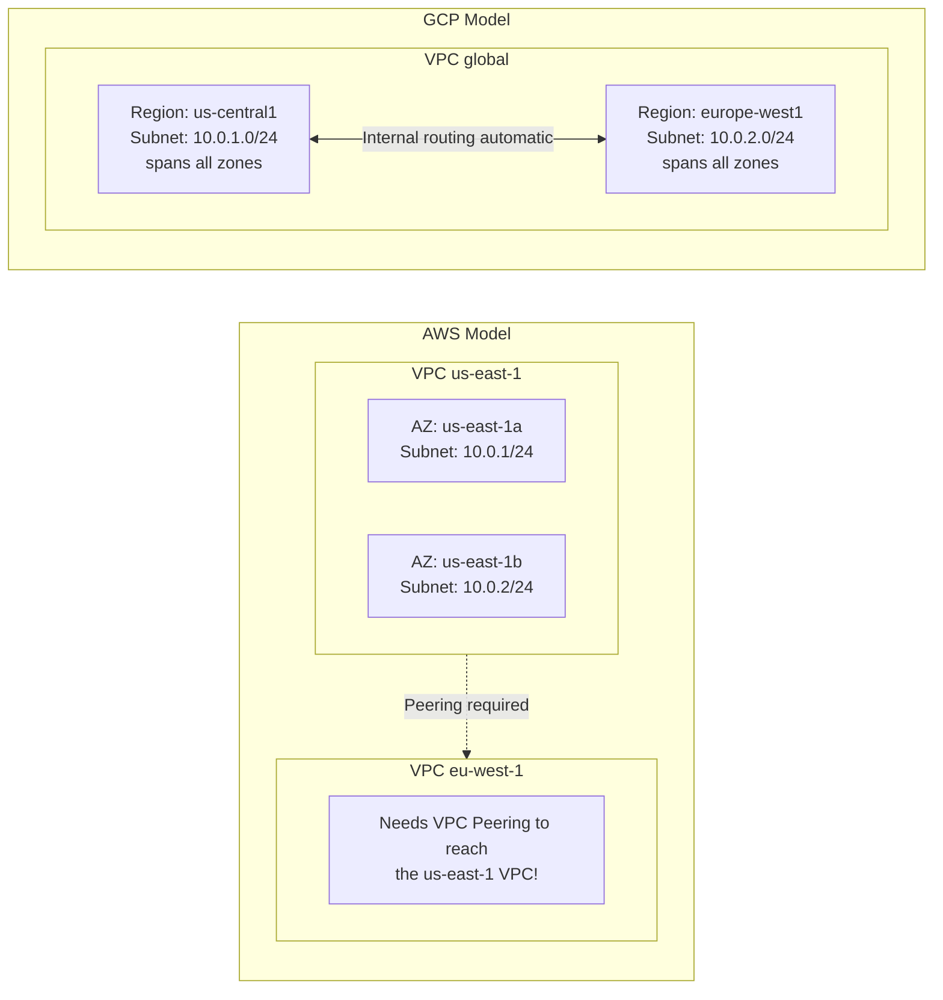
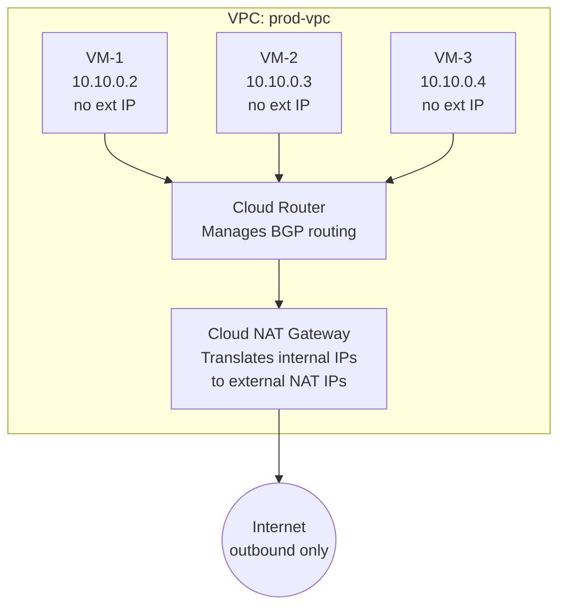
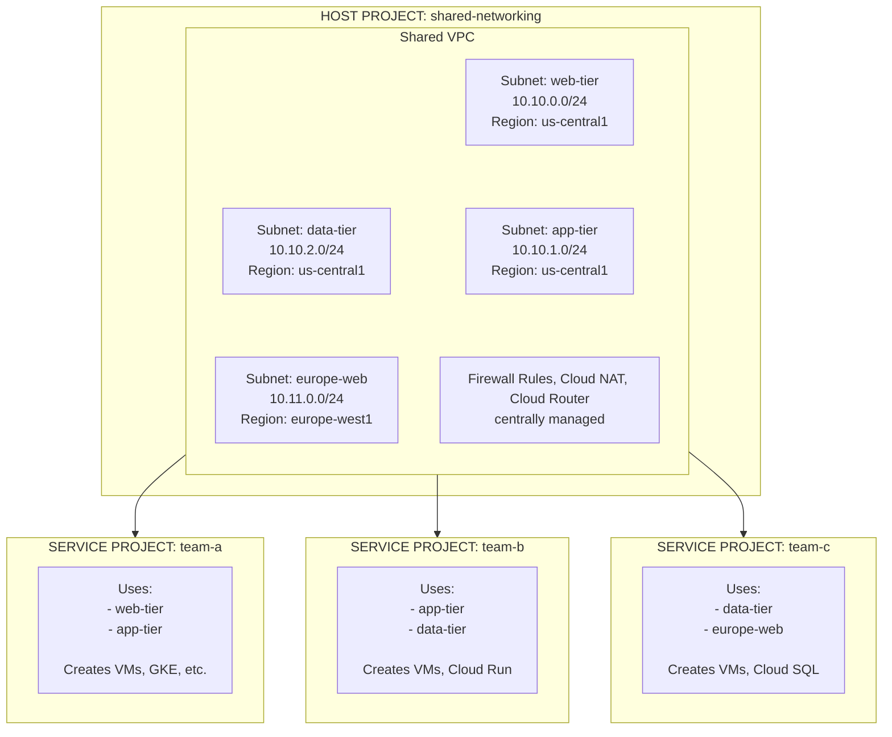

**Complexity**: `[COMPLEX]` | **Time to Complete**: 3h | **Prerequisites**: Module 2.1 (IAM & Resource Hierarchy)

## What You'll Be Able to Do

After completing this module, you will be able to:

- **Design GCP's global VPC architecture with regional subnets, firewall rules, and Private Google Access**
- **Configure Shared VPC to centralize network management across multiple GCP projects**
- **Deploy Cloud NAT and Cloud Router for outbound internet access from private instances without public IPs**
- **Compare GCP's global VPC model with AWS regional VPCs to avoid common multi-cloud networking mistakes**

---

## Why This Module Matters

**Hypothetical scenario:** During a routine deployment, an engineer adds a firewall rule using network tags to allow traffic from a monitoring system to backend VMs. The tag name has a typo, and because GCP firewall rules are deny-by-default, monitoring traffic is silently dropped. No alerts fire because the monitoring system itself is what stopped working. Meanwhile, a lingering broad "debug" firewall rule allows all ingress from `0.0.0.0/0` on port 8080 to any VM still carrying a stale `debug` tag from an earlier troubleshooting session—exposing endpoints that production traffic was never meant to reach.

This story illustrates two truths about GCP networking. First, **GCP's VPC model is global by default**, which is both its greatest strength and its most dangerous trap. A single misconfigured firewall rule can affect VMs across every region. Second, **network tags are fragile**---they are arbitrary strings with no validation, and a typo creates a silent failure. Understanding VPC architecture, firewall rule design, and the difference between tag-based and service-account-based firewalling is not optional knowledge---it is the foundation that every other GCP service builds on.

In this module, you will learn how GCP VPCs differ fundamentally from AWS VPCs, how to design subnet strategies that scale, how to build firewall rules that are both secure and maintainable, and how to connect projects together using Shared VPCs. You will also master Cloud NAT and Cloud Router, the components that give private VMs controlled access to the internet.

---

## Global VPCs vs Regional Subnets

### The Fundamental Difference

If you are coming from AWS, this is the most important mental model shift: **in GCP, a VPC is a global resource. Subnets are regional, but they all belong to the same global VPC.** There are no availability zone-scoped subnets.



**Pause and predict:** If a GCP VPC spans the globe by default, what happens if an application team in `europe-west1` requests a new subnet with the CIDR block `10.10.0.0/20` when the `us-central1` team is already using that exact range? How does this differ from managing CIDRs across multiple AWS regions?

<details>
<summary>Check your prediction</summary>

Google Cloud immediately rejects the `europe-west1` subnet creation request because all regional subnets in a GCP VPC share a single global routing namespace where CIDR ranges cannot overlap anywhere worldwide. In AWS, each regional VPC is an independent IP namespace, allowing `us-east-1` and `eu-west-1` to use identical CIDR blocks without immediate conflict until cross-region VPC peering or transit gateway interconnection is attempted.

</details>

Google Cloud's software-defined networking fabric connects regional subnets across continents into a unified global route table that simplifies routing operations. When you create a subnet in `us-central1` and another in `europe-west1`, both subnets share the same VPC-level route table. Google's software-defined networking fabric automatically installs routes between every subnet in the VPC without you configuring a single route entry, peering connection, or transit gateway. The subnet CIDR ranges become part of the VPC's routing topology immediately upon creation, and every VM in every region learns these routes through the virtual network interface. A VM in Tokyo can send a packet to a VM in Sao Paulo using only its private IP address, and the packet stays on Google's private backbone until it reaches the destination subnet's virtual switch.

Comparing this unified global software-defined network with AWS regional VPC architecture reveals foundational differences across routing, subnet boundaries, firewall scopes, and default communication policies:

| Feature | AWS VPC | GCP VPC |
| :--- | :--- | :--- |
| **Scope** | Regional | Global |
| **Cross-region communication** | Requires VPC Peering or Transit Gateway | Automatic (same VPC) |
| **Subnet scope** | Availability Zone | Region (spans all zones) |
| **Firewall rules** | Per security group (stateful) + NACLs (stateless) | Global firewall rules (stateful) |
| **Route tables** | Per subnet | Per VPC (with regional routing for subnets) |
| **Default behavior** | Allow all outbound, deny all inbound | Deny all ingress, allow all egress |

### VPC Types: Auto Mode vs Custom Mode

GCP offers two VPC modes, but in practice you should always use Custom Mode.

```bash
# Create a custom-mode VPC (recommended)
gcloud compute networks create prod-vpc \
  --subnet-mode=custom \
  --bgp-routing-mode=global

# Create subnets in specific regions
gcloud compute networks subnets create prod-us-central1 \
  --network=prod-vpc \
  --region=us-central1 \
  --range=10.10.0.0/20 \
  --secondary-range=pods=10.20.0.0/16,services=10.30.0.0/20 \
  --enable-private-ip-google-access

gcloud compute networks subnets create prod-europe-west1 \
  --network=prod-vpc \
  --region=europe-west1 \
  --range=10.11.0.0/20 \
  --enable-private-ip-google-access
```

| Feature | Auto Mode VPC | Custom Mode VPC |
| :--- | :--- | :--- |
| **Subnet creation** | Automatic in every region | You create only what you need |
| **IP ranges** | Predefined (10.128.0.0/9) | You choose the CIDR ranges |
| **Secondary ranges** | Not included | You define them (needed for GKE) |
| **Production use** | Not recommended | Always use this |
| **Default VPC** | Auto mode (created automatically) | Must be explicitly created |

**War Story**: The auto-mode VPC creates a subnet with a `/20` range in every GCP region (currently over 40 regions). That consumes a massive amount of IP space from the `10.128.0.0/9` range, and these subnets often conflict with on-premises networks. Many Well-Architected reviews recommend replacing the default auto-mode VPC with a custom one when you outgrow tutorials.

```bash
# Delete the default auto-mode VPC (do this in every new project)
gcloud compute networks delete default --quiet
```

### Private Google Access

By default, VMs without external IPs cannot reach Google APIs (like Cloud Storage or BigQuery). **Private Google Access** allows VMs with only internal IPs to reach Google APIs through Google's internal network rather than the public internet.

```bash
# Enable Private Google Access on an existing subnet
gcloud compute networks subnets update prod-us-central1 \
  --region=us-central1 \
  --enable-private-ip-google-access

# Verify it is enabled
gcloud compute networks subnets describe prod-us-central1 \
  --region=us-central1 \
  --format="get(privateIpGoogleAccess)"
```

**Pause and predict:** A virtual machine is provisioned without an external IP address on a subnet with Private Google Access enabled. Can this private instance reach public `apt` or `yum` package repository mirrors across the internet to download OS updates, and what network component is necessary if it cannot?

<details>
<summary>Check your prediction</summary>

No. Private Google Access provides connectivity exclusively to Google APIs and services (`*.googleapis.com`) routed across Google's internal software-defined backbone. It does not provide general outbound internet routing; downloading operating system packages from public distribution mirrors or accessing third-party SaaS APIs requires deploying Cloud NAT on top of Cloud Router.

</details>

Enabling **Private Google Access** (`--enable-private-ip-google-access`) is only the subnet flag. Restricted internal VIP ranges still need explicit DNS, such as Cloud DNS private zones targeting `private.googleapis.com` or `restricted.googleapis.com`.

The **`private.googleapis.com`** VIP range is `199.36.153.8/30` (broader Google API access over private paths). The **`restricted.googleapis.com`** VIP range is `199.36.153.4/30` (VPC Service Controls–compatible restricted endpoints). Use restricted VIPs when your organization enforces VPC-SC perimeters; use private VIPs when you need broader API coverage without traversing the public internet.

When enabled on a subnet, internal workloads resolving supported Google service domain names steer packets automatically across Google's private planetary network rather than egressing through external transit providers. Understanding how these API routes interact with custom static routes and dynamic gateway advertisements requires inspecting the underlying routing table hierarchy that governs all VPC communication paths.

---

## VPC Routes: The Hidden Routing Topology

Every GCP VPC has a route table that determines how packets flow between subnets, to the internet, and to peered networks. Understanding this table is critical because route priority determines which path traffic takes when multiple routes could match a destination.

### Route Types and Priority

GCP evaluates routes in two steps: **longest-prefix match** (most-specific destination CIDR wins), then **priority value** (lower numbers win when multiple routes match the same prefix). Subnet routes for a subnet's own CIDR cannot be overridden by a custom static route—you cannot blackhole traffic to your own address space. When destination and priority tie, **static routes beat dynamic (BGP) routes**; otherwise the lower priority number wins regardless of route type.

| Route Type | Who Creates It | Typical Priority | Example |
| :--- | :--- | :--- | :--- |
| **Subnet routes** | GCP (automatic) | 0 (implicit) | Route to every subnet CIDR in the VPC |
| **Custom static routes** | You | 1–65535 (you choose) | Route `10.200.0.0/16` to a VPN tunnel at priority 500 |
| **Dynamic (BGP) routes** | Cloud Router | From BGP (often 100+) | Routes from on-premises via BGP |
| **System-generated default** | GCP (automatic) | 1000 | `0.0.0.0/0` → default internet gateway |

Subnet routes appear in `gcloud compute routes list` with `nextHopNetwork` set to the VPC—they are not hidden from the CLI. Custom static routes let you direct specific CIDR blocks to VPN tunnels, interconnect attachments, or third-party virtual appliances. Dynamic routes learned via BGP integrate with Cloud Router; override them with static routes only when you need a deliberate, equal-or-better match. The system default internet route uses destination `0.0.0.0/0` at **priority 1000**—a normal numeric value, not "lowest priority" in the sense of losing to every custom route.

```bash
# View all routes in a VPC (system, custom, and dynamic)
gcloud compute routes list \
  --filter="network=prod-vpc" \
  --format="table(name, destRange, nextHopType, priority, tags)"

# Create a custom static route to send a CIDR block through a VPN tunnel
gcloud compute routes create route-to-onprem-db \
  --network=prod-vpc \
  --destination-range=192.168.100.0/24 \
  --next-hop-vpn-tunnel=vpn-tunnel-to-onprem \
  --priority=500 \
  --tags=needs-onprem-access

# Create a route that sends internet-bound traffic through a third-party firewall appliance
gcloud compute routes create route-via-nva \
  --network=prod-vpc \
  --destination-range=0.0.0.0/0 \
  --next-hop-instance=firewall-nva \
  --next-hop-instance-zone=us-central1-a \
  --priority=800 \
  --tags=via-firewall
```

> **Did You Know?** Subnet routes use implicit priority 0 for their own CIDRs. You **do** see them in `gcloud compute routes list` with `nextHopNetwork` pointing at the VPC network—they are managed by the control plane but are visible for troubleshooting.

### Tags and Route Applicability

Network tags on custom routes let you selectively apply routes to specific VMs. When you attach a tag like `--tags=needs-onprem-access` to a route, only VMs that carry that network tag will install the route. This gives you VM-level routing policy without needing separate VPCs. A common pattern is to use tagged routes for egress inspection: tag your firewall appliance VMs with `via-firewall`, create a tagged default route that sends all their traffic through the appliance, and leave the rest of the VMs using the system-generated default internet route. This keeps the routing table clean and avoids forcing every VM through an unnecessary inspection hop.

---

## Firewall Rules: Tags vs Service Accounts

GCP firewall rules are global resources that apply to a specific VPC network. They are **stateful** (return traffic is automatically allowed) and evaluated by **priority** (lower number = higher priority, range 0-65535).

### Firewall Rule Anatomy

```bash
# Basic firewall rule structure
gcloud compute firewall-rules create allow-ssh-from-iap \
  --network=prod-vpc \
  --direction=INGRESS \
  --action=ALLOW \
  --rules=tcp:22 \
  --source-ranges=35.235.240.0/20 \
  --target-tags=allow-ssh \
  --priority=1000 \
  --description="Allow SSH via IAP tunnel"
```

Every firewall rule has these components:

| Component | Description | Default |
| :--- | :--- | :--- |
| **Direction** | INGRESS or EGRESS | INGRESS |
| **Action** | ALLOW or DENY | (required) |
| **Priority** | 0 (highest) to 65535 (lowest) | 1000 |
| **Source** | IP ranges, tags, or service accounts | (required for INGRESS) |
| **Target** | Tags, service accounts, or all instances | All instances in VPC |
| **Protocol/Ports** | tcp:80, udp:53, icmp, all | (required) |
| **Logging** | On or Off | Off |

### The Tag Problem

Network tags are strings you attach to VM instances. Firewall rules can use them for both source filtering and target selection. The problem is that tags are **just strings**---there is no validation, no IAM control over who can set them, and a typo creates a silent failure.

```bash
# Create a VM with a tag
gcloud compute instances create web-server-1 \
  --zone=us-central1-a \
  --tags=web-server,allow-ssh \
  --network=prod-vpc \
  --subnet=prod-us-central1

# Create a firewall rule targeting that tag
gcloud compute firewall-rules create allow-http \
  --network=prod-vpc \
  --direction=INGRESS \
  --action=ALLOW \
  --rules=tcp:80,tcp:443 \
  --source-ranges=0.0.0.0/0 \
  --target-tags=web-server \
  --priority=1000

# Attach the tag that this firewall rule will match.
```

**Pause and predict:** An engineer applies the network tag `allow-db-access` to a compromised frontend VM. If the firewall rule allowing database connections on port 5432 uses `--source-tags=allow-db-access`, why does the database immediately become vulnerable, and how would using a service account have prevented this exact exploitation path?

<details>
<summary>Check your prediction</summary>

Anyone with instance editing permissions (`compute.instances.setTags`) can attach the `allow-db-access` tag to any virtual machine without granular role checks, allowing a compromised host or rogue operator to impersonate the trusted source tag and connect directly to the database. By contrast, service account targeting binds firewall authorization to cryptographic identity; attaching or changing a service account requires strict `iam.serviceAccounts.actAs` permission, preventing unauthorized workloads from assuming the identity.

</details>

### Service Account-Based Firewall Rules (The Better Way)

Production firewall architectures can target the identity attached to each instance instead of a label you type onto the VM. The next examples show how that identity is created and referenced in `gcloud` firewall rules.

```bash
# Create service accounts for different VM roles
gcloud iam service-accounts create web-server-sa \
  --display-name="Web Server SA" \
  --project=my-project

gcloud iam service-accounts create backend-sa \
  --display-name="Backend Server SA" \
  --project=my-project

# Create firewall rules using service account targets
gcloud compute firewall-rules create allow-http-to-web \
  --network=prod-vpc \
  --direction=INGRESS \
  --action=ALLOW \
  --rules=tcp:80,tcp:443 \
  --source-ranges=0.0.0.0/0 \
  --target-service-accounts=web-server-sa@my-project.iam.gserviceaccount.com \
  --priority=1000

# Allow backend communication: only web servers can reach backends on port 8080
gcloud compute firewall-rules create allow-web-to-backend \
  --network=prod-vpc \
  --direction=INGRESS \
  --action=ALLOW \
  --rules=tcp:8080 \
  --source-service-accounts=web-server-sa@my-project.iam.gserviceaccount.com \
  --target-service-accounts=backend-sa@my-project.iam.gserviceaccount.com \
  --priority=1000
```

### Comparison: Tags vs Service Accounts for Firewalling

| Aspect | Network Tags | Service Accounts |
| :--- | :--- | :--- |
| **IAM controlled** | No (anyone with setTags can modify) | Yes (requires actAs permission) |
| **Typo resilience** | No (silent failure) | Yes (error if SA does not exist) |
| **Cross-project** | No | Yes (with Shared VPC) |
| **Granularity** | Per instance (arbitrary) | Per instance (identity-based) |
| **Recommended by Google** | Legacy workloads only | Yes, for all new deployments |
| **Works with MIGs** | Yes | Yes |

### Firewall Logging and Troubleshooting

```bash
# Enable logging on a firewall rule
gcloud compute firewall-rules update allow-http-to-web \
  --enable-logging

# View firewall logs (after enabling)
gcloud logging read 'resource.type="gce_subnetwork" AND jsonPayload.connection.dest_port=80' \
  --limit=10 \
  --format=json

# List all firewall rules in a VPC, sorted by priority
gcloud compute firewall-rules list \
  --filter="network=prod-vpc" \
  --sort-by=priority \
  --format="table(name, direction, priority, sourceRanges.list():label=SRC, allowed[].map().firewall_rule().list():label=ALLOW, targetServiceAccounts.list():label=TARGET_SA)"
```

### Hierarchical Firewall Policies

For organizations managing many projects, **Hierarchical Firewall Policies** allow you to define firewall rules at the Organization or Folder level that apply to all projects underneath. These are evaluated **before** VPC firewall rules.

```text
Evaluation Order:
1. Organization-level firewall policy rules
2. Folder-level firewall policy rules
3. VPC firewall rules (by priority)
4. Implied rules (deny all ingress, allow all egress)
```

```bash
# Create a firewall policy at the organization level
gcloud compute firewall-policies create \
  --organization=ORGANIZATION_ID \
  --short-name=org-baseline \
  --description="Organization baseline firewall policy"

# Add a rule to allow IAP SSH from anywhere in the org
gcloud compute firewall-policies rules create 100 \
  --firewall-policy=org-baseline \
  --organization=ORGANIZATION_ID \
  --action=allow \
  --direction=INGRESS \
  --src-ip-ranges=35.235.240.0/20 \
  --layer4-configs=tcp:22 \
  --description="Allow SSH via IAP tunnel"

# Associate the policy with the organization
gcloud compute firewall-policies associations create \
  --firewall-policy=org-baseline \
  --organization=ORGANIZATION_ID
```

Hierarchical policies solve a governance problem that VPC-level rules cannot address on their own: the principle of least privilege at the organizational boundary. Without hierarchical policies, every project owner can open any port to the internet by creating a VPC firewall rule with a high priority. With an organization-level `DENY` rule for port 22 from `0.0.0.0/0`, no project-level rule can override it, regardless of priority. This is structurally identical to how AWS Organizations SCPs work at the IAM layer, but applied to the network layer. Large enterprises typically deploy a baseline hierarchical policy that blocks common attack vectors — SSH, RDP, database ports — from the public internet, then selectively allow them through IAP or VPN ranges at the folder level for projects that have a legitimate need.

---

## Cloud NAT: Giving Private VMs Internet Access

Cloud NAT allows VMs without external IP addresses to make outbound connections to the internet (for package updates, API calls, etc.) without exposing them to inbound traffic.



### Setting Up Cloud NAT

Cloud NAT requires a Cloud Router (which handles the BGP routing even though Cloud NAT itself does not use BGP---the router is the management plane).

```bash
# Step 1: Create a Cloud Router
gcloud compute routers create prod-router \
  --network=prod-vpc \
  --region=us-central1

# Step 2: Create a Cloud NAT gateway
gcloud compute routers nats create prod-nat \
  --router=prod-router \
  --region=us-central1 \
  --auto-allocate-nat-external-ips \
  --nat-all-subnet-ip-ranges

# Step 3: Verify NAT is working from a private VM
gcloud compute ssh vm-1 --zone=us-central1-a --tunnel-through-iap \
  --command="curl -s ifconfig.me"
# Should return the NAT gateway's external IP

# View NAT configuration
gcloud compute routers nats describe prod-nat \
  --router=prod-router \
  --region=us-central1
```

### Cloud NAT Options

| Option | Description | When to Use |
| :--- | :--- | :--- |
| `--auto-allocate-nat-external-ips` | GCP assigns IPs automatically | Most use cases |
| `--nat-external-ip-pool=IP1,IP2` | You specify the external IPs | When you need a known egress IP (allowlisting) |
| `--nat-all-subnet-ip-ranges` | NAT all subnets in the region | Simple setups |
| `--nat-custom-subnet-ip-ranges` | NAT only specific subnets | Multi-team VPCs with different egress needs |
| `--min-ports-per-vm=64` | Minimum NAT ports per VM | Default 64, increase for high-connection workloads |
| `--enable-logging` | Log NAT translations | Debugging, compliance |

```bash
# Advanced: Fixed external IP for allowlisting
gcloud compute addresses create nat-ip-1 \
  --region=us-central1

gcloud compute routers nats update prod-nat \
  --router=prod-router \
  --region=us-central1 \
  --nat-external-ip-pool=nat-ip-1

# Enable logging
gcloud compute routers nats update prod-nat \
  --router=prod-router \
  --region=us-central1 \
  --enable-logging \
  --log-filter=ERRORS_ONLY
```

### Why Cloud NAT Scales Differently from AWS NAT Gateway

If you are used to AWS NAT Gateway, the Cloud NAT scaling model requires an adjustment. AWS NAT Gateway is a managed instance in your VPC with a fixed bandwidth ceiling (scaling from roughly 5 Gbps to 100 Gbps depending on the number of gateways you deploy), and if you exceed that ceiling, your connections drop. You solve this by provisioning more NAT gateways across availability zones and distributing workloads. Cloud NAT is different because it is not a virtual instance at all — it is a software-defined service in Google's networking fabric that operates outside your VPC. There is no single point of failure, no bandwidth ceiling to provision, and no instance to patch or maintain. Cloud NAT scales its total throughput automatically as your workload grows, limited only by the number of NAT IP addresses and the port allocation per VM. The practical implication is that you never need to provision "bigger" Cloud NAT gateways or add more of them for bandwidth reasons — you only add more NAT IPs if you need more unique external source IPs for allowlisting or if you hit port exhaustion on a single IP. For most workloads, a single NAT gateway with auto-allocated IPs handles all outbound traffic in a region without any tuning.

---

## Cloud Router and Hybrid Connectivity

Cloud Router is the BGP speaker that dynamically exchanges routes between your VPC and external networks (on-premises data centers, other clouds, or other VPCs). It also serves as the control plane for Cloud NAT and Cloud Interconnect, making it one of the busiest components in any VPC that connects to external networks.

### Cloud Router with VPN

```bash
# Create a Cloud VPN gateway
gcloud compute vpn-gateways create prod-vpn-gw \
  --network=prod-vpc \
  --region=us-central1

# Create a Cloud Router for BGP
gcloud compute routers create prod-vpn-router \
  --network=prod-vpc \
  --region=us-central1 \
  --asn=65001

# Add a BGP peer (your on-premises router)
gcloud compute routers add-bgp-peer prod-vpn-router \
  --peer-name=onprem-peer \
  --peer-asn=65002 \
  --interface=vpn-tunnel-int \
  --region=us-central1

# View learned routes
gcloud compute routers get-status prod-vpn-router \
  --region=us-central1
```

### BGP Routing Mode: Regional vs Global

| Mode | Routes Advertised | Use Case |
| :--- | :--- | :--- |
| **Regional** | Only subnets in the router's region | Single-region deployments |
| **Global** | All subnets in the VPC, all regions | Multi-region deployments (recommended) |

```bash
# Set global routing mode
gcloud compute networks update prod-vpc \
  --bgp-routing-mode=global
```

When you set `--bgp-routing-mode=global`, Cloud Router advertises every subnet in the VPC to your BGP peers, regardless of which region the router itself lives in. This is the preferred mode for multi-region VPCs because it eliminates the need to deploy a Cloud Router in every region just to advertise local subnets. A single Cloud Router in `us-central1` with global routing mode will advertise `10.10.0.0/20` (us-central1), `10.11.0.0/20` (europe-west1), and `10.12.0.0/20` (asia-east1) to your on-premises router. The BGP peer sees the VPC as a single autonomous system with a unified routing table, which matches the reality of the global VPC's internal routing fabric. Regional mode, by contrast, limits the router to advertising only the subnets within its own region, which is useful when you want to implement region-specific network segmentation or when you are using separate VPN tunnels per region for traffic engineering.

---

## Shared VPC: Multi-Project Networking

Shared VPC is the mechanism that allows multiple GCP projects to share a single VPC network. This is the foundation of enterprise GCP networking and is critical for centralizing network administration while allowing teams to manage their own compute resources.

### Architecture



**Pause and predict:** In a Shared VPC architecture, a Host Project administrator grants a Service Project developer the `compute.networkUser` role. If no IAM conditions are applied to this binding, what is the immediate blast radius of this permission, and how could a compromised developer account exploit it across different environments?

<details>
<summary>Check your prediction</summary>

Granting `roles/compute.networkUser` at the host project level without IAM conditions authorizes the principal to use any subnet throughout the host project, including production tiers and subnets assigned to other teams. If that account is compromised, an attacker can provision instances or network interfaces directly inside sensitive production subnets, bypassing environment segregation.

</details>

Enterprise multi-project network architectures rely on centralized governance to separate core network infrastructure management from daily application resource deployment. Establishing clear administrative boundaries ensures central networking teams control connectivity while autonomous development teams deploy workloads into designated environments.

### Key Concepts

**Host Project**: The project that owns the Shared VPC network. The network team manages this project and controls all networking resources (subnets, firewall rules, Cloud NAT, VPN connections).

**Service Projects**: Projects that are attached to the Shared VPC and can use its subnets. Application teams own these projects and create compute resources (VMs, GKE clusters, Cloud Run services) that connect to the shared network.

### Setting Up Shared VPC

```bash
# Step 1: Enable Shared VPC on the host project
# (requires Organization Admin or Shared VPC Admin role)
gcloud compute shared-vpc enable shared-networking

# Step 2: Associate service projects with the host project
gcloud compute shared-vpc associated-projects add team-a \
  --host-project=shared-networking

gcloud compute shared-vpc associated-projects add team-b \
  --host-project=shared-networking

# Step 3: Grant service project users access to specific subnets
# (This is where least privilege matters most)
gcloud projects add-iam-binding shared-networking \
  --member="group:team-a-devs@example.com" \
  --role="roles/compute.networkUser" \
  --condition="expression=resource.name.endsWith('subnets/web-tier') || resource.name.endsWith('subnets/app-tier'),title=web-and-app-subnets-only"

# Step 4: Create a VM in a service project using a shared subnet
gcloud compute instances create web-app-1 \
  --project=team-a \
  --zone=us-central1-a \
  --subnet=projects/shared-networking/regions/us-central1/subnetworks/web-tier \
  --no-address

# List service projects
gcloud compute shared-vpc list-associated-resources shared-networking
```

### Shared VPC Permissions

| Role | Where to Grant | What It Allows |
| :--- | :--- | :--- |
| `roles/compute.xpnAdmin` | Organization or Folder | Enable/disable Shared VPC, add/remove service projects |
| `roles/compute.networkUser` | Host project (on specific subnets) | Use subnets from service projects |
| `roles/compute.networkAdmin` | Host project | Manage subnets, firewall rules, routes |
| `roles/compute.securityAdmin` | Host project | Manage firewall rules only |

---

## VPC Peering

When you need two separate VPCs to communicate (either within the same project or across projects), VPC Network Peering creates a direct route between them using internal IPs.

```bash
# Peer vpc-a with vpc-b (must create peering in both directions)
gcloud compute networks peerings create peer-a-to-b \
  --network=vpc-a \
  --peer-network=vpc-b \
  --peer-project=project-b

gcloud compute networks peerings create peer-b-to-a \
  --network=vpc-b \
  --peer-network=vpc-a \
  --peer-project=project-a \
  --project=project-b

# Important: VPC peering is NOT transitive
# If A peers with B, and B peers with C, A CANNOT reach C through B
```

| Feature | Shared VPC | VPC Peering |
| :--- | :--- | :--- |
| **Same VPC** | Yes (one network) | No (two separate networks) |
| **Centralized firewall** | Yes | No (each VPC has its own) |
| **IP overlap allowed** | No | No (ranges must not overlap) |
| **Transitive** | N/A (same network) | No (A-B-C: A cannot reach C) |
| **Cross-organization** | No | Yes |
| **Use case** | Teams within same org | Partner orgs, acquisitions |

---

## Private Service Connect

Private Service Connect (PSC) is GCP's mechanism for privately consuming services — both Google-managed and third-party — without traffic ever leaving Google's network. Think of it as a private endpoint that creates a unidirectional connection from your VPC to a service producer's network, without the full bidirectional routing exposure of VPC peering.

### Why PSC Exists

Before PSC, consuming a managed service privately required either VPC peering (which exposes both networks to each other and creates a bidirectional trust relationship) or routing traffic through the public internet with access controls. Neither option was ideal for service consumption at scale. VPC peering between a consumer and a producer creates an administrative burden for both sides — the producer must manage peering connections with thousands of consumers, and every consumer's VPC learns routes to the producer's entire address space. PSC solves this by creating a one-way forwarding rule in the consumer's VPC that maps a local IP address to the producer's service endpoint. Traffic flows from consumer to producer only, and the producer never sees the consumer's internal IP space or routing topology.

```bash
# Create a Private Service Connect endpoint for Cloud SQL
gcloud compute addresses create psql-psc-ip \
  --region=us-central1 \
  --subnet=app-tier

gcloud compute forwarding-rules create psql-endpoint \
  --region=us-central1 \
  --network=prod-vpc \
  --address=psql-psc-ip \
  --target-service-attachment=projects/sql-producer/regions/us-central1/serviceAttachments/psql-sa
```

### Published vs Connected Services

PSC operates on a producer-consumer model. The service producer creates a **Service Attachment** in their VPC that defines which consumer projects can connect, which subnets the service listens on, and whether the connection requires explicit approval. The consumer creates a **PSC Endpoint** (a forwarding rule with a local IP address) that points to the producer's service attachment. When the endpoint is created, GCP establishes a NAT-like translation between the consumer's local endpoint IP and the producer's actual service IP, but unlike Cloud NAT, this translation is bidirectional within the established connection — return traffic flows back through the same path. This architecture means that the consumer's VPC never contains routes to the producer's subnet, and the producer's VPC never learns routes to the consumer's subnet. The two networks remain fully isolated while the specific service connection works as if they were adjacent on the same switch.

### When to Use PSC vs VPC Peering

The general rule: use PSC when you are consuming a specific service (Cloud SQL, a partner's SaaS API, or a shared internal microservice), and use VPC peering when you need full network-to-network connectivity between two environments that trust each other. PSC gives the consumer the ability to consume a service without exposing their network topology to the producer, and it gives the producer the ability to offer a service without managing thousands of peering connections. This is the networking equivalent of an API contract — the producer defines what the consumer can access, and the consumer connects to that contract without seeing what else exists in the producer's network.

---

## VPC Flow Logs

VPC Flow Logs capture a sampled record of every IP flow (5-tuple: source IP, destination IP, source port, destination port, protocol) entering or leaving a subnet's virtual network interface. They are the fundamental observability tool for GCP network troubleshooting, security forensics, and usage analysis, and they operate at the subnet level — you enable them per subnet, not per VPC or per VM.

### What Flow Logs Capture and What They Do Not

Each flow log record contains the 5-tuple plus metadata: bytes sent, packets sent, the VM instance name that generated the traffic, the VPC network, the region, and whether the traffic matched a firewall rule. Critically, flow logs are sampled — by default, GCP captures roughly one out of every two packets, but the sampling rate is adaptive and can be tuned. Flow logs do not capture the packet payload; they are metadata records, not Deep Packet Inspection. They also do not capture traffic that is dropped by the implied deny rules (the pre-firewall evaluation). If a packet is rejected by a firewall rule that has logging enabled, that rejection appears in firewall logs, not in flow logs — these are complementary data sources.

```bash
# Enable VPC Flow Logs on a subnet with default settings
gcloud compute networks subnets update prod-us-central1 \
  --region=us-central1 \
  --enable-flow-logs

# Enable with custom sampling, aggregation interval, and metadata
gcloud compute networks subnets update prod-us-central1 \
  --region=us-central1 \
  --enable-flow-logs \
  --logging-flow-sampling=0.5 \
  --logging-aggregation-interval=INTERVAL_5_SEC \
  --logging-metadata=include-all

# Query flow logs to find top talkers by bytes
gcloud logging read \
  'resource.type="gce_subnetwork" AND logName:"compute.googleapis.com/vpc_flows"' \
  --limit=10 \
  --format="json" \
  --freshness=1h
```

### Flow Log Tuning Options

GCP flow logs always record the full 5-tuple (source/destination IP and port, protocol). The platform aggregates packets from the same connection over a **time interval**—you do not choose alternate 5-tuple aggregation modes. Tune cost versus freshness with sampling and interval instead.

| Setting | Values | Tradeoff |
| :--- | :--- | :--- |
| **`--logging-aggregation-interval`** | `INTERVAL_5_SEC`, `INTERVAL_30_SEC`, `INTERVAL_1_MIN`, `INTERVAL_5_MIN`, `INTERVAL_10_MIN`, `INTERVAL_15_MIN` | Shorter intervals produce more log entries and fresher visibility; longer intervals reduce volume |
| **`--logging-flow-sampling`** | `0.0`–`1.0` (for example `0.5` = 50%) | Lower sampling cuts cost but may miss short-lived flows |
| **`--logging-metadata`** | `include-all`, `exclude-all`, `custom` | Controls whether VM names, geo, and other metadata fields are exported |

For operational monitoring, `INTERVAL_5_MIN` or `INTERVAL_1_MIN` at 50% sampling often balances anomaly detection with logging budget. Use `INTERVAL_5_SEC` only when debugging a live incident where per-connection timing matters.

---

## Cloud Load Balancing in GCP

GCP's load balancing family is unique among cloud providers because it spans both Layer 4 and Layer 7 and is natively global. Unlike AWS, where an Application Load Balancer is regional and requires Route 53 or Global Accelerator for cross-region failover, GCP's external HTTP(S) load balancer is global by default — a single anycast IP address receives traffic at the nearest Google edge point-of-presence and routes it to the closest healthy backend region.

### Load Balancer Family Overview

> **Naming note:** Google Cloud documentation now groups products as **Application Load Balancer** (HTTP/HTTPS), **Network Load Balancer** (TCP/UDP), **Proxy Network Load Balancer**, and **Classic** variants. The table below uses the long-standing CLI resource names you will still see in `gcloud` commands.

| Load Balancer | Layer | Scope | Use Case |
| :--- | :--- | :--- | :--- |
| **External HTTP(S)** | L7 | Global | Web applications, multi-region failover, URL-based routing |
| **Internal HTTP(S)** | L7 | Regional | Microservices within a VPC, traffic splitting |
| **External TCP/UDP Network** | L4 | Regional | Non-HTTP workloads, preserving client IP |
| **Internal TCP/UDP Network** | L4 | Regional | Internal service discovery, database load balancing |
| **External SSL Proxy** | L4 (SSL) | Global | SSL-terminated non-HTTP traffic |
| **External TCP Proxy** | L4 (TCP) | Global | TCP traffic without SSL termination |

```bash
# Create a global external HTTP(S) load balancer
gcloud compute url-maps create web-map \
  --default-service=web-backend

gcloud compute target-http-proxies create web-proxy \
  --url-map=web-map

gcloud compute forwarding-rules create web-rule \
  --global \
  --target-http-proxy=web-proxy \
  --ports=80
```

### Why Global Load Balancing Changes Architecture

The global anycast frontend means you do not need DNS-based failover or regional load balancer pairs. A single forwarding rule IP address serves traffic from every Google edge location, and the load balancer's backend service can include instance groups in multiple regions. If the `us-central1` backend group becomes unhealthy, traffic automatically shifts to `europe-west1` without any DNS TTL propagation delay, any configuration change, or any client-side retry logic. The health checks that drive this failover run from each edge location independently, meaning a regional network partition that isolates `us-central1` from the rest of the world is detected by the edge locations within seconds, and traffic is redirected before most clients experience a timeout. This is architecturally simpler than the equivalent AWS setup (ALB + Route 53 failover + health checks at the DNS layer) because the data plane itself handles failover rather than relying on DNS control-plane convergence.

---

## Cost Lens: What GCP Networking Actually Costs

Networking costs in GCP follow patterns that differ significantly from AWS, and understanding these patterns prevents unpleasant billing surprises.

### Internet Egress Pricing Model

GCP charges for data that leaves Google's network to the public internet. Traffic between GCP regions on the same continent is charged at a lower rate than intercontinental egress, and traffic within the same region is free (assuming both endpoints are in the same VPC). The key cost drivers are:

| Traffic Path | Cost Behavior | Typical Monthly Impact |
| :--- | :--- | :--- |
| Same region, same zone | Free | Zero |
| Same region, different zones | Free (within same VPC) | Zero |
| Inter-region (same continent) | Charged per GB egress | Moderate — ~$0.01/GB |
| Inter-region (intercontinental) | Charged per GB at higher rate | Significant — ~$0.08-0.12/GB |
| Internet egress | Charged per GB at highest rate | Largest cost — ~$0.08-0.23/GB depending on volume tier |
| Google API traffic via Private Google Access | Free (stays on internal network) | Zero |

The most important takeaway: inter-region traffic between subnets in the same global VPC is not free just because it is automatic. The VPC routes the traffic for you without configuration, but GCP still meters and bills inter-region bytes. Teams that migrate from single-region to multi-region architectures often see a 3-5x increase in their networking line item because what was previously free intra-region traffic becomes billable cross-region traffic. You control this by co-locating services that communicate heavily in the same region and using Private Google Access for API calls to avoid routing them through the internet.

### Cloud NAT Costs

Cloud NAT has two cost components: an hourly charge for the NAT gateway itself and a per-GB charge for data processed through it. The NAT gateway is regional — you pay per gateway per region — and the data charge applies to all traffic that passes through the NAT, including traffic that stays within Google's network (unlike Private Google Access, which is free). The practical implication is that you should not use Cloud NAT as a universal egress path when Private Google Access can handle Google API traffic for free. For a moderate-scale deployment processing 10 TB of outbound data monthly through Cloud NAT across two regions, the combined NAT cost is material but not dominant. The cost spike, however, comes from the data processing charge at scale — if your workload begins streaming large volumes of telemetry or log data to an external service through the NAT gateway, the per-GB charge multiplies. Mitigation strategies include using Private Service Connect for Google and partner services (which avoids NAT data charges), co-locating heavy egress workloads in a single region to reduce the number of NAT gateways, and monitoring NAT data volume through Cloud Monitoring to catch unexpected growth before the billing cycle closes.

### Load Balancer Costs

Load balancer pricing is per forwarding rule plus per GB of data processed. Global external HTTP(S) load balancers charge for the first five forwarding rules per project and for data processed through the load balancer's data plane. The per-GB rate is modest, but the cost multiplies when you have many forwarding rules (one per hostname in a multi-tenant setup) or when you are serving high-throughput content like video or large file downloads. Regional network load balancers have a simpler pricing model with lower per-GB rates but lack the global anycast capability. The cost optimization rule is straightforward: use global HTTP(S) load balancers for internet-facing HTTP workloads because the global footprint eliminates the need for regional load balancer pairs and DNS failover infrastructure; use regional network load balancers for internal TCP/UDP traffic or for workloads where you explicitly need to preserve the client's source IP address at Layer 4.

### Cost Optimization Principles

Monitor your Cloud Billing reports for the "Compute Engine Network" line items, which aggregate inter-region egress, internet egress, and NAT data processing. Set budget alerts on these SKUs specifically — they are the ones most likely to grow silently as teams add cross-region service dependencies. For greenfield designs, co-locate services that communicate synchronously within the same region to eliminate inter-region egress, and use Private Google Access and Private Service Connect to keep Google API and partner service traffic off the metered paths entirely.

---

## Patterns and Anti-Patterns

### Proven Patterns

#### Pattern 1: Shared VPC with IAM-Conditioned Subnet Delegation

**What**: Create a single Shared VPC in a dedicated host project with subnets organized by environment tier (web, app, data, management) rather than by team. Grant service projects `compute.networkUser` with IAM conditions that restrict access to only the subnets that team's workloads require.

**Why it works**: This pattern separates the control plane (networking, managed by a small central team) from the data plane (compute, managed by application teams). The IAM conditions enforce least privilege at the network boundary — a developer in the web team cannot accidentally deploy a VM into the database subnet, and a compromised service account cannot expand its network footprint beyond its authorized subnets.

**Scaling note**: As you grow beyond 50 service projects, the host project's IAM policy grows large because every subnet delegation needs a binding. Mitigate this by using IAM groups as members rather than individual service accounts, and by grouping subnets into related sets that can share a single IAM condition expression. At very large scale (200+ service projects), consider using Terraform or Config Connector to manage the IAM bindings rather than `gcloud` commands, so that drift detection and remediation are automated.

#### Pattern 2: Service Account-First Firewalling with Implicit Deny

**What**: Use service accounts as the sole target for all firewall rules, never network tags. Create a dedicated service account for each logical service role (web, app, database, cache, queue) and write firewall rules that reference these service accounts for both source and target. Add an explicit low-priority `DENY all` rule at priority 65000 to make the security baseline visible and auditable.

**Why it works**: Service accounts are IAM-controlled identities — granting a principal the ability to attach a service account to a VM is a separate permission from granting the ability to use the VM. This eliminates the tag-typo and tag-reuse attack vectors described in the firewall section. The explicit DENY rule makes the security posture visible in `gcloud compute firewall-rules list` rather than relying on the invisible implied-deny at priority 65535, which improves auditability.

**Scaling note**: Managing per-role service accounts across dozens of teams requires a naming convention (`svc-{team}-{role}@{project}.iam.gserviceaccount.com`) and automated provisioning. Use Terraform modules that accept a team name and role list and produce the service accounts, IAM bindings, and firewall rules as a unit.

#### Pattern 3: Regional Cloud NAT with Private Google Access

**What**: Deploy one Cloud NAT gateway per region that has private VMs, combined with Private Google Access enabled on every subnet. Route Google API traffic through Private Google Access (free, internal) and all other internet-bound traffic through Cloud NAT. Use `--nat-custom-subnet-ip-ranges` to explicitly list the subnets that need NAT rather than using `--nat-all-subnet-ip-ranges`, so that new subnets do not automatically inherit NAT access.

**Why it works**: Private Google Access offloads Google API traffic from the NAT gateway data processing meter, reducing cost and latency. Explicit subnet range selection creates a conscious opt-in model — when a team creates a new subnet, they must explicitly add it to the NAT configuration, which forces a conversation about whether the subnet's VMs genuinely need internet access.

**Scaling note**: In a multi-region deployment with 5+ regions, the Cloud NAT hourly charges accumulate. If a region only has non-production VMs that need occasional package updates, you can consolidate those workloads into a single region's NAT gateway by routing their traffic through the VPC's internal backbone to the NAT region, though this adds latency and is only appropriate for non-latency-sensitive traffic.

### Anti-Patterns

| Anti-Pattern | What Goes Wrong | Why Teams Fall Into It | Better Alternative |
| :--- | :--- | :--- | :--- |
| **Using the default VPC** | Auto-mode subnets in every region consume massive IP space and conflict with on-premises networks. Firewall rules `default-allow-ssh` and `default-allow-icmp` are open to `0.0.0.0/0` by default. | "It works out of the box" — teams that are new to GCP and want to prototype quickly. | Delete the default VPC on project creation. Use a Terraform module that creates a custom-mode VPC with planned CIDR ranges and no default-allow rules. |
| **Network tags as the sole firewall mechanism** | A single typo in a tag name creates a silent security hole. Any principal with `setTags` can change a VM's network identity without an audit trail. | Tags are visible in the console and easy to understand. The migration to service accounts requires understanding IAM and the SA lifecycle. | Use service accounts for all new deployments. Create a migration script that inventories existing tag-based firewall rules and generates equivalent SA-based rules. Run it in audit mode first to identify gaps before switching. |
| **Cloud NAT as a universal egress solution** | All outbound traffic — including Google API calls — goes through the NAT gateway, incurring unnecessary data processing charges. | NAT "just works" for all outbound traffic, and Private Google Access requires an additional configuration step per subnet. | Enable Private Google Access on every subnet first, then layer Cloud NAT on top. Use `--nat-custom-subnet-ip-ranges` to restrict NAT to subnets that need non-Google internet access. |
| **Per-team VPCs with VPC peering** | Each team builds their own VPC and peers them in a full-mesh. At 5 teams, this requires 10 peering connections; at 20 teams, 190 connections. Peering is non-transitive, so east-west traffic between teams that are not directly peered fails silently. | Teams want autonomy over their network configuration, and VPC peering feels like the natural way to connect independent networks. | Shared VPC with host-managed subnets gives the network team central control while application teams still manage their compute. For cross-organization connectivity where Shared VPC is not possible, use Network Connectivity Center as a hub-and-spoke model instead of full-mesh peering. |
| **Hard-coded IP addresses in application config** | Services reference each other by internal IP addresses that change when VMs restart or migrate. | IPs feel "static" during development when VMs stay up for days or weeks. The convenience of a hard-coded IP bypasses the need to set up DNS or service discovery. | Use Cloud DNS private zones for service discovery within the VPC. Create A records that point to load balancer IPs or directly to VM IPs (with caution). For GKE workloads, use Kubernetes ClusterIP Services. |
| **Leaving firewall logging disabled** | When a connection fails, there is no record of whether the packet was dropped by a firewall rule or never reached the VPC. Troubleshooting becomes guesswork. | Logging adds cost and teams do not realize it is off by default until they need it. | Enable firewall logging with at least `--log-metadata=INCLUDE_ALL_METADATA` on critical rules (SSH, database, inter-service). Configure log exclusions to filter high-volume flows and keep logging costs predictable. |

---

## Decision Framework

When designing GCP networking for a new workload or migrating an existing one, the following decision tree and matrix help you select the right combination of connectivity, serving, and access patterns.

```mermaid
flowchart TD
    START[New Workload: Need Private VMs?] --> Q_PRIV{Do VMs need<br/>public IPs?}
    Q_PRIV -->|Yes, inbound from internet| Q_LB{What type<br/>of traffic?}
    Q_PRIV -->|No, private only| Q_EGRESS{Need internet<br/>egress?}

    Q_LB -->|HTTP/HTTPS| EXT_HTTP["Global external HTTP(S) LB"]
    Q_LB -->|TCP/UDP (non-HTTP)| EXT_TCP[Regional external TCP/UDP Network LB]
    Q_LB -->|TCP with SSL offload| EXT_SSL[Global external SSL Proxy LB]

    Q_EGRESS -->|Yes, all traffic| NAT[Cloud NAT + Cloud Router]
    Q_EGRESS -->|Only Google APIs| PGA[Private Google Access only]
    Q_EGRESS -->|Google + partner services| PSC[Private Service Connect]

    EXT_HTTP --> Q_MULTI{Multi-region?}
    EXT_TCP --> Q_MULTI
    EXT_SSL --> Q_MULTI

    Q_MULTI -->|Yes, global LB| GLOBAL_OK[Single global anycast IP<br/>Backends in multiple regions]
    Q_MULTI -->|No, single region| REG_OK[Regional backend service<br/>Single region]

    NAT --> Q_NAT_MULTI{Multiple regions<br/>with private VMs?}
    Q_NAT_MULTI -->|Yes| NAT_PER_REGION[One Cloud NAT per region<br/>Consolidate if non-critical]
    Q_NAT_MULTI -->|No| NAT_SINGLE[Single Cloud NAT gateway]

    PGA --> PGA_OK[Enable on every subnet<br/>No additional cost]
    PSC --> PSC_OK[Create PSC endpoint per service<br/>Unidirectional, no route exposure]
```

### Decision Matrix: Shared VPC vs VPC Peering

| Criterion | Shared VPC | VPC Peering |
| :--- | :--- | :--- |
| **Administrative boundary** | Single organization | Cross-organization or same org |
| **Firewall management** | Centralized (host project controls rules) | Decentralized (each VPC has own rules) |
| **Subnet visibility** | All subnets visible to all service projects | Each VPC sees only its own subnets |
| **Route propagation** | Automatic (all subnets in one VPC) | Manual (must create peering in both directions) |
| **IAM integration** | `compute.networkUser` with conditions per subnet | Separate IAM policies per project |
| **IP overlap tolerance** | None (single VPC = single namespace) | None (peered VPCs must not overlap) |
| **Transitive routing** | N/A (same network) | Not supported (non-transitive) |
| **Service project count** | Up to 1,000 per host project | Practical limit ~25 before mesh complexity |
| **Best for** | Teams in same org needing central network control | Partner orgs, M&A scenarios, temporary connections |

### Decision Matrix: Global vs Regional Load Balancer

| Criterion | Global External HTTP(S) LB | Regional External Network LB |
| :--- | :--- | :--- |
| **Frontend IP** | Single anycast IP, serves all regions | Regional IP, serves one region |
| **Failover** | Automatic cross-region based on health checks | Requires DNS failover or multi-region deployment |
| **Layer** | 7 (HTTP/HTTPS) | 4 (TCP/UDP) |
| **SSL termination** | Built-in | Requires SSL Proxy LB or application-level TLS |
| **Client IP preservation** | Via `X-Forwarded-For` header | Preserved in packet (Layer 4) |
| **URL/path-based routing** | Yes | No |
| **Best for** | Web applications, REST APIs, multi-region HTTP | Non-HTTP protocols, gaming, VoIP, preserving source IP |

### When Cloud NAT (and when not)

| Scenario | Recommendation | Reasoning |
| :--- | :--- | :--- |
| Private VMs need OS package updates | Cloud NAT | Apt/yum repositories are not Google services |
| Private VMs access Cloud Storage | Private Google Access | Free, internal, lower latency |
| Private VMs call a third-party SaaS API | Cloud NAT | External service, not reachable via PGA |
| Private VMs need to run `kubectl` against GKE API | Private Google Access | GKE API is a Google service |
| Private VMs pull Docker images from Docker Hub | Cloud NAT | External registry |
| Private VMs pull from Artifact Registry | Private Google Access | Google service |
| Private VMs access a partner's PSC-published service | Private Service Connect | PSC endpoints avoid NAT entirely |
| Batch processing VMs upload results to BigQuery | Private Google Access | Google service, high throughput → avoid NAT data charges |

---

## Did You Know?

1. **GCP firewall rules have a hidden "implied deny all ingress" rule at priority 65535** and an "implied allow all egress" rule at priority 65535. You cannot see these rules in the console or CLI, but they are always present. This means a brand-new VPC with no custom firewall rules will block all inbound traffic and allow all outbound traffic.

2. **A single GCP VPC can span all 40+ regions without any peering or gateway**. VMs in Tokyo and Sao Paulo on the same VPC can communicate using internal IPs at no additional cost beyond the standard inter-region network pricing. This is fundamentally different from AWS, where each VPC is confined to a single region.

3. **Cloud NAT does not use a VM or instance**. Unlike AWS NAT Gateway (which runs on managed instances in your VPC), GCP Cloud NAT is a software-defined networking service that operates outside your VPC entirely. It has no single point of failure, requires no instance management, and scales automatically.

4. **Shared VPC supports up to 1,000 service projects per host project**. Before this limit was increased, large enterprises would hit the ceiling and need to create multiple host projects with complex peering. If you are designing for scale, Shared VPC is almost always preferred over VPC peering for intra-organization networking.

---

## Common Mistakes

| Mistake | Why It Happens | How to Fix It |
| :--- | :--- | :--- |
| Using the default VPC for production | It exists automatically in every project | Delete it and create a custom-mode VPC with planned CIDR ranges |
| Using network tags instead of service accounts for firewalling | Tags are simpler to set up initially | Migrate to SA-based firewall rules; they are IAM-controlled and typo-resistant |
| Not enabling Private Google Access | Engineers do not realize private VMs cannot reach Google APIs | Enable it on every subnet: `--enable-private-ip-google-access` |
| Overlapping CIDR ranges between VPCs | No central IP address management | Use an IPAM tool or spreadsheet; plan ranges before creating subnets |
| Creating overly broad firewall rules (0.0.0.0/0) | "Debug" rules that linger and are not removed promptly | Use IAP for SSH instead of opening port 22 to the world; set expiration reminders |
| Forgetting that VPC peering is not transitive | Assumption from AWS Transit Gateway experience | Use Shared VPC for intra-org, or deploy a Network Connectivity Center hub for transit routing |
| Not configuring Cloud NAT logging | Engineers do not know NAT logging exists | Enable it with `--enable-logging` for debugging connection issues |
| Granting `roles/compute.networkUser` at project level | Seems simpler than per-subnet conditions | Use IAM conditions to restrict network user role to specific subnets |

---

## Quiz

<details>
<summary>1. You are migrating a multi-tier application from AWS to GCP. In AWS, the frontend in us-east-1 communicates with a backend in eu-west-1 via an inter-region VPC Peering connection. In GCP, you deploy the frontend to us-central1 and the backend to europe-west1 within the same Custom Mode VPC. What additional networking resources must you deploy to enable private IP communication between these two tiers?</summary>

None. In GCP, a single VPC is a global resource that automatically spans all regions without requiring peering, transit gateways, or VPNs. Subnets are regional, but instances in different regions within the same VPC can natively route to one another using internal IP addresses. This fundamentally simplifies multi-region architectures by treating the global backbone as a single contiguous network space. By not needing complex overlays or extra hops, network latency and administrative overhead are greatly reduced.
</details>

<details>
<summary>2. During a security audit, your team discovers that a junior developer accidentally opened port 22 to the public internet on a critical production database by adding a string to the instance metadata. You need to ensure that firewall rules can only be applied to instances by principals who have explicitly been granted IAM privileges for that specific role. Which firewall target type should you migrate to, and why?</summary>

You should migrate from target network tags to target service accounts. Network tags are arbitrary strings with no strict validation, meaning anyone with `compute.instances.setTags` permission can add a tag and unintentionally expose a VM to an existing firewall rule. Service accounts, by contrast, are IAM identities; to attach one to a VM, a user must possess the `iam.serviceAccounts.actAs` permission on that specific service account. This guarantees that only authorized identities can bind a VM to the permissions and network access rules associated with that role, preventing silent failures and privilege escalation. This structural difference ensures security rules are fundamentally tied to authenticated machine identities rather than fragile, human-typed strings.
</details>

<details>
<summary>3. A batch processing VM in us-central1 has only an internal IP address and needs to upload 500 GB of processed data to a Cloud Storage bucket every night. The infrastructure team proposes deploying a Cloud NAT gateway to allow the VM to reach the internet and access the bucket. Why is this a suboptimal design, and what feature should be enabled instead?</summary>

Deploying Cloud NAT for this use case is suboptimal because it routes the traffic through a NAT gateway to the public internet, which incurs unnecessary egress data transfer costs and introduces a potential bottleneck. Instead, you should enable Private Google Access on the VM's subnet. Private Google Access allows resources with only internal IP addresses to reach Google APIs and services directly through Google's internal backbone. This approach is significantly more cost-effective, faster, and keeps the data entirely within the Google network boundary. Furthermore, utilizing Private Google Access reduces the public attack surface since data never traverses the public internet to reach the destination bucket.
</details>

<details>
<summary>4. Your enterprise has 50 application teams, each requiring their own GCP project for billing and resource isolation. The security team mandates that all outbound internet traffic must be funneled through a centralized set of firewall rules and a single pair of Cloud NAT gateways. Which GCP networking architecture pattern best fulfills both the application teams' need for project isolation and the security team's need for centralized network control?</summary>

The organization should implement a Shared VPC architecture. In this model, a centralized Host Project owns the VPC network, subnets, firewall rules, and Cloud NAT gateways, managed strictly by the network and security teams. The 50 application teams are given their own Service Projects, which are attached to the Host Project, allowing them to deploy compute resources into the shared subnets. This separation of concerns ensures application teams maintain autonomy over their instances while the security team retains absolute control over the network boundary and routing policies. Without Shared VPC, managing 50 disconnected VPCs would require complex peering meshes and decentralized security rules that are prone to configuration drift.
</details>

<details>
<summary>5. Company A acquires Company B and Company C. Company A's VPC is peered with Company B's VPC, and Company B's VPC is subsequently peered with Company C's VPC. A developer in Company A attempts to ping an internal web server in Company C using its private IP address, but the connection times out. Based on GCP's networking rules, what is the root cause of this failure?</summary>

The connection times out because GCP VPC Network Peering is strictly non-transitive. Even though Company B has direct peering connections with both A and C, it cannot act as a transit network to route traffic between them. In a non-transitive networking model, hops beyond directly peered networks drop traffic automatically to preserve explicit security boundaries. Because of this architectural behavior, Company A's internal network fundamentally has no knowledge of Company C's subnets or routing tables. To enable direct communication without relying on the public internet, you must establish an explicit peer connection directly between Company A and Company C, or adopt a centralized hub-and-spoke model using Network Connectivity Center.
</details>

<details>
<summary>6. The global CISO mandates that SSH access (port 22) from the public internet (0.0.0.0/0) must be blocked across all 200 GCP projects in your organization, with absolutely no exceptions allowed for individual project owners. How can you implement this mandate so that a project owner cannot override it with a higher-priority VPC firewall rule?</summary>

You must implement a Hierarchical Firewall Policy at the Organization level with an explicit `DENY` action for port 22 from `0.0.0.0/0`. In GCP, firewall evaluation order processes Organization-level policies first, followed by Folder-level policies, and finally VPC-level rules. Because the Organization-level deny rule is evaluated and enforced before any VPC rules are even checked, project owners cannot circumvent the mandate, regardless of the priority number they assign to their local VPC firewall rules. This hierarchical enforcement guarantees baseline security standards remain intact during large-scale operations or accidental misconfigurations at the project level. Even if a local developer applies a VPC firewall rule with a priority of 0 (the highest possible local priority) to allow SSH, it will be overridden by the higher-level policy. Consequently, deploying hierarchical rules provides a structural safety net against shadow IT and non-compliant network exposures.
</details>

<details>
<summary>7. An architect is designing a purely cloud-native environment with no on-premises data centers and no VPN connections. The design includes a requirement for private VMs to access the internet via Cloud NAT. A junior engineer questions why a Cloud Router is included in the Terraform configuration since no BGP routing is required. How should the architect justify the inclusion of the Cloud Router?</summary>

The architect should explain that Cloud Router serves as the mandatory management and control plane for Cloud NAT, even when BGP routing is entirely absent from the architecture. While Cloud NAT is a software-defined service that translates IP addresses, the Cloud Router orchestrates this translation, manages the mapping of internal to external IPs, and distributes the NAT configuration across Google's infrastructure. Without the Cloud Router acting as its foundation, the Cloud NAT gateway cannot be created or function. Therefore, in a GCP context, 'Router' does not exclusively mean a BGP speaker or traditional transit gateway, but rather a dynamic configuration engine for network services. When instances in the subnets scale out or require more NAT ports, it is the Cloud Router that recalculates and updates these allocations dynamically behind the scenes. Omitting the Cloud Router would fundamentally break the capability to provision egress access, making it a strict dependency.
</details>

---

## Hands-On Exercise: Shared VPC with Service Account-Based Firewalls

### Objective

Build a Shared VPC architecture with a host project and two service projects, using service account-based firewall rules for secure network segmentation.

### Prerequisites

- `gcloud` CLI installed and authenticated
- Organization access (required for Shared VPC)
- Three projects (or ability to create them)
- Billing account linked

### Tasks

Task 1: Create the Project Structure and VPC.

In this first task, you establish the foundational networking layer by creating a dedicated host project and building a custom-mode VPC with regionally scoped subnets. The key design decision here is to use custom mode rather than auto mode, which gives you explicit control over your CIDR ranges and prevents GCP from automatically provisioning subnets in regions you do not intend to use. The two subnets you create — web-tier and app-tier — will later be shared across service projects, so choosing non-overlapping, well-documented CIDR ranges now prevents renumbering pain when you add more subnets later.

<details>
<summary>Solution</summary>

```bash
# Set variables
# IMPORTANT: Replace YOUR_BILLING_ACCOUNT_ID with your actual billing ID (find via 'gcloud billing accounts list')
export BILLING_ACCOUNT_ID="YOUR_BILLING_ACCOUNT_ID"
export HOST_PROJECT="vpc-lab-host-$(date +%s | tail -c 7)"
export SVC_PROJECT_A="vpc-lab-svc-a-$(date +%s | tail -c 7)"
export SVC_PROJECT_B="vpc-lab-svc-b-$(date +%s | tail -c 7)"
export REGION="us-central1"

# Create projects
gcloud projects create $HOST_PROJECT --name="VPC Lab Host"
gcloud projects create $SVC_PROJECT_A --name="VPC Lab Service A"
gcloud projects create $SVC_PROJECT_B --name="VPC Lab Service B"

# Link billing to all projects
for P in $HOST_PROJECT $SVC_PROJECT_A $SVC_PROJECT_B; do
  gcloud billing projects link $P --billing-account=$BILLING_ACCOUNT_ID
done

# Enable compute API
for P in $HOST_PROJECT $SVC_PROJECT_A $SVC_PROJECT_B; do
  gcloud services enable compute.googleapis.com --project=$P
done

# Create custom VPC in host project
gcloud compute networks create shared-vpc \
  --project=$HOST_PROJECT \
  --subnet-mode=custom \
  --bgp-routing-mode=global

# Create subnets
gcloud compute networks subnets create web-tier \
  --project=$HOST_PROJECT \
  --network=shared-vpc \
  --region=$REGION \
  --range=10.10.0.0/24 \
  --enable-private-ip-google-access

gcloud compute networks subnets create app-tier \
  --project=$HOST_PROJECT \
  --network=shared-vpc \
  --region=$REGION \
  --range=10.10.1.0/24 \
  --enable-private-ip-google-access

# Verify VPC and subnets were created successfully
gcloud compute networks subnets list \
  --project=$HOST_PROJECT \
  --network=shared-vpc
```
</details>

Task 2: Enable Shared VPC and Attach Service Projects.

Now you activate the Shared VPC capability on the host project and formally associate your two service projects with it. Enabling Shared VPC is a privileged operation that requires Organization-level permissions because it fundamentally changes how the project's network resources are shared across the organization. Once the service projects are attached, their service accounts and VMs gain the ability to reference the host project's subnets, but they still cannot use those subnets until you explicitly grant the `compute.networkUser` IAM role — which you will handle in the next task. This two-step model (associate, then grant) is what enforces least privilege in Shared VPC: being attached is necessary but not sufficient to consume a subnet.

<details>
<summary>Solution</summary>

```bash
# Enable Shared VPC on the host project
gcloud compute shared-vpc enable $HOST_PROJECT

# Attach service projects
gcloud compute shared-vpc associated-projects add $SVC_PROJECT_A \
  --host-project=$HOST_PROJECT

gcloud compute shared-vpc associated-projects add $SVC_PROJECT_B \
  --host-project=$HOST_PROJECT

# Verify
gcloud compute shared-vpc list-associated-resources $HOST_PROJECT
```
</details>

Task 3: Create Service Accounts for Firewall Targeting.

This task implements the service-account-based firewall model that the module advocates over network tags. You create a dedicated service account in each service project — `web-sa` for the web tier in project A, and `app-sa` for the application tier in project B. Then you grant these service accounts the `compute.networkUser` role on the host project, which is the permission that allows VMs running under these identities to attach to the shared subnets. Notice that the service accounts live in the service projects, but the IAM role granting subnet access lives on the host project — this cross-project IAM binding is one of the most common points of confusion when debugging Shared VPC connectivity failures, and getting it right here ensures your firewall rules will work correctly in the next task.

<details>
<summary>Solution</summary>

```bash
# Create service accounts in service projects
gcloud iam service-accounts create web-sa \
  --display-name="Web Server SA" \
  --project=$SVC_PROJECT_A

gcloud iam service-accounts create app-sa \
  --display-name="App Server SA" \
  --project=$SVC_PROJECT_B

export WEB_SA="web-sa@${SVC_PROJECT_A}.iam.gserviceaccount.com"
export APP_SA="app-sa@${SVC_PROJECT_B}.iam.gserviceaccount.com"

# Grant network user permissions on specific subnets
gcloud projects add-iam-binding $HOST_PROJECT \
  --member="serviceAccount:$WEB_SA" \
  --role="roles/compute.networkUser"

gcloud projects add-iam-binding $HOST_PROJECT \
  --member="serviceAccount:$APP_SA" \
  --role="roles/compute.networkUser"

# Verify IAM bindings on the host project
gcloud projects get-iam-policy $HOST_PROJECT \
  --flatten="bindings[].members" \
  --format="table(bindings.role,bindings.members)" \
  --filter="bindings.role:roles/compute.networkUser"
```
</details>

Task 4: Create Service Account-Based Firewall Rules.

Now you define the security perimeter for your shared network using service-account-targeted firewall rules in the host project. The three rules you create implement a defense-in-depth model: public internet traffic reaches only the web tier on ports 80 and 443, web-tier VMs can reach app-tier VMs on port 8080, and SSH access is restricted exclusively to Identity-Aware Proxy tunnel ranges rather than being open to the public internet. The explicit `DENY all` rule at priority 65000 makes your security baseline visible — without it, the implied deny at 65535 is invisible in the console and cannot be audited. Pay attention to how the firewall rules reference service accounts from different projects using the fully qualified email format, which is what makes cross-project service-account firewalling possible under Shared VPC.

<details>
<summary>Solution</summary>

```bash
# Allow HTTP/HTTPS to web servers only
gcloud compute firewall-rules create allow-http-to-web \
  --project=$HOST_PROJECT \
  --network=shared-vpc \
  --direction=INGRESS \
  --action=ALLOW \
  --rules=tcp:80,tcp:443 \
  --source-ranges=0.0.0.0/0 \
  --target-service-accounts=$WEB_SA \
  --priority=1000

# Allow web servers to reach app servers on port 8080
gcloud compute firewall-rules create allow-web-to-app \
  --project=$HOST_PROJECT \
  --network=shared-vpc \
  --direction=INGRESS \
  --action=ALLOW \
  --rules=tcp:8080 \
  --source-service-accounts=$WEB_SA \
  --target-service-accounts=$APP_SA \
  --priority=1000

# Allow SSH via IAP only
gcloud compute firewall-rules create allow-iap-ssh \
  --project=$HOST_PROJECT \
  --network=shared-vpc \
  --direction=INGRESS \
  --action=ALLOW \
  --rules=tcp:22 \
  --source-ranges=35.235.240.0/20 \
  --priority=900

# Deny all other ingress (explicit, for clarity)
gcloud compute firewall-rules create deny-all-ingress \
  --project=$HOST_PROJECT \
  --network=shared-vpc \
  --direction=INGRESS \
  --action=DENY \
  --rules=all \
  --source-ranges=0.0.0.0/0 \
  --priority=65000

# List firewall rules
gcloud compute firewall-rules list \
  --project=$HOST_PROJECT \
  --filter="network=shared-vpc" \
  --format="table(name, direction, priority, allowed[].map().firewall_rule().list():label=ALLOW)"
```
</details>

Task 5: Deploy VMs in Service Projects Using the Shared VPC.

This is where you see the Shared VPC model in action from the application team's perspective. You create a web server VM in service project A and an app server VM in service project B, both referencing the host project's subnets using the fully qualified subnet path format. Neither VM receives a public IP address — the `--no-address` flag enforces the private-only design, and all access goes through the Cloud NAT or Private Google Access paths you studied earlier. The startup scripts install a simple web server and a Python HTTP server so you can immediately validate the firewall rules by verifying that the web server can reach the app server on port 8080 while the reverse direction is blocked.

<details>
<summary>Solution</summary>

```bash
# Create a web server VM in service project A
gcloud compute instances create web-server-1 \
  --project=$SVC_PROJECT_A \
  --zone=${REGION}-a \
  --machine-type=e2-micro \
  --subnet=projects/$HOST_PROJECT/regions/$REGION/subnetworks/web-tier \
  --service-account=$WEB_SA \
  --scopes=cloud-platform \
  --no-address \
  --metadata=startup-script='#!/bin/bash
    apt-get update && apt-get install -y nginx
    echo "Web Server 1" > /var/www/html/index.html
    systemctl start nginx'

# Create an app server VM in service project B
gcloud compute instances create app-server-1 \
  --project=$SVC_PROJECT_B \
  --zone=${REGION}-a \
  --machine-type=e2-micro \
  --subnet=projects/$HOST_PROJECT/regions/$REGION/subnetworks/app-tier \
  --service-account=$APP_SA \
  --scopes=cloud-platform \
  --no-address \
  --metadata=startup-script='#!/bin/bash
    apt-get update && apt-get install -y python3
    python3 -m http.server 8080 &'

# Verify connectivity: SSH via IAP to web server, then curl app server
gcloud compute ssh web-server-1 \
  --project=$SVC_PROJECT_A \
  --zone=${REGION}-a \
  --tunnel-through-iap \
  --command="curl -s http://10.10.1.2:8080"
```
</details>

Task 6: Clean Up.

Always tear down lab resources immediately after completing the exercise to avoid unexpected charges. The cleanup sequence matters: you must delete the VMs first because they hold references to the shared subnets, then detach the service projects from the Shared VPC configuration, disable Shared VPC on the host project, and finally delete the projects themselves. If you delete the host project before detaching the service projects, the Shared VPC association becomes orphaned and requires manual intervention through the Cloud Console or a support ticket to resolve. The cleanup script follows this safe ordering so you can run it without worrying about dependency conflicts.

<details>
<summary>Solution</summary>

```bash
# Delete VMs
gcloud compute instances delete web-server-1 \
  --project=$SVC_PROJECT_A --zone=${REGION}-a --quiet
gcloud compute instances delete app-server-1 \
  --project=$SVC_PROJECT_B --zone=${REGION}-a --quiet

# Detach service projects
gcloud compute shared-vpc associated-projects remove $SVC_PROJECT_A \
  --host-project=$HOST_PROJECT
gcloud compute shared-vpc associated-projects remove $SVC_PROJECT_B \
  --host-project=$HOST_PROJECT

# Disable Shared VPC
gcloud compute shared-vpc disable $HOST_PROJECT

# Delete projects
for P in $HOST_PROJECT $SVC_PROJECT_A $SVC_PROJECT_B; do
  gcloud projects delete $P --quiet
done

echo "Cleanup complete."
```
</details>

**Card A: Duplicate CIDR in another region of the same GCP VPC is fine because regions are isolated like AWS.** A cloud architect designing a multi-region deployment across `us-central1` and `europe-west1` assigns the CIDR range `10.10.0.0/20` to subnets in both regions within the same custom VPC. The architect expects each region to function as an isolated networking domain, assuming cross-region IP collisions only occur when explicit peering connections are established. The operations team prepares Terraform automation to provision both regional subnets simultaneously.

<details>
<summary>Check your prediction</summary>

Failure layer: global VPC route table collision. Next action: assign distinct, non-overlapping CIDR blocks across all regions in the VPC, recognizing that Google Cloud enforces a single global routing namespace per network.

</details>

**Card B: Adding a matching source-tag to a compromised VM cannot open the database firewall.** A security analyst audits an internal ingress firewall rule permitting port 5432 access when incoming packets carry the `--source-tags=allow-db-access` tag. The analyst assumes network tags serve as tamper-proof boundaries that prevent unauthorized frontend instances from reaching sensitive database infrastructure. The team maintains broad instance administrative access across development projects without restricting metadata update privileges.

<details>
<summary>Check your prediction</summary>

Failure layer: unauthenticated network tag spoofing. Next action: configure firewall filtering using `target-service-accounts` and `source-service-accounts` rather than network tags, enforcing `iam.serviceAccounts.actAs` permission boundaries.

</details>

**Card C: compute.networkUser on the host project without conditions only lets a developer use the subnet their team requested.** A platform engineer onboarded a service project development team by granting `roles/compute.networkUser` directly on the Shared VPC host project without specifying IAM conditions. The engineer assumes that developers will voluntarily constrain their virtual machine deployments to their designated application subnet as instructed in team documentation. The organization distributes host project service account credentials to developer pipelines across multiple environments.

<details>
<summary>Check your prediction</summary>

Failure layer: unconditioned host-project IAM scope over-privilege. Next action: grant `roles/compute.networkUser` with IAM conditions or at the individual subnet level, restricting developers strictly to authorized subnet resources.

</details>

**Card D: Private Google Access gives private VMs full internet egress including apt repositories.** A DevOps engineer configures private virtual machines without public IP addresses and enables Private Google Access on the hosting subnet. The engineer expects instance initialization startup scripts to download essential security patches and packages directly from public OS distribution mirrors over the internet. The team schedules automated deployment workflows assuming Private Google Access functions as a default internet outbound gateway.

<details>
<summary>Check your prediction</summary>

Failure layer: egress protocol misunderstanding of Private Google Access scope. Next action: deploy Cloud NAT alongside Cloud Router to handle general internet egress, reserving Private Google Access exclusively for Google API endpoints.

</details>

**Success Criteria**:

- [ ] Custom VPC created with two subnets (web-tier, app-tier)
- [ ] Shared VPC enabled with two service projects attached
- [ ] Service accounts created in service projects
- [ ] Firewall rules use service account targets (not tags)
- [ ] Web server can reach app server on port 8080
- [ ] App server is NOT reachable from the internet directly
- [ ] SSH access works only through IAP tunnels
- [ ] All resources cleaned up

---

## Next Module

Next up: **[Module 2.3: Compute Engine](../module-2.3-compute/)** --- Learn machine families, preemptible and Spot VMs, instance templates, managed instance groups, and how to build a globally load-balanced application across two regions.

## Sources

- [VPC networks](https://docs.cloud.google.com/vpc/docs/vpc) — Primary reference for global VPC behavior, subnet scope, secondary ranges, and auto versus custom mode.
- [VPC firewall rules](https://docs.cloud.google.com/firewall/docs/firewalls) — Covers firewall rule scope, implied rules, priorities, tags, and service-account filtering.
- [Cloud NAT overview](https://docs.cloud.google.com/nat/docs/overview) — Explains Cloud NAT architecture, outbound-only behavior, availability model, and scaling properties.
- [Shared VPC](https://docs.cloud.google.com/vpc/docs/shared-vpc) — Best primary doc for host-project and service-project roles, subnet delegation, and centralized networking.
- [VPC routes](https://cloud.google.com/vpc/docs/routes) — System-generated, custom static, and dynamic routes, route priority ordering, and next-hop configuration.
- [Private Service Connect](https://cloud.google.com/vpc/docs/private-service-connect) — PSC architecture, service attachments, endpoint configuration, and producer-consumer model.
- [VPC Flow Logs](https://cloud.google.com/vpc/docs/flow-logs) — Flow log record format, sampling, aggregation intervals, and log query examples.
- [Choose a load balancer](https://cloud.google.com/load-balancing/docs/choosing-load-balancer) — Decision tree for selecting between global and regional, Layer 4 and Layer 7 load balancers.
- [Cloud Load Balancing overview](https://cloud.google.com/load-balancing/docs/load-balancing-overview) — Global anycast architecture, backend services, health checking, and traffic distribution.
- [Hierarchical firewall policies](https://cloud.google.com/vpc/docs/firewall-policies) — Organization-level and folder-level firewall policy creation, rule evaluation order, and association.
- [VPC Network Peering](https://cloud.google.com/vpc/docs/vpc-peering) — Peering requirements, non-transitive behavior, subnet route exchange, and cross-project peering.
- [Cloud Router overview](https://cloud.google.com/network-connectivity/docs/router/concepts/overview) — BGP routing modes, dynamic route advertisement, and Cloud NAT control-plane role.
- [VPC network pricing](https://cloud.google.com/vpc/network-pricing) — Internet egress tiers, inter-region rates, and NAT data processing charges.
