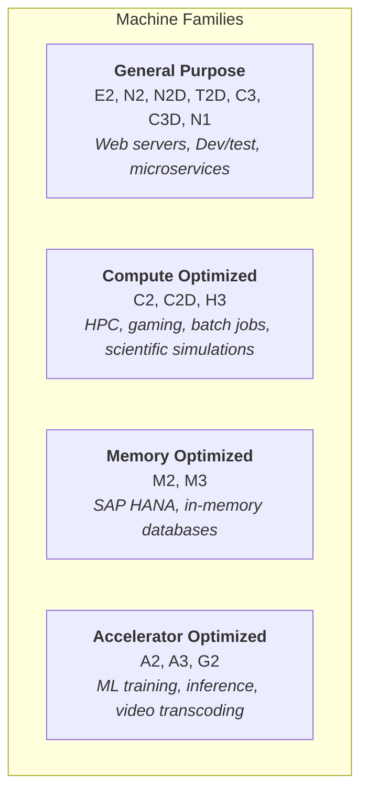
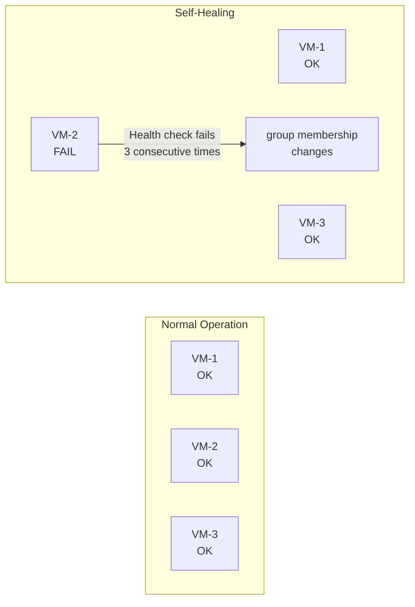
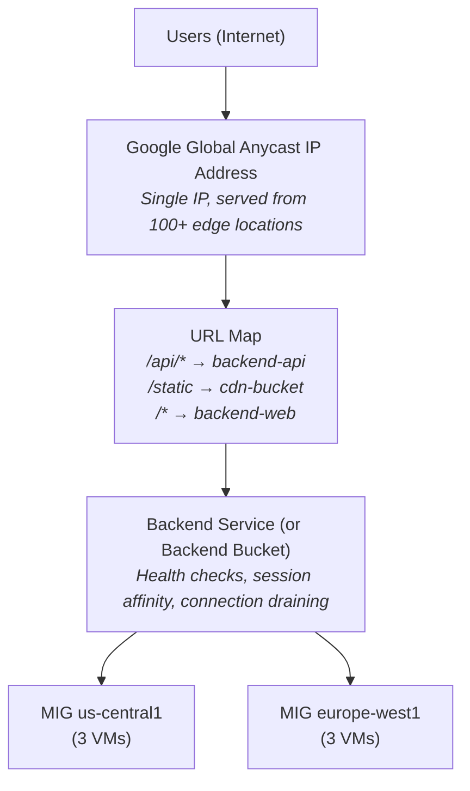
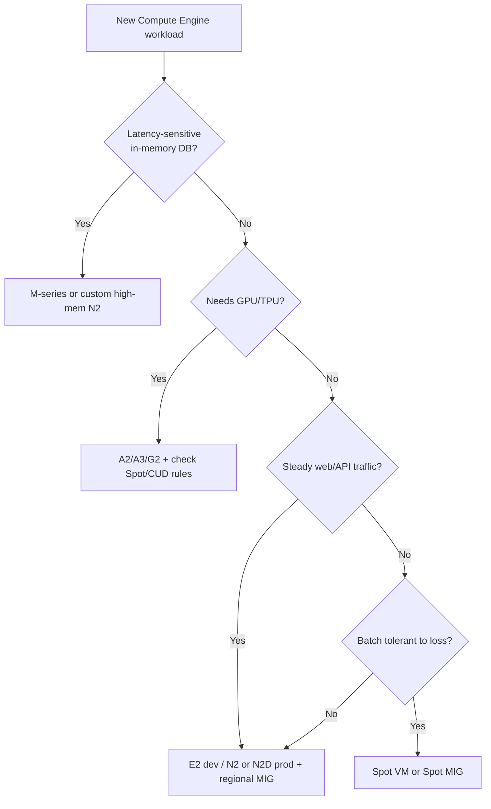

**Complexity**: `[MEDIUM]` | **Time to Complete**: 2.5h | **Prerequisites**: Module 2.2 (VPC Networking). This module assumes a networking baseline and is designed to move you from “single instances” into controlled, production-like compute operations with predictable behavior.

## What You'll Be Able to Do

After completing this module, you will be able to deploy Compute Engine resources with confidence, balance pricing and reliability choices, and apply repeatable OS Login and lifecycle controls at team scale. You will also be able to explain why GCP's automatic sustained-use discounts change FinOps sequencing compared with clouds where reservations are the first lever, and how that interacts with Spot and committed-use paths on the same fleet.

- **Deploy Compute Engine instances with custom machine types, preemptible VMs, and managed instance groups**
- **Configure instance templates and autoscaling policies for self-healing compute clusters on GCP**
- **Implement OS Login and metadata-based SSH key management to secure instance access**
- **Evaluate Compute Engine pricing models (on-demand, committed use, preemptible, Spot) to optimize costs**

---

## Why This Module Matters

Teams that run fixed pools of Compute Engine VMs without autoscaling can be overwhelmed by sudden traffic spikes, turning slow boot times and manual scaling into lost revenue because demand often rises faster than response times. In production, this delay is usually what hurts you: queues grow, error budgets shrink, and users perceive the service as unstable.

**Hypothetical scenario:** A product team launches a regional web API on three hand-built `e2-standard-4` VMs in a single zone. Traffic doubles over a weekend, but nobody changes capacity until Monday. Latency climbs, the database connection pool saturates, and on-call spends hours manually cloning VMs and editing firewall rules. A regional Managed Instance Group behind an external Application Load Balancer would have absorbed the spike by adding replicas in zones that still had capacity, while sustained-use discounts would have quietly reduced the bill for VMs that ran all month—without anyone purchasing a commitment.

This module captures why Compute Engine is more than "just VMs." Choosing the right machine family, configuring instance templates, using Managed Instance Groups with autoscaling, and setting up global load balancing are the difference between an architecture that handles traffic spikes gracefully and one that collapses under load. Compute Engine is a foundational GCP compute service, and understanding it helps you reason about how many Google Cloud workloads are executed.

On GCP, compute cost is a **stack of automatic and deliberate choices**, not a single on-demand rate. Sustained-use discounts apply automatically after roughly 25% of a billing month for eligible series; committed-use discounts trade flexibility for predictable savings on steady cores; Spot VMs trade interruption tolerance for discounts of up to 91% off on-demand pricing for many machine types. That combination is materially different from clouds where you must buy Savings Plans or Reserved Instances to see comparable baseline discounts—here, long-running VMs often get cheaper by simply staying up, which changes how you right-size before you commit.

In this module, you will learn how to select the right machine family for your workload, leverage Spot VMs and committed-use discounts, build golden images with custom images and startup scripts, configure Managed Instance Groups for automatic scaling and self-healing, compare zonal versus regional MIG tradeoffs, and tie everything together with Cloud Load Balancing—while keeping a clear cost lens on what spikes your bill and which knobs pull it back down.

---

## Machine Families: Choosing the Right Hardware

Compute Engine offers several machine families; this module focuses on four common categories for learning purposes. Selecting the wrong family is one of the most common ways to overspend. For real-world planning, hardware choice is about expected throughput, memory pressure, and predictability, so the default response is to align workload shape with the family before you benchmark pricing.

Think of machine families as **hardware menus**, not a single slider labeled "size." Each menu optimizes a different bottleneck: general-purpose balances vCPU and RAM for web and microservices; compute-optimized maximizes per-core performance; memory-optimized maximizes RAM per socket for in-memory engines; accelerator-optimized attaches GPUs for parallel work. The billing system then layers discounts on top—E2 is inexpensive but ineligible for sustained-use discounts on the same terms as N2, while N2 running all month may accrue automatic SUD credits you never asked for. That is why a literal size-for-size comparison with another cloud's "m5" equivalent can mislead you: GCP rewards **duration and series choice**, not just vCPU count.

When you evaluate a family, collect three numbers from a representative week: p95 CPU utilization, p95 memory utilization, and p95 disk IOPS. If CPU is low but memory is pegged, a custom high-memory N2 shape beats jumping to M-series. If CPU is pegged but memory is idle, C3 or a smaller predefined type may win. If both are low, the rightsizing recommender is telling you the truth—downsize before you finance a CUD.

### The Four Families



### [General Purpose: The Workhorse](https://cloud.google.com/compute/docs/general-purpose-machines)

General-purpose series are where most teams should start and often stay. **E2** is the cost leader for dev/test and bursty internal tools: shared-core shapes (`e2-micro` through `e2-medium`) trade CPU burst fairness for hourly savings, while standard E2 sizes scale to 32 vCPUs with a 1:4 vCPU:memory ratio. **N2** and **N2D** are production workhorses on Intel and AMD respectively; they support custom machine types and sustained-use discounts on vCPU and memory, but not every discount stacks with CUD-covered usage. **T2D** targets scale-out fleets that benefit from AMD price-performance. **N1** remains for legacy lift-and-shift only—new designs should default to N2/N2D/E2 unless a dependency forces N1.

| Series | CPU | vCPU:Memory Ratio | Best For | Notes |
| :--- | :--- | :--- | :--- | :--- |
| **E2** | Intel/AMD (automatic) | 1:4 (0.25 to 32 vCPUs) | Cost-sensitive, dev/test | Cheapest, shared-core options (e2-micro: 0.25 vCPU) |
| **N2** | Intel Cascade Lake/Ice Lake | 1:4 (2 to 128 vCPUs) | General production | Good balance; SUD-eligible (~20%), layer CUD on stable baseline |
| **N2D** | AMD EPYC | 1:4 (series-specific limits) | General production workloads | Compare current N2D and N2 pricing in your region |
| **T2D** | AMD EPYC | 1:4 | Scale-out workloads | Evaluate against current workload benchmarks |
| **N1** | Intel Skylake/older | 1:3.75 | Legacy (avoid for new) | Still supported but outdated |

```bash
# Create a general-purpose VM
gcloud compute instances create web-server \
  --machine-type=e2-medium \
  --zone=us-central1-a \
  --image-family=debian-12 \
  --image-project=debian-cloud \
  --boot-disk-size=20GB \
  --boot-disk-type=pd-balanced

# List available machine types in a zone
gcloud compute machine-types list \
  --zones=us-central1-a \
  --filter="name~'^e2'" \
  --format="table(name, guestCpus, memoryMb)"
```

### Custom Machine Types

If predefined machine types do not fit your workload, GCP allows you to specify exact vCPU and memory combinations. You should use custom types when standard shapes overprovision one resource and underdeliver on another, because right-sized resources are the cleanest path to predictable cost and performance. For this reason, always validate limits before creating, and remember these are constrained by the machine series.

```bash
# Custom machine type: 6 vCPUs, 24GB RAM
gcloud compute instances create custom-vm \
  --custom-cpu=6 \
  --custom-memory=24GB \
  --zone=us-central1-a \
  --image-family=debian-12 \
  --image-project=debian-cloud

# Custom with extended memory (more than 8GB per vCPU)
gcloud compute instances create high-mem-vm \
  --custom-cpu=4 \
  --custom-memory=64GB \
  --custom-vm-type=n2 \
  --custom-extensions \
  --zone=us-central1-a \
  --image-family=debian-12 \
  --image-project=debian-cloud
```

Rules for custom machine types exist for a reason: you must stay within series-specific constraints, or provisioning can fail unexpectedly; for this reason, validate vCPU counts and memory boundaries before running any `--custom-cpu` or `--custom-memory` command.

- Allowed vCPU counts depend on the machine series; check the current custom-machine-type limits for the series you selected.
- Allowed memory ranges depend on the machine series, and extended-memory limits are defined per series rather than by one universal GB-per-vCPU rule.
- Extended memory costs more per GB than standard memory.

The `--custom-extensions` flag unlocks extended memory ratios on supported series (commonly N2) when your workload needs more RAM per vCPU than the default shape allows—think large Java heaps or caching layers. That flexibility is not free: extended memory GB pricing is higher, so you should still attempt a predefined highmem shape first. Custom types also affect MIG instance flexibility: wildly exotic shapes may reduce the pool of zones where Google can place replacements during scale-out events.

### Shared-Core Machines

For lightweight workloads that do not need a full vCPU, E2 offers shared-core options. These machines can be excellent for small sidecars, tiny internal APIs, and lightweight Jenkins tasks where latency is forgiving. The practical downside is contention, so if latency variance starts hurting SLOs, move to a dedicated vCPU machine family instead of overloading shared slices.

| Type | vCPUs | Memory | Use Case | Cost (approx vs e2-medium) |
| :--- | :--- | :--- | :--- | :--- |
| `e2-micro` | 0.25 shared | 1 GB | Micro-services, tiny APIs | Lower-cost than `e2-medium` |
| `e2-small` | 0.5 shared | 2 GB | Low-traffic web, dev | Lower-cost than `e2-medium` |
| `e2-medium` | 1 shared | 4 GB | Moderate web, Jenkins agents | Baseline |

### Compute-Optimized, Memory-Optimized, and Accelerator Families

Beyond general-purpose shapes, production platforms routinely land on specialized families when a single dimension—CPU throughput, RAM, or accelerators—dominates the bottleneck. The compute-optimized **C2**, **C2D**, and **H3** series target HPC, gaming backends, and numeric batch jobs where you want high vCPU performance per dollar rather than the widest memory envelope. **C3** and **C3D** are classified as general-purpose in Google Cloud documentation (the `gcloud` CLI may still label C3 "Compute-optimized"—a historical quirk); benchmark them against N2/N2D before assuming an HPC tier. Memory-optimized **M1**, **M2**, and **M3** machines exist for in-memory databases and SAP-scale footprints; Google documents M3 configurations up to very large vCPU and memory counts for workloads that cannot shard cheaply. Accelerator-optimized **A2**, **A3**, and **G2** families attach NVIDIA GPUs for ML training and inference; Spot pricing extends to GPUs, but preemption and maintenance behavior differ from standard VMs, so treat GPU pools as interruption-aware capacity.

| Series | Processor / accelerator | Typical workload | Cost note |
| :--- | :--- | :--- | :--- |
| **C3 / C3D** | Intel / AMD latest gen | General-purpose latency-sensitive APIs, simulation | General-purpose family; compare against N2/N2D in-region; CUDs may apply where SUDs do not |
| **C2 / C2D / H3** | Intel / AMD HPC-oriented | HPC, gaming, numeric batch | Compare against N2/N2D when CPU-bound; CUDs may apply where SUDs do not |
| **M2 / M3** | High memory per vCPU | SAP HANA, large caches | Hourly rates are high—justify with residency needs, not default choice |
| **A2 / A3 / G2** | NVIDIA GPUs | Training, inference, video | Spot can discount GPU hours; live migration not available on Spot |
| **T2D / T2A** | AMD / Arm | Scale-out Linux fleets | Good when software stack is Arm-ready; benchmark before mass migration |

### Custom Machine Types and Sole-Tenant Nodes

Custom machine types let you pick vCPU and memory independently within a series, which is how you stop paying for RAM you never touch or vCPUs that sit idle while memory is pegged. Extended-memory custom shapes cost more per GB above the standard ratio for that series, so the billing signal should push you back toward predefined types when you are only slightly off-size. **Sole-tenant nodes** dedicate physical hosts to your project—useful for license compliance, noisy-neighbor isolation, or colocation-style placement. You pay for the entire node capacity, so sole-tenant is a deliberate premium unless regulation or performance isolation demands it; it is not a default cost-optimization path. Node type names are region-specific—run `gcloud compute sole-tenancy node-types list --zone=ZONE` before creating a group.

```bash
# List sole-tenant node types available in a zone
gcloud compute sole-tenancy node-types list --zone=us-central1-a

# Create a node group (reserves physical capacity)
gcloud compute sole-tenancy node-groups create analytics-hosts \
  --node-type=n2-node-80-640 \
  --node-count=1 \
  --zone=us-central1-a

# Create a VM on that node group
gcloud compute instances create isolated-db \
  --node-group=analytics-hosts \
  --zone=us-central1-a \
  --machine-type=n2-custom-16-65536 \
  --image-family=debian-12 \
  --image-project=debian-cloud
```

---

## Preemptible and Spot VMs: Saving 60-91%

### The Pricing Tiers

GCP offers three pricing tiers for the same hardware, and each tier optimizes a different business outcome. On-Demand gives flexibility and predictable behavior with no interruption risk. CUDs reduce cost for steady, long-running workloads through commitment, while Spot is designed for interruption-tolerant tasks that can take advantage of much lower pricing.

| Tier | Discount vs On-Demand | Max Lifetime | Guarantee | Use Case |
| :--- | :--- | :--- | :--- | :--- |
| **On-Demand** | 0% (baseline) | Unlimited | Will not be preempted | Production, stateful workloads |
| **Committed Use (CUD)** | ~37% (1yr) / ~55% (3yr) for general-purpose | 1 or 3 year term | Will not be preempted | Steady-state production |
| **Spot** | 60-91% | None (no 24h limit) | Can be preempted anytime | Batch, CI/CD, fault-tolerant |
| **Preemptible (legacy)** | 60-91% | 24 hours max | Preempted at 24h, or earlier | Use Spot instead (superset) |

[**Spot VMs** replaced Preemptible VMs as the recommended ephemeral option. They offer the same discount but without the 24-hour maximum lifetime. Both can be preempted at any time with a 30-second warning.](https://cloud.google.com/compute/docs/instances/preemptible)

When architects compare GCP Spot to AWS Spot, the important difference is operational shape, not the headline percent-off. GCP Spot has no legacy 24-hour cap; AWS Spot instances can run until interrupted but with different capacity pools and savings-plan interactions. On GCP, combine Spot MIGs with load balancer-backed services only if your app tier tolerates member loss; frontends should drain connections using connection draining and health checks, while workers should checkpoint. Premium operating systems on Spot still bill licensing rules when stopped—Spot saves compute, not necessarily Windows/SQL license minimums documented in the Spot guide.

```bash
# Create a Spot VM
gcloud compute instances create batch-worker \
  --machine-type=n2-standard-4 \
  --zone=us-central1-a \
  --provisioning-model=SPOT \
  --instance-termination-action=STOP \
  --image-family=debian-12 \
  --image-project=debian-cloud

# termination-action options:
# STOP  - VM is stopped (can be restarted later if capacity available)
# DELETE - VM is deleted (for truly ephemeral workloads)

# Create with preemptible (legacy, avoid for new workloads)
gcloud compute instances create legacy-worker \
  --machine-type=n2-standard-4 \
  --zone=us-central1-a \
  --preemptible \
  --image-family=debian-12 \
  --image-project=debian-cloud
```

### Handling Preemption Gracefully

Spot preemption is a contract, not a surprise outage. Google signals preemption through instance metadata (`preempted=TRUE`) and then begins a shutdown window—historically up to 30 seconds for the ACPI soft-off path, with optional longer notice durations on newer Spot configurations documented in the Spot VM guide. Your job is to **drain work**: flush queues, checkpoint to Cloud Storage, remove the VM from load balancer backends, and exit cleanly. MIGs will recreate Spot VMs when capacity returns, but they will not replay unfinished business logic unless you designed idempotent workers.

Batch systems should shard work into tasks smaller than median time-between-preemptions in your zone, and should use Spot MIGs with `instance-termination-action=DELETE` only when local disk state is disposable. Use `STOP` when you want a chance to restart the same disk identity after preemption if capacity returns—helpful for long downloads or resumable transforms.

```bash
# Inside the VM: check if a preemption notice has been issued
# (the metadata server returns a termination timestamp 30s before preemption)
curl -s "http://metadata.google.internal/computeMetadata/v1/instance/preempted" \
  -H "Metadata-Flavor: Google"

# Create a shutdown script that handles graceful termination
gcloud compute instances create batch-worker \
  --machine-type=n2-standard-4 \
  --zone=us-central1-a \
  --provisioning-model=SPOT \
  --instance-termination-action=STOP \
  --metadata=shutdown-script='#!/bin/bash
    echo "Preemption detected at $(date)" >> /var/log/preemption.log
    # Save checkpoint, flush buffers, deregister from load balancer
    /opt/app/save-checkpoint.sh
    /opt/app/deregister.sh'
```

### Committed Use Discounts (CUDs)

For steady-state production workloads, CUDs offer significant savings without any preemption risk. This model is strongest when you can tolerate a long commitment and can confidently forecast utilization across the relevant machines. If workloads drop unexpectedly, it is still useful to re-evaluate commitments during billing cycles because commitment math changes with team growth.

Resource-based commitments attach to vCPU and memory in a region—you are promising capacity, not a specific VM name. Spend-based commitments discount broader eligible spend on the billing account, which helps heterogeneous fleets but requires finance alignment on what counts toward the commitment. Neither type replaces architecture discipline: if you commit to 200 N2 vCPUs while the fleet migrates to C3, you may pay for unused commitment until the term ends or you sell reshaping options your contract allows.

Operationally, pair CUD purchases with **autoscaling bounds**: commitments cover the baseline; autoscaler handles peaks above baseline on on-demand or Spot. Document that split so engineers do not cap `max-num-replicas` at committed cores during incidents. FinOps hub and billing export show realized savings from CUDs, rightsizing, and idle resource removal—use those reports to justify the next commitment tranche instead of guessing from a spreadsheet.

| Commitment | Duration | Discount |
| :--- | :--- | :--- |
| **Resource-based** | 1 year | Varies by eligible resource and current pricing model |
| **Resource-based** | 3 years | Varies by eligible resource and current pricing model |
| **Spend-based** | 1 year | Varies by billing account model and eligible spend |
| **Spend-based** | 3 years | Varies by billing account model and eligible spend |

```bash
# Purchase a committed use discount (resource-based)
gcloud compute commitments create my-commitment \
  --region=us-central1 \
  --resources=vcpu=100,memory=400GB \
  --plan=36-month \
  --type=GENERAL_PURPOSE

# View existing commitments
gcloud compute commitments list --region=us-central1
```

Sustained Use Discounts (SUDs) apply automatically to eligible machine families---no commitment required. After 25% of monthly use, Google Cloud applies incremental discounts, and the maximum discount depends on the machine series and resource type. This means you can stack behavior-based savings with workload rightsizing, and you should compare SUD and CUD impacts before changing a migration plan.

### GCP Compute Cost Model (and How It Differs from "Buy a Reservation First")

Understanding GCP pricing starts with what happens **without** anyone filing a purchase order. For eligible N1/N2/N2D/C2/M1/M2 vCPU and memory—and some sole-tenant premium components—[sustained-use discounts](https://cloud.google.com/compute/docs/sustained-use-discounts) accrue automatically once a resource runs more than 25% of a billing month. Discounts step at 25%, 50%, 75%, and 100% utilization thresholds, reaching up to **30%** for N1/M1/M2 and up to **20%** for N2/N2D/C2. SUDs do **not** apply to E2, nor to usage already covered by committed-use discounts, which is why FinOps reviews often show E2 for bursty tiers and N2/N2D for always-on cores.

Committed-use discounts (CUDs) are the deliberate mirror image: you commit to vCPU, memory, or spend for one or three years and receive lower rates in exchange for forecast risk. Resource-based CUDs attach to machine families; spend-based CUDs attach to billing-account spend. A common mistake is buying a three-year CUD for a fleet you plan to migrate to a different series next quarter—commitment savings evaporate if the workload moves off eligible SKUs. Spot VMs sit at the opposite end of the flexibility spectrum: [up to 91% off on-demand](https://cloud.google.com/compute/docs/instances/spot) for many machine types, no minimum or maximum runtime (unlike legacy preemptible's 24-hour cap), but preemption can happen anytime with as little as a 30-second shutdown window by default.

| Pricing lever | Who turns it on | Interruption risk | Best when |
| :--- | :--- | :--- | :--- |
| On-demand | Default | None | Unknown shape, short-lived sandboxes |
| SUD (automatic) | Google Cloud after ~25% monthly use | None | Steady VMs on eligible families without CUD |
| CUD (1y / 3y) | You purchase commitment | None if you stay on committed SKUs | Baseline production cores with stable forecasts |
| Spot | `--provisioning-model=SPOT` | Preemption anytime | Batch, CI, stateless workers with checkpoints |

**Cost lens — what spikes unexpectedly:** Autoscaled MIGs growing `max-num-replicas` during an attack or viral event; premium OS licenses still billing when Spot VMs stop; Hyperdisk provisioned IOPS/throughput above baseline; GPUs left attached to stopped VMs; and **orphaned persistent disks** after instance deletes (disk charges continue). **Knobs that pull spend down:** rightsizing via the [VM machine type recommender](https://cloud.google.com/compute/docs/instances/apply-machine-type-recommendations-for-instances), stopping [idle VMs](https://cloud.google.com/compute/docs/instances/idle-vm-recommendations-overview) flagged by Recommender, deleting disks surfaced by the idle disk recommender, moving fault-tolerant tiers to Spot, and layering CUDs only after SUD-eligible baselines are visible in billing export.

```bash
# Inspect rightsizing recommendations (8-day utilization window by default)
gcloud recommender recommendations list \
  --project="${PROJECT_ID}" \
  --location=us-central1 \
  --recommender=google.compute.instance.MachineTypeRecommender

# Inspect idle VM recommendations
gcloud recommender recommendations list \
  --project="${PROJECT_ID}" \
  --location=us-central1 \
  --recommender=google.compute.instance.IdleResourceRecommender
```

**Pause and predict:** You are designing a video rendering pipeline where batch jobs execute continuously for up to 36 hours and cannot resume from intermediate checkpoints if interrupted. Would selecting Spot virtual machines be an appropriate strategy to reduce operational compute expenses for this rendering workload?

<details>
<summary>Check your prediction</summary>

No. Spot VMs can be preempted by Compute Engine at any moment with only a 30-second termination notice whenever capacity is required elsewhere. Because a 36-hour rendering job lacking checkpointing capabilities must restart from the beginning after any interruption, preemption loses all completed computation and wastes time and money.
</details>

Evaluating failure recovery and job durability boundaries is a capacity-planning conversation, not a discount toggle. Once those boundaries are defined, provisioning consistent compute environments requires packaging runtime software into reproducible images.

---

## Custom Images and Image Families

### Why Custom Images Matter

Every time you create a VM from a public image (like `debian-12`), you start with a bare OS. Installing your application, dependencies, and configuration on every new VM wastes time and creates inconsistency. Custom images solve this by baking your software into a reusable image.

The operational win is **time-to-ready**: autoscaling adds capacity during incidents, and boot latency becomes part of your incident budget. Golden images also shrink drift—two VMs created from the same family name should have identical packages, reducing "works on VM-3 only" mysteries. The tradeoff is process: you need a pipeline to rebuild images when CVEs land, deprecate old versions safely, and prove smoke tests before a family pointer moves. Teams that skip this pipeline often panic-patch individual VMs, which MIG self-healing will undo on the next health failure anyway.

Public image families (`debian-12`, `ubuntu-2204-lts`) remain the right boot source for generic Linux; custom families are for **your** software stack. Document which family each environment uses (dev/stage/prod) so Terraform modules do not accidentally point staging at a bleeding-edge builder image.

```bash
# Step 1: Create a VM and configure it
gcloud compute instances create image-builder \
  --machine-type=e2-medium \
  --zone=us-central1-a \
  --image-family=debian-12 \
  --image-project=debian-cloud

# SSH in and install your software
gcloud compute ssh image-builder --zone=us-central1-a
# Inside the VM:
# sudo apt-get update && sudo apt-get install -y nginx nodejs npm
# sudo npm install -g your-app
# sudo systemctl enable nginx
# exit

# Step 2: Stop the VM (required for image creation)
gcloud compute instances stop image-builder --zone=us-central1-a

# Step 3: Create a custom image from the VM's disk
gcloud compute images create my-app-v1-0 \
  --source-disk=image-builder \
  --source-disk-zone=us-central1-a \
  --family=my-app \
  --description="My App v1.0 with nginx and Node.js"

# Step 4: Clean up the builder VM
gcloud compute instances delete image-builder --zone=us-central1-a --quiet
```

### Image Families

[Image families are like a "latest" pointer for your custom images. When you create a new image in a family, it automatically becomes the default.](https://cloud.google.com/compute/docs/images/deprecate-custom) As your teams ship builds, this allows rollout pipelines to reference a stable name and still consume the newest approved artifact.

```bash
# Create new version in the same family
gcloud compute images create my-app-v1-1 \
  --source-disk=image-builder-v2 \
  --source-disk-zone=us-central1-a \
  --family=my-app

# Create a VM using the latest image in the family
gcloud compute instances create web-1 \
  --image-family=my-app \
  --zone=us-central1-a

# List images in a family
gcloud compute images list --filter="family=my-app" \
  --format="table(name, creationTimestamp, status)"

# Roll back: deprecate the latest image, making the previous one current
gcloud compute images deprecate my-app-v1-1 \
  --state=DEPRECATED \
  --replacement=my-app-v1-0
```

**Pause and predict:** You need to apply a critical security patch to an operating system image shared by a fleet of 50 virtual machines managed via image families. What sequence of actions must you take so that every running instance in the fleet executes the patched operating system?

<details>
<summary>Check your prediction</summary>

Bake a new custom image containing the patch and point the image family at it so the new image becomes current. Then execute a rolling replace or recreate on the instance group from an instance template that references the family, because already-running VMs continue running the old OS image until explicitly replaced or recreated.
</details>

Golden-image pipelines still leave room for boot-time configuration that should not be baked into every CVE rebuild. In addition to immutable base operating system images, instances often require dynamic boot-time parameterization to integrate with surrounding cloud environments.

### Startup Scripts, Metadata, and Golden-Image Hygiene

Instance metadata is how Compute Engine injects configuration at boot without rebaking an image for every change. A **startup script** runs on first boot (and on reboot when configured) and is ideal for registering with a config service, formatting data disks, or pulling secrets from Secret Manager. Keep scripts idempotent where possible: MIG recreates and rolling updates will execute them again on fresh VMs. For secrets, prefer workload identity and Secret Manager over long-lived keys in metadata, because metadata is visible to anyone with `compute.instances.get` on the instance.

```bash
# Startup script via metadata on create
gcloud compute instances create app-node \
  --zone=us-central1-a \
  --metadata=startup-script='#!/bin/bash
    set -euo pipefail
    apt-get update && apt-get install -y nginx
    systemctl enable --now nginx' \
  --image-family=debian-12 \
  --image-project=debian-cloud

# View startup-script output when debugging
gcloud compute instances get-serial-port-output app-node --zone=us-central1-a
```

Golden images capture everything that is **slow or risky** to install live (compilers, agents, baseline sysctl). Startup scripts capture everything that should stay **dynamic** (version pins, feature flags). Mixing the two without discipline produces "snowflake" VMs that pass health checks once and fail after the next template rollout.

---

## Instance Templates and Managed Instance Groups

### Instance Templates

An instance template is a blueprint that defines the machine type, image, disks, network, and other settings for a VM. [Templates are **immutable**---to change a setting, you create a new template.](https://cloud.google.com/compute/docs/instance-templates) That immutability is important because every scale or replacement event can use the same known-good definition, which is much easier to audit than manually configured one-off VM launches.

Templates should encode the **non-negotiables**: service account, network tags, shielded options, disk types, and metadata keys your org policy requires. Keep application version drift in image families or startup scripts, not in one-off `gcloud` flags. Version templates in names (`web-template-v3`) so rollbacks are unambiguous in change tickets. When you adopt Spot in a MIG, the template sets `provisioning-model=SPOT` and termination action—every recreated VM inherits the same interruption contract, which is safer than mixing Spot and standard instances in one group.

Disks declared in templates deserve the same scrutiny as machine types: a template that always attaches 500 GB `pd-ssd` will multiply waste across autoscale events. Prefer smaller boot disks plus separately managed data disks when state must persist, and mark ephemeral disks `auto-delete=yes` unless you have a recovery workflow.

```bash
# Create an instance template
gcloud compute instance-templates create web-template-v1 \
  --machine-type=e2-standard-2 \
  --image-family=my-app \
  --boot-disk-size=20GB \
  --boot-disk-type=pd-balanced \
  --network=prod-vpc \
  --subnet=web-tier \
  --region=us-central1 \
  --no-address \
  --service-account=web-sa@my-project.iam.gserviceaccount.com \
  --scopes=cloud-platform \
  --tags=web-server \
  --metadata=startup-script='#!/bin/bash
    systemctl start nginx
    echo "$(hostname) ready" > /var/www/html/health'

# List templates
gcloud compute instance-templates list

# Create a new version (templates are immutable)
gcloud compute instance-templates create web-template-v2 \
  --machine-type=e2-standard-4 \
  --image-family=my-app \
  --boot-disk-size=20GB \
  --boot-disk-type=pd-balanced \
  --network=prod-vpc \
  --subnet=web-tier \
  --region=us-central1 \
  --no-address \
  --service-account=web-sa@my-project.iam.gserviceaccount.com \
  --scopes=cloud-platform
```

### Managed Instance Groups (MIGs)

A MIG is a group of identical VMs created from an instance template. [MIGs provide autoscaling, self-healing, rolling updates, and load balancer integration.](https://cloud.google.com/compute/docs/instance-groups) In practice, the combination of identity by template and lifecycle by controller gives you consistency under scale, because all replacement VMs inherit the same contract.

**Stateful versus stateless** is the line that decides whether a MIG is appropriate. Stateless app tiers—web APIs, workers with external queues—fit MIGs well because replacement means "boot template and join pool." Stateful tiers—single-primary databases, license-bound appliances—need attached disks, failover orchestration, or managed services instead of naive recreate semantics. For stateful data on VMs, use retained disks, startup scripts that mount by device name, and health checks that validate database readiness, not just port open.

**Instance flexibility** (optional advanced feature) lets a regional MIG choose among several machine types in a family to reduce preemption or capacity errors—especially valuable for Spot fleets where Google can shift shapes toward available inventory. You still standardize on a template per software generation; flexibility is about hardware fallback, not about mixing Debian and Ubuntu in one group.

```bash
# Create a regional MIG (recommended: spans all zones in a region)
gcloud compute instance-groups managed create web-mig \
  --template=web-template-v1 \
  --size=3 \
  --region=us-central1 \
  --health-check=web-health-check \
  --initial-delay=120

# Create the health check first
gcloud compute health-checks create http web-health-check \
  --port=80 \
  --request-path=/health \
  --check-interval=10s \
  --timeout=5s \
  --healthy-threshold=2 \
  --unhealthy-threshold=3
```

### Autoscaling

```bash
# Add autoscaling to the MIG
gcloud compute instance-groups managed set-autoscaling web-mig \
  --region=us-central1 \
  --min-num-replicas=2 \
  --max-num-replicas=20 \
  --target-cpu-utilization=0.6 \
  --cool-down-period=120

# Scale based on custom load-balancing request-count metric (Cloud Monitoring)
gcloud compute instance-groups managed set-autoscaling web-mig \
  --region=us-central1 \
  --min-num-replicas=2 \
  --max-num-replicas=20 \
  --custom-metric-utilization=metric=loadbalancing.googleapis.com/https/request_count,utilization-target=1000,utilization-target-type=GAUGE

# View current autoscaling status
gcloud compute instance-groups managed describe web-mig \
  --region=us-central1 \
  --format="yaml(status.autoscaler)"
```

### Rolling Updates

MIGs support zero-downtime updates by gradually replacing instances with a new template. This lets you validate a new software version under live traffic and stop early if rollback conditions appear before all instances change. It is one of the main operational reasons teams rely on MIGs for web services instead of direct instance management.

```bash
# Start a rolling update to the new template
gcloud compute instance-groups managed rolling-action start-update web-mig \
  --version=template=web-template-v2 \
  --region=us-central1 \
  --max-surge=3 \
  --max-unavailable=0

# Canary update: run new template on a subset of instances
gcloud compute instance-groups managed rolling-action start-update web-mig \
  --version=template=web-template-v1 \
  --canary-version=template=web-template-v2,target-size=20% \
  --region=us-central1

# Monitor the update
gcloud compute instance-groups managed describe web-mig \
  --region=us-central1 \
  --format="yaml(status.versionTarget, status.isStable)"

# Roll back (just update back to the old template)
gcloud compute instance-groups managed rolling-action start-update web-mig \
  --version=template=web-template-v1 \
  --region=us-central1
```

| Update Parameter | Description | Recommended |
| :--- | :--- | :--- |
| `--max-surge` | Extra instances during update | 3 or 20% |
| `--max-unavailable` | Instances that can be offline | 0 (zero downtime) |
| `--replacement-method=SUBSTITUTE` | Create new, then delete old | Default (safest) |
| `--replacement-method=RECREATE` | Delete old, then create new | Only when IP must stay |
| `--minimal-action=REPLACE` | Replace entire VM | When image/template changes |
| `--minimal-action=RESTART` | Just restart existing VM | When only metadata changes |

### Regional vs Zonal MIGs

**Pause and predict:** A critical payment API runs inside a zonal Managed Instance Group provisioned exclusively in `us-central1-a`. What happens to the payment API if an unexpected hardware or power failure causes that entire Google Cloud zone to fail?

<details>
<summary>Check your prediction</summary>

A zonal MIG keeps all VMs in one zone, making that entire zone a single blast radius. If `us-central1-a` fails, all API instances in the zone go down simultaneously and the service experiences an immediate full outage. By contrast, a regional MIG spreads instances across multiple zones within the region, ensuring that remaining healthy zones continue serving traffic while the autoscaler provisions replacement VMs.
</details>

Selecting between single-zone and multi-zone deployment boundaries is a product-SLA decision, not a Terraform default. Architectural resilience requires aligning failure domains with client traffic expectations before configuring rolling deployment mechanics.

Tradeoffs matter at update time: regional rolling updates coordinate replacements across zones, which can take longer but preserve zone diversity. Zonal MIGs update faster in one place. For stateful workloads that cannot tolerate multiple live copies, neither MIG shape fixes data gravity—you still need external durable storage and a real failover story.

```bash
# Zonal MIG (single zone — use only with eyes open)
gcloud compute instance-groups managed create batch-zonal \
  --template=web-template-v1 \
  --size=3 \
  --zone=us-central1-a

# Regional MIG (multi-zone — preferred for HA web)
gcloud compute instance-groups managed create web-mig-regional \
  --template=web-template-v1 \
  --size=3 \
  --region=us-central1 \
  --distribution-policy-zones=us-central1-a,us-central1-b,us-central1-f
```

### Autoscaling Signals Beyond CPU

CPU target utilization is the default autoscaling signal because it is universally available, but production systems often scale on **HTTP load**, **custom metrics** exported to Cloud Monitoring, or **schedules** for predictable cron-shaped traffic. Load-based scaling ties replica count to request pressure seen by the load balancer, which tracks user-visible work better than OS CPU alone for I/O-heavy APIs. Scheduled scaling adds replicas before a known event (payroll run, product launch) and sheds them afterward—cheaper than leaving peak capacity running 24/7.

```bash
# Schedule-based scaling: scale out before business hours
gcloud compute instance-groups managed update-autoscaling web-mig \
  --region=us-central1 \
  --set-schedule=scale-up-morning \
  --schedule-cron='30 6 * * Mon-Fri' \
  --schedule-duration-sec=3600 \
  --schedule-time-zone='America/Chicago' \
  --schedule-min-required-replicas=10 \
  --schedule-description='Weekday morning scale-out'
```

### Self-Healing

Self-healing ties instance health to group membership so operators are not paging to babysit a single VM. The diagram below is the control-plane reaction, not a license to snowflake-edit disks.



**Pause and predict:** If an engineer manually connects via SSH to an individual virtual machine managed by an active Managed Instance Group and edits a local configuration file on disk, what will happen to those manual edits if that VM subsequently fails a health check later that day?

<details>
<summary>Check your prediction</summary>

The Managed Instance Group self-healing mechanism automatically deletes the unhealthy VM and creates a fresh replacement instance directly from the baseline instance template. Because the replacement instance boots from the original immutable template and disk image, the manual configuration file edits on the failed VM are permanently destroyed.
</details>

Maintaining configuration consistency across scalable fleets is an observability and template problem, not a one-off SSH session. Declarative infrastructure and immutable deployment pipelines keep every automatically provisioned replacement aligned with the validated production specification.

### Observability: What to Watch in Production

Managed platforms only reduce toil if signals are visible. For MIGs, monitor `instance_group_manager/instance_count`, autoscaler recommended size versus current size, and rolling update progress fields in `describe` output during deploys. For load balancers, alert on backend unhealthy fraction and elevated latency on the backend service—those often precede user-facing outages. For Spot fleets, track preemption rate indirectly via task retry counts and MIG recreate churn.

Logging agents on VMs should ship nginx/app logs to Cloud Logging with `resource.type=gce_instance` labels so you can correlate a bad canary revision with request failures. Uptime checks against the global LB IP validate the path users actually traverse, not just per-VM `/health` on internal IPs. Cost anomalies belong on the same dashboard: sudden vCPU hour spikes often correlate with autoscaler max raised for a launch, while disk spend spikes may be orphaned volumes—not mysterious "Google tax."

---

## Cloud Load Balancing

GCP offers multiple load balancer types, but the most common is the **External Application Load Balancer** (formerly known as the External HTTP(S) Load Balancer). We use this layer for production-like web endpoints because it pairs naturally with MIG-managed targets and provides consistent global request distribution for HTTPS traffic.

The key point is not only scale, but operational velocity: with a shared frontend plus managed backends, most rollout events become routine capacity transitions instead of one-off networking edits.

External Application Load Balancers terminate HTTP(S) close to users via Google's anycast edge, then forward to regional backends you register—usually regional MIGs. That separation matters for cost and reliability: you pay for load balancing and egress on their own curves, while compute autoscaling can react per region. **Connection draining** lets you remove a backend VM without dropping in-flight sessions during rolling updates, which is why MIG updates and LB configuration should be designed together. **Session affinity** can stick users to a VM when your app still has local state, but affinity fights horizontal scale; prefer externalized sessions unless you are mid-migration.

Internal Application Load Balancers cover east-west microservice traffic inside a VPC without exposing services publicly. Network load balancers handle TCP/UDP when you are not in HTTP land—gaming UDP, legacy TLS on TCP, or protocols that do not fit URL maps. Choosing the wrong layer creates expensive glue: do not force non-HTTP protocols through HTTP proxies; do not expose internal-only admin APIs on a global external frontend when an internal LB plus IAP would shrink attack surface.

From a cost angle, load balancers add fixed hourly components plus processing charges depending on rules and traffic. The savings story is indirect: better utilization of fewer, right-sized VMs behind the LB, fewer emergency scale-ups from uneven backends, and fewer incidents that cause human overtime. Pair LB metrics (backend latency, unhealthy host count) with MIG autoscaler signals so you scale on user-visible pain, not CPU alone.

### Load Balancer Types

| Type | Scope | Layer | Protocol | Use Case |
| :--- | :--- | :--- | :--- | :--- |
| **External Application LB** | Global | L7 | HTTP/HTTPS | Public web apps, APIs |
| **Internal Application LB** | Regional | L7 | HTTP/HTTPS | Internal microservices |
| **External Network LB** | Regional | L4 | TCP/UDP | Non-HTTP (gaming, VoIP) |
| **Internal Network LB** | Regional | L4 | TCP/UDP | Internal TCP/UDP services |
| **External Proxy Network LB** | Global | L4 | TCP/SSL | Global TCP with Anycast |

### Architecture of the External Application Load Balancer



### Setting Up a Global Load Balancer

```bash
# Step 1: Reserve a global static IP
gcloud compute addresses create web-lb-ip \
  --ip-version=IPV4 \
  --global

# Step 2: Create a health check for the backend service
gcloud compute health-checks create http web-lb-health \
  --port=80 \
  --request-path=/health

# Step 3: Create a backend service
gcloud compute backend-services create web-backend \
  --protocol=HTTP \
  --port-name=http \
  --health-checks=web-lb-health \
  --global

# Step 4: Add MIG backends to the backend service
gcloud compute backend-services add-backend web-backend \
  --instance-group=web-mig-us \
  --instance-group-region=us-central1 \
  --balancing-mode=UTILIZATION \
  --max-utilization=0.8 \
  --global

gcloud compute backend-services add-backend web-backend \
  --instance-group=web-mig-eu \
  --instance-group-region=europe-west1 \
  --balancing-mode=UTILIZATION \
  --max-utilization=0.8 \
  --global

# Step 5: Create a URL map
gcloud compute url-maps create web-url-map \
  --default-service=web-backend

# Step 6: Create an HTTPS target proxy with a managed SSL certificate
gcloud compute ssl-certificates create web-cert \
  --domains=www.example.com \
  --global

gcloud compute target-https-proxies create web-https-proxy \
  --url-map=web-url-map \
  --ssl-certificates=web-cert

# Step 7: Create a forwarding rule
gcloud compute forwarding-rules create web-https-rule \
  --address=web-lb-ip \
  --global \
  --target-https-proxy=web-https-proxy \
  --ports=443
```

### Named Ports

MIGs communicate port mappings through named ports. The backend service references a name (like "http"), and the MIG maps that name to an actual port number.

```bash
# Set named port on the MIG
gcloud compute instance-groups managed set-named-ports web-mig-us \
  --named-ports=http:80 \
  --region=us-central1

gcloud compute instance-groups managed set-named-ports web-mig-eu \
  --named-ports=http:80 \
  --region=europe-west1
```

---

## Disk Types and Storage

Storage policy should match workload behavior, because disks are not interchangeable once you are in steady production. Logs and backups tolerate latency more than metadata-heavy databases, and that distinction affects whether `pd-balanced` is enough or `pd-ssd` is required. Treat disk selection as part of the same design conversation as machine type, or you may optimize compute and lose at the storage layer.

Persistent disks are **network-attached block devices**: they survive VM stop/start, can be snapshotted for backup, and can be resized in many cases without rebuilding the instance. Local SSDs are **physically colocated** with the host: they deliver lower latency for scratch, shuffle, or cache layers, but data is ephemeral relative to host maintenance and Spot preemption rules. A classic cost mistake is putting terabytes of cold logs on `pd-ssd` because "databases use SSD"—those logs belong on `pd-standard` or Nearline/Archive in Cloud Storage once they age out.

Snapshots and snapshot schedules (shown earlier) are cheap insurance compared to rebuilding data. Remember snapshot storage bills separately; lifecycle policies that delete stale snapshots are part of FinOps hygiene. When you delete a VM but keep disks, you will still see disk line items—Recommender's idle persistent disk insights exist to catch exactly that pattern.

| Disk Type | IOPS (Read) | Throughput | Use Case | Cost |
| :--- | :--- | :--- | :--- | :--- |
| **pd-standard** | 0.75 per GiB | 0.12 MiB/s per GiB | Bulk storage, logs | Lowest |
| **pd-balanced** | 6 per GiB | 0.28 MiB/s per GiB | General purpose | Medium |
| **pd-ssd** | 30 per GiB | 0.48 MiB/s per GiB | Databases, high I/O | Higher |
| **pd-extreme** | Configurable | Configurable | SAP HANA, Oracle DB | Highest |
| **local-ssd** | Varies by machine type and disk count | Varies by machine type and disk count | Temp storage, caches | Depends on the selected VM shape |

```bash
# Create a VM with an additional SSD data disk
gcloud compute instances create db-server \
  --machine-type=n2-standard-8 \
  --zone=us-central1-a \
  --boot-disk-size=20GB \
  --boot-disk-type=pd-balanced \
  --create-disk=name=data-disk,size=200GB,type=pd-ssd,auto-delete=no

# Create a snapshot (backup)
gcloud compute disks snapshot data-disk \
  --zone=us-central1-a \
  --snapshot-names=data-disk-backup-$(date +%Y%m%d)

# Schedule automatic snapshots
gcloud compute resource-policies create snapshot-schedule daily-snapshot \
  --region=us-central1 \
  --max-retention-days=14 \
  --start-time=02:00 \
  --daily-schedule
```

### Hyperdisk and the Next Generation of Block Storage

[Hyperdisk](https://cloud.google.com/compute/docs/disks/hyperdisks) is Google's recommended durable block storage for new Compute Engine workloads that need higher performance than classic Persistent Disk. Types include **Hyperdisk Balanced** (default for most apps), **Hyperdisk Extreme** (highest IOPS for databases), **Hyperdisk Throughput** (bandwidth-heavy analytics), and **Hyperdisk Balanced High Availability** (synchronous replication across two zones in a region). You provision IOPS and throughput explicitly on many Hyperdisk SKUs, which is powerful but also a **cost spike vector**: provisioned performance bills even when the VM is idle, and Hyperdisk is **not eligible for SUDs or resource-based CUDs** per Google's disk pricing docs.

| Storage choice | Durability | Performance control | Cost caution |
| :--- | :--- | :--- | :--- |
| pd-balanced / pd-ssd | Zonal PD | Size-based IOPS curves | Cheaper idle; may bottleneck DBs |
| Hyperdisk Balanced | Zonal/regional options | Provisioned IOPS + throughput | Pay for provisioned caps monthly |
| local-ssd | Ephemeral on host | Lowest latency | Data lost on host maintenance; no Spot live migration |
| Hyperdisk Balanced HA | Cross-zone sync replica | HA within region | ~2× storage cost vs single-zone Balanced |

```bash
# Create a Hyperdisk Balanced data volume (performance defaults scale with size)
gcloud compute disks create orders-db-data \
  --zone=us-central1-a \
  --size=500GB \
  --type=hyperdisk-balanced

gcloud compute instances attach-disk app-db \
  --zone=us-central1-a \
  --disk=orders-db-data
```

Pair disk choice with machine series support: not every machine type accepts every Hyperdisk variant, and very large databases may need **Hyperdisk Extreme** or **pd-extreme** instead of balanced tiers. Right-sizing disks is as important as right-sizing vCPU—Recommender's idle disk insights exist precisely because orphaned volumes are a silent budget leak.

---

## Securing Access: OS Login and SSH Keys

Historically, accessing a Linux VM involved generating an SSH key pair and pasting the public key into the project or instance metadata. This approach does not scale well: when an employee leaves, you must hunt down and remove their keys across all instances. It is exactly this manual cleanup burden that leads to stale keys and access drift as teams and environments grow.

Project-wide SSH keys in metadata also complicate compliance: auditors cannot easily map a key fingerprint to a human identity, and break-glass keys tend to linger for years. OS Login stores keys in an identity-linked profile, rotates them automatically for `gcloud compute ssh` sessions, and respects IAM deny policies. For break-glass, use time-bound IAM grants plus logged IAP sessions instead of shared private keys in a ticket attachment.

[OS Login solves this by linking SSH access to IAM (Identity and Access Management). Instead of managing individual SSH keys, you assign IAM roles (`roles/compute.osLogin` or `roles/compute.osAdminLogin`) to users or groups.](https://cloud.google.com/compute/docs/oslogin/set-up-oslogin)

```bash
# Enable OS Login at the project level
gcloud compute project-info add-metadata \
  --metadata enable-oslogin=TRUE

# Grant OS Login IAM role to a user
gcloud projects add-iam-policy-binding my-project \
  --member="user:alice@example.com" \
  --role="roles/compute.osLogin"
```

When a user connects using `gcloud compute ssh`, GCP automatically generates a short-lived SSH key, pushes it to their OS Login profile, and allows them to log in. When IAM access is removed, future OS Login SSH connections are denied across VMs that use OS Login. For VMs that do not have external IPs, you combine OS Login with [Identity-Aware Proxy (IAP) TCP forwarding](https://cloud.google.com/iap/docs/using-tcp-forwarding) to securely tunnel SSH traffic without exposing ports to the internet.

### Shielded VM, Confidential VM, and Defense in Depth

**Shielded VMs** harden the boot chain with Secure Boot, virtual TPM (vTPM), and integrity monitoring so tampered bootloaders or kernels are detectable before they become persistent compromise. New Debian and many marketplace images ship Shielded-compatible; organizations can enforce Shielded creation via the `compute.requireShieldedVm` org policy. Shielded VM addresses **boot integrity**, not encryption of data while it is being processed in RAM.

**Confidential VMs** add hardware memory encryption so data in use is protected from the hypervisor and other tenants on the host. They target regulated workloads and multi-tenant concerns about insider access to memory. Confidential VMs cannot run on sole-tenant node groups, so you choose isolation model upfront: physical sole-tenancy versus cryptographic confidentiality—not both on the same instance shape.

```bash
# Create a Shielded VM (secure boot + vTPM enabled on supported images)
gcloud compute instances create hardened-api \
  --zone=us-central1-a \
  --image-family=debian-12 \
  --image-project=debian-cloud \
  --shielded-secure-boot \
  --shielded-vtpm \
  --shielded-integrity-monitoring

# Create a Confidential VM (requires supported machine type + image)
gcloud compute instances create conf-worker \
  --zone=us-central1-a \
  --machine-type=n2d-standard-4 \
  --confidential-compute \
  --maintenance-policy=TERMINATE \
  --image-family=debian-12 \
  --image-project=debian-cloud
```

For compliance-heavy platforms, the practical pattern is Shielded + OS Login + no external IP + IAP for admin access, adding Confidential VM only where contracts require encryption-in-use. Each layer adds operational constraints (maintenance policies, supported machine types, disk types), so document which tier each workload class must use before engineers freestyle instance flags.

---

## Patterns & Anti-Patterns

Production Compute Engine designs succeed when templates, MIGs, and load balancers encode assumptions explicitly: stateless VMs, immutable templates, externalized durable state, and interruption-aware batch tiers. Weak designs treat VMs like pets, disable health checks to silence alerts, or buy three-year CUDs before rightsizing—then wonder why spend still climbs.

| Pattern | When to use it | Why it works | Scaling note |
| :--- | :--- | :--- | :--- |
| Template + regional MIG + global LB | Public HTTP APIs needing zone redundancy | Autoscaler adds zones with capacity; LB drains unhealthy backends | Set `min-num-replicas` ≥ 2 per active region |
| Image family + rolling update | Frequent app releases | Canary flags limit blast radius; rollback is template pointer change | Keep old template until error budget recovers |
| Spot worker pool + checkpointing | Batch/CI with restartable work | Up to 91% discount without 24h preemptible cap | Use MIG to recreate Spot VMs; handle metadata preemption signal |
| OS Login + IAP, no external IP | Admin access to private tiers | Access tracks IAM lifecycle, not scattered SSH keys | Firewall allow IAP range only |
| Custom machine type after metrics | Steady CPU/memory mismatch on N2 | Pay for shape you use; avoids oversized predefined types | Revisit when workload changes—rightsizing recommender helps |

| Anti-pattern | What goes wrong | Why teams fall into it | Better alternative |
| :--- | :--- | :--- | :--- |
| Single-zone MIG for revenue APIs | Zone outage = full region down | Zonal MIG tutorials are shorter | Regional MIG + multi-zone distribution policy |
| CUD before rightsizing | Pay for committed wrong size | Finance wants savings now | Run recommender; commit after 30–60 days stable |
| Ignoring SUD on eligible cores | Over-buying CUD coverage | AWS habits don't transfer | Let SUD apply; CUD only on baseline above SUD |
| Manual SSH keys in project metadata | Offboarding misses keys | Quick demo access | OS Login + IAM groups |
| pd-standard boot disk on OLTP DB | Latency spikes under load | Cost table sorted by price | pd-ssd or Hyperdisk Balanced with measured IOPS |
| Spot for jobs without checkpoint | Repeated full restarts | Spot price looks irresistible | Checkpoint to GCS or use standard VMs |

---

## Decision Framework

Use the flows below when choosing machine family, pricing model, and MIG scope. They are not substitutes for benchmarking—they prevent obviously expensive mismatches early.



### Machine family quick matrix

| Signal | Lean toward | Avoid |
| :--- | :--- | :--- |
| Cost-sensitive dev/test | E2 shared-core or `e2-small` | N1 legacy, oversized custom types |
| General production API | N2, N2D, or C3/C3D after benchmark | Defaulting to M-series "just in case" |
| GPU ML training | A3 + Spot if fault-tolerant | Standard VM without GPU quota planning |
| License isolation | Sole-tenant node group | Sole-tenant for every app (cost) |

### Spot vs CUD vs on-demand

| Question | Choose |
| :--- | :--- |
| Can the job restart from checkpoint without SLA breach? | Spot (or Spot MIG) |
| Will vCPU/memory run >25% of month on N2/N2D/C2/M1/M2? | On-demand + automatic SUD first |
| Is baseline core count stable 12+ months? | Add resource-based CUD on that baseline |
| Does preemption break revenue path? | On-demand or CUD, not Spot |

### Regional vs zonal MIG

| Requirement | Regional MIG | Zonal MIG |
| :--- | :--- | :--- |
| Survive single zone failure | Preferred | Poor fit |
| Lowest complexity lab | Acceptable overhead | Fine |
| Stateful single-copy workload | Still need external HA design | May be forced, but plan outage |

### End-to-end platform checklist

Before declaring a Compute Engine slice production-ready, walk this checklist with your team. It ties together patterns, pricing, and security without introducing new tools.

1. **Capacity** — Regional MIG, min replicas ≥ 2, autoscaling signal matches traffic shape (CPU, LB, or schedule), health checks reflect real readiness not just `sshd`.
2. **Cost** — Rightsizing recommender reviewed; idle VM/disk recommendations addressed; Spot only on fault-tolerant tiers; CUD purchased only on measured baseline; SUD-eligible series used for always-on cores where appropriate.
3. **Release** — Instance templates versioned; rolling update with surge and max-unavailable documented; canary percentage defined; rollback is template revert, not SSH surgery.
4. **Data** — Boot vs data disks separated; snapshots scheduled; Hyperdisk provisioned performance matches measured p95; no orphaned disks after deletes.
5. **Access** — OS Login enabled; external IPs removed where possible; IAP path tested; Shielded/Confidential requirements documented per tier.

This checklist is deliberately boring—boring platforms survive traffic spikes without heroics, and FinOps reviews stop being archaeology on mystery disks.

---

## Did You Know?

1. [**GCP's global load balancer uses Anycast routing**, meaning a single IP address is advertised from over 100 Google edge locations worldwide. When a user in Tokyo connects to your load balancer IP, they are routed to the nearest Google edge, which then forwards the request to the closest healthy backend.](https://cloud.google.com/load-balancing/docs/locations) This happens at the network layer---no DNS-based routing tricks needed.

2. [**Spot VMs can save up to 91% compared to on-demand pricing**](https://cloud.google.com/compute/docs/instances/spot). The actual discount varies by machine type and region. For a batch processing job running `n2-standard-16` instances, the gap between on-demand and Spot pricing can materially reduce the monthly bill, but the exact savings depend on region, machine type, and current Spot prices.

3. **Live migration is a GCP superpower that most users never notice**. [When Google needs to perform host maintenance, your VMs are transparently migrated to another physical host with no reboot and typically less than a second of degraded performance.](https://cloud.google.com/compute/docs/instances/live-migration-process) [This is enabled by default on all standard VMs. Preemptible/Spot VMs do not support live migration---they are terminated instead.](https://cloud.google.com/compute/docs/instances/setting-vm-host-options)

4. **You can create a VM with up to 416 vCPUs and 12 TB of memory** using the M2 machine family (`m2-ultramem-416`). These ultra-high-memory machines are designed for SAP HANA, large in-memory databases, and genomics workloads. M3 tops out at lower maximums (128 vCPUs / 4 TB)—check current machine-type limits before sizing.

---

## Common Mistakes

| Mistake | Why It Happens | How to Fix It |
| :--- | :--- | :--- |
| Not using Managed Instance Groups | Individual VMs seem simpler initially | Use MIGs for most production VM workloads; they provide autoscaling and self-healing |
| Setting autoscaler min to 1 | Want to minimize cost | Min should be 2+ for high availability across zones |
| Not configuring health checks | Assumed MIG "just knows" when VMs are unhealthy | Create HTTP health checks with appropriate thresholds |
| Using external IPs on every VM | Easier to SSH directly | Use IAP tunneling; VMs should not have external IPs unless they serve public traffic |
| Ignoring SUD or buying CUD too early | Treating GCP like "reservations first" clouds | Let automatic SUD apply on eligible cores; buy CUD only after rightsizing baseline |
| Choosing pd-standard for databases | It is the cheapest disk type | Use pd-ssd or Hyperdisk with measured IOPS; pd-standard is for throughput-oriented bulk data |
| Not setting shutdown scripts on Spot VMs | Assuming preemption never happens | Implement graceful shutdown; watch `preempted` metadata and use STOP vs DELETE deliberately |
| Using N1 for new workloads | N1 appears first in older material | Default to N2, N2D, or E2; migrate N1 only when required |

---

## Quiz

<details>
<summary>1. Your team is running a batch processing workload that takes 30 hours to complete. A junior engineer suggests using Preemptible VMs to save money. How would you explain to them why Spot VMs are a better choice for this specific scenario?</summary>

Preemptible VMs have a hard limitation: GCP will always terminate them after exactly 24 hours of uptime, regardless of whether there is available capacity in the zone. Spot VMs are the modern successor and remove the 24-hour cap, but **Spot does not guarantee uninterrupted runtime**—GCP can preempt them anytime with as little as a 30-second warning. For a 30-hour batch job that cannot restart from scratch, neither Preemptible nor Spot is appropriate unless the workload checkpoints progress; use on-demand or committed-use capacity instead. Spot suits long jobs **only when they tolerate interruption and resume from checkpoints**; the 24-hour Preemptible limit makes Spot strictly better than legacy Preemptible, not a guarantee of continuous execution.
</details>

<details>
<summary>2. During a high-traffic event, one of the three VMs in your Managed Instance Group (MIG) runs out of memory and starts returning 502 Bad Gateway errors. The MIG is configured with an HTTP health check requiring 3 consecutive failures. Describe the exact sequence of events the MIG and load balancer will trigger to resolve this.</summary>

As soon as the VM fails the health check three consecutive times, the load balancer stops routing new user traffic to that specific VM to prevent further errors. Concurrently, the MIG's self-healing mechanism detects the unhealthy state and forcefully deletes the unresponsive VM. The MIG then automatically provisions a brand new VM using the exact specifications defined in the attached instance template. Once the newly created VM boots up and successfully passes its own health checks, the load balancer resumes sending it user traffic, restoring the group to full capacity without manual intervention.
</details>

<details>
<summary>3. Your company is deploying a mission-critical payment processing API. The architecture review board has rejected your proposal to use a zonal Managed Instance Group (MIG) in us-central1-a. Why is a regional MIG a strictly better choice for this architecture?</summary>

A zonal MIG places all of your VM instances into a single datacenter zone, which creates a single point of failure if that specific facility experiences a power outage or network partition. By contrast, a regional MIG automatically distributes your VMs across multiple independent zones (like us-central1-a, us-central1-b, and us-central1-c) within the same region. This ensures that even if an entire Google Cloud zone goes offline, your application continues to serve traffic from the remaining healthy zones. Furthermore, a regional MIG allows the autoscaler to intelligently provision new instances in whichever zone currently has the most available hardware capacity.
</details>

<details>
<summary>4. You have just built a new instance template containing a major software update. Instead of updating all 100 production VMs at once, you want to test the new version on just 10% of your traffic. How do you execute this safely using a MIG?</summary>

You can achieve this by triggering a rolling update on the MIG using the `--canary-version` flag and specifying the new instance template. By setting the target size to 10%, the MIG will gradually replace only 10 of your existing VMs with the new template, while leaving the other 90 VMs untouched. You can then monitor application logs and error rates for those specific canary instances to ensure the new software is stable under real-world traffic. If everything looks good, you issue a subsequent command to roll out the update to 100%, or simply rollback the 10% if errors spike.
</details>

<details>
<summary>5. You are provisioning a new Compute Engine VM that will host a high-throughput PostgreSQL database. Your colleague suggests using the `pd-standard` disk type because it is the cheapest option. Why is this a poor choice for a database, and what should you choose instead?</summary>

The `pd-standard` persistent disk is backed by standard Hard Disk Drives (HDDs) and offers extremely low IOPS (0.75 per GB), making it suitable only for sequential data like log archives or backups. A database requires random, high-speed read/write operations, and running it on a standard HDD will result in severe I/O bottlenecks and unacceptable latency. For a high-throughput database, you must choose `pd-ssd` or `pd-extreme`, which are backed by Solid State Drives (SSDs) and deliver massively higher IOPS and throughput. While `pd-balanced` offers a middle-ground of performance and cost, `pd-ssd` is strictly recommended for latency-sensitive workloads like enterprise databases.
</details>

<details>
<summary>6. Google Cloud notifies you that the physical host running your primary web server requires emergency hardware maintenance. You are using standard e2-medium VMs, and you panic because you cannot afford any downtime. Why shouldn't you worry, and under what circumstances would this actually cause an outage?</summary>

You shouldn't worry because standard Compute Engine VMs benefit from a feature called live migration, which transparently moves your running VM from the failing physical host to a healthy one. This process happens automatically without rebooting the VM and typically results in less than a second of degraded performance, meaning your users will not notice the event. However, this would cause an outage if you were using Spot VMs, Preemptible VMs, or VMs with attached GPUs. These specific VM types do not support live migration, and would instead be terminated or stopped entirely when Google performs host maintenance.
</details>

<details>
<summary>7. A developer who recently left the company claims they still have SSH access to several production VMs because they manually added their public SSH key to the `~/.ssh/authorized_keys` file on those machines. How could your organization have prevented this by using OS Login?</summary>

When OS Login is enabled at the project level, Compute Engine completely bypasses local SSH key files like `~/.ssh/authorized_keys` and exclusively relies on IAM policies to authorize access. With OS Login, a user's ability to SSH into a VM is directly tied to their Google Cloud identity and IAM roles (like `roles/compute.osLogin`). Once the departed developer's Google Workspace account is suspended or their IAM role is revoked, their SSH access is typically cut off across all VMs in the project. This eliminates the operational nightmare of hunting down and deleting rogue public keys scattered across individual instances.
</details>

<details>
<summary>8. Your FinOps lead sees rising Hyperdisk bills after a database migration, even though query latency improved. The disks show high provisioned IOPS but average observed IOPS stayed flat. What likely happened, and what would you change first?</summary>

Hyperdisk Balanced and Extreme bill for **provisioned** IOPS and throughput caps, not just allocated size. During migration someone probably set provisioned performance generously to de-risk cutover, which is rational for a weekend—but expensive if left in place once steady state returns. Because Hyperdisk does not receive sustained-use or resource-based CUD discounts, those provisioned caps become pure monthly cost until you tune them. First step is compare provisioned versus observed performance in Monitoring, then step down IOPS/throughput to headroom above p95, or revert to pd-ssd if requirements do not justify Hyperdisk. Rightsizing disks is the same discipline as rightsizing machine types: measure, then dial knobs down.
</details>

---

## Hands-On Exercise: Globally Load-Balanced App Across Two Regions

### Objective

Build a production-like architecture with MIGs in two regions behind a global HTTPS load balancer. Use this exercise to connect the concepts from this module: template-driven instances, regional redundancy, autoscaling policy, and endpoint load distribution through a single global IP. The goal is to complete a repeatable rollout that you can adapt into a real environment when your test and verification steps are in place.

As you work, notice how **each layer assumes the one below is boring**: the VPC and firewall rules must allow health check ranges; templates must expose `/health`; MIGs must pass health checks before backends go green; the URL map must point at the correct backend service. A failure at any layer looks like "load balancer broken," but the root cause is often a missing named port or an autoscaler still at zero in one region. That dependency chain is exactly how production platforms are debugged—from the edge inward, not by restarting random VMs.

**Hypothetical scenario:** During Task 5 you see only one hostname in responses despite four healthy backends. Before blaming the load balancer, verify backend balancing mode, named ports, and that each VM returns distinct metadata in its HTML—otherwise you may be caching at a browser or hitting a single zone because firewall rules blocked three subnets.

### Prerequisites

- `gcloud` CLI installed and authenticated
- A GCP project with billing enabled
- A custom VPC with subnets in `us-central1` and `europe-west1`

### Tasks

### Task 1: Create the Network Foundation

<details>
<summary>Solution</summary>

```bash
export PROJECT_ID=$(gcloud config get-value project)
export REGION_US=us-central1
export REGION_EU=europe-west1

# Create custom VPC
gcloud compute networks create web-vpc \
  --subnet-mode=custom \
  --bgp-routing-mode=global

# Create subnets
gcloud compute networks subnets create web-us \
  --network=web-vpc \
  --region=$REGION_US \
  --range=10.10.0.0/24 \
  --enable-private-ip-google-access

gcloud compute networks subnets create web-eu \
  --network=web-vpc \
  --region=$REGION_EU \
  --range=10.11.0.0/24 \
  --enable-private-ip-google-access

# Create firewall rules
gcloud compute firewall-rules create web-vpc-allow-http \
  --network=web-vpc \
  --direction=INGRESS \
  --action=ALLOW \
  --rules=tcp:80 \
  --source-ranges=130.211.0.0/22,35.191.0.0/16 \
  --description="Allow health checks and LB traffic"

gcloud compute firewall-rules create web-vpc-allow-iap \
  --network=web-vpc \
  --direction=INGRESS \
  --action=ALLOW \
  --rules=tcp:22 \
  --source-ranges=35.235.240.0/20
```
</details>

### Task 2: Create an Instance Template

<details>
<summary>Solution</summary>

```bash
# Create instance template (uses startup script to install nginx)
gcloud compute instance-templates create web-template \
  --machine-type=e2-small \
  --image-family=debian-12 \
  --image-project=debian-cloud \
  --boot-disk-size=10GB \
  --boot-disk-type=pd-balanced \
  --network=web-vpc \
  --no-address \
  --metadata=startup-script='#!/bin/bash
    apt-get update
    apt-get install -y nginx
    ZONE=$(curl -s "http://metadata.google.internal/computeMetadata/v1/instance/zone" -H "Metadata-Flavor: Google" | cut -d/ -f4)
    HOSTNAME=$(hostname)
    cat > /var/www/html/index.html <<HTMLEOF
    <h1>Hello from $HOSTNAME</h1>
    <p>Zone: $ZONE</p>
    <p>Served at: $(date)</p>
HTMLEOF
    cat > /var/www/html/health <<HTMLEOF
    OK
HTMLEOF
    systemctl restart nginx'

# Verify
gcloud compute instance-templates describe web-template \
  --format="yaml(properties.machineType, properties.networkInterfaces)"
```
</details>

### Task 3: Create Regional MIGs with Autoscaling

<details>
<summary>Solution</summary>

```bash
# Create health check
gcloud compute health-checks create http web-hc \
  --port=80 \
  --request-path=/health \
  --check-interval=10s \
  --timeout=5s \
  --healthy-threshold=2 \
  --unhealthy-threshold=3

# Create MIG in US
gcloud compute instance-groups managed create web-mig-us \
  --template=web-template \
  --size=2 \
  --region=$REGION_US \
  --health-check=web-hc \
  --initial-delay=120

# Create MIG in EU
gcloud compute instance-groups managed create web-mig-eu \
  --template=web-template \
  --size=2 \
  --region=$REGION_EU \
  --health-check=web-hc \
  --initial-delay=120

# Set named ports
gcloud compute instance-groups managed set-named-ports web-mig-us \
  --named-ports=http:80 --region=$REGION_US

gcloud compute instance-groups managed set-named-ports web-mig-eu \
  --named-ports=http:80 --region=$REGION_EU

# Add autoscaling
for MIG_REGION in $REGION_US $REGION_EU; do
  [ "$MIG_REGION" = "$REGION_US" ] && MIG_NAME="web-mig-us"
  [ "$MIG_REGION" = "$REGION_EU" ] && MIG_NAME="web-mig-eu"

  gcloud compute instance-groups managed set-autoscaling $MIG_NAME \
    --region=$MIG_REGION \
    --min-num-replicas=2 \
    --max-num-replicas=10 \
    --target-cpu-utilization=0.6 \
    --cool-down-period=120
done
```
</details>

### Task 4: Create the Global Load Balancer

<details>
<summary>Solution</summary>

```bash
# Reserve global IP
gcloud compute addresses create web-global-ip --ip-version=IPV4 --global

# Get the IP address
WEB_IP=$(gcloud compute addresses describe web-global-ip --global --format="get(address)")
echo "Load Balancer IP: $WEB_IP"

# Create backend service
gcloud compute backend-services create web-backend-svc \
  --protocol=HTTP \
  --port-name=http \
  --health-checks=web-hc \
  --global

# Add both MIGs as backends
gcloud compute backend-services add-backend web-backend-svc \
  --instance-group=web-mig-us \
  --instance-group-region=$REGION_US \
  --balancing-mode=UTILIZATION \
  --max-utilization=0.8 \
  --global

gcloud compute backend-services add-backend web-backend-svc \
  --instance-group=web-mig-eu \
  --instance-group-region=$REGION_EU \
  --balancing-mode=UTILIZATION \
  --max-utilization=0.8 \
  --global

# Create URL map
gcloud compute url-maps create web-url-map \
  --default-service=web-backend-svc

# Create HTTP target proxy (use HTTPS with cert in production)
gcloud compute target-http-proxies create web-http-proxy \
  --url-map=web-url-map

# Create forwarding rule
gcloud compute forwarding-rules create web-http-rule \
  --address=web-global-ip \
  --global \
  --target-http-proxy=web-http-proxy \
  --ports=80

echo "Load balancer will be available at http://$WEB_IP in 3-5 minutes"
```
</details>

### Task 5: Test and Verify

<details>
<summary>Solution</summary>

```bash
# Wait for backends to become healthy (check every 30 seconds)
echo "Waiting for backends to become healthy..."
while true; do
  STATUS=$(gcloud compute backend-services get-health web-backend-svc --global 2>&1)
  HEALTHY=$(echo "$STATUS" | grep -c "healthState: HEALTHY" || true)
  echo "Healthy backends: $HEALTHY"
  if [ "$HEALTHY" -ge 4 ]; then
    echo "All backends healthy!"
    break
  fi
  sleep 30
done

# Test the load balancer (run multiple times to see different backends)
WEB_IP=$(gcloud compute addresses describe web-global-ip --global --format="get(address)")

for i in $(seq 1 6); do
  echo "--- Request $i ---"
  curl -s http://$WEB_IP
  echo
done

# Check backend health status
gcloud compute backend-services get-health web-backend-svc --global
```
</details>

### Task 6: Clean Up

<details>
<summary>Solution</summary>

```bash
# Delete in reverse order of dependencies
gcloud compute forwarding-rules delete web-http-rule --global --quiet
gcloud compute target-http-proxies delete web-http-proxy --quiet
gcloud compute url-maps delete web-url-map --quiet
gcloud compute backend-services delete web-backend-svc --global --quiet
gcloud compute addresses delete web-global-ip --global --quiet

# Delete MIGs
gcloud compute instance-groups managed delete web-mig-us --region=$REGION_US --quiet
gcloud compute instance-groups managed delete web-mig-eu --region=$REGION_EU --quiet

# Delete health check and template
gcloud compute health-checks delete web-hc --quiet
gcloud compute instance-templates delete web-template --quiet

# Delete firewall rules and network
gcloud compute firewall-rules delete web-vpc-allow-http --quiet
gcloud compute firewall-rules delete web-vpc-allow-iap --quiet
gcloud compute networks subnets delete web-us --region=$REGION_US --quiet
gcloud compute networks subnets delete web-eu --region=$REGION_EU --quiet
gcloud compute networks delete web-vpc --quiet

echo "Cleanup complete."
```
</details>

**Card A: Spot is always the right choice for a 36-hour job that cannot restart from a checkpoint.** A data engineering team provisions a pool of Spot Compute Engine instances to execute monolithic 36-hour batch rendering jobs without implementing intermediate checkpointing. The lead engineer prioritizes maximizing compute cost savings by capturing the steep Spot discount over baseline on-demand rates. The team schedules the non-preemptible rendering pipeline to launch across the spot worker cluster during peak overnight hours.

<details>
<summary>Check your prediction</summary>

Failure layer: uncheckpointed batch execution on volatile compute capacity. Next action: run long uncheckpointed tasks on standard on-demand or committed-use instances, or modify the application architecture to write frequent state checkpoints before migrating workloads to Spot VMs.

</details>

**Card B: Pointing an image family at a patched image automatically patches all running VMs.** A systems administrator bakes a newly patched operating system image containing critical kernel CVE fixes and updates the production image family pointer to reference the new image. The administrator assumes that all fifty currently running virtual machines deployed from that family will receive the kernel updates automatically in place. The operations schedule marks the security remediation milestone as fully resolved upon successful image registration.

<details>
<summary>Check your prediction</summary>

Failure layer: static instance boot disk immutability. Next action: trigger a rolling replace or recreate operation across the Managed Instance Group to cycle running instances through a template referencing the updated image family.

</details>

**Card C: Manual edits on a MIG VM survive a later health-check failure because the disk is still there.** A site reliability engineer responds to an urgent production incident by opening an interactive SSH session to a degraded virtual machine inside a Managed Instance Group and manually editing application configuration files on the root disk. The engineer resolves the immediate issue and leaves the instance in service, assuming the modified disk state persists indefinitely across routine background platform events. The engineer records the ticket as resolved without updating the central instance template.

<details>
<summary>Check your prediction</summary>

Failure layer: automated self-healing recreation of ephemeral group instances. Next action: codify all configuration changes into the instance template or startup script before triggering a coordinated rolling update across the group.

</details>

**Card D: A zonal MIG in one zone is as resilient as a regional MIG for a payment API.** A fintech infrastructure architect deploys a mission-critical payment processing API across a three-node Managed Instance Group restricted entirely to a single compute zone in `us-central1-a`. The architect configures autoscaling and aggressive autohealing policies, assuming the group provides high availability comparable to a regional topology because multiple compute nodes handle requests concurrently. The deployment pipeline proceeds to route production transaction volume to the zonal cluster.

<details>
<summary>Check your prediction</summary>

Failure layer: single-zone physical blast radius vulnerability. Next action: deploy the workload across a regional Managed Instance Group spanning multiple zones, ensuring surviving zones process traffic if one zone experiences an outage.

</details>

**Success Criteria**:

- [ ] Custom VPC with subnets in two regions
- [ ] Instance template configured with startup script
- [ ] MIGs in both regions with health checks and autoscaling
- [ ] Global load balancer distributing traffic to both regions
- [ ] Multiple curl requests show responses from different VMs/zones
- [ ] All resources cleaned up

---

## Next Module

Next up: **[Module 2.4: Cloud Storage (GCS)](../module-2.4-gcs/)** --- Master storage classes, lifecycle management, versioning, signed URLs, and the gsutil/gcloud commands you will use every day.

You now have the vocabulary to read a GCP architecture diagram critically: which tier is stateless behind a MIG, which disks are ephemeral versus durable, whether Spot or CUD economics match the SLA, and whether SSH access is governed by IAM instead of scattered keys. Carry that lens into storage and networking modules—compute choices echo through egress, snapshot, and identity bills long after the VM boots. Revisit this module when you design autoscaling policies or FinOps reviews; the tradeoffs compound quickly at scale, and small template mistakes replicate across every zone in a regional MIG during the next incident, major product launch, or your team's next quarterly cost review.

## Sources

- [cloud.google.com: general purpose machines](https://cloud.google.com/compute/docs/general-purpose-machines) — Google Cloud's general-purpose machine-family documentation is the primary source for these series characteristics.
- [cloud.google.com: pricing](https://cloud.google.com/compute/pricing) — General lesson point for an illustrative rewrite.
- [cloud.google.com: preemptible](https://cloud.google.com/compute/docs/instances/preemptible) — The preemptible VM documentation directly covers the recommendation to use Spot VMs, the 24-hour limit, and the preemption shutdown period.
- [cloud.google.com: deprecate custom](https://cloud.google.com/compute/docs/images/deprecate-custom) — The custom-image deprecation documentation explicitly states that image families point to the most recent active image.
- [cloud.google.com: instance templates](https://cloud.google.com/compute/docs/instance-templates) — The instance template documentation directly states that templates cannot be updated after creation.
- [cloud.google.com: instance groups](https://cloud.google.com/compute/docs/instance-groups) — The MIG overview page lists these core managed-instance-group capabilities.
- [cloud.google.com: locations](https://cloud.google.com/load-balancing/docs/locations) — The load-balancing locations documentation directly describes the single-IP anycast model, 100+ locations, and routing behavior.
- [cloud.google.com: set up oslogin](https://cloud.google.com/compute/docs/oslogin/set-up-oslogin) — The OS Login setup documentation directly covers the required IAM roles and the disabling of metadata-based SSH keys.
- [cloud.google.com: using tcp forwarding](https://cloud.google.com/iap/docs/using-tcp-forwarding) — The IAP TCP forwarding documentation directly states that you can SSH to Linux instances without external IP addresses through IAP.
- [cloud.google.com: spot](https://cloud.google.com/compute/docs/instances/spot) — The Spot VM documentation explicitly states discounts of up to 91% for many resources.
- [cloud.google.com: live migration process](https://cloud.google.com/compute/docs/instances/live-migration-process) — The live migration process documentation directly states that disruption is typically much less than one second.
- [cloud.google.com: setting vm host options](https://cloud.google.com/compute/docs/instances/setting-vm-host-options) — The host maintenance policy documentation is the primary source for default maintenance behavior.
- [Application Load Balancer overview](https://cloud.google.com/load-balancing/docs/application-load-balancer) — This gives the current product model for Google Cloud application load balancers and their global and regional modes.
- [cloud.google.com: sustained use discounts](https://cloud.google.com/compute/docs/sustained-use-discounts) — Documents automatic 25–100% monthly thresholds and up to 30% net SUD on eligible machine families.
- [cloud.google.com: hyperdisks](https://cloud.google.com/compute/docs/disks/hyperdisks) — Hyperdisk types, provisioned performance, and SUD/CUD ineligibility.
- [cloud.google.com: scaling schedules](https://cloud.google.com/compute/docs/autoscaler/scaling-schedules) — Cron-based MIG capacity schedules and `update-autoscaling` flags.
- [cloud.google.com: idle VM recommendations](https://cloud.google.com/compute/docs/instances/idle-vm-recommendations-overview) — How Recommender classifies low CPU/network VMs over 1–14 days.
- [cloud.google.com: machine type recommendations](https://cloud.google.com/compute/docs/instances/apply-machine-type-recommendations-for-instances) — Rightsizing recommender behavior and gcloud apply flow.
- [cloud.google.com: shielded VM](https://cloud.google.com/compute/shielded-vm/docs/shielded-vm) — Secure Boot, vTPM, and integrity monitoring features.
- [cloud.google.com: about confidential VM](https://cloud.google.com/compute/docs/about-confidential-vm) — Encryption-in-use model and operational constraints.
- [cloud.google.com: recommender catalog](https://cloud.google.com/recommender/docs/recommenders) — IDs for idle VM, idle disk, and MIG machine-type recommenders.
