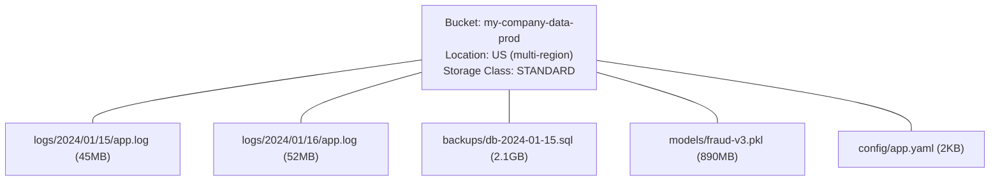
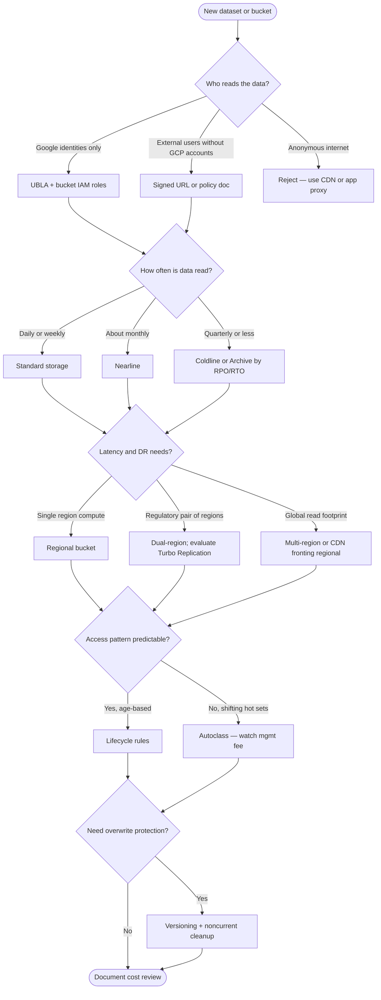

**Complexity**: `[MEDIUM]` | **Time to Complete**: 1.5h | **Prerequisites**: Module 2.1 (IAM & Resource Hierarchy). This module assumes you can read IAM bindings and organization policies; you will apply those concepts directly to bucket design, lifecycle automation, and disaster-recovery placement.

## What You'll Be Able to Do

After completing this module, you will be able to design buckets that balance cost, compliance, and recovery requirements without relying on tribal knowledge about ACLs or storage class marketing names.

- **Configure Cloud Storage buckets with uniform bucket-level access and signed URL policies**
- **Implement lifecycle management rules to automate object transitions across storage classes (Standard, Nearline, Coldline, Archive)**
- **Deploy object versioning and retention policies to protect data from accidental deletion**
- **Design cross-region replication and Turbo Replication strategies for disaster recovery workloads**

---

## Why This Module Matters

Hypothetical scenario: your platform team provisions a shared `logs` bucket in a US multi-region location with Standard storage, versioning disabled, and legacy object ACLs still enabled because an old tutorial said to use `gsutil acl ch`. Six months later, an analytics job lists the entire bucket prefix-by-prefix, egress charges spike, and a mis-typed ACL on one object path makes a quarterly finance export readable without authentication. The incident is not dramatic in headlines, but the recovery work—auditing ACL drift, re-homing data to a regional bucket beside your BigQuery datasets, and retro-fitting lifecycle rules—consumes weeks of engineer time while invoices keep climbing.

Publicly exposed cloud storage buckets have been responsible for some of the largest data breaches in cloud computing history, and the common thread is often the same: cloud storage is trivially easy to use, which makes it trivially easy to misconfigure. Google Cloud Storage is the backbone of almost every GCP architecture. It stores application artifacts, database backups, logs, ML training data, static website assets, and Terraform state files. If you do not understand storage classes, lifecycle policies, versioning, access control, and how replication behaves during regional failures, you will eventually either overspend on storage or leak data publicly.

In this module, you will learn how GCS organizes data, how to choose the right storage class and location type to optimize costs, how lifecycle rules automate data management, how versioning and retention protect against accidental deletion, how signed URLs provide time-limited access without modifying IAM policies, and how dual-region buckets with Turbo Replication fit disaster-recovery designs.

---

## GCS Fundamentals

Cloud Storage is an object store, not a POSIX filesystem. That distinction drives every design choice in this module: you optimize for immutable blobs, prefix-oriented listing, and HTTP-range reads—not for millions of small random writes or directory locking. Managed services across GCP treat GCS as the durable blob layer underneath BigQuery external tables, Vertex AI datasets, Cloud Build artifact registries, and Terraform remote state. When you reason about performance, think in terms of request rates per prefix and throughput per object, because hot prefixes can contend even when aggregate bucket bandwidth looks healthy.

### Buckets and Objects

GCS has a [flat namespace](https://cloud.google.com/storage/docs/folders) despite appearing hierarchical. There are no directories---object names like `logs/2024/01/app.log` are just strings that happen to contain slashes. The console and `gcloud storage` simulate folder-like navigation, but under the hood it is a flat key-value store.



Key rules:
- [**Bucket names are globally unique**](https://cloud.google.com/storage/docs/buckets) across all of GCP (not just your project).
- Bucket names must be 3-63 characters, lowercase letters, numbers, hyphens, and underscores.
- [Object names can be up to 1024 characters and can contain any UTF-8 character](https://cloud.google.com/storage/quotas).
- Maximum object size is 5 TiB.
- There is no limit on the number of objects in a bucket.

```bash
# Create a bucket
gcloud storage buckets create gs://my-company-data-prod \
  --location=US \
  --default-storage-class=STANDARD \
  --uniform-bucket-level-access

# List buckets in a project
gcloud storage ls

# Upload a file
gcloud storage cp local-file.txt gs://my-company-data-prod/uploads/

# Upload a directory recursively
gcloud storage cp -r ./data/ gs://my-company-data-prod/datasets/

# Download a file
gcloud storage cp gs://my-company-data-prod/config/app.yaml ./

# List objects in a bucket
gcloud storage ls gs://my-company-data-prod/

# List with details (size, timestamp)
gcloud storage ls -l gs://my-company-data-prod/logs/

# Delete an object
gcloud storage rm gs://my-company-data-prod/uploads/old-file.txt

# Delete a "directory" (all objects with that prefix)
gcloud storage rm -r gs://my-company-data-prod/temp/
```

Choosing a bucket location is a capacity-planning decision, not a cosmetic label. A regional bucket in `us-central1` minimizes latency and storage cost when your Compute Engine VMs, GKE nodes, and BigQuery jobs already live in that region, because Google Cloud does not charge for data transfer when the consumer and bucket share the same location. A multi-region bucket such as `US` spreads copies across geographically separated places inside the continent, which improves read resilience for global users but bills at higher at-rest rates and can add inter-region replication charges on every write. Dual-region buckets let you pick two specific regions—useful when compliance requires data to exist in both `us-central1` and `us-east1` while still presenting a single bucket name to applications.

Object metadata includes a storage class per object, independent of the bucket default. That means a single bucket can hold hot configuration in Standard storage beside aged log shards in Nearline or Coldline if lifecycle rules or Autoclass move them. Operations pricing also follows the object's class: listing a Coldline bucket costs more per thousand Class B operations than listing Standard storage, which matters when automation walks millions of keys nightly.

### [Bucket Locations](https://cloud.google.com/storage/docs/bucket-locations)

| Location Type | Example | Redundancy | Latency | Cost | Use Case |
| :--- | :--- | :--- | :--- | :--- | :--- |
| **Multi-region** | `US`, `EU`, `ASIA` | Geo-redundant (2+ regions) | Higher | Highest | Global apps, disaster recovery |
| **Dual-region** | `NAM4`, custom | 2 specific regions | Medium | Medium-high | Compliance + availability |
| **Region** | `us-central1` | Within one region | Lowest | Lowest | Co-located with compute, cost-sensitive |

```bash
# Regional bucket (cheapest, co-locate with your VMs)
gcloud storage buckets create gs://my-logs-regional \
  --location=us-central1

# Custom dual-region bucket (compliance + availability)
gcloud storage buckets create gs://my-backups-dual \
  --location=US \
  --placement=us-central1,us-east1 \
  --default-storage-class=NEARLINE

# Multi-region bucket (global access)
gcloud storage buckets create gs://my-static-global \
  --location=US
```

### Turbo Replication

For dual-region buckets used in disaster recovery, standard geo-replication is asynchronous and offers no hard guarantees on replication time. If a regional outage occurs immediately after an upload, the data might not yet be in the second region. **Turbo Replication** provides a [15-minute recovery point objective (RPO) guarantee](https://cloud.google.com/storage/docs/availability-durability), ensuring 100% of newly written objects are replicated across regions within 15 minutes.

```bash
# Create a dual-region bucket with Turbo Replication enabled
gcloud storage buckets create gs://my-critical-dr-bucket \
  --location=US \
  --placement=us-central1,us-east1 \
  --rpo=ASYNC_TURBO
```

For disaster recovery, treat Turbo Replication as an insurance policy on the replication lag window, not as a substitute for application-level backup logic. Standard dual-region replication is asynchronous: Google replicates object data between the paired regions, but there is no published maximum time for every byte to land in the secondary region before a regional outage. Turbo Replication adds a documented [15-minute recovery point objective (RPO)](https://cloud.google.com/storage/docs/availability-durability) for newly written objects in eligible dual-region buckets, which narrows how much data might be missing if you fail over reads to the surviving region immediately after a disaster. You still need runbooks that point applications at the correct endpoint, validate IAM and VPC Service Controls, and test restore procedures—GCS replication does not rewind application state or database transactions.

Pair Turbo Replication with object versioning when operators might delete or overwrite objects during incident response. Versioning keeps prior generations as noncurrent objects, while replication ensures geographically separated copies of the live generation. Lifecycle rules should trim noncurrent versions deliberately; otherwise DR readiness can balloon storage bills after a busy incident weekend.

## Cross-Region Replication and Disaster Recovery

Disaster recovery on GCS is a story about how many copies exist, how quickly new copies appear, and whether applications can read the surviving copy when a region fails. A regional bucket is the simplest topology: one geographic place, lowest storage and operation rates for workloads colocated in that region, and no cross-region replication charge on ingest. The tradeoff is hard: if the region becomes unavailable, the bucket is unavailable until Google restores regional service. Many teams accept regional buckets for replaceable caches but not for irreplaceable backups.

Dual-region buckets store object data in two user-selected regions (for example `us-central1` and `us-east1` via `--placement`). Writes are replicated between them; reads can be served from either region depending on routing and consistency semantics. Google bills [inter-region replication for dual-region and multi-region locations](https://cloud.google.com/storage/pricing) on each gigabyte written, which is a predictable DR cost line item. Dual-region fits compliance patterns that require bytes to exist in two specific states or metros without operating two separate buckets and sync jobs yourself.

Multi-region buckets (`US`, `EU`, `ASIA`) spread data across a defined geographic footprint with higher at-rest pricing than single regions. They help global read-heavy workloads—static sites, consumer downloads—where latency to a nearby copy matters more than minimizing storage dollars. Multi-region is not a free pass on egress: serving bytes from `US` multi-region to compute in `europe-west1` still triggers cross-location network charges unless you add CDN or replicate data closer to consumers.

Turbo Replication upgrades dual-region buckets that need a bounded recovery point objective. Google documents a [fifteen-minute RPO](https://cloud.google.com/storage/docs/availability-durability) for newly written objects when Turbo Replication is enabled, compared with best-effort asynchronous replication without a published worst-case lag. Turbo Replication is not a replacement for versioning, soft delete, or application-consistent database backups; it only addresses object durability across regions. Your runbook should still describe how Kubernetes state, Pub/Sub backlogs, and Cloud SQL failover interact with GCS reads during a region failure.

Operational drills matter as much as checkbox features. Quarterly exercises should include: writing a test object, confirming it appears in both dual-region locations via metadata or event logs, simulating application configuration that points reads at the alternate region, and measuring how long IAM propagation and DNS or endpoint changes take. Pair drills with monitoring on replication backlog metrics where available and with alerts on `storage.googleapis.com` error rates from client libraries.

When RPO requirements exceed what object replication provides—point-in-time database consistency, for example—export data to GCS on a schedule **and** keep transactional recovery inside the database's native backup tools. GCS becomes the durable off-site copy; replication becomes the geographic spread of that copy. Document who is allowed to delete backup prefixes during incidents, because panic deletes have destroyed more restores than regional outages have.

---

**Pause and predict:** Autoclass automatically transitions objects across storage classes without retrieval fees, which makes it tempting to enable everywhere as a default cost-saving feature. In what production scenarios would enabling Autoclass conflict directly with regulatory retention requirements or fail to yield cost savings for high-scale storage buckets?

<details>
<summary>Check your prediction</summary>

Autoclass fights compliance class-locks and still bills management fees on tiny objects that never tier. Specifically, regulatory policies requiring objects to remain in a fixed class such as Nearline for ninety days conflict with Autoclass dynamic shifting, and buckets holding billions of sub-128 KiB objects incur per-object management fees without ever transitioning. In those scenarios, calendar-driven lifecycle rules or explicit class locks provide the auditor-stable path.
</details>

Evaluating access patterns and compliance obligations belongs in the design review before you pick a default storage class. The next section is the class menu itself: duration, retrieval, and what you are billed for if you delete early.

## Storage Classes: Matching Cost to Access Patterns

GCS offers four storage classes. The key insight is that [**cheaper storage has higher retrieval costs and minimum storage durations**](https://cloud.google.com/storage/pricing).

| Storage Class | Monthly Cost (per GB) | Retrieval Cost (per GB) | Min Duration | Availability SLA | Use Case |
| :--- | :--- | :--- | :--- | :--- | :--- |
| **STANDARD** | varies by location | $0.00 | None | [99.95% (multi-region)](https://cloud.google.com/storage/docs/storage-classes) | Frequently accessed data |
| **NEARLINE** | varies by location | $0.01 | 30 days | 99.9% (multi-region) | Monthly access (backups) |
| **COLDLINE** | varies by location | $0.02 | 90 days | 99.9% (multi-region) | Quarterly access (archives) |
| **ARCHIVE** | starts at a very low per-GB monthly rate | $0.05 | 365 days | 99.9% (multi-region) | Yearly access (compliance) |

Pricing varies by location type as well as class. For Iowa (`us-central1`) regional buckets, [Google's published rates](https://cloud.google.com/storage/pricing) illustrate the tradeoff: Standard storage is roughly $0.020 per gibibyte-month, Nearline about half that, Coldline roughly one quarter, and Archive an order of magnitude lower still—before retrieval and operation charges. Multi-region `US` Standard storage runs higher (on the order of $0.026 per gibibyte-month in the same pricing table) because you pay for geographic redundancy at rest. Dual-region buckets bill both underlying regions, so a NAM4 Standard object effectively accumulates storage cost in each paired region. Use the pricing calculator with your real access pattern instead of picking Archive because the per-GB number looks smallest on a spreadsheet.

Retrieval fees apply whenever you read, copy, move, or rewrite data in Nearline, Coldline, or Archive storage: [$0.01, $0.02, and $0.05 per gibibyte respectively](https://cloud.google.com/storage/pricing) at the time of this writing, in addition to Class B operation charges and any egress. Standard storage has no retrieval surcharge, which is why a "cheap" archival class becomes expensive if analysts query it weekly. Autoclass removes retrieval fees for automatic tier transitions inside an Autoclass-enabled bucket, but enabling Autoclass can trigger a one-time enablement charge that rewrites existing objects and may bill early-deletion or retrieval for objects that have not met minimum duration—plan enablement during a maintenance window.

**Critical concept**: The minimum storage duration means you are **billed for the full period** even if you delete the object early. If you upload a file to COLDLINE and delete it after 10 days, you are still charged for the remaining 80 days of storage as an early deletion fee.

```bash
# Set storage class per object during upload
gcloud storage cp archive.tar.gz gs://my-bucket/ \
  --storage-class=COLDLINE

# Change the default storage class of a bucket
gcloud storage buckets update gs://my-bucket \
  --default-storage-class=NEARLINE

# View the storage class of objects
gcloud storage ls -L gs://my-bucket/archive.tar.gz 2>&1 | grep "Storage class"
```

### Autoclass

[Autoclass automatically moves objects between storage classes based on access patterns](https://cloud.google.com/storage/docs/autoclass). It eliminates the need to manually manage lifecycle rules for class transitions.

```bash
# Enable Autoclass on a new bucket (default terminal class is Nearline)
gcloud storage buckets create gs://my-smart-bucket \
  --location=us-central1 \
  --enable-autoclass

# Optional: Archive as the terminal class (Coldline is then an intermediate)
gcloud storage buckets create gs://my-archive-terminal-bucket \
  --location=us-central1 \
  --enable-autoclass \
  --autoclass-terminal-storage-class=ARCHIVE

# Enable Autoclass on an existing bucket
gcloud storage buckets update gs://existing-bucket \
  --enable-autoclass
```

With Autoclass enabled:
- All objects start as STANDARD.
- After 30 days without access, they move to NEARLINE.
- By default, Nearline is the [terminal storage class](https://cloud.google.com/storage/docs/autoclass): objects stay in Nearline until they are accessed, then return to Standard. The only configurable terminals are Nearline and Archive; `--autoclass-terminal-storage-class` does not accept Coldline.
- If you set `--autoclass-terminal-storage-class=ARCHIVE`, unused objects continue colder: 90 days without access moves them to Coldline, and 365 days without access moves them to Archive.
- If accessed again, they automatically move back to STANDARD.
- [No retrieval fees apply when Autoclass moves objects between classes.](https://cloud.google.com/storage/pricing)

Autoclass also carries a management fee of [$0.0025 per 1,000 objects per 30-day period](https://cloud.google.com/storage/pricing) for objects at least 128 KiB that Autoclass manages, prorated to the millisecond. Buckets with billions of tiny files may see fees dominate savings unless objects are large enough to benefit from tiering. Objects smaller than 128 KiB are not managed and stay on Standard pricing. When access is genuinely unpredictable—ML feature stores, ad-hoc science lakes—Autoclass often beats hand-tuned lifecycle rules because it reacts to reads rather than calendar age. GCS [rejects combining Autoclass with lifecycle `SetStorageClass` or `matchesStorageClass`](https://cloud.google.com/storage/docs/autoclass); those requests fail, so a compliance clock belongs on delete/age rules after Autoclass is off, not as a class-transition overlay. When you must keep objects in Nearline for a compliance clock regardless of access, disable Autoclass and encode the duration in lifecycle conditions instead.

Location type and class interact with availability SLAs documented in the [storage classes guide](https://cloud.google.com/storage/docs/storage-classes): Standard multi-region and dual-region targets 99.95% monthly availability SLA, while regional Standard targets 99.9%. Nearline and Coldline drop to 99.0% SLA in a single region. Architectures that need five-nines read latency for a global user base might justify multi-region Standard; batch analytics landing zones in one region should not pay the multi-region premium unless regulatory geography demands it.

---

**Pause and predict:** A bucket has object versioning enabled and a lifecycle rule configured to delete objects older than thirty days. Five days ago, an engineer overwrote an existing forty-day-old configuration object with a new version. What happens to both the newly uploaded object and the older version during subsequent lifecycle evaluations?

<details>
<summary>Check your prediction</summary>

The live generation is five days old, so the age-based delete rule does not remove it. Meanwhile, the prior generation becomes noncurrent and remains billable until a separate lifecycle rule targeting `isLive: false` or `daysSinceNoncurrentTime` explicitly cleans it up. Without a dedicated noncurrent version rule, superseded object versions accumulate indefinitely and continue generating storage charges.
</details>

Reasoning through object state lifecycles is how you keep invoices from surprising you after a tidy-looking delete rule. Declarative lifecycle policies are the next control: predicates, actions, and how GCS evaluates them without a cron job in your cluster.

## Lifecycle Management

[Lifecycle rules automate actions on objects based on age, storage class, versioning status, or other conditions.](https://cloud.google.com/storage/docs/lifecycle) This is how you prevent storage costs from growing unbounded. Think of lifecycle configuration as declarative operations scheduling: you describe predicates (how old, which class, whether the object is the live generation) and actions (delete, transition class), and GCS evaluates them continuously without a cron job in your cluster.

Lifecycle conditions include `age` (days since creation), `createdBefore` (absolute date), `matchesStorageClass`, `isLive` (current versus noncurrent version), `numNewerVersions`, and `daysSinceNoncurrentTime`. Combining `isLive: false` with `numNewerVersions` is the standard pattern to cap version history without touching the current object. Combining `age` with `matchesStorageClass` lets you tier only Standard objects while leaving already-cold objects untouched. Object Lifecycle Management transitions do not trigger early-deletion fees the way a manual rewrite or delete would, which is why lifecycle is the preferred tool for class changes on archival tiers.

```bash
# Set lifecycle rules using a JSON file
cat > /tmp/lifecycle.json << 'EOF'
{
  "rule": [
    {
      "action": {"type": "Delete"},
      "condition": {
        "age": 365,
        "matchesStorageClass": ["STANDARD"]
      }
    },
    {
      "action": {
        "type": "SetStorageClass",
        "storageClass": "NEARLINE"
      },
      "condition": {
        "age": 30,
        "matchesStorageClass": ["STANDARD"]
      }
    },
    {
      "action": {
        "type": "SetStorageClass",
        "storageClass": "COLDLINE"
      },
      "condition": {
        "age": 90,
        "matchesStorageClass": ["NEARLINE"]
      }
    },
    {
      "action": {"type": "Delete"},
      "condition": {
        "isLive": false,
        "numNewerVersions": 3
      }
    }
  ]
}
EOF

gcloud storage buckets update gs://my-bucket \
  --lifecycle-file=/tmp/lifecycle.json

# View lifecycle rules
gcloud storage buckets describe gs://my-bucket \
  --format="json(lifecycle)"

# Remove lifecycle rules
gcloud storage buckets update gs://my-bucket \
  --clear-lifecycle
```

### Common Lifecycle Patterns

| Pattern | Rule | Why |
| :--- | :--- | :--- |
| **Log rotation** | Delete STANDARD objects older than 90 days | Logs lose value after analysis |
| **Backup tiering** | STANDARD → NEARLINE at 30 days → COLDLINE at 90 days | Reduce cost as backups age |
| **Version cleanup** | Delete non-current versions after 3 newer versions exist | Prevent version sprawl |
| **Compliance archive** | Move to ARCHIVE at 365 days, delete at 2555 days (7 years) | Meet regulatory retention |
| **Temp file cleanup** | Delete objects with prefix `tmp/` older than 1 day | Clean up temporary uploads |

Lifecycle rules can also use `createdBefore` to grandfather objects during migrations, or `matchesPrefix` / `matchesSuffix` when only certain key patterns should age. Custom time fields on objects (when set) enable application-defined clocks separate from upload time, which helps when data arrives late but should expire based on business dates. Not every condition combines cleanly: test JSON in lower environments because invalid rule sets are rejected at write time, but subtle logic errors only show up when monthly bills arrive.

Validating lifecycle rules in pre-production environments ensures that automated management policies behave predictably across complex multi-version storage workloads. Infrastructure teams should model multifaceted rule interactions in sandbox buckets using simulated version churn and explicit expiration testing before attaching automated lifecycle policies to production Terraform state buckets or customer data repositories.

At moderate scale—say tens of terabytes with daily ingest—lifecycle mistakes show up in the invoice before they show up in monitoring. Transitioning millions of small Standard objects to Nearline saves storage rate but bills a Class A operation per transition at the destination class rate, which can dominate if objects are only a few kilobytes each. Deleting noncurrent versions saves storage but is irreversible unless soft delete or holds apply. Inventory reports and Storage Insights datasets help you simulate rule impact without listing every object interactively.

---

## Object Versioning

Versioning keeps a history of every change to every object. When you overwrite or delete an object, [the previous version is preserved as a "non-current" version](https://cloud.google.com/storage/docs/object-versioning).

```bash
# Enable versioning on a bucket
gcloud storage buckets update gs://my-bucket \
  --versioning

# Upload a file (creates version 1)
echo "version 1" | gcloud storage cp - gs://my-bucket/config.yaml

# Upload again (creates version 2; version 1 becomes non-current)
echo "version 2" | gcloud storage cp - gs://my-bucket/config.yaml

# List all versions of an object
gcloud storage ls -a gs://my-bucket/config.yaml

# Restore a previous version (copy it back as the current version)
gcloud storage cp gs://my-bucket/config.yaml#GENERATION_NUMBER \
  gs://my-bucket/config.yaml

# Delete a specific version
gcloud storage rm gs://my-bucket/config.yaml#GENERATION_NUMBER

# Disable versioning (existing versions are kept)
gcloud storage buckets update gs://my-bucket \
  --no-versioning
```

**War Story**: Accidental large-scale deletion is much easier to recover from when Object Versioning is enabled, because deleted live objects become noncurrent versions that can be restored.

Versioning changes delete semantics in ways operators forget during incidents. A `gcloud storage rm` on the live object does not purge historical bytes immediately; it creates a delete marker or leaves older generations addressable by generation ID until lifecycle rules or explicit version deletes remove them. Restores are copies: you promote a generation back to live by copying `object#generation` onto `object`, which bills another storage object if the data is large. For configuration files the operation is cheap; for multi-terabyte exports it can double storage until lifecycle catches up. Pair versioning with `numNewerVersions` cleanup so you keep the last N generations, not every overwrite since the bucket was created.

Soft delete (when enabled on the bucket) adds another retention window before permanent removal; restores from soft delete bill as Standard operations. Read the [object versioning documentation](https://cloud.google.com/storage/docs/object-versioning) for interaction between versioning, lifecycle `isLive` conditions, and soft delete before enabling all three on the same production bucket.

### [Object Holds and Retention](https://cloud.google.com/storage/docs/using-bucket-lock)

For compliance use cases, you can lock objects to prevent deletion. A **retention policy** on the bucket sets a minimum time objects must remain stored; **temporary holds** pause deletion for individual objects during investigations; **event-based holds** tie retention to events you clear manually. **Bucket lock** makes a retention policy immutable—Google documents that [locked policies cannot be removed or shortened](https://cloud.google.com/storage/docs/using-bucket-lock), which is powerful for WORM-style regulatory archives but terrifying if you lock the wrong duration. Run retention changes through change control with explicit unlock procedures for holds, not for locked policies.

```bash
# Set a retention policy (objects cannot be deleted for 90 days)
gcloud storage buckets update gs://my-compliance-bucket \
  --retention-period=90d

# Lock the retention policy (IRREVERSIBLE - cannot be shortened after locking)
gcloud storage buckets update gs://my-compliance-bucket \
  --lock-retention-policy

# Place a temporary hold on a specific object
gcloud storage objects update gs://my-bucket/evidence.pdf \
  --temporary-hold

# Remove the temporary hold
gcloud storage objects update gs://my-bucket/evidence.pdf \
  --no-temporary-hold
```

---

**Pause and predict:** A financial platform stores customer PDF invoices in a shared storage bucket where uniform bucket-level access is enforced. Because per-object ACLs are disabled under uniform access, how should an architecture securely isolate access so that one hundred external clients can view only their own invoices?

<details>
<summary>Check your prediction</summary>

Split buckets per tenant with dedicated bucket-level IAM policies, configure IAM Conditions matching object name prefixes with audited service accounts, or keep objects private and serve them through an application that mints per-user signed URLs after identity authentication. Production architectures rely on centralized IAM and application authorization boundaries rather than legacy per-object ACLs.
</details>

Architecting multi-tenant object access is an identity-boundary problem, not a console toggle. The next section is how IAM, legacy ACLs, and request-time tokens actually compose on a download path.

## Access Control: IAM vs ACLs

Access control on GCS spans three layers practitioners routinely confuse: Cloud IAM at the project or bucket level, legacy object ACLs when uniform bucket-level access is off, and signed URLs or OAuth tokens presented at request time. Security reviews should trace a download path end-to-end: which principal is authenticated, which policy grants `storage.objects.get`, whether Public Access Prevention would block `allUsers`, and whether VPC Service Controls perimeter policies require restricted Google APIs access. A bucket that looks private in the console can still leak if an object ACL or signed URL circulates outside your ticket system.

Service accounts should receive the narrowest role that satisfies automation: `roles/storage.objectCreator` for append-only log sinks, `roles/storage.objectViewer` for read-only analytics, `roles/storage.objectAdmin` only when applications must overwrite or delete user content. Human administrators belong in `roles/storage.admin` sparingly via break-glass groups. When workloads in GKE or Cloud Run access GCS, bind IAM to the workload identity service account, not to downloaded JSON keys, because keys rotation does not survive image rebuilds.

### Uniform Bucket-Level Access (Recommended)

[Uniform bucket-level access means that all access control is managed exclusively through IAM.](https://cloud.google.com/storage/docs/uniform-bucket-level-access) Object-level ACLs are disabled. This is the recommended mode because it simplifies auditing and eliminates the confusion of having two access control systems.

```bash
# Enable uniform bucket-level access (recommended for all new buckets)
gcloud storage buckets update gs://my-bucket \
  --uniform-bucket-level-access

# Grant a group read access to all objects in the bucket
gcloud storage buckets add-iam-policy-binding gs://my-bucket \
  --member="group:data-analysts@example.com" \
  --role="roles/storage.objectViewer"

# Grant a service account write access
gcloud storage buckets add-iam-policy-binding gs://my-bucket \
  --member="serviceAccount:data-pipeline@my-project.iam.gserviceaccount.com" \
  --role="roles/storage.objectCreator"

# View bucket IAM policy
gcloud storage buckets get-iam-policy gs://my-bucket
```

Uniform bucket-level access (UBLA) disables object ACLs so IAM policies on the bucket and project become the only authorization path. Google [recommends UBLA for essentially all new buckets](https://cloud.google.com/storage/docs/uniform-bucket-level-access) because dual systems—IAM plus per-object ACLs—create audit gaps: a bucket IAM policy can deny `allUsers` while a forgotten object ACL still grants `allUsers:READ`. Enabling UBLA is reversible for 90 days; after 90 consecutive days with UBLA enabled, you can no longer revert to fine-grained ACLs. Migration plans should inventory ACL overrides with `gcloud storage objects get-iam-policy` or Storage Insights before flipping the flag in production.

Fine-grained access (legacy ACL mode) still appears in older modules and third-party tools. ACLs can grant `READER` on one object without exposing siblings, which sounds attractive for multi-tenant invoice buckets, but at scale you cannot reason about effective access from IAM alone. The supported pattern for per-tenant isolation is separate buckets or prefixes with IAM Conditions on resource names, plus signed URLs for unauthenticated downloaders—not object ACL sprawl.

### [Common Storage IAM Roles](https://cloud.google.com/storage/docs/access-control/iam-roles)

| Role | Permissions | Typical User |
| :--- | :--- | :--- |
| `roles/storage.objectViewer` | Read objects, list objects | Analysts, read-only services |
| `roles/storage.objectCreator` | Create objects (cannot overwrite or delete) | Upload-only pipelines |
| `roles/storage.objectAdmin` | Full control over objects | Application service accounts |
| `roles/storage.admin` | Full control over buckets and objects | Platform engineers |
| `roles/storage.legacyBucketReader` | List bucket contents | Legacy compatibility |

### [Preventing Public Access](https://cloud.google.com/storage/docs/public-access-prevention)

```bash
# Set organization policy to prevent public access on ALL buckets
# (recommended as an org-wide guardrail)
gcloud org-policies set-policy /tmp/prevent-public.yaml --organization=ORG_ID

# /tmp/prevent-public.yaml:
# name: organizations/ORG_ID/policies/constraints/storage.publicAccessPrevention
# spec:
#   rules:
#   - enforce: true

# Check if a specific bucket is publicly accessible
gcloud storage buckets get-iam-policy gs://my-bucket \
  --format=json | grep -E "allUsers|allAuthenticatedUsers"
```

---

**Pause and predict:** A web application generates a signed URL with a fifteen-minute expiration window to allow a client browser to upload a fifty-gigabyte video file directly to a Cloud Storage bucket. What potential failure mode will this transfer encounter over a standard broadband internet connection, and how can the design avoid it?

<details>
<summary>Check your prediction</summary>

V4 signature TTL is a strict wall-clock expiration window rather than a measure of transfer progress, so the upload will fail if all bytes are not completely received before the URL expires. To resolve this, generate the signed URL with a longer TTL accommodating worst-case network bandwidth, implement resumable uploads that negotiate session URIs, or proxy the upload through an internal application service authenticated via a service account.
</details>

Designing robust direct-to-object ingestion pipelines is a client-and-bandwidth problem before it is a signing-flags problem. The next section is how signed URLs are minted, rotated, and treated as an API contract.

## Signed URLs: Time-Limited Access

Signed URLs allow you to [grant temporary access to a specific object without modifying IAM policies](https://cloud.google.com/storage/docs/access-control/signed-urls). They are ideal for sharing files with external users or providing download links in web applications. The signing process uses a service account or user credential to hash canonical request metadata; GCS validates the signature before executing the verb. Rotating the underlying key invalidates outstanding URLs, which is good for incident response but bad if mobile apps cache links for days—operational teams should treat URL TTL as part of the API contract.

Impersonation-based signing (`--impersonate-service-account`) avoids long-lived key files on developer laptops. The impersonator needs `roles/iam.serviceAccountTokenCreator` on the signer service account, and the signer needs appropriate bucket IAM. In CI pipelines, use Workload Identity Federation where possible instead of exporting keys to GitHub Actions secrets; when keys are unavoidable, store them in Secret Manager and mount briefly at runtime.

```bash
# Generate a signed URL valid for 1 hour
# (requires a service account key file or impersonation)
gcloud storage sign-url gs://my-bucket/report.pdf \
  --duration=1h \
  --private-key-file=KEY.json

# Generate a signed URL using service account impersonation (no key needed)
gcloud storage sign-url gs://my-bucket/report.pdf \
  --duration=1h \
  --impersonate-service-account=signer@my-project.iam.gserviceaccount.com

# Generate a signed URL for uploading (PUT)
gcloud storage sign-url gs://my-bucket/uploads/incoming.csv \
  --duration=30m \
  --http-verb=PUT
```

### Using Signed URLs in Applications

```python
# Python example: Generate a signed URL programmatically
from google.cloud import storage
import datetime

def generate_signed_url(bucket_name, blob_name, expiration_minutes=60):
    """Generate a signed URL for downloading an object."""
    client = storage.Client()
    bucket = client.bucket(bucket_name)
    blob = bucket.blob(blob_name)

    url = blob.generate_signed_url(
        version="v4",
        expiration=datetime.timedelta(minutes=expiration_minutes),
        method="GET",
    )
    return url

# Usage
url = generate_signed_url("my-bucket", "report.pdf", expiration_minutes=30)
print(f"Download URL (valid for 30 minutes): {url}")
```

### Signed URLs vs Signed Policy Documents

HTML form uploads directly to GCS often use POST policies so the browser never sees service account keys. The policy document encodes maximum upload size, required `Content-Type`, and key prefix patterns; the browser includes the policy and signature as form fields. Signed URLs instead target one object and one HTTP verb, which is simpler for mobile apps that download a single report. Security reviews should verify that policy documents cannot be replayed across tenants by reusing the same prefix pattern for different customers without including a user-specific path segment.

| Feature | Signed URL | Signed Policy Document |
| :--- | :--- | :--- |
| **Purpose** | Download or upload a specific object | Upload with constraints (size, type) |
| **Max duration** | 7 days (V4 signing) | 7 days |
| **Use case** | Share a file, programmatic downloads | HTML form uploads |
| **Object specific** | Yes (one URL per object) | Can allow any object name matching conditions |

[V4 signed URLs](https://cloud.google.com/storage/docs/access-control/signed-urls) can authorize specific HTTP verbs (GET, PUT, DELETE) for up to seven days when using Google-managed keys or service account keys. The signature covers headers and query parameters, so tampering invalidates the request. Important operational detail: the clock starts when the URL is minted, not when the client finishes a long upload—very large uploads should use resumable uploads with a comfortably long expiration or a server-side proxy that streams through a trusted identity instead of a single short signed PUT.

Signed policy documents shine when browsers POST form uploads directly to GCS with constraints on content length and content type. Signed URLs shine when backend services hand one-off download links to mobile clients. Neither replaces IAM for service-to-service traffic inside GCP: Cloud Run, GKE, and Dataflow should use workload identity and bucket IAM bindings because URLs cannot be rotated centrally and leak via logs if mishandled.

Choose IAM grants when the caller has a Google identity (user, group, service account) and the access pattern is long-lived. Choose signed URLs when external users without Google accounts need object-scoped, time-bounded access. Choose signed policy documents when you need HTML form uploads with field constraints. If Public Access Prevention is enforced at the organization level, even perfect signed URL hygiene cannot accidentally reopen `allUsers`—the constraint blocks public ACLs and IAM bindings to public principals.

---

## gsutil vs gcloud storage

Google has been migrating commands from `gsutil` to `gcloud storage`. Both work, but [`gcloud storage` is the recommended tool going forward](https://cloud.google.com/storage/docs/gsutil-transition-to-gcloud). The newer command tree integrates with Google Cloud CLI configuration, IAM impersonation flags, and consistent output formats you already use for `gcloud compute` and `gcloud run`. `gsutil` remains in maintenance mode; new features such as improved `rsync` semantics and signing flows land in `gcloud storage` first.

From a security perspective, older `gsutil acl` examples are hazardous copy-paste material. Modern modules should never document `gsutil acl ch -u AllUsers:R`; they should document `gcloud storage buckets add-iam-policy-binding` with groups or service accounts, or signed URLs for external access. When you maintain CI pipelines, pin scripts to `gcloud storage` so runners do not depend on a separate `gsutil` install path that drifts across builder images.

Performance-wise, both tools exploit parallel uploads for large files. `gcloud storage rsync` compares checksums and can delete extraneous destination objects with explicit flags, which is how teams mirror build artifacts into static site buckets or copy backups between regions. Treat rsync into production buckets as a destructive-capable command: require manual approval or restricted service accounts, because `--delete-unmatched-destination-objects` removes objects that exist only on the destination side.

| Operation | gsutil (legacy) | gcloud storage (recommended) |
| :--- | :--- | :--- |
| List | `gsutil ls gs://bucket/` | `gcloud storage ls gs://bucket/` |
| Copy | `gsutil cp file gs://bucket/` | `gcloud storage cp file gs://bucket/` |
| Move | `gsutil mv gs://b/old gs://b/new` | `gcloud storage mv gs://b/old gs://b/new` |
| Delete | `gsutil rm gs://bucket/file` | `gcloud storage rm gs://bucket/file` |
| Sync | `gsutil rsync -r local/ gs://b/` | `gcloud storage rsync local/ gs://b/` |
| ACL | `gsutil acl set public-read gs://b/f` | Use IAM instead |
| Hash | `gsutil hash file` | `gcloud storage hash file` |

### Parallel and Resumable Uploads

```bash
# Parallel composite upload for large files (splits into parts, uploads in parallel)
gcloud storage cp large-file.tar.gz gs://my-bucket/ \
  --content-type=application/gzip

# Rsync a local directory to a bucket (only uploads changed files)
gcloud storage rsync ./build/ gs://my-static-site/ \
  --delete-unmatched-destination-objects \
  --recursive

# Rsync between buckets (cross-region replication)
gcloud storage rsync gs://source-bucket/ gs://dest-bucket/ \
  --recursive
```

### Composite Objects and Parallel Uploads

Very large uploads can use [composite objects](https://cloud.google.com/storage/docs/composite-objects): `gcloud storage` splits a file into parts, uploads them in parallel, and composes them server-side into one object name. Composite uploads improve throughput on high-bandwidth links and are the modern equivalent of `gsutil -o GSUtil:parallel_composite_upload_threshold` workflows. Each component part is a real object until composition finishes, so failed jobs should be aborted or cleaned to avoid orphan part charges.

### Requester Pays

When a dataset is public but the publisher does not want to fund egress for the world, [requester pays](https://cloud.google.com/storage/docs/requester-pays) shifts download and operation costs to the caller's project. Clients must include a `userProject` query parameter or billing project flag so Google knows which project to charge. This pattern appears in open-data mirrors and shared research corpora; it is a poor fit for customer-facing SaaS downloads where you expect to absorb bandwidth.

---

## Cost at Moderate Scale

At moderate scale—hundreds of terabytes and millions of daily operations—GCS invoices are usually dominated by four knobs: at-rest storage class mix, retrieval and early-deletion surcharges, operation class volume, and egress to clients or other regions. Storage class mistakes are slow burns: everything left in Standard in a multi-region bucket costs more every month even if nobody reads it. Retrieval mistakes are spikes: promoting a Coldline snapshot to an interactive dashboard without caching triggers per-gibibyte read fees plus egress. Operation storms come from list-heavy automation: recursive `gcloud storage ls` across an entire bucket is a Class B operation per listing tranche and does not scale like a database index scan.

Cost control patterns that actually work in production include co-locating buckets with compute, using lifecycle or Autoclass for aging data, setting versioning plus noncurrent cleanup rules, enabling Inventory Reports instead of brute-force listing, and fronting static assets with Cloud CDN so repeat downloads do not re-hit the bucket from distant regions. Turbo Replication and dual-region placement add predictable replication line items on every write; budget them as part of RPO spending, not as surprise data-processing fees. Tags on buckets bill [$0.005 per tag per month](https://cloud.google.com/resource-manager/pricing); keep tag cardinality small and meaningful for FinOps dashboards.

Unexpected cost spikes often trace to one of these triggers: changing millions of objects to a colder class manually (Class A operations at the destination rate plus early deletion), restoring an entire versioned bucket after an incident without lifecycle on noncurrent generations, enabling Autoclass on a bucket full of sub-128 KiB artifacts that never tier, or serving multi-region objects to global users without a CDN. Build a monthly review that compares storage gigabytes-by-class, retrieval SKU lines, and egress by destination region; Google Cloud Billing export to BigQuery makes that repeatable.

---

## Patterns & Anti-Patterns

Production GCS design is less about memorizing commands and about making implicit tradeoffs explicit: who may read an object, how fast replication must be, how long bytes must survive, and who pays for egress. The patterns below appear repeatedly in well-run GCP estates; the anti-patterns are the shortcuts that create security or invoice incidents months later. When you review a peer's Terraform module, ask whether it encodes those tradeoffs or merely creates a bucket resource with a generic name and Standard storage because those were the template defaults.

Good modules expose location, storage class default, uniform bucket-level access, public access prevention, versioning, lifecycle JSON, and optional autoclass or turbo replication flags as conscious inputs. Bad modules hide those fields, which guarantees every environment inherits the same expensive multi-region Standard bucket whether the workload is a dev log scratch pad or a compliance archive.

| Pattern | When to use it | Why it works | Scaling note |
| :--- | :--- | :--- | :--- |
| **Regional bucket beside compute** | GKE, Compute Engine, or Dataflow in one region owns the data | Lowest latency and free in-region transfer to many Google Cloud services | Add a read replica bucket or CDN only when users are global |
| **UBLA + bucket IAM + PAP** | Any bucket touched by humans or CI | Single authorization model; org policy blocks public principals | Use IAM Conditions on object prefix when tenants share a project |
| **Versioning + noncurrent lifecycle** | Terraform state, configs, regulated artifacts | Deletes become recoverable noncurrent generations | Cap `numNewerVersions` or `daysSinceNoncurrentTime` to prevent unbounded growth |
| **Lifecycle tiering before manual class edits** | Predictable aging logs and backups | Avoids early-deletion fees that manual rewrites trigger | Batch transitions; watch Class A charges on tiny objects |
| **Dual-region + Turbo Replication** | DR buckets with tight RPO | Documented 15-minute RPO for new writes in eligible configs | Practice failover reads; replication does not fix app consistency |
| **Signed URLs from impersonated SAs** | External download or short upload windows | No long-lived keys on laptops; narrow object scope | Keep expirations longer than worst-case upload duration |

| Anti-pattern | What goes wrong | Why teams fall into it | Better alternative |
| :--- | :--- | :--- | :--- |
| **Multi-region Standard for all buckets** | Pays redundancy premium without need | "US" feels safe default | Regional bucket unless users or DR need geography spread |
| **Archive class for warm pipelines** | Retrieval fees exceed storage savings | Cheapest $/GB on paper | Nearline or Standard until access truly yearly |
| **Public ACL on one "test" object** | Bucket IAM audit looks clean while object leaks | Legacy gsutil tutorials | UBLA, signed URLs, or private load via identity-aware proxy |
| **Autoclass on compliance-timed data** | Objects move despite legal hold expectations | Autoclass marketed as zero-touch | Fixed lifecycle with explicit ages; holds for legal buckets |
| **Listing entire buckets in cron** | Operation quota burn and slow jobs | Simple shell scripts | Prefix-scoped listing or Inventory Reports |
| **Signed URL as permanent API key** | URLs in tickets/logs live past rotation | Feels easier than OAuth | Short TTL plus server-side minting on demand |

---

## Decision Framework

Use this framework when choosing storage class, location, access mode, and DR features. It complements the tables earlier in the module by forcing tradeoffs into the open.



| Decision | Prefer | Tradeoff |
| :--- | :--- | :--- |
| Standard vs Nearline vs Coldline vs Archive | Match class to **read frequency**, not headline $/GB | Lower storage rate brings retrieval fees and minimum duration |
| Regional vs dual-region vs multi-region | Regional for co-located compute; dual/multi for DR or global reads | Higher at-rest cost and replication processing on writes |
| Lifecycle vs Autoclass | Lifecycle when ages are contractual; Autoclass when heat is unpredictable | Autoclass management fee; lifecycle ops charges on mass transitions |
| UBLA vs ACLs | UBLA for all new buckets | Per-object ACLs hide effective access from IAM audits |
| IAM binding vs signed URL | IAM inside GCP; signed URL for external, object-scoped, TTL access | URLs are secrets; IAM is revocable centrally |
| Turbo Replication | Dual-region buckets when RPO must be bounded | Extra replication SKU; still need app failover testing |

Document the decision you made in each column of this table in your internal architecture records so future engineers do not optimize costs by disabling versioning or uniform bucket-level access without understanding the original risk acceptance statement, named approvers, and rollback plan.

---

## Did You Know?

These notes highlight defaults and limits that rarely appear in quickstarts but routinely appear in production incidents or FinOps reviews.

1. **GCS has been running since 2010** and has achieved [99.999999999% (11 nines) durability](https://cloud.google.com/storage/docs/availability-durability). In practical terms, annual object loss due to underlying storage durability is expected to be extremely rare.

2. **The "flat namespace" design means listing millions of objects is expensive**. A `gcloud storage ls gs://my-bucket/` against a very large bucket can be slow and consume operations quota. Use prefixes to narrow your listing (`gs://my-bucket/logs/2024/01/`), or use Cloud Storage Inventory Reports for bulk analysis.

3. **Cloud Storage has a hidden "requester pays" feature** that [shifts download costs to the requester instead of the bucket owner](https://cloud.google.com/storage/docs/requester-pays). This is commonly used for public datasets where the dataset provider does not want to pay for bandwidth. Public and shared datasets often use requester-pays billing when the publisher does not want to absorb access charges.

4. **[Object names that begin with a period (`.`) are not hidden](https://cloud.google.com/storage/docs/objects)**---GCS does not have a concept of hidden files. The name `.env` is just a regular object name. However, local sync tooling can still exclude files based on command options or patterns, so verify how your chosen tool handles dot-prefixed filenames.

---

## Common Mistakes

The table below collects misconfigurations that survive initial review because buckets look fine in the console summary view. Each row ties symptom to remediation so you can paste fixes into runbooks.

| Mistake | Why It Happens | How to Fix It |
| :--- | :--- | :--- |
| Using `allUsers` for "quick sharing" | Easiest way to make something accessible | Use signed URLs for temporary access; IAM groups for persistent access |
| Not enabling versioning on critical buckets | Default is off; teams forget to enable it | Enable versioning on all production buckets; use lifecycle rules to control version count |
| Storing everything in STANDARD class | Engineers do not think about storage costs | Use lifecycle rules to move data to NEARLINE/COLDLINE; consider Autoclass |
| Using Fine-Grained ACLs instead of Uniform IAM | Legacy tutorials still show ACLs | Enable Uniform Bucket-Level Access on all buckets |
| Not co-locating buckets with compute | Creating all buckets in US multi-region | Use regional buckets in the same region as your VMs for lowest latency and cost |
| Deleting without versioning enabled | "Delete means delete" | Enable versioning first, then deletes create non-current versions instead of permanent loss |
| Listing entire large buckets | Using `gcloud storage ls` without a prefix | Prefer a prefix filter; use Inventory Reports for bulk analysis |
| Ignoring minimum storage duration charges | Uploading to COLDLINE then deleting after 10 days | You are billed for 90 days regardless; use STANDARD for short-lived objects |

When triaging a bucket incident, confirm Public Access Prevention and uniform bucket-level access first, then inspect IAM for `allUsers`, then review versioning and lifecycle rules before attempting destructive recovery. That ordering avoids locking retention policies while panic-deleting noncurrent versions you still need.

---

## Quiz

<details>
<summary>1. Your backup pipeline uploads a 5 TB database dump to a COLDLINE bucket on the 1st of the month. Due to a script error, a cleanup job deletes this dump on the 15th of the same month. Calculate the financial impact regarding storage duration and explain the billing mechanics.</summary>

You will be billed for the 15 days the object existed, plus an early deletion fee equivalent to the remaining 75 days of Coldline storage for the 5 TB file. Coldline storage has a strict minimum storage duration of 90 days built into its pricing model to offset the cheaper monthly rate. Even though the object only existed for 15 days, Google Cloud automatically calculates and applies this early deletion charge to ensure that users do not exploit archival storage classes for short-lived temporary data. If a workload involves creating and deleting files within a month, Standard or Nearline storage will usually be the cheaper option because they have shorter or zero minimum duration requirements.
</details>

<details>
<summary>2. Your security team discovers that a specific highly-sensitive file in a private bucket is publicly accessible on the internet, even though the bucket's IAM policy clearly states no public access is granted. Explain how this misconfiguration occurred and the architectural change required to prevent it permanently.</summary>

This misconfiguration occurred because the bucket is utilizing Fine-Grained Access Control Lists (ACLs) instead of relying solely on IAM. Under the legacy ACL system, individual objects can have their own independent permission lists that override or exist entirely outside the bucket-level IAM policy. An engineer or automated process likely set a public read ACL directly on that specific sensitive file. To prevent this permanently, you must enable Uniform Bucket-Level Access on the bucket. This action immediately disables all object-level ACLs, ensuring that the centralized IAM policy becomes the absolute single, verifiable source of truth for access control.
</details>

<details>
<summary>3. During a midnight deployment, a tired engineer runs a script that accidentally overwrites the production `config.yaml` with a blank file. The bucket has versioning enabled. Describe the exact mechanism of what happened to the original data and the steps the engineer must take to restore the application's configuration.</summary>

Because versioning is enabled, the GCS bucket did not destroy the original configuration data. Instead, the overwrite operation turned the original `config.yaml` into a "non-current" version hidden from standard list operations, while the new blank file became the active, live version. To restore the data, the engineer must first run `gcloud storage ls -a` to list all versions and identify the specific generation number of the original correct file. Once the generation number is identified, they must use `gcloud storage cp` referencing that specific generation (e.g., `file.yaml#12345`) to copy it back over the live version. This simple copy operation promotes the old data back to the current active state without requiring external backup restoration.
</details>

<details>
<summary>4. You are building a web application where users can download their monthly PDF invoices. The users do not have Google Cloud accounts, and the invoices must remain strictly confidential between the application and the specific user. Evaluate the options and justify the most secure method to serve these files.</summary>

The most secure and appropriate method is to dynamically generate Signed URLs on the backend when a user explicitly requests a download. Granting an IAM role directly is usually not practical because the end users lack Google Cloud identities, and making the entire bucket or objects public would catastrophically violate strict confidentiality requirements. A Signed URL uses a backend service account's credentials to cryptographically sign a link that grants temporary, time-limited access exclusively to one specific object. This ensures the user can only download their exact invoice for a brief window (e.g., 15 minutes), keeping the bucket entirely private while securely bridging the identity gap.
</details>

<details>
<summary>5. Your data science team operates a data lake where some machine learning datasets are accessed millions of times a day, while others are uploaded and never touched again. The access patterns change weekly based on which models are being trained. Contrast the use of manual lifecycle rules versus Autoclass for this specific workload, explaining which is optimal and why.</summary>

Autoclass is the optimal solution for this specific data lake because the access patterns are highly unpredictable and change frequently. Manual lifecycle rules require you to confidently predict when data will become cold, forcing object transitions based strictly on age rather than actual utility. If a manual rule aggressively moves a dataset to Coldline and the data science team suddenly needs it for training next week, you will incur massive retrieval fees and early deletion penalties. Autoclass, by contrast, continuously monitors actual usage and dynamically shifts untouched objects to cheaper tiers while moving accessed objects back to Standard with absolutely zero retrieval fees, automatically optimizing costs for fluctuating workloads.
</details>

<details>
<summary>6. A new DevOps engineer attempts to create a bucket named `app-logs` in your organization's production project, but the command fails with a '409 Conflict' error stating the bucket already exists. However, they verified no such bucket exists anywhere in your project. Explain the architectural reason behind this failure and propose a robust naming strategy to avoid it.</summary>

The command fails because Google Cloud Storage uses a single, global flat namespace for all bucket names across every single customer worldwide. Buckets are addressable via public DNS (like `storage.googleapis.com/bucket-name`), meaning two different organizations cannot possess the exact same bucket name simultaneously. The generic name `app-logs` was already claimed by another organization. To avoid this architectural constraint, adopt a strict naming convention that includes your organization, project ID, environment, and purpose (for example, `my-org-prod-app-logs`), which guarantees uniqueness while preserving operational context.
</details>

<details>
<summary>7. Your compliance team requires database backups to survive a full regional outage in the United States with no more than 15 minutes of backup writes lost. You already run nightly exports into a regional `us-central1` bucket. Compare upgrading that bucket versus creating a new dual-region bucket with Turbo Replication enabled, and justify the architecture you would present to leadership.</summary>

A regional `us-central1` bucket keeps backups in one place: if the region fails, the backups are unavailable until Google restores the region, which violates the stated RPO for ongoing writes. A dual-region bucket with placement such as `us-central1` and `us-east1` stores redundant copies geographically, and enabling Turbo Replication provides a documented 15-minute RPO for newly written objects rather than best-effort asynchronous lag. Leadership should fund the extra at-rest and inter-region replication line items as insurance, pair the bucket with versioning to protect against operator error during failover, and require quarterly failover drills that read from the surviving region—not assume replication alone equals application recovery.
</details>

<details>
<summary>8. Scenario: A FinOps review shows egress from your `US` multi-region Standard bucket to Cloud Run services in `europe-west1` dominates the storage bill even though storage gigabytes are modest. Storage class is already correct for access frequency. Propose three concrete changes that attack the spike without deleting data, and explain why each change reduces spend.</summary>

First, introduce Cloud CDN or move user-facing objects behind a regional bucket in `europe-west1` so repeated reads do not traverse expensive cross-continental egress from `US` multi-region on every request. Second, co-locate a regional copy of warm datasets beside the Cloud Run service using `gcloud storage rsync` or transfer jobs, accepting that you trade duplication for cheaper reads. Third, audit automation for full-bucket listings and wide exports that pull entire prefixes across regions; narrow jobs to required prefixes and use Inventory Reports for analytics instead of shipping bytes repeatedly. Each tactic removes cross-region bytes moved per user request, which is the dominant cost driver when compute and data are continents apart.
</details>

---

## Hands-On Exercise: GCS Lifecycle, Versioning, and Signed URLs

### Objective

Create a bucket with versioning and lifecycle rules, demonstrate version recovery, and generate signed URLs for temporary access. The lab intentionally mirrors production ordering: establish guardrails (uniform access, versioning), prove recovery mechanics, attach lifecycle to bound spend, then exercise signed URLs with impersonation rather than downloaded keys.

### Prerequisites

Before starting, confirm the `gcloud` CLI is installed and authenticated to a project with billing enabled, because signed URL impersonation and bucket creation require an active billing account and permission to create service accounts.

### Tasks

Work through the six tasks in order; each task builds on the bucket state left by the previous step so you can see how versioning, lifecycle, and signed URLs interact on one bucket name.

### Task 1: Create a Bucket with Versioning

<details>
<summary>Solution</summary>

```bash
export BUCKET_NAME="gcs-lab-$(gcloud config get-value project)-$(date +%s | tail -c 7)"

# Create bucket with uniform access and versioning
gcloud storage buckets create gs://$BUCKET_NAME \
  --location=us-central1 \
  --default-storage-class=STANDARD \
  --uniform-bucket-level-access

# Enable versioning
gcloud storage buckets update gs://$BUCKET_NAME --versioning

# Verify settings
gcloud storage buckets describe gs://$BUCKET_NAME \
  --format="yaml(versioning, iamConfiguration.uniformBucketLevelAccess)"
```
</details>

### Task 2: Upload Files and Create Multiple Versions

<details>
<summary>Solution</summary>

```bash
# Create and upload version 1
echo '{"version": 1, "database_url": "db.example.com:5432"}' > /tmp/config.json
gcloud storage cp /tmp/config.json gs://$BUCKET_NAME/config.json

# Create and upload version 2 (overwrites version 1)
echo '{"version": 2, "database_url": "db-new.example.com:5432"}' > /tmp/config.json
gcloud storage cp /tmp/config.json gs://$BUCKET_NAME/config.json

# Create and upload version 3
echo '{"version": 3, "database_url": "db-prod.example.com:5432"}' > /tmp/config.json
gcloud storage cp /tmp/config.json gs://$BUCKET_NAME/config.json

# List all versions
echo "=== All Versions ==="
gcloud storage ls -a gs://$BUCKET_NAME/config.json

# Read the current version
echo "=== Current Version ==="
gcloud storage cat gs://$BUCKET_NAME/config.json
```
</details>

### Task 3: Simulate Accidental Deletion and Recover

<details>
<summary>Solution</summary>

```bash
# Delete the current version (simulating an accident)
gcloud storage rm gs://$BUCKET_NAME/config.json
echo "File deleted!"

# Try to read it (should fail)
gcloud storage cat gs://$BUCKET_NAME/config.json 2>&1 || echo "File not found (expected)"

# List non-current versions (the data is still there)
echo "=== Non-current Versions ==="
gcloud storage ls -a gs://$BUCKET_NAME/config.json

# Get the generation number of the version you want to restore
GENERATION=$(gcloud storage ls -a gs://$BUCKET_NAME/config.json \
  --format="value(name)" | tail -1 | grep -o '#[0-9]*' | tr -d '#')

echo "Restoring generation: $GENERATION"

# Restore by copying the non-current version back
gcloud storage cp "gs://$BUCKET_NAME/config.json#$GENERATION" \
  gs://$BUCKET_NAME/config.json

# Verify recovery
echo "=== Restored Content ==="
gcloud storage cat gs://$BUCKET_NAME/config.json
```
</details>

### Task 4: Set Up Lifecycle Rules

<details>
<summary>Solution</summary>

```bash
# Create lifecycle rules:
# 1. Delete non-current versions older than 30 days
# 2. Keep only 3 non-current versions
# 3. Move current objects to NEARLINE after 60 days
cat > /tmp/lifecycle-rules.json << 'EOF'
{
  "rule": [
    {
      "action": {"type": "Delete"},
      "condition": {
        "isLive": false,
        "daysSinceNoncurrentTime": 30
      }
    },
    {
      "action": {"type": "Delete"},
      "condition": {
        "isLive": false,
        "numNewerVersions": 3
      }
    },
    {
      "action": {
        "type": "SetStorageClass",
        "storageClass": "NEARLINE"
      },
      "condition": {
        "age": 60,
        "matchesStorageClass": ["STANDARD"]
      }
    }
  ]
}
EOF

gcloud storage buckets update gs://$BUCKET_NAME \
  --lifecycle-file=/tmp/lifecycle-rules.json

# Verify
gcloud storage buckets describe gs://$BUCKET_NAME \
  --format="json(lifecycle)"
```
</details>

### Task 5: Generate a Signed URL

<details>
<summary>Solution</summary>

```bash
# Upload a sample file
echo "Confidential Report - Q4 2024" > /tmp/report.txt
gcloud storage cp /tmp/report.txt gs://$BUCKET_NAME/reports/q4-2024.txt

# Create a service account for URL signing
gcloud iam service-accounts create url-signer --display-name "URL Signer"
export SA_EMAIL="url-signer@$(gcloud config get-value project).iam.gserviceaccount.com"

# Grant the service account read access to the bucket
gcloud storage buckets add-iam-policy-binding gs://$BUCKET_NAME \
  --member="serviceAccount:${SA_EMAIL}" \
  --role="roles/storage.objectViewer"

# Grant your user permission to impersonate the signer service account
gcloud iam service-accounts add-iam-policy-binding ${SA_EMAIL} \
  --member="user:$(gcloud config get-value account)" \
  --role="roles/iam.serviceAccountTokenCreator"

# Wait a moment for IAM propagation
echo "Waiting for IAM to propagate..."
sleep 60

# Generate a signed URL valid for 15 minutes using impersonation
SIGNED_URL=$(gcloud storage sign-url gs://$BUCKET_NAME/reports/q4-2024.txt \
  --duration=15m \
  --impersonate-service-account=${SA_EMAIL})

echo "Generated URL: $SIGNED_URL"

# Test the signed URL
curl -s "$SIGNED_URL"
```
</details>

### Task 6: Clean Up

<details>
<summary>Solution</summary>

```bash
# Delete all objects (including non-current versions)
gcloud --quiet storage rm -r gs://$BUCKET_NAME/ --all-versions

# Delete the bucket
gcloud --quiet storage buckets delete gs://$BUCKET_NAME

# Delete the service account
gcloud --quiet iam service-accounts delete url-signer@$(gcloud config get-value project).iam.gserviceaccount.com

echo "Cleanup complete."
```
</details>

**Card A: Autoclass is always cheaper and always compliant because it removes retrieval fees.** A cloud architect enables Autoclass across all storage buckets in an organization to minimize storage spend without incurring retrieval penalties. One target bucket contains billions of sub-128 KiB logging artifacts, while another bucket holds regulated customer records subject to a mandatory ninety-day retention policy. The architect signs off on the implementation expecting automatic cost optimization and compliance across all workloads.

<details>
<summary>Check your prediction</summary>

Failure layer: object size thresholds and compliance class-lock interference. Next action: disable Autoclass for buckets with sub-128 KiB objects where management fees exceed tiering savings, and configure explicit lifecycle rules or bucket retention locks to satisfy auditor retention schedules.

</details>

**Card B: A 30-day live-object delete lifecycle also deletes all noncurrent versions automatically.** A DevOps engineer configures an automated lifecycle policy with an age condition of thirty days to purge obsolete objects from a versioning-enabled bucket. The engineer assumes that deleting the active objects will cleanly remove the associated version history and reduce overall storage footprint. The team schedules the lifecycle configuration to run across all production backup repositories.

<details>
<summary>Check your prediction</summary>

Failure layer: live generation age evaluation versus noncurrent version retention. Next action: add explicit lifecycle rules with conditions targeting `isLive: false` and `daysSinceNoncurrentTime` to delete or tier noncurrent object generations.

</details>

**Card C: Uniform bucket-level access still lets you isolate 100 tenants with per-object ACLs.** A systems engineer migrates a legacy multi-tenant document repository to a single bucket and enables uniform bucket-level access for simplified administration. The engineer plans to assign fine-grained read permissions to individual client files using object-level access control lists for one hundred external customer organizations. The migration runbook schedules client onboarding directly after enabling uniform access on the shared bucket.

<details>
<summary>Check your prediction</summary>

Failure layer: disabling of object ACLs under uniform bucket-level access. Next action: provision dedicated per-tenant buckets, configure IAM Conditions on object name prefixes, or generate application-signed URLs for authenticated external clients.

</details>

**Card D: A 15-minute signed URL is enough for any 50 GiB browser upload because resumable uploads ignore expiry.** A developer configures an image and video processing portal to issue fifteen-minute signed URLs for client-side uploads of fifty-gigabyte raw media files. The developer signs a fifteen-minute PUT of the whole object and treats resumable as a way to ignore that clock. The engineering team deploys the short-lived signed URL generation service to the production customer upload portal.

<details>
<summary>Check your prediction</summary>

Failure layer: V4 signature wall-clock expiration on a simple PUT versus session-URI possession after a resumable initiate. Next action: mint the resumable session server-side (the signed URL only needs to cover the initiating POST), then upload bytes to the session URI, or proxy the transfer through a backend service account.

</details>

**Success Criteria**:

- [ ] Bucket created with versioning and uniform access
- [ ] Multiple versions of a file uploaded
- [ ] Accidental deletion recovered from non-current versions
- [ ] Lifecycle rules configured for version cleanup and class transition
- [ ] Signed URL generated and functional
- [ ] All resources cleaned up

---

## Observability, Auditing, and Governance

Storage incidents are easier to prevent when telemetry and policy precede the misconfiguration. Cloud Audit Logs record admin activities such as `storage.buckets.create`, IAM policy changes, and retention lock operations—wire those logs to your SIEM with alerts on `SetIamPolicy` that introduce `allUsers` or `allAuthenticatedUsers`. Data access logs for object reads are high volume; enable them selectively on sensitive buckets rather than project-wide defaults unless you have budget for log ingestion costs.

Cloud Storage publishes metrics in Cloud Monitoring for request counts, bytes sent, and bucket metadata. Dashboards that split by bucket label (`environment`, `cost-center`) help FinOps partners correlate spikes with deploys. For ad-hoc analysis across millions of objects, [Inventory Reports](https://cloud.google.com/storage/docs/insights/inventory-reports) export metadata to BigQuery on a schedule you define, which is far cheaper than recursive listing from a laptop.

Organization policies complement bucket settings: Public Access Prevention stops public ACLs and IAM bindings, uniform bucket-level access can be enforced org-wide, and constraints can require specific locations for regulated data. VPC Service Controls perimeters add an exfiltration guardrail by restricting which projects can call `storage.googleapis.com` APIs even if an IAM binding looks correct. None of these replace code review on Terraform modules that create buckets—treat `uniform_bucket_level_access = true` and `public_access_prevention = "enforced"` as secure defaults in modules, not as optional extras.

When you integrate GCS with Cloud Logging sinks or Pub/Sub notifications, remember that export paths themselves need buckets with tight IAM. A logging sink that writes to a world-readable bucket recreates the exposure you were trying to audit away. The pattern is a dedicated logging project, UBLA, versioning for tamper evidence, and lifecycle to age logs into Nearline after the hot investigation window closes.

---

## Next Module

Next up: **[Module 2.5: Cloud DNS](../module-2.5-dns/)** --- Learn how to manage DNS zones (public and private), configure DNS forwarding for hybrid environments, and set up peering zones for cross-VPC name resolution.

## Sources

- [cloud.google.com: folders](https://cloud.google.com/storage/docs/folders) — The Cloud Storage namespace docs explicitly describe flat namespace buckets and simulated folder behavior.
- [cloud.google.com: buckets](https://cloud.google.com/storage/docs/buckets) — The bucket documentation defines global uniqueness and naming requirements.
- [cloud.google.com: quotas](https://cloud.google.com/storage/quotas) — The quotas and limits reference gives the object-name and object-size limits; Cloud Storage object docs state there is no object-count limit per bucket.
- [cloud.google.com: bucket locations](https://cloud.google.com/storage/docs/bucket-locations) — The bucket-locations docs compare the location types and their tradeoffs.
- [cloud.google.com: availability durability](https://cloud.google.com/storage/docs/availability-durability) — The availability and durability documentation states the 15-minute turbo replication RPO target.
- [cloud.google.com: pricing](https://cloud.google.com/storage/pricing) — The pricing page lists retrieval fees and minimum storage durations for the four storage classes.
- [cloud.google.com: storage classes](https://cloud.google.com/storage/docs/storage-classes) — The storage-classes documentation breaks out availability SLA and typical availability by class and location type.
- [cloud.google.com: autoclass](https://cloud.google.com/storage/docs/autoclass) — The Autoclass docs describe the transition behavior and access-triggered move back to Standard.
- [cloud.google.com: lifecycle](https://cloud.google.com/storage/docs/lifecycle) — The lifecycle docs define the lifecycle actions/conditions and the exception for live objects in versioned buckets.
- [cloud.google.com: object versioning](https://cloud.google.com/storage/docs/object-versioning) — The Object Versioning docs describe noncurrent-version behavior and what happens when versioning is disabled.
- [cloud.google.com: using bucket lock](https://cloud.google.com/storage/docs/using-bucket-lock) — The Bucket Lock documentation states that locked retention policies cannot be removed or shortened.
- [cloud.google.com: uniform bucket level access](https://cloud.google.com/storage/docs/uniform-bucket-level-access) — The uniform bucket-level access documentation says ACLs are disabled and access is granted exclusively through IAM, and it recommends the feature generally.
- [cloud.google.com: iam roles](https://cloud.google.com/storage/docs/access-control/iam-roles) — The IAM roles reference defines these predefined Cloud Storage roles and their bundled permissions.
- [cloud.google.com: public access prevention](https://cloud.google.com/storage/docs/public-access-prevention) — The public-access-prevention docs describe both enforcement mechanisms and their effect on public principals.
- [cloud.google.com: signed urls](https://cloud.google.com/storage/docs/access-control/signed-urls) — The signed-URLs docs cover scope, XML API usage, and the V4 expiration limit.
- [cloud.google.com: gsutil transition to gcloud](https://cloud.google.com/storage/docs/gsutil-transition-to-gcloud) — Google's transition guide explicitly states that `gcloud storage` is the recommended command-line tool.
- [cloud.google.com: inventory reports](https://cloud.google.com/storage/docs/insights/inventory-reports) — General lesson point for an illustrative rewrite.
- [cloud.google.com: requester pays](https://cloud.google.com/storage/docs/requester-pays) — The Requester Pays docs explain the billing shift and this usage pattern.
- [cloud.google.com: objects](https://cloud.google.com/storage/docs/objects) — The object model docs treat object names as ordinary names in the namespace, without a hidden-file concept.
- [cloud.google.com: composite objects](https://cloud.google.com/storage/docs/composite-objects) — Composite upload behavior for parallel large object creation.
- [cloud.google.com: signed urls v4](https://cloud.google.com/storage/docs/access-control/signed-urls) — V4 signing, verb constraints, and expiration limits for URLs and POST policies.
- [cloud.google.com: autoclass pricing interactions](https://cloud.google.com/storage/pricing) — Autoclass management fee, enablement charge, and retrieval fee exceptions.
