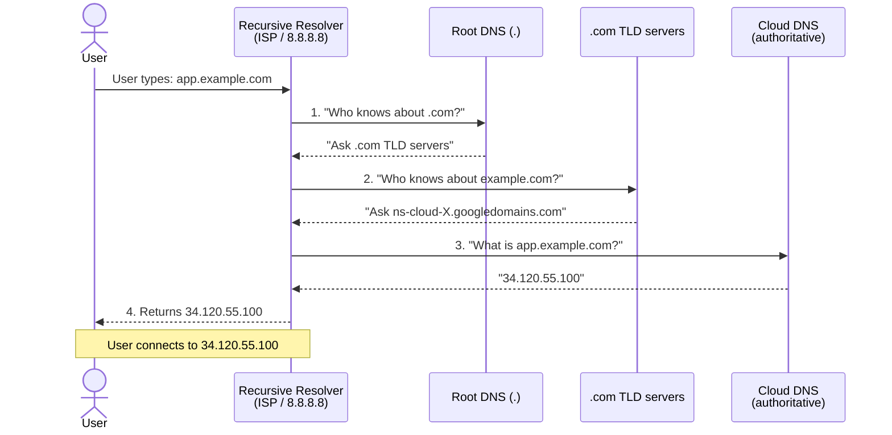
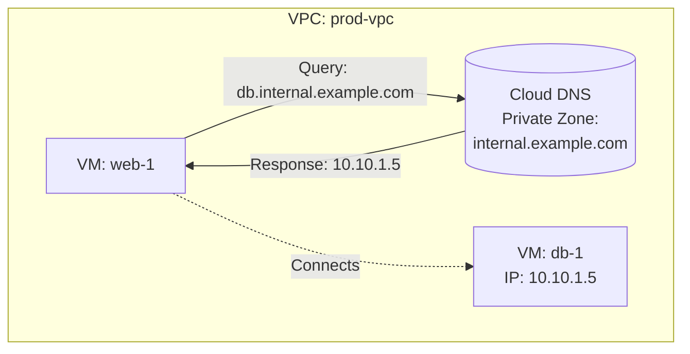
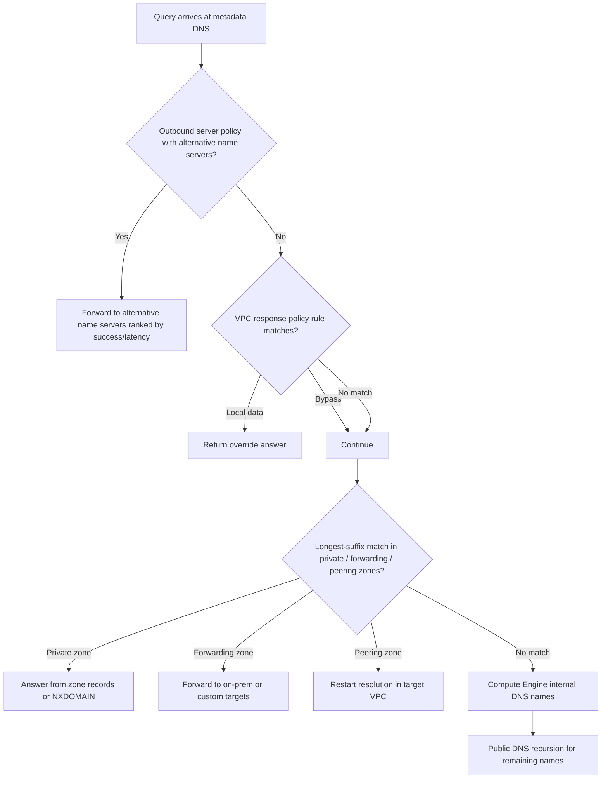
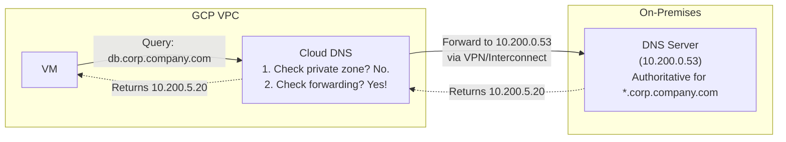
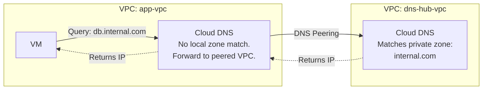
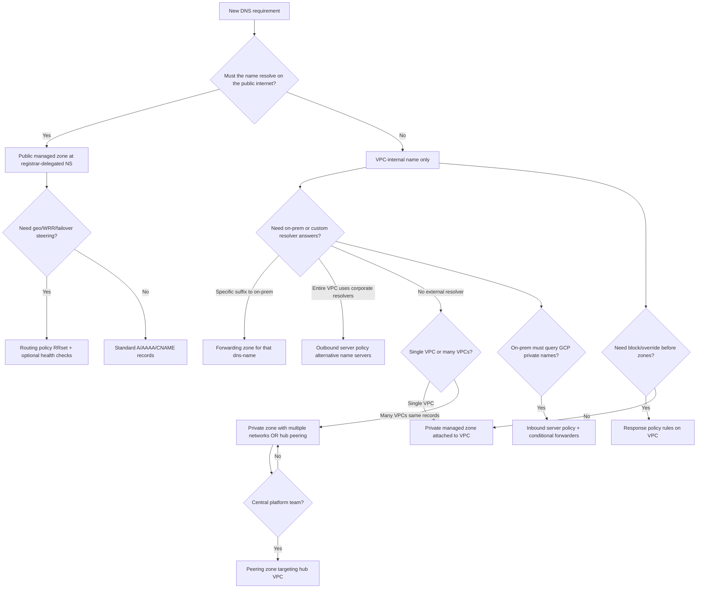

**Complexity**: `[MEDIUM]` | **Time to Complete**: 1.5h | **Prerequisites**: Module 2.2 (VPC Networking)

## What You'll Be Able to Do

By the end of this module you will configure Cloud DNS managed zones with A and CNAME records for both internet-facing and VPC-internal resolution, implement weighted, geolocation, and failover routing policies for multi-region traffic, deploy private zones for GKE and Compute Engine service discovery, and design split-horizon architectures that never accidentally shadow a public apex.

- **Configure Cloud DNS managed zones with A and CNAME records for internal and external resolution**
- **Implement DNS-based routing policies (weighted, geolocation, failover) for multi-region traffic distribution**
- **Deploy private DNS zones for VPC-internal name resolution between GCP services and Kubernetes clusters**
- **Design split-horizon DNS architectures that serve different records to internal and external clients**

---

## Why This Module Matters

**Hypothetical scenario:** Your team deploys a new payment API behind a global load balancer and updates the public A record on Saturday night. The change looks correct in Cloud DNS, but customer traffic still hits the old IP until Monday because recursive resolvers cached the previous answer at a 24-hour TTL. Meanwhile, an engineer creates a private zone for the same apex domain to register an internal database hostname, and production VMs in that VPC suddenly cannot reach the public marketing site because private zones override public answers for attached VPCs. Both failures are DNS design problems, not application bugs.

That pair of mistakes illustrates a simple truth: **DNS is the foundation of everything on the internet.** When DNS works, nobody thinks about it. When DNS breaks, nothing works. Every HTTP request, every API call, and every service-to-service hop in a microservices architecture begins with a name lookup. On GCP, [Cloud DNS](https://cloud.google.com/dns/docs/overview) is the managed authoritative and resolver path for public internet names, VPC-private names, hybrid forwarding, cross-VPC peering, routing policies, response-policy overrides, and optional DNSSEC signing.

In this module, you will learn how Cloud DNS serves zones from Google's anycast infrastructure, how public and private managed zones differ in visibility and override behavior, and how routing policies (weighted round robin, geolocation, and failover) steer answers using optional health checks. You will also learn when to use forwarding zones versus DNS peering versus server policies, how response policies implement RPZ-like overrides before normal zone matching, and how billing combines per-zone hourly charges with per-query tiers that spike when routing policies or health checks multiply probe traffic.

---

## DNS Fundamentals Review

Before diving into Cloud DNS, a quick refresher on how DNS resolution works is essential for understanding the configurations that follow. Authoritative DNS (what Cloud DNS provides for your zones) answers only for names it owns; recursive resolvers (ISP resolvers, `8.8.8.8`, or the GCP metadata server at `169.254.169.254`) chase delegations from root to TLD to your zone and cache answers according to TTL. Confusing those two roles is a common source of "the console shows the right record but my laptop still resolves the old IP" reports during cutovers—you must lower TTLs and wait for caches, not only update authoritative data.

Cloud DNS publishes your authoritative answers from Google's anycast footprint, while VPC workloads still use the metadata resolver path that applies policies, response overrides, private zones, forwarding, peering, internal Compute Engine names, and finally public recursion. Keeping that split in mind makes every later feature—forwarding zones, inbound policies, RPZ-style response policies—easier to reason about because you know **where** in the chain a knob acts.



### Record Types You Will Use

| Record Type | Purpose | Example |
| :--- | :--- | :--- |
| **A** | Maps hostname to IPv4 address | `app.example.com → 34.120.55.100` |
| **AAAA** | Maps hostname to IPv6 address | `app.example.com → 2600:1901::1` |
| **CNAME** | Alias to another hostname | `www.example.com → app.example.com` |
| **MX** | Mail server routing | `example.com → 10 mail.example.com` |
| **TXT** | Arbitrary text (SPF, DKIM, verification) | `example.com → "v=spf1 include:..."` |
| **NS** | Nameserver delegation | `example.com → ns-cloud-a1.googledomains.com` |
| **SOA** | Start of authority (zone metadata) | Serial number, refresh intervals |
| **SRV** | Service location (port + priority) | `_http._tcp.example.com → 0 5 80 app.example.com` |
| **PTR** | Reverse DNS (IP to hostname) | `100.55.120.34.in-addr.arpa → app.example.com` |

---

## Public Zones: Internet-Facing DNS

A public DNS zone in Cloud DNS makes your domain resolvable from anywhere on the internet. When you create a public zone, Google assigns it [four authoritative nameservers from the `googledomains.com` pool](https://cloud.google.com/dns/docs/update-name-servers). Those nameservers are anycasted within Google's network, which means resolvers usually reach a nearby serving location rather than a single physical datacenter. You still own correctness of the zone data—Cloud DNS does not guess records for you—but Google operates the authoritative serving plane and publishes an SLA around query availability for managed zones.

Public zones are the right home for MX and TXT records that prove domain ownership to SaaS vendors, for ACME DNS-01 challenge TXT records during certificate automation, and for A/AAAA aliases that front global HTTPS load balancers. Treat the public zone as a contract with the entire internet: every name you publish is crawlable and enumerable, so never place purely internal hostnames in a public zone "just because it is easier." If a name must not leak, it belongs in a private zone or behind an internal suffix that never receives a public delegation.

### Creating a Public Zone

```bash
# Create a public managed zone
gcloud dns managed-zones create example-zone \
  --dns-name="example.com." \
  --description="Production DNS zone for example.com" \
  --visibility=public

# Note: The trailing dot after the domain name is required (DNS convention)

# View the assigned nameservers
gcloud dns managed-zones describe example-zone \
  --format="yaml(nameServers)"

# Output will be something like:
# nameServers:
# - ns-cloud-a1.googledomains.com.
# - ns-cloud-a2.googledomains.com.
# - ns-cloud-a3.googledomains.com.
# - ns-cloud-a4.googledomains.com.
#
# You must update your domain registrar's NS records to point to these.
```

### Managing DNS Records

```bash
# Start a transaction (atomic change set)
gcloud dns record-sets transaction start --zone=example-zone

# Add an A record pointing to a load balancer IP
gcloud dns record-sets transaction add "34.120.55.100" \
  --name="app.example.com." \
  --ttl=300 \
  --type=A \
  --zone=example-zone

# Add a CNAME for www
gcloud dns record-sets transaction add "app.example.com." \
  --name="www.example.com." \
  --ttl=300 \
  --type=CNAME \
  --zone=example-zone

# Add an MX record for email
gcloud dns record-sets transaction add "10 mail.example.com." \
  --name="example.com." \
  --ttl=3600 \
  --type=MX \
  --zone=example-zone

# Add a TXT record for domain verification
gcloud dns record-sets transaction add '"google-site-verification=abc123"' \
  --name="example.com." \
  --ttl=300 \
  --type=TXT \
  --zone=example-zone

# Execute the transaction (all changes are applied atomically)
gcloud dns record-sets transaction execute --zone=example-zone

# List all records in the zone
gcloud dns record-sets list --zone=example-zone \
  --format="table(name, type, ttl, rrdatas[0])"

# Abort a transaction (if you made a mistake before executing)
gcloud dns record-sets transaction abort --zone=example-zone
```

### Modifying and Deleting Records

```bash
# To modify a record, you must remove the old one and add the new one
# in the same transaction
gcloud dns record-sets transaction start --zone=example-zone

gcloud dns record-sets transaction remove "34.120.55.100" \
  --name="app.example.com." \
  --ttl=300 \
  --type=A \
  --zone=example-zone

gcloud dns record-sets transaction add "34.120.55.200" \
  --name="app.example.com." \
  --ttl=300 \
  --type=A \
  --zone=example-zone

gcloud dns record-sets transaction execute --zone=example-zone
```

### TTL Strategy

TTL (Time to Live) controls how long resolvers cache a DNS response. Choosing the right TTL is a trade-off between performance and agility.

| TTL | Duration | Use Case | Trade-off |
| :--- | :--- | :--- | :--- |
| **60** | 1 minute | Records that change during failover | More DNS queries, faster propagation |
| **300** | 5 minutes | General web application records | Good balance for most use cases |
| **3600** | 1 hour | Stable records (MX, NS) | Fewer queries, slow to change |
| **86400** | 1 day | Records that rarely change | Most efficient, very slow to propagate changes |

**Pause and predict:** You are scheduling a production migration to switch a critical database endpoint to a new instance this coming Saturday at midnight. The active `db.example.com` A record is currently configured with a TTL of 86400 seconds (24 hours). What specific record adjustments should you execute on Friday ahead of the maintenance window, and how should you adjust the record once the cutover stabilizes?

<details>
<summary>Check your prediction</summary>

Before a planned migration, lower the TTL to a short interval (such as 60 or 300 seconds) on Friday at least 24 hours in advance so existing cached answers across recursive resolvers expire before the cutover begins. Once the maintenance window opens on Saturday at midnight, update the A record to the new database IP address. After verifying that traffic successfully reaches the new database instance and the new answer is observed globally, raise the TTL back to 86400 seconds to restore caching efficiency and reduce query volume.
</details>

Managing record lifetimes is a change-control problem, not a console-save problem. The next section is how a public zone actually becomes authoritative: registrar delegation, parent caches, and why Terraform green does not mean the internet has moved.

### Delegation, Propagation, and Split-Horizon Planning

A public managed zone is only authoritative after your registrar delegates the domain to the four `ns-cloud-*.googledomains.com` nameservers Cloud DNS assigns. Until delegation completes, the internet continues to query your old DNS provider, which means Terraform can show the correct records in GCP while customers still receive stale answers. After delegation, propagation depends on parent TTLs, registrar glue updates, and any intermediate caches—not on how fast you clicked Save in the console.

Split-horizon DNS is the deliberate pattern of serving different answers to internal clients than to the public internet. Cloud DNS implements split horizon with separate public and private zones, not with a single zone that magically returns two answers. The private zone must attach only to VPCs that should see internal names, and the public zone must remain the source of truth for internet clients. When both zones share an apex name, VMs in attached VPCs always prefer the private zone, which is powerful for internal service discovery and dangerous if the private zone is incomplete. The sustainable pattern is to reserve a dedicated internal suffix—`internal.example.com` or `gcp.corp.example.com`—for private zones and keep the marketing apex solely in the public zone unless you intentionally mirror every public record into the private copy.

Record changes in Cloud DNS are applied atomically through transactions, which protects you from publishing half-updated RRsets during bulk edits. For high-churn environments, label zones in billing exports so finance can attribute zone sprawl to teams; zone count is a first-class cost driver because managed-zone pricing is charged per zone per month regardless of query volume.

---

## DNS Routing Policies

Cloud DNS allows you to configure [routing policies that intelligently direct traffic based on weight, geolocation, or health checks](https://cloud.google.com/dns/docs/routing-policies-overview). This is essential for building highly available, multi-region architectures.

### Weighted Round Robin

Weighted routing distributes traffic across multiple IP addresses based on weights you define, which makes it the default choice for canary releases and blue/green cutovers where you want a deterministic percentage split without geography semantics. Weights are not percentages themselves—Cloud DNS normalizes weights up to 1000—so an 80/20 intent is expressed as `80=34.120.55.200;20=34.120.55.201` in `--routing-policy-data` (weight first, then IP). When health checks are enabled, unhealthy targets drop out of the weighted pool and the remaining healthy weights are renormalized, which means your canary might receive more than twenty percent of traffic if the primary VIP fails probes unless you also assign zero-weight standby records.

Operationally, pair WRR with observability on both VIPs during a release: DNS only steers names; it does not know HTTP error rates. If the canary VIP accepts TCP but returns 500 responses, DNS will still send clients there until application health checks or manual weight changes intervene.

```bash
# Add a weighted round-robin policy to split traffic 80/20
gcloud dns record-sets transaction add \
  --name="api.example.com." \
  --ttl=300 \
  --type=A \
  --zone=example-zone \
  --routing-policy-type=WRR \
  --routing-policy-data="80=34.120.55.200;20=34.120.55.201"
```

### Geolocation Routing

Geolocation routing minimizes latency by directing users to endpoints mapped to Google Cloud regions associated with the query source. If you run application clusters in both `us-central1` and `europe-west1`, European VMs—or VPN/Interconnect entry regions for hybrid clients—receive answers pointing at the European VIP. Public geolocation uses how traffic enters Google's network; private geolocation uses VM region or tunnel attachment region as documented in the routing policies overview, which matters when debugging "wrong region" reports from on-premises users who enter through a central VPN in `us-east4` but expect `europe-west1` answers.

Geolocation is not a compliance guarantee by itself: geofencing changes failover behavior, and health-checked geolocation still requires you to operate healthy backends in each geography you advertise. Combine GEO with global load balancers when you need L7 routing inside a region, and with DNS GEO when you need clients to land in different regions at all.

```bash
# Add a geolocation routing policy
gcloud dns record-sets transaction add \
  --name="app.example.com." \
  --ttl=300 \
  --type=A \
  --zone=example-zone \
  --routing-policy-type=GEO \
  --routing-policy-data="us-central1=34.120.55.200;europe-west1=34.120.55.202"
```

### Failover Routing

Failover routing expresses active/backup semantics explicitly: Cloud DNS serves the primary IP set while health checks pass, then shifts to the backup set when primaries fail. Backups may themselves be geolocation policies, which is how teams model "stay in-region until the region is dead, then break glass to a distant DR VIP." You can also trickle a fraction of traffic to backups with a backup traffic fraction between 0 and 1 to validate DR paths without a full flip.

Failover differs from WRR because intent is ordered preference, not proportional sharing. Use failover when only one endpoint should receive traffic at a time; use WRR when both endpoints should simultaneously receive production traffic at known ratios.

```bash
# Add a failover routing policy (requires health checking on the primary target)
gcloud compute health-checks create http my-api-hc \
  --check-interval=30s \
  --healthy-threshold=1 \
  --unhealthy-threshold=3 \
  --port=80 \
  --request-path="/healthz" \
  --host="api.example.com."

gcloud dns record-sets transaction add \
  --name="app.example.com." \
  --ttl=300 \
  --type=A \
  --zone=example-zone \
  --routing-policy-type=FAILOVER \
  --routing-policy-primary-data="34.120.55.200" \
  --routing-policy-backup-data="34.120.55.203" \
  --routing-policy-backup-data-type=A \
  --enable-health-checking \
  --health-check=my-api-hc
```

### Health Checks, Geofencing, and Policy Limits

[Routing policies](https://cloud.google.com/dns/docs/routing-policies-overview) can attach health checks to internal load balancer VIPs (private zones) or to internet-reachable endpoints (public zones). Cloud DNS probes on an interval you configure (30–300 seconds for external endpoints) and removes unhealthy targets from answers. What happens when a whole policy bucket is unhealthy is not the same for every policy type—pause on the geofencing case before you memorize the rest of the steering menu.

Geolocation routing maps source geography to DNS responses. Cloud DNS determines client geography differently depending on whether queries originate internally from VPC workloads or externally across public anycast edges.

**Pause and predict:** You configure a health-checked geolocation routing policy where geofencing is explicitly enabled for a specific geographic region. If an unexpected regional disruption causes every monitored endpoint within that source geography to become unhealthy, what does Cloud DNS return to clients querying from that geography, and why does this response differ from standard unfenced geolocation routing?

<details>
<summary>Check your prediction</summary>

Geofencing strictly confines client resolution to the configured geography even when every endpoint in that geography fails its health checks, causing Cloud DNS to return unhealthy virtual IP addresses because the authoritative server must still provide an answer. Without geofencing enabled, standard geolocation routing fails over to the next closest healthy geographic region when all local endpoints become unavailable.
</details>

Determining client locality is a different knob from health-check outcome. For private DNS, Google Cloud uses the region of the VM that sent the query (or the region of the VPN tunnel, Interconnect attachment, or Router appliance for inbound server-policy entry points)—not the EDNS client subnet. For public DNS, geography follows how queries enter Google's network.

Weighted round robin supports weights from 0 through 1000. Zero-weight targets can act as cold standby: when health checks mark higher-weight targets unhealthy, Cloud DNS may return zero-weight records that were configured as backups. Combining WRR with geolocation in the same RRset is not supported—choose one steering model per name.

DNS routing policies cannot be configured on forwarding zones, DNS peering zones, managed reverse lookup zones, or Service Directory zones. Plan steering on standard public or private managed zones that hold the A/AAAA answers you want to health-check.

```bash
# Internal load balancer (private zone): reference the ILB forwarding rule name
# in --routing-policy-data with --enable-health-checking. Cloud DNS reuses the
# LB's health check—no separate gcloud dns health-checks command exists.
gcloud dns record-sets transaction add \
  --name="api.internal.example.com." \
  --ttl=300 \
  --type=A \
  --zone=internal-zone \
  --routing-policy-type=FAILOVER \
  --routing-policy-primary-data="my-ilb-forwarding-rule" \
  --routing-policy-backup-data="10.10.1.99" \
  --routing-policy-backup-data-type=A \
  --enable-health-checking

# External endpoints (public zone): create a Compute Engine HTTP health check
gcloud compute health-checks create http my-api-hc \
  --check-interval=30s \
  --healthy-threshold=1 \
  --unhealthy-threshold=3 \
  --port=80 \
  --request-path="/healthz" \
  --host="api.example.com."

# Attach the health check when defining routing-policy RRsets (see routing policy docs for flags)
```

Supported RR types for routing policies include A, AAAA, CNAME, MX, SRV, and TXT, but only A/AAAA carry health-check semantics for steering. DNSSEC-enabled zones that use health checks must use a single IP per policy item—you cannot mix health-checked and non-health-checked addresses in the same policy line when DNSSEC is on.

---

## Private Zones: Internal DNS

Private DNS zones are [visible only from within specified VPC networks](https://cloud.google.com/dns/docs/key-terms). They are essential for internal service discovery—allowing you to give friendly names to databases, internal APIs, and management endpoints without publishing those names to the internet. Private zones also integrate with Google Cloud's internal DNS names for VMs, but you should not confuse the two: Compute Engine auto-generates internal names under `c.project-id.internal` style namespaces, while your private zones are explicit product choices you curate.

Design private zones around service lifecycles: stable infrastructure names (`db.prod.internal.example.com`) change rarely and deserve moderate TTLs, while autoscaling pools might use shorter TTLs if IPs change frequently—though Kubernetes and load balancers usually mean you point DNS at stable VIPs instead of per-pod IPs. When multiple environments share networking machinery, encode environment in the suffix (`dev`, `staging`, `prod`) so a mistaken zone attachment does not cross-wire databases.



### Creating a Private Zone

```bash
# Create a private managed zone visible to a specific VPC
gcloud dns managed-zones create internal-zone \
  --dns-name="internal.example.com." \
  --description="Internal DNS for prod VPC" \
  --visibility=private \
  --networks=prod-vpc

# Add internal records
gcloud dns record-sets transaction start --zone=internal-zone

gcloud dns record-sets transaction add "10.10.1.5" \
  --name="db.internal.example.com." \
  --ttl=300 \
  --type=A \
  --zone=internal-zone

gcloud dns record-sets transaction add "10.10.1.10" \
  --name="api.internal.example.com." \
  --ttl=300 \
  --type=A \
  --zone=internal-zone

gcloud dns record-sets transaction add "10.10.1.15" \
  --name="cache.internal.example.com." \
  --ttl=60 \
  --type=A \
  --zone=internal-zone

gcloud dns record-sets transaction execute --zone=internal-zone

# Verify resolution from within the VPC
gcloud compute ssh vm-in-prod-vpc --zone=us-central1-a --quiet \
  --command="dig db.internal.example.com +short"
```

**Pause and predict:** You manage a VPC network where a private managed zone authoritatively serves `internal.company.com`. A platform team launches a new virtual machine in a completely separate VPC network residing within the same Google Cloud project and attempts to resolve `db.internal.company.com`. Will the newly provisioned virtual machine be able to resolve this private record immediately, and what architectural configuration changes are required to enable resolution?

<details>
<summary>Check your prediction</summary>

No. Private managed zones are strictly isolated and visible only to VPC networks explicitly associated with the zone. To enable cross-VPC resolution, administrators must either update the zone configuration to attach the second VPC network (`gcloud dns managed-zones update --networks=...`) or configure DNS peering between the client VPC and the authoritative host VPC.
</details>

Enterprise multi-VPC topologies are a naming-and-attachment problem, not a project-ID problem. The next commands are how operators grow a private zone’s audience after the first VPC is already live.

### Making a Private Zone Visible to Multiple VPCs

The update replaces the authorized-network list, so include every VPC that must keep resolving the zone—not only the one you are adding:

```bash
# Add another VPC to the zone's visibility
gcloud dns managed-zones update internal-zone \
  --networks=prod-vpc,staging-vpc

# You can also add VPCs from other projects (cross-project visibility)
gcloud dns managed-zones update internal-zone \
  --networks=projects/project-a/global/networks/vpc-a,projects/project-b/global/networks/vpc-b
```

### Integration with Kubernetes (GKE)

GKE nodes use the metadata DNS path (`169.254.169.254`) like other Compute Engine VMs, but [Cloud DNS for GKE](https://cloud.google.com/kubernetes-engine/docs/how-to/cloud-dns) can publish cluster-scoped private zones and response policies that apply before the VPC-wide order. Cluster-scoped resources let platform teams expose service names to pods without attaching every service project VPC to every hub zone, while VPC-scoped zones remain the default for VM-to-VM resolution across the network. When designing GKE plus Cloud DNS, decide whether a name is cluster-local (visible only to a cluster's nodes), VPC-local (visible to all VMs in attached networks), or public—and avoid reusing a public apex in a cluster-scoped private zone unless you mirror every required public record.

### Private Zone Resolution Order

Google documents a precise [VPC name resolution order](https://cloud.google.com/dns/docs/vpc-name-res-order). GKE evaluates cluster-scoped response policies and cluster-scoped private or forwarding zones first; if no match, resolution continues with the VPC network order below. For a standard VM (non-GKE-specific path), the high-level sequence is:



Memorize the precedence implications, not every bullet: **response policies and alternative name servers run before managed private zones**, so a blocking RPZ rule can sinkhole a name even if a private zone contains a permissive record. **Peering does not copy zones**—it restarts lookup in another VPC's order, which is why hub-and-spoke designs centralize zone attachments in a DNS hub VPC and attach peering zones in spokes. **Private zones beat public zones for attached VPCs**, which is the split-horizon override behavior that breaks partial private copies of a public apex.

---

## DNS Forwarding: Hybrid Cloud DNS

DNS forwarding allows you to [forward queries for specific domains to external DNS servers](https://cloud.google.com/dns/docs/zones/zones-overview). This is critical in hybrid environments where on-premises resources have DNS records in on-premises DNS servers. Forwarding zones are private managed zones whose `dns-name` suffix determines which queries leave GCP: only names falling under that suffix are candidates for forwarding, which is why enterprises forward `corp.example.com.` or `ad.corp.example.com.` rather than attempting to forward "everything except googleapis.com."

**Pause and predict:** You configure a Cloud DNS forwarding zone targeting on-premises RFC 1918 DNS resolvers across a hybrid interconnect, but you omit the `[private]` routing marker on the forwarding target IP addresses. How will outbound DNS queries leave the Google Cloud network, and what failure mode will client applications experience?

<details>
<summary>Check your prediction</summary>

Without the `[private]` target marker, Cloud DNS attempts to route forwarding queries across the default public internet path instead of utilizing the internal VPC routing table. Because RFC 1918 private IP addresses are non-routable over the public internet, outbound resolution requests fail to reach on-premises nameservers and inevitably time out. Explicitly tagging target IP addresses with `[private]` (or configuring a private forwarding path) instructs Cloud DNS to route outbound traffic through Cloud VPN, Dedicated Interconnect, or Private Google Access paths.
</details>

Hybrid DNS is a two-direction diagram, not a single zone type. Inbound forwarding without matching conditional forwarders on Active Directory or BIND leaves on-premises clients querying only themselves. Draw GCP→on-prem and on-prem→GCP on the same whiteboard before you create either object.

Capacity planning belongs in the same workshop: on-premises DNS teams must size their servers for GCP retry storms during incidents, and GCP teams must understand that each forwarded query bills as a Cloud DNS query plus any target-resolution lookup for hostname targets. During steady state, prefer caching on-premises forwarders with sane TTLs so Cloud DNS is not hammered for every pod restart.

### Outbound Forwarding (GCP to On-Premises)



```bash
# Create a forwarding zone
gcloud dns managed-zones create corp-forwarding \
  --dns-name="corp.company.com." \
  --description="Forward queries to on-premises DNS" \
  --visibility=private \
  --networks=prod-vpc \
  --forwarding-targets="10.200.0.53,10.200.0.54"

# Forwarding with private routing (uses VPN/Interconnect, not internet)
gcloud dns managed-zones create corp-forwarding-private \
  --dns-name="corp.company.com." \
  --description="Forward queries via private routing" \
  --visibility=private \
  --networks=prod-vpc \
  --forwarding-targets="10.200.0.53[private],10.200.0.54[private]"
```

### Inbound Forwarding (On-Premises to GCP)

For on-premises systems to resolve GCP private DNS zones, you need to set up an [**inbound DNS policy** that creates a forwarding IP in your VPC](https://cloud.google.com/dns/docs/server-policies-overview). On-premises DNS servers then forward queries to this IP.

```bash
# Create a DNS server policy with inbound forwarding enabled
gcloud dns policies create allow-inbound \
  --description="Allow inbound DNS forwarding from on-premises" \
  --networks=prod-vpc \
  --enable-inbound-forwarding

# View the inbound forwarder IPs (one per subnet)
gcloud compute addresses list \
  --filter="purpose=DNS_RESOLVER" \
  --format="table(name, address, subnetwork)"

# On your on-premises DNS server, create a conditional forwarder:
# Forward *.internal.example.com → <inbound forwarder IP>
```

### Alternative Forwarding via DNS Policies

Server policies let you configure VPC-wide resolver behavior—logging, inbound forwarding, outbound alternative name servers—without creating a managed zone per suffix. That is different from a forwarding zone, which matches only the delegated `dns-name` you configure.

```bash
# Create a policy that forwards all DNS to custom nameservers
gcloud dns policies create custom-dns \
  --description="Use custom DNS servers for all resolution" \
  --networks=prod-vpc \
  --alternative-name-servers="10.200.0.53,10.200.0.54" \
  --enable-logging

# List DNS policies
gcloud dns policies list

# Delete a policy
gcloud dns policies delete custom-dns
```

Outbound [server policies](https://cloud.google.com/dns/docs/server-policies-overview) differ from forwarding zones: a policy sends **all** queries (or a configured subset via alternative name server rules) to custom resolvers before Cloud DNS evaluates private zones, whereas a forwarding zone matches only the suffix you delegate (for example `corp.company.com.`). Use policies when you want a VPC-wide resolver swap for compliance logging or centralized filtering appliances; use forwarding zones when only corporate suffixes should leave GCP. Inbound forwarding exposes resolver IPs in your subnets so on-premises conditional forwarders can query GCP private zones—each subnet receives a DNS resolver address you list with `gcloud compute addresses list --filter="purpose=DNS_RESOLVER"`.

When forwarding targets are domain names rather than IPs, Cloud DNS performs an extra lookup to resolve the target, and [pricing](https://cloud.google.com/dns/pricing) bills that resolution in addition to the forwarded query. Prefer static IP targets for predictable cost and troubleshooting. Mark targets with `[private]` so forwarding uses Cloud VPN, Cloud Interconnect, or Private Google Access paths instead of the public internet.

---

## Response Policy Zones (RPZ-Style Overrides)

[Response policies](https://cloud.google.com/dns/docs/policies-overview) are not DNS zones; they are rule sets attached to a VPC network (one response policy per network) that Cloud DNS evaluates during lookups. They implement outcomes similar to the IETF DNS Response Policy Zone (RPZ) draft: block malicious names, override answers for migration cutovers, or redirect API hostnames to restricted VIPs without editing every private zone record.

Rules use longest-suffix matching like zones. A rule can return **local data** (synthetic A/AAAA/CNAME answers), or use **bypassResponsePolicy** passthrough so specific names escape a broad wildcard block. Because VPC-scoped response policies are consulted in the [resolution order](https://cloud.google.com/dns/docs/vpc-name-res-order) before managed private zones, a deny rule takes effect even when a permissive record exists downstream—design overrides carefully and document bypass exceptions for break-glass hosts.

```bash
# Create a response policy attached to prod-vpc
gcloud dns response-policies create security-policy \
  --description="DNS overrides for prod VPC" \
  --networks=prod-vpc

# Block a malicious domain (local NXDOMAIN-style behavior via local data)
gcloud dns response-policies rules create block-c2 \
  --response-policy=security-policy \
  --dns-name="c2.hacker-network.com." \
  --local-data="name=c2.hacker-network.com.,type=A,ttl=300,rrdatas=127.0.0.1"

# Bypass: allow one subdomain past a wildcard override
gcloud dns response-policies rules create allow-partner-api \
  --response-policy=security-policy \
  --dns-name="api.partner.example.com." \
  --behavior=bypassResponsePolicy

# List rules
gcloud dns response-policies rules list --response-policy=security-policy
```

Pair response policies with [DNS logging](https://cloud.google.com/dns/docs/server-policies-overview) on the same VPC when security teams need evidence of blocked lookups. Response policies complement—not replace—firewall rules: they stop name resolution, but hard-coded IPs or DoH clients can bypass DNS controls.

GKE cluster-scoped response policies follow the same longest-suffix semantics but apply before cluster-scoped private zones, which is how platform teams inject safeguards for workloads without touching every service project's VPC attachments. When both cluster-scoped and VPC-scoped policies exist, consult the [name resolution order](https://cloud.google.com/dns/docs/vpc-name-res-order) diagram in documentation during design reviews so security and application teams agree on which override wins.

---

## DNS Peering: Cross-VPC Resolution

DNS peering zones [allow one VPC to resolve DNS names using another VPC's private zones, without creating a full VPC peering](https://cloud.google.com/dns/docs/zones/zones-overview) or sharing the zones directly. This is useful when you have a central "DNS hub" VPC.



```bash
# Create a peering zone in app-vpc that peers with dns-hub-vpc
gcloud dns managed-zones create peer-to-hub \
  --dns-name="internal.com." \
  --description="Peer DNS resolution to hub VPC" \
  --visibility=private \
  --networks=app-vpc \
  --target-network=dns-hub-vpc \
  --target-project=shared-networking
```

### When to Use Which

| Scenario | Solution | Why |
| :--- | :--- | :--- |
| Internal names within a single VPC | Private zone | Simplest setup |
| Internal names shared across VPCs | Private zone with multiple networks | Direct, no peering needed |
| Centralized DNS management (hub-spoke) | DNS peering zones | Hub VPC manages all zones |
| On-premises to GCP resolution | Inbound forwarding policy | On-prem DNS forwards to GCP |
| GCP to on-premises resolution | Forwarding zone | Cloud DNS forwards to on-prem |
| Shared VPC with private DNS | Private zone on shared VPC | All service projects resolve automatically |

DNS peering is not a network peering shortcut: it only delegates name resolution to another VPC's Cloud DNS path. The target VPC must already host the authoritative private zones, and IAM plus VPC connectivity still govern who can reach the resolved IPs. Hub VPCs should use narrow zone suffixes and change control, because a mistaken delete in the hub breaks every spoke peering zone simultaneously.

---

## DNSSEC: Securing DNS

DNSSEC (Domain Name System Security Extensions) [protects against DNS spoofing by digitally signing DNS records. Cloud DNS supports DNSSEC for public zones](https://cloud.google.com/dns/docs/dnssec). Signing proves that answers for your zone were issued by your keys and were not altered in transit between authoritative servers and validating resolvers. DNSSEC does not encrypt queries—confidentiality still requires TLS on your applications—but it closes the cache-poisoning class of attacks that manipulate DNS answers themselves.

Operational sequencing matters: enable DNSSEC in Cloud DNS, export the DS record Google generates, publish that DS at your registrar, then wait for parent-side propagation before expecting validating resolvers to treat signatures as trustworthy. If you enable routing policies with health checks while DNSSEC is on, remember Google's constraint that each policy item may contain only a single IP when health checking and DNSSEC are combined—plan steering per VIP, not per multi-address RRset.

```bash
# Enable DNSSEC on a public zone
gcloud dns managed-zones update example-zone \
  --dnssec-state=on

# View DNSSEC configuration (DS records to add at your registrar)
gcloud dns dns-keys list --zone=example-zone \
  --format="table(keyTag, type, algorithm, dsRecord())"

# Transfer the DS record to your domain registrar to complete the chain of trust
```

---

## DNS Logging

DNS query logging helps you understand what your workloads are resolving, prove that a response policy blocked a name, and detect anomalous retry storms during incidents before they become egress bills or dependency outages.

```bash
# Enable DNS logging via a policy
gcloud dns policies create logging-policy \
  --description="Enable DNS query logging" \
  --networks=prod-vpc \
  --enable-logging

# View DNS logs in Cloud Logging
gcloud logging read 'resource.type="dns_query"' \
  --limit=20 \
  --format="table(jsonPayload.queryName, jsonPayload.queryType, jsonPayload.responseCode, jsonPayload.sourceIP)"
```

DNS query logs land in Cloud Logging under `resource.type="dns_query"`. Logging is enabled on DNS **policies**, not on individual zones, which means you enable it once per VPC network and capture queries the metadata resolver handles—including forwarded, peered, and overridden names. Budget for log ingestion separately from Cloud DNS query pricing; high-cardinality workloads can generate large log volume during incidents when every pod retries a failing name.

---

## Cost Lens: Zones, Queries, and Hidden Multipliers

Cloud DNS has [no free tier](https://cloud.google.com/dns/pricing). Billing aggregates **all zone types**—public, private, and forwarding—into a single managed-zone count, prorated hourly. The first 25 zone-months per billing account are priced at roughly $0.20 per zone per month (derived from the published hourly rate); additional tiers decrease per-zone cost at 25+ and 10,000+ zones. A platform team with hundreds of micro-zones per microservice therefore pays mostly for zone inventory, not queries.

Query pricing splits **regular queries** (about $0.40 per million for the first billion per month) from **routing policy queries** (about $0.70 per million for the same tier). Any RRset using WRR, GEO, or FAILOVER steering bills at the higher routing-policy rate even if the answer is a single A record. Health checks add monthly charges: internal fast checks are **$0.50/month** each, internal premium checks **$2.00/month** each (roughly 4× the fast rate)—multiplied by every VIP you probe. A multi-region active-active design with three geolocation buckets and three health checks per region can accrue more cost in probes than in user-facing queries during low-traffic services.

| Cost driver | What increases spend | Knobs that reduce spend |
| :--- | :--- | :--- |
| Managed zones | One zone per suffix per project; sprawl from teams creating duplicate private zones | Consolidate suffixes; use hub VPC + peering instead of duplicating zone attachments |
| Regular queries | Low TTLs, chatty service meshes, retry storms | Raise TTL for stable records; fix failing dependencies causing NXDOMAIN retries |
| Routing policy queries | Geo/WRR/failover on high-QPS names | Use routing policies only on names that need steering; use load balancers for simple active-passive |
| Health checks | Many ILB VIPs with short intervals | Share health checks where possible; increase interval within allowed bounds (billed per month, not per hour) |
| Forwarding target hostnames | Extra lookup to resolve FQDN targets | Use IP targets; cache on-prem forwarder side |
| DNS logging + DNS Armor | Log ingestion; per-workload threat-detection units | Scope logging to production VPCs; tune DNS Armor exclusions |

Hypothetical scenario: A SaaS provider hosts 8,000 customer subdomains as separate private zones for isolation. Zone charges alone land in the highest published tier (about $0.03 per zone-month above 10,000 zone-months in Google's pricing table examples), while queries stay negligible. The architectural fix is fewer zones with wildcard records or shared suffixes, not shorter TTLs.

---

## Patterns & Anti-Patterns

Mature Cloud DNS designs treat names as platform APIs: suffixes are versioned, hub VPCs own authoritative data, and overrides are explicit. The patterns below appear repeatedly in enterprises that operate hybrid GCP plus on-premises estates, Shared VPC service projects, and GKE fleets.

| Pattern | When to use it | Why it works | Scaling note |
| :--- | :--- | :--- | :--- |
| Dedicated internal suffix | Any split-horizon or microservice discovery need | Avoids private zones shadowing public apex records | One private zone per environment (`dev.internal`, `prod.internal`) scales cleaner than per-service zones |
| DNS hub VPC with peering zones | Many spokes, centralized platform team | Spokes attach one peering zone per suffix instead of N zone×VPC bindings | Hub becomes critical—use IaC and restricted IAM on hub projects |
| TTL runway before migrations | Planned IP or load balancer changes | Lets caches expire before cutover | Automate TTL lowering via transactions; restore higher TTL after validation |
| Response policy for emergency blocks | Need fast org-wide sinkhole without redeploying apps | Evaluated before zone records; no agent on VMs | Document bypass rules for security tooling domains |
| Routing policy + health checks | Multi-region active/active behind ILBs or public endpoints | Removes unhealthy VIPs from answers automatically | Watch routing-policy query tier and health-check monthly charges |

Anti-patterns usually begin as convenient one-off console clicks—an extra private zone on the marketing apex, a forwarding target aimed at a hostname instead of an IP—that ossify into production architecture and only surface during the first cross-VPC migration or finance review.

| Anti-pattern | What goes wrong | Why teams fall into it | Better alternative |
| :--- | :--- | :--- | :--- |
| Private zone on public apex | Internal VMs lose public records for the same name | Engineers reuse the marketing domain for databases | Use `internal.example.com` or similar dedicated suffix |
| Attaching every VPC to every zone | 50×20 binding matrix; drift on every new project | Seems simpler than peering | Hub VPC + DNS peering zones per suffix |
| TTL 86400 everywhere | Multi-hour failover after incidents | Copy-paste from registrar defaults | 300s for app records; higher only for stable MX/NS |
| Forwarding zone per microservice | Zone-count explosion and billing tier creep | Each team wants autonomy | Forward `corp.example.com` once; delegate subdomains on-prem |
| Routing policy on forwarding/peering zones | Configuration rejected or ignored | Confusion between zone types | Put policies on standard public/private managed zones |
| DNSSEC + mixed health-check RRsets | Signing constraints violated | Incremental enablement without reading DNSSEC limits | Single IP per policy item when DNSSEC enabled |
| Relying on DNS blocks alone for malware | DoH or hard-coded IPs bypass DNS | RPZ feels like a complete security control | Pair with egress firewall, VPC SC, and endpoint agents |

---

## Decision Framework

Use this flow when choosing among public zones, private zones, forwarding, peering, server policies, routing policies, and response policies. The goal is to match **visibility** (who may see the name), **authority** (who owns the records), and **override** (whether answers may be blocked or steered).



| Decision | Prefer | Tradeoff |
| :--- | :--- | :--- |
| Public vs private zone | Public for internet clients; private only for RFC1918-style internal names | Private attachment overrides public for same name in that VPC |
| Forwarding zone vs server policy | Forwarding for suffix delegation; policy for VPC-wide resolver swap | Policies run earlier in resolution order—can surprise teams expecting private zones first |
| Peering vs multi-network private zone | Peering for hub/spoke at scale; multi-network when few VPCs share identical records | Peering adds hop through hub order; multi-network widens blast radius of zone edits |
| Static records vs routing policy | Static A/AAAA for single-homed services | Routing policies cost more per query and require health-check ops |
| WRR vs GEO vs FAILOVER | WRR for weighted canary; GEO for latency; FAILOVER for active/backup VIP pairs | Cannot combine WRR and GEO on same RRset; failover backup can itself be GEO |
| Response policy vs private zone record | Policy for security blocks or global overrides; zone records for normal service discovery | Policies evaluated before zones—easy to accidentally block legitimate names |

---

## Shared VPC, Cross-Project Visibility, and Fleet Operations

Shared VPC changes who attaches private zones but not how resolution works: service-project VMs still query through the host VPC's metadata path, so private zones should usually live in the host project that owns the Shared VPC network. Attaching a zone to `projects/host/global/networks/prod` makes records visible to every service project using that network without copying zones into each service project. When teams mistakenly create duplicate private zones in each service project, you pay duplicate managed-zone charges and risk divergent record data during incidents.

Cross-project visibility also appears in `gcloud dns managed-zones update --networks=projects/...` bindings. Use fully qualified network URLs in automation to avoid ambiguous short names. IAM roles such as `roles/dns.admin` should be limited to platform pipelines; application teams receive narrower custom roles that can only mutate record sets inside approved zones. Pair IAM constraints with code review on Terraform `google_dns_record_set` resources because a single typo in an apex A record is a global outage for internet properties.

For fleet operations, export zone and policy identifiers into your CMDB so incident commanders know which hub VPC owns `internal.corp.example.com` peering. During migrations, run parallel queries from three vantage points: an on-prem resolver, a VM in the spoke VPC, and `dig @169.254.169.254` on a GKE node. Mismatches between those three almost always mean forwarding, peering, or response-policy ordering—not application misconfiguration.

Hypothetical scenario: A platform team enables DNS logging in every VPC for compliance. Log volume spikes because a broken dependency causes thousands of NXDOMAIN retries per second from a DaemonSet. The fix is to repair the dependency and add a response policy sinkhole for the retired name temporarily, not to disable logging globally—logging proved the blast radius.

---

## Troubleshooting Playbook

When DNS misbehaves in GCP, start by classifying whether the failure is authoritative (your zone data), resolver-path (policies, forwarding, peering), or client-side (stub resolver caching on the VM). `dig +trace` from the internet tests public delegation; `dig @169.254.169.254 name` on the VM tests the Google Cloud path your workloads actually use.

| Symptom | Likely layer | First checks |
| :--- | :--- | :--- |
| Internet still sees old IP after zone edit | Recursive cache / TTL | Confirm TTL lowered earlier; query authoritative NS directly with `dig @ns-cloud-a1.googledomains.com` |
| Only some VPCs fail to resolve internal name | Zone visibility or peering | Compare attached networks; verify peering `target-network` still exists |
| On-prem cannot resolve GCP private name | Inbound forwarding | Confirm server policy enabled; conditional forwarder points to `DNS_RESOLVER` address in correct subnet region |
| GCP VM cannot resolve on-prem name | Outbound forwarding | Verify forwarding zone targets reachable via VPN/Interconnect; try `[private]` targets |
| NXDOMAIN for public site from VM only | Private zone shadowing | Search for private zone with same apex attached to VPC |
| Malware C2 still reachable | Client bypassing DNS | Response policy blocks DNS only; inspect hard-coded IPs and DoH |

For routing-policy incidents, enable [health check logging](https://cloud.google.com/dns/docs/routing-policies-overview) temporarily to see which geography or weight bucket Cloud DNS selected and whether probes marked targets unhealthy. Remember the edge case documented by Google: if every health-checked target fails, Cloud DNS may return all endpoints anyway to avoid empty answers—your load balancers and firewalls must still protect backends.

Change management should treat DNS transactions like database migrations: start transaction, apply removes/adds, execute, and keep rollback commands in the change ticket. For large fleets, prefer Infrastructure-as-Code with plan review over console edits that lack audit trails.

---

## Reference Architecture: Hub-and-Spoke with Hybrid Forwarding

The following reference layout is a teaching pattern, not a mandatory product template. It shows how public, private, forwarding, peering, response policies, and routing policies compose without stepping on each other's precedence.

```text
                    Internet clients
                           |
                    Public zone (example.com)
                     WRR/GEO on api.example.com
                           |
              +------------+-------------+
              |                          |
       Hub VPC (dns-hub)            On-premises AD DNS
   Private zone internal.corp    authoritative for corp.example.com
   Peering target for spokes              ^
              |                          |
    +---------+---------+                |
    |                   |                |
 Spoke VPC A        Spoke VPC B     Forwarding zone corp.example.com
 Peering zone       Peering zone    (private targets 10.200.0.53[private])
 internal.corp      internal.corp
 Response policy    Server policy: logging on
 blocks malware     Inbound forwarder IP for internal.corp queries
```

In this layout, application teams in spoke VPCs never attach private zones directly. They consume `internal.corp` through a peering zone whose `target-network` is the hub. Platform engineers mutate records once in the hub private zone. Corporate laptops on-premises resolve `db.internal.corp` because the hub VPC enables inbound forwarding and AD conditional forwarders send that suffix to the inbound IP in the Interconnect region—not because spokes expose their own copies.

Public properties remain in the public `example.com` zone with routing policies only on names that truly require multi-region steering. Internal microservices never reuse the `example.com` private apex, avoiding shadowing. Security places malware sinkholes in hub and spoke response policies with documented `bypassResponsePolicy` rules for vulnerability scanners that must resolve the real internet name.

When you adapt this pattern, document three runbooks: (1) add a spoke VPC—create peering zone, attach network, verify `dig` from a sample VM; (2) add an on-prem suffix—create forwarding zone with private targets, verify from Cloud Run or GKE with VPC egress; (3) emergency block—add response policy rule, validate in logging, remove after incident. Runbooks matter because DNS changes are fast to apply but slow to debug when six teams each maintain partial knowledge.

Teaching teams to reason about **suffix ownership** prevents most future outages: whoever owns a suffix operates exactly one authoritative private or public zone for it in GCP, and all other networks consume it via peering, forwarding, or public delegation—not by cloning partial zones.

During game days, validate hybrid paths deliberately: pause on-prem forwarders, revoke a peering attachment, and confirm monitoring alerts on `SERVFAIL` rates from metadata DNS. Cloud DNS will not compensate for a misconfigured VPN by magically reaching on-prem; it returns failures quickly, which is preferable to blackholing traffic into the wrong subnet. Document expected failure modes so application owners know DNS fixes are network-path fixes, not kubectl restarts.

For CI/CD, store record changes in version control and apply through Terraform or Deployment Manager pipelines with plan review. Human console edits during incidents are sometimes necessary, but reconcile back into IaC within 24 hours or the next change will unknowingly revert a heroic manual fix. Include TTL fields in code review checklists the same way you review firewall port ranges.

Finally, treat DNS metrics as product metrics: export routing-policy query counts, health-check state transitions, and NXDOMAIN rates broken out by suffix. Spikes often precede user-visible outages because clients retry harder when names fail. A dashboard that correlates DNS errors with deploy timestamps pays for itself the first time it shows a private zone attachment change rather than an application regression. Pair those charts with change logs for response policies and forwarding targets so security and platform teams share one timeline during investigations.

---

## Did You Know?

1. **Cloud DNS publishes a high serving-DNS-queries SLO in its SLA** and uses anycast name servers to serve zones from multiple locations around the world for high availability and low latency.

2. **Resolvers can continue serving cached answers until the relevant TTLs expire**, and some resolvers or client-side caches might not refresh exactly when you expect. For planned changes, lower TTLs ahead of time and verify propagation against authoritative name servers.

3. **Private zones override public zones for the same domain**. If you create a private zone for `example.com` in your VPC, [VMs in that VPC will resolve `example.com` using the private zone and will NOT be able to reach the public `example.com` records](https://cloud.google.com/dns/docs/zones/zones-overview). This is both a feature (for split-horizon DNS) and a trap (if you accidentally create a private zone for a domain you also need to reach publicly).

4. **Cloud DNS supports response policies**, which let you override answers for selected names inside your network by serving local DNS data or using passthrough exceptions.

---

## Rosetta Stone: Cloud DNS vs Route 53 and Azure DNS

If you arrive from other clouds, map concepts rather than relearning DNS from scratch. Amazon Route 53 public hosted zones correspond to Cloud DNS public managed zones; Route 53 private hosted zones associated with VPCs correspond to Cloud DNS private zones attached to VPC networks. Route 53 resolver rules and forwarding rules resemble Cloud DNS forwarding zones plus Route 53 Resolver endpoints, while Cloud DNS expresses inbound hybrid access through server policies that materialize `DNS_RESOLVER` addresses per subnet.

Azure Private DNS zones linked to virtual networks map cleanly to private zones with network attachments, and Azure DNS private resolvers overlap with Cloud DNS inbound/outbound policy patterns. The unique GCP combinations to remember are DNS peering without full VPC peering for name resolution alone, response policies evaluated before private zones, and routing policies with integrated health checks billed separately from regular queries. Multi-cloud teams should standardize suffix conventions (`internal`, `corp`, `gcp`) so each cloud's override rules target the same logical namespaces even when the control plane APIs differ.

When auditors ask for evidence of DNS change control, export Cloud Audit Logs for managed zones and resource record sets alongside Terraform state. Cloud DNS mutations are API-driven and leave fingerprints even when applied through the console, which helps you prove who changed an apex record during a severity review without relying on informal chat logs alone today.

---

## Common Mistakes

| Mistake | Why It Happens | How to Fix It |
| :--- | :--- | :--- |
| Forgetting the trailing dot on DNS names | Not familiar with DNS convention | Use a trailing `.` for fully qualified domain names in Cloud DNS when you need to specify an absolute name |
| Creating a private zone for a public domain | Wanting split-horizon DNS without understanding the override | Only create private zones for domains you do not need to resolve publicly, or carefully manage the split |
| Setting TTL too high before a migration | Not planning the migration in advance | Lower TTL to 60 seconds at least 24 hours before the change |
| Not configuring DNS forwarding for hybrid setups | Assuming on-premises names "just work" | Create forwarding zones for each on-premises domain |
| Exposing private DNS to unauthorized VPCs | Adding too many networks to a private zone | Use DNS peering via a hub VPC instead of adding every VPC to every zone |
| Ignoring DNS logging | Not knowing the feature exists | Enable DNS logging on all production VPCs; invaluable for security investigations |
| Using CNAME at the zone apex | DNS standards prohibit it | Use an A record for the zone apex; CNAME works only for subdomains |
| Not setting up DNSSEC for public zones | Perceived as complex to configure | Cloud DNS makes it simple; enable it and add the DS record to your registrar |

---

## Quiz

<details>
<summary>1. You are running a production web application with a public DNS zone for "company.com" that resolves to your public load balancer. An engineer creates a private DNS zone for "company.com" in your production VPC to handle internal service discovery for a new database, but they only add the database records. Several minutes later, applications in the production VPC start throwing connection errors when trying to reach the public website API. What caused this outage?</summary>

The **private zone takes precedence** over the public zone for VMs within that specific VPC. When the engineer created the private zone for "company.com", it established a split-horizon DNS architecture, meaning all DNS queries from VMs in that VPC for "company.com" and any of its subdomains were routed exclusively to the private zone. Because the private zone only contained the database records, queries for the public API endpoints returned an NXDOMAIN (not found) error rather than falling back to the public zone. To resolve this, the engineer must either add all required public records to the private zone, or preferably, use a dedicated internal subdomain like "internal.company.com" for the private zone to avoid shadowing the public namespace.
</details>

<details>
<summary>2. Your organization has 50 different GCP projects, each with its own VPC network. The platform team manages a set of 20 private DNS zones containing core infrastructure endpoints. A junior engineer suggests iterating through all 50 VPCs and adding each one directly to the "visibility" list of all 20 private DNS zones. You suggest using DNS peering instead. Why is DNS peering the superior architectural choice in this scenario?</summary>

When you add multiple VPCs directly to a private zone, each VPC gets direct visibility, but this approach does not scale well organizationally or operationally. In the junior engineer's proposal, you would need to manage and maintain 1,000 separate zone-to-VPC bindings (50 VPCs x 20 zones), creating massive administrative overhead every time a new VPC or zone is created. **DNS peering** allows you to create a delegation relationship where the 50 "spoke" VPCs simply forward their DNS queries to a single central "hub" VPC for resolution. The hub VPC acts as the single source of truth that is directly attached to the private zones, dramatically simplifying lifecycle management and ensuring consistent resolution across the enterprise.
</details>

<details>
<summary>3. Your company recently established a dedicated Cloud Interconnect between your on-premises data center and a GCP VPC. You have a private DNS zone in GCP (`gcp.internal`) and you want an on-premises legacy application server to resolve a GCP database hostname (`db.gcp.internal`). However, when you query the hostname from the on-premises server, it fails to resolve. What two specific configuration steps are required to establish this inbound resolution path?</summary>

To enable on-premises systems to resolve GCP private DNS zones, you must establish an explicit inbound resolution path. First, you must create a **DNS server policy** with inbound forwarding enabled on the VPC where the private zone is attached, which provisions dedicated inbound forwarding IP addresses in each of your VPC subnets. Second, you must configure your **on-premises DNS server** with a conditional forwarding rule that directs queries for the `gcp.internal` domain to those specific inbound forwarding IP addresses. The query will then travel across the Cloud Interconnect to the GCP forwarder, which resolves the name against the private zone and returns the result back to the on-premises server.
</details>

<details>
<summary>4. You are migrating your company's main marketing website to a new managed hosting provider. The provider gives you a hostname (`proxy.hostingprovider.com`) and instructs you to map your root domain (`example.com`) to this hostname. You open Cloud DNS and attempt to create a CNAME record for `example.com` (the zone apex) pointing to `proxy.hostingprovider.com`, but the Google Cloud Console rejects the change with an error. Why does this operation fail, and what is the standard workaround?</summary>

The operation fails because the fundamental DNS specification (RFC 1034) strictly prohibits creating CNAME records at the zone apex. The zone apex must always contain Start of Authority (SOA) and Name Server (NS) records to function, and the DNS protocol explicitly dictates that a CNAME record cannot coexist with any other record types at the same namespace level. Because Cloud DNS strictly adheres to DNS RFCs, it rejects the configuration. The standard solution is to use an **A record** (or AAAA record) at the zone apex pointing directly to the application's static IPv4 address, while using CNAME records only for subdomains like `www.example.com`.
</details>

<details>
<summary>5. Your security team alerts you that several developer VMs in your GCP environment have been compromised and are attempting to communicate with a known malicious command-and-control server at `c2.hacker-network.com`. You need to immediately prevent any further communication with this domain across your entire GCP organization without modifying individual VM firewalls. How can Cloud DNS Response Policy Zones (RPZs) solve this immediate crisis?</summary>

Response Policy Zones (RPZs) provide a mechanism to intercept and override normal DNS resolution behavior for specific domains at the network level. In this crisis scenario, you can create a response policy rule that explicitly matches the malicious domain `c2.hacker-network.com` and configures it to return an NXDOMAIN (not found) response or redirect traffic to a safe internal sinkhole IP address. Because Cloud DNS evaluates RPZs before standard resolution, this effectively creates a network-wide DNS firewall. The compromised VMs will typically fail to resolve the command-and-control server's IP address for new lookups once the policy is in effect, disrupting the communication channel without requiring any agent deployments or complex firewall rule updates.
</details>

<details>
<summary>6. It is Thursday afternoon, and your team is preparing for a high-stakes migration of your primary payment gateway API to a new GCP load balancer scheduled for Saturday at 2:00 AM. The API currently uses an A record with a Time to Live (TTL) of 86400 seconds (24 hours). A junior engineer suggests simply updating the A record to the new IP address on Saturday at 2:00 AM. Why will this plan cause an extended outage, and what is the correct sequence of steps to ensure a seamless migration?</summary>

The junior engineer's plan will cause an extended outage because recursive DNS resolvers across the internet will have cached the old IP address for up to 24 hours, meaning global traffic will slowly trickle to the new load balancer over a full day while many users continue hitting the old, potentially decommissioned endpoint. The correct procedure requires proactive preparation by lowering the TTL to a very short duration (e.g., 60 seconds) on Thursday—at least 24 hours before the migration window—giving global caches time to expire and pick up the short TTL. When Saturday at 2:00 AM arrives, you can safely update the A record to the new IP, and the short TTL will ensure global traffic shifts within a matter of minutes. Finally, after validating the migration, you should increase the TTL back to a longer duration to optimize performance and reduce query volume.
</details>

<details>
<summary>7. Your platform team enables geolocation routing on `api.example.com` in a public zone with health checks on three regional external load balancers. During an incident, the US region endpoints fail health checks, but European endpoints remain healthy. A product manager asks why some US users still receive US VIP addresses in DNS answers. Geofencing was enabled on the US geolocation bucket. What behavior does Cloud DNS exhibit, and what tradeoff did geofencing encode?</summary>

With geofencing enabled, Cloud DNS does not automatically fail over to the next closest geography when all endpoints in a fenced region fail health checks. Instead, authoritative DNS must still return an answer for that geography, so clients may continue to receive the US VIP addresses even though probes mark them unhealthy—avoiding silent redirection of US traffic to Europe, which might violate data residency or latency expectations. Without geofencing, geolocation routing would shift US-sourced queries toward the nearest healthy geography. The tradeoff is explicit: geofencing prioritizes geography fidelity over automatic cross-region failover, so operators must manually adjust policies or remove fencing during controlled disasters.
</details>

<details>
<summary>8. Finance reports that Cloud DNS spend doubled after a fleet-wide migration even though user traffic is flat. You discover 400 new private managed zones (one per microservice) and geolocation routing policies on high-QPS API names. Which billing dimensions likely moved, and what architectural changes would you propose first?</summary>

Managed-zone charges scale with zone count regardless of queries, so 400 new zones can dominate the bill even when QPS is unchanged—especially as accounts cross published tier breakpoints. Separately, routing-policy queries bill at a higher per-million rate than regular queries, so moving high-QPS names onto GEO/WRR/FAILOVER RRsets increases query-line cost even without more users. Health checks add monthly line items per probed VIP. First fixes: consolidate microservice names into fewer private zones (shared suffix with records per service), reserve routing policies for names that truly need geography or weighted steering, and replace per-service zones with hub-and-spoke peering if many VPCs need the same data.
</details>

---

## Hands-On Exercise: Public and Private DNS Zones

### Objective

Create and manage public and private DNS zones, demonstrate split-horizon DNS behavior, configure DNS routing policies, and set up DNS forwarding. The lab intentionally uses disposable `lab.example.com` and `internal.lab.com` suffixes so you can practice transactions, routing-policy flags, and logging without touching production registrar delegations. If you own a domain, you may substitute it, but only after you understand that public zones are meaningless until registrar NS records point at Google.

### Prerequisites

- `gcloud` CLI installed and authenticated
- A GCP project with billing enabled
- A custom VPC (from Module 2.2 or create one)

### Tasks

**Task 1: Create a Custom VPC and VM for Testing.** Provision an isolated lab VPC with a regional subnet, IAP-friendly SSH ingress, the Cloud DNS API enabled, and a small Debian VM that will run every `dig` verification in later tasks.

<details>
<summary>Solution</summary>

```bash
export PROJECT_ID=$(gcloud config get-value project)
export REGION=us-central1

# Enable DNS API
gcloud services enable dns.googleapis.com --project=$PROJECT_ID --quiet

# Create a VPC for testing (skip if you already have one)
gcloud compute networks create dns-test-vpc \
  --subnet-mode=custom

gcloud compute networks subnets create dns-test-subnet \
  --network=dns-test-vpc \
  --region=$REGION \
  --range=10.50.0.0/24

# Create firewall rule for IAP SSH
gcloud compute firewall-rules create dns-vpc-allow-iap \
  --network=dns-test-vpc \
  --direction=INGRESS \
  --action=ALLOW \
  --rules=tcp:22 \
  --source-ranges=35.235.240.0/20

# Create a test VM
gcloud compute instances create dns-test-vm \
  --zone=${REGION}-a \
  --machine-type=e2-micro \
  --subnet=dns-test-subnet \
  --image-family=debian-12 \
  --image-project=debian-cloud

# Verify VM is running
gcloud compute instances describe dns-test-vm --zone=${REGION}-a --format="value(status)"
```
</details>

**Task 2: Create a Public DNS Zone.** Create a public managed zone, inspect the four `googledomains.com` nameservers Google assigns, and publish A plus CNAME records through an atomic transaction.

<details>
<summary>Solution</summary>

```bash
# Create a public zone (use a domain you own, or a test domain)
gcloud dns managed-zones create lab-public-zone \
  --dns-name="lab.example.com." \
  --description="Lab public DNS zone" \
  --visibility=public

# View the assigned nameservers
gcloud dns managed-zones describe lab-public-zone \
  --format="yaml(nameServers)"

# Add records via transaction
gcloud dns record-sets transaction start --zone=lab-public-zone

gcloud dns record-sets transaction add "34.120.55.100" \
  --name="web.lab.example.com." \
  --ttl=300 \
  --type=A \
  --zone=lab-public-zone

gcloud dns record-sets transaction add "web.lab.example.com." \
  --name="www.lab.example.com." \
  --ttl=300 \
  --type=CNAME \
  --zone=lab-public-zone

gcloud dns record-sets transaction execute --zone=lab-public-zone

# List records
gcloud dns record-sets list --zone=lab-public-zone \
  --format="table(name, type, ttl, rrdatas[0])"
```
</details>

**Task 3: Create a Weighted Routing Policy.** Add a weighted round-robin A record that splits traffic between two lab IPs so you can see `--routing-policy-type=WRR` in the record list.

<details>
<summary>Solution</summary>

```bash
# Create a weighted round-robin record to split traffic
gcloud dns record-sets transaction start --zone=lab-public-zone

gcloud dns record-sets transaction add \
  --name="api.lab.example.com." \
  --ttl=300 \
  --type=A \
  --zone=lab-public-zone \
  --routing-policy-type=WRR \
  --routing-policy-data="80=34.120.55.200;20=34.120.55.201"

gcloud dns record-sets transaction execute --zone=lab-public-zone

# List records to verify the routing policy
gcloud dns record-sets list --zone=lab-public-zone
```
</details>

**Task 4: Create a Private DNS Zone.** Attach a private zone to the lab VPC, insert internal A records, and confirm resolution via SSH `dig` from the test VM.

<details>
<summary>Solution</summary>

```bash
# Create a private zone for internal service discovery
gcloud dns managed-zones create lab-private-zone \
  --dns-name="internal.lab.com." \
  --description="Internal DNS for lab VPC" \
  --visibility=private \
  --networks=dns-test-vpc

# Add internal records
gcloud dns record-sets transaction start --zone=lab-private-zone

gcloud dns record-sets transaction add "10.50.0.10" \
  --name="db.internal.lab.com." \
  --ttl=60 \
  --type=A \
  --zone=lab-private-zone

gcloud dns record-sets transaction add "10.50.0.20" \
  --name="api.internal.lab.com." \
  --ttl=60 \
  --type=A \
  --zone=lab-private-zone

gcloud dns record-sets transaction add "10.50.0.30" \
  --name="cache.internal.lab.com." \
  --ttl=60 \
  --type=A \
  --zone=lab-private-zone

gcloud dns record-sets transaction execute --zone=lab-private-zone

# Test from the VM
gcloud compute ssh dns-test-vm --zone=${REGION}-a --tunnel-through-iap --quiet \
  --command="sudo apt-get update && sudo apt-get install -y dnsutils && dig db.internal.lab.com +short && dig api.internal.lab.com +short"
```
</details>

**Task 5: Enable DNS Logging.** Attach a DNS policy with `--enable-logging` to the lab VPC, generate queries from the VM, and read `resource.type="dns_query"` entries in Cloud Logging.

<details>
<summary>Solution</summary>

```bash
# Create a DNS policy with logging enabled
gcloud dns policies create dns-logging \
  --description="Enable DNS query logging" \
  --networks=dns-test-vpc \
  --enable-logging

# Generate some DNS queries from the VM
gcloud compute ssh dns-test-vm --zone=${REGION}-a --tunnel-through-iap --quiet \
  --command="dig db.internal.lab.com && dig www.google.com && dig api.internal.lab.com"

# Wait a moment for logs to appear, then query them
sleep 15
gcloud logging read 'resource.type="dns_query"' \
  --limit=10 \
  --format="table(jsonPayload.queryName, jsonPayload.queryType, jsonPayload.responseCode)"
```
</details>

**Task 6: Modify Records (Simulating a Migration).** Practice TTL-aware cutovers by removing and re-adding an internal A record in one transaction, then verify the VM sees the new address.

<details>
<summary>Solution</summary>

```bash
# Lower TTL first (migration preparation)
gcloud dns record-sets transaction start --zone=lab-private-zone

gcloud dns record-sets transaction remove "10.50.0.10" \
  --name="db.internal.lab.com." \
  --ttl=60 \
  --type=A \
  --zone=lab-private-zone

gcloud dns record-sets transaction add "10.50.0.11" \
  --name="db.internal.lab.com." \
  --ttl=60 \
  --type=A \
  --zone=lab-private-zone

gcloud dns record-sets transaction execute --zone=lab-private-zone

# Verify the change
gcloud compute ssh dns-test-vm --zone=${REGION}-a --tunnel-through-iap --quiet \
  --command="dig db.internal.lab.com +short"
# Should return 10.50.0.11
```
</details>

**Task 7: Clean Up.** Delete policies, non-default record sets, managed zones, the VM, firewall rule, subnet, and VPC so the lab leaves no billable DNS zones behind.

<details>
<summary>Solution</summary>

```bash
# Delete DNS policies
gcloud dns policies delete dns-logging --quiet

# Delete record sets (must delete non-default records before zone)
gcloud dns record-sets transaction start --zone=lab-public-zone
gcloud dns record-sets transaction remove \
  --name="api.lab.example.com." --ttl=300 --type=A --zone=lab-public-zone \
  --routing-policy-type=WRR \
  --routing-policy-data="80=34.120.55.200;20=34.120.55.201"
gcloud dns record-sets transaction remove "34.120.55.100" \
  --name="web.lab.example.com." --ttl=300 --type=A --zone=lab-public-zone
gcloud dns record-sets transaction remove "web.lab.example.com." \
  --name="www.lab.example.com." --ttl=300 --type=CNAME --zone=lab-public-zone
gcloud dns record-sets transaction execute --zone=lab-public-zone

gcloud dns record-sets transaction start --zone=lab-private-zone
gcloud dns record-sets transaction remove "10.50.0.11" \
  --name="db.internal.lab.com." --ttl=60 --type=A --zone=lab-private-zone
gcloud dns record-sets transaction remove "10.50.0.20" \
  --name="api.internal.lab.com." --ttl=60 --type=A --zone=lab-private-zone
gcloud dns record-sets transaction remove "10.50.0.30" \
  --name="cache.internal.lab.com." --ttl=60 --type=A --zone=lab-private-zone
gcloud dns record-sets transaction execute --zone=lab-private-zone

# Delete zones
gcloud dns managed-zones delete lab-public-zone --quiet
gcloud dns managed-zones delete lab-private-zone --quiet

# Delete VM and network
gcloud compute instances delete dns-test-vm --zone=${REGION}-a --quiet
gcloud compute firewall-rules delete dns-vpc-allow-iap --quiet
gcloud compute networks subnets delete dns-test-subnet --region=$REGION --quiet
gcloud compute networks delete dns-test-vpc --quiet

echo "Cleanup complete."
```
</details>

**Card A: Changing the A record at Saturday midnight is enough because an 86400 TTL cache expires as soon as you save in Cloud DNS.** A systems administrator plans an emergency database server replacement scheduled for midnight on Saturday. The existing production database A record is configured with a Time to Live of 86400 seconds (24 hours). The administrator prepares to execute the Cloud DNS transaction to point the domain at the new database IP address precisely at midnight, expecting external resolvers to drop old answers immediately upon saving the change.

<details>
<summary>Check your prediction</summary>

Failure layer: recursive resolver cache retention versus authoritative zone update timing. Next action: reduce the record TTL to 60 or 300 seconds at least 24 hours prior to the maintenance window so intermediate resolver caches expire before cutover, execute the record change, and increase the TTL back to 86400 once resolution stabilizes.
</details>

**Card B: A private zone attached to one VPC is automatically resolvable from every other VPC in the same project.** A DevOps engineer configures a private managed DNS zone for internal service endpoints and associates it with the primary production VPC network. Later that week, another engineering team provisions a separate analytics VPC within the same Google Cloud project to run ad-hoc reporting workloads. The engineer instructs the analytics team to query internal database records directly across the project boundary without modifying existing DNS visibility settings.

<details>
<summary>Check your prediction</summary>

Failure layer: VPC network isolation boundary on private managed zone visibility. Next action: update the private managed zone configuration to attach the analytics VPC network, or configure a DNS peering zone in the analytics VPC targeting the production network.
</details>

**Card C: Geofencing plus health checks guarantees Cloud DNS never answers with an unhealthy VIP and always fails over to another region.** An infrastructure architect configures a geolocation routing policy with geofencing enabled to enforce strict geographic locality for European user traffic. The architect associates automated health checks with all regional application endpoints, reasoning that health-checking combined with geofencing will transparently redirect European users to US endpoints if all local European servers experience an outage. The deployment team rolls out the policy ahead of an anticipated regional maintenance period.

<details>
<summary>Check your prediction</summary>

Failure layer: geofencing boundary enforcement overriding health check regional failover. Next action: disable geofencing if cross-region failover is required during total regional outages, or provision redundant standby endpoints within the same fenced geography to handle local service degradation.
</details>

**Card D: A forwarding zone aimed at on-prem RFC1918 DNS IPs always uses Cloud VPN even if you omit `[private]` on the forwarding targets.** A network administrator establishes an HA Cloud VPN tunnel to connect a corporate datacenter with a Google Cloud environment and creates an outbound forwarding zone targeting on-premises resolvers at `10.200.0.53`. The administrator omits the `[private]` routing marker when listing the target IP addresses, assuming that Cloud DNS inspects the destination RFC 1918 subnet and automatically forwards queries across the VPN gateway. The administrator schedules production hybrid traffic testing immediately following zone creation.

<details>
<summary>Check your prediction</summary>

Failure layer: default public internet egress routing for unmarked DNS forwarding targets. Next action: edit the forwarding zone targets to append the `[private]` routing flag (or specify internal routing) so Cloud DNS dispatches outbound queries via Cloud VPN or Dedicated Interconnect.
</details>

**Success Criteria**:

- [ ] Public DNS zone created with A and CNAME records
- [ ] Weighted routing policy created for traffic distribution
- [ ] Private DNS zone created and resolvable from within the VPC
- [ ] DNS logging enabled and queries visible in Cloud Logging
- [ ] DNS record modified (simulated migration)
- [ ] Private zone records NOT resolvable from outside the VPC
- [ ] All resources cleaned up

---

## Next Module

Next up: **[Module 2.6: Artifact Registry](../module-2.6-artifact-registry/)** --- Learn how to store container images, scan for vulnerabilities, configure IAM-based access control, and set up upstream caching for public registries.

## Sources

- [cloud.google.com: update name servers](https://cloud.google.com/dns/docs/update-name-servers) — Google Cloud documentation shows Cloud DNS returning four `ns-cloud-*.googledomains.com` nameservers for a managed public zone.
- [cloud.google.com: routing policies overview](https://cloud.google.com/dns/docs/routing-policies-overview) — Google's routing-policies overview explicitly documents weighted round robin, geolocation routing, and health-check-based failover behavior.
- [cloud.google.com: key terms](https://cloud.google.com/dns/docs/key-terms) — Google's Cloud DNS terminology defines private zones as queryable only by the VPC networks you authorize.
- [cloud.google.com: zones overview](https://cloud.google.com/dns/docs/zones/zones-overview) — Google documents forwarding zones as a private-zone type that targets on-premises or other DNS servers for outbound forwarding.
- [cloud.google.com: server policies overview](https://cloud.google.com/dns/docs/server-policies-overview) — Google's server-policies documentation describes inbound server policy entry points sourced from subnet ranges to expose VPC name resolution to on-premises networks.
- [cloud.google.com: dnssec](https://cloud.google.com/dns/docs/dnssec) — Google's DNSSEC overview explains the security property and documents DNSSEC support for Cloud DNS managed public zones.
- [Cloud DNS overview](https://cloud.google.com/dns/docs/overview) — Covers the core service model, public versus private zones, anycast serving, and propagation behavior.
- [Name resolution order](https://cloud.google.com/dns/docs/vpc-name-res-order) — Documents the exact lookup sequence for VMs and GKE nodes, including policies, private zones, peering, and public DNS.
- [Use Cloud DNS for GKE](https://cloud.google.com/kubernetes-engine/docs/how-to/cloud-dns) — Explains Cloud DNS integration modes for GKE, including cluster scope, VPC scope, and how GKE DNS resolution works.
- [Cloud DNS pricing](https://cloud.google.com/dns/pricing) — Documents managed-zone tiers, regular vs routing-policy query rates, health-check monthly charges, and forwarding-target lookup billing.
- [DNS policies overview](https://cloud.google.com/dns/docs/policies-overview) — Distinguishes server policies, response policies, and routing policies and when each applies.
- [Manage response policies and rules](https://cloud.google.com/dns/docs/zones/manage-response-policies) — Procedure reference for `gcloud dns response-policies` create/update and bypass behavior.
