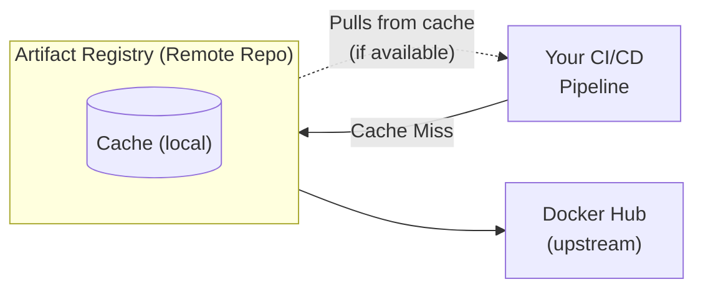
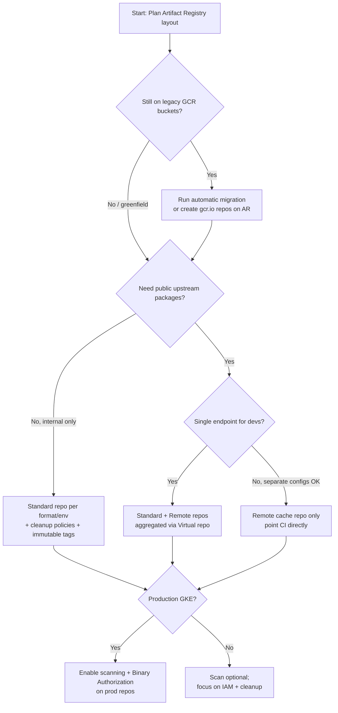

**Complexity**: `[MEDIUM]` | **Time to Complete**: 1h | **Prerequisites**: Module 2.1 (IAM & Resource Hierarchy)

This module sits at the intersection of security, developer experience, and cost management because every container deployment depends on a registry that teams often treat as invisible infrastructure until it breaks a build, blocks a deploy, or leaks an artifact.

## What You'll Be Able to Do

After completing this module, you will be able to:

- **Configure Artifact Registry repositories for container images, language packages, and OS packages**
- **Implement vulnerability scanning policies and understand Binary Authorization integration**
- **Configure remote and virtual repositories for upstream caching and package aggregation**
- **Secure Artifact Registry with IAM policies scoped to specific repositories**

---

## Why This Module Matters

Hypothetical scenario: A widely used npm package in your dependency tree is compromised when an attacker publishes malicious versions to the public registry. Any CI/CD pipeline that runs `npm install` directly against the public npm registry during the exposure window can pull compromised code into production builds. Companies that pull packages directly from the public npm registry have no defense. Companies that use a private registry with upstream caching have a critical advantage: in many cases, the malicious versions are not cached because their pipelines pull the cached (clean) versions already stored in the private registry.

This incident represents a growing threat: **supply chain attacks targeting public package registries**. Whether you are pulling container images from Docker Hub, npm packages from the npm registry, or Python packages from PyPI, you are trusting code written by strangers. Artifact Registry is GCP's managed solution for storing, managing, and securing software artifacts. It replaces the older Container Registry (GCR) and extends beyond Docker images to support npm, Maven, Python, Go, and OS packages.

In this module, you will learn how to create Artifact Registry repositories, push and pull container images, configure vulnerability scanning, set up IAM-based access control, and use remote repositories as upstream caches for public registries.

> **The Package Warehouse Analogy**
>
> Think of Artifact Registry as a secure warehouse for every kind of software artifact your organization ships. Container images sit on one shelf, npm packages on another, Maven JARs in climate-controlled storage, and Debian packages in labeled bins. Remote repositories are like a purchasing department that caches deliveries from external suppliers so your production line never waits on a third-party truck. Virtual repositories are the single loading dock where developers arrive with one badge swipe instead of hunting for the right aisle. IAM roles are the keycards that grant read-only access to floor workers, write access to the receiving dock, and admin access to the warehouse manager.

---

## Artifact Registry vs Container Registry

Container Registry (GCR) was GCP's original image registry, built on top of Cloud Storage buckets. Artifact Registry is its successor with significant improvements. Understanding the migration path matters because many production pipelines still reference `gcr.io` URLs in Kubernetes manifests, Cloud Build configs, and Terraform modules written years ago.

### GCR Deprecation and the gcr.io Transition

Google [deprecated Container Registry on May 15, 2023](https://cloud.google.com/artifact-registry/docs/transition/prepare-gcr-shutdown) and [shut down write access on March 18, 2025](https://cloud.google.com/kubernetes-engine/docs/deprecations/container-registry). After the shutdown timeline completed, images stored in legacy GCR buckets became inaccessible unless you had already migrated. The good news is that Artifact Registry can host [`gcr.io` repositories](https://cloud.google.com/artifact-registry/docs/transition/gcr-repositories) that transparently serve the same URLs your existing tooling expects, so a Kubernetes deployment referencing `gcr.io/my-project/my-app:v1` continues to work after migration without rewriting every manifest on day one.

For new work, Google recommends [`pkg.dev` URLs](https://cloud.google.com/artifact-registry/docs/docker/store-docker-container-images) (`REGION-docker.pkg.dev/PROJECT/REPO/IMAGE:TAG`) because they support regional placement, per-repository IAM, remote/virtual repository modes, and cleanup policies that the legacy multi-regional GCR hostnames cannot offer. The automatic migration tool (`gcloud artifacts docker upgrade migrate`) creates Artifact Registry repositories for each GCR host in your project and redirects traffic, which is the fastest path for teams that need backward compatibility during a phased rollout.

Hypothetical scenario: A platform team discovers that 40% of their GKE workloads still pull from `gcr.io` URLs embedded in Helm charts maintained by different product squads. Rather than forcing a big-bang URL rewrite across hundreds of charts, they run the automatic migration to stand up `gcr.io` repositories on Artifact Registry, then schedule a second phase to migrate each squad to regional `pkg.dev` endpoints where co-location with GKE clusters in `us-central1` eliminates cross-region pull latency.

| Feature | Container Registry (GCR) | Artifact Registry |
| :--- | :--- | :--- |
| **Formats** | Docker images only | Docker/OCI, Helm, Maven, npm, Python, Go, Apt, Yum, Kubeflow, Generic |
| **Repository granularity** | One registry per region, per project | Multiple named repositories per project |
| **IAM granularity** | Per-image is complex (bucket-level ACLs) | Per-repository IAM policies |
| **Vulnerability scanning** | Basic (Container Analysis) | Integrated automatic on-push + continuous rescanning |
| **Remote repositories** | Not supported | Upstream caching for Docker Hub, npm, Maven, PyPI |
| **Virtual repositories** | Not supported | Aggregate multiple repos behind a single endpoint |
| **Cleanup policies** | Manual scripting | Built-in tag and version cleanup policies |
| **CMEK encryption** | Not supported | Customer-managed keys at repository creation |
| **Immutable tags** | Not supported | Optional `--immutable-tags` per repository |
| **Status** | Shut down (March 2025) | Active development, recommended |

[Artifact Registry supports](https://cloud.google.com/artifact-registry/docs/supported-formats) Docker Image Manifest V2 (Schema 1 and 2), OCI image format specifications, and manifest lists for multi-architecture images. Helm charts packaged in OCI format store in Docker-format repositories alongside container images. Language-package formats (Maven, npm, Python, Go modules, Apt, Yum) each use dedicated repository types with format-specific client configuration, which lets a single GCP project host both the container images for your microservices and the internal npm packages those services depend on without operating separate registry infrastructure.

```bash
# Enable the Artifact Registry API
gcloud services enable artifactregistry.googleapis.com

# If you are still using GCR, migrate with:
gcloud artifacts docker upgrade migrate --projects=my-project
```

The migration command creates Artifact Registry repositories that mirror your existing GCR host layout and copies images asynchronously. During migration, both systems may serve traffic depending on your timeline, so plan the cutover during a maintenance window when you can validate that CI pipelines push successfully to the new endpoints and GKE clusters pull without ImagePullBackOff events or other unexpected deployment delays. After migration completes, update documentation and Terraform modules to reference `pkg.dev` URLs for new repositories even if legacy `gcr.io` URLs continue working through compatibility repositories.

Teams migrating from other cloud providers often compare Artifact Registry to Amazon ECR or Azure Container Registry. The GCP differentiators worth internalizing are unified multi-format support (not Docker-only), first-class remote and virtual repositories for upstream caching, and native integration with Binary Authorization and Artifact Analysis for supply chain security. The tradeoff is that Artifact Registry pricing is storage-based rather than per-image as some competitors charge, which makes cleanup policy discipline more important at scale for cost control.

---

## Creating Repositories

### Docker Repository

```bash
# Create a Docker repository
gcloud artifacts repositories create docker-repo \
  --repository-format=docker \
  --location=us-central1 \
  --description="Production Docker images" \
  --immutable-tags

# The --immutable-tags flag prevents overwriting existing tags.
# Once you push myapp:v1.0, nobody can push a different image with the same tag.
# This is critical for reproducibility and security.

# List repositories
gcloud artifacts repositories list --location=us-central1

# Describe a repository
gcloud artifacts repositories describe docker-repo \
  --location=us-central1
```

Repository names must be unique within a project and location combination, use lowercase letters and numbers with hyphens allowed, and appear in every image URL your teams reference. Choosing descriptive names like `prod-app-images` instead of generic `docker` prevents confusion when a project hosts a dozen repositories across environments and makes IAM audit logs readable when investigating who pushed to which store during a security review.

### Multi-Format Repositories

```bash
# Create npm repository
gcloud artifacts repositories create npm-repo \
  --repository-format=npm \
  --location=us-central1 \
  --description="Internal npm packages"

# Create Python (PyPI) repository
gcloud artifacts repositories create python-repo \
  --repository-format=python \
  --location=us-central1 \
  --description="Internal Python packages"

# Create Maven repository
gcloud artifacts repositories create maven-repo \
  --repository-format=maven \
  --location=us-central1 \
  --description="Internal Java artifacts"

# Create Apt repository (for Debian/Ubuntu packages)
gcloud artifacts repositories create apt-repo \
  --repository-format=apt \
  --location=us-central1 \
  --description="Internal Debian packages"

# Create Yum repository (for RPM packages on RHEL/CentOS)
gcloud artifacts repositories create yum-repo \
  --repository-format=yum \
  --location=us-central1 \
  --description="Internal RPM packages"

# Create Go module repository
gcloud artifacts repositories create go-repo \
  --repository-format=go \
  --location=us-central1 \
  --description="Internal Go modules"
```

Each repository format enforces its own naming and authentication conventions. Docker and Helm (OCI) clients use `gcloud auth configure-docker`; npm clients point `.npmrc` at the Artifact Registry npm endpoint; Maven and Gradle builds add a repository URL to `pom.xml` or `build.gradle`; Python clients configure `pip` or `twine` with the Artifact Registry PyPI URL. Choosing one repository per format per environment (for example, `prod-docker`, `staging-docker`) keeps IAM bindings and cleanup policies scoped to the blast radius you actually want, rather than mixing production and experimental artifacts in a single bucket-like namespace.

### Repository Location Strategy

Artifact Registry repositories are regional or multi-regional resources, and location choice affects latency, cost, and compliance simultaneously. Co-locating a Docker repository in `us-central1` with GKE clusters and Cloud Run services in the same region eliminates cross-region egress on every pod restart or scale-out event, which is the pattern most cost-conscious platform teams adopt for production workloads. Multi-regional repositories trade slightly higher storage cost for geographic redundancy when the same image must be pulled from clusters in different continents without maintaining duplicate repos per region.

Hypothetical scenario: A fintech team stores container images in `europe-west1` but runs primary GKE in `us-central1` for historical reasons. Every node that pulls an image pays cross-region egress on each layer download, and cold-start latency for Cloud Run revisions increases because the image travels an ocean before the container starts. Moving the production repository to `us-central1` and keeping a read-only replication workflow for the European DR cluster cuts monthly networking costs and aligns with data-residency discussions without changing application code.

---

## Managing Language Packages

While container images dominate Artifact Registry conversations, the same service hosts the language packages that those containers install during `docker build`. Centralizing npm, Maven, Python, and Go modules alongside the images that consume them gives security teams a single audit surface and gives developers consistent authentication across every artifact type.

### npm Packages

npm repositories use a dedicated endpoint format: `https://REGION-npm.pkg.dev/PROJECT/REPO/`. After creating an npm-format repository, configure your `.npmrc` to point at that URL and authenticate with the npm credential helper or a short-lived access token from `npx google-artifactregistry-auth`. Internal packages publish with `npm publish`; CI pipelines that previously pulled directly from the public npm registry can instead pull through a remote npm repository that caches upstream packages locally, which mitigates both rate limiting and the class of supply chain attack illustrated in this module's opening incident.

### Maven and Gradle Artifacts

Maven-format repositories integrate with standard Java build tooling through a repository URL added to `pom.xml` or `settings.xml`. Gradle projects reference the same URL in `build.gradle` or `build.gradle.kts`. Snapshot and release versioning behave as they would on Nexus or Artifactory, which makes Artifact Registry a viable replacement when your Java microservices already run on GKE and you want artifact storage in the same IAM boundary as your container images. Remote repositories can cache Maven Central so builds do not reach out to the public internet on every dependency resolution.

### Python (PyPI) Packages

Python-format repositories expose a PyPI-compatible index URL. Configure `pip` with `--index-url` or add the URL to `pip.conf` for persistent use. `twine upload` publishes internal wheels and sdists; `pip install` resolves dependencies from the same repository. Pairing a standard Python repository for internal packages with a remote PyPI cache gives data science teams the same upstream-buffering benefit that platform teams get from Docker Hub remote repos, which matters when a compromised package appears on PyPI after your nightly training job already cached the clean version.

### OS Packages (Apt and Yum)

Apt and Yum repositories store `.deb` and `.rpm` packages for golden-image builds and configuration management. Platform teams that bake custom OS packages into VM images or Dockerfile `RUN apt-get install` steps can host those packages privately instead of mirroring them on internal file servers with ad hoc authentication. The same IAM roles apply: CI systems that publish packages receive writer access, while production build pipelines receive reader access scoped to the specific repository.

---

## Working with Container Images

Pulling and pushing container images is the most common Artifact Registry workflow, but authentication differs depending on whether a human developer, a CI/CD pipeline, or a GKE node is performing the operation. Getting authentication wrong produces the frustrating `denied: Permission denied` error that masks whether the problem is missing Docker credentials, insufficient IAM, or a nonexistent repository.

### Authentication

```bash
# Configure Docker to authenticate with Artifact Registry
gcloud auth configure-docker us-central1-docker.pkg.dev --quiet

# This adds a credential helper to your Docker config (~/.docker/config.json)
# For other regions, specify them:
gcloud auth configure-docker us-central1-docker.pkg.dev,europe-west1-docker.pkg.dev
```

The `gcloud auth configure-docker` command installs a credential helper that exchanges your user or service account credentials for short-lived OAuth tokens on each `docker push` or `docker pull`. For CI/CD pipelines, bind `roles/artifactregistry.writer` to a dedicated service account and authenticate Cloud Build or your external runner with that identity rather than storing long-lived JSON keys. Cloud Build's default service account already has push access within the same project when you grant the writer role on the target repository.

For [GKE deployments](https://cloud.google.com/artifact-registry/docs/integrate-gke), image pulls authenticate through the **node service account**, not the Kubernetes ServiceAccount attached to individual pods. Grant `roles/artifactregistry.reader` on the repository to whichever IAM identity your node pool uses—typically the Compute Engine default service account (`PROJECT_NUMBER-compute@developer.gserviceaccount.com`) or a custom node service account you configured at cluster creation. If your Artifact Registry repository lives in a different GCP project than your GKE cluster, you must grant reader access cross-project; same-project deployments often work with defaults once the reader role is bound.

[Workload Identity Federation](https://cloud.google.com/artifact-registry/docs/access-control) lets external CI systems (GitHub Actions, GitLab CI, on-premises Jenkins) impersonate a GCP service account without downloading key files. The external identity provider exchanges OIDC tokens for GCP credentials, and the impersonated service account receives repository-scoped IAM roles. This pattern eliminates the key-rotation burden that makes service account JSON keys a recurring audit finding.

```bash
# Example: grant a Cloud Build service account push access (same project)
gcloud artifacts repositories add-iam-policy-binding docker-repo \
  --location=us-central1 \
  --member="serviceAccount:PROJECT_NUMBER@cloudbuild.gserviceaccount.com" \
  --role="roles/artifactregistry.writer"
```

### Building, Tagging, and Pushing

```bash
# Image URL format:
# REGION-docker.pkg.dev/PROJECT_ID/REPOSITORY/IMAGE:TAG

export PROJECT_ID=$(gcloud config get-value project)
export REGION=us-central1
export REPO=docker-repo

# Build an image locally
docker build -t my-api:v1.2.0 .

# Tag it for Artifact Registry
docker tag my-api:v1.2.0 \
  ${REGION}-docker.pkg.dev/${PROJECT_ID}/${REPO}/my-api:v1.2.0

# Push to Artifact Registry
docker push ${REGION}-docker.pkg.dev/${PROJECT_ID}/${REPO}/my-api:v1.2.0

# Also tag as latest
docker tag my-api:v1.2.0 \
  ${REGION}-docker.pkg.dev/${PROJECT_ID}/${REPO}/my-api:latest
docker push ${REGION}-docker.pkg.dev/${PROJECT_ID}/${REPO}/my-api:latest

# List images in the repository
gcloud artifacts docker images list \
  ${REGION}-docker.pkg.dev/${PROJECT_ID}/${REPO}

# List tags for a specific image
gcloud artifacts docker tags list \
  ${REGION}-docker.pkg.dev/${PROJECT_ID}/${REPO}/my-api

# Delete an image by digest
gcloud artifacts docker images delete \
  ${REGION}-docker.pkg.dev/${PROJECT_ID}/${REPO}/my-api@sha256:abc123... \
  --quiet
```

### Pulling Images

```bash
# Pull from Artifact Registry
docker pull ${REGION}-docker.pkg.dev/${PROJECT_ID}/${REPO}/my-api:v1.2.0

# Use in Kubernetes deployment
cat <<'YAML'
apiVersion: apps/v1
kind: Deployment
metadata:
  name: my-api
spec:
  replicas: 3
  selector:
    matchLabels:
      app: my-api
  template:
    metadata:
      labels:
        app: my-api
    spec:
      containers:
        - name: my-api
          image: us-central1-docker.pkg.dev/my-project/docker-repo/my-api:v1.2.0
          ports:
            - containerPort: 8080
YAML
```

### Multi-Architecture Images and Helm Charts

Modern deployment targets rarely standardize on a single CPU architecture. GKE clusters may mix x86 nodes with [Tau T2A ARM instances](https://cloud.google.com/compute/docs/tau-arm-vms) for cost optimization, and developer laptops on Apple Silicon build `linux/arm64` images locally. Artifact Registry supports [manifest lists and OCI image indexes](https://cloud.google.com/artifact-registry/docs/supported-formats) that let you push both `linux/amd64` and `linux/arm64` variants under a single tag; the container runtime selects the correct architecture automatically at pull time.

Build multi-arch images with Docker Buildx and push them in one command. The example below tags both architectures under a single version label so GKE nodes pull the correct variant automatically without separate deployment manifests per architecture family.

```bash
# Create and use a buildx builder (one-time setup)
docker buildx create --name multiarch --use

# Build and push multi-arch image to Artifact Registry
docker buildx build --platform linux/amd64,linux/arm64 \
  -t ${REGION}-docker.pkg.dev/${PROJECT_ID}/${REPO}/my-api:v1.2.0 \
  --push .
```

Helm 3.8+ supports OCI registries for chart storage, and Artifact Registry accepts Helm charts in Docker-format repositories because charts are packaged as OCI artifacts. Push a chart with `helm push my-chart-1.0.0.tgz oci://REGION-docker.pkg.dev/PROJECT/REPO` and install with `helm install my-release oci://REGION-docker.pkg.dev/PROJECT/REPO/my-chart --version 1.0.0`. Storing charts alongside the container images they deploy keeps the release artifact bundle in one IAM-scoped repository, which simplifies audit questions about which chart version deployed which image digest.

When you reference images by digest rather than tag in Kubernetes manifests (`image: repo/my-app@sha256:abc123...`), you eliminate tag-mutation risk entirely. Immutable tags are a softer guarantee—they prevent overwrites but still allow two different builds to reuse the same tag name if someone deletes and recreates the tag through policy changes—so digest pinning remains the gold standard for production deployments that must prove exactly which bits ran in a given incident investigation.

---

## Vulnerability Scanning

Artifact Registry integrates with [Artifact Analysis](https://cloud.google.com/artifact-analysis/docs/container-scanning-overview) (formerly Container Analysis) to automatically scan container images for known vulnerabilities in OS packages and language-level dependencies. Scanning is a paid capability—[each initial scan costs $0.26 per image digest](https://cloud.google.com/artifact-analysis/pricing), and rescans of the same digest are free—so enabling the Container Scanning API on a project where CI pushes hundreds of unique images daily can produce a noticeable line item unless you design scanning gates deliberately.

### Enabling and Configuring Scanning

```bash
# Enable the Container Scanning API (required for on-push scan results)
gcloud services enable containeranalysis.googleapis.com \
  containerscanning.googleapis.com

# Scanning happens automatically when you push an image after the API is enabled.
# You can also trigger an on-demand scan:
gcloud artifacts docker images scan \
  ${REGION}-docker.pkg.dev/${PROJECT_ID}/${REPO}/my-api:v1.2.0 \
  --location=us-central1
```

Automatic scanning triggers on the first push of each unique image digest. Because images are identified by digest, retagging an existing digest does not incur another scan charge. [Continuous scanning](https://cloud.google.com/artifact-analysis/docs/container-scanning-overview) re-evaluates stored images when new CVE data arrives, which means a image that passed inspection last week may surface new HIGH findings today without any code change on your side—exactly the behavior you want for supply chain monitoring, but surprising if your deployment pipeline treats "scanned once" as "safe forever."

Artifact Analysis inspects both the operating-system packages in your base image layer and application-level dependencies where supported. The severity table below maps CVSS scores to recommended response timelines; production teams typically wire CRITICAL and HIGH findings into CI gates or Binary Authorization policies rather than relying on developers to check scan results manually.

### Viewing Scan Results

```bash
# List vulnerabilities for a specific image
gcloud artifacts docker images list \
  ${REGION}-docker.pkg.dev/${PROJECT_ID}/${REPO} \
  --show-occurrences \
  --format="table(package, version, createTime, updateTime)"

# Get detailed vulnerability report
gcloud artifacts vulnerabilities list \
  ${REGION}-docker.pkg.dev/${PROJECT_ID}/${REPO}/my-api:v1.2.0 \
  --format="table(vulnerability.shortDescription, vulnerability.cvssScore, vulnerability.severity, vulnerability.packageIssue[0].affectedPackage)"
```

Scan results appear in the Google Cloud console under Artifact Registry, in the gcloud output above, and through the Container Analysis API for integration with SIEM or ticketing systems. Each finding links to a CVE identifier, affected package name, installed version, and fixed version when available. Platform teams typically define a policy document—often enforced through Binary Authorization or a CI script—that blocks promotion of images containing CRITICAL vulnerabilities and requires a ticket reference for HIGH findings that cannot be patched immediately because the upstream fix is not yet released.

Building a vulnerability scanning policy means deciding three things: which severities block deployment, who can grant exceptions, and how continuous rescanning alerts reach on-call engineers when a previously clean stored digest gains new CRITICAL findings overnight. The first decision belongs to security and product leadership; the second needs an audit trail; the third requires Pub/Sub notifications or Security Command Center integration so findings do not sit unread in a console tab.

> **Hypothetical scenario: The Silent Scan Failure**
>
> Hypothetical scenario: A platform team enabled vulnerability scanning on their production Docker repository but never wired scan results into the deployment pipeline. Developers assumed green CI checks meant secure images. When a CRITICAL OpenSSL CVE dropped on a Tuesday evening, continuous scanning flagged twelve production images within hours—but nobody noticed until a external researcher emailed the security team on Friday. The fix required emergency rebuilds of every affected image, attestations for Binary Authorization, and a retroactive policy mandating that CI fail on CRITICAL findings before images reach the production repository. The scanning feature worked exactly as designed; the failure was organizational, not technical.

### Severity Levels

| Severity | CVSS Score | Action |
| :--- | :--- | :--- |
| **CRITICAL** | 9.0 - 10.0 | Block deployment, fix immediately |
| **HIGH** | 7.0 - 8.9 | Fix before next release |
| **MEDIUM** | 4.0 - 6.9 | Fix within sprint |
| **LOW** | 0.1 - 3.9 | Track and fix at convenience |
| **MINIMAL** | 0.0 | Informational |

**Pause and predict:** You configure automatic vulnerability scanning on an Artifact Registry repository and push an application container image that the scanner immediately flags with multiple CRITICAL CVE findings. An engineer then applies a Kubernetes deployment manifest that references this image digest on a standard GKE cluster. What happens at admit time, and what would you have to add if scanning alone is not enough?

<details>
<summary>Check your prediction</summary>

Automatic vulnerability scanning in Artifact Registry operates strictly as an informational audit service and does not enforce admission control by itself; GKE admits and executes the image unless a Binary Authorization policy paired with cryptographic attestations explicitly evaluates and blocks unverified digests at admission time.
</details>

Decoupling registry inspection from cluster admission is a two-control-plane problem. The next section is how production teams attach an extra gate after the scan, not instead of it.

### Binary Authorization Integration

For production environments, you can enforce that only scanned and approved images are deployed to GKE. [Binary Authorization](https://cloud.google.com/binary-authorization/docs/overview) evaluates attestations attached to images before GKE admits them into the cluster, closing the gap between "we scanned it" and "we deployed it anyway."

```bash
# Enable Binary Authorization
gcloud services enable binaryauthorization.googleapis.com

# The full Binary Authorization setup is beyond this module,
# but the key concept is:
# 1. Images are pushed to Artifact Registry
# 2. Vulnerability scanning runs automatically
# 3. An attestor signs images that pass the scan
# 4. GKE clusters only run images with valid attestations
```

A typical production pipeline pushes the image, waits for scan completion, and only then continues the release. The next module-owned control is who is allowed to sign that continuation, and which compute service actually checks the signature before a Pod is admitted.

---

## IAM Access Control

Artifact Registry supports fine-grained IAM at the repository level, which is one of the primary reasons teams migrate from legacy GCR bucket ACLs. Project-level roles like `roles/artifactregistry.admin` grant control over every repository in the project; repository-level bindings limit CI/CD push access to `docker-repo` without exposing `npm-repo` or production-only image stores.

### Common Roles

| Role | Permissions | Typical User |
| :--- | :--- | :--- |
| `roles/artifactregistry.reader` | Pull images, list repos | GKE nodes, Cloud Run, developers |
| `roles/artifactregistry.writer` | Pull + push images | CI/CD pipelines |
| `roles/artifactregistry.repoAdmin` | Full control over a repo | Platform engineers |
| `roles/artifactregistry.admin` | Full control over all repos | Registry administrators |

The [Artifact Registry service agent](https://cloud.google.com/artifact-registry/docs/access-control) (`service-PROJECT_NUMBER@gcp-sa-artifactregistry.iam.gserviceaccount.com`) requires KMS permissions when you use customer-managed encryption keys. Cloud Run, Cloud Build, and GKE each have their own service agents documented in the access-control guide—grant the minimum repository role to the agent that actually pulls or pushes, not a project-wide admin role "just to make it work."

```bash
# Grant a CI/CD service account push access to a specific repository
gcloud artifacts repositories add-iam-policy-binding docker-repo \
  --location=us-central1 \
  --member="serviceAccount:ci-pipeline@my-project.iam.gserviceaccount.com" \
  --role="roles/artifactregistry.writer"

# Grant GKE node service account read access
gcloud artifacts repositories add-iam-policy-binding docker-repo \
  --location=us-central1 \
  --member="serviceAccount:gke-nodes@my-project.iam.gserviceaccount.com" \
  --role="roles/artifactregistry.reader"

# Grant a developer group read access (for pulling images locally)
gcloud artifacts repositories add-iam-policy-binding docker-repo \
  --location=us-central1 \
  --member="group:developers@example.com" \
  --role="roles/artifactregistry.reader"

# View repository IAM policy
gcloud artifacts repositories get-iam-policy docker-repo \
  --location=us-central1
```

Cross-project access is a frequent source of ImagePullBackOff errors in GKE. When your cluster runs in project `app-prod` but images live in project `shared-artifacts`, you must grant `roles/artifactregistry.reader` on the repository in `shared-artifacts` to the node service account from `app-prod`. Project-level IAM bindings work but violate least privilege because they grant access to every repository in the project; repository-level bindings limit the blast radius if a node is compromised.

Cloud Run and Cloud Functions pull images through the Cloud Run service agent (`service-PROJECT_NUMBER@serverless-robot-prod.iam.gserviceaccount.com`), which needs reader access on the repository hosting the container image specified in the service definition. App Engine flexible environment uses its own service account (`PROJECT_ID@appspot.gserviceaccount.com`). Each compute service has a documented service agent in the [access control guide](https://cloud.google.com/artifact-registry/docs/access-control), and granting the wrong agent is a common copy-paste mistake during initial setup.

For human developers who need local pull access, bind `roles/artifactregistry.reader` to a Google Group rather than individual users so onboarding and offboarding happen through group membership. Developers who also need push access for manual hotfix builds receive writer on staging repositories only; production repositories receive pushes exclusively from CI service accounts with Binary Authorization attestations downstream.

---

## Cloud Build Integration

Most teams do not push container images manually from laptops; Cloud Build or another CI system builds, tags, and pushes on every merge. Artifact Registry integrates natively with Cloud Build through the `gcloud builds submit` workflow and through `cloudbuild.yaml` steps that reference Artifact Registry image URLs directly.

A typical Cloud Build pipeline enables the Artifact Registry and Container Analysis APIs, builds a Docker image with Kaniko or Docker builder, tags it with both a git commit SHA and a semver release tag, pushes to a regional repository, waits for vulnerability scanning to complete, and only then deploys to GKE or Cloud Run. Keeping the build and registry in the same region avoids egress charges and reduces push latency during large layer uploads.

```yaml
# cloudbuild.yaml excerpt — build and push to Artifact Registry
steps:
  - name: 'gcr.io/cloud-builders/docker'
    args:
      - 'build'
      - '-t'
      - '${_REGION}-docker.pkg.dev/${PROJECT_ID}/${_REPO}/${_IMAGE}:${SHORT_SHA}'
      - '-t'
      - '${_REGION}-docker.pkg.dev/${PROJECT_ID}/${_REPO}/${_IMAGE}:${_TAG}'
      - '.'
  - name: 'gcr.io/cloud-builders/docker'
    args:
      - 'push'
      - '--all-tags'
      - '${_REGION}-docker.pkg.dev/${PROJECT_ID}/${_REPO}/${_IMAGE}'
substitutions:
  _REGION: us-central1
  _REPO: app-images
  _IMAGE: my-api
  _TAG: latest
```

Cloud Build's service account needs `roles/artifactregistry.writer` on the target repository. If builds pull base images through a remote Docker Hub cache, the build service account also needs reader access on the remote repository. Separating build-time permissions (writer on staging repo) from deploy-time permissions (reader on production repo, attestation signer) enforces the same promotion workflow that Binary Authorization expects downstream.

When Cloud Build runs inside a private pool or VPC-SC perimeter, verify that Artifact Registry endpoints are allowed through your service perimeter. [VPC Service Controls documentation for Artifact Registry](https://cloud.google.com/artifact-registry/docs/securing-artifacts) covers restricted-network access from perimeters, which matters for regulated industries that cannot reach Google APIs over the public internet without explicit perimeter configuration.

---

## Remote Repositories: Upstream Caching

Remote repositories act as caching proxies for public registries. When you pull an artifact through a remote repository, Artifact Registry fetches it from the upstream on a cache miss and stores a local copy. Subsequent pulls serve from your regional cache, which improves build speed, reduces exposure to upstream outages, and creates a buffer against supply chain attacks where a compromised package appears on a public registry after your pipeline already cached a clean version.

[Remote repositories support](https://cloud.google.com/artifact-registry/docs/repositories/remote-overview) upstream sources including Docker Hub, Maven Central, npmjs, PyPI, and others depending on repository format. Remote repos are read-through caches: you cannot push artifacts into them, only pull. Storage consumed by cached upstream artifacts counts toward your Artifact Registry storage bill, which is why pairing remote repos with cleanup policies matters for long-running CI pipelines that pull many unique tag combinations.



**Pause and predict:** An upstream public container registry experiences an unscheduled complete outage while enterprise build systems are actively running. How does this upstream downtime impact CI/CD pipelines that pull their required base container images through an Artifact Registry remote repository?

<details>
<summary>Check your prediction</summary>

Pipelines requesting image tags that were previously pulled and cached will continue executing normally because Artifact Registry serves cached layers directly from regional storage without contacting the upstream provider. Conversely, any pipeline requesting an uncached image tag or attempting a first-time pull will fail immediately because the remote repository cannot connect to the unreachable public registry to fetch missing blobs.
</details>

Configuring an upstream proxy is a client-URL problem before it is an availability story. The next commands create the regional remote repositories your build runners will actually pull from.

```bash
# Create a remote repository that caches Docker Hub
gcloud artifacts repositories create dockerhub-cache \
  --repository-format=docker \
  --location=us-central1 \
  --description="Docker Hub upstream cache" \
  --mode=remote-repository \
  --remote-repo-config-desc="Docker Hub" \
  --remote-docker-repo=DOCKER-HUB

# Create a remote repository for npm
gcloud artifacts repositories create npm-cache \
  --repository-format=npm \
  --location=us-central1 \
  --description="npm registry upstream cache" \
  --mode=remote-repository \
  --remote-repo-config-desc="npm Registry" \
  --remote-npm-repo=NPMJS

# Create a remote repository for PyPI
gcloud artifacts repositories create pypi-cache \
  --repository-format=python \
  --location=us-central1 \
  --description="PyPI upstream cache" \
  --mode=remote-repository \
  --remote-repo-config-desc="PyPI" \
  --remote-python-repo=PYPI

# Pull an image through the remote repository
# Note: Docker Hub official images require the 'library/' namespace prefix
docker pull us-central1-docker.pkg.dev/${PROJECT_ID}/dockerhub-cache/library/nginx:1.25

# Verify the cached image is listed in repository storage
gcloud artifacts docker images list us-central1-docker.pkg.dev/${PROJECT_ID}/dockerhub-cache
```

Docker Hub official images require the `library/` namespace prefix when pulling through Artifact Registry, as shown in the nginx example above. Docker Hub namespaces official images under `library/` even when users omit it in direct Hub pulls. Private organization repositories on Docker Hub require the organization name in the path prefix, matching the exact namespace structure maintained by the upstream public registry.

For npm, Maven, and Python remote repos, the upstream configuration uses enumerated constants like `NPMJS`, `MAVEN-CENTRAL`, and `PYPI` in the gcloud command. Remote repositories support authenticated upstream access for private Docker Hub organizations and other protected registries by storing credentials in a Secret Manager secret referenced in the remote repository configuration—see the [remote repository guide](https://cloud.google.com/artifact-registry/docs/repositories/remote-overview).

Hypothetical scenario: Your CI pipeline builds 200 times per day and each build pulls `node:20-bookworm-slim` from Docker Hub. Without a remote cache, you hit Docker Hub rate limits within the first hour and builds fail unpredictably. After creating a remote repository and updating CI to pull through `us-central1-docker.pkg.dev/PROJECT/dockerhub-cache/library/node:20-bookworm-slim`, daily builds consume regional network paths, protecting release velocity and eliminating outbound network transfer overhead across engineering environments.

### Virtual Repositories

**Pause and predict:** You configure an Artifact Registry virtual repository. The repository aggregates an upstream public remote cache assigned priority 200 with an internal standard repository assigned priority 100. When a client requests a package whose name exists in both repositories, which artifact does Artifact Registry return, and what security vulnerability does this policy create?

<details>
<summary>Check your prediction</summary>

Artifact Registry evaluates upstream policies where higher numerical priority values win, meaning the public remote cache at priority 200 is served instead of the internal artifact at priority 100. Because the public repository takes precedence, this configuration creates a dependency confusion vulnerability where an external attacker can publish a malicious package with the same name to the public registry, tricking the virtual repository into serving compromised code to internal builds. To prevent dependency confusion, internal standard repositories must always be assigned a higher priority value than public remote caches.
</details>

Virtual repositories provide a single endpoint that aggregates multiple upstream repositories (both standard and remote). The next objects are the upstream-policy file and the gcloud create that wire those upstreams together for Docker, npm, or pip clients.

```bash
# Create a virtual repository that combines your internal repo and Docker Hub cache
gcloud artifacts repositories create docker-virtual \
  --repository-format=docker \
  --location=us-central1 \
  --description="Virtual Docker repository" \
  --mode=virtual-repository \
  --upstream-policy-file=upstream-policy.json
```

```json
[
  {
    "id": "internal",
    "repository": "projects/my-project/locations/us-central1/repositories/docker-repo",
    "priority": 200
  },
  {
    "id": "dockerhub",
    "repository": "projects/my-project/locations/us-central1/repositories/dockerhub-cache",
    "priority": 100
  }
]
```

With this configuration, pulls from the virtual repository check upstreams by priority (highest first). The internal standard repository at priority 200 wins when both it and the Docker Hub cache contain an artifact with the same name; the remote cache at priority 100 is consulted only when the internal repo has no match. Developers configure a single registry URL in Docker, npm, or pip settings, which reduces misconfiguration and makes dependency-confusion defenses easier because internal package names resolve to internal artifacts before the public cache is consulted.

When designing upstream priority, remember that **higher numbers win**. A common mistake sets the remote cache at priority 200 and the internal repo at priority 100, which inverts the intended behavior and serves public packages even when an internal artifact exists. Document priority ordering in your platform runbook so teams configuring virtual repositories do not accidentally expose themselves to dependency confusion attacks through inverted priority values.

---

## Cleanup Policies

**Pause and predict:** You apply a cleanup policy configured to delete untagged container images older than thirty days. Your automated release pipeline immediately pushes an updated build that retags the floating `latest` pointer to a new digest. When does your repository storage footprint actually decrease, and how can you safely preview which artifacts match the policy before deletions occur?

<details>
<summary>Check your prediction</summary>

Storage utilization does not decrease immediately because Artifact Registry evaluates cleanup policies via an asynchronous background job that executes approximately once per day; the superseded image digest remains untagged and continues to incur storage charges until that background process completes its evaluation cycle. To preview and verify which container images and package versions match the configured deletion rules without actually removing any data, execute the policy assignment command with the `--dry-run` flag.
</details>

[Cleanup policies](https://cloud.google.com/artifact-registry/docs/repositories/cleanup-policy) are how you stop a busy CI repository from growing unbounded. The next objects are the policy JSON and the gcloud command that attaches it to a named repository.

Untagged images accumulate silently when CI pipelines push both digest-pinned builds and floating tags like `latest` or branch names. Each push of `my-app:main` creates a new digest while the previous digest becomes untagged but still billable storage. A delete policy targeting untagged images older than 30 days, combined with a keep policy retaining the ten most recent `v`-prefixed release tags, balances cost control against the ability to roll back to a recent production build.

```bash
# Create a cleanup policy that deletes untagged images older than 30 days
gcloud artifacts repositories set-cleanup-policies docker-repo \
  --location=us-central1 \
  --policy=cleanup-policy.json
```

```json
[
  {
    "name": "delete-untagged",
    "action": {"type": "Delete"},
    "condition": {
      "tagState": "untagged",
      "olderThan": "2592000s"
    }
  },
  {
    "name": "keep-recent-tagged",
    "action": {"type": "Keep"},
    "condition": {
      "tagState": "tagged",
      "tagPrefixes": ["v"]
    },
    "mostRecentVersions": {
      "keepCount": 10
    }
  }
]
```

---

## Encryption with Customer-Managed Keys (CMEK)

By default, Artifact Registry encrypts all stored artifacts with [Google-managed encryption keys](https://cloud.google.com/artifact-registry/docs/cmek). For regulated workloads that require control over key rotation, geographic location, and audit trails, you can assign a [Cloud KMS customer-managed encryption key (CMEK)](https://cloud.google.com/kms/docs/cmek) when creating a repository. CMEK is set at repository creation time—you cannot convert an existing repository from Google-managed to CMEK encryption later, which means planning encryption requirements before the first push avoids a painful re-upload migration.

```bash
# Grant the Artifact Registry service agent access to the KMS key
export PROJECT_NUMBER=$(gcloud projects describe $PROJECT_ID --format="value(projectNumber)")

gcloud kms keys add-iam-policy-binding my-ar-key \
  --location=us-central1 \
  --keyring=my-keyring \
  --member="serviceAccount:service-${PROJECT_NUMBER}@gcp-sa-artifactregistry.iam.gserviceaccount.com" \
  --role="roles/cloudkms.cryptoKeyEncrypterDecrypter"

# Create a CMEK-encrypted Docker repository
gcloud artifacts repositories create prod-images-cmek \
  --repository-format=docker \
  --location=us-central1 \
  --kms-key=projects/${PROJECT_ID}/locations/us-central1/keyRings/my-keyring/cryptoKeys/my-ar-key \
  --immutable-tags
```

Organization policy constraints such as `constraints/gcp.restrictCmekCryptoKeyProjects` can require that all new Artifact Registry repositories use keys from an approved KMS project. Cloud KMS Autokey generates keys on demand during repository creation. This reduces manual key-provisioning steps for platform teams operating dozens of repositories across environments.

---

## Understanding the Artifact Registry Cost Model

Artifact Registry billing has three independent components—storage, data transfer, and vulnerability scanning—and teams that monitor only storage often miss the scanning line item that grows with CI velocity.

### Storage Pricing

[Artifact Registry storage](https://cloud.google.com/artifact-registry/pricing) costs **$0.10 per GB per month** for usage above the **0.5 GB free tier** (aggregated across all projects attached to a billing account). Regional and multi-regional repositories use the same storage rate. Remote repository caches count toward storage because every upstream artifact you pull through the cache persists locally until a cleanup policy or manual deletion removes it.

At moderate scale—say 200 GB of container images and cached upstream packages across production and staging repositories—storage alone runs roughly $20/month after the free tier. That sounds modest until you realize a single team pushing unique `:sha-${GIT_COMMIT}` tags on every build without cleanup policies can add 5–10 GB per week of mostly-untagged digests that nobody pulls again.

### Data Transfer

Pulling images from Artifact Registry to GKE nodes, Cloud Run, or Compute Engine **within the same region** incurs **no egress charge**—this is the co-location pattern that makes regional `pkg.dev` repositories cheaper than pulling from a multi-regional `gcr.io` host across regions. Cross-region pulls, pulls to on-premises infrastructure, and pulls to other cloud providers incur standard [GCP network egress rates](https://cloud.google.com/artifact-registry/pricing). Remote repositories reduce egress to public registries because the first pull from Docker Hub crosses the internet boundary once; subsequent CI runs pull from your regional cache over Google's network.

### Vulnerability Scanning Costs

Each unique image digest scanned costs **$0.26** on first push; rescans of the same digest are free. A pipeline that builds 50 distinct images per day across five microservices generates roughly 1,500 initial scans per month, or about **$390/month** in scanning alone. Mitigations include scanning only release-candidate tags (not every feature-branch build), using a dedicated scanning project, and relying on continuous rescanning of stored digests rather than pushing duplicate builds with identical content under new tags.

### Cost Control Knobs

| Knob | What It Reduces | Tradeoff |
| :--- | :--- | :--- |
| Cleanup policies for untagged digests | Storage growth from CI churn | Must retain enough tagged history for rollbacks |
| Regional repos co-located with GKE | Cross-region egress | Less geographic redundancy for image pulls |
| Remote repos for public base images | Docker Hub egress + rate limits | Cached upstream artifacts still bill for storage |
| Scan only release tags | Scanning charges | Feature branches deploy without fresh scan data |
| Immutable tags + digest pinning | Accidental re-push/rescan cycles | Requires pipeline discipline on tag naming |

### What Makes Costs Spike Unexpectedly

Hypothetical scenario: A data platform team enables vulnerability scanning project-wide, then a monorepo CI job starts building 200 Docker variants nightly—one per combination of base image, Python version, and CUDA driver. Within a month, storage crosses 2 TB ($200/month) and scanning adds $1,300/month because each variant is a new digest. The fix is not disabling scanning; it is restructuring the build matrix to reuse base layers, applying cleanup policies to ephemeral tags, and gating scans on merge-to-main rather than every pull request build.

---

## Patterns & Anti-Patterns

| Pattern | When to Use | Why It Works | Scaling Note |
| :--- | :--- | :--- | :--- |
| **Regional repo per environment** | Separate `prod`, `staging`, and `dev` Docker repos in the same region as GKE | IAM and cleanup policies differ per environment; in-region pulls avoid egress | Add repos per team only when IAM isolation requires it—repo sprawl complicates virtual upstream configs |
| **Remote cache + virtual repo** | Teams consume both internal and public packages | Single endpoint for developers; internal repo at higher priority wins over public cache | Monitor remote cache storage; high-cardinality public tag pulls fill cache quickly |
| **Immutable tags on production repos** | Any repo receiving release artifacts | Prevents tag mutation attacks and accidental overwrites | Pair with digest references in Kubernetes manifests for strongest guarantees |
| **Repo-scoped CI service accounts** | Every pipeline that pushes images | Writer role on one repo cannot poison unrelated npm or staging repos | Create one SA per pipeline class, not one shared `ci@` with admin |
| **Cleanup: delete untagged, keep N releases** | High-churn CI repos | Stops silent storage growth from floating branch tags | Test with `--dry-run`; policies take ~24h to apply |
| **Binary Authorization gate** | Production GKE clusters | Closes the gap between scanning and deployment | Requires attestor setup; start with audit mode before enforce |

| Anti-Pattern | What Goes Wrong | Why Teams Fall Into It | Better Alternative |
| :--- | :--- | :--- | :--- |
| **Project-wide `artifactregistry.admin` for CI** | Compromised pipeline can delete or poison every repo | Admin avoids debugging permission errors | `artifactregistry.writer` scoped to target repo |
| **Scanning every branch build** | Scanning bill scales with commit frequency | "Enable scanning everywhere" sounds secure | Scan release tags; use continuous rescan for stored digests |
| **Remote repo without cleanup** | Cache grows unbounded with unique upstream tags | Remote repos feel "free" because pulls are fast | Apply delete policies to cached artifacts or monitor storage |
| **Cross-region image pulls** | Egress charges and slower pod startup | Reusing `us` multi-region URLs after migrating from GCR | Regional `pkg.dev` in the same region as compute |
| **Relying on `latest` in production** | Rollbacks impossible; tag mutation risk | Convenient in dev, copied to prod manifests | Semver or git-SHA tags; immutable tags enabled |
| **Skipping GCR migration** | Pull failures after shutdown timeline | "It still works today" deferral | Run `gcloud artifacts docker upgrade migrate` or move to `pkg.dev` |

---

## Decision Framework: Repository Architecture Choices

Use this framework when designing Artifact Registry layout for a new platform or migrating from legacy GCR. The three most common decision points are migration strategy, upstream caching model, and scanning enforcement depth.



### Decision Matrix

| Decision | Option A | Option B | Choose A When | Choose B When |
| :--- | :--- | :--- | :--- | :--- |
| **Migration** | `gcr.io` repos on Artifact Registry | New `pkg.dev` regional repos | Need zero-downtime URL compatibility during phased migration | Greenfield or ready for manifest URL updates |
| **Upstream access** | Remote repository only | Virtual repo (internal + remote) | CI pulls public images; devs rarely mix sources | Devs need one `.npmrc` / Docker config for internal + public |
| **Scanning gate** | Scan all pushes | Scan release tags only | Low push volume; strict compliance | High-churn CI; cost-sensitive; use continuous rescan |
| **Encryption** | Google-managed keys | CMEK at repo creation | Default security sufficient | Regulatory requirement for customer key control |
| **Tag strategy** | Immutable semver tags | Floating branch tags + cleanup | Production deployments | Ephemeral dev/staging repos with aggressive cleanup |

### Scanning Gate Decision

If your CI pushes fewer than 20 unique production-bound images per week, enable automatic scanning on every push. Wire CRITICAL findings to block deploy. If CI pushes hundreds of feature-branch images daily, scan on merge to main instead. Promote only tagged release artifacts to the production repository where Binary Authorization enforces attestations. The cost difference between these models can be an order of magnitude at scale. Security outcomes stay similar when continuous rescanning covers stored release digests.

---

## Operational Monitoring and Troubleshooting

Artifact Registry problems surface in three places: CI logs during push/pull, GKE events as ImagePullBackOff, and billing reports showing unexpected storage or scanning growth. Knowing which diagnostic path to follow saves hours of misdirected debugging.

When `docker push` returns `denied: Permission denied`, check credentials first (`gcloud auth configure-docker`), then repository existence and region, then IAM bindings on the repository—not the project. Artifact Registry intentionally returns generic permission errors for nonexistent repos to avoid leaking resource names to unauthorized callers.

When GKE pods enter ImagePullBackOff, verify the image URL format (`REGION-docker.pkg.dev/PROJECT/REPO/IMAGE:TAG`), confirm the repository exists in the stated region, and grant `roles/artifactregistry.reader` to the node service account on that repository. Cross-project pulls require explicit cross-project IAM; same-project pulls with the default Compute Engine service account still need the reader role bound after least-privilege hardening removes legacy broad storage permissions.

Storage growth without traffic growth almost always means untagged digests accumulating from CI. Run `gcloud artifacts docker images list` with `--include-tags` to identify images with empty tag columns, then implement cleanup policies in dry-run mode before enabling deletion. Scanning cost spikes correlate with unique digest count—audit CI for pipelines that push `:latest` or `:sha-$CI_COMMIT` on every branch build without deduplication.

Audit logs for Artifact Registry record push, pull, and delete operations when data access logging is enabled. Enable the `DATA_WRITE` audit log type for `artifactregistry.googleapis.com` to trace who pushed a malicious image or who deleted a release tag during an incident investigation. Cleanup policy dry runs also appear in audit logs, which helps validate that a new delete rule will not remove production release tags before the policy goes live.

Multi-team platforms often ask whether to share one Docker repository or isolate per team. The recommended pattern creates one shared remote repository for Docker Hub caching (all teams need reader access), separate standard repositories per team for internal images (writer IAM scoped to each team's CI service account), and optional virtual repositories per team that prioritize internal images over the shared cache. Shared caching avoids duplicate storage of `node:20-bookworm-slim` across fifteen teams, while separate standard repositories prevent Team A's compromised pipeline from pushing malicious images into Team B's release namespace.

---

## Did You Know?

1. **Artifact Registry is the managed successor to Container Registry** and supports Docker/OCI images, language packages, and OS packages across regional repositories with per-repository IAM.

2. **The `--immutable-tags` flag prevents tag mutation attacks**. Without it, someone with push access can overwrite `myapp:v1.0` with a completely different image. This is a real attack vector---an attacker who compromises a CI/CD pipeline can replace a known-good image tag with a malicious one. Immutable tags guarantee that `v1.0` always refers to the exact same image digest.

3. **Remote repositories save egress and rate-limit exposure** for teams that pull heavily from public registries. Instead of every CI/CD run pulling `node:20-slim` from Docker Hub (incurring egress costs and being subject to Docker Hub rate limits), the image is cached locally after the first pull. Google hosts `mirror.gcr.io` as a pull-through cache for frequently requested Docker Hub images on Artifact Registry infrastructure, which GKE documentation references for base image pulls when you do not operate your own remote repository.

4. **Artifact Registry supports multi-architecture images (manifest lists)** out of the box. You can push both `linux/amd64` and `linux/arm64` variants under the same tag, and Docker or Kubernetes will automatically pull the correct architecture for the host platform. This is increasingly important as ARM-based instances (like GCP's Tau T2A) become popular for cost savings.

---

## Common Mistakes

| Mistake | Why It Happens | How to Fix It |
| :--- | :--- | :--- |
| Still using Container Registry (gcr.io) | Old tutorials and existing pipelines reference it | Migrate to Artifact Registry; GCR is deprecated |
| Not enabling vulnerability scanning | Scanning is not enabled by default on all repos | Enable it on every Docker repository |
| Using `latest` tag in production | Convenient during development | Always use specific version tags; enable `--immutable-tags` |
| Granting `artifactregistry.admin` to CI/CD | Shortcut to avoid permission errors | CI/CD only needs `artifactregistry.writer` for push |
| Not setting up cleanup policies | Storage seems cheap initially | Implement cleanup policies; untagged images accumulate fast |
| Pulling public images directly in CI/CD | Works fine until Docker Hub rate-limits you | Set up remote repositories as upstream caches |
| Forgetting to configure Docker auth | `docker push` fails with "denied" | Run `gcloud auth configure-docker REGION-docker.pkg.dev` |
| Not using immutable tags | Default behavior allows tag overwriting | Enable `--immutable-tags` on all production repositories |

---

## Quiz

<details>
<summary>1. Your organization has multiple teams publishing internal npm packages, while also relying heavily on public packages from the npm registry. Developers are complaining that they have to configure multiple registry URLs in their `.npmrc` files, and CI builds occasionally fail due to rate limits on the public npm registry. How can you use Artifact Registry's repository types to solve these issues simultaneously?</summary>

You should create a standard repository for the internal packages and a remote repository configured to cache the public npm registry. Then, you can create a virtual repository that aggregates both the standard and remote repositories behind a single endpoint. This solves the developers' configuration issue because they only need to point their `.npmrc` to the single virtual repository URL. It also solves the CI rate-limiting issue because the remote repository caches the public npm packages locally upon the first pull, serving all subsequent CI requests directly from GCP's internal network without hitting the public registry.
</details>

<details>
<summary>2. A deployment of your `frontend:v2.1` image worked flawlessly in the staging environment yesterday. Today, the exact same deployment YAML (referencing `frontend:v2.1`) was deployed to production, but the application crashed on startup with a missing dependency error. Assuming no environmental differences, what security and reliability risk likely occurred, and how could it have been prevented in Artifact Registry?</summary>

The likely cause is that a developer or a compromised pipeline overwrote the `frontend:v2.1` image tag with a new, defective image digest after the staging deployment. This is a classic tag mutation issue, which poses a severe security and reliability risk because a known-good tag can be silently swapped with malicious or broken code. You could have prevented this by enabling the `--immutable-tags` flag on the production Docker repository. When this flag is enabled, Artifact Registry permanently locks the tag to the original image digest, ensuring that once `v2.1` is pushed, it can never be altered or overwritten.
</details>

<details>
<summary>3. You are configuring a new GKE cluster that will run workloads using container images stored in a private Artifact Registry repository within the same GCP project. You want to follow the principle of least privilege. When configuring IAM for the GKE nodes, which specific role should you grant to the node's service account to ensure it can run the containers without exposing the repository to unnecessary risks?</summary>

You should grant the `roles/artifactregistry.reader` role to the GKE node's service account (or the Workload Identity service account), scoped specifically to the target repository rather than the entire project. This role provides the exact permissions needed to pull and download container images, but explicitly denies the ability to push, overwrite, or delete artifacts. Granting a broader role like `artifactregistry.writer` or `artifactregistry.admin` to a compute node violates the principle of least privilege, as a compromised node could then poison the repository by pushing malicious images. By scoping the reader role only to the necessary repository, you limit the blast radius if the node is ever compromised.
</details>

<details>
<summary>4. A critical zero-day vulnerability is discovered in a popular open-source Python library, and malicious actors have managed to upload a compromised version of the package to PyPI. Your CI/CD pipelines automatically build new container images every night using `pip install`. If your organization uses an Artifact Registry remote repository for PyPI, how does this architecture protect your nightly builds from pulling the compromised package?</summary>

Remote repositories act as a caching proxy, meaning they store a local copy of any package the first time it is pulled from the upstream registry. Because your pipelines have likely pulled the clean, older version of the Python library previously, that clean version is already cached in your Artifact Registry. When the nightly build runs, it pulls the package from the local cache rather than reaching out to PyPI, completely bypassing the newly compromised version. This caching mechanism provides a critical buffer, allowing your security team time to pin the dependency to a known-safe version before the cache is ever invalidated or updated.
</details>

<details>
<summary>5. A new developer joins your team and is trying to push their first Docker image to the company's Artifact Registry repository (`us-central1-docker.pkg.dev/my-project/docker-repo/app:v1`). The developer runs `docker push` but receives a "denied: Permission denied" error. They confirm they are logged into `gcloud` with their corporate account. What are the three most likely configuration issues or missing steps causing this failure?</summary>

The first likely cause is that the developer has not configured Docker to authenticate with Artifact Registry; they must run `gcloud auth configure-docker us-central1-docker.pkg.dev` to inject the credential helper into their Docker configuration. The second common cause is that the developer's identity has not been granted the `roles/artifactregistry.writer` role on that specific repository, leaving them without the necessary permissions to push. Finally, they may be trying to push to a repository that doesn't exist or isn't in the correct region, which Artifact Registry often masks behind a generic permission denied error to prevent information disclosure. Troubleshooting these three areas resolves almost all initial push access issues.
</details>

<details>
<summary>6. Your company uses a virtual repository to consolidate access. It is configured with an internal standard repository at priority 200, and a remote repository caching Docker Hub at priority 100. A developer accidentally names their internal helper script `ubuntu` and publishes it as a container image to the internal repository. When a CI pipeline runs `docker pull <virtual-repo-url>/ubuntu:latest`, what exactly happens and what security benefit does this priority configuration provide?</summary>

When the `docker pull` command is executed, the virtual repository evaluates its upstreams by priority, with **higher values winning**. It checks the internal standard repository (priority 200) first among matching upstreams, finds the internally published `ubuntu:latest` image, and returns it without consulting the remote Docker Hub cache (priority 100). This priority configuration provides a critical security benefit by preventing dependency confusion attacks. If an attacker publishes a malicious package to a public registry with the exact same name as an internal package, the virtual repository serves the internal version because it carries the higher priority—not the public copy.
</details>

<details>
<summary>7. Your organization enables automatic vulnerability scanning on all Docker repositories and integrates Binary Authorization on production GKE clusters. A developer pushes a new image, the scan completes with two CRITICAL CVEs in the base image, and the developer deploys to production anyway using an existing deployment YAML. What should have prevented this deployment, and what vulnerability scanning policy components were likely missing?</summary>

Binary Authorization should have blocked the deployment because the image lacks a valid attestation from an authorized attestor confirming it passed the organization's scan policy. Automatic vulnerability scanning alone is informational—it produces findings in the console but does not prevent `kubectl apply` unless you wire scan results into attestations that Binary Authorization enforces at the GKE admission layer. The missing policy components are likely a CI gate that fails builds on CRITICAL findings before attestation, an attestor configured to sign only policy-compliant images, and a Binary Authorization policy on the GKE cluster set to enforce rather than audit. Together, these three layers convert scan data into an actual deployment control rather than a dashboard warning.
</details>

<details>
<summary>8. A cost review reveals that Artifact Registry storage grew from 50 GB to 800 GB in three months despite stable production traffic. Investigation shows CI pushes `:build-${CI_PIPELINE_ID}` tags on every commit but only promotes `v*` tags to production. What combination of Artifact Registry features addresses the root cause without affecting production rollback capability?</summary>

The root cause is untagged or ephemeral CI tags accumulating as orphaned digests that still consume storage. Implement cleanup policies with two rules: a Delete action for untagged images older than a defined window (for example, 30 days), and a Keep action retaining the ten most recent versions matching the `v` tag prefix for production rollbacks. Test policies in dry-run mode first because Artifact Registry applies cleanup through a periodic background job. Optionally restrict CI to push ephemeral tags to a separate non-production repository with aggressive cleanup, while only release tags land in the production repo protected by immutable tags.
</details>

---

## Hands-On Exercise: Container Registry with Scanning and Caching

### Objective

Create an Artifact Registry setup with a standard Docker repository, enable vulnerability scanning, and configure an upstream Docker Hub cache. This exercise mirrors the production pattern most GCP teams adopt: internal images live in a standard repo with immutable tags, public base images flow through a remote cache, and CI service accounts receive the minimum IAM roles needed to push and pull without project-wide admin access.

### Prerequisites

- `gcloud` CLI installed and authenticated
- Docker installed locally
- A GCP project with billing enabled

### Tasks

### Task 1: Create Docker Repositories

<details>
<summary>Solution</summary>

```bash
export PROJECT_ID=$(gcloud config get-value project)
export REGION=us-central1

# Enable APIs
gcloud services enable artifactregistry.googleapis.com \
  containeranalysis.googleapis.com \
  containerscanning.googleapis.com

# Create a standard Docker repository with immutable tags
gcloud artifacts repositories create app-images \
  --repository-format=docker \
  --location=$REGION \
  --description="Application container images" \
  --immutable-tags

# Create a remote repository caching Docker Hub
gcloud artifacts repositories create dockerhub-mirror \
  --repository-format=docker \
  --location=$REGION \
  --description="Docker Hub cache" \
  --mode=remote-repository \
  --remote-repo-config-desc="Docker Hub" \
  --remote-docker-repo=DOCKER-HUB

# Configure Docker authentication
gcloud auth configure-docker ${REGION}-docker.pkg.dev --quiet

# Verify repositories
gcloud artifacts repositories list --location=$REGION
```
</details>

### Task 2: Build and Push a Container Image

<details>
<summary>Solution</summary>

```bash
# Create a simple Dockerfile
mkdir -p /tmp/ar-lab && cd /tmp/ar-lab

cat > Dockerfile << 'EOF'
FROM debian:bookworm-slim
RUN apt-get update && apt-get install -y curl && rm -rf /var/lib/apt/lists/*
COPY index.html /var/www/html/
CMD ["python3", "-m", "http.server", "8080", "--directory", "/var/www/html"]
EOF

cat > index.html << 'EOF'
<h1>Artifact Registry Lab</h1>
<p>Image built and pushed successfully.</p>
EOF

# Build the image
docker build -t my-web:v1.0.0 .

# Tag for Artifact Registry
docker tag my-web:v1.0.0 \
  ${REGION}-docker.pkg.dev/${PROJECT_ID}/app-images/my-web:v1.0.0

# Push
docker push ${REGION}-docker.pkg.dev/${PROJECT_ID}/app-images/my-web:v1.0.0

# List images in the repository
gcloud artifacts docker images list \
  ${REGION}-docker.pkg.dev/${PROJECT_ID}/app-images
```
</details>

### Task 3: Check Vulnerability Scan Results

<details>
<summary>Solution</summary>

```bash
# Wait for the scan to complete (usually takes 1-3 minutes after push)
echo "Waiting for vulnerability scan to complete..."
sleep 60

# List vulnerabilities
gcloud artifacts docker images describe \
  ${REGION}-docker.pkg.dev/${PROJECT_ID}/app-images/my-web:v1.0.0 \
  --show-all-metadata

# If the above does not show vulnerabilities yet, check scan status:
gcloud artifacts docker images list \
  ${REGION}-docker.pkg.dev/${PROJECT_ID}/app-images \
  --include-tags \
  --format="table(package, version, createTime, tags)"
```
</details>

### Task 4: Pull Through the Docker Hub Cache

<details>
<summary>Solution</summary>

```bash
# Pull nginx through your Docker Hub cache (not directly from Docker Hub)
docker pull ${REGION}-docker.pkg.dev/${PROJECT_ID}/dockerhub-mirror/library/nginx:1.25-alpine

# Verify it was cached
gcloud artifacts docker images list \
  ${REGION}-docker.pkg.dev/${PROJECT_ID}/dockerhub-mirror

# Second pull will be faster (served from cache)
docker pull ${REGION}-docker.pkg.dev/${PROJECT_ID}/dockerhub-mirror/library/nginx:1.25-alpine
```
</details>

### Task 5: Configure Repository IAM

<details>
<summary>Solution</summary>

```bash
# View current IAM policy
gcloud artifacts repositories get-iam-policy app-images \
  --location=$REGION

# Simulate granting a CI/CD SA write access (create SA first if needed)
gcloud iam service-accounts create ci-pipeline \
  --display-name="CI Pipeline SA" 2>/dev/null || true

gcloud artifacts repositories add-iam-policy-binding app-images \
  --location=$REGION \
  --member="serviceAccount:ci-pipeline@${PROJECT_ID}.iam.gserviceaccount.com" \
  --role="roles/artifactregistry.writer"

# Verify
gcloud artifacts repositories get-iam-policy app-images \
  --location=$REGION \
  --format="table(bindings.role, bindings.members)"
```
</details>

### Task 6: Clean Up

<details>
<summary>Solution</summary>

```bash
# Delete images
gcloud artifacts docker images delete \
  ${REGION}-docker.pkg.dev/${PROJECT_ID}/app-images/my-web:v1.0.0 \
  --quiet --delete-tags 2>/dev/null || true

# Delete repositories
gcloud artifacts repositories delete app-images \
  --location=$REGION --quiet
gcloud artifacts repositories delete dockerhub-mirror \
  --location=$REGION --quiet

# Delete service account
gcloud iam service-accounts delete \
  ci-pipeline@${PROJECT_ID}.iam.gserviceaccount.com --quiet 2>/dev/null || true

# Clean up local files
rm -rf /tmp/ar-lab

echo "Cleanup complete."
```
</details>

**Card A: Automatic vulnerability scanning means a CRITICAL image cannot be deployed to GKE.** A security analyst enables automated vulnerability scanning across all Artifact Registry repositories holding microservice container images. The CI/CD pipeline builds and pushes an application image. The scanner immediately flags three CRITICAL CVEs residing within an underlying base distribution package. The analyst assumes that the active scanner findings will automatically block deployment manifests from running on the cluster. The analyst signs off on the release workflow without configuring additional admission controls.

<details>
<summary>Check your prediction</summary>

Failure layer: container registry vulnerability auditing versus Kubernetes admission control boundaries. Next action: configure a Binary Authorization policy requiring cryptographic attestations from an authorized attestor, and require CI/CD pipelines to verify zero CRITICAL findings before generating the deployment attestation.
</details>

**Card B: A remote repository means CI never fails when Docker Hub is down, even for tags never pulled before.** A DevOps engineer provisions an Artifact Registry remote repository configured to proxy and cache upstream images from Docker Hub. The engineer updates all build runners and deployment pipelines to route container base image requests through the regional remote repository endpoint. Docker Hub subsequently announces an unscheduled global maintenance outage. The engineer authorizes developers to introduce previously unused Alpine base image tags into their feature branch Dockerfiles, expecting the remote repository to absorb the upstream downtime seamlessly for all builds.

<details>
<summary>Check your prediction</summary>

Failure layer: pull-through cache misses requiring upstream network connectivity. Next action: pre-pull or warm required base image tags into the remote repository during stable upstream windows, or maintain standard internal repositories for mission-critical baseline container dependencies.
</details>

**Card C: In a virtual repository, a public remote cache at priority 200 still loses to an internal repo at priority 100 because internal always wins.** A platform engineer establishes an Artifact Registry virtual repository. The repository aggregates an internal standard repository containing proprietary packages with a remote repository caching a public package index. The engineer assigns priority 200 to the public remote cache and priority 100 to the internal standard repository. The engineer reasons that Artifact Registry's internal repository type inherently takes precedence over third-party public caches regardless of assigned priority integers. The team then instructs developers to pull internal dependencies exclusively through the virtual repository endpoint.

<details>
<summary>Check your prediction</summary>

Failure layer: numerical priority evaluation order overriding repository type semantics. Next action: configure the internal standard repository with a higher priority value (such as 200) and the public remote cache with a lower priority value (such as 100) to prevent dependency confusion attacks and ensure internal artifacts resolve first.
</details>

**Card D: Applying a cleanup policy JSON immediately deletes untagged images and frees storage the moment you retag `latest`.** A system administrator creates a cleanup policy JSON targeting untagged images older than thirty days. The administrator applies it to a bloated staging repository using `gcloud artifacts repositories set-cleanup-policies`. The repository approaches an impending project quota deadline. The administrator pushes a new commit to trigger a build that retags the `latest` pointer on an existing fifty-gigabyte release candidate image. The administrator immediately checks the billing dashboard and repository storage metrics expecting an instantaneous reduction in stored gigabytes.

<details>
<summary>Check your prediction</summary>

Failure layer: asynchronous background evaluation scheduling versus synchronous tag mutation. Next action: run cleanup policies with `--dry-run` to preview eligible deletions, and account for the approximately one-day background job execution cycle when planning repository capacity adjustments.
</details>

**Success Criteria**:

- [ ] Standard Docker repository created with immutable tags
- [ ] Container image built, tagged, and pushed successfully
- [ ] Vulnerability scan results viewable
- [ ] Docker Hub remote repository (cache) created and functional
- [ ] Repository-level IAM configured for CI/CD service account
- [ ] All resources cleaned up

---

## Next Module

Next up: **[Module 2.7: Cloud Run (Serverless Containers)](../module-2.7-cloud-run/)** --- Deploy stateless containers without managing infrastructure, master revisions and traffic splitting for blue/green deployments, and connect Cloud Run to your VPC for private backend access.

## Sources

- [Artifact Registry Overview](https://cloud.google.com/artifact-registry/docs/overview) — Product model for repositories, formats, access control, and integrations.
- [Supported Formats](https://cloud.google.com/artifact-registry/docs/supported-formats) — Docker/OCI, Helm, Maven, npm, Python, Go, Apt, Yum, and other artifact types.
- [Store Docker Container Images](https://cloud.google.com/artifact-registry/docs/docker/store-docker-container-images) — Image URL format, push/pull workflow, and regional endpoints.
- [Docker Authentication](https://cloud.google.com/artifact-registry/docs/docker/authentication) — `gcloud auth configure-docker` and credential helper setup.
- [Access Control with IAM](https://cloud.google.com/artifact-registry/docs/access-control) — Repository-scoped roles, service agents, and Workload Identity Federation.
- [Transition from Container Registry](https://cloud.google.com/artifact-registry/docs/transition/prepare-gcr-shutdown) — GCR shutdown timeline and migration requirements.
- [gcr.io Repositories on Artifact Registry](https://cloud.google.com/artifact-registry/docs/transition/gcr-repositories) — Backward-compatible `gcr.io` URLs hosted on Artifact Registry.
- [Remote Repository Overview](https://cloud.google.com/artifact-registry/docs/repositories/remote-overview) — Upstream caching for Docker Hub, npm, Maven, and PyPI.
- [Virtual Repository Overview](https://cloud.google.com/artifact-registry/docs/repositories/virtual-overview) — Aggregating standard and remote repos with priority ordering.
- [Configure Cleanup Policies](https://cloud.google.com/artifact-registry/docs/repositories/cleanup-policy) — Delete/keep rules, dry-run mode, and policy application timing.
- [Customer-Managed Encryption Keys (CMEK)](https://cloud.google.com/artifact-registry/docs/cmek) — KMS key setup and repository encryption constraints.
- [Artifact Registry Pricing](https://cloud.google.com/artifact-registry/pricing) — Storage, data transfer, and scanning cost components.
- [Container Scanning Overview](https://cloud.google.com/artifact-analysis/docs/container-scanning-overview) — Automatic on-push and continuous vulnerability scanning.
- [Artifact Analysis Pricing](https://cloud.google.com/artifact-analysis/pricing) — Per-scan pricing and rescans of the same digest.
- [Deploying to GKE](https://cloud.google.com/artifact-registry/docs/integrate-gke) — Node service account permissions for private image pulls.
- [Binary Authorization Overview](https://cloud.google.com/binary-authorization/docs/overview) — Attestation-based deployment enforcement for GKE.
