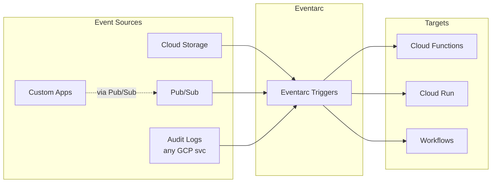
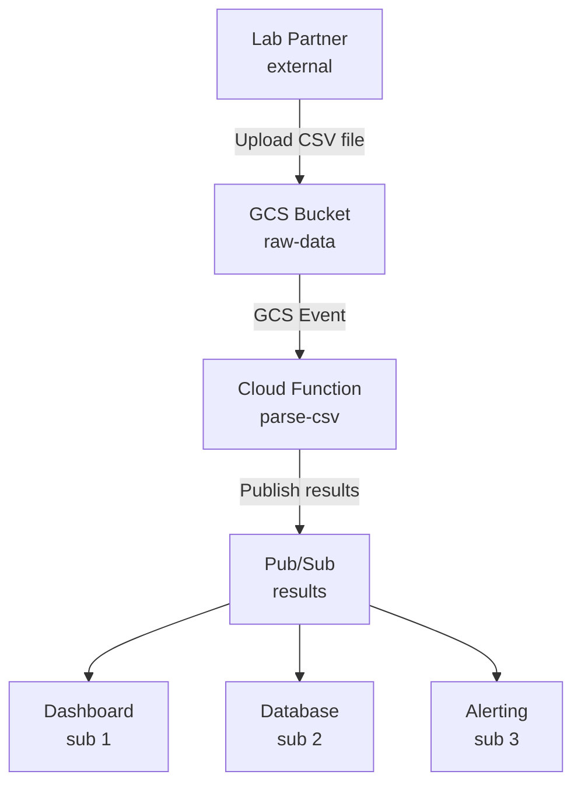
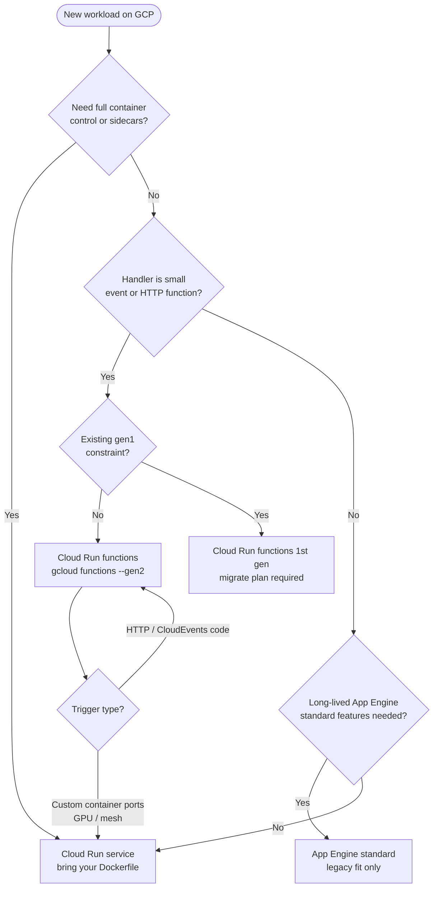

**Complexity**: `[MEDIUM]` | **Time to Complete**: 2h | **Prerequisites**: Module 2.4 (GCS), Module 2.7 (Cloud Run). This module assumes you can create buckets and deploy Cloud Run services from Module 2.7, because Cloud Run functions share that execution plane.

## What You'll Be Able to Do

When you finish the readings and the lab, you will be able to:

- **Deploy Cloud Functions (2nd gen) with event triggers from Pub/Sub, Cloud Storage, and Eventarc**
- **Configure Cloud Functions with VPC connectors, environment variables, and Secret Manager integration**
- **Implement event-driven architectures using Cloud Functions with dead-letter topics and retry policies**
- **Optimize Cloud Functions performance by tuning memory, concurrency, and minimum instance settings**

---

## Why This Module Matters

Hypothetical scenario: your data platform team ingests partner CSV files into a shared Cloud Storage bucket every night. A small Compute Engine VM polls the bucket every five minutes, lists new objects, and pushes rows into Pub/Sub. On quiet nights the VM still runs continuously, and on busy nights the same single process falls behind while storage notifications already know exactly when each file landed. The architecture works until volume grows, at which point lag, duplicated processing, and weekend pager load all increase together.

Replacing that polling VM with an event-driven Cloud Run function (deployed through the Cloud Functions tooling most teams still call “2nd gen”) removes idle polling cost and lets the platform scale out automatically when uploads arrive in bursts. Compute runs only when something actually happens, which is the practical definition of event-driven design on GCP: **instead of constantly checking for work, you react to events as they occur**. Google now markets the latest generation as [Cloud Run functions](https://cloud.google.com/functions/docs/concepts/overview), because each function is a Cloud Run service built from your source; the `gcloud functions deploy --gen2` path remains the familiar on-ramp while the underlying resource model converges with Module 2.7.

This module connects those product names to decisions you will make in production. You will compare Cloud Run functions (latest) with Cloud Run functions (1st gen), choose triggers across HTTP, Pub/Sub, Cloud Storage, Firestore, and Eventarc, understand CloudEvents as the wire format, tune concurrency and minimum instances against cold starts, wire least-privilege service accounts and Secret Manager, and assemble a GCS → function → Pub/Sub pipeline you can reason about in reviews and cost conversations.

### Key Concepts You Will Reuse on the Job

**Function-as-a-service** means you ship an entry point and let Google manage servers, patching, and horizontal scaling. You still own correctness, idempotency, backoff behavior, and data contracts. **Event-driven** means triggers carry payloads to your code instead of your code polling buckets or queues. **CloudEvents** standardize those payloads so the same handler signature works across services. **Eventarc** routes events from many GCP APIs through filters to Cloud Run targets. **Gen2 / Cloud Run functions** mean your function is a Cloud Run revision created from source by Cloud Build.

When you interview architectures, ask four questions: What is the trigger? What is the delivery guarantee? What happens on duplicate delivery? What is the cold-start and cost profile under minimum traffic and peak traffic? If any answer is missing, the design is not production-ready regardless of how small the code looks.

Finally, connect this module back to Module 2.7 mentally: a Cloud Run function is a specialized deploy path, not a different runtime planet. Teams that already operate Cloud Run services should feel at home reading function metrics, revision lists, and VPC settings. Teams that only know legacy gen1 functions should plan training on Eventarc filters and CloudEvents parsing, because those two skills matter more day to day than memorizing additional `gcloud` flags. Carry a personal checklist: trigger type written down, idempotency store named, DLQ subscription identified, and cost owner assigned before you merge infrastructure YAML.

---

## Gen 1 vs Gen 2: Which to Choose

Google documents two generations of Cloud Run functions, and the differences below should drive every new deployment decision you make in a GCP project.

| Feature | Gen 1 | Gen 2 |
| :--- | :--- | :--- |
| **Runtime** | Custom sandboxed environment | [Built on Cloud Run](https://cloud.google.com/run/docs/functions/comparison) |
| **Max timeout** | 540 seconds (9 minutes) | Depends on function type; HTTP functions can run longer than event-driven functions |
| **Max memory** | 8 GB | [32 GB](https://cloud.google.com/functions/quotas) |
| **Max concurrency** | 1 request per instance | Up to 1,000 requests per instance |
| **Min instances** | Not supported | Supported (reduce cold starts) |
| **Traffic splitting** | Not supported | Supported (via Cloud Run) |
| **VPC connectivity** | VPC Access Connector | Direct VPC Egress or Connector |
| **Event triggers** | Cloud Storage, Pub/Sub, HTTP, Firestore | Gen 1 triggers plus Eventarc-supported direct events and audit-log-based routing |
| **Languages** | Node.js, Python, Go, Java, .NET, Ruby, PHP | Same |
| **Recommendation** | Legacy only | Use for all new functions |

```bash
# Deploy a Gen 2 function (opt in with --gen2; recommended for new work)
gcloud functions deploy my-function \
  --gen2 \
  --runtime=python312 \
  --region=us-central1 \
  --source=. \
  --entry-point=hello_http \
  --trigger-http \
  --allow-unauthenticated

# Deploy a Gen 1 function (legacy, avoid for new work)
gcloud functions deploy my-function-v1 \
  --no-gen2 \
  --runtime=python312 \
  --region=us-central1 \
  --source=. \
  --entry-point=hello_http \
  --trigger-http
```

**Why Gen 2 matters**: Because Gen 2 is built on Cloud Run, each function instance can handle multiple concurrent requests. A Gen 1 function processing 100 concurrent requests needs 100 instances. A Gen 2 function with concurrency set to 50 needs only 2 instances. This drastically reduces costs and cold starts.

Google’s [comparison guide](https://cloud.google.com/run/docs/functions/comparison) is the authoritative map when you inherit a `cloudfunctions.net` URL or a Terraform resource still named `google_cloudfunctions2_function`. Cloud Run functions deploy into Artifact Registry, expose a primary `run.app` endpoint, and inherit Cloud Run features such as traffic splitting, Direct VPC egress, GPU options on the underlying service, and request timeouts up to 60 minutes for HTTP-triggered workloads. Cloud Run functions (1st gen) remain on the older internal sandbox, cap memory at 8 GiB with 2 vCPU, and force one concurrent request per instance, which is why bursty HTTP APIs on gen1 often look expensive in metrics even when average CPU is low.

Naming convergence matters for cross-team communication. Console navigation may say **Cloud Run** while your runbooks still say **Cloud Functions (2nd gen)**; both refer to the same Cloud Run-backed functions when you pass `--gen2`. New work should default to Cloud Run functions unless you are patching a gen1-only trigger contract you cannot migrate yet. Gen1 still supports direct triggers from a smaller set of sources, while Cloud Run functions route most non-HTTP events through Eventarc, including audit-log-derived events from many GCP services. When you plan a migration, treat it as a Cloud Run service migration: revise IAM roles (`roles/run.sourceDeveloper` and related), retest idempotency, and revalidate latency because audit-log-based routes are not identical to direct storage notifications.

**Pause and predict:** If a 2nd gen function instance processes multiple requests concurrently instead of dedicating an instance to each request, how must you size memory and CPU compared to a 1st gen baseline?

<details>
<summary>Check your prediction</summary>

Concurrent requests share one instance’s memory and CPU, so you size for peak concurrent work, not a single request; Gen 1’s 1:1 model can look cheaper per instance while bursting more instances.
</details>

The next section examines runtime execution environments, buildpack image packaging during source deployment, and entry point bindings across supported language frameworks.

---

## Runtimes, Source Deploy, and Entry Points

Cloud Run functions are **source-deployed**: you point `gcloud functions deploy` at a directory (or archive), Google Cloud Build produces a container using language buildpacks, and the resulting image runs as a Cloud Run service. You do not hand-craft a Dockerfile for the default path, though the output is still a container stored in Artifact Registry. That matters operationally because supply-chain controls (Binary Authorization, pinned base images) apply to the built artifact even when you never wrote a `Dockerfile` yourself.

Supported runtimes span Node.js, Python, Go, Java, Ruby, PHP, and .NET with independent deprecation schedules documented on the [runtime support](https://cloud.google.com/functions/docs/runtime-support) page. Pick a runtime ID that matches your language version (`python312`, `nodejs22`, `go124`, etc.) and plan upgrades before decommission dates, because Google stops creating new deployments on retired runtimes even if existing instances still run for a window. The **entry point** is the symbol Cloud Functions invokes: for Python HTTP handlers it is the function name passed to `@functions_framework.http`; for CloudEvents handlers it is the name on `@functions_framework.cloud_event`. Node.js uses `functions.http('name', handler)` or background equivalents depending on generation and trigger type.

The Functions Framework is the portable contract between your code and the platform. It normalizes HTTP requests into familiar web request objects and delivers event triggers as [CloudEvents](https://cloud.google.com/eventarc/docs/cloudevents), which means the same handler shape works across Pub/Sub, Cloud Storage, and Eventarc routes. Ruby, PHP, and .NET use CloudEvents for event-driven functions on Cloud Run functions, while older gen1 Node/Go/Python/Java background functions followed different signatures—another reason to standardize on gen2 for new event handlers.

Local iteration uses the same framework: install `functions-framework` in your virtualenv, export `FUNCTION_TARGET=hello_http`, and run `functions-framework` to emulate HTTP triggers before spending build minutes in Cloud Build. Keep `requirements.txt`, `package.json`, or `go.mod` minimal because cold start time includes dependency import cost, not only platform boot.

---

## Scaling, Concurrency, Cold Starts, and Timeouts

Autoscaling for Cloud Run functions is Cloud Run autoscaling: instances scale out when concurrent demand exceeds what existing instances can serve at your configured **maximum concurrency**, and scale toward zero when idle unless you set **minimum instances**. Concurrency defaults are not universal constants; I/O-bound HTTP handlers that mostly await downstream APIs can often run tens of concurrent requests per instance, while CPU-bound transcode or cryptography work should usually keep concurrency low so requests do not contend for the same vCPU time slice.

Cold starts happen when the platform must start a new instance process, load your runtime, import dependencies, and pass health checks before accepting traffic. Mitigations are economic tradeoffs: **minimum instances** keep warm containers ready (you pay idle CPU and memory), **startup CPU boost** spends extra CPU briefly during boot, and smaller dependency trees reduce import latency. For event-driven bursts, also remember that Eventarc and Pub/Sub can deliver multiple events while instances are still warming, which increases retry traffic unless handlers are idempotent.

Timeout configuration must respect trigger class. [Google’s comparison documentation](https://cloud.google.com/run/docs/functions/comparison) documents up to 60 minutes for HTTP-triggered Cloud Run functions and shorter ceilings for many event-driven paths depending on API and trigger wiring. Size timeouts from measured worst-case processing—including downstream HTTP calls and GCS downloads—not from happy-path lab tests. Memory and CPU are coupled on Cloud Run: raising memory often increases CPU share, which can speed CPU-bound handlers but raises per-second billing.

```bash
# Example: latency-sensitive HTTP function with warm pool and tuned concurrency
gcloud functions deploy payment-webhook \
  --gen2 \
  --runtime=python312 \
  --region=us-central1 \
  --source=. \
  --entry-point=handle_webhook \
  --trigger-http \
  --memory=512Mi \
  --timeout=120 \
  --concurrency=40 \
  --min-instances=1 \
  --max-instances=20
```

---

## Security, Identity, Networking, and Secrets

Every function runs as a **service account** identity. The default compute service account is convenient in tutorials but is broader than production should allow; create a per-function account with only the roles it needs (`roles/storage.objectViewer` on specific buckets, `roles/pubsub.publisher` on specific topics, `roles/secretmanager.secretAccessor` for named secrets). Callers of HTTP functions need **Cloud Run Invoker** (`roles/run.invoker`) unless you expose a public endpoint; event triggers instead rely on Eventarc and Pub/Sub IAM paths configured during deploy.

Ingress settings on the underlying Cloud Run service control whether traffic must arrive through internal Google networks, VPC, or the public internet. **Direct VPC egress** and **VPC connectors** let functions reach private RFC1918 resources such as on-prem databases via hybrid connectivity; choose Direct VPC when you want the simpler modern path documented for Cloud Run, and retain connectors only when operational standards require the older connector model. Egress to the internet for third-party APIs remains default for many setups, which is why exfiltration reviews still matter even for “serverless” functions.

Secrets belong in [Secret Manager](https://cloud.google.com/functions/docs/configuring/secrets), mounted as environment variables or volumes on the Cloud Run service backing your function. Avoid baking API keys into source tarballs uploaded to Cloud Build. Rotate secrets by versioning in Secret Manager and redeploying or updating the service binding so new revisions pick up `latest` or a pinned version intentionally. Environment variables remain appropriate for non-secret configuration such as topic names and feature flags. For project ID, read from the [metadata server](https://cloud.google.com/compute/docs/metadata/default-metadata-values) (`project-id`), or set an env var you control explicitly—`GOOGLE_CLOUD_PROJECT` is not auto-injected on gen2 the way it was on gen1.

### Production Rollouts on the Cloud Run Service Behind Your Function

Because gen2 functions are Cloud Run services, every deploy creates a **revision** with immutable settings. You can shift traffic gradually between revisions, tag a revision for internal QA, and roll back by restoring traffic to a known-good revision without rebuilding source. That workflow matters when a dependency upgrade passes unit tests but fails under real Pub/Sub volume. Practice the rollback command before you need it at 2 a.m.

Billing mode is another production knob easy to miss. Cloud Run services can bill per request and only allocate CPU during request processing, or allocate CPU for the entire instance lifecycle. Event-driven functions that wait on external APIs may behave differently under each model. Read the service billing settings when cost reviews show unexpected GiB-seconds during idle-looking charts.

---

## HTTP Triggers: Request-Response Functions

HTTP triggers are the simplest mental model because they mirror ordinary web services: a client calls your URL, the Functions Framework adapts the request, your code returns JSON or HTML, and the platform handles TLS termination and scaling. Behind the scenes the deployment is still a Cloud Run service, which is why authentication uses Cloud Run invoker permissions and why you can later graduate the same container to a full Cloud Run deploy if the function outgrows the functions packaging model. Treat HTTP functions like any public API: validate inputs, bound payload sizes, and return explicit status codes so gateways and callers can retry safely.

### Python Example

Python is the reference runtime in many GCP samples because the `functions-framework` package integrates cleanly with Flask request objects for HTTP and dict-like CloudEvents for storage and Pub/Sub. Keep `requirements.txt` small: every import in cold paths shows up in startup traces. Use `python312` or newer supported runtimes per the support schedule, and pin major versions to avoid surprise buildpack upgrades during redeploys.

```python
# main.py
import functions_framework
from flask import jsonify

@functions_framework.http
def hello_http(request):
    """HTTP Cloud Function.
    Args:
        request (flask.Request): The request object.
    Returns:
        Response object using flask.jsonify.
    """
    name = request.args.get("name", "World")

    return jsonify({
        "message": f"Hello, {name}!",
        "method": request.method,
        "path": request.path
    })
```

```text
# requirements.txt
functions-framework==3.*
flask>=3.0.0
```

```bash
# Deploy the HTTP function
gcloud functions deploy hello-api \
  --gen2 \
  --runtime=python312 \
  --region=us-central1 \
  --source=. \
  --entry-point=hello_http \
  --trigger-http \
  --allow-unauthenticated \
  --memory=256Mi \
  --timeout=60

# Test it
FUNCTION_URL=$(gcloud functions describe hello-api \
  --gen2 --region=us-central1 --format="value(serviceConfig.uri)")

curl "$FUNCTION_URL?name=KubeDojo"
```

For authenticated HTTP functions, remove `--allow-unauthenticated` and grant `roles/run.invoker` to callers such as Cloud Load Balancing service accounts, Apigee, or partner service accounts. Public internet exposure should be a conscious choice documented in threat models, not the default copied from tutorials.

### Node.js Example

Node.js remains a common choice for JSON APIs and webhook adapters because the ecosystem ships small HTTP handlers quickly. The Functions Framework package exposes the same HTTP and CloudEvents entry points across generations; keep dependencies lean because `node_modules` size dominates cold starts more than Python wheels in many projects.

```javascript
// index.js
const functions = require('@google-cloud/functions-framework');

functions.http('helloHttp', (req, res) => {
  const name = req.query.name || 'World';
  res.json({
    message: `Hello, ${name}!`,
    timestamp: new Date().toISOString()
  });
});
```

```json
{
  "dependencies": {
    "@google-cloud/functions-framework": "^3.0.0"
  }
}
```

---

## Cloud Storage Triggers: Reacting to File Events

Cloud Storage triggers fire when objects are created, deleted, archived, or have their metadata updated in a bucket. On Cloud Run functions, those notifications are Eventarc events with types such as `google.cloud.storage.object.v1.finalized`, which is why gen2 deploy flags use `--trigger-event-filters` instead of the older `google.storage.object.finalize` strings you still see in gen1 examples. The payload arriving in your handler is a CloudEvent: resource-specific fields live under `cloud_event.data`, while correlation identifiers such as `id`, `source`, `type`, and `time` sit at the top level per the CloudEvents specification.

Design bucket layout deliberately when functions write back to storage. A function that transforms uploads and writes results into the same bucket without prefix discipline can re-trigger itself indefinitely, which shows up as a sudden invocation spike rather than a logic error in logs. Prefer separate buckets for raw and curated data, or strict prefix filters where input lands under `incoming/` and outputs land under `processed/` that the trigger ignores.

### Event Types

| Event | Gen 1 Trigger | Gen 2 (Eventarc) Event Type |
| :--- | :--- | :--- |
| **Object created** | `google.storage.object.finalize` | [`google.cloud.storage.object.v1.finalized`](https://cloud.google.com/eventarc/docs/event-types) |
| **Object deleted** | `google.storage.object.delete` | `google.cloud.storage.object.v1.deleted` |
| **Object archived** | `google.storage.object.archive` | `google.cloud.storage.object.v1.archived` |
| **Metadata updated** | `google.storage.object.metadataUpdate` | `google.cloud.storage.object.v1.metadataUpdated` |

### Processing Uploaded Files

```python
# main.py
import functions_framework
from google.cloud import storage
import json

@functions_framework.cloud_event
def process_upload(cloud_event):
    """Triggered by a Cloud Storage event.

    Args:
        cloud_event: The CloudEvent containing the GCS event data.
    """
    data = cloud_event.data

    bucket_name = data["bucket"]
    file_name = data["name"]
    content_type = data.get("contentType", "unknown")
    size = data.get("size", "unknown")

    print(f"Processing: gs://{bucket_name}/{file_name}")
    print(f"Content-Type: {content_type}, Size: {size} bytes")

    # Example: Read the file, process it, write results
    client = storage.Client()
    bucket = client.bucket(bucket_name)
    blob = bucket.blob(file_name)

    # Only process CSV files
    if not file_name.endswith(".csv"):
        print(f"Skipping non-CSV file: {file_name}")
        return

    content = blob.download_as_text()
    line_count = len(content.strip().split("\n"))

    # Write a processing receipt
    receipt = {
        "source_file": file_name,
        "line_count": line_count,
        "status": "processed"
    }

    receipt_blob = bucket.blob(f"receipts/{file_name}.json")
    receipt_blob.upload_from_string(
        json.dumps(receipt),
        content_type="application/json"
    )

    print(f"Processed {file_name}: {line_count} lines")
```

```bash
# Deploy with Cloud Storage trigger (Gen 2 / Eventarc)
gcloud functions deploy process-upload \
  --gen2 \
  --runtime=python312 \
  --region=us-central1 \
  --source=. \
  --entry-point=process_upload \
  --trigger-event-filters="type=google.cloud.storage.object.v1.finalized" \
  --trigger-event-filters="bucket=my-data-bucket" \
  --memory=512Mi \
  --timeout=120

# Test by uploading a file
echo "name,email,city
Alice,alice@example.com,NYC
Bob,bob@example.com,London" | gcloud storage cp - gs://my-data-bucket/data/users.csv

# Check the function logs
gcloud functions logs read process-upload \
  --gen2 --region=us-central1 --limit=20
```

---

## Eventarc: The Event Router

Eventarc is GCP's event routing layer. It connects sources such as Cloud Storage, Pub/Sub, and Cloud Audit Logs to targets such as Cloud Functions, Cloud Run, GKE, and Workflows. Think of it as a managed event bus with filtering: you declare which event types and attributes matter, and Eventarc delivers matching CloudEvents to the destination you choose. That indirection is what unlocks audit-log triggers—your function can react when an IAM policy changes or a Compute Engine instance is created even though there is no “IAM trigger” flag on `gcloud functions deploy` itself.

Audit-log-sourced events are powerful but structurally different from direct resource events. They capture administrative operations across Google Cloud services, which may include events you did not anticipate if filter criteria are scoped too broadly. Tighten filters on `serviceName`, `methodName`, and resource labels so your security automation does not fan out on unrelated administrative activity. Eventarc also lets one trigger fan out to multiple targets in advanced architectures, though the common learning path keeps a single Cloud Run function per trigger for clarity.



**Pause and predict:** If an Eventarc trigger relies on Cloud Audit Logs rather than direct resource notifications, how does that delivery path affect invocation timing and latency?

<details>
<summary>Check your prediction</summary>

Many Eventarc paths wait on Audit Logs write/export, so trigger latency is higher and less predictable than a direct GCS finalize notification.
</details>

The following commands illustrate creating Eventarc triggers using the Google Cloud CLI for audit log events and Pub/Sub transport streams.

### Creating Eventarc Triggers

```bash
# Trigger on Cloud Audit Log events (e.g., when a VM is created)
gcloud eventarc triggers create vm-created-trigger \
  --location=us-central1 \
  --destination-run-service=audit-handler \
  --destination-run-region=us-central1 \
  --event-filters="type=google.cloud.audit.log.v1.written" \
  --event-filters="serviceName=compute.googleapis.com" \
  --event-filters="methodName=v1.compute.instances.insert" \
  --service-account=eventarc-sa@my-project.iam.gserviceaccount.com

# Trigger on Pub/Sub messages
gcloud eventarc triggers create pubsub-trigger \
  --location=us-central1 \
  --destination-run-service=message-processor \
  --destination-run-region=us-central1 \
  --transport-topic=my-topic \
  --event-filters="type=google.cloud.pubsub.topic.v1.messagePublished" \
  --service-account=eventarc-sa@my-project.iam.gserviceaccount.com

# List triggers
gcloud eventarc triggers list --location=us-central1

# List available event types
gcloud eventarc providers list --location=us-central1
```

Exploring providers in your region is worthwhile during design spikes because available audit event types evolve as GCP services ship new APIs. Capture the exact `type=` strings in Terraform or YAML so changes are reviewed like application code, not hidden console clicks. When a provider is unavailable in a region, the fix is usually redeploying the function and trigger together—not patching code alone.

### Eventarc vs Direct Triggers

| Approach | How It Works | When to Use |
| :--- | :--- | :--- |
| **Direct trigger** (Gen 1 style) | Function directly subscribes to event source | Simple setups, single trigger per function |
| **Eventarc trigger** | Event routed through Eventarc's event bus | Complex routing, audit log events, multiple targets, filtering |

Direct triggers feel simpler because the deploy command names the bucket or topic explicitly. Eventarc triggers add a routing layer that pays off when you need audit logs, multiple consumers, or attribute filters that would otherwise require custom plumbing. In migrations, compare end-to-end latency and log shape—not only line count in Terraform—because audit-log events include different metadata than storage finalize events.

### Firestore and Database-Style Events

Firestore document changes can invoke Cloud Run functions when you wire the appropriate Eventarc or legacy Firebase/Google Cloud event path for your project layout. Document-write triggers are attractive for low-volume state changes—feature flags, user preference rows, approval records—where standing up a VM poll loop would be absurd. The same idempotency rules apply: a retried write event must not double-charge or duplicate notifications. Keep handlers small and push heavy enrichment to Pub/Sub if fan-out grows, because database-triggered functions can become hot spots when many clients write concurrently.

---

## Pub/Sub Integration: Decoupled Processing

Pub/Sub is the messaging backbone for event-driven architectures in GCP. [Cloud Functions can both consume and produce Pub/Sub messages.](https://cloud.google.com/functions/docs/tutorials/pubsub) Publishing decouples producers from consumers: your upload handler can finish after enqueueing work, and downstream teams can add subscriptions without redeploying the function. Subscriptions control delivery semantics—ack deadlines, message retention, ordering keys, and dead-letter policies—so functions should ack only after side effects are durable (database commit, idempotency record written, outbound object stored).

When retries exhaust, messages belong in a **dead-letter topic** attached to the subscription rather than silently disappearing. Configure a DLQ subscription monitored by alerting, and keep DLQ handlers idempotent too because operators replay messages manually during incidents. For Cloud Run functions created with the Cloud Functions v2 API, retry behavior on event triggers is often toggled at deploy time (`--retry` / `--no-retry`), while longer-lived architectures managed purely through Eventarc may adjust retry policies on the trigger and Pub/Sub subscription together. Either way, at-least-once delivery is the default assumption—exactly-once processing is an application property you build with keys and stores, not a platform promise.

### Pub/Sub-Triggered Function

```python
# main.py
import base64
import json
import functions_framework

@functions_framework.cloud_event
def process_message(cloud_event):
    """Triggered by a Pub/Sub message.

    Args:
        cloud_event: The CloudEvent containing Pub/Sub message data.
    """
    # Decode the Pub/Sub message
    message_data = base64.b64decode(
        cloud_event.data["message"]["data"]
    ).decode("utf-8")

    attributes = cloud_event.data["message"].get("attributes", {})

    print(f"Received message: {message_data}")
    print(f"Attributes: {attributes}")

    # Process the message
    payload = json.loads(message_data)
    # ... your business logic here
```

```bash
# Create a Pub/Sub topic
gcloud pubsub topics create file-events

# Deploy function triggered by Pub/Sub
gcloud functions deploy process-message \
  --gen2 \
  --runtime=python312 \
  --region=us-central1 \
  --source=. \
  --entry-point=process_message \
  --trigger-topic=file-events \
  --memory=256Mi

# Test by publishing a message
gcloud pubsub topics publish file-events \
  --message='{"file": "data.csv", "action": "process"}' \
  --attribute="source=upload-api,priority=high"

# Check logs
gcloud functions logs read process-message \
  --gen2 --region=us-central1 --limit=10
```

---

## Building an Event Pipeline: GCS to Function to Pub/Sub

A common pattern: a file upload triggers a Cloud Function that processes the file and publishes results to Pub/Sub for downstream consumers. The pipeline below is deliberately small so you can see each hop: storage notification → single function → durable topic → multiple subscribers. In production you might split parse and publish stages into two functions so retries on publishing do not re-download multi-gigabyte objects, but the data flow remains the same. Pay attention to attribute keys on published messages (`source_file`, `event_id`) because they become filters for downstream monitoring and idempotency checks.



### The Pipeline Function

```python
# main.py
import csv
import io
import json
import functions_framework
from google.cloud import storage, pubsub_v1

publisher = pubsub_v1.PublisherClient()
PROJECT_ID = "my-project"
RESULTS_TOPIC = f"projects/{PROJECT_ID}/topics/processed-results"

@functions_framework.cloud_event
def parse_csv(cloud_event):
    """Parse uploaded CSV and publish results to Pub/Sub."""
    data = cloud_event.data
    bucket_name = data["bucket"]
    file_name = data["name"]

    # Skip non-CSV files and avoid infinite loops from receipts
    if not file_name.endswith(".csv") or file_name.startswith("receipts/"):
        print(f"Skipping: {file_name}")
        return

    print(f"Processing: gs://{bucket_name}/{file_name}")

    # Download and parse CSV
    client = storage.Client()
    bucket = client.bucket(bucket_name)
    blob = bucket.blob(file_name)
    content = blob.download_as_text()

    reader = csv.DictReader(io.StringIO(content))
    records_processed = 0

    for row in reader:
        # Publish each row as a Pub/Sub message
        message = json.dumps({
            "source_file": file_name,
            "data": dict(row),
            "timestamp": data.get("timeCreated", "")
        }).encode("utf-8")

        future = publisher.publish(
            RESULTS_TOPIC,
            message,
            source_file=file_name,
            content_type="application/json"
        )
        future.result()  # Wait for publish to complete
        records_processed += 1

    print(f"Published {records_processed} records from {file_name}")
```

```text
# requirements.txt
functions-framework==3.*
google-cloud-storage>=2.14.0
google-cloud-pubsub>=2.19.0
```

```bash
# Create the Pub/Sub topic for results
gcloud pubsub topics create processed-results

# Create a subscription (for testing)
gcloud pubsub subscriptions create results-sub \
  --topic=processed-results

# Deploy the pipeline function
gcloud functions deploy parse-csv \
  --gen2 \
  --runtime=python312 \
  --region=us-central1 \
  --source=. \
  --entry-point=parse_csv \
  --trigger-event-filters="type=google.cloud.storage.object.v1.finalized" \
  --trigger-event-filters="bucket=raw-data-bucket" \
  --memory=512Mi \
  --timeout=120 \
  --service-account=csv-processor@my-project.iam.gserviceaccount.com

# Test the pipeline
echo "patient_id,result,value
P001,glucose,95
P002,glucose,142
P003,hemoglobin,13.5" | gcloud storage cp - gs://raw-data-bucket/lab-results-2024-01-15.csv

# Check function logs
gcloud functions logs read parse-csv \
  --gen2 --region=us-central1 --limit=20

# Pull messages from the subscription
gcloud pubsub subscriptions pull results-sub --limit=5 --auto-ack
```

Operating this pipeline in production means setting `max-instances` caps so a poison file cannot spin thousands of concurrent parsers, and setting subscription ack deadlines longer than your worst-case row fan-out. If each CSV row becomes one Pub/Sub message, wide files multiply downstream cost—consider batching rows into chunked messages when subscribers only need file-level notifications. Align regions so the bucket, function, topic, and primary subscribers share a locale unless disaster recovery requirements dictate otherwise.

---

## Worked Examples: Tuning Memory, CPU, and Concurrency

Imagine three workloads side by side. First, a Stripe-style webhook that validates a signature, writes one Firestore document, and returns 200 within 300 ms. It is I/O-bound with tiny CPU use, so 256 MiB memory and concurrency 50–80 on gen2 often minimize instance count without risking CPU starvation. Second, a PDF thumbnail generator that downloads a 20 MiB object and renders pages with native libraries. It is CPU-bound; keep concurrency at 1–2, raise memory to 2–4 GiB so CPU shares increase, and expect longer timeouts. Third, a nightly audit exporter that streams millions of log rows to BigQuery. It may exceed comfortable function duration even with 60-minute HTTP limits—graduate to Cloud Run jobs or Dataflow instead of forcing a function shape.

These examples share a method: measure p95 duration and memory high-water mark under realistic inputs, then set `--memory`, `--cpu`, `--concurrency`, and `--max-instances` from data. The console’s Cloud Run revision metrics show billable time per request; use them after load tests, not before. When in doubt, load test Pub/Sub triggers with duplicated messages to observe retry amplification before declaring a configuration “cheap.”

Event-driven functions also need **backpressure** thinking. If downstream BigQuery inserts cap at 500 rows per second, publishing 5,000 Pub/Sub messages per second from the function will create a growing backlog and retry storm. Throttle inside the function, batch publishes, or insert a streaming layer designed for throughput. Serverless scale-out is fast; your dependencies are often slower.

---

## Error Handling and Retries

Event-driven systems fail in predictable ways: transient downstream outages, poison messages with bad schemas, permission regressions after IAM changes, and duplicate deliveries when a handler times out after doing partial work. Your operability story needs three layers: structured logging with event identifiers, metrics on retry counts and DLQ depth, and idempotent business logic that tolerates duplicates without corrupting state. HTTP triggers differ—they return status codes to callers who may retry—so document which errors are safe to retry (429/503 with backoff) versus which should surface immediately (400 validation failures).

### Retry Behavior

**Pause and predict:** Across HTTP, Eventarc, and Pub/Sub triggers, which integration paths retry failed invocations automatically by default, and how long can those retry attempts persist?

<details>
<summary>Check your prediction</summary>

HTTP does not auto-retry (caller must); Eventarc retries up to 24 hours; Pub/Sub/GCS depend on subscription and function retry settings.
</details>

The following comparison matrix outlines standard platform retry lifecycles and configuration toggles across primary Cloud Functions invocation sources and event routers.

| Trigger Type | Default Retry | Configurable |
| :--- | :--- | :--- |
| **HTTP** | [No retry (caller must retry)](https://cloud.google.com/run/docs/tips/function-retries) | N/A |
| **Cloud Storage** | Retry behavior depends on how the trigger and function were created | Yes |
| **Pub/Sub** | Redelivery behavior depends on the subscription and function retry settings | Yes |
| **Eventarc** | Retries for 24 hours | Yes |

Operational teams sometimes disable retries for poison-message scenarios where any repeat would harm customers, but that choice trades away automatic recovery from transient blips. Prefer DLQs plus alerting when possible so you retain retries for network glitches while isolating bad payloads. Document the retry policy in your runbook next to the idempotency strategy so on-call engineers know whether to replay from Pub/Sub or fix forward in the database.

```bash
# Deploy with retries disabled (for functions that should not retry)
gcloud functions deploy my-function \
  --gen2 \
  --runtime=python312 \
  --region=us-central1 \
  --source=. \
  --entry-point=process_upload \
  --trigger-event-filters="type=google.cloud.storage.object.v1.finalized" \
  --trigger-event-filters="bucket=my-bucket" \
  --no-retry
```

### Idempotency: The Golden Rule

Event-driven functions **must be idempotent**---processing the same event twice should produce the same result. [Events can be delivered more than once.](https://cloud.google.com/run/docs/tips/function-retries) Idempotency is not a library feature you install once; it is an architectural contract across distributed messaging systems. Designing for duplicate deliveries requires establishing defensive state validation before executing side effects.

Side effects that cannot be rolled back—charging money, shipping physical goods, sending irreversible emails—need stronger guards than a log line. Use outbox patterns or idempotent API tokens supplied by downstream systems. HTTP webhooks should validate signatures before work begins so random retries cannot forge payloads.

**Pause and predict:** When designing deduplication for event-driven functions, where should you record processed event identifiers, and how long must those records persist?

<details>
<summary>Check your prediction</summary>

Durable store with a uniqueness constraint (table or `gs://bucket/object/generation`); retention ≥ retry window plus replay horizon; logs-only is not a store.
</details>

The following Python implementation contrasts a naive non-idempotent handler against a defensive implementation that records incoming event metadata before executing state mutations.

```python
# BAD: Not idempotent (counter increments on every retry)
def process_event(cloud_event):
    event_id = cloud_event["id"]
    db.execute("UPDATE counters SET count = count + 1 WHERE id = ?", event_id)

# GOOD: Idempotent (uses event ID to deduplicate)
def process_event(cloud_event):
    event_id = cloud_event["id"]

    # Check if we already processed this event
    if db.execute("SELECT 1 FROM processed_events WHERE id = ?", event_id):
        print(f"Already processed event {event_id}, skipping")
        return

    # Process the event
    db.execute("INSERT INTO processed_events (id) VALUES (?)", event_id)
    db.execute("UPDATE counters SET count = count + 1 WHERE id = ?", event_id)
```

---

## Observability: Logs, Metrics, and Traces

Cloud Run functions inherit Cloud Run observability: stdout/stderr streams go to Cloud Logging, request metrics appear under Cloud Run service charts, and distributed traces can propagate through HTTP handlers when you instrument OpenTelemetry in code. For event-driven handlers, log the CloudEvent `id`, `type`, and `source` on every invocation so you can correlate duplicates during retry investigations. Structured JSON logs parse better than printf lines when Pub/Sub delivers thousands of messages per minute.

Useful metrics to watch include request count, request latency percentiles, billable instance time, instance count, and error ratio on the Cloud Run service backing your function. For Pub/Sub triggers, also monitor `num_undelivered_messages` and oldest unacked message age on the subscription. Eventarc triggers expose delivery health through Cloud Logging entries on the trigger resource; alert when error rates spike after IAM or VPC changes. Tracing is optional for small labs but becomes valuable when functions call other GCP APIs—each outbound client library span explains whether slowness is cold start, GCS download, or downstream SQL.

Debugging deploy failures usually means reading Cloud Build logs first, then Cloud Run revision status. Common errors include missing APIs, wrong region on the trigger, service accounts without `roles/eventarc.eventReceiver`, or entry-point names that do not match your source symbol. Keep a “known good” minimal HTTP function in the repo to bisect whether failures are project policy or application code.

Alerting should tie together signals: rising function error rate, growing Pub/Sub backlog, DLQ message count, and sudden jumps in billable instance time. A spike only in instance time might mean min-instances were raised; a spike only in backlog might mean downstream database throttling. Train on-call engineers to read CloudEvent IDs in logs so replays after deploys do not double-process unless the idempotency table cleared.

---

## Cost Lens: Invocations, Compute Seconds, and Idle Warmth

Cloud Run functions bill through [Cloud Run pricing](https://cloud.google.com/run/pricing) for the latest generation, while Cloud Run functions (1st gen) retain the older [1st gen pricing page](https://cloud.google.com/functions/pricing-1stgen). In practice you pay for **requests**, **vCPU-seconds**, **GiB-seconds** of memory while instances are allocated, and **networking** egress when responses or outbound calls leave Google’s network. Event-driven architectures often look cheap in demos because invocations are sparse, but production bills climb when retries multiply work, handlers download large objects on every event, or concurrency is set so low that each message spins up its own instance.

**Minimum instances** are the classic cost surprise: they eliminate many cold starts by keeping containers warm, yet you pay for that warmth during quiet periods. A function with `min-instances=3` at 512 MiB memory is buying three always-on containers even when Pub/Sub has nothing to deliver. Right-size memory because Cloud Run couples CPU to memory tiers; over-provisioning memory for a lightweight JSON transformer increases both CPU share and GiB-seconds without improving throughput. **Concurrency** is the main cost lever for I/O-bound HTTP APIs—higher concurrency reduces instance count for the same request rate—while CPU-bound work should not chase high concurrency because it lengthens tail latency and can trigger timeouts that cause more retries.

Networking costs deserve explicit review. Functions that pull multi-gigabyte objects from Cloud Storage on every small notification pay egress and storage operation charges in addition to function compute. Cross-region triggers (bucket in `europe-west1`, function in `us-central1`) add latency and data transfer. Pub/Sub itself has separate message and egress pricing; fan-out pipelines that publish one message per CSV row can dwarf function CPU when files are wide. Use budgets and alerts on Cloud Run metrics (`billable_instance_time`, request counts) plus Pub/Sub backlog metrics so cost spikes show up before finance does.

Free tier allowances exist for Cloud Run and related services, but production pipelines should be sized without assuming free coverage. Chargeback teams often allocate function cost to the product owner of the triggering bucket or topic so engineers see the price of per-row Pub/Sub fan-out. When cost dominates, batch objects in the function and publish one message per file, or move parsing to Dataflow for heavy transforms while keeping the function as a notifier only.

---

## Patterns and Anti-Patterns

| Pattern | When to use | Why it works | Scaling note |
| :--- | :--- | :--- | :--- |
| **Thin trigger, fat async worker** | Spiky uploads or webhooks that must return quickly | HTTP or storage handler validates and enqueues to Pub/Sub; heavy work consumes at controlled concurrency elsewhere | Add subscriber autoscaling and DLQ monitoring as volume grows |
| **Prefix-separated buckets** | Any function that writes derivatives back to storage | Prevents accidental self-trigger loops and clarifies IAM per prefix | Move to separate buckets per data classification at enterprise scale |
| **Idempotency store keyed by event ID** | Pub/Sub, Eventarc, or storage triggers with side effects | Survives at-least-once delivery and retry storms without duplicate charges or rows | Back with Firestore/Spanner/SQL with TTL aligned to max retry window |
| **Dedicated runtime service account** | All production functions | Least privilege limits blast radius when credentials leak via logs or dependency compromise | Automate IAM via Terraform per function family |
| **Eventarc audit filters for governance** | Security automation reacting to admin APIs | Captures control-plane actions HTTP/GCS triggers cannot see | Start strict on `methodName`; broaden only with testing |

| Anti-pattern | What goes wrong | Why teams fall into it | Better alternative |
| :--- | :--- | :--- | :--- |
| **Gen1 for new HTTP APIs** | One request per instance explodes instance count on bursts | Old tutorials and `cloudfunctions.net` examples | Deploy Cloud Run functions (`--gen2`) with tuned concurrency |
| **Same-bucket read/write trigger** | Runaway invocations and billing shocks | Simplest path in demos | Separate buckets or non-overlapping prefixes |
| **Unbounded synchronous fan-out** | Timeouts, duplicate publishes on retry | Easiest way to “notify everyone” inside one handler | Publish once to Pub/Sub; let subscribers scale independently |
| **Default compute service account** | Over-broad access if function is compromised | Fastest lab deploy | Per-function SA with minimal roles |
| **Ignoring DLQ backlog** | Silent data loss after retry exhaustion | DLQ setup feels optional | Alert on DLQ depth; runbook replays with idempotency |
| **Max memory “just in case”** | Higher GiB-seconds without benefit | Copy-paste from other services | Profile memory; increase only with evidence |

Patterns succeed when you pair them with explicit SLOs. A thin trigger pattern only helps if the enqueue step is faster than user-facing latency budgets. Idempotency stores only help if reviewers verify uniqueness constraints in schema migrations. Governance triggers via Eventarc only help if security operations owns the filter list and reviews it quarterly as APIs evolve.

---

## Decision Framework: Functions vs Cloud Run vs App Engine

Use the flowchart when stakeholders ask “which serverless surface do we pick?” All three can run HTTP workloads, but operational contracts differ.



| Choice | Strengths | Tradeoffs | Typical fit |
| :--- | :--- | :--- | :--- |
| **Cloud Run functions (latest)** | Fastest path from source to HTTPS or CloudEvents; inherits Cloud Run scaling | Less control than custom containers; event sources often via Eventarc | Webhooks, ETL on GCS uploads, lightweight APIs |
| **Cloud Run service** | Full container, sidecars, GPUs, service mesh integrations | You own Dockerfile/security patching cadence | Microservices, multi-process apps, bespoke runtimes |
| **App Engine standard** | Mature PaaS for specific legacy apps | Narrower runtime story; not the default for new event systems | Existing App Engine estates, not greenfield functions |
| **Cloud Run functions (1st gen)** | Familiar if frozen on gen1 triggers | No concurrency; smaller trigger surface | Maintenance only—plan upgrade |

**Gen1 vs gen2 inside functions:** choose Cloud Run functions (latest) unless a compliance or Terraform constraint blocks migration this quarter. If you must stay on gen1 temporarily, isolate those functions behind an integration boundary and budget engineering time to retest Eventarc filters and IAM on gen2, because gen2 is not a flag-only change—it is a Cloud Run service with different metrics and roles.

When stakeholders ask for App Engine instead, clarify whether they need standard environment conveniences or simply want “no servers.” Cloud Run functions usually satisfy the second desire with more transparent scaling and clearer IAM. When they need arbitrary processes in one address space, Cloud Run services remain the better container story. Document the decision in your architecture record so future teams do not relitigate the same comparison during every hack week.

---

## Did You Know?

1. **Cloud Functions Gen 2 is built entirely on Cloud Run**. When you deploy a Gen 2 function, [GCP creates a Cloud Run service behind the scenes.](https://cloud.google.com/functions/docs/deploy) You can actually see it in the Cloud Run console. This means Gen 2 functions inherit all Cloud Run features: traffic splitting, min instances, concurrency, and Direct VPC Egress.

2. **Cloud Functions can be triggered by many Google Cloud event types** through Eventarc. Direct events and audit-log-based triggers let you react to activity across a wide range of GCP services.

3. **Cold start latency varies by runtime, dependency set, and configuration**. Using minimum instances can reduce cold-start latency for latency-sensitive functions, but it adds ongoing cost because warm instances stay allocated.

4. **Eventarc supports event filtering**. You can narrow which events reach a target so the function runs only for the resources and changes you care about.

The four facts above share a theme: Cloud Run functions are Cloud Run services under the hood. That convergence is why skills from Module 2.7 transfer directly—traffic management, VPC egress, Secret Manager mounts, and Cloud Run metrics apply without a parallel learning track. The functions-specific surface area is triggers and the Functions Framework entry points, not the scaling engine itself.

---

## Common Mistakes

The table below collects issues that survive code review because they only appear under retries, bursts, or billing review. Treat it as a pre-production checklist for any new function.

| Mistake | Why It Happens | How to Fix It |
| :--- | :--- | :--- |
| Using Gen 1 for new functions | Old tutorials reference Gen 1 | Use `--gen2` for most new functions |
| Not handling retries (non-idempotent code) | Developers assume exactly-once delivery | Implement idempotency, often using event IDs |
| Function triggers infinite loop | Function writes to the same bucket it is triggered by | Use prefixes to separate input/output, or use a different bucket |
| Setting timeout too low | Short defaults can look safe in testing | Set timeout from worst-case processing time and check the trigger-specific limits |
| Not using concurrency on Gen 2 | Default settings are not always a good fit | Tune concurrency for the workload, especially for I/O-bound functions |
| Ignoring cold start impact | Works fine in testing | Set `--min-instances=1` for latency-sensitive functions |
| Hardcoding project ID in function code | Works in development | Use environment variables or the metadata server for project ID |
| Not creating a dedicated service account | [Default compute SA historically had broad access; org policies may block the default Editor grant](https://cloud.google.com/functions/docs/concepts/iam) | Create a function-specific SA with minimal permissions |

Review the table during design reviews, not after launch week. Many mistakes are policy and topology issues invisible in unit tests until retries and loops appear under real traffic. Region mismatches belong on the same checklist: when your bucket lives in `europe-west1` but the function defaults to `us-central1`, you pay latency and cross-region egress while debugging “slow uploads” that are actually physics and billing, not application logic. Treat that checklist like a pre-merge template for every new function PR so reviewers can reject incomplete operational stories before they reach production projects. The habit takes minutes per change and prevents the expensive rework cycles that begin when finance notices runaway invocations or compliance finds over-broad service accounts. That discipline is part of operating event-driven GCP platforms responsibly now at true production scale every week you ship changes to customers.

---

## Quiz

These questions mix architecture judgment with handler mechanics you will use in reviews. Read each scenario carefully before opening the answer.

<details>
<summary>1. You are migrating a high-traffic image processing API to Cloud Functions. The API receives sporadic bursts of thousands of requests per second. Your team is debating whether to use Gen 1 or Gen 2 functions. Which generation should you choose and why is its underlying architecture better suited for this scenario?</summary>

You should choose Gen 2 Cloud Functions because it is built entirely on Cloud Run. This architectural shift allows a single Gen 2 instance to handle up to 1,000 concurrent requests, whereas Gen 1 can only handle one request per instance. For bursty workloads, Gen 2 will drastically reduce the number of instances required, significantly lowering your costs. Additionally, Gen 2 supports setting minimum instances to eliminate cold starts during traffic spikes.
</details>

<details>
<summary>2. A financial services company deployed a Cloud Function triggered by Pub/Sub to process bank transfers. A week later, they discovered several duplicate transfers in their database. The code logic for creating the transfer is correct. What fundamental property of event-driven architectures in GCP did the developers likely ignore, and how should it be addressed?</summary>

The developers likely ignored the principle of idempotency, failing to account for GCP's "at-least-once" delivery guarantee. Event-driven systems in GCP, like Pub/Sub and Eventarc, may deliver the same event multiple times due to retries or network anomalies. If the function does not check whether a transfer was already processed, a duplicate event will result in a duplicate database entry. The function must be made idempotent by verifying the unique event ID against a database of processed events before executing the transfer logic.
</details>

<details>
<summary>3. A developer writes a Gen 2 Cloud Function to resize images. The function triggers when an image is uploaded to `company-media-bucket`, resizes it, and saves the new image back to `company-media-bucket`. Shortly after deployment, the GCP billing alert triggers due to massive function invocations. What caused this, and what are two architectural ways to fix it?</summary>

The function created an infinite loop because saving the resized image back to the same bucket triggered the function again, and this cycle continued indefinitely. To fix this, the developer should separate the input and output boundaries. The most robust solution is to use a completely different bucket for the output images. Alternatively, if using the same bucket is mandatory, the developer must use prefix filtering (e.g., trigger only on `raw/` uploads) and ensure the resized image is saved to a different prefix (e.g., `processed/`) that the function is not listening to.
</details>

<details>
<summary>4. Your security team requires a Cloud Function to run and notify a Slack channel whenever a new IAM policy is applied or a Cloud SQL instance is restarted anywhere in your GCP project. Standard Cloud Functions triggers (HTTP, GCS, Pub/Sub) do not support these services directly. Which GCP service must you use to route these events to your function, and how does it integrate with them?</summary>

You must use Eventarc to route these complex events to your Cloud Function. Eventarc acts as a unified event router that can trigger functions based on actions from many GCP services (100+) by hooking into Cloud Audit Logs. Whenever an action (like an IAM change or SQL restart) writes an entry to Cloud Audit Logs, Eventarc captures it and forwards it as a standardized CloudEvent to your function. You can use Eventarc's filtering capabilities to ensure the function only triggers for the specific resource types and methods the security team cares about.
</details>

<details>
<summary>5. You have two Gen 2 Cloud Functions. Function A calls a third-party REST API and waits 5 seconds for a response. Function B transcodes a 4K video using FFmpeg, utilizing 100% of the CPU for 30 seconds. To optimize costs and performance, how should you configure the concurrency setting for each function?</summary>

You should set a high concurrency (e.g., 80) for Function A and leave concurrency at 1 for Function B. Function A is heavily I/O-bound; it spends almost all its time waiting for the network, so a single instance can easily juggle many concurrent requests while waiting, significantly reducing instance costs. Function B is completely CPU-bound; if you increased its concurrency, multiple transcoding tasks would fight for the same CPU resources, drastically slowing down processing and likely causing timeouts. By keeping Function B at a concurrency of 1, you ensure each invocation gets dedicated CPU time to complete the intensive transcoding task efficiently.
</details>

<details>
<summary>6. A new team member is writing a Gen 2 Python Cloud Function triggered by Cloud Storage uploads. They need to extract the filename and the unique event identifier to ensure idempotency. They are using the `@functions_framework.cloud_event` decorator but are unsure how to parse the incoming object. Where precisely in the function arguments will they find the filename and the event ID?</summary>

The team member will find these values within the attributes of the `cloud_event` object passed to the function. The filename (along with bucket name, content type, and size) is located inside the data payload dictionary, accessed via `cloud_event.data["name"]`. The unique event identifier, which is crucial for building idempotent logic, is a top-level attribute of the CloudEvent standard and is accessed directly via `cloud_event["id"]`. Understanding this structure is essential because the data payload contains the resource-specific details, while the top-level attributes provide the standardized routing and identification metadata required by Eventarc.
</details>

---

## Hands-On Exercise: GCS Upload to Cloud Function to Pub/Sub Pipeline

### Objective

Build an event-driven pipeline: uploading a file to Cloud Storage triggers a Cloud Function that processes the file and publishes results to Pub/Sub. The lab mirrors the architecture diagram earlier in this module, but adds explicit IAM and cleanup steps so you can tear the environment down without leaving billed resources running overnight.

### Prerequisites

- `gcloud` CLI installed and authenticated
- A GCP project with billing enabled
- Python 3.12 installed locally (for local testing)

### Tasks

**Task 1: Create the infrastructure** — Enable the APIs, create the upload bucket and Pub/Sub topic, grant the Cloud Storage service agent `roles/pubsub.publisher` (required before storage-finalized Eventarc triggers work), and provision a least-privilege service account with Eventarc receiver permissions. This foundation prevents mysterious deploy failures later when Eventarc cannot impersonate your runtime identity or when GCS cannot publish notification events.

<details>
<summary>Solution</summary>

```bash
export PROJECT_ID=$(gcloud config get-value project)
export REGION=us-central1

# Enable APIs
gcloud services enable \
  cloudfunctions.googleapis.com \
  cloudbuild.googleapis.com \
  eventarc.googleapis.com \
  pubsub.googleapis.com \
  storage.googleapis.com \
  run.googleapis.com

# Create a GCS bucket for uploads
export BUCKET="${PROJECT_ID}-upload-lab"
gcloud storage buckets create gs://$BUCKET \
  --location=$REGION

# Create a Pub/Sub topic for processed results
gcloud pubsub topics create processed-files

# Create a subscription for testing
gcloud pubsub subscriptions create processed-files-sub \
  --topic=processed-files

# Create a service account for the function
gcloud iam service-accounts create func-processor \
  --display-name="File Processor Function SA"

export FUNC_SA="func-processor@${PROJECT_ID}.iam.gserviceaccount.com"

# Grant permissions
gcloud projects add-iam-policy-binding $PROJECT_ID \
  --member="serviceAccount:$FUNC_SA" \
  --role="roles/storage.objectViewer"

gcloud projects add-iam-policy-binding $PROJECT_ID \
  --member="serviceAccount:$FUNC_SA" \
  --role="roles/pubsub.publisher"

# Grant Eventarc permissions
gcloud projects add-iam-policy-binding $PROJECT_ID \
  --member="serviceAccount:$FUNC_SA" \
  --role="roles/eventarc.eventReceiver"

# GCS → Eventarc: the Cloud Storage service agent must publish to Pub/Sub
export PROJECT_NUMBER=$(gcloud projects describe $PROJECT_ID --format='value(projectNumber)')
gcloud projects add-iam-policy-binding $PROJECT_ID \
  --member="serviceAccount:service-${PROJECT_NUMBER}@gs-project-accounts.iam.gserviceaccount.com" \
  --role="roles/pubsub.publisher"
```
</details>

**Task 2: Write the Cloud Function** — Author a CloudEvents handler that filters file types, computes simple analytics, and publishes a JSON summary with the event identifier attached as a Pub/Sub attribute for downstream deduplication.

<details>
<summary>Solution</summary>

```bash
mkdir -p /tmp/func-lab && cd /tmp/func-lab

cat > main.py << 'PYEOF'
import json
import functions_framework
from google.cloud import storage, pubsub_v1
import os

publisher = pubsub_v1.PublisherClient()
PROJECT_ID = os.environ.get("GCP_PROJECT", os.environ.get("GOOGLE_CLOUD_PROJECT", ""))
TOPIC_PATH = f"projects/{PROJECT_ID}/topics/processed-files"

@functions_framework.cloud_event
def process_file(cloud_event):
    """Process uploaded file and publish summary to Pub/Sub."""
    data = cloud_event.data
    bucket_name = data["bucket"]
    file_name = data["name"]
    event_id = cloud_event["id"]

    # Skip non-txt and non-csv files
    if not (file_name.endswith(".txt") or file_name.endswith(".csv")):
        print(f"Skipping unsupported file type: {file_name}")
        return

    print(f"Processing event {event_id}: gs://{bucket_name}/{file_name}")

    # Download and analyze
    client = storage.Client()
    bucket = client.bucket(bucket_name)
    blob = bucket.blob(file_name)
    content = blob.download_as_text()

    lines = content.strip().split("\n")
    line_count = len(lines)
    char_count = len(content)
    word_count = len(content.split())

    # Build summary
    summary = {
        "event_id": event_id,
        "file": f"gs://{bucket_name}/{file_name}",
        "line_count": line_count,
        "word_count": word_count,
        "char_count": char_count,
        "size_bytes": int(data.get("size", 0)),
        "content_type": data.get("contentType", "unknown")
    }

    # Publish to Pub/Sub
    message = json.dumps(summary).encode("utf-8")
    future = publisher.publish(
        TOPIC_PATH,
        message,
        source_file=file_name,
        event_id=event_id
    )
    message_id = future.result()

    print(f"Published summary to Pub/Sub (message ID: {message_id})")
    print(f"Summary: {json.dumps(summary, indent=2)}")
PYEOF

cat > requirements.txt << 'EOF'
functions-framework==3.*
google-cloud-storage>=2.14.0
google-cloud-pubsub>=2.19.0
EOF

echo "Function source created."
```
</details>

**Task 3: Deploy the Cloud Function** — Deploy with gen2, explicit entry point, GCS finalize filters scoped to your lab bucket, and the dedicated service account from Task 1.

<details>
<summary>Solution</summary>

```bash
cd /tmp/func-lab

gcloud functions deploy process-file \
  --gen2 \
  --runtime=python312 \
  --region=$REGION \
  --source=. \
  --entry-point=process_file \
  --trigger-event-filters="type=google.cloud.storage.object.v1.finalized" \
  --trigger-event-filters="bucket=$BUCKET" \
  --service-account=$FUNC_SA \
  --memory=256Mi \
  --timeout=120 \
  --set-env-vars="GCP_PROJECT=$PROJECT_ID"

# Verify deployment
gcloud functions describe process-file \
  --gen2 --region=$REGION \
  --format="yaml(name, state, serviceConfig.uri)"
```
</details>

**Task 4: Test the pipeline** — Upload CSV and text objects, wait for asynchronous delivery, then read function logs and pull Pub/Sub messages to confirm summaries match expectations.

<details>
<summary>Solution</summary>

```bash
# Upload a test file
cat > /tmp/test-data.csv << 'EOF'
name,department,salary
Alice,Engineering,125000
Bob,Marketing,95000
Charlie,Engineering,130000
Diana,Sales,88000
Eve,Engineering,118000
EOF

gcloud storage cp /tmp/test-data.csv gs://$BUCKET/test-data.csv

# Wait for processing
echo "Waiting for function to process..."
sleep 15

# Check function logs
gcloud functions logs read process-file \
  --gen2 --region=$REGION --limit=10

# Pull the Pub/Sub message
gcloud pubsub subscriptions pull processed-files-sub \
  --limit=5 --auto-ack

# Upload another file
echo "This is a simple text file for testing.
It has multiple lines.
Each line will be counted." > /tmp/test-note.txt

gcloud storage cp /tmp/test-note.txt gs://$BUCKET/test-note.txt

sleep 10

# Check for the second message
gcloud pubsub subscriptions pull processed-files-sub \
  --limit=5 --auto-ack
```
</details>

**Task 5: Test filtering for non-matching files** — Upload a JSON object to prove your handler short-circuits without publishing, which is how you avoid paying for Pub/Sub fan-out on unsupported MIME paths.

<details>
<summary>Solution</summary>

```bash
# Upload a file that should be skipped (not .txt or .csv)
echo '{"key": "value"}' | gcloud storage cp - gs://$BUCKET/test.json

sleep 10

# Check logs - should show "Skipping unsupported file type"
gcloud functions logs read process-file \
  --gen2 --region=$REGION --limit=5

# No Pub/Sub message should appear for .json files
gcloud pubsub subscriptions pull processed-files-sub --limit=5 --auto-ack
```
</details>

**Task 6: Clean up resources** — Delete the function, subscription, topic, bucket, and service account so the lab does not continue charging minimum-instance or storage fees after you finish.

<details>
<summary>Solution</summary>

```bash
# Delete the function
gcloud functions delete process-file \
  --gen2 --region=$REGION --quiet

# Delete Pub/Sub resources
gcloud pubsub subscriptions delete processed-files-sub --quiet
gcloud pubsub topics delete processed-files --quiet

# Delete GCS bucket
gcloud storage rm -r gs://$BUCKET/
gcloud storage buckets delete gs://$BUCKET

# Delete service account
gcloud iam service-accounts delete $FUNC_SA --quiet

# Clean up local files
rm -rf /tmp/func-lab /tmp/test-data.csv /tmp/test-note.txt

echo "Cleanup complete."
```
</details>

**Card A: Gen 2 concurrency means you can keep the same small memory as a Gen 1 one-request instance.** A development team migrates an image analysis function from 1st gen to 2nd gen and enables concurrency of 40 to reduce cold starts and container instance costs. They retain the original 256 MiB memory allocation, assuming each concurrent request operates within an isolated resource sandbox. During a traffic surge, multiple requests process images simultaneously inside the same container instance, causing spontaneous out-of-memory container restarts and 500 error spikes.

<details>
<summary>Check your prediction</summary>

Failure layer: shared container instance resource pooling versus isolated concurrent execution models. Next action: calculate peak memory consumption across all concurrent threads, allocate sufficient instance memory to support maximum concurrency, or reduce concurrency limits to align with container resource constraints.
</details>

**Card B: Eventarc audit-log triggers fire as fast as a direct Cloud Storage finalize notification.** An infrastructure engineer builds an automated security pipeline that validates uploaded GCS blobs by subscribing an Eventarc trigger to Cloud Audit Logs instead of configuring a direct Cloud Storage finalize event. The engineer expects the security check to complete within milliseconds of object upload. In production, downstream consumers experience irregular delays of several seconds to minutes before the validation function executes on newly uploaded objects.

<details>
<summary>Check your prediction</summary>

Failure layer: audit log ingestion pipeline delays versus direct resource event dispatch. Next action: use direct Cloud Storage event triggers via Eventarc when low latency is required, reserving Cloud Audit Log triggers for administrative and control-plane change notifications that tolerate asynchronous ingestion latency.
</details>

**Card C: HTTP Cloud Functions retry automatically for 24 hours like Eventarc.** A payments team deploys an HTTP-triggered Cloud Run function to receive payment provider webhook notifications. The team configures no client-side retry logic and no intermediate messaging queue, assuming Google Cloud automatically persists and retries failed invocations for 24 hours. When a temporary downstream database timeout causes the function to return HTTP 500 responses, payment confirmations are permanently dropped without redelivery.

<details>
<summary>Check your prediction</summary>

Failure layer: synchronous request-response client boundaries versus asynchronous event bus redelivery guarantees. Next action: front HTTP ingestion endpoints with a durable queue like Cloud Pub/Sub or configure the external caller to execute exponential backoff retries upon receiving 5xx status codes.
</details>

**Card D: Processed event IDs can live only in Cloud Logging; no durable store is required for idempotency.** A software engineer implements deduplication for an event-driven inventory function by querying recent Cloud Logging entries for the incoming event ID before incrementing stock allocations. The engineer relies on log search rather than deploying an external datastore to avoid infrastructure costs. When Pub/Sub redelivers duplicate messages during an upstream network blip, log ingestion delays prevent the function from detecting the prior execution, resulting in duplicate inventory updates.

<details>
<summary>Check your prediction</summary>

Failure layer: log ingestion latency and query boundaries versus transactional persistence constraints. Next action: record processed event identifiers in a durable datastore with atomic uniqueness constraints, such as Cloud Firestore, Cloud SQL, or Cloud Storage generation preconditions, retaining records across the entire retry window.
</details>

**Success Criteria**:

Completing the lab means you observed end-to-end causality: storage event → log lines with event ID → Pub/Sub payload. Capture screenshots or log excerpts for your portfolio if you mentor others; the failure modes are more educational than the happy path.

- [ ] GCS bucket, Pub/Sub topic, and service account created
- [ ] Cloud Function deployed with GCS trigger
- [ ] Uploading a CSV file triggers the function
- [ ] Function publishes a summary message to Pub/Sub
- [ ] Non-matching file types are skipped (no Pub/Sub message)
- [ ] All resources cleaned up

---

## Next Module

You now have an event-driven spine connecting storage, compute, and messaging. The next module deepens the security layer those functions already touch lightly: Secret Manager for storing API keys and connection strings, versioning secrets, tightening IAM bindings, and mounting secrets into Cloud Run and Compute Engine without copying material into environment files in source control.

Next up: **[Module 2.9: Secret Manager](../module-2.9-secret-manager/)** --- Learn how to securely store and manage secrets, control access with IAM, version and rotate secrets, and integrate them with Cloud Run and Compute Engine.

## Sources

- [Cloud Run functions overview](https://cloud.google.com/functions/docs/concepts/overview) — Product naming and pointers to Cloud Run-backed functions.
- [Compare Cloud Run functions](https://cloud.google.com/run/docs/functions/comparison) — Gen1 vs latest differences for concurrency, timeouts, triggers, and APIs.
- [Cloud Run functions quotas](https://cloud.google.com/functions/quotas) — Memory, CPU, and scaling limits per generation.
- [Runtime support](https://cloud.google.com/functions/docs/runtime-support) — Supported language versions and deprecation schedules.
- [Eventarc event types](https://cloud.google.com/eventarc/docs/event-types) — Cloud Storage and other filterable event type strings.
- [CloudEvents in Eventarc](https://cloud.google.com/eventarc/docs/cloudevents) — Wire format fields used by CloudEvents handlers.
- [Pub/Sub triggers tutorial](https://cloud.google.com/functions/docs/tutorials/pubsub) — Publishing and consuming messages from functions.
- [Function retries](https://cloud.google.com/run/docs/tips/function-retries) — At-least-once delivery and retry guidance.
- [Deploy Cloud Run functions](https://cloud.google.com/functions/docs/deploy) — Source deploy path and Cloud Run console visibility.
- [Cloud Run functions IAM](https://cloud.google.com/functions/docs/concepts/iam) — Service accounts, invoker roles, and least privilege.
- [Configure secrets](https://cloud.google.com/functions/docs/configuring/secrets) — Secret Manager integration on the underlying Cloud Run service.
- [Cloud Run pricing](https://cloud.google.com/run/pricing) — vCPU, memory, requests, and networking cost model for latest functions.
- [Trigger functions from Cloud Storage](https://cloud.google.com/run/docs/tutorials/trigger-functions-storage) — Eventarc + Cloud Storage finalize walkthrough.
