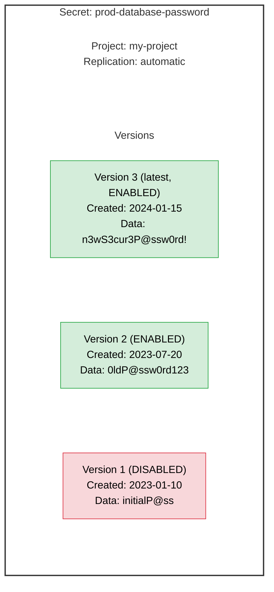
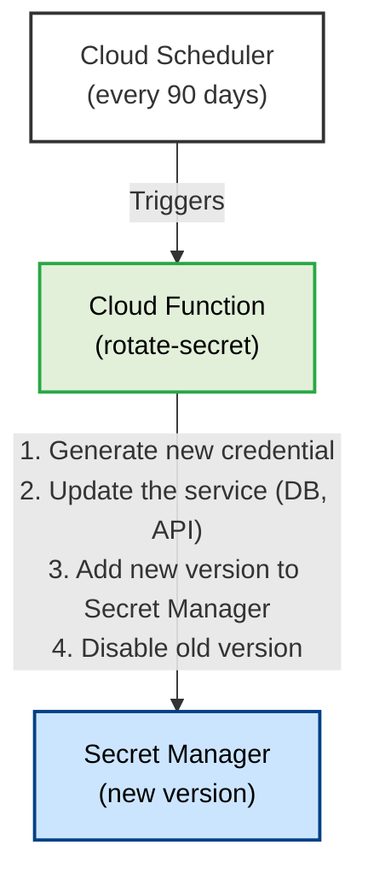
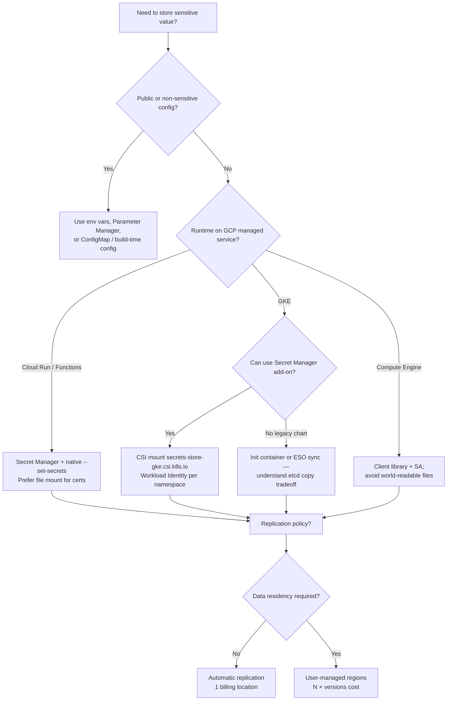

**Complexity**: `[MEDIUM]` | **Time to Complete**: 1.5h | **Prerequisites**: Module 2.1 (IAM & Resource Hierarchy) — you should be comfortable creating service accounts, granting IAM roles, and enabling GCP APIs before storing production credentials in Secret Manager.

## What You'll Be Able to Do

Secret management is not a one-time setup task—it is an ongoing contract between security, platform engineering, and application teams about where sensitive bytes live, who can read them, and how you prove compliance after an incident. GCP Secret Manager sits at the center of that contract for workloads running on Cloud Run, GKE, Compute Engine, and Cloud Functions because it combines encryption, IAM, versioning, and auditability without asking you to operate a dedicated vault cluster.

After completing this module, you will be able to put the following capabilities into practice on real GCP projects, not just pass a checklist: configure Secret Manager with rotation notifications and IAM-based access control, implement versioning strategies that survive rollouts, inject secrets into Cloud Run and GKE without etcd copies where possible, and design cross-project sharing that auditors can follow.

- **Configure Secret Manager with automatic rotation and IAM-based access control for application secrets**
- **Implement secret versioning and alias strategies for zero-downtime credential rotation**
- **Deploy secret injection patterns for Compute Engine, Cloud Run, Cloud Functions, and GKE workloads**
- **Design cross-project secret sharing using IAM policies and organization-level secret management**

---

## Why This Module Matters

Hypothetical scenario: a platform team ships a hotfix that embeds a Stripe API key in a Cloud Build substitution variable because “we will move it to Secret Manager next sprint.” Six months later, a contractor clones the build history, an old container image layer still contains the key, and finance sees fraudulent charges before anyone traces the leak back to the build log. The outage is not the payment processor—it is the **blast radius** of a secret that was never centralized, versioned, or rotated on a schedule.

Hardcoding secrets in Git, Kubernetes objects, local `.env` files, and chat tools creates exactly that exposure surface and makes emergency credential rotation slow, risky, and outage-prone. Secrets—database passwords, API keys, TLS certificates, encryption keys, OAuth tokens—are the most sensitive data in any organization, yet they are routinely handled with the same care as regular configuration data. They end up in environment variables, ConfigMaps, CI/CD pipelines, and chat messages.

Secret Manager exists to solve this problem by providing a **[centralized, versioned, IAM-controlled store for all sensitive data](https://cloud.google.com/secret-manager/docs/overview)**. Secrets are [encrypted at rest and in transit](https://cloud.google.com/secret-manager/docs/encryption), [access is audited through Cloud Audit Logs](https://cloud.google.com/secret-manager/docs/audit-logging), and [rotation schedules can notify your automation](https://cloud.google.com/secret-manager/docs/secret-rotation) when it is time to rotate—Secret Manager does **not** generate new secret material for you; your subscriber must create versions and roll workloads forward.

In this module, you will learn how to create and manage secrets, understand the versioning model (including aliases), configure fine-grained IAM access, integrate secrets with Cloud Run, Compute Engine, Cloud Functions, and GKE, design replication for residency and availability, and build a rotation strategy that does not cause outages.

---

## Secret Manager Fundamentals

### Secrets and Versions

Secret Manager uses a two-level model—**Secrets** as administrative containers and **Versions** as immutable payloads—so you can change IAM, labels, rotation schedules, and replication on the secret resource without mutating historical credential bytes that investigators may need to reference later.



**Secret**: [A named container that holds versions](https://cloud.google.com/secret-manager/docs/creating-and-accessing-secrets). The secret itself has IAM policies, labels, and replication settings, but does not contain the actual sensitive data.

**Version**: The actual secret data ([up to 64 KiB per version](https://cloud.google.com/secret-manager/docs/reference/rest/v1/SecretPayload)). [Each version is immutable---once created, the data cannot be changed. To update a secret, you add a new version.](https://cloud.google.com/secret-manager/docs/add-secret-version) [Versions can be in one of three states](https://cloud.google.com/secret-manager/docs/add-secret-version):

| State | Description | Accessible | Billed |
| :--- | :--- | :--- | :--- |
| **ENABLED** | Active, can be accessed | Yes | Yes |
| **DISABLED** | Temporarily inaccessible | No (returns error) | Yes |
| **DESTROYED** | Permanently deleted | No (irrecoverable) | No |

Understanding **why** versions are immutable matters for incident response and compliance. If an attacker exfiltrates version 4, you cannot “edit” version 4 to invalidate the leak—you add version 5 with new material, redeploy consumers, then disable or destroy version 4. Auditors can correlate Cloud Audit Logs (`AccessSecretVersion`, `AddSecretVersion`) to specific version numbers, which is far stronger than overwriting a single blob in a key-value store.

### Version aliases (`latest` and pinned numbers)

When you [access a secret version](https://cloud.google.com/secret-manager/docs/access-secret-version), you pass a version identifier in the resource name: `projects/PROJECT/secrets/SECRET/versions/VERSION`. The identifier can be a numeric version (`3`) or the alias **`latest`**, which always resolves to the highest-numbered **ENABLED** version at access time. Aliases are convenient in development, but production rollouts should treat `latest` as a **moving target**: Cloud Run resolves `latest` when each **container instance starts**, not on every request, so adding version 6 does not automatically change running instances until new instances start (after scale-up or a new revision rollout) or you pin explicitly.

For zero-downtime rotation, mature teams keep **two ENABLED versions** during overlap: the database (or upstream API) accepts both credentials while instances restart on different schedules, then disable the old version only after traffic and batch jobs have drained.

### Regional secrets and replication (why location matters)

Every secret has a [replication policy](https://cloud.google.com/secret-manager/docs/choosing-replication) chosen at creation time and **cannot be changed later**—if residency requirements shift, you create a new secret and migrate consumers. **Automatic** replication lets Google Cloud distribute payload data globally for availability; for [billing](https://cloud.google.com/secret-manager/pricing), automatic replication counts as **one location**. **User-managed** replication pins payload copies to regions you select (for example `europe-west1` and `europe-west4` only); each location in that policy is billed separately, and a regional outage during a create/update can fail the whole write so consistency is preserved.

[Customer-managed encryption keys (CMEK)](https://cloud.google.com/secret-manager/docs/cmek) add another layer: secret payloads are encrypted with a Cloud KMS key you control. That helps regulated workloads, but operational responsibility shifts to you—disabling or destroying the KMS key makes secrets inaccessible, which is powerful for compliance and dangerous if runbooks are weak.

---

## Creating and Managing Secrets

Day-to-day operations split cleanly into **management** APIs (create secret, update labels, set IAM, configure rotation topics) and **access** APIs (`AccessSecretVersion`). Google Cloud bills access operations and active versions, while management operations are free. That pricing shape should influence how you write applications: creating a secret on every deploy is cheap; reading it thousands of times per minute is not.

Naming secrets is a long-term decision because IAM policies, audit queries, Cloud Run `--set-secrets` bindings, and Terraform state all reference the secret ID string. Prefer stable logical names (`prod-checkout-stripe-webhook`) over ticket numbers (`jira-1234-key`). Labels carry mutable metadata—`cost-center`, `data-classification`, `rotation-policy`—without forcing you to rename resources.

When you store structured material (JSON key files, PKCS#12 bundles, or multi-line certificates), remember the [64 KiB per-version limit](https://cloud.google.com/secret-manager/docs/reference/rest/v1/SecretPayload). Larger artifacts belong in encrypted object storage with a reference pointer stored as a small secret. For TLS, many teams store the certificate chain and private key as separate secrets so rotation can swap the key without touching the public chain consumers cache.

### Creating Secrets

```bash
# Enable the Secret Manager API
gcloud services enable secretmanager.googleapis.com

# Create a secret (empty, no version yet)
gcloud secrets create prod-db-password \
  --replication-policy="automatic" \
  --labels="env=prod,service=database"

# Create a secret and add the first version in one command
echo -n "s3cur3P@ssw0rd!" | gcloud secrets create api-key \
  --replication-policy="automatic" \
  --data-file=-

# Create a secret from a file (e.g., a TLS certificate)
gcloud secrets create tls-cert \
  --replication-policy="automatic" \
  --data-file=./server.crt

# List all secrets
gcloud secrets list --format="table(name, createTime, labels)"
```

When creating secrets from the shell, the `-n` flag in `echo -n` prevents a trailing newline from being included in the secret data, because a common production bug is storing `password\n` and spending hours debugging authentication failures that only appear in automated pipelines. Prefer `printf '%s' "$VALUE"` in scripts that must be POSIX-portable across macOS and Linux build agents.

### Adding and Accessing Versions

```bash
# Add a new version to an existing secret
echo -n "n3wP@ssw0rd2024!" | gcloud secrets versions add prod-db-password \
  --data-file=-

# Access the latest version
gcloud secrets versions access latest --secret=prod-db-password

# Access a specific version by number
gcloud secrets versions access 2 --secret=prod-db-password

# List all versions of a secret
gcloud secrets versions list prod-db-password \
  --format="table(name, state, createTime)"
```

**Pause and predict:** If you add a new version to a secret without updating application configurations, what determines whether running workloads automatically receive the new data?

<details>
<summary>Check your prediction</summary>

Clients requesting the latest alias resolve secret payloads dynamically at request time. Workloads consuming secrets through environment variables resolved during container instance startup retain their initial values until the instance is recycled or a new revision is deployed.
</details>

The next object is disable versus destroy. After those commands, recoverability and billing are why the two verbs are not interchangeable in a production incident.

### Disabling and Destroying Versions

Disable when you need an emergency stop that might roll back; destroy when you are certain the material must never return and you want billing to end. Many compliance frameworks ask for evidence that destroyed secrets are unrecoverable—Secret Manager’s destroy semantics satisfy that for the payload stored in Google’s service, but not for copies your application already wrote to disk or logs.

```bash
# Disable a version (makes it inaccessible but recoverable)
gcloud secrets versions disable 1 --secret=prod-db-password

# Re-enable a disabled version
gcloud secrets versions enable 1 --secret=prod-db-password

# Destroy a version (PERMANENT, irrecoverable)
gcloud secrets versions destroy 1 --secret=prod-db-password

# Delete an entire secret (destroys all versions)
gcloud secrets delete prod-db-password --quiet
```

### Replication Policies

| Policy | Description | Use Case |
| :--- | :--- | :--- |
| **Automatic** | GCP manages replication across regions | [Most use cases (recommended)](https://cloud.google.com/secret-manager/docs/choosing-replication) |
| **User-managed** | You specify which regions store the secret | Data residency compliance |

```bash
# Automatic replication (Google chooses regions)
gcloud secrets create my-secret --replication-policy="automatic"

# User-managed replication (specific regions)
gcloud secrets create eu-only-secret \
  --replication-policy="user-managed" \
  --locations="europe-west1,europe-west4"
```

User-managed replication is the right tool when legal or contractual rules require data to remain in specific jurisdictions. The tradeoff is operational: you must pick enough regions for availability without multiplying cost—each enabled version in three regions is three billable “locations” for that secret. Automatic replication is Google’s recommended default when you have no residency constraint because it minimizes configuration drift and still delivers strong consistency across replicas.

---

## IAM Access Control

Secret Manager supports [fine-grained IAM at both the project level and the individual secret level](https://cloud.google.com/iam/docs/roles-permissions/secretmanager), which means you can grant an application identity access to `prod-db-password` without implicitly granting access to `stripe-api-key` in the same project. Project-level grants remain valid for break-glass platform roles, but application service accounts should almost always receive secret-scoped bindings generated from infrastructure-as-code templates.

### Secret Manager Roles

**Pause and predict:** Can a service identity granted `roles/secretmanager.viewer` retrieve and read the plaintext payload data of a secret version?

<details>
<summary>Check your prediction</summary>

No; the viewer role lists secret metadata and configuration properties, whereas roles/secretmanager.secretAccessor is required to access secret payload bytes. Application identities should receive secret-scoped accessor bindings rather than broad project-level visibility.
</details>

The next object is the IAM roles table. After it, per-secret bindings are how an application identity gets access without a project-wide grant.

| Role | Permissions | Typical User |
| :--- | :--- | :--- |
| `roles/secretmanager.viewer` | List secrets and metadata (NOT access data) | Auditors, security reviewers |
| `roles/secretmanager.secretAccessor` | Access secret version data | Applications, Cloud Run services |
| `roles/secretmanager.secretVersionAdder` | Add new versions (cannot read existing) | Rotation scripts |
| `roles/secretmanager.secretVersionManager` | Add, disable, enable, destroy versions | Operations team |
| `roles/secretmanager.admin` | Full control over secrets | Platform engineers |

```bash
# Grant a service account access to read a specific secret
gcloud secrets add-iam-policy-binding prod-db-password \
  --member="serviceAccount:my-api@my-project.iam.gserviceaccount.com" \
  --role="roles/secretmanager.secretAccessor"

# Grant a rotation service account write-only access
gcloud secrets add-iam-policy-binding prod-db-password \
  --member="serviceAccount:secret-rotator@my-project.iam.gserviceaccount.com" \
  --role="roles/secretmanager.secretVersionAdder"

# View IAM policy for a secret
gcloud secrets get-iam-policy prod-db-password

# Grant access to all secrets in a project (less recommended)
gcloud projects add-iam-policy-binding my-project \
  --member="serviceAccount:my-api@my-project.iam.gserviceaccount.com" \
  --role="roles/secretmanager.secretAccessor"
```

### [IAM Conditions for Time-Based Access](https://cloud.google.com/secret-manager/docs/access-control)

```bash
# Grant temporary access (expires after 24 hours)
gcloud secrets add-iam-policy-binding prod-db-password \
  --member="user:oncall@example.com" \
  --role="roles/secretmanager.secretAccessor" \
  --condition="expression=request.time < timestamp('2024-01-16T00:00:00Z'),title=temporary-access,description=On-call access for 24 hours"
```

### Cross-project and organization-level access

Secrets live in a **project**, but workloads in other projects routinely need them. The pattern is IAM on the secret (or project) plus a service account from the consumer project: grant `roles/secretmanager.secretAccessor` on `projects/SECRET_PROJECT/secrets/SECRET_ID` to `serviceAccount:CONSUMER@CONSUMER_PROJECT.iam.gserviceaccount.com`. Folder- or organization-level bindings are possible for platform teams that operate a **shared secrets project**, but broad grants defeat least privilege—prefer a dedicated secrets project per environment (prod/nonprod) and per-secret bindings for application identities.

[Secret Manager IAM conditions](https://cloud.google.com/secret-manager/docs/access-control) can restrict by resource name, time, or principal type. Pair **secretVersionAdder** (write-only) with **secretAccessor** (read-only) on different service accounts so rotation automation cannot read existing material, while applications cannot publish new versions.

---

## Integrating with Cloud Run

Cloud Run has first-class integration with Secret Manager. You can [mount secrets as environment variables or files](https://cloud.google.com/run/docs/configuring/services/secrets) without baking credentials into the image, which means you can rebuild containers from public base images and still keep keys out of Artifact Registry layers. The integration resolves secret references when each container instance starts, so secret changes are tied to the same rollout machinery you already use for code—roll back a bad deployment and you roll back the credential pin as well.

From a threat-model perspective, anyone with `run.services.get` and shell access inside the container can still read injected secrets, so pair runtime injection with per-secret IAM, VPC egress controls where needed, and detective controls on `AccessSecretVersion` for the service account. Cloud Run does not magically reduce insider risk; it removes secrets from source control and makes rotation auditable.

### As Environment Variables

```bash
# Deploy Cloud Run with a secret as an environment variable
gcloud run deploy my-api \
  --image=us-central1-docker.pkg.dev/my-project/docker-repo/my-api:v1.0.0 \
  --region=us-central1 \
  --set-secrets="DB_PASSWORD=prod-db-password:latest"

# Multiple secrets
gcloud run deploy my-api \
  --image=us-central1-docker.pkg.dev/my-project/docker-repo/my-api:v1.0.0 \
  --region=us-central1 \
  --set-secrets="DB_PASSWORD=prod-db-password:latest,API_KEY=api-key:latest,TLS_CERT=tls-cert:latest"

# Pin to a specific version (recommended for production)
gcloud run deploy my-api \
  --region=us-central1 \
  --set-secrets="DB_PASSWORD=prod-db-password:3"
```

**Pause and predict:** If an attacker achieves arbitrary code execution inside a running container, does mounting a secret as a filesystem file prevent exfiltration compared to environment variable injection?

<details>
<summary>Check your prediction</summary>

No; environment variables are visible in the process environment, but file mounts are still readable with filesystem access and do not form a security sandbox. Arbitrary code execution can exfiltrate secrets from either location.
</details>

The next object is the filesystem mount deploy flag. After it, latest versus pinned versions is a release-safety choice, not a console default.

### As Mounted Files

```bash
# Mount a secret as a file (useful for certificates, key files)
gcloud run deploy my-api \
  --image=us-central1-docker.pkg.dev/my-project/docker-repo/my-api:v1.0.0 \
  --region=us-central1 \
  --set-secrets="/app/secrets/db-password=prod-db-password:latest"

# In the container, read the file:
# with open("/app/secrets/db-password", "r") as f:
#     password = f.read()
```

### Latest vs Pinned Versions

| Approach | Syntax | Behavior | Best For |
| :--- | :--- | :--- | :--- |
| **Latest** | `secret:latest` | Refers to a moving target rather than a fixed version | Dev/test only, with care |
| **Pinned** | `secret:3` | Refers to version 3 | Production (deterministic) |

When a Cloud Run secret is exposed as an environment variable, Cloud Run resolves it at instance startup rather than on every request, which is why production teams pin a specific version and roll out a new revision when they want workloads to adopt new secret material deliberately instead of inheriting surprise changes at the next cold start.

Environment variables are convenient but appear in process listings and crash dumps; [volume mounts](https://cloud.google.com/run/docs/configuring/services/secrets) reduce accidental logging if applications read files once at startup. Neither approach stops a compromised container from reading the secret—IAM and network controls still matter—but file mounts mirror how TLS keys are traditionally loaded and align with twelve-factor guidance to keep config non-secret in env vars.

---

## Integrating with Compute Engine

VMs access secrets through the Secret Manager API using the client libraries or `gcloud`, authenticated as the instance service account with appropriate scopes or—preferably—Workload Identity patterns that avoid long-lived JSON keys on disk. Treat startup scripts as bootstrap-only: fetch secrets once, write minimally, and let the application cache with a rotation-aware refresh policy.

### From a Startup Script

```bash
# Create a VM that reads a secret during startup
gcloud compute instances create app-server \
  --zone=us-central1-a \
  --machine-type=e2-medium \
  --service-account=my-api@my-project.iam.gserviceaccount.com \
  --scopes=cloud-platform \
  --metadata=startup-script='#!/bin/bash
    # Install gcloud if not present (usually pre-installed on GCP images)
    # Fetch the database password
    DB_PASSWORD=$(gcloud secrets versions access latest --secret=prod-db-password)

    # Write to a config file (with restricted permissions)
    echo "DATABASE_PASSWORD=$DB_PASSWORD" > /etc/app/config.env
    chmod 600 /etc/app/config.env

    # Start the application
    systemctl start myapp'
```

### From Application Code

```python
# Python: Access a secret programmatically
from google.cloud import secretmanager

def get_secret(project_id, secret_id, version_id="latest"):
    """Access a secret version from Secret Manager."""
    client = secretmanager.SecretManagerServiceClient()

    name = f"projects/{project_id}/secrets/{secret_id}/versions/{version_id}"
    response = client.access_secret_version(request={"name": name})

    return response.payload.data.decode("UTF-8")

# Usage
db_password = get_secret("my-project", "prod-db-password")
api_key = get_secret("my-project", "api-key", version_id="3")
```

```go
// Go: Access a secret programmatically
package main

import (
    "context"
    "fmt"
    secretmanager "cloud.google.com/go/secretmanager/apiv1"
    secretmanagerpb "cloud.google.com/go/secretmanager/apiv1/secretmanagerpb"
)

func getSecret(projectID, secretID, versionID string) (string, error) {
    ctx := context.Background()
    client, err := secretmanager.NewClient(ctx)
    if err != nil {
        return "", fmt.Errorf("failed to create client: %w", err)
    }
    defer client.Close()

    name := fmt.Sprintf("projects/%s/secrets/%s/versions/%s",
        projectID, secretID, versionID)

    result, err := client.AccessSecretVersion(ctx,
        &secretmanagerpb.AccessSecretVersionRequest{Name: name})
    if err != nil {
        return "", fmt.Errorf("failed to access secret: %w", err)
    }

    return string(result.Payload.Data), nil
}
```

On Compute Engine, the VM’s service account (with `cloud-platform` scope or modern equivalent) calls the Secret Manager API. Startup scripts are simple for boot-time injection but hide failures until instances recycle; long-running apps should use client libraries with retries and cache secrets in memory **only** with a clear refresh policy after rotation. Never write secrets to world-readable paths—`chmod 600` on config files is mandatory, and prefer tmpfs mounts when feasible.

---

## Integrating with Cloud Functions

```bash
# Deploy a Cloud Function with secret environment variables
gcloud functions deploy my-function \
  --gen2 \
  --runtime=python312 \
  --region=us-central1 \
  --source=. \
  --entry-point=handler \
  --trigger-http \
  --set-secrets="DB_PASSWORD=prod-db-password:latest"

# Deploy with a secret mounted as a file
gcloud functions deploy my-function \
  --gen2 \
  --runtime=python312 \
  --region=us-central1 \
  --source=. \
  --entry-point=handler \
  --trigger-http \
  --set-secrets="/app/certs/tls.crt=tls-cert:latest"
```

Gen2 functions share Cloud Run’s secret injection model—[`--set-secrets`](https://cloud.google.com/functions/docs/configuring/secrets) resolves Secret Manager references at **instance startup** on the underlying Cloud Run service. Event-driven rotators often run as HTTP functions triggered by Pub/Sub push subscriptions, using a dedicated rotator service account with `secretVersionAdder` only.

Cold-start latency for functions that read secrets at import time includes Secret Manager round trips unless you cache values in global variables with a refresh hook. For high-QPS HTTP functions, avoid per-invocation fetches; the access-operation bill and latency add up faster than for long-lived Cloud Run instances with similar code structure.

---

## Integrating with GKE (Secret Manager add-on)

Kubernetes native `Secret` objects store data in etcd (base64-encoded, not encrypted by default at the application layer). For GKE, Google recommends the [Secret Manager add-on](https://cloud.google.com/secret-manager/docs/secret-manager-managed-csi-component): a managed [Secrets Store CSI Driver](https://secrets-store-csi-driver.sigs.k8s.io/) that mounts Secret Manager payloads as files **without** copying them into a Kubernetes `Secret` object. Pods authenticate via [Workload Identity Federation for GKE](https://cloud.google.com/kubernetes-engine/docs/how-to/workload-identity) to call Secret Manager.

Enable the add-on on the cluster, define a `SecretProviderClass` that maps Secret Manager secret/version paths to files, then mount a CSI volume:

```yaml
apiVersion: secrets-store.csi.x-k8s.io/v1
kind: SecretProviderClass
metadata:
  name: app-db-credentials
spec:
  provider: gke
  parameters:
    secrets: |
      - resourceName: "projects/PROJECT_ID/secrets/prod-db-password/versions/latest"
        path: "db-password"
```

```yaml
# Pod excerpt
volumeMounts:
  - name: sm-secrets
    mountPath: "/var/secrets"
    readOnly: true
volumes:
  - name: sm-secrets
    csi:
      driver: secrets-store-gke.csi.k8s.io
      readOnly: true
      volumeAttributes:
        secretProviderClass: app-db-credentials
```

**Scaling note**: mounting at pod start avoids cluster-wide secret duplication in etcd, but applications must re-read files if you rely on rotation—many teams still trigger rolling restarts after new versions. For legacy Helm charts that insist on Kubernetes `Secret` objects, optional sync features exist, but that reintroduces etcd copies—evaluate compliance requirements before enabling.

Direct API access from pods (without CSI) is supported but uncommon when the add-on is available: every pod needs credentials, libraries, and error handling for quotas. If you use direct access, enforce workload identity, pin versions in code, and metricize call volume so cost and security teams see spikes early.

---

## Secret Rotation

### Native rotation schedules (Pub/Sub notifications)

**Pause and predict:** Does configuring a Secret Manager rotation schedule automatically generate new passwords, API tokens, or cryptographic certificates for your services?

<details>
<summary>Check your prediction</summary>

No; Secret Manager publishes a SECRET_ROTATE message to configured Cloud Pub/Sub topics. Your subscriber must create replacement material in the upstream system, invoke add_secret_version, roll consuming workloads, and disable obsolete versions.
</details>

The next object is the rotation-period gcloud example. After it, timing floors and billable notifications are constraints from Google’s [rotation schedule](https://cloud.google.com/secret-manager/docs/secret-rotation) documentation.

Requirements from Google’s documentation worth designing around: `rotation_period` must be at least one hour; `next_rotation_time` cannot be less than five minutes in the future; in-flight rotations block another until delivery completes (retries up to seven days). [Rotation notifications are billable](https://cloud.google.com/secret-manager/pricing) after the monthly free tier (three notifications per billing account).

```bash
# Create a secret with rotation schedule and Pub/Sub topic
gcloud secrets create prod-db-password \
  --replication-policy="automatic" \
  --topics="projects/my-project/topics/secret-rotation" \
  --rotation-period="2592000s" \
  --next-rotation-time="2026-07-01T03:00:00Z"
```

```python
# Pub/Sub subscriber (conceptual): react to SECRET_ROTATE, do NOT expect new data magically
# Rotation metadata arrives on Pub/Sub message attributes, not in the data payload.

def handle_rotate(event, context):
    attrs = event.get("attributes") or {}
    if attrs.get("eventType") != "SECRET_ROTATE":
        return
    secret_id = attrs.get("secretId")
    # 1) Generate creds in DB/API  2) add_secret_version  3) rollout  4) disable old
```

### Manual rotation pattern

When you are not ready for Pub/Sub-driven schedules, the manual pattern below is still the backbone of every automated flow: generate material, add a version, update dependents, redeploy, then disable/destroy only after confidence. Skipping the database step while updating Secret Manager is the most common source of “rotation succeeded in GCP but apps are down” incidents.

```bash
# Step 1: Generate a new password
NEW_PASSWORD=$(openssl rand -base64 24)

# Step 2: Add the new version to Secret Manager
echo -n "$NEW_PASSWORD" | gcloud secrets versions add prod-db-password --data-file=-

# Step 3: Update the database with the new password
# (this step depends on your database)

# Step 4: Redeploy services to pick up the new version
gcloud run services update my-api --region=us-central1 \
  --set-secrets="DB_PASSWORD=prod-db-password:latest"

# Step 5: Disable the old version (after confirming new one works)
gcloud secrets versions disable 2 --secret=prod-db-password

# Step 6: Destroy the old version (after grace period)
# Wait 7 days, then:
gcloud secrets versions destroy 2 --secret=prod-db-password
```

### Automated Rotation with Cloud Functions

The diagram below shows the **full** rotation responsibility chain: Scheduler triggers your code; your code mutates upstream systems and Secret Manager; Secret Manager never replaces step 2. Treat Cloud Functions (or Cloud Run jobs) as orchestrators with idempotent handlers—Pub/Sub may deliver duplicate `SECRET_ROTATE` messages around retries, and Google documents in-flight rotation guards that skip overlapping schedules while a delivery is pending.



```python
# rotation_function/main.py
import functions_framework
import secrets
import string
from google.cloud import secretmanager

@functions_framework.http
def rotate_secret(request):
    """Rotate a database password."""
    client = secretmanager.SecretManagerServiceClient()

    project_id = "my-project"
    secret_id = "prod-db-password"

    # Generate a new secure password
    alphabet = string.ascii_letters + string.digits + "!@#$%^&*"
    new_password = ''.join(secrets.choice(alphabet) for _ in range(32))

    # Add the new version
    parent = f"projects/{project_id}/secrets/{secret_id}"
    response = client.add_secret_version(
        request={
            "parent": parent,
            "payload": {"data": new_password.encode("UTF-8")}
        }
    )

    new_version = response.name.split("/")[-1]
    print(f"Created new version: {new_version}")

    # TODO: Update the actual database password here
    # update_database_password(new_password)

    # Disable the previous ENABLED version (skip if already DESTROYED)
    prev_version = str(int(new_version) - 1)
    if int(prev_version) >= 1:
        version_name = f"{parent}/versions/{prev_version}"
        try:
            client.disable_secret_version(request={"name": version_name})
            print(f"Disabled version: {prev_version}")
        except Exception as exc:
            print(f"Skip disable {prev_version}: {exc}")

    return f"Rotated to version {new_version}", 200
```

```bash
# Deploy the rotation function
gcloud functions deploy rotate-db-password \
  --gen2 \
  --runtime=python312 \
  --region=us-central1 \
  --source=./rotation_function \
  --entry-point=rotate_secret \
  --trigger-http \
  --no-allow-unauthenticated \
  --service-account=secret-rotator@my-project.iam.gserviceaccount.com

# Schedule rotation every 90 days
gcloud scheduler jobs create http rotate-db-password-schedule \
  --location=us-central1 \
  --schedule="0 3 1 */3 *" \
  --uri="$(gcloud functions describe rotate-db-password --gen2 --region=us-central1 --format='value(serviceConfig.uri)')" \
  --http-method=POST \
  --oidc-service-account-email=secret-rotator@my-project.iam.gserviceaccount.com
```

---

## Security operations playbook

Hypothetical scenario: on-call receives an alert that an unfamiliar service account accessed `prod-db-password` fifty times in ten minutes from a CI project that should only read staging secrets. The difference between a contained incident and a regulatory notification is whether you can answer **who**, **which version**, and **from which principal** without guessing. Secret Manager’s audit story is built for that question when you enable the right log types and retain them outside the compromised project.

**Detect**: export Data Access logs for `google.cloud.secretmanager.v1.SecretManagerService.AccessSecretVersion` and administrative changes (`CreateSecret`, `AddSecretVersion`, `SetIamPolicy`). Route them to a security project with locked-down IAM, and alert on new principals, cross-project accessors, or access spikes. Correlate Secret Manager reads with Cloud Run revision deploys and GKE rollouts so you know whether a read was legitimate startup behavior or an abnormal loop.

**Respond**: disable the affected version first if exfiltration is suspected—access stops immediately while you preserve the blob for forensics unlike destroy. Rotate by adding a new version, updating upstream systems, redeploying consumers, then destroy the compromised version after the grace window. If the secret lived in git history, Secret Manager rotation alone is insufficient; revoke the credential at the vendor and scan repositories.

**Recover**: document the version timeline (v4 disabled, v5 enabled, v4 destroyed on date) for auditors. Revisit IAM bindings—incidents often reveal project-wide `secretAccessor` shortcuts. For CMEK-backed secrets, include KMS key policy review because key disablement looks like a Secret Manager outage to applications.

**Improve**: run game days that assume Pub/Sub rotation notifications fire while the subscriber is broken; validate paging triggers. Measure access operations monthly—cost spikes frequently precede security findings when a misconfigured poller hammers the API.

---

## Delivery mechanisms compared

Teams debate three delivery channels repeatedly: **environment variables**, **mounted files**, and **direct API access** from application code. None removes the need for IAM, but they change ergonomics, rotation mechanics, and leak surfaces in ways that matter at moderate scale.

Environment variables are the fastest path for twelve-factor apps and match Cloud Run’s `--set-secrets` ergonomics. They propagate into child processes, appear in some observability agents, and encourage treating secrets like configuration. They work when the secret is a short password, the process reads once at boot, and you pin versions deliberately. They work poorly when applications log environment snapshots during debugging or when operators expect hot reload without redeploying revisions.

File mounts—on Cloud Run or via the GKE CSI add-on—mirror how TLS keys and JWT signing material are traditionally loaded. Files reduce accidental exposure in frameworks that print environment blocks, and they nudge developers toward reading secrets once into memory. The tradeoff is path discipline: mount read-only, avoid world-readable directories, and document whether the runtime watches files for rotation (most do not unless you add sidecars).

Direct API access with client libraries offers the most control for long-lived VMs and batch jobs: you can implement exponential backoff, respect quotas, and refresh on schedule. It also makes it easiest to accidentally call Secret Manager on every request, which is both expensive and noisy in audit logs. If you choose API access, cache with a TTL aligned to rotation policy and invalidate cache when your Pub/Sub subscriber completes a rotation.

Kubernetes native `Secret` objects remain common in charts written before CSI add-ons matured. Copying Secret Manager into etcd via sync reintroduces cluster-local copies that etcd backups and RBAC `get secrets` can expose. Prefer CSI mounts for new work; if you must sync, restrict RBAC aggressively and encrypt etcd at rest knowing that defense is layered, not absolute.

---

## Audit Logging

Secret Manager integrates with Cloud Audit Logs, and methods such as `AccessSecretVersion` are Data Access events that you should enable and monitor explicitly.

```bash
# Query who accessed a secret
gcloud logging read '
  resource.type="secretmanager.googleapis.com/Secret"
  AND protoPayload.methodName="google.cloud.secretmanager.v1.SecretManagerService.AccessSecretVersion"
  AND protoPayload.resourceName:"secrets/prod-db-password"
' --limit=20 --format="table(timestamp, protoPayload.authenticationInfo.principalEmail, protoPayload.resourceName)"

# Query who created or modified secrets
gcloud logging read '
  resource.type="secretmanager.googleapis.com/Secret"
  AND protoPayload.methodName:"AddSecretVersion"
' --limit=10 --format=json
```

Enable [Data Access audit logs](https://cloud.google.com/secret-manager/docs/audit-logging) for `AccessSecretVersion` in security-sensitive projects. Admin activity logs alone miss the reads that matter during exfiltration investigations. Export high-value secrets’ access logs to a locked-down logging project or SIEM. Alert on new principals and unusual volume.

Hypothetical scenario: a compromised laptop runs `gcloud secrets versions access` using an engineer’s user credential that still has break-glass `secretAccessor` on production. Without data access logs, the team discovers the breach weeks later via vendor fraud, not GCP telemetry. Pair human access with IAM Conditions and just-in-time elevation instead of standing admin rights.

When designing shared secrets projects, document which folders may host secrets and which service accounts may read across project boundaries. Revisit bindings quarterly—microservices rename frequently, but IAM bindings linger. Automated IAM recommender exports help, yet human review still catches intent mismatches machines miss.

---

## Quotas, automation, and CI/CD integration

Secret Manager enforces [per-project quotas](https://cloud.google.com/secret-manager/quotas) on read and write API rates. Most application failures that look like “Secret Manager is down” are actually client-side retry storms after a deployment misconfiguration—hundreds of pods each calling `AccessSecretVersion` on every HTTP request will throttle quickly and inflate bills simultaneously. Platform teams should publish an internal standard: fetch at startup, cache in memory with explicit TTL, refresh on rotation events, and never embed secret fetches inside tight loops.

Infrastructure-as-code is the sustainable way to keep IAM bindings aligned with microservices. Terraform’s `google_secret_manager_secret` and `google_secret_manager_secret_iam_member` resources (or Config Connector equivalents) let you declare secrets, replication policies, rotation topics, and per-service accessors in the same merge request that introduces a new microservice. The anti-pattern is clicking “Grant access” in the console during an incident—that binding never reaches git and becomes orphan debt. For secret **values**, separate concerns: Terraform should reference secret IDs and versions, while values enter via CI/CD (`gcloud secrets versions add`) or a break-glass runbook, not checked into state files.

CI/CD systems (Cloud Build, GitHub Actions with Workload Identity Federation) should authenticate to GCP without long-lived JSON keys. A typical pattern: the pipeline identity receives `secretVersionAdder` on specific secrets, adds a version from a generated artifact, then triggers a deployment that pins the new version number. Storing pipeline variables that mirror Secret Manager duplicates sources of truth—pick one system of record. If you must mirror, automate drift detection that fails builds when versions diverge.

Labels and naming conventions pay off at scale. Enforce labels such as `env`, `service`, `rotation=quarterly`, and `owner=team-payments` so cost allocation and access reviews can group secrets logically. Secret IDs should encode purpose (`prod-payments-stripe-webhook`) rather than implementation (`secret-42`), because IAM policies and audit queries reference IDs for years.

Organization policies may restrict where secrets are created—resource location constraints interact with user-managed replication (each location must be allowed) and with automatic replication (requires `global` allowance). When policies block creation, the error surfaces at secret create time, not at deploy time; test policies in a sandbox folder before rolling out to production folders.

Event notifications beyond rotation exist: attaching Pub/Sub topics can feed security automation when secrets change. Combine with Cloud Asset Inventory exports if you need org-wide inventories for compliance questionnaires. The operational goal is the same as logging: prove who knew what credential when, without relying on engineer memory.

Parameter Manager (a related Google Cloud service) stores configuration parameters that may embed secrets with different pricing and access semantics. If your organization adopts Parameter Manager for non-secret config, keep true credentials in Secret Manager to avoid mixing access patterns—reviewers should not debate whether a database password is “configuration” because the storage product was convenient.

---

## Cost at moderate scale

Secret Manager pricing is consumption-based, not flat per secret. According to [Google Cloud pricing](https://cloud.google.com/secret-manager/pricing) (verify in your currency and region):

| Billable item | Free tier (per billing account / month) | Beyond free tier |
| :--- | :--- | :--- |
| **Active secret versions** | 6 version-months | **$0.06 per active version per location per month** |
| **Access operations** (`AccessSecretVersion`) | 10,000 operations | **$0.03 per 10,000 operations** |
| **Rotation notifications** (`SECRET_ROTATE` to Pub/Sub) | 3 notifications | **$0.05 per notification** |
| **Management operations** (create secret, disable version, IAM changes) | — | **Free** |
| **Destroyed versions** | — | **Free** (no storage charge) |

**Active** includes both ENABLED and DISABLED versions—disabling stops reads but **does not stop storage billing** until you destroy. That is why rotation runbooks should end with `destroy` after a grace period, not leave a pile of disabled versions “just in case.”

Finance teams sometimes ask for “number of secrets” while engineering reports “number of versions.” Align on **active version-locations** as the billing unit, especially with user-managed replication. A single logical secret with ten disabled versions in three regions can be thirty billable locations before you account for access operations at all.

Hypothetical scenario: **10** microservices each mount **5** secrets with automatic replication and keep **4** ENABLED versions for rollback (10 × 5 × 4 = **200** active version-months in one billing location). After the six free version-months, storage is about **200 × $0.06 ≈ $12/month**—not $19 for a mismatched count. Separately, one service whose health check calls `AccessSecretVersion` on every HTTP request at **8 RPS** generates roughly **21M** access operations per month (~**$63** beyond the 10k free tier). The same anti-pattern at **50 RPS** would exceed **130M** ops and roughly **$390**—always multiply **RPS × 86,400 × days** before quoting access charges. **Knobs that reduce cost**: destroy obsolete versions, pin versions to avoid accidental re-read loops, cache secrets in memory with TTL instead of per-request API calls, reduce user-managed region count, and fix hot-path polling.

**User-managed replication multiplier**: 10 secrets × 5 versions × 3 regions = 150 billable version-locations before free tier—Google’s pricing example cites **~$8.64** for the user-managed portion plus separate automatic-replication secrets. Always model **locations × versions**, not just secret count.

Your organization should replicate this arithmetic quarterly: export active version counts per project, multiply by locations for user-managed secrets, add measured `AccessSecretVersion` volume from Cloud Logging metrics, and add rotation notification counts if schedules are enabled. Finance surprises are almost always disabled versions left for months or health checks hammering access APIs—not the headline $0.06 per version rate alone. Tag secrets with `owner` and `cost-center` labels early so exports map cleanly to teams during chargeback conversations, and so orphaned secrets are obvious when services decommission without cleaning IAM bindings or secret versions.

---

## Patterns & Anti-Patterns

### Proven patterns

| Pattern | When to use | Why it works | Scaling note |
| :--- | :--- | :--- | :--- |
| **Per-secret IAM for workload SAs** | Every production service | Limits blast radius to one credential | Automate bindings via Terraform/Config Connector |
| **Dual-version overlap rotation** | Databases and shared API keys | Old and new creds work during staggered restarts | Requires upstream to accept two passwords temporarily |
| **Write-only rotator SA** | Scheduled rotation functions | `secretVersionAdder` cannot exfiltrate existing material | Pair with Pub/Sub `SECRET_ROTATE` subscriber |
| **Pinned versions in prod runtimes** | Cloud Run, Functions, GKE | Deployments are reproducible; rollouts are deliberate | Combine with CI that bumps version number explicitly |
| **CSI file mounts on GKE** | New clusters on supported versions | Secrets never copied to etcd | Plan rolling restarts or app reload on rotation |
| **Central secrets project** | Many workloads in shared VPC | One place for audit and CMEK policies | Use separate projects per environment, not one global bucket |

### Anti-patterns

| Anti-pattern | What goes wrong | Why teams fall into it | Better alternative |
| :--- | :--- | :--- | :--- |
| **Project-wide `secretAccessor`** | One compromise leaks all secrets | Faster than per-secret Terraform | Bind accessor on each secret resource |
| **`latest` in prod without redeploy discipline** | Assumed auto-rotation; old creds remain | Dev behavior copied to prod | Pin version; automate redeploy on new version |
| **Disabled versions as “archive”** | Storage bill never drops | Fear of irreversible destroy | Destroy after grace; keep audit logs instead |
| **Per-request Secret Manager fetch** | Access op charges dominate | “Always fresh” myth | Cache with TTL; reload on rotation event |
| **Storing 64 KiB blobs** | Wrong tool; cost + latency | Treating SM as encrypted GCS | Store ciphertext in GCS; SM holds KMS key name |
| **Rotation schedule without subscriber** | Pub/Sub fires; nothing changes | Checkbox compliance | Implement idempotent subscriber + alerts on failure |
| **User-managed single region** | Availability loss blocks writes | Cheapest residency option | At least two regions in same jurisdiction |

Adopting a pattern is not the end of the story—you still need periodic access reviews that compare Secret Manager IAM bindings to what microservices actually deployed. Automated exports of `gcloud secrets get-iam-policy` across a folder catch drift faster than annual audits alone. When a pattern says “per-secret IAM,” enforce it in CI by rejecting Terraform plans that attach `secretAccessor` at project scope to application identities.

---

## Zero-trust alignment and evidence collection

Zero-trust language gets abstract quickly, but Secret Manager gives you concrete control points: strong identity (service accounts and workforce identities), least-privilege authorization (per-secret IAM and conditions), encryption at rest (Google-managed or CMEK), transport security (TLS to the API), and telemetry (Data Access audit logs). Your job as a builder is to wire those controls into how applications actually start, not to treat Secret Manager as a passive vault you set up once.

**Identity**: every consumer should use a dedicated service account or workload identity—not a shared “app-sa” that reads every secret because it was easier five years ago. Rotate user break-glass access with IAM Conditions so contractor accounts expire automatically.

**Authorization**: separate duties between humans who administer secrets, automation that adds versions, and workloads that read versions. Violations of separation of duties show up when the same principal can both read production database passwords and publish new versions without a second approval.

**Encryption**: CMEK is worth the operational overhead when regulators expect customer control of keys. Document who can disable KMS keys and run game days for key disablement because it behaves like a regional Secret Manager outage. Google-managed encryption is appropriate for many internal apps where your threat model focuses on IAM and exfiltration paths, not key custody.

**Telemetry**: export logs to an immutable store. Build detections for `AccessSecretVersion` from unexpected projects, spikes after public CVE announcements, and first-time human access to production secrets. Correlate with VPC Flow Logs only when network exfiltration is in scope—Secret Manager access is an API call, not always visible as traditional egress.

**Evidence for audits**: maintain a rotation calendar, ticket IDs linked to version numbers, and screenshots or terraform plans showing IAM bindings. Auditors ask “how do you know only the payment service read the payment API key?”—per-secret IAM plus logs is the defensible answer.

---

## Decision Framework

Use the flowchart below when choosing **where** secrets live and **how** they replicate, especially during architecture reviews when someone proposes “we will just use environment variables in Kubernetes for now.” The goal is not to mandate Secret Manager everywhere—it is to make tradeoffs explicit about blast radius, cost, residency, and rotation mechanics before production launch.



| Decision | Choose Secret Manager | Choose env / Parameter Manager | Tradeoff |
| :--- | :--- | :--- | :--- |
| Database password | Yes | Never in plain env in prod | SM adds IAM + audit; needs redeploy on rotation |
| Feature flag (non-secret) | No | Parameter Manager or config | SM access ops cost without security benefit |
| TLS private key | Yes (file mount) | — | Mount as file; watch 64 KiB limit |
| Build-time registry token | Short-lived SM + CI SA | Sometimes CI native secret | SM shines when workloads reuse same cred |
| Automatic vs user-managed replication | Automatic default | User-managed for EU-only, etc. | Each extra region multiplies $0.06/version |

When two options appear equally valid in the matrix, default to **simpler operations**: automatic replication, per-secret IAM, pinned versions, and explicit redeploys beat exotic automation until you have staffing to run subscribers and game days. Complexity in secret pipelines shows up as outage duration during the first real rotation, not during the architecture slide deck.

---

## Building a rotation runbook

Rotation fails in production when teams treat Secret Manager as the whole workflow instead of one step. A practical runbook lists upstream systems first (database, SaaS API, mutual TLS trust store), then Secret Manager versions, then consumer rollouts. Each step has an owner and a rollback.

**Before rotation**, confirm dual-credential support in the upstream system. Document which consumers read which version pin. Snapshot current version numbers in the change ticket. Verify the rotator service account still has `secretVersionAdder` and that Pub/Sub subscriptions are healthy if you rely on schedules.

**During rotation**, add the new version only after the upstream accepts the new material. Redeploy Cloud Run revisions or roll GKE deployments in waves—not all at once unless you enjoy simultaneous failures. Watch error rates and `AccessSecretVersion` logs for unexpected principals still reading old versions.

**After rotation**, keep the previous version enabled for a documented grace window (often 24–48 hours). Disable when metrics show zero legitimate reads of the old version. Destroy after the window to stop storage billing. Update the change ticket with version IDs for auditors.

**If rotation fails**, disable the new version before disabling the old one if consumers already picked up bad material. Re-deploy pins to the last known good version number. Post-incident, ask whether `latest` aliases or missing subscribers caused the drift.

Hypothetical scenario: a team rotates a TLS cert in Secret Manager but forgets an edge CDN still serving the old cert from a manual upload. Monitoring shows green in GCP while customers hit certificate errors. The runbook must list **all** consumers, not only GCP-native ones.

---

## Did You Know?

1. [**Secret Manager encrypts all secret data with Google-managed AES-256 encryption keys** by default. You can also use Customer-Managed Encryption Keys (CMEK) via Cloud KMS for additional control.](https://cloud.google.com/secret-manager/docs/encryption) With CMEK, you control the encryption key lifecycle---you can rotate it, [disable it (making all secrets inaccessible), or even destroy it (permanently losing access to the encrypted secrets)](https://cloud.google.com/secret-manager/docs/cmek).

2. **The maximum size of a single secret version is 64 KiB**. This is large enough for most secrets (passwords, API keys, certificates) but not for large data blobs. If you need to store larger sensitive data, encrypt it with a Cloud KMS key and store the encrypted data in Cloud Storage; store only the KMS key reference in Secret Manager.

3. **Secret Manager supports automatic replication** with the "automatic" replication policy, and Google recommends this mode for most use cases. It is designed to improve availability without requiring you to choose storage locations yourself.

4. **You can set expiration dates on secrets**. [When a secret expires, it is automatically deleted along with all its versions. This is useful for temporary credentials, short-lived API keys, or access tokens that should not persist beyond a known timeframe. Set it with `--expire-time` or `--ttl` during creation.](https://cloud.google.com/secret-manager/docs/creating-and-managing-expiring-secrets)

---

## Common Mistakes

The table below captures mistakes we see repeatedly in reviews of GCP estates. None of these are Secret Manager product bugs—they are process and IAM habits that compile into incidents over months.

| Mistake | Why It Happens | How to Fix It |
| :--- | :--- | :--- |
| Hardcoding secrets in code or ConfigMaps | "Just for now" during development | Prefer Secret Manager, including in dev environments |
| Granting `secretmanager.admin` to applications | Quick fix for permission errors | Applications only need `secretmanager.secretAccessor` on specific secrets |
| Using `latest` in production | Treating a moving target as deterministic configuration | Pin a specific version in production and roll out a new revision when you want to adopt a new secret version |
| Including a trailing newline in the secret | Using `echo` without `-n` | Use `printf` or, if your shell supports it, `echo -n` when piping to `--data-file=-` |
| Not auditing secret access | Not knowing audit logging exists | Enable Data Access audit logs and monitor for unexpected access |
| Storing secrets in environment variables in CI/CD | CI/CD platform variables seem equivalent | Use Workload Identity Federation + Secret Manager in CI/CD pipelines |
| Never rotating secrets | Rotation seems complex and risky | Implement automated rotation; start with a 90-day cadence |
| Destroying versions too quickly after rotation | Wanting to clean up immediately | Keep old versions enabled for 24-48 hours as a rollback safety net |

---

## Quiz

Work through these scenario questions after the hands-on lab. Each answer explains **why** the behavior exists, not only what command to type. Scenario questions mirror how Secret Manager appears in incidents, billing reviews, and architecture debates.

<details>
<summary>1. Scenario: You are auditing the GCP billing report and notice separate line items for Secret Manager related to metadata and stored data. A junior engineer asks you why a single "secret" has different components. How do you explain the architectural difference between a Secret and a Secret Version to clarify this?</summary>

A **Secret** is a named container (like `prod-db-password`) that holds metadata, IAM policies, labels, and replication settings. It does not contain the actual sensitive data, acting primarily as a management boundary. A **Secret Version** is the actual secret data (the password, API key, or certificate content) stored inside that container. Versions are immutable—once created, their data cannot be changed. To update a secret, you add a new version, each with its own state (ENABLED, DISABLED, or DESTROYED). This separation allows you to manage access control at the secret level while maintaining a strict, auditable history of the underlying data changes.
</details>

<details>
<summary>2. Scenario: Your production Cloud Run application accesses its database using a secret pinned to the `latest` alias (`--set-secrets="DB_PASSWORD=prod-db-password:latest"`). During an emergency credential rotation, you add a new version to the Secret Manager. Five minutes later, the application is still failing to connect to the database. Why is the service not using the new password, and what must you do to fix it?</summary>

When using `latest`, Cloud Run resolves the alias when each **container instance starts**, not on every request. Existing instances keep the secret material they loaded at startup until they are replaced, which prevents untested secret changes from automatically propagating to every in-flight request. This design prioritizes operational stability over automatic propagation. To pick up a new secret version everywhere, roll out a **new revision** (or otherwise recycle instances) so new containers start and resolve the current `latest` alias—or pin an explicit version number and bump it deliberately. A running revision does not re-fetch Secret Manager on each HTTP call.
</details>

<details>
<summary>3. Scenario: A developer accidentally committed a database password to a public repository. You need to immediately invalidate this credential in Secret Manager. You are debating whether to use the `disable` command or the `destroy` command on the affected version. What is the critical difference between these two actions, and why would you choose one over the other in an incident response scenario?</summary>

**Disabling** a version makes it temporarily inaccessible—any attempt to access it returns an error, but the data is preserved and can be re-enabled. You are still billed for disabled versions. **Destroying** a version permanently deletes the secret data in an irrecoverable way, stopping billing. In a panicked incident response, you should usually **disable** first. This stops access immediately but provides a rollback safety net if you realize you broke a critical system; you can then destroy it once you are certain the old credential has been safely rotated out of all dependent systems.
</details>

<details>
<summary>4. Scenario: You are using a bash script to automate the creation of API keys in Secret Manager. You use `echo "my_api_key_123" | gcloud secrets create...` to store the value. Later, a Python application reading this secret consistently receives an "Invalid API Key" error from the external service, even though the key looks correct in the GCP Console. What subtle issue is causing this failure, and how do you resolve it?</summary>

The `echo` command appends a trailing newline character (`\n`) to its output by default. By piping `echo "my_api_key_123"`, the stored secret is actually `my_api_key_123\n`. The application sends this exact string, including the hidden newline, to the external service, causing a silent authentication failure. This is a very common pitfall when scripting secret creation from the terminal, as the external service expects a strict match. Using `echo -n` suppresses the trailing newline, ensuring the secret data is exactly what you intend and perfectly matches the required API key payload.
</details>

<details>
<summary>5. Scenario: Your security policy requires rotating the master database password every 90 days. The database is actively used by a fleet of 50 Compute Engine instances. You need to perform this rotation without causing any dropped connections or application downtime. How do you orchestrate the versioning in Secret Manager and the application updates to achieve zero-downtime rotation?</summary>

To prevent downtime, you must use a **dual-version strategy**. First, generate a new credential and add it as a new version in Secret Manager. Second, update the backend database to accept **both** the old and new passwords simultaneously. This overlap period helps ensure that instances restarting at different times still have a valid credential. Third, gradually redeploy or restart your instances so they fetch the new Secret Manager version. Finally, once all 50 instances are verified to be using the new credential, you disable the old version in Secret Manager and remove it from the backend database.
</details>

<details>
<summary>6. Scenario: You are designing the IAM policies for a new microservices architecture. You have a Cloud Run service (`order-processor`) that needs to read a Stripe API key from Secret Manager. A colleague suggests granting `roles/secretmanager.secretAccessor` to the service account at the project level to make future integrations easier. Why is this a security risk, and how should you apply the binding instead?</summary>

Granting access at the project level would allow the `order-processor` service to read **every** secret in the project, violating the principle of least privilege. If the service is compromised via a vulnerability, the attacker gains access to all databases and external APIs across the entire architecture. By strictly limiting the blast radius of a potential compromise, you ensure that a vulnerability in one microservice does not cascade into a complete environment breach. Instead, apply the `roles/secretmanager.secretAccessor` role directly on the individual secret using `gcloud secrets add-iam-policy-binding SECRET_NAME`. This guarantees the service account can only access the exact keys it needs to function.
</details>

<details>
<summary>7. Scenario: You configured Secret Manager rotation with a 30-day `rotation_period` and a Pub/Sub topic, expecting passwords to rotate automatically. After 30 days, Cloud Logging shows `SECRET_ROTATE` messages delivered, but the secret still has only one ENABLED version and applications use the original password. What went wrong architecturally?</summary>

Secret Manager rotation is a **notification contract**, not a credential generator. The `SECRET_ROTATE` event tells your automation that the schedule elapsed; nothing in Secret Manager updates the database or calls `add_secret_version` unless **your subscriber** does. A complete design includes a Cloud Function or Cloud Run job subscribed to the topic that generates new material, updates the upstream system, adds a version, triggers redeployments, and only then disables old versions. Without that pipeline, billing for rotation notifications still occurs while security posture is unchanged—treat missing subscribers as a failed control, not a GCP bug.
</details>

<details>
<summary>8. Scenario: Finance asks why Secret Manager costs rose after a “cleanup” that disabled old versions but left them in place. You have 120 secrets with automatic replication, each with 10 DISABLED versions and 2 ENABLED versions. How do you explain the bill and what remediation reduces cost without sacrificing rollback?</summary>

[Pricing](https://cloud.google.com/secret-manager/pricing) bills **active** versions as ENABLED **or** DISABLED—destroyed versions are free. Your cleanup reduced risk surface for access but not storage: 120 secrets × 12 active versions × one automatic location ≈ 1,440 version-months, minus six free, mostly at **$0.06** each. Remediation: after a validated grace window, `destroy` superseded versions; keep at most one disabled version for emergency rollback; export audit logs if compliance requires historical proof. For rollback, rely on version numbers you can re-enable briefly, not an unlimited disabled pile.
</details>

---

## Hands-On Exercise: Secrets Lifecycle with Cloud Run Integration

### Objective

Create secrets, manage versions, integrate with Cloud Run, and simulate a secret rotation. The lab intentionally walks through failure modes you will see in production—trailing newlines, disabled versions, and the gap between “new version exists” and “running revision still serves old material”—so you build muscle memory before an incident.

### Prerequisites

You need the `gcloud` CLI installed and authenticated to a project where you can enable `secretmanager.googleapis.com`, create service accounts, and deploy Cloud Run services. Billing must be enabled because Secret Manager access operations count against free tier limits; this lab stays within a few dollars if you destroy resources in Task 6. Use a disposable project or lab folder if your organization restricts secret creation in shared environments.

### Tasks

Work through the six checkpoints below in order; each has a collapsible solution, but you learn more by attempting the `gcloud` commands yourself first and only expanding the answer when stuck.

<details>
<summary>Task 1: Create Secrets</summary>

```bash
export PROJECT_ID=$(gcloud config get-value project)
export REGION=us-central1

# Enable Secret Manager API
gcloud services enable secretmanager.googleapis.com

# Create a database password secret
echo -n "initialP@ssw0rd2024" | gcloud secrets create lab-db-password \
  --replication-policy="automatic" \
  --labels="env=lab,service=database" \
  --data-file=-

# Create an API key secret
echo -n "sk_live_abc123def456ghi789" | gcloud secrets create lab-api-key \
  --replication-policy="automatic" \
  --labels="env=lab,service=external-api" \
  --data-file=-

# Verify secrets were created
gcloud secrets list --filter="labels.env=lab" \
  --format="table(name, createTime, labels)"

# Access the secrets to verify content
echo "DB Password: $(gcloud secrets versions access latest --secret=lab-db-password)"
echo "API Key: $(gcloud secrets versions access latest --secret=lab-api-key)"
```
</details>

<details>
<summary>Task 2: Add Multiple Versions and Manage State</summary>

```bash
# Add version 2 to the database password
echo -n "r0tatedP@ss2024v2" | gcloud secrets versions add lab-db-password --data-file=-

# Add version 3
echo -n "r0tatedP@ss2024v3" | gcloud secrets versions add lab-db-password --data-file=-

# List all versions
gcloud secrets versions list lab-db-password \
  --format="table(name, state, createTime)"

# Access specific versions
echo "Version 1: $(gcloud secrets versions access 1 --secret=lab-db-password)"
echo "Version 2: $(gcloud secrets versions access 2 --secret=lab-db-password)"
echo "Version 3 (latest): $(gcloud secrets versions access latest --secret=lab-db-password)"

# Disable version 1 (simulate post-rotation)
gcloud secrets versions disable 1 --secret=lab-db-password

# Verify version 1 is disabled
gcloud secrets versions access 1 --secret=lab-db-password 2>&1 || echo "Access denied (expected)"

# Re-enable version 1 (test recovery)
gcloud secrets versions enable 1 --secret=lab-db-password
echo "Re-enabled: $(gcloud secrets versions access 1 --secret=lab-db-password)"
```
</details>

<details>
<summary>Task 3: Configure IAM for a Service Account</summary>

```bash
# Create a service account for the application
gcloud iam service-accounts create lab-app-sa \
  --display-name="Lab Application SA"

export APP_SA="lab-app-sa@${PROJECT_ID}.iam.gserviceaccount.com"

# Grant access to ONLY the db-password secret (not all secrets)
gcloud secrets add-iam-policy-binding lab-db-password \
  --member="serviceAccount:$APP_SA" \
  --role="roles/secretmanager.secretAccessor"

# Verify the binding
gcloud secrets get-iam-policy lab-db-password \
  --format="table(bindings.role, bindings.members)"

# The SA should NOT be able to access lab-api-key
# (no binding exists for that secret)
```
</details>

<details>
<summary>Task 4: Deploy a Cloud Run Service with Secrets</summary>

```bash
# Create a simple app that displays (masked) secret info
mkdir -p /tmp/secret-lab && cd /tmp/secret-lab

cat > main.py << 'PYEOF'
import os
from flask import Flask, jsonify

app = Flask(__name__)

@app.route("/")
def home():
    db_password = os.environ.get("DB_PASSWORD", "NOT_SET")
    api_key = os.environ.get("API_KEY", "NOT_SET")

    return jsonify({
        "db_password_set": db_password != "NOT_SET",
        "db_password_preview": db_password[:4] + "****" if len(db_password) > 4 else "****",
        "api_key_set": api_key != "NOT_SET",
        "api_key_preview": api_key[:6] + "****" if len(api_key) > 6 else "****"
    })

@app.route("/health")
def health():
    return jsonify({"status": "healthy"})

if __name__ == "__main__":
    port = int(os.environ.get("PORT", 8080))
    app.run(host="0.0.0.0", port=port)
PYEOF

cat > requirements.txt << 'EOF'
flask>=3.0.0
gunicorn>=21.2.0
EOF

cat > Dockerfile << 'DEOF'
FROM python:3.12-slim
WORKDIR /app
COPY requirements.txt .
RUN pip install --no-cache-dir -r requirements.txt
COPY main.py .
CMD ["gunicorn", "--bind", "0.0.0.0:8080", "main:app"]
DEOF

# Grant the service account access to both secrets
gcloud secrets add-iam-policy-binding lab-api-key \
  --member="serviceAccount:$APP_SA" \
  --role="roles/secretmanager.secretAccessor"

# Deploy with secrets
gcloud run deploy secret-lab-app \
  --source=. \
  --region=$REGION \
  --allow-unauthenticated \
  --service-account=$APP_SA \
  --set-secrets="DB_PASSWORD=lab-db-password:latest,API_KEY=lab-api-key:latest" \
  --memory=256Mi

# Get the URL and test
SERVICE_URL=$(gcloud run services describe secret-lab-app \
  --region=$REGION --format="value(status.url)")
curl -s $SERVICE_URL | python3 -m json.tool
```
</details>

<details>
<summary>Task 5: Simulate Secret Rotation</summary>

```bash
# Add a new version (simulating rotation)
echo -n "brand-N3w-Rot@ted-P@ss!" | gcloud secrets versions add lab-db-password --data-file=-

# The running service still uses the old version (resolved at instance startup)
echo "=== Before redeployment (still old version) ==="
curl -s $SERVICE_URL | python3 -m json.tool

# Redeploy to pick up the new version
gcloud run services update secret-lab-app \
  --region=$REGION \
  --set-secrets="DB_PASSWORD=lab-db-password:latest,API_KEY=lab-api-key:latest"

# Wait for deployment
sleep 10

echo "=== After redeployment (new version) ==="
curl -s $SERVICE_URL | python3 -m json.tool

# Disable the old version
gcloud secrets versions disable 3 --secret=lab-db-password

# List versions to see the state
gcloud secrets versions list lab-db-password \
  --format="table(name, state, createTime)"
```
</details>

<details>
<summary>Task 6: Clean Up</summary>

```bash
# Delete Cloud Run service
gcloud run services delete secret-lab-app --region=$REGION --quiet

# Delete secrets
gcloud secrets delete lab-db-password --quiet
gcloud secrets delete lab-api-key --quiet

# Delete service account
gcloud iam service-accounts delete $APP_SA --quiet

# Clean up local files
rm -rf /tmp/secret-lab

echo "Cleanup complete."
```
</details>

**Card A: Applications pinned to `latest` always pick up a new secret version with no restart.** A deployment team configures a Cloud Run microservice with `--set-secrets="DB_PASSWORD=prod-db-password:latest"`. After generating and adding version 2 of the database credential, engineers watch live instances keep using the old password and assume the `latest` alias should have rotated them already.

<details>
<summary>Check your prediction</summary>

Failure layer: container startup environment variable resolution versus runtime API request evaluation. Next action: pin explicit version numbers in deployment manifests and issue a revision update during rotation, or query the Secret Manager API dynamically within application code.
</details>

**Card B: Mounting secrets as files makes them unreachable after container RCE, unlike environment variables.** A systems engineer mounts production database credentials into a Cloud Run service at `/app/secrets/db-password` rather than passing an environment variable, assuming filesystem mounts restrict access to the local process memory. When a security audit triggers remote code execution through an unpatched web vulnerability, the attacker executes standard shell read commands against the mounted path and exfiltrates the secret payload.

<details>
<summary>Check your prediction</summary>

Failure layer: container execution isolation boundaries versus filesystem access permissions. Next action: adopt defense-in-depth principles including read-only root filesystems, minimal container base images, least-privilege IAM roles, and network egress controls rather than treating file paths as security perimeters.
</details>

**Card C: Secret Manager rotation schedules generate new credentials automatically.** An operations team creates a production database secret with `--rotation-period="2592000s"` and registers a target Pub/Sub topic, assuming Secret Manager autonomously provisions a replacement password on the schedule. When the rotation timestamp arrives, the team discovers no new version exists in Secret Manager.

<details>
<summary>Check your prediction</summary>

Failure layer: event notification dispatching versus automated credential provisioning execution. Next action: implement a subscriber such as a Cloud Run function that consumes `SECRET_ROTATE` events, creates new database credentials, invokes `add_secret_version`, updates consumers, and disables deprecated versions.
</details>

**Card D: `roles/secretmanager.viewer` can read secret payloads, so it is the right role for the application service account.** An engineer assigns `roles/secretmanager.viewer` to a workload service account responsible for loading API keys during startup. Upon deployment, the service crashes with access denied errors during credential initialization.

<details>
<summary>Check your prediction</summary>

Failure layer: metadata inspection privileges versus version payload access permissions. Next action: bind `roles/secretmanager.secretAccessor` directly to the service account on the specific secret, reserving the viewer role exclusively for security audits and inventory monitoring.
</details>

**Success Criteria**:

If any step fails, stop and fix before continuing—partially configured secrets with wide IAM bindings are worse than a delayed lab. Capture the version list output after Task 2; you will need it to explain rotation behavior in Task 5.

- [ ] Secrets created with correct data (no trailing newlines)
- [ ] Multiple versions added and version states managed
- [ ] Per-secret IAM configured for the service account
- [ ] Cloud Run deployed with secrets as environment variables
- [ ] Secret rotation simulated (new version, redeploy, disable old)
- [ ] All resources cleaned up

---

## Next Module

Secrets without observability create a false sense of safety—you rotated the credential, but nobody watches whether consumers failed or whether an unknown principal still reads version 3 at midnight. The next module connects operational visibility to the resources you protect here.

Next up: **[Module 2.10: Cloud Operations (Monitoring & Logging)](../module-2.10-operations/)** — Learn Cloud Logging (log routers, sinks, and log-based metrics), Cloud Monitoring (dashboards, PromQL/MQL, alerting), and uptime checks to keep your services observable and reliable. Plan to route Secret Manager Data Access logs into the sinks you configure there, and alert on anomalies that correlate with secret version changes.

## Sources

- [Secret Manager overview](https://cloud.google.com/secret-manager/docs/overview) — Service model, encryption, versioning, replication, and integration points.
- [Secret Manager pricing](https://cloud.google.com/secret-manager/pricing) — Active versions, access operations, rotation notification charges, and free tier limits.
- [Access control with IAM](https://cloud.google.com/secret-manager/docs/access-control) — Roles, least-privilege patterns, and IAM Conditions.
- [Choose a secret replication policy](https://cloud.google.com/secret-manager/docs/choosing-replication) — Automatic vs user-managed replication and billing locations.
- [Create and access secrets](https://cloud.google.com/secret-manager/docs/creating-and-accessing-secrets) — Creating secrets, adding versions, and accessing payloads.
- [Add a secret version](https://cloud.google.com/secret-manager/docs/add-secret-version) — Version states (enabled, disabled, destroyed) and immutability.
- [Access a secret version](https://cloud.google.com/secret-manager/docs/access-secret-version) — Version aliases including `latest`.
- [Encryption and CMEK](https://cloud.google.com/secret-manager/docs/encryption) — Google-managed keys and customer-managed encryption.
- [Customer-managed encryption keys (CMEK)](https://cloud.google.com/secret-manager/docs/cmek) — KMS key requirements and lifecycle impact.
- [Audit logging](https://cloud.google.com/secret-manager/docs/audit-logging) — Admin vs data access logs for Secret Manager API methods.
- [Create rotation schedules](https://cloud.google.com/secret-manager/docs/secret-rotation) — Pub/Sub `SECRET_ROTATE` notifications and schedule constraints.
- [Expiring secrets (TTL)](https://cloud.google.com/secret-manager/docs/creating-and-managing-expiring-secrets) — `--ttl` and automatic deletion behavior.
- [Configure secrets for Cloud Run](https://cloud.google.com/run/docs/configuring/services/secrets) — Environment variables, volume mounts, version pinning.
- [Configure secrets for Cloud Functions](https://cloud.google.com/functions/docs/configuring/secrets) — Gen2 secret bindings shared with Cloud Run.
- [Secret Manager add-on for GKE](https://cloud.google.com/secret-manager/docs/secret-manager-managed-csi-component) — CSI driver `secrets-store-gke.csi.k8s.io` and Workload Identity.
- [IAM roles for Secret Manager](https://cloud.google.com/iam/docs/roles-permissions/secretmanager) — Predefined role permissions reference.
- [Secret Manager quotas](https://cloud.google.com/secret-manager/quotas) — Per-project API rate limits for access and management calls.
