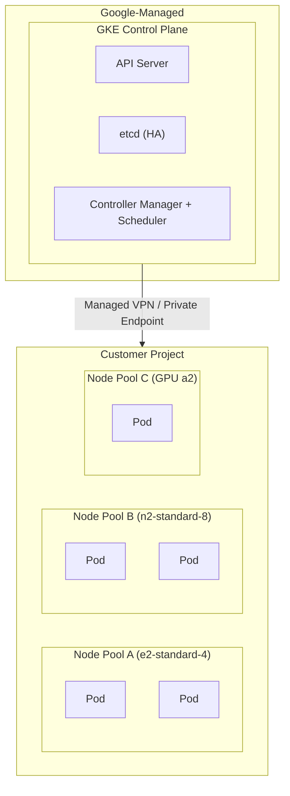
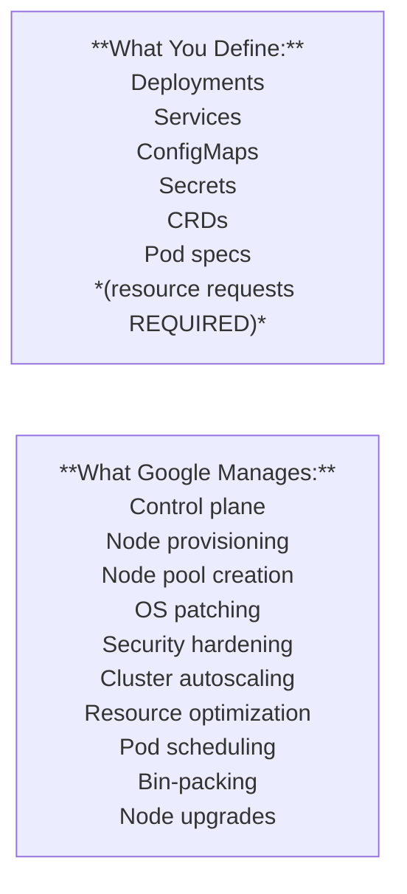
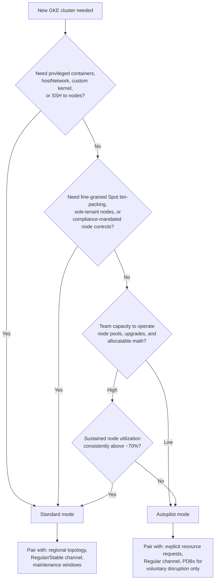
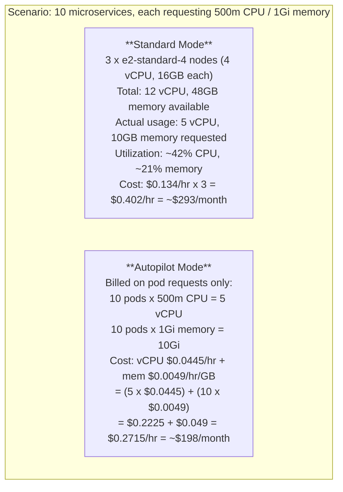
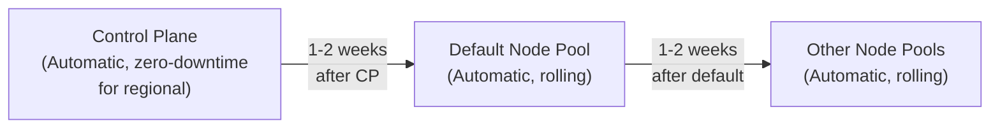
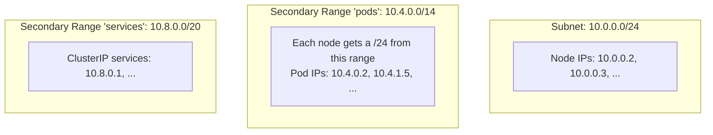

**Complexity**: `[MEDIUM]` | **Time to Complete**: 2h | **Prerequisites**: GCP Essentials — expect to run real `gcloud` commands against a billing-enabled project and delete clusters when finished. [Cloud Architecture Patterns](../../architecture-patterns/) is a recommended companion, not required first.

## What You'll Be Able to Do

After completing this module, you will be able to design and operate GKE clusters with explicit tradeoffs rather than default settings:

- **Configure GKE Standard and Autopilot clusters with release channels, regional topology, and node auto-provisioning**
- **Evaluate GKE Standard vs Autopilot mode for workload requirements including GPU, DaemonSet, and cost constraints**
- **Implement GKE cluster upgrade strategies using release channels, maintenance windows, and surge upgrades**
- **Design regional GKE clusters with multi-zonal node pools for high-availability production workloads**

---

## Why This Module Matters

Hypothetical scenario: a platform team provisions a regional GKE cluster for a new product launch, selects the Rapid release channel to "stay current," and skips maintenance windows because upgrades are supposed to be automatic anyway. Two weeks later, a minor Kubernetes version bump lands during business hours, a deprecated API their Helm chart still references starts failing admission, and on-call engineers discover they cannot roll back the control plane — only reschedule node upgrades and fix manifests forward. The outage was not caused by GKE being "unmanaged"; it was caused by architectural choices the team did not understand.

A team can still suffer upgrade-related outages on a managed Kubernetes service if they choose an aggressive release cadence and don't test their manifests against the next Kubernetes version before production rollouts. GKE removes toil around etcd backups, control-plane patching, and node OS hardening, but it does not remove the need for deliberate decisions about topology, billing model, IP planning, and upgrade policy. Those decisions compound: a zonal dev cluster misconfigured for production teaches the wrong mental model, and a Standard cluster sized for peak traffic without Spot or bin-packing discipline can quietly cost more than Autopilot would for the same workload shape.

This story captures the central tension of GKE: Google manages massive amounts of infrastructure for you, but you still need to understand what decisions GKE is making on your behalf. The choice between Standard and Autopilot mode, the selection of a release channel, the configuration of regional versus zonal clusters, and the behavior of auto-upgrades and auto-repair all have direct consequences for your application's availability, cost, and security posture. When you internalize those mechanics, you stop treating "managed Kubernetes" as a black box and start designing clusters that match how your organization actually ships software.

In this module, you will learn the GKE architecture from the ground up: how the control plane and node pools work, the fundamental differences between Standard and Autopilot modes, how release channels govern your upgrade lifecycle, and how to make informed decisions about cluster topology. By the end, you will deploy the same application to both Standard and Autopilot clusters and compare the operational experience, including the billing and scheduling differences that only become visible once workloads are running.

---

## GKE Architecture Fundamentals

Before choosing between Standard and Autopilot, you need to understand what GKE actually provisions when you create a cluster. A GKE cluster is not a single VM — it is a contract between Google-managed control-plane components and customer-visible worker capacity (Standard) or Pod-scheduled compute (Autopilot). The Kubernetes version you select at create time (today's curriculum target is **1.35**) flows through release channels and upgrade policies for the life of the cluster, so architectural choices you make on day one constrain what you can change without rebuilding.

Every GKE cluster consists of two layers: the **control plane** (managed entirely by Google) and the **nodes** (where your workloads run). In Standard mode you see and bill for nodes directly; in Autopilot mode Google creates and destroys nodes in response to Pod schedules while you interact only with Kubernetes objects. Both modes expose the same Kubernetes API, which is why application manifests largely port between them — but operational tooling, cost models, and security boundaries diverge sharply beneath that API surface.



### Control Plane and Node Architecture

The control plane and node layers communicate exclusively through Kubernetes APIs — kubelet registration, Pod scheduling, Service endpoints, and Node status heartbeats. [Shielded GKE Nodes](https://cloud.google.com/kubernetes-engine/docs/concepts/cluster-architecture) verify node identity during registration by default, reducing the risk of rogue VMs joining your cluster. Worker nodes run kubelet, containerd, and GKE-managed DaemonSets for logging and networking; what differs by mode is whether **you** pick the machine type and image or **Google** picks them from your Pod requests.

The following control-plane facts apply to every cluster you operate, regardless of mode, and show up on every FinOps review whether or not your workloads are Autopilot:

- **Cluster fee and free tier**: GKE charges a flat [cluster management fee of $0.10 per cluster per hour](https://cloud.google.com/kubernetes-engine/pricing) (billed per second), regardless of Standard versus Autopilot, zonal versus regional, or fleet size. The [GKE free tier](https://cloud.google.com/kubernetes-engine/pricing) provides $74.40 in monthly credits per billing account — enough to offset one zonal Standard cluster or one Autopilot cluster for a full month. Regional Standard cluster management fees are **not** covered by that credit, which surprises teams that promote a zonal dev cluster to regional production without revisiting the fee line item.
- **SLA-backed**: [Regional clusters provide a 99.95% SLA for the control plane. Zonal clusters offer 99.5%.](https://cloud.google.com/kubernetes-engine/pricing) Autopilot multi-zone Pods carry a separate 99.9% availability SLA. These numbers describe control-plane/API availability, not your application's uptime — you still need PodDisruptionBudgets, multi-zone node pools, and health checks for workload resilience.
- **Invisible**: You cannot SSH into the control plane. You interact with it exclusively through the Kubernetes API via `kubectl`, client libraries, or the Google Cloud console.
- **Auto-scaled**: Google automatically scales control plane resources based on the number of nodes, pods, and API request volume in your cluster. Large fleets with heavy API churn (many controllers, frequent object churn) consume more control-plane headroom than small dev clusters, still without any line item you tune manually.

Together, the management fee and SLAs describe Google's side of the bargain: highly available etcd/API for regional production, or cheaper zonal control planes acceptable only when brief API gaps during upgrades are tolerable for the workloads involved.

### Control plane internals: etcd, state storage, and upgrade behavior

The GKE control plane runs the Kubernetes API server, scheduler, and controller manager on Google-managed VMs you never see. [Cluster state](https://cloud.google.com/kubernetes-engine/docs/concepts/cluster-architecture) — every Deployment, Secret, ConfigMap, and Node object — is persisted in a highly available key-value store. GKE serves the etcd API to the Kubernetes API server. Depending on cluster configuration, the backing store may be etcd replicas on control-plane VMs or Spanner. Your operational interface remains the same Kubernetes API either way.

For **regional** clusters, GKE replicates the control plane across three zones in the region. During a control-plane upgrade, replicas roll one at a time. The API remains reachable for `kubectl apply`, new Deployments, and autoscaling events. For **zonal** clusters, a single control-plane replica means the API can be unavailable for several minutes during upgrades. That window is long enough to block a hotfix Deployment. **Already-running Pods on worker nodes keep serving traffic** during zonal control-plane gaps. That distinction matters in incident response. Zonal clusters can look "healthy" in a dashboard of running Pods while the control plane rejects writes.

The per-cluster management fee covers this managed control-plane lifecycle: creation, automatic version upgrades (when enrolled in a release channel), scaling of control-plane capacity, and deletion. It does **not** include worker-node Compute Engine charges (Standard), Pod-request charges (Autopilot general-purpose billing), load balancers, persistent disks, or egress. At fleet scale — say 40 production clusters — the management fee alone is roughly $0.10 × 40 × 730 ≈ **$2,920/month** before any nodes or Pods exist, which is why platform teams consolidate non-production environments or share clusters with namespace isolation rather than provisioning one cluster per microservice by default.

### [Regional vs Zonal Clusters](https://cloud.google.com/kubernetes-engine/docs/concepts/regional-clusters)

Topology is the first architectural fork because it affects control-plane SLA, default node spread, and how `--num-nodes` arithmetic shows up on your invoice. Zonal clusters keep the control plane and default node pool in one zone — simpler and cheaper, but a zone outage takes down both API and workers unless you manually add multi-zonal node pools. Regional clusters replicate the control plane across three zones and spread default nodes across those zones, trading cost for survivability during single-zone failures and control-plane upgrades.

| Aspect | Zonal Cluster | Regional Cluster |
| :--- | :--- | :--- |
| **Control plane** | Single zone (1 replica) | Three zones (3 replicas) |
| **Control plane SLA** | 99.5% | 99.95% |
| **Node distribution** | Single zone (default) | Spread across 3 zones |
| **Control plane upgrade** | Temporary control plane unavailability during upgrades | Highly available rolling upgrades with continued API access |
| **Cost** | Lower (fewer nodes by default) | Higher (3x nodes by default) |
| **Best for** | Dev/test, cost-sensitive | Production workloads |

```bash
# Create a regional cluster (recommended for production)
gcloud container clusters create prod-cluster \
  --region=us-central1 \
  --num-nodes=2 \
  --machine-type=e2-standard-4 \
  --release-channel=regular

# This creates 2 nodes PER ZONE (3 zones) = 6 nodes total
# Many teams are surprised by this multiplication

# Create a zonal cluster (for dev/test)
gcloud container clusters create dev-cluster \
  --zone=us-central1-a \
  --num-nodes=3 \
  --machine-type=e2-standard-2 \
  --release-channel=rapid
```

**Capacity note**: Regional clusters can create more nodes than teams expect because node counts are distributed across zones. In the default three-zone layout, a `--num-nodes` value applies per zone rather than as a single cluster-wide total, so plan capacity and cost accordingly.

---

## Standard Mode: Full Control

Standard mode is the original GKE experience. You manage node pools, choose machine types, configure autoscaling, and handle node-level operations while Google manages only the control plane. Standard remains the right default when you need GPUs with custom drivers, privileged security agents, sole-tenant nodes, fine-grained Spot economics, or compliance regimes that require demonstrable control over the worker OS. It is also the mode where operational mistakes — wrong autoscaling flags, exhausted Pod CIDRs, mixed-version node pools — show up on your team's runbooks rather than being absorbed silently by Google.

### Node Pools

A node pool is a group of nodes within a cluster that share the same configuration. You can have multiple node pools with different machine types, taints, labels, and scaling behavior.

```bash
# Create a cluster with a default node pool
gcloud container clusters create standard-cluster \
  --region=us-central1 \
  --num-nodes=1 \
  --machine-type=e2-standard-4 \
  --release-channel=regular \
  --enable-ip-alias \
  --workload-pool=$(gcloud config get-value project).svc.id.goog

# Add a high-memory node pool for databases
gcloud container node-pools create highmem-pool \
  --cluster=standard-cluster \
  --region=us-central1 \
  --machine-type=n2-highmem-8 \
  --num-nodes=1 \
  --node-taints=workload=database:NoSchedule \
  --node-labels=tier=database \
  --enable-autoscaling \
  --min-nodes=1 \
  --max-nodes=5

# Add a spot node pool for batch workloads (60-91% cheaper)
gcloud container node-pools create spot-pool \
  --cluster=standard-cluster \
  --region=us-central1 \
  --machine-type=e2-standard-8 \
  --spot \
  --num-nodes=0 \
  --enable-autoscaling \
  --min-nodes=0 \
  --max-nodes=20 \
  --node-taints=cloud.google.com/gke-spot=true:NoSchedule
```

### Machine families, node images, and allocatable capacity

Standard mode gives you direct control over Compute Engine machine selection. GKE node pools commonly use **E2** (cost-optimized general purpose), **N2/N2D** (balanced performance, N2D on AMD), **C3** (compute-optimized), or **T2D** (scale-out Arm) families depending on workload profile. GPU and high-memory variants (for example `n2-highmem-8`, `a2` accelerators) live in dedicated pools with taints so general microservices never land on expensive hardware.

[Node images](https://cloud.google.com/kubernetes-engine/docs/concepts/node-images) split along operational philosophy. **Container-Optimized OS with containerd** (`cos_containerd`) is Google's hardened, minimal image — the default for Autopilot and the recommended choice for most Standard pools because Google patches it quickly and the read-only root filesystem reduces attack surface. **Ubuntu with containerd** (`ubuntu_containerd`) supports packages like CephFS clients or XFS tooling that COS cannot host natively; choose it when your node-level dependencies genuinely require `apt-get`, not because it feels familiar.

Neither image gives Pods the full vCPU count printed on the machine type label. GKE reserves **system** and **kube** components on every node. The kubelet, container runtime, eviction thresholds, and DaemonSets such as logging agents consume CPU and memory before the scheduler calculates **allocatable** capacity. On a four-vCPU `e2-standard-4`, `kubectl describe node` typically shows roughly 3.9 allocatable CPUs and noticeably less than 16 GiB of allocatable memory. That is not a billing bug. It is capacity planning math you must account for when sizing pools. Overcommitting requests against raw machine specs causes pending Pods even when nodes look "empty" in the cloud console.

**Taints and labels** implement isolation beyond machine type. Production patterns combine `node-labels=tier=database` with matching `node-taints=workload=database:NoSchedule` so only Pods with the corresponding toleration schedule onto database nodes. [Spot VM pools](https://cloud.google.com/kubernetes-engine/docs/concepts/spot-vms) should always carry the `cloud.google.com/gke-spot=true:NoSchedule` taint so critical control-plane-adjacent workloads never land on interruptible capacity.

### Spot VMs versus legacy preemptible VMs

Both Spot and preemptible VMs offer steep discounts versus on-demand Compute Engine pricing — [Spot pricing in Autopilot and Standard contexts can reach roughly 60–91% off](https://cloud.google.com/kubernetes-engine/docs/concepts/spot-vms) corresponding regular rates, though Spot prices adjust dynamically. The operational difference that matters for batch design: **preemptible VMs expire after 24 hours**, while **Spot VMs have no fixed expiration** and run until Compute Engine reclaims capacity. GKE documentation recommends Spot over preemptible for new node pools. Spot reclamation is involuntary and **not covered by PodDisruptionBudget guarantees**, so fault-tolerant or checkpointed workloads belong on Spot; stateful systems need on-demand pools or careful graceful-shutdown tuning (default 30 seconds, extendable up to 120 seconds on supported Standard control-plane versions **(Preview)**).

### Per-zone versus total node autoscaling flags

Regional clusters multiply node counts by zone, and autoscaling flags inherit that behavior unless you opt out. [`--min-nodes` and `--max-nodes`](https://cloud.google.com/kubernetes-engine/docs/how-to/cluster-autoscaler) apply **per zone**; in GKE 1.24 and later, [`--total-min-nodes` and `--total-max-nodes`](https://cloud.google.com/kubernetes-engine/docs/how-to/cluster-autoscaler) express cluster-wide bounds and are mutually exclusive with the per-zone pair. Use total flags when finance expects "10–60 nodes in us-central1," not "10–60 nodes in **each** of three zones."

```bash
# Regional pool: 10–60 nodes TOTAL across three zones (not per zone)
gcloud container node-pools create batch-pool \
  --cluster=standard-cluster \
  --region=us-central1 \
  --machine-type=e2-standard-8 \
  --spot \
  --enable-autoscaling \
  --total-min-nodes=0 \
  --total-max-nodes=60
```

### Cluster Autoscaler vs Node Auto-Provisioning

Standard mode offers two complementary approaches to scaling nodes, and mature platforms often run **both**: fixed pools with cluster autoscaler for baseline services, plus NAP or ComputeClass auto-creation for bursty GPU or Spot shapes.

| Feature | Cluster Autoscaler | Node Auto-Provisioning (NAP) |
| :--- | :--- | :--- |
| **What it does** | Scales existing node pools up/down | Creates entirely new node pools on demand |
| **You define** | Min/max per node pool | Resource limits (total CPU, memory, GPU) |
| **Machine types** | Fixed per pool | GKE chooses optimal machine type |
| **Flexibility** | Lower (pre-defined pools) | Higher (adapts to workload needs) |
| **Complexity** | Simpler to understand | More "magic" happening behind the scenes |

```bash
# Enable Node Auto-Provisioning
gcloud container clusters update standard-cluster \
  --region=us-central1 \
  --enable-autoprovisioning \
  --autoprovisioning-max-cpu=100 \
  --autoprovisioning-max-memory=400 \
  --autoprovisioning-min-cpu=4 \
  --autoprovisioning-min-memory=16
```

With NAP enabled, if a pod requests a GPU and no GPU node pool exists, [GKE will automatically create one. When the pod finishes and the pool is idle, GKE scales it back to zero and eventually removes it.](https://cloud.google.com/kubernetes-engine/docs/concepts/node-auto-provisioning)

### Node Auto-Provisioning in depth

[Node pool auto-creation](https://cloud.google.com/kubernetes-engine/docs/concepts/node-auto-provisioning) extends the cluster autoscaler: instead of only adding VMs to predefined pools, GKE provisions **entire new node pools** when pending Pods need hardware no existing pool provides. You scope blast radius with **cluster-level resource limits** (`--autoprovisioning-max-cpu`, `--autoprovisioning-max-memory`, GPU caps) that apply to the sum of all node capacity including manually created pools — breaching a limit leaves Pods pending rather than silently overspending.

Machine-family selection follows a precedence chain documented by Google: Pod or ComputeClass selectors win, then cluster-level NAP defaults, then platform defaults (often E2 when unspecified). NAP cannot set a minimum node count above zero for auto-created pools; if you need always-on baseline capacity, keep at least one manually managed on-demand pool and let NAP handle burst shapes (GPUs, highmem, Spot batch) that would otherwise require a combinatorial explosion of static pools.

Scale-to-zero is a feature, not a failure mode: when the last Pod leaves an auto-created pool, GKE drains, consolidates, removes nodes, and deletes the empty pool. That interacts cleanly with the cluster autoscaler but requires you to tolerate brief scheduling latency when a new GPU or Spot shape appears — the first Pod in a new job type pays the node-provisioning tax. Newer GKE versions also support workload-level enablement via ComputeClasses with `nodePoolAutoCreation.enabled: true`, reducing the need for cluster-wide NAP when only one team needs dynamic hardware.

```bash
# Inspect autoprovisioning limits and defaults
gcloud container clusters describe standard-cluster \
  --region=us-central1 \
  --format="yaml(autoscaling)"
```

### What You Manage in Standard Mode

Standard operators own the full worker stack. Node pool sizing and machine types determine both performance ceiling and invoice baseline. OS image selection (`cos_containerd` versus `ubuntu_containerd`) locks in patch cadence and package flexibility. Auto-upgrade and auto-repair policies (enabled by default on many pools) decide whether Google replaces bad nodes and whether those replacements happen inside your maintenance windows. System and kube reservations on each node reduce allocatable CPU and memory below the machine spec. Network policies, firewall rules, and Pod resource requests remain your responsibility — GKE provides the network path, but not optimal bin-packing unless you configure requests, limits, and Horizontal Pod Autoscaler targets deliberately.

**Pause and predict:** Consider a Standard GKE cluster. You configure a dedicated Spot node pool for batch processing alongside standard nodes for core services. How do you guarantee that critical control and system Pods never land on preemptible VMs?

<details>
<summary>Check your prediction</summary>

Configure the Spot node pool with the dedicated node taint `cloud.google.com/gke-spot=true:NoSchedule`. Critical cluster components and application control Pods lack matching tolerations, preventing the Kubernetes scheduler from assigning them to preemptible worker instances. When leveraging Node Auto-Provisioning (NAP), auto-created Spot pools receive this taint automatically upon creation. Platform administrators must always maintain at least one non-preemptible standard node pool to host cluster add-ons and `kube-system` workloads. Additionally, keep in mind that PodDisruptionBudgets (PDBs) do not cover Spot reclamation; Google Cloud reclaims preemptible capacity abruptly without honoring eviction budgets.
</details>

Batch jobs that tolerate interruption still share a cluster with add-ons that cannot. Platform teams that separate those two classes of work into independently scaled pools keep invoice pressure from becoming a control-plane incident when a region reclaims surplus capacity overnight.

---

## Autopilot Mode: Google Manages the Nodes

[Autopilot is GKE's fully managed mode, introduced in 2021. Google manages everything except your workloads: the control plane, the nodes, the node pools, the OS patches, and the security hardening.](https://cloud.google.com/blog/products/containers-kubernetes/introducing-gke-autopilot) You only define Pods, Services, and higher-level objects — never node pools in the console unless you are inspecting what Google created on your behalf. Autopilot's value proposition is velocity for teams that would otherwise spend sprint capacity right-sizing pools, patching COS, and chasing underutilized nodes; its cost proposition is strongest when workload footprint varies over time and explicit resource requests reflect real needs rather than padded guesses.

### How Autopilot Works



```bash
# Create an Autopilot cluster
gcloud container clusters create-auto autopilot-cluster \
  --region=us-central1 \
  --release-channel=regular
```

That single command creates a production-ready regional cluster with VPC-native networking and Workload Identity enabled — no node pool forms to fill out, no machine-type matrix, no cluster-autoscaler min/max tuning. Google provisions right-sized nodes when Pending Pods exist, patches them on Google's cadence, and reclaims capacity when Deployments scale down. You still configure release channels, maintenance policies, and RBAC; you do not SSH to nodes or pick `--machine-type` for general workloads.

### Autopilot Billing Model

Budget conversations should start here because Autopilot and Standard diverge on the invoice line items finance teams reconcile. Standard mode charges for the VMs (nodes) whether or not pods are using them. Autopilot charges for **pod resource requests** on general-purpose compute classes, which decouples your bill from idle node headroom but couples it tightly to manifest hygiene.

| Billing Dimension | Standard Mode | Autopilot Mode |
| :--- | :--- | :--- |
| **What you pay for** | Compute Engine nodes | Usually Pod requests for general-purpose workloads, or node-based billing for workloads that request specific hardware |
| **Idle nodes** | You pay for node capacity whether Pods fully use it or not | For general-purpose Pod-based billing, you aren't separately managing idle nodes, but hardware-specific Autopilot workloads can still use node-based billing |
| **Over-provisioned pods** | Unused node capacity still costs money | Over-requesting Pod resources increases your bill, and some hardware-specific Autopilot workloads use node-based pricing instead |
| **Minimum charge** | Node cost applies even when the cluster is mostly empty | Billing depends on the Autopilot model in use; general-purpose workloads are request-based, while hardware-specific workloads use node-based pricing |
| [**Spot pricing**](https://cloud.google.com/kubernetes-engine/docs/concepts/spot-vms) | Available via Spot node pools | Available via Spot pods |

```yaml
# In Autopilot, resource requests are MANDATORY
# Autopilot will set defaults if you omit them, but you should be explicit
apiVersion: apps/v1
kind: Deployment
metadata:
  name: web-app
spec:
  replicas: 3
  selector:
    matchLabels:
      app: web-app
  template:
    metadata:
      labels:
        app: web-app
    spec:
      containers:
      - name: web
        image: nginx:1.27
        resources:
          requests:
            cpu: 250m      # Autopilot bills on this
            memory: 512Mi  # and this
          limits:
            cpu: 500m
            memory: 1Gi
```

### Autopilot Restrictions

[Autopilot enforces security best practices by restricting certain operations](https://cloud.google.com/kubernetes-engine/docs/concepts/autopilot-security). Before treating a Standard-to-Autopilot migration checklist as complete, predict what happens to a host-level telemetry DaemonSet that worked on your previous cluster.

**Pause and predict:** Consider an Autopilot cluster. You deploy a custom DaemonSet that requires privileged access to the host network namespace to monitor traffic. What will happen when you apply the manifest?

<details>
<summary>Check your prediction</summary>

GKE Autopilot admission controllers immediately reject the manifest during API validation. Autopilot strictly blocks privileged containers and `hostNetwork: true` by default to safeguard shared host boundaries and enforce cluster security baselines. While Google maintains an allowlist for select verified-partner security and observability agents, a generic or custom packet sniffer is not permitted. These restrictions are not arbitrary friction; they encode Google's operational ability to patch, rotate, and bin-pack nodes safely without third-party daemons undermining node security. Teams migrating workloads from Standard clusters should always run `kubectl apply --dry-run=server` on critical DaemonSets and telemetry agents before cutover day.
</details>

Migration checklists that inventory host-level agents before an Autopilot cutover date give platform teams time to negotiate vendor alternatives without a Friday-night rollback. That inventory belongs in the same architecture review as CIDR sizing and release-channel choice, because discovering an incompatible telemetry agent after DNS cutover is an availability incident rather than a ticket.

The table below summarizes the most common migration blockers teams discover when moving from Standard — treat it as an admission-control checklist, not an exhaustive API list:

| Restriction | Reason | Workaround |
| :--- | :--- | :--- |
| [No SSH to nodes](https://cloud.google.com/kubernetes-engine/docs/concepts/cluster-architecture) | Nodes are managed by Google | Use `kubectl exec` or `kubectl debug` |
| No privileged containers | Security hardening | Use `securityContext.capabilities` for specific caps |
| No host network/PID/IPC | Prevents node-level access | Redesign the workload |
| DaemonSets that need elevated node access are restricted | Google manages the nodes | Use only DaemonSets that comply with current Autopilot constraints or approved allowlisted workloads |
| [No custom node images](https://cloud.google.com/kubernetes-engine/docs/concepts/cluster-architecture) | Consistency guarantee | Use init containers instead |
| Resource requests strongly influence billing and scheduling | GKE uses or adjusts requests when sizing infrastructure | Explicitly specify requests so Autopilot doesn't rely on defaults or automatic adjustments |
| Pods per node are pre-configured by GKE | Scheduling density depends on the selected node configuration | You can't directly tune this setting in Autopilot |

### Workload Identity at cluster creation

Both Standard and Autopilot examples in this module pass `--workload-pool=PROJECT_ID.svc.id.goog`, enabling [Workload Identity](https://cloud.google.com/kubernetes-engine/docs/how-to/workload-identity) so Kubernetes service accounts map to Google service accounts without exporting node metadata credentials. Enabling the pool at **create** time wires IAM trust once; pods then use `iam.gke.io/gke-service-account` annotations to assume least-privilege Google identities. Retrofitting Workload Identity on legacy clusters requires enabling the pool, recreating node pools, updating every Deployment's service account bindings, and auditing applications that still read the node's metadata server — workable, but expensive enough that the anti-pattern table flags it explicitly. Pair Workload Identity with per-workload Google service accounts rather than reusing the default Compute Engine service account attached to nodes.

---

## Standard vs Autopilot: The Decision Framework

This is the question every GKE user faces, and the answer rarely stays fixed for the entire life of a product. Here is a decision framework based on real-world patterns that platform teams revisit when utilization, headcount, or compliance requirements change.



### Choose Autopilot When

- You want to minimize operational overhead
- Your workloads have well-defined resource requests
- You do not need node-level access (SSH, custom kernels, privileged containers)
- Your team is small and cannot dedicate engineers to cluster operations
- You want pay-per-pod billing to avoid paying for idle nodes
- You are running stateless microservices or batch jobs

### Choose Standard When

- You need node-level customization (GPU drivers, custom OS, kernel tuning)
- You run workloads that require privileged access (some monitoring agents, CNI plugins)
- You want fine-grained control over node placement (specific zones, sole-tenant nodes)
- You need to optimize cost with Spot node pools and careful bin-packing
- You are running ML training workloads with GPUs or TPUs
- You have strict compliance requirements that mandate node-level controls

### Cost Comparison



The math can flip when utilization is consistently high. If your Standard cluster is tightly tuned and uses capacity efficiently, Standard can sometimes be cheaper than Autopilot.

### Autopilot request rounding and fleet-scale cost surprises

Autopilot's Pod-based billing model has subtle knobs that inflate bills when teams treat requests as "set and forget." [Google documents](https://cloud.google.com/kubernetes-engine/pricing) that Autopilot applies **default requests** when you omit them, **raises values below minimums or invalid CPU-to-memory ratios**, and bills Running or ContainerCreating Pods per requested vCPU, GiB, and ephemeral storage — not actual usage. A Deployment copied from a dev cluster with `cpu: 100m` requests on a service that actually needs 250m may get rounded upward; conversely, omitting requests entirely can land you on class defaults larger than necessary. Right-sizing requests is both a performance task and a FinOps task.

Hardware-specific Autopilot workloads (GPU selectors, certain machine series) switch to **node-based billing** plus an Autopilot management premium, meaning you pay for the whole provisioned VM shape — often larger than the Pod strictly requested. That is appropriate for ML training but expensive if you under-utilize the node. Spot Pods in Autopilot inherit the same dynamic [60–91% discount band](https://cloud.google.com/kubernetes-engine/docs/concepts/spot-vms) as Spot node pools, but only for fault-tolerant workloads that tolerate involuntary eviction outside PDB semantics.

**Pause and predict:** Consider a platform team operating fifty microservices with highly variable traffic patterns. The workloads scale rapidly between two and fifty replicas, leaving Standard node utilization near thirty percent. Is GKE Autopilot a suitable operational and economic fit for this application architecture?

<details>
<summary>Check your prediction</summary>

Autopilot is an effective fit for bursty, request-driven services if you configure realistic resource requests and your software stack can operate without privileged containers or host-namespace DaemonSets. In Autopilot mode, you pay strictly for aggregate Pod requests rather than unallocated capacity on idle Standard nodes during scaling valleys. However, platform teams should not treat Autopilot as universally cheaper across all workloads. If applications declare excessively padded requests or maintain sustained steady-state utilization above seventy percent, properly tuned Standard node pools will typically yield lower overall compute costs.
</details>

Aligning provisioning mechanics with traffic characteristics eliminates the operational tax of manual cluster bin-packing. FinOps practitioners should continuously model actual container consumption against cloud billing increments. This ongoing audit ensures that serverless container abstractions deliver measurable financial efficiency across fluctuating consumer workloads.

---

## Immutable cluster properties and migration paths

Several GKE choices are **immutable** or effectively irreversible without rebuilding the cluster. Treat them as architecture review checkpoints before the first `gcloud container clusters create` succeeds.

**Cluster mode (Standard versus Autopilot)** cannot be toggled in place. Autopilot clusters use different node provisioning, admission policies, and billing integrations than Standard clusters. Migration means standing up a parallel cluster, validating manifests (resource requests, DaemonSet compatibility, GPU selectors), shifting traffic with DNS or service mesh, and decommissioning the old cluster — often a multi-sprint program, not a weekend flag change.

**Regional versus zonal** topology is set at create time. You cannot convert a zonal control plane to regional without creating a new cluster and migrating workloads. Likewise, **VPC-native Pod CIDR sizing** is fixed at creation for practical purposes; expanding exhausted Pod ranges requires discontiguous multi-Pod CIDR features or a new cluster with a larger `--cluster-ipv4-cidr`. Network teams should treat the sizing worksheet in the networking section as a capacity contract signed before production launch.

**Release channel enrollment** can be changed, but dropping from a channel to a static version pin removes access to scoped maintenance exclusions that depend on channel end-of-support tracking. **Workload Identity** can be enabled later, but every workload using node credential paths must be retested. Document these constraints in your internal cluster request form so application teams know which decisions require platform-architect approval versus which can be changed with a `gcloud container clusters update`.

When planning brownfield migrations, sequence work as: (1) inventory DaemonSets and privileged Pods, (2) right-size Autopilot requests or Standard pool shapes in staging, (3) validate IP and identity requirements, (4) cut over with rollback DNS, (5) compare management fee plus compute line items for thirty days. Hypothetical scenario: a team skips step one and discovers their legacy APM agent requires hostPath mounts only after the Autopilot cluster is production — the rollback becomes an emergency rebuild of the Standard cluster they just deleted.

---

## Patterns and Anti-Patterns

Production GKE architectures repeat a handful of proven shapes — and a handful of expensive mistakes. The table below captures patterns worth copying and anti-patterns worth auditing in your own fleet.

### Proven patterns

| Pattern | When to use | Why it works | Scaling note |
| :--- | :--- | :--- | :--- |
| **Autopilot for small platform teams / stateless services** | Fewer than two FTEs for cluster ops; microservices with clear CPU/memory requests | Google owns node lifecycle, patching, and bin-packing; Pod-based billing tracks scale-to-zero traffic | GPU or privileged workloads may force Standard or hardware-billed Autopilot — validate before committing |
| **Regional Standard + Spot batch pool + on-demand baseline pool** | Mixed latency-sensitive and fault-tolerant workloads | On-demand pool holds PDB-protected services; Spot pool runs Jobs and batch with taints/tolerations | Use `--total-max-nodes` so regional multiplication does not triple Spot ceilings unexpectedly |
| **Regular channel + maintenance window + bounded exclusions** | Production clusters that must upgrade predictably | Upgrades concentrate in low-traffic windows; exclusions freeze holidays but cannot exceed minor version [end-of-support dates](https://cloud.google.com/kubernetes-engine/docs/how-to/maintenance-windows-and-exclusions) | Require ≥48 hours of maintenance availability in any rolling 32-day window |
| **VPC-native IP plan before first cluster** | Any cluster expected to grow past a handful of nodes | Secondary Pod CIDR size caps maximum nodes; fixing exhaustion later requires expansion or new cluster | Work through sizing **before** Shared VPC handoffs — host-project admins must pre-create ranges |
| **Workload Identity at create time** | Every new cluster | `--workload-pool=PROJECT.svc.id.goog` binds Kubernetes SA to Google SA without long-lived node keys | Retrofitting Workload Identity on legacy clusters is possible but touches every workload identity path |

### Anti-patterns

| Anti-pattern | What goes wrong | Why teams fall into it | Better alternative |
| :--- | :--- | :--- | :--- |
| **Zonal cluster for production** | Single-zone control plane and nodes; 99.5% API SLA; upgrade blips block `kubectl` | Dev cluster "worked fine" and was copied to prod | Regional cluster with multi-zonal node pools |
| **Rapid channel in production** | Earliest minor versions; undiscovered upstream bugs | Desire for newest features (service mesh APIs, alpha gates) | Regular or Stable channel; use Rapid only in CI/staging |
| **`--num-nodes` surprise on regional clusters** | Finance sees 3× expected VMs (per-zone multiplication) | Flag name sounds cluster-wide | `--total-min-nodes` / `--total-max-nodes` or explicit per-zone documentation |
| **Disabling auto-upgrade entirely** | Clusters drift to unsupported minors; emergency forced upgrades | Fear of surprise reboots | Keep auto-upgrade; constrain **when** with maintenance windows and scoped exclusions |
| **Over-requesting Autopilot resources "for headroom"** | Bill scales linearly with requests, not usage | Copy-paste requests from load tests | Right-size from production metrics; use HPA on real utilization |
| **Retrofitting Workload Identity under pressure** | Node SA keys linger; partial migration breaks auth | Identity was deferred at create time | Enable `--workload-pool` on new clusters; migrate workloads deliberately |
| **Single Spot-only node pool** | Spot reclamation evicts system-critical Pods; PDBs cannot block involuntary preemption | Cost optimization without architecture | Always retain on-demand pool for system and latency-sensitive tiers |

---

## Release Channels and Upgrade Strategy

GKE uses release channels to manage Kubernetes version upgrades, coupling your cluster to Google's tested version cadence instead of a self-managed minor pin. Understanding channel timing is critical for production stability because channel enrollment also enables scoped maintenance exclusions tied to end-of-support dates.

### [The Three Channels](https://cloud.google.com/kubernetes-engine/docs/concepts/release-channels)

| Channel | Upgrade Speed | Version Lag | Best For |
| :--- | :--- | :--- | :--- |
| **Rapid** | Weeks after K8s release | Newest available | Testing, non-prod, early adopters |
| **Regular** (default) | 2-3 months after Rapid | ~3 months behind latest | Most production workloads |
| **Stable** | 2-3 months after Regular | ~5 months behind latest | Risk-averse, compliance-heavy |

```bash
# Check available versions per channel
gcloud container get-server-config --region=us-central1 \
  --format="yaml(channels)"

# Create a cluster on the Stable channel
gcloud container clusters create conservative-cluster \
  --region=us-central1 \
  --release-channel=stable \
  --num-nodes=1

# Check what version your cluster is running
gcloud container clusters describe conservative-cluster \
  --region=us-central1 \
  --format="value(currentMasterVersion, currentNodeVersion)"
```

### Auto-Upgrade Behavior

[When enrolled in a release channel, GKE automatically upgrades both the control plane and nodes.](https://cloud.google.com/kubernetes-engine/docs/concepts/release-channels) You choose the channel's risk profile; Google chooses patch timing within your maintenance policy. Manual one-off upgrades remain available when you need to jump ahead of the channel schedule for a critical fix.



You can influence **when** upgrades happen — not whether enrolled channels eventually upgrade — with maintenance windows and exclusions configured cluster-wide:

```bash
# Set a maintenance window (upgrades only during this time)
gcloud container clusters update prod-cluster \
  --region=us-central1 \
  --maintenance-window-start=2024-01-01T02:00:00Z \
  --maintenance-window-end=2024-01-01T06:00:00Z \
  --maintenance-window-recurrence="FREQ=WEEKLY;BYDAY=SA,SU"

# Exclude upgrades during critical business periods
gcloud container clusters update prod-cluster \
  --region=us-central1 \
  --add-maintenance-exclusion-name=holiday-freeze \
  --add-maintenance-exclusion-start=2025-11-25T00:00:00Z \
  --add-maintenance-exclusion-end=2025-12-31T23:59:59Z \
  --add-maintenance-exclusion-scope=no_upgrades
```

### Node upgrade strategies: surge versus blue-green

Control-plane upgrades and node-pool upgrades are separate timelines. After the control plane moves to a new minor version, GKE rolls worker nodes — and **how** those rolls happen determines blast radius for stateful workloads and PDBs.

**Surge upgrades** (default for many pools) create temporary extra nodes (`--max-surge-upgrade`) while cordoning and draining old nodes up to `--max-unavailable-upgrade` at a time. Surge trades **temporary cost** (you pay for burst nodes during the roll) for **speed** and continuous capacity. Tight surge settings (`max-surge=0`, `max-unavailable=1`) serialize upgrades and lengthen maintenance windows — acceptable for small pools, painful for large ones.

**Blue-green node pool upgrades** provision an entire parallel "green" node pool on the new version, validate workloads, then drain the "blue" pool in configurable batches with soak time between batches. [Google's documentation](https://cloud.google.com/kubernetes-engine/docs/how-to/node-pool-upgrade-strategies) exposes `--enable-blue-green-upgrade`, batch sizes (`batch-node-count` or `batch-percent`), `batch-soak-duration`, and `node-pool-soak-duration` (default one hour) so you can pause between drain phases and watch error budgets. Blue-green fits stateful services where a bad node image should not take down half the pool at once — you pay for doubled nodes during soak, but you gain a rollback surface (stop the rollout before draining blue).

**Autoscaled blue-green** (control plane ≥ 1.34.0-gke.2201000 with cluster autoscaler enabled) cordons the blue pool and waits up to seven days (default three days) before draining, giving autoscaler time to grow the green pool organically — useful when surge capacity is hard to pre-provision.

```bash
# Surge: allow one extra node per zone during upgrade, zero unavailable
gcloud container node-pools update default-pool \
  --cluster=prod-cluster \
  --region=us-central1 \
  --max-surge-upgrade=1 \
  --max-unavailable-upgrade=0

# Blue-green with 25% batch drains and 30-minute pool soak
gcloud container node-pools update stateful-pool \
  --cluster=prod-cluster \
  --region=us-central1 \
  --enable-blue-green-upgrade \
  --standard-rollout-policy=batch-percent=0.25,batch-soak-duration=600s \
  --node-pool-soak-duration=1800s
```

**PodDisruptionBudget interaction**: PDBs constrain *voluntary* evictions during drains. Surge and blue-green upgrades use voluntary evictions, so a strict `minAvailable` PDB slows node drains until spare capacity exists — plan surge headroom or temporarily relax PDBs during maintenance windows. **Spot preemption** is involuntary; PDBs cannot prevent Spot reclamation, which is why Spot tiers belong on fault-tolerant work only.

### Maintenance windows versus maintenance exclusions

[Maintenance windows](https://cloud.google.com/kubernetes-engine/docs/how-to/maintenance-windows-and-exclusions) restrict **when** GKE may start automatic upgrades — you must provide at least 48 hours of eligible maintenance time in any rolling 32-day window, in contiguous blocks of four hours or more. **Maintenance exclusions** temporarily forbid upgrades (scopes include `no_upgrades`, `no_minor_upgrades`, or `no_minor_or_node_upgrades`). Exclusions on release-channel clusters cannot extend past the enrolled minor version's **end-of-support date** — you can freeze Black Friday, but you cannot freeze forever without upgrading. Scoped exclusions (`no_minor_upgrades`) require release-channel enrollment; static-version clusters only allow full `no_upgrades` exclusions.

If an upgrade outlasts the maintenance window, GKE may pause and resume in the next window, leaving nodes on mixed versions until completion — another reason to monitor node version skew after long weekends.

### [Auto-Repair](https://cloud.google.com/kubernetes-engine/docs/how-to/node-auto-repair)

Separate from auto-upgrade, auto-repair monitors node health and replaces unhealthy nodes automatically without waiting for a scheduled maintenance window. A node is considered unhealthy when any of the following persist long enough for automation to act:

- It reports a `NotReady` status for more than approximately 10 minutes
- It has no disk space
- It has a boot disk that is not functioning

```bash
# Auto-repair is enabled by default; explicitly enable it
gcloud container node-pools update default-pool \
  --cluster=prod-cluster \
  --region=us-central1 \
  --enable-autorepair

# Check node pool repair/upgrade settings
gcloud container node-pools describe default-pool \
  --cluster=prod-cluster \
  --region=us-central1 \
  --format="yaml(management)"
```

**Pause and predict:** Consider a production GKE cluster enrolled in the Regular release channel. The cluster has a recurring maintenance window scheduled for Saturday at 2:00 AM. Google then releases an urgent security patch on Tuesday. When will the cluster control plane and worker nodes be upgraded?

<details>
<summary>Check your prediction</summary>

Under typical conditions, ordinary auto-upgrades wait for the maintenance window, meaning the cluster will upgrade during the Saturday maintenance slot. When Google issues critical security patches, those fixes are released across all channels simultaneously to ensure broad vulnerability coverage. However, during rare and severe security emergencies involving active zero-day threats, Google can execute emergency auto-upgrades that ignore both release channel delays and maintenance windows. Administrators must avoid assuming that upgrades always occur on Tuesday or that production workloads are strictly immune to updates outside maintenance windows during severe security incidents.
</details>

Reliable lifecycle management treats version movement as a standing operational workflow rather than a quarterly project. Staging canaries and soak periods give application owners a chance to catch API deprecations before the production control plane moves, which keeps user-facing availability intact when Google ships a new minor.

---

## Cluster Networking Basics

Every GKE cluster needs IP addresses for nodes, pods, and services. GKE strongly recommends **VPC-native clusters** (alias IP mode), [which is the default for all new clusters](https://cloud.google.com/kubernetes-engine/docs/concepts/alias-ips). VPC-native networking matters for architecture decisions in this module because **Pod CIDR sizing caps how large your cluster can ever grow**, independent of how many nodes you can afford in Compute Engine.

```bash
# Create a VPC-native cluster with explicit secondary ranges
gcloud container clusters create vpc-native-cluster \
  --region=us-central1 \
  --num-nodes=1 \
  --network=my-vpc \
  --subnetwork=my-subnet \
  --cluster-secondary-range-name=pods \
  --services-secondary-range-name=services \
  --enable-ip-alias

# If you let GKE manage ranges automatically:
gcloud container clusters create auto-range-cluster \
  --region=us-central1 \
  --num-nodes=1 \
  --network=my-vpc \
  --subnetwork=my-subnet \
  --enable-ip-alias \
  --cluster-ipv4-cidr=/17 \
  --services-ipv4-cidr=/22
```



### VPC-native IP sizing: a worked example

[Google's alias IP documentation](https://cloud.google.com/kubernetes-engine/docs/concepts/alias-ips) explains the coupling between secondary Pod range size, `max-pods-per-node`, and maximum node count. Unless you override it, GKE allocates a **/24 per node** from the Pod secondary range and supports up to **110 Pods per node** on Standard clusters (Autopilot defaults differ — Autopilot fixes max Pods per node at **32** for sizing formulas).

Suppose you create a Standard regional cluster with `--cluster-ipv4-cidr=10.4.0.0/17` (a /17 Pod range) and default 110 Pods per node. The /17 range provides 2^(32-17) = **32,768** Pod IP addresses at the subnet level, but each node consumes a /24 (256 addresses) slice. Maximum nodes ≈ 32,768 / 256 = **128 nodes** before Pod IP exhaustion — even if your primary subnet could fit more VM primary IPs. If you later enable autoscaling toward 200 nodes, scheduling succeeds until the Pod CIDR fills, then you see `IP space ... is exhausted` errors despite spare CPU in the project.

The primary subnet range separately limits nodes: a /24 primary range supports on the order of **250 usable node IPs** per Google's sizing table, minus reserved addresses. **Both** limits apply simultaneously — plan the tighter bound. For Services, GKE 1.29+ Standard and 1.27+ Autopilot default to the GKE-managed `34.118.224.0/20` Service range, reducing the need for a user-managed Services secondary range in many greenfield designs.

```text
Worked sizing checklist (Standard, /17 Pod CIDR, 110 max Pods/node):
  Pod secondary /17  → ~128 nodes max (256 IPs reserved per node)
  Primary subnet /24 → ~250 nodes max
  Binding constraint → ~128 nodes before Pod IP exhaustion wins

Action: If you need 200+ nodes, widen Pod CIDR at create time (/16 or discontiguous multi-Pod CIDR) — retrofits are painful.
```

Shared VPC environments require host-project Network Admins to pre-create secondary ranges; GKE cannot auto-expand on your behalf in that model, which makes the worked math above a joint exercise between platform and network teams before the first `gcloud container clusters create`.

### Routes-based clusters (legacy)

Older GKE clusters could operate in **routes-based** mode, programming static routes for Pod CIDRs instead of alias IPs. VPC-native clusters are now the default on all surfaces, and features such as network endpoint groups and many firewall granularities require alias mode. If you inherit a routes-based cluster, plan migration rather than expanding it — greenfield architecture in this module assumes `--enable-ip-alias` (default) and explicit secondary ranges in Shared VPC.

---

---

## Production readiness checklist

Before declaring a GKE cluster production-ready, walk through this checklist with your platform and application owners. Each item connects to a section in this module.

**Topology and availability.** Confirm the cluster is regional for production user traffic. Verify node pools span at least two zones for worker resilience even when the control plane is already regional. Document the `--num-nodes` or `--total-min-nodes` math in the runbook so on-call engineers do not misread capacity during incidents.

**Upgrade policy.** Enroll in Regular or Stable channel unless you have a dedicated test environment on Rapid. Configure a maintenance window with at least forty-eight hours of availability per rolling thirty-two-day window. Add holiday exclusions with explicit end dates. Pick surge or blue-green node upgrade strategy per pool based on PDB strictness.

**Identity and security.** Enable Workload Identity at create time. Bind each Deployment to a dedicated Google service account with least-privilege IAM. Audit DaemonSets for Autopilot compatibility before cutover. Ensure Spot-only pools carry taints and that on-demand baseline capacity exists.

**Network and IP capacity.** Validate Pod secondary CIDR supports planned max nodes given `/24`-per-node allocation. Confirm Shared VPC secondary ranges exist before cluster create. Document primary subnet expansion procedure if node count may grow past initial estimates.

**Cost controls.** Tag clusters for cost allocation. Right-size Autopilot requests from metrics, not guesses. Model management fees at fleet scale. Use Spot for fault-tolerant tiers only. Review free-tier credit consumption monthly so dev clusters do not silently exhaust the single-cluster credit.

**Observability baseline.** Ensure logging and metrics DaemonSets comply with mode restrictions. Test that `kubectl` access paths work during simulated maintenance windows. Record current control-plane and node versions after every upgrade wave.

Hypothetical scenario: a team skips the IP capacity review and launches successfully with ten nodes. Six months later autoscaling tries to reach eighty nodes and scheduling fails with Pod IP exhaustion while CPU quota remains unused. The fix requires network redesign or cluster rebuild — exactly the failure mode the worked sizing example prevents when applied at design time.

**Version alignment.** Record `currentMasterVersion` and node pool node versions after each maintenance window. Mixed-version states during long upgrades are normal briefly. They become incidents when application APIs removed in the new minor break Deployments that were never tested in staging on that minor. Pair channel enrollment with a staging cluster on the same channel that upgrades first. Run kubeconform or policy checks in CI against the next channel version before production maintenance windows execute. Document who approves emergency exclusions when a zero-day patch arrives outside the normal window. Keep that approver on-call rotation separate from application on-call so upgrade policy decisions do not stall behind unrelated incidents. Rehearse the rollback path — DNS revert or mesh traffic shift — at least once per quarter so cluster rebuilds are not your only escape hatch.

---

## Did You Know?

1. **GKE Autopilot launched in February 2021** as a mode of operation designed to reduce manual node management and improve how infrastructure is matched to workload needs.

2. **The GKE control plane runs in Google-managed infrastructure** that is separate from your project's worker nodes. That's why customers interact with the control plane through managed endpoints and don't directly access the control plane VMs.

3. **The GKE cluster management fee is billed per second, not per hour.** At $0.10 per cluster per hour, a cluster you create and delete 20 minutes later costs about $0.033 — which is why ephemeral CI/preview clusters are cheap to spin up and tear down. (Worker-node, Pod, load-balancer, and disk charges are separate.)

4. **Maintenance exclusions are bounded by release-channel support rules**. Short "No upgrades" exclusions for the default `no_upgrades` scope are limited to ninety days (the post-end-of-support emergency window); scoped exclusions can run longer, up to the minor's end-of-support. Longer exclusions must still end by the minor version's end-of-support date. You cannot postpone upgrades indefinitely while staying on an unsupported Kubernetes minor.

---

## Common Mistakes

| Mistake | Why It Happens | How to Fix It |
| :--- | :--- | :--- |
| Using zonal clusters for production | Cheaper, simpler setup | Use regional clusters; the control plane SLA jumps from 99.5% to 99.95% |
| Choosing Rapid channel for production | "We want the latest features" | Use Regular or Stable; Rapid versions can have bugs not yet caught at scale |
| Not setting maintenance windows | Unaware that auto-upgrades can happen anytime | Configure maintenance windows to restrict upgrades to low-traffic periods |
| Confusing `--num-nodes` in regional clusters | Expecting total count, not per-zone | Remember: regional means N nodes x 3 zones; use `--total-min-nodes` and `--total-max-nodes` for clarity |
| Running Autopilot without resource requests | Assuming defaults are optimal | Autopilot can apply default requests when you omit them, but the defaults vary by workload class and might not match your needs; specify your own for accurate billing and scheduling |
| Creating clusters without `--enable-ip-alias` | Following old tutorials | VPC-native (alias IP) is now the default and required for many features; never disable it |
| Ignoring node auto-upgrade | "We will upgrade when we are ready" | Disabling auto-upgrade leads to unsupported versions; use maintenance windows instead |
| Not enabling Workload Identity | Using node service account for all pods | Enable `--workload-pool` at cluster creation; retrofitting later is more complex |

---

## Quiz

<details>
<summary>1. A retail company runs an e-commerce platform with massive traffic spikes during holidays and very low traffic at night. They currently use GKE Standard mode but find their monthly bill is too high because they leave large nodes running overnight "just in case." If they switch to Autopilot, how will their billing model change to address this issue?</summary>

In Autopilot mode, the billing model shifts from paying for the underlying compute instances to paying only for the requested pod resources. When traffic is low at night and pods scale down, the company will only be billed for the remaining pods' requested CPU and memory. They no longer pay for the idle capacity of the underlying VMs, which Google manages and packs efficiently behind the scenes. This makes Autopilot highly cost-effective for spiky, unpredictable workloads compared to Standard mode, where you pay for the nodes regardless of utilization.
</details>

<details>
<summary>2. A junior platform engineer is tasked with creating a highly available production environment. They execute `gcloud container clusters create prod-cluster --region=us-east1 --num-nodes=3`. A week later, the finance team flags a massive spike in compute costs, noting that 9 VMs were provisioned instead of the expected 3. What caused this misunderstanding?</summary>

The engineer misunderstood how the `--num-nodes` flag behaves when creating a regional cluster. In a regional GKE cluster, the control plane and the nodes are replicated across three zones within the specified region to ensure high availability. The `--num-nodes=3` flag specifies the number of nodes per zone, not the total number of nodes for the entire cluster. Therefore, GKE provisioned 3 nodes in each of the 3 zones, resulting in 9 nodes total. To avoid this, teams should use `--total-min-nodes` and `--total-max-nodes` when configuring autoscaling, or clearly document the multiplication factor for regional deployments.
</details>

<details>
<summary>3. Your team is deploying a critical hotfix to production when GKE initiates an automatic control plane upgrade. Your production environment is a regional cluster, while your staging environment is a zonal cluster. You notice `kubectl` commands are failing in staging but succeeding in production. Why are the two environments behaving differently during the upgrade?</summary>

The staging environment uses a zonal cluster, which has only a single control plane replica. During an upgrade, this single replica goes offline for 5-10 minutes, rendering the Kubernetes API unavailable and blocking any `kubectl` commands or new deployments, though existing pods continue to run. In contrast, the production environment is a regional cluster, which features a highly available control plane with three replicas spread across different zones. GKE upgrades these regional replicas one at a time in a rolling fashion, ensuring the Kubernetes API remains accessible and operations like your hotfix deployment can proceed without downtime. This architectural difference underscores why zonal clusters should be avoided for production environments.
</details>

<details>
<summary>4. A developer writes a Kubernetes Deployment manifest for a new Node.js microservice and applies it to a GKE Autopilot cluster. They omitted the `resources.requests` block because they were unsure how much memory the app would need. The pod starts, but the developer later notices their department's cloud bill is higher than expected, and the application seems to be running on very constrained hardware. Why did omitting the resource requests cause this outcome in Autopilot?</summary>

In GKE Autopilot, resource requests are mandatory because they drive both the billing mechanism and the node provisioning logic. When the developer omitted the requests, Autopilot applied default values — and those defaults vary by workload class and are not guaranteed to match the app's actual footprint. The department was billed based on those defaults, which may have been larger than the app actually needed, causing the bill spike. Conversely, if the Node.js app required more memory than the applied default, it would experience performance degradation or OOM kills because it was scheduled on a node sized only for that default. To prevent either failure mode, explicitly define requests (and where appropriate, limits) based on observed or reasonably expected application behavior rather than relying on class defaults.
</details>

<details>
<summary>5. During a busy week, a background process running on a GKE node goes rogue and fills up the entire boot disk with log files, causing the node to become unresponsive. The next day, Google releases a new minor version of Kubernetes on the Regular channel. Which automated GKE systems will handle the unresponsive node and the new Kubernetes version, respectively, and how do their actions differ?</summary>

The unresponsive node with the full boot disk will be handled by the auto-repair system, while the new Kubernetes version will be handled by the auto-upgrade system. Auto-repair constantly monitors node health to ensure workload reliability. When it detects the node has been `NotReady` for about 10 minutes due to the full disk, it deletes the broken node and provisions a fresh one from the node pool template to restore cluster capacity. Auto-upgrade, on the other hand, is responsible for lifecycle management; when the new K8s version becomes available in the Regular channel, it performs a rolling update of all nodes, draining them and recreating them with the new software version, regardless of their current health status. Understanding these distinct mechanisms is crucial for distinguishing between temporary node failures and planned lifecycle events.
</details>

<details>
<summary>6. A data science team shares a Standard mode GKE cluster for running ML training jobs. Some jobs require high-memory CPUs, others require T4 GPUs, and some require A100 GPUs. They currently have six different node pools configured with Cluster Autoscaler, but managing the minimums, maximums, and taints for all these pools is becoming an operational nightmare. How could they solve this scaling complexity?</summary>

The team should enable Node Auto-Provisioning (NAP) to replace their complex web of static node pools. With standard Cluster Autoscaler, you must pre-create every specific machine type and configuration as a separate node pool before pods can request them. NAP eliminates this burden by dynamically creating entirely new node pools on the fly based on the specific resource requirements (like GPUs or high memory) of pending pods. Once the ML jobs finish and the dynamic node pools sit idle, NAP will automatically scale them down to zero and delete them, drastically reducing the team's operational overhead while ensuring jobs get exactly the hardware they need. This approach transforms cluster scaling from a static, declarative burden into a dynamic, workload-driven process.
</details>

<details>
<summary>7. A company has been running a GKE Standard cluster for two years. Due to a recent reduction in their DevOps staff, the CTO mandates that all infrastructure should be moved to fully managed services to reduce operational toil. The engineering lead suggests running a `gcloud` command to toggle their existing Standard cluster into Autopilot mode during the weekend maintenance window. Why will this plan fail, and what is the correct approach?</summary>

This plan will fail because a cluster's mode (Standard or Autopilot) is a fundamental, immutable architectural property set at creation time and cannot be toggled or converted later. Autopilot clusters are built with different underlying infrastructure assumptions and security boundaries that prevent an in-place conversion from a Standard cluster. The correct approach is to provision a brand-new Autopilot cluster side-by-side with the existing one. The team must then audit their manifests to ensure compatibility (e.g., adding explicit resource requests, removing unsupported privileged access), deploy the workloads to the new cluster, and carefully shift traffic over before decommissioning the old Standard cluster.
</details>

<details>
<summary>8. Your platform team must upgrade a 30-node Standard node pool running stateful Redis instances with a strict `PodDisruptionBudget` of `minAvailable: 28`. Surge upgrades with `max-unavailable=1` are taking longer than the Saturday maintenance window allows, and last month a rushed surge left two nodes on the old version for a week. Which upgrade strategy should they evaluate, and what tradeoff should they expect?</summary>

They should evaluate **blue-green node pool upgrades** with explicit batch soak durations rather than relying on default surge settings alone. Blue-green creates a parallel green pool on the target version, validates Redis replicas on new nodes, then drains the blue pool in batches (`batch-percent` or `batch-node-count`) with `node-pool-soak-duration` between phases — giving time to confirm replication lag and memory stability before continuing. The tradeoff is **temporary double capacity cost** during soak (both pools exist) versus surge's smaller incremental cost but higher risk of prolonged mixed-version states when PDBs throttle drains. PDBs still apply to voluntary evictions during blue-green drains, so the team must ensure green pool capacity can satisfy `minAvailable: 28` before each batch — often by temporarily scaling replicas or loosening PDBs only inside an approved maintenance exclusion scoped to `no_minor_upgrades` rather than disabling upgrades entirely.
</details>

---

## Hands-On Exercise: Deploy to Standard and Autopilot

### Objective

Create both a GKE Standard and Autopilot cluster, deploy the same application to each, and compare the operational experience, billing model, and scheduling behavior. The exercise reinforces that identical Deployment YAML often **schedules** differently — Standard places Pods on the machine type you chose, while Autopilot provisions nodes matched to aggregated requests — and that regional Standard clusters always multiply baseline node counts by zone unless you use total autoscaling flags.

### Prerequisites

You need the `gcloud` CLI authenticated to a billing-enabled project with the Kubernetes Engine API enabled, plus a local `kubectl` binary matched to a supported version for GKE 1.35 clusters. Pick a single region (the solutions use `us-central1`) and delete both clusters afterward so free-tier credits are not consumed by forgotten management fees.

### Tasks

**Task 1: Enable APIs and Set Up Variables** — confirm your project can create GKE clusters before spending time on cluster provisioning that fails at the API gate.

<details>
<summary>Solution</summary>

```bash
export PROJECT_ID=$(gcloud config get-value project)
export REGION=us-central1
export ZONE=us-central1-a

# Enable required APIs
gcloud services enable container.googleapis.com \
  --project=$PROJECT_ID

# Verify
gcloud services list --enabled --filter="name:container" \
  --format="value(name)"
```
</details>

**Task 2: Create a GKE Standard Cluster** — observe how `--num-nodes=1` on a regional cluster still produces three worker VMs (one per zone by default).

<details>
<summary>Solution</summary>

```bash
# Create a Standard cluster with a single node pool
gcloud container clusters create standard-demo \
  --region=$REGION \
  --num-nodes=1 \
  --machine-type=e2-standard-2 \
  --release-channel=regular \
  --enable-ip-alias \
  --workload-pool=$PROJECT_ID.svc.id.goog \
  --enable-autorepair \
  --enable-autoupgrade

# Get credentials
gcloud container clusters get-credentials standard-demo \
  --region=$REGION

# Verify nodes (should be 3: 1 per zone x 3 zones)
kubectl get nodes -o wide

# Check cluster version
kubectl version
```
</details>

**Task 3: Create a GKE Autopilot Cluster** — note the absence of node-pool prompts and compare create time to Standard.

<details>
<summary>Solution</summary>

```bash
# Create an Autopilot cluster
gcloud container clusters create-auto autopilot-demo \
  --region=$REGION \
  --release-channel=regular

# Get credentials (switch context)
gcloud container clusters get-credentials autopilot-demo \
  --region=$REGION

# Check nodes (Autopilot provisions nodes as needed)
kubectl get nodes -o wide

# You may see 0 nodes initially, or a few small nodes
# Autopilot scales from zero when you deploy workloads
```
</details>

**Task 4: Deploy the Same Application to Both Clusters** — the identical YAML validates that your manifests are portable; differences appear in scheduling and node labels.

<details>
<summary>Solution</summary>

```bash
# Save this as demo-app.yaml
cat <<'EOF' > /tmp/demo-app.yaml
apiVersion: apps/v1
kind: Deployment
metadata:
  name: gke-demo
spec:
  replicas: 3
  selector:
    matchLabels:
      app: gke-demo
  template:
    metadata:
      labels:
        app: gke-demo
    spec:
      containers:
      - name: web
        image: nginx:1.27
        ports:
        - containerPort: 80
        resources:
          requests:
            cpu: 250m
            memory: 256Mi
          limits:
            cpu: 500m
            memory: 512Mi
        readinessProbe:
          httpGet:
            path: /
            port: 80
          initialDelaySeconds: 5
          periodSeconds: 10
---
apiVersion: v1
kind: Service
metadata:
  name: gke-demo
spec:
  type: LoadBalancer
  selector:
    app: gke-demo
  ports:
  - port: 80
    targetPort: 80
EOF

# Deploy to Standard cluster
gcloud container clusters get-credentials standard-demo --region=$REGION
kubectl apply -f /tmp/demo-app.yaml
echo "--- Standard cluster pods ---"
kubectl get pods -o wide
kubectl get svc gke-demo

# Deploy to Autopilot cluster
gcloud container clusters get-credentials autopilot-demo --region=$REGION
kubectl apply -f /tmp/demo-app.yaml
echo "--- Autopilot cluster pods ---"
kubectl get pods -o wide
kubectl get svc gke-demo
```
</details>

**Task 5: Compare Node Behavior and Resource Allocation** — inspect allocatable resources on Standard nodes versus Autopilot-provisioned shapes for the same Pod requests.

<details>
<summary>Solution</summary>

```bash
# Compare nodes on Standard
gcloud container clusters get-credentials standard-demo --region=$REGION
echo "=== STANDARD CLUSTER ==="
echo "Nodes:"
kubectl get nodes -o custom-columns=\
NAME:.metadata.name,\
STATUS:.status.conditions[-1].type,\
MACHINE:.metadata.labels.node\\.kubernetes\\.io/instance-type,\
ZONE:.metadata.labels.topology\\.kubernetes\\.io/zone
echo ""
echo "Pod placement:"
kubectl get pods -o custom-columns=\
NAME:.metadata.name,\
NODE:.spec.nodeName,\
CPU_REQ:.spec.containers[0].resources.requests.cpu,\
MEM_REQ:.spec.containers[0].resources.requests.memory
echo ""
echo "Node allocatable resources:"
kubectl describe nodes | grep -A 5 "Allocatable:" | head -20

# Compare nodes on Autopilot
gcloud container clusters get-credentials autopilot-demo --region=$REGION
echo ""
echo "=== AUTOPILOT CLUSTER ==="
echo "Nodes:"
kubectl get nodes -o custom-columns=\
NAME:.metadata.name,\
STATUS:.status.conditions[-1].type,\
MACHINE:.metadata.labels.node\\.kubernetes\\.io/instance-type,\
ZONE:.metadata.labels.topology\\.kubernetes\\.io/zone
echo ""
echo "Pod placement:"
kubectl get pods -o custom-columns=\
NAME:.metadata.name,\
NODE:.spec.nodeName,\
CPU_REQ:.spec.containers[0].resources.requests.cpu,\
MEM_REQ:.spec.containers[0].resources.requests.memory

# Notice: Autopilot chose machine types based on your pod requests
# Standard used the machine type you specified (e2-standard-2)
```
</details>

**Task 6: Clean Up** — delete both clusters asynchronously so management fees stop accruing; verify deletion with `gcloud container clusters list`.

<details>
<summary>Solution</summary>

```bash
# Delete both clusters
gcloud container clusters delete standard-demo \
  --region=$REGION --quiet --async

gcloud container clusters delete autopilot-demo \
  --region=$REGION --quiet --async

# Clean up local file
rm /tmp/demo-app.yaml

echo "Both clusters are being deleted (async). This takes 5-10 minutes."
echo "Verify deletion:"
echo "  gcloud container clusters list --region=$REGION"
```
</details>

Before committing a GKE cluster architecture to production, platform architects must audit common cognitive traps across compute, security, and upgrade lifecycles. Investigating these failure layers helps engineering teams establish resilient operational foundations. This proactive review prevents dangerous assumptions about Spot node preemption, Autopilot security admission, microservice cost scaling, and maintenance window enforcement.

**Card A: GKE never schedules kube-system Pods on Spot, so you do not need taints on a Standard Spot pool.** An operations team creates a secondary Spot VM node pool on a Standard GKE cluster to run asynchronous batch workloads at reduced cost. To minimize deployment complexity, the engineers omit custom taints and tolerations from the node pool manifest. The team assumes that core control plane components have built-in affinity rules. They also believe `kube-system` daemon pods will never land on preemptible compute.

<details>
<summary>Check your prediction</summary>

Failure layer: Node preemption mechanics versus default scheduler tolerations. Next action: recognize that the Kubernetes scheduler treats untainted Spot nodes identically to standard compute, allowing critical system add-ons and control Pods without tolerations to be placed on preemptible VMs; apply the taint `cloud.google.com/gke-spot=true:NoSchedule` to all Standard Spot pools (which Node Auto-Provisioning applies automatically), ensure application control Pods lack this toleration, maintain at least one on-demand node pool for `kube-system`, and remember that PodDisruptionBudgets cannot block involuntary Spot reclamation.
</details>

**Card B: Autopilot will run a privileged hostNetwork DaemonSet after Google provisions a hardened node.** A platform security team prepares to deploy an internal network monitoring daemon across all nodes in a new GKE Autopilot cluster. The manifest specifies `privileged: true` and `hostNetwork: true` to capture interface traffic directly. Google provisions and manages the underlying compute instances automatically. Therefore, the engineers assume Autopilot will spin up an appropriately hardened node capable of hosting the privileged DaemonSet.

<details>
<summary>Check your prediction</summary>

Failure layer: Autopilot admission webhook validation versus privileged host namespace execution. Next action: understand that GKE Autopilot admission controllers immediately reject manifests requesting privileged containers or host namespaces (`hostNetwork`, `hostPID`, `hostIPC`) to safeguard multi-tenant node boundaries; while Google maintains an explicit allowlist for verified partner security agents, generic or custom monitoring DaemonSets cannot bypass this barrier; re-architect the observability tooling to use sidecar injection, unprivileged eBPF probes where supported, or deploy the workload to a GKE Standard cluster.
</details>

**Card C: Autopilot is a poor fit for bursty microservices because you still pay for idle node pools.** An infrastructure architect evaluates cluster hosting options for an event-driven retail platform. The system features fifty microservices that fluctuate between two and fifty replicas. The architect believes that managed Kubernetes platforms always bill for provisioned underlying node pools. Consequently, the team dismisses GKE Autopilot. They assume that running variable microservices on Autopilot will incur massive idle compute waste comparable to over-provisioned Standard worker groups.

<details>
<summary>Check your prediction</summary>

Failure layer: Pod-based billing mechanics versus VM-level cluster capacity allocation. Next action: recognize that GKE Autopilot bills exclusively for resource requests (`cpu`, `memory`, `ephemeral-storage`) of running Pods rather than provisioned worker VMs, making it an outstanding fit for bursty microservices that scale down and leave nodes partially filled; ensure development teams specify tight, accurate resource requests rather than padded placeholders, verify that workloads do not require forbidden host DaemonSets, and note that Autopilot is not universally cheaper for steady-state workloads exceeding seventy percent sustained node utilization.
</details>

**Card D: A Regular-channel cluster upgrades on Tuesday as soon as Google publishes a critical security patch, ignoring the Saturday maintenance window.** A DevOps engineer configures a production GKE cluster on the Regular release channel. The cluster has an active maintenance window restricted to Saturdays at 2:00 AM. On Tuesday afternoon, Google announces the rollout of an urgent security patch addressing an upstream container vulnerability. The engineer expects the control plane and worker nodes to upgrade automatically on Tuesday evening. The team assumes critical security releases immediately override configured maintenance windows across all channels.

<details>
<summary>Check your prediction</summary>

Failure layer: Release channel rollout mechanics versus maintenance window enforcement policies. Next action: understand that standard auto-upgrades and routine security patches respect configured maintenance windows, meaning the cluster will wait until the scheduled Saturday window to apply the update; Google rolls out critical patches across all release channels simultaneously, but only rare emergency auto-upgrades triggered by acute platform threats bypass maintenance windows; monitor GKE security bulletins and initiate manual out-of-band upgrades if an urgent vulnerability must be patched before the next scheduled window.
</details>

**Success Criteria**:

- [ ] Standard cluster created with 3 nodes (1 per zone)
- [ ] Autopilot cluster created successfully
- [ ] Same deployment YAML works on both clusters
- [ ] Pods are running and accessible via LoadBalancer on both clusters
- [ ] You observed different node provisioning behavior between modes
- [ ] Both clusters deleted and resources cleaned up

---

## Next Module

Next up: **[Module 6.2: GKE Networking (Dataplane V2 and Gateway API)](../module-6.2-gke-networking/)** --- Dive into VPC-native networking, eBPF-powered Dataplane V2, Cloud Load Balancing integration, and the new Gateway API that is replacing Ingress.

## Sources

- [cloud.google.com: pricing](https://cloud.google.com/kubernetes-engine/pricing) — The GKE pricing page explicitly lists these financially backed availability figures.
- [GKE SLA](https://cloud.google.com/kubernetes-engine/sla) — The financially-backed 99.95% regional / 99.5% zonal control-plane SLA.
- [cloud.google.com: regional clusters](https://cloud.google.com/kubernetes-engine/docs/concepts/regional-clusters) — The regional-clusters documentation directly describes replicated control planes and default three-zone worker-node distribution.
- [cloud.google.com: node auto provisioning](https://cloud.google.com/kubernetes-engine/docs/concepts/node-auto-provisioning) — The node auto-provisioning documentation explicitly says GKE creates node pools for pending workloads and deletes empty auto-created pools.
- [cloud.google.com: introducing gke autopilot](https://cloud.google.com/blog/products/containers-kubernetes/introducing-gke-autopilot) — Google's launch post provides the February 2021 introduction date and describes the Autopilot management model.
- [cloud.google.com: spot vms](https://cloud.google.com/kubernetes-engine/docs/concepts/spot-vms) — The GKE Spot VMs documentation explicitly covers Spot node pools and notes that Spot Pods are an Autopilot feature.
- [cloud.google.com: cluster architecture](https://cloud.google.com/kubernetes-engine/docs/concepts/cluster-architecture) — The cluster-architecture documentation states that Autopilot underlying VMs are not visible or directly accessible.
- [cloud.google.com: autopilot security](https://cloud.google.com/kubernetes-engine/docs/concepts/autopilot-security) — The Autopilot security documentation explicitly says Autopilot blocks privileged containers and host namespaces by default.
- [cloud.google.com: release channels](https://cloud.google.com/kubernetes-engine/docs/concepts/release-channels) — The release-channels documentation directly describes channel timing, default status, and recommended use cases.
- [cloud.google.com: node auto repair](https://cloud.google.com/kubernetes-engine/docs/how-to/node-auto-repair) — The node auto-repair guide documents both the default setting and the repair criteria with these approximate thresholds.
- [cloud.google.com: alias ips](https://cloud.google.com/kubernetes-engine/docs/concepts/alias-ips) — The VPC-native clusters documentation explicitly states that VPC-native is the default mode for new GKE clusters.
- [Compare features in Autopilot and Standard clusters](https://cloud.google.com/kubernetes-engine/docs/resources/autopilot-standard-feature-comparison) — This comparison page is the fastest way to verify which cluster mode supports specific operational or security features.
- [cloud.google.com: node images](https://cloud.google.com/kubernetes-engine/docs/concepts/node-images) — Documents COS versus Ubuntu image tradeoffs and Autopilot's mandatory `cos_containerd` image.
- [cloud.google.com: cluster autoscaler](https://cloud.google.com/kubernetes-engine/docs/how-to/cluster-autoscaler) — Documents `--total-min-nodes` / `--total-max-nodes` versus per-zone min/max flags.
- [cloud.google.com: node pool upgrade strategies](https://cloud.google.com/kubernetes-engine/docs/how-to/node-pool-upgrade-strategies) — Surge versus blue-green upgrade configuration and soak parameters.
- [cloud.google.com: maintenance windows and exclusions](https://cloud.google.com/kubernetes-engine/docs/how-to/maintenance-windows-and-exclusions) — Maintenance window availability requirements and exclusion scope/end-of-support rules.
- [cloud.google.com: workload identity](https://cloud.google.com/kubernetes-engine/docs/how-to/workload-identity) — Enabling `--workload-pool` and binding Kubernetes service accounts to Google identities.
