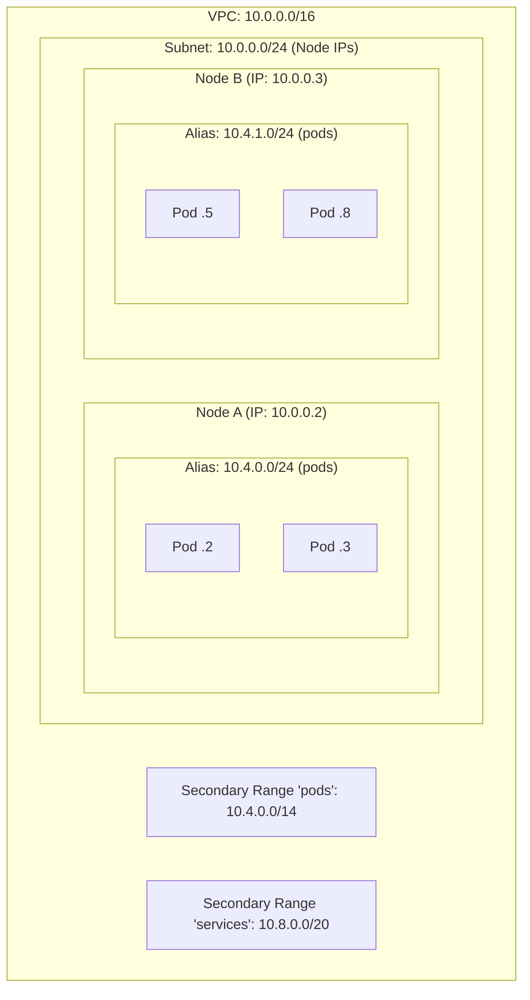
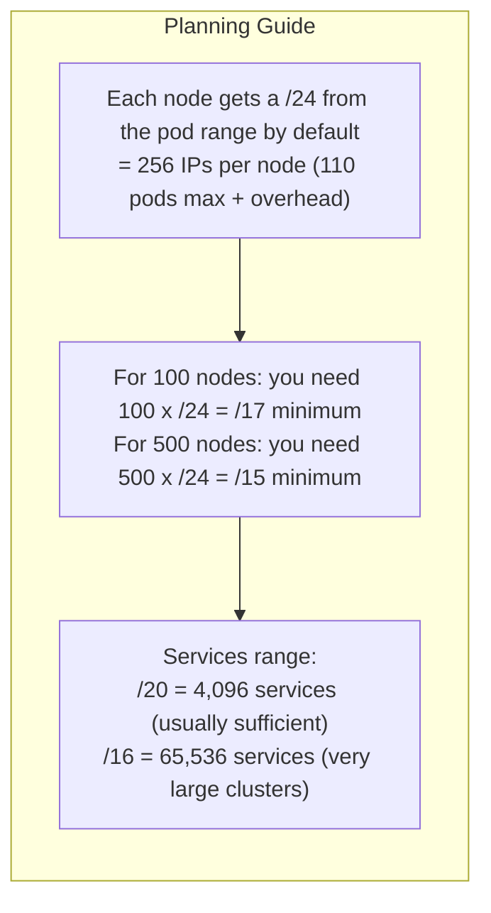
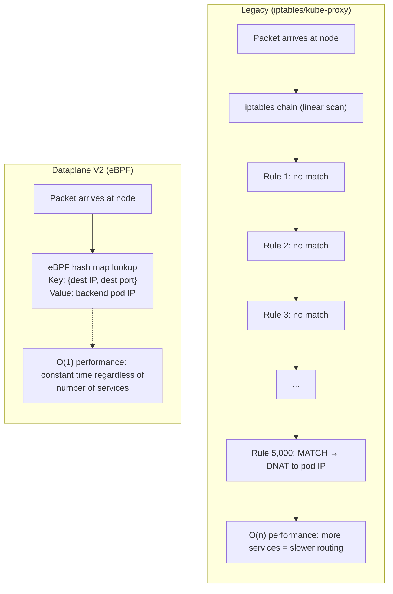
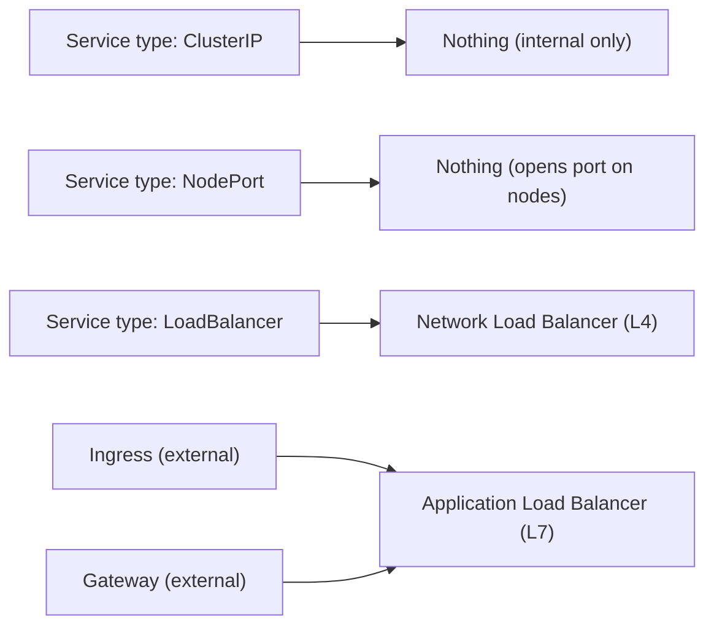
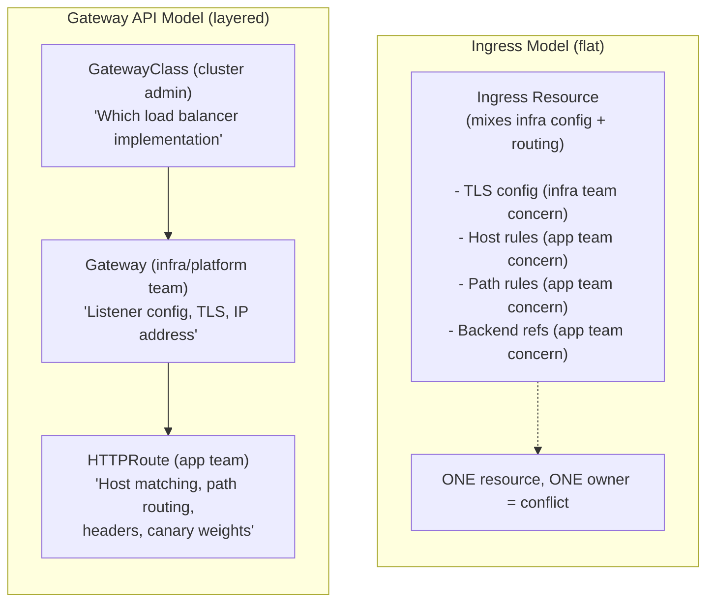
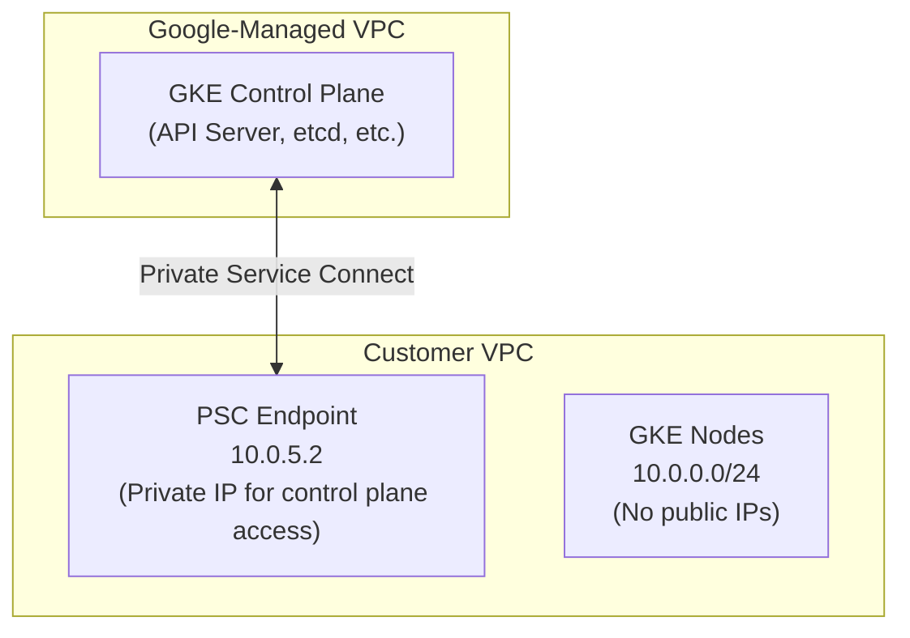
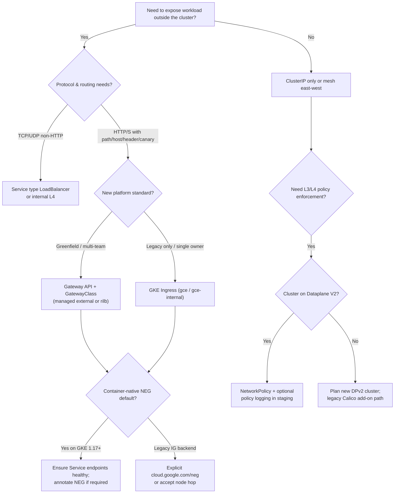

**Complexity**: `[COMPLEX]` | **Time to Complete**: 3h | **Prerequisites**: Module 6.1 (GKE Architecture). Expect to reason about CIDR math, Google Cloud load balancer objects, and Kubernetes policy objects in the same narrative—this is integrative networking design, not a single-feature checklist.

## What You'll Be Able to Do

This module assumes you already understand regional GKE topology and release channels from Module 6.1. Here you move from cluster shape into packet paths: how alias IPs are carved out of VPC secondary ranges, how Dataplane V2 enforces policy, and how Google Cloud load balancers attach to pods. After completing the material and lab, you will be able to:

- **Configure GKE Dataplane V2 (Cilium-based) with network policies and network policy logging**
- **Implement Gateway API on GKE for traffic splitting and header-based routing**
- **Deploy Private Service Connect for secure control plane access on GKE**
- **Diagnose GKE networking issues related to IP exhaustion and pod-to-service communication failures**

---

## Why This Module Matters

Teams sometimes discover too late that creating `NetworkPolicy` objects is not enough on its own. Enforcement depends on the cluster's networking implementation, so you should verify that your GKE cluster is using a dataplane and policy engine that actually enforce the rules you define.

GKE networking is where Kubernetes meets Google's global network infrastructure. The decisions you make about cluster networking---VPC-native mode, Dataplane V2, load balancing strategy, and Gateway API configuration---determine your application's performance, security, and cost. A misconfigured network can leave your pods exposed, introduce unnecessary latency, or rack up egress charges that dwarf your compute costs.

**Hypothetical scenario:** A platform team launches forty microservices behind separate `LoadBalancer` Services because each squad owns its Helm chart. Finance later flags a line item for dozens of forwarding rules and backend services, while SRE sees elevated latency on the oldest cluster still on kube-proxy iptables. Neither problem is mysterious once you map Kubernetes objects to the Google Cloud resources they create; both were predictable from API choices made at bootstrap.

In this module, you will learn how VPC-native clusters use alias IPs to give pods routable addresses, how Dataplane V2 replaces iptables with eBPF for faster and more observable networking, how Cloud Load Balancing integrates with GKE through container-native NEGs, and how the Gateway API provides a more expressive routing model than Ingress. You will also practice diagnosing pod scheduling failures caused by IP exhaustion and designing private clusters that still pull images and admit CI safely. By the end, you will configure Dataplane V2 network policies and set up a Gateway API canary deployment.

---

## VPC-Native Clusters and Alias IPs

Every modern GKE cluster should be VPC-native. [This is the default since GKE 1.21](https://cloud.google.com/kubernetes-engine/docs/concepts/alias-ips) and is required for features like Dataplane V2, Private Google Access for pods, and VPC flow logs for pod traffic. Routes-based clusters remain in brownfield estates, but new work should assume alias IPs and plan secondary ranges before any workload ships.

### How Alias IPs Work

In a VPC-native cluster, each node receives a **primary IP** from the subnet and a **secondary IP range** (alias range) for its pods. This means [pods get IP addresses that are routable within the VPC](https://cloud.google.com/kubernetes-engine/docs/concepts/alias-ips)---no NAT, no overlay network.



### Why This Matters for Networking

VPC-native routing is the foundation for every other feature in this module: without alias IPs, you do not get consistent pod IPs in VPC flow logs, Private Google Access for pods, or the IP planning model that Dataplane V2 and multi-Pod CIDR expansion assume. Legacy routes-based clusters still appear in migration backlogs, but new GKE clusters should be treated as VPC-native by default.

| Feature | VPC-Native (Alias IPs) | Routes-Based (Legacy) |
| :--- | :--- | :--- |
| **Pod IPs routable in VPC** | Yes (directly) | No (requires custom routes) |
| **Max pods per cluster** | Limited by IP range size | Limited to 300 custom routes |
| **Network Policy support** | Full (Dataplane V2) | Limited |
| **Private Google Access for pods** | Yes | No |
| **VPC Flow Logs for pods** | Yes | No |
| **Peering/VPN compatibility** | Full | Route export required |

```bash
# Verify your cluster is VPC-native
gcloud container clusters describe my-cluster \
  --region=us-central1 \
  --format="yaml(ipAllocationPolicy)"

# Expected output includes:
#   useIpAliases: true
#   clusterSecondaryRangeName: pods
#   servicesSecondaryRangeName: services
```

### IP Address Planning

**Pause and predict:** What occurs when a growing VPC-native GKE cluster exhausts its primary cluster Pod secondary range, and how can administrators provision additional IP capacity without destroying the cluster?

<details>
<summary>Check your prediction</summary>

The original cluster Pod secondary range prefix size is strictly immutable once assigned at cluster creation; you cannot resize, expand, or enlarge that original secondary range in place. When the cluster secondary range runs out of available `/24` (or configured per-node CIDR) slices, GKE cannot allocate Pod CIDR blocks to newly provisioned nodes. As a result, the Cluster Autoscaler or manual node pool creation fails, leaving nodes in an unschedulable or failed creation state. To remediate or expand IP capacity on an existing cluster without destroying it, Google Cloud provides **discontiguous multi-Pod CIDR**. Administrators create new subnet secondary ranges in the VPC subnetwork and attach them to **new** node pools using `--pod-ipv4-range`. Existing node pools continue drawing from the original range, while newly provisioned node pools allocate Pod CIDRs from the new secondary range.
</details>

Architecting VPC address allocations requires cross-functional alignment between platform operators, network security engineers, and enterprise cloud architects well before launching initial compute workloads. Establishing disciplined subnet boundaries prevents costly architectural dead ends and ensures infrastructure scaling matches long-term operational roadmaps.

Poor IP planning is the number one networking regret for teams that scale. [You cannot resize secondary ranges after cluster creation](https://cloud.google.com/kubernetes-engine/docs/how-to/flexible-pod-cidr). Treat the worksheet below as a conversation with finance and network architects before the first `gcloud container clusters create` call, because the secondary range is effectively permanent.

**Workbook steps (Standard cluster):**

1. Estimate peak node count `N` per region (include autoscaling headroom and blue/green pools).
2. Choose `Q` = max pods per node (110 default, or lower to fit more nodes in the same range).
3. Read the per-node mask table in Google’s flexible pod CIDR documentation (`/24` at 110 pods, `/26` at 64, and so on).
4. Compute how many node slices fit in your pod secondary prefix `DS` (for `/21` and `/24` per node, you get eight nodes).
5. Compare `N` against that fit; if `N` is larger, widen `DS` at creation or plan [discontiguous multi-Pod CIDR](https://cloud.google.com/kubernetes-engine/docs/how-to/multi-pod-cidr) up front.
6. Allocate a services range (`/20` is common) for ClusterIP growth; services do not consume node slices but still need RFC1918 space.
7. Document the decision in your cluster runbook so autoscaler incidents are triaged as IP events, not mystery “quota” events.

Teams that run platform-wide node pools with different density profiles sometimes create **pools with different `--max-pods-per-node`** values. Each pool still draws from the same cluster secondary range unless you assign a **custom pod range per pool**, which is an advanced escape hatch for IP-starved Shared VPC subnets.



```bash
# Create a cluster with explicit IP planning for scale
gcloud container clusters create large-cluster \
  --region=us-central1 \
  --num-nodes=2 \
  --network=prod-vpc \
  --subnetwork=gke-subnet \
  --cluster-secondary-range-name=gke-pods \
  --services-secondary-range-name=gke-services \
  --enable-ip-alias \
  --max-pods-per-node=64 \
  --default-max-pods-per-node=64

# Reducing max-pods-per-node from 110 to 64 means each node
# needs a /26 instead of a /24, saving IP space
```

### Secondary ranges, max pods per node, and the node ceiling

VPC-native scheduling is not only about routable pod IPs; it is also a **capacity contract** between three numbers you set at cluster creation: the **pod secondary range prefix length**, the **default or per-pool maximum pods per node**, and the **number of nodes** you intend to run. [GKE allocates each node a pod CIDR slice whose size depends on max pods per node](https://cloud.google.com/kubernetes-engine/docs/how-to/flexible-pod-cidr)—for example, the default of 110 pods per node maps to a `/24` per node (256 addresses, with headroom above the pod limit). You **cannot change max pods per node after a cluster or node pool is created**, so treating “we will lower density later” as a migration path is a planning mistake.

The relationship between pod range size and node count is multiplicative. With a `/21` pod secondary range and 110 max pods per node, each node consumes a `/24`, so the cluster supports roughly **eight nodes** before the secondary range is exhausted (`2^(24-21) = 8` node-sized slices). Lowering max pods per node to 64 shrinks each node’s slice to `/26`, which fits **32 nodes** in the same `/21`—same IP budget, different tradeoff between **pods per node** and **total nodes**. For Standard clusters you can configure up to **256** pods per node; Autopilot picks a value in a supported range based on expected workload density (commonly discussed around 32 in planning examples).

| Max pods per node (examples) | Per-node pod CIDR | Addresses per node | Planning lever |
| :--- | :--- | :--- | :--- |
| 8 | `/28` | 16 | Maximize node count in a small pod range |
| 64 | `/26` | 64 | Balance density and node scale |
| 110 (default) | `/24` | 256 | Default GKE density |
| 256 (Standard max) | `/23` | 512 | Highest per-node density; consumes range faster |

When creating node pools on an existing cluster, **`--max-pods-per-node` on the pool overrides the cluster default**, which lets you add a “dense” pool and a “wide” pool only if you planned separate ranges up front—secondary range size for the cluster remains immutable.

### IP exhaustion: symptoms, diagnosis, and remedies

**Hypothetical scenario:** A regional cluster with three zones grows from six to forty nodes over a year. New pods stay `Pending` with events mentioning insufficient IP addresses, Cluster Autoscaler stops adding nodes, and existing workloads cannot scale out—even though CPU and memory requests fit on paper.

That pattern usually means the **pod secondary range is full** or each new node cannot receive a fresh pod CIDR slice. Confirm with `kubectl describe node` events, cluster autoscaler logs, and `gcloud container clusters describe` fields under `ipAllocationPolicy`. Remediation paths are constrained: you **cannot resize** the original pod secondary range, so teams either **add discontiguous multi-Pod CIDR** ranges (supported for expanding pod IP space on existing clusters), **reduce max pods per node in new node pools** on a replacement cluster, or **recreate the cluster** with a larger `--cluster-ipv4-cidr` planned using the official sizing formulas. Prevention beats surgery: model `MN` (max nodes) and `MP` (max pods) from [Google’s pod-range sizing guidance](https://cloud.google.com/kubernetes-engine/docs/how-to/flexible-pod-cidr) using your expected `Q` (max pods per node) and `DS` (pod subnet prefix).

```bash
# Check how much of the pod range is in use (illustrative fields vary by version)
gcloud container clusters describe my-cluster \
  --region=us-central1 \
  --format="yaml(ipAllocationPolicy,currentNodeCount)"

# List pending pods stuck on networking
kubectl get pods -A --field-selector=status.phase=Pending \
  -o custom-columns=NS:.metadata.namespace,NAME:.metadata.name,EVENTS:.status.conditions[-1].message
```

---

## Dataplane V2: eBPF-Powered Networking

Dataplane V2 is GKE's modern networking stack, [built on **Cilium** and **eBPF**](https://cloud.google.com/kubernetes-engine/docs/concepts/dataplane-v2). It replaces the traditional kube-proxy + iptables approach with a programmable, kernel-level dataplane.

### Why eBPF Changes Everything

Traditional Kubernetes networking uses iptables rules for service routing. kube-proxy maintains those rules on every node. The model works for small clusters. It degrades as Service counts grow.

Each new Service adds iptables entries. Packets may traverse thousands of rules before a match. CPU cost rises. Latency becomes visible in tail percentiles. Debugging requires conntrack literacy and node-level tcpdump skills.

eBPF programs attach at the kernel hook points Dataplane V2 owns. Lookup tables map destination IP and port to backends in roughly constant time. Policy decisions can reference Kubernetes labels without repeated userspace copies. That is why Dataplane V2 pairs well with dense microservice estates and with default-deny policy programs.

Autopilot clusters enable Dataplane V2 by default. Standard clusters require `--enable-dataplane-v2` at create time. If your organization still operates legacy Standard clusters on Calico iptables policy, schedule a migration program instead of layering more annotations onto kube-proxy-era paths.

Traditional Kubernetes networking still illustrates the contrast:



### Dataplane V2 Benefits

**Pause and predict:** When diagnosing dropped packets, connection timeouts, or unexpected network policy enforcement issues on a GKE Dataplane V2 cluster, which tools and observability mechanisms must you use instead of legacy node diagnostics?

<details>
<summary>Check your prediction</summary>

Because Dataplane V2 replaces legacy iptables packet filtering and `kube-proxy` forwarding chains with Cilium-based eBPF programs, running `iptables-save`, checking raw `iptables` chains, or inspecting `kube-proxy` conntrack tables on worker nodes will not show active policy drops or service forwarding rules. Instead, administrators must inspect the **`anetd`** DaemonSet running in the `kube-system` namespace to evaluate agent health, and enable GKE **network policy logging** to capture detailed allow and deny connection records directly in Google Cloud Logging. Additionally, running custom eBPF agents or unapproved third-party eBPF kernel probes on Dataplane V2 nodes is strictly **unsupported** by Google Cloud because overlapping programs can conflict with GKE's core networking maps, destabilize kernel state, and break packet routing. Administrators must rely on native Google Cloud monitoring and logging pipelines rather than deploying standalone eBPF tooling or custom inspection agents.
</details>

Modernizing Kubernetes packet forwarding transforms host-level telemetry and changes how infrastructure engineers isolate transient networking failures across large distributed microservice environments. Evaluating the performance and operational tradeoffs of this kernel-level architecture highlights key differences from traditional host-based packet routing.

| Capability | iptables/kube-proxy | Dataplane V2 |
| :--- | :--- | :--- |
| **Service routing** | O(n) linear scan | O(1) hash lookup |
| **Network Policy enforcement** | Requires Calico add-on | [Built-in (Cilium)](https://cloud.google.com/kubernetes-engine/docs/concepts/dataplane-v2) |
| **Network Policy logging** | Not available | Built-in |
| **Kernel bypass** | No | Yes (XDP for some paths) |
| **Observability** | Basic conntrack | Rich eBPF flow logs |
| **Scale limit** | ~5,000 services practical | 25,000+ services tested |
| **FQDN-based policies** | Not supported | Supported |

### Dataplane V2 versus the legacy Calico dataplane

GKE’s **legacy dataplane** implements Kubernetes networking with **Calico** as the CNI and **`iptables` for NetworkPolicy enforcement**, while **kube-proxy** programs service VIP routing through iptables chains on each node. **Dataplane V2** is implemented with **Cilium** semantics: the **`anetd`** DaemonSet in `kube-system` watches Kubernetes objects and loads **eBPF programs** that handle forwarding, load balancing, and policy in the kernel. [Google documents that NetworkPolicy is always available on Dataplane V2 clusters](https://cloud.google.com/kubernetes-engine/docs/concepts/dataplane-v2) without installing Calico as an add-on, which closes the gap where teams authored policies that were never enforced.

The operational differences matter at scale and during incidents. Legacy clusters hit practical limits when iptables rule counts grow with Services; Dataplane V2’s service map uses **eBPF maps** (with documented aggregate backend limits such as **260,000 endpoints** across services—exceeding documented limits can cause undefined behavior). Dataplane V2 also **replaces kube-proxy** for service implementation on supported versions, so new upstream Service features may land in kube-proxy first; plan upgrade notes accordingly. **Custom eBPF programs** on DPv2 nodes are unsupported because they can collide with GKE’s programs—treat observability agents that install eBPF as compatibility risks until validated.

**Critical constraint:** [Dataplane V2 can only be enabled when creating a new cluster](https://cloud.google.com/kubernetes-engine/docs/concepts/dataplane-v2); you cannot flip an existing legacy dataplane cluster in place. Migration is a **new cluster + workload move**, not a weekend flag.

### FQDN-based policies and observability (Dataplane V2)

Where your security model names **external SaaS endpoints** by DNS rather than static CIDRs, Dataplane V2’s Cilium lineage supports **FQDN-aware policy patterns** that are impractical with pure IP-based NetworkPolicy on legacy iptables enforcement. Pair FQDN policies with **explicit DNS egress** rules to CoreDNS, because name resolution still flows through the cluster DNS path you allow. For day-two operations, enable [**network policy logging**](https://cloud.google.com/kubernetes-engine/docs/how-to/network-policy-logging) to emit allow/deny records to Cloud Logging—this capability is tied to the Dataplane V2 policy pipeline, not legacy Calico-only clusters. Tune log sinks and filters before broad production deny rules; denied health checks and mis-scoped selectors can generate sustained log volume.

### Enabling Dataplane V2

```bash
# Dataplane V2 is enabled at cluster creation time
gcloud container clusters create dpv2-cluster \
  --region=us-central1 \
  --num-nodes=2 \
  --enable-dataplane-v2 \
  --enable-ip-alias \
  --release-channel=regular

# For Autopilot clusters, Dataplane V2 is enabled by default
gcloud container clusters create-auto dpv2-autopilot \
  --region=us-central1

# Verify Dataplane V2 is active
kubectl -n kube-system get pods -l k8s-app=cilium -o wide
```

### Network Policies with Dataplane V2

With Dataplane V2, [NetworkPolicy resources are enforced](https://kubernetes.io/docs/concepts/services-networking/network-policies/) without any additional CNI installation. This is the feature that the healthcare company in our opening story was missing.

```yaml
# Deny all ingress to production namespace by default
apiVersion: networking.k8s.io/v1
kind: NetworkPolicy
metadata:
  name: deny-all-ingress
  namespace: production
spec:
  podSelector: {}
  policyTypes:
  - Ingress

---
# Allow only the API gateway to reach backend pods
apiVersion: networking.k8s.io/v1
kind: NetworkPolicy
metadata:
  name: allow-api-gateway
  namespace: production
spec:
  podSelector:
    matchLabels:
      app: backend
  policyTypes:
  - Ingress
  ingress:
  - from:
    - namespaceSelector:
        matchLabels:
          role: gateway
      podSelector:
        matchLabels:
          app: api-gateway
    ports:
    - protocol: TCP
      port: 8080

---
# Allow DNS resolution for all pods (critical, often forgotten)
apiVersion: networking.k8s.io/v1
kind: NetworkPolicy
metadata:
  name: allow-dns
  namespace: production
spec:
  podSelector: {}
  policyTypes:
  - Egress
  egress:
  - to:
    - namespaceSelector: {}
      podSelector:
        matchLabels:
          k8s-app: kube-dns
    ports:
    - protocol: UDP
      port: 53
    - protocol: TCP
      port: 53
```

### Network Policy Logging

[Network policy logging on Dataplane V2](https://cloud.google.com/kubernetes-engine/docs/how-to/network-policy-logging) emits structured allow and deny records to Cloud Logging, which makes it practical to prove compliance and to debug policies before you widen a default-deny posture across an entire namespace.

```bash
# Enable network policy logging on the cluster
gcloud container clusters update dpv2-cluster \
  --region=us-central1 \
  --enable-network-policy-logging

# View logs in Cloud Logging
gcloud logging read \
  'resource.type="k8s_node" AND jsonPayload.disposition="deny"' \
  --limit=10 \
  --format="table(timestamp, jsonPayload.src.pod_name, jsonPayload.dest.pod_name, jsonPayload.disposition)"
```

**War Story**: Network policy logging can generate much more data than teams expect, especially when broad agents or probes repeatedly hit denied paths. Before enabling logging in production, test in a staging environment and review the projected log volume.

Dataplane V2 observability also includes flow visibility features documented under GKE Dataplane V2 observability guides; use them alongside VPC Flow Logs when you need to correlate pod-level denies with subnet-level drops. Treat `anetd` CPU spikes as a signal of connection churn (rapid TCP open/close) and stabilize workloads with HTTP keep-alives or pooling where possible.

---

## Cloud Load Balancing Integration

GKE integrates tightly with Google Cloud Load Balancing. When you create a Kubernetes Service or Ingress, GKE provisions the corresponding Google Cloud load balancer components automatically. Understanding the mapping prevents surprise bills and explains why deleting a Service sometimes leaves forwarding rules behind until finalizers complete.

### How Kubernetes Services become Google Cloud resources

A `ClusterIP` Service only allocates a virtual IP from the **services secondary range**; kube-proxy or Dataplane V2 programs node datapaths so traffic to that VIP reaches ready endpoints. A `type: LoadBalancer` Service adds a **Google Cloud Network Load Balancer** (external or internal depending on annotations) with forwarding rules and firewall rules tied to the Service UID. **Ingress** and **Gateway API** objects instead drive **Application Load Balancers**: URL maps, target proxies, backend services, health checks, and—when container-native—**zonal NEGs** that list pod endpoints. The GKE controllers run in Google's management plane (Gateway) or as in-cluster reconcilers (Ingress), but the billable artifacts always land in your project.

```text
HTTPRoute / Ingress  →  GKE controller  →  URL map + proxy + forwarding rule
                                              ↓
                                         Backend service
                                              ↓
                                         zonal NEG (pod IP:port)  OR  instance group (node)
```

When debugging “502 from the load balancer but pods are Ready,” walk the chain **health check → backend healthy count → endpoints → pod readiness → NetworkPolicy**. A healthy Deployment with zero endpoints on the Service still yields an empty NEG.

### Service Types and Their Load Balancers



| Service Type | Layer | Scope | Use Case |
| :--- | :--- | :--- | :--- |
| [**LoadBalancer**](https://cloud.google.com/kubernetes-engine/docs/concepts/service-load-balancer) | L4 (TCP/UDP) | Regional (default) | Non-HTTP, gRPC without path routing |
| **Ingress** (GKE Ingress) | L7 (HTTP/S) | Global | HTTP routing with host/path rules |
| **Gateway** (Gateway API) | L7 (HTTP/S) | Global or Regional | Modern alternative to Ingress |
| **Internal LoadBalancer** | L4 | Regional | Internal services, not internet-facing |
| **Internal Ingress** | L7 | Regional | Internal HTTP routing |

### External Network Load Balancer (L4)

External passthrough Network Load Balancers remain the right tool when you need **non-HTTP protocols** or raw TCP/UDP forwarding without URL maps. Game servers, legacy TLS on custom ports, and some gRPC deployments still use `type: LoadBalancer`. Each Service requests its own Google Cloud forwarding path, so platform teams should gate L4 exposure with naming conventions and automated inventory scans. Internal L4 Services use annotations such as `networking.gke.io/load-balancer-type: Internal` (see the [service load balancer](https://cloud.google.com/kubernetes-engine/docs/concepts/service-load-balancer) documentation for current annotation keys and regional behavior).

> **Stop and think**: If you expose an internal gRPC service that requires L7 routing and TLS termination, which GKE service type or ingress method should you choose instead of a standard LoadBalancer?

```yaml
# Simple L4 load balancer
apiVersion: v1
kind: Service
metadata:
  name: game-server
spec:
  type: LoadBalancer
  selector:
    app: game-server
  ports:
  - port: 7777
    targetPort: 7777
    protocol: UDP
```

```bash
# Check the provisioned load balancer
kubectl get svc game-server -o wide
# The EXTERNAL-IP column shows the Google Cloud LB IP

# View the underlying GCP forwarding rule
gcloud compute forwarding-rules list \
  --filter="description~game-server"
```

### Container-native load balancing with Network Endpoint Groups (NEGs)

Classic load balancing to Kubernetes often forwarded traffic to **node IPs** and relied on kube-proxy to forward again to pods—an extra hop and another place where conntrack tables strain under churn. **Container-native load balancing** registers backends as **zonal NEGs pointing at pod IPs**, so the Google Cloud load balancer sends traffic **directly to pods** that match the Service endpoints. On current GKE versions, container-native load balancing (NEG backends that point directly at pod IPs) is the **default** for Ingress; where it is not automatic, you opt in per Service with the `cloud.google.com/neg` annotation. See [container-native load balancing](https://cloud.google.com/kubernetes-engine/docs/how-to/container-native-load-balancing):

```yaml
apiVersion: v1
kind: Service
metadata:
  name: api
  annotations:
    cloud.google.com/neg: '{"ingress": true}'
spec:
  type: ClusterIP   # recommended backend type for Ingress/NEG; avoid LoadBalancer-as-backend
  selector:
    app: api
  ports:
  - port: 8080
    targetPort: 8080
```

| Mode | Backend target | Latency / scale | When to prefer |
| :--- | :--- | :--- | :--- |
| Instance group (legacy) | Node VM IP + NodePort/kube-proxy | Extra hop; kube-proxy cost | Legacy clusters only |
| Container-native (NEG) | Pod IP endpoints | Direct to pod; better endpoint churn handling | HTTP(S) Ingress, Gateway API, modern GKE |
| `type: LoadBalancer` Service | NLB forwarding rule to nodes/pods depending on implementation | Per-Service L4 LB | Non-HTTP protocols, UDP, simple L4 |

When GKE reconciles an Ingress or Gateway, it creates **Google Cloud backend services** wired to NEGs that track ready endpoints. Adding the NEG annotation to an existing Service can **recreate backend services** and cause brief disruption—stage changes. For internal HTTP, use **`gce-internal`** Ingress class or GatewayClasses such as **`gke-l7-rilb`** instead of bolting internal annotations onto external L7 paths.

```bash
# Inspect NEGs created for a Service (name patterns include cluster/namespace/service)
gcloud compute network-endpoint-groups list \
  --filter="name~'k8s.*api'"

gcloud compute backend-services list \
  --filter="description~'k8s'"
```

### GKE Ingress (L7)

GKE Ingress [creates a Google Cloud Application Load Balancer](https://cloud.google.com/kubernetes-engine/docs/concepts/ingress) (formerly HTTP(S) Load Balancer) with features like SSL termination, URL-based routing, and Cloud CDN integration.

```yaml
# Multi-service Ingress with path-based routing
apiVersion: networking.k8s.io/v1
kind: Ingress
metadata:
  name: web-ingress
  annotations:
    kubernetes.io/ingress.global-static-ip-name: web-static-ip
    networking.gke.io/managed-certificates: web-cert
    kubernetes.io/ingress.class: gce
spec:
  defaultBackend:
    service:
      name: frontend
      port:
        number: 80
  rules:
  - host: app.example.com
    http:
      paths:
      - path: /api/*
        pathType: ImplementationSpecific
        backend:
          service:
            name: api-service
            port:
              number: 8080
      - path: /static/*
        pathType: ImplementationSpecific
        backend:
          service:
            name: static-assets
            port:
              number: 80
```

**Managed certificates and static IPs** still flow through annotations on Ingress (`networking.gke.io/managed-certificates`, `kubernetes.io/ingress.global-static-ip-name`). The Ingress controller creates health checks against your pod readiness unless you tune `BackendConfig` CRDs for custom thresholds and timeouts. When you later migrate the same hostname to Gateway API, map those frontend settings to **`GCPGatewayPolicy`** and backend settings to **`GCPBackendPolicy`** or `HealthCheckPolicy` so health check behavior does not regress during the cutover.

---

## Gateway API: The Future of Kubernetes Routing

The Gateway API is a Kubernetes-native evolution of Ingress that provides richer routing capabilities, better role separation, and a more consistent experience across implementations. [GKE fully supports the Gateway API and it is the recommended approach for new deployments](https://cloud.google.com/kubernetes-engine/docs/concepts/gateway-api).

### Why Gateway API Over Ingress

**Pause and predict:** In the Gateway API architecture, what happens to existing HTTPRoute resources and live customer traffic if platform engineers modify a shared Gateway to restrict its allowed namespaces?

<details>
<summary>Check your prediction</summary>

Gateway API establishes a strict **bidirectional** contract: the `Gateway` listener specifies which namespaces are permitted to attach routes via `allowedRoutes.namespaces`, and the `HTTPRoute` specifies which Gateway it targets via `parentRefs`. If platform administrators update the Gateway's `allowedRoutes` selector to exclude a previously permitted namespace, the existing `HTTPRoute` objects in that excluded namespace are **not deleted**; they remain intact in etcd. However, the Gateway controller immediately breaks the binding, causing those routes to **unbind** from the Gateway listeners. Consequently, the underlying Google Cloud load balancer removes those routing rules, and traffic destined for those routes immediately stops routing to the corresponding backend pods. Meanwhile, HTTPRoutes in namespaces that remain allowed continue serving traffic without interruption.
</details>

Decoupling load balancer listener provisioning from application routing declarations establishes a cleaner operational boundary between platform reliability teams and individual microservice developers. Visualizing the contrast between flat legacy ingress definitions and hierarchical multi-tenant routing clarifies how this role separation operates in production environments.



### Operating Gateway API on shared platforms

Platform teams usually publish **one external Gateway per environment** (for example `infra/external-gateway`) with TLS materials and listener ports owned centrally. Application teams receive namespace labels such as `gateway-access=true` and deploy HTTPRoutes in their own namespaces. This mirrors how enterprises ran shared Ingress controllers, but Gateway API makes the split explicit in RBAC: cluster admins hold `GatewayClass` and `Gateway` write access, while developers hold `HTTPRoute` write access in permitted namespaces only.

Rollout discipline matters because Gateways provision real billable load balancers. Stage a **new Gateway + HTTPRoute** on a canary hostname before moving production DNS. Use **ReferenceGrant** when routes must reference Services or Secrets across namespaces; without grants, status conditions explain the denial clearly. Keep a runbook entry for orphaned forwarding rules when teams delete HTTPRoutes but not Gateways—`gcloud compute forwarding-rules list` filtered by cluster name remains the source of truth.

Google documents that **Ingress resources convert cleanly** to Gateway plus HTTPRoute equivalents for GKE. Treat conversion as a migration factory: generate routes per namespace, validate weights and hostnames in staging, then repoint DNS. Running both APIs against the same public hostname during migration is a common outage source; use separate hostnames or internal-only Gateways until validation finishes.

### GKE Gateway Classes

[GKE ships multiple GatewayClasses](https://cloud.google.com/kubernetes-engine/docs/concepts/gateway-api) so platform teams can select the load balancer product that matches exposure, scope, and fleet layout without relearning annotation dialects from the Ingress era.

| GatewayClass | Load Balancer Type | Scope | Use Case |
| :--- | :--- | :--- | :--- |
| `gke-l7-global-external-managed` | Global external ALB | Global | Public-facing web apps |
| `gke-l7-regional-external-managed` | Regional external ALB | Regional | Region-specific apps |
| `gke-l7-rilb` | Regional internal ALB | Regional | Internal microservices |
| `gke-l7-gxlb` | Classic global external ALB | Global | Legacy, avoid for new |
| `gke-l7-global-external-managed-mc` | Multi-cluster global external ALB | Global fleet | Same hostname across clusters/regions |
| `gke-l7-rilb-mc` | Multi-cluster regional internal ALB | Fleet internal | Private multi-cluster HTTP |

### Choosing a GatewayClass (and when Ingress still appears)

Use **`gke-l7-global-external-managed`** for new public HTTP(S) apps that need Google’s global external Application Load Balancer features (CDN integration, managed certs, global anycast frontends). Pick **`gke-l7-regional-external-managed`** when data residency, blast radius, or compliance requires the frontend and backends to stay in **one region** even if the GKE cluster is regional. Use **`gke-l7-rilb`** for **VPC-internal** HTTP routing between microservices—pairs naturally with private nodes and private DNS. Reserve **`gke-l7-gxlb`** only when you must match an existing **classic external HTTP(S) load balancer**; Google positions managed GatewayClasses as the forward path. Enable multi-cluster classes (`*-mc`) when a **fleet** should share one hostname across clusters with [multi-cluster Gateway](https://cloud.google.com/kubernetes-engine/docs/concepts/gateway-api) controllers; that adds fleet registration and Multi Cluster Ingress API setup beyond single-cluster Gateway.

Cross-namespace routing requires **bidirectional attachment**: Gateway `allowedRoutes` must permit the HTTPRoute namespace, and HTTPRoutes must reference a Gateway that exists. For secrets and Services in other namespaces, add **`ReferenceGrant`** objects in the target namespace—without them, Gateway status reports reference grant errors.

```bash
# List available GatewayClasses in your cluster
kubectl get gatewayclass

# Enable the Gateway API on an existing cluster
gcloud container clusters update my-cluster \
  --region=us-central1 \
  --gateway-api=standard
```

### Setting Up a Gateway

```yaml
# Step 1: Create the Gateway (platform/infra team)
apiVersion: gateway.networking.k8s.io/v1
kind: Gateway
metadata:
  name: external-gateway
  namespace: infra
spec:
  gatewayClassName: gke-l7-global-external-managed
  listeners:
  - name: https
    protocol: HTTPS
    port: 443
    tls:
      mode: Terminate
      certificateRefs:
      - kind: Secret
        name: tls-cert
    allowedRoutes:
      namespaces:
        from: Selector
        selector:
          matchLabels:
            gateway-access: "true"
  - name: http
    protocol: HTTP
    port: 80
    allowedRoutes:
      namespaces:
        from: Selector
        selector:
          matchLabels:
            gateway-access: "true"
```

```yaml
# Step 2: Create an HTTPRoute (app team)
apiVersion: gateway.networking.k8s.io/v1
kind: HTTPRoute
metadata:
  name: store-route
  namespace: store
  labels:
    gateway: external-gateway
spec:
  parentRefs:
  - kind: Gateway
    name: external-gateway
    namespace: infra
  hostnames:
  - "store.example.com"
  rules:
  - matches:
    - path:
        type: PathPrefix
        value: /api
    backendRefs:
    - name: store-api
      port: 8080
  - matches:
    - path:
        type: PathPrefix
        value: /
    backendRefs:
    - name: store-frontend
      port: 80
```

### Canary Deployments with Gateway API

[Traffic splitting by weight](https://cloud.google.com/kubernetes-engine/docs/concepts/traffic-management) is a first-class Gateway API feature on GKE, which means canary releases do not require a service mesh sidecar in the data path for HTTP workloads fronted by Google Cloud L7 load balancers.

```yaml
# Canary: send 90% to stable, 10% to canary
apiVersion: gateway.networking.k8s.io/v1
kind: HTTPRoute
metadata:
  name: store-api-canary
  namespace: store
spec:
  parentRefs:
  - kind: Gateway
    name: external-gateway
    namespace: infra
  hostnames:
  - "store.example.com"
  rules:
  - matches:
    - path:
        type: PathPrefix
        value: /api
    backendRefs:
    - name: store-api-stable
      port: 8080
      weight: 90
    - name: store-api-canary
      port: 8080
      weight: 10
```

To gradually shift traffic during a release, patch the HTTPRoute `backendRefs` weights and wait for the external load balancer to reconcile—there is no separate canary CRD on GKE managed Gateways.

```bash
# Move to 50/50
kubectl patch httproute store-api-canary -n store --type=merge -p '{
  "spec": {
    "rules": [{
      "matches": [{"path": {"type": "PathPrefix", "value": "/api"}}],
      "backendRefs": [
        {"name": "store-api-stable", "port": 8080, "weight": 50},
        {"name": "store-api-canary", "port": 8080, "weight": 50}
      ]
    }]
  }
}'

# Promote canary to 100%
kubectl patch httproute store-api-canary -n store --type=merge -p '{
  "spec": {
    "rules": [{
      "matches": [{"path": {"type": "PathPrefix", "value": "/api"}}],
      "backendRefs": [
        {"name": "store-api-canary", "port": 8080, "weight": 100}
      ]
    }]
  }
}'
```

### Header-Based Routing

[Header-based matches](https://cloud.google.com/kubernetes-engine/docs/concepts/gateway-api) let operators steer internal testers to canary backends while production clients hit stable rules on the same hostname, which is safer than exposing a second public DNS name for experiments.

```yaml
# Route requests with X-Canary: true header to canary service
apiVersion: gateway.networking.k8s.io/v1
kind: HTTPRoute
metadata:
  name: store-api-header-routing
  namespace: store
spec:
  parentRefs:
  - kind: Gateway
    name: external-gateway
    namespace: infra
  hostnames:
  - "store.example.com"
  rules:
  - matches:
    - path:
        type: PathPrefix
        value: /api
      headers:
      - name: X-Canary
        value: "true"
    backendRefs:
    - name: store-api-canary
      port: 8080
  - matches:
    - path:
        type: PathPrefix
        value: /api
    backendRefs:
    - name: store-api-stable
      port: 8080
```

### Multi-cluster Gateway and fleet-scale routing

When applications run in **multiple GKE clusters** (disaster recovery, locality, or team boundaries), single-cluster Gateways still provision **one load balancer per Gateway**. Multi-cluster GatewayClasses (for example `gke-l7-global-external-managed-mc`) let platform teams publish **one frontend IP/DNS name** while HTTPRoutes reference **multi-cluster Services** that span fleet membership. The GKE Gateway controller for multi-cluster is **Google-hosted** (not on your control plane) and reconciles Cloud Load Balancing from fleet-aware APIs—data plane traffic still flows through Google’s L7 load balancers, not through the controller itself. Operational cost: multi-cluster Gateways have **separate pricing** from single-cluster Gateways (see Google’s Multi Cluster Gateway pricing documentation linked from the Gateway API overview). Start with a **shared Gateway per namespace** pattern on one cluster before adopting fleet-wide shared Gateways, so teams learn HTTPRoute ownership without cross-cluster failure domains on day one.

---

## Private Service Connect for GKE

Private Service Connect (PSC) allows you to access the GKE control plane through [a private endpoint within your VPC](https://cloud.google.com/kubernetes-engine/docs/concepts/private-service-connect), eliminating exposure to the public internet.

Legacy private clusters consumed **VPC peering** slots between your VPC and Google’s managed control plane VPC. Peering is non-transitive. On-premises networks could not always reach the control plane through your existing Interconnect paths without extra design. PSC publishes a **consumer endpoint IP** in your subnet. You route to that IP like any internal service. Large enterprises adopt PSC to preserve peering quota for application networks and to let CI runners in hybrid data centers reach the API without public IPs.

Private **nodes** are orthogonal. You can run private nodes with a public control plane endpoint (common in labs) or lock down both planes (typical regulated production). Each combination changes firewall rules, DNS, and CI patterns. Document the combination your security team approved so application teams do not assume kubectl works from laptops when only bastion paths are allowed.

**Authorized networks** on the control plane restrict which CIDRs may call the Kubernetes API when an endpoint is reachable from broader corporate networks. Treat overly wide entries as temporary. Pair narrow CIDRs with Identity-Aware Proxy or VPN where humans need access. Automation should use dedicated service accounts and private connectivity (Cloud Build private pools, Cloud Deploy, or in-VPC runners).

```bash
# Create a private cluster with PSC
gcloud container clusters create private-cluster \
  --region=us-central1 \
  --num-nodes=1 \
  --enable-private-nodes \
  --enable-private-endpoint \
  --master-ipv4-cidr=172.16.0.0/28 \
  --enable-ip-alias \
  --enable-master-authorized-networks \
  --master-authorized-networks=10.0.0.0/8

# With PSC (newer approach, recommended):
gcloud container clusters create psc-cluster \
  --region=us-central1 \
  --num-nodes=1 \
  --enable-private-nodes \
  --private-endpoint-subnetwork=psc-subnet \
  --enable-ip-alias
```



### Private Cluster Considerations

**Pause and predict:** When a GKE cluster uses Private Service Connect (PSC) for private control-plane access with public endpoint access disabled, why can GitHub-hosted CI/CD runners not deploy manifests directly to the cluster, and what network path is required?

<details>
<summary>Check your prediction</summary>

**GitHub-hosted runners cannot reach a PSC-only private control plane** because GitHub Actions public runner infrastructure executes in external environments without private network routing into your Google Cloud VPC. Even if the runner workflow authenticates to Google Cloud via Workload Identity Federation with project IAM permissions, IAM authentication alone cannot bridge layer-3 network isolation; `kubectl` requires a routable IP path to the cluster's private control plane endpoint. To deploy successfully, organizations must run self-hosted runners or deployment workers on a routed network path—such as inside the customer VPC, across an active Cloud VPN, or over Dedicated Interconnect. Furthermore, integrating Cloud Build private pools with PSC-based GKE clusters is **not transitive-peering**: VPC Network Peering does not transitively route packets to PSC endpoints across peered VPCs. Connecting Cloud Build private pools to a PSC-enabled private control plane requires establishing dedicated routing, such as deploying Cloud VPN tunnels between the worker pool VPC and the cluster VPC.
</details>

Designing secure deployment pipelines for isolated enterprise infrastructure requires synchronizing identity federation controls with deliberate layer-three connectivity across hybrid and cloud-hosted environments. Systematic evaluation of private control-plane accessibility and egress dependencies ensures platform teams avoid unexpected pipeline deployment outages.

| Consideration | Impact | Solution |
| :--- | :--- | :--- |
| Nodes cannot pull from internet | Container images fail | Use Artifact Registry (in same region) or configure Cloud NAT |
| kubectl from local machine blocked | Cannot manage cluster | Use Cloud Shell, a bastion VM, or VPN/Interconnect |
| Webhooks from control plane to nodes | Admission webhooks may fail | Ensure firewall allows control plane CIDR to node ports |
| Cloud Build access | [CI/CD pipelines cannot reach API](https://cloud.google.com/build/docs/private-pools/accessing-private-gke-clusters-with-cloud-build-private-pools) | Use private pools or GKE deploy via Cloud Deploy |

```bash
# Set up Cloud NAT for private nodes to pull images
gcloud compute routers create nat-router \
  --network=prod-vpc \
  --region=us-central1

gcloud compute routers nats create nat-config \
  --router=nat-router \
  --region=us-central1 \
  --auto-allocate-nat-external-ips \
  --nat-all-subnet-ip-ranges
```

### Private nodes, private control-plane endpoint, and authorized networks

**Private nodes** (`--enable-private-nodes`) remove public IPs from worker VMs; outbound image pulls and external APIs then require **Private Google Access**, **Cloud NAT**, or private endpoints to Artifact Registry and other Google APIs. **Private control-plane endpoint** (`--enable-private-endpoint` or PSC-based private endpoint subnetwork) restricts Kubernetes API access to RFC1918 paths you route—this is separate from whether workloads are public. **`--enable-master-authorized-networks`** (legacy private clusters) and PSC endpoint policies both implement **who may call the API server**; misconfiguration shows up as `kubectl` timeouts from CI systems that still use public egress IPs.

| Control | What it isolates | Typical failure if skipped |
| :--- | :--- | :--- |
| Private nodes | Workload VMs from the internet | Image pull failures without NAT/PGA |
| Private endpoint | Kubernetes API from public internet | CI/CD cannot reach API without VPN/Interconnect/Cloud Build private pool |
| Authorized networks / endpoint policy | API server clients by CIDR | Over-broad `0.0.0.0/0` negates private endpoint benefits |
| Cloud NAT | Egress from private nodes to internet APIs | Egress stalls; SNAT port exhaustion at high connection churn |

**Hypothetical scenario:** A platform team enables private nodes but forgets NAT before rolling out a wave of Deployments that pull public container images. Pods remain `ImagePullBackOff` while the nodes themselves are healthy—networking tickets spike even though the application manifest is unchanged. The fix is outbound path design (NAT or private registries), not restarting kubelet.

For PSC-based clusters, allocate a **dedicated `/28` (or larger) subnetwork** for the private endpoint as Google recommends in PSC cluster guides; treat that subnet like any other immovable foundation resource.

---

## Diagnosing pod-to-service and east-west failures

North-south load balancers get the glory, but most incident time burns on **east-west** paths: Pod A calls `http://api.production.svc.cluster.local` and receives timeouts, `connection refused`, or NXDOMAIN. A disciplined checklist separates DNS, Service endpoints, dataplane programming, and policy.

**DNS layer:** CoreDNS must be reachable. Deny-all egress policies without UDP/TCP 53 to `kube-dns` break resolution before any Service VIP is contacted. Test with `kubectl run -it --rm debug --image=busybox:1.36 -- nslookup api.production.svc.cluster.local`. Intermittent failures on large responses indicate missing TCP 53 fallback.

**Service and Endpoints layer:** `kubectl get endpoints api -n production` must list pod IPs matching ready pods. If endpoints are empty while pods run, selector labels on the Deployment do not match the Service `spec.selector`. Headless Services (`clusterIP: None`) return pod A records directly—clients must handle multiple backends.

**Dataplane layer:** On Dataplane V2, Service VIP handling is implemented without kube-proxy iptables chains. On legacy clusters, stale iptables rules or conntrack exhaustion still appear in older runbooks. Compare behavior on a known-good namespace before blaming application code.

**Policy layer:** NetworkPolicy is directional. A policy in namespace `production` affects ingress to pods there; egress from the client namespace also needs allow rules. Use Dataplane V2 logging to see denies with source/destination pod metadata.

**Hypothetical scenario:** After a platform team enables default-deny ingress everywhere, the checkout service reports 503s calling `payments` by ClusterIP. Payments pods are healthy and the Service has endpoints. The missing piece is an ingress allow from the checkout namespace label to the payments pods—DNS and VIP routing were never the fault.

| Symptom | Likely layer | First commands |
| :--- | :--- | :--- |
| `NXDOMAIN` / lookup timeout | DNS / policy blocking 53 | `nslookup` from client pod; check DNS NetworkPolicy |
| Connection timeout to ClusterIP | NetworkPolicy or wrong namespace | `kubectl get networkpolicy -A`; logging denies |
| Connection refused | No endpoints or pod not listening | `kubectl get endpoints`; `kubectl logs` target pod |
| Works by IP, fails by name | DNS only | Compare `curl http://10.x:8080` vs Service DNS name |
| LB 502, in-cluster OK | GCLB health check / NEG drift | Backend health in console; pod readiness path |

```bash
# End-to-end path check from a client pod
kubectl run netshoot --rm -it --image=nicolaka/netshoot --restart=Never -- \
  sh -c 'nslookup api.production.svc.cluster.local;
         curl -v --connect-timeout 3 http://api.production.svc.cluster.local:8080/healthz'
```

Document baseline latency and success for these probes after every NetworkPolicy change so regressions are obvious in CI staging clusters. When a symptom appears only from outside the cluster but in-cluster probes succeed, escalate to load balancer health checks and NEG endpoint lists before restarting application pods.

---

## Patterns & Anti-Patterns

Production GKE networking succeeds when teams treat IP ranges, load balancers, and policy enforcement as **joint capacity planning**, not as three unrelated tickets. The patterns below are observed behaviors from teams operating regional clusters on Dataplane V2 with managed Gateways; adapt them to your compliance tier and IP address plan.

| Pattern | When to use | Why it works | Scaling note |
| :--- | :--- | :--- | :--- |
| **Container-native LB (NEG) for HTTP(S)** | Ingress or Gateway API fronts Services with churning pod endpoints | Load balancer targets pod IPs directly, avoiding kube-proxy/node double hops | NEGs track endpoints per zone; ensure health checks match readiness probes |
| **Default-deny NetworkPolicy + DPv2 logging** | Regulated namespaces (payments, PHI, admin) | Policies actually enforce on Dataplane V2; logging proves intent before wide deny | Sample logging in staging; filter deny noise before production |
| **Shared Gateway API with namespace-scoped HTTPRoutes** | Many teams, one domain or shared IP | Platform owns TLS/listeners; apps own routes and canary weights | One GCLB per Gateway—not per microservice Service |
| **Right-sized pod secondary range + tuned max pods** | Clusters expected to exceed ~20 nodes | Buys node headroom without rebuilding VPC | Use discontiguous multi-Pod CIDR if growth exceeds initial math |
| **Private nodes + NAT + private Google APIs** | Internet-isolated workloads that still pull images | Keeps nodes off public internet while preserving controlled egress | Monitor NAT gateway throughput and port usage |

| Anti-pattern | What goes wrong | Why teams fall into it | Better alternative |
| :--- | :--- | :--- | :--- |
| **Undersized pod CIDR** | Pending pods, blocked autoscaling, unrecoverable without new range/cluster | “/24 is enough for now” on regional multi-zone clusters | Model max nodes with official formulas; start `/21` or larger when unsure |
| **iptables/kube-proxy at very large Service counts** | Latency climbs with Service count; policy blind spots on legacy dataplane | Older clusters never migrated | New clusters on Dataplane V2; plan blue/green migration |
| **Public control plane without tight authorized networks** | API server reachable from broad internet | Quick lab clusters promoted to prod | Private endpoint + PSC or narrow authorized CIDRs + Identity-Aware Proxy patterns |
| **`type: LoadBalancer` per microservice** | One forwarding rule + backend per Service; cost and quota sprawl | Ingress/Gateway learning curve | Consolidate HTTP(S) behind Gateway API; reserve L4 LB for true non-HTTP needs |
| **NetworkPolicy without DNS egress** | Crash loops after deny-all egress | Copy-paste PCI templates | Always allow kube-dns:53 when apps use cluster DNS |
| **Mixing Ingress and Gateway on same hostname** | Duplicate GCLB assets, conflicting certs | Incremental migration without ownership | Pick one L7 API per hostname; migrate with temporary separate hosts |

---

## Decision Framework

Use this flow when choosing north-south exposure and dataplane features. It complements the tables above for day-to-day design reviews.



| Decision | Choose A | Choose B | Tradeoffs |
| :--- | :--- | :--- | :--- |
| **L7 API** | **Gateway API** (`gke-l7-*-managed`) | **Ingress** (`gce` / `gce-internal`) | Gateway: role split, native weights/headers; Ingress: mature samples, annotation-heavy advanced routing |
| **External vs internal HTTP** | `gke-l7-global-external-managed` | `gke-l7-rilb` | External: public clients; RILB: private RFC1918 clients only |
| **Regional vs global external** | `gke-l7-regional-external-managed` | `gke-l7-global-external-managed` | Regional: smaller blast radius; Global: anycast, multi-region clients |
| **LB backend mode** | **NEG (container-native)** | **Instance group / node-target** | NEG: direct to pod; legacy: simpler mentally, worse at scale |
| **Policy logging** | Enable DPv2 logging before broad deny | Policies only | Logging costs Cloud Logging ingest; invaluable for proving compliance |
| **Control-plane privacy** | **PSC private endpoint** | Legacy VPC-peered private cluster | PSC avoids peering slot limits; requires endpoint subnet + routing design |

---

## Networking cost lens

GKE networking spend often surprises finance teams because **load balancers and egress are billed separately from node pools**. At moderate scale (tens of microservices, multi-zone clusters, one public HTTP surface), watch these levers:

**Application Load Balancers (Ingress/Gateway):** Each external managed Gateway or Ingress front end creates forwarding rules, proxies, and URL maps in your project. Consolidating many HTTPRoutes under one Gateway typically costs less than provisioning a `type: LoadBalancer` Service per Deployment. Those per-Service L4 paths mint discrete forwarding rules. Data processing and rule charges still apply to bytes through L7 load balancers. See [Cloud Load Balancing pricing](https://cloud.google.com/load-balancing/docs/pricing) for current SKUs. Global and regional frontends bill differently.

**Cloud NAT:** Private nodes that use NAT for outbound internet pay for NAT gateway processing plus egress on translated traffic. Sudden spikes often trace to verbose logging agents or unbounded image pulls. SNAT port exhaustion can also cause retry storms. Right-size NAT gateways. Prefer private Artifact Registry in the same region to keep pulls off the public internet path.

**Inter-zone traffic:** Regional clusters spread pods across zones for HA. Pod-to-pod traffic that crosses zones incurs standard VPC pricing between zones in the same region. Prefer topology-aware routing when the application tolerates it. Do not assume “same region” means free east-west traffic.

**Logging:** Dataplane V2 network policy logging and verbose L7 access logs can dominate observability spend. Enable logging in staging first. Measure ingest rate. Then promote filters to production namespaces.

### Autopilot networking defaults (what you do not configure)

Autopilot hides node-level networking knobs, but the outcomes still matter for your designs. Autopilot runs VPC-native alias IP clusters with Dataplane V2 and enforces workload security constraints that influence host networking. You do not SSH to nodes to debug iptables chains. You reason about Services, Routes, and policies instead.

Autopilot also pre-selects max pods per node from a supported band based on expected density. You cannot tune that integer the way Standard clusters do. IP exhaustion therefore shows up as scheduling failures while the control plane still looks healthy. The same secondary-range planning rules apply; only the levers move to cluster CIDR choice and multi-Pod CIDR expansion.

Gateway API on Autopilot follows the same GatewayClass matrix as Standard. Google manages nodes and repair, while you still own DNS, certificates, and HTTPRoute ownership boundaries. Platform teams should publish approved GatewayClasses per environment so application teams do not accidentally provision classic `gke-l7-gxlb` fronts that lack modern feature parity.

| Cost driver | What makes it spike | Knobs that usually help |
| :--- | :--- | :--- |
| Many L4 `LoadBalancer` Services | Each Service → forwarding rule/backends | Gateway API consolidation, internal services stay ClusterIP |
| Multi-Gateway sprawl | Duplicate managed L7 fronts per team | Shared Gateway per environment + HTTPRoute ownership |
| NAT + wide egress | Pulling public images/binaries from private nodes | Regional Artifact Registry, Private Google Access |
| Cross-zone chatter | Anti-affinity spreading chatty workloads | Zone-aware scheduling, colocate dependents |
| Policy/access logs | Broad deny rules + INFO everywhere | Filter denies, scope logging to pilot namespaces |

---

## Pre-production networking checklist

Use this checklist during architecture review before the first production deploy. It does not replace your organization’s security standards, but it catches the failures that recur across GKE networking incidents.

**IP and cluster shape:** Confirm the pod secondary range size using max nodes, max pods per node, and the official mask table. Record whether discontiguous multi-Pod CIDR is approved if growth exceeds the initial range. Verify the services range supports expected ClusterIP count. Ensure the subnet primary range has enough node IPs for all zones in regional clusters.

**Dataplane and policy:** Create production clusters with Dataplane V2 if policy enforcement and logging are required. Validate that staging clusters mirror production dataplane choice. Draft default-deny policies with explicit DNS egress and kube-system exceptions documented. Enable network policy logging in staging, measure log volume, and define Cloud Logging filters before production enforcement.

**North-south exposure:** Choose Gateway API for new HTTP(S) surfaces unless a hard dependency on legacy Ingress annotations exists. Pick GatewayClass deliberately (global external managed vs regional external vs internal RILB). Plan one Gateway per environment instead of per microservice. Confirm container-native NEG backends for Ingress and Gateway paths. Document DNS, TLS, and certificate ownership (Google-managed certs vs pre-shared certs).

**Private access:** If nodes are private, confirm Cloud NAT or private Google APIs for image pulls. If the control plane is private, confirm CI/CD connectivity (Cloud Build private pools, VPN, or Interconnect) and narrow authorized networks. For PSC, verify the endpoint subnet routing from on-premises and cloud bastions.

**Cost and operations:** Estimate forwarding rule count from Services and Gateways. Model NAT throughput for peak egress. Note cross-zone traffic for chatty microservices. Assign owners for orphaned load balancer cleanup after namespace deletes.

**Runbook hooks:** Store `gcloud container clusters describe` IP allocation output with the cluster record. Store baseline `kubectl get endpoints` and in-cluster `curl` checks for critical Service paths. Link this module’s troubleshooting table for on-call engineers.

Reviewers should reject cluster creates that skip this checklist when the workload handles regulated data or internet-facing HTTP. The checklist is lightweight compared to rebuilding a cluster because the pod range was sized for six nodes instead of sixty. Treat Gateway and Ingress objects as infrastructure-as-code artifacts with the same review bar as firewall rules, because they create Google Cloud resources outside Kubernetes RBAC. Re-run the checklist after major autoscaling events or fleet expansions, not only at day zero. Save the signed checklist with the cluster’s infrastructure-as-code pull request for auditability and on-call context after security approval.

---

## Did You Know?

1. **Dataplane V2 uses eBPF to move key routing and policy decisions into the kernel.** In practice, this helps reduce some of the rule-chain bottlenecks and observability gaps of legacy iptables-based networking.

2. **GKE can run very large clusters, but in practice Pod IP planning often becomes an earlier limit than the headline cluster-size ceiling.** Planning your IP ranges at cluster creation is one of the few networking decisions that is hard to change later.

3. **The Gateway API was designed as a role-oriented Kubernetes API.** One of its core ideas is to separate infrastructure concerns from application routing through resources such as GatewayClass, Gateway, and HTTPRoute.

4. **Google Cloud load balancing is built on several underlying systems, and the exact technology depends on the load balancer type rather than a single implementation for every product.**

The Gateway API’s role-oriented model is why Google recommends it for new GKE HTTP(S) work. Ingress remains supported and convertible, but shared platforms benefit when listeners and certificates are owned separately from application path rules. Multi-cluster GatewayClasses extend that separation across fleets when applications must stay available during regional failures without duplicating public DNS entries per cluster.

---

## Common Mistakes

| Mistake | Why It Happens | How to Fix It |
| :--- | :--- | :--- |
| Creating a routes-based cluster instead of VPC-native | Following outdated tutorials | Use `--enable-ip-alias`; it is the default for new clusters but verify |
| Assuming NetworkPolicy works automatically | Creating policies without verifying enforcement | Ensure the cluster has a network-policy-capable dataplane or add-on configured; creating `NetworkPolicy` objects alone does not guarantee enforcement |
| Undersizing the pod CIDR | Not calculating node count x pods per node | Plan for 3-5x your current node count; you cannot expand the range later |
| Forgetting DNS egress in NetworkPolicy | Writing a deny-all egress policy without DNS exception | Usually include a rule allowing [UDP/TCP port 53 to kube-dns pods](https://kubernetes.io/docs/concepts/services-networking/network-policies/) when workloads rely on cluster DNS |
| Using Ingress annotations for advanced routing | Trying to do canary/header routing with GKE Ingress | Switch to Gateway API which natively supports traffic splitting and header matching |
| Not enabling Cloud NAT for private clusters | [Private nodes cannot reach the internet](https://cloud.google.com/kubernetes-engine/docs/how-to/legacy/network-isolation) | Configure Cloud NAT on the VPC router before creating private clusters |
| Mixing GKE Ingress and Gateway API on the same cluster | Both controllers can provision load balancer resources | Avoid exposing the same application path through both; delete HTTPRoutes before Gateways to prevent orphan forwarding rules |
| Ignoring network policy logging | Deploying policies without validation | Enable network policy logging and review denied connections before enforcing broadly |

---

## Quiz

<details>
<summary>1. Your e-commerce platform just scaled from 500 to 5,000 microservices. The platform team notices that network routing latency between pods has increased significantly on your older clusters, but remains flat on your new Dataplane V2 clusters. What fundamental architectural difference explains this behavior?</summary>

iptables-based routing uses a linear chain of rules that the kernel evaluates sequentially for every packet. When you have 5,000 Services, there are thousands of iptables rules, and each packet must traverse this chain until a match is found, resulting in O(n) complexity. Dataplane V2 uses eBPF hash maps compiled directly into the kernel. Service routing becomes a hash table lookup where the kernel hashes the destination IP and port, looks up the backend pod in O(1) constant time, and rewrites the packet. This means routing performance does not degrade as you add more services, resolving the latency issues seen in older clusters.
</details>

<details>
<summary>2. You deploy a strict `deny-all` egress NetworkPolicy to your `payments` namespace to meet PCI compliance. Suddenly, all pods in the namespace start crash-looping, reporting that they cannot connect to the internal database service `db.backend.svc.cluster.local`, even though you added an egress rule explicitly allowing traffic to the database's IP range. What critical rule is missing?</summary>

A `policyTypes: ["Egress"]` policy without broad egress rules blocks all outbound traffic from selected pods. That includes DNS. Pods resolve `db.backend.svc.cluster.local` through CoreDNS on UDP port 53. Without an egress allow to kube-dns, name resolution fails before TCP to the database starts. The fix is an explicit egress rule to kube-dns pods on UDP and TCP port 53. TCP covers large DNS responses above the traditional 512-byte UDP limit. This is a classic pod-to-service failure that looks like a database outage but is really policy.
</details>

<details>
<summary>3. Your organization is moving from Ingress to the Gateway API. The security team wants to strictly control which TLS certificates are used and which namespaces can expose public endpoints, while application developers need the freedom to create path-based routing rules and canary deployments without submitting IT tickets. How does the Gateway API resource model satisfy both teams?</summary>

The Gateway API uses a three-tier resource model designed specifically for role-based access. The GatewayClass is managed by the cluster administrator and defines the load balancer implementation. The Gateway is managed by the platform or security team, allowing them to strictly configure TLS certificates, listening ports, and which namespaces can attach routes. The HTTPRoute is managed by the application team, giving them the freedom to define host matching, path routing, headers, and canary weights. This separation means the app team can update their routing autonomously, while the platform team enforces global security policies.
</details>

<details>
<summary>4. How do you diagnose IP exhaustion when a regional GKE cluster (three zones, two nodes per zone) uses a `/24` pod secondary range and new pods stay Pending while the cluster autoscaler cannot add nodes?</summary>

A /24 CIDR block provides only 256 IP addresses for the entire pod network. In a VPC-native cluster, each node is allocated its own /24 slice by default to support up to 110 pods. Because a regional cluster with 3 zones and 2 nodes per zone requires 6 nodes in total, it would need at least a /21 for the pod range to accommodate them. The cluster creation will initially succeed, but you will hit scheduling failures and autoscaling blocks when the pod CIDR is quickly exhausted and new pods cannot be assigned IPs. This situation is unrecoverable, as secondary ranges cannot be resized, requiring a full cluster recreation.
</details>

<details>
<summary>5. You are rolling out a critical update to the authentication service and want to route exactly 5% of traffic to the new version. Your cluster uses the Gateway API, but you do not have a service mesh like Istio installed. How can you achieve this granular traffic splitting, and where does the actual routing decision take place?</summary>

Gateway API supports traffic splitting natively through the `weight` field on `backendRefs` within an HTTPRoute rule. You can specify multiple backend services with different weights (e.g., 95 for stable, 5 for canary), and the load balancer distributes incoming requests proportionally. Unlike Istio's traffic splitting, which requires a sidecar proxy injecting hops into the data path, GKE Gateway API traffic splitting is programmed directly into the Google Cloud Load Balancer. You update the weights by patching the HTTPRoute resource, and the external load balancer reconfigures within seconds. This provides robust canary deployments as a first-class infrastructure feature without the operational overhead of a service mesh.
</details>

<details>
<summary>6. Your enterprise network team mandates that all new GKE clusters must be private, but they have exhausted the 25 VPC Peering connections limit on the central shared VPC. They also require that the GKE control plane be accessible via a specific private IP address on your on-premises network through Cloud Interconnect. Why is Private Service Connect (PSC) the only viable architecture for this requirement?</summary>

The legacy private cluster model relies on VPC peering between your VPC and the Google-managed VPC hosting the control plane. VPC peering is non-transitive, meaning peered networks cannot reach each other through your VPC, and it consumes a strict peering slot limit per VPC. Private Service Connect (PSC) instead creates a forwarding rule in your VPC that routes traffic to the control plane through a localized endpoint. This completely bypasses VPC peering, freeing up peering slots, and crucially supports transitive connectivity so on-premises networks can access the endpoint via Cloud Interconnect. PSC is the modern, scalable approach for private control plane access.
</details>

<details>
<summary>7. After enabling container-native load balancing for an Ingress-backed Service, you notice brief 502 errors during rolling deployments even though readiness probes pass. Pods terminate gracefully, but the external Application Load Balancer still sends traffic to terminating endpoints for a short window. Which GKE integration feature are you benefiting from, and what operational practices reduce user-visible errors?</summary>

Container-native load balancing registers **Network Endpoint Groups** that point at **pod IPs** rather than routing through node ports alone. During rollouts, endpoints churn quickly; the load balancer health checks and endpoint sync must track **ready** pods only. You are benefiting from NEG-backed backends tied to the Service endpoints controller. Reduce 502s by ensuring **readiness probes** truly reflect application readiness (not just process start), using **`preStop` hooks** and adequate `terminationGracePeriodSeconds` so endpoints drain before SIGTERM, and verifying **BackendConfig / health check** intervals match rollout speed. For Gateway API, attach **HealthCheckPolicy** resources so Google Cloud health checks align with pod readiness semantics.
</details>

<details>
<summary>8. Cluster Autoscaler logs show "max node group size reached" while hundreds of pods stay Pending with "failed to allocate IP address" events. The pod secondary range is `/22` and max pods per node is 110 on a regional cluster with four nodes already. What is the most likely root cause, and which remediation paths does Google document?</summary>

With 110 max pods per node, GKE allocates a **`/24` pod slice per node**. A `/22` secondary range only provides four such slices (`2^(24-22)=4` node-sized allocations at that mask relationship—teams often exhaust smaller ranges faster than node CPU limits). The autoscaler cannot add nodes because **no unallocated pod CIDR blocks remain**, not because the cloud quota for VMs is zero. Remediation is not "raise autoscaler max." Documented paths include **planning a larger range at cluster creation**, adding **discontiguous multi-Pod CIDR** if supported for your environment, or **creating a replacement cluster** with recalculated `Q` (max pods) and `DS` (pod prefix) using the sizing formulas in Google's flexible pod CIDR guide. Prevention requires modeling max nodes (`MN`) before the first production deployment.
</details>

---

## Hands-On Exercise: Dataplane V2 Network Policies and Gateway API Canary

### Objective

Create a GKE cluster with Dataplane V2, enforce network policies between namespaces, and set up a Gateway API canary deployment with traffic splitting.

### Prerequisites

- `gcloud` CLI installed and authenticated
- A GCP project with billing enabled and the GKE API enabled
- `kubectl` installed

### Tasks

The lab walks through seven tasks in order: cluster bootstrap with Dataplane V2 and Gateway API, sample microservices in two namespaces, default-deny NetworkPolicy with a targeted allow, Gateway-based canary weights, traffic promotion, a PSC private cluster exercise, and resource cleanup. Open each solution block when you are ready to run the commands; deleting clusters at the end avoids orphaned forwarding rules.

**Task 1: Create a GKE Cluster with Dataplane V2 and Gateway API**

<details>
<summary>Solution</summary>

```bash
export PROJECT_ID=$(gcloud config get-value project)
export REGION=us-central1

# Create a cluster with Dataplane V2 and Gateway API enabled
gcloud container clusters create net-demo \
  --region=$REGION \
  --num-nodes=1 \
  --machine-type=e2-standard-2 \
  --enable-dataplane-v2 \
  --enable-ip-alias \
  --release-channel=regular \
  --gateway-api=standard \
  --workload-pool=$PROJECT_ID.svc.id.goog  # Workload Identity pool — enabled here as a forward reference (covered in Module 6.3); harmless for this networking lab.

# Get credentials
gcloud container clusters get-credentials net-demo --region=$REGION

# Verify Dataplane V2 (Cilium pods running)
kubectl -n kube-system get pods -l k8s-app=cilium

# Verify Gateway API CRDs are installed
kubectl get gatewayclass
```
</details>

**Task 2: Deploy Two Namespaces with Applications** — Create `frontend` and `backend` namespaces with labeled Deployments and ClusterIP Services so later NetworkPolicy and HTTPRoute rules have stable and canary backends to target.

<details>
<summary>Solution</summary>

```bash
# Create namespaces
kubectl create namespace frontend
kubectl create namespace backend
kubectl label namespace frontend role=frontend gateway-access=true
kubectl label namespace backend role=backend

# Deploy backend app
kubectl apply -n backend -f - <<'EOF'
apiVersion: apps/v1
kind: Deployment
metadata:
  name: api
spec:
  replicas: 2
  selector:
    matchLabels:
      app: api
  template:
    metadata:
      labels:
        app: api
        version: stable
    spec:
      containers:
      - name: api
        image: hashicorp/http-echo
        args: ["-text=API v1 (stable)", "-listen=:8080"]
        ports:
        - containerPort: 8080
        resources:
          requests:
            cpu: 100m
            memory: 64Mi
---
apiVersion: v1
kind: Service
metadata:
  name: api-stable
spec:
  selector:
    app: api
    version: stable
  ports:
  - port: 8080
    targetPort: 8080
EOF

# Deploy canary version of backend
kubectl apply -n backend -f - <<'EOF'
apiVersion: apps/v1
kind: Deployment
metadata:
  name: api-canary
spec:
  replicas: 1
  selector:
    matchLabels:
      app: api
      version: canary
  template:
    metadata:
      labels:
        app: api
        version: canary
    spec:
      containers:
      - name: api
        image: hashicorp/http-echo
        args: ["-text=API v2 (canary)", "-listen=:8080"]
        ports:
        - containerPort: 8080
        resources:
          requests:
            cpu: 100m
            memory: 64Mi
---
apiVersion: v1
kind: Service
metadata:
  name: api-canary
spec:
  selector:
    app: api
    version: canary
  ports:
  - port: 8080
    targetPort: 8080
EOF

# Deploy frontend
kubectl apply -n frontend -f - <<'EOF'
apiVersion: apps/v1
kind: Deployment
metadata:
  name: web
spec:
  replicas: 2
  selector:
    matchLabels:
      app: web
  template:
    metadata:
      labels:
        app: web
    spec:
      containers:
      - name: web
        image: nginx:1.27
        ports:
        - containerPort: 80
        resources:
          requests:
            cpu: 100m
            memory: 64Mi
---
apiVersion: v1
kind: Service
metadata:
  name: web
spec:
  selector:
    app: web
  ports:
  - port: 80
    targetPort: 80
EOF

# Verify all pods running
kubectl get pods -n frontend
kubectl get pods -n backend
```
</details>

**Task 3: Enforce Network Policies with Dataplane V2** — Apply default-deny ingress in `backend`, prove cross-namespace traffic fails, then allow only the frontend namespace on TCP 8080 and confirm unauthorized namespaces remain blocked.

<details>
<summary>Solution</summary>

```bash
# Default deny all ingress in the backend namespace
kubectl apply -n backend -f - <<'EOF'
apiVersion: networking.k8s.io/v1
kind: NetworkPolicy
metadata:
  name: deny-all-ingress
spec:
  podSelector: {}
  policyTypes:
  - Ingress
EOF

# Test: frontend cannot reach backend (should timeout)
kubectl run test-curl --rm -it --restart=Never \
  -n frontend --image=curlimages/curl -- \
  curl -s --connect-timeout 5 http://api-stable.backend:8080 || echo "Connection blocked (expected)"

# Allow frontend namespace to reach backend API
kubectl apply -n backend -f - <<'EOF'
apiVersion: networking.k8s.io/v1
kind: NetworkPolicy
metadata:
  name: allow-from-frontend
spec:
  podSelector:
    matchLabels:
      app: api
  policyTypes:
  - Ingress
  ingress:
  - from:
    - namespaceSelector:
        matchLabels:
          role: frontend
    ports:
    - protocol: TCP
      port: 8080
EOF

# Test again: frontend CAN reach backend now
kubectl run test-curl2 --rm -it --restart=Never \
  -n frontend --image=curlimages/curl -- \
  curl -s --connect-timeout 5 http://api-stable.backend:8080

# Test: a random namespace still cannot reach backend
kubectl create namespace attacker
kubectl run test-curl3 --rm -it --restart=Never \
  -n attacker --image=curlimages/curl -- \
  curl -s --connect-timeout 5 http://api-stable.backend:8080 || echo "Connection blocked (expected)"
kubectl delete namespace attacker
```
</details>

**Task 4: Set Up Gateway API with Canary Traffic Splitting** — Provision a `gke-l7-global-external-managed` Gateway and an HTTPRoute that sends weighted traffic between stable and canary Services, then poll the external IP until the Google Cloud load balancer finishes programming.

<details>
<summary>Solution</summary>

```bash
# Create a Gateway
kubectl apply -f - <<'EOF'
apiVersion: gateway.networking.k8s.io/v1
kind: Gateway
metadata:
  name: demo-gateway
  namespace: backend
spec:
  gatewayClassName: gke-l7-global-external-managed
  listeners:
  - name: http
    protocol: HTTP
    port: 80
    allowedRoutes:
      namespaces:
        from: Same  # from: Same keeps this lab single-namespace; production multi-team setups use from: Selector with namespace labels (see body).
EOF

# Create an HTTPRoute with canary traffic splitting (90/10)
kubectl apply -n backend -f - <<'EOF'
apiVersion: gateway.networking.k8s.io/v1
kind: HTTPRoute
metadata:
  name: api-canary-route
spec:
  parentRefs:
  - kind: Gateway
    name: demo-gateway
    namespace: backend
  rules:
  - backendRefs:
    - name: api-stable
      port: 8080
      weight: 90
    - name: api-canary
      port: 8080
      weight: 10
EOF

# Wait for the Gateway to get an IP (takes 2-5 minutes)
echo "Waiting for Gateway IP..."
while true; do
  GW_IP=$(kubectl get gateway demo-gateway -n backend \
    -o jsonpath='{.status.addresses[0].value}' 2>/dev/null)
  if [ -n "$GW_IP" ] && [ "$GW_IP" != "" ]; then
    echo "Gateway IP: $GW_IP"
    break
  fi
  echo "Still provisioning..."
  sleep 15
done

# Test traffic splitting (run 20 requests, expect ~18 stable, ~2 canary)
echo "Sending 20 requests to $GW_IP..."
for i in $(seq 1 20); do
  curl -s http://$GW_IP
  echo ""
done | sort | uniq -c | sort -rn
```
</details>

**Task 5: Shift Canary Traffic to 50/50 and Then Promote** — Patch HTTPRoute weights to validate gradual rollout, observe distribution with repeated `curl` calls, and finally send one hundred percent of traffic to the canary Service before decommissioning stable.

<details>
<summary>Solution</summary>

```bash
# Shift to 50/50
kubectl apply -n backend -f - <<'EOF'
apiVersion: gateway.networking.k8s.io/v1
kind: HTTPRoute
metadata:
  name: api-canary-route
spec:
  parentRefs:
  - kind: Gateway
    name: demo-gateway
    namespace: backend
  rules:
  - backendRefs:
    - name: api-stable
      port: 8080
      weight: 50
    - name: api-canary
      port: 8080
      weight: 50
EOF

echo "Waiting 30 seconds for LB to reconfigure..."
sleep 30

# Test again
GW_IP=$(kubectl get gateway demo-gateway -n backend \
  -o jsonpath='{.status.addresses[0].value}')
echo "50/50 split results:"
for i in $(seq 1 20); do
  curl -s http://$GW_IP
done | sort | uniq -c | sort -rn

# Full promotion to canary
kubectl apply -n backend -f - <<'EOF'
apiVersion: gateway.networking.k8s.io/v1
kind: HTTPRoute
metadata:
  name: api-canary-route
spec:
  parentRefs:
  - kind: Gateway
    name: demo-gateway
    namespace: backend
  rules:
  - backendRefs:
    - name: api-canary
      port: 8080
      weight: 100
EOF

sleep 30

echo "Full canary promotion results:"
for i in $(seq 1 10); do
  curl -s http://$GW_IP
done
```
</details>

**Task 6: Provision a Private Cluster with Private Service Connect (PSC)** — Create a dedicated PSC subnet and a private cluster that exposes the control plane through a private endpoint so you can compare PSC routing with the public Gateway lab cluster.

<details>
<summary>Solution</summary>

```bash
# Create a dedicated subnet for PSC in the default network
gcloud compute networks subnets create psc-subnet \
  --network=default \
  --region=$REGION \
  --range=10.10.0.0/28

# Create a private cluster using PSC instead of VPC peering
gcloud container clusters create psc-demo \
  --region=$REGION \
  --num-nodes=1 \
  --enable-private-nodes \
  --private-endpoint-subnetwork=psc-subnet \
  --enable-ip-alias \
  --master-authorized-networks=0.0.0.0/0  # Lab simplicity ONLY — production must narrow this to your admin/CI CIDRs (see Pre-production checklist).

# Verify the PSC endpoint IP address
gcloud container clusters describe psc-demo \
  --region=$REGION \
  --format="value(privateClusterConfig.privateEndpoint)"
```
</details>

**Task 7: Clean Up** — Delete both demo clusters, remove the PSC subnet, and list forwarding rules to confirm no load balancer artifacts remain billing in the project after the exercise.

<details>
<summary>Solution</summary>

```bash
# Delete the Gateway API demo cluster
gcloud container clusters delete net-demo \
  --region=$REGION --quiet

# Delete the PSC demo cluster
gcloud container clusters delete psc-demo \
  --region=$REGION --quiet

# Delete the PSC subnet
gcloud compute networks subnets delete psc-subnet \
  --region=$REGION --quiet

echo "Clusters deleted. Verify no orphaned load balancer resources:"
gcloud compute forwarding-rules list --filter="description~net-demo"
gcloud compute target-http-proxies list --filter="description~net-demo"
```
</details>

Before committing a GKE networking architecture to production, platform architects must audit common cognitive traps across address allocation, dataplane telemetry, route binding lifecycles, and private control-plane access. Auditing these operational boundaries ensures engineering teams establish resilient data-plane baselines while avoiding dangerous assumptions about secondary range flexibility, kernel-level packet inspection, multi-tenant ingress isolation, and CI/CD network routability.

**Card A: You can resize the cluster Pod secondary CIDR later when the autoscaler hits IP exhaustion.** A platform engineering team provisions a VPC-native GKE cluster with a `/20` secondary range allocated for Pod addresses. During a seasonal marketing campaign, rapid microservice autoscaling consumes every available per-node Pod CIDR block across the subnet. Because the team manages VPC resources through Terraform, the lead engineer plans to expand the secondary CIDR block to `/18` in the subnet definition. The team expects `terraform apply` to resize the cluster Pod range in place so the autoscaler can resume provisioning new worker nodes.

<details>
<summary>Check your prediction</summary>

Failure layer: Immutable subnetwork secondary range allocation versus node pool IP provisioning. Next action: recognize that the cluster Pod secondary range prefix size is strictly immutable after cluster creation, causing in-place expansion attempts to fail or require cluster recreation; use discontiguous multi-Pod CIDR by creating a new secondary IPv4 range in the VPC subnet, provision a new node pool referencing that new range with `--pod-ipv4-range`, migrate application workloads to the new pool, and delete the exhausted pool once evacuated.
</details>

**Card B: Dataplane V2 incidents are still diagnosed with iptables-save and kube-proxy conntrack like a legacy cluster.** An infrastructure operations team investigates intermittent connection timeouts between frontend microservices and backend database pods on a GKE Dataplane V2 cluster. The on-call engineer SSHes into the underlying worker node to inspect connection tracking entries and routing chain rules. The engineer executes `iptables-save` and checks `kube-proxy` conntrack tables to find which service VIP rules dropped the packets. The team assumes that standard host-level iptables dumps will reveal active packet rejections and endpoint translation rules.

<details>
<summary>Check your prediction</summary>

Failure layer: Kernel eBPF dataplane architecture versus user-space iptables rule processing. Next action: understand that GKE Dataplane V2 replaces `kube-proxy` and iptables with Cilium-based eBPF programs, rendering `iptables-save` and host conntrack commands useless for troubleshooting Service routing and NetworkPolicy enforcement; inspect the `anetd` DaemonSet in `kube-system` for agent health, enable network policy logging to export allow and deny flow records to Cloud Logging, and remember that installing custom eBPF agents is unsupported and risks breaking node networking.
</details>

**Card C: HTTPRoutes in a newly excluded namespace keep serving because the Route objects already exist.** A central platform team operates a shared regional external Gateway used by multiple product engineering groups. To prepare for an upcoming security audit, administrators update the Gateway manifest by modifying `allowedRoutes.namespaces` to restrict listener attachment to a specific label selector. An application team in an excluded namespace already deployed their `HTTPRoute` months ago, and their backend pods are actively serving live customer requests. The team assumes that because their existing `HTTPRoute` custom resources remain untouched in the cluster, the external load balancer will continue routing incoming HTTP requests to their service.

<details>
<summary>Check your prediction</summary>

Failure layer: Bidirectional Gateway API route attachment contracts versus custom resource persistence. Next action: recognize that Gateway API binding is strictly bidirectional, meaning modifying Gateway listener `allowedRoutes` immediately unbinds HTTPRoutes in newly excluded namespaces even though the route objects remain in etcd; unbinding causes the GKE Gateway controller to strip those forwarding rules from the Google Cloud load balancer, immediately halting incoming traffic for those routes; verify route status conditions (`status.parents[*].conditions`) to identify `Accepted: False` detachment events before altering Gateway namespace selectors.
</details>

**Card D: GitHub-hosted Actions can kubectl to a PSC-only private control plane because the runner uses your project IAM.** A DevOps organization provisions a private GKE cluster using Private Service Connect (PSC) and disables public endpoint access to satisfy corporate isolation policies. The deployment pipeline runs on standard GitHub-hosted Actions runners and authenticates using Workload Identity Federation against a Google Cloud service account with `roles/container.developer` permissions. Because the pipeline exchanges OpenID Connect tokens successfully and holds full administrative IAM roles on the target cluster, the engineering lead expects `kubectl apply` commands in the GitHub workflow to communicate directly with the control plane.

<details>
<summary>Check your prediction</summary>

Failure layer: Layer-three network reachability versus Google Cloud IAM authentication and authorization. Next action: understand that GitHub-hosted runners operate in external environments without private IP routes into your customer VPC, meaning IAM credentials cannot overcome missing network paths to a PSC private endpoint; deploy self-hosted GitHub runners inside your VPC or across a connected Cloud VPN or Interconnect, or leverage Cloud Build private pools connected via dedicated customer VPC tunnels, rather than assuming public CI runners can reach isolated private control planes.
</details>

**Success Criteria**:

- [ ] Cluster created with Dataplane V2 and Gateway API enabled
- [ ] Cilium pods running in kube-system namespace
- [ ] Network policy blocks cross-namespace traffic by default
- [ ] Network policy allows frontend-to-backend traffic on port 8080
- [ ] Gateway API HTTPRoute splits traffic 90/10 between stable and canary
- [ ] Traffic shifting to 50/50 and full promotion works correctly
- [ ] PSC cluster created with a dedicated private endpoint subnet
- [ ] All resources cleaned up

---

## Next Module

Next up: **[Module 6.3: GKE Workload Identity and Security](../module-6.3-gke-identity/)** --- Learn how to securely connect pods to GCP services without storing credentials, enforce binary authorization for trusted images, and leverage GKE's security posture dashboard. Networking choices in this module pair directly with Workload Identity and private control-plane access patterns covered there.

## Sources

- [Kubernetes Network Policies](https://kubernetes.io/docs/concepts/services-networking/network-policies/) — Explains that NetworkPolicy behavior depends on the cluster's networking implementation and covers common policy constraints such as DNS egress.
- [VPC-native clusters](https://cloud.google.com/kubernetes-engine/docs/concepts/alias-ips) — Authoritative GKE reference for alias IPs, Pod routability, and network-mode defaults.
- [Flexible Pod CIDR](https://cloud.google.com/kubernetes-engine/docs/how-to/flexible-pod-cidr) — Documents per-node Pod CIDR sizing and why Pod secondary range planning must be done before cluster creation.
- [Add Pod IP addresses (discontiguous multi-Pod CIDR)](https://cloud.google.com/kubernetes-engine/docs/how-to/multi-pod-cidr) — Explains expanding pod IP space on existing clusters when the original secondary range is exhausted.
- [GKE Dataplane V2](https://cloud.google.com/kubernetes-engine/docs/concepts/dataplane-v2) — Explains how Dataplane V2 works, its Cilium/eBPF basis, and its built-in policy enforcement model.
- [Network policy logging](https://cloud.google.com/kubernetes-engine/docs/how-to/network-policy-logging) — Covers Dataplane V2 network policy logging and the allowed or denied connection records it can emit.
- [Container-native load balancing](https://cloud.google.com/kubernetes-engine/docs/how-to/container-native-load-balancing) — Describes NEG-backed backends, the `cloud.google.com/neg` annotation, and Ingress integration.
- [GKE Ingress](https://cloud.google.com/kubernetes-engine/docs/concepts/ingress) — Describes how GKE Ingress provisions Google Cloud HTTP(S) load balancing resources for Kubernetes workloads.
- [Service load balancers](https://cloud.google.com/kubernetes-engine/docs/concepts/service-load-balancer) — Explains how `Service` objects of type `LoadBalancer` map to Google Cloud load balancer resources on GKE.
- [About Gateway API](https://cloud.google.com/kubernetes-engine/docs/concepts/gateway-api) — Covers GKE GatewayClasses, the Gateway and HTTPRoute model, and GKE's migration guidance from Ingress.
- [GKE traffic management](https://cloud.google.com/kubernetes-engine/docs/concepts/traffic-management) — Documents weighted backend references and related traffic-splitting features for Gateway API on GKE.
- [About Private Service Connect](https://cloud.google.com/kubernetes-engine/docs/concepts/private-service-connect) — Explains PSC-based control plane access and the private-endpoint networking model for modern GKE clusters.
- [Private clusters](https://cloud.google.com/kubernetes-engine/docs/concepts/private-cluster-concept) — Contrasts private nodes, private endpoints, and control-plane access patterns.
- [Cloud NAT overview](https://cloud.google.com/nat/docs/overview) — Documents outbound NAT for private instances and nodes without public IPs.
- [Cloud Load Balancing pricing](https://cloud.google.com/load-balancing/docs/pricing) — Reference for forwarding-rule and data-processing cost components tied to GCLB.
- [Access private GKE clusters with Cloud Build private pools](https://cloud.google.com/build/docs/private-pools/accessing-private-gke-clusters-with-cloud-build-private-pools) — Shows how private connectivity is required for CI/CD systems that need to reach a private GKE control plane.
- [Network isolation in GKE](https://cloud.google.com/kubernetes-engine/docs/how-to/legacy/network-isolation) — Describes private-cluster networking behavior, including the lack of external IPs on private nodes and the need for outbound access planning.
