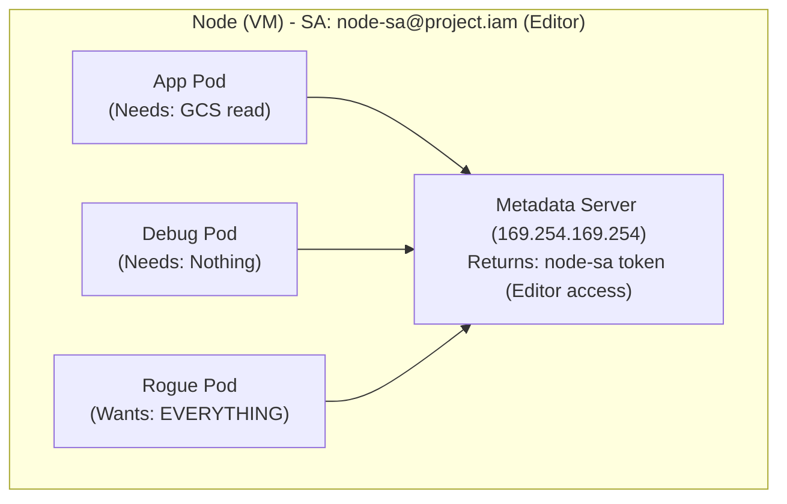
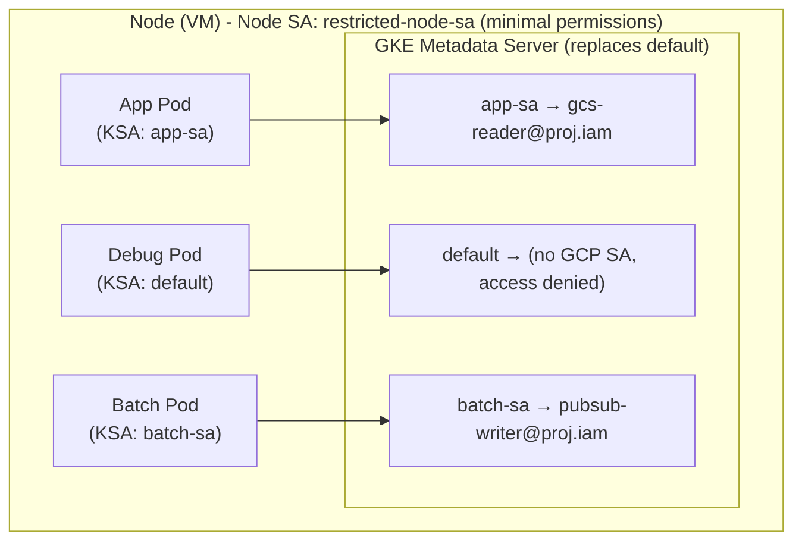
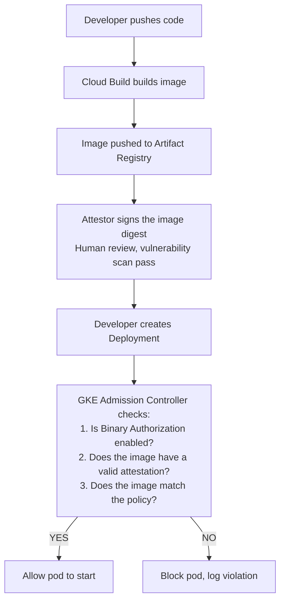

> **Complexity**: `[MEDIUM]` | **Time to Complete**: 2.5h | **Prerequisites**: [Module 6.1 (GKE Architecture)](../module-6.1-gke-architecture/)

## What You'll Be Able to Do

When you finish this module, you should be able to explain and implement the following capabilities in a GKE cluster running Kubernetes 1.35:

- **Configure GKE Workload Identity to map Kubernetes service accounts to GCP IAM service accounts**
- **Implement Binary Authorization to enforce container image provenance and deploy-time attestation policies**
- **Deploy GKE security posture features to identify workload misconfigurations and enforce Pod Security Standards**
- **Integrate Google Cloud Secret Manager using the CSI driver for secure external secret management**

---

## Why This Module Matters

**Hypothetical scenario:** A platform team discovers that every pod in a production GKE cluster can list Cloud Storage buckets and publish to Pub/Sub topics across the project, even though only two microservices legitimately need those APIs. A debug Deployment in the `default` namespace inherits the same credentials as the payment service because both pods run on nodes that share one broad node service account. The blast radius is not a single buggy container—it is every workload scheduled on those nodes until identity is scoped per application.

This pattern illustrates the most dangerous default in GKE: without Workload Identity Federation for GKE, pods that call the metadata server at `169.254.169.254` receive OAuth tokens for the **node's** Compute Engine service account, not an identity unique to the workload. A compromised pod, a misconfigured sidecar, or excessive RBAC on Secrets can therefore amplify into project-wide data access. Workload Identity Federation replaces that shared node identity with federated credentials tied to a Kubernetes ServiceAccount (KSA), either by granting IAM roles directly to the KSA principal or by impersonating a dedicated Google Cloud service account (GSA) with least-privilege roles.

In this module, you will learn how the GKE metadata server and IAM binding chain work, how to choose direct KSA IAM access versus GSA impersonation, how Binary Authorization enforces attestations at deploy time, how Shielded and Confidential Nodes harden the VM layer, and how Security Posture plus the Secret Manager CSI add-on reduce misconfiguration and secret sprawl. By the end, you will configure a pod that publishes to Pub/Sub without JSON key files and roll out Binary Authorization in dry-run mode before enforcement.

---

## The Problem: Node-Level Identity

Without Workload Identity Federation for GKE, pods that use the Google Cloud client libraries or curl the metadata server inherit the **node's** Compute Engine service account. Every VM in a node pool runs with a GCP service account attached at boot, and the default metadata server happily returns OAuth tokens for that account to any process on the node that can reach `169.254.169.254`. Kubernetes RBAC might limit who can `kubectl exec`, but it does not automatically limit which GCP APIs a container can call once it is running. That gap is why platform teams say GKE's default identity story is "secure the node, trust every pod on it"—acceptable only for tightly controlled single-tenant clusters.

The anti-pattern shows up in cost and compliance reviews as well as security audits: a node service account with `roles/editor` or broad `storage.admin` makes every CronJob, Helm hook, and crash-looping sidecar as powerful as your most privileged batch job. Workload Identity Federation breaks that coupling by making the GKE metadata server issue credentials based on the pod's Kubernetes ServiceAccount, so an unrelated debug pod in `default` no longer receives the payment service's Pub/Sub publisher token.



This is a violation of the **principle of least privilege**. The app pod only needs GCS read access, but it gets Editor. The debug pod needs nothing, but it gets Editor. The rogue pod gets Editor too.

---

## Workload Identity Federation for GKE

Workload Identity Federation (WIF) for GKE maps Kubernetes ServiceAccounts to GCP IAM service accounts. Each pod gets credentials scoped to exactly the GCP resources it needs.

### How It Works



### The binding chain: from pod to IAM principal

Workload Identity Federation for GKE is not a single annotation—it is a chain of trust that starts in the pod spec and ends in an IAM allow policy. When a container calls Google client libraries or requests `http://metadata.google.internal/computeMetadata/v1/instance/service-accounts/default/token`, the **GKE metadata server** (a DaemonSet on each Linux node, or a native service on Windows nodes) intercepts that HTTP traffic before it reaches the Compute Engine metadata server. The server reads the pod's projected Kubernetes ServiceAccount token, determines which identity the pod is allowed to assume, and returns a **short-lived** Google access token (typically one hour, automatically refreshed) scoped to that identity.

Enabling the feature at the cluster level creates a project-scoped workload identity pool named `PROJECT_ID.svc.id.goog` and turns on the metadata path for federated authentication. Node pools must run with `--workload-metadata=GKE_METADATA` so pods use the GKE metadata server instead of the node's underlying Compute Engine metadata. New node pools on clusters with Workload Identity enabled default to `GKE_METADATA`; legacy pools created before the cluster was updated may still expose `GCE_METADATA` until you update them—pods on those pools continue to receive the node service account token, which is a common source of "we enabled Workload Identity but nothing changed" outages.

After federation is enabled on the cluster and node pools use `GKE_METADATA`, choose one of two supported ways to grant GCP access to a workload:

| Approach | IAM member shape | When teams choose it |
| :--- | :--- | :--- |
| **Direct KSA IAM** (recommended when supported) | `principal://iam.googleapis.com/projects/PROJECT_NUMBER/locations/global/workloadIdentityPools/PROJECT_ID.svc.id.goog/subject/ns/NAMESPACE/sa/KSA_NAME` | Fewer moving parts—no GSA to create, annotate, or rotate; IAM Recommender sees the KSA as a first-class principal |
| **KSA → GSA impersonation** (legacy-compatible) | `serviceAccount:PROJECT_ID.svc.id.goog[NAMESPACE/KSA]` on the GSA plus `iam.gke.io/gcp-service-account` annotation on the KSA | Required when a Google Cloud API does not yet accept federated principals, or when org policy mandates GSAs for audit |

Direct access binds roles on the **resource** (bucket, topic, secret) to the KSA principal. Impersonation binds `roles/iam.workloadIdentityUser` on the **GSA** to the Kubernetes member, grants API permissions on the GSA, and lets the metadata server exchange the KSA credential for a GSA access token via the IAM Service Account Credentials API.

```bash
# Direct IAM: grant a KSA read access to one bucket (no GSA required)
export PROJECT_NUMBER=$(gcloud projects describe $PROJECT_ID --format="value(projectNumber)")

gcloud storage buckets add-iam-policy-binding gs://orders-archive \
  --member="principal://iam.googleapis.com/projects/${PROJECT_NUMBER}/locations/global/workloadIdentityPools/${PROJECT_ID}.svc.id.goog/subject/ns/orders/sa/fulfillment-reader" \
  --role="roles/storage.objectViewer"

# Impersonation: bind KSA to GSA (still the canonical pattern in many runbooks)
gcloud iam service-accounts add-iam-policy-binding \
  gcs-reader-sa@$PROJECT_ID.iam.gserviceaccount.com \
  --role="roles/iam.workloadIdentityUser" \
  --member="serviceAccount:$PROJECT_ID.svc.id.goog[default/app-sa]"
```

Pods that omit `serviceAccountName` run as the namespace's `default` ServiceAccount. If that KSA is not federated, the metadata server returns permission denied rather than falling back to the node identity—this is the deliberate fail-closed behavior that breaks legacy workloads after migration and is why every Deployment must reference an explicitly configured KSA.

### Node pools and `--workload-metadata=GKE_METADATA`

Cluster-level `--workload-pool=$PROJECT_ID.svc.id.goog` is necessary but not sufficient. Each node pool must expose the GKE metadata server to workloads:

```bash
# New pool with Workload Identity metadata mode
gcloud container node-pools create app-pool \
  --cluster=my-cluster \
  --location=us-central1 \
  --workload-metadata=GKE_METADATA

# Migrate an existing pool (expect a rolling node replacement)
gcloud container node-pools update legacy-pool \
  --cluster=my-cluster \
  --location=us-central1 \
  --workload-metadata=GKE_METADATA
```

On pools using `GKE_METADATA`, pods cannot reach the Compute Engine metadata server except when using `hostNetwork: true`. That isolation is what prevents a random container from reading the node's OAuth token. Plan node pool upgrades during a maintenance window because updating metadata mode recreates nodes and reschedules workloads.

### Setting Up Workload Identity

```bash
export PROJECT_ID=$(gcloud config get-value project)
export PROJECT_NUMBER=$(gcloud projects describe $PROJECT_ID --format="value(projectNumber)")

# Step 1: Enable Workload Identity on the cluster (if not already)
# Best practice: enable at cluster creation with --workload-pool
gcloud container clusters update my-cluster \
  --region=us-central1 \
  --workload-pool=$PROJECT_ID.svc.id.goog

# Step 2: Create a GCP service account for the workload
gcloud iam service-accounts create gcs-reader-sa \
  --display-name="GCS Reader for App Pod"

# Step 3: Grant the GCP SA only the permissions it needs
gcloud projects add-iam-policy-binding $PROJECT_ID \
  --member="serviceAccount:gcs-reader-sa@$PROJECT_ID.iam.gserviceaccount.com" \
  --role="roles/storage.objectViewer"

# Step 4: Create a Kubernetes ServiceAccount
kubectl create serviceaccount app-sa --namespace=default

# Step 5: Bind the Kubernetes SA to the GCP SA
gcloud iam service-accounts add-iam-policy-binding \
  gcs-reader-sa@$PROJECT_ID.iam.gserviceaccount.com \
  --role="roles/iam.workloadIdentityUser" \
  --member="serviceAccount:$PROJECT_ID.svc.id.goog[default/app-sa]"

# Step 6: Annotate the Kubernetes SA with the GCP SA email
kubectl annotate serviceaccount app-sa \
  --namespace=default \
  iam.gke.io/gcp-service-account=gcs-reader-sa@$PROJECT_ID.iam.gserviceaccount.com
```

### Using Workload Identity in a Pod

```yaml
apiVersion: v1
kind: Pod
metadata:
  name: gcs-reader
  namespace: default
spec:
  serviceAccountName: app-sa  # This is the key line
  containers:
  - name: reader
    image: google/cloud-sdk:slim
    command: ["sleep", "infinity"]
    resources:
      requests:
        cpu: 100m
        memory: 128Mi
```

```bash
# Deploy and verify
kubectl apply -f gcs-reader-pod.yaml

# Exec into the pod and verify the identity
kubectl exec -it gcs-reader -- gcloud auth list
# Should show: gcs-reader-sa@PROJECT_ID.iam.gserviceaccount.com

# Test GCS access (should work)
kubectl exec -it gcs-reader -- gsutil ls gs://some-readable-bucket/

# Test Pub/Sub access (should be denied)
kubectl exec -it gcs-reader -- gcloud pubsub topics list
# Should fail with permission denied
```

### Fleet Workload Identity Federation (Cross-Project)

For multi-project setups, Fleet Workload Identity Federation extends the same `PROJECT_ID.svc.id.goog` trust model across every cluster registered to a fleet, even when clusters live in different GCP projects or outside Google Cloud (Anthos). Instead of copying GSAs into each consumer project, platform teams grant IAM on shared data-plane projects using fleet-scoped principal identifiers such as `principal://iam.googleapis.com/projects/PROJECT_NUMBER/locations/global/workloadIdentityPools/PROJECT_ID.svc.id.goog/subject/ns/NAMESPACE/sa/SERVICEACCOUNT`. Selectors can also target ServiceAccount UIDs when names are reused across namespaces. Fleet registration (`gcloud container fleet memberships register`) ties cluster identity to the fleet pool so GitOps controllers in a tooling project can deploy to application projects without long-lived download keys.

Operationally, fleet WIF is how hub-and-spoke platforms avoid "service account sprawl": one BigQuery dataset in `data-prod` trusts principals from `app-dev`, `app-staging`, and `app-prod` clusters via explicit bindings rather than shared JSON keys checked into Helm values. Document which namespaces in which memberships may assume which roles, because fleet-wide principal sets are powerful—`principalSet` attributes can match many KSAs at once, which is excellent for platform-wide logging agents and dangerous if mis-scoped to `roles/owner`.

```bash
# Register the cluster with a Fleet
gcloud container fleet memberships register my-cluster \
  --gke-cluster=$REGION/my-cluster \
  --enable-workload-identity

# Grant cross-project access using the Fleet identity
gcloud projects add-iam-policy-binding OTHER_PROJECT_ID \
  --member="serviceAccount:$PROJECT_ID.svc.id.goog[NAMESPACE/KSA_NAME]" \
  --role="roles/storage.objectViewer"
```

**Pause and predict:** Consider a Pod deployed to the `default` namespace whose manifest omits the `spec.serviceAccountName` field entirely on a cluster with Workload Identity enabled. Which Kubernetes ServiceAccount does the Pod assume at runtime, and what happens when the container attempts to authenticate against Google Cloud APIs?

<details>
<summary>Check your prediction</summary>

When a Pod manifest omits `spec.serviceAccountName`, Kubernetes automatically assigns the namespace's `default` ServiceAccount. On a GKE node pool configured with Workload Identity Federation (`GKE_METADATA`), the GKE metadata server intercepts credential requests from the Pod. Because the `default` Kubernetes ServiceAccount lacks an `iam.gke.io/gcp-service-account` annotation and has no direct IAM role bindings granted via Workload Identity Federation, the metadata server denies token generation, causing Google Cloud API calls to fail immediately with authentication or authorization errors. Administrators must avoid assuming that unannotated Pods silently fall back to the underlying Compute Engine node service account; metadata hiding blocks node credentials to prevent accidental privilege escalation.
</details>

Default identity fallbacks create deceptive failure states where pods start normally but fail asynchronously during API authorization calls. Auditing active ServiceAccount impersonation policies ensures that workloads receive explicitly bounded identities before entering production traffic paths.

### Auditing and validating bindings

Before declaring a migration complete, run a binding audit from both sides of the trust chain. On the Kubernetes side, list ServiceAccounts with `kubectl get sa -A -o json | jq '.items[] | select(.metadata.annotations["iam.gke.io/gcp-service-account"] != null)'` to see impersonation mappings. On the IAM side, `gcloud iam service-accounts get-iam-policy GSA@PROJECT.iam.gserviceaccount.com` should show only the expected `serviceAccount:PROJECT.svc.id.goog[ns/ksa]` members on `roles/iam.workloadIdentityUser`. For direct KSA access, inspect resource policies (buckets, topics, secrets) for `principal://` members and remove stale GSAs that no longer have running pods. Google's IAM Recommender can flag over-privileged bindings once KSAs appear as first-class principals—use those recommendations during quarterly access reviews.

Application teams should document which Google APIs each Helm chart calls so platform engineers do not guess roles during incidents. A chart that only publishes metrics to Cloud Monitoring needs a different binding than one that reads Secret Manager, writes to Spanner, and pulls images from Artifact Registry. Keeping that matrix in the service repository prevents "temporary Editor" bindings from becoming permanent.

---

## Binary Authorization

Binary Authorization is Google Cloud's deploy-time control for container images on GKE. It sits in the Kubernetes admission path and answers one question before a Pod starts: **does this image digest satisfy the project's policy?** Policies combine default rules, per-cluster overrides, optional Google-managed system policy evaluation, and cryptographic attestations stored in Artifact Analysis. Unlike image scanners that report CVEs asynchronously, Binary Authorization can block scheduling immediately when attestations are missing or when continuous validation rules fail—provided enforcement mode is not dry-run.

Teams usually pair Binary Authorization with Cloud Build or another CI signer: build produces a digest, vulnerability scanning runs in Artifact Analysis, a KMS-backed attestor signs the digest, and only then does GitOps apply a manifest referencing `image@sha256:...`. This module keeps your existing gcloud examples; the sections below explain policy structure, breakglass, and how audit logs prove who deployed what.

### How Binary Authorization Works



### Setting Up Binary Authorization

```bash
# Step 1: Enable Binary Authorization API
gcloud services enable binaryauthorization.googleapis.com \
  --project=$PROJECT_ID

# Step 2: Enable Binary Authorization on the cluster
gcloud container clusters update my-cluster \
  --region=us-central1 \
  --binauthz-evaluation-mode=PROJECT_SINGLETON_POLICY_ENFORCE

# Step 3: View the default policy
gcloud container binauthz policy export

# Step 4: Create a policy that allows only Artifact Registry images
cat <<'EOF' > /tmp/binauthz-policy.yaml
admissionWhitelistPatterns:
- namePattern: gcr.io/google-containers/*
- namePattern: gcr.io/google-samples/*
- namePattern: us-docker.pkg.dev/google-samples/*
defaultAdmissionRule:
  enforcementMode: ENFORCED_BLOCK_AND_AUDIT_LOG
  evaluationMode: ALWAYS_DENY
globalPolicyEvaluationMode: ENABLE
clusterAdmissionRules:
  us-central1.my-cluster:
    enforcementMode: ENFORCED_BLOCK_AND_AUDIT_LOG
    evaluationMode: REQUIRE_ATTESTATION
    requireAttestationsBy:
    - projects/PROJECT_ID/attestors/build-attestor
EOF

# Step 5: Import the policy
gcloud container binauthz policy import /tmp/binauthz-policy.yaml
```

### Creating an Attestor

Attestors bridge your organization's trust anchor—usually Cloud KMS asymmetric keys or organization policy—and Artifact Analysis notes. Cloud Build can create attestations automatically when triggers include signing steps, which is how many teams avoid manual `sign-and-create` during daily releases. Human-gate workflows add a second attestor requiring security team signature on production promotion digests. Whatever model you choose, document the attestor name used in `requireAttestationsBy` so cluster rules do not reference deleted attestors after key rotation.

```bash
# Create a key ring and key for signing
gcloud kms keyrings create binauthz-keyring \
  --location=global

gcloud kms keys create attestor-key \
  --keyring=binauthz-keyring \
  --location=global \
  --purpose=asymmetric-signing \
  --default-algorithm=ec-sign-p256-sha256

# Create a Container Analysis note
cat <<EOF > /tmp/note.json
{
  "attestation": {
    "hint": {
      "humanReadableName": "Build Attestor Note"
    }
  }
}
EOF

curl -X POST \
  "https://containeranalysis.googleapis.com/v1/projects/$PROJECT_ID/notes/?noteId=build-attestor-note" \
  -H "Authorization: Bearer $(gcloud auth print-access-token)" \
  -H "Content-Type: application/json" \
  -d @/tmp/note.json

# Create the attestor
gcloud container binauthz attestors create build-attestor \
  --attestation-authority-note=build-attestor-note \
  --attestation-authority-note-project=$PROJECT_ID

# Add the KMS key to the attestor
gcloud container binauthz attestors public-keys add \
  --attestor=build-attestor \
  --keyversion-project=$PROJECT_ID \
  --keyversion-location=global \
  --keyversion-keyring=binauthz-keyring \
  --keyversion-key=attestor-key \
  --keyversion=1

# Sign an image
IMAGE_PATH="us-central1-docker.pkg.dev/$PROJECT_ID/my-repo/my-app"
IMAGE_DIGEST=$(gcloud container images describe $IMAGE_PATH:latest \
  --format="value(image_summary.digest)")

gcloud container binauthz attestations sign-and-create \
  --artifact-url="$IMAGE_PATH@$IMAGE_DIGEST" \
  --attestor=build-attestor \
  --attestor-project=$PROJECT_ID \
  --keyversion-project=$PROJECT_ID \
  --keyversion-location=global \
  --keyversion-keyring=binauthz-keyring \
  --keyversion-key=attestor-key \
  --keyversion=1
```

### Testing Binary Authorization

```bash
# This should succeed (signed image or whitelisted pattern)
kubectl run trusted --image=gcr.io/google-samples/hello-app:1.0

# This should be BLOCKED (unsigned image from Docker Hub)
kubectl run untrusted --image=nginx:latest
# Error: admission webhook "imagepolicywebhook.image-policy.k8s.io"
# denied the request: Image nginx:latest denied by Binary Authorization policy

# Check audit logs for denials
gcloud logging read \
  'resource.type="k8s_cluster" AND protoPayload.response.reason="BINARY_AUTHORIZATION"' \
  --limit=5
```

**Hypothetical scenario** (illustrative teaching example only — not a reported real production incident): A team enabled Binary Authorization in enforce mode on a Friday afternoon. On Monday morning, their CI/CD pipeline had broken because Cloud Build was pushing images but not creating attestations. Every deployment for 48 hours was blocked. Start with `DRYRUN_AUDIT_LOG_ONLY` mode to identify what would be blocked before switching to enforce mode.

### Policy structure: default rule, cluster rules, and attestors

A Binary Authorization policy is evaluated **at pod admission time** by the `imagepolicywebhook` admission controller on GKE. The policy YAML has three layers teams routinely combine:

1. **`defaultAdmissionRule`** — applies to every cluster in the project unless overridden. `evaluationMode` can be `ALWAYS_ALLOW`, `ALWAYS_DENY`, or `REQUIRE_ATTESTATION`. Pair it with `enforcementMode`: `ENFORCED_BLOCK_AND_AUDIT_LOG` (block + audit) or `DRYRUN_AUDIT_LOG_ONLY` (allow + audit violations).
2. **`clusterAdmissionRules`** — per-cluster overrides keyed as `LOCATION.CLUSTER_NAME` (for example `us-central1.my-cluster`). Production clusters often `REQUIRE_ATTESTATION` while lab clusters stay in dry run.
3. **`admissionWhitelistPatterns`** — name patterns for system images (kube-proxy, metrics-server, Google sample images) so bootstrap components are not blocked during enforcement.

When `evaluationMode` is `REQUIRE_ATTESTATION`, the rule lists **`requireAttestationsBy`**: fully qualified attestor resources (`projects/PROJECT_ID/attestors/build-attestor`). An **attestor** wraps a Container Analysis **note** and one or more signing keys (commonly Cloud KMS asymmetric keys). An **attestation** is a signature over the immutable **image digest** stored in Artifact Analysis. Tags like `:latest` are not trustworthy because a retagged image changes digest and invalidates prior attestations—production manifests should pin `image@sha256:...` as documented in the deploy guide.

`globalPolicyEvaluationMode: ENABLE` lets Google-managed **system policies** run before your custom policy so platform images stay deployable without maintaining a long manual whitelist.

### Deploy-time enforcement flow (prose)

The end-to-end supply chain path looks like this in operations review: a developer merges code; **Cloud Build** (or another CI system) builds and pushes to **Artifact Registry**; a signing step calls `gcloud container binauthz attestations sign-and-create` (or Cloud Build creates attestations automatically when configured); **Artifact Analysis** stores vulnerability scan results and attestation notes; when `kubectl apply` creates a Pod, GKE asks Binary Authorization whether the digest satisfies the active rule for that cluster. If enforcement is on and attestations are missing, the API server rejects the Pod with `admission webhook "imagepolicywebhook.image-policy.k8s.io" denied the request`. If the Binary Authorization backend is unreachable, GKE **fails open** (allows the deploy) and writes an audit event—design monitoring for that rare path separately from policy violations.

### Breakglass instead of disabling the policy

Teams sometimes disable Binary Authorization entirely to "unblock a deploy." That removes audit evidence and re-opens the cluster to unsigned images. **Breakglass** is the supported emergency path: add the label `image-policy.k8s.io/break-glass: "true"` on the Pod spec so the image deploys even when it violates policy, with a mandatory **breakglass** event in Cloud Audit Logs. Query breakglass with `resource.type="k8s_cluster"` and `"image-policy.k8s.io/break-glass"` in the log filter. Pair breakglass with an on-call approval process; it is not a substitute for fixing CI attestation gaps.

```yaml
apiVersion: v1
kind: Pod
metadata:
  name: hotfix-api
  labels:
    image-policy.k8s.io/break-glass: "true"
spec:
  containers:
  - name: api
    image: us-central1-docker.pkg.dev/my-project/repo/api@sha256:abc123...
```

### Continuous validation with Artifact Analysis

Beyond one-time attestations at build time, teams integrate **Artifact Analysis** vulnerability scanning (and optional continuous validation policies) so known-critical CVEs can block deploys even when an image was previously attested. Cloud Build triggers can gate promotion: build → scan → attest → deploy. Keep dry-run logging enabled while tuning `requireAttestationsBy` so you see which digests would fail before switching `defaultAdmissionRule` to enforce mode project-wide.

**Pause and predict:** Consider a GKE cluster with Binary Authorization configured in `ENFORCED_BLOCK_AND_AUDIT_LOG` mode requiring an attestation from a specific attestor. A developer attempts to deploy an image that carries a cryptographic signature from an older KMS key version that was recently removed from the attestor configuration. Will the Pod start, and where can platform engineers verify the admission outcome?

<details>
<summary>Check your prediction</summary>

Binary Authorization blocks admission immediately during Kubernetes API validation, meaning the Pod is never scheduled or created. Because the signing KMS key was removed from the attestor's registered public keys, the existing signature no longer satisfies the active `requireAttestationsBy` policy. The GKE admission webhook rejects the deployment request with a `Forbidden` error indicating that no valid attestations were found for the image digest. Administrators can verify this rejection in Cloud Audit Logs under the `k8s_cluster` resource type by querying `protoPayload.status.message` for `VIOLATES_POLICY` or inspecting the Binary Authorization audit decision logs.
</details>

Admission gate enforcement shifts container provenance validation from an asynchronous reporting metric to an unyielding deployment barrier. Maintaining automated signing pipelines ensures that cryptographic key rotations do not trigger widespread deployment failures across production application releases.

---

## Shielded GKE Nodes and Confidential Nodes

### Shielded GKE Nodes

Shielded GKE Nodes provide verifiable integrity for cluster nodes by combining Secure Boot, virtual TPM (vTPM) measured boot, and integrity monitoring that compares runtime measurements against Google-maintained baselines—protecting against rootkits and boot-level tampering without encrypting application memory.

| Feature | Protection | How It Works |
| :--- | :--- | :--- |
| **Secure Boot** | Prevents unsigned kernel modules | Only Google-signed boot components load |
| **vTPM** | Measured boot integrity | Stores measurements for remote attestation |
| **Integrity Monitoring** | Detects runtime tampering | Compares boot measurements to known-good baseline |

```bash
# Shielded nodes are enabled by default on new GKE clusters
# Verify on an existing cluster:
gcloud container clusters describe my-cluster \
  --region=us-central1 \
  --format="yaml(shieldedNodes)"

# Explicitly enable if not set:
gcloud container clusters update my-cluster \
  --region=us-central1 \
  --enable-shielded-nodes
```

### Confidential Nodes

Confidential Nodes go beyond Shielded Nodes by encrypting data **in memory** using hardware memory encryption (such as AMD SEV, AMD SEV-SNP, or Intel TDX). Even if an attacker has physical access to the server or can perform a cold-boot attack, they cannot read the node's memory.

```bash
# Create a node pool with Confidential Nodes
gcloud container node-pools create confidential-pool \
  --cluster=my-cluster \
  --region=us-central1 \
  --machine-type=n2d-standard-4 \
  --num-nodes=1 \
  --enable-confidential-nodes

# Note: Confidential Nodes require supported compute families such as N2D, C2D, C3D (AMD SEV/SEV-SNP)
# or C3 (Intel TDX) on Standard clusters, as well as supported Autopilot compute classes; limited regions
```

| Feature | Shielded Nodes | Confidential Nodes |
| :--- | :--- | :--- |
| **Boot integrity** | Yes | Yes |
| **Memory encryption** | No | Yes (AMD SEV, SEV-SNP, Intel TDX) |
| **Performance impact** | None | ~2-6% overhead |
| **Machine types** | All | Supported Confidential VM types (e.g., N2D, C2D, C3D, C3) |
| **Cost** | No additional cost | ~10% premium |
| **Use case** | All production clusters | Financial, healthcare, PII |

**Pause and predict:** An enterprise compliance standard mandates that all sensitive customer data in use must be encrypted in memory during execution. A platform architect considers enabling Shielded GKE Nodes across the cluster. Which GKE node technology must the team configure to satisfy this requirement, which hardware technologies provide this capability, and what constraint exists when enabling it cluster-wide?

<details>
<summary>Check your prediction</summary>

The team must deploy Confidential GKE Nodes rather than Shielded GKE Nodes. While Shielded GKE Nodes provide Secure Boot, vTPM, and kernel integrity monitoring, they do not encrypt data residing in system RAM. Confidential GKE Nodes enforce inline hardware memory encryption using hardware virtualization extensions—specifically AMD SEV, AMD SEV-SNP, or Intel TDX (Trust Domain Extensions) on supported compute families such as N2D, C2D, C3D, and C3. Furthermore, enabling Confidential GKE Nodes at the cluster level is an irreversible operation that permanently forces all subsequent node pools to utilize supported confidential hardware instances.
</details>

Shielded GKE Nodes guarantee **boot-time and kernel integrity**: Secure Boot blocks unsigned bootloader components, vTPM measures the operating system initialization sequence, and integrity monitoring alerts operators when runtime states deviate from established baseline signatures. However, Shielded Nodes do not protect memory in use against hypervisor compromise or physical probing. Confidential GKE Nodes address memory security directly by utilizing hardware-based memory encryption powered by AMD SEV, AMD SEV-SNP, or Intel TDX technologies. Hardware-generated cryptographic keys remain isolated within the processor's secure enclave, ensuring that host hypervisors and storage appliances cannot inspect guest memory pages.

Platform architects must recognize that enabling Confidential GKE Nodes at the cluster level is an irreversible configuration decision. Once a cluster is created with cluster-level confidential computing enabled, every node pool in that cluster must use supported Confidential VM machine types across AMD SEV, AMD SEV-SNP, or Intel TDX families. For heterogeneous workloads, teams can preserve flexibility by leaving cluster-level confidential computing disabled and instead provisioning dedicated confidential node pools exclusively for sensitive processing services. This strategy isolates regulated database and cryptographic workloads onto hardware-encrypted instances while running standard utility tiers on general compute pools to control operational costs.

---

## GKE Security Posture Dashboard

The Security Posture dashboard provides a centralized view of security issues across your GKE clusters. It scans for misconfigurations, vulnerability exposure, and policy violations.

### What It Detects

```bash
# Enable Security Posture on the cluster
gcloud container clusters update my-cluster \
  --region=us-central1 \
  --security-posture=standard \
  --workload-vulnerability-scanning=standard

# Security Posture findings surface in the Console (Security > Posture dashboard)
# and flow to Security Command Center — there is no gcloud container security-posture
# command group. Query exported findings via SCC (filter by source in the Console if needed):
gcloud scc findings list "projects/$PROJECT_ID/sources/-" \
  --format="table(finding.category, finding.severity, finding.state)"
```

Security Posture findings group into several themes you should expect in weekly review: **workload configuration** (pods running as root, missing security contexts, privileged containers),
**container vulnerabilities** (CVEs in Artifact Registry images), **network exposure** (Services reachable from the internet without authentication), **RBAC issues** (ClusterRoleBindings that grant cluster-admin too broadly), and **supply chain** signals (images from untrusted registries). Each category should map to an owner—platform for node and admission settings, application teams for workload manifests, security for attestor policy.

Security Posture is most valuable when findings become owned work items rather than dashboard wallpaper. Export critical/high results into your ticketing system, tie each finding to a namespace owner, and re-scan after Helm chart or GitOps changes because posture configuration is versioned separately from application releases. Combining posture scanning with Binary Authorization and Pod Security Standards gives defense in depth: posture tells you a Deployment runs as root; PSS `restricted` prevents it from scheduling; Binary Authorization ensures the image came from your attested pipeline.

Workload vulnerability scanning (enabled with `--workload-vulnerability-scanning=standard` on supported channels) surfaces CVEs in images pulled from Artifact Registry. Treat those findings as inputs to rebuild/redeploy decisions, not as a substitute for patching base images in CI.

### Hardening Pod Security

GKE supports Pod Security Standards (PSS) through the built-in Pod Security Admission controller, which enforces the upstream `restricted`, `baseline`, and `privileged` profiles via namespace labels:

```bash
# Enforce restricted Pod Security Standard on a namespace
kubectl label namespace production \
  pod-security.kubernetes.io/enforce=restricted \
  pod-security.kubernetes.io/warn=restricted \
  pod-security.kubernetes.io/audit=restricted
```

```yaml
# A pod that passes the "restricted" security standard
apiVersion: v1
kind: Pod
metadata:
  name: secure-pod
  namespace: production
spec:
  securityContext:
    runAsNonRoot: true
    runAsUser: 1000
    fsGroup: 2000
    seccompProfile:
      type: RuntimeDefault
  containers:
  - name: app
    image: us-central1-docker.pkg.dev/my-project/repo/app:v1
    securityContext:
      allowPrivilegeEscalation: false
      readOnlyRootFilesystem: true
      capabilities:
        drop:
        - ALL
    resources:
      requests:
        cpu: 100m
        memory: 128Mi
      limits:
        cpu: 200m
        memory: 256Mi
```

**Pause and predict:** Consider a namespace configured with the `restricted` Pod Security Standard in `enforce` mode. A developer attempts to apply a Pod manifest that explicitly sets `runAsNonRoot: false`. Will the Kubernetes API server admit and create the Pod, and how does the cluster behavior change if the namespace uses `warn` mode instead?

<details>
<summary>Check your prediction</summary>

In `enforce` mode, the Kubernetes built-in Pod Security admission controller rejects the Pod creation request immediately, and the Pod is not created. The `restricted` profile mandates that workloads run without root privileges and requires `runAsNonRoot: true` (or an explicit non-root user ID); setting `runAsNonRoot: false` explicitly violates this policy requirement. If the namespace is configured with `warn` mode instead of `enforce`, the API server admits and creates the Pod normally, but returns a warning message directly to the client CLI and logs the policy violation in the audit trail.
</details>

Configuring admission modes across developmental lifecycles allows platform teams to identify non-compliant container configurations before activating strict enforcement barriers. Organizations typically evaluate workload compliance under warning and audit configurations during staging releases to prevent unexpected scheduling disruptions in production environments.

---

## Secret Manager Integration

Long-lived passwords, API keys, and TLS material do not belong in Git, in container images, or in etcd if you can avoid it. GKE integrates with Google Cloud Secret Manager through the **Secret Manager add-on**, which installs the Secrets Store CSI driver with Google's `gcp` provider so pods mount secrets as read-only files at runtime. The mount path behaves like a small filesystem directory; applications read `cat /var/secrets/db-password` instead of calling the Secret Manager API directly, though under the hood the driver fetches secret versions using the pod's Workload Identity credentials.

Because secrets never pass through the Kubernetes API as Secret objects, RBAC on `secrets` resources in etcd does not protect external secrets—**IAM on Secret Manager** does. That is why the add-on pairs naturally with Workload Identity Federation: the same KSA (or impersonated GSA) that publishes to Pub/Sub should be the only principal with `secretmanager.secretAccessor` on `db-password`. Platform teams get Cloud Audit Logs entries for each access, which satisfies many SOC 2 and PCI evidence requests about credential retrieval.

### Setting Up Secret Manager CSI Driver

```bash
# Enable the Secret Manager add-on on the cluster
gcloud container clusters update my-cluster \
  --region=us-central1 \
  --enable-secret-manager

# Verify the driver is installed
kubectl get csidriver secrets-store.csi.k8s.io

# Create a secret in Secret Manager
echo -n "my-database-password" | gcloud secrets create db-password \
  --data-file=- \
  --replication-policy=automatic

# Grant the workload's GCP SA access to the secret
gcloud secrets add-iam-policy-binding db-password \
  --member="serviceAccount:app-sa@$PROJECT_ID.iam.gserviceaccount.com" \
  --role="roles/secretmanager.secretAccessor"
```

### Mounting Secrets in Pods

```yaml
# SecretProviderClass defines which secrets to mount
apiVersion: secrets-store.csi.x-k8s.io/v1
kind: SecretProviderClass
metadata:
  name: gcp-secrets
spec:
  provider: gcp
  parameters:
    secrets: |
      - resourceName: "projects/PROJECT_NUMBER/secrets/db-password/versions/latest"
        path: "db-password"
      - resourceName: "projects/PROJECT_NUMBER/secrets/api-key/versions/latest"
        path: "api-key"

---
apiVersion: v1
kind: Pod
metadata:
  name: app-with-secrets
spec:
  serviceAccountName: app-sa  # Must have Workload Identity configured
  containers:
  - name: app
    image: us-central1-docker.pkg.dev/my-project/repo/app:v1
    volumeMounts:
    - name: secrets
      mountPath: /var/secrets
      readOnly: true
    resources:
      requests:
        cpu: 100m
        memory: 128Mi
  volumes:
  - name: secrets
    csi:
      driver: secrets-store.csi.k8s.io
      readOnly: true
      volumeAttributes:
        secretProviderClass: gcp-secrets
```

```bash
# After deploying, verify the secret is mounted
kubectl exec app-with-secrets -- cat /var/secrets/db-password
# Output: my-database-password

# Secrets are NOT stored in etcd, reducing the blast radius
# if the cluster's etcd encryption is compromised
```

### Secret Manager vs Kubernetes Secrets

| Aspect | Kubernetes Secrets | Secret Manager + CSI |
| :--- | :--- | :--- |
| **Storage** | etcd (in cluster) | Google-managed (external) |
| **Encryption at rest** | Application-layer encryption | Automatic, Google-managed keys or CMEK |
| **Versioning** | No (replace only) | Full version history |
| **Rotation** | Manual (update + rollout) | Automatic with periodic sync |
| **Audit logging** | Kubernetes audit logs | Cloud Audit Logs (who accessed what, when) |
| **Cross-cluster sharing** | Not supported | Same secret across clusters/projects |
| **Access control** | RBAC (namespace-scoped) | IAM (project/org-scoped) |

The GKE Secret Manager add-on installs the **Secrets Store CSI driver** with Google's `gcp` provider. Secrets are fetched at volume mount time using the pod's federated identity; they appear as files under the mount path and are **not stored in etcd**, which shrinks the blast radius if someone gains etcd backup access but lacks Secret Manager IAM. Pin `resourceName` to `versions/latest` for always-current credentials or to a numeric version when rollback requires a specific secret generation.

Rotation has two layers: Secret Manager supports new **versions** of a secret value, and the CSI driver can sync updates on a poll interval when configured (see the managed CSI component documentation for rotation parameters). Kubernetes-native Secrets, by contrast, require you to update the Secret object and restart pods. For cross-cluster sharing, the same Secret Manager secret can back workloads in multiple clusters as long as each KSA or GSA principal receives `roles/secretmanager.secretAccessor` on that secret—avoid copying secret material into ConfigMaps.

Compared with community operators such as **External Secrets Operator**, the Google-managed add-on reduces operational toil (no separate controller deployment to patch) but ties you to GKE release channels and Google's rotation semantics. External Secrets shines when you need multi-cloud secret backends or advanced templating; the add-on shines when your secrets already live in Secret Manager and you want IAM-aligned access logs without maintaining another controller.

> **Stop and think**: A developer wants to roll back a deployment that uses Secret Manager for database credentials. The older version of the deployment needs an older password. How does the Secret Manager CSI driver handle versioning compared to native Kubernetes Secrets?

---

## Patterns & Anti-Patterns

| Pattern | When to Use | Why It Works | Scaling Note |
| :--- | :--- | :--- | :--- |
| **One KSA per workload** with least-privilege IAM | Microservices calling different GCP APIs | Blast radius stays bounded; IAM Recommender can suggest role removals per KSA | Use `principalSet` selectors when many KSAs in a namespace share the same role |
| **Binary Authorization dry-run → enforce** | First adoption in production | Audit logs reveal unsigned images without blocking deploys | Promote cluster-specific rules from `DRYRUN_AUDIT_LOG_ONLY` to `ENFORCED_BLOCK_AND_AUDIT_LOG` per cluster |
| **Default-deny admission + CI attestation** | Regulated or internet-facing clusters | Only digests signed in Cloud Build (or your signer) reach the cluster | Store attestors in a central security project; reference them from `requireAttestationsBy` |
| **Dedicated low-privilege node SA** | Every GKE cluster | Even before WIF migration, nodes should not run as project Editor | Node SA only needs logging/monitoring scopes; workloads get WIF |

| Anti-Pattern | What Goes Wrong | Why Teams Fall Into It | Better Alternative |
| :--- | :--- | :--- | :--- |
| **SA JSON keys in Kubernetes Secrets** | Long-lived credentials in etcd; key leakage via RBAC or backups | Legacy tutorials and local dev habits | Workload Identity Federation; short-lived tokens only |
| **Default node SA for all pods** | Any pod inherits node permissions | Fastest cluster bootstrap | Enable WIF; restrict node SA to node operations |
| **`roles/owner` on a workload GSA** | Compromise of one pod becomes project takeover | "Make it work" during incidents | Grant resource-level roles (`storage.objectViewer`, `pubsub.publisher`, etc.) |
| **Disabling Binary Authorization to unblock** | Supply-chain control removed silently | Friday hotfix pressure | Breakglass label + audit review; fix attestation pipeline |

---

## Decision Framework

Use the following matrix when designing identity and deploy-time controls for a new GKE cluster on Kubernetes **1.35**, before you cut production traffic over:

| Decision | Choose **direct KSA IAM** | Choose **KSA → GSA impersonation** |
| :--- | :--- | :--- |
| Target API supports `principal://.../workloadIdentityPools/...` members | Yes | No — use GSA until support lands |
| You want IAM Recommender to show Kubernetes names | Yes | GSA email hides workload mapping unless annotated |
| Org mandates GSAs for key rotation / HSM | Rarely | Yes |
| Multi-project fleet access | `principalSet` on fleet pool | Fleet WIF + GSA in target project |

```mermaid
flowchart TD
    A[Workload needs GCP API access] --> B{API accepts WIF principal on resource IAM?}
    B -- Yes --> C[Grant role to principal://.../subject/ns/NS/sa/KSA]
    B -- No --> D[Create GSA + grant roles on GSA]
    D --> E[Bind roles/iam.workloadIdentityUser to serviceAccount:PROJECT.svc.id.goog[NS/KSA]]
    E --> F[Annotate KSA with iam.gke.io/gcp-service-account]
    C --> G[Pod uses serviceAccountName: KSA]
    F --> G
    G --> H{Node pool workload-metadata = GKE_METADATA?}
    H -- No --> I[Update node pool — pods still get node SA]
    H -- Yes --> J[Metadata server issues scoped token]
```

| Decision | **Binary Authorization dry-run** | **Binary Authorization enforce** |
| :--- | :--- | :--- |
| Cluster maturity | New policy or new attestor keys | Stable CI signs every production digest |
| Incident response | Allows hotfix while logging violations | Blocks unsigned images; use breakglass for exceptions |
| Evidence | `imagepolicywebhook.../dry-run: "true"` labels in audit logs | `BINARY_AUTHORIZATION` denial reasons |

| Threat focus | **Shielded Nodes** | **Confidential Nodes** |
| :--- | :--- | :--- |
| Bootkit / unsigned kernel modules | Primary control | Also present |
| Encrypt data in use in RAM | Not provided | Primary control (AMD SEV) |
| Cost / ops | No extra node charge | Premium N2D pools; capacity planning per region |

---

## Cost Considerations for GKE Security Controls

Workload Identity Federation, Binary Authorization policy evaluation, Shielded GKE Nodes, Pod Security Admission, and the GKE metadata server add **no per-request surcharge** in Google's pricing model for the controls themselves—you pay for the nodes, APIs, and logging you already consume. The real cost surface is **indirect**: Secret Manager bills per active secret version and per access operation; Cloud Audit Logs and log storage grow when Binary Authorization enforcement and breakglass events generate high-volume `k8s_cluster` activity logs; over-permissioned GSAs increase blast-radius cost (data exfiltration, accidental deletes) far more than IAM binding API calls.

| Control area | Typical cost driver | Knobs that reduce spend | What spikes cost unexpectedly |
| :--- | :--- | :--- | :--- |
| Workload Identity | IAM policy count (free); API calls | Direct KSA IAM avoids extra GSAs | Logging every metadata denial during misconfigured migrations |
| Binary Authorization | KMS signing operations; audit logs | Central attestor; dry-run before enforce | Emergency breakglass deploys without CI fixes → repeated hotfix images |
| Secret Manager CSI | Secret versions; accessor API calls | Fewer secrets; pin versions; rotate on schedule | Mounting `versions/latest` with aggressive sync on thousands of pods |
| Confidential Nodes | ~10% node premium + N2D SKUs | Isolate to pools that need memory encryption | Running entire cluster on Confidential when Shielded suffices |
| Security Posture | Posture API / scanning features per channel | Fix critical findings first to avoid churn | Ignoring posture while paying for duplicate scanning in CI and GKE |

Treat least-privilege IAM as a **cost control**: a GSA with `roles/storage.admin` that a batch job compromises can inflate egress and storage bills overnight. Narrow roles (`objectViewer`, `pubsub.publisher`) limit financial exposure the same way they limit data exposure.

---

## Operational Migration: Workload Identity on Live Clusters

Moving a production GKE cluster from shared node identity to Workload Identity Federation is a change management exercise as much as a technical one. The safe pattern is **node pool by node pool**, not a single flag flip followed by a pager storm. Start by inventorying which Deployments call Google APIs (client libraries, metadata curls, or workloads mounting GCP credentials). For each application, document the minimum IAM roles it needs on which resources, then create a dedicated Kubernetes ServiceAccount per application (or per trust boundary within a namespace). Avoid reusing the `default` ServiceAccount in `default` for production traffic—it becomes impossible to audit which team owns which binding.

Phase one enables federation at the cluster with `--workload-pool=$PROJECT_ID.svc.id.goog` and creates a **new** node pool with `--workload-metadata=GKE_METADATA`. Cordone and drain old nodes gradually so only migrated workloads schedule onto pools that enforce the GKE metadata server. Running mixed pools—some nodes on `GCE_METADATA` and some on `GKE_METADATA`—is a common mistake during blue/green upgrades: pods scheduled onto legacy pools still inherit the node service account while teammates on new pools fail closed, producing intermittent 403 errors that look like application bugs. Phase two binds identities: prefer direct KSA IAM on new clusters; for legacy stacks already centered on GSAs, keep impersonation but remove JSON keys from Secrets. Phase three updates manifests to set `serviceAccountName` and verifies with `kubectl exec ... gcloud auth list` inside each pod. Watch Cloud Logging for metadata 403 errors during the window—spikes usually mean a missing `iam.workloadIdentityUser` binding or a forgotten annotation.

Binary Authorization migrations mirror the same phased discipline. Export the current policy, add whitelist patterns for system images your platform requires, switch `defaultAdmissionRule` to `DRYRUN_AUDIT_LOG_ONLY`, and run production traffic for one to two weeks while security reviews dry-run audit entries. Only then promote individual `clusterAdmissionRules` entries to `ENFORCED_BLOCK_AND_AUDIT_LOG`. Train on-call engineers on breakglass labels before enforcement day so nobody disables the API to ship a hotfix. Align Cloud Build (or your signer) so every production repository path produces attestations on the digest that Kubernetes will reference.

Secret Manager adoption should follow identity migration: the CSI provider uses the same federated principal as application code. Grant `roles/secretmanager.secretAccessor` on secrets, not project-wide, and mount secrets as files rather than syncing into Kubernetes Secret objects unless an operator truly needs both. Rotation runbooks should state whether applications reload files on SIGHUP, restart on Secret version change, or rely on CSI polling—mixing strategies causes "we rotated in Secret Manager but prod still has the old password" tickets.

---

## Troubleshooting Reference

When pods suddenly lose GCP access after a platform change, walk the binding chain in order rather than re-granting `roles/editor`. First confirm the pod's `serviceAccountName` and namespace, then `kubectl describe serviceaccount` for the `iam.gke.io/gcp-service-account` annotation when using impersonation. Verify the GSA has `roles/iam.workloadIdentityUser` for member `serviceAccount:PROJECT_ID.svc.id.goog[NAMESPACE/KSA]`. For direct IAM, query the resource policy for the `principal://.../subject/ns/.../sa/...` entry. Next confirm the node pool: `gcloud container node-pools describe POOL --cluster=CLUSTER --format='yaml(config.workloadMetadataConfig)'` should show `mode: GKE_METADATA`. If it shows `GCE_METADATA`, pods on that pool still receive the node credential.

Binary Authorization denials surface as admission webhook errors on Pod create. Collect the image digest from the event, run `gcloud container binauthz attestations list --artifact-url="IMAGE@DIGEST"`, and compare attestor names to `requireAttestationsBy` in the active policy. If CI signs with a retired KMS key version, add the new public key to the attestor or re-sign the digest. For emergency deploys, use breakglass labels and file a post-incident action to restore attestations—do not leave breakglass Deployments running indefinitely.

Secret mount failures often trace to IAM on the secret, not the CSI driver. The error may appear as mount timeout in `kubectl describe pod` while Cloud Audit Logs show `secretmanager.versions.access` denied for the federated principal. Ensure `resourceName` in the SecretProviderClass uses the project ID or number format documented for the add-on version you enabled, and that the pod uses the same KSA you granted `secretAccessor`.

---

## Layered Defense: How the Controls Fit Together

No single feature in this module replaces the others; they address different layers of the same attack surface. Workload Identity Federation answers **who is this pod when it calls Google APIs**. Binary Authorization answers **which bits are allowed to execute**. Shielded and Confidential Nodes answer **whether the VM boot path and memory are trustworthy**. Security Posture and Pod Security Standards answer **whether Kubernetes objects violate baseline hardening**. Secret Manager with CSI answers **where credential material lives and who can audit access**.

A useful platform architecture diagram in prose looks like this: developers merge to Git; CI builds and attests an image digest; GitOps applies a Deployment with `serviceAccountName`, digest-pinned image, restricted security context, and optional SecretProviderClass volumes; GKE admission (PSS, Binary Authorization, resource quotas) evaluates the Pod; the kubelet starts containers on Shielded nodes (or Confidential nodes for regulated tiers); at runtime the GKE metadata server issues scoped tokens while the CSI driver mounts secrets. Detective controls—audit logs, posture findings, Binary Authorization dry-run labels—feed SIEM rules that page when breakglass is used or when a namespace drops PSS labels.

When prioritizing a backlog, sequence investments by blast radius. Shared node credentials and cluster-admin RBAC beat missing Confidential Nodes for most SaaS products. Unsigned images matter once identity is scoped. External secrets matter once CI and identity are sound. This ordering prevents security theater: teams sometimes buy Confidential Nodes while every pod still inherits Editor from the node pool.

Regulated environments may require evidence bundles: export Binary Authorization policy YAML, sample attestations for a golden image, Workload Identity binding screenshots or `gcloud` outputs, Secret Manager audit log queries, and Security Posture export for critical findings. Store those artifacts next to change tickets so auditors see operability, not one-time setup during assessment week.

Teaching teams the **why** behind each layer reduces operational friction. Developers who understand that Workload Identity fail-closed behavior protects them from peer pods on the same node are more willing to update ServiceAccounts than when platform mandates feel arbitrary. Likewise, explaining that Binary Authorization dry-run is a rehearsal tool—not a permanent loophole—prevents teams from leaving dry-run on for years out of fear. Security tooling in GKE works best when application and platform engineers share the same mental model of metadata servers, digest-pinning, and IAM principals.

For Kubernetes **1.35** clusters on GKE regular or stable channels, validate feature availability in your target region before promising Confidential Nodes or specific Security Posture tiers in contracts. Google's documentation updates channel defaults independently of the Kubernetes minor version number displayed in `kubectl version`. Platform SREs should pin internal runbooks to cloud.google.com links reviewed quarterly, especially for Workload Identity direct principal support on new data plane APIs, because the impersonation fallback remains necessary for a shrinking but non-zero set of services.

GitOps repositories should encode security baseline as data, not tribal knowledge: cluster create flags (`--workload-pool`, `--enable-shielded-nodes`), namespace labels for PSS, SecretProviderClass manifests, and Binary Authorization policy fragments owned by security with version control. Application charts then only supply `serviceAccountName`, image digests, and resource requests. That separation of duties mirrors how mature organizations implement Terraform for cloud IAM and Helm for workload shape—GKE security features fail operationally when only one team knows the gcloud incantations.

Identity and admission controls also interact with **network policy** and **service mesh** identity, which this module does not configure but platform architects should not ignore. Workload Identity answers Google API authentication; mutual TLS between pods answers east-west trust inside the cluster. A pod with narrowly scoped IAM can still exfiltrate data over plain HTTP if NetworkPolicies allow unrestricted egress. Document which layer mitigates which threat so teams do not treat IAM bindings as a substitute for network segmentation or L7 policy.

Finally, treat Cloud Audit Logs as part of the user interface for these features, not as archival noise. Create saved queries for Binary Authorization denials, breakglass labels, dry-run violations, and `secretmanager.versions.access` from GKE workload identities. Review those queries in weekly platform standups the same way you review application error-rate dashboards so security regressions surface before external auditors or customers do. Dashboard those metrics in your observability stack alongside application SLOs so security regressions page the same on-call rotation that already understands the cluster and its namespaces. When audit volume grows, tune sinks and retention rather than disabling enforcement—high log volume often means policy misconfiguration worth fixing, not evidence that controls failed or should be removed from production clusters.

---

## Did You Know?

1. **Before Workload Identity, the common workaround was distributing service-account JSON keys as Kubernetes Secrets** — which puts long-lived private-key material in etcd, where any namespace RBAC holder or etcd backup can read it. Workload Identity removes the key entirely by exchanging the Kubernetes ServiceAccount token for short-lived Google credentials at runtime, so compromise of a Secret object no longer equals compromise of a multi-year GCP private key. Google introduced Workload Identity in 2019; it reached GA in 2020/2021.

2. **Binary Authorization attestations are immutable and tied to the exact image digest (SHA-256), not the tag.** If someone pushes a new image with the tag `v1.0` (overwriting the old one), the attestation on the original image becomes invalid for the new image because the digest changed. This prevents a supply chain attack where an attacker replaces a trusted image with a malicious one while keeping the same tag. Always deploy by digest in production: `image: us-central1-docker.pkg.dev/proj/repo/app@sha256:abc123...`

3. **Confidential GKE Nodes encrypt each node's memory with a unique key that changes on every boot.** The key is generated inside the AMD Secure Processor and is designed not to leave the CPU. Google's hypervisor, host OS, and other VMs on the same physical host cannot read the node's memory. The performance overhead is typically 2-6% for most workloads because the encryption happens in the CPU's memory controller at hardware speed, not in software.

4. **The GKE metadata server that enables Workload Identity intercepts all traffic to 169.254.169.254** (the standard cloud metadata endpoint) from pods. When a pod with Workload Identity configured requests an access token, the GKE metadata server contacts Google's Security Token Service (STS) to exchange the Kubernetes ServiceAccount token for a short-lived GCP access token scoped to the mapped GCP service account. These tokens expire after 1 hour and are automatically refreshed. Pods without Workload Identity receive a "permission denied" response instead of the node's credentials.

---

## Common Mistakes

The table below captures failure modes platform engineers see repeatedly when rolling out GKE security controls. Each row ties a symptom to a root cause teams recognize in retrospectives—use it as a checklist during design review, not only after an incident. Many entries interact: a missing Workload Identity annotation plus a powerful node service account produces the same 403 or excessive access symptoms depending on which pool the pod landed on.

| Mistake | Why It Happens | How to Fix It |
| :--- | :--- | :--- |
| Using the default Compute Engine service account for nodes | Cluster created without specifying a custom node SA | Create a dedicated node SA with minimal permissions; use `--service-account` flag |
| Not annotating the Kubernetes ServiceAccount | Workload Identity binding created but annotation forgotten | Always annotate: `iam.gke.io/gcp-service-account=GSA@PROJECT.iam` |
| Enabling Binary Authorization in enforce mode immediately | Wanting security without testing impact first | Start with `DRYRUN_AUDIT_LOG_ONLY` mode; review logs for 1-2 weeks before enforcing |
| Granting `roles/editor` to workload service accounts | "Editor" seems like a reasonable default | Use least-privilege roles: `storage.objectViewer`, `pubsub.subscriber`, etc. |
| Storing secrets as Kubernetes Secrets without encryption | Assuming K8s Secrets are encrypted by default | Enable application-layer encryption or use Secret Manager CSI driver |
| Forgetting to create the IAM binding for Workload Identity | Creating the KSA and GSA but not connecting them | The `iam.workloadIdentityUser` binding on the GSA is required for the mapping to work |
| Not setting `pod-security.kubernetes.io` labels | Assuming GKE blocks unsafe pods by default | Apply Pod Security Standards labels to namespaces; start with `warn` mode |
| Using image tags instead of digests with Binary Authorization | Tags are mutable and can be overwritten | Deploy by digest (`@sha256:...`) to ensure attestation matches the exact image |

---

## Quiz

The questions below mix conceptual and scenario prompts for platform and application engineers. Expand each answer after attempting the question yourself—the explanations reference the binding chain, admission enforcement order, and audit evidence you should be able to articulate in a design review.

<details>
<summary>1. Your security team discovers that three different applications running on the same GKE node can all read from a sensitive Cloud Storage bucket, even though only one application actually requires this access. You are tasked with implementing Workload Identity to fix this. How will configuring Workload Identity fundamentally change the way these pods authenticate with Google Cloud APIs?</summary>

Without Workload Identity, every pod on a node shares the node VM's GCP service account, allowing any pod to retrieve an access token for that shared identity from the default metadata server. Workload Identity Federation solves this by running a specialized GKE metadata server as a DaemonSet on each node, which intercepts metadata requests from pods. Instead of returning the node's credentials, the GKE metadata server checks the pod's specific Kubernetes ServiceAccount and exchanges it for a short-lived GCP access token scoped only to the mapped GCP service account. This ensures that the two applications not requiring bucket access receive permission denied errors, while the authorized application successfully authenticates.
</details>

<details>
<summary>2. You are preparing to roll out Binary Authorization across all production GKE clusters. The lead developer is concerned that enabling this feature might block emergency hotfixes if the automated attestation pipeline fails during an incident. How should you configure the rollout to address this concern while still gaining visibility into unsigned images?</summary>

You should configure the Binary Authorization policy to use "dry run" mode (`DRYRUN_AUDIT_LOG_ONLY`) instead of the default enforce mode (`ENFORCED_BLOCK_AND_AUDIT_LOG`). In dry run mode, Binary Authorization evaluates every pod creation request against the policy but does not actually block the pod from starting, even if it lacks the required attestations. Instead, it logs a detailed violation event to Cloud Audit Logs indicating that the pod would have been blocked. This allows you to deploy the policy and observe its impact over time, ensuring emergency hotfixes can still deploy while you identify and fix pipeline gaps before switching to full enforcement.
</details>

<details>
<summary>3. During a routine audit, an inspector notices that your deployment manifests use tags like `image: frontend:v2.1` instead of SHA-256 digests. They flag this as a critical violation of your Binary Authorization policy, even though the images are successfully passing the attestation checks. Why is deploying by tag considered a security risk when using Binary Authorization?</summary>

Container image tags are mutable, meaning a developer or an attacker can push a new image with the exact same tag, overwriting the original content in the registry. Binary Authorization attestations are cryptographically bound to the immutable SHA-256 digest of the image, not the mutable tag. If you deploy by tag, Kubernetes might pull a modified image, and the original attestation will no longer be valid for the new digest, which could lead to unexpected deployment failures or bypasses if caching is involved. Deploying by digest guarantees that the cluster runs the exact identical bits that were scanned, tested, and attested during your secure supply chain process.
</details>

<details>
<summary>4. Your architecture currently uses native Kubernetes Secrets to store third-party API keys. A security review mandates that all secrets must have a verifiable access audit trail and must not be stored in the cluster's etcd database. Why is migrating to the Google Cloud Secret Manager CSI driver the correct architectural choice to meet these requirements?</summary>

With native Kubernetes Secrets, the secret values are stored directly within the cluster's etcd database, meaning anyone with administrative access to the control plane or broad RBAC permissions can view them without generating a granular access log. The Secret Manager CSI driver fundamentally changes this architecture by storing the secrets externally in Google Cloud Secret Manager and mounting them into pods as temporary, in-memory files at runtime. Because the secrets are fetched directly from the external service, they never pass through or rest in etcd. Furthermore, every retrieval of the secret by a workload generates a distinct entry in Cloud Audit Logs, satisfying the requirement for a verifiable access audit trail.
</details>

<details>
<summary>5. Your company is hosting a multi-tenant SaaS application on GKE and needs to protect the node's boot sequence from being compromised by persistent rootkits. You are deciding between Shielded Nodes and Confidential Nodes. Why would Shielded Nodes be sufficient for this specific requirement?</summary>

Shielded Nodes are specifically designed to provide verifiable integrity for the node's boot process by utilizing Secure Boot, which ensures that only Google-signed boot components and kernel modules are loaded. They also leverage a Virtual Trusted Platform Module (vTPM) to create a measured boot chain, continuously monitoring for any tampering against a known-good baseline. While Confidential Nodes offer these same boot protections, their primary differentiating feature is the encryption of data in use (in memory) using specialized hardware. Since your specific requirement is focused solely on protecting the boot sequence from rootkits rather than encrypting active memory, Shielded Nodes fully address the threat model without incurring the performance or cost overhead of Confidential Nodes.
</details>

<details>
<summary>6. You have just enabled Workload Identity on a legacy GKE cluster that has been running in production for two years. Immediately after the update completes, several applications begin crashing because they are receiving "403 Permission Denied" errors when trying to read from Cloud Storage. What architectural change caused this outage, and how do you resolve it?</summary>

Enabling Workload Identity on an existing cluster changes the behavior of the metadata server interception for all pods on the affected nodes. Pods that previously defaulted to the node's underlying Compute Engine service account now have their metadata requests intercepted by the Workload Identity DaemonSet, which requires a specific mapping to grant access. Because these legacy applications lacked a configured Kubernetes ServiceAccount annotated with a GCP service account mapping, the metadata server denied them access to GCP credentials entirely. To resolve the outage, you must create the necessary GCP service accounts, bind them to Kubernetes ServiceAccounts with the `iam.workloadIdentityUser` role, annotate the KSAs, and update the application Deployments to explicitly reference these new ServiceAccounts.
</details>

<details>
<summary>7. Your security architect wants to grant a Kubernetes ServiceAccount in the `analytics` namespace read access to a single BigQuery dataset without creating another Google Cloud service account object. The data team confirms the BigQuery dataset IAM API accepts Workload Identity Federation principals. Which configuration steps are required, and which step from the legacy impersonation flow can you omit?</summary>

You enable Workload Identity Federation on the cluster and ensure the node pool uses `--workload-metadata=GKE_METADATA` so pods reach the GKE metadata server. You create (or reuse) a Kubernetes ServiceAccount in `analytics`, set `serviceAccountName` on the workload, and add an IAM allow policy on the **dataset** (or table) whose member is the federated principal `principal://iam.googleapis.com/projects/PROJECT_NUMBER/locations/global/workloadIdentityPools/PROJECT_ID.svc.id.goog/subject/ns/analytics/sa/KSA_NAME` with a least-privilege role such as `roles/bigquery.dataViewer`. You do **not** need to create a separate GSA, bind `roles/iam.workloadIdentityUser`, or add the `iam.gke.io/gcp-service-account` annotation unless an API in the path still requires impersonation. This reduces operational objects and lets IAM tools reference the workload directly.
</details>

<details>
<summary>8. A production incident requires deploying a diagnostic image that was built locally and never pushed through Cloud Build attestations. Binary Authorization is in enforce mode and the image is correctly blocked. What is the safest operational response that preserves auditability, and what log evidence should the incident commander collect afterward?</summary>

Do not disable Binary Authorization project-wide. Instead, deploy the Pod with the breakglass label `image-policy.k8s.io/break-glass: "true"` (and still prefer an image digest in the manifest). Binary Authorization allows the deploy and writes a **breakglass** event to Cloud Audit Logs regardless of policy outcome. The incident commander should query `resource.type="k8s_cluster"` logs containing `"image-policy.k8s.io/break-glass"`, record approver and ticket ID, then remove breakglass usage after the incident and restore CI attestation for any image that remains in the cluster. Dry-run mode would also allow the deploy but is the wrong default for production because it does not block other unsigned images at admission time.
</details>

---

## Hands-On Exercise: Workload Identity for Pub/Sub and Binary Authorization

### Objective

This lab consolidates the module's identity and supply-chain threads in one disposable cluster. You will create a regional GKE cluster with Workload Identity and Shielded Nodes enabled at creation time, bind a Kubernetes ServiceAccount to a least-privilege Google service account for Pub/Sub publish access, prove that unrelated GCP APIs return permission denied from inside the pod, enable Binary Authorization in dry-run mode to observe violations without blocking legitimate platform images, enable Security Posture with restricted Pod Security on a test namespace, and mount a Secret Manager secret through the CSI driver using the same federated identity. The exercise intentionally uses `gcloud projects add-iam-policy-binding` for project-level API enablement and resource-level bindings where appropriate so you practice the exact command spelling the verifier and production runbooks expect—never the incorrect `add-iam-binding` alias.

### Prerequisites

Install and authenticate the `gcloud` CLI, select a GCP project with billing enabled, and enable the Container, Pub/Sub, Binary Authorization, Cloud KMS, and Secret Manager APIs before starting. The lab uses regional clusters in `us-central1` and Kubernetes 1.35-compatible release channels; adjust locations if your org restricts regions. Estimated spend is three `e2-standard-2` nodes (one per zone in the region) plus the $0.10/hr cluster fee — a few dollars per hour while the cluster runs. Task 1 uses `--num-nodes=1` on a regional cluster, which GKE interprets as one node **per zone**, not one node total; delete the cluster promptly in Task 8 to avoid overnight charges.

### Tasks

Work through Tasks 1–8 in order. Each task builds on the previous one: Workload Identity must succeed before Secret Manager mounts authenticate, and Binary Authorization dry-run logging is easier to interpret once the cluster already runs your publisher pod.

<details>
<summary>Task 1 — Create a GKE cluster with Workload Identity (solution)</summary>

```bash
export PROJECT_ID=$(gcloud config get-value project)
export REGION=us-central1

# Enable required APIs
gcloud services enable \
  container.googleapis.com \
  pubsub.googleapis.com \
  binaryauthorization.googleapis.com \
  cloudkms.googleapis.com \
  secretmanager.googleapis.com \
  --project=$PROJECT_ID

# Create cluster with Workload Identity
gcloud container clusters create security-demo \
  --region=$REGION \
  --num-nodes=1 \
  --machine-type=e2-standard-2 \
  --release-channel=regular \
  --enable-ip-alias \
  --workload-pool=$PROJECT_ID.svc.id.goog \
  --enable-shielded-nodes

# Get credentials
gcloud container clusters get-credentials security-demo --region=$REGION
```
</details>

<details>
<summary>Task 2 — Set up Workload Identity for Pub/Sub access (solution)</summary>

```bash
# Create a Pub/Sub topic and subscription
gcloud pubsub topics create demo-orders
gcloud pubsub subscriptions create demo-orders-sub \
  --topic=demo-orders

# Create a GCP service account for the publisher
gcloud iam service-accounts create pubsub-publisher \
  --display-name="Pub/Sub Publisher"

# Grant Pub/Sub publisher role
gcloud pubsub topics add-iam-policy-binding demo-orders \
  --member="serviceAccount:pubsub-publisher@$PROJECT_ID.iam.gserviceaccount.com" \
  --role="roles/pubsub.publisher"

# Create Kubernetes ServiceAccount
kubectl create serviceaccount pubsub-sa

# Bind KSA to GSA
gcloud iam service-accounts add-iam-policy-binding \
  pubsub-publisher@$PROJECT_ID.iam.gserviceaccount.com \
  --role="roles/iam.workloadIdentityUser" \
  --member="serviceAccount:$PROJECT_ID.svc.id.goog[default/pubsub-sa]"

# Annotate KSA
kubectl annotate serviceaccount pubsub-sa \
  iam.gke.io/gcp-service-account=pubsub-publisher@$PROJECT_ID.iam.gserviceaccount.com
```
</details>

<details>
<summary>Task 3 — Deploy a pod that publishes to Pub/Sub (solution)</summary>

```bash
# Deploy a pod with Workload Identity
kubectl apply -f - <<EOF
apiVersion: v1
kind: Pod
metadata:
  name: publisher
spec:
  serviceAccountName: pubsub-sa
  containers:
  - name: publisher
    image: google/cloud-sdk:slim
    command: ["sleep", "3600"]
    resources:
      requests:
        cpu: 100m
        memory: 256Mi
EOF

# Wait for pod to be ready
kubectl wait --for=condition=Ready pod/publisher --timeout=120s

# Verify Workload Identity is working
kubectl exec publisher -- gcloud auth list
# Should show pubsub-publisher@PROJECT_ID.iam.gserviceaccount.com

# Publish a message
kubectl exec publisher -- \
  gcloud pubsub topics publish demo-orders \
  --message='{"order_id": "12345", "item": "widget", "qty": 3}'

# Verify the message was published
gcloud pubsub subscriptions pull demo-orders-sub --auto-ack --limit=1

# Try to access a resource NOT granted (should fail)
kubectl exec publisher -- gsutil ls gs://
# Should fail with permission denied (403)
```
</details>

<details>
<summary>Task 4 — Enable Binary Authorization in dry-run mode (solution)</summary>

```bash
# Enable Binary Authorization on the cluster
gcloud container clusters update security-demo \
  --region=$REGION \
  --binauthz-evaluation-mode=PROJECT_SINGLETON_POLICY_ENFORCE

# Export and examine the current policy
gcloud container binauthz policy export

# Create a policy that blocks everything except Google images (dry run)
cat <<EOF > /tmp/binauthz-policy.yaml
admissionWhitelistPatterns:
- namePattern: gcr.io/google-containers/*
- namePattern: gcr.io/google-samples/*
- namePattern: gke.gcr.io/*
- namePattern: gcr.io/gke-release/*
- namePattern: $REGION-docker.pkg.dev/$PROJECT_ID/*
- namePattern: registry.k8s.io/*
- namePattern: google/cloud-sdk*
defaultAdmissionRule:
  enforcementMode: DRYRUN_AUDIT_LOG_ONLY
  evaluationMode: ALWAYS_DENY
globalPolicyEvaluationMode: ENABLE
EOF

gcloud container binauthz policy import /tmp/binauthz-policy.yaml

echo "Binary Authorization is now in DRY RUN mode."
echo "Unsigned images will be LOGGED but not blocked."
```
</details>

<details>
<summary>Task 5 — Test Binary Authorization behavior (solution)</summary>

```bash
# Deploy an image from Docker Hub (would be blocked in enforce mode)
kubectl run nginx-test --image=nginx:1.27 --restart=Never \
  --overrides='{"spec":{"containers":[{"name":"nginx-test","image":"nginx:1.27","resources":{"requests":{"cpu":"100m","memory":"64Mi"}}}]}}'

# In dry run mode, this will succeed but generate an audit log
kubectl get pod nginx-test

# Check audit logs for Binary Authorization dry-run violations
sleep 30  # Give logs time to propagate
gcloud logging read \
  'resource.type="k8s_cluster" AND protoPayload.methodName="io.k8s.core.v1.pods.create" AND labels."binaryauthorization.googleapis.com/decision"="DENIED"' \
  --limit=5 \
  --format="table(timestamp, protoPayload.resourceName)"

# Clean up test pod
kubectl delete pod nginx-test

echo "In a real deployment, you would:"
echo "1. Review dry-run logs for 1-2 weeks"
echo "2. Whitelist or attest all legitimate images"
echo "3. Switch to ENFORCED_BLOCK_AND_AUDIT_LOG mode"
```
</details>

<details>
<summary>Task 6 — Enable Security Posture and Pod Security Standards (solution)</summary>

```bash
# Enable Security Posture on the cluster
gcloud container clusters update security-demo \
  --region=$REGION \
  --security-posture=standard \
  --workload-vulnerability-scanning=standard

# Create a namespace with restricted Pod Security Standards
kubectl create namespace secure-ns
kubectl label namespace secure-ns \
  pod-security.kubernetes.io/enforce=restricted \
  pod-security.kubernetes.io/warn=restricted

# Try to deploy a privileged pod (should be blocked)
kubectl apply -n secure-ns -f - <<EOF
apiVersion: v1
kind: Pod
metadata:
  name: bad-pod
spec:
  containers:
  - name: nginx
    image: nginx:1.27
    securityContext:
      privileged: true
EOF
# The API server will reject this pod creation immediately

# Deploy a compliant pod
kubectl apply -n secure-ns -f - <<EOF
apiVersion: v1
kind: Pod
metadata:
  name: good-pod
spec:
  securityContext:
    runAsNonRoot: true
    runAsUser: 1000
    seccompProfile:
      type: RuntimeDefault
  containers:
  - name: nginx
    image: nginx:1.27
    securityContext:
      allowPrivilegeEscalation: false
      capabilities:
        drop:
        - ALL
EOF
# This pod will be created successfully
```
</details>

<details>
<summary>Task 7 — Mount secrets with the Secret Manager CSI driver (solution)</summary>

```bash
# Enable Secret Manager add-on
gcloud container clusters update security-demo \
  --region=$REGION \
  --enable-secret-manager

# Create a secret in GCP Secret Manager
echo -n "super-secret-api-key" | gcloud secrets create demo-api-key \
  --data-file=- \
  --replication-policy=automatic

# Grant the Workload Identity SA access to the secret
gcloud secrets add-iam-policy-binding demo-api-key \
  --member="serviceAccount:pubsub-publisher@$PROJECT_ID.iam.gserviceaccount.com" \
  --role="roles/secretmanager.secretAccessor"

# Create SecretProviderClass in the cluster
kubectl apply -f - <<EOF
apiVersion: secrets-store.csi.x-k8s.io/v1
kind: SecretProviderClass
metadata:
  name: gcp-secrets
spec:
  provider: gcp
  parameters:
    secrets: |
      - resourceName: "projects/$PROJECT_ID/secrets/demo-api-key/versions/latest"
        path: "api-key.txt"
EOF

# Deploy a pod that mounts the secret
kubectl apply -f - <<EOF
apiVersion: v1
kind: Pod
metadata:
  name: secret-reader
spec:
  serviceAccountName: pubsub-sa
  containers:
  - name: reader
    image: google/cloud-sdk:slim
    command: ["sleep", "3600"]
    volumeMounts:
    - name: secrets-volume
      mountPath: /var/secrets
      readOnly: true
  volumes:
  - name: secrets-volume
    csi:
      driver: secrets-store.csi.k8s.io
      readOnly: true
      volumeAttributes:
        secretProviderClass: gcp-secrets
EOF

# Verify the secret is mounted correctly
kubectl wait --for=condition=Ready pod/secret-reader --timeout=120s
kubectl exec secret-reader -- cat /var/secrets/api-key.txt
```
</details>

<details>
<summary>Task 8 — Clean up lab resources (solution)</summary>

```bash
# Delete the cluster
gcloud container clusters delete security-demo \
  --region=$REGION --quiet

# Delete Pub/Sub resources
gcloud pubsub subscriptions delete demo-orders-sub --quiet
gcloud pubsub topics delete demo-orders --quiet

# Delete the secret
gcloud secrets delete demo-api-key --quiet

# Delete the GCP service account
gcloud iam service-accounts delete \
  pubsub-publisher@$PROJECT_ID.iam.gserviceaccount.com --quiet

# Reset Binary Authorization policy to allow all
cat <<EOF > /tmp/binauthz-default.yaml
defaultAdmissionRule:
  enforcementMode: ENFORCED_BLOCK_AND_AUDIT_LOG
  evaluationMode: ALWAYS_ALLOW
globalPolicyEvaluationMode: ENABLE
EOF
gcloud container binauthz policy import /tmp/binauthz-default.yaml

# Clean up temp files
rm -f /tmp/binauthz-policy.yaml /tmp/binauthz-default.yaml /tmp/note.json

echo "Cleanup complete."
```
</details>

Before promoting GKE identity, image admission, and node security policies to production, platform engineers must confront pervasive architectural misconceptions. Investigating these critical failure layers prevents operational blind spots that leave clusters vulnerable to credential leakage, unauthorized container execution, memory inspection, and admission surprises. Reviewing these scenarios establishes rigorous operational discipline across security and compliance boundaries.

**Card A: An unannotated default ServiceAccount still uses the node GSA, so Workload Identity just works.** An application team deploys a new microservice to a GKE cluster with Workload Identity Federation enabled on all node pools. The developer omits the `serviceAccountName` field in the Pod specification, expecting the Pod to inherit ambient credentials automatically. The team assumes that unannotated Kubernetes workloads safely fall back to the underlying Compute Engine node service account when communicating with Google Cloud storage buckets.

<details>
<summary>Check your prediction</summary>

Failure layer: Workload Identity metadata emulation versus legacy node metadata fallback. Next action: understand that node pools configured with `GKE_METADATA` deploy a metadata server daemon that intercepts calls to `169.254.169.254` and completely blocks access to the Compute Engine default service account; when a Pod omits `serviceAccountName`, it runs as the namespace's unannotated `default` ServiceAccount, causing all GCP API requests to fail with authentication errors; always create dedicated Kubernetes ServiceAccounts, annotate them with the target Google ServiceAccount email, configure `roles/iam.workloadIdentityUser` bindings in IAM, and specify `serviceAccountName` explicitly in all deployment manifests.
</details>

**Card B: Binary Authorization enforce will start a pod attested by any historical KMS key that once belonged to the attestor.** A platform security team rotates their container signing keys in Cloud KMS and removes the deprecated public key version from the Binary Authorization attestor configuration. A deployment pipeline subsequently attempts to deploy an immutable image digest that was signed using the decommissioned key. The engineers believe that because the signature was valid when created by an authorized attestor key, Binary Authorization will recognize historical provenance and admit the workload.

<details>
<summary>Check your prediction</summary>

Failure layer: Dynamic admission-time signature verification versus historical attestation persistence. Next action: recognize that the Binary Authorization admission controller evaluates container attestations dynamically at Pod creation time against the attestor's currently active public keys; signatures produced by deleted or removed KMS keys fail validation immediately, causing the admission webhook to reject the Pod with a `Forbidden` admission error; maintain coordinated key rotation procedures where new signatures are applied before old verification keys are deregistered, monitor Cloud Audit Logs for `VIOLATES_POLICY` events, and employ breakglass procedures only during emergency remediations.
</details>

**Card C: Shielded GKE Nodes encrypt data in use, so they satisfy memory-encryption compliance.** An enterprise infrastructure architect prepares an audit submission for a healthcare data processing system requiring hardware-enforced memory encryption. The architect enables Shielded GKE Nodes across all worker node pools and presents the vTPM measured boot configuration as proof of compliance. The team assumes that because Shielded Nodes protect node integrity and block unauthorized hypervisor bootloaders, guest memory contents are cryptographically encrypted against physical and hypervisor inspection.

<details>
<summary>Check your prediction</summary>

Failure layer: Boot integrity attestation versus runtime memory encryption architecture. Next action: understand that Shielded GKE Nodes only provide Secure Boot, virtual TPM measurements, and kernel integrity monitoring to prevent bootkits and rootkits; they do not encrypt data residing in memory; satisfying compliance requirements for data-in-use encryption requires Confidential GKE Nodes, which utilize AMD SEV, AMD SEV-SNP, or Intel TDX hardware memory encryption; remember that enabling Confidential Nodes at the cluster level is irreversible, requiring all subsequent node pools to run on supported confidential compute instances.
</details>

**Card D: restricted Pod Security Standard in warn mode still rejects a pod with runAsNonRoot: false.** A platform operations team prepares to transition a multi-tenant cluster to the `restricted` Pod Security Standard. To test compliance without disrupting active services, the administrators configure namespace labels with `pod-security.kubernetes.io/warn=restricted`. When a developer deploys a legacy container with `runAsNonRoot: false`, the team expects the admission controller to reject the manifest. They assume that explicit security violations block pod creation regardless of whether the namespace operates in enforce or warning mode.

<details>
<summary>Check your prediction</summary>

Failure layer: Admission controller enforcement modes versus audit and warning notifications. Next action: recognize that the Pod Security admission controller only blocks resource creation when the profile is set via `pod-security.kubernetes.io/enforce`; under `warn` mode, the API server successfully creates and schedules the Pod while returning a descriptive warning header to the client CLI and recording the violation in audit logs; to prevent insecure pods from starting, configure `pod-security.kubernetes.io/enforce=restricted`, verify that manifests specify `runAsNonRoot: true`, and use `warn` mode exclusively during progressive migration windows.
</details>

**Success Criteria**:

- [ ] Cluster created with Workload Identity enabled
- [ ] Pub/Sub topic and subscription created
- [ ] Pod successfully publishes to Pub/Sub using Workload Identity (no key files)
- [ ] Pod cannot access resources not granted to its service account
- [ ] Binary Authorization enabled in dry run mode
- [ ] Audit logs show denied images from untrusted sources
- [ ] Security Posture enabled and Pod Security Standards enforce `restricted` mode
- [ ] Secret Manager CSI driver mounts an external secret successfully
- [ ] All resources cleaned up

---

## Next Module

Next up: **[Module 6.4: GKE Storage](../module-6.4-gke-storage/)** --- Master Persistent Disk CSI drivers, regional PD failover, Filestore for shared NFS, Cloud Storage FUSE for object storage access, and Backup for GKE to protect your stateful workloads.

## Sources

- [About Workload Identity Federation for GKE](https://cloud.google.com/kubernetes-engine/docs/concepts/workload-identity) — Workload identity pool, GKE metadata server DaemonSet, and token exchange behavior.
- [Authenticate to Google Cloud APIs from GKE workloads](https://cloud.google.com/kubernetes-engine/docs/how-to/workload-identity) — Enable `--workload-pool`, `--workload-metadata=GKE_METADATA`, direct KSA IAM vs GSA impersonation.
- [Principal identifiers for Workload Identity Federation](https://cloud.google.com/iam/docs/principal-identifiers) — `principal://` and `principalSet` syntax for IAM allow policies on GKE workloads.
- [About fleet Workload Identity Federation](https://cloud.google.com/kubernetes-engine/fleet-management/docs/about-fleet-workload-identity-federation) — Cross-project fleet pool and multi-cluster principal selectors.
- [Binary Authorization overview](https://cloud.google.com/binary-authorization/docs/overview) — Attestors, attestations, and admission-time evaluation on GKE.
- [Configure a Binary Authorization policy (gcloud)](https://cloud.google.com/binary-authorization/docs/configuring-policy-cli) — `defaultAdmissionRule`, `clusterAdmissionRules`, enforcement modes.
- [Use breakglass on GKE](https://cloud.google.com/binary-authorization/docs/using-breakglass) — `image-policy.k8s.io/break-glass` label and audit expectations.
- [View Binary Authorization audit logs](https://cloud.google.com/binary-authorization/docs/viewing-audit-logs) — Dry-run labels, breakglass queries, blocked deployment reasons.
- [Deploy containers with Binary Authorization](https://cloud.google.com/binary-authorization/docs/deploying-containers) — Digest-based deploys and fail-open behavior.
- [Shielded GKE Nodes](https://cloud.google.com/kubernetes-engine/docs/how-to/shielded-gke-nodes) — Secure Boot, vTPM, integrity monitoring.
- [Confidential GKE Nodes](https://cloud.google.com/kubernetes-engine/docs/how-to/confidential-gke-nodes) — AMD SEV memory encryption, N2D machine requirements.
- [About GKE Security Posture](https://cloud.google.com/kubernetes-engine/docs/concepts/about-configuration-scanning) — Configuration scanning and vulnerability findings.
- [Enable the Secret Manager add-on](https://cloud.google.com/kubernetes-engine/docs/how-to/enable-secret-manager) — Cluster flag `--enable-secret-manager` and CSI driver setup.
- [Secret Manager managed CSI component](https://cloud.google.com/secret-manager/docs/secret-manager-managed-csi-component) — Mount paths, provider parameters, rotation behavior.
