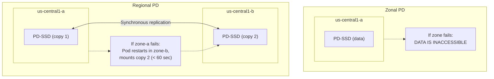
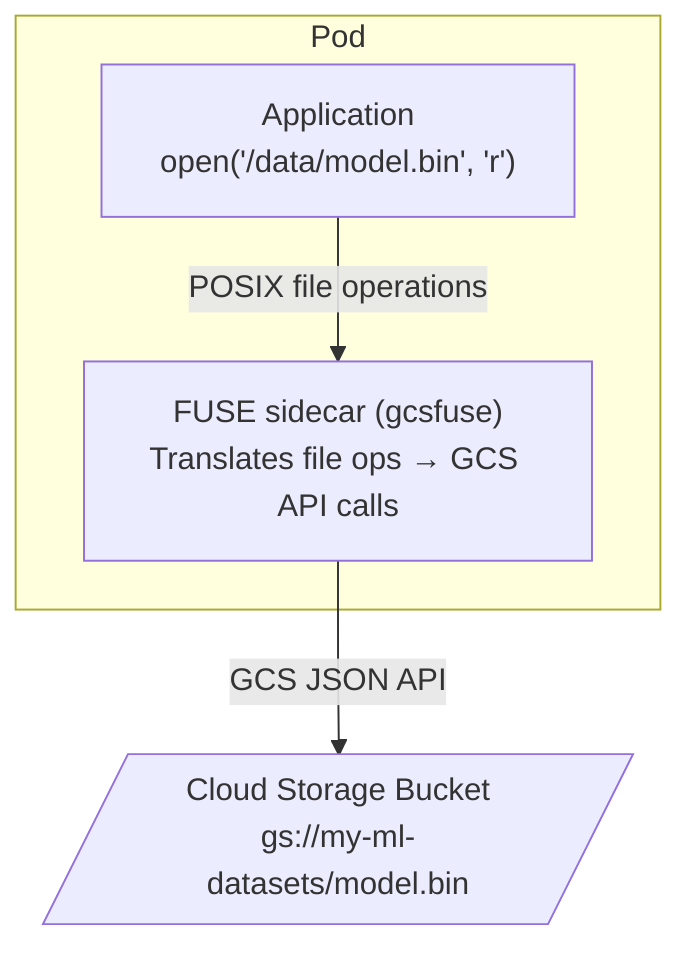
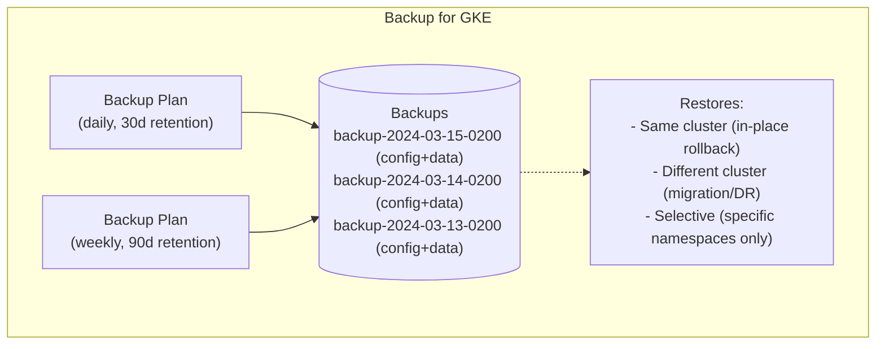
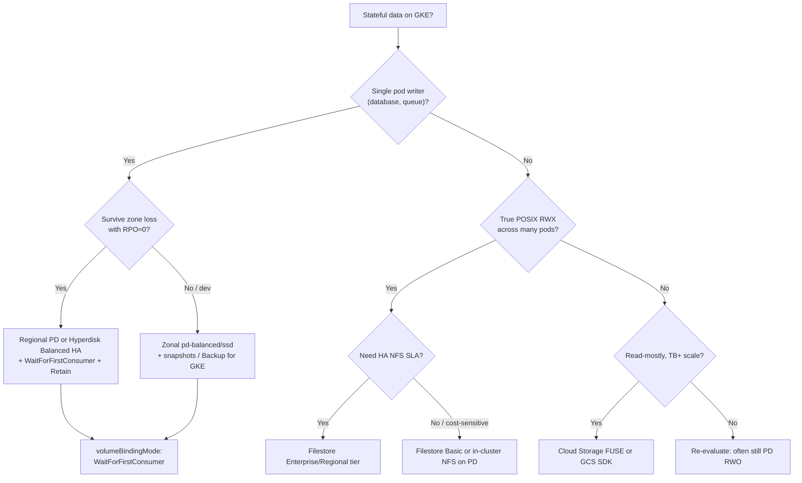

**Complexity**: `[MEDIUM]` | **Time to Complete**: 2h | **Prerequisites**: Module 6.1 (GKE Architecture)

## What You'll Be Able to Do

When you finish this module, you will be able to design GKE storage that survives zone loss, shared-access requirements, and human error without surprise bills or restore drills that fail the first time you need them.

- **Configure Persistent Disks (pd-standard, pd-ssd, pd-balanced) and Filestore CSI driver for GKE workloads**
- **Implement volume snapshots and backup schedules using Backup for GKE for stateful application protection**
- **Deploy regional persistent disks for cross-zone high availability of stateful workloads on GKE**
- **Evaluate GKE storage options (Persistent Disk, Filestore, Cloud Storage FUSE) for different access patterns**

---

## Why This Module Matters

**Hypothetical scenario:** Consider an online gaming company running PostgreSQL on GKE with a single-zone Persistent Disk attached to a StatefulSet pod. When the zone hosting the database node experiences a partial outage, the node goes offline. Because the PD is zonal, it cannot be attached to a node in another zone—the StatefulSet may schedule a replacement pod elsewhere, but it cannot mount the volume until the original zone returns; zonal PDs stay locked to their zone. A **Regional Persistent Disk** synchronously replicates data across two zones (RPO≈0) and can fail over in roughly a minute once the pod reschedules and the disk re-attaches. Regional PD costs roughly **2×** the zonal GB-month rate—for SSD that is about **+$0.17/GB-month** on top of zonal (~$0.17/GB-month), not a fixed “16 cents” delta for every disk type.

Storage in Kubernetes is where the "cattle, not pets" philosophy meets reality. Stateless pods can be replaced instantly, but pods with Persistent Volumes carry data that must survive restarts, rescheduling, and zone failures. GKE offers multiple storage options---Persistent Disks (block storage), Filestore (managed NFS), Cloud Storage FUSE (object storage as a filesystem), and Backup for GKE (disaster recovery). Choosing the right storage backend and configuring it for resilience is often the difference between a minor disruption and a catastrophic data loss event.

In this module, you will learn the full GKE storage landscape: how the PD CSI driver provisions and attaches disks, when to use regional PDs for high availability, how Filestore provides shared NFS access across pods, how Cloud Storage FUSE mounts GCS buckets as local filesystems, and how Backup for GKE protects your stateful workloads.

Platform engineers often inherit clusters where every team picked a different default StorageClass years ago. That fragmentation shows up during zone incidents and finance reviews alike. Standardizing on a small set of classes—`regional-ssd-retain`, `zonal-balanced-delete`, `filestore-enterprise-rwx`—with documented decision criteria reduces pager pain more than chasing the newest disk SKU. You will still need to explain tradeoffs to application owners who ask for “SSD everywhere” without IOPS data; this module gives you the vocabulary and Google Cloud doc links to make those conversations evidence-based rather than opinion-based.

---

## Persistent Disk CSI Driver

The **Compute Engine Persistent Disk CSI driver** is the primary block storage driver for GKE. It is installed by default on all GKE clusters and provisions Google Cloud Persistent Disks as Kubernetes PersistentVolumes.

### Disk Types

| Disk Type | Identifier | IOPS (Read) | Throughput (Read) | Use Case | Cost (us-central1) |
| :--- | :--- | :--- | :--- | :--- | :--- |
| **Standard** | `pd-standard` | 0.75/GB | 0.12 MB/s/GB | Logs, cold data, backups | ~$0.040/GB/mo |
| **Balanced** | `pd-balanced` | 6/GB | 0.28 MB/s/GB | General purpose (default) | ~$0.100/GB/mo |
| **SSD** | `pd-ssd` | 30/GB | 0.48 MB/s/GB | Databases, latency-sensitive | ~$0.170/GB/mo |
| **Extreme** | `pd-extreme` | Configurable (up to 120K) | Configurable (up to 2.4 GB/s) | SAP HANA, Oracle, high-IOPS | ~$0.125/GB/mo + IOPS |
| **Hyperdisk Balanced** | `hyperdisk-balanced` | Configurable | Configurable | Next-gen general purpose | Variable |
| **Hyperdisk Balanced HA** | `hyperdisk-balanced-high-availability` | Provisioned IOPS/throughput | Provisioned IOPS/throughput | Regional HA on 3rd-gen+ machine series | Per provisioned IOPS + capacity |

### How performance scales with disk size

Persistent Disk is networked block storage: latency is higher than Local SSD, and you only reach published IOPS and throughput when the workload issues enough parallel I/O with adequate queue depth. Google documents separate scaling dimensions—**per GiB** limits that grow as you provision a larger disk, **per instance** caps tied to machine type and vCPU count, and (for `pd-balanced` and `pd-ssd`) a **baseline** IOPS/throughput floor per instance that does not scale with disk count. For zonal balanced disks, Google’s formula is: maximum expected IOPS = baseline (3,000) + (6 IOPS/GiB × combined GiB of attached balanced disks on that VM). Small databases on 20–50 GiB disks often hit the **instance** ceiling before the **size** ceiling—right-sizing the node family matters as much as picking `pd-ssd` over `pd-balanced`.

Regional PD follows the same per-GiB rules but with lower per-instance write ceilings than zonal SSD (for example, regional SSD write IOPS per instance tops out around 80,000 on many N2 shapes versus 100,000 zonal). Writes also pay synchronous replication latency across two zones—typically on the order of one to two milliseconds compared with a single-zone disk—buying RPO=0 across zone loss. Read the full limit tables in [Persistent Disk performance](https://cloud.google.com/compute/docs/disks/performance) before promising a customer “we will get 100k IOPS” from a 100 GiB volume on an `e2-medium` node.

`pd-extreme` and Hyperdisk families break the pure per-GiB model: you **provision** target IOPS and throughput at create time (Hyperdisk Balanced High Availability on GKE uses StorageClass parameters such as `provisioned-iops-on-create` and `provisioned-throughput-on-create`). GKE documentation recommends Hyperdisk Balanced HA for third-generation machine series and regional PD for second-generation series when you need zone-redundant block storage—see [Provisioning regional PD and Hyperdisk Balanced HA](https://cloud.google.com/kubernetes-engine/docs/how-to/persistent-volumes/regional-pd). For SAP/Oracle-style workloads that outgrow per-GiB scaling on `pd-ssd`, compare Hyperdisk Extreme/Balanced provisioned limits against the cost of simply growing disk size; sometimes a larger `pd-balanced` disk is cheaper than extreme IOPS provisioning.

### StorageClasses

GKE ships default StorageClasses (`premium-rwo`, `standard-rwo`, and legacy `standard`), yet production teams should still define explicit StorageClasses so disk type, binding mode, reclaim policy, and regional replication are visible in Git-reviewed manifests rather than hidden in cluster defaults.

```bash
# List default StorageClasses
kubectl get storageclasses

# NAME                     PROVISIONER             RECLAIMPOLICY   VOLUMEBINDINGMODE
# premium-rwo              pd.csi.storage.gke.io   Delete          WaitForFirstConsumer
# standard                 pd.csi.storage.gke.io   Delete          Immediate
# standard-rwo             pd.csi.storage.gke.io   Delete          WaitForFirstConsumer
```

```yaml
# Custom StorageClass for production databases
apiVersion: storage.k8s.io/v1
kind: StorageClass
metadata:
  name: fast-regional
provisioner: pd.csi.storage.gke.io
parameters:
  type: pd-ssd
  replication-type: regional-pd  # Synchronous replication across 2 zones
volumeBindingMode: WaitForFirstConsumer  # Bind when pod is scheduled
reclaimPolicy: Retain  # Do NOT delete the disk when PVC is deleted
allowVolumeExpansion: true  # Allow resizing without downtime

---
# StorageClass for dev/test (cheaper, zonal)
apiVersion: storage.k8s.io/v1
kind: StorageClass
metadata:
  name: dev-standard
provisioner: pd.csi.storage.gke.io
parameters:
  type: pd-balanced
volumeBindingMode: WaitForFirstConsumer
reclaimPolicy: Delete
allowVolumeExpansion: true
```

### Volume Binding Modes

Volume binding mode controls **when** the CSI driver creates the backing disk relative to scheduling decisions in multi-zone clusters. Choosing the wrong mode causes persistent scheduling deadlocks across failure domains.

**Pause and predict:** Consider a PersistentVolumeClaim created with `Immediate` binding (or omitting `volumeBindingMode`) in a regional cluster spanning three zones. The storage provisioner creates the Persistent Disk immediately in zone A. What happens if cluster resource constraints later force the Kubernetes scheduler to place your application pod on a worker node in zone B?

<details>
<summary>Check your prediction</summary>

Configuring `Immediate` binding (or omitting `volumeBindingMode`, which defaults to `Immediate` in custom StorageClasses) provisions the underlying Compute Engine disk immediately in a single zone before the pod is scheduled. When the pod is evaluated, the PersistentVolume's zonal node affinity restricts placement to zone A. If the scheduler places or must place the workload on a node in zone B due to resource pressure or affinity rules, the pod cannot mount the volume and remains stuck in `Pending` due to volume node affinity and zone mismatch conflicts. In regional clusters, platform operators should always configure `volumeBindingMode: WaitForFirstConsumer` (which is the default on GKE's built-in `standard-rwo` StorageClass) so dynamic provisioning evaluates pod scheduling constraints first and creates the disk in the pod's selected zone.
</details>

Decoupling storage provisioning from pod placement allows the Kubernetes scheduler to evaluate topology constraints and node resource availability concurrently. Platform engineers who standardize on topology-aware binding avoid manual disk relocation tickets when node pools auto-scale across distinct failure domains. The comparison table below contrasts how these binding behaviors influence provisioning workflows across single-zone and multi-zone cluster architectures:

| Mode | Behavior | When to Use |
| :--- | :--- | :--- |
| `Immediate` | PV is provisioned as soon as PVC is created | Pre-provisioning, when zone does not matter |
| `WaitForFirstConsumer` | PV is provisioned when a pod mounts it | Regional clusters (ensures disk is in the same zone as the pod) |

### Reclaim policies, expansion, and snapshots

`reclaimPolicy` on the StorageClass flows to the PersistentVolume: **`Delete`** removes the underlying Compute Engine disk when the PVC is deleted (dangerous for production data if someone deletes the claim accidentally); **`Retain`** keeps the disk so you can re-bind or snapshot it after manual cleanup. Production database StorageClasses in this module use `Retain` deliberately—operators delete PVCs only after confirming backups and naming orphaned disks in a runbook.

`allowVolumeExpansion: true` lets you grow a PVC online: edit `spec.resources.requests.storage`, the CSI driver resizes the PD, and the node OS grows the filesystem while the pod keeps running. Shrinking is **not** supported; capacity reductions require copy-migrate to a new PVC (see Quiz 5). Plan headroom in StatefulSet `volumeClaimTemplates` because expansion is one-way.

**Volume snapshots** use the Kubernetes `VolumeSnapshot` API backed by Compute Engine disk snapshots. A `VolumeSnapshotClass` names the CSI driver (`pd.csi.storage.gke.io`), optional `storage-locations` for snapshot geography, and `deletionPolicy` (`Retain` vs `Delete`) for the snapshot object versus the underlying snapshot resource. Snapshots are **incremental** at the infrastructure layer—only changed blocks bill after the first full snapshot— but restore still creates a **new** disk; treat snapshot storage as a recurring GB-month line item alongside primary disks. For application-consistent backups (quiesced database), coordinate snapshots with pre/post hooks or use Backup for GKE, which orchestrates volume snapshots with Kubernetes object capture. See [Use volume snapshots on GKE](https://cloud.google.com/kubernetes-engine/docs/how-to/persistent-volumes/volume-snapshots).

---

## Regional Persistent Disks

Regional PDs synchronously replicate data to two zones within the same region. This is the critical feature for high-availability stateful workloads.

### How Regional PDs Work



### Provisioning Regional PDs

```yaml
# StatefulSet with Regional PD
apiVersion: apps/v1
kind: StatefulSet
metadata:
  name: postgres
spec:
  serviceName: postgres
  replicas: 1
  selector:
    matchLabels:
      app: postgres
  template:
    metadata:
      labels:
        app: postgres
    spec:
      containers:
      - name: postgres
        image: postgres:16
        ports:
        - containerPort: 5432
        env:
        - name: POSTGRES_PASSWORD
          value: "change-me-in-production"
        - name: PGDATA
          value: /var/lib/postgresql/data/pgdata
        volumeMounts:
        - name: data
          mountPath: /var/lib/postgresql/data
        resources:
          requests:
            cpu: 500m
            memory: 1Gi
          limits:
            cpu: "2"
            memory: 4Gi
  volumeClaimTemplates:
  - metadata:
      name: data
    spec:
      accessModes: ["ReadWriteOnce"]
      storageClassName: fast-regional  # Uses our regional PD StorageClass
      resources:
        requests:
          storage: 50Gi
```

### Failover Behavior

When a zone fails and the StatefulSet pod is rescheduled to another zone, the following sequence is what operators should expect and measure in game days:

1. GKE detects the node is unhealthy (~5 minutes by default)
2. The StatefulSet controller creates a replacement pod
3. The pod is scheduled to a healthy zone
4. The Regional PD is detached from the failed zone and attached in the new zone (~30-60 seconds)
5. The pod starts with the same data

### Single-zone attachment and StatefulSet semantics

A regional PD is **replicated** across two zones, but at any moment it is **attached in exactly one** of those zones—the zone where the consuming VM runs. During failover, GKE/Compute Engine detaches from the failed zone’s replica path and attaches in the survivor zone; the other replica catches up synchronously while attached. You cannot mount the same regional PD read-write from two nodes in two zones simultaneously (that would be split-brain). For `ReadWriteOnce` StatefulSets with `replicas: 1`, the controller recreates the pod on a healthy node; the PVC’s regional disk follows via CSI topology. Pair regional PD with a **PodDisruptionBudget** so voluntary drains do not overlap with zone incidents in ways that leave you with zero schedulable pods while attachment is in flight.

On **regional GKE clusters**, you may omit `allowedTopologies` on the StorageClass—GKE picks one zone matching the scheduled pod and a second zone for replication (the second zone is chosen from cluster-available zones). On **zonal clusters**, you **must** set `allowedTopologies` with exactly two zones or provisioning fails. Regional `pd-standard` disks require at least **200 GiB** per Google’s GKE regional PD guide; smaller footprints should use `pd-balanced` or `pd-ssd`. Kubernetes cannot distinguish zonal and regional disks with identical names—use unique disk names when mixing manual and dynamic provisioning.

Failover time includes node health detection (default node auto-repair timelines), StatefulSet reschedule, detach/attach (~30–60 seconds commonly cited in field reports, workload-dependent), and database crash recovery. Test quarterly: cordon/drain the node, verify row counts, measure wall-clock RTO. Google’s [regional PD on GKE](https://cloud.google.com/kubernetes-engine/docs/how-to/persistent-volumes/regional-pd) documents dynamic and manual provisioning patterns, including Hyperdisk Balanced HA as the newer alternative on supported machine series.

```bash
# Force-detach a stuck PD (emergency use only)
gcloud compute instances detach-disk failed-node \
  --disk=my-disk \
  --zone=us-central1-a

# Monitor PV/PVC status during failover
kubectl get pv,pvc -o wide
kubectl describe pv <pv-name> | grep -A 5 "Status"
```

### Volume Snapshots

The PD CSI driver integrates with the Kubernetes `VolumeSnapshot` API so you can take application-scheduled or automation-driven point-in-time copies without shelling into nodes to run `gcloud compute disks snapshot` manually.

```yaml
# Create a VolumeSnapshotClass
apiVersion: snapshot.storage.k8s.io/v1
kind: VolumeSnapshotClass
metadata:
  name: pd-snapshot-class
driver: pd.csi.storage.gke.io
deletionPolicy: Retain
parameters:
  storage-locations: us-central1

---
# Take a snapshot of the PostgreSQL PVC
apiVersion: snapshot.storage.k8s.io/v1
kind: VolumeSnapshot
metadata:
  name: postgres-snapshot-20240315
spec:
  volumeSnapshotClassName: pd-snapshot-class
  source:
    persistentVolumeClaimName: data-postgres-0
```

```bash
# Verify the snapshot
kubectl get volumesnapshot
kubectl describe volumesnapshot postgres-snapshot-20240315

# Restore from snapshot (create a new PVC from the snapshot)
cat <<'EOF' | kubectl apply -f -
apiVersion: v1
kind: PersistentVolumeClaim
metadata:
  name: postgres-restored
spec:
  storageClassName: fast-regional
  accessModes:
  - ReadWriteOnce
  resources:
    requests:
      storage: 50Gi
  dataSource:
    name: postgres-snapshot-20240315
    kind: VolumeSnapshot
    apiGroup: snapshot.storage.k8s.io
EOF
```

---

## Filestore CSI Driver (Managed NFS)

Filestore provides managed NFS file shares that can be mounted by **multiple pods simultaneously** with `ReadWriteMany` access. This is essential for workloads that need shared filesystem access.

### When to Use Filestore

| Use Case | Why Filestore | Alternative |
| :--- | :--- | :--- |
| CMS shared uploads | Multiple pods write to the same directory | N/A (PD is ReadWriteOnce) |
| ML training data | Large dataset shared across training pods | Cloud Storage FUSE (cheaper) |
| Legacy apps requiring NFS | Application expects a POSIX filesystem | Refactor to use object storage |
| Build artifacts | CI/CD pods share build cache | Cloud Storage (if latency is okay) |

### Filestore Tiers

| Tier | Min Capacity | IOPS | Throughput | Use Case |
| :--- | :--- | :--- | :--- | :--- |
| **Basic HDD** | 1 TiB | 600 (read) | 100 MB/s (read) | Cold data, infrequent access |
| **Basic SSD** | 2.5 TiB | 60K (read) | 1.2 GB/s (read) | General purpose shared storage |
| **Zonal** | 1 TiB | Up to 170K | Up to 3.6 GB/s | High-performance, single zone |
| **Enterprise** | 1 TiB | Up to 120K | Up to 2.4 GB/s | HA across zones, SLA-backed |
| **Regional** | 1 TiB | Tier-dependent | Tier-dependent | Multi-zone NFS service |

Google publishes tier-specific minimum capacities and performance in [Filestore service tiers](https://cloud.google.com/filestore/docs/service-tiers)—always confirm current minimums before architecture sign-off. **Basic HDD** starts at 1 TiB with modest IOPS; **Basic SSD** historically required 2.5 TiB minimum (hence the Hands-On quiz about a 50 GiB app failing provisioning). **Enterprise** and **Regional** tiers target HA NFS with SLA-backed availability; you pay for the **provisioned** capacity tier, not actual bytes used inside the share.

### When Filestore beats PD—and when it does not

Choose Filestore when multiple pods need **ReadWriteMany** POSIX semantics on the same directory tree—CMS media, shared config trees, legacy NFS clients, or CI artifact caches that must look like a local folder. Choose **not** to use Filestore when data is read-mostly at terabyte scale (Cloud Storage FUSE or the GCS client library is cheaper), when you need sub-millisecond block latency (use PD), or when footprint is hundreds of gigabytes (minimum capacity floors waste budget). Filestore instances live in your VPC; ensure the Filestore network matches the cluster VPC and that firewall paths allow NFS from node subnets—misaligned VPC peering is a common “PVC bound but mount timeout” failure mode covered in Common Mistakes.

### Setting Up Filestore CSI

```bash
# Enable the Filestore CSI driver on the cluster
gcloud container clusters update my-cluster \
  --region=us-central1 \
  --update-addons=GcpFilestoreCsiDriver=ENABLED

# Verify the driver is installed
kubectl get csidriver filestore.csi.storage.gke.io
```

```yaml
# StorageClass for Filestore
apiVersion: storage.k8s.io/v1
kind: StorageClass
metadata:
  name: filestore-shared
provisioner: filestore.csi.storage.gke.io
parameters:
  tier: basic-ssd
  network: default
volumeBindingMode: WaitForFirstConsumer
reclaimPolicy: Retain
allowVolumeExpansion: true

---
# PVC requesting shared storage
apiVersion: v1
kind: PersistentVolumeClaim
metadata:
  name: shared-data
spec:
  accessModes:
  - ReadWriteMany  # Multiple pods can write simultaneously
  storageClassName: filestore-shared
  resources:
    requests:
      storage: 2560Gi  # Minimum 2.5 TiB for basic-ssd
```

```yaml
# Two Deployments sharing the same Filestore volume
apiVersion: apps/v1
kind: Deployment
metadata:
  name: writer
spec:
  replicas: 2
  selector:
    matchLabels:
      app: writer
  template:
    metadata:
      labels:
        app: writer
    spec:
      containers:
      - name: writer
        image: busybox
        command: ["sh", "-c", "while true; do echo $(hostname) $(date) >> /shared/log.txt; sleep 5; done"]
        volumeMounts:
        - name: shared
          mountPath: /shared
        resources:
          requests:
            cpu: 50m
            memory: 32Mi
      volumes:
      - name: shared
        persistentVolumeClaim:
          claimName: shared-data

---
apiVersion: apps/v1
kind: Deployment
metadata:
  name: reader
spec:
  replicas: 3
  selector:
    matchLabels:
      app: reader
  template:
    metadata:
      labels:
        app: reader
    spec:
      containers:
      - name: reader
        image: busybox
        command: ["sh", "-c", "while true; do tail -5 /shared/log.txt; sleep 10; done"]
        volumeMounts:
        - name: shared
          mountPath: /shared
          readOnly: true
        resources:
          requests:
            cpu: 50m
            memory: 32Mi
      volumes:
      - name: shared
        persistentVolumeClaim:
          claimName: shared-data
```

---

## Cloud Storage FUSE CSI Driver

Cloud Storage FUSE mounts GCS buckets as local filesystems inside pods. This gives pods access to petabytes of object storage through standard file system operations. The model is powerful because object storage is cheap and durable. It is also fundamentally different from block devices. Treat FUSE mounts as a **read path** or **bulk ingest path**, not as a drop-in replacement for every NFS share in your estate.

Teams migrating from on-prem NAS sometimes expect `rename()` to be atomic or `fsync()` to flush bytes to a durable offset the way ext4 does. Object stores expose keys and generations; FUSE translates POSIX calls into JSON API operations with latency and consistency rules that differ from NFS or PD. That is why Google documents explicit limitations in the [Cloud Storage FUSE CSI driver concepts](https://cloud.google.com/kubernetes-engine/docs/concepts/cloud-storage-fuse-csi-driver) page and why databases belong on PD or managed Cloud SQL, not on buckets.

### How It Works



### Enabling Cloud Storage FUSE

```bash
# Enable the Cloud Storage FUSE CSI driver
gcloud container clusters update my-cluster \
  --region=us-central1 \
  --update-addons=GcsFuseCsiDriver=ENABLED

# Verify
kubectl get csidriver gcsfuse.csi.storage.gke.io
```

### Using Cloud Storage FUSE in Pods

```yaml
# PersistentVolume pointing to a GCS bucket
apiVersion: v1
kind: PersistentVolume
metadata:
  name: gcs-pv
spec:
  accessModes:
  - ReadWriteMany
  capacity:
    storage: 5Ti  # Informational only (GCS is unlimited)
  storageClassName: ""
  mountOptions:
  - implicit-dirs  # Show directories from object prefixes
  - uid=1000       # Map files to application user
  - gid=1000
  csi:
    driver: gcsfuse.csi.storage.gke.io
    volumeHandle: my-ml-datasets  # GCS bucket name
    readOnly: false

---
apiVersion: v1
kind: PersistentVolumeClaim
metadata:
  name: gcs-pvc
spec:
  accessModes:
  - ReadWriteMany
  resources:
    requests:
      storage: 5Ti
  storageClassName: ""
  volumeName: gcs-pv

---
apiVersion: v1
kind: Pod
metadata:
  name: ml-training
  annotations:
    gke-gcsfuse/volumes: "true"  # Required annotation to inject sidecar
spec:
  serviceAccountName: ml-sa  # Must have Workload Identity with GCS access
  containers:
  - name: trainer
    image: us-central1-docker.pkg.dev/my-project/ml/trainer:v3
    volumeMounts:
    - name: datasets
      mountPath: /data
    resources:
      requests:
        cpu: "4"
        memory: 16Gi
  volumes:
  - name: datasets
    persistentVolumeClaim:
      claimName: gcs-pvc
```

### Cloud Storage FUSE Limitations

| Limitation | Impact | Workaround |
| :--- | :--- | :--- |
| Not POSIX-compliant | No atomic renames, no file locking | Use for read-heavy workloads, not databases |
| Higher latency than PD | Each file op is a GCS API call | Enable file caching for repeated reads |
| Eventual consistency for listings | New files may not appear immediately in `ls` | Use `--stat-cache-ttl=0` for real-time needs |
| No append support | Cannot append to existing files | Write new files instead of appending |

Object storage billing is **per GB-month plus operation charges** (Class A/B requests, egress). A training job that lists millions of small files can spend more on LIST operations than on storage. GCS FUSE is ideal when objects are large, read repeatedly, and written sequentially; it is a poor fit for database files, POSIX `flock`, or rename-heavy workflows. The driver injects a **gcsfuse sidecar** (hence `gke-gcsfuse/volumes: "true"`); tune CPU/memory/ephemeral storage limits on that sidecar so fuse metadata caches do not starve the workload container.

**File caching** stores hot object bytes on the node’s ephemeral disk (or configured cache volume), dramatically improving repeated reads of the same blobs—critical for ML epochs that re-read shards. Tuning knobs include sidecar resource limits and mount options documented in [Use the Cloud Storage FUSE CSI driver on GKE](https://cloud.google.com/kubernetes-engine/docs/how-to/persistent-volumes/gcs-fuse-csi-driver). **Parallel download** options (where supported in your driver version) help large sequential reads; they do not fix random small-write latency. For write-heavy pipelines, write to GCS with the JSON API or batch uploads, then expose read-only FUSE mounts to consumers.

Workload Identity is mandatory for secure bucket access. The binding chain has two distinct steps: (a) **KSA→GSA** — grant `roles/iam.workloadIdentityUser` on the Google service account to member `serviceAccount:PROJECT.svc.id.goog[NAMESPACE/KSA]` via `gcloud iam service-accounts add-iam-policy-binding`; annotate the Kubernetes ServiceAccount with `iam.gke.io/gcp-service-account`. (b) **GSA→bucket** — grant `roles/storage.objectViewer` (or tighter custom roles) on the bucket to the GSA via `gcloud storage buckets add-iam-policy-binding` (or `gcloud projects add-iam-policy-binding` for project-wide scope). On newer clusters you can instead use **direct principal** IAM on the bucket for `principal://iam.googleapis.com/.../subject/ns/.../sa/...` without an intermediary GSA. Never mount production buckets with long-lived HMAC keys in Secrets unless you have no alternative.

```yaml
# Enable file caching for better read performance
# Add to the pod annotation or PV mount options
metadata:
  annotations:
    gke-gcsfuse/volumes: "true"
    gke-gcsfuse/cpu-limit: "500m"
    gke-gcsfuse/memory-limit: "512Mi"
    gke-gcsfuse/ephemeral-storage-limit: "10Gi"  # Cache size
```

---

## Backup for GKE

Backup for GKE provides managed backup and restore for your entire GKE workloads---including both the Kubernetes configuration (Deployments, Services, ConfigMaps) and the persistent volume data. Think of it as an application-level time machine: it knows your Pods and PVCs belong together, so restore recreates the binding instead of leaving you with a restored disk and no StatefulSet to mount it.

Operators sometimes ask whether Backup for GKE replaces Velero or legacy etcd backups. On GKE, Backup for GKE is the first-party path with Google-managed storage, backup agents as cluster addons, and policies expressed through `gcloud container backup-restore` or Config Connector. Velero remains valid for multi-cloud portability or custom plugins, but teams purely on GKE often standardize on Backup for GKE to reduce moving parts. Whatever tool you pick, the operational invariant is identical: **untested restores are fiction.**

### Architecture

Protecting cloud-native state requires evaluating failure modes that extend beyond raw disk corruption or physical storage loss. Operating complex stateful operators introduces critical dependencies between declarative cluster metadata and underlying storage volumes.

**Pause and predict:** Consider an operational incident where an administrator accidentally deletes the CustomResourceDefinition (CRD) that your production database operator relies on, destroying the database cluster and its custom resources. Would a standard Persistent Disk snapshot or Kubernetes `VolumeSnapshot` be sufficient to recover the running database service?

<details>
<summary>Check your prediction</summary>

No. Standard Persistent Disk volume snapshots and Kubernetes `VolumeSnapshot` objects restore **volume data only**, not CRDs or Kubernetes declarative configurations. If the CRD and operator resources are deleted, restoring the disk leaves you with orphaned storage and no controllers or pods to manage it. In contrast, **Backup for GKE** captures both declarative configuration manifests and volume snapshots together. Even so, Backup for GKE does not back up underlying cluster infrastructure (such as VPCs, subnets, or node pools), container image layers hosted in registries, or non-PD volumes like Cloud Storage FUSE mounts and Filestore shares without custom pre-backup and post-restore hooks.
</details>

Establishing comprehensive disaster recovery objectives requires platform architects to separate infrastructure provisioning from application state hydration. Enterprise resilience plans treat declarative manifest preservation and underlying block storage protection as synchronized operational dependencies during cluster reconstruction.



### Setting Up Backup for GKE

```bash
# Enable the Backup for GKE API
gcloud services enable gkebackup.googleapis.com

# Enable the backup agent on the cluster
gcloud container clusters update my-cluster \
  --region=us-central1 \
  --update-addons=BackupRestore=ENABLED

# Create a backup plan (daily backups, 30-day retention)
gcloud container backup-restore backup-plans create daily-backup \
  --project=$PROJECT_ID \
  --location=$REGION \
  --cluster=projects/$PROJECT_ID/locations/$REGION/clusters/my-cluster \
  --all-namespaces \
  --include-volume-data \
  --include-secrets \
  --backup-retain-days=30 \
  --backup-delete-lock-days=7 \
  --cron-schedule="0 2 * * *" \
  --paused=false
```

### Creating Manual Backups

```bash
# Create an on-demand backup (before a risky deployment)
gcloud container backup-restore backups create pre-deploy-backup \
  --project=$PROJECT_ID \
  --location=$REGION \
  --backup-plan=daily-backup \
  --wait-for-completion

# List backups
gcloud container backup-restore backups list \
  --project=$PROJECT_ID \
  --location=$REGION \
  --backup-plan=daily-backup \
  --format="table(name, state, completeTime, resourceCount, volumeCount)"
```

### Restoring from Backup

```bash
# Create a restore plan (defines how backups are restored)
gcloud container backup-restore restore-plans create full-restore \
  --project=$PROJECT_ID \
  --location=$REGION \
  --cluster=projects/$PROJECT_ID/locations/$REGION/clusters/my-cluster \
  --backup-plan=projects/$PROJECT_ID/locations/$REGION/backupPlans/daily-backup \
  --all-namespaces \
  --volume-data-restore-policy=RESTORE_VOLUME_DATA_FROM_BACKUP \
  --cluster-resource-conflict-policy=USE_BACKUP_VERSION \
  --namespaced-resource-restore-mode=MERGE_SKIP_ON_CONFLICT

# Execute a restore
gcloud container backup-restore restores create restore-20240315 \
  --project=$PROJECT_ID \
  --location=$REGION \
  --restore-plan=full-restore \
  --backup=projects/$PROJECT_ID/locations/$REGION/backupPlans/daily-backup/backups/pre-deploy-backup \
  --wait-for-completion
```

### Selective Namespace Restore

```bash
# Restore only the "payments" namespace from a backup
gcloud container backup-restore restore-plans create payments-restore \
  --project=$PROJECT_ID \
  --location=$REGION \
  --cluster=projects/$PROJECT_ID/locations/$REGION/clusters/my-cluster \
  --backup-plan=projects/$PROJECT_ID/locations/$REGION/backupPlans/daily-backup \
  --selected-namespaces=payments \
  --volume-data-restore-policy=RESTORE_VOLUME_DATA_FROM_BACKUP \
  --namespaced-resource-restore-mode=DELETE_AND_RESTORE
```

### What Backup for GKE captures—and restore granularity

A backup plan binds to a cluster and defines schedule (`cron-schedule`), retention (`backup-retain-days`), whether to include **volume data** (`--include-volume-data`, implemented via PD snapshots for supported drivers), **Secrets** (`--include-secrets`), and scope (`--all-namespaces` vs selected namespaces). Each backup stores Kubernetes resource manifests (Deployments, StatefulSets, CRDs, RBAC, PVCs, etc.) plus volume snapshots where enabled—this is strictly broader than ad-hoc `VolumeSnapshot` objects you create by hand.

**Restore plans** decide conflict behavior: `cluster-resource-conflict-policy=USE_BACKUP_VERSION` favors the backup’s cluster-scoped objects; `namespaced-resource-restore-mode` controls whether to merge, skip, or delete-and-replace namespaced resources. `volume-data-restore-policy=RESTORE_VOLUME_DATA_FROM_BACKUP` rehydrates PVCs from backup snapshots—essential when you simulate total loss in the Hands-On lab. You can restore into the **same** cluster (rollback), a **new** cluster in another region (disaster recovery), or **selected namespaces** only (payments isolation). Cross-project restore requires IAM on backup storage and target cluster permissions—treat backup storage location as part of your compliance boundary. Concepts and limitations (what is excluded, agent requirements) are defined in [Backup for GKE concepts](https://cloud.google.com/kubernetes-engine/docs/add-on/backup-for-gke/concepts/backup-for-gke) and operational steps in [Create backup plans](https://cloud.google.com/kubernetes-engine/docs/add-on/backup-for-gke/how-to/backup-plan).

---

## Decision Framework: GKE Storage Choices

Choosing storage is choosing **durability scope** (zonal vs regional), **access pattern** (RWO vs RWX), and **consistency model** (POSIX block/file vs object). The flowchart below deepens the earlier matrix—use it in design reviews before anyone copies a dev StorageClass into production.



### Storage Decision Matrix (tradeoffs)

| Factor | PD (Block) | Filestore (NFS) | Cloud Storage FUSE |
| :--- | :--- | :--- | :--- |
| **Access mode** | ReadWriteOnce | ReadWriteMany | ReadWriteMany |
| **Latency** | Sub-ms (SSD/balanced) | Low ms | Object API latency per op |
| **Max size** | 64 TiB per disk | 100 TiB tier limits | Bucket scale |
| **POSIX compliant** | Yes (ext4/xfs) | Yes | Partial (no atomic rename/lock) |
| **Best for** | Databases, stateful apps | Shared dirs, CMS media | ML datasets, logs, archives |
| **Min size** | 10 GiB typical | 1–2.5 TiB tier floors | Bucket (no PD-style min) |
| **HA across zones** | Regional PD / Hyperdisk HA | Enterprise/Regional tiers | Bucket multi-region / dual-region |
| **Cost driver** | GB-month × replication | Provisioned TiB tier | GB-month + API ops + egress |

### Hyperdisk vs classic PD for high-IOPS databases

Next-generation storage architectures on Google Cloud decouple performance tuning from underlying disk capacity. Before reviewing how these new storage classes alter cluster provisioning, consider how multi-node attachment modes behave across distributed workloads.

**Pause and predict:** An engineering team plans to deploy an application that requires multiple pods to share a common storage volume with concurrent read and write access. Seeing that Hyperdisk Balanced HA lists support for `ReadWriteMany` (RWX), the team proposes using it instead of Filestore for their shared file directory. Will Hyperdisk Balanced HA provide a shared POSIX filesystem out of the box?

<details>
<summary>Check your prediction</summary>

No. Hyperdisk HA RWX operates as a **raw block multi-writer**, not a shared POSIX filesystem. Standard Linux filesystems such as ext4 or XFS do not coordinate cluster-wide block locks, and mounting them across multiple nodes simultaneously will corrupt the filesystem. Workloads using Hyperdisk HA in RWX mode require specialized multi-writer cluster software or custom database engines designed to manage raw block concurrency directly. For standard applications requiring a shared POSIX directory structure, use Filestore or redesign the application architecture.
</details>

Decoupling IOPS and throughput from disk capacity allows infrastructure engineers to provision storage performance dynamically based on real-time application demands. This operational model eliminates the necessity of over-provisioning disk storage simply to achieve required database throughput targets. The following comparison highlights key architectural trade-offs between Hyperdisk options and classic Persistent Disks:

| Question | Lean Hyperdisk Balanced / Extreme / HA | Lean pd-ssd / pd-balanced |
| :--- | :--- | :--- |
| Need provisioned IOPS independent of GiB? | Yes—provision IOPS/throughput explicitly | No—scale GiB and vCPUs |
| Machine series | 3rd gen+ for Hyperdisk Balanced HA | Broader (check regional PD limits) |
| Cost predictability | Pay for provisioned performance | Pay for allocated GiB |

**Pause and predict:** You are deploying a highly available legacy Content Management System (CMS). The application requires three replicas of the web tier to share a single directory for user-uploaded media (images, PDFs), which currently totals around 2 TiB. Based on the decision framework above, which GKE storage solution should you choose and why?

<details>
<summary>Check your prediction</summary>

Select **Filestore** for three replicas sharing a POSIX directory. Regional Persistent Disk is not viable because standard filesystem Persistent Disks only support `ReadWriteOnce` (RWO) and cannot be attached to pods running across multiple nodes simultaneously. Cloud Storage FUSE is not recommended as the CMS default because object storage lacks full POSIX filesystem semantics—such as atomic file renames, atomic locking, and directory concurrency—which standard CMS frameworks expect when manipulating media directories.
</details>

When architectural assessments show Filestore and Cloud Storage FUSE both viable for shared read-mostly datasets, engineers default to Cloud Storage FUSE if objects are large and immutable. Conversely, platform architects standardize on Filestore whenever applications demand native directory structures, POSIX permissions, or memory-mapped file operations that object buckets cannot satisfy. Beyond protocol compatibility, infrastructure teams must evaluate how service pricing floors and multi-zone replication rates impact long-term operational expenditures.

---

## Cost at moderate scale

Storage economics on GKE are the sum of **provisioned capacity**, **replication multiplier**, **snapshot storage**, **minimum service floors**, and **API operations**—not just the `$ per GiB` list price on one disk type.

Google Cloud disk pricing is regional; use [Persistent Disk pricing](https://cloud.google.com/compute/disks-image-pricing) for current `pd-standard`, `pd-balanced`, `pd-ssd`, `pd-extreme`, and Hyperdisk rates. Illustrative **us-central1** zonal rates (verify before budgeting): standard ~$0.040/GB-month, balanced ~$0.100/GB-month, SSD ~$0.170/GB-month. **Regional PD bills roughly twice the zonal GB-month rate** because data is synchronously replicated—your 500 GiB regional SSD is ~1 TB-month of replicated footprint from a finance perspective, not 500 GiB once.

| Cost knob | What moves the bill | Mitigation |
| :--- | :--- | :--- |
| Disk type | `pd-ssd` vs `pd-balanced` vs `pd-standard` | Right-size type to IOPS needs; grow GiB before jumping to extreme |
| Regional replication | ~2× GB-month vs zonal | Use zonal + backups for non-HA dev; regional only where RPO=0 required |
| Snapshots | Incremental GB-month per snapshot chain | Lifecycle delete; avoid snapshotting every PVC hourly |
| Filestore tier minimum | Pay for 1–2.5 TiB even if half empty | FUSE or zonal PD + single NFS only if app accepts constraints |
| GCS FUSE | Storage class + Class A/B ops + egress | Cache reads; avoid LIST storms; regional buckets near cluster |
| Backup for GKE | Backup storage GB + management | Namespace-scoped plans; exclude ephemeral namespaces |

Hypothetical scenario: A 200 GiB production PostgreSQL PVC on **regional `pd-ssd`** in us-central1 might land near **200 GiB × ~$0.170 × ~2 ≈ $68/month** in disk storage alone (regional multiplier approximate), before snapshots. The same workload on **zonal `pd-balanced`** at 200 GiB might be nearer **$20/month** but fails open on zone loss. Filestore **Basic SSD** at the 2.5 TiB minimum can cost an order of magnitude more than 2 TiB of Nearline GCS exposed via FUSE—even though FUSE adds latency, the finance team sees the minimum-capacity cliff immediately.

**What makes costs spike unexpectedly**: (1) orphaned `Retain` disks after PVC deletion—automate labeling and monthly orphan reports; (2) snapshot chains on auto-scheduled dev clusters nobody deletes; (3) Filestore provisioned at Enterprise tier “for HA” when a 300 GiB app only needed RWX; (4) ML jobs listing millions of GCS prefixes through FUSE; (5) expanding PVCs one-way to 2 TiB for a temporary load spike without lifecycle planning. Finance reviews should chart **GB-month by StorageClass label** (`fast-regional`, `dev-standard`, etc.) so chargeback matches teams.

---

## Patterns & Anti-Patterns

### Proven patterns

| Pattern | When to use | Why it works | Scaling note |
| :--- | :--- | :--- | :--- |
| **WaitForFirstConsumer on regional clusters** | Any zonal/regional PD in multi-zone GKE | Disk provisions in the pod’s zone; avoids cross-zone mount failures | Default on GKE `premium-rwo` / `standard-rwo` |
| **Regional PD + PDB for StatefulSet HA** | Production databases with `replicas: 1` | RPO=0 across zone loss; PDB prevents voluntary drain collisions | Test failover quarterly; watch attach time SLO |
| **Snapshot-before-upgrade** | Schema migrations, K8s minor upgrades | Fast point-in-time rollback of block data | Automate `VolumeSnapshot` or Backup for GKE on-demand backup |
| **Filestore for shared RWX POSIX** | CMS/media, legacy NFS clients | True shared directory semantics | Watch minimum TiB; upgrade tier before IOPS saturation |
| **GCS FUSE + cache for read-heavy ML** | Large immutable training sets | Lowest $/GB; scales past Filestore mins | Pin sidecar CPU/memory; read-only mounts where possible |
| **Retain + labeled StorageClass for prod** | All production PVCs | Prevents accidental disk delete on PVC removal | Pair with cleanup automation for named orphans |

### Anti-patterns

| Anti-pattern | What goes wrong | Why teams fall into it | Better alternative |
| :--- | :--- | :--- | :--- |
| **Immediate binding in regional clusters** | Pod Pending on zone mismatch | Copied single-zone examples | `WaitForFirstConsumer` |
| **GCS FUSE for transactional writes** | Corruption, partial writes, no atomic rename | “Bucket is cheaper than PD” | PD or Cloud SQL; FUSE for reads |
| **`allowVolumeExpansion: false` on prod classes** | Emergency scale requires migration | Old Helm charts | Enable expansion; monitor filesystem caps |
| **Zonal PD assumed HA** | Zone outage = hard downtime | Confuse replication with backups | Regional PD or accept RPO>0 + restore drills |
| **`Delete` reclaim on prod data** | PVC delete destroys disk | Default StorageClass | `Retain` + operational delete process |
| **Filestore for 100 GiB shared dir** | Provisioning fails or massive waste | NFS familiarity | In-cluster NFS on PD or app refactor to GCS |
| **Untested Backup for GKE restores** | Backup exists but restore fails | Checkbox compliance | Quarterly restore to scratch cluster |

---

## Storage troubleshooting and observability

Stateful incidents on GKE usually present as `Pending` pods, `FailedMount` events, or silent I/O latency—not as clear “disk down” pages. Train your on-call to read **events first**, then CSI driver logs, then Compute Engine disk attachment state. A pod stuck `Pending` with `volume node affinity conflict` almost always means the PVC’s topology does not match any schedulable node zone; fix binding mode or delete the PVC and reprovision with `WaitForFirstConsumer` after confirming data is disposable or restored from snapshot. `FailedAttachVolume` / `FailedMount` on a running cluster often indicates a zombie attachment from a crashed node—use `kubectl describe volumeattachment` and, only after confirming no writer pod exists, escalate to controlled detach procedures documented for your org (the module’s emergency `gcloud compute instances detach-disk` snippet is a last resort, not a daily tool).

For performance complaints, split **Kubernetes wait time** from **backend I/O**. Kubernetes metrics show volume mount success; they do not show PD queue depth. On the node, correlate application latency with disk utilization in Cloud Monitoring (`compute.googleapis.com/guest/disk/...` metrics when Ops Agent is installed). If IOPS plateaus below expectations, verify machine type and combined GiB using Google’s tables before filing a support ticket—many “slow Postgres” cases are undersized nodes, not faulty CSI. For Filestore, watch NFS latency and used capacity against tier limits; for GCS FUSE, watch Class A/B operation rates and sidecar OOM kills from undersized fuse caches.

Label PVCs and StorageClasses with `app`, `tier`, and `data-class` so orphaned `Retain` disks are traceable in `gcloud compute disks list --filter="labels.data-class=prod"` monthly reviews. Backup for GKE health appears in backup plan `state` and per-backup `volumeCount`—alert when scheduled backups skip because the agent addon was disabled during a cluster upgrade. Restore drills should record wall-clock time for **attach**, **filesystem fsck**, and **database crash recovery** separately; leadership cares about end-to-end RTO, but engineering learns from sub-phase timings.

Security reviews should include storage paths: Workload Identity bindings for FUSE buckets, IAM on snapshot storage locations, and whether `include-secrets` in backup plans places Secret values in backup storage with weaker ACLs than Secret Manager. Encryption at rest is Google-managed by default on PD, Filestore, and GCS; CMEK is available when policy requires customer key control—declare that choice at StorageClass or bucket creation time, not after hundreds of volumes exist.

---

## Capacity and performance planning worksheet

Use this worksheet during architecture review so storage choices are explicit before the first `kubectl apply`. **Step 1 — Access pattern:** single writer (RWO) vs many writers (RWX). If RWX is required, block storage cannot solve it without redesign; choose Filestore or object-backed patterns. **Step 2 — Durability:** can you lose a zone with RPO>0 acceptable? If no, budget regional PD or Hyperdisk Balanced HA and the ~2× GB-month multiplier. **Step 3 — Performance:** estimate working set IOPS and throughput; map to disk type using [Persistent Disk performance](https://cloud.google.com/compute/docs/disks/performance), remembering instance caps. If per-GiB math exceeds instance caps, increase node size or disk GiB before buying `pd-extreme`. **Step 4 — Minimum footprint:** Filestore tiers enforce TiB floors—if app data is hundreds of GiB, FUSE or PD-backed NFS may be cheaper even with refactor cost. **Step 5 — Backup strategy:** PD snapshots alone vs Backup for GKE; define RPO/RTO per tier and test restore quarterly. **Step 6 — Cost guardrails:** chart monthly GB-month by StorageClass label; alert on snapshot growth and orphan disks.

Hypothetical scenario: A team plans 300 GiB PostgreSQL on `pd-balanced` regional disks with 2 vCPU nodes. Performance review shows write IOPS cap on `e2-medium` binds before disk size. They move to `n2-standard-4` and keep regional `pd-balanced`—spend shifts from disk type to compute, but failover SLO improves. Another team stores 80 TiB training data; Filestore quotes terrify finance, so they mount a regional GCS bucket via FUSE with 20 GiB node cache per pod and accept list latency on cold paths—operations cost moves to object API monitoring instead of NFS tier upgrades.

Document decisions in the repo next to Helm values: StorageClass name, expected GiB growth per quarter, snapshot schedule owner, and restore runbook link. Future you—and the cross-family reviewer—should not reverse-engineer why `fast-regional` uses `Retain` from a single YAML line without context.

---

## PD CSI request flow and day-2 operations

Understanding the provision sequence helps you debug slow PVCs without guessing. When a Pod references a PVC with a dynamic StorageClass, the external-provisioner watches the claim, but with `WaitForFirstConsumer` the scheduler must select a node first so the provisioner knows which zone topology to satisfy. The PD CSI driver then calls Compute Engine to create a disk, publishes a PersistentVolume with node affinity, attaches the disk to the node hosting the pod, and kubelet mounts the filesystem into the container namespace. Each step emits Kubernetes events; a long gap between `Provisioning` and `ProvisioningSucceeded` often means API quota, insufficient IAM on the node service account, or zone stockouts—not “Kubernetes is slow.”

Day-2 operations include resize (`kubectl patch pvc`), snapshot (`VolumeSnapshot`), clone via restore into a new PVC, and migration by copying data to a new claim with a different class. For migrations from zonal to regional, plan a maintenance window: create regional PVC, copy data with a Job mounting both volumes, switch the StatefulSet template, and retire the old PVC only after verifying backups. In-place class changes are not supported—you are always orchestrating data movement under the hood.

IAM for the PD CSI driver runs as Google-managed infrastructure on GKE; customer-visible IAM focuses on who can create disks and snapshots in the project. Restrict `compute.disks.create` and `compute.snapshots.create` to CI pipelines and break-glass roles. Audit logs for disk deletes catch the teammate who removed the wrong `Retain` disk during cost savings week.

Hyperdisk adoption on GKE should follow Google’s machine-series guidance: Balanced High Availability for new HA block storage on supported third-generation series, regional PD where Hyperdisk is not yet available for your shape. When evaluating Hyperdisk provisioned IOPS, compare total cost against “larger `pd-balanced` disk + bigger node” alternatives—provisioned performance is powerful but bills even when utilization is low.

Filestore day-2 concerns include tier changes and capacity increases (often requiring planned maintenance windows per Filestore docs), IP address planning on the VPC peering path, and backup integrations that snapshot NFS exports separately from GKE Backup for GKE unless you include those volumes via generic volume backup paths. Cloud Storage FUSE day-2 concerns include bucket IAM drift, lifecycle rules deleting objects still referenced by training jobs, and upgrading the gcsfuse sidecar image when GKE addon versions bump—pin addon compatibility in cluster upgrade runbooks.

Backup for GKE day-2 requires monitoring backup plan pause flags. Watch `backup-delete-lock-days` so policies cannot be deleted casually. Test restores after CRD API bumps. After upgrading GKE from 1.34 to 1.35 in this curriculum’s target line, run a restore test to a 1.35 scratch cluster. Version skew in long-retention backups surprises teams every year.

---

## Comparing snapshot, backup, and replication strategies

Replication (regional PD, Filestore HA tiers) answers **“survive hardware or zone loss without restoring from yesterday.”** Snapshots answer **“roll back block data to a point in time.”** Backup for GKE answers **“rebuild the Kubernetes application, not just the bytes on disk.”** Mature platforms use all three layers with different owners: SRE owns replication classes, app teams request snapshot schedules before releases, platform owns Backup for GKE plans and restore drills.

| Layer | Protects against | Does not protect against | Typical owner |
| :--- | :--- | :--- | :--- |
| Regional PD / Hyperdisk HA | Zone outage, single disk failure | Logical deletes, ransomware rewriting data | Platform / SRE |
| VolumeSnapshot | Corruption rollback, clone for test | Deleted namespace, lost CRDs | App team + automation |
| Backup for GKE | Namespace wipe, bad upgrade, DR to new cluster | Off-site attacker with admin deleting backups if IAM weak | Platform |

Hypothetical scenario: An operator runs `kubectl delete namespace payments --wait=false` during a drill typo. Regional PD keeps bytes safe, but nothing mounts them because StatefulSet, Service, and Secret objects are gone. VolumeSnapshots still exist, yet rebuilding requires manual YAML and snapshot restore choreography. A Backup for GKE restore with `DELETE_AND_RESTORE` on the namespace recreates objects and volume data together—RTO drops from hours to tens of minutes when practiced.

Snapshot schedules should align with change windows: hourly during risky migrations, daily baseline otherwise. Store snapshots in the same region as primary disks unless compliance mandates cross-region copies—cross-region snapshot storage adds GB-month and restore latency. Backup plans should include `--include-secrets` only when backup vault ACLs are tighter than etcd RBAC; some regulated teams exclude secrets from backups and restore them from Secret Manager instead.

For GCS FUSE workloads, object versioning and bucket lifecycle policies complement—not replace—Kubernetes backups. A deleted prefix in a bucket is not fixed by PD snapshots because there is no PD. Enable soft delete or versioning on buckets holding training assets, and restrict `storage.objects.delete` to CI roles.

Replication is not backup. A bug that writes bad rows to every replica still replicates bad rows synchronously on regional PD. Snapshots and backups capture earlier good states. Conversely, backups without replication still mean zone-wide incidents hurt if you must wait for zone recovery before attach. Design tables in architecture docs so product managers see why “we have backups” does not mean “we survive zone failure.”

Cost recap at moderate scale for protection stacks: regional PD ~2× disk GB-month; snapshots incremental; Backup for GKE storage plus management API; Filestore backups if using separate Filestore backup products. Finance should see one line item per layer, not a single “storage” bucket that hides snapshot terabytes grown over years.

---

## GKE storage checklist for production readiness

Before marking a stateful workload production-ready on GKE 1.35, walk this checklist with the service owner. **StorageClass:** explicit class name in Git, `WaitForFirstConsumer` for multi-zone clusters, `allowVolumeExpansion: true` if growth expected, `Retain` if data is precious. **HA:** regional PD or Hyperdisk HA for RPO=0 across zone loss; PDB defined; failover game-day completed in last quarter. **RWX:** if multiple pods write the same tree, Filestore tier chosen with minimum capacity acknowledged in writing—or FUSE/object redesign documented. **Backups:** Backup for GKE plan or equivalent with volume data; restore drill ticket closed; secrets policy documented. **Observability:** alerts on `Pending` PVCs >15 minutes, backup plan failures, and disk attach errors. **Cost:** labels on PVC/StorageClass; orphan disk report scheduled; snapshot retention matches finance policy. **Security:** Workload Identity for GCS FUSE; no world-readable NFS exports; backup store IAM reviewed.

Each item should link to a runbook section, not a verbal “we will get to it.” Auditors and customers increasingly ask for evidence, not architecture slides. A one-page ADR in the service repo citing this module’s decision framework is often enough to satisfy internal platform review.

For multi-cluster fleets, align StorageClass names (`regional-ssd-retain`) across clusters so Helm charts do not fork per environment. Backup plans may differ—production retains 30 days, staging 7—but naming stays consistent so on-call muscle memory transfers between clusters.

StatefulSet identity is tightly coupled to PVC naming (`data-postgres-0`). When restoring, preserve naming templates so pods reattach the correct claim. Random Deployment names with generic PVCs make restores harder because operators must map volumes manually. If you must rename, script the mapping in the restore runbook and store it beside the Backup for GKE restore plan name.

ReadWriteOncePod access mode (where supported on newer Kubernetes lines) further restricts concurrent mounts—useful for hard single-writer guarantees beyond legacy RWO semantics. Review GKE release notes when upgrading to 1.35: storage features like CSI migration status, addon versions for gcsfuse, and Backup agent compatibility should be validated in release notes before change windows. A skipped addon upgrade can leave backups silently paused while workloads still run.

Finally, teach application developers what storage **cannot** do. ORMs expect local POSIX semantics; object FUSE breaks those assumptions. NFS clients cache directory listings; aggressive caching improves performance but confuses CI that expects immediate visibility of uploaded artifacts. PD volumes are not shared across pods without careful multi-writer modes that most databases forbid. Setting expectations early prevents storage classes from becoming a dumping ground for every persistence question platform teams hear.

When you present storage options to leadership, translate technical choices into recovery stories: regional PD buys minutes of attach time during zone failure; Backup for GKE buys rebuild of entire namespaces after human error; FUSE buys cost per terabyte for datasets that never needed POSIX in the first place. Numbers from [Persistent Disk pricing](https://cloud.google.com/compute/disks-image-pricing) and [Cloud Storage pricing](https://cloud.google.com/storage/pricing) anchor the conversation. Tie each dollar to an explicit RPO/RTO commitment so spend reviews do not devolve into “why is Filestore so expensive” without context about minimum TiB and HA requirements.

Keep a living diagram in your team wiki that maps each production namespace to its StorageClass, backup plan, and last successful restore date. The diagram goes stale quickly, but the discipline of updating it after every storage-related incident pays for itself the next time someone asks whether `payments` is safe to drain for maintenance. During game days, annotate the diagram with measured failover minutes and restore minutes so capacity planning uses empirical numbers instead of slide-deck guesses from last year’s conference talk. Store those measurements next to the Backup for GKE restore ticket ID so auditors can trace evidence from drill to documentation without searching chat logs. That habit turns storage from a mysterious infrastructure tax into a service the business can reason about during incident reviews, budget cycles, and customer trust conversations after outages—especially when zones fail without warning at scale.

---

## Did You Know?

1. **Regional Persistent Disks perform synchronous replication across exactly two zones in the same region.** Every write to the primary copy must be acknowledged by the secondary copy before the write returns to the application. This adds approximately 1-2ms of write latency compared to a zonal PD, but guarantees zero data loss (RPO=0) during a zone failover. The two zones are chosen automatically by GKE based on the scheduled pod's topology **unless you pin them with `allowedTopologies`** (required on zonal clusters; optional on regional).

2. **Google has long used FUSE-style interfaces internally** for large-scale data access. The open-source gcsfuse project was released in 2015 and the GKE CSI driver followed in 2023. Internally, Google ML training jobs read petabytes of data per day through FUSE-like interfaces. The GKE CSI driver injects a sidecar container that runs the gcsfuse process, which is why pods need the `gke-gcsfuse/volumes: "true"` annotation.

3. **Backup for GKE does not just snapshot disks---it captures the full Kubernetes state.** A backup includes all Kubernetes resource configurations (Deployments, Services, ConfigMaps, Secrets, CRDs, custom resources), PersistentVolume data (via disk snapshots), and namespace metadata. This means you can restore an entire application stack---not just the data---to a different cluster in a different region. This is what distinguishes it from simply taking PD snapshots manually.

4. **You can expand a Persistent Volume online without stopping the pod.** The PD CSI driver supports volume expansion when the StorageClass has `allowVolumeExpansion: true`. You simply edit the PVC to request a larger size, and the driver resizes the underlying disk and expands the filesystem---all while the pod continues running. However, you can only increase size, never decrease. Shrinking a PV requires creating a new smaller PV, copying data, and switching over.

---

## Common Mistakes

| Mistake | Why It Happens | How to Fix It |
| :--- | :--- | :--- |
| Using zonal PD for production databases | Default StorageClass creates zonal disks | Create a StorageClass with `replication-type: regional-pd` |
| Using `Immediate` volume binding in regional clusters | Copied from single-zone examples | Use `WaitForFirstConsumer` in most regional-cluster cases to match disk zone with pod zone |
| Setting reclaim policy to `Delete` on production PVs | Default StorageClass behavior | Use `Retain` for production; manually delete PVs after confirming data is safe |
| Not planning IP ranges for pod CIDR (storage-related) | Forgetting that Filestore needs VPC access | Ensure Filestore network matches the GKE cluster's VPC |
| Choosing Filestore for object storage workloads | Assuming NFS is always better | Use Cloud Storage FUSE for read-heavy, large-scale data; it is 10x cheaper per GB |
| Skipping backup configuration for stateful workloads | "We have replication, we are fine" | Replication protects against hardware failure; backups protect against human error and data corruption |
| Not testing restore procedures | Creating backups but never testing restores | Schedule quarterly restore drills to a test cluster; an untested backup may not be restorable when you need it |
| Using Cloud Storage FUSE for database storage | Seeing "ReadWriteMany" and assuming POSIX compliance | Cloud Storage FUSE lacks atomic renames and file locking; avoid using it for databases |

---

## Quiz

<details>
<summary>1. Your e-commerce database runs on a single GKE node with a standard zonal Persistent Disk attached. During a major sales event, the Google Cloud zone hosting that node experiences a complete power failure. The cluster has nodes in other healthy zones. What happens to your database, and how would configuring a Regional Persistent Disk have changed this outcome?</summary>

With a zonal Persistent Disk, your database goes completely offline and cannot be recovered until the specific zone is restored by Google Cloud, because the disk physically resides only in that failed zone. The Kubernetes scheduler might create a replacement pod in a healthy zone, but it will remain `Pending` because it cannot mount the zonal disk. If you had configured a Regional Persistent Disk, the data would have been synchronously replicated to a second zone in real-time. The scheduler would spin up the replacement pod in that second healthy zone, attach the replica disk within 60 seconds, and your database would resume operations with zero data loss (RPO=0).
</details>

<details>
<summary>2. You deploy a new application to a regional GKE cluster using a StorageClass with `Immediate` volume binding. The PersistentVolumeClaim bounds successfully, but the pod remains in a `Pending` state indefinitely, with an error citing a zone mismatch. Why did this happen, and how does changing the binding mode resolve the underlying issue?</summary>

This happens because `Immediate` binding causes the Persistent Disk CSI driver to provision the storage early, picking a zone for the disk before the Kubernetes scheduler has decided where the pod will run. If the scheduler later places the pod on a node in a different zone than the newly created disk, the pod cannot mount it due to the strict zonal affinity of standard persistent disks. By changing the StorageClass to use `WaitForFirstConsumer`, you instruct the CSI driver to delay volume creation until the pod is actually scheduled. This ensures the scheduler picks the optimal node first, and the disk is subsequently provisioned in the exact same zone, guaranteeing they are physically co-located and mountable.
</details>

<details>
<summary>3. A machine learning team needs to mount a 50 TB dataset of training images into 20 concurrent training pods. The data is read-only, and cost is a major concern. The DevOps team initially suggests Filestore Enterprise, but you propose Cloud Storage FUSE instead. Why is Cloud Storage FUSE the better architectural choice for this specific workload?</summary>

Cloud Storage FUSE is the better choice because the workload involves large-scale, read-heavy data access where cost is the primary constraint and full POSIX compliance (like file locking or atomic renames) is not required. Filestore Enterprise would cost significantly more (around $0.20-$0.36/GB/month) and is designed for low-latency, complex file operations that ML training typically doesn't need. Cloud Storage FUSE leverages standard Google Cloud Storage buckets, dropping the cost to roughly $0.020/GB/month while easily scaling to 50 TB and supporting simultaneous `ReadWriteMany` access across all 20 pods. Furthermore, you can enable FUSE file caching directly on the pods to mitigate the higher per-operation latency naturally associated with object storage APIs.
</details>

<details>
<summary>4. A junior engineer accidentally deletes an entire production namespace, including the StatefulSet, ConfigMaps, Secrets, and the associated PersistentVolumeClaims. You have daily PD snapshots enabled on the underlying disks. Why are these PD snapshots alone insufficient for a rapid recovery, and how would Backup for GKE have prevented a prolonged outage?</summary>

Persistent Disk snapshots only capture the raw block data residing on the physical disk; they do not back up any Kubernetes state or configuration. To recover using only PD snapshots, you would have to manually recreate the deleted namespace, reconstruct the ConfigMaps and Secrets, redefine the StatefulSet, and manually orchestrate creating new PVCs from the snapshots. This highly manual process is error-prone and significantly increases the time it takes to restore service to your users. Backup for GKE solves this by capturing both the Kubernetes resource configurations (the "state") and the underlying volume data in a unified snapshot, allowing you to execute a single restore command to recreate the namespace, all its resources, and the populated volumes automatically.
</details>

<details>
<summary>5. To handle a temporary spike in log generation, you edit a PersistentVolumeClaim to increase its storage request from 100Gi to 500Gi. A week later, log volume returns to normal, and you want to reduce the PVC back to 100Gi to save costs. Describe the exact process you must follow to achieve this size reduction.</summary>

You cannot simply edit the existing PersistentVolumeClaim to reduce its size, because Google Cloud Persistent Disks do not support shrinking and volume expansion is strictly a one-way operation at the infrastructure level. To achieve the size reduction, you must manually create a brand new PVC requesting the desired 100Gi size. You then need to deploy a temporary pod that mounts both the old 500Gi volume and the new 100Gi volume to literally copy the data across using tools like `rsync`. Finally, you must update your application's deployment manifests to reference the new PVC, restart the application so it mounts the new disk, and safely delete the original 500Gi PVC once verification is complete.
</details>

<details>
<summary>6. You are tasked with providing shared filesystem storage for a small internal application that only generates about 50 GB of data. You decide to create a Basic SSD Filestore instance, but the provisioning command fails. Why does Filestore reject this configuration, and what is a more appropriate storage alternative for this workload?</summary>

Filestore rejects the configuration because it enforces hard minimum capacity requirements to accommodate its dedicated underlying infrastructure; a Basic SSD tier requires an absolute minimum of 2.5 TiB. Attempting to provision only 50 GB violates this boundary, and provisioning the full 2.5 TiB would be a massive waste of resources and budget for such a small dataset. A more appropriate alternative would be to deploy a lightweight, in-cluster NFS server backed by a single 50 GB regional Persistent Disk. Alternatively, you could rewrite the application to use Cloud Storage FUSE if it simply needs shared object storage without strict POSIX filesystem locking and rename capabilities.
</details>

<details>
<summary>7. Your platform team provisions a 30 GiB `pd-balanced` volume for a latency-sensitive API cache on an `e2-standard-4` node. Under load testing, measured read IOPS plateau far below the 6 IOPS/GiB × 30 GiB expectation. Which two factors from Google’s performance model most likely explain the gap, and what would you change first?</summary>

Persistent Disk performance is capped by **both** per-GiB scaling and **per-instance** limits tied to machine type and vCPU count, plus the need for sufficient I/O queue depth. On smaller instances, the instance-level ceiling (and low parallel I/O) often binds before the theoretical per-GiB maximum—Google documents baseline plus per-GiB formulas and machine-specific tables in [Persistent Disk performance](https://cloud.google.com/compute/docs/disks/performance). First changes: move to a machine family with higher PD limits (more vCPUs), increase disk size if headroom allows, and verify the benchmark issues enough concurrent I/O; only then jump to `pd-ssd` or provisioned Hyperdisk IOPS.
</details>

<details>
<summary>8. Hypothetical scenario: Finance asks why Backup for GKE still incurs meaningful monthly cost after you “already snapshot every PVC with VolumeSnapshot.” Explain what Backup for GKE adds beyond manual snapshots and name one restore scenario where that difference saves hours.</summary>

Manual `VolumeSnapshot` objects capture block-level PD point-in-time data for a PVC, but they do **not** automatically rehydrate Deployments, Services, Secrets, CRDs, or namespace RBAC. Backup for GKE stores **Kubernetes resource manifests plus volume data** (when `--include-volume-data` is enabled) under a backup plan with retention and cross-cluster restore paths—see [Backup for GKE concepts](https://cloud.google.com/kubernetes-engine/docs/add-on/backup-for-gke/concepts/backup-for-gke). After an engineer deletes a production namespace, a selective or full restore recreates the StatefulSet, secrets, and PVCs from one backup operation instead of hand-rebuilding YAML and re-binding snapshots—hours saved in incident response, which is why the service bills for managed backup storage beyond raw snapshot GB-month alone.
</details>

---

## Hands-On Exercise: Regional PD Failover and Backup for GKE

### Objective

Deploy a stateful application with Regional PDs, simulate a zone failure to observe failover behavior, and use Backup for GKE to backup and restore the application.

### Prerequisites

- `gcloud` CLI installed and authenticated
- A GCP project with billing enabled
- GKE and Backup for GKE APIs enabled

### Tasks

The lab progresses through six checkpoints—cluster and StorageClass creation, stateful deploy, simulated failover, Backup for GKE configuration, destructive restore, and cleanup of retained disks—each with a collapsible solution you can reveal only after attempting the step yourself.

### Task 1: Create a GKE Cluster and Regional StorageClass

<details>
<summary>Solution</summary>

```bash
export PROJECT_ID=$(gcloud config get-value project)
export REGION=us-central1

# Enable APIs
gcloud services enable container.googleapis.com gkebackup.googleapis.com

# Create a regional cluster
gcloud container clusters create storage-demo \
  --region=$REGION \
  --num-nodes=1 \
  --machine-type=e2-standard-2 \
  --release-channel=regular \
  --enable-ip-alias \
  --workload-pool=$PROJECT_ID.svc.id.goog \
  --addons=BackupRestore

# Get credentials
gcloud container clusters get-credentials storage-demo --region=$REGION

# Create the Regional PD StorageClass
kubectl apply -f - <<'EOF'
apiVersion: storage.k8s.io/v1
kind: StorageClass
metadata:
  name: regional-ssd
provisioner: pd.csi.storage.gke.io
parameters:
  type: pd-ssd
  replication-type: regional-pd
volumeBindingMode: WaitForFirstConsumer
reclaimPolicy: Retain
allowVolumeExpansion: true
EOF

kubectl get storageclasses
```
</details>

### Task 2: Deploy a Stateful Application with Regional PD

<details>
<summary>Solution</summary>

```bash
kubectl apply -f - <<'EOF'
apiVersion: v1
kind: Service
metadata:
  name: counter-db
spec:
  clusterIP: None
  selector:
    app: counter-db
  ports:
  - port: 5432

---
apiVersion: apps/v1
kind: StatefulSet
metadata:
  name: counter-db
spec:
  serviceName: counter-db
  replicas: 1
  selector:
    matchLabels:
      app: counter-db
  template:
    metadata:
      labels:
        app: counter-db
    spec:
      terminationGracePeriodSeconds: 10
      containers:
      - name: postgres
        image: postgres:16
        ports:
        - containerPort: 5432
        env:
        - name: POSTGRES_DB
          value: counter
        - name: POSTGRES_USER
          value: app
        - name: POSTGRES_PASSWORD
          value: demo-password-change-me
        - name: PGDATA
          value: /var/lib/postgresql/data/pgdata
        volumeMounts:
        - name: data
          mountPath: /var/lib/postgresql/data
        resources:
          requests:
            cpu: 250m
            memory: 512Mi
  volumeClaimTemplates:
  - metadata:
      name: data
    spec:
      accessModes: ["ReadWriteOnce"]
      storageClassName: regional-ssd
      resources:
        requests:
          storage: 10Gi
EOF

# Wait for the StatefulSet to be ready
kubectl rollout status statefulset/counter-db --timeout=180s

# Insert test data
kubectl exec counter-db-0 -- psql -U app -d counter -c \
  "CREATE TABLE visits (id SERIAL PRIMARY KEY, ts TIMESTAMP DEFAULT NOW());"
kubectl exec counter-db-0 -- psql -U app -d counter -c \
  "INSERT INTO visits DEFAULT VALUES; INSERT INTO visits DEFAULT VALUES; INSERT INTO visits DEFAULT VALUES;"
kubectl exec counter-db-0 -- psql -U app -d counter -c \
  "SELECT count(*) FROM visits;"

# Verify the PV is a regional PD
PV_NAME=$(kubectl get pvc data-counter-db-0 -o jsonpath='{.spec.volumeName}')
kubectl get pv $PV_NAME -o yaml | grep -A 5 "nodeAffinity"
```
</details>

### Task 3: Simulate Zone Failure and Observe Failover

<details>
<summary>Solution</summary>

```bash
# Find which node and zone the pod is running on
NODE=$(kubectl get pod counter-db-0 -o jsonpath='{.spec.nodeName}')
ZONE=$(kubectl get node $NODE -o jsonpath='{.metadata.labels.topology\.kubernetes\.io/zone}')
echo "Pod is on node: $NODE in zone: $ZONE"

# Cordon and drain the node to simulate zone failure
kubectl cordon $NODE
kubectl delete pod counter-db-0 --grace-period=10

# Watch the pod reschedule to another zone
echo "Watching pod reschedule..."
kubectl get pods -w -l app=counter-db &
WATCH_PID=$!
sleep 60
kill $WATCH_PID 2>/dev/null

# Verify the pod restarted in a different zone
NEW_NODE=$(kubectl get pod counter-db-0 -o jsonpath='{.spec.nodeName}')
NEW_ZONE=$(kubectl get node $NEW_NODE -o jsonpath='{.metadata.labels.topology\.kubernetes\.io/zone}')
echo "Pod is now on node: $NEW_NODE in zone: $NEW_ZONE"

# Verify data survived the failover
kubectl exec counter-db-0 -- psql -U app -d counter -c \
  "SELECT count(*) FROM visits;"
# Should still show 3 rows

# Uncordon the original node
kubectl uncordon $NODE
```
</details>

### Task 4: Set Up Backup for GKE

<details>
<summary>Solution</summary>

```bash
# Create a backup plan
gcloud container backup-restore backup-plans create storage-demo-backup \
  --project=$PROJECT_ID \
  --location=$REGION \
  --cluster=projects/$PROJECT_ID/locations/$REGION/clusters/storage-demo \
  --all-namespaces \
  --include-volume-data \
  --include-secrets \
  --backup-retain-days=7

# Create a manual backup
gcloud container backup-restore backups create manual-backup-1 \
  --project=$PROJECT_ID \
  --location=$REGION \
  --backup-plan=storage-demo-backup \
  --wait-for-completion

# Verify the backup
gcloud container backup-restore backups describe manual-backup-1 \
  --project=$PROJECT_ID \
  --location=$REGION \
  --backup-plan=storage-demo-backup \
  --format="yaml(state, resourceCount, volumeCount, sizeBytes)"
```
</details>

### Task 5: Simulate Data Loss and Restore from Backup

<details>
<summary>Solution</summary>

```bash
# Simulate accidental data deletion
kubectl exec counter-db-0 -- psql -U app -d counter -c \
  "DROP TABLE visits;"
kubectl exec counter-db-0 -- psql -U app -d counter -c \
  "SELECT count(*) FROM visits;" 2>&1 || echo "Table is gone!"

# Delete the StatefulSet and PVC to simulate total loss
kubectl delete statefulset counter-db
kubectl delete pvc data-counter-db-0

# Create a restore plan
gcloud container backup-restore restore-plans create full-restore \
  --project=$PROJECT_ID \
  --location=$REGION \
  --cluster=projects/$PROJECT_ID/locations/$REGION/clusters/storage-demo \
  --backup-plan=projects/$PROJECT_ID/locations/$REGION/backupPlans/storage-demo-backup \
  --all-namespaces \
  --volume-data-restore-policy=RESTORE_VOLUME_DATA_FROM_BACKUP \
  --namespaced-resource-restore-mode=DELETE_AND_RESTORE \
  --cluster-resource-conflict-policy=USE_BACKUP_VERSION

# Execute the restore
gcloud container backup-restore restores create restore-1 \
  --project=$PROJECT_ID \
  --location=$REGION \
  --restore-plan=full-restore \
  --backup=projects/$PROJECT_ID/locations/$REGION/backupPlans/storage-demo-backup/backups/manual-backup-1 \
  --wait-for-completion

# Wait for the StatefulSet to come back
kubectl rollout status statefulset/counter-db --timeout=300s

# Verify data is restored
kubectl exec counter-db-0 -- psql -U app -d counter -c \
  "SELECT count(*) FROM visits;"
# Should show 3 rows again
```
</details>

### Task 6: Clean Up

<details>
<summary>Solution</summary>

```bash
# Delete backup resources first
gcloud container backup-restore restore-plans delete full-restore \
  --project=$PROJECT_ID --location=$REGION --quiet 2>/dev/null
gcloud container backup-restore backups delete manual-backup-1 \
  --project=$PROJECT_ID --location=$REGION \
  --backup-plan=storage-demo-backup --quiet 2>/dev/null
gcloud container backup-restore backup-plans delete storage-demo-backup \
  --project=$PROJECT_ID --location=$REGION --quiet

# Delete the cluster
gcloud container clusters delete storage-demo \
  --region=$REGION --quiet

# Check for orphaned regional PDs (reclaim policy was Retain)
gcloud compute disks list --filter="name~pvc" \
  --format="table(name, region, sizeGb, status)"
# Delete any orphaned disks manually if needed

echo "Cleanup complete."
```
</details>

Before committing stateful architectures to production on GKE, platform architects must audit common cognitive traps across volume binding, disaster recovery, access modes, and multi-writer storage. Reviewing these failure layers establishes resilient storage operations across distributed cluster topologies. This proactive evaluation prevents dangerous misconceptions regarding zonal disk affinity, CRD recovery boundaries, regional disk concurrency, and raw block access.

**Card A: Immediate binding is fine in a regional cluster because the scheduler will place the pod in the disk's zone.** A platform operations team provisions a stateful microservice on a regional GKE cluster spanning three compute zones. To ensure storage is provisioned ahead of workload deployment, the engineer defines a custom StorageClass with `volumeBindingMode: Immediate`. The engineer assumes the regional control plane tracks all three zones. Therefore, the team expects the scheduler to place the pod in whichever zone the disk was created.

<details>
<summary>Check your prediction</summary>

Failure layer: Storage provisioning timing versus topology-aware scheduling constraints. Next action: recognize that Immediate binding provisions the disk in an arbitrary zone before pod scheduling occurs, injecting rigid volume node affinity constraints into the PersistentVolume; if cluster resource contention or affinity rules prevent the pod from running in that specific zone, the pod remains stuck in Pending; configure `volumeBindingMode: WaitForFirstConsumer` on all regional cluster StorageClasses so dynamic disk creation is deferred until pod placement is determined.
</details>

**Card B: A Persistent Disk snapshot is enough to recover after someone deletes the database operator CRD.** An infrastructure team relies on nightly Compute Engine Persistent Disk volume snapshots to protect their cloud database workloads. During a scheduled maintenance window, an operator accidentally deletes the database CustomResourceDefinition, cascading into the removal of all custom resources and StatefulSet objects. The team prepares to restore service by provisioning a volume from the previous snapshot. They assume block snapshots provide complete recovery for operator workloads.

<details>
<summary>Check your prediction</summary>

Failure layer: Block storage volume snapshots versus Kubernetes declarative object metadata. Next action: understand that Persistent Disk volume snapshots and VolumeSnapshot resources capture block-level storage bytes only, completely omitting CustomResourceDefinitions, custom resources, Deployments, and RBAC manifests; adopt Backup for GKE or comprehensive GitOps workflows that capture both Kubernetes control plane configurations and underlying volume snapshots; configure backup plans that include CRDs and secrets to enable full application reconstruction.
</details>

**Card C: Three web replicas can share a 2 TiB POSIX directory on a Regional Persistent Disk.** A development team migrates a legacy web content management platform to GKE. The application architecture requires three concurrent web replicas to share user media files within a single directory totaling two terabytes. To achieve high availability across zone outages, the lead engineer creates an ext4 Regional Persistent Disk. The engineer configures the deployment to mount the persistent volume claim across all three replica pods simultaneously.

<details>
<summary>Check your prediction</summary>

Failure layer: Block storage access modes versus distributed filesystem concurrency. Next action: recognize that Regional Persistent Disks support ReadWriteOnce access for standard filesystem volumes and cannot be mounted simultaneously by pods running across distinct worker nodes; standard filesystems like ext4 lack distributed locking and suffer corruption if mounted concurrently; deploy Filestore using the Filestore CSI driver to obtain true ReadWriteMany (RWX) POSIX-compliant shared file storage across multiple nodes.
</details>

**Card D: Hyperdisk HA ReadWriteMany gives a shared POSIX filesystem, so you do not need Filestore.** A systems architect evaluates GKE storage options for an internal document processing platform that requires concurrent multi-node directory access. The architect notices that Google Cloud offers Hyperdisk Balanced HA with support for the ReadWriteMany access mode. The team assumes this feature provides a high-performance shared network filesystem without Filestore minimum capacity limits. Consequently, the architect replaces the planned Filestore instance with a Hyperdisk Balanced HA storage class.

<details>
<summary>Check your prediction</summary>

Failure layer: Multi-writer raw block device access versus shared network file system protocols. Next action: understand that Hyperdisk Balanced HA exposes ReadWriteMany solely as a raw block multi-writer volume, which requires specialized cluster-aware filesystems or custom database engines to manage distributed block coordination; standard Linux filesystems cannot coordinate multi-writer access safely; utilize Filestore for shared POSIX directory structures or re-architect application components to use object storage via Cloud Storage FUSE.
</details>

**Success Criteria**:

- [ ] Regional PD StorageClass created with `replication-type: regional-pd`
- [ ] StatefulSet deployed with data written to PostgreSQL
- [ ] Pod successfully failed over to a different zone with data intact
- [ ] Backup created with Backup for GKE (includes volume data)
- [ ] Data deleted and StatefulSet destroyed to simulate total loss
- [ ] Application restored from backup with all data intact
- [ ] All resources cleaned up

---

## Next Module

Next up: **[Module 6.5: GKE Observability and Fleet Management](../module-6.5-gke-fleet/)** --- Learn how to monitor GKE with Cloud Operations Suite and Managed Prometheus, manage multiple clusters with Fleet, enable cross-cluster communication with Multi-Cluster Services, and implement cost allocation.

## Sources

- [Provisioning regional persistent disks and Hyperdisk Balanced HA on GKE](https://cloud.google.com/kubernetes-engine/docs/how-to/persistent-volumes/regional-pd) — Regional PD and Hyperdisk HA StorageClasses, topology, and provisioning patterns.
- [Persistent Disk performance overview](https://cloud.google.com/compute/docs/disks/performance) — Per-GiB and per-instance IOPS/throughput limits, baselines, and queue-depth guidance.
- [Persistent Disk and image pricing](https://cloud.google.com/compute/disks-image-pricing) — GB-month rates by disk type and region for cost planning.
- [Use volume snapshots on GKE](https://cloud.google.com/kubernetes-engine/docs/how-to/persistent-volumes/volume-snapshots) — VolumeSnapshotClass, snapshot lifecycle, and restore to new PVCs.
- [About Persistent Volumes in GKE](https://cloud.google.com/kubernetes-engine/docs/concepts/persistent-volumes) — CSI drivers, access modes, and binding concepts.
- [Access Filestore instances with the Filestore CSI driver](https://cloud.google.com/kubernetes-engine/docs/how-to/persistent-volumes/filestore-csi-driver) — Enabling the driver, StorageClass parameters, and RWX PVC patterns.
- [Filestore service tiers](https://cloud.google.com/filestore/docs/service-tiers) — Minimum capacity, performance, and HA tier characteristics.
- [About the Cloud Storage FUSE CSI driver for GKE](https://cloud.google.com/kubernetes-engine/docs/concepts/cloud-storage-fuse-csi-driver) — Architecture, limitations, and workload fit.
- [Use the Cloud Storage FUSE CSI driver on GKE](https://cloud.google.com/kubernetes-engine/docs/how-to/persistent-volumes/gcs-fuse-csi-driver) — Annotations, caching, and mount configuration.
- [Cloud Storage pricing](https://cloud.google.com/storage/pricing) — Storage classes, operation charges, and egress for FUSE-backed buckets.
- [Backup for GKE concepts](https://cloud.google.com/kubernetes-engine/docs/add-on/backup-for-gke/concepts/backup-for-gke) — Scope of backup/restore, agents, and granularity.
- [Create and manage backup plans](https://cloud.google.com/kubernetes-engine/docs/add-on/backup-for-gke/how-to/backup-plan) — `gcloud container backup-restore` backup plan and restore plan operations.
- [Compute Engine disk snapshots](https://cloud.google.com/compute/docs/disks/snapshots) — Incremental snapshot behavior and storage billing.
- [About Hyperdisk](https://cloud.google.com/compute/docs/disks/hyperdisks) — Provisioned IOPS/throughput models versus classic PD.
