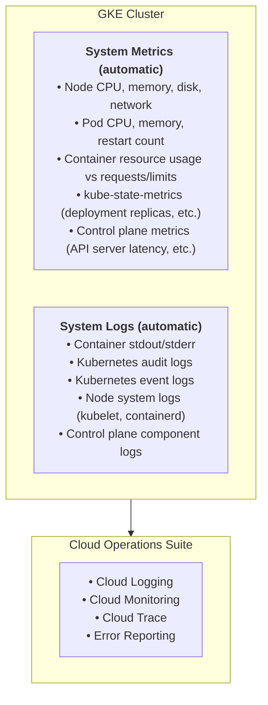
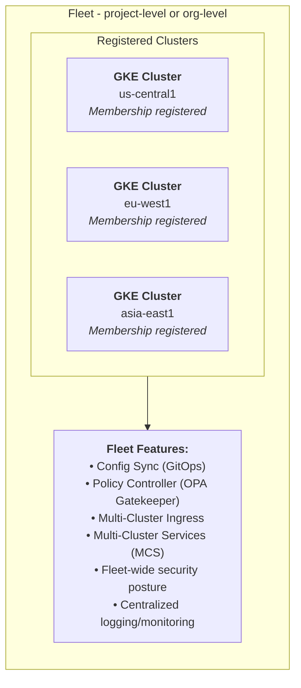
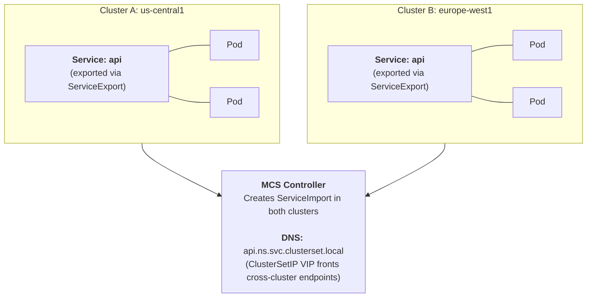
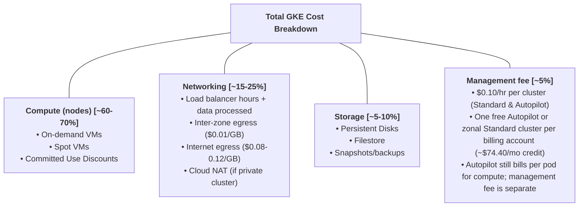

**Complexity**: `[COMPLEX]` | **Time to Complete**: 3h | **Prerequisites**: Module 6.1 (GKE Architecture)

## What You'll Be Able to Do

After completing this module, you will be able to:

- **Configure GKE Fleet management to register and manage clusters across multiple projects and regions**
- **Implement fleet-wide observability using Cloud Monitoring metrics scoping and centralized logging pipelines**
- **Deploy Config Sync and Policy Controller for fleet-wide GitOps-based configuration and policy enforcement**
- **Design multi-cluster GKE architectures using Multi Cluster Ingress and Multi Cluster Services for global routing**

---

## Why This Module Matters

**Hypothetical scenario:** Consider a company with many GKE clusters across several regions. It discovers a critical vulnerability in its payment service. The patched image exists in the registry, but only a fraction of clusters run it. The rest have drifted from the canonical Helm chart or lag on older image builds. Without fleet-wide visibility, remediation becomes a slow, cluster-by-cluster hunt for versions and configuration deltas. Compliance reviews drag on while exposure windows stay open. The teaching point is operational: **many clusters with no fleet lens behave like islands**—you need centralized membership, observability, and GitOps/policy hooks to see and change them consistently.

This story captures the operational reality of multi-cluster Kubernetes: without centralized observability and fleet management, every additional cluster multiplies your operational burden. You need consistent monitoring across clusters, a way to enforce configuration policies at scale, cross-cluster service discovery, and visibility into where your money is going. GKE addresses these challenges through Cloud Operations Suite for observability, Managed Prometheus (GMP) for metrics, Fleet management for multi-cluster governance, Multi-Cluster Services for cross-cluster communication, and cost allocation for chargeback.

In this module, you will learn how to set up comprehensive observability for GKE using Cloud Operations, deploy and query Managed Prometheus, register clusters in a Fleet for centralized management, enable Multi-Cluster Services for cross-cluster traffic, and implement cost allocation to track spending by team and application.

---

## Cloud Operations Suite for GKE

GKE integrates natively with Google Cloud's operations suite (formerly Stackdriver). When you create a GKE cluster, logging and monitoring are enabled by default.

### What Gets Collected Automatically



### How Cloud Logging and Monitoring Shape Your Data

The mermaid diagram above shows what gets collected, but understanding how Cloud Operations actually processes that data is what separates a manageable observability bill from an unpleasant surprise. Cloud Logging and Cloud Monitoring are not passive sinks---they make real-time decisions about what to ingest, how to store it, and what to drop, and those decisions directly affect both your visibility and your costs.

**Pause and predict:** You plan to enable WORKLOAD logging across a 100-node GKE cluster where microservices log verbose DEBUG statements to standard output. What direct financial implications will appear on your Google Cloud invoice, and how can operators mitigate these expenses without losing visibility into critical application errors?

<details>
<summary>Check your prediction</summary>

Enabling WORKLOAD logging streams all container standard output and error messages into Cloud Logging log buckets. This data is billed under log-bucket storage pricing at approximately $0.50 per GiB after the initial 50 GiB per project per month free tier. At fleet scale, unconstrained DEBUG logging generates massive monthly storage charges. To eliminate runaway costs without losing critical error visibility, configure sink exclusion filters (or decrease application log verbosity) so low-severity DEBUG entries are discarded before they are stored in billed buckets. Routing logs to another custom log bucket does not avoid the charge, as all non-excluded logs stored in log buckets incur monthly storage pricing.
</details>

Observability architectures require platform engineers to balance diagnostic depth against the monthly bill. The next paragraphs unpack how Cloud Logging organizes retained data and how Cloud Monitoring scopes metrics across projects, which you will use when you design fleet dashboards.

Cloud Logging organizes incoming log entries into log buckets, which are storage containers that define retention duration and geographic location. Every project starts with a default log bucket that retains logs for 30 days, but you can create custom log buckets with longer retention periods for audit logs or compliance-sensitive data. The critical insight for GKE operators is that log buckets are separate from log routing: a log entry can be routed to multiple buckets (or excluded entirely) based on filter criteria, and the ingestion cost is incurred per gigabyte ingested regardless of which bucket receives the data. This means that routing high-volume debug logs to a custom bucket does not reduce your bill---you need log exclusions to actually prevent those entries from being ingested in the first place.

Cloud Monitoring, meanwhile, builds on a concept called a metrics scope. A metrics scope is a read-only view that determines which project's metrics are visible from a given Google Cloud project. When you configure a single metrics scope to span multiple GKE projects, you can view dashboards and define alerting policies that aggregate across every cluster in that scope without needing to switch between projects in the Cloud Console. This is the mechanism that makes fleet-wide observability practical: you designate one host project to own the metrics scope, then add the other fleet projects as monitored projects, and suddenly all your GMP metrics and Cloud Monitoring dashboards are visible from a single pane of glass. The metrics scope does not copy or duplicate data---the metrics remain stored in their source projects and the scope simply grants read access across project boundaries.

For GKE specifically, the logging and monitoring components are deployed as DaemonSets and managed by GKE itself. The `fluentbit-gke` DaemonSet handles log collection from each node, while the `gke-metrics-agent` DaemonSet scrapes system metrics and forwards them to Cloud Monitoring. You do not need to configure, scale, or maintain these agents---GKE manages their lifecycle including version upgrades. However, their default behavior is to ingest everything they can see, and that generous default is exactly what drives cost for teams that do not tune the collection scope.

### Controlling Costs with Log Routing and Exclusions

Before you reach for the logging configuration flags, you need to understand the financial architecture that those flags interact with. Cloud Logging charges for log-bucket storage beyond the 50 GiB monthly free allocation, as well as extended retention beyond default windows. Querying and analyzing log data in Logs Explorer and Log Analytics carries no additional logging query surcharge. The storage cost is the one that surprises teams because it accumulates per gigabyte of data flowing in, regardless of whether anyone ever reads those logs. A cluster with a hundred pods logging at INFO level generates a steady baseline, but a single pod with a misconfigured logging framework logging at DEBUG level can produce more data than the other ninety-nine combined, and that data flows through the same pipeline at the standard per-gigabyte storage rate.

The defense against runaway log costs is the log exclusion filter. An exclusion filter runs server-side before the log entry is written to any log bucket, which means excluded entries are genuinely not ingested and not billed. Exclusion filters use the same filter syntax as log queries, so you can be surgically precise about what you drop. A filter like `resource.type="k8s_container" AND severity=DEBUG AND resource.labels.namespace_name=("dev" OR "staging")` excludes only low-severity logs from non-production namespaces, leaving production DEBUG logs intact for incident investigations while eliminating the bulk of the ingestion volume. You should create exclusion filters immediately after enabling logging---do not wait until the first bill arrives, because once logs are ingested, deleting them from the bucket does not refund the ingestion cost.

Log routing is a complementary mechanism that controls where ingested logs are stored, not whether they are ingested. When you create a log sink with a destination other than the default bucket, the log entries still incur ingestion cost on the way in. Routing is useful for compliance, not for cost control: you might route all audit logs to a bucket with a retention period of 365 days while sending application logs to the default 30-day bucket. But if your goal is to reduce the total ingestion volume, routing alone will not help---only exclusion filters reduce ingestion. Many teams configure elaborate routing pipelines and are disappointed when the bill does not change, because they optimized the wrong variable.

### Configuring Logging and Monitoring Scope

```bash
# Check current logging/monitoring configuration
gcloud container clusters describe my-cluster \
  --region=us-central1 \
  --format="yaml(loggingConfig, monitoringConfig)"

# Enable comprehensive logging (system + workloads)
gcloud container clusters update my-cluster \
  --region=us-central1 \
  --logging=SYSTEM,WORKLOAD,API_SERVER,SCHEDULER,CONTROLLER_MANAGER

# Enable comprehensive monitoring
gcloud container clusters update my-cluster \
  --region=us-central1 \
  --monitoring=SYSTEM,API_SERVER,SCHEDULER,CONTROLLER_MANAGER,POD,DEPLOYMENT,DAEMONSET,STATEFULSET,HPA
```

Verifying the active telemetry configuration ensures that only desired system and workload streams are exported to Google Cloud Operations. Once baseline collection is confirmed, operators can build custom metrics and alerts on top of the ingested event streams.

### Log-Based Metrics and Alerts

You can create custom metrics from log entries and alert on them. Log-based metrics are user-defined counters or distributions that Cloud Logging generates by matching log entries against a filter expression, incrementing the metric each time a matching entry is ingested. This allows you to alert on patterns that do not have native Cloud Monitoring metrics, such as specific error messages in application logs or security-relevant audit events.

```bash
# Create a log-based metric for application errors
gcloud logging metrics create app-error-rate \
  --description="Rate of ERROR level logs from application pods" \
  --log-filter='resource.type="k8s_container"
    resource.labels.namespace_name="production"
    severity>=ERROR'

# Create an alerting policy from a version-stable JSON file
cat <<'EOF' > alert-policy.json
{
  "displayName": "High Application Error Rate",
  "combiner": "OR",
  "conditions": [
    {
      "displayName": "Error rate > 10/min",
      "conditionThreshold": {
        "filter": "resource.type=\"k8s_container\" AND metric.type=\"logging.googleapis.com/user/app-error-rate\"",
        "comparison": "COMPARISON_GT",
        "thresholdValue": 10,
        "duration": "60s",
        "aggregations": [
          {
            "alignmentPeriod": "60s",
            "perSeriesAligner": "ALIGN_RATE"
          }
        ]
      }
    }
  ],
  "notificationChannels": [
    "projects/PROJECT_ID/notificationChannels/CHANNEL_ID"
  ]
}
EOF

gcloud alpha monitoring policies create \
  --policy-from-file=alert-policy.json
```

### GKE Dashboard in Cloud Console

The GKE section of Cloud Console provides pre-built dashboards:

| Dashboard | Shows | Use When |
| :--- | :--- | :--- |
| **Cluster overview** | Health, node count, resource utilization | Daily cluster health check |
| **Workloads** | Deployment status, pod restarts, errors | Investigating application issues |
| **Services** | Service endpoints, latency, error rates | Debugging connectivity |
| **Storage** | PV/PVC status, capacity, IOPS | Capacity planning |
| **Security Posture** | Vulnerabilities, misconfigurations | Security audits |

```bash
# Query logs from the command line
gcloud logging read \
  'resource.type="k8s_container" AND
   resource.labels.cluster_name="prod-cluster" AND
   resource.labels.namespace_name="payments" AND
   severity>=WARNING' \
  --limit=20 \
  --format="table(timestamp, resource.labels.pod_name, textPayload)"

# Query specific pod logs
gcloud logging read \
  'resource.type="k8s_container" AND
   resource.labels.pod_name="payments-api-7f8b9c4d5-x2k9m"' \
  --limit=50 \
  --format=json
```

---

## Managed Prometheus (GMP)

Google Cloud Managed Service for Prometheus provides a fully managed, Prometheus-compatible monitoring solution. It collects metrics from your GKE workloads and stores them in Google Cloud's Monarch backend, the same system that stores Google's own production metrics.

### Why GMP Over Self-Managed Prometheus

| Aspect | Self-Managed Prometheus | Managed Prometheus (GMP) |
| :--- | :--- | :--- |
| **Storage** | Local disk (limited retention) | Google Cloud Monarch (unlimited) |
| **High availability** | Manual (Thanos/Cortex) | Built-in |
| **Retention** | Weeks to months (disk-limited) | 24 months automatic |
| **Multi-cluster** | Federation or remote write | Native cross-cluster queries |
| **Scaling** | Manual shard management | Automatic |
| **PromQL** | Full support | Full support |
| **Grafana** | Self-managed | Works with GMP as datasource |
| **Cost** | Compute + storage for Prometheus | Per metric sample ingested |

### Managed Collection, Rule Evaluation, and Querying at Scale

**Pause and predict:** You are migrating a 50-node cluster from self-managed Prometheus to Google Cloud Managed Service for Prometheus (GMP). Your existing in-cluster Prometheus server crashes twice a week due to out-of-memory (OOM) errors when executing a specific high-cardinality PromQL query. What will happen to that query's stability and performance after migrating to GMP?

<details>
<summary>Check your prediction</summary>

Under GMP, PromQL query evaluation executes in Google's globally distributed Monarch backend rather than inside an in-cluster Prometheus server process. Consequently, the in-cluster Prometheus server OOM crash goes away entirely because no cluster-hosted Prometheus engine evaluates the query. However, migrating to GMP does not make high-cardinality queries free or instant: the in-cluster collectors still scrape and forward all metric series, high label cardinality continues to cost metric ingestion samples, and the query can still be slow, time out, or incur read API quota and payload limits in Cloud Monitoring.
</details>

Evaluating PromQL against a managed backend changes who owns query capacity, but it does not change whether a high-cardinality metric is expensive to keep. Infrastructure teams still need metric hygiene across application squads so scrape configs and label sets stay bounded.

The table above lays out the feature comparison, but the operational difference between self-managed Prometheus and GMP goes deeper than a checklist. When you run Prometheus yourself on GKE, you are responsible for the entire lifecycle: provisioning Persistent Disks with enough IOPS for your write rate, sizing the Prometheus StatefulSet to handle peak scrape load, managing the Thanos or Cortex layer for long-term storage and HA, and handling the inevitable OOM kill when a developer introduces a label with unbounded cardinality. Each of these responsibilities consumes engineering time that has nothing to do with actually understanding your system's behavior.

GMP replaces that entire operational surface area with a managed pipeline. The data plane consists of a collector DaemonSet running in the `gmp-system` namespace on every node. This collector scrapes the targets defined by your `PodMonitoring` and `ClusterPodMonitoring` custom resources and forwards the metrics directly to Monarch over a gRPC connection. Because the collector only handles scraping and forwarding---not storage, not compaction, not query serving---it uses a fraction of the memory and CPU that a full Prometheus server would require, and it can never crash because the WAL grew too large or the TSDB compaction fell behind. If a collector pod is evicted or rescheduled, the replacement picks up scraping from the same PodMonitoring definitions without any data loss, because the metrics were already committed to Monarch by the previous collector before it terminated.

The rule evaluation layer is where GMP really diverges from self-managed Prometheus. In a traditional setup, recording rules and alerting rules are evaluated by the Prometheus server itself, which means that a single overloaded server can delay alerting---the very thing you depend on to tell you the server is overloaded. GMP instead evaluates rules server-side in the Cloud Monitoring backend. You submit `Rules` and `ClusterRules` custom resources to your cluster. The GMP operator syncs them to Cloud Monitoring, and the rules are evaluated against all ingested metrics in Monarch. This means rule evaluation scales independently of your cluster size and is not affected by node failures or collector restarts. It also means that a single `ClusterRules` resource applied to your fleet can define alerting rules that span all clusters, without needing to deploy Prometheus federation or remote-write aggregation.

Querying GMP works through three surfaces that share the same Monarch backend. The Cloud Monitoring Metrics Explorer in the Cloud Console provides an interactive PromQL query editor with autocomplete and a time-series graph rendered from Monarch data. For programmatic access, the Cloud Monitoring API accepts PromQL queries directly and returns results over REST or gRPC, which is how Grafana connects when you configure GMP as a Prometheus data source. And within a cluster, the `frontend` service in `gmp-system` exposes a Prometheus-compatible HTTP API that you can query with `curl` or port-forward to your local Grafana instance. All three surfaces query the same data with the same PromQL semantics, so a dashboard built in Grafana against the local `frontend` proxy will work identically when pointed at the Cloud Monitoring API in production.

### Enabling GMP

```bash
# GMP is enabled by default on new GKE clusters
# For existing clusters:
gcloud container clusters update my-cluster \
  --region=us-central1 \
  --enable-managed-prometheus

# Verify GMP components are running
kubectl get pods -n gmp-system
# Should see: collector, rule-evaluator, operator pods
```

### Deploying PodMonitoring Resources

GMP uses `PodMonitoring` and `ClusterPodMonitoring` custom resources to define what to scrape, following the same selector-and-endpoint model that Prometheus users know from ServiceMonitor and PodMonitor CRDs. Each PodMonitoring resource targets pods matching a label selector within a single namespace, while ClusterPodMonitoring operates across all namespaces, making it ideal for cluster-wide components like kube-state-metrics or node exporters.

```yaml
# Scrape metrics from an application exposing /metrics
apiVersion: monitoring.googleapis.com/v1
kind: PodMonitoring
metadata:
  name: app-metrics
  namespace: production
spec:
  selector:
    matchLabels:
      app: payments-api
  endpoints:
  - port: metrics
    interval: 30s
    path: /metrics

---
# Scrape metrics from all pods with a specific annotation
apiVersion: monitoring.googleapis.com/v1
kind: PodMonitoring
metadata:
  name: annotated-pods
  namespace: production
spec:
  selector:
    matchLabels:
      monitoring: enabled
  endpoints:
  - port: http
    interval: 60s
    path: /metrics
```

```yaml
# ClusterPodMonitoring: scrape across ALL namespaces
apiVersion: monitoring.googleapis.com/v1
kind: ClusterPodMonitoring
metadata:
  name: kube-state-metrics
spec:
  selector:
    matchLabels:
      app.kubernetes.io/name: kube-state-metrics
  endpoints:
  - port: http-metrics
    interval: 30s
```

### Querying GMP with PromQL

GMP exposes a Prometheus-compatible query API that you can access with PromQL. The `frontend` service in the `gmp-system` namespace provides a standard Prometheus HTTP API endpoint, which means any tool that speaks PromQL (including Grafana, the Cloud Monitoring Metrics Explorer, and direct curl calls) can query your GMP metrics without modification.

```bash
# Query GMP from the command line using the Prometheus API
# First, set up a proxy to the GMP query endpoint
kubectl port-forward -n gmp-system svc/frontend 9090:9090 &

# Then query using curl
curl -s 'http://localhost:9090/api/v1/query' \
  --data-urlencode 'query=up{namespace="production"}' | jq .

# Top 5 pods by CPU usage
curl -s 'http://localhost:9090/api/v1/query' \
  --data-urlencode 'query=topk(5, rate(container_cpu_usage_seconds_total{namespace="production"}[5m]))' \
  | jq '.data.result[] | {pod: .metric.pod, cpu: .value[1]}'
```

Executing PromQL queries through the frontend proxy confirms that metrics flow from in-cluster collectors into Monarch. Once command-line queries succeed, engineers can configure centralized visualization dashboards pointing directly at the managed datasource endpoint.

### Setting Up Grafana with GMP

```bash
# Deploy Grafana in the cluster
kubectl create namespace grafana

kubectl apply -n grafana -f - <<'EOF'
apiVersion: apps/v1
kind: Deployment
metadata:
  name: grafana
spec:
  replicas: 1
  selector:
    matchLabels:
      app: grafana
  template:
    metadata:
      labels:
        app: grafana
    spec:
      containers:
      - name: grafana
        image: grafana/grafana:11.0.0
        ports:
        - containerPort: 3000
        env:
        - name: GF_AUTH_ANONYMOUS_ENABLED
          value: "true"
        - name: GF_AUTH_ANONYMOUS_ORG_ROLE
          value: "Admin"
        resources:
          requests:
            cpu: 200m
            memory: 256Mi
---
apiVersion: v1
kind: Service
metadata:
  name: grafana
spec:
  type: LoadBalancer
  selector:
    app: grafana
  ports:
  - port: 80
    targetPort: 3000
EOF

# In Grafana, add GMP as a Prometheus data source:
# URL: http://frontend.gmp-system.svc:9090
# No authentication needed (cluster-internal)
```

### Custom Metrics for HPA

GMP can feed custom metrics to the Horizontal Pod Autoscaler through the Custom Metrics Adapter, which translates Prometheus metrics into the Kubernetes custom metrics API that the HPA consumes. This means you can autoscale your deployments based on application-level metrics that Prometheus scrapes, such as request rate, queue depth, or business-specific counters, rather than being limited to CPU and memory utilization.

```yaml
# Deploy the Stackdriver adapter for custom metrics
# Then create an HPA based on a custom Prometheus metric
apiVersion: autoscaling/v2
kind: HorizontalPodAutoscaler
metadata:
  name: payments-hpa
  namespace: production
spec:
  scaleTargetRef:
    apiVersion: apps/v1
    kind: Deployment
    name: payments-api
  minReplicas: 3
  maxReplicas: 50
  metrics:
  - type: Pods
    pods:
      metric:
        name: http_requests_per_second
      target:
        type: AverageValue
        averageValue: "100"
```

---

## Fleet Management (GKE Enterprise)

A Fleet is a logical grouping of GKE clusters (and non-GKE Kubernetes clusters) that you manage as a single entity. Fleet management is part of GKE Enterprise (formerly Anthos) and provides centralized policy enforcement, configuration management, and security posture across all clusters.

### Fleet Architecture



### Fleet Sameness, Team Scopes, and the Connect Gateway

A fleet is more than a membership list. The operational value of fleet management comes from three concepts that build on the basic registration shown above: sameness groups, team scopes, and the Connect gateway. Understanding how they work together is the difference between "we registered our clusters" and "we operate a fleet."

Sameness is the idea that resources with the same name and type behave consistently across fleet members. GKE Enterprise defines three dimensions of sameness. Namespace sameness means that a namespace called `payments` in Cluster A is treated as the same logical boundary as a namespace called `payments` in Cluster B, which is how Multi-Cluster Services and Config Sync know they should synchronize resources across those namespaces. Service sameness means that the `payments-api` Service in multiple clusters represents the same application, which is how Multi-Cluster Services builds a unified endpoint set. Identity sameness means that a Workload Identity binding in one fleet member is recognized in all other members, so a pod running in Cluster B can authenticate to Google Cloud APIs using the same service account identity as a pod in Cluster A without duplicating IAM policy bindings.

Team scopes are the mechanism for delegating parts of a fleet to specific teams without granting them access to everything. Within a fleet, you create a team scope that includes a subset of fleet members and a subset of namespaces, then bind that scope to a Google group or Cloud Identity group. Team members get a filtered view in the Cloud Console and Connect gateway that only shows the clusters and namespaces in their scope, with RBAC that limits what they can deploy or observe. A platform team managing fifty application teams across thirty clusters uses team scopes to give each application team access to exactly their own namespace in exactly the clusters where their applications run. This avoids the need to manage per-cluster RBAC rules by hand.

The Connect gateway ties these concepts together for kubectl access. Instead of distributing per-cluster kubeconfig files and managing `gcloud container clusters get-credentials` for every developer, you run a single command: `gcloud container fleet memberships get-credentials`. This configures your local kubeconfig to route all kubectl commands through the Connect gateway. The gateway proxies requests to the appropriate cluster based on your fleet membership and team scope, authenticating the request using your Google Cloud identity before authorizing it against the fleet's RBAC and forwarding it to the target cluster's Kubernetes API server. From the developer's perspective, they run `kubectl get pods -n payments` and the gateway handles routing to the correct cluster transparently, applying the same RBAC policies and audit logging across every member of the fleet.

### Operationalizing Fleet Sameness

The three dimensions of fleet sameness---namespace, service, and identity---are architectural concepts until you put them into practice with Config Sync and Policy Controller. The most common operational pattern starts with namespace sameness: you define a canonical set of namespace names (for example, `production`, `staging`, `monitoring`, `ingress`) in a Config Sync Git repository, and Config Sync ensures that every fleet member has exactly those namespaces with exactly the same ResourceQuota and NetworkPolicy objects. When a new cluster joins the fleet, Config Sync creates the namespaces automatically within its first sync cycle, so the cluster arrives with all the scaffolding already in place. This is a profound shift from the older pattern of running a cluster-bootstrap script for each new cluster and hoping it completed without errors.

Identity sameness is enforced through Policy Controller rather than Config Sync. While Config Sync ensures the namespace and the Workload Identity annotation exist, Policy Controller ensures that every Deployment, StatefulSet, and DaemonSet in the fleet declares a Workload Identity service account. A Policy Controller constraint that rejects any workload without the `iam.gke.io/gcp-service-account` annotation means that no pod can run without an identity, which in turn means that every pod's Google Cloud API access is individually auditable and revocable. This is the mechanism that makes fleet-wide IAM manageable: instead of managing firewall rules or VPC peering for cross-cluster communication, you manage IAM policy bindings on service accounts, and Workload Identity handles the credential exchange transparently.

Service sameness is the most nuanced of the three because it requires Multi-Cluster Services to be enabled at the fleet level. When service sameness is combined with namespace sameness, a pod in any fleet member can reach a Service named `payments-api` in the `production` namespace using the `svc.clusterset.local` DNS domain, and the MCS controller handles endpoint synchronization across all fleet members. The combination of all three dimensions---namespace, identity, and service sameness---is what makes a fleet more than a list of clusters. It becomes a single operational domain where configuration, identity, and connectivity are consistent by construction rather than by convention.

A useful mental model for fleet operations is to treat the fleet as the management domain and individual clusters as the failure domains. You enforce policy at the fleet level through Config Sync and Policy Controller, but you scale your application across clusters so that no single cluster's outage affects more than a fraction of your capacity. The fleet gives you the consistency to know that every cluster has the same security posture, while the multi-cluster architecture gives you the blast-radius isolation to survive a cluster-level failure without a fleet-level outage.

### Practical Fleet Operations at Scale

The fleet patterns described so far work well for clusters that share a common administrative domain, but real organizations often need to manage clusters across multiple environments, business units, and even cloud providers. GKE Enterprise supports these scenarios through a concept called fleet host projects. The fleet host project is the Google Cloud project that owns the fleet membership registry and hosts the centralized fleet features. Member clusters can reside in the host project or in separate service projects, which means the team that owns the fleet does not need administrative access to the individual cluster projects. This separation of concerns is essential for organizations where a central platform team manages fleet-wide policy while application teams own their clusters and workloads independently.

Monitoring a fleet at scale requires attention to how metrics and logs are organized across projects. The metrics scope pattern described in the Cloud Operations section is the foundation: a single host project configures a metrics scope that includes all fleet projects as monitored projects. This gives you a unified view in Cloud Monitoring without duplicating data or creating cross-project billing complexity. For logging, the pattern is slightly different because log entries remain in the project where they were generated, but you can create log views that aggregate logs from multiple projects using the Log Analytics feature in Cloud Logging. The key insight is that the metrics scope and log views are configured at the project level but provide fleet-wide visibility. This means you can give on-call engineers access to a single project and they can query metrics and logs from every cluster in the fleet without needing IAM permissions on each individual cluster project. This pattern avoids the IAM complexity that would otherwise force you to grant broad permissions across dozens of projects, creating both a security risk and an operational headache when onboarding new team members.

### Registering Clusters in a Fleet

```bash
# Enable Fleet APIs
gcloud services enable \
  gkehub.googleapis.com \
  multiclusterservicediscovery.googleapis.com \
  multiclusteringress.googleapis.com \
  --project=$PROJECT_ID

# Register a GKE cluster with the Fleet
gcloud container fleet memberships register cluster-us \
  --gke-cluster=$REGION/cluster-us \
  --enable-workload-identity \
  --project=$PROJECT_ID

gcloud container fleet memberships register cluster-eu \
  --gke-cluster=europe-west1/cluster-eu \
  --enable-workload-identity \
  --project=$PROJECT_ID

# List Fleet members
gcloud container fleet memberships list --project=$PROJECT_ID

# Describe a membership
gcloud container fleet memberships describe cluster-us \
  --project=$PROJECT_ID \
  --format="yaml(authority, endpoint)"
```

### Config Sync (Fleet-Wide GitOps)

Config Sync applies Kubernetes configurations from a Git repository to all clusters in the Fleet. It continuously reconciles desired state declared in Git against the live cluster state, creating, updating, or removing resources so every member converges on the same manifests. Platform teams commit once and let each membership apply the same policy set, which is the operational alternative to running kubectl apply cluster by cluster.

```bash
# Enable Config Sync on the Fleet
gcloud container fleet config-management apply \
  --membership=cluster-us \
  --config=/tmp/config-sync.yaml

# Config Sync configuration
cat <<'EOF' > /tmp/config-sync.yaml
applySpecVersion: 1
spec:
  configSync:
    enabled: true
    sourceType: git
    sourceFormat: unstructured
    syncRepo: https://github.com/my-org/fleet-configs
    syncBranch: main
    policyDir: /clusters/common
    secretType: token
    preventDrift: true
  policyController:
    enabled: true
    referentialRulesEnabled: true
    templateLibraryInstalled: true
EOF
```

**Pause and predict:** Config Sync is configured with `preventDrift: true` on a production GKE cluster. During an urgent outage, an on-call SRE executes `kubectl edit` to manually change the image tag on a Git-managed Deployment back to a known-good release. What sequence of events occurs immediately when the engineer attempts to save the change?

<details>
<summary>Check your prediction</summary>

The Kubernetes API server admission webhook rejects the modification immediately with an error stating that fields managed by Config Sync can not be modified. The manual change is never applied to the running object. In contrast, if `preventDrift` were set to false (the default setting), the API server would accept and apply the edit immediately, and Config Sync would later detect the drift and revert the Deployment during its next reconciliation loop. To resolve an incident when `preventDrift: true` is enabled, the SRE must commit the image rollback directly to Git or temporarily disable drift prevention.
</details>

Admission controllers shift policy and configuration enforcement from asynchronous background reconciliation to synchronous API request interception. Platform teams configuring GitOps workflows must establish documented operational procedures for emergency rollbacks and break-glass scenarios before locking down cluster mutation pathways.

### Policy Controller (Fleet-Wide OPA Gatekeeper)

```yaml
# Enforce that all containers must have resource requests (Policy Controller library template)
# This policy is applied Fleet-wide through Config Sync
apiVersion: constraints.gatekeeper.sh/v1beta1
kind: K8sContainerRequests
metadata:
  name: require-resource-requests
spec:
  enforcementAction: deny
  match:
    kinds:
    - apiGroups: ["apps"]
      kinds: ["Deployment", "StatefulSet", "DaemonSet"]
    namespaces:
    - production
    - staging
  parameters:
    cpu: required
    memory: required
```

---

## Multi-Cluster Services (MCS)

Multi-Cluster Services enables pods in one cluster to discover and communicate with Services in another cluster within the same Fleet. This is service mesh-lite: cross-cluster connectivity without the complexity of Istio.

### How MCS Works



### Setting Up MCS

```bash
# Enable MCS on the Fleet
gcloud container fleet multi-cluster-services enable \
  --project=$PROJECT_ID

# Grant the MCS controller the required IAM role
gcloud projects add-iam-policy-binding $PROJECT_ID \
  --member="serviceAccount:$PROJECT_ID.svc.id.goog[gke-mcs/gke-mcs-importer]" \
  --role="roles/compute.networkViewer"

# Verify MCS is enabled
gcloud container fleet multi-cluster-services describe \
  --project=$PROJECT_ID
```

### Exporting and Consuming Services

```yaml
# In Cluster A: Export the "api" Service
# First, deploy the normal Service
apiVersion: v1
kind: Service
metadata:
  name: api
  namespace: backend
spec:
  selector:
    app: api
  ports:
  - port: 8080
    targetPort: 8080

---
# Then create a ServiceExport to make it available Fleet-wide
apiVersion: net.gke.io/v1
kind: ServiceExport
metadata:
  name: api
  namespace: backend
```

```bash
# After exporting, MCS automatically creates ServiceImport resources
# in ALL Fleet clusters

# In Cluster B: verify the ServiceImport was created
kubectl get serviceimport -n backend
# NAME   TYPE           IP                  AGE
# api    ClusterSetIP   10.112.0.15         2m

# Pods in Cluster B can now reach the Service using:
# api.backend.svc.clusterset.local
# This resolves to the ClusterSetIP VIP (see ServiceImport TYPE column)

# Test cross-cluster connectivity from Cluster B
kubectl run curl-test --rm -it --restart=Never \
  --image=curlimages/curl -- \
  curl -s http://api.backend.svc.clusterset.local:8080
```

### The ServiceExport-to-ServiceImport Flow in Detail

**Pause and predict:** A frontend service in 'cluster-us' communicates with an exported backend service deployed in both 'cluster-us' and 'cluster-eu'. If all backend pods in 'cluster-us' fail and become unhealthy, how will MCS DNS resolution and network packet routing adapt to preserve service connectivity?

<details>
<summary>Check your prediction</summary>

Under default ClusterSetIP Multi-Cluster Services, DNS resolution for `api.backend.svc.clusterset.local` continues to return the exact same static ClusterSetIP virtual IP address. DNS does not rewrite records to return individual pod IPs or perform DNS-based failover. Instead, the MCS controller updates the aggregated EndpointSlices in `cluster-us` to remove the failed local endpoints. The underlying data plane (such as Dataplane V2 or kube-proxy) automatically stops forwarding traffic to the unhealthy local pod IPs and sends all requests directed at the ClusterSetIP to the remaining healthy backends in `cluster-eu`. Only headless MCS configurations alter DNS responses to return individual pod A-records.
</details>

Cross-cluster service discovery lets clients keep using one name while the fleet decides which backends are healthy. The mechanics below are how GKE wires that name into a virtual IP and a set of endpoints, which is the layer operators debug when traffic fails to leave a region.

The curl test above demonstrates that cross-cluster DNS works. The mechanics underneath explain both MCS strengths and its boundaries. When you create a ServiceExport in one cluster, the MCS controller in that cluster does not directly push anything to other clusters. Instead, it registers the exported Service in a fleet-level registry maintained by the GKE Hub, which is the same infrastructure that synchronizes fleet membership information. Every other cluster in the fleet runs an MCS importer component that watches this registry for changes. When the importer in Cluster B sees that Cluster A has exported the `api` Service in the `backend` namespace, it creates a corresponding `ServiceImport` resource in Cluster B's `backend` namespace. With GKE's default **ClusterSetIP** type (see the `TYPE` column in `kubectl get serviceimport`), that ServiceImport allocates a single **ClusterSetIP virtual IP** and aggregates **EndpointSlices** from every exporting cluster—DNS does not return a weighted list of pod IPs.

The `clusterset.local` domain ties this together. When a pod in Cluster B resolves `api.backend.svc.clusterset.local`, CoreDNS returns the **ClusterSetIP**—for example `10.112.0.15` in the sample output above. Client traffic to that VIP is load-balanced by the **data plane** (kube-proxy or Dataplane V2). Distribution uses healthy backends in the aggregated EndpointSlices from all member clusters. If backends in one cluster become unhealthy, the MCS controller updates EndpointSlices and the VIP stops forwarding to those endpoints; cluster-eu healthy backends continue to receive traffic; DNS continues to answer with the same ClusterSetIP. **Headless MCS** (`ServiceImport` type headless) is the alternative model where DNS can return multiple A records—distinct from the default ClusterSetIP path documented here.

An important boundary to understand is that MCS works at the Service level, not the Ingress level. MCS is designed for east-west traffic: pod-to-pod communication within and across clusters. For north-south traffic---external clients reaching your services from the internet---you need Multi-Cluster Ingress or Multi-Cluster Gateway. MCS does not replace a service mesh; it provides service discovery and cross-cluster reachability without the sidecar proxies and mutual TLS management that a mesh like Istio adds. If you already need mesh features like traffic splitting, retry policies, or end-to-end encryption between services, you would layer those on top of MCS rather than replacing MCS itself.

### Multi-Cluster Ingress

Multi-Cluster Ingress routes external traffic to Services across multiple clusters using Google Cloud's global HTTP(S) load balancing infrastructure. Incoming requests hit a single anycast IP address and are routed to the nearest healthy cluster based on geographic proximity and capacity, providing automatic cross-region failover without DNS changes or manual traffic shifting.

```bash
# Enable Multi-Cluster Ingress and designate a config cluster
gcloud container fleet ingress enable \
  --config-membership=cluster-us \
  --project=$PROJECT_ID
```

```yaml
# MultiClusterIngress resource (deployed to config cluster only)
apiVersion: networking.gke.io/v1
kind: MultiClusterIngress
metadata:
  name: global-ingress
  namespace: backend
  annotations:
    networking.gke.io/static-ip: "34.120.x.x"  # Reserved global IP
spec:
  template:
    spec:
      backend:
        serviceName: api
        servicePort: 8080
      rules:
      - host: api.example.com
        http:
          paths:
          - path: /*
            backend:
              serviceName: api
              servicePort: 8080

---
# MultiClusterService (references the exported Service)
apiVersion: networking.gke.io/v1
kind: MultiClusterService
metadata:
  name: api
  namespace: backend
spec:
  template:
    spec:
      selector:
        app: api
      ports:
      - port: 8080
        targetPort: 8080
  clusters:
  - link: "us-central1/cluster-us"
  - link: "europe-west1/cluster-eu"
```

---

## Cost Allocation and Optimization

GKE provides detailed cost visibility through GKE cost allocation, which breaks down cluster costs by namespace, label, and team.

### Where Observability Costs Come From

Before you optimize your GKE spending, you need to understand where the money goes, and for most teams running observability on GKE, the largest cost driver is not compute---it is log ingestion. Cloud Logging charges for every gigabyte of log data ingested, stored beyond the default retention period, and read through the Logs Explorer or Log Analytics queries. The ingestion cost alone can exceed the compute cost of your nodes if you are running dozens of microservices logging at DEBUG level to stdout in a large cluster. This is the billing dynamic that surprises teams who migrate from self-managed Elasticsearch or Loki stacks, where storage is the dominant cost and ingestion is effectively free at the application side.

The root cause of log-cost blowup is the default behavior. GKE enables logging by default, and most application frameworks emit far more log volume than the team realizes because developers optimize for debuggability during development and rarely revisit log levels in production. A single Java service with a misconfigured logging framework can produce several gigabytes per day of framework-level debug output that no one will ever read, and that volume multiplies across every replica in every namespace. The first intervention you should plan is not a complex pipeline refactor---it is a log exclusion filter that drops log entries below a severity threshold before they are ingested. Cloud Logging exclusion filters use the same query syntax as log queries, so you can be precise: exclude everything with `severity=DEBUG` from the `dev` and `staging` namespaces while keeping all severity levels in `production`.

Metric cost is the second dimension that catches teams by surprise, particularly with GMP. GMP pricing is based on metric samples ingested, not on storage consumed. Each unique combination of metric name and label set creates a time series, and each time series generates a sample every scrape interval. If you have a `PodMonitoring` resource scraping at a 30-second interval and your application exposes a metric with a label like `user_id` that has hundreds of thousands of unique values, the number of time series grows linearly with each new user, and so does your bill. The fix is not to scrape less frequently---that costs you visibility exactly when you need it most during an incident. The fix is to design your application metrics with bounded cardinality. Use histograms instead of per-request counters, avoid labels with unbounded values, and aggregate at the application layer before exposing metrics.

### Enabling Cost Allocation

```bash
# Enable cost allocation on the cluster
gcloud container clusters update my-cluster \
  --region=us-central1 \
  --enable-cost-allocation

# Cost data flows to BigQuery (via billing export)
# and is visible in the GKE cost allocation dashboard
```

### Understanding GKE Costs



### Cost Allocation by Namespace and Label

```bash
# BigQuery query to see costs by namespace
# (requires billing export to BigQuery)
cat <<'SQL'
SELECT
  labels.value AS namespace,
  SUM(cost) AS total_cost,
  SUM(usage.amount) AS total_usage
FROM
  `project.dataset.gcp_billing_export_v1_XXXXXX`
LEFT JOIN
  UNNEST(labels) AS labels ON labels.key = "k8s-namespace"
WHERE
  service.description = "Kubernetes Engine"
  AND invoice.month = "202603"
GROUP BY
  namespace
ORDER BY
  total_cost DESC
SQL
```

> **Stop and think**: If you rely solely on Spot VMs to reduce compute costs by 91%, how might a sudden, region-wide capacity constraint for that machine type impact your production workloads, and what GKE feature should you use to mitigate this?

### Cost Optimization Strategies

| Strategy | Savings | Effort | Risk |
| :--- | :--- | :--- | :--- |
| **Right-size pods** (match requests to usage) | 20-40% | Medium | Low (if monitored) |
| **Use Spot node pools** for fault-tolerant workloads | 60-91% | Low | Medium (preemption) |
| **Committed Use Discounts** for steady-state | 28-52% | Low | Low (lock-in) |
| **Scale to zero** (dev/test clusters off-hours) | 50-70% | Medium | Low |
| **Autopilot** (pay per pod, not per node) | 10-40% | High (migration) | Low |
| **Bin-pack aggressively** (fewer, larger nodes) | 10-20% | Medium | Medium |

```bash
# Find over-provisioned pods (requests >> actual usage)
# Using GMP/Prometheus:
# Pods requesting more than 2x their actual CPU usage
curl -s 'http://localhost:9090/api/v1/query' \
  --data-urlencode 'query=
    (
      kube_pod_container_resource_requests{resource="cpu"}
      /
      rate(container_cpu_usage_seconds_total[24h])
    ) > 2
  ' | jq '.data.result[] | {
    namespace: .metric.namespace,
    pod: .metric.pod,
    overprovisioning_ratio: .value[1]
  }'
```

### GKE Recommendations

GKE provides automated recommendations for cost and performance optimization through the Google Cloud Recommender service. The `google.container.DiagnosisRecommender` analyzes your cluster's configuration and workload patterns over time, identifying opportunities to resize node pools, switch to more cost-effective machine types, or enable Cluster Autoscaler where static node counts waste resources during low-traffic periods.

```bash
# View active recommendations
gcloud recommender recommendations list \
  --project=$PROJECT_ID \
  --location=$REGION \
  --recommender=google.container.DiagnosisRecommender \
  --format="table(name, description, priority, stateInfo.state)"

# Common recommendations:
# - "Resize node pool: current utilization is 23%"
# - "Switch to e2-medium: n2-standard-4 is over-provisioned"
# - "Enable Cluster Autoscaler: static node count wastes resources"
```

---

## Did You Know?

1. **Google Cloud Managed Prometheus stores metrics in Monarch**, the same in-memory time-series system that monitors Google's own production services. When you send a metric to GMP, it is stored with the same durability and query performance Google relies on for SRE operations—this is why GMP can offer 24-month retention without the capacity planning headaches of self-managed Prometheus.

2. **Multi-Cluster Services DNS resolution uses a special domain: `.svc.clusterset.local`.** This domain is separate from the standard `.svc.cluster.local` used for intra-cluster DNS. With the default **ClusterSetIP** `ServiceImport` type, `api.backend.svc.clusterset.local` resolves to a single **ClusterSetIP virtual IP**; kube-proxy or Dataplane V2 distributes traffic across aggregated EndpointSlices from every exporting cluster—DNS does not return weighted pod IPs.

3. **Inter-zone egress within a GKE cluster costs $0.01 per GB**, and this can add up fast. A regional cluster with nodes in 3 zones incurs inter-zone charges for every pod-to-pod call that crosses zone boundaries. For a microservice architecture with 50 services making 1,000 requests per second with 10KB payloads, inter-zone traffic can cost several hundred dollars per month. **`topologySpreadConstraints`** influence **pod placement** only. **`internalTrafficPolicy: Local`** routes to node-local endpoints and **drops** traffic when none exist—there is no cross-zone fallback. For in-zone preference **with** fallback, use **Topology Aware Routing** (`service.kubernetes.io/topology-mode: Auto`).

4. **Fleet workload identity allows a single Kubernetes ServiceAccount identity to be recognized across all clusters in the Fleet.** This means you can register a ServiceAccount in Cluster A and have it authenticated in Cluster B without creating duplicate IAM bindings. The identity format is `PROJECT_ID.svc.id.goog[NAMESPACE/KSA_NAME]`, and it works the same regardless of which Fleet member the pod runs in. This is the foundation for zero-trust networking across a multi-cluster architecture.

---

## Common Mistakes

| Mistake | Why It Happens | How to Fix It |
| :--- | :--- | :--- |
| Enabling WORKLOAD logging without understanding volume | All container stdout goes to Cloud Logging | Set log exclusion filters or reduce application verbosity; Cloud Logging charges per GB ingested |
| Not enabling cost allocation | Assuming billing breakdown is automatic | Enable `--enable-cost-allocation` on the cluster; without it, costs are aggregated at the project level |
| Running Prometheus alongside GMP | Not realizing GMP replaces self-managed Prometheus | Migrate scrape configs to PodMonitoring CRDs; remove the self-managed Prometheus deployment |
| Ignoring inter-zone egress costs | Not aware that cross-zone traffic is billed | Use Topology Aware Routing (`topology-mode: Auto`) or co-locate tightly-coupled services; do not assume `internalTrafficPolicy: Local` falls back across zones |
| Registering clusters in a Fleet without Workload Identity | Fleet features require WIF for authentication | Enable `--workload-pool` on the cluster and `--enable-workload-identity` during Fleet registration |
| Deploying MultiClusterIngress to all clusters | Only the config cluster processes MCI resources | Deploy MCI and MCS resources only to the designated config cluster |
| Not setting resource requests (affecting cost allocation) | Pods without requests cannot be attributed to cost centers | Require resource requests via Policy Controller; Autopilot enforces this automatically |
| Querying GMP with high-cardinality labels | Creating millions of unique time series | Avoid labels with unbounded values (user IDs, request IDs); use histograms instead of per-request metrics |

---

## Patterns & Anti-Patterns

### Proven Patterns

The architectures in this module are not abstract---they reflect patterns that have been validated across organizations running dozens of GKE clusters in production. Understanding when each pattern applies, why it works, and what scaling limit it hits is the difference between applying a pattern mechanically and applying it effectively.

**Pattern 1: GMP with Log Exclusions for Cost-Controlled Observability.** Deploy GMP across all clusters in the fleet for metrics, configure PodMonitoring with a standard 30-second scrape interval across all workloads, and pair it with Cloud Logging exclusion filters that drop DEBUG and TRACE severity logs before ingestion. This pattern works because it separates the two cost dimensions: GMP metric costs scale with scrape interval and label cardinality (which you control through PodMonitoring configuration and application design), while log costs scale with ingestion volume (which you control through exclusion filters). The exclusion filters run server-side in Cloud Logging before the log entry is written to any bucket, so they genuinely reduce cost rather than just moving data to a cheaper bucket. This pattern scales to hundreds of clusters because GMP collectors are lightweight DaemonSets that consume minimal per-node resources, and exclusion filters are evaluated globally without per-cluster overhead. The practical scaling limit is not technical---it is organizational: you need consistent PodMonitoring and log-exclusion configurations across all clusters, which you should enforce through Config Sync.

**Pattern 2: Fleet with Config Sync for Consistent Guardrails.** Register every GKE cluster in a fleet, then use Config Sync deployed to all fleet members with a single Git repository containing the common configuration layer: namespace definitions, ResourceQuota objects, NetworkPolicy defaults, and Policy Controller constraints. This pattern works because it eliminates configuration drift at the root by making the Git repository the source of truth and letting Config Sync reconcile continuously. When you need to roll out a new NetworkPolicy that restricts egress from the `payments` namespace across all production clusters, you commit the policy to the Git repository and Config Sync applies it to every fleet member within minutes, with drift prevention ensuring no one can `kubectl edit` a temporary bypass that becomes permanent. This pattern scales by organizing the Git repository with a hierarchy: a `/clusters/common` directory for fleet-wide configuration and per-cluster override directories for cluster-specific settings. The scaling limit is that Config Sync compares the desired state to the actual state for every managed resource on every sync cycle, and a single repository with tens of thousands of resources across hundreds of clusters can extend the sync interval beyond what is acceptable for policy enforcement---at that scale you split into multiple fleets organized by environment or business unit.

**Pattern 3: MCS for Cross-Cluster Service Discovery Without a Mesh.** Use Multi-Cluster Services for service discovery between clusters that need to communicate, without deploying a service mesh unless you need mesh-specific features like mutual TLS or traffic splitting. Export the Service from the cluster that owns the workload, let the MCS controller propagate ServiceImport resources automatically, and access the service from any fleet member using the `svc.clusterset.local` DNS domain. This pattern works because MCS is purpose-built for the single problem of "how does a pod in one cluster find a pod in another cluster," and it solves that problem with a lightweight DNS-based approach that adds no sidecars, no proxy hops, and no additional latency beyond the network route between clusters. The pattern scales well for east-west traffic within a region and can also route cross-region, though the latency profile depends on network topology. The scaling boundary is that MCS does not provide fine-grained traffic control---every healthy endpoint receives equal weight regardless of latency, pod resource utilization, or request characteristics. If your cross-cluster traffic needs canary deployments, percentage-based traffic splitting, or circuit breaking, you would evolve from this MCS-only pattern to MCS plus a service mesh that layers those controls on top.

### Anti-Patterns

These are the mistakes that appear repeatedly in GKE fleet architectures, not because teams are careless but because each anti-pattern starts from a reasonable place and only becomes a problem at scale.

| Anti-Pattern | Why It Happens | What Goes Wrong | Better Approach |
| :--- | :--- | :--- | :--- |
| **Self-running Prometheus at scale** | Team already knows Prometheus and deploys it as a StatefulSet, gradually adding Thanos/Cortex as the cluster count grows | The team ends up managing a second distributed system (the monitoring stack) alongside the application platform, spending SRE cycles on Prometheus shard rebalancing and WAL corruption recovery instead of application SLOs | Migrate to GMP for collection and storage, keeping PromQL and Grafana for querying; the team's Prometheus expertise still applies, but the operational surface area shrinks to PodMonitoring CRDs and alerting rules |
| **Ingesting all debug logs without exclusions** | Default GKE behavior ingests everything, and teams defer log tuning until "later" | Log ingestion costs silently grow to exceed compute costs; the volume of noise also makes it harder to find relevant logs during incidents because important error messages are buried in millions of DEBUG lines | Create exclusion filters immediately after cluster creation, starting with dropping DEBUG and TRACE from non-production namespaces; revisit exclusion rules quarterly as application logging patterns evolve |
| **Per-cluster snowflake configuration** | Teams create clusters for different environments or applications by copying the previous cluster's configuration and modifying it manually | Configuration diverges subtly over time; a security fix applied to nine out of ten clusters leaves the tenth vulnerable; an outage that should take ten minutes to diagnose instead takes hours because no one knows which clusters have which settings | Register all clusters in a fleet and use Config Sync to apply a common configuration layer from a Git repository; cluster-specific overrides are explicit, reviewed, and version-controlled rather than undocumented `kubectl apply` one-offs |
| **No cost-allocation labels on namespaces and workloads** | Teams rely on the default cost allocation breakdown, which groups costs by cluster and namespace but lacks business-context labels like team, application, or cost center | The finance team cannot attribute GKE costs to specific business units, making chargeback impossible and forcing a single cost-center model that masks which teams are driving cost increases | Apply standardized labels to every namespace using Config Sync with label keys like `team`, `environment`, and `cost-center` on namespace objects; use these labels in BigQuery billing queries to produce per-team cost reports |
| **Using MCS without verifying ServiceImport propagation** | Teams create ServiceExport resources and assume cross-cluster DNS will work, without confirming that the corresponding ServiceImport appeared in the target cluster | Pods in the consuming cluster receive DNS resolution failures because the ServiceImport was never created---often due to missing IAM permissions on the MCS importer service account or Workload Identity misconfiguration | After creating a ServiceExport, explicitly verify that a ServiceImport appeared in every target cluster with `kubectl get serviceimport -A`; add a ready-probe or test pod that performs a periodic DNS lookup and alerts on failures |
| **Deploying Fleet features without enabling Workload Identity first** | The fleet registration documentation lists `--enable-workload-identity` as a flag but does not foreground that it is a hard prerequisite for most fleet features | Fleet features like Config Sync, MCS, and the Connect gateway silently fail or produce cryptic authentication errors because the underlying identity infrastructure was never wired up | Always enable Workload Identity on the cluster with `--workload-pool=PROJECT.svc.id.goog` at creation time; always pass `--enable-workload-identity` during fleet membership registration; validate with `gcloud container fleet memberships describe` that the authority field shows a valid workload identity pool |

---

## Decision Framework

When designing observability and fleet management for GKE, you face a set of architectural choices that trade off operational simplicity, cost, and feature coverage. The decision framework below captures the four most consequential choices and the context that should drive each one. None of these decisions have a universal correct answer---the right choice depends on your team's size, your cluster count, your latency and availability requirements, and how much operational overhead your organization can absorb.

### Self-Managed Prometheus vs. GMP

| Factor | Choose Self-Managed Prometheus When | Choose GMP When |
| :--- | :--- | :--- |
| **Cluster count** | 1-2 clusters | 3+ clusters (the operational overhead of self-managed Prometheus multiplies with each additional cluster) |
| **Retention needs** | Less than 30 days | More than 30 days, or compliance requirements demand long-term metric storage |
| **Team size** | Dedicated monitoring team available to manage Prometheus, Thanos, and alertmanager | Small platform team that cannot afford to run a second distributed system alongside the application platform |
| **Query complexity** | Queries that require access to Prometheus internals (TSDB block inspection, WAL replay debugging) | Standard PromQL queries for dashboards and alerting |
| **Cost model** | Fixed compute budget for monitoring nodes | Willingness to pay per metric sample; cost grows with cardinality and scrape frequency |
| **Cross-cluster queries** | Rare or handled by Grafana with multiple data sources | Frequent need to query metrics across clusters without federation |

### Single Cluster vs. Fleet

| Factor | Choose Single Cluster When | Choose Fleet When |
| :--- | :--- | :--- |
| **Cluster count** | 1 cluster | 2+ clusters that share configuration or services |
| **Configuration consistency** | Each cluster has genuinely independent configuration | Multiple clusters share baseline configuration (namespaces, RBAC, NetworkPolicy, resource quotas) |
| **Service connectivity** | Services communicate only within the cluster | Services in different clusters need to discover and call each other |
| **Team isolation** | Single team owns all workloads | Multiple teams own different workloads and need isolated access boundaries |
| **Operational overhead** | Manual per-cluster management is acceptable | Centralized management through Config Sync, Policy Controller, and the Connect gateway reduces operational burden |

### MCS vs. Multi-Cluster Gateway for Cross-Cluster Traffic

| Factor | Choose MCS | Choose Multi-Cluster Gateway |
| :--- | :--- | :--- |
| **Traffic direction** | East-west (pod-to-pod, service-to-service within the fleet) | North-south (external clients to services across clusters) |
| **DNS-based discovery** | Yes---pods resolve `svc.clusterset.local` | No---external clients use a single anycast IP or hostname |
| **Load balancing scope** | ClusterSetIP VIP with data-plane distribution across aggregated EndpointSlices | Geographic load balancing with latency-based routing at the Google Cloud Load Balancer layer |
| **Complexity** | Low---a ServiceExport and the MCS controller handle everything | Medium---requires a config cluster, MultiClusterIngress, and MultiClusterService resources |
| **Use case** | Internal microservices that need to call each other across clusters | User-facing APIs that need global high availability with automatic failover between regions |
| **Combined use** | MCS and Multi-Cluster Gateway are complementary, not alternatives; deploy both when you need cross-cluster internal communication and external ingress |

### Config Sync vs. Manual Per-Cluster Configuration

| Factor | Choose Config Sync | Choose Manual Per-Cluster Configuration |
| :--- | :--- | :--- |
| **Cluster count** | 2+ clusters with shared configuration | 1 cluster, or genuinely unique per-cluster configuration |
| **Drift risk** | Configuration drift would cause security or compliance exposure | Configuration drift is acceptable or is detected through other means |
| **Change review** | You want all production configuration changes to go through Git review and approval | Direct kubectl access for operators is the preferred workflow |
| **Incident response** | Plan for emergency bypass: when `preventDrift` is enabled, operators need a documented process to temporarily disable Config Sync during an incident when a manual fix is required | Direct manual intervention is straightforward, but drift afterward must be reconciled manually |
| **Scaling overhead** | Low---commit to Git, Config Sync applies fleet-wide | High---each configuration change requires per-cluster execution or a custom orchestration script |

---

## Putting It All Together

The observability and fleet management capabilities described in this module are individually useful but are designed to compose into something larger: a single operational plane from which you can observe, manage, secure, and account for every GKE cluster your organization runs. The architecture that emerges from composing these capabilities is not a reference diagram you download and deploy---it is a set of decisions you make about where to centralize and where to delegate, and the right answers depend on your team structure, your compliance requirements, and the growth trajectory of your cluster count.

If your team is just starting with multi-cluster GKE, the minimal viable fleet is straightforward to achieve. Create your second production cluster, register both clusters in a fleet, enable GMP on both, and create a single Config Sync repository that manages the common namespace and NetworkPolicy layer. That one afternoon of work gives you centralized metrics, consistent configuration, and the foundation for Multi-Cluster Services when you need cross-cluster communication. The cost of this foundation is low enough that there is rarely a reason not to start with it, even if you only have two clusters.

As your fleet grows, the investment shifts from infrastructure to process. Config Sync requires discipline in your Git workflow: every production configuration change becomes a pull request, and the review process that catches a missing resource request or an overly permissive NetworkPolicy is the same review process that catches application logic bugs. Policy Controller requires you to define what "compliant" means for your organization and encode it as OPA constraints, which is a cultural change more than a technical one---the constraint violations that Policy Controller surfaces are essentially automated code review comments on your Kubernetes manifests. And cost allocation requires that you build the habit of labeling namespaces at creation time, because retroactively labeling a year's worth of unlabeled costs in BigQuery is an exercise in forensic accounting that no one enjoys.

The observability investment pays off in incident response. When an on-call engineer receives an alert for elevated error rates in the `payments` service, they do not need to discover which cluster hosts the `payments` namespace, or which logging project stores the logs, or which Grafana instance has the dashboard. The metrics scope aggregates GMP metrics from every cluster. The log query spans every project in the metrics scope. And the Connect gateway provides kubectl access to the correct cluster with the correct RBAC context. The time from alert to diagnosis shrinks from minutes of orientation to seconds because the operational plane is already oriented around the fleet, not around individual clusters.

None of this architecture is free. GMP ingestion, Cloud Logging ingestion, the GKE Enterprise subscription that enables fleet features, and the compute overhead of Config Sync and Policy Controller all contribute to the bill. The cost lens that we developed in the Cost Allocation section is not an appendix to the module---it is the boundary condition that determines which features you enable, at what scope, and with what exclusions. The observability and fleet management architecture you build is only sustainable if you understand where the money goes, and the patterns and decision framework in this module are designed to help you build an architecture that you can afford to operate at your scale.

---

## Quiz

<details>
<summary>1. You are the lead engineer for a financial application spanning two GKE clusters (US and EU). A new compliance rule requires you to scrape custom metrics from a specific subset of payment pods labeled `pci-scope: true` across all namespaces in both clusters, but you must not scrape any other pods. How should you configure Managed Prometheus (GMP) to achieve this efficiently?</summary>

To achieve this, you should deploy a `ClusterPodMonitoring` resource in both clusters with a `matchLabels` selector for `pci-scope: true`. A `ClusterPodMonitoring` resource is the practical choice here because the pods are distributed across multiple namespaces, and standard `PodMonitoring` is namespace-scoped and would require creating a separate resource in each relevant namespace. By applying this configuration to both clusters using Fleet management or Config Sync, GMP's collectors will automatically identify and scrape the target pods regardless of their namespace. This approach minimizes configuration overhead and ensures that any new namespaces containing PCI-scoped pods are automatically monitored without manual intervention.
</details>

<details>
<summary>2. You manage a fleet of eight GKE clusters. The security team discovers that three of them are missing a required NetworkPolicy that blocks egress to external IP ranges. You know the correct NetworkPolicy is in your Config Sync Git repository, but those three clusters are not reflecting it. Which failure mode is most likely, and how do you verify it?</summary>

The most likely failure modes are, in order of probability: (1) the affected clusters were never configured with Config Sync and are not fleet members---verify with `gcloud container fleet memberships list` and confirm all eight clusters appear; (2) Config Sync is enabled but the Git authentication token has expired or been revoked for those specific clusters---check the Config Sync status with `gcloud container fleet config-management status --membership=<name>` and look for sync errors related to authentication; (3) the clusters are fleet members and Config Sync is running, but the `dir` path in the Config Sync configuration points to the wrong directory or the NetworkPolicy YAML has a syntax error that causes Config Sync to reject it silently---inspect the Config Sync reconciler logs in the `config-management-system` namespace. The diagnostic path should start with fleet membership verification before digging into Config Sync status, because the simplest explanation---"the cluster isn't in the fleet"---is also the most common.
</details>

<details>
<summary>3. Your organization runs a high-traffic e-commerce platform across three regional GKE clusters. Currently, each cluster has its own independent Istio service mesh, which is causing significant operational overhead and high latency for cross-cluster database calls. You want to simplify cross-cluster service discovery and routing without the complexity of a full mesh. What is the most appropriate Fleet feature to solve this, and how does it change the traffic flow?</summary>

The most appropriate solution is to enable Multi-Cluster Services (MCS) and export the database services using `ServiceExport`. MCS directly addresses the operational overhead by replacing the complex multi-cluster Istio mesh with native DNS using the `svc.clusterset.local` domain. With the default **ClusterSetIP** model, CoreDNS returns a single virtual IP that fronts aggregated backends in every exporting cluster; kube-proxy or Dataplane V2 handles distribution. This eliminates sidecar proxies and complex gateway configurations for east-west calls while still providing robust, cross-cluster connectivity.
</details>

<details>
<summary>4. The CFO of your company reviews the monthly GCP bill and notices that a regional GKE cluster running a distributed cache has unexpectedly high network charges, specifically for inter-zone egress. The pods are evenly distributed across three zones, but the cost is eating into the project's margin. What architectural changes should you implement to reduce these specific charges while maintaining high availability?</summary>

To reduce these inter-zone network costs, enable **Topology Aware Routing** on the cache Services (`metadata.annotations.service.kubernetes.io/topology-mode: Auto`) so kube-proxy prefers endpoints in the same zone as the client but **falls back** to other zones when local backends are unavailable. Use **`topologySpreadConstraints`** to spread pods across zones for HA; use **`internalTrafficPolicy: Local`** only when you explicitly want node-local endpoints with **no** cross-zone fallback (traffic is dropped or times out if no local backend exists). In a regional GKE cluster, cross-zone traffic incurs $0.01/GB—expensive for chatty caches—so in-zone preference with graceful fallback is the usual compromise between cost and availability.
</details>

<details>
<summary>5. Your platform team receives a cost anomaly alert: Cloud Logging ingestion costs have tripled this month compared to last month, but the number of pods, nodes, and user requests is unchanged. No one deployed new services or changed log levels. What is the most likely explanation, and what is the fastest way to identify and remediate the root cause?</summary>

The most likely explanation is that an existing service's logging output grew in verbosity without an explicit configuration change---either a library dependency updated and began emitting DEBUG-level logs by default, or a health-check or readiness-probe endpoint is being polled more frequently by a new component and each probe generates log entries. The fastest diagnostic path is to use Cloud Logging's Log Analytics to aggregate log volume by pod and severity over the past seven days, comparing the current week to the previous week: `gcloud logging read 'resource.type="k8s_container" AND timestamp>="2026-05-20"' --format="json"` and then group by `resource.labels.pod_name` and `severity` in BigQuery. Once you identify the specific pod or namespace driving the increase, create a targeted log exclusion filter for that source---for example, dropping DEBUG-level logs from that specific namespace---rather than a fleet-wide exclusion that might hide errors in other services.
</details>

<details>
<summary>6. During a major marketing event, the Multi-Cluster Ingress (MCI) configuration cluster in `us-central1` experiences a catastrophic regional outage and goes completely offline. However, the application clusters in `europe-west1` and `asia-east1` are still fully operational. What will happen to the global external traffic currently being routed to the EU and Asia clusters?</summary>

The global external traffic will continue to be routed normally to the surviving application clusters in Europe and Asia without interruption. The config cluster is only responsible for processing the MCI resources and programming the Google Cloud Load Balancer's control plane. Once the load balancer is programmed, the data plane operates independently of the config cluster. However, you will be completely unable to create new routing rules, update TLS certificates, or add new backend services until the config cluster is restored or you designate a new config cluster, because the MCI controller responsible for reconciling those changes is offline.
</details>

<details>
<summary>7. A developer reports that their service in Cluster B cannot reach `payments-api.production.svc.clusterset.local` even though `kubectl get serviceexport -n production` in Cluster A shows the export exists and `kubectl get serviceimport -n production` in Cluster B shows a ServiceImport for the same service. The pods behind the Service in Cluster A are healthy and serving traffic from within that cluster. What specific diagnostic step would isolate whether this is a DNS issue, a network connectivity issue, or a Workload Identity issue?</summary>

The most effective isolation step is to run a DNS lookup and a direct connectivity test in sequence from a debug pod in Cluster B. First, resolve the DNS name: `kubectl run dns-test --rm -it --restart=Never --image=busybox -- nslookup payments-api.production.svc.clusterset.local`. If this returns no addresses, the issue is in the MCS controller's integration with CoreDNS---possibly the `clusterset.local` zone is not configured in CoreDNS, or the ServiceImport endpoints are not being populated despite the resource existing. If DNS resolves but returns addresses, the issue is network connectivity: run a direct port check from a debug pod using `nc -zv <resolved-ip> 8080`. If DNS resolves, connectivity works, but the application still fails, suspect an authentication or TLS issue rather than a fleet-level problem. Workload Identity is rarely the culprit for cross-cluster DNS resolution specifically---it affects the MCS controller's ability to sync ServiceImport resources, not the DNS resolution of already-synced resources.
</details>

<details>
<summary>8. Your team is evaluating whether to deploy GMP with Config Sync managing the PodMonitoring definitions, or to let each application team manage their own PodMonitoring resources directly in their namespaces. What are the tradeoffs, and in what scenario would you choose the Config Sync approach over the per-team approach?</summary>

The Config Sync approach centralizes PodMonitoring definitions in a Git repository and applies them fleet-wide, which guarantees consistency---every cluster scrapes the same metrics at the same interval, and changes require Git review. This is the right choice when the platform team owns observability standards and wants to ensure that every application exposes a baseline set of metrics (error rate, request latency, resource usage) in a consistent format that the centralized dashboards and alerting rules depend on. The per-team approach gives each application team autonomy to define their own PodMonitoring resources with custom scrape intervals and application-specific metric endpoints, which reduces the bottleneck of platform-team Git reviews but creates the risk that a team accidentally introduces a high-cardinality scrape configuration that drives up GMP costs across the fleet. In practice, a hybrid approach works best: Config Sync manages the fleet-wide baseline PodMonitoring definitions (standard scrape interval, standard metric path), and each team supplements these with team-specific PodMonitoring resources that the platform team reviews for cardinality risk during the PR process.
</details>

---

## Hands-On Exercise: Fleet Registration, GMP, and Multi-Cluster Services

### Objective

Register two GKE clusters in a Fleet, deploy Managed Prometheus with custom metrics, enable Multi-Cluster Services for cross-cluster communication, and observe metrics from both clusters in a single GMP query.

### Prerequisites

- `gcloud` CLI installed and authenticated
- A GCP project with billing enabled
- GKE, GKE Hub, and MCS APIs enabled

### Tasks

**Task 1: Create Two GKE Clusters** with Workload Identity and Managed Prometheus enabled in two different regions

<details>
<summary>Solution</summary>

```bash
export PROJECT_ID=$(gcloud config get-value project)
export REGION_US=us-central1
export REGION_EU=europe-west1

# Enable APIs
gcloud services enable \
  container.googleapis.com \
  gkehub.googleapis.com \
  multiclusterservicediscovery.googleapis.com \
  multiclusteringress.googleapis.com \
  --project=$PROJECT_ID

# Create Cluster 1 (US)
gcloud container clusters create cluster-us \
  --region=$REGION_US \
  --num-nodes=1 \
  --machine-type=e2-standard-2 \
  --release-channel=regular \
  --enable-ip-alias \
  --workload-pool=$PROJECT_ID.svc.id.goog \
  --enable-managed-prometheus

# Create Cluster 2 (EU)
gcloud container clusters create cluster-eu \
  --region=$REGION_EU \
  --num-nodes=1 \
  --machine-type=e2-standard-2 \
  --release-channel=regular \
  --enable-ip-alias \
  --workload-pool=$PROJECT_ID.svc.id.goog \
  --enable-managed-prometheus

echo "Both clusters created."
```
</details>

**Task 2: Register Both Clusters in a Fleet** and enable the Multi-Cluster Services feature for cross-cluster service discovery

<details>
<summary>Solution</summary>

```bash
# Register Cluster US
gcloud container fleet memberships register cluster-us \
  --gke-cluster=$REGION_US/cluster-us \
  --enable-workload-identity \
  --project=$PROJECT_ID

# Register Cluster EU
gcloud container fleet memberships register cluster-eu \
  --gke-cluster=$REGION_EU/cluster-eu \
  --enable-workload-identity \
  --project=$PROJECT_ID

# Verify Fleet memberships
gcloud container fleet memberships list --project=$PROJECT_ID

# Enable Multi-Cluster Services
gcloud container fleet multi-cluster-services enable \
  --project=$PROJECT_ID

# Grant MCS controller permissions
gcloud projects add-iam-policy-binding $PROJECT_ID \
  --member="serviceAccount:$PROJECT_ID.svc.id.goog[gke-mcs/gke-mcs-importer]" \
  --role="roles/compute.networkViewer"

echo "Fleet configured with MCS enabled."
```
</details>

**Task 3: Deploy an Application to Both Clusters** using a simple HTTP echo service and export it for multi-cluster discovery

<details>
<summary>Solution</summary>

```bash
# Deploy to Cluster US
gcloud container clusters get-credentials cluster-us --region=$REGION_US

kubectl create namespace backend

kubectl apply -n backend -f - <<'EOF'
apiVersion: apps/v1
kind: Deployment
metadata:
  name: echo
spec:
  replicas: 2
  selector:
    matchLabels:
      app: echo
  template:
    metadata:
      labels:
        app: echo
        monitoring: enabled
    spec:
      containers:
      - name: echo
        image: quay.io/brancz/prometheus-example-app:v0.6.0
        ports:
        - name: http
          containerPort: 8080
        resources:
          requests:
            cpu: 100m
            memory: 64Mi
---
apiVersion: v1
kind: Service
metadata:
  name: echo
spec:
  selector:
    app: echo
  ports:
  - port: 8080
    targetPort: 8080
---
apiVersion: net.gke.io/v1
kind: ServiceExport
metadata:
  name: echo
EOF

# Deploy to Cluster EU
gcloud container clusters get-credentials cluster-eu --region=$REGION_EU

kubectl create namespace backend

kubectl apply -n backend -f - <<'EOF'
apiVersion: apps/v1
kind: Deployment
metadata:
  name: echo
spec:
  replicas: 2
  selector:
    matchLabels:
      app: echo
  template:
    metadata:
      labels:
        app: echo
        monitoring: enabled
    spec:
      containers:
      - name: echo
        image: quay.io/brancz/prometheus-example-app:v0.6.0
        ports:
        - name: http
          containerPort: 8080
        resources:
          requests:
            cpu: 100m
            memory: 64Mi
---
apiVersion: v1
kind: Service
metadata:
  name: echo
spec:
  selector:
    app: echo
  ports:
  - port: 8080
    targetPort: 8080
---
apiVersion: net.gke.io/v1
kind: ServiceExport
metadata:
  name: echo
EOF

echo "Application deployed and exported in both clusters."
```
</details>

**Task 4: Test Multi-Cluster Service Discovery** by querying the `svc.clusterset.local` DNS domain and verifying responses from both clusters

<details>
<summary>Solution</summary>

```bash
# Switch to Cluster US
gcloud container clusters get-credentials cluster-us --region=$REGION_US

# Wait for ServiceImport to be created (may take 1-3 minutes)
echo "Waiting for ServiceImport..."
for i in $(seq 1 12); do
  SI=$(kubectl get serviceimport -n backend 2>/dev/null | grep echo || true)
  if [ -n "$SI" ]; then
    echo "ServiceImport found:"
    kubectl get serviceimport -n backend
    break
  fi
  echo "  Waiting... ($i/12)"
  sleep 15
done

# Test cross-cluster DNS from Cluster US
# This should reach pods in BOTH clusters
kubectl run curl-test --rm -it --restart=Never \
  -n backend --image=curlimages/curl -- \
  sh -c 'for i in $(seq 1 8); do curl -s -o /dev/null -w "%{http_code}\n" http://echo.backend.svc.clusterset.local:8080/metrics; done'

# You should see HTTP 200 from the ClusterSetIP VIP (backends in both clusters)
```
</details>

**Task 5: Deploy PodMonitoring and Query GMP** to verify that metrics from both clusters are being collected and aggregated in Monarch

<details>
<summary>Solution</summary>

```bash
# Deploy PodMonitoring on Cluster US
gcloud container clusters get-credentials cluster-us --region=$REGION_US

kubectl apply -n backend -f - <<'EOF'
apiVersion: monitoring.googleapis.com/v1
kind: PodMonitoring
metadata:
  name: echo-metrics
spec:
  selector:
    matchLabels:
      monitoring: enabled
  endpoints:
  - port: http
    interval: 30s
    path: /metrics
EOF

# Deploy PodMonitoring on Cluster EU
gcloud container clusters get-credentials cluster-eu --region=$REGION_EU

kubectl apply -n backend -f - <<'EOF'
apiVersion: monitoring.googleapis.com/v1
kind: PodMonitoring
metadata:
  name: echo-metrics
spec:
  selector:
    matchLabels:
      monitoring: enabled
  endpoints:
  - port: http
    interval: 30s
    path: /metrics
EOF

# Query GMP for metrics across both clusters
# Switch back to Cluster US for querying
gcloud container clusters get-credentials cluster-us --region=$REGION_US

# Use gcloud to query metrics across the project (all clusters)
echo "Metrics from both clusters are available in Cloud Monitoring."
echo "You can query them using:"
echo "  - Cloud Console > Monitoring > Metrics Explorer"
echo "  - PromQL: up{namespace='backend'}"
echo ""
echo "Both clusters' metrics are automatically aggregated in GMP"
echo "because they share the same project."

# Verify GMP is collecting metrics
kubectl get pods -n gmp-system
echo ""
echo "GMP collectors are running and forwarding metrics to Monarch."
```
</details>

**Task 6: Clean Up** all created resources including Fleet memberships, Multi-Cluster Services, and GKE clusters

<details>
<summary>Solution</summary>

```bash
# Unregister Fleet memberships
gcloud container fleet memberships unregister cluster-us \
  --gke-cluster=$REGION_US/cluster-us \
  --project=$PROJECT_ID

gcloud container fleet memberships unregister cluster-eu \
  --gke-cluster=$REGION_EU/cluster-eu \
  --project=$PROJECT_ID

# Disable MCS
gcloud container fleet multi-cluster-services disable \
  --project=$PROJECT_ID 2>/dev/null || true

# Delete both clusters
gcloud container clusters delete cluster-us \
  --region=$REGION_US --quiet --async

gcloud container clusters delete cluster-eu \
  --region=$REGION_EU --quiet --async

echo "Both clusters are being deleted (async)."
echo "Verify with: gcloud container clusters list"
```
</details>

Before deploying observability pipelines and fleet management services to production on GKE, platform architects must audit common operational misconceptions. Each scenario below states a claim that sounds operationally convenient. Treat the claim as the hypothesis, then open the details only after you have a prediction.

**Card A: Enabling WORKLOAD logging is free because nobody is charged to query logs in Logs Explorer.** A DevOps team enables WORKLOAD logging across fifty production GKE clusters to assist developers in troubleshooting application issues. The lead engineer notes that querying logs in the Cloud Logging Logs Explorer console and running basic log searches incur no analytical query fees on their monthly invoice. Based on this observation, the team assumes that streaming application standard output into Cloud Logging is free of charge. They expect no added cost as long as developers avoid billable big data queries.

<details>
<summary>Check your prediction</summary>

Failure layer: Log query charges versus log bucket storage and ingestion pricing. Next action: recognize that while querying logs in Logs Explorer carries no additional search fee, enabling WORKLOAD logging streams all container standard output and error logs directly into Cloud Logging log buckets; log-bucket storage costs approximately $0.50 per GiB per month once the project exceeds the 50 GiB free tier; high-volume DEBUG logs at fleet scale generate massive storage costs regardless of whether anyone ever queries them; configure sink exclusion filters or reduce container logging verbosity to discard noisy non-production logs before they are written to billed log buckets.
</details>

**Card B: After you migrate to GMP, that high-cardinality PromQL query will still OOM a Prometheus server in the cluster twice a week.** An infrastructure team runs self-managed Prometheus in a 50-node GKE cluster. An in-cluster Prometheus server pod crashes twice a week with out-of-memory errors due to an unindexed, high-cardinality PromQL query. To solve these crashes, the team enables Google Cloud Managed Service for Prometheus (GMP) and converts their scrapes to PodMonitoring resources. However, the team expects that running the same high-cardinality PromQL query will still exhaust node memory. They assume it will crash the in-cluster monitoring pipeline twice a week.

<details>
<summary>Check your prediction</summary>

Failure layer: In-cluster TSDB query execution versus managed distributed backend query processing. Next action: understand that GMP offloads all PromQL query evaluation to Google's globally distributed Monarch backend, completely eliminating the in-cluster Prometheus server process and its associated memory exhaustion crashes; the in-cluster collector DaemonSet only scrapes and forwards metrics to Monarch over gRPC and never executes PromQL queries; however, recognize that high-cardinality metrics still incur sample ingestion charges in Monarch, and poorly scoped queries may experience high latency, timeouts, or query payload limits on the Cloud Monitoring read API.
</details>

**Card C: With preventDrift enabled, kubectl edit applies immediately and Config Sync reverts the Deployment a few seconds later.** A platform engineering team enforces fleet-wide GitOps configurations using Config Sync with `preventDrift: true` enabled on all production clusters. During a major production outage, an on-call engineer attempts an emergency manual fix by executing `kubectl edit deployment payment-service` to temporarily adjust an environment variable managed by Git. The team assumes that the Kubernetes API server will immediately accept and persist the modification. They expect the pod to restart with the new variable before Config Sync detects the discrepancy and reverts it several seconds later during reconciliation.

<details>
<summary>Check your prediction</summary>

Failure layer: Declarative reconciliation loops versus admission webhook mutation interception. Next action: recognize that when `preventDrift: true` is configured, Config Sync registers a validating admission webhook that intercepts API requests and immediately rejects `kubectl edit` or patch commands targeting Git-managed fields with an admission denial error; the mutation is never applied to the live object; understand that the "apply-then-revert" behavior only occurs when `preventDrift` is disabled (the default setting), where Config Sync relies solely on background reconcilers to self-heal drift; during production emergencies with drift prevention enabled, engineers must either commit hotfixes directly to the Git repository or temporarily disable drift prevention.
</details>

**Card D: When cluster-us backends die, MCS DNS starts returning only cluster-eu pod IPs.** A distributed multi-cluster application uses GKE Multi-Cluster Services (MCS) to expose an internal backend service across both `cluster-us` and `cluster-eu` using the default ServiceImport configuration. A network administrator monitors cross-cluster communication and observes that client pods resolve the service hostname `backend.svc.clusterset.local`. When an infrastructure failure causes all backend pods in `cluster-us` to crash, the administrator expects CoreDNS to update its cross-cluster DNS responses immediately. The team assumes DNS will stop returning local pod IPs and resolve only the individual IP addresses of healthy pods running in `cluster-eu`.

<details>
<summary>Check your prediction</summary>

Failure layer: DNS-based record resolution versus EndpointSlice data plane traffic distribution. Next action: understand that under the default GKE Multi-Cluster Services ClusterSetIP implementation, resolving `backend.svc.clusterset.local` always returns a single static virtual IP (the ClusterSetIP VIP) rather than individual pod IP addresses; DNS resolution does not change during backend outages; instead, the MCS controller updates the aggregated EndpointSlices associated with the ServiceImport, and the node data plane (Dataplane V2 or kube-proxy) shifts network packets away from the dead local endpoints to healthy backends in `cluster-eu`; only headless MCS configurations return multiple A-records with individual pod IPs.
</details>

**Success Criteria**:

- [ ] Two GKE clusters created in different regions
- [ ] Both clusters registered in a Fleet
- [ ] Multi-Cluster Services enabled with ServiceExport in both clusters
- [ ] ServiceImport automatically created in both clusters
- [ ] Cross-cluster DNS resolution works (`svc.clusterset.local`)
- [ ] PodMonitoring deployed in both clusters for GMP
- [ ] GMP is collecting metrics from both clusters
- [ ] All resources cleaned up (Fleet memberships, clusters)

---

## Next Module

You have completed the GKE Deep Dive series. From here, consider exploring:

- **[Hyperscaler Rosetta Stone](/cloud/hyperscaler-rosetta-stone/)** --- Compare GKE concepts with EKS and AKS for multi-cloud fluency
- **[Platform Engineering Foundations](/platform/foundations/)** --- Apply what you learned about GKE to build internal developer platforms
- **[SRE Disciplines](/platform/disciplines/core-platform/sre/)** --- Use GKE observability and Fleet management in an SRE practice

## Sources

- [Managed Service for Prometheus Overview](https://cloud.google.com/stackdriver/docs/managed-prometheus) --- Primary reference for GMP architecture, retention, query model, and Monarch-backed storage.
- [Configure Multi-Cluster Services on GKE](https://cloud.google.com/kubernetes-engine/docs/how-to/multi-cluster-services) --- Primary reference for ServiceExport, ServiceImport, `.svc.clusterset.local`, and cross-cluster service discovery behavior.
- [GKE Cost Allocation](https://cloud.google.com/kubernetes-engine/docs/how-to/cost-allocations) --- Primary reference for enabling cost allocation, exported billing labels, and request-based charge attribution.
- [GKE Observability Overview](https://cloud.google.com/kubernetes-engine/docs/concepts/observability) --- Overview of logging and monitoring integration between GKE and Cloud Operations.
- [Cloud Logging for GKE](https://cloud.google.com/kubernetes-engine/docs/concepts/about-logging) --- Architecture and configuration of system and workload logging in GKE.
- [Cloud Monitoring for GKE](https://cloud.google.com/kubernetes-engine/docs/concepts/about-monitoring) --- Architecture and configuration of system and workload monitoring in GKE.
- [Configuring Log Routing and Exclusions](https://cloud.google.com/logging/docs/routing/overview) --- Log bucket routing, log sinks, and exclusion filter syntax for controlling log ingestion volume.
- [GMP Rule Evaluation](https://cloud.google.com/stackdriver/docs/managed-prometheus/rule-evaluation) --- Managed recording rules and alerting rules evaluated server-side in Cloud Monitoring.
- [Fleet management overview](https://cloud.google.com/kubernetes-engine/fleet-management/docs/fleet-management-overview) --- Fleet concepts, fleet host project, membership registration, and fleet feature enablement.
- [Connect gateway](https://cloud.google.com/kubernetes-engine/fleet-management/docs/connect-gateway) --- Unified kubectl access to fleet members through the Connect gateway.
- [Config Sync overview](https://cloud.google.com/kubernetes-engine/enterprise/config-sync/docs/config-sync-overview) --- GitOps-based configuration synchronization across fleet members.
- [GKE Cost Optimization Guide](https://cloud.google.com/kubernetes-engine/docs/concepts/cost-optimization) --- Best practices for reducing GKE costs across compute, networking, and operations.
