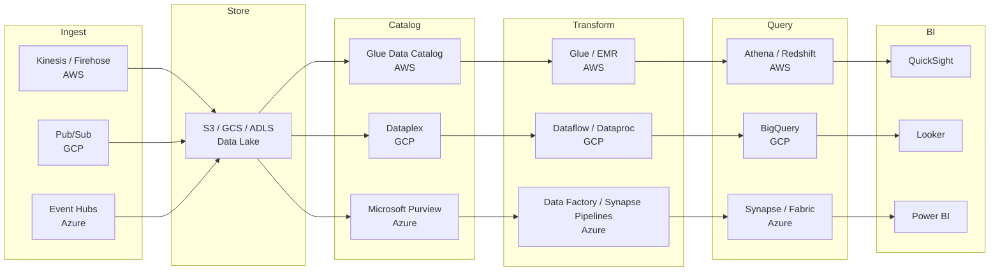
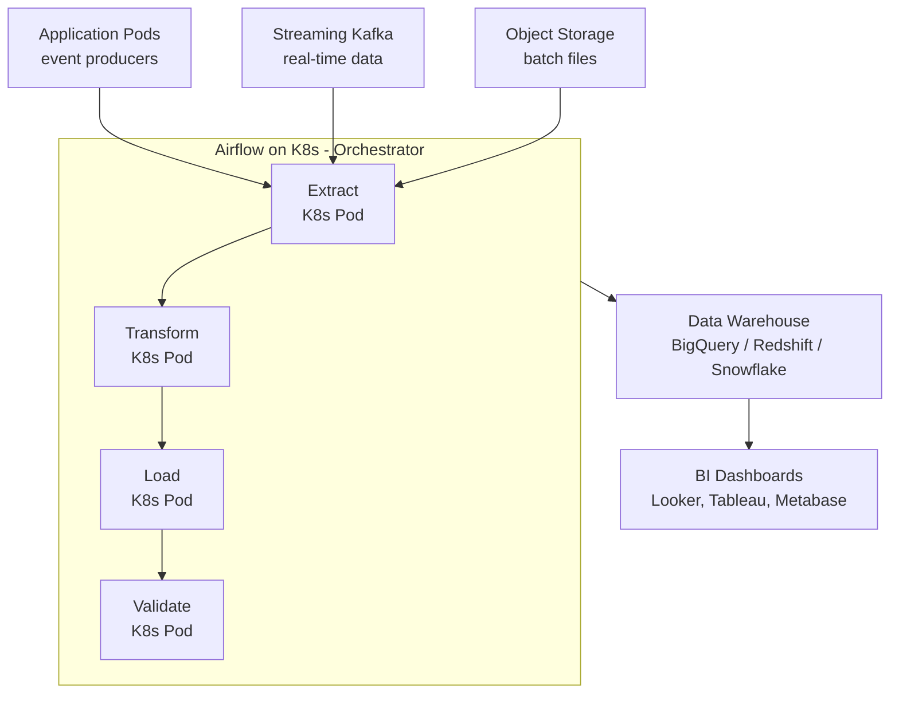
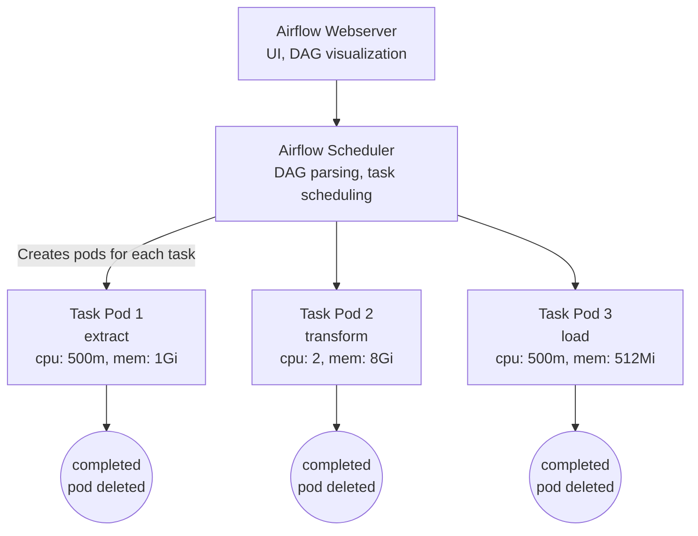
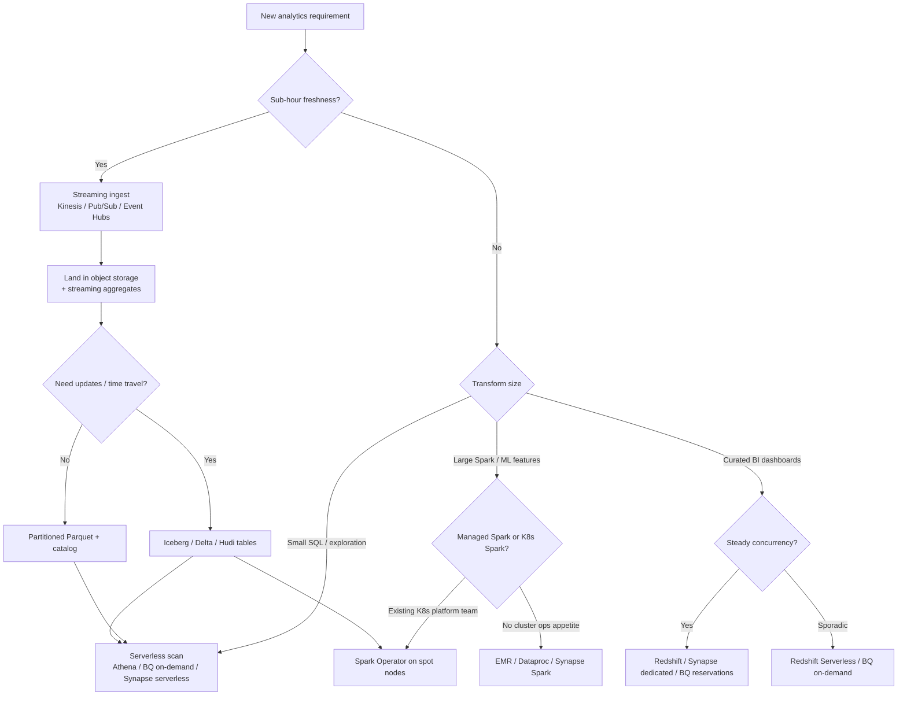

**Complexity**: `[COMPLEX]` | **Time to Complete**: 2.5h | **Prerequisites**: Module 9.4 (Object Storage), Module 9.7 (Streaming Pipelines), SQL basics

## What You'll Be Able to Do

After completing this module, you will be able to:

- **Configure Kubernetes workloads to write to managed data warehouses (Redshift, BigQuery, Synapse Analytics) using private connectivity**
- **Implement ETL/ELT pipelines on Kubernetes that transform and load data into cloud analytics platforms**
- **Deploy Apache Spark on Kubernetes with managed storage backends for large-scale data processing**
- **Design data lake architectures that combine Kubernetes data pipelines with cloud-native analytics and query services**

---

## Why This Module Matters

Hypothetical scenario: a mobility platform processes millions of trips per day. Its analytics pipeline is a tangle of CronJobs on EKS: Python scripts extract data from PostgreSQL, transform it in memory, and load it into a managed warehouse. Each CronJob runs on a dedicated pod with 16 GB of RAM to handle the largest tables. The pipeline keeps twelve always-on pods even though the daily ETL window lasts only four hours, and a single out-of-memory failure on a growing table can leave analysts staring at empty dashboards hours later because nobody noticed the upstream gap.

**Pause and predict:** If an analytics pipeline only processes data for four hours each night, why was the platform paying for twelve always-on pods, and which Kubernetes architectural choice eliminates this idle compute cost?

<details>
<summary>Check your prediction</summary>

The platform was paying for always-on pods because the team deployed the pipeline tasks as long-running Deployment replicas or static worker pools rather than ephemeral Kubernetes Jobs or CronJobs. CronJob and Job pods terminate upon completion, releasing node resources; in contrast, a Deployment of idle ETL pods continuously reserves CPU and memory requests, billing for unused hours throughout the remaining twenty hours of the day. When re-architected with Apache Airflow using the KubernetesPodOperator (or native Kubernetes Jobs), each task spins up an ephemeral pod with exact resource requests and terminates immediately upon success. In typical cloud environments, switching from static worker Deployments to ephemeral batch execution drops compute spending dramatically—such as cutting monthly node costs from several thousand dollars to an estimated $1,200/month in representative setups (approximately an 82% reduction, though actual savings depend on regional compute rates and node instance families)—while moving from row-by-row streaming inserts to native warehouse bulk LOAD commands slashes ingestion overhead by roughly 90%.
</details>

The next section is how data warehouses, object storage data lakes, and open lakehouse table formats split analytical responsibilities across modern cloud platforms.

Modern analytics is not a single product choice. Teams must decide whether they need a **data warehouse** for curated SQL, a **data lake** for cheap raw storage, or a **lakehouse** that adds ACID tables on object storage. They must choose between **serverless scan pricing** ([Amazon Athena](https://docs.aws.amazon.com/athena/latest/ug/pricing.html), [BigQuery on-demand](https://cloud.google.com/bigquery/pricing)) and **provisioned cluster hours** ([Amazon Redshift](https://docs.aws.amazon.com/redshift/latest/mgmt/serverless-usage-limits.html), [Azure Synapse dedicated pools](https://learn.microsoft.com/en-us/azure/synapse-analytics/sql-data-warehouse/sql-data-warehouse-overview-what-is)). Kubernetes sits in the middle as the orchestration plane: Airflow schedules ephemeral pods, Spark on Kubernetes transforms lake files, and workload identity connects pods to cloud warehouses without long-lived credentials.

This module teaches you how to connect Kubernetes workloads to managed analytics platforms across AWS, GCP, and Azure; orchestrate ingest-to-BI pipelines; choose between warehouse, lake, and lakehouse patterns; and control the cost knobs that make analytics bills spike.

---

## Analytics Landscape: Warehouse, Lake, and Lakehouse

Analytics workloads differ from transactional ones in almost every dimension that matters for architecture. **OLTP** (Online Transaction Processing) systems such as PostgreSQL, Cloud SQL, or Azure SQL optimize for short reads and writes on narrow rows: place an order, update inventory, authenticate a user. **OLAP** (Online Analytical Processing) systems optimize for scans and aggregations across billions of rows: revenue by region, funnel conversion, fraud pattern detection. Running heavy OLAP queries against your production OLTP database is one of the fastest ways to cause an outage, which is why mature teams **extract** operational data and **load** it into systems built for analytics.

Three storage patterns dominate cloud analytics today, and each solves a different part of the problem. A **data warehouse** stores curated, schema-on-write tables optimized for SQL. Examples include [Amazon Redshift](https://docs.aws.amazon.com/redshift/latest/dg/welcome.html), [Google BigQuery](https://cloud.google.com/bigquery/docs/introduction), and [Azure Synapse dedicated SQL pools](https://learn.microsoft.com/en-us/azure/synapse-analytics/sql-data-warehouse/sql-data-warehouse-overview-what-is). A **data lake** stores raw or semi-structured files cheaply in object storage — [Amazon S3](https://docs.aws.amazon.com/AmazonS3/latest/userguide/Welcome.html), [Google Cloud Storage](https://cloud.google.com/storage/docs/introduction), or [Azure Data Lake Storage](https://learn.microsoft.com/en-us/azure/storage/blobs/data-lake-storage-introduction) — with schema applied at query time. A **lakehouse** adds open table formats such as [Apache Iceberg](https://iceberg.apache.org/docs/latest/), [Delta Lake](https://docs.delta.io/latest/index.html), or [Apache Hudi](https://hudi.apache.org/docs/overview) on top of the lake, giving you ACID transactions, time travel, and partition evolution without giving up cheap object storage.

The processing model splits along another axis: **batch** versus **streaming**. Batch pipelines land daily or hourly files and rebuild aggregates overnight. Streaming pipelines consume events from [Amazon Kinesis](https://docs.aws.amazon.com/streams/latest/dev/introduction.html), [Google Pub/Sub](https://cloud.google.com/pubsub/docs/overview), or [Azure Event Hubs](https://learn.microsoft.com/en-us/azure/event-hubs/event-hubs-about) and update metrics in near real time. Kubernetes is excellent at both: CronJobs and Airflow DAGs for batch, consumer Deployments with [KEDA](https://keda.sh/docs/latest/) scalers for streaming backpressure.

Columnar file formats are the hidden performance lever behind almost every modern analytics stack. **Parquet** and **ORC** store values column-by-column rather than row-by-row, which means a query for `SUM(revenue)` reads only the revenue column instead of every field in every row. Combined with **compression** (Snappy, ZSTD, or GZIP) and **partitioning** (for example `year=2026/month=06/day=04/`), columnar storage can reduce scanned bytes by 90% or more compared with querying raw JSON in object storage. That reduction matters twice: queries finish faster, and on serverless engines you pay directly for scanned bytes.

```text
OLTP (production DB)          OLAP (warehouse / lake query)
─────────────────────          ──────────────────────────────
Short transactions             Wide scans & aggregations
Row-oriented storage           Columnar storage (Parquet/ORC)
Indexed point lookups          Partition pruning + column stats
Must stay fast for users       Optimized for analyst concurrency
```

**Pause and predict:** If two teams store the same representative 10 TB dataset—one as newline-delimited JSON in an object storage data lake and one as partitioned Parquet in a managed warehouse—which team pays substantially more for a single-day aggregation query such as `SELECT date, SUM(revenue)`, and why?

<details>
<summary>Check your prediction</summary>

The team querying the newline-delimited JSON data lake pays substantially more because newline JSON is a row-oriented format requiring a full-object scan across the entire dataset to parse fields. In contrast, partitioned Parquet organizes data into columnar chunks with directory-based partition paths; the query engine prunes untouched partition directories entirely (reading only the specified single day) and scans only the `date` and `revenue` columns while skipping all unread columns entirely. Because serverless analytical engines bill by scanned bytes, scanning a fraction of the columns within a single partition saves significant compute cost compared to scanning the full multi-terabyte dataset.
</details>

The next section is how compression codecs, partition path conventions, and object compaction govern physical storage efficiency across analytical data lakes.

### Compression, Partitioning, and File Layout

Columnar formats achieve their cost advantage through three cooperating mechanisms. **Compression** reduces storage bytes and therefore scan bytes — Parquet with Snappy or ZSTD often shrinks textual CSV by 80% or more depending on column cardinality. **Partitioning** (`year/month/day` hive-style paths or BigQuery ingestion-time partitions) lets query engines skip entire directories when filters match partition keys. **File sizing** matters too: thousands of 1 MB files create metadata overhead and slow listing; compaction jobs (Spark `repartition`, Iceberg `rewrite_data_files`) target 128–512 MB objects as a common rule of thumb.

For Kubernetes writers landing data to object storage, enforce partition paths in application code or Airflow templates (`s3://bucket/trips/dt=2025-11-15/part-000.parquet`) and reject uploads that omit partition keys. Athena and BigQuery external tables inherit layout mistakes instantly — there is no warehouse DBA to fix schema drift later.

---

## Data Warehouse Landscape

### Managed Data Warehouses Compared

| Feature | BigQuery (GCP) | Redshift (AWS) | Synapse Analytics (Azure) | Snowflake (Multi-cloud) |
|---------|---------------|----------------|---------------------------|------------------------|
| Pricing model | Per-query (on-demand) or slots (capacity) | Per-node-hour (provisioned) or Serverless RPU-hours | Dedicated SQL pool (DWU) or serverless SQL (per-TB scanned) | Per-credit (compute) + per-TB (storage) |
| Separation of storage/compute | Yes (native) | Serverless: yes; Provisioned: coupled | Dedicated pools: coupled; Serverless endpoint: yes | Yes (native) |
| Auto-scaling | Yes (on-demand) | Serverless: yes; Provisioned: manual resize | Serverless SQL autoscales; dedicated pools manual | Yes (multi-cluster warehouse) |
| K8s integration | Workload Identity, BQ API | IRSA / EKS Pod Identity, Redshift Data API | Entra Workload ID, Synapse REST / ODBC | Snowflake Connector for Spark/Python |
| Streaming ingestion | Storage Write API | Kinesis / MSK integration | Event Hubs, Spark Structured Streaming | Snowpipe |
| Serverless option | Default (on-demand) | Redshift Serverless | Serverless SQL pool (built-in) | Default |
| Minimum cost | ~$0 (on-demand, pay per query) | Serverless has usage-based minimums — verify current pricing | Serverless SQL charges per TB scanned | ~$0 (pay per credit used) |

### Serverless Scan vs Provisioned Cluster Economics

Not every "warehouse" bills the same way, and the pricing model should drive architecture as much as feature checklists. **Serverless scan engines** — [Amazon Athena](https://docs.aws.amazon.com/athena/latest/ug/what-is.html) querying S3, BigQuery on-demand, [Synapse serverless SQL](https://learn.microsoft.com/en-us/azure/synapse-analytics/sql/on-demand-workspace-overview) querying ADLS — charge primarily for **data scanned** (or per-TiB processed). They shine for exploratory queries, irregular workloads, and teams that cannot predict nightly concurrency. The downside is unbounded scans: a `SELECT *` over years of unpartitioned JSON can generate a four-figure bill in minutes.

**Provisioned cluster engines** — Redshift provisioned clusters, Synapse dedicated SQL pools, [Amazon EMR](https://docs.aws.amazon.com/emr/latest/ManagementGuide/emr-what-is-emr.html) or [Google Dataproc](https://cloud.google.com/dataproc/docs/concepts/overview) Spark clusters — charge for **capacity over time** (node-hours, DWUs, or cluster-hours). They shine when you run hundreds of concurrent dashboards, predictable nightly ETL, or Spark jobs that need local shuffle storage. The downside is idle cost: a cluster left running over a weekend still bills even if nobody queries it.

| Workload shape | Favor serverless scan | Favor provisioned cluster |
|----------------|----------------------|---------------------------|
| Ad-hoc analyst SQL, unpredictable volume | Athena, BigQuery on-demand, Synapse serverless | — |
| 24/7 BI dashboards with steady concurrency | — | Redshift provisioned, Synapse dedicated, BigQuery reservations |
| Massive Spark transforms on lake files | Athena Spark (verify region availability) or Dataproc/EMR | EMR / Dataproc with autoscaling |
| Startup with unknown scale | BigQuery on-demand (first 1 TiB/month free per billing account) | Start serverless; move to reserved capacity when spend stabilizes |

At moderate scale — say 5–20 TB of curated analytics data and 50 daily analyst queries — teams often spend **$500–$3,000/month** on compute if they partition well and avoid full scans. The same data with no partitioning, CSV ingestion, and `SELECT *` habits can exceed **$10,000/month** on scan-priced engines. Storage is usually the smaller line item: S3 Standard, GCS Standard, and ADLS Hot tiers run roughly **$0.02–$0.03/GB-month** (verify current regional rates), while egress to the public internet or cross-region replication can exceed storage cost when BI tools pull large extracts outside the cloud region.

### Managed Query and Processing Engines

Beyond the core warehouses, each cloud offers specialized query and processing layers that sit on top of object storage rather than replacing it. Understanding when to query in place versus when to load into a warehouse is one of the highest-leverage architecture decisions in a data platform because it determines both latency and which billing meter dominates your monthly invoice.

| Engine | Cloud | Model | Best for |
|--------|-------|-------|----------|
| [Amazon Athena](https://docs.aws.amazon.com/athena/latest/ug/what-is.html) | AWS | Serverless SQL over S3 via Glue Data Catalog | Ad-hoc lake queries, lightweight ETL |
| [Redshift Spectrum](https://docs.aws.amazon.com/redshift/latest/dg/c-using-spectrum.html) | AWS | Redshift queries external S3 tables | Federated queries without copying all data into Redshift |
| [BigQuery](https://cloud.google.com/bigquery/docs/introduction) | GCP | Serverless MPP warehouse + external tables over GCS | Default GCP analytics; federated GCS queries |
| [Dataproc](https://cloud.google.com/dataproc/docs/concepts/overview) | GCP | Managed Spark/Hive clusters | Large Spark ETL, ML feature pipelines |
| [Synapse serverless SQL](https://learn.microsoft.com/en-us/azure/synapse-analytics/sql/on-demand-workspace-overview) | Azure | Pay-per-TB SQL over ADLS / Blob | Exploratory SQL without provisioning a pool |
| [Synapse Spark](https://learn.microsoft.com/en-us/azure/synapse-analytics/spark/apache-spark-overview) | Azure | Managed Spark pools in Synapse workspace | Notebook-driven ETL, Delta Lake processing |
| [Microsoft Fabric](https://learn.microsoft.com/en-us/fabric/get-started/microsoft-fabric-overview) | Azure | Unified SaaS analytics (OneLake, warehouse, Power BI) | Teams standardized on Microsoft 365 / Power BI |
| [HDInsight](https://learn.microsoft.com/en-us/azure/hdinsight/hdinsight-overview) | Azure | Managed Hadoop/Spark/Kafka clusters | Legacy Hadoop estates migrating gradually |

[Amazon Redshift Serverless](https://docs.aws.amazon.com/redshift/latest/mgmt/serverless-usage-limits.html) blurs the line: it auto-scales RPU capacity and bills in RPU-hours rather than per scanned terabyte, behaving like a warehouse that wakes up on demand rather than a pure scan engine like Athena.

Choosing between engines is not exclusive. Mature platforms combine them: Athena or Spectrum for ad-hoc lake exploration, a provisioned Redshift or Synapse pool for SLA dashboards, EMR or Dataproc for heavy Spark transforms, and BigQuery reservations when on-demand scan costs exceed ~$10K/month (rule of thumb — model with your actual query logs). The Kubernetes orchestrator sits above all of them, invoking the right API per task without forcing analysts to learn four different schedulers.

---

## The Analytics Pipeline: Ingest to BI

Production analytics is rarely "one database." It is a pipeline of specialized services, and Kubernetes typically orchestrates the middle stages while managed cloud services handle durable storage and query serving.



**Ingest** moves events or files from operational systems into durable storage. [Amazon Kinesis Data Firehose](https://docs.aws.amazon.com/firehose/latest/dev/what-is-this-service.html) can land streaming records directly to S3 in Parquet. [Google Pub/Sub](https://cloud.google.com/pubsub/docs/overview) subscriptions can push to Cloud Storage or trigger Dataflow. [Azure Event Hubs](https://learn.microsoft.com/en-us/azure/event-hubs/event-hubs-about) integrates with Stream Analytics or Spark on Synapse. Kubernetes producers often emit to these services via sidecars or SDK calls rather than writing directly to the lake, which decouples application uptime from storage write paths.

**Catalog** services register schemas and partition locations so query engines know which S3 prefixes to read. [AWS Glue Data Catalog](https://docs.aws.amazon.com/glue/latest/dg/catalog-and-crawler.html) backs Athena and Redshift Spectrum. [Google Dataplex](https://cloud.google.com/dataplex/docs) governs lake zones and metadata. [Microsoft Purview](https://learn.microsoft.com/en-us/purview/purview) provides lineage and classification across Azure data assets. Without a catalog, you have a bucket of files; with a catalog, you have discoverable tables.

**Transform** is where ETL or ELT happens. Managed options include [AWS Glue](https://docs.aws.amazon.com/glue/latest/dg/what-is-glue.html), [Google Cloud Dataflow](https://cloud.google.com/dataflow/docs/overview), and [Azure Data Factory](https://learn.microsoft.com/en-us/azure/data-factory/introduction). Many teams also run [dbt](https://docs.getdbt.com/docs/introduction) inside Kubernetes Jobs or Airflow pods to execute version-controlled SQL transforms against the warehouse. The Kubernetes angle: Airflow's KubernetesPodOperator runs each dbt model as an isolated pod with its own memory limit, preventing one heavy model from OOM-killing an entire shared worker.

**Query and BI** expose data to humans. [Amazon QuickSight](https://docs.aws.amazon.com/quicksight/latest/user/welcome.html), [Looker](https://cloud.google.com/looker/docs), and [Power BI](https://learn.microsoft.com/en-us/power-bi/fundamentals/power-bi-overview) connect to warehouse endpoints. Keep BI tools pointed at OLAP systems, not at production PostgreSQL behind your checkout API.

### Batch vs Near-Real-Time: Where Kubernetes Fits

Not every dashboard needs sub-second freshness. **Batch analytics** — hourly or daily CronJobs, Airflow DAGs, or Spark sessions — remains the default for finance reporting, executive KPIs, and regulatory submissions because it is cheaper, easier to test, and tolerant of spot interruptions. **Near-real-time analytics** — streaming aggregations with five-minute or one-minute windows — suits operations dashboards, fraud scoring, and inventory alerts where stale data has immediate cost.

The cloud-native streaming path differs by provider but follows the same shape. AWS teams often chain [Kinesis Data Streams](https://docs.aws.amazon.com/streams/latest/dev/introduction.html) → [Firehose](https://docs.aws.amazon.com/firehose/latest/dev/what-is-this-service.html) → S3 Parquet → Athena or Redshift COPY. GCP teams use [Pub/Sub](https://cloud.google.com/pubsub/docs/overview) → [Dataflow](https://cloud.google.com/dataflow/docs/overview) → BigQuery streaming inserts or storage write API. Azure teams use [Event Hubs](https://learn.microsoft.com/en-us/azure/event-hubs/event-hubs-about) → [Stream Analytics](https://learn.microsoft.com/en-us/azure/stream-analytics/stream-analytics-introduction) or Spark Structured Streaming on Synapse → ADLS → Synapse SQL.

Kubernetes participates at two points: **producers** (application pods emitting events through SDKs) and **processors** (Flink or Spark Structured Streaming deployments scaled by [KEDA](https://keda.sh/docs/latest/scalers/) on lag metrics). Managed stream processors reduce ops toil; in-cluster processors win when you need custom jars, GPU adjacency, or unified deployment with microservices on the same cluster. A practical hybrid keeps streaming aggregation in managed services and uses Kubernetes only for complex enrichment that changes weekly.

When defining SLAs, write down acceptable staleness in minutes, not vague "real-time." A pipeline that lands data within fifteen minutes is near-real-time batch; calling it streaming sets wrong expectations for tooling cost and complexity.

### Data Quality Gates in the Pipeline

Analytics pipelines fail quietly more often than they fail loudly. A successful Job status with zero rows loaded is worse than a failed Job because dashboards show green infrastructure and wrong business numbers. Build validation as a first-class stage — the `validate` task in the Airflow DAG example checks minimum row counts before analysts wake up.

Common checks implemented in Kubernetes validate pods include: row count within ±5% of trailing seven-day average, null rate below threshold for required columns, primary-key uniqueness, referential integrity against dimension tables, and freshness (`MAX(event_timestamp)` within SLA window). Store validation results in a metadata table or push metrics to Prometheus so Grafana alerts fire when `etl_rows_loaded` drops without a corresponding Job failure.

Great Expectations, dbt tests, and Soda Core all run comfortably inside Kubernetes Jobs. The pattern is identical: mount expectations YAML from a ConfigMap, run the CLI against the warehouse connection using workload identity, exit non-zero on failure, and let Airflow retry or page on-call. Treat data quality failures as application incidents with the same severity as API error-rate spikes when executives consume the output.

---

## Lakehouse Table Formats on Object Storage

Raw Parquet files in a lake are cheap but fragile: concurrent writers can corrupt partitions, schema changes break downstream jobs, and deleting rows requires rewriting entire directories. **Lakehouse formats** add database-like guarantees on object storage.

[Apache Iceberg](https://iceberg.apache.org/docs/latest/) provides hidden partitioning, schema evolution, snapshot isolation, and time travel through metadata files stored alongside data. [Delta Lake](https://docs.delta.io/latest/index.html) adds ACID transactions and is deeply integrated with Spark and Synapse Spark. [Apache Hudi](https://hudi.apache.org/docs/overview) optimizes incremental upserts and change-data-capture workloads with record-level indexing.

**Time travel** lets you query a table as-of an earlier snapshot without restoring backups from tape: finance replays end-of-quarter state, and engineers undo a bad MERGE by pointing SQL at the previous snapshot ID. Iceberg and Delta expose snapshots through metadata tables; Hudi uses timeline instants with comparable semantics but different SQL surface area per query engine. **ACID commits** prevent the classic lake failure mode where two ETL pods append to the same partition and analysts see interleaved files mid-write — the format serializes writes through a catalog ([Glue](https://docs.aws.amazon.com/glue/latest/dg/catalog-and-crawler.html), Hive Metastore, or Unity Catalog) so readers always resolve a single consistent manifest. Choosing among Iceberg, Delta, and Hudi is partly ecosystem fit: AWS teams optimizing for Athena and Redshift Spectrum often anchor on Iceberg in Glue, while Azure-heavy estates with Synapse Spark frequently standardize on Delta because MERGE and time travel are first-class in that stack.

Engine support evolves quickly — verify current compatibility before committing — but the direction is clear: Spark, Trino/Presto, Flink, and major cloud warehouses increasingly read and write these formats natively. [BigQuery supports Iceberg tables](https://cloud.google.com/bigquery/docs/iceberg-tables) in its lakehouse offering. [Amazon Athena and EMR](https://docs.aws.amazon.com/athena/latest/ug/querying-iceberg.html) query Iceberg tables registered in Glue. Running [Spark on Kubernetes with the Spark Operator](https://github.com/kubeflow/spark-operator) lets you compact small files, run MERGE upserts, and expire old snapshots on a schedule — work that is awkward in pure serverless SQL.

When to adopt a lakehouse format: you need **mutating** fact tables (slowly changing dimensions), **time travel** for audit reproducibility, or **multiple engines** (Spark for ETL, Trino for federated SQL) over the same storage. When to skip it: append-only logs with immutable daily partitions and a single query engine may stay simpler as plain Parquet.

### Engine Support Snapshot (verify before committing)

Lakehouse adoption fails when the query engine you need does not support the format version you chose. As of 2026, check current compatibility matrices before standardizing: [Athena Iceberg support](https://docs.aws.amazon.com/athena/latest/ug/querying-iceberg.html), [BigQuery Iceberg tables](https://cloud.google.com/bigquery/docs/iceberg-tables), [Synapse Spark Delta Lake](https://learn.microsoft.com/en-us/azure/synapse-analytics/spark/apache-spark-overview), and [Trino Iceberg connector](https://trino.io/docs/current/connector/iceberg.html). Formats evolve quickly — a feature GA in one engine may still be preview in another, which matters when your ETL on Kubernetes writes snapshots that your BI tool cannot yet read.

---

### Architecture: K8s to Data Warehouse

The diagram below shows the canonical pattern: operational and streaming sources feed an orchestrator running on Kubernetes, which executes extract-transform-load-validate as isolated pods before committing curated datasets to a managed warehouse consumed by BI tools. The warehouse vendor varies by cloud — BigQuery on GCP, Redshift or Athena-curated tables on AWS, Synapse or Fabric on Azure — but the Kubernetes responsibilities (scheduling, identity, retries, resource isolation) stay constant.

Each stage maps to different cloud APIs. Extract pods might call operational databases through read replicas, consume Kafka topics, or list new prefixes in object storage. Transform pods run Python, Spark, or dbt and write partitioned Parquet to a staging bucket. Load pods invoke native bulk-load commands so the warehouse reads columnar files in parallel rather than accepting row inserts over JDBC. Validate pods run row-count checks, null-rate thresholds, and schema assertions before marking the partition ready for analysts.



---

## Connecting Kubernetes to Data Warehouses

Kubernetes pods should never hold long-lived database passwords for analytics systems. The pattern across all three clouds is the same: bind a Kubernetes ServiceAccount to a cloud identity ([GKE Workload Identity](https://cloud.google.com/kubernetes-engine/docs/how-to/workload-identity), [EKS IRSA or Pod Identity](https://docs.aws.amazon.com/emr/latest/EMR-on-EKS-DevelopmentGuide/emr-eks-iam-roles.html), [AKS Workload Identity](https://learn.microsoft.com/en-us/azure/aks/workload-identity-overview)), grant that identity the minimum warehouse permissions, and let SDKs exchange tokens at runtime. For large loads, always prefer **bulk load APIs** (BigQuery Load Jobs, Redshift COPY, Synapse COPY INTO) over row-by-row inserts — warehouses are columnar MPP engines, not OLTP transaction processors.

Private connectivity matters when compliance requires that traffic never traverse the public internet. [AWS PrivateLink for Redshift](https://docs.aws.amazon.com/redshift/latest/mgmt/enhanced-vpc-routing.html), [Private Service Connect for BigQuery](https://cloud.google.com/vpc/docs/private-service-connect), and [Private Link for Synapse](https://learn.microsoft.com/en-us/azure/synapse-analytics/security/synapse-private-link-hubs) let pods in your VPC reach managed endpoints without public IPs. The Kubernetes angle is unchanged: your pod still uses workload identity; only the network path differs.

### BigQuery from GKE

**Pause and predict:** When using GKE Workload Identity to connect a Kubernetes pod to BigQuery, does the pod need to mount a GCP JSON service account key file, and how does the underlying authentication flow operate?

<details>
<summary>Check your prediction</summary>

The pod does not need to store or mount a GCP JSON service account key file. Under GKE Workload Identity, authentication relies on the GKE metadata server and IAM federation. The node's metadata server intercepts token requests from the Google Cloud SDK inside the pod, validates the pod's short-lived Kubernetes ServiceAccount token, and federates with Google Cloud IAM to issue a temporary OAuth 2.0 access token for the bound GCP service account. This eliminates static credential distribution, key file leakage risks, and secret rotation operational burdens entirely.
</details>

The next section is how Kubernetes ServiceAccount annotations and IAM role bindings establish the trust relationship between the cluster pod and BigQuery.

```yaml
# ServiceAccount with Workload Identity for BigQuery access
apiVersion: v1
kind: ServiceAccount
metadata:
  name: bigquery-writer
  namespace: data-pipeline
  annotations:
    iam.gke.io/gcp-service-account: bq-writer@my-project.iam.gserviceaccount.com
```

```bash
# Grant BigQuery roles to the GCP service account
gcloud projects add-iam-policy-binding my-project \
  --member="serviceAccount:bq-writer@my-project.iam.gserviceaccount.com" \
  --role="roles/bigquery.dataEditor"

gcloud projects add-iam-policy-binding my-project \
  --member="serviceAccount:bq-writer@my-project.iam.gserviceaccount.com" \
  --role="roles/bigquery.jobUser"

# Bind K8s SA to GCP SA
gcloud iam service-accounts add-iam-policy-binding \
  bq-writer@my-project.iam.gserviceaccount.com \
  --role roles/iam.workloadIdentityUser \
  --member "serviceAccount:my-project.svc.id.goog[data-pipeline/bigquery-writer]"
```

```python
# Python job loading data to BigQuery from a K8s pod
from google.cloud import bigquery

client = bigquery.Client(project='my-project')

# Load from GCS (most efficient for large datasets)
job_config = bigquery.LoadJobConfig(
    source_format=bigquery.SourceFormat.PARQUET,
    write_disposition=bigquery.WriteDisposition.WRITE_APPEND,
)

uri = "gs://data-pipeline-staging/trips/2025-11-15/*.parquet"
load_job = client.load_table_from_uri(
    uri,
    "my-project.analytics.trips",
    job_config=job_config,
)
load_job.result()  # Wait for completion

print(f"Loaded {load_job.output_rows} rows to BigQuery")
```

### Redshift from EKS

```yaml
apiVersion: v1
kind: ServiceAccount
metadata:
  name: redshift-writer
  namespace: data-pipeline
  annotations:
    eks.amazonaws.com/role-arn: arn:aws:iam::123456789:role/RedshiftWriterRole
```

```python
# Using Redshift Data API (serverless, no persistent connection needed)
import boto3
import time

client = boto3.client('redshift-data')

# Execute COPY command to load from S3
response = client.execute_statement(
    WorkgroupName='analytics-serverless',
    Database='analytics',
    Sql="""
        COPY trips FROM 's3://data-pipeline-staging/trips/2025-11-15/'
        IAM_ROLE 'arn:aws:iam::123456789:role/RedshiftS3Role'
        FORMAT AS PARQUET;
    """
)

statement_id = response['Id']

# Poll for completion
while True:
    status = client.describe_statement(Id=statement_id)
    if status['Status'] in ('FINISHED', 'FAILED', 'ABORTED'):
        break
    time.sleep(5)

if status['Status'] == 'FINISHED':
    # Redshift Data API returns ResultRows=-1 for COPY/DDL statements.
    # Query STL_LOAD_COMMITS (or SYS_LOAD_HISTORY on newer clusters) for rows loaded.
    print(f"Statement {statement_id} finished — query STL_LOAD_COMMITS for row count")
else:
    print(f"Failed: {status.get('Error', 'unknown')}")
```

### Snowflake from Any K8s Cluster

```python
# Snowflake connector with key-pair authentication (no password needed)
import snowflake.connector
import os

conn = snowflake.connector.connect(
    account='my-org-my-account',
    user='ETL_SERVICE_USER',
    private_key_file='/mnt/secrets/snowflake-private-key.pem',
    warehouse='ETL_WH',
    database='ANALYTICS',
    schema='PUBLIC',
)

cursor = conn.cursor()

# Load from cloud storage
cursor.execute("""
    COPY INTO trips
    FROM @my_s3_stage/trips/2025-11-15/
    FILE_FORMAT = (TYPE = PARQUET)
    ON_ERROR = 'CONTINUE';
""")

result = cursor.fetchone()
print(f"Loaded: {result}")
```

### Azure Synapse from AKS

Azure Synapse Analytics combines dedicated SQL pools, serverless SQL, Spark pools, and pipeline orchestration in one workspace ([overview](https://learn.microsoft.com/en-us/azure/synapse-analytics/overview-what-is)). From AKS, pods typically authenticate with [Entra Workload ID](https://learn.microsoft.com/en-us/azure/aks/workload-identity-overview) and load data through Azure Data Lake Storage Gen2 paths that Synapse can query.

```yaml
# ServiceAccount with Azure Workload Identity for Synapse / ADLS access
apiVersion: v1
kind: ServiceAccount
metadata:
  name: synapse-writer
  namespace: data-pipeline
  annotations:
    azure.workload.identity/client-id: "00000000-0000-0000-0000-000000000000"
  labels:
    azure.workload.identity/use: "true"
```

```python
# Load Parquet from ADLS into a Synapse dedicated pool via PolyBase COPY
# Run from a Kubernetes Job pod with workload identity credentials
import struct
from azure.identity import DefaultAzureCredential
import pyodbc

credential = DefaultAzureCredential()
# Connection string uses Azure AD token auth — no SQL password in the pod
conn_str = (
    "Driver={ODBC Driver 18 for SQL Server};"
    "Server=tcp:myworkspace.sql.azuresynapse.net,1433;"
    "Database=analytics;"
    "Encrypt=yes;TrustServerCertificate=no;"
)
token = credential.get_token("https://database.windows.net/.default")
# Token-based connection pattern — see Microsoft docs for full ODBC token injection

sql = """
COPY INTO dbo.trips
FROM 'https://mystorageaccount.dfs.core.windows.net/staging/trips/2025-11-15/*.parquet'
WITH (
    FILE_TYPE = 'PARQUET',
    CREDENTIAL = (IDENTITY = 'Managed Identity')
);
"""
# Execute via pyodbc or synapseml connector from the pod
```

For bursty transform work, submit Spark jobs to a [Synapse Spark pool](https://learn.microsoft.com/en-us/azure/synapse-analytics/spark/apache-spark-overview) from an Airflow KubernetesPodOperator task rather than maintaining a permanent Spark cluster on AKS. For ad-hoc lake exploration without provisioning DWUs, point analysts at the [serverless SQL endpoint](https://learn.microsoft.com/en-us/azure/synapse-analytics/sql/on-demand-workspace-overview), which scans ADLS files per terabyte like Athena scans S3.

### Federated Query on Kubernetes: Spark and Trino

Not every analytics workload belongs in a managed warehouse. Teams with strict data residency, existing Spark expertise, or multi-cloud storage may run query engines **on Kubernetes** and treat cloud storage as the persistence layer.

The [Spark Operator](https://github.com/kubeflow/spark-operator) submits `SparkApplication` CRDs that spin up driver and executor pods (see the Ephemeral Spark example later in this module). [Trino](https://trino.io/docs/current/) (formerly PrestoSQL) runs as a Kubernetes Deployment and federates queries across Iceberg tables on S3, GCS, ADLS, and even external JDBC sources. Choose in-cluster engines when you need custom UDFs, tight network control, or unified batch/stream processing on the same cluster that runs your microservices. Choose managed warehouses when you want zero cluster tuning and predictable SaaS SLAs for BI consumers.

---

## Airflow on Kubernetes

Apache Airflow is the standard orchestrator for data pipelines. Running it on Kubernetes gives you dynamic task execution with ephemeral pods instead of maintaining a fleet of always-on Celery workers that sit idle between scheduled runs. In multi-cloud estates, the same pattern works regardless of which warehouse receives the final load: extract pods pull from operational databases or object storage, transform pods write partitioned Parquet to the lake, and load pods invoke native bulk-load APIs on BigQuery, Redshift, or Synapse. The orchestrator owns retries, SLAs, and alerting; Kubernetes owns isolation and bin-packing.

When evaluating Airflow on Kubernetes versus managed orchestrators such as [AWS Glue Workflows](https://docs.aws.amazon.com/glue/latest/dg/workflows_overview.html), [Google Cloud Composer](https://cloud.google.com/composer/docs/concepts/overview) (managed Airflow), or [Synapse Pipelines](https://learn.microsoft.com/en-us/azure/data-factory/concepts-pipelines-activities), the tradeoff is operational ownership. Self-managed Airflow on EKS/GKE/AKS gives maximum flexibility for custom Docker images, private network paths, and multi-cloud targets. Managed Composer or Synapse Pipelines reduce Day-2 toil at the cost of less control over executor internals and image patching cadence.

### Installing Airflow with Helm

```bash
helm repo add apache-airflow https://airflow.apache.org
helm install airflow apache-airflow/airflow \
  --namespace airflow --create-namespace \
  --set executor=KubernetesExecutor \
  --set webserver.defaultUser.enabled=true \
  --set webserver.defaultUser.username=admin \
  --set webserver.defaultUser.password=airflow-admin-pass \
  --set dags.persistence.enabled=true \
  --set dags.gitSync.enabled=true \
  --set dags.gitSync.repo=https://github.com/mycompany/airflow-dags.git \
  --set dags.gitSync.branch=main \
  --set dags.gitSync.subPath=dags \
  --set config.core.dags_folder=/opt/airflow/dags/repo/dags
```

### KubernetesExecutor Architecture



> **Stop and think**: If Airflow's KubernetesExecutor creates a new pod for every task, how does this impact pipeline execution time compared to having workers already running?

Each task runs in its own pod with its own resource requests. When the task completes, the pod is deleted. You pay only for the compute you use.

Production Airflow on Kubernetes also requires planning for **metadata durability** and **DAG delivery**. The Helm chart example enables git-sync so DAGs live in Git and mount into scheduler and webserver pods — the same GitOps discipline you apply to application manifests. The metadata database (typically PostgreSQL) should run as a managed RDS/Cloud SQL/Flexible Server instance rather than an in-cluster StatefulSet unless you have a dedicated DBA team. Task logs stream through Kubernetes logging; forward them to CloudWatch, Cloud Logging, or Azure Monitor so failed COPY commands are searchable alongside application logs.

For cross-cloud warehouses such as Snowflake, the Kubernetes integration pattern shifts slightly: pods mount key-pair secrets (preferably via [External Secrets Operator](https://external-secrets.io/latest/)) and use the Snowflake Connector rather than cloud-native workload identity, because Snowflake lives outside any single cloud IAM boundary. Rotate keys on the same cadence as database passwords and scope each service user to one warehouse and schema.

### Airflow DAG with KubernetesPodOperator

```python
# dags/daily_etl.py
from airflow import DAG
from airflow.providers.cncf.kubernetes.operators.pod import KubernetesPodOperator
from datetime import datetime, timedelta, timezone
from kubernetes.client import models as k8s

default_args = {
    'owner': 'data-engineering',
    'retries': 2,
    'retry_delay': timedelta(minutes=5),
    'execution_timeout': timedelta(hours=2),
}

with DAG(
    'daily_trip_etl',
    default_args=default_args,
    schedule='0 6 * * *',  # Daily at 6 AM UTC
    start_date=datetime(2025, 11, 1, tzinfo=timezone.utc),
    catchup=False,
    tags=['analytics', 'production'],
) as dag:

    extract = KubernetesPodOperator(
        task_id='extract_trips',
        name='extract-trips',
        namespace='data-pipeline',
        image='mycompany/etl-extract:2.1.0',
        cmds=['python', 'extract.py'],
        arguments=['--date={{ ds }}', '--output=gs://staging/trips/{{ ds }}/'],
        service_account_name='bigquery-writer',
        container_resources=k8s.V1ResourceRequirements(
            requests={'cpu': '500m', 'memory': '1Gi'},
            limits={'cpu': '1', 'memory': '2Gi'},
        ),
        is_delete_operator_pod=True,
        get_logs=True,
    )

    transform = KubernetesPodOperator(
        task_id='transform_trips',
        name='transform-trips',
        namespace='data-pipeline',
        image='mycompany/etl-transform:2.1.0',
        cmds=['python', 'transform.py'],
        arguments=['--input=gs://staging/trips/{{ ds }}/', '--output=gs://staging/trips-clean/{{ ds }}/'],
        service_account_name='bigquery-writer',
        container_resources=k8s.V1ResourceRequirements(
            requests={'cpu': '2', 'memory': '8Gi'},
            limits={'cpu': '4', 'memory': '16Gi'},
        ),
        is_delete_operator_pod=True,
        get_logs=True,
    )

    load = KubernetesPodOperator(
        task_id='load_to_bigquery',
        name='load-bigquery',
        namespace='data-pipeline',
        image='mycompany/etl-load:2.1.0',
        cmds=['python', 'load.py'],
        arguments=['--input=gs://staging/trips-clean/{{ ds }}/', '--table=analytics.trips'],
        service_account_name='bigquery-writer',
        container_resources=k8s.V1ResourceRequirements(
            requests={'cpu': '500m', 'memory': '512Mi'},
            limits={'cpu': '1', 'memory': '1Gi'},
        ),
        is_delete_operator_pod=True,
        get_logs=True,
    )

    validate = KubernetesPodOperator(
        task_id='validate_data',
        name='validate-data',
        namespace='data-pipeline',
        image='mycompany/etl-validate:2.1.0',
        cmds=['python', 'validate.py'],
        arguments=['--table=analytics.trips', '--date={{ ds }}', '--min-rows=100000'],
        service_account_name='bigquery-writer',
        container_resources=k8s.V1ResourceRequirements(
            requests={'cpu': '200m', 'memory': '256Mi'},
        ),
        is_delete_operator_pod=True,
        get_logs=True,
    )

    extract >> transform >> load >> validate
```

### Why KubernetesExecutor Over CeleryExecutor

| Factor | KubernetesExecutor | CeleryExecutor |
|--------|-------------------|----------------|
| Worker management | No persistent workers; pods per task | Persistent worker pods |
| Resource isolation | Each task gets dedicated resources | Tasks share worker resources |
| Cost | Pay only when tasks run | Workers run 24/7 |
| Startup time | Pod creation overhead (10-30s) | Immediate (workers already running) |
| Best for | Batch pipelines, varied resource needs | High-frequency, low-latency tasks |

---

## Ephemeral Analytics Clusters

Some analytics workloads need significant compute for a short time — processing a month of data, retraining an ML model, or running a large backfill. Provisioning permanent high-memory nodes for these bursts is one of the most common Kubernetes cost anti-patterns because the autoscaler cannot distinguish "waiting for next week's job" from "genuinely idle." Ephemeral node pools or cluster-autoscaler-driven scale-to-zero groups appear when Airflow or the Spark Operator schedules work, then drain after completion.

The cloud-specific mechanics differ slightly but the Kubernetes scheduling contract is identical. On AWS, EKS managed node groups support `capacity-type SPOT` with `minSize=0` so the group scales to zero when no analytics pods are pending. On GCP, GKE spot node pools with `--num-nodes 0` and autoscaling achieve the same effect. On Azure, [AKS cluster autoscaler](https://learn.microsoft.com/en-us/azure/aks/cluster-autoscaler) with spot node pools and taints isolates analytics workloads from production application pools. In all cases, combine **taints and tolerations** with **node selectors** so a runaway Deployment cannot accidentally schedule onto expensive analytics hardware.

Spot and preemptible instances add another 60–80% discount on top of ephemeral scheduling, with the caveat that interruptions happen. Airflow's retry logic and Spark's speculative execution make analytics batch workloads unusually tolerant of spot loss — unlike stateful web servers where an eviction mid-request becomes a user-visible 502. Size retry budgets and checkpoint intervals accordingly.

### Spot/Preemptible Node Pools for Analytics

```bash
# AWS: Create a spot node group for analytics
aws eks create-nodegroup \
  --cluster-name production \
  --nodegroup-name analytics-spot \
  --capacity-type SPOT \
  --instance-types r6i.2xlarge r6i.4xlarge r5.2xlarge \
  --scaling-config minSize=0,maxSize=20,desiredSize=0 \
  --labels workload=analytics \
  --taints "key=analytics,value=true,effect=NoSchedule"

# GCP: Create a preemptible node pool
gcloud container node-pools create analytics-spot \
  --cluster production \
  --machine-type n2-highmem-8 \
  --spot \
  --num-nodes 0 \
  --enable-autoscaling --min-nodes 0 --max-nodes 20 \
  --node-labels workload=analytics \
  --node-taints analytics=true:NoSchedule
```

### Airflow Tasks with Node Selection

```python
analytics_task = KubernetesPodOperator(
    task_id='heavy_transform',
    name='heavy-transform',
    namespace='data-pipeline',
    image='mycompany/etl-transform:2.1.0',
    node_selector={'workload': 'analytics'},
    tolerations=[{
        'key': 'analytics',
        'operator': 'Equal',
        'value': 'true',
        'effect': 'NoSchedule'
    }],
    container_resources=k8s.V1ResourceRequirements(
        requests={'cpu': '4', 'memory': '32Gi'},
        limits={'cpu': '8', 'memory': '64Gi'},
    ),
    is_delete_operator_pod=True,
)
```

When this task runs, the cluster autoscaler detects pending pods that can only be scheduled on the analytics-spot node group, scales it up from 0 to the needed size, runs the task, and scales back to 0 after the pod completes. Total cost: the minutes of compute actually used.

The Spark Operator pattern extends ephemeral compute to distributed frameworks. Instead of standing up a dedicated EMR or Dataproc cluster for a two-hour job, a `SparkApplication` CRD requests driver and executor pods directly on the analytics node pool. Executors shuffle intermediate data through local disks or spill to object storage depending on configuration. For jobs exceeding node-local disk, configure dynamic allocation and ensure S3A/GCS/HDFS committers support the object store — otherwise task failures during spot evictions can leave inconsistent output directories.

Monitor Spark on Kubernetes with the Spark UI Service (often ClusterIP-only) and export metrics to Prometheus via the [Spark metrics servlet](https://spark.apache.org/docs/latest/monitoring.html). Airflow or Argo Workflows can wrap SparkApplication submission so retries and alerting match the rest of your pipeline estate.

### Ephemeral Spark on Kubernetes

```yaml
# SparkApplication for large-scale data processing
apiVersion: sparkoperator.k8s.io/v1beta2
kind: SparkApplication
metadata:
  name: daily-aggregation
  namespace: data-pipeline
spec:
  type: Python
  mode: cluster
  image: mycompany/spark-etl:3.5.0
  mainApplicationFile: gs://spark-jobs/aggregate_trips.py
  arguments:
    - "--date=2025-11-15"
    - "--output=gs://analytics-output/aggregated/"
  sparkVersion: "3.5.0"
  driver:
    cores: 1
    memory: "2g"
    serviceAccount: spark-sa
    nodeSelector:
      workload: analytics
    tolerations:
      - key: analytics
        operator: Equal
        value: "true"
        effect: NoSchedule
  executor:
    cores: 2
    instances: 10
    memory: "8g"
    nodeSelector:
      workload: analytics
    tolerations:
      - key: analytics
        operator: Equal
        value: "true"
        effect: NoSchedule
  restartPolicy:
    type: OnFailure
    onFailureRetries: 2
```

---

## IAM for Data Access

Data warehouse access from Kubernetes should follow the same workload identity patterns as other cloud services, but with additional considerations for data governance.

### Principle of Least Privilege for Analytics

Analytics IAM is more nuanced than "read/write" because the blast radius of a leaked ETL credential includes exfiltrating years of customer data, not just corrupting one row. Separate identities for extract, load, validate, and dashboard-read paths. On GCP, scope BigQuery roles to datasets rather than projects. On AWS, use Redshift datashares or schema-level grants instead of superuser for ETL roles. On Azure, map Entra groups to Synapse workspace roles and restrict ADLS ACLs to staging prefixes.

| Role | BigQuery Permission | Redshift Permission | Synapse / ADLS Permission | What They Can Do |
|------|-------------------|--------------------|-----------------------------|--------------------|
| ETL Writer | `bigquery.dataEditor` + `bigquery.jobUser` | `INSERT`, `COPY`, `CREATE TABLE` | Storage Blob Data Contributor on staging container; SQL DDL on staging schema | Write data, run load jobs |
| Analyst Reader | `bigquery.dataViewer` + `bigquery.jobUser` | `SELECT` on specific schemas | Serverless SQL read on curated views | Read data, run queries |
| Admin | `bigquery.admin` | Superuser | Synapse SQL Admin + Owner on workspace | Everything (restrict to platform team) |
| Dashboard Service | `bigquery.dataViewer` on specific datasets | `SELECT` on specific tables | Read-only on reporting views | Read only what dashboards need |

### Column-Level Security

```sql
-- BigQuery: Restrict PII columns
CREATE OR REPLACE ROW ACCESS POLICY trip_region_policy
ON analytics.trips
GRANT TO ('serviceAccount:analyst@my-project.iam.gserviceaccount.com')
FILTER USING (region = 'us-east');

-- Redshift: Column-level GRANT
GRANT SELECT(trip_id, distance, fare_amount, region) ON trips TO analyst_role;
-- Note: PII columns (rider_name, email) are NOT granted
```

### Data Masking

```sql
-- BigQuery: Policy tags for column masking
-- Configured via Data Catalog taxonomy
-- Columns tagged with "PII" are masked for non-privileged users

-- Snowflake: Dynamic masking
CREATE OR REPLACE MASKING POLICY email_mask AS (val STRING)
RETURNS STRING ->
    CASE
        WHEN CURRENT_ROLE() IN ('ADMIN_ROLE', 'DATA_ENGINEER_ROLE') THEN val
        ELSE REGEXP_REPLACE(val, '.+@', '***@')
    END;

ALTER TABLE trips MODIFY COLUMN rider_email SET MASKING POLICY email_mask;
```

Data governance extends beyond RBAC into **lineage and retention**. [Google Dataplex](https://cloud.google.com/dataplex/docs) and [Microsoft Purview](https://learn.microsoft.com/en-us/purview/purview) track which Kubernetes pipeline wrote which table partition, simplifying GDPR deletes and audit responses. Set object lifecycle policies on staging buckets (delete raw extracts after 30 days, keep curated Parquet for seven years) and align warehouse table expiration with legal hold requirements. A staging prefix with overly broad IAM permissions is a common exfiltration path — treat it with the same sensitivity as production data because it often contains the same PII without masking policies applied yet.

---

## Cost Control for Analytics

Analytics workloads can generate surprise bills quickly. A single bad query on BigQuery can scan petabytes. A misconfigured Redshift cluster can run 24/7 doing nothing. Understanding **which meter moves** — scanned bytes, slot-hours, RPU-hours, node-hours, or egress gigabytes — is the foundation of every cost review.

**Pause and predict:** If an engineering team provisions an unpartitioned BigQuery fact table, what happens to on-demand querying costs as years of telemetry accumulate, and how does table partitioning remediate this failure mode?

<details>
<summary>Check your prediction</summary>

Query costs grow linearly with total table size over time because unpartitioned BigQuery on-demand queries must scan the entire table, even when the query includes date filters. Adding a qualifying partition filter on a partitioned table allows the query engine to prune unneeded partitions and scan only the relevant date range. Furthermore, an existing unpartitioned table cannot be converted to a partitioned table in place; the team must create a new partitioned destination table and backfill the historical data using a query or export job.
</details>

The next section is how scan-priced analytical query engines calculate billing meters and enforce client-side query execution byte limits.

### Scan-Priced Engines: Athena and BigQuery

[Amazon Athena](https://docs.aws.amazon.com/athena/latest/ug/pricing.html) bills per terabyte of data scanned by each query (verify current regional rate). [BigQuery on-demand](https://cloud.google.com/bigquery/pricing) bills at **$6.25/TiB** scanned (verify current rate) after the first **1 TiB free per month** per billing account. [Synapse serverless SQL](https://learn.microsoft.com/en-us/azure/synapse-analytics/sql/on-demand-workspace-overview) uses a similar per-TB scanned model. The cost levers are:

- **Partition filters** so queries touch one day instead of five years of history
- **Column selection** — never `SELECT *` on wide fact tables when three columns suffice
- **Columnar formats** (Parquet/ORC) so engines skip untouched columns entirely
- **Clustering / sorting** (BigQuery clustering, Redshift sort keys) for high-cardinality filters
- **`maximum_bytes_billed`** guardrails that abort queries before execution completes

```bash
# Per-query byte cap on the bq CLI (this is a client-side guard, not a project quota)
bq query \
  --maximum_bytes_billed=10995116277760 \
  'SELECT * FROM analytics.trips WHERE date = "2025-11-15"'

# Project-level and per-user query quotas are configured via
# the Google Cloud Console → IAM & Admin → Quotas, or the Service Usage API.
# The bq CLI does not expose quota CRUD flags — use Console / gcloud alpha services quota.
```

```python
# In code: Always set maximum bytes billed
from google.cloud import bigquery

client = bigquery.Client()
job_config = bigquery.QueryJobConfig(
    maximum_bytes_billed=10 * 1024 ** 3,  # 10 GB max per query
    use_query_cache=True,
)

query = "SELECT trip_id, fare_amount FROM analytics.trips WHERE date = '2025-11-15'"
result = client.query(query, job_config=job_config).result()
```

Hypothetical scenario: an analyst runs `SELECT *` on a 200 TB unpartitioned transactions table in BigQuery. At ~$6.25/TiB, that single query approaches **$1,250** before egress. Adding a `WHERE transaction_date = '2025-11-15'` partition filter on a daily-partitioned table might reduce scanned data to ~100 GB (~$0.60). The engineering work to partition at table creation pays for itself the first time someone forgets a WHERE clause.

### Provisioned Cluster Costs: Redshift and Synapse Dedicated

[Redshift provisioned clusters](https://docs.aws.amazon.com/redshift/latest/mgmt/working-with-clusters.html) bill per node-hour regardless of query activity. [Synapse dedicated SQL pools](https://learn.microsoft.com/en-us/azure/synapse-analytics/sql-data-warehouse/sql-data-warehouse-overview-what-is) bill in Data Warehouse Units (DWUs). Cost levers include:

- **Pause / resume** schedules for dev/test clusters overnight and weekends
- **Redshift Serverless** with [usage limits](https://docs.aws.amazon.com/redshift/latest/mgmt/serverless-usage-limits.html) that deactivate compute when monthly RPU thresholds breach
- **Right-sizing** — start smaller and resize after observing peak concurrency, not before
- **Concurrency Scaling** (Redshift) for burst queries instead of permanently doubling node count

```bash
# Use Redshift Serverless with usage limits
aws redshift-serverless create-usage-limit \
  --resource-arn arn:aws:redshift-serverless:us-east-1:123456789:workgroup/analytics \
  --usage-type serverless-compute \
  --amount 500 \
  --period monthly \
  --breach-action deactivate
```

### Storage, Egress, and Hidden Line Items

Object storage is cheap until it is not. Three buckets of **10 TB each** in S3 Standard cost roughly **$690/month** in storage alone (verify current pricing). Cross-region replication doubles storage. **Egress** to the internet or to another cloud can exceed compute: [S3 data transfer out](https://aws.amazon.com/s3/pricing/) to the internet starts around **$0.09/GB** (verify current tier). [GCS egress](https://cloud.google.com/storage/pricing) and [Azure bandwidth](https://azure.microsoft.com/pricing/details/bandwidth/) follow similar tiered models. Keep BI tools and Spark executors in the **same region** as the lake. [S3 same-Region reads are free](https://docs.aws.amazon.com/AmazonS3/latest/userguide/Welcome.html) when Athena, Redshift, or EMR in the same region query the bucket.

Kubernetes compute for analytics adds another meter: even ephemeral Airflow task pods accrue CPU/memory charges on your node pool. Spot/preemptible node groups (covered later) reduce batch cost 60–80% when Airflow retries handle interruptions.

### Cost Monitoring Dashboard

```yaml
# PrometheusRule for analytics cost alerting
apiVersion: monitoring.coreos.com/v1
kind: PrometheusRule
metadata:
  name: analytics-cost-alerts
  namespace: monitoring
spec:
  groups:
    - name: analytics-costs
      rules:
        - alert: AnalyticsPodCostHigh
          expr: |
            sum by (namespace) (
              container_cpu_usage_seconds_total{namespace="data-pipeline"}
            ) > 100
          for: 1h
          labels:
            severity: warning
          annotations:
            summary: "Analytics pipeline CPU usage high -- check for runaway jobs"
```

### Cost Optimization Strategies

| Strategy | Savings | Implementation |
|----------|---------|---------------|
| Use COPY/LOAD instead of streaming inserts | 80-90% on ingestion | BQ Load Jobs, Redshift COPY, Snowflake COPY INTO |
| Partition tables by date | 70-90% on queries | BigQuery: partition by `_PARTITIONDATE`; Redshift: DISTKEY/SORTKEY |
| Use Parquet/ORC instead of CSV/JSON | 60-80% on storage + queries | Columnar formats compress better and skip irrelevant columns |
| Spot instances for batch processing | 60-80% on compute | EKS spot node groups, GKE preemptible/spot pools |
| Schedule Redshift pause/resume | Up to 100% of compute when idle | `aws redshift-serverless update-workgroup --base-capacity 0` during off-hours |
| BigQuery flat-rate (Editions) | 30-50% at scale | Predictable cost for >$10K/month spend |
| Materialized views | 50-80% on repeated queries | Pre-compute common aggregations |

Reserve **[BigQuery Editions / slot commitments](https://cloud.google.com/bigquery/docs/reservations-intro)** when monthly on-demand scan charges stabilize above the break-even point versus slot-hour pricing — typically when the same dashboards execute hundreds of times daily against similar datasets. For Redshift, use [Scheduled Actions](https://docs.aws.amazon.com/redshift/latest/mgmt/pause-resume-cluster.html) to pause provisioned clusters in dev accounts. Tag Kubernetes analytics namespaces with cost allocation labels (`team=data-platform`, `env=prod`) so FinOps can attribute spot node spend to the pipelines that requested it.

---

## Patterns & Anti-Patterns

Analytics architecture fails in predictable ways. The patterns below appear repeatedly across AWS, GCP, and Azure estates because they align billing meters with workload shapes. Anti-patterns usually begin as reasonable shortcuts — querying the lake directly in production dashboards, skipping partitions "until we have more data," or sizing a Redshift cluster for peak Black Friday and leaving it there all year.

| Pattern | When to Use | Why It Works | Scaling Consideration |
|---------|-------------|--------------|-----------------------|
| Lake ingest + warehouse serve | Raw events land in S3/GCS/ADLS; curated tables live in Redshift/BigQuery/Synapse | Decouples cheap storage from expensive compute; OLTP stays isolated | Compact small files in the lake; enforce partition conventions in CI |
| Ephemeral K8s workers (Airflow KubernetesExecutor) | Batch ETL with variable task sizes | Pods request exact CPU/RAM per task; no 24/7 worker tax | Accept 10–30s pod startup; use spot nodes with retries |
| Serverless scan for exploration, reserved capacity for BI | Unpredictable ad-hoc SQL early; steady dashboard load later | Athena/BigQuery on-demand has near-zero idle cost; reservations/slots reduce $/TiB at scale | Monitor scan bytes weekly; graduate hot tables to clustered warehouse tables |
| Open lakehouse format (Iceberg/Delta/Hudi) | Multiple engines write/read the same tables; need MERGE/time travel | ACID on object storage without proprietary lock-in | Schedule compaction jobs on Kubernetes to merge small files |

| Anti-Pattern | What Goes Wrong | Better Alternative |
|--------------|-----------------|--------------------|
| Querying raw JSON in the lake with `SELECT *` | Every analyst scan touches every field and file; scan bills explode | Land Parquet with schema; partition by date; expose curated views |
| No partitioning on time-series facts | Queries scan full history for one-day filters | Partition by `date` at creation; reject loads that omit partition keys |
| Using the warehouse as OLTP | High-frequency row updates and point lookups degrade MPP performance | Keep mutations in OLTP; sync deltas via CDC into lake/warehouse |
| Unbounded serverless scans without guardrails | One cross join can scan petabytes before anyone notices | `maximum_bytes_billed`, per-user quotas, cost alerts, mandatory partition filters |
| Permanent oversized analytics node pools | EKS/GKE nodes sit at max size for a weekly 2-hour Spark job | Scale-to-zero spot pools with taints; Spark Operator or Airflow triggers scale-up |

---

## Decision Framework

Choosing between warehouse, lake, lakehouse, serverless scan, and in-cluster Spark is a workload decision — not a vendor loyalty decision. Start with four questions: how fresh must data be, how predictable is query concurrency, how large are individual transforms, and who owns operational toil?



| Requirement | Prefer | Reason |
|-------------|--------|--------|
| Ad-hoc SQL on cold lake files | Athena, BigQuery external tables, Synapse serverless | No cluster to size; pay per scan |
| 500 concurrent BI users, SLA dashboards | Redshift provisioned, Synapse dedicated pool, BigQuery capacity | Predictable slot/DWU capacity beats scan pricing |
| Nightly 20 TB Spark aggregation | EMR/Dataproc or Spark on Kubernetes spot pool | MPP SQL engines are poor at heavy shuffles |
| Multi-engine access (Spark + Trino + Athena) | Iceberg/Delta on S3/GCS/ADLS | One table format, many query engines |
| Strict network isolation, custom UDFs | Trino/Spark on Kubernetes | Full control of network paths and libraries |

For design reviews, require a **cost worksheet**: estimated daily ingest GB, partition strategy, expected scan bytes per top-10 query, cluster hours if provisioned, and egress paths to BI tools. If the worksheet cannot bound worst-case scan cost, the design is not ready for analyst self-service.

### Microsoft Fabric and Unified Analytics (Azure)

[Microsoft Fabric](https://learn.microsoft.com/en-us/fabric/get-started/microsoft-fabric-overview) consolidates data integration, lake storage ([OneLake](https://learn.microsoft.com/en-us/fabric/onelake/onelake-overview)), warehouse compute, and Power BI into a SaaS experience aimed at organizations already standardized on Azure AD and Microsoft 365. For Kubernetes teams, Fabric does not replace AKS orchestration — it replaces the sprawl of separately operated Synapse workspaces, ADF factories, and Power BI gateways when the business wants a single control plane.

Typical integration: Kubernetes ETL pods land Parquet in ADLS paths that OneLake shortcuts reference; Fabric warehouse endpoints expose SQL to Power BI datasets; lineage flows through Purview automatically. The decision is organizational as much as technical: Fabric reduces tool count; self-managed Airflow on AKS plus Synapse serverless preserves fine-grained control for platform engineers who already invested in GitOps pipeline manifests.

### Observability: Knowing the Pipeline Is Healthy

Infrastructure metrics tell you pods ran; data metrics tell you the business can trust the output. Instrument both layers. Kubernetes-level signals include Airflow task duration, pod OOMKilled counts, spot interruption rates, and Job/CronJob failure counts in the `data-pipeline` namespace. Warehouse-level signals include bytes scanned per query (BigQuery `INFORMATION_SCHEMA.JOBS`, Athena query history), Redshift `STL_QUERY` duration, and Synapse DMVs for long-running SQL.

Build dashboards that correlate **pipeline completion time** with **downstream row counts**. If the extract Job finishes on schedule but loaded rows drop 40% week-over-week, the problem is upstream data — not Kubernetes scheduling. Conversely, if row counts look stable but Job duration doubles, your transform pods may need more memory or the lake may have accumulated small files that need compaction.

Alert on SLA misses, not only on pod crashes. A CronJob that succeeds with an empty extract because the source replica lagged is a silent data incident. The validate stage exists precisely to convert silent failures into hard failures that Airflow marks red and pages on-call.

When triaging analytics incidents, walk the path in order: confirm the orchestrator task state in Airflow or Job status, inspect pod logs for COPY/load errors, verify object storage paths contain expected file counts and sizes, run a manual `SELECT COUNT(*)` against the target partition in the warehouse, and only then investigate BI layer caching. Skipping straight to "Tableau is broken" wastes hours when the root cause is an empty staging prefix because upstream replication lagged two hours.

Document the expected runtime and row-count envelopes for each pipeline stage in runbooks attached to Airflow DAG docstrings or ConfigMap annotations. New engineers onboarding to on-call should not need to grep Python to learn that daily trips load should exceed 100,000 rows — the validate task encodes that invariant, and the runbook explains the business context behind the threshold.

Export warehouse audit logs to the same SIEM that ingests Kubernetes audit events when compliance requires proving who queried PII columns. BigQuery audit logs, Redshift user activity logging, and Synapse SQL auditing each integrate with their cloud's logging backbone — wire those streams before auditors ask, not after a finding. Treat audit log retention with the same lifecycle discipline as the data itself. A query audit trail that expires before the compliance window defeats the purpose of enabling logging in the first place and can fail external audits outright.

---

## Did You Know?

1. **BigQuery processes over 110 PB of data per day** across all customers (as of ~2024 analyst briefings — verify current figure from Google Cloud's published benchmarks). Its architecture separates storage (Colossus) from compute (Dremel), which means you can scale query processing to thousands of nodes for a single query without any cluster management. This serverless model inspired Snowflake and Redshift Serverless.

2. **Apache Airflow was created at Airbnb in 2014** by Maxime Beauchemin to orchestrate the company's growing data pipelines. It became an Apache top-level project in 2019 and is now used by over 10,000 organizations. The name "Airflow" was chosen because data flows through it like air -- invisibly and reliably (in theory).

3. **Snowflake's multi-cluster warehouse feature automatically scales** from 1 to up to ~300 clusters (verify current limits for your edition and warehouse size) based on query queuing. A data warehouse that serves 5 analysts during the day and 500 during a quarterly review scales automatically without anyone touching the configuration. This is why Snowflake charges per-second of compute rather than per-node.

4. **The COPY command in Redshift can be dramatically faster than INSERT statements** for bulk loading (orders of magnitude less time in practice) because it reads directly from S3 in parallel across all nodes. Each slice in a Redshift node reads a portion of the S3 files simultaneously. A 100 GB load that would take hours with INSERT completes in minutes with COPY.

---

## Common Mistakes

| Mistake | Why It Happens | How to Fix It |
|---------|---------------|---------------|
| Running ETL with streaming inserts instead of batch loads | Streaming API seems simpler | Use COPY/LOAD for batch; streaming only for real-time requirements |
| Not partitioning warehouse tables | "We will optimize later" | Partition by date/region at table creation; retrofitting is expensive |
| Using CSV format for data pipeline files | Broad compatibility | Use Parquet or ORC; they are smaller, faster, and schema-aware |
| Running analytics on production database | "Just a quick query" | ETL to a warehouse; production databases should not serve analytics |
| Not setting maximum_bytes_billed on BigQuery queries | Trust that queries will be efficient | Set a byte limit for analyst-facing queries; a `SELECT *` on a 50 TB table costs $250 |
| Running Airflow workers 24/7 with CeleryExecutor | Default Helm chart configuration | Use KubernetesExecutor; pay only for compute when tasks actually run |
| Not using spot instances for batch analytics | Concern about interruption | Airflow retries handle spot interruptions; 60-80% savings is worth it |
| Granting broad warehouse access to ETL service accounts | Convenient during initial setup | Follow least privilege; ETL writes to staging tables, separate role promotes to production |

---

## Quiz

<details>
<summary>1. Scenario: Your team runs a daily ETL pipeline that takes 4 hours to complete. The pipeline consists of 50 tasks with wildly different resource requirements (some need 32GB RAM, others need 512MB). You are currently deciding between Airflow's CeleryExecutor and KubernetesExecutor. Why would the KubernetesExecutor be the more cost-effective and operationally sound choice for this specific workload?</summary>

The KubernetesExecutor spins up a dedicated pod for each individual task with its specific resource requests, and then terminates the pod when the task finishes. In this scenario, tasks needing 32GB RAM will only consume that memory for the duration of the task, rather than requiring permanent heavy worker nodes. With the CeleryExecutor, you would typically need worker nodes available to handle the peak 32GB requirement, resulting in substantial wasted compute during the 20 hours a day the pipeline is idle. The KubernetesExecutor ensures you pay exclusively for the exact compute used during the 4-hour window, providing perfect resource isolation for varying task sizes.
</details>

<details>
<summary>2. Scenario: A developer on your team has configured a Kubernetes deployment to read an entire day's worth of transactions (about 50 million rows) from an S3 bucket and ingest them into Amazon Redshift using standard SQL `INSERT` statements in a tight loop. The job has been running for 12 hours and is still not finished. What architectural flaw causes this performance issue, and what command should be used instead to solve it?</summary>

The architectural flaw is treating a columnar data warehouse like a transactional database by sending data row-by-row over a single connection, which incurs massive network and serialization overhead. Data warehouses are designed for massively parallel processing (MPP). By using the `COPY` (or `LOAD`) command instead, you instruct the warehouse compute nodes to read directly from the S3 object storage in parallel. Each node in the Redshift cluster will grab a chunk of the files and load them simultaneously, bypassing the single-connection bottleneck and reducing ingestion time from hours to minutes while significantly lowering compute costs.
</details>

<details>
<summary>3. Scenario: Your data science team needs to run a massive Spark job once a week that requires 50 nodes with 64GB of RAM each. The job takes about 2 hours to complete. They are asking you to provision these nodes permanently in the EKS cluster so they don't have to wait for infrastructure when they trigger the job. How can you use ephemeral node pools and Kubernetes scheduling to satisfy their compute needs without paying for 50 massive nodes 24/7?</summary>

You can configure an ephemeral node pool (using Spot or Preemptible instances) with a minimum size of 0 and a maximum size of 50, strictly tainted for analytics workloads. When the data science team submits their Spark application, the pods will request these specific nodes using node selectors and tolerations. The Kubernetes cluster autoscaler will detect the pending pods, automatically scale the node group from 0 to 50, run the 2-hour job, and then scale back down to 0 after 10 minutes of inactivity. This approach provides the massive burst capacity the team needs while ensuring you only pay for 2 hours of compute per week instead of 168 hours, leveraging spot pricing for even deeper discounts.
</details>

<details>
<summary>4. Scenario: A junior analyst runs a query on BigQuery to find the total revenue for yesterday: `SELECT SUM(revenue) FROM analytics.transactions WHERE transaction_date = '2025-11-15'`. The `transactions` table contains 5 years of historical data and is 200 TB in size. The query costs $1,000 to execute. What critical data warehouse design feature was missing from the `transactions` table, and how would it have prevented this massive charge?</summary>

The table was not partitioned by the `transaction_date` column when it was created. Without partitioning, BigQuery has no way to isolate the data for a specific day, forcing it to perform a full table scan of all 200 TB across the entire 5-year history just to find yesterday's records. If the table had been partitioned by date, the query engine would have completely ignored the partitions for the other 1,824 days. The query would have only scanned the single partition for '2025-11-15', which might be just 100 GB in size, reducing the cost of the query from $1,000 to less than $1.
</details>

<details>
<summary>5. Scenario: The marketing department wants a live dashboard showing customer signups and purchasing behavior in real-time. To accomplish this, a developer points the BI tool (Looker) directly at the primary PostgreSQL database used by the production Kubernetes application. During a major marketing campaign, the application crashes because the database is unresponsive. Why did connecting the analytics dashboard directly to the production database cause an outage, and what architectural pattern should be used instead?</summary>

Analytics queries typically involve complex aggregations, large table scans, and multi-table joins that require significant CPU, memory, and disk I/O, often running for long durations. When run directly against the production database, these heavy queries compete with the application's transactional (OLTP) workloads, exhausting the connection pool and locking rows, ultimately bringing down the live service. The correct architectural pattern is to implement an ETL/ELT pipeline that periodically extracts data from the production database, transforms it, and loads it into an isolated Data Warehouse (OLAP) specifically designed to handle heavy analytical read workloads without impacting production users.
</details>

<details>
<summary>6. Scenario: You are managing a BigQuery environment for a team of 50 analysts. Despite your training sessions on writing efficient queries, you regularly receive surprise monthly bills because analysts accidentally run unoptimized cross joins or full table scans on multi-petabyte datasets. Without restricting their ability to query the data, how can you implement a technical guardrail to prevent these catastrophic query costs?</summary>

You must enforce cost controls by setting a `maximum_bytes_billed` limit on the project, per user, or within the specific query job configurations. When an analyst submits a query, BigQuery calculates the amount of data it will scan before execution begins. If the scan size exceeds the configured quota (e.g., a 1 TB limit per query), BigQuery rejects and aborts the query before execution, typically without query charges. This technical guardrail acts as a circuit breaker, forcing analysts to rewrite their queries to use partitions or limit the scope before they can successfully execute, entirely preventing runaway costs.
</details>

---

## Hands-On Exercise: Data Pipeline with Airflow on Kubernetes

### Setup

```bash
# Create kind cluster
cat > /tmp/kind-analytics.yaml << 'EOF'
kind: Cluster
apiVersion: kind.x-k8s.io/v1alpha4
nodes:
  - role: control-plane
  - role: worker
  - role: worker
EOF

kind create cluster --name analytics-lab --config /tmp/kind-analytics.yaml

# kubectl alias required for runnable k shorthand in this exercise
alias k=kubectl

# Create namespace for the data pipeline
k create namespace data-pipeline
```

### Task 1: Deploy a Simple Airflow-Like Orchestrator

Since a full Airflow deployment requires significant cluster resources for the scheduler, webserver, and metadata database, this lab simulates the core orchestration pattern using native Kubernetes Jobs with explicit sequencing. The pedagogical goal is identical: each pipeline stage runs in an isolated pod with its own resource limits, failures surface in Job status, and a parent orchestrator enforces ordering before the next stage starts.

<details>
<summary>Solution</summary>

```bash
# Create a ConfigMap with sample data
cat <<'EOF' | k apply -n data-pipeline -f -
apiVersion: v1
kind: ConfigMap
metadata:
  name: sample-data
data:
  trips.csv: |
    trip_id,date,distance_km,fare_usd,region
    T001,2025-11-15,12.5,18.75,us-east
    T002,2025-11-15,5.2,8.50,us-east
    T003,2025-11-15,25.0,35.00,us-west
    T004,2025-11-15,8.7,12.90,us-east
    T005,2025-11-15,15.3,22.50,us-west
    T006,2025-11-15,3.1,6.00,eu-west
    T007,2025-11-15,42.0,55.00,eu-west
    T008,2025-11-15,7.8,11.25,us-east
    T009,2025-11-15,18.6,27.00,us-west
    T010,2025-11-15,9.4,14.50,eu-west
EOF
```
</details>

### Task 2: Create the Extract Job

Build a Kubernetes Job that reads raw CSV trip records from a ConfigMap volume and writes cleaned JSON to an ephemeral staging volume, mimicking the extract stage that in production would land Parquet files in S3, GCS, or ADLS through the AWS SDK, google-cloud-storage, or azure-storage-blob libraries.

<details>
<summary>Solution</summary>

```yaml
apiVersion: batch/v1
kind: Job
metadata:
  name: etl-extract
  namespace: data-pipeline
spec:
  backoffLimit: 2
  template:
    spec:
      restartPolicy: OnFailure
      containers:
        - name: extract
          image: python:3.12-slim
          command:
            - python3
            - -c
            - |
              import csv
              import json
              import os

              # Read raw CSV
              with open('/data/trips.csv') as f:
                  reader = csv.DictReader(f)
                  trips = list(reader)

              print(f"Extracted {len(trips)} trips")

              # Write as JSON (simulate staging to object storage)
              os.makedirs('/output', exist_ok=True)
              with open('/output/trips.json', 'w') as f:
                  json.dump(trips, f, indent=2)

              print("Extract complete: /output/trips.json")
              # Verify
              with open('/output/trips.json') as f:
                  data = json.load(f)
                  print(f"Verified: {len(data)} records")
          volumeMounts:
            - name: data
              mountPath: /data
            - name: output
              mountPath: /output
          resources:
            requests:
              cpu: 100m
              memory: 128Mi
      volumes:
        - name: data
          configMap:
            name: sample-data
        - name: output
          emptyDir: {}
```

```bash
k apply -f /tmp/extract-job.yaml
k wait --for=condition=complete job/etl-extract -n data-pipeline --timeout=60s
k logs job/etl-extract -n data-pipeline
```
> Save the manifest above to `/tmp/extract-job.yaml` before applying.
</details>

### Task 3: Create the Transform Job

Build a second Job that aggregates trip metrics by region — total distance, fare revenue, and average fare per kilometer — demonstrating the transform stage where Spark, dbt, or Python pandas would normalize schemas and compute business-ready facts before warehouse load.

<details>
<summary>Solution</summary>

```yaml
apiVersion: batch/v1
kind: Job
metadata:
  name: etl-transform
  namespace: data-pipeline
spec:
  backoffLimit: 2
  template:
    spec:
      restartPolicy: OnFailure
      containers:
        - name: transform
          image: python:3.12-slim
          command:
            - python3
            - -c
            - |
              import csv
              import json
              from collections import defaultdict

              # Read raw data (in real pipeline, this comes from object storage)
              with open('/data/trips.csv') as f:
                  reader = csv.DictReader(f)
                  trips = list(reader)

              print(f"Transforming {len(trips)} trips")

              # Aggregate by region
              regions = defaultdict(lambda: {'trips': 0, 'total_km': 0, 'total_fare': 0})
              for trip in trips:
                  r = trip['region']
                  regions[r]['trips'] += 1
                  regions[r]['total_km'] += float(trip['distance_km'])
                  regions[r]['total_fare'] += float(trip['fare_usd'])

              # Calculate averages
              results = []
              for region, data in regions.items():
                  results.append({
                      'region': region,
                      'trip_count': data['trips'],
                      'total_distance_km': round(data['total_km'], 2),
                      'total_fare_usd': round(data['total_fare'], 2),
                      'avg_fare_per_km': round(data['total_fare'] / data['total_km'], 2) if data['total_km'] > 0 else 0,
                  })

              print("\n=== Regional Summary ===")
              for r in sorted(results, key=lambda x: x['trip_count'], reverse=True):
                  print(f"  {r['region']}: {r['trip_count']} trips, "
                        f"${r['total_fare_usd']} revenue, "
                        f"${r['avg_fare_per_km']}/km avg")

              print(f"\nTransform complete: {len(results)} regions")
          volumeMounts:
            - name: data
              mountPath: /data
          resources:
            requests:
              cpu: 200m
              memory: 256Mi
      volumes:
        - name: data
          configMap:
            name: sample-data
```

```bash
k apply -f /tmp/transform-job.yaml
k wait --for=condition=complete job/etl-transform -n data-pipeline --timeout=60s
k logs job/etl-transform -n data-pipeline
```
> Save the manifest above to `/tmp/transform-job.yaml` before applying.
</details>

### Task 4: Create a Pipeline Orchestrator

Build a coordinator Job that applies extract and transform manifests in sequence, waits for each Job to reach Complete status, and exits non-zero if any stage fails — the same contract Airflow's KubernetesPodOperator provides with `is_delete_operator_pod=True` and upstream/downstream dependencies.

<details>
<summary>Solution</summary>

> **Image note:** `bitnamilegacy/kubectl` receives no security updates; production should use a maintained image such as `rancher/kubectl` or `alpine/k8s`.

```yaml
apiVersion: batch/v1
kind: Job
metadata:
  name: pipeline-orchestrator
  namespace: data-pipeline
spec:
  backoffLimit: 1
  template:
    spec:
      restartPolicy: OnFailure
      serviceAccountName: pipeline-runner
      containers:
        - name: orchestrator
          image: bitnamilegacy/kubectl:1.35
          command:
            - /bin/sh
            - -c
            - |
              echo "=== Pipeline Orchestrator ==="
              echo "Starting ETL pipeline at $(date)"

              # Step 1: Extract
              echo ""
              echo "Step 1: Extract"
              kubectl delete job etl-extract -n data-pipeline --ignore-not-found
              kubectl apply -f /pipeline/extract-job.yaml
              kubectl wait --for=condition=complete job/etl-extract -n data-pipeline --timeout=120s
              if [ $? -ne 0 ]; then
                echo "FAILED: Extract step"
                exit 1
              fi
              echo "Extract: COMPLETE"

              # Step 2: Transform
              echo ""
              echo "Step 2: Transform"
              kubectl delete job etl-transform -n data-pipeline --ignore-not-found
              kubectl apply -f /pipeline/transform-job.yaml
              kubectl wait --for=condition=complete job/etl-transform -n data-pipeline --timeout=120s
              if [ $? -ne 0 ]; then
                echo "FAILED: Transform step"
                exit 1
              fi
              echo "Transform: COMPLETE"

              echo ""
              echo "=== Pipeline completed successfully at $(date) ==="
          volumeMounts:
            - name: pipeline-specs
              mountPath: /pipeline
      volumes:
        - name: pipeline-specs
          configMap:
            name: pipeline-specs
---
apiVersion: v1
kind: ServiceAccount
metadata:
  name: pipeline-runner
  namespace: data-pipeline
---
apiVersion: rbac.authorization.k8s.io/v1
kind: Role
metadata:
  name: job-manager
  namespace: data-pipeline
rules:
  - apiGroups: ["batch"]
    resources: ["jobs"]
    verbs: ["create", "delete", "get", "list", "watch"]
  - apiGroups: [""]
    resources: ["pods", "pods/log"]
    verbs: ["get", "list", "watch"]
---
apiVersion: rbac.authorization.k8s.io/v1
kind: RoleBinding
metadata:
  name: pipeline-runner-binding
  namespace: data-pipeline
subjects:
  - kind: ServiceAccount
    name: pipeline-runner
roleRef:
  kind: Role
  name: job-manager
  apiGroup: rbac.authorization.k8s.io
```

```bash
# Create ConfigMap with job specs
k create configmap pipeline-specs -n data-pipeline \
  --from-file=extract-job.yaml=/tmp/extract-job.yaml \
  --from-file=transform-job.yaml=/tmp/transform-job.yaml

# Clean up previous jobs
k delete job etl-extract etl-transform -n data-pipeline --ignore-not-found

# Run the orchestrator
k apply -f /tmp/orchestrator.yaml
k wait --for=condition=complete job/pipeline-orchestrator -n data-pipeline --timeout=180s
k logs job/pipeline-orchestrator -n data-pipeline
```
> Save the orchestrator manifest above to `/tmp/orchestrator.yaml` before applying.
</details>

### Task 5: Schedule the Pipeline as a CronJob

Convert the orchestrator into a CronJob with `concurrencyPolicy: Forbid` so a slow run does not overlap the next scheduled execution, mirroring how production teams schedule nightly ETL windows before business hours in each timezone.

<details>
<summary>Solution</summary>

> **Image note:** `bitnamilegacy/kubectl` receives no security updates; production should use a maintained image such as `rancher/kubectl` or `alpine/k8s`.

```yaml
apiVersion: batch/v1
kind: CronJob
metadata:
  name: daily-etl-pipeline
  namespace: data-pipeline
spec:
  schedule: "0 6 * * *"
  concurrencyPolicy: Forbid
  successfulJobsHistoryLimit: 3
  failedJobsHistoryLimit: 3
  jobTemplate:
    spec:
      backoffLimit: 1
      template:
        spec:
          restartPolicy: OnFailure
          serviceAccountName: pipeline-runner
          containers:
            - name: orchestrator
              image: bitnamilegacy/kubectl:1.35
              command:
                - /bin/sh
                - -c
                - |
                  echo "Daily ETL Pipeline - $(date)"
                  echo "In production, this would:"
                  echo "  1. Extract data from production DB"
                  echo "  2. Transform and aggregate"
                  echo "  3. Load into BigQuery/Redshift/Snowflake"
                  echo "  4. Validate row counts and data quality"
                  echo "Pipeline simulation complete."
```

```bash
k apply -f /tmp/cronjob-pipeline.yaml
k get cronjobs -n data-pipeline

# Trigger a manual run to test
k create job --from=cronjob/daily-etl-pipeline manual-test -n data-pipeline
k wait --for=condition=complete job/manual-test -n data-pipeline --timeout=60s
k logs job/manual-test -n data-pipeline
```
> Save the CronJob manifest above to `/tmp/cronjob-pipeline.yaml` before applying.
</details>

Before you close the hands-on lab, audit the four operational claims below. Each open card states an operational hypothesis that sounds plausible during data pipeline design. Treat each claim as a prediction. Open the solution details only after reasoning through the failure mode.

**Card A: Keep twelve always-on ETL Deployments so a four-hour nightly CronJob never waits for pod startup.** A platform team maintains nightly extract pipelines across twelve datasets. Each run lasts four hours every night. To avoid container startup delays, an engineer configures twelve continuous Deployment replicas. The pods run idle containers around the clock. The team assumes reserved idle capacity is negligible compared to scheduling delays.

<details>
<summary>Check your prediction</summary>

Failure layer: Workload lifecycle mismatch, resource reservation inefficiency, and idle compute over-provisioning. Next action: recognize that maintaining always-on Deployment replicas for an intermittent nightly batch job forces the Kubernetes cluster to hold static CPU and memory reservations for twenty completely idle hours every day, drastically inflating cloud compute bills; Kubernetes Jobs and CronJobs (or Airflow's KubernetesPodOperator) schedule ephemeral pods on demand that release cluster compute the instant the task reaches completion; to mitigate container startup latency without running always-on workers, pre-pull container images to worker nodes using a DaemonSet, optimize image layer sizes, or configure cluster autoscaler warm pools rather than dedicating static long-running pods to intermittent batch workloads.
</details>

**Card B: Store the same 10 TB as newline-delimited JSON in the lake — a one-day `SELECT date, SUM(revenue)` will scan about the same bytes as partitioned Parquet.** A data platform team archives ten terabytes of raw transactional telemetry in object storage. Rather than converting data into columnar files, an engineer suggests storing raw newline-delimited JSON. The engineer argues that serverless query engines handle simple aggregations efficiently. The team assumes single-day queries scan roughly the same byte volume in JSON as in partitioned Parquet.

<details>
<summary>Check your prediction</summary>

Failure layer: Data layout mismatch, full-scan serialization penalties, and columnar projection ignorance. Next action: understand that newline-delimited JSON is a row-oriented format lacking column indexes, block-level min/max statistics, or byte-skipping capabilities; querying even a single date or column forces the analytical query engine to scan, decompress, and parse every byte of the entire 10 TB dataset across the network; in contrast, partitioned Parquet organizes data into columnar chunks with directory-based partition paths; the query engine prunes untouched partition directories entirely and scans only the specific physical byte streams corresponding to the `date` and `revenue` columns, reducing scanned bytes by up to ninety percent and cutting query latency and scan-based costs by orders of magnitude.
</details>

**Card C: Mount a GCP JSON service-account key in the pod because Workload Identity still needs a key file for BigQuery.** An operations team configures an ETL pipeline on GKE to export daily metrics to BigQuery. The cluster uses GKE Workload Identity. The Kubernetes ServiceAccount links to a Google IAM service account. However, a developer mounts a downloaded JSON service-account key file into the container. The developer assumes Google client libraries still require a physical credential file on disk.

<details>
<summary>Check your prediction</summary>

Failure layer: Authentication antipattern, static credential leakage risk, and metadata federation misunderstanding. Next action: recognize that GKE Workload Identity is specifically designed to eliminate long-lived GCP JSON service account keys from Kubernetes pods; when Workload Identity is configured, the GKE metadata server intercepts credential requests from the Google Cloud client libraries inside the pod and exchanges the pod's short-lived Kubernetes ServiceAccount token for temporary Google Cloud IAM OAuth 2.0 access tokens; mounting a static JSON service-account key file inside a pod bypasses IAM federation, introduces severe credential leakage and rotation risks, violates security compliance policies, and fails to leverage cluster identity federation.
</details>

**Card D: Leave the BigQuery fact table unpartitioned; on-demand query cost stays flat as years of rows accumulate.** An analytics engineering team builds an event fact table in BigQuery. The table absorbs millions of new records monthly from streaming pods. The developers create the table without a partition column. They reason that queries filtering on recent dates remain fast and cheap. The team expects on-demand query costs to stay flat over years of accumulation.

<details>
<summary>Check your prediction</summary>

Failure layer: Query engine scan mechanics, unpartitioned table accumulation, and unbounded on-demand billing explosion. Next action: realize that BigQuery on-demand pricing bills directly per TiB scanned during query execution; on an unpartitioned table, every query scanning date fields must perform a full-table scan across all historical data because the engine cannot skip storage blocks based on date predicates; as years of transaction or event logs accumulate, the bytes scanned—and consequently the financial cost—per query scale linearly with cumulative table volume rather than the window of analytical interest; furthermore, BigQuery cannot convert an unpartitioned table to a partitioned table in place; operators must enforce ingestion-time or date/timestamp column partitioning upon table creation and use partition filters (`WHERE date = ...`) to prune data scans and keep query costs flat regardless of historical table growth.
</details>

**Success Criteria**:

- [ ] Extract Job completes and reads 10 trip records
- [ ] Transform Job produces regional aggregations
- [ ] Pipeline orchestrator runs both jobs in sequence
- [ ] CronJob is created and a manual trigger succeeds
- [ ] RBAC allows the orchestrator to manage jobs in its namespace

### Cleanup

```bash
kind delete cluster --name analytics-lab
```

---

## Next Module

You have completed the Managed Services track. Continue with [Advanced Cloud Operations](../advanced-operations/) for multi-account governance, disaster recovery, active-active architectures, and cost optimization at enterprise scale.

## Sources

- [BigQuery Overview](https://cloud.google.com/bigquery/docs/introduction) — Grounds the module's BigQuery architecture claims in current vendor documentation.
- [BigQuery Pricing](https://cloud.google.com/bigquery/pricing) — On-demand per-TiB scan rates, slot capacity models, and free tier details.
- [Amazon Athena](https://docs.aws.amazon.com/athena/latest/ug/what-is.html) — Serverless SQL over S3 and the Glue Data Catalog integration model.
- [Amazon Athena Pricing](https://docs.aws.amazon.com/athena/latest/ug/pricing.html) — Per-TB scanned billing for SQL and Spark on Athena.
- [Amazon Redshift Data API](https://docs.aws.amazon.com/redshift/latest/mgmt/data-api.html) — Connectionless SQL execution from Kubernetes pods via IAM.
- [Amazon Redshift Serverless Usage Limits](https://docs.aws.amazon.com/redshift/latest/mgmt/serverless-usage-limits.html) — Cost guardrails for auto-scaling Redshift Serverless workgroups.
- [AWS Glue Data Catalog](https://docs.aws.amazon.com/glue/latest/dg/catalog-and-crawler.html) — Metadata catalog backing Athena and Redshift Spectrum.
- [Azure Synapse Analytics Overview](https://learn.microsoft.com/en-us/azure/synapse-analytics/overview-what-is) — Unified SQL, Spark, and pipeline workspace on Azure.
- [Synapse Serverless SQL](https://learn.microsoft.com/en-us/azure/synapse-analytics/sql/on-demand-workspace-overview) — Pay-per-TB scanned queries over ADLS without dedicated pools.
- [Apache Iceberg Documentation](https://iceberg.apache.org/docs/latest/) — Open table format specification for ACID lakehouse tables.
- [Delta Lake Documentation](https://docs.delta.io/latest/index.html) — ACID transactions and time travel on object storage.
- [Google Cloud Storage Introduction](https://cloud.google.com/storage/docs/introduction) — Object storage foundation for GCS-backed lakes and BigQuery external tables.
- [Airflow KubernetesExecutor](https://airflow.apache.org/docs/apache-airflow/stable/executor/kubernetes.html) — Ephemeral pod-per-task orchestration on Kubernetes.
- [Spark Operator](https://github.com/kubeflow/spark-operator) — Kubernetes-native Spark job submission via SparkApplication CRDs.
