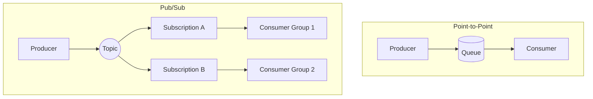
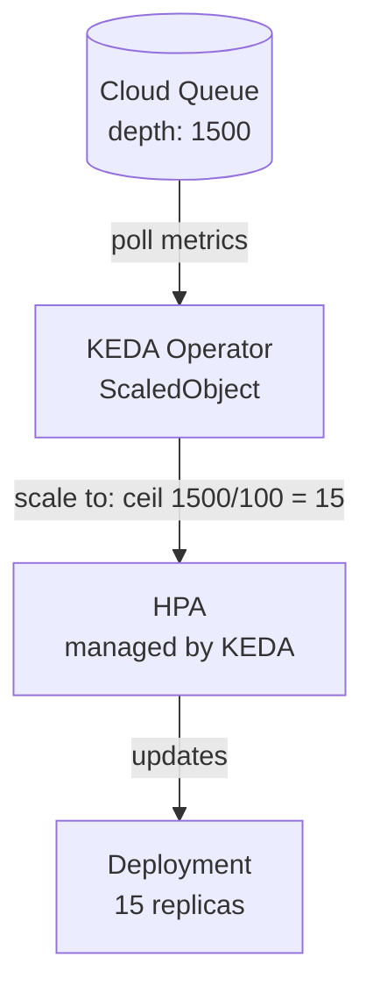
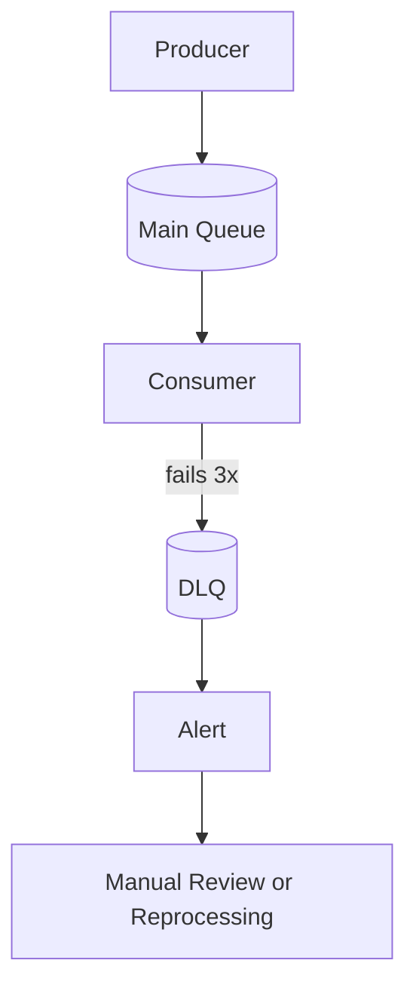
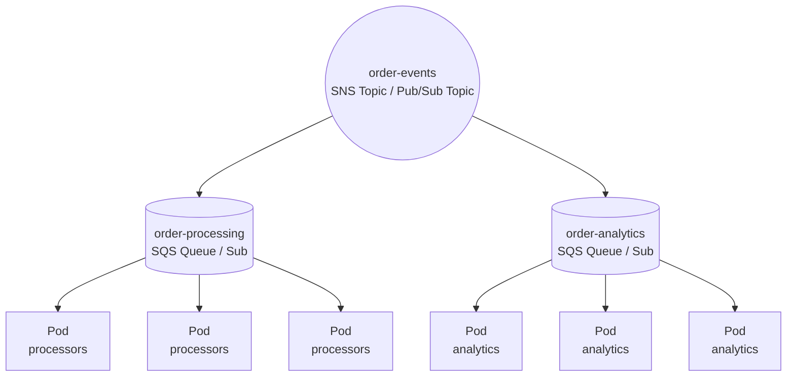
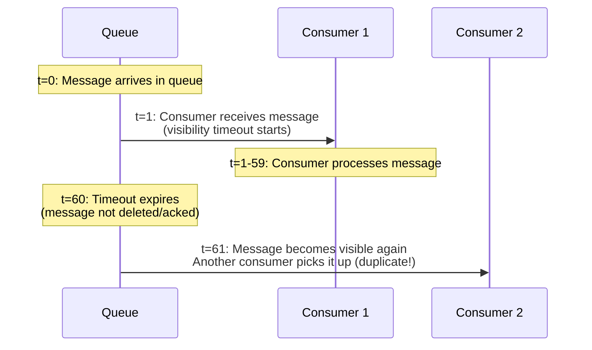
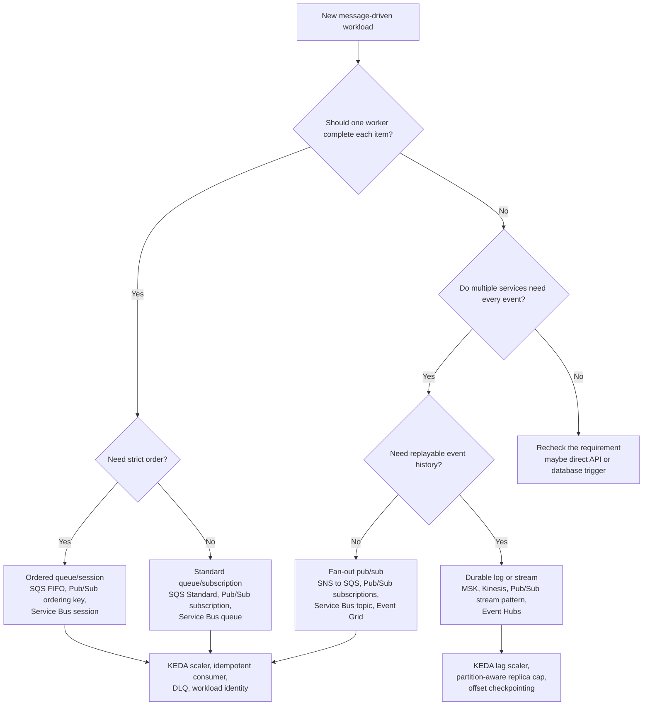

**Complexity**: `[COMPLEX]` | **Time to Complete**: 2.5h | **Prerequisites**: Module 9.1 (Relational Database Integration), Kubernetes Deployments and Services

## What You'll Be Able to Do

After completing this module, you will be able to:

- **Configure Kubernetes workloads to consume from managed message brokers (SQS/SNS, Cloud Pub/Sub, Azure Service Bus)**
- **Implement event-driven autoscaling using KEDA with message queue depth as the scaling trigger**
- **Deploy dead-letter queue patterns and retry logic for reliable message processing in Kubernetes applications**
- **Compare managed message brokers across clouds and evaluate when to use self-hosted (RabbitMQ, NATS) alternatives on Kubernetes**

---

## Why This Module Matters

Large traffic spikes can expose operational limits in a self-hosted broker cluster, including backpressure, node-failure recovery problems, and message-loss risk during disruptions.

The operational lesson is that self-hosting a distributed broker requires expertise many teams do not have. If you do not need broker-specific features, a managed queueing service can remove whole classes of broker-cluster failure modes.

This module teaches you how to integrate managed message brokers -- SQS/SNS, Google Pub/Sub, and Azure Service Bus -- with Kubernetes workloads. You will learn how to use KEDA to autoscale consumers based on queue depth, handle dead-letter queues, design for exactly-once versus at-least-once delivery, and manage consumer groups across multiple Kubernetes Deployments.

---

## Messaging Fundamentals for Kubernetes Engineers

Before diving into cloud services, let's establish the core messaging patterns that every integration uses.

### The Three Messaging Shapes

The first design choice is not "which cloud service should we use?" It is "what shape of communication does this workload need?" Managed messaging products overlap heavily in marketing names, but production systems usually need one of three shapes: a point-to-point queue, a publish-subscribe fan-out bus, or a durable log that can be replayed by independent consumers.

A point-to-point queue is a work distributor. One message represents one unit of work, and one consumer instance should complete it. If ten Kubernetes pods poll the same SQS queue, Service Bus queue, or Pub/Sub subscription, they are not all supposed to see every message; they are competing to share the workload. This is the shape for order processing, image conversion, email sending, fraud review, and background tasks where the business wants completion rather than broadcast.

A publish-subscribe system is an announcement channel. One producer publishes an event, and several independent consumers each need their own copy. AWS usually models that with SNS fan-out to SQS queues, EventBridge rules to targets, or SNS FIFO when ordered fan-out is required. Google Pub/Sub models fan-out directly with multiple subscriptions on one topic. Azure Service Bus uses topics and subscriptions for brokered pub/sub, while Event Grid handles event notifications to HTTP, Azure Functions, Service Bus, and other targets.

A durable log or stream is different from both. Messages are appended to ordered partitions, retained for a configured time, and consumed by consumer groups that maintain offsets. Apache Kafka, Amazon MSK, Amazon Kinesis Data Streams, Google Pub/Sub used as a high-throughput event stream, and Azure Event Hubs all fit this mental model to varying degrees. This shape is useful when consumers need replay, windowed analytics, or independent progress through the same ordered history.

Kubernetes does not remove those distinctions. A Deployment can poll a queue, subscribe to a topic, or run Kafka consumers, but the pod lifecycle adds new failure modes. Pods can be rescheduled while holding a message lease, rollouts can double the number of consumers for a short period, and autoscaling can amplify a backlog into sudden pressure on a downstream database. The broker gives you decoupling; Kubernetes decides how much compute attacks the backlog at any moment.

AWS deliberately offers several products because each shape has a different operational contract. SQS is the simple queue for work distribution; SNS is the fan-out topic; EventBridge is an event bus with filtering, routing, retries, and many AWS service integrations; Amazon MQ is the managed broker for teams that need ActiveMQ or RabbitMQ protocols; MSK is managed Kafka; and Kinesis Data Streams is the AWS-native shard-based stream. Choosing among them is mostly about coupling, protocol, ordering, replay, and cost model.

Google Cloud pushes most general messaging toward Pub/Sub, where a topic plus one subscription behaves like a queue and a topic plus many subscriptions behaves like fan-out. Pub/Sub Lite should now be treated as legacy migration material, not a new design target: Google's own documentation lists Pub/Sub Lite as deprecated with a June 30, 2026 turndown, and recommends migrating to Pub/Sub or Google Cloud Managed Service for Apache Kafka. That matters for architecture reviews because "reserved-capacity Pub/Sub Lite is cheaper" is no longer a safe forward-looking answer.

Azure splits the same space into Service Bus, Event Grid, and Event Hubs. Service Bus is the enterprise broker for queues, topics, sessions, transactions, duplicate detection, and dead-lettering. Event Grid is the event distribution service for reactive notifications and CloudEvents-style routing. Event Hubs is the streaming ingestion service with partitions, consumer groups, retention, and Kafka-compatible endpoints for many Kafka clients. The names differ, but the design question remains queue, fan-out, or durable log.

| Shape | AWS Fit | Google Cloud Fit | Azure Fit | Kubernetes Integration |
|-------|---------|------------------|-----------|------------------------|
| Point-to-point queue | SQS Standard or FIFO, Amazon MQ queue | Pub/Sub topic with one subscription | Service Bus queue | Deployment consumers, KEDA queue-depth scaler, workload identity |
| Pub/sub fan-out | SNS to SQS, EventBridge rules, SNS FIFO | Pub/Sub topic with many subscriptions | Service Bus topic/subscriptions, Event Grid | One Deployment per subscription, independent DLQs, per-consumer scaling |
| Durable log or stream | MSK, Kinesis Data Streams | Pub/Sub for event streams, Managed Service for Apache Kafka | Event Hubs, Event Hubs Kafka endpoint | Stateful consumer groups, KEDA Kafka/Event Hubs lag scalers, offset checkpoints |

### Point-to-Point vs Publish-Subscribe



### Delivery Guarantees

| Guarantee | Meaning | Risk | Used By |
|-----------|---------|------|---------|
| **At-most-once** | Message delivered 0 or 1 times | Data loss on failure | UDP-style telemetry |
| **At-least-once** | Message delivered 1+ times | Duplicates possible | SQS, Pub/Sub, Service Bus |
| **Exactly-once** | Message delivered exactly 1 time | Higher latency, complexity | Kafka transactions, Pub/Sub with dedup |

Most managed brokers provide **at-least-once** delivery by default. This means your consumer code must be **idempotent** -- processing the same message twice should produce the same result as processing it once.

At-least-once is not a provider weakness; it is the normal contract for reliable distributed messaging. A broker can safely redeliver a message when it cannot prove that the previous consumer finished and committed all side effects. In Kubernetes, that uncertainty appears whenever a pod is killed during a rollout, a node loses network, a process crashes after writing to a database but before acknowledging the message, or an HTTP client times out while the broker may still process the acknowledgement.

AWS SQS Standard queues give very high throughput and at-least-once delivery, but they do not promise strict ordering. SQS FIFO queues add ordering by `MessageGroupId` and deduplication through `MessageDeduplicationId` or content-based deduplication; AWS documents a 5-minute deduplication interval for duplicate suppression. That is powerful, but it is not a license to write non-idempotent consumers, because duplicate business actions can still come from producer retries with different IDs, downstream write retries, manual DLQ redrive, or a consumer bug.

Google Pub/Sub defaults to at-least-once delivery, and a subscription is the unit that controls delivery state. A topic does not remember that "the inventory service" consumed a message; the inventory subscription does. Pub/Sub's exactly-once feature is more precise than a marketing slogan: Google documents it for pull subscriptions, within a cloud region, with successful acknowledgements preventing later redelivery. Your application still needs durable progress tracking because acknowledgement can fail, publisher-side retries can create separate publishes, and multi-region subscriber placement can weaken the guarantee.

Azure Service Bus has a different vocabulary, but the same operational shape. A receiver usually uses peek-lock mode: it locks a message, processes it, and completes it when finished. If the lock expires or the receiver abandons the message, delivery count increases and the message can be retried until `MaxDeliveryCount` sends it to the dead-letter queue. Sessions add ordered processing for related message streams, while duplicate detection suppresses repeated sends with the same message ID during a configured detection window.

Kafka-family systems move the guarantee boundary again. Kafka does not "delete" a message when a consumer finishes; it stores records in partitions and consumers commit offsets. Transactions and idempotent producers can provide exactly-once processing semantics when producers, consumers, and sinks participate correctly, but a Kubernetes consumer that writes to an ordinary database still needs an idempotency key or transactional outbox pattern. The broker can protect the log; it cannot automatically make every external side effect atomic.

This is why message processing code should separate three facts: message receipt, business side effect, and acknowledgement. Receipt means the pod has a leased opportunity to work. The business side effect is the database write, API call, file upload, or notification the system actually cares about. The acknowledgement tells the broker that the message no longer needs delivery. If those three steps are blurred together, a crash can create either lost work or duplicate work.

The practical safety pattern is to choose a stable idempotency key before the first consumer ships. For an order event, that might be `order_id` plus event type; for a payment command, it might be a gateway-provided idempotency key; for a telemetry event, it might be a producer ID plus sequence number. Store that key where the side effect happens, not only in memory inside the pod, because a restarted pod will not remember what the previous pod attempted.

Dead-letter queues are part of the delivery guarantee, not an optional cleanup bin. AWS SQS redrive policy uses `maxReceiveCount`; Pub/Sub dead-letter topics use maximum delivery attempts; Azure Service Bus moves messages after maximum delivery count or explicit dead-letter operations. The DLQ gives operators a place to inspect poison messages without allowing one bad payload to consume every retry slot forever.

The cost of stronger guarantees is usually paid in throughput and coordination. Ordering means fewer independent lanes: one SQS FIFO message group, one Pub/Sub ordering key, one Service Bus session, or one Kafka partition can only advance as fast as its slowest ordered sequence allows. Exactly-once-like features add acknowledgement tracking or transaction coordination. Use them when the business meaning requires them, not because the phrase sounds safer in an architecture diagram.

```python
# BAD: Not idempotent -- double processing creates duplicate charges
def process_payment(message):
    charge_customer(message.customer_id, message.amount)

# GOOD: Idempotent -- uses a unique key to prevent duplicates
def process_payment(message):
    if not payment_exists(message.idempotency_key):
        charge_customer(message.customer_id, message.amount)
        record_payment(message.idempotency_key)
```

---

## Cloud Broker Comparison

| Feature | AWS SQS/SNS | Google Pub/Sub | Azure Service Bus |
|---------|-------------|----------------|-------------------|
| Queue model | SQS = queue, SNS = topic | Topic + Subscription | Queue or Topic + Subscription |
| Max message size | [256 KB (SQS), 256 KB (SNS)](https://docs.aws.amazon.com/sns/latest/dg/example_sns_PublishLargeMessage_section.html) | [10 MB](https://cloud.google.com/pubsub/quotas) | [256 KB (Standard), 100 MB (Premium)](https://learn.microsoft.com/en-us/azure/service-bus-messaging/service-bus-quotas) |
| Retention | 1 min - 14 days | 7 days by default; topic retention up to 31 days | Tier- and entity-dependent; do not assume a universal 14-day cap |
| Ordering | [FIFO queues (strict per group)](https://docs.aws.amazon.com/AWSSimpleQueueService/latest/SQSDeveloperGuide/FIFO-queues-understanding-logic.html) | [Ordering keys](https://cloud.google.com/pubsub/docs/ordering) | [Sessions (strict per session)](https://learn.microsoft.com/en-us/azure/service-bus-messaging/message-sessions) |
| Throughput | Auto-scales for high request volume | High throughput, subject to quotas and configuration | Depends on tier and workload characteristics |
| Dead-letter | [Built-in (maxReceiveCount)](https://docs.aws.amazon.com/AWSSimpleQueueService/latest/SQSDeveloperGuide/sqs-dead-letter-queues.html) | [Built-in (maxDeliveryAttempts)](https://cloud.google.com/pubsub/docs/dead-letter-topics) | [Built-in (maxDeliveryCount)](https://learn.microsoft.com/en-us/azure/service-bus-messaging/service-bus-dead-letter-queues) |
| Price model | Per-request pricing; region and queue type matter | Throughput and storage pricing based on bytes and retention | Tier- and operation-based pricing |

### Managed vs. Self-Hosted Brokers

When should you run your own broker (like RabbitMQ, Apache Kafka, or NATS) on Kubernetes versus using a managed cloud service? Use this framework:

| Decision Factor | Managed (SQS, Pub/Sub, Service Bus) | Self-Hosted on K8s (RabbitMQ, Kafka, NATS) |
|-----------------|--------------------------------------|-------------------------------------------|
| **Operational Expertise** | Zero maintenance. Broker handles scaling, patching, and replication. | Requires deep expertise in StatefulSets, PV I/O tuning, and split-brain recovery. |
| **Protocol Support** | Proprietary APIs (HTTP/gRPC) or limited standard protocol support. | Full support for AMQP, MQTT, STOMP, or specialized Kafka protocols. |
| **Feature Set** | Standardized, opinionated features. | Advanced routing, complex topologies, custom plugins, or massive message replay capabilities. |
| **Cost Structure** | Pay per message/API call. Expensive at massive, continuous throughput. | Fixed infrastructure cost (Compute/Storage). Cheaper at massive, predictable scale. |
| **Compliance/Data Locality**| Data leaves the cluster to the cloud provider's service. | Data stays entirely within your Kubernetes cluster/network boundary. |

**Rule of Thumb:** Default to managed brokers to focus on your application logic. Only self-host if you have a specific requirement (e.g., AMQP protocol requirement, strict air-gapped compliance, or sustained throughput exceeding millions of messages per second where managed costs become prohibitive) AND you have the dedicated engineering bandwidth to operate distributed stateful systems.

**Pause and predict:** Your organization mandates that sensitive customer records containing personally identifiable information must never cross the physical perimeter of your on-premises datacenter. Can your platform engineering team configure Amazon SQS to queue registration events originating from an on-premises Kubernetes cluster?

<details>
<summary>Check your prediction</summary>

No. Amazon SQS is a regional managed cloud messaging service that runs entirely on AWS multi-tenant infrastructure outside your private datacenter boundary. Sending customer payloads to SQS transmits sensitive data across the external network into cloud provider storage, violating strict on-premises data residency mandates. In strictly regulated or air-gapped environments, platform teams must deploy self-hosted message brokers such as RabbitMQ, NATS, or Apache Kafka directly on on-premises Kubernetes worker nodes.
</details>

The next section is how each cloud's queue and stream products map onto different workload shapes without treating every broker as interchangeable.

### Provider Fit by Workload

For simple asynchronous work on AWS, start with SQS. It is pull-based, cheap to operate at low and moderate volume, easy to scale with KEDA, and does not force you to size broker nodes or partitions. Add SNS when one event must reach several queues, and add EventBridge when the event needs routing rules, SaaS or AWS service integrations, cross-account event buses, or target retry policies. Reach for Amazon MQ when application compatibility depends on AMQP, MQTT, STOMP, OpenWire, ActiveMQ, or RabbitMQ behavior.

MSK and Kinesis are not "better SQS"; they solve a different problem. MSK is for Kafka applications that need partitioned logs, consumer groups, Kafka APIs, Connect, Streams, or ecosystem compatibility. Kinesis Data Streams is for shard-based AWS-native streaming where producers and consumers coordinate through partition keys and sequence numbers. Both services are good fits when replay and ordered history matter, but they add capacity planning that a simple queue hides.

On Google Cloud, Pub/Sub is the default answer for most Kubernetes eventing unless you have a strong reason to use Kafka. A topic plus one subscription behaves like a work queue, while a topic plus many subscriptions creates fan-out. Because each subscription tracks its own backlog and acknowledgement state, separate Kubernetes Deployments can scale independently from the same topic. That is the cleanest way to let billing, inventory, analytics, and search indexing all react to `OrderCreated` without competing against each other.

Pub/Sub Lite deserves special handling in legacy reviews. Before deprecation, it was attractive when teams wanted reserved capacity and lower predictable cost for very high, steady throughput. In 2026 curriculum work, that should be framed as a migration topic: identify any remaining Lite topics, decide whether standard Pub/Sub or managed Kafka is the target, and avoid teaching new designs that depend on a service scheduled for turndown. That single fact changes the decision matrix for Google messaging.

Azure Service Bus is the strongest Azure fit for command-like messages with business value. Queues handle point-to-point work, topics and subscriptions handle fan-out, sessions preserve ordered processing for related streams, and duplicate detection helps suppress repeated sends during a configured window. These features make it a good match for orders, approvals, billing workflows, and integration workloads where a lost or duplicate command has direct business consequences.

Azure Event Grid is better for notifications that something happened and for reactive glue between services. It pushes events to subscribers, retries delivery, can dead-letter undelivered events, and integrates deeply with Azure services. It is not a durable work queue where a Kubernetes consumer group pulls messages at its own pace. If your pod fleet needs to drain a backlog gradually while protecting a database, Event Grid is usually the wrong primary broker.

Azure Event Hubs is the streaming choice. It uses partitions and consumer groups, supports AMQP and Kafka-compatible clients, and prices capacity around throughput units, processing units, or dedicated capacity depending on tier. Use it for telemetry, clickstreams, logs, IoT events, and analytics ingestion where the business wants time-ordered event history rather than one-and-done work dispatch. KEDA can scale Event Hubs or Kafka consumers by lag, but partition count remains a real ceiling for parallelism.

The vendor-neutral Kubernetes answer is to keep broker ownership outside the application Deployment. Producers should know the topic or queue contract, not the number of consumer pods. Consumers should know how to process one message safely, not how to drain an entire incident backlog. KEDA, workload identity, External Secrets Operator, the Secrets Store CSI Driver, and broker operators are platform tools around the workload; they should not hide the core contract between producer, broker, and consumer.

Hypothetical scenario: a team moves an order pipeline from SQS to Kafka because "streams are more scalable." The first demo looks successful because every order event is now retained and replayable. Two months later, the operations team discovers that a single `customer_id` partition key puts the largest enterprise customer on one hot partition, KEDA cannot scale consumers past useful partition parallelism, and replaying one bug fix competes with live order processing. The better design would have asked whether replay was truly required before trading a simple queue for partition-management work.

| Workload Need | Prefer This Shape | AWS Starting Point | Google Starting Point | Azure Starting Point |
|---------------|------------------|--------------------|-----------------------|----------------------|
| One worker should complete each task | Queue | SQS Standard or FIFO | Pub/Sub topic with one subscription | Service Bus queue |
| Several services need independent copies | Pub/sub fan-out | SNS to SQS or EventBridge | Pub/Sub topic with multiple subscriptions | Service Bus topic or Event Grid |
| Consumers need replayable history | Durable log/stream | MSK or Kinesis | Pub/Sub or managed Kafka | Event Hubs |
| Existing app requires broker protocol | Managed broker | Amazon MQ | Managed Kafka or self-hosted broker | Service Bus AMQP or self-hosted broker |
| Strict ordered workflow per entity | Ordered queue/session/log | SQS FIFO message groups | Pub/Sub ordering keys or Kafka partitions | Service Bus sessions or Event Hubs partitions |

### AWS SQS/SNS: The Workhorse

SQS is the simplest managed queue -- no clusters, no partitions, no brokers. You create a queue and start sending messages.

```bash
# Create a standard queue
aws sqs create-queue --queue-name order-processing \
  --attributes '{
    "VisibilityTimeout": "300",
    "MessageRetentionPeriod": "1209600",
    "ReceiveMessageWaitTimeSeconds": "20"
  }'

# Create a dead-letter queue
aws sqs create-queue --queue-name order-processing-dlq

# Set up the redrive policy
DLQ_ARN=$(aws sqs get-queue-attributes \
  --queue-url $(aws sqs get-queue-url --queue-name order-processing-dlq --query QueueUrl --output text) \
  --attribute-names QueueArn --query 'Attributes.QueueArn' --output text)

aws sqs set-queue-attributes \
  --queue-url $(aws sqs get-queue-url --queue-name order-processing --query QueueUrl --output text) \
  --attributes "{\"RedrivePolicy\": \"{\\\"deadLetterTargetArn\\\":\\\"$DLQ_ARN\\\",\\\"maxReceiveCount\\\":\\\"3\\\"}\"}"

# Fan-out with SNS -> SQS
aws sns create-topic --name order-events
aws sns subscribe --topic-arn arn:aws:sns:us-east-1:123456789:order-events \
  --protocol sqs \
  --notification-endpoint arn:aws:sqs:us-east-1:123456789:order-processing
```

### Google Pub/Sub: The Scalable Option

```bash
# Create topic
gcloud pubsub topics create order-events

# Create subscription with dead-lettering
gcloud pubsub topics create order-events-dlq

gcloud pubsub subscriptions create order-processing \
  --topic=order-events \
  --ack-deadline=300 \
  --dead-letter-topic=order-events-dlq \
  --max-delivery-attempts=5 \
  --enable-exactly-once-delivery
```

### Azure Service Bus: The Enterprise Option

```bash
# Create namespace (Premium for VNET integration)
az servicebus namespace create \
  --resource-group myRG --name orders-bus \
  --sku Premium --capacity 1

# Create queue with dead-lettering
az servicebus queue create \
  --resource-group myRG --namespace-name orders-bus \
  --name order-processing \
  --max-delivery-count 3 \
  --default-message-time-to-live P14D \
  --enable-dead-lettering-on-message-expiration true
```

---

## Kubernetes Consumer Deployments

The typical pattern is a Deployment running consumer pods that poll the queue.

### SQS Consumer Pod

```yaml
apiVersion: apps/v1
kind: Deployment
metadata:
  name: order-processor
  namespace: processing
spec:
  replicas: 3
  selector:
    matchLabels:
      app: order-processor
  template:
    metadata:
      labels:
        app: order-processor
    spec:
      serviceAccountName: sqs-consumer
      containers:
        - name: consumer
          image: mycompany/order-processor:1.5.0
          env:
            - name: SQS_QUEUE_URL
              value: "https://sqs.us-east-1.amazonaws.com/123456789/order-processing"
            - name: SQS_WAIT_TIME_SECONDS
              value: "20"
            - name: SQS_MAX_MESSAGES
              value: "10"
            - name: SQS_VISIBILITY_TIMEOUT
              value: "300"
          resources:
            requests:
              cpu: 200m
              memory: 256Mi
            limits:
              cpu: 500m
              memory: 512Mi
          livenessProbe:
            httpGet:
              path: /healthz
              port: 8081
            initialDelaySeconds: 10
            periodSeconds: 30
          readinessProbe:
            httpGet:
              path: /readyz
              port: 8081
            initialDelaySeconds: 5
            periodSeconds: 10
```

### IAM for Queue Access (IRSA / Workload Identity)

Pods should avoid static credentials when cloud-native workload identity is available.

```yaml
# AWS: IRSA ServiceAccount
apiVersion: v1
kind: ServiceAccount
metadata:
  name: sqs-consumer
  namespace: processing
  annotations:
    eks.amazonaws.com/role-arn: arn:aws:iam::123456789:role/SQSConsumerRole
---
# The IAM policy attached to SQSConsumerRole:
# {
#   "Effect": "Allow",
#   "Action": [
#     "sqs:ReceiveMessage",
#     "sqs:DeleteMessage",
#     "sqs:GetQueueAttributes",
#     "sqs:ChangeMessageVisibility"
#   ],
#   "Resource": "arn:aws:sqs:us-east-1:123456789:order-processing"
# }
```

```yaml
# GCP: Workload Identity
apiVersion: v1
kind: ServiceAccount
metadata:
  name: pubsub-consumer
  namespace: processing
  annotations:
    iam.gke.io/gcp-service-account: pubsub-consumer@my-project.iam.gserviceaccount.com
```

```yaml
# Azure: Entra Workload ID
apiVersion: v1
kind: ServiceAccount
metadata:
  name: servicebus-consumer
  namespace: processing
  annotations:
    azure.workload.identity/client-id: <client-id>
```

On AKS, pair this ServiceAccount with a federated identity credential that trusts the cluster OIDC issuer and maps the Kubernetes service account to the Entra application (client) ID shown in the annotation.

Cloud workload identity is the preferred credential boundary for message consumers. On EKS, IRSA and newer EKS Pod Identity patterns connect a Kubernetes ServiceAccount to AWS IAM permissions so pods can receive SQS, SNS, EventBridge, MQ, MSK, or Kinesis permissions without static access keys. On GKE, Workload Identity Federation for GKE lets Kubernetes service accounts receive IAM authorization for Pub/Sub and other Google APIs without service account key files. On AKS, Microsoft Entra Workload ID federates Kubernetes service account tokens with Entra identities for Service Bus, Event Hubs, Event Grid, Key Vault, and other Azure resources.

Static broker credentials still appear in real systems, especially with Amazon MQ, RabbitMQ, Kafka SASL users, legacy AMQP clients, or third-party SaaS brokers. When you cannot use cloud-native workload identity directly, use External Secrets Operator or the Secrets Store CSI Driver to pull credentials from AWS Secrets Manager, Google Secret Manager, Azure Key Vault, Vault, or a similar external store. Avoid pasting connection strings into manifests, because a Git diff then becomes a credential distribution mechanism.

Self-hosted brokers on Kubernetes should be managed through operators only when you accept the operational ownership. Kubernetes documents the operator pattern as a controller plus custom resources that automate application-specific operations. That fits RabbitMQ or Kafka when you need protocol control, private data locality, or specialized topology, but it also means your platform team owns upgrades, persistent volume behavior, backup, restore, partition recovery, and broker-specific alerts.

Networking is part of broker integration, not an afterthought. Managed brokers often support private endpoints, VPC/VNet integration, security groups, firewall rules, or private service connect equivalents, and those choices determine whether consumer traffic leaves private network paths. A pod with perfect IAM permissions still fails if egress policies, DNS, TLS trust, or endpoint routing are wrong. Treat identity, network path, and broker authorization as one design review.

---

## KEDA: Autoscaling on Queue Depth

KEDA (Kubernetes Event-Driven Autoscaling) is the missing piece that makes message-driven architectures elastic. Instead of scaling on CPU (which is meaningless for I/O-bound queue consumers), KEDA scales based on the number of messages waiting in the queue.

### How KEDA Works



### Installing KEDA

```bash
helm repo add kedacore https://kedacore.github.io/charts
helm repo update
helm install keda kedacore/keda \
  --namespace keda --create-namespace \
  --set serviceAccount.annotations."eks\.amazonaws\.com/role-arn"=arn:aws:iam::123456789:role/KEDARole
```

### KEDA ScaledObject for SQS

```yaml
apiVersion: keda.sh/v1alpha1
kind: ScaledObject
metadata:
  name: order-processor-scaler
  namespace: processing
spec:
  scaleTargetRef:
    name: order-processor
  minReplicaCount: 1
  maxReplicaCount: 50
  pollingInterval: 15
  cooldownPeriod: 120
  triggers:
    - type: aws-sqs-queue
      authenticationRef:
        name: keda-aws-credentials
      metadata:
        queueURL: https://sqs.us-east-1.amazonaws.com/123456789/order-processing
        queueLength: "100"
        awsRegion: us-east-1
---
apiVersion: keda.sh/v1alpha1
kind: TriggerAuthentication
metadata:
  name: keda-aws-credentials
  namespace: processing
spec:
  podIdentity:
    provider: aws
```

For KEDA 2.13 and later, use `provider: aws` in `TriggerAuthentication` and omit the deprecated `identityOwner: operator` field from the scaler metadata.

The `queueLength: "100"` setting means KEDA will scale to ensure each pod handles at most 100 messages. If there are 1,500 messages in the queue, KEDA scales to 15 pods.

KEDA's SQS scaler treats "messages that need capacity" as more than only visible backlog. Current KEDA documentation describes the default calculation as visible messages plus in-flight messages, because in-flight SQS messages still represent work consuming pods. That is usually correct for batch processors, but it can over-scale a workload with long-running tasks if every pod holds a message for minutes. Tune `queueLength`, max replicas, and visibility timeout together rather than treating them as separate settings.

### KEDA ScaledObject for Pub/Sub

```yaml
apiVersion: keda.sh/v1alpha1
kind: ScaledObject
metadata:
  name: order-processor-scaler
  namespace: processing
spec:
  scaleTargetRef:
    name: order-processor
  minReplicaCount: 1
  maxReplicaCount: 30
  triggers:
    - type: gcp-pubsub
      metadata:
        subscriptionName: "projects/my-project/subscriptions/order-processing"
        mode: "SubscriptionSize"
        value: "50"
```

KEDA deprecated the older `subscriptionSize` parameter in favor of `mode` + `value`; the GCP Pub/Sub scaler itself is supported. Treat this example as the shape of a scaler, then verify the `mode` and `value` fields against the KEDA version running in your cluster.

### KEDA ScaledObject for Azure Service Bus

```yaml
apiVersion: keda.sh/v1alpha1
kind: ScaledObject
metadata:
  name: order-processor-scaler
  namespace: processing
spec:
  scaleTargetRef:
    name: order-processor
  minReplicaCount: 0
  maxReplicaCount: 25
  triggers:
    - type: azure-servicebus
      metadata:
        queueName: order-processing
        namespace: orders-bus
        messageCount: "50"
      authenticationRef:
        name: azure-servicebus-auth
```

The Azure Service Bus scaler follows the same principle as SQS: choose the target message count per pod from measured service capacity, not guesswork. If one pod can safely process 20 payment commands per minute without exhausting database connections, a target of 50 active messages per pod may already be too aggressive. KEDA can create consumers quickly, but it cannot make the downstream dependency accept more writes.

### Scale-to-Zero Considerations

KEDA can scale to zero (`minReplicaCount: 0`), which saves costs when queues are empty. But there is a latency cost: when the first message arrives, KEDA must detect it, scale the workload up, and wait for the application to become ready before processing begins.

**Use scale-to-zero when:**
- Processing is not latency-sensitive (batch jobs, analytics)
- Cost savings matter more than response time
- Queues are empty for long periods

**Keep minReplicaCount >= 1 when:**
- You need sub-second processing of new messages
- The application has expensive startup time (JVM, ML model loading)
- The queue always has some baseline traffic

**Pause and predict:** You configure a KEDA ScaledObject for a latency-sensitive fraud detection queue with `minReplicaCount: 0`. During an overnight lull, the queue empties and consumer pods terminate down to zero. When a suspicious high-priority transaction suddenly arrives, what latency progression does this individual message experience before processing begins?

<details>
<summary>Check your prediction</summary>

The transaction encounters an end-to-end cold-start delay rather than immediate execution. Because zero consumer pods are active, the initial message waits while KEDA polls the queue metrics, triggers workload activation, and requests a replica scale-up from Kubernetes. Processing cannot begin until the scheduled pod completes image verification, container startup, and readiness probe initialization. For latency-critical paths, always configure a minimum replica count of at least one to guarantee immediate message pickup.
</details>

The next section is how broker concurrency models and quotas show up as throughput, backpressure, and the monthly bill.

### Throughput, Backpressure, and Cost Lens

Throughput planning starts with the broker's concurrency model. SQS Standard queues support a very high, nearly unlimited number of API calls per second per action, which makes them forgiving for bursty queue workloads. SQS FIFO queues trade some of that freedom for ordering and deduplication; the default non-high-throughput FIFO limits are commonly taught as 300 API actions per second or 3,000 messages per second with batches of ten. High-throughput FIFO can go higher, but the exact quota is region-specific and should be verified before a design review.

Pub/Sub hides more partition math from you, but it does not remove quotas or cost. Publishers and subscribers consume regional quota, message storage grows with retention and unacknowledged backlog, and exactly-once subscriptions add latency and quota considerations. Pub/Sub pricing is based on published, delivered, and stored bytes, with data transfer costs when throughput crosses zone or region boundaries. Batching small messages matters because many pricing and throughput systems have minimum billable units or per-request overhead.

Service Bus and Event Hubs make capacity choices more visible. Service Bus Basic and Standard expose operation-based pricing and fixed operations-per-second limits, while Premium uses Messaging Units and removes some fixed Standard-tier limits. Event Hubs Standard uses throughput units, where one throughput unit provides a published ingress capacity measured in megabytes or events per second and all event hubs in the namespace share the purchased capacity. Event Hubs auto-inflate can scale TUs up, but Azure's documentation says it does not automatically scale them back down.

Kafka and Event Hubs consumers scale by partitions, not by wishful thinking. If a topic has ten partitions, only ten consumers in one consumer group can actively read at the same time unless the implementation allows idle consumers. KEDA's Kafka scaler documentation reflects that reality by defaulting replica count to the number of relevant partitions, nonzero-lag partitions, and `maxReplicaCount`. Setting `maxReplicaCount: 200` on a ten-partition topic may look bold, but most of those pods will sit idle.

Backpressure is the art of slowing down before the dependent system fails. A queue backlog is not automatically bad; it is the buffer doing its job. The real question is whether the queue's age, retry count, and DLQ rate remain inside the business objective. If the consumer pods scale faster than the database, payment processor, or search index can absorb work, the system converts a broker backlog into a dependency outage. A mature KEDA design caps replicas from downstream capacity tests, not from the highest queue depth seen in a dashboard.

High-frequency polling is a hidden cost and load multiplier. SQS charges per API request, and every empty receive still consumes an API call. AWS recommends long polling with wait times up to 20 seconds because it reduces empty responses and false empty responses. The same principle applies beyond SQS: prefer push delivery, streaming pulls, batching, or broker-native long polling when supported. A fleet of idle pods polling a quiet queue every second can spend money and produce noise while doing no business work.

Provisioned capacity has the opposite failure mode. MSK broker-hours, Event Hubs throughput units, Service Bus Premium Messaging Units, and self-hosted Kafka nodes cost money even when the queue is empty. That can be the right trade when traffic is steady, latency is tight, or throughput is predictable. It is wasteful when a workload runs once per night and spends the rest of the day at zero. Match the capacity model to the traffic curve, not to the product that feels most sophisticated.

Replication and region choices can dominate the bill at moderate scale. Cross-region event routing, multi-region consumers, geo-replication, inter-region Pub/Sub delivery, and internet egress can all add charges beyond the broker's headline request or throughput price. A common surprise is a fan-out topic where one business event creates five delivered copies, each copy is retained for retry, and two copies cross a region boundary for analytics. The architecture is correct only if the cost of that fan-out is intentional.

The cheapest reliable message is often the one you do not send. Avoid tiny chatty events when a batch would preserve the same business meaning. Avoid publishing full documents when a stable object-storage pointer and checksum are enough. Avoid fan-out to every team "just in case" when consumers cannot name a specific action they perform. Event-driven architecture should make coupling explicit; it should not turn every state change into a permanent tax on every downstream system.

Kubernetes gives you several control knobs around those costs. `minReplicaCount` controls idle compute spend and cold-start latency. `pollingInterval` controls how quickly KEDA sees backlog changes and how often it calls cloud APIs. `cooldownPeriod` controls whether consumers flap during lumpy traffic. `maxReplicaCount` protects dependencies from a thundering herd. Pod resource requests define cluster capacity consumed during a backlog. None of those values should be copied from a tutorial into production without a load test.

For Kafka or Event Hubs compatible streams, scale on consumer lag rather than CPU. CPU can be low while a consumer waits on downstream I/O, and CPU can be high while lag is already stable. Lag tells you how far behind the consumer group is from the head of the log. A useful target says, "one pod should be responsible for roughly N records of lag," then caps replicas at a value the downstream sink can survive.

```yaml
apiVersion: keda.sh/v1alpha1
kind: ScaledObject
metadata:
  name: order-stream-consumer-scaler
  namespace: processing
spec:
  scaleTargetRef:
    name: order-stream-consumer
  minReplicaCount: 1
  maxReplicaCount: 12
  pollingInterval: 30
  cooldownPeriod: 180
  triggers:
    - type: kafka
      metadata:
        bootstrapServers: orders-kafka.kafka.svc:9092
        consumerGroup: order-projector
        topic: order-events
        lagThreshold: "500"
        activationLagThreshold: "50"
        offsetResetPolicy: latest
```

This scaler says that one consumer pod should absorb about 500 records of lag, but it also refuses to create more than 12 replicas. If the topic only has eight partitions, a default KEDA Kafka configuration will not make more active consumers than partition ownership allows. That is the important stream lesson: capacity comes from partitions, consumer efficiency, and downstream throughput together, not from replica count alone.

At moderate scale, a cost review should include five numbers. Count broker requests or billable operations, delivered bytes, retained backlog age, cross-zone or cross-region transfer, and idle provisioned capacity. Then connect those numbers to design knobs: batching, long polling, push delivery, retention, DLQ redrive velocity, partition count, replica caps, and per-consumer concurrency. That review usually finds cheaper reliability improvements than a service migration.

---

## Dead-Letter Queues (DLQs)

A DLQ captures messages that fail processing repeatedly. Without a DLQ, poison messages -- messages that repeatedly fail -- can block queue progress as they are received, fail, become visible again, and repeat.

### DLQ Architecture



### DLQ Consumer for Alerting

```yaml
apiVersion: apps/v1
kind: Deployment
metadata:
  name: dlq-monitor
  namespace: processing
spec:
  replicas: 1
  selector:
    matchLabels:
      app: dlq-monitor
  template:
    metadata:
      labels:
        app: dlq-monitor
    spec:
      containers:
        - name: monitor
          image: mycompany/dlq-monitor:1.0.0
          env:
            - name: DLQ_QUEUE_URL
              value: "https://sqs.us-east-1.amazonaws.com/123456789/order-processing-dlq"
            - name: SLACK_WEBHOOK_URL
              valueFrom:
                secretKeyRef:
                  name: slack-config
                  key: webhook-url
            - name: ALERT_THRESHOLD
              value: "5"
```

### Reprocessing DLQ Messages

```bash
# AWS: Move messages from DLQ back to main queue
aws sqs start-message-move-task \
  --source-arn arn:aws:sqs:us-east-1:123456789:order-processing-dlq \
  --destination-arn arn:aws:sqs:us-east-1:123456789:order-processing \
  --max-number-of-messages-per-second 10
```

**Pause and predict:** A software defect causes 5,000 valid orders to fail processing and divert into a dead-letter queue over a weekend incident. On Monday morning, you deploy a verified hotfix to the consumer Deployment. If you execute a script that instantly redrives all 5,000 messages back into the primary queue at once, what operational hazard do you create for downstream dependencies?

<details>
<summary>Check your prediction</summary>

Dumping 5,000 messages simultaneously into the main queue risks generating a catastrophic thundering herd against downstream services. The sudden queue backlog triggers KEDA to rapidly scale consumer pods up to their maximum replica ceiling. Dozens of concurrent worker pods running parallel processing jobs can exhaust database connection pools, saturate cache instances, or trigger severe upstream API rate limiting. When redriving substantial dead-letter volumes, always throttle the redrive rate gradually or temporarily lower maximum replica limits.
</details>

The next section is how competing consumers share a queue so each replica does not claim the same message.

---

## Consumer Groups and Competing Consumers

When multiple pods consume from the same queue, they are "competing consumers." The broker ensures each message goes to only one consumer. This is automatic with SQS and Service Bus queues. For Pub/Sub, each subscription is an independent consumer group.

### Multi-Consumer Architecture



[Each service gets its own subscription/queue](https://cloud.google.com/pubsub/docs/subscription-overview). Messages fan out to all subscriptions, and within each subscription, competing consumers share the load.

```yaml
# Producer publishes to SNS topic from within a pod
apiVersion: batch/v1
kind: CronJob
metadata:
  name: order-publisher
  namespace: processing
spec:
  schedule: "*/5 * * * *"
  jobTemplate:
    spec:
      template:
        spec:
          restartPolicy: OnFailure
          serviceAccountName: sns-publisher
          containers:
            - name: publisher
              image: mycompany/order-publisher:1.0.0
              env:
                - name: SNS_TOPIC_ARN
                  value: "arn:aws:sns:us-east-1:123456789:order-events"
```

### Exactly-Once vs At-Least-Once in Practice

| Scenario | Recommended Guarantee | Why |
|----------|----------------------|-----|
| Payment processing | At-least-once + idempotency key | Exactly-once adds latency; idempotency is safer |
| Email notifications | At-least-once + deduplication window | Sending two emails is better than sending zero |
| Inventory updates | At-least-once + last-write-wins | Idempotent by nature (SET quantity = X) |
| Analytics events | At-least-once (duplicates acceptable) | Analytics pipelines handle dedup downstream |
| Financial ledger entries | Exactly-once (Kafka transactions) | Double-counting money is unacceptable |

For most Kubernetes workloads, **at-least-once with application-level idempotency** is the pragmatic choice. Exactly-once is expensive and complex -- only reach for it when the cost of a duplicate exceeds the cost of the complexity.

---

## Visibility Timeout and Message Lifecycle

One of the most misunderstood concepts in queue-based systems is the visibility timeout (SQS) or ack deadline (Pub/Sub).



### Setting the Right Timeout

[The visibility timeout must be longer than your maximum processing time.](https://docs.aws.amazon.com/AWSSimpleQueueService/latest/SQSDeveloperGuide/sqs-visibility-timeout.html) But not too long -- if a consumer crashes, the message is stuck invisible until the timeout expires.

```python
# Good pattern: extend visibility during long processing
import boto3

sqs = boto3.client('sqs')

while True:
    response = sqs.receive_message(
        QueueUrl=QUEUE_URL,
        MaxNumberOfMessages=1,
        WaitTimeSeconds=20,
        VisibilityTimeout=60
    )

    for message in response.get('Messages', []):
        try:
            # Start processing
            result = process_order(message['Body'])

            # If still processing after 45s, extend the timeout
            if result.needs_more_time:
                sqs.change_message_visibility(
                    QueueUrl=QUEUE_URL,
                    ReceiptHandle=message['ReceiptHandle'],
                    VisibilityTimeout=120
                )
                finalize_order(result)

            # Delete on success
            sqs.delete_message(
                QueueUrl=QUEUE_URL,
                ReceiptHandle=message['ReceiptHandle']
            )
        except Exception as e:
            # Don't delete -- message will become visible again
            log.error(f"Failed to process: {e}")
```

**Pause and predict:** A developer configures an SQS visibility timeout of 30 seconds for a queue processing compute-intensive video encoding jobs. Benchmark testing indicates that consumer pods consistently require 45 seconds to complete each encoding task. If three encoding tasks enter the queue while ten consumer pods wait for work, what processing condition occurs across the fleet after 35 seconds?

<details>
<summary>Check your prediction</summary>

The consumer fleet enters a state of duplicate processing. Because the visibility timeout expired after 30 seconds while the initial workers were still running, SQS returned all three messages to the visible queue. Three idle consumer pods immediately receive the reappeared messages and start duplicate encoding jobs for the identical videos. This redundant execution wastes cluster CPU capacity and risks data inconsistencies unless downstream writes enforce strict idempotency.
</details>

The next section is how producers, brokers, and consumers split ownership so a failed ack does not become a double charge.

---

## Patterns & Anti-Patterns

Good messaging architectures make work ownership explicit. A producer owns the schema and meaning of the message, the broker owns durable delivery mechanics, the consumer owns idempotent side effects, and the platform owns safe scaling and credentials. Problems appear when one layer silently assumes another layer solved its part. A FIFO queue cannot fix a consumer that charges twice, and a perfect idempotency key cannot save a system that deletes messages before the database commit.

The most reliable pattern is a dedicated queue or subscription per consumer capability. In AWS, that often means SNS fan-out to one SQS queue per downstream service. In Google Cloud, it means one Pub/Sub subscription per service. In Azure, it means one Service Bus subscription per service on a topic. Each consumer then gets independent backlog, retry policy, DLQ, KEDA scaler, alerting, and deployment cadence. One slow analytics consumer no longer blocks billing or inventory.

Another proven pattern is "lease, process, commit, ack" with idempotency. The consumer receives or locks the message, performs the business write using a stable idempotency key, commits that write, and only then deletes or acknowledges the message. If the pod crashes before the acknowledgement, the broker may redeliver the message, but the idempotency record prevents duplicate business action. That pattern works across SQS visibility timeout, Pub/Sub ack deadlines, Service Bus locks, and Kafka offset commits.

For streams, the mature pattern is lag-based autoscaling with partition-aware caps. KEDA can scale Kafka-compatible consumers from lag, but partition ownership limits useful concurrency. A design that pairs lag thresholds with `maxReplicaCount`, consumer batch size, database connection limits, and partition count behaves predictably during spikes. A design that simply says "scale to 100 pods when lag grows" often creates idle consumers or overloads the sink.

| Pattern | When to Use | Why It Works | Scaling Consideration |
|---------|-------------|--------------|-----------------------|
| Dedicated queue or subscription per service | One event must feed independent services | Backlog, DLQ, retries, and deployment ownership stay separate | Scale each consumer from its own backlog rather than shared topic volume |
| Idempotent consumer with ack-after-commit | Any at-least-once broker feeds business side effects | Redelivery becomes safe because duplicate work is recognized | Store idempotency state in the durable system that observes the side effect |
| Fan-out topic plus per-service DLQ | Events must reach billing, inventory, analytics, and notifications | A poison message in one consumer does not block the others | Alert on each DLQ independently and throttle redrive by downstream capacity |
| Lag-based stream consumers | Kafka, MSK, Event Hubs, or Kinesis-like workloads need replay | Consumer lag maps to stream progress better than CPU utilization | Partition count and sink capacity cap useful replicas |

The queue-as-database anti-pattern is the most common failure mode. Teams leave business state only in a queue, assume retention is a database backup, and then discover that message expiry, DLQ moves, reprocessing, or purge operations erased the only copy of important state. Queues are excellent buffers and work distributors, but the durable system of record should be a database, object store, ledger, or event store designed for that role.

Missing DLQs are usually a sign that the happy path was tested but failure was not. Developers often skip DLQs because they do not yet know what a poison message looks like, but that is exactly why the DLQ is needed. Without it, one schema mismatch can create endless retries, repeated pod crashes, and noisy alerts while healthy messages wait behind bad ones. A DLQ is not enough by itself; it needs monitoring, ownership, and a safe redrive procedure.

Non-idempotent consumers are dangerous because they pass every local test. A single message enters the queue, one pod processes it, and the result looks correct. Production adds retries, rollout interruptions, duplicate publishes, network timeouts, DLQ replays, and partial downstream failures. If the consumer cannot recognize that it already processed `payment-123`, the broker will eventually expose the bug.

Over-scaling from backlog is another trap. A queue depth of 100,000 messages looks like a compute problem, so a team raises `maxReplicaCount` from 20 to 200. The queue drains faster for a minute, then the database connection pool, third-party API quota, or search cluster collapses. The better answer is to scale up to the measured safe rate, preserve backlog as a buffer, and use age-of-oldest-message alerts to decide whether business objectives are at risk.

| Anti-Pattern | What Goes Wrong | Why Teams Fall Into It | Better Alternative |
|--------------|-----------------|------------------------|--------------------|
| Queue as database | Message expiry, purge, or redrive changes destroy business state | The queue already looks durable during development | Store authoritative state in a database or event store and use the queue for delivery |
| No DLQ or unmonitored DLQ | Poison messages retry forever or disappear into an ignored side channel | Failure payloads feel unlikely before launch | Configure DLQ, alert on depth and age, and document redrive ownership |
| Non-idempotent consumer | Redelivery creates duplicate charges, emails, shipments, or ledger rows | Tests cover one delivery, not crashes between commit and ack | Use durable idempotency keys and commit before ack/delete |
| One shared queue for many business services | Competing consumers steal messages from each other instead of all seeing events | A queue seems simpler than fan-out topology | Use a topic with one queue or subscription per service |
| Autoscaling without downstream budget | KEDA turns broker backlog into database or API overload | Replica count is easier to change than dependency capacity | Cap replicas from load tests and throttle DLQ redrive |
| Ordering everything globally | Throughput collapses behind one ordered lane | "Ordered" sounds safer than per-entity ordering | Order by entity key, session, message group, or partition only where needed |

Hypothetical scenario: an e-commerce team publishes every checkout event to one shared queue and lets billing, warehouse, and email pods all poll it. In testing, it appears to work because the first pod to receive each event happens to run the expected logic. In production, billing consumes some email events, warehouse misses some billing commands, and retries create inconsistent order state. The fix is not a bigger broker; it is changing the topology to fan-out with one durable subscription per service.

## Decision Framework

Choosing between queue, pub/sub, and stream is a business-semantics decision first, then a provider decision. Ask whether one consumer should complete the work, several consumers need independent copies, or future consumers must replay history. Then ask whether ordering matters globally, per entity, or not at all. Only after those answers are clear should the team compare SQS, Pub/Sub, Service Bus, Event Grid, Event Hubs, MSK, Kinesis, or managed Kafka.



Use a standard queue when the business wants work completion and can tolerate duplicate delivery with idempotent consumers. That is the default for background processing, image conversion, order fulfilment commands, and async API offload. On AWS, SQS Standard is usually first. On Google Cloud, Pub/Sub with one subscription gives the same consumption shape. On Azure, Service Bus queues fit when enterprise broker features matter, while Azure Storage Queue may fit simpler Azure-native work not covered deeply in this module.

Use ordered queues, sessions, ordering keys, or partitions only when the order has a named business entity. "All payments globally must be ordered" is usually impossible or unnecessary. "All events for order `O-12345` must be processed in order" is realistic. AWS uses FIFO message groups, Pub/Sub uses ordering keys, Azure Service Bus uses sessions, and Kafka/Event Hubs use partition keys. Each of those choices creates lanes of serialization, so pick the key that preserves correctness without sacrificing unrelated parallelism.

Use pub/sub fan-out when each consumer is a separate business capability. Billing, inventory, email, analytics, and search indexing should not steal messages from one another. Give each service its own subscription or queue and its own DLQ. This adds resources, but it buys fault isolation. The cost of several subscriptions is usually lower than the operational cost of guessing which service failed to receive which event.

Use a durable log or stream when replay is a product requirement, not just an appealing feature. Streams are excellent for analytics, audit trails, event-sourced projections, CDC pipelines, IoT telemetry, and ML feature generation. They are not automatically better for simple task queues. If no team can name who will replay events, how far back they need to replay, and what downstream sink can survive the replay rate, a simple queue is probably the more honest design.

| Decision Question | Queue Answer | Pub/Sub Answer | Stream Answer |
|-------------------|--------------|----------------|---------------|
| Who should receive one message? | Exactly one competing consumer | Every subscription gets a copy | Every consumer group can read the retained log |
| How is progress tracked? | Delete, complete, or acknowledge after processing | Per-subscription acknowledgement state | Consumer-group offsets or checkpoints |
| What scales consumers? | Queue depth and message age | Subscription backlog and age | Consumer lag and partition ownership |
| What limits throughput? | API quotas, FIFO groups, consumer capacity | Regional quotas, ack behavior, subscription backlog | Partition count, broker capacity, sink throughput |
| What does replay mean? | Usually DLQ redrive or re-enqueue | Seek/snapshot features or republish depending on service | Native retained log replay by offsets |
| What costs spike? | Empty polling, request count, redrive storms | Delivered bytes, storage, cross-region delivery | Broker hours, throughput units, partitions, retained storage |

The decision framework should end with a runbook test. Create a poison message and prove it lands in the DLQ. Kill a pod after the database commit but before the ack and prove idempotency prevents a duplicate side effect. Fill the queue with enough messages to trigger KEDA and prove the database survives the replica cap. Redrive the DLQ slowly and prove dashboards show the recovery. If those tests are missing, the design is still a diagram.

## Did You Know?

1. **SQS retention is bounded but generous** — AWS documents message retention from 1 minute up to 14 days (`MessageRetentionPeriod`), matching the comparison table above.

2. **Pub/Sub default retention is shorter than many teams assume** — Google documents 7-day default subscription message retention, with topic retention configurable up to 31 days per quota documentation.

3. **KEDA supports many event sources beyond cloud queues** -- message brokers, databases, metrics backends, schedules, and CI/CD systems can all drive autoscaling.

4. **SQS visibility timeouts and distributed-system leases solve a similar coordination problem** -- a worker gets temporary exclusive access to a unit of work, and that access expires if it does not finish in time.

---

## Common Mistakes

| Mistake | Why It Happens | How to Fix It |
|---------|---------------|---------------|
| Setting visibility timeout shorter than processing time | Estimated processing time was optimistic | Measure P99 processing time and add 50% buffer; implement dynamic extension |
| Not implementing idempotency in consumers | "At-least-once means delivered once, right?" | Use idempotency keys (message dedup ID or database unique constraints) |
| Scaling KEDA on CPU instead of queue depth | HPA defaults are CPU-based | Use KEDA ScaledObject with queue-specific triggers |
| Missing dead-letter queue configuration | DLQ feels like an edge case during development | Usually create a DLQ and a monitoring/alerting consumer for it |
| Using SQS Standard when FIFO is needed | Standard is the default and cheaper | [Use FIFO queues with MessageGroupId for ordering-sensitive workloads](https://docs.aws.amazon.com/AWSSimpleQueueService/latest/SQSDeveloperGuide/using-messagegroupid-property.html) |
| Processing messages in the readiness probe thread | Trying to block traffic during processing | Keep health probes on a separate HTTP server from message processing |
| Not setting `WaitTimeSeconds` (long polling) | Default is short polling (returns immediately) | Usually set `WaitTimeSeconds: 20` for SQS to reduce empty responses and cost |
| Deleting messages before processing completes | "Optimistic" deletion to avoid duplicates | Only delete/ack after successful processing and any downstream writes |

---

## Quiz

<details>
<summary>1. Your team is designing a payment processing service on Kubernetes that consumes messages from a broker. An engineer argues that the broker must be configured for "exactly-once" delivery so customers aren't double-charged. Why is relying on "at-least-once" delivery with an application-level idempotency key a safer and more resilient architectural choice?</summary>

Exactly-once delivery requires complex coordination between the broker and the consumer, often introducing significant latency and fragility. In a Kubernetes environment, pods can crash, lose network connectivity, or be rescheduled at any moment, meaning network failures will inevitably disrupt exactly-once handshakes. At-least-once delivery is designed to maximize the chance that a message is delivered, keeping the broker fast and simple. By designing your application to be idempotent (e.g., checking a database for a processed transaction ID before charging), you guarantee correct outcomes even if the broker delivers the message multiple times or a pod restarts mid-process.
</details>

<details>
<summary>2. During a sudden traffic spike, your SQS queue depth jumps to 1,500 messages. You have a KEDA ScaledObject configured with `queueLength: "100"`, `minReplicaCount: 2`, and `maxReplicaCount: 50`. How will KEDA respond to this scenario, and what factors control the pace of this scaling?</summary>

KEDA calculates the desired number of replicas by dividing the current queue depth by the target value. In this scenario, it divides 1,500 messages by the target of 100, resulting in a desired state of 15 replicas. Since 15 is within the bounds of your min (2) and max (50) replicas, KEDA will update the underlying HorizontalPodAutoscaler to scale the Deployment to 15 pods. KEDA polls the queue metrics based on the `pollingInterval` (default 30 seconds), meaning the scale-up will trigger on the next poll, and it will honor the `cooldownPeriod` before scaling back down once the queue is drained.
</details>

<details>
<summary>3. A worker pod is downloading and processing a large 5GB video file from an SQS message trigger. The processing takes 4 minutes, but the SQS queue's visibility timeout is set to 2 minutes. What specific failure state will this create in your cluster, and how will it impact other consumers?</summary>

Because the visibility timeout (2 minutes) is shorter than the processing time (4 minutes), the message will become visible in the queue again before the first pod finishes its work. Another idle consumer pod will pull the exact same message and begin downloading and processing the video from the beginning. This results in duplicate processing, wasted compute resources, and potential race conditions when both pods try to write the final result. To fix this, the application must either set a longer default visibility timeout or dynamically extend the timeout via API calls while the long-running task is still actively processing.
</details>

<details>
<summary>4. You need to route an "OrderCreated" event to both an Inventory Service and a Billing Service, each running 5 replicas. An engineer suggests having all 10 pods listen to a single SQS queue. Why will this fail to achieve the business requirement, and how does a fan-out architecture solve it?</summary>

If all 10 pods listen to a single SQS queue, they will act as competing consumers, meaning each "OrderCreated" message will be delivered to exactly one pod (either Inventory OR Billing, but not both). This breaks the requirement that both services need to process the event independently. By using a fan-out pattern (e.g., an SNS topic publishing to two separate SQS queues—one for Inventory, one for Billing), you create independent copies of the message. The 5 Inventory pods will compete for messages on their dedicated queue, and the 5 Billing pods will compete on theirs, ensuring both business domains process every order.
</details>

<details>
<summary>5. A healthcare application uses KEDA to scale a patient alert processing service. The developers set `minReplicaCount: 0` to save compute costs at night when alerts are rare. When a critical heart-rate alert arrives at 3 AM, why might the response time be unacceptably slow?</summary>

Because the service is scaled to zero, there are no running pods available to immediately process the incoming 3 AM alert. KEDA must first detect the message during its polling cycle, which introduces a slight delay. Then, it triggers a scale-up, requiring Kubernetes to schedule a new pod, pull the container image, and wait for the application to initialize and pass readiness probes. This cold-start sequence can take anywhere from 30 to 90 seconds, adding massive latency to a critical healthcare alert. For latency-sensitive workloads, usually keep at least one replica running.
</details>

<details>
<summary>6. A developer deploys a new JSON parsing library in an SQS consumer pod, but it crashes whenever it encounters a null field. An upstream service starts sending payloads with null fields. If there is no Dead-Letter Queue (DLQ) configured, what will happen to the overall health of the messaging system?</summary>

Without a DLQ, the messages containing null fields become "poison messages." The consumer pod will receive the message, attempt to parse it, crash, and fail to delete the message. After the visibility timeout expires, the message will become visible again, another pod will pick it up, crash, and the cycle will repeat indefinitely. This infinite loop will consume cluster CPU, generate endless crash loop logs, and prevent healthy messages behind the poison messages from being processed. A DLQ automatically quarantines these failing messages after a set number of attempts, allowing normal processing to continue and giving engineers a place to inspect the bad data.
</details>

<details>
<summary>7. Your team is migrating a microservice architecture from AWS SQS to Google Cloud Pub/Sub. In AWS, you had 3 pods polling a single SQS queue to share the load. If you configure 3 pods to subscribe directly to a single Pub/Sub Topic without configuring a Subscription, what unexpected behavior will you encounter?</summary>

In Google Pub/Sub, a Topic only acts as a routing mechanism, and you cannot consume directly from it; you must create a Subscription. If you create three separate Subscriptions (one for each pod), Pub/Sub will treat them as distinct consumer groups, and every pod will receive a copy of every message (fan-out) rather than sharing the load. To replicate the SQS load-sharing behavior, you must create a single Subscription and configure all 3 pods to pull from that exact same Subscription. This explicit Subscription model gives Pub/Sub strict separation between fan-out and competing-consumer routing.
</details>

<details>
<summary>8. A startup is building a microservices platform on EKS. They process about 50,000 internal events per day. Their lead architect wants to deploy a 5-node Kafka cluster using Strimzi to handle this messaging, citing "better control over routing and future-proofing." Why might this be an architectural anti-pattern for their current state?</summary>

Deploying a self-hosted Kafka cluster for 50,000 messages a day introduces massive operational overhead for very little benefit. Kafka requires managing StatefulSets, Zookeeper/KRaft quorum, persistent volume I/O, and replication factors. For 50,000 messages/day, the cost of the EC2 instances alone will far exceed the cost of managed SQS or SNS, which would be pennies. Furthermore, the engineering time spent maintaining the broker distracts from building the actual product. Unless they have strict regulatory data-locality needs or require Kafka's specific log-replay semantics, a managed service is the correct choice until their scale or feature requirements mandate otherwise.
</details>

---

## Hands-On Exercise: Event-Driven Processing with KEDA

This exercise uses a local kind cluster with a simulated queue (Redis acting as a message broker) and KEDA for autoscaling.

### Setup

```bash
# Create kind cluster
kind create cluster --name event-lab
alias k=kubectl

# Install KEDA
helm repo add kedacore https://kedacore.github.io/charts
helm repo update
helm install keda kedacore/keda --namespace keda --create-namespace
k wait --for=condition=ready pod -l app.kubernetes.io/name=keda-operator \
  --namespace keda --timeout=120s

# Install Redis (simulating a message queue) — plain Deployment, not Bitnami chart
k create namespace messaging --dry-run=client -o yaml | k apply -f -
k apply -f - <<'EOF'
apiVersion: apps/v1
kind: Deployment
metadata:
  name: redis-master
  namespace: messaging
spec:
  replicas: 1
  selector:
    matchLabels:
      app: redis
  template:
    metadata:
      labels:
        app: redis
    spec:
      containers:
        - name: redis
          image: redis:7
          args: ["--requirepass", "lab-redis-pass"]
          ports:
            - containerPort: 6379
---
apiVersion: v1
kind: Service
metadata:
  name: redis-master
  namespace: messaging
spec:
  selector:
    app: redis
  ports:
    - port: 6379
      targetPort: 6379
EOF
k wait --for=condition=ready pod -l app=redis \
  --namespace messaging --timeout=120s
```

### Task 1: Deploy a Queue Consumer

Create a Deployment that processes messages from a Redis list, using Redis as a local stand-in for a cloud queue during the lab.

<details>
<summary>Solution</summary>

```yaml
apiVersion: apps/v1
kind: Deployment
metadata:
  name: queue-consumer
  namespace: messaging
spec:
  replicas: 1
  selector:
    matchLabels:
      app: queue-consumer
  template:
    metadata:
      labels:
        app: queue-consumer
    spec:
      containers:
        - name: consumer
          image: redis:7
          command:
            - /bin/sh
            - -c
            - |
              while true; do
                MSG=$(redis-cli -h redis-master -a lab-redis-pass \
                  BRPOP order-queue 10 2>/dev/null)
                if [ -n "$MSG" ]; then
                  echo "Processed: $MSG"
                fi
              done
          resources:
            requests:
              cpu: 50m
              memory: 64Mi
```

```bash
k apply -f /tmp/consumer.yaml
```
</details>

### Task 2: Configure KEDA ScaledObject for Redis

Create a KEDA ScaledObject that scales the consumer from the Redis list length, mirroring the same backlog-driven pattern used with managed queues.

<details>
<summary>Solution</summary>

```yaml
apiVersion: v1
kind: Secret
metadata:
  name: redis-auth
  namespace: messaging
stringData:
  redis-address: redis-master.messaging.svc:6379
  redis-password: lab-redis-pass
---
apiVersion: keda.sh/v1alpha1
kind: TriggerAuthentication
metadata:
  name: redis-trigger-auth
  namespace: messaging
spec:
  secretTargetRef:
    - parameter: address
      name: redis-auth
      key: redis-address
    - parameter: password
      name: redis-auth
      key: redis-password
---
apiVersion: keda.sh/v1alpha1
kind: ScaledObject
metadata:
  name: queue-consumer-scaler
  namespace: messaging
spec:
  scaleTargetRef:
    name: queue-consumer
  minReplicaCount: 1
  maxReplicaCount: 10
  pollingInterval: 5
  cooldownPeriod: 30
  triggers:
    - type: redis
      metadata:
        listName: order-queue
        listLength: "10"
      authenticationRef:
        name: redis-trigger-auth
```

```bash
k apply -f /tmp/keda-scaledobject.yaml
```
</details>

### Task 3: Generate Load and Watch Scaling

Push 200 messages into the queue, then watch KEDA translate backlog into additional consumer pods while the list drains.

<details>
<summary>Solution</summary>

```bash
# Push 200 messages to the queue
k run redis-producer --rm -it --image=redis:7 --namespace=messaging --restart=Never -- \
  /bin/bash -c '
  for i in $(seq 1 200); do
    redis-cli -h redis-master -a lab-redis-pass LPUSH order-queue "{\"orderId\": \"order-$i\", \"amount\": $((RANDOM % 1000))}" > /dev/null 2>&1
  done
  echo "Pushed 200 messages"
  redis-cli -h redis-master -a lab-redis-pass LLEN order-queue
  '

# Watch KEDA scale the deployment
k get scaledobject -n messaging -w &
k get pods -n messaging -l app=queue-consumer -w
```
</details>

### Task 4: Implement a Dead-Letter Queue Pattern

Create a second Redis list as a DLQ, then modify the consumer so repeated failures are quarantined instead of retried forever.

<details>
<summary>Solution</summary>

```yaml
apiVersion: apps/v1
kind: Deployment
metadata:
  name: queue-consumer-dlq
  namespace: messaging
spec:
  replicas: 1
  selector:
    matchLabels:
      app: queue-consumer-dlq
  template:
    metadata:
      labels:
        app: queue-consumer-dlq
    spec:
      containers:
        - name: consumer
          image: redis:7
          command:
            - /bin/bash
            - -c
            - |
              RETRY_LIMIT=3
              while true; do
                MSG=$(redis-cli -h redis-master -a lab-redis-pass \
                  BRPOP order-queue 10 2>/dev/null | tail -1)
                if [ -n "$MSG" ]; then
                  # Simulate random failures (1 in 5 messages fail)
                  FAIL=$((RANDOM % 5))
                  if [ "$FAIL" -eq 0 ]; then
                    # Get retry count
                    RETRIES=$(redis-cli -h redis-master -a lab-redis-pass \
                      HGET "retries:$MSG" count 2>/dev/null)
                    RETRIES=${RETRIES:-0}
                    if [ "$RETRIES" -ge "$RETRY_LIMIT" ]; then
                      redis-cli -h redis-master -a lab-redis-pass \
                        LPUSH order-dlq "$MSG" > /dev/null 2>&1
                      redis-cli -h redis-master -a lab-redis-pass \
                        HDEL "retries:$MSG" count > /dev/null 2>&1
                      echo "DLQ: $MSG (exceeded $RETRY_LIMIT retries)"
                    else
                      redis-cli -h redis-master -a lab-redis-pass \
                        HINCRBY "retries:$MSG" count 1 > /dev/null 2>&1
                      redis-cli -h redis-master -a lab-redis-pass \
                        LPUSH order-queue "$MSG" > /dev/null 2>&1
                      echo "RETRY ($((RETRIES+1))/$RETRY_LIMIT): $MSG"
                    fi
                  else
                    echo "OK: $MSG"
                  fi
                fi
              done
```

```bash
k apply -f /tmp/consumer-dlq.yaml

# Check DLQ after some processing
k exec -n messaging deploy/queue-consumer-dlq -- \
  redis-cli -h redis-master -a lab-redis-pass LLEN order-dlq
```
</details>

### Task 5: Monitor DLQ with an Alert Consumer

Deploy a monitoring pod that watches DLQ length and prints an alert when failed messages exceed the configured threshold.

<details>
<summary>Solution</summary>

```yaml
apiVersion: apps/v1
kind: Deployment
metadata:
  name: dlq-monitor
  namespace: messaging
spec:
  replicas: 1
  selector:
    matchLabels:
      app: dlq-monitor
  template:
    metadata:
      labels:
        app: dlq-monitor
    spec:
      containers:
        - name: monitor
          image: redis:7
          command:
            - /bin/sh
            - -c
            - |
              THRESHOLD=5
              while true; do
                DLQ_LEN=$(redis-cli -h redis-master -a lab-redis-pass \
                  LLEN order-dlq 2>/dev/null)
                echo "$(date): DLQ depth = $DLQ_LEN"
                if [ "$DLQ_LEN" -gt "$THRESHOLD" ]; then
                  echo "ALERT: DLQ depth $DLQ_LEN exceeds threshold $THRESHOLD!"
                fi
                sleep 15
              done
```

```bash
k apply -f /tmp/dlq-monitor.yaml
k logs -f -n messaging deploy/dlq-monitor
```
</details>

Before you close the hands-on lab, audit the four operational claims below. Each open card states a hypothesis that sounds operationally plausible during managed message broker integrations and Kubernetes cloud architectures. Treat the claim as a prediction, then open the details only after you have an answer.

**Card A: You can send customer PII registration events to AWS SQS from an air-gapped on-prem cluster because the queue protocol is encrypted.** An enterprise platform team operates an air-gapped Kubernetes cluster inside a private data center subject to strict sovereignty and data residency regulations. The team configures transport-layer security and KMS server-side encryption to publish customer account registration events directly to an Amazon SQS queue in an AWS region. Because payload encryption protects the data during transit over network tunnels, the team assumes the integration satisfies regulatory policies prohibiting customer records from leaving on-premises physical boundaries.

<details>
<summary>Check your prediction</summary>

Failure layer: Data sovereignty boundaries and regional cloud tenancy. Next action: recognize that AWS SQS is a regional public cloud service that ingests and persists messages on multi-tenant cloud provider infrastructure; encryption in transit and at rest secures payload data cryptographically but does not prevent physical data export outside your on-premises datacenter perimeter; sending sensitive customer records across network boundaries to an external cloud region directly violates strict data residency and air-gapped isolation compliance rules; deploy an in-cluster or self-hosted messaging platform such as RabbitMQ, NATS, or Apache Kafka on local Kubernetes worker nodes so message payloads remain strictly contained within physical datacenter boundaries.
</details>

**Card B: KEDA `minReplicaCount: 0` is safe for a latency-sensitive fraud queue because the first message is processed immediately.** A security engineering team manages a critical transaction pipeline where fraud detection microservices inspect high-value financial operations in real time. To optimize infrastructure spend during quiet overnight trading hours, the team deploys a KEDA ScaledObject configured with a minimum replica count of zero. The team assumes that when an unexpected transaction arrives, the event-driven autoscaling subsystem instantly routes the message to an active container without introducing perceptible latency overhead.

<details>
<summary>Check your prediction</summary>

Failure layer: Event-driven autoscaling activation latency and container initialization lifecycle. Next action: recognize that scaling from zero replicas introduces unavoidable cold-start latency; when the first message reaches an idle queue, KEDA must poll the broker metrics endpoint, evaluate the threshold, trigger the Kubernetes Deployment scale subresource, and wait for the scheduler, image verification, and application runtime to report ready; for JVM services or complex microservices, this initiation cycle can delay message consumption by tens of seconds; configure a minimum replica count of at least one for latency-critical processing queues to ensure immediate message pickup while letting KEDA scale additional replicas under load.
</details>

**Card C: After a hotfix, dumping all 5,000 DLQ messages back onto the main queue at once is the fastest safe recovery.** A production deployment bug causes five thousand valid customer order messages to exhaust their retry limits and accumulate in a dead-letter queue. Engineers merge and deploy a container hotfix that successfully resolves the underlying processing defect. To recover operational service quickly, the on-call team executes an automated task that dumps all five thousand messages directly back onto the main queue. The team expects this immediate redrive to clear the backlog and restore normal processing order with minimal operator intervention.

<details>
<summary>Check your prediction</summary>

Failure layer: Downstream capacity saturation and autoscaling thundering herd effects. Next action: understand that injecting thousands of messages simultaneously triggers aggressive consumer autoscaling up to maximum cluster replica limits; this sudden surge of parallel worker pods creates a thundering herd that can exhaust relational database connection pools, saturate downstream APIs, or exceed third-party rate limits; safely drain large dead-letter queues by applying rate-limited redrive policies, throttling message transfer rates through broker migration tooling, or temporarily clamping consumer Deployment replica boundaries until the backlog normalizes.
</details>

**Card D: An SQS visibility timeout of 30 seconds is enough for a 45-second encode job because other pods will wait until the first consumer finishes.** A multimedia processing service consumes video transcoding jobs from an Amazon SQS queue with an active visibility timeout configured to thirty seconds. Benchmark profiling indicates that worker pods require forty-five seconds of intensive computation to transcode incoming video chunks. The application team assumes that because a consumer pod actively holds the message receipt handle, peer pods polling the queue will automatically wait until encoding concludes.

<details>
<summary>Check your prediction</summary>

Failure layer: Queue visibility lease expiration and concurrent consumer duplicate delivery. Next action: recognize that message brokers like SQS do not monitor application progress or track worker CPU execution; when the visibility timeout elapses before message deletion or lease renewal, the broker returns the unacknowledged message to the queue; peer pods polling the queue receive the visible message and begin concurrent duplicate processing; set the default visibility timeout longer than the maximum expected processing duration, or have consumer pods issue periodic heartbeat calls to extend message visibility dynamically during long-running tasks.
</details>

**Success Criteria**:

- [ ] KEDA ScaledObject is created and active
- [ ] Consumer pod count increases when 200 messages are pushed
- [ ] Pod count decreases after queue is drained
- [ ] Failed messages land in the DLQ (order-dlq Redis list)
- [ ] DLQ monitor detects and alerts on threshold breach

### Cleanup

```bash
kind delete cluster --name event-lab
```

---

## Next Module

[Module 9.3: Serverless Interoperability (Lambda / Cloud Functions / Knative)](../module-9.3-serverless/) -- Learn when to use serverless alongside Kubernetes, how to trigger cloud functions from K8s events, and how Knative brings the serverless model directly into your cluster.

## Sources

- [docs.aws.amazon.com: example sns PublishLargeMessage section.html](https://docs.aws.amazon.com/sns/latest/dg/example_sns_PublishLargeMessage_section.html) — AWS documentation explicitly states that 256 KB is the maximum message size in both SNS and SQS.
- [cloud.google.com: quotas](https://cloud.google.com/pubsub/quotas) — Google Cloud's quotas page directly lists a 10 MB message size limit for Pub/Sub.
- [learn.microsoft.com: service bus quotas](https://learn.microsoft.com/en-us/azure/service-bus-messaging/service-bus-quotas) — Microsoft's Service Bus quotas page directly documents the tier-specific message-size limits.
- [cloud.google.com: ordering](https://cloud.google.com/pubsub/docs/ordering) — Google Cloud's ordering documentation directly explains ordered delivery via ordering keys.
- [learn.microsoft.com: message sessions](https://learn.microsoft.com/en-us/azure/service-bus-messaging/message-sessions) — Microsoft documents sessions as the way to achieve FIFO processing in Service Bus.
- [docs.aws.amazon.com: FIFO queues understanding logic.html](https://docs.aws.amazon.com/AWSSimpleQueueService/latest/SQSDeveloperGuide/FIFO-queues-understanding-logic.html) — AWS explicitly documents per-message-group strict ordering behavior for FIFO queues.
- [docs.aws.amazon.com: sqs dead letter queues.html](https://docs.aws.amazon.com/AWSSimpleQueueService/latest/SQSDeveloperGuide/sqs-dead-letter-queues.html) — AWS's DLQ documentation directly describes redrive policy and `maxReceiveCount`.
- [cloud.google.com: dead letter topics](https://cloud.google.com/pubsub/docs/dead-letter-topics) — Google Cloud's dead-letter topic documentation directly describes `max_delivery_attempts` behavior.
- [learn.microsoft.com: service bus dead letter queues](https://learn.microsoft.com/en-us/azure/service-bus-messaging/service-bus-dead-letter-queues) — Microsoft documents Service Bus DLQs and the role of maximum delivery count before dead-lettering.
- [cloud.google.com: subscription overview](https://cloud.google.com/pubsub/docs/subscription-overview) — Google Cloud's subscription overview directly explains that subscriptions are independent streams from a topic and each receives the topic's messages.
- [docs.aws.amazon.com: sqs visibility timeout.html](https://docs.aws.amazon.com/AWSSimpleQueueService/latest/SQSDeveloperGuide/sqs-visibility-timeout.html) — AWS's visibility-timeout documentation directly describes this redelivery behavior and the need to size or extend timeouts appropriately.
- [docs.aws.amazon.com: using messagegroupid property.html](https://docs.aws.amazon.com/AWSSimpleQueueService/latest/SQSDeveloperGuide/using-messagegroupid-property.html) — AWS directly documents that strict ordering requires FIFO queues and that `MessageGroupId` defines ordered groups.
- [Azure Service Bus queues, topics, and subscriptions](https://learn.microsoft.com/en-us/azure/service-bus-messaging/service-bus-queues-topics-subscriptions) — It gives the cleanest vendor overview of queue vs pub/sub semantics in Azure Service Bus.
- [KEDA upstream repository](https://github.com/kedacore/keda) — Use this as the allowlisted starting point for KEDA concepts while the primary docs host remains off-list.
- [Amazon SQS message quotas](https://docs.aws.amazon.com/AWSSimpleQueueService/latest/SQSDeveloperGuide/quotas-messages.html) — AWS documents Standard queue throughput behavior, FIFO throughput limits, batching effects, and message retention bounds.
- [Amazon SQS long polling best practices](https://docs.aws.amazon.com/AWSSimpleQueueService/latest/SQSDeveloperGuide/best-practices-setting-up-long-polling.html) — AWS explains why long polling reduces empty receives and lists the maximum wait time.
- [Amazon SQS exactly-once processing for FIFO queues](https://docs.aws.amazon.com/AWSSimpleQueueService/latest/SQSDeveloperGuide/FIFO-queues-exactly-once-processing.html) — AWS documents FIFO deduplication behavior and the 5-minute deduplication interval.
- [Amazon SQS message deduplication ID](https://docs.aws.amazon.com/AWSSimpleQueueService/latest/SQSDeveloperGuide/using-messagededuplicationid-property.html) — AWS explains how `MessageDeduplicationId` prevents duplicate delivery within the deduplication window.
- [Amazon MQ for ActiveMQ](https://docs.aws.amazon.com/amazon-mq/latest/developer-guide/working-with-activemq.html) — AWS documents Amazon MQ broker creation, supported protocols, and managed ActiveMQ behavior.
- [Amazon MSK Developer Guide](https://docs.aws.amazon.com/msk/latest/developerguide/what-is-msk.html) — AWS documents Amazon MSK as managed Apache Kafka and explains broker, producer, consumer, and topic concepts.
- [Amazon EventBridge retry policy](https://docs.aws.amazon.com/eventbridge/latest/userguide/eb-rule-retry-policy.html) — AWS documents EventBridge retry behavior, default retry duration, and DLQ guidance for undelivered events.
- [Pub/Sub exactly-once delivery](https://cloud.google.com/pubsub/docs/exactly-once-delivery) — Google documents exactly-once delivery semantics, pull-subscription scope, and regional considerations.
- [Choose Pub/Sub or Pub/Sub Lite](https://cloud.google.com/pubsub/docs/choosing-pubsub-or-lite) — Google documents Pub/Sub Lite deprecation and the June 30, 2026 turndown date.
- [Pub/Sub pricing](https://cloud.google.com/pubsub/pricing) — Google documents throughput, storage, and data-transfer pricing behavior for Pub/Sub and Pub/Sub Lite.
- [Choose between Azure messaging services](https://learn.microsoft.com/en-us/azure/service-bus-messaging/compare-messaging-services) — Microsoft compares Event Grid, Event Hubs, and Service Bus by messaging scenario.
- [Azure Event Hubs overview](https://learn.microsoft.com/en-us/azure/event-hubs/event-hubs-about) — Microsoft documents Event Hubs as a managed streaming platform with partitions, consumer groups, and Kafka compatibility.
- [Azure Event Hubs scalability](https://learn.microsoft.com/en-us/azure/event-hubs/event-hubs-scalability) — Microsoft documents throughput units, processing units, and auto-inflate scaling behavior.
- [Azure Event Hubs Kafka configurations](https://learn.microsoft.com/en-us/azure/event-hubs/apache-kafka-configurations) — Microsoft documents the Kafka-compatible endpoint and configuration differences.
- [Azure Event Grid delivery and retry](https://learn.microsoft.com/en-us/azure/event-grid/delivery-and-retry) — Microsoft documents Event Grid at-least-once delivery, retry policy, batching, and dead-letter behavior.
- [KEDA AWS SQS scaler](https://keda.sh/docs/latest/scalers/aws-sqs/) — KEDA documents the `aws-sqs-queue` trigger, queue length target, and in-flight message scaling behavior.
- [KEDA GCP Pub/Sub scaler](https://keda.sh/docs/latest/scalers/gcp-pub-sub/) — KEDA documents the GCP Pub/Sub scaler, `mode`, `value`, and parameter migration notes.
- [KEDA Azure Service Bus scaler](https://keda.sh/docs/latest/scalers/azure-service-bus/) — KEDA documents queue and topic scaling for Azure Service Bus using active message count.
- [KEDA Apache Kafka scaler](https://keda.sh/docs/latest/scalers/apache-kafka/) — KEDA documents Kafka lag scaling and partition-aware replica constraints.
- [Kubernetes operator pattern](https://kubernetes.io/docs/concepts/extend-kubernetes/operator/) — Kubernetes documents operators as controllers built around custom resources and reconciliation loops.
- [Secrets Store CSI Driver introduction](https://secrets-store-csi-driver.sigs.k8s.io/introduction) — The project documents mounting external secrets into Kubernetes pods through CSI volumes.
- [Secrets Store CSI Driver providers](https://secrets-store-csi-driver.sigs.k8s.io/providers) — The project documents supported providers including AWS, Azure, GCP, Vault, and others.
- [Amazon EKS IAM roles for service accounts](https://docs.aws.amazon.com/eks/latest/userguide/iam-roles-for-service-accounts.html) — AWS documents IRSA as the mechanism for associating IAM roles with Kubernetes service accounts.
- [GKE Workload Identity Federation](https://cloud.google.com/kubernetes-engine/docs/concepts/workload-identity) — Google documents Workload Identity Federation for granting GKE workloads access to Google Cloud APIs without service account key files.
- [AKS Microsoft Entra Workload ID](https://learn.microsoft.com/en-us/azure/aks/workload-identity-overview) — Microsoft documents Workload ID federation from Kubernetes service accounts to Microsoft Entra identities.
