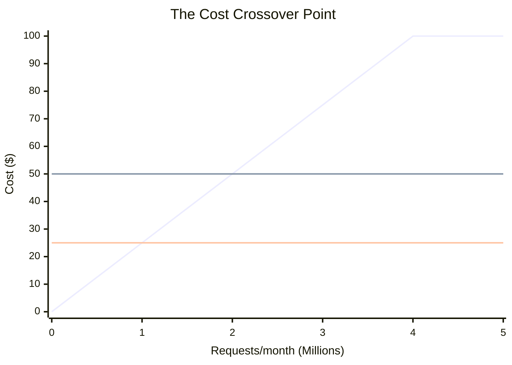
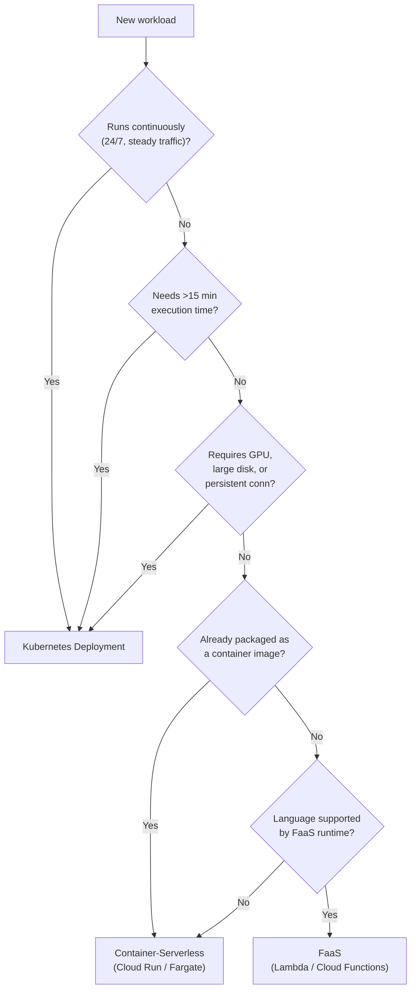
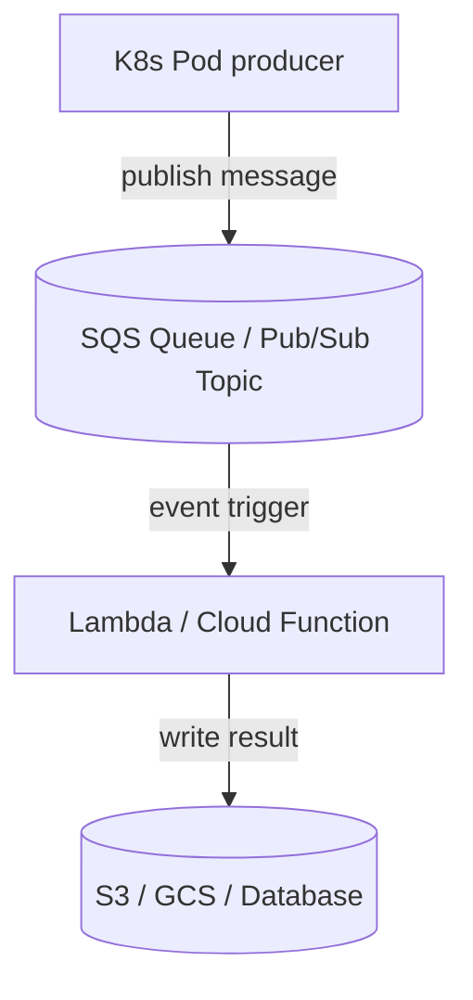
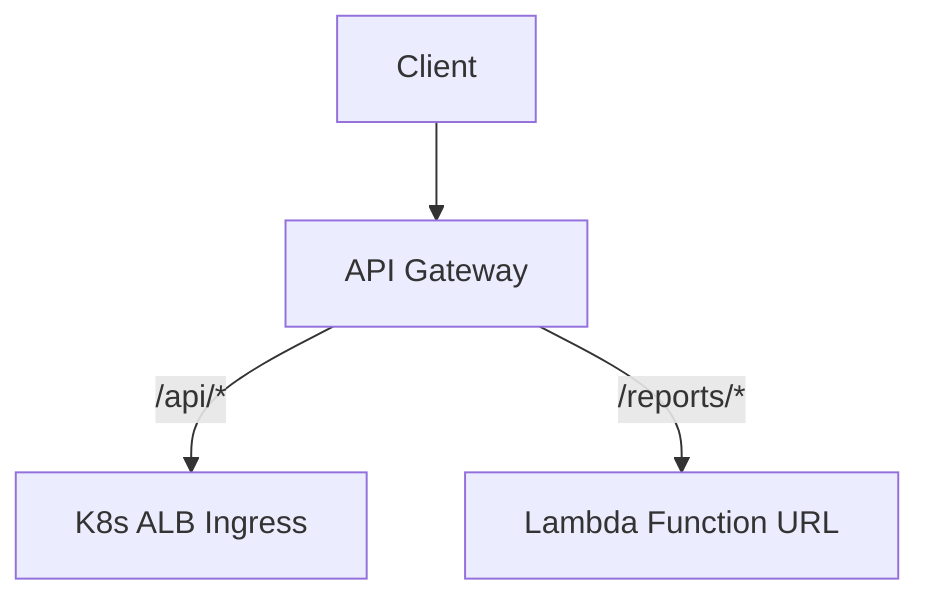
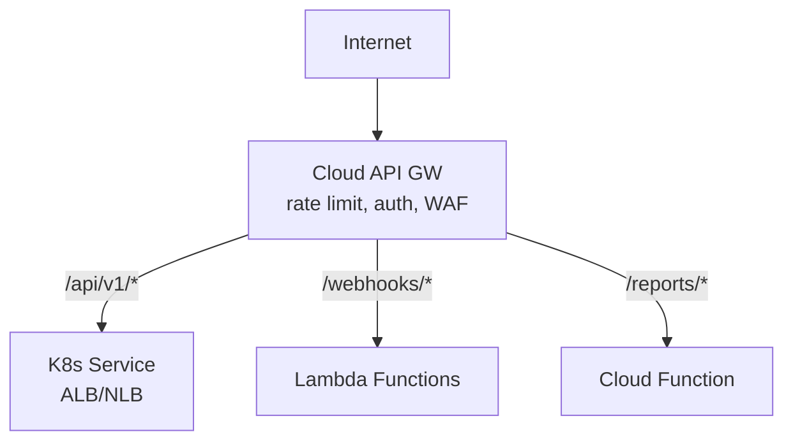
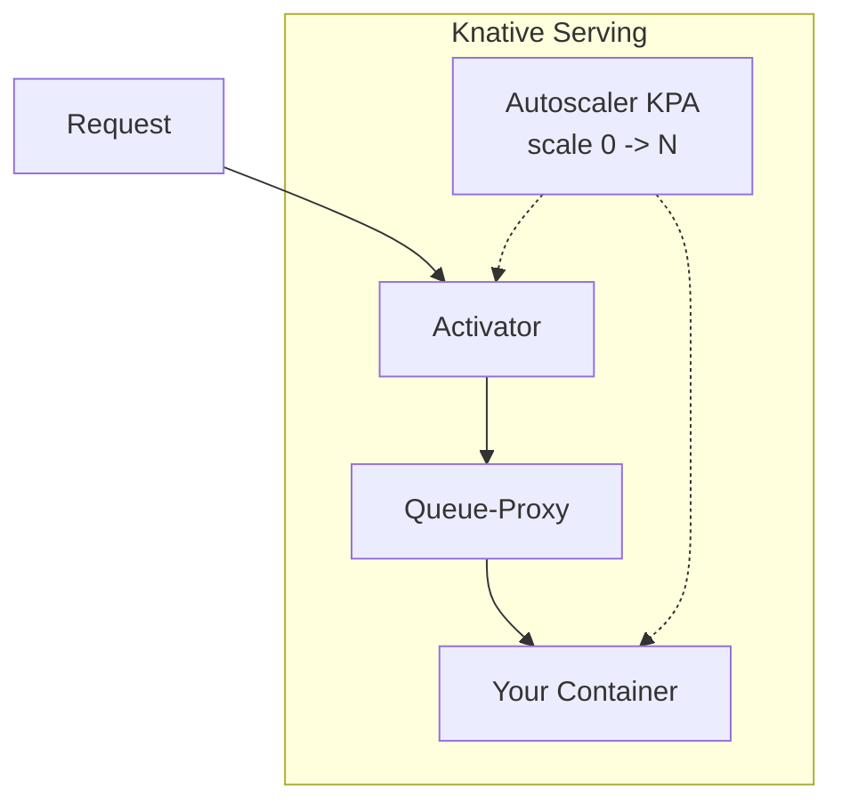
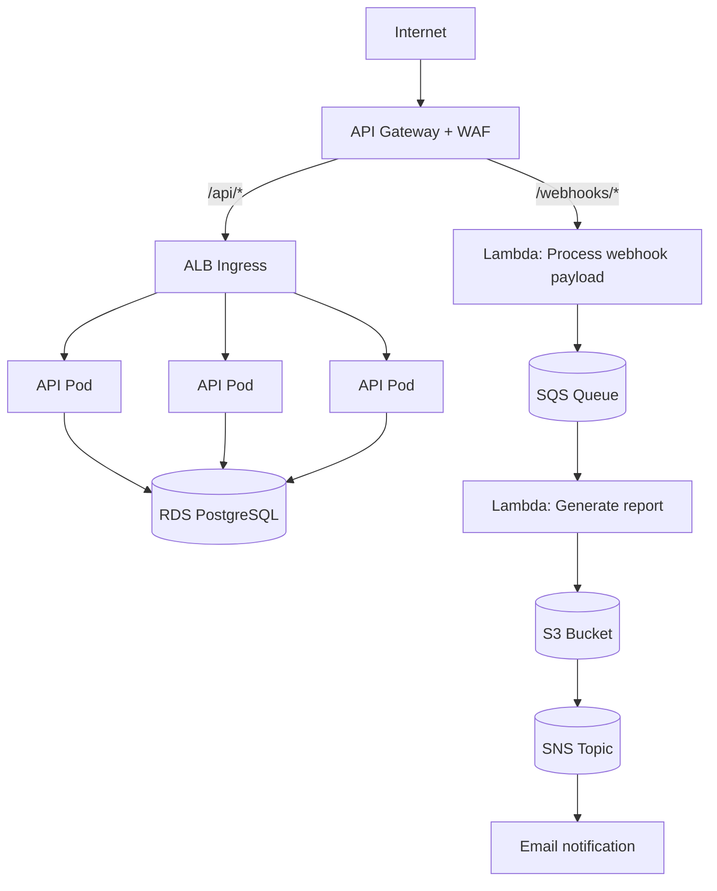

**Complexity**: `[COMPLEX]` | **Time to Complete**: 2h | **Prerequisites**: Module 9.2 (Message Brokers), Kubernetes Services and Ingress basics

## What You'll Be Able to Do

After completing this module, you will be able to:

- **Design hybrid architectures that combine Kubernetes workloads with serverless functions (Lambda, Cloud Functions, Azure Functions)**
- **Implement Knative Serving on Kubernetes for serverless-style scale-to-zero with portable container workloads**
- **Configure event bridges between Kubernetes and cloud-native serverless triggers (EventBridge, Eventarc, Event Grid)**
- **Evaluate serverless vs container trade-offs for latency-sensitive, batch, and event-driven workload patterns**

---

## Why This Module Matters

In 2023, a healthcare startup ran their entire platform on EKS -- 42 microservices, 180 pods, three node groups. Their monthly Kubernetes bill was $18,000. During a cost optimization sprint, an engineer noticed that 11 of those microservices handled fewer than 100 requests per day. One service -- the PDF report generator -- was called exactly 23 times per day but required 2 pods (for HA) running 24/7. Another service processed insurance eligibility checks at 3 AM, running idle for 23 hours daily.

They moved those 11 services to AWS Lambda. The combined monthly cost dropped from $4,200 to $38. Not a typo -- thirty-eight dollars. The remaining 31 services stayed on EKS, where their steady-state traffic justified always-on compute. The lesson was not "serverless is better" or "Kubernetes is better." It was that the best architecture uses both, placing each workload where it makes economic and operational sense.

This module teaches you how to think about the serverless-Kubernetes boundary. You will learn when to use Lambda, Cloud Functions, or Azure Functions alongside your cluster, how to trigger serverless functions from Kubernetes events, how API Gateways route between both worlds, how Knative brings serverless semantics into Kubernetes itself, and how Fargate and Autopilot blur the line between containers and functions.

---

## The Serverless Landscape: Two Flavors of Compute

Before you can decide where to place a workload, you need to understand what "serverless" actually means across the three major clouds. The term has fractured into two distinct execution models, and confusing them leads to bad architecture decisions.

### Function-as-a-Service (FaaS)

FaaS is the original serverless model: you write a single function, upload the code, and the cloud runs it on demand. The function is the unit of deployment, not the container image or the pod. AWS Lambda pioneered this model in 2014, and it remains the most mature FaaS platform. Google Cloud Functions (2nd gen, built on Cloud Run infrastructure) and Azure Functions provide equivalent capabilities.

With FaaS, the cloud provider manages every layer below your code: the OS, the runtime, the scaling, and the provisioning of compute capacity. You configure memory (and, indirectly, CPU — Lambda allocates CPU proportionally to memory), set a timeout, and decide how many concurrent instances you want running at most. You never see the VM, the container host, or the scheduler.

FaaS functions have hard constraints. AWS Lambda caps execution at 15 minutes. Cloud Functions 2nd gen shares the same 60-minute ceiling as Cloud Run (since it runs on Cloud Run infrastructure). Azure Functions caps at 10 minutes on the Consumption plan, though Premium and Dedicated plans remove this limit. These constraints are not accidents — they enforce the stateless, short-lived execution model that makes FaaS scalable. If your function needs 20 minutes to complete, FaaS is the wrong tool regardless of what the timeout slider says on the premium tier.

FaaS also imposes limits on deployment package size. Lambda allows 50 MB zipped, 250 MB unzipped (with container image support up to 10 GB for container-packaged functions). Azure Functions Consumption plan limits you to ~500 MB of temporary local storage (memory is capped separately, ~1.5 GB per instance). These numbers exist because the platform must be able to spin up a new instance of your function in a cold-start scenario — the larger the package, the longer the initialization.

### Container-Serverless

Container-serverless is the newer model. Instead of uploading code, you provide a container image. The cloud runs that container on demand, scaling it (potentially to zero) based on incoming requests. AWS App Runner and Fargate, Google Cloud Run, and Azure Container Apps are the flagship container-serverless offerings.

The key difference from FaaS is control and generality. A container-serverless service can run any HTTP server, any language (even one with no official cloud runtime), and any framework — Flask, Express, Spring Boot, or a custom binary listening on a port. You are not limited to the provider's blessed runtimes or the event-source handshake protocols that FaaS requires. If your application is already packaged as a container, moving it to container-serverless requires no code changes beyond ensuring it listens on the `$PORT` environment variable and starts quickly.

Cloud Run is particularly notable because it is built on Knative, the same open-source serverless layer you can deploy on any Kubernetes cluster. This means a Cloud Run service and a Knative Service on your GKE cluster use the same scaling model, the same revision management, and nearly the same YAML configuration. The portability argument is real: you can develop on Cloud Run and later move the workload to your own Knative installation without rewriting the application.

The tradeoff is cold-start latency. Container-serverless cold starts are typically slower than FaaS cold starts because the platform must pull a container image (which may be hundreds of megabytes) and start a full user-space process rather than injecting your code into a pre-warmed runtime. AWS Fargate cold starts can take 30-60 seconds for a new pod, while Lambda cold starts are usually in the hundreds of milliseconds. Google Cloud Run mitigates this with aggressive image caching and a lightweight container runtime, starting many services in under 2 seconds cold, but large images or frameworks with heavy initialization (Spring Boot, Django with many middleware) will push this higher.

### The Blurring Line

The distinction between FaaS and container-serverless is eroding. AWS Lambda supports container images as a packaging format — you can build a container image and deploy it to Lambda, using the Lambda Runtime API to handle events. But this is still FaaS: Lambda manages the lifecycle, injects events through its Runtime API, and enforces the 15-minute timeout. The container is a packaging convenience, not a different execution model.

Conversely, Google Cloud Functions 2nd gen runs on Cloud Run infrastructure. A Cloud Function (2nd gen) is effectively a Cloud Run service with a pre-configured buildpack that wraps your function code in a lightweight HTTP server. The underlying execution model is container-serverless, even though the developer experience is FaaS.

What should you take from this? When evaluating where to place a workload, ask two questions: *Does this workload fit within a FaaS timeout and packaging constraint?* and *Does my team want to manage containers, or do we want the cloud to handle the runtime?* If the answer to the first question is yes and the second is "manage it for us," FaaS is the default. If either answer is no, container-serverless (or Kubernetes) is the better choice.

---

## When Serverless vs When Kubernetes

This is not a religious debate. It is a cost and operational decision matrix.

### Decision Framework

| Factor | Favor Serverless | Favor Kubernetes |
|--------|-----------------|-----------------|
| **Traffic pattern** | Spiky, long idle periods | Steady, predictable load |
| **Request volume** | < 1M requests/month | > 10M requests/month |
| **Execution duration** | < 15 minutes | Long-running processes |
| **State** | Stateless | Stateful, persistent connections |
| **Cold start tolerance** | Acceptable (100-500ms) | Unacceptable (real-time APIs) |
| **Dependencies** | Few, small packages | Complex runtimes, GPU, large models |
| **Team expertise** | Small team, want less ops | Platform team maintaining K8s already |
| **Cost at scale** | Expensive per-invocation | Cheaper with reserved/spot capacity |

### The Cost Crossover Point



- **~2M requests/month**: serverless and K8s cost roughly the same
- **Below**: serverless wins
- **Above**: K8s wins (especially with spot instances)

The exact crossover depends on execution time, memory, and provider pricing. But the general shape is usually the same: serverless is cheaper at low volume, Kubernetes is cheaper at scale.

> **Stop and think**: If a service handles 5 million requests per month but each request takes 10 milliseconds and requires very little memory, would it still strictly follow the "Kubernetes wins above 2M requests" rule? Why might serverless still be cheaper here?

### Decision Flowchart

When you are staring at a new workload and need to decide where it runs, use the following flowchart. It captures the tradeoffs from the decision matrix in a sequence of elimination questions rather than a parallel comparison. Each "no" moves you closer to the right runtime; each "yes" narrows your options.



This flowchart is a starting point, not a final answer. A workload might tick every container-serverless box and still be a better fit for Kubernetes if your team already operates a mature cluster, or if the workload shares a database with services that run on Kubernetes and you want to minimize cross-network latency. The flowchart eliminates obviously wrong choices; the remaining options should be weighed against team expertise, existing infrastructure, and cost.

---

## Triggering Cloud Functions from Kubernetes

The most common pattern is using Kubernetes workloads as producers and cloud functions as async processors. The Kubernetes pod runs as part of a Deployment or StatefulSet, handling the steady-state business logic, while the cloud function handles spiky, event-driven, or infrequent workloads that do not justify a permanently running container. The integration point between these two worlds is almost always a message broker (SQS, Pub/Sub, Event Hubs) or an event bus (EventBridge, Eventarc, Event Grid). Understanding why the message broker is the right integration point — rather than direct HTTP calls from pod to function — is essential for building reliable hybrid architectures.

When a Kubernetes pod calls a Lambda function directly via HTTP, three things can go wrong: the function may be scaled to zero and start cold, introducing latency into the pod's request path; the function may be throttled (Lambda has account-level concurrent execution limits), causing the pod's request to fail; and if the pod itself crashes or restarts mid-call, there is no record of whether the function was invoked. A message broker solves all three: the pod writes a message and moves on, the broker buffers messages through traffic spikes, and the message persists until the function acknowledges successful processing. This decoupling is the foundation of every production-grade Kubernetes-to-serverless integration.

### Pattern 1: Queue-Triggered Functions



```bash
# AWS: Create Lambda triggered by SQS
aws lambda create-function \
  --function-name process-report \
  --runtime python3.12 \
  --handler app.handler \
  --role arn:aws:iam::123456789:role/LambdaExecRole \
  --zip-file fileb://function.zip \
  --timeout 300 \
  --memory-size 1024

# Map SQS as event source
aws lambda create-event-source-mapping \
  --function-name process-report \
  --event-source-arn arn:aws:sqs:us-east-1:123456789:report-requests \
  --batch-size 5 \
  --maximum-batching-window-in-seconds 30
```

The Kubernetes side simply publishes messages to SQS:

```python
# From a K8s pod
import boto3
import json

sqs = boto3.client('sqs')

def request_report(user_id, report_type):
    sqs.send_message(
        QueueUrl='https://sqs.us-east-1.amazonaws.com/123456789/report-requests',
        MessageBody=json.dumps({
            'user_id': user_id,
            'report_type': report_type,
            'requested_at': '2026-11-15T10:30:00Z'
        })
    )
```

This queue-based pattern is the most robust integration between Kubernetes and serverless because it decouples the producer and consumer in both time and scale. The Kubernetes pod publishes a message and forgets about it, regardless of whether the serverless function is scaled to zero, throttled, or experiencing errors. If the function fails, the message remains in the queue (or moves to a dead-letter queue if you configure one). If traffic spikes 100x, the queue buffers the backlog while the serverless platform scales out. This is the architecture you want for any workload where delivery guarantees matter more than sub-second latency.

### Pattern 2: HTTP-Triggered Functions via API Gateway



```bash
# AWS: API Gateway with routes split between K8s and Lambda
aws apigatewayv2 create-api \
  --name hybrid-api \
  --protocol-type HTTP

# Route /api/* to K8s ALB (private ALB requires a VPC link created first)
aws apigatewayv2 create-integration \
  --api-id $API_ID \
  --integration-type HTTP_PROXY \
  --integration-uri arn:aws:elasticloadbalancing:us-east-1:123456789:listener/app/k8s-alb/abc123 \
  --integration-method ANY \
  --connection-type VPC_LINK \
  --connection-id $VPC_LINK_ID

# Route /reports/* to Lambda
aws apigatewayv2 create-integration \
  --api-id $API_ID \
  --integration-type AWS_PROXY \
  --integration-uri arn:aws:lambda:us-east-1:123456789:function:process-report \
  --payload-format-version "2.0"
```

### Pattern 3: Kubernetes Job Spawning Functions

Sometimes a K8s batch job needs to fan out work to many parallel functions:

```yaml
apiVersion: batch/v1
kind: Job
metadata:
  name: image-resize-orchestrator
spec:
  template:
    spec:
      restartPolicy: OnFailure
      serviceAccountName: lambda-invoker
      containers:
        - name: orchestrator
          image: mycompany/resize-orchestrator:1.0.0
          env:
            - name: LAMBDA_FUNCTION
              value: "image-resizer"
            - name: S3_BUCKET
              value: "user-uploads"
          command:
            - python
            - -c
            - |
              import boto3, json
              s3 = boto3.client('s3')
              lam = boto3.client('lambda')

              # List all images needing resize
              objects = s3.list_objects_v2(Bucket='user-uploads', Prefix='raw/')

              # Fan out to Lambda for parallel processing
              for obj in objects.get('Contents', []):
                  lam.invoke(
                      FunctionName='image-resizer',
                      InvocationType='Event',  # async
                      Payload=json.dumps({'key': obj['Key']})
                  )
                  print(f"Dispatched: {obj['Key']}")
```

**Pause and predict:** If the Kubernetes Job fails halfway through fanning out 10,000 Lambda invocations, and the Job restarts, what happens to the items that were already dispatched? How must the target serverless function be designed to handle this scenario?

<details>
<summary>Check your prediction</summary>

Asynchronous Lambda invocations using `InvocationType: Event` place payloads onto an internal AWS-managed invocation queue and return an immediate HTTP 202 Accepted response to the caller. The platform acknowledges message receipt rather than waiting for handler execution. If a Kubernetes Job crashes halfway through a ten-thousand-item fan-out loop, its subsequent pod restart re-queries the object store and dispatches duplicate `Event` invocations for records already queued or processed. AWS Lambda does not inspect payloads to deduplicate incoming events automatically. Application functions must implement explicit idempotency using an item-level unique identifier (such as the S3 object key or an event hash) to detect prior executions, verify existing destination artifacts, or track state in a transactional datastore before performing destructive work.
</details>

The next section is how API gateways sit in front of both Kubernetes services and serverless functions as a single entry point for external consumers.

---

## API Gateways: Bridging Both Worlds

Cloud API Gateways sit in front of both Kubernetes services and serverless functions, providing a unified entry point. This is the architectural pattern that makes hybrid Kubernetes-serverless systems feel like a single application to external consumers. The API Gateway handles authentication, rate limiting, request validation, and response transformation at the edge — before any request reaches either a Kubernetes pod or a serverless function. This means your backend services, regardless of where they run, do not need to implement these cross-cutting concerns themselves.

The routing logic at the API Gateway is what connects the two worlds. Typically, you define path-based routes: `/api/v1/orders` goes to the Kubernetes-hosted order service (steady traffic, database connections, complex business logic), while `/webhooks/stripe` goes to a Lambda function (spiky, stateless, third-party callback processing). Modern API Gateways support multiple integration types — HTTP proxy to any reachable endpoint, AWS Lambda proxy for direct function invocation without an intermediate HTTP layer, and mock integrations for testing. The key design decision is which routes belong on which backend, and that decision should flow from the traffic and cost analysis covered earlier in this module. A route that receives 10 requests per day does not need a permanently running Kubernetes pod; a route that receives 10,000 requests per minute should not pay per-invocation serverless pricing.

### Multi-Backend Architecture



### GCP: Cloud Endpoints with GKE and Cloud Functions

```yaml
# GCP Cloud Endpoints OpenAPI spec
swagger: "2.0"
info:
  title: "Hybrid API"
  version: "1.0.0"
host: "api.example.com"
basePath: "/"
schemes:
  - "https"
paths:
  /api/v1/{resource}:
    get:
      x-google-backend:
        address: https://gke-ingress.example.com
        protocol: h2
      parameters:
        - name: resource
          in: path
          required: true
          type: string
  /reports/{id}:
    get:
      x-google-backend:
        address: https://us-central1-myproject.cloudfunctions.net/report-generator
      parameters:
        - name: id
          in: path
          required: true
          type: string
```

---

## Knative: Serverless on Kubernetes

Knative brings serverless semantics directly into your cluster. Instead of deploying to Lambda or Cloud Functions, you deploy to Knative, which manages scaling (including to zero), revisions, and traffic splitting -- all using standard Kubernetes resources.

### Knative Architecture



> **Stop and think**: When the Knative Activator buffers an incoming request for a scaled-to-zero service, the caller experiences latency while the new pod starts. If your container image is 2GB and takes 15 seconds to initialize its application framework, what will happen to the caller's HTTP request? How would you design the application differently for Knative compared to a standard Kubernetes Deployment?

### Installing Knative

```bash
alias k=kubectl

# Install Knative Serving
k apply -f https://github.com/knative/serving/releases/download/knative-v1.16.0/serving-crds.yaml
k apply -f https://github.com/knative/serving/releases/download/knative-v1.16.0/serving-core.yaml

# Install networking layer (Kourier is lightweight)
k apply -f https://github.com/knative/net-kourier/releases/download/knative-v1.16.0/kourier.yaml

# Configure Knative to use Kourier
k patch configmap/config-network \
  --namespace knative-serving \
  --type merge \
  --patch '{"data":{"ingress-class":"kourier.ingress.networking.knative.dev"}}'

# Install Knative Eventing
k apply -f https://github.com/knative/eventing/releases/download/knative-v1.16.0/eventing-crds.yaml
k apply -f https://github.com/knative/eventing/releases/download/knative-v1.16.0/eventing-core.yaml
```

### Knative Service (Serving)

```yaml
apiVersion: serving.knative.dev/v1
kind: Service
metadata:
  name: report-generator
  namespace: production
spec:
  template:
    metadata:
      annotations:
        autoscaling.knative.dev/min-scale: "0"
        autoscaling.knative.dev/max-scale: "20"
        autoscaling.knative.dev/target: "10"
        autoscaling.knative.dev/scale-down-delay: "30s"
    spec:
      containerConcurrency: 10
      timeoutSeconds: 300
      containers:
        - image: mycompany/report-generator:2.0.0
          ports:
            - containerPort: 8080
          env:
            - name: S3_BUCKET
              value: reports-output
          resources:
            requests:
              cpu: 500m
              memory: 512Mi
            limits:
              cpu: "2"
              memory: 2Gi
```

Key annotations explained:
- `min-scale: "0"` -- Scale to zero when idle (true serverless)
- `max-scale: "20"` -- Never exceed 20 pods
- `target: "10"` -- Each pod handles 10 concurrent requests before scaling out
- `scale-down-delay: "30s"` -- Wait 30 seconds of idle before scaling down

### Knative Eventing: CloudEvents Pipeline

Knative Eventing connects event sources to services using CloudEvents, a CNCF-standard event format.

```yaml
# Source: Receive events from a message broker
apiVersion: sources.knative.dev/v1
kind: ApiServerSource
metadata:
  name: pod-events
  namespace: production
spec:
  serviceAccountName: event-watcher
  mode: Resource
  resources:
    - apiVersion: v1
      kind: Pod
  sink:
    ref:
      apiVersion: serving.knative.dev/v1
      kind: Service
      name: pod-event-processor
---
# Broker: Central event routing
apiVersion: eventing.knative.dev/v1
kind: Broker
metadata:
  name: default
  namespace: production
---
# Trigger: Filter and route events
apiVersion: eventing.knative.dev/v1
kind: Trigger
metadata:
  name: report-trigger
  namespace: production
spec:
  broker: default
  filter:
    attributes:
      type: com.example.report.requested
  subscriber:
    ref:
      apiVersion: serving.knative.dev/v1
      kind: Service
      name: report-generator
```

### Traffic Splitting for Canary Deployments

```yaml
apiVersion: serving.knative.dev/v1
kind: Service
metadata:
  name: report-generator
  namespace: production
spec:
  template:
    metadata:
      name: report-generator-v2
    spec:
      containers:
        - image: mycompany/report-generator:3.0.0
  traffic:
    - revisionName: report-generator-v1
      percent: 90
    - revisionName: report-generator-v2
      percent: 10
```

---

## Fargate vs Autopilot: Serverless Containers

Fargate (AWS) and Autopilot (GCP) remove node management entirely. You define pods, and the cloud runs them without you provisioning or managing nodes. This is the container-serverless model applied to Kubernetes: you write standard Kubernetes manifests, but the control plane schedules your pods onto cloud-managed compute capacity rather than onto nodes you provisioned. You never SSH into a node, never patch a kernel, and never wonder whether your node group has enough capacity for the next deployment. The cloud handles all of that.

This abstraction comes with a significant operational shift. On a standard Kubernetes cluster, you think in terms of nodes — how many you need, what instance types, whether to use spot or reserved. On Fargate or Autopilot, you think in terms of pods — how much CPU and memory each pod requests, and how many pods can run concurrently. The pod becomes the billing unit rather than the node. This changes how you reason about cost: instead of paying for a pool of compute that sits partially idle, you pay for exactly the resources each pod consumes, per second.

The tradeoff is control. Serverless container platforms eliminate traditional node management by isolating container execution within managed virtualization boundaries rather than exposing shared operating system hosts. Workloads running in these environments surrender access to host-level primitives, direct kernel manipulation, and node-level configurations. Autopilot manages underlying compute instances behind a managed control plane while preserving broad Kubernetes API behavior, whereas Fargate packages every pod into its own isolated compute environment. For teams that have built operational models around node-level observability, kernel tuning, and host filesystem manipulation, this abstraction boundary requires rethinking how system-wide administrative tooling integrates with application workloads.

**Pause and predict:** If you deploy a standard Kubernetes DaemonSet to a cluster configured to run entirely on EKS Fargate compute, how many pods will the DaemonSet create? How does the underlying Fargate execution model determine this scheduling result?

<details>
<summary>Check your prediction</summary>

An all-Fargate cluster schedules zero DaemonSet pods. EKS Fargate does not support DaemonSets because the platform provisions dedicated, isolated microVM compute environments for each individual pod rather than maintaining shared worker nodes. Because the Kubernetes DaemonSet controller schedules exactly one pod per eligible node in the cluster, and an all-Fargate cluster manages no conventional EC2 instances, the controller finds no candidate nodes matching the workload specifications. If you must deploy observability agents, security monitoring tools, or log forwarders alongside Fargate workloads, you cannot rely on cluster-wide daemons; you must instead inject the monitoring agent directly into each application pod as a sidecar container or stream telemetry directly to cloud provider logging endpoints.
</details>

The next section is how Fargate, Autopilot, and Virtual Nodes differ on scheduling support without treating every serverless container platform as interchangeable.

### Comparison

| Feature | EKS Fargate | GKE Autopilot | AKS Virtual Nodes |
|---------|-------------|---------------|-------------------|
| Billing unit | Per pod (vCPU + memory per second) | Per pod (vCPU + memory per second) | Per container group (ACI pricing) |
| DaemonSets | Not supported | Supported (since 2024) | Not supported |
| GPUs | Not currently available | Supported | Not supported |
| Persistent storage | EFS CSI (static provisioning; EBS not supported on Fargate) | GCE PD | Azure Files |
| Max pods per node | 1 pod = 1 "node" | Managed by GKE | Burstable |
| Startup time | 30-60 seconds | Transparent | 15-30 seconds |
| Best for | Batch, low-traffic services | Entire cluster, hands-off | Burst capacity |

### EKS Fargate Profile

```bash
# Create Fargate profile for specific namespaces
aws eks create-fargate-profile \
  --cluster-name my-cluster \
  --fargate-profile-name serverless-workloads \
  --pod-execution-role-arn arn:aws:iam::123456789:role/EKSFargatePodRole \
  --subnets subnet-0a1b2c3d subnet-0e5f6a7b \
  --selectors '[
    {"namespace": "batch-jobs"},
    {"namespace": "reports", "labels": {"compute": "fargate"}}
  ]'
```

Any pod deployed to the `batch-jobs` namespace or the `reports` namespace with the label `compute: fargate` will run on Fargate automatically. No node groups needed.

```yaml
# This pod runs on Fargate (matches the profile above)
apiVersion: batch/v1
kind: Job
metadata:
  name: nightly-report
  namespace: batch-jobs
spec:
  template:
    spec:
      restartPolicy: OnFailure
      containers:
        - name: report
          image: mycompany/report-generator:2.0.0
          resources:
            requests:
              cpu: "1"
              memory: 2Gi
            limits:
              cpu: "2"
              memory: 4Gi
```

### Cold Start Mitigation

Cold starts are the primary drawback of serverless. Here are practical mitigations:

| Strategy | How | Latency Reduction |
|----------|-----|-------------------|
| **Provisioned concurrency** (Lambda) | Pre-warm N instances | Eliminates cold start for N concurrent requests |
| **min-scale: 1** (Knative) | Keep one pod running | First request is usually warm |
| **Warm-up endpoints** | Health check that loads dependencies | Reduces initialization overhead |
| **Smaller images** | Alpine/distroless base images | Faster pull and startup |
| **SnapStart** (Lambda: Java, Python, .NET) | Snapshot after init, restore on invocation | 90% reduction for JVM cold starts |
| **GraalVM native images** | Ahead-of-time compilation | 10-50ms startup for Java |

```bash
# AWS: Provisioned concurrency for Lambda
aws lambda put-provisioned-concurrency-config \
  --function-name process-report \
  --qualifier prod \
  --provisioned-concurrent-executions 5
```

The cold-start problem deserves deeper treatment because it is the single most common reason teams reject serverless after an initial trial. Understanding *why* cold starts happen and *which* strategies apply to which runtimes is essential for making serverless work in production.

**What causes a cold start?** When a serverless platform receives a request and no warm instance is available, it must create a new execution environment from scratch. For AWS Lambda, this means Firecracker — a purpose-built microVM — is provisioned, the runtime (Node.js, Python, Java, etc.) is loaded into the microVM, your code package is downloaded and extracted, and your initialization code (the code outside your handler function) runs. Only then can the platform invoke your handler with the incoming event. This entire chain — provisioning, runtime bootstrap, package load, init — is the cold start.

The dominant cost in a cold start varies by runtime. For interpreted languages like Python and Node.js, the runtime bootstrap is fast (typically under 50 ms) and the dominant cost is initialization code — database connection pools, SDK client instantiation, framework setup. For JVM languages like Java and Kotlin, the JVM startup itself adds hundreds of milliseconds to seconds, which is why SnapStart and GraalVM native images are particularly valuable for the Java ecosystem. For Go, the compiled binary starts nearly instantly, so initialization code is again the dominant factor.

**Provisioned concurrency** (Lambda) and **min instances** (Cloud Run) address cold starts by pre-allocating execution environments ahead of incoming traffic. Instead of provisioning runtimes on demand when requests trigger invocation events, the platform maintains a configured pool of warm instances ready to process events immediately. These reserved execution environments serve concurrent requests without triggering runtime bootstrap sequences or container image pulls. Platform operators frequently evaluate this technique for latency-critical user-facing endpoints that cannot tolerate sporadic initialization delays.

**Pause and predict:** If an engineering team configures provisioned concurrency of 5 instances on an AWS Lambda function (or min-instances on Cloud Run) and the application receives zero requests throughout an entire overnight window, what billing charges are incurred for those idle execution environments?

<details>
<summary>Check your prediction</summary>

Idle warm capacity is billed continuously, even when request count is zero. Both AWS Lambda provisioned concurrency and Google Cloud Run min-instances bill for the allocated compute resources (measured in vCPU-seconds and memory GB-seconds) for as long as the capacity remains configured and running. The cloud provider dedicates active virtualization infrastructure to keep the runtimes resident in memory, meaning you pay for reserved capacity whether requests arrive or not. While provisioned concurrency successfully eliminates cold-start latency spikes for baseline traffic, leaving unmanaged warm instances enabled during extended periods of zero traffic converts a purely event-driven serverless cost model into a fixed ongoing infrastructure baseline.
</details>

The next section is how snapshot-based restore of an initialized runtime differs from a reserved warm pool of instances.

**SnapStart** (Lambda, for Java 11/17/21, plus Python and .NET) takes a fundamentally different architectural approach to cold-start mitigation. Rather than maintaining permanently provisioned warm microVMs, Lambda executes the function's initialization phase during deployment, takes an encrypted snapshot of the initialized memory and disk state, and caches that snapshot in a multi-tier cache. When subsequent invocations trigger new execution environments, the platform restores the cached snapshot instead of repeating class-loading, dependency injection, and framework initialization cycles from scratch.

**Pause and predict:** When an application relying on AWS Lambda SnapStart restores an execution environment from a cached snapshot, what happens to unique identifiers, pseudo-random seed states, or database network sockets initialized during the build phase? Does the restored function execute completely free of cold-start latency?

<details>
<summary>Check your prediction</summary>

SnapStart restores initialization memory directly from the frozen snapshot, meaning GUIDs, pseudo-random seeds, and cached network connections created during static initialization are identical across all restored execution environments. If multiple concurrent requests restore from the same snapshot, any identifiers or entropy pools instantiated during the initial setup phase will be duplicated unless application code re-executes uniqueness logic after the restore phase. Platforms provide runtime hooks (such as AWS CRaC `afterRestore` callbacks) to safely regenerate seeds, refresh tokens, and re-establish network sockets. Furthermore, SnapStart does not make invocations fully cold-start-free; while it eliminates the heavy JVM bootstrap and class-loading delays, the runtime still experiences residual latency from microVM provisioning, snapshot retrieval from cache, and network interface attachments.
</details>

The next section is how container image pulls change cold-start timing compared with function microVMs that do not fetch a full image.

**The container-serverless cold-start penalty.** Cloud Run and Fargate cold starts are typically longer than Lambda cold starts because the platform must pull a container image from a registry before starting it. Google mitigates this with aggressive caching of frequently used images and layers. AWS Fargate does not cache images across Fargate tasks — every new task pulls the image fresh, which is why Fargate cold starts are 30-60 seconds for typical images. If your container-serverless workload cannot tolerate this latency, you must either keep a minimum instance warm (Cloud Run `min-instances`) or use Kubernetes with pre-scaled pods instead.

**KEDA and scale-to-zero on Kubernetes.** The Kubernetes ecosystem has its own answer to scale-to-zero: KEDA (Kubernetes Event-Driven Autoscaling). Unlike Knative, which is request-driven, KEDA scales based on event sources — queue depth, Kafka consumer lag, database query results, cron schedules. A KEDA-scaled deployment can scale to zero replicas when the event source is idle, and KEDA will scale it back up when events arrive. The cold-start latency on Kubernetes scale-to-zero is typically higher than on a managed FaaS platform because a Kubernetes pod must be scheduled onto a node, pull its image, and start — a process that can take 5-30 seconds depending on image size and cluster capacity. KEDA is the right choice when you need serverless-style scaling but cannot use a managed FaaS (compliance reasons, existing Kubernetes investment, or workload characteristics that exceed FaaS limits).

---

## Hybrid Architecture Example

A real-world architecture combining Kubernetes and serverless:



- **API pods on EKS**: Steady traffic, complex logic, persistent DB connections
- **Webhook Lambda**: Spiky, unpredictable, stateless
- **Report Lambda**: Infrequent, CPU-intensive for short bursts, output to S3

---

## Cost Lens: Serverless Economics

Serverless pricing is seductive at low volume, but it can become punishing at scale if you do not understand the cost drivers. This section explains the mechanics, the traps, and the strategies for keeping serverless costs predictable.

### How You Pay

Every serverless compute platform bills on two dimensions: **invocations** (the number of times your function or service is called) and **duration** (how long each invocation runs, measured in GB-seconds or vCPU-seconds). AWS Lambda charges $0.20 per million requests plus $0.0000166667 per GB-second of execution time. Google Cloud Run charges per request ($0.40 per million) plus per vCPU-second and per GB-second of memory. Azure Functions Consumption plan charges $0.20 per million executions plus $0.000016 per GB-second.

A lightweight function that runs for 100 ms with 256 MB of memory costs roughly $0.0000003 per invocation in compute — negligible at any reasonable scale. The invocation cost ($0.0000002 per call for Lambda) dominates for very short functions. But add memory and duration, and the GB-second charges grow linearly.

At moderate scale — say, 10 million invocations per month, each running 500 ms with 1 GB of memory — Lambda costs roughly: 10M × $0.0000002 (invocation) = $2.00, plus 10M × 0.5 sec × 1 GB × $0.0000166667/GB-sec = $83.33. Total: ~$85/month. Compare this with the smallest always-on EKS node (a single t3.medium at ~$30/month reserved, plus control plane costs), and you can see why serverless wins at low-to-moderate volume.

### The Cost Spike Scenarios

Serverless costs spike in three predictable scenarios, and each has a mitigation.

**Scenario 1: High sustained traffic.** At 100 million invocations per month with the same 500 ms / 1 GB profile, Lambda costs ~$853/month. Three always-on t3.medium nodes with reserved pricing cost ~$90/month and can handle significantly more throughput than a single Lambda instance. Above roughly 20-30 million invocations per month, Kubernetes becomes cheaper for any workload with steady traffic, because you pay for capacity rather than per-invocation. The mitigation is straightforward: identify the crossover point for your workload and move steady-state services to Kubernetes.

**Scenario 2: Provisioned concurrency left on.** Provisioned concurrency eliminates cold starts by keeping instances warm, but you pay for those instances whether they handle requests or not. Five provisioned concurrent instances of a 1 GB Lambda function incur substantial baseline costs in idle compute — often exceeding one hundred dollars monthly depending on regional rates — which can easily surpass the invocation and duration charges for many workloads. Teams often enable provisioned concurrency during launch, see improved latency, and forget to right-size it. A month later, the serverless bill is 3x the expected amount. The mitigation: use provisioned concurrency only for latency-sensitive paths, monitor the actual concurrent request count, and scale provisioned concurrency up and down with a schedule if traffic is predictable (lower it at night).

**Scenario 3: Function-to-function chaining.** If a Lambda function calls another Lambda function synchronously and waits for the response, you pay for both functions' duration during the wait. A chain of three synchronous Lambda calls, each waiting 2 seconds for the next, bills for 6 seconds of compute per end-to-end request, even though the actual CPU work is minimal. This is the "chatty serverless" anti-pattern. The mitigation: use asynchronous patterns (SQS, EventBridge, Step Functions) for multi-step workflows. Step Functions let you orchestrate Lambda calls without paying for wait time — you pay per state transition (about $0.000025 per step) rather than per waiting second.

### Free Tiers and Their Limits

All three clouds offer generous free tiers that make experimentation essentially free, but each tier has hard limits that can catch teams off guard. AWS Lambda's free tier provides 1 million requests and 400,000 GB-seconds per month — enough to run a moderate production workload for free if your functions are short and lightweight. Cloud Run's free tier provides 2 million requests and 360,000 vCPU-seconds per month. Azure Functions offers 1 million executions and 400,000 GB-seconds. These tiers apply every month, not just during a trial period.

The trap is not that crossing the free allotment retroactively bills every request. AWS Lambda subtracts the monthly free requests and GB-seconds first, so 1.1 million invocations bills 100,000 paid requests (plus duration past 400,000 GB-s). Cloud Run is billed only for usage past the free tier. The surprise is still real: the first month you cross the allotment, a paid line item appears and then grows with every extra request; Provisioned Concurrency on Lambda is not covered by the free tier. Treat published rates as dated—re-check the cloud pricing page before you budget.

---

## Patterns & Anti-Patterns

Serverless architecture has accumulated a body of proven patterns and well-known failure modes. The patterns below represent what works at scale across hundreds of production deployments. The anti-patterns are mistakes that teams make repeatedly, regardless of cloud provider or runtime.

### Patterns

**1. Async Queue Decoupling.** Place a message queue between your request producer and your serverless consumer. The producer (typically a Kubernetes pod or an API endpoint) writes a message to SQS, Pub/Sub, or Azure Service Bus and immediately returns a success response. The serverless function consumes from the queue, processes the message, and writes the result. This pattern absorbs traffic spikes, provides retry semantics (the message stays in the queue if processing fails), and allows the function to scale independently of the producer. It is the default integration pattern for any Kubernetes-to-serverless handoff.

When to use it: whenever the caller does not need a synchronous response, or when the processing time is too variable to expose as an HTTP endpoint. Batch jobs, report generation, image processing, and email delivery are canonical use cases.

**2. API Gateway Routing with Lambda Function URLs.** Instead of routing all traffic through a single Kubernetes ingress, split routes at the API Gateway layer: steady-state CRUD endpoints go to your Kubernetes services, while spiky or infrequent endpoints (webhooks, file upload processing, notification delivery) go directly to Lambda Function URLs or Cloud Run services. This reduces load on your Kubernetes cluster, eliminates the need to scale pods for low-traffic endpoints, and provides a unified authentication and rate-limiting layer at the API Gateway.

When to use it: when migrating from a monolith to a hybrid architecture, or when adding new microservices that have dramatically different traffic patterns from the existing Kubernetes-hosted services.

**3. Container-Serverless for Brownfield Migration.** When you have an existing containerized service that you want to run serverlessly without rewriting it, container-serverless (Cloud Run, Fargate, Azure Container Apps) is the path of least resistance. The service already listens on a port, already has health checks, and already packages as a container. Deploying it to Cloud Run requires no code changes — you push the image to Artifact Registry, create a Cloud Run service pointing at that image, and configure `min-instances` if you need warm starts. The migration from Kubernetes Deployment to Cloud Run service can take less than an hour for a simple HTTP service.

When to use it: when you have containerized services with spiky or low-volume traffic, and your team lacks the bandwidth to refactor them into FaaS functions. Also the right choice when the service uses a language or framework not supported by FaaS runtimes.

**4. Step Functions for Multi-Step Workflows.** Serverless functions should do one thing and do it quickly. Complex business logic that spans multiple steps — payment processing, order fulfillment, data pipeline orchestration — should be modeled as a state machine using AWS Step Functions, Google Cloud Workflows, or Azure Durable Functions. Each step is a separate function invocation, and the workflow engine handles retries, error routing, and parallelism. This keeps individual functions small and testable, avoids the function-to-function chaining anti-pattern, and provides visibility into workflow execution (each step is logged and traceable).

When to use it: any workflow with more than two sequential steps that must complete in a specific order, or any workflow where failure in one step requires compensating actions in earlier steps.

### Anti-Patterns

**1. Serverless for Long-Running or Stateful Workloads.** Deploying a workload that runs for more than the FaaS timeout (15 minutes for Lambda, 60 for Cloud Run) to a serverless platform is a guaranteed failure. The platform terminates the execution, and any in-memory state is lost. Teams fall into this anti-pattern when they treat serverless as "cheap compute" without understanding the timeout constraints. A video transcoding pipeline that takes 45 minutes per file will never work on Lambda regardless of how much memory you allocate.

Better approach: for long-running workloads, use Kubernetes Jobs or a container-serverless platform with a higher timeout (Cloud Run supports up to 60 minutes). For stateful workloads that need persistent connections (WebSocket servers, database connection pools that span requests), use Kubernetes Deployments with persistent pod identity.

**2. Chatty Function-to-Function Synchronous Calls.** When a Lambda function calls another Lambda function via `Invoke` with `InvocationType: 'RequestResponse'` and waits, you pay for both functions' execution time simultaneously. A chain of five synchronous calls, each running 1 second, costs 5 seconds of billed duration per end-to-end request, even though the actual CPU time might total 500 ms. This pattern also introduces cascading latency: if the third function in the chain experiences a cold start, every upstream caller waits.

Better approach: use an orchestrator service (Step Functions, Cloud Workflows) that invokes each function and waits at the orchestrator level, where you pay per state transition rather than per waiting second. Or restructure the workflow as an event-driven pipeline: each function publishes an event when it completes, and the next function subscribes to that event.

**3. Cold Start on the User-Facing Path.** The first request a user makes should never pay a cold-start penalty. If your login endpoint or your product search endpoint is a Lambda function that scales to zero between uses, every user who visits after a quiet period experiences a multi-second delay. This is the fastest way to make users hate your serverless architecture, and it is completely avoidable.

Better approach: identify every function that serves a synchronous user request (HTTP endpoints behind API Gateway, gRPC services) and either configure provisioned concurrency / min-instances for them, or move them to Kubernetes where pods stay warm. Reserve scale-to-zero for async, background, and batch workloads where latency is not user-visible.

**4. Ignoring Execution Environment Reuse.** Serverless platforms reuse execution environments across invocations. If your function writes temporary files to `/tmp`, opens database connections during initialization, or caches data in global variables, those artifacts persist across invocations within the same warm instance — but they are NOT shared across instances and they disappear when the instance is recycled. Teams that rely on `/tmp` state between invocations (e.g., writing a file in invocation 1 and reading it in invocation 2) eventually hit an error when the second invocation lands on a different instance.

Better approach: treat every invocation as if it runs in a fresh environment. Use external storage (S3, GCS, Blob) for any state that must survive beyond a single invocation. Use the execution context for performance optimization only (cached SDK clients, pre-loaded configuration), never for correctness.

**5. Over-Provisioning Memory Without Understanding CPU Coupling.** AWS Lambda allocates CPU proportionally to memory: a 256 MB function gets roughly 0.16 vCPU, while a 1,792 MB function gets 1 full vCPU. Teams that set memory to 256 MB because "it's just a small function" and then wonder why it runs slowly are experiencing CPU throttling, not a platform defect. This also works in reverse: setting memory to 10 GB to get more CPU, even though the function only uses 200 MB of RAM, wastes money on unneeded memory allocation.

Better approach: benchmark your function at different memory levels and find the sweet spot where execution time stops improving significantly. For CPU-bound functions, this is typically 1,792 MB (the point where a full vCPU is allocated). Above that, you get more vCPUs but pay proportionally for the memory.

---

## Did You Know?

1. **AWS Lambda processes over 10 trillion invocations per month** as of 2025. To handle this, Lambda's internal architecture uses a purpose-built microVM technology called Firecracker, which can spin up a new VM in under 125 milliseconds.

2. **Knative was originally created by Google, Pivotal, and IBM in 2018** to bring serverless to Kubernetes. It is now a CNCF Incubating project and forms the basis of Google Cloud Run, which is essentially managed Knative under the hood.

3. **GKE Autopilot charges you for pod resource requests, not limits**, which means over-requesting CPU or memory directly increases your bill. This pricing model forces teams to be precise about resource requests -- a good habit that most teams on standard Kubernetes ignore.

4. **The longest-running Lambda function in 2024 ran for the full 15-minute timeout** processing satellite imagery for a climate research project. Before the 2018 limit increase from 5 to 15 minutes, the team had to split their pipeline into six chained functions -- a painful reminder that serverless time limits shape architecture.

---

## Common Mistakes

| Mistake | Why It Happens | How to Fix It |
|---------|---------------|---------------|
| Moving high-traffic services to Lambda for "simplicity" | Assuming serverless is always simpler | Calculate cost at your volume; K8s is often cheaper above 2M requests/month |
| Not accounting for cold start in P99 latency | Testing with warm functions only | Test cold starts explicitly; use provisioned concurrency for latency-sensitive paths |
| Running Knative on a cluster without enough baseline capacity | Knative's activator and autoscaler need resources | Dedicate 2-3 nodes to Knative system components |
| Using Fargate for DaemonSet-dependent workloads | Fargate does not support DaemonSets | Use node groups for workloads requiring log agents, monitoring sidecars via DaemonSets |
| Ignoring the 256 KB message size limit when triggering Lambda from SQS | Works in dev with small payloads | Store large payloads in S3; pass only the S3 key through the queue |
| Deploying Knative Services without resource limits | Knative autoscaler cannot make good decisions | Always set `containerConcurrency` and resource requests/limits |
| Not setting up dead-letter destinations for async Lambda invocations | Failures silently disappear | Configure DLQ (SQS) or on-failure destination for every async invocation |
| Using API Gateway as a pass-through without caching | Every request hits the backend | Enable API Gateway response caching for read-heavy endpoints |

---

## Quiz

<details>
<summary>1. You are the lead architect for a retail company. The marketing team wants to launch a flash sale service that will receive near zero traffic for 29 days a month, but on one day it will receive 500,000 requests over a 4-hour period. Your infrastructure team already manages a large EKS cluster. Should you deploy this service as a standard Kubernetes Deployment or an AWS Lambda function?</summary>

You should deploy this service as an AWS Lambda function (or similar serverless offering). Even though your team already manages Kubernetes, this extreme spiky traffic pattern with long idle periods is the perfect use case for serverless. If deployed on Kubernetes, you would either pay for idle capacity for 29 days or risk the cluster auto-scaler not provisioning nodes fast enough to handle the sudden 4-hour spike. Lambda scales quickly to meet the burst and scales to zero when the sale ends, meaning you only pay for the exact compute used during those 4 hours.
</details>

<details>
<summary>2. A developer on your team deploys a Knative Service configured with `min-scale: "0"`. During a load test, they notice that the very first request after a period of inactivity takes 4 seconds to respond, while subsequent requests take 50ms. They believe Knative is broken. How do you explain what is happening and the role of the Knative architecture in this behavior?</summary>

Knative is functioning exactly as designed, demonstrating a "cold start" inherent to scale-to-zero serverless architectures. When the service scaled to zero, the Knative Activator intercepted the new incoming request because no pods were running to handle it. The Activator buffered this request, signaled the Autoscaler to spin up a new pod, and waited for the pod to become ready before forwarding the request. The 4-second delay is the time it took Kubernetes to schedule the pod, pull the image, and start the container application; to mitigate this, the developer could set `min-scale: "1"` if strict latency is required for all requests.
</details>

<details>
<summary>3. Your security team mandates that every container running in your AWS environment must run a proprietary security scanning agent. On your standard EKS cluster, you deploy this agent using a DaemonSet. You are planning to migrate several batch processing jobs to EKS Fargate to save costs. How will this security mandate impact your migration to Fargate?</summary>

The security mandate will require you to change how the scanning agent is deployed, because EKS Fargate does not support DaemonSets. Fargate provisions a dedicated, isolated microVM for each individual pod, meaning there is no shared "node" concept where a DaemonSet can run a node-level agent. To comply with the mandate on Fargate, you will need to inject the security scanning agent as a sidecar container directly into every batch job's pod specification. If this sidecar approach is not feasible or supported by the security vendor, those specific workloads cannot be migrated to Fargate.
</details>

<details>
<summary>4. Your e-commerce platform generates PDF invoices when customers complete an order. The order processing microservice runs on Kubernetes and is highly latency-sensitive. PDF generation is CPU-intensive and takes up to 5 seconds. You decide to offload PDF generation to a Cloud Function. How should you architect the communication between the Kubernetes pod and the Cloud Function to ensure the order microservice remains fast and reliable?</summary>

You should use a queue-triggered asynchronous pattern rather than having the Kubernetes pod call the Cloud Function directly via HTTP. The Kubernetes pod should publish an "InvoiceRequested" message to a message broker (like SQS or Pub/Sub) and immediately return a fast response to the customer. The Cloud Function should be configured to trigger off this queue, pulling messages and generating the PDFs in the background. This architecture decouples the fast, synchronous order flow from the slow, CPU-intensive generation process, ensuring that a spike in orders doesn't cause cascading timeouts if the Cloud Functions take time to scale up.
</details>

<details>
<summary>5. A startup wants to use Kubernetes for their new platform but has no dedicated operations team. They want to avoid managing node pools, OS upgrades, and capacity planning. They are debating between GKE Autopilot and EKS Fargate. If they choose GKE Autopilot, how will their experience differ from using standard EKS with Fargate profiles?</summary>

With GKE Autopilot, the entire cluster is managed as a serverless container platform by default, meaning they usually do not have to configure node pools, and even cluster-wide workloads like DaemonSets and GPU workloads are supported with much of the underlying infrastructure handled for them. It provides a full, standard Kubernetes experience without the node management overhead. In contrast, EKS Fargate is a selective compute engine applied alongside a standard cluster. While Fargate handles the node-less execution for specific pods matching a profile, the team is still responsible for managing the EKS control plane add-ons and CoreDNS. Furthermore, they would be restricted from using DaemonSets for those Fargate pods.
</details>

<details>
<summary>6. Your team is releasing v2 of a payment processing service on Knative. You want to test the new version with exactly 5% of live traffic before fully rolling it out. In a standard Kubernetes deployment, this was difficult because you had 10 replicas and couldn't easily route 5%. How does Knative solve this problem without requiring you to deploy 95 pods of v1 and 5 pods of v2?</summary>

Knative solves this by handling traffic splitting at the networking and request routing layer, rather than relying on the ratio of running pod replicas. You simply update the Knative Service definition with a `traffic` block, explicitly mapping 95% to the v1 revision name and 5% to the v2 revision name. Knative configures the underlying ingress gateway (like Kourier or Istio) to route exactly 5% of incoming HTTP requests to the v2 pods, regardless of how many pods are currently running. This allows for precise, percentage-based canary rollouts even for services with very low request volumes or minimal replica counts.
</details>

<details>
<summary>7. You notice your monthly Lambda bill jumped from $50 to $380 after enabling provisioned concurrency for a production API. The function runs with 1 GB of memory and you configured 10 provisioned concurrent instances. The function receives about 2 million invocations per month, each averaging 200 ms. Calculate the approximate monthly cost of the provisioned concurrency portion alone, and explain whether 10 instances is appropriate for this workload.</summary>

Ten provisioned concurrent instances of a 1 GB Lambda function cost roughly: 10 instances × 1 GB × 730 hours/month × $0.0000041667 per GB-second (the provisioned concurrency rate, which is roughly 25% of the standard compute rate for the "always-on" portion) × 3,600 seconds/hour ≈ $109 per month in provisioned concurrency compute. Adding the invocation costs, the total bill increase to $380 suggests the provisioned concurrency is the dominant cost driver. For 2 million invocations per month at 200 ms each, the peak concurrency is likely well under 5 — meaning 10 provisioned instances are excessive. Reducing to 3 provisioned instances would still handle the steady-state traffic without cold starts while cutting the provisioned concurrency cost by ~70%.
</details>

<details>
<summary>8. A platform team is comparing Cloud Run and Knative on GKE for a new service. The service is an HTTP API written in Go, packaged as a 12 MB distroless container, that needs to handle occasional traffic spikes but otherwise sits idle. The team already operates a GKE cluster. What are the decision factors between deploying to Cloud Run (managed) versus Knative on their existing GKE cluster?</summary>

The decision hinges on three factors. First, operational overhead: Cloud Run eliminates the need to maintain the Knative installation, the Kourier/Istio networking layer, and the monitoring stack — Google manages all of it. On GKE, the team must install, upgrade, and troubleshoot Knative themselves, which adds ongoing maintenance cost. Second, cold-start latency: Cloud Run's managed infrastructure caches images aggressively and optimizes container startup, typically providing faster cold starts than a self-managed Knative installation where image pulls depend on cluster node disk and network conditions. Third, integration: if the service must communicate with other services on the same GKE cluster with very low latency, Knative on GKE keeps the traffic inside the cluster network; Cloud Run adds cross-network latency (typically low for same-region traffic, but non-zero). For a spiky, low-maintenance service, Cloud Run is usually the lower-total-cost option, but if the team values control over the serving layer and wants cluster-local networking, Knative on GKE is the right choice.
</details>

---

## Hands-On Exercise: Knative Service with Scale-to-Zero

### Setup

```bash
alias k=kubectl

# Create kind cluster with extra ports for Knative and explicitly target v1.35
cat > /tmp/kind-knative.yaml << 'EOF'
kind: Cluster
apiVersion: kind.x-k8s.io/v1alpha4
nodes:
  - role: control-plane
    image: kindest/node:v1.35.0
    extraPortMappings:
      - containerPort: 31080
        hostPort: 8080
  - role: worker
    image: kindest/node:v1.35.0
  - role: worker
    image: kindest/node:v1.35.0
EOF

kind create cluster --name knative-lab --config /tmp/kind-knative.yaml

# Install Knative Serving
k apply -f https://github.com/knative/serving/releases/download/knative-v1.16.0/serving-crds.yaml
k apply -f https://github.com/knative/serving/releases/download/knative-v1.16.0/serving-core.yaml

# Install Kourier networking
k apply -f https://github.com/knative/net-kourier/releases/download/knative-v1.16.0/kourier.yaml

k patch configmap/config-network \
  --namespace knative-serving \
  --type merge \
  --patch '{"data":{"ingress-class":"kourier.ingress.networking.knative.dev"}}'

# Wait for Knative to be ready
k wait --for=condition=ready pod --all -n knative-serving --timeout=180s

# Configure DNS (use sslip.io for local testing)
k patch configmap/config-domain \
  --namespace knative-serving \
  --type merge \
  --patch '{"data":{"127.0.0.1.sslip.io":""}}'
```

### Task 1: Deploy a Knative Service

Deploy a Knative Service that responds to HTTP requests with a greeting message and is configured to scale down to zero replicas when idle, then verify it is ready to receive traffic.

<details>
<summary>Solution</summary>

```yaml
apiVersion: serving.knative.dev/v1
kind: Service
metadata:
  name: hello
  namespace: default
spec:
  template:
    metadata:
      annotations:
        autoscaling.knative.dev/min-scale: "0"
        autoscaling.knative.dev/max-scale: "5"
        autoscaling.knative.dev/window: "30s"
    spec:
      containerConcurrency: 5
      containers:
        - image: gcr.io/knative-samples/helloworld-go
          ports:
            - containerPort: 8080
          env:
            - name: TARGET
              value: "Knative"
          resources:
            requests:
              cpu: 100m
              memory: 128Mi
```

```bash
k apply -f /tmp/knative-hello.yaml
# Wait for it to be ready
k wait ksvc hello --for=condition=Ready --timeout=60s
```
</details>

### Task 2: Test Scale-to-Zero Behavior

Observe the Knative Service scaling down to zero replicas after an idle period, then trigger a request and confirm that the Activator component buffers the request and brings a new pod online to handle it.

<details>
<summary>Solution</summary>

```bash
# Check current pods
k get pods -l serving.knative.dev/service=hello

# Wait 60 seconds for scale-to-zero
echo "Waiting for scale-to-zero..."
sleep 60
k get pods -l serving.knative.dev/service=hello
# Should show no pods (or Terminating)

# Get the Knative URL
KSVC_URL=$(k get ksvc hello -o jsonpath='{.status.url}')
echo "Service URL: $KSVC_URL"

# Send a request (triggers scale-from-zero)
KOURIER_IP=$(k get svc kourier -n kourier-system -o jsonpath='{.spec.clusterIP}')
k run curl-test --rm -it --image=curlimages/curl --restart=Never -- \
  curl -H "Host: hello.default.127.0.0.1.sslip.io" http://$KOURIER_IP

# Check pods again -- should see one running
k get pods -l serving.knative.dev/service=hello
```
</details>

### Task 3: Deploy a Second Revision and Split Traffic

Create a new revision of the Knative Service with an updated environment variable, then configure a traffic split that routes 80% of requests to the original revision and 20% to the new revision for canary testing.

<details>
<summary>Solution</summary>

```yaml
apiVersion: serving.knative.dev/v1
kind: Service
metadata:
  name: hello
  namespace: default
spec:
  template:
    metadata:
      name: hello-v2
      annotations:
        autoscaling.knative.dev/min-scale: "0"
        autoscaling.knative.dev/max-scale: "5"
    spec:
      containerConcurrency: 5
      containers:
        - image: gcr.io/knative-samples/helloworld-go
          ports:
            - containerPort: 8080
          env:
            - name: TARGET
              value: "Knative v2"
          resources:
            requests:
              cpu: 100m
              memory: 128Mi
  traffic:
    - revisionName: hello-v2
      percent: 20
    - revisionName: hello-00001
      percent: 80
```

```bash
k apply -f /tmp/knative-v2.yaml

# Verify traffic split
k get ksvc hello -o yaml | grep -A 10 "traffic:"

# Send 20 requests and count responses
KOURIER_IP=$(k get svc kourier -n kourier-system -o jsonpath='{.spec.clusterIP}')
for i in $(seq 1 20); do
  k run curl-$i --rm -it --image=curlimages/curl --restart=Never -- \
    curl -s -H "Host: hello.default.127.0.0.1.sslip.io" http://$KOURIER_IP 2>/dev/null
done
```
</details>

### Task 4: Configure Knative Eventing with a PingSource

Install Knative Eventing components on the cluster, then create a PingSource that fires a CloudEvent on a cron schedule every minute and sends it to the Knative Service as a trigger target.

<details>
<summary>Solution</summary>

```bash
# Install Knative Eventing
k apply -f https://github.com/knative/eventing/releases/download/knative-v1.16.0/eventing-crds.yaml
k apply -f https://github.com/knative/eventing/releases/download/knative-v1.16.0/eventing-core.yaml
k wait --for=condition=ready pod --all -n knative-eventing --timeout=120s
```

```yaml
apiVersion: sources.knative.dev/v1
kind: PingSource
metadata:
  name: heartbeat
  namespace: default
spec:
  schedule: "*/1 * * * *"
  contentType: "application/json"
  data: '{"message": "heartbeat check"}'
  sink:
    ref:
      apiVersion: serving.knative.dev/v1
      kind: Service
      name: hello
```

```bash
k apply -f /tmp/pingsource.yaml

# Wait for the next minute tick, then check logs
sleep 90
k logs -l serving.knative.dev/service=hello --tail=10
```
</details>

Before you close the hands-on lab, audit the four operational claims below. Each open card states a hypothesis that sounds operationally plausible during serverless interoperability and Kubernetes cloud architectures. Treat the claim as a prediction, then open the details only after you have an answer.

**Card A: Restarting a failed Kubernetes Job that already fired 5,000 async Lambda `Event` invokes is safe because Lambda will ignore duplicate payloads automatically.** A data engineering team runs a batch orchestration Job in Kubernetes that processes daily media archives. The Job queries an S3 bucket for new video files and invokes an image processing Lambda function asynchronously using `InvocationType: Event` in a loop. When the Job pod crashes after dispatching five thousand invocations, the Kubernetes Job controller creates a replacement pod that restarts the script from the beginning. The team assumes that because the incoming JSON payloads contain identical object keys, AWS Lambda will detect the duplicate requests in its internal queue and suppress repeated executions.

<details>
<summary>Check your prediction</summary>

Failure layer: Asynchronous invocation queuing and function idempotency boundaries. Next action: recognize that AWS Lambda asynchronous invocations (`InvocationType: Event`) place incoming payloads onto an internal service queue and return an HTTP 202 Accepted status immediately without inspecting payload contents for duplicates; when a failed Kubernetes Job restarts and re-scans the source bucket, it generates and dispatches duplicate `Event` invocations for files that were already enqueued or completed; Lambda executes every received event independently, resulting in duplicated processing, redundant downstream database writes, and wasted execution costs; design serverless functions to be strictly idempotent by using the source object key or event identifier to check state in a transactional datastore (such as DynamoDB conditional writes or Redis locks) before executing business logic.
</details>

**Card B: An EKS cluster that runs all compute on Fargate will still schedule your log-agent DaemonSet onto every Fargate node.** A platform operations team configures an Amazon EKS cluster where all application workloads run exclusively on AWS Fargate profiles to eliminate EC2 node management. To ensure uniform security compliance and centralized log forwarding across the fleet, the platform engineers deploy their standard Fluent Bit DaemonSet manifest to the cluster. The team assumes that the Kubernetes DaemonSet controller will automatically detect every active Fargate compute instance running in the cluster and deploy a corresponding log-agent pod alongside the application.

<details>
<summary>Check your prediction</summary>

Failure layer: Serverless container node abstraction and DaemonSet scheduling semantics. Next action: understand that EKS Fargate does not support DaemonSets; Fargate executes each Kubernetes pod inside a dedicated, isolated microVM rather than placing pods on a shared operating system host where node daemons can attach; because an all-Fargate cluster maintains no traditional EC2 worker nodes registered in the cluster node pool, the DaemonSet controller evaluates the cluster state and schedules exactly zero pods; to capture application logs and metrics in an all-Fargate environment, platform teams must deploy the logging agent as a sidecar container inside each application pod specification or configure the built-in Fargate Fluent Bit router using a dedicated `aws-observability` ConfigMap.
</details>

**Card C: Provisioned concurrency of 5 can be left enabled overnight at zero traffic because you only pay when handlers run.** An e-commerce engineering team prepares a mission-critical checkout service powered by AWS Lambda for a high-profile holiday marketing campaign. To guarantee that customer checkouts never experience cold-start latency, the lead architect configures provisioned concurrency with five instances on the production alias. When daily traffic drops to near zero during overnight hours, the team decides to leave provisioned concurrency enabled, assuming that standard serverless billing applies and charges will only accrue when incoming requests actively invoke the function handlers.

<details>
<summary>Check your prediction</summary>

Failure layer: Serverless concurrency resource allocation and idle capacity billing models. Next action: recognize that provisioned concurrency on AWS Lambda and min-instances on Google Cloud Run maintain dedicated, pre-warmed execution environments continuously; cloud providers bill for allocated warm capacity per second (evaluating provisioned memory and allocated vCPUs) regardless of whether any requests arrive; leaving five provisioned concurrent instances active overnight with zero incoming traffic accumulates continuous compute charges that undermine serverless pay-per-use economics; configure scheduled Application Auto Scaling policies to reduce provisioned concurrency to zero during known idle windows, or scale warm instances dynamically using CloudWatch metric alarms tracking invocation rates.
</details>

**Card D: SnapStart makes a Java Lambda fully cold-start-free, so GUIDs generated during init stay unique across restores.** A financial services team migrates a Java-based payment authorization service to AWS Lambda and enables Lambda SnapStart to eliminate JVM initialization and class-loading delays. During static initialization in the function class, the code instantiates a static secure random generator and creates a unique transaction batch GUID used across payment records. The developers assume that SnapStart renders the function completely cold-start-free and that every restored execution environment automatically preserves runtime isolation and unique identifier generation.

<details>
<summary>Check your prediction</summary>

Failure layer: Memory snapshot restoration semantics and state snapshot uniqueness. Next action: understand that SnapStart snapshots the initialized memory state of the microVM and restores that identical memory image across multiple subsequent execution environments; any random seeds, GUIDs, or network socket connections established during the static initialization phase are frozen into the snapshot and restored identically in parallel instances, causing repeated identifiers and potential cryptographic collisions; teams must implement runtime restore hooks (such as the OpenJDK CRaC `Resource` interface) to refresh random entropy and regenerate unique identifiers `afterRestore`; furthermore, SnapStart does not make invocations fully cold-start-free, as restored functions still incur residual microVM provisioning, snapshot retrieval, and VPC network interface attachment overhead.
</details>

**Success Criteria**:

- [ ] Knative Service deploys and responds to HTTP requests
- [ ] Service scales to zero after idle period
- [ ] Service scales back from zero when receiving a request
- [ ] Traffic splits between v1 (80%) and v2 (20%)
- [ ] PingSource triggers the service every minute

### Cleanup

```bash
kind delete cluster --name knative-lab
```

---

## Next Module

[Module 9.4: Object Storage Patterns (S3 / GCS / Blob)](../module-9.4-object-storage/) — Learn how to access cloud object storage from Kubernetes pods using CSI drivers, pre-signed URLs, and cross-region replication patterns.

## Sources

- [AWS Lambda asynchronous invocation](https://docs.aws.amazon.com/lambda/latest/dg/invocation-async.html) — Covers queueing behavior, async invocation semantics, and error-handling context for Kubernetes-to-Lambda handoff patterns.
- [Knative Serving repository](https://github.com/knative/serving) — Good upstream entry point for Knative Serving concepts such as scale-to-zero, revisions, and request-driven compute.
- [Google Kubernetes Engine pricing](https://cloud.google.com/kubernetes-engine/pricing) — Useful for understanding where Autopilot pricing follows Pod requests and where hardware-specific cases use different billing.
- [AWS Lambda runtimes](https://docs.aws.amazon.com/lambda/latest/dg/lambda-runtimes.html) — Supported runtimes, runtime deprecation policy, and custom runtime configuration for Lambda.
- [AWS Lambda SnapStart](https://docs.aws.amazon.com/lambda/latest/dg/snapstart.html) — SnapStart behavior, supported runtimes (Java 11/17/21, plus Python and .NET), runtime hooks, and pricing implications for JVM cold-start reduction.
- [Google Cloud Run min instances](https://cloud.google.com/run/docs/configuring/min-instances) — Configuring minimum instances to eliminate cold starts on Cloud Run, including cost implications.
- [AWS Fargate platform versions](https://docs.aws.amazon.com/eks/latest/userguide/fargate.html) — EKS Fargate capabilities, limitations (DaemonSets, lack of GPU support, privileged containers), and pod configuration.
- [Azure Functions scale and hosting plans](https://learn.microsoft.com/en-us/azure/azure-functions/functions-scale) — Consumption, Premium, and Dedicated plan limits, cold-start behavior, and scaling decisions.
- [KEDA documentation](https://keda.sh/docs/) — Event-driven autoscaling for Kubernetes, including scalers for cloud queue services (AWS SQS, GCP Pub/Sub, Azure Service Bus).
- [AWS Step Functions pricing](https://aws.amazon.com/step-functions/pricing/) — Per-state-transition pricing model as an alternative to synchronous Lambda chaining.
- [AWS Lambda provisioned concurrency](https://docs.aws.amazon.com/lambda/latest/dg/configuration-concurrency.html) — Reserved vs provisioned concurrency, pricing, and configuration for latency-sensitive workloads.
- [CloudEvents specification](https://cloudevents.io/) — CNCF standard event format used by Knative Eventing for interoperable event routing.
