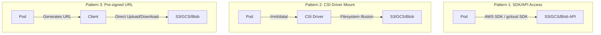
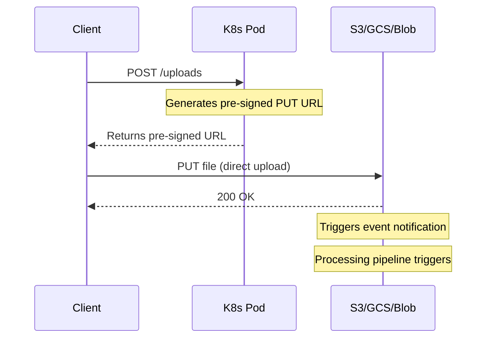
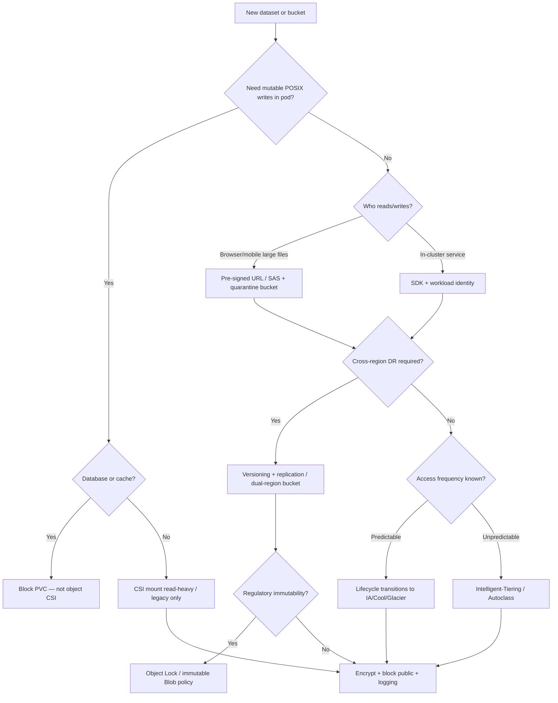

**Complexity**: `[MEDIUM]` | **Time to Complete**: 2h | **Prerequisites**: Module 9.1 (Databases), Kubernetes PersistentVolumes and CSI concepts — you should understand when to use a PVC versus an HTTP API before choosing object storage patterns for pods.

## What You'll Be Able to Do

After completing this module, you will be able to apply multi-cloud object storage patterns from Kubernetes workloads with correct security, cost, and durability tradeoffs:

- **Compare object, block, and file storage and justify object storage for unstructured data, backups, and static assets on Kubernetes**
- **Configure storage classes, lifecycle rules, and S3 Intelligent-Tiering across Amazon S3, Google Cloud Storage, and Azure Blob for cost-aware pipelines**
- **Implement SDK access, CSI mounts, and pre-signed URLs from pods using IRSA, GKE Workload Identity, and Azure Workload Identity**
- **Design versioning, cross-region replication, and Object Lock immutability for disaster recovery and compliance-aligned retention**

---

## Why This Module Matters

**Hypothetical scenario:** A platform team stores three years of application logs, ML feature files, and user-uploaded media in a single S3 Standard bucket because “one class is simpler.” Monthly storage grows linearly while read traffic stays flat; cross-AZ replication and millions of small PUT requests quietly dominate the bill. A lifecycle review moves cold prefixes to Standard-IA and Glacier Instant Retrieval, enables S3 Intelligent-Tiering on unpredictable prefixes, and routes hot avatar traffic through CloudFront with same-region origin reads. Storage spend drops without touching application code—only bucket policy, class selection, and CDN placement changed.

Object storage feels deceptively simple—“just upload a file”—yet it underpins backups, data lakes, CI artifacts, static websites, and Velero disaster-recovery targets. From Kubernetes, integration is richer than mounting a PVC: workloads typically call cloud APIs through SDKs with workload identity, occasionally mount buckets through CSI drivers for legacy POSIX expectations, and often offload large uploads/downloads via pre-signed URLs so pods are not network proxies. The expensive mistakes are usually operational: wrong storage class for access pattern, public buckets from a single policy typo, CSI mounts backing databases, incomplete multipart uploads billing forever, or pre-signed URLs with reckless expiration.

This module compares Amazon S3, Google Cloud Storage (GCS), and Azure Blob side by side—classes, lifecycle, durability, consistency, immutability, access control, CDN integration, and cost knobs—then maps each pattern to Kubernetes 1.35 workloads without collapsing to a single vendor story.

---

## Object, Block, and File Storage — Choosing the Right Abstraction

Cloud storage is not one product. It is three families with different consistency, performance, and Kubernetes integration models. Block storage on Amazon EBS, Google Persistent Disk, or Azure Managed Disks presents a raw volume to an instance or pod. That model optimizes random I/O, fsync, and database page caches.

File storage on Amazon EFS, Google Filestore, or Azure Files exposes a POSIX filesystem shared across many clients. Legacy applications that need directory semantics and file locking across nodes often choose file shares. Object storage stores opaque blobs keyed by name in a flat namespace. The pair of bucket plus key optimizes massive scale, HTTPS APIs, and immutability workflows such as versioning and legal hold.

Unstructured data belongs in object storage in most designs. Logs, images, model checkpoints, Terraform state backups, and Helm chart tarballs fit the object model well. You pay per gigabyte-month and per request instead of provisioned IOPS you never use. Block volumes attached through PersistentVolumeClaims remain correct when the workload is PostgreSQL, etcd, or any engine that assumes local filesystem semantics.

The Kubernetes documentation on [Volumes](https://kubernetes.io/docs/concepts/storage/volumes/) separates these concerns explicitly. Object stores are not first-class mount types for databases because clients access them over HTTP APIs rather than SCSI queues.

| Dimension | Object (S3 / GCS / Blob) | Block (EBS / PD / Disk) | File (EFS / Filestore / Azure Files) |
|-----------|--------------------------|-------------------------|--------------------------------------|
| Unit of access | Key in bucket | LUN / volume | Path in share |
| Typical K8s binding | SDK + optional CSI | PVC + CSI | PVC (RWX) |
| Random rewrite in place | Poor (overwrite object) | Excellent | Good |
| Share across many pods | Yes (read-mostly) | Usually RWO | Yes (RWX) |
| Cost driver | GB-month + requests + egress | Provisioned GB + IOPS | Capacity + throughput tier |

> **Stop and think:** Your data science team wants to train on a 2 TB image corpus stored in S3. They ask for a ReadWriteMany PVC backed by object storage so every node sees the same path. When is that reasonable, and when should they stream via SDK instead?

---

## Storage Classes, Lifecycle, and Intelligent Tiering

Each hyperscaler maps the same economic idea to different class names. Hot data costs more per gigabyte because it must be instantly available without retrieval fees. You choose a class or transition rule based on access frequency, retrieval latency tolerance, and minimum storage duration penalties documented on each provider’s pricing page.

One Zone-IA on AWS trades lower price for loss of zone-level redundancy within a region. That trade may be acceptable for reproducible ML shards but is a poor choice for sole-copy backups. GCS Nearline and Azure Cool tiers play the same infrequent-access role with different minimum billable durations—verify current numbers before modeling FinOps dashboards.

### Amazon S3 storage classes

[AWS documents multiple S3 storage classes](https://docs.aws.amazon.com/AmazonS3/latest/userguide/storage-class-intro.html) including S3 Standard for frequent access, S3 Standard-IA and S3 One Zone-IA for infrequent access at lower durability (single-AZ for One Zone-IA), S3 Glacier Instant Retrieval / Flexible Retrieval / Deep Archive for archive timelines, and S3 Intelligent-Tiering for objects with unknown or changing access patterns. Intelligent-Tiering automatically moves objects between frequent and infrequent access tiers without operational toil; [AWS notes monitoring and automation fees](https://docs.aws.amazon.com/AmazonS3/latest/userguide/intelligent-tiering.html) that you should weigh against manual lifecycle rules for predictable workloads.

### Google Cloud Storage classes

[GCS storage classes](https://cloud.google.com/storage/docs/storage-classes) include Standard (hot), Nearline (~monthly access), Coldline (~quarterly), and Archive (yearly). Buckets can be regional, dual-region, or multi-region; dual/multi-region options trade cost for geographic redundancy within a continent or globally. Lifecycle rules transition or delete objects by age, storage class, or prefix—similar mental model to S3 lifecycle JSON.

### Azure Blob access tiers

[Azure Blob access tiers](https://learn.microsoft.com/en-us/azure/storage/blobs/access-tiers-overview) are Hot, Cool, Cold, and Archive, with automatic tiering available on storage accounts that support it. Archive tier retrieval is measured in hours, not milliseconds, which matters when operators expect “restore like Standard.”

### Lifecycle rules — same pattern, three CLIs

Lifecycle engines automate transition and expiration: move `videos/` to IA after 30 days, abort stale multipart uploads after one day, delete `tmp-uploads/` after seven days. The JSON and CLI examples later in this module for AWS, GCS, and Azure remain your operational templates; the design discipline is universal—**encode retention at bucket creation**, not in a quarterly spreadsheet.

| Concern | AWS | GCP | Azure |
|---------|-----|-----|-------|
| Hot class | S3 Standard | Standard | Hot |
| Infrequent | Standard-IA / One Zone-IA | Nearline | Cool |
| Archive | Glacier tiers | Coldline / Archive | Cold / Archive |
| Auto tiering | Intelligent-Tiering | Autoclass (where enabled) | Access tier auto |
| Minimum billable days | Per class (verify current) | Per class | Per tier |

**Pause and predict:** You enable a lifecycle transition to Deep Archive after 90 days on a bucket with billions of 4 KB JSON metadata files. What cost might spike even if storage GB-month later falls?

<details>
<summary>Check your prediction</summary>

Default S3 Lifecycle configurations do not transition objects smaller than 128 KB into Glacier storage classes. If an operator overrides this default size threshold, the per-object transition request charges combined with Glacier index metadata overhead (approximately 40 KB of metadata storage billed per object) will substantially exceed the future GB-month savings achieved on four-kilobyte files. On a related operational track, S3 Intelligent-Tiering does not auto-tier objects smaller than 128 KB between access tiers; those small objects remain in the Frequent Access tier without incurring monitoring fees.
</details>

The next section is how durability, consistency, and regional topology differ from the GB-month savings story without treating every bucket as interchangeable.

---

## Durability, Consistency, and Regional Topology

Managed object stores advertise extreme durability. AWS and GCS commonly cite eleven nines for object durability, meaning independent failures across racks, zones, and drives rarely lose an object. Durability is not the same as availability of your application path. A regional outage or misconfigured endpoint still blocks reads even when bits remain safe on disk.

Design regional buckets when latency to a single Kubernetes cluster matters most. Use multi-region or dual-region buckets when users or clusters span geographies and you can tolerate higher storage charges plus replication lag measured in minutes or hours depending on options selected.

Amazon S3 provides [strong read-after-write consistency](https://docs.aws.amazon.com/AmazonS3/latest/userguide/Welcome.html#ConsistencyModel) for new objects. Pipelines that write then immediately list or read from another pod rely on that guarantee during rolling deploys. GCS and Azure Blob document strong read-after-write consistency for objects in their service documentation. Still verify edge cases for list operations and delete markers during disaster-recovery drills because control-plane caches in applications may assume stronger list consistency than vendors provide.

Cross-region replication on AWS, dual-region buckets on GCS, and geo-redundant storage on Azure add egress and replication PUT charges. AWS requires versioning on source and destination before replication rules apply per the [replication requirements guide](https://docs.aws.amazon.com/AmazonS3/latest/userguide/replication-requirements.html). Kubernetes clusters in two regions should use region-local bucket endpoints in ConfigMaps or a global access abstraction like S3 Multi-Region Access Points documented later. Hardcoding one regional bucket in every manifest creates cross-ocean latency and egress invoices that FinOps will attribute to platform engineering.

---

## Data Protection — Versioning, Object Lock, and Immutability

Accidental deletes, ransomware, and compliance retention push teams beyond “overwrite the key.” Versioning keeps prior object versions when keys are reused. Lifecycle rules can expire noncurrent versions after N days to cap storage multiplication while still allowing point-in-time recovery during the retention window.

Object Lock on S3 offers governance mode for operations teams that need tamper-evident logs and compliance mode for records that regulators expect to be immutable for a fixed interval. Azure immutable Blob storage and GCS retention policies address the same control for multi-cloud portfolios. Pick one immutability story per dataset and document who can extend retention versus who can only read.

Replication without versioning fails on AWS because replication rules require versioning on source and destination buckets. Delete marker replication choices change whether a delete in `us-east-1` hides objects in `eu-central-1`. Test bi-directional active-active media libraries with explicit delete-marker policies to avoid loops or ghost resurrections.

MFA Delete on AWS adds friction to permanent deletes. That friction helps production data lakes but blocks automation in CI buckets. Platform teams often enable MFA Delete only on regulated buckets while CI roles lack `s3:DeleteObject` entirely on scratch prefixes.

---

## Pod-to-Storage Access Patterns

Kubernetes pods interact with object storage in three primary ways, and mature platforms standardize on one default per workload type rather than mixing all three without documentation.



### Pattern 1: SDK Access with Workload Identity

The most common and flexible pattern uses the cloud SDK inside the application container. The SDK performs ranged reads, multipart uploads, conditional writes, and server-side encryption headers that FUSE mounts hide or approximate poorly. On EKS, IRSA annotates a Kubernetes ServiceAccount with an IAM role ARN. On GKE, Workload Identity binds a Kubernetes ServiceAccount to a Google service account. On AKS, Workload Identity federates Entra IDs to pods without storing client secrets in etcd.

Rotate credentials by rotating cloud roles and trust policies, not by restarting pods to pick up static keys from Secrets. External Secrets Operator helps when applications still need small secrets, but object storage access should prefer keyless federation for every new service.

```yaml
# AWS: Pod with IRSA for S3 access
apiVersion: v1
kind: ServiceAccount
metadata:
  name: storage-writer
  namespace: production
  annotations:
    eks.amazonaws.com/role-arn: arn:aws:iam::123456789012:role/S3WriterRole
---
apiVersion: apps/v1
kind: Deployment
metadata:
  name: video-processor
  namespace: production
spec:
  replicas: 5
  selector:
    matchLabels:
      app: video-processor
  template:
    metadata:
      labels:
        app: video-processor
    spec:
      serviceAccountName: storage-writer
      containers:
        - name: processor
          image: mycompany/video-processor:3.1.0
          env:
            - name: S3_BUCKET
              value: video-content-prod
            - name: S3_REGION
              value: us-east-1
          resources:
            requests:
              cpu: "2"
              memory: 4Gi
```

The IAM policy below scopes the IRSA role to a single bucket prefix. Least privilege means listing only when required and denying `s3:*` on unrelated ARNs.

```json
{
  "Version": "2012-10-17",
  "Statement": [
    {
      "Effect": "Allow",
      "Action": [
        "s3:GetObject",
        "s3:PutObject",
        "s3:DeleteObject",
        "s3:ListBucket"
      ],
      "Resource": [
        "arn:aws:s3:::video-content-prod",
        "arn:aws:s3:::video-content-prod/*"
      ]
    }
  ]
}
```

### GCP Workload Identity for GCS

```yaml
apiVersion: v1
kind: ServiceAccount
metadata:
  name: gcs-writer
  namespace: production
  annotations:
    iam.gke.io/gcp-service-account: gcs-writer@my-project.iam.gserviceaccount.com
```

```bash
# Bind the Kubernetes SA to the GCP SA
gcloud iam service-accounts add-iam-policy-binding \
  gcs-writer@my-project.iam.gserviceaccount.com \
  --role roles/iam.workloadIdentityUser \
  --member "serviceAccount:my-project.svc.id.goog[production/gcs-writer]"

# Grant GCS access to the GCP SA
gcloud storage buckets add-iam-policy-binding gs://video-content-prod \
  --member="serviceAccount:gcs-writer@my-project.iam.gserviceaccount.com" \
  --role="roles/storage.objectUser"
```

### Azure Workload Identity for Blob

```yaml
apiVersion: v1
kind: ServiceAccount
metadata:
  name: blob-writer
  namespace: production
  annotations:
    azure.workload.identity/client-id: "a1b2c3d4-e5f6-7890-abcd-ef1234567890"
  labels:
    azure.workload.identity/use: "true"
```

```bash
# Create federated credential
az identity federated-credential create \
  --name k8s-blob-writer \
  --identity-name blob-writer-identity \
  --resource-group myRG \
  --issuer "$(az aks show -g myRG -n myAKSCluster --query 'oidcIssuerProfile.issuerUrl' -o tsv)" \
  --subject system:serviceaccount:production:blob-writer \
  --audiences "api://AzureADTokenExchange"

# Assign Storage Blob Data Contributor role
az role assignment create \
  --assignee-object-id $(az identity show -n blob-writer-identity -g myRG --query principalId -o tsv) \
  --role "Storage Blob Data Contributor" \
  --scope "/subscriptions/SUB_ID/resourceGroups/myRG/providers/Microsoft.Storage/storageAccounts/videostorage"
```

---

## CSI Drivers: Mounting Object Storage as a Filesystem

Sometimes your application expects a filesystem path instead of an SDK. CSI drivers bridge that gap by presenting object storage as a POSIX-like mount under `/mnt/data` or similar paths. The illusion breaks down for databases, random writes inside large files, and file locking semantics that object APIs do not provide.

Before choosing CSI, ask whether a two-week refactor to the SDK is cheaper than months of mysterious training job failures. If the workload is a one-off migration script, CSI may be perfect. If the workload is a stateful service, block storage wins.

### Mountpoint for Amazon S3 CSI Driver

```bash
# Install the driver as an EKS add-on
aws eks create-addon \
  --cluster-name my-cluster \
  --addon-name aws-mountpoint-s3-csi-driver \
  --service-account-role-arn arn:aws:iam::123456789012:role/S3CSIDriverRole
```

Mountpoint for S3 CSI supports **static provisioning only**—it does not create buckets or provision volumes dynamically. Create the bucket out of band, then bind a manually defined `PersistentVolume` to a `PersistentVolumeClaim` with `storageClassName: ""` on both objects.

```yaml
# Static PersistentVolume (bucket must already exist)
apiVersion: v1
kind: PersistentVolume
metadata:
  name: s3-pv-data-pipeline-prod
spec:
  capacity:
    storage: 1Gi    # Required by the API; S3 capacity is not enforced
  accessModes:
    - ReadWriteMany
  storageClassName: ""
  mountOptions:
    - allow-delete
    - region us-east-1
    - prefix data/
  csi:
    driver: s3.csi.aws.com
    volumeHandle: data-pipeline-prod
    volumeAttributes:
      bucketName: data-pipeline-prod
---
# PersistentVolumeClaim bound to the PV above
apiVersion: v1
kind: PersistentVolumeClaim
metadata:
  name: s3-data
  namespace: production
spec:
  accessModes:
    - ReadWriteMany
  storageClassName: ""
  volumeName: s3-pv-data-pipeline-prod
  resources:
    requests:
      storage: 1Gi
---
# Pod using the mount
apiVersion: v1
kind: Pod
metadata:
  name: data-processor
  namespace: production
spec:
  serviceAccountName: storage-writer
  containers:
    - name: processor
      image: mycompany/data-processor:1.0.0
      volumeMounts:
        - name: s3-data
          mountPath: /mnt/data
      command:
        - /bin/sh
        - -c
        - |
          # Read files from S3 as if they were local
          ls /mnt/data/
          cat /mnt/data/config.json

          # Write files -- they appear in S3
          echo '{"processed": true}' > /mnt/data/output/result.json
  volumes:
    - name: s3-data
      persistentVolumeClaim:
        claimName: s3-data
```

### CSI Driver Limitations

| Feature | Mountpoint for S3 | GCS FUSE | Azure Blob CSI |
|---------|-------------------|----------|----------------|
| Read performance | Good (sequential) | Good | Good |
| Write performance | Good (new files) | Moderate | Good |
| Random I/O | Poor (not a block device) | Poor | Poor |
| Rename/move | Not atomic | Not atomic | Not atomic |
| Hard links | Not supported | Not supported | Not supported |
| File locking | Not supported | Not supported | Not supported |
| Best for | Data pipelines, ML training data | Data analytics | Batch processing |

**Critical warning**: Object storage CSI mounts are [NOT suitable for databases, caches, or any workload requiring random I/O, atomic operations, or POSIX compliance](https://cloud.google.com/storage/docs/cloud-storage-fuse/overview). Use them for read-heavy data pipelines and write-once-read-many workloads.

> **Stop and think**: Your team is deploying a new PostgreSQL database to Kubernetes. A junior engineer suggests using the S3 CSI driver to store the data files "so we never run out of disk space." What is the technical reason you must reject this proposal, and what should you use instead?

### Azure Blob CSI on AKS

The Azure Blob CSI driver mounts block blobs as volumes for workloads that insist on file paths. Enable it at the cluster level, bind a managed identity or service principal with `Storage Blob Data Contributor` on the account, and mount with read-only flags when data is shared training corpora. Writes through FUSE still lack database-grade atomicity; treat mounts as convenience, not as a persistence layer for transactional state.

### GCS FUSE CSI Driver

```bash
# GKE: enable the GCS FUSE CSI add-on on the cluster
gcloud container clusters update my-cluster \
  --update-addons GcsFuseCsiDriver=ENABLED
```

```yaml
apiVersion: v1
kind: Pod
metadata:
  name: ml-trainer
  namespace: ml
  annotations:
    gke-gcsfuse/volumes: "true"
    gke-gcsfuse/cpu-limit: "500m"
    gke-gcsfuse/memory-limit: "256Mi"
spec:
  serviceAccountName: gcs-writer
  containers:
    - name: trainer
      image: mycompany/ml-trainer:2.0.0
      volumeMounts:
        - name: training-data
          mountPath: /data
          readOnly: true
  volumes:
    - name: training-data
      csi:
        driver: gcsfuse.csi.storage.gke.io
        readOnly: true
        volumeAttributes:
          bucketName: ml-training-data
          mountOptions: "implicit-dirs"
```

---

## Pre-Signed URLs: Secure Direct Access

Pre-signed URLs allow clients to upload or download directly from object storage without passing through your Kubernetes pods. This offloads bandwidth from your cluster and reduces latency.

### Architecture



**Pause and predict:** If a user uploads a 5 GB video file directly through your Kubernetes API pod instead of using a pre-signed URL, what specific resource bottlenecks might occur in your cluster?

<details>
<summary>Check your prediction</summary>

Streaming a 5 GB client upload through the Kubernetes API pod forces all payload bytes across the pod network interface and worker node interfaces twice: once from the ingress controller to the pod, and once from the pod to the storage endpoint. This data transit saturates node network bandwidth, triggers memory exhaustion if the application buffers chunks in user space, and starves co-located containers of socket connections and network throughput. In contrast, issuing a pre-signed URL or browser POST policy allows the external client to stream bytes directly to the bucket, completely offloading data path ingress and egress from cluster compute instances.
</details>

The next section is how application services mint time-limited pre-signed URLs across AWS, GCS, and Azure SDK clients.

### Generating Pre-Signed URLs

```python
# AWS S3 pre-signed URL generation
import boto3
from datetime import timedelta

s3 = boto3.client('s3')

def generate_upload_url(filename, content_type):
    """Generate a pre-signed URL for direct client upload."""
    key = f"uploads/{filename}"

    url = s3.generate_presigned_url(
        'put_object',
        Params={
            'Bucket': 'user-uploads-prod',
            'Key': key,
            'ContentType': content_type,
            'ServerSideEncryption': 'aws:kms',
        },
        ExpiresIn=3600,  # 1 hour -- NOT 30 days!
        HttpMethod='PUT'
    )
    return url

def generate_download_url(key):
    """Generate a pre-signed URL for client download."""
    url = s3.generate_presigned_url(
        'get_object',
        Params={
            'Bucket': 'user-uploads-prod',
            'Key': key,
        },
        ExpiresIn=14400,  # 4 hours
    )
    return url
```

```python
# GCS pre-signed URL generation
from google.cloud import storage
from datetime import timedelta

client = storage.Client()
bucket = client.bucket('user-uploads-prod')

def generate_upload_url(filename, content_type):
    blob = bucket.blob(f"uploads/{filename}")
    url = blob.generate_signed_url(
        version="v4",
        expiration=timedelta(hours=1),
        method="PUT",
        content_type=content_type,
    )
    return url
```

On GKE with Workload Identity, the pod’s federated token cannot sign URLs by itself. `generate_signed_url()` needs a service account key or a principal with `iam.serviceAccounts.signBlob` (or equivalent) to produce v4 signatures—plan for a dedicated signing identity or a small signing sidecar rather than assuming the workload token is enough.

### Azure Blob shared access signatures

Azure favors user delegation SAS and stored access policies tied to Entra-backed identities when pods mint short-lived URLs. The shape differs from AWS query-string v4 signatures, but the security goal matches: scope to one container, one blob, and a tight clock. Pair SAS generation with Workload Identity on AKS so the signing secret never lands in a Kubernetes Secret as a long-lived account key.

When clients upload directly, place objects in a `quarantine/` prefix scanned by a ClamAV Deployment or a cloud malware API before promoting to `public/` or `processed/`. The promotion step should be a separate ServiceAccount with write access only to the clean prefix.

### Pre-Signed URL Security Best Practices

| Practice | Why |
|----------|-----|
| Set short expiration (1-4 hours for downloads, 15-60 min for uploads) | Limits exposure window if URL is leaked |
| Restrict Content-Type in upload URLs | Prevents uploading unexpected file types |
| Use separate buckets for uploads vs processed content | Isolates raw uploads from verified content |
| Require server-side encryption in the URL parameters | Ensures all uploads are encrypted at rest |
| Log all pre-signed URL generations | Audit trail for access tracking |
| Never expose bucket credentials; only expose URLs | Pre-signed URLs are scoped and temporary |

### CORS, content types, and upload integrity

Browser-based uploads require CORS rules that whitelist only your application origins. Wildcard origins on sensitive buckets invite token theft combined with overly broad IAM. Bind `Content-Type` in pre-signed PUT parameters so clients cannot swap executables for images after the API mints a URL.

Use checksum headers supported by your SDK where available. S3 supports additional checksum algorithms in modern APIs; validating on upload prevents corrupted objects from entering pipelines that only detect damage during expensive batch jobs hours later.

### Monitoring pre-signed URL abuse

Log every URL generation with principal, object key, and TTL. Ship logs to the same SIEM that processes authentication events. Anomalies—thousands of URLs for the same key, TTLs creeping upward in code review misses—often precede data exfiltration attempts.

---

## Lifecycle Policies for Cost Optimization

For many object-storage workloads, the largest recurring charge is storing data over time rather than serving it. Moving rarely accessed data into colder tiers reduces storage GB-month while trading retrieval latency and per-GB retrieval fees. Lifecycle policies express that trade as code: transition rules move objects after N days, expiration rules delete scratch prefixes, and incomplete multipart abort rules stop silent billing leaks.

Operations teams should attach lifecycle JSON at bucket creation in Terraform or Crossplane, not during a quarterly FinOps fire drill. The same discipline applies on GCP with `gcloud storage buckets update --lifecycle-file` and on Azure with lifecycle management policies in the portal or ARM templates.

### S3 Intelligent-Tiering versus fixed transitions

When access patterns are unpredictable, fixed transitions guess wrong. S3 Intelligent-Tiering monitors access and moves objects between tiers automatically for objects **128 KB and larger**—smaller objects incur neither the monitoring fee nor automatic tier moves (they stay in the upload tier). AWS charges a small monitoring fee per eligible object in exchange for removing operator guesswork. When access is predictable—logs age daily, media becomes cold after 30 days—explicit transitions to Standard-IA, Nearline, or Cool tiers are cheaper than monitoring fees on billions of small objects.

GCS Autoclass and Azure access tier automation play a similar role. Read each provider’s current pricing page before enabling automation account-wide. Pilot on one bucket, compare three months of invoices, then promote the pattern through your platform template library.

### Storage Tier Comparison

| Tier | AWS | GCP | Azure | Cost (per GB/month) | Use Case |
|------|-----|-----|-------|-------------------|----------|
| Hot | S3 Standard | Standard | Hot | See current vendor pricing | Frequently accessed |
| Infrequent | S3 Standard-IA | Nearline | Cool | See current vendor pricing | Monthly access |
| Archive | S3 Glacier IR | Coldline | Cold | See current vendor pricing | Quarterly access |
| Deep archive | S3 Glacier Deep | Archive | Archive | See current vendor pricing | Yearly/compliance |

> **Stop and think**: You configured a lifecycle rule to move all objects to Glacier Deep Archive after 90 days. A week later, your cloud bill spikes unexpectedly. What could cause this? (Hint: consider the cost of the transition operation itself if your bucket contains millions of tiny objects).

### AWS S3 Lifecycle Configuration

```json
{
  "Rules": [
    {
      "ID": "optimize-video-storage",
      "Status": "Enabled",
      "Filter": {
        "Prefix": "videos/"
      },
      "Transitions": [
        {
          "Days": 30,
          "StorageClass": "STANDARD_IA"
        },
        {
          "Days": 90,
          "StorageClass": "GLACIER_IR"
        },
        {
          "Days": 365,
          "StorageClass": "DEEP_ARCHIVE"
        }
      ]
    },
    {
      "ID": "cleanup-temp-uploads",
      "Status": "Enabled",
      "Filter": {
        "Prefix": "tmp-uploads/"
      },
      "Expiration": {
        "Days": 7
      },
      "AbortIncompleteMultipartUpload": {
        "DaysAfterInitiation": 1
      }
    }
  ]
}
```

```bash
aws s3api put-bucket-lifecycle-configuration \
  --bucket video-content-prod \
  --lifecycle-configuration file://lifecycle.json
```

### GCS Lifecycle

```bash
cat > /tmp/gcs-lifecycle.json << 'EOF'
{
  "lifecycle": {
    "rule": [
      {
        "action": {"type": "SetStorageClass", "storageClass": "NEARLINE"},
        "condition": {"age": 30, "matchesPrefix": ["videos/"]}
      },
      {
        "action": {"type": "SetStorageClass", "storageClass": "COLDLINE"},
        "condition": {"age": 90, "matchesPrefix": ["videos/"]}
      },
      {
        "action": {"type": "Delete"},
        "condition": {"age": 7, "matchesPrefix": ["tmp-uploads/"]}
      }
    ]
  }
}
EOF

gcloud storage buckets update gs://video-content-prod \
  --lifecycle-file=/tmp/gcs-lifecycle.json
```

### Incomplete Multipart Upload Cleanup

Multi-gigabyte data ingest pipelines frequently encounter client network disconnections, pod evictions, or node restarts before completing large transfers. Understanding how cloud object storage engines handle partial uploads across distributed sessions is essential for preventing cost anomalies.

**Pause and predict:** When a distributed client initiating a multipart upload disconnects or fails before completing all parts, what happens to the uploaded chunks on your monthly storage bill, and why do standard bucket listings fail to detect them?

<details>
<summary>Check your prediction</summary>

Incomplete multipart upload chunks remain stored in the bucket and continue to accrue standard storage billing charges until an explicit Complete or Abort API call executes. Because an incomplete multipart upload is not yet a finalized object, ordinary `ListObjects` or `ListObjectsV2` API calls do not display these orphan parts, making them completely invisible in standard console file browsers and listing scripts. To discover active partial uploads, operators must invoke `ListMultipartUploads`, and to eliminate them automatically before charges accumulate, bucket configurations should enforce an `AbortIncompleteMultipartUpload` lifecycle rule.
</details>

The next section is how objects copy across regions for disaster recovery without treating every replica pair as a simple rsync.

```bash
# Check for incomplete multipart uploads
aws s3api list-multipart-uploads --bucket video-content-prod

# You may be shocked at how many orphaned parts exist
```

### Azure lifecycle example

Azure Blob lifecycle management uses rules attached to storage accounts. A typical pattern transitions `logs/` blobs to Cool after 30 days and deletes `temp/` blobs after seven days. Express rules in ARM or Bicep alongside the storage account so AKS workload teams cannot create shadow accounts without lifecycle guardrails.

### GCS dual-region and turbo replication

When RPO requirements measure in minutes rather than hours, GCS dual-region buckets and turbo replication options reduce replication lag compared to manual cross-region copies. The spend is higher than single-region Standard storage. Finance should classify that line item as insurance, not “storage waste,” because the alternative is rebuilding datasets after regional loss.

### Requester pays and egress discipline

S3 Requester Pays shifts download costs to the requester account. That pattern suits shared datasets where consumers are other AWS accounts. It does not remove the need to think about Kubernetes egress from nodes. Pods downloading public buckets still incur cluster networking charges unless traffic stays inside the same region and VPC endpoint path documented by your cloud network team.

---

## Cross-Region Replication

Disaster recovery and multi-region serving both rely on copying objects automatically across buckets or regions. AWS documents this behavior in the [S3 Replication overview](https://aws.amazon.com/s3/features/replication/), and analogous features exist on GCS dual-region or multi-region buckets and on Azure geo-redundant storage when you design for geographic failure rather than single-cluster backup alone.

### AWS S3 Cross-Region Replication

**Pause and predict:** When configuring active-active clusters across two regions with bi-directional bucket replication, what mechanism prevents an infinite replication loop (Region A replicates to Region B, which replicates back to Region A)?

<details>
<summary>Check your prediction</summary>

Amazon S3 prevents infinite replication loops by checking the replication status metadata on every object before copying. When an object is replicated from Region A to Region B, S3 tags the destination copy with the metadata header `x-amz-replication-status: REPLICA`. S3 replication rules explicitly skip re-replicating any object that is already marked as a replica, naturally stopping the ping-pong cycle without requiring manual loop brakes. Replica modification sync is an optional configuration that propagates two-way metadata changes (such as tags and ACL modifications) between replicas, but it is not the mechanism that breaks replication loops.
</details>

The next section is how to enable versioning and replication rules so a second-region bucket can receive copies on a schedule you can measure.

```bash
# Enable versioning (required for replication)
aws s3api put-bucket-versioning \
  --bucket video-content-prod \
  --versioning-configuration Status=Enabled

aws s3api put-bucket-versioning \
  --bucket video-content-dr \
  --versioning-configuration Status=Enabled

# Create replication configuration
cat > /tmp/replication.json << 'EOF'
{
  "Role": "arn:aws:iam::123456789012:role/S3ReplicationRole",
  "Rules": [
    {
      "ID": "dr-replication",
      "Status": "Enabled",
      "Filter": {
        "Prefix": ""
      },
      "Destination": {
        "Bucket": "arn:aws:s3:::video-content-dr",
        "StorageClass": "STANDARD_IA",
        "ReplicationTime": {
          "Status": "Enabled",
          "Time": {"Minutes": 15}
        },
        "Metrics": {
          "Status": "Enabled",
          "EventThreshold": {"Minutes": 15}
        }
      },
      "DeleteMarkerReplication": {
        "Status": "Enabled"
      }
    }
  ]
}
EOF

aws s3api put-bucket-replication \
  --bucket video-content-prod \
  --replication-configuration file:///tmp/replication.json
```

### Multi-Region Access from Kubernetes

When pods in different regions need the closest bucket, avoid hardcoding one regional endpoint in every Deployment manifest. Use region-scoped configuration that tracks where the cluster runs.

```yaml
# Region-specific ConfigMap
apiVersion: v1
kind: ConfigMap
metadata:
  name: storage-config
  namespace: production
data:
  BUCKET_NAME: "video-content-prod"     # US region
  # In EU cluster, this would be: "video-content-eu"
  BUCKET_REGION: "us-east-1"
```

On AWS, [S3 Multi-Region Access Points](https://docs.aws.amazon.com/AmazonS3/latest/userguide/MultiRegionAccessPointRequestRouting.html) expose one global endpoint that routes requests to the nearest replica bucket behind the scenes. That pattern reduces the need for per-region ConfigMap churn when the application SDK can target a single MRAP hostname.

```bash
aws s3control create-multi-region-access-point \
  --account-id 123456789012 \
  --details '{
    "Name": "video-global",
    "Regions": [
      {"Bucket": "video-content-prod"},
      {"Bucket": "video-content-eu"},
      {"Bucket": "video-content-ap"}
    ]
  }'

# Creation is asynchronous — poll until Status is SUCCEEDED before using the MRAP
aws s3control describe-multi-region-access-point \
  --account-id 123456789012 \
  --name arn:aws:s3::123456789012:accesspoint/video-global \
  --query 'AccessPoint.Status'
```

---

## Bucket Security Hardening

### Defense-in-Depth Configuration

Bucket hardening should run in a fixed order so operators do not encrypt data that is still world-readable. Start with public access blocks, then default encryption, then logging, then versioning, then TLS-only policies. GCP and Azure mirror the sequence with uniform bucket-level access, customer-managed keys, diagnostic logs, and secure transfer required settings.

Least-privilege IAM for Kubernetes means application ServiceAccounts can write only to intended prefixes. Platform CSI driver identities stay separate from application identities. A video processor role should not inherit ListAllMyBuckets because a developer copied a tutorial policy during incident response.

```bash
# 1. Block all public access (do this first, always)
aws s3api put-public-access-block \
  --bucket video-content-prod \
  --public-access-block-configuration \
    BlockPublicAcls=true,IgnorePublicAcls=true,BlockPublicPolicy=true,RestrictPublicBuckets=true

# 2. Enable default encryption with KMS
aws s3api put-bucket-encryption \
  --bucket video-content-prod \
  --server-side-encryption-configuration '{
    "Rules": [{"ApplyServerSideEncryptionByDefault": {
      "SSEAlgorithm": "aws:kms",
      "KMSMasterKeyID": "alias/s3-encryption-key"
    }, "BucketKeyEnabled": true}]
  }'

# 3. Enable access logging
aws s3api put-bucket-logging \
  --bucket video-content-prod \
  --bucket-logging-status '{
    "LoggingEnabled": {
      "TargetBucket": "access-logs-prod",
      "TargetPrefix": "s3/video-content-prod/"
    }
  }'

# 4. Enable versioning (protects against accidental deletion)
aws s3api put-bucket-versioning \
  --bucket video-content-prod \
  --versioning-configuration Status=Enabled

# 5. Require TLS (deny non-HTTPS requests)
aws s3api put-bucket-policy --bucket video-content-prod \
  --policy '{
    "Version": "2012-10-17",
    "Statement": [{
      "Sid": "DenyNonHTTPS",
      "Effect": "Deny",
      "Principal": "*",
      "Action": "s3:*",
      "Resource": [
        "arn:aws:s3:::video-content-prod",
        "arn:aws:s3:::video-content-prod/*"
      ],
      "Condition": {"Bool": {"aws:SecureTransport": "false"}}
    }]
  }'
```

### Bucket Security Checklist

| Control | AWS | GCP | Azure |
|---------|-----|-----|-------|
| Block public access | Public Access Block | Uniform bucket-level access | Disable anonymous access |
| Encryption at rest | SSE-S3/SSE-KMS | Google-managed/CMEK | Microsoft-managed/CMK |
| Encryption in transit | Enforce HTTPS via bucket policy | HTTPS by default | Require secure transfer |
| Access logging | Server access logging | Cloud Audit Logs | Diagnostic logs |
| Versioning | Bucket versioning | Object versioning | Blob versioning |
| Immutability | Object Lock | Retention policies | Immutable storage |

---

## Access Control, CDN Fronting, and Static Hosting

Object storage access control stacks **identity policies** (IAM on AWS, IAM on GCP, Azure RBAC), **resource policies** (S3 bucket policy, GCS IAM conditions, Azure stored access policies), and **network constraints** (private endpoints, VPC service controls, storage firewalls). [AWS Block Public Access](https://aws.amazon.com/s3/features/block-public-access/) is account- and bucket-level guardrails that override naive `Principal: "*"` mistakes; enable it before any bucket policy work. GCP **uniform bucket-level access** disables object ACL sprawl; Azure disables anonymous access unless explicitly configured.

**Pre-signed URLs** (S3), **signed URLs** (GCS v4), and **SAS tokens** (Azure) delegate time-limited capability without embedding long-lived keys in mobile apps—patterns covered earlier remain the Kubernetes-friendly default for large uploads. Pair short expirations with server-side encryption parameters in the signature so clients cannot downgrade protection.

Static website hosting (S3 website endpoints, GCS website configuration, Azure static websites) is rarely the production pattern for public apps—teams front buckets with **Amazon CloudFront**, **Google Cloud CDN**, or **Azure Front Door / CDN** for TLS, caching, geographic edge, and WAF integration. A critical cost detail from [Amazon S3 pricing](https://aws.amazon.com/s3/pricing/): **data transfer for same-Region access to S3 from EC2 or CloudFront origin fetches in the same Region is generally free of charge** for the S3 side (verify current pricing pages before budgeting). Misplaced origins—CloudFront pulling from a bucket in another region—reintroduce cross-region egress that same-region design avoided.

CORS configuration on buckets matters when browsers upload directly via pre-signed PUT; restrict allowed origins instead of `*` in production. For Kubernetes ingress of static assets, many teams bake assets into container images or use a CDN; object storage plus CDN remains superior for large, frequently changing media corpora.

```bash
# Example: Azure Blob CSI driver install context (AKS)
# See https://learn.microsoft.com/en-us/azure/aks/azure-blob-csi-driver
az aks update -g myRG -n myAKSCluster --enable-blob-driver
```

Legacy mount helpers (`s3fs`, `goofys`, Azure Blob FUSE) still appear in older runbooks; platform engineers on Kubernetes 1.35 should prefer **official CSI drivers** (Mountpoint for S3, GCS FUSE CSI, Azure Blob CSI) or **SDK access** because FUSE mounts inherit latency, partial POSIX support, and hard-to-debug caching behavior under concurrent pod churn.

---

## Cost Lens — Moderate Scale and Surprise Spikes

At “moderate scale”—tens of terabytes, millions of objects, steady CI and user traffic—the object storage bill is usually **storage GB-month + request charges + retrieval penalties + egress**, not headline per-GB hot storage alone. A 50 TB Standard bucket sounds expensive until you realize **10 million LIST + GET** operations from a misconfigured indexer cost more than the storage itself. Conversely, moving cold telemetry to IA without measuring retrieval patterns can increase spend when analysts re-scan the dataset weekly.

| Cost spike trigger | Mechanism | Mitigation |
|--------------------|-----------|------------|
| Wrong class for access pattern | Frequent reads on Archive tier | Lifecycle + class analytics; Intelligent-Tiering or Autoclass |
| Cross-region egress | Pods in `eu-west-1` read `us-east-1` bucket | Regional buckets, MRAP, or CDN same-region origin |
| Incomplete multipart uploads | Hidden parts bill silently | `AbortIncompleteMultipartUpload` lifecycle on every bucket |
| Early deletion fee | IA/Glacier minimum storage duration | Match retention to class minimums |
| Public internet egress | Clients download without CDN | CloudFront / Cloud CDN / Front Door |
| Replication + RTC | 15-minute SLA replication metrics | Filter prefixes; destination class IA |

**Knobs that reliably reduce cost:** lifecycle transition to colder classes, Intelligent-Tiering for unknown access, compressing objects before upload, batching small files into tar archives (trade listing granularity), using same-region workers and origins, and denying public egress paths you did not intend. **Knobs that increase cost but buy safety:** versioning, cross-region replication with replication time control ([AWS RTC targets 99.9% within 15 minutes](https://docs.aws.amazon.com/AmazonS3/latest/userguide/replication-time-control.html)), Object Lock compliance mode, and verbose access logging—budget these as insurance, not surprises.

---

## Kubernetes Backup Targets — Velero and SDK-First Design

Cluster disaster recovery tools such as [Velero](https://velero.io/docs/) store backup objects in S3-compatible, GCS, or Azure Blob targets configured via `BackupStorageLocation`. That is object storage accessed through the Velero controller’s credentials—not a PVC—mirroring how application teams should treat large blob workflows: **grant the backup ServiceAccount cloud identity**, encrypt the backup bucket, block public access, and lifecycle noncurrent backup versions to Glacier/Coldline after N days.

Application pods should default to **cloud SDKs inside the container** with workload identity (IRSA on EKS, GKE Workload Identity Federation, Azure Workload Identity on AKS) because SDK calls expose metadata operations, ranged reads, multipart uploads, and server-side encryption headers explicitly. CSI mounts remain appropriate for read-heavy ML datasets or legacy shell tools that only understand file paths—never for relational data directories. When you must mount, cap FUSE sidecar CPU/memory (GKE annotations shown earlier) and load-test concurrent writers; Mountpoint for S3 and peers improve sequential throughput but do not invent POSIX locks.

EKS documents the [Mountpoint for Amazon S3 CSI driver](https://docs.aws.amazon.com/eks/latest/userguide/s3-csi-driver.html) as an add-on; treat add-on IAM roles separately from application IRSA roles so a compromise in the app cannot mutate unrelated buckets through the driver’s broader policy.

---

## Multi-Cloud Object Storage Playbook

The following playbook ties AWS, GCP, and Azure controls to the same operational questions platform teams ask during design review. It is not a product tutorial; it is a checklist you can run before any bucket backs production Kubernetes traffic.

### Ingestion and multipart uploads

Large objects should use multipart upload APIs on every cloud. Multipart improves reliability over flaky networks and lets controllers resume failed transfers. The downside is operational: failed parts remain billable until aborted. AWS documents automatic cleanup through lifecycle `AbortIncompleteMultipartUpload`. GCS and Azure have analogous compose and block-blob staging behaviors you must monitor in metrics, not only in storage dashboards.

From Kubernetes, ingestion controllers should run near the bucket region. A pod in `eu-west-1` streaming uploads to `us-east-1` pays latency and cross-region charges on every part. For CI artifacts, many teams run regional buckets per cluster fleet and replicate only release artifacts to a central compliance bucket.

### Listing, inventory, and metadata storms

Object stores are not databases. Listing millions of keys with naive pagination can dominate request costs and throttle applications. S3 Inventory delivers CSV manifests of objects and metadata on a schedule. GCS provides storage insights and inventory reports. Azure offers blob inventory policies. Batch analytics should read inventory files instead of hammering `ListObjectsV2` from a nightly CronJob in the cluster.

When you must list live, enforce prefix conventions. Structure keys like `tenantId/yyyy/mm/dd/objectId` so applications query narrow prefixes. A flat `uploads/` prefix with ten million keys is a self-inflicted outage during incident response.

### Encryption and key management

Encrypt data at rest by default on every bucket. AWS supports SSE-S3 and SSE-KMS with bucket keys to reduce KMS API costs. GCS offers Google-managed keys and customer-managed encryption keys. Azure supports Microsoft-managed and customer-managed keys in Key Vault. In transit, enforce HTTPS through bucket policies or Azure secure transfer required settings.

Kubernetes does not replace key management. External Secrets Operator can sync secrets, but object encryption keys usually remain cloud KMS resources bound to workload identity. Document which ServiceAccounts may call `kms:Decrypt` versus `s3:PutObject` so audits do not confuse data-plane and control-plane permissions.

### Event-driven pipelines

Object uploads often trigger asynchronous processing. AWS can emit events to SNS, SQS, or EventBridge. GCS publishes to Pub/Sub. Azure emits Event Grid notifications. Kubernetes consumers scale on queue depth with KEDA scalers while functions or Deployments process new blobs.

Design idempotency at the consumer. At-least-once delivery is common. A pod may see duplicate notifications after crashes. Store a processed-object index in a database or conditional write marker in object metadata rather than assuming exactly-once triggers.

### Static assets and cache invalidation

Serving user-facing media from object storage without a CDN shifts TLS termination and geographic latency onto a single regional endpoint. CloudFront, Cloud CDN, and Azure CDN integrate origin access controls so buckets stay private while edges cache public objects.

Cache invalidation belongs in your deployment pipeline. When a ConfigMap changes, Kubernetes rolls pods; when a static asset changes, you must invalidate CDN paths or version filenames. Teams version assets with content hashes in filenames (`app.8f3a2.css`) to avoid wildcard invalidation storms.

### Compliance prefixes and legal holds

Regulated datasets need prefix isolation plus immutability. Separate `audit/` from `tmp/` buckets or prefixes at creation time. Applying Object Lock or immutable Blob policies to the entire bucket breaks CI cleanup on temporary keys. Narrow policies to compliance prefixes and automate lifecycle only on non-regulated prefixes.

Legal holds pause deletion during investigations. Operations runbooks should state who may lift a hold and how Kubernetes backup jobs behave when holds block deletion of orphaned keys.

### Testing DR and replication lag

Replication is not backup unless you periodically restore. Schedule quarterly drills that list replicated prefixes, restore a sample object in a sandbox namespace, and verify checksums. Measure replication lag during peak write periods. RTC metrics on AWS help; on other clouds you infer lag by comparing object generation timestamps.

Delete markers deserve explicit tests. If a user deletes an object in region A, determine whether region B should hide the object or retain a readable copy for active-active media libraries. The wrong delete-marker replication setting causes either data resurrection loops or silent user-visible loss.

### Observability and chargeback

Export storage metrics per bucket and per prefix where possible. Tag buckets with `team`, `cost-center`, and `data-classification` labels compatible with your FinOps tooling. In Kubernetes, annotate namespaces with the same labels so dashboards correlate pod counts to bucket spend.

Alert on anomalous `4xx`/`5xx` rates from SDK metrics, not only on total bytes stored. A misconfigured policy that flips to public read often shows up as traffic spikes before security tools finish triage.

### Azure Blob CSI and AKS notes

AKS can enable the Blob CSI driver without treating blobs as POSIX-perfect disks. Mount read-only training data when the ML framework tolerates FUSE semantics. Write-heavy analytics should still prefer the Azure SDK with Workload Identity from the pod service account.

Document mount options and subnet egress paths. Private clusters may require private endpoints to storage accounts before CSI mounts succeed from worker nodes without public internet routes.

### GCS FUSE on GKE notes

GKE’s GCS FUSE CSI driver injects sidecar resources for caching. Under-provisioned sidecars cause OOM kills that look like application instability. Load-test concurrent readers during model training peaks. Read-only mounts prevent accidental overwrite of shared corpora when multiple pods mount the same bucket prefix.

### EKS Pod Identity and IRSA coexistence

AWS now offers EKS Pod Identity alongside IRSA. Both remove long-lived keys from manifests. Standardize one mechanism per cluster generation and document trust policies in Git. Mixed clusters during migration should not duplicate broad `s3:*` policies on two parallel identity paths for the same Deployment.

### MinIO and S3-compatible on-prem patterns

Labs in this module use MinIO as an S3-compatible endpoint inside kind. On-prem S3-compatible stores follow the same SDK and pre-signed URL patterns. Differences appear in TLS trust chains, endpoint URLs, and lack of managed lifecycle unless you operate MinIO lifecycle APIs yourself. Treat compatibility testing as part of release gates when applications assume AWS-only headers.

### Object key design for multi-tenant Kubernetes

Tenant isolation belongs in key prefixes and IAM conditions, not in separate clusters per customer unless contracts require it. A prefix like `tenants/{tenantId}/objects/{uuid}` lets you attach IAM policies with `StringLike` on `s3:prefix`. GCS and Azure support parallel condition keys on service accounts and RBAC assignments.

Avoid sequential IDs in public URLs when enumeration risks exist. Use opaque UUIDs in keys while authorization happens through pre-signed URLs or gateway checks. Listing APIs should never become the authorization layer.

### Capacity planning worksheet

Estimate monthly cost as storage GB-month in the active class plus request thousands times per-thousand price plus expected egress GB. Add replication multiplier when DR copies every object to a second region. Add versioning multiplier when noncurrent versions are not expired aggressively. Compare the total to block storage PVC costs only when workloads truly need POSIX semantics.

Document assumptions in the service’s design doc. Finance reviews storage class choices faster when engineers show retrieval frequency evidence instead of guessing “cold after 90 days.”

### Runbook prompts for on-call

When pagers fire on object storage, ask five questions before diving into kubectl. Is the bucket regional and does the cluster match? Did a lifecycle rule recently transition objects to Archive? Are we listing huge prefixes without pagination? Did someone rotate IAM trust for IRSA or Workload Identity? Are CDN origins pointing cross-region?

Answers usually implicate configuration drift rather than S3 outages. Keep Terraform state for buckets next to cluster state so rollback includes storage policies, not only Deployments.

### Integrating with GitOps

Bucket policies, lifecycle JSON, and encryption defaults belong in Git with the same review rigor as application manifests. Argo CD or Flux can reconcile Crossplane claims or Terraform Cloud runs that mint buckets per environment. Drift detection should flag buckets created manually in the console without lifecycle rules.

Separate dev and prod accounts or projects at the organization level. CI clusters receive permissive scratch buckets with seven-day expiration. Production buckets require approval for public access changes and for deletion permissions on automation roles.

### Performance expectations from pods

Sequential read throughput from CSI mounts can match SDK performance for large files, but metadata-heavy workloads that stat thousands of paths per second will thrash against object API rate limits. Batch metadata operations with inventory files or prefix listing pagination instead of per-file stats in tight loops inside pods.

Write-heavy pipelines should coalesce small objects. Thousands of 1 KB JSON files incur more request cost than fewer tar objects with the same total bytes, at the expense of partial read flexibility. Choose the object granularity deliberately when microservices emit telemetry from many pods.

Platform reviewers should insist on a one-page storage diagram per service. The diagram lists bucket names, classes, retention, identity mechanism, and whether clients touch storage through SDK, CSI, or pre-signed URLs. That artifact prevents “temporary” public buckets from becoming permanent data lakes without owners. Review the diagram during major traffic launches and region expansions so storage policies stay aligned with cluster topology, FinOps chargeback tags remain accurate, and backup jobs still target only the intended production buckets.

---

## Patterns & Anti-Patterns

| Pattern | When to Use | Why It Works | Scaling Consideration |
|---------|-------------|--------------|------------------------|
| SDK + workload identity as default | Microservices, controllers, Velero-style tools | Fine-grained IAM/RBAC, no FUSE cache surprises | Cache credentials via SDK; rotate via cloud identity, not static keys |
| Pre-signed URLs for large client uploads | Mobile/web direct-to-bucket | Keeps pod network and CPU off the hot path | Short TTL + content-type binding + separate quarantine bucket |
| Lifecycle at bucket creation | Any bucket living >30 days | Prevents “we will clean later” debt | Pair with Intelligent-Tiering only when access is unpredictable |
| Versioning + replication for DR | Prod media, backups, audit logs | Point-in-time recovery across regions | Monitor replication lag metrics; test delete-marker behavior |
| CDN same-region origin | Public static assets | Cuts latency and avoids cross-region S3 egress | Invalidate CDN on deploy; don’t bake secrets into public paths |

| Anti-Pattern | What Goes Wrong | Better Alternative |
|--------------|-----------------|--------------------|
| CSI mount for database files | Corruption, split-brain, failed locks | Block storage PVC (EBS/PD/Disk) |
| One Standard class forever | Storage GB-month dominates as data ages | Prefix-based lifecycle + IA/Cool tiers |
| 30-day pre-signed URLs | Leaked links become long-lived breach | 15–60 minutes upload, 1–4 hours download |
| Static IAM user keys in Secrets | Keys sprawl; rotation pain | IRSA / Workload Identity / federated credentials |
| Public bucket “just for testing” | Crawlers exfiltrate within hours | Account-level block public access + SCPs |
| Ignoring request charges | LIST storms during misconfigured sync | Paginate; use inventory manifests; S3 Batch Operations |

---

## Decision Framework

Use access pattern, compliance, and Kubernetes integration rather than vendor habit when you pick storage classes, replication, and mount strategies for a new bucket.



| Requirement | Prefer | Tradeoff |
|-------------|--------|----------|
| Frequent random read/write in app | SDK against Standard class | CSI only if code cannot change |
| Monthly analytics on logs | Lifecycle to IA/Nearline/Cool | Retrieval fees if accessed too often |
| Legal hold / SEC-style retention | Object Lock compliance or Blob immutable | Deletes blocked for retention period |
| Global low-latency reads | Multi-region bucket or MRAP + CDN | Higher storage + replication cost |
| Ransomware recovery | Versioning + replication + restricted delete IAM | Storage multiplication; monitor noncurrent versions |

---

## Did You Know?

1. Amazon S3 advertises 99.999999999% (11 nines) durability for objects stored in Standard across multiple facilities, though availability and regional endpoints remain separate design concerns you must still engineer around.

2. Incomplete multipart uploads become a hidden storage-cost problem because failed uploads leave billable parts behind until operators complete, abort, or lifecycle-clean them—those parts do not always appear in console object counts.

3. GCS FUSE can cache frequently read files locally, which materially reduces repeat-read latency for ML training workloads that reuse the same dataset shards across epochs on GKE nodes.

4. Azure Blob Storage supports immutable storage with legal holds and time-based retention for WORM-style retention; Microsoft documents supported compliance postures including SEC 17a-4(f) style controls in the immutable storage overview linked in Sources.

---

## Common Mistakes

| Mistake | Why It Happens | How to Fix It |
|---------|---------------|---------------|
| Using CSI mount for database files | "It mounts like a disk, right?" | CSI object storage mounts lack POSIX semantics; use EBS/PD for databases |
| Setting pre-signed URL expiration to 30 days | Copy-pasted from example code | Use 1-4 hours for downloads, 15-60 minutes for uploads |
| Not blocking public access on new buckets | Default is private, but one wrong policy makes it public | Enable account-level public access block as a guardrail |
| Ignoring incomplete multipart uploads | Not visible in normal S3 listings | Add `AbortIncompleteMultipartUpload` lifecycle rule to every bucket |
| Using IAM user access keys instead of workload identity | "Quickest way to get it working" | Use IRSA (EKS), Workload Identity (GKE), or Workload Identity Federation (AKS) |
| Not enabling versioning before replication | Replication requires versioning, easy to forget | Script bucket creation to always enable versioning |
| Downloading large files through the pod when pre-signed URLs exist | Simpler code path | Generate pre-signed URLs to offload bandwidth; your pod should not proxy large files |
| No lifecycle policy on any bucket | "We will clean up later" | Define lifecycle rules at bucket creation time; "later" never comes |

---

## Quiz

<details>
<summary>1. Your team is migrating three workloads: a legacy log analyzer that requires local file paths, a new Go microservice, and a heavy video-upload portal. Which object storage access pattern should you choose for each, and why?</summary>

For the legacy log analyzer, use a CSI driver mount because the application expects a POSIX-like filesystem interface and rewriting it to use an SDK might not be feasible. For the new Go microservice, use SDK/API access with Workload Identity, as this is the most flexible, secure, and native way to interact with object storage APIs. For the video-upload portal, use pre-signed URLs to allow clients to upload directly to the bucket. This offloads massive bandwidth requirements from your Kubernetes cluster, preventing node network saturation and reducing latency.
</details>

<details>
<summary>2. A developer proposes using the Mountpoint for S3 CSI driver to host a MySQL database's `/var/lib/mysql` directory to save on EBS costs. Why will this deployment immediately fail or cause data corruption?</summary>

Object storage CSI drivers present a filesystem interface, but they fundamentally lack critical POSIX semantics required by database engines. They do not support random I/O (seeking and modifying within files), atomic rename operations, or file locking, which are all mandatory for write-ahead logs and concurrency control. When MySQL attempts to perform an atomic write or lock a row file, the operation will either fail outright or silently complete without actual atomicity, leading to instantaneous data corruption. You must use block storage like EBS or Persistent Disk for databases.
</details>

<details>
<summary>3. After six months in production, your cloud bill shows S3 storage costs are double what the actual total size of your active objects should dictate. What silent mechanism likely caused this, and how do you permanently fix it?</summary>

The hidden cost is almost certainly caused by incomplete multipart uploads. When large file uploads fail or are interrupted mid-transfer, the partial chunks remain stored in the bucket indefinitely but are completely invisible to standard list-objects API calls. Because they take up physical space, the cloud provider continues to charge you for them month over month. To fix this permanently, you must configure a bucket lifecycle rule such as `AbortIncompleteMultipartUpload` with `DaysAfterInitiation: 1` (AWS allows 1–7 days), which automatically purges any orphaned upload fragments.
</details>

<details>
<summary>4. Your mobile app needs to download user-specific avatars from a private GCS bucket. A junior developer suggests embedding a read-only service account key in the app code. Why is this a severe security risk, and why are pre-signed URLs the correct architectural choice?</summary>

Embedding service account keys in client code is a critical vulnerability because malicious actors can extract the key, granting them permanent, unrestricted read access to potentially the entire bucket or project. Pre-signed URLs eliminate this risk by delegating access dynamically without exposing credentials. The URL encodes a cryptographic signature valid for only a specific object and a strict, limited time window (e.g., 15 minutes). Even if a pre-signed URL is intercepted, the blast radius is contained to a single file, and the access automatically expires.
</details>

<details>
<summary>5. You operate active-active Kubernetes clusters in `us-east-1` and `eu-central-1`. Applications in both clusters need to read from the same globally replicated dataset. How does an S3 Multi-Region Access Point prevent you from having to maintain region-specific ConfigMaps?</summary>

Without a Multi-Region Access Point (MRAP), your deployment manifests would need region-specific ConfigMaps injected to tell the US cluster to use the US bucket and the EU cluster to use the EU bucket. An MRAP solves this by providing a single, global endpoint ARN that you can hardcode into your application's configuration. When a pod makes a request to the MRAP, AWS's global network automatically routes the request to the lowest-latency replica bucket behind the scenes. This decouples your Kubernetes configuration from your cloud storage topology, vastly simplifying multi-region deployments.
</details>

<details>
<summary>6. Your application code is explicitly configured to use `https://` for all S3 API calls. Why do security auditors still require you to implement a `DenyNonHTTPS` bucket policy statement?</summary>

Relying solely on application configuration violates the principle of defense-in-depth, as a simple configuration drift, typo, or new tool (like an admin running a local script) could accidentally use HTTP. For example, if an engineer tests an endpoint using `curl` without HTTPS, the bucket policy will reject the insecure request. By enforcing TLS at the bucket policy level, you create an infrastructure-enforced guardrail that actively denies any unencrypted request regardless of the client's configuration. This guarantees data in transit is protected and satisfies strict compliance frameworks (like HIPAA or PCI-DSS) that require systemic, rather than application-level, enforcement of encryption.
</details>

<details>
<summary>7. Your telemetry bucket stores 80 TB with unpredictable access: weekly incident replays spike reads, otherwise objects sit idle for months. Would you choose a fixed lifecycle to Glacier Deep Archive after 30 days, S3 Intelligent-Tiering, or stay on Standard—and why?</summary>

Fixed Deep Archive after 30 days optimizes storage GB-month but punishes the weekly replay pattern with retrieval delays and per-GB retrieval fees that can exceed storage savings. Staying on Standard forever avoids retrieval surprises but wastes money on the long idle tail. S3 Intelligent-Tiering ([documented by AWS](https://docs.aws.amazon.com/AmazonS3/latest/userguide/intelligent-tiering.html)) fits unpredictable access: objects move between frequent and infrequent tiers automatically without rewriting lifecycle JSON each time analytics changes. Pair monitoring fees with a pilot bucket, and keep a lifecycle rule on `tmp/` prefixes for definite expiration regardless of tiering choice.
</details>

<details>
<summary>8. A compliance officer requires WORM retention for 7 years on audit logs written by Kubernetes jobs. Which controls across AWS, GCP, and Azure satisfy immutability without mounting a CSI volume?</summary>

Use SDK writes with workload identity into buckets protected by immutability features—not CSI mounts. On AWS, enable versioning and Object Lock in compliance mode for the audit prefix. On GCS, apply bucket retention policies or bucket lock matching the seven-year window. On Azure, configure [immutable Blob storage](https://learn.microsoft.com/en-us/azure/storage/blobs/immutable-storage-overview) with time-based retention or legal holds on the audit container. Kubernetes only needs a ServiceAccount with write-only scope to the audit prefix; Velero-style backup buckets may replicate to a second region, but immutability must be enforced at the bucket policy layer so even cluster-admin credentials cannot shorten retention during the hold.
</details>

---

## Hands-On Exercise: Object Storage Access Patterns with MinIO

This hands-on exercise uses MinIO as an S3-compatible API inside a kind cluster so you can practice SDK access, pre-signed URLs, lifecycle-style cleanup, and security checks without cloud spend.

### Setup

```bash
alias k=kubectl

# Create kind cluster
kind create cluster --name storage-lab

# Install MinIO
helm repo add minio https://charts.min.io/
helm install minio minio/minio \
  --namespace storage --create-namespace \
  --set replicas=1 \
  --set persistence.enabled=false \
  --set rootUser=minioadmin \
  --set rootPassword=minioadmin123 \
  --set resources.requests.memory=256Mi

k wait --for=condition=ready pod -l app=minio -n storage --timeout=120s
```

### Task 1: SDK-Style Access from a Pod

Create a pod that uses the AWS CLI (configured for MinIO) to create a bucket and upload files.

<details>
<summary>Solution</summary>

```bash
# Create a Secret with MinIO credentials
k create secret generic minio-creds -n storage \
  --from-literal=AWS_ACCESS_KEY_ID=minioadmin \
  --from-literal=AWS_SECRET_ACCESS_KEY=minioadmin123

# Run a pod with AWS CLI
cat <<'EOF' | k apply -f -
apiVersion: v1
kind: Pod
metadata:
  name: s3-client
  namespace: storage
spec:
  restartPolicy: Never
  containers:
    - name: aws-cli
      image: amazon/aws-cli:2.22.0
      command:
        - /bin/sh
        - -c
        - |
          # Configure endpoint
          export AWS_DEFAULT_REGION=us-east-1

          # Create bucket
          aws --endpoint-url http://minio:9000 s3 mb s3://test-bucket

          # Upload files
          echo "Hello from Kubernetes" > /tmp/hello.txt
          aws --endpoint-url http://minio:9000 s3 cp /tmp/hello.txt s3://test-bucket/hello.txt

          # Create multiple files
          for i in $(seq 1 10); do
            echo "File content $i - $(date)" > /tmp/file-$i.txt
            aws --endpoint-url http://minio:9000 s3 cp /tmp/file-$i.txt s3://test-bucket/data/file-$i.txt
          done

          # List bucket contents
          aws --endpoint-url http://minio:9000 s3 ls s3://test-bucket/ --recursive

          echo "Upload complete!"
          sleep 300
      envFrom:
        - secretRef:
            name: minio-creds
EOF

k wait --for=condition=ready pod/s3-client -n storage --timeout=60s
k logs s3-client -n storage
```
</details>

### Task 2: Generate Pre-Signed URLs

The second task deploys a short-lived pod that generates pre-signed download and upload URLs for objects already stored in the MinIO bucket, mirroring how a production API would delegate large transfers to clients.

<details>
<summary>Solution</summary>

```bash
cat <<'EOF' | k apply -f -
apiVersion: v1
kind: Pod
metadata:
  name: url-generator
  namespace: storage
spec:
  restartPolicy: Never
  containers:
    - name: python
      image: python:3.12-slim
      command:
        - /bin/sh
        - -c
        - |
          pip install boto3 -q

          python3 << 'PYEOF'
          import boto3

          s3 = boto3.client(
              's3',
              endpoint_url='http://minio:9000',
              aws_access_key_id='minioadmin',
              aws_secret_access_key='minioadmin123',
              region_name='us-east-1'
          )

          # Generate pre-signed download URL
          url = s3.generate_presigned_url(
              'get_object',
              Params={'Bucket': 'test-bucket', 'Key': 'hello.txt'},
              ExpiresIn=3600
          )
          print(f"Download URL (1h expiry): {url}")

          # Generate pre-signed upload URL
          upload_url = s3.generate_presigned_url(
              'put_object',
              Params={
                  'Bucket': 'test-bucket',
                  'Key': 'uploads/new-file.txt',
                  'ContentType': 'text/plain'
              },
              ExpiresIn=900
          )
          print(f"Upload URL (15m expiry): {upload_url}")

          # List all objects and generate URLs
          response = s3.list_objects_v2(Bucket='test-bucket', Prefix='data/')
          for obj in response.get('Contents', []):
              url = s3.generate_presigned_url(
                  'get_object',
                  Params={'Bucket': 'test-bucket', 'Key': obj['Key']},
                  ExpiresIn=3600
              )
              print(f"{obj['Key']}: {url[:80]}...")
          PYEOF
      envFrom:
        - secretRef:
            name: minio-creds
EOF

k wait --for=condition=ready pod/url-generator -n storage --timeout=120s
k logs url-generator -n storage
```
</details>

### Task 3: Implement Lifecycle-Like Cleanup

The third task installs a CronJob that deletes objects older than a configurable age threshold, simulating vendor lifecycle expiration rules you would otherwise express in S3, GCS, or Azure Blob JSON policies.

<details>
<summary>Solution</summary>

```bash
cat <<'EOF' > /tmp/cleanup-cronjob.yaml
apiVersion: batch/v1
kind: CronJob
metadata:
  name: storage-cleanup
  namespace: storage
spec:
  schedule: "*/5 * * * *"
  jobTemplate:
    spec:
      template:
        spec:
          restartPolicy: OnFailure
          containers:
            - name: cleanup
              image: python:3.12-slim
              command:
                - /bin/sh
                - -c
                - |
                  pip install boto3 -q
                  python3 << 'PYEOF'
                  import boto3
                  from datetime import datetime, timezone, timedelta

                  s3 = boto3.client(
                      's3',
                      endpoint_url='http://minio:9000',
                      aws_access_key_id='minioadmin',
                      aws_secret_access_key='minioadmin123',
                      region_name='us-east-1'
                  )

                  MAX_AGE = timedelta(minutes=10)
                  now = datetime.now(timezone.utc)

                  response = s3.list_objects_v2(Bucket='test-bucket', Prefix='data/')
                  deleted = 0
                  for obj in response.get('Contents', []):
                      age = now - obj['LastModified']
                      if age > MAX_AGE:
                          s3.delete_object(Bucket='test-bucket', Key=obj['Key'])
                          print(f"Deleted: {obj['Key']} (age: {age})")
                          deleted += 1

                  print(f"Cleanup complete: {deleted} objects deleted")
                  PYEOF
EOF

k apply -f /tmp/cleanup-cronjob.yaml
```
</details>

### Task 4: Verify Bucket Security

The fourth task runs an auditor pod that inspects versioning, encryption, and bucket policy presence so you can compare MinIO behavior to the defense-in-depth checklist used for cloud buckets.

<details>
<summary>Solution</summary>

```bash
cat <<'EOF' | k apply -f -
apiVersion: v1
kind: Pod
metadata:
  name: security-audit
  namespace: storage
spec:
  restartPolicy: Never
  containers:
    - name: auditor
      image: python:3.12-slim
      command:
        - /bin/sh
        - -c
        - |
          pip install boto3 -q
          python3 << 'PYEOF'
          import boto3

          s3 = boto3.client(
              's3',
              endpoint_url='http://minio:9000',
              aws_access_key_id='minioadmin',
              aws_secret_access_key='minioadmin123',
              region_name='us-east-1'
          )

          bucket = 'test-bucket'
          print(f"=== Security Audit: {bucket} ===")

          # Check versioning
          try:
              v = s3.get_bucket_versioning(Bucket=bucket)
              status = v.get('Status', 'Disabled')
              print(f"Versioning: {status}")
              if status != 'Enabled':
                  print("  WARNING: Versioning is not enabled!")
          except Exception as e:
              print(f"  Versioning check failed: {e}")

          # Check encryption
          try:
              enc = s3.get_bucket_encryption(Bucket=bucket)
              print(f"Encryption: Enabled")
          except Exception:
              print("Encryption: Not configured")
              print("  WARNING: Default encryption not set!")

          # Check bucket policy
          try:
              policy = s3.get_bucket_policy(Bucket=bucket)
              print(f"Bucket policy: Present")
          except Exception:
              print("Bucket policy: None")
              print("  INFO: No bucket policy (relying on IAM only)")

          # List objects to verify access
          objects = s3.list_objects_v2(Bucket=bucket)
          count = objects.get('KeyCount', 0)
          print(f"Object count: {count}")

          print("=== Audit Complete ===")
          PYEOF
EOF

k wait --for=condition=ready pod/security-audit -n storage --timeout=120s
k logs security-audit -n storage
```
</details>

Before you close the hands-on lab, audit the four operational claims below. Each open card states a hypothesis that sounds operationally plausible during cloud object storage integration and Kubernetes storage architectures. Treat the claim as an operational prediction, and open the solution details only after you have reasoned through the failure mode.

**Card A: Enabling a Deep Archive lifecycle after 90 days on billions of 4 KB JSON files is always cheaper because archive GB-month is lower.** A telemetry platform team stores hundreds of millions of small sensor readings as standalone four-kilobyte JSON documents inside an Amazon S3 bucket. Because monthly raw storage charges grow steadily over time, the lead infrastructure engineer configures an S3 Lifecycle transition rule targeting Glacier Deep Archive after ninety days. The team assumes that moving billions of objects into the lowest-cost storage tier guarantees an immediate reduction in their total cloud storage invoice.

<details>
<summary>Check your prediction</summary>

Failure layer: Object storage lifecycle evaluation filters and tier transition metadata overhead. Next action: understand that default S3 Lifecycle configurations do not transition objects smaller than 128 KB into Glacier tiers; if engineers explicitly override that size filter to force transition, the per-object transition request charges combined with Glacier metadata overhead (approximately 40 KB of additional index and tracking capacity billed per object) quickly surpass any nominal GB-month savings achieved on four-kilobyte payloads; similarly, S3 Intelligent-Tiering does not auto-tier objects smaller than 128 KB, keeping them permanently in the Frequent Access tier without monitoring fees; to minimize archive costs for small files, aggregate telemetry payloads into larger archives (such as Parquet batches or compressed tarballs) before uploading them to the object store.
</details>

**Card B: Proxying 5 GB client uploads through the Kubernetes API pod is safer than pre-signed URLs because the cluster can scan every byte.** A fintech engineering organization builds a customer document portal that allows business users to upload multi-gigabyte financial archives. To enforce continuous data governance and run inline scanning tools, the platform developers route all five-gigabyte upload streams directly through application pods. The team believes this proxy topology provides superior defense-in-depth compared to delegating upload transfers to client-facing pre-signed URLs.

<details>
<summary>Check your prediction</summary>

Failure layer: Container network bandwidth saturation, ingress concurrency exhaustion, and pod heap exhaustion. Next action: recognize that streaming five-gigabyte binary payloads through Kubernetes application pods forces massive network traffic across node network interfaces twice, saturating worker node throughput and starving co-located microservices; buffering large payloads in application memory risks catastrophic out-of-memory container terminations when multiple users upload concurrently; rather than routing massive streams through compute pods, issue short-lived pre-signed PUT URLs or browser POST policies directly to the client, allowing uploads to transfer straight into the object store; security and compliance scanning should execute asynchronously using bucket event notifications (such as S3 Event Notifications triggering worker pods or serverless functions) to inspect objects immediately upon arrival.
</details>

**Card C: Bi-directional CRR will infinite-loop unless you enable Replica Modification Sync as the loop brake.** A disaster recovery architecture team implements an active-active deployment across two cloud regions to achieve near-zero recovery point objectives. The team configures bi-directional Cross-Region Replication between an S3 bucket in the primary region and a paired mirror bucket in the secondary region. Fearing that cross-region traffic will trigger an infinite echo loop, the lead engineer insists that Replica Modification Sync must act as the loop brake.

<details>
<summary>Check your prediction</summary>

Failure layer: Cross-region replication metadata tracking and cycle suppression mechanics. Next action: understand that Amazon S3 Cross-Region Replication natively prevents infinite loops without requiring external safety brakes; when an object replicates from Region A to Region B, S3 marks the destination object with the system metadata attribute `x-amz-replication-status: REPLICA`; S3 replication rules automatically ignore any object that already carries replica status, terminating the cycle after exactly one hop; Replica Modification Sync is not a loop brake, but rather an optional setting that enables two-way synchronization of metadata changes (such as object tags and ACL modifications) made to existing replicas; active-active architectures can safely enable bi-directional replication rules without risk of infinite replication amplification.
</details>

**Card D: Incomplete multipart uploads disappear from the bill as soon as the client disconnects, because ListObjects no longer shows the object.** A data processing application in Kubernetes runs high-throughput batch ingestion jobs that write large multi-part analytics dumps to object storage. During network reconfigurations or unexpected worker node preemptions, client connections drop mid-transfer before completing the final upload call. The platform operations team checks the target bucket using standard listing utilities and observes no incomplete files. Consequently, the team concludes that interrupted upload chunks are discarded automatically upon client disconnection and will not generate storage costs.

<details>
<summary>Check your prediction</summary>

Failure layer: Multi-part upload chunk lifecycle persistence and standard listing visibility boundaries. Next action: recognize that interrupted or failed multi-part uploads do not disappear when client network sockets disconnect; partial chunks remain persisted in bucket storage and accumulate standard storage fees indefinitely until explicitly completed or aborted; because an unfinished multi-part upload does not constitute an active object key, standard `ListObjects` and `ListObjectsV2` API calls omit these orphan fragments entirely; teams must use `ListMultipartUploads` to identify lingering parts; to eliminate orphaned chunk accumulation permanently, configure an explicit `AbortIncompleteMultipartUpload` lifecycle rule on every bucket to purge incomplete fragments within one to seven days of initiation.
</details>

**Success Criteria**:

- [ ] S3 client pod creates bucket and uploads 11 files using SDK-style CLI access
- [ ] Pre-signed URL generator produces valid download and upload URLs with short expiration
- [ ] Lifecycle-style CronJob deletes objects older than the configured age threshold
- [ ] Security audit pod reports versioning and encryption status for the test bucket

### Cleanup

```bash
kind delete cluster --name storage-lab
```

---

## Next Module

[Module 9.5: Advanced Caching Services (ElastiCache / Memorystore)](../module-9.5-caching/) — Redis and Memcached architectures for Kubernetes workloads, caching strategies, cache stampede prevention, and using Envoy as a sidecar cache.

## Sources

- [aws.amazon.com: pricing](https://aws.amazon.com/s3/pricing/) — General lesson point for an illustrative rewrite.
- [cloud.google.com: overview](https://cloud.google.com/storage/docs/cloud-storage-fuse/overview) — Google's Cloud Storage FUSE documentation explicitly says it is not POSIX compliant and should not back a database.
- [docs.aws.amazon.com: mpu abort incomplete mpu lifecycle config.html](https://docs.aws.amazon.com/AmazonS3/latest/userguide/mpu-abort-incomplete-mpu-lifecycle-config.html) — AWS documents both the billing behavior and the `AbortIncompleteMultipartUpload` lifecycle action.
- [aws.amazon.com: replication](https://aws.amazon.com/s3/features/replication/) — AWS's S3 Replication overview explicitly describes automatic replication between buckets and across Regions.
- [docs.aws.amazon.com: replication requirements.html](https://docs.aws.amazon.com/AmazonS3/latest/userguide/replication-requirements.html) — AWS states that both source and destination buckets must have versioning enabled for replication.
- [docs.aws.amazon.com: replication time control.html](https://docs.aws.amazon.com/AmazonS3/latest/userguide/replication-time-control.html) — AWS documents that S3 RTC replicates most objects in seconds and 99.9% within 15 minutes.
- [docs.aws.amazon.com: MultiRegionAccessPointRequestRouting.html](https://docs.aws.amazon.com/AmazonS3/latest/userguide/MultiRegionAccessPointRequestRouting.html) — AWS documents that Multi-Region Access Points route requests to the closest-proximity bucket.
- [aws.amazon.com: block public access](https://aws.amazon.com/s3/features/block-public-access/) — AWS's Block Public Access documentation covers both the scopes and the default-on behavior for new buckets.
- [AWS Presigned URL Best Practices](https://docs.aws.amazon.com/prescriptive-guidance/latest/presigned-url-best-practices/introduction.html) — Covers security guardrails and monitoring patterns for presigned URL workflows.
- [Cloud Storage FUSE CSI Driver for GKE](https://cloud.google.com/kubernetes-engine/docs/concepts/cloud-storage-fuse-csi-driver) — Explains how the GKE CSI integration works and where its filesystem semantics differ from traditional storage.
- [Azure Blob Immutable Storage Overview](https://learn.microsoft.com/en-us/azure/storage/blobs/immutable-storage-overview) — Explains legal holds, time-based retention, and compliance-oriented WORM behavior.
- [Amazon S3 storage classes](https://docs.aws.amazon.com/AmazonS3/latest/userguide/storage-class-intro.html) — Official class definitions and use cases.
- [S3 Intelligent-Tiering](https://docs.aws.amazon.com/AmazonS3/latest/userguide/intelligent-tiering.html) — Automation fees and tier movement behavior.
- [GCS storage classes](https://cloud.google.com/storage/docs/storage-classes) — Standard through Archive and regional options.
- [Azure Blob access tiers](https://learn.microsoft.com/en-us/azure/storage/blobs/access-tiers-overview) — Hot/Cool/Cold/Archive tradeoffs.
- [Kubernetes Volumes concept](https://kubernetes.io/docs/concepts/storage/volumes/) — Clarifies when block/file PVCs apply versus API-backed object access.
- [Velero documentation](https://velero.io/docs/) — Backup storage locations targeting object buckets.
- [Mountpoint for Amazon S3 CSI on EKS](https://docs.aws.amazon.com/eks/latest/userguide/s3-csi-driver.html) — Add-on installation and IAM boundaries.
- [Azure Blob CSI driver on AKS](https://learn.microsoft.com/en-us/azure/aks/azure-blob-csi-driver) — Enabling Blob CSI for AKS workloads.
