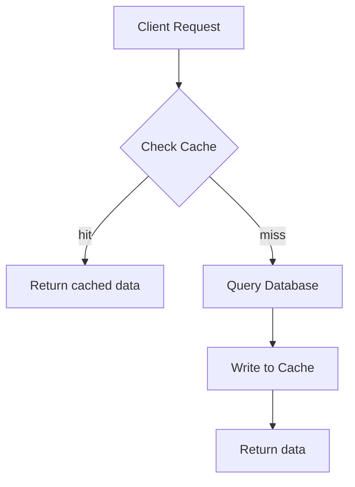
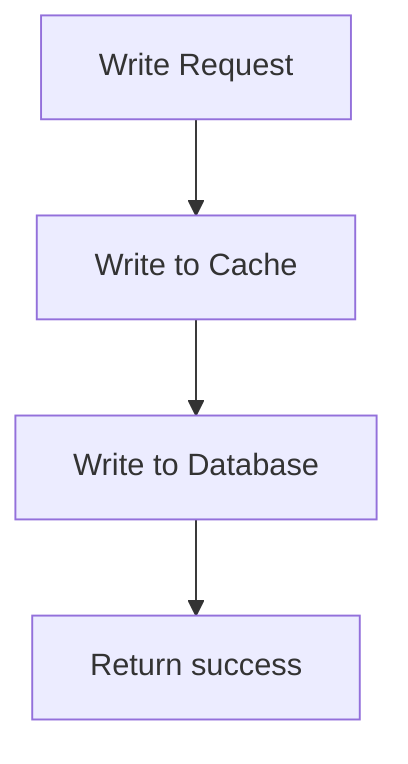
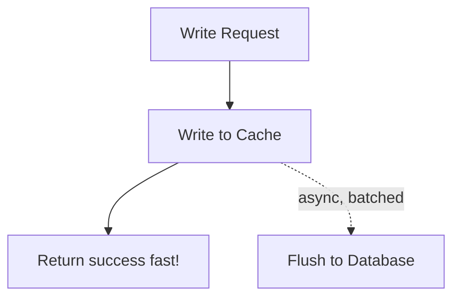
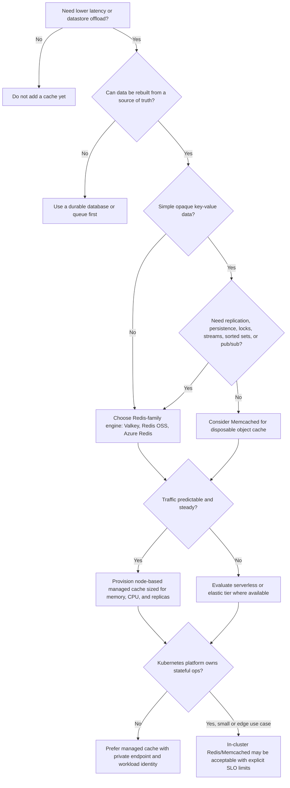
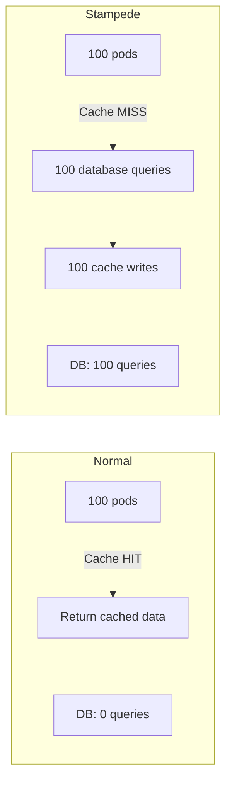
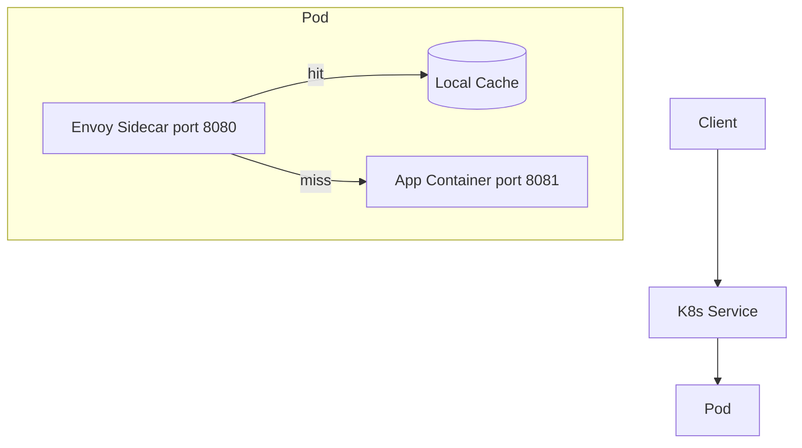

**Complexity**: `[COMPLEX]` | **Time to Complete**: 2h | **Prerequisites**: Module 9.1 (Databases), Module 9.4 (Object Storage), Redis fundamentals, and basic Kubernetes Service networking

## What You'll Be Able to Do

After completing this module, you will be able to explain where a managed cache belongs in a multi-cloud Kubernetes architecture, choose an engine and deployment model, and operate the cache as a deliberate reliability component rather than a mysterious fast database.

- **Configure Kubernetes pods to connect to managed caching services (ElastiCache, Memorystore, Azure Cache for Redis)**
- **Implement cache-aside, write-through, and write-behind patterns for applications running on Kubernetes**
- **Deploy Redis Sentinel or Cluster mode configurations via managed services with private endpoint connectivity**
- **Diagnose cache performance issues including connection pooling, serialization overhead, and hot key distribution**

---

## Why This Module Matters

Hypothetical scenario: a flash-sale traffic spike can overwhelm a relational database when each request fans out into multiple queries and every newly scaled pod opens more database connections. The application might look healthy for the first few minutes because Horizontal Pod Autoscaler adds replicas, but each replica multiplies pressure on the same primary datastore. Without a cache, the scaling action that should protect users can become the action that pushes the database past its connection, CPU, or I/O ceiling.

A self-managed cache with weak observability and poorly reviewed memory settings can silently evict data before peak traffic, pushing the full read load back onto the database. This is why caching is not just a performance trick. It is a load-shedding layer, a consistency tradeoff, and a cost control point that has to be designed with the same seriousness as the primary database.

After moving to a managed Redis service with deliberate sizing, connection limits, and eviction monitoring, teams can dramatically reduce database load during later traffic spikes. The managed provider absorbs patching, node replacement, failover orchestration, endpoint management, encryption plumbing, and routine monitoring integrations. The platform team still owns the architecture: choosing TTLs, protecting hot keys, separating cache data from durable state, and deciding how Kubernetes workloads authenticate to a private endpoint.

The simplest way to visualize a cache is as a fast memory shelf in front of a slower warehouse. The warehouse is your source of truth, such as RDS, Aurora, Cloud SQL, AlloyDB, Azure SQL, Cosmos DB, or an API backed by one of those systems. The shelf is ElastiCache, Memorystore, Azure Cache for Redis, Azure Managed Redis, or a Redis-compatible service that keeps the most requested items close to the application. If the shelf is stocked with the right items, most users never wait for the warehouse trip. If the shelf is stale, empty, or stocked with the wrong items, every request walks back to the warehouse at once.

In Kubernetes, the cache layer sits outside the cluster more often than beginners expect. Pods connect through private networking, DNS, workload identity, and a small amount of application configuration. That pattern is healthy because Redis and Memcached are stateful systems with failure modes that do not look like stateless Deployments. You can run Redis inside the cluster for labs, edge environments, and small internal tools, but production platform teams usually prefer managed caches when the application depends on predictable failover, snapshots, encryption, patch windows, and provider-backed availability.

The multi-cloud decision is not "Redis everywhere" or "Memcached everywhere." AWS ElastiCache supports Valkey, Redis OSS, and Memcached engines; Google Memorystore offers Valkey, Redis, Redis Cluster, and Memcached services; Microsoft documents Azure Cache for Redis tiers and now points customers toward Azure Managed Redis for the future. Those offerings overlap, but they are not identical. Their replication models, scaling limits, version choices, billing meters, private connectivity options, and migration paths differ enough that a portable Kubernetes app still needs provider-specific infrastructure code and runbooks.

---

## Redis vs Memcached: Choosing Your Engine

Redis, Valkey, and Memcached are all in-memory systems, but they optimize for different operational contracts. Memcached is intentionally simple: clients distribute keys across independent nodes, the server stores opaque values, and losing a node means losing the keys that hashed to that node. Redis and Valkey provide richer data structures, replication, clustering, Lua or function-style server-side logic depending on engine version, streams, sorted sets, pub/sub, and optional persistence. That power makes Redis-family engines more versatile, but it also creates more design choices that can hurt reliability if a team treats the cache like an ordinary database.

The licensing history matters because it changed cloud provider roadmaps. Redis Ltd. changed Redis licensing in 2024, and the Linux Foundation announced Valkey as an open source alternative based on the Redis lineage. AWS now documents Valkey as a first-class ElastiCache engine, and Google documents Memorystore for Valkey alongside its Redis and Memcached offerings. Azure's current managed cache documentation remains Redis-branded, with Azure Cache for Redis tiers and Azure Managed Redis based on Redis Enterprise. The practical lesson is simple: choose the engine explicitly in Terraform, Pulumi, Crossplane, or CLI commands, and verify the provider's current default instead of assuming that "Redis" means the same thing everywhere.

Redis-family engines are usually the right default for Kubernetes application platforms because platform teams rarely stop at plain key-value caching. Session state needs expiration and sometimes atomic updates. Rate limiting needs counters with TTLs. Leaderboards need sorted sets. Queue-like workloads might use lists or streams. Feature flags and API response caches need structured invalidation. Memcached can handle some of those by serializing application objects, but the application has to implement more behavior itself, and there is no built-in replication or persistence story to lean on when the workload becomes important.

Memcached still has a serious place in architecture. It is a strong fit when values are disposable, the access pattern is simple, clients already implement consistent hashing, and horizontal scale matters more than engine features. Its model is also easier to reason about during incidents: if a node disappears, the cache is colder, but there is no replica election, cluster slot map, or persistence replay to debug. The cost of that simplicity is that the application must tolerate key loss and must not assume the cache can coordinate locks, sorted rankings, streams, or durable-ish sessions.

### Decision Matrix

| Factor | Redis | Memcached |
|--------|-------|-----------|
| Data structures | [Strings, hashes, lists, sets, sorted sets, streams](https://github.com/redis/redis) | [Strings only (key-value)](https://github.com/memcached/memcached) |
| Persistence | Optional (RDB snapshots, AOF) | None (pure cache) |
| Replication | Primary-replica with automatic failover | None (each node independent) |
| Clustering | Redis Cluster (data sharding) | Client-side sharding |
| Pub/Sub | Built-in | Not available |
| Lua scripting | Yes | No |
| Max item size | Supports much larger single values by default | Smaller default item limit |
| Multi-threaded | Mostly single-threaded command execution | Multi-threaded |
| Best for | Complex caching, sessions, leaderboards, pub/sub | Simple key-value, large working sets, multi-threaded reads |

**For many Kubernetes workloads, Redis is the more versatile choice.** Memcached is simpler but far less capable. Choose Memcached only when you need pure key-value caching at extremely high throughput with no need for data structures, persistence, or replication.

When you hear "Redis is single-threaded," read that as a useful warning rather than an absolute limitation. Redis and Valkey can use background threads and I/O improvements depending on version and distribution, but command execution for many common operations is still shaped by a main execution path. That means one expensive command, one oversized value, one hot key, or one shard receiving a disproportionate share of traffic can dominate user-visible latency. Memcached's multi-threaded design can help with simple high-throughput reads, but it does not give you the richer data model that many modern application teams expect.

Persistence is another source of confusion. Redis persistence through RDB snapshots or append-only files can reduce data loss in self-managed deployments, and managed providers expose some backup, snapshot, or persistence features depending on engine and tier. That does not turn a cache into the system of record. If your application cannot reconstruct the data from a database, object store, event stream, or authoritative API, you are no longer using a cache. You are operating a database with cache-oriented defaults, and the first eviction, flush, resize, or failed write-behind worker will expose the mismatch.

### Managed Service Comparison

| Feature | AWS ElastiCache Redis | GCP Memorystore Redis | Azure Cache for Redis |
|---------|----------------------|----------------------|----------------------|
| Max memory | Depends on node type and cluster shape | Depends on product and deployment model | Depends on tier and current Azure Redis offering |
| Cluster mode | Yes | Available through Memorystore for Redis Cluster | Tier-dependent; verify the current Azure Redis product and tier |
| Multi-AZ failover | Automatic | Automatic (Standard tier) | Automatic (Premium+) |
| Encryption at rest | Yes (KMS) | Yes (CMEK) | Yes (managed keys) |
| Encryption in transit | TLS | TLS | TLS |
| VPC integration | VPC subnets | VPC network | VNET injection |

AWS gives you two broad ElastiCache deployment styles. Serverless caches reduce capacity planning and bill on stored data plus request processing, while node-based clusters bill by cache node hour and expose more of the familiar topology choices. For Valkey and Redis OSS, cluster mode disabled gives one shard with optional replicas and primary or reader endpoints, while cluster mode enabled partitions the keyspace across shards and requires cluster-aware clients. For Memcached, ElastiCache exposes independent nodes and relies on client-side distribution, which is why the application library choice becomes part of the architecture.

Google Cloud splits the product family more visibly. Memorystore for Redis is the traditional standalone or highly available Redis service, Memorystore for Redis Cluster gives sharded Redis clusters with primaries and optional replicas per shard, Memorystore for Valkey is the Valkey-branded path, and Memorystore for Memcached provides a managed Memcached service where keys are distributed across nodes without replication. That separation is useful during design reviews because a GKE team can choose a simpler non-cluster Redis instance for a small service, a sharded Redis Cluster or Valkey instance for high-throughput shared platform use, or Memcached for disposable object caches.

Azure has two names that learners must keep separate. Azure Cache for Redis is the long-running service with Basic, Standard, Premium, Enterprise, and Enterprise Flash tiers documented by Microsoft, while Azure Managed Redis is the newer Redis Enterprise based service that Microsoft recommends for future migrations. Basic and Standard are simpler choices for development or modest production needs, Premium adds features such as clustering and persistence, and Enterprise tiers bring Redis Enterprise capabilities such as modules and active geo-replication options. The provider's retirement and migration guidance matters for new designs because choosing the older SKU today can create planned migration work later.

The Kubernetes integration shape is similar across providers even when the product names differ. The application should receive a private DNS name, port, TLS setting, authentication material, and a small connection-pool budget through Kubernetes configuration. Network reachability comes from VPC, VNet, Private Service Connect, Private Link, peering, or subnet placement. Credentials should come from cloud secret managers or workload identity rather than static values copied into manifests. Operators such as External Secrets Operator and the Secrets Store CSI Driver help pull credentials from AWS Secrets Manager, Google Secret Manager, Azure Key Vault, or compatible stores without making the Git repository the secret database.

---

## Caching Strategies

The "right" caching strategy depends on your read/write ratio, consistency requirements, tolerance for stale data, and the blast radius of a wrong answer. A cache for product descriptions can usually serve a value that is a few minutes old, while a cache for account balance, entitlements, or security decisions needs a much tighter contract. The strategy also determines who is responsible for invalidation: the application, a library, a background worker, the database change stream, or a scheduled refresh process.

Start by naming the source of truth. For most cloud applications, the source of truth is a managed database such as Aurora, Cloud SQL, AlloyDB, Azure SQL, Cosmos DB, Spanner, DynamoDB, Firestore, or an API that owns durable state. The cache is a derived copy optimized for latency and read offload. Once the team agrees on that relationship, the design questions become sharper: how does data enter the cache, how does it leave, what happens when the cache is unavailable, and how stale can the answer be before the user experience or business process is wrong?

In Kubernetes, the chosen strategy also affects rollout behavior. A Deployment with 50 pods can create a large number of simultaneous cache misses after a restart. A canary that changes serialization format can poison shared cache keys if it writes values older pods cannot read. A blue-green deployment can double connection usage during the overlap period. Good caching design therefore includes key versioning, connection budgets, readiness behavior, and explicit fallbacks, not only a `get` followed by a `setex`.

### Cache-Aside (Lazy Loading)

The most common pattern is cache-aside, also called lazy loading. The application checks the cache first; on a miss, it reads from the database and populates the cache. This pattern keeps the cache focused on data that users actually request, which makes it cost-efficient for large catalogs, user profiles, permissions snapshots, and API response fragments where the full dataset is much larger than the hot working set.



```python
import redis
import json

r = redis.Redis(host='redis-master.cache.svc', port=6379, decode_responses=True)

def get_product(product_id):
    # Step 1: Check cache
    cache_key = f"product:{product_id}"
    cached = r.get(cache_key)
    if cached:
        return json.loads(cached)

    # Step 2: Cache miss -- query database
    product = db.query("SELECT * FROM products WHERE id = %s", product_id)

    # Step 3: Populate cache with TTL
    r.setex(cache_key, 300, json.dumps(product))  # 5-minute TTL

    return product
```

**Pros**: Cache-aside only caches data that is actually requested, is simple to implement in any language, and gives the application direct control over TTL, serialization, fallback behavior, and negative caching for known-missing records.
**Cons**: The first request after expiration pays the database latency, data can remain stale until TTL or invalidation, and a popular key can stampede the database if many pods miss at the same time.

Cache-aside works well on AWS when EKS pods read from ElastiCache through a primary endpoint or cluster-aware client while the source of truth remains RDS, Aurora, DynamoDB, or another durable service. On GCP, GKE workloads commonly use Memorystore with Cloud SQL, AlloyDB, Spanner, or Firestore behind the cache. On Azure, AKS workloads can use Azure Cache for Redis or Azure Managed Redis in front of Azure SQL, Cosmos DB, or an internal API. The vendor-neutral rule is the same: a cache miss must have a bounded path back to authoritative data, and the application must survive a cache failure without corrupting that authoritative state.

The main failure mode is accidental dependency inversion. Teams start with cache-aside, then gradually add data to Redis that has no database equivalent because Redis is convenient and fast. A feature flag, rate-limit counter, or session token might be acceptable in Redis if the business accepts loss or has a recovery path. A payment record, order confirmation, or entitlement grant is not. During design review, ask what happens after `FLUSHALL`, a failed resize, or a region evacuation. If the answer is "we lose customer state," the cache is no longer just a cache.

### Write-Through

In write-through caching, every write updates the database and the cache in the same application operation. The usual safe version writes the database first, confirms success, then refreshes or invalidates the cache key. Some libraries describe write-through as writing the cache first and letting the cache write the backing store, but that model is uncommon for managed Redis-family services in ordinary web applications because the cache is not the database transaction coordinator.



```python
def update_product_price(product_id, new_price):
    # Write to database first
    db.execute("UPDATE products SET price = %s WHERE id = %s", new_price, product_id)

    # Update cache (same transaction boundary)
    product = db.query("SELECT * FROM products WHERE id = %s", product_id)
    cache_key = f"product:{product_id}"
    r.setex(cache_key, 300, json.dumps(product))

    return product
```

**Pros**: The cache is typically consistent with the database immediately after the write path completes, which prevents confusing stale reads for users who update a profile, cart, preference, or session and then immediately refresh the page.
**Cons**: Write latency increases because each operation touches two systems, the application must handle partial failure carefully, and the cache may store data that is rarely read again.

The subtle part is the partial failure window. Suppose the database update succeeds but the cache update times out. Returning an error to the user may cause a retry that writes the database twice unless the operation is idempotent. Returning success may leave stale cache data until TTL or invalidation. The safer pattern is often "write database, delete cache key" rather than "write database, rewrite cache value," because the next reader can rebuild the value from the source of truth. For high-value workflows, pair this with versioned writes or database change events so a late cache writer cannot overwrite a newer value.

Provider choice does not remove this application-level problem. ElastiCache Multi-AZ failover, Memorystore Standard tier automatic failover, or Azure Premium and Enterprise availability features can reduce infrastructure interruption, but they cannot make a two-system write magically atomic. If you need cross-resource transactions, keep the transaction in the database and treat the cache as invalidated derived state. If you need extremely fast reads after writes, keep TTL short, include a version field in the cached object, and make clients reject older versions when they appear.

### Write-Behind (Write-Back)

With write-behind, also called write-back, writes go to the cache immediately and are asynchronously flushed to the database. This is attractive for counters, telemetry rollups, game-like scoring, or analytics buffers because the user request can complete before the database absorbs the write. It is dangerous for critical business data because a cache crash, failed background worker, serialization bug, or region event can lose acknowledged writes.



**Pros**: Write-behind can make writes extremely fast from the user's perspective, smooth database load through batching, and absorb bursty updates that do not require immediate durable visibility.
**Cons**: It creates a real risk of data loss if the cache fails before flush, requires replay and idempotency logic, and is usually unsuitable for critical data such as orders, payments, access grants, or inventory commitments.

If you choose write-behind, pair it with an explicit queue or stream rather than relying on memory alone. On AWS, a safer design might write an event to SQS, Kinesis, MSK, or EventBridge and use Redis only for recent counters or deduplication. On GCP, Pub/Sub or a managed streaming system can hold the durable work while Memorystore serves fast reads. On Azure, Service Bus or Event Hubs can play the same role. Kubernetes workers can then scale with KEDA based on queue depth or Redis list and stream lag, but the durable queue remains the recovery mechanism if the cache disappears.

The common beginner mistake is using write-behind for shopping carts because carts feel less formal than orders. That can be acceptable only if the business explicitly accepts cart loss and the user experience handles it. Many commerce teams treat carts as meaningful state because losing them reduces conversion and support trust. A safer design is write-through to the durable cart store, cache-aside for display reads, and short TTLs or event-driven invalidation for cart summaries.

### Read-Through

Read-through caching moves miss handling into a cache library, proxy, or data access layer. The application asks the cache abstraction for a key, and the abstraction knows how to load the missing value from the backing store. This keeps business code cleaner and can standardize TTLs, metrics, serialization, and stampede protection across services, but it also hides expensive database work behind a method that may look like a cheap cache read.

In a multi-cloud Kubernetes platform, read-through is usually implemented in the application library or a sidecar rather than by ElastiCache, Memorystore, or Azure Cache itself. Those managed services provide the cache engine; they do not know how to query your product table, call your account API, or assemble a GraphQL response. The provider-neutral abstraction can still be valuable if every service emits the same metrics for cache hit rate, load latency, stale returns, and load errors. Without those metrics, read-through can make outages harder to understand because database pressure appears to come from "cache reads."

Read-through fits shared platform libraries and domain services with consistent backing stores. It is weaker for one-off features where each key has unique loading rules, different authorization behavior, or user-specific filtering. Be careful with security boundaries: a read-through cache must include tenant, locale, role, and data-version information in the key when those attributes affect the answer. Otherwise one user's cached result can become another user's data leak.

### Refresh-Ahead

Refresh-ahead refreshes popular keys before users see an expiration. A background worker or request path checks the remaining TTL and reloads the value while the old value is still usable. This is a strong pattern for expensive read models, product pages, recommendation snapshots, pricing displays with accepted staleness, and configuration documents where the same keys are requested repeatedly throughout the day.

The advantage is that refresh load can be smoothed instead of arriving at the exact expiration boundary. The risk is that refresh-ahead can waste money by refreshing values no one will read, and it can hide stale-data bugs when the refresh worker fails silently. On AWS, GCP, and Azure, the cost pattern is similar even though the meters differ: refresh-ahead consumes cache requests, database or API reads, and worker CPU whether users need the value or not. Use popularity thresholds, jitter, and refresh budgets so the warmer does not become a scheduled denial-of-service against the source of truth.

Refresh-ahead also needs deployment discipline. When a new application version changes the cached JSON shape, a warmer running the old container image can repopulate keys with the old shape while new pods expect the new one. Use key namespaces such as `product:v3:{id}`, write migration readers that understand both formats, or drain old warmers before rolling out incompatible cache values. That problem is vendor-neutral and appears the same whether the cache endpoint is ElastiCache, Memorystore, Azure Cache, or an in-cluster Redis StatefulSet.

### Strategy Selection Guide

| Scenario | Strategy | Why |
|----------|----------|-----|
| Product catalog (read-heavy) | Cache-aside | Most reads, occasional writes |
| User sessions | Write-through | Must be consistent after login/logout |
| Analytics counters | Write-behind | High write volume, eventual consistency OK |
| API rate limiting | Cache-aside + TTL | Natural expiration, no DB needed |
| Shopping cart | Write-through | Consistency critical for commerce |
| Leaderboard scores | Cache-aside + sorted sets | Redis sorted sets are purpose-built for this |

> **Stop and think**: You are designing a shopping cart service where every item added must be securely recorded, but users frequently refresh the page to view their cart. Which caching strategy provides the necessary consistency while handling the read traffic?

---

## Decision Framework

Use this framework when a team asks, "Should we cache this?" The first decision is not the provider or engine; it is whether the application has a safe answer when the cached value is absent, stale, duplicated, or evicted. If the source of truth can rebuild the value and the user can tolerate bounded staleness, caching is a strong candidate. If losing the value means losing business state, treat the cache as an optimization around a durable store, not as the store itself.



| Decision | Prefer This | Tradeoff |
|----------|-------------|----------|
| Redis-family vs Memcached | Redis-family for data structures, replication, locks, streams, sorted sets, pub/sub, and richer operational controls | More features mean more configuration, more client behavior to understand, and more risk of treating cache state as durable state |
| Memcached vs Redis-family | Memcached for simple disposable object caches with client-side sharding and no need for replication | Node loss means key loss, values are opaque, and advanced coordination patterns belong elsewhere |
| Managed vs in-cluster | Managed cache for production dependencies, multi-AZ needs, patching, failover, encryption, backups, and provider support | Costs are visible as service charges, and platform teams must design private networking and identity integration |
| In-cluster cache | In-cluster for local development, ephemeral preview environments, edge clusters, or workloads that can tolerate loss and manual recovery | Stateful Kubernetes operations, storage, failover, upgrades, and security become your team's responsibility |
| Provisioned/node-based vs serverless | Provisioned nodes for predictable steady load and explicit capacity control; serverless for spiky load or teams that need reduced capacity planning | Serverless can spike on request-processing and storage meters, while provisioned nodes can waste money when idle |

This matrix is deliberately conservative. A cache that saves 40 milliseconds on a low-traffic endpoint may not justify the new failure modes, IAM policies, dashboards, and runbooks. A cache that removes 80 percent of reads from a saturated database can be the difference between a stable release and a recurring incident. The decision is strongest when you can name the slow dependency, estimate the hot working set, bound staleness, and show how the system behaves during cache outage.

For AWS, the "managed" branch usually points to ElastiCache Serverless or node-based ElastiCache for Valkey, Redis OSS, or Memcached in private subnets. For GCP, it points to Memorystore for Valkey, Redis, Redis Cluster, or Memcached connected to GKE through private networking. For Azure, it points to Azure Cache for Redis in existing estates or Azure Managed Redis for newer Redis Enterprise based designs. For vendor-neutral Kubernetes, it points to a Service abstraction, workload identity, external secret integration, and an application client that can fail fast, retry carefully, and degrade without corrupting the source of truth.

The framework also gives reviewers a way to challenge over-caching. If a team cannot explain the invalidation rule, the expected hit rate, the cost at peak, and the fallback behavior, the design is not ready. Caching is most valuable when it is boring during normal operation and predictable during failure. It is least valuable when it becomes a hidden second database that no one owns.

---

## Connecting Kubernetes to Managed Redis

Kubernetes should see a managed cache as an external dependency with explicit contracts. The Deployment needs a stable hostname, port, TLS mode, authentication method, connection budget, timeout policy, and health behavior. The cluster needs network reachability through VPC or VNet routing, security groups or firewall rules, private service connectivity, DNS resolution, and a way to retrieve credentials. The platform team needs dashboards and alerts that combine provider metrics with application metrics, because a high cache hit rate with rising command latency still hurts users.

The simplest DNS integration is a Kubernetes `ExternalName` Service that maps an internal service name to the provider's cache endpoint. That keeps application configuration Kubernetes-native, but it is not a load balancer and it does not proxy traffic. DNS clients still connect to the provider endpoint, and protocols with strict hostname expectations can care about the difference between the Kubernetes name and the target name. For Redis and Memcached, that is usually manageable, but TLS certificate validation and cluster-aware clients deserve testing before rollout.

For production, many teams skip `ExternalName` and put the provider endpoint directly in a ConfigMap or secret-managed environment variable. That is less abstract, but it avoids hiding provider-specific endpoint behavior. ElastiCache cluster mode enabled clients need the configuration endpoint and must understand slot maps. Memorystore for Redis Cluster uses discovery behavior appropriate to clustered clients. Azure Redis clients may need TLS, access keys, or identity-based authentication depending on service and tier. The right abstraction is the one your client library can actually use.

Workload identity is the cleanest direction for secret retrieval and cloud API access. On EKS, that means IAM Roles for Service Accounts or EKS Pod Identity where supported. On GKE, Workload Identity Federation for GKE lets Kubernetes service accounts receive Google Cloud permissions without static JSON keys. On AKS, Microsoft Entra Workload ID lets pods use Kubernetes service account tokens to access Azure resources such as Key Vault. The cache connection password or token may still be presented to the Redis client, but the path that fetches and rotates it should not depend on a long-lived cloud credential baked into a manifest.

External Secrets Operator and Secrets Store CSI Driver solve related but different problems. External Secrets Operator synchronizes values from AWS Secrets Manager, Google Secret Manager, Azure Key Vault, and other backends into Kubernetes Secrets, which is convenient for environment variables and existing applications. Secrets Store CSI Driver mounts external secret values into pods as files through a CSI volume and can optionally sync them as Kubernetes Secrets. Either approach can work; the key decision is whether your application can reload rotated material without a restart and whether your security policy allows synchronized Kubernetes Secrets at rest.

### ElastiCache Redis from EKS

```bash
# Create ElastiCache Redis cluster
aws elasticache create-replication-group \
  --replication-group-id app-cache \
  --replication-group-description "App caching layer" \
  --engine redis --engine-version 7.1 \
  --cache-node-type cache.r7g.large \
  --num-cache-clusters 3 \
  --multi-az-enabled \
  --automatic-failover-enabled \
  --at-rest-encryption-enabled \
  --transit-encryption-enabled \
  --cache-subnet-group-name eks-cache-subnets \
  --security-group-ids sg-0abc123def456
```

```yaml
# Kubernetes Service for Redis endpoint
apiVersion: v1
kind: Service
metadata:
  name: redis-primary
  namespace: cache
spec:
  type: ExternalName
  externalName: app-cache.abc123.ng.0001.use1.cache.amazonaws.com
---
apiVersion: v1
kind: Service
metadata:
  name: redis-reader
  namespace: cache
spec:
  type: ExternalName
  externalName: app-cache-ro.abc123.ng.0001.use1.cache.amazonaws.com
```

### Application Deployment with Redis

```yaml
apiVersion: apps/v1
kind: Deployment
metadata:
  name: api-server
  namespace: production
spec:
  replicas: 10
  selector:
    matchLabels:
      app: api-server
  template:
    metadata:
      labels:
        app: api-server
    spec:
      containers:
        - name: api
          image: mycompany/api-server:3.0.0
          env:
            - name: REDIS_PRIMARY_HOST
              value: redis-primary.cache.svc.cluster.local
            - name: REDIS_READER_HOST
              value: redis-reader.cache.svc.cluster.local
            - name: REDIS_PORT
              value: "6379"
            - name: REDIS_TLS_ENABLED
              value: "true"
            - name: REDIS_AUTH_TOKEN
              valueFrom:
                secretKeyRef:
                  name: redis-auth
                  key: token
            - name: REDIS_MAX_CONNECTIONS
              value: "20"
            - name: REDIS_CONNECT_TIMEOUT_MS
              value: "2000"
            - name: REDIS_COMMAND_TIMEOUT_MS
              value: "500"
          resources:
            requests:
              cpu: 500m
              memory: 512Mi
```

**Pause and predict:** You provision an ElastiCache Redis replication group with one primary node and two read replicas for a high-throughput microservice. How should your Kubernetes application route write operations versus read queries, and what happens if a pod issues a write command directly to a replica endpoint?

<details>
<summary>Check your prediction</summary>

When cluster mode is disabled, ElastiCache provides a Primary Endpoint dedicated to write operations and a Reader Endpoint (or individual replica endpoints) that load balances read queries across available read replicas. Replicas operate in read-only mode, meaning any client attempt to execute a `SET` or other mutating command against a replica endpoint will be rejected with a `READONLY You can't write against a read only replica` error. If cluster mode is enabled, the topology partitions keys across multiple shards using hash slots; the client application must be cluster-aware and connect to the Configuration Endpoint, which continuously updates the client's internal hash-slot routing table as shards scale or fail over.
</details>

The next section is how running Redis inside Kubernetes differs from a provider-backed managed cache under production failure.

---

### Managed Cache or In-Cluster Cache?

Running Redis in Kubernetes is not wrong. It is a reasonable choice for a local lab, a preview environment, a single-node edge cluster, a throwaway integration test, or a small internal app where cache loss has almost no business impact. Helm charts, operators, and StatefulSets can create a working Redis deployment quickly, and the local lab in this module uses that model because it is portable. The problem starts when a team mistakes "works in a cluster" for "operates like a provider-backed managed service under production failure."

An in-cluster Redis or Memcached deployment makes your Kubernetes platform responsible for stateful scheduling, persistent volumes if enabled, anti-affinity, backup policy, failover behavior, upgrades, TLS, authentication, memory fragmentation, eviction settings, and capacity planning. Operators can automate parts of that lifecycle, but they do not remove the need to test failure modes. If a node drain moves the primary, if a persistent volume attaches slowly, or if a replica lags during failover, the application still experiences the consequences.

Managed services shift many infrastructure tasks to the provider. ElastiCache handles cache node replacement, managed endpoints, Multi-AZ options, encryption integration, and engine patching paths. Memorystore handles provisioning, replication, failover, monitoring integration, and private connectivity models inside Google Cloud. Azure Cache for Redis and Azure Managed Redis provide Azure-native monitoring, networking, and tier-based feature sets. The platform team still owns application correctness, but it no longer owns every Redis process, disk, and failover controller.

There are also hybrid patterns. A service can use a tiny in-process or sidecar cache for a few seconds to absorb a hot key, a managed Redis-family cache for shared state across pods, and the database as the source of truth. That layered design is common for read-heavy APIs. The local cache reduces round trips for the hottest value, the managed cache reduces database reads across the fleet, and the database remains authoritative. Each layer must have a shorter or equal staleness budget than the layer behind it, or debugging becomes nearly impossible.

### Provider-Specific Connectivity Notes

On AWS, EKS pods typically connect to ElastiCache through private subnets, dedicated security groups, and VPC peering connections to access caching infrastructure securely. Applications configure connection pools, network timeouts, and TLS authentication credentials according to the provisioned cluster topology and endpoint design. ElastiCache Serverless changes capacity planning by scaling compute and memory automatically. However, workloads still require careful tuning of client timeouts, retry budgets, and connection pool sizing to maintain stability during traffic bursts.

On GCP, GKE workloads must be in a network path that Memorystore supports, and the exact connectivity model depends on the Memorystore product. Traditional Memorystore for Redis exposes a simple endpoint for Basic or Standard tier instances, while Redis Cluster and Valkey products introduce sharded or newer connectivity choices. Memorystore for Memcached distributes keys across nodes and does not replicate them, so client auto-discovery and consistent hashing behavior matter more than they do with a single Redis endpoint.

On Azure, AKS workloads connect through Azure networking constructs such as Private Link, VNet integration, firewall rules, and DNS resolution appropriate to the chosen cache service. Azure Cache for Redis tiers differ materially: Basic has no production SLA, Standard uses a replicated pair, Premium adds higher-end features such as clustering and persistence, and Enterprise tiers use Redis Enterprise capabilities. New designs should also account for Microsoft's Azure Cache retirement guidance and evaluate Azure Managed Redis when it fits the organization's migration timeline.

Across all three clouds, the application should fail fast when the cache is unhealthy. A Redis command timeout of 30 seconds can hold request threads, exhaust connection pools, and trigger retries that amplify the outage. For most web APIs, a short connect timeout, a shorter command timeout than the user request timeout, bounded retries with jitter, and a circuit breaker are safer. If the cache is unavailable, the service should either query the source of truth directly, serve a known stale value, or return a controlled degraded response rather than piling up blocked requests.

## Cache Stampede Prevention

High-concurrency microservice architectures rely heavily on distributed caching tiers to shield relational databases and core upstream microservices from massive read traffic during sustained peak operations. When high-volume key invalidations occur under heavy client concurrency, distributed systems encounter distinct failure characteristics across data access layers.

**Pause and predict:** A high-traffic cache key suddenly expires under heavy concurrent load across dozens of active Kubernetes pods. Which system component suffers the immediate operational failure, and how does the cache engine coordinate subsequent data reconstruction?

<details>
<summary>Check your prediction</summary>

The cache itself is not the overloaded component during the initial seconds of a stampede; rather, the underlying database or upstream data store takes the catastrophic hit. When a heavily requested key expires, dozens or hundreds of application pods simultaneously observe a cache miss and execute identical expensive queries to regenerate the missing value. Because Redis operates strictly as a passive data store and does not inherently serialize or coordinate cache rebuilds across external clients, every concurrent worker issues redundant queries to the backend. Mitigating this thundering herd requires client-side techniques such as TTL jittering, probabilistic early refresh, single-flight request coalescing, or distributed mutex locks.
</details>

The next section is how platform teams keep a hot key warm without treating every miss as a unique database round trip.



### Prevention Strategies

Stampede prevention is partly a cache technique and partly a capacity-management technique. Locks, early refresh, stale-while-revalidate, and request coalescing reduce duplicate rebuild work. Jittered TTLs prevent thousands of related keys from expiring on the same boundary. Background warming protects predictable hot keys before a launch or campaign. Database-side limits, circuit breakers, and queue-based rebuild workers keep the fallback path from exceeding the source of truth's safe operating envelope.

#### 1. Probabilistic Early Expiration (PER)

Refresh the cache before it expires, with a probability that increases as the TTL decreases. This keeps the cache warm without making every request refresh the value, and it spreads database work over time instead of concentrating it at the expiration instant:

```python
import random
import time

def get_with_per(key, ttl=300, beta=1.0):
    """Probabilistic early refresh to prevent stampedes."""
    cached = r.get(key)
    if cached:
        data = json.loads(cached)
        remaining_ttl = r.ttl(key)
        # As TTL decreases, probability of refresh increases
        # beta controls aggressiveness (higher = earlier refresh)
        delta = ttl * beta * random.random()
        if remaining_ttl < delta:
            # This pod refreshes the cache early
            return refresh_cache(key, ttl)
        return data
    return refresh_cache(key, ttl)

def refresh_cache(key, ttl):
    data = db.query_product(key.split(':')[1])
    r.setex(key, ttl, json.dumps(data))
    return data
```

#### 2. Distributed Lock (Mutex)

Only one pod rebuilds the cache; others wait or serve stale data. The lock must have a short expiry so a crashed pod does not block refresh forever, and the code should avoid deleting a lock that another pod acquired after the original lock expired:

```python
def get_with_lock(key, ttl=300):
    cached = r.get(key)
    if cached:
        return json.loads(cached)

    lock_key = f"lock:{key}"
    # Try to acquire lock (NX = set if not exists, EX = expiry)
    acquired = r.set(lock_key, "1", nx=True, ex=10)

    if acquired:
        # This pod rebuilds the cache
        try:
            data = db.query_product(key.split(':')[1])
            r.setex(key, ttl, json.dumps(data))
            return data
        finally:
            r.delete(lock_key)
    else:
        # Another pod is rebuilding -- wait briefly, then retry
        time.sleep(0.1)
        cached = r.get(key)
        if cached:
            return json.loads(cached)
        # Fallback: query database directly (rare)
        return db.query_product(key.split(':')[1])
```

#### 3. Background Refresh (Never Expire)

Cache entries never expire from the user request path. A background process refreshes them on a schedule, and the application serves the last known value while tracking its age. This is powerful for read models with clear staleness budgets, but it requires monitoring so a failed warmer does not silently serve old data for hours:

```yaml
apiVersion: batch/v1
kind: CronJob
metadata:
  name: cache-warmer
  namespace: production
spec:
  schedule: "*/4 * * * *"
  jobTemplate:
    spec:
      template:
        spec:
          restartPolicy: OnFailure
          containers:
            - name: warmer
              image: mycompany/cache-warmer:1.0.0
              env:
                - name: REDIS_HOST
                  value: redis-primary.cache.svc.cluster.local
              command:
                - python
                - -c
                - |
                  import redis, json
                  r = redis.Redis(host='redis-primary.cache.svc.cluster.local')

                  # Refresh top 1000 products
                  products = db.query("SELECT id FROM products ORDER BY view_count DESC LIMIT 1000")
                  for p in products:
                      data = db.query_product(p['id'])
                      r.setex(f"product:{p['id']}", 600, json.dumps(data))
                  print(f"Warmed {len(products)} products")
```

---

### Eviction Policy and Memory Pressure

When dataset volume approaches the configured memory boundary on a caching cluster, the engine must execute a deterministic policy to handle subsequent write requests. Choosing the correct policy requires evaluating whether stored data is reconstructable from a primary database or represents durable state that must never be evicted automatically.

**Pause and predict:** A platform team configures `noeviction` on a managed Redis cluster serving a reconstructable cache-aside product catalog. What happens when memory fills up, and why is an all-keys policy preferable for this workload?

<details>
<summary>Check your prediction</summary>

Under the `noeviction` policy, once the cache reaches `maxmemory`, Redis refuses all incoming commands that attempt to allocate additional memory (returning an `OOM command not allowed when used memory > 'maxmemory'` error) while continuing to serve read-only queries. For a cache-aside architecture where data can be safely reconstructed from the database, this behavior causes unnecessary application write failures and operational outages. An all-keys policy like `allkeys-lru` (Least Recently Used) or `allkeys-lfu` (Least Frequently Used) is far better suited for reconstructable caches, as it automatically purges older or rarely queried keys to accommodate fresh incoming data without interrupting application writes.
</details>

The next section is how LRU, LFU, and TTL-oriented policies show up in provider parameter groups and live INFO output.

Eviction algorithms determine how Redis or Valkey selects candidate keys when memory exceeds limits. LRU favors recently used keys, which works well when traffic follows the common pattern where a small fraction of keys receive most reads. LFU favors frequently used keys, which can protect long-lived favorites even if they have not been read in the last few seconds. TTL-oriented policies only evict keys that have expiration metadata, which is useful when some keys should be protected but dangerous if developers forget TTLs and the eligible key set becomes too small.

Managed providers expose eviction controls differently. In ElastiCache node-based Redis or Valkey, parameter groups are part of how teams manage engine settings, while serverless caches intentionally restrict many low-level parameters to preserve the managed abstraction. Memorystore and Azure cache tiers also limit or expose settings based on product type and tier. The portable habit is to record the intended eviction behavior in infrastructure code and then verify the live cache through provider metrics and `INFO` output where the service permits it.

Memory pressure is not only the number of keys multiplied by average value size. Serialized JSON can be much larger than the database row it represents. Connection buffers, replication backlog, client output buffers, fragmentation, TLS overhead, and fork or snapshot behavior can all consume memory. Large values increase latency because they take longer to serialize, transfer, parse, and evict. A cache that is "only" 70 percent full by dataset estimates can still behave poorly if values are oversized, clients are slow, or replication and snapshot overhead were ignored.

Set TTLs even when you also use explicit invalidation. TTL is the emergency brake for missed invalidation messages, failed deploy hooks, one-off scripts, and edge cases no one remembered. A cache key without TTL is a promise that the application will always invalidate it correctly. That promise usually fails as systems grow. Use longer TTLs for stable reference data, shorter TTLs for user-visible mutable state, and jitter so related keys do not expire together.

## Diagnosing Hot Key Distribution

A "hot key" occurs when a single Redis key receives a disproportionate amount of traffic. Because Redis is single-threaded for command execution, a hot key on a clustered Redis setup will overwhelm a single shard, causing high CPU utilization on one node while other nodes remain idle.

### Diagnosis

1. **CPU Monitoring**: Monitor CPU utilization per shard. If one shard is at 99% CPU while others are at 10%, you likely have a hot key.
2. **Redis CLI**: Use `redis-cli --hotkeys` (requires the `maxmemory-policy` to be an LFU policy like `allkeys-lfu`).
3. **Command Monitoring**: Alternatively, use `OBJECT FREQ <key>` to check access frequencies. Avoid running the `MONITOR` command in production as it drastically reduces performance.

### Mitigation

- **Local Caching**: Cache the hot key in the application's memory (e.g., using a local in-memory cache variable) for a few seconds to absorb the read spike before it hits Redis.
- **Key Duplication**: Create copies of the key (e.g., `product:123:1`, `product:123:2`) and have clients randomly read from one of the copies to distribute load across multiple shards.

Hot keys are often created by business success rather than bad code. A viral product page, a popular feature flag, a global configuration document, a home-page recommendation list, or a rate-limit counter for a large shared tenant can send a large fraction of traffic to one key. Adding more shards only helps if the traffic can be distributed across keys. Redis Cluster partitions by key hash slot, so one key still belongs to one shard no matter how many shards the cluster has.

A good hot-key response starts with measurement. Provider metrics can show shard-level CPU, network, command latency, evictions, and connection behavior. Application metrics should show key families rather than raw full keys, because exporting every user-specific key as a label can destroy your monitoring system. Sampling, `redis-cli --hotkeys` where safe and supported, LFU frequency inspection, and client-side instrumentation can identify whether the issue is one exact key, one key prefix, or one expensive command pattern.

Mitigation depends on semantics. For read-only values, duplicate the value across multiple keys and randomly select one on read, or add a tiny in-process cache with a five-to-ten-second TTL inside each pod. For counters, shard the counter into multiple keys and sum them asynchronously when exact real-time accuracy is not required. For locks, reduce lock scope and avoid a single global lock. For pub/sub, consider whether a managed streaming service is a better tool than forcing Redis to behave like a high-fanout event backbone.

> **Stop and think**: If a celebrity tweets a link to a specific product, creating a sudden massive read spike on that single product's cache key, why won't simply adding more Redis cluster nodes solve the performance issue?

---

## Connection Limits and Pool Management

Managed Redis instances have maximum connection limits based on instance size. Exceeding them causes connection refused errors, but practical saturation can happen earlier because TLS, command volume, slow clients, and memory overhead all consume capacity. Connection planning is therefore a workload budget, not just a lookup in a provider table.

### Connection Budget

| Instance Type | Max Connections | With 50 pods (20 conn each) | Remaining |
|---------------|-----------------|------------------------------|-----------|
| cache.r7g.large | [65,000](https://docs.aws.amazon.com/AmazonElastiCache/latest/dg/TroubleshootingConnections.html) | 1,000 | 64,000 |
| cache.r7g.xlarge | 65,000 | 1,000 | 64,000 |
| cache.t4g.micro | 65,000 | 1,000 | 64,000 |

Redis connection limits are generous in many managed tiers, but the bottleneck is often on the client side. Each connection consumes memory and a file descriptor in the pod, and every extra idle connection is still state the cache must track. A deployment with 200 pods and a default pool of 50 connections can reserve 10,000 potential connections before a single request is served. During a rolling update with `maxSurge`, that number can jump while old pods are still draining.

Connection pools should be sized from concurrency, not copied from blog posts. If a pod handles 100 concurrent HTTP requests but only 10 percent of requests touch Redis, a pool of 10 to 20 may be plenty. If every request performs multiple cache operations and the latency budget is tight, a larger pool may be justified, but it must still fit the cache's connection limit during deployment surge and failure recovery. Use pool wait-time metrics, command latency, and rejected connection counts to tune this over time.

The retry policy matters as much as pool size. When Redis is slow, unbounded retries can turn a small provider event into a database outage because cache misses and retry storms arrive together. Use bounded retries with exponential backoff and jitter, and prefer failing open to the source of truth for noncritical cache reads when the database can absorb it. For high-risk endpoints, a circuit breaker can temporarily stop cache calls and protect request threads while the cache recovers.

### Redis Connection Pooling

```python
# Good: Connection pool (shared connections)
import redis

pool = redis.ConnectionPool(
    host='redis-primary.cache.svc.cluster.local',
    port=6379,
    max_connections=20,       # Per pod
    socket_timeout=2.0,       # Fail fast
    socket_connect_timeout=1.0,
    retry_on_timeout=True,
    health_check_interval=30,
    ssl=True,
)
r = redis.Redis(connection_pool=pool)

# Bad: New connection per request (connection leak)
# r = redis.Redis(host='redis-primary.cache.svc.cluster.local')  # DON'T
```

### Monitoring Connection Usage

Monitor from both sides of the connection. Provider dashboards show engine CPU, memory, evictions, replication lag, connection count, network throughput, command latency, and failover events. Application metrics show pool wait time, timeout rate, hit rate by key family, fallback database queries, and stale responses served. Those two views answer different questions: whether the cache is healthy, and whether the application is using it safely.

```yaml
# PrometheusRule for Redis connection alerts
apiVersion: monitoring.coreos.com/v1
kind: PrometheusRule
metadata:
  name: redis-alerts
  namespace: monitoring
spec:
  groups:
    - name: redis
      rules:
        - alert: RedisConnectionsHigh
          expr: redis_connected_clients / redis_config_maxclients > 0.8
          for: 5m
          labels:
            severity: warning
          annotations:
            summary: "Redis connection usage above 80%"
        - alert: RedisCacheHitRateLow
          expr: |
            rate(redis_keyspace_hits_total[5m]) /
            (rate(redis_keyspace_hits_total[5m]) + rate(redis_keyspace_misses_total[5m])) < 0.9
          for: 10m
          labels:
            severity: warning
          annotations:
            summary: "Redis cache hit rate below 90%"
```

**Pause and predict:** During a high-traffic event, one hundred Kubernetes pods each maintain fifty connections to a managed cache instance with a sixty-five thousand client limit. Why might client pods still encounter connection refused errors during a rolling deployment?

<details>
<summary>Check your prediction</summary>

Connection exhaustion during a rolling update stems from several compounded factors rather than simple static multiplication. First, Kubernetes rolling updates provision surging replacement pods before terminating old replicas (`maxSurge`), creating a transient window where old and new pods run concurrently and duplicate connection pool allocations. Second, terminating pods often fail to gracefully close active sockets before their containers stop, leaving unreleased TCP connections lingering in `TIME_WAIT` or holding server-side slots until engine keepalive probes expire. Third, in clustered or sharded deployments, the connection ceiling (`maxclients`) applies on a per-node basis rather than cluster-wide; if client pools connect disproportionately to specific primary shards or configuration nodes, individual instances reject incoming handshakes despite aggregate cluster capacity appearing sufficient.
</details>

The next section is how cache node hours, serverless meters, and replica count show up on the monthly bill.

---

## Cost Lens: What Caching Costs at Moderate Scale

Caching saves money only when the avoided work is more expensive than the cache and the operational complexity around it. At moderate scale, the cache bill usually comes from memory capacity, node hours or serverless storage meters, request-processing meters where serverless is used, replica count, cross-zone or cross-region traffic, backups or persistence, and data transfer. The saved bill may appear in a different place: fewer database read replicas, lower database CPU, smaller API fleet, fewer timeouts, or less emergency overprovisioning before launches.

AWS ElastiCache has two cost personalities. Node-based clusters charge for cache node usage by node type and time, so idle capacity still costs money, replicas increase the hourly footprint, and larger Graviton or memory-optimized nodes should be right-sized against real memory and CPU metrics. ElastiCache Serverless bills stored data in GB-hours and requests in ElastiCache Processing Units, so spiky workloads may benefit from reduced capacity planning while high steady request rates can make request processing a major line item. Cross-AZ traffic and global replication choices also matter because application nodes and cache nodes are not always in the same zone.

Google Memorystore pricing depends on the selected product and provisioned capacity model. Traditional Memorystore for Redis bills provisioned capacity, while clustered and Valkey offerings introduce their own sizing and replication shapes. Read replicas, shards, and high-availability settings improve resilience and throughput, but they also multiply memory capacity. Memorystore for Memcached bills around node count and node resources, which means a large disposable cache can still be expensive if the working set is overestimated.

Azure cost analysis starts with tier choice. Basic and Standard are cheaper but have fewer production features, Premium adds capabilities such as clustering and persistence, and Enterprise or Enterprise Flash tiers bring Redis Enterprise capabilities with different performance and storage characteristics. Azure Managed Redis introduces its own tiering and reservation options. The Azure design review should include not only hourly cache cost but also Private Link or networking charges where applicable, persistence storage, active geo-replication, and the migration cost if the organization is moving away from older Azure Cache SKUs.

The easiest cache cost mistake is over-retention. Teams set long TTLs because misses are slow, then discover that memory grows until the cache needs a much larger tier. A better first move is to identify key families and assign TTLs by business value. Product details may live for minutes, feature flag snapshots for seconds, negative lookup results for a very short interval, and expensive reports behind an explicit refresh workflow. The goal is not maximum hit rate at any price; it is the lowest total cost that meets latency and correctness goals.

The second mistake is ignoring value size. A 500-byte JSON object and a 50-KB rendered API response both count as one key in many dashboards, but they have very different memory, network, and request-processing costs. Compression can help large values, but it adds CPU and latency in the application. Storing smaller field-level values can reduce transfer, but it increases key count and command volume. Measure representative serialized values before choosing node size or serverless limits.

The third mistake is forgetting the source-of-truth bill. If a cache with a 70 percent hit rate prevents an expensive database scale-up, it may be worth more than a cheaper cache with a 40 percent hit rate. If a cache costs more than the database reads it avoids, it is an architectural liability. Track avoided reads, database CPU reduction, API latency improvement, and cache cost in the same review. FinOps for caching is a system calculation, not a single service calculation.

Knobs that reduce cost include shorter TTLs for low-value key families, jittered expiration to avoid overprovisioning for stampedes, right-sized connection pools, smaller serialized values, local short-lived caches for extreme hot keys, committed-use or reserved capacity for predictable steady workloads, and serverless only where the request and storage meters match the traffic shape. Knobs that make cost spike include cross-region replication, unnecessary replicas, high write amplification from refresh-ahead workers, cache warming that refreshes unused keys, large values, and retry storms during provider events.

## Envoy Sidecar Caching

Not every caching layer has to live inside application code. HTTP responses can sometimes be cached by a proxy, gateway, CDN, service mesh extension, or sidecar. Envoy sidecar caching is useful when the application already emits correct HTTP cache headers or when the team needs a tactical read-offload layer for a legacy service that cannot be changed safely. It is not a replacement for domain-aware caching because Envoy does not know whether a product price, entitlement, or user-specific field is safe to share across callers unless headers and routing rules express that clearly.

Sidecar caching is strongest for public or tenant-independent responses with simple invalidation rules. Static reference data, product category metadata, documentation fragments, and low-risk discovery APIs can work well. It is weaker for personalized responses because HTTP caches must vary on headers, cookies, authorization, locale, and other request attributes that affect the answer. If those vary rules are wrong, the cache can leak one user's response to another user. That is why application-level Redis caching remains common for domain objects with explicit keys and authorization-aware loading.

Managed cloud caches and Envoy caches can also work together. An API server might use ElastiCache, Memorystore, or Azure Redis for shared product objects across all pods, while Envoy caches selected HTTP responses inside each pod for a few seconds. The sidecar absorbs repeated identical requests at the pod boundary; Redis absorbs repeated object reads across the fleet; the database remains authoritative. This layered design is powerful, but each layer needs its own TTL, metrics, and invalidation story.

### Architecture



### Envoy Cache Filter Configuration

```yaml
apiVersion: v1
kind: ConfigMap
metadata:
  name: envoy-cache-config
  namespace: production
data:
  envoy.yaml: |
    static_resources:
      listeners:
        - name: listener_0
          address:
            socket_address:
              address: 0.0.0.0
              port_value: 8080
          filter_chains:
            - filters:
                - name: envoy.filters.network.http_connection_manager
                  typed_config:
                    "@type": type.googleapis.com/envoy.extensions.filters.network.http_connection_manager.v3.HttpConnectionManager
                    stat_prefix: ingress
                    http_filters:
                      - name: envoy.filters.http.cache
                        typed_config:
                          "@type": type.googleapis.com/envoy.extensions.filters.http.cache.v3.CacheConfig
                          typed_config:
                            "@type": type.googleapis.com/envoy.extensions.http.cache.simple_http_cache.v3.SimpleHttpCacheConfig
                      - name: envoy.filters.http.router
                        typed_config:
                          "@type": type.googleapis.com/envoy.extensions.filters.http.router.v3.Router
                    route_config:
                      virtual_hosts:
                        - name: backend
                          domains: ["*"]
                          routes:
                            - match:
                                prefix: "/"
                              route:
                                cluster: local_app
      clusters:
        - name: local_app
          type: STATIC
          load_assignment:
            cluster_name: local_app
            endpoints:
              - lb_endpoints:
                  - endpoint:
                      address:
                        socket_address:
                          address: 127.0.0.1
                          port_value: 8081
```

Your application must return proper [`Cache-Control`](https://www.envoyproxy.io/docs/envoy/latest/configuration/http/http_filters/cache_filter) headers so Envoy can decide whether a response is cacheable, how long it can be retained, and whether it can be shared. Cache headers are part of the correctness contract, not decoration, because a proxy has no domain knowledge beyond the request and response metadata it receives:

```python
from flask import Flask, jsonify

app = Flask(__name__)

@app.route('/api/products/<product_id>')
def get_product(product_id):
    product = fetch_product(product_id)
    response = jsonify(product)
    response.headers['Cache-Control'] = 'public, max-age=60'
    return response
```

> **Stop and think**: What HTTP headers are absolutely essential for the Envoy sidecar cache filter to know how long to retain a response?

---

## Patterns & Anti-Patterns

The best caching patterns are boring in production because they make failure behavior explicit. They say what data is cached, where the source of truth lives, how stale the value may be, what rebuilds it, how it is invalidated, and what happens when the cache is unavailable. The anti-patterns are usually attractive because they make the first implementation faster. They become expensive later because the team cannot reason about correctness, cost, or incident behavior.

### Proven Patterns

**Pattern 1: Cache-aside with TTL, jitter, and source-of-truth fallback.** Use this when reads dominate writes, the data can be rebuilt from a database or authoritative API, and bounded staleness is acceptable. The application checks ElastiCache, Memorystore, Azure Redis, or an in-cluster Redis service first, loads from the source of truth on miss, writes the value with a TTL, and adds jitter so related keys do not expire together. This scales well because the cache naturally concentrates memory on hot keys while the database remains authoritative.

This pattern works for product catalogs, profile summaries, entitlement snapshots with short TTLs, feature flag documents, and expensive API response fragments. It fails when the application forgets TTLs, caches personalized data without including identity attributes in the key, or retries cache misses without stampede protection. At scale, pair it with key-family metrics, bounded connection pools, short command timeouts, and a database fallback budget so a cache outage does not become a database outage.

**Pattern 2: Write database, then invalidate cache.** Use this when writes must be durable and post-write reads must not show old values for long. The application writes the source of truth first, then deletes or marks stale the affected cache keys. The next read rebuilds the cache from authoritative data. This is often safer than writing a freshly computed cache value because it avoids late writers overwriting newer values after concurrent updates.

This pattern fits shopping carts, user settings, account profile changes, and administrative configuration. It scales when invalidation is narrow and key naming is predictable. It breaks when one database row affects many derived cache keys and the team has not mapped those dependencies. For complex read models, use an event stream or change-data-capture worker that rebuilds derived keys intentionally rather than scattering invalidation rules across many services.

**Pattern 3: Hot-key shielding with local micro-TTL caches.** Use this when one or a few keys receive disproportionate read traffic and adding more Redis shards does not help. Each pod keeps a tiny in-memory copy for a few seconds, or the application duplicates one logical value across several physical cache keys. Redis or Valkey remains the shared cache, but the hottest read path no longer crosses the network for every request.

This pattern is effective for global configuration, celebrity-linked product pages, public landing-page fragments, and other keys where a few seconds of staleness is acceptable. It fails when used for per-user authorization, inventory, or pricing decisions that require immediate precision. At scale, it should have a clear maximum local TTL, a way to force bypass during incidents, and metrics showing how much traffic was absorbed locally.

**Pattern 4: Queue-backed write-behind for noncritical aggregates.** Use this when the user request should complete quickly, exact immediate durability is not required, and a durable queue can preserve work before the database update. Redis streams, lists, or counters may help shape recent state, while SQS, Pub/Sub, Service Bus, Event Hubs, Kinesis, or another durable stream protects recovery. KEDA can scale Kubernetes workers from queue depth or Redis list and stream metrics, but the data-loss boundary must be understood.

This pattern fits analytics counters, approximate leaderboards, activity rollups, and deduplication windows. It fails for orders, payments, access grants, and anything where the user was promised a durable result. At scale, make every worker idempotent, expose lag metrics, cap retry age, and periodically reconcile aggregates against the source of truth.

### Anti-Patterns

**Anti-pattern 1: Caching everything because Redis is fast.** Teams fall into this when the first cache produces an impressive latency graph and every feature wants the same improvement. The cache fills with low-value keys, memory tiers grow, hit rate looks high but business value is unclear, and invalidation becomes impossible to audit. The better alternative is to cache named key families with explicit TTLs, expected hit rates, source-of-truth paths, and owners.

**Anti-pattern 2: No TTL because manual invalidation exists.** Manual invalidation always misses some path eventually: a migration script, a replay worker, an admin panel, a bulk import, or a one-off support correction. Without TTL, stale data can survive indefinitely and learners often discover the bug only after a customer sees old state. The better alternative is TTL as a safety net plus explicit invalidation for faster freshness where needed.

**Anti-pattern 3: Cache as system of record.** This happens when developers store sessions, carts, counters, locks, and business facts in the same Redis cluster because it is convenient. Eventually an eviction policy, resize, failover, flush, or bug removes values that no other system can rebuild. The better alternative is to classify each key family as disposable cache, recoverable derived state, or durable state, then move durable state to a database or queue designed for that responsibility.

**Anti-pattern 4: No stampede protection.** A design can pass load tests while the cache is warm and still fail during deploys, region events, or campaign launches when many pods miss together. Teams fall into this because cache-aside examples are short and usually show one request at a time. The better alternative is jittered TTL, distributed locks for expensive rebuilds, request coalescing, stale-while-revalidate where acceptable, and fallback budgets for the source of truth.

**Anti-pattern 5: Shared cache cluster for unrelated reliability classes.** A low-value page fragment cache, a session store, a rate limiter, and a queue-like stream have different eviction, persistence, and latency expectations. Putting them in one cluster saves setup time but couples their failures: a page-cache surge can evict session data, or a stream backlog can exhaust memory needed by rate limiting. The better alternative is separate caches or at least separate databases, key prefixes, maxmemory policies, alerts, and ownership boundaries where the provider supports them.

**Anti-pattern 6: Ignoring cloud-specific lifecycle and migration signals.** The names look portable, but provider roadmaps differ. AWS has strong Valkey support in ElastiCache, Google offers Memorystore for Valkey and separate Redis products, and Microsoft documents migration guidance from Azure Cache for Redis toward Azure Managed Redis. Teams fall into this anti-pattern when they copy a multi-cloud table into an architecture decision record without checking the current provider docs. The better alternative is to pin engine, version, tier, and migration assumptions in infrastructure code and review them during platform upgrades.

## Did You Know?

1. **Redis can process very high request rates from memory.** Actual throughput depends heavily on command mix, data size, client behavior, hardware, and benchmark setup.

2. **Probabilistic early expiration is a documented cache-stampede prevention technique** described in the literature on preventing multiple clients from regenerating the same expired item at once.

3. **AWS ElastiCache Serverless automatically scales Redis workloads** and bills separately for stored data and request processing. For variable traffic patterns, it can sometimes be more cost-efficient than provisioned capacity.

4. **Google offers Memorystore for Redis Cluster as a managed clustered Redis service** for workloads that need sharding and replica support. Check the current product limits because they have expanded since launch.

---

## Common Mistakes

| Mistake | Why It Happens | How to Fix It |
|---------|---------------|---------------|
| Not setting TTL on cache entries | "We will invalidate manually" | Always set TTL as a safety net, even with manual invalidation |
| Using the same Redis for cache and persistent data | "One cluster is simpler" | Separate cache (can be flushed) from persistent data (sessions, queues) |
| Ignoring memory eviction policy | Default is `noeviction` (errors when full) | Set `maxmemory-policy allkeys-lru` for cache workloads |
| Opening new Redis connection per request | Framework default or developer habit | Use connection pooling; configure `max_connections` per pod |
| No monitoring of cache hit rate | "It is just a cache, it either works or it does not" | Track hit rate, memory usage, evictions, and connection count |
| Caching errors/null results | Cache miss returns null, null gets cached | Check for valid data before caching; use "negative cache" with short TTL only intentionally |
| No circuit breaker when Redis is down | Redis failure cascades to database overload | Implement circuit breaker; serve stale data or degrade gracefully |
| Storing very large serialized objects | Convenient to cache entire API responses | Cache individual fields or use Redis hashes; oversized values can increase latency and memory pressure |

---

## Quiz

<details>
<summary>1. An e-commerce site experiences heavy read traffic on its product catalog, but product details rarely change. They also have a shopping cart service that updates constantly. Which caching strategies should they apply to each service, and why?</summary>

For the product catalog, they should use the cache-aside (lazy loading) pattern. This pattern only caches data when it is requested, making it ideal for read-heavy workloads where most data is rarely accessed or updated, thus saving memory and reducing initial write overhead. For the shopping cart, they should use the write-through pattern. This pattern writes to both the cache and the database on every write operation. It ensures strict consistency between the cache and database, which is critical for commerce where reading stale cart data could lead to lost sales or customer frustration. The higher write latency is an acceptable trade-off for this consistency.
</details>

<details>
<summary>2. Your marketing team sends out a push notification to 5 million users about a 90% off flash sale on a specific gaming console. The console's cache key expires exactly as the notification lands. Your database is immediately overwhelmed. What caused this, and how could you have architected the application to prevent it?</summary>

This was caused by a cache stampede. When the popular cache key expired, thousands of concurrent requests all missed the cache and simultaneously queried the database to rebuild it, overwhelming its connection limits. To prevent this, you could implement a distributed locking strategy. When the cache miss occurs, the first request acquires a Redis lock and queries the database, while all other requests either wait briefly or return slightly stale data. Alternatively, you could use probabilistic early expiration, where requests have an increasing chance of refreshing the cache before it actually expires, spreading the database load over time.
</details>

<details>
<summary>3. A junior engineer proposes saving money by running the application's user session data and its rendered HTML page cache on the exact same Redis cluster, as "they both just store key-value pairs." Why is this architectural decision dangerous for production reliability?</summary>

This decision is dangerous because caches and persistent data stores have fundamentally different lifecycles and memory requirements. A cache is designed to be ephemeral and can be safely flushed or evicted without data loss, as the database remains the source of truth. User sessions, however, are persistent data that cannot be easily regenerated; losing them logs out users. If placed on the same cluster, the heavy memory pressure from the HTML page cache would trigger Redis's eviction policies (like `allkeys-lru`), potentially deleting active user sessions to make room for cached pages.
</details>

<details>
<summary>4. You are provisioning an ElastiCache Redis instance that supports up to 10,000 connections. Your application runs 100 pods in normal operation, each configured with a connection pool size of 80. During a standard Kubernetes rolling deployment, the database operations team suddenly alerts you that Redis connections are being refused, causing site outages. What went wrong with your connection budgeting, and how does the deployment process affect it?</summary>

Your connection budget failed to account for the overlapping pods that run simultaneously during a Kubernetes rolling deployment. While your normal operation requires 8,000 connections (100 pods × 80 connections), a rolling update can surge the number of pods significantly depending on your `maxSurge` setting, potentially doubling them to 200 pods. This spike would require 16,000 connections, quickly exceeding your 10,000 connection limit and causing the refusal errors. Furthermore, if applications leak connections or if timeouts are configured improperly, terminating pods may not release their connections promptly before new pods spin up. You must always calculate the budget based on the maximum possible simultaneous pods during the most aggressive deployment surge, plus overhead for monitoring and sidecars.
</details>

<details>
<summary>5. Your company acquired a startup running a monolithic legacy API written in a proprietary language that no one knows how to safely modify. The API is crushing its backend database under read load. How can you implement caching for this API without touching a single line of its code?</summary>

You can implement caching by injecting an Envoy sidecar proxy into the legacy application's Kubernetes pods. Envoy can be configured with an HTTP cache filter that intercepts incoming requests before they reach the application container. If a request matches a cached response, Envoy serves it directly, entirely bypassing the application and the database. This approach requires no code changes, relying instead on standard HTTP `Cache-Control` headers (if the app emits them) or custom routing rules defined in the Envoy configuration to cache the REST API responses at the network layer.
</details>

<details>
<summary>6. Your cache-aside implementation is throwing intermittent timeouts, and the database is seeing elevated load. You check the Redis cluster and see it is at 100% memory utilization with the `maxmemory-policy` set to `noeviction`. How is this policy directly causing your application's symptoms?</summary>

The `noeviction` policy tells Redis to return an Out of Memory (OOM) error for any write command when it is full, rather than making space. Because your application uses the cache-aside pattern, every cache miss results in a database query followed by an attempt to write the result to Redis. Since Redis rejects the write, the data is not cached on that attempt. Subsequent requests for the same data result in more cache misses and more database queries, causing the elevated database load. For a cache workload, you must use a policy like `allkeys-lru` or `volatile-lru` so Redis automatically deletes old entries to make room for new ones.
</details>

---

## Hands-On Exercise: Redis Caching with Stampede Prevention

### Setup

```bash
alias k=kubectl

# Create kind cluster
kind create cluster --name cache-lab
```

### Task 1: Provision Managed Redis via CLI Simulation

Before deploying the application, practice the shape of managed Redis provisioning and then simulate the service locally with a plain Redis Deployment. The local manifest is not a production recommendation; it gives the lab a Redis endpoint while preserving the same mental model you would use for ElastiCache, Memorystore, Azure Cache, or Azure Managed Redis.

<details>
<summary>Solution</summary>

```bash
# In an AWS environment, you would use (example only — consult
# `aws elasticache create-replication-group --help`; use the Valkey engine where GA):
# aws elasticache create-replication-group \
#   --replication-group-id cache-lab-cluster \
#   --engine redis --cache-node-type cache.t4g.micro \
#   --num-cache-clusters 1

# For our local Kubernetes lab, simulate the managed service with plain Redis:
k create namespace cache --dry-run=client -o yaml | k apply -f -
cat <<'EOF' | k apply -n cache -f -
apiVersion: apps/v1
kind: Deployment
metadata:
  name: redis-master
spec:
  replicas: 1
  selector:
    matchLabels:
      app: redis-master
  template:
    metadata:
      labels:
        app: redis-master
    spec:
      containers:
        - name: redis
          image: redis:7
          args: ["redis-server", "--requirepass", "cache-lab-pass"]
          ports:
            - containerPort: 6379
---
apiVersion: v1
kind: Service
metadata:
  name: redis-master
spec:
  selector:
    app: redis-master
  ports:
    - port: 6379
      targetPort: 6379
EOF

k wait --for=condition=available deployment/redis-master \
  --namespace cache --timeout=120s
```
</details>

### Task 2: Implement Cache-Aside Pattern

Deploy a pod that demonstrates cache-aside with Redis, including the difference between the first miss and later hits. Watch the output carefully because the lab shows the central promise of caching: repeated reads avoid simulated database latency only after the cache has been populated.

<details>
<summary>Solution</summary>

```bash
cat <<'EOF' | k apply -n cache -f -
apiVersion: v1
kind: Pod
metadata:
  name: cache-aside-demo
spec:
  restartPolicy: Never
  containers:
    - name: demo
      image: python:3.12-slim
      command:
        - /bin/sh
        - -c
        - |
          pip install redis -q
          python3 << 'PYEOF'
          import redis
          import json
          import time

          r = redis.Redis(
              host='redis-master.cache.svc.cluster.local',
              port=6379,
              password='cache-lab-pass',
              decode_responses=True,
              socket_timeout=2.0,
              max_connections=10,
          )

          # Simulated database
          DATABASE = {
              "prod-101": {"name": "Widget Pro", "price": 29.99, "stock": 150},
              "prod-102": {"name": "Gadget Max", "price": 49.99, "stock": 75},
              "prod-103": {"name": "Tool Kit", "price": 89.99, "stock": 200},
          }

          def get_product(product_id):
              """Cache-aside pattern."""
              cache_key = f"product:{product_id}"

              # Step 1: Check cache
              cached = r.get(cache_key)
              if cached:
                  print(f"  CACHE HIT: {product_id}")
                  return json.loads(cached)

              # Step 2: Cache miss -- "query database"
              print(f"  CACHE MISS: {product_id} (querying DB)")
              time.sleep(0.05)  # Simulate DB latency
              product = DATABASE.get(product_id)

              if product:
                  # Step 3: Populate cache (TTL = 60 seconds)
                  r.setex(cache_key, 60, json.dumps(product))

              return product

          # Demo: First call is a miss, second is a hit
          print("=== Cache-Aside Demo ===")
          for round_num in range(1, 4):
              print(f"\nRound {round_num}:")
              for pid in ["prod-101", "prod-102", "prod-103"]:
                  result = get_product(pid)

          # Show cache stats
          info = r.info("stats")
          print(f"\nHits: {info['keyspace_hits']}, Misses: {info['keyspace_misses']}")
          hit_rate = info['keyspace_hits'] / (info['keyspace_hits'] + info['keyspace_misses']) * 100
          print(f"Hit rate: {hit_rate:.1f}%")
          PYEOF
EOF

k wait --for=condition=ready pod/cache-aside-demo -n cache --timeout=60s
sleep 5
k logs cache-aside-demo -n cache
```
</details>

### Task 3: Demonstrate Cache Stampede

Simulate a stampede by launching many concurrent requests after a cache key expires. The goal is not to benchmark Redis; it is to see how unprotected misses multiply database work and how a short distributed lock changes the number of simulated database queries.

<details>
<summary>Solution</summary>

```bash
cat <<'EOF' | k apply -n cache -f -
apiVersion: v1
kind: Pod
metadata:
  name: stampede-demo
spec:
  restartPolicy: Never
  containers:
    - name: demo
      image: python:3.12-slim
      command:
        - /bin/sh
        - -c
        - |
          pip install redis -q
          python3 << 'PYEOF'
          import redis
          import json
          import time
          import threading

          r = redis.Redis(
              host='redis-master.cache.svc.cluster.local',
              port=6379,
              password='cache-lab-pass',
              decode_responses=True,
          )

          db_queries = {"count": 0}
          lock = threading.Lock()

          def simulate_db_query():
              """Simulate an expensive database query."""
              with lock:
                  db_queries["count"] += 1
              time.sleep(0.1)  # 100ms DB latency
              return {"name": "Popular Product", "price": 99.99}

          def get_without_protection(product_id):
              """No stampede protection -- every miss hits DB."""
              cached = r.get(f"product:{product_id}")
              if cached:
                  return json.loads(cached)
              data = simulate_db_query()
              r.setex(f"product:{product_id}", 5, json.dumps(data))
              return data

          def get_with_lock_protection(product_id):
              """Distributed lock prevents stampede."""
              cache_key = f"product:{product_id}"
              cached = r.get(cache_key)
              if cached:
                  return json.loads(cached)

              lock_key = f"lock:{cache_key}"
              acquired = r.set(lock_key, "1", nx=True, ex=5)

              if acquired:
                  try:
                      data = simulate_db_query()
                      r.setex(cache_key, 5, json.dumps(data))
                      return data
                  finally:
                      r.delete(lock_key)
              else:
                  time.sleep(0.15)  # Wait for rebuilder
                  cached = r.get(cache_key)
                  return json.loads(cached) if cached else simulate_db_query()

          # Test 1: Without protection
          r.flushall()
          db_queries["count"] = 0
          threads = []
          for i in range(50):
              t = threading.Thread(target=get_without_protection, args=("hot-product",))
              threads.append(t)
              t.start()
          for t in threads:
              t.join()
          print(f"WITHOUT protection: {db_queries['count']} DB queries from 50 requests")

          # Test 2: With lock protection
          r.flushall()
          db_queries["count"] = 0
          threads = []
          for i in range(50):
              t = threading.Thread(target=get_with_lock_protection, args=("hot-product",))
              threads.append(t)
              t.start()
          for t in threads:
              t.join()
          print(f"WITH lock protection: {db_queries['count']} DB queries from 50 requests")
          PYEOF
EOF

k wait --for=condition=ready pod/stampede-demo -n cache --timeout=60s
sleep 10
k logs stampede-demo -n cache
```
</details>

### Task 4: Monitor Redis Metrics

Create a pod that reports Redis statistics so the cache becomes observable instead of invisible infrastructure. The report focuses on memory, clients, hits, misses, evictions, and policy because those are the first signals you need during a cache-related production incident.

<details>
<summary>Solution</summary>

```bash
cat <<'EOF' | k apply -n cache -f -
apiVersion: v1
kind: Pod
metadata:
  name: redis-monitor
spec:
  restartPolicy: Never
  containers:
    - name: monitor
      image: redis:7
      command:
        - /bin/sh
        - -c
        - |
          echo "=== Redis Health Report ==="
          echo ""

          echo "--- Memory ---"
          redis-cli -h redis-master -a cache-lab-pass INFO memory 2>/dev/null | grep -E "used_memory_human|maxmemory_human|mem_fragmentation"

          echo ""
          echo "--- Clients ---"
          redis-cli -h redis-master -a cache-lab-pass INFO clients 2>/dev/null | grep -E "connected_clients|blocked_clients|maxclients"

          echo ""
          echo "--- Stats ---"
          redis-cli -h redis-master -a cache-lab-pass INFO stats 2>/dev/null | grep -E "keyspace_hits|keyspace_misses|evicted_keys|total_commands"

          echo ""
          echo "--- Keyspace ---"
          redis-cli -h redis-master -a cache-lab-pass INFO keyspace 2>/dev/null

          echo ""
          echo "--- Eviction Policy ---"
          redis-cli -h redis-master -a cache-lab-pass CONFIG GET maxmemory-policy 2>/dev/null

          echo ""
          echo "=== Report Complete ==="
EOF

k wait --for=condition=ready pod/redis-monitor -n cache --timeout=30s
sleep 3
k logs redis-monitor -n cache
```
</details>

### Task 5: Configure Eviction Policy

Change the Redis eviction policy and demonstrate eviction behavior under a deliberately tiny memory limit. This task connects the earlier theory to a visible result: a cache can keep accepting writes only if its eviction policy is compatible with disposable cached data.

<details>
<summary>Solution</summary>

```bash
cat <<'EOF' | k apply -n cache -f -
apiVersion: v1
kind: Pod
metadata:
  name: eviction-demo
spec:
  restartPolicy: Never
  containers:
    - name: demo
      image: python:3.12-slim
      command:
        - /bin/sh
        - -c
        - |
          pip install redis -q
          python3 << 'PYEOF'
          import redis

          r = redis.Redis(
              host='redis-master.cache.svc.cluster.local',
              port=6379,
              password='cache-lab-pass',
              decode_responses=True,
          )

          # Set a small maxmemory for demonstration
          r.config_set('maxmemory', '1mb')
          r.config_set('maxmemory-policy', 'allkeys-lru')
          print("Set maxmemory=1MB, policy=allkeys-lru")

          # Fill cache until evictions happen
          evicted_before = int(r.info('stats')['evicted_keys'])
          for i in range(5000):
              r.set(f"item:{i}", "x" * 200)  # ~200 bytes each

          evicted_after = int(r.info('stats')['evicted_keys'])
          total_keys = r.dbsize()

          print(f"Attempted to write 5000 keys")
          print(f"Keys in Redis: {total_keys}")
          print(f"Keys evicted: {evicted_after - evicted_before}")
          print(f"Eviction policy working correctly: {evicted_after > evicted_before}")

          # Reset maxmemory
          r.config_set('maxmemory', '0')
          r.flushall()
          PYEOF
EOF

k wait --for=condition=ready pod/eviction-demo -n cache --timeout=60s
sleep 8
k logs eviction-demo -n cache
```
</details>

Before you close the hands-on lab, audit the four operational claims below. Each open card states a hypothesis that sounds operationally plausible during managed caching service integration and Kubernetes caching architectures. Treat the claim as an operational prediction, and open the solution details only after you have reasoned through the failure mode.

**Card A: Send all writes to an ElastiCache replica endpoint because replicas have spare CPU and will accept SET just like the primary.** A backend engineering team scaling an e-commerce checkout service notices high CPU on their ElastiCache primary while two read replicas remain mostly idle. To balance compute utilization, an engineer configures write-heavy application microservices to route SET and DEL commands directly to a reader endpoint. The team assumes that ElastiCache replicas operate symmetrically and will accept mutating write commands, replicating changes across the cluster.

<details>
<summary>Check your prediction</summary>

Failure layer: Engine replication topology, client command routing, and read-only replica constraints. Next action: recognize that Redis and Valkey read replicas operate strictly in read-only mode (`slave-read-only yes`); any client attempt to execute a `SET`, `HSET`, `DEL`, or other mutating command against a replica endpoint immediately fails with a `READONLY You can't write against a read only replica` error; in ElastiCache with cluster mode disabled, all write commands must be directed exclusively to the Primary Endpoint, while the Reader Endpoint load balances read queries across read replicas; if the cluster requires distributed write throughput, engineers must enable Cluster Mode, which distributes write traffic across multiple primary shards partitioned by hash slots, accessed via cluster-aware client libraries connected to the Configuration Endpoint.
</details>

**Card B: A popular key expiring is harmless because Redis will serialize the database rebuilds so only one query runs.** A media streaming platform caches homepage carousel recommendations in a shared Redis cluster with a fixed sixty-minute time-to-live. The team assumes that Redis coordinates incoming cache misses across client pods during high traffic. They believe exactly one pod fetches fresh database records while other requests wait for the updated value. Consequently, the team deploys standard cache-aside logic without implementing synchronization or probabilistic early expiration.

<details>
<summary>Check your prediction</summary>

Failure layer: Cache stampede query amplification and distributed client synchronization boundaries. Next action: understand that Redis acts purely as a passive key-value store and does not coordinate or serialize backend database queries on cache misses across external clients; when a heavily queried key expires, dozens or hundreds of concurrent Kubernetes pods observe a cache miss at the exact same millisecond, and every pod independently issues a query to the relational database or backend service to regenerate the value, creating a catastrophic cache stampede (thundering herd) that can crash downstream databases; to prevent stampedes, implement probabilistic early expiration (such as the XFetch or PER algorithm), use distributed locks to guarantee single-flight cache population, or configure background worker jobs to refresh critical cache keys asynchronously before expiration.
</details>

**Card C: 100 pods × 50 connections = 5,000, so a 65,000 maxclients instance cannot refuse connections during a rolling deploy.** An infrastructure team configures a Kubernetes microservice deployment of one hundred pods, each configured with a connection pool ceiling of fifty concurrent connections to an Amazon ElastiCache instance. Because the team calculates that the maximum total steady-state connection count is five thousand—well below the documented sixty-five thousand `maxclients` instance limit—they conclude that connection exhaustion is mathematically impossible. During a high-traffic production release with standard rolling deployment settings, application pods suddenly report connection refused errors and high latency spikes.

<details>
<summary>Check your prediction</summary>

Failure layer: Rolling deployment pod lifecycle concurrency, TCP socket termination latency, and per-node connection limits. Next action: recognize that static connection multiplication ignores the dynamics of Kubernetes rolling deployments and distributed networking; during a rolling update with default `maxSurge` (often 25%), new pods start and immediately initialize their full connection pools before old pods complete termination, causing a substantial surge in active client connections; furthermore, if pods terminate without gracefully draining and closing Redis connection pools, socket connections remain open on the cache node in `TIME_WAIT` or wait for keepalive timeouts before server-side file descriptors are released; additionally, in clustered architectures, `maxclients` is enforced per individual node or shard rather than across the entire cluster; if connection pools hash disproportionately to specific primary nodes, individual nodes can exhaust available client slots even when aggregate fleet usage appears low; to mitigate connection pressure, configure smaller application pool sizes, enable connection pooling proxies or cluster-aware load management, and implement graceful shutdown hooks that drain connection pools on `SIGTERM`.
</details>

**Card D: `noeviction` is the right default for a cache-aside product-catalog cache because you never want Redis to delete keys.** A digital retail platform implements a cache-aside architecture for product catalog items in a managed Redis instance. Fearing that unexpected cache evictions will degrade user response times by forcing database fallbacks, the lead developer configures the cache parameter group with `maxmemory-policy: noeviction`. The team reasons that preserving every cached item in memory indefinitely ensures maximum cache hit rates and prevents the cache from discarding catalog items.

<details>
<summary>Check your prediction</summary>

Failure layer: Engine memory saturation behavior, out-of-memory command rejection, and cache-aside recovery semantics. Next action: understand that `noeviction` is designed for durable in-memory data stores (such as message brokers, job queues, or primary state stores) where losing an unpersisted key constitutes data loss, making it an anti-pattern for reconstructable cache-aside architectures; when memory reaches `maxmemory` under `noeviction`, Redis rejects any subsequent command requiring additional memory allocation with an `OOM command not allowed when used memory > 'maxmemory'` error, effectively crashing application write operations while catalog updates fail; for cache-aside workloads where underlying data is safely persisted in a relational database, configure an all-keys policy such as `allkeys-lru` or `allkeys-lfu`; these policies automatically evict the least recently or least frequently used keys when memory is constrained, maintaining continuous write availability and keeping the hottest working set in RAM.
</details>

**Success Criteria**:

- [ ] Redis cluster is successfully provisioned via CLI simulation
- [ ] Cache-aside demo shows cache hits on second and third rounds
- [ ] Stampede demo shows fewer DB queries with lock protection
- [ ] Redis monitor reports memory, clients, and keyspace stats
- [ ] Eviction demo shows allkeys-lru evicting keys when memory is full

### Cleanup

```bash
kind delete cluster --name cache-lab
```

---

## Sources

- [Redis upstream repository](https://github.com/redis/redis) — Data structures and messaging/scripting capabilities
- [Memcached upstream repository](https://github.com/memcached/memcached) — Multithreaded key/value cache store
- [Amazon ElastiCache engine comparison](https://docs.aws.amazon.com/AmazonElastiCache/latest/dg/SelectEngine.html)
- [Amazon ElastiCache engine versions](https://docs.aws.amazon.com/AmazonElastiCache/latest/dg/VersionManagement.html)
- [Amazon ElastiCache pricing](https://aws.amazon.com/elasticache/pricing/?loc=ft)
- [Amazon ElastiCache connection limits](https://docs.aws.amazon.com/AmazonElastiCache/latest/dg/TroubleshootingConnections.html) — Up to 65,000 simultaneous connections per node
- [Managing clusters in ElastiCache](https://docs.aws.amazon.com/AmazonElastiCache/latest/dg/Clusters.html) — Shard limits, replication-group structure, and clustered Redis deployments
- [Google Cloud Memorystore overview](https://cloud.google.com/memorystore/docs)
- [Memorystore for Redis overview](https://cloud.google.com/memorystore/docs/redis/memorystore-for-redis-overview)
- [Memorystore for Redis tier capabilities](https://cloud.google.com/memorystore/docs/redis/redis-tiers) — Basic and Standard tiers, read replicas, and failover
- [Memorystore for Redis Cluster overview](https://cloud.google.com/memorystore/docs/cluster/memorystore-for-redis-cluster-overview)
- [Memorystore for Memcached overview](https://cloud.google.com/memorystore/docs/memcached/memcached-overview)
- [Azure Cache for Redis overview](https://learn.microsoft.com/en-us/azure/azure-cache-for-redis/cache-overview)
- [Azure Cache for Redis configuration and migration notice](https://learn.microsoft.com/en-us/azure/azure-cache-for-redis/cache-configure)
- [Azure Managed Redis overview](https://learn.microsoft.com/en-us/azure/redis/overview)
- [Redis key eviction policies](https://redis.io/docs/latest/develop/reference/eviction/)
- [Redis licensing overview](https://redis.io/legal/licenses/)
- [Linux Foundation Valkey announcement](https://www.linuxfoundation.org/press/linux-foundation-launches-open-source-valkey-community)
- [Kubernetes Services and ExternalName](https://kubernetes.io/docs/concepts/services-networking/service/)
- [KEDA Redis Lists scaler](https://keda.sh/docs/scalers/redis-lists/)
- [KEDA Redis Streams scaler](https://keda.sh/docs/2.19/scalers/redis-streams/)
- [Secrets Store CSI Driver usage](https://secrets-store-csi-driver.sigs.k8s.io/getting-started/usage.html)
- [Envoy HTTP cache filter](https://www.envoyproxy.io/docs/envoy/latest/configuration/http/http_filters/cache_filter) — Freshness calculation and `Cache-Control` behavior

---

## Next Module

Continue to [Module 9.6: Search & Analytics Engines (OpenSearch / Elasticsearch)](../module-9.6-search/) to compare managed search services, Kubernetes log ingestion, and index lifecycle choices after you have seen how managed caches protect databases from repeated hot reads.
