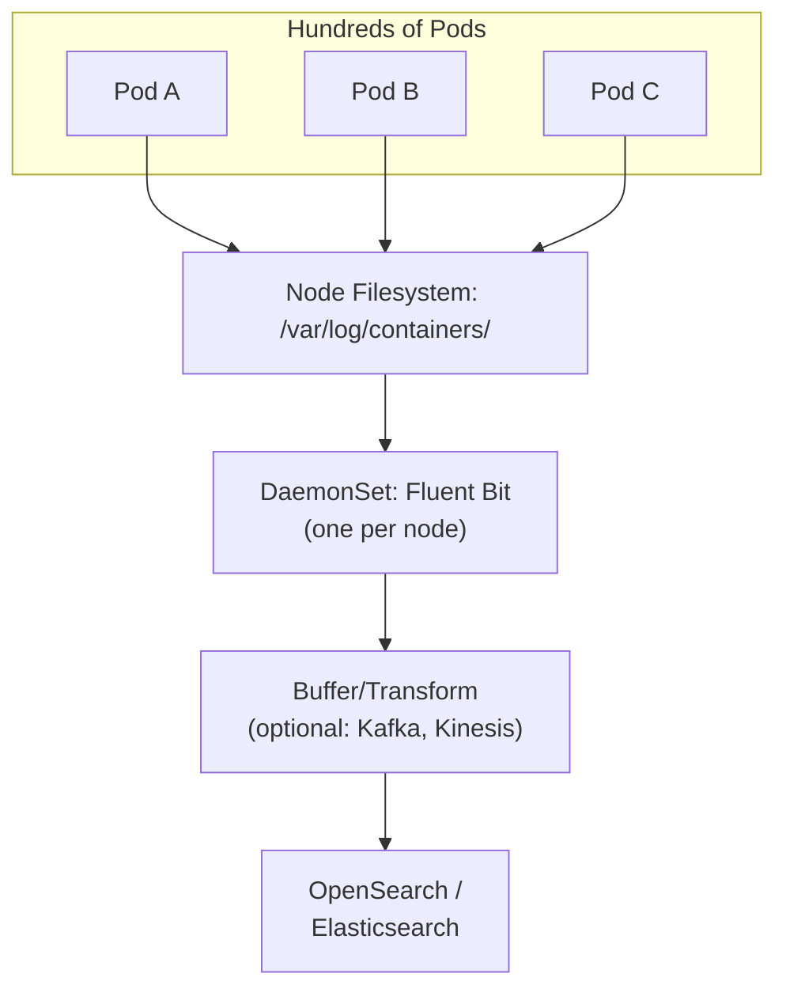
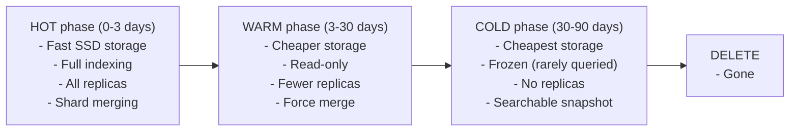
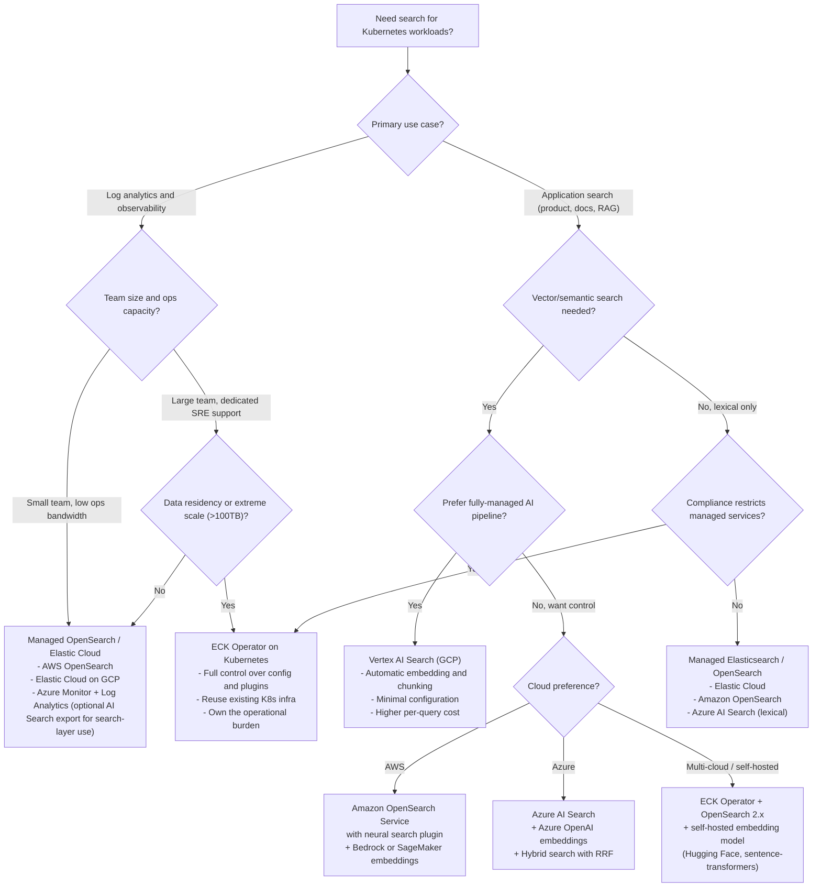

**Complexity**: `[COMPLEX]` | **Time to Complete**: 2.5h | **Prerequisites**: Module 9.2 (Message Brokers), Kubernetes logging concepts, JSON/HTTP API basics

## What You'll Be Able to Do

After completing this module, you will be able to:

- **Deploy managed search services (Amazon OpenSearch, Azure AI Search, Elastic Cloud) and self-hosted clusters (ECK operator) integrated with Kubernetes workloads**
- **Configure Fluent Bit or Vector to ship Kubernetes logs to managed search clusters with index lifecycle management**
- **Implement search-as-a-service patterns where Kubernetes applications query managed search indices via private endpoints**
- **Design index templates, shard strategies, and refresh policies for optimal query performance and cluster stability**
- **Evaluate managed vs self-hosted search tradeoffs using cost, operational burden, and feature requirements**

---

## Why This Module Matters

Hypothetical scenario: A platform team runs a self-managed Elasticsearch cluster on Kubernetes to serve two use cases — centralized logging for 200 microservices and a customer-facing product search feature. The cluster has 9 data nodes on i3.2xlarge instances with local NVMe storage. Total monthly compute cost runs around $22,000. A dedicated engineer spends roughly 30% of their time on shard rebalancing, index lifecycle management, JVM tuning, and version upgrades. When the team attempts an upgrade from Elasticsearch 7.x to 8.x, a mapping incompatibility brings down the entire cluster for 4 hours. During those 4 hours, the security team cannot search logs to investigate an active incident, and customers see 500 errors on product search.

The team migrates to a managed service. The migration takes three weeks. The managed service handles node replacement, automated snapshots, encryption, and version upgrades. The same engineer now spends about 5% of their time on search operations. The cluster has not had a single unplanned outage in 14 months.

The lesson is not that self-hosted search is wrong — it is that running a distributed search cluster demands deep operational knowledge. Managed search services absorb that operational burden so your team can focus on what matters: extracting insights from your data and building search experiences for your users. This module gives you the mental models to choose the right approach for your context and the hands-on skills to integrate search engines with Kubernetes in production.

---

## How Search Engines Work

Before you deploy a search cluster, you need to understand what happens when you submit a query. The fundamental insight that separates a search engine from a database `LIKE '%keyword%'` scan is the inverted index — a data structure that maps every term to the list of documents containing it. This is why search engines answer queries in milliseconds against terabytes of data while a relational database scans rows linearly.

### The Inverted Index

Imagine a book index at the back of a textbook: instead of scanning every page to find "Kubernetes," you flip to the index, see that the term appears on pages 14, 87, and 203, and go directly to those pages. An inverted index works the same way. During indexing, the engine tokenizes each document into individual terms, normalizes them (lowercasing, removing punctuation), applies language-specific analyzers (stemming "running" to "run," removing stop words like "the" and "is"), and builds a sorted dictionary where each term points to a postings list — the documents and positions where the term appears. When you query for `level:error`, the engine does not scan documents. It looks up "error" in the dictionary, retrieves the postings list, and returns matching documents directly.

### Relevance Scoring with BM25

Not all matches are equally good. A search for "Kubernetes pod crash" returns documents where these words appear, but which document is most relevant? Modern search engines use BM25 (Best Match 25), an evolution of TF-IDF, to compute relevance scores. BM25 considers term frequency (how often a term appears in a document — but with diminishing returns, so a document repeating "error" 50 times does not completely dominate one mentioning it 5 times), inverse document frequency (rare terms like "OOMKilled" carry more signal than common terms like "container"), and field length normalization (a match in a short log line is more precise than a match buried in a 10 KB stack trace). The engine scores every matching document and returns them in relevance order, not insertion order. This ranking is what turns a grep into a search engine.

### Facets, Aggregations, and Typo Tolerance

Search engines do more than find documents. Aggregations compute real-time statistics over matching results — count errors per namespace, chart response times over the last hour, identify the top 10 slowest pods. These aggregations run against the inverted index structures and complete in milliseconds, even across billions of log lines. Typo tolerance uses fuzzy matching (Levenshtein distance) to catch misspellings — searching for "paymnts" still finds the "payments" namespace. Faceted search lets users drill down by applying filters interactively: show me errors, in the payments namespace, from the last 15 minutes, grouped by pod name. Every one of these capabilities is built on top of the inverted index, and understanding this foundation helps you reason about why certain queries are fast, certain mappings matter, and certain cluster configuration choices impact performance.

---

## Log Ingestion Architecture

Getting Kubernetes logs into a search engine requires understanding the path each log line takes from a container's stdout to a queryable document. The architecture has four stages: collection (reading log files from node filesystems), enrichment (adding Kubernetes metadata like pod name, namespace, and labels), buffering (absorbing ingestion spikes), and indexing (writing to the search cluster). Each stage involves design decisions that affect reliability, cost, and queryability.

### The Kubernetes Logging Pipeline



### Fluent Bit DaemonSet for Log Collection

```yaml
apiVersion: apps/v1
kind: DaemonSet
metadata:
  name: fluent-bit
  namespace: logging
spec:
  selector:
    matchLabels:
      app: fluent-bit
  template:
    metadata:
      labels:
        app: fluent-bit
    spec:
      serviceAccountName: fluent-bit
      tolerations:
        - operator: Exists
      containers:
        - name: fluent-bit
          image: fluent/fluent-bit:3.2
          volumeMounts:
            - name: varlog
              mountPath: /var/log
              readOnly: true
            - name: config
              mountPath: /fluent-bit/etc/
          resources:
            requests:
              cpu: 100m
              memory: 128Mi
            limits:
              cpu: 500m
              memory: 256Mi
      volumes:
        - name: varlog
          hostPath:
            path: /var/log
        - name: config
          configMap:
            name: fluent-bit-config
```

### Fluent Bit Configuration for OpenSearch

```yaml
apiVersion: v1
kind: ConfigMap
metadata:
  name: fluent-bit-config
  namespace: logging
data:
  fluent-bit.conf: |
    [SERVICE]
        Flush         5
        Log_Level     info
        Daemon        off
        Parsers_File  parsers.conf

    [INPUT]
        Name              tail
        Tag               kube.*
        Path              /var/log/containers/*.log
        Parser            cri
        DB                /var/log/flb_kube.db
        Mem_Buf_Limit     10MB
        Skip_Long_Lines   On
        Refresh_Interval  10

    [FILTER]
        Name                kubernetes
        Match               kube.*
        Kube_URL            https://kubernetes.default.svc:443
        Kube_CA_File        /var/run/secrets/kubernetes.io/serviceaccount/ca.crt
        Kube_Token_File     /var/run/secrets/kubernetes.io/serviceaccount/token
        Merge_Log           On
        Keep_Log            Off
        K8s-Logging.Parser  On
        K8s-Logging.Exclude On
        Labels              On
        Annotations         Off

    [FILTER]
        Name    modify
        Match   kube.*
        Add     cluster_name production-us-east-1

    [OUTPUT]
        Name            opensearch
        Match           kube.*
        Host            search-logs-abc123.us-east-1.es.amazonaws.com
        Port            443
        TLS             On
        AWS_Auth        On
        AWS_Region      us-east-1
        Index           k8s-logs
        Type            _doc
        Logstash_Format On
        Logstash_Prefix k8s-logs
        Retry_Limit     3
        Buffer_Size     5MB
        Generate_ID     On

  parsers.conf: |
    [PARSER]
        Name        cri
        Format      regex
        Regex       ^(?<time>[^ ]+) (?<stream>stdout|stderr) (?<logtag>[^ ]*) (?<log>.*)$
        Time_Key    time
        Time_Format %Y-%m-%dT%H:%M:%S.%L%z
```

### Buffering with Kafka for Resilience

For high-volume clusters, buffer logs through Kafka to prevent data loss when OpenSearch is slow or unavailable. The buffer acts as a shock absorber: Fluent Bit writes to Kafka at whatever rate the pods produce logs, and a separate Logstash or Vector consumer reads from Kafka into OpenSearch at whatever rate OpenSearch can handle. This decoupling is essential because OpenSearch ingestion throughput is not constant — it dips during heavy query loads, JVM garbage collection pauses, shard rebalancing, and snapshot operations. Without a buffer, those dips cause backpressure that propagates all the way to Fluent Bit's in-memory buffers on each node, which overflow and drop logs silently. Kafka's durability guarantees (configurable replication factor and minimum in-sync replicas) mean logs are safe on disk until OpenSearch recovers, and you can replay the topic if you ever need to re-index data with updated mappings.


```yaml
# Fluent Bit output to Kafka instead of direct to OpenSearch
# fluent-bit.conf (OUTPUT section)
[OUTPUT]
    Name        kafka
    Match       kube.*
    Brokers     kafka-bootstrap.messaging.svc:9092
    Topics      k8s-logs
    Timestamp_Key @timestamp
    rdkafka.compression.codec snappy
    rdkafka.message.max.bytes 1048576
```

> **Stop and think**: If your OpenSearch cluster becomes briefly unavailable or heavily throttled due to a garbage collection pause, what exactly happens to the logs being actively generated by your pods if you are routing directly from Fluent Bit to OpenSearch without Kafka?

---

## Setting Up Managed Search

Each major cloud provider offers a managed search service. They share the same architectural DNA — a distributed indexing and search engine — but differ in APIs, pricing models, and Kubernetes integration patterns.

### Amazon OpenSearch Service

Amazon OpenSearch Service is the managed successor to Amazon Elasticsearch Service, running the open-source OpenSearch engine (forked from Elasticsearch 7.10.2). It supports two deployment modes: provisioned domains (you choose instance types and counts) and OpenSearch Serverless (capacity automatically scales, billed in OCUs — OpenSearch Compute Units). Provisioned domains give you direct control over instance family, EBS volume configuration, dedicated master nodes, and VPC placement. Serverless removes capacity planning entirely and charges separately for indexing and search workloads, which maps well to spiky log ingestion patterns where indexing bursts during deployments but querying is steady throughout the day.

```bash
# Create an OpenSearch domain
aws opensearch create-domain \
  --domain-name k8s-logs \
  --engine-version OpenSearch_2.13 \  # pinned example; verify current supported versions via the AWS console/CLI
  --cluster-config '{
    "InstanceType": "r6g.large.search",
    "InstanceCount": 3,
    "DedicatedMasterEnabled": true,
    "DedicatedMasterType": "m6g.large.search",
    "DedicatedMasterCount": 3,
    "ZoneAwarenessEnabled": true,
    "ZoneAwarenessConfig": {"AvailabilityZoneCount": 3}
  }' \
  --ebs-options '{
    "EBSEnabled": true,
    "VolumeType": "gp3",
    "VolumeSize": 500,
    "Iops": 3000,
    "Throughput": 250
  }' \
  --vpc-options '{
    "SubnetIds": ["subnet-aaa", "subnet-bbb", "subnet-ccc"],
    "SecurityGroupIds": ["sg-search"]
  }' \
  --encryption-at-rest-options Enabled=true \
  --node-to-node-encryption-options Enabled=true \
  --domain-endpoint-options EnforceHTTPS=true \
  --advanced-security-options '{
    "Enabled": true,
    "InternalUserDatabaseEnabled": false,
    "MasterUserOptions": {
      "MasterUserARN": "arn:aws:iam::123456789:role/OpenSearchAdmin"
    }
  }'
```

For Kubernetes integration, the External Secrets Operator can sync OpenSearch credentials into your cluster from AWS Secrets Manager, and IAM Roles for Service Accounts (IRSA) lets Fluent Bit pods assume an IAM role for keyless authentication to the OpenSearch domain. The endpoint is a private VPC endpoint when the domain is VPC-bound, meaning only workloads within the VPC — including your EKS nodes — can reach it.

### GCP: Elastic Cloud and Vertex AI Search

Google Cloud offers two paths for managed search. The first is Elastic Cloud, Elastic's own managed service available through the GCP Marketplace. You deploy Elasticsearch clusters via the Elastic Cloud console or API, and you get full Elastic Stack features — Kibana, machine learning jobs, alerting, and the Elastic Common Schema. The Elastic Cloud deployment runs in your GCP project's VPC through Private Service Connect, and billing flows through your GCP account. Fluent Bit connects using Elasticsearch's REST API over TLS with basic authentication or API keys.

```bash
# Using Elastic Cloud (managed Elasticsearch) with GKE
# Create deployment via Elastic Cloud API or console
# Then configure Fluent Bit to point to the Elastic Cloud endpoint

# Fluent Bit output for Elastic Cloud
# Replace Host with your actual endpoint from the Elastic Cloud deployment dashboard.
# [OUTPUT]
#     Name  es
#     Match kube.*
#     Host  my-deployment.es.us-central1.gcp.cloud.es.io
#     Port  9243
#     TLS   On
#     Cloud_Auth elastic:password
#     Index k8s-logs
#     Logstash_Format On
```

The second path is Vertex AI Search (formerly Discovery AI / Enterprise Search), Google's fully-managed AI-powered search platform. Unlike Elastic Cloud, which is a general-purpose search engine you configure yourself, Vertex AI Search is an opinionated service designed for website search, document search, and retrieval-augmented generation (RAG). It handles ingestion pipelines, embedding generation for vector search, and relevance tuning automatically. For Kubernetes workloads, the primary integration pattern is through a REST API — your application sends search queries to Vertex AI Search and receives ranked results, bypassing the operational concerns of managing indices and clusters. It is ideal for product search and knowledge-base retrieval but is not a drop-in replacement for log analytics, which is better served by Elastic Cloud or self-hosted OpenSearch.

### Azure AI Search

Azure AI Search (formerly Azure Cognitive Search) is Microsoft's managed search platform. Unlike the OpenSearch/Elasticsearch ecosystem, Azure AI Search uses a different architecture: you define indexes with explicit field schemas, data sources (Azure Blob Storage, Cosmos DB, Azure SQL), and indexers that extract, transform, and load data on a schedule or via push APIs. The service supports full-text search with Lucene analyzers, vector search using Azure OpenAI embeddings or custom models, and hybrid search that combines BM25 lexical scoring with vector similarity using Reciprocal Rank Fusion. For Kubernetes integration, applications running on AKS query the service through its REST API (replace any lab placeholder with your actual endpoint from the Azure portal service dashboard), authenticating via Entra Workload ID (the Azure equivalent of IRSA) to avoid storing API keys in pods. The Azure portal provides a search explorer for ad-hoc queries. For operational Kubernetes logging, Azure's primary path is Azure Monitor + Log Analytics (with optional export to AI Search via diagnostic settings / Event Hubs for search-layer use cases); AI Search shines for application search, document/RAG, and hybrid retrieval rather than as a drop-in high-volume log-analytics store.

---

## ECK Operator — Self-Hosted on Kubernetes

When a managed service does not fit — due to data residency requirements, cost at extreme scale, or the need for plugin customization — the Elastic Cloud on Kubernetes (ECK) operator provides a first-class Kubernetes-native deployment path. ECK is Elastic's official operator that manages the full lifecycle of Elasticsearch, Kibana, APM Server, and Beats on Kubernetes. It handles rolling upgrades, persistent volume provisioning, pod disruption budgets, and secure TLS between nodes — the same operational concerns you would otherwise script yourself with StatefulSets and init containers.

The operator runs as a deployment in your cluster and watches custom resources. Deploying a production-grade Elasticsearch cluster becomes a matter of defining an Elasticsearch resource with node sets, version, and storage configuration. ECK creates the StatefulSets, provisions PersistentVolumeClaims per node, generates and rotates TLS certificates, and performs rolling upgrades when you change the version field. You can define multiple node sets with different roles: a set of master-eligible nodes with smaller instances for cluster coordination, a set of data nodes with fast local SSDs for indexing and search, and optionally coordinating-only nodes for query fan-out. The operator enforces anti-affinity by default, spreading nodes across Kubernetes zones for high availability.

The tradeoff is that you regain operational control — and operational responsibility. You must monitor JVM heap pressure, manage snapshot repositories (S3, GCS, Azure Blob), tune the JVM heap size (no more than 50% of available memory, never above 30.5 GB due to compressed OOPs), and plan for version upgrades. For many teams, the ECK operator represents the sweet spot between the flexibility of self-hosted and the automation of managed: the operator handles the Kubernetes-native concerns (scheduling, storage, networking, certificates), but you still own the Elasticsearch-level concerns (index management, shard strategy, query performance).

---

## Vector and Semantic Search

The most significant evolution in search engines over the past three years has been the addition of vector search — the ability to find documents by semantic meaning rather than exact keyword matches. Where a traditional lexical search for "application running out of memory" returns documents containing those exact words, a vector search understands that "OOMKilled container" and "heap exhaustion in the JVM" describe the same underlying problem, even though they share no keywords.

Vector search works by converting text into dense numerical representations called embeddings. An embedding model (such as a sentence transformer or OpenAI's text-embedding models) maps each chunk of text to a vector — typically 384 to 1,536 floating-point numbers — in a high-dimensional space where semantically similar texts cluster together. At search time, the query is also converted to a vector, and the engine finds the nearest neighbors using approximate nearest neighbor (ANN) algorithms like HNSW (Hierarchical Navigable Small World graphs). Unlike exact kNN which compares the query vector against every document vector (O(n) complexity), ANN uses graph-based navigation to find close matches in logarithmic time, making vector search practical at scale.

### Hybrid Search: The Best of Both Worlds

Neither lexical nor vector search is universally better. Lexical search (BM25) excels at exact matches — finding a specific error code, a pod name, or a trace ID. Vector search excels at conceptual matches — finding "authentication failures" even when the logs say "401 Unauthorized" or "token expired." Hybrid search combines both: it runs a BM25 query and a vector ANN query in parallel, then merges the results using Reciprocal Rank Fusion (RRF), a formula that blends the ranked lists without requiring normalized scores. The practical result is a search experience that handles exact lookups and fuzzy semantic exploration in a single query.

### Managed Vector Search Offerings

All three major cloud search platforms now support vector search. Amazon OpenSearch Service added k-NN support starting with version 1.0 and has since added neural search plugins that handle embedding generation and ANN search natively — you define an ingest pipeline that calls an embedding model (Amazon Bedrock, SageMaker, or a custom model) to generate vectors for incoming documents, and searches automatically include vector similarity. Azure AI Search supports vector fields natively in index definitions, integrates with Azure OpenAI for embedding generation, and offers hybrid search with configurable RRF parameters through its REST API. Vertex AI Search on GCP abstracts vectors entirely — you upload documents and the service handles chunking, embedding, and hybrid retrieval automatically, though this comes with less control over the retrieval pipeline. For self-hosted deployments, Elasticsearch 8.x and OpenSearch 2.x both include k-NN plugins, and you can pair ECK-managed clusters with self-hosted embedding models from Hugging Face running as sidecar containers or separate inference services on Kubernetes.

---

## Indexing Pipeline Deep Dive

Understanding what happens between a Fluent Bit `[OUTPUT]` directive and a queryable document helps you diagnose slow ingestion, high CPU, and stale search results. The indexing pipeline has four stages.

### Ingest

Raw documents arrive at the cluster's HTTP API as JSON payloads — a single document via the index API, or batches via the bulk API (which is far more efficient, amortizing network round-trips and index operations). The coordinating node routes each document to the appropriate primary shard based on a routing formula: `shard = hash(_routing) % number_of_primary_shards`. If no explicit routing key is provided, the document ID is used, meaning documents distribute evenly across shards by default. If you specify a routing key (for example, a tenant ID), all documents for that tenant land on the same shard, which can be useful for colocation but dangerous if it creates hot shards.

### Analyze

Before a document is written to the inverted index, its text fields pass through an analyzer pipeline. The analyzer performs character filtering (stripping HTML tags, normalizing Unicode), tokenization (splitting text into individual terms on whitespace and punctuation), and token filtering (lowercasing, removing stop words, applying stemming). For example, the sentence "Kubernetes pods are crashing" passes through the standard analyzer and becomes the tokens `[kubernetes, pod, crash]` — "are" is a stop word and removed, "pods" is stemmed to "pod," and "crashing" is stemmed to "crash." These tokens are what end up in the inverted index, which is why the same analyzer must be applied at query time to match the indexed terms. Mismatched analyzers are a common source of "my data is indexed but my queries return nothing" bugs.

### Index

After lexical analysis completes, the search engine writes incoming documents to an append-only transaction log for durability. At the same time, it stages them inside an in-memory indexing buffer. When this memory buffer fills or the refresh timer elapses, the engine flushes buffered data into a new Lucene segment on disk. This periodic flush makes newly indexed documents queryable. Because committing documents occurs periodically rather than instantaneously upon receipt, search engines provide near-real-time searchability with a brief indexing lag.

**Pause and predict:** A platform team initiates a massive historical log backfill into OpenSearch with the default one-second refresh interval active. How does this default interval affect indexing throughput and segment creation, and what tuning adjustment should administrators apply during bulk operations?

<details>
<summary>Check your prediction</summary>

The default `refresh_interval` of approximately one second flushes in-memory buffers into tiny Lucene segments every second to deliver near-real-time searchability. During continuous high-volume bulk ingestion, generating thousands of small segments triggers heavy CPU and disk I/O contention because background workers must constantly merge small segments into larger ones. To optimize performance during bulk loading, engineers raise `refresh_interval` to `30s` or disable it completely with `-1`, allowing large batches to accumulate efficiently before restoring the default interval when indexing completes.
</details>

The next section is how live field types and primary shard counts behave once documents already occupy Lucene segments on disk.

The index mapping establishes the formal schema contract. It defines which document fields use `keyword` types for exact filtering versus `text` types for analyzed full-text queries. Mappings strictly constrain available query capabilities across your cluster. Search engines construct inverted indexes and columnar doc values differently according to the declared data type. Establishing explicit schema mappings before ingesting production telemetry prevents dynamic type guessing errors that silently misclassify critical operational identifiers.

**Pause and predict:** An engineering team discovers that an active production index requires an altered field data type and an increased primary shard count to absorb unexpected traffic. Can the team modify field mappings or increase the primary shard count directly on the live index?

<details>
<summary>Check your prediction</summary>

You cannot alter an existing field's data type mapping or modify the `number_of_primary_shards` setting directly on an active index without reindexing. Lucene builds immutable segment structures, and the coordinating node routes incoming documents using a hash of the document routing key modulo the primary shard count; mutating shard counts or field structures in place would break document retrieval and query execution. Updating these attributes requires provisioning a new destination index with adjusted mappings and sizing—hedging primary shards between 10–50 GiB, where log workloads typically target 30–50 GiB—and running the `_reindex` API to backfill records before repointing application aliases.
</details>

The next section is how the bulk API batches documents so ingestion does not pay a network round-trip per log line.

### Bulk Indexing

For log ingestion, the bulk API is the only practical approach. Instead of sending one document per HTTP request, you batch documents into newline-delimited JSON (NDJSON) payloads and send them in a single POST. A well-tuned bulk pipeline uses batches of 500-2,000 documents or 5-15 MB per batch, whichever comes first — smaller batches waste network round-trips, larger batches risk timeouts and memory pressure on the coordinating node. The bulk response reports per-document success or failure, allowing the ingestion pipeline to retry individual failures without re-sending the entire batch.

---

## Index Lifecycle Management (ILM/ISM)

Without lifecycle management, indices grow forever. A single day of logs for a 200-pod cluster can be 50 GB. After a month, you have 1.5 TB of indices, most of which nobody searches. Even worse, the cluster must maintain all those shards in memory, the coordinating node scans every index matching your wildcard patterns, and disk usage grows linearly until you hit a quota and ingestion stops. Index Lifecycle Management (ILM in Elasticsearch) or Index State Management (ISM in OpenSearch) solves this by defining automated policies that transition indices through phases — hot, warm, cold, and delete — based on age or size. Each phase trades query performance for storage cost, matching the resources consumed by an index to its actual access patterns over time.

### Lifecycle Phases



### OpenSearch Index State Management (ISM) Policy

```bash
# Create ISM policy via OpenSearch API
curl -XPUT "https://search-logs.us-east-1.es.amazonaws.com/_plugins/_ism/policies/k8s-log-lifecycle" \
  -H "Content-Type: application/json" \
  -d '{
  "policy": {
    "description": "K8s log lifecycle: hot -> warm -> cold -> delete",
    "default_state": "hot",
    "states": [
      {
        "name": "hot",
        "actions": [
          {
            "rollover": {
              "min_index_age": "1d",
              "min_primary_shard_size": "30gb"
            }
          }
        ],
        "transitions": [
          {
            "state_name": "warm",
            "conditions": { "min_index_age": "3d" }
          }
        ]
      },
      {
        "name": "warm",
        "actions": [
          {
            "replica_count": { "number_of_replicas": 1 }
          },
          {
            "force_merge": { "max_num_segments": 1 }
          }
        ],
        "transitions": [
          {
            "state_name": "cold",
            "conditions": { "min_index_age": "30d" }
          }
        ]
      },
      {
        "name": "cold",
        "actions": [
          {
            "replica_count": { "number_of_replicas": 0 }
          }
        ],
        "transitions": [
          {
            "state_name": "delete",
            "conditions": { "min_index_age": "90d" }
          }
        ]
      },
      {
        "name": "delete",
        "actions": [
          { "delete": {} }
        ]
      }
    ],
    "ism_template": [
      {
        "index_patterns": ["k8s-logs-*"],
        "priority": 100
      }
    ]
  }
}'
```

### Index Template

```bash
curl -XPUT "https://search-logs.us-east-1.es.amazonaws.com/_index_template/k8s-logs" \
  -H "Content-Type: application/json" \
  -d '{
  "index_patterns": ["k8s-logs-*"],
  "template": {
    "settings": {
      "number_of_shards": 3,
      "number_of_replicas": 1,
      "index.refresh_interval": "30s",
      "index.translog.durability": "async",
      "index.translog.sync_interval": "30s",
      "plugins.index_state_management.policy_id": "k8s-log-lifecycle"
    },
    "mappings": {
      "properties": {
        "@timestamp": { "type": "date" },
        "kubernetes": {
          "properties": {
            "namespace_name": { "type": "keyword" },
            "pod_name": { "type": "keyword" },
            "container_name": { "type": "keyword" },
            "labels": { "type": "object", "dynamic": true }
          }
        },
        "log": { "type": "text", "fields": { "keyword": { "type": "keyword", "ignore_above": 256 } } },
        "stream": { "type": "keyword" },
        "cluster_name": { "type": "keyword" },
        "level": { "type": "keyword" }
      }
    }
  }
}'
```

---

## Sharding and Replication Strategy

Sharding determines how data is distributed across nodes, and getting it wrong causes hot spots, uneven disk usage, and query performance problems that are difficult to fix after the fact. A shard is OpenSearch's unit of parallelism — each shard is an independent Lucene index that can be placed on any data node, and a search query fans out to all shards in the target indices. The number of primary shards is set at index creation and cannot be changed without reindexing (you can split shards in newer versions, but this is a manual operation with downtime implications). This immutability makes the initial shard count one of the most consequential decisions in your search architecture.

### Shard Sizing Rules

| Rule | Guideline | Reason |
|------|-----------|--------|
| Shard size | 10-50 GB per shard | Too small = overhead, too large = slow queries and recovery |
| Shards per node | Max 20 per GB of JVM heap | 1000 shards on a node with 32 GB heap is the practical max |
| Shards per index | 1 shard per 30 GB of expected data | A 90 GB/day index needs ~3 primary shards |
| Total cluster shards | Monitor and alert above 10,000 | Cluster state overhead grows linearly with shard count |

### Calculating Shards for a Logging Workload

```
Given:
  - 200 pods generating ~60 GB of logs per day
  - 90-day retention
  - Daily index rollover

Calculation:
  - Daily data: 60 GB
  - Target shard size: 30 GB
  - Primary shards per index: ceil(60/30) = 2
  - Replicas: 1 (in hot phase)
  - Total shards per day: 2 primary + 2 replica = 4

  - 90 days retention:
    - Hot (3 days): 3 * 4 = 12 shards
    - Warm (27 days): 27 * 3 = 81 shards (reduced replicas)
    - Cold (60 days): 60 * 2 = 120 shards (no replicas)
    - Total: ~213 shards (well within limits)
```

### Preventing Shard Explosion

A platform engineering team designs a multi-tenant logging architecture across a Kubernetes cluster supporting fifty active namespaces with ninety days of retention. To provide clean isolation between development teams, an engineer proposes provisioning a dedicated search index for each namespace every single day.

**Pause and predict:** An administrator creates a separate OpenSearch index for each Kubernetes namespace every calendar day. What operational consequence does this partitioning strategy have on cluster state and master node memory over time, and what architecture avoids this failure?

<details>
<summary>Check your prediction</summary>

Creating one index per namespace per day triggers a severe shard explosion that rapidly exhausts master node JVM memory and degrades cluster state synchronization:

```
BAD:  50 namespaces * 3 shards * 2 (replicas) * 90 days = 27,000 shards!
GOOD: 1 index per day * 3 shards * 2 (replicas) * 90 days = 540 shards
```

Every shard consumes heap memory on master and data nodes for cluster state metadata, Lucene segment headers, open file descriptors, and routing tables. Maintaining tens of thousands of underutilized shards leads to master election timeouts and cluster instability. The standard production architecture uses a single daily index paired with a `keyword` mapping on the `namespace` field for filtering, enforcing tenant access boundaries via Document Level Security (DLS) when isolation is required.
</details>

The next section is how a shared daily index stays filterable by tenant identity without creating another physical index per team.

**Pause and predict:** You have decided to use a single index per day with a `namespace` field to prevent shard explosion. To ensure your queries filtering by namespace are as fast as possible, what OpenSearch mapping type should the `namespace` field use, and why?

<details>
<summary>Check your prediction</summary>

The `namespace` field must be mapped as `keyword` rather than `text` because it contains structured exact identifiers used for filtering, aggregations, and Document Level Security (DLS). The `keyword` data type indexes values verbatim without analysis or stemming, enabling fast exact-match lookups and memory-efficient aggregations through doc values. If mapped as `text`, the value undergoes tokenization and stemming, breaking exact filter matching; furthermore, running terms aggregations on `text` fields fails by default and requires enabling `fielddata`, which consumes massive JVM heap memory and risks out-of-memory crashes.
</details>

The next section is how Document Level Security and Field Level Security map Kubernetes teams onto one shared search cluster.

---

## Fine-Grained Access Control

In a multi-team environment, different teams should only see logs from their own namespaces — the frontend team has no business searching the payments namespace's error logs, and the platform SREs need full access across all namespaces. OpenSearch's security plugin provides role-based access control with two powerful dimensions: Document Level Security (DLS) filters which documents a role can see, and Field Level Security (FLS) which fields within those documents are visible. Combined with OIDC integration through your cloud provider's identity system (AWS IAM, GCP IAM, or Entra ID), you can map Kubernetes RBAC roles to OpenSearch roles, ensuring that a developer's access in kubectl matches their access in OpenSearch Dashboards.

### OpenSearch Security: Role-Based Access

```bash
# Create a role that restricts access to a specific namespace
curl -XPUT "https://search-logs.us-east-1.es.amazonaws.com/_plugins/_security/api/roles/team-payments" \
  -H "Content-Type: application/json" \
  -d '{
  "cluster_permissions": [],
  "index_permissions": [
    {
      "index_patterns": ["k8s-logs-*"],
      "allowed_actions": ["read", "search"],
      "dls": "{\"match\": {\"kubernetes.namespace_name\": \"payments\"}}",
      "fls": ["~kubernetes.labels.secret-hash"]
    }
  ]
}'
```

The `dls` (Document Level Security) field ensures that users with this role can only see log entries from the `payments` namespace. The `fls` (Field Level Security) hides specific sensitive fields.

### Mapping OIDC Groups to OpenSearch Roles

```bash
# Map an OIDC group to the role
curl -XPUT "https://search-logs.us-east-1.es.amazonaws.com/_plugins/_security/api/rolesmapping/team-payments" \
  -H "Content-Type: application/json" \
  -d '{
  "backend_roles": ["arn:aws:iam::123456789:role/TeamPaymentsRole"],
  "users": [],
  "hosts": []
}'
```

### Kubernetes RBAC to OpenSearch Role Matrix

| Kubernetes Namespace | OIDC Group | OpenSearch Role | Index Access |
|---------------------|------------|-----------------|-------------|
| payments | team-payments | team-payments | k8s-logs-* (DLS: namespace=payments) |
| frontend | team-frontend | team-frontend | k8s-logs-* (DLS: namespace=frontend) |
| platform | sre-team | sre-full-access | k8s-logs-* (no DLS, full access) |
| security | security-team | security-audit | k8s-logs-*, k8s-audit-* (full access) |

> **Stop and think**: DLS evaluates a filter query on every search request, which adds overhead. If a specific team's dashboard is slow because it runs hundreds of DLS-filtered queries per minute, what alternative could you use for just that team without resorting to separate physical indices?

---

## Query Optimization

Search queries against log indices can be slow if not designed well. The difference between a query that completes in 50 milliseconds and one that takes 15 seconds often comes down to three factors: whether the query uses filter context (cached, no scoring) versus query context (uncached, with scoring), whether the time range is narrow enough for OpenSearch to skip non-matching indices, and whether the field types in the query match the field types in the mapping. Below are patterns for efficient operational queries, organized around these principles. Each example targets a real operational workflow — finding recent errors, aggregating error distribution by workload, and returning lean results for dashboard consumption.

### Common Query Patterns

```bash
# Find errors in a specific namespace in the last hour
curl -XPOST "https://search-logs.us-east-1.es.amazonaws.com/k8s-logs-*/_search" \
  -H "Content-Type: application/json" \
  -d '{
  "query": {
    "bool": {
      "filter": [
        {"term": {"kubernetes.namespace_name": "payments"}},
        {"term": {"level": "error"}},
        {"range": {"@timestamp": {"gte": "now-1h"}}}
      ]
    }
  },
  "sort": [{"@timestamp": {"order": "desc"}}],
  "size": 100
}'

# Aggregate error counts by pod over the last 24 hours
curl -XPOST "https://search-logs.us-east-1.es.amazonaws.com/k8s-logs-*/_search" \
  -H "Content-Type: application/json" \
  -d '{
  "size": 0,
  "query": {
    "bool": {
      "filter": [
        {"term": {"level": "error"}},
        {"range": {"@timestamp": {"gte": "now-24h"}}}
      ]
    }
  },
  "aggs": {
    "by_pod": {
      "terms": {"field": "kubernetes.pod_name", "size": 20},
      "aggs": {
        "over_time": {
          "date_histogram": {"field": "@timestamp", "fixed_interval": "1h"}
        }
      }
    }
  }
}'
```

### Query Performance Tips

| Tip | Why It Helps |
|-----|-------------|
| Use `filter` context instead of `must` for exact matches | Filter context is cached and does not compute relevance scores |
| Narrow the time range as much as possible | OpenSearch skips indices outside the range entirely |
| Use `keyword` fields for exact matches, `text` for full-text | Querying a `text` field with an exact match scans every token |
| Limit `size` to what you actually need | Default is 10; requesting 10,000 forces scanning and sorting |
| Use `_source` filtering to return only needed fields | Large `_source` documents waste network bandwidth |
| Prefer `terms` query over multiple `term` queries | One `terms` query is faster than OR-ing multiple `term` queries |

```bash
# Efficient: return only needed fields
curl -XPOST "https://search-logs.us-east-1.es.amazonaws.com/k8s-logs-*/_search" \
  -H "Content-Type: application/json" \
  -d '{
  "_source": ["@timestamp", "log", "kubernetes.pod_name", "level"],
  "query": {
    "bool": {
      "filter": [
        {"terms": {"kubernetes.namespace_name": ["payments", "checkout"]}},
        {"range": {"@timestamp": {"gte": "now-15m"}}}
      ]
    }
  },
  "size": 50
}'
```

---

## OpenSearch Dashboards from Kubernetes

Deploy OpenSearch Dashboards (or Kibana) inside your Kubernetes cluster for log visualization and ad-hoc exploration. While managed search services provide the backend, your teams still need a UI to craft queries, build dashboards, and explore log patterns interactively. OpenSearch Dashboards is the visualization layer that connects to the managed domain — it runs as a stateless deployment in your cluster, and all data remains in the managed service. This architecture keeps the visualization close to your developers while the search engine benefits from managed operations. The deployment below configures two replicas for high availability and connects to the managed OpenSearch domain via the `OPENSEARCH_HOSTS` environment variable, using IAM-based authentication through IRSA when running on EKS.

```yaml
apiVersion: apps/v1
kind: Deployment
metadata:
  name: opensearch-dashboards
  namespace: logging
spec:
  replicas: 2
  selector:
    matchLabels:
      app: opensearch-dashboards
  template:
    metadata:
      labels:
        app: opensearch-dashboards
    spec:
      containers:
        - name: dashboards
          image: opensearchproject/opensearch-dashboards:2.13.0
          ports:
            - containerPort: 5601
          env:
            - name: OPENSEARCH_HOSTS
              value: '["https://search-logs-abc123.us-east-1.es.amazonaws.com:443"]'
            - name: SERVER_BASEPATH
              value: "/dashboards"
            - name: SERVER_REWRITEBASEPATH
              value: "true"
          resources:
            requests:
              cpu: 500m
              memory: 1Gi
---
apiVersion: v1
kind: Service
metadata:
  name: opensearch-dashboards
  namespace: logging
spec:
  selector:
    app: opensearch-dashboards
  ports:
    - port: 5601
      targetPort: 5601
```

---

## Cost Lens

Managed search services charge along several dimensions, and understanding the cost levers helps you avoid bill shock while keeping search performance acceptable. The biggest cost drivers are instance-hours, storage volume, and data transfer.

### Compute Costs

Provisioned managed clusters (Amazon OpenSearch provisioned domains, Elastic Cloud) charge per instance-hour for each node. An `r6g.large.search` instance in us-east-1 costs roughly $0.17 per hour, so a 3-node data tier plus 3 dedicated master nodes runs approximately $750 per month for compute alone. Larger instance families, Graviton-based ARM instances (r6g, m6g), and reserved instances (1-year or 3-year commitments) can reduce the per-hour rate by 30-50%. OpenSearch Serverless uses OCUs (OpenSearch Compute Units), billed separately for indexing and search workloads; indexing OCUs scale with ingestion throughput, and search OCUs scale with query concurrency and data scanned. At moderate scale (100 GB/day ingestion, ~50 queries per minute), Serverless can be cheaper than provisioned instances, but at high query volumes the OCU cost can exceed provisioned pricing because you pay for every query.

### Storage Costs

EBS volumes in AWS OpenSearch are charged per GB-month. gp3 volumes cost ~$0.08 per GB-month, so 500 GB of storage adds $40 per month, but this grows linearly with retention. The ILM policy becomes your primary storage cost control: moving indices from hot (gp3 on the data nodes) to warm (gp3 with force-merge reducing size by 40-60%) to cold (ultrawarm or searchable snapshots, ~$0.024/GB-month) can reduce storage cost by 70% for older data. In OpenSearch Serverless, storage is included in the OCU rate, but you still pay for every GB-month regardless of access frequency, making ILM even more important for cost control.

### What Makes Cost Spike

Over-sharding is the most common hidden cost driver: every shard consumes JVM heap, and when heap pressure exceeds 75% the JVM enters aggressive garbage collection, slowing queries and ingestion. Teams respond by adding more nodes, which increases the monthly bill, when the root cause is simply too many shards. Cross-AZ data transfer for replication between availability zones is another silent cost — a 3-AZ deployment with 1 replica effectively triples the inter-AZ traffic for every indexed document, and while AWS does not charge for OpenSearch node-to-node traffic within a region, self-hosted clusters on EC2 do pay standard inter-AZ data transfer rates ($0.01/GB). In Azure, AI Search charges per search unit (a combined compute + storage measure), and you scale by adding replicas (for query throughput) or partitions (for index size). Elastic Cloud on GCP bills through the GCP Marketplace with instance-based pricing similar to AWS, and cross-zone traffic within a region is not charged.

### Reducing Cost Without Sacrificing Searchability

Set the refresh interval to 30 seconds or higher during bulk indexing to reduce segment merges and I/O. Use index rollover based on shard size (30 GB) rather than time (1 day) so that low-volume days do not create unnecessarily small shards. Force-merge warm indices to single segments, which reduces storage by up to 60% and accelerates queries since fewer segments need to be opened per search. For cold storage, use searchable snapshots — indices are stored in cheap object storage (S3, GCS, Azure Blob) and only the portions needed for queries are fetched into local cache, bringing storage costs down to ~$0.024/GB-month while retaining the ability to search.

---

## Patterns and Anti-Patterns

### Proven Patterns

**Pattern 1: Buffer Everything.** Always place a message queue (Kafka, Kinesis, Event Hubs) between log producers and the search cluster. This decouples ingestion spikes from OpenSearch's ability to index, prevents log loss during cluster maintenance or JVM pauses, and enables replay if you need to re-index data with updated mappings. The buffer also lets you perform streaming transformations — parsing unstructured logs, enriching with Kubernetes metadata, dropping sensitive fields — before they reach the search index, reducing the indexing load and improving data quality.

**Pattern 2: Time-Based Index Rollover with ILM.** Design your index strategy around daily (or size-based) rollover with automated lifecycle management from day one. New indices are created by the rollover action, old indices transition through hot, warm, and cold phases on a schedule, and indices past retention are deleted automatically. Without this, you either accumulate unbounded storage costs or face a painful manual reindexing operation when you eventually need to clean up. The daily rollover also bounds shard count: you can predict exactly how many shards the cluster will hold at steady state and size nodes accordingly.

**Pattern 3: Explicit Mappings Before Data.** Define index templates with explicit field types before any data flows into the cluster. Dynamic mapping guesses wrong often enough to cause real problems: an `order_id` field gets mapped as `text` (full-text search) when you need `keyword` (exact match and aggregatable), and changing the mapping for existing data requires a full reindex. Explicit mappings also let you disable indexing on fields you will never search (large log payloads, binary blobs) using `"index": false`, saving disk and memory.

**Pattern 4: Separate Clusters by Workload Profile.** Logging workloads and application search workloads have fundamentally different access patterns. Logging is write-heavy, append-only, with most queries scanning recent time ranges. Application search is read-heavy with diverse query patterns and latency-sensitive users. Running both on the same cluster causes index contention, cache eviction, and unpredictable query latency. Operate two separate clusters (or two separate managed domains), sized independently for each workload profile.

### Anti-Patterns

| Anti-Pattern | Why Teams Fall Into It | Better Alternative |
|---|---|---|
| Using OpenSearch as a primary database | "We already have OpenSearch, why add PostgreSQL?" — OpenSearch is not ACID, does not support joins, and is not designed for transactional writes | Use a proper database for transactional data; push only searchable projections to OpenSearch via a CDC pipeline |
| One index per namespace per day | Seems like good organizational hygiene — but 50 namespaces × 3 shards × 2 replicas × 90 days = 27,000 shards, which overwhelms cluster state | Use a single daily index with `namespace` as a keyword field and Document Level Security for access control |
| No ILM policy before production | "We'll configure retention later" — after 6 months of unmanaged index growth, retroactively applying ILM requires reindexing terabytes | Define ISM/ILM policies and index templates before any data enters the cluster; validate them in staging |
| Over-sharding for "future growth" | Fear of hitting a shard size ceiling leads teams to create 10-20 primary shards for a 30 GB/day index — each shard ends up at 2-3 GB, well below the 10 GB minimum | Target 30 GB per shard; the daily rollover is your natural point to increase shard count when volume actually grows |
| Direct ingestion without Kafka | Simplicity bias — Fluent Bit → OpenSearch has fewer moving parts, until OpenSearch slows down and Fluent Bit's in-memory buffer overflows, dropping logs | Always buffer through Kafka or Kinesis; the buffer is your insurance policy against cluster unavailability |
| Running force_merge on hot indices | "Let's optimize everything" — force_merge on an actively-written index creates new segments immediately after every merge, wasting CPU and I/O | Only force_merge on read-only warm/cold indices as part of ILM transitions |
| Ignoring JVM heap pressure | "It's managed, so I don't need to worry" — managed services handle node replacement but do not tune your index strategy; over-sharding still causes heap pressure and GC pauses | Monitor JVMMemoryPressure (alert above 80%), count shards, and follow shard sizing guidelines regardless of deployment model |
| No snapshot strategy | Relying on replicas as the only data redundancy — replicas protect against node failure but not against accidental index deletion, data corruption, or cluster-wide misconfiguration | Configure automated snapshots to S3/GCS/Azure Blob with retention matching your recovery point objective; test restore quarterly |

---

## Decision Framework

Choosing how and where to run your search infrastructure depends on four factors: operational maturity, cost sensitivity, feature requirements, and data gravity. The flowchart below captures the primary decision path, but the tradeoffs deserve deeper discussion.



The core tension is between operational burden and control. Managed services absorb node management, patching, snapshot automation, and version upgrades — tasks that consume meaningful engineering time on self-hosted clusters. But managed services also impose limits: Amazon OpenSearch restricts certain APIs (no direct `_cluster/settings` modifications), Azure AI Search uses a different indexer model that does not support all Elasticsearch query DSL features, and Vertex AI Search abstracts the retrieval pipeline entirely. When your use case fits within the managed service's feature set, the operational savings typically outweigh the loss of control. When it does not — custom plugins, specific JVM tunings, niche hardware requirements — ECK on Kubernetes provides a production-grade self-hosted path without reinventing the StatefulSet and PVC management wheel.

For teams straddling both worlds, a common strategy is to use a managed service for the logging cluster (where feature requirements are modest — search, aggregate, visualize — and data volume is high) and self-hosted ECK for the application search cluster (where custom relevance tuning, plugin integrations, and latency SLAs demand full control). This split lets you match the operational investment to the business criticality of each workload.

---

## Did You Know?

1. **OpenSearch was forked from Elasticsearch 7.10.2 in 2021** after Elastic changed Elasticsearch's license from Apache 2.0 to SSPL (Server Side Public License). AWS, who had been offering Elasticsearch as a managed service, created the OpenSearch fork under the Apache 2.0 license. Today, OpenSearch has diverged significantly with unique features like observability plugins and anomaly detection.

2. **A single OpenSearch shard is a complete Lucene index** with its own inverted index, stored fields, and segment files. When you search across a 3-shard index, you are actually running 3 parallel Lucene searches and merging results. This is why shard count directly affects query latency -- each additional shard adds coordination overhead.

3. **The `force_merge` operation during the warm phase can reduce index size by 40-60%** because it compacts multiple Lucene segments into one. This also speeds up queries because there are fewer segments to search. But force merge is CPU-intensive and should only run on warm/cold indices that are no longer receiving writes.

4. **Document Level Security in OpenSearch evaluates a filter query on every search request**, which adds 5-15% overhead per query. For high-traffic dashboards, pre-filter by creating separate index aliases per team with built-in filters, which eliminates the per-query DLS evaluation.

---

## Common Mistakes

| Mistake | Why It Happens | How to Fix It |
|---------|---------------|---------------|
| Creating one index per namespace per day | Seems like good organization | Use a single daily index with namespace as a field; use DLS for access control |
| Not setting index lifecycle policies before production | "We will configure it later" | Define ISM/ILM policies before sending any data; retroactive migration is painful |
| Using `text` type for fields that need exact matching | Default dynamic mapping maps strings to `text` | Create explicit mappings with `keyword` type for namespace, pod name, level |
| Setting too many primary shards | "More shards = more parallelism" | Follow the 10-50 GB per shard rule; over-sharding wastes resources |
| Not buffering through Kafka for high-volume clusters | Direct ingestion seems simpler | Without a buffer, OpenSearch backpressure causes Fluent Bit to drop logs |
| Searching across all indices when only recent data is needed | Using wildcard `k8s-logs-*` without time filter | Usually include a time range in queries when focusing on recent data; OpenSearch can skip non-matching indices |
| Running force_merge on hot indices | Trying to optimize active indices | Only force_merge on read-only warm/cold indices; active indices will create new segments |
| Ignoring JVM heap pressure on managed clusters | "Managed means I do not need to worry" | Monitor JVMMemoryPressure; above 80% causes GC pauses and slow queries |

---

## Quiz

<details>
<summary>1. During a major product launch, your OpenSearch cluster experiences a brief JVM garbage collection pause and slow queries, causing ingestion latency to spike. If you are using Fluent Bit to send logs directly to OpenSearch without a Kafka buffer, what will happen to the logs generated during this pause, and how does Kafka solve this?</summary>

If OpenSearch becomes slow (due to heavy queries, GC pauses, or a node failure), Fluent Bit without a buffer would either drop logs or back up memory on every node in the cluster. With Kafka in between, Kafka acts as a shock absorber between log producers and the search engine. Fluent Bit writes to Kafka (which is designed for high-throughput writes), and a separate consumer reads from Kafka into OpenSearch at a rate that OpenSearch can handle. This decouples production from consumption, provides at-least-once delivery guarantees, and allows replaying logs if you need to re-index data.
</details>

<details>
<summary>2. Your CFO has asked you to reduce the $22,000 monthly AWS bill for your OpenSearch cluster, which currently keeps 90 days of logs on i3.2xlarge NVMe instances. How would implementing hot, warm, and cold phases in an Index Lifecycle Management (ILM) policy drastically reduce this cost while maintaining 90-day retention?</summary>

Hot phase indices are actively receiving writes and frequent queries, requiring fast SSD storage and full replicas for write throughput. However, older log data is rarely queried, meaning keeping it on expensive NVMe instances wastes resources. By transitioning indices to a warm phase (read-only, force-merged, cheaper storage) after a few days, and then to a cold phase (no replicas, cheapest storage tier) after a month, you match the storage cost to the access pattern. Each phase trades query performance for cost savings, drastically reducing the overall infrastructure footprint for long-term retention.
</details>

<details>
<summary>3. A developer team proposes organizing logs by creating one OpenSearch index per Kubernetes namespace per day to ensure strict data separation for their 50 microservices. Why will this architectural decision eventually cause the OpenSearch cluster to degrade or crash, and what is the better alternative?</summary>

With 50 namespaces and 3 primary shards per index (plus 1 replica), a single day creates 300 shards. Over 90 days of retention, that strategy generates 27,000 shards. Each shard is a complete Lucene index that consumes cluster state memory, requires its own recovery tracking, and adds overhead to every cluster-level operation, causing OpenSearch clusters to degrade significantly above 10,000 shards. Instead of separate indices, you should use a single daily index with `namespace` as a keyword field and use Document Level Security (DLS) for access control. This reduces shard count by 50x while providing the exact same logical separation for the teams.
</details>

<details>
<summary>4. You have consolidated all logs into a single daily index to prevent shard explosion, but your security compliance team dictates that the frontend team must never be able to query logs from the payments namespace. How can Document Level Security (DLS) solve this requirement, and what performance trade-off does it introduce?</summary>

DLS is an OpenSearch security feature that dynamically appends a filter query to every search request made by a specific user role. For example, assigning the frontend team a role with a DLS filter `{"match": {"kubernetes.namespace_name": "frontend"}}` ensures they only ever see their own documents, regardless of their actual search query. This satisfies the compliance requirement by providing multi-tenant security within a shared index without the overhead of maintaining separate physical indices. However, DLS adds a 5-15% performance overhead per query because the filter is evaluated on every single search request.
</details>

<details>
<summary>5. Your operational dashboard displays the count of "error" level logs over the last hour, but it is taking 15 seconds to load and heavily taxing the OpenSearch CPU. Upon reviewing the query, you notice it uses a `bool` query with a `must` clause for the log level and time range. Why is this inefficient, and how does switching to a `filter` context solve the problem?</summary>

In OpenSearch `bool` queries, `must` clauses calculate relevance scores for each matching document to determine how well it matches. For log analytics where you only want exact matches (like a specific time range or log level), relevance scoring is meaningless overhead—you are simply filtering data, not ranking search results. Filter clauses skip the expensive relevance scoring entirely. Furthermore, filter clauses are automatically cached by OpenSearch, meaning repeated dashboard queries will hit the cache instead of re-evaluating the data. For operational logging workloads, moving exact-match components into the `filter` context drastically reduces CPU usage and query latency.
</details>

<details>
<summary>6. You are designing an index template for a Kubernetes cluster that generates roughly 100 GB of logs per day. An engineer suggests setting the number of primary shards to 10 "to ensure we have enough parallelism for future growth." Why is this a bad idea, and how should you properly calculate the initial primary shard count?</summary>

Setting the primary shard count to 10 for 100 GB of data would result in shards of only 10 GB each, leading to over-sharding and unnecessary cluster state overhead. You should calculate shards based on a target size of 10-50 GB per shard. For 100 GB of daily logs, dividing by a conservative 30 GB target yields about 3 or 4 primary shards (e.g., ceil(100/30) = 4). You should not over-shard for hypothetical future growth because the daily rollover action in ISM/ILM creates a new index every day, giving you a natural point to seamlessly increase the shard count when your actual daily volume consistently exceeds the target shard size.
</details>

<details>
<summary>7. You are evaluating whether to use Amazon OpenSearch Service (managed) versus running the ECK operator on EKS for a new Kubernetes logging pipeline. Your team has two SREs, and the cluster will ingest ~200 GB of logs per day with 30-day retention. Which approach would you recommend and what are the primary tradeoffs?</summary>

For a team with only two SREs and a moderate ingestion volume, managed OpenSearch Service is the stronger choice. A 200 GB/day workload with 30-day retention means ~6 TB of total storage running on perhaps 6-9 data nodes — this is well within the operational envelope of a managed service. The two SREs would spend their time on JVM tuning, shard rebalancing, version upgrades, and snapshot management if self-hosted — time better spent on higher-leverage platform work. Managed OpenSearch handles node replacement, automated snapshots, encryption, and version upgrades. The tradeoff is cost: managed services charge a premium over raw EC2 instances, and you give up direct control over cluster settings and plugin installation. If the team grows to 5+ SREs and data volume exceeds 500 TB, the cost equation may tilt toward ECK plus reserved instances.
</details>

<details>
<summary>8. Your application search feature uses BM25 lexical scoring, but users complain that searching for "login issues" does not return documents about "authentication failures" or "password reset errors." How would adding vector search to your cluster address this, and what changes would you need to make to your indexing pipeline?</summary>

BM25 matches keywords exactly, so "login issues" only retrieves documents containing those words. Vector search converts queries and documents into dense embeddings in a high-dimensional space where semantically similar concepts cluster together. Adding vector search requires three changes to the indexing pipeline: first, deploy an embedding model (such as a sentence transformer running as a Kubernetes deployment) that generates a vector for each document at ingest time; second, add a `knn_vector` field to your index mapping with the embedding dimension and similarity metric (cosine or dot product); third, update the ingest pipeline to call the embedding service and populate the vector field. At query time, you run a hybrid search that executes both a BM25 query and a kNN vector query in parallel, then merges the ranked results using Reciprocal Rank Fusion so that documents matching conceptually or lexically both appear in the results.
</details>

---

## Hands-On Exercise: Log Pipeline with OpenSearch

This exercise uses OpenSearch running in kind to build a complete log ingestion and search pipeline from scratch. You will deploy a single-node OpenSearch cluster, define an index template with explicit field mappings, ingest 500 simulated Kubernetes log entries using the bulk API, run aggregation queries to explore the data, and inspect cluster health metrics. Each task builds on the previous one, and the entire lab runs locally in a kind cluster that you tear down at the end. The concepts you practice here — explicit mappings, bulk ingestion, filter-based queries, and shard inspection — are the same ones you will use when operating production clusters at scale.

### Setup

```bash
alias k=kubectl

# Create kind cluster
kind create cluster --name search-lab

# Install OpenSearch using Helm (single-node for lab)
helm repo add opensearch https://opensearch-project.github.io/helm-charts/
helm install opensearch opensearch/opensearch \
  --namespace search --create-namespace \
  --set singleNode=true \
  --set replicas=1 \
  --set persistence.enabled=false \
  --set resources.requests.memory=1Gi \
  --set resources.limits.memory=1.5Gi \
  # Backslash escapes a literal dot in the Helm values key segment (opensearch.yml).
  --set config.opensearch\\.yml."plugins.security.disabled"=true

k wait --for=condition=ready pod -l app.kubernetes.io/name=opensearch \
  --namespace search --timeout=180s

# Install OpenSearch Dashboards
helm install dashboards opensearch/opensearch-dashboards \
  --namespace search \
  --set opensearchHosts="http://opensearch-cluster-master:9200" \
  --set resources.requests.memory=512Mi
```

### Task 1: Create an Index Template

Define an index template that will be applied to every new index matching the `k8s-logs-*` pattern. Your template must include explicit field mappings — `keyword` types for namespace, pod, container, and node fields (enabling exact-match queries and aggregations), `date` type for the timestamp (enabling range queries), and `text` type for the log message (enabling full-text search). The template should also configure index settings including the number of shards and the refresh interval.

<details>
<summary>Solution</summary>

```bash
k run opensearch-setup --rm -it --image=curlimages/curl -n search --restart=Never -- \
  curl -s -XPUT "http://opensearch-cluster-master:9200/_index_template/k8s-logs" \
  -H "Content-Type: application/json" \
  -d '{
    "index_patterns": ["k8s-logs-*"],
    "template": {
      "settings": {
        "number_of_shards": 1,
        "number_of_replicas": 0,
        "index.refresh_interval": "5s"
      },
      "mappings": {
        "properties": {
          "@timestamp": {"type": "date"},
          "level": {"type": "keyword"},
          "message": {"type": "text"},
          "kubernetes": {
            "properties": {
              "namespace": {"type": "keyword"},
              "pod": {"type": "keyword"},
              "container": {"type": "keyword"},
              "node": {"type": "keyword"}
            }
          }
        }
      }
    }
  }'
```
</details>

### Task 2: Ingest Sample Log Data

Use a Python script running inside the kind cluster to push 500 simulated Kubernetes log entries into OpenSearch via the bulk API. The script should generate documents with varied `namespace` values (payments, frontend, api-gateway, checkout, analytics) and `level` values (info, warn, error) to create a realistic distribution. The bulk API batches all 500 documents into a single HTTP request using newline-delimited JSON (NDJSON) format — observe the response to confirm all documents were indexed successfully and verify the document count.

<details>
<summary>Solution</summary>

```bash
k run log-ingester --rm -it --image=curlimages/curl -n search --restart=Never \
  --overrides='{
    "spec": {
      "containers": [{
        "name": "ingester",
        "image": "python:3.12-slim",
        "command": ["/bin/sh", "-c", "pip install requests -q && python3 -c \"
import requests, random, json
from datetime import datetime

OPENSEARCH = \\\"http://opensearch-cluster-master:9200\\\"
namespaces = [\\\"payments\\\", \\\"frontend\\\", \\\"api-gateway\\\", \\\"checkout\\\", \\\"analytics\\\"]
levels = [\\\"info\\\"] * 6 + [\\\"warn\\\"] * 2 + [\\\"error\\\"] * 2

bulk = \\\"\\\"
for i in range(500):
    ns = random.choice(namespaces)
    lvl = random.choice(levels)
    ts = datetime.utcnow().strftime(\\\"%Y-%m-%dT%H:%M:%S.000Z\\\")
    idx = datetime.utcnow().strftime(\\\"k8s-logs-%Y.%m.%d\\\")
    doc = {\\\"@timestamp\\\": ts, \\\"level\\\": lvl, \\\"message\\\": f\\\"Request {i} processed in {random.randint(5,500)}ms\\\", \\\"kubernetes\\\": {\\\"namespace\\\": ns, \\\"pod\\\": f\\\"{ns}-deploy-{i:04d}\\\", \\\"container\\\": \\\"app\\\", \\\"node\\\": \\\"worker-1\\\"}}
    bulk += json.dumps({\\\"index\\\": {\\\"_index\\\": idx}}) + chr(10) + json.dumps(doc) + chr(10)

r = requests.post(f\\\"{OPENSEARCH}/_bulk\\\", data=bulk, headers={\\\"Content-Type\\\": \\\"application/x-ndjson\\\"})
print(f\\\"Bulk status: {r.status_code}\\\")
count = requests.get(f\\\"{OPENSEARCH}/{idx}/_count\\\").json()
print(f\\\"Total documents: {count.get(\\\"count\\\", 0)}\\\")
\""]
      }]
    }
  }'
```
</details>

### Task 3: Query for Errors by Namespace

Craft an OpenSearch query that finds all error-level log entries across all indices and aggregates them by namespace. Use a `bool` query with a `filter` context for the level term (avoiding unnecessary relevance scoring) and a `terms` aggregation on the `kubernetes.namespace` field. Set `size` to 0 to suppress individual document hits and return only the aggregation results. Compare the error distribution across namespaces — does any single namespace dominate the error count?

<details>
<summary>Solution</summary>

```bash
k run search-errors --rm -it --image=curlimages/curl -n search --restart=Never -- \
  curl -s -XPOST "http://opensearch-cluster-master:9200/k8s-logs-*/_search" \
  -H "Content-Type: application/json" \
  -d '{
    "size": 0,
    "query": {
      "bool": {
        "filter": [
          {"term": {"level": "error"}}
        ]
      }
    },
    "aggs": {
      "by_namespace": {
        "terms": {"field": "kubernetes.namespace", "size": 10}
      }
    }
  }'
```
</details>

### Task 4: Check Index Health and Stats

Inspect the cluster's operational state by querying three critical endpoints: the cluster health API (which reports status, node count, and shard allocation), the index stats API (which shows document count and storage size per index), and the cat shards API (which lists every shard with its current node assignment and size). Understanding how to read these endpoints is essential for troubleshooting in production — the cluster health status tells you whether all shards are allocated, the index stats confirm your data volume matches expectations, and the shard list reveals whether any shards are undersized or stuck in an unexpected state.

<details>
<summary>Solution</summary>

```bash
k run check-stats --rm -it --image=curlimages/curl -n search --restart=Never -- \
  sh -c '
  echo "=== Cluster Health ==="
  curl -s "http://opensearch-cluster-master:9200/_cluster/health" | python3 -m json.tool 2>/dev/null

  echo ""
  echo "=== Index Stats ==="
  curl -s "http://opensearch-cluster-master:9200/k8s-logs-*/_stats/docs,store" | python3 -m json.tool 2>/dev/null

  echo ""
  echo "=== Shard Allocation ==="
  curl -s "http://opensearch-cluster-master:9200/_cat/shards/k8s-logs-*?v"
  '
```
</details>

Before you close the hands-on lab, audit the four operational claims below. Each open card states a hypothesis that sounds operationally plausible during managed search service integration and Kubernetes logging architectures. Treat the claim as an operational prediction, and open the solution details only after you have reasoned through the failure mode.

**Card A: Map `namespace` as `text` so filters can match stemmed variants like `payment` and `payments`.** A platform team configuring index mappings for Kubernetes application logs decides to map `kubernetes.namespace` as a `text` field. The lead developer reasons that full-text analysis will help operations engineers search logs flexibly. They expect partial matches and stemmed variations to work automatically. The team also assumes dashboards and security filters will group log streams by namespace without query errors.

<details>
<summary>Check your prediction</summary>

Failure layer: Field analyzer tokenization, term aggregation constraints, and JVM heap saturation. Next action: understand that Kubernetes metadata identifiers such as namespaces, pod names, container names, and trace IDs must always be mapped as `keyword` rather than `text`; the `keyword` data type indexes exact string values into inverted indices and columnar doc values without stemming or tokenization, enabling efficient exact filtering and fast terms aggregations; mapping `namespace` as `text` breaks exact equality filters because the analyzer tokenizes input strings, and running terms aggregations on `text` fields fails unless `fielddata` is explicitly enabled; enabling `fielddata` loads un-inverted data structures directly into JVM heap memory, causing severe garbage collection latency and out-of-memory cluster crashes under moderate query volume; when fuzzy search is needed alongside exact filtering, define a multi-field mapping with both `keyword` and analyzed `text` sub-fields.
</details>

**Card B: One OpenSearch index per Kubernetes namespace per day is the cleanest isolation and will not hurt cluster state.** An infrastructure architect designing log storage for an enterprise cluster with eighty namespaces implements a naming convention that creates a dedicated index for each namespace every calendar day. The architect argues that physical index separation guarantees strict data isolation between development teams. This separation also seems to simplify index cleanup when decommissioning legacy projects. The team assumes that modern search clusters easily handle thousands of small daily indices without performance loss.

<details>
<summary>Check your prediction</summary>

Failure layer: Cluster state overhead, master node JVM memory exhaustion, and shard count explosion. Next action: recognize that creating a separate index for every namespace each day multiplies shard counts exponentially (for example, 80 namespaces × 2 primary shards × 2 replicas × 90 days exceeds 28,000 shards), which rapidly overwhelms master node memory; every shard maintains Lucene segment readers, open file handles, and metadata entries within the global cluster state, which the active master must synchronize across all nodes whenever state changes occur; the recommended production architecture stores multi-tenant logs in a unified daily index partitioned by a `keyword` field (such as `kubernetes.namespace`), using OpenSearch Document Level Security (DLS) or index alias filters to enforce secure tenant isolation without fragmenting physical storage into thousands of underutilized shards.
</details>

**Card C: Leave `refresh_interval` at the default during a multi-hour bulk backfill so every document is searchable within one second.** During a migration of fifty million historical log events into Amazon OpenSearch, an engineer maintains the default `refresh_interval` of one second across the destination index. The engineer insists that maintaining near-real-time searchability throughout the import is vital. Operators must be able to query partially backfilled records immediately. The team expects bulk ingestion throughput to remain steady regardless of the refresh interval setting.

<details>
<summary>Check your prediction</summary>

Failure layer: Lucene segment churn, coordinating node write amplification, and merge thread I/O starvation. Next action: realize that leaving `refresh_interval` at its default one-second setting during massive bulk loading forces the engine to flush in-memory buffers into microscopic Lucene segments every second; generating thousands of tiny segments saturates CPU cycles on continuous background segment merges and creates severe write queue backpressure on coordinating nodes; to maximize bulk backfill throughput, engineers must temporarily disable refreshes on the target index by setting `index.refresh_interval: -1` (or relaxing it to `30s` or higher) and setting `number_of_replicas: 0` during the ingest job; once bulk ingestion completes, restore the desired replica count and refresh interval, followed by an explicit refresh or force-merge to consolidate segments before routing user queries.
</details>

**Card D: When daily volume grows, raise `number_of_shards` on the existing hot index in place — no reindex required.** Following a major promotional marketing campaign, daily log volume doubles unexpectedly, causing write latencies to spike on the active logging index. A site reliability engineer attempts to alleviate shard-level bottlenecking on the active logging index. The engineer issues an index settings update to double `number_of_shards` from three to six. The team expects OpenSearch to redistribute existing documents across the newly allocated shards transparently without service interruption.

<details>
<summary>Check your prediction</summary>

Failure layer: In-place primary shard immutability, document routing hash integrity, and index metadata constraints. Next action: recognize that the `number_of_primary_shards` on an existing index is strictly immutable and cannot be modified dynamically on a live index; OpenSearch determines shard placement using a deterministic routing algorithm (`hash(routing) % primary_shards`), meaning that altering the primary shard divisor would misplace existing documents and make them unsearchable; to expand shard capacity for growing workloads, engineers must hedge shard sizes between 10–50 GiB (targeting 30–50 GiB per primary shard for high-volume logs) and create a new target index with the higher shard count, populate it via the `_reindex` API or wait for daily rollover, and redirect client traffic seamlessly using index aliases.
</details>

**Success Criteria**:

- [ ] Index template is created with proper field mappings
- [ ] 500 log entries are ingested into the k8s-logs index
- [ ] Error aggregation query returns counts by namespace
- [ ] Cluster health and index stats are visible

### Cleanup

```bash
kind delete cluster --name search-lab
```

---

## Sources

- [Index State Management in Amazon OpenSearch Service](https://docs.aws.amazon.com/opensearch-service/latest/developerguide/ism.html) — Primary AWS guide for lifecycle policies, rollover, and automated retention.
- [Fine-grained access control in Amazon OpenSearch Service](https://docs.aws.amazon.com/opensearch-service/latest/developerguide/fgac.html) — Covers document-level security, field-level security, roles, and mappings for shared clusters.
- [Choosing the number of shards](https://docs.aws.amazon.com/opensearch-service/latest/developerguide/bp-sharding.html) — Provides AWS shard-sizing guidance and sizing tradeoffs directly relevant to logging workloads.
- [Amazon OpenSearch Service pricing](https://aws.amazon.com/opensearch-service/pricing/) — Instance-hour, storage, and data transfer pricing for provisioned domains and Serverless OCU billing.
- [Index templates in OpenSearch](https://opensearch.org/docs/latest/im-plugin/index-templates/) — Upstream OpenSearch documentation for composable index templates, component templates, and priority resolution.
- [Elastic Cloud on Kubernetes (ECK) documentation](https://www.elastic.co/docs/deploy-manage/deploy/cloud-on-k8s) — Official Elastic operator documentation covering deployment, upgrades, node sets, and volume management.
- [Azure AI Search documentation](https://learn.microsoft.com/en-us/azure/search/) — Overview of Azure's managed search service including indexers, vector search, hybrid retrieval, and AI enrichment pipelines.
- [Vertex AI Search overview](https://cloud.google.com/vertex-ai-search/docs/overview) — GCP's fully-managed AI search platform covering website search, document search, and RAG retrieval capabilities.
- [OpenSearch k-NN plugin](https://opensearch.org/docs/latest/search-plugins/knn/index/) — Documentation for approximate nearest neighbor search, including HNSW graphs, IVF, and Lucene-based ANN.
- [External Secrets Operator](https://external-secrets.io/latest/) — Kubernetes operator for syncing secrets from AWS Secrets Manager, GCP Secret Manager, and Azure Key Vault into Kubernetes secrets.
- [Fluent Bit Kubernetes filter](https://docs.fluentbit.io/manual/pipeline/filters/kubernetes) — Official documentation for the Kubernetes metadata enrichment filter used in the DaemonSet configuration.
- [BM25 relevance scoring in Elasticsearch](https://www.elastic.co/blog/practical-bm25-part-2-the-bm25-algorithm-and-its-variables) — Elastic's technical deep-dive on the BM25 algorithm, its parameters (k1, b), and how they relate to term frequency saturation and field length normalization.

## Next Module

[Module 9.7: Streaming Data Pipelines (MSK / Confluent / Dataflow)](../module-9.7-streaming/) — Learn how to build streaming data pipelines with managed Kafka, compare managed vs in-cluster Strimzi, and process real-time events from Kubernetes workloads.
