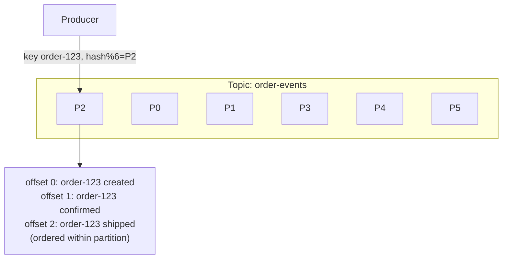
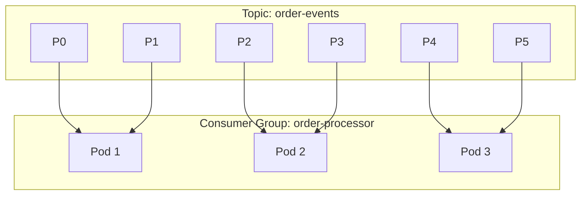
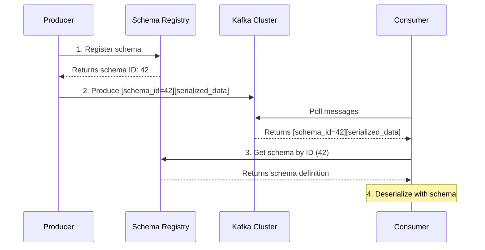
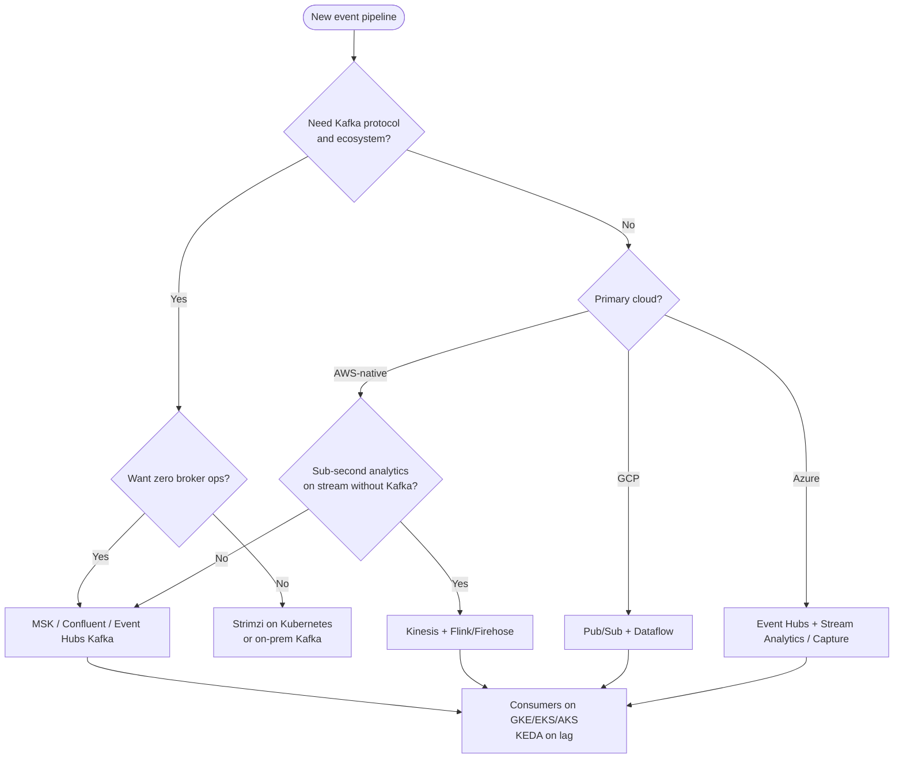

**Complexity**: `[COMPLEX]` | **Time to Complete**: 3h | **Prerequisites**: Module 9.2 (Message Brokers), Module 9.6 (Search & Analytics), distributed systems basics

## What You'll Be Able to Do

After completing this module, you will be able to:

- **Compare managed streaming platforms across AWS (Kinesis, MSK), GCP (Pub/Sub, Dataflow), and Azure (Event Hubs, Stream Analytics) and map Kafka concepts to each**
- **Configure Kubernetes consumers and KEDA scalers for managed Kafka, Kinesis lag, and Pub/Sub backlog**
- **Implement exactly-once processing patterns with Kafka transactions, idempotent consumers, and checkpointed stream processors on Kubernetes**
- **Design data pipeline architectures that combine durable logs, stream processing, and batch sinks without treating a stream like a disposable queue**

---

## Why This Module Matters

Hypothetical scenario: your platform team runs order lifecycle events through a managed queue from [Module 9.2](../module-9.2-message-brokers/). Checkout works, but the data team cannot replay last Tuesday’s traffic to retrain a fraud model, and finance cannot rebuild a ledger view because messages were deleted after acknowledgment. The queue solved decoupling; it did not solve **history, ordering at scale, and parallel replay** — the problems a **durable event log** is built for.

A team running a self-managed Kafka cluster on Kubernetes can spend significant engineering time on broker maintenance, storage operations, and version upgrades. A broker or storage failure in a self-managed cluster can degrade producers and delay downstream processing if replication health drops and recovery is slow. Managed streaming services (MSK, Confluent Cloud, Kinesis, Pub/Sub, Event Hubs) trade line-item cost and some configuration freedom for control-plane operations, elastic capacity, and integrations your SREs would otherwise own. ZooKeeper is gone on modern Kafka paths ([MSK uses KRaft for new clusters](https://aws.amazon.com/about-aws/whats-new/2024/05/amazon-msk-kraft-mode-apache-kafka-clusters/)); the operational surface area shifted from ensemble tuning to partition economics, retention, and consumer lag.

This module teaches the **log model** that underpins event-driven architectures and CDC, how AWS, GCP, and Azure expose that model differently, when to choose Kinesis shards versus Kafka partitions versus Pub/Sub subscriptions, how delivery and processing semantics differ from queue “delete on read,” and how Kubernetes workloads (Deployments, StatefulSets, KEDA) attach to those backends without becoming part-time broker operators.

---

## Event Streaming vs Message Queues vs Batch

[Module 9.2](../module-9.2-message-brokers/) covers **queues and pub/sub brokers** where the primary contract is “deliver this message to a worker and move on.” Streaming adds a different contract: **append-only, partitioned logs** with **offsets**, **retention**, and **replay**. Consumers do not delete the log when they finish; they advance a cursor (offset or checkpoint) while the platform retains bytes for a policy window.

| Pattern | Data shape | Consumer model | Best when |
|---------|------------|----------------|-----------|
| **Queue** (SQS, Service Bus queue) | Messages removed after ack | Competing consumers, DLQ | Task dispatch, job buffers |
| **Pub/Sub fan-out** (SNS→SQS, topic subscriptions) | Copy per subscription | Independent subscriber groups | Notify many services once |
| **Stream / log** (Kafka, Kinesis, Pub/Sub log, Event Hubs) | Immutable sequence per partition/shard | Consumer groups, replay, forked readers | CDC, analytics, audit, ML features |
| **Batch** (S3, GCS, ADLS, Spark) | Files / tables | Scheduled jobs | Hourly reports, training sets |

Batch pipelines tolerate minutes to hours of latency; streams target seconds or milliseconds for **continuous processing**. Many production systems are **lambda architectures**: stream for real-time path, batch for correction and heavy joins — Dataflow and Flink explicitly unify both.

> **Cross-reference**: use queues when you need simple backpressure and poison-message isolation; use streams when **multiple teams must read the same history at different speeds** without republishing from a database.

---

## The Durable Log Model (Kafka Concepts Everywhere)

Whether the product name is **topic**, **stream**, or **event hub**, the same primitives recur:

```text
Producer --(key)--> Partition/Shard 0 ── offset 0,1,2,...
                 └─ Partition/Shard 1 ── offset 0,1,2,...
Consumer Group A:  member-1 reads P0, member-2 reads P1
Consumer Group B:  independent offsets on the same log
```

**Partition (Kafka) / shard (Kinesis) / partition key (Pub/Sub ordering)** is the unit of **parallelism** and, when keyed, **per-key ordering**. **Consumer groups** (Kafka, Kinesis enhanced fan-out consumers, Pub/Sub subscriptions with multiple subscribers) divide partitions among workers. **Retention** (hours to days by default, extendable) is what makes **replay** possible — and what you pay for in storage when you keep data “just in case.”

**Change Data Capture (CDC)** connectors (Debezium, DMS, Datastream) treat database redo logs as stream sources; analytics and search indexes consume the same log as microservices, which is why streaming skills overlap with [Module 9.6](../module-9.6-search/) ingestion patterns.

---

## Multi-Cloud Managed Streaming Landscape

| Concept | AWS | Google Cloud | Azure |
|---------|-----|--------------|-------|
| Native log / stream | [Kinesis Data Streams](https://docs.aws.amazon.com/streams/latest/dev/introduction.html), [MSK (Kafka)](https://docs.aws.amazon.com/msk/latest/developerguide/what-is-msk.html) | [Pub/Sub](https://cloud.google.com/pubsub/docs/overview) | [Event Hubs](https://learn.microsoft.com/en-us/azure/event-hubs/event-hubs-about) |
| Kafka-compatible endpoint | MSK, self-managed on EC2 | Pub/Sub + Kafka clients via REST/gRPC; BigQuery export | [Event Hubs Kafka protocol](https://learn.microsoft.com/en-us/azure/event-hubs/azure-event-hubs-apache-kafka-overview) |
| Load to warehouse / lake | [Firehose](https://docs.aws.amazon.com/firehose/latest/dev/what-is-this-service.html) | [Dataflow](https://cloud.google.com/dataflow/docs/overview) → BigQuery, GCS | [Stream Analytics](https://learn.microsoft.com/en-us/azure/stream-analytics/stream-analytics-introduction), Event Hubs capture |
| Managed stream processing | [Managed Service for Apache Flink](https://docs.aws.amazon.com/managed-flink/latest/java/what-is.html) | Dataflow (Beam) | Stream Analytics SQL |
| Autoscale signal for K8s | Kinesis → [aws-kinesis-streams scaler](https://keda.sh/docs/latest/scalers/aws-kinesis-streams/); MSK → [kafka scaler](https://keda.sh/docs/latest/scalers/apache-kafka/) | [gcp-pubsub scaler](https://keda.sh/docs/latest/scalers/gcp-pubsub/) | [azure-eventhub scaler](https://keda.sh/docs/latest/scalers/azure-event-hub/) |

**MSK / Confluent / Event Hubs (Kafka protocol)** expose topics, partitions, consumer groups, and transactions (where supported). **Kinesis** exposes streams and shards with a different client API but similar ordering rules per partition key. **Pub/Sub** is subscription-centric: throughput scales with topics and subscriptions; [ordering keys](https://cloud.google.com/pubsub/docs/ordering) give per-key sequence when you need it.

---

## Core Mechanics: Throughput, Ordering, and Replay

### Producers and partition keys

Producers choose a **key** (order ID, device ID, tenant) so all events for that key land in one partition/shard, preserving order for that entity. A **null key** round-robins for maximum spread — great for telemetry, dangerous when you assumed per-customer ordering.

### Scaling units

| Platform | Scale knob | Ordering scope | Notes |
|----------|------------|----------------|-------|
| Kafka / MSK | Partitions per topic | Per partition | Split/merge not automatic; plan headroom |
| Kinesis (provisioned) | Shard count | Per shard | [Split/merge shards](https://docs.aws.amazon.com/streams/latest/dev/kinesis-using-sdk-java-resharding.html); 1 MB/s write, 2 MB/s read per shard baseline |
| Kinesis (on-demand) | Automatic | Per shard | [On-demand Standard / Advantage](https://docs.aws.amazon.com/streams/latest/dev/how-do-i-size-a-stream.html) — pay per GB ingest/retrieve |
| Pub/Sub | Topic + subscription throughput | Per ordering key | Quotas per project; [flow control](https://cloud.google.com/pubsub/docs/pull#flow_control) on subscribers |
| Event Hubs | [Throughput units (Standard)](https://learn.microsoft.com/en-us/azure/event-hubs/event-hubs-scalability) or Processing Units (Premium) | Per partition | Kafka clients use same partition model |

### Retention and replay

Kafka retention is topic-level (`retention.ms`). Kinesis defaults to 24 hours ([extendable](https://docs.aws.amazon.com/streams/latest/dev/kinesis-extended-retention.html)). Pub/Sub retains unacked messages per subscription policy ([up to 31 days on the topic](https://cloud.google.com/pubsub/docs/replay-overview) for replay features). Event Hubs supports [capture to ADLS](https://learn.microsoft.com/en-us/azure/event-hubs/event-hubs-capture-overview) for cheap long-term replay.

Replay is powerful and risky: resetting offsets or reprocessing a topic can **duplicate side effects** unless consumers are idempotent or you use transactional processing.

### Delivery vs processing guarantees

| Layer | Typical guarantee | What you must build |
|-------|-------------------|---------------------|
| Broker ingest | At-least-once to the log | Deduplicate on idempotent producer (Kafka) or accept duplicates |
| Consumer read | At-least-once delivery | Idempotent handlers, idempotency keys in DB |
| Stream processor | **Exactly-once processing (EOS)** within framework | Kafka transactions + EOS APIs; Flink checkpointing to durable store |
| End-to-end | Rarely true EOS to external DB | Outbox pattern, or merge idempotent writes |

[Pub/Sub exactly-once delivery](https://cloud.google.com/pubsub/docs/exactly-once-delivery) and [Kafka EOS design](https://kafka.apache.org/41/design/design/) narrow the window but do not remove the need for idempotent sinks.

### Backpressure and lag

When processing cannot keep up, **lag** grows (Kafka consumer lag, Kinesis iterator age, Pub/Sub oldest unacked age). CPU-based HPA often lies for I/O-bound consumers; **KEDA** scales on external metrics (see consumer group section below). Windowed aggregations (tumbling, session windows) in Flink/Dataflow need **watermarks** and bounded lateness — late events either go to side outputs or expand state cost.

### Windowing, joins, and enrichment

Stream processors answer questions like “count orders per minute per region” or “join clicks to purchases within five minutes.” **Tumbling windows** slice time into fixed buckets; **session windows** gap on inactivity; **sliding windows** overlap for moving averages. Event time — the timestamp embedded in the record — must drive windows, not `processingTime` only, or out-of-order mobile events will skew revenue dashboards.

Stream-table joins attach a changelog topic to a **KTable** (Kafka Streams) or equivalent lookup store in Flink. Dimension data (product catalog, fraud rules) should be compacted topics or external stores with TTL; unbounded hash maps in pod memory eventually OOMKill under adversarial keys. For multi-cloud pipelines, the same join logic runs in Dataflow’s `ParDo` with stateful processing or in Azure Stream Analytics with reference data blobs — the mental model transfers even when the SQL surface differs.

---

## AWS: Kinesis, MSK, Firehose, and Flink

### Kinesis Data Streams

Kinesis is AWS’s **shard-based log**. Provisioned mode bills **per shard-hour** plus PUT payload; on-demand modes bill **per GB ingested and retrieved** plus optional per-stream hourly fees ([pricing](https://aws.amazon.com/kinesis/data-streams/pricing/)). Use Kinesis when you want tight AWS integration (Lambda, Firehose, CloudWatch) without operating Kafka brokers.

```bash
# Create an on-demand stream (capacity scales with usage)
aws kinesis create-stream --stream-name order-events --stream-mode-details StreamMode=ON_DEMAND

# Put a record with partition key for ordering
aws kinesis put-record \
  --stream-name order-events \
  --partition-key "order-123" \
  --data "$(echo -n '{"event":"created"}' | base64)"
```

**Firehose** is delivery, not processing: it batches stream records to S3, Redshift, OpenSearch, or Splunk with transformation Lambda optional ([Firehose docs](https://docs.aws.amazon.com/firehose/latest/dev/basic-deliver.html)). A common EKS pattern is microservices → Kinesis → Firehose → S3 tables queried by Athena, while a separate MSK topic feeds low-latency consumers on the cluster. That split keeps expensive replay storage off the Kafka retention bill.

```bash
# Example: delivery stream targeting S3 from a Kinesis data stream
aws firehose create-delivery-stream \
  --delivery-stream-name order-events-to-s3 \
  --delivery-stream-type KinesisStreamAsSource \
  --kinesis-stream-source-configuration KinesisStreamARN=arn:aws:kinesis:us-east-1:123456789012:stream/order-events,RoleARN=arn:aws:iam::123456789012:role/firehose-role \
  --extended-s3-destination-configuration RoleARN=arn:aws:iam::123456789012:role/firehose-role,BucketARN=arn:aws:s3:::analytics-lake,Prefix=orders/
```

EKS workloads reading Kinesis use the AWS SDK or Kafka-compatible bridges; for IAM, prefer **Pod Identity** over static keys injected through Secrets. Iterator age metrics should appear on the same Grafana board as pod lag exporters.

### Amazon MSK and Confluent Cloud

MSK runs open-source Kafka with AWS patching and KRaft metadata ([MSK Serverless](https://docs.aws.amazon.com/msk/latest/developerguide/serverless.html) auto-scales brokers; provisioned clusters pick instance types and storage). Confluent Cloud adds enterprise tooling (Schema Registry, ksqlDB, Flink) with the same client protocol. Both fit teams standardizing on **Kafka clients** across clouds.

### Managed Flink on AWS

[Amazon Managed Service for Apache Flink](https://docs.aws.amazon.com/managed-flink/latest/java/what-is.html) runs SQL and DataStream jobs against Kinesis or MSK sources with managed checkpoints — alternative to self-managing Flink on Kubernetes (see Flink Operator section below).

---

## Google Cloud: Pub/Sub and Dataflow

[Cloud Pub/Sub](https://cloud.google.com/pubsub/docs/overview) decouples publishers from subscribers: many subscriptions can read the same topic independently (fan-out), unlike a queue where one consumer group competes. Pull subscribers on GKE use workload identity to call the Pub/Sub API without long-lived keys ([GKE Workload Identity](https://cloud.google.com/kubernetes-engine/docs/how-to/workload-identity)).

```bash
# Publish with ordering key (ordering enabled on subscription)
gcloud pubsub topics publish orders \
  --message='{"event":"created"}' \
  --ordering-key=order-123
```

[Dataflow](https://cloud.google.com/dataflow/docs/overview) executes Apache Beam pipelines — batch or streaming — with autoscaling workers; it is the managed answer to “Flink/Spark without patching JVM clusters.” Pair Pub/Sub → Dataflow → BigQuery for real-time analytics; use **templates** for operational guardrails.

Pub/Sub pricing is driven by publish/deliver volume and retention of unacked messages ([Pub/Sub pricing](https://cloud.google.com/pubsub/pricing) — verify current SKUs). Subscriptions with many unchecked messages during outages can accumulate storage charges; dead-letter topics and max-delivery attempts mirror the DLQ patterns from Module 9.2. For GKE consumers, use gRPC pull with flow-control limits so a single slow pod does not hoard messages — the subscription backlog is shared, but effective throughput is only as fast as the slowest acking subscriber in some configurations.

```yaml
# Illustrative GKE consumer env (Workload Identity handles auth)
apiVersion: apps/v1
kind: Deployment
metadata:
  name: order-pubsub-consumer
  namespace: streaming
spec:
  replicas: 4
  template:
    spec:
      serviceAccountName: pubsub-consumer
      containers:
        - name: app
          image: mycompany/order-consumer:1.4.0
          env:
            - name: PUBSUB_SUBSCRIPTION
              value: projects/my-proj/subscriptions/order-processor
            - name: FLOW_CONTROL_MAX_MESSAGES
              value: "1000"
```

When you need Kafka client libraries on GCP without hosting brokers, some teams run Kafka protocol gateways or migrate to Pub/Sub-native clients; fighting the platform’s native API usually costs more in connectors than adopting Pub/Sub subscriptions with ordering keys.

---

## Azure: Event Hubs and Stream Analytics

[Azure Event Hubs](https://learn.microsoft.com/en-us/azure/event-hubs/event-hubs-about) is a Kafka-protocol-compatible log at the Premium and Standard tiers (with partition/TU limits per SKU). Producers can use native AMQP/HTTP or **Kafka client libraries** pointing at the Event Hubs bootstrap ([Kafka overview](https://learn.microsoft.com/en-us/azure/event-hubs/azure-event-hubs-apache-kafka-overview)).

[Azure Stream Analytics](https://learn.microsoft.com/en-us/azure/stream-analytics/stream-analytics-introduction) provides SQL-over-stream jobs with inputs from Event Hubs, IoT Hub, or Blob — good for teams that want declarative windows without hosting Flink jars.

Event Hubs **Capture** archives batches to ADLS for replay and batch correction — analogous to Firehose plus S3, and often the cost-effective way to retain years of history without holding everything in hot Kafka retention.

Standard namespaces bill in **throughput units (TUs)**; Premium uses **processing units (PUs)** with isolated compute for predictable latency ([Event Hubs scalability](https://learn.microsoft.com/en-us/azure/event-hubs/event-hubs-scalability)). Kafka-compatible clients still require you to size **partition count** up front — TU/PU limits cap how many megabytes per second the namespace accepts regardless of how many AKS pods you run.

```properties
# Kafka producer/consumer bootstrap for Event Hubs (example)
bootstrap.servers=your-namespace.servicebus.windows.net:9093
security.protocol=SASL_SSL
sasl.mechanism=PLAIN
sasl.jaas.config=org.apache.kafka.common.security.plain.PlainLoginModule required username="$ConnectionString" password="Endpoint=sb://...";
```

AKS workloads should use **Entra Workload ID** instead of embedding connection strings in manifests. Pair Stream Analytics for declarative aggregates (five-minute tumbling windows on telemetry) while microservices on AKS handle complex per-order state machines that SQL cannot express cleanly.

---

## Operational Runbooks: Capacity, Upgrades, and Failure Modes

### Capacity planning worksheet

Start from peak ingress MB/s, number of independent consumer groups, retention hours, and fan-out factor (how many distinct readers copy the same stream). For Kafka, multiply partitions by per-partition throughput ceiling on your SKU; for Kinesis, convert MB/s to shards or pick on-demand and model GB/month; for Pub/Sub, use quota dashboards plus backlog growth alerts; for Event Hubs, map TU/PU limits to partition throughput. Document the answer in the service repo so Kubernetes `maxReplicas` on KEDA objects cannot exceed the broker contract.

### Upgrades and schema changes

Broker upgrades on managed services are provider-driven — still schedule maintenance windows because client protocol versions and ACL formats change. Application upgrades are riskier: consumers on new code with old schemas fail deserialization. Roll out **schema registry changes** before binary deploys, deploy consumers with backward-compatible readers first, then producers. On Kubernetes, use canary Deployments (10% replicas) on a separate consumer group reading a shadow topic before cutting traffic.

### Failure modes and mitigations

| Symptom | Likely cause | Mitigation |
|---------|--------------|------------|
| Sudden lag spike, flat CPU | Downstream DB/API slow | Scale consumers only after fixing dependency; tune pool sizes |
| Lag spike after deploy | Rebalance storm | Limit surge, use sticky assignor, increase session timeout carefully |
| Repeated poison messages | Bad schema or corrupt payload | DLQ topic/subscription, quarantine bytes, alert on DLQ rate |
| Throttling (Kinesis/Pub/Sub) | Hot key or shard/TU exhaustion | Reshard, increase TU/PU, or split topics |
| ISR shrink / broker offline (Kafka) | AZ outage or disk | Managed failover; for Strimzi, verify rack awareness and RF |

Hypothetical scenario: during a regional AZ impairment, MSK maintains quorum but clients on nodes in the impaired AZ timeout. Kubernetes may reschedule pods to healthy AZs faster than DNS caches refresh — pin consumers to topology spread constraints across zones and use broker bootstrap lists that include brokers in all AZs. For Pub/Sub and Kinesis, regional endpoints mean your mitigation is failover consumers in another region reading a replicated stream or accepting RPO>0 from capture files.

### Security and compliance checkpoints

Encrypt in transit (TLS/SASL) for every managed SKU, encrypt at rest with customer-managed keys where auditors require it, and scope IAM/Entra/GCP roles per topic/stream. Log access to administrative APIs (topic creation, subscription purge) through cloud audit logs. For PCI/PHI, keep cardholder or patient identifiers out of partition keys if logs echo keys in plaintext.

---

## Managed Kafka vs In-Cluster Strimzi

### Managed vs self-hosted comparison

Teams routinely underestimate the **hidden cost** of operating brokers: JVM heap tuning across AZs, storage expansion during retention spikes, inter-broker TLS rotation, and incident bridges when a single slow disk stalls ISR. Managed offerings convert those hours into dollars per partition-hour or per GB, which is why the crossover in total cost of ownership often favors MSK once engineer salary is included — even when raw EC2 for Strimzi looks cheaper on a spreadsheet.

| Factor | Managed (MSK/Confluent) | In-Cluster (Strimzi on K8s) |
|--------|------------------------|-----------------------------|
| Operational burden | Provider handles brokers, patching, storage | You handle everything |
| Cost at small scale | Often higher, depending on the managed offering and pricing model | Lower if you can efficiently share cluster resources |
| Cost at large scale | Often cheaper (no ops engineer time) | Higher (hidden ops costs) |
| Network latency | Typically low, but depends on network path and deployment topology | Often lowest when producers and consumers stay in-cluster |
| Customization | Limited (provider-defined configs) | Full control |
| Multi-cluster | Each cluster is independent | Strimzi MirrorMaker2 for replication |
| Kafka version | Provider-supported versions on the provider's release cadence | You choose and operate the version yourself |
| ZooKeeper | Gone (KRaft mode on MSK since 2024) | Strimzi manages for you |

### When to Choose Each

**Choose managed Kafka (MSK, Confluent Cloud, Event Hubs with Kafka protocol)** when your team lacks dedicated broker SREs, sustained throughput exceeds what you can operate safely on StatefulSets, or regulatory durability requirements demand provider-managed replication and patching. Financial and healthcare telemetry often lands here because control-plane uptime and audit trails matter more than marginal per-partition savings from self-hosting.

**Choose Strimzi (or bare-metal Kafka) on Kubernetes** when sub-millisecond producer-to-consumer latency inside the cluster is mandatory, traffic is low enough that broker operational cost exceeds managed SKUs, you must tune obscure broker configs (custom interceptors, authorizer plugins), or you deploy to environments without regional managed offerings (on-prem factories, edge sites, air-gapped enclaves). Budget for 24/7 paging when broker disks fail — managed services convert that risk into a line item.

### Strimzi Quick Setup (for comparison)

```yaml
# Strimzi Kafka cluster in Kubernetes (KRaft, no ZooKeeper)
apiVersion: kafka.strimzi.io/v1beta2
kind: KafkaNodePool
metadata:
  name: broker
  namespace: kafka
  labels:
    strimzi.io/cluster: event-cluster
spec:
  replicas: 3
  roles: [controller, broker]
  storage:
    type: jbod
    volumes:
      - id: 0
        type: persistent-claim
        size: 500Gi
        class: gp3-encrypted
  resources:
    requests:
      memory: 4Gi
      cpu: "2"
---
apiVersion: kafka.strimzi.io/v1beta2
kind: Kafka
metadata:
  name: event-cluster
  namespace: kafka
  annotations:
    strimzi.io/node-pools: enabled
    strimzi.io/kraft: enabled
spec:
  kafka:
    version: 4.0.0
    listeners:
      - name: plain
        port: 9092
        type: internal
        tls: false
      - name: tls
        port: 9093
        type: internal
        tls: true
    config:
      offsets.topic.replication.factor: 3
      transaction.state.log.replication.factor: 3
      transaction.state.log.min.isr: 2
      default.replication.factor: 3
      min.insync.replicas: 2
      num.partitions: 12
  entityOperator:
    topicOperator: {}
    userOperator: {}
```

---

## Partitioning: The Foundation of Kafka Scalability

A Kafka topic is divided into partitions. Partitions are the unit of parallelism — more partitions means more consumers in the same group can process data concurrently, up to one consumer per partition. The same idea appears on other clouds under different names: Kinesis **shards**, Event Hubs **partitions**, and Pub/Sub **ordering keys** that map to ordered sequences. Misunderstanding this mapping is the most common reason streaming pipelines “scale out” in Kubernetes but fail to increase throughput.

Planning partition count is a capacity exercise, not a guess. Too few partitions caps throughput and forces oversized pods; too many increases metadata overhead, rebalance time, and storage fragmentation on Kafka. For MSK and Event Hubs, changing partition counts later is possible but disruptive — consumers rebalance, and keys may land on new partitions, so ordering per key is preserved but historical locality is not. For Kinesis provisioned mode, you split or merge shards explicitly; on-demand modes hide shard management but you still pay for throughput and retention per actual usage.

### How Partitions Work



### Partition Count Guidelines

| Throughput | Partitions | Reasoning |
|-----------|-----------|-----------|
| < 10 MB/s | 6 | Enough for small workloads, easy to manage |
| 10-100 MB/s | 12-24 | Allows 12-24 parallel consumers |
| 100 MB/s - 1 GB/s | 50-100 | Match consumer count to partition count |
| > 1 GB/s | 100+ | Carefully test; more partitions = more overhead |

**Rule of thumb**: partitions should equal or exceed the maximum number of consumers in your largest consumer group.

### Partition Key Design

The partition key determines which partition a message lands in. All messages with the same key go to the same partition (in order).

```python
from confluent_kafka import Producer

producer = Producer({
    'bootstrap.servers': 'msk-broker1:9092,msk-broker2:9092',
    'acks': 'all',
    'enable.idempotence': True,
    'max.in.flight.requests.per.connection': 5,
})

# Key by order_id -- all events for one order are in the same partition
def publish_order_event(order_id, event_type, payload):
    producer.produce(
        topic='order-events',
        key=str(order_id).encode('utf-8'),
        value=json.dumps({
            'order_id': order_id,
            'event_type': event_type,
            'payload': payload,
            'timestamp': datetime.utcnow().isoformat()
        }).encode('utf-8'),
        callback=delivery_report,
    )
    producer.flush()

def delivery_report(err, msg):
    if err:
        print(f"Delivery failed: {err}")
    else:
        print(f"Delivered to {msg.topic()} [{msg.partition()}] @ offset {msg.offset()}")
```

**Common key strategies:**

- **Customer ID** — All events for one customer stay ordered, which matters for account-level fraud rules and support tooling that reconstructs timelines.
- **Order ID** — Lifecycle events (created → paid → shipped) remain ordered without cross-order head-of-line blocking.
- **Null key** — Round-robin across partitions maximizes throughput when order is irrelevant (metrics, clickstream without session stickiness).
- **Tenant ID** — SaaS isolation: noisy tenants get their own partition subset when combined with topic-per-tenant or salted keys.

Advanced teams implement **key-aware autoscaler hints**: if one tenant dominates traffic, observability tags `tenant_id` in metrics and routes that tenant to a dedicated topic rather than overheating a shared partition. On Kinesis, the partition key maps to a hash of the key modulo shard count; on Pub/Sub, ordering keys must be enabled on the subscription and producers must include the key on every publish.

**Pause and predict:** Consider a Kafka topic configured with 12 partitions and a consumer Deployment with 15 replicas in one consumer group. What happens to the last 3 pods, and how will Kubernetes metrics report their operational health?

<details>
<summary>Check your prediction</summary>

Each partition is assigned to exactly one consumer in a group. Extra members get zero partitions and sit idle while Kubernetes still reports Ready. [Each partition is assigned exclusively within a consumer group](https://kafka.apache.org/intro). The Kafka consumer group coordination protocol allocates the 12 available partitions across 12 pods, leaving the remaining 3 replica pods without any assigned topic partitions. Because these idle pods remain healthy processes that successfully poll the broker cluster and pass HTTP liveness or readiness probes, Kubernetes reports them as fully running and Ready even though they perform zero event processing work.
</details>

The next section is how consumer lag metrics and KEDA scalers tell you when processing cannot keep up with the durable log.

---

## Consumer Groups and Lag Monitoring

Consumer groups are the bridge between **durable logs** and **Kubernetes scale**. Whether the broker is MSK, Event Hubs, or a Strimzi cluster inside the cluster, platform engineers should publish the **partition count as part of the topic contract** alongside schema version and retention, because application teams cannot HPA their way past a three-partition topic.

Lag is the operational heartbeat. For Kafka, exporters surface `kafka_consumergroup_lag`; for Kinesis, **GetRecords.IteratorAgeMilliseconds** indicates how far behind the consumer is; for Pub/Sub, **oldest_unacked_message_age** plays the same role. Alert on lag growth rate, not instantaneous spikes during deploys, and correlate lag with downstream dependency latency (databases, payment APIs) before blaming the broker.

### Consumer Group Mechanics



Each pod gets an equal share of partitions. Adding worker pods triggers partition rebalancing to redistribute partition assignments across active group members.

### Kubernetes Consumer Deployment

```yaml
apiVersion: apps/v1
kind: Deployment
metadata:
  name: order-processor
  namespace: streaming
spec:
  replicas: 6    # Match partition count
  selector:
    matchLabels:
      app: order-processor
  template:
    metadata:
      labels:
        app: order-processor
    spec:
      serviceAccountName: kafka-consumer
      containers:
        - name: consumer
          image: mycompany/order-processor:2.3.0
          env:
            - name: KAFKA_BROKERS
              value: "b-1.msk-cluster.abc123.kafka.us-east-1.amazonaws.com:9092,b-2.msk-cluster.abc123.kafka.us-east-1.amazonaws.com:9092"
            - name: KAFKA_TOPIC
              value: "order-events"
            - name: KAFKA_GROUP_ID
              value: "order-processor"
            - name: KAFKA_AUTO_OFFSET_RESET
              value: "earliest"
            - name: KAFKA_SECURITY_PROTOCOL
              value: "SASL_SSL"
            - name: KAFKA_SASL_MECHANISM
              value: "AWS_MSK_IAM"
          resources:
            requests:
              cpu: 500m
              memory: 512Mi
```

### Consumer Lag Monitoring

Consumer lag is the difference between the latest message in a partition and the last message processed by a consumer. High lag means consumers are falling behind.

```
Partition 3:
  Latest offset:    1,000,000
  Consumer offset:    985,000
  Lag:                 15,000 messages
```

### Monitoring with Prometheus and Kafka Exporter

```yaml
# Deploy kafka-exporter for Prometheus metrics
apiVersion: apps/v1
kind: Deployment
metadata:
  name: kafka-exporter
  namespace: monitoring
spec:
  replicas: 1
  selector:
    matchLabels:
      app: kafka-exporter
  template:
    metadata:
      labels:
        app: kafka-exporter
      annotations:
        prometheus.io/scrape: "true"
        prometheus.io/port: "9308"
    spec:
      containers:
        - name: exporter
          image: danielqsj/kafka-exporter:v1.8.0
          args:
            - --kafka.server=b-1.msk-cluster.abc123.kafka.us-east-1.amazonaws.com:9092
            - --kafka.server=b-2.msk-cluster.abc123.kafka.us-east-1.amazonaws.com:9092
            - --topic.filter=order-.*
            - --group.filter=.*
          ports:
            - containerPort: 9308
```

```yaml
# PrometheusRule for consumer lag alerts
apiVersion: monitoring.coreos.com/v1
kind: PrometheusRule
metadata:
  name: kafka-lag-alerts
  namespace: monitoring
spec:
  groups:
    - name: kafka-consumer-lag
      rules:
        - alert: KafkaConsumerLagHigh
          expr: |
            sum by (consumergroup, topic) (kafka_consumergroup_lag) > 50000
          for: 10m
          labels:
            severity: warning
          annotations:
            summary: "Consumer group {{ $labels.consumergroup }} has high lag on {{ $labels.topic }}"
        - alert: KafkaConsumerLagCritical
          expr: |
            sum by (consumergroup, topic) (kafka_consumergroup_lag) > 500000
          for: 5m
          labels:
            severity: critical
          annotations:
            summary: "Consumer group {{ $labels.consumergroup }} critically behind on {{ $labels.topic }}"
```

### KEDA Scaling on Consumer Lag

```yaml
apiVersion: keda.sh/v1alpha1
kind: ScaledObject
metadata:
  name: order-processor-scaler
  namespace: streaming
spec:
  scaleTargetRef:
    name: order-processor
  minReplicaCount: 3
  maxReplicaCount: 12    # Never exceed partition count
  pollingInterval: 10
  triggers:
    - type: kafka
      metadata:
        bootstrapServers: b-1.msk-cluster.abc123.kafka.us-east-1.amazonaws.com:9092
        consumerGroup: order-processor
        topic: order-events
        lagThreshold: "1000"
        offsetResetPolicy: earliest
```

### Multi-cloud KEDA triggers (same pattern, different scalers)

The ScaledObject above uses the Kafka scaler against MSK bootstrap servers. For Kinesis-backed consumers on EKS, swap the trigger for `aws-kinesis-stream` metadata (`streamName`, `awsRegion`, iterator age threshold). On GKE with Pub/Sub pull subscribers, use `gcp-pubsub` with the subscription ID and unacked message threshold. On AKS with Event Hubs, use `azure-eventhub` with connection strings or workload identity and the consumer group name. In every case, set `maxReplicaCount` ≤ partition/shard count and use **cooperative rebalancing** settings on Kafka clients to avoid stop-the-world partition moves during scale events.

When lag clears, scale down slowly. Aggressive scale-in triggers rebalance storms that pause processing and can duplicate processing windows if commits were in flight. A `cooldownPeriod` and `pollingInterval` that match your P99 processing time are as important as the lag threshold itself.

---

## Exactly-Once Processing and Stateful Consumers

Stream processing pipelines requiring high data integrity must carefully choose delivery guarantees that match their downstream business consequences. While at-most-once semantics drops lost records and at-least-once introduces duplicate events during retries, financial ledgers and inventory systems demand strict correctness. Guaranteeing robust processing requires understanding how transactional boundaries coordinate across brokers, stateful storage engines, and container runtimes.

**Pause and predict:** An engineering team enables Kafka transactions and idempotent producers to achieve exactly-once processing within their streaming pipeline. Does this configuration guarantee that writes to an external relational database or HTTP API will never be duplicated during pod failures and retries?

<details>
<summary>Check your prediction</summary>

Kafka exactly-once is consume→process→produce on Kafka topics. External DB/API sinks still need idempotent writes / cooperation with that system. [Kafka achieves exactly-once semantics (EOS) for read-process-write loops inside the Kafka ecosystem](https://kafka.apache.org/41/design/design/) through idempotent producers, transactions, and consumer offset commits that participate in the same transaction boundary. However, Kafka transactions cannot span external non-Kafka systems like PostgreSQL, Elasticsearch, or third-party HTTP endpoints. Flink and Beam (Dataflow) pursue a different but related guarantee: exactly-once processing relative to checkpoints stored in S3, GCS, or Azure Blob where failures roll back to the last successful checkpoint. Similarly, Pub/Sub's [exactly-once delivery](https://cloud.google.com/pubsub/docs/exactly-once-delivery) narrows duplicate delivery at the subscription layer when enabled, but your GKE handler must still write idempotently to Postgres or call external APIs with safe retries. Kinesis consumers achieve effectively-once by storing checkpoints in DynamoDB or by using Flink with managed checkpoints; there is no single transaction knob like Kafka's `send_offsets_to_transaction`.
</details>

The next section is how a transactional producer commits consumer offsets and derived events together on Kafka topics.

### The Transactional Pipeline

When a stream processing application consumes from Topic A, processes the event, and writes to Topic B, the consumer offset commitment and the producer write must happen atomically.

```python
from confluent_kafka import Producer, Consumer

# 1. Producer requires a transactional.id
producer = Producer({
    'bootstrap.servers': 'msk-cluster:9092',
    'transactional.id': 'order-processor-txn-1',
    'enable.idempotence': True
})
producer.init_transactions()

# 2. Consume an event
msg = consumer.poll(timeout=1.0)
if msg:
    producer.begin_transaction()
    try:
        # 3. Process and produce derived event
        producer.produce('enriched-orders', key=msg.key(), value=enrich(msg.value()))
        
        # 4. Send the consumer offsets as part of the transaction
        producer.send_offsets_to_transaction(
            consumer.position(consumer.assignment()), 
            consumer.consumer_group_metadata()
        )
        # 5. Commit atomically
        producer.commit_transaction()
    except Exception:
        producer.abort_transaction()
```

### Why StatefulSets for Kafka Streams?

**Pause and predict:** Consider a stateful Kafka Streams application that maintains a local RocksDB key-value cache on ephemeral pod disk. What happens to this local cache if the application runs as a standard Deployment and a pod restarts, and how does this affect recovery time?

<details>
<summary>Check your prediction</summary>

Kafka Streams local RocksDB on empty ephemeral disk is gone after restart; restore is changelog replay (slow). PVC/StatefulSet and optional standby replicas cut restore time. When a stream processor keeps local state on ephemeral pod storage, a restarted pod loses that local state and must restore it from the changelog before normal processing resumes. Rebuilding gigabytes of key-value state over the network delays consumer partition readiness and extends rebalance durations. A StatefulSet with persistent volume claims keeps RocksDB across pod recreation so restore is a smaller changelog catch-up; standby replicas (`num.standby.replicas`) make failover near-instant.
</details>

The next section is how streaming workloads on Kubernetes use identity, networking, and disruption budgets without running the brokers.

Instead, stream processors with local state should be deployed as a `StatefulSet` with persistent volume claims to avoid expensive remote changelog rebuilds:

```yaml
apiVersion: apps/v1
kind: StatefulSet
metadata:
  name: payment-aggregator
  namespace: streaming
spec:
  serviceName: "payment-aggregator"
  replicas: 6
  selector:
    matchLabels:
      app: payment-aggregator
  template:
    metadata:
      labels:
        app: payment-aggregator
    spec:
      containers:
        - name: processor
          image: mycompany/payment-aggregator:1.2.0
          volumeMounts:
            - name: state-store
              mountPath: /var/lib/kafka-streams
  volumeClaimTemplates:
    - metadata:
        name: state-store
      spec:
        accessModes: [ "ReadWriteOnce" ]
        resources:
          requests:
            storage: 50Gi
```

By using a `StatefulSet`, `payment-aggregator-0` maintains its stable network identity and keeps its `state-store` volume across restarts. When the pod comes back up, its RocksDB cache is already populated, requiring only a minimal delta update before processing resumes.

On Azure Event Hubs and GCP with Kafka-compatible bridges, the same transactional code paths apply only where the broker supports Kafka transactions; otherwise implement idempotent sinks and store checkpoints in an external store (Blob, DynamoDB, Firestore) with the same semantics you would expect from `commit_transaction()` in the Python example above.

---

## Kubernetes Integration for Streaming Workloads

Running consumers on Kubernetes while brokers stay managed is the default healthy split: the data plane (Kafka, Kinesis, Pub/Sub, Event Hubs) lives in the cloud control plane, and the compute plane (your Deployments, StatefulSets, KEDA ScaledObjects) lives on the cluster. The integration work is authentication, network path, and observability — not running ZooKeeper pods.

### Workload identity and keyless access

Long-lived broker passwords in Secrets rot slowly and leak broadly when mounted into many namespaces. Prefer cloud-native workload identity: **EKS Pod Identity / IRSA** for MSK IAM authentication and Kinesis `PutRecord`, **GKE Workload Identity Federation** for Pub/Sub and Dataflow launchers, **Entra Workload ID** for Event Hubs and Azure Monitor exporters. The pod’s `ServiceAccount` maps to an IAM role or federated principal with least privilege — produce-only for ingest services, consume-only for read services, never cluster-admin for an app that only reads one topic.

For secrets that must still exist (SASL passwords, registry API keys), use **External Secrets Operator** or **Secrets Store CSI** (covered in Module 9.8) so Kubernetes Secrets are short-lived projections of Secrets Manager, Secret Manager, or Key Vault. Rotate on the cloud side; pods pick up new versions on restart or via reload sidecars.

### Networking and DNS

MSK and Event Hubs often expose **private endpoints** inside your VPC/VNet. Consumers on Kubernetes need security groups / network policies that allow egress to broker ports (9092/9094/9098 depending on auth mode) and DNS resolution of broker bootstrap hostnames. For cross-cloud disaster recovery, avoid hard-coding a single bootstrap list in a ConfigMap without versioning — use ExternalName services or a small discovery Deployment that watches cluster metadata.

Pub/Sub and Kinesis clients use HTTPS/gRPC to regional endpoints; ensure **egress NAT** and firewall rules allow those APIs from worker nodes, not only from a bastion. If you use service mesh mTLS between pods, remember the mesh terminates at the pod boundary — TLS to the broker is a separate hop configured in the Kafka client properties.

### Observability beyond lag

Export broker metrics (MSK open monitoring, Event Hubs metrics, Pub/Sub monitoring) into the same Prometheus/Grafana stack as application RED metrics. Dashboards should correlate **lag**, **process latency**, and **downstream error rate** on one row per consumer group. For Kubernetes, add pod labels `topic`, `consumer_group`, and `stream` so on-call engineers can trace from alert to Deployment in one click.

Structured logs should include `partition`, `offset`, and `key_hash` (not raw PII keys) so replay debugging does not require turning on debug logging globally. Tracing (OpenTelemetry) across consume → process → produce chains helps find slow stages in Flink mini-batches and Kafka Streams punctuators alike.

### Resource sizing and disruption budgets

Consumers are often **memory-heavy** (deserialization buffers, RocksDB block cache) with modest CPU until compression or JSON parsing spikes. Set requests/limits from load tests with realistic message sizes — a 256 KB max message policy on the broker does not help if your app allocates multi-megabyte byte arrays per message.

Use `PodDisruptionBudgets` on Stateful stream processors so node drains wait for checkpoint completion. For Deployments, pair `maxUnavailable: 1` with cooperative consumer protocols to limit rebalance churn during cluster upgrades.

---

## Schema Registry: Data Contracts for Events

Without schema management, producers can change the event structure without warning, breaking consumers in other namespaces or other companies’ microservices that share the topic.

### The Problem

```
Week 1: {"order_id": "123", "amount": 49.99, "currency": "USD"}
Week 2: {"orderId": "123", "total": 49.99}  <-- broke every consumer
```

### Schema Registry Architecture



### Confluent Schema Registry on Kubernetes

```yaml
apiVersion: apps/v1
kind: Deployment
metadata:
  name: schema-registry
  namespace: streaming
spec:
  replicas: 2
  selector:
    matchLabels:
      app: schema-registry
  template:
    metadata:
      labels:
        app: schema-registry
    spec:
      containers:
        - name: schema-registry
          image: confluentinc/cp-schema-registry:7.7.0
          ports:
            - containerPort: 8081
          env:
            - name: SCHEMA_REGISTRY_HOST_NAME
              valueFrom:
                fieldRef:
                  fieldPath: status.podIP
            - name: SCHEMA_REGISTRY_KAFKASTORE_BOOTSTRAP_SERVERS
              value: "b-1.msk-cluster.abc123.kafka.us-east-1.amazonaws.com:9092"
            - name: SCHEMA_REGISTRY_KAFKASTORE_SECURITY_PROTOCOL
              value: "SASL_SSL"
          resources:
            requests:
              cpu: 250m
              memory: 512Mi
---
apiVersion: v1
kind: Service
metadata:
  name: schema-registry
  namespace: streaming
spec:
  selector:
    app: schema-registry
  ports:
    - port: 8081
```

### Registering and Using Schemas

```bash
# Register an Avro schema for order events
curl -XPOST "http://schema-registry:8081/subjects/order-events-value/versions" \
  -H "Content-Type: application/vnd.schemaregistry.v1+json" \
  -d '{
  "schema": "{\"type\":\"record\",\"name\":\"OrderEvent\",\"namespace\":\"com.example\",\"fields\":[{\"name\":\"order_id\",\"type\":\"string\"},{\"name\":\"event_type\",\"type\":{\"type\":\"enum\",\"name\":\"EventType\",\"symbols\":[\"CREATED\",\"CONFIRMED\",\"SHIPPED\",\"DELIVERED\",\"CANCELLED\"]}},{\"name\":\"amount\",\"type\":\"double\"},{\"name\":\"currency\",\"type\":\"string\"},{\"name\":\"timestamp\",\"type\":\"long\",\"logicalType\":\"timestamp-millis\"}]}"
}'

# Set compatibility mode (BACKWARD = new schema can read old data)
curl -XPUT "http://schema-registry:8081/config/order-events-value" \
  -H "Content-Type: application/vnd.schemaregistry.v1+json" \
  -d '{"compatibility": "BACKWARD"}'
```

### Schema Compatibility Modes

| Mode | Rule | Example |
|------|------|---------|
| **BACKWARD** | New schema can read old data | Adding optional field with default |
| **FORWARD** | Old schema can read new data | Removing optional field |
| **FULL** | Both backward and forward | Only adding/removing optional fields with defaults |
| **NONE** | No compatibility checking | Any change allowed (dangerous) |

For many event pipelines, **BACKWARD** compatibility is a common default because it lets newer consumers read messages produced by older producers. **FORWARD** compatibility protects old consumers reading new data — useful when producers upgrade first in a tightly coupled fleet. **FULL** is the safest default for widely shared topics but restricts schema evolution to additive optional fields with defaults.

Confluent Schema Registry on Kubernetes (Deployment above) is one implementation; AWS Glue Schema Registry and Apicurio provide similar gates. The registry stores Avro, JSON Schema, or Protobuf definitions versioned per subject (`topic-value`). Producers embed schema IDs in the payload wire format; consumers fetch definitions before deserialize. When registration is rejected, the producer fails fast — far cheaper than poisoning a million-message topic.

Operational tips for GKE/EKS/AKS: run registry behind internal ingress with mTLS, replicate read caching in consumers, and backup schema subjects before major merges. Pair with CI jobs that register schemas from `main` branches so application deploys cannot outrun contract publication.

**Pause and predict:** An engineering team plans to update an existing schema by changing an integer field `quantity` to a string field `quantity_str`. If the subject enforces default BACKWARD compatibility, what will the schema registry do when the producer attempts registration?

<details>
<summary>Check your prediction</summary>

Schema Registry default BACKWARD. Changing a field type Number→String is incompatible; the registry rejects it or you cut over to a new topic. Under BACKWARD compatibility, new schemas must be able to read data written by older schemas. Changing a field type from an integer to a string breaks deserialization because consumers running the new schema cannot parse existing binary payloads where the field was encoded as an integer. Because this violates schema evolution rules, the Schema Registry rejects the registration request, preventing the producer from emitting malformed events onto the topic.
</details>

The next section is how change data capture connectors and analytical stream processors route operational events across streaming and batch boundaries.

---

## CDC, Analytics, and the Stream–Batch Boundary

Database **change data capture** feeds the same managed logs this module covers: Debezium reading MySQL binlog → Kafka/MSK, Datastream → Pub/Sub, or SQL Server CDC → Event Hubs. Kubernetes-hosted connectors (Strimzi KafkaConnect, custom Deployments) should run in isolated node pools because connector lag affects database source systems — long transactions on the OLTP side if binlog consumption stalls.

The analytics path often forks: **hot** stream processors compute metrics for dashboards and fraud rules; **warm** Firehose or Event Hubs Capture lands Avro/Parquet in object storage; **cold** Spark or BigQuery batch jobs correct late data. Teach teams that replay from object storage is cheaper than infinite Kafka retention, but replay latency is higher — design retention for operational recovery (hours–days), not multi-year history unless compliance mandates it.

Joining streams to **Kubernetes-served gRPC APIs** for enrichment is tempting; protect those APIs with bulkheads and circuit breakers so lag events do not retry-storm your catalog service. Cache enrichment keys in the processor state store where possible.

---

## Stream Processing on Kubernetes

Stream processing turns a passive log into derived streams, aggregates, and alerts. The deployment model splits into **libraries in your pods** (Kafka Streams), **operators managing clustered runtimes** (Flink Kubernetes Operator), and **fully managed cloud runners** (Dataflow, Managed Flink, Stream Analytics). Kubernetes is the natural home for the first two when you need custom JARs, GPU, or sidecars; managed runners win when checkpoint storage, autoscaler, and patch cadence should not live on your platform backlog.

Windowed computation — tumbling counts per minute, session gaps for user activity, joins between order stream and payment stream — requires **event time** and **watermarks** in Flink/Beam, not just wall-clock processing time. Late events either update retractions (stream-table duality) or land in side outputs; skipping that design leads to silent under-counting during network delays.

### Architecture Options

| Tool | Deployment Model | Best For | Complexity |
|------|-----------------|----------|------------|
| Kafka Streams | Library (runs in your pods) | Simple transformations, joins | Low |
| Apache Flink | Operator (FlinkDeployment) | Complex event processing, windows | High |
| ksqlDB | Deployment | SQL-like stream processing | Medium |
| [Google Dataflow](https://cloud.google.com/dataflow/docs/overview) | Managed (GCP only) | Batch + stream unified | Medium |

### Kafka Streams Application on Kubernetes

```yaml
apiVersion: apps/v1
kind: Deployment
metadata:
  name: order-enricher
  namespace: streaming
spec:
  replicas: 6
  selector:
    matchLabels:
      app: order-enricher
  template:
    metadata:
      labels:
        app: order-enricher
    spec:
      containers:
        - name: enricher
          image: mycompany/order-enricher:1.0.0
          env:
            - name: KAFKA_BROKERS
              value: "b-1.msk-cluster.abc123.kafka.us-east-1.amazonaws.com:9092"
            - name: APPLICATION_ID
              value: "order-enricher"
            - name: INPUT_TOPIC
              value: "raw-orders"
            - name: OUTPUT_TOPIC
              value: "enriched-orders"
            - name: SCHEMA_REGISTRY_URL
              value: "http://schema-registry:8081"
            - name: STATE_DIR
              value: "/tmp/kafka-streams"
          resources:
            requests:
              cpu: "1"
              memory: 2Gi
          volumeMounts:
            - name: state-store
              mountPath: /tmp/kafka-streams
      volumes:
        - name: state-store
          emptyDir:
            sizeLimit: 10Gi
```

### Flink on Kubernetes (Flink Operator)

```yaml
apiVersion: flink.apache.org/v1beta1
kind: FlinkDeployment
metadata:
  name: order-analytics
  namespace: streaming
spec:
  image: mycompany/flink-order-analytics:1.0.0
  flinkVersion: v1_19
  flinkConfiguration:
    taskmanager.numberOfTaskSlots: "2"
    state.backend: rocksdb
    state.checkpoints.dir: s3://flink-checkpoints/order-analytics
    execution.checkpointing.interval: "60000"
  serviceAccount: flink-sa
  jobManager:
    resource:
      memory: "2048m"
      cpu: 1
  taskManager:
    resource:
      memory: "4096m"
      cpu: 2
    replicas: 3
  job:
    jarURI: local:///opt/flink/usrlib/order-analytics.jar
    parallelism: 6
    upgradeMode: savepoint
```

### Beam on Dataflow (GCP) from GKE producers

GKE microservices publish to Pub/Sub; Dataflow jobs (template or classic) read the subscription with autoscaling workers. The Kubernetes cluster is not hosting the heavy workers — only the producers — which keeps cluster autoscaling simple. Use **shared VPC** and private Google access so traffic does not hairpin over the public internet. For Azure, Stream Analytics jobs ingest from Event Hubs while AKS consumers handle low-latency alerting paths in parallel.

### When to keep processors on-cluster

Choose Flink or Kafka Streams on Kubernetes when you need **custom operators**, on-prem hybrid, or strict data residency where managed Flink/Dataflow regions are unacceptable. Budget for StatefulSets, PVCs for RocksDB, and S3-compatible checkpoint buckets (`s3://`, `gs://`, `abfss://`) with lifecycle policies so failed job restarts do not replay from epoch zero.

---

## Setting Up Amazon MSK

Provisioning MSK is the AWS-native path when you want Kafka protocol compatibility without operating brokers on EC2 or inside EKS. **Serverless** suits spiky dev/test and early production where partition-hour plus GB pricing tracks actual usage ([serverless guide](https://docs.aws.amazon.com/msk/latest/developerguide/serverless.html)). **Provisioned** clusters with `kafka.m7g` Graviton brokers suit steady high throughput where instance sizing is predictable. In both cases, clients on EKS authenticate with **IAM SASL** (`AWS_MSK_IAM`) via Pod Identity — the Deployment example in the consumer group section shows the environment variables; rotate away from long-lived SCRAM secrets when possible.

Connect external systems with **MSK Connect** (managed Kafka Connect) for S3 sinks, Debezium CDC, or OpenSearch indexing without running Connect workers on your cluster. Each connector consumes worker capacity billed separately — model connector tasks in the same capacity worksheet as consumer lag. For cross-region disaster recovery, MSK replicator or MirrorMaker2 on a small Strimzi footprint can copy topics while primary processing stays on managed brokers in the active region.

```bash
# Create MSK Serverless cluster (simplest option)
aws kafka create-cluster-v2 \
  --cluster-name orders-streaming \
  --serverless '{
    "vpcConfigs": [{
      "subnetIds": ["subnet-aaa", "subnet-bbb", "subnet-ccc"],
      "securityGroupIds": ["sg-kafka"]
    }],
    "clientAuthentication": {
      "sasl": {"iam": {"enabled": true}}
    }
  }'

# Or create a provisioned cluster for predictable costs
aws kafka create-cluster \
  --cluster-name orders-streaming \
  --kafka-version 3.7.0 \
  --number-of-broker-nodes 3 \
  --broker-node-group-info '{
    "InstanceType": "kafka.m7g.large",
    "ClientSubnets": ["subnet-aaa", "subnet-bbb", "subnet-ccc"],
    "SecurityGroups": ["sg-kafka"],
    "StorageInfo": {
      "EbsStorageInfo": {"VolumeSize": 500}
    }
  }' \
  --encryption-info '{
    "EncryptionInTransit": {"ClientBroker": "TLS", "InCluster": true},
    "EncryptionAtRest": {"DataVolumeKMSKeyId": "alias/msk-key"}
  }'
```

---

## Cost Lens: Shards, Partitions, and Retention

Streaming bills are rarely “one number per month.” They combine **ingress**, **egress/fan-out**, **storage/retention**, and **compute** for processors.

| Cost driver | AWS | GCP | Azure | Mitigation |
|-------------|-----|-----|-------|------------|
| Throughput | Kinesis shard-hours or on-demand GB; MSK broker hours + storage | Pub/Sub publish/deliver GB; Dataflow worker hours | Event Hubs TU/PU; Stream Analytics SU | Right-size partitions; avoid over-sharding; on-demand Kinesis when spiky |
| Fan-out | Kinesis enhanced fan-out per consumer-shard hour | Each subscription reads full stream | Multiple consumer groups / capture | Consolidate consumers; use capture + batch for cold paths |
| Retention | Extended Kinesis retention per shard-hour; MSK EBS | Pub/Sub retention storage | Capture + ADLS (cheap) vs hot retention | Lower `retention.ms` after downstream compact; tier to object storage |
| Over-provision | Idle provisioned shards at 1 MB/s each | High min subscribers pulling empty | Premium PU bought for peak | Switch to on-demand/autoscale modes; KEDA cap max replicas |
| Egress | MSK cross-AZ replication; Firehose to other regions | Multi-region Pub/Sub | Geo-disaster recovery replication | Co-locate consumers in same region/AZ where possible |

**Hypothetical scenario:** a team provisions 50 Kinesis shards for a 5 MB/s average ingest because “Black Friday might spike.” At roughly $0.015/shard-hour in provisioned mode (verify current [Kinesis pricing](https://aws.amazon.com/kinesis/data-streams/pricing/) in your region), idle shards dominate the bill while ingest stays flat. On-demand Standard or Advantage (when sustained ingest exceeds account minimums — see [mode selection guide](https://docs.aws.amazon.com/streams/latest/dev/how-do-i-size-a-stream.html)) aligns cost with actual GB. For Kafka, **empty partitions still cost metadata and rebalance overhead**; partition count should track **max parallel consumers**, not “future maybe.”

MSK Serverless charges [per partition-hour and per GB](https://aws.amazon.com/msk/pricing/); provisioned MSK adds **broker instance + EBS**. Confluent Cloud bundles schema registry and connectors into SKU tiers. Always model **egress to analytics regions** — the stream is cheap until every event crosses continents three times.

FinOps reviews should include **consumer fan-out**: a second consumer group reading the full topic doubles retrieve charges on Kinesis on-demand and increases Pub/Sub deliver billing. Prefer capture archives plus batch for historical reprocessing instead of cloning full-fan-out streaming paths unless latency requirements demand it. Tag Kubernetes namespaces with `stream_cost_center` labels so chargeback reports can tie EKS compute back to the topics driving retention and egress. Revisit those tags quarterly when product teams add new consumer groups or when retention policies change after compliance reviews, since both events shift streaming storage and egress costs materially.

---

## Patterns & Anti-Patterns

### Proven patterns

1. **Log + derived topics** — Raw events land in a compacted or long-retention topic; stream processors write curated “enriched” topics so consumers do not re-parse raw JSON. Analytics teams read derived topics without touching PII-heavy raw payloads, and replay after a bug fix reprocesses only the derived layer when raw bytes are unchanged.

2. **Idempotent consumer + business key** — Store `event_id` or idempotency keys in the database so at-least-once delivery does not double-charge. Required for Pub/Sub, SQS-style bridges, and Kafka consumers alike; combine with outbox tables when the side effect is another database row rather than an external API.

3. **KEDA on lag, not CPU** — Scale Kubernetes consumers from `kafka_consumergroup_lag`, Kinesis iterator age, or Pub/Sub backlog. Cap `maxReplicaCount` at partition/shard count and document the cap in the Helm chart README so application teams cannot override it blindly in values.yaml.

4. **Schema registry as contract gate** — Register Avro/Protobuf/JSON schemas with BACKWARD compatibility so producers cannot silently break downstream deserializers on GKE. Pair registry rejection alerts with CI schema-diff jobs on pull requests that touch `.avsc` or `.proto` files.

5. **Capture / Firehose cold path** — Hot stream for real-time; automatic archive to S3/GCS/ADLS for training and audit without paying multi-day broker retention for terabytes. Rehydrate cold data through batch Spark or BigQuery jobs when stream processors need historical correction, not through infinite Kafka retention.

### Anti-patterns

1. **Too few partitions** — Three partitions cap three parallel consumers forever; flash sales hit a ceiling while pods look “scaled.” Fix: increase partitions during design, accept one-time rebalance cost.
2. **Hot partition from bad keys** — Using `country=US` as the key when 80% of traffic is US funnels all events through one partition. Fix: compound keys (`tenant+order`) or salt high-cardinality keys with a random suffix when order per key is not required.
3. **Using a stream as a queue** — Deleting or compacting messages immediately after read defeats replay and multi-subscriber analytics. Fix: keep the log; use acknowledgment only in the consumer offset, not topic deletion.
4. **Ignoring rebalance storms** — Rolling Deployments with `maxSurge: 100%` on Kafka consumers trigger constant partition reassignment. Fix: rolling update with limited surge, cooperative sticky assignors, or static membership where supported.
5. **EOS without idempotent sinks** — Kafka transactions stop duplicate *internal* writes, but JDBC sinks still double-insert on retry. Fix: upsert keys, outbox table, or merge statements.
6. **Unbounded state in Flink/Kafka Streams** — Session windows without retention on state stores fill disks. Fix: TTL, RocksDB tuning, incremental checkpoints to S3/GCS.

---

## Decision Framework: Picking a Streaming Platform



| If your priority is… | Lean toward… | Tradeoff |
|---------------------|--------------|----------|
| Maximum Kafka portability | MSK, Confluent, Event Hubs (Kafka) | Broker SKU complexity, partition planning |
| Lowest ops on AWS, Lambda integration | Kinesis on-demand | Different client API than Kafka; shard/key discipline |
| Unified batch + stream on GCP | Pub/Sub + Dataflow | Beam learning curve; GCP coupling |
| SQL analytics without JVM ops | Azure Stream Analytics | Less flexible than Flink for custom state |
| Air-gapped / full config control | Strimzi on Kubernetes | You own patching, storage, incidents |
| Multi-cloud identical client | Confluent Cloud or self-managed Kafka | Cost vs managed regional services |

**Kubernetes placement rule:** run **stateless consumers and stream processors** on the cluster; run **brokers** managed unless you have a dedicated data platform team. Strimzi shines when latency to pods matters and managed SKUs are unavailable (edge, regulated on-prem); MSK/Event Hubs shine when broker uptime is business-critical and team size is small.

### Same workload, four clouds (design walkthrough)

Imagine an order-events pipeline with 20 MB/s average, 80 MB/s peak, three consumer groups (fulfillment, analytics, fraud), and seven-day hot retention before archive. On **AWS**, MSK provisioned with ~24–36 partitions and three consumer Deployments on EKS is the default Kafka-native answer; Kinesis fits if you want native Firehose→S3 and Lambda consumers without Kafka ops. On **GCP**, Pub/Sub with three subscriptions plus Dataflow to BigQuery minimizes broker operations; ordering keys per `order_id` protect fulfillment sequencing. On **Azure**, Event Hubs Premium with Kafka clients on AKS plus Capture to ADLS mirrors the AWS split between hot consumers and cold lake. In all three, **KEDA** scales consumers on backlog, not CPU, and **capture/Firehose** holds long retention cheaply.

The wrong choice is not “Kafka vs not Kafka” but **whether you need Kafka-protocol ecosystems** (Connect, ksqlDB, existing Java consumers) versus **cloud-native integration** (Pub/Sub push, Kinesis Lambda, Stream Analytics SQL). Teams already standardized on Kafka clients should not force Pub/Sub unless they budget connector maintenance; greenfield GCP workloads should not default to MSK on GKE cross-cloud unless compliance mandates AWS. Document the decision in an ADR referencing partition count, retention dollars, and expected engineer hours — those three numbers decide the SKU more often than feature checklists.

---

## Did You Know?

1. **Amazon Kinesis Data Streams offers three capacity modes** — provisioned shards, [On-demand Standard, and On-demand Advantage](https://docs.aws.amazon.com/streams/latest/dev/how-do-i-size-a-stream.html) — so you can trade per-shard planning for per-GB billing when traffic is bursty (verify current pricing in your region).

2. **Amazon MSK Serverless automatically provisions and scales brokers** when you create topics and produce data ([developer guide](https://docs.aws.amazon.com/msk/latest/developerguide/serverless.html)); [pricing](https://aws.amazon.com/msk/pricing/) includes partition-hours and data volume rather than fixed broker sizes.

3. **Google Pub/Sub can deliver messages with exactly-once semantics** when subscribers use the feature and compatible client libraries ([exactly-once delivery](https://cloud.google.com/pubsub/docs/exactly-once-delivery)) — still pair with idempotent application writes to external systems.

4. **Azure Event Hubs exposes a Kafka-compatible endpoint** so many existing Kafka producers and consumers connect with a config change to bootstrap servers ([Kafka overview](https://learn.microsoft.com/en-us/azure/event-hubs/azure-event-hubs-apache-kafka-overview)), while capture archives events to ADLS for cheap replay.

---

## Common Mistakes

| Mistake | Why It Happens | How to Fix It |
|---------|---------------|---------------|
| More consumers than partitions | "More pods = more throughput" | Extra consumers sit idle; scale partitions first, then consumers |
| Not using a partition key when ordering matters | Null key gives best throughput | Use customer/order ID as key for ordered event processing |
| Setting `auto.offset.reset=latest` in production | "We only want new messages" | Use an explicit offset strategy for your use case; `latest` can skip earlier data when no committed offset exists or when partitions are added |
| Not monitoring consumer lag | "If messages are flowing, everything is fine" | Deploy kafka-exporter and alert on lag > threshold |
| Skipping schema registry or under-replicating topics | Test configs leak to prod (RF=1, no contracts) | Use RF≥3, `min.insync.replicas≥2`, and registry BACKWARD compatibility ([topic configs](https://kafka.apache.org/41/configuration/topic-configs/)) |
| Running Kafka Streams without persistent state store volumes | Using `emptyDir` for state | State is lost on pod restart, causing full reprocessing; use PVCs for state stores |
| Not setting producer `acks=all` for critical data | [Default was `acks=1` before Kafka 3.0](https://kafka.apache.org/42/streams/developer-guide/config-streams/) | Always set `acks=all` and `enable.idempotence=true` for data safety |
| Hot partition from a weak global key | One Kinesis shard or Kafka partition takes most traffic | Use compound keys, salt when order is not required, or split topics by tenant |

---

## Quiz

<details>
<summary>1. Your team deploys an e-commerce order processing service scaling via HPA. During a flash sale, the HPA scales the consumer Deployment to 20 pods to handle a massive spike in CPU usage. However, the Kafka topic `orders-raw` only has 12 partitions. Despite having 20 pods running, processing throughput hits a hard ceiling. What is happening to pods 13-20, and how should you re-architect to handle this scale?</summary>

In a Kafka consumer group, each partition is exclusively assigned to a single consumer to guarantee ordering. Because there are only 12 partitions, pods 13 through 20 are completely starved of data; they sit entirely idle, receiving zero messages and processing nothing, while consuming cluster resources. The hard throughput ceiling is bound by the 12 active pods. To handle this scale, you must first increase the partition count of the `orders-raw` topic to at least 20 (or higher, like 50) so that the incoming data stream can be fanned out. Only then can the additional pods take ownership of the new partitions and begin contributing to the overall throughput.
</details>

<details>
<summary>2. You are designing an architecture for a healthcare startup that processes 500 MB/s of patient telemetry data across three AWS regions. The team is small, consisting of four application developers and zero dedicated database administrators. They are debating between deploying Strimzi on EKS or paying for Amazon MSK. Which solution should they choose, and what operational realities drive this decision?</summary>

The startup should unequivocally choose Amazon MSK (or Confluent Cloud). At 500 MB/s of sustained throughput, a Kafka cluster is a massive, IO-heavy distributed system requiring continuous tuning, disk monitoring, partition rebalancing, and failover management. Deploying Strimzi means the four application developers become part-time Kafka administrators. When a broker disk fails at 3 AM or ZooKeeper/KRaft desynchronizes, the developers are responsible for the repair, directly detracting from product velocity. While MSK carries a higher line-item cost on the AWS bill, it absorbs the operational burden of node replacements, patching, and control-plane management, ensuring data durability for critical healthcare telemetry without requiring the team to hire a dedicated infrastructure engineer.
</details>

<details>
<summary>3. At 3:00 AM on Black Friday, your alerting system triggers. CPU and memory metrics for your payment processing pods are well within normal limits, and pod logs show zero error messages. However, the `kafka_consumergroup_lag` metric has spiked from 50 to 85,000 for the `payment-events` topic. What is happening in your system, and why is this metric catching an issue that standard Kubernetes metrics missed?</summary>

Your payment processing pods are failing to keep pace with the incoming surge of payment events. The producers are writing messages to the topic much faster than the consumers can process and acknowledge them, resulting in a rapidly growing backlog (lag). This situation often occurs when consumers become bottlenecked by a downstream system, such as a sluggish database or external API. In these scenarios, the consumer pods are simply blocked waiting for I/O; they aren't crashing, generating errors, or maxing out CPU/memory. Standard Kubernetes metrics indicate the pods are "healthy" because they are running, but only the `kafka_consumergroup_lag` metric reveals the true business reality: the data pipeline is silently falling dangerously behind.
</details>

<details>
<summary>4. The data engineering team proposes changing the schema compatibility mode from BACKWARD to FORWARD in the Confluent Schema Registry. They argue this will force producers to update their applications before consumers can read the new data formats. In a decoupled microservices architecture where you manage the consumer but another team manages the producer, why is switching away from BACKWARD compatibility a dangerous anti-pattern?</summary>

Switching away from BACKWARD compatibility severely jeopardizes deployment safety because it destroys the guarantee that an updated consumer can read historical data. In event-driven architectures, topics act as ledgers containing older messages. If the producer team introduces a schema change and you deploy a new version of your consumer, your consumer may soon encounter older messages on the topic that were serialized with the previous schema. If the new schema is not backward compatible, your consumer will fail to deserialize those older messages, resulting in a catastrophic pipeline crash or a poison-pill loop. BACKWARD compatibility is strictly required to ensure that consumers can be safely upgraded at any time without coordinating downtime with the producers.
</details>

<details>
<summary>5. You configured a standard Kubernetes HPA targeting 80% CPU utilization for a legacy inventory syncing consumer. During a database slowdown, the inventory consumers spend all their time waiting for the database to respond (I/O bound). The Kafka topic backs up with 200,000 unprocessed messages, but the HPA does not scale up the deployment. Why did the CPU-based HPA fail to scale, and how would replacing it with KEDA solve this exact problem?</summary>

The CPU-based HPA failed because threads blocked on network I/O (waiting for a database response) do not consume CPU cycles. The pods appeared idle to the Kubernetes metrics server, hovering well below the 80% threshold, so the HPA saw no reason to scale out, despite the massive backlog of work. Replacing the standard HPA with KEDA solves this by shifting the scaling metric from internal resource utilization (CPU) to external queue depth (Kafka lag). KEDA directly queries the Kafka cluster for the consumer group lag and scales the deployment proportionally. If the lag crosses the configured threshold, KEDA will scale out the deployment based on lag to help chew through the backlog, bypassing the misleading CPU metrics.
</details>

<details>
<summary>6. An SRE configures a critical financial ledger topic with a replication factor of 3, `min.insync.replicas=1`, and instructs developers to use `acks=all` in their producers. Later that day, broker 2 crashes, followed shortly by broker 3. The producer successfully writes a deposit event to the remaining broker 1, but then broker 1's disk fails before any other broker recovers. Why did `acks=all` fail to prevent data loss in this scenario, and how would changing `min.insync.replicas` have changed the outcome?</summary>

The `acks=all` setting guarantees that the producer will wait for all *currently in-sync* replicas to acknowledge the write. However, because `min.insync.replicas` was set to 1, the cluster was perfectly willing to accept writes even when only a single broker (broker 1) was alive and in-sync. The producer received a success acknowledgment after writing solely to broker 1. When broker 1's disk failed, that un-replicated data was permanently lost. If `min.insync.replicas` had been configured to 2, the cluster would have proactively rejected the producer's write attempt once brokers 2 and 3 went down. The producer would have received an error instead of a false confirmation, allowing the application to safely retry or alert, thereby preserving data integrity at the cost of temporary unavailability.
</details>

<details>
<summary>7. Your data platform publishes clickstream events to Google Pub/Sub with ordering keys set to `session_id`. A GKE Deployment scaled by CPU-based HPA sits at three replicas during normal traffic, but during a marketing campaign Pub/Sub delivery latency spikes while CPU stays at 30%. Analytics dashboards show growing `subscription/oldest_unacked_message_age`. What is failing, and how should Kubernetes scaling change?</summary>

Pub/Sub is delivering faster than the consumers can ack because the pods are blocked on downstream BigQuery inserts or HTTP calls — classic I/O-bound backlog. CPU-based HPA sees healthy utilization and refuses to scale. The oldest-unacked-age metric proves messages are waiting in the subscription, not that the cluster lacks CPU. Replace or supplement HPA with KEDA’s `gcp-pubsub` scaler using a threshold on undelivered messages or oldest age, and ensure `maxReplicaCount` aligns with ordering-key cardinality (ordering limits parallel processing per key). Also verify flow-control settings on the pull subscriber so one pod does not starve others.
</details>

<details>
<summary>8. An Azure team migrates on-prem Kafka producers to Event Hubs using the Kafka protocol. They create one partition and set `replicas: 10` on the consumer Deployment expecting 10× throughput. Throughput barely increases and lag remains high. What Kafka rule did they violate, and what should they change first?</summary>

Kafka-style consumer groups assign at most one consumer per partition within a group. With one Event Hubs partition, only one consumer instance can actively read; the other nine pods idle. Throughput is partition-bound, not replica-bound. Increase partition count (or throughput units / PU on Premium) to match desired parallelism, then scale replicas up to that partition count. Also confirm Event Hubs namespace limits and KEDA `azure-eventhub` scaler caps so Kubernetes does not schedule useless pods.
</details>

---

## Hands-On Exercise: Kafka Pipeline with Strimzi

This lab uses Strimzi on a local kind cluster so you can touch partition assignment and lag without an AWS or GCP bill. The mechanics you observe — consumer group rebalancing, per-key ordering, replication — are identical on MSK, Event Hubs (Kafka protocol), and Confluent Cloud; only authentication and bootstrap DNS change when you move the consumers to production EKS/GKE/AKS.

### Setup

```bash
alias k=kubectl

# Create kind cluster with extra resources
cat > /tmp/kind-kafka.yaml << 'EOF'
kind: Cluster
apiVersion: kind.x-k8s.io/v1alpha4
nodes:
  - role: control-plane
  - role: worker
  - role: worker
  - role: worker
EOF

kind create cluster --name kafka-lab --config /tmp/kind-kafka.yaml

# Install Strimzi operator
k create namespace kafka
k apply -f https://strimzi.io/install/latest?namespace=kafka

k wait --for=condition=ready pod -l name=strimzi-cluster-operator \
  --namespace kafka --timeout=180s
```

### Task 1: Create a Kafka Cluster

Deploy a three-broker Kafka cluster using Strimzi so the lab mirrors production replication semantics (`default.replication.factor: 3`, `min.insync.replicas: 2`). Watch the Entity Operator create topic CRDs — that is the same GitOps pattern platform teams use for MSK topic provisioning via Terraform or CloudFormation in AWS accounts linked to EKS.

<details>
<summary>Solution</summary>

```yaml
apiVersion: kafka.strimzi.io/v1beta2
kind: KafkaNodePool
metadata:
  name: dual-role
  namespace: kafka
  labels:
    strimzi.io/cluster: lab-cluster
spec:
  replicas: 3
  roles: [controller, broker]
  storage:
    type: ephemeral
---
apiVersion: kafka.strimzi.io/v1beta2
kind: Kafka
metadata:
  name: lab-cluster
  namespace: kafka
  annotations:
    strimzi.io/node-pools: enabled
    strimzi.io/kraft: enabled
spec:
  kafka:
    version: 4.0.0
    listeners:
      - name: plain
        port: 9092
        type: internal
        tls: false
    config:
      offsets.topic.replication.factor: 3
      transaction.state.log.replication.factor: 3
      transaction.state.log.min.isr: 2
      default.replication.factor: 3
      min.insync.replicas: 2
  entityOperator:
    topicOperator: {}
```

```bash
k apply -f /tmp/kafka-cluster.yaml
# This takes 3-5 minutes
k wait kafka/lab-cluster --for=condition=Ready --timeout=300s -n kafka
```
</details>

### Task 2: Create a Topic and Produce Messages

Create an `order-events` topic with six partitions and publish keyed messages so you can see how order lifecycle events for the same `order_id` land on one partition. This is the same discipline you use on MSK or Event Hubs when choosing a Kafka-compatible partition key for checkout flows.

<details>
<summary>Solution</summary>

```yaml
apiVersion: kafka.strimzi.io/v1beta2
kind: KafkaTopic
metadata:
  name: order-events
  namespace: kafka
  labels:
    strimzi.io/cluster: lab-cluster
spec:
  partitions: 6
  replicas: 3
  config:
    retention.ms: 86400000
    min.insync.replicas: 2
```

```bash
k apply -f /tmp/topic.yaml

# Produce messages
k run kafka-producer --rm -it --image=quay.io/strimzi/kafka:0.47.0-kafka-4.0.0 \
  -n kafka --restart=Never -- \
  bin/kafka-console-producer.sh \
  --broker-list lab-cluster-kafka-bootstrap:9092 \
  --topic order-events \
  --property "parse.key=true" \
  --property "key.separator=:" << 'EOF'
order-001:{"order_id":"001","event":"created","amount":29.99}
order-002:{"order_id":"002","event":"created","amount":49.99}
order-001:{"order_id":"001","event":"confirmed","amount":29.99}
order-003:{"order_id":"003","event":"created","amount":99.99}
order-002:{"order_id":"002","event":"confirmed","amount":49.99}
order-001:{"order_id":"001","event":"shipped","amount":29.99}
order-003:{"order_id":"003","event":"confirmed","amount":99.99}
order-002:{"order_id":"002","event":"shipped","amount":49.99}
order-003:{"order_id":"003","event":"shipped","amount":99.99}
order-001:{"order_id":"001","event":"delivered","amount":29.99}
EOF
```
</details>

### Task 3: Deploy Consumer Group and Observe Partition Assignment

Create a consumer Deployment with three replicas and verify that Strimzi’s built-in consumer group describes two partitions per pod — the live illustration of why you never scale consumers past partition count without first expanding the topic.

<details>
<summary>Solution</summary>

```yaml
apiVersion: apps/v1
kind: Deployment
metadata:
  name: order-consumer
  namespace: kafka
spec:
  replicas: 3
  selector:
    matchLabels:
      app: order-consumer
  template:
    metadata:
      labels:
        app: order-consumer
    spec:
      containers:
        - name: consumer
          image: quay.io/strimzi/kafka:0.47.0-kafka-4.0.0
          command:
            - /bin/sh
            - -c
            - |
              bin/kafka-console-consumer.sh \
                --bootstrap-server lab-cluster-kafka-bootstrap:9092 \
                --topic order-events \
                --group order-processor \
                --from-beginning \
                --property print.key=true \
                --property print.partition=true
          resources:
            requests:
              cpu: 100m
              memory: 256Mi
```

```bash
k apply -f /tmp/consumer-deployment.yaml
sleep 15

# Check consumer group partition assignments
k run check-group --rm -it --image=quay.io/strimzi/kafka:0.47.0-kafka-4.0.0 \
  -n kafka --restart=Never -- \
  bin/kafka-consumer-groups.sh \
  --bootstrap-server lab-cluster-kafka-bootstrap:9092 \
  --describe --group order-processor
```
</details>

### Task 4: Monitor Consumer Lag

Produce a burst of one thousand messages and observe lag building in `kafka-consumer-groups.sh --describe`, then relate that metric to the Prometheus rules you would deploy against MSK or in-cluster Kafka exporters in production.

<details>
<summary>Solution</summary>

```bash
# Produce 1000 messages rapidly
k run bulk-producer --rm -it --image=quay.io/strimzi/kafka:0.47.0-kafka-4.0.0 \
  -n kafka --restart=Never -- \
  /bin/sh -c '
  for i in $(seq 1 1000); do
    echo "order-$((i % 100)):$(printf "{\"order_id\":\"%03d\",\"event\":\"created\",\"amount\":%d.%02d}" $i $(( (i * 7) % 100 )) $(( (i * 7) % 100 )))"
  done | bin/kafka-console-producer.sh \
    --broker-list lab-cluster-kafka-bootstrap:9092 \
    --topic order-events \
    --property "parse.key=true" \
    --property "key.separator=:"
  echo "Produced 1000 messages"
  '

# Check lag
k run check-lag --rm -it --image=quay.io/strimzi/kafka:0.47.0-kafka-4.0.0 \
  -n kafka --restart=Never -- \
  bin/kafka-consumer-groups.sh \
  --bootstrap-server lab-cluster-kafka-bootstrap:9092 \
  --describe --group order-processor
```
</details>

### Task 5: Verify Ordering Within Partitions

Confirm that messages sharing a partition key appear with monotonically increasing offsets on a single partition, which is the ordering guarantee every managed streaming SKU inherits from the log model even when the control plane differs from Apache Kafka.

<details>
<summary>Solution</summary>

```bash
# Consume from a specific partition to verify ordering
k run partition-check --rm -it --image=quay.io/strimzi/kafka:0.47.0-kafka-4.0.0 \
  -n kafka --restart=Never -- \
  bin/kafka-console-consumer.sh \
  --bootstrap-server lab-cluster-kafka-bootstrap:9092 \
  --topic order-events \
  --partition 0 \
  --from-beginning \
  --max-messages 20 \
  --property print.key=true \
  --property print.offset=true

# All messages with the same key will have increasing offsets
# within the same partition, confirming order is preserved
```
</details>

Before you close the hands-on lab, audit the four operational claims below. Each open card states a hypothesis that sounds operationally plausible during managed streaming pipeline architectures and Kubernetes consumer deployments. Treat the claim as an operational prediction, and open the solution details only after you have reasoned through the failure mode.

**Card A: Scale the consumer Deployment to 15 replicas on a 12-partition topic so Kubernetes keeps every pod busy processing events.** An operations team observes consumer lag building on an Apache Kafka topic. The topic is configured with twelve partitions. To accelerate message consumption, the platform engineer scales the consumer Deployment from ten to fifteen replicas. The team reasons that providing extra Kubernetes worker pods will ensure that every single pod actively processes incoming events from the topic. They anticipate that all fifteen pods will share the workload evenly and reduce the lag backlog rapidly.

<details>
<summary>Check your prediction</summary>

Failure layer: Partition assignment limits, consumer group rebalance mechanics, and wasted compute resources. Next action: recognize that a consumer group assigns each partition to at most one member; with 15 replicas on a 12-partition topic, three members receive no partitions and sit idle while Kubernetes still reports those pods Ready; extra application threads on an unassigned member cannot pull more partitions; raise the topic partition count first, then scale replicas up to that count.
</details>

**Card B: Enable Kafka transactions and assume a Postgres/JDBC sink will never double-insert, even without upsert keys.** A data engineering team builds a financial settlement pipeline. The pipeline consumes event records from an upstream Kafka topic and writes ledger entries into an external PostgreSQL relational database. The developers enable Kafka transactions, configure idempotent producers, and set `isolation.level: read_committed` on downstream consumers. The team assumes that enabling Kafka's exactly-once semantics guarantees that the database sink will never insert duplicate rows. Consequently, they conclude that defining database unique constraints or idempotent upsert keys is unnecessary.

<details>
<summary>Check your prediction</summary>

Failure layer: Distributed transaction boundaries, external sink side effects, and lack of two-phase commit. Next action: understand that Kafka exactly-once semantics (EOS) operates strictly within the Kafka broker ecosystem across consume-process-produce topic workflows; Kafka transactions coordinate atomic offset commits and topic writes via an internal transaction coordinator, but they do not participate in external two-phase commits with non-Kafka datastores like PostgreSQL; if a consumer crashes or experiences a network partition after writing to PostgreSQL but before committing offsets back to Kafka, the rebalanced consumer will re-read and re-insert the same records; to prevent duplicate data in external sinks, the downstream sink must implement idempotent write logic such as SQL `INSERT ... ON CONFLICT DO UPDATE` (upsert keys) or deterministic deduplication tables.
</details>

**Card C: Deploy Kafka Streams as a Deployment on empty ephemeral disks so a restarted pod resumes from local RocksDB without changelog replay.** An application architecture team packages a stateful Kafka Streams aggregation service as a standard Kubernetes Deployment using ephemeral local container storage for its RocksDB state stores. The team reasons that running as a stateless Deployment simplifies scaling and that local RocksDB instances will automatically survive container restarts. They expect restarted pods to instantly resume processing windowed aggregations without re-reading historical changelog topics from the managed Kafka cluster.

<details>
<summary>Check your prediction</summary>

Failure layer: Ephemeral container lifecycle, RocksDB cache destruction, and changelog network saturation. Next action: recognize that standard Kubernetes Deployments create ephemeral container file systems that are wiped clean whenever a pod is rescheduled, restarted, or updated; when a stateless Kafka Streams pod restarts without persistent storage, its local RocksDB directory is empty, forcing the application to execute a full changelog replay from Kafka topics before it can resume event processing; for large state stores containing gigabytes of state, changelog recovery can take tens of minutes, causing extended rebalance delays and high network I/O; deploy stateful stream processors as a `StatefulSet` with `volumeClaimTemplates` backed by durable block storage, and consider enabling standby replicas (`num.standby.replicas`) so another pod maintains a warm state replica ready for near-instant failover.
</details>

**Card D: Under BACKWARD compatibility, change `quantity` from int to string `quantity_str` so new consumers can still read old events.** A product engineering team maintains an e-commerce order topic. They decide to modify the order schema to support text-based quantities such as "1 dozen" instead of numeric integers. The team alters the schema subject from an integer field `quantity` to a string field `quantity_str`. They submit the new definition to Confluent Schema Registry configured with default BACKWARD compatibility. The team reasons that since BACKWARD compatibility lets new consumers read old data, the registry will accept the update and allow the migration to proceed safely.

<details>
<summary>Check your prediction</summary>

Failure layer: Schema evolution incompatibility, field type mutation, and registry validation rejection. Next action: realize that under BACKWARD compatibility, consumers running the new schema must be capable of deserializing records written with the previous schema version; changing an existing field's primitive type from integer to string (or renaming `quantity` to `quantity_str` without a default value) breaks backward compatibility because new consumers expecting a string cannot parse binary records serialized as integers; the Schema Registry strictly validates compatibility and rejects the registration request, blocking producer initialization; to evolve this contract correctly without breaking consumers, you must either maintain the original field and introduce a new optional string field with a default value, or create a new topic with a fresh schema subject and execute an orderly consumer migration.
</details>

**Success Criteria**:

- [ ] 3-broker Kafka cluster is running and Ready
- [ ] order-events topic has 6 partitions with replication factor 3
- [ ] Consumer group shows 3 consumers with 2 partitions each
- [ ] Consumer lag is visible after bulk production
- [ ] Messages with the same key appear in order within their partition

### Cleanup

```bash
kind delete cluster --name kafka-lab
```

After cleanup, reflect on what would change if `lab-cluster` were MSK Serverless instead of Strimzi: authentication would move from plain internal listeners to SASL/IAM, bootstrap DNS would point to AWS, and KEDA would still scale on `kafka_consumergroup_lag` — only the scrape target and broker discovery change. The partition math you practiced is the constant across every managed SKU in this module.

---

## Next Module

[Module 9.8: Secrets Management Deep Dive](../module-9.8-secrets-deep/) — Learn how External Secrets Operator, Secrets Store CSI, and HashiCorp Vault integrate with Kubernetes to manage dynamic secrets, TTLs, and credential rotation at scale.

## Sources

- [aws.amazon.com: amazon msk kraft mode apache kafka clusters](https://aws.amazon.com/about-aws/whats-new/2024/05/amazon-msk-kraft-mode-apache-kafka-clusters/) — AWS's launch announcement directly states that Amazon MSK began supporting KRaft mode for new clusters on May 29, 2024.
- [learn.microsoft.com: azure event hubs apache kafka overview](https://learn.microsoft.com/en-us/azure/event-hubs/azure-event-hubs-apache-kafka-overview) — Microsoft Learn explicitly documents Azure Event Hubs' Kafka endpoint and Kafka-protocol compatibility.
- [kafka.apache.org: introduction](https://kafka.apache.org/intro) — Apache Kafka's introduction explains that partitions are exclusively assigned within a consumer group and that there cannot be more active consumer instances than partitions.
- [kafka.apache.org: design](https://kafka.apache.org/41/design/design/) — Kafka's design documentation directly describes transactions, idempotence, and offset updates as the basis for exactly-once processing.
- [cloud.google.com: dataflow overview](https://cloud.google.com/dataflow/docs/overview) — Google Cloud's Dataflow overview describes unified stream and batch processing.
- [docs.aws.amazon.com: msk serverless](https://docs.aws.amazon.com/msk/latest/developerguide/serverless.html) — MSK Serverless automatically provisions and scales capacity.
- [aws.amazon.com: msk pricing](https://aws.amazon.com/msk/pricing/) — Partition-hour and per-GB pricing dimensions for MSK Serverless.
- [kafka.apache.org: topic configs](https://kafka.apache.org/41/configuration/topic-configs/) — Replication factor 3 plus `min.insync.replicas=2` with `acks=all` for stronger durability.
- [kafka.apache.org: config streams](https://kafka.apache.org/42/streams/developer-guide/config-streams/) — `acks=all` default since Kafka 3.0.
- [docs.aws.amazon.com: kinesis introduction](https://docs.aws.amazon.com/streams/latest/dev/introduction.html) — Kinesis Data Streams core concepts and shards.
- [aws.amazon.com: kinesis data streams pricing](https://aws.amazon.com/kinesis/data-streams/pricing/) — Provisioned shard-hour vs on-demand GB pricing.
- [docs.aws.amazon.com: kinesis capacity modes](https://docs.aws.amazon.com/streams/latest/dev/how-do-i-size-a-stream.html) — On-demand Standard vs Advantage selection.
- [cloud.google.com: pub/sub overview](https://cloud.google.com/pubsub/docs/overview) — Pub/Sub messaging model and subscriptions.
- [cloud.google.com: pub/sub exactly-once](https://cloud.google.com/pubsub/docs/exactly-once-delivery) — Exactly-once delivery requirements and scope.
- [learn.microsoft.com: event hubs about](https://learn.microsoft.com/en-us/azure/event-hubs/event-hubs-about) — Event Hubs partitions and throughput units.
- [learn.microsoft.com: stream analytics introduction](https://learn.microsoft.com/en-us/azure/stream-analytics/stream-analytics-introduction) — Stream Analytics job model.
- [keda.sh: apache kafka scaler](https://keda.sh/docs/latest/scalers/apache-kafka/) — KEDA Kafka lag-based scaling.
- [keda.sh: aws kinesis streams scaler](https://keda.sh/docs/latest/scalers/aws-kinesis-streams/) — KEDA Kinesis iterator age scaling.
