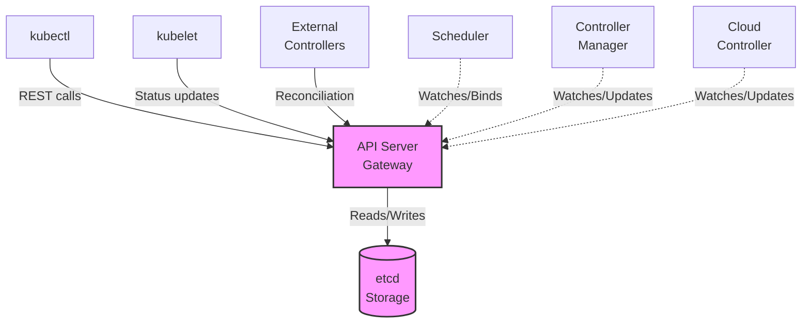
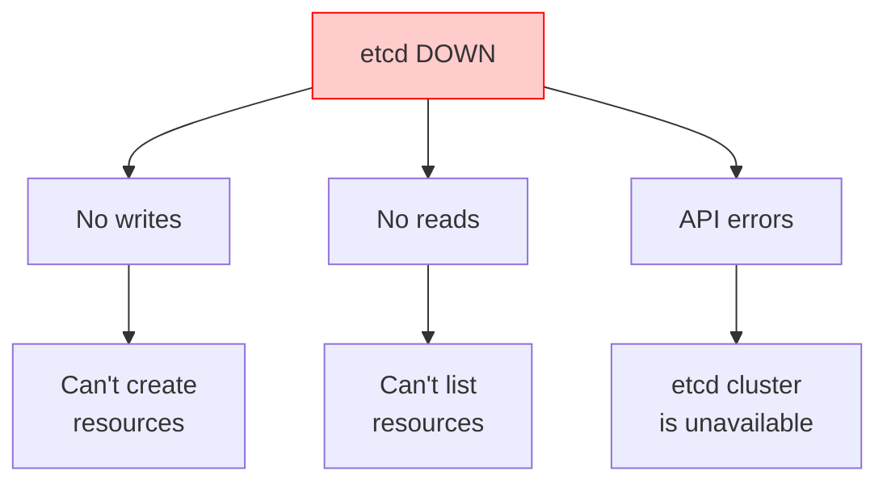
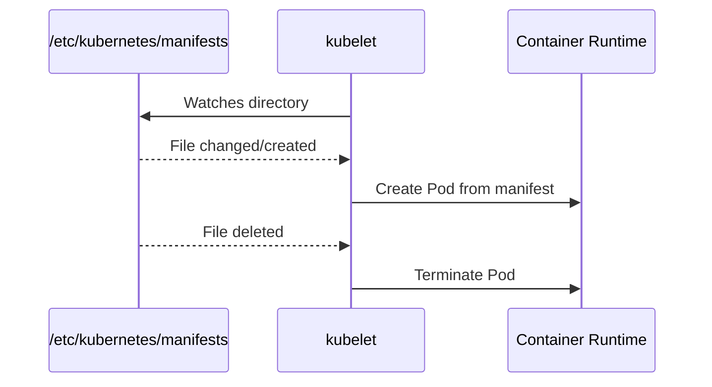

> **Complexity**: `[COMPLEX]` - Critical infrastructure troubleshooting
>
> **Time to Complete**: 50-60 minutes
>
> **Prerequisites**: [Module 5.1 (Methodology)](../module-5.1-methodology/), [Module 1.1 (Control Plane Deep-Dive)](../../part1-cluster-architecture/module-1.1-control-plane/)

---

## What You'll Be Able to Do

This module combines control-plane inspection and recovery planning with one practical scheduler-restoration exercise. The guided work does not include certificate renewal or etcd restore. Use the inspection evidence to choose a next action and state what would disprove your diagnosis.

- **Diagnose API server and static pod failures** by cross-referencing manifests, container runtime state, and kubelet journal evidence.
- **Inspect certificate evidence and plan recovery** by identifying the affected certificate, its manager and consumer, and the validation required before and after a change.
- **Interpret etcd diagnostics and assess a recovery proposal** without treating snapshot metadata or endpoint health as proof of restored Kubernetes state.
- **Demonstrate scheduler restoration** in the owned Task 4 fixture using its API, runtime and Pod scheduling checks; do not extend that result to certificate, etcd or controller recovery.

## Why This Module Matters

Hypothetical scenario: your on-call rotation receives a cluster-wide page because `kubectl get nodes` hangs, new deployments are not rolling out, and the application team is asking whether they should restart every workload. A rushed operator might keep deleting pods, reboot worker nodes, or restart random system services because those actions feel active under pressure. A disciplined control plane responder first asks which component is failing, which dependencies still work, and which evidence will disappear if they restart the wrong thing.

The Kubernetes control plane is the management nervous system for the cluster. The API server is the front desk where every legitimate request is authenticated, authorized, validated, and recorded. The scheduler assigns newly created pods to nodes, the controller manager drives reconciliation loops, and etcd stores the durable truth that all of those components coordinate around. When one piece fails, the symptoms can look similar from a distance, so your first responsibility is to separate "the cluster cannot accept requests" from "the cluster accepts requests but cannot schedule" and from "the cluster accepts requests but cannot reconcile desired state."

This module teaches that separation through the same assets you will use during a real incident: static pod manifests under `/etc/kubernetes/manifests`, the kubelet journal, CRI-level inspection with `crictl`, kubeadm certificate tooling, API health endpoints, and native etcd commands. You will see why existing workloads often keep running even while control plane writes are frozen, why deleting a static pod usually does not fix a broken manifest, and why API server logs that say `etcd cluster is unavailable` point you toward storage rather than toward a bigger API server restart.

> **The Air Traffic Control Analogy**
>
> The control plane is exactly like air traffic control for your cluster. The API server is the central radio tower; if it goes down, communication between pilots and ground crew stops. The scheduler is the flight planner; without it, new flights cannot be assigned a runway and remain stranded at the gate. The controller manager is the automated monitoring system; it keeps aircraft following assigned routes and notices when expected movement has stopped. Finally, etcd is the authoritative flight record database; if it corrupts or loses quorum, the airport may still have aircraft on runways, but the tower no longer has a reliable operational record.

## Control Plane Dependency Map

Control plane troubleshooting starts with dependency order, not with the loudest error message. Kubernetes deliberately makes the API server the only supported gateway to etcd for normal clients and controllers, which means `kubectl`, kubelets, schedulers, controller managers, cloud controllers, and extension controllers all converge on the same API surface. That design gives Kubernetes a consistent authorization and admission path, but it also means a storage or certificate failure can appear as an API outage from the user side.

In kubeadm-style clusters, the core control plane components are static pods supervised by the local kubelet on each control plane node. That detail matters during outages because the API server does not need to be healthy for the kubelet to read files from disk and start containers. It also means the source of truth for many emergency fixes is the host filesystem, not an object returned by `kubectl edit`, and your recovery workflow must include local node access.



The diagram shows why a simple "control plane is down" statement is too vague to be useful. If etcd is unhealthy, the API server cannot reliably read or write state, and every higher-level controller eventually feels the pain. If the API server is down while etcd is healthy, controllers and users cannot reach the gateway, but local runtime inspection can still tell you whether static pods are running. If the scheduler is down, existing pods continue running because kubelets already have their assignments, while new pods remain pending until scheduling resumes.

That distinction also explains why users can report contradictory symptoms during the same incident. One team may say their application is still serving traffic, another may say their rollout is frozen, and a platform engineer may see `kubectl` timing out from a laptop. Those reports are not mutually exclusive. Existing containers continue doing work because kubelets and container runtimes do not need a constant API connection for every CPU cycle, while new desired-state changes need the control plane to accept, store, schedule, and reconcile them.

When you interview the cluster during an outage, ask questions in dependency order. Can the API server answer a cheap health request? Can it read and write through etcd? Can the scheduler observe unscheduled pods and bind them? Can the controller manager create the secondary objects that desired state requires? Each answer narrows the search space, and each "no" tells you which commands still have value. A failed API query does not make scheduler events useful, while a healthy API with pending pods makes scheduler events extremely useful.

```text
┌──────────────────────────────────────────────────────────────┐
│                 CONTROL PLANE DEPENDENCIES                   │
│                                                              │
│                      ┌─────────────┐                         │
│                      │    etcd     │                         │
│                      │  (storage)  │                         │
│                      └──────┬──────┘                         │
│                             │                                │
│                             ▼                                │
│                      ┌─────────────┐                         │
│                      │ API Server  │◄──── kubectl            │
│                      │  (gateway)  │◄──── kubelet            │
│                      └──────┬──────┘◄──── controllers        │
│                             │                                │
│              ┌──────────────┼──────────────┐                 │
│              │              │              │                 │
│              ▼              ▼              ▼                 │
│       ┌───────────┐  ┌───────────┐  ┌───────────┐           │
│       │ Scheduler │  │ Controller│  │   Cloud   │           │
│       │           │  │  Manager  │  │ Controller│           │
│       └───────────┘  └───────────┘  └───────────┘           │
│                                                              │
│   If etcd fails     -> Everything that needs state fails     │
│   If API server     -> Nothing can communicate through API   │
│   If scheduler      -> New pods will not be scheduled        │
│   If controller-mgr -> Resources will not reconcile          │
│                                                              │
└──────────────────────────────────────────────────────────────┘
```

Static pod supervision is the practical bridge between architecture and recovery. The kubelet watches a configured directory, reads pod manifests from disk, and asks the local container runtime to create the control plane containers. If a manifest is moved away, the kubelet stops the static pod; if a corrected manifest returns, the kubelet starts it again. That behavior is useful, but it is unforgiving: a YAML indentation error, wrong certificate path, or misspelled flag can keep the component in a crash loop until the file is corrected.

Static pods also create a useful mental boundary between "Kubernetes object" and "node-local instruction." The mirrored pod object shown by the API is a report from the kubelet, not the primary configuration. If you delete that mirrored pod, kubelet notices that its local manifest still exists and asks the runtime to create the pod again. If you edit the disk manifest, kubelet changes the real instruction. That is why control plane repair usually involves SSH, root privileges, and disciplined file handling rather than only API operations.

```bash
# Static pod manifest location
/etc/kubernetes/manifests/
├── etcd.yaml
├── kube-apiserver.yaml
├── kube-controller-manager.yaml
└── kube-scheduler.yaml

# kubelet watches this directory
# Changes to these files = automatic restart of component
```

Establish API health before choosing the local runtime route. [`/livez` and `/readyz`](https://v1-35.docs.kubernetes.io/docs/reference/using-api/health-checks/#api-endpoints-for-health) answer different questions: liveness and readiness to accept traffic. HTTP 200 is success for the requested endpoint; a readiness failure can reflect initialization or an unavailable dependency. A connection, authentication or TLS error is not a returned failing health check, and API readiness does not prove scheduling or reconciliation.

Run this Bash block from your diagnostic workstation with an explicitly identified disposable kubeconfig and context. Set `API_KUBECONFIG` to its absolute path and `API_CONTEXT` to that context; do not guess a host or switch global context. Verbose check details are for human interpretation, not a stable machine-parsing contract. Record the actual result and error; stop rather than assuming API failure means the process is absent.

```bash
(
  : "${API_KUBECONFIG:?Set the known disposable kubeconfig path}"
  : "${API_CONTEXT:?Set its explicit context}"
  [[ "$API_KUBECONFIG" == /* && -r "$API_KUBECONFIG" ]] || exit 1
  api=(kubectl --kubeconfig "$API_KUBECONFIG" --context "$API_CONTEXT" --request-timeout=10s)
  for endpoint in livez readyz; do
    printf '\nAPI %s diagnostic:\n' "$endpoint"
    "${api[@]}" get --raw="/$endpoint?verbose" || exit 1
  done
  "${api[@]}" -n kube-system get pods -o wide
)
```

Pause and predict: if `kubectl -n kube-system get pods` hangs, but `crictl ps` on the control plane node shows the API server container repeatedly restarting, which layer are you actually observing? You are no longer testing workload scheduling or controller reconciliation; you are testing whether the local kubelet can keep a static pod alive from its manifest and dependencies.

## Diagnosing API Server and Certificate Failures

The API server is the public gateway for Kubernetes state. It authenticates clients, applies authorization, runs admission plugins, validates objects, and persists accepted changes to etcd. When it is unavailable, `kubectl` becomes a symptom generator rather than a complete diagnostic tool, because the client can only tell you that the gateway did not answer. The next useful evidence usually comes from the control plane node itself.

It helps to think of the API server as a strict clerk rather than as the warehouse. The clerk checks identity, validates forms, applies policy, and records approved transactions in the warehouse, but the clerk does not personally hold the durable inventory. If the clerk cannot reach the warehouse, customers experience a front-desk failure even though the root problem is behind the desk. This analogy keeps you from overfitting on the first command that fails and pushes you to test whether the API process, its certificates, and its storage client are each healthy.

```text
┌──────────────────────────────────────────────────────────────┐
│                API SERVER FAILURE SYMPTOMS                   │
│                                                              │
│   Symptom                        Indicates                   │
│   ─────────────────────────────────────────────────────────  │
│   kubectl hangs/times out        API server unreachable      │
│   "connection refused"           API server not listening    │
│   "unable to connect to server"  Network/firewall issue      │
│   "Unauthorized"                 Auth/cert issue             │
│   "etcd cluster is unavailable"  API can't reach etcd        │
│   Very slow responses            Overloaded or etcd slow     │
│                                                              │
└──────────────────────────────────────────────────────────────┘
```

Treat API outage triage as a layer-by-layer reduction. First prove whether the process exists, then whether it is repeatedly crashing, then whether the kubelet rejects the manifest, then whether the process fails because of certificates, flags, ports, or etcd. This order protects time during an exam and protects evidence during an incident, because you inspect before you restart.

The most common mistake in this phase is treating all connection failures as equivalent. `connection refused` means something actively declined the TCP connection or nothing is listening where you expected. A TLS error means the process may be listening but trust failed. A timeout can mean routing, firewalling, overload, or a hung endpoint. Those differences change the next diagnostic step. Good responders read the exact error string aloud, then choose the command that tests the next smallest assumption.

### Select an API server container explicitly

The following route runs in a root Bash shell on the independently identified disposable Linux control-plane node, not on the workstation. Require `jq`, a Kubernetes-matched crictl 1.35 client and the known local CRI endpoint. Set `CRI_RUNTIME_ENDPOINT` from fixture provisioning; `unix:///run/containerd/containerd.sock` is a containerd example, not automatic discovery. `CRICTL_BIN` may name the version-matched executable; otherwise the block uses `crictl` on PATH. A known endpoint and client version are prerequisites, not proof that a connection will work.

The [CRI guide](https://v1-35.docs.kubernetes.io/docs/tasks/debug/debug-cluster/crictl/) supports listing containers and requesting a selected container's logs. This helper validates one component-specific listing and displays full IDs, state and raw creation timestamps. Select the relevant attempt using incident evidence; neither first nor last row is assumed newest. It conservatively accepts only nonempty IDs using letters, digits, `_`, `.`, `:` or `-`, and digit-string timestamps; these are this helper's validation rules, not a universal CRI format claim. It does not convert nanosecond strings to jq numbers.

```bash
(
  [[ $EUID == 0 ]] || { echo 'Use the identified disposable node root shell.' >&2; exit 1; }
  : "${CRI_RUNTIME_ENDPOINT:?Set the known local CRI endpoint}"
  [[ "$CRI_RUNTIME_ENDPOINT" == unix:///* ]] || { echo 'Expected a known Linux Unix-socket endpoint.' >&2; exit 1; }
  cri=${CRICTL_BIN:-crictl}
  command -v "$cri" >/dev/null && command -v jq >/dev/null || exit 1
  client_version=$("$cri" --version) || exit 1
  [[ "$client_version" =~ ^crictl\ version\ v?1\.35\.[0-9]+$ ]] || {
    echo 'This route requires a version-matched crictl 1.35 client.' >&2; exit 1;
  }
  containers=$("$cri" --runtime-endpoint "$CRI_RUNTIME_ENDPOINT" --timeout=10s ps -a --name kube-apiserver -o json) || exit 1
  jq -e -s '
    length == 1 and (.[0] |
    type == "object" and (.containers | type == "array") and
    (.containers | length > 0) and
    all(.containers[];
      type == "object" and
      (.id | type == "string" and test("^[A-Za-z0-9][A-Za-z0-9_.:-]*$")) and
      (.metadata.name == "kube-apiserver") and
      (.state | type == "string" and length > 0) and
      (.createdAt | type == "string" and test("^[0-9]+$"))))
  ' <<< "$containers" >/dev/null || {
    echo 'Empty, malformed or wrong-component container listing; stop.' >&2; exit 1;
  }
  printf 'ID\tSTATE\tCREATED_AT (raw)\n'
  jq -r '.containers[] | [.id, .state, .createdAt] | @tsv' <<< "$containers" || exit 1
  printf 'Select one full kube-apiserver container ID from this listing: '
  IFS= read -r selected_id || exit 1
  [[ "$selected_id" =~ ^[A-Za-z0-9][A-Za-z0-9_.:-]*$ ]] || {
    echo 'Empty or malformed selection; stop.' >&2; exit 1;
  }
  jq -e --arg id "$selected_id" '
    [.containers[] | select(.id == $id and .metadata.name == "kube-apiserver")] | length == 1
  ' <<< "$containers" >/dev/null || {
    echo 'Selected ID absent or ambiguous in the validated listing; stop.' >&2; exit 1;
  }
  "$cri" --runtime-endpoint "$CRI_RUNTIME_ENDPOINT" --timeout=10s logs --tail=100 "$selected_id" || {
    echo 'Log request failed; the container may have disappeared. Preserve the error.' >&2; exit 1;
  }
)
```

The log request does not follow a stream and returns at most the requested tail; a vanished container or runtime error must remain a failed observation. Multiple stopped attempts are evidence to correlate with the incident, not permission to restart manifests. Record the selected ID and compare the error with its component dependencies.

From the same identified node root shell, inspect the manifest and journal without changing them. This requires `journalctl` and a retained kubelet journal; no matching entries do not establish that the kubelet is healthy or that no error occurred.

```bash
ls -la /etc/kubernetes/manifests/kube-apiserver.yaml
journalctl --no-pager -u kubelet --since "20 minutes ago" -n 100 | grep -i apiserver
```

Certificates deserve special attention because kubeadm-managed non-CA control plane certificates have short enough lifetimes to create predictable maintenance incidents. Mutual TLS is not decorative in Kubernetes; it is how the API server trusts kubelets, clients, and peer components. An expired API server serving certificate, client certificate, or etcd client certificate can make a previously stable control plane fail without any workload deployment or manifest change.

Certificate failures often feel mysterious because they can appear suddenly after months of normal operation. Nothing changed in Git, no one edited a manifest, and the same automation that worked yesterday now fails with `x509` errors. That is exactly why expiration checks belong in routine maintenance rather than only in incident response. During an outage, the certificate dates help you decide whether the failure is time-driven or whether the TLS error is caused by wrong file paths, wrong certificate authorities, or a component presenting the wrong identity.

Run these read-only inspections from an explicitly identified disposable kubeadm node's root shell with `openssl` and `kubeadm` installed. Do not infer that the current terminal is on that node or that the fixture has an expired certificate. Record tool failures and missing files as missing evidence.

```bash
# Inspect the API server certificate validity window.
openssl x509 -in /etc/kubernetes/pki/apiserver.crt -text -noout | grep -A 2 "Validity"

# Let kubeadm summarize certificate expiration for the cluster.
kubeadm certs check-expiration
```

### Certificate inspection and recovery decision

Use the preceding inspection commands only on the identified disposable kubeadm fixture. Record their actual output and the relevant TLS error; if inspection cannot run, record the missing evidence. Expiration output alone does not demonstrate an outage or its recovery.

Before opening the explanation, write a decision note:

- **Evidence:** which named certificate and consumer are implicated, what validity dates were observed, and whether kubeadm reports external management.
- **Competing hypothesis:** could the failure instead be an unreadable certificate path, wrong trust chain, or unreachable etcd endpoint?
- **Rejecting observation:** first match the certificate to the identity implicated in the error. A validity window covering the relevant time rejects expiry of that certificate; it does not rule out another expired certificate or an unrelated dependency failure. Record the observation rather than inventing it.
- **Proposed validation:** specify baseline function, changed certificate identity, consumer reload evidence and recovered function. Renewal alone would not prove recovery from expiry.

<details>
<summary>Compare your certificate recovery decision</summary>

[Kubernetes 1.35 certificate management](https://v1-35.docs.kubernetes.io/docs/tasks/administer-cluster/kubeadm/kubeadm-certs/#manual-certificate-renewal) distinguishes kubeadm-managed and externally managed certificates. Identify the manager before proposing a renewal. A consuming control-plane Pod must reload renewed files; deleting its API mirror Pod is not the static Pod restart mechanism. A separate execution contract must preserve original credentials and manifests, identify the one certificate and consumer, and handle interruptions before any renewal or reload is attempted. This exercise does not supply or execute those mutations.

</details>

### Manifest evidence before a proposed change

Manifest damage is another hypothesis: compare the observed component error with its configured flags and paths. Do not edit the watched directory as a diagnostic test. Run the read-only inspection below from the identified disposable node's root shell. It shows selected endpoint and certificate flags, not the complete manifest, and neither creates a backup nor applies a repair.

```bash
grep -E -- '--(etcd-servers|client-ca-file|tls-cert-file|tls-private-key-file)=' /etc/kubernetes/manifests/kube-apiserver.yaml
```

Record the suspect flag or path, a competing dependency failure, and the observation that distinguishes them. Propose how an owned recovery fixture would preserve the original manifest, refuse destination collisions, restore it after interruption, and verify component function. The schematic YAML below is an inspection aid, not a replacement manifest to apply.

```yaml
apiVersion: v1
kind: Pod
metadata:
  name: kube-apiserver
  namespace: kube-system
spec:
  containers:
  - command:
    - kube-apiserver
    - --advertise-address=10.0.0.10
    - --etcd-servers=https://127.0.0.1:2379
    image: registry.k8s.io/kube-apiserver:v1.35.0
```

| Issue | Symptom | Fix |
|-------|---------|-----|
| Certificate expired | `x509: certificate has expired` | Inspect expiration and ownership; plan renewal and consumer reload under a separate recovery contract |
| etcd unreachable | `etcd cluster is unavailable` | Check etcd health directly before changing API server flags |
| Wrong etcd endpoints | Startup failure or repeated backend errors | Check `--etcd-servers` in the API server manifest |
| Port conflict | `bind: address already in use` | Identify the process holding TCP 6443 before restarting services |
| Out of memory | OOMKilled or very slow responses | Preserve logs, check node pressure, then increase resources or reduce load |
| Incorrect flags | Component exits immediately | Compare manifest flags with the Kubernetes 1.35 component reference |

Before proposing renewal or manifest editing, state what evidence would reject your hypothesis. A valid certificate window with an etcd connection error points toward dependency inspection; it does not justify blanket certificate renewal.

## Restoring Scheduling and Reconciliation

The scheduler and controller manager are easier to confuse than they should be because both failures often show up as application teams saying, "Kubernetes is not doing anything." The difference is precise. The scheduler assigns a node to newly created pods, while the controller manager creates and updates objects so actual state converges on desired state. If pods are created but never assigned, think scheduler; if expected pods or endpoints are not created at all, think controller manager.

```text
┌──────────────────────────────────────────────────────────────┐
│               SCHEDULER FAILURE SYMPTOMS                     │
│                                                              │
│   Symptom                           Check                    │
│   ─────────────────────────────────────────────────────────  │
│   All new pods stuck Pending        Scheduler not running    │
│   "no nodes available to schedule"  All nodes unschedulable  │
│   Pods not being distributed        Scheduler misconfigured  │
│   Very slow scheduling              Scheduler overloaded     │
│                                                              │
│   Remember: Existing pods keep running when scheduler fails! │
│   Only NEW pods are affected.                                │
│                                                              │
└──────────────────────────────────────────────────────────────┘
```

Scheduler investigation should start with pending pods and events because the scheduler is usually explicit about why it rejected nodes. Taints, node selectors, topology spread constraints, insufficient CPU, and unschedulable nodes are ordinary placement failures, not scheduler outages. A true scheduler outage is more likely when all new pods remain pending even though resources are available and scheduler logs or static pod status show a crash, authentication failure, or leader election problem.

The word Pending is therefore not a diagnosis. A pod can be Pending because the scheduler never saw it, because the scheduler saw it and rejected every node, because the pod references an unavailable volume, or because admission allowed a spec that cannot be satisfied by current nodes. Your job is to distinguish "no scheduling decision happened" from "a scheduling decision failed for known reasons." Events are the cheapest way to make that distinction when the API is available, and scheduler logs are the next layer when events stop updating or look inconsistent.

```bash
# Check scheduler pod status.
kubectl -n kube-system get pod -l component=kube-scheduler

# Check scheduler logs.
kubectl -n kube-system logs kube-scheduler-<node>

# Check for scheduling events.
kubectl get events -A --field-selector reason=FailedScheduling

# Describe a pending pod for the specific scheduling reason.
kubectl describe pod <pending-pod> | grep -A 10 Events
```

| Issue | Symptom | Fix |
|-------|---------|-----|
| Scheduler not running | All new pods Pending | Check `/etc/kubernetes/manifests/kube-scheduler.yaml` and kubelet logs |
| Cannot connect to API | Scheduler logs show connection refused or TLS errors | Check `scheduler.conf`, client certificates, and API health |
| Leader election failed | Scheduler running but not active | Check Lease access, clocks, and `--leader-elect` settings |
| No nodes available | FailedScheduling events list constraints | Fix taints, selectors, resources, or node readiness rather than the scheduler |

The scheduler static pod has fewer moving parts than the API server, but a wrong kubeconfig path or broken YAML file is enough to stop it. Use the manifest and kubeconfig as your source of truth, then validate with logs and a small test workload. Avoid treating every pending pod as a scheduler crash; the event stream tells you whether Kubernetes made a placement decision and rejected all nodes for understandable reasons.

Leader election adds one more wrinkle in highly available control planes. Multiple scheduler instances may run, but only the active leader should bind pods. If leader election fails, you may see a healthy-looking container that is not actually doing useful scheduling work. Check whether the scheduler can read and update its Lease object, whether clocks are sane, and whether API connectivity is stable enough for lease renewal. A process can be alive and still fail its responsibility.

```bash
# Check manifest exists.
sudo cat /etc/kubernetes/manifests/kube-scheduler.yaml

# Check for obvious YAML and command issues without relying on API availability.
sudo grep -n -- "--kubeconfig\\|--leader-elect" /etc/kubernetes/manifests/kube-scheduler.yaml

# Common flags to verify:
# --kubeconfig=/etc/kubernetes/scheduler.conf
# --leader-elect=true

# Verify kubeconfig exists.
sudo ls -la /etc/kubernetes/scheduler.conf
```

Hypothetical scenario: the scheduler pod is crash-looping during a lab, and one critical pod already exists in the API but has no `nodeName`. Manual scheduling by patching `spec.nodeName` can be used as an emergency exercise to demonstrate what the scheduler normally writes, but it is not a routine production fix. You bypass filtering and scoring when you do this, so you must be certain the target node can run the pod and that you are not hiding the real scheduler failure.

```bash
# If the scheduler is down in a controlled lab, you can manually bind a pod.
kubectl patch pod <pod> -p '{"spec":{"nodeName":"worker-1"}}'
```

Controller manager failures have a different signature. The API may accept a Deployment object, but the ReplicaSet or Pods may not appear. A Node may remain NotReady without normal eviction behavior. A Service may lack endpoints even though matching pods exist. These symptoms mean the watchers and reconciliation loops that continuously repair the cluster have stopped making progress.

The controller manager is easy to underestimate because it is a single pod name hiding many separate controllers. ReplicaSets, Jobs, Nodes, endpoints, service accounts, certificates, garbage collection, and other cluster behaviors depend on loops inside that binary. A failure may be broad, where the whole component cannot authenticate to the API, or narrow, where one controller lacks a key file or permission it needs. Broad failures usually produce many stale resources at once; narrow failures require matching a symptom to the specific controller responsible for that resource family.

```text
┌──────────────────────────────────────────────────────────────┐
│            CONTROLLER MANAGER FAILURE SYMPTOMS               │
│                                                              │
│   Symptom                           Affected Controller      │
│   ─────────────────────────────────────────────────────────  │
│   Pods not created from Deployment  ReplicaSet controller    │
│   Deleted pods not replaced         ReplicaSet controller    │
│   PVCs stay Pending                 PV controller            │
│   Services have no endpoints        Endpoints controller     │
│   Nodes stay NotReady forever       Node controller          │
│   Jobs don't complete               Job controller           │
│   No automatic cleanup              GC controller            │
│                                                              │
│   The cluster freezes in current state: no reconciliation.   │
│                                                              │
└──────────────────────────────────────────────────────────────┘
```

Diagnosing the controller manager starts with confirming the static pod and then proving at least one reconciliation loop works. A tiny test Deployment is useful only when the API server and scheduler are already healthy enough to support it; otherwise, the test will mix several failure domains. In a real outage, read the controller manager logs first, then run the smallest functional probe that answers your specific question.

For example, if Deployments create ReplicaSets but Services do not receive endpoints, you do not need to test every controller. You need to inspect the endpoint-related path, matching labels, pod readiness, and controller logs for that family. If no secondary resources appear from any desired object, the controller manager's API access or process health becomes more likely. This habit of choosing a probe that matches one controller keeps the incident from turning into a random walk through cluster features.

```bash
# Check controller manager pod.
kubectl -n kube-system get pod -l component=kube-controller-manager

# Check logs.
kubectl -n kube-system logs kube-controller-manager-<node>

# Check for specific controller issues.
kubectl -n kube-system logs kube-controller-manager-<node> | grep -i error

# Verify a reconciliation loop after API and scheduler health are known.
kubectl create deployment test --image=nginx
kubectl get rs | grep test
kubectl delete deployment test --ignore-not-found
```

| Issue | Symptom | Fix |
|-------|---------|-----|
| Not running | No reconciliation progresses | Check static pod manifest and kubelet logs |
| Service account key missing | Controllers cannot create or authenticate work | Verify `--service-account-private-key-file` and mounted files |
| Cannot connect to API | Most controllers fail together | Check `controller-manager.conf`, API health, and TLS errors |
| Cluster signing cert missing | CSRs are not approved or signed | Check `--cluster-signing-cert-file` and related CA paths |

The controller manager carries several certificate and key paths because different controllers need to sign, identify, and trust different pieces of cluster state. A typo in a volume mount can break broad automation while leaving the API server responsive, which is why "kubectl works" is not proof that reconciliation works. Compare the manifest flags with the files on disk, and remember that static pod manifest changes restart the component automatically through the kubelet.

```bash
# Check manifest.
sudo cat /etc/kubernetes/manifests/kube-controller-manager.yaml

# Key flags to verify:
# --kubeconfig=/etc/kubernetes/controller-manager.conf
# --service-account-private-key-file=/etc/kubernetes/pki/sa.key
# --cluster-signing-cert-file=/etc/kubernetes/pki/ca.crt
# --root-ca-file=/etc/kubernetes/pki/ca.crt

# Verify files exist.
sudo ls -la /etc/kubernetes/pki/
```

Which approach would you choose here and why: testing reconciliation by creating a Deployment, or reading controller manager logs first? If you do not yet know whether the API and scheduler are healthy, logs are the cleaner first step because a failed test Deployment could be caused by several layers at once.

## Evaluating etcd and Static Pod Recovery

etcd is the durable backing store for Kubernetes, so it deserves a slower and more respectful workflow than stateless components. Restarting the API server may clear a stale connection, but it cannot repair lost etcd quorum, disk exhaustion, data directory corruption, bad member peer configuration, or TLS failure between API server and etcd. When the API server reports storage errors, treat it as a witness pointing toward the database, not as the prime suspect.



```text
┌──────────────────────────────────────────────────────────────┐
│                   ETCD FAILURE IMPACT                        │
│                                                              │
│   ┌─────────────────────────────────────────────────────┐    │
│   │                    etcd DOWN                        │    │
│   └────────────────────────┬────────────────────────────┘    │
│                            │                                  │
│              ┌─────────────┼─────────────┐                   │
│              ▼             ▼             ▼                   │
│         No writes      No reads     API errors               │
│              │             │             │                   │
│              ▼             ▼             ▼                   │
│         Can't create   Can't list  "etcd cluster             │
│         resources      resources    is unavailable"          │
│                                                              │
│   Note: Existing pods keep running because kubelet is local.  │
│   New cluster changes cannot be made until storage recovers. │
│                                                              │
└──────────────────────────────────────────────────────────────┘
```

etcd health checks require the same TLS seriousness as the rest of the control plane. In kubeadm clusters, the local etcd static pod commonly exposes a secure endpoint on `127.0.0.1:2379`, and `etcdctl` needs the etcd CA, server certificate, and key to authenticate. If you omit those flags, a failure may only prove that your diagnostic command is incomplete, not that etcd is down.

Quorum is the core concept behind etcd recovery decisions. In a multi-member cluster, etcd must have enough healthy members to agree on state changes before it can safely accept writes. Losing one member in an appropriately sized cluster may be survivable, while losing too many members turns the database into a system that cannot make progress. That is why member removal, snapshot restore, and data directory replacement must be planned carefully; the wrong action can turn a degraded cluster into a cluster with no agreed history.

```bash
# Check etcd pod status through the API if the API is reachable.
kubectl -n kube-system get pod -l component=etcd

# Check etcd logs through the API if available.
kubectl -n kube-system logs etcd-<node>

# Check etcd health with etcdctl from the control plane node.
sudo ETCDCTL_API=3 etcdctl \
  --endpoints=https://127.0.0.1:2379 \
  --cacert=/etc/kubernetes/pki/etcd/ca.crt \
  --cert=/etc/kubernetes/pki/etcd/server.crt \
  --key=/etc/kubernetes/pki/etcd/server.key \
  endpoint health

# Check etcd member list.
sudo ETCDCTL_API=3 etcdctl \
  --endpoints=https://127.0.0.1:2379 \
  --cacert=/etc/kubernetes/pki/etcd/ca.crt \
  --cert=/etc/kubernetes/pki/etcd/server.crt \
  --key=/etc/kubernetes/pki/etcd/server.key \
  member list
```

The endpoint health command is worth drilling because it bypasses the API and asks the storage layer to prove it can serve a serialized write. In multi-member clusters, pair it with endpoint status and member list so you can distinguish a local endpoint issue from a quorum problem. etcd also has health endpoint support in modern releases, but the authenticated command remains a practical CKA-grade tool because it exercises the same certificates used by Kubernetes.

A healthy response from one local endpoint is encouraging, but it is not the whole story in a distributed etcd topology. You still need to know whether the member list matches the intended cluster, whether peer URLs are reachable, and whether any alarms indicate backend quota or corruption risk. During practice, run health, status, and member list together so you build the habit of seeing both liveness and membership. During production response, record the exact endpoint set you queried so other responders do not confuse a local check with a full quorum assessment.

```bash
sudo ETCDCTL_API=3 etcdctl endpoint health \
  --endpoints=https://127.0.0.1:2379 \
  --cacert=/etc/kubernetes/pki/etcd/ca.crt \
  --cert=/etc/kubernetes/pki/etcd/server.crt \
  --key=/etc/kubernetes/pki/etcd/server.key
```

Environment variables can make repeated etcd commands less noisy during a controlled practice session, but avoid hiding the TLS context from yourself while learning. In incident notes and runbooks, the fully expanded command is easier for another engineer to audit. If you use a shell variable wrapper interactively, write down exactly which endpoint and certificates it includes before taking recovery actions.

```bash
export ETCDCTL_API=3
export ETCDCTL_ENDPOINTS=https://127.0.0.1:2379
export ETCDCTL_CACERT=/etc/kubernetes/pki/etcd/ca.crt
export ETCDCTL_CERT=/etc/kubernetes/pki/etcd/server.crt
export ETCDCTL_KEY=/etc/kubernetes/pki/etcd/server.key

sudo --preserve-env=ETCDCTL_API,ETCDCTL_ENDPOINTS,ETCDCTL_CACERT,ETCDCTL_CERT,ETCDCTL_KEY etcdctl endpoint health
```

| Issue | Symptom | Fix |
|-------|---------|-----|
| Data directory corrupt | etcd will not start or panics on backend data | Stop writers and restore from a verified snapshot |
| Certificate expired | TLS errors from API server or etcdctl | Check etcd certificates and renew the verified expired chain |
| Disk full | Writes fail or backend quota alarms appear | Free disk, compact or defragment when appropriate, and clear alarms carefully |
| Member not reachable | Cluster unhealthy or no quorum | Check peer networking, member list, and node health before removing members |
| Clock skew | Raft instability and election churn | Fix time synchronization before blaming Kubernetes components |

Snapshots are the boundary between inconvenience and disaster. A consistent etcd snapshot gives you a point-in-time copy of cluster state, including Secrets, ConfigMaps, workload specs, RBAC, and topology metadata. The snapshot does not save container logs or node-local runtime state, so it is not a complete incident archive, but it is the artifact that lets you rebuild the Kubernetes state store when the data directory is no longer trustworthy.

Snapshot discipline includes verification, storage, and rehearsal. A backup file that no one has restored is only a hopeful artifact. You should know where snapshots are stored, how they are protected, which encryption and access controls apply, and which Kubernetes version and etcd version produced them. Because Secrets live in etcd, snapshot handling is also credential handling. Treat the file as sensitive data, and avoid moving it through casual channels just because the extension looks like an ordinary database dump.

### Inspect a supplied snapshot; assess a recovery plan

Do not create or restore a snapshot in this exercise. Use only a snapshot supplied by the disposable fixture owner with recorded provenance, expected contents and compatible tool version. [The etcd 3.6 recovery guide](https://etcd.io/docs/v3.6/op-guide/recovery/) uses `etcdutl snapshot status`; that documentation does not establish which etcd version or tool is installed on your node.

Use owner-supplied metadata evidence with recorded provenance and tool version; do not generate a snapshot or assume etcd tools are installed on the node. If no compatible metadata inspection evidence exists, mark that part of the plan unverified. Do not copy production state to fill the gap.

Metadata inspection is not a restore rehearsal. Distinguish a snapshot created with an integrity hash from a copied backend file; describe how integrity will be checked rather than assuming that a successful status command accepts the artifact.

Before opening the explanation, prepare an etcd recovery decision:

- **Evidence:** record actual endpoint/member diagnostics, the suspected loss or corruption, and the supplied snapshot's provenance and metadata. Mark unavailable observations as unknown.
- **Competing hypothesis:** consider disk pressure, TLS failure or peer connectivity before deciding that data replacement is necessary.
- **Rejecting observation:** specify what would reject the data-loss hypothesis and support repairing that dependency instead. A failed API request alone is insufficient.
- **Proposed validation:** define a marker object and expected restored contents, a post-snapshot change, and fresh API/controller operations that distinguish correct recovery from an endpoint merely answering.

<details>
<summary>Compare your etcd recovery decision</summary>

Restore creates a new logical etcd cluster. A safe execution plan must name the topology and compatible tools, coordinate writers, preserve the original data, refuse existing restore destinations, and define interruption and rollback behavior. For Kubernetes, revisions moving backward can leave controller caches inconsistent; the etcd guide's revision-bump and compaction options therefore belong in the plan. Do not invent values without the fixture's revision history and contract.

A successful endpoint health response does not prove the intended Kubernetes contents were recovered. Require the expected marker state and subsequent API/controller behavior in a separate owned restore experiment. This module's scheduler fixture proves neither snapshot integrity nor certificate/etcd recovery.

</details>

The diagrams below explain static Pod lifecycle mechanics, not an approved restore sequence. Changes in the watched directory affect running components; a separate recovery contract must protect those changes and their reversal.



```text
┌──────────────────────────────────────────────────────────────┐
│                    STATIC POD LIFECYCLE                      │
│                                                              │
│   /etc/kubernetes/manifests/           kubelet               │
│   ┌───────────────────────┐           ┌──────────────────┐  │
│   │ kube-apiserver.yaml   │◄─ watch ──│                  │  │
│   │ kube-scheduler.yaml   │           │  Creates pods    │  │
│   │ controller-manager... │──────────▶│  from manifests  │  │
│   │ etcd.yaml             │           │                  │  │
│   └───────────────────────┘           └──────────────────┘  │
│                                              │               │
│   File changed/created ─────────────────────▶│               │
│   File deleted ─────────────────────────────▶│               │
│                                              ▼               │
│                                     Pod created/deleted      │
│                                                              │
│   Naming: <name>-<node-name>, such as kube-apiserver-master  │
│                                                              │
└──────────────────────────────────────────────────────────────┘
```

Pause and predict: if you edit a mirrored static pod through `kubectl edit pod kube-apiserver-master -n kube-system`, what happens after the node restarts? The kubelet recreates the pod from the file on disk, so the API-side edit disappears because the manifest, not the mirrored object, is the durable source of truth.

If a manifest sits in the watch directory and nothing changes, inspect the kubelet itself. The kubelet may be watching a different `staticPodPath`, rejecting the YAML before it reaches the runtime, lacking permission to read a mounted host path, or failing because the container runtime is unhealthy. This is why control plane recovery crosses Kubernetes, Linux service management, and container runtime inspection rather than staying inside `kubectl`.

Kubelet logs are especially useful because they connect the file world to the runtime world. They can tell you that the kubelet noticed a manifest update, rejected a pod spec, failed to mount a host path, or asked the runtime to start a container that then exited. That sequence matters. If kubelet never notices the file, check configuration and file naming. If kubelet notices the file but the runtime cannot start the container, read container logs and runtime status. If the container starts and the process exits, inspect component arguments and dependencies.

```bash
# Check kubelet is configured to watch the expected manifests directory.
sudo grep staticPodPath /var/lib/kubelet/config.yaml

# Inspect the first lines of the API server manifest for obvious damage.
sudo head -20 /etc/kubernetes/manifests/kube-apiserver.yaml

# Common issues:
# - YAML syntax errors, especially tabs instead of spaces.
# - Wrong file extension, because manifests must be .yaml or .yml.
# - Wrong file permissions, because kubelet must read the file.
# - Missing required pod fields or broken hostPath mounts.
```

Use the reusable API-server container-selection block above for local runtime logs, preserving its endpoint, client-version and ID checks. The journal route below provides kubelet evidence when API access is unavailable; it does not infer which container is newest.

```bash
# In the identified disposable node root shell, inspect a bounded journal window.
journalctl --no-pager -u kubelet --since "20 minutes ago" -n 100 | grep -i "kube-apiserver\\|error\\|failed"
```

## Patterns & Anti-Patterns

Good control plane troubleshooting feels conservative because the blast radius is high. The winning pattern is to narrow the failing layer before mutating it, prefer read-only evidence first, and use static pod mechanics intentionally instead of fighting them. A strong responder can explain not only which command they will run, but what result would make them stop and change hypotheses.

This discipline is useful beyond the CKA exam because real incidents involve coordination costs. Every restart, file move, certificate renewal, or snapshot restore affects the next responder's evidence. If your team uses an incident channel, post concise observations such as "API server container crash-looping on cp-1; latest crictl log shows missing `/etc/kubernetes/pki/apiserver-etcd-client.crt`; no manifest edit yet." That style gives others enough context to challenge or confirm your next action without slowing recovery.

| Pattern | When to Use | Why It Works | Scaling Consideration |
|---------|-------------|--------------|-----------------------|
| Node-level first response | API calls hang, timeout, or return connection refused | `crictl` and `journalctl` bypass the API server and inspect the actual static pod lifecycle | In HA clusters, repeat on each control plane node before assuming one node represents the whole plane |
| Dependency-ordered triage | Multiple components report failures at once | Checking etcd, API, scheduler, and controller manager in dependency order avoids fixing downstream symptoms | Document the order in runbooks so several responders do not restart different layers at once |
| Evidence before restart | A component is crash-looping or unreachable | Logs, manifests, certificate dates, and runtime state may disappear or rotate after restarts | Capture timestamps and commands in the incident channel so recovery remains auditable |
| Small functional probes | API is responsive but behavior is suspicious | A tiny Deployment or Pending pod can prove whether reconciliation or scheduling is working | Clean up probes and avoid noisy tests during production pressure |

Anti-patterns usually come from treating the control plane like an ordinary application Deployment. Static pods do not behave like ReplicaSets, etcd is not stateless, and the API server is often a messenger for dependency failures. The safer alternative is to identify whether you are changing a process, a manifest, a certificate, or durable state, then pick the recovery action that matches that layer.

Another anti-pattern is skipping cleanup after a successful recovery. Temporary manifest moves, copied certificate files, test pods, and exported etcd environment variables can confuse later work if they remain undocumented. After the cluster is healthy, close the loop by restoring file names, removing test workloads, preserving the incident artifacts in the expected location, and writing the root cause in terms of the failed dependency rather than the first symptom. Recovery is not complete until the next engineer can understand what changed.

| Anti-Pattern | What Goes Wrong | Better Alternative |
|--------------|-----------------|--------------------|
| Deleting mirrored static pods repeatedly | Kubelet recreates the same broken pod from disk, and older logs may become harder to find | Fix the manifest or dependency that the kubelet is using |
| Restarting API server for every storage error | Stateless restart does not repair lost quorum, disk exhaustion, or corrupt etcd data | Run authenticated `etcdctl endpoint health` and inspect etcd logs |
| Editing live pod objects for static pod fixes | Changes are lost when kubelet reconciles from the local file | Edit `/etc/kubernetes/manifests/*.yaml` after taking a backup copy |
| Hiding critical command context behind aliases | Runbooks become hard to audit and copy-paste behavior differs across shells | Use explicit `kubectl`, `etcdctl`, certificates, endpoints, and file paths |

## Decision Framework

Use this framework when the symptoms are broad and the pressure is high. The first useful decision is whether the API is trustworthy enough for cluster-level queries. If it is not, shift to the control plane node. If it is, use Kubernetes objects and events to separate scheduling, reconciliation, and storage symptoms before changing anything.

| Observation | First Diagnostic Path | Likely Layer | Avoid |
|-------------|----------------------|--------------|-------|
| `kubectl` connection refused or times out | SSH to control plane, run `crictl ps -a`, read kubelet logs | API server static pod, kubelet, runtime, certificates, or etcd dependency | Waiting on repeated `kubectl` commands |
| API works, all new pods stay Pending | Inspect FailedScheduling events and scheduler logs | Scheduler, node constraints, taints, resources, or leader election | Restarting controller manager first |
| API works, desired objects do not appear | Inspect controller manager logs and run a tiny reconciliation probe | Controller manager, credentials, or controller-specific failure | Assuming scheduler is responsible for object creation |
| API reports `etcd cluster is unavailable` | Run authenticated etcd health and member checks | etcd quorum, TLS, disk, member network, or backend state | Restarting API server before checking storage |
| Static pod manifests changed recently | Compare backups, kubelet logs, and component flags | Human manifest error or bad file path | Editing mirrored pods through the API |

```text
START
  |
  v
Can kubectl reach the API?
  |-- no --> SSH to control plane node
  |          |
  |          v
  |       crictl + journalctl + manifests
  |
  |-- yes --> Are new pods Pending?
             |-- yes --> events + scheduler logs
             |
             |-- no --> Are desired objects reconciling?
                        |-- no --> controller manager logs
                        |
                        |-- yes --> Check etcd warnings, latency, and certificates
```

The framework is intentionally boring because boring is recoverable. It helps you avoid action bias, where the need to do something becomes stronger than the evidence for doing the right thing. In an exam, this saves time; in production, it prevents a partial outage from becoming a data-loss event.

Use the framework as a loop, not a one-time checklist. After each action, retest the smallest observable behavior that should have changed. If you renew certificates, check certificate dates and component logs before declaring victory. If you restore the scheduler manifest, create or observe one pending pod until it binds. If you repair etcd health, verify API reads and writes before allowing broader deployment work to resume. This feedback loop keeps recovery tied to evidence instead of optimism.

## Did You Know?

- **Kubernetes Version Strategy:** Kubernetes 1.35 is the version target for this curriculum, so troubleshooting examples should use current APIs and avoid relying on deprecated health checks as the primary signal.
- **Certificate Default Lifespans:** Control plane client certificates generated by `kubeadm`, excluding CA certificates, expire after one year by default, while kubeadm-generated CA certificates default to ten years.
- **Port Allocations:** The `kube-apiserver` listens on TCP port 6443 by default, while etcd commonly uses TCP port 2379 for client traffic and TCP port 2380 for peer traffic.
- **API Deprecations:** The `v1 ComponentStatus` API was deprecated in Kubernetes v1.19, so `kubectl get componentstatuses` should be treated as a legacy clue rather than a modern health strategy.

## Common Mistakes

| Mistake | Why It Happens | How to Fix It |
|---------|----------------|---------------|
| Editing mirrored pods instead of manifests | The pod appears in the API, so it looks like a normal object | Edit `/etc/kubernetes/manifests/` files and let kubelet recreate the static pod |
| Using `kubectl` when the API is down | Habit makes the familiar tool feel like the only diagnostic surface | SSH to the control plane node and use `crictl`, `journalctl`, and local files |
| Restarting before diagnosing | Pressure rewards visible action, even when evidence is still available | Capture runtime state, logs, certificate dates, and manifest backups before mutation |
| Treating every Pending pod as a scheduler crash | Placement failures and scheduler outages both surface as Pending pods | Read FailedScheduling events before changing scheduler manifests |
| Ignoring etcd until the end | API server errors can distract responders from the storage dependency | Check authenticated etcd health when API logs mention storage or writes fail broadly |
| Forgetting certificate dependencies | TLS failures look like generic connectivity or authorization failures | Run `kubeadm certs check-expiration` and inspect component-specific certificate paths |
| Assuming the API server stores state | The API server is prominent, so it feels like the database | Back up and restore etcd for cluster state; treat the API server as stateless gateway logic |

## Quiz

Evaluate each scenario by naming the failing layer, the next diagnostic command or file, and the reason that action is safer than a broad restart.

<details>
<summary>Question 1: Diagnose API server failure when `kubectl get nodes` returns connection refused. What do you check first from the control plane node?</summary>

Start by checking whether the API server static pod container exists through the local runtime: `sudo crictl ps -a | grep kube-apiserver`. This directly tests whether kubelet and the runtime are creating the component, while `kubectl` cannot help if the gateway itself is unavailable. If the container is crash-looping, read `sudo crictl logs <container-id>` and `sudo journalctl -u kubelet` before restarting anything, because those logs point to bad manifests, missing certificates, port conflicts, or etcd dependency errors.
</details>

<details>
<summary>Question 2: Plan certificate recovery after kubeadm reports expired API server certificates. What evidence and safeguards are required before mutation?</summary>

Record expiration output, the affected certificate and consumer, and the actual TLS error. Check whether kubeadm or an external process manages that certificate, and test competing path, trust or dependency explanations. A separate execution contract must preserve originals and handle interruption, then prove changed certificate identity, consumer reload and recovered function. This answer plans recovery; it does not demonstrate renewal or recovery from expiry.
</details>

<details>
<summary>Question 3: Evaluate etcd quorum when API server logs say `etcd cluster is unavailable`. Why is restarting the API server not the first fix?</summary>

The API server is reporting that its storage dependency is unhealthy, so a stateless restart may only remove useful logs while leaving the database failure intact. Use authenticated etcd diagnostics such as `sudo ETCDCTL_API=3 etcdctl endpoint health --endpoints=https://127.0.0.1:2379 --cacert=/etc/kubernetes/pki/etcd/ca.crt --cert=/etc/kubernetes/pki/etcd/server.crt --key=/etc/kubernetes/pki/etcd/server.key`. If health or member checks fail, investigate quorum, disk, TLS, peer networking, and recent data-directory changes before modifying the API server.
</details>

<details>
<summary>Question 4: Design recovery workflows for a scheduler outage where existing pods run but new pods stay Pending. What evidence separates scheduler failure from normal placement rejection?</summary>

Read FailedScheduling events and scheduler logs before touching the static pod manifest. If events list taints, insufficient resources, or node selectors, the scheduler is working and rejecting nodes for policy reasons. If all new pods stay Pending while scheduler logs show crash loops, API connection failures, or leader election errors, then inspect `/etc/kubernetes/manifests/kube-scheduler.yaml`, `scheduler.conf`, and the kubelet journal on the control plane node.
</details>

<details>
<summary>Question 5: A Deployment shows desired replicas, but deleted pods are not replaced while the API server responds normally. Which component do you diagnose, and why?</summary>

Diagnose the controller manager because the API is accepting and reporting desired state, but reconciliation is not turning that desired state into actual pods. The ReplicaSet controller that replaces deleted pods runs inside `kube-controller-manager`, not inside the scheduler. Check the controller manager static pod, its logs, kubeconfig, service account key path, and certificate mounts before testing with a small Deployment.
</details>

<details>
<summary>Question 6: Someone runs `kubectl delete pod -n kube-system kube-scheduler-master` to fix leader election errors. Why is this ineffective for static pods?</summary>

Deleting the mirrored pod object does not change the local file that kubelet watches under `/etc/kubernetes/manifests`. The kubelet will recreate the same scheduler pod from the same manifest, including the same broken flags or kubeconfig path. The effective fix is to inspect leader election errors, validate the scheduler manifest and kubeconfig, and correct the source file or dependency that kubelet uses.
</details>

<details>
<summary>Question 7: You need to design recovery workflows after suspected etcd data corruption. What must happen before restoring a snapshot?</summary>

Establish that data replacement is warranted rather than a TLS, disk-pressure or connectivity repair. The plan must identify topology, compatible tools, snapshot provenance and integrity, preserved original data, unused destinations, writer coordination, revision/compaction handling and interruption recovery. Define the expected restored marker and subsequent API/controller checks; endpoint health alone does not prove correct Kubernetes state.
</details>

## Hands-On Exercise: Control Plane Troubleshooting

Tasks 1–3 cover inspection, health diagnostics and recovery planning for an identified kubeadm sandbox; they do not renew certificates or restore etcd. Run inspection only on the appropriate disposable fixture and record failures as missing evidence; follow its change policy for any etcd health action. Task 4 is a separate, optional, explicitly destructive local Docker/kind fixture: it does not run in the hosted Killercoda scenario and it does not touch a host scheduler manifest. Do not run the destructive portions of either path on a shared or production cluster.

### Setup

Log in to the primary control plane node and confirm that this is a kubeadm-style environment. If the manifest directory does not exist, stop and adapt the exercise to your distribution's control plane management model rather than inventing paths.

<details>
<summary>View Setup Instructions</summary>

```bash
# Verify you have control plane access.
ssh <control-plane-node>
sudo ls /etc/kubernetes/manifests/
```
</details>

### Task 1: Diagnose API server and static pod files

Examine the physical files on disk that dictate the control plane's existence and configuration, then compare those files with the mirrored pods reported through the API.

<details>
<summary>View Solution</summary>

```bash
# List all static pod manifests.
sudo ls -la /etc/kubernetes/manifests/

# Check current control plane pod status.
kubectl -n kube-system get pods | grep -E 'etcd|api|scheduler|controller'

# View API server configuration.
sudo grep -A 5 "command:" /etc/kubernetes/manifests/kube-apiserver.yaml
```
</details>

### Task 2: Implement certificate inspection

From the identified disposable node's root shell, record the observed expiration dates and management status, then complete the certificate decision note above. Name a competing cause, an observation that would reject it, and the proposed recovery validation. Valid dates or successful inspection do not demonstrate renewal, consumer reload or expiry recovery.

<details>
<summary>View Solution</summary>

```bash
# Use kubeadm to check all certificates.
kubeadm certs check-expiration

# Manually check a specific certificate.
openssl x509 -in /etc/kubernetes/pki/apiserver.crt -text -noout | grep -A 2 Validity
```
</details>

### Task 3: Evaluate etcd health

On the identified fixture, record the actual authenticated health, membership and status results, or why they are unavailable. Complete the etcd decision note above using those observations. These diagnostics do not establish snapshot integrity, recovered contents or successful restore.

<details>
<summary>View Solution</summary>

```bash
# Use etcdctl to check health with explicit authentication.
sudo ETCDCTL_API=3 etcdctl \
  --endpoints=https://127.0.0.1:2379 \
  --cacert=/etc/kubernetes/pki/etcd/ca.crt \
  --cert=/etc/kubernetes/pki/etcd/server.crt \
  --key=/etc/kubernetes/pki/etcd/server.key \
  endpoint health

# Check member list.
sudo ETCDCTL_API=3 etcdctl \
  --endpoints=https://127.0.0.1:2379 \
  --cacert=/etc/kubernetes/pki/etcd/ca.crt \
  --cert=/etc/kubernetes/pki/etcd/server.crt \
  --key=/etc/kubernetes/pki/etcd/server.key \
  member list

# Check cluster status.
sudo ETCDCTL_API=3 etcdctl \
  --endpoints=https://127.0.0.1:2379 \
  --cacert=/etc/kubernetes/pki/etcd/ca.crt \
  --cert=/etc/kubernetes/pki/etcd/server.crt \
  --key=/etc/kubernetes/pki/etcd/server.key \
  endpoint status --write-out=table
```
</details>

### Task 4: Design recovery workflows in an owned local kind fixture

The hosted Killercoda lab does not execute this local experiment. Use it only when Docker, kind, kubectl, and jq are installed, a Docker daemon is available, the cached `kindest/node:v1.35.0` image is present, and the kubectl client is 1.34–1.36 ([version-skew policy](https://kubernetes.io/releases/version-skew-policy/#kubectl)). The fixture pins the Docker provider and that image, creates a unique cluster and private kubeconfig, and changes a scheduler manifest only inside that fixture's verified control-plane container. It never changes the user's kubeconfig or a host path. Run the complete Bash block as one script so its interruption trap remains active. The Pod checks test scheduling: `PodScheduled` and `spec.nodeName` are the signals; the Pod need not become `Ready` and its `pause` image is configured not to pull.

<details>
<summary>View Solution</summary>

```bash
set -Eeuo pipefail
RUN_ID="$(date -u +%Y%m%d%H%M%S)-$$"
CLUSTER="cka53-scheduler-${RUN_ID}"
NAMESPACE="cka53-${RUN_ID}"
KUBECONFIG_PATH="$PWD/.cka53-${RUN_ID}.kubeconfig"
CONTROL_PLANE=""
MANIFEST=/etc/kubernetes/manifests/kube-scheduler.yaml
HOLD_DIR="/tmp/cka53-scheduler-${RUN_ID}"
HOLD="$HOLD_DIR/kube-scheduler.yaml"
BASE_POD="baseline-${RUN_ID}"
BLOCKED_POD="blocked-${RUN_ID}"
CLUSTER_ATTEMPTED=0
CONFIG_OWNED=0
NAMESPACE_ATTEMPTED=0
MANIFEST_MOVE_ATTEMPTED=0
die() { printf 'STOP: %s\n' "$*" >&2; exit 1; }
file_state() {
  local state
  if ! state="$(docker exec "$CONTROL_PLANE" sh -c '
    manifest=$1; hold=$2
    if [ -f "$manifest" ] && [ ! -e "$hold" ]; then printf present
    elif [ -f "$hold" ] && [ ! -e "$manifest" ]; then printf held
    elif [ -e "$manifest" ] || [ -e "$hold" ]; then printf ambiguous
    else printf missing
    fi
  ' sh "$MANIFEST" "$HOLD")"; then
    return 1
  fi
  case "$state" in present|held) printf '%s' "$state";; *) return 1;; esac
}
restore_manifest() {
  local state after
  if ! state="$(file_state)"; then return 1; fi
  case "$state" in
    present) return 0 ;;
    held)
      if ! docker exec "$CONTROL_PLANE" sh -c 'manifest=$1; hold=$2; test -f "$hold" && test ! -e "$manifest" && mv "$hold" "$manifest"' sh "$MANIFEST" "$HOLD"; then
        return 1
      fi
      if ! after="$(file_state)"; then return 1; fi
      [[ "$after" == present ]]
      ;;
    *) return 1 ;;
  esac
}
scheduler_json() {
  if ! SCHEDULER_JSON="$(docker exec "$CONTROL_PLANE" crictl ps --name kube-scheduler -o json 2>/dev/null)"; then
    return 1
  fi
  jq -e '(type == "object") and ((.containers | type) == "array")' <<<"$SCHEDULER_JSON" >/dev/null
}
scheduler_absent() {
  scheduler_json && jq -e '(.containers | length) == 0' <<<"$SCHEDULER_JSON" >/dev/null
}
scheduler_present() {
  scheduler_json && jq -e '(.containers | length) > 0' <<<"$SCHEDULER_JSON" >/dev/null
}
wait_scheduler() {
  local wanted=$1
  for _ in {1..60}; do
    if [[ "$wanted" == absent ]] && scheduler_absent; then return 0; fi
    if [[ "$wanted" == present ]] && scheduler_present; then return 0; fi
    sleep 1
  done
  return 1
}
k() { kubectl --kubeconfig "$KUBECONFIG_PATH" --request-timeout=10s "$@"; }
api_ready() { k get --raw=/readyz >/dev/null; }
create_probe_pod() {
  local name=$1
  k create -f - >/dev/null <<EOF
apiVersion: v1
kind: Pod
metadata:
  name: $name
  namespace: $NAMESPACE
spec:
  restartPolicy: Never
  containers:
  - name: probe
    image: registry.k8s.io/pause:3.10
    imagePullPolicy: Never
EOF
}
cleanup() {
  local rc=$? cleanup_rc=0 clusters cluster_deleted=0 namespace_cleanup_ok=1
  trap - EXIT
  trap '' INT TERM
  set +e
  if [[ "$MANIFEST_MOVE_ATTEMPTED" -eq 1 ]] && ! restore_manifest; then
    printf 'Recovery unknown: use docker exec %s to inspect manifest=%s and hold=%s; retain cluster and private kubeconfig=%s until restored.\n' "$CONTROL_PLANE" "$MANIFEST" "$HOLD" "$KUBECONFIG_PATH" >&2
    exit 1
  fi
  if [[ "$NAMESPACE_ATTEMPTED" -eq 1 ]]; then
    if ! k delete namespace "$NAMESPACE" --wait=true --timeout=30s >/dev/null; then
      printf 'Cleanup failed for owned namespace %s; preserving the named cluster/config boundary.\n' "$NAMESPACE" >&2
      cleanup_rc=1
      namespace_cleanup_ok=0
    fi
  fi
  if [[ "$CLUSTER_ATTEMPTED" -eq 1 && "$namespace_cleanup_ok" -eq 1 ]]; then
    if ! clusters="$(KIND_EXPERIMENTAL_PROVIDER=docker kind get clusters 2>/dev/null)"; then
      printf 'Cannot determine whether owned cluster %s exists; preserving it and %s.\n' "$CLUSTER" "$KUBECONFIG_PATH" >&2
      cleanup_rc=1
    elif printf '%s\n' "$clusters" | grep -Fxq "$CLUSTER"; then
      if KIND_EXPERIMENTAL_PROVIDER=docker kind delete cluster --name "$CLUSTER" --kubeconfig "$KUBECONFIG_PATH" >/dev/null; then
        if ! clusters="$(KIND_EXPERIMENTAL_PROVIDER=docker kind get clusters 2>/dev/null)"; then
          printf 'Cannot confirm deletion of owned cluster %s; preserving %s.\n' "$CLUSTER" "$KUBECONFIG_PATH" >&2
          cleanup_rc=1
        elif printf '%s\n' "$clusters" | grep -Fxq "$CLUSTER"; then
          printf 'Owned cluster %s still exists after delete; preserving it and %s.\n' "$CLUSTER" "$KUBECONFIG_PATH" >&2
          cleanup_rc=1
        else
          cluster_deleted=1
        fi
      else
        printf 'Cleanup failed for owned kind cluster %s; preserving %s.\n' "$CLUSTER" "$KUBECONFIG_PATH" >&2
        cleanup_rc=1
      fi
    else
      cluster_deleted=1
    fi
  fi
  if [[ "$CONFIG_OWNED" -eq 1 && "$cluster_deleted" -eq 1 && -e "$KUBECONFIG_PATH" ]]; then
    rm -f -- "$KUBECONFIG_PATH" || cleanup_rc=1
  fi
  if [[ "$cleanup_rc" -ne 0 ]]; then exit 1; fi
  exit "$rc"
}
trap 'exit 130' INT TERM
trap cleanup EXIT
for tool in kind docker kubectl jq; do command -v "$tool" >/dev/null || die "missing required command: $tool"; done
kubectl version --client=true -o json | jq -e '(.clientVersion.major == "1") and ((.clientVersion.minor | sub("[^0-9].*";"") | tonumber) >= 34) and ((.clientVersion.minor | sub("[^0-9].*";"") | tonumber) <= 36)' >/dev/null || die 'kubectl client 1.34-1.36 required for v1.35 fixture'
docker info >/dev/null || die 'Docker daemon is unavailable'
docker image inspect kindest/node:v1.35.0 >/dev/null || die 'kindest/node:v1.35.0 is not available locally'
[[ ! -e "$KUBECONFIG_PATH" ]] || die "refusing existing kubeconfig path: $KUBECONFIG_PATH"
if ! existing_clusters="$(KIND_EXPERIMENTAL_PROVIDER=docker kind get clusters 2>/dev/null)"; then die 'cannot inspect existing kind clusters'; fi
if printf '%s\n' "$existing_clusters" | grep -Fxq "$CLUSTER"; then die "refusing existing cluster: $CLUSTER"; fi
CONFIG_OWNED=1
CLUSTER_ATTEMPTED=1
KIND_EXPERIMENTAL_PROVIDER=docker kind create cluster --name "$CLUSTER" --image kindest/node:v1.35.0 --kubeconfig "$KUBECONFIG_PATH" --wait 120s >/dev/null
nodes="$(docker ps --filter "label=io.x-k8s.kind.cluster=$CLUSTER" --format '{{.Names}}')"
[[ "$(printf '%s\n' "$nodes" | sed '/^$/d' | wc -l | tr -d '[:space:]')" == 1 ]] || die 'expected exactly one running owned control-plane container'
CONTROL_PLANE="$(printf '%s\n' "$nodes" | sed -n '1p')"
[[ "$(docker inspect --format '{{ index .Config.Labels "io.x-k8s.kind.cluster" }}' "$CONTROL_PLANE")" == "$CLUSTER" ]] || die 'control-plane cluster label mismatch'
[[ "$(docker inspect --format '{{ index .Config.Labels "io.x-k8s.kind.role" }}' "$CONTROL_PLANE")" == control-plane ]] || die 'control-plane role label mismatch'
k config current-context | grep -Fxq "kind-$CLUSTER" || die 'private kubeconfig context mismatch'
docker exec "$CONTROL_PLANE" sh -c 'command -v crictl >/dev/null && test -f /etc/kubernetes/manifests/kube-scheduler.yaml' || die 'fixture lacks crictl or scheduler manifest'
docker exec "$CONTROL_PLANE" sh -c 'mkdir -p "$1" && test ! -e "$2"' sh "$HOLD_DIR" "$HOLD" || die 'owned hold path is not clean'
[[ "$(file_state)" == present ]] || die 'scheduler manifest state is not unambiguous'
scheduler_present || die 'scheduler presence is unknown before the experiment'
NAMESPACE_ATTEMPTED=1; k create namespace "$NAMESPACE" >/dev/null
create_probe_pod "$BASE_POD"
api_ready || die 'API readiness failed before scheduler test'
k wait -n "$NAMESPACE" --for=condition=PodScheduled "pod/$BASE_POD" --timeout=30s >/dev/null
MANIFEST_MOVE_ATTEMPTED=1; docker exec "$CONTROL_PLANE" sh -c 'manifest=$1; hold=$2; test -f "$manifest" && test ! -e "$hold" && mv "$manifest" "$hold"' sh "$MANIFEST" "$HOLD"
wait_scheduler absent || die 'scheduler absence was not proven by valid empty crictl JSON'
create_probe_pod "$BLOCKED_POD"
api_pending=0
for _ in {1..30}; do
  phase="$(k get pod "$BLOCKED_POD" -n "$NAMESPACE" -o jsonpath='{.status.phase}')" || die 'could not read blocked Pod'
  node="$(k get pod "$BLOCKED_POD" -n "$NAMESPACE" -o jsonpath='{.spec.nodeName}')" || die 'could not read Pod assignment'
  if api_ready && [[ "$phase" == Pending && -z "$node" ]]; then api_pending=1; break; fi
  sleep 1
done
[[ "$api_pending" -eq 1 ]] || die 'blocked Pod did not demonstrate an API-ready unassigned Pending state'
k describe pod "$BLOCKED_POD" -n "$NAMESPACE"
restore_manifest || die 'scheduler manifest restoration failed'
wait_scheduler present || die 'scheduler recovery was not proven by valid crictl JSON'
k wait -n "$NAMESPACE" --for=condition=PodScheduled "pod/$BLOCKED_POD" --timeout=60s >/dev/null
node="$(k get pod "$BLOCKED_POD" -n "$NAMESPACE" -o jsonpath='{.spec.nodeName}')" || die 'could not verify recovered Pod assignment'
[[ -n "$node" ]] || die 'scheduler recovered without a node assignment'
printf 'Scheduler failure/recovery observation complete in owned cluster %s; cleanup follows on exit.\n' "$CLUSTER"
```
</details>

### Cleanup

The script owns its namespace, kind cluster, private kubeconfig, and in-container hold path. Its exit and interrupt traps restore the scheduler manifest before deleting those resources. If restoration or ownership cannot be confirmed, it preserves the named resources and prints a recovery boundary; it never deletes a host scheduler path or the user's kubeconfig. `crictl` errors, malformed JSON, missing `containers`, or a non-array `containers` field are unknown states, not proof of scheduler absence.

<details>
<summary>View Solution</summary>
The final success line is evidence only after the block has shown API readiness, a valid empty running-scheduler array, an unassigned `Pending` Pod, a restored manifest, a valid non-empty running-scheduler array, and a recovered `PodScheduled` condition. The block does not claim that the Pod became `Ready` or that an application image was pulled.
</details>

### Practice Drills: Rapid Incident Response

Use these drills to build command fluency after you finish the main exercise. They are intentionally short because incident response depends on reliable muscle memory, but each drill should still be tied to a hypothesis rather than run blindly.

<details>
<summary>Drill 1: Control Plane Pod Status, 30 sec</summary>

```bash
# Task: Show all control plane pods status.
kubectl -n kube-system get pods | grep -E 'etcd|api|scheduler|controller'
```
</details>

<details>
<summary>Drill 2: Check Component Logs, 1 min</summary>

```bash
# Task: View last 50 lines of API server logs.
kubectl -n kube-system logs kube-apiserver-<node> --tail=50
```
</details>

<details>
<summary>Drill 3: Static Pod Manifest Check, 30 sec</summary>

```bash
# Task: View scheduler configuration.
sudo cat /etc/kubernetes/manifests/kube-scheduler.yaml
```
</details>

<details>
<summary>Drill 4: Deep etcd Health Verification, 1 min</summary>

```bash
# Task: Check etcd endpoint health.
sudo ETCDCTL_API=3 etcdctl endpoint health \
  --endpoints=https://127.0.0.1:2379 \
  --cacert=/etc/kubernetes/pki/etcd/ca.crt \
  --cert=/etc/kubernetes/pki/etcd/server.crt \
  --key=/etc/kubernetes/pki/etcd/server.key
```
</details>

<details>
<summary>Drill 5: Preventative Certificate Maintenance, 30 sec</summary>

```bash
# Task: Check all certificate expiration dates.
sudo kubeadm certs check-expiration
```
</details>

<details>
<summary>Drill 6: The Kubelet Engine Logs, 1 min</summary>

```bash
# Task: Check kubelet logs for control plane errors.
sudo journalctl -u kubelet --since "10 minutes ago" | grep -i "error\\|failed"
```
</details>

<details>
<summary>Drill 7: Container Runtime Forensics, 30 sec</summary>

Use the reusable API-server container-selection block above. Explain why empty results, malformed JSON or an ID outside the validated component listing must stop the log request. This drill does not broaden that block to every control-plane component.
</details>

<details>
<summary>Drill 8: API Server Network Test, 30 sec</summary>

Use the explicit-kubeconfig/context API baseline above. Record liveness and readiness separately, and distinguish an HTTP health response from inability to reach or authenticate to the API. Do not replace certificate verification with an insecure loopback request.
</details>

### Success Criteria

- [ ] Diagnose API server and static pod state by listing manifests and comparing mirrored control plane pods.
- [ ] Record actual certificate inspection results or missing evidence, and justify a recovery plan without claiming renewal or expiry recovery.
- [ ] Interpret observed etcd diagnostics and supplied snapshot metadata; document competing causes, rejecting observations and proposed restored-state verification.
- [ ] Complete the owned scheduler fixture's scheduling-restoration checks without extending that evidence to certificate, etcd or controller recovery.

## Learner check

A proposed etcd restore makes its endpoint healthy, but the expected marker object is absent and no fresh controller operation has been checked. Can you accept recovery? Explain which evidence is missing, why endpoint health is insufficient, and why the separate scheduler exercise cannot fill that gap. For a certificate proposal, name the equivalent distinction between inspecting validity dates and proving consumer reload plus recovered function.

## Sources

- [kind quick start](https://kind.sigs.k8s.io/docs/user/quick-start/) and [kind configuration](https://kind.sigs.k8s.io/docs/user/configuration/) — Backs the local Docker/kind fixture's provider, image, unique name, wait, and kubeconfig options.
- [Certificate Management with kubeadm](https://kubernetes.io/docs/tasks/administer-cluster/kubeadm/kubeadm-certs/)
- [Kubernetes ports and protocols](https://kubernetes.io/docs/reference/networking/ports-and-protocols/)
- [ComponentStatus v1 API reference](https://kubernetes.io/docs/reference/kubernetes-api/cluster-resources/component-status-v1/)
- [Kubernetes API deprecation policy](https://kubernetes.io/docs/reference/using-api/deprecation-policy/)
- [Cloud controller manager architecture](https://kubernetes.io/docs/concepts/architecture/cloud-controller/)
- [kubeadm implementation details](https://kubernetes.io/docs/reference/setup-tools/kubeadm/implementation-details/)
- [Debugging Kubernetes nodes with crictl](https://kubernetes.io/docs/tasks/debug/debug-cluster/crictl/)
- [kube-scheduler command reference](https://kubernetes.io/docs/reference/command-line-tools-reference/kube-scheduler)
- [Operating etcd clusters for Kubernetes](https://kubernetes.io/docs/tasks/administer-cluster/configure-upgrade-etcd/)
- [Static Pods](https://kubernetes.io/docs/tasks/configure-pod-container/static-pod/)
- [Debug clusters](https://kubernetes.io/docs/tasks/debug/debug-cluster/)
- [etcd disaster recovery](https://etcd.io/docs/v3.6/op-guide/recovery/)

## Next Module

Now that you can resurrect a damaged control plane, continue to [Module 5.4: Worker Node Failures](../module-5.4-worker-nodes/) to diagnose node evictions, container runtime crashes, and kubelet communication failures from the other side of the cluster architecture.
