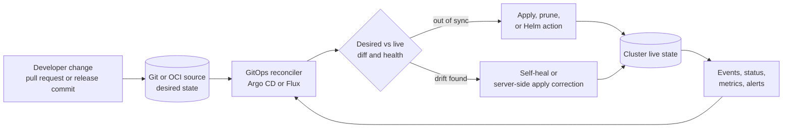
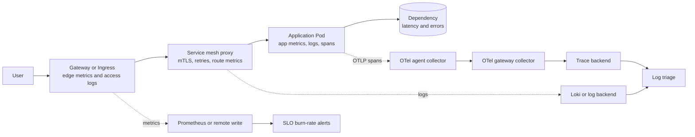

> **CNPA Track** | Platform-engineer review | **Delivery, APIs, observability, and reliability contracts**
>
> **Time to Complete**: 55-65 minutes
>
> **Prerequisites**: Core platform fundamentals, Kubernetes Services and Ingress basics, and first exposure to GitOps or
> SRE terminology

## What You'll Be Able to Do

After completing this module, you will be able to treat delivery, API exposure, and observability as one platform contract instead of three separate tool categories. CNPA does not ask you to administer every controller by memory; it asks
whether you can recognize the control loop, user contract, and failure signal that a cloud native platform should provide.

1. **Analyze** a degraded user request and classify the first failure domain as delivery drift, gateway or mesh routing, telemetry loss, or SLO alerting failure.
2. **Design** a GitOps delivery contract that separates source of truth, reconciliation, drift detection, promotion, generated applications, Helm release ownership, and rollback semantics.
3. **Implement** a platform API exposure pattern that chooses Ingress, Gateway API, HTTPRoute, GRPCRoute, TCPRoute, or service mesh policy at the right responsibility boundary.
4. **Evaluate** an observability baseline that gives product teams useful metrics, logs, traces, OpenTelemetry collection paths, dashboards, and SLO burn-rate alerts.
5. **Compare** Argo CD, Flux CD, Istio, Linkerd, Prometheus, Loki, Vector, and OpenTelemetry by the operational contract they expose to platform users, not by brand preference.

## Why This Module Matters

The CNPA version of delivery, APIs, and observability is platform work, not certification trivia about every Kubernetes object field. A product team should be able to submit a change, see whether the platform accepted it, receive traffic
through a supported edge contract, and understand user impact when the service fails. The platform team owns the layer that makes those steps repeatable: Git is the durable delivery intent, an ingress or Gateway API implementation turns
external requests into cluster traffic, service mesh policy handles service-to-service behavior when needed, and observability turns runtime behavior into decisions. Kubernetes v1.35 documents Ingress as a stable but frozen API and Gateway
API as the role-oriented successor for dynamic infrastructure provisioning and advanced traffic routing, which is exactly the operator distinction CNPA tends to test. ([Kubernetes v1.35:
Ingress](https://v1-35.docs.kubernetes.io/docs/concepts/services-networking/ingress/), [Kubernetes v1.35: Gateway API](https://v1-35.docs.kubernetes.io/docs/concepts/services-networking/gateway/))

The useful mental model is a contract chain. Delivery answers "what version and configuration did we intend to run?" The API layer answers "which requests should reach which backend, under which traffic rules?" Observability answers "what
happened, how bad is it for users, and who should act?" If any one contract is missing, the others become harder to operate. A perfect GitOps repository does not help if a Gateway route silently points to the wrong backend. A rich tracing
system does not help if the alert that should page on user-visible error budget burn never fires. A service mesh retry policy can make a transient fault survivable, but it can also amplify load if the platform does not define where retries
are allowed and how they are measured. ([Gateway API: API Overview](https://gateway-api.sigs.k8s.io/docs/concepts/api-overview/), [Google SRE Workbook: Alerting on SLOs](https://sre.google/workbook/alerting-on-slos/))

In this module, *platform API* means a north–south exposure contract (Gateway API / Ingress / HTTPRoute). The CNPA *provisioning* platform APIs — Crossplane XRDs/Compositions/Claims and CRD+operator patterns — are covered in module 1.2 and the Platform Engineering track; don't conflate the two on the exam.

Platform engineers need literacy across the whole path because they are the translators between product teams and infrastructure implementations. The application team should not need to know which controller watches a `HelmRelease`, which
Gateway implementation programmed an external proxy, or which collector tier exports traces to a backend. They do need a stable interface, clear ownership boundaries, and a way to diagnose whether today's incident belongs to delivery,
routing, or telemetry. Flux describes reconciliation as ensuring actual state matches a declarative desired state, Argo CD describes automated sync and self-heal in terms of out-of-sync applications, and the OpenTelemetry Protocol describes
telemetry delivery between sources, collectors, and backends. A platform that hides all of those mechanisms from users but still exposes their status is doing the right abstraction. ([Flux: Core Concepts](https://fluxcd.io/flux/concepts/),
[Argo CD: Automated Sync Policy](https://argo-cd.readthedocs.io/en/stable/user-guide/auto_sync/), [OpenTelemetry: OTLP Specification](https://opentelemetry.io/docs/specs/otlp/))

CNPA questions often describe symptoms instead of naming the tool. A new release increases errors, but Git still shows the previous image tag. A canary header sends test users to the wrong version. An SLO burns too fast, yet the page never
triggers. Those scenarios are asking for classification and next action: inspect the reconciler and desired state for a delivery failure, inspect Gateway or mesh rules for a request-path failure, inspect telemetry pipelines and alert rules
for an observability failure. The exam rewards the operator who can find the broken contract before changing random YAML.

## Platform Contract Across Delivery, Traffic, and Signals

Start with the user request, not the tools. A request succeeds only when several platform promises hold at the same time: the intended workload version is running, the edge route admits the request, service-to-service policy permits and
shapes the internal hop, and telemetry records enough context to explain the outcome. Each promise has a different owner and artifact. Delivery usually points to Git, an application object, a Flux `Kustomization`, or a Flux `HelmRelease`.
Traffic exposure points to Ingress, Gateway, HTTPRoute, GRPCRoute, TCPRoute, or mesh policy. Signals point to Prometheus time series, Loki log streams, OpenTelemetry traces, and SLO alerts. A platform review connects those artifacts into
one path so responders do not confuse a rollout failure with a gateway failure or a telemetry failure. ([Kubernetes v1.35: Gateway API](https://v1-35.docs.kubernetes.io/docs/concepts/services-networking/gateway/), [Prometheus: Data
Model](https://prometheus.io/docs/concepts/data_model/), [Grafana Loki: Labels](https://grafana.com/docs/loki/latest/get-started/labels/))

At the platform layer, abstraction is not concealment. The product team should not need privileged cluster access to learn whether a release is synced, whether a route is accepted, whether a trace exists, or whether an error budget is
burning. The platform should expose summarized status through a portal, CLI, pull request check, dashboard, or runbook, while retaining the underlying controller status for deeper support. Gateway API explicitly models role boundaries
between infrastructure providers, cluster operators, and application developers; GitOps controllers similarly separate repository authors from reconcilers that apply changes. That division is why platform engineers care about APIs and
status conditions: they are the place where independent teams meet without sharing every implementation detail. ([Kubernetes v1.35: Gateway API](https://v1-35.docs.kubernetes.io/docs/concepts/services-networking/gateway/), [Gateway API: API
Overview](https://gateway-api.sigs.k8s.io/docs/concepts/api-overview/))

Pause and classify: if a checkout request reaches the old version even though a pull request merged five minutes ago, do not begin at the mesh. First ask whether the desired state changed, whether the GitOps controller reconciled that
revision, and whether live state drifted away from Git. If the new Pod is running but only header-matched users fail, move down the request path and inspect HTTPRoute matches, weights, mirroring, or mesh routing policy. If users fail but
the platform has no alert, inspect the SLI, the Prometheus query, the trace sampling path, and the alert route.

This classification habit is more important than memorizing vendor commands. Argo CD, Flux, Istio, Linkerd, Prometheus, Loki, Vector, and OpenTelemetry each have different resources, but their platform contracts are stable: reconcile
desired state, program traffic policy, collect signals, and alert on user impact. A CNPA answer should name the contract that is broken, then name the resource family that would prove or disprove it. That is the operator-level skill.

## GitOps Delivery Loop

GitOps delivery is a reconciliation system, not a button that runs `kubectl apply`. The intended state lives in a repository or artifact source, a controller compares that state with the cluster, and the controller acts until the live state
converges or reports why it cannot. Argo CD describes automated sync as acting on applications that are OutOfSync and self-heal as reacting when live cluster state deviates from Git. Flux describes sources producing artifacts and
`Kustomization` objects reconciling manifests from those artifacts, including periodic dry-run detection and drift correction. The shared idea is durable desired state plus repeated comparison, which is why manual cluster edits are usually
drift, not a supported deployment path. ([Argo CD: Automated Sync Policy](https://argo-cd.readthedocs.io/en/stable/user-guide/auto_sync/), [Argo CD: Diff Strategies](https://argo-cd.readthedocs.io/en/stable/user-guide/diff-strategies/),
[Flux: Kustomization](https://fluxcd.io/flux/components/kustomize/kustomizations/))

GitOps tools like Argo CD and Flux reconcile *manifests* to desired state; progressive-delivery controllers like Argo Rollouts and Flagger handle *workload* rollout strategies (canary, blue-green) on top of that synced state.



The reconciliation loop gives the platform team an audit handle. When a release goes wrong, the first question is whether the bad state was intended, applied, or accidental. If Git contains the bad image tag or route rule, the rollback is a
new desired state or a controller-specific rollback to a previous revision. If Git is correct but live state is different, the question becomes drift, controller permissions, admission failure, or health checks. Argo CD calculates diffs
between desired and live state to decide OutOfSync status, and Flux `Kustomization` reconciles at an interval, validates objects, applies them, and can prune removed objects when enabled. Those status surfaces let a platform engineer show
product teams whether the platform accepted their change or blocked it. ([Argo CD: Diff Strategies](https://argo-cd.readthedocs.io/en/stable/user-guide/diff-strategies/), [Flux:
Kustomization](https://fluxcd.io/flux/components/kustomize/kustomizations/))

Argo CD and Flux both solve GitOps delivery, but they expose different operating surfaces. Argo CD centers an `Application` object and a UI/API-driven application model; it supports automated sync, self-heal, pruning, diff customization,
sync waves, and ApplicationSets for generating many applications. Flux centers the GitOps Toolkit controllers and Kubernetes-native custom resources such as `GitRepository`, `Kustomization`, `HelmRelease`, and `OCIRepository`; it composes
sources and reconcilers directly inside the cluster. A platform team can succeed with either one, but the choice should match how users discover releases, how clusters are partitioned, and how much of the workflow should be expressed as
Kubernetes resources. ([Argo CD: ApplicationSet](https://argo-cd.readthedocs.io/en/stable/user-guide/application-set/), [Flux: Core Concepts](https://fluxcd.io/flux/concepts/), [Flux: Manage Helm
Releases](https://fluxcd.io/flux/guides/helmreleases/))

| Decision point            | Argo CD platform fit                                                                                               | Flux CD platform fit                                                                                  | Operator question                                                                 |
| ------------------------- | ------------------------------------------------------------------------------------------------------------------ | ----------------------------------------------------------------------------------------------------- | --------------------------------------------------------------------------------- |
| User-facing delivery view | Strong application dashboard and sync status for teams that want a central delivery surface                        | Kubernetes-native status through toolkit resources and events for teams comfortable with CRDs         | Where will product teams check release health without cluster-admin access?       |
| Multi-cluster generation  | ApplicationSet can template Applications from list, cluster, Git, and other generators                             | Multiple sources and Kustomizations can target local or remote clusters with explicit resource graphs | Is the platform generating application objects or composing controller resources? |
| Ordered deployment        | Sync phases and sync waves order resources inside an Argo CD sync                                                  | `dependsOn` and controller ordering model dependencies between Flux resources                         | Which dependency needs to be explicit before app traffic starts?                  |
| Helm ownership            | Argo CD renders Helm with `helm template` and compares rendered manifests to live state                            | Flux `HelmRelease` delegates Helm actions to helm-controller and supports remediation options         | Should Helm be treated as rendering input or as a reconciled release object?      |
| Drift correction          | Automated self-heal can resync when live state deviates from Git                                                   | Kustomization reconciliation detects and corrects drift on interval; managed resources can pause      | Which manual changes are allowed, and how are exceptions recorded?                |
| Rollback semantics        | `argocd app rollback` rolls to a previous deployed history entry, but automated sync must be disabled for rollback | Helm controller can perform automated remediation for failed install, upgrade, or test actions        | Is rollback a Git revert, a controller history action, or Helm remediation?       |

Sync waves are a good example of why delivery literacy matters at the platform level. Argo CD orders resources by phase, wave, kind, and name; the `argocd.argoproj.io/sync-wave` annotation assigns integer wave order, with lower waves
applied first. That is useful for CRDs before custom resources, namespaces before namespaced objects, or Jobs around application sync. It is not a general answer to service health, traffic routing, or schema migration safety. If a lower
wave remains unhealthy, the application can never progress to healthy, so the platform pattern must define what dependency really belongs inside a sync and what belongs in a release runbook or progressive delivery system. ([Argo CD: Sync
Phases and Waves](https://argo-cd.readthedocs.io/en/stable/user-guide/sync-waves/))

ApplicationSets and Flux Helm releases show another platform distinction. ApplicationSet lets an operator generate many Argo CD Applications from a template and generator inputs, such as clusters or Git directories. Flux `HelmRelease` lets
a team declare a Helm chart release as a Kubernetes custom resource, with chart sources and values managed by controllers. Both reduce repeated manual configuration, but they fail differently: ApplicationSet errors can generate or update
the wrong set of Applications, while HelmRelease errors can produce a failed Helm action even when the source artifact is correct. CNPA scenarios usually do not require the full spec; they require recognizing where the platform generated
intent and where a controller performed release action. ([Argo CD: ApplicationSet](https://argo-cd.readthedocs.io/en/stable/user-guide/application-set/), [Flux: Manage Helm Releases](https://fluxcd.io/flux/guides/helmreleases/))

Rollback is also a semantics question, not just a command. In a GitOps system, a Git revert is the cleanest long-term expression of desired state because it makes the repository match the intended cluster state. Argo CD also has an `argocd
app rollback` command that rolls back to a previous deployed history ID, but its automated sync documentation states rollback cannot be performed while automated sync is enabled. Flux Helm support includes automated remediation options such
as rollback, uninstall, or retry for failed Helm actions. The platform runbook should tell users which rollback path is supported for application manifests, Helm releases, generated Applications, and progressive traffic changes. ([Argo CD:
App Rollback Command](https://argo-cd.readthedocs.io/en/stable/user-guide/commands/argocd_app_rollback/), [Argo CD: Automated Sync Policy](https://argo-cd.readthedocs.io/en/stable/user-guide/auto_sync/), [Flux: Helm
Controller](https://fluxcd.io/flux/components/helm/))

Promotion policy is where the platform turns reconciliation into a safe delivery workflow. A pull request may promote a version from staging to production, a tag may point Flux at a new artifact, or an Argo CD Application may sync after an
approval gate. The platform contract should say which environment is authoritative, which checks block promotion, and which status a product team can trust after a merge. Otherwise teams treat "merged" as "deployed" and miss the gap between
source control, controller reconciliation, admission, rollout health, and traffic movement. Argo CD and Flux both expose status because that gap is normal. Good platforms make the gap visible instead of pretending it does not exist. ([Argo
CD: Automated Sync Policy](https://argo-cd.readthedocs.io/en/stable/user-guide/auto_sync/), [Flux: Kustomization](https://fluxcd.io/flux/components/kustomize/kustomizations/))

Generated delivery objects need an ownership rule as well. If ApplicationSet creates Argo CD Applications, users should edit the generator input rather than patching generated Applications by hand. If Flux creates Helm releases from chart
sources and values, users should know whether a values file, a `HelmRelease`, or a shared source object owns the change. This sounds administrative, but it prevents incident confusion. A manual patch to a generated object may disappear on
the next reconcile loop, while a bad generator template can stamp the same wrong route, namespace, or value across many clusters. CNPA scenarios often hide this inside phrases such as "all clusters changed after one repo update." ([Argo CD:
ApplicationSet](https://argo-cd.readthedocs.io/en/stable/user-guide/application-set/), [Flux: Manage Helm Releases](https://fluxcd.io/flux/guides/helmreleases/))

## Gateway, Ingress, and Route APIs

Ingress is still part of Kubernetes and still important in production, but it is no longer where new service-networking ideas land. Kubernetes v1.35 marks Ingress as stable since Kubernetes v1.19, states that the Kubernetes project
recommends Gateway instead of Ingress, and says the Ingress API is frozen while remaining generally available. Ingress exposes HTTP and HTTPS routes to Services, with host and path rules, TLS termination, load balancing, and an
implementation-specific controller. That makes Ingress a reasonable contract for simple HTTP exposure when the organization already operates a controller and does not need richer route ownership or traffic shaping. ([Kubernetes v1.35:
Ingress](https://v1-35.docs.kubernetes.io/docs/concepts/services-networking/ingress/))

Gateway API is the platform-grade successor because it splits responsibilities explicitly. The Kubernetes v1.35 Gateway API page describes Gateway API as an add-on of custom resources for dynamic infrastructure provisioning and advanced
routing, with role-oriented resources for infrastructure providers, cluster operators, and application developers. It lists four stable API kinds: `GatewayClass`, `Gateway`, `HTTPRoute`, and `GRPCRoute`. The Gateway API project separately
documents `HTTPRoute` as having been in the Standard channel since v0.5.0 and promoted to GA (v1) in v1.0.0. It documents `GRPCRoute` as GA since v1.1.0, while `TCPRoute` and `UDPRoute` remain Alpha in the Experimental channel. A CNPA answer should therefore avoid saying "all Gateway route
types are GA"; the stable contract is narrower than the full protocol menu. ([Kubernetes v1.35: Gateway API](https://v1-35.docs.kubernetes.io/docs/concepts/services-networking/gateway/), [Gateway API: API
Overview](https://gateway-api.sigs.k8s.io/docs/concepts/api-overview/), [Gateway API: HTTPRoute](https://gateway-api.sigs.k8s.io/reference/api-types/httproute/), [Gateway API:
GRPCRoute](https://gateway-api.sigs.k8s.io/reference/api-types/grpcroute/))

The request-path resource choice follows the protocol and ownership boundary. Use Ingress when the platform offers a familiar HTTP or HTTPS front door and controller-specific annotations are already accepted. Use Gateway plus HTTPRoute when
the infrastructure team owns listener policy and app teams own route attachment, hostnames, path matches, filters, and backend weights. Use GRPCRoute when gRPC service and method matching, gRPC-aware policy, or gRPC-oriented observability
matters. Use TCPRoute only when the selected implementation and the platform accept the Experimental channel risk for L4 stream forwarding. The question is not which object is more fashionable; the question is which API expresses the user's
intent without hiding critical controller behavior. ([Gateway API: HTTPRoute](https://gateway-api.sigs.k8s.io/reference/api-types/httproute/), [Gateway API: GRPCRoute](https://gateway-api.sigs.k8s.io/reference/api-types/grpcroute/))

Gateway API also gives platform teams traffic-shaping primitives that used to live in controller annotations or service mesh resources. HTTP traffic splitting uses weighted `backendRefs` inside HTTPRoute rules, and the official guide shows
weights such as 90 and 10 to shift traffic gradually between service versions. Header-based routing can send synthetic or test traffic to a canary before user traffic moves, and request mirroring can forward a copy of production requests to
a secondary backend while ignoring mirrored responses. These features are route contract decisions: they should be tied to promotion gates, ownership, and observability so a canary is measured rather than merely configured. ([Gateway API:
HTTP Traffic Splitting](https://gateway-api.sigs.k8s.io/guides/user-guides/traffic-splitting/), [Gateway API: HTTP Request Mirroring](https://gateway-api.sigs.k8s.io/guides/user-guides/http-request-mirroring/), [Gateway API: HTTP Header
Modifiers](https://gateway-api.sigs.k8s.io/guides/user-guides/http-header-modifier/))

Exercise scenario: a platform team migrates a shared edge from Ingress to Gateway API and gives each product namespace permission to attach HTTPRoutes to a shared Gateway listener. The platform must now document which hostnames are allowed,
which namespaces can attach routes, how conflicts are reported, which filters are supported by the selected implementation, and where route status appears for app teams. Gateway API's bidirectional attachment model is the useful concept: a
Route references a parent Gateway, and the listener must accept that Route shape. If a route is rejected, the failure belongs to the API contract before it belongs to the workload. ([Gateway API: API
Overview](https://gateway-api.sigs.k8s.io/docs/concepts/api-overview/))

```yaml
apiVersion: gateway.networking.k8s.io/v1
kind: HTTPRoute
metadata:
  name: checkout-canary
spec:
  parentRefs:
    - name: shared-edge
      namespace: platform-ingress
  hostnames:
    - checkout.example.com
  rules:
    - matches:
        - headers:
            - name: traffic
              value: test
      backendRefs:
        - name: checkout-v2
          port: 8080
    - backendRefs:
        - name: checkout-v1
          port: 8080
          weight: 90
        - name: checkout-v2
          port: 8080
          weight: 10
```

This YAML is intentionally small because CNPA cares about the contract, not a memorized manifest. The first rule sends test-header traffic to `checkout-v2`, while the second rule splits ordinary traffic between two Services. A platform
should pair that route with a dashboard showing request rate, success rate, and latency by route and backend, then with an SLO alert that catches user impact before a canary becomes a full outage. Traffic shaping without observability is
just a more complicated way to break production.

Route status is part of the API, not an afterthought. Gateway API resources report whether a Route is accepted by a parent, whether references are resolved, and whether implementation-specific conditions allow traffic to flow. That status
is the first place to look when a team says "my route exists but no traffic reaches it." A platform should surface accepted, programmed, conflicted, and unsupported states in the same user workflow that shows GitOps sync. If the only way to
debug a rejected route is to ask a cluster administrator for raw controller events, the platform has not finished the abstraction. ([Gateway API: API Overview](https://gateway-api.sigs.k8s.io/docs/concepts/api-overview/), [Gateway API:
HTTPRoute](https://gateway-api.sigs.k8s.io/reference/api-types/httproute/))

Migration from Ingress to Gateway should also be treated as a contract migration. The old contract may have hidden behavior in annotations, controller-specific rewrite rules, TLS secret conventions, or default backends. The new contract
should state which behavior moved to Gateway listeners, which moved to HTTPRoute filters, which behavior is no longer supported, and which team approves shared hostnames. Kubernetes v1.35 keeps Ingress stable and frozen, so a platform can
migrate incrementally. The wrong answer is to rewrite every edge route before the support model, status dashboards, and rollback path are ready. ([Kubernetes v1.35:
Ingress](https://v1-35.docs.kubernetes.io/docs/concepts/services-networking/ingress/), [Kubernetes v1.35: Gateway API](https://v1-35.docs.kubernetes.io/docs/concepts/services-networking/gateway/))

## Service Mesh Contract

A service mesh adds policy and telemetry between services after traffic is already inside the platform. Istio and Linkerd both provide service-to-service behavior that applications would otherwise implement themselves: identity, mutual TLS,
retries, timeouts, circuit breaking, traffic policy, and observability. The platform-level question is whether those benefits justify the operational cost and whether the selected mesh contract is clear enough for product teams. Istio's
traffic management docs describe Envoy-based routing, retries, circuit breakers, timeouts, canary rollouts, and traffic splits; Linkerd documents automatic mTLS between meshed pods, retries and timeouts on HTTPRoute or GRPCRoute resources,
and endpoint-level circuit breaking in the proxy. ([Istio: Traffic Management](https://istio.io/latest/docs/concepts/traffic-management/), [Istio:
PeerAuthentication](https://istio.io/latest/docs/reference/config/security/peer_authentication/), [Linkerd: Automatic mTLS](https://linkerd.io/2.19/features/automatic-mtls/), [Linkerd: Retries and
Timeouts](https://linkerd.io/2.19/features/retries-and-timeouts/), [Linkerd: Circuit Breaking](https://linkerd.io/2.19/reference/circuit-breaking/))

| Platform decision    | Istio signal                                                                                                         | Linkerd signal                                                                               | CNPA-level interpretation                                                                        |
| -------------------- | -------------------------------------------------------------------------------------------------------------------- | -------------------------------------------------------------------------------------------- | ------------------------------------------------------------------------------------------------ |
| Mutual TLS posture   | `PeerAuthentication` can require STRICT mTLS and Istio supports sidecar and ambient security modes                   | Automatic mTLS applies between meshed pods and uses service account identity                 | Choose the mesh when service identity and encrypted pod-to-pod traffic are platform requirements |
| Traffic policy depth | Rich VirtualService and DestinationRule traffic controls, retries, timeouts, outlier detection, and circuit breaking | Gateway API-oriented retries, timeouts, and endpoint-level circuit breaking with fewer knobs | Prefer the simpler contract unless advanced traffic policy is a real requirement                 |
| Operating model      | More policy surface, Envoy behavior, analyzer messages, and multiple deployment modes                                | Smaller conceptual surface centered on transparent proxying and mTLS defaults                | Match the tool to support capacity, not only feature count                                       |
| Gateway integration  | Istio can act as an ingress and mesh implementation and supports Gateway API patterns                                | Linkerd integrates with Gateway API resources for policy such as retries and timeouts        | Decide whether edge and mesh should be one stack or separate platform layers                     |
| Failure mode         | Misconfigured routes, destination rules, sidecar injection, or mTLS policy can create surprising 503s                | Non-meshed traffic, skipped ports, policy gaps, and retry misuse can weaken assumptions      | Document how users prove traffic is meshed and which team owns proxy health                      |
| Observability value  | Mesh telemetry can expose request volume, errors, latency, and policy behavior through proxies                       | Mesh telemetry can expose per-route and per-service behavior with less app instrumentation   | Mesh telemetry supplements application telemetry; it does not replace app spans and logs         |

Do not answer service mesh questions by saying "Istio is powerful" or "Linkerd is simpler" and stopping there. A platform team should choose Istio when it needs a broad traffic policy surface, strict controls across complex service graphs,
or an implementation that can combine ingress, mesh, and advanced routing under one operating model. It should choose Linkerd when automatic mTLS, transparent proxying, retries, timeouts, and lower configuration burden match the platform's
actual needs. It should choose no mesh when Kubernetes NetworkPolicy, Gateway API, application telemetry, and library-level resilience already satisfy the contract. Every mesh adds a data-plane hop, a control plane, certificate operations,
and debugging surface, so the benefit must be tied to a named platform promise. ([Istio: Traffic Management](https://istio.io/latest/docs/concepts/traffic-management/), [Linkerd: Automatic
mTLS](https://linkerd.io/2.19/features/automatic-mtls/))

Authorization is a separate decision pivot from mTLS. When the requirement is L7 RBAC between services, evaluate Istio's `AuthorizationPolicy` or Linkerd's `policy.linkerd.io/Server` plus `ServerAuthorization` as the operator-level knobs.
([Istio: AuthorizationPolicy](https://istio.io/latest/docs/reference/config/security/authorization-policy/), [Linkerd: Authorization Policy](https://linkerd.io/2.19/reference/authorization-policy/))

Retries and circuit breakers are the easiest mesh features to misuse. A retry on a safe, idempotent read can hide a transient backend failure from users; a retry on a state-changing payment request can duplicate work or amplify load.
Linkerd explicitly warns that retries should be used carefully because they can increase system load, and Istio documents circuit breaking as a way to limit the impact of failures, latency spikes, and other network effects. The platform
contract should say which methods or routes may retry, what timeout bounds apply, how retry budgets or limits are set, and which metric proves the policy is helping rather than making an outage worse. ([Linkerd: Retries and
Timeouts](https://linkerd.io/2.19/features/retries-and-timeouts/), [Istio: Circuit Breaking](https://istio.io/latest/docs/tasks/traffic-management/circuit-breaking/))

## Observability Platform Baseline

Observability at the platform layer is the ability to ask useful questions about user impact, request flow, and system ownership without requiring every product team to build a bespoke stack. Metrics show numerical trends and SLO
indicators, logs preserve events and context, and traces connect work across service boundaries. The triad is not a three-tool shopping list. It is a coverage model: a platform should provide default instrumentation conventions, collection
paths, storage backends, dashboards, alert routes, and access controls so teams can troubleshoot through a shared vocabulary. Prometheus stores time series identified by metric names and labels, Loki groups log streams by labels while
warning against high-cardinality labels, and OpenTelemetry defines common names and an OTLP delivery protocol across traces, metrics, logs, and profiles. ([Prometheus: Data Model](https://prometheus.io/docs/concepts/data_model/), [Grafana
Loki: Labels](https://grafana.com/docs/loki/latest/get-started/labels/), [OpenTelemetry: Semantic Conventions](https://opentelemetry.io/docs/concepts/semantic-conventions/), [OpenTelemetry: OTLP
Specification](https://opentelemetry.io/docs/specs/otlp/))



Metrics need stable labels because every new label value creates a new time series in Prometheus. That is valuable for dimensions such as service, namespace, route, method, status class, and cluster, but dangerous for request IDs, user IDs,
Pod UIDs, or unbounded paths. OpenMetrics defines numeric metric values, labels, metric families, counters, gauges, histograms, and summaries, and Prometheus follows a dimensional data model that makes labels central to filtering and
aggregation. The platform should therefore publish metric naming and cardinality rules before teams ship instrumentation. A dashboard that works in staging can become unusable in production if a canary adds a high-cardinality label to a hot
request counter. ([Prometheus: Data Model](https://prometheus.io/docs/concepts/data_model/), [OpenMetrics Specification](https://github.com/prometheus/OpenMetrics/blob/main/specification/OpenMetrics.md))

Logs need enough structure to answer incident questions without turning every field into an index label. Loki's documentation is explicit that log content is not indexed like a traditional full-text system; entries are grouped into streams
by labels, and high-cardinality labels can significantly reduce performance and cost effectiveness. Vector's Loki sink can deliver log events to Loki, attach labels, attach structured metadata, and warns that high-cardinality labels can
cause drastic performance issues. The platform baseline should define required fields such as service name, environment, namespace, severity, trace ID, and request ID, then decide which are labels and which remain structured metadata or log
content. ([Grafana Loki: Labels](https://grafana.com/docs/loki/latest/get-started/labels/), [Vector: Loki Sink](https://vector.dev/docs/reference/configuration/sinks/loki/))

Traces need consistent propagation and semantic naming. OpenTelemetry Semantic Conventions define common names for operations, resources, traces, metrics, logs, and profiles, while OTLP defines how telemetry data moves between sources,
intermediate collectors, and backends over gRPC or HTTP. The platform contract should make trace propagation part of the golden path: ingress or gateway request IDs, mesh spans when available, application spans, dependency spans, and log
correlation should all meet in the same incident workflow. Sampling belongs in the contract too, because aggressive head sampling can hide rare failures while unbounded tracing can overload storage. ([OpenTelemetry: Semantic
Conventions](https://opentelemetry.io/docs/concepts/semantic-conventions/), [OpenTelemetry: OTLP Specification](https://opentelemetry.io/docs/specs/otlp/))

Retention is another platform promise. Metrics may need short high-resolution windows and longer downsampled history. Logs may need different retention for audit trails, debug streams, and regulated data. Traces may need tail sampling so
rare, slow, or failed requests survive even when ordinary successful requests are sampled out. The platform should publish those choices because incident responders will make decisions based on what they can query. A team that learns during
an incident that failed traces were dropped after five minutes has not received an observability contract; it has received a best-effort sink. ([Prometheus: Data Model](https://prometheus.io/docs/concepts/data_model/), [OpenTelemetry:
Agent-to-Gateway Pattern](https://opentelemetry.io/docs/collector/deploy/other/agent-to-gateway/))

Ownership metadata ties the three signals back to real teams. A useful platform attaches service name, namespace, environment, cluster, version, route, and owner consistently across metrics, logs, and traces. That does not mean every field
becomes a hot label. It means the same service identity can be found in Prometheus queries, Loki streams or structured metadata, and OpenTelemetry resource attributes. Without that identity, the on-call engineer spends the first fifteen
minutes mapping a Pod name to a team, a route, and a release. With it, the incident can move quickly from symptom to owner to rollback, route fix, or telemetry fix. ([Grafana Loki:
Labels](https://grafana.com/docs/loki/latest/get-started/labels/), [OpenTelemetry: Semantic Conventions](https://opentelemetry.io/docs/concepts/semantic-conventions/))

Pause and classify again: if Prometheus shows elevated 5xx responses, Loki has no matching logs, and traces stop at the gateway, the first failure may be observability coverage rather than the application itself. The platform should ask
whether log collection is deployed on that node, whether OpenTelemetry agents can reach the gateway collector, whether route labels changed, and whether sampling dropped the failing traces. Good observability is not only data volume; it is
the ability to correlate signals across the exact request path being investigated.

## SLOs, SLIs, SLAs, and Burn-Rate Alerts

SLO language turns observability into a decision system. The Google SRE book defines an SLI as the measurement of a service behavior, an SLO as the target value or range for that service level, and an SLA as an explicit agreement with users
that may have consequences when violated. A platform team should use that framework for platform capabilities as well as product services. Examples include "99.9% of successful checkout requests complete under 300 ms over 30 days," "99% of
GitOps syncs complete within 10 minutes of a merged production change," or "95% of service onboarding requests produce a ready namespace within 15 minutes." The important property is that each SLO names a user-visible outcome and the
measurement window. ([Google SRE Book: Service Level Objectives](https://sre.google/sre-book/service-level-objectives/))

Error budgets are the permission system for reliability tradeoffs. If a service has a 99.9% availability SLO over a 30-day window, the remaining 0.1% is the error budget for that window. Burn rate describes how fast the service consumes
that budget relative to the SLO. The SRE Workbook recommends alerting on SLO burn because it pages on significant user-impact events before the budget is exhausted, and it explains multiwindow, multi-burn-rate alerts as a way to improve
both detection time and precision. CNPA does not require deriving every formula from memory, but it does expect recognizing why an alert on raw CPU or one failed request is weaker than an alert on budget-consuming user impact. ([Google SRE
Workbook: Alerting on SLOs](https://sre.google/workbook/alerting-on-slos/))

The platform engineer's job is to make SLOs operable. That means the service catalog or onboarding flow should ask for tier, owner, user journey, SLI query, objective, alert route, dashboard link, and runbook link. Prometheus can calculate
the numerator and denominator for availability or latency SLIs when instrumentation is consistent; traces and logs explain the failures behind the metric; and alert routing sends only actionable burn to on-call. If the alert fires without a
runbook, the platform has created noise. If the runbook exists but the metric label changed during a release, the platform has created a false sense of coverage. ([Prometheus: Data Model](https://prometheus.io/docs/concepts/data_model/),
[Google SRE Workbook: Alerting on SLOs](https://sre.google/workbook/alerting-on-slos/))

SLAs should be treated carefully in CNPA answers. An internal platform SLO may be stricter than an external SLA so the team has room to correct issues before contractual damage occurs. A product team can miss an internal SLO and trigger a
reliability freeze or postmortem even when no external SLA compensation applies. Conversely, an SLA without a reliable SLI is not operationally useful because responders cannot know whether the contract is at risk. The best platform answer
keeps the terms separate: SLI is measurement, SLO is target, SLA is agreement, and error budget is the amount of unreliability the target permits. ([Google SRE Book: Service Level
Objectives](https://sre.google/sre-book/service-level-objectives/), [Google SRE Workbook: Error Budget Policy](https://sre.google/workbook/error-budget-policy/))

## OpenTelemetry Collector Deployment Contract

OpenTelemetry Collector placement is a platform design choice because it determines which telemetry losses are local, which processing is centralized, and which teams own configuration. The agent pattern runs a Collector beside or near
applications, such as a sidecar or DaemonSet, and sends telemetry onward to backends. OpenTelemetry documents that this pattern is straightforward and has a clear one-to-one mapping between application and Collector, but is less flexible
for complex or evolving deployments. That makes agents a good default for node-local data, host metrics, local receivers, and simple teams, but not always enough for central filtering, tail sampling, or backend fan-out. ([OpenTelemetry:
Agent Deployment Pattern](https://opentelemetry.io/docs/collector/deploy/agent/))

The agent-to-gateway pattern adds a gateway tier. Agents receive local telemetry and forward it to gateway Collectors, while gateway Collectors perform centralized processing such as filtering, sampling, batching, and exporting.
OpenTelemetry recommends OTLP for communication between agents and gateways and notes that Kubernetes service names can be used for endpoint configuration. It also warns that scaling gateway collectors requires care, especially for tail
sampling and metric single-writer behavior. The platform contract should state which processors belong in agents, which belong in gateways, what happens during backend outages, and how teams detect dropped spans, logs, or metric points.
([OpenTelemetry: Agent-to-Gateway Pattern](https://opentelemetry.io/docs/collector/deploy/other/agent-to-gateway/), [OpenTelemetry: Deploy the Collector](https://opentelemetry.io/docs/collector/deploy/))

The practical split is easy to remember. Agents should stay close to the signal source, add local resource attributes, receive application OTLP, scrape local or node-level data when needed, and buffer briefly. Gateways should centralize
expensive or shared decisions: tail sampling, routing to multiple backends, tenant-level filtering, export credentials, larger queues, and backend retry policy. If every team edits a cluster-wide gateway config for one service-specific
exception, the platform becomes a bottleneck. If every team runs custom collectors with unique label and sampling rules, the platform loses correlation. CNPA scenarios usually ask for this tradeoff, not for every collector processor name.

Collector failure behavior should be explicit. A backend outage can cause queues to grow, exporters to retry, memory limits to drop telemetry, or agents to fall behind. The user-facing question is what signal proves the telemetry path is
healthy. The platform should monitor Collector receiver, processor, exporter, and queue health, then alert platform owners before product teams discover missing spans during an incident. It should also state what is allowed to degrade
first. Dropping debug spans may be acceptable; losing the SLO metric stream or every error log is not. OTLP defines transport semantics, but the platform owns the operational behavior around retries, backpressure, and backend failure.
([OpenTelemetry: OTLP Specification](https://opentelemetry.io/docs/specs/otlp/), [OpenTelemetry: Deploy the Collector](https://opentelemetry.io/docs/collector/deploy/))

## CNPA Exam Patterns

When the prompt says "users got the old version after a merge," start with delivery. Check whether the desired state changed, whether the GitOps controller observed the revision, whether automated sync was enabled, whether health checks
blocked sync completion, whether Helm chart rendering introduced a non-deterministic diff, or whether live state drifted from Git. Argo CD's automated sync behavior and Flux's reconciliation intervals are the proof surfaces. A gateway rule
might also send traffic to the old version, but do not skip the controller status when the symptom follows a release change. ([Argo CD: Automated Sync Policy](https://argo-cd.readthedocs.io/en/stable/user-guide/auto_sync/), [Flux:
Kustomization](https://fluxcd.io/flux/components/kustomize/kustomizations/))

When the prompt says "only users with a header, host, path, or gRPC method fail," start with the API path. Inspect Ingress rules if the platform still uses Ingress, or Gateway, HTTPRoute, GRPCRoute, and implementation status if the platform
uses Gateway API. Weighted backends, mirrored requests, request header modification, hostname matching, and GRPCRoute method matching can all create request-specific failures. If the request reaches the right Pod but service-to-service
calls fail, move to mesh policy, mTLS mode, retries, circuit breakers, and authorization. ([Gateway API: HTTP Traffic Splitting](https://gateway-api.sigs.k8s.io/guides/user-guides/traffic-splitting/), [Gateway API:
GRPCRoute](https://gateway-api.sigs.k8s.io/reference/api-types/grpcroute/), [Istio: PeerAuthentication](https://istio.io/latest/docs/reference/config/security/peer_authentication/))

When the prompt says "no one was alerted" or "dashboards looked green while users failed," start with observability and SLO design. Check whether the SLI measures user success, whether the metric labels still match the Prometheus query,
whether the OpenTelemetry collector path is dropping data, whether logs were labeled into the expected stream, whether trace sampling hid the failure, and whether the alert route is tied to error budget burn rather than raw infrastructure
symptoms. This does not mean the application is healthy; it means the platform failed to notice or communicate user impact. ([Google SRE Workbook: Alerting on SLOs](https://sre.google/workbook/alerting-on-slos/), [OpenTelemetry: OTLP
Specification](https://opentelemetry.io/docs/specs/otlp/), [Grafana Loki: Labels](https://grafana.com/docs/loki/latest/get-started/labels/))

When two layers changed at once, isolate them with a timeline. Did Git change first, then the route, then the error budget burn? Did a route reject before new Pods appeared? Did telemetry vanish at the same moment a collector rollout
happened? The most useful CNPA answer is often a sequence: prove desired state, prove live state, prove route acceptance, prove mesh policy, prove signals, then choose rollback, route fix, policy fix, or alert fix. That sequence is how a
platform engineer turns broad cloud native literacy into a reliable operational response.

## Did You Know

- Gateway API's own overview currently marks `HTTPRoute` and `GRPCRoute` as GA Standard-channel resources, while `TCPRoute` and `UDPRoute` remain Alpha Experimental-channel resources; do not flatten those statuses in an exam answer. ([Gateway API: API Overview](https://gateway-api.sigs.k8s.io/docs/concepts/api-overview/))
- Argo CD automated sync will not perform a rollback while automated sync is enabled, which is why a rollback runbook must say whether the supported move is disabling autosync, using controller history, or reverting Git. ([Argo CD: Automated Sync Policy](https://argo-cd.readthedocs.io/en/stable/user-guide/auto_sync/))
- Loki intentionally indexes labels rather than full log content, so a platform that labels every request ID or Pod instance can make logs harder and more expensive to operate. ([Grafana Loki: Labels](https://grafana.com/docs/loki/latest/get-started/labels/))
- OpenTelemetry documents OTLP as stable for traces, metrics, and logs, but end-to-end delivery guarantees across multiple collectors and backends are outside OTLP's scope. ([OpenTelemetry: OTLP Specification](https://opentelemetry.io/docs/specs/otlp/))

## Common Mistakes

| Mistake                                                      | Why It Hurts                                                                            | Better Operator Move                                                                                     |
| ------------------------------------------------------------ | --------------------------------------------------------------------------------------- | -------------------------------------------------------------------------------------------------------- |
| Treating GitOps as "CI/CD with YAML"                         | It hides the reconciliation contract that detects drift, health, and failed convergence | Ask what object records desired state, what controller reconciles it, and where status appears           |
| Saying Gateway API simply replaces every Ingress immediately | Ingress is stable and not removed, while Gateway API needs CRDs and an implementation   | Migrate when role boundaries, traffic shaping, or route ownership justify the platform change            |
| Calling TCPRoute GA because HTTPRoute is GA                  | Gateway API route types have different release-channel status                           | State that HTTPRoute and GRPCRoute are GA Standard-channel resources while TCPRoute remains Experimental |
| Using a mesh for every reliability problem                   | A mesh adds certificates, proxies, policy, and debugging complexity                     | Use a mesh when mTLS, service identity, retries, timeouts, or traffic policy are platform requirements   |
| Building metrics without cardinality rules                   | Unbounded labels create many time series and can make queries expensive or unusable     | Publish label conventions and keep request IDs, user IDs, and volatile instance IDs out of hot labels    |
| Treating logs as the only observability signal               | Logs explain events but do not directly show SLO burn or distributed request paths      | Combine metrics for alerting, logs for context, and traces for cross-service flow                        |
| Alerting on raw infrastructure symptoms only                 | CPU or Pod restart alerts may miss user impact or page on harmless noise                | Page on SLO burn and keep infrastructure alerts routed to the right operational queue                    |

## Quiz

<details>
<summary>Exercise scenario: a new image tag is merged, but production still serves the old version after the GitOps interval passes. Which domain should you inspect first?</summary>

Start with delivery. Prove that Git contains the intended image tag, then check whether the Argo CD Application or Flux `Kustomization` observed the revision, whether it is OutOfSync or Ready, whether health or admission blocked
convergence, and whether live state drifted from desired state. A gateway route could still send traffic to an old Service, but the timing around a merged release makes the reconciler and desired-state record the first proof surface.

</details>

<details>
<summary>Exercise scenario: ordinary users are healthy, but requests with `traffic: test` fail during a canary. Is this primarily delivery, API routing, or observability?</summary>

Classify it as API routing first. The header-specific symptom points to HTTPRoute matching, weighted backend rules, or a canary backend selected by the route. Delivery may have successfully created both versions, and observability may
reveal the error rate, but the conditional request behavior belongs to the Gateway or route contract until proven otherwise.

</details>

<details>
<summary>Exercise scenario: a gRPC service fails only for one method after a route migration. Which Gateway API resource should be considered, and why?</summary>

Consider `GRPCRoute` because it can express gRPC-specific routing intent such as service and method matching, while `HTTPRoute` treats basic gRPC routing as HTTP paths. If the platform needs gRPC-aware policy, metrics, or method matching,
GRPCRoute is the clearer contract. Also verify the implementation supports GRPCRoute and that hostnames do not conflict with attached HTTPRoutes.

</details>

<details>
<summary>Exercise scenario: an SLO burns rapidly, but the trace backend shows only a few sampled successful requests. What platform design issue should you evaluate?</summary>

Evaluate the observability collection and sampling contract. The SLO metric says users are failing, so the trace sample may be hiding the failing population. Check OpenTelemetry agent-to-gateway flow, tail-sampling policy, exporter errors,
route labels, and whether logs carry trace or request IDs for correlation. The answer is not to trust the trace backend over the SLO; it is to explain why the trace coverage does not represent the failing requests.

</details>

<details>
<summary>Exercise scenario: a platform team wants Linkerd or Istio only because "mTLS is good." What comparison should a CNPA answer include?</summary>

Compare the operational contract. Istio offers a broad traffic-management and security policy surface, including mTLS controls, retries, circuit breaking, and advanced routing, but it adds more configuration and proxy behavior to operate.
Linkerd emphasizes automatic mTLS between meshed pods and a smaller policy surface, but still requires certificate, proxy, and meshed-traffic ownership. The platform should choose a mesh only when service identity, encryption, resilience
policy, or mesh telemetry is a named requirement.

</details>

<details>
<summary>Exercise scenario: Prometheus alerts are quiet, Loki has logs with errors, and users report failures. What is the likely observability contract failure?</summary>

The alerting SLI probably does not measure the user failure path, or the metric labels in the Prometheus query no longer match the emitted data. Logs can show errors without creating an actionable page if the platform has not connected
logs, metrics, and SLO alerts. The next move is to inspect the SLI numerator and denominator, label filters, scrape or remote-write path, and alert route before changing the application.

</details>

## Hands-On Practice

- [ ] Design a GitOps delivery contract for one service that names the source of truth, reconciler, promotion path, drift policy, rollback path, and team-visible status field.
- [ ] Compare Argo CD and Flux for a multi-cluster platform by deciding whether the user contract should center generated Applications, Flux `Kustomization` resources, or Flux `HelmRelease` resources.
- [ ] Implement a paper HTTPRoute canary for a service with one header-matched rule and one weighted backend rule, then state which metric proves the canary is safe to expand.
- [ ] Evaluate whether a proposed service mesh requirement is really about mTLS, retries, circuit breaking, authorization, telemetry, or an unsupported desire for "more reliability."
- [ ] Build an observability checklist for a product team that includes Prometheus SLI metrics, Loki label rules, OpenTelemetry trace propagation, alert route, dashboard, and runbook owner.
- [ ] Classify three recent or hypothetical incidents into delivery, API routing, mesh policy, telemetry pipeline, or SLO alerting failures, then write the first evidence source for each.

## Next Module

Continue with [CNPA Practice Questions Set 1](../module-1.4-practice-questions-set-1/).

## Sources

- [Kubernetes v1.35: Ingress](https://v1-35.docs.kubernetes.io/docs/concepts/services-networking/ingress/) - documents Ingress stability, frozen API status, HTTP and HTTPS routing scope, controller requirements, and Ingress limitations.
- [Kubernetes v1.35: Gateway API](https://v1-35.docs.kubernetes.io/docs/concepts/services-networking/gateway/) - documents Gateway API as an add-on of role-oriented custom resources, stable API kinds, request flow, and migration guidance from Ingress.
- [Gateway API: API Overview](https://gateway-api.sigs.k8s.io/docs/concepts/api-overview/) - documents GatewayClass, Gateway, HTTPRoute, GRPCRoute, TCPRoute, route channels, listener distinctiveness, and route attachment relationships.
- [Gateway API: HTTPRoute](https://gateway-api.sigs.k8s.io/reference/api-types/httproute/) - documents HTTPRoute status, parent references, hostnames, rules, matches, filters, backendRefs, and route status.
- [Gateway API: GRPCRoute](https://gateway-api.sigs.k8s.io/reference/api-types/grpcroute/) - documents GRPCRoute GA status, gRPC service and method matching, HTTPRoute comparison, and route attachment behavior.
- [Gateway API: HTTP Traffic Splitting](https://gateway-api.sigs.k8s.io/guides/user-guides/traffic-splitting/) - documents weighted backendRefs, canary header routing, blue-green rollout steps, and proportional traffic shifting.
- [Gateway API: HTTP Request Mirroring](https://gateway-api.sigs.k8s.io/guides/user-guides/http-request-mirroring/) - documents RequestMirror filters, mirrored backend behavior, and ignored responses from mirrored requests.
- [Gateway API: HTTP Header Modifiers](https://gateway-api.sigs.k8s.io/guides/user-guides/http-header-modifier/) - documents RequestHeaderModifier and ResponseHeaderModifier filters for adding, setting, and removing headers.
- [Argo CD: Automated Sync Policy](https://argo-cd.readthedocs.io/en/stable/user-guide/auto_sync/) - documents automated sync, pruning, self-heal, sync semantics, reconciliation interval, and rollback limitations.
- [Argo CD: Sync Phases and Waves](https://argo-cd.readthedocs.io/en/stable/user-guide/sync-waves/) - documents sync waves, ordering precedence, hooks, wave annotations, and health-dependent progression.
- [Argo CD: ApplicationSet](https://argo-cd.readthedocs.io/en/stable/user-guide/application-set/) - documents ApplicationSet-generated Applications, list and cluster generators, template behavior, and multi-cluster use.
- [Argo CD: Diff Strategies](https://argo-cd.readthedocs.io/en/stable/user-guide/diff-strategies/) - documents desired-vs-live diff calculation, out-of-sync detection, and server-side diff behavior.
- [Argo CD: App Rollback Command](https://argo-cd.readthedocs.io/en/stable/user-guide/commands/argocd_app_rollback/) - documents rollback to previous deployed application history IDs.
- [Flux: Core Concepts](https://fluxcd.io/flux/concepts/) - documents Flux GitOps concepts, sources, artifacts, reconciliation, and GitOps Toolkit components.
- [Flux: Kustomization](https://fluxcd.io/flux/components/kustomize/kustomizations/) - documents Flux Kustomization reconciliation, interval behavior, drift correction, pruning, manual reconcile, and suspension.
- [Flux: Manage Helm Releases](https://fluxcd.io/flux/guides/helmreleases/) - documents declarative Helm releases, Helm chart sources, OCI repositories, HelmRelease resources, chart references, and values handling.
- [Flux: Helm Controller](https://fluxcd.io/flux/components/helm/) - documents helm-controller behavior, automated Helm actions, remediation, rollbacks, ordering, pruning, and status reporting.
- [Istio: Traffic Management](https://istio.io/latest/docs/concepts/traffic-management/) - documents Istio traffic management, Envoy proxy model, retries, timeouts, circuit breakers, and traffic splitting.
- [Istio: Circuit Breaking](https://istio.io/latest/docs/tasks/traffic-management/circuit-breaking/) - documents circuit breaking configuration, failure containment, and outlier detection concepts.
- [Istio: PeerAuthentication](https://istio.io/latest/docs/reference/config/security/peer_authentication/) - documents mTLS policy modes, STRICT requirements, selector scope, and port-level mTLS behavior.
- [Istio: AuthorizationPolicy](https://istio.io/latest/docs/reference/config/security/authorization-policy/) - documents service-to-service authorization policy actions, workload selectors, sources, operations, and conditions.
- [Linkerd: Automatic mTLS](https://linkerd.io/2.19/features/automatic-mtls/) - documents automatic mTLS between meshed pods, service account identity, certificate issuance, rotation, and caveats.
- [Linkerd: Retries and Timeouts](https://linkerd.io/2.19/features/retries-and-timeouts/) - documents retry and timeout configuration on HTTPRoute, GRPCRoute, and Service resources, plus retry safety cautions.
- [Linkerd: Circuit Breaking](https://linkerd.io/2.19/reference/circuit-breaking/) - documents endpoint-level circuit breaking and failure-accrual behavior in Linkerd.
- [Linkerd: Authorization Policy](https://linkerd.io/2.19/reference/authorization-policy/) - documents `Server` and `ServerAuthorization` resources for controlling which clients may access protected server ports.
- [Prometheus: Data Model](https://prometheus.io/docs/concepts/data_model/) - documents time series, metric names, labels, dimensional data, samples, and label cardinality implications.
- [OpenMetrics Specification](https://github.com/prometheus/OpenMetrics/blob/main/specification/OpenMetrics.md) - documents OpenMetrics data model, metric families, labels, numeric values, counters, gauges, histograms, summaries, and wire format expectations.
- [Grafana Loki: Labels](https://grafana.com/docs/loki/latest/get-started/labels/) - documents Loki log streams, label strategy, OpenTelemetry resource label defaults, structured metadata, and high-cardinality warnings.
- [Vector: Loki Sink](https://vector.dev/docs/reference/configuration/sinks/loki/) - documents Vector delivery of log events to Loki, labels, structured metadata, ordering behavior, and high-cardinality cautions.
- [OpenTelemetry: Semantic Conventions](https://opentelemetry.io/docs/concepts/semantic-conventions/) - documents common names and semantic attributes for traces, metrics, logs, profiles, and resources.
- [OpenTelemetry: OTLP Specification](https://opentelemetry.io/docs/specs/otlp/) - documents OTLP encoding, transport, export request/response semantics, and stable trace, metric, and log signals.
- [OpenTelemetry: Deploy the Collector](https://opentelemetry.io/docs/collector/deploy/) - documents common Collector deployment patterns and collector placement tradeoffs.
- [OpenTelemetry: Agent Deployment Pattern](https://opentelemetry.io/docs/collector/deploy/agent/) - documents local agent collectors, sidecar or host placement, and pattern tradeoffs.
- [OpenTelemetry: Agent-to-Gateway Pattern](https://opentelemetry.io/docs/collector/deploy/other/agent-to-gateway/) - documents agent and gateway responsibilities, OTLP communication, scaling, queues, tail sampling, and single-writer considerations.
- [Google SRE Book: Service Level Objectives](https://sre.google/sre-book/service-level-objectives/) - documents SLIs, SLOs, SLAs, user-focused measurement, and target definition.
- [Google SRE Workbook: Alerting on SLOs](https://sre.google/workbook/alerting-on-slos/) - documents SLO alerting, error budgets, burn rate, multiwindow multi-burn-rate alerting, and low-traffic caveats.
- [Google SRE Workbook: Error Budget Policy](https://sre.google/workbook/error-budget-policy/) - documents error budgets as a reliability and innovation control mechanism.
