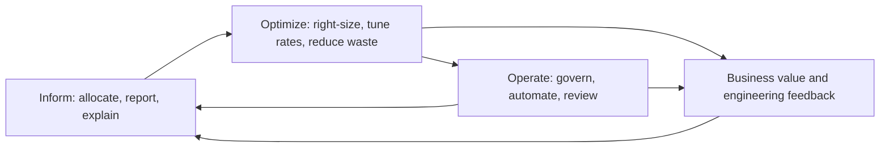
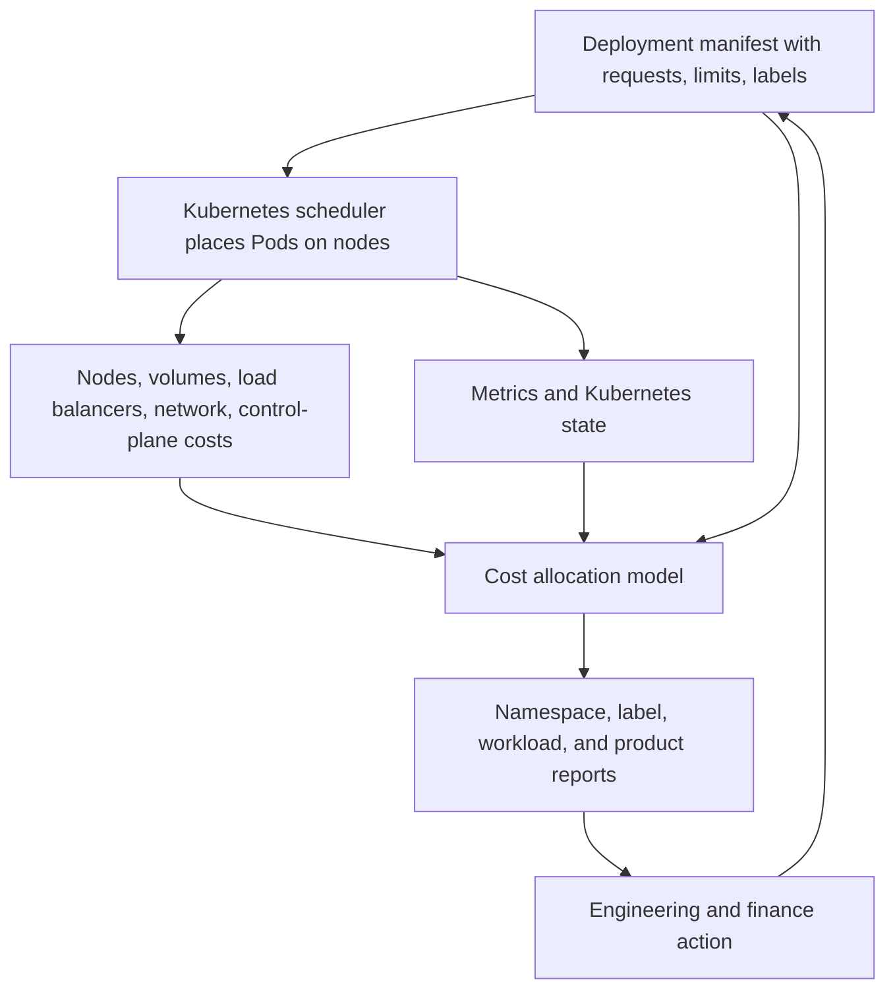

> **Certification Track** | Complexity: `[MEDIUM]` | Time: 60 minutes

## Overview

FinOps is the operating discipline that lets engineering, finance, product, procurement, and leadership make informed decisions about variable technology spend. For Kubernetes teams, the discipline becomes concrete very quickly: every Pod request, namespace, label, node pool, persistent volume, load balancer, and autoscaling decision can change the bill. The FinOps Foundation describes FinOps as an operational framework and cultural practice for maximizing technology value, enabling timely data-driven decisions, and creating financial accountability through collaboration between engineering, finance, and business teams. This module uses that official definition as the starting point, then translates it into the daily decisions an SRE or platform engineer makes in a shared Kubernetes environment.

The goal is not to turn engineers into accountants or to make finance teams review every deployment. The goal is to create a shared control system in which cost is visible early enough to matter, technical teams can act without waiting for monthly billing surprises, and business leaders can decide when higher spend is justified by higher value. Kubernetes makes this both more important and more difficult because the unit that creates business value is usually a service or product, while the unit that receives the cloud invoice is often a node, disk, network interface, managed control plane, or account-level charge.

This is a fundamentals module, so it deliberately stops at orientation rather than tool mastery. You will learn the [FinOps framework](https://www.finops.org/framework/), the Crawl/Walk/Run maturity model, why cloud economics differ from on-premises capacity planning, and why Kubernetes cost allocation is harder than tagging a virtual machine. The hands-on section gives you a local kind-based lab with OpenCost, synthetic workloads, request-versus-usage comparison, and a simple namespace report you can explain to finance or product partners. The next module can go deeper into applied practices once this mental model is in place.

## What You'll Be Able to Do

- Explain the official FinOps definition, the Inform/Optimize/Operate lifecycle, and the Crawl/Walk/Run maturity model in language that engineering, finance, and product stakeholders can all use.
- Analyze why cloud and Kubernetes cost differ from on-premises cost by connecting variable pricing, shared infrastructure, resource requests, actual usage, namespaces, labels, and idle capacity.
- Identify the main FinOps personas and describe how SRE, platform engineering, finance, product, procurement, and leadership collaborate without turning cost management into blame.
- Run a local OpenCost-oriented exercise, compare requested resources with observed usage, and produce a basic per-namespace cost report from an API response.

## Why This Module Matters

Kubernetes hides cost behind abstractions that are useful for delivery but dangerous for accountability. An application team requests `500m` of CPU, a scheduler places the Pod on a node, a cluster autoscaler may add capacity, a managed Kubernetes service may attach disks and load balancers, and the cloud provider eventually bills the account that owns the cluster. Without a FinOps practice, the invoice arrives as infrastructure spend while the cause sits several layers higher in deployment manifests, release patterns, service ownership, and product demand.

For SREs and platform engineers, FinOps is part of production engineering because cost is a resource constraint. CPU saturation, memory pressure, latency, error budgets, and cost drift are not the same signal, but they influence the same architecture. A system can be reliable and wasteful if every service requests far more capacity than it uses. A system can be cheap and fragile if limits are tuned without understanding load. A mature platform team learns to ask whether a workload is spending intentionally, whether that spend maps to value, and whether the feedback loop is fast enough for the owning team to change behavior.

Finance teams also need engineering help because the bill alone rarely explains the workload. A billing export can show that compute spend increased, but it cannot always show that a deployment doubled replica count, a request default changed, a namespace lost ownership labels, or a batch job moved from nightly to hourly. Product teams need the same collaboration because product value gives cost its context. A new feature that increases cost by ten percent may be a good trade if it doubles conversion, but the same increase may be waste if it comes from idle development environments.

The FinOps Foundation framework is useful because it prevents cost conversations from collapsing into a single slogan such as "cut spend." The framework says to inform teams with timely data, optimize usage and rates where value supports it, and operate with policy, automation, and accountability. That matters in Kubernetes because the same cluster can host revenue-generating services, experiments, shared platform components, compliance workloads, and abandoned test Pods. Treating all of them as equal line items leads to poor decisions.

## Did You Know?

- The current FinOps Foundation definition frames FinOps as an operational framework and cultural practice for maximizing technology value, not simply a cost-cutting program.
- The official FinOps lifecycle is iterative: Inform, Optimize, and Operate are phases teams revisit continuously as new technology use, pricing, and business priorities change.
- OpenCost is a CNCF project that provides Kubernetes cost allocation data across dimensions such as namespace, controller, Pod, container, labels, and cluster.
- Kubernetes resource requests are scheduling and allocation signals, while actual usage is an observed runtime signal; confusing those two is one of the fastest ways to misread Kubernetes spend.

## What FinOps Is

The [FinOps Foundation](https://www.finops.org/)'s definition is intentionally cross-functional. FinOps is not a dashboard product, a finance-only reporting workflow, or a quarterly cleanup event. It is an operating model for making technology-spend decisions with enough data, ownership, and business context to choose wisely. The definition is also broader than public cloud alone in the current framework, because the same discipline increasingly applies to SaaS, licenses, data platforms, AI systems, private cloud, and data center spend. In this Kubernetes track, we focus on containerized infrastructure, but the collaboration pattern is the same.

The word combines finance and operations, but the practice is closer to DevOps than to traditional accounting. DevOps changed who could deploy and operate software; FinOps changes who can see and act on spend. A cloud bill managed only by finance arrives too late and lacks workload context. A cost dashboard managed only by engineering may optimize technical efficiency while missing margin, forecast, procurement, and product-pricing realities. FinOps works when teams share a vocabulary and use the same facts to make tradeoffs among cost, speed, quality, reliability, and value.

The most important mindset shift is that lower cost is not always better. A platform team may intentionally spend more on multi-zone redundancy, managed databases, observability, or faster build infrastructure because the business value justifies it. The FinOps question is not "How do we make the number smaller?" but "What value did this spend create, who owns it, how predictable is it, and what would we change if the cost-to-value ratio were poor?" That question is especially relevant for Kubernetes because cost decisions are embedded in manifests, autoscalers, storage classes, node pools, and release workflows.

Kubernetes also exposes why financial accountability must be designed into the platform. A namespace can be a team boundary, an environment boundary, a product boundary, or a temporary workspace. Labels can identify owners, applications, components, environments, and cost centers, but Kubernetes does not force a business taxonomy. A platform team that wants reliable allocation must provide standards, admission policies, templates, reports, and repair loops so cost metadata survives real delivery pressure. FinOps gives those platform controls a reason beyond tidiness: they make technology value measurable.

## FinOps Principles for Engineering Teams

The FinOps Foundation lists six principles that serve as a north star for the practice: teams collaborate; business value drives technology decisions; everyone takes ownership for technology usage; FinOps data is accessible, timely, and accurate; FinOps is enabled centrally; and teams take advantage of the variable cost model of cloud. This is codified in the [FinOps Principles](https://www.finops.org/framework/principles/). The wording has evolved with the framework, but the engineering implication is stable: cost decisions are not pushed into a remote finance queue, and engineering teams are not left alone to infer business priorities from a bill.

For Kubernetes teams, collaboration means a platform engineer can explain the difference between requests and actual usage, while finance can explain why amortized commitment cost differs from on-demand list price, and product can explain whether a service is worth scaling. Ownership means the team that deploys a workload can see its namespace or label-level cost and has the authority to improve it. Central enablement means the platform or FinOps function supplies consistent allocation data, reporting conventions, rate optimization support, and guardrails, while service teams make many local decisions.

The principle about accessible, timely, and accurate data is where Kubernetes platforms often struggle. Cloud billing exports may be delayed, and Kubernetes objects are short-lived. A Pod might run for eight minutes, process a burst of work, and disappear before a monthly report exists. OpenCost and related tools address this by combining Kubernetes state, resource metrics, pricing data, and allocation rules close to the cluster. Even when the numbers are estimates, they create a faster feedback loop than waiting for an invoice.

Taking advantage of the variable cost model also looks different in Kubernetes than it does in a virtual-machine inventory. You can right-size requests, use horizontal autoscaling, schedule non-production namespaces, select node shapes that match workload profiles, use Spot or preemptible nodes for tolerant workloads, and share base capacity across tenants. Those choices need reliability review. FinOps does not say "use the cheapest node"; it says "make the tradeoff visible, intentional, and owned."

## The FinOps Lifecycle

The official lifecycle has three phases: Inform, Optimize, and Operate. The phases are not a waterfall. Teams cycle through them repeatedly because workloads, traffic, pricing, commitments, and business priorities keep changing. In Kubernetes, the loop might run at different speeds for different teams. A platform team may refresh allocation reports daily, an application team may review right-sizing weekly, and finance may update forecasts monthly. The shared lifecycle keeps those rhythms connected. The flow is described in the [FinOps lifecycle](https://www.finops.org/framework/phases/).



Inform answers the question, "Where is our money going, and who can act on it?" In a Kubernetes environment, Inform includes mapping node, disk, load balancer, network, control-plane, and shared platform costs to namespaces, labels, controllers, and teams. It also includes distinguishing allocated cost from idle cost, because a namespace that appears cheap may be running inside an expensive underutilized cluster. Inform is successful when a service owner can look at a report and recognize the workload, the owner, the environment, and the likely driver of cost.

Optimize answers the question, "What should we change, and what value or risk does the change affect?" Kubernetes optimization often starts with requests, limits, replica counts, node selection, storage classes, and environment schedules. It can also include commitment discounts, Spot capacity, autoscaler tuning, image and startup improvements, and eliminating orphaned resources. Optimization fails when teams blindly reduce requests or limits without observing latency, throttling, memory behavior, and availability requirements. A FinOps-aware SRE treats optimization as a controlled engineering change.

Operate answers the question, "How do we make good behavior repeatable?" In Kubernetes, Operate includes label policy, namespace onboarding, budget alerts, pull-request checks for resource changes, cost dashboards, anomaly detection, exception handling, and review ceremonies. It also includes automation such as default requests, LimitRanges, ResourceQuotas, scheduled shutdowns, and workload rightsizing workflows. Operate is where FinOps becomes part of the platform rather than a heroic cleanup project.

The loop matters because each phase depends on the previous one but can also expose defects in it. An optimization review may reveal that the allocation model hides shared ingress cost. A governance review may reveal that teams bypass labels when creating emergency resources. A finance forecast may reveal that engineering needs more granular product metrics. The right response is to improve the system, not to blame the last person who touched a manifest.

## The FinOps Framework Map: Phases, Domains, Capabilities

Candidates often confuse the lifecycle Phases with the Framework's Domains, but they answer different
questions. Keeping them straight is worth easy exam points.

- **Phases** (Inform → Optimize → Operate) are *iterative work modes* — where you are in the loop right now.
- **Domains** are the *business outcomes* of a FinOps practice, and they run in parallel rather than as
  serial steps. The four Domains are **Understand Usage & Cost**, **Quantify Business Value**,
  **Optimize Usage & Cost**, and **Manage the FinOps Practice**.
- **Capabilities** are the *functional activities* inside each Domain. For example, Understand Usage &
  Cost includes Data Ingestion, Allocation, Reporting & Analytics, and Anomaly Management. (This module
  names the Domains; the Capabilities are exercised in [Module 1.2](module-1.2-finops-practice/).)
- **Scopes** are the technology areas the framework applies to — Cloud, SaaS, Datacenter, and beyond.

In one line: Phases are *when*, Domains are *what outcomes*, Capabilities are *how*, and Scopes are
*where*. Sources: [FinOps Framework — Domains](https://www.finops.org/framework/domains/),
[Capabilities](https://www.finops.org/framework/capabilities/),
[Scopes](https://www.finops.org/framework/scopes/).

## FinOps Maturity Model

The FinOps Foundation maturity model uses Crawl, Walk, and Run to describe how sophisticated a capability is in a particular organization. The model is not a badge ladder where every team must reach Run for every capability. It is a practical way to start small, measure value, and mature where business needs justify the effort. That nuance is important for Kubernetes teams because a startup with one cluster does not need the same allocation machinery as an enterprise with hundreds of clusters across clouds, and it is aligned with the [maturity model](https://www.finops.org/framework/maturity-model/).

At Crawl maturity, the organization has basic visibility and a small number of repeatable habits. For Kubernetes, Crawl might mean that every namespace has an owner label, the platform team can generate a rough monthly cost by namespace, and obvious waste such as abandoned development namespaces is reviewed. The data may be incomplete, and the process may be manual, but teams can finally discuss cost using workload names rather than one account-level bill.

At Walk maturity, the organization has more consistent allocation and recurring optimization. Kubernetes Walk maturity might include standard labels in templates, OpenCost or a managed equivalent in each cluster, reports split by namespace and product, regular review of request-to-usage ratios, and a documented process for shared cluster costs. Teams begin to compare cost with value metrics such as requests served, customers supported, or build minutes produced. Finance can forecast with better inputs because engineering can explain the drivers behind changes.

At Run maturity, cost awareness is integrated into engineering workflows and policy. Kubernetes Run maturity might include admission controls that require ownership metadata, automated rightsizing recommendations with engineering review, namespace budgets, anomaly alerts, chargeback (assigning costs directly to the owning team's budget) or showback (cost visibility reported to teams, with no budget transfer), and unit economics dashboards that connect platform spend to product outcomes. Automation is preferred where it is reliable, but mature teams still keep humans in the loop for tradeoffs that affect reliability, security, or customer experience.

The maturity model is also useful for avoiding over-engineering. A team at Crawl should not spend months building a perfect allocation model before it has basic ownership coverage. A team at Walk should not automate rightsizing until it can explain what a recommendation means for latency and memory risk. A team at Run should not assume that one successful cluster policy applies to every workload class. FinOps maturity is valuable only when it improves decisions.

## How Cloud Cost Differs from On-Premises Cost

On-premises infrastructure has real variable costs, but many teams experience it as fixed capacity. Servers are purchased, depreciated, racked, powered, cooled, and refreshed on long cycles. The marginal cost of a developer deploying one more test service may be invisible if spare capacity already exists. Cloud changes that feedback loop because each hour of compute, gigabyte of storage, load balancer, managed service, network transfer, and support option can appear in a bill with far more granularity and far less procurement friction.

The first difference is variable spend. A Kubernetes cluster in a cloud account can grow when the cluster autoscaler adds nodes, when replicas increase, or when a workload moves to a larger node pool. That elasticity is valuable because teams do not need to buy hardware months ahead of demand, but it also means cost can drift quickly. In on-premises environments, running out of capacity is a visible constraint. In cloud, the constraint may be the budget, and the warning might arrive after the spend has already happened.

The second difference is granularity. Cloud providers can bill by second, hour, request, byte, operation, or provisioned unit depending on the service. Kubernetes adds another layer because the invoice line may refer to a node or disk while the business wants to understand a namespace, application, or product. Granularity is an opportunity because teams can measure unit economics, but it is also a modeling problem because every allocation rule makes assumptions about shared infrastructure.

The third difference is decentralization. In many cloud environments, engineers can create spend through infrastructure-as-code, deployment pipelines, or Kubernetes manifests without a purchase order. That is good for delivery speed, but it means accountability must move closer to the decision. FinOps is the practice that lets finance keep predictability while engineering keeps autonomy. The shared goal is not to reintroduce slow approvals; it is to provide fast feedback and guardrails.

The fourth difference is commitment strategy. In a data center, capacity commitments are physical and long-lived. In cloud, teams can mix on-demand, reserved, savings-plan, committed-use, Spot, preemptible, and managed-service pricing. Kubernetes complicates those choices because a node commitment may support many tenants, and a workload may move among node pools. Good FinOps practice separates usage optimization, which reduces waste, from rate optimization, which buys the right pricing model for usage that is expected to persist.

## Kubernetes Cost Allocation Flow

Kubernetes cost allocation starts with resource signals and ends with a report that people can act on. The scheduler sees requests, places Pods on nodes, and the cluster consumes assets such as CPU, memory, storage, network, and load balancers. A cost allocation tool observes Kubernetes objects and metrics, applies pricing and sharing rules, aggregates by dimensions such as namespace or label, and presents cost back to owners. Each step can lose accuracy if metadata is missing, metrics are unavailable, or shared costs are handled carelessly.



Requests are central because they represent capacity reserved for scheduling. The Kubernetes [resource management documentation](https://kubernetes.io/docs/concepts/configuration/manage-resources-containers/) explains that the scheduler uses requests to decide where a Pod can run, while limits are enforced by the kubelet to constrain resource use. That distinction matters for cost allocation because many allocation models charge CPU and memory based on the larger of requested or used resources. If a team requests one CPU and uses fifty millicores, it may reserve capacity that prevents denser packing even if actual usage is low.

Namespaces are a common allocation boundary because they are visible, easy to query, and often map to teams or environments. They are not a complete business model. A single product may span many namespaces, and a single namespace may host many services. Labels add the missing dimensions, but only if they are applied consistently. Kubernetes [recommended labels](https://kubernetes.io/docs/concepts/overview/working-with-objects/common-labels/) and [resource quota guidance](https://kubernetes.io/docs/concepts/policy/resource-quotas/) can help tools connect resources into application views, while organization-specific labels can capture team, cost center, environment, and product.

Shared costs are where simplistic reports become misleading. The `kube-system` namespace, ingress controllers, observability agents, service meshes, DNS, node idle capacity, and managed control-plane fees may benefit many tenants. If the report ignores shared costs, application teams understate their total cost. If the report spreads shared costs evenly, small workloads may subsidize large ones. If the report spreads shared costs proportionally, expensive workloads carry more of the overhead. FinOps requires agreement on the rule and transparency about what the rule means.

Idle cost is especially important in Kubernetes because nodes are purchased or rented at node granularity while Pods consume only part of the node. A cluster can look efficient from an application perspective while still carrying idle node capacity. Some idle capacity is intentional because it absorbs bursts, protects availability, or provides scheduling headroom. The FinOps task is to distinguish intentional idle from accidental idle and to make the owner of that tradeoff explicit.

### Challenge of Cloud in Kubernetes

A common trap is to assume one service maps neatly to one invoice line. In multi-tenant Kubernetes clusters, a single node pool, shared ingress controller, control plane, or observability stack often serves many teams. The result is that per-service cost can be obscured without explicit shared-cost policy. This is the core challenge described by the CNCF and FinOps collaboration on Kubernetes cost management and the [CNCF FinOps for Kubernetes report](https://www.cncf.io/wp-content/uploads/2021/06/FINOPS_Kubernetes_Report.pdf).

In practice, namespace is usually the first allocation boundary because it is visible and easy to query, but a namespace alone is not enough for trustworthy reports. Teams still need consistent naming and ownership, standardized labels, and reliable `requests` and `limits` on containers so allocation tools can connect Kubernetes objects to the people who can act on the numbers. Once that metadata is in place, the cost model usually stacks three layers: **node-level costs** for instance and control-plane spend measured at node or pool granularity, **pod-level costs** for workload allocation across namespaces and controllers, and **container-level costs** when mixed behavior inside a Pod requires a finer split for showback or chargeback.

`kubectl top` is still useful to spot current load, but it cannot answer “how much did Service X cost last week?” because it reports usage at a point in time without applying price models, shared-cost rules, or historical aggregation windows. Use allocation reports for that.

The next module, [Module 1.2: FinOps in Practice](../module-1.2-finops-practice/), addresses this gap by comparing OpenCost and Kubecost approaches in deeper scenarios.

## Requests, Limits, and Waste

A request is not a forecast, and a limit is not a budget. A CPU request tells Kubernetes how much CPU capacity to reserve for scheduling and quality of service. A memory request provides a scheduling signal and influences eviction behavior. A CPU limit constrains CPU time and can cause throttling. A memory limit can terminate a container that exceeds it. These controls are reliability controls first, but they also shape cost because they influence packing density, autoscaling behavior, and allocation reports.

A common FinOps failure is treating requests as harmless defaults. Platform teams sometimes set generous defaults so workloads are less likely to fail during onboarding. Over time, those defaults become hidden reservations. If each small service requests half a CPU and uses twenty millicores, the scheduler may need far more nodes than actual demand requires. The bill then reflects a platform policy rather than true product usage. The fix is not to remove requests; the fix is to set them from evidence and revisit them as workloads change.

Limits need similar care. A low CPU limit may make a workload cheaper on paper while adding latency or throttling during bursts. A memory limit can protect a node from runaway allocation, but it can also create restart loops if the application has predictable spikes. FinOps conversations should therefore include SLOs, error budgets, and application profiles. A recommendation that saves money but violates a service objective is not an optimization. A recommendation that improves density without harming service behavior is.

The cleanest mental model is to compare requested, used, and allocated cost side by side. Requested CPU and memory show what the scheduler must reserve. Observed usage from Metrics Server or Prometheus shows what the workload actually consumes over time. Allocated cost shows how a cost model converts those signals into money. When the three disagree, the disagreement is a learning opportunity. The team may need to right-size, change autoscaling, split workloads, use a different node type, or accept the cost as a reliability buffer.

## Personas and Collaboration

FinOps works because different personas bring different facts. The FinOps practitioner bridges finance and engineering, maintains the framework, and helps teams make evidence-based decisions. Engineering designs, builds, and operates the systems that consume resources. Finance provides budget, forecast, accounting, and reporting discipline. Product connects technology cost to customer value and margin. Procurement manages vendor relationships, commitments, and discount mechanics. Leadership sets priorities and sponsors the accountability model.

In Kubernetes, the platform engineering team often becomes the practical bridge between FinOps theory and workload reality. Platform engineers own namespace onboarding, cluster templates, labels, admission policies, node pools, and observability integrations. They can make cost data available where engineers already work, such as dashboards, pull requests, service catalogs, and incident reviews. They can also prevent cost work from becoming punitive by explaining the technical reasons behind apparent waste.

Finance needs that translation because Kubernetes allocation is a model, not a direct invoice. If finance asks for chargeback by product, engineering must explain which costs can be attributed directly, which costs are shared, and which estimates depend on metrics resolution or pricing configuration. Product needs the same transparency because unit economics require both numerator and denominator. A cost-per-transaction metric is useful only if the transaction count and the cost allocation both map to the same product boundary.

Good collaboration has a cadence. A service team might review request-to-usage drift every sprint. A platform team might review cluster idle cost and shared services monthly. Finance might review forecast variance with engineering leaders. Product might review unit cost before a launch. The important part is that every meeting uses the same source data and has a clear action path. A dashboard without owners creates observation. A report with owners, thresholds, and follow-up creates a FinOps practice.

## Tooling Landscape

OpenCost is the open source starting point for Kubernetes cost allocation. The project provides a specification and an implementation for measuring and allocating infrastructure and container costs in Kubernetes environments. It can report by namespace, Pod, controller, label, annotation, container, node, and cluster. In a local lab, OpenCost can use list or custom pricing to teach the mechanics. In production, teams usually integrate provider billing data or negotiated rates so reports match finance expectations more closely. Refer to the [OpenCost docs](https://opencost.io/docs/) and [specification](https://opencost.io/docs/specification).

Kubecost builds on the same cost allocation lineage and adds commercial features around reporting, recommendations, governance, alerting, federation, and enterprise workflows. For this module, you only need awareness of the distinction: OpenCost gives you a vendor-neutral open source cost signal, while Kubecost packages a broader product experience around that signal. The right tool choice depends on scale, support needs, multi-cluster reporting, billing reconciliation, and governance requirements. The upstream project is tracked at [github.com/opencost/opencost](https://github.com/opencost/opencost).

Cloud-provider native tools are also part of the landscape. AWS supports split cost allocation data for Amazon EKS, which can provide Pod-level visibility in Cost and Usage Reports and aggregate by Kubernetes primitives such as namespace and cluster using [AWS Cost Explorer](https://docs.aws.amazon.com/aws-cost-management/latest/userguide/ce-what-is.html) and the [AWS CE API](https://docs.aws.amazon.com/cost-management/latest/userguide/ce-api.html). Google Kubernetes Engine cost allocation can expose cluster, namespace, and label dimensions into Cloud Billing via [GKE cost allocations](https://cloud.google.com/kubernetes-engine/docs/how-to/cost-allocations). Microsoft Cost Management has Kubernetes cost views for AKS via [Azure Cost Management and Billing](https://learn.microsoft.com/en-us/azure/cost-management-billing/) and [Azure Kubernetes cost view](https://learn.microsoft.com/en-us/azure/cost-management-billing/costs/view-kubernetes-costs), with broader context in [Azure cost management overview](https://learn.microsoft.com/en-us/azure/cost-management-billing/costs/overview-cost-management). These native features are valuable because they connect Kubernetes allocation to provider billing systems, but their coverage, freshness, and dimensions vary.

General cost explorers such as AWS Cost Explorer, Google Cloud Billing reports, and Azure Cost Management are still necessary because not every cost is born inside Kubernetes. Container platforms depend on registries, object storage, databases, queues, CDNs, observability systems, security tools, and support plans. A Kubernetes FinOps practice should therefore avoid tool tunnel vision. Use cluster-aware tools for workload allocation, provider tools for billing truth and commitments, and product metrics for value.

## From Cost Data to Engineering Decisions

A useful cost report has a clear owner, a clear time window, a clear allocation method, and a next action. "Namespace `payments-prod` spent 450 dollars last week" is a start, but it is not yet an engineering decision. The team needs to know whether cost changed, whether the change came from CPU, memory, storage, network, or shared overhead, whether it followed traffic or release activity, and whether the cost per useful unit improved or worsened.

Unit economics connect cost to value. For a user-facing API, a useful unit might be cost per thousand successful requests. For a data pipeline, it might be cost per terabyte processed. For a CI platform, it might be cost per build minute. For a training cluster, it might be cost per experiment. Kubernetes allocation supplies part of the numerator, but product and platform telemetry supply the denominator. That is why FinOps must include product and engineering rather than only billing exports.

The first reports should be simple. A platform team can start with namespace spend, owner label coverage, idle cost, top workloads by cost, and request-to-usage ratios. These reports quickly reveal missing metadata, abandoned environments, oversized requests, and shared cost questions. Once teams trust the data, the platform can add trends, anomaly alerts, and unit metrics. Trust is earned by explaining uncertainty, reconciling with provider bills, and fixing obvious metadata defects.

The best reports also distinguish recommendations from decisions. A tool can recommend reducing a request from `500m` to `100m`, but the owning team must understand peak load, startup behavior, language runtime memory, batch windows, and SLO sensitivity. A FinOps practice should make the recommendation visible, estimate the savings, attach evidence, and track the decision. The team may accept, reject, defer, or test the change. All four outcomes are valid when documented.

## Common Mistakes

| Mistake | Why it hurts | Better approach |
|---|---|---|
| Treating FinOps as a one-time cost cut | Teams make rushed changes, then drift returns when attention moves elsewhere. | Use the Inform, Optimize, and Operate loop as a recurring operating rhythm. |
| Starting with commitments before usage visibility | Reserved or committed spend can lock in waste if the workload shape is poorly understood. | Right-size and classify steady usage before buying long-term rate discounts. |
| Charging every shared cost equally | Small tenants can subsidize large tenants, and teams lose trust in the report. | Document shared-cost rules and choose uniform, proportional, or custom allocation intentionally. |
| Confusing Kubernetes requests with actual usage | High requests can look like justified cost even when runtime demand is low. | Compare requests, observed usage, and reliability signals before changing manifests. |
| Relying on namespaces alone for ownership | Namespaces often represent environments or technical boundaries rather than products. | Combine namespaces with standard labels for team, service, product, environment, and cost center. |
| Optimizing limits without SLO review | Lower limits can create throttling, restarts, and user-visible reliability problems. | Treat rightsizing as an engineering change with performance and error-budget checks. |
| Letting finance own the whole practice | Finance sees the invoice but cannot infer every deployment or scheduler decision. | Give finance, product, engineering, and platform teams shared data and shared review cadences. |

## Quiz

<details>
<summary>Question 1: What is the best description of FinOps in a Kubernetes platform team?</summary>

A) A finance-only process for reducing the monthly cloud bill.
B) A cultural and operating practice for making technology spend visible, owned, and connected to business value.
C) A Kubernetes scheduler feature that automatically chooses the cheapest node.
D) A replacement for SRE, capacity planning, and product management.

**Answer: B.** FinOps uses collaboration, timely data, and accountability to maximize value from technology spend. It may reduce waste, but it is not limited to cutting cost. In Kubernetes, it helps teams connect workload decisions such as requests, labels, namespaces, and node pools to financial and business outcomes.
</details>

<details>
<summary>Question 2: Which activity belongs most clearly in the Inform phase?</summary>

A) Buying a three-year commitment for all compute before measuring workload demand.
B) Reducing every CPU request by half across all namespaces.
C) Producing a namespace and label-based report that shows owner, service, environment, and cost.
D) Deleting all development environments on Friday evening.

**Answer: C.** Inform is about visibility, allocation, reporting, and shared understanding. The other options may relate to optimization or operations, but they are risky without first knowing what spend belongs to which teams and workloads.
</details>

<details>
<summary>Question 3: Why can Kubernetes resource requests affect cost even when actual CPU usage is low?</summary>

A) The scheduler uses requests to place Pods, and large requests can reserve node capacity that remains idle.
B) Requests always cap CPU usage at exactly the requested value.
C) Requests are billed directly by Kubernetes before the cloud provider invoice is created.
D) Requests automatically create a dedicated node for every Pod.

**Answer: A.** Requests are scheduling signals. When requests are larger than realistic demand, workloads may consume scheduling capacity that forces extra nodes or increases allocated cost in cost models. Limits and actual usage are different signals.
</details>

<details>
<summary>Question 4: What is a healthy use of the Crawl/Walk/Run maturity model?</summary>

A) Requiring every FinOps capability to reach Run before teams act on any cost data.
B) Using Crawl as a starting point, then maturing specific capabilities where business value justifies more automation and precision.
C) Treating Crawl teams as failures and removing their cloud access.
D) Skipping Inform and moving directly to automated optimization.

**Answer: B.** The maturity model helps teams start small and improve with repetition. A Kubernetes team can begin with basic ownership and namespace reports, then mature toward automation, policy, and unit economics as the value of precision increases.
</details>

<details>
<summary>Question 5: Which allocation challenge is specific to shared Kubernetes environments?</summary>

A) Every cloud provider uses the same invoice schema.
B) A single node, ingress controller, monitoring agent, or system namespace can support many product teams at the same time.
C) Kubernetes prevents teams from applying labels to workloads.
D) Finance can always map a cloud invoice line directly to one Deployment.

**Answer: B.** Shared infrastructure is normal in Kubernetes, so cost models must decide how to handle idle capacity, system workloads, ingress, observability, and other platform costs. The rule must be visible because it affects trust in showback or chargeback.
</details>

<details>
<summary>Question 6: Which tool pairing is most accurate for a production FinOps workflow?</summary>

A) Use only Kubernetes Metrics Server because it contains the full cloud invoice.
B) Use only the monthly invoice because it contains every Pod label.
C) Use cluster-aware allocation tools for workload detail and provider billing tools for invoice, commitment, and account-level context.
D) Use no tools until the platform reaches Run maturity.

**Answer: C.** Kubernetes cost work needs both workload context and billing context. OpenCost or Kubecost can explain cluster allocation, while AWS, Google Cloud, Azure, and other billing tools provide provider costs, commitments, exports, and finance reconciliation.
</details>

## Hands-On Lab

This lab runs OpenCost on a local `kind` cluster and produces a namespace allocation view from the OpenCost API. You will create a disposable cluster, install OpenCost without ingress, forward the UI and API to your workstation, deploy a labeled `nginx` workload with explicit requests, and compare allocation output with `kubectl top` and the manifest’s resource fields. Treat the exercise as a teaching loop for Inform-phase visibility rather than a production install pattern.

- [ ] Setup `kind` and create a lab cluster.
- [ ] Install OpenCost via `kubectl apply` (using Helm template output).
- [ ] Port-forward OpenCost UI to `localhost:9090`.
- [ ] Deploy a sample `nginx` workload, wait 2 minutes, and query the allocation API.
- [ ] Complete the acceptance checklist and delete the lab cluster.

### Step 1 — Setup the environment

Create a dedicated `kind` cluster and two namespaces so OpenCost and the sample workload stay isolated. Before you run the commands, confirm `kind` is on your PATH; if it is not installed yet, follow the [kind quick start](https://kind.sigs.k8s.io/docs/user/quick-start/) and install it first so the cluster name `finops-lab` matches the cleanup command at the end of the lab.

```bash
kind create cluster --name finops-lab
kubectl create namespace opencost
kubectl create namespace finops-lab
```

### Step 2 — Install OpenCost via `kubectl apply`

Render the upstream Helm chart to manifests and apply them with `kubectl` so you can see every object OpenCost creates without leaving a release in your shell history. This path matches the [OpenCost installation documentation](https://opencost.io/docs/installation/install/) and [Helm integration](https://opencost.io/docs/installation/helm/) guidance, and disabling ingress keeps the lab simple because you will reach the UI through port-forward in the next step.

```bash
helm repo add opencost https://opencost.github.io/opencost-helm-chart
helm repo update

helm template opencost opencost/opencost \
  --namespace opencost \
  --create-namespace \
  --set ingress.enabled=false \
  | kubectl apply -f -
```

After apply succeeds, wait until the OpenCost pod reports `Ready` before you forward ports or deploy workloads, because the allocation API may return empty or partial results while controllers are still starting.

```bash
kubectl -n opencost wait --for=condition=ready pod -l app.kubernetes.io/name=opencost --timeout=240s
kubectl -n opencost get pods
```

### Step 3 — Run OpenCost and deploy sample workload

With OpenCost ready, port-forward both the UI and API service ports to your workstation so you can open the dashboard in a browser and query `/allocation` with `curl` from the same machine. In a second terminal, deploy the sample `nginx` workload with explicit CPU and memory requests plus `team` and `environment` labels so the later namespace report has recognizable metadata to aggregate.

```bash
kubectl -n opencost port-forward svc/opencost 9090:9090 9003:9003
```

```bash
kubectl apply -f - <<'YAML'
apiVersion: apps/v1
kind: Deployment
metadata:
  name: nginx-finops-lab
  namespace: finops-lab
  labels:
    app: nginx-finops-lab
    team: platform
    environment: lab
spec:
  replicas: 1
  selector:
    matchLabels:
      app: nginx-finops-lab
  template:
    metadata:
      labels:
        app: nginx-finops-lab
        team: platform
        environment: lab
    spec:
      containers:
      - name: nginx
        image: nginx:1.27-alpine
        resources:
          requests:
            cpu: "250m"
            memory: "256Mi"
          limits:
            cpu: "500m"
            memory: "512Mi"
        ports:
        - containerPort: 80
YAML

kubectl -n finops-lab rollout status deployment/nginx-finops-lab --timeout=120s
sleep 120
```

### Step 4 — Query OpenCost allocation

After the deployment has been running for about two minutes, confirm the UI responds locally and pull a namespace-level allocation window that includes idle cost so you can see both tenant spend and cluster overhead in one response. The same API contract is documented in the [OpenCost API examples](https://opencost.io/docs/integrations/api-examples/) and [OpenCost specification](https://opencost.io/docs/specification/).

```bash
curl -sSf http://127.0.0.1:9090/ | head -n 1
curl -sG 'http://127.0.0.1:9003/allocation' \
  --data-urlencode 'window=24h' \
  --data-urlencode 'aggregate=namespace' \
  --data-urlencode 'resolution=1m' \
  --data-urlencode 'includeIdle=true'
```

Filter the response for `finops-lab` and compare the namespace cost with the Pod’s requested CPU and memory, because that contrast is the core FinOps lesson in this lab.

```bash
curl -sG 'http://127.0.0.1:9003/allocation' \
  --data-urlencode 'window=24h' \
  --data-urlencode 'aggregate=namespace' \
  --data-urlencode 'namespace=finops-lab' \
  | jq '.data[0]."finops-lab"'
```

```bash
kubectl -n finops-lab get deployment/nginx-finops-lab -o jsonpath='{.spec.template.spec.containers[0].resources}'
kubectl -n finops-lab top pods
```

### Acceptance checklist

- [ ] `opencost` pod is `Running`.
- [ ] OpenCost UI is reachable at `http://127.0.0.1:9090`.
- [ ] `nginx-finops-lab` appears in namespace/container allocation results.
- [ ] You can explain the requests-vs-usage difference from `resources.requests` vs observed usage (`kubectl top`) and allocation output.

### Cleanup

```bash
kind delete cluster --name finops-lab
```
## Learner Check / Self-Assessment

You are ready to move on when you can explain the difference between FinOps as a value practice and cost cutting as a short-term tactic. You should be able to describe how Inform, Optimize, and Operate form a loop, why Crawl/Walk/Run maturity is capability-specific, and why Kubernetes allocation requires both scheduler data and business metadata. If you cannot yet explain how a Pod request can affect node cost even when usage is low, repeat the Hands-On Lab's request-vs-usage comparison (the `kubectl top` vs Pod-request step).

You should also be able to sketch a basic collaboration model for your own organization. Identify who owns namespace standards, who receives cost reports, who can approve rate commitments, who understands product value, and who can change workload manifests. If any of those owners are missing, that gap is more important than choosing a more advanced tool. FinOps starts with visibility and ownership because optimization without ownership becomes an argument over numbers.

## Sources

- [FinOps definition](https://www.finops.org/introduction/what-is-finops/)
- [FinOps Framework](https://www.finops.org/framework/)
- [FinOps lifecycle](https://www.finops.org/framework/phases/)
- [FinOps principles](https://www.finops.org/framework/principles/)
- [FinOps maturity model](https://www.finops.org/framework/maturity-model/)
- [CNCF FinOps for Kubernetes whitepaper](https://www.cncf.io/wp-content/uploads/2021/06/FINOPS_Kubernetes_Report.pdf)
- [OpenCost documentation](https://opencost.io/docs/)
- [OpenCost installation documentation](https://opencost.io/docs/installation/install/)
- [OpenCost specification](https://opencost.io/docs/specification/)
- [OpenCost Helm integration](https://opencost.io/docs/installation/helm/)
- [OpenCost API examples](https://opencost.io/docs/integrations/api-examples/)
- [OpenCost repository](https://github.com/opencost/opencost)
- [Kubernetes resource requests and limits](https://kubernetes.io/docs/concepts/configuration/manage-resources-containers/)
- [Kubernetes labels](https://kubernetes.io/docs/concepts/overview/working-with-objects/labels/)
- [Kubernetes resource quotas](https://kubernetes.io/docs/concepts/policy/resource-quotas/)
- [Kind quick start](https://kind.sigs.k8s.io/docs/user/quick-start/)
- [AWS Cost Explorer overview](https://docs.aws.amazon.com/cost-management/latest/userguide/ce-what-is.html)
- [AWS Cost Explorer API](https://docs.aws.amazon.com/cost-management/latest/userguide/ce-api.html)
- [Google Cloud Kubernetes cost allocations](https://cloud.google.com/kubernetes-engine/docs/how-to/cost-allocations)
- [Azure Kubernetes cost view](https://learn.microsoft.com/en-us/azure/cost-management-billing/costs/view-kubernetes-costs)
- [Azure cost management overview](https://learn.microsoft.com/en-us/azure/cost-management-billing/costs/overview-cost-management)

## Next Module

Continue to [Module 1.2: FinOps in Practice](../module-1.2-finops-practice/) to apply these fundamentals to allocation strategy, budgets, rate optimization, workload optimization, and deeper Kubernetes cost-management workflows.
