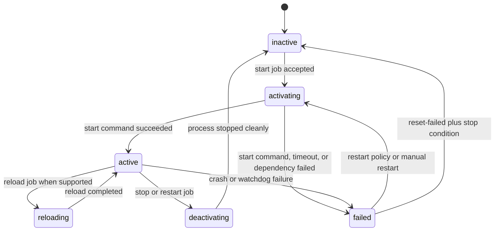
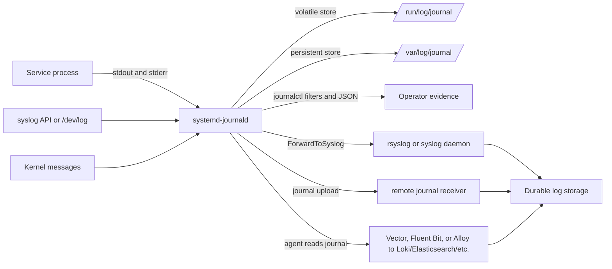

> **Complexity**: `[QUICK]` - Operator practice for Linux services, unit files, and log evidence
>
> **Time to Complete**: 80–110 minutes (long-form read + hands-on exercise)
>
> **Prerequisites**: [Module 0.3: Process & Resource Survival Guide](../module-0.3-processes-resources/), a Linux VM or lab host with `sudo`, and comfort reading command output under time pressure

## What You'll Be Able to Do

After completing this module, you will be able to operate Linux services as supervised workloads with auditable log trails rather than as background commands that merely happen to be running.

1. **Analyze** a service's current state by connecting `systemctl status`, unit metadata, dependency relationships, cgroups, and recent journal entries.
2. **Diagnose** service startup, crash, reload, boot-order, and logging failures with a repeatable flow that works on Ubuntu 24.04, RHEL 9, and Debian 12.
3. **Configure** operator-safe unit behavior with `ExecStartPre`, `ExecStart`, `ExecStartPost`, service `Type=`, `Restart=`, `WantedBy=`, and drop-in overrides.
4. **Apply** structured journal queries that filter by unit, time range, boot, priority, output format, and journal fields before escalating to syslog or external log agents.
5. **Compare** node-level service logs, forwarded host logs, and Kubernetes container logs so you choose `journalctl`, a syslog destination, or `kubectl logs` for the evidence you need.

## Why Services and Logs Matter Together

Every important Linux daemon is both a process and an evidence source. `systemd` starts as PID 1, supervises units, tracks their processes in cgroups, and exposes service state through `systemctl`; `systemd-journald` collects messages from service stdout and stderr, syslog, the native journal protocol, audit where configured, and kernel sources, then stores entries for `journalctl` to query. An operator who only knows process commands can see that a PID exists, but cannot prove why it started, why it stopped, whether it returns after reboot, or which log fields describe the failure. ([systemd](https://www.freedesktop.org/software/systemd/man/latest/systemd.html), [systemd-journald.service](https://www.freedesktop.org/software/systemd/man/latest/systemd-journald.service.html), [journalctl](https://www.freedesktop.org/software/systemd/man/latest/journalctl.html))

That coupling matters during incidents because service state without logs is a traffic light with no witness statement, while logs without the owning unit are unscoped noise. `systemctl status nginx.service` tells you whether systemd loaded the unit, which process is main, whether the unit is failed, and which recent journal lines systemd attached to that unit. `journalctl -u nginx.service --since=-1h --until=now -o json` turns the same unit boundary into structured evidence that can be filtered, exported, or handed to a teammate. ([systemctl](https://www.freedesktop.org/software/systemd/man/latest/systemctl.html), [journalctl](https://www.freedesktop.org/software/systemd/man/latest/journalctl.html), [Journal Fields](https://www.freedesktop.org/software/systemd/man/latest/systemd.journal-fields.html))

Treat this as operator practice, not SysAdmin trivia. The real decision is rarely "how do I restart nginx?" It is "should I reload, restart, stop, mask, inspect the unit, read the last boot, check dependency ordering, preserve volatile journal data, or move up to Kubernetes container logs?" The same host can contain a web service, a log forwarder, `containerd`, `kubelet`, and user services, so the operator's job is to locate the layer that owns the symptom before mutating it. ([systemd.unit](https://www.freedesktop.org/software/systemd/man/latest/systemd.unit.html), [systemd.service](https://www.freedesktop.org/software/systemd/man/latest/systemd.service.html), [Kubernetes Logging Architecture](https://v1-35.docs.kubernetes.io/docs/concepts/cluster-administration/logging/))

## Systemd Architecture for Operators

The Linux kernel starts one first userspace process, and on the distributions targeted in this module that process is systemd running as PID 1. PID 1 is special because it is responsible for bringing the system toward a requested target, starting and stopping units, managing dependencies, tracking service processes, and handling unit lifecycle state. When you ask `systemctl` a question, you are asking the service manager for its model of the machine, not merely scanning a process table. ([systemd](https://www.freedesktop.org/software/systemd/man/latest/systemd.html), [systemctl](https://www.freedesktop.org/software/systemd/man/latest/systemctl.html))



`systemctl list-dependencies` is the safe way to start reading the graph before changing it. Dependencies and ordering are separate concepts: `Wants=` and `Requires=` pull units into the transaction with different failure strength, while `After=` and `Before=` order jobs that are already part of the transaction. A unit can require another unit without being ordered after it, and a unit can be ordered after another unit without pulling it in, so a boot-order incident often needs both `systemctl list-dependencies` and `systemctl show -p Wants -p Requires -p After -p Before <unit>`. ([systemd.unit](https://www.freedesktop.org/software/systemd/man/latest/systemd.unit.html), [systemctl](https://www.freedesktop.org/software/systemd/man/latest/systemctl.html))

```bash
systemctl list-dependencies nginx.service
systemctl list-dependencies --reverse nginx.service
systemctl show -p Wants -p Requires -p After -p Before nginx.service
systemd-analyze critical-chain nginx.service
```

The `.wants/` and `.requires/` directories are how enablement and package integration become visible on disk. When a unit is enabled for a target, systemd creates a symlink in a directory such as `multi-user.target.wants/`, and the unit manual documents those directories as dependency hooks that avoid editing the target file itself. That is why `systemctl is-enabled` and `systemctl cat` are stronger evidence than memory when a service vanishes after reboot. ([systemd.unit](https://www.freedesktop.org/software/systemd/man/latest/systemd.unit.html), [systemctl](https://www.freedesktop.org/software/systemd/man/latest/systemctl.html))

Targets are named synchronization points rather than long-running services. A server usually boots toward `multi-user.target`, a graphical host toward `graphical.target`, and emergency workflows toward special targets; target units group other units and establish ordering points. The operator trap is assuming a target behaves like a daemon with a process. It usually does not. It represents a system state and a dependency boundary. ([systemd.target](https://www.freedesktop.org/software/systemd/man/latest/systemd.target.html), [systemd.special](https://www.freedesktop.org/software/systemd/man/latest/systemd.special.html))

| Unit type | What it represents | Operator question it answers | Example command |
|---|---|---|---|
| `.service` | A supervised service process or one-shot action | Which command started, stopped, reloaded, or failed? | `systemctl status ssh.service` |
| `.socket` | A listening socket that can activate a service | Did a connection start the daemon on demand? | `systemctl status systemd-journald.socket` |
| `.timer` | A scheduled activation source | Which scheduled unit runs, and when is the next run? | `systemctl list-timers --all` |
| `.target` | A grouping and ordering point | Which units define this boot or mode boundary? | `systemctl list-dependencies multi-user.target` |
| `.mount` | A mounted filesystem managed as a unit | Did a filesystem dependency block service startup? | `systemctl status var-log.mount` |
| `.path` | A path watcher that activates another unit | Did a file change trigger the action? | `systemctl status apt-daily-upgrade.path` |
| `.slice` | A resource-management cgroup branch | Which services share this resource boundary? | `systemctl status system.slice` |

Unit types are not naming trivia. They tell you which part of the service manager owns activation, ordering, resource control, or evidence. A socket-activated daemon may look "inactive" until traffic arrives, a timer-backed job may fail only during its scheduled activation, and a mount unit may be the reason a service that works after boot fails during boot. ([systemd.unit](https://www.freedesktop.org/software/systemd/man/latest/systemd.unit.html), [systemd.socket](https://www.freedesktop.org/software/systemd/man/latest/systemd.socket.html), [systemd.timer](https://www.freedesktop.org/software/systemd/man/latest/systemd.timer.html), [systemd.path](https://www.freedesktop.org/software/systemd/man/latest/systemd.path.html), [systemd.slice](https://www.freedesktop.org/software/systemd/man/latest/systemd.slice.html))

### Reading the Transaction Graph Under Pressure

When systemd starts or stops a unit, it builds a transaction. That transaction contains jobs for the requested unit and for units pulled in by dependencies. It then checks ordering rules, conflicts, and job validity before the change happens. This is why a single `start` command can produce messages about several units. The manager is resolving a graph, not launching one process in isolation. ([systemd.unit](https://www.freedesktop.org/software/systemd/man/latest/systemd.unit.html), [systemctl](https://www.freedesktop.org/software/systemd/man/latest/systemctl.html))

Read dependency words as different promises. `Wants=` is a weak pull because the requesting unit can still start when the wanted unit fails. `Requires=` is stronger because a required unit failure can stop the dependent unit's start transaction. `Requisite=` is stricter because the other unit must already be active. `BindsTo=` ties lifetime more closely, so disappearance of the bound unit can stop the dependent unit. `PartOf=` is useful for grouped stop and restart behavior. These words carry incident meaning. They describe what systemd is allowed to do when reality changes. ([systemd.unit](https://www.freedesktop.org/software/systemd/man/latest/systemd.unit.html))

Ordering words answer a different question. `After=` does not mean "start this dependency." It means "if both jobs are present, run this job later." `Before=` means the opposite ordering relation. A unit that needs a database usually needs both a pull-in relationship and an ordering relationship. The pull-in says the database belongs in the transaction. The ordering says the worker should not start first. Missing either side creates a different failure mode. ([systemd.unit](https://www.freedesktop.org/software/systemd/man/latest/systemd.unit.html))

Use the graph to explain surprising status output. A service can be inactive because its socket is the active unit. A maintenance script can be inactive because a successful `oneshot` command already finished. A service can fail because a mount unit failed earlier. A target can be active without owning a process. The process table alone does not show those relationships. The unit graph does. ([systemd.unit](https://www.freedesktop.org/software/systemd/man/latest/systemd.unit.html), [systemd.target](https://www.freedesktop.org/software/systemd/man/latest/systemd.target.html))

Service names also hide implicit units. A path such as `/var/log` maps to `var-log.mount`. A swap device maps to a swap unit. A device can appear as a device unit. A slice represents a cgroup branch for resource control. During incidents, these non-service units matter because applications often depend on filesystems, sockets, timers, and resource boundaries. If the dependency is not a process, `ps` cannot show it. `systemctl status` and `systemctl list-dependencies` can. ([systemd.unit](https://www.freedesktop.org/software/systemd/man/latest/systemd.unit.html), [systemd.slice](https://www.freedesktop.org/software/systemd/man/latest/systemd.slice.html))

The safest graph check starts broad, then narrows. First ask which unit wanted the service with `systemctl list-dependencies --reverse`. Then ask what the service wants with `systemctl list-dependencies`. After that, inspect the exact properties with `systemctl show`. The three views catch different mistakes. The reverse graph finds unexpected owners. The forward graph finds missing dependencies. The property view distinguishes pull-in relationships from ordering relationships. ([systemctl](https://www.freedesktop.org/software/systemd/man/latest/systemctl.html))

This graph view is also how you avoid accidental outage amplification. Stopping a service may stop nothing else, or it may stop related units through `PartOf=`. Masking a unit may block a dependency chain that another team assumes is available. Restarting a target can restart many services at once. Before acting on a shared host, prove the blast radius with the graph. Then write the exact unit name in your incident notes. ([systemd.unit](https://www.freedesktop.org/software/systemd/man/latest/systemd.unit.html), [systemctl](https://www.freedesktop.org/software/systemd/man/latest/systemctl.html))

### Unit-Type Semantics in Real Incidents

The unit suffix often tells you the first command to run. For a `.service`, inspect lifecycle and process state. For a `.socket`, inspect listeners and activation. For a `.timer`, inspect the next and last trigger. For a `.mount`, inspect filesystem readiness and ordering. For a `.slice`, inspect resource ownership rather than application health. This small habit prevents false conclusions during noisy incidents. ([systemd.service](https://www.freedesktop.org/software/systemd/man/latest/systemd.service.html), [systemd.socket](https://www.freedesktop.org/software/systemd/man/latest/systemd.socket.html), [systemd.timer](https://www.freedesktop.org/software/systemd/man/latest/systemd.timer.html))

A socket-activated service is a common example. The service may show inactive because no connection has arrived. The socket unit may still be active and listening. Restarting the service can do nothing useful if the socket owns the listener. The correct first pass is `systemctl status name.socket name.service`. Then read the journal for both units in the same time window. ([systemd.socket](https://www.freedesktop.org/software/systemd/man/latest/systemd.socket.html), [journalctl](https://www.freedesktop.org/software/systemd/man/latest/journalctl.html))

A timer-backed job has a different shape. The service may fail for seconds, then return to inactive after the failed run ends. The timer remains the scheduler. `systemctl status backup.service` may show old failure text, while `systemctl list-timers --all` explains when the next attempt will run. For scheduled jobs, inspect both the timer and the service. The timer owns cadence. The service owns execution. ([systemd.timer](https://www.freedesktop.org/software/systemd/man/latest/systemd.timer.html), [systemctl](https://www.freedesktop.org/software/systemd/man/latest/systemctl.html))

Mount and path units also change triage. A service that fails at boot may be healthy after login because the filesystem later appears. A path-triggered unit may run only after a file change, so inactivity can be normal. A slice can show resource grouping for many services, but it does not prove any one application is healthy. The operator move is to match the unit type to the evidence type before making a change. ([systemd.mount](https://www.freedesktop.org/software/systemd/man/latest/systemd.mount.html), [systemd.path](https://www.freedesktop.org/software/systemd/man/latest/systemd.path.html), [systemd.slice](https://www.freedesktop.org/software/systemd/man/latest/systemd.slice.html))

## Unit File Anatomy

Read unit files before editing them. `systemctl cat <unit>` prints the vendor unit and any drop-ins in the order systemd applies them, which avoids the distribution-path differences between `/usr/lib/systemd/system`, `/lib/systemd/system`, and `/etc/systemd/system`. Use `systemctl edit <unit>` for local drop-ins because the unit manual documents drop-in directories as the supported way to override packaged units without modifying vendor files. ([systemctl](https://www.freedesktop.org/software/systemd/man/latest/systemctl.html), [systemd.unit](https://www.freedesktop.org/software/systemd/man/latest/systemd.unit.html), [Red Hat: Managing systemd](https://docs.redhat.com/en/documentation/red_hat_enterprise_linux/9/html/configuring_basic_system_settings/managing-systemd_configuring-basic-system-settings))

```ini
[Unit]
Description=Example payment worker
Documentation=man:payment-worker(8)
Wants=network-online.target
After=network-online.target postgresql.service

[Service]
Type=notify
ExecStartPre=/usr/bin/test -r /etc/payment-worker/config.yaml
ExecStart=/usr/local/bin/payment-worker --config /etc/payment-worker/config.yaml
ExecStartPost=/usr/bin/logger -t payment-worker "service entered start path"
ExecReload=/bin/kill -HUP $MAINPID
Restart=on-failure
RestartSec=10s
TimeoutStartSec=90s

[Install]
WantedBy=multi-user.target
```

The `[Unit]` section describes identity, documentation, dependencies, and ordering. The `[Service]` section describes how systemd starts, reloads, stops, tracks, times out, and restarts the process. The `[Install]` section is not used during normal runtime; it tells `systemctl enable` which symlinks to create when the unit is installed into a target or alias relationship. ([systemd.unit](https://www.freedesktop.org/software/systemd/man/latest/systemd.unit.html), [systemd.service](https://www.freedesktop.org/software/systemd/man/latest/systemd.service.html))

`ExecStartPre=` is for checks or setup that must finish before the main process starts, `ExecStart=` is the command that defines the service's start action, and `ExecStartPost=` runs after the start command is considered complete. A pre-start validation failure is often a good failure because it prevents a bad configuration from becoming a live process. A post-start hook should be treated carefully because it can make the unit's activation look failed even when the main daemon launched. ([systemd.service](https://www.freedesktop.org/software/systemd/man/latest/systemd.service.html))

| Service type | When systemd considers the service started | Best operator fit | Common failure clue |
|---|---|---|---|
| `simple` | Immediately after the main process is forked by systemd | Foreground daemons that do not signal readiness | App accepts traffic before it is actually ready |
| `exec` | After the executable was successfully invoked | Safer foreground services where missing binaries should fail clearly | Bad path or permission fails at start boundary |
| `forking` | After the parent exits and a child continues | Legacy daemons that self-daemonize | Wrong PID file or parent exits before child is ready |
| `oneshot` | After all configured commands complete | Setup, migration, or maintenance tasks | Unit is inactive after success unless `RemainAfterExit=yes` |
| `notify` | After the service sends readiness through `sd_notify` | Modern daemons that can report readiness precisely | Service starts but never sends READY before timeout |
| `dbus` | After the configured bus name appears | D-Bus activated services | Bus name never acquired |
| `idle` | Delayed until other jobs are dispatched | Low-priority console-noise reduction | Misused for real dependency ordering |

For `Type=notify`, the daemon must call `sd_notify` with `READY=1`; if it does not, the unit times out during activation.

Choose the service type from the program's readiness behavior, not from preference. A `simple` service can be healthy for a process that starts quickly and handles its own readiness, but a payment API or node agent that needs initialization should expose readiness with `Type=notify` or a service-specific mechanism when supported. A legacy daemon that double-forks belongs under `Type=forking` only if systemd can still identify the main process reliably. ([systemd.service](https://www.freedesktop.org/software/systemd/man/latest/systemd.service.html))

The service type is where many "it started, but it is not ready" outages begin. With `Type=simple`, systemd considers the service started almost immediately. That may be acceptable for a local cache. It is risky for an API that must open databases, warm schemas, or load certificates before traffic arrives. With `Type=notify`, the daemon can report readiness after its own checks pass. The unit state then tracks application readiness more closely. ([systemd.service](https://www.freedesktop.org/software/systemd/man/latest/systemd.service.html))

Do not use dependency ordering as a fake readiness check. `After=postgresql.service` only waits for PostgreSQL's start job, not for every schema, migration, or application-level dependency. If the worker needs a specific database table, make the worker validate that condition. Put the validation in the application, or use a small `ExecStartPre=` command when the check is safe and deterministic. That makes the failure explicit in the unit journal. ([systemd.service](https://www.freedesktop.org/software/systemd/man/latest/systemd.service.html), [systemd.unit](https://www.freedesktop.org/software/systemd/man/latest/systemd.unit.html))

`ExecStartPre=` should fail loudly when the main process would only fail later. A missing config file, unreadable certificate, or unavailable required directory is a good pre-start failure. A long network wait is usually a bad pre-start failure because it can block boot and hide the real owner. Keep pre-start commands short. Make their messages clear. Then `systemctl status` shows the check that failed before the daemon launched. ([systemd.service](https://www.freedesktop.org/software/systemd/man/latest/systemd.service.html), [journalctl](https://www.freedesktop.org/software/systemd/man/latest/journalctl.html))

`ExecStartPost=` needs even more care. It runs after the start action is considered complete, yet it still belongs to the service activation path. A broken notification command can make a successful daemon look failed. A slow post-start migration can keep the unit activating long after the main process is present. When a status output says the main process exists but the unit failed, inspect every `ExecStart*` command. The journal usually names the command that returned the failing status. ([systemd.service](https://www.freedesktop.org/software/systemd/man/latest/systemd.service.html))

Restart policy should match the failure domain. A stateless web worker often benefits from `Restart=on-failure`. A schema migration usually should not restart forever. A daemon with a watchdog must actually send watchdog notifications, or `Restart=on-watchdog` creates a loop. Use `StartLimitIntervalSec=` and `StartLimitBurst=` when a failed service can flood dependencies. A restart policy is part of the operational design, not a decoration. ([systemd.service](https://www.freedesktop.org/software/systemd/man/latest/systemd.service.html))

When you inherit a unit, inspect the exit contract before changing restarts. `SuccessExitStatus=` can make selected nonzero exits count as clean. `RestartPreventExitStatus=` can block restarts for specific exit codes. `RestartForceExitStatus=` can force restarts for others. These settings are useful for precise programs. They are also easy to miss during triage. `systemctl show -p SuccessExitStatus -p RestartPreventExitStatus -p RestartForceExitStatus <unit>` makes them visible. ([systemd.service](https://www.freedesktop.org/software/systemd/man/latest/systemd.service.html), [systemctl](https://www.freedesktop.org/software/systemd/man/latest/systemctl.html))

Restart policy is an operating contract. `Restart=no` means systemd will not automatically replace the process, `on-failure` restarts after non-clean exits and timeouts, `on-abnormal` narrows the trigger to abnormal termination, `on-abort` focuses on uncaught signal termination, `on-watchdog` reacts to watchdog timeouts, and `always` restarts after almost every exit path. The right policy depends on whether a restart hides damage, preserves availability, or creates a crash loop that erases evidence. ([systemd.service](https://www.freedesktop.org/software/systemd/man/latest/systemd.service.html))

| Restart policy | Use when | Avoid when | First triage command |
|---|---|---|---|
| `no` | A one-shot task should leave success or failure visible | A long-running daemon must self-heal after crashes | `systemctl status <unit>` |
| `on-failure` | Availability matters and failed exits are safe to retry | Repeated failure can corrupt state or flood dependencies | `journalctl -u <unit> -p warning` (warning and more severe; syslog `warning=4`, `err=3`, `alert=1`, `emerg=0`) |
| `on-abnormal` | You only want signal, timeout, or watchdog-style recovery | Normal nonzero exits should also recover | `systemctl show -p NRestarts <unit>` |
| `on-abort` | A signal abort should be treated as crash recovery | Exit-code failures also need restart | `coredumpctl list <unit>` |
| `on-watchdog` | The daemon participates in watchdog health checks | The daemon cannot send watchdog notifications | `journalctl -u <unit> | grep -i watchdog` |
| `always` | The process is a resilient worker whose exit is never desired | Manual stop or bad config should remain stopped for investigation | `systemctl reset-failed <unit>` only after notes |

After editing a unit file or drop-in, run `systemctl daemon-reload` before expecting systemd to use the new configuration. Then use `systemd-analyze verify` when available to catch syntax and dependency mistakes, and inspect `systemctl cat` again so the evidence shows the effective unit rather than the file you think systemd read. ([systemctl](https://www.freedesktop.org/software/systemd/man/latest/systemctl.html), [systemd-analyze](https://www.freedesktop.org/software/systemd/man/latest/systemd-analyze.html), [systemd.unit](https://www.freedesktop.org/software/systemd/man/latest/systemd.unit.html))

```bash
sudo systemctl edit payment-worker.service
sudo systemctl daemon-reload
systemd-analyze verify /etc/systemd/system/payment-worker.service
systemctl cat payment-worker.service
systemctl show -p Type -p Restart -p ExecStart payment-worker.service
```

## Operator Triage Flow

Use the same first five commands until you have a reason to branch: status, effective unit, recent unit logs, boot timing, and failed units. This flow is fast because every command answers a different question: what systemd thinks now, what systemd was told to do, what the service wrote, whether boot ordering was slow or blocked, and whether the symptom is part of a larger host failure. ([systemctl](https://www.freedesktop.org/software/systemd/man/latest/systemctl.html), [journalctl](https://www.freedesktop.org/software/systemd/man/latest/journalctl.html), [systemd-analyze](https://www.freedesktop.org/software/systemd/man/latest/systemd-analyze.html))

```bash
UNIT=nginx.service
systemctl status "$UNIT"
systemctl cat "$UNIT"
journalctl -u "$UNIT" --since=-1h --until=now
systemd-analyze blame | head -20
systemctl list-failed
```

`systemctl status` is the live chart: load state, active state, substate, main PID, recent logs, and cgroup membership. `systemctl cat` is the contract: vendor unit plus local overrides. `journalctl -u` is the evidence trail: timestamps, messages, priorities, structured fields, and boot boundaries. `systemd-analyze blame` is not a universal root-cause tool, but it is useful when the incident is "boot was slow" or "service was late after reboot." `systemctl list-failed` prevents tunnel vision by showing other failed units on the same host. ([systemctl](https://www.freedesktop.org/software/systemd/man/latest/systemctl.html), [journalctl](https://www.freedesktop.org/software/systemd/man/latest/journalctl.html), [systemd-analyze](https://www.freedesktop.org/software/systemd/man/latest/systemd-analyze.html))

```bash
journalctl -u nginx.service --since "2026-05-21 08:00" --until "2026-05-21 09:00"
journalctl -u nginx.service -b -p warning
journalctl -u nginx.service --since=-1h --until=now -o json | jq -r '.PRIORITY, .MESSAGE'
journalctl _PID=1234 --since=-10m
systemctl show -p MainPID -p ExecMainStatus -p NRestarts nginx.service
```

Branch only after the first pass. If status shows `failed` and the journal shows `ExecStartPre` failed, validate configuration before restarting. If the unit is enabled but inactive after boot, inspect install links and dependencies. If the service is active but the application is unavailable, move to ports, sockets, application health checks, and upstream dependencies. If the unit crash loops under `Restart=always`, preserve journal evidence before resetting failures or changing policy. ([systemd.service](https://www.freedesktop.org/software/systemd/man/latest/systemd.service.html), [systemd.unit](https://www.freedesktop.org/software/systemd/man/latest/systemd.unit.html), [journalctl](https://www.freedesktop.org/software/systemd/man/latest/journalctl.html))

The restart-versus-reload decision deserves a written reason. `restart` stops and starts the service, while `reload` runs the unit's reload action if it exists; `reload-or-restart` asks systemd to reload when possible and restart otherwise. For web servers and proxies with active connections, a reload often applies configuration with less disruption, but support depends on the daemon and the unit's `ExecReload=`. ([systemctl](https://www.freedesktop.org/software/systemd/man/latest/systemctl.html), [systemd.service](https://www.freedesktop.org/software/systemd/man/latest/systemd.service.html))

```bash
systemctl show -p ExecReload nginx.service
sudo systemctl reload nginx.service
sudo systemctl reload-or-restart nginx.service
sudo systemctl try-restart nginx.service
```

### Worked Outage: Pre-Start Failure

**Hypothetical scenario:** An edge proxy is down after a certificate rotation. Start with `systemctl status nginx.service`. The status shows `failed`, an `ExecStartPre=` command, and a nonzero exit status. Do not restart yet. Read the effective unit with `systemctl cat nginx.service`. Then query the same unit journal with `journalctl -u nginx.service --since=-30m --until=now`. The status gave the symptom. The unit file gives the contract. The journal gives the exact failed check. ([systemctl](https://www.freedesktop.org/software/systemd/man/latest/systemctl.html), [journalctl](https://www.freedesktop.org/software/systemd/man/latest/journalctl.html))

In this outage, the pre-start command might be `nginx -t`. The journal might say a certificate path is unreadable. That is better than a live proxy accepting traffic with a broken reload. The resolution is not "keep restarting." The resolution is to fix the certificate path or permissions, run the validation command directly, reload the daemon state if the unit changed, and then start the service. After recovery, save the status and journal window in the ticket. Those lines prove the cause and the fix. ([systemd.service](https://www.freedesktop.org/software/systemd/man/latest/systemd.service.html), [journalctl](https://www.freedesktop.org/software/systemd/man/latest/journalctl.html))

The same flow works for custom workers. If `ExecStartPre=/usr/bin/test -r /etc/worker/config.yaml` fails, the service never reaches the main command. That is a configuration outage, not a process crash. Keep the service stopped until the file exists and is readable by the right user. Then start once and confirm the journal contains the successful activation path. A single clean start is stronger evidence than many blind retries.

### Worked Outage: Boot-Only Race

**Hypothetical scenario:** A worker fails only after reboot, but a manual restart succeeds. That symptom usually means the boot graph differs from the steady-state graph. Query the previous boot before changing anything. Use `journalctl -b -1 -u payment-worker.service`. Then inspect `systemctl is-enabled payment-worker.service` and `systemctl show -p Wants -p Requires -p After payment-worker.service`. Finish with `systemd-analyze critical-chain payment-worker.service`. These commands keep the evidence tied to the failed boot. ([journalctl](https://www.freedesktop.org/software/systemd/man/latest/journalctl.html), [systemd-analyze](https://www.freedesktop.org/software/systemd/man/latest/systemd-analyze.html))

The journal may show the worker started before a mounted secrets directory was ready. The manual restart succeeds because the mount already exists. Adding `After=var-lib-secrets.mount` may order the worker later, but it does not pull the mount into the transaction. Add the correct dependency relationship only if the worker truly requires that mount. Then keep the ordering relation beside it. Reboot a lab host or maintenance window node to prove the fix. A manual restart is not enough evidence for a boot-only failure. ([systemd.unit](https://www.freedesktop.org/software/systemd/man/latest/systemd.unit.html), [systemd.mount](https://www.freedesktop.org/software/systemd/man/latest/systemd.mount.html))

A similar race appears with network readiness. `network.target` often means the network stack exists, not that a remote dependency is reachable. If the daemon needs a remote database during start, prefer application retry logic. If the operating contract really needs online network state, inspect the distribution's `network-online.target` behavior and the service that declares it reached. Record the tradeoff because waiting for online networking can slow boot. ([systemd.special](https://www.freedesktop.org/software/systemd/man/latest/systemd.special.html), [systemd.unit](https://www.freedesktop.org/software/systemd/man/latest/systemd.unit.html))

### Worked Outage: Crash Loop With Evidence Loss Risk

A crash loop is noisy, but the first move is still evidence preservation. `systemctl status api.service` may show repeated restarts and a recent exit code. `systemctl show -p NRestarts -p ExecMainStatus -p ExecMainCode api.service` gives machine-readable counters. `journalctl -u api.service --since=-15m -o short-iso` gives the sequence. If the unit uses `Restart=always`, new attempts can quickly push useful messages out of a small volatile journal. Export the relevant window before changing restart policy. ([systemctl](https://www.freedesktop.org/software/systemd/man/latest/systemctl.html), [journalctl](https://www.freedesktop.org/software/systemd/man/latest/journalctl.html))

The resolution path depends on the first failure, not the last line. If the first error is "address already in use," inspect sockets and competing units. If it is "permission denied," inspect the service user and file labels. If it is "configuration parse failed," validate the config offline. Once you have a likely fix, stop the loop, apply the fix, run `systemctl daemon-reload` if the unit changed, and start the unit once. Finish by checking the journal from the fix time forward. This avoids mistaking a temporary quiet period for recovery. ([systemd.service](https://www.freedesktop.org/software/systemd/man/latest/systemd.service.html), [systemctl](https://www.freedesktop.org/software/systemd/man/latest/systemctl.html))

## Journald as Structured Evidence

The journal is not just a text file with timestamps. Journal entries carry fields such as `MESSAGE`, `PRIORITY`, `_SYSTEMD_UNIT`, `_PID`, `_UID`, `_GID`, `_HOSTNAME`, `_BOOT_ID`, `_TRANSPORT`, `SYSLOG_IDENTIFIER`, and many others documented in the journal-fields manual. This is why `journalctl -o json` is valuable: a receiver or an operator can filter on fields instead of parsing human-formatted text. ([Journal Fields](https://www.freedesktop.org/software/systemd/man/latest/systemd.journal-fields.html), [journalctl](https://www.freedesktop.org/software/systemd/man/latest/journalctl.html))



Persistence is an explicit design choice. The journald configuration manual documents `Storage=volatile`, `persistent`, `auto`, and `none`, and it documents size controls such as `SystemMaxUse=`, `RuntimeMaxUse=`, `SystemKeepFree=`, and related retention knobs. On a host where journal data matters after a reboot or crash, confirm whether the journal is stored under `/var/log/journal` or only under `/run/log/journal`, then record the retention policy as part of the incident baseline. ([journald.conf](https://www.freedesktop.org/software/systemd/man/latest/journald.conf.html), [systemd-journald.service](https://www.freedesktop.org/software/systemd/man/latest/systemd-journald.service.html), [Red Hat: systemd journal role](https://docs.redhat.com/en/documentation/red_hat_enterprise_linux/9/html/automating_system_administration_by_using_rhel_system_roles/configuring-the-systemd-journal-by-using-the-journald-rhel-system-role_automating-system-administration-by-using-rhel-system-roles))

```bash
journalctl --disk-usage
journalctl --list-boots
journalctl -b -1 -u ssh.service
sudo journalctl --vacuum-time=14d
sudo journalctl --vacuum-size=2G
```

Do not treat vacuum commands as harmless cleanup during an investigation. They delete old journal data according to the requested boundary, which may be correct for disk pressure but wrong for evidence preservation. First export the relevant range with `journalctl -u <unit> --since ... --until ... -o json` or `journalctl --output=export` if another system needs native journal import. Then vacuum only the data you can afford to remove. ([journalctl](https://www.freedesktop.org/software/systemd/man/latest/journalctl.html), [journald.conf](https://www.freedesktop.org/software/systemd/man/latest/journald.conf.html))

Priorities are filters, not conclusions. A high-priority message may be noisy during a known maintenance action, and an `info` message may contain the only command-line clue before a crash. Start broad enough to understand the sequence, then narrow with `-p warning`, `_SYSTEMD_UNIT=`, `_PID=`, `_BOOT_ID=`, and time boundaries. The journal-fields manual is your map when a text search starts missing evidence. ([Journal Fields](https://www.freedesktop.org/software/systemd/man/latest/systemd.journal-fields.html), [journalctl](https://www.freedesktop.org/software/systemd/man/latest/journalctl.html))

## Forwarding and Durable Storage

Local journals are excellent for first response, but they are not the same as centralized retention. `systemd-journald` can forward messages to a syslog socket when configured, and RHEL documentation describes a common RHEL path where journald collects messages and forwards them to Rsyslog for further processing. Set `ForwardToSyslog=yes` in `/etc/systemd/journald.conf` or a drop-in to enable this path. The POSIX syslog interface remains a classic logging boundary, but the operator question is where the durable copy lives and which fields survive the hop. ([journald.conf](https://www.freedesktop.org/software/systemd/man/latest/journald.conf.html), [systemd-journald.service](https://www.freedesktop.org/software/systemd/man/latest/systemd-journald.service.html), [syslog(3)](https://man7.org/linux/man-pages/man3/syslog.3.html), [Red Hat: Managing systemd](https://docs.redhat.com/en/documentation/red_hat_enterprise_linux/9/html/configuring_basic_system_settings/managing-systemd_configuring-basic-system-settings))

Remote journal transport is another option when you want systemd-native fields across hosts. `systemd-journal-upload` sends journal events to a remote endpoint, and the systemd manuals document the upload service alongside journal remote components. This keeps journal semantics closer to the source than plain text syslog, but it still requires an intentional receiver, authentication design, retention policy, and failure monitoring. ([systemd-journal-upload.service](https://www.freedesktop.org/software/systemd/man/latest/systemd-journal-upload.service.html), [journalctl](https://www.freedesktop.org/software/systemd/man/latest/journalctl.html))

The classic journald-to-rsyslog path is still common on enterprise hosts. Journald receives stdout, stderr, kernel, syslog, and native journal messages. With forwarding enabled, a syslog daemon can receive messages from the journal path and apply mature routing rules. Rsyslog can write local files, send over the network, and integrate with existing compliance tooling. The tradeoff is field fidelity. Plain syslog lines can lose structured journal fields unless the pipeline preserves them deliberately. ([journald.conf](https://www.freedesktop.org/software/systemd/man/latest/journald.conf.html), [syslog(3)](https://man7.org/linux/man-pages/man3/syslog.3.html), [Red Hat: Managing systemd](https://docs.redhat.com/en/documentation/red_hat_enterprise_linux/9/html/configuring_basic_system_settings/managing-systemd_configuring-basic-system-settings))

The journald-to-agent path is more flexible for modern observability stacks. Vector's `journald` source and Fluent Bit's `systemd` input can read journal entries, attach labels, transform fields, and send to many destinations. Grafana Alloy can scrape system journal entries for Loki-style pipelines. These agents can preserve `_SYSTEMD_UNIT`, priority, host, and boot fields when configured well. They can also drop fields, relabel units poorly, or back up under load when configured poorly. Test the mapping before the incident. ([Vector journald source](https://vector.dev/docs/reference/configuration/sources/journald/), [Fluent Bit systemd input](https://docs.fluentbit.io/manual/pipeline/inputs/systemd), [Grafana Alloy Linux monitoring](https://grafana.com/docs/grafana-cloud/send-data/alloy/monitor/monitor-linux/))

The journal-remote path is narrower and more systemd-native. `systemd-journal-upload` can send journal data to a remote receiver, and the remote side can store journal data with field semantics closer to the source. This is attractive when operators want journal-native querying and fewer text parsing assumptions. It is less attractive when the organization already standardizes on a log router or SIEM schema. The design question is not which tool sounds newest. The design question is which path preserves the evidence your responders need. ([systemd-journal-upload.service](https://www.freedesktop.org/software/systemd/man/latest/systemd-journal-upload.service.html), [systemd-journal-remote.service](https://www.freedesktop.org/software/systemd/man/latest/systemd-journal-remote.service.html), [Journal Fields](https://www.freedesktop.org/software/systemd/man/latest/systemd.journal-fields.html))

Use a simple comparison before choosing a path.

| Forwarding pattern | Strong fit | Main risk | Evidence check |
|---|---|---|---|
| Journald to rsyslog | Sites with mature syslog routing, local file policy, or compliance archives | Structured fields may become formatted text | Can the central record keep unit, host, priority, and boot identity? |
| Journald to Vector, Fluent Bit, or Alloy | Cloud-native log pipelines with labels, transforms, and many outputs | Agent backpressure or field mapping can hide host evidence | Can a query filter by `_SYSTEMD_UNIT` after ingestion? |
| Journald to journal-remote | Teams that want systemd-native journal semantics off host | Receiver, transport security, and retention need explicit operation | Can `journalctl` or an equivalent reader query the remote copy by field? |

Forwarding also changes failure handling. If rsyslog is down, journald may still have local data. If the agent is down, the host journal may be the only source until the agent recovers. If the remote receiver is down, upload queues and retry behavior must be monitored. Always define the local retention window separately from the central retention window. A central outage should not erase the only local witness after one reboot. ([journald.conf](https://www.freedesktop.org/software/systemd/man/latest/journald.conf.html), [systemd-journald.service](https://www.freedesktop.org/software/systemd/man/latest/systemd-journald.service.html))

Modern log agents often sit at the journald boundary. Fluent Bit has a `systemd` input, Vector has a `journald` source, and Grafana Alloy documents Linux integrations that scrape systemd journal entries for Loki pipelines. These tools are not replacements for first-response `journalctl`; they are shipping and transformation paths that need field mapping, labels, backpressure behavior, and retention tested before an outage. ([Fluent Bit systemd input](https://docs.fluentbit.io/manual/pipeline/inputs/systemd), [Vector journald source](https://vector.dev/docs/reference/configuration/sources/journald/), [Grafana Alloy Linux monitoring](https://grafana.com/docs/grafana-cloud/send-data/alloy/monitor/monitor-linux/))

When forwarding, preserve the unit boundary. A central store that keeps `unit=nginx.service`, `_HOSTNAME`, boot ID, priority, and timestamp can answer operator questions quickly. A central store that only keeps formatted message text may force responders back onto the host during the incident, which fails if the host is gone, rebooted, or under disk pressure. ([Journal Fields](https://www.freedesktop.org/software/systemd/man/latest/systemd.journal-fields.html), [Vector journald source](https://vector.dev/docs/reference/configuration/sources/journald/), [Grafana Alloy Linux monitoring](https://grafana.com/docs/grafana-cloud/send-data/alloy/monitor/monitor-linux/))

## Containers, Kubelet, and Node Logs

Container logging changes the first command, not the evidence discipline. Kubernetes documentation describes containerized applications writing logs to stdout and stderr, the node logging agent or runtime making those logs available, and `kubectl logs` retrieving the current or previous container log stream. That means application container output belongs first to `kubectl logs`, while node services such as `kubelet`, `containerd`, CRI-O, CNI helpers, and host log agents often belong first to `journalctl -u <unit>`. ([Kubernetes Logging Architecture](https://v1-35.docs.kubernetes.io/docs/concepts/cluster-administration/logging/), [kubectl logs](https://v1-35.docs.kubernetes.io/docs/reference/kubectl/generated/kubectl_logs/))

```bash
kubectl logs -n payments deploy/api --since=30m
kubectl logs -n payments pod/api-7d9d8f6f9b-2v6rm -c app --previous
journalctl -u kubelet --since=-30m -p info..alert
journalctl -u containerd --since=-30m
```

Use the layer that owns the failure. If a Pod's application is throwing exceptions, `kubectl logs` gives the container stream. If the kubelet cannot create sandboxes, mount volumes, rotate container logs, or report node readiness, `journalctl -u kubelet` is the node-agent evidence. If a container runtime is unhealthy, `journalctl -u containerd` or the runtime's service name is usually closer to root cause than the Pod log. ([Kubernetes Logging Architecture](https://v1-35.docs.kubernetes.io/docs/concepts/cluster-administration/logging/), [systemctl](https://www.freedesktop.org/software/systemd/man/latest/systemctl.html), [journalctl](https://www.freedesktop.org/software/systemd/man/latest/journalctl.html))

The difference matters during node incidents. `kubectl logs` may fail when the kubelet is down or the node cannot serve the log request, while the local journal may still contain the kubelet error that explains the failure. Conversely, a healthy kubelet journal does not mean the application wrote useful stdout or stderr. Keep both paths in the runbook and record which one supplied the evidence. ([kubectl logs](https://v1-35.docs.kubernetes.io/docs/reference/kubectl/generated/kubectl_logs/), [Kubernetes Logging Architecture](https://v1-35.docs.kubernetes.io/docs/concepts/cluster-administration/logging/))

Container runtime log capture and the systemd journal answer different ownership questions. The container runtime captures the application's stdout and stderr stream according to the Kubernetes logging architecture. The kubelet exposes those streams through the node API that backs `kubectl logs`. Systemd journals the host services that make that machinery work. That includes `kubelet`, the container runtime, node log agents, and many CNI or CSI helpers when they run as services. Use the application stream for application behavior. Use the journal for node-agent behavior. ([Kubernetes Logging Architecture](https://v1-35.docs.kubernetes.io/docs/concepts/cluster-administration/logging/), [journalctl](https://www.freedesktop.org/software/systemd/man/latest/journalctl.html))

This split matters when a Pod is `CrashLoopBackOff`. The previous container log may show the application exception. `kubectl describe pod` may show the restart reason and events. The kubelet journal may only show that it restarted the container according to policy. That is normal. Do not turn a clean kubelet journal into a node diagnosis. Start with `kubectl logs --previous`, then move outward only when the workload evidence points to node involvement. ([kubectl logs](https://v1-35.docs.kubernetes.io/docs/reference/kubectl/generated/kubectl_logs/), [Kubernetes Logging Architecture](https://v1-35.docs.kubernetes.io/docs/concepts/cluster-administration/logging/))

The opposite pattern is just as common. If every Pod on a node cannot start, the application logs may be empty because containers never reached user code. The kubelet journal may show image pull failures, sandbox creation failures, volume mount errors, or runtime connection errors. The container runtime journal may show a lower-level storage or shim problem. In that case, `kubectl logs` is the wrong first evidence source. The node services own the failure. ([Kubernetes Logging Architecture](https://v1-35.docs.kubernetes.io/docs/concepts/cluster-administration/logging/), [journalctl](https://www.freedesktop.org/software/systemd/man/latest/journalctl.html))

Log rotation also differs by layer. Kubernetes manages container log files on the node according to kubelet behavior and node configuration. Journald manages its own storage under runtime or persistent journal directories. A central log agent may read one path, both paths, or neither path correctly. During a retention review, verify which source feeds the central store. Then test a restarted container, a kubelet restart, and a reboot. Those three events expose most incorrect assumptions about node logging. ([Kubernetes Logging Architecture](https://v1-35.docs.kubernetes.io/docs/concepts/cluster-administration/logging/), [journald.conf](https://www.freedesktop.org/software/systemd/man/latest/journald.conf.html))

A useful node runbook states the evidence boundary in one line. For application stdout and stderr, use `kubectl logs` and include `--previous` during restarts. For kubelet decisions, use `journalctl -u kubelet` with the same time window. For runtime failures, use the runtime service journal. For host log forwarding, inspect the log agent unit and its destination. That boundary keeps responders from arguing about tools while the outage clock is running. ([kubectl logs](https://v1-35.docs.kubernetes.io/docs/reference/kubectl/generated/kubectl_logs/), [systemctl](https://www.freedesktop.org/software/systemd/man/latest/systemctl.html), [journalctl](https://www.freedesktop.org/software/systemd/man/latest/journalctl.html))

## Common Operator Tasks

Use graceful reload before restart when the daemon and unit support it and the service carries live traffic. The evidence path is `systemctl show -p ExecReload <unit>`, then `systemctl reload <unit>`, then a journal query for reload messages. If there is no reload path, `reload-or-restart` expresses the fallback clearly, but you should still note that a restart may drop connections or reset in-memory state depending on the daemon. ([systemctl](https://www.freedesktop.org/software/systemd/man/latest/systemctl.html), [systemd.service](https://www.freedesktop.org/software/systemd/man/latest/systemd.service.html))

Use transient units for one-shot debugging when the command should be supervised, logged, and cleaned up. `systemd-run` can create transient service and scope units, set properties, collect unit state after exit, and route output into the journal. That is safer than a mystery shell background job because the debug action gets a unit name, logs, resource properties, and a lifecycle visible to the next operator. ([systemd-run](https://www.freedesktop.org/software/systemd/man/latest/systemd-run.html), [systemd.unit](https://www.freedesktop.org/software/systemd/man/latest/systemd.unit.html))

```bash
sudo systemd-run --unit=debug-dns --collect \
  /usr/bin/bash -lc 'date; getent hosts example.com; sleep 5'

journalctl -u debug-dns.service
systemctl status debug-dns.service
```

User services use a per-user service manager and the `--user` flag. They are appropriate for desktop sessions, developer tools, and per-user background jobs, but they are not a substitute for system services that must run before login, bind privileged ports, own host-level dependencies, or participate in machine boot. The unit manual documents separate user unit search paths, so always include `--user` in notes when the service belongs to a user manager. ([systemd.unit](https://www.freedesktop.org/software/systemd/man/latest/systemd.unit.html), [systemctl](https://www.freedesktop.org/software/systemd/man/latest/systemctl.html))

```bash
systemctl --user list-units --type=service
systemctl --user status my-dev-agent.service
journalctl --user -u my-dev-agent.service --since=today
```

Socket activation is useful when demand should start the service. A `.socket` unit owns the listening socket, and the service starts when a connection arrives, which can reduce idle footprint and make dependencies implicit. The operator caution is that a service may be intentionally inactive until traffic arrives, so check both the socket unit and service unit before calling it down. ([systemd.socket](https://www.freedesktop.org/software/systemd/man/latest/systemd.socket.html), [systemd.service](https://www.freedesktop.org/software/systemd/man/latest/systemd.service.html))

## Boot Policy, Masking, and Presets

Current state and boot policy are separate decisions. `systemctl start` and `systemctl stop` affect the unit now, while `systemctl enable` and `systemctl disable` affect how the unit is pulled into future boot targets through install-time symlinks. `systemctl enable --now` is explicit when both decisions should change together, and `systemctl disable --now` is explicit when a service should stop now and stay out of the next normal boot. ([systemctl](https://www.freedesktop.org/software/systemd/man/latest/systemctl.html), [systemd.unit](https://www.freedesktop.org/software/systemd/man/latest/systemd.unit.html))

```bash
systemctl is-active nginx.service
systemctl is-enabled nginx.service
sudo systemctl enable --now nginx.service
sudo systemctl disable --now nginx.service
```

Do not confuse `disabled`, `static`, and `masked`. A disabled unit has no enablement symlink but can still be started manually or pulled in by another dependency. A static unit has no install section for normal enablement and is usually activated by another unit. A masked unit is linked to `/dev/null`, so systemd refuses activation even when a user or dependency tries to start it. Mask only when the operating intent is "this must not start." ([systemctl](https://www.freedesktop.org/software/systemd/man/latest/systemctl.html), [systemd.unit](https://www.freedesktop.org/software/systemd/man/latest/systemd.unit.html))

```bash
systemctl list-unit-files --type=service | sed -n '1,25p'
sudo systemctl mask debug-worker.service
systemctl status debug-worker.service
sudo systemctl unmask debug-worker.service
```

Presets are distribution or site policy, not the same as an operator's immediate incident decision. Packages and images can ship preset rules that define whether units should be enabled by default, and `systemctl preset` applies that policy. During triage, record whether you used `enable`, `disable`, `mask`, or `preset` because those commands express different intent and leave different evidence for the next boot. ([systemctl](https://www.freedesktop.org/software/systemd/man/latest/systemctl.html), [Red Hat: Managing systemd](https://docs.redhat.com/en/documentation/red_hat_enterprise_linux/9/html/configuring_basic_system_settings/managing-systemd_configuring-basic-system-settings))

| Boot command | Current process impact | Future boot impact | Operator intent |
|---|---|---|---|
| `start` | Starts now | No direct change | Test or restore current availability |
| `enable` | No direct start unless `--now` is used | Adds install symlink policy | Return after reboot |
| `disable` | No direct stop unless `--now` is used | Removes install symlink policy | Do not return by default |
| `mask` | Prevents manual and dependency activation | Prevents activation until unmasked | Block a dangerous or replaced unit |
| `preset` | Applies preset policy | Follows distribution or site default | Reconcile package policy after install |

Before closing a service incident, write down both the current state and the next-boot policy. That one sentence prevents the classic failure where a manually restored daemon disappears during the next kernel patch reboot. ([systemctl](https://www.freedesktop.org/software/systemd/man/latest/systemctl.html))

## Triage Drills

If a service fails only after reboot, inspect enablement, target links, dependency ordering, and the previous boot's journal before restarting it manually. A manual restart can hide the boot-time race because network, mounts, or databases may already be ready. Use `journalctl -b -1 -u <unit>`, `systemctl is-enabled <unit>`, `systemctl list-dependencies --reverse <unit>`, and `systemd-analyze critical-chain <unit>` before changing the unit. ([journalctl](https://www.freedesktop.org/software/systemd/man/latest/journalctl.html), [systemctl](https://www.freedesktop.org/software/systemd/man/latest/systemctl.html), [systemd-analyze](https://www.freedesktop.org/software/systemd/man/latest/systemd-analyze.html))

If a service keeps returning after someone kills its PID, explain ownership before changing state. The kernel delivered the signal, but systemd still owns the service policy and may restart it under `Restart=`. The operator command is `systemctl stop <unit>` when the desired state is stopped, followed by `disable --now` only when the desired boot policy also changes. ([systemd.service](https://www.freedesktop.org/software/systemd/man/latest/systemd.service.html), [systemctl](https://www.freedesktop.org/software/systemd/man/latest/systemctl.html))

If logs disappear after reboot, inspect journal persistence rather than blaming `journalctl`. `journalctl --list-boots` shows whether older boots are available, `journalctl --disk-usage` shows current journal footprint, and `journald.conf` decides whether data should live in runtime or persistent storage. If centralized retention is required, prove forwarding or agent ingestion before the next incident. ([journalctl](https://www.freedesktop.org/software/systemd/man/latest/journalctl.html), [journald.conf](https://www.freedesktop.org/software/systemd/man/latest/journald.conf.html), [systemd-journald.service](https://www.freedesktop.org/software/systemd/man/latest/systemd-journald.service.html))

If a unit edit seems ignored, suspect the effective configuration path. Use `systemctl cat`, check drop-in ordering, run `systemctl daemon-reload`, and inspect `systemctl show` for the property you changed. Editing a vendor file, forgetting daemon reload, or creating a drop-in with the wrong section header are common causes that status alone will not explain. ([systemctl](https://www.freedesktop.org/software/systemd/man/latest/systemctl.html), [systemd.unit](https://www.freedesktop.org/software/systemd/man/latest/systemd.unit.html))

## Did You Know?

- Systemd separates dependency pull-in from ordering, so `After=` can order a service after PostgreSQL without starting PostgreSQL for that transaction. ([systemd.unit](https://www.freedesktop.org/software/systemd/man/latest/systemd.unit.html))
- A masked unit is linked to `/dev/null`, which is why systemd refuses activation even when a dependency tries to start it. ([systemctl](https://www.freedesktop.org/software/systemd/man/latest/systemctl.html))
- Journald can store logs under `/run/log/journal` for volatile data or `/var/log/journal` for persistent data, depending on storage policy. ([journald.conf](https://www.freedesktop.org/software/systemd/man/latest/journald.conf.html))
- Kubernetes workload logs and node service journals are different evidence paths, so `kubectl logs` and `journalctl -u kubelet` should answer different incident questions. ([Kubernetes Logging Architecture](https://v1-35.docs.kubernetes.io/docs/concepts/cluster-administration/logging/), [journalctl](https://www.freedesktop.org/software/systemd/man/latest/journalctl.html))

## Common Mistakes

| Mistake | Why it hurts | Better operator move |
|---|---|---|
| Restarting first and reading logs second | Restart can erase volatile process state and move the journal timeline past the original failure | Capture status, effective unit, and recent journal entries first |
| Treating `After=` as a requirement | Ordering alone does not pull the other unit into the transaction | Pair ordering with `Wants=` or `Requires=` when the dependency must be started |
| Editing packaged unit files directly | Package updates can replace vendor units and reviewers cannot distinguish local intent | Use `systemctl edit` drop-ins and record the reason |
| Assuming active means healthy | systemd can know the process is running while the application is unhealthy | Combine service state with logs, ports, health checks, and dependency status |
| Vacuuming journals under pressure without export | Evidence needed for incident review can be deleted | Export the relevant time range, then vacuum according to retention policy |
| Using `kubectl logs` for node agents | Pod logs do not explain kubelet or runtime service failures | Use `journalctl -u kubelet` or the runtime unit for node service evidence |

## Quiz

<details>
<summary>`payment-worker.service` failed during boot, but `sudo systemctl restart payment-worker` now succeeds. What should you inspect before declaring it fixed?</summary>

Inspect the previous boot's unit journal, dependency graph, and critical chain before trusting the manual restart. The successful manual restart only proves the service works after the machine is already up. The likely fault is boot timing, missing `Wants=` or `Requires=`, missing `After=`, a mount dependency, or a network readiness assumption that is no longer true after boot.
</details>

<details>
<summary>A teammate added `After=postgresql.service` to a worker unit, but PostgreSQL still does not start when the worker starts. What concept did they miss?</summary>

They added ordering without a requirement. `After=` says "if both jobs are in the transaction, order this one later." It does not pull PostgreSQL into the transaction. The worker needs an appropriate `Wants=` or `Requires=` relationship when starting PostgreSQL is part of the worker's operating contract, plus `After=` when ordering also matters.
</details>

<details>
<summary>An nginx config change is ready on a busy edge host. Why is `systemctl reload nginx` usually a better first command than `systemctl restart nginx`?</summary>

Reload uses the unit's reload action when it exists, commonly asking the daemon to re-read configuration without a full stop-start cycle. Restart is a harder lifecycle transition and can drop active work depending on the service. The operator move is to inspect `ExecReload=`, run reload, then confirm the journal and application health.
</details>

<details>
<summary>`journalctl -u api.service --since=-1h` shows thousands of entries. Which filters help narrow the evidence without losing the unit boundary?</summary>

Keep `-u api.service`, add a precise `--since` and `--until` window, filter by priority with `-p warning` (warning and more severe), limit to the current or previous boot with `-b` or `-b -1`, and switch to `-o json` when fields such as `_PID`, `SYSLOG_IDENTIFIER`, or `_BOOT_ID` matter. Avoid a plain text grep until you know which field you are trying to match.
</details>

<details>
<summary>A Pod is crash looping, but `journalctl -u kubelet` is clean for the same time window. What does that tell you, and what should you read next?</summary>

It suggests the node agent may be healthy enough and the problem may be inside the container or workload configuration. Read `kubectl logs <pod> --previous`, current `kubectl logs`, `kubectl describe pod`, and events for the workload. Keep the kubelet journal in the timeline, but do not force a node-level diagnosis when the application log owns the failure.
</details>

<details>
<summary>A one-time diagnostic command must run as root, survive terminal disconnect, and leave logs for the next responder. Why is `systemd-run` better than `nohup ... &`?</summary>

`systemd-run` creates a transient unit that systemd can name, track, log, and clean up. The command's output enters the journal under that unit, and `systemctl status` can show its lifecycle. A background shell command may keep running, but it does not create an inspected service contract or a clean unit boundary for evidence.
</details>

## Hands-On Practice

- [ ] On Ubuntu 24.04, RHEL 9, or Debian 12, choose a harmless installed unit such as `ssh.service`, `cron.service`, or `nginx.service`, then capture `systemctl status`, `systemctl cat`, and `systemctl show -p Type -p Restart -p ExecStart`. ([systemctl](https://www.freedesktop.org/software/systemd/man/latest/systemctl.html), [systemd.service](https://www.freedesktop.org/software/systemd/man/latest/systemd.service.html))
- [ ] Run `systemctl list-dependencies <unit>` and `systemctl list-dependencies --reverse <unit>`, then write one paragraph explaining which target or service pulls the unit into the boot graph.
- [ ] Query `journalctl -u <unit> --since=-1h --until=now -o json` and identify the fields that would survive cleanly into a central log store.
- [ ] Create a transient debug unit with `systemd-run --collect`, inspect its journal, and explain why it is easier to audit than a background shell job.
- [ ] Check `journalctl --list-boots` and `journalctl --disk-usage`, then decide whether the host's journal policy is acceptable for post-reboot incident review.
- [ ] If you have a Kubernetes node, compare `kubectl logs` for a workload with `journalctl -u kubelet` for the node agent and note which question each command answered.

Use this safe sequence on a disposable lab host with nginx installed. It reads state, exercises reload-or-restart, creates a transient unit, and inspects the resulting logs without changing boot enablement.

```bash
UNIT=nginx.service
systemctl status "$UNIT"
systemctl cat "$UNIT"
journalctl -u "$UNIT" --since=-30m --until=now

systemctl show -p ExecReload "$UNIT"
sudo systemctl reload-or-restart "$UNIT"
journalctl -u "$UNIT" --since=-5m

sudo systemd-run --unit=service-log-probe --collect \
  /usr/bin/bash -lc 'echo probe-start; systemctl is-active nginx.service; echo probe-end'

systemctl status service-log-probe.service
journalctl -u service-log-probe.service
```

## Next Module

In **[Module 0.5: Everyday Networking Tools](../module-0.5-networking-tools/)**, you will connect service state to network evidence: listening ports, DNS resolution, route selection, TLS checks, and connectivity tests.

## Sources

- [systemd](https://www.freedesktop.org/software/systemd/man/latest/systemd.html) - documents systemd as the system and service manager, PID 1 behavior, unit concepts, and manager responsibilities.
- [systemd.unit](https://www.freedesktop.org/software/systemd/man/latest/systemd.unit.html) - documents unit-file syntax, unit types, dependency directives, drop-ins, load paths, aliases, and `.wants/` or `.requires/` directories.
- [systemd.service](https://www.freedesktop.org/software/systemd/man/latest/systemd.service.html) - documents `[Service]`, service `Type=`, `ExecStart*`, `ExecReload=`, restart behavior, timeouts, and service lifecycle semantics.
- [systemctl](https://www.freedesktop.org/software/systemd/man/latest/systemctl.html) - documents status, start, stop, reload, restart, enable, disable, list, show, cat, edit, failed-unit, and user-manager operations.
- [systemd.special](https://www.freedesktop.org/software/systemd/man/latest/systemd.special.html) and [systemd.target](https://www.freedesktop.org/software/systemd/man/latest/systemd.target.html) - document target units and standard synchronization points.
- [systemd.socket](https://www.freedesktop.org/software/systemd/man/latest/systemd.socket.html), [systemd.timer](https://www.freedesktop.org/software/systemd/man/latest/systemd.timer.html), [systemd.mount](https://www.freedesktop.org/software/systemd/man/latest/systemd.mount.html), [systemd.path](https://www.freedesktop.org/software/systemd/man/latest/systemd.path.html), and [systemd.slice](https://www.freedesktop.org/software/systemd/man/latest/systemd.slice.html) - document non-service unit types used in operator triage.
- [systemd-analyze](https://www.freedesktop.org/software/systemd/man/latest/systemd-analyze.html) and [systemd-run](https://www.freedesktop.org/software/systemd/man/latest/systemd-run.html) - document boot timing analysis, unit verification, transient units, and supervised diagnostic commands.
- [journalctl](https://www.freedesktop.org/software/systemd/man/latest/journalctl.html), [systemd journal fields](https://www.freedesktop.org/software/systemd/man/latest/systemd.journal-fields.html), [systemd-journald.service](https://www.freedesktop.org/software/systemd/man/latest/systemd-journald.service.html), and [journald.conf](https://www.freedesktop.org/software/systemd/man/latest/journald.conf.html) - document journal querying, structured fields, transports, storage modes, forwarding, and retention controls.
- [systemd-journal-upload.service](https://www.freedesktop.org/software/systemd/man/latest/systemd-journal-upload.service.html), [systemd-journal-remote.service](https://www.freedesktop.org/software/systemd/man/latest/systemd-journal-remote.service.html), and [syslog(3)](https://man7.org/linux/man-pages/man3/syslog.3.html) - document remote journal upload, remote journal receiving, and the classic syslog application interface.
- [Red Hat Enterprise Linux 9: Managing systemd](https://docs.redhat.com/en/documentation/red_hat_enterprise_linux/9/html/configuring_basic_system_settings/managing-systemd_configuring-basic-system-settings), [Ubuntu Server glossary](https://ubuntu.com/server/docs/reference/glossary/), and [Debian Reference: System initialization](https://www.debian.org/doc/manuals/debian-reference/ch03.en.html) - provide distribution documentation for systemd and journal concepts on common production Linux families.
- [Fluent Bit systemd input](https://docs.fluentbit.io/manual/pipeline/inputs/systemd), [Vector journald source](https://vector.dev/docs/reference/configuration/sources/journald/), and [Grafana Alloy Linux monitoring](https://grafana.com/docs/grafana-cloud/send-data/alloy/monitor/monitor-linux/) - document journald ingestion by common log agents.
- [Kubernetes v1.35 Logging Architecture](https://v1-35.docs.kubernetes.io/docs/concepts/cluster-administration/logging/) and [kubectl logs](https://v1-35.docs.kubernetes.io/docs/reference/kubectl/generated/kubectl_logs/) - document container stdout/stderr logging, node logging behavior, and the `kubectl logs` command.
