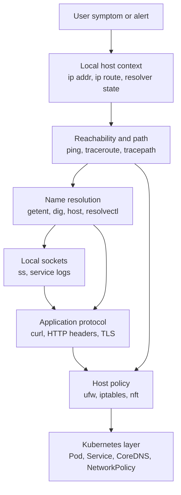
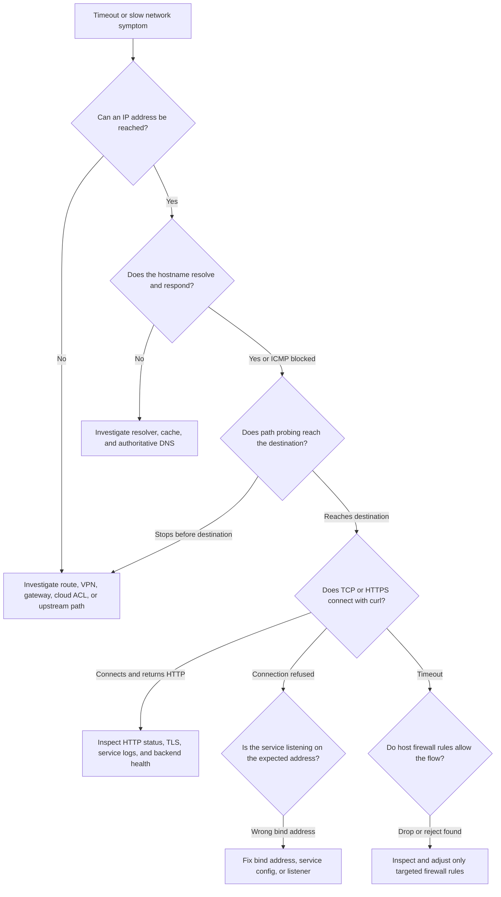

> **Complexity**: `[QUICK]`
>
> **Time to Complete**: 70–100 minutes (long-form read + hands-on exercise)
>
> **Prerequisites**: See [Prerequisites](#prerequisites) below

## Prerequisites

Before starting this module, you should be comfortable moving around a shell, reading command output carefully, and using `sudo` only when a command needs elevated privileges. The examples build directly on [Module 0.2: Environment & Permissions](../module-0.2-environment-permissions/) and [Module 0.4: Services & Logs Demystified](../module-0.4-services-logs/), because network symptoms often end at a process, a service unit, a log line, or a permission boundary that lives on the local host.

The required foundations focus strictly on Linux host networking tools. You will need [Module 0.2: Environment & Permissions](../module-0.2-environment-permissions/), [Module 0.4: Services & Logs Demystified](../module-0.4-services-logs/), and a Linux VM or lab host with `sudo`, standard networking utilities (`ip`, `ping`, `tracepath`, `traceroute`, `curl`, `ss`, `dig`, `host`, `getent`), and firewall tools (`iptables`, `nft`, or `ufw`).

Optional Kubernetes cluster familiarity helps if you take the cluster fork. Basic familiarity with pods, Services, EndpointSlices, CoreDNS, and `kubectl` helps with the **Kubernetes Touch-Points** section and optional cluster triage. That cluster material is gated behind an explicit fork below.

A running Kubernetes cluster is **not** required for this module. The Killercoda lab `linux-0.5-networking-tools` is an Ubuntu host scenario with no cluster provided, and the full networking tools exercise — including every hands-on task and success criterion — completes on any Linux host without `kubectl`.

You do not need to be a network engineer to use these tools well. You do need a disciplined habit of asking one narrow question at a time, recording what the answer proves, and refusing to treat a single passing command as proof that every layer is healthy. KubeDojo examples assume modern Linux distributions and Kubernetes 1.35+ when cluster behavior appears, but this module stays grounded in host evidence first because a Kubernetes node is still a Linux machine with sockets, resolvers, routes, packet filters, and local services.

## Learning Outcomes

- **Diagnose** reachability and latency failures with `ping`, `traceroute`, and `tracepath` before escalating to application debugging. *(Host-only)*
- **Debug** HTTP and API behavior with `curl` verbose output, headers, redirects, TLS evidence, and mTLS client-certificate basics. *(Host-only)*
- **Inspect** listening ports and service binding choices with `ss`, while recognizing why `netstat` is now mostly a compatibility habit. *(Host-only)*
- **Evaluate** DNS resolver, cache, record, and TTL evidence with `getent`, `dig`, `host`, and systemd-resolved tools. *(Host-only; on the optional cluster path, compare host resolvers with cluster CoreDNS behavior — see the Kubernetes Touch-Points fork.)*
- **Implement** a local firewall troubleshooting sequence with `ufw`, `iptables`, and `nft` that inspects state and tests targeted rules without flushing production policy. *(Host-only)*

## Why This Module Matters

Production networking failures rarely arrive with a label that says "DNS" or "firewall." They arrive as a deployment that rolled out cleanly but now times out, a webhook that works from a laptop but not from a node, a database process that is running but unreachable, or a Kubernetes Service that has endpoints but still fails from one namespace. In those moments, every theory is tempting because the network sits between the symptom and the system you can see. The practical operator advantage is not knowing every flag by memory; it is knowing which command can prove the next layer of the path.

The cost of guessing is high because network fixes often change shared paths. A firewall flush can disconnect SSH sessions, expose services, or erase rules managed by Kubernetes, Docker, cloud-init, or a security baseline. A DNS change made during panic can create a second incident when caches expire at different times. A restart of the wrong service can hide evidence that would have explained the root cause. The safest workflow is to start with read-only observations, compare local and remote viewpoints, then make the smallest reversible change only after the evidence points to that layer.

This module treats everyday tools as an investigation sequence rather than as a command catalog. `ping` and `tracepath` ask whether packets can travel and what the path seems to look like. `curl` asks whether an application protocol can connect, negotiate TLS, send headers, and receive a response. `ss` asks what the local kernel believes is listening. `getent`, `dig`, and `host` ask whether name resolution agrees across the local system, a chosen resolver, and authoritative DNS. `ufw`, `iptables`, and `nft` ask whether host policy permits the traffic you expect.

The same sequence also makes Kubernetes troubleshooting less magical. Pods, Services, CoreDNS, kube-proxy, CNI plugins, NetworkPolicy controllers, and cloud load balancers add layers, but they do not remove the Linux facts underneath. If a node cannot resolve a name, pods on that node start from bad evidence. If a service listens only on `127.0.0.1`, another host cannot reach it by retrying harder. If a host firewall rejects a node port, the Service object can still look correct. Reliable operators prove the host layer before blaming the cluster layer.

## The Tool Stack as a Layered Investigation

A useful troubleshooting session starts with a ladder. At the bottom is local context: the address you are testing from, the route the kernel selected, and the resolver your system actually uses. Above that is network reachability, where ICMP and path probes give early evidence without proving application health. Above reachability is naming, because a healthy path to the wrong address is still a failure. Above naming is the transport and application protocol, where TCP, TLS, HTTP status codes, headers, and response bodies finally tell you how the service behaved.

The ladder prevents two common mistakes. The first mistake is skipping straight to the application and treating a timeout as proof that the app is broken. The second mistake is stopping after a low-level success and treating a working ping as proof that HTTPS, DNS, certificates, and firewall policy must also be healthy. A passing result only proves the question that command asked. A failing result only narrows the next question if you understand which layer produced the failure.



The order in the diagram is a default, not a law. If the alert says "certificate verify failed," start with `curl -v` and certificate evidence, then work down only if the connection itself fails. If a pod is `CrashLoopBackOff`, start with process and log evidence before testing the network. When the symptom is a generic timeout, though, the ladder is a good discipline because it moves from cheap, low-risk observations toward more specific and potentially state-changing work.

The strongest habit is to write down the claim next to the command. `ping -c 4 8.8.8.8` does not mean "the internet works"; it means this host sent ICMP echo requests to one public address and received replies. `curl -v https://api.example.com/health` does not mean "the API is healthy"; it means DNS, TCP, TLS, and HTTP progressed far enough to show the exact response or failure mode. `sudo ss -ltnp` does not mean "remote clients can connect"; it means the local kernel has a listening socket on a specific address and port.

That claim discipline is especially important during handoffs. A message such as "network is down" forces the next engineer to repeat your work. A message such as "from node-a, `dig api.example.com @10.96.0.10` returns the old address, but `dig api.example.com @8.8.8.8` returns the new address" gives a clear next move. It separates resolver behavior from route behavior and keeps the incident from drifting into vague opinions.

## Reachability and Latency with `ping`, `traceroute`, and `tracepath`

`ping` sends ICMP Echo Request messages and waits for Echo Reply messages. That makes it a fast reachability probe, but its scope is narrower than many operators assume. A successful ping proves that the target or an intermediate system answered ICMP for that address at that time. It does not prove that TCP port 443 is open, that TLS will verify, that the HTTP handler is healthy, or that a Kubernetes Service is routing traffic correctly. A failed ping also does not prove the target is down, because many firewalls and cloud networks intentionally block ICMP while allowing application ports.

```bash
# Compare direct IP reachability with name-based reachability.
ping -c 4 8.8.8.8
ping -c 4 example.com

# Keep DNS out of the output when reverse lookups make the result noisy.
ping -n -c 4 8.8.8.8
```

Read ping output as a measurement rather than as decoration. Packet loss tells you whether replies disappeared, and intermittent loss often explains flaky deployments better than average latency does. Round-trip time includes outbound travel, remote handling, and the return path, so it is not a one-way measurement. TTL is useful as a clue because IP decrements it at each hop, but it is not a reliable operating-system fingerprint. RFC 791 defines the IPv4 TTL field as a lifetime limiter, and RFC 792 defines the ICMP messages that make echo tests and time-exceeded diagnostics useful.

The first comparison is almost always IP address versus hostname, because two commands that look similar can test very different layers. If the name resolves and packets leave but no replies return, do not stop there. Test the application port with `curl`, test the path with `tracepath` or `traceroute`, and remember that the target may simply refuse ICMP while still serving HTTPS.

**Pause and predict:** On one host, `ping -c 4 8.8.8.8` succeeds, but `ping -c 4 example.com` fails before a single packet is sent. Which layer do you suspect first, and why does the passing IP probe not clear that layer?

<details><summary>Check your prediction</summary>

Suspect name resolution first. The IP probe proves the host can send ICMP to one public address and receive replies, but the hostname probe failed before any packet left the machine — ping never obtained an address to send to. That failure happens inside the local resolver path, so the next evidence comes from `getent hosts` and `dig`, not from more pings. The passing IP ping cannot clear DNS, because it never exercised DNS at all.
</details>

`traceroute` and `tracepath` ask a different question: where do probes appear to travel before they reach the destination or stop producing useful answers? They use increasing TTL or hop-limit values so that routers along the way send back time-exceeded messages. That technique reveals a sequence of responding hops, but it does not reveal every device and it does not prove the return path is symmetric. Modern networks often rate-limit or suppress probe replies, so stars in the middle of the output are evidence to interpret, not proof that traffic died there.

```bash
# Classic path probe. UDP is common, but firewalls may treat it differently from HTTPS.
traceroute example.com

# TCP probes are useful when you need the path to resemble HTTPS more closely.
traceroute -T -p 443 example.com

# Non-root path probing with path-MTU hints.
tracepath example.com
```

`tracepath` is useful on locked-down systems because it does not require the same privileges as some traceroute modes and it reports path MTU observations. Path MTU matters when small tests pass but large responses stall, because an oversized packet that cannot be fragmented or cannot receive the needed ICMP message can create confusing hangs. Operators often see this around VPNs, tunnels, cloud overlays, and container networks where encapsulation adds headers and reduces the usable payload size.

The most useful traceroute pattern is persistence. A single high number or a row of stars at one intermediate hop is weak evidence because that router may deprioritize replies to probes while forwarding real traffic normally. A latency jump that begins at one hop and remains high through every later hop is stronger evidence. A path that reaches the destination but `curl` still times out suggests that routing is probably not the only problem. In that case, move up to DNS, TCP, TLS, service binding, or policy instead of rerunning path probes until the output looks dramatic.

**Pause and predict:** A traceroute shows `* * *` at hop 3, but hops 4 through 8 reply normally and the destination answers on the final hop. Is hop 3 where your traffic is dying, and what evidence would make that claim stronger?

<details><summary>Check your prediction</summary>

Not on this evidence alone. Hop 3 is probably rate-limiting or refusing probe replies while forwarding real traffic, because every later hop — including the destination — still answered. Stronger evidence would be latency or loss that begins at hop 3 and persists through every hop after it, matching failures from a second vantage point, or the destination itself becoming unreachable. Treat a silent middle hop as a clue, not a culprit.
</details>



## HTTP and API Debugging with `curl`

`curl` is the everyday tool for proving what happened at the application protocol layer. It can show DNS selection, TCP connection attempts, TLS negotiation, request headers, response headers, redirects, status codes, and response bodies. That range matters because many incidents look identical from a browser or a client library. A timeout, a refused connection, a certificate failure, an HTTP 401, an HTTP 429, and an HTTP 503 can all be reported as "the API is down," but they point to very different fixes.

```bash
# Show the full conversation without hiding connection setup.
curl -v https://example.com/

# Show response headers and the body together.
curl -i https://example.com/

# Follow redirects while still surfacing failure as a nonzero exit.
curl -L --fail-with-body https://example.com/
```

The most important part of `curl -v` is the direction marker. Lines beginning with `*` are curl's own progress and connection notes. Lines beginning with `>` are request data sent by the client. Lines beginning with `<` are response data returned by the server. Reading those markers in order turns a vague "the API is down" report into a precise record of which stage succeeded and which stage produced the failure.

**Pause and predict:** Your transcript shows `* Connected to api.example.com`, a completed TLS handshake, and then `< HTTP/2 503`. Which layer do you inspect next, and why would another ping add nothing?

<details><summary>Check your prediction</summary>

Inspect the application or load-balancer layer next. The transcript proves that DNS resolved, TCP connected, and TLS verified, because an HTTP status line can only arrive after all three succeed. A 503 means something at the far end answered and declared itself unavailable, so the next evidence is backend health, overload, routing rules, or dependency behavior. Another ping would only re-prove the reachability layers that the `Connected` line and the 503 already cleared.
</details>

Headers are often enough to separate network failures from application decisions. `curl -I` sends a HEAD request, which is useful for checking status, redirects, cache headers, and server identity without downloading the body. Some applications mishandle HEAD, so compare with `curl -i` when a HEAD result disagrees with a browser, a health check, or an application client. RFC 9110 (HTTP semantics) and RFC 9112 (HTTP/1.1 message syntax) are the current references, and even when HTTP/2 or HTTP/3 is negotiated, the habit of reading method, target, headers, status, and body remains the same.

```bash
# Check redirect behavior and security headers.
curl -I http://example.com/
curl -I https://example.com/

# Send a realistic host header when testing a virtual host or ingress.
curl -v -H 'Host: app.example.com' https://203.0.113.10/

# Bound a test so it fails quickly during an incident.
curl --connect-timeout 3 --max-time 10 -v https://example.com/
```

TLS failures deserve their own reading discipline. A certificate-name mismatch usually means the client reached a server, but not the server name it expected. An unknown certificate authority may mean the service uses a private CA that the client does not trust. An expired certificate is not a route failure. A handshake failure can involve protocol versions, cipher suites, client certificates, or a proxy between the client and service. `curl -v` shows enough of the handshake to decide whether you need certificate material, load balancer configuration, or application logs.

mTLS adds one more identity check: the server asks the client to present a certificate, and the client must also trust the server. In a lab or controlled environment, curl can send a client certificate and key with `--cert` and `--key`, and it can pin trust to a specific CA bundle with `--cacert`. Do not paste private keys into tickets or chat, and do not use `-k` as a permanent fix. `-k` only disables certificate verification for that request, which can hide a man-in-the-middle risk or a wrong endpoint during the exact moment when you need stronger evidence.

```bash
# mTLS shape only: use real paths from your controlled lab or secret store.
curl -v \
  --cert ./client.crt \
  --key ./client.key \
  --cacert ./ca.crt \
  https://api.example.com/health
```

For downloads, `curl` can also prove whether automation is handling redirects, partial failures, and checksums safely. The curl manual documents many flags, but a practical baseline is `-fL` for fail-on-error and redirects, `-o` for an explicit output path, and a checksum command from the publisher before execution. Infrastructure incidents get worse when a recovery script silently downloads an HTML error page into a binary path or runs an unverified replacement tool. The network test and the supply-chain check belong in the same workflow because both protect the operator from trusting the wrong evidence.

## Local Listening Sockets with `ss`

When a remote client cannot connect to a service, inspect the server before blaming the network. The Linux kernel owns the socket table, and `ss` reads that table quickly. A process can be running, healthy in logs, and still unreachable because it listened on the wrong address, the wrong port, the wrong protocol, or only the loopback interface. `systemctl status` tells you whether a service unit is active; `ss` tells you what the kernel is prepared to accept.

```bash
# Listening TCP sockets, numeric addresses, process names when permitted.
sudo ss -ltnp

# Listening UDP sockets as well.
sudo ss -lunp

# Filter to one expected port.
sudo ss -ltnp 'sport = :8080'
```

The address column is the first thing to read. `0.0.0.0:8080` means the process accepts IPv4 connections on all local interfaces, subject to routing and firewall policy. `[::]:8080` means IPv6 wildcard, and depending on system settings it may or may not also accept IPv4-mapped connections. A specific interface address limits the listener to that one network. These details explain why "the process is running" is not enough evidence.

**Pause and predict:** `sudo ss -ltnp` shows `127.0.0.1:5432` owned by PostgreSQL, and a worker on another host cannot connect no matter how many times it retries. Can that remote worker ever reach this socket, and what exactly has the `ss` line proven?

<details><summary>Check your prediction</summary>

No. A listener on `127.0.0.1` accepts connections only from the same host, because loopback traffic never crosses a network interface, so retrying harder from the remote worker cannot change the bind address. The `ss` line has proven that the process exists, that the kernel holds a listening socket on port 5432, and that the socket is bound to IPv4 loopback only; it has proven nothing about firewalls or routes, because remote packets never survive long enough for those layers to matter. The fix lives in the database's listen-address configuration, followed by fresh `ss` output to verify the new bind.
</details>

Process ownership is the second thing to read. With `sudo`, `ss -p` can show which process owns the socket, which helps you catch port conflicts and wrong daemons. A failed deployment may leave an old process listening while the new service crashes. A local development server may bind a port expected by a production daemon. A container runtime or sidecar may expose a listener that makes the host look healthy even though the application process inside the container is not the one answering.

`netstat` appears in older runbooks because it was historically common through the `net-tools` package. On modern Linux systems, `ss` from iproute2 is the preferred tool because it is faster, maintained with the rest of the contemporary networking utilities, and exposes socket state directly. You may still need to read old `netstat -tulpn` examples, but new procedures should teach `ss` first and mention `netstat` only as a compatibility translation for legacy hosts.

Socket state also helps with client-side failures. A client machine can show many connections stuck in `SYN-SENT` when outbound packets leave but no reply completes the TCP handshake. A server can show a growing set of `ESTAB` connections when clients connect but the application stalls later. `ss -tan state syn-sent` and `ss -tan state established` are not replacements for tracing, but they tell you whether the kernel sees connection attempts at all. That is often the difference between debugging policy and debugging application behavior.

## DNS Investigation with `getent`, `dig`, `host`, and systemd-resolved

DNS troubleshooting starts with a subtle question: are you testing the same resolver path your application uses? `dig` is excellent for asking DNS questions, but by default it may not exercise every Name Service Switch rule, `/etc/hosts` entry, mDNS path, or systemd-resolved routing policy that ordinary applications use. `getent hosts name.example` is often the first local check because it goes through the system's configured name service path. If `getent` and `dig` disagree, that disagreement is evidence, not noise.

```bash
# Application-like local resolution through NSS.
getent hosts example.com

# DNS-focused lookup through the configured resolver.
dig example.com

# Compact answer view.
dig +short example.com A
dig +short example.com AAAA
```

`dig` becomes powerful when you choose the resolver explicitly. If the local resolver returns one answer and a public resolver returns another, you have separated local caching or policy from authoritative data. If a Kubernetes pod uses CoreDNS but the node uses systemd-resolved, you must test both views before deciding where the fault lives.

**Pause and predict:** `getent hosts app.internal.example` returns a private address, but `dig @8.8.8.8 app.internal.example` returns a public address or no answer at all. Is the local answer automatically wrong, and what do you record before changing anything?

<details><summary>Check your prediction</summary>

No. Private-versus-public disagreement is often correct split-horizon DNS: internal clients are supposed to receive the private address, and a public resolver has no business answering for internal names. The disagreement proves the two resolver paths differ, not that one of them is broken. Record which resolver answered, which address each returned, and the remaining TTLs, then compare against the viewpoint the failing application is supposed to use. Treating the public resolver as the source of truth is how operators "fix" working internal DNS into an outage.
</details>

```bash
# Compare the local configured resolver with a chosen recursive resolver.
dig app.example.com
dig @8.8.8.8 app.example.com

# Ask for specific record types instead of relying on defaults.
dig app.example.com A
dig app.example.com AAAA
dig app.example.com CNAME
dig app.example.com MX
dig app.example.com TXT
```

TTL is the field that turns DNS from a yes-or-no question into a timeline. A resolver that returns an old address with a remaining TTL of 2800 seconds may be behaving correctly if it cached the record before a change. Another resolver that returns the new address may also be correct if it missed the earlier cache window or refreshed later. RFC 1035 defines the DNS message and resource-record model, but the operational lesson is simple: a DNS change is not globally instantaneous, and your evidence should name which resolver answered and what TTL remained.

`dig +trace` is a deeper tool because it walks the delegation chain from the root toward the authoritative servers. It is slower and noisier than a normal query, but it is useful when you need to prove whether the public delegation path is intact. Use it after simpler comparisons, not as your first command during every incident. If a normal query to the authoritative server returns the expected record, but a recursive resolver returns something else, the problem is often cache, forwarding policy, or resolver configuration rather than the zone itself.

```bash
# Trace delegation from the root down toward the authoritative answer.
dig +trace app.example.com

# Query a known authoritative server directly when you have its name.
dig @ns1.example.net app.example.com A

# Use host for a quick human-readable lookup.
host app.example.com
host -t MX example.com
```

On many distributions, systemd-resolved sits between applications and upstream DNS servers. It can provide a local stub listener, route queries by domain, maintain per-link DNS settings, and expose status through `resolvectl`. That design is useful on laptops, VPN-connected hosts, and servers with multiple interfaces, but it can confuse investigations if you only read `/etc/resolv.conf` and assume it is the whole story. The systemd-resolved documentation explains the stub and routing behavior; in practice, `resolvectl status` is the everyday command that shows which DNS servers and domains each link is using.

```bash
# Inspect systemd-resolved's current view when it is present.
resolvectl status

# Query through resolved and include detail.
resolvectl query app.example.com

# Flush caches only in a disposable lab or after recording evidence.
sudo resolvectl flush-caches
```

Be careful with cache-clearing commands. Flushing a resolver cache may make your local test pass while erasing the evidence needed to explain why the application failed. In production, capture the old and new answers, TTLs, resolver addresses, and relevant timestamps before clearing anything. The better first move is comparison: local application-like lookup with `getent`, local DNS lookup with `dig`, chosen public or internal resolver with `dig @server`, and authoritative or traced evidence when the delegation path is in question.

## Local Firewall Inspection with `ufw`, `iptables`, and `nft`

Host firewalls are powerful because they sit close to the workload. They are also risky because they share a host with SSH, package management, monitoring, Kubernetes node agents, container runtimes, and sometimes cloud-init or security tooling. During troubleshooting, your default posture should be inspect first, change only a targeted rule, and never flush a ruleset just to "see if it helps." Flushing can disconnect you, break cluster networking, and erase the exact state another controller expects to manage.

`ufw` is a friendly interface commonly used on Ubuntu systems. It expresses policy in a way humans can read quickly, but it is still backed by netfilter machinery underneath. Start with `sudo ufw status verbose` and `sudo ufw status numbered` so you can see whether it is active, what the defaults are, and which rules are present. `sudo ufw show raw` can reveal lower-level rules when the simple status output is not enough. Do not run `ufw reset` during an incident unless a runbook explicitly says the host is disposable and you have console access.

```bash
# UFW read-only inspection.
sudo ufw status verbose
sudo ufw status numbered
sudo ufw show raw
```

`iptables` is both a tool and a compatibility surface. Many distributions now route iptables commands through an nftables backend, while older systems may still use legacy iptables. That is why `iptables -V` matters: it tells you whether the command is using an nf_tables backend or a legacy backend. For inspection, prefer commands that list rules with counters and numeric addresses. Counters are useful because a rule that never matches may not be involved, while a rule whose packet count increases during your test is strong evidence.

```bash
# Inspect iptables without changing state.
sudo iptables -V
sudo iptables -S
sudo iptables -L -n -v --line-numbers
sudo iptables -t nat -L -n -v --line-numbers
```

`nft` is the native userspace tool for nftables. It represents rules as tables, chains, sets, maps, hooks, and priorities. For everyday troubleshooting, the first command is usually `sudo nft list ruleset`, optionally filtered with normal text tools after you have captured the full output. The nftables model can coexist with iptables-nft compatibility commands, so seeing a rule through `iptables` does not always mean the host is using the legacy kernel interface. The important operational question is which frontend manages the rule and whether another controller will rewrite it.

```bash
# Inspect nftables state without flushing or editing.
sudo nft list ruleset
sudo nft list tables
sudo nft list ruleset | grep -n "dport 443"
```

Kubernetes makes firewall inspection more delicate. kube-proxy, CNIs, service meshes, node-local DNS caches, and host security agents can all create rules that look unfamiliar. A node may have chains for service load balancing, masquerade behavior, pod CIDRs, or policy enforcement. If you flush those chains, the cluster can lose Service routing even though the manifests remain unchanged. When a node-level firewall is suspected, capture `ss`, `ip route`, relevant `iptables` or `nft` output, and Kubernetes Service or endpoint evidence before making a targeted change.

The safest live test is a reversible rule with a narrow destination, protocol, and port in a lab host. Insert it at a known position, run one verification command, then delete the exact rule you inserted. Never use broad defaults as a quick experiment on a remote production machine. If you cannot guarantee console access and rollback, stop at inspection and propose the change through the normal incident process. A firewall command is not just a diagnostic; it changes the system you are trying to understand.

## A Structured Troubleshooting Sequence

A structured sequence keeps the investigation from bouncing between layers. Start by stating the symptom in observable terms: who is failing, from where, to which name or address, on which port, and since when. Then test from the failing vantage point first. A successful test from your laptop does not clear a node, a pod, a private subnet, or a VPN-connected host. The source matters because routes, resolvers, firewalls, and certificates are often different for each viewpoint.

The first host commands should be read-only and cheap. Capture address and route context, compare IP reachability with name-based reachability, inspect DNS answers and TTLs, and check whether the target service listens on the expected address. Use `curl -v` only after you know which hostname, address, and port you are testing. If the curl output returns an HTTP status, read the status and headers before calling it a network failure. A server-generated error is valuable proof that the network path reached something.

```bash
# A compact first-pass host checklist.
ip -brief addr
ip route get 8.8.8.8
getent hosts app.example.com
dig app.example.com
ping -c 4 8.8.8.8
tracepath app.example.com
curl -v --connect-timeout 3 --max-time 10 https://app.example.com/health
sudo ss -ltnp
```

After the first pass, branch based on the failure mode. Name lookup failures go to resolver comparison, TTLs, `/etc/hosts`, systemd-resolved, CoreDNS, or authoritative DNS. Connection refused goes to `ss`, bind addresses, service configuration, process ownership, and local logs. Connection timeout goes to routing, security groups, firewalls, NetworkPolicy, load balancers, or a remote process that is not replying. HTTP errors go to application logs, upstream health, authentication, rate limits, or dependency behavior. TLS errors go to certificates, SNI, trust stores, client certificates, and proxy configuration.

Good troubleshooting also records negative evidence. If `ss` shows no listener on port 8080, that rules out a remote firewall as the first explanation for a local connection refusal. If `dig @8.8.8.8` and `dig @1.1.1.1` agree but `getent` returns a different result, local resolver policy deserves attention. If `curl -v` connects to the IP but fails certificate verification for the hostname, you likely reached an endpoint that is not presenting the expected identity. These negative facts keep the team from reopening discarded theories.

When you do change something, make the rollback as explicit as the change. A temporary iptables rule should have a matching delete command. A DNS cache flush should be recorded with the before and after answers. A service bind change should be followed by `ss` output that proves the new listener. A Kubernetes Service change should be followed by endpoints, events, and a test from the original failing vantage point. Verification is not an afterthought; it is the second half of every fix.

## Kubernetes Touch-Points: Host Networking to Pod, Service, and DNS Failures

> **Host-only vs cluster fork:** This section uses `kubectl` and needs a running Kubernetes cluster. Pick your path before running anything:
>
> - **Killercoda lab / local Linux host:** The linked lab `linux-0.5-networking-tools` is an Ubuntu host scenario without a cluster. Complete the host networking exercises there and read this section as a worked example — nothing here is required for the host path.
> - **Optional cluster path:** If you have a local [`kind`](https://kind.sigs.k8s.io/) cluster or an existing cluster with `kubectl` access, run the commands below live on it.
> - **Skip-as-read:** Without a cluster, read the commands and outputs as illustrative examples; pod names, namespaces, and cluster responses below are illustrative, and a live cluster will differ.

Kubernetes networking adds abstractions, but host tools still answer important questions. A Pod IP is usually routed through a CNI-provided path. A Service virtual IP is usually implemented by kube-proxy through iptables, nftables, or IPVS depending on cluster configuration. DNS inside the cluster is usually served by CoreDNS, while the node may use systemd-resolved or another resolver for its own lookups. When a pod cannot reach an API, you need to know which layer produced the failure before editing manifests.

Start outside the pod when the node itself looks suspicious. If the node cannot reach a registry, package mirror, external API, or internal DNS server, pods scheduled there may inherit the same path problem or a closely related policy problem. Host commands such as `ip route get`, `resolvectl status`, `dig`, `curl -v`, and firewall inspection can prevent a long detour through Deployment YAML. Once the host path is plausible, move into Kubernetes evidence with pod status, events, Services, EndpointSlices, and CoreDNS behavior.

```bash
# Illustrative Kubernetes evidence without shorthand aliases (cluster path only).
kubectl get pods -A -o wide
kubectl describe pod -n default app-pod
kubectl get svc,endpointslices -n default
kubectl get pods -n kube-system -l k8s-app=kube-dns -o wide
```

DNS failures are a classic place where host and pod views diverge. A node may resolve `example.com` through systemd-resolved, while a pod resolves through CoreDNS. CoreDNS may forward external names to the node's resolver, to a configured upstream resolver, or to cluster-specific rules. A useful sequence is to compare `getent` or `dig` on the node, a short-lived diagnostic pod query inside the cluster, and CoreDNS logs or events only after the answers differ. Do not assume the pod and node use the same resolver just because they run on the same machine.

```bash
# Illustrative disposable DNS probe pod using a tiny image with nslookup (cluster path only).
kubectl run dns-check \
  --rm -it \
  --image=busybox:1.36 \
  --restart=Never \
  -- nslookup kubernetes.default
```

Service failures also need layered evidence. If a Service has no endpoints, the network is not the first problem; selectors, readiness, or pod labels are. If endpoints exist but a node cannot reach the Service IP, inspect kube-proxy mode and node packet-filter state. If a pod can reach the Service but external clients cannot, move outward to Ingress, load balancers, node ports, cloud security groups, and host firewalls. The same ladder applies, but each rung has a Kubernetes object paired with a Linux fact.

The best Kubernetes troubleshooting notes name both sides. Illustrative example: "CoreDNS is broken" is vague. "From pod `dns-check` in namespace `default`, `nslookup kubernetes.default` times out; from node `worker-2`, `resolvectl query kubernetes.default` is not relevant because that name is cluster-only; CoreDNS pods are running but their logs show upstream timeouts for external names" is actionable. It protects the team from mixing cluster DNS, node DNS, and public DNS into one confused bucket.

## Turning Evidence into an Escalation Note

The final skill in everyday networking work is deciding when the local investigation has enough evidence to involve another owner. Network, DNS, security, platform, and application teams all receive vague tickets during incidents. A vague ticket forces the receiver to rediscover the problem and often creates argument about ownership before anyone tests the next useful layer. A strong escalation note is short, but it contains the source host, destination name, destination address if known, port, command output summary, timestamps, and the reason you believe the next owner controls the failing layer.

For a DNS escalation, include the resolver that answered, the record type, the returned value, and the TTL. Saying "DNS still points to the old place" is weaker than saying "`dig app.example.com A @10.0.0.53` returned `192.0.2.20` with TTL 2400 at 13:10 UTC, while the authoritative server returned `192.0.2.30` with TTL 300." The second form gives the DNS owner enough data to check cache, forwarding, split-horizon policy, or zone publication without asking for the same commands again.

For a firewall or routing escalation, include both the positive and negative evidence. If `ss` proves the service is listening on `0.0.0.0:8443`, and `curl -v` from the same host succeeds through loopback, but a remote client times out and firewall counters increase on a deny rule, the security owner has a concrete starting point. If counters do not move, that fact is also useful because it suggests the packet may not be reaching the host firewall. Evidence that rules out a layer is as valuable as evidence that confirms one.

For an application escalation, include the protocol proof. A `curl -v` transcript that reaches `< HTTP/2 503` or `< HTTP/1.1 429` should shift the conversation away from basic reachability and toward service behavior, load balancer routing, dependency health, rate limiting, or authentication. This does not mean the network can never be involved after an HTTP response appears, but it means the next owner should start from a real application response rather than from a generic timeout report. The command output narrows the argument.

Escalation quality also protects rollback. If your note says which temporary rule was inserted, which DNS cache was flushed, or which service bind address was changed, another operator can reverse the experiment or check whether it drifted. If your note only says "tried firewall change," the next shift may inherit a modified system without knowing which assumption created it. Everyday tools are simple, but the professionalism comes from preserving the chain of evidence.

## Did You Know?

- **ICMP is more than ping.** RFC 792 defines ICMP messages such as Echo Reply and Time Exceeded, which is why both ping-style checks and TTL-based path discovery can produce useful network evidence.
- **`curl -v` separates client and server speech.** The `>` lines show request data sent by curl, while `<` lines show response data from the server, making it easier to tell transport failure from application response.
- **`ss` replaced many everyday `netstat` habits.** It comes from iproute2, reads modern socket information efficiently, and should be the first tool you teach for listening ports on current Linux systems.
- **DNS TTL is a countdown, not a promise of instant change.** A resolver can return an old value correctly until its cached record expires, so always record which resolver answered and what TTL remained.

## Common Mistakes

| Mistake | Why It Happens | How to Fix It |
|:---|:---|:---|
| Treating a successful ping as proof that an API is healthy | ICMP echo replies do not test TCP, TLS, HTTP headers, authentication, or application dependencies. | Use ping only for reachability evidence, then test the actual protocol with `curl -v` and read the status or failure mode. |
| Declaring a host down because ping fails | Firewalls, cloud networks, and appliances often block ICMP while allowing service ports. | Test the intended port with `curl`, `traceroute -T`, or another protocol-aware check before escalating the host as unreachable. |
| Ignoring bind addresses in `ss` output | A process can be active while listening only on loopback or the wrong interface. | Read the local address column first, then compare `127.0.0.1`, `0.0.0.0`, specific interface addresses, and IPv6 wildcard listeners. |
| Using `dig` alone and missing local resolver policy | Applications may use NSS, `/etc/hosts`, mDNS, systemd-resolved routing, or split DNS behavior that a simple dig query does not fully exercise. | Compare `getent hosts`, normal `dig`, `dig @resolver`, and `resolvectl status` when local and DNS-specific views differ. |
| Flushing firewall rules to test a theory | Flushes erase managed state and can break SSH, Kubernetes Services, container networking, or security baselines. | Inspect with `ufw status`, `iptables -S`, and `nft list ruleset`, then use only narrow reversible rules in a lab or approved change window. |
| Reading traceroute stars as certain packet loss | Intermediate routers may rate-limit or suppress probe replies while forwarding real traffic normally. | Look for persistent latency changes, destination behavior, and tests from multiple vantage points before blaming a middle hop. |
| Using `curl -k` as a permanent workaround | Disabling certificate verification can hide wrong endpoints, expired certificates, and trust-store problems. | Use `-k` only for a controlled experiment, then fix CA trust, certificate names, SNI, or mTLS material properly. |

## Quiz

**Test your understanding. Try to answer before revealing the solution.**

<details><summary>1. A service fails from one Linux host, but `ping -c 4 8.8.8.8` succeeds. What has that result proven, and what has it not proven?</summary>

It proves that the host could send ICMP Echo Requests to one public IP address and receive Echo Replies at that moment. It does not prove DNS, TCP port reachability, TLS trust, HTTP health, proxy behavior, or Kubernetes Service routing. The next check should match the failing path more closely, such as `getent hosts`, `dig`, `tracepath`, or `curl -v` against the actual hostname and port.
</details>

<details><summary>2. `curl -v https://api.example.com/health` shows a completed TLS connection and then `< HTTP/2 503`. Which layer should you inspect next?</summary>

The network path, TCP connection, and TLS negotiation progressed far enough for an HTTP response to return. A 503 points toward the application, load balancer, upstream health, overload, or dependency behavior rather than basic reachability. You should inspect service logs, backend health checks, routing rules, and recent deployment changes before changing firewall or DNS policy.
</details>

<details><summary>3. `sudo ss -ltnp` shows `127.0.0.1:5432` for PostgreSQL, and a remote worker cannot connect. What is the likely issue?</summary>

The database is listening only on IPv4 loopback, so remote hosts cannot connect to that socket through the network. You would review PostgreSQL listen address settings, host-based authentication, firewall policy, and intended exposure before changing anything. The key evidence is that the process exists but is bound to an address that only local clients can use.
</details>

<details><summary>4. `getent hosts app.example.com` returns an internal address, while `dig @8.8.8.8 app.example.com` returns a public address. Is that automatically wrong?</summary>

No. That can be valid split-horizon DNS or local resolver policy, especially on VPNs, corporate networks, and Kubernetes-adjacent environments. Record which resolver answered, which address each returned, and the TTLs. Then compare the expected viewpoint for the failing application instead of assuming the public resolver is the source of truth.
</details>

<details><summary>5. A traceroute shows `* * *` at hop 3, normal replies at later hops, and the destination responds. Should you escalate hop 3 as the outage?</summary>

Not based on that evidence alone. The hop may simply refuse or rate-limit traceroute probes while forwarding traffic normally. Stronger evidence would include a persistent latency jump after that hop, failure of all later hops including the destination, matching reports from multiple vantage points, or provider evidence that traffic is being dropped there.
</details>

<details><summary>6. During a node incident, someone proposes `iptables -F` to test whether the firewall is responsible. Why is that unsafe, and what should you do instead?</summary>

Flushing rules can erase SSH protection, Kubernetes service routing, container networking rules, NAT behavior, and security-managed policy. Start with read-only inspection: `iptables -V`, `iptables -S`, `iptables -L -n -v --line-numbers`, and `nft list ruleset` if nftables is involved. If a change is required, use a narrow reversible rule in a lab or approved window and document the matching rollback command.
</details>

<details><summary>7. (Cluster path) A pod cannot resolve `kubernetes.default`, but the node can resolve public names with systemd-resolved. What should you compare next?</summary>

You should compare pod DNS and cluster DNS evidence rather than treating the node's public resolver result as decisive. Check CoreDNS pods, Kubernetes Service and EndpointSlice objects for DNS, a disposable pod lookup such as `nslookup kubernetes.default`, and CoreDNS logs if the pod-side query fails. Node DNS and pod DNS can use different resolver paths.
</details>

## Hands-On Practice

All tasks below are host-only: a learner on the Killercoda `linux-0.5-networking-tools` ubuntu lab or any local Linux host with `sudo` can complete every task and verification without a Kubernetes cluster. The `kubectl` commands from the **Kubernetes Touch-Points** section form an optional cluster path for learners who already have a running cluster.

These exercises are written for the Killercoda Ubuntu lab or another disposable Linux environment. Do not run firewall-changing commands on a production host, a shared bastion, or a remote machine where you lack console access. The goal is not to memorize output; it is to collect evidence in an order that would be safe during a real incident and to explain what each command proves.

**Task 1: Five-tool checklist on a misbehaving service.** Exercise scenario: a web health endpoint is reported as slow or unavailable, and you need a first-pass host investigation before escalating. Use the same target hostname for every step so the evidence stays comparable. Replace `app.example.com` with a host you are allowed to test, and keep the curl timeout bounded so a broken endpoint does not stall your whole investigation.

```bash
TARGET=app.example.com

getent hosts "$TARGET"
dig "$TARGET"
ping -c 4 "$TARGET"
tracepath "$TARGET"
curl -v --connect-timeout 3 --max-time 10 "https://$TARGET/health"
```

After running the checklist, write one sentence for each tool: what did it prove, what did it not prove, and what would you test next if it failed. This is the main muscle of the module. A clean `getent` result does not prove HTTPS. A clean ping does not prove HTTP. A curl response with a status code does not prove the application is healthy, but it does prove the request reached an HTTP-speaking endpoint.

<details><summary>Solution guidance for Task 1</summary>

A strong answer names the layer behind each result. `getent` proves the local application-like name path returned an address. `dig` gives DNS-specific evidence from the configured resolver. `ping` tests ICMP reachability but not the service port. `tracepath` gives path and MTU hints without proving application health. `curl -v` shows TCP, TLS, HTTP, headers, status, and body evidence for the real endpoint.
</details>

- [ ] I compared local name resolution with DNS-specific lookup for the same target. *(Host-only)*
- [ ] I recorded whether reachability evidence came from ICMP, path probing, or the actual HTTP endpoint. *(Host-only)*
- [ ] I can name the next layer to inspect for timeout, connection refused, TLS failure, and HTTP error responses. *(Host-only)*

**Task 2: DNS deep-dive from local resolver to delegation path.** Exercise scenario: a DNS change was made recently, and different clients disagree about the address for the same name. This task compares the local system view, a chosen recursive resolver, and the public delegation chain. Use a domain you control if possible, because authoritative answers and TTLs are easiest to interpret when you know the intended record.

```bash
NAME=app.example.com

getent hosts "$NAME"
dig "$NAME" A
dig "$NAME" AAAA
dig @8.8.8.8 "$NAME" A
dig +trace "$NAME"
host "$NAME"
resolvectl status
```

Focus on resolver identity and TTL. If your local resolver returns an old address with a high remaining TTL, that may explain why one environment is stale without proving the zone is wrong. If `dig +trace` reaches the expected authoritative answer but the local resolver disagrees, investigate cache, forwarding, split DNS, VPN domain routing, or systemd-resolved per-link settings. If the trace fails before the authoritative servers, delegation or public DNS configuration deserves attention.

<details><summary>Solution guidance for Task 2</summary>

A strong answer records the answer address, record type, resolver used, and TTL for each command. It does not simply say "DNS is wrong." It separates application-like local lookup through `getent`, DNS-specific lookup through `dig`, explicit resolver lookup through `dig @8.8.8.8`, delegation evidence through `dig +trace`, and systemd-resolved routing evidence through `resolvectl status`.
</details>

- [ ] I captured the local system answer and at least one explicit resolver answer. *(Host-only)*
- [ ] I compared A and AAAA records instead of assuming IPv4 and IPv6 behave the same. *(Host-only)*
- [ ] I recorded TTLs and resolver addresses before clearing any cache. *(Host-only)*

**Task 3: Local firewall blocking and verification in a disposable lab.** Exercise scenario: you need to prove how a narrow host firewall rule changes one outbound connection without flushing any ruleset. The example below blocks HTTP to the current example.com address and then deletes the exact same rule. Run it only in a lab, keep another terminal open, and confirm the delete command before inserting the rule.

```bash
# Inspect first.
sudo iptables -V
sudo iptables -L OUTPUT -n -v --line-numbers

# Resolve the current example.com A/AAAA destination (for IPv4 lab use, keep this line as-is).
TARGET_IP=$(dig +short example.com | head -1)

# Insert one narrow temporary rule.
sudo iptables -I OUTPUT 1 -p tcp -d "$TARGET_IP" --dport 80 -j REJECT
sudo iptables -L OUTPUT -n -v --line-numbers

# Verify the effect with a bounded request.
curl -v --connect-timeout 3 --max-time 6 "http://$TARGET_IP/"

# Remove exactly the rule you inserted.
sudo iptables -D OUTPUT -p tcp -d "$TARGET_IP" --dport 80 -j REJECT
sudo iptables -L OUTPUT -n -v --line-numbers
```

The point is not that example.com is special. The point is the pattern: inspect, insert one narrow rule, run one verification, and delete the exact rule. If your distribution uses iptables-nft, inspect `sudo nft list ruleset` afterward and notice how the compatibility command appears through nftables. If UFW is active, also compare `sudo ufw status numbered` before and after so you understand which layer is managing policy on your lab host.

<details><summary>Solution guidance for Task 3</summary>

A strong answer confirms that the OUTPUT chain changed by exactly one rule, the curl test changed while the rule was present, and the rule disappeared after the delete command. It also notes whether `iptables -V` reported an nf_tables backend, because that affects how iptables and nftables inspection relate on the host.
</details>

- [ ] I inspected firewall state before changing anything. *(Host-only)*
- [ ] I inserted only a narrow temporary rule and verified its effect with a bounded request. *(Host-only)*
- [ ] I removed the exact rule and confirmed the chain returned to its prior shape. *(Host-only)*
- [ ] *(Cluster path — optional)* Traced pod DNS and cluster endpoints with `kubectl run dns-check`, or read the Kubernetes Touch-Points section as a worked example without a cluster.

**Task 4: Frozen diagnostic cards.** Each card freezes the evidence exactly as it was captured, so nothing needs to be executed — any learner can work them from the text alone. For every card, name the failure layer and one next action in your own words before revealing the answer.

**Card 1: Reachable but not serving.** From the failing host, `ping -c 4 api.example.com` succeeds with 0% loss, but `curl -v --max-time 10 https://api.example.com/health` hangs after `Trying 203.0.113.10:443...` until the timeout fires.

<details><summary>Failure layer and next action</summary>

Failure layer: transport or policy, not reachability — ICMP replies prove nothing about TCP 443, and a hang after `Trying` means no handshake completed. Next action: inspect host firewall counters (`sudo iptables -L -n -v --line-numbers`) and the remote side's security-group or NetworkPolicy evidence for port 443 while reproducing the timeout.
</details>

**Card 2: Listening, yet unreachable.** A remote worker reports connection timeouts to PostgreSQL on `db-01`. On `db-01`, `sudo ss -ltnp 'sport = :5432'` shows `LISTEN 0 244 127.0.0.1:5432 0.0.0.0:* users:(("postgres",pid=2140,fd=7))`.

<details><summary>Failure layer and next action</summary>

Failure layer: local service binding — the socket is bound to loopback only, so no remote host can ever reach it regardless of firewall or routing. Next action: review the PostgreSQL `listen_addresses` setting with the service owner and re-run `ss` after any change to prove the new bind before touching firewall rules.
</details>

**Card 3: Two resolvers, two answers.** `getent hosts app.example.com` returns `192.0.2.20`; `dig app.example.com @10.0.0.53` returns `192.0.2.20` with TTL 2400; the authoritative server returns `192.0.2.30` with TTL 300. A teammate suggests running `sudo resolvectl flush-caches` immediately.

<details><summary>Failure layer and next action</summary>

Failure layer: resolver caching — the recursive resolver is correctly serving a record it cached before the change, while the authoritative server already has the new answer. Next action: before any flush, record the old answer, the resolver address, and the remaining TTL so the staleness stays explainable afterward; flush only if the stale record is what the failing clients actually receive.
</details>

**Card 4: The flush proposal.** On a Kubernetes node with intermittent Service connectivity, a teammate proposes `sudo iptables -F` "to see if the firewall is the problem."

<details><summary>Failure layer and next action</summary>

Failure layer: unknown — and that is exactly why a flush is unacceptable, because it erases kube-proxy Service routing, CNI chains, NAT rules, and SSH protection in one step while destroying the evidence. Next action: inspect read-only state first (`iptables -V`, `iptables -S`, `iptables -L -n -v --line-numbers`, `sudo nft list ruleset`) and watch which counters increment while reproducing the failure.
</details>

**Card 5: Stars and a 503.** A traceroute to `api.example.com` shows `* * *` at hop 3 with normal replies afterward, and `curl -v https://api.example.com/health` completes TLS and returns `< HTTP/2 503`. A teammate wants to escalate hop 3 to the network provider.

<details><summary>Failure layer and next action</summary>

Failure layer: the application or load balancer — the destination itself answered with an HTTP status, which proves routing carried real traffic past the silent hop. Next action: hand the transcript to the service owner for backend health, overload, or routing-rule investigation; hop 3 earns an escalation only if real traffic, not just probe replies, dies there persistently.
</details>

- [ ] I named a failure layer and one next action for each frozen card before revealing the answer. *(Host-only)*

## Next Module

Next up: [System Essentials](../../system-essentials/) moves from everyday host operation into the Linux internals that explain processes, kernels, filesystems, and the low-level behavior behind the tools you have been using.

## Sources

- [ping(8) - Linux manual page](https://man7.org/linux/man-pages/man8/ping.8.html)
- [traceroute(8) - Linux manual page](https://man7.org/linux/man-pages/man8/traceroute.8.html)
- [tracepath(8) - Linux manual page](https://man7.org/linux/man-pages/man8/tracepath.8.html)
- [curl(1) - Linux manual page](https://man7.org/linux/man-pages/man1/curl.1.html)
- [ss(8) - Linux manual page](https://man7.org/linux/man-pages/man8/ss.8.html)
- [iptables(8) - Linux manual page](https://man7.org/linux/man-pages/man8/iptables.8.html)
- [xtables-nft(8) - Linux manual page](https://man7.org/linux/man-pages/man8/xtables-nft.8.html)
- [BIND 9 Manual Pages: dig and host](https://bind9.readthedocs.io/en/v9.20.23/manpages.html)
- [ufw(8) - Ubuntu manual page](https://manpages.ubuntu.com/manpages/jammy/man8/ufw.8.html)
- [nft(8) - Debian manual page](https://manpages.debian.org/trixie/nftables/nft.8.en.html)
- [RFC 791: Internet Protocol](https://www.rfc-editor.org/rfc/rfc791)
- [RFC 792: Internet Control Message Protocol](https://www.rfc-editor.org/rfc/rfc792)
- [RFC 1035: Domain Names - Implementation and Specification](https://www.rfc-editor.org/rfc/rfc1035)
- [RFC 9110: HTTP Semantics](https://www.rfc-editor.org/rfc/rfc9110)
- [RFC 9112: HTTP/1.1](https://www.rfc-editor.org/rfc/rfc9112)
- [curl Manual](https://curl.se/docs/manual.html)
- [Kubernetes: Troubleshooting Applications](https://kubernetes.io/docs/tasks/debug/debug-application/)
- [systemd-resolved.service manual](https://www.freedesktop.org/software/systemd/man/latest/systemd-resolved.service.html)
- [Netfilter nftables project](https://netfilter.org/projects/nftables/)
