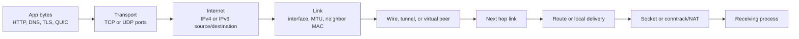
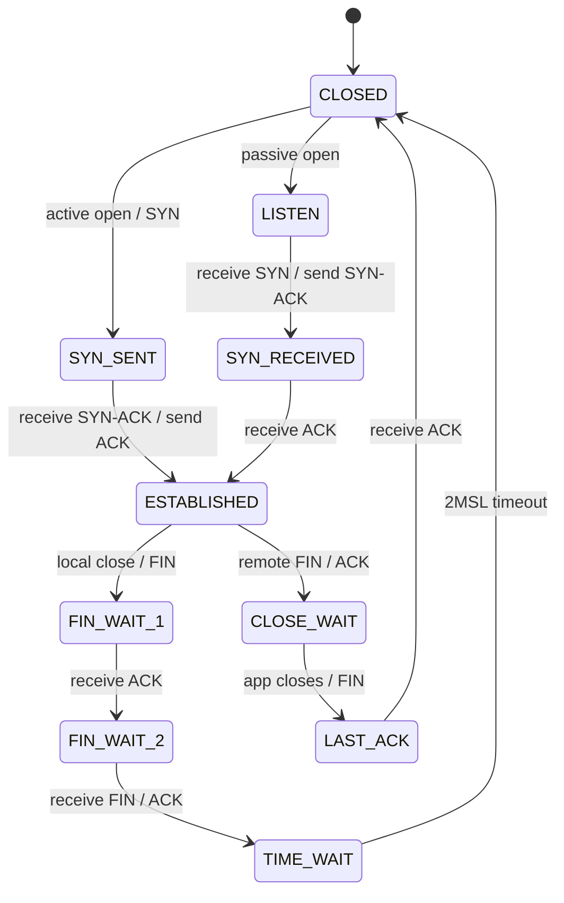
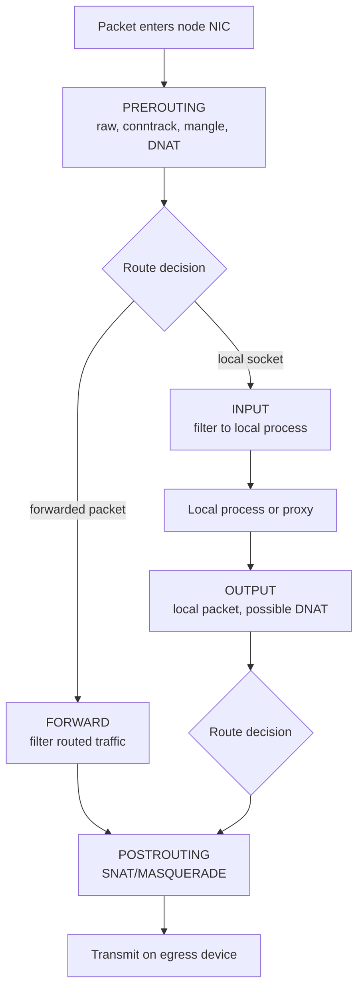

> **Linux Foundations** | Complexity: `[MEDIUM]`
>
> **Time to Complete**: 80–110 minutes (long-form read + hands-on exercise)
>
> This is the operator-grade packet model that later modules use for DNS, namespaces, veth pairs, iptables, and Kubernetes Service debugging.

## Prerequisites

Required (Linux host skills only):

- Basic comfort with Linux shells and process troubleshooting — enough to run `ip`, `ss`, and `dig` on a host and read their output.

Helpful but not required:

- [Module 1.1: Kernel & Architecture](/linux/foundations/system-essentials/module-1.1-kernel-architecture/)
- Kubernetes Basics (pod, Service, and ClusterIP vocabulary). The module explains these as it goes; the host-only path below works without them.
- **Next bridge**: [Module 3.3: Network Namespaces & veth](../module-3.3-network-namespaces/) uses the same addressing, routing, neighbor, and MTU model inside isolated network stacks.

A running Kubernetes cluster is **not** required for most of this module. Tasks 0–2 and Task 5 in the Hands-On Exercise run on any Linux host. Tasks 3–4 include `kubectl` and cluster-DNS work, so they need a cluster — the exercise offers three forks (Killercoda lab, a local `kind` cluster, or read-only skip) for learners who do not have one.

Kubernetes examples use full `kubectl` commands rather than shell aliases so transcripts remain portable. The lesson is Linux-first, but the goal is Kubernetes 1.35+ operations: pod IPs, Service virtual IPs, CNI routes, ingress sockets, egress NAT, and DNS all collapse to kernel packet decisions during troubleshooting.

## What You'll Be Able to Do

After completing this module, you will be able to reason about TCP/IP as an operated Linux system rather than as a vocabulary list.

1. **Analyze** a failing host connection by separating link, neighbor, route, transport, conntrack, DNS, and application evidence — and, with the cluster fork in the Hands-On Exercise, a failing Kubernetes connection the same way.
2. **Calculate** IPv4 and IPv6 prefix boundaries, then decide whether a pod, node, Service, gateway, or VIP is local, routed, or virtual.
3. **Trace** TCP connection state from `SYN-SENT` through `TIME-WAIT` and use `ss -tan` output to distinguish refusal, timeout, backlog, close, and keepalive symptoms.
4. **Diagnose** Service and ingress failures by connecting Linux conntrack, DNAT, netfilter hooks, sockets, and kube-proxy proxy modes (cluster path — see the Hands-On fork; host-only learners can complete this module without it).
5. **Design** a triage sequence for MTU, DNS, ARP/NDP, routing, and transport incidents without falling back to legacy net-tools.

## Why This Module Matters

**Hypothetical scenario:** Picture a page when a platform team sees checkout requests timing out through an ingress controller. Pods are Ready, the Service exists, CoreDNS is healthy, and the application logs show no errors. The first useful clue comes from a node: `ip route get <pod-ip>` chooses the wrong interface, `ss -tan` shows many client sockets in `SYN-SENT`, and `conntrack -L` shows stale translated Service flows. Nothing in that evidence is Kubernetes-specific. Kubernetes supplied the objects, but Linux made the packet decisions.

A platform engineer who cannot reason about TCP state machines, MTU, ARP/NDP, routes, and conntrack is blind during real outages. Service IPs are virtual addresses, CNI plugins may use overlays or direct routing, ingress may terminate TCP or QUIC, egress often rewrites source addresses, and active-active VIPs rely on neighbor behavior. The abstraction is useful only when you can descend through it to a packet-on-the-wire decision. Kubernetes documents that Services get cluster IPs through a virtual IP mechanism, and kube-proxy programs Linux packet forwarding rules in iptables, nftables, or IPVS modes depending on configuration. ([Kubernetes Services](https://v1-35.docs.kubernetes.io/docs/concepts/services-networking/service/), [Kubernetes Virtual IPs and Service Proxies](https://v1-35.docs.kubernetes.io/docs/reference/networking/virtual-ips/))

Treat every network failure as a claim about one layer of evidence. `ping` may prove ICMP reachability but not a TCP listener. `dig` may prove DNS resolution but not routing to the answer. `ss` may prove a local socket exists but not that a remote firewall lets SYN packets through. `tcpdump` may prove a packet arrived at one interface while the real drop happens later in netfilter or in an overlay MTU mismatch. The discipline is to ask: which kernel decision did I just prove?

The useful habit is to turn a vague outage report into a sequence of falsifiable claims. "The Service is down" is not yet a network diagnosis. "A pod can resolve the Service name, the ClusterIP DNATs to endpoint `10.244.2.37`, the node route sends that endpoint through `vxlan.calico`, and TCP reaches `SYN-SENT` but never receives `SYN-ACK`" is a diagnosis shape. It names a destination, an address family, a dataplane decision, and a missing packet. That level of specificity lets another operator reproduce the failure without trusting your interpretation.

Cloud networking makes this discipline more important because control-plane health and packet forwarding can disagree. A managed load balancer can be healthy while its backend security group blocks return traffic. A CNI can report Ready while the host route table points a remote pod CIDR at a stale tunnel device. A DNS record can be correct while the resolver expands search domains into extra queries and hits a conntrack or CoreDNS limit. The Linux model is the common language across those systems.

## First Look: One Host, One Route

Before the layer model and the Kubernetes machinery, try the core operator move on any Linux machine you already have — no cluster needed. Ask the kernel how it would reach a public address:

```bash
ip -br addr
ip route get 1.1.1.1
ip neigh show
```

Illustrative output on a typical workstation (your addresses will differ):

```text
$ ip -br addr
lo               UNKNOWN        127.0.0.1/8 ::1/128
eth0             UP             192.168.10.25/24 fe80::5054:ff:fe12:3456/64
$ ip route get 1.1.1.1
1.1.1.1 via 192.168.10.1 dev eth0 src 192.168.10.25 uid 1000
$ ip neigh show
192.168.10.1 dev eth0 lladdr 52:54:00:12:34:56 REACHABLE
```

Three kernel decisions are already visible. The address list says which source addresses exist. The route lookup selects the egress device (`eth0`), the next-hop gateway (`192.168.10.1`), and the source address in one atomic answer. The neighbor table holds the link-layer MAC for that gateway, which is what actually carries the frame. Every troubleshooting pattern in this module — and every Kubernetes pod, Service, and ingress path later — is this same sequence with more devices and address domains in between. Keep these three commands in mind; the rest of the module explains what each decision can get wrong.

## Layers as Kernel Decisions

OSI is useful vocabulary, but Linux operators usually debug the TCP/IP model because it maps to kernel surfaces. RFC 1122 organizes host requirements across link, internet, and transport layers; RFC 9293 is the current consolidated TCP specification and obsoletes the original RFC 793 as the core TCP reference. In Linux, each layer corresponds to objects you can inspect: links, neighbors, routes, sockets, conntrack entries, and resolver configuration. ([RFC 1122](https://www.rfc-editor.org/info/rfc1122), [RFC 793](https://www.rfc-editor.org/info/rfc793), [RFC 9293](https://www.rfc-editor.org/info/rfc9293))

| OSI view | TCP/IP view | Kernel-level operator question |
|---|---|---|
| Physical / Data link | Link | Is the interface up, what MTU applies, and which neighbor MAC receives the next frame? |
| Network | Internet | Which source address, route, policy table, and next hop does the kernel select? |
| Transport | Transport | Which local socket owns the port, and what TCP/UDP state is visible? |
| Session / Presentation / Application | Application | Which resolver, TLS, HTTP, DNS, or QUIC behavior produced the bytes above transport? |

| TCP/IP layer | Kernel decision | Linux evidence | Kubernetes anchor |
|---|---|---|---|
| Link | Which local interface and next-hop MAC can carry the frame? | `ip link`, `ip -s link`, `ip neigh`, `tcpdump -i <if>` | veth, bridge, CNI device, node NIC |
| Internet | Which source address, prefix, route, and policy table apply? | `ip addr`, `ip route get`, `ip rule show` | pod CIDR, node CIDR, Service CIDR, dual-stack family |
| Transport | Which socket, port, sequence state, and protocol contract apply? | `ss -tanp`, `ss -uanp`, `/proc/sys/net/ipv4/tcp_*` | containerPort, Service port, NodePort, ingress listener |
| Application | Which name, TLS, HTTP, gRPC, DNS, or QUIC behavior is active? | `dig`, `curl -v`, app logs, ingress logs | CoreDNS, Service DNS, Gateway/Ingress routing |

Packet headers are nested, but operational responsibility is not purely nested. A Kubernetes ClusterIP packet may be routed toward a virtual destination, hit netfilter in `PREROUTING` or `OUTPUT`, be DNATed to an endpoint pod IP, then be routed again. A pod-to-pod packet may leave a namespace through a veth, cross a bridge or eBPF datapath, enter VXLAN, and finally leave the node NIC. The layer model helps because each step leaves different evidence.



The diagram is not just teaching art. It is a triage map. If `ip route get` selects the wrong egress interface, the TCP state is a consequence, not the root cause. If a listener is bound to `127.0.0.1:8080`, a Service cannot make remote clients reach it without a process listening on the pod or node address. If VXLAN reduces the usable inner MTU, HTTP may connect and then hang only on larger responses. Each symptom points to a decision surface.

At the kernel layer, layering is less about a clean textbook stack and more about when metadata becomes available. The neighbor table cannot choose a MAC address until routing has selected an egress device and next hop. Netfilter cannot correctly reverse a DNATed reply unless conntrack has stored the original and translated tuples. TCP cannot move a socket to `ESTAB` unless both directions of the route, neighbor, firewall, and sequence-number exchange work. When you debug in that order, you stop treating every failed request as an application mystery.

The reverse direction is just as important. Operators often prove that the client-to-server SYN arrived and then stop, but many real incidents live in the reply path. A node may receive a SYN on one interface and route the SYN-ACK out another. A pod may send a reply with a source address that a cloud router does not know. A NAT gateway may rewrite the source for egress but expire the idle reverse mapping before the next write. A complete packet model always asks who sends the next packet and which kernel decision it must pass.

## Addressing: IPv4, IPv6, and Kubernetes CIDRs

IPv4 addresses are 32-bit values; IPv6 addresses are 128-bit values. CIDR notation says how many leading bits form the network prefix. RFC 1918 defines the familiar private IPv4 ranges, RFC 4193 defines IPv6 Unique Local Addresses, and RFC 8200 specifies IPv6 itself. The operator move is to calculate the boundary instead of comparing dotted strings by sight. ([RFC 1918](https://www.rfc-editor.org/info/rfc1918), [RFC 4193](https://www.rfc-editor.org/info/rfc4193), [RFC 8200](https://www.rfc-editor.org/info/rfc8200), [RFC 4632](https://www.rfc-editor.org/info/rfc4632))

```text
10.244.2.37/24
network bits: 24
host bits:     8
network:       10.244.2.0
usable range:  10.244.2.1 - 10.244.2.254
broadcast:     10.244.2.255
```

**Pause and predict:** For `10.244.9.200/24`, what are the network address, the broadcast address, and the usable host range?

<details>
<summary>Check your prediction</summary>

Network `10.244.9.0`, broadcast `10.244.9.255`, usable hosts `10.244.9.1`–`10.244.9.254`. The `/24` above this prompt is a different address; do not copy those lines.
</details>

A Kubernetes cluster normally has at least three address domains. Node IPs belong to the underlay: cloud VPC, bare-metal VLAN, or host network. Pod IPs come from CNI-managed ranges and must be reachable according to the cluster networking design. Service ClusterIPs come from a Service CIDR and are virtual destinations that kube-proxy or another dataplane captures and redirects. Kubernetes states that normal Services resolve to cluster IPs, while headless Services return endpoint IPs instead of relying on virtual IP forwarding. ([Kubernetes DNS for Services and Pods](https://v1-35.docs.kubernetes.io/docs/concepts/services-networking/dns-pod-service/), [Kubernetes Services](https://v1-35.docs.kubernetes.io/docs/concepts/services-networking/service/))

| Address domain | Example | What it means | First Linux check |
|---|---:|---|---|
| Node CIDR / node IPs | `192.168.10.0/24` | Real host network reachability between nodes and gateways | `ip addr`, `ip route get <node-ip>` |
| Pod CIDR | `10.244.0.0/16` | Workload addresses routed, bridged, overlaid, or eBPF-forwarded by CNI | `kubectl get pods -o wide`, `ip route get <pod-ip>` |
| Service CIDR | `10.96.0.0/12` | Virtual Service destinations selected and rewritten to endpoints | `kubectl get svc`, `nft list ruleset` or `iptables-save` |
| IPv6 ULA | `fd00:10:244::/56` | Private IPv6-style cluster or site addressing | `ip -6 addr`, `ip -6 route get <addr>` |

The common overlap problem is simple to miss. If the corporate WAN uses `10.244.0.0/16` and a new cluster also uses `10.244.0.0/16` for pods, some destinations become ambiguous. Linux will choose the most specific matching route; humans may see only that both are "10 dot" networks. Calculate the prefixes, then ask the kernel for the actual lookup.

CIDR math is also a blast-radius tool. If one worker owns `10.244.2.0/24`, the address `10.244.2.37` should be local to that node in a per-node pod-CIDR design, while `10.244.9.37` should route toward another node or tunnel. If `ip route get 10.244.2.37` leaves through the physical NIC instead of a CNI bridge or local veth path, the failure is not "pod networking" in general; it is a contradiction between the expected prefix owner and the installed route. For dual-stack clusters, repeat the same reasoning for IPv6 rather than assuming the IPv4 path explains both families.

Service CIDRs deserve a separate mental bucket because they are not workload locations. A ClusterIP is an address selected by clients, not normally an address bound by the backend pod. If you search every interface with `ip addr` and do not find the Service IP, that may be normal. The question is whether the local dataplane captures traffic to that virtual destination and rewrites it to an endpoint. That is why a Service failure often requires both `kubectl get svc,endpointslices` and Linux NAT or eBPF evidence.

```bash
ip -br addr
ip route get 10.244.2.37
ip -6 route get fd00:10:244::37
kubectl get pods -A -o wide
kubectl get svc -A -o wide
```

Do not treat a Service IP as if it must appear on an interface. In kube-proxy iptables mode, Kubernetes documents that kube-proxy installs rules redirecting virtual IP traffic to endpoint rules, and those endpoint rules use destination NAT to backend pods. In nftables mode, kube-proxy uses the kernel netfilter subsystem through nftables instead. The Linux debugging surface is therefore routes plus packet-filter state, not only `ip addr`. ([Kubernetes Virtual IPs and Service Proxies](https://v1-35.docs.kubernetes.io/docs/reference/networking/virtual-ips/))

## Neighbor Discovery: ARP, NDP, and VIPs

Routing chooses the next-hop IP and egress device; neighbor discovery finds the link-layer destination for that next hop. IPv4 commonly uses ARP, standardized in RFC 826. IPv6 uses Neighbor Discovery Protocol, specified in RFC 4861. Linux exposes both through the neighbor table, so `ip neigh` is the modern inspection tool. ([RFC 826](https://www.rfc-editor.org/info/rfc826), [RFC 4861](https://www.rfc-editor.org/info/rfc4861), [ip-neighbour(8)](https://man7.org/linux/man-pages/man8/ip-neighbour.8.html))

```bash
ip neigh show
ip neigh show dev eth0
ip -6 neigh show
sudo ip neigh flush dev eth0 nud failed
```

Neighbor state matters when the failure looks like "same subnet but no traffic." If a node believes `192.168.10.44` is on-link, it will ARP for that address instead of sending the packet to a gateway. If no host answers, packets queue and then fail below TCP. If the wrong host answers, traffic goes to the wrong MAC. Active-active VIP systems amplify this risk: two nodes advertising the same virtual IP can create neighbor cache flapping, especially when gratuitous ARP or unsolicited NDP announcements are misconfigured.

**Pause and predict:** A route `192.168.10.0/24 dev eth0` is installed, but traffic to a host on that prefix still fails after a VIP failover. Is the next check the route table or the neighbor table, and what would each prove?

<details>
<summary>Check your prediction</summary>

Check the neighbor table first. The route can be correct while a stale entry still points at the old MAC. A failed neighbor lookup can also mean the prefix is wrong: the host is ARPing because it thinks the destination is local. CIDR and ARP/NDP have to be read together.
</details>

VIP failover is the place where this becomes operationally sharp. A load balancer pair may move `192.168.10.50` from node A to node B and send gratuitous ARP so peers update their caches. If one switch, host, or security appliance ignores the update, some clients continue sending frames to the old MAC. Kubernetes does not remove that failure mode when you run bare-metal ingress or external load balancers. You still need to inspect the neighbor entry on the client, the gateway, and the node that should own the VIP.

For IPv6, the same idea appears through Neighbor Discovery, router advertisements, and solicited-node multicast rather than broadcast ARP. Dual-stack incidents often look asymmetric because IPv4 neighbor state is healthy while IPv6 NDP is blocked or stale. Use `ip -6 neigh`, capture ICMPv6 neighbor solicitations and advertisements, and remember that blocking all ICMPv6 is not equivalent to blocking harmless ping traffic. It can break essential address resolution and PMTUD behavior.

## Routing: FIB, RIB, Longest Prefix, and Policy Rules

Linux uses route tables to populate forwarding decisions. Network teams often say RIB for routing information base and FIB for forwarding information base; in day-to-day Linux triage, `ip route` shows the installed route entries the kernel can use, while `ip route get` asks for a concrete forwarding decision. The `ip-route` manual describes route table management, route types, next hops, route metrics, MTU attributes, and the special `default` prefix. ([ip-route(8)](https://man7.org/linux/man-pages/man8/ip-route.8.html))

Longest prefix match is the core rule. A `/32` host route beats a `/24`, a `/24` beats a `/16`, and all of them beat `default` (`0.0.0.0/0` or `::/0`). Metrics matter after comparable matches; they do not make a broad default route beat a specific pod route. Policy routing adds another layer: `ip rule` can select a different table based on source address, fwmark, incoming interface, or other selectors. ([ip-rule(8)](https://man7.org/linux/man-pages/man8/ip-rule.8.html))

```bash
ip route show
ip route get 10.244.2.37
ip route get 203.0.113.10 from 192.168.10.25
ip rule show
ip route show table all
```

Kubernetes makes this visible on every node. A directly routed CNI may install one route per remote pod CIDR. An overlay CNI may route pod traffic into a VXLAN, IPIP, or WireGuard device. A cloud CNI may rely on VPC route tables rather than visible host routes for every pod. The check remains the same: ask the node how it would reach the pod IP, then compare that answer with the CNI design.

Policy routing explains asymmetric outages on multi-homed nodes. A request can arrive on `eth0`, but the reply lookup may select `eth1` because the destination client network is more specific through another table. Stateful firewalls and cloud security systems often drop that reply as unexpected. During triage, inspect both directions: route from client to server, and route from server back to client.

The route cache answer from `ip route get` is usually more valuable than the raw table because it includes selected source address, device, next hop, and policy rule effects. When an ingress node has a public interface, a private interface, and pod-facing devices, the selected source address can decide whether replies survive upstream filtering. If the kernel chooses a node-private source for a public client path, the packet may leave correctly but be discarded by the first router that enforces source validation.

Do not confuse the cluster routing contract with one particular CNI implementation. Some CNIs install Linux routes for remote pod CIDRs. Some encapsulate traffic into tunnel devices. Some rely on eBPF maps and show fewer iptables rules than older kube-proxy paths. Some cloud CNIs give pods VPC-routable addresses and move part of the decision into cloud route tables or elastic network interfaces. The Linux checks still anchor the investigation: what address is selected, which interface carries it, and what packet appears on that interface?

## TCP: Handshake, State, Close, and Keepalive

TCP is a reliable byte stream with connection state, sequence numbers, acknowledgments, retransmission, flow control, and congestion control. RFC 9293 is the current TCP specification, and Linux exposes many TCP behaviors through `ss`, `/proc/sys/net/ipv4/tcp_*`, and socket state. A TCP incident is often just a state-machine question hidden under application language. ([RFC 9293](https://www.rfc-editor.org/info/rfc9293), [tcp(7)](https://man7.org/linux/man-pages/man7/tcp.7.html), [ss(8)](https://man7.org/linux/man-pages/man8/ss.8.html))

Ports are part of the transport evidence, not application folklore. IANA maintains the service name and transport protocol port registry, which is why operators recognize TCP 22 for SSH, TCP 443 for HTTPS, UDP/TCP 53 for DNS, and Kubernetes control-plane ports such as TCP 6443 as conventions to verify rather than assumptions to trust blindly. A Service `port`, `targetPort`, `nodePort`, and container listener may all differ, so the reliable question is still: which tuple did the kernel see, and which process or NAT rule owned it? ([IANA Service Name and Transport Protocol Port Number Registry](https://www.iana.org/assignments/service-names-port-numbers/service-names-port-numbers.xhtml), [Kubernetes Ports and Protocols](https://v1-35.docs.kubernetes.io/docs/reference/networking/ports-and-protocols/))



**Pause and predict:** A client shows `SYN-SENT` for 30 seconds. Is this a refused connection or a timeout, and which command proves it?

<details>
<summary>Check your prediction</summary>

Timeout, not refusal. `SYN-SENT` means SYNs left but no SYN-ACK completed the handshake. `ss -tan state syn-sent` shows that state. A refusal is a RST and does not sit in `SYN-SENT`.
</details>

Read the other states in `ss -tan` the same way. `SYN-RECV` on a server means SYNs arrived and replies were attempted, but the final ACK did not complete or accept queue pressure exists; it is the `SYN_RECEIVED` state in the diagram above. `ESTAB` proves the handshake completed. `CLOSE-WAIT` means the peer closed and the local application has not closed its side. `TIME-WAIT` is normal on the side that actively closed; it prevents old duplicate segments from corrupting a later connection using the same tuple.

```bash
ss -tan
ss -tlnp
ss -tan state syn-sent
ss -tan state time-wait '( sport = :443 or dport = :443 )'
sysctl net.ipv4.tcp_keepalive_time net.ipv4.tcp_keepalive_intvl net.ipv4.tcp_keepalive_probes
```

Keepalive is not a health check. Linux TCP keepalive probes can eventually detect a dead idle peer, but defaults are often far longer than application SLOs. If a load balancer, NAT gateway, or conntrack table expires idle flows earlier than application traffic resumes, the next write can fail after a long quiet period. Tune application timeouts, ingress timeouts, TCP keepalive, and conntrack timeouts as one design, not as independent knobs. The Linux kernel documents TCP sysctls such as keepalive and path MTU behavior in `ip-sysctl`. ([Linux IP sysctl](https://docs.kernel.org/networking/ip-sysctl.html))

A useful interpretation rule is refusal versus timeout. A refused connection usually means a RST came back: the host stack was reachable, but no listener accepted that destination port or policy actively rejected it. A timeout means SYNs, SYN-ACKs, or later packets disappeared. That points toward firewall, routing, neighbor, MTU, conntrack, or security group behavior before it points toward application code.

Backlog pressure has its own signature. A server can listen on the correct port and still fail under SYN queue pressure, accept queue pressure, or application stalls after accept. On the client you may see retries and `SYN-SENT`; on the server you may see `SYN-RECV`, retransmitted SYN-ACKs, or a listener with high queue counts in `ss -ltn`. That evidence changes the action. You do not fix a full accept queue by editing a Service selector; you inspect the process, kernel backlog settings, load balancer health behavior, and whether the application can accept and handle connections quickly enough.

Close states also prevent false alarms. `TIME-WAIT` is not automatically a leak; it is expected on the active closer and protects connection identity while old segments age out. `CLOSE-WAIT` is more suspicious because it means the peer already sent FIN and the local application has not closed its socket. A node with many `CLOSE-WAIT` sockets for an ingress backend may be revealing application close handling, while a node with many `TIME-WAIT` sockets may simply be doing high connection churn. Read the state before changing sysctls.

Keepalive settings belong in an end-to-end timeout budget. Suppose an application holds idle database connections for an hour, a cloud NAT expires idle TCP mappings after a shorter period, and Linux keepalive probes start later than both. The first request after the idle period may fail even though the original handshake succeeded. The fix may be application pool validation, shorter idle lifetime, load balancer timeout alignment, or TCP keepalive tuning. The packet model tells you why the symptom appears only after quiet periods.

## UDP and QUIC: Connectionless Kernel, Stateful Userspace

UDP gives applications datagrams, ports, and checksums without a kernel-managed connection state machine. The kernel can show UDP sockets, queue pressure, drops, and ICMP errors, but it does not turn a UDP exchange into `ESTABLISHED` the way TCP does. RFC 1122 covers UDP host requirements, and the Linux `udp(7)` page documents Linux UDP socket behavior. ([RFC 1122](https://www.rfc-editor.org/info/rfc1122), [udp(7)](https://man7.org/linux/man-pages/man7/udp.7.html))

```bash
ss -uanp
ss -uap state established 2>/dev/null || true
tcpdump -ni any udp port 53
tcpdump -ni any udp port 443
```

QUIC deliberately uses UDP while implementing streams, connection IDs, loss recovery, encryption, and path migration in the protocol above UDP. RFC 9000 defines QUIC as a UDP-based multiplexed and secure transport. For operators, this means a QUIC or HTTP/3 ingress on UDP/443 will not appear as TCP `ESTAB` sockets. You inspect UDP sockets, packet captures, ingress HTTP/3 or QUIC metrics, and load balancer UDP handling. ([RFC 9000](https://www.rfc-editor.org/info/rfc9000))

The Kubernetes implication is direct. A TCP Service gives you handshake evidence; a UDP Service often gives you request/response silence unless the application logs or metrics expose protocol-level state. If DNS works intermittently in-cluster, packet loss, conntrack expiry, CoreDNS saturation, and resolver search behavior can all look like "UDP timeout." Use packet captures and application counters instead of expecting TCP-style states.

QUIC adds another operational split because connection identity can survive address changes at the protocol layer while the kernel still sees UDP datagrams. A client roaming between networks may continue a QUIC session using connection IDs, but a stateless UDP load balancer or firewall may see a new source tuple. For ingress operations, verify that every component in the path handles UDP/443 intentionally: cloud load balancer, node firewall, Service protocol field, ingress controller listener, metrics pipeline, and packet capture filters.

## Conntrack, NAT, and Service Rewrites

Connection tracking records flows so stateful filtering and NAT can handle replies consistently. The netfilter project documentation describes the hook-based packet path, and the kernel documents conntrack sysctls such as maximum entries and protocol timeout controls. Kubernetes Services rely on this machinery in Linux kube-proxy modes: iptables mode redirects Service virtual IP traffic to endpoints using destination NAT, and nftables mode uses the nftables API of the same netfilter subsystem. ([netfilter project documentation](https://netfilter.org/documentation/), [Linux nf_conntrack sysctl](https://docs.kernel.org/networking/nf_conntrack-sysctl.html), [Kubernetes Virtual IPs and Service Proxies](https://v1-35.docs.kubernetes.io/docs/reference/networking/virtual-ips/))



| Path | Hook order you should expect | Typical Kubernetes example | First inspection |
|---|---|---|---|
| Remote client to local listener | `PREROUTING` -> route -> `INPUT` | NodePort or hostNetwork ingress socket | `ss -tlnp`, firewall rules |
| Forwarded pod or Service traffic | `PREROUTING` -> route -> `FORWARD` -> `POSTROUTING` | pod-to-pod, Service to endpoint, egress NAT | `conntrack -L`, ruleset, route |
| Local process to Service IP | `OUTPUT` -> route -> `POSTROUTING` | node process curls ClusterIP | output DNAT rules, conntrack |
| Pod egress with masquerade | `PREROUTING` -> route -> `FORWARD` -> `POSTROUTING` SNAT | pod to internet through node | MASQUERADE rule, reply tuple |

A conntrack entry is a memory of a tuple and its translated tuple. For a ClusterIP flow, the client may believe it is talking to `10.96.12.34:443`, while conntrack remembers the DNAT to `10.244.2.37:8443` so replies can be mapped back. If the table is full, timeouts are wrong, or a rule changes while long-lived flows remain, symptoms can appear as resets, black holes, or one backend receiving traffic after it should have drained.

```bash
sudo conntrack -L -p tcp 2>/dev/null | sed -n '1,40p'
sudo conntrack -L -p udp 2>/dev/null | sed -n '1,40p'
sudo cat /proc/net/nf_conntrack 2>/dev/null | sed -n '1,40p'
sysctl net.netfilter.nf_conntrack_max net.netfilter.nf_conntrack_count 2>/dev/null
```

Do not flush conntrack as a reflex. It can repair stale NAT state in a lab, but in production it can also drop legitimate long-lived connections across the node. First prove the mismatch: packet capture before and after NAT, ruleset selection, route decision, and conntrack entry. Then decide whether the correct fix is endpoint draining, kube-proxy sync, firewall rule repair, timeout tuning, or a targeted conntrack deletion.

For Service debugging, draw both tuples. The original tuple is what the client believes: source IP and port to ClusterIP and Service port. The reply tuple is what the backend and NAT path use after DNAT: client IP and port to pod IP and targetPort, possibly with SNAT if the dataplane masquerades traffic. If those tuples do not line up, symptoms can look arbitrary. One backend receives packets but replies from an address the client never contacted; another backend never sees traffic because the rule or eBPF map selects a different endpoint.

Conntrack exhaustion is a capacity incident, not just a kernel counter. UDP-heavy DNS, short-lived HTTP clients, node-local proxies, and egress NAT can all consume entries. When `nf_conntrack_count` approaches `nf_conntrack_max`, new flows may be dropped or fail to create NAT state. The operator question is which workload creates the pressure, which timeout class keeps entries alive, and whether the node role should carry that much state. Increasing the maximum without understanding memory and traffic shape can move the failure rather than solve it.

Packet-filter hook order matters when evidence seems contradictory. A packet can be accepted by one chain and still be DNATed later, routed differently after DNAT, or SNATed on egress. A local process curling a ClusterIP starts in `OUTPUT`, not `PREROUTING`, so rules that handle only forwarded packets may never see it. A pod packet entering the host from a veth can look like forwarded traffic even though the application that initiated it feels local to the developer. Match the hook path to the packet origin before reading counters.

## MTU, Fragmentation, and Overlay Penalties

MTU is the maximum frame payload a link can carry without fragmentation at that layer. IPv4 supports fragmentation, but Path MTU Discovery tries to avoid it by learning the smallest usable path size. IPv6 relies on source fragmentation and Packet Too Big signaling rather than router fragmentation. RFC 1191 covers IPv4 PMTUD, RFC 8201 covers IPv6 PMTUD, and Linux exposes MTU on links and routes. ([RFC 1191](https://www.rfc-editor.org/info/rfc1191), [RFC 8201](https://www.rfc-editor.org/info/rfc8201), [ip-link(8)](https://man7.org/linux/man-pages/man8/ip-link.8.html), [Linux IP sysctl](https://docs.kernel.org/networking/ip-sysctl.html))

```bash
ip link show
ip -d link show vxlan.calico 2>/dev/null || true
ip route get 10.244.2.37
tracepath 10.244.2.37
ping -M do -s 1472 192.168.10.20
```

Overlay networking makes MTU visible because encapsulation adds outer headers. VXLAN runs over UDP and Linux documents VXLAN devices as tunnel devices; IPIP, GRE, Geneve, WireGuard, and cloud fabrics have their own overhead. If the physical NIC MTU is 1500 and the overlay adds headers, the pod-facing MTU must usually be smaller. Otherwise small health checks pass while larger TLS records, image pulls, or gRPC responses stall. ([Linux VXLAN documentation](https://docs.kernel.org/networking/vxlan.html))

**Pause and predict:** A TCP handshake succeeds and small requests work, but larger payloads hang after you enable VXLAN. Which layer do you test next, and why is the application the wrong first suspect?

<details>
<summary>Check your prediction</summary>

Test path MTU, not the app. Encapsulation shrinks the usable payload. Captures may show ICMP Fragmentation Needed or IPv6 Packet Too Big, or silence if a firewall drops those messages. The handshake fits; the large packet does not.
</details>

MTU incidents are often introduced by an otherwise correct migration. Moving from direct routing to VXLAN, adding WireGuard encryption, enabling a cloud transit gateway, or chaining a service mesh sidecar can all reduce usable payload size. The service owner sees TLS, HTTP, or gRPC errors because those are the protocols that notice the stall, but the first broken assumption is lower: the path cannot carry the encapsulated packet without fragmentation or PMTUD. Compare the pod device MTU, tunnel MTU, node NIC MTU, and any route-specific MTU before changing application chunk sizes.

Fragmentation also affects observability. A packet capture on the sender may show a large packet leaving the pod interface, while a capture on the underlay shows smaller outer packets or no packet if the kernel refuses to fragment with DF set. A capture at the receiver may show the first fragment but not the later one, causing the reassembled transport segment never to exist. This is why the best MTU test controls packet size, observes ICMP feedback, and captures at both the inner and outer interfaces when overlays are involved.

## DNS Resolution: From Pod Name to Packet

Name resolution begins before packets leave the process. glibc uses NSS (`/etc/nsswitch.conf`) to decide whether `hosts` lookups consult files, DNS, systemd modules, or other providers. The resolver reads `/etc/resolv.conf` for nameservers, search domains, timeout behavior, attempts, and `ndots`. systemd-resolved may replace `/etc/resolv.conf` with a local stub file, which Kubernetes explicitly calls out as a node DNS consideration. ([nsswitch.conf(5)](https://man7.org/linux/man-pages/man5/nsswitch.conf.5.html), [resolv.conf(5)](https://man7.org/linux/man-pages/man5/resolv.conf.5.html), [Kubernetes Debugging DNS Resolution](https://v1-35.docs.kubernetes.io/docs/tasks/administer-cluster/dns-debugging-resolution/))

```bash
cat /etc/nsswitch.conf
cat /etc/resolv.conf
resolvectl status 2>/dev/null || true
dig kubernetes.default.svc.cluster.local A
dig +search my-service
nslookup my-service.default.svc.cluster.local
```

Kubernetes configures pod DNS so containers can resolve Services by name. The v1.35 DNS docs show the pod search list and `options ndots:5`; they also explain that a short name like `data` can expand through namespace and cluster search domains. This is useful, but it can multiply queries. A pod that resolves `api.github.com` with `ndots:5` may first try cluster search variants before the absolute public name, depending on resolver behavior and trailing dots. ([Kubernetes DNS for Services and Pods](https://v1-35.docs.kubernetes.io/docs/concepts/services-networking/dns-pod-service/), [resolv.conf(5)](https://man7.org/linux/man-pages/man5/resolv.conf.5.html))

DNS is therefore not one thing. A failure may be NSS order, `/etc/hosts`, systemd-resolved forwarding, CoreDNS, upstream DNS, UDP loss, TCP fallback, search path expansion, or Service record generation. The packet tools enter only after you know what nameserver and query name the resolver actually used.

In Kubernetes, DNS triage begins inside the pod because that is where the resolver configuration is mounted. A node may use one `/etc/resolv.conf`, kubelet may pass another file to pods, and the pod may add `dnsConfig` overrides. If the pod queries `my-api` and the resolver expands it through namespace and cluster search domains, CoreDNS sees multiple candidate names before the one humans expected. The right packet capture filter is therefore not only `port 53`; it is the specific query name, nameserver IP, protocol, and retry pattern.

Application runtime behavior can diverge from glibc examples. Some languages use c-ares, Go's resolver, JVM caching, or custom DNS libraries; some honor `/etc/resolv.conf` differently; some cache negative answers longer than expected. The Linux baseline still matters because it tells you what the environment offered, but an operator should compare command-line resolver behavior with application traces before declaring DNS fixed. A successful `dig` proves the DNS service can answer that query; it does not prove the application used the same query, timeout, cache, or search order.

## Operator Triage Toolkit

Use modern tools that match the kernel model. Legacy net-tools such as `ifconfig`, `route`, and `netstat` still appear in old runbooks, but this course uses `ip`, `ss`, and protocol-specific tools because they expose namespaces, policy routing, modern socket state, and link attributes more directly.

| Use when you need to know... | Command | What it proves | What it does not prove |
|---|---|---|---|
| Which addresses and links exist | `ip -br addr`, `ip -s link` | Interface state, MTU, counters | Remote reachability |
| Which next hop Linux will use | `ip route get <ip>` | Route, source, device, gateway | Firewall or listener state |
| Whether ARP/NDP resolved | `ip neigh show` | Next-hop MAC state | Correct higher-layer protocol |
| Which TCP/UDP sockets exist | `ss -tlnp`, `ss -tan`, `ss -uanp` | Local listeners and socket state | Remote path correctness |
| Whether packets hit an interface | `tcpdump -ni <if> <filter>` | Observed packets at that point | What happened elsewhere |
| Whether DNS answers exist | `dig`, `nslookup` | Query path and records | Application can connect |
| Whether a TCP port handshakes | `nc -vz <host> <port>` | Transport reachability | TLS or HTTP success |
| Where path loss or latency appears | `mtr`, `tracepath` | Hop pattern, PMTU clues | Stateful firewall verdicts |

A strong triage sequence is short. Identify the name and IP, ask Linux for the route, check neighbor state if the next hop is local, test the transport, inspect local sockets, then capture at the boundary where your evidence splits. In Kubernetes, add `kubectl get pod -o wide`, `kubectl get svc -o wide`, and endpoint inspection to map object names to real addresses before you run Linux tools.

Choose capture points by the question you are asking. A capture inside a pod namespace proves what the workload sent or received. A capture on the host veth peer proves what crossed the namespace boundary. A capture on the bridge, tunnel, or physical NIC proves what the node dataplane emitted. A capture on only `any` can be useful for quick discovery, but it can hide which interface saw the packet and whether encapsulation changed the headers. When an outage is expensive, spend the extra minute to capture at the boundary that separates two hypotheses.

Write down negative evidence with the same care as positive evidence. "No SYN-ACK observed on `eth0` after SYN leaves" is useful. "No packets" is not, unless it names the interface, filter, time window, and expected tuple. This precision matters when handing off to a network, cloud, or application team. You are not asking them to believe Linux is broken; you are giving them a reproducible packet decision that contradicts the intended design.

```bash
TARGET=10.244.2.37
PORT=8443
ip route get "$TARGET"
ip neigh show
mtr --report "$TARGET"
nc -vz "$TARGET" "$PORT"
ss -tan "( dport = :$PORT or sport = :$PORT )"
sudo tcpdump -ni any "host $TARGET and tcp port $PORT"
```

## Decision Patterns and Anti-Patterns

Use routes before rules. If `ip route get` chooses the wrong interface, firewall changes may only hide the real problem. Use sockets before Services. If no process listens on the target port inside the pod or node namespace, Service edits cannot create an application listener. Use packet size before retries. If only large responses fail, MTU and PMTUD deserve attention before client retry tuning.

Avoid command roulette. Running `tcpdump`, `dig`, `nc`, `curl`, `mtr`, and `ss` without a hypothesis creates transcripts, not evidence. Before each command, write down what result would move you up or down the stack. If the observed result contradicts your model, keep that contradiction; it is often the fastest path to the fault.

Also avoid "Kubernetes object equals packet path." A Ready pod can have a broken route. A Service can have endpoints and still fail because DNAT, conntrack, or firewall state is wrong. A NetworkPolicy can be correct while the underlay drops encapsulated packets. Kubernetes gives intent; Linux still executes the path.

The strongest operators keep two models in parallel. The declarative model says what Kubernetes, cloud load balancers, DNS records, and CNI configuration intend. The packet model says what the node kernel, neighbor table, route lookup, socket table, resolver, and conntrack state actually did. An outage is the gap between those models. Your job is not to memorize every implementation detail; it is to narrow the gap until the next repair action is obvious and testable.

## Did You Know

- ARP and IPv6 NDP are not optional trivia on "modern" clusters; bare-metal ingress, node failover, and same-subnet gateways still depend on neighbor cache behavior.
- A Kubernetes ClusterIP can be unreachable even when no interface owns that IP, because normal Service forwarding happens through a virtual IP dataplane rather than address assignment.
- `TIME-WAIT` is usually a correctness feature, not a defect; `CLOSE-WAIT` more often points to an application that has not closed after the peer's FIN.
- QUIC gives applications connection-like behavior over UDP, so the kernel will not expose QUIC sessions as TCP `ESTAB` sockets.

These facts are useful because they stop common misreads. A missing ClusterIP in `ip addr` is not proof that the Service is absent. A full screen of `TIME-WAIT` is not proof that TCP is broken. A healthy TCP ingress tells you little about UDP/443. The kernel exposes the evidence you ask for; the operator has to ask the question that matches the protocol.

## Common Mistakes: TCP/IP Triage

| Mistake | Why it misleads | Better operator move |
|---|---|---|
| Treating DNS success as application reachability | A name can resolve while routing, firewall, MTU, or listener state still fails | Resolve the name, then test route, socket, and packet path to the returned address |
| Looking for a ClusterIP in `ip addr` | Service IPs are often virtual destinations handled by kube-proxy or another dataplane | Inspect Service objects, endpoint selection, and NAT/eBPF forwarding evidence |
| Debugging TCP with only `ping` | ICMP reachability does not prove a TCP listener, stateful firewall, or path for replies | Use `ss`, `nc`, and packet captures for the exact TCP tuple |
| Flushing conntrack before proving the tuple | A broad flush can drop legitimate flows and destroy evidence | Compare original and translated tuples, then delete only targeted stale entries if needed |
| Ignoring return routes | SYN arrival does not prove the SYN-ACK can return through policy routing or firewalls | Run route checks and captures in both directions |
| Treating small successful probes as proof MTU is fine | Overlay overhead can break only larger payloads | Test size-sensitive traffic and PMTUD evidence |
| Using legacy net-tools output as the source of truth | Older tools hide policy routing, namespaces, and modern socket detail | Prefer `ip`, `ss`, `tcpdump`, `dig`, `mtr`, `tracepath`, and `conntrack` |

The pattern behind these mistakes is premature conclusion. Each command proves one boundary, not the whole network. A good incident note says what the command proved and what it left unproven. That makes the next command smaller and prevents the team from changing random knobs under pressure.

## Knowledge Check

<details><summary>Question 1: A client gets `connection refused` to a ClusterIP Service, but `kubectl get endpointslices` shows ready pods. What is your first split?</summary>

Separate Service translation from backend socket state. `connection refused` usually means a RST returned, so inspect whether the selected backend pod actually has a listener on the targetPort with `ss -tlnp` in the correct namespace or debug container. Then inspect Service port to targetPort mapping and kube-proxy rules. Do not start with MTU or DNS; the refusal is transport evidence. For endpoint selection on Kubernetes 1.35+, use `kubectl get endpointslices` rather than the legacy Endpoints API.

</details>

<details><summary>Question 2: Pod-to-pod traffic works on the same node but fails across nodes after enabling VXLAN. Small probes pass, large responses hang. Which layer do you test next?</summary>

Test MTU and PMTUD. VXLAN adds outer headers, so the inner pod MTU must leave room for encapsulation. Use `ip link show`, `tracepath`, packet captures for ICMP Fragmentation Needed or IPv6 Packet Too Big, and a size-controlled ping where appropriate. The same-node path may avoid the overlay overhead, which explains the split.

</details>

<details><summary>Question 3: A node has `192.168.10.20/24`, and a teammate adds `192.168.11.30/16` to another node on a different VLAN. Why can return traffic fail?</summary>

The two nodes disagree about what is local. The `/16` node treats `192.168.10.20` as on-link and may ARP instead of using a gateway, while the `/24` node treats `192.168.11.30` as remote. That creates asymmetric route and neighbor behavior. Calculate both prefixes, then prove each direction with `ip route get` and `ip neigh`.

</details>

<details><summary>Question 4: An ingress enables HTTP/3 on UDP/443. `ss -tan` shows no established connections for those clients, but traffic is flowing. Is that wrong?</summary>

No. QUIC runs over UDP, so TCP state output is the wrong evidence surface. Inspect `ss -uanp`, UDP packet captures on port 443, ingress HTTP/3 or QUIC metrics, and load balancer UDP health. TCP `ESTAB` sockets are relevant for HTTPS over TCP, not for QUIC connections carried in UDP datagrams.

</details>

<details><summary>Question 5: A pod resolves `api.example.com` slowly, and CoreDNS logs show multiple failed cluster-suffix queries first. What configuration explains this?</summary>

Kubernetes pod DNS commonly includes search domains and `options ndots:5`. A name with fewer dots than the threshold can be tried through search domains before an absolute query, depending on resolver behavior. Inspect the pod's `/etc/resolv.conf`, repeat with a trailing dot (`api.example.com.`), and decide whether the application, pod `dnsConfig`, or resolver strategy should change.

</details>

<details><summary>Question 6: A Service worked before a rolling update, but some long-lived clients now reset against the ClusterIP. What Linux state should you inspect before deleting pods?</summary>

Inspect conntrack and kube-proxy rules. Long-lived Service flows may keep translated tuples while endpoints change, and Service translation still depends on Linux packet-filter and NAT state. Use `conntrack -L` with the Service and endpoint tuples, check kube-proxy sync health, and compare packet captures before and after DNAT. A blind pod delete may erase useful evidence.

</details>

## Hands-On Exercise

Use a disposable Linux VM, lab node, or Kubernetes worker where you have permission to inspect networking state. Capture outputs in a scratch note and label each one with the layer it proves. On minimal images, `tracepath` and `mtr` may require `sudo apt install iputils-tracepath mtr`.

Tasks 0, 1, 2, and 5 need only a Linux host. Tasks 3 and 4 touch Kubernetes objects and cluster DNS, so pick one fork before starting them:

- **Use the Killercoda lab** linked in this module's header (`linux-3.1-tcp-ip`), which provides a ready environment.
- **Or spin up a local cluster first**, for example with [`kind`](https://kind.sigs.k8s.io/) on your own machine, then run the tasks there.
- **Or skip the cluster tasks.** Read Tasks 3–4 as worked examples and treat cluster-dependent Success Criteria as follow-up; the host-only criteria are fully achievable without a cluster.

### Task 0: Prefix boundaries (IPv4 and IPv6)

For `10.244.9.200/24`, write the network address, broadcast address, and usable host range. For `fd00:abcd:1234::/48`, identify the `/48` prefix boundary (the first 48 bits of the address). Use `ipcalc` or manual bit math; compare with `ip route get` only after you have your answers.

### Task 1: Map Your Current Packet Path

```bash
ip -br addr
ip route get 1.1.1.1
ip neigh show
ss -tlnp
```

Explain which interface, source address, gateway, and local listeners are involved. If the route uses a gateway, identify the neighbor entry for that gateway.

### Task 2: Compare Refusal and Timeout

```bash
nc -vz 127.0.0.1 1
nc -vz 203.0.113.1 443
ss -tan state syn-sent
```

Record whether you saw refusal, timeout, or immediate local error. Tie each result to TCP state or route evidence rather than to a generic "network broken" label.

### Task 3: Inspect Kubernetes Addresses

> **Cluster fork:** This task needs `kubectl` access to a running cluster (Killercoda lab, `kind`, or an existing cluster). Without one, skip it or read it as a worked example — see the forks above.

```bash
kubectl get pods -A -o wide
kubectl get svc -A -o wide
POD_IP=<choose-a-pod-ip>
ip route get "$POD_IP"
```

Classify the selected pod IP as local-node, remote-node, overlay, or unknown based on route output and your CNI design. If you choose a ClusterIP, explain why `ip route get` alone may not show the eventual backend pod.

### Task 4: Trace DNS to a Packet

```bash
cat /etc/resolv.conf
dig kubernetes.default.svc.cluster.local A
dig +search kubernetes.default
sudo tcpdump -ni any port 53 -c 10
```

Identify the nameserver, search behavior, query name, and transport protocol. If your node uses systemd-resolved, compare `/etc/resolv.conf` with `resolvectl status`. Without a cluster, replace the cluster names with a public one (for example `dig example.com A` and `dig +search example`) and observe the same resolver mechanics.

### Task 5: Check MTU Evidence

```bash
ip link show
tracepath 1.1.1.1
ip route get 1.1.1.1
```

Find the egress interface MTU and any PMTU clue from `tracepath`. If you are on an overlay node, compare the pod-facing device MTU with the physical NIC MTU and account for encapsulation overhead.

### Diagnostic Triage Challenge (Frozen Incident Cards)

Tasks 0–5 stay as the inspection recipe. These cards freeze the transcript so nothing needs to run. For each card, name the failure layer and one next action before opening the reveal.

**Card A: Thirty seconds of SYN-SENT.** `ss -tan` shows a client stuck in `SYN-SENT` toward `203.0.113.1:443`. A teammate calls it "connection refused."

<details>
<summary>Failure layer and next action</summary>

Failure layer: packets disappearing (route, firewall, neighbor, or filter), not a RST. Next action: keep the `ss` state as timeout evidence and capture the path; do not debug a missing listener first.
</details>

**Card B: Route is right, frames are old.** `ip route get 192.168.10.50` selects `eth0` on-link. After a VIP move, some clients still reach the previous node.

<details>
<summary>Failure layer and next action</summary>

Failure layer: stale neighbor cache, not the FIB. Next action: `ip neigh show` on the client and gateway; look for the old MAC before changing the route.
</details>

**Card C: Handshake works, body hangs.** After VXLAN, `nc` to port 443 succeeds and a 64-byte request returns. A 16 KB response never finishes.

<details>
<summary>Failure layer and next action</summary>

Failure layer: overlay MTU / PMTUD, not the listener. Next action: compare pod-facing MTU with the physical NIC and encapsulation overhead; watch for ICMP Fragmentation Needed.
</details>

**Card D: Public name, cluster queries first.** A pod with `options ndots:5` resolves `api.example.com` slowly. CoreDNS logs show failed `api.example.com.svc.cluster.local` queries before the public answer.

<details>
<summary>Failure layer and next action</summary>

Failure layer: search-list expansion, not a broken authoritative server. Next action: compare a trailing-dot query (`api.example.com.`) with the short name, then decide whether `dnsConfig` or the application name should change.
</details>

- [ ] I named a failure layer and one next action for each frozen card before revealing the answer.

### Success Criteria

- [ ] Analyze a failing host connection by separating link, neighbor, route, transport, conntrack, DNS, and application evidence (extend to a Kubernetes connection when using the cluster fork).
- [ ] Classified each frozen TCP/IP-layer card before opening the reveal.
- [ ] Calculate IPv4 and IPv6 prefix boundaries, then decide whether a pod, node, Service, gateway, or VIP is local, routed, or virtual.
- [ ] Trace TCP connection state from `SYN-SENT` through `TIME-WAIT` and use `ss -tan` output to distinguish refusal, timeout, backlog, close, and keepalive symptoms.
- [ ] Diagnose Service and ingress failures by connecting Linux conntrack, DNAT, netfilter hooks, sockets, and kube-proxy proxy modes (cluster fork — Tasks 3–4; optional for host-only learners).
- [ ] Design a triage sequence for MTU, DNS, ARP/NDP, routing, and transport incidents without falling back to legacy net-tools.
- [ ] Choose modern `ip`, `ss`, `tcpdump`, `dig`, `mtr`, `nc`, and `conntrack` tools instead of legacy net-tools.

## Next Module

Next, continue to [Module 3.2: DNS in Linux](../module-3.2-dns-linux/) to go deeper on resolver behavior, CoreDNS interactions, and the failure modes behind Service discovery.

## Sources

- [RFC 1122: Requirements for Internet Hosts - Communication Layers](https://www.rfc-editor.org/info/rfc1122)
- [RFC 9293: Transmission Control Protocol](https://www.rfc-editor.org/info/rfc9293)
- [RFC 1918: Address Allocation for Private Internets](https://www.rfc-editor.org/info/rfc1918)
- [RFC 4632: Classless Inter-domain Routing (CIDR)](https://www.rfc-editor.org/info/rfc4632)
- [RFC 4193: Unique Local IPv6 Unicast Addresses](https://www.rfc-editor.org/info/rfc4193)
- [RFC 8200: Internet Protocol, Version 6 (IPv6) Specification](https://www.rfc-editor.org/info/rfc8200)
- [RFC 826: Address Resolution Protocol](https://www.rfc-editor.org/info/rfc826)
- [RFC 4861: Neighbor Discovery for IPv6](https://www.rfc-editor.org/info/rfc4861)
- [RFC 1191: Path MTU Discovery](https://www.rfc-editor.org/info/rfc1191)
- [RFC 8201: Path MTU Discovery for IPv6](https://www.rfc-editor.org/info/rfc8201)
- [RFC 9000: QUIC](https://www.rfc-editor.org/info/rfc9000)
- [IANA Service Name and Transport Protocol Port Number Registry](https://www.iana.org/assignments/service-names-port-numbers/service-names-port-numbers.xhtml)
- [Linux ip-route manual](https://man7.org/linux/man-pages/man8/ip-route.8.html)
- [Linux ip-rule manual](https://man7.org/linux/man-pages/man8/ip-rule.8.html)
- [Linux ip-neighbour manual](https://man7.org/linux/man-pages/man8/ip-neighbour.8.html)
- [Linux ip-link manual](https://man7.org/linux/man-pages/man8/ip-link.8.html)
- [Linux tcp manual](https://man7.org/linux/man-pages/man7/tcp.7.html)
- [Linux udp manual](https://man7.org/linux/man-pages/man7/udp.7.html)
- [Linux nsswitch.conf manual](https://man7.org/linux/man-pages/man5/nsswitch.conf.5.html)
- [Linux resolv.conf manual](https://man7.org/linux/man-pages/man5/resolv.conf.5.html)
- [Linux ss manual](https://man7.org/linux/man-pages/man8/ss.8.html)
- [netfilter project documentation](https://netfilter.org/documentation/)
- [Linux kernel conntrack sysctl documentation](https://docs.kernel.org/networking/nf_conntrack-sysctl.html)
- [Linux kernel IP sysctl documentation](https://docs.kernel.org/networking/ip-sysctl.html)
- [Linux kernel VXLAN documentation](https://docs.kernel.org/networking/vxlan.html)
- [Kubernetes v1.35 Virtual IPs and Service Proxies](https://v1-35.docs.kubernetes.io/docs/reference/networking/virtual-ips/)
- [Kubernetes v1.35 DNS for Services and Pods](https://v1-35.docs.kubernetes.io/docs/concepts/services-networking/dns-pod-service/)
