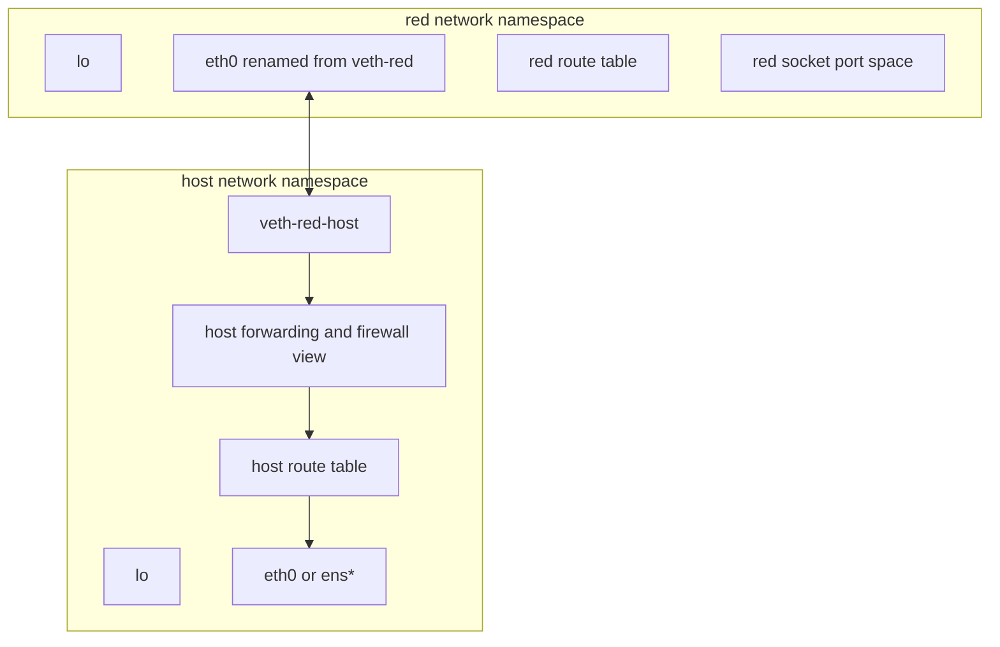
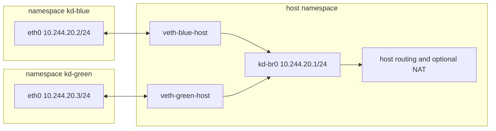
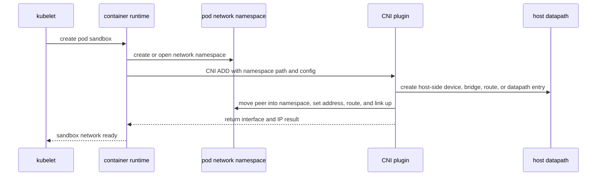

> **Complexity**: `[MEDIUM]` — Container networking as inspectable Linux objects for Kubernetes node incidents
>
> **Time to Complete**: 140–170 minutes (long-form read + hands-on exercise)
>
> **Prerequisites**: [Module 2.1: Linux Namespaces](/linux/foundations/container-primitives/module-2.1-namespaces/), [Module 3.1: TCP/IP Essentials](../module-3.1-tcp-ip-essentials/), and [Module 3.2: DNS in Linux](../module-3.2-dns-linux/); comfort reading `ip addr`, `ip route`, and `ss` on a host before applying the same tools inside isolated stacks
>
> - **Required**: a Linux host with `sudo` — the Killercoda lab `linux-3.3-network-namespaces` is an Ubuntu host scenario with no cluster provided.
> - **Optional (Kubernetes cluster path)**: `kubectl` access to a running cluster helps with one evidence block and one optional success criterion, both gated behind an explicit fork below.

A running Kubernetes cluster is **not** required for this module. Every hands-on exercise — including all host Success Criteria — completes on the Killercoda Ubuntu host or any local Linux VM without `kubectl`.

---

## What You'll Be Able to Do

After completing this module, you will be able to:

- **Model** a Linux network namespace as a complete network stack with its own interfaces, routes, neighbor cache, port space, and firewall view.
- **Build** a working veth topology that connects isolated namespaces through direct links and a Linux bridge, then verify bidirectional connectivity with kernel evidence.
- **Trace** packets from a namespace through link state, ARP or neighbor discovery, routing, bridge forwarding, host forwarding, and optional source NAT.
- **Diagnose** Kubernetes pod networking failures by mapping CNI plugin actions to manual `ip netns`, veth, bridge, route, and sysctl checks on a node running Kubernetes 1.35+ (cluster path — optional for host-only learners).
- **Evaluate** cleanup and leak scenarios involving dangling veth halves, stale named namespaces, and host-versus-namespace conntrack views.

## Why This Module Matters

The hands-on sections assume an Ubuntu 24.04 Linux VM with `iproute2`, `ping`, `bridge-utils`, `iptables` or nftables compatibility packages, `tcpdump`, and `sudo` access. The commands use documentation-backed primitives from `network_namespaces(7)`, `ip-netns(8)`, `veth(4)`, and `ip-link(8)`, so they map directly to what container runtimes automate rather than to a vendor-specific wrapper. If your VM is remote, keep a separate management session open before changing forwarding or firewall state. You do not need a running Kubernetes cluster to complete this module, but you should read Kubernetes 1.35+ networking documentation alongside the labs so you can translate `kd-blue` into `pod sandbox` vocabulary.

Kubernetes networking problems often look like application problems at first contact. A request times out, a readiness probe flips, or a pod can reach its sidecar but cannot reach a database. The YAML may look fine, DNS may resolve, and the Service may have endpoints, yet the packet still has to cross ordinary Linux machinery on the node. It must leave the pod network namespace, traverse a virtual Ethernet peer, enter a bridge or routing path, pass forwarding policy, and return through a path that the kernel can match to the original flow.

That path is easy to ignore because Kubernetes presents a clean network model. Each pod gets an IP address, containers in the same pod share `localhost`, and pod-to-pod communication is supposed to work without manual port coordination. The model is real, but Linux still implements it with namespaces, devices, routes, and plugin actions. When a container runtime asks a CNI plugin to attach a pod to the network, the plugin manipulates the same primitives you can create with `ip netns`, `ip link`, `ip addr`, and bridge commands. The official Kubernetes networking documentation describes pods as having their own network namespace shared by containers in the pod; the CNI specification defines how runtimes hand namespace paths to plugins during `ADD` and `DEL` operations. ([Kubernetes cluster networking](https://kubernetes.io/docs/concepts/cluster-administration/networking/), [CNI SPEC](https://github.com/containernetworking/cni/blob/main/SPEC.md))

The operational payoff is speed under pressure. If you can describe where a packet is supposed to be at each step, you can decide which namespace to enter, which interface to inspect, which route table matters, and which counters should move. Without that model, node networking becomes a pile of names such as `eth0`, `cni0`, `docker0`, `veth1234`, and `flannel.1`. With the model, those names become evidence that either confirms or rejects a specific packet path.

This module also prepares you for the next lesson on iptables and netfilter. Namespace and veth debugging tells you whether the packet reached the host forwarding path. Netfilter debugging tells you what the host did with the packet after it arrived there. Keeping those questions separate prevents random fixes, such as changing a Service when the pod's interface is down, or flushing firewall rules when the namespace has no default route.

### Incident vignette: the probe passes, the client fails

Imagine a platform engineer debugging a payment API on Kubernetes 1.35+. The Pod is Ready, the readiness probe succeeds against `127.0.0.1:8080`, and `kubectl logs` shows the server started. A different microservice in another Pod reports connection timeouts to the payment Pod IP `10.244.18.44`. The engineer checks the node and sees plenty of free ports on the host, because the host namespace is not the pod namespace. Inside the payment Pod network namespace, `ss -lntup` shows the process listening on `0.0.0.0:8080`, which explains why the localhost probe passes. A route check with `ip route get 10.244.18.44` from the client pod shows a plausible path through the cluster CNI, but `ip -br link` on the payment pod reveals `eth0` is `DOWN` for administrative reasons after a partial CNI rollback.

That story is fictional as written, but the pattern is common: different observers test different namespaces. The readiness probe never left the pod network stack through `eth0`, while the client failure is about cross-pod L3 connectivity. The fix is not to increase probe timeouts. The fix is to bring up the pod interface, confirm the veth peer on the host is bridge-attached, and verify counters move. This module teaches you to ask which namespace each piece of evidence belongs to before you change higher-level objects.

## Core: A Network Namespace Is a Full Stack

A Linux network namespace is not just a label on an interface. It is an isolated instance of the networking resources that a process sees: network devices, IPv4 and IPv6 protocol stacks, route tables, neighbor tables, socket port numbers, selected `/proc` and `/sys` networking views, and firewall state. The `network_namespaces(7)` manual page describes that isolation as a partition of networking resources, and the practical result is that two processes in different network namespaces can both bind TCP port 8080 without colliding.

The default host namespace is simply the namespace where normal system services start. When you run `ip addr` in an ordinary shell, you are looking at the devices and addresses in that default namespace. When you run `ip netns exec red ip addr`, you are asking the same `ip` tool to inspect a different network stack. The command did not change the meaning of addresses, routes, or links; it changed the network universe that those objects belong to.

That distinction matters most when a failure report says "the node has a route" or "the interface is up." Which namespace owns the route, and which namespace owns the interface? A pod process does not use the host's route table unless it is running in the host network namespace. A host shell does not see the pod's renamed `eth0` directly after the pod end of the veth pair is moved into the pod namespace. Correct troubleshooting starts by locating the relevant process, then inspecting the network namespace that process actually uses.

Named namespaces are convenient for learning because `ip netns` gives them stable names. Production containers often use anonymous namespaces tied to process lifetime, and tooling reaches them through paths such as `/proc/<pid>/ns/net`. The same rules apply in both cases. A namespace can be entered, inspected, connected, and removed, but no packet can cross the isolation boundary unless a device, route, socket, or kernel facility creates a path.



The diagram shows the key separation. The host owns its ordinary external interface and host-side virtual interface. The namespace owns its loopback, container-facing interface, route table, and port space. A packet from the namespace must first leave through `eth0`, appear on the host-side veth, and then be handled by the host bridge or routing path. If any one of those objects is absent, down, or incorrectly addressed, the next object in the chain never sees the packet.

The namespace is also a security boundary, but it is not a complete security policy by itself. It prevents ordinary processes in one namespace from seeing and binding network resources in another namespace. It does not decide which traffic should be allowed between namespaces once you connect them. That job belongs to link configuration, routing, bridge behavior, firewall rules, network policy implementations, and capability boundaries such as whether a process can create or move network devices.

### Anatomy: what lives inside one namespace

Use this ASCII map when you need to explain "what's in the box" during an incident review. Every label corresponds to a command surface you will use later in the module.

```
+------------------------------------------------------------------+
|  network namespace (e.g. pod sandbox, or `ip netns` lab name)     |
|                                                                   |
|  +-----------+    +-------------------------------------------+  |
|  | lo        |    | eth0 (often a veth peer renamed in-ns)   |  |
|  | 127.0.0.1 |    | pod IP e.g. 10.244.2.17/24               |  |
|  +-----------+    +------------------+------------------------+  |
|                                        | L2 peer cable (veth)   |
|  route table (namespace-local)         v                        |
|  neighbor/ARP cache (namespace-local)     host-side veth peer   |
|  socket port space (namespace-local)          in host namespace |
|  netfilter/conntrack view (namespace-local)                     |
+------------------------------------------------------------------+
```

> **Pause and predict**: if a process in namespace A binds port 80, does namespace B see anything on port 80? Write your answer before scrolling; you will verify it in the inspection commands below.

A process in namespace B does not see namespace A's listening socket. Port binding is per network namespace. That is why two pods on the same node can both use containerPort 8080, while two containers in the same pod cannot bind the same address and port unless they use different addresses or socket options.

| Term | Meaning in this module |
|---|---|
| Network namespace | Isolated network stack: devices, routes, ports, neighbors |
| Named netns | Handle under `/var/run/netns` via `ip netns add` |
| veth pair | Two linked virtual interfaces; frame ingress on one egresses on the other |
| Bridge | Host L2 switch; gateway IP usually on bridge, not on every veth |
| Host datapath | Bridge, routes, forwarding, and NAT outside the pod netns |
| CNI `ADD` | Plugin call that creates connectivity for a sandbox path |

Keep this table nearby while you work through the labs. It is the vocabulary bridge between kernel documentation and Kubernetes node observations. Update it with your own node-specific bridge names when you practice on a live cluster.

## Core: Inspecting and Managing Named Namespaces

The `ip-netns(8)` interface gives administrators a readable workflow for named network namespaces. `ip netns add red` creates a namespace and a named handle backed by a bind mount under `/var/run/netns`. `ip netns list` shows handles known to the `iproute2` namespace directory. `ip netns exec red COMMAND` runs a command with the network namespace changed for that process. These commands are wrappers around kernel namespace concepts, but the wrapper is useful because it keeps lab work repeatable.

Start every namespace inspection with link state, address state, and routes in that order. Link state answers whether the kernel would attempt to transmit on the interface. Address state answers whether the namespace has a usable source address on that link. Route state answers where the namespace will send a destination. If you skip directly to `ping`, you receive one failure message that could represent many causes, and you still have to walk backward through those layers.

Loopback deserves special attention because it is easy to forget. A new namespace has a loopback device, but it is administratively down. That means a local service test against `127.0.0.1` can fail even before you have made any external network design mistakes. Container runtimes bring loopback up during setup because applications expect it. In a manual lab, you must do that yourself, and seeing that step makes the runtime's work less mysterious.

Namespace lifetime can also surprise people. A named namespace remains available while the bind mount under `/var/run/netns` exists, even if no user shell is currently inside it. A namespace tied only to a process disappears when the final process using it exits. Devices follow their own lifetime rules: a physical NIC can belong to only one network namespace at a time and returns to the initial namespace when freed, while veth devices inside a freed namespace are destroyed with it. That difference is important when cleanup leaves some interfaces visible and others gone.

### Worked example: create, inspect, delete

Run this sequence on Ubuntu 24.04. Read the output as a state report rather than as proof of connectivity.

```bash
sudo ip netns add kd-red
sudo ip netns exec kd-red ip link show
sudo ip netns exec kd-red ip link set lo up
sudo ip netns exec kd-red ip addr show
sudo ip netns exec kd-red ip route show
sudo ip netns delete kd-red
```

A namespace with only loopback up can reach itself but nothing outside itself. A namespace with an Ethernet interface up but no IP address can exchange Ethernet frames but cannot originate ordinary IPv4 traffic. A namespace with an address but no matching route may answer traffic on the same subnet while failing every off-subnet destination. Each observation narrows the search.

For production pods, the named namespace may not exist as `ip netns list` output. You can still identify the network namespace through the workload process. Container runtimes and CRI tools expose the sandbox process in different ways, but the kernel path is always visible once you have the process ID: `/proc/<pid>/ns/net`. Tools such as `nsenter --net=/proc/<pid>/ns/net` can enter that namespace, and CNI runtimes pass namespace paths to plugins so the plugin knows where to place the container-side interface.

| Command | What it proves | What it does not prove |
|---|---|---|
| `ip netns list` | Named handles registered under `/var/run/netns` | That every pod uses a named namespace |
| `ip netns exec NS ip link` | Link inventory inside `NS` | End-to-end connectivity |
| `ip netns exec NS ip route get DST` | Kernel forwarding plan for `DST` | That the remote host replied |
| `ls -l /proc/PID/ns/net` | Which namespace object a process uses | Plugin configuration correctness |

> **Stop and think**: you see `kd-red` in `ip netns list`, but `ip netns exec kd-red ip link` fails with "Cannot open network namespace". What are two different root causes that fit that symptom?

One cause is a stale bind mount or permission problem under `/var/run/netns`. Another is that the namespace name you typed is not the object you think it is because an earlier partial cleanup left the filesystem handle out of sync with kernel state. The fix is not to reboot immediately; it is to inspect `/var/run/netns`, confirm whether processes still hold the namespace open, and remove the handle only after you understand what created it.

## Core: Veth Pairs as the Namespace Boundary Cable

A veth pair is a pair of virtual Ethernet interfaces created together. The `veth(4)` manual page describes the pair as a mechanism where packets transmitted on one device are immediately received on the other. That behavior makes a veth pair feel like a short cable with two plugs. Put one plug in the namespace and keep the other on the host, and the isolated stack now has a Layer 2 path to something outside itself.

The pair itself does not assign IP addresses, create default routes, provide DNS, or choose firewall policy. It only transports frames between its two ends. This simplicity is useful because it lets you test the boundary in small pieces. If a namespace cannot ping the host-side veth address on the same subnet, the problem is likely link state, addressing, neighbor discovery, or the veth relationship. You do not need to investigate DNS, Services, or external routers yet.

Names can be misleading during veth debugging. You might create `veth-red` and `veth-host`, then move `veth-red` into the namespace and rename it `eth0`. The host no longer shows `veth-red` by that name because that end is now owned by a different namespace. Container runtimes often generate host-side names that look random, such as `vetha1b2c3d4`. During troubleshooting, use peer relationships, interface indexes, MAC addresses, bridge membership, and packet counters rather than trusting that names will be friendly.

Deleting either end of a veth pair deletes the pair. Moving one end does not delete it; it only changes namespace ownership. Bringing one end up does not automatically bring the other end up. A complete direct-link setup needs both ends up, compatible addresses on the same subnet, and routes that match the intended traffic.

### Worked example: direct host-to-namespace link

This pattern uses a pod-like `10.244.0.0/16` address on a lab subnet. It is the smallest useful namespace network.

```bash
sudo ip netns del kd-red 2>/dev/null || true
sudo ip link del kd-red-host 2>/dev/null || true

sudo ip netns add kd-red
sudo ip link add kd-red-host type veth peer name kd-red-eth
sudo ip link set kd-red-eth netns kd-red
sudo ip netns exec kd-red ip link set kd-red-eth name eth0

sudo ip addr add 10.244.10.1/24 dev kd-red-host
sudo ip link set kd-red-host up
sudo ip netns exec kd-red ip addr add 10.244.10.2/24 dev eth0
sudo ip netns exec kd-red ip link set lo up
sudo ip netns exec kd-red ip link set eth0 up
sudo ip netns exec kd-red ping -c 3 10.244.10.1
ping -c 3 10.244.10.2
```

The namespace can reach the host-side veth address because both ends are on the same subnet and both links are up. Nothing in that setup says the namespace can reach the internet or another namespace. A default route and a forwarding path would still be required for off-subnet destinations.

Troubleshooting a direct veth link should be mechanical. In the namespace, check `ip -br link`, `ip -br addr`, `ip route`, and `ip neigh`. On the host, check the host-side veth link, address, and packet counters with `ip -s link show dev kd-red-host`. If transmitted packets increase on the namespace side but received packets do not increase on the host side, you likely have the wrong interface or a down peer. If counters move but ARP remains incomplete, inspect addresses and subnet masks.

| Symptom | First check | Likely cause |
|---|---|---|
| `ping` says "Network is unreachable" | `ip route get DST` inside namespace | Missing route or wrong source selection |
| `ping` says "Destination Host Unreachable" | `ip neigh` inside namespace | ARP failure, down peer, or wrong subnet |
| Host cannot ping namespace IP | `ip -s link` on both veth ends | Namespace interface down or peer not moved |
| Interface exists, zero counters | `ip -br link` both sides | One veth end not administratively up |

### Comparing direct veth and bridge designs

Operators sometimes ask whether they should assign the gateway on the host-side veth or on a bridge. The answer depends on how many isolated namespaces must share a L2 domain on one node. A direct veth is appropriate for a single sandbox attached to the host for teaching or for special host-port patterns. A bridge is appropriate when many pods on the same node must reach each other at L2 without hairpinning through the host IP stack for every frame.

| Design | Best for | Gateway IP location | Typical Kubernetes analogue |
|---|---|---|---|
| Direct veth host to pod | Single attachment, minimal switching | Often on host-side veth for /30-style links | Less common for multi-pod nodes |
| Bridge + veth ports | Many pods on one node L2 segment | On bridge device (`cni0`, `kd-br0`) | bridge CNI plugins, early docker0 |
| Routed without bridge | Large clusters, L3 pod networks | On node or fabric, not on veth | Calico BGP, cloud routed ENI |

Neither design removes the need for routes. Even on a bridge, each namespace still needs its own address and usually a default route pointing at the bridge IP. Skipping the default route is a frequent copy-paste error when learners recreate only the interface half of a CNI `ADD` result.

## Core: Bridges and Multi-Pod Segments on One Node

A direct veth pair is useful for one namespace, but container hosts usually need many isolated workloads on the same node. A Linux bridge provides that shared Layer 2 segment. The kernel bridge documentation describes a bridge as a device that connects network segments and forwards frames based on destination MAC addresses. In a container topology, the bridge is the local switch, and each host-side veth end is a switch port.

The bridge pattern changes the host-side veth role. Instead of assigning an IP address to every host-side veth, you attach each host-side veth to the bridge. The bridge receives the gateway address for the namespace subnet, and each namespace points its default route at that bridge address. This is the pattern behind names such as `docker0` and `cni0`, although production plugins add IP address management, firewall rules, overlay or routing integration, and cleanup logic.

Layer 2 forwarding and Layer 3 routing are different jobs. A bridge can forward a frame from one namespace port to another namespace port when both namespaces are on the same bridge subnet. The host must route and forward if the destination is outside that subnet. If the destination is beyond the host, source NAT may also be required so return traffic knows how to get back. A working bridge ping does not prove that egress routing and NAT are correct.



The bridge also creates new debugging evidence. `bridge link` shows which interfaces are enslaved to the bridge. `bridge fdb show br kd-br0` shows forwarding database entries learned from frames. `ip addr show kd-br0` confirms the gateway address. If two namespaces on the same bridge cannot ping each other, inspect bridge membership and FDB learning before investigating the upstream route. Their traffic should not need to leave the bridge subnet.

Bridge timing can cause brief confusion. A Linux bridge may learn MAC addresses only after traffic flows. In most container bridge topologies, spanning tree is disabled and ports forward quickly. Even then, the first ping may trigger ARP or neighbor discovery, so watch both `ip neigh` and counters. The useful question is whether each object learns the next object's address at the moment traffic tries to cross it.

### MTU is a bridge property, not a namespace slogan

An MTU mismatch across a bridge path is a classic silent failure mode. If the bridge and veth ports agree on 1500 bytes but an upstream tunnel or overlay interface uses a lower effective MTU, large TCP transfers may fail while small ICMP echo requests succeed. When you build lab bridges, set MTU explicitly on the bridge and enslaved ports if your environment uses overlays:

```bash
sudo ip link set kd-br0 mtu 1450
sudo ip link set veth-blue-host mtu 1450
```

In Kubernetes 1.35+ clusters, CNI plugins and node configuration often coordinate pod interface MTU with the node uplink. During incidents, compare `ip link show` MTU values on the pod interface, host veth, bridge, and node egress interface before you blame DNS or application timeouts.

## Core: Routes, Forwarding, and NAT on the Host

IP routing inside a namespace follows the same rules as IP routing on a host. The kernel chooses an output interface and next hop based on the route table visible inside that namespace. A route such as `default via 10.244.20.1 dev eth0` says that off-subnet traffic should leave through the namespace interface and use the bridge address as the next hop. If that route is missing, traffic to external destinations fails before it ever reaches host forwarding.

Neighbor discovery is the Layer 2 lookup that makes the route usable. For IPv4, the namespace must resolve the next-hop IP address to a MAC address with ARP. For IPv6, it uses Neighbor Discovery. If `ip route` looks correct but `ip neigh` shows `FAILED` or `INCOMPLETE`, the packet is stuck before Layer 3 forwarding. In a bridge topology, that usually points to a down link, wrong subnet, missing bridge membership, or filtering that blocks ARP frames.

Host forwarding is separate from namespace routing. A namespace can have a default route to the bridge, and the host can receive the packet, but the host still needs forwarding enabled to route between interfaces. On Linux, IPv4 forwarding is controlled by `net.ipv4.ip_forward`, documented in the kernel IP sysctl guide. Kubernetes node setup normally handles this through distribution packages, kubelet, or plugin configuration, but manual labs make the dependency visible.

NAT is another separate question, and conntrack views are namespace-local in important ways. Connection tracking state that `iptables -t nat -L` shows in the host namespace is not the same object set you would see inside a network namespace unless you enter that namespace or use namespace-aware tooling. A pod may have no SNAT rule in its namespace while the host POSTROUTING chain masquerades egress from `10.244.0.0/16`. Symmetrically, a policy you add only inside a lab namespace will not fix host-level return-path drops.

Troubleshooting improves when you avoid mixing these layers. Ask first whether the namespace can reach its gateway. If not, inspect links, addresses, bridge membership, and neighbor state. Ask next whether the host forwards the packet. If not, inspect forwarding sysctls and firewall policy. Ask last whether replies can return. If not, inspect routes on the far side or the NAT policy on the host. This sequence keeps a single timeout from turning into a broad search across every networking component.

Route lookup commands are especially useful because they force the kernel to tell you the decision it would make for a specific destination. Inside a namespace, `ip route get 10.244.20.1` answers the gateway case, while `ip route get 1.1.1.1` answers the off-subnet case. The output includes the chosen device, selected source address, and sometimes the cached path. If that output contradicts your diagram, fix the route model before collecting packet captures.

Neighbor table output gives you the next lower layer of evidence. A correct route to a directly connected next hop still needs a resolved link-layer destination. In an IPv4 lab, an incomplete neighbor entry for the bridge gateway means the namespace tried to resolve the gateway MAC but did not receive an ARP answer. That points to bridge membership, link state, subnet mismatch, or filtering of ARP frames. It does not point to DNS or a Kubernetes Service, because the packet has not reached those layers.

On Ubuntu 24.04, `ip netns identify` can be run from a process context to learn which named namespace a shell would use, which helps when you have a long-running `ip netns exec` session and need to confirm you are not accidentally back in the host namespace. Production pods rarely use named handles, but the command reinforces that namespace membership is a per-process attribute, not a property of the terminal window title.

```bash
# From inside an ip netns exec shell, learn the namespace name
ip netns identify

# From the host, read the network-namespace inode a PID is in (e.g. net:[...]); use 'ip netns identify <pid>' to map it to a named handle.
readlink /proc/self/ns/net
```

## Core: CNI and Kubernetes 1.35+ Map to the Same Objects

Kubernetes defines the network model, but it delegates much of the node-level implementation to the container runtime and network plugin. In practical terms, the runtime creates or identifies the pod sandbox namespace, then calls a plugin with enough information for the plugin to attach that namespace to the node network.

CNI is intentionally about interfaces and connectivity rather than about every possible cluster behavior. The spec defines operations such as `ADD`, `DEL`, and `CHECK`, along with environment variables and JSON configuration. A bridge-style plugin can create a veth pair, move one end into the pod namespace, configure addresses and routes, attach the host side to a bridge, and return the resulting interface information. More advanced plugins may program routes, eBPF maps, encapsulation devices, or policy objects, but the namespace boundary still has to be connected.

This is why pod troubleshooting often begins below Kubernetes objects. A pod can exist in the API while its sandbox network is not configured correctly on the node. The kubelet may report plugin errors when CNI setup fails, but sometimes the symptom appears later as a data-plane issue. If you know the manual pattern, you can inspect whether the pod namespace has an interface, whether the host side exists, whether the route is correct, and whether the plugin-created bridge or datapath knows about the endpoint.



The sequence diagram is not a promise that every plugin uses a Linux bridge. Some plugins route directly, some use overlays, some use eBPF forwarding, and some integrate with cloud provider networking. The stable lesson is the boundary. A pod process needs a network namespace, an interface inside that namespace, an address, and a route. The host or datapath needs a corresponding endpoint and forwarding behavior. If those facts are not true, higher-level Kubernetes objects cannot make packets move.

> **Host-only vs cluster fork:** The commands below inspect a live Kubernetes node and need `kubectl` plus `crictl`/`jq` on the node. Pick your path before running anything:
>
> - **Killercoda lab / local Linux host:** The linked lab `linux-3.3-network-namespaces` is an Ubuntu host scenario without a cluster. Complete the bridge/veth exercise there and read this block as a worked example — nothing here is required for the host path.
> - **Optional cluster path:** If you have a local [`kind`](https://kind.sigs.k8s.io/) cluster or an existing cluster with node access, run the commands below live on it.
> - **Skip-as-read:** Without a cluster, read the commands as illustrative; pod names, sandbox PIDs, and namespace paths will differ on any real cluster.

On a node running Kubernetes 1.35+, useful evidence commands include:

```text
# Pod IP and node placement from the API (requires kubectl — not Ubuntu 24.04 lab baseline)
kubectl get pod -o wide

# Sandbox process and namespace path (requires crictl + jq on the node)
sudo crictl pods --name my-pod -q | head -1 | xargs -I{} sudo crictl inspect {} | jq '.info.pid'

# Enter the pod network namespace when you know the sandbox PID
sudo nsenter --net=/proc/<sandbox-pid>/ns/net ip -br addr
sudo nsenter --net=/proc/<sandbox-pid>/ns/net ip route
```

Replace `<sandbox-pid>` with the sandbox process ID from your runtime. The exact CRI tooling varies, but the namespace path format is stable. Install `kubectl`, `crictl`, and `jq` on production nodes; they are illustrated here, not required for the Ubuntu 24.04 lab blocks in this module.

### CHECK operations and partial failure

The CNI specification also defines `CHECK`, which asks a plugin to verify that networking for a sandbox still matches configuration. Not every cluster enables CHECK in production, but the idea is instructive: Kubernetes can ask "is the datapath still correct?" instead of only "please add networking." When CHECK fails, you may see a healthy Pod object with a sandbox that never received a working interface. Your manual equivalent is to run the namespace inspection table from this module: links, addresses, routes, neighbors, and host bridge membership.

Partial failures are common during upgrades. A plugin might recreate the host-side veth while the namespace still holds an old `eth0` name from a previous attempt, or vice versa. When that happens, do not assume the API name `eth0` inside the pod is wrong; verify with `ip -br link` inside the netns. If the interface exists under another name, your routing commands may still reference `eth0` and fail even though some device is up.

### Service traffic is still namespace traffic

ClusterIP Services on Kubernetes 1.35+ are implemented above the pod namespace boundary using kube-proxy or equivalent datapath programs in iptables, nftables, or IPVS on the node. That matters for this module because a pod can have perfect pod-interface connectivity yet still fail a Service connection when netfilter rules are wrong. Keep the separation: this module proves whether traffic can enter and leave the pod network namespace correctly. Module 3.4 proves what the host does with the packet afterward, including DNAT toward endpoints and reverse-path filtering.

Kubernetes also changes how you think about port conflicts. Containers within the same pod share one network namespace, so they share one port space. Two containers in the same pod cannot both bind the same IP and TCP port unless they use different addresses or socket options that allow it. Containers in different pods can bind the same port because they live in different pod namespaces. This behavior is a direct consequence of network namespace isolation, not a special Service feature.

## Core: Packet Traces, Captures, and Dangling Veth Halves

When a pod or lab namespace cannot reach a destination, trace the packet as a set of ownership transitions. First, the process sends through the namespace socket table. Second, the namespace route table chooses an output device and next hop. Third, the namespace resolves the neighbor and transmits through its veth end. Fourth, the host-side peer receives the frame. Fifth, the bridge or host route path forwards it. Sixth, firewall and NAT policy may accept, drop, or rewrite it. Finally, the return packet must find a valid reverse path.

Each transition has a command that answers one narrow question. `ss -lntup` inside the namespace answers whether a service is listening in the namespace's port space. `ip route get DEST` inside the namespace answers which interface and source address the kernel would choose. `ip neigh` answers whether the next hop resolved. `ip -s link` on both veth ends answers whether packets and errors are moving. `bridge link` and `bridge fdb` answer whether a bridge sees the host-side port and learned MAC addresses.

For routed or egress traffic, move to host-level evidence only after the namespace evidence says the packet left. `sysctl net.ipv4.ip_forward` answers whether IPv4 forwarding is enabled. Firewall counters answer whether policy sees and handles the packet. NAT counters answer whether source rewriting is occurring. A packet capture on the bridge, veth, or external interface can prove which step is last visible, but captures are most useful after you have predicted what each interface should see.

### Finding the other end of a dangling veth

CNI plugin failures sometimes leave a host-side `veth*` interface without an obvious pod owner. The host end still exists, but the peer may be inside a pod namespace or already deleted. Use peer index information:

```text
# Show peer ifindex and interface name on the host (replace with the real veth name)
ip -d link show <host-veth-name>

# Example output fragment: peer_ifindex 42
# Then locate interface with ifindex 42 in another namespace
sudo ip netns exec kd-green ip link | grep '^42:'
```

If `peer_ifindex` points to an interface that only exists inside a pod namespace, enter that namespace with `nsenter` or identify the owning PID through `/proc/*/ns/net` and runtime metadata. If the peer is gone, deleting the orphaned host veth is usually safe once you confirm no sandbox still references it.

This prediction-first habit is the difference between debugging and browsing output. Before running a command, say what result would confirm your model and what result would reject it. If the namespace route says traffic should leave `eth0`, counters on `eth0` should increase. If the host-side veth is attached to `kd-br0`, bridge FDB entries should appear after traffic. If the bridge is the namespace default gateway, ARP for the gateway should resolve to the bridge MAC. If the far network has no route back, NAT or route propagation must explain return traffic.

Good namespace troubleshooting is evidence-driven, but the evidence is useful only when you know which question each command answers. `ip -br link` is not a connectivity test; it is a link inventory. `ip -br addr` is not a routing test; it is an address inventory. `ip route get` is not proof that a destination replied; it is the kernel's planned forwarding decision. `ping` is only a later confirmation that several lower-level facts are already true.

Counters help when output looks correct but traffic still fails. The `ip -s link` command can show whether packets are leaving one end of a veth pair and arriving on the other. If namespace transmit counters increase but host receive counters do not, the peer relationship or interface selection is wrong. If both counters increase but higher-layer connectivity fails, move upward to neighbor state, routing, bridge forwarding, firewall policy, or the return path.

Packet captures are powerful, but they are easy to misuse. Capturing on every interface at once creates noise and can hide the missing step. A better approach is to predict the next interface that should see the packet, then capture there. For a bridge lab, start inside the namespace with `tcpdump`, then move to the host-side peer, then to the bridge, then to the external interface if routing is involved. The first quiet capture after a noisy one marks the broken transition.

Be careful with names copied from examples. Real nodes may use `cni0`, `docker0`, `br0`, a cloud-provider interface name, or no bridge at all. The name is less important than ownership and function. Ask whether the device is inside the workload namespace or the host namespace, whether it is a peer, bridge port, bridge device, tunnel, or external interface, and whether its counters match the traffic you are generating. That classification survives across distributions and plugins.

Finally, separate persistent desired state from observed Linux state. Kubernetes objects describe what the control plane wants. The `ip` and `bridge` commands show what the node kernel currently has. During an incident, those states can diverge because a plugin failed, cleanup was incomplete, or a node reboot restored only part of the configuration. You need both views, but do not let a valid Deployment, Pod, or Service manifest convince you that the node datapath is correct.

## Core: Reading Node Evidence Without Guessing

Production nodes rarely give you a tidy `ip netns list` that matches pod names. Your job is to correlate three independent inventories: API objects, runtime sandboxes, and kernel objects. Start from the symptom IP or pod name, then walk downward until one layer contradicts the layer above.

**Orphaned handles under `/var/run/netns`.** Named namespaces created with `ip netns add` appear as bind mounts:

```bash
ls -l /var/run/netns/
sudo ip netns list
```

If `ip netns list` shows `cni-abc123` but no pod or sandbox owns that name, inspect whether any process still holds the namespace open before deleting it:

```bash
sudo ls -l /proc/*/ns/net 2>/dev/null | head
# Compare inode numbers with the netns file:
readlink /var/run/netns/cni-abc123
```

A stale bind mount after a crashed plugin can make later `ip netns exec` commands fail with confusing errors even though Kubernetes already recreated the pod elsewhere. Deleting the handle without confirming sandbox ownership is how you destroy a live network stack.

**Bridge state when the CNI plugin mis-attached a port.** When pod-to-pod traffic on the same node fails but routes look fine, read the bridge as a switch, not as a route:

```bash
ip -br link show master cni0
bridge link show master cni0
bridge fdb show br cni0
```

If the host veth is `UP` but missing from `bridge link`, frames never enter the L2 domain. If FDB entries never learn the peer MAC after you generate traffic, the frame is not arriving on the bridge port you think it is—often because the veth is enslaved to `docker0` or a secondary bridge from an older plugin generation.

**Correlating a host veth name to a pod without kubectl.** On the lab host you can still practice the peer-ifindex hunt with only `iproute2`:

```bash
HOST_VETH=veth0a1b2c3   # replace with the dangling name you see on the node
ip -d link show "$HOST_VETH" | grep -E 'peer_ifindex|link/ether'
```

Take the `peer_ifindex` value and search inside each named namespace you can reach, or walk `/proc/<pid>/ns/net` for sandbox PIDs your runtime lists. The goal is not to memorize veth naming schemes; it is to prove whether a host port still has a live peer inside a sandbox namespace.

**When API, runtime, and kernel disagree.** A pod can show `Running` while the sandbox namespace has only `lo` up. Treat that as a failed or partial CNI `ADD`, not as an application bug. Your notebook line should read: "API IP present, sandbox eth0 missing, host veth orphaned on cni0 port 7" rather than "network flapping." That sentence is enough for a teammate to search plugin logs and kubelet sandbox events without re-running your entire inspection chain.

## Core: Failure Patterns You Should Recognize Early

The most common beginner failure is an interface that exists but is down. The namespace has `eth0`, the address looks correct, and the route looks plausible, but the link state prevents transmission. Bring both ends of the veth pair up and confirm state from both namespaces. Do not assume that assigning an IP address brought the link up, because address configuration and administrative link state are separate operations in `ip-link(8)`.

The second common failure is a missing default route. Same-subnet pings work, which creates false confidence, but off-subnet traffic fails. That is expected if the namespace has no route to destinations beyond its local prefix. Add a default route through the bridge or host-side gateway, then confirm with `ip route get`. If `ip route get` still chooses no path or the wrong path, investigate route priority, conflicting static routes, or policy routing rules that only exist on the host.

The third common failure is bridge membership. The host-side veth exists and is up, but it is not enslaved to the expected bridge. The namespace can transmit into its veth peer, yet no other namespace on the bridge sees frames from it. `bridge link` and `ip link show master kd-br0` are direct checks for this condition. If the interface is attached to the wrong bridge, packet captures on the intended bridge will be quiet because the frames never arrived there.

The fourth common failure is forwarding or filtering on the host. The namespace reaches its gateway, and maybe same-node peers work, but traffic beyond the host fails. At that point, inspect IP forwarding and firewall rules in the host namespace. The next module covers netfilter in depth, but this module's boundary is simple: a bridge can connect local namespace ports, while a routed path through the host needs forwarding policy that permits the flow.

The fifth common failure is return-path asymmetry. A packet leaves the namespace and reaches a destination, but replies never come back because the destination or upstream router does not know the namespace subnet. NAT can solve that for egress to the public internet, and routed pod networks solve it by advertising pod CIDRs or programming cloud routes. The correct fix depends on the cluster design. The troubleshooting observation is the same: outbound visibility without return traffic points to reverse routing, NAT, or stateful filtering.

The sixth common failure is incomplete CNI cleanup after a crashed plugin. You may see a host `veth*` without a matching pod, or a pod IP that appears in `kubectl get pod -o wide` while the sandbox namespace lacks `eth0`. Treat that as desynchronization between orchestrator desired state and node datapath state. Your job is to identify whether the runtime still owns the namespace, whether the host port is orphaned, and whether deleting objects through Kubernetes will trigger a proper `DEL` or whether manual intervention is required on the node.

### Walkthrough: bridge gateway on the wrong device

A learner assigns `10.244.50.1/24` to each host-side veth instead of to `kd-br0`. Symptom: each namespace can ping its own host-side veth IP, but not the other namespace. Inspection sequence:

```bash
ip -br addr show master kd-br0
ip -br addr show veth-blue-host veth-green-host
sudo ip netns exec kd-blue ip route get 10.244.50.3
```

Pass condition: the `/24` gateway address appears only on `kd-br0`, host veth ends have no gateway IP, and `ip route get` inside each namespace selects `eth0` with next hop `10.244.50.1`. Fix by moving the subnet address to the bridge and leaving each namespace with a host route via that bridge IP.

### Walkthrough: ARP succeeds to gateway but bridge FDB stays empty

Symptom: namespace can ping `10.244.50.1` (the bridge) but not `10.244.50.3` on the same segment. `ip neigh show dev eth0` lists the gateway as `REACHABLE`, yet `bridge fdb show br kd-br0` never learns the peer MAC after you ping the remote pod IP.

```bash
sudo ip netns exec kd-blue ping -c 1 10.244.50.3
bridge fdb show br kd-br0
bridge link show master kd-br0
```

If FDB is empty while `bridge link` omits `veth-green-host`, the green port never joined the bridge domain—traffic hairpinned to the host stack or black-holed at the veth peer. Re-enslave the host-side veth with `ip link set veth-green-host master kd-br0` and repeat the ping while watching FDB populate.

### Walkthrough: forwarding enabled but return traffic black-holes

Symptom: from inside a namespace, `ip route get 1.1.1.1` looks correct and the first ping emits, but no reply arrives; on the host, `tcpdump -ni eth0 icmp` shows echo requests without replies. Namespace counters on `eth0` increase TX without RX growth on return.

Check host forwarding and whether upstream routing knows the pod source:

```bash
sysctl net.ipv4.ip_forward
sudo iptables -t nat -S POSTROUTING | grep 10.244.50.0/24
ip route get 10.244.50.2 from 1.1.1.1
```

If forwarding is `0`, enable it only after you understand cluster design. If forwarding is `1` but upstream has no route to `10.244.50.0/24`, you need cluster routing or scoped MASQUERADE on the host egress interface—not a DNS change inside the pod.

### IPv6 and dual-stack notes

The same sequence works for IPv6, but the details change. IPv6 forwarding, router advertisements, neighbor discovery, and source address selection have their own sysctls and operational expectations. Do not assume an IPv4 bridge lab proves IPv6 behavior. In Kubernetes 1.35+ clusters that run dual-stack networking, each pod can have addresses for more than one family, and the plugin must satisfy the routing and policy model for each configured family. When you debug dual-stack pods, repeat the namespace inspection per family: addresses, routes, neighbors, and `ip -6 route get`.

### Security and isolation boundaries

Network namespaces reduce accidental and intentional interference between workloads. One namespace cannot directly see another namespace's ordinary interfaces, sockets, routes, or port bindings. That is why two pods can both run a web server on TCP port 8080 and why a sidecar can share `localhost` only with containers in its own pod. Isolation gives each workload a smaller network view and gives runtimes a place to apply per-workload configuration.

Isolation does not automatically create least privilege. A process with enough capabilities in the owning user namespace may create network devices, change addresses, or alter routes inside its network namespace. A connected veth pair also creates a real communication path, so policy still matters. Kubernetes NetworkPolicy, CNI plugin policy engines, host firewalls, and cloud security controls exist because namespace separation by itself says where objects live, not which flows are acceptable.

Operational cleanup is part of security. A stale namespace, leftover veth, or orphaned bridge can preserve unexpected connectivity or confuse future debugging. Manual labs should include cleanup commands, and production runtimes must handle `DEL` or garbage collection paths carefully. The CNI specification includes cleanup-oriented operations because adding connectivity is only half of the lifecycle. Removing stale resources is what keeps the node's real state aligned with the orchestrator's desired state.

### Operator checklist before you escalate to netfilter

Use this table during a live incident to keep namespace work bounded. If any row fails, fix it before opening the iptables module's tools.

| Step | Command (namespace-first) | Pass condition |
|---|---|---|
| 1 | `ip -br link` inside pod netns | `lo` and `eth0` are `UP` |
| 2 | `ip -br addr` inside pod netns | Expected pod IP is present on `eth0` |
| 3 | `ip route get <dst>` inside pod netns | Chooses `eth0` and plausible gateway for off-subnet |
| 4 | `ip neigh` inside pod netns | Gateway neighbor is `REACHABLE` or `STALE`, not `FAILED` |
| 5 | `ip -s link` on pod `eth0` and host veth peer | TX/RX counters increase during test traffic |
| 6 | `bridge link` / `bridge fdb` on host | Host veth is enslaved and learns peer MAC after ping |
| 7 | `sysctl net.ipv4.ip_forward` on host | `1` when routed egress is required |
| 8 | Host `iptables -t nat -S POSTROUTING` (read-only) | Expected SNAT/MASQUERADE for pod CIDR if design uses NAT |

> **Pause and predict**: a pod can `curl` a ClusterIP but cannot reach a pod IP on another node. Namespace checks inside the source pod are clean. Will fixing `lo` inside the source pod netns help? Write yes or no and one sentence why.

No. Loopback only affects traffic destined to addresses on `lo` inside that namespace. Cross-node pod IP traffic leaves through `eth0` and the host datapath. The next investigation belongs to routes, tunnel devices, or policy on the node and intermediate path—not loopback inside a pod whose local stack already forwards correctly to its gateway.

### Mapping lab objects to Kubernetes node objects

When you finish the hands-on exercise, you should be able to narrate the mapping without looking at your notes. The bridge `kd-br0` plays the role of `cni0` or another node-local L2 domain. The host-side veth ends are the switch ports. The namespace `eth0` interfaces are pod interfaces with addresses from the pod CIDR, here `10.244.50.0/24`. The default route inside each namespace points at the bridge gateway, matching how many CNIs install a default via the node-local gateway. Host forwarding and MASQUERADE mirror how some clusters provide internet egress for private pod ranges, although many production designs route pod CIDRs without NAT inside the cluster.

That mapping is intentionally imperfect. A Calico VXLAN setup may not use a Linux bridge at all. A Cilium cluster may forward with eBPF programs instead of `bridge fdb`. The debugging method still survives: identify the namespace, identify the first hop interface, identify the host datapath object, then identify policy and routing on the host. The names change; the questions do not.

### Practice scenario: annotate a node diagram

Draw a box for the host namespace and two boxes for pod namespaces. Label `lo`, `eth0`, host veth peers, `kd-br0` or `cni0`, the node default route interface, and the direction of a ping from `10.244.50.2` to `10.244.50.3`. Mark where ARP should occur and where forwarding should not be required for that east-west case. Then mark where forwarding and NAT would engage for a ping from `10.244.50.2` to `1.1.1.1`. If you cannot place those marks confidently, rerun the bridge lab and update the diagram while watching `bridge fdb` and `ip neigh` after each ping.

## Core: End-to-End Troubleshooting Narrative

Walk through this narrative once on paper, then again on a VM. A developer reports that pod `payments-7d4f9` at `10.244.12.19` cannot reach pod `ledger-5c8aa` at `10.244.12.33` on the same node. Both pods show Ready, and the cluster DNS record for the Service is irrelevant because the test uses pod IPs directly.

You start inside the source pod network namespace. `ip -br link` shows `eth0` is `UP`. `ip -br addr` shows `10.244.12.19/24`. `ip route get 10.244.12.33` selects `eth0` with source `10.244.12.19`, which tells you the kernel intends to send on the pod interface rather than loopback. `ip neigh show dev eth0` lists the gateway or peer MAC as `REACHABLE`. If neighbor state is incomplete, you fix L2 before you touch RBAC or image tags.

Next you inspect the host datapath. `ip -d link show` for the host veth peer reports `master cni0` and a valid `peer_ifindex`. `bridge link show master cni0` includes the veth port. You ping from the source pod again and run `bridge fdb show br cni0` to confirm the bridge learned the destination MAC toward the correct port. If FDB entries never appear, the frame is not entering the bridge domain, which usually means the host-side veth is not enslaved or is attached to a different bridge than you think.

Only after east-west pod IP traffic works would you investigate Services, NetworkPolicy, or DNS. If the symptom were internet egress instead of same-node pod IP, you would add the forwarding and NAT checks from the operator checklist. That ordering is the core professional habit this module reinforces: namespace first, host datapath second, cluster abstractions third.

If the same symptom occurred across nodes, you would still begin with namespace and host evidence on one failing pod pair before you chased control-plane or CNI chart version skew. Cluster-wide outages exist, but the first node you inspect should yield a concrete broken object such as a down `eth0`, a missing default route, or a veth that never joined `cni0`. That object becomes the search term for other nodes: are they missing the same bridge membership, the same sysctl, or the same plugin version?

When you communicate findings to application teams, translate namespace evidence into impact language without hiding the Linux layer. Instead of "network broken," say "pod `eth0` is down in the sandbox namespace, so traffic never leaves the pod stack despite Ready status." That sentence ties Kubernetes health signals to kernel facts and sets up Module 3.4 to explain whether the host dropped packets after they left the pod.

## Did You Know

- A named network namespace created by `ip netns add` is kept alive through a bind mount under `/var/run/netns`, which is why it can outlive the shell that created it.
- A physical network device can belong to only one network namespace at a time, while a veth pair provides two virtual ends that can be split across namespaces.
- A newly created network namespace has its own loopback device, but loopback is administratively down until you bring it up.
- Kubernetes pods share one network namespace across the containers in the pod, which is why containers in the same pod share an IP address and port space.

## Common Mistakes

| Mistake | Symptom | Better practice |
|---|---|---|
| Namespace leak after killing only the container PID | `ip netns list` or `/var/run/netns` entries remain; stray routes or veth names reappear in later labs | Ensure the sandbox process exited, delete named handles with `ip netns delete`, and confirm `/var/run/netns` is clean before reusing names |
| Veth pair created on the host but never moved into the target netns | Host shows both ends or wrong topology; pod namespace has no `eth0` | Create with `ip link add ... type veth peer name ...`, then `ip link set CONTAINER_END netns TARGET` before configuring addresses |
| MTU mismatch across bridge and uplink | Small pings work, large transfers hang or reset, especially through overlays | Align MTU on bridge, veth ports, and node egress; compare with CNI/plugin MTU settings on Kubernetes 1.35+ nodes |
| Missing default route inside the netns | Same-subnet pod-to-pod works; off-subnet or internet targets fail with "Network is unreachable" | Add `default via <bridge-gw>` on the namespace `eth0`, verify with `ip route get <remote>` |
| Forgotten `lo` up in a new netns | Probes to `127.0.0.1` fail even though external interfaces look fine | Run `ip link set lo up` during setup, matching what runtimes do for sandboxes |
| Conntrack/NAT view mismatch (host vs netns) | You add SNAT on the host but inspect conntrack inside the pod and see no entry | Run conntrack and NAT listing in the namespace where the rule is installed; map host POSTROUTING to pod egress separately |
| Forgotten `net.ipv4.ip_forward` on the node | Namespace reaches bridge gateway, but routed egress dies silently | Check `sysctl net.ipv4.ip_forward`; enable temporarily for labs and document restoration |
| Treating a NIC like a veth: moving an interface already enslaved elsewhere | `RTNETLINK answers: Device or resource busy` or intermittent connectivity | Remember only one netns owns a physical device; use veth pairs to cross namespace boundaries |

## Quiz

Answer each scenario from the evidence you would collect first. Expand the answer only after you have written your own plan. These questions are deliberately scenario-based: they describe a partial observation, a failed automation step, or a mixed symptom, and you must choose the next inspection command or design rule. None of them ask you to recite definitions from memory.

When you practice, write three bullets before opening each answer: the namespace you will enter first, the command that falsifies your leading hypothesis, and the command that confirms the fix. That habit mirrors how you should document node incidents in postmortems so the next engineer can reproduce your reasoning without repeating your dead ends.

<details>
<summary>Your CNI plugin failed mid-pod-setup; the host has a dangling `vethc1a2b3` half. How do you find which namespace holds the peer, if any?</summary>

On the host, run `ip -d link show vethc1a2b3` and read `peer_ifindex`. Search for that ifindex inside candidate namespaces with `ip netns exec ... ip link` or `nsenter --net=/proc/<pid>/ns/net ip link`. If no peer exists, the sandbox may already be gone and the host veth is orphaned; confirm with runtime metadata before deleting the host interface.

</details>

<details>
<summary>After a node drain, `ip netns list` still shows `cni-legacy-test`, but no pod uses that name. What is your next step before deleting it?</summary>

Check whether any process still holds the namespace open (`ls /proc/*/ns/net` or `ip netns identify` from a known process), inspect attached veth and routes, and confirm the orchestrator is not recreating it. Only then remove the bind mount handle with `ip netns delete cni-legacy-test` so you do not destroy a namespace a running sandbox still uses.

</details>

<details>
<summary>Pod `10.244.2.37` can ping its default gateway `10.244.2.1` but not `10.244.5.10` on the same cluster. DNS and Services are healthy. What two namespace-level checks come before inspecting kube-proxy?</summary>

Inside the pod netns, run `ip route get 10.244.5.10` and verify the chosen device, source address, and gateway. Then check `ip neigh` for the next hop and `ip -s link` on `eth0` to confirm frames leave the pod. If those are wrong, kube-proxy is not the first broken layer.

</details>

<details>
<summary>You built a bridge lab and assigned `10.244.30.1/24` to each host-side veth instead of to `kd-br0`. Pods on the same bridge can ping the host veth IPs but not each other. What design rule did the lab violate?</summary>

The gateway for the shared L2 domain should live on the bridge device. Host-side veth ends should be bridge ports without separate gateway IPs. Move the `/24` address to `kd-br0` and give each namespace only its own address plus a default route via the bridge IP.

</details>

<details>
<summary>A sidecar in the same pod cannot connect to `127.0.0.1:8080` served by another container, but cluster traffic works. Which namespace fact explains this?</summary>

Containers in one pod share a network namespace and should share `localhost`. If `127.0.0.1` fails, loopback is probably down or the server bound only to a specific address. Enter the pod netns, run `ip link show lo`, and inspect `ss -lntup` to see which local address the server selected.

</details>

<details>
<summary>Your lab namespace pings `1.1.1.1` successfully from the host shell but fails from inside the namespace. Forwarding is enabled and NAT rules exist on the host. Where do you look for a namespace-local mistake first?</summary>

Inside the namespace, verify `ip route get 1.1.1.1`, default route presence, `eth0` up, and ARP to the gateway. Host success does not prove namespace routing or neighbor state is correct. Only after namespace egress is proven should you compare host conntrack counters for translated flows.

</details>

<details>
<summary>After copying a physical NIC into a pod netns for a hardware test, a second pod move fails with "device busy." What principle blocks the operation?</summary>

A physical network device can belong to only one network namespace at a time. Use a veth pair to connect additional pods, or move the NIC back to the host namespace before reassigning it.

</details>

<details>
<summary>Large image pulls from a pod stall mid-download while `ping -s 1400` works. MTU on `eth0`, the veth, and `cni0` are 1500, but the node uplink uses a 1400-byte overlay. What is the most likely fix class?</summary>

Reduce MTU consistently on the pod interface, veth, bridge, or overlay path so TCP does not send segments that black-hole on the tunnel. Treat this as an MTU mismatch problem, not an application registry problem.

</details>

## Hands-On Exercise

Run this lab in a disposable Ubuntu 24.04 VM. It uses realistic pod CIDR addresses in `10.244.0.0/16`, modifies host forwarding and a single scoped NAT rule, and requires cleanup at the end. Read the numbered walkthrough first so you know which namespace owns each object before you paste the script.

**Warning:** This exercise changes `net.ipv4.ip_forward` and adds one `iptables` NAT rule in the `nat` table `POSTROUTING` chain. It does not flush tables. Record original values and restore them during cleanup.

### Step-by-step narrative

**Step 1 — Reset the lab footprint.** Delete any previous `kd-blue`, `kd-green`, or `kd-br0` objects so names and addresses do not collide. This mirrors production hygiene after a failed CNI `ADD`: you want a known-empty starting point before you rebuild topology.

**Step 2 — Create the bridge gateway.** Add `kd-br0`, assign `10.244.50.1/24`, and bring it up. This address is the default gateway for both namespaces, similar to how a node-local bridge carries the first hop for a pod subnet on many CNIs.

**Step 3 — Build the first pod-like namespace.** Create `kd-blue`, add a veth pair, move `veth-blue-eth` into the namespace, rename it `eth0`, enslave `veth-blue-host` to `kd-br0`, bring up `lo` and `eth0`, assign `10.244.50.2/24`, and install a default route via `10.244.50.1`. At this point, `kd-blue` should reach the gateway only.

**Step 4 — Build the second namespace symmetrically.** Repeat the same pattern for `kd-green` with address `10.244.50.3/24`. Before you ping, run `bridge link show master kd-br0` and confirm both host-side veth ends list `master kd-br0`.

**Step 5 — Prove east-west connectivity.** Ping from blue to green and green to blue. If this fails, do not enable NAT yet. Fix bridge membership, interface `UP` state, and ARP to the gateway first.

**Step 6 — Capture where the traffic actually flows.** Run `tcpdump` inside `kd-blue` on `eth0` while pinging `10.244.50.3`. You should see request and reply ICMP echo traffic on the pod interface, which confirms the namespace stack transmitted and received on the expected device.

**Step 7 — Add controlled egress.** Record `net.ipv4.ip_forward`, enable forwarding, and append a single MASQUERADE rule scoped to `10.244.50.0/24` on the host default interface. Verify planning with `ip route get 1.1.1.1` inside `kd-blue` before you interpret ping success or failure.

**Step 8 — Restore the host.** The lab script registers `trap cleanup EXIT` so sysctl, NAT, namespaces, and the bridge are removed even when a ping fails under `set -euo pipefail`. After the script exits, confirm `ip link show kd-br0` fails and that `ip netns list` no longer shows lab names.

### Verification commands between steps

After Step 3, check that namespace ownership and route behavior are correct before you continue. Run `ip netns exec kd-blue ip -br link` to confirm the namespace interface list, `ip netns exec kd-blue ip route get 10.244.50.1` to verify the gateway path, and `ip netns exec kd-blue ping -c 2 10.244.50.1` to prove namespace-to-gateway connectivity is working.

```bash
sudo ip netns exec kd-blue ip -br link
sudo ip netns exec kd-blue ip route get 10.244.50.1
sudo ip netns exec kd-blue ping -c 2 10.244.50.1
```

Before Step 5 is considered complete, validate neighbor state and bridge learning so that you have L2 evidence in addition to the basic route checks. Run `ip netns exec kd-blue ip neigh show dev eth0` and `ip netns exec kd-green ip neigh show dev eth0`, then confirm `bridge fdb show br kd-br0` reflects the expected port learning.

```bash
sudo ip netns exec kd-blue ip neigh show dev eth0
sudo ip netns exec kd-green ip neigh show dev eth0
bridge fdb show br kd-br0
```

After Step 7, compare what the namespace planned with what host policy actually allowed before you draw conclusions from external ping output. Confirm namespace forwarding intent with `sysctl net.ipv4.ip_forward`, inspect the host NAT scope with `sudo iptables -t nat -S POSTROUTING | grep 10.244.50.0/24`, and rerun `ip netns exec kd-blue ip route get 1.1.1.1` so you can confirm the namespace still chooses the expected egress route.

```bash
sysctl net.ipv4.ip_forward
sudo iptables -t nat -S POSTROUTING | grep 10.244.50.0/24
sudo ip netns exec kd-blue ip route get 1.1.1.1
```

### Success criteria

- [ ] Create named network namespaces `kd-blue` and `kd-green` *(Host-only)*
- [ ] Create a veth pair for each namespace and move the container-side end into the correct netns *(Host-only)*
- [ ] Attach host-side veth ends to bridge `kd-br0` with gateway `10.244.50.1/24` *(Host-only)*
- [ ] Assign `10.244.50.2/24` to `kd-blue` and `10.244.50.3/24` to `kd-green` *(Host-only)*
- [ ] Prove bidirectional pings between namespaces through the bridge *(Host-only)*
- [ ] Enable forwarding and add scoped MASQUERADE for `10.244.50.0/24` toward the host default interface *(Host-only)*
- [ ] Capture ICMP inside `kd-blue` with `tcpdump` while pinging `10.244.50.3` *(Host-only)*
- [ ] Restore sysctl and remove the NAT rule, then delete namespaces, veth, and bridge *(Host-only)*
- [ ] *(Cluster path — optional)* On a live cluster, correlate `kubectl get pod -o wide` IPs and nodes with the namespace, veth, and bridge objects from the evidence block above; host-only learners read that block as a worked example instead.

### Lab script

```bash
set -euo pipefail

OUT_IF=$(ip route show default | awk '/default/ {print $5; exit}')
ORIG_FWD=$(sysctl -n net.ipv4.ip_forward)

cleanup() {
  sudo iptables -t nat -D POSTROUTING -s 10.244.50.0/24 -o "$OUT_IF" -j MASQUERADE 2>/dev/null || true
  sudo sysctl -w net.ipv4.ip_forward="$ORIG_FWD" >/dev/null 2>&1 || true
  sudo ip netns del kd-blue 2>/dev/null || true
  sudo ip netns del kd-green 2>/dev/null || true
  sudo ip link del kd-br0 2>/dev/null || true
}

trap cleanup EXIT

# --- reset from any previous attempt ---
sudo ip netns del kd-blue 2>/dev/null || true
sudo ip netns del kd-green 2>/dev/null || true
sudo ip link del kd-br0 2>/dev/null || true

if [ -z "$OUT_IF" ]; then
  echo "No default route on host; NAT step will not work." >&2
  exit 1
fi

# --- bridge and namespaces ---
sudo ip link add kd-br0 type bridge
sudo ip addr add 10.244.50.1/24 dev kd-br0
sudo ip link set kd-br0 up

sudo ip netns add kd-blue
sudo ip link add veth-blue-host type veth peer name veth-blue-eth
sudo ip link set veth-blue-eth netns kd-blue
sudo ip link set veth-blue-host master kd-br0
sudo ip link set veth-blue-host up
sudo ip netns exec kd-blue ip link set veth-blue-eth name eth0
sudo ip netns exec kd-blue ip link set lo up
sudo ip netns exec kd-blue ip addr add 10.244.50.2/24 dev eth0
sudo ip netns exec kd-blue ip link set eth0 up
sudo ip netns exec kd-blue ip route add default via 10.244.50.1

sudo ip netns add kd-green
sudo ip link add veth-green-host type veth peer name veth-green-eth
sudo ip link set veth-green-eth netns kd-green
sudo ip link set veth-green-host master kd-br0
sudo ip link set veth-green-host up
sudo ip netns exec kd-green ip link set veth-green-eth name eth0
sudo ip netns exec kd-green ip link set lo up
sudo ip netns exec kd-green ip addr add 10.244.50.3/24 dev eth0
sudo ip netns exec kd-green ip link set eth0 up
sudo ip netns exec kd-green ip route add default via 10.244.50.1

# --- prove L2/L3 between namespaces ---
bridge link show master kd-br0
sudo ip netns exec kd-blue ping -c 3 10.244.50.3
sudo ip netns exec kd-green ping -c 3 10.244.50.2

# --- capture in-namespace while pinging peer ---
sudo ip netns exec kd-blue tcpdump -ni eth0 icmp -c 6 &
TCPDUMP_PID=$!
sleep 1
sudo ip netns exec kd-blue ping -c 3 10.244.50.3
wait "$TCPDUMP_PID" || true

# --- egress via host forwarding + scoped NAT ---
sudo sysctl -w net.ipv4.ip_forward=1
sudo iptables -t nat -A POSTROUTING -s 10.244.50.0/24 -o "$OUT_IF" -j MASQUERADE
sudo ip netns exec kd-blue ip route get 1.1.1.1
sudo ip netns exec kd-blue ping -c 3 1.1.1.1 || echo "External ping may be blocked by your lab network; route get is still required evidence."

# cleanup runs via trap on EXIT (including ping failures under set -e)
```

If namespace-to-namespace ping fails, inspect bridge membership with `bridge link`, neighbor tables with `sudo ip netns exec kd-blue ip neigh`, and counters with `ip -s link` on both veth ends before touching NAT or DNS.

### Learner reflection

After cleanup, write four sentences in your own notes: which object owned the gateway IP, why both veth ends had to be up, what `tcpdump` proved that `ping` alone could not, and which host sysctl and NAT rule you changed. If you cannot answer without rereading the script, rerun Steps 5 and 6 and watch `ip -s link` counters while you ping. The goal is to explain a Kubernetes node incident in namespace vocabulary, not to memorize `ip` syntax.

### Optional stretch goal: simulate a failed CNI move

Repeat the lab, but intentionally skip `ip link set veth-blue-eth netns kd-blue` on the first attempt. Observe that the host now shows both ends, while `kd-blue` has only `lo`. Try to ping from the namespace and note the failure mode. Then perform the move and rename steps and watch the symptom disappear. This single mistake is common enough that recognizing it quickly saves minutes during node debugging, because host `ip link` output can look "busy" and healthy even when the sandbox never received its `eth0`.

Document the before-and-after output of `ip link` on the host and inside `kd-blue`. The contrast is the evidence you want in a postmortem: the orchestrator reported a created sandbox, but the namespace did not contain the peer interface because the move step never ran or failed silently. Operators who have performed this stretch goal once tend to check namespace contents before they restart kubelet or reinstall a CNI chart.

### Command hygiene on shared lab hosts

Use the `kd-` prefix consistently so you do not delete another learner's objects. Avoid broad cleanup such as `iptables -F` or deleting unknown `veth*` devices on shared machines. Target your bridge name, your namespace names, and the single NAT rule you added. If you must remove an orphaned host veth, confirm with `ip -d link` that the peer is missing and that no sandbox PID still references the interface before deletion.

## Next Module

Continue to [Module 3.4: iptables & netfilter](../module-3.4-iptables-netfilter/), where you will inspect the host packet-filtering and NAT decisions that often sit immediately after the namespace, veth, and bridge path.

## Sources

The citations below are primary references for behavior described in this module. Prefer them over third-party summaries when a command flag or sysctl meaning is in dispute.

- network_namespaces(7), Linux man-pages: https://man7.org/linux/man-pages/man7/network_namespaces.7.html
- ip-netns(8), Linux man-pages: https://man7.org/linux/man-pages/man8/ip-netns.8.html
- veth(4), Linux man-pages: https://man7.org/linux/man-pages/man4/veth.4.html
- ip-link(8), Linux man-pages: https://man7.org/linux/man-pages/man8/ip-link.8.html
- IP sysctl, Linux kernel documentation: https://docs.kernel.org/networking/ip-sysctl.html
- Ethernet bridging, Linux kernel documentation: https://docs.kernel.org/networking/bridge.html
- Namespaces in operation, part 7: Network namespaces, LWN.net: https://lwn.net/Articles/580893/
- Container Network Interface (CNI) Specification: https://github.com/containernetworking/cni/blob/main/SPEC.md
- Kubernetes cluster networking: https://kubernetes.io/docs/concepts/cluster-administration/networking/
- Kubernetes Services, Load Balancing, and Networking: https://kubernetes.io/docs/concepts/services-networking/
- Linux namespaces overview, kernel documentation: https://docs.kernel.org/admin-guide/namespaces/index.html

When you extend this module with your own notes, link each command you use habitually to one of the man pages above. That discipline keeps your runbooks aligned with the kernel and iproute2 behavior you will see on Ubuntu 24.04 nodes running Kubernetes 1.35+.

Return to this list when a colleague asks whether a behavior is "Kubernetes magic" or documented Linux semantics. The answer is almost always inspectable with the objects in this module first.
