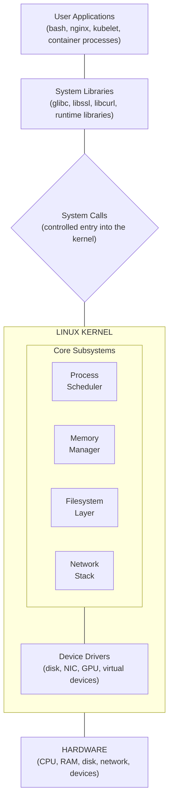
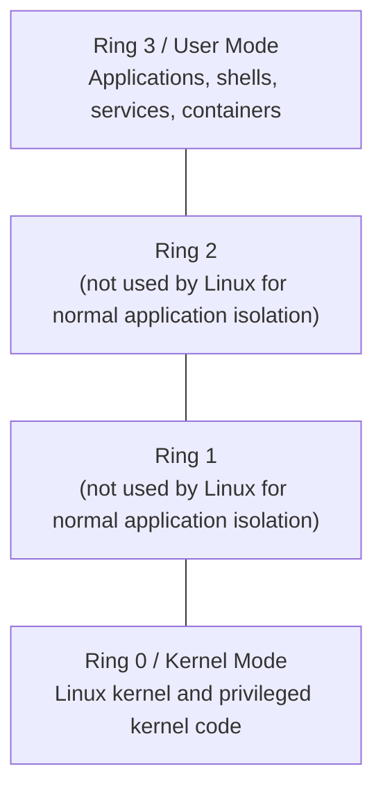
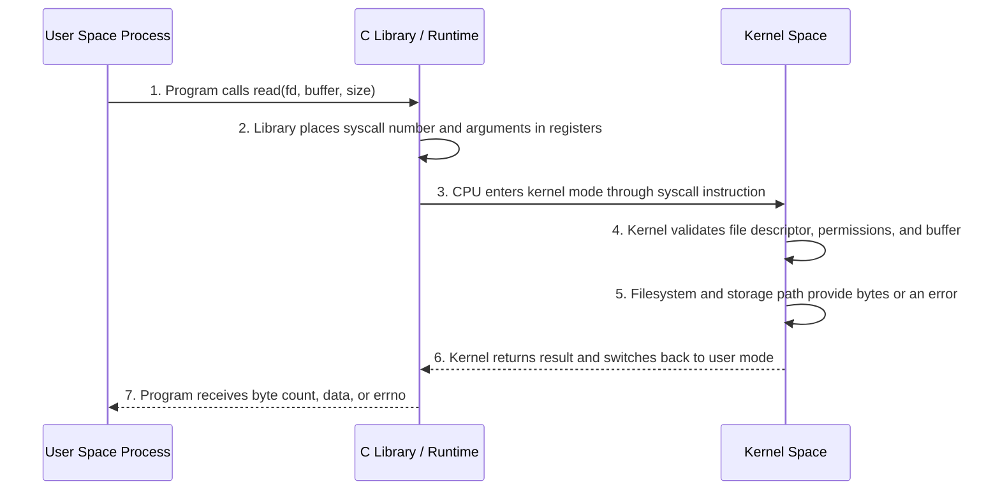
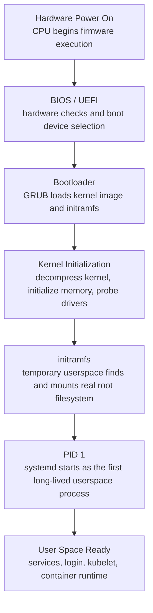
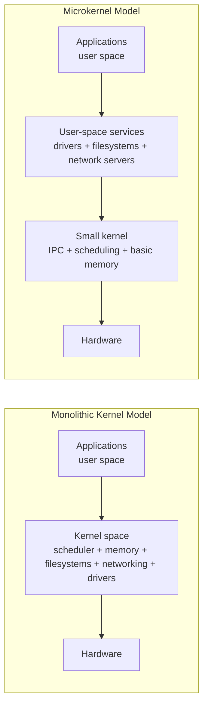
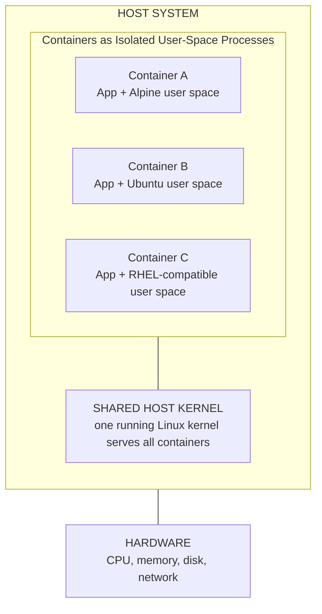
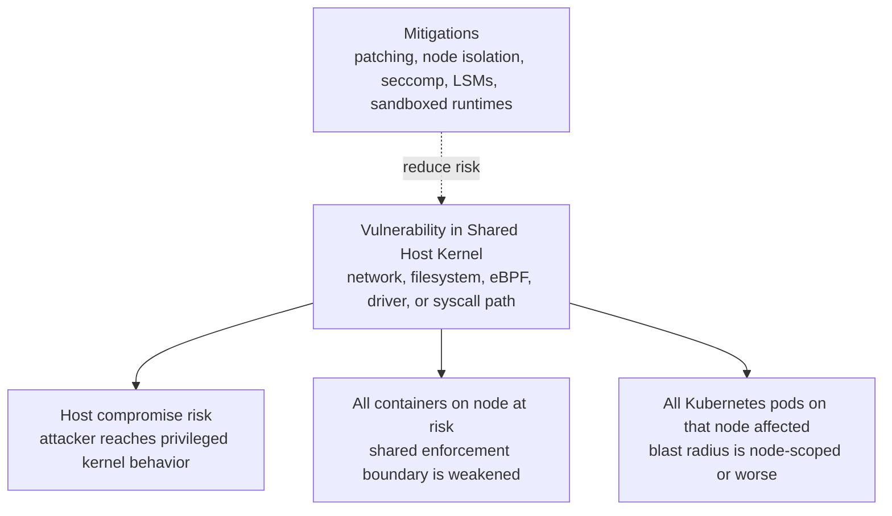

> **Complexity**: `[MEDIUM]`
>
> **Time to Complete**: 140–170 minutes (long-form read + hands-on exercise)
>
> **Prerequisites**: See [Prerequisites](#prerequisites) below

## Prerequisites

Before starting this module, you should be comfortable opening a terminal and running commands that inspect the local system. You do not need kernel-development experience, and you do not need to compile anything in this module. You will get the most value if you have access to one Linux environment such as a virtual machine, WSL2, a cloud instance, or a native Linux workstation. Docker or another container runtime is helpful for one optional comparison, but the core learning does not require containers.

You should already understand that an operating system runs programs, stores files, and manages hardware. This module turns that general idea into an operational model you can use when a Kubernetes node, container workload, or Linux host behaves in a surprising way. When Kubernetes examples appear later in the Linux track, define the short command alias `alias k=kubectl`; after that alias exists, commands such as `k describe node` use the curriculum's standard shorthand. The Kubernetes content in this module assumes modern clusters targeting Kubernetes 1.35+ behavior.

## Learning Outcomes

After this module, you will be able to:

- **Analyze** how the Linux kernel mediates between applications, hardware, and protected resources when a program reads files, opens sockets, or allocates memory.
- **Trace** a Linux boot sequence from firmware through bootloader, kernel initialization, `initramfs`, PID 1, and user-space service startup.
- **Compare** monolithic, modular monolithic, and microkernel designs using concrete trade-offs around performance, fault isolation, driver behavior, and operational risk.
- **Diagnose** kernel-adjacent failures by choosing and interpreting tools such as `uname`, `/proc`, `dmesg`, `lsmod`, `modinfo`, `strace`, and `systemd-analyze`.
- **Evaluate** container and Kubernetes node compatibility by reasoning about shared host kernels, kernel modules, cgroups, namespaces, eBPF, and kernel-version-dependent features.

## Why This Module Matters

At 03:10, an SRE is paged because a Kubernetes node has stopped admitting pods after a routine reboot. The kubelet process is running, the container runtime starts, and the application team insists nothing changed in their manifests. The company is a regional payments processor, so every minute of degraded node capacity pushes more traffic onto a smaller pool and increases payment latency during the morning settlement window. The useful clues are lower in the stack: a missing kernel module, a changed boot parameter, and a networking path that no longer behaves the way kube-proxy expects.

That situation is not rare. Linux problems often present themselves as application problems because every application eventually depends on the kernel. A database that performs thousands of tiny reads becomes a system-call and storage-path problem. A container image that runs on one node but fails on another becomes a kernel compatibility problem. A node that drops service traffic becomes a packet-filtering, connection-tracking, or CNI interaction problem. The application symptom is real, but the controlling evidence may live below the application.

This module teaches the kernel as an operating contract, not as trivia. You will build a mental model for where user space ends, where kernel space begins, how programs cross that boundary, and why containers are fast but not fully isolated like virtual machines. The goal is not to become a kernel developer. The goal is to recognize when the kernel is part of the incident, collect the right evidence before guessing, and explain the operational trade-off clearly enough that another engineer can challenge or confirm your diagnosis.

## 1. The Kernel as the System Contract

The Linux kernel is the privileged program that owns the hardware-facing decisions on a running system. Applications do not get to write directly to disks, program network cards, remap physical memory, or schedule themselves on CPU cores. They ask the kernel to do those things, and the kernel decides whether the request is valid, safe, and possible. That contract is why Linux can run unrelated workloads on one host without letting every process become its own miniature operating system.

That central authority matters because a Linux host is shared by many competing pieces of software. A shell, a web server, a container runtime, a monitoring agent, and the kubelet may all run at the same time. Without a kernel enforcing boundaries, one faulty process could overwrite another process's memory, monopolize CPU time, or corrupt the filesystem. The kernel is less like a helpful library and more like the building's switchboard, door system, elevator controller, and fire alarm combined: each tenant has work to do, but shared infrastructure must be coordinated by something trusted.

The kernel provides that authority through subsystems. The scheduler decides which runnable task gets CPU time and on which CPU it should run. The memory manager maps virtual memory to physical memory and enforces isolation between processes. Filesystem code turns file operations into block-device operations and metadata changes. The network stack turns sockets into packets, routes, filters, and connection state. Drivers translate generic kernel requests into hardware-specific actions for disks, network interfaces, GPUs, virtual devices, and storage controllers.



A useful way to reason about the kernel is to ask, "Who owns the resource?" The application owns its intent, such as "read this file" or "listen on this port." The kernel owns the authority to make that intent real. It checks permissions, coordinates hardware, records accounting data, and returns either a result or an error. When a program fails, this ownership question keeps you from treating every error as application logic or every slow request as a code problem.

This is why ordinary commands reveal kernel behavior. When `cat /etc/hostname` prints a short string, the interesting part is not the text output; the interesting part is the chain of kernel-mediated work. The process opens a file, the kernel checks permissions, the filesystem finds the inode, the storage path returns bytes, and the kernel copies those bytes back into the process. A simple command is a worked example of the operating contract.

```bash
cat /etc/hostname
```

If the command succeeds, the kernel has permitted and completed a file read. If it fails with `Permission denied`, the kernel has refused the request after evaluating permissions. If it hangs because storage is unhealthy, the application may look stuck, but the cause may live below the application in the kernel's I/O path. The same pattern applies to listening on ports, creating child processes, allocating memory, or opening a socket to another service.

> **Active learning prompt**: Before you run diagnostic commands, predict which part of the kernel contract is involved. If an application cannot bind to port 80, is the likely evidence in file permissions, networking permissions, process scheduling, or storage I/O?

The answer is networking permissions and process privilege. Binding to a low-numbered privileged port requires authority the kernel does not grant to ordinary processes by default. That does not mean the application is innocent, because it may have chosen the wrong port or dropped the wrong capability. It means a good diagnosis starts by matching the symptom to the kernel subsystem most likely to enforce or fail that request.

| User-Space Request | Kernel Subsystem Involved | Evidence to Collect | Practical Interpretation |
|---|---|---|---|
| Read or write a file | Filesystem and block I/O | `strace`, `mount`, file permissions | The process crosses into the kernel to access storage-backed data. |
| Open a TCP connection | Network stack and routing | `ss`, `ip route`, `strace` | The kernel owns sockets, ports, packet routing, and connection state. |
| Start a new process | Process scheduler and memory manager | `ps`, `strace`, cgroup data | The kernel creates task structures and address spaces for execution. |
| Allocate memory | Virtual memory manager | `/proc/<pid>/maps`, `free`, `vmstat` | The process receives virtual memory mappings, not raw physical RAM. |
| Load a device driver | Module loader and driver subsystem | `lsmod`, `modinfo`, `dmesg` | Kernel capabilities can change when modules are loaded or absent. |
| Enforce a container limit | cgroups and namespaces | `/proc`, `/sys/fs/cgroup`, runtime logs | Container behavior depends on kernel isolation and accounting features. |

The table is not a command reference; it is a diagnostic map. When a symptom appears, you choose tools based on the boundary being crossed. That is the difference between collecting evidence and running random commands until something looks suspicious. In a real incident, the strongest responders usually ask one precise question at a time: which resource is being requested, which kernel subsystem owns it, and what evidence would prove whether the request was allowed, delayed, transformed, or denied?

## 2. Kernel Space, User Space, and System Calls

Linux separates execution into user space and kernel space because trust levels are different. User-space programs are expected to be numerous, replaceable, and sometimes buggy. Kernel-space code is trusted with the whole system, so the CPU and operating system enforce a boundary around it. The boundary is not decorative; it is the reason a crashing shell should not corrupt disk metadata, a broken web server should not overwrite another process's memory, and a container process should not reprogram a network card directly.

Kernel space has direct access to privileged CPU instructions, device registers, low-level memory management, interrupt handling, and global scheduling decisions. User space does not. A browser tab, a database process, and a containerized workload all run with restrictions, even when they are important business applications. Libraries make the boundary feel smooth, but library convenience should not hide the design: protected operations still require controlled entry into the kernel.

| Kernel Space | User Space |
|---|---|
| Runs with high CPU privilege and can execute protected instructions. | Runs with restricted CPU privilege and must request protected operations. |
| Contains the kernel core, many drivers, and in-kernel subsystems. | Contains shells, services, libraries, tools, and containerized processes. |
| A severe fault can panic or destabilize the entire host. | A severe fault usually terminates only the offending process. |
| Owns hardware-facing decisions and global resource arbitration. | Owns application logic, user workflows, and service-specific behavior. |
| Exposes controlled entry points through system calls and interrupts. | Uses libraries and runtime code that eventually invoke system calls. |

The CPU helps enforce this separation. [On common x86 systems, Linux uses Ring 0 for the kernel and Ring 3 for user processes.](https://en.wikipedia.org/wiki/Protection_ring) The exact naming differs on other CPU architectures, and modern virtualization adds more layers, but the principle is the same: privileged code and ordinary application code do not run with the same authority. This is why a kernel bug has a different severity profile from an application bug, and why driver quality matters so much on production hosts.



System calls are the controlled bridge across that boundary. When a process calls a library function such as `read()`, `write()`, or `socket()`, the library prepares arguments and executes a CPU instruction that enters the kernel in a defined way. The kernel validates the request, performs the work if allowed, and returns control to the process. The process sees a return value or an error number, but the host has also performed permission checks, accounting, scheduling, and possibly hardware work.



The boundary crossing has cost, but it also has value. It costs CPU cycles because the processor changes privilege mode, the kernel validates data, and control returns to the application. It provides safety because the kernel can prevent invalid memory access, unauthorized file reads, unsafe hardware operations, and many classes of accidental damage. Most applications should not try to avoid the boundary entirely; they should avoid crossing it wastefully when batching, buffering, or a better algorithm can reduce repeated tiny requests.

### Worked Example: Use `strace` to See the Boundary

Suppose a developer says, "My command just lists a directory, so it should not involve the kernel much." That assumption is wrong because directory listing is a filesystem operation, and filesystems are kernel-mediated. We can demonstrate the boundary instead of debating it. The point is not to memorize every system call name on the first pass; the point is to notice that even familiar shell commands are asking the kernel for help many times.

Run the command below on a Linux system that has `strace` installed. If `strace` is missing on a Debian or Ubuntu machine, install it with `sudo apt-get update && sudo apt-get install -y strace` in a disposable learning environment. Avoid installing new debugging tools on production hosts during an incident unless your operational process allows it, because package changes can alter evidence and introduce their own risk.

```bash
strace -c ls /tmp
```

A typical summary includes calls such as `openat`, `newfstatat`, `getdents64`, `mmap`, `close`, and `write`. The exact counts vary by distribution, filesystem, library version, locale, and shell environment, so do not memorize the numbers. Focus on the pattern: even a simple command crosses into the kernel many times. If a workload repeats a similar tiny operation thousands of times per second, the cost can become visible as system CPU time, storage wait, or latency spikes.

```bash
strace -e openat,newfstatat,getdents64,write ls /tmp
```

That filtered trace is easier to read because it keeps only a few relevant calls. `openat` opens files relative to a directory file descriptor. `getdents64` reads directory entries. `write` sends output to the terminal. Each call is a request from user space to kernel space, and each request can succeed, fail, block, or return partial information depending on the resource and current system state.

Now apply the same method to a command that reads one file. The output makes it clear that `cat` does not "own" disk access; it asks the kernel to open and read the file. If the file is cached, the result may be fast because the kernel already has the data in memory. If the storage path is slow or unhealthy, the same command may reveal delays that have nothing to do with the `cat` program's own logic.

```bash
strace -e openat,read,write,close cat /etc/hostname
```

If you are diagnosing latency, this technique helps distinguish application compute from kernel-mediated work. A process burning CPU in pure calculation may make few system calls during the hot loop. A process that constantly reads tiny chunks from storage may spend significant time crossing the user-kernel boundary and waiting on I/O. The difference affects the fix: algorithm changes, batching, caching, file-layout changes, and storage investigation solve different problems than adding more application worker threads.

> **Active learning prompt**: Predict the difference between `strace -c true` and `strace -c find /usr -maxdepth 1 -type f`. Which one should make more filesystem-related system calls, and why would that matter during performance analysis?

The `find` command should make more filesystem-related calls because it must inspect directory entries and file metadata. That does not make `find` bad; it tells you what work is being requested from the kernel. In production, this same reasoning helps explain why metadata-heavy workloads can stress storage even when they read little file content. A backup scanner, image builder, or dependency resolver may spend more time asking questions about many files than reading a few large files.

| Diagnostic Goal | Command | What You Are Testing | How to Interpret the Result |
|---|---|---|---|
| Confirm kernel release | `uname -r` | Which running kernel serves all local processes | Match features and known issues to the actual running kernel, not just the distribution name. |
| See syscall categories | `strace -c <command>` | How often a command crosses into the kernel | High syscall counts can explain overhead for tiny repeated operations. |
| Inspect process mappings | `cat /proc/<pid>/maps` | How the kernel maps virtual memory for a process | Use it when debugging libraries, memory layout, or unexpected file-backed mappings. |
| Review boot and driver messages | `dmesg` | What the kernel reported while initializing hardware and modules | Useful for storage, network, driver, and early boot failures. |
| See loaded modules | `lsmod` | Which optional kernel components are active | Missing modules can break networking, storage, container, or security features. |
| Time boot phases | `systemd-analyze` | How long firmware, kernel, and user-space startup took | Separates kernel initialization delays from service startup delays. |

The key habit is to connect each tool to a question. `uname` is not kernel trivia; it answers which kernel implements the contract. `strace` is not debug noise; it shows boundary crossings. `dmesg` is not a long random log; it is where the kernel reports hardware, driver, security, and early boot events. Once you know the question, the output becomes evidence instead of a wall of text.

## 3. Boot: From Firmware to a Usable System

A Linux system does not begin with `systemd`, SSH, or Kubernetes. It begins with firmware that initializes enough hardware to find a bootloader. The bootloader then loads the kernel and an initial filesystem image so the kernel can finish discovering hardware and mount the real root filesystem. Only after those steps can the system start long-lived user-space services such as logging, networking, the container runtime, and kubelet.

This sequence matters operationally because different failures happen at different stages. A system stuck in firmware setup has not reached the bootloader. A system at a `grub>` prompt has not loaded the kernel correctly. A system showing `VFS: Unable to mount root fs` has reached the kernel but cannot mount the root filesystem. A system with a login prompt but no kubelet has booted the OS but failed in user-space service startup. Naming the stage reduces the search space immediately.



The bootloader is small compared with the kernel, but its role is critical. It knows where the kernel image is, which boot parameters to pass, and which `initramfs` image to load. When kernel updates go wrong, a broken bootloader entry can leave a machine unable to start even though the disk still contains a valid operating system. This is why bootloader configuration, boot partition capacity, and rollback entries matter on production fleets.

The `initramfs` stage is easy to overlook because it is temporary. It contains just enough userspace tooling and drivers to locate the real root filesystem. Encrypted disks, complex storage controllers, logical volumes, and network boot setups often depend on this stage. If the kernel lacks the required driver or the `initramfs` lacks required tooling, the root filesystem may never mount. In a Kubernetes environment, that means the node never reaches the point where kubelet could report anything useful.

Once the real root filesystem is available, the kernel starts PID 1. On most modern Linux distributions, PID 1 is `systemd`. From there, user-space startup begins: mounts are finalized, devices are managed, networking starts, logging begins, and services such as SSH, container runtime components, and kubelet are launched. PID 1 is not merely another service manager; it is the first long-lived user-space process started by the kernel, and the rest of the service tree depends on its supervision decisions.

You can inspect these stages after a successful boot. These commands do not repair a broken boot, but they teach you where evidence normally lives. Use them when comparing two hosts that are supposed to be identical, when investigating a slow reboot, or when confirming whether a boot parameter changed during an image rollout.

```bash
uname -r
cat /proc/cmdline
dmesg | head -n 30
systemd-analyze
systemd-analyze blame | head -n 15
```

`/proc/cmdline` is especially important because it shows the boot parameters the kernel actually received. Parameters can affect cgroup behavior, console output, security modules, filesystem handling, CPU mitigations, and other low-level behavior. When two nodes have the same package versions but different boot parameters, they may not behave the same. This is one reason node-image management must treat boot configuration as part of the platform, not as an afterthought.

```bash
cat /proc/cmdline
```

On some systems you might see parameters related to the root filesystem, console, quiet boot output, security modules, or cgroup hierarchy. Do not edit boot parameters casually. Treat them like infrastructure configuration: record the current state, understand the change, test on one node, and keep a rollback path. A one-word boot parameter can change how the kernel exposes cgroups, applies security modules, prints diagnostics, or handles CPU vulnerability mitigations.

> **Active learning prompt**: A server reaches `systemd emergency mode` after a kernel update, but the bootloader menu appears normally and the kernel starts printing messages. Which stage is probably working, and which stage should you inspect next?

The firmware and bootloader stages are probably working because the kernel has started. The next investigation should focus on kernel initialization, `initramfs`, root filesystem mounting, and early user-space dependencies. Evidence is likely in the console messages, `dmesg`, filesystem checks, mount configuration, storage drivers, or boot parameters. The most important discipline is to avoid jumping straight to application service logs when the machine has not yet completed the earlier boot stages.

| Startup Symptom | Likely Stage | Useful Evidence | First Diagnostic Question |
|---|---|---|---|
| Machine never shows a boot menu | Firmware or boot device selection | Console, firmware settings, disk presence | Did firmware find a bootable device at all? |
| System drops to `grub>` prompt | Bootloader | GRUB config, kernel image path, boot partition | Can the bootloader find its configuration and kernel image? |
| Kernel panic before mounting root | Kernel or `initramfs` | Console output, `initramfs` contents, driver support | Can the kernel access the storage path for the root filesystem? |
| Emergency mode after root mount | Early userspace | `journalctl -xb`, mount units, `/etc/fstab` | Did user space fail to mount or start a required dependency? |
| Login works but kubelet does not | Normal userspace service startup | `systemctl status kubelet`, logs, runtime status | Did the OS boot, while the Kubernetes service path failed later? |
| Boot is slow but succeeds | Timing across stages | `systemd-analyze`, `dmesg` timestamps | Is the delay in firmware, kernel initialization, or service startup? |

This stage-based approach prevents a common mistake: treating every startup failure as a general Linux failure. A boot problem is more diagnosable when you can name the last stage that worked and the next stage that failed. During an outage, that precision also helps route work. One engineer can inspect bootloader and console evidence while another verifies whether a recent node image changed kernel packages, `initramfs` generation, or boot parameters.

## 4. Architecture Choices: Monolithic, Modular, and Microkernel Designs

Operating systems make different choices about where services should run. A monolithic kernel places major operating-system services in kernel space. A microkernel keeps the privileged kernel very small and moves many services, such as drivers and filesystems, into user-space servers. [Linux is commonly described as monolithic, but in practice it is a modular monolithic kernel.](https://en.wikipedia.org/wiki/Linux_kernel) That phrase sounds academic until a production node fails because a module is missing, a driver misbehaves, or a kernel update changes an in-kernel interface.

In a pure monolithic design, core services can call each other directly inside the same privileged address space. That is fast because it avoids many message-passing and context-switching costs. The downside is blast radius: a severe bug in privileged code can damage the whole system. If a storage driver corrupts kernel memory, the scheduler, network stack, and user processes may all suffer even though the original bug lived in one component.

In a microkernel design, many services run outside the privileged kernel. That can improve fault isolation because a driver crash may be handled more like a service crash. The downside is that operations involving multiple services may require more messages and more transitions between protection domains. For workloads with heavy I/O or packet processing, that overhead can matter. The design trade-off is not morality; it is a choice about performance, fault boundaries, implementation complexity, and operational expectations.

Linux chose the performance and implementation advantages of a monolithic design while adding flexibility through loadable kernel modules. A module can add a driver, filesystem, packet-filtering feature, or other capability to the running kernel without requiring every possible feature to be built into the base kernel image. This makes Linux adaptable across laptops, cloud instances, embedded systems, bare-metal appliances, and Kubernetes nodes. It also means your running kernel is not only its release number; it is the release plus the configuration and modules available for that release.



The practical lesson is not that one architecture is always better. The lesson is to evaluate architecture by workload and failure mode. If a device driver crashes often, isolation is valuable. If a system must process packets at very high throughput, avoiding repeated protection-domain crossings may be valuable. If a platform must support many hardware combinations, modularity is valuable. Linux's design gives operators speed and broad hardware support, but it also asks them to treat kernel updates and module availability as serious platform work.

| Architecture | Where Major OS Services Run | Strength | Cost | Operational Question |
|---|---|---|---|---|
| Monolithic kernel | Mostly kernel space | Fast internal calls and mature integrated subsystems | Large privileged codebase means larger blast radius | Can you manage kernel updates, driver quality, and host isolation well? |
| Microkernel | Minimal kernel plus user-space services | Stronger service isolation and restart boundaries | More IPC and context-switch overhead for some paths | Is fault isolation more important than raw I/O path performance? |
| Modular monolithic kernel | Kernel space with loadable components | Linux-style balance of performance and runtime flexibility | Loaded module bugs still run with kernel privilege | Are required modules present, trusted, and version-compatible? |

Kernel modules are powerful because they change what the kernel can do. They are also risky because they run with kernel privilege once loaded. A faulty module is not like a faulty user-space process. It can corrupt memory, crash the system, or expose privileged attack surface. This is why production platforms should know which modules are expected, how they are loaded, whether they are built into the kernel, and whether a node image update changed the module directory for the running kernel.

You can inspect loaded modules with `lsmod`. The output shows the module name, approximate size, and usage count. Usage count is not a complete safety proof, but it helps explain dependency relationships. A module may be loaded because a device needed it, because another module depends on it, or because a service loaded it during startup. Do not assume that absence from `lsmod` always means absence of functionality, because some features are compiled directly into the kernel.

```bash
lsmod | head -n 20
```

You can inspect a module with `modinfo`. This often shows the filename, license, description, author, aliases, dependencies, and supported parameters. Some distributions split module packages from the main kernel package, so `modinfo` can also reveal whether the module exists on disk even if it is not loaded. When a node has the right user-space packages but the wrong module directory, `modinfo` often points you toward the mismatch faster than Kubernetes logs do.

```bash
modinfo overlay 2>/dev/null || modinfo ext4
```

Loading and unloading modules usually requires administrative privileges. Use these commands only in a safe lab or on a system you are allowed to administer. Removing an active driver or network module on a production system can interrupt services. Loading a module can also alter kernel behavior immediately, so treat it as a change, not as observation. A maintenance window, rollback plan, and peer review may be appropriate for production nodes.

```bash
sudo modprobe br_netfilter
sudo modprobe -r br_netfilter
```

A useful diagnostic pattern is to separate "module absent on disk" from "module present but not loaded." If `modinfo overlay` fails, the module may not be installed for the running kernel. If `modinfo overlay` succeeds but `lsmod` does not show it, the module exists but is not currently active. If a feature is built in, neither conclusion is sufficient by itself, so you may need kernel configuration, runtime behavior, and component logs to complete the diagnosis.

```bash
if modinfo overlay >/dev/null 2>&1; then
  echo "overlay module exists for this running kernel"
else
  echo "overlay module metadata not found for this running kernel"
fi

if lsmod | grep -q '^overlay'; then
  echo "overlay module is loaded"
else
  echo "overlay module is not currently loaded"
fi
```

> **Active learning prompt**: A Kubernetes node has the same Linux distribution as the rest of the fleet, but `modinfo overlay` fails only on that node. Would you investigate Kubernetes manifests first, or the installed kernel package and module directory for the running kernel?

Start with the running kernel and module directory. Kubernetes may report the failure, but the missing capability is below Kubernetes. A node can have the correct user-space packages and still lack modules for the kernel it actually booted. The distribution name does not prove the kernel package, booted kernel, module package, and runtime expectations are aligned.

## 5. Kubernetes-Relevant Kernel Capabilities

Kubernetes is often described as a container orchestrator, but the Linux kernel does much of the enforcement. Container runtimes use namespaces for isolation, cgroups for resource accounting and limits, filesystem features for image layers, and networking features for pod and service traffic. Kubernetes schedules pods, but the node kernel makes many of the promises real. This is why a cluster can fail in ways that are invisible from YAML alone.

That means node readiness is partly a kernel-readiness problem. If the required filesystem driver is missing, container image layers may not mount. If bridge packet filtering is disabled, pod networking may not behave as expected. If cgroups are configured differently across nodes, resource behavior can diverge even when Kubernetes manifests are identical. In Kubernetes 1.35+ environments, the platform expectation is not merely that a node runs Linux; the expectation is that its kernel, runtime, cgroup mode, modules, and security features match the cluster design.

| Kernel Capability | Common Linux Mechanism | Kubernetes or Container Use | Failure Pattern |
|---|---|---|---|
| Filesystem layering | `overlay` / OverlayFS | Container image layers and writable container filesystems | Containers fail to start or fall back to unsupported storage behavior. |
| Network bridge filtering | `br_netfilter` and netfilter hooks | Pod networking, kube-proxy, and some CNI expectations | Pod-to-pod or service traffic behaves inconsistently. |
| Connection tracking | `nf_conntrack` | Service routing, NAT, and stateful packet handling | Connections reset, NAT breaks, or service traffic becomes unreliable. |
| IPVS load balancing | `ip_vs` family modules | kube-proxy IPVS mode | kube-proxy falls back or fails to initialize expected mode. |
| Resource control | cgroups v1 or v2 | Pod CPU, memory, and process accounting | Limits, metrics, or runtime behavior differ across nodes. |
| Process and network isolation | namespaces | Container PID, mount, network, IPC, and user isolation | Containers leak visibility or fail to start with expected isolation. |
| Observability and policy hooks | eBPF support | Cilium, Falco, tracing, and security tooling | Advanced networking or runtime detection features are unavailable. |

The exact module list depends on your distribution, kernel build, container runtime, and CNI plugin. Do not cargo-cult one checklist into every environment. Instead, learn to connect the symptom to the feature. Overlay problems point toward filesystem support. Service-routing problems point toward netfilter, IPVS, connection tracking, routing, or CNI configuration. Resource-limit problems point toward cgroups, kubelet configuration, runtime configuration, and metrics collection.

The following command checks a small set of modules that commonly matter on Kubernetes nodes. It is intentionally a starting point, not a universal certification test. On some distributions, a feature may be built into the kernel instead of shown as a loaded module. Treat the output as one piece of evidence, then correlate it with kernel logs, component logs, runtime behavior, and the documented design for your node image.

```bash
for mod in overlay br_netfilter ip_vs nf_conntrack; do
  if lsmod | grep -q "^${mod}"; then
    echo "${mod}: loaded"
  else
    echo "${mod}: not loaded"
  fi
done
```

Some kernel features are built directly into the kernel instead of loaded as modules. In that case, `lsmod` will not show a module even though the feature exists. That is why a robust diagnosis combines module checks with runtime behavior, kernel configuration where available, and component logs. When two nodes disagree, compare the actual running kernel, module availability, boot parameters, runtime configuration, and node image provenance before changing Kubernetes manifests.

You can inspect cgroup layout with mount information. On modern distributions, [cgroups v2 is common, and many Kubernetes environments now expect it.](https://kubernetes.io/docs/concepts/architecture/cgroups/) Mixed cgroup modes across nodes can cause confusing differences in metrics, limits, and runtime behavior. A workload may appear correctly specified in Kubernetes while the node enforces or reports resources differently because the runtime and kernel are using a different hierarchy.

```bash
mount | grep cgroup
stat -fc %T /sys/fs/cgroup
```

If the filesystem type reports `cgroup2fs`, the system is using the unified cgroups v2 hierarchy at that mount point. If you see multiple `cgroup` mounts for separate controllers, you are likely looking at cgroups v1 or a hybrid arrangement. The Kubernetes version target for this curriculum is 1.35+, so you should expect modern clusters to be designed around current runtime and cgroup behavior. Mixed modes are not automatically broken, but they deserve a deliberate compatibility decision.

Kernel logs can show module loading, driver errors, network warnings, and boot-time configuration. On many systems, unprivileged users can read some logs, but hardened systems may restrict `dmesg`. If access is denied, use an administrative account or `journalctl -k` where policy permits. The important idea is not the exact log command; it is that kernel evidence is different from kubelet evidence, and both may be needed.

```bash
dmesg | grep -Ei 'overlay|br_netfilter|conntrack|ip_vs|cgroup' | tail -n 30
journalctl -k --no-pager | grep -Ei 'overlay|br_netfilter|conntrack|ip_vs|cgroup' | tail -n 30
```

### Worked Diagnosis: kube-proxy Cannot Use IPVS

Imagine kube-proxy logs say it cannot initialize IPVS mode on one node. A weak response is to restart kube-proxy repeatedly. A stronger response is to test whether the kernel can provide [the IPVS capability that kube-proxy requested](https://kubernetes.io/docs/reference/networking/virtual-ips/). This distinction matters because a restart may clear a transient service problem, but it will not create a missing kernel feature or install module files for the running kernel.

First, check whether IPVS-related modules are loaded. The exact module names vary with protocol and scheduler support, but `ip_vs` is the core signal. If it appears, continue to kube-proxy configuration and logs. If it does not appear, avoid concluding too early; the feature might be built in, unavailable, or simply not loaded yet.

```bash
lsmod | grep '^ip_vs'
```

If nothing appears, check whether the module exists for the running kernel. This distinguishes "not loaded yet" from "not installed or unavailable for this kernel." A failure here points toward kernel packaging, node image drift, or a kernel release mismatch. It does not point first toward pod manifests, because pod manifests do not install host kernel modules.

```bash
modinfo ip_vs
```

If `modinfo` succeeds, load the module in a controlled maintenance context and watch for kernel messages. If `modinfo` fails, inspect the kernel package and module directory for the running kernel instead of changing Kubernetes resources. Finally, re-check kube-proxy logs and confirm the selected mode. The key is that the Kubernetes symptom is verified through kernel evidence. You are not guessing that IPVS is missing; you are proving whether the running kernel can supply it.

```bash
sudo modprobe ip_vs
dmesg | tail -n 20
```

> **Active learning prompt**: If a node's kube-proxy falls back from IPVS to iptables mode, what could still be healthy about the node, and what would you verify before declaring the node broken?

The node may still run pods and pass basic readiness checks because iptables mode is a valid kube-proxy mode in many environments. You would verify the intended cluster configuration, kube-proxy logs, kernel module availability, service-routing behavior, and whether the fallback violates the platform's performance or consistency requirements. A healthy node is one that matches the design, not merely one that can start a pod.

## 6. Containers Share the Host Kernel

A container image contains user-space files: application binaries, libraries, package metadata, shells, and configuration. It does not carry its own Linux kernel in the way a virtual machine carries its own guest operating-system kernel. [When a process inside a Linux container makes a system call, it enters the host kernel.](https://www.docker.com/resources/what-container) That simple fact explains both the speed and the risk profile of containers.

That shared-kernel model is the central reason containers are lightweight. There is no separate guest kernel booting for each container. The same host kernel schedules container processes, enforces cgroups, applies namespaces, handles sockets, and provides filesystem operations. Container isolation is real, but it is isolation implemented by one shared kernel. If the shared kernel lacks a feature, every container that needs the feature is affected; if the shared kernel has a severe vulnerability, the enforcement boundary for the node is at risk.



You can observe this directly if Docker or a compatible runtime is available. The kernel release printed inside different Linux containers should match the host because `uname` asks the running kernel for its release. The container image changes user-space tools, not the kernel underneath. This is why a container can look like Alpine or Ubuntu while still reporting the same kernel release as the node.

```bash
echo "Host kernel: $(uname -r)"

docker run --rm alpine uname -r
docker run --rm ubuntu uname -r
```

If Docker is unavailable, the concept still applies to Linux containers in general. The important point is that the system call path goes from the containerized process into the host kernel. A container can have an old user-space distribution and still run on a new host kernel, or it can have a new user-space distribution and fail because the host kernel lacks a needed feature. Compatibility is therefore a conversation between application binaries, user-space libraries, runtime settings, and the host kernel.

| Runtime Model | Kernel Ownership | Isolation Boundary | Practical Consequence |
|---|---|---|---|
| Bare process | Host kernel | Normal process boundaries | Fastest and simplest, with no container packaging boundary. |
| Linux container | Shared host kernel | Namespaces, cgroups, capabilities, seccomp, LSMs | Lightweight, but kernel bugs and missing kernel features affect containers. |
| Virtual machine | Guest kernel plus host hypervisor | Hardware virtualization boundary | Stronger kernel separation, with more overhead and operational complexity. |
| Sandboxed container runtime | Extra mediation or lightweight VM depending on technology | Runtime-specific isolation layer | Useful for untrusted workloads, with compatibility and performance trade-offs. |

This shared-kernel model has security implications. If a container escape exploits a kernel vulnerability, the attacker is not just escaping one application directory. They are attacking the component that enforces isolation for the whole host. That is why kernel patching, workload isolation, node pools, [seccomp, AppArmor or SELinux](https://kubernetes.io/docs/concepts/security/linux-kernel-security-constraints/), and runtime hardening all matter. Non-root containers and dropped capabilities are important controls, but they do not turn a shared kernel into a separate guest kernel.



Compatibility is the other major implication. A container image may include binaries that expect a newer syscall, a filesystem behavior, or a cgroup interface that the host kernel does not support. In that case, changing the image alone may not solve the problem. The host kernel is the component that implements the missing behavior. This is why vendor requirements that mention a minimum kernel version must be checked against running nodes, not against the operating-system name printed in an image label.

| Feature Area | Why Kernel Version Matters | Example Operational Decision |
|---|---|---|
| Namespaces | Container isolation depends on namespace support and maturity. | Validate rootless or user-namespace features before promising tenant isolation. |
| cgroups | Resource enforcement differs between cgroups v1 and v2. | Standardize node pools so runtime and kubelet expectations match. |
| eBPF | Advanced networking and security tools depend on kernel verifier and helper support. | Check Cilium or Falco requirements against the actual node kernel. |
| Filesystems | Container image layers and volumes depend on kernel filesystem behavior. | Confirm OverlayFS and storage-driver support before adding nodes. |
| Network filtering | Service routing and policy depend on netfilter, nftables, IPVS, or eBPF paths. | Align kube-proxy, CNI, and kernel capability choices across the cluster. |
| Security controls | seccomp, AppArmor, SELinux, and capabilities rely on kernel enforcement. | Treat disabled security features as platform risk, not merely runtime configuration. |

A senior-level habit is to evaluate the node as the product of distribution, kernel release, boot parameters, loaded modules, runtime configuration, and Kubernetes settings. The distribution name alone is too vague. "Ubuntu" or "RHEL-compatible" does not tell you which kernel is running, which modules are available, or how cgroups are mounted. In Kubernetes terms, a node should be admitted to a pool because it satisfies an evidence-backed contract, not because it has a familiar logo in an image name.

Use this compact inspection sequence when you need a first-pass node profile. It does not replace deeper debugging, but it quickly answers whether the node looks like its peers. The command deliberately prints the running kernel, boot parameters, cgroup filesystem type, selected module status, and recent kernel messages about container-adjacent features. That is enough to decide whether to keep investigating the kernel layer or move upward into runtime and Kubernetes configuration.

```bash
echo "Kernel release: $(uname -r)"
echo "Kernel command line:"
cat /proc/cmdline

echo
echo "Cgroup filesystem type:"
stat -fc %T /sys/fs/cgroup

echo
echo "Selected modules:"
for mod in overlay br_netfilter ip_vs nf_conntrack; do
  lsmod | grep -q "^${mod}" && echo "${mod}: loaded" || echo "${mod}: not loaded"
done

echo
echo "Recent kernel messages mentioning container-adjacent features:"
dmesg 2>/dev/null | grep -Ei 'overlay|cgroup|conntrack|br_netfilter|ip_vs' | tail -n 20
```

> **Active learning prompt**: A vendor says their container requires Linux kernel 6.8 or newer because it uses a newer kernel feature. Your cluster has mixed node pools. What would you check before deploying the workload widely?

Check the actual running kernel on every eligible node pool, not only the operating-system image name. Then verify boot parameters, required modules, cgroup mode, runtime configuration, and any feature-specific vendor requirements. If only some nodes qualify, constrain scheduling through labels, taints, tolerations, runtime classes, or separate node pools rather than relying on chance. The deployment decision should encode the kernel requirement so the scheduler cannot accidentally place the workload on an incompatible node.

## Patterns & Anti-Patterns

### Pattern: Build a Kernel Evidence Baseline for Every Node Pool

A reliable platform has a written baseline for the kernel release family, boot parameters, cgroup mode, required modules, expected security modules, and container runtime assumptions for each node pool. Use this pattern when you operate more than one node image, run mixed hardware, or support workloads with kernel-sensitive requirements such as eBPF networking, GPU drivers, IPVS, storage plugins, or strict security policy. The pattern works because it turns kernel facts into platform inventory instead of rediscovering them during incidents. At small scale, a simple inspection script and runbook may be enough; at larger scale, collect the same facts through node inventory, admission checks, or compliance automation.

### Pattern: Diagnose from the Failing Boundary Outward

When a symptom appears, map it to the boundary the process is crossing before choosing tools. A failed bind points toward socket permissions, capabilities, and network stack state. A storage-driver error points toward filesystem support, mount behavior, and module availability. A boot failure points toward the last successful boot stage rather than Kubernetes service configuration. This pattern scales because it keeps responders from mixing unrelated layers. Start with the boundary that enforces the request, collect one piece of evidence, and then move outward to user-space configuration or hardware only when the evidence supports that direction.

### Pattern: Treat Kernel Changes as Platform Releases

Kernel updates, module package changes, boot-parameter changes, and driver changes should move through the same kind of controlled release thinking as application deployments. Use canaries, rollback entries, node draining, workload placement controls, and explicit verification before broad rollout. This pattern works because kernel changes can alter every workload on the host, including workloads that were not redeployed. The scaling consideration is coordination: application owners may see the blast radius first, but platform owners must own the host contract that changed below them.

### Anti-Pattern: Debugging Kubernetes Symptoms Without Host Evidence

Teams fall into this anti-pattern because Kubernetes provides convenient logs, events, and resource descriptions, while host evidence can require shell access or elevated permissions. The result is repeated restarts of kubelet, kube-proxy, or pods while the underlying kernel capability remains unchanged. The better alternative is to correlate the Kubernetes symptom with kernel evidence such as `uname -r`, `/proc/cmdline`, `lsmod`, `modinfo`, cgroup mounts, and kernel logs. Kubernetes is the control plane, but the node kernel enforces many of the promises.

### Anti-Pattern: Assuming Module Absence and Feature Absence Are Identical

This mistake happens when operators treat `lsmod` as a complete truth source. A module missing from `lsmod` may be unloaded, unavailable, built directly into the kernel, blocked by policy, or unnecessary for that kernel configuration. The better alternative is to distinguish loaded state, on-disk module metadata, built-in configuration, runtime behavior, and component logs. That distinction prevents both false alarms and dangerous fixes, especially when a well-intentioned operator tries to load or remove modules on a production host without proving the real failure mode.

### Anti-Pattern: Treating Containers Like Small Virtual Machines

Containers feel like machines because they have filesystems, process lists, package managers, and shells, so teams sometimes assume they carry their own kernel. That assumption breaks compatibility planning and security analysis. The better alternative is to describe containers as isolated user-space processes that share the host kernel. If a workload needs a different kernel, use a compatible node pool, a virtual machine, a sandboxed runtime where appropriate, or an application change; do not expect a container image to replace the node kernel.

## Decision Framework

When a Linux or Kubernetes symptom looks kernel-adjacent, first decide which layer last proved healthy. For boot incidents, identify whether firmware, bootloader, kernel initialization, `initramfs`, root mount, PID 1, and service startup each completed. For runtime incidents, identify whether the application crossed a file, socket, process, memory, or container-isolation boundary. This first decision prevents layer confusion. A node stuck at a bootloader prompt does not need kubelet debugging; a service denied access to a privileged port does not first need storage tuning.

Next, decide what kind of evidence would falsify your leading theory. If you suspect a missing module, `modinfo` can prove whether metadata exists for the running kernel, while `lsmod` can show whether a loadable module is active. If you suspect a boot-parameter change, `/proc/cmdline` gives the running truth, not a desired configuration file. If you suspect syscall overhead, `strace -c` can show whether the process is crossing into the kernel repeatedly. Evidence that can falsify your theory is more valuable than evidence that merely feels related.

Then choose the least disruptive observation path before mutation. Reading `/proc`, `dmesg`, `journalctl -k`, `lsmod`, `modinfo`, cgroup mounts, and runtime logs is normally safer than restarting services or loading modules. Once you need to mutate the host, treat the change as operational work: drain workloads if necessary, preserve evidence, document the expected outcome, and confirm rollback. The kernel is shared infrastructure, so a small command can have a wider blast radius than its shell prompt suggests.

Finally, decide how the finding should be encoded so the same failure does not return. A one-time fix may load a module, regenerate an `initramfs`, correct a bootloader entry, or replace a node image. A durable platform fix may add node-pool validation, image tests, a preflight script, scheduling constraints, documentation, or monitoring. The best response is not merely "the node works again." The best response explains which kernel contract was broken, how it was proven, how it was repaired, and how future nodes will be kept inside the expected contract.

| Decision Point | Prefer This When | Avoid This When | Evidence That Should Decide |
|---|---|---|---|
| Investigate kernel first | The symptom involves boot, drivers, modules, cgroups, namespaces, storage drivers, low-level networking, or host-wide security behavior. | The evidence shows a clear application configuration error with no host-level signal. | `dmesg`, `/proc/cmdline`, `uname -r`, module checks, cgroup mounts, and runtime logs. |
| Investigate Kubernetes first | The node kernel baseline matches peers and the symptom follows a manifest, controller, scheduling, or policy change. | The symptom appears only on nodes with different kernel releases, modules, or boot parameters. | Events, controller logs, pod specs, kubelet logs, and comparison across node pools. |
| Change the node image | Many nodes need the same kernel, module, boot, or runtime correction. | One node is damaged or manually drifted while the image baseline is correct. | Image build records, package inventory, boot tests, and node-pool comparison. |
| Use scheduling constraints | Only some nodes satisfy a legitimate kernel or runtime requirement. | All nodes are expected to support the workload and incompatibility is accidental drift. | Node labels, taints, runtime class, vendor requirements, and kernel inventory. |
| Use a VM or sandboxed runtime | Workloads require stronger kernel separation or incompatible kernel behavior. | The problem is ordinary packaging, configuration, or missing host validation. | Threat model, compatibility requirements, performance budget, and operational complexity. |

## Did You Know?

- **[Linux 1.0 was released in 1994](https://en.wikipedia.org/wiki/Linux_kernel_version_history), and modern Linux keeps the monolithic design while adding extensive modularity.** Loadable kernel modules let Linux add drivers and features at runtime, but loaded module code still runs with kernel privilege and can affect the whole host.
- **A container's `uname -r` reports the host kernel.** The user-space distribution inside the image may look like Alpine, Ubuntu, or another distribution, but system calls still reach the node's running kernel.
- **PID 1 is special because the kernel starts it directly.** If PID 1 exits unexpectedly, the system cannot behave like an ordinary service failure because the first user-space process anchors the rest of startup.
- **`/proc` is not a normal directory of stored files.** It is [a kernel-provided view into live system and process state](https://en.wikipedia.org/wiki/Procfs), which is why values under `/proc` can change while the system runs.

## Common Mistakes

| Mistake | Why It Happens | How to Fix It |
|---|---|---|
| Treating the distribution name as the kernel version | Two nodes can run the same distribution release while booting different kernel releases or different parameters. | Check `uname -r`, `/proc/cmdline`, module availability, and cgroup mode on the running node before drawing compatibility conclusions. |
| Assuming containers provide their own kernels | Container images include user-space files, so they feel like small machines even though their system calls enter the host kernel. | Validate host kernel compatibility before deploying images that need specific syscalls, cgroup behavior, filesystem features, or eBPF support. |
| Restarting Kubernetes components before checking kernel evidence | kubelet or kube-proxy may report symptoms caused by missing modules, boot parameters, cgroup differences, or driver failures. | Use `lsmod`, `modinfo`, `dmesg`, `/proc/cmdline`, cgroup checks, and runtime logs to confirm the underlying capability. |
| Loading or removing modules casually on production nodes | Kernel modules run with high privilege, and unloading active modules can disrupt storage, networking, security, or observability. | Test module changes in a lab, document dependencies, drain workloads where needed, and roll changes through controlled node maintenance. |
| Reading `dmesg` as random noise | Kernel logs are verbose, and many messages look unrelated until you filter by subsystem and time window. | Filter logs by storage, network, cgroup, module, boot, or driver keywords, then correlate messages with the failure or reboot timeline. |
| Ignoring the user-kernel boundary in performance work | Many tiny reads, writes, stats, or network calls can spend time crossing into the kernel repeatedly. | Use `strace -c`, profiling tools, and application batching or caching changes to reduce unnecessary boundary crossings where evidence supports it. |
| Weakening isolation assumptions because containers feel lightweight | Containers are isolated by shared-kernel features, so a kernel vulnerability can affect all workloads on a node. | Combine patching, least privilege, seccomp, Linux security modules, node isolation, and sandboxed runtimes where the threat model requires them. |

## Quiz

<details>
<summary>A developer moves a legacy service from a CentOS-based virtual machine into a CentOS-based container image. The service checks `uname -r`, sees the host's modern kernel instead of the old release it expected, and refuses to start. How would you diagnose the mismatch, and what design decision should the team make next?</summary>

The container is using the host kernel because Linux containers package user space, not a separate guest kernel. Verify this by comparing `uname -r` on the host and inside the container, then explain that the container image cannot provide the old kernel ABI by itself. The team should either update the application to support the host kernel, run it on a compatible node pool if that is safe, or keep it in a virtual machine if it truly requires its own older guest kernel. The reasoning matters because changing the image base alone cannot change the kernel serving the process.
</details>

<details>
<summary>After a node image update, kube-proxy logs that it cannot initialize IPVS mode and falls back to another mode. Pods still start, so one engineer argues the alert can be ignored. What evidence would you collect before deciding whether this is acceptable?</summary>

Check the intended kube-proxy configuration, then inspect whether IPVS kernel support exists and is loaded with `lsmod | grep '^ip_vs'` and `modinfo ip_vs`. Review kube-proxy logs and kernel messages for module or permission failures. If the platform standard requires IPVS for performance or consistency, the fallback is configuration drift even if pods start. If the cluster intentionally supports another mode, the event may be lower severity, but the node should still match the documented design.
</details>

<details>
<summary>A database workload shows high CPU time in system mode, while application metrics show thousands of tiny file reads per second. The team wants to add more CPU cores immediately. How would you analyze whether the kernel boundary is part of the problem?</summary>

Use tools such as `strace -c` on a representative process or a safe reproduction to count filesystem-related system calls such as `read`, `pread64`, `openat`, and metadata calls. High system time with many small reads suggests the workload repeatedly crosses into the kernel and waits on I/O path work. Adding CPU might help only partially if the main cost is syscall overhead or storage latency. A better fix may include batching reads, improving caching, changing access patterns, or tuning storage behavior after confirming the evidence.
</details>

<details>
<summary>A bare-metal server reboots after a kernel update and stops at a `grub>` prompt. Another engineer starts investigating kubelet configuration because the node disappeared from the cluster. Which boot stage failed, and why is kubelet investigation premature?</summary>

The failure is at the bootloader stage. Firmware found a boot path and reached GRUB, but GRUB could not proceed to load the configured kernel image, `initramfs`, or configuration. Kubelet has not started because the kernel and user-space service startup have not completed. The correct investigation starts with bootloader configuration, boot partition contents, kernel image paths, and `initramfs` availability.
</details>

<details>
<summary>A security team proposes delaying a host kernel patch because all workloads run as non-root containers with restricted Linux capabilities. The vulnerability is in the host kernel networking stack. How would you evaluate that risk?</summary>

The assessment is unsafe because the networking stack is part of the shared host kernel that enforces isolation for every container on the node. Non-root containers and restricted capabilities reduce risk, but they do not remove the vulnerable kernel path. Evaluate exploitability, exposure, available mitigations, and maintenance windows, but treat kernel patching as node-level security work rather than an optional application-container update. The decision should account for node blast radius, workload placement, and compensating controls.
</details>

<details>
<summary>A node boots successfully and accepts SSH, but containers fail to start with storage-driver errors after a custom minimal kernel package was installed. What kernel evidence would you collect, and what outcome would confirm your hypothesis?</summary>

Check the running kernel with `uname -r`, inspect whether OverlayFS support exists with `modinfo overlay`, and check whether it is loaded with `lsmod | grep '^overlay'`. Review `dmesg` or `journalctl -k` for filesystem and module messages. If `modinfo overlay` fails for the running kernel or kernel logs show OverlayFS support missing, the failure is likely a kernel capability problem rather than a container image problem. If the feature is built in, confirm that through configuration and runtime behavior before moving on.
</details>

<details>
<summary>A platform team wants to deploy an eBPF-based networking and security tool across a cluster with mixed kernel versions. The vendor documentation says advanced features require newer kernel helpers. What rollout plan would demonstrate senior-level judgment?</summary>

First inventory actual running kernels, boot parameters, cgroup mode, and required kernel configuration across node pools. Then map vendor feature requirements to the node inventory and create labels or separate pools for compatible nodes. Roll out to a small compatible pool, verify tool health and workload networking, and prevent scheduling on incompatible nodes until they are upgraded or explicitly excluded. The key is to treat kernel capability as a scheduling and platform-design constraint, not as a note buried in vendor documentation.
</details>

<details>
<summary>Your team is comparing monolithic, modular monolithic, and microkernel designs for an appliance that needs high packet throughput but also has an unreliable third-party driver. Which trade-off would you surface in the design review?</summary>

The review should name both sides of the trade-off instead of declaring one architecture universally better. A monolithic or modular monolithic design can keep packet processing fast because major subsystems and drivers can interact inside kernel space with fewer protection-domain crossings. A microkernel-style design can improve fault isolation by moving more services outside the privileged kernel, but it may add IPC and context-switch overhead on hot paths. For this appliance, the decision should weigh packet throughput requirements against the blast radius of the unreliable driver, and Linux's modular monolithic model should be treated as flexible but not isolated once the driver is loaded.
</details>

## Hands-On Exercise

### Objective

Build a kernel evidence report for a Linux host and use it to reason about containers, boot, system calls, modules, and Kubernetes-relevant capabilities. The exercise is designed to be safe on a lab machine; do not load or remove modules on production systems unless you have explicit operational approval. If you are also checking a Kubernetes node, define `alias k=kubectl` before using the short `k` form, and use `k describe node` only against a cluster where you are allowed to inspect node state.

### Part 1: Identify the Running Kernel and Boot Parameters

Start by recording the kernel that is actually running. This is the kernel serving local processes and any containers on the host, regardless of which kernel packages may also be installed on disk. Your notes should separate the kernel release, distribution suffix, architecture, and boot parameters because those facts can drift independently.

```bash
uname -r
uname -a
cat /proc/version
cat /proc/cmdline
```

Write down the kernel release, the distribution suffix if present, and any boot parameters that look related to cgroups, security modules, console output, root filesystem, or CPU mitigations. If you do not understand a parameter yet, mark it as "needs investigation" rather than guessing. A mature report distinguishes observed facts from interpretations.

<details>
<summary>Solution: Part 1</summary>

Your output will vary by distribution and host type. `uname -r` is the most important compatibility value because it reports the running kernel release, while `/proc/cmdline` reports the boot parameters actually passed to that kernel. A good note might say, "Kernel release X is running; cgroup-related boot parameters are present or absent; security module parameters are present or absent; unknown parameter Y needs follow-up." The exact values matter less than the discipline of recording what the running system proves.
</details>

### Part 2: Inspect Kernel Logs from Boot

Review early kernel messages and then search for messages related to memory, storage, networking, cgroups, and container-adjacent features. Some systems restrict `dmesg`; use `journalctl -k` if that is how your environment exposes kernel logs. Your goal is not to read every line, but to find evidence that connects hardware, drivers, boot parameters, or kernel subsystems to later operational behavior.

```bash
dmesg | head -n 40
dmesg | grep -Ei 'memory|storage|network|cgroup|overlay|conntrack|br_netfilter|ip_vs' | tail -n 40
journalctl -k --no-pager | grep -Ei 'memory|storage|network|cgroup|overlay|conntrack|br_netfilter|ip_vs' | tail -n 40
```

Answer these questions in your notes: What hardware or virtual hardware did the kernel detect early? Did the kernel report anything about cgroups or container-related modules? Are there warnings that would matter if this host were a Kubernetes node? If the logs are restricted, record the restriction as part of the report because access policy affects future incident response.

<details>
<summary>Solution: Part 2</summary>

A useful answer names at least one subsystem and one piece of evidence. For example, you might find cgroup hierarchy messages, network driver initialization, storage controller messages, or no relevant warnings. If both `dmesg` and `journalctl -k` are unavailable to your user, your report should say that kernel log access requires elevated permission in this environment. That is still useful operational information because an on-call process must know who can retrieve kernel logs during an incident.
</details>

### Part 3: Map Loaded and Available Modules

List loaded modules and inspect at least one module that exists on your system. Then test whether common container or Kubernetes-related modules are loaded or merely available. Interpret this section carefully because loaded, available, built-in, and absent are different states with different operational meanings.

```bash
lsmod | head -n 30
lsmod | wc -l

for mod in overlay br_netfilter ip_vs nf_conntrack; do
  echo "== ${mod} =="
  if lsmod | grep -q "^${mod}"; then
    echo "loaded"
  else
    echo "not loaded"
  fi

  if modinfo "${mod}" >/dev/null 2>&1; then
    echo "available on disk for this kernel"
  else
    echo "module metadata not found for this kernel"
  fi
done
```

Interpret the results carefully. A module that is not loaded may still be available. A feature may also be built into the kernel and therefore not appear as a loaded module. Your report should distinguish what you proved from what remains uncertain, especially if the host would be used as a Kubernetes node.

<details>
<summary>Solution: Part 3</summary>

A strong answer does not simply list "loaded" or "not loaded." It states which modules appeared in `lsmod`, which modules had metadata available through `modinfo`, and which features remain uncertain because they might be built into the kernel or unused in this environment. If a module is unavailable for the running kernel, that is a node-image or kernel-package finding. If it is available but not loaded, the next question is whether a service should load it, whether the feature is built in, or whether the cluster design does not require it.
</details>

### Part 4: Trace System Calls for Simple Commands

Use `strace` to compare a tiny command with a filesystem-oriented command. If `strace` is not installed, install it only on a disposable lab system or skip this part and record why. This part trains you to see the user-kernel boundary directly instead of treating system calls as an invisible implementation detail.

```bash
strace -c true
strace -c ls /tmp
strace -e openat,read,write,close cat /etc/hostname
```

Answer these questions: Which command crossed the user-kernel boundary more often? Which calls were related to file or directory access? How would this evidence change your thinking about an application that performs many tiny filesystem operations? If output differs from a classmate's machine, explain why distribution, libraries, locale, and filesystem contents can change syscall counts.

<details>
<summary>Solution: Part 4</summary>

The exact numbers vary, but `ls /tmp` normally performs more filesystem-related work than `true`, and `cat /etc/hostname` should show calls that open, read, write, and close file descriptors. The important conclusion is that simple commands still ask the kernel for protected operations. In a production performance investigation, repeated tiny filesystem or network operations can create meaningful system time even when the application code looks simple.
</details>

### Part 5: Check cgroup Mode

Inspect how cgroups are mounted. This matters because Kubernetes, container runtimes, and observability tools depend on cgroup behavior for resource limits and accounting. Mixed cgroup behavior across node pools can make otherwise identical workloads report different metrics or respond differently to resource pressure.

```bash
mount | grep cgroup
stat -fc %T /sys/fs/cgroup
```

Record whether the host appears to use cgroups v2, cgroups v1, or a hybrid arrangement. If you are preparing Kubernetes nodes, explain why mixed cgroup behavior across node pools could cause operational surprises. If the result is `cgroup2fs`, say that explicitly because it indicates the unified hierarchy at that mount point.

<details>
<summary>Solution: Part 5</summary>

If `stat -fc %T /sys/fs/cgroup` reports `cgroup2fs`, the system is using the unified cgroups v2 filesystem at that location. If mount output shows separate controller mounts, you may be seeing cgroups v1 or a hybrid layout. The correct operational note should connect the finding to kubelet, the runtime, metrics, and workload limits. The result is not merely a Linux detail; it is part of the node contract.
</details>

### Part 6: Demonstrate Shared Kernel Behavior with Containers

If Docker or another compatible container runtime is available, compare the host kernel with the kernel reported from multiple container images. Skip this part if you do not have a container runtime, but keep the reasoning in your notes. The demonstration is valuable because it makes the shared-kernel model visible with one command.

```bash
echo "Host kernel: $(uname -r)"
docker run --rm alpine uname -r
docker run --rm ubuntu uname -r
```

Explain what stayed the same and what changed. The kernel release should stay the same because containers use the host kernel. The user-space files and tools differ because the images provide their own filesystem contents. If Docker is unavailable, state that the conceptual conclusion still applies to Linux containers even though you did not run the comparison locally.

<details>
<summary>Solution: Part 6</summary>

On a Linux host with Docker available, the host, Alpine container, and Ubuntu container should report the same kernel release. The image names differ because they provide different user-space files, package metadata, and tools. The conclusion is that a container image can change application libraries but not the kernel that implements system calls. If the outputs do not match because you are using a nested VM, remote runtime, or non-Linux desktop integration, document that runtime boundary.
</details>

### Part 7: Build a Node Readiness Judgment

Use the evidence you collected to write a short judgment as if this host were being considered for a Kubernetes node pool. Your judgment should be specific enough that another engineer could challenge it with evidence. Avoid vague phrases such as "looks fine"; instead, cite the running kernel, boot parameters, cgroup mode, module findings, and kernel log signals.

Include these points in your judgment: the running kernel release, relevant boot parameters, cgroup mode, module observations, notable kernel log warnings, and any risk that would require follow-up before running production workloads. If you have cluster access, define `alias k=kubectl`, then use `k describe node` to compare Kubernetes-visible node conditions with the Linux evidence you collected. If you do not have cluster access, write the same judgment from the host evidence alone.

<details>
<summary>Solution: Part 7</summary>

A strong judgment might say, "This host is a reasonable candidate for a lab node because it runs kernel release X, uses cgroups v2, has OverlayFS available, shows no relevant kernel warnings in the inspected window, and reports expected container-adjacent modules as loaded or available. Production follow-up is required because IPVS availability is uncertain and kernel log access is restricted to administrators." The exact wording should match your evidence. The quality bar is that another engineer can reproduce or challenge every claim.
</details>

### Success Criteria

- [ ] Identified the running kernel release and recorded boot parameters from `/proc/cmdline`.
- [ ] Collected kernel log evidence from `dmesg` or `journalctl -k` and connected at least one message to a subsystem.
- [ ] Listed loaded modules and distinguished loaded modules from modules available on disk.
- [ ] Used `strace` to compare user-kernel boundary crossings for at least two commands, or documented why `strace` was unavailable.
- [ ] Determined whether the system appears to use cgroups v1, cgroups v2, or a hybrid layout.
- [ ] If a container runtime was available, demonstrated that containers report the host kernel release.
- [ ] Wrote a short Kubernetes node readiness judgment grounded in kernel evidence rather than distribution name alone.
- [ ] Identified one follow-up action you would take before trusting this host for production workloads.

## Sources

- [Linux kernel documentation](https://docs.kernel.org/) - Primary documentation for kernel subsystems, administration, and development.
- [Linux kernel parameters](https://docs.kernel.org/admin-guide/kernel-parameters.html) - Primary reference for boot parameters passed through the bootloader.
- [The `/proc` filesystem](https://docs.kernel.org/filesystems/proc.html) - Kernel documentation for the live process and system view exposed through `/proc`.
- [OverlayFS documentation](https://docs.kernel.org/filesystems/overlayfs.html) - Kernel documentation for the filesystem commonly used by container storage drivers.
- [Linux system calls manual](https://man7.org/linux/man-pages/man2/syscalls.2.html) - Userspace reference for the syscall interface.
- [lsmod manual page](https://man7.org/linux/man-pages/man8/lsmod.8.html) - Reference for listing loaded kernel modules.
- [modprobe manual page](https://man7.org/linux/man-pages/man8/modprobe.8.html) - Reference for loading and removing modules.
- [modinfo manual page](https://man7.org/linux/man-pages/man8/modinfo.8.html) - Reference for inspecting module metadata.
- [Kubernetes Nodes documentation](https://kubernetes.io/docs/concepts/architecture/nodes/) - Kubernetes documentation for node behavior and node conditions.
- [Kubernetes container runtimes documentation](https://kubernetes.io/docs/setup/production-environment/container-runtimes/) - Kubernetes documentation for runtime and cgroup expectations.
- [Kubernetes components documentation](https://kubernetes.io/docs/concepts/overview/components/) - Kubernetes overview showing how kubelet and node components fit into the cluster.
- [systemd-analyze manual page](https://www.freedesktop.org/software/systemd/man/latest/systemd-analyze.html) - Reference for inspecting boot timing across system phases.
- [en.wikipedia.org: Protection ring](https://en.wikipedia.org/wiki/Protection_ring) — The cited page directly describes ring-based privilege levels and the ring 0/ring 3 distinction used on x86.
- [en.wikipedia.org: Linux kernel](https://en.wikipedia.org/wiki/Linux_kernel) — The cited page explicitly notes that the Linux kernel is both monolithic and modular.
- [kubernetes.io: virtual ips](https://kubernetes.io/docs/reference/networking/virtual-ips/) — The Kubernetes networking reference states that IPVS must be available on the node before starting kube-proxy in IPVS mode.
- [kubernetes.io: cgroups](https://kubernetes.io/docs/concepts/architecture/cgroups/) — The Kubernetes cgroup v2 page says cgroup v2 is recommended and that some features exclusively use cgroup v2.
- [docker.com: what container](https://www.docker.com/resources/what-container) — Docker's container overview explicitly states that containers share the machine's OS kernel.
- [kubernetes.io: linux kernel security constraints](https://kubernetes.io/docs/concepts/security/linux-kernel-security-constraints/) — The Kubernetes security page directly lists how privileged containers override seccomp, AppArmor, and SELinux constraints.
- [en.wikipedia.org: Linux kernel version history](https://en.wikipedia.org/wiki/Linux_kernel_version_history) — The cited version-history page directly gives Linux 1.0.0's release date as March 1994.
- [en.wikipedia.org: Procfs](https://en.wikipedia.org/wiki/Procfs) — The procfs page directly describes /proc as a special filesystem that presents dynamic process and kernel information.

## Next Module

Continue to [Module 1.2: Processes & systemd](../module-1.2-processes-systemd/), where you will connect the kernel's process model to services, PID 1, supervision, and the way containers behave as isolated Linux processes.
