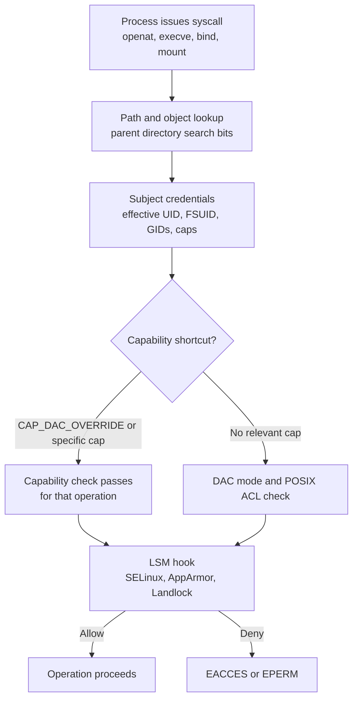
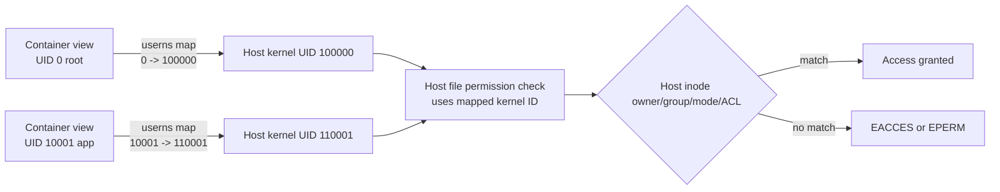

> **Complexity**: `[MEDIUM]` - Operator-grade Linux identity and access control
>
> **Time to Complete**: 80–110 minutes (long-form read + hands-on exercise)
>
> **Prerequisites**:
>
> - **Required**: [Module 1.3: Filesystem Hierarchy](../module-1.3-filesystem-hierarchy/), shell navigation, basic `ls -l`, and a Linux host or VM with `sudo`.
> - **Optional (Kubernetes cluster path)**: Enough Kubernetes context to read a Pod `securityContext` helps with the SecurityContext material and one optional hands-on exercise. That live `kubectl` exercise is gated behind an explicit fork below.
>
> A running Kubernetes cluster is **not** required for this module. The Killercoda lab `linux-1.4-users-permissions` is an Ubuntu host scenario with no cluster provided, and the full host identity/permissions exercise — including every host success criterion — completes on any Linux host without `kubectl`.

## What You'll Be Able to Do

After completing this module, you will be able to treat Linux users and permissions as the kernel boundary behind container security, not as isolated administration trivia.

- **Analyze** UID/GID resolution across `/etc/passwd`, `/etc/shadow`, `/etc/group`, NSS, SSSD, LDAP, and long-running process credentials. *(Host-only)*
- **Diagnose** permission denials by tracing syscall intent through file mode bits, parent directories, POSIX ACL masks, capabilities, and LSM policy. *(Host-only)*
- **Design** least-privilege ownership, octal modes, `umask`, setgid directories, sticky directories, and default ACLs for shared service paths. *(Host-only)*
- **Evaluate** sudoers, PAM, `login.defs`, `limits.conf`, and auditd configuration for escalation risk, accountability, and operational recovery. *(Host-only)*
- **Implement** Kubernetes `securityContext`, user namespace, rootless container, and capability-drop patterns that map cleanly to Linux kernel access checks. *(Cluster path: the live Pod exercise needs `kubectl` access to a running cluster; on the host-only path, read the SecurityContext material and the exercise below as a worked example — see the fork in Hands-On Practice.)*

## Why This Module Matters

Every serious container security control eventually lands on ordinary Linux identity and authorization. A Pod Security Standard that requires `runAsNonRoot`, a runtime default that drops capabilities, a CIS recommendation that forbids privileged containers, and a storage bug where a workload cannot write its PVC all reduce to questions the kernel already knows how to answer: which subject is acting, which object is being accessed, what credentials are effective, and which rule grants or denies the operation. Kubernetes adds API objects and admission policy, but it does not replace UID/GID ownership, process capability sets, discretionary access control, access control
lists, and Linux Security Module decisions. The kernel credentials documentation is explicit about this model: tasks act as subjects, files and other objects carry ownership and security context, and access decisions compare the task's subjective context with the object's objective context through DAC, ACL, capability, and MAC rules. ([Linux Credentials](https://docs.kernel.org/security/credentials.html))

That framing changes how an operator debugs. If a container runs as UID `10001`, mounts `/data`, and receives `EACCES`, the first useful question is not "what is wrong with Kubernetes?" The first question is "what did UID `10001`, with which groups and capabilities, try to do to which inode?" A workload may be non-root but still able to bind to a low port because it was given `CAP_NET_BIND_SERVICE`. A process may be UID `0` inside a user namespace but mapped to an unprivileged host UID outside the namespace. A file may show group write in `ls -l` while an ACL mask silently removes that write from a named group. A sudo rule may look narrow because it names one editor, but
the editor can escape to a shell. The operator skill is to turn those facts into a short diagnostic chain instead of widening permissions until the error disappears.

This module teaches that chain at the level you need for Kubernetes and CKS work. You will connect account databases to numeric kernel identities, ordinary mode bits to ACLs, root to capabilities, sudo to audit trails, PAM to login-time policy, and `securityContext` fields to Linux process attributes. The goal is not to memorize every permission command. The goal is to make a defensible decision under pressure: change the identity, change the group, change the file mode, add an ACL, drop a capability, adjust a volume security context, or reject the design because it depends on root-equivalent behavior. The examples use Ubuntu Server 24.04 style commands where
Debian-family systems (like Ubuntu Server 24.04) prefer `adduser`, while RHEL 9 style commands follow documentation that shows `useradd`, `usermod --append -G`, and rootless Podman with `/etc/subuid` and `/etc/subgid`. ([Ubuntu User Management](https://ubuntu.com/server/docs/how-to/security/user-management/), [RHEL 9 Managing Users and Groups](https://docs.redhat.com/en/documentation/red_hat_enterprise_linux/9/html-single/configuring_basic_system_settings/index))

## Analyze UID/GID Resolution

Linux account names are labels; the durable identity in kernel checks is numeric. The `/etc/passwd` file maps login names to UID, primary GID, home directory, and shell, while the manual page notes that modern systems usually store only `x` in the password field and keep password hashes in `/etc/shadow`. The root account is special because UID `0`, not the spelling `root`, is the superuser identity. The `passwd(5)` page states that the privileged root login account has UID `0`, and `capabilities(7)` explains the older UNIX split between effective UID `0` privileged processes and nonzero-UID unprivileged processes. Linux still preserves that semantics, but since Linux 2.2
it divides root's privileges into separately enabled and disabled capabilities. ([passwd(5)](https://man7.org/linux/man-pages/man5/passwd.5.html), [capabilities(7)](https://man7.org/linux/man-pages/man7/capabilities.7.html))

`/etc/shadow` is where credential secrecy enters the account model. It contains password hash and aging fields and must not be readable by ordinary users if password security is to hold. `/etc/group` maps group names to numeric GIDs and member lists. Those three files explain many lab systems, but production identity often arrives through the Name Service Switch. `/etc/nsswitch.conf` tells glibc which sources to query for databases such as `passwd`, `group`, `shadow`, and `initgroups`, and the order matters because a lookup can stop on success or continue to another source. Ubuntu's SSSD documentation describes SSSD as the integration point that lets PAM and NSS recognize
users and groups from Active Directory, LDAP, Kerberos, and similar providers, with caching for network failures. ([shadow(5)](https://man7.org/linux/man-pages/man5/shadow.5.html), [group(5)](https://man7.org/linux/man-pages/man5/group.5.html), [nsswitch.conf(5)](https://man7.org/linux/man-pages/man5/nsswitch.conf.5.html), [Ubuntu SSSD](https://documentation.ubuntu.com/server/explanation/intro-to/sssd/))

An operator therefore reads identity through the same API the program uses. `cat /etc/passwd` proves only the local file; `getent passwd appsvc` proves the active NSS chain for the `passwd` database. `id appsvc` proves the UID, primary GID, and supplementary groups that a new session should receive. A long-running service or shell may still have the old group list after you edit `/etc/group`, because process credentials are copied into the process at session or exec boundaries rather than magically updated everywhere. This is why "I added the user to the group" is not the end of a permission fix. You must retest from the same type of process that failed: a fresh SSH
login, a restarted systemd service, or a newly created container process.

```bash
getent passwd appsvc
getent group deploy
id appsvc
grep -E '^(passwd|group|shadow|sudoers|subid):' /etc/nsswitch.conf
# sudoers appears only when sudo NSS integration such as sudo-ldap is configured.
```

Ubuntu Server 24.04 operators commonly use `adduser` and `addgroup` wrappers for human accounts because they create homes and prompt for profile details. RHEL 9 examples commonly use the lower-level shadow-utils commands directly. Both styles end at the same kernel model, so the operational difference is not theological. Use the distro's supported account tooling, verify the numeric identity, and avoid editing the files by hand unless you are recovering a broken system with a second privileged session open.

```bash
# Ubuntu-family example
sudo adduser appsvc
sudo addgroup deploy
sudo adduser appsvc deploy
id appsvc

# RHEL-family example
sudo useradd --create-home --shell /sbin/nologin releasebot
sudo groupadd deploy
sudo usermod --append -G deploy releasebot
id releasebot
```

The dangerous account operation is changing a UID or GID after files already exist. Files store numeric ownership. If `appsvc` changes from UID `10001` to UID `20001`, existing files remain owned by the old number until you intentionally migrate them. That can break services immediately or become a later privilege bug when the old number is reused. The safe pattern is inventory first, migrate only owned paths, and never run a blind `chown -R` from `/`. Treat UID/GID changes like data migrations, especially when persistent volumes, image layers, and network filesystems are involved.

```bash
sudo find /srv /var/lib/app -xdev -uid 10001 -ls
sudo find /srv /var/lib/app -xdev -gid 10001 -ls
```

Directory-backed identity also changes the failure mode for incident response. If an employee is disabled in Active Directory but still has an SSH public key on a local fallback account, locking the remote identity did not remove every login path. Ubuntu's user-management guide calls out this exact class of issue: password locking does not remove existing SSH-key authentication, and external database users must be disabled both externally and locally when local fallback is possible. In an operator runbook, account disablement should therefore include `getent`, SSSD cache status, `authorized_keys`, running sessions, sudoers membership, and group-driven device or runtime
access. A user in the `docker`, `podman`, `lxd`, or container-runtime socket group may have a host escalation path that is much broader than ordinary file access. Treat those group memberships as privileges to inventory, approve, and remove with the same care as sudo. ([Ubuntu User Management](https://ubuntu.com/server/docs/how-to/security/user-management/))

## Diagnose Syscall Permission Decisions

A permission denial is a path through multiple gates, not one boolean bit. The process asks for an operation through a syscall such as `openat`, `mkdir`, `execve`, `bind`, or `mount`. The kernel resolves the path, checking search permission on parent directories before it can even evaluate the final file. It compares the process credentials with the target inode's owner, group, mode bits, ACL entries, and sometimes capability shortcuts. Then LSM hooks such as SELinux, AppArmor, or another loaded security module can apply mandatory policy. The LSM documentation describes the framework as hooks at critical kernel points that security modules use to perform access control,
and the credentials documentation places DAC and MAC as separate rule sources in the security calculation. ([Linux Security Modules](https://docs.kernel.org/security/lsm.html), [Linux Credentials](https://docs.kernel.org/security/credentials.html))



The distinction between `EACCES` and `EPERM` is useful but not enough by itself. For `chmod`, the man page lists `EACCES` when search permission is denied on a path prefix and `EPERM` when the effective UID does not match the file owner and the process lacks `CAP_FOWNER`. A real investigation still needs the identity, parent directories, target metadata, ACL, capability set, mount flags, and LSM context. Do not prove the fix from a root shell. Root often bypasses the failing gate, which means you have only proved that root can act as root. Reproduce as the service account, container UID, or systemd unit that originally failed.
([chmod(2)](https://man7.org/linux/man-pages/man2/chmod.2.html))

```bash
sudo mkdir -p /srv/app/current && sudo touch /srv/app/current/config.yml && sudo chown root:deploy /srv/app/current/config.yml
namei -l /srv/app/current/config.yml
ls -ld /srv /srv/app /srv/app/current
ls -l /srv/app/current/config.yml
getfacl -p /srv/app/current /srv/app/current/config.yml
id releasebot
sudo -u releasebot test -w /srv/app/current/config.yml
```

Read the evidence in order. `namei -l` exposes parent directory traversal, which catches the common case where the final file is readable but a parent directory lacks execute permission. `ls -l` shows owner, group, and mode. `getfacl` reveals named-user and named-group ACLs plus the effective mask. `id` tells you whether the actor actually has the group you assumed. `sudo -u` is a useful local reproduction when the target is a login-style service account, but it is not a perfect replacement for a systemd service with its own `User=`, `Group=`, `SupplementaryGroups=`, `ReadWritePaths=`, or `NoNewPrivileges=` settings. Use it to narrow the problem, then retest through the
real unit or workload.

Mount state is part of the same path. A process with correct UID and mode bits still cannot write through a read-only mount, and a container with a read-only root filesystem must write only to declared volumes. The kernel will report the denial near the syscall, but the fix lives in the layer that introduced the restriction. That may be a Kubernetes `readOnlyRootFilesystem` field, a systemd sandboxing option, an NFS export mode, an immutable file flag, or an LSM rule. The fastest troubleshooting habit is to classify the denial before editing: identity mismatch, path traversal mismatch, DAC or ACL mismatch, capability requirement, mount restriction, or mandatory policy.
Once you name the class, the fix narrows naturally and you avoid the common anti-pattern of making the file world-writable when the real problem was a read-only mount or an AppArmor denial.

## Design File Modes, Special Bits, and umask

The ordinary triad selects exactly one class for a given file access: owner, group, or other. The classes are not added together. If the process matches the owner UID, owner bits decide; otherwise a matching effective or supplementary group leads to group bits; otherwise other bits decide. On regular files, read means read content, write means modify content, and execute means ask the kernel to execute the file. On directories, read lists names, write creates or removes directory entries, and execute searches or traverses the directory. That directory execute bit is why a file can look world-readable but still be inaccessible through a locked parent path.

| Octal | Symbolic | Common use | Operator check |
|---|---|---|---|
| `600` | `rw-------` | Private keys, service tokens | Owner must be the only intended reader |
| `640` | `rw-r-----` | App config readable by a service group | Group membership must be present in the running process |
| `644` | `rw-r--r--` | Public config or static files | No secrets; other users can read |
| `700` | `rwx------` | Private home or state directory | Automation must run as the owner |
| `750` | `rwxr-x---` | Shared service directory with read/traverse group | Parent directories need compatible group or ACL |
| `755` | `rwxr-xr-x` | Public executable or directory tree | Everyone can traverse directories and execute files |
| `775` | `rwxrwxr-x` | Collaborative directory with trusted group | Often combine with setgid to preserve group ownership |
| `1777` | `rwxrwxrwt` | Shared temporary directory | Sticky bit prevents users deleting each other's files |
| `2775` | `rwxrwsr-x` | Shared project directory | setgid makes new entries inherit directory group |

The setuid, setgid, and sticky bits are small fields with large consequences. A setuid executable runs with the file owner's effective UID, which is why setuid root binaries are high-value audit targets. A setgid executable runs with the file group's effective GID, while a setgid directory causes newly created entries to inherit the directory's group, which is usually the right design for shared release or data directories. The sticky bit on a world-writable directory such as `/tmp` prevents a user from deleting another user's entry unless the user owns the file, owns the directory, or has the required privilege. Kubernetes Pod Security Standards call out set-user-ID and
set-group-ID file modes as privilege escalation examples when requiring `allowPrivilegeEscalation: false`. ([Kubernetes Pod Security Standards](https://v1-35.docs.kubernetes.io/docs/concepts/security/pod-security-standards/))

```bash
sudo install -d -o root -g deploy -m 2775 /srv/app/releases
sudo install -d -o root -g root -m 1777 /srv/app/dropbox
find /usr/bin /usr/sbin -xdev -perm -4000 -ls
ls -ld /tmp /srv/app/releases /srv/app/dropbox
```

`umask` is a process setting that removes permissions from newly created files and directories. The `umask(2)` page describes it as the file mode creation mask used by `open`, `mkdir`, and other creation calls, where permissions present in the mask are turned off from the requested mode. A common `022` mask turns `0666` file creation into `0644` and `0777` directory creation into `0755`. A service with `umask 007` creates files private to owner and group. That is useful only if the group is correct and stable. If a parent directory has a default ACL, the man page notes that the default ACL path can override the ordinary umask calculation for inherited ACL entries, so
default ACLs and umask must be tested together. ([umask(2)](https://man7.org/linux/man-pages/man2/umask.2.html))

```bash
umask
mkdir /tmp/umask-demo
touch /tmp/umask-demo/file
ls -ld /tmp/umask-demo /tmp/umask-demo/file
```

Mode design should start from the actor and workflow. A release bot that writes only release directories should not own `/srv`, should not receive `777` as a shortcut, and should not need a root shell. A better design is `root:deploy` on the shared path, setgid on the directory, `2775` for collaborative subdirectories, `664` or `640` for files depending on read exposure, and a service restart rule that names one exact systemd operation. That design is explainable during review: root owns the trust boundary, the deploy group owns collaboration, and other users receive only the access needed for read or traverse.

Numeric and symbolic `chmod` are both useful, but they support different review habits. Octal is compact when you know the final state, such as `chmod 640 config.yml` or `chmod 2775 releases`. Symbolic mode is safer when you are changing one dimension while preserving the rest, such as `chmod g+w file` or `chmod o-rwx secret`. Recursive mode changes deserve special suspicion. A recursive `chmod -R g+w /srv/app` can change directories, scripts, sockets, copied secrets, and package-managed files in one command. If you truly need a recursive repair, split directory and file intent with `find`, test on a small path first, and record why the whole tree belongs to the same
permission domain. The ability to explain the domain boundary is what separates repair from permission spray.

## Design POSIX ACLs for Exceptions and Defaults

POSIX ACLs extend the owner/group/other model without replacing it. The `acl(5)` page defines access ACLs for files and directories, default ACLs for directories, named user entries, named group entries, and a mask that limits named users, named groups, and the owning group. The most important operator detail is the mask. `ls -l` may show a group write bit that corresponds to the ACL mask, while `getfacl` shows a named group entry with `#effective:r--` because the mask removed write. If the ACL mask is wrong, changing the named entry alone may still leave the process denied. ([acl(5)](https://man7.org/linux/man-pages/man5/acl.5.html))

```bash
sudo setfacl -m u:releasebot:rwX /srv/app/current
sudo setfacl -m d:u:releasebot:rwX /srv/app/current
sudo setfacl -m g:deploy:rwX,d:g:deploy:rwX /srv/app/current
getfacl -p /srv/app/current
```

Uppercase `X` in `rwX` is intentional. It grants execute/search permission only on directories or on files that already have an execute bit, so a recursive ACL can preserve directory traversal without accidentally making ordinary data files executable.

Use ACLs when the exception is real and narrow. If one service account needs write access to one directory tree but should not become a member of a broad group, a named-user ACL is clearer than adding that service account to `deploy`, `wheel`, or a container runtime group. If every member of a team should collaborate on every file created under a path, a setgid directory plus group mode is simpler than dozens of named ACLs. Default ACLs are good for inheritance on shared directories, but they are not a policy engine. They do not magically repair existing files, and they do not cross every remote filesystem or container mount in the same way. Test the mounted path from the
workload identity before you call the design complete.

Containers add one more reason to be explicit. Image layers may contain files owned by UID `0`; a Pod may run as UID `10001`; a mounted volume may arrive as `root:root`; and an ACL created on the host may name a UID that has no meaningful username inside the container. The kernel still compares numbers. A named ACL entry for user `releasebot` becomes a numeric UID on disk. Inside a container, `getfacl` may display a different name or only a number depending on the container's `/etc/passwd` and NSS setup. When storage is shared across host and container boundaries, document the numeric UID/GID and the identity mapping, not only the friendly name.

ACLs also interact with backups, image builds, and cross-filesystem moves. A tar or rsync workflow that does not preserve ACLs can silently convert a carefully designed access model back into plain mode bits. A filesystem that lacks POSIX ACL support may ignore the design entirely. A container image build can carry numeric ownership but not the host's intended names, so `COPY --chown=10001:10001` is often clearer than relying on a username that exists only in the build stage. When ACLs are part of a production control, include `getfacl -R` or an equivalent structured capture in backup and validation tests. The operator question is not merely "does the ACL work now?" It is
"will the ACL survive the restore, rollout, and runtime boundary where the application will depend on it?"

## Evaluate Capabilities Instead of Treating Root as One Bit

Linux capabilities are the modern answer to the all-or-nothing root model. The `capabilities(7)` page explains that Linux divides privileges traditionally associated with the superuser into distinct per-thread units. That is why a non-root process can bind a privileged port with `CAP_NET_BIND_SERVICE`, why a process with `CAP_DAC_OVERRIDE` can bypass file read/write/execute checks, and why `CAP_SYS_ADMIN` is treated as dangerous: the manual describes it as overloaded and lists broad administrative operations such as mount and namespace-sensitive operations. Kubernetes manifests omit the `CAP_` prefix when listing capabilities, but the kernel names keep the prefix.
([capabilities(7)](https://man7.org/linux/man-pages/man7/capabilities.7.html), [Kubernetes Security Context](https://v1-35.docs.kubernetes.io/docs/tasks/configure-pod-container/security-context/))

| Capability | Common legitimate need | Why drop by default |
|---|---|---|
| `CAP_DAC_OVERRIDE` | Backup or recovery tooling that must read files regardless of mode | It bypasses the permission triad and can defeat carefully designed ownership |
| `CAP_FOWNER` | Narrow tools that must change modes or ownership-like metadata on files they do not own | It bypasses owner checks, can set ACLs, and can ignore sticky directory restrictions |
| `CAP_NET_BIND_SERVICE` | Binding to TCP or UDP ports below `1024` | Often replaceable by high ports, service mapping, or a reverse proxy |
| `CAP_NET_ADMIN` | Interface, route, firewall, or traffic-control administration | It is far beyond ordinary application networking and can alter node networking behavior |
| `CAP_NET_RAW` | Raw sockets for packet tools or selected diagnostics | It can support packet crafting and network reconnaissance from a workload |
| `CAP_SYS_ADMIN` | Mount, namespace, and broad system administration operations | It is overloaded and commonly treated as near-root for container risk analysis |
| `CAP_SYS_PTRACE` | Debuggers and profilers that inspect other processes | It can expose process memory and secrets across process boundaries |
| `CAP_SETUID` / `CAP_SETGID` | Programs that intentionally switch identity | They can create surprising identity transitions after admission review |

File capabilities let you grant a narrow privilege to an executable without making it setuid root. That is useful for a small, reviewed binary and dangerous for a generic interpreter or shell. `getcap` and `setcap` are the operational tools, while `/proc/<pid>/status` exposes process capability bitmaps such as `CapEff`. Kubernetes documents that you can inspect those bitmaps inside a container and that manifest capability names omit `CAP_`. The operator rule is simple: prefer dropping all capabilities and adding back one documented capability only when the workload's behavior proves it. Do not add `SYS_ADMIN` to make a mysterious permission problem disappear.
([Kubernetes Security Context](https://v1-35.docs.kubernetes.io/docs/tasks/configure-pod-container/security-context/))

```bash
getcap -r /usr/bin /usr/local/bin 2>/dev/null
sudo setcap 'cap_net_bind_service=ep' /usr/local/bin/web-listener
getcap /usr/local/bin/web-listener
grep '^Cap' /proc/1/status
capsh --decode="$(awk '/^CapEff:/ {print $2}' /proc/1/status)"
```

Capabilities also explain why UID `0` remains special even after the kernel split root privileges. When a process runs as UID `0` in the initial user namespace, its capability sets can include powerful permissions unless the runtime, service manager, or executable transition drops them. When a process is UID `0` inside a non-initial user namespace, the capabilities are scoped to resources governed by that namespace. The user namespace man page states that a process can have UID `0` inside a user namespace while having an ordinary unprivileged UID outside, with full privileges inside the namespace but not outside. That distinction is the reason rootless containers can be
safer than rootful containers without pretending that "root in a container" is harmless. ([user_namespaces(7)](https://man7.org/linux/man-pages/man7/user_namespaces.7.html))

Capability review should include all sets, not only the one visible in a manifest. The kernel credentials documentation distinguishes permitted, inheritable, effective, and bounding sets, and Kubernetes shows how to inspect process capability bitmaps under `/proc/1/status`. The ambient set (`CapAmb`) carries capabilities that are inherited by child processes across exec without needing file capabilities, which matters for rootless container runtimes. A capability must already be present in BOTH the permitted and inheritable sets before a process can raise it into the ambient set; trying to add an ambient capability without those prerequisites silently fails. ([capabilities(7)](https://man7.org/linux/man-pages/man7/capabilities.7.html)) The effective set is what the task can currently use, while the bounding set limits what can be gained later across an executable transition. That is why `allowPrivilegeEscalation: false` matters beside capability drops: it reduces surprise from setuid, setgid, and file-capability transitions after the container has started. When a runtime alert reports a shell in a container, the difference between
`CapEff=0` for dangerous bits and a broad effective capability set changes the containment priority. A shell without `SYS_ADMIN`, `DAC_OVERRIDE`, `NET_ADMIN`, or `SYS_PTRACE` is still serious, but it has fewer immediate host and peer-process options.

## Evaluate sudo, PAM, and Policy Files

`sudo` is policy-controlled privilege execution, not a magic synonym for good administration. The sudoers manual defines rich policy syntax for users, hosts, runas targets, commands, defaults, environment handling, and logging. A rule such as `ops ALL=(ALL) NOPASSWD: ALL` is easy to type and hard to defend because it grants broad root-equivalent execution without fresh authentication. A narrow rule should name the actor, the runas target, the exact command path, and any arguments you intend to permit. It should also avoid interactive programs with shell escapes unless the business decision is genuinely "this user may become root." Use `visudo -cf` on drop-in files before
relying on them, because a sudoers syntax error can lock out normal escalation paths. ([sudoers(5)](https://www.man7.org/linux/man-pages/man5/sudoers.5.html))

```bash
cat <<'EOF' | sudo tee /etc/sudoers.d/releasebot
# /etc/sudoers.d/releasebot
Cmnd_Alias APP_RESTART = /usr/bin/systemctl restart app.service, \
                         /usr/bin/systemctl status app.service

releasebot ALL=(root) PASSWD: APP_RESTART
EOF

sudo visudo -cf /etc/sudoers.d/releasebot
sudo -l -U releasebot
```

`NOPASSWD` is not automatically wrong. It can be appropriate for noninteractive automation that runs one constrained command and already has a separate authentication boundary. It is risky when used for human convenience, broad command sets, or commands that can invoke shells, editors, pagers, package managers, scripting languages, or file writes to arbitrary paths. `PASSWD` gives you a fresh authentication checkpoint and a better human audit moment. Command restriction gives you the real boundary. The worst pattern is combining `NOPASSWD` with `ALL` and then trying to recover safety through convention.

Auditability has two separate concerns. First, audit sudo policy changes with auditd file watches on `/etc/sudoers.d` and other privileged account files. These rules catch write and attribute changes to policy files; they do not prove which sudo commands a user executed. `auditd` is the userspace component of the Linux Audit system that writes audit records to disk and works with `auditctl`, `ausearch`, and `aureport`. ([auditd(8)](https://man7.org/linux/man-pages/man8/auditd.8.html))

```bash
sudo auditctl -w /etc/sudoers.d -p wa -k sudoers-policy
sudo auditctl -w /etc/passwd -p wa -k identity-files
sudo auditctl -w /etc/shadow -p wa -k identity-files
sudo ausearch -k sudoers-policy
```

Second, audit sudo command executions through sudoers event logging. Use `Defaults logfile=/var/log/sudo.log` when you want a dedicated sudo log, or configure sudo's syslog facility in the sudoers `Defaults` block and ship those records centrally. This is especially important when sudo grants deployment powers that can modify running services or secrets. ([sudoers(5)](https://www.man7.org/linux/man-pages/man5/sudoers.5.html))

```text
# /etc/sudoers.d/logging
Defaults logfile=/var/log/sudo.log
# Or, on syslog-based hosts:
Defaults syslog=authpriv
```

The files everyone forgets often explain behavior that account and mode bits do not. `/etc/login.defs` defines site-specific defaults for the shadow password suite, including UID/GID ranges, password aging defaults, home directory mode, and a fallback login retry setting that PAM usually overrides. PAM is the configurable authentication and session framework used by programs such as `login`, `su`, `sudo`, and SSH-related stacks; `/etc/pam.d/` machine configuration overrides vendor defaults with the same service name. `/etc/security/limits.conf` and `/etc/security/limits.d/*.conf` are read by `pam_limits` to set login-session resource limits such as open files, processes,
core size, and even `nonewprivs`. ([login.defs(5)](https://man7.org/linux/man-pages/man5/login.defs.5.html), [PAM(8)](https://man7.org/linux/man-pages/man8/pam.8.html), [limits.conf(5)](https://man7.org/linux/man-pages/man5/limits.conf.5.html))

### Read PAM Stacks, Not Just PAM Names

A PAM file is a stack, not a list of suggestions. Each non-comment line starts with a management group, then a control flag, then a module. The management groups answer different questions: `auth` proves the caller's identity, `account` checks whether that identity may use the service now, `password` changes credentials, and `session` prepares or tears down the login session. The simple control flags are review signals: `required` must pass but lets the stack continue, `requisite` fails immediately on failure, `sufficient` can return success early if no previous required module has failed, and `optional` usually matters only when no stronger rule decides the result. ([pam.d(5)](https://man7.org/linux/man-pages/man5/pam.d.5.html))

```text
# /etc/pam.d/sshd excerpt (illustrative; distro files vary)
# management  control     module             arguments
auth          required    pam_env.so
auth          requisite   pam_faillock.so    preauth silent audit deny=5 unlock_time=900
auth          sufficient  pam_unix.so        try_first_pass
auth          required    pam_faillock.so    authfail audit deny=5 unlock_time=900
account       required    pam_unix.so
password      required    pam_unix.so
session       optional    pam_motd.so
session       required    pam_limits.so
```

The dangerous pattern is a permissive module with a strong-looking control flag in the wrong position. `auth sufficient pam_permit.so` before `pam_unix.so` is a trap: `pam_permit` always succeeds, and `sufficient` can short-circuit the rest of the stack, so the real password check may never run. A hardened stack puts real checks first, makes failures count, and uses modules such as `pam_faillock.so` to record repeated failures and slow brute-force attempts. During review, ask three questions: which management group makes the decision, which control flag can short-circuit the stack, and which module actually enforces the security property? ([pam_permit(8)](https://man7.org/linux/man-pages/man8/pam_permit.8.html), [pam_faillock(8)](https://man7.org/linux/man-pages/man8/pam_faillock.8.html))

These policy files are not interchangeable. `login.defs` shapes defaults used by account tools and selected login behavior, but PAM usually owns live authentication and session decisions. `limits.conf` applies per login session through `pam_limits`; it does not retroactively change already-running daemons, and it does not replace cgroups for service resource control. Sudoers controls privileged command execution after authentication; it does not decide whether SSH accepts a key or whether a password has expired. During reviews, keep a small map of which layer is responsible for which decision. That map prevents contradictory fixes, such as changing `PASS_MAX_DAYS` in
`login.defs` while the actual password policy is enforced by PAM modules, or raising `nofile` in `limits.conf` while the failing process is a systemd service that never passed through a PAM login session.

## Implement Kubernetes SecurityContext and User Namespace Patterns

Kubernetes security context fields are Linux identity and privilege knobs expressed in YAML. `runAsUser` sets the UID used by container processes unless overridden by image or container-level settings. `runAsGroup` sets the primary GID. `runAsNonRoot` asks the kubelet to reject a container that would run as UID `0`, but it is not a substitute for choosing a known numeric UID. `fsGroup` adds a supplementary group intended for mounted volumes and may cause ownership or permission changes depending on volume type and policy. `fsGroupChangePolicy: OnRootMismatch` tells the kubelet to skip the recursive chown/chmod pass when the volume's root directory already has `fsGroup` as its owning group and carries group read and write permissions, which matters on large volumes where the recursive walk is otherwise the slow part of pod startup. `allowPrivilegeEscalation: false` directly controls the Linux `no_new_privs` flag for the container process, and the `PR_SET_NO_NEW_PRIVS` man page
explains that once set, `execve` will not grant privileges through setuid, setgid, or file capability transitions. `readOnlyRootFilesystem: true` mounts the image root read-only, pushing writes into declared volumes. ([Kubernetes Security Context](https://v1-35.docs.kubernetes.io/docs/tasks/configure-pod-container/security-context/), [PR_SET_NO_NEW_PRIVS](https://man7.org/linux/man-pages/man2/PR_SET_NO_NEW_PRIVS.2const.html))

```yaml
apiVersion: v1
kind: Pod
metadata:
  name: users-perms-demo
spec:
  securityContext:
    runAsUser: 10001
    runAsGroup: 10001
    runAsNonRoot: true
    fsGroup: 20001
    fsGroupChangePolicy: OnRootMismatch
    seccompProfile:
      type: RuntimeDefault
  containers:
    - name: app
      image: busybox:1.36
      command: ["sh", "-c", "id; touch /data/created-by-app; sleep 3600"]
      securityContext:
        allowPrivilegeEscalation: false
        readOnlyRootFilesystem: true
        capabilities:
          drop: ["ALL"]
      volumeMounts:
        - name: data
          mountPath: /data
        - name: tmp
          mountPath: /tmp
  volumes:
    - name: data
      emptyDir: {}
    - name: tmp
      emptyDir: {}
```

The YAML does not make storage semantics disappear. If a PVC arrives as `root:root` with mode `0755`, a UID `10001` process still cannot write unless the volume plugin, `fsGroup` handling, init setup, image ownership, or ACLs produce a writable group or owner path. Pod Security Standards Restricted policy goes further than "not root": it requires privilege escalation to be false, containers to run as non-root, `runAsUser` not to be zero when set, seccomp to be `RuntimeDefault` or `Localhost`, and capabilities to drop `ALL` while only allowing `NET_BIND_SERVICE` back. That policy language is Kubernetes admission vocabulary for the Linux mechanics you already learned.
([Kubernetes Pod Security Standards](https://v1-35.docs.kubernetes.io/docs/concepts/security/pod-security-standards/))



User namespaces are the kernel feature behind many rootless and userns-remap designs. The user namespace man page describes how a process can carry different UIDs and GIDs inside and outside the namespace, and the kernel idmapping documentation shows the translation between userspace IDs and kernel IDs used for ownership and permission checking. RHEL 9 container documentation describes rootless Podman setup with `/etc/subuid` and `/etc/subgid` ranges, warns that rootless users have no root privileges on the host operating system, and notes that manual subuid/subgid changes require `podman system migrate` for the new mappings to apply. This is the practical host-side
reason operators inspect subordinate ID ranges when rootless containers cannot read or write bind-mounted paths. ([Kernel idmappings](https://docs.kernel.org/filesystems/idmappings.html), [RHEL 9 Containers](https://docs.redhat.com/en/documentation/red_hat_enterprise_linux/9/html-single/building_running_and_managing_containers/index))

```bash
grep "^appuser:" /etc/subuid /etc/subgid
podman unshare id
podman unshare stat -c '%u:%g %a %n' /path/on/host
podman system migrate
```

CKS-style operator decisions follow from this mapping. Prefer workload-specific service accounts in Kubernetes and workload-specific UIDs in images. Build images so writable paths are owned by the UID that will run the process. Use `runAsNonRoot`, explicit `runAsUser`, explicit `runAsGroup`, `fsGroup` only when storage needs group access, `allowPrivilegeEscalation: false`, `readOnlyRootFilesystem: true`, and `capabilities.drop: ["ALL"]` as the default shape. Add back `NET_BIND_SERVICE` only when the workload truly needs a low port and cannot use a higher port behind a Service. For rootless hosts, make subuid/subgid ranges unique, large enough for the image, and documented
with the service owner. If a bind mount fails, debug the mapped host UID, not the username printed inside the container.

Do not confuse rootless containers with non-root containers. A non-root container may still be launched by a rootful runtime and may still share host risk through mounts, devices, broad capabilities, or privileged mode. A rootless container is launched by an unprivileged host user and relies on user namespace mappings and subordinate ID ranges to represent container IDs on the host. Those designs solve different problems and can be combined, but neither removes the need to inspect file ownership at the host boundary. A rootless container with a bind mount can fail because the mapped host UID lacks write access. A non-root Kubernetes Pod can fail for the same reason on a
PVC. In both cases, the winning diagnostic is the same: map the container identity to the host or volume identity, then compare the resulting number against ownership, mode, ACL, mount flags, and LSM policy.

## CKS Operator Patterns

The first pattern is least-privilege workload identity. In Kubernetes, that means a dedicated ServiceAccount for API identity, a dedicated UID/GID for process identity, and a dedicated filesystem path for write identity. Do not collapse those into "run it as root because the app works." When runtime detection from [Module 6.2: Runtime Security with Falco](../../../k8s/cks/part6-runtime-security/module-6.2-falco/) shows a shell or unexpected file read, a non-root UID, dropped capabilities, and a read-only root filesystem reduce what that shell can do while you investigate with the workflow from [Module 6.3: Container
Investigation](../../../k8s/cks/part6-runtime-security/module-6.3-container-investigation/).

The second pattern is permission repair without blast-radius expansion. If a Pod cannot write a volume, inspect `id`, `stat`, `getfacl`, mount information, and the Pod `securityContext`. Prefer fixing image ownership, `fsGroup`, group mode, or a narrow ACL over changing the directory to `777` or running the container as root. If the application needs to bind port `80`, prefer listening on an unprivileged port behind a Service; if that is not possible, add back only `NET_BIND_SERVICE` and keep `allowPrivilegeEscalation: false`. If a sudo rule is required for automation, name the exact command and log the execution path. A fix is not complete until the original actor
succeeds and a neighboring actor still fails.

The third pattern is identity drift detection. Check for UIDs without names, names with different UIDs across nodes, root-owned writable application paths, world-writable directories without sticky bit, unexpected file capabilities, setuid binaries outside package-managed paths, broad sudoers drop-ins, stale SSSD cache behavior, and volume ownership that changes after a driver or runtime upgrade. These checks are boring in the best sense: they catch the same low-level mismatch before it becomes a confusing Kubernetes incident.

The final pattern is written verification. A permission change should leave a note that names the actor, object, required action, rule that allowed it, and retest command. For example: "UID `10001` in namespace `prod` can write `/data` because `fsGroup: 20001` made the volume group-writable; verified with `id`, `stat`, and application startup; UID `10002` cannot write." That sentence is more valuable than "fixed permissions" because it captures the authorization model and the negative control. The same style works for sudo rules, ACLs, rootless Podman bind mounts, and file-capability exceptions. If you cannot write that sentence, the change is probably still a guess.

Use the same written model when you reject a risky request. "The workload asks for `SYS_ADMIN`, but the observed failure is a write to `/var/cache/app`; the proposed capability does not match the denied operation, so the approved fix is a writable `emptyDir` mounted at that path" is a strong operator answer. It names the mismatch, denies the broad privilege, and replaces it with a control that maps to the actual syscall path. "The user asks for passwordless sudo to restart anything, but the required operation is one service restart; the approved sudoers alias permits only `systemctl restart app.service` and `systemctl status app.service`" is the same pattern for host
administration. The point is not to be obstructionist. The point is to make privilege requests prove their relationship to the action being denied.

When you are under exam pressure, compress the whole module into one loop: identify the actor, identify the object, identify the requested action, inspect the direct Linux rule, then inspect privilege shortcuts and mandatory policy. For files, that means UID/GID, parent directory execute bits, mode bits, ACL mask, mount flags, capabilities, and LSM. For sudo, that means user, runas target, command path, arguments, authentication mode, environment, and logs. For containers, that means image user, Pod security context, runtime capability set, user namespace mapping, volume ownership, and storage behavior. The commands differ, but the loop is stable. If you can run that loop
without skipping the original actor retest, you can debug most "permission denied" incidents without falling back to root, `777`, privileged containers, or broad sudo. That loop is also easy to teach during handoff, which makes the next incident faster and safer.

## Did You Know?

- UID `0` is privileged because of the numeric UID and capability transition rules, not because the account is spelled `root`.
- `getent passwd USER` is a better production identity check than reading `/etc/passwd` because NSS may return SSSD, LDAP, Winbind, or other provider entries.
- An ACL mask can make a named user or group entry less powerful than it appears, which is why `getfacl` output matters more than `ls -l` alone.
- Kubernetes capability names omit the `CAP_` prefix in YAML, so `NET_BIND_SERVICE` in a manifest maps to Linux `CAP_NET_BIND_SERVICE`.

## Common Mistakes

| Mistake | Why It Hurts | Better Operator Move |
|---|---|---|
| Fixing a denial with `chmod 777` | It grants every local or container-mapped user broad access and hides the real identity mismatch | Identify the actor with `id`, then fix owner, group, ACL, or `fsGroup` precisely |
| Assuming `/etc/passwd` is the whole user database | NSS may resolve users and groups from SSSD, LDAP, Winbind, or another provider | Use `getent` and inspect `/etc/nsswitch.conf` before changing local files |
| Adding a user to a group but not restarting the session | Existing processes may keep the old supplementary group vector | Start a fresh login, restart the service, or recreate the Pod and verify with `id` |
| Treating `runAsNonRoot` as a complete security context | It blocks UID `0` but does not choose ownership, drop capabilities, or make volumes writable | Set explicit UID/GID, drop capabilities, disable escalation, and test mounted paths |
| Granting `CAP_SYS_ADMIN` to solve a mystery | It is broad, overloaded, and often near-root for container risk analysis | Find the exact denied operation and add a narrower capability or redesign the workflow |
| Writing broad sudoers rules with `NOPASSWD: ALL` | It turns automation convenience into root-equivalent command execution without a fresh checkpoint | Use command aliases, exact paths, `PASSWD` for humans, and audit the drop-in |
| Forgetting `/etc/security/limits.conf` and PAM | Login-time limits and `nonewprivs` can change behavior outside file ownership | Inspect `/etc/pam.d/`, limits files, and service manager settings during privilege investigations |

## Quiz

<details>
<summary>Analyze UID/GID resolution: `getent passwd appsvc` returns an LDAP user, but `/etc/passwd` has no `appsvc` line. A service owned by `appsvc` fails after boot when LDAP is unavailable. What do you investigate first?</summary>

Start with `/etc/nsswitch.conf`, SSSD status, cache behavior, and whether the service starts before network identity is available. The absence of a local `/etc/passwd` line is not itself a bug if NSS resolves the account from SSSD or LDAP. The operational question is whether boot-time startup can rely on remote identity, whether SSSD caching is configured, and whether the service should use a local system account instead.
</details>

<details>
<summary>Diagnose permission denials: a process running as UID `10001` gets `EACCES` reading `/srv/app/current/config.yml`, which is `root:deploy` mode `640`. `id` shows no `deploy` group. What is the smallest safe fix?</summary>

Add the process identity to the `deploy` group or choose a narrower ACL for UID `10001`, then restart or recreate the process so the new group list is effective. Do not change the file to `644` unless every local and mapped container user should read it. Do not change ownership away from root if root ownership is the intended control boundary.
</details>

<details>
<summary>Design file modes and ACLs: a shared release directory must let deployers create files but preserve group ownership for future deployers. Which mode pattern is better than recursive `chown` after every release?</summary>

Use a directory owned by `root:deploy` with setgid, such as `2775`, and pair it with a suitable `umask` or default ACL so new files keep group access. The setgid directory makes new entries inherit the directory group. Recursive `chown` is slower, easier to over-scope, and can damage unrelated ownership if the release path is wrong.
</details>

<details>
<summary>Evaluate capabilities: a container cannot bind port `80`, and a teammate proposes privileged mode. What should you propose instead, and when would you avoid even that?</summary>

Prefer listening on an unprivileged port behind a Kubernetes Service. If the workload truly must bind a low port, add back only `NET_BIND_SERVICE` while still dropping `ALL` first and keeping `allowPrivilegeEscalation: false`. Avoid even that add-back when a simple port remap satisfies the requirement, because every added capability increases the runtime authority you must defend.
</details>

<details>
<summary>Evaluate sudo and PAM policy: a sudoers drop-in grants `releasebot ALL=(root) NOPASSWD: /usr/bin/vi /etc/app.conf`. Why is that not a narrow file-edit rule?</summary>

`vi` is an interactive editor that can often write other files or launch commands, so the rule can become a shell or broad file-write path. A safer design is a constrained helper, a validated deployment command, or a `sudoedit` workflow with careful environment handling and logging. The rule should authorize the required operation, not a general-purpose interactive tool.
</details>

<details>
<summary>Implement Kubernetes SecurityContext: a Pod uses `runAsUser: 10001`, `runAsNonRoot: true`, `readOnlyRootFilesystem: true`, and a PVC mounted at `/data`, but the app cannot write. What evidence do you collect before changing YAML?</summary>

Collect `id` from the container, `stat` and `getfacl` on `/data`, the Pod security context, volume type, storage driver notes, and any `fsGroup` or `fsGroupChangePolicy` settings. The likely issue is that the mounted path is not writable by UID `10001` or any group the process has. Choose image ownership, `fsGroup`, init setup, or a storage-side permission change based on the evidence.
</details>

## Hands-On Practice

All tasks except the last one are host-only: a learner on the Killercoda `linux-1.4-users-permissions` ubuntu lab or any local Linux host with `sudo` can complete them without a Kubernetes cluster. The last task follows the cluster fork below.

- [ ] Analyze UID/GID resolution by comparing `getent passwd "$(whoami)"`, `id`, `/etc/passwd`, `/etc/group`, and `/etc/nsswitch.conf` on an Ubuntu 24.04 or RHEL 9 lab host. *(Host-only)*
- [ ] Diagnose permission denials by creating a `root:deploy` test directory, adding a non-root account to the group, restarting the session, and proving the before/after result with the original actor. *(Host-only)*
- [ ] Design file modes and ACLs by building a setgid shared directory under `/tmp`, adding a default ACL, creating files from two users or shells, and explaining why the new group and mask are correct. *(Host-only)*
- [ ] Evaluate capabilities by finding file capabilities with `getcap -r`, inspecting `CapEff` in `/proc/1/status`, and explaining which capability you would drop or keep for a low-port web process. *(Host-only)*
- [ ] Evaluate sudo and PAM policy by creating a disposable sudoers drop-in for one harmless command, validating it with `visudo -cf`, checking `sudo -l`, then removing the drop-in. *(Host-only)*
- [ ] *(Cluster path — optional)* Implement Kubernetes SecurityContext by running a disposable Pod with explicit UID/GID, `fsGroup`, dropped capabilities, no privilege escalation, and a read-only root filesystem with an `emptyDir` mounted at `/tmp`. Needs `kubectl` on a running cluster; on the host-only path, read the Implement Kubernetes SecurityContext section and the Pod exercise below as a worked example instead.

Use this local exercise on a disposable Linux VM or lab host where you have sudo. It creates only temporary paths and a temporary group, and it forces you to retest with the non-root actor rather than root. If your distribution already has a `deploy` group, use a different lab group name.

```bash
sudo groupadd kddeploy
sudo useradd --create-home --shell /bin/bash kdsvc
sudo usermod --append -G kddeploy kdsvc

sudo install -d -o root -g kddeploy -m 2775 /tmp/kd-shared
sudo setfacl -m d:g:kddeploy:rwx,g:kddeploy:rwx /tmp/kd-shared

sudo -u kdsvc id
sudo -u kdsvc touch /tmp/kd-shared/from-kdsvc
ls -l /tmp/kd-shared/from-kdsvc
getfacl -p /tmp/kd-shared /tmp/kd-shared/from-kdsvc

sudo rm -rf /tmp/kd-shared
sudo userdel -r kdsvc
sudo groupdel kddeploy
```

> **Host-only vs cluster fork:** This exercise uses `kubectl` and needs a running Kubernetes cluster. Pick your path before running anything:
>
> - **Killercoda lab / local Linux host:** The linked lab `linux-1.4-users-permissions` is an Ubuntu host scenario without a cluster. The host exercise above is the complete required hands-on path — read the Pod manifest and commands below as a worked example instead of running them.
> - **Optional cluster path:** If you have a local [`kind`](https://kind.sigs.k8s.io/) cluster or an existing cluster with `kubectl` access, run the exercise below on a disposable namespace.
> - **Skip-as-read:** Without a cluster, read the manifest and commands as illustrative; the surrounding text describes the expected identity and permission evidence, and a live cluster will differ in pod and path details.

Use this Kubernetes exercise on a disposable namespace when you have cluster access. The Pod prints its identity, writes to the `emptyDir` volume, and keeps running so you can inspect the result. The root filesystem is read-only, so `/tmp` is explicitly provided as a writable volume.

```bash
kubectl create namespace users-perms-lab
kubectl apply -n users-perms-lab -f - <<'EOF'
apiVersion: v1
kind: Pod
metadata:
  name: users-perms-demo
spec:
  securityContext:
    runAsUser: 10001
    runAsGroup: 10001
    runAsNonRoot: true
    fsGroup: 20001
    seccompProfile:
      type: RuntimeDefault
  containers:
    - name: app
      image: busybox:1.36
      command: ["sh", "-c", "id; touch /tmp/ok; sleep 3600"]
      securityContext:
        allowPrivilegeEscalation: false
        readOnlyRootFilesystem: true
        capabilities:
          drop: ["ALL"]
      volumeMounts:
        - name: tmp
          mountPath: /tmp
  volumes:
    - name: tmp
      emptyDir: {}
EOF

kubectl wait pod/users-perms-demo -n users-perms-lab --for=condition=Ready --timeout=90s
kubectl logs users-perms-demo -n users-perms-lab
kubectl exec users-perms-demo -n users-perms-lab -- sh -c 'id; ls -l /tmp/ok; grep NoNewPrivs /proc/1/status'
kubectl delete namespace users-perms-lab
```

## Next Module

[Container Primitives](../../container-primitives/) shows how namespaces, cgroups, capabilities, and filesystems combine with the identity and permission model from this module to create container isolation.

## Sources

- [Linux kernel: Credentials in Linux](https://docs.kernel.org/security/credentials.html) - kernel model for subjects, objects, subjective context, objective context, DAC, ACLs, MAC, task credentials, and capability sets.
- [Linux kernel: Linux Security Modules](https://docs.kernel.org/security/lsm.html) - kernel hook framework for access-control modules such as SELinux and AppArmor.
- [Linux kernel: Idmappings](https://docs.kernel.org/filesystems/idmappings.html) - kernel explanation of user ID and group ID mappings used for ownership and permission checks.
- [man7: passwd(5)](https://man7.org/linux/man-pages/man5/passwd.5.html) - `/etc/passwd` fields, UID `0`, and shadow password relationship.
- [man7: shadow(5)](https://man7.org/linux/man-pages/man5/shadow.5.html) - `/etc/shadow` password hash and aging fields and readability requirements.
- [man7: group(5)](https://man7.org/linux/man-pages/man5/group.5.html) - `/etc/group` format, numeric GID, and member list fields.
- [man7: nsswitch.conf(5)](https://man7.org/linux/man-pages/man5/nsswitch.conf.5.html) - NSS database source order and lookup behavior for passwd, group, shadow, and initgroups.
- [Ubuntu Server: User management](https://ubuntu.com/server/docs/how-to/security/user-management/) - Ubuntu account management, sudo group behavior, UID ranges, and NSS notes.
- [Ubuntu Server: Introduction to SSSD](https://documentation.ubuntu.com/server/explanation/intro-to/sssd/) - SSSD integration with PAM and NSS for remote identity providers and caching.
- [RHEL 9: Configuring basic system settings](https://docs.redhat.com/en/documentation/red_hat_enterprise_linux/9/html-single/configuring_basic_system_settings/index) - RHEL user and group management examples, supplementary groups, and ownership notes.
- [man7: chmod(2)](https://man7.org/linux/man-pages/man2/chmod.2.html) - chmod errors, owner checks, path search permission, and `CAP_FOWNER`.
- [man7: umask(2)](https://man7.org/linux/man-pages/man2/umask.2.html) - process file mode creation mask and interaction with default ACLs.
- [man7: acl(5)](https://man7.org/linux/man-pages/man5/acl.5.html) - POSIX ACL entries, masks, default ACLs, and access check algorithm.
- [man7: capabilities(7)](https://man7.org/linux/man-pages/man7/capabilities.7.html) - Linux capability model, root privilege split, and capability meanings.
- [man7: user_namespaces(7)](https://man7.org/linux/man-pages/man7/user_namespaces.7.html) - UID/GID differences inside and outside user namespaces and scoped capabilities.
- [man7: sudoers(5)](https://www.man7.org/linux/man-pages/man5/sudoers.5.html) - sudoers policy syntax, defaults, environment handling, and event logging behavior.
- [man7: auditd(8)](https://man7.org/linux/man-pages/man8/auditd.8.html) - Linux Audit userspace daemon, rules, auditctl, ausearch, and audit log responsibilities.
- [man7: login.defs(5)](https://man7.org/linux/man-pages/man5/login.defs.5.html) - shadow suite defaults including UID/GID ranges, password policy, home mode, and login settings.
- [man7: PAM(8)](https://man7.org/linux/man-pages/man8/pam.8.html) - Linux-PAM service configuration and auth/account/password/session management groups.
- [man7: pam.d(5)](https://man7.org/linux/man-pages/man5/pam.d.5.html) - PAM service file syntax, management groups, and control flag behavior.
- [man7: pam_permit(8)](https://man7.org/linux/man-pages/man8/pam_permit.8.html) - PAM module that always returns success and is unsafe before real authentication checks.
- [man7: pam_faillock(8)](https://man7.org/linux/man-pages/man8/pam_faillock.8.html) - PAM module for recording authentication failures and enforcing temporary lockouts.
- [man7: limits.conf(5)](https://man7.org/linux/man-pages/man5/limits.conf.5.html) - `pam_limits` syntax for login-session resource limits and `nonewprivs`.
- [man7: PR_SET_NO_NEW_PRIVS](https://man7.org/linux/man-pages/man2/PR_SET_NO_NEW_PRIVS.2const.html) - kernel `no_new_privs` behavior across `execve`, fork, and clone.
- [Kubernetes v1.35: Configure a Security Context](https://v1-35.docs.kubernetes.io/docs/tasks/configure-pod-container/security-context/) - `runAsUser`, `runAsGroup`, `fsGroup`, capabilities, `allowPrivilegeEscalation`, and read-only root filesystem behavior.
- [Kubernetes v1.35: Pod Security Standards](https://v1-35.docs.kubernetes.io/docs/concepts/security/pod-security-standards/) - Baseline and Restricted controls for non-root users, privilege escalation, seccomp, and capability drops.
- [RHEL 9: Building, running, and managing containers](https://docs.redhat.com/en/documentation/red_hat_enterprise_linux/9/html-single/building_running_and_managing_containers/index) - rootless Podman setup, `/etc/subuid`, `/etc/subgid`, and rootless container limitations.
