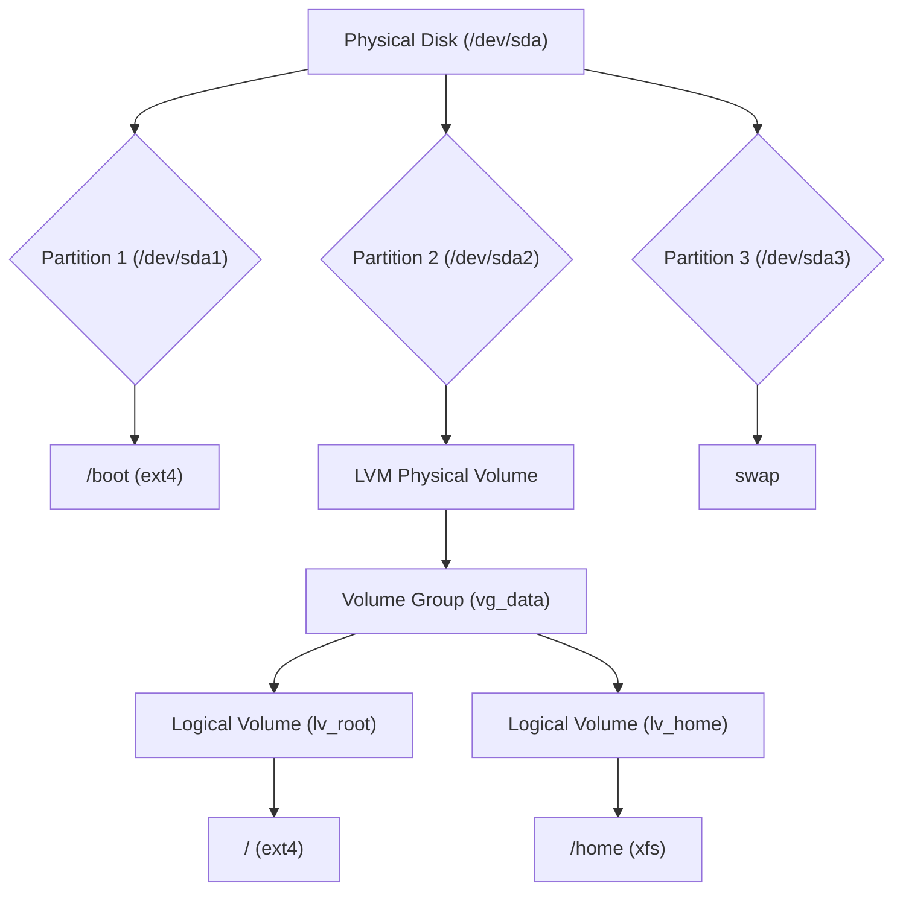
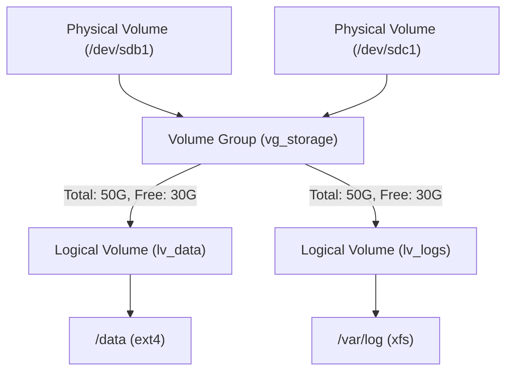

> **Operations - LFCS** | Complexity: `[COMPLEX]`
>
> **Time to Complete**: 80–110 minutes (long-form read + hands-on exercise)
>
> This module treats storage as a production responsibility, so every command is connected to verification, reboot safety, and failure diagnosis.

## Prerequisites

Before starting this module, make sure you can already explain where Linux mounts filesystems, how the kernel exposes block devices, and how basic performance tools report I/O pressure.
- **Required**: [Module 1.3: Filesystem Hierarchy](/linux/foundations/system-essentials/module-1.3-filesystem-hierarchy/) for understanding mount points and inodes
- **Required**: [Module 1.1: Kernel Architecture](/linux/foundations/system-essentials/module-1.1-kernel-architecture/) for understanding kernel/userspace boundary
- **Helpful**: [Module 5.4: I/O Performance](/linux/operations/performance/module-5.4-io-performance/) for storage monitoring context

## Learning Outcomes

After this module, you will be able to perform the following operational tasks and explain the safety checks that make each task suitable for production systems:
- **Configure** disk partitions, filesystems, and mount points using `fdisk`, `mkfs`, UUIDs, and `/etc/fstab`
- **Manage** LVM physical volumes, volume groups, logical volumes, and online expansion for flexible storage allocation
- **Diagnose** block space, inode, I/O, RAID, NFS, and mount failures using `df`, `du`, `lsblk`, `findmnt`, `mdadm`, and LVM inspection tools
- **Design** a Kubernetes 1.35+ node storage strategy that separates ephemeral node data from persistent application data

## Why This Module Matters

**Hypothetical scenario:** A payments company lost an entire morning of order processing because a database host rebooted after a kernel update and came back with an empty-looking data directory. The data was still on disk, but the LVM filesystem that normally mounted at the database path was missing from `/etc/fstab`, so the service started against a plain directory on the root filesystem. By the time an engineer noticed the mount error, the application had written new files in the wrong place, replication lag had climbed, and the recovery plan had to untangle real data from misplaced startup artifacts.

Storage failures feel different from ordinary service bugs because they often arrive as contradictions. `df -h` says space is available, yet the system reports "No space left on device." A logical volume grew by 50 GB, yet the application still sees the old filesystem size. An NFS share works from one host but blocks boot on another. A Kubernetes node has plenty of total disk, yet pods are evicted because image layers and `emptyDir` usage consumed the filesystem that kubelet depends on.

This module teaches storage as an operational system rather than a bag of commands. You will start with the physical layout, then add filesystems, LVM, persistent mounts, NFS, swap, RAID, autofs, monitoring, and Kubernetes node design. The goal is not memorizing a perfect command sequence; the goal is being able to look at a server under pressure, identify which layer is failing, and make the smallest safe change that restores service without creating a boot-time surprise later.

## Disk Layout, Partitions, and Filesystems

Storage begins with a layered mental model. The kernel discovers a block device, the partition table divides that device into regions, a filesystem organizes one of those regions into files and directories, and a mount operation attaches that filesystem into the single Linux directory tree. LVM adds another layer between partitions and filesystems, which sounds like complexity until you need to grow a filesystem online while a production service is still writing to it.



Read the diagram from top to bottom when diagnosing a problem. If `lsblk` does not show the disk, the issue is below the filesystem layer, so `mkfs` and `mount` are the wrong tools. If the disk and partition exist but no filesystem UUID appears in `blkid`, the mount cannot be made durable yet. If the filesystem exists but is not visible at the expected directory, focus on `findmnt`, `/etc/fstab`, and the mount options rather than repartitioning anything.

```bash
# List all block devices
lsblk

# Output example:
# NAME                  MAJ:MIN RM  SIZE RO TYPE MOUNTPOINTS
# sda                     8:0    0   50G  0 disk
# ├─sda1                  8:1    0    1G  0 part /boot
# ├─sda2                  8:2    0   49G  0 part
# │ ├─vg_data-lv_root   253:0    0   30G  0 lvm  /
# │ └─vg_data-lv_home   253:1    0   19G  0 lvm  /home
# sdb                     8:16   0   20G  0 disk

# Detailed partition info
fdisk -l /dev/sda

# Show partition table type
blkid
```

`lsblk` is usually your first view because it connects devices, partitions, LVM mappings, sizes, and mount points in one tree. `fdisk -l` is better when you need partition table detail, while `blkid` confirms whether a filesystem or swap signature already exists. That distinction matters because formatting the wrong device destroys data, and many storage incidents begin when an operator treats "unmounted" as if it meant "unused."

```bash
# Interactive partitioning with fdisk
sudo fdisk /dev/sdb

# Key commands inside fdisk:
#   n - new partition
#   p - print partition table
#   t - change partition type (8e for LVM)
#   w - write changes and exit
#   q - quit without saving

# Non-interactive example: create a single partition using entire disk
echo -e "n\np\n1\n\n\nt\n8e\nw" | sudo fdisk /dev/sdb

# Inform kernel of partition changes (if disk was in use)
sudo partprobe /dev/sdb
```

Partitioning tools edit metadata that tells the kernel where usable regions begin and end. The `w` command in `fdisk` is the point of no return, so print the table before writing and confirm you are targeting the new disk rather than the boot disk. `partprobe` asks the kernel to reread partition metadata, which is useful after changing a disk on a running system, but it is not a magic override if mounted filesystems or busy devices prevent a clean reread.

```bash
# Create ext4 filesystem
sudo mkfs.ext4 /dev/sdb1

# Create XFS filesystem
sudo mkfs.xfs /dev/sdb1

# Create ext4 with specific options
sudo mkfs.ext4 -L "data_vol" -m 1 /dev/sdb1
# -L: label
# -m 1: reserve only 1% for root (default is 5%)

# Check filesystem type
blkid /dev/sdb1
# /dev/sdb1: UUID="a1b2c3..." TYPE="ext4" LABEL="data_vol"
```

Creating a filesystem is a destructive operation because it writes new filesystem structures onto the target device. The `-L` label helps humans, while the UUID helps machines, especially when device names shift after a reboot or hardware change. The ext4 reserved-block setting is also an operational choice: reserving less space can make sense on a large data volume, but root filesystems still benefit from reserved blocks because they give administrators room to log in and recover when ordinary users fill the disk.

| Feature | ext4 | XFS |
|---------|------|-----|
| Shrink filesystem | Yes | No |
| Max file size | 16 TB | 8 EB |
| Best for | General purpose, small-medium volumes | Large files, high throughput |
| Default on | Ubuntu, Debian | RHEL, Rocky |
| LFCS exam | Know both | Know both |

The ext4 versus XFS decision is not about one filesystem being universally better. ext4 is flexible and familiar, including offline shrink support, which can matter in lab environments and smaller general-purpose systems. XFS is excellent for large filesystems and sustained throughput, but it can only grow, so a careless over-allocation may require backup, recreation, and restore if you later need to shrink it.

Pause and predict: if you run `lvextend` on a logical volume but skip the filesystem resize step, which tool will show the new size first, `lvs` or `df -h`? The right answer reveals the boundary between block-device capacity and filesystem capacity, and that boundary is the reason LVM changes can look successful while applications still fail with old space limits.

## LVM: Flexible Storage Without Repartitioning

LVM is the single most important storage abstraction for Linux operations because it turns fixed disks into an allocatable pool. A physical volume contributes extents, a volume group collects those extents, and a logical volume consumes extents as a block device that can be formatted and mounted. This model lets you add a new disk to the pool and grow an existing filesystem without moving the application to a new path or taking a long maintenance window.



The key insight is that the filesystem does not need to know which physical disk provided the extents. That separation is powerful, but it also creates a responsibility to inspect every layer before changing anything. On a busy server, verify the physical volume, volume group, logical volume, filesystem type, mount point, and backup posture before resizing, because a correct command against the wrong LV is still an outage.

```bash
# Mark a partition (or whole disk) as an LVM physical volume
sudo pvcreate /dev/sdb1
# Physical volume "/dev/sdb1" successfully created.

# You can also use whole disks (no partition needed)
sudo pvcreate /dev/sdc

# List physical volumes
sudo pvs
# PV         VG    Fmt  Attr PSize  PFree
# /dev/sdb1        lvm2 ---  20.00g 20.00g

# Detailed info
sudo pvdisplay /dev/sdb1
```

Using a whole disk as a physical volume is common in controlled environments, while creating a partition first can make ownership clearer to tools and humans that expect partition tables. Either way, `pvcreate` writes an LVM label, so it must only be used on devices that you have positively identified as empty or intentionally repurposed. When in doubt, compare `lsblk -f`, `blkid`, and any cloud or hypervisor attachment data before initializing the device.

```bash
# Create a volume group from one or more PVs
sudo vgcreate vg_storage /dev/sdb1
# Volume group "vg_storage" successfully created

# Add another PV to an existing VG
sudo pvcreate /dev/sdc1
sudo vgextend vg_storage /dev/sdc1
# Volume group "vg_storage" successfully extended

# List volume groups
sudo vgs
# VG         #PV #LV #SN Attr   VSize  VFree
# vg_storage   2   0   0 wz--n- 39.99g 39.99g

# Detailed info
sudo vgdisplay vg_storage
```

Volume groups are where capacity planning starts to become visible. `vgs` shows total and free space, while `vgdisplay` gives more detail about extents and allocation. If the volume group has no free extents, `lvextend` cannot help until you add a new physical volume, remove unused logical volumes, or migrate data elsewhere.

```bash
# Create a logical volume with specific size
sudo lvcreate -n lv_data -L 20G vg_storage
# Logical volume "lv_data" created.

# Create using percentage of free space
sudo lvcreate -n lv_logs -l 50%FREE vg_storage
# Uses 50% of remaining free space

# List logical volumes
sudo lvs
# LV      VG         Attr       LSize
# lv_data vg_storage -wi-a----- 20.00g
# lv_logs vg_storage -wi-a----- 10.00g

# The logical volume device path
ls -la /dev/vg_storage/lv_data
# This is a symlink to /dev/dm-X
```

Logical volumes should be named for the service or mount point they support, not for the disk that happened to back them on day one. A name such as `lv_data` is acceptable in a lab, but production names like `lv_postgres`, `lv_registry`, or `lv_containerd` make incident response faster. The `/dev/vg_name/lv_name` path is also easier for humans than `/dev/dm-3`, even though both refer to the same mapped device.

```bash
# Create filesystem on the logical volume
sudo mkfs.ext4 /dev/vg_storage/lv_data
sudo mkfs.xfs /dev/vg_storage/lv_logs

# Create mount points
sudo mkdir -p /data /var/log/app

# Mount
sudo mount /dev/vg_storage/lv_data /data
sudo mount /dev/vg_storage/lv_logs /var/log/app

# Verify
df -h /data /var/log/app
```

Formatting and mounting an LV is the point where storage becomes visible to applications. Use `df -h` to confirm the mounted filesystem size, but also run `findmnt /data` when the mount point matters, because `df` alone can hide the difference between a correctly mounted filesystem and a plain directory on another filesystem. That difference is exactly how services accidentally write critical data into the root filesystem.

```bash
# Extend the logical volume by 5G
sudo lvextend -L +5G /dev/vg_storage/lv_data

# Resize the filesystem to use the new space
# For ext4:
sudo resize2fs /dev/vg_storage/lv_data

# For XFS:
sudo xfs_growfs /data  # Note: XFS uses mount point, not device

# Or do both in one command (ext4 and XFS)
sudo lvextend -L +5G -r /dev/vg_storage/lv_data
# The -r flag automatically resizes the filesystem

# Extend to use ALL remaining free space
sudo lvextend -l +100%FREE -r /dev/vg_storage/lv_data
```

The `-r` flag is the habit to build because it keeps the logical volume resize and filesystem resize in the same operation. Without it, `lvs` may show the additional capacity while `df -h` still reports the previous filesystem size. Notice also the plus sign in `+5G`; without the plus, `-L 5G` means "set the total size to 5 GB," which is a very different instruction from "add 5 GB."

| Mistake | What Happens | Fix |
|---------|-------------|-----|
| `lvextend` without `resize2fs`/`xfs_growfs` | LV is bigger but filesystem still old size | Run `resize2fs` or use `lvextend -r` |
| `-L 5G` instead of `-L +5G` | Sets total to 5G instead of adding 5G (may shrink!) | Always use `+` for relative sizing |
| Forgetting `pvcreate` before `vgextend` | `vgextend` fails: device not a PV | Run `pvcreate` first |
| Shrinking XFS | XFS cannot be shrunk, only grown | Use ext4 if shrinking may be needed |
| Not updating fstab | Mount lost on reboot | Add entry to `/etc/fstab` |

Stop and think: you have a `vg_webservers` volume group with two physical volumes, and you need to expand `/var/www/html` on `lv_html` after adding `/dev/sde`. The efficient online sequence is to initialize the new disk as a PV, extend the existing VG, then use `lvextend -r` against the LV, because the application should keep using the same mount point while capacity grows under it.

## Mounting, `/etc/fstab`, and Boot Safety

Mounting is the act of attaching a filesystem to a directory in the Linux tree. Manual mounts are useful for testing, rescue work, and temporary media, but production storage needs a durable declaration in `/etc/fstab`. That file is small, but it has outsized blast radius because a bad entry can delay boot, drop the system into emergency mode, or hide application data behind an unmounted directory.

```bash
# Basic mount
sudo mount /dev/vg_storage/lv_data /data

# Mount with options
sudo mount -o rw,noatime,noexec /dev/sdb1 /mnt/usb

# Mount by UUID (more reliable than device name)
sudo mount UUID="a1b2c3d4-5678-90ab-cdef-1234567890ab" /data

# List all mounts
mount | column -t
# Or more readable:
findmnt --real

# Unmount
sudo umount /data
```

Mount options express policy. `noatime` reduces metadata writes for read-heavy workloads, `noexec` can reduce risk on directories that should not run binaries, and UUID mounts survive device-name changes. The tradeoff is that options can also break assumptions, so apply them because a workload needs them, not because they look hardened in a checklist.

```bash
# Find the UUID of a device
blkid /dev/vg_storage/lv_data
# /dev/vg_storage/lv_data: UUID="a1b2c3d4-..." TYPE="ext4"

# Edit fstab
sudo vi /etc/fstab
```

The fstab format is compact, so read it as a contract between device identity, mount location, filesystem type, mount policy, and boot-time checking behavior:

```fstab
# <device>                                 <mountpoint>  <type>  <options>       <dump> <pass>
UUID=a1b2c3d4-5678-90ab-cdef-1234567890ab  /data         ext4    defaults        0      2
/dev/vg_storage/lv_logs                    /var/log/app  xfs     defaults,noatime 0     2
```

The six fields are device, mount point, filesystem type, mount options, dump flag, and filesystem check order. Use UUIDs for most local filesystems because they describe the filesystem identity rather than the kernel's current device enumeration. For the final field, root is usually `1`, other local filesystems are often `2`, and network filesystems or pseudo-filesystems usually use `0`.

```bash
# CRITICAL: Test fstab before rebooting!
sudo mount -a
# If this fails, fix fstab before rebooting or your system won't boot

# Verify
df -h
```

**Hypothetical scenario:** A practical war story makes this concrete. A junior sysadmin added an NFS mount to fstab without `nofail`; when the NFS server went down for weekend maintenance, every patched host that rebooted stopped in emergency mode waiting for a network dependency that was not needed to boot the operating system. The repair was one line per server, but the outage consumed hours because each host needed console access before ordinary SSH was available.

Pause and predict: your database server reboots, and `/var/lib/postgresql/data` appears empty because its XFS filesystem did not mount. Before starting or restarting the database, what should you verify with `findmnt`, `blkid`, and `journalctl -b`? The safe path is to confirm the LV and filesystem are intact, mount the correct UUID at the correct directory, and only then let the service touch the data path.

## NFS, autofs, Swap, and RAID in Daily Operations

NFS remains common because it provides a straightforward way to share directories across Linux systems. Its simplicity is also why it is easy to misconfigure: a client mount can hang application threads, a missing `_netdev` can race the network at boot, and an overly permissive export can grant more access than intended. Treat NFS as production storage with network failure modes, not as a local directory that happens to live somewhere else.

```bash
# Install NFS server
sudo apt update && sudo apt install -y nfs-kernel-server

# Create shared directory
sudo mkdir -p /srv/nfs/shared
sudo chown nobody:nogroup /srv/nfs/shared
sudo chmod 755 /srv/nfs/shared

# Configure exports
sudo vi /etc/exports
```

The `/etc/exports` file describes which directories are shared, which clients may reach them, and which server-side safety choices apply to each export:

```exports
# Format: <directory> <client>(options)

# Share with specific network
/srv/nfs/shared    192.168.1.0/24(rw,sync,no_subtree_check,root_squash)

# Share read-only with everyone
/srv/nfs/readonly  *(ro,sync,no_subtree_check)

# Share with specific host
/srv/nfs/backup    backup-server.local(rw,sync,no_subtree_check)
```

The options in an export define both safety and performance. `sync` waits for storage commitment before replying, which is safer and slower than asynchronous behavior. `root_squash` is the safer default because remote root becomes an unprivileged user, while `no_root_squash` should be reserved for narrow cases where the operational requirement is explicit and documented.

```bash
# Apply export changes
sudo exportfs -ra

# List current exports
sudo exportfs -v

# Start and enable NFS server
sudo systemctl enable --now nfs-kernel-server

# Verify NFS is listening
sudo ss -tlnp | grep -E '(2049|111)'
```

Server-side verification should include both export state and listening services. `exportfs -v` confirms the kernel export table, while `ss` confirms whether the expected ports are active. If a client cannot mount, do not debug only from the client; confirm the server export, firewall, name resolution, protocol version, and path all agree.

```bash
# Install NFS client
sudo apt install -y nfs-common

# Show available exports from server
showmount -e 192.168.1.10

# Create mount point and mount
sudo mkdir -p /mnt/nfs/shared
sudo mount -t nfs 192.168.1.10:/srv/nfs/shared /mnt/nfs/shared

# Verify
df -h /mnt/nfs/shared
mount | grep nfs

# Add to fstab for persistent mount
echo "192.168.1.10:/srv/nfs/shared  /mnt/nfs/shared  nfs  defaults,nofail,_netdev  0  0" | sudo tee -a /etc/fstab
```

For client mounts, `nofail` and `_netdev` are boot-safety options, not performance tuning. `nofail` allows the system to continue booting if the share is unavailable, while `_netdev` tells the boot process that the mount depends on networking. For application behavior, choose hard or soft mounts deliberately; hard mounts protect data integrity for many write workloads, while soft mounts can return errors sooner but may surprise applications that are not built for partial storage failures.

Stop and think: a web server needs read-only uploaded content from `nfs.example.com:/srv/webuploads` at `/var/www/uploads`, and it should not block boot when the NFS server is down. A durable entry would use `ro,nofail,_netdev` and an explicit NFS version if your environment requires it, because the web tier should fail gracefully instead of turning a shared-content outage into a host boot outage.

Swap is also a storage feature, even though it is usually discussed with memory. It gives the kernel a place to move inactive memory pages when RAM pressure rises, which can protect small systems from immediate process death. The tradeoff is latency and predictability: swapping a hot workload to disk can make a server look alive while it is too slow to meet its service objective.

```bash
# Create swap on a partition
sudo mkswap /dev/sdb2
# Setting up swapspace version 1, size = 2 GiB

# Enable swap
sudo swapon /dev/sdb2

# Verify
sudo swapon --show
# NAME      TYPE      SIZE USED PRIO
# /dev/sdb2 partition   2G   0B   -2

# Add to fstab
echo "UUID=$(blkid -s UUID -o value /dev/sdb2)  none  swap  sw  0  0" | sudo tee -a /etc/fstab
```

Swap partitions are simple and durable, but they consume fixed disk layout. Swap files are easier to add later and are common on cloud instances or lab systems. Both need correct permissions and a persistent fstab entry if the swap should survive a reboot.

```bash
# Create a 2GB swap file
sudo dd if=/dev/zero of=/swapfile bs=1M count=2048

# Set permissions (swap files MUST be 600)
sudo chmod 600 /swapfile

# Format as swap
sudo mkswap /swapfile

# Enable
sudo swapon /swapfile

# Add to fstab
echo "/swapfile  none  swap  sw  0  0" | sudo tee -a /etc/fstab

# Verify all swap
free -h
```

Kubernetes changes the swap decision. In Kubernetes 1.35+ clusters, node memory behavior should be designed around kubelet configuration, pod requests, pod limits, eviction thresholds, and workload right-sizing rather than hidden paging. This module uses the `k` shortcut for cluster inspection after introducing it with `alias k=kubectl`; when you are correlating node pressure with Linux storage, commands such as `k describe node <node-name>` and `k get pods -A -o wide` help connect kernel symptoms to scheduled workloads.

```bash
# Show all swap spaces
swapon --show

# Disable a specific swap
sudo swapoff /dev/sdb2

# Disable ALL swap (useful for Kubernetes nodes)
sudo swapoff -a

# Check swappiness (how aggressively kernel uses swap)
cat /proc/sys/vm/swappiness
# Default: 60 (range 0-100)

# Reduce swappiness temporarily
sudo sysctl vm.swappiness=10

# Make permanent
echo "vm.swappiness=10" | sudo tee -a /etc/sysctl.d/99-swap.conf
sudo sysctl -p /etc/sysctl.d/99-swap.conf
```

RAID addresses a different question: what happens when a disk fails, or when one disk cannot provide enough throughput. Linux software RAID with `mdadm` can mirror, stripe, or combine parity across disks, but it is not a substitute for backups. RAID protects availability for some hardware failures; it does not protect against deletion, filesystem corruption, ransomware, or an operator formatting the wrong array.

| Level | Minimum Disks | Redundancy | Use Case |
|-------|--------------|------------|----------|
| RAID 0 | 2 | None (striping only) | Performance, no data protection |
| RAID 1 | 2 | Mirror (50% capacity) | Boot drives, critical data |
| RAID 5 | 3 | Single parity (1 disk can fail) | General purpose, good balance |
| RAID 10 | 4 | Mirror + stripe | Databases, high performance + safety |

Choose a RAID level by failure model and workload, not by habit. RAID 0 improves performance but increases risk because any disk loss breaks the array. RAID 1 is straightforward and useful for boot or small critical volumes, while RAID 10 is often favored for write-heavy databases because it combines mirroring with striping and avoids parity-write penalties.

```bash
# Install mdadm
sudo apt install -y mdadm   # Debian/Ubuntu
sudo dnf install -y mdadm   # RHEL/Rocky

# Create RAID 1 (mirror) from two disks
sudo mdadm --create /dev/md0 --level=1 --raid-devices=2 /dev/sdb /dev/sdc

# Create RAID 5 (parity) from three disks
sudo mdadm --create /dev/md1 --level=5 --raid-devices=3 /dev/sdd /dev/sde /dev/sdf

# Create RAID 10 (mirror + stripe) from four disks
sudo mdadm --create /dev/md2 --level=10 --raid-devices=4 /dev/sdg /dev/sdh /dev/sdi /dev/sdj

# Watch the initial sync progress
cat /proc/mdstat
```

Creating an array is only the first half of the job. You also need to save the array metadata into the distribution's mdadm configuration and update the initramfs when the array must assemble during boot. If you skip that step, the array may appear fine until the next reboot, which is exactly when storage mistakes are most expensive.

```bash
# Scan and save to config (CRITICAL — without this, array won't reassemble on boot)
sudo mdadm --detail --scan | sudo tee -a /etc/mdadm/mdadm.conf

# On RHEL/Rocky the path is /etc/mdadm.conf
sudo mdadm --detail --scan | sudo tee -a /etc/mdadm.conf

# Update initramfs so the array is available at boot
sudo update-initramfs -u   # Debian/Ubuntu
sudo dracut --force        # RHEL/Rocky
```

```bash
# Create filesystem on the array
sudo mkfs.ext4 /dev/md0

# Mount it
sudo mkdir -p /mnt/raid
sudo mount /dev/md0 /mnt/raid

# Add to fstab for persistent mount
echo "UUID=$(blkid -s UUID -o value /dev/md0)  /mnt/raid  ext4  defaults  0  2" | sudo tee -a /etc/fstab
```

Monitoring RAID should be routine rather than reserved for emergencies. `/proc/mdstat` gives a compact view of array health, and `mdadm --detail` provides enough detail to identify degraded members, rebuild status, and active devices. Email monitoring is old-fashioned but still useful when paired with modern alerting, because a silent degraded mirror is one disk failure away from data loss.

```bash
# Check status of all arrays
cat /proc/mdstat

# Detailed info for a specific array
sudo mdadm --detail /dev/md0
# Shows state, active devices, rebuild progress, etc.

# Check individual disk status
sudo mdadm --examine /dev/sdb

# Enable email alerts for failures (set MAILADDR in mdadm.conf)
# Then start the monitor
sudo mdadm --monitor --daemonise --mail=admin@example.com /dev/md0
```

```bash
# 1. Identify the failed disk
sudo mdadm --detail /dev/md0
# Look for "faulty" or "removed" state

# 2. Mark the failed disk (if not already marked)
sudo mdadm /dev/md0 --fail /dev/sdb

# 3. Remove the failed disk
sudo mdadm /dev/md0 --remove /dev/sdb

# 4. Add replacement disk
sudo mdadm /dev/md0 --add /dev/sdk

# 5. Watch rebuild progress
watch cat /proc/mdstat
```

Autofs solves a different operational problem: not every remote filesystem should be mounted all the time. On-demand mounting is useful for user home directories, shared documentation, backup paths, and occasionally used NFS shares. It also reduces boot coupling because the mount is attempted when a path is accessed rather than when the host starts.

```bash
# Install autofs
sudo apt install -y autofs

# Configure the master map
sudo vi /etc/auto.master
```

The master map (`/etc/auto.master`) connects a parent directory to a map file and a timeout, which lets autofs defer remote mounts until a user or process actually enters the path:

```text
# Format: <mount-point-parent>  <map-file>  [options]

/mnt/nfs    /etc/auto.nfs    --timeout=60
```

The map file (`/etc/auto.nfs`) then maps each child name under that parent to the remote export and per-mount options that should be used when the path is accessed:

```text
# Format: <key>  [options]  <location>

# When someone accesses /mnt/nfs/shared, autofs mounts NFS
shared    -rw,soft    192.168.1.10:/srv/nfs/shared

# Multiple NFS shares
docs      -ro,soft    192.168.1.10:/srv/nfs/docs
backup    -rw,soft    192.168.1.10:/srv/nfs/backup
```

```bash
# Enable and start autofs
sudo systemctl enable --now autofs

# Test: access the mount point (autofs creates it on demand)
ls /mnt/nfs/shared
# This triggers the mount automatically

# Verify it mounted
mount | grep autofs
df -h /mnt/nfs/shared

# After 60 seconds of inactivity, it auto-unmounts
```

```bash
# Mount any subdirectory from NFS server automatically
# In /etc/auto.nfs:
*    -rw,soft    192.168.1.10:/srv/nfs/&

# Now /mnt/nfs/anything will mount 192.168.1.10:/srv/nfs/anything
```

Before running this in a shared environment, ask yourself which failure is acceptable: an application receiving an I/O error, or an application waiting until storage returns. That answer determines whether a soft NFS mount is tolerable, whether autofs should be used, and whether the application needs its own retry logic above the filesystem.

## Storage Monitoring and Failure Diagnosis

Effective storage diagnosis starts by separating block capacity, inode capacity, mount state, and I/O latency. A server can have free gigabytes and still be unable to create files if it has exhausted inodes. A filesystem can be mounted correctly and still be unusable because every write waits behind a saturated device. A path can exist and still be wrong because it is an ordinary directory where a filesystem failed to mount.

```bash
# Filesystem usage
df -h
# Filesystem                     Size  Used Avail Use% Mounted on
# /dev/mapper/vg_data-lv_root    30G   12G   17G  42% /

# Inodes usage (running out of inodes = can't create files even with space)
df -i
# A common, often overlooked, storage issue is inode exhaustion.
# Each file or directory on a filesystem consumes one inode.
# If a filesystem runs out of inodes, you cannot create new files,
# even if there is plenty of disk space available. This often happens
# in environments with many small files, such as build caches or mail servers.

# Directory sizes
du -sh /var/log/*
du -sh /home/* | sort -rh | head -10

# Find large files
find / -xdev -type f -size +100M -exec ls -lh {} \; 2>/dev/null

# Check what's using space in current directory
du -h --max-depth=1 | sort -rh
```

`df -h` answers "how full is the mounted filesystem," while `du` answers "which directory tree accounts for visible files." Those answers may differ when deleted files remain open by processes, because the directory entry is gone but the disk blocks stay allocated until the process closes the file. In that case, `lsof +L1` is often the missing tool, especially after log rotation or a service that writes large temporary files.

```bash
# Real-time I/O stats per device
iostat -xz 2
# Key columns: %util (100% = saturated), await (latency in ms)

# Per-process I/O
sudo iotop -o
# Shows which processes are doing I/O right now

# Disk health (if smartmontools installed)
sudo smartctl -a /dev/sda
```

I/O metrics explain why "the disk is not full" is not enough evidence. High `%util` and rising `await` indicate that requests are queueing or taking too long, which can make databases, container runtimes, and package managers appear frozen. `iotop` connects the pressure to processes, and SMART data can reveal failing hardware signals that ordinary filesystem tools cannot see.

```bash
# Quick summary of all LVM components
sudo pvs  # Physical volumes
sudo vgs  # Volume groups
sudo lvs  # Logical volumes

# Detailed information
sudo pvdisplay
sudo vgdisplay
sudo lvdisplay

# Check free space in volume group
sudo vgs -o +vg_free
```

LVM monitoring completes the layer map. `pvs` tells you which devices contribute capacity, `vgs` tells you whether the pool has free extents, and `lvs` tells you which logical volumes exist and how large they are. When a filesystem is full and the VG has free space, the path to recovery may be an online `lvextend -r`; when the VG is also full, you need new physical capacity or a cleanup plan.

A useful incident workflow is to state the failing layer before touching it. If writes fail because inodes are exhausted, deleting a few large files is low value; you need to remove many tiny files or rebuild with a different inode ratio. If a path is missing data because a mount failed, copying files into the directory may make recovery harder. If I/O latency is the problem, extending a filesystem may not help unless the underlying capacity change also improves performance.

### Worked Example: Triage a Full Service Filesystem

Imagine an on-call engineer receives an alert that `/srv/registry` is at 98% usage on a host that backs an internal container registry. The first instinct might be to delete old blobs, but the safer first move is to identify whether the alert refers to the filesystem mounted at that path, the LVM logical volume under it, or the volume group behind that LV. Running `findmnt /srv/registry`, `df -h /srv/registry`, and `lvs` gives three views of the same stack before any cleanup or expansion begins.

If `findmnt` shows that `/srv/registry` is mounted from `/dev/vg_registry/lv_data`, the engineer can trust that the service is using the intended filesystem. If `findmnt` returns nothing, the path may be an ordinary directory on the root filesystem, and deleting data from it may remove misplaced files rather than fixing the intended storage. That distinction is important because the recovery action for a missing mount is to restore the correct mount, not to expand the root disk.

Next, compare `df -h` and `df -i`. If both block usage and inode usage are high, the registry may be accumulating many layers and many tiny metadata files. If block usage is high but inode usage is healthy, cleanup by size is likely useful. If inode usage is high while block usage is not, deleting a few large files will not restore service, and the team should target directories with the largest file counts instead.

The volume group view answers a different question: can the filesystem be expanded safely without adding hardware right now? If `vgs` shows free extents in `vg_registry`, an online `lvextend -r` may be the fastest path to restore headroom while a cleanup plan runs afterward. If the VG has no free extents, the incident becomes a capacity acquisition or data-reduction problem, and pretending that LVM can create space from nothing only wastes recovery time.

Good triage also checks whether the service is holding deleted files open. A registry, database, or log-heavy application may keep writing to a file after the directory entry is removed by rotation or cleanup. In that case, `du` can suggest that the visible tree is small while `df` still shows the filesystem as full. Restarting or signaling the owning process may release the blocks, but do that only after confirming the service impact.

When expansion is the chosen recovery action, the engineer should still record the pre-change state. Capture `pvs`, `vgs`, `lvs`, `df -h`, `df -i`, and `findmnt` output in the incident notes or ticket. This is not ceremony; it creates a rollback and review trail that proves which layer changed. It also helps another engineer spot a typo before a command targets a similarly named LV.

After `lvextend -r`, verification should repeat the same checks rather than relying on the command's success message. `lvs` should show the new logical volume size, `df -h` should show the larger filesystem, and application health checks should confirm that the service resumed normal writes. If only `lvs` changed, the filesystem did not grow, and the incident is not over.

Finally, the team should convert the incident into a prevention change. For a registry, that may mean retention policies, image garbage collection, a larger VG reserve, separate storage for logs, and alerts on both block and inode consumption. The root lesson is that emergency expansion can be correct, but it is not a substitute for understanding why the capacity curve surprised the team.

### Worked Example: Recover from a Missing Mount

Now consider a host where `/data/app` is expected to contain application files, but after a reboot the directory contains only a fresh `lost+found` or a small set of startup files. The risky reaction is to copy backups into the path immediately. A safer reaction is to assume that a mount may be missing until proven otherwise, because writing restored data into the wrong filesystem can create a second recovery problem.

Start with `findmnt /data/app` and `lsblk -f`. If the expected UUID exists on an LV but is not mounted, check `/etc/fstab` for a missing, mistyped, or commented entry. Then inspect `journalctl -b` for mount errors from the current boot. These steps tell you whether the mount failed because the device was absent, the filesystem check failed, the mount point was wrong, or the fstab syntax was invalid.

Before mounting over a nonempty directory, inspect the directory carefully. Files written while the mount was absent may need to be moved aside before the correct filesystem is attached. Mounting over them hides them from ordinary path access, which can confuse later forensic work. A common recovery pattern is to stop the service, move misplaced files to a quarantine directory on the root filesystem, mount the correct filesystem, verify expected data, and then decide whether any misplaced files need to be merged.

The durable fix is an fstab entry that uses the filesystem UUID and a test with `mount -a`. If the filesystem is required for the service but not for the operating system to boot, pair the mount declaration with a service dependency rather than hoping boot order works by accident. For network storage, add boot-safe options such as `_netdev` and `nofail` only when the host can genuinely operate without that mount during startup.

This scenario is also why service unit design matters. A systemd service that starts before its required mount can create directories and files in the wrong place. When a service depends on a mount, use the mount point as an explicit dependency or configure the service to fail fast when the expected filesystem is absent. Storage correctness is partly command-line skill and partly boot orchestration discipline.

### Worked Example: Decide Between Cleanup and Expansion

The hardest storage decision is often not technical but operational: should you delete data, expand storage, or stop the service while investigating. Expansion is attractive because it is fast and non-disruptive with LVM, but it can hide runaway growth. Cleanup is attractive because it addresses waste, but it can be dangerous if no one knows which files are safe to remove. Stopping the service protects data integrity but may violate availability goals.

A practical decision rule is to separate emergency restoration from root-cause cleanup. If the filesystem is blocking writes for a critical service and the VG has free extents, expanding by a measured amount can restore service while preserving time for analysis. If the service is filling space because of a bug, the expansion should be paired with a temporary cap, log-level change, or retention adjustment so the new space does not disappear in the next hour.

Cleanup should be based on ownership, age, and recoverability. Package caches, old container images, rotated logs, and build artifacts often have clear cleanup commands. Database files, application uploads, and registry blobs usually require application-aware cleanup because deleting files directly can corrupt indexes or metadata. When the tool that created the data provides a prune, vacuum, or retention command, prefer that over manual file deletion.

Expansion should be based on the layer that is actually constrained. If the filesystem is full and the LV has no free space but the VG does, `lvextend -r` is direct. If the VG is full and a new disk is attached, `pvcreate` plus `vgextend` prepares the pool first. If the physical host has no capacity and the workload is portable, moving data to network storage or a CSI-backed volume may be the more sustainable design.

A good post-incident note includes the exact symptom, the constrained layer, the command used, and the verification output. It should also name the next preventive action, such as adding inode alerts, setting registry retention, separating container runtime storage from root, or documenting the fstab entry. That note turns one stressful incident into shared team knowledge.

## Kubernetes 1.35+ Node Storage Strategy

Kubernetes makes Linux storage more abstract, but it does not make Linux storage disappear. The kubelet, container runtime, image store, pod logs, writable layers, `emptyDir` volumes, and CSI-mounted persistent volumes all land on real filesystems with real capacity and inode limits. When a node reports disk pressure, the control plane sees a scheduling and eviction signal, but the operator still needs Linux tools to identify which path and workload caused the pressure.

For Kubernetes 1.35+ operations, start with a clean division between node-local ephemeral data and application persistent data. Ephemeral data includes image layers, container writable layers, pod logs, and `emptyDir`; it can be recreated, but if it fills the node it can evict unrelated pods. Persistent application data should normally be provided through PersistentVolumes and PersistentVolumeClaims backed by a CSI driver, because the storage lifecycle should follow the workload contract rather than a particular node directory.

```bash
alias k=kubectl
k get storageclass
k get pv,pvc -A
NODE_NAME=<replace-me>
kubectl describe node "$NODE_NAME"
```

Local storage still has valid uses. High-throughput databases, cache systems, and data-processing jobs may benefit from local PVs or dedicated node disks, but those workloads must tolerate node affinity and failure behavior. `hostPath` is rarely the right production interface because it couples a pod to a node's directory layout and bypasses many of the guardrails that make Kubernetes portable.

The storage provisioning decision is also a team boundary. Static provisioning gives administrators tight control and is useful for scarce or manually prepared storage, but it slows delivery because every claim needs an existing PV. Dynamic provisioning through StorageClasses and CSI drivers is the normal production path because developers request storage through PVCs while the platform owns the backend, reclaim policy, expansion policy, and access modes.

Swap deserves special attention on Kubernetes nodes. Traditional Linux guidance may allow swap with tuned swappiness, but Kubernetes scheduling and eviction depend on predictable memory accounting. If swap is enabled without an intentional kubelet configuration, memory pressure can become slower and harder to reason about, which is why many clusters disable swap and manage memory with requests, limits, and eviction thresholds instead.

Which approach would you choose here and why: a StatefulSet needs low-latency storage for a write-heavy database, and the team can tolerate manual failover but not silent cross-node data movement. A local PV may be appropriate if the recovery model is explicit, while a network block CSI driver may be safer if automated rescheduling matters more than the last slice of latency.

## Patterns & Anti-Patterns

Storage operations are safer when the team follows repeatable patterns that reflect the layer model. The point is not to slow every change with paperwork; the point is to make high-risk storage actions boring enough that a tired operator can still execute them correctly. Good patterns also give reviewers something concrete to check before a change reaches production.

| Pattern | When to Use | Why It Works | Scaling Consideration |
|---------|-------------|--------------|-----------------------|
| UUID-based persistent mounts | Local filesystems that must survive reboot | UUIDs follow the filesystem rather than kernel device order | Maintain a mount inventory so stale UUIDs are removed after migrations |
| LVM-backed service volumes | Services that need online growth | LVM separates capacity pools from mounted filesystems | Monitor VG free space before every extension request |
| Dynamic CSI provisioning | Kubernetes workloads that need portable persistent volumes | PVCs express storage intent while the platform owns implementation | Standardize StorageClasses by performance, reclaim policy, and expansion support |
| Boot-safe network mounts | NFS paths that are useful but not required for host boot | `nofail` and `_netdev` prevent network storage from blocking startup | Pair with application health checks so missing mounts are visible |

Anti-patterns usually come from treating a symptom as the layer below it. Teams see "No space left on device" and delete large files when inodes are exhausted. They add capacity to a logical volume but forget the filesystem. They mount a share manually during an incident and forget to persist it, so the fix disappears on reboot. Each mistake is understandable, but each becomes preventable when the diagnosis names the exact layer.

| Anti-Pattern | What Goes Wrong | Better Alternative |
|--------------|-----------------|--------------------|
| Mounting by `/dev/sdX` in fstab | Device names can change after reboot or attachment changes | Use UUIDs for local filesystems and verify with `mount -a` |
| Using `hostPath` for durable app data | Pods become tied to one node and may lose data after rescheduling | Use PVCs backed by an appropriate CSI driver or explicit local PVs |
| Expanding only the LV | The block device grows but the filesystem stays the same size | Use `lvextend -r` or run the filesystem grow command immediately |
| Treating RAID as backup | Deletion and corruption are mirrored just as quickly as good writes | Keep separate backups with restore tests |

## Decision Framework

Use the storage layer as the first decision point. If the problem is capacity inside an existing filesystem and the LV has free backing storage, grow the LV and filesystem. If the problem is remote sharing, choose NFS only after deciding how clients should behave during network failure. If the problem is Kubernetes persistence, start with PVC semantics and work backward to the Linux devices that support the chosen StorageClass.

```text
+------------------------------+
| What storage problem exists? |
+---------------+--------------+
                |
        +-------+--------+
        | Local capacity |
        +-------+--------+
                |
        Is it LVM backed?
          /             \
        yes              no
        |                |
  lvextend -r      add disk, partition,
  then verify      or migrate to LVM

        +----------------+
        | Shared access? |
        +-------+--------+
                |
          NFS or CSI file
          with boot-safe
          client options

        +----------------------+
        | Kubernetes workload? |
        +----------+-----------+
                   |
           PVC + StorageClass
           unless local PV is
           an explicit design
```

| Situation | Prefer | Avoid | Reason |
|-----------|--------|-------|--------|
| Online growth for a service path | LVM plus filesystem grow | Repartitioning mounted disks by hand | LVM changes are scoped and reversible through inspection |
| Shared read-mostly web assets | NFS with read-only client options | Copying files manually to every node | Centralized sharing reduces drift and simplifies updates |
| Durable Kubernetes application data | PVC through a CSI StorageClass | `hostPath` tied to one node | PVCs preserve the workload contract across scheduling events |
| Boot-critical local filesystem | UUID fstab entry tested with `mount -a` | Manual mount commands saved in shell history | Boot behavior must be declared and testable |
| High write performance with node affinity accepted | Local PV or dedicated node disk | Unlabeled generic network storage | The scheduling constraint should be visible in the design |

This framework is intentionally conservative. The fastest command is not always the safest operational change, and storage changes are costly to undo after applications write data. A good storage decision names the failure mode it accepts, the failure mode it refuses, and the command that verifies the system is in the expected state afterward.

## Did You Know?

- **LVM appeared in Linux in the late 1990s**, by Heinz Mauelshagen, giving administrators a practical way to grow and reorganize storage without the old backup-delete-recreate-restore cycle for many common changes.
- **NFSv4 was standardized in the early 2000s** with stateful operation, stronger security options, and compound procedures, yet many outages still trace back to simple client mount choices such as missing `_netdev` or `nofail`.
- **ext4 normally reserves 5% of blocks for privileged use**, which can be valuable on root filesystems but surprisingly expensive on very large data volumes unless you tune the reservation deliberately.
- **Kubernetes 1.35+ storage still depends on Linux node filesystems**, because kubelet eviction, image garbage collection, pod logs, and CSI mounts all map back to capacity, inode, and I/O behavior on real hosts.

## Common Mistakes

| Mistake | Why It Happens | How to Fix It |
|---------|----------------|---------------|
| Growing an LV without growing the filesystem | Operators stop after `lvs` shows the new size and forget that `df` reads filesystem capacity | Use `lvextend -r` for online growth, then verify with both `lvs` and `df -h` |
| Adding an fstab entry and rebooting without a test | The entry looks syntactically simple, so the boot impact is underestimated | Run `sudo mount -a`, inspect `findmnt`, and keep `nofail,_netdev` for noncritical network mounts |
| Diagnosing every space error with `df -h` only | Block usage is familiar, while inode exhaustion is less visible | Check `df -i`, find directories with huge file counts, and clean small-file caches appropriately |
| Using `/dev/sdb1` in long-lived configuration | Device order appears stable in one boot and gets treated as identity | Use filesystem UUIDs or stable LVM paths, then document the mount in `/etc/fstab` |
| Treating NFS like local disk | Applications hide network latency until a server outage causes hangs or boot delays | Choose hard, soft, timeout, `_netdev`, and `nofail` options based on workload failure behavior |
| Leaving Kubernetes node ephemeral data on an undersized root filesystem | Image layers, pod logs, and `emptyDir` usage grow outside the application team's normal view | Size and monitor node filesystems, configure garbage collection, and use PVCs for durable data |
| Assuming RAID replaces backups | Mirroring and parity protect availability for some disk failures, not data history | Keep independent backups and run restore tests before relying on any array design |

## Quiz

<details><summary>Question 1: A web application on `/var/www/html` is running out of space, and the path is an ext4 filesystem on `/dev/vg_web/lv_data`. You attached `/dev/sdc` and need to add 50 GB without downtime. What sequence do you use, and why?</summary>

The safe sequence is to add the disk to LVM, extend the existing volume group, and grow the logical volume plus filesystem in one operation. Use `sudo pvcreate /dev/sdc`, `sudo vgextend vg_web /dev/sdc`, and `sudo lvextend -L +50G -r /dev/vg_web/lv_data`. The plus sign matters because it adds capacity rather than setting the total size, and `-r` matters because the application reads filesystem capacity, not just LV capacity. Verify with `lvs`, `df -h /var/www/html`, and `findmnt /var/www/html`.

```bash
sudo pvcreate /dev/sdc
```

```bash
sudo vgextend vg_web /dev/sdc
```

```bash
sudo lvextend -L +50G -r /dev/vg_web/lv_data
```

The following complete app-data example uses the same LVM pattern with a new logical volume, an ext4 filesystem, a mount point, and a persistent UUID entry:

```bash
sudo pvcreate /dev/sdb
```

```bash
sudo pvcreate /dev/sda2 # Assuming the new partition is sda2
```

```bash
sudo vgcreate vg_appdata /dev/sdb /dev/sda2
```

```bash
sudo lvcreate -n lv_appdata -L 50G vg_appdata
```

```bash
sudo mkfs.ext4 /dev/vg_appdata/lv_appdata
```

```bash
sudo mkdir -p /appdata
sudo mount /dev/vg_appdata/lv_appdata /appdata
```

```bash
UUID=$(sudo blkid -s UUID -o value /dev/vg_appdata/lv_appdata)
echo "UUID=$UUID  /appdata  ext4  defaults  0  2" | sudo tee -a /etc/fstab
```

</details>

<details><summary>Question 2: A build host reports 70% block usage in `df -h`, but Docker pulls fail with "No space left on device" and `df -i` shows the container filesystem at 100%. What is happening, and what do you check first?</summary>

This is inode exhaustion, not block exhaustion. The filesystem still has data blocks available, but it has no remaining inode records for new files or directories, which commonly happens with container layers, build caches, and many tiny artifacts. Start by confirming `df -i`, then identify directories with the highest file counts under the affected mount, such as with `find /var/lib/docker -xdev -printf '%h\n' | sort | uniq -c | sort -rh | head -10`. Remove safe caches or old images first, then consider a filesystem layout with more inodes if the workload repeatedly creates tiny files.

</details>

<details><summary>Question 3: After a reboot, a database directory appears empty, but `lsblk -f` shows the expected XFS filesystem on an LVM logical volume. What should you do before starting the database?</summary>

Do not start the database until you prove whether the correct filesystem is mounted at the data path. Use `findmnt /var/lib/postgresql/data`, `blkid`, and the boot journal to confirm whether the fstab entry failed or was missing. If the filesystem is intact, mount it by UUID at the expected directory, verify ownership and contents, and only then start the service. Starting the database too early can create new files in the underlying directory and complicate recovery.

</details>

<details><summary>Question 4: A team wants to add an NFS mount for web uploads, but the application can run in degraded mode when the share is unavailable. Which fstab behavior should you design for?</summary>

The host should not fail boot just because the upload share is unavailable, so the entry should include `nofail` and `_netdev`, with read-only or read-write access chosen from the application requirement. If the web tier only serves uploaded content, `ro` is usually safer than `rw`. You should also decide deliberately between hard and soft behavior based on how the application handles I/O errors. The final design must include monitoring, because boot safety should not turn a missing share into a silent user-facing failure.

</details>

<details><summary>Question 5: A Kubernetes worker has swap enabled and kubelet behavior is inconsistent with the team's memory model. How do you disable swap now and make the change durable?</summary>

Disable active swap with `swapoff -a`, then remove or comment swap entries in `/etc/fstab` so the setting does not return after reboot. This matters because Kubernetes node memory behavior should be explicit through kubelet configuration, pod requests, pod limits, and eviction policy rather than accidental paging. After editing fstab, verify with `swapon --show` and reboot testing during a controlled window. If the cluster intentionally supports swap through kubelet configuration, document that exception instead of leaving the node in an ambiguous state.

```bash
sudo swapoff -a
```

```bash
sudo vi /etc/fstab
```

</details>

<details><summary>Question 6: A Kubernetes 1.35+ node is repeatedly evicting pods for disk pressure, but the attached data disk for one application has space. What Linux and Kubernetes layers do you inspect?</summary>

The available application disk does not prove that kubelet's working filesystems are healthy. Inspect node paths for image layers, container writable layers, pod logs, and `emptyDir` usage with Linux tools such as `df -h`, `df -i`, and `du`, then connect the symptom to cluster state with `k describe node <node-name>` and pod placement. Persistent application data should be checked through PVCs and StorageClasses, while node ephemeral pressure usually requires cleanup, sizing, log control, or container runtime garbage collection. The fix depends on which filesystem actually triggered the eviction signal.

</details>

<details><summary>Question 7: You created a RAID 1 array and mounted it successfully, but a reviewer blocks the change before reboot. What did they probably notice?</summary>

They probably noticed that the mdadm configuration and initramfs update were missing. A manually created array can look healthy until the next boot, when the system may not reassemble it early enough or under the expected name. Save the array metadata with `mdadm --detail --scan` into the correct distribution config file, then update initramfs with `update-initramfs -u` or `dracut --force`. After that, test the fstab entry and confirm the array identity by UUID.

</details>

<details><summary>Question 8: A team asks for a persistent Kubernetes volume and suggests `hostPath` because it is quick. How do you evaluate that request?</summary>

Start by asking whether the data must survive pod rescheduling, node replacement, and ordinary maintenance. If the answer is yes, `hostPath` is usually the wrong abstraction because it ties the pod to one node's directory layout and hides storage lifecycle from Kubernetes. A PVC backed by a CSI StorageClass is the normal answer for portable persistence, while a local PV can be justified for workloads that explicitly accept node affinity and have a recovery plan. The design should make the failure mode visible instead of relying on a path that only works on one host.

</details>

## Hands-On Exercise: Build a Complete LVM Storage Stack

The exercise builds the same operational path you would use on a server, but it uses loopback devices so you can practice without spare disks. You will create physical volumes, a volume group, a logical volume, a filesystem, a persistent mount, and an online expansion. The important habit is verifying each layer before moving to the next one.

### Setup: Using Loopback Devices as Practice Disks

```bash
# Create two virtual "disks" (100MB each — small for practice)
sudo dd if=/dev/zero of=/tmp/disk1.img bs=1M count=100
sudo dd if=/dev/zero of=/tmp/disk2.img bs=1M count=100

# Attach them as loop devices
LOOP1=$(sudo losetup --find --show /tmp/disk1.img)
LOOP2=$(sudo losetup --find --show /tmp/disk2.img)

# Verify
lsblk | grep loop
```

### Tasks

- [ ] Create the initial LVM stack on `$LOOP1`, format it with ext4, mount it at `/mnt/exercise`, and verify the mount with `df -h` and `findmnt`.
- [ ] Write test data to the mounted filesystem, record a checksum, extend the volume group with `$LOOP2`, grow the logical volume with `lvextend -r`, and verify the checksum still matches.
- [ ] Configure a UUID-based `/etc/fstab` entry for `/mnt/exercise`, unmount the filesystem, run `sudo mount -a`, and confirm the persistent mount works.
- [ ] Diagnose the stack with `pvs`, `vgs`, `lvs`, `lsblk -f`, and `df -i`, then explain which command answers each storage-layer question.
- [ ] Clean up the mount, LVM objects, loop devices, temporary disk images, and the fstab line you added.

### Task 1: Create an LVM stack

```bash
# Create physical volumes
sudo pvcreate $LOOP1 $LOOP2

# Create volume group
sudo vgcreate vg_practice $LOOP1

# Create logical volume (80MB from 100MB disk)
sudo lvcreate -n lv_exercise -L 80M vg_practice

# Create filesystem
sudo mkfs.ext4 /dev/vg_practice/lv_exercise

# Mount it
sudo mkdir -p /mnt/exercise
sudo mount /dev/vg_practice/lv_exercise /mnt/exercise
```

The first task proves that the layers line up. After mounting, `lsblk` should show the loop device, LVM mapping, and mount point, while `df -h /mnt/exercise` should report the filesystem size. If those two views disagree, stop and diagnose before writing data, because the exercise is designed to build verification habits as much as command memory.

### Task 2: Write data and extend

```bash
# Write some test data
sudo dd if=/dev/urandom of=/mnt/exercise/testfile bs=1M count=50

# Check usage
df -h /mnt/exercise

# Extend: add second disk to VG, then grow LV
sudo vgextend vg_practice $LOOP2
sudo lvextend -l +100%FREE -r /dev/vg_practice/lv_exercise

# Verify data still intact and filesystem larger
df -h /mnt/exercise
md5sum /mnt/exercise/testfile
```

The second task is the production skill in miniature. You are not moving the application path, unmounting the filesystem, or recreating data. You are adding capacity to the backing pool and letting LVM coordinate the filesystem growth, then proving that the old data survived the online change.

### Task 3: Add persistent fstab entry

```bash
# Get UUID
blkid /dev/vg_practice/lv_exercise

# Add to fstab (use the UUID from above)
echo "UUID=$(blkid -s UUID -o value /dev/vg_practice/lv_exercise)  /mnt/exercise  ext4  defaults  0  2" | sudo tee -a /etc/fstab

# Test
sudo umount /mnt/exercise
sudo mount -a
df -h /mnt/exercise
```

The third task closes the boot-safety loop. A manual mount proves only that the command worked once; an fstab entry tested with `mount -a` proves that the host can reproduce the mount declaration. In a real change, this is where you would also check service dependencies and decide whether the mount should be required for boot.

### Success Criteria

- [ ] Physical volumes created with `pvcreate`
- [ ] Volume group created and extended with `vgcreate`/`vgextend`
- [ ] Logical volume created and extended with `lvcreate`/`lvextend`
- [ ] Filesystem created, mounted, and data survived extension
- [ ] Persistent mount in `/etc/fstab` tested with `mount -a`

### Solutions

<details><summary>Show the expected verification flow</summary>

Run `lsblk -f` after Task 1 and confirm that `/dev/vg_practice/lv_exercise` has an ext4 filesystem mounted at `/mnt/exercise`. Run `pvs`, `vgs`, and `lvs` after Task 2 and confirm that both loop devices are physical volumes, the volume group consumed the second device, and the logical volume grew. Run `findmnt /mnt/exercise` after Task 3 and confirm the source is the LVM device or its UUID-backed mapping, not a plain directory on the root filesystem. If `mount -a` reports an error, fix `/etc/fstab` before cleanup or reboot.

</details>

### Cleanup

```bash
sudo umount /mnt/exercise
sudo lvremove -f /dev/vg_practice/lv_exercise
sudo vgremove vg_practice
sudo pvremove $LOOP1 $LOOP2
sudo losetup -d $LOOP1 $LOOP2
sudo rm -f /tmp/disk1.img /tmp/disk2.img
# Remove the fstab entry you added
sudo sed -i '\|[[:space:]]/mnt/exercise[[:space:]]|d' /etc/fstab
```

## Sources

- [Linux kernel documentation: The ext4 filesystem](https://docs.kernel.org/filesystems/ext4/)
- [Linux kernel documentation: XFS filesystem](https://docs.kernel.org/filesystems/xfs/index.html)
- [man7.org: fdisk(8)](https://man7.org/linux/man-pages/man8/fdisk.8.html)
- [man7.org: mount(8)](https://man7.org/linux/man-pages/man8/mount.8.html)
- [man7.org: fstab(5)](https://man7.org/linux/man-pages/man5/fstab.5.html)
- [man7.org: swapon(8)](https://man7.org/linux/man-pages/man8/swapon.8.html)
- [LVM2 upstream manual pages](https://man7.org/linux/man-pages/man8/lvm.8.html)
- [Ubuntu Server documentation: Network File System](https://documentation.ubuntu.com/server/how-to/networking/install-nfs/)
- [man7.org: mdadm(8)](https://man7.org/linux/man-pages/man8/mdadm.8.html)
- [Kubernetes documentation: Storage](https://kubernetes.io/docs/concepts/storage/)
- [Kubernetes documentation: Local Persistent Volumes](https://kubernetes.io/docs/concepts/storage/volumes/#local)
- [Kubernetes documentation: Node-pressure eviction](https://kubernetes.io/docs/concepts/scheduling-eviction/node-pressure-eviction/)

## Next Module

Continue with [Module 8.2: Network Administration](../module-8.2-network-administration/) to cover firewall configuration, NAT, network bonding, and other LFCS networking topics.
