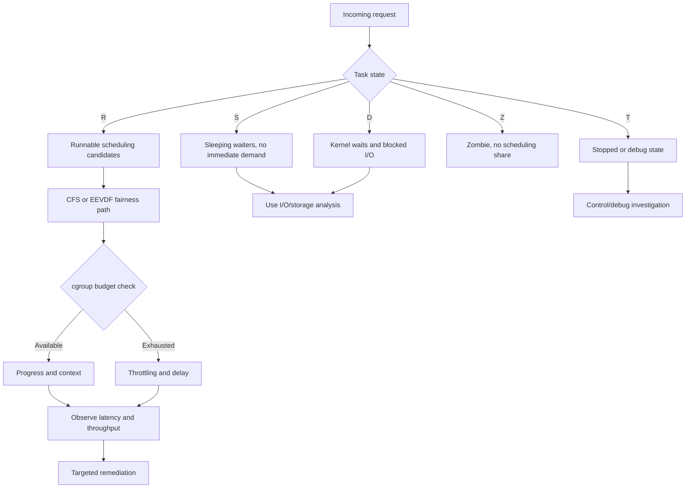
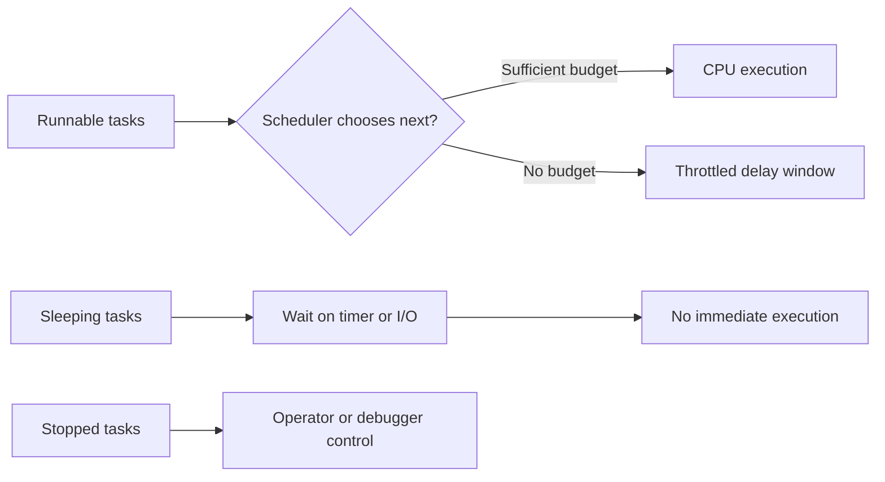
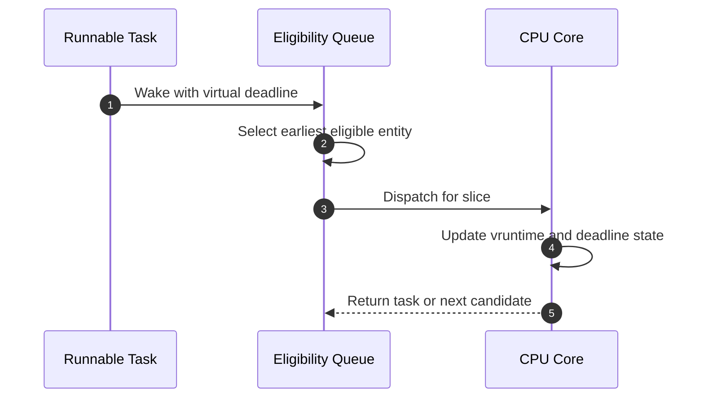
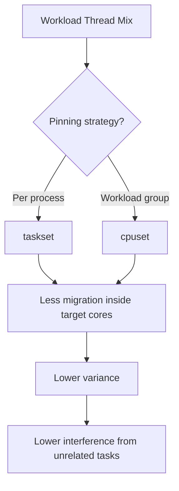

> **Linux Performance** | Complexity: `[MEDIUM]`
>
> **Time to Complete**: 70–100 minutes (long-form read + hands-on exercise)

## Prerequisites

Required (Linux host skills only):

- Read basic Linux command output for process and system status, and understand cgroup basics. The links you will use repeatedly are [module 5.1: USE method](../module-5.1-use-method/), [module 2.2: cgroups](/linux/foundations/container-primitives/module-2.2-cgroups/), and [basic process lifecycle command usage](/linux/foundations/system-essentials/module-1.2-processes-systemd/).

Helpful but not required:

- Kubernetes basics (pods, CPU requests and limits, `kubectl`). The cluster path explains the cgroup-to-Kubernetes mapping as it goes; the host-only path works without it.

A running Kubernetes cluster is **not** required for most of this module. Exercise 1 and Exercise 3 run on any Linux host. Exercise 2 reads pod-level cgroup v2 controls with `kubectl`, so it offers three forks (Killercoda lab, local `kind` cluster, or read-only skip) for learners who do not have a cluster.

## Learning Outcomes

- **LO-1**: Use process state signals `R`, `S`, `D`, `Z`, and `T` to determine whether CPU demand is runnable, blocked, or non-runnable.
- **LO-2**: Describe how CFS and EEVDF differ in scheduling behavior and why latency-sensitive workloads are shaped by vruntime and virtual deadlines.
- **LO-3**: Evaluate scheduler control options across `SCHED_OTHER`, `SCHED_FIFO`, `SCHED_RR`, `SCHED_DEADLINE`, `SCHED_BATCH`, and `SCHED_IDLE`, then select safe controls.
- **LO-4**: Diagnose scheduler and cgroup behavior with `top`, `htop`, `pidstat`, `perf sched`, `sar -u`, `mpstat -P ALL`, `/proc/<pid>/sched`, `/proc/<pid>/status`, and `/proc/stat`.
- **LO-5**: Apply and validate cgroups v2 CPU policy and Kubernetes requests/limits for predictable throughput and bounded latency (the Kubernetes half is the cluster path — see the Exercise 2 fork; host-only learners can validate cgroup v2 policy directly on a Linux host).

## Why This Module Matters

A Kubernetes node can appear healthy on one chart while a latency-sensitive service fails user requests because scheduling and cgroup policy interact in non-obvious ways. A common incident pattern is modest host load with high tail latency, and in that pattern the root cause is often policy-level contention or throttling, not raw CPU absence.

This module gives you a direct incident workflow where each step changes one variable at a time and every step is measurable. You start by reading process state and run-queue pressure, then check scheduler class behavior, then inspect cgroup counters, then correct topology and affinity. This structure prevents the high-noise debugging loop where teams resize nodes, restart pods, and move services before proving cause.



## Process State Signals and CPU Consumption (LO-1)

In this model, process state is your first signal about what the scheduler can do right now. `R` means runnable and queued for CPU arbitration. `S` means interruptible sleep and generally no direct CPU consumption while waiting. `D` means uninterruptible wait, typically on kernel activity such as I/O or blocked driver paths. `Z` means terminated but not reaped. `T` means stopped by control actions such as signals, tracing, or debugging.

Each state has an operational meaning when paired with run-queue observations. If `R` rises while service delay rises, then runnable demand is high and scheduler or policy pressure is likely. If `D` rises with high delays, I/O path and subsystem pressure likely dominates. If `Z` is large and persistent, your immediate concern is lifecycle cleanup correctness rather than scheduler fairness.

A lot of teams use `ps` and only look at one PID column. For triage, use this pattern: capture state distribution first, then inspect top-level CPU and run queue counters, then inspect the suspect process with `/proc` fields. This sequence gives you a cause order before touching priorities or limits.

```bash
ps -eo state= | sort | uniq -c
ps -eo pid,state,ni,pri,pcpu,cmd --sort=-pcpu | head -n 30
```



## CFS Scheduling Logic, vruntime, and Weight (LO-2)

CFS fairness is implemented around virtual runtime tracking so each runnable task is compared against others with normalized service history. The scheduler tries to prevent one task from monopolizing all CPU time by ordering candidates by effective fairness state and scheduling the task with lower fair-delay pressure.

`vruntime` is not a visible wall clock value by itself. It reflects weighted service, so higher-weight tasks advance through runnable history differently than lower-weight tasks. When a workload is weighted correctly, both short interactive requests and background utility tasks can coexist with predictable arbitration.

Schedulers also carry practical constraints. Load spikes can still produce large queues when runnable demand exceeds available execution slots. At that point, reducing contention inside pods, adjusting policy, or changing pod-level constraints is usually the fastest way to restore stable latency. Merely raising one process priority without checking cgroup budget often gives only temporary relief.

## EEVDF in Modern Linux and Latency Outcomes (LO-2)

EEVDF updates modern `SCHED_OTHER` scheduling with a stricter latency model by adding virtual deadlines into dispatch ordering. In practical terms, this reduces some forms of delay drift when many tasks continuously wake and sleep while competing for the same cores.

The important operational result is that many workloads improve in tail metrics even when mean CPU usage stays stable. This is why kernel upgrades and scheduling policy checks should be evaluated with p50/p95/p99 traces, not just average utilization.



## Scheduler Policy Families (LO-3)

`SCHED_OTHER` remains the default policy class for general workloads and is where fairness and EEVDF behavior apply together. It is the right baseline for most services.

`SCHED_FIFO` is strict FIFO real-time and does not use equal-round scheduling. It runs until it blocks, yields, or is preempted by higher-priority RT logic. This can be dangerous in mixed workloads if misapplied.

`SCHED_RR` is real-time round robin among equal priorities and is safer than FIFO for many RT clusters because no task can hold the CPU indefinitely within the same priority band.

`SCHED_DEADLINE` uses explicit runtime and deadline parameters. It is very powerful and very strict. If misconfigured it can fail admission checks or produce severe side effects under load. In production, it is used where workloads have exact timing assumptions and where operations policy supports strict governance.

`SCHED_BATCH` deprioritizes strict interactive behavior in exchange for throughput-oriented background execution. `SCHED_IDLE` yields almost everything else and is useful where a task must not disturb any user-facing work.

For Kubernetes nodes, choose RT classes only with explicit ownership, observability, and rollback. A single bad RT setting can break broad scheduling fairness and reduce control-plane responsiveness.

## Did You Know 1: Default Class Is the Best Starting Point

> **DYK:** `SCHED_OTHER` with tuned cgroup controls usually solves operationally useful latency issues before touching real-time classes.

Most incident timelines improve first by reducing contention and cgroup pressure. Jumping to RT classes without this grounding usually increases variance and makes rollback harder.

## Priority and Policy Adjustment in Practice (LO-3, LO-4, LO-5)

`nice` and `renice` work within normal scheduling semantics, changing relative priority by adjusting weight and placement within fairness arbitration. They are safe tools for bounded adjustments when you can prove the process mix is healthy.

`chrt` changes policy and real-time priority. This is a governance decision more than a tuning preference. Safe usage pattern is small scoped change, pre-incident metrics, and rollback plan at the same time.

Use this order on a single service: baseline signals first, adjust only one priority dimension, run a fixed measurement window, and confirm improved queue delay without collateral effects. If p99 improves while CPU throttling counters remain high, the next layer is almost always cgroup budget, not just nice value changes.

```bash
# Inspect policy for current process
type chrt >/dev/null 2>&1 && chrt -p 1
```

## Did You Know 2: `nice` Is Relative, Not Absolute

> **DYK:** A lower `nice` value helps ordering, but if a pod is already budget-limited in cgroups, it will still hit throttle boundaries and cannot exceed granted runtime for sustained periods.

This is the single most common misunderstanding in CPU incidents. The ranking can improve, but if there is no cgroup headroom, ranking cannot create runtime that is not granted.

## Monitoring Stack for Scheduler Root-Cause Work (LO-4)

Operationally useful evidence comes from layered tools used together. Start with broad metrics from `top`, then move into per-core diagnostics with `mpstat -P ALL`, then inspect thread behavior with `pidstat`, then schedule-level traces with `perf sched`. After these, use `/proc` file inspection to verify causal attribution.

`sar -u` provides trend context for user/system distribution and can reveal periodical saturation patterns that hide in short snapshots. `schedtool` remains useful in mixed legacy environments when policy compatibility is required.

Avoid running all checks at once without context windows. Use stable intervals like repeated one-minute windows because scheduling noise may fluctuate across seconds. Compare before/after states in the same measurement shape.

```bash
top -b -n 1 | head -n 20
mpstat -P ALL 1 8
pidstat -u -t 1 10
sar -u 1 10
# perf sched latency requires a prior perf sched record session
sudo perf sched record -a sleep 5 && sudo perf sched latency
chrt -p $$
```

## Linux Process Files for Verifiable Evidence (LO-4)

`/proc/<pid>/status` is a quick field set for state and switch behavior. `voluntary_ctxt_switches` and `nonvoluntary_ctxt_switches` show whether a task is waiting or being preempted. `State` confirms the high-level scheduler category.

`/proc/<pid>/sched` adds weighted and runtime accounting details. It is a practical forensic file when one service shows unexpected behavior despite acceptable aggregate host metrics. `se.vruntime` and `sum_exec_runtime` are especially useful for comparing runnable service fairness.

`/proc/stat` adds host accounting context so you can see whether demand is user, kernel, or iowait heavy. This helps decide whether CPU contention is truly scheduler-limited or dominated by other subsystems.

```bash
PID=$(pgrep -o -f your-service | head -n 1)
grep -E 'State|voluntary_ctxt_switches|nonvoluntary_ctxt_switches' /proc/$PID/status
grep -E 'se\.vruntime|sum_exec_runtime|nr_switches|nr_involuntary_switches' /proc/$PID/sched
cat /proc/stat | head -n 2
```

This three-file pattern is reliable because it ties runnable demand, fairness accounting, and host load decomposition together in one loop. Any remediation based only on host averages misses at least one signal path.

## Cgroups v2 CPU Controls and Kubernetes Resource Mapping (LO-5)

cgroups v2 exposes controls that directly bound what each workload can do. `cpu.weight` handles relative scheduling share under contention. `cpu.max` imposes hard runtime budget per period. `cpu.stat` shows period count and throttling metrics. `cpu.pressure` reveals CPU pressure experienced under demand.

For Kubernetes, mapping is direct in operations practice. Requests set expected baseline and scheduler placement behavior, while limits impose hard ceilings on burst behavior and sustained progress.

When a pod throttles, `nr_throttled` and `throttled_usec` often explain latency spikes while host graphs are misleadingly calm. The critical command pattern is to read `cpu.max` and `cpu.stat` from inside the pod and then compare with `kubectl top` and external scheduling traces.

```bash
# Typical pod cgroup paths map from namespace file
PID=$(pgrep -o -f your-service | head -n 1)
CG=$(awk -F: '$1=="0" {print $3}' /proc/$PID/cgroup)
cat /sys/fs/cgroup/$CG/cpu.max
cat /sys/fs/cgroup/$CG/cpu.stat
cat /sys/fs/cgroup/$CG/cpu.pressure
```

A useful operational pattern is to create a matrix with one row per pod containing state, run-queue pressure, throttling counters, and request/limit pair. If only one pod has high throttling in steady load, you can usually address it with better concurrency and limit setting.

## Did You Know 3: `cpu.stat` Is Often the First Truth

> **DYK:** `cpu.stat` counter growth often appears before broad SLA degradation is visible on host-level averages.

That means the right first intervention is often inside the workload boundary and not a wholesale node-level capacity action, especially for short burst services that are currently constrained by strict runtime ceilings.

## Cgroups in Kubernetes Practice (LO-5)

In Kubernetes, limits can protect nodes from noisy-neighbor effects but can also create artificial latency for bursty workloads. The platform operator chooses between smoother throughput and strict isolation.

`cfs_quota_us` and period values in cgroups v2 map to `cpu.max`. When a service gets periodic quota refills, each burst that exceeds that period can queue behind the scheduler. You will see it as high throttling counters and lower p99 completion times.

Use this sequence for validation:

- check pod requests and limits in manifest or describe output,
- capture pod-level cgroup counters,
- verify top and per-core distribution,
- validate PSI and switch behavior.

This sequence prevents accidental policy escalation and supports low-risk remediation under load.

## CPU Affinity and Low-Latency Isolation (LO-5)

`taskset` can isolate high-impact tasks to selected CPUs, while cgroup cpusets can reserve and constrain whole service groups. `isolcpus` can reserve kernel scheduler behavior for special hardware or latency-sensitive paths. `nohz_full` reduces periodic scheduling tick overhead on quiet dedicated cores.

Isolation is strongest when combined with capacity planning and pinning discipline. Pinning only one application thread without considering sibling threads and interrupt distribution can move the bottleneck, not remove it.

```bash
taskset -c 0,1 $$
taskset -pc $$
```



The best isolation design includes IRQ steering and NUMA-aware core groups. If network or storage interrupts remain concentrated on isolated cores, you can observe stable task pinning with unstable latency.

## Did You Know 4: Pinning Is a Surgical Tool

> **DYK:** Pinning is most effective when it is narrow, reversible, and paired with IRQ and NUMA checks.

Generalized node-level pinning is rarely the answer. The highest value is in one critical path, with before/after evidence from the exact same workload and an explicit rollback condition.

## Real-World CPU Incident Case Mapping (LO-1, LO-2, LO-5)

Incident diagnostics become faster when mapped into four deterministic scenarios that recur across clusters.

First, throttling under limits: an API service has brief bursts, but `cpu.max` is strict. Host CPU remains moderate, yet requests stall. Cgroup counters reveal repeated quota exhaustion.

Second, context-switch storms: many runnable threads and strict priority reshuffling create wakeup churn. `pidstat`, `perf sched`, and switch counters show active preemption beyond normal baseline.

Third, NUMA imbalance: workload spread across nodes ignores memory locality, causing migration overhead and tail latency despite available raw capacity.

Fourth, IRQ concentration: one core carries interrupts and another carries application threads, creating asymmetric kernel time and perceived idle capacity.

In each case, use a layered fix: first measure, then isolate, then tune cgroup and scheduling controls before making wide policy changes in the same window.

## Extended Operational Playbook and Decision Matrix

To keep high-volume teams consistent, treat CPU incidents as a deterministic sequence with explicit checkpoints instead of a single debugging brainstorm. The first checkpoint is always state and pressure extraction from live processes and host counters. This ensures your team does not mistake one-off spikes for long-running conditions. Keep one note with pre and post timestamps, commands run, and exact output size, and you will prevent evidence drift during incident handoffs.

The second checkpoint is scheduler-path attribution. Build three columns in notes: expected scheduler policy, observed state pattern, and observed per-process scheduling metrics. If a process remains runnable most of the time while latency rises, then you are in a queue contention context, and priority changes become meaningful. If the process spends long stretches in uninterruptible wait, then you are not in pure scheduler contention and should inspect storage, drivers, and dependency chains first. This distinction avoids wasting capacity on incorrect remediations.

The third checkpoint is cgroup budget attribution. At this stage, read the pod cgroup `cpu.max`, the full `cpu.stat`, and `cpu.weight` side by side with platform manifests. If `nr_throttled` grows in the same interval as request drops, then budget enforcement is a primary control point. If limits are generous but throttling is still present, then either a hidden nested control or node-level assignment issue is present, and the next step is namespace and runtime path inspection. This is especially true for managed environments where runtime class and runtime handler can remap container context under the hood.

The fourth checkpoint is topology and affinity attribution. Before changing `taskset`, capture core-level behavior and interrupt spread. If a single core handles interrupt-heavy inbound packet paths while critical application threads live on another isolated core, your latency profile will stay unstable even with policy tuning. If the application is spread evenly but still unstable, inspect NUMA locality and memory movement because service residency can dominate latency without obvious CPU saturation.

Checkpoint five is risk-scoped change planning. Pick one control category per iteration, for example limit tuning first, then pinning second, then thread shape third. Keep a one-page blast radius statement that names expected benefits and explicit rollback points. The one-control approach sounds strict, but in real incidents it reduces ambiguity and prevents simultaneous changes from making postmortems impossible.

When you tune limits in Kubernetes, track both `cpu.max` evolution and queue behavior for at least two windows before declaring victory. A successful first window with lower throttling but worse tail latency often means the service had hidden oscillation, and the change merely shifted where latency accumulates. Continue to the second window only if both mean and tail improve together, then persist the change and record assumptions.

For process priority tuning, treat `nice` and `renice` as temporary pressure relief tools, not architecture. If a process remains unstable after priority tuning, check cgroup policy first. If cgroup policy is correct and thread count is still too high, reduce runnable concurrency and rerun measurements. This is frequently where teams recover stability faster than with repeated RT policy experiments.

Real-time policy categories must be documented with strict boundaries. If `SCHED_FIFO` or `SCHED_RR` is required, keep the scope to one narrow service and include explicit guardrails for duration, restart policy, and automatic fallback. Keep one fallback path to standard `SCHED_OTHER` and avoid running broad `SCHED_OTHER` and RT service mixes without explicit admission controls.

Do not skip the rollback rehearsal. Before starting the change in production, rehearse the exact inverse command in a sandbox so the team can remove the change without additional diagnosis. Rehearsals are part of the operational control strategy because recovery time frequently defines whether an incident stays controlled. The most expensive failure is a one-way optimization that works only because the team cannot unwind it cleanly.

The playbook is stronger when you define service archetypes and attach known-safe patterns. For short burst APIs, keep a low to moderate limit plus conservative context-switch guardrails. For throughput-oriented batch services, keep generous CPU share and tune worker parallelism before pinning. For mixed services that are latency-sensitive but periodic, apply conservative scheduling and explicit cgroup budgets with observability windows before any topology decisions.

Your incident evidence should include a direct action table: command, observed value, threshold expectation, and decision. This single artifact becomes the most efficient way to align on-call handoffs, because new responders can continue with measurable actions without reading a long narrative. The objective is not to prove every theory; it is to prove each next action.

Another strong signal for operators is to compare scheduler traces with deployment context. If a service deployed through a fast rollout overlaps with new latency, compare pre-deployment `perf sched` and `pidstat` with post-deployment values. If the service pattern changes only after rollout, include deployment order and scheduling pressure in the root-cause statement. This practice avoids false blame shifts into unrelated node-level capacity events.

When the incident spans multiple namespaces, treat control changes as scoped to namespace boundaries. A pod in one namespace can create pressure that affects shared worker classes on nearby nodes, so avoid changing node-wide policy from one signal. Namespace-level and deployment-level mitigation usually produces smaller blast radius and faster reversal.

For runbooks, include explicit acceptance criteria. A good acceptance statement uses three metrics: target queue delay reduction, stable per-core distribution, and reduced cgroup throttling or reduced preemption drift in the same interval. If all three metrics improve, the change is likely safe. If only one improves, keep the change as partial and continue the sequence.

Final incident closure should include a short lesson anchored to the first checkpoint where misalignment began. That ensures future responders can spot patterns quickly and reuse the same sequence with less delay. This is how teams move from ad-hoc optimization to deterministic platform operations.

### Expanded Incident Resolution Framework for Reusable Production Triage

This expanded framework is designed to make every response reproducible under pressure and to avoid drifting into arbitrary optimization. Use this as a team playbook and keep each stage explicit.

Start with a strict timeline statement, then capture state, scheduling, and fairness metrics at the same moment. This avoids comparing apples to oranges when load patterns shift every minute. Store the snapshots in a single incident artifact with explicit command output and timestamps.

Next, confirm whether contention is caused by runnable queue depth or by blocked tasks. If queue depth grows while non-runnable states dominate, you likely need I/O or dependency analysis before any scheduling change. If runnable states dominate with rising run-to-wait delays, scheduler and cgroup policy are your primary focus.

Then validate scheduler policy and weighting assumptions. Check which policy each critical process uses, then compare with expected baseline. If many critical services use nonstandard policy without an explicit approval path, normalize first and only then move on to targeted cgroup or affinity changes.

Next, inspect cgroup CPU budgets at pod boundaries. Compare requested and limited values, and read `cpu.max`, `cpu.stat`, and `cpu.pressure` from the active pod cgroup path. High throttling with moderate host utilization usually points directly to policy cap enforcement and not lack of hardware capacity.

Topology and affinity come after policy checks. A core can look unused globally and still be useless for a target workload if all runnable load is forced through unrelated IRQ paths or if interrupt handling stays concentrated in one area. Keep the isolation model explicit, but do not pin yet unless you can identify a deterministic boundary.

Only after this evidence stage should you perform one change, such as reducing worker parallelism, adjusting limit boundaries, or pinning one workload family. Run the same snapshot commands after each change, and stop when the measured target improves without harming neighboring service classes.

For teams with frequent incidents, a post-incident review should include which of these stages changed first and which stage confirmed the final root cause. The objective is not only to fix one issue but to increase first-time-right rate in the next outage.

In this same style, add the incident checklist to internal runbooks. For each class, define expected state transition, expected cgroup behavior, expected command deltas, and expected rollback criteria so every responder can act with comparable confidence.

Expected behavior from this framework: fewer surprises, fewer speculative remediations, and stronger confidence because each fix is tied to observed scheduler and cgroup evidence.

## High-Fidelity CPU Audit Template for Kubernetes Operations

You can run this section as a team exercise before any production change, and it prevents the two most common failures: changing controls without baseline evidence and changing too many variables at once. Keep a time-boxed log with snapshot number, command output hashes, and explicit operator names. For each snapshot, store process state distribution, scheduler metrics, cgroup counters, topology hints, and application-level latency in the same artifact so every responder can compare against the same frame.

The first snapshot is a process-state map, and it should not be optional. Collect `R`, `S`, `D`, `Z`, and `T` shares for each critical pod or service process, then tag each share as runnable demand, wait state, uninterruptible path pressure, reaped-incomplete lifecycle, or controlled stop. If runnable share increases faster than expected while latency rises, escalation is usually in arbitration, not storage. If non-runnable share increases, you should treat scheduler policy as a secondary rather than primary lever and investigate dependencies or I/O saturation before adjusting CPU controls.

The second snapshot is global scheduling pressure with host context. In high-trust operations, read `top` for queue depth and task mix, then read `mpstat -P ALL` for per-core execution shape. A balanced host under pressure will often show moderate user and system percentages with uneven per-core runnable distribution, while a malformed workload might show both high user utilization and high migration churn. This snapshot is where teams separate a true saturation event from a NUMA distribution artifact in one pass.

The third snapshot is event-level scheduling trace quality. If you can only run one diagnostic tool during a live incident, run `perf sched` first to observe wakeup and dispatch latencies. If preemption and run-delay spikes move when you alter run policy, your incident is policy-sensitive. If trace quality remains similar while symptoms vary with input rate, then the limiting factor is more likely upstream concurrency, workload shape, or infrastructure affinity than scheduler configuration alone.

The fourth snapshot is per-process accounting with `/proc` files. Read `/proc/<pid>/status` fields `State`, `voluntary_ctxt_switches`, and `nonvoluntary_ctxt_switches`; and then read `/proc/<pid>/sched` fields `nr_switches`, `se.vruntime`, and `sum_exec_runtime`. When one process accumulates many nonvoluntary switches under stable load, this indicates preemption pressure and queue conflict. When `State` is mostly `R` but runtime remains low, then arbitration is blocked by shared policy or budget boundaries. This is the fastest route to a falsifiable hypothesis for every subsequent change.

The fifth snapshot is cgroup reality versus Kubernetes intent. Read pod-level `cpu.max`, `cpu.weight`, `cpu.stat`, and `cpu.pressure`, and then compare them to pod requests and limits in the manifest or `kubectl describe`. `cpu.stat` throttling counters that rise with high queue delay while host usage appears reasonable are especially important, because they often explain the “why is it lagging if host is not full” symptom. If you see no meaningful counter rise and still have lag, your likely issue is topology pressure or burst timing rather than hard quota.

The sixth snapshot is topology and isolation. Before touching policy, capture `/proc/interrupts`, `cat /proc/self/status | grep Cpus_allowed_list` for observed affinity constraints, and a short `mpstat -P ALL` run. If interrupts are concentrated while your critical service is pinned elsewhere, you are probably trading one bottleneck for another. If service processes scatter across sockets while memory localities and NUMA distances stay inconsistent, latency remains unstable no matter how fair the policy appears.

Use one change per iteration. Choose one control lever from one row of the table below, change it for a short fixed window, and verify with the same full snapshot sequence. This method avoids false positives and gives you direct proof of whether queue delay and throttling changed together or independently.

| Control lever | Observable hypothesis | First expected movement | Failure fallback |
|---|---|---|---|
| `nice` / `renice` on workload processes | Runnability ordering should improve inside shared cgroup budget | Shorter wait tails before service processing | Revert if throttling counters remain dominant |
| `chrt` policy and real-time priority | Deterministic dispatch for RT-critical threads should appear without starvation | Lower scheduling jitter in `perf sched` for target threads | Revert if control-plane responsiveness degrades |
| `cpu.max` tightening/relaxing | Effective budget should cap or release throughput with visible throttle slope change | `nr_throttled` growth decelerates after budget increase | Re-pin to safe baseline and reopen only one additional lever |
| `cpu.weight` increase within sibling pods | Relative share should rebalance service queues under contention | Fairness counters and p99 latency stabilize on target pod | Return to baseline and inspect competing siblings |
| `taskset` / cpuset affinity | Less migration and clearer core ownership for critical threads | Reduced migration noise in core distribution and more stable per-core delay | Remove pinning and evaluate if topology mismatch remains |
| Worker concurrency reduction | Runnable depth should drop before scheduler policy changes | Fewer context switches and shorter queue wait with stable throughput | Re-expand gradually and retune with explicit target load |

The seventh snapshot is verification against business signals. Choose a workload command that reflects end-user latency, such as synthetic request loops or application readiness checks, and compare p50 and p99 with your scheduler snapshots. A legitimate fix has to show user-facing improvement or at least measurable queue improvement in exactly the same window. If a knob improves raw queue metrics but not business latency, the issue may live above the node plane and must be escalated differently.

LO-1 and LO-2 coverage in the audit template: you explicitly separate runnable versus non-runnable behavior and then inspect fairness signals and vruntime-like accounting from `/proc/<pid>/sched`. If you do not record both, remediation decisions are guesses.

LO-3 and LO-4 coverage in the audit template: every policy and tool command belongs to a defined snapshot category, and each category has expected movement before moving forward. This avoids changing from `SCHED_OTHER` to RT classes only to observe no measurable improvement because cgroup throttling was the primary limit.

LO-5 coverage in the audit template: each iteration maps expected Kubernetes-level behavior to exact cgroup v2 counters, then maps those counters to workload SLOs. That closes the gap between platform governance and process-level tuning.

### Incident-Ready Command Sequence with Stable Timing

Run the following sequence for exactly five snapshots during an active incident, each in fixed intervals, then compare against the same runbook for every cycle:

First snapshot: capture baseline and identify the dominant states and queue signatures.
```bash
for _ in 1 2 3; do
  ps -eo state= | sort | uniq -c
  top -b -n 1 | head -n 20
  mpstat -P ALL 1 3
  sleep 4
done
```

Second snapshot: collect scheduling traces under current policy.
```bash
sudo perf sched record -a -g sleep 10
sudo perf sched latency
```

Third snapshot: collect process-level accounting and cgroup counters for the selected service, then capture the same commands again with timestamps before interpreting any control change.
```bash
PID=$(pgrep -o -f your-service | head -n 1)
grep -E 'State|voluntary_ctxt_switches|nonvoluntary_ctxt_switches' /proc/$PID/status
sed -n '1,140p' /proc/$PID/sched
CG=$(awk -F: '$1=="0" {print $3}' /proc/$PID/cgroup)
cat /sys/fs/cgroup$CG/cpu.max
cat /sys/fs/cgroup$CG/cpu.stat
cat /sys/fs/cgroup$CG/cpu.pressure
```

Fourth snapshot: test one control change in isolation for a fixed window and capture the same signals again.
```bash
# Example: controlled priority reduction (niceness increase)
TASKS=$(pgrep -f your-service | head -n 1)
renice -n 5 -p $TASKS
sleep 12
grep -E 'State|voluntary_ctxt_switches|nonvoluntary_ctxt_switches' /proc/$TASKS/status
sed -n '1,140p' /proc/$TASKS/sched
cat /sys/fs/cgroup$CG/cpu.stat
```

Fifth snapshot: rollback immediately and collect one confirming set if counter movement is not clearly beneficial.
```bash
renice -n 0 -p $TASKS
sleep 12
cat /sys/fs/cgroup$CG/cpu.stat
top -b -n 1 | head -n 20
```

This sequence creates a reversible experiment, not a one-way optimization. Every command in each snapshot is designed to be compared side-by-side, which is what makes incidents recoverable when on-call traffic pressure rises. If one metric changes and another worsens, you should stop and attribute the change before continuing. This is the operational difference between “we changed something and hope” and “we changed one thing and prove it.”

### Platform Escalation and Reproducibility Notes for SRE Teams

When this audit points to policy conflict rather than pure capacity, escalate with a short decision summary: state mix, scheduler class baseline, cgroup budget direction, and business impact. Include the command list and the exact output snapshot, not just narrative. This allows a second operator to reproduce the finding without relying on memory under pressure, and it protects against false attributions during handover.

When a team has recurring incidents, convert the sequence above into a scheduled health check that runs during business hours against non-critical workloads to build baselines. Recurrent baseline variance often reveals hidden interference before production impact appears. A node with stable historical baselines and clearly bounded variation can absorb more aggressive scheduling changes than a node with unstable baseline behavior.

For Kubernetes operations specifically, create a pair of controls for every deployment pattern: one for request/limit fit, one for policy fit. A pod can be perfect on requests and still unstable under burst because of `cpu.max` and throttle cadence. Likewise, a pod can pass cgroup counters but still fail if scheduling class, affinity, and topology are mismatched. That is why you should treat each new service profile as two policy domains instead of one combined domain.

If you suspect a node-level issue rather than a pod-level issue, run the sequence in a spare node and compare the same service class under similar load. Any control that appears to fix one node and not another usually indicates hardware locality, IRQ layout, or runtime path variance. That variance is exactly where teams should add explicit node labels, placement constraints, and policy exceptions before broad rollout.

At the point of closure, record whether the root cause was queueing, quota, or topology, and include one line on what to avoid in the next incident. This closure note is not paperwork. It is preventive engineering because it converts one incident into a pattern that reduces future mean time to diagnosis.

## Post-Incident Interpretation Matrix and KPI Triangulation

The final stage of this module is translating all measurements into a stable decision matrix so future changes are faster and less risky. When the team builds this matrix once, it prevents interpretive drift during the heat of an incident and avoids arguing about what each counter means under pressure. Each row should carry one short symbol line and one measurable acceptance line.

Begin with a symptom-to-class separation. Symptom categories include latency spikes, request retries, context-switch storms, and intermittent throttling spikes. Root classes include fairness-pressure, quota-pressure, topology-pressure, and concurrency-pressure. Use only one class per iteration and tie every change to one class hypothesis before testing. If two classes are active, pick the one with stronger evidence and document the selection logic in your log.

For fairness-pressure, expect evidence in runnable share and scheduler trace shape. `R` increase with rising queue delay and stable cgroup headroom usually means a scheduling arbitration issue. In this class, safe controls are often in process shape first, then policy tuning, and finally workload concurrency. Avoid changing cgroup ceilings before this distinction is proven.

For quota-pressure, expect evidence in `cpu.max`, `cpu.stat`, and `cpu.pressure` counters. If throttle counters grow while host averages stay moderate, this is usually a hard budget case. In this class, changing nice or RT class without fixing cgroup limits mostly redistributes contention rather than resolving it. A useful control is to alter request/limit boundaries only after one full window confirms sustained counter movement.

For topology-pressure, expect evidence in interrupted or concentrated core behavior. If `/proc/interrupts` and per-core utilization diverge, the system can look balanced while user latency degrades. In this class, change cpuset affinity, interrupt steering, and NUMA placement only after one full snapshot of baseline core spread.

For concurrency-pressure, expect evidence in `/proc/<pid>/status` and `pidstat` preemption or switch behavior. If runnable demand remains stable but context switch rates increase, reduce in-process worker density before touching kernel policy. This often fixes jitter in bursty services and protects the node from oscillation caused by too many competing runnable workers.

The next discipline is KPI triangulation. Each candidate change should be declared effective only when business latency and at least two control signals move in the expected direction. For example, after increasing `cpu.max`, you should see reduced `nr_throttled` growth, reduced wakeup delay, and improved p99 distribution in the same verification window. If only one signal moves, treat it as insufficient.

Use this triage table as a shared runbook artifact.

| Class | Primary signal | One control action | Expected measurable outcome |
|---|---|---|---|
| Fairness-pressure | High runnable queue with unstable selection order | Reduce worker concurrency or tune `nice` conservatively | Lower run-queue contention and lower wait-tail variance |
| Quota-pressure | Rising `nr_throttled`, `throttled_usec`, and `pressure` | Adjust `cpu.max` and validate sibling impact | Throttle slope flattens while p99 stabilizes |
| Topology-pressure | Asymmetric core/IRQ distribution | Move workload to explicit cpusets and align interrupts | Fewer migrations and steadier per-core execution shape |
| Concurrency-pressure | High voluntary/nonvoluntary switch counts | Cut in-process parallelism and retest with same traffic shape | Lower switch churn and improved completion consistency |

The goal is not to collect perfect telemetry but to preserve causality under stress. A runbook with this structure can be reviewed quickly in handoff, because every response includes class, action, and expected result before production change.

A strong postmortem includes one line for each class, even when class is not active. That line is the institutional memory that turns repeat incidents into quicker decisions because the team can avoid repeating early assumptions. Keep these notes lightweight so they can be captured live.

Example workflow after a failed first change: if latency improves but throttling remains and queue delay worsens, revert and classify as quota-pressure. Then test the same workload with a wider budget and one class of topology validation. If the second window confirms cgroup alignment, keep only the budget-oriented step and reject any unrelated policy modifications.

Do not let this remain documentation-only. If two recurring incidents map to the same class, automate one command bundle that prints the exact same evidence in order: process state counts, scheduler traces, `/proc` deltas, and cgroup counters. Automation does not replace judgment; it preserves the chain of command required by on-call workflows.

## Common Mistakes

| Mistake | Why it fails | Better action |
|---|---|---|
| Raising nice without checking cgroup quotas | Relative priority improves only within available budget | Validate `cpu.max` and `cpu.stat` before changing nice |
| Changing RT classes on mixed workloads | Can starve control traffic and system tasks | Limit RT use to approved, isolated cases |
| Treating low host utilization as healthy | Hidden throttling can exist with calm averages | Always read per-cgroup counters and run queue shape |
| Ignoring `D` and `Z` patterns | Focus shifts to wrong troubleshooting path | Classify state mix before changing policy |
| Pinning without reviewing IRQ spread | Interference remains on isolated and shared cores | Rebalance interrupts and workload groups together |
| Overthreading a workload without need | Context switches increase despite capacity | Right-size worker count before priority changes |
| Using one incident action for all metrics | Masks root cause and introduces risk | Apply one knob, measure one metric set, iterate |

## Quiz

<details>
<summary>LO-1: Which process state means it can be selected by CPU scheduling now, and what is the immediate implication for scheduling demand in a production incident?</summary>

**Correct answer:** `R`, because it is the state that remains eligible for immediate CPU dispatch when arbitration finds an available run queue slot.

**Reasoning:** `R` is the runnable state and is directly in scheduling pressure. `S`, `D`, `Z`, and `T` do not represent immediate runnable demand in the same way.
</details>

<details>
<summary>LO-2: In the context of CFS, which metric is used to compare relative service progression for fair scheduling decisions across runnable tasks?</summary>

**Correct answer:** `vruntime`, because it records weighted relative execution as fairness pressure and determines which runnable task should receive compensating service next during sustained contention.

**Reasoning:** `vruntime` tracks weighted virtual progress and is used to bias selection toward tasks that should receive catch-up service in fairness terms.
</details>

<details>
<summary>LO-2: Why does EEVDF matter for latency-sensitive systems where wake-up and sleep cycles are frequent?</summary>

**Correct answer:** It improves scheduling order using eligibility and virtual deadline concepts, which keeps latency spikes smaller when mixed interactive and background workloads wake repeatedly.

**Reasoning:** This refines decisions under contention and can reduce wakeup jitter for short burst and interactive workloads compared with older fairness-only behavior.
</details>

<details>
<summary>LO-3: Which scheduler policy should you choose for general workloads in Kubernetes nodes when latency and fairness stability are both concerns?</summary>

**Correct answer:** `SCHED_OTHER`, because it is the default fairness-based policy for general platform workloads and should remain the baseline unless explicit real-time requirements are approved.

**Reasoning:** It is the standard policy for non-real-time workloads and provides fair scheduling behavior with modern EEVDF dynamics while avoiding widespread interference patterns introduced by broad RT policy changes.
</details>

<details>
<summary>LO-4: What is the most reliable workflow for scheduler diagnosis when signs point to scheduling and cgroup contention at once?</summary>

**Correct answer:** Use `top`, `pidstat`, `perf sched`, and `/proc` evidence together before changing policy, then close a decision loop with one additional comparison window and verify that queue and latency signals improve in the same period.

**Reasoning:** Isolated metrics can miss causality. Layered signals prevent changing knobs based on one symptom and give you a reproducible change sequence.
</details>

<details>
<summary>LO-5: How can you confirm cgroup CPU throttling before changing Kubernetes limits during a live incident response?</summary>

This question checks whether you can prove quota pressure before touching workload governance during an incident response sequence where latency and queue behavior stay tied to measured limits rather than assumptions.

**Correct answer:** Read `cpu.max`, `cpu.stat` fields `nr_throttled` and `throttled_usec`, then correlate those counters with scheduling symptoms and latency windows before changing limits.

**Reasoning:** These counters directly show budget exhaustion and run-time delays at the cgroup level, and their trend should be matched with workload timing before any limit adjustment is treated as a production-safe fix.
</details>

## Hands-On Exercises

Exercise 1 and Exercise 3 need only a Linux host. Exercise 2 reads pod-level cgroup v2 controls with `kubectl` on a running cluster, so pick one fork before starting it:

- **Use the Killercoda lab** linked in this module's header (`linux-5.2-cpu-scheduling`), which provides a ready environment with a cluster.
- **Or spin up a local cluster first**, for example with [`kind`](https://kind.sigs.k8s.io/) on your own machine, then run Exercise 2 there.
- **Or skip the cluster exercise.** Read Exercise 2 as a worked example and treat its Expected Output as follow-up; the host-only exercises are fully achievable without a cluster.

### Exercise 1: Plain Linux state and scheduler evidence (host-only)

- [ ] Capture process state distribution and identify the dominant states.
```bash
ps -eo state= | sort | uniq -c
ps -eo pid,state,ni,pcpu,cmd | head -n 20
```

- [ ] Capture scheduler counters from `/proc` for one running PID and confirm state consistency.
```bash
PID=$(pgrep -o -x your-service | head -n 1)
grep -E 'State|voluntary_ctxt_switches|nonvoluntary_ctxt_switches' /proc/$PID/status
sed -n '1,90p' /proc/$PID/sched
```

- [ ] Inspect per-core balance and system accounting before decisions.
```bash
mpstat -P ALL 1 8
cat /proc/stat | head -n 2
```

Expected output: you should identify whether scheduler contention is per-core, per-task, or system-wide, and document which exact command sequence showed the earliest measurable difference across two back-to-back windows.

### Exercise 2: Kubernetes lab with cgroup v2 `cpu.max` and throttling visibility (cluster fork)

> **Cluster fork:** This exercise needs `kubectl` access to a running cluster (Killercoda lab `linux-5.2-cpu-scheduling`, a local `kind` cluster, or an existing cluster). Without one, skip it or read it as a worked example — see the forks above. Pod names, counter values, and timing below are illustrative; a live cluster will differ.

- [ ] Start or use a local cluster and run a strict pod.
```bash
kind create cluster --name cpu-sched-lab
kubectl create ns cpu-sched-lab
kubectl apply -f - <<'EOF'
apiVersion: v1
kind: Pod
metadata:
  name: cpu-throttle
  namespace: cpu-sched-lab
spec:
  containers:
  - name: cpu-throttle
    image: busybox
    command: ["sh", "-c", "while true; do true; done"]
    resources:
      requests:
        cpu: 100m
      limits:
        cpu: 100m
EOF
```

- [ ] Read pod-level controls and verify throttling counters.
```bash
kubectl exec -n cpu-sched-lab cpu-throttle -- cat /sys/fs/cgroup/cpu.max
kubectl exec -n cpu-sched-lab cpu-throttle -- cat /sys/fs/cgroup/cpu.stat
kubectl exec -n cpu-sched-lab cpu-throttle -- cat /sys/fs/cgroup/cpu.pressure
```

- [ ] Raise limit only and compare trend counters.
```bash
kubectl patch pod cpu-throttle -n cpu-sched-lab --subresource resize --type merge -p '{"spec":{"containers":[{"name":"cpu-throttle","resources":{"limits":{"cpu":"300m"}}}]}}'
sleep 8
kubectl exec -n cpu-sched-lab cpu-throttle -- cat /sys/fs/cgroup/cpu.max
kubectl exec -n cpu-sched-lab cpu-throttle -- cat /sys/fs/cgroup/cpu.stat
```

Expected output (cluster fork only): `cpu.max` increases, and throttled counter growth should reduce over the second sample window while request latency variance narrows under the same stress pattern.

### Exercise 3: Node isolation and IRQ-awareness for jitter-sensitive workload (host-only)

- [ ] Capture current core spread and top tasks before pinning.
```bash
cat /proc/interrupts | head -n 25
mpstat -P ALL 1 5
```

- [ ] Bind a quick test command to explicit CPUs and verify expected scope.
```bash
taskset -c 0,1 sh -c 'while true; do true; done' &
PINNED_PID=$!
taskset -pc $PINNED_PID
kill $PINNED_PID
```

Expected output: the task should run only on the selected CPUs and core distribution should change in a controlled way, with no unexpected migration into unrelated queues while the binding remains active.

## Sources

- [CFS design documentation](https://www.kernel.org/doc/html/latest/scheduler/sched-design-CFS.html)
- [EEVDF design and rationale](https://docs.kernel.org/scheduler/sched-eevdf.html)
- [sched(7) manual](https://man7.org/linux/man-pages/man7/sched.7.html)
- [sched_setscheduler(2)](https://man7.org/linux/man-pages/man2/sched_setscheduler.2.html)
- [cgroup v2 guide](https://docs.kernel.org/admin-guide/cgroup-v2.html)
- [taskset](https://man7.org/linux/man-pages/man1/taskset.1.html)
- [chrt](https://man7.org/linux/man-pages/man1/chrt.1.html)
- [nice](https://man7.org/linux/man-pages/man1/nice.1.html)
- [perf performance analysis](https://www.brendangregg.com/perf.html)
- [pidstat](https://man7.org/linux/man-pages/man1/pidstat.1.html)
- [Kubernetes CPU resources](https://kubernetes.io/docs/concepts/configuration/manage-resources-containers/)
- [CPU management policies](https://kubernetes.io/docs/tasks/administer-cluster/cpu-management-policies/)
- [LWN EEVDF notes](https://lwn.net/Articles/925371/)
- [Pressure Stall Information](https://docs.kernel.org/accounting/psi.html)

## Next Module

[Module 5.3: Memory Management](/linux/operations/performance/module-5.3-memory-management/)
