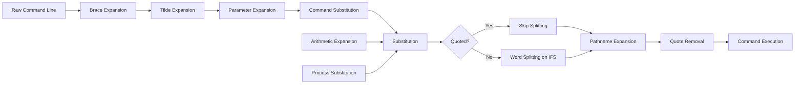
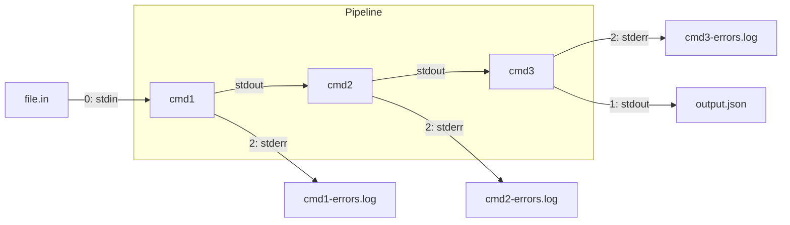

> **Shell Scripting** | Complexity: `[MEDIUM]` | Focus: startup files, expansion order, quoting, control flow, functions, redirections, strict mode, ShellCheck CI, and kubectl automation patterns.
>
> **Time to Complete**: 90–120 minutes (long-form read + hands-on exercise)

## Prerequisites

Before starting this module, you should be comfortable navigating a Linux filesystem from the terminal, running commands with arguments, and recognising when a command succeeds or fails from its exit status and visible output. You do not need prior scripting experience, but familiarity with opening a text editor and understanding how the shell interprets one command at a time will help you move faster through the worked examples.

- **Required**: [Module 1.1: Kernel Architecture](/linux/foundations/system-essentials/module-1.1-kernel-architecture/) — understanding how the kernel launches processes and how the shell sits between the user and the operating system provides essential context for why startup files and process boundaries matter in Bash scripting.
- **Helpful**: Any prior programming experience, particularly in languages where variable scope, control flow, and return codes are explicit concepts. The mental models transfer even when the syntax differs.
- **Optional (Kubernetes cluster path)**: Basic Kubernetes familiarity (deployments, namespaces, `kubectl`) helps with the kubectl examples in the core sections and with the **Bash with Kubernetes: Scripting Patterns** section. That content is gated behind an explicit **Host-only vs cluster fork** at each kubectl example below.

A running Kubernetes cluster is **not** required for this module. The linked lab `linux-7.1-bash-fundamentals` is an Ubuntu host scenario with no cluster provided, and every hands-on exercise — including every host success criterion — completes on any Linux host with Bash 4+ and no `kubectl`. Where an example runs `kubectl` against live cluster state, it is marked as an optional cluster path that you can read as a worked example instead.

## What You'll Be Able to Do

After this module, you will be able to write Bash scripts that are safe for unattended execution in CI pipelines, operational runbooks, and Kubernetes automation contexts. Each outcome below maps to a concrete skill you can verify by completing the hands-on exercises at the end of the module.

- **Diagnose** the startup sequence that determines which configuration files Bash reads, distinguishing between login shells, interactive non-login shells, and non-interactive shells so that your scripts never depend on accidental environment state. *(Host-only)*
- **Predict** the result of any Bash expansion chain — brace, tilde, parameter, command substitution, arithmetic, word splitting, and pathname — and apply quoting rules that prevent the shell from silently reshaping your data before the target command receives it. *(Host-only)*
- **Construct** control flow with `if`, `for`, `while`, and `case` that handles empty inputs, spaces in arguments, and nonzero exit codes without producing misleading success messages. *(Host-only)*
- **Design** functions with `local` variables, explicit return codes, and separation of diagnostic output from data output so that callers can compose and test helpers independently. *(Host-only)*

## Why This Module Matters

**Hypothetical scenario:** In a payments platform running a routine maintenance window, several hours of transaction processing were lost because a shell script treated an empty environment variable as a valid target directory. The cleanup job was intended to rotate temporary export files before a database migration, but one missing value changed the semantics of the command line so it operated on a directory the engineers never intended to touch. They recovered from backups and internal queues, but the incident still consumed an overnight response bridge, delayed settlement processing, and cost more in remediation effort than the original migration project had budgeted.

That story is not dramatic because Bash is exotic; it is dramatic because Bash is ordinary. The shell sits between humans and the operating system, between CI pipelines and package managers, between Kubernetes clients and production automation on every major Linux distribution. A small script that validates its assumptions, quotes its expansions, and reports failures honestly can be the safest tool in the room. The same script, when it relies on unquoted variables, ignores pipeline failures, or keeps running after a `cd` fails silently, becomes a production risk that no quantity of monitoring can fully mitigate.

This module treats Bash as operational engineering, not as syntax trivia. You will learn the startup files that determine what state your script inherits, the expansion order that controls how the shell transforms your text before any command runs, and the quoting disciplines that prevent those transformations from becoming destructive. Kubernetes examples appear throughout as an optional cluster path, gated behind an explicit fork at each example. They assume the exam-friendly shorthand `alias k=kubectl` is available for interactive terminal speed, and they target Kubernetes 1.35 or newer behaviour when a command interacts with cluster resources. On the host-only path, read them as illustrative worked examples — no cluster is needed for the exercises or the success criteria.

The real cost of Bash mistakes in SRE work is not the syntax error itself. It is the diagnostic time. An unquoted variable that splits on a space fails at 03:10 during a maintenance window, and the on-call engineer must now distinguish between a genuine service outage and a script that silently operated on the wrong files. A missing `pipefail` in a twelve-command deployment pipeline succeeds even when step three failed, and the engineer discovers the partial deployment only when users report errors hours later. Each of these scenarios shares the same root cause: the script is allowed to continue past a failure without reporting it. The techniques in this module — strict mode, expansion awareness, explicit error handling, and CI-linted ShellCheck integration — directly reduce the mean time to detect and the mean time to diagnose for every script your team writes. By the end, you will know when Bash is the right tool, when it needs guardrails, and when the job deserves a richer language — not because someone told you, but because you understand the failure modes each choice brings.

## Bash Startup and Execution Context

Every Bash process begins by reading configuration files, but which files it reads depends on how the shell was invoked. A login shell, such as the one spawned when you connect over SSH or open a terminal emulator configured as a login shell, reads `/etc/profile` and then the first of `~/.bash_profile`, `~/.bash_login`, or `~/.profile` that exists. An interactive non-login shell, such as the one you get when you open a new terminal tab in most desktop environments or run `bash` from an existing session, reads only `~/.bashrc`. A non-interactive shell, such as the one that runs a script with `bash script.sh` or executes a command over SSH without a TTY, reads none of these files unless the `BASH_ENV` environment variable points to a startup script. This three-way distinction matters because scripts that accidentally depend on aliases, functions, or environment variables defined in an interactive `~/.bashrc` will fail when executed by cron, systemd, or a CI runner — all of which invoke non-interactive shells. The [Bash Reference Manual documents the full startup sequence](https://www.gnu.org/software/bash/manual/bash.html#Bash-Startup-Files) with precise ordering for each invocation mode, and it is worth consulting whenever a script behaves differently inside and outside a terminal session.

```bash
# Determine what kind of shell you are in
shopt login_shell    # check if this is a login shell
[[ $- == *i* ]] && echo "interactive" || echo "non-interactive"

# Common pattern: source .bashrc from .bash_profile for consistency
# In ~/.bash_profile:
if [ -f ~/.bashrc ]; then
    source ~/.bashrc
fi
```

The shebang line is the first visible part of the execution contract. `#!/bin/bash` declares that the script intentionally uses Bash and should be interpreted by the Bash binary at that exact path. `#!/usr/bin/env bash` searches `PATH` for Bash, which improves portability across systems where Bash is installed in different locations — common in macOS environments where the system Bash is frozen at version 3.2 and a newer version lives under `/usr/local/bin/bash` or a Homebrew prefix. The trade-off is that `env` introduces an extra level of indirection: the caller's `PATH` determines which binary is selected, which can be a security consideration in tightly controlled environments. `#!/bin/sh` promises only the POSIX shell feature set and may be interpreted by `dash`, `ash`, or another minimal shell on systems like Alpine Linux or Debian where `/bin/sh` is deliberately not Bash. The [POSIX Shell Command Language specification](https://pubs.opengroup.org/onlinepubs/9799919799/utilities/V3_chap02.html) defines the minimum contract that `#!/bin/sh` scripts can rely on across all conforming systems.

Sourcing a script with `source script.sh` or `. script.sh` runs it inside the current shell process rather than in a child process. This means any variable assignments, directory changes, or function definitions persist after the script finishes, which is exactly what you want for profile files and shared helper libraries but dangerous for general automation. An executable script launched with `./script.sh` starts a new process, inherits a copy of the environment, and cannot accidentally modify the caller's shell state. Before running any script you did not write yourself, decide whether you want its side effects to survive its execution, and choose the invocation method accordingly.

```bash
# Method 1: Execute as a child process (recommended for automation)
chmod +x script.sh
./script.sh

# Method 2: Explicitly invoke the interpreter
bash script.sh

# Method 3: Source into current shell (use for profile/helpers only)
source script.sh
. script.sh  # POSIX equivalent
```

Scripts intended for production should validate their execution context early. Check that required commands exist with `command -v`, verify that required files are readable with `[[ -r "$file" ]]`, and exit with a clear message before reaching any destructive operation if preconditions are not met. A script that fails immediately with a specific error message at line fifteen is infinitely easier to debug than one that fails silently at line two hundred because a `cd` earlier in the script changed the working directory without the operator realising it. As documented in the [Bash manual section on Bourne Shell Builtins](https://www.gnu.org/software/bash/manual/html_node/Bourne-Shell-Builtins.html), `command -v` is the portable way to test for command availability across all POSIX-compatible shells, and it should be preferred over `which` or `type` in operational scripts.

## Shell Expansion Order

Before Bash executes any command, it performs a sequence of expansions on the command line. Understanding this order is not an academic exercise — it determines whether your variable value reaches the command intact or is silently split into multiple arguments, subjected to pattern matching, or treated as a command to execute. The [Bash manual section on Shell Expansions](https://www.gnu.org/software/bash/manual/html_node/Shell-Expansions.html) defines this order, with process substitution in the substitution phase on systems that support it:

1. **Brace expansion** — `{a,b,c}` expands to `a b c` before any other processing occurs. This is purely textual; no variable or filename interpretation happens at this stage.
2. **Tilde expansion** — `~` expands to the home directory and `~user` expands to that user's home directory. This occurs only at the start of a word or after `=` in an assignment.
3. **Parameter expansion** — `${variable}` and its many forms replace the expression with the variable's value. This is the stage where `${var:-default}`, `${var#pattern}`, `${var%pattern}`, `${#var}`, and substring slicing operate.
4. **Command substitution** — `$(command)` or backtick syntax runs the command and replaces the substitution with its standard output, with trailing newlines removed.
5. **Arithmetic expansion** — `$((expression))` evaluates the integer arithmetic expression and replaces it with the result.
6. **Process substitution** — `<(command)` and `>(command)` are expanded in the same substitution phase as parameter, command, and arithmetic substitutions in systems that support process substitutions.
7. **Word splitting** — the result of unquoted parameter expansions, command substitutions, arithmetic expansions, and process substitutions is split into words on characters in the `IFS` variable (space, tab, newline by default). Quoted expansions are exempt from word splitting, which is the single most important reason to quote your variables.
8. **Pathname expansion** — unquoted `*`, `?`, and `[` characters are treated as glob patterns and expanded to matching filenames. This stage is also disabled by quoting.

The expansion order is not just a checklist — it shapes every line of Bash you write. Because word splitting happens after parameter expansion, an unquoted variable containing spaces will be split into multiple arguments after its value is substituted. Because pathname expansion happens last, an unquoted variable containing `*` will be expanded to the list of files in the current directory. These behaviours are deterministic once you know the order, and knowing the order is what separates operators who debug by guessing from operators who predict what their script will produce before it runs.



Brace expansion is the first stage, and it operates on literal commas and ranges before any variable is expanded. `mkdir -p project/{src,tests,docs}` creates three directories in one command. Tilde expansion follows immediately, translating `~` and `~user` only at word boundaries. These two stages are safe because they operate on literal text rather than on substituted values.

The real danger zone begins at stage three with parameter expansion, then compounds through command substitution, arithmetic expansion, and process substitution. Each of these stages substitutes runtime values into the command line. After substitution, the shell proceeds to word splitting on unquoted results, which is why `$file` with a value of "my documents" becomes two words. The shell then performs pathname expansion, turning `*` and `?` characters into matching filenames. Both of these destructive stages are disabled by double quotes. Understanding this sequence means you can look at any Bash command and predict its word boundaries without running it.

For day-to-day reliability, use this practical quoting decision pattern: quote all substitutions by default, then remove quotes only when you intentionally want word splitting. For comparisons and tests in Bash, `[[ ... ]]` avoids many legacy `[` pitfalls and is generally safer when variables might be empty. For file names, paths, service identifiers, and URLs, prefer `"$var"` so spaces or special characters stay intact. For command templates and option lists, use arrays instead of a single string (`args=("$@")`) so each argument is passed exactly once. This small discipline is often the difference between a script that scales safely and one that fails silently during the first edge case. It also keeps your scripts readable under pressure, because the data flow is explicit: either the shell receives an atomic value, or you explicitly asked it to split.

Parameter expansion deserves special attention because it provides the mechanisms for default values, alternate values, and string manipulation that make Bash scripts resilient in the face of missing inputs. `${var:-default}` substitutes `default` only when `var` is unset or empty, leaving the original variable unchanged. `${var:=default}` assigns the default value back to the variable as a side effect, which can be useful for enforcing configuration at the point of first use. `${var:?message}` prints the message to standard error and exits the script if the variable is unset or empty — a compact way to assert that required inputs are present. `${var:+alternate}` substitutes `alternate` only when `var` is set and non-empty, which is less commonly used but invaluable for optional flags. Substring extraction with `${var:offset:length}` and pattern-based trimming with `${var#pattern}` and `${var%pattern}` complete the toolkit. The [Bash manual section on Shell Parameter Expansion](https://www.gnu.org/software/bash/manual/html_node/Shell-Parameter-Expansion.html) documents every variant in detail, and you should consult it when building validation logic rather than guessing at the syntax.

```bash
# Default values
name="${1:-World}"                # Use "World" if $1 is unset or empty
port="${PORT:-8080}"              # Use 8080 if $PORT is unset or empty

# Assign default back to variable
echo "${count:=0}"                # Assigns 0 to count and echoes it

# Fail with message if unset
config="${CONFIG_FILE:?CONFIG_FILE must be set}"

# Alternate value (set and not empty)
debug="${DEBUG:+-v}"              # Adds -v only when DEBUG is set and non-empty

# Substring extraction
filename="backup-2025-03-15.tar.gz"
echo "${filename:7:10}"           # 2025-03-15
echo "${filename%.*}"             # backup-2025-03-15.tar (remove shortest .* suffix)
echo "${filename%%.*}"            # backup-2025-03-15 (remove longest .* suffix)
echo "${filename#*-}"             # 2025-03-15.tar.gz (remove shortest *- prefix)
echo "${filename##*-}"            # 03-15.tar.gz (remove longest *- prefix)
```

## Quoting Rules

Bash provides four quoting mechanisms, and each solves a specific class of expansion-control problem. **Single quotes** preserve every character literally — no expansion, no substitution, no escape sequences except that a single quote cannot appear inside a single-quoted string. **Double quotes** preserve most characters literally but allow parameter expansion (`$var`), command substitution (`$(cmd)`), and arithmetic expansion (`$((expr))`) to proceed while suppressing word splitting and pathname expansion on the result. **Dollar-single quotes** (`$'...'`), also called ANSI-C quoting, interpret backslash escape sequences like `\n`, `\t`, and `\e` but do not perform shell expansions. **Backslash** escapes the character immediately following it, removing any special meaning it would otherwise carry.

The distinction between single and double quotes is the most important quoting rule in operational Bash because it determines whether variable values can change the shape of the argument list. A double-quoted `"$file"` preserves the variable's value as one argument even when it contains spaces, tabs, or glob characters. A single-quoted `'$file'` produces the literal string `$file` — no expansion occurs at all. An unquoted `$file` expands the value and then subjects it to word splitting and pathname expansion, which can transform a single filename into multiple arguments or match unintended files. The [Bash manual section on Quoting](https://www.gnu.org/software/bash/manual/html_node/Quoting.html) and the [Greg's Wiki guide on quotes](https://mywiki.wooledge.org/Quotes) both emphasise that the only safe general rule is to double-quote every expansion that should remain a single argument.

```bash
# Single quotes: no expansion at all
echo 'The variable $HOME is not expanded here'   # prints $HOME literally
echo 'It costs $5'                                 # no special meaning for $

# Double quotes: expansion allowed, but word splitting suppressed
echo "Your home is $HOME"                          # expands HOME, stays one arg
echo "Files: $(ls | wc -l)"                        # command substitution works

# ANSI-C quoting: escape sequences interpreted
echo $'Line one\nLine two'                         # actual newline
prompt=$'\e[1;32mReady\e[0m'                       # green "Ready" in terminal

# Backslash: escape a single character
echo "Value: \$HOME"                                # prints $HOME literally
grep "\.txt$" files.log                             # literal dot, end-of-line
```

A common operational pattern is constructing command lines where some arguments are fixed strings and others come from variables. Mixing quoting types within a single command is both valid and idiomatic: `rsync -av "$src" "$dst"` passes two arguments that may contain spaces, while the flags `-av` are intentionally unquoted because they must be a single word. When building argument vectors programmatically, use arrays and quoted expansions rather than string concatenation: `args=(-av --exclude '*.tmp' "$src" "$dst"); rsync "${args[@]}"` preserves each element as a separate argument regardless of internal whitespace, a pattern the [Greg's Wiki BashGuide](https://mywiki.wooledge.org/BashGuide) recommends as the standard defence against argument-splitting bugs in wrapper scripts.

> **Host-only vs cluster fork:** The `kubectl` command below needs a running cluster and is optional. On the host-only path, read it as an illustrative example of array-based argument construction — the pattern transfers to any command, and the exercises require no cluster.

```bash
# Building command arguments safely with arrays
kubectl_args=(
    get pods
    -n "${NAMESPACE:-default}"
    -l "app=${APP_NAME}"
    -o json
)
kubectl "${kubectl_args[@]}"

# Without arrays — fragile string concatenation
# BAD: kubectl get pods -n $NAMESPACE -l app=$APP_NAME -o json
# Breaks if NAMESPACE or APP_NAME contains spaces or is empty.
```

## Control Flow

Conditionals in Bash follow a simple principle: `if` runs a command and branches on its exit code. In most programming languages, `if (a == b)` evaluates a boolean expression. In Bash, `if [[ "$a" == "$b" ]]; then` runs the `[[` compound command, which returns exit code 0 for true and 1 for false. This design means you can test not only string and numeric comparisons but also the success or failure of any command: `if grep -q "error" /var/log/app.log; then` checks whether the pattern was found and branches accordingly. The [Bash Conditional Constructs documentation](https://www.gnu.org/software/bash/manual/html_node/Conditional-Constructs.html) covers every variant, including the pattern-matching and regular-expression operators available inside `[[ ]]`.

The choice between `[ ]` and `[[ ]]` is a practical engineering decision rather than a stylistic preference. `[[ ]]` is a Bash keyword that does not perform word splitting or pathname expansion on unquoted variable expansions, supports `&&` and `||` operators inside the construct, and provides pattern matching with `=` and regular expression matching with `=~`. `[ ]` is a POSIX command (often a shell built-in for performance) that requires careful quoting because its argument list is subject to normal shell parsing. If your script targets only Bash, `[[ ]]` eliminates an entire class of quoting bugs and should be your default. If you need the script to run under `#!/bin/sh`, you must restrict yourself to `[ ]` and quote every expansion inside it. The [POSIX test specification](https://pubs.opengroup.org/onlinepubs/9799919799/utilities/test.html) and the [ShellCheck wiki rule SC2292](https://www.shellcheck.net/wiki/SC2292) both caution that mixing `[ ]` with Bash-specific operators like `==` creates portability hazards without providing the safety benefits of `[[ ]]`.

> **Host-only vs cluster fork:** The `[[ ]]`, `(( ))`, and file tests below run on any Linux host. Only the final `kubectl get namespace` guard needs a running cluster and is optional — read it as an illustrative example on the host-only path.

```bash
# String comparisons with [[ ]]
if [[ "$name" == "admin" ]]; then
    echo "Access granted"
elif [[ "$name" == guest* ]]; then    # Pattern matching — no regex needed
    echo "Limited access"
else
    echo "Access denied"
fi

# Numeric comparisons
if (( pods_running >= min_replicas )); then
    echo "Sufficient capacity"
fi

# File tests — common before destructive operations
if [[ ! -r "$config_file" ]]; then
    echo "Config not readable: $config_file" >&2
    exit 1
fi

# Testing command success directly
if ! kubectl get namespace "$ns" &>/dev/null; then
    echo "Namespace $ns does not exist — cannot proceed" >&2
    exit 1
fi
```

Loops in Bash iterate over words, which means the shell's word-splitting behaviour directly affects what a `for` loop sees. A safe pattern for iterating over filenames or arguments is `for item in "$@"; do ...; done`, which quotes the expansion so each argument retains its boundaries. For file globbing, `for file in *.log; do` has three common failure modes: unmatched globs that produce literal `*.log`, hidden log files that are skipped by default, and broken paths when `"$file"` is not quoted. The resilient alternative for arbitrary names is `find ... -print0 | while IFS= read -r -d '' file; do`. When iterating over command output, prefer `while IFS= read -r line` over `for line in $(command)` because the `for` version splits on all whitespace, including spaces inside values, while the `while read` version preserves each logical line. The [Greg's Wiki article on Bash loops](https://mywiki.wooledge.org/BashFAQ/001) walks through every iteration pattern and explains why naive `for line in $(cat file)` constructs are unreliable in the presence of spaces or special characters.

> **Host-only vs cluster fork:** The `case` statement and numeric `for` loop structure below run on any host. The two `kubectl` loop bodies need a running cluster and are optional — read them as illustrative examples on the host-only path.

```bash
# Case statement — cleaner than chains of if/elif for value matching
case "${1:-}" in
    start)
        echo "Starting service..."
        systemctl start myapp
        ;;
    stop)
        echo "Stopping service..."
        systemctl stop myapp
        ;;
    restart|force-reload)
        echo "Restarting..."
        systemctl restart myapp
        ;;
    status)
        systemctl status myapp
        ;;
    *)
        echo "Usage: $0 {start|stop|restart|status}" >&2
        exit 1
        ;;
esac

# While loop with line-by-line reading
kubectl get pods -o name | while IFS= read -r pod; do
    echo "Found pod: $pod"
done

# C-style for loop for numeric iteration
for ((i=1; i<=5; i++)); do
    echo "Attempt $i"
    kubectl get pods && break
    sleep 2
done
```

The `case` statement deserves particular attention in operational scripts because it provides a cleaner alternative to long `if`/`elif` chains when you are matching against a known set of string values. Each pattern can contain glob characters, and multiple patterns can share a single action by separating them with `|`. The `;;` terminator exits the `case` after the matching branch executes, while `;&` (Bash 4+) falls through to the next branch unconditionally — use the latter sparingly and document it explicitly when you do because fall-through behaviour is a common source of review-time confusion.

## Functions and Scope

Functions give Bash scripts a maintainable structure by packaging decisions and operations behind named interfaces. A function receives arguments through the same positional parameter mechanism as a script: `$1`, `$2`, `$#`, and `"$@"` work identically inside a function body. It communicates results to the caller through its exit code (`return 0` for success, non-zero for failure) and, when it needs to return data, through standard output captured via command substitution. The [Bash manual section on Shell Functions](https://www.gnu.org/software/bash/manual/html_node/Shell-Functions.html) defines both the `name() { ...; }` syntax and the `function name { ...; }` alternative, though the former is preferred for portability even within Bash-specific scripts.

Function naming conventions are more important in Bash than in many other languages because Bash has no namespace mechanism. A function named `check` is ambiguous; a function named `validate_config_file` tells the reader exactly what it operates on and what it returns. Prefix groups of related functions with a common namespace: `log_info`, `log_error`, `log_debug`. Use lowercase and underscores, matching the style of shell built-ins. The [Google Shell Style Guide section on function names](https://google.github.io/styleguide/shellguide.html#s7.4-function-names) provides the complete naming convention. Consistent naming costs nothing and makes script reviews significantly faster because the reviewer can infer a function's role from its name alone.

The most critical Bash function rule is also the easiest to violate: variables inside functions are global by default. If you assign `result="failed"` inside a function without declaring it `local`, you have modified the caller's `result` variable — potentially at a distance of hundreds of lines. The `local` built-in restricts the variable to the function's scope, and it should be used for every variable a function creates, including loop counters and temporary strings. This is not defensive coding; it is the minimum required to prevent function internals from silently corrupting the script's state, and the [Google Shell Style Guide](https://google.github.io/styleguide/shellguide.html#s7.2-variable-names) explicitly mandates function-scoped variables for this reason.

> **Host-only vs cluster fork:** The function structure below — `local` declarations, exit codes, stdout-as-data — runs on any host. The `check_prerequisites` probe lists `kubectl` among required tools and `get_replicas` queries a live cluster; both are optional cluster-path illustrations — read them as worked examples without a cluster.

```bash
# Function definitions
check_prerequisites() {
    local missing=()
    local cmd

    for cmd in kubectl jq yq; do
        if ! command -v "$cmd" &>/dev/null; then
            missing+=("$cmd")
        fi
    done

    if (( ${#missing[@]} > 0 )); then
        echo "Missing required tools: ${missing[*]}" >&2
        return 1
    fi
    return 0
}

# Predicate function — return 0 for "true"
is_production() {
    local namespace="${1:-}"
    [[ "$namespace" == "prod" || "$namespace" == "production" ]]
}

# Usage
if is_production "$NAMESPACE"; then
    echo "Production namespace — requiring explicit --confirm flag" >&2
    exit 1
fi

# Function returning data via stdout
get_replicas() {
    local deployment="$1"
    local namespace="${2:-default}"
    kubectl get deployment "$deployment" -n "$namespace" \
        -o jsonpath='{.spec.replicas}' 2>/dev/null || echo "0"
}

replicas=$(get_replicas "nginx" "web")
echo "Current replicas: $replicas"
```

A well-structured script organises functions as small, named operations and calls them from a `main` function near the bottom of the file. This pattern, recommended in both the [Google Shell Style Guide section on main](https://google.github.io/styleguide/shellguide.html#s7.8-main) and the [Greg's Wiki article on script structure](https://mywiki.wooledge.org/BashGuide/CompoundCommands#Functions), keeps the global scope minimal and enables partial testing of individual helpers. The script's top level should contain only safety settings (`set -euo pipefail`), trap registrations, and a call to `main "$@"`. Everything else belongs in a function where its scope and side effects are explicit.

```bash
#!/bin/bash
set -euo pipefail

# ── Helpers ────────────────────────────────────────────
log() { local level="$1"; shift; echo "[$(date -u +%T)] [$level] $*" >&2; }

validate_args() {
    if (( $# < 1 )); then
        log ERROR "Usage: $0 <deployment-name> [namespace]"
        return 1
    fi
}

# ── Main ───────────────────────────────────────────────
main() {
    validate_args "$@" || exit 1
    local deployment="$1"
    local namespace="${2:-default}"

    log INFO "Scaling $deployment in namespace $namespace"
    # ... work happens here ...
}

main "$@"
```

## Process Substitution, Redirections, and Here-Documents

Process substitution is a Bash feature that exposes the output or input of a command as a file path. The syntax `<(command)` creates a named pipe (or `/dev/fd` reference) containing the command's standard output, while `>(command)` creates one that feeds into the command's standard input. This allows tools that expect file arguments, such as `diff`, `comm`, and `join`, to operate on live command output without intermediate temporary files. The [Bash manual section on Process Substitution](https://www.gnu.org/software/bash/manual/html_node/Process-Substitution.html) notes that it is available when the operating system supports named pipes or `/dev/fd`.

Process substitution is particularly valuable for differential comparisons in operational workflows. You can compare two `kubectl get` snapshots without writing them to disk, diff the output of two API endpoints, or feed transformed data into a tool that only accepts file arguments. The construct looks like a file to the receiving command, so all standard file-based tooling works without modification.

Process substitution also solves a subtle problem with pipelines: a pipeline runs each command in a subshell, so variables set inside the pipeline are lost when it completes. When you need to capture data into variables while still using a pipeline-like flow, process substitution with input redirection avoids the subshell trap. For example, `while IFS= read -r line; do ...; done < <(command)` runs the loop in the current shell, allowing variable modifications to persist after the loop finishes. This pattern, documented in the [Greg's Wiki article on process substitution](https://mywiki.wooledge.org/ProcessSubstitution), is the standard workaround for the subshell-variable problem that plagues naive pipeline-based loops.

> **Host-only vs cluster fork:** The `kubectl` commands below need a running cluster and are optional. On the host-only path, read them as illustrative examples — Exercise 2 at the end of this module demonstrates the same `diff <(...) <(...)` pattern with plain local files and no cluster.

```bash
# Compare current pod state with a known-good snapshot
diff <(kubectl get pods -o name | sort) <(cat known-good-pods.txt | sort)

# Compare two environments without temporary files
diff <(kubectl get deployments -n staging -o json | jq -S .) \
     <(kubectl get deployments -n production -o json | jq -S .)

# Feed live metrics into a tool expecting a file
column -t <(kubectl top pods)
```

Redirections control where a command reads its input and sends its output. The fundamental operators are `>` (overwrite), `>>` (append), `<` (read from file), `2>` (redirect stderr), `2>&1` (merge stderr into stdout), and `&>` (Bash shorthand for redirecting both streams). The order of redirections matters: `command 2>&1 >file` redirects stderr to the current stdout (usually the terminal) and then redirects stdout to the file, so stderr still appears on the terminal. The corrected form `command >file 2>&1` first opens the file as stdout and then duplicates that file descriptor for stderr, so both streams end up in the file. This ordering nuance is one of the most frequently misunderstood aspects of shell I/O, and the [Bash Redirections manual](https://www.gnu.org/software/bash/manual/html_node/Redirections.html) explains the file descriptor duplication semantics in detail.

Here-documents embed multi-line text directly in a script, which is especially useful for generating configuration files, SQL queries, or templated YAML inside shell-based deployment tools. Quoting the delimiter, as in `<<'EOF'`, prevents all expansion within the body — this is the safe default when the content contains dollar signs or backticks that should appear literally. Leaving the delimiter unquoted enables variable and command substitution, which is appropriate for templates but carries the risk of unintended expansion if the input contains untrusted text.

> **Host-only vs cluster fork:** The first here-document below pipes a manifest into `kubectl apply`, which needs a running cluster and is optional. The second writes a literal script to a local path and runs on any host. On the host-only path, read the `kubectl` example as an illustrative template.

```bash
# Here-doc for generating Kubernetes resource manifests
kubectl apply -f - <<EOF
apiVersion: v1
kind: ConfigMap
metadata:
  name: app-config
  namespace: ${NAMESPACE:-default}
data:
  environment: "${ENV:-staging}"
  log_level: "info"
EOF

# Here-doc without expansion — safe for literal content
cat <<'SCRIPT' > /usr/local/bin/health-check
#!/bin/bash
# This script contains literal $ signs
threshold=${1:-100}
echo "Checking disk usage at $threshold% threshold"
SCRIPT
```

The following diagram shows how data flows through standard file descriptors in a typical pipeline with redirections. Each command receives stdin from the left, produces stdout to the right, and can independently redirect stderr to a log file for diagnostics while keeping data and error streams separated.



## Strict Mode and Defensive Shell Scripting

Strict mode is the combination of shell options that transforms Bash from a permissive environment into one that surfaces problems immediately rather than silently continuing past failures. The canonical invocation is `set -euo pipefail`, optionally with `IFS=$'\n\t'` to restrict word splitting to newlines and tabs. Each option addresses a specific class of silent failure, and understanding what each one does is essential because strict mode is not a universal safety switch — it is a set of behaviours that you must understand well enough to know when to temporarily disable a specific option for an expected non-zero exit or an intentionally unset variable. The [Bash manual section on the Set Builtin](https://www.gnu.org/software/bash/manual/html_node/The-Set-Builtin.html) documents every option and its interactions.

`set -e` (errexit) causes the shell to exit immediately when a pipeline, list, or compound command returns a non-zero exit status, with specific exceptions for commands used as conditions in `if`, `while`, `until`, `&&`, or `||` lists. This prevents a script from executing the next line after a failed `cd`, `mkdir`, or `curl`, which could operate on the wrong directory or consume invalid data. The most common surprise with `set -e` is that `grep` returns 1 when it finds no matches, which is a non-zero exit code that `set -e` will treat as a failure. The fix is to handle the `grep` result explicitly: `if grep -q "pattern" file; then` or `grep "pattern" file || true` when a non-match is genuinely acceptable.

`set -u` (nounset) treats references to unset variables as errors and exits the script immediately. This catches typos in variable names and missing environment variables before they propagate through the rest of the script. When you genuinely need to test whether a variable is set, use parameter expansion with a default — `${var:-}` expands to nothing when `var` is unset, satisfying `set -u` while allowing the check to proceed.

`set -o pipefail` changes the exit status of a pipeline to the exit status of the last (rightmost) command that failed, rather than the exit status of the last command in the pipeline. Without `pipefail`, `false | true` returns 0 because `true` succeeds, masking the earlier failure. With `pipefail`, the pipeline returns the exit status of `false`, so `set -e` can react to pipeline failures. This is essential for pipelines like `curl ... | jq ...` where a fetch failure followed by `jq` producing empty output silently hides the real error.

```bash
#!/bin/bash
set -euo pipefail
IFS=$'\n\t'

# ── Trap for cleanup ───────────────────────────────────
cleanup() {
    local exit_code=$?
    if [[ -n "${temp_dir:-}" && "$temp_dir" == /tmp/* ]]; then
        rm -rf -- "$temp_dir"
    fi
    echo "Cleanup complete (exit code: $exit_code)" >&2
    exit "$exit_code"
}
temp_dir=$(mktemp -d)
trap cleanup EXIT

# ── Trap for line-level error reporting ─────────────────
trap 'echo "ERROR at line $LINENO: $BASH_COMMAND" >&2' ERR

# ── Handle grep's non-match case explicitly ─────────────
if grep -q "^ERROR" /var/log/app.log; then
    echo "Errors found in application log" >&2
fi
# The if-block consumes grep's exit code, so set -e is satisfied.
```

The `IFS` variable deserves explicit discussion because it controls word splitting, the mechanism that silently reshapes your data. The default `IFS` is space, tab, and newline. When you set `IFS=$'\n\t'` as part of strict mode, you restrict word splitting to newlines and tabs, which prevents spaces inside values from splitting a single string into multiple arguments. This is particularly important when processing filenames or resource names that legally contain spaces. Note that setting `IFS` globally affects every unquoted expansion in the script, so it should be set once at the top and left alone.

Strict mode is not without trade-offs, and there are legitimate situations where you should temporarily relax a specific option. When a command's non-zero exit is expected and handled, use `command || true` to absorb it without disabling `set -e` globally. When you need to check whether a variable is set without triggering `set -u`, use `${var:-}` to provide an empty default that satisfies nounset. When a pipeline's intermediate failure is acceptable — such as a filter that may produce no output — handle the exit explicitly after the pipeline rather than disabling `pipefail` for the entire script.

Finally, strict mode should be paired with `set -f` (noglob) in scripts that handle untrusted filenames or user input. Noglob disables pathname expansion entirely, which means `*`, `?`, and `[` are treated as literal characters. This is the safest setting when a script processes input where glob characters might appear unintentionally, but it also means you lose the convenience of `*.txt` patterns in loops and `ls *.log` invocations. The decision to use noglob should be documented in the script's header because future maintainers may not expect glob patterns to be non-functional.

Defensive scripting extends beyond shell options to explicit precondition checking. Before a script reaches any operation that modifies files, makes network calls, or changes cluster state, it should verify that required tools are available with `command -v`, required files are readable with `[[ -r "$file" ]]`, and required arguments are present. The [ShellCheck wiki page SC2230](https://www.shellcheck.net/wiki/SC2230) recommends using `command -v` over `which` for portability. The [SC2143](https://www.shellcheck.net/wiki/SC2143) rule flags the common antipattern of using `grep -q` inside `[ ]` instead of piping directly to `if grep`.

## ShellCheck: Integration into CI

ShellCheck is a static analysis tool that identifies common mistakes, portability issues, and dangerous patterns in shell scripts before they reach production. It encodes the collective experience of the shell-scripting community into more than 300 rules, each documented with a dedicated wiki page that explains the problem, demonstrates both the incorrect and correct patterns, and provides exceptions where the rule may not apply. Running ShellCheck against every shell script in your repository is a small investment that prevents entire categories of production incidents — from unquoted variables that split on unexpected whitespace to `cd` without error checking that silently operates on the wrong directory.

Integrating ShellCheck into a CI pipeline requires two decisions: when to run it and how to configure its severity threshold. The simplest approach is to run `shellcheck` on every file matching `*.sh` or identified by a shebang, treating any finding at the default severity as a failure. For existing codebases with a backlog of warnings, you can start with a relaxed severity (`shellcheck --severity=error`) and progressively lower the threshold as warnings are addressed. The [ShellCheck wiki](https://www.shellcheck.net/wiki/) provides a per-rule reference that helps teams understand what each warning means without needing to memorise all three hundred rules.

```bash
# Run ShellCheck on all shell scripts in a repository
find . -type f \( -name '*.sh' -o -name '*.bash' \) -exec shellcheck {} +

# Run on scripts identified by shebang
grep -rlZ '^#!/bin/\(bash\|sh\)' . | xargs -0 shellcheck

# CI integration with severity control
    find . -type f -name '*.sh' -exec shellcheck --severity=warning {} + || {
    echo "ShellCheck found issues — review https://www.shellcheck.net/wiki/ for guidance" >&2
    exit 1
}
```

```yaml
# GitHub Actions example — ShellCheck step in CI
# (Requires shellcheck installed; available in ubuntu-latest runner)
- name: Lint shell scripts
  run: |
    find . -type f -name '*.sh' -exec shellcheck --severity=warning {} +
```

Beyond CI, ShellCheck is available as an editor integration for VS Code, Vim, Emacs, and most other editors, providing real-time feedback as you write. The faster you see a warning about an unquoted variable or a missing `local` declaration, the less likely those patterns are to survive into committed code. The [ShellCheck GitHub repository](https://github.com/koalaman/shellcheck) and the [ShellCheck wiki index of rules](https://www.shellcheck.net/wiki/) are the authoritative references for understanding and configuring the tool.

## Bash with Kubernetes: Scripting Patterns

> **Host-only vs cluster fork:** This section uses `kubectl` and needs a running Kubernetes cluster. Pick your path before running anything:
>
> - **Killercoda lab / local Linux host:** The linked lab `linux-7.1-bash-fundamentals` is an Ubuntu host scenario without a cluster. Complete the strict-mode, process-substitution, and parameter-expansion exercises there and read this section as a worked example — nothing here is required for the host path.
> - **Optional cluster path:** If you have a local [`kind`](https://kind.sigs.k8s.io/) cluster or an existing cluster with `kubectl` access, run the commands below live on it.
> - **Skip-as-read:** Without a cluster, read the commands and outputs as illustrative examples; deployment names, replica counts, and event contents below are illustrative, and a live cluster will differ.

Kubernetes operational workflows are fertile ground for Bash scripting because `kubectl` is a command-line tool that produces structured output, accepts standard input, and follows Unix conventions for exit codes and standard streams. Well-structured Bash scripts can orchestrate deployments, validate cluster state, and generate configuration without requiring a full programming-language runtime in the execution environment. The key to reliability is treating `kubectl` output as structured data, using `-o json` or `-o jsonpath` whenever the result is consumed by another command rather than displayed to a human operator.

The most common Kubernetes scripting patterns revolve around waiting for conditions, iterating over resources, and generating manifests. For waiting, `kubectl wait --for=condition=Ready pod -l app=nginx --timeout=120s` is preferable to polling loops because it handles timeout logic and condition evaluation internally, reducing the surface for scripting errors. For iteration, `kubectl get pods -o name` produces output that is safe for simple `while read` loops, but when you need structured field access — such as extracting the pod IP, restart count, or container status — `-o jsonpath` or `-o json` piped to `jq` provides deterministic parsing. For manifest generation, here-documents combined with `kubectl apply -f -` let scripts produce and apply Kubernetes resources without touching the filesystem. The [Kubernetes kubectl cheat sheet](https://kubernetes.io/docs/reference/kubectl/cheatsheet/) documents the `--dry-run=client -o yaml` pattern for generating manifests from imperative commands, which is a reliable way to produce correct YAML without hand-editing.

```bash
#!/bin/bash
set -euo pipefail

DEPLOYMENT="${1:?Usage: $0 <deployment> [namespace]}"
NAMESPACE="${2:-default}"

# Wait for rollout with explicit timeout
echo "Waiting for $DEPLOYMENT rollout in namespace $NAMESPACE..."
if ! kubectl rollout status deployment/"$DEPLOYMENT" \
    -n "$NAMESPACE" --timeout=120s; then
    echo "Rollout failed. Recent events:" >&2
    kubectl get events -n "$NAMESPACE" --sort-by='.lastTimestamp' | tail -5 >&2
    exit 1
fi

# Extract structured data with jsonpath
READY=$(kubectl get deployment "$DEPLOYMENT" -n "$NAMESPACE" \
    -o jsonpath='{.status.readyReplicas}')
DESIRED=$(kubectl get deployment "$DEPLOYMENT" -n "$NAMESPACE" \
    -o jsonpath='{.spec.replicas}')

if [[ "$READY" == "$DESIRED" ]]; then
    echo "$DEPLOYMENT: $READY/$DESIRED replicas ready"
else
    echo "$DEPLOYMENT: $READY/$DESIRED replicas — pods not fully ready" >&2
    kubectl get pods -n "$NAMESPACE" -l "app=${DEPLOYMENT}" >&2
    exit 1
fi
```

When a script needs to operate on multiple Kubernetes resources, prefer label selectors over manual resource-name lists. A single `kubectl get pods -l app=nginx` command returns the current state from the API server. This eliminates the risk that a hard-coded list of pod names has become stale between when the list was generated and when the operations execute. For jobs and one-off operations, `kubectl create job --from=cronjob/backup backup-manual-$(date +%s)` generates uniquely named resources that cannot collide with previous manual runs. The [Kubernetes kubectl overview](https://kubernetes.io/docs/reference/kubectl/) documents the full set of imperative commands and their flags, and it is worth consulting before building complex `kubectl` pipelines to confirm that a built-in flag or subcommand already handles the use case you are scripting.

A common pattern in SRE work is the canary check: deploy a change to a subset of pods and verify health before proceeding. Bash can orchestrate this by combining `kubectl patch` for the update, `kubectl wait` for the readiness gate, and a small polling loop for custom metrics. The script stays small because each `kubectl` invocation is a single atomic operation with clear success or failure. The complexity lives in the cluster state, not in the script. For production-grade canary deployments, a dedicated controller is the better tool. For quick operational checks and one-shot maintenance windows, a Bash script with strict mode and structured error handling is often the fastest reliable approach.

```bash
# Generate and apply a manifest from an imperative command
kubectl create deployment nginx --image=nginx:1.27 --dry-run=client -o yaml | \
    kubectl apply -f -

# Rollout restart with label selector verification first
pods=$(kubectl get pods -l app=payment-processor -o name 2>/dev/null) || {
    echo "kubectl failed to list pods for app=payment-processor" >&2
    exit 1
}

if [[ -n "$pods" ]]; then
    kubectl rollout restart deployment -l app=payment-processor
else
    echo "No pods found for app=payment-processor" >&2
    exit 1
fi
```

## Did You Know?

- **Bash dates to 1989**: Brian Fox released the Bourne Again Shell for the GNU Project as a free software replacement for the Bourne shell. It incorporated features from the Korn shell (`ksh`) and the C shell (`csh`) while remaining broadly compatible with Bourne shell scripts, and it has been the default interactive shell on most GNU/Linux distributions for over two decades.
- **Exit code 0 means success in Unix**: Unlike most programming languages where `true` evaluates to a non-zero value, Unix commands report success with exit code 0 and failure with any non-zero status. This is why Bash predicate functions return 0 when a condition is true — they follow command semantics, not boolean semantics. The convention originates from the limited error-reporting channels available in early Unix: a single exit code byte could encode multiple failure modes when non-zero, while zero was the unambiguous success signal.
- **`/bin/sh` is not always Bash**: On Debian and Ubuntu, `/bin/sh` is `dash`, a minimal POSIX shell optimised for fast script execution. On Alpine Linux, it is `ash` from BusyBox. On macOS, it has historically been Bash, though `zsh` is the default interactive shell since macOS Catalina. Scripts that need Bash features such as arrays, `[[ ]]`, or process substitution must use `#!/bin/bash` explicitly.
- **Word splitting is a major source of shell bugs**: SC2086 flags unquoted expansions as a common defect class across real-world Bash scripts. Quoting every expansion is a simple habit that eliminates an entire category of silent argument-reshaping bugs, and it often costs exactly two extra characters per variable reference.

## Common Mistakes

| Mistake | Why It Happens | How to Fix It |
|---------|----------------|---------------|
| `name = "John"` instead of `name="John"` | Assignment syntax in Bash cannot contain spaces around `=`. With spaces, Bash interprets `name` as a command and `=` and `"John"` as its arguments. | Write `name="John"` with no spaces. If you need readability, align multiple assignments vertically without breaking the no-spaces rule. |
| Unquoted `$var` in `[ $var = "x" ]` | An empty or space-containing variable changes the argument count seen by the `[` command, producing misleading errors or incorrect comparisons. | Use `[[ "$var" == "x" ]]` in Bash scripts, which does not word-split unquoted expansions, or quote thoroughly with `[ "$var" = "x" ]` in POSIX scripts. |
| `cd /some/path` without error checking | If the directory change fails, the script continues in the original working directory and may create, modify, or delete files in the wrong location. | Write `cd /some/path || exit 1`, or wrap directory changes in a function that reports the failed path to stderr before exiting. |
| `for line in $(cat file)` instead of `while read` | Command substitution followed by `for` splits on all `IFS` characters, turning each line with spaces into multiple loop iterations and discarding empty lines. | Use `while IFS= read -r line; do ...; done < file` to preserve line boundaries exactly as they appear in the input. |
| Missing `local` in function variables | Bash variables are global by default, so a function that assigns `status=failed` overwrites the caller's `status` variable without any warning. | Declare every function variable with `local`, including loop counters and temporary strings, to keep the function's scope contained. |
| `curl ... \| jq ...` silently succeeds when `curl` fails | Without `set -o pipefail`, a pipeline's exit status is the status of the last command, so `jq` producing valid (empty) output from a failed `curl` masks the fetch error. | Use `set -o pipefail` and validate that the output is non-empty or structurally correct before consuming it in downstream steps. |
| Parsing `ls` output in scripts | Human-oriented `ls` output varies across locales, cuts filenames to fit terminal width, and breaks on paths containing spaces, newlines, or special characters. | Use glob patterns (`*.txt`), `find` with `-print0` and `xargs -0`, or structured command output designed for programmatic consumption. |
| Printing diagnostics to stdout in data-producing scripts | The author tests interactively and does not realise that another command capturing stdout will receive diagnostic text mixed with intended data. | Send all logging, errors, and progress messages to stderr with `>&2`, and reserve stdout exclusively for machine-readable output that callers may capture via command substitution. |

## Quiz

<details><summary>Question 1: Your script uses `name = "John"` and the shell prints `name: command not found`. Why does this happen, and how do you fix it?</summary>

Bash parses `name` as the command to execute because assignment syntax forbids spaces around `=`. The tokens `=` and `"John"` are passed as arguments to the non-existent `name` command. The fix is `name="John"` — no spaces — which the shell recognises as a variable assignment rather than a command invocation. This distinction between assignment syntax and comparison syntax (`[ "$name" = "John" ]`) is fundamental to reading any Bash script, and the ShellCheck rule [SC1068](https://www.shellcheck.net/wiki/SC1068) (archived in newer ShellCheck versions) documents the spaces-around-assignment error.

</details>

<details><summary>Question 2: A backup script receives a file path from `$1`, and the next command will read from it. How should the script validate this argument before proceeding, and what should the failure message include?</summary>

The script should check both existence and readability before any operation depends on the file. `[[ -f "$1" && -r "$1" ]]` verifies that the argument is a regular file and is readable; `[[ -r "$1" ]]` alone is sufficient when readability is the only requirement and the file type is not constrained. The failure message should include the script name (`$0`), the failing path, and a description of what was expected — for example, `echo "$0: config file not readable: $1" >&2`. Including the actual path value saves the next operator from having to reproduce the environment to understand why the script stopped.

</details>

<details><summary>Question 3: A CI pipeline runs `curl -s https://api.example.com/data | jq '.items' > output.json`. The `curl` command fails with a timeout, but the pipeline step reports success. Why does `set -e` not catch this, and what additional option prevents it?</summary>

Without `set -o pipefail`, a pipeline's exit status is the status of the last command only. If `jq` receives empty input from the failed `curl`, it may exit successfully (producing `null` or an empty output), masking the `curl` failure. Adding `set -o pipefail` changes the pipeline exit status to the rightmost non-zero exit status, so a `curl` failure propagates. The broader discussion in the Bash manual section on Pipelines documents that `pipefail` is essential for any pipeline where an intermediate command failure should not be silently ignored.

</details>

<details><summary>Question 4: A deployment script loops over file paths passed as arguments, and one argument is `report 2023.pdf`. Which expansion syntax preserves this as a single argument through the loop?</summary>

Use `for file in "$@"; do ...; done`. The quoted `"$@"` expands each positional parameter as a separate word without performing word splitting, so a path containing spaces remains one iteration of the loop. Unquoted `$@` or `"$*"` would split `report 2023.pdf` into two words. This behaviour is documented in the [Bash manual section on Special Parameters](https://www.gnu.org/software/bash/manual/html_node/Special-Parameters.html) and is the standard pattern for argument forwarding in wrapper scripts that pass user-supplied paths to downstream commands.

</details>

<details><summary>Question 5: A helper function sets `status=failed` without `local`, and later the main script reads an unexpected value from `$status`. What Bash behaviour causes this, and how should the function be corrected?</summary>

Variables in Bash functions are global by default unless declared with `local`. The assignment `status=failed` inside the function overwrites the caller's `status` variable at global scope. The fix is to declare `local status=failed` so the variable is scoped to the function. The [Google Shell Style Guide](https://google.github.io/styleguide/shellguide.html#s7.2-variable-names) and the [Greg's Wiki article on Bash variable scope](https://mywiki.wooledge.org/BashGuide/CompoundCommands#Functions) both emphasise that every function variable should be declared `local`.

</details>

<details><summary>Question 6: A script uses `grep "error" /var/log/app.log` under `set -e`, and the absence of matching lines causes the script to exit. Is the script wrong, or is the error handling too aggressive?</summary>

The script is treating an expected non-match as an unhandled failure. `grep` returns exit code 1 when it finds no matches, and `set -e` treats non-zero exits from unchecked commands as fatal errors. The correct approach depends on the operational meaning: if "no errors" is a valid and expected outcome, wrap the `grep` in an explicit conditional — `if grep -q "error" /var/log/app.log; then handle_errors; fi`. If the `grep` is a guard that should stop the script when no matches exist, the behaviour is correct but should be documented with a comment explaining that a non-match is a failure condition. The [Bash manual section on Pipelines](https://www.gnu.org/software/bash/manual/html_node/Pipelines.html) and the ShellCheck wiki page for [SC2143](https://www.shellcheck.net/wiki/SC2143) both discuss the grep-under-set-e interaction.

</details>

<details><summary>Question 7: Your team is designing a tool that needs to parse nested JSON from an API, apply throttled retries with exponential backoff, and update several state files atomically. Would Bash be the right choice for the core logic, and what factors drive that decision?</summary>

Bash should not contain the core logic for this workload, although it can serve as an entry-point wrapper. The three requirements — nested JSON parsing, throttled retries with backoff, and atomic multi-file updates — each push against Bash's strengths. JSON parsing in Bash requires external tools (`jq`) and becomes fragile when the schema changes because Bash has no native structured-data types. Throttled retries with backoff need floating-point arithmetic for sleep durations and state that persists across retry loops, both of which Bash handles poorly compared to any language with proper data structures. Atomic multi-file updates require filesystem transactions or careful rollback logic that is error-prone to implement in shell. The pragmatic design is a small Bash wrapper that validates the environment, checks for required tools, and invokes a Python or Go program that handles the core logic. This preserves Bash's strengths in command orchestration while avoiding its weaknesses in data manipulation and error recovery.

</details>

## Hands-On Exercises

These exercises turn the concepts from this module into working scripts you can run on any Linux system with Bash 4+. All three are host-only: they complete without `kubectl` or a Kubernetes cluster. Work in an isolated directory so the exercises do not interfere with existing files, and read each script before executing it — the goal is to predict the output, not to copy and paste.

### Exercise 1: Strict-Mode Template with ShellCheck CI

Create a reusable script template that enforces strict mode, validates its arguments, and is ready for ShellCheck analysis. This template will serve as the starting point for production scripts throughout your operational work.

```bash
mkdir -p /tmp/bash-fundamentals && cd /tmp/bash-fundamentals

cat > template.sh << 'SCRIPT'
#!/bin/bash
set -euo pipefail
IFS=$'\n\t'

# ── Configuration ──────────────────────────────────────
readonly SCRIPT_NAME="$(basename "$0")"

# ── Logging ────────────────────────────────────────────
log() { local level="$1"; shift; echo "[$(date -u +%T)] [$level] $*" >&2; }

# ── Validation ─────────────────────────────────────────
validate_args() {
    if (( $# < 1 )); then
        log ERROR "Usage: $SCRIPT_NAME <required-arg> [optional-arg]"
        return 1
    fi
}

# ── Cleanup ────────────────────────────────────────────
cleanup() {
    local exit_code=$?
    log INFO "Script exiting with code $exit_code"
    exit "$exit_code"
}
trap cleanup EXIT
trap 'log ERROR "Failure at line $LINENO: $BASH_COMMAND"' ERR

# ── Main ───────────────────────────────────────────────
main() {
    validate_args "$@" || exit 1
    log INFO "Starting $SCRIPT_NAME with args: $*"
    # Your work goes here
    log INFO "$SCRIPT_NAME completed successfully"
}

main "$@"
SCRIPT

chmod +x template.sh

# Test: run without arguments — should fail with usage message
./template.sh || true

# Test: run with an argument — should succeed
./template.sh hello

# Run ShellCheck on the template
if command -v shellcheck &>/dev/null; then
    shellcheck template.sh
else
    echo "ShellCheck not installed locally. On Debian/Ubuntu: sudo apt install shellcheck"
    echo "Or paste the script into https://www.shellcheck.net"
fi
```

### Exercise 2: Process Substitution Diff Demo

Use process substitution to compare two live data sources without creating temporary files. This exercise demonstrates the `diff <(cmd1) <(cmd2)` pattern that is invaluable for operational comparisons.

```bash
cd /tmp/bash-fundamentals

# Create two files with overlapping content for comparison
cat > old-config.txt << 'EOF'
LOG_LEVEL=info
MAX_CONNECTIONS=100
ENABLE_CACHE=true
TIMEOUT=30
RETRIES=3
EOF

cat > new-config.txt << 'EOF'
LOG_LEVEL=debug
MAX_CONNECTIONS=200
ENABLE_CACHE=false
TIMEOUT=30
RETRIES=5
BATCH_SIZE=50
EOF

# Compare with diff — no temporary files needed
echo "=== Differences between old and new config ==="
diff <(sort old-config.txt) <(sort new-config.txt)

# Process substitution also works for feeding command output to file-expecting tools
echo ""
echo "=== Using sort on live command output ==="
sort <(echo "zebra") <(echo "alpha") <(echo "mike")
```

### Exercise 3: Parameter Expansion Patterns

Build a script that demonstrates parameter expansion for defaults, alternates, and substrings. This exercise covers the patterns you will use most often for input validation and string manipulation in production scripts.

```bash
cd /tmp/bash-fundamentals

cat > expand-demo.sh << 'SCRIPT'
#!/bin/bash
set -euo pipefail

echo "=== Parameter Expansion Patterns ==="
echo ""

# Default values — variable is unset
unset MY_NAME
echo "1. Default when unset:       ${MY_NAME:-World}"

# Default values — variable is set but empty
MY_NAME=""
echo "2. Default when empty:        ${MY_NAME:-World}"

# Default with assignment — variable gets the default
unset COUNT
echo "3. Assign default:            ${COUNT:=10}"
echo "   COUNT is now:              $COUNT"

# Alternate value — only when set and non-empty
DEBUG=true
echo "4. Alternate when set:        command ${DEBUG:+-v}"
unset DEBUG
echo "5. Alternate when unset:      command ${DEBUG:+-v}"

# Substring extraction
FILENAME="backup-2025-03-15.tar.gz"
echo ""
echo "=== Substring Extraction ==="
echo "Original:      $FILENAME"
echo "Chars 7..17:   ${FILENAME:7:10}"
echo "Remove suffix: ${FILENAME%.tar.gz}"
echo "Extension:     ${FILENAME##*.}"
echo "Base name:     ${FILENAME%%.*}"

# Pattern matching for validation
VERSION="v1.27.3"
echo ""
echo "=== Pattern Matching ==="
echo "Version:       $VERSION"
echo "Strip leading v: ${VERSION#v}"
MAJOR_ONLY="${VERSION#v}"
MAJOR_ONLY="${MAJOR_ONLY%%.*}"
echo "Major only:     $MAJOR_ONLY"
SCRIPT

chmod +x expand-demo.sh
./expand-demo.sh
```

### Success Criteria

- [ ] Created a strict-mode script template that validates arguments and passes ShellCheck analysis *(Host-only — required)*
- [ ] Demonstrated process substitution by comparing two data sources without temporary files *(Host-only — required)*
- [ ] Applied parameter expansion patterns for defaults, alternates, and substring operations *(Host-only — required)*
- [ ] Predicted the output of each expansion pattern before running the script *(Host-only — required)*
- [ ] *(Cluster path — optional)* Ran the rollout-status script from **Bash with Kubernetes: Scripting Patterns** against a real deployment with `kubectl` on a running cluster; on the host-only path, read that section as a worked example instead.

## Next Module

[Module 7.2: Text Processing](/linux/operations/shell-scripting/module-7.2-text-processing/) builds on this foundation with `grep`, `sed`, `awk`, and `jq` so your scripts can transform real command output without brittle parsing — the natural next step after mastering the shell language itself.

## Sources

1. [Bash Reference Manual — GNU Project](https://www.gnu.org/software/bash/manual/bash.html) — Official and comprehensive documentation of all Bash features, including startup files, expansions, quoting, and built-in commands. Cited throughout this module for startup behaviour, expansion order, quoting rules, conditional constructs, shell functions, process substitution, redirections, the set builtin, parameter expansion, and special parameters.
2. [Bash Reference Manual: Bash Startup Files](https://www.gnu.org/software/bash/manual/bash.html#Bash-Startup-Files) — The authoritative description of which files Bash reads during initialisation for login, interactive non-login, and non-interactive shells.
3. [Bash Reference Manual: Shell Expansions](https://www.gnu.org/software/bash/manual/html_node/Shell-Expansions.html) — Full documentation of the expansion sequence: brace, tilde, parameter, command substitution, arithmetic, process substitution (where supported), word splitting, and pathname expansion.
4. [Bash Reference Manual: Shell Parameter Expansion](https://www.gnu.org/software/bash/manual/html_node/Shell-Parameter-Expansion.html) — Every parameter expansion variant, including defaults, alternates, substring extraction, and pattern trimming.
5. [Bash Reference Manual: Quoting](https://www.gnu.org/software/bash/manual/html_node/Quoting.html) — Escape characters, single quotes, double quotes, and ANSI-C quoting with precise rules about which expansions are suppressed in each context.
6. [Bash Reference Manual: Conditional Constructs](https://www.gnu.org/software/bash/manual/html_node/Conditional-Constructs.html) — `if`, `case`, `[[ ]]`, and `(( ))` with all comparison operators and pattern-matching syntax.
7. [Bash Reference Manual: Shell Functions](https://www.gnu.org/software/bash/manual/html_node/Shell-Functions.html) — Function definition syntax, positional parameters within functions, and return code semantics.
8. [Bash Reference Manual: Process Substitution](https://www.gnu.org/software/bash/manual/html_node/Process-Substitution.html) — `<(command)` and `>(command)` syntax and their dependency on named pipes or `/dev/fd`.
9. [Bash Reference Manual: Redirections](https://www.gnu.org/software/bash/manual/html_node/Redirections.html) — File descriptor duplication, here-documents, here-strings, and the ordering rules that determine how redirections compose.
10. [Bash Reference Manual: The Set Builtin](https://www.gnu.org/software/bash/manual/html_node/The-Set-Builtin.html) — Every shell option available through `set`, including `-e`, `-u`, `-o pipefail`, and their precise semantics and exceptions.
11. [Bash Reference Manual: Bourne Shell Builtins](https://www.gnu.org/software/bash/manual/html_node/Bourne-Shell-Builtins.html) — Built-in commands including `command`, `type`, `readonly`, and `local`, with their POSIX and Bash-specific behaviours.
12. [POSIX Shell Command Language — The Open Group](https://pubs.opengroup.org/onlinepubs/9799919799/utilities/V3_chap02.html) — The formal specification for the POSIX shell grammar, used in this module for the `#!/bin/sh` portability discussion.
13. [POSIX test specification — The Open Group](https://pubs.opengroup.org/onlinepubs/9799919799/utilities/test.html) — The formal semantics of the `[ ]` (test) command, applicable when targeting POSIX-compatible shells instead of Bash-specific `[[ ]]`.
14. [ShellCheck — Static analysis for shell scripts](https://www.shellcheck.net/) — The online ShellCheck tool and rule index. Specific rules cited: SC1068 (archival reference for spaces around `=` in assignments), SC2143 (grep -q patterns), SC2155 (declare and assign separately where command substitutions can mask return values), SC2230 (`command -v` over `which`), and SC3014 (`[[ ]]` vs `[ ]` portability).
15. [ShellCheck wiki: SC1068](https://www.shellcheck.net/wiki/SC1068) — Rule documentation for the spaces-around-equals-in-assignment error.
16. [ShellCheck wiki: SC2143](https://www.shellcheck.net/wiki/SC2143) — Rule documentation for using `grep -q` patterns correctly.
17. [ShellCheck wiki: SC2155](https://www.shellcheck.net/wiki/SC2155) — Rule documentation for declaring and assigning separately to avoid masking return values.
18. [ShellCheck wiki: SC3014](https://www.shellcheck.net/wiki/SC3014) — Rule documentation for `[[ ]]` vs `[ ]` portability and compatibility differences.
19. [ShellCheck GitHub Repository](https://github.com/koalaman/shellcheck) — Source repository and installation instructions for ShellCheck.
19. [Greg's Wiki — BashGuide](https://mywiki.wooledge.org/BashGuide) — A community-maintained guide to Bash scripting widely referenced in the shell-scripting community, cited in this module for quoting rules, argument safety with arrays, and function structure.
20. [Greg's Wiki — BashFAQ/001](https://mywiki.wooledge.org/BashFAQ/001) — The canonical reference for safe file-reading loops, explaining why `for line in $(cat file)` is unreliable and `while IFS= read -r line` is the correct alternative.
21. [Greg's Wiki — Quotes](https://mywiki.wooledge.org/Quotes) — A focused guide on when and how to use single quotes, double quotes, and backslashes in Bash.
22. [Google Shell Style Guide](https://google.github.io/styleguide/shellguide.html) — Google's internal style guide for shell scripts, cited for its function-naming conventions, the `main` function pattern, and the requirement for `local` variables in functions.
23. [Kubernetes kubectl Cheat Sheet](https://kubernetes.io/docs/reference/kubectl/cheatsheet/) — Official Kubernetes documentation covering imperative commands, `--dry-run` manifest generation, and common `kubectl` patterns.
24. [Kubernetes kubectl Overview](https://kubernetes.io/docs/reference/kubectl/) — The reference page for all `kubectl` subcommands and their flags, used in the Kubernetes scripting patterns section.
